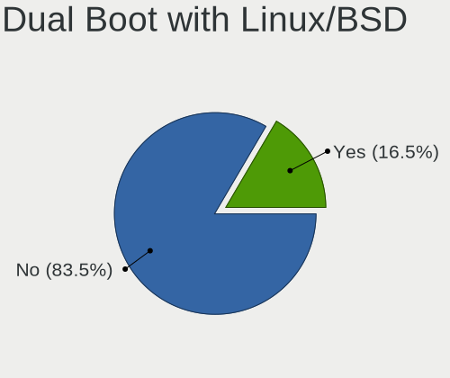
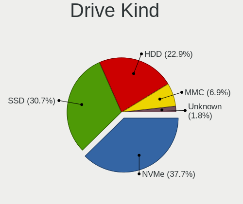

Debian - Hardware Trends
------------------------

A project to identify most popular hardware characteristics and track their change
over time based on data collected by Linux users at https://Linux-Hardware.org.

Anyone can contribute to this report by the [hw-probe](https://github.com/linuxhw/hw-probe) tool:

    sudo -E hw-probe -all -upload

This is a report for all computer types. See also reports for [desktops](/Dist/Debian/Desktop/README.md) and [notebooks](/Dist/Debian/Notebook/README.md).

This report is for one last month. Overall report since the beginning of time: [TestDays](https://github.com/linuxhw/TestDays)

Period: Jul, 2023.

Contents
--------

* [ System ](#system)
  - [ OS                       ](#os)
  - [ OS Family                ](#os-family)
  - [ Kernel                   ](#kernel)
  - [ Kernel Family            ](#kernel-family)
  - [ Kernel Major Ver.        ](#kernel-major-ver)
  - [ Arch                     ](#arch)
  - [ DE                       ](#de)
  - [ Display Server           ](#display-server)
  - [ Display Manager          ](#display-manager)
  - [ OS Lang                  ](#os-lang)
  - [ Boot Mode                ](#boot-mode)
  - [ Filesystem               ](#filesystem)
  - [ Part. scheme             ](#part-scheme)
  - [ Dual Boot with Linux/BSD ](#dual-boot-with-linuxbsd)
  - [ Dual Boot (Win)          ](#dual-boot-win)

* [ Board ](#board)
  - [ Vendor                   ](#vendor)
  - [ Model                    ](#model)
  - [ Model Family             ](#model-family)
  - [ MFG Year                 ](#mfg-year)
  - [ Form Factor              ](#form-factor)
  - [ Secure Boot              ](#secure-boot)
  - [ Coreboot                 ](#coreboot)
  - [ RAM Size                 ](#ram-size)
  - [ RAM Used                 ](#ram-used)
  - [ Total Drives             ](#total-drives)
  - [ Has CD-ROM               ](#has-cd-rom)
  - [ Has Ethernet             ](#has-ethernet)
  - [ Has WiFi                 ](#has-wifi)
  - [ Has Bluetooth            ](#has-bluetooth)

* [ Location ](#location)
  - [ Country                  ](#country)
  - [ City                     ](#city)

* [ Drives ](#drives)
  - [ Drive Vendor             ](#drive-vendor)
  - [ Drive Model              ](#drive-model)
  - [ HDD Vendor               ](#hdd-vendor)
  - [ SSD Vendor               ](#ssd-vendor)
  - [ Drive Kind               ](#drive-kind)
  - [ Drive Connector          ](#drive-connector)
  - [ Drive Size               ](#drive-size)
  - [ Space Total              ](#space-total)
  - [ Space Used               ](#space-used)
  - [ Malfunc. Drives          ](#malfunc-drives)
  - [ Malfunc. Drive Vendor    ](#malfunc-drive-vendor)
  - [ Malfunc. HDD Vendor      ](#malfunc-hdd-vendor)
  - [ Malfunc. Drive Kind      ](#malfunc-drive-kind)
  - [ Failed Drives            ](#failed-drives)
  - [ Failed Drive Vendor      ](#failed-drive-vendor)
  - [ Drive Status             ](#drive-status)

* [ Storage controller ](#storage-controller)
  - [ Storage Vendor           ](#storage-vendor)
  - [ Storage Model            ](#storage-model)
  - [ Storage Kind             ](#storage-kind)

* [ Processor ](#processor)
  - [ CPU Vendor               ](#cpu-vendor)
  - [ CPU Model                ](#cpu-model)
  - [ CPU Model Family         ](#cpu-model-family)
  - [ CPU Cores                ](#cpu-cores)
  - [ CPU Sockets              ](#cpu-sockets)
  - [ CPU Threads              ](#cpu-threads)
  - [ CPU Op-Modes             ](#cpu-op-modes)
  - [ CPU Microcode            ](#cpu-microcode)
  - [ CPU Microarch            ](#cpu-microarch)

* [ Graphics ](#graphics)
  - [ GPU Vendor               ](#gpu-vendor)
  - [ GPU Model                ](#gpu-model)
  - [ GPU Combo                ](#gpu-combo)
  - [ GPU Driver               ](#gpu-driver)
  - [ GPU Memory               ](#gpu-memory)

* [ Monitor ](#monitor)
  - [ Monitor Vendor           ](#monitor-vendor)
  - [ Monitor Model            ](#monitor-model)
  - [ Monitor Resolution       ](#monitor-resolution)
  - [ Monitor Diagonal         ](#monitor-diagonal)
  - [ Monitor Width            ](#monitor-width)
  - [ Aspect Ratio             ](#aspect-ratio)
  - [ Monitor Area             ](#monitor-area)
  - [ Pixel Density            ](#pixel-density)
  - [ Multiple Monitors        ](#multiple-monitors)

* [ Network ](#network)
  - [ Net Controller Vendor    ](#net-controller-vendor)
  - [ Net Controller Model     ](#net-controller-model)
  - [ Wireless Vendor          ](#wireless-vendor)
  - [ Wireless Model           ](#wireless-model)
  - [ Ethernet Vendor          ](#ethernet-vendor)
  - [ Ethernet Model           ](#ethernet-model)
  - [ Net Controller Kind      ](#net-controller-kind)
  - [ Used Controller          ](#used-controller)
  - [ NICs                     ](#nics)
  - [ IPv6                     ](#ipv6)

* [ Bluetooth ](#bluetooth)
  - [ Bluetooth Vendor         ](#bluetooth-vendor)
  - [ Bluetooth Model          ](#bluetooth-model)

* [ Sound ](#sound)
  - [ Sound Vendor             ](#sound-vendor)
  - [ Sound Model              ](#sound-model)

* [ Memory ](#memory)
  - [ Memory Vendor            ](#memory-vendor)
  - [ Memory Model             ](#memory-model)
  - [ Memory Kind              ](#memory-kind)
  - [ Memory Form Factor       ](#memory-form-factor)
  - [ Memory Size              ](#memory-size)
  - [ Memory Speed             ](#memory-speed)

* [ Printers & scanners ](#printers--scanners)
  - [ Printer Vendor           ](#printer-vendor)
  - [ Printer Model            ](#printer-model)
  - [ Scanner Vendor           ](#scanner-vendor)
  - [ Scanner Model            ](#scanner-model)

* [ Camera ](#camera)
  - [ Camera Vendor            ](#camera-vendor)
  - [ Camera Model             ](#camera-model)

* [ Security ](#security)
  - [ Fingerprint Vendor       ](#fingerprint-vendor)
  - [ Fingerprint Model        ](#fingerprint-model)
  - [ Chipcard Vendor          ](#chipcard-vendor)
  - [ Chipcard Model           ](#chipcard-model)

* [ Unsupported ](#unsupported)
  - [ Unsupported Devices      ](#unsupported-devices)
  - [ Unsupported Device Types ](#unsupported-device-types)

System
------

OS
--

Installed operating systems

| Name      | Computers | Percent |
|-----------|-----------|---------|
| Debian 12 | 307       | 64.63%  |
| Debian 11 | 115       | 24.21%  |
| Debian    | 50        | 10.53%  |
| Debian 10 | 2         | 0.42%   |
| Debian 22 | 1         | 0.21%   |

OS Family
---------

OS without a version

| Name   | Computers | Percent |
|--------|-----------|---------|
| Debian | 475       | 100%    |

Kernel
------

Version of the Linux kernel

| Version                         | Computers | Percent |
|---------------------------------|-----------|---------|
| 6.1.0-10-amd64                  | 151       | 31.79%  |
| 6.1.0-9-amd64                   | 71        | 14.95%  |
| 5.10.0-23-amd64                 | 54        | 11.37%  |
| 6.1.0-4-amd64                   | 42        | 8.84%   |
| 6.3.0-1-amd64                   | 27        | 5.68%   |
| 6.3.0-2-amd64                   | 9         | 1.89%   |
| 6.4.0-1-amd64                   | 7         | 1.47%   |
| 5.10.0-22-amd64                 | 7         | 1.47%   |
| 6.2.16-3-pve                    | 6         | 1.26%   |
| 6.1.0-0.deb11.7-amd64           | 5         | 1.05%   |
| 6.4.3-1-liquorix-amd64          | 4         | 0.84%   |
| 6.1.21-v8+                      | 4         | 0.84%   |
| 6.1.0-10-686-pae                | 4         | 0.84%   |
| 6.0.0-6mx-amd64                 | 4         | 0.84%   |
| 5.15.108-1-pve                  | 4         | 0.84%   |
| 5.15.107-2-pve                  | 4         | 0.84%   |
| 5.10.0-21-amd64                 | 4         | 0.84%   |
| 6.2.16-4-pve                    | 3         | 0.63%   |
| 5.15.102-1-pve                  | 3         | 0.63%   |
| 6.4.7-1-liquorix-amd64          | 2         | 0.42%   |
| 6.2.6-1-pve                     | 2         | 0.42%   |
| 6.1.0-1-amd64                   | 2         | 0.42%   |
| 5.16.0-0.bpo.4-amd64            | 2         | 0.42%   |
| 5.15.107+truenas                | 2         | 0.42%   |
| 5.10.181-loc-os                 | 2         | 0.42%   |
| 5.10.0-23-686                   | 2         | 0.42%   |
| 5.10.0-20-amd64                 | 2         | 0.42%   |
| 5.10.0-13-amd64                 | 2         | 0.42%   |
| 6.4.7-wrkd                      | 1         | 0.21%   |
| 6.4.3-x64v2-xanmod1             | 1         | 0.21%   |
| 6.4.2-surface                   | 1         | 0.21%   |
| 6.4.2-rk322x                    | 1         | 0.21%   |
| 6.4.2-edwardron-amd64           | 1         | 0.21%   |
| 6.4.2-1-liquorix-amd64          | 1         | 0.21%   |
| 6.4.0-asahi-00515-g35564c906fa6 | 1         | 0.21%   |
| 6.4.0-1-arm64                   | 1         | 0.21%   |
| 6.4.0-01280-g7116cae43716       | 1         | 0.21%   |
| 6.4.0-0-amd64                   | 1         | 0.21%   |
| 6.4.0                           | 1         | 0.21%   |
| 6.3.9-i7                        | 1         | 0.21%   |

Kernel Family
-------------

Linux kernel without a distro release

| Version  | Computers | Percent |
|----------|-----------|---------|
| 6.1.0    | 278       | 58.53%  |
| 5.10.0   | 78        | 16.42%  |
| 6.3.0    | 37        | 7.79%   |
| 6.4.0    | 12        | 2.53%   |
| 6.2.16   | 9         | 1.89%   |
| 5.15.107 | 6         | 1.26%   |
| 6.4.3    | 5         | 1.05%   |
| 6.4.2    | 4         | 0.84%   |
| 6.1.21   | 4         | 0.84%   |
| 6.0.0    | 4         | 0.84%   |
| 5.15.108 | 4         | 0.84%   |
| 6.4.7    | 3         | 0.63%   |
| 6.1.11   | 3         | 0.63%   |
| 5.15.102 | 3         | 0.63%   |
| 6.3.9    | 2         | 0.42%   |
| 6.2.6    | 2         | 0.42%   |
| 5.16.0   | 2         | 0.42%   |
| 5.10.181 | 2         | 0.42%   |
| 4.19.0   | 2         | 0.42%   |
| 6.3.7    | 1         | 0.21%   |
| 6.3.10   | 1         | 0.21%   |
| 6.1.38   | 1         | 0.21%   |
| 6.1.24   | 1         | 0.21%   |
| 6.1.15   | 1         | 0.21%   |
| 6.1.12   | 1         | 0.21%   |
| 6.1      | 1         | 0.21%   |
| 5.4.147  | 1         | 0.21%   |
| 5.19.0   | 1         | 0.21%   |
| 5.16.17  | 1         | 0.21%   |
| 5.15.84  | 1         | 0.21%   |
| 5.15.83  | 1         | 0.21%   |
| 5.14.0   | 1         | 0.21%   |
| 5.10.142 | 1         | 0.21%   |
| 5.10.110 | 1         | 0.21%   |

Kernel Major Ver.
-----------------

Linux kernel major version

| Version | Computers | Percent |
|---------|-----------|---------|
| 6.1     | 289       | 60.84%  |
| 5.10    | 82        | 17.26%  |
| 6.3     | 41        | 8.63%   |
| 6.4     | 24        | 5.05%   |
| 5.15    | 15        | 3.16%   |
| 6.2     | 11        | 2.32%   |
| 6.0     | 4         | 0.84%   |
| 5.16    | 3         | 0.63%   |
| 4.19    | 2         | 0.42%   |
| 6       | 1         | 0.21%   |
| 5.4     | 1         | 0.21%   |
| 5.19    | 1         | 0.21%   |
| 5.14    | 1         | 0.21%   |

Arch
----

OS architecture (x86_64, i586, etc.)

| Name        | Computers | Percent |
|-------------|-----------|---------|
| x86_64      | 449       | 94.53%  |
| aarch64     | 15        | 3.16%   |
| i686        | 7         | 1.47%   |
| armv7l      | 3         | 0.63%   |
| loongarch64 | 1         | 0.21%   |

DE
--

Desktop Environment

| Name             | Computers | Percent |
|------------------|-----------|---------|
| GNOME            | 144       | 30.32%  |
| Unknown          | 108       | 22.74%  |
| KDE5             | 80        | 16.84%  |
| XFCE             | 52        | 10.95%  |
| X-Cinnamon       | 25        | 5.26%   |
| MATE             | 22        | 4.63%   |
| LXDE             | 11        | 2.32%   |
| LXQt             | 10        | 2.11%   |
| Cinnamon         | 9         | 1.89%   |
| lightdm-xsession | 2         | 0.42%   |
| i3               | 2         | 0.42%   |
| dwm              | 2         | 0.42%   |
| Trinity          | 1         | 0.21%   |
| Phosh:GNOME      | 1         | 0.21%   |
| KDE              | 1         | 0.21%   |
| GNOME Flashback  | 1         | 0.21%   |
| GNOME Classic    | 1         | 0.21%   |
| Cutefish         | 1         | 0.21%   |
| Budgie           | 1         | 0.21%   |
| bspwm            | 1         | 0.21%   |

Display Server
--------------

X11 or Wayland

| Name    | Computers | Percent |
|---------|-----------|---------|
| X11     | 224       | 47.16%  |
| Wayland | 138       | 29.05%  |
| Unknown | 72        | 15.16%  |
| Tty     | 41        | 8.63%   |

Display Manager
---------------

SDDM, LightDM, etc.

| Name    | Computers | Percent |
|---------|-----------|---------|
| Unknown | 214       | 45.05%  |
| LightDM | 107       | 22.53%  |
| GDM3    | 72        | 15.16%  |
| SDDM    | 68        | 14.32%  |
| GDM     | 12        | 2.53%   |
| WDM     | 1         | 0.21%   |
| LXDM    | 1         | 0.21%   |

OS Lang
-------

Language

| Lang    | Computers | Percent |
|---------|-----------|---------|
| en_US   | 180       | 37.89%  |
| ru_RU   | 63        | 13.26%  |
| en_GB   | 44        | 9.26%   |
| de_DE   | 32        | 6.74%   |
| fr_FR   | 26        | 5.47%   |
| pt_BR   | 18        | 3.79%   |
| Unknown | 13        | 2.74%   |
| en_CA   | 12        | 2.53%   |
| C       | 9         | 1.89%   |
| en_IN   | 7         | 1.47%   |
| es_MX   | 6         | 1.26%   |
| es_ES   | 6         | 1.26%   |
| it_IT   | 5         | 1.05%   |
| hu_HU   | 5         | 1.05%   |
| zh_CN   | 4         | 0.84%   |
| pl_PL   | 4         | 0.84%   |
| es_AR   | 4         | 0.84%   |
| en_AU   | 4         | 0.84%   |
| es_VE   | 3         | 0.63%   |
| en_ZA   | 3         | 0.63%   |
| en_DK   | 3         | 0.63%   |
| de_CH   | 3         | 0.63%   |
| fr_CH   | 2         | 0.42%   |
| fi_FI   | 2         | 0.42%   |
| es_CL   | 2         | 0.42%   |
| en_NZ   | 2         | 0.42%   |
| sv_SE   | 1         | 0.21%   |
| sr_RS   | 1         | 0.21%   |
| nn_NO   | 1         | 0.21%   |
| nb_NO   | 1         | 0.21%   |
| ko_KR   | 1         | 0.21%   |
| ja_JP   | 1         | 0.21%   |
| es_SV   | 1         | 0.21%   |
| es_CU   | 1         | 0.21%   |
| es_CO   | 1         | 0.21%   |
| en_IL   | 1         | 0.21%   |
| en_IE   | 1         | 0.21%   |
| en_HK   | 1         | 0.21%   |
| bg_BG   | 1         | 0.21%   |

Boot Mode
---------

EFI or BIOS

| Mode | Computers | Percent |
|------|-----------|---------|
| EFI  | 239       | 50.32%  |
| BIOS | 236       | 49.68%  |

Filesystem
----------

Type of filesystem

| Type    | Computers | Percent |
|---------|-----------|---------|
| Ext4    | 362       | 76.21%  |
| Overlay | 66        | 13.89%  |
| Btrfs   | 29        | 6.11%   |
| Xfs     | 7         | 1.47%   |
| Zfs     | 5         | 1.05%   |
| Tmpfs   | 5         | 1.05%   |
| Unknown | 1         | 0.21%   |

Part. scheme
------------

Scheme of partitioning

| Type    | Computers | Percent |
|---------|-----------|---------|
| GPT     | 255       | 53.68%  |
| MBR     | 113       | 23.79%  |
| Unknown | 107       | 22.53%  |

Dual Boot with Linux/BSD
------------------------

Hosting more than one Linux/BSD

| Dual boot | Computers | Percent |
|-----------|-----------|---------|
| No        | 412       | 86.74%  |
| Yes       | 63        | 13.26%  |

Dual Boot (Win)
---------------

Hosting Linux and Windows

| Dual boot | Computers | Percent |
|-----------|-----------|---------|
| No        | 344       | 72.42%  |
| Yes       | 131       | 27.58%  |

Board
-----

Vendor
------

Motherboard manufacturer

| Name                                 | Computers | Percent |
|--------------------------------------|-----------|---------|
| Lenovo                               | 70        | 14.74%  |
| Dell                                 | 68        | 14.32%  |
| ASUSTek Computer                     | 52        | 10.95%  |
| Hewlett-Packard                      | 47        | 9.89%   |
| ASRock                               | 31        | 6.53%   |
| MSI                                  | 29        | 6.11%   |
| Gigabyte Technology                  | 29        | 6.11%   |
| Acer                                 | 22        | 4.63%   |
| Unknown                              | 17        | 3.58%   |
| Apple                                | 14        | 2.95%   |
| Intel                                | 10        | 2.11%   |
| Google                               | 10        | 2.11%   |
| Fujitsu                              | 8         | 1.68%   |
| Raspberry Pi Foundation              | 7         | 1.47%   |
| Supermicro                           | 4         | 0.84%   |
| HUAWEI                               | 4         | 0.84%   |
| AZW                                  | 4         | 0.84%   |
| Toshiba                              | 3         | 0.63%   |
| ASRockRack                           | 3         | 0.63%   |
| Samsung Electronics                  | 2         | 0.42%   |
| NEC Computers                        | 2         | 0.42%   |
| IceWhale Technology                  | 2         | 0.42%   |
| HONOR                                | 2         | 0.42%   |
| Foxconn                              | 2         | 0.42%   |
| Biostar                              | 2         | 0.42%   |
| Valve                                | 1         | 0.21%   |
| VALE                                 | 1         | 0.21%   |
| Timi                                 | 1         | 0.21%   |
| Sony                                 | 1         | 0.21%   |
| SLIMBOOK                             | 1         | 0.21%   |
| SIRAGON                              | 1         | 0.21%   |
| Shenzhen Meigao Electronic Equipment | 1         | 0.21%   |
| Shanghai Zhaoxin Semiconductor       | 1         | 0.21%   |
| SANTECH                              | 1         | 0.21%   |
| Radxa                                | 1         | 0.21%   |
| Positivo                             | 1         | 0.21%   |
| Phoenix Contact                      | 1         | 0.21%   |
| Packard Bell                         | 1         | 0.21%   |
| Notebook                             | 1         | 0.21%   |
| NetGear                              | 1         | 0.21%   |

Model
-----

Motherboard model

| Name                                       | Computers | Percent |
|--------------------------------------------|-----------|---------|
| ASRock H470M-HVS                           | 20        | 4.21%   |
| Unknown                                    | 17        | 3.58%   |
| ASUS All Series                            | 9         | 1.89%   |
| Gigabyte A320M-S2H V2                      | 7         | 1.47%   |
| Lenovo ThinkPad L13 Yoga Gen 2 20VK0019US  | 6         | 1.26%   |
| MSI MS-7996                                | 3         | 0.63%   |
| Dell Inspiron 15 3511                      | 3         | 0.63%   |
| Supermicro X8ST3                           | 2         | 0.42%   |
| RPi Raspberry Pi 4 Model B Rev 1.5         | 2         | 0.42%   |
| RPi Raspberry Pi 3 Model B Rev 1.2         | 2         | 0.42%   |
| Lenovo ThinkPad T400 2768WGB               | 2         | 0.42%   |
| Lenovo IdeaPadFlex 5 16ABR8 82XY           | 2         | 0.42%   |
| HP ProBook 640 G2                          | 2         | 0.42%   |
| Google Lillipup                            | 2         | 0.42%   |
| Dell XPS 8700                              | 2         | 0.42%   |
| Dell OptiPlex 9020                         | 2         | 0.42%   |
| Dell OptiPlex 7040                         | 2         | 0.42%   |
| Dell Latitude 7480                         | 2         | 0.42%   |
| AZW MINI S                                 | 2         | 0.42%   |
| ASUS Z170-A                                | 2         | 0.42%   |
| ASUS P6X58D PREMIUM                        | 2         | 0.42%   |
| ASRockRack X470D4U                         | 2         | 0.42%   |
| Apple MacBookPro14,3                       | 2         | 0.42%   |
| Apple iMac14,2                             | 2         | 0.42%   |
| Valve Jupiter                              | 1         | 0.21%   |
| VALE Notebook Classic C140                 | 1         | 0.21%   |
| Toshiba Satellite S75-B                    | 1         | 0.21%   |
| Toshiba Satellite L755                     | 1         | 0.21%   |
| Toshiba PORTEGE Z30-C                      | 1         | 0.21%   |
| Timi A7S                                   | 1         | 0.21%   |
| Supermicro X9SRA/X9SRA-3                   | 1         | 0.21%   |
| Supermicro X9DRT                           | 1         | 0.21%   |
| Sony SVS13A1Z9RN                           | 1         | 0.21%   |
| SLIMBOOK PROX15-AMD                        | 1         | 0.21%   |
| SIRAGON LM-C100                            | 1         | 0.21%   |
| Shenzhen Meigao Electronic Equipment UM560 | 1         | 0.21%   |
| Shanghai Zhaoxin ZXE CRB                   | 1         | 0.21%   |
| SANTECH NHx0DB,DE                          | 1         | 0.21%   |
| Samsung 770Z5E/780Z5E                      | 1         | 0.21%   |
| Samsung 305E4Z/305E5Z/305E7Z               | 1         | 0.21%   |

Model Family
------------

Motherboard model prefix

| Name                | Computers | Percent |
|---------------------|-----------|---------|
| Lenovo ThinkPad     | 39        | 8.21%   |
| ASRock H470M-HVS    | 20        | 4.21%   |
| Dell Latitude       | 17        | 3.58%   |
| Unknown             | 17        | 3.58%   |
| Acer Aspire         | 16        | 3.37%   |
| Dell OptiPlex       | 12        | 2.53%   |
| Dell Inspiron       | 12        | 2.53%   |
| HP EliteBook        | 10        | 2.11%   |
| Lenovo IdeaPad      | 9         | 1.89%   |
| ASUS All            | 9         | 1.89%   |
| HP Pavilion         | 8         | 1.68%   |
| Dell XPS            | 8         | 1.68%   |
| ASUS VivoBook       | 8         | 1.68%   |
| RPi Raspberry       | 7         | 1.47%   |
| Gigabyte A320M-S2H  | 7         | 1.47%   |
| Lenovo Yoga         | 6         | 1.26%   |
| Dell PowerEdge      | 6         | 1.26%   |
| ASUS PRIME          | 6         | 1.26%   |
| Lenovo ThinkCentre  | 5         | 1.05%   |
| HP ProBook          | 5         | 1.05%   |
| HP Laptop           | 5         | 1.05%   |
| Dell Vostro         | 5         | 1.05%   |
| Dell Precision      | 5         | 1.05%   |
| Fujitsu LIFEBOOK    | 4         | 0.84%   |
| MSI MS-7996         | 3         | 0.63%   |
| Gigabyte X570       | 3         | 0.63%   |
| Fujitsu ESPRIMO     | 3         | 0.63%   |
| ASUS TUF            | 3         | 0.63%   |
| ASUS ROG            | 3         | 0.63%   |
| Toshiba Satellite   | 2         | 0.42%   |
| Supermicro X8ST3    | 2         | 0.42%   |
| MSI Alpha           | 2         | 0.42%   |
| Lenovo ThinkStation | 2         | 0.42%   |
| Lenovo IdeaPadFlex  | 2         | 0.42%   |
| IceWhale ZimaBoard  | 2         | 0.42%   |
| HP Victus           | 2         | 0.42%   |
| HP ProLiant         | 2         | 0.42%   |
| HP ENVY             | 2         | 0.42%   |
| Google Lillipup     | 2         | 0.42%   |
| Gigabyte B550M      | 2         | 0.42%   |

MFG Year
--------

Motherboard manufacture year

| Year    | Computers | Percent |
|---------|-----------|---------|
| 2021    | 80        | 16.84%  |
| 2022    | 53        | 11.16%  |
| 2020    | 39        | 8.21%   |
| 2018    | 33        | 6.95%   |
| 2013    | 31        | 6.53%   |
| 2019    | 26        | 5.47%   |
| 2011    | 26        | 5.47%   |
| 2017    | 22        | 4.63%   |
| 2012    | 22        | 4.63%   |
| 2023    | 21        | 4.42%   |
| 2016    | 20        | 4.21%   |
| Unknown | 19        | 4%      |
| 2015    | 18        | 3.79%   |
| 2014    | 17        | 3.58%   |
| 2010    | 15        | 3.16%   |
| 2009    | 13        | 2.74%   |
| 2008    | 11        | 2.32%   |
| 2007    | 3         | 0.63%   |
| 2005    | 2         | 0.42%   |
| 2004    | 2         | 0.42%   |
| 2006    | 1         | 0.21%   |
| 2002    | 1         | 0.21%   |

Form Factor
-----------

Physical design of the computer

| Name           | Computers | Percent |
|----------------|-----------|---------|
| Notebook       | 223       | 46.95%  |
| Desktop        | 193       | 40.63%  |
| Convertible    | 15        | 3.16%   |
| System on chip | 13        | 2.74%   |
| Mini pc        | 10        | 2.11%   |
| Server         | 10        | 2.11%   |
| All in one     | 5         | 1.05%   |
| Tablet         | 4         | 0.84%   |
| Other          | 2         | 0.42%   |

Secure Boot
-----------

Enabled or disabled

| State    | Computers | Percent |
|----------|-----------|---------|
| Disabled | 441       | 92.84%  |
| Enabled  | 34        | 7.16%   |

Coreboot
--------

Have coreboot on board

| Used | Computers | Percent |
|------|-----------|---------|
| No   | 467       | 98.32%  |
| Yes  | 8         | 1.68%   |

RAM Size
--------

Total RAM memory

| Size in GB      | Computers | Percent |
|-----------------|-----------|---------|
| 4.01-8.0        | 113       | 23.79%  |
| 8.01-16.0       | 95        | 20%     |
| 16.01-24.0      | 89        | 18.74%  |
| 32.01-64.0      | 69        | 14.53%  |
| 3.01-4.0        | 44        | 9.26%   |
| 64.01-256.0     | 27        | 5.68%   |
| 24.01-32.0      | 11        | 2.32%   |
| 1.01-2.0        | 10        | 2.11%   |
| 0.51-1.0        | 8         | 1.68%   |
| 2.01-3.0        | 5         | 1.05%   |
| More than 256.0 | 3         | 0.63%   |
| 0.01-0.5        | 1         | 0.21%   |

RAM Used
--------

Used RAM memory

| Used GB         | Computers | Percent |
|-----------------|-----------|---------|
| 1.01-2.0        | 121       | 25.47%  |
| 2.01-3.0        | 94        | 19.79%  |
| 4.01-8.0        | 93        | 19.58%  |
| 3.01-4.0        | 58        | 12.21%  |
| 0.51-1.0        | 48        | 10.11%  |
| 8.01-16.0       | 29        | 6.11%   |
| 0.01-0.5        | 17        | 3.58%   |
| 24.01-32.0      | 5         | 1.05%   |
| 16.01-24.0      | 4         | 0.84%   |
| 32.01-64.0      | 3         | 0.63%   |
| 64.01-256.0     | 2         | 0.42%   |
| More than 256.0 | 1         | 0.21%   |

Total Drives
------------

Number of drives on board

| Drives | Computers | Percent |
|--------|-----------|---------|
| 1      | 274       | 57.68%  |
| 2      | 123       | 25.89%  |
| 3      | 31        | 6.53%   |
| 4      | 17        | 3.58%   |
| 6      | 10        | 2.11%   |
| 5      | 5         | 1.05%   |
| 0      | 5         | 1.05%   |
| 7      | 4         | 0.84%   |
| 12     | 2         | 0.42%   |
| 27     | 1         | 0.21%   |
| 19     | 1         | 0.21%   |
| 11     | 1         | 0.21%   |
| 10     | 1         | 0.21%   |

Has CD-ROM
----------

Has CD-ROM on board

| Presented | Computers | Percent |
|-----------|-----------|---------|
| No        | 368       | 77.47%  |
| Yes       | 107       | 22.53%  |

Has Ethernet
------------

Has Ethernet on board

| Presented | Computers | Percent |
|-----------|-----------|---------|
| Yes       | 399       | 84%     |
| No        | 76        | 16%     |

Has WiFi
--------

Has WiFi module

| Presented | Computers | Percent |
|-----------|-----------|---------|
| Yes       | 326       | 68.63%  |
| No        | 149       | 31.37%  |

Has Bluetooth
-------------

Has Bluetooth module

| Presented | Computers | Percent |
|-----------|-----------|---------|
| Yes       | 269       | 56.63%  |
| No        | 206       | 43.37%  |

Location
--------

Country
-------

Geographic location (country)

| Country      | Computers | Percent |
|--------------|-----------|---------|
| USA          | 82        | 17.26%  |
| Russia       | 73        | 15.37%  |
| Germany      | 43        | 9.05%   |
| France       | 30        | 6.32%   |
| Brazil       | 25        | 5.26%   |
| Canada       | 18        | 3.79%   |
| UK           | 17        | 3.58%   |
| Italy        | 16        | 3.37%   |
| Turkey       | 11        | 2.32%   |
| Spain        | 9         | 1.89%   |
| India        | 9         | 1.89%   |
| Poland       | 8         | 1.68%   |
| Switzerland  | 7         | 1.47%   |
| Netherlands  | 7         | 1.47%   |
| Mexico       | 7         | 1.47%   |
| China        | 7         | 1.47%   |
| Sweden       | 6         | 1.26%   |
| Hungary      | 6         | 1.26%   |
| Australia    | 6         | 1.26%   |
| Venezuela    | 5         | 1.05%   |
| Indonesia    | 5         | 1.05%   |
| Finland      | 5         | 1.05%   |
| Argentina    | 5         | 1.05%   |
| Romania      | 4         | 0.84%   |
| Greece       | 4         | 0.84%   |
| South Africa | 3         | 0.63%   |
| Norway       | 3         | 0.63%   |
| New Zealand  | 3         | 0.63%   |
| Malaysia     | 3         | 0.63%   |
| Lithuania    | 3         | 0.63%   |
| Austria      | 3         | 0.63%   |
| UAE          | 2         | 0.42%   |
| Thailand     | 2         | 0.42%   |
| Taiwan       | 2         | 0.42%   |
| Ireland      | 2         | 0.42%   |
| Hong Kong    | 2         | 0.42%   |
| Denmark      | 2         | 0.42%   |
| Czechia      | 2         | 0.42%   |
| Cuba         | 2         | 0.42%   |
| Colombia     | 2         | 0.42%   |

City
----

Geographic location (city)

| City               | Computers | Percent |
|--------------------|-----------|---------|
| Voronezh           | 42        | 8.84%   |
| Moscow             | 13        | 2.74%   |
| Bangor             | 10        | 2.11%   |
| Berlin             | 6         | 1.26%   |
| Ankara             | 5         | 1.05%   |
| Paris              | 4         | 0.84%   |
| Sydney             | 3         | 0.63%   |
| Stockholm          | 3         | 0.63%   |
| St Petersburg      | 3         | 0.63%   |
| Sao Paulo          | 3         | 0.63%   |
| Manchester         | 3         | 0.63%   |
| London             | 3         | 0.63%   |
| Istanbul           | 3         | 0.63%   |
| Brive-la-Gaillarde | 3         | 0.63%   |
| Brasília          | 3         | 0.63%   |
| Bonn               | 3         | 0.63%   |
| Athens             | 3         | 0.63%   |
| Zurich             | 2         | 0.42%   |
| Zollikofen         | 2         | 0.42%   |
| Wroclaw            | 2         | 0.42%   |
| Vilnius            | 2         | 0.42%   |
| Vila Velha         | 2         | 0.42%   |
| Vienna             | 2         | 0.42%   |
| Vancouver          | 2         | 0.42%   |
| Ufa                | 2         | 0.42%   |
| Toronto            | 2         | 0.42%   |
| Tatabánya         | 2         | 0.42%   |
| Strasbourg         | 2         | 0.42%   |
| Springfield        | 2         | 0.42%   |
| Shenzhen           | 2         | 0.42%   |
| Samara             | 2         | 0.42%   |
| Rio de Janeiro     | 2         | 0.42%   |
| Ottawa             | 2         | 0.42%   |
| Mogilev            | 2         | 0.42%   |
| Milano             | 2         | 0.42%   |
| Madrid             | 2         | 0.42%   |
| Los Angeles        | 2         | 0.42%   |
| Lonato             | 2         | 0.42%   |
| LaSalle            | 2         | 0.42%   |
| Kuala Lumpur       | 2         | 0.42%   |

Drives
------

Drive Vendor
------------

Hard drive vendors

| Vendor                      | Computers | Drives | Percent |
|-----------------------------|-----------|--------|---------|
| Samsung Electronics         | 109       | 137    | 15.68%  |
| WDC                         | 88        | 183    | 12.66%  |
| Seagate                     | 69        | 96     | 9.93%   |
| Unknown                     | 40        | 49     | 5.76%   |
| SanDisk                     | 39        | 41     | 5.61%   |
| Kingston                    | 37        | 38     | 5.32%   |
| Toshiba                     | 35        | 42     | 5.04%   |
| Crucial                     | 32        | 34     | 4.6%    |
| SK hynix                    | 25        | 25     | 3.6%    |
| Netac                       | 22        | 22     | 3.17%   |
| Intel                       | 17        | 25     | 2.45%   |
| Micron Technology           | 14        | 14     | 2.01%   |
| HGST                        | 11        | 15     | 1.58%   |
| SPCC                        | 10        | 10     | 1.44%   |
| Hitachi                     | 9         | 10     | 1.29%   |
| China                       | 9         | 9      | 1.29%   |
| Kingston Technology Company | 8         | 11     | 1.15%   |
| Apple                       | 7         | 12     | 1.01%   |
| A-DATA Technology           | 7         | 7      | 1.01%   |
| Unknown                     | 7         | 7      | 1.01%   |
| PNY                         | 6         | 7      | 0.86%   |
| KIOXIA                      | 6         | 6      | 0.86%   |
| Phison Electronics          | 5         | 7      | 0.72%   |
| Transcend                   | 4         | 4      | 0.58%   |
| JMicron Technology          | 4         | 4      | 0.58%   |
| Team                        | 3         | 3      | 0.43%   |
| Silicon Motion              | 3         | 3      | 0.43%   |
| Phison                      | 3         | 3      | 0.43%   |
| Patriot                     | 3         | 3      | 0.43%   |
| Micron/Crucial Technology   | 3         | 3      | 0.43%   |
| Maxtor                      | 3         | 3      | 0.43%   |
| Hewlett-Packard             | 3         | 4      | 0.43%   |
| Corsair                     | 3         | 3      | 0.43%   |
| ZHITAI                      | 2         | 2      | 0.29%   |
| SSSTC                       | 2         | 2      | 0.29%   |
| LITEONIT                    | 2         | 2      | 0.29%   |
| LITEON                      | 2         | 2      | 0.29%   |
| KIOXIA-EXCERIA              | 2         | 2      | 0.29%   |
| Intenso                     | 2         | 2      | 0.29%   |
| Gigabyte Technology         | 2         | 2      | 0.29%   |

Drive Model
-----------

Hard drive models

| Model                                               | Computers | Percent |
|-----------------------------------------------------|-----------|---------|
| Netac SSD 240GB                                     | 19        | 2.37%   |
| Toshiba HDWD110 1TB                                 | 12        | 1.49%   |
| Crucial CT240BX500SSD1 240GB                        | 11        | 1.37%   |
| Samsung NVMe SSD Controller SM981/PM981/PM983 500GB | 8         | 1%      |
| Kingston SA400S37480G 480GB SSD                     | 8         | 1%      |
| Samsung MZVLB512HBJQ-000L7 512GB                    | 7         | 0.87%   |
| Unknown                                             | 7         | 0.87%   |
| SanDisk NVMe SSD Drive 1TB                          | 6         | 0.75%   |
| Samsung SSD 870 EVO 500GB                           | 6         | 0.75%   |
| Kingston SA400S37240G 240GB SSD                     | 6         | 0.75%   |
| Samsung NVMe SSD Controller PM9A1/PM9A3/980PRO 1TB  | 5         | 0.62%   |
| Crucial CT1000MX500SSD1 1TB                         | 5         | 0.62%   |
| Unknown SD32G  32GB                                 | 4         | 0.5%    |
| Seagate ST500DM002-1BD142 500GB                     | 4         | 0.5%    |
| Seagate ST1000LM035-1RK172 1TB                      | 4         | 0.5%    |
| Seagate ST1000LM024 HN-M101MBB 1TB                  | 4         | 0.5%    |
| Seagate ST1000DM010-2EP102 1TB                      | 4         | 0.5%    |
| Seagate ST1000DM003-1SB102 1TB                      | 4         | 0.5%    |
| Sandisk WD Blue SN550 NVMe SSD 250GB                | 4         | 0.5%    |
| Samsung SSD 980 PRO 2TB                             | 4         | 0.5%    |
| Samsung SSD 860 EVO 250GB                           | 4         | 0.5%    |
| Samsung SSD 860 EVO 1TB                             | 4         | 0.5%    |
| Samsung SSD 850 EVO 250GB                           | 4         | 0.5%    |
| WDC WDS500G2B0A-00SM50 500GB SSD                    | 3         | 0.37%   |
| WDC WDS240G2G0A-00JH30 240GB SSD                    | 3         | 0.37%   |
| WDC WD20EZRZ-00Z5HB0 2TB                            | 3         | 0.37%   |
| WDC WD20EZBX-00AYRA0 2TB                            | 3         | 0.37%   |
| Unknown SD/MMC/MS PRO 128GB                         | 3         | 0.37%   |
| Unknown SD/MMC 2GB                                  | 3         | 0.37%   |
| Unknown M.S./M.S.Pro/HG 16GB                        | 3         | 0.37%   |
| Seagate ST2000DM008-2FR102 2TB                      | 3         | 0.37%   |
| Samsung SSD 970 EVO Plus 1TB                        | 3         | 0.37%   |
| Samsung SSD 850 EVO 500GB                           | 3         | 0.37%   |
| Samsung NVMe SSD Controller SM961/PM961/SM963 256GB | 3         | 0.37%   |
| Micron/Crucial P2 NVMe PCIe SSD 1TB                 | 3         | 0.37%   |
| Kingston Company SNV2S2000G 2TB                     | 3         | 0.37%   |
| Kingston SV300S37A120G 120GB SSD                    | 3         | 0.37%   |
| Kingston SA400S37960G 960GB SSD                     | 3         | 0.37%   |
| Apple HDD ST1000DM003 1TB                           | 3         | 0.37%   |
| WDC WDS480G2G0C-00AJM0 480GB                        | 2         | 0.25%   |

HDD Vendor
----------

Hard disk drive vendors

| Vendor              | Computers | Drives | Percent |
|---------------------|-----------|--------|---------|
| Seagate             | 68        | 91     | 33.17%  |
| WDC                 | 63        | 151    | 30.73%  |
| Toshiba             | 30        | 37     | 14.63%  |
| HGST                | 11        | 15     | 5.37%   |
| Hitachi             | 9         | 10     | 4.39%   |
| Apple               | 4         | 5      | 1.95%   |
| Unknown             | 3         | 3      | 1.46%   |
| Samsung Electronics | 3         | 3      | 1.46%   |
| Maxtor              | 2         | 2      | 0.98%   |
| JMicron Technology  | 2         | 2      | 0.98%   |
| Hewlett-Packard     | 2         | 3      | 0.98%   |
| Fujitsu             | 2         | 2      | 0.98%   |
| SYMTEC              | 1         | 1      | 0.49%   |
| SSK                 | 1         | 1      | 0.49%   |
| QNAP                | 1         | 1      | 0.49%   |
| Inateck             | 1         | 1      | 0.49%   |
| IBM                 | 1         | 1      | 0.49%   |
| ASMT                | 1         | 1      | 0.49%   |

SSD Vendor
----------

Solid state drive vendors

| Vendor              | Computers | Drives | Percent |
|---------------------|-----------|--------|---------|
| Samsung Electronics | 50        | 63     | 20.66%  |
| Crucial             | 31        | 33     | 12.81%  |
| Kingston            | 27        | 28     | 11.16%  |
| Netac               | 22        | 22     | 9.09%   |
| SanDisk             | 16        | 16     | 6.61%   |
| WDC                 | 15        | 16     | 6.2%    |
| China               | 9         | 9      | 3.72%   |
| SPCC                | 8         | 8      | 3.31%   |
| PNY                 | 6         | 7      | 2.48%   |
| Intel               | 6         | 14     | 2.48%   |
| SK hynix            | 5         | 5      | 2.07%   |
| Micron Technology   | 5         | 5      | 2.07%   |
| Transcend           | 4         | 4      | 1.65%   |
| Team                | 3         | 3      | 1.24%   |
| Apple               | 3         | 3      | 1.24%   |
| A-DATA Technology   | 3         | 3      | 1.24%   |
| Toshiba             | 2         | 2      | 0.83%   |
| LITEONIT            | 2         | 2      | 0.83%   |
| Intenso             | 2         | 2      | 0.83%   |
| Verbatim            | 1         | 1      | 0.41%   |
| V-GeN               | 1         | 1      | 0.41%   |
| Unknown (CF)        | 1         | 1      | 0.41%   |
| Timetec             | 1         | 2      | 0.41%   |
| T-FORCE             | 1         | 1      | 0.41%   |
| Rogueware           | 1         | 1      | 0.41%   |
| Plextor             | 1         | 1      | 0.41%   |
| Patriot             | 1         | 1      | 0.41%   |
| OCZ                 | 1         | 1      | 0.41%   |
| Maxtor              | 1         | 1      | 0.41%   |
| LITEON              | 1         | 1      | 0.41%   |
| Lexar               | 1         | 1      | 0.41%   |
| KIOXIA-EXCERIA      | 1         | 1      | 0.41%   |
| KingSpec            | 1         | 1      | 0.41%   |
| KingDian            | 1         | 1      | 0.41%   |
| Innodisk            | 1         | 1      | 0.41%   |
| Hikvision           | 1         | 1      | 0.41%   |
| Hewlett-Packard     | 1         | 1      | 0.41%   |
| Gigabyte Technology | 1         | 1      | 0.41%   |
| ExeGate             | 1         | 1      | 0.41%   |
| BHT                 | 1         | 1      | 0.41%   |

Drive Kind
----------

HDD or SSD

| Kind    | Computers | Drives | Percent |
|---------|-----------|--------|---------|
| SSD     | 214       | 269    | 34.08%  |
| NVMe    | 197       | 234    | 31.37%  |
| HDD     | 170       | 330    | 27.07%  |
| MMC     | 37        | 41     | 5.89%   |
| Unknown | 10        | 18     | 1.59%   |

Drive Connector
---------------

SATA, SAS, NVMe, etc.

| Type | Computers | Drives | Percent |
|------|-----------|--------|---------|
| SATA | 305       | 578    | 54.46%  |
| NVMe | 195       | 231    | 34.82%  |
| MMC  | 37        | 41     | 6.61%   |
| SAS  | 23        | 42     | 4.11%   |

Drive Size
----------

Size of hard drive

| Size in TB | Computers | Drives | Percent |
|------------|-----------|--------|---------|
| 0.01-0.5   | 215       | 269    | 52.31%  |
| 0.51-1.0   | 120       | 147    | 29.2%   |
| 1.01-2.0   | 31        | 59     | 7.54%   |
| 3.01-4.0   | 17        | 37     | 4.14%   |
| 2.01-3.0   | 13        | 29     | 3.16%   |
| 4.01-10.0  | 11        | 49     | 2.68%   |
| 10.01-20.0 | 4         | 9      | 0.97%   |

Space Total
-----------

Amount of disk space available on the file system

| Size in GB     | Computers | Percent |
|----------------|-----------|---------|
| 101-250        | 112       | 23.58%  |
| 251-500        | 95        | 20%     |
| 501-1000       | 66        | 13.89%  |
| Unknown        | 53        | 11.16%  |
| 51-100         | 33        | 6.95%   |
| 1001-2000      | 31        | 6.53%   |
| More than 3000 | 29        | 6.11%   |
| 21-50          | 23        | 4.84%   |
| 1-20           | 17        | 3.58%   |
| 2001-3000      | 16        | 3.37%   |

Space Used
----------

Amount of used disk space

| Used GB        | Computers | Percent |
|----------------|-----------|---------|
| 1-20           | 171       | 36%     |
| 21-50          | 65        | 13.68%  |
| 101-250        | 58        | 12.21%  |
| Unknown        | 53        | 11.16%  |
| 51-100         | 45        | 9.47%   |
| 251-500        | 31        | 6.53%   |
| 1001-2000      | 18        | 3.79%   |
| 501-1000       | 14        | 2.95%   |
| More than 3000 | 12        | 2.53%   |
| 2001-3000      | 8         | 1.68%   |

Malfunc. Drives
---------------

Drive models with a malfunction

| Model                                 | Computers | Drives | Percent |
|---------------------------------------|-----------|--------|---------|
| WDC WD80EMAZ-00WJTA0 8TB              | 1         | 11     | 1.75%   |
| WDC WD800BB-55JKC0 80GB               | 1         | 1      | 1.75%   |
| WDC WD7500BPKX-80HPJT0 752GB          | 1         | 1      | 1.75%   |
| WDC WD5000LPLX-75ZNTT0 500GB          | 1         | 1      | 1.75%   |
| WDC WD5000AAKX-08U6AA0 500GB          | 1         | 1      | 1.75%   |
| WDC WD40EFRX-68N32N0 4TB              | 1         | 1      | 1.75%   |
| WDC WD400UE-22HCT0 40GB               | 1         | 1      | 1.75%   |
| WDC WD400BB-75CAA0 40GB               | 1         | 1      | 1.75%   |
| WDC WD3200BEVT-00A0RT0 320GB          | 1         | 1      | 1.75%   |
| WDC WD3200AAJS-56M0A0 320GB           | 1         | 1      | 1.75%   |
| WDC WD30PURX-64P6ZY0 3TB              | 1         | 1      | 1.75%   |
| WDC WD2500AAKX-001CA0 250GB           | 1         | 1      | 1.75%   |
| WDC WD10EZEX-00BN5A0 1TB              | 1         | 1      | 1.75%   |
| Toshiba MQ01ABD100 1TB                | 1         | 1      | 1.75%   |
| Toshiba MK2552GSX 250GB               | 1         | 1      | 1.75%   |
| SPCC Solid State Disk 240GB           | 1         | 1      | 1.75%   |
| SK hynix PC711 HFS512GDE9X073N 512GB  | 1         | 1      | 1.75%   |
| SK hynix HFS128G39TND-N210A 128GB SSD | 1         | 1      | 1.75%   |
| Seagate ST9500325AS 500GB             | 1         | 1      | 1.75%   |
| Seagate ST9250315AS 250GB             | 1         | 1      | 1.75%   |
| Seagate ST500LM021-1KJ152 500GB       | 1         | 1      | 1.75%   |
| Seagate ST500DM002-1BD142 500GB       | 1         | 1      | 1.75%   |
| Seagate ST380815AS 80GB               | 1         | 1      | 1.75%   |
| Seagate ST3500418AS 500GB             | 1         | 1      | 1.75%   |
| Seagate ST3160812AS 160GB             | 1         | 1      | 1.75%   |
| Seagate ST31000340NS 1TB              | 1         | 1      | 1.75%   |
| Seagate ST2000DX001-1CM164 2TB        | 1         | 1      | 1.75%   |
| Seagate ST2000DM001-1CH164 2TB        | 1         | 1      | 1.75%   |
| Seagate ST1000LM035-1RK172 1TB        | 1         | 1      | 1.75%   |
| Seagate ST1000DX002-2DV162 1TB        | 1         | 1      | 1.75%   |
| Seagate ST1000DM003-1SB102 1TB        | 1         | 1      | 1.75%   |
| SanDisk SSD PLUS 1000GB               | 1         | 1      | 1.75%   |
| SanDisk SDSSDXPS240G 240GB            | 1         | 1      | 1.75%   |
| SanDisk SDSSDA120G 120GB              | 1         | 1      | 1.75%   |
| Samsung Electronics SSD 970 EVO 1TB   | 1         | 1      | 1.75%   |
| Samsung Electronics SSD 870 EVO 500GB | 1         | 1      | 1.75%   |
| Samsung Electronics HM160HI 160GB     | 1         | 1      | 1.75%   |
| Samsung Electronics HD502HJ 500GB     | 1         | 1      | 1.75%   |
| Maxtor STM3160815AS 160GB             | 1         | 1      | 1.75%   |
| Maxtor STM3160215A 160GB              | 1         | 1      | 1.75%   |

Malfunc. Drive Vendor
---------------------

Vendors of faulty drives

| Vendor              | Computers | Drives | Percent |
|---------------------|-----------|--------|---------|
| WDC                 | 13        | 23     | 23.21%  |
| Seagate             | 12        | 13     | 21.43%  |
| HGST                | 5         | 5      | 8.93%   |
| Samsung Electronics | 4         | 4      | 7.14%   |
| SanDisk             | 3         | 3      | 5.36%   |
| Toshiba             | 2         | 2      | 3.57%   |
| SK hynix            | 2         | 2      | 3.57%   |
| Maxtor              | 2         | 2      | 3.57%   |
| Intel               | 2         | 2      | 3.57%   |
| Hitachi             | 2         | 2      | 3.57%   |
| Crucial             | 2         | 2      | 3.57%   |
| SPCC                | 1         | 1      | 1.79%   |
| Kingston            | 1         | 1      | 1.79%   |
| KingSpec            | 1         | 1      | 1.79%   |
| IBM                 | 1         | 1      | 1.79%   |
| Hewlett-Packard     | 1         | 2      | 1.79%   |
| ExeGate             | 1         | 1      | 1.79%   |
| Apple               | 1         | 2      | 1.79%   |

Malfunc. HDD Vendor
-------------------

Vendors of faulty HDD drives

| Vendor              | Computers | Drives | Percent |
|---------------------|-----------|--------|---------|
| WDC                 | 13        | 23     | 31.71%  |
| Seagate             | 12        | 13     | 29.27%  |
| HGST                | 5         | 5      | 12.2%   |
| Toshiba             | 2         | 2      | 4.88%   |
| Samsung Electronics | 2         | 2      | 4.88%   |
| Maxtor              | 2         | 2      | 4.88%   |
| Hitachi             | 2         | 2      | 4.88%   |
| IBM                 | 1         | 1      | 2.44%   |
| Hewlett-Packard     | 1         | 2      | 2.44%   |
| Apple               | 1         | 2      | 2.44%   |

Malfunc. Drive Kind
-------------------

Kinds of faulty drives

| Kind | Computers | Drives | Percent |
|------|-----------|--------|---------|
| HDD  | 37        | 54     | 71.15%  |
| SSD  | 12        | 12     | 23.08%  |
| NVMe | 3         | 3      | 5.77%   |

Failed Drives
-------------

Failed drive models

| Model                    | Computers | Drives | Percent |
|--------------------------|-----------|--------|---------|
| Seagate ST31000528AS 1TB | 1         | 1      | 100%    |

Failed Drive Vendor
-------------------

Failed drive vendors

| Vendor  | Computers | Drives | Percent |
|---------|-----------|--------|---------|
| Seagate | 1         | 1      | 100%    |

Drive Status
------------

Number of failed and malfunc. drives

| Status   | Computers | Drives | Percent |
|----------|-----------|--------|---------|
| Works    | 298       | 531    | 57.64%  |
| Detected | 167       | 291    | 32.3%   |
| Malfunc  | 51        | 69     | 9.86%   |
| Failed   | 1         | 1      | 0.19%   |

Storage controller
------------------

Storage Vendor
--------------

Storage controller vendors

| Vendor                           | Computers | Percent |
|----------------------------------|-----------|---------|
| Intel                            | 288       | 46.53%  |
| AMD                              | 84        | 13.57%  |
| Samsung Electronics              | 63        | 10.18%  |
| SanDisk                          | 38        | 6.14%   |
| SK hynix                         | 19        | 3.07%   |
| Kingston Technology Company      | 17        | 2.75%   |
| Phison Electronics               | 13        | 2.1%    |
| ASMedia Technology               | 11        | 1.78%   |
| Micron Technology                | 9         | 1.45%   |
| Broadcom / LSI                   | 8         | 1.29%   |
| Nvidia                           | 7         | 1.13%   |
| Marvell Technology Group         | 6         | 0.97%   |
| KIOXIA                           | 6         | 0.97%   |
| ADATA Technology                 | 6         | 0.97%   |
| Toshiba America Info Systems     | 4         | 0.65%   |
| Micron/Crucial Technology        | 4         | 0.65%   |
| LSI Logic / Symbios Logic        | 4         | 0.65%   |
| Yangtze Memory Technologies      | 3         | 0.48%   |
| Solid State Storage Technology   | 3         | 0.48%   |
| Silicon Motion                   | 3         | 0.48%   |
| MAXIO Technology (Hangzhou)      | 3         | 0.48%   |
| VIA Technologies                 | 2         | 0.32%   |
| JMicron Technology               | 2         | 0.32%   |
| Adaptec                          | 2         | 0.32%   |
| Swissbit                         | 1         | 0.16%   |
| Silicon Integrated Systems [SiS] | 1         | 0.16%   |
| Silicon Image                    | 1         | 0.16%   |
| Shenzhen Longsys Electronics     | 1         | 0.16%   |
| Seagate Technology               | 1         | 0.16%   |
| Realtek Semiconductor            | 1         | 0.16%   |
| Radian Memory Systems            | 1         | 0.16%   |
| Loongson Technology              | 1         | 0.16%   |
| Lite-On Technology               | 1         | 0.16%   |
| Jiangsu Huacun Elec.             | 1         | 0.16%   |
| Innodisk                         | 1         | 0.16%   |
| HighPoint Technologies           | 1         | 0.16%   |
| Hewlett-Packard                  | 1         | 0.16%   |
| Biwin Storage Technology         | 1         | 0.16%   |

Storage Model
-------------

Storage controller models

| Model                                                                          | Computers | Percent |
|--------------------------------------------------------------------------------|-----------|---------|
| AMD FCH SATA Controller [AHCI mode]                                            | 60        | 8.82%   |
| Samsung NVMe SSD Controller SM981/PM981/PM983                                  | 29        | 4.26%   |
| Intel Comet Lake SATA AHCI Controller                                          | 29        | 4.26%   |
| Intel 8 Series/C220 Series Chipset Family 6-port SATA Controller 1 [AHCI mode] | 25        | 3.68%   |
| Intel Sunrise Point-LP SATA Controller [AHCI mode]                             | 21        | 3.09%   |
| Intel Q170/Q150/B150/H170/H110/Z170/CM236 Chipset SATA Controller [AHCI Mode]  | 18        | 2.65%   |
| Samsung NVMe SSD Controller PM9A1/PM9A3/980PRO                                 | 15        | 2.21%   |
| SanDisk WD Blue SN550 NVMe SSD                                                 | 12        | 1.76%   |
| Intel Volume Management Device NVMe RAID Controller                            | 12        | 1.76%   |
| Intel 6 Series/C200 Series Chipset Family 6 port Mobile SATA AHCI Controller   | 12        | 1.76%   |
| Samsung NVMe SSD Controller 980                                                | 11        | 1.62%   |
| Intel Tiger Lake-LP SATA Controller                                            | 11        | 1.62%   |
| Intel 7 Series Chipset Family 6-port SATA Controller [AHCI mode]               | 10        | 1.47%   |
| SK hynix Gold P31/BC711/PC711 NVMe Solid State Drive                           | 9         | 1.32%   |
| Intel 8 Series SATA Controller 1 [AHCI mode]                                   | 9         | 1.32%   |
| ASMedia ASM1062 Serial ATA Controller                                          | 9         | 1.32%   |
| AMD 500 Series Chipset SATA Controller                                         | 9         | 1.32%   |
| AMD 400 Series Chipset SATA Controller                                         | 8         | 1.18%   |
| AMD 300 Series Chipset SATA Controller                                         | 8         | 1.18%   |
| Intel Celeron/Pentium Silver Processor SATA Controller                         | 7         | 1.03%   |
| Intel 82801IBM/IEM (ICH9M/ICH9M-E) 4 port SATA Controller [AHCI mode]          | 7         | 1.03%   |
| Kingston Company Company Non-Volatile memory controller                        | 6         | 0.88%   |
| Intel SATA Controller [RAID mode]                                              | 6         | 0.88%   |
| Intel 82801 Mobile SATA Controller [RAID mode]                                 | 6         | 0.88%   |
| Intel 5 Series/3400 Series Chipset 4 port SATA AHCI Controller                 | 6         | 0.88%   |
| AMD SB7x0/SB8x0/SB9x0 SATA Controller [AHCI mode]                              | 6         | 0.88%   |
| Intel SSD 670p Series [Keystone Harbor]                                        | 5         | 0.74%   |
| Intel Alder Lake-S PCH SATA Controller [AHCI Mode]                             | 5         | 0.74%   |
| Intel 7 Series/C210 Series Chipset Family 6-port SATA Controller [AHCI mode]   | 5         | 0.74%   |
| Intel 500 Series Chipset Family SATA AHCI Controller                           | 5         | 0.74%   |
| Intel 5 Series/3400 Series Chipset 6 port SATA AHCI Controller                 | 5         | 0.74%   |
| Intel 400 Series Chipset Family SATA AHCI Controller                           | 5         | 0.74%   |
| SK hynix BC501 NVMe Solid State Drive                                          | 4         | 0.59%   |
| Sandisk Western Digital WD Black SN850X NVMe SSD                               | 4         | 0.59%   |
| SanDisk WD Green SN350 NVMe SSD 240GB (DRAM-less)                              | 4         | 0.59%   |
| Phison PS5013 E13 NVMe Controller                                              | 4         | 0.59%   |
| Micron/Crucial P2 [Nick P2] / P3 / P3 Plus NVMe PCIe SSD (DRAM-less)           | 4         | 0.59%   |
| Micron 2450 NVMe SSD [HendrixV] (DRAM-less)                                    | 4         | 0.59%   |
| KIOXIA NVMe SSD Controller BG5 (DRAM-less)                                     | 4         | 0.59%   |
| Intel Wildcat Point-LP SATA Controller [AHCI Mode]                             | 4         | 0.59%   |

Storage Kind
------------

Kind of storage controller (IDE, SATA, NVMe, SAS, ...)

| Kind | Computers | Percent |
|------|-----------|---------|
| SATA | 331       | 54.26%  |
| NVMe | 194       | 31.8%   |
| IDE  | 39        | 6.39%   |
| RAID | 38        | 6.23%   |
| SAS  | 6         | 0.98%   |
| SCSI | 2         | 0.33%   |

Processor
---------

CPU Vendor
----------

Processor vendors

| Vendor       | Computers | Percent |
|--------------|-----------|---------|
| Intel        | 334       | 70.32%  |
| AMD          | 121       | 25.47%  |
| ARM          | 15        | 3.16%   |
| Qualcomm     | 2         | 0.42%   |
| Loongson     | 1         | 0.21%   |
| CentaurHauls | 1         | 0.21%   |
| Unknown      | 1         | 0.21%   |

CPU Model
---------

Processor models

| Model                                         | Computers | Percent |
|-----------------------------------------------|-----------|---------|
| Intel Core i7-10700 CPU @ 2.90GHz             | 20        | 4.21%   |
| ARM Processor                                 | 12        | 2.53%   |
| Intel 11th Gen Core i7-1165G7 @ 2.80GHz       | 8         | 1.68%   |
| AMD Ryzen 3 2200G with Radeon Vega Graphics   | 8         | 1.68%   |
| Intel 11th Gen Core i5-1135G7 @ 2.40GHz       | 7         | 1.47%   |
| AMD Ryzen 5 5500U with Radeon Graphics        | 7         | 1.47%   |
| Intel Celeron N4020 CPU @ 1.10GHz             | 6         | 1.26%   |
| Intel Core i7-8650U CPU @ 1.90GHz             | 5         | 1.05%   |
| Intel 11th Gen Core i7-11800H @ 2.30GHz       | 5         | 1.05%   |
| Intel Core i7-7600U CPU @ 2.80GHz             | 4         | 0.84%   |
| Intel Core i7-4790 CPU @ 3.60GHz              | 4         | 0.84%   |
| Intel Core i5-8250U CPU @ 1.60GHz             | 4         | 0.84%   |
| Intel Core i5-6300U CPU @ 2.40GHz             | 4         | 0.84%   |
| Intel 11th Gen Core i3-1115G4 @ 3.00GHz       | 4         | 0.84%   |
| AMD Ryzen 5 7530U with Radeon Graphics        | 4         | 0.84%   |
| AMD Ryzen 5 5600H with Radeon Graphics        | 4         | 0.84%   |
| AMD Ryzen 5 3500U with Radeon Vega Mobile Gfx | 4         | 0.84%   |
| Intel Pentium CPU G4400 @ 3.30GHz             | 3         | 0.63%   |
| Intel Core i7-2640M CPU @ 2.80GHz             | 3         | 0.63%   |
| Intel Core i5-7200U CPU @ 2.50GHz             | 3         | 0.63%   |
| Intel Core i5-6600K CPU @ 3.50GHz             | 3         | 0.63%   |
| Intel Core i5-2540M CPU @ 2.60GHz             | 3         | 0.63%   |
| Intel Core i5-10400 CPU @ 2.90GHz             | 3         | 0.63%   |
| Intel Core i3-4160 CPU @ 3.60GHz              | 3         | 0.63%   |
| Intel 11th Gen Core i7-1185G7 @ 3.00GHz       | 3         | 0.63%   |
| AMD Ryzen 9 5900X 12-Core Processor           | 3         | 0.63%   |
| AMD Ryzen 7 7730U with Radeon Graphics        | 3         | 0.63%   |
| AMD Ryzen 7 5825U with Radeon Graphics        | 3         | 0.63%   |
| AMD Ryzen 7 3700X 8-Core Processor            | 3         | 0.63%   |
| Qualcomm Processor                            | 2         | 0.42%   |
| Intel Xeon CPU E5520 @ 2.27GHz                | 2         | 0.42%   |
| Intel Pentium CPU G4560 @ 3.50GHz             | 2         | 0.42%   |
| Intel N100                                    | 2         | 0.42%   |
| Intel Core i7-9750H CPU @ 2.60GHz             | 2         | 0.42%   |
| Intel Core i7-8665U CPU @ 1.90GHz             | 2         | 0.42%   |
| Intel Core i7-7820HQ CPU @ 2.90GHz            | 2         | 0.42%   |
| Intel Core i7-7500U CPU @ 2.70GHz             | 2         | 0.42%   |
| Intel Core i7-6700K CPU @ 4.00GHz             | 2         | 0.42%   |
| Intel Core i7-5600U CPU @ 2.60GHz             | 2         | 0.42%   |
| Intel Core i7-5500U CPU @ 2.40GHz             | 2         | 0.42%   |

CPU Model Family
----------------

Processor model prefix

| Model                   | Computers | Percent |
|-------------------------|-----------|---------|
| Intel Core i7           | 88        | 18.53%  |
| Other                   | 80        | 16.84%  |
| Intel Core i5           | 75        | 15.79%  |
| AMD Ryzen 5             | 32        | 6.74%   |
| AMD Ryzen 7             | 29        | 6.11%   |
| Intel Celeron           | 24        | 5.05%   |
| Intel Xeon              | 21        | 4.42%   |
| Intel Core i3           | 21        | 4.42%   |
| Intel Core 2 Duo        | 17        | 3.58%   |
| Intel Pentium           | 13        | 2.74%   |
| AMD Ryzen 9             | 12        | 2.53%   |
| AMD Ryzen 3             | 11        | 2.32%   |
| Intel Atom              | 5         | 1.05%   |
| AMD Ryzen 7 PRO         | 4         | 0.84%   |
| AMD E                   | 3         | 0.63%   |
| AMD Athlon              | 3         | 0.63%   |
| AMD A6                  | 3         | 0.63%   |
| AMD A4                  | 3         | 0.63%   |
| Intel Xeon Gold         | 2         | 0.42%   |
| Intel Pentium Silver    | 2         | 0.42%   |
| AMD GX                  | 2         | 0.42%   |
| AMD FX                  | 2         | 0.42%   |
| AMD EPYC                | 2         | 0.42%   |
| AMD Athlon II X4        | 2         | 0.42%   |
| AMD Athlon 64 X2        | 2         | 0.42%   |
| Intel Xeon Silver       | 1         | 0.21%   |
| Intel Pentium M         | 1         | 0.21%   |
| Intel Pentium Dual-Core | 1         | 0.21%   |
| Intel Pentium D         | 1         | 0.21%   |
| Intel Pentium 4         | 1         | 0.21%   |
| Intel Genuine           | 1         | 0.21%   |
| Intel Core m5           | 1         | 0.21%   |
| Intel Core i9           | 1         | 0.21%   |
| Intel Core 2 Quad       | 1         | 0.21%   |
| Intel Celeron M         | 1         | 0.21%   |
| ARM BCM                 | 1         | 0.21%   |
| AMD Ryzen 5 PRO         | 1         | 0.21%   |
| AMD Phenom II X6        | 1         | 0.21%   |
| AMD Phenom II X4        | 1         | 0.21%   |
| AMD E2                  | 1         | 0.21%   |

CPU Cores
---------

Number of processor cores

| Number  | Computers | Percent |
|---------|-----------|---------|
| 4       | 164       | 34.53%  |
| 2       | 151       | 31.79%  |
| 8       | 67        | 14.11%  |
| 6       | 49        | 10.32%  |
| 12      | 11        | 2.32%   |
| 1       | 11        | 2.32%   |
| 14      | 5         | 1.05%   |
| 10      | 5         | 1.05%   |
| 16      | 4         | 0.84%   |
| 24      | 2         | 0.42%   |
| 96      | 1         | 0.21%   |
| 40      | 1         | 0.21%   |
| 32      | 1         | 0.21%   |
| 20      | 1         | 0.21%   |
| 18      | 1         | 0.21%   |
| Unknown | 1         | 0.21%   |

CPU Sockets
-----------

Number of sockets

| Number  | Computers | Percent |
|---------|-----------|---------|
| 1       | 465       | 97.89%  |
| 2       | 6         | 1.26%   |
| 4       | 2         | 0.42%   |
| 3       | 1         | 0.21%   |
| Unknown | 1         | 0.21%   |

CPU Threads
-----------

Threads per core (Hyper-Threading)

| Number  | Computers | Percent |
|---------|-----------|---------|
| 2       | 324       | 68.21%  |
| 1       | 150       | 31.58%  |
| Unknown | 1         | 0.21%   |

CPU Op-Modes
------------

CPU Operation Modes (32-bit, 64-bit)

| Op mode        | Computers | Percent |
|----------------|-----------|---------|
| 32-bit, 64-bit | 464       | 97.68%  |
| 32-bit         | 5         | 1.05%   |
| Unknown        | 4         | 0.84%   |
| 64-bit         | 2         | 0.42%   |

CPU Microcode
-------------

Microcode number

| Number     | Computers | Percent |
|------------|-----------|---------|
| Unknown    | 182       | 38.32%  |
| 0xa0655    | 20        | 4.21%   |
| 0x306c3    | 17        | 3.58%   |
| 0x806c1    | 13        | 2.74%   |
| 0x506e3    | 11        | 2.32%   |
| 0x306a9    | 11        | 2.32%   |
| 0x206a7    | 11        | 2.32%   |
| 0x0a50000d | 10        | 2.11%   |
| 0x1067a    | 9         | 1.89%   |
| 0x08108109 | 9         | 1.89%   |
| 0x806ea    | 7         | 1.47%   |
| 0x806ec    | 6         | 1.26%   |
| 0x306d4    | 6         | 1.26%   |
| 0x20655    | 6         | 1.26%   |
| 0x706a8    | 5         | 1.05%   |
| 0x40651    | 5         | 1.05%   |
| 0x0a50000c | 5         | 1.05%   |
| 0x08608103 | 5         | 1.05%   |
| 0x08101016 | 5         | 1.05%   |
| 0x906ea    | 4         | 0.84%   |
| 0x906c0    | 4         | 0.84%   |
| 0x906a4    | 4         | 0.84%   |
| 0x806e9    | 4         | 0.84%   |
| 0x506c9    | 4         | 0.84%   |
| 0x406e3    | 4         | 0.84%   |
| 0x0a601203 | 4         | 0.84%   |
| 0x08701021 | 4         | 0.84%   |
| 0x06006705 | 4         | 0.84%   |
| 0xa0671    | 3         | 0.63%   |
| 0x906e9    | 3         | 0.63%   |
| 0x0a20120a | 3         | 0.63%   |
| 0x0810100b | 3         | 0.63%   |
| 0xb06e0    | 2         | 0.42%   |
| 0xb06a2    | 2         | 0.42%   |
| 0x90672    | 2         | 0.42%   |
| 0x90661    | 2         | 0.42%   |
| 0x806d1    | 2         | 0.42%   |
| 0x706e5    | 2         | 0.42%   |
| 0x6d8      | 2         | 0.42%   |
| 0x106e5    | 2         | 0.42%   |

CPU Microarch
-------------

Microarchitecture

| Name             | Computers | Percent |
|------------------|-----------|---------|
| Unknown          | 51        | 10.74%  |
| KabyLake         | 50        | 10.53%  |
| Haswell          | 40        | 8.42%   |
| Zen 3            | 34        | 7.16%   |
| CometLake        | 31        | 6.53%   |
| Skylake          | 29        | 6.11%   |
| TigerLake        | 23        | 4.84%   |
| IvyBridge        | 21        | 4.42%   |
| SandyBridge      | 20        | 4.21%   |
| Zen 2            | 17        | 3.58%   |
| Penryn           | 17        | 3.58%   |
| Westmere         | 15        | 3.16%   |
| Zen+             | 14        | 2.95%   |
| Zen              | 11        | 2.32%   |
| Goldmont plus    | 11        | 2.32%   |
| Alderlake Hybrid | 11        | 2.32%   |
| Icelake          | 10        | 2.11%   |
| Broadwell        | 9         | 1.89%   |
| Nehalem          | 8         | 1.68%   |
| Tremont          | 6         | 1.26%   |
| Excavator        | 6         | 1.26%   |
| Silvermont       | 4         | 0.84%   |
| Piledriver       | 4         | 0.84%   |
| Goldmont         | 4         | 0.84%   |
| Core             | 4         | 0.84%   |
| P6               | 3         | 0.63%   |
| K10              | 3         | 0.63%   |
| Bobcat           | 3         | 0.63%   |
| Puma             | 2         | 0.42%   |
| NetBurst         | 2         | 0.42%   |
| K8 Hammer        | 2         | 0.42%   |
| K10 Llano        | 2         | 0.42%   |
| Jaguar           | 2         | 0.42%   |
| Gracemont        | 2         | 0.42%   |
| Bonnell          | 2         | 0.42%   |
| Steamroller      | 1         | 0.21%   |
| K6               | 1         | 0.21%   |

Graphics
--------

GPU Vendor
----------

Vendors of graphics cards

| Vendor                           | Computers | Percent |
|----------------------------------|-----------|---------|
| Intel                            | 239       | 45.96%  |
| AMD                              | 137       | 26.35%  |
| Nvidia                           | 126       | 24.23%  |
| Matrox Electronics Systems       | 10        | 1.92%   |
| ASPEED Technology                | 5         | 0.96%   |
| Zhaoxin                          | 1         | 0.19%   |
| Silicon Integrated Systems [SiS] | 1         | 0.19%   |
| Loongson Technology              | 1         | 0.19%   |

GPU Model
---------

Graphics card models

| Model                                                                       | Computers | Percent |
|-----------------------------------------------------------------------------|-----------|---------|
| Nvidia TU106 [GeForce RTX 2060 Rev. A]                                      | 22        | 4.15%   |
| Intel TigerLake-LP GT2 [Iris Xe Graphics]                                   | 19        | 3.58%   |
| Intel 2nd Generation Core Processor Family Integrated Graphics Controller   | 15        | 2.83%   |
| AMD Cezanne [Radeon Vega Series / Radeon Vega Mobile Series]                | 13        | 2.45%   |
| Intel 3rd Gen Core processor Graphics Controller                            | 12        | 2.26%   |
| AMD Barcelo                                                                 | 12        | 2.26%   |
| Intel UHD Graphics 620                                                      | 11        | 2.08%   |
| AMD Picasso/Raven 2 [Radeon Vega Series / Radeon Vega Mobile Series]        | 11        | 2.08%   |
| Intel HD Graphics 620                                                       | 10        | 1.89%   |
| Intel GeminiLake [UHD Graphics 600]                                         | 10        | 1.89%   |
| AMD Lucienne                                                                | 10        | 1.89%   |
| Intel Xeon E3-1200 v3/4th Gen Core Processor Integrated Graphics Controller | 9         | 1.7%    |
| Intel Skylake GT2 [HD Graphics 520]                                         | 9         | 1.7%    |
| AMD Ellesmere [Radeon RX 470/480/570/570X/580/580X/590]                     | 9         | 1.7%    |
| Intel Haswell-ULT Integrated Graphics Controller                            | 8         | 1.51%   |
| Intel Core Processor Integrated Graphics Controller                         | 8         | 1.51%   |
| AMD Raven Ridge [Radeon Vega Series / Radeon Vega Mobile Series]            | 8         | 1.51%   |
| Matrox Electronics Systems MGA G200eW WPCM450                               | 7         | 1.32%   |
| Intel TigerLake-H GT1 [UHD Graphics]                                        | 7         | 1.32%   |
| AMD Renoir                                                                  | 7         | 1.32%   |
| Intel HD Graphics 5500                                                      | 6         | 1.13%   |
| Intel HD Graphics 530                                                       | 6         | 1.13%   |
| Intel CoffeeLake-H GT2 [UHD Graphics 630]                                   | 6         | 1.13%   |
| Nvidia GP108 [GeForce GT 1030]                                              | 5         | 0.94%   |
| Intel CometLake-S GT2 [UHD Graphics 630]                                    | 5         | 0.94%   |
| Intel 4th Generation Core Processor Family Integrated Graphics Controller   | 5         | 0.94%   |
| ASPEED Technology ASPEED Graphics Family                                    | 5         | 0.94%   |
| AMD Seymour [Radeon HD 6400M/7400M Series]                                  | 5         | 0.94%   |
| AMD Raphael                                                                 | 5         | 0.94%   |
| Intel WhiskeyLake-U GT2 [UHD Graphics 620]                                  | 4         | 0.75%   |
| Intel Tiger Lake-LP GT2 [UHD Graphics G4]                                   | 4         | 0.75%   |
| Intel Mobile 4 Series Chipset Integrated Graphics Controller                | 4         | 0.75%   |
| Intel JasperLake [UHD Graphics]                                             | 4         | 0.75%   |
| Intel HD Graphics 510                                                       | 4         | 0.75%   |
| Intel HD Graphics 500                                                       | 4         | 0.75%   |
| Intel CometLake-U GT2 [UHD Graphics]                                        | 4         | 0.75%   |
| Intel Alder Lake-UP3 GT2 [Iris Xe Graphics]                                 | 4         | 0.75%   |
| Intel 4th Gen Core Processor Integrated Graphics Controller                 | 4         | 0.75%   |
| AMD Stoney [Radeon R2/R3/R4/R5 Graphics]                                    | 4         | 0.75%   |
| AMD Navi 23 [Radeon RX 6600/6600 XT/6600M]                                  | 4         | 0.75%   |

GPU Combo
---------

Combinations of graphics cards

| Name                    | Computers | Percent |
|-------------------------|-----------|---------|
| 1 x Intel               | 180       | 37.89%  |
| 1 x AMD                 | 110       | 23.16%  |
| 1 x Nvidia              | 76        | 16%     |
| Intel + Nvidia          | 40        | 8.42%   |
| Other                   | 22        | 4.63%   |
| 1 x Matrox              | 10        | 2.11%   |
| Intel + AMD             | 10        | 2.11%   |
| 2 x AMD                 | 8         | 1.68%   |
| AMD + Nvidia            | 7         | 1.47%   |
| 2 x Intel               | 3         | 0.63%   |
| 1 x ASPEED              | 3         | 0.63%   |
| Nvidia + ASPEED         | 2         | 0.42%   |
| 2 x Nvidia              | 1         | 0.21%   |
| 1 x Zhaoxin             | 1         | 0.21%   |
| 1 x SiS                 | 1         | 0.21%   |
| 1 x Loongson Technology | 1         | 0.21%   |

GPU Driver
----------

Free vs proprietary

| Driver      | Computers | Percent |
|-------------|-----------|---------|
| Free        | 346       | 72.84%  |
| Unknown     | 75        | 15.79%  |
| Proprietary | 54        | 11.37%  |

GPU Memory
----------

Total video memory

| Size in GB | Computers | Percent |
|------------|-----------|---------|
| Unknown    | 335       | 70.53%  |
| 0.01-0.5   | 47        | 9.89%   |
| 1.01-2.0   | 24        | 5.05%   |
| 3.01-4.0   | 23        | 4.84%   |
| 0.51-1.0   | 17        | 3.58%   |
| 7.01-8.0   | 10        | 2.11%   |
| 5.01-6.0   | 5         | 1.05%   |
| 16.01-24.0 | 4         | 0.84%   |
| 8.01-16.0  | 4         | 0.84%   |
| 2.01-3.0   | 3         | 0.63%   |
| 32.01-64.0 | 1         | 0.21%   |
| 4.01-5.0   | 1         | 0.21%   |
| 0          | 1         | 0.21%   |

Monitor
-------

Monitor Vendor
--------------

Monitor vendors

| Vendor                  | Computers | Percent |
|-------------------------|-----------|---------|
| AU Optronics            | 57        | 12.61%  |
| Samsung Electronics     | 50        | 11.06%  |
| Chimei Innolux          | 44        | 9.73%   |
| BOE                     | 34        | 7.52%   |
| LG Display              | 31        | 6.86%   |
| Dell                    | 28        | 6.19%   |
| Goldstar                | 20        | 4.42%   |
| Acer                    | 19        | 4.2%    |
| Lenovo                  | 16        | 3.54%   |
| Hewlett-Packard         | 15        | 3.32%   |
| Apple                   | 14        | 3.1%    |
| Philips                 | 9         | 1.99%   |
| Sharp                   | 8         | 1.77%   |
| InfoVision              | 8         | 1.77%   |
| BenQ                    | 8         | 1.77%   |
| Ancor Communications    | 8         | 1.77%   |
| ASUSTek Computer        | 7         | 1.55%   |
| AOC                     | 6         | 1.33%   |
| ViewSonic               | 5         | 1.11%   |
| Unknown                 | 5         | 1.11%   |
| PANDA                   | 5         | 1.11%   |
| Iiyama                  | 4         | 0.88%   |
| Sceptre Tech            | 3         | 0.66%   |
| Chi Mei Optoelectronics | 3         | 0.66%   |
| Sony                    | 2         | 0.44%   |
| SAC                     | 2         | 0.44%   |
| RTK                     | 2         | 0.44%   |
| LG Electronics          | 2         | 0.44%   |
| HannStar                | 2         | 0.44%   |
| Fujitsu Siemens         | 2         | 0.44%   |
| CHR                     | 2         | 0.44%   |
| Xiaomi                  | 1         | 0.22%   |
| VIZ                     | 1         | 0.22%   |
| Valve                   | 1         | 0.22%   |
| TVL                     | 1         | 0.22%   |
| STD                     | 1         | 0.22%   |
| SANYO                   | 1         | 0.22%   |
| QCM                     | 1         | 0.22%   |
| Plain Tree Systems      | 1         | 0.22%   |
| Orion                   | 1         | 0.22%   |

Monitor Model
-------------

Monitor models

| Model                                                                     | Computers | Percent |
|---------------------------------------------------------------------------|-----------|---------|
| AU Optronics LCD Monitor AUO592D 1920x1080 293x165mm 13.2-inch            | 6         | 1.3%    |
| Unknown LCD Monitor FFFF 2288x1287 2550x2550mm 142.0-inch                 | 3         | 0.65%   |
| Chimei Innolux LCD Monitor CMN14D4 1920x1080 309x173mm 13.9-inch          | 3         | 0.65%   |
| AU Optronics LCD Monitor AUOAF90 1920x1080 344x193mm 15.5-inch            | 3         | 0.65%   |
| Sceptre Tech Sceptre Y32 SPT0CAD 2560x1440 697x392mm 31.5-inch            | 2         | 0.43%   |
| Samsung Electronics SMS24A450 SAM083A 1920x1200 518x324mm 24.1-inch       | 2         | 0.43%   |
| Samsung Electronics LCD Monitor SEC325A 1366x768 344x194mm 15.5-inch      | 2         | 0.43%   |
| Samsung Electronics LCD Monitor SDC4161 1920x1080 344x194mm 15.5-inch     | 2         | 0.43%   |
| Samsung Electronics C27F390 SAM0D32 1920x1080 598x336mm 27.0-inch         | 2         | 0.43%   |
| Lenovo LEN P27u-10 LEN61B0 3840x2160 597x336mm 27.0-inch                  | 2         | 0.43%   |
| Lenovo LEN L193pC LEN114F 1280x1024 376x301mm 19.0-inch                   | 2         | 0.43%   |
| Lenovo LCD Monitor LEN40B1 1600x900 345x194mm 15.6-inch                   | 2         | 0.43%   |
| Lenovo LCD Monitor LEN4036 1440x900 303x189mm 14.1-inch                   | 2         | 0.43%   |
| InfoVision LCD Monitor IVO057D 1920x1080 309x174mm 14.0-inch              | 2         | 0.43%   |
| Hewlett-Packard E240 HWP3265 1920x1080 527x296mm 23.8-inch                | 2         | 0.43%   |
| Goldstar ULTRAWIDE GSM59F1 2560x1080 673x284mm 28.8-inch                  | 2         | 0.43%   |
| Dell P2722H DEL4241 1920x1080 598x336mm 27.0-inch                         | 2         | 0.43%   |
| Chimei Innolux LCD Monitor CMN15F5 1920x1080 344x193mm 15.5-inch          | 2         | 0.43%   |
| Chimei Innolux LCD Monitor CMN15C4 1920x1080 344x193mm 15.5-inch          | 2         | 0.43%   |
| Chimei Innolux LCD Monitor CMN1521 1920x1080 344x193mm 15.5-inch          | 2         | 0.43%   |
| Chimei Innolux LCD Monitor CMN14D3 1920x1080 309x173mm 13.9-inch          | 2         | 0.43%   |
| Chimei Innolux LCD Monitor CMN14C0 1920x1080 308x173mm 13.9-inch          | 2         | 0.43%   |
| Chimei Innolux LCD Monitor CMN1132 1366x768 256x144mm 11.6-inch           | 2         | 0.43%   |
| Chi Mei Optoelectronics LCD Monitor CMO1720 1920x1080 382x215mm 17.3-inch | 2         | 0.43%   |
| BOE LCD Monitor BOE0964 1920x1200 286x179mm 13.3-inch                     | 2         | 0.43%   |
| BOE LCD Monitor BOE0872 1920x1080 344x194mm 15.5-inch                     | 2         | 0.43%   |
| AU Optronics LCD Monitor AUOE48D 1920x1080 344x194mm 15.5-inch            | 2         | 0.43%   |
| AU Optronics LCD Monitor AUO80ED 1920x1080 344x193mm 15.5-inch            | 2         | 0.43%   |
| AU Optronics LCD Monitor AUO5B2D 1920x1080 293x162mm 13.2-inch            | 2         | 0.43%   |
| AU Optronics LCD Monitor AUO133D 1920x1080 309x173mm 13.9-inch            | 2         | 0.43%   |
| AU Optronics LCD Monitor AUO123D 1920x1080 309x173mm 13.9-inch            | 2         | 0.43%   |
| ASUSTek Computer VG27A AUS2722 2560x1440 597x336mm 27.0-inch              | 2         | 0.43%   |
| Apple Color LCD APPA030 2880x1800 331x207mm 15.4-inch                     | 2         | 0.43%   |
| Ancor Communications ASUS VS247 ACI249A 1920x1080 521x293mm 23.5-inch     | 2         | 0.43%   |
| Xiaomi Mi TV XMD009A 3440x1440 480x270mm 21.7-inch                        | 1         | 0.22%   |
| VIZ LCD Monitor E600i-B3                                                  | 1         | 0.22%   |
| ViewSonic VX2260WM VSCFC21 1920x1080 477x268mm 21.5-inch                  | 1         | 0.22%   |
| ViewSonic VX2235wm-3 VSCBA1E 1680x1050 474x296mm 22.0-inch                | 1         | 0.22%   |
| ViewSonic VG2755-2K VSC4E37 2560x1440 597x336mm 27.0-inch                 | 1         | 0.22%   |
| ViewSonic VA2248 SERIES VSC0E28 1920x1080 480x270mm 21.7-inch             | 1         | 0.22%   |

Monitor Resolution
------------------

Monitor screen resolution

| Resolution         | Computers | Percent |
|--------------------|-----------|---------|
| 1920x1080 (FHD)    | 201       | 47.18%  |
| 1366x768 (WXGA)    | 55        | 12.91%  |
| 2560x1440 (QHD)    | 23        | 5.4%    |
| 3840x2160 (4K)     | 20        | 4.69%   |
| 1600x900 (HD+)     | 20        | 4.69%   |
| 1920x1200 (WUXGA)  | 18        | 4.23%   |
| 1440x900 (WXGA+)   | 11        | 2.58%   |
| 1680x1050 (WSXGA+) | 10        | 2.35%   |
| 1280x1024 (SXGA)   | 10        | 2.35%   |
| Unknown            | 7         | 1.64%   |
| 3440x1440          | 6         | 1.41%   |
| 2880x1800          | 4         | 0.94%   |
| 1360x768           | 4         | 0.94%   |
| 4480x1440          | 3         | 0.7%    |
| 2560x1600          | 3         | 0.7%    |
| 2560x1080          | 3         | 0.7%    |
| 2288x1287          | 3         | 0.7%    |
| 1280x800 (WXGA)    | 3         | 0.7%    |
| 3840x2400          | 2         | 0.47%   |
| 2736x1824          | 2         | 0.47%   |
| 2160x1440          | 2         | 0.47%   |
| 1024x768 (XGA)     | 2         | 0.47%   |
| 800x1280           | 1         | 0.23%   |
| 7680x2160          | 1         | 0.23%   |
| 3840x1600          | 1         | 0.23%   |
| 3840x1100          | 1         | 0.23%   |
| 3840x1080          | 1         | 0.23%   |
| 3072x1920          | 1         | 0.23%   |
| 2800x1752          | 1         | 0.23%   |
| 2720x768           | 1         | 0.23%   |
| 2048x1152          | 1         | 0.23%   |
| 1920x540           | 1         | 0.23%   |
| 1920x1280          | 1         | 0.23%   |
| 1600x2560          | 1         | 0.23%   |
| 1600x1200          | 1         | 0.23%   |
| 1400x1050          | 1         | 0.23%   |

Monitor Diagonal
----------------

Diagonal size in inches

| Inches  | Computers | Percent |
|---------|-----------|---------|
| 15      | 86        | 19.33%  |
| 13      | 53        | 11.91%  |
| 24      | 37        | 8.31%   |
| 27      | 36        | 8.09%   |
| 14      | 35        | 7.87%   |
| 23      | 31        | 6.97%   |
| 21      | 23        | 5.17%   |
| 17      | 22        | 4.94%   |
| Unknown | 20        | 4.49%   |
| 12      | 15        | 3.37%   |
| 19      | 13        | 2.92%   |
| 11      | 10        | 2.25%   |
| 20      | 9         | 2.02%   |
| 16      | 8         | 1.8%    |
| 34      | 7         | 1.57%   |
| 22      | 6         | 1.35%   |
| 31      | 5         | 1.12%   |
| 18      | 4         | 0.9%    |
| 142     | 3         | 0.67%   |
| 40      | 3         | 0.67%   |
| 72      | 2         | 0.45%   |
| 52      | 2         | 0.45%   |
| 32      | 2         | 0.45%   |
| 26      | 2         | 0.45%   |
| 67      | 1         | 0.22%   |
| 65      | 1         | 0.22%   |
| 54      | 1         | 0.22%   |
| 46      | 1         | 0.22%   |
| 43      | 1         | 0.22%   |
| 39      | 1         | 0.22%   |
| 35      | 1         | 0.22%   |
| 30      | 1         | 0.22%   |
| 25      | 1         | 0.22%   |
| 8       | 1         | 0.22%   |
| 7       | 1         | 0.22%   |

Monitor Width
-------------

Physical width

| Width in mm    | Computers | Percent |
|----------------|-----------|---------|
| 301-350        | 151       | 34.32%  |
| 501-600        | 102       | 23.18%  |
| 201-300        | 53        | 12.05%  |
| 401-500        | 46        | 10.45%  |
| 351-400        | 33        | 7.5%    |
| Unknown        | 20        | 4.55%   |
| 701-800        | 10        | 2.27%   |
| 601-700        | 7         | 1.59%   |
| 801-900        | 5         | 1.14%   |
| 1001-1500      | 5         | 1.14%   |
| More than 2000 | 3         | 0.68%   |
| 1501-2000      | 2         | 0.45%   |
| 101-200        | 1         | 0.23%   |
| 901-1000       | 1         | 0.23%   |
| 1-100          | 1         | 0.23%   |

Aspect Ratio
------------

Proportional relationship between the width and the height

| Ratio   | Computers | Percent |
|---------|-----------|---------|
| 16/9    | 303       | 74.63%  |
| 16/10   | 49        | 12.07%  |
| Unknown | 16        | 3.94%   |
| 5/4     | 10        | 2.46%   |
| 21/9    | 8         | 1.97%   |
| 3/2     | 7         | 1.72%   |
| 4/3     | 5         | 1.23%   |
| 1.00    | 3         | 0.74%   |
| 32/9    | 1         | 0.25%   |
| 3.40    | 1         | 0.25%   |
| 0.67    | 1         | 0.25%   |
| 0.58    | 1         | 0.25%   |
| 0.45    | 1         | 0.25%   |

Monitor Area
------------

Area in inch²

| Area in inch² | Computers | Percent |
|----------------|-----------|---------|
| 101-110        | 86        | 19.37%  |
| 201-250        | 79        | 17.79%  |
| 81-90          | 63        | 14.19%  |
| 301-350        | 38        | 8.56%   |
| 151-200        | 26        | 5.86%   |
| 71-80          | 25        | 5.63%   |
| Unknown        | 20        | 4.5%    |
| 121-130        | 18        | 4.05%   |
| 351-500        | 16        | 3.6%    |
| 251-300        | 15        | 3.38%   |
| 61-70          | 14        | 3.15%   |
| More than 1000 | 10        | 2.25%   |
| 51-60          | 10        | 2.25%   |
| 111-120        | 8         | 1.8%    |
| 501-1000       | 6         | 1.35%   |
| 141-150        | 4         | 0.9%    |
| 131-140        | 3         | 0.68%   |
| 1-40           | 2         | 0.45%   |
| 91-100         | 1         | 0.23%   |

Pixel Density
-------------

Pixels per inch

| Density       | Computers | Percent |
|---------------|-----------|---------|
| 121-160       | 135       | 31.11%  |
| 51-100        | 128       | 29.49%  |
| 101-120       | 88        | 20.28%  |
| 161-240       | 45        | 10.37%  |
| Unknown       | 20        | 4.61%   |
| 1-50          | 11        | 2.53%   |
| More than 240 | 7         | 1.61%   |

Multiple Monitors
-----------------

Total monitors connected

| Total | Computers | Percent |
|-------|-----------|---------|
| 1     | 323       | 68%     |
| 0     | 83        | 17.47%  |
| 2     | 62        | 13.05%  |
| 3     | 7         | 1.47%   |

Network
-------

Net Controller Vendor
---------------------

Controller vendors

| Vendor                           | Computers | Percent |
|----------------------------------|-----------|---------|
| Realtek Semiconductor            | 258       | 38.28%  |
| Intel                            | 230       | 34.12%  |
| Qualcomm Atheros                 | 40        | 5.93%   |
| Broadcom                         | 33        | 4.9%    |
| MediaTek                         | 21        | 3.12%   |
| ASIX Electronics                 | 9         | 1.34%   |
| Ralink Technology                | 8         | 1.19%   |
| Qualcomm                         | 7         | 1.04%   |
| Broadcom Limited                 | 7         | 1.04%   |
| TP-Link                          | 6         | 0.89%   |
| Sierra Wireless                  | 4         | 0.59%   |
| Nvidia                           | 4         | 0.59%   |
| Mellanox Technologies            | 4         | 0.59%   |
| Marvell Technology Group         | 3         | 0.45%   |
| Aquantia                         | 3         | 0.45%   |
| American Megatrends              | 3         | 0.45%   |
| Samsung Electronics              | 2         | 0.3%    |
| Ralink                           | 2         | 0.3%    |
| Qualcomm Atheros Communications  | 2         | 0.3%    |
| Microchip Technology             | 2         | 0.3%    |
| Huawei Technologies              | 2         | 0.3%    |
| DisplayLink                      | 2         | 0.3%    |
| U-Blox                           | 1         | 0.15%   |
| Texas Instruments                | 1         | 0.15%   |
| Silicon Integrated Systems [SiS] | 1         | 0.15%   |
| QinHeng Electronics              | 1         | 0.15%   |
| OpenMoko                         | 1         | 0.15%   |
| NetXen Incorporated              | 1         | 0.15%   |
| NetGear                          | 1         | 0.15%   |
| Motorola PCS                     | 1         | 0.15%   |
| MCS                              | 1         | 0.15%   |
| Loongson Technology              | 1         | 0.15%   |
| Lenovo                           | 1         | 0.15%   |
| Lakeview Research                | 1         | 0.15%   |
| ICS Advent                       | 1         | 0.15%   |
| Hewlett-Packard                  | 1         | 0.15%   |
| Fibocom                          | 1         | 0.15%   |
| Emulex                           | 1         | 0.15%   |
| Dresden Elektronik               | 1         | 0.15%   |
| Dell                             | 1         | 0.15%   |

Net Controller Model
--------------------

Controller models

| Model                                                             | Computers | Percent |
|-------------------------------------------------------------------|-----------|---------|
| Realtek RTL8111/8168/8411 PCI Express Gigabit Ethernet Controller | 174       | 21.38%  |
| Realtek RTL8153 Gigabit Ethernet Adapter                          | 23        | 2.83%   |
| Intel Wi-Fi 6 AX200                                               | 23        | 2.83%   |
| Intel Wireless 8265 / 8275                                        | 22        | 2.7%    |
| Intel Wi-Fi 6 AX201                                               | 19        | 2.33%   |
| Realtek RTL810xE PCI Express Fast Ethernet controller             | 16        | 1.97%   |
| Realtek RTL8125 2.5GbE Controller                                 | 15        | 1.84%   |
| Intel 82579LM Gigabit Network Connection (Lewisville)             | 15        | 1.84%   |
| Realtek RTL8821CE 802.11ac PCIe Wireless Network Adapter          | 12        | 1.47%   |
| Realtek RTL8852BE PCIe 802.11ax Wireless Network Controller       | 11        | 1.35%   |
| MediaTek MT7921 802.11ax PCI Express Wireless Network Adapter     | 11        | 1.35%   |
| Intel Ethernet Connection I217-LM                                 | 11        | 1.35%   |
| Realtek RTL8822CE 802.11ac PCIe Wireless Network Adapter          | 10        | 1.23%   |
| Intel Wireless 7265                                               | 9         | 1.11%   |
| Intel Ethernet Connection (4) I219-LM                             | 9         | 1.11%   |
| Intel Centrino Advanced-N 6205 [Taylor Peak]                      | 9         | 1.11%   |
| Intel Ethernet Controller I225-V                                  | 8         | 0.98%   |
| Intel Wireless 7260                                               | 7         | 0.86%   |
| Intel Wi-Fi 6 AX210/AX211/AX411 160MHz                            | 7         | 0.86%   |
| Intel Ethernet Connection I219-LM                                 | 7         | 0.86%   |
| Realtek RTL8188CE 802.11b/g/n WiFi Adapter                        | 6         | 0.74%   |
| Qualcomm Atheros QCA9377 802.11ac Wireless Network Adapter        | 6         | 0.74%   |
| MediaTek MT7922 802.11ax PCI Express Wireless Network Adapter     | 6         | 0.74%   |
| Intel Wireless 8260                                               | 6         | 0.74%   |
| Intel Tiger Lake PCH CNVi WiFi                                    | 6         | 0.74%   |
| Intel Gemini Lake PCH CNVi WiFi                                   | 6         | 0.74%   |
| Intel Ethernet Connection (13) I219-V                             | 6         | 0.74%   |
| Intel Comet Lake PCH-LP CNVi WiFi                                 | 6         | 0.74%   |
| Intel Alder Lake-P PCH CNVi WiFi                                  | 6         | 0.74%   |
| ASIX AX88179 Gigabit Ethernet                                     | 6         | 0.74%   |
| Qualcomm Atheros AR9485 Wireless Network Adapter                  | 5         | 0.61%   |
| Qualcomm Atheros AR9285 Wireless Network Adapter (PCI-Express)    | 5         | 0.61%   |
| Intel 82574L Gigabit Network Connection                           | 5         | 0.61%   |
| Realtek RTL8188EUS 802.11n Wireless Network Adapter               | 4         | 0.49%   |
| Qualcomm QCNFA765 Wireless Network Adapter                        | 4         | 0.49%   |
| Qualcomm Atheros QCA9565 / AR9565 Wireless Network Adapter        | 4         | 0.49%   |
| Qualcomm Atheros QCA6174 802.11ac Wireless Network Adapter        | 4         | 0.49%   |
| Intel I211 Gigabit Network Connection                             | 4         | 0.49%   |
| Intel Ethernet Controller I226-V                                  | 4         | 0.49%   |
| Intel Ethernet Connection (2) I219-LM                             | 4         | 0.49%   |

Wireless Vendor
---------------

Wireless vendors

| Vendor                          | Computers | Percent |
|---------------------------------|-----------|---------|
| Intel                           | 176       | 50.72%  |
| Realtek Semiconductor           | 60        | 17.29%  |
| Qualcomm Atheros                | 31        | 8.93%   |
| Broadcom                        | 22        | 6.34%   |
| MediaTek                        | 20        | 5.76%   |
| Ralink Technology               | 8         | 2.31%   |
| TP-Link                         | 5         | 1.44%   |
| Qualcomm                        | 5         | 1.44%   |
| Broadcom Limited                | 5         | 1.44%   |
| Sierra Wireless                 | 4         | 1.15%   |
| Ralink                          | 2         | 0.58%   |
| Qualcomm Atheros Communications | 2         | 0.58%   |
| Marvell Technology Group        | 2         | 0.58%   |
| NetGear                         | 1         | 0.29%   |
| Fibocom                         | 1         | 0.29%   |
| D-Link                          | 1         | 0.29%   |
| AVM                             | 1         | 0.29%   |
| ASUSTek Computer                | 1         | 0.29%   |

Wireless Model
--------------

Wireless models

| Model                                                          | Computers | Percent |
|----------------------------------------------------------------|-----------|---------|
| Intel Wi-Fi 6 AX200                                            | 23        | 6.59%   |
| Intel Wireless 8265 / 8275                                     | 22        | 6.3%    |
| Intel Wi-Fi 6 AX201                                            | 19        | 5.44%   |
| Realtek RTL8821CE 802.11ac PCIe Wireless Network Adapter       | 12        | 3.44%   |
| Realtek RTL8852BE PCIe 802.11ax Wireless Network Controller    | 11        | 3.15%   |
| MediaTek MT7921 802.11ax PCI Express Wireless Network Adapter  | 11        | 3.15%   |
| Realtek RTL8822CE 802.11ac PCIe Wireless Network Adapter       | 10        | 2.87%   |
| Intel Wireless 7265                                            | 9         | 2.58%   |
| Intel Centrino Advanced-N 6205 [Taylor Peak]                   | 9         | 2.58%   |
| Intel Wireless 7260                                            | 7         | 2.01%   |
| Intel Wi-Fi 6 AX210/AX211/AX411 160MHz                         | 7         | 2.01%   |
| Realtek RTL8188CE 802.11b/g/n WiFi Adapter                     | 6         | 1.72%   |
| Qualcomm Atheros QCA9377 802.11ac Wireless Network Adapter     | 6         | 1.72%   |
| MediaTek MT7922 802.11ax PCI Express Wireless Network Adapter  | 6         | 1.72%   |
| Intel Wireless 8260                                            | 6         | 1.72%   |
| Intel Tiger Lake PCH CNVi WiFi                                 | 6         | 1.72%   |
| Intel Gemini Lake PCH CNVi WiFi                                | 6         | 1.72%   |
| Intel Comet Lake PCH-LP CNVi WiFi                              | 6         | 1.72%   |
| Intel Alder Lake-P PCH CNVi WiFi                               | 6         | 1.72%   |
| Qualcomm Atheros AR9485 Wireless Network Adapter               | 5         | 1.43%   |
| Qualcomm Atheros AR9285 Wireless Network Adapter (PCI-Express) | 5         | 1.43%   |
| Realtek RTL8188EUS 802.11n Wireless Network Adapter            | 4         | 1.15%   |
| Qualcomm QCNFA765 Wireless Network Adapter                     | 4         | 1.15%   |
| Qualcomm Atheros QCA9565 / AR9565 Wireless Network Adapter     | 4         | 1.15%   |
| Qualcomm Atheros QCA6174 802.11ac Wireless Network Adapter     | 4         | 1.15%   |
| Intel Alder Lake-S PCH CNVi WiFi                               | 4         | 1.15%   |
| Broadcom BCM4322 802.11a/b/g/n Wireless LAN Controller         | 4         | 1.15%   |
| Realtek RTL8822BE 802.11a/b/g/n/ac WiFi adapter                | 3         | 0.86%   |
| Realtek 802.11ac NIC                                           | 3         | 0.86%   |
| Intel Wireless-AC 9260                                         | 3         | 0.86%   |
| Intel Wireless 3165                                            | 3         | 0.86%   |
| Intel Wi-Fi 6 AX201 160MHz                                     | 3         | 0.86%   |
| Intel Raptor Lake PCH CNVi WiFi                                | 3         | 0.86%   |
| Intel PRO/Wireless 5100 AGN [Shiloh] Network Connection        | 3         | 0.86%   |
| Intel Dual Band Wireless-AC 3168NGW [Stone Peak]               | 3         | 0.86%   |
| Intel Centrino Advanced-N 6235                                 | 3         | 0.86%   |
| Intel Cannon Point-LP CNVi [Wireless-AC]                       | 3         | 0.86%   |
| Intel Cannon Lake PCH CNVi WiFi                                | 3         | 0.86%   |
| Broadcom BCM43602 802.11ac Wireless LAN SoC                    | 3         | 0.86%   |
| Broadcom BCM43142 802.11b/g/n                                  | 3         | 0.86%   |

Ethernet Vendor
---------------

Ethernet vendors

| Vendor                           | Computers | Percent |
|----------------------------------|-----------|---------|
| Realtek Semiconductor            | 234       | 53.42%  |
| Intel                            | 127       | 29%     |
| Broadcom                         | 17        | 3.88%   |
| Qualcomm Atheros                 | 14        | 3.2%    |
| ASIX Electronics                 | 9         | 2.05%   |
| Nvidia                           | 4         | 0.91%   |
| Mellanox Technologies            | 4         | 0.91%   |
| Aquantia                         | 3         | 0.68%   |
| American Megatrends              | 3         | 0.68%   |
| Qualcomm                         | 2         | 0.46%   |
| Microchip Technology             | 2         | 0.46%   |
| Huawei Technologies              | 2         | 0.46%   |
| DisplayLink                      | 2         | 0.46%   |
| Broadcom Limited                 | 2         | 0.46%   |
| TP-Link                          | 1         | 0.23%   |
| Silicon Integrated Systems [SiS] | 1         | 0.23%   |
| Samsung Electronics              | 1         | 0.23%   |
| NetXen Incorporated              | 1         | 0.23%   |
| Motorola PCS                     | 1         | 0.23%   |
| MediaTek                         | 1         | 0.23%   |
| Marvell Technology Group         | 1         | 0.23%   |
| Loongson Technology              | 1         | 0.23%   |
| Lenovo                           | 1         | 0.23%   |
| ICS Advent                       | 1         | 0.23%   |
| Hewlett-Packard                  | 1         | 0.23%   |
| Emulex                           | 1         | 0.23%   |
| 3Com                             | 1         | 0.23%   |

Ethernet Model
--------------

Ethernet models

| Model                                                             | Computers | Percent |
|-------------------------------------------------------------------|-----------|---------|
| Realtek RTL8111/8168/8411 PCI Express Gigabit Ethernet Controller | 174       | 38.41%  |
| Realtek RTL8153 Gigabit Ethernet Adapter                          | 23        | 5.08%   |
| Realtek RTL810xE PCI Express Fast Ethernet controller             | 16        | 3.53%   |
| Realtek RTL8125 2.5GbE Controller                                 | 15        | 3.31%   |
| Intel 82579LM Gigabit Network Connection (Lewisville)             | 15        | 3.31%   |
| Intel Ethernet Connection I217-LM                                 | 11        | 2.43%   |
| Intel Ethernet Connection (4) I219-LM                             | 9         | 1.99%   |
| Intel Ethernet Controller I225-V                                  | 8         | 1.77%   |
| Intel Ethernet Connection I219-LM                                 | 7         | 1.55%   |
| Intel Ethernet Connection (13) I219-V                             | 6         | 1.32%   |
| ASIX AX88179 Gigabit Ethernet                                     | 6         | 1.32%   |
| Intel 82574L Gigabit Network Connection                           | 5         | 1.1%    |
| Intel I211 Gigabit Network Connection                             | 4         | 0.88%   |
| Intel Ethernet Controller I226-V                                  | 4         | 0.88%   |
| Intel Ethernet Connection (2) I219-LM                             | 4         | 0.88%   |
| Realtek RTL8169 PCI Gigabit Ethernet Controller                   | 3         | 0.66%   |
| Qualcomm Atheros AR8152 v2.0 Fast Ethernet                        | 3         | 0.66%   |
| Qualcomm Atheros AR8121/AR8113/AR8114 Gigabit or Fast Ethernet    | 3         | 0.66%   |
| Nvidia MCP79 Ethernet                                             | 3         | 0.66%   |
| Intel I210 Gigabit Network Connection                             | 3         | 0.66%   |
| Intel Ethernet Connection I218-LM                                 | 3         | 0.66%   |
| Intel Ethernet Connection (5) I219-LM                             | 3         | 0.66%   |
| Intel Ethernet Connection (4) I219-V                              | 3         | 0.66%   |
| Intel Ethernet Connection (3) I218-LM                             | 3         | 0.66%   |
| Intel Ethernet Connection (2) I219-V                              | 3         | 0.66%   |
| Intel 82567LM Gigabit Network Connection                          | 3         | 0.66%   |
| Broadcom NetXtreme BCM57766 Gigabit Ethernet PCIe                 | 3         | 0.66%   |
| Broadcom NetXtreme BCM5720 Gigabit Ethernet PCIe                  | 3         | 0.66%   |
| American Megatrends Virtual Ethernet.                             | 3         | 0.66%   |
| Realtek RTL8152 Fast Ethernet Adapter                             | 2         | 0.44%   |
| Realtek RTL-8100/8101L/8139 PCI Fast Ethernet Adapter             | 2         | 0.44%   |
| Realtek Killer E3000 2.5GbE Controller                            | 2         | 0.44%   |
| Qualcomm Atheros QCA8171 Gigabit Ethernet                         | 2         | 0.44%   |
| Qualcomm Atheros Killer E220x Gigabit Ethernet Controller         | 2         | 0.44%   |
| Microchip SMSC9512/9514 Fast Ethernet Adapter                     | 2         | 0.44%   |
| Intel Ethernet Controller X550                                    | 2         | 0.44%   |
| Intel Ethernet Connection I217-V                                  | 2         | 0.44%   |
| Intel Ethernet Connection (7) I219-V                              | 2         | 0.44%   |
| Intel Ethernet Connection (6) I219-V                              | 2         | 0.44%   |
| Intel Ethernet Connection (17) I219-LM                            | 2         | 0.44%   |

Net Controller Kind
-------------------

Ethernet, WiFi or modem

| Kind     | Computers | Percent |
|----------|-----------|---------|
| Ethernet | 399       | 54.14%  |
| WiFi     | 326       | 44.23%  |
| Modem    | 11        | 1.49%   |
| Unknown  | 1         | 0.14%   |

Used Controller
---------------

Currently used network controller

| Kind     | Computers | Percent |
|----------|-----------|---------|
| Ethernet | 245       | 52.24%  |
| WiFi     | 224       | 47.76%  |

NICs
----

Total network controllers on board

| Total | Computers | Percent |
|-------|-----------|---------|
| 2     | 238       | 50.11%  |
| 1     | 196       | 41.26%  |
| 0     | 18        | 3.79%   |
| 3     | 13        | 2.74%   |
| 4     | 7         | 1.47%   |
| 12    | 1         | 0.21%   |
| 9     | 1         | 0.21%   |
| 5     | 1         | 0.21%   |

IPv6
----

IPv6 vs IPv4

| Used | Computers | Percent |
|------|-----------|---------|
| No   | 371       | 78.11%  |
| Yes  | 104       | 21.89%  |

Bluetooth
---------

Bluetooth Vendor
----------------

Controller vendors

| Vendor                          | Computers | Percent |
|---------------------------------|-----------|---------|
| Intel                           | 147       | 54.04%  |
| Realtek Semiconductor           | 37        | 13.6%   |
| IMC Networks                    | 12        | 4.41%   |
| Apple                           | 12        | 4.41%   |
| Qualcomm Atheros Communications | 9         | 3.31%   |
| Foxconn / Hon Hai               | 9         | 3.31%   |
| Broadcom                        | 9         | 3.31%   |
| Lite-On Technology              | 8         | 2.94%   |
| Cambridge Silicon Radio         | 6         | 2.21%   |
| MediaTek                        | 4         | 1.47%   |
| ASUSTek Computer                | 4         | 1.47%   |
| Realtek                         | 3         | 1.1%    |
| Hewlett-Packard                 | 3         | 1.1%    |
| Dell                            | 2         | 0.74%   |
| USI                             | 1         | 0.37%   |
| Micro Star International        | 1         | 0.37%   |
| Marvell Semiconductor           | 1         | 0.37%   |
| HTC (High Tech Computer)        | 1         | 0.37%   |
| Fujitsu                         | 1         | 0.37%   |
| Dynex                           | 1         | 0.37%   |
| Askey Computer                  | 1         | 0.37%   |

Bluetooth Model
---------------

Controller models

| Model                                                                | Computers | Percent |
|----------------------------------------------------------------------|-----------|---------|
| Intel Bluetooth wireless interface                                   | 50        | 18.38%  |
| Realtek Bluetooth Radio                                              | 33        | 12.13%  |
| Intel AX201 Bluetooth                                                | 32        | 11.76%  |
| Intel Bluetooth 9460/9560 Jefferson Peak (JfP)                       | 21        | 7.72%   |
| Intel AX200 Bluetooth                                                | 20        | 7.35%   |
| Intel Bluetooth Device                                               | 11        | 4.04%   |
| Apple Bluetooth USB Host Controller                                  | 7         | 2.57%   |
| IMC Networks Wireless_Device                                         | 6         | 2.21%   |
| Cambridge Silicon Radio Bluetooth Dongle (HCI mode)                  | 6         | 2.21%   |
| Intel AX210 Bluetooth                                                | 5         | 1.84%   |
| Foxconn / Hon Hai Bluetooth Device                                   | 5         | 1.84%   |
| MediaTek Wireless_Device                                             | 4         | 1.47%   |
| IMC Networks Bluetooth Radio                                         | 4         | 1.47%   |
| Realtek 802.11ac WLAN Adapter                                        | 3         | 1.1%    |
| Qualcomm Atheros  Bluetooth Device                                   | 3         | 1.1%    |
| Lite-On Wireless_Device                                              | 3         | 1.1%    |
| Lite-On Qualcomm Atheros QCA9377 Bluetooth                           | 3         | 1.1%    |
| Intel Wireless-AC 9260 Bluetooth Adapter                             | 3         | 1.1%    |
| Foxconn / Hon Hai Wireless_Device                                    | 3         | 1.1%    |
| Apple Bluetooth Host Controller                                      | 3         | 1.1%    |
| Realtek RTL8822BE Bluetooth 4.2 Adapter                              | 2         | 0.74%   |
| Realtek  Bluetooth 4.2 Adapter                                       | 2         | 0.74%   |
| Qualcomm Atheros Bluetooth USB Host Controller                       | 2         | 0.74%   |
| Qualcomm Atheros AR3011 Bluetooth                                    | 2         | 0.74%   |
| Lite-On Bluetooth Device                                             | 2         | 0.74%   |
| Intel Wireless-AC 3168 Bluetooth                                     | 2         | 0.74%   |
| Intel Centrino Bluetooth Wireless Transceiver                        | 2         | 0.74%   |
| Broadcom HP Portable SoftSailing                                     | 2         | 0.74%   |
| ASUS Broadcom BCM20702A0 Bluetooth                                   | 2         | 0.74%   |
| Apple Built-in Bluetooth 2.0+EDR HCI                                 | 2         | 0.74%   |
| USI Bluetooth Device                                                 | 1         | 0.37%   |
| Qualcomm Atheros AR3012 Bluetooth 4.0                                | 1         | 0.37%   |
| Qualcomm Atheros AR3012 Bluetooth                                    | 1         | 0.37%   |
| Micro Star International Motorola Bluetooth 2.1+EDR Device           | 1         | 0.37%   |
| Marvell Bluetooth and Wireless LAN Composite Device                  | 1         | 0.37%   |
| Intel Centrino Advanced-N 6230 Bluetooth adapter                     | 1         | 0.37%   |
| IMC Networks Bluetooth Device                                        | 1         | 0.37%   |
| IMC Networks BCM20702A0                                              | 1         | 0.37%   |
| HTC (High Tech Computer) Vive Hub Bluetooth 4.1 (Broadcom BCM920703) | 1         | 0.37%   |
| HP Integrated Module with Bluetooth 2.1 Wireless technology          | 1         | 0.37%   |

Sound
-----

Sound Vendor
------------

Sound card vendors

| Vendor                                       | Computers | Percent |
|----------------------------------------------|-----------|---------|
| Intel                                        | 309       | 49.6%   |
| AMD                                          | 139       | 22.31%  |
| Nvidia                                       | 106       | 17.01%  |
| C-Media Electronics                          | 9         | 1.44%   |
| Realtek Semiconductor                        | 6         | 0.96%   |
| Zoran Co. Personal Media Division (Nogatech) | 4         | 0.64%   |
| Focusrite-Novation                           | 4         | 0.64%   |
| Texas Instruments                            | 3         | 0.48%   |
| Razer USA                                    | 3         | 0.48%   |
| Plantronics                                  | 3         | 0.48%   |
| Micro Star International                     | 2         | 0.32%   |
| Logitech                                     | 2         | 0.32%   |
| Lenovo                                       | 2         | 0.32%   |
| KTMicro                                      | 2         | 0.32%   |
| Generalplus Technology                       | 2         | 0.32%   |
| Creative Technology                          | 2         | 0.32%   |
| Creative Labs                                | 2         | 0.32%   |
| CMX Systems                                  | 2         | 0.32%   |
| Zhaoxin                                      | 1         | 0.16%   |
| Tdlasunnic                                   | 1         | 0.16%   |
| SteelSeries ApS                              | 1         | 0.16%   |
| Silicon Integrated Systems [SiS]             | 1         | 0.16%   |
| Schiit Audio                                 | 1         | 0.16%   |
| Native Instruments                           | 1         | 0.16%   |
| Loongson Technology                          | 1         | 0.16%   |
| JMTek                                        | 1         | 0.16%   |
| Jieli Technology                             | 1         | 0.16%   |
| Hewlett-Packard                              | 1         | 0.16%   |
| GYROCOM C&C                                  | 1         | 0.16%   |
| GN Netcom                                    | 1         | 0.16%   |
| Global Sun Technology                        | 1         | 0.16%   |
| FUXIN                                        | 1         | 0.16%   |
| Fujitsu                                      | 1         | 0.16%   |
| Ensoniq                                      | 1         | 0.16%   |
| Dell                                         | 1         | 0.16%   |
| bestechnic                                   | 1         | 0.16%   |
| ASUSTek Computer                             | 1         | 0.16%   |
| Apple                                        | 1         | 0.16%   |
| AlfaPlus Semiconductor                       | 1         | 0.16%   |

Sound Model
-----------

Sound card models

| Model                                                                      | Computers | Percent |
|----------------------------------------------------------------------------|-----------|---------|
| AMD Family 17h/19h HD Audio Controller                                     | 70        | 9.21%   |
| AMD Renoir Radeon High Definition Audio Controller                         | 40        | 5.26%   |
| Intel Sunrise Point-LP HD Audio                                            | 33        | 4.34%   |
| Intel 8 Series/C220 Series Chipset High Definition Audio Controller        | 28        | 3.68%   |
| Intel Comet Lake PCH cAVS                                                  | 26        | 3.42%   |
| Nvidia TU106 High Definition Audio Controller                              | 23        | 3.03%   |
| Intel Tiger Lake-LP Smart Sound Technology Audio Controller                | 23        | 3.03%   |
| Intel 6 Series/C200 Series Chipset Family High Definition Audio Controller | 19        | 2.5%    |
| AMD Raven/Raven2/Fenghuang HDMI/DP Audio Controller                        | 19        | 2.5%    |
| Intel 7 Series/C216 Chipset Family High Definition Audio Controller        | 17        | 2.24%   |
| Intel Xeon E3-1200 v3/4th Gen Core Processor HD Audio Controller           | 16        | 2.11%   |
| AMD Starship/Matisse HD Audio Controller                                   | 16        | 2.11%   |
| Intel 100 Series/C230 Series Chipset Family HD Audio Controller            | 15        | 1.97%   |
| Intel Tiger Lake-H HD Audio Controller                                     | 13        | 1.71%   |
| Intel Celeron/Pentium Silver Processor High Definition Audio               | 11        | 1.45%   |
| Intel 5 Series/3400 Series Chipset High Definition Audio                   | 11        | 1.45%   |
| Nvidia TU107 GeForce GTX 1650 High Definition Audio Controller             | 10        | 1.32%   |
| Intel 82801I (ICH9 Family) HD Audio Controller                             | 10        | 1.32%   |
| AMD FCH Azalia Controller                                                  | 10        | 1.32%   |
| Intel Haswell-ULT HD Audio Controller                                      | 9         | 1.18%   |
| Intel Cannon Lake PCH cAVS                                                 | 9         | 1.18%   |
| Intel 8 Series HD Audio Controller                                         | 9         | 1.18%   |
| AMD Rembrandt Radeon High Definition Audio Controller                      | 9         | 1.18%   |
| AMD Ellesmere HDMI Audio [Radeon RX 470/480 / 570/580/590]                 | 9         | 1.18%   |
| Nvidia GA102 High Definition Audio Controller                              | 7         | 0.92%   |
| Intel Wildcat Point-LP High Definition Audio Controller                    | 7         | 0.92%   |
| Intel Comet Lake PCH-LP cAVS                                               | 7         | 0.92%   |
| Intel Broadwell-U Audio Controller                                         | 7         | 0.92%   |
| Intel Alder Lake PCH-P High Definition Audio Controller                    | 7         | 0.92%   |
| AMD SBx00 Azalia (Intel HDA)                                               | 7         | 0.92%   |
| AMD Navi 21/23 HDMI/DP Audio Controller                                    | 7         | 0.92%   |
| Realtek Semiconductor USB Audio                                            | 6         | 0.79%   |
| Intel Cannon Point-LP High Definition Audio Controller                     | 6         | 0.79%   |
| Intel 82801JI (ICH10 Family) HD Audio Controller                           | 6         | 0.79%   |
| AMD Kabini HDMI/DP Audio                                                   | 6         | 0.79%   |
| AMD Family 15h (Models 60h-6fh) Audio Controller                           | 6         | 0.79%   |
| Nvidia GP108 High Definition Audio Controller                              | 5         | 0.66%   |
| Nvidia GP107GL High Definition Audio Controller                            | 5         | 0.66%   |
| Nvidia GF108 High Definition Audio Controller                              | 5         | 0.66%   |
| Nvidia GA106 High Definition Audio Controller                              | 5         | 0.66%   |

Memory
------

Memory Vendor
-------------

Memory module vendors

| Vendor              | Computers | Percent |
|---------------------|-----------|---------|
| Samsung Electronics | 93        | 22.91%  |
| SK hynix            | 64        | 15.76%  |
| Micron Technology   | 49        | 12.07%  |
| Kingston            | 46        | 11.33%  |
| Unknown             | 26        | 6.4%    |
| Crucial             | 23        | 5.67%   |
| Hikvision           | 18        | 4.43%   |
| G.Skill             | 12        | 2.96%   |
| Corsair             | 11        | 2.71%   |
| A-DATA Technology   | 8         | 1.97%   |
| Unknown (ABCD)      | 6         | 1.48%   |
| Elpida              | 6         | 1.48%   |
| Unknown             | 5         | 1.23%   |
| AMD                 | 4         | 0.99%   |
| Timetec             | 3         | 0.74%   |
| Team                | 3         | 0.74%   |
| Ramaxel Technology  | 3         | 0.74%   |
| Patriot             | 3         | 0.74%   |
| ff                  | 3         | 0.74%   |
| 4ea5                | 3         | 0.74%   |
| Transcend           | 2         | 0.49%   |
| Smart               | 2         | 0.49%   |
| Wodposit            | 1         | 0.25%   |
| Unknown (AB)        | 1         | 0.25%   |
| Unknown (0x5846)    | 1         | 0.25%   |
| Unknown (0x198)     | 1         | 0.25%   |
| Shenzhen Mic        | 1         | 0.25%   |
| Nanya Technology    | 1         | 0.25%   |
| Kingmax             | 1         | 0.25%   |
| KingFast            | 1         | 0.25%   |
| Avant               | 1         | 0.25%   |
| ATP                 | 1         | 0.25%   |
| Apacer              | 1         | 0.25%   |
| <Invalid>           | 1         | 0.25%   |
| 019400B300CE        | 1         | 0.25%   |

Memory Model
------------

Memory module models

| Model                                                             | Computers | Percent |
|-------------------------------------------------------------------|-----------|---------|
| Hikvision RAM HKED4161DAA1D0MA1 16GB DIMM DDR4 2667MT/s           | 18        | 4.16%   |
| Samsung RAM M471A1G44AB0-CWE 8GB SODIMM DDR4 3200MT/s             | 8         | 1.85%   |
| Samsung RAM M471A1K43EB1-CWE 8GB SODIMM DDR4 3200MT/s             | 7         | 1.62%   |
| SK hynix RAM HMAA1GS6CJR6N-XN 8GB SODIMM DDR4 3200MT/s            | 5         | 1.15%   |
| Unknown                                                           | 5         | 1.15%   |
| Unknown (ABCD) RAM 123456789012345678 1536MB DIMM LPDDR4 2400MT/s | 4         | 0.92%   |
| Unknown RAM Module 4GB DIMM 1333MT/s                              | 3         | 0.69%   |
| SK hynix RAM HMT451S6AFR8A-PB 4GB SODIMM DDR3 1600MT/s            | 3         | 0.69%   |
| SK hynix RAM HMAA1GS6CJR6N-XN 8GB Row Of Chips DDR4 3200MT/s      | 3         | 0.69%   |
| Samsung RAM M471B5273CH0-CH9 4GB SODIMM DDR3 1334MT/s             | 3         | 0.69%   |
| Samsung RAM M471B5173EB0-YK0 4GB SODIMM DDR3 1600MT/s             | 3         | 0.69%   |
| Samsung RAM M471B5173DB0-YK0 4GB SODIMM DDR3 1600MT/s             | 3         | 0.69%   |
| Samsung RAM M471A5244CB0-CWE 4GB SODIMM DDR4 3200MT/s             | 3         | 0.69%   |
| Samsung RAM M471A5244CB0-CTD 4GB SODIMM DDR4 3266MT/s             | 3         | 0.69%   |
| Samsung RAM M471A1K43DB1-CWE 8192MB SODIMM DDR4 3200MT/s          | 3         | 0.69%   |
| Samsung RAM M378A1K43CB2-CTD 8GB DIMM DDR4 3266MT/s               | 3         | 0.69%   |
| Micron RAM 8KTF51264HZ-1G6E1 4GB SODIMM DDR3 1600MT/s             | 3         | 0.69%   |
| Micron RAM 8ATF1G64HZ-3G2R1 8GB SODIMM DDR4 3200MT/s              | 3         | 0.69%   |
| Kingston RAM KHX1600C10D3/8G 8GB DIMM DDR3 1600MT/s               | 3         | 0.69%   |
| Kingston RAM 9905702-120.A00G 8GB DIMM DDR4 2667MT/s              | 3         | 0.69%   |
| Elpida RAM EBJ41UF8BCS0-DJ-F 4GB SODIMM DDR3 1334MT/s             | 3         | 0.69%   |
| Crucial RAM CT4G4DFS8213.C8FAR2 4GB DIMM DDR4 2133MT/s            | 3         | 0.69%   |
| Unknown RAM Module 512MB DIMM SDRAM                               | 2         | 0.46%   |
| Unknown RAM Module 1GB DIMM SDRAM                                 | 2         | 0.46%   |
| Unknown (ABCD) RAM 123456789012345678 2GB SODIMM LPDDR4 2400MT/s  | 2         | 0.46%   |
| SK hynix RAM Module 16GB SODIMM DDR4 3200MT/s                     | 2         | 0.46%   |
| SK hynix RAM HMT351S6CFR8C-H9 4GB SODIMM DDR3 1334MT/s            | 2         | 0.46%   |
| SK hynix RAM HMA851S6CJR6N-XN 4GB SODIMM DDR4 3200MT/s            | 2         | 0.46%   |
| SK hynix RAM HMA82GU6JJR8N-VK 16GB DIMM DDR4 2667MT/s             | 2         | 0.46%   |
| SK hynix RAM HMA82GS6DJR8N-XN 16GB SODIMM DDR4 3200MT/s           | 2         | 0.46%   |
| SK hynix RAM HMA81GS6AFR8N-UH 8GB SODIMM DDR4 2667MT/s            | 2         | 0.46%   |
| SK hynix RAM HMA451U6AFR8N-TF 4GB DIMM DDR4 2133MT/s              | 2         | 0.46%   |
| SK hynix RAM H9HCNNN8KUMLHR-NME 1GB LPDDR4 2400MT/s               | 2         | 0.46%   |
| Samsung RAM Module 8GB SODIMM DDR4 2133MT/s                       | 2         | 0.46%   |
| Samsung RAM M471B5273DH0-CK0 4GB SODIMM DDR3 1600MT/s             | 2         | 0.46%   |
| Samsung RAM M471B5173QH0-YK0 4096MB SODIMM DDR3 1600MT/s          | 2         | 0.46%   |
| Samsung RAM M471B1G73EB0-YK0 8GB SODIMM DDR3 1600MT/s             | 2         | 0.46%   |
| Samsung RAM M471A1K43CB1-CTD 8GB SODIMM DDR4 2667MT/s             | 2         | 0.46%   |
| Samsung RAM M471A1K43CB1-CRC 8GB SODIMM DDR4 2667MT/s             | 2         | 0.46%   |
| Samsung RAM M471A1G44BB0-CWE 8GB SODIMM DDR4 3200MT/s             | 2         | 0.46%   |

Memory Kind
-----------

Memory module kinds

| Kind    | Computers | Percent |
|---------|-----------|---------|
| DDR4    | 188       | 54.34%  |
| DDR3    | 90        | 26.01%  |
| LPDDR4  | 20        | 5.78%   |
| Unknown | 10        | 2.89%   |
| SDRAM   | 9         | 2.6%    |
| LPDDR3  | 9         | 2.6%    |
| DDR5    | 7         | 2.02%   |
| DDR2    | 6         | 1.73%   |
| LPDDR5  | 3         | 0.87%   |
| DDR     | 3         | 0.87%   |
| DRAM    | 1         | 0.29%   |

Memory Form Factor
------------------

Physical design of the memory module

| Name         | Computers | Percent |
|--------------|-----------|---------|
| SODIMM       | 181       | 51.42%  |
| DIMM         | 137       | 38.92%  |
| Row Of Chips | 26        | 7.39%   |
| Unknown      | 5         | 1.42%   |
| RIMM         | 1         | 0.28%   |
| FB-DIMM      | 1         | 0.28%   |
| Chip         | 1         | 0.28%   |

Memory Size
-----------

Memory module size

| Size  | Computers | Percent |
|-------|-----------|---------|
| 8192  | 138       | 35.94%  |
| 4096  | 105       | 27.34%  |
| 16384 | 68        | 17.71%  |
| 2048  | 27        | 7.03%   |
| 32768 | 23        | 5.99%   |
| 1024  | 19        | 4.95%   |
| 512   | 3         | 0.78%   |
| 65536 | 1         | 0.26%   |

Memory Speed
------------

Memory module speed

| Speed   | Computers | Percent |
|---------|-----------|---------|
| 3200    | 76        | 20%     |
| 2667    | 63        | 16.58%  |
| 1600    | 50        | 13.16%  |
| 2400    | 37        | 9.74%   |
| 1333    | 22        | 5.79%   |
| 2133    | 21        | 5.53%   |
| 1334    | 16        | 4.21%   |
| 1867    | 9         | 2.37%   |
| 1067    | 8         | 2.11%   |
| 800     | 8         | 2.11%   |
| Unknown | 8         | 2.11%   |
| 4267    | 6         | 1.58%   |
| 3600    | 6         | 1.58%   |
| 3266    | 6         | 1.58%   |
| 6400    | 4         | 1.05%   |
| 3800    | 4         | 1.05%   |
| 2666    | 4         | 1.05%   |
| 1066    | 4         | 1.05%   |
| 4800    | 3         | 0.79%   |
| 3733    | 3         | 0.79%   |
| 5600    | 2         | 0.53%   |
| 5200    | 2         | 0.53%   |
| 3933    | 2         | 0.53%   |
| 2800    | 2         | 0.53%   |
| 1866    | 2         | 0.53%   |
| 667     | 2         | 0.53%   |
| 6000    | 1         | 0.26%   |
| 4266    | 1         | 0.26%   |
| 4199    | 1         | 0.26%   |
| 3500    | 1         | 0.26%   |
| 3000    | 1         | 0.26%   |
| 2933    | 1         | 0.26%   |
| 2197    | 1         | 0.26%   |
| 2048    | 1         | 0.26%   |
| 1800    | 1         | 0.26%   |
| 266     | 1         | 0.26%   |

Printers & scanners
-------------------

Printer Vendor
--------------

Printer device vendors

| Vendor              | Computers | Percent |
|---------------------|-----------|---------|
| Brother Industries  | 3         | 42.86%  |
| Xerox               | 1         | 14.29%  |
| Samsung Electronics | 1         | 14.29%  |
| Hewlett-Packard     | 1         | 14.29%  |
| Canon               | 1         | 14.29%  |

Printer Model
-------------

Printer device models

| Model                     | Computers | Percent |
|---------------------------|-----------|---------|
| Xerox Phaser 3260         | 1         | 14.29%  |
| Samsung M2070 Series      | 1         | 14.29%  |
| HP Officejet 4500 G510a-f | 1         | 14.29%  |
| Canon MF3010              | 1         | 14.29%  |
| Brother MFC-7460DN        | 1         | 14.29%  |
| Brother HL-L2390DW        | 1         | 14.29%  |
| Brother DCP-7010          | 1         | 14.29%  |

Scanner Vendor
--------------

Scanner device vendors

| Vendor      | Computers | Percent |
|-------------|-----------|---------|
| Seiko Epson | 1         | 50%     |
| Canon       | 1         | 50%     |

Scanner Model
-------------

Scanner device models

| Model                                         | Computers | Percent |
|-----------------------------------------------|-----------|---------|
| Seiko Epson GT-8300UF [Perfection 1660 PHOTO] | 1         | 50%     |
| Canon CanoScan LiDE 110                       | 1         | 50%     |

Camera
------

Camera Vendor
-------------

Camera device vendors

| Vendor                                 | Computers | Percent |
|----------------------------------------|-----------|---------|
| Chicony Electronics                    | 51        | 20.24%  |
| IMC Networks                           | 23        | 9.13%   |
| Microdia                               | 22        | 8.73%   |
| Quanta                                 | 18        | 7.14%   |
| Bison Electronics                      | 17        | 6.75%   |
| Realtek Semiconductor                  | 14        | 5.56%   |
| Luxvisions Innotech Limited            | 14        | 5.56%   |
| Apple                                  | 14        | 5.56%   |
| Logitech                               | 13        | 5.16%   |
| Sunplus Innovation Technology          | 11        | 4.37%   |
| Acer                                   | 10        | 3.97%   |
| Syntek                                 | 5         | 1.98%   |
| Suyin                                  | 5         | 1.98%   |
| Microsoft                              | 5         | 1.98%   |
| Cheng Uei Precision Industry (Foxlink) | 5         | 1.98%   |
| Silicon Motion                         | 4         | 1.59%   |
| Lite-On Technology                     | 4         | 1.59%   |
| Sonix Technology                       | 2         | 0.79%   |
| Lenovo                                 | 2         | 0.79%   |
| Z-Star Microelectronics                | 1         | 0.4%    |
| Tobii Technology AB                    | 1         | 0.4%    |
| Sony Electronics                       | 1         | 0.4%    |
| Ruision                                | 1         | 0.4%    |
| Primax Electronics                     | 1         | 0.4%    |
| KYE Systems (Mouse Systems)            | 1         | 0.4%    |
| Jieli Technology                       | 1         | 0.4%    |
| Importek                               | 1         | 0.4%    |
| Image Processor                        | 1         | 0.4%    |
| Huawei Technologies                    | 1         | 0.4%    |
| Hopewin Electronic Material            | 1         | 0.4%    |
| BKX-FAY-220407                         | 1         | 0.4%    |
| ALi                                    | 1         | 0.4%    |

Camera Model
------------

Camera device models

| Model                                                | Computers | Percent |
|------------------------------------------------------|-----------|---------|
| Chicony Integrated Camera                            | 16        | 6.3%    |
| Microdia Integrated_Webcam_HD                        | 11        | 4.33%   |
| Realtek Integrated_Webcam_HD                         | 7         | 2.76%   |
| IMC Networks Integrated Camera                       | 7         | 2.76%   |
| IMC Networks USB2.0 HD UVC WebCam                    | 6         | 2.36%   |
| Bison Integrated Camera                              | 6         | 2.36%   |
| Acer Integrated Camera                               | 6         | 2.36%   |
| Syntek Integrated Camera                             | 5         | 1.97%   |
| Sunplus Integrated_Webcam_HD                         | 4         | 1.57%   |
| Quanta HD User Facing                                | 4         | 1.57%   |
| Luxvisions Innotech Limited HP TrueVision HD Camera  | 4         | 1.57%   |
| Chicony HP HD Camera                                 | 4         | 1.57%   |
| Quanta HP TrueVision HD Camera                       | 3         | 1.18%   |
| Luxvisions Innotech Limited Integrated Camera        | 3         | 1.18%   |
| Logitech Webcam C270                                 | 3         | 1.18%   |
| Logitech C922 Pro Stream Webcam                      | 3         | 1.18%   |
| IMC Networks USB2.0 VGA UVC WebCam                   | 3         | 1.18%   |
| Chicony Integrated 5M Camera                         | 3         | 1.18%   |
| Chicony HD User Facing                               | 3         | 1.18%   |
| Chicony FJ Camera                                    | 3         | 1.18%   |
| Bison Integrated 5M Camera                           | 3         | 1.18%   |
| Apple FaceTime HD Camera (Built-in)                  | 3         | 1.18%   |
| Apple Built-in iSight                                | 3         | 1.18%   |
| Sunplus Laptop_Integrated_Webcam_HD                  | 2         | 0.79%   |
| Sunplus 1080P Webcam                                 | 2         | 0.79%   |
| Sonix USB2.0 HD UVC WebCam                           | 2         | 0.79%   |
| Quanta VGA WebCam                                    | 2         | 0.79%   |
| Microsoft LifeCam HD-3000                            | 2         | 0.79%   |
| Microdia Webcam Vitade AF                            | 2         | 0.79%   |
| Microdia USB 2.0 Camera                              | 2         | 0.79%   |
| Microdia Integrated Webcam                           | 2         | 0.79%   |
| Microdia HP Integrated Webcam                        | 2         | 0.79%   |
| Luxvisions Innotech Limited Integrated RGB Camera    | 2         | 0.79%   |
| Luxvisions Innotech Limited HP Wide Vision HD Camera | 2         | 0.79%   |
| Luxvisions Innotech Limited EasyCamera 1M            | 2         | 0.79%   |
| Logitech C930c                                       | 2         | 0.79%   |
| Lite-On Integrated Camera                            | 2         | 0.79%   |
| Lite-On HP HD Camera                                 | 2         | 0.79%   |
| Lenovo Integrated Webcam                             | 2         | 0.79%   |
| IMC Networks ov9734_azurewave_camera                 | 2         | 0.79%   |

Security
--------

Fingerprint Vendor
------------------

Fingerprint sensor vendors

| Vendor                     | Computers | Percent |
|----------------------------|-----------|---------|
| Synaptics                  | 17        | 35.42%  |
| Validity Sensors           | 14        | 29.17%  |
| Shenzhen Goodix Technology | 8         | 16.67%  |
| AuthenTec                  | 4         | 8.33%   |
| Upek                       | 2         | 4.17%   |
| Elan Microelectronics      | 2         | 4.17%   |
| STMicroelectronics         | 1         | 2.08%   |

Fingerprint Model
-----------------

Fingerprint sensor models

| Model                                                                      | Computers | Percent |
|----------------------------------------------------------------------------|-----------|---------|
| Synaptics Prometheus MIS Touch Fingerprint Reader                          | 10        | 20.83%  |
| Validity Sensors VFS495 Fingerprint Reader                                 | 4         | 8.33%   |
| Shenzhen Goodix  Fingerprint Device                                        | 4         | 8.33%   |
| Shenzhen Goodix Fingerprint Reader                                         | 4         | 8.33%   |
| Synaptics Metallica MIS Touch Fingerprint Reader                           | 3         | 6.25%   |
| Validity Sensors Synaptics VFS7552 Touch Fingerprint Sensor                | 2         | 4.17%   |
| Validity Sensors Fingerprint scanner                                       | 2         | 4.17%   |
| Upek Biometric Touchchip/Touchstrip Fingerprint Sensor                     | 2         | 4.17%   |
| Synaptics WBDI                                                             | 2         | 4.17%   |
| Validity Sensors VFS5011 Fingerprint Reader                                | 1         | 2.08%   |
| Validity Sensors VFS491                                                    | 1         | 2.08%   |
| Validity Sensors VFS Fingerprint sensor                                    | 1         | 2.08%   |
| Validity Sensors VFS 5011 fingerprint sensor                               | 1         | 2.08%   |
| Validity Sensors Synaptics WBDI                                            | 1         | 2.08%   |
| Validity Sensors Synaptics VFS7552 Touch Fingerprint Sensor with PurePrint | 1         | 2.08%   |
| Synaptics UWP WBDI Device                                                  | 1         | 2.08%   |
| STMicroelectronics Fingerprint Reader                                      | 1         | 2.08%   |
| Elan ELAN:Fingerprint                                                      | 1         | 2.08%   |
| Elan ELAN:ARM-M4                                                           | 1         | 2.08%   |
| AuthenTec AES2810                                                          | 1         | 2.08%   |
| AuthenTec AES2550 Fingerprint Sensor                                       | 1         | 2.08%   |
| AuthenTec AES1660 Fingerprint Sensor                                       | 1         | 2.08%   |
| AuthenTec AES1600                                                          | 1         | 2.08%   |
| Unknown                                                                    | 1         | 2.08%   |

Chipcard Vendor
---------------

Chipcard module vendors

| Vendor                | Computers | Percent |
|-----------------------|-----------|---------|
| Broadcom              | 9         | 50%     |
| Alcor Micro           | 4         | 22.22%  |
| Lenovo                | 3         | 16.67%  |
| Upek                  | 1         | 5.56%   |
| Gemalto (was Gemplus) | 1         | 5.56%   |

Chipcard Model
--------------

Chipcard module models

| Model                                                                        | Computers | Percent |
|------------------------------------------------------------------------------|-----------|---------|
| Alcor Micro AU9540 Smartcard Reader                                          | 4         | 22.22%  |
| Lenovo Integrated Smart Card Reader                                          | 3         | 16.67%  |
| Broadcom 5880                                                                | 3         | 16.67%  |
| Broadcom BCM5880 Secure Applications Processor with fingerprint swipe sensor | 2         | 11.11%  |
| Broadcom BCM5880 Secure Applications Processor                               | 2         | 11.11%  |
| Broadcom 58200                                                               | 2         | 11.11%  |
| Upek TouchChip Fingerprint Coprocessor (WBF advanced mode)                   | 1         | 5.56%   |
| Gemalto (was Gemplus) Compact Smart Card Reader Writer                       | 1         | 5.56%   |

Unsupported
-----------

Unsupported Devices
-------------------

Total unsupported devices on board

| Total | Computers | Percent |
|-------|-----------|---------|
| 0     | 284       | 59.79%  |
| 1     | 164       | 34.53%  |
| 2     | 21        | 4.42%   |
| 3     | 4         | 0.84%   |
| 5     | 1         | 0.21%   |
| 4     | 1         | 0.21%   |

Unsupported Device Types
------------------------

Types of unsupported devices

| Type                     | Computers | Percent |
|--------------------------|-----------|---------|
| Graphics card            | 83        | 38.6%   |
| Fingerprint reader       | 48        | 22.33%  |
| Net/wireless             | 20        | 9.3%    |
| Chipcard                 | 17        | 7.91%   |
| Multimedia controller    | 12        | 5.58%   |
| Communication controller | 8         | 3.72%   |
| Bluetooth                | 7         | 3.26%   |
| Camera                   | 6         | 2.79%   |
| Unassigned class         | 5         | 2.33%   |
| Sound                    | 3         | 1.4%    |
| Network                  | 2         | 0.93%   |
| Tv card                  | 1         | 0.47%   |
| Storage/raid             | 1         | 0.47%   |
| Storage                  | 1         | 0.47%   |
| Net/ethernet             | 1         | 0.47%   |

