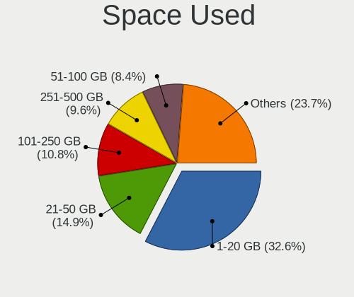
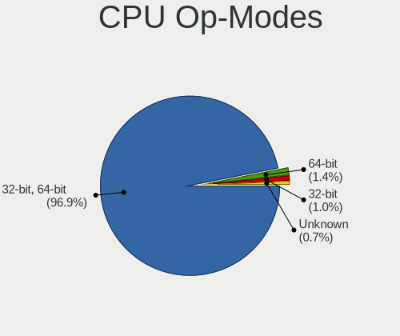
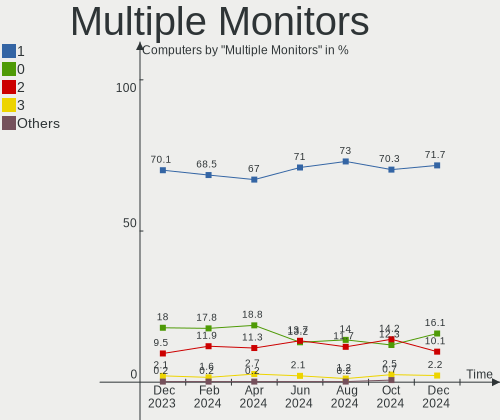

Debian Hardware Trends
----------------------

A project to identify most popular hardware characteristics and track their change
over time based on data collected by Debian users at https://Linux-Hardware.org.

Anyone can contribute to the study by uploading probes of their computers by
the [hw-probe](https://github.com/linuxhw/hw-probe) tool:

    sudo hw-probe -all -upload

This is a report for all computer types. See also reports for [desktops](/Dist/Debian/Desktop/README.md) and [notebooks](/Dist/Debian/Notebook/README.md).

Full-feature report is available here: https://linux-hardware.org/?view=trends

Period: Feb, 2020.

Contents
--------

- [ OS                       ](#os)
- [ OS Family                ](#os-family)
- [ Kernel                   ](#kernel)
- [ Kernel Family            ](#kernel-family)
- [ Kernel Major Ver.        ](#kernel-major-ver)
- [ Arch                     ](#arch)
- [ DE                       ](#de)
- [ Display Server           ](#display-server)
- [ OS Lang                  ](#os-lang)
- [ Boot Mode                ](#boot-mode)
- [ Filesystem               ](#filesystem)
- [ Dual Boot with Linux     ](#dual-boot-with-linux)
- [ Dual Boot (Win)          ](#dual-boot-win)
- [ Country                  ](#country)
- [ City                     ](#city)
- [ Vendor                   ](#vendor)
- [ Model                    ](#model)
- [ Model Family             ](#model-family)
- [ MFG Year                 ](#mfg-year)
- [ Form Factor              ](#form-factor)
- [ Secure Boot              ](#secure-boot)
- [ Coreboot                 ](#coreboot)
- [ RAM Size                 ](#ram-size)
- [ RAM Used                 ](#ram-used)
- [ Drive Vendor             ](#drive-vendor)
- [ Drive Model              ](#drive-model)
- [ Drive Kind               ](#drive-kind)
- [ Drive Connector          ](#drive-connector)
- [ Drive Size               ](#drive-size)
- [ Space Total              ](#space-total)
- [ Space Used               ](#space-used)
- [ Malfunc. Drives          ](#malfunc-drives)
- [ Malfunc. Drive Vendor    ](#malfunc-drive-vendor)
- [ Malfunc. Drive Kind      ](#malfunc-drive-kind)
- [ Failed Drives            ](#failed-drives)
- [ Failed Drive Vendor      ](#failed-drive-vendor)
- [ Drive Status             ](#drive-status)
- [ Storage Vendor           ](#storage-vendor)
- [ Storage Model            ](#storage-model)
- [ Storage Kind             ](#storage-kind)
- [ CPU Vendor               ](#cpu-vendor)
- [ CPU Model                ](#cpu-model)
- [ CPU Model Family         ](#cpu-model-family)
- [ CPU Cores                ](#cpu-cores)
- [ CPU Sockets              ](#cpu-sockets)
- [ CPU Threads              ](#cpu-threads)
- [ CPU Op-Modes             ](#cpu-op-modes)
- [ CPU Microarch            ](#cpu-microarch)
- [ CPU Microcode            ](#cpu-microcode)
- [ GPU Vendor               ](#gpu-vendor)
- [ GPU Model                ](#gpu-model)
- [ GPU Combo                ](#gpu-combo)
- [ GPU Driver               ](#gpu-driver)
- [ GPU Memory               ](#gpu-memory)
- [ Monitor Vendor           ](#monitor-vendor)
- [ Monitor Model            ](#monitor-model)
- [ Monitor Resolution       ](#monitor-resolution)
- [ Monitor Diagonal         ](#monitor-diagonal)
- [ Monitor Width            ](#monitor-width)
- [ Aspect Ratio             ](#aspect-ratio)
- [ Monitor Area             ](#monitor-area)
- [ Pixel Density            ](#pixel-density)
- [ Multiple Monitors        ](#multiple-monitors)
- [ Net Controller Vendor    ](#net-controller-vendor)
- [ Net Controller Model     ](#net-controller-model)
- [ Net Controller Kind      ](#net-controller-kind)
- [ Used Controller          ](#used-controller)
- [ NICs                     ](#nics)
- [ Unsupported Devices      ](#unsupported-devices)
- [ Unsupported Device Types ](#unsupported-device-types)

OS
--

Installed operating systems

| Name            | Computers | Percent |
|-----------------|-----------|---------|
| Debian 10       | 53        | 56.99%  |
| Debian          | 16        | 17.2%   |
| Debian Testing  | 10        | 10.75%  |
| Debian Unstable | 7         | 7.53%   |
| Debian 9.11     | 2         | 2.15%   |
| Debian 9.4      | 1         | 1.08%   |
| Debian 9.12     | 1         | 1.08%   |
| Debian 9        | 1         | 1.08%   |
| Debian 7.11     | 1         | 1.08%   |
| Debian 11       | 1         | 1.08%   |

OS Family
---------

OS without a version

| Name   | Computers | Percent |
|--------|-----------|---------|
| Debian | 93        | 100%    |

Kernel
------

Version of the Linux kernel

| Version                       | Computers | Percent |
|-------------------------------|-----------|---------|
| 4.19.0-8-amd64                | 19        | 20.43%  |
| 4.19.0-6-amd64                | 19        | 20.43%  |
| 5.4.0-4-amd64                 | 9         | 9.68%   |
| 5.4.0-3-amd64                 | 7         | 7.53%   |
| 5.4.0-0.bpo.2-amd64           | 6         | 6.45%   |
| 4.9.0-11-amd64                | 4         | 4.3%    |
| 4.9.0-8-amd64                 | 3         | 3.23%   |
| 5.4.0-0.bpo.3-amd64           | 2         | 2.15%   |
| 4.9.0-12-amd64                | 2         | 2.15%   |
| 4.19.0-8-686-pae              | 2         | 2.15%   |
| 4.19.0-5-amd64                | 2         | 2.15%   |
| 5.5.2                         | 1         | 1.08%   |
| 5.5.0-rc5-amd64               | 1         | 1.08%   |
| 5.5.0-2.1-liquorix-amd64      | 1         | 1.08%   |
| 5.4.18-towo.1-siduction-amd64 | 1         | 1.08%   |
| 5.4.18-sunxi64                | 1         | 1.08%   |
| 5.4.17                        | 1         | 1.08%   |
| 5.4.11                        | 1         | 1.08%   |
| 5.4.0-4-686-pae               | 1         | 1.08%   |
| 5.3.6-050306-generic          | 1         | 1.08%   |
| 5.3.18-2-pve                  | 1         | 1.08%   |
| 4.9.0-9-amd64                 | 1         | 1.08%   |
| 4.9.0-8-686                   | 1         | 1.08%   |
| 4.9.0-6-amd64                 | 1         | 1.08%   |
| 4.9.0-12-686                  | 1         | 1.08%   |
| 4.9.0-11-686                  | 1         | 1.08%   |
| 4.19.0-6-686-pae              | 1         | 1.08%   |
| 4.19.0-2-amd64                | 1         | 1.08%   |
| 3.16.0-10-amd64               | 1         | 1.08%   |

Kernel Family
-------------

Linux kernel without a distro release

| Version | Computers | Percent |
|---------|-----------|---------|
| 4.19.0  | 44        | 47.31%  |
| 5.4.0   | 25        | 26.88%  |
| 4.9.0   | 14        | 15.05%  |
| 5.5.0   | 2         | 2.15%   |
| 5.4.18  | 2         | 2.15%   |
| 5.5.2   | 1         | 1.08%   |
| 5.4.17  | 1         | 1.08%   |
| 5.4.11  | 1         | 1.08%   |
| 5.3.6   | 1         | 1.08%   |
| 5.3.18  | 1         | 1.08%   |
| 3.16.0  | 1         | 1.08%   |

Kernel Major Ver.
-----------------

Linux kernel major version

| Version | Computers | Percent |
|---------|-----------|---------|
| 4.19    | 44        | 47.31%  |
| 5.4     | 29        | 31.18%  |
| 4.9     | 14        | 15.05%  |
| 5.5     | 3         | 3.23%   |
| 5.3     | 2         | 2.15%   |
| 3.16    | 1         | 1.08%   |

Arch
----

OS architecture (x86_64, i586, etc.)

| Name    | Computers | Percent |
|---------|-----------|---------|
| x86_64  | 84        | 90.32%  |
| i686    | 8         | 8.6%    |
| aarch64 | 1         | 1.08%   |

DE
--

Desktop Environment

| Name            | Computers | Percent |
|-----------------|-----------|---------|
| GNOME           | 23        | 24.73%  |
| XFCE            | 12        | 12.9%   |
| X-Cinnamon      | 12        | 12.9%   |
| KDE5            | 12        | 12.9%   |
| KDE             | 9         | 9.68%   |
| Unknown         | 9         | 9.68%   |
| Openbox         | 5         | 5.38%   |
| MATE            | 3         | 3.23%   |
| Cinnamon        | 3         | 3.23%   |
| LXQt            | 2         | 2.15%   |
| GNOME Flashback | 1         | 1.08%   |
| Enlightenment   | 1         | 1.08%   |
| Budgie          | 1         | 1.08%   |

Display Server
--------------

X11 or Wayland

| Name    | Computers | Percent |
|---------|-----------|---------|
| X11     | 75        | 80.65%  |
| Wayland | 14        | 15.05%  |
| Tty     | 3         | 3.23%   |
| Unknown | 1         | 1.08%   |

OS Lang
-------

Language

| Lang       | Computers | Percent |
|------------|-----------|---------|
| Unknown    | 27        | 29.03%  |
| en_US      | 22        | 23.66%  |
| ru_RU      | 13        | 13.98%  |
| de_DE      | 7         | 7.53%   |
| pt_BR      | 4         | 4.3%    |
| it_IT      | 3         | 3.23%   |
| en_GB      | 3         | 3.23%   |
| pl_PL      | 2         | 2.15%   |
| es_MX      | 2         | 2.15%   |
| nl_NL      | 1         | 1.08%   |
| nl_BE      | 1         | 1.08%   |
| it_CH      | 1         | 1.08%   |
| he_IL      | 1         | 1.08%   |
| fr_FR      | 1         | 1.08%   |
| es_CR      | 1         | 1.08%   |
| es_CO      | 1         | 1.08%   |
| en_US.utf8 | 1         | 1.08%   |
| en_GB.utf8 | 1         | 1.08%   |
| cs_CZ      | 1         | 1.08%   |

Boot Mode
---------

EFI or BIOS

| Mode | Computers | Percent |
|------|-----------|---------|
| BIOS | 60        | 64.52%  |
| EFI  | 33        | 35.48%  |

Filesystem
----------

Type of filesystem

| Type    | Computers | Percent |
|---------|-----------|---------|
| Ext4    | 85        | 91.4%   |
| Btrfs   | 3         | 3.23%   |
| Unknown | 2         | 2.15%   |
| Xfs     | 1         | 1.08%   |
| Rootfs  | 1         | 1.08%   |
| Overlay | 1         | 1.08%   |

Dual Boot with Linux
--------------------

Hosting more than one Linux

| Dual boot | Computers | Percent |
|-----------|-----------|---------|
| No        | 86        | 92.47%  |
| Yes       | 7         | 7.53%   |

Dual Boot (Win)
---------------

Hosting Linux and Windows

| Dual boot | Computers | Percent |
|-----------|-----------|---------|
| No        | 72        | 77.42%  |
| Yes       | 21        | 22.58%  |

Country
-------

Geographic location (country)

| Country                | Computers | Percent |
|------------------------|-----------|---------|
| Russia                 | 16        | 17.2%   |
| USA                    | 11        | 11.83%  |
| Germany                | 11        | 11.83%  |
| Italy                  | 7         | 7.53%   |
| Brazil                 | 6         | 6.45%   |
| France                 | 5         | 5.38%   |
| Ukraine                | 3         | 3.23%   |
| Sweden                 | 3         | 3.23%   |
| Spain                  | 3         | 3.23%   |
| Netherlands            | 3         | 3.23%   |
| Costa Rica             | 3         | 3.23%   |
| UK                     | 2         | 2.15%   |
| Mexico                 | 2         | 2.15%   |
| Greece                 | 2         | 2.15%   |
| Turkey                 | 1         | 1.08%   |
| Tunisia                | 1         | 1.08%   |
| Switzerland            | 1         | 1.08%   |
| Serbia                 | 1         | 1.08%   |
| Poland                 | 1         | 1.08%   |
| Norway                 | 1         | 1.08%   |
| Israel                 | 1         | 1.08%   |
| Finland                | 1         | 1.08%   |
| Denmark                | 1         | 1.08%   |
| Czech Republic         | 1         | 1.08%   |
| Colombia               | 1         | 1.08%   |
| Canada                 | 1         | 1.08%   |
| Bosnia and Herzegovina | 1         | 1.08%   |
| Belgium                | 1         | 1.08%   |
| Belarus                | 1         | 1.08%   |
| Austria                | 1         | 1.08%   |

City
----

Geographic location (city)

| City                      | Computers | Percent |
|---------------------------|-----------|---------|
| St Petersburg             | 5         | 5.38%   |
| Moscow                    | 5         | 5.38%   |
| Stockholm                 | 3         | 3.23%   |
| Voronezh                  | 2         | 2.15%   |
| Taubate                   | 2         | 2.15%   |
| San José                 | 2         | 2.15%   |
| Milan                     | 2         | 2.15%   |
| Cologne                   | 2         | 2.15%   |
| Athens                    | 2         | 2.15%   |
| Zrenjanin                 | 1         | 1.08%   |
| Zeist                     | 1         | 1.08%   |
| Williston                 | 1         | 1.08%   |
| Webster                   | 1         | 1.08%   |
| Volta Redonda             | 1         | 1.08%   |
| Virum                     | 1         | 1.08%   |
| Villejuif                 | 1         | 1.08%   |
| Vienna                    | 1         | 1.08%   |
| Urswil                    | 1         | 1.08%   |
| Ternovka                  | 1         | 1.08%   |
| Tampere                   | 1         | 1.08%   |
| São Paulo                | 1         | 1.08%   |
| Stuttgart                 | 1         | 1.08%   |
| Stokrooie                 | 1         | 1.08%   |
| Sousse                    | 1         | 1.08%   |
| Sao Sebastiao             | 1         | 1.08%   |
| San Sebastian             | 1         | 1.08%   |
| San Dimas                 | 1         | 1.08%   |
| Safed                     | 1         | 1.08%   |
| Rothenbach an der Pegnitz | 1         | 1.08%   |
| Rome                      | 1         | 1.08%   |
| Prague                    | 1         | 1.08%   |
| Portage                   | 1         | 1.08%   |
| Perm                      | 1         | 1.08%   |
| Palestrina                | 1         | 1.08%   |
| Palaiseau                 | 1         | 1.08%   |
| Oyten                     | 1         | 1.08%   |
| Oslo                      | 1         | 1.08%   |
| Nienborstel               | 1         | 1.08%   |
| New York                  | 1         | 1.08%   |
| Naberezhnyye Chelny       | 1         | 1.08%   |
| Mönchengladbach          | 1         | 1.08%   |
| Mykolayiv                 | 1         | 1.08%   |
| Montebelluna              | 1         | 1.08%   |
| Millsboro                 | 1         | 1.08%   |
| Mexico City               | 1         | 1.08%   |
| Mesa                      | 1         | 1.08%   |
| Meolo                     | 1         | 1.08%   |
| Maua                      | 1         | 1.08%   |
| Madrid                    | 1         | 1.08%   |
| Lowestoft                 | 1         | 1.08%   |
| Kyiv                      | 1         | 1.08%   |
| Kharkiv                   | 1         | 1.08%   |
| Katowice                  | 1         | 1.08%   |
| Heredia                   | 1         | 1.08%   |
| Hanau                     | 1         | 1.08%   |
| Hamburg                   | 1         | 1.08%   |
| Granite City              | 1         | 1.08%   |
| Giessen                   | 1         | 1.08%   |
| Geveze                    | 1         | 1.08%   |
| Gatchina                  | 1         | 1.08%   |

Vendor
------

Motherboard manufacturer

| Name                | Computers | Percent |
|---------------------|-----------|---------|
| Lenovo              | 19        | 20.43%  |
| ASUSTek Computer    | 18        | 19.35%  |
| Hewlett-Packard     | 11        | 11.83%  |
| Dell                | 11        | 11.83%  |
| Gigabyte Technology | 7         | 7.53%   |
| MSI                 | 5         | 5.38%   |
| Acer                | 4         | 4.3%    |
| ASRock              | 3         | 3.23%   |
| Intel               | 2         | 2.15%   |
| Fujitsu Siemens     | 2         | 2.15%   |
| Toshiba             | 1         | 1.08%   |
| sunxi               | 1         | 1.08%   |
| Sony                | 1         | 1.08%   |
| Samsung Electronics | 1         | 1.08%   |
| Packard Bell        | 1         | 1.08%   |
| Onda technology     | 1         | 1.08%   |
| OEM                 | 1         | 1.08%   |
| eMachines           | 1         | 1.08%   |
| AZW                 | 1         | 1.08%   |
| Apple               | 1         | 1.08%   |
| Unknown             | 1         | 1.08%   |

Model
-----

Motherboard model

| Name                                     | Computers | Percent |
|------------------------------------------|-----------|---------|
| ASUS All Series                          | 3         | 3.23%   |
| Unknown                                  | 3         | 3.23%   |
| Gigabyte H310M S2H 2.0                   | 2         | 2.15%   |
| ASUS M5A78L-M/USB3                       | 2         | 2.15%   |
| Toshiba Satellite A500                   | 1         | 1.08%   |
| Sony VPCEB11FM                           | 1         | 1.08%   |
| Samsung Electronics N150/N210/N220       | 1         | 1.08%   |
| Packard Bell DOT S                       | 1         | 1.08%   |
| Onda technology A68V+                    | 1         | 1.08%   |
| OEM I41SI                                | 1         | 1.08%   |
| MSI MS-7A38                              | 1         | 1.08%   |
| MSI MS-7850                              | 1         | 1.08%   |
| MSI MS-7599                              | 1         | 1.08%   |
| MSI MS-7597                              | 1         | 1.08%   |
| MSI MS-7369                              | 1         | 1.08%   |
| Lenovo Yoga 2 Pro 20266                  | 1         | 1.08%   |
| Lenovo YB1-X91F                          | 1         | 1.08%   |
| Lenovo V330-15IKB 81AX                   | 1         | 1.08%   |
| Lenovo ThinkPad X270 20K5S0R100          | 1         | 1.08%   |
| Lenovo ThinkPad X1 Carbon 7th 20R1S05B00 | 1         | 1.08%   |
| Lenovo ThinkPad X1 Carbon 7th 20QES01M00 | 1         | 1.08%   |
| Lenovo ThinkPad X1 Carbon 6th 20KHCTO1WW | 1         | 1.08%   |
| Lenovo ThinkPad W520 42844YS             | 1         | 1.08%   |
| Lenovo ThinkPad T495s 20QKS01E00         | 1         | 1.08%   |
| Lenovo ThinkPad T490s 20NX000EMX         | 1         | 1.08%   |
| Lenovo ThinkPad T490s 20NX000AGE         | 1         | 1.08%   |
| Lenovo ThinkPad T450s 20BXCTO1WW         | 1         | 1.08%   |
| Lenovo ThinkPad T440p 20AWS0VK00         | 1         | 1.08%   |
| Lenovo ThinkPad SL500 27468XU            | 1         | 1.08%   |
| Lenovo ThinkPad L13 20R3000FGE           | 1         | 1.08%   |
| Lenovo ThinkPad E590 20NB001AIX          | 1         | 1.08%   |
| Lenovo IdeaPad FLEX 4-1480 80VD          | 1         | 1.08%   |
| Lenovo IdeaPad 700-15ISK 80RU            | 1         | 1.08%   |
| Intel RM DESKTOP 310                     | 1         | 1.08%   |
| Intel NUC5CPYB H61145-412                | 1         | 1.08%   |
| HP ZBook 14u G5                          | 1         | 1.08%   |
| HP Z400 Workstation                      | 1         | 1.08%   |
| HP ProBook 6570b                         | 1         | 1.08%   |
| HP ProBook 650 G1                        | 1         | 1.08%   |
| HP Pavilion Gaming Laptop 15-cx0xxx      | 1         | 1.08%   |
| HP Mini 110-3100                         | 1         | 1.08%   |
| HP G61                                   | 1         | 1.08%   |
| HP EliteBook 840 G6                      | 1         | 1.08%   |
| HP EliteBook 820 G1                      | 1         | 1.08%   |
| HP 350 G2                                | 1         | 1.08%   |
| HP 250 G6 Notebook PC                    | 1         | 1.08%   |
| Gigabyte Z97P-D3                         | 1         | 1.08%   |
| Gigabyte X470 AORUS ULTRA GAMING         | 1         | 1.08%   |
| Gigabyte H110M-S2H                       | 1         | 1.08%   |
| Gigabyte H110M-DS2 DDR3-CF               | 1         | 1.08%   |
| Gigabyte B450M DS3H                      | 1         | 1.08%   |
| Fujitsu Siemens ESPRIMO Mobile V5535     | 1         | 1.08%   |
| Fujitsu Siemens AMILO Desktop La3740     | 1         | 1.08%   |
| eMachines EL1852G                        | 1         | 1.08%   |
| Dell OptiPlex 780                        | 1         | 1.08%   |
| Dell Latitude E7470                      | 1         | 1.08%   |
| Dell Latitude E7450                      | 1         | 1.08%   |
| Dell Latitude E4310                      | 1         | 1.08%   |
| Dell Latitude D630                       | 1         | 1.08%   |
| Dell Latitude 7490                       | 1         | 1.08%   |

Model Family
------------

Motherboard model prefix

| Name                     | Computers | Percent |
|--------------------------|-----------|---------|
| Lenovo ThinkPad          | 13        | 13.98%  |
| Dell Latitude            | 7         | 7.53%   |
| Dell Inspiron            | 3         | 3.23%   |
| ASUS All                 | 3         | 3.23%   |
| Acer Aspire              | 3         | 3.23%   |
| Unknown                  | 3         | 3.23%   |
| Lenovo IdeaPad           | 2         | 2.15%   |
| HP ProBook               | 2         | 2.15%   |
| HP EliteBook             | 2         | 2.15%   |
| Gigabyte H310M           | 2         | 2.15%   |
| ASUS M5A78L-M            | 2         | 2.15%   |
| Toshiba Satellite        | 1         | 1.08%   |
| Sony VPCEB11FM           | 1         | 1.08%   |
| Samsung Electronics N150 | 1         | 1.08%   |
| Packard Bell DOT         | 1         | 1.08%   |
| Onda technology A68V+    | 1         | 1.08%   |
| OEM I41SI                | 1         | 1.08%   |
| MSI MS-7A38              | 1         | 1.08%   |
| MSI MS-7850              | 1         | 1.08%   |
| MSI MS-7599              | 1         | 1.08%   |
| MSI MS-7597              | 1         | 1.08%   |
| MSI MS-7369              | 1         | 1.08%   |
| Lenovo Yoga              | 1         | 1.08%   |
| Lenovo YB1-X91F          | 1         | 1.08%   |
| Lenovo V330-15IKB        | 1         | 1.08%   |
| Intel RM                 | 1         | 1.08%   |
| Intel NUC5CPYB           | 1         | 1.08%   |
| HP ZBook                 | 1         | 1.08%   |
| HP Z400                  | 1         | 1.08%   |
| HP Pavilion              | 1         | 1.08%   |
| HP Mini                  | 1         | 1.08%   |
| HP G61                   | 1         | 1.08%   |
| HP 350                   | 1         | 1.08%   |
| HP 250                   | 1         | 1.08%   |
| Gigabyte Z97P-D3         | 1         | 1.08%   |
| Gigabyte X470            | 1         | 1.08%   |
| Gigabyte H110M-S2H       | 1         | 1.08%   |
| Gigabyte H110M-DS2       | 1         | 1.08%   |
| Gigabyte B450M           | 1         | 1.08%   |
| Fujitsu Siemens ESPRIMO  | 1         | 1.08%   |
| Fujitsu Siemens AMILO    | 1         | 1.08%   |
| eMachines EL1852G        | 1         | 1.08%   |
| Dell OptiPlex            | 1         | 1.08%   |
| AZW AP35                 | 1         | 1.08%   |
| ASUS X301A1              | 1         | 1.08%   |
| ASUS UX303LA             | 1         | 1.08%   |
| ASUS TUF                 | 1         | 1.08%   |
| ASUS T100TAR             | 1         | 1.08%   |
| ASUS PRIME               | 1         | 1.08%   |
| ASUS P8B75-M             | 1         | 1.08%   |
| ASUS P7H55D-M            | 1         | 1.08%   |
| ASUS P5Q-E               | 1         | 1.08%   |
| ASUS P5P43TD             | 1         | 1.08%   |
| ASUS P5K                 | 1         | 1.08%   |
| ASUS K52F                | 1         | 1.08%   |
| ASUS K42Jr               | 1         | 1.08%   |
| ASUS F2A85-M             | 1         | 1.08%   |
| ASRock J3355B-ITX        | 1         | 1.08%   |
| ASRock G41M-VS3          | 1         | 1.08%   |
| ASRock B450M             | 1         | 1.08%   |

MFG Year
--------

Motherboard manufacture year

| Year    | Computers | Percent |
|---------|-----------|---------|
| 2019    | 24        | 25.81%  |
| 2018    | 11        | 11.83%  |
| 2014    | 7         | 7.53%   |
| 2010    | 7         | 7.53%   |
| 2015    | 6         | 6.45%   |
| 2013    | 6         | 6.45%   |
| 2009    | 6         | 6.45%   |
| 2017    | 5         | 5.38%   |
| 2016    | 5         | 5.38%   |
| 2011    | 5         | 5.38%   |
| 2008    | 5         | 5.38%   |
| 2020    | 3         | 3.23%   |
| 2012    | 2         | 2.15%   |
| Unknown | 1         | 1.08%   |

Form Factor
-----------

Physical design of the computer

| Name           | Computers | Percent |
|----------------|-----------|---------|
| Notebook       | 50        | 53.76%  |
| Desktop        | 38        | 40.86%  |
| Convertible    | 3         | 3.23%   |
| System on chip | 1         | 1.08%   |
| Mini pc        | 1         | 1.08%   |

Secure Boot
-----------

Enabled or disabled

| State    | Computers | Percent |
|----------|-----------|---------|
| Disabled | 88        | 94.62%  |
| Enabled  | 5         | 5.38%   |

Coreboot
--------

Have coreboot on board

| Used | Computers | Percent |
|------|-----------|---------|
| No   | 93        | 100%    |

RAM Size
--------

Total RAM memory

| Size in GB | Computers | Percent |
|------------|-----------|---------|
| 16.01-24.0 | 25        | 26.88%  |
| 3.01-4.0   | 22        | 23.66%  |
| 8.01-16.0  | 22        | 23.66%  |
| 4.01-8.0   | 10        | 10.75%  |
| 1.01-2.0   | 6         | 6.45%   |
| 32.01-64.0 | 4         | 4.3%    |
| 2.01-3.0   | 2         | 2.15%   |
| Unknown    | 2         | 2.15%   |

RAM Used
--------

Used RAM memory

| Used GB   | Computers | Percent |
|-----------|-----------|---------|
| 1.01-2.0  | 33        | 35.48%  |
| 2.01-3.0  | 22        | 23.66%  |
| 4.01-8.0  | 11        | 11.83%  |
| 0.01-1.0  | 11        | 11.83%  |
| 3.01-4.0  | 9         | 9.68%   |
| 8.01-16.0 | 5         | 5.38%   |
| Unknown   | 2         | 2.15%   |

Drive Vendor
------------

Hard drive vendors

| Vendor              | Computers | Drives | Percent |
|---------------------|-----------|--------|---------|
| Seagate             | 27        | 35     | 20.15%  |
| Samsung Electronics | 27        | 35     | 20.15%  |
| WDC                 | 23        | 26     | 17.16%  |
| Toshiba             | 11        | 11     | 8.21%   |
| Hitachi             | 7         | 7      | 5.22%   |
| Kingston            | 6         | 6      | 4.48%   |
| Crucial             | 6         | 7      | 4.48%   |
| Unknown             | 3         | 4      | 2.24%   |
| HGST                | 3         | 3      | 2.24%   |
| Phison              | 2         | 2      | 1.49%   |
| MAXTOR              | 2         | 2      | 1.49%   |
| Intenso             | 2         | 2      | 1.49%   |
| Corsair             | 2         | 2      | 1.49%   |
| Zheino              | 1         | 1      | 0.75%   |
| XPG                 | 1         | 1      | 0.75%   |
| Team                | 1         | 1      | 0.75%   |
| SK Hynix            | 1         | 1      | 0.75%   |
| Patriot             | 1         | 1      | 0.75%   |
| OCZ                 | 1         | 1      | 0.75%   |
| Micron Technology   | 1         | 1      | 0.75%   |
| KingFast            | 1         | 1      | 0.75%   |
| JMicron             | 1         | 1      | 0.75%   |
| Intel               | 1         | 1      | 0.75%   |
| Fujitsu             | 1         | 1      | 0.75%   |
| Drevo               | 1         | 1      | 0.75%   |
| A-DATA Technology   | 1         | 1      | 0.75%   |

Drive Model
-----------

Hard drive models

| Model                        | Computers | Percent |
|------------------------------|-----------|---------|
| SSD 850 EVO 250GB            | 9         | 5.88%   |
| ST3160815AS 160GB            | 3         | 1.96%   |
| WD1002FAEX-00Y9A0 1TB        | 2         | 1.31%   |
| Viper M.2 VPN100 256GB       | 2         | 1.31%   |
| ST1000DM010-2EP102 1TB       | 2         | 1.31%   |
| SSD 960 EVO 250GB            | 2         | 1.31%   |
| SA400S37240G 240GB SSD       | 2         | 1.31%   |
| MZVLB1T0HBLR-000L7 1TB       | 2         | 1.31%   |
| HTS721010A9E630 1TB          | 2         | 1.31%   |
| HD502HJ 500GB                | 2         | 1.31%   |
| HD300LJ 304GB                | 2         | 1.31%   |
| CT240BX500SSD1 240GB         | 2         | 1.31%   |
| X1 120GB                     | 1         | 0.65%   |
| WDS500G2B0A-00SM50 500GB SSD | 1         | 0.65%   |
| WDS240G2G0B-00EPW0 240GB SSD | 1         | 0.65%   |
| WD5000LPLX-00ZNTT0 500GB     | 1         | 0.65%   |
| WD5000LPCX-24VHAT0 500GB     | 1         | 0.65%   |
| WD5000LPCX-21VHAT0 500GB     | 1         | 0.65%   |
| WD5000AADS-00M2B0 500GB      | 1         | 0.65%   |
| WD3200KS-75PFB0 320GB        | 1         | 0.65%   |
| WD3200BEVT-60ZCT1 320GB      | 1         | 0.65%   |
| WD3200AAJS-00L7A0 320GB      | 1         | 0.65%   |
| WD2500SD-01KCB0 250GB        | 1         | 0.65%   |
| WD2500AAKS-00UU3A0 250GB     | 1         | 0.65%   |
| WD20EFRX-68EUZN0 2TB         | 1         | 0.65%   |
| WD1200BEVS-22UST0 120GB      | 1         | 0.65%   |
| WD10SPZX-75Z10T1 1TB         | 1         | 0.65%   |
| WD10SPCX-24HWST1 1TB         | 1         | 0.65%   |
| WD10JFCX-68N6GN0 1TB         | 1         | 0.65%   |
| WD10EZEX-60WN4A0 1TB         | 1         | 0.65%   |
| WD10EZEX-08WN4A0 1TB         | 1         | 0.65%   |
| WD1003FZEX-00K3CA0 1TB       | 1         | 0.65%   |
| VERTEX2 120GB SSD            | 1         | 0.65%   |
| TR150 960GB SSD              | 1         | 0.65%   |
| TL100 240GB SSD              | 1         | 0.65%   |
| THNSNC128GCSJ 128GB SSD      | 1         | 0.65%   |
| THNSFJ256GCSU 256GB SSD      | 1         | 0.65%   |
| Tech 250GB                   | 1         | 0.65%   |
| TEAML5Lite3D240G 240GB SSD   | 1         | 0.65%   |
| SV300S37A240G 240GB SSD      | 1         | 0.65%   |
| SV300S37A 240G SSD           | 1         | 0.65%   |
| SU650 120GB SSD              | 1         | 0.65%   |
| SU02G  2GB                   | 1         | 0.65%   |
| STM3160215AS 160GB           | 1         | 0.65%   |
| STM3160215A 160GB            | 1         | 0.65%   |
| ST9500423AS 500GB            | 1         | 0.65%   |
| ST9500420AS 500GB            | 1         | 0.65%   |
| ST9500325AS 500GB            | 1         | 0.65%   |
| ST9320320AS 320GB            | 1         | 0.65%   |
| ST9250315AS 250GB            | 1         | 0.65%   |
| ST500DM002-1BD142 500GB      | 1         | 0.65%   |
| ST3802110AS 80GB             | 1         | 0.65%   |
| ST3750640NS 752GB            | 1         | 0.65%   |
| ST3500418AS 500GB            | 1         | 0.65%   |
| ST3500312CS 500GB            | 1         | 0.65%   |
| ST3400620AS 400GB            | 1         | 0.65%   |
| ST3320820AS_P 320GB          | 1         | 0.65%   |
| ST3250410AS 250GB            | 1         | 0.65%   |
| ST3250310AS 250GB            | 1         | 0.65%   |
| ST31000533CS 1TB             | 1         | 0.65%   |

Drive Kind
----------

HDD or SSD

| Kind    | Computers | Drives | Percent |
|---------|-----------|--------|---------|
| HDD     | 55        | 81     | 44.72%  |
| SSD     | 43        | 48     | 34.96%  |
| NVMe    | 17        | 17     | 13.82%  |
| MMC     | 4         | 5      | 3.25%   |
| Unknown | 4         | 4      | 3.25%   |

Drive Connector
---------------

SATA, SAS, NVMe, etc.

| Type | Computers | Drives | Percent |
|------|-----------|--------|---------|
| SATA | 77        | 132    | 77.78%  |
| NVMe | 17        | 17     | 17.17%  |
| MMC  | 4         | 5      | 4.04%   |
| SAS  | 1         | 1      | 1.01%   |

Drive Size
----------

Size of hard drive

| Size in TB | Computers | Drives | Percent |
|------------|-----------|--------|---------|
| 0.01-0.5   | 72        | 106    | 62.07%  |
| 0.51-1.0   | 29        | 34     | 25%     |
| 1.01-2.0   | 12        | 12     | 10.34%  |
| 2.01-3.0   | 2         | 2      | 1.72%   |
| 3.01-4.0   | 1         | 1      | 0.86%   |

Space Total
-----------

Amount of disk space available on the file system

| Size in GB     | Computers | Percent |
|----------------|-----------|---------|
| 101-250        | 27        | 29.03%  |
| 251-500        | 21        | 22.58%  |
| 501-1000       | 14        | 15.05%  |
| 21-50          | 8         | 8.6%    |
| 1001-2000      | 6         | 6.45%   |
| 51-100         | 5         | 5.38%   |
| 2001-3000      | 4         | 4.3%    |
| More than 3000 | 3         | 3.23%   |
| Unknown        | 3         | 3.23%   |
| 1-20           | 2         | 2.15%   |

Space Used
----------

Amount of used disk space

| Used GB   | Computers | Percent |
|-----------|-----------|---------|
| 1-20      | 40        | 43.01%  |
| 21-50     | 13        | 13.98%  |
| 101-250   | 11        | 11.83%  |
| 51-100    | 9         | 9.68%   |
| 501-1000  | 6         | 6.45%   |
| 251-500   | 5         | 5.38%   |
| 1001-2000 | 4         | 4.3%    |
| Unknown   | 3         | 3.23%   |
| 2001-3000 | 2         | 2.15%   |

Malfunc. Drives
---------------

Drive models with a malfunction

| Model                     | Computers | Drives | Percent |
|---------------------------|-----------|--------|---------|
| ST3160815AS 160GB         | 3         | 4      | 18.75%  |
| HD300LJ 304GB             | 2         | 2      | 12.5%   |
| WD3200BEVT-60ZCT1 320GB   | 1         | 1      | 6.25%   |
| ST9250315AS 250GB         | 1         | 1      | 6.25%   |
| ST3250410AS 250GB         | 1         | 1      | 6.25%   |
| ST31000533CS 1TB          | 1         | 1      | 6.25%   |
| ST1000DM003-1ER162 1TB    | 1         | 1      | 6.25%   |
| ST1000DM003-1CH162 1TB    | 1         | 1      | 6.25%   |
| SP2504C 250GB             | 1         | 1      | 6.25%   |
| Performance Pro 128GB SSD | 1         | 1      | 6.25%   |
| MK3259GSXP 320GB          | 1         | 1      | 6.25%   |
| HD080HJ 80GB              | 1         | 1      | 6.25%   |
| CT128M550SSD1 128GB       | 1         | 1      | 6.25%   |

Malfunc. Drive Vendor
---------------------

Vendors of faulty drives

| Vendor              | Computers | Drives | Percent |
|---------------------|-----------|--------|---------|
| Seagate             | 7         | 9      | 46.67%  |
| Samsung Electronics | 4         | 4      | 26.67%  |
| WDC                 | 1         | 1      | 6.67%   |
| Toshiba             | 1         | 1      | 6.67%   |
| Crucial             | 1         | 1      | 6.67%   |
| Corsair             | 1         | 1      | 6.67%   |

Malfunc. Drive Kind
-------------------

Kinds of faulty drives

| Kind | Computers | Drives | Percent |
|------|-----------|--------|---------|
| HDD  | 13        | 15     | 86.67%  |
| SSD  | 2         | 2      | 13.33%  |

Failed Drives
-------------

Failed drive models

Zero info for selected period =(

Failed Drive Vendor
-------------------

Failed drive vendors

Zero info for selected period =(

Drive Status
------------

Number of failed and malfunc. drives

| Status   | Computers | Drives | Percent |
|----------|-----------|--------|---------|
| Works    | 46        | 78     | 44.66%  |
| Detected | 43        | 60     | 41.75%  |
| Malfunc  | 14        | 17     | 13.59%  |

Storage Vendor
--------------

Storage controller vendors

| Vendor                           | Computers | Percent |
|----------------------------------|-----------|---------|
| Intel                            | 63        | 61.17%  |
| AMD                              | 12        | 11.65%  |
| Samsung Electronics              | 8         | 7.77%   |
| Sandisk                          | 4         | 3.88%   |
| Toshiba America Info Systems     | 3         | 2.91%   |
| Phison Electronics               | 3         | 2.91%   |
| Silicon Integrated Systems [SiS] | 2         | 1.94%   |
| Nvidia                           | 2         | 1.94%   |
| Marvell Technology Group         | 2         | 1.94%   |
| SK Hynix                         | 1         | 0.97%   |
| Silicon Image                    | 1         | 0.97%   |
| JMicron Technology               | 1         | 0.97%   |
| ADATA Technology                 | 1         | 0.97%   |

Storage Model
-------------

Storage controller models

| Model                                                                      | Computers | Percent |
|----------------------------------------------------------------------------|-----------|---------|
| Sunrise Point-LP SATA Controller [AHCI mode]                               | 7         | 5.6%    |
| FCH SATA Controller [AHCI mode]                                            | 7         | 5.6%    |
| NVMe SSD Controller SM981/PM981/PM983                                      | 6         | 4.8%    |
| 8 Series/C220 Series Chipset Family 6-port SATA Controller 1 [AHCI mode]   | 5         | 4%      |
| Wildcat Point-LP SATA Controller [AHCI Mode]                               | 4         | 3.2%    |
| 400 Series Chipset SATA Controller                                         | 4         | 3.2%    |
| SB7x0/SB8x0/SB9x0 IDE Controller                                           | 3         | 2.4%    |
| Non-Volatile memory controller                                             | 3         | 2.4%    |
| NM10/ICH7 Family SATA Controller [AHCI mode]                               | 3         | 2.4%    |
| 9 Series Chipset Family SATA Controller [AHCI Mode]                        | 3         | 2.4%    |
| 82801IBM/IEM (ICH9M/ICH9M-E) 4 port SATA Controller [AHCI mode]            | 3         | 2.4%    |
| 8 Series SATA Controller 1 [AHCI mode]                                     | 3         | 2.4%    |
| 7 Series Chipset Family 6-port SATA Controller [AHCI mode]                 | 3         | 2.4%    |
| 5 Series/3400 Series Chipset 4 port SATA AHCI Controller                   | 3         | 2.4%    |
| SB7x0/SB8x0/SB9x0 SATA Controller [IDE mode]                               | 2         | 1.6%    |
| SB7x0/SB8x0/SB9x0 SATA Controller [AHCI mode]                              | 2         | 1.6%    |
| SATA Controller / IDE mode                                                 | 2         | 1.6%    |
| Q170/Q150/B150/H170/H110/Z170/CM236 Chipset SATA Controller [AHCI Mode]    | 2         | 1.6%    |
| NVMe SSD Controller SM961/PM961                                            | 2         | 1.6%    |
| NM10/ICH7 Family SATA Controller [IDE mode]                                | 2         | 1.6%    |
| E12 NVMe Controller                                                        | 2         | 1.6%    |
| Celeron N3350/Pentium N4200/Atom E3900 Series SATA AHCI Controller         | 2         | 1.6%    |
| 88SE6111/6121 SATA II / PATA Controller                                    | 2         | 1.6%    |
| 82801HM/HEM (ICH8M/ICH8M-E) SATA Controller [IDE mode]                     | 2         | 1.6%    |
| 82801HM/HEM (ICH8M/ICH8M-E) IDE Controller                                 | 2         | 1.6%    |
| 82801G (ICH7 Family) IDE Controller                                        | 2         | 1.6%    |
| 82801 Mobile SATA Controller [RAID mode]                                   | 2         | 1.6%    |
| 5513 IDE Controller                                                        | 2         | 1.6%    |
| 200 Series PCH SATA controller [AHCI mode]                                 | 2         | 1.6%    |
| XPG SX8200 Pro PCIe Gen3x4 M.2 2280 Solid State Drive                      | 1         | 0.8%    |
| XG4 NVMe SSD Controller                                                    | 1         | 0.8%    |
| X370 Series Chipset SATA Controller                                        | 1         | 0.8%    |
| WD Black 2018/PC SN720 NVMe SSD                                            | 1         | 0.8%    |
| WD Black 2018/PC SN520 NVMe SSD                                            | 1         | 0.8%    |
| Toshiba America Info Non-Volatile memory controller                        | 1         | 0.8%    |
| SSD Pro 7600p/760p/E 6100p Series                                          | 1         | 0.8%    |
| SiI 3114 [SATALink/SATARaid] Serial ATA Controller                         | 1         | 0.8%    |
| SATA Controller [RAID mode]                                                | 1         | 0.8%    |
| NVMe Storage Controller                                                    | 1         | 0.8%    |
| MCP65 SATA Controller                                                      | 1         | 0.8%    |
| MCP65 IDE                                                                  | 1         | 0.8%    |
| MCP61 SATA Controller                                                      | 1         | 0.8%    |
| MCP61 IDE                                                                  | 1         | 0.8%    |
| JMB368 IDE controller                                                      | 1         | 0.8%    |
| HM170/QM170 Chipset SATA Controller [AHCI Mode]                            | 1         | 0.8%    |
| FCH IDE Controller                                                         | 1         | 0.8%    |
| Cannon Point-LP SATA Controller [AHCI Mode]                                | 1         | 0.8%    |
| Cannon Lake PCH SATA AHCI Controller                                       | 1         | 0.8%    |
| Cannon Lake Mobile PCH SATA AHCI Controller                                | 1         | 0.8%    |
| BG3 NVMe SSD Controller                                                    | 1         | 0.8%    |
| Atom/Celeron/Pentium Processor x5-E8000/J3xxx/N3xxx Series SATA Controller | 1         | 0.8%    |
| 82801JI (ICH10 Family) SATA AHCI Controller                                | 1         | 0.8%    |
| 82801JI (ICH10 Family) 4 port SATA IDE Controller #1                       | 1         | 0.8%    |
| 82801JI (ICH10 Family) 2 port SATA IDE Controller #2                       | 1         | 0.8%    |
| 82801JD/DO (ICH10 Family) SATA AHCI Controller                             | 1         | 0.8%    |
| 82801IB (ICH9) 2 port SATA Controller [IDE mode]                           | 1         | 0.8%    |
| 82801I (ICH9 Family) 2 port SATA Controller [IDE mode]                     | 1         | 0.8%    |
| 7 Series/C210 Series Chipset Family 6-port SATA Controller [AHCI mode]     | 1         | 0.8%    |
| 631xESB/632xESB SATA AHCI Controller                                       | 1         | 0.8%    |
| 631xESB/632xESB IDE Controller                                             | 1         | 0.8%    |

Storage Kind
------------

Kind of storage controller (IDE, SATA, NVMe, SAS, ...)

| Kind | Computers | Percent |
|------|-----------|---------|
| SATA | 64        | 59.26%  |
| NVMe | 21        | 19.44%  |
| IDE  | 19        | 17.59%  |
| RAID | 4         | 3.7%    |

CPU Vendor
----------

Processor vendors

| Vendor | Computers | Percent |
|--------|-----------|---------|
| Intel  | 77        | 82.8%   |
| AMD    | 15        | 16.13%  |
| ARM    | 1         | 1.08%   |

CPU Model
---------

Processor models

| Model                                  | Computers | Percent |
|----------------------------------------|-----------|---------|
| Intel Pentium Gold G5400 CPU @ 3.70GHz | 3         | 3.23%   |
| Intel Core i7-7500U CPU @ 2.70GHz      | 3         | 3.23%   |
| Intel Core i7-8665U CPU @ 1.90GHz      | 2         | 2.15%   |
| Intel Core i7-8565U CPU @ 1.80GHz      | 2         | 2.15%   |
| Intel Core i7-5600U CPU @ 2.60GHz      | 2         | 2.15%   |
| Intel Core i5-8265U CPU @ 1.60GHz      | 2         | 2.15%   |
| Intel Core i5-7200U CPU @ 2.50GHz      | 2         | 2.15%   |
| Intel Core i5-6300U CPU @ 2.40GHz      | 2         | 2.15%   |
| Intel Core i5-5200U CPU @ 2.20GHz      | 2         | 2.15%   |
| Intel Core 2 Duo CPU T7500 @ 2.20GHz   | 2         | 2.15%   |
| Intel Core 2 Duo CPU T6600 @ 2.20GHz   | 2         | 2.15%   |
| Intel Celeron CPU J3355 @ 2.00GHz      | 2         | 2.15%   |
| Intel Xeon CPU W3520 @ 2.67GHz         | 1         | 1.08%   |
| Intel Xeon CPU E5462 @ 2.80GHz         | 1         | 1.08%   |
| Intel Xeon CPU E3-1231 v3 @ 3.40GHz    | 1         | 1.08%   |
| Intel Pentium Dual CPU T2370 @ 1.73GHz | 1         | 1.08%   |
| Intel Pentium CPU B970 @ 2.30GHz       | 1         | 1.08%   |
| Intel Genuine CPU 585 @ 2.16GHz        | 1         | 1.08%   |
| Intel Core i7-8650U CPU @ 1.90GHz      | 1         | 1.08%   |
| Intel Core i7-8550U CPU @ 1.80GHz      | 1         | 1.08%   |
| Intel Core i7-7700 CPU @ 3.60GHz       | 1         | 1.08%   |
| Intel Core i7-6700HQ CPU @ 2.60GHz     | 1         | 1.08%   |
| Intel Core i7-4800MQ CPU @ 2.70GHz     | 1         | 1.08%   |
| Intel Core i7-4510U CPU @ 2.00GHz      | 1         | 1.08%   |
| Intel Core i7-4500U CPU @ 1.80GHz      | 1         | 1.08%   |
| Intel Core i7-2860QM CPU @ 2.50GHz     | 1         | 1.08%   |
| Intel Core i7-10710U CPU @ 1.10GHz     | 1         | 1.08%   |
| Intel Core i7-10510U CPU @ 1.80GHz     | 1         | 1.08%   |
| Intel Core i5-8365U CPU @ 1.60GHz      | 1         | 1.08%   |
| Intel Core i5-8350U CPU @ 1.70GHz      | 1         | 1.08%   |
| Intel Core i5-8300H CPU @ 2.30GHz      | 1         | 1.08%   |
| Intel Core i5-8250U CPU @ 1.60GHz      | 1         | 1.08%   |
| Intel Core i5-6500 CPU @ 3.20GHz       | 1         | 1.08%   |
| Intel Core i5-4690K CPU @ 3.50GHz      | 1         | 1.08%   |
| Intel Core i5-4670 CPU @ 3.40GHz       | 1         | 1.08%   |
| Intel Core i5-4590 CPU @ 3.30GHz       | 1         | 1.08%   |
| Intel Core i5-4460 CPU @ 3.20GHz       | 1         | 1.08%   |
| Intel Core i5-4200U CPU @ 1.60GHz      | 1         | 1.08%   |
| Intel Core i5-4200M CPU @ 2.50GHz      | 1         | 1.08%   |
| Intel Core i5-3450 CPU @ 3.10GHz       | 1         | 1.08%   |
| Intel Core i5-2500 CPU @ 3.30GHz       | 1         | 1.08%   |
| Intel Core i5 CPU M 520 @ 2.40GHz      | 1         | 1.08%   |
| Intel Core i3-6006U CPU @ 2.00GHz      | 1         | 1.08%   |
| Intel Core i3-3120M CPU @ 2.50GHz      | 1         | 1.08%   |
| Intel Core i3 CPU M 380 @ 2.53GHz      | 1         | 1.08%   |
| Intel Core i3 CPU M 350 @ 2.27GHz      | 1         | 1.08%   |
| Intel Core i3 CPU M 330 @ 2.13GHz      | 1         | 1.08%   |
| Intel Core i3 CPU 550 @ 3.20GHz        | 1         | 1.08%   |
| Intel Core 2 Quad CPU Q9550 @ 2.83GHz  | 1         | 1.08%   |
| Intel Core 2 Quad CPU Q8400 @ 2.66GHz  | 1         | 1.08%   |
| Intel Core 2 Quad CPU Q8200 @ 2.33GHz  | 1         | 1.08%   |
| Intel Core 2 Duo CPU P8700 @ 2.53GHz   | 1         | 1.08%   |
| Intel Core 2 Duo CPU E8400 @ 3.00GHz   | 1         | 1.08%   |
| Intel Core 2 Duo CPU E6750 @ 2.66GHz   | 1         | 1.08%   |
| Intel Core 2 Duo CPU E6550 @ 2.33GHz   | 1         | 1.08%   |
| Intel Celeron CPU J3060 @ 1.60GHz      | 1         | 1.08%   |
| Intel Celeron CPU G1840 @ 2.80GHz      | 1         | 1.08%   |
| Intel Celeron CPU 1000M @ 1.80GHz      | 1         | 1.08%   |
| Intel Atom x5-Z8550 CPU @ 1.44GHz      | 1         | 1.08%   |
| Intel Atom CPU Z3775 @ 1.46GHz         | 1         | 1.08%   |

CPU Model Family
----------------

Processor model prefix

| Model              | Computers | Percent |
|--------------------|-----------|---------|
| Intel Core i5      | 22        | 23.66%  |
| Intel Core i7      | 19        | 20.43%  |
| Intel Core 2 Duo   | 8         | 8.6%    |
| Intel Core i3      | 6         | 6.45%   |
| Intel Celeron      | 5         | 5.38%   |
| Intel Atom         | 5         | 5.38%   |
| Intel Xeon         | 3         | 3.23%   |
| Intel Pentium Gold | 3         | 3.23%   |
| Intel Core 2 Quad  | 3         | 3.23%   |
| AMD Ryzen 5        | 3         | 3.23%   |
| AMD Ryzen 7        | 2         | 2.15%   |
| AMD FX             | 2         | 2.15%   |
| AMD A8             | 2         | 2.15%   |
| Intel Pentium Dual | 1         | 1.08%   |
| Intel Pentium      | 1         | 1.08%   |
| Intel Genuine      | 1         | 1.08%   |
| ARM AArch64        | 1         | 1.08%   |
| AMD Ryzen 7 PRO    | 1         | 1.08%   |
| AMD Phenom II X4   | 1         | 1.08%   |
| AMD Phenom         | 1         | 1.08%   |
| AMD Athlon X4      | 1         | 1.08%   |
| AMD Athlon II X3   | 1         | 1.08%   |
| AMD Athlon 64 X2   | 1         | 1.08%   |

CPU Cores
---------

Number of processor cores

| Number | Computers | Percent |
|--------|-----------|---------|
| 2      | 45        | 48.39%  |
| 4      | 39        | 41.94%  |
| 8      | 3         | 3.23%   |
| 1      | 3         | 3.23%   |
| 6      | 2         | 2.15%   |
| 3      | 1         | 1.08%   |

CPU Sockets
-----------

Number of sockets

| Number | Computers | Percent |
|--------|-----------|---------|
| 1      | 92        | 98.92%  |
| 2      | 1         | 1.08%   |

CPU Threads
-----------

Threads per core (Hyper-Threading)

| Number | Computers | Percent |
|--------|-----------|---------|
| 2      | 57        | 61.29%  |
| 1      | 36        | 38.71%  |

CPU Op-Modes
------------

CPU Operation Modes (32-bit, 64-bit)

| Op mode        | Computers | Percent |
|----------------|-----------|---------|
| 32-bit, 64-bit | 91        | 97.85%  |
| Unknown        | 2         | 2.15%   |

CPU Microarch
-------------

Microarchitecture

| Name        | Computers | Percent |
|-------------|-----------|---------|
| Skylake     | 19        | 20.43%  |
| Core        | 12        | 12.9%   |
| Haswell     | 11        | 11.83%  |
| KabyLake    | 9         | 9.68%   |
| Westmere    | 5         | 5.38%   |
| Broadwell   | 4         | 4.3%    |
| Silvermont  | 3         | 3.23%   |
| SandyBridge | 3         | 3.23%   |
| Piledriver  | 3         | 3.23%   |
| K10         | 3         | 3.23%   |
| IvyBridge   | 3         | 3.23%   |
| Bonnell     | 3         | 3.23%   |
| Unknown     | 3         | 3.23%   |
| Zen+        | 2         | 2.15%   |
| Zen         | 2         | 2.15%   |
| Penryn      | 2         | 2.15%   |
| Goldmont    | 2         | 2.15%   |
| Zen 2       | 1         | 1.08%   |
| Nehalem     | 1         | 1.08%   |
| K8 Hammer   | 1         | 1.08%   |
| Excavator   | 1         | 1.08%   |

CPU Microcode
-------------

Microcode number

| Number     | Computers | Percent |
|------------|-----------|---------|
| Unknown    | 35        | 37.63%  |
| 0x306c3    | 8         | 8.6%    |
| 0x806ec    | 5         | 5.38%   |
| 0x1067a    | 5         | 5.38%   |
| 0x906ea    | 4         | 4.3%    |
| 0x806e9    | 3         | 3.23%   |
| 0x806ea    | 2         | 2.15%   |
| 0x506c9    | 2         | 2.15%   |
| 0x406e3    | 2         | 2.15%   |
| 0x40651    | 2         | 2.15%   |
| 0x306d4    | 2         | 2.15%   |
| 0x306a9    | 2         | 2.15%   |
| 0x20652    | 2         | 2.15%   |
| 0x08108102 | 2         | 2.15%   |
| 0x06001119 | 2         | 2.15%   |
| 0xa0660    | 1         | 1.08%   |
| 0x906e9    | 1         | 1.08%   |
| 0x6fb      | 1         | 1.08%   |
| 0x506e3    | 1         | 1.08%   |
| 0x406c4    | 1         | 1.08%   |
| 0x30678    | 1         | 1.08%   |
| 0x30661    | 1         | 1.08%   |
| 0x206a7    | 1         | 1.08%   |
| 0x20655    | 1         | 1.08%   |
| 0x106ca    | 1         | 1.08%   |
| 0x106a5    | 1         | 1.08%   |
| 0x10676    | 1         | 1.08%   |
| 0x08701013 | 1         | 1.08%   |
| 0x0600063d | 1         | 1.08%   |
| 0x010000c8 | 1         | 1.08%   |

GPU Vendor
----------

Vendors of graphics cards

| Vendor                           | Computers | Percent |
|----------------------------------|-----------|---------|
| Intel                            | 58        | 59.18%  |
| Nvidia                           | 21        | 21.43%  |
| AMD                              | 17        | 17.35%  |
| Silicon Integrated Systems [SiS] | 2         | 2.04%   |

GPU Model
---------

Graphics card models

| Model                                                                              | Computers | Percent |
|------------------------------------------------------------------------------------|-----------|---------|
| UHD Graphics 620 (Whiskey Lake)                                                    | 7         | 7%      |
| HD Graphics 620                                                                    | 5         | 5%      |
| UHD Graphics 620                                                                   | 4         | 4%      |
| HD Graphics 5500                                                                   | 4         | 4%      |
| Skylake GT2 [HD Graphics 520]                                                      | 3         | 3%      |
| Haswell-ULT Integrated Graphics Controller                                         | 3         | 3%      |
| GP107 [GeForce GTX 1050 Ti]                                                        | 3         | 3%      |
| GM107 [GeForce GTX 750 Ti]                                                         | 3         | 3%      |
| Core Processor Integrated Graphics Controller                                      | 3         | 3%      |
| Coffee Lake UHD Graphics 610                                                       | 3         | 3%      |
| UHD Graphics                                                                       | 2         | 2%      |
| Picasso                                                                            | 2         | 2%      |
| Mobile GM965/GL960 Integrated Graphics Controller (secondary)                      | 2         | 2%      |
| Mobile GM965/GL960 Integrated Graphics Controller (primary)                        | 2         | 2%      |
| HD Graphics 530                                                                    | 2         | 2%      |
| HD Graphics 500                                                                    | 2         | 2%      |
| GM204 [GeForce GTX 970]                                                            | 2         | 2%      |
| Ellesmere [Radeon RX 470/480/570/570X/580/580X/590]                                | 2         | 2%      |
| Curacao XT / Trinidad XT [Radeon R7 370 / R9 270X/370X]                            | 2         | 2%      |
| Baffin [Radeon RX 460/560D / Pro 450/455/460/555/555X/560/560X]                    | 2         | 2%      |
| Atom/Celeron/Pentium Processor x5-E8000/J3xxx/N3xxx Integrated Graphics Controller | 2         | 2%      |
| Atom Processor D4xx/D5xx/N4xx/N5xx Integrated Graphics Controller                  | 2         | 2%      |
| 771/671 PCIE VGA Display Adapter                                                   | 2         | 2%      |
| 4th Gen Core Processor Integrated Graphics Controller                              | 2         | 2%      |
| 4 Series Chipset Integrated Graphics Controller                                    | 2         | 2%      |
| 3rd Gen Core processor Graphics Controller                                         | 2         | 2%      |
| 2nd Generation Core Processor Family Integrated Graphics Controller                | 2         | 2%      |
| Xeon E3-1200 v3/4th Gen Core Processor Integrated Graphics Controller              | 1         | 1%      |
| Xeon E3-1200 v2/3rd Gen Core processor Graphics Controller                         | 1         | 1%      |
| UHD Graphics 630 (Mobile)                                                          | 1         | 1%      |
| Trinity [Radeon HD 7560D]                                                          | 1         | 1%      |
| Sun XT [Radeon HD 8670A/8670M/8690M / R5 M330 / M430 / Radeon 520 Mobile]          | 1         | 1%      |
| RV630 XT [Radeon HD 2600 XT]                                                       | 1         | 1%      |
| RS780L [Radeon 3000]                                                               | 1         | 1%      |
| Redwood PRO [Radeon HD 5550/5570/5630/6510/6610/7570]                              | 1         | 1%      |
| Park [Mobility Radeon HD 5430/5450/5470]                                           | 1         | 1%      |
| Mobile 4 Series Chipset Integrated Graphics Controller                             | 1         | 1%      |
| Juniper XT [Radeon HD 5770]                                                        | 1         | 1%      |
| Jet XT [Radeon R5 M240]                                                            | 1         | 1%      |
| GT218 [GeForce 210]                                                                | 1         | 1%      |
| GT216M [GeForce GT 230M]                                                           | 1         | 1%      |
| GM206 [GeForce GTX 950]                                                            | 1         | 1%      |
| GM108M [GeForce 940MX]                                                             | 1         | 1%      |
| GM107M [GeForce GTX 950M]                                                          | 1         | 1%      |
| GK208B [GeForce GT 720]                                                            | 1         | 1%      |
| GF108 [GeForce GT 730]                                                             | 1         | 1%      |
| GF106GLM [Quadro 2000M]                                                            | 1         | 1%      |
| GF100GL [Quadro 4000]                                                              | 1         | 1%      |
| G98M [GeForce G 103M]                                                              | 1         | 1%      |
| G96 [GeForce 9500 GS]                                                              | 1         | 1%      |
| G94 [GeForce 9600 GT]                                                              | 1         | 1%      |
| G92 [GeForce 9800 GT]                                                              | 1         | 1%      |
| Baffin [Radeon RX 550 640SP / RX 560/560X]                                         | 1         | 1%      |
| Atom Processor Z36xxx/Z37xxx Series Graphics & Display                             | 1         | 1%      |
| Atom Processor D2xxx/N2xxx Integrated Graphics Controller                          | 1         | 1%      |

GPU Combo
---------

Combinations of graphics cards

| Name           | Computers | Percent |
|----------------|-----------|---------|
| 1 x Intel      | 51        | 54.84%  |
| 1 x Nvidia     | 18        | 19.35%  |
| 1 x AMD        | 14        | 15.05%  |
| Intel + Nvidia | 3         | 3.23%   |
| Intel + AMD    | 3         | 3.23%   |
| Other          | 2         | 2.15%   |
| 1 x SiS        | 2         | 2.15%   |

GPU Driver
----------

Free vs proprietary

| Driver      | Computers | Percent |
|-------------|-----------|---------|
| Free        | 74        | 79.57%  |
| Proprietary | 13        | 13.98%  |
| Unknown     | 6         | 6.45%   |

GPU Memory
----------

Total video memory

| Size in GB | Computers | Percent |
|------------|-----------|---------|
| Unknown    | 66        | 70.97%  |
| 1.01-2.0   | 11        | 11.83%  |
| 3.01-4.0   | 7         | 7.53%   |
| 0.51-1.0   | 5         | 5.38%   |
| 0.01-0.5   | 4         | 4.3%    |

Monitor Vendor
--------------

Monitor vendors

| Vendor                  | Computers | Percent |
|-------------------------|-----------|---------|
| AU Optronics            | 17        | 17.71%  |
| LG Display              | 10        | 10.42%  |
| Samsung Electronics     | 8         | 8.33%   |
| Dell                    | 8         | 8.33%   |
| Chimei Innolux          | 7         | 7.29%   |
| AOC                     | 5         | 5.21%   |
| Iiyama                  | 4         | 4.17%   |
| Goldstar                | 4         | 4.17%   |
| Sony                    | 3         | 3.13%   |
| Philips                 | 3         | 3.13%   |
| Lenovo                  | 3         | 3.13%   |
| Fujitsu Siemens         | 3         | 3.13%   |
| BOE                     | 3         | 3.13%   |
| Ancor Communications    | 3         | 3.13%   |
| Unknown                 | 2         | 2.08%   |
| InfoVision              | 2         | 2.08%   |
| Chi Mei Optoelectronics | 2         | 2.08%   |
| BenQ                    | 2         | 2.08%   |
| Acer                    | 2         | 2.08%   |
| Toshiba                 | 1         | 1.04%   |
| HKC                     | 1         | 1.04%   |
| Hewlett-Packard         | 1         | 1.04%   |
| Envision                | 1         | 1.04%   |
| AGO                     | 1         | 1.04%   |

Monitor Model
-------------

Monitor models

| Model                                              | Computers | Percent |
|----------------------------------------------------|-----------|---------|
| LCD Monitor AUO133D 1920x1080 309x173mm 13.9-inch  | 3         | 3%      |
| SyncMaster SAM01B7 1280x1024 338x270mm 17.0-inch   | 2         | 2%      |
| PHL 328E1 PHLC204 3840x2160 697x392mm 31.5-inch    | 2         | 2%      |
| LG ULTRAWIDE GSM59F1 1920x1080 580x240mm 24.7-inch | 2         | 2%      |
| LCD Monitor CMN14F2 1920x1080 309x173mm 13.9-inch  | 2         | 2%      |
| LCD Monitor AUO22EC 1366x768 344x193mm 15.5-inch   | 2         | 2%      |
| ZR2240w HWP2951 1920x1080 475x267mm 21.5-inch      | 1         | 1%      |
| ZR2240w HWP2950 1920x1080 475x267mm 21.5-inch      | 1         | 1%      |
| W2234 GSM56B8 1680x1050 474x296mm 22.0-inch        | 1         | 1%      |
| VS278 ACI27A1 1920x1080 598x336mm 27.0-inch        | 1         | 1%      |
| VE228 ACI22FA 1920x1080 477x268mm 21.5-inch        | 1         | 1%      |
| UP2716D DEL40DE 2560x1440 597x336mm 27.0-inch      | 1         | 1%      |
| U3419W DELA131 3440x1440 800x335mm 34.1-inch       | 1         | 1%      |
| U2711 DELA056 1920x1080 597x336mm 27.0-inch        | 1         | 1%      |
| U2412M DELA07B 1920x1200 518x324mm 24.1-inch       | 1         | 1%      |
| U2412M DELA079 1920x1200 518x324mm 24.1-inch       | 1         | 1%      |
| TV TSB0108 1920x1080 890x500mm 40.2-inch           | 1         | 1%      |
| TV SNYF500 1360x768 1600x900mm 72.3-inch           | 1         | 1%      |
| TV SNYF301 1920x1080 1600x900mm 72.3-inch          | 1         | 1%      |
| TV SNYC901 1920x1080 1600x900mm 72.3-inch          | 1         | 1%      |
| SyncMaster SAM05C8 1920x1080 521x293mm 23.5-inch   | 1         | 1%      |
| SyncMaster SAM02F5 1920x1200                       | 1         | 1%      |
| SMB2430H SAM064D 1920x1080 531x299mm 24.0-inch     | 1         | 1%      |
| S231HL ACR01A6 1920x1080 510x290mm 23.1-inch       | 1         | 1%      |
| PLG2888UH IVM7109 3840x2160 620x340mm 27.8-inch    | 1         | 1%      |
| PLG2488H IVM6125 1920x1080 531x299mm 24.0-inch     | 1         | 1%      |
| PLE2483H IVM6113 1920x1080 531x299mm 24.0-inch     | 1         | 1%      |
| PL1908W IVM483B 1680x1050 408x255mm 18.9-inch      | 1         | 1%      |
| PA249 ACI24B2 1920x1200 518x324mm 24.1-inch        | 1         | 1%      |
| P2719H DEL4184 1920x1080 598x336mm 27.0-inch       | 1         | 1%      |
| P241W ACRADB4 1920x1200 520x320mm 24.0-inch        | 1         | 1%      |
| P2414H DELA09A 1920x1080 527x297mm 23.8-inch       | 1         | 1%      |
| P2317H DEL40F4 1920x1080 509x286mm 23.0-inch       | 1         | 1%      |
| P2317H DEL40F3 1920x1080 509x286mm 23.0-inch       | 1         | 1%      |
| P22W-5 FUS07B9 1680x1050 473x296mm 22.0-inch       | 1         | 1%      |
| LL 3190TS FUS07A3 1366x768 430x255mm 19.7-inch     | 1         | 1%      |
| LCD Monitor T954we 1360x768                        | 1         | 1%      |
| LCD Monitor SMB2240W 3600x1080                     | 1         | 1%      |
| LCD Monitor SEC3641 1366x768 353x198mm 15.9-inch   | 1         | 1%      |
| LCD Monitor SDC424A 3200x1800 293x165mm 13.2-inch  | 1         | 1%      |
| LCD Monitor SAMSUNG 1360x768                       | 1         | 1%      |
| LCD Monitor LGD0608 1920x1080 309x174mm 14.0-inch  | 1         | 1%      |
| LCD Monitor LGD05F1 1920x1080 309x174mm 14.0-inch  | 1         | 1%      |
| LCD Monitor LGD05E6 1920x1080 344x194mm 15.5-inch  | 1         | 1%      |
| LCD Monitor LGD056D 1920x1080 380x210mm 17.1-inch  | 1         | 1%      |
| LCD Monitor LGD0557 1920x1080 309x174mm 14.0-inch  | 1         | 1%      |
| LCD Monitor LGD04EF 1920x1080 294x165mm 13.3-inch  | 1         | 1%      |
| LCD Monitor LGD046D 1920x1080 309x174mm 14.0-inch  | 1         | 1%      |
| LCD Monitor LGD0437 1920x1080 276x156mm 12.5-inch  | 1         | 1%      |
| LCD Monitor LGD0258 1600x900 345x194mm 15.6-inch   | 1         | 1%      |
| LCD Monitor LGD024D 1366x768 294x166mm 13.3-inch   | 1         | 1%      |
| LCD Monitor LEN40BA 1920x1080 344x194mm 15.5-inch  | 1         | 1%      |
| LCD Monitor LEN40B2 1920x1080 344x193mm 15.5-inch  | 1         | 1%      |
| LCD Monitor LEN4050 1280x800 331x207mm 15.4-inch   | 1         | 1%      |
| LCD Monitor IVO8C69 1920x1080 309x174mm 14.0-inch  | 1         | 1%      |
| LCD Monitor IVO03F4 1920x1200 263x164mm 12.2-inch  | 1         | 1%      |
| LCD Monitor GL2760                                 | 1         | 1%      |
| LCD Monitor EMA E202HL 1600x900                    | 1         | 1%      |
| LCD Monitor CMO1558 1366x768 344x193mm 15.5-inch   | 1         | 1%      |
| LCD Monitor CMO1007 1024x600 222x125mm 10.0-inch   | 1         | 1%      |

Monitor Resolution
------------------

Monitor screen resolution

| Resolution         | Computers | Percent |
|--------------------|-----------|---------|
| 1920x1080 (FHD)    | 40        | 43.01%  |
| 1366x768 (WXGA)    | 12        | 12.9%   |
| 1280x1024 (SXGA)   | 7         | 7.53%   |
| 1920x1200 (WUXGA)  | 5         | 5.38%   |
| 1680x1050 (WSXGA+) | 4         | 4.3%    |
| 3840x2160 (4K)     | 3         | 3.23%   |
| 2560x1440 (QHD)    | 3         | 3.23%   |
| 1360x768           | 3         | 3.23%   |
| 1024x600           | 3         | 3.23%   |
| 2560x1080          | 2         | 2.15%   |
| 1600x900 (HD+)     | 2         | 2.15%   |
| 1440x900 (WXGA+)   | 2         | 2.15%   |
| 1280x800 (WXGA)    | 2         | 2.15%   |
| 3600x1080          | 1         | 1.08%   |
| 3440x1440          | 1         | 1.08%   |
| 3200x1800 (QHD+)   | 1         | 1.08%   |
| 1920x540           | 1         | 1.08%   |
| Unknown            | 1         | 1.08%   |

Monitor Diagonal
----------------

Diagonal size in inches

| Inches  | Computers | Percent |
|---------|-----------|---------|
| 15      | 20        | 20.62%  |
| 13      | 12        | 12.37%  |
| 14      | 10        | 10.31%  |
| 24      | 8         | 8.25%   |
| 19      | 7         | 7.22%   |
| Unknown | 6         | 6.19%   |
| 27      | 5         | 5.15%   |
| 23      | 5         | 5.15%   |
| 17      | 4         | 4.12%   |
| 72      | 3         | 3.09%   |
| 31      | 3         | 3.09%   |
| 12      | 3         | 3.09%   |
| 10      | 3         | 3.09%   |
| 29      | 2         | 2.06%   |
| 22      | 2         | 2.06%   |
| 21      | 2         | 2.06%   |
| 34      | 1         | 1.03%   |
| 20      | 1         | 1.03%   |

Monitor Width
-------------

Physical width

| Width in mm | Computers | Percent |
|-------------|-----------|---------|
| 301-350     | 38        | 39.58%  |
| 501-600     | 16        | 16.67%  |
| 201-300     | 12        | 12.5%   |
| 401-500     | 8         | 8.33%   |
| 601-700     | 6         | 6.25%   |
| 351-400     | 6         | 6.25%   |
| Unknown     | 6         | 6.25%   |
| 1501-2000   | 3         | 3.13%   |
| 701-800     | 1         | 1.04%   |

Aspect Ratio
------------

Proportional relationship between the width and the height

| Ratio   | Computers | Percent |
|---------|-----------|---------|
| 16/9    | 61        | 66.3%   |
| 16/10   | 13        | 14.13%  |
| 5/4     | 7         | 7.61%   |
| Unknown | 5         | 5.43%   |
| 21/9    | 3         | 3.26%   |
| 4/3     | 2         | 2.17%   |
| 32/9    | 1         | 1.09%   |

Monitor Area
------------

Area in inch²

| Area in inch² | Computers | Percent |
|----------------|-----------|---------|
| 101-110        | 20        | 20.62%  |
| 81-90          | 16        | 16.49%  |
| 201-250        | 11        | 11.34%  |
| 151-200        | 10        | 10.31%  |
| 71-80          | 7         | 7.22%   |
| 301-350        | 7         | 7.22%   |
| Unknown        | 6         | 6.19%   |
| 351-500        | 4         | 4.12%   |
| 251-300        | 4         | 4.12%   |
| More than 1000 | 3         | 3.09%   |
| 41-50          | 3         | 3.09%   |
| 141-150        | 3         | 3.09%   |
| 61-70          | 2         | 2.06%   |
| 121-130        | 1         | 1.03%   |

Pixel Density
-------------

Pixels per inch

| Density       | Computers | Percent |
|---------------|-----------|---------|
| 51-100        | 30        | 32.26%  |
| 121-160       | 28        | 30.11%  |
| 101-120       | 19        | 20.43%  |
| 161-240       | 6         | 6.45%   |
| Unknown       | 6         | 6.45%   |
| 1-50          | 3         | 3.23%   |
| More than 240 | 1         | 1.08%   |

Multiple Monitors
-----------------

Total monitors connected

| Total | Computers | Percent |
|-------|-----------|---------|
| 1     | 72        | 77.42%  |
| 2     | 10        | 10.75%  |
| 0     | 8         | 8.6%    |
| 3     | 3         | 3.23%   |

Net Controller Vendor
---------------------

Controller vendors

| Vendor                         | Computers | Percent |
|--------------------------------|-----------|---------|
| Intel                          | 9         | 60%     |
| FIBOCOM                        | 2         | 13.33%  |
| TP-Link                        | 1         | 6.67%   |
| Realtek Semiconductor          | 1         | 6.67%   |
| Lenovo                         | 1         | 6.67%   |
| Broadcom Inc. and subsidiaries | 1         | 6.67%   |

Net Controller Model
--------------------

Controller models

| Model                                           | Computers | Percent |
|-------------------------------------------------|-----------|---------|
| Wireless 8265 / 8275                            | 2         | 11.11%  |
| L830-EB-00                                      | 2         | 11.11%  |
| 82579LM Gigabit Network Connection (Lewisville) | 2         | 11.11%  |
| Wi-Fi 6 AX200                                   | 1         | 5.56%   |
| USB-C Dock Ethernet                             | 1         | 5.56%   |
| RTL8153 TP-Link UE300 USB 10/100/1000 LAN       | 1         | 5.56%   |
| RTL8153 Gigabit Ethernet Adapter                | 1         | 5.56%   |
| I211 Gigabit Network Connection                 | 1         | 5.56%   |
| Centrino Ultimate-N 6300                        | 1         | 5.56%   |
| Centrino Advanced-N 6205 [Taylor Peak]          | 1         | 5.56%   |
| Centrino Advanced-N 6200                        | 1         | 5.56%   |
| BCM4401-B0 100Base-TX                           | 1         | 5.56%   |
| 82579V Gigabit Network Connection               | 1         | 5.56%   |
| 82577LM Gigabit Network Connection              | 1         | 5.56%   |
| 82567LM-3 Gigabit Network Connection            | 1         | 5.56%   |

Net Controller Kind
-------------------

Ethernet, WiFi or modem

| Kind     | Computers | Percent |
|----------|-----------|---------|
| Ethernet | 10        | 55.56%  |
| WiFi     | 8         | 44.44%  |

Used Controller
---------------

Currently used network controller

| Kind     | Computers | Percent |
|----------|-----------|---------|
| Ethernet | 7         | 58.33%  |
| WiFi     | 5         | 41.67%  |

NICs
----

Total network controllers on board

| Total | Computers | Percent |
|-------|-----------|---------|
| 2     | 51        | 54.84%  |
| 1     | 37        | 39.78%  |
| 0     | 3         | 3.23%   |
| 3     | 2         | 2.15%   |

Unsupported Devices
-------------------

Total unsupported devices on board

| Total | Computers | Percent |
|-------|-----------|---------|
| 0     | 64        | 68.82%  |
| 1     | 22        | 23.66%  |
| 2     | 6         | 6.45%   |
| 3     | 1         | 1.08%   |

Unsupported Device Types
------------------------

Types of unsupported devices

| Type                  | Computers | Percent |
|-----------------------|-----------|---------|
| Fingerprint reader    | 17        | 43.59%  |
| Chipcard              | 10        | 25.64%  |
| Graphics card         | 4         | 10.26%  |
| Net/wireless          | 3         | 7.69%   |
| Multimedia controller | 2         | 5.13%   |
| Network               | 1         | 2.56%   |
| Dvb card              | 1         | 2.56%   |
| Card reader           | 1         | 2.56%   |

