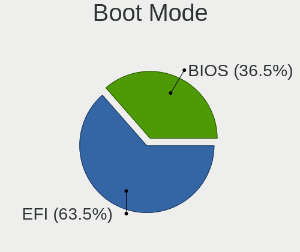
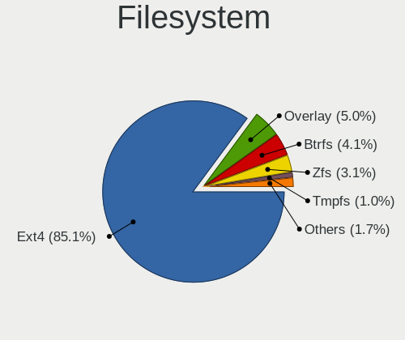
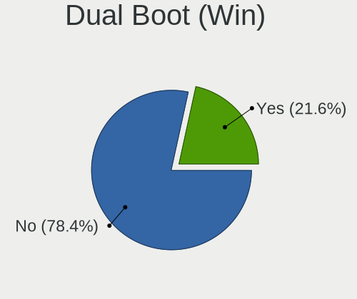
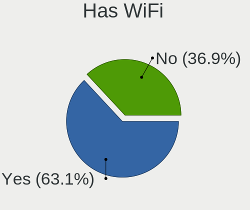
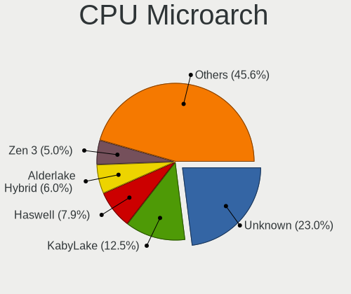
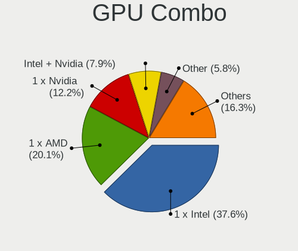
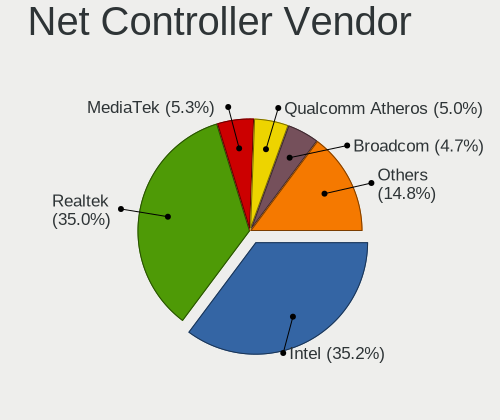
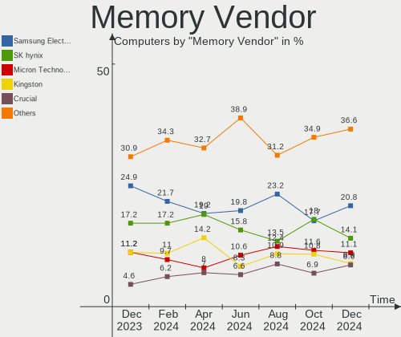
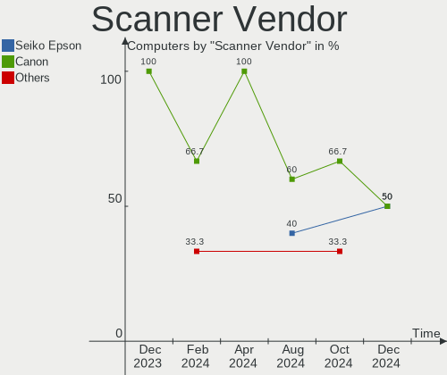

Debian - Hardware Trends
------------------------

A project to identify most popular hardware characteristics and track their change
over time based on data collected by Linux users at https://Linux-Hardware.org.

Anyone can contribute to this report by the [hw-probe](https://github.com/linuxhw/hw-probe) tool:

    sudo -E hw-probe -all -upload

This is a report for all computer types. See also reports for [desktops](/Dist/Debian/Desktop/README.md) and [notebooks](/Dist/Debian/Notebook/README.md).

This report is for one last month. Overall report since the beginning of time: [TestDays](https://github.com/linuxhw/TestDays)

Period: Apr, 2024.

Contents
--------

* [ System ](#system)
  - [ OS                       ](#os)
  - [ OS Family                ](#os-family)
  - [ Kernel                   ](#kernel)
  - [ Kernel Family            ](#kernel-family)
  - [ Kernel Major Ver.        ](#kernel-major-ver)
  - [ Arch                     ](#arch)
  - [ DE                       ](#de)
  - [ Display Server           ](#display-server)
  - [ Display Manager          ](#display-manager)
  - [ OS Lang                  ](#os-lang)
  - [ Boot Mode                ](#boot-mode)
  - [ Filesystem               ](#filesystem)
  - [ Part. scheme             ](#part-scheme)
  - [ Dual Boot with Linux/BSD ](#dual-boot-with-linuxbsd)
  - [ Dual Boot (Win)          ](#dual-boot-win)

* [ Board ](#board)
  - [ Vendor                   ](#vendor)
  - [ Model                    ](#model)
  - [ Model Family             ](#model-family)
  - [ MFG Year                 ](#mfg-year)
  - [ Form Factor              ](#form-factor)
  - [ Secure Boot              ](#secure-boot)
  - [ Coreboot                 ](#coreboot)
  - [ RAM Size                 ](#ram-size)
  - [ RAM Used                 ](#ram-used)
  - [ Total Drives             ](#total-drives)
  - [ Has CD-ROM               ](#has-cd-rom)
  - [ Has Ethernet             ](#has-ethernet)
  - [ Has WiFi                 ](#has-wifi)
  - [ Has Bluetooth            ](#has-bluetooth)

* [ Location ](#location)
  - [ Country                  ](#country)
  - [ City                     ](#city)

* [ Drives ](#drives)
  - [ Drive Vendor             ](#drive-vendor)
  - [ Drive Model              ](#drive-model)
  - [ HDD Vendor               ](#hdd-vendor)
  - [ SSD Vendor               ](#ssd-vendor)
  - [ Drive Kind               ](#drive-kind)
  - [ Drive Connector          ](#drive-connector)
  - [ Drive Size               ](#drive-size)
  - [ Space Total              ](#space-total)
  - [ Space Used               ](#space-used)
  - [ Malfunc. Drives          ](#malfunc-drives)
  - [ Malfunc. Drive Vendor    ](#malfunc-drive-vendor)
  - [ Malfunc. HDD Vendor      ](#malfunc-hdd-vendor)
  - [ Malfunc. Drive Kind      ](#malfunc-drive-kind)
  - [ Failed Drives            ](#failed-drives)
  - [ Failed Drive Vendor      ](#failed-drive-vendor)
  - [ Drive Status             ](#drive-status)

* [ Storage controller ](#storage-controller)
  - [ Storage Vendor           ](#storage-vendor)
  - [ Storage Model            ](#storage-model)
  - [ Storage Kind             ](#storage-kind)

* [ Processor ](#processor)
  - [ CPU Vendor               ](#cpu-vendor)
  - [ CPU Model                ](#cpu-model)
  - [ CPU Model Family         ](#cpu-model-family)
  - [ CPU Cores                ](#cpu-cores)
  - [ CPU Sockets              ](#cpu-sockets)
  - [ CPU Threads              ](#cpu-threads)
  - [ CPU Op-Modes             ](#cpu-op-modes)
  - [ CPU Microcode            ](#cpu-microcode)
  - [ CPU Microarch            ](#cpu-microarch)

* [ Graphics ](#graphics)
  - [ GPU Vendor               ](#gpu-vendor)
  - [ GPU Model                ](#gpu-model)
  - [ GPU Combo                ](#gpu-combo)
  - [ GPU Driver               ](#gpu-driver)
  - [ GPU Memory               ](#gpu-memory)

* [ Monitor ](#monitor)
  - [ Monitor Vendor           ](#monitor-vendor)
  - [ Monitor Model            ](#monitor-model)
  - [ Monitor Resolution       ](#monitor-resolution)
  - [ Monitor Diagonal         ](#monitor-diagonal)
  - [ Monitor Width            ](#monitor-width)
  - [ Aspect Ratio             ](#aspect-ratio)
  - [ Monitor Area             ](#monitor-area)
  - [ Pixel Density            ](#pixel-density)
  - [ Multiple Monitors        ](#multiple-monitors)

* [ Network ](#network)
  - [ Net Controller Vendor    ](#net-controller-vendor)
  - [ Net Controller Model     ](#net-controller-model)
  - [ Wireless Vendor          ](#wireless-vendor)
  - [ Wireless Model           ](#wireless-model)
  - [ Ethernet Vendor          ](#ethernet-vendor)
  - [ Ethernet Model           ](#ethernet-model)
  - [ Net Controller Kind      ](#net-controller-kind)
  - [ Used Controller          ](#used-controller)
  - [ NICs                     ](#nics)
  - [ IPv6                     ](#ipv6)

* [ Bluetooth ](#bluetooth)
  - [ Bluetooth Vendor         ](#bluetooth-vendor)
  - [ Bluetooth Model          ](#bluetooth-model)

* [ Sound ](#sound)
  - [ Sound Vendor             ](#sound-vendor)
  - [ Sound Model              ](#sound-model)

* [ Memory ](#memory)
  - [ Memory Vendor            ](#memory-vendor)
  - [ Memory Model             ](#memory-model)
  - [ Memory Kind              ](#memory-kind)
  - [ Memory Form Factor       ](#memory-form-factor)
  - [ Memory Size              ](#memory-size)
  - [ Memory Speed             ](#memory-speed)

* [ Printers & scanners ](#printers--scanners)
  - [ Printer Vendor           ](#printer-vendor)
  - [ Printer Model            ](#printer-model)
  - [ Scanner Vendor           ](#scanner-vendor)
  - [ Scanner Model            ](#scanner-model)

* [ Camera ](#camera)
  - [ Camera Vendor            ](#camera-vendor)
  - [ Camera Model             ](#camera-model)

* [ Security ](#security)
  - [ Fingerprint Vendor       ](#fingerprint-vendor)
  - [ Fingerprint Model        ](#fingerprint-model)
  - [ Chipcard Vendor          ](#chipcard-vendor)
  - [ Chipcard Model           ](#chipcard-model)

* [ Unsupported ](#unsupported)
  - [ Unsupported Devices      ](#unsupported-devices)
  - [ Unsupported Device Types ](#unsupported-device-types)

System
------

OS
--

Installed operating systems

| Name      | Computers | Percent |
|-----------|-----------|---------|
| Debian 12 | 355       | 80.14%  |
| Debian 11 | 46        | 10.38%  |
| Debian    | 38        | 8.58%   |
| Debian 10 | 2         | 0.45%   |
| Debian 7  | 1         | 0.23%   |
| Debian 6  | 1         | 0.23%   |

OS Family
---------

OS without a version

| Name   | Computers | Percent |
|--------|-----------|---------|
| Debian | 443       | 100%    |

Kernel
------

Version of the Linux kernel

| Version                | Computers | Percent |
|------------------------|-----------|---------|
| 6.1.0-18-amd64         | 115       | 25.96%  |
| 6.1.0-20-amd64         | 99        | 22.35%  |
| 6.1.0-4-amd64          | 30        | 6.77%   |
| 6.6.15-amd64           | 20        | 4.51%   |
| 5.10.0-28-amd64        | 20        | 4.51%   |
| 6.5.13-3-pve           | 15        | 3.39%   |
| 6.1.0-17-amd64         | 13        | 2.93%   |
| 6.5.11-8-pve           | 9         | 2.03%   |
| 6.6.13+bpo-amd64       | 7         | 1.58%   |
| 6.1.0-19-amd64         | 7         | 1.58%   |
| 6.5.13-5-pve           | 5         | 1.13%   |
| 6.7.9-amd64            | 4         | 0.9%    |
| 6.1.0-0.deb11.17-amd64 | 4         | 0.9%    |
| 6.6.20+rpt-rpi-2712    | 3         | 0.68%   |
| 6.5.11-7-pve           | 3         | 0.68%   |
| 6.1.31-sun50iw9        | 3         | 0.68%   |
| 6.8.4-zabbly+          | 2         | 0.45%   |
| 6.8.4-2-pve            | 2         | 0.45%   |
| 6.8.4-060804-generic   | 2         | 0.45%   |
| 6.7.12-amd64           | 2         | 0.45%   |
| 6.6.20+rpt-rpi-v8      | 2         | 0.45%   |
| 6.6.11-amd64           | 2         | 0.45%   |
| 6.5.3-custom           | 2         | 0.45%   |
| 6.2.16-3-pve           | 2         | 0.45%   |
| 6.1.21-v8+             | 2         | 0.45%   |
| 6.1.0-9-amd64          | 2         | 0.45%   |
| 6.1.0-20-686-pae       | 2         | 0.45%   |
| 6.1.0-18-686-pae       | 2         | 0.45%   |
| 6.1.0-13-amd64         | 2         | 0.45%   |
| 5.15.143-1-pve         | 2         | 0.45%   |
| 5.10.0-28-686-pae      | 2         | 0.45%   |
| 5.10.0-27-amd64        | 2         | 0.45%   |
| 5.10.0-10-amd64        | 2         | 0.45%   |
| 4.19.147-rivoreo-amd64 | 2         | 0.45%   |
| 6.9.0-rc4+             | 1         | 0.23%   |
| 6.9.0-rc3+             | 1         | 0.23%   |
| 6.8.7-x64v3-xanmod2    | 1         | 0.23%   |
| 6.8.7-wrkd             | 1         | 0.23%   |
| 6.8.7-lqx2             | 1         | 0.23%   |
| 6.8.6-3-liquorix-amd64 | 1         | 0.23%   |

Kernel Family
-------------

Linux kernel without a distro release

| Version  | Computers | Percent |
|----------|-----------|---------|
| 6.1.0    | 283       | 63.88%  |
| 5.10.0   | 30        | 6.77%   |
| 6.5.13   | 22        | 4.97%   |
| 6.6.15   | 20        | 4.51%   |
| 6.5.11   | 13        | 2.93%   |
| 6.6.13   | 9         | 2.03%   |
| 6.8.4    | 8         | 1.81%   |
| 6.6.20   | 5         | 1.13%   |
| 6.7.9    | 4         | 0.9%    |
| 6.8.7    | 3         | 0.68%   |
| 6.2.16   | 3         | 0.68%   |
| 6.1.31   | 3         | 0.68%   |
| 6.9.0    | 2         | 0.45%   |
| 6.7.12   | 2         | 0.45%   |
| 6.6.28   | 2         | 0.45%   |
| 6.6.25   | 2         | 0.45%   |
| 6.6.11   | 2         | 0.45%   |
| 6.5.3    | 2         | 0.45%   |
| 6.5.0    | 2         | 0.45%   |
| 6.1.21   | 2         | 0.45%   |
| 5.15.143 | 2         | 0.45%   |
| 4.19.147 | 2         | 0.45%   |
| 6.8.6    | 1         | 0.23%   |
| 6.8.5    | 1         | 0.23%   |
| 6.8.3    | 1         | 0.23%   |
| 6.8.2    | 1         | 0.23%   |
| 6.8.1    | 1         | 0.23%   |
| 6.7.10   | 1         | 0.23%   |
| 6.7.0    | 1         | 0.23%   |
| 6.6.16   | 1         | 0.23%   |
| 6.1.74   | 1         | 0.23%   |
| 6.1.67   | 1         | 0.23%   |
| 6.1.43   | 1         | 0.23%   |
| 6.0.0    | 1         | 0.23%   |
| 5.15.92  | 1         | 0.23%   |
| 5.15.149 | 1         | 0.23%   |
| 5.15.131 | 1         | 0.23%   |
| 5.15.111 | 1         | 0.23%   |
| 5.10.199 | 1         | 0.23%   |
| 5.10.180 | 1         | 0.23%   |

Kernel Major Ver.
-----------------

Linux kernel major version

| Version | Computers | Percent |
|---------|-----------|---------|
| 6.1     | 291       | 65.69%  |
| 6.6     | 41        | 9.26%   |
| 6.5     | 39        | 8.8%    |
| 5.10    | 33        | 7.45%   |
| 6.8     | 16        | 3.61%   |
| 6.7     | 8         | 1.81%   |
| 5.15    | 6         | 1.35%   |
| 6.2     | 3         | 0.68%   |
| 6.9     | 2         | 0.45%   |
| 4.19    | 2         | 0.45%   |
| 6.0     | 1         | 0.23%   |
| 3.2     | 1         | 0.23%   |

Arch
----

OS architecture (x86_64, i586, etc.)

| Name    | Computers | Percent |
|---------|-----------|---------|
| x86_64  | 418       | 94.36%  |
| aarch64 | 14        | 3.16%   |
| i686    | 8         | 1.81%   |
| armv7l  | 3         | 0.68%   |

DE
--

Desktop Environment

| Name             | Computers | Percent |
|------------------|-----------|---------|
| GNOME            | 115       | 25.96%  |
| Unknown          | 114       | 25.73%  |
| KDE5             | 85        | 19.19%  |
| XFCE             | 46        | 10.38%  |
| MATE             | 24        | 5.42%   |
| X-Cinnamon       | 18        | 4.06%   |
| LXDE             | 10        | 2.26%   |
| GNOME Flashback  | 7         | 1.58%   |
| LXQt             | 6         | 1.35%   |
| Cinnamon         | 4         | 0.9%    |
| Trinity          | 2         | 0.45%   |
| Openbox          | 2         | 0.45%   |
| LXDE-pi-wayfire  | 2         | 0.45%   |
| KDE              | 2         | 0.45%   |
| i3               | 2         | 0.45%   |
| Phosh:GNOME      | 1         | 0.23%   |
| lightdm-xsession | 1         | 0.23%   |
| icewm            | 1         | 0.23%   |
| GNOME Classic    | 1         | 0.23%   |

Display Server
--------------

X11 or Wayland

| Name    | Computers | Percent |
|---------|-----------|---------|
| X11     | 185       | 41.76%  |
| Wayland | 131       | 29.57%  |
| Tty     | 68        | 15.35%  |
| Unknown | 59        | 13.32%  |

Display Manager
---------------

SDDM, LightDM, etc.

| Name    | Computers | Percent |
|---------|-----------|---------|
| Unknown | 192       | 43.34%  |
| LightDM | 93        | 20.99%  |
| GDM3    | 85        | 19.19%  |
| SDDM    | 63        | 14.22%  |
| GDM     | 6         | 1.35%   |
| SLiM    | 2         | 0.45%   |
| LXDM    | 2         | 0.45%   |

OS Lang
-------

Language

| Lang    | Computers | Percent |
|---------|-----------|---------|
| en_US   | 191       | 43.12%  |
| ru_RU   | 45        | 10.16%  |
| de_DE   | 27        | 6.09%   |
| fr_FR   | 19        | 4.29%   |
| pl_PL   | 18        | 4.06%   |
| en_GB   | 17        | 3.84%   |
| C       | 13        | 2.93%   |
| pt_BR   | 10        | 2.26%   |
| it_IT   | 10        | 2.26%   |
| es_ES   | 10        | 2.26%   |
| Unknown | 9         | 2.03%   |
| en_CA   | 8         | 1.81%   |
| nl_NL   | 6         | 1.35%   |
| en_AU   | 5         | 1.13%   |
| es_MX   | 4         | 0.9%    |
| es_CL   | 4         | 0.9%    |
| cs_CZ   | 4         | 0.9%    |
| es_CO   | 3         | 0.68%   |
| ca_ES   | 3         | 0.68%   |
| zh_TW   | 2         | 0.45%   |
| zh_CN   | 2         | 0.45%   |
| sv_SE   | 2         | 0.45%   |
| sk_SK   | 2         | 0.45%   |
| pt_PT   | 2         | 0.45%   |
| nl_BE   | 2         | 0.45%   |
| lt_LT   | 2         | 0.45%   |
| hu_HU   | 2         | 0.45%   |
| fr_CA   | 2         | 0.45%   |
| es_SV   | 2         | 0.45%   |
| es_AR   | 2         | 0.45%   |
| en_NZ   | 2         | 0.45%   |
| en_IE   | 2         | 0.45%   |
| tr_TR   | 1         | 0.23%   |
| sr_RS   | 1         | 0.23%   |
| ja_JP   | 1         | 0.23%   |
| es_UY   | 1         | 0.23%   |
| es_PE   | 1         | 0.23%   |
| es_CU   | 1         | 0.23%   |
| en_ZA   | 1         | 0.23%   |
| en_IN   | 1         | 0.23%   |

Boot Mode
---------

EFI or BIOS

| Mode | Computers | Percent |
|------|-----------|---------|
| EFI  | 246       | 55.53%  |
| BIOS | 197       | 44.47%  |

Filesystem
----------

Type of filesystem

| Type    | Computers | Percent |
|---------|-----------|---------|
| Ext4    | 339       | 76.52%  |
| Overlay | 44        | 9.93%   |
| Btrfs   | 26        | 5.87%   |
| Tmpfs   | 13        | 2.93%   |
| Zfs     | 12        | 2.71%   |
| Xfs     | 7         | 1.58%   |
| Rootfs  | 1         | 0.23%   |
| Ext3    | 1         | 0.23%   |

Part. scheme
------------

Scheme of partitioning

| Type    | Computers | Percent |
|---------|-----------|---------|
| GPT     | 276       | 62.3%   |
| MBR     | 90        | 20.32%  |
| Unknown | 77        | 17.38%  |

Dual Boot with Linux/BSD
------------------------

Hosting more than one Linux/BSD

| Dual boot | Computers | Percent |
|-----------|-----------|---------|
| No        | 376       | 84.88%  |
| Yes       | 67        | 15.12%  |

Dual Boot (Win)
---------------

Hosting Linux and Windows

| Dual boot | Computers | Percent |
|-----------|-----------|---------|
| No        | 314       | 70.88%  |
| Yes       | 129       | 29.12%  |

Board
-----

Vendor
------

Motherboard manufacturer

| Name                                 | Computers | Percent |
|--------------------------------------|-----------|---------|
| Lenovo                               | 79        | 17.83%  |
| ASUSTek Computer                     | 75        | 16.93%  |
| Hewlett-Packard                      | 53        | 11.96%  |
| Dell                                 | 48        | 10.84%  |
| Gigabyte Technology                  | 29        | 6.55%   |
| MSI                                  | 19        | 4.29%   |
| ASRock                               | 19        | 4.29%   |
| Acer                                 | 14        | 3.16%   |
| Intel                                | 13        | 2.93%   |
| Raspberry Pi Foundation              | 10        | 2.26%   |
| Fujitsu                              | 7         | 1.58%   |
| Samsung Electronics                  | 6         | 1.35%   |
| Apple                                | 6         | 1.35%   |
| Unknown                              | 6         | 1.35%   |
| Supermicro                           | 4         | 0.9%    |
| OrangePi                             | 3         | 0.68%   |
| Google                               | 3         | 0.68%   |
| AMI                                  | 3         | 0.68%   |
| Toshiba                              | 2         | 0.45%   |
| Shenzhen Meigao Electronic Equipment | 2         | 0.45%   |
| Pegatron                             | 2         | 0.45%   |
| HUAWEI                               | 2         | 0.45%   |
| AZW                                  | 2         | 0.45%   |
| Xunlong                              | 1         | 0.23%   |
| TUXEDO                               | 1         | 0.23%   |
| SZMZ                                 | 1         | 0.23%   |
| Sony                                 | 1         | 0.23%   |
| SolidRun                             | 1         | 0.23%   |
| Schenker                             | 1         | 0.23%   |
| Sapphire                             | 1         | 0.23%   |
| Rockchip                             | 1         | 0.23%   |
| PCWare                               | 1         | 0.23%   |
| Panasonic                            | 1         | 0.23%   |
| Olimex                               | 1         | 0.23%   |
| Notebook                             | 1         | 0.23%   |
| MobileDemand                         | 1         | 0.23%   |
| Minix                                | 1         | 0.23%   |
| Microsoft                            | 1         | 0.23%   |
| LNV                                  | 1         | 0.23%   |
| Jumper                               | 1         | 0.23%   |

Model
-----

Motherboard model

| Name                                              | Computers | Percent |
|---------------------------------------------------|-----------|---------|
| Lenovo ThinkCentre M79 10JAS05300                 | 9         | 2.03%   |
| Unknown                                           | 7         | 1.58%   |
| ASUS S20 K29                                      | 5         | 1.13%   |
| RPi Raspberry Pi 5 Model B Rev 1.0                | 4         | 0.9%    |
| HP ProLiant DL380 Gen9                            | 4         | 0.9%    |
| HP ProLiant DL360 Gen9                            | 4         | 0.9%    |
| ASUS All Series                                   | 3         | 0.68%   |
| Supermicro Super Server                           | 2         | 0.45%   |
| Samsung RV411/RV511/E3511/S3511/RV711/E3411       | 2         | 0.45%   |
| RPi Raspberry Pi 4 Model B Rev 1.5                | 2         | 0.45%   |
| OrangePi Zero3                                    | 2         | 0.45%   |
| Lenovo ThinkPad L13 Yoga Gen 2 20VK0019US         | 2         | 0.45%   |
| HP Pavilion Gaming Laptop 15-ec1xxx               | 2         | 0.45%   |
| HP Laptop 15-db0xxx                               | 2         | 0.45%   |
| Gigabyte Z790 AORUS ELITE AX                      | 2         | 0.45%   |
| Gigabyte X570 GAMING X                            | 2         | 0.45%   |
| Gigabyte GA-78LMT-S2                              | 2         | 0.45%   |
| Dell PowerEdge R630                               | 2         | 0.45%   |
| Dell Latitude E7440                               | 2         | 0.45%   |
| Dell Latitude E6400                               | 2         | 0.45%   |
| AZW U59                                           | 2         | 0.45%   |
| ASUS Vivobook Go E1504GA_E1504GA                  | 2         | 0.45%   |
| ASUS P5QL-CM                                      | 2         | 0.45%   |
| ASUS P5KPL-CM                                     | 2         | 0.45%   |
| ASUS K53E                                         | 2         | 0.45%   |
| Apple MacBook6,1                                  | 2         | 0.45%   |
| Xunlong Orange Pi Zero                            | 1         | 0.23%   |
| TUXEDO Aura 15 Gen1                               | 1         | 0.23%   |
| Toshiba Satellite C870-192                        | 1         | 0.23%   |
| Toshiba PORTEGE Z30-A                             | 1         | 0.23%   |
| SZMZ X99-S3                                       | 1         | 0.23%   |
| Supermicro X8ST3                                  | 1         | 0.23%   |
| Supermicro X11DPi-N(T)                            | 1         | 0.23%   |
| Sony SVF15A17CLB                                  | 1         | 0.23%   |
| SolidRun CEX7 Platform                            | 1         | 0.23%   |
| Shenzhen Meigao Electronic Equipment Venus Series | 1         | 0.23%   |
| Shenzhen Meigao Electronic Equipment NAB6         | 1         | 0.23%   |
| Schenker XMG FUSION 15 (XFU15L19)                 | 1         | 0.23%   |
| Sapphire PI-AM3RS760G2                            | 1         | 0.23%   |
| Samsung 750XED                                    | 1         | 0.23%   |

Model Family
------------

Motherboard model prefix

| Name                 | Computers | Percent |
|----------------------|-----------|---------|
| Lenovo ThinkPad      | 38        | 8.58%   |
| Lenovo ThinkCentre   | 19        | 4.29%   |
| Dell Latitude        | 16        | 3.61%   |
| HP ProLiant          | 11        | 2.48%   |
| RPi Raspberry        | 10        | 2.26%   |
| Acer Aspire          | 10        | 2.26%   |
| Dell Inspiron        | 9         | 2.03%   |
| ASUS ROG             | 9         | 2.03%   |
| Dell PowerEdge       | 8         | 1.81%   |
| HP Pavilion          | 7         | 1.58%   |
| HP Laptop            | 7         | 1.58%   |
| HP EliteBook         | 7         | 1.58%   |
| Unknown              | 7         | 1.58%   |
| Gigabyte X570        | 6         | 1.35%   |
| Dell OptiPlex        | 6         | 1.35%   |
| ASUS VivoBook        | 6         | 1.35%   |
| ASUS TUF             | 6         | 1.35%   |
| ASUS PRIME           | 6         | 1.35%   |
| Lenovo IdeaPad       | 5         | 1.13%   |
| ASUS S20             | 5         | 1.13%   |
| Lenovo Legion        | 4         | 0.9%    |
| Dell XPS             | 4         | 0.9%    |
| HP ZBook             | 3         | 0.68%   |
| HP EliteDesk         | 3         | 0.68%   |
| Gigabyte Z790        | 3         | 0.68%   |
| Fujitsu LIFEBOOK     | 3         | 0.68%   |
| Dell Precision       | 3         | 0.68%   |
| ASUS ASUS            | 3         | 0.68%   |
| ASUS All             | 3         | 0.68%   |
| Supermicro Super     | 2         | 0.45%   |
| Samsung RV411        | 2         | 0.45%   |
| OrangePi Zero3       | 2         | 0.45%   |
| MSI Prestige         | 2         | 0.45%   |
| Lenovo IdeaPadFlex   | 2         | 0.45%   |
| HP ProDesk           | 2         | 0.45%   |
| HP ProBook           | 2         | 0.45%   |
| Gigabyte GA-78LMT-S2 | 2         | 0.45%   |
| Gigabyte B450M       | 2         | 0.45%   |
| Dell Vostro          | 2         | 0.45%   |
| AZW U59              | 2         | 0.45%   |

MFG Year
--------

Motherboard manufacture year

| Year    | Computers | Percent |
|---------|-----------|---------|
| 2021    | 45        | 10.16%  |
| 2020    | 45        | 10.16%  |
| 2016    | 41        | 9.26%   |
| 2023    | 38        | 8.58%   |
| 2022    | 34        | 7.67%   |
| 2013    | 28        | 6.32%   |
| 2019    | 27        | 6.09%   |
| 2018    | 26        | 5.87%   |
| 2012    | 25        | 5.64%   |
| 2017    | 22        | 4.97%   |
| 2011    | 22        | 4.97%   |
| 2014    | 19        | 4.29%   |
| Unknown | 16        | 3.61%   |
| 2015    | 14        | 3.16%   |
| 2008    | 11        | 2.48%   |
| 2009    | 9         | 2.03%   |
| 2024    | 6         | 1.35%   |
| 2010    | 5         | 1.13%   |
| 2007    | 5         | 1.13%   |
| 2006    | 2         | 0.45%   |
| 2005    | 1         | 0.23%   |
| 2002    | 1         | 0.23%   |
| 2000    | 1         | 0.23%   |

Form Factor
-----------

Physical design of the computer

| Name           | Computers | Percent |
|----------------|-----------|---------|
| Notebook       | 190       | 42.89%  |
| Desktop        | 178       | 40.18%  |
| Server         | 29        | 6.55%   |
| System on chip | 16        | 3.61%   |
| Mini pc        | 12        | 2.71%   |
| Convertible    | 9         | 2.03%   |
| Tablet         | 6         | 1.35%   |
| All in one     | 3         | 0.68%   |

Secure Boot
-----------

Enabled or disabled

| State    | Computers | Percent |
|----------|-----------|---------|
| Disabled | 411       | 92.78%  |
| Enabled  | 32        | 7.22%   |

Coreboot
--------

Have coreboot on board

| Used | Computers | Percent |
|------|-----------|---------|
| No   | 439       | 99.1%   |
| Yes  | 4         | 0.9%    |

RAM Size
--------

Total RAM memory

| Size in GB      | Computers | Percent |
|-----------------|-----------|---------|
| 4.01-8.0        | 92        | 20.77%  |
| 16.01-24.0      | 82        | 18.51%  |
| 32.01-64.0      | 66        | 14.9%   |
| 3.01-4.0        | 62        | 14%     |
| 8.01-16.0       | 52        | 11.74%  |
| 64.01-256.0     | 43        | 9.71%   |
| 24.01-32.0      | 16        | 3.61%   |
| 1.01-2.0        | 14        | 3.16%   |
| 0.51-1.0        | 5         | 1.13%   |
| 2.01-3.0        | 4         | 0.9%    |
| More than 256.0 | 3         | 0.68%   |
| 0.01-0.5        | 2         | 0.45%   |
| Unknown         | 2         | 0.45%   |

RAM Used
--------

Used RAM memory

| Used GB     | Computers | Percent |
|-------------|-----------|---------|
| 2.01-3.0    | 84        | 18.96%  |
| 1.01-2.0    | 84        | 18.96%  |
| 4.01-8.0    | 82        | 18.51%  |
| 3.01-4.0    | 71        | 16.03%  |
| 0.51-1.0    | 53        | 11.96%  |
| 8.01-16.0   | 28        | 6.32%   |
| 0.01-0.5    | 16        | 3.61%   |
| 32.01-64.0  | 8         | 1.81%   |
| 24.01-32.0  | 6         | 1.35%   |
| 64.01-256.0 | 4         | 0.9%    |
| 16.01-24.0  | 4         | 0.9%    |
| Unknown     | 3         | 0.68%   |

Total Drives
------------

Number of drives on board

| Drives | Computers | Percent |
|--------|-----------|---------|
| 1      | 263       | 59.37%  |
| 2      | 87        | 19.64%  |
| 3      | 32        | 7.22%   |
| 4      | 24        | 5.42%   |
| 10     | 5         | 1.13%   |
| 7      | 5         | 1.13%   |
| 0      | 5         | 1.13%   |
| 5      | 4         | 0.9%    |
| 11     | 3         | 0.68%   |
| 14     | 2         | 0.45%   |
| 13     | 2         | 0.45%   |
| 12     | 2         | 0.45%   |
| 8      | 2         | 0.45%   |
| 6      | 2         | 0.45%   |
| 70     | 1         | 0.23%   |
| 41     | 1         | 0.23%   |
| 37     | 1         | 0.23%   |
| 17     | 1         | 0.23%   |
| 9      | 1         | 0.23%   |

Has CD-ROM
----------

Has CD-ROM on board

| Presented | Computers | Percent |
|-----------|-----------|---------|
| No        | 318       | 71.78%  |
| Yes       | 125       | 28.22%  |

Has Ethernet
------------

Has Ethernet on board

| Presented | Computers | Percent |
|-----------|-----------|---------|
| Yes       | 388       | 87.58%  |
| No        | 55        | 12.42%  |

Has WiFi
--------

Has WiFi module

| Presented | Computers | Percent |
|-----------|-----------|---------|
| Yes       | 276       | 62.3%   |
| No        | 167       | 37.7%   |

Has Bluetooth
-------------

Has Bluetooth module

| Presented | Computers | Percent |
|-----------|-----------|---------|
| Yes       | 246       | 55.53%  |
| No        | 197       | 44.47%  |

Location
--------

Country
-------

Geographic location (country)

| Country     | Computers | Percent |
|-------------|-----------|---------|
| Russia      | 70        | 15.8%   |
| USA         | 58        | 13.09%  |
| Germany     | 44        | 9.93%   |
| Poland      | 25        | 5.64%   |
| France      | 20        | 4.51%   |
| Canada      | 20        | 4.51%   |
| Spain       | 18        | 4.06%   |
| Brazil      | 15        | 3.39%   |
| Italy       | 13        | 2.93%   |
| UK          | 11        | 2.48%   |
| Netherlands | 11        | 2.48%   |
| Finland     | 9         | 2.03%   |
| Portugal    | 7         | 1.58%   |
| Mexico      | 7         | 1.58%   |
| China       | 7         | 1.58%   |
| Belgium     | 6         | 1.35%   |
| Serbia      | 5         | 1.13%   |
| Romania     | 5         | 1.13%   |
| Australia   | 5         | 1.13%   |
| Switzerland | 4         | 0.9%    |
| Sweden      | 4         | 0.9%    |
| Japan       | 4         | 0.9%    |
| Czechia     | 4         | 0.9%    |
| Colombia    | 4         | 0.9%    |
| Chile       | 4         | 0.9%    |
| Slovakia    | 3         | 0.68%   |
| Paraguay    | 3         | 0.68%   |
| Indonesia   | 3         | 0.68%   |
| Greece      | 3         | 0.68%   |
| Belarus     | 3         | 0.68%   |
| Austria     | 3         | 0.68%   |
| Uzbekistan  | 2         | 0.45%   |
| Uruguay     | 2         | 0.45%   |
| Tunisia     | 2         | 0.45%   |
| Norway      | 2         | 0.45%   |
| New Zealand | 2         | 0.45%   |
| Morocco     | 2         | 0.45%   |
| Malaysia    | 2         | 0.45%   |
| Lithuania   | 2         | 0.45%   |
| Kazakhstan  | 2         | 0.45%   |

City
----

Geographic location (city)

| City              | Computers | Percent |
|-------------------|-----------|---------|
| Voronezh          | 30        | 6.77%   |
| Moscow            | 15        | 3.39%   |
| St Petersburg     | 8         | 1.81%   |
| Amsterdam         | 8         | 1.81%   |
| Warsaw            | 5         | 1.13%   |
| Toronto           | 5         | 1.13%   |
| Madrid            | 5         | 1.13%   |
| Berlin            | 5         | 1.13%   |
| Belgrade          | 5         | 1.13%   |
| Bangor            | 5         | 1.13%   |
| Santiago          | 4         | 0.9%    |
| Helsinki          | 4         | 0.9%    |
| Frankfurt am Main | 4         | 0.9%    |
| Athens            | 4         | 0.9%    |
| Valencia          | 3         | 0.68%   |
| Tulsa             | 3         | 0.68%   |
| Tokyo             | 3         | 0.68%   |
| Sao Paulo         | 3         | 0.68%   |
| Ruda Śląska     | 3         | 0.68%   |
| Murino            | 3         | 0.68%   |
| Jaworzno          | 3         | 0.68%   |
| Espoo             | 3         | 0.68%   |
| Aurich            | 3         | 0.68%   |
| Asunción         | 3         | 0.68%   |
| Argenteuil        | 3         | 0.68%   |
| Yekaterinburg     | 2         | 0.45%   |
| Wroclaw           | 2         | 0.45%   |
| Vienna            | 2         | 0.45%   |
| Tashkent          | 2         | 0.45%   |
| Shanghai          | 2         | 0.45%   |
| Semey             | 2         | 0.45%   |
| San Salvador      | 2         | 0.45%   |
| Querétaro City   | 2         | 0.45%   |
| Prague            | 2         | 0.45%   |
| Plaisir           | 2         | 0.45%   |
| Paris             | 2         | 0.45%   |
| Nuremberg         | 2         | 0.45%   |
| Montreal          | 2         | 0.45%   |
| Melbourne         | 2         | 0.45%   |
| Lyon              | 2         | 0.45%   |

Drives
------

Drive Vendor
------------

Hard drive vendors

| Vendor                      | Computers | Drives | Percent |
|-----------------------------|-----------|--------|---------|
| Samsung Electronics         | 111       | 172    | 17%     |
| WDC                         | 82        | 134    | 12.56%  |
| Seagate                     | 67        | 132    | 10.26%  |
| Toshiba                     | 40        | 59     | 6.13%   |
| SanDisk                     | 38        | 40     | 5.82%   |
| Kingston                    | 36        | 55     | 5.51%   |
| Crucial                     | 30        | 35     | 4.59%   |
| SK hynix                    | 28        | 28     | 4.29%   |
| Unknown                     | 25        | 26     | 3.83%   |
| Micron Technology           | 14        | 14     | 2.14%   |
| Intel                       | 13        | 16     | 1.99%   |
| Hitachi                     | 13        | 16     | 1.99%   |
| A-DATA Technology           | 10        | 13     | 1.53%   |
| HGST                        | 8         | 106    | 1.23%   |
| GOODRAM                     | 8         | 15     | 1.23%   |
| China                       | 8         | 8      | 1.23%   |
| Unknown                     | 7         | 7      | 1.07%   |
| KIOXIA                      | 6         | 6      | 0.92%   |
| Hewlett-Packard             | 6         | 7      | 0.92%   |
| Patriot                     | 4         | 4      | 0.61%   |
| OCZ                         | 4         | 5      | 0.61%   |
| Netac                       | 4         | 4      | 0.61%   |
| Lexar                       | 4         | 5      | 0.61%   |
| Kingston Technology Company | 4         | 5      | 0.61%   |
| Corsair                     | 4         | 5      | 0.61%   |
| Apple                       | 4         | 4      | 0.61%   |
| Transcend                   | 3         | 3      | 0.46%   |
| Team                        | 3         | 3      | 0.46%   |
| SSSTC                       | 3         | 3      | 0.46%   |
| SPCC                        | 3         | 3      | 0.46%   |
| PNY                         | 3         | 5      | 0.46%   |
| Gigabyte Technology         | 3         | 3      | 0.46%   |
| Union Memory                | 2         | 2      | 0.31%   |
| Realtek Semiconductor       | 2         | 2      | 0.31%   |
| Micron/Crucial Technology   | 2         | 3      | 0.31%   |
| LITEON                      | 2         | 2      | 0.31%   |
| KLEVV                       | 2         | 3      | 0.31%   |
| JMicron Technology          | 2         | 2      | 0.31%   |
| Intenso                     | 2         | 3      | 0.31%   |
| Fujitsu                     | 2         | 7      | 0.31%   |

Drive Model
-----------

Hard drive models

| Model                                             | Computers | Percent |
|---------------------------------------------------|-----------|---------|
| Samsung NVMe SSD Controller SM981/PM981/PM983 1TB | 12        | 1.65%   |
| Kingston SA400S37240G 240GB SSD                   | 7         | 0.96%   |
| Unknown                                           | 7         | 0.96%   |
| SanDisk NVMe SSD Drive 1TB                        | 6         | 0.82%   |
| Samsung SSD 870 EVO 500GB                         | 6         | 0.82%   |
| Kingston SA400S37480G 480GB SSD                   | 6         | 0.82%   |
| WDC WD5000AAKX-22ERMA0 500GB                      | 5         | 0.69%   |
| Unknown MMC Card  64GB                            | 5         | 0.69%   |
| Seagate ST1000DM010-2EP102 1TB                    | 5         | 0.69%   |
| Crucial CT480BX500SSD1 480GB                      | 5         | 0.69%   |
| Toshiba MQ01ABD100 1TB                            | 4         | 0.55%   |
| Toshiba DT01ACA200 2TB                            | 4         | 0.55%   |
| Seagate ST500DM002-1BD142 500GB                   | 4         | 0.55%   |
| Samsung SSD 970 EVO Plus 500GB                    | 4         | 0.55%   |
| Samsung SSD 870 EVO 1TB                           | 4         | 0.55%   |
| Samsung NVMe SSD Controller SM961/PM961/SM963 1TB | 4         | 0.55%   |
| Samsung MZVLB512HBJQ-000L7 512GB                  | 4         | 0.55%   |
| Crucial CT2000MX500SSD1 2TB                       | 4         | 0.55%   |
| WDC WD40EFRX-68N32N0 4TB                          | 3         | 0.41%   |
| Unknown MMC Card  128GB                           | 3         | 0.41%   |
| Seagate ST4000DM004-2CV104 4TB                    | 3         | 0.41%   |
| Seagate ST3320620AS 320GB                         | 3         | 0.41%   |
| Seagate ST2000DM008-2FR102 2TB                    | 3         | 0.41%   |
| Seagate ST1000LM024 HN-M101MBB 1TB                | 3         | 0.41%   |
| Samsung SSD 980 PRO 1TB                           | 3         | 0.41%   |
| Samsung SSD 860 EVO 500GB                         | 3         | 0.41%   |
| Samsung SSD 860 EVO 1TB                           | 3         | 0.41%   |
| Samsung SSD 850 EVO 250GB                         | 3         | 0.41%   |
| HP LOGICAL VOLUME 160GB                           | 3         | 0.41%   |
| WDC WDS500G2B0A-00SM50 500GB SSD                  | 2         | 0.27%   |
| WDC WDS100T3X0C-00SJG0 1TB                        | 2         | 0.27%   |
| WDC WDS100T2B0A-00SM50 1TB SSD                    | 2         | 0.27%   |
| WDC WD5000LPVX-22V0TT0 500GB                      | 2         | 0.27%   |
| WDC WD42PURZ-85B4YY0 4TB                          | 2         | 0.27%   |
| WDC WD40EZRZ-22GXCB0 4TB                          | 2         | 0.27%   |
| WDC WD40EFAX-68JH4N1 4TB                          | 2         | 0.27%   |
| WDC WD30EFRX-68EUZN0 3TB                          | 2         | 0.27%   |
| WDC WD20EZRZ-00Z5HB0 2TB                          | 2         | 0.27%   |
| WDC WD20EZBX-00AYRA0 2TB                          | 2         | 0.27%   |
| WDC WD20EZAZ-00GGJB0 2TB                          | 2         | 0.27%   |

HDD Vendor
----------

Hard disk drive vendors

| Vendor              | Computers | Drives | Percent |
|---------------------|-----------|--------|---------|
| Seagate             | 66        | 131    | 34.2%   |
| WDC                 | 63        | 105    | 32.64%  |
| Toshiba             | 28        | 47     | 14.51%  |
| Hitachi             | 13        | 16     | 6.74%   |
| HGST                | 7         | 104    | 3.63%   |
| Hewlett-Packard     | 4         | 5      | 2.07%   |
| Samsung Electronics | 3         | 3      | 1.55%   |
| STEC                | 1         | 1      | 0.52%   |
| QUANTUM             | 1         | 1      | 0.52%   |
| MARVELL             | 1         | 2      | 0.52%   |
| JMicron Technology  | 1         | 1      | 0.52%   |
| HGST HTS            | 1         | 1      | 0.52%   |
| Fujitsu             | 1         | 6      | 0.52%   |
| ASMT                | 1         | 1      | 0.52%   |
| Apple               | 1         | 1      | 0.52%   |
| Unknown             | 1         | 1      | 0.52%   |

SSD Vendor
----------

Solid state drive vendors

| Vendor              | Computers | Drives | Percent |
|---------------------|-----------|--------|---------|
| Samsung Electronics | 44        | 86     | 19.47%  |
| Kingston            | 25        | 34     | 11.06%  |
| Crucial             | 24        | 28     | 10.62%  |
| SanDisk             | 14        | 15     | 6.19%   |
| WDC                 | 13        | 21     | 5.75%   |
| A-DATA Technology   | 9         | 10     | 3.98%   |
| China               | 8         | 8      | 3.54%   |
| Toshiba             | 6         | 6      | 2.65%   |
| GOODRAM             | 6         | 6      | 2.65%   |
| Patriot             | 4         | 4      | 1.77%   |
| OCZ                 | 4         | 5      | 1.77%   |
| Netac               | 4         | 4      | 1.77%   |
| Intel               | 4         | 7      | 1.77%   |
| Transcend           | 3         | 3      | 1.33%   |
| SPCC                | 3         | 3      | 1.33%   |
| SK hynix            | 3         | 3      | 1.33%   |
| PNY                 | 3         | 5      | 1.33%   |
| Apple               | 3         | 3      | 1.33%   |
| Team                | 2         | 2      | 0.88%   |
| Micron Technology   | 2         | 2      | 0.88%   |
| LITEON              | 2         | 2      | 0.88%   |
| KLEVV               | 2         | 3      | 0.88%   |
| Intenso             | 2         | 3      | 0.88%   |
| Hewlett-Packard     | 2         | 2      | 0.88%   |
| Fanxiang            | 2         | 2      | 0.88%   |
| External            | 2         | 2      | 0.88%   |
| Apacer              | 2         | 2      | 0.88%   |
| AMD                 | 2         | 2      | 0.88%   |
| Unknown             | 2         | 2      | 0.88%   |
| Wibtek              | 1         | 1      | 0.44%   |
| Union Memory        | 1         | 1      | 0.44%   |
| TSA                 | 1         | 1      | 0.44%   |
| Timetec             | 1         | 2      | 0.44%   |
| StoreJet            | 1         | 1      | 0.44%   |
| Seagate             | 1         | 1      | 0.44%   |
| SATADOM-ML          | 1         | 1      | 0.44%   |
| S3+                 | 1         | 1      | 0.44%   |
| POWER               | 1         | 1      | 0.44%   |
| Plextor             | 1         | 1      | 0.44%   |
| NVMe                | 1         | 4      | 0.44%   |

Drive Kind
----------

HDD or SSD

| Kind    | Computers | Drives | Percent |
|---------|-----------|--------|---------|
| SSD     | 194       | 303    | 33.86%  |
| NVMe    | 186       | 244    | 32.46%  |
| HDD     | 158       | 426    | 27.57%  |
| MMC     | 29        | 31     | 5.06%   |
| Unknown | 6         | 8      | 1.05%   |

Drive Connector
---------------

SATA, SAS, NVMe, etc.

| Type | Computers | Drives | Percent |
|------|-----------|--------|---------|
| SATA | 291       | 687    | 54.39%  |
| NVMe | 186       | 243    | 34.77%  |
| SAS  | 29        | 51     | 5.42%   |
| MMC  | 29        | 31     | 5.42%   |

Drive Size
----------

Size of hard drive

| Size in TB | Computers | Drives | Percent |
|------------|-----------|--------|---------|
| 0.01-0.5   | 203       | 283    | 53.28%  |
| 0.51-1.0   | 87        | 132    | 22.83%  |
| 1.01-2.0   | 41        | 76     | 10.76%  |
| 3.01-4.0   | 18        | 38     | 4.72%   |
| 4.01-10.0  | 15        | 139    | 3.94%   |
| 2.01-3.0   | 11        | 24     | 2.89%   |
| 10.01-20.0 | 5         | 36     | 1.31%   |
| 0          | 1         | 1      | 0.26%   |

Space Total
-----------

Amount of disk space available on the file system

| Size in GB     | Computers | Percent |
|----------------|-----------|---------|
| 101-250        | 110       | 24.83%  |
| 251-500        | 88        | 19.86%  |
| 501-1000       | 69        | 15.58%  |
| Unknown        | 42        | 9.48%   |
| More than 3000 | 31        | 7%      |
| 51-100         | 27        | 6.09%   |
| 1001-2000      | 23        | 5.19%   |
| 21-50          | 19        | 4.29%   |
| 1-20           | 19        | 4.29%   |
| 2001-3000      | 15        | 3.39%   |

Space Used
----------

Amount of used disk space

| Used GB        | Computers | Percent |
|----------------|-----------|---------|
| 1-20           | 152       | 34.31%  |
| 101-250        | 61        | 13.77%  |
| 21-50          | 59        | 13.32%  |
| Unknown        | 42        | 9.48%   |
| 251-500        | 41        | 9.26%   |
| 51-100         | 37        | 8.35%   |
| 501-1000       | 21        | 4.74%   |
| More than 3000 | 13        | 2.93%   |
| 1001-2000      | 10        | 2.26%   |
| 2001-3000      | 7         | 1.58%   |

Malfunc. Drives
---------------

Drive models with a malfunction

| Model                                                 | Computers | Drives | Percent |
|-------------------------------------------------------|-----------|--------|---------|
| WDC WD5000AAKX-22ERMA0 500GB                          | 2         | 2      | 4.65%   |
| WDC WD5000AAKX-07U6AA0 500GB                          | 1         | 1      | 2.33%   |
| WDC WD40EZRZ-22GXCB0 4TB                              | 1         | 3      | 2.33%   |
| WDC WD40EFRX-68N32N0 4TB                              | 1         | 1      | 2.33%   |
| WDC WD2500AAKS-00VSA0 250GB                           | 1         | 1      | 2.33%   |
| WDC WD2500AAJS-08L7A0 250GB                           | 1         | 1      | 2.33%   |
| WDC WD2500AAJS-00L7A0 250GB                           | 1         | 1      | 2.33%   |
| WDC WD20EARX-22PASB0 2TB                              | 1         | 2      | 2.33%   |
| WDC WD2002FAEX-007BA0 2TB                             | 1         | 1      | 2.33%   |
| WDC WD2000F9YZ-09N20L0 2TB                            | 1         | 2      | 2.33%   |
| WDC WD1503FYYS-02W0B0 1TB                             | 1         | 1      | 2.33%   |
| WDC WD Green M.2 2280 480GB SSD                       | 1         | 1      | 2.33%   |
| WDC WD Blue SA510 2.5 250GB SSD                       | 1         | 1      | 2.33%   |
| Transcend TS32GPSD330 32GB SSD                        | 1         | 1      | 2.33%   |
| Toshiba MQ01ABF050 500GB                              | 1         | 1      | 2.33%   |
| Toshiba DT01ACA200 2TB                                | 1         | 1      | 2.33%   |
| SK hynix SC401 SATA 512GB SSD                         | 1         | 1      | 2.33%   |
| Seagate ST9320325AS 320GB                             | 1         | 1      | 2.33%   |
| Seagate ST9120821AS 120GB                             | 1         | 1      | 2.33%   |
| Seagate ST8000DM004-2CX188 8TB                        | 1         | 1      | 2.33%   |
| Seagate ST500LM012 HN-M500MBB 500GB                   | 1         | 1      | 2.33%   |
| Seagate ST500LM000-1EJ162 500GB                       | 1         | 1      | 2.33%   |
| Seagate ST500DM002-1BD142 500GB                       | 1         | 1      | 2.33%   |
| Seagate ST320LT020-9YG142 320GB                       | 1         | 1      | 2.33%   |
| Seagate ST2000DL003-9VT166 2TB                        | 1         | 1      | 2.33%   |
| Seagate ST160LT000-9VL14D 160GB                       | 1         | 1      | 2.33%   |
| Seagate ST1000DM010-2EP102 1TB                        | 1         | 1      | 2.33%   |
| Seagate ST1000DM003-9YN162 1TB                        | 1         | 1      | 2.33%   |
| Samsung Electronics SSD 980 PRO 500GB S5GYNX0TA36756D | 1         | 1      | 2.33%   |
| Samsung Electronics SSD 980 PRO 500GB S5GYNG0NC39572V | 1         | 1      | 2.33%   |
| Samsung Electronics SSD 980 PRO 2TB S69ENF0RA43997V   | 1         | 1      | 2.33%   |
| Samsung Electronics SSD 840 EVO 250GB                 | 1         | 1      | 2.33%   |
| Samsung Electronics MZVLQ512HBLU-00B00 512GB          | 1         | 1      | 2.33%   |
| Intenso SSD SATAIII 240GB                             | 1         | 2      | 2.33%   |
| Hitachi HTS541612J9SA00 120GB                         | 1         | 1      | 2.33%   |
| Hitachi HDT721010SLA360 1TB                           | 1         | 1      | 2.33%   |
| Hitachi HDP725050GLA360 500GB                         | 1         | 1      | 2.33%   |
| Fujitsu F500S-480GB SSD                               | 1         | 1      | 2.33%   |
| Apple SSD SM0512F 500GB                               | 1         | 1      | 2.33%   |
| Apple SSD SD0128F 121GB                               | 1         | 1      | 2.33%   |

Malfunc. Drive Vendor
---------------------

Vendors of faulty drives

| Vendor              | Computers | Drives | Percent |
|---------------------|-----------|--------|---------|
| WDC                 | 12        | 18     | 29.27%  |
| Seagate             | 11        | 11     | 26.83%  |
| Samsung Electronics | 5         | 5      | 12.2%   |
| Hitachi             | 3         | 3      | 7.32%   |
| Toshiba             | 2         | 2      | 4.88%   |
| Apple               | 2         | 2      | 4.88%   |
| Transcend           | 1         | 1      | 2.44%   |
| SK hynix            | 1         | 1      | 2.44%   |
| Intenso             | 1         | 2      | 2.44%   |
| Fujitsu             | 1         | 1      | 2.44%   |
| A-DATA Technology   | 1         | 1      | 2.44%   |
| Unknown             | 1         | 1      | 2.44%   |

Malfunc. HDD Vendor
-------------------

Vendors of faulty HDD drives

| Vendor  | Computers | Drives | Percent |
|---------|-----------|--------|---------|
| Seagate | 11        | 11     | 42.31%  |
| WDC     | 10        | 16     | 38.46%  |
| Hitachi | 3         | 3      | 11.54%  |
| Toshiba | 2         | 2      | 7.69%   |

Malfunc. Drive Kind
-------------------

Kinds of faulty drives

| Kind | Computers | Drives | Percent |
|------|-----------|--------|---------|
| HDD  | 23        | 32     | 60.53%  |
| SSD  | 11        | 12     | 28.95%  |
| NVMe | 4         | 4      | 10.53%  |

Failed Drives
-------------

Failed drive models

Zero info for selected period =(

Failed Drive Vendor
-------------------

Failed drive vendors

Zero info for selected period =(

Drive Status
------------

Number of failed and malfunc. drives

| Status   | Computers | Drives | Percent |
|----------|-----------|--------|---------|
| Works    | 315       | 749    | 63.64%  |
| Detected | 143       | 215    | 28.89%  |
| Malfunc  | 37        | 48     | 7.47%   |

Storage controller
------------------

Storage Vendor
--------------

Storage controller vendors

| Vendor                           | Computers | Percent |
|----------------------------------|-----------|---------|
| Intel                            | 242       | 40.33%  |
| AMD                              | 95        | 15.83%  |
| Samsung Electronics              | 69        | 11.5%   |
| Sandisk                          | 27        | 4.5%    |
| SK hynix                         | 25        | 4.17%   |
| Kingston Technology Company      | 15        | 2.5%    |
| Micron Technology                | 12        | 2%      |
| Hewlett-Packard                  | 11        | 1.83%   |
| Phison Electronics               | 10        | 1.67%   |
| Micron/Crucial Technology        | 8         | 1.33%   |
| JMicron Technology               | 8         | 1.33%   |
| ASMedia Technology               | 8         | 1.33%   |
| Nvidia                           | 7         | 1.17%   |
| KIOXIA                           | 7         | 1.17%   |
| Marvell Technology Group         | 6         | 1%      |
| LSI Logic / Symbios Logic        | 6         | 1%      |
| Broadcom / LSI                   | 6         | 1%      |
| Toshiba America Info Systems     | 5         | 0.83%   |
| Adaptec                          | 5         | 0.83%   |
| Silicon Motion                   | 4         | 0.67%   |
| Solid State Storage Technology   | 3         | 0.5%    |
| Realtek Semiconductor            | 3         | 0.5%    |
| MAXIO Technology (Hangzhou)      | 3         | 0.5%    |
| ADATA Technology                 | 3         | 0.5%    |
| Silicon Image                    | 2         | 0.33%   |
| Shenzhen Longsys Electronics     | 2         | 0.33%   |
| VIA Technologies                 | 1         | 0.17%   |
| Union Memory (Shenzhen)          | 1         | 0.17%   |
| Solidigm                         | 1         | 0.17%   |
| Silicon Integrated Systems [SiS] | 1         | 0.17%   |
| Nextorage                        | 1         | 0.17%   |
| INNOGRIT                         | 1         | 0.17%   |
| Biwin Storage Technology         | 1         | 0.17%   |
| Unknown                          | 1         | 0.17%   |

Storage Model
-------------

Storage controller models

| Model                                                                          | Computers | Percent |
|--------------------------------------------------------------------------------|-----------|---------|
| AMD FCH SATA Controller [AHCI mode]                                            | 65        | 9.72%   |
| Samsung NVMe SSD Controller SM981/PM981/PM983                                  | 29        | 4.33%   |
| Intel Sunrise Point-LP SATA Controller [AHCI mode]                             | 20        | 2.99%   |
| Samsung NVMe SSD Controller PM9A1/PM9A3/980PRO                                 | 16        | 2.39%   |
| Intel 200 Series PCH SATA controller [AHCI mode]                               | 15        | 2.24%   |
| Intel Volume Management Device NVMe RAID Controller                            | 12        | 1.79%   |
| Intel Q170/Q150/B150/H170/H110/Z170/CM236 Chipset SATA Controller [AHCI Mode]  | 12        | 1.79%   |
| Intel 8 Series SATA Controller 1 [AHCI mode]                                   | 12        | 1.79%   |
| Intel 6 Series/C200 Series Chipset Family 6 port Mobile SATA AHCI Controller   | 12        | 1.79%   |
| SK hynix Gold P31/BC711/PC711 NVMe Solid State Drive                           | 11        | 1.64%   |
| Intel 8 Series/C220 Series Chipset Family 6-port SATA Controller 1 [AHCI mode] | 10        | 1.49%   |
| Intel 7 Series Chipset Family 6-port SATA Controller [AHCI mode]               | 10        | 1.49%   |
| AMD 500 Series Chipset SATA Controller                                         | 10        | 1.49%   |
| Samsung NVMe SSD Controller 980 (DRAM-less)                                    | 9         | 1.35%   |
| Intel Alder Lake-S PCH SATA Controller [AHCI Mode]                             | 9         | 1.35%   |
| AMD 400 Series Chipset SATA Controller                                         | 9         | 1.35%   |
| Intel 82801 Mobile SATA Controller [RAID mode]                                 | 8         | 1.2%    |
| HP Smart Array Gen9 Controllers                                                | 8         | 1.2%    |
| Intel Raptor Lake SATA AHCI Controller                                         | 7         | 1.05%   |
| Intel Wildcat Point-LP SATA Controller [AHCI Mode]                             | 6         | 0.9%    |
| Intel Comet Lake SATA AHCI Controller                                          | 6         | 0.9%    |
| Intel Cannon Lake Mobile PCH SATA AHCI Controller                              | 6         | 0.9%    |
| Intel 82801G (ICH7 Family) IDE Controller                                      | 6         | 0.9%    |
| Intel 7 Series/C210 Series Chipset Family 6-port SATA Controller [AHCI mode]   | 6         | 0.9%    |
| ASMedia ASM1061/ASM1062 Serial ATA Controller                                  | 6         | 0.9%    |
| AMD SB7x0/SB8x0/SB9x0 SATA Controller [AHCI mode]                              | 6         | 0.9%    |
| AMD SB7x0/SB8x0/SB9x0 IDE Controller                                           | 6         | 0.9%    |
| AMD 600 Series Chipset SATA Controller                                         | 6         | 0.9%    |
| SanDisk Extreme Pro / WD Black SN750 / PC SN730 / Red SN700 NVMe SSD           | 5         | 0.75%   |
| Samsung NVMe SSD Controller SM961/PM961/SM963                                  | 5         | 0.75%   |
| KIOXIA NVMe SSD Controller BG4 (DRAM-less)                                     | 5         | 0.75%   |
| Intel Volume Management Device NVMe RAID Controller Intel Corporation          | 5         | 0.75%   |
| Intel Tiger Lake-LP SATA Controller                                            | 5         | 0.75%   |
| Intel 6 Series/C200 Series Chipset Family 6 port Desktop SATA AHCI Controller  | 5         | 0.75%   |
| SK hynix PC611 NVMe Solid State Drive                                          | 4         | 0.6%    |
| SK hynix BC901 NVMe Solid State Drive (DRAM-less)                              | 4         | 0.6%    |
| Sandisk WD PC SN740 NVMe SSD 512GB (DRAM-less)                                 | 4         | 0.6%    |
| SanDisk Ultra 3D / WD Blue SN550 NVMe SSD                                      | 4         | 0.6%    |
| Samsung NVMe SSD Controller SM951/PM951                                        | 4         | 0.6%    |
| Micron/Crucial P5 Plus NVMe PCIe SSD                                           | 4         | 0.6%    |

Storage Kind
------------

Kind of storage controller (IDE, SATA, NVMe, SAS, ...)

| Kind | Computers | Percent |
|------|-----------|---------|
| SATA | 298       | 50.94%  |
| NVMe | 185       | 31.62%  |
| RAID | 48        | 8.21%   |
| IDE  | 40        | 6.84%   |
| SAS  | 14        | 2.39%   |

Processor
---------

CPU Vendor
----------

Processor vendors

| Vendor | Computers | Percent |
|--------|-----------|---------|
| Intel  | 310       | 69.98%  |
| AMD    | 116       | 26.19%  |
| ARM    | 17        | 3.84%   |

CPU Model
---------

Processor models

| Model                                       | Computers | Percent |
|---------------------------------------------|-----------|---------|
| ARM Processor                               | 14        | 3.16%   |
| AMD PRO A8-8650B R7, 10 Compute Cores 4C+6G | 9         | 2.03%   |
| Intel Atom x5-Z8350 CPU @ 1.44GHz           | 8         | 1.81%   |
| Intel 11th Gen Core i7-1165G7 @ 2.80GHz     | 7         | 1.58%   |
| Intel Core i7-7700K CPU @ 4.20GHz           | 5         | 1.13%   |
| Intel Core i5-9400 CPU @ 2.90GHz            | 5         | 1.13%   |
| Intel Core i5-7200U CPU @ 2.50GHz           | 5         | 1.13%   |
| Intel Core i7-9750H CPU @ 2.60GHz           | 4         | 0.9%    |
| Intel Core i7-7500U CPU @ 2.70GHz           | 4         | 0.9%    |
| Intel Core i5-6300U CPU @ 2.40GHz           | 4         | 0.9%    |
| Intel Core i5-5200U CPU @ 2.20GHz           | 4         | 0.9%    |
| Intel Core i5-2520M CPU @ 2.50GHz           | 4         | 0.9%    |
| Intel 11th Gen Core i5-1135G7 @ 2.40GHz     | 4         | 0.9%    |
| AMD Ryzen 7 5800X 8-Core Processor          | 4         | 0.9%    |
| AMD Ryzen 7 5700U with Radeon Graphics      | 4         | 0.9%    |
| AMD Ryzen 7 5700G with Radeon Graphics      | 4         | 0.9%    |
| AMD Ryzen 5 3600 6-Core Processor           | 4         | 0.9%    |
| Intel N100                                  | 3         | 0.68%   |
| Intel Core i7-6700 CPU @ 3.40GHz            | 3         | 0.68%   |
| Intel Core i3-N305                          | 3         | 0.68%   |
| Intel Core i3 CPU 540 @ 3.07GHz             | 3         | 0.68%   |
| Intel Celeron CPU N3350 @ 1.10GHz           | 3         | 0.68%   |
| Intel Celeron CPU E1400 @ 2.00GHz           | 3         | 0.68%   |
| Intel 12th Gen Core i5-1235U                | 3         | 0.68%   |
| AMD Ryzen 9 5950X 16-Core Processor         | 3         | 0.68%   |
| AMD Ryzen 7 5800H with Radeon Graphics      | 3         | 0.68%   |
| AMD Ryzen 5 7600 6-Core Processor           | 3         | 0.68%   |
| AMD Ryzen 5 5500U with Radeon Graphics      | 3         | 0.68%   |
| Intel Xeon CPU E5-2667 v4 @ 3.20GHz         | 2         | 0.45%   |
| Intel Xeon CPU E5-2660 v3 @ 2.60GHz         | 2         | 0.45%   |
| Intel Xeon CPU E5-2640 v4 @ 2.40GHz         | 2         | 0.45%   |
| Intel Xeon CPU E5-2630L v3 @ 1.80GHz        | 2         | 0.45%   |
| Intel Xeon CPU E3-1230 V2 @ 3.30GHz         | 2         | 0.45%   |
| Intel Xeon CPU E3-1225 v5 @ 3.30GHz         | 2         | 0.45%   |
| Intel Pentium CPU G3220 @ 3.00GHz           | 2         | 0.45%   |
| Intel Core i7-8750H CPU @ 2.20GHz           | 2         | 0.45%   |
| Intel Core i7-8665U CPU @ 1.90GHz           | 2         | 0.45%   |
| Intel Core i7-8650U CPU @ 1.90GHz           | 2         | 0.45%   |
| Intel Core i7-8550U CPU @ 1.80GHz           | 2         | 0.45%   |
| Intel Core i7-7600U CPU @ 2.80GHz           | 2         | 0.45%   |

CPU Model Family
----------------

Processor model prefix

| Model                   | Computers | Percent |
|-------------------------|-----------|---------|
| Other                   | 73        | 16.48%  |
| Intel Core i5           | 69        | 15.58%  |
| Intel Core i7           | 57        | 12.87%  |
| Intel Xeon              | 35        | 7.9%    |
| AMD Ryzen 7             | 29        | 6.55%   |
| AMD Ryzen 5             | 28        | 6.32%   |
| Intel Core i3           | 27        | 6.09%   |
| Intel Celeron           | 19        | 4.29%   |
| Intel Atom              | 11        | 2.48%   |
| Intel Pentium           | 10        | 2.26%   |
| Intel Core 2 Duo        | 9         | 2.03%   |
| AMD PRO A8              | 9         | 2.03%   |
| AMD Ryzen 9             | 8         | 1.81%   |
| AMD FX                  | 6         | 1.35%   |
| AMD Ryzen 3             | 4         | 0.9%    |
| AMD A8                  | 4         | 0.9%    |
| AMD A10                 | 4         | 0.9%    |
| Intel Pentium Gold      | 3         | 0.68%   |
| Intel Core i9           | 3         | 0.68%   |
| AMD Ryzen 5 PRO         | 3         | 0.68%   |
| Intel Pentium Dual-Core | 2         | 0.45%   |
| Intel Core 2            | 2         | 0.45%   |
| Intel Core              | 2         | 0.45%   |
| Intel Celeron M         | 2         | 0.45%   |
| ARM Allwinner           | 2         | 0.45%   |
| AMD Ryzen 7 PRO         | 2         | 0.45%   |
| AMD Opteron             | 2         | 0.45%   |
| AMD E2                  | 2         | 0.45%   |
| AMD Athlon II X2        | 2         | 0.45%   |
| AMD A6                  | 2         | 0.45%   |
| Intel Xeon Gold         | 1         | 0.23%   |
| Intel Pentium III       | 1         | 0.23%   |
| Intel Pentium 4         | 1         | 0.23%   |
| ARM BCM                 | 1         | 0.23%   |
| AMD Turion 64 X2 Mobile | 1         | 0.23%   |
| AMD Sempron             | 1         | 0.23%   |
| AMD Ryzen Threadripper  | 1         | 0.23%   |
| AMD Phenom II X6        | 1         | 0.23%   |
| AMD Phenom II X4        | 1         | 0.23%   |
| AMD GX                  | 1         | 0.23%   |

CPU Cores
---------

Number of processor cores

| Number  | Computers | Percent |
|---------|-----------|---------|
| 2       | 140       | 31.6%   |
| 4       | 125       | 28.22%  |
| 6       | 53        | 11.96%  |
| 8       | 43        | 9.71%   |
| 12      | 15        | 3.39%   |
| 16      | 13        | 2.93%   |
| 10      | 12        | 2.71%   |
| Unknown | 11        | 2.48%   |
| 1       | 10        | 2.26%   |
| 20      | 8         | 1.81%   |
| 14      | 6         | 1.35%   |
| 24      | 2         | 0.45%   |
| 3       | 2         | 0.45%   |
| 48      | 1         | 0.23%   |
| 36      | 1         | 0.23%   |
| 22      | 1         | 0.23%   |

CPU Sockets
-----------

Number of sockets

| Number  | Computers | Percent |
|---------|-----------|---------|
| 1       | 415       | 93.68%  |
| 2       | 18        | 4.06%   |
| Unknown | 10        | 2.26%   |

CPU Threads
-----------

Threads per core (Hyper-Threading)

| Number  | Computers | Percent |
|---------|-----------|---------|
| 2       | 310       | 69.98%  |
| 1       | 122       | 27.54%  |
| Unknown | 11        | 2.48%   |

CPU Op-Modes
------------

CPU Operation Modes (32-bit, 64-bit)

| Op mode        | Computers | Percent |
|----------------|-----------|---------|
| 32-bit, 64-bit | 429       | 96.84%  |
| 64-bit         | 5         | 1.13%   |
| 32-bit         | 5         | 1.13%   |
| Unknown        | 4         | 0.9%    |

CPU Microcode
-------------

Microcode number

| Number     | Computers | Percent |
|------------|-----------|---------|
| Unknown    | 189       | 42.66%  |
| 0x806c1    | 13        | 2.93%   |
| 0x206a7    | 13        | 2.93%   |
| 0x306c3    | 11        | 2.48%   |
| 0x06003106 | 11        | 2.48%   |
| 0x1067a    | 10        | 2.26%   |
| 0x906ea    | 8         | 1.81%   |
| 0x40651    | 8         | 1.81%   |
| 0x906e9    | 6         | 1.35%   |
| 0x806ea    | 6         | 1.35%   |
| 0x406c4    | 6         | 1.35%   |
| 0x306a9    | 6         | 1.35%   |
| 0x08608103 | 6         | 1.35%   |
| 0x806ec    | 5         | 1.13%   |
| 0x806e9    | 5         | 1.13%   |
| 0x406e3    | 5         | 1.13%   |
| 0x0a50000c | 5         | 1.13%   |
| 0x6fd      | 4         | 0.9%    |
| 0x20655    | 4         | 0.9%    |
| 0x0a601206 | 4         | 0.9%    |
| 0x08701021 | 4         | 0.9%    |
| 0x08600106 | 4         | 0.9%    |
| 0xb06e0    | 3         | 0.68%   |
| 0xb06a3    | 3         | 0.68%   |
| 0xa0671    | 3         | 0.68%   |
| 0xa0653    | 3         | 0.68%   |
| 0x906a4    | 3         | 0.68%   |
| 0x90675    | 3         | 0.68%   |
| 0x90672    | 3         | 0.68%   |
| 0x506e3    | 3         | 0.68%   |
| 0x0a50000f | 3         | 0.68%   |
| 0x0a50000d | 3         | 0.68%   |
| 0x0a20120e | 3         | 0.68%   |
| 0x0a20102b | 3         | 0.68%   |
| 0x08600104 | 3         | 0.68%   |
| 0x08101016 | 3         | 0.68%   |
| 0x010000c8 | 3         | 0.68%   |
| 0xb06a2    | 2         | 0.45%   |
| 0xb0671    | 2         | 0.45%   |
| 0x706a1    | 2         | 0.45%   |

CPU Microarch
-------------

Microarchitecture

| Name              | Computers | Percent |
|-------------------|-----------|---------|
| KabyLake          | 64        | 14.45%  |
| Unknown           | 57        | 12.87%  |
| Haswell           | 36        | 8.13%   |
| Zen 3             | 27        | 6.09%   |
| SandyBridge       | 23        | 5.19%   |
| Zen 2             | 21        | 4.74%   |
| IvyBridge         | 21        | 4.74%   |
| Skylake           | 20        | 4.51%   |
| Alderlake Hybrid  | 18        | 4.06%   |
| TigerLake         | 15        | 3.39%   |
| Broadwell         | 14        | 3.16%   |
| Silvermont        | 13        | 2.93%   |
| Penryn            | 13        | 2.93%   |
| Steamroller       | 12        | 2.71%   |
| Piledriver        | 9         | 2.03%   |
| Westmere          | 8         | 1.81%   |
| Excavator         | 7         | 1.58%   |
| CometLake         | 7         | 1.58%   |
| Zen               | 6         | 1.35%   |
| K10               | 6         | 1.35%   |
| Gracemont         | 6         | 1.35%   |
| Core              | 6         | 1.35%   |
| Icelake           | 5         | 1.13%   |
| Zen+              | 4         | 0.9%    |
| P6                | 4         | 0.9%    |
| Goldmont plus     | 4         | 0.9%    |
| Nehalem           | 3         | 0.68%   |
| Goldmont          | 3         | 0.68%   |
| Tremont           | 2         | 0.45%   |
| K10 Llano         | 2         | 0.45%   |
| Puma              | 1         | 0.23%   |
| NetBurst          | 1         | 0.23%   |
| Meteorlake Hybrid | 1         | 0.23%   |
| K8 Hammer         | 1         | 0.23%   |
| Jaguar            | 1         | 0.23%   |
| Bulldozer         | 1         | 0.23%   |
| Bonnell           | 1         | 0.23%   |

Graphics
--------

GPU Vendor
----------

Vendors of graphics cards

| Vendor                           | Computers | Percent |
|----------------------------------|-----------|---------|
| Intel                            | 232       | 47.35%  |
| AMD                              | 122       | 24.9%   |
| Nvidia                           | 107       | 21.84%  |
| Matrox Electronics Systems       | 23        | 4.69%   |
| ASPEED Technology                | 5         | 1.02%   |
| Silicon Integrated Systems [SiS] | 1         | 0.2%    |

GPU Model
---------

Graphics card models

| Model                                                                                    | Computers | Percent |
|------------------------------------------------------------------------------------------|-----------|---------|
| Intel 2nd Generation Core Processor Family Integrated Graphics Controller                | 19        | 3.77%   |
| Intel TigerLake-LP GT2 [Iris Xe Graphics]                                                | 12        | 2.38%   |
| Intel HD Graphics 620                                                                    | 12        | 2.38%   |
| Intel Haswell-ULT Integrated Graphics Controller                                         | 12        | 2.38%   |
| Intel Atom/Celeron/Pentium Processor x5-E8000/J3xxx/N3xxx Integrated Graphics Controller | 12        | 2.38%   |
| AMD Renoir [Radeon RX Vega 6 (Ryzen 4000/5000 Mobile Series)]                            | 12        | 2.38%   |
| AMD Cezanne [Radeon Vega Series / Radeon Vega Mobile Series]                             | 12        | 2.38%   |
| Matrox Electronics Systems MGA G200EH                                                    | 11        | 2.18%   |
| AMD Kaveri [Radeon R7 Graphics]                                                          | 11        | 2.18%   |
| Intel Raptor Lake-P [Iris Xe Graphics]                                                   | 10        | 1.98%   |
| Intel UHD Graphics 620                                                                   | 9         | 1.79%   |
| Intel Xeon E3-1200 v3/4th Gen Core Processor Integrated Graphics Controller              | 8         | 1.59%   |
| Intel CoffeeLake-S GT2 [UHD Graphics 630]                                                | 8         | 1.59%   |
| Intel 3rd Gen Core processor Graphics Controller                                         | 8         | 1.59%   |
| AMD Lucienne                                                                             | 8         | 1.59%   |
| Intel Skylake GT2 [HD Graphics 520]                                                      | 7         | 1.39%   |
| Intel CoffeeLake-H GT2 [UHD Graphics 630]                                                | 7         | 1.39%   |
| Intel Alder Lake-N [UHD Graphics]                                                        | 7         | 1.39%   |
| Matrox Electronics Systems G200eR2                                                       | 6         | 1.19%   |
| Intel HD Graphics 5500                                                                   | 6         | 1.19%   |
| Intel CometLake-U GT2 [UHD Graphics]                                                     | 6         | 1.19%   |
| AMD Raphael                                                                              | 6         | 1.19%   |
| Nvidia GF117M [GeForce 610M/710M/810M/820M / GT 620M/625M/630M/720M]                     | 5         | 0.99%   |
| Intel Alder Lake-S GT1 [UHD Graphics 730]                                                | 5         | 0.99%   |
| ASPEED Technology ASPEED Graphics Family                                                 | 5         | 0.99%   |
| AMD Raven Ridge [Radeon Vega Series / Radeon Vega Mobile Series]                         | 5         | 0.99%   |
| Nvidia TU117M [GeForce GTX 1650 Mobile / Max-Q]                                          | 4         | 0.79%   |
| Nvidia GA106 [GeForce RTX 3060 Lite Hash Rate]                                           | 4         | 0.79%   |
| Intel HD Graphics 530                                                                    | 4         | 0.79%   |
| Intel GeminiLake [UHD Graphics 600]                                                      | 4         | 0.79%   |
| Intel Core Processor Integrated Graphics Controller                                      | 4         | 0.79%   |
| Intel CometLake-S GT2 [UHD Graphics 630]                                                 | 4         | 0.79%   |
| Intel Alder Lake-UP3 GT2 [Iris Xe Graphics]                                              | 4         | 0.79%   |
| Intel 4th Gen Core Processor Integrated Graphics Controller                              | 4         | 0.79%   |
| AMD Wani [Radeon R5/R6/R7 Graphics]                                                      | 4         | 0.79%   |
| AMD Topaz XT [Radeon R7 M260/M265 / M340/M360 / M440/M445 / 530/535 / 620/625 Mobile]    | 4         | 0.79%   |
| AMD Ellesmere [Radeon RX 470/480/570/570X/580/580X/590]                                  | 4         | 0.79%   |
| Nvidia GT218 [GeForce 210]                                                               | 3         | 0.6%    |
| Nvidia GT216 [GeForce GT 220]                                                            | 3         | 0.6%    |
| Nvidia GP108 [GeForce GT 1030]                                                           | 3         | 0.6%    |

GPU Combo
---------

Combinations of graphics cards

| Name            | Computers | Percent |
|-----------------|-----------|---------|
| 1 x Intel       | 181       | 40.86%  |
| 1 x AMD         | 92        | 20.77%  |
| 1 x Nvidia      | 55        | 12.42%  |
| Intel + Nvidia  | 36        | 8.13%   |
| Other           | 18        | 4.06%   |
| 1 x Matrox      | 18        | 4.06%   |
| AMD + Nvidia    | 11        | 2.48%   |
| Intel + AMD     | 9         | 2.03%   |
| 2 x AMD         | 7         | 1.58%   |
| Nvidia + Matrox | 4         | 0.9%    |
| 1 x ASPEED      | 4         | 0.9%    |
| 2 x Intel       | 3         | 0.68%   |
| 3 x AMD         | 1         | 0.23%   |
| 2 x Nvidia      | 1         | 0.23%   |
| 1 x SiS         | 1         | 0.23%   |
| Intel + Matrox  | 1         | 0.23%   |
| AMD + ASPEED    | 1         | 0.23%   |

GPU Driver
----------

Free vs proprietary

| Driver      | Computers | Percent |
|-------------|-----------|---------|
| Free        | 329       | 74.27%  |
| Unknown     | 75        | 16.93%  |
| Proprietary | 39        | 8.8%    |

GPU Memory
----------

Total video memory

| Size in GB | Computers | Percent |
|------------|-----------|---------|
| Unknown    | 319       | 72.01%  |
| 0.01-0.5   | 37        | 8.35%   |
| 1.01-2.0   | 24        | 5.42%   |
| 3.01-4.0   | 19        | 4.29%   |
| 0.51-1.0   | 16        | 3.61%   |
| 7.01-8.0   | 15        | 3.39%   |
| 8.01-16.0  | 6         | 1.35%   |
| 5.01-6.0   | 4         | 0.9%    |
| 16.01-24.0 | 3         | 0.68%   |

Monitor
-------

Monitor Vendor
--------------

Monitor vendors

| Vendor                  | Computers | Percent |
|-------------------------|-----------|---------|
| Samsung Electronics     | 54        | 12.83%  |
| BOE                     | 45        | 10.69%  |
| Chimei Innolux          | 39        | 9.26%   |
| AU Optronics            | 39        | 9.26%   |
| Dell                    | 30        | 7.13%   |
| LG Display              | 21        | 4.99%   |
| Hewlett-Packard         | 14        | 3.33%   |
| Goldstar                | 14        | 3.33%   |
| Unknown                 | 13        | 3.09%   |
| Ancor Communications    | 13        | 3.09%   |
| BenQ                    | 12        | 2.85%   |
| Acer                    | 12        | 2.85%   |
| AOC                     | 10        | 2.38%   |
| ViewSonic               | 7         | 1.66%   |
| Sharp                   | 7         | 1.66%   |
| InfoVision              | 6         | 1.43%   |
| ASUSTek Computer        | 6         | 1.43%   |
| Apple                   | 6         | 1.43%   |
| Philips                 | 5         | 1.19%   |
| Lenovo                  | 5         | 1.19%   |
| Toshiba                 | 4         | 0.95%   |
| NEC Computers           | 4         | 0.95%   |
| TCT                     | 3         | 0.71%   |
| Sceptre Tech            | 3         | 0.71%   |
| Sony                    | 2         | 0.48%   |
| RTK                     | 2         | 0.48%   |
| PANDA                   | 2         | 0.48%   |
| Mi                      | 2         | 0.48%   |
| LG Philips              | 2         | 0.48%   |
| HUAWEI                  | 2         | 0.48%   |
| Hitachi                 | 2         | 0.48%   |
| HannStar                | 2         | 0.48%   |
| GVV                     | 2         | 0.48%   |
| Chi Mei Optoelectronics | 2         | 0.48%   |
| Unknown                 | 2         | 0.48%   |
| VST                     | 1         | 0.24%   |
| Vestel Elektronik       | 1         | 0.24%   |
| UHD                     | 1         | 0.24%   |
| STA                     | 1         | 0.24%   |
| SKG                     | 1         | 0.24%   |

Monitor Model
-------------

Monitor models

| Model                                                                 | Computers | Percent |
|-----------------------------------------------------------------------|-----------|---------|
| Unknown LCD Monitor FFFF 2288x1287 2550x2550mm 142.0-inch             | 13        | 3.02%   |
| ViewSonic VX2000 VSC4208 1600x1200 408x306mm 20.1-inch                | 3         | 0.7%    |
| Sceptre Tech Sceptre F24 SPT09AB 1920x1080 530x290mm 23.8-inch        | 3         | 0.7%    |
| Goldstar W2242 GSM5677 1680x1050 474x296mm 22.0-inch                  | 3         | 0.7%    |
| Dell U2211H DEL405F 1920x1080 480x270mm 21.7-inch                     | 3         | 0.7%    |
| Chimei Innolux LCD Monitor CMN15F5 1920x1080 344x193mm 15.5-inch      | 3         | 0.7%    |
| Chimei Innolux LCD Monitor CMN14D4 1920x1080 309x173mm 13.9-inch      | 3         | 0.7%    |
| BOE LCD Monitor BOE07CB 1920x1080 344x193mm 15.5-inch                 | 3         | 0.7%    |
| Ancor Communications VE228 ACI22FA 1920x1080 477x268mm 21.5-inch      | 3         | 0.7%    |
| Ancor Communications ASUS VS247 ACI249A 1920x1080 521x293mm 23.5-inch | 3         | 0.7%    |
| TCT DP1080P60 TCT0270 2560x1600 480x270mm 21.7-inch                   | 2         | 0.47%   |
| Samsung Electronics SA300/SA350 SAM0849 1920x1080 480x270mm 21.7-inch | 2         | 0.47%   |
| Samsung Electronics LCD Monitor SEC5441 1366x768 344x194mm 15.5-inch  | 2         | 0.47%   |
| Samsung Electronics LCD Monitor SEC324A 1366x768 344x194mm 15.5-inch  | 2         | 0.47%   |
| Samsung Electronics LCD Monitor SEC304C 1366x768 353x198mm 15.9-inch  | 2         | 0.47%   |
| Samsung Electronics LCD Monitor SDC4951 1366x768 344x194mm 15.5-inch  | 2         | 0.47%   |
| LG Display LCD Monitor LGD0563 1920x1080 344x194mm 15.5-inch          | 2         | 0.47%   |
| LG Display LCD Monitor LGD0458 1366x768 310x174mm 14.0-inch           | 2         | 0.47%   |
| LG Display LCD Monitor LGD0357 1600x900 382x215mm 17.3-inch           | 2         | 0.47%   |
| HUAWEI SSN-24 HWV6E4E 1920x1080 527x296mm 23.8-inch                   | 2         | 0.47%   |
| Hitachi HISENSE HEC002F 3840x2160 1872x1053mm 84.6-inch               | 2         | 0.47%   |
| GVV VGA G56x GVV0707 1680x1050 470x352mm 23.1-inch                    | 2         | 0.47%   |
| Dell U2414H DELA0A4 1920x1080 527x296mm 23.8-inch                     | 2         | 0.47%   |
| Dell P2722H DEL4241 1920x1080 598x336mm 27.0-inch                     | 2         | 0.47%   |
| Chimei Innolux LCD Monitor CMN15E8 1920x1080 344x193mm 15.5-inch      | 2         | 0.47%   |
| Chimei Innolux LCD Monitor CMN14C3 1366x768 309x173mm 13.9-inch       | 2         | 0.47%   |
| Chimei Innolux LCD Monitor CMN14C0 1920x1080 308x173mm 13.9-inch      | 2         | 0.47%   |
| Chimei Innolux LCD Monitor CMN1375 1920x1080 293x165mm 13.2-inch      | 2         | 0.47%   |
| BOE LCD Monitor BOE0AC1 2560x1600 344x215mm 16.0-inch                 | 2         | 0.47%   |
| BOE LCD Monitor BOE090F 1920x1080 344x194mm 15.5-inch                 | 2         | 0.47%   |
| BOE LCD Monitor BOE08D5 1920x1080 344x194mm 15.5-inch                 | 2         | 0.47%   |
| BOE LCD Monitor BOE0812 1920x1080 344x194mm 15.5-inch                 | 2         | 0.47%   |
| BenQ GW2270 BNQ78DB 1920x1080 476x268mm 21.5-inch                     | 2         | 0.47%   |
| BenQ GL2450 BNQ78A4 1920x1080 531x298mm 24.0-inch                     | 2         | 0.47%   |
| AU Optronics LCD Monitor AUO592D 1920x1080 293x165mm 13.2-inch        | 2         | 0.47%   |
| AU Optronics LCD Monitor AUO403D 1920x1080 309x174mm 14.0-inch        | 2         | 0.47%   |
| AU Optronics LCD Monitor AUO133D 1920x1080 309x173mm 13.9-inch        | 2         | 0.47%   |
| Acer XF240Q S ACR0752 1920x1080 521x293mm 23.5-inch                   | 2         | 0.47%   |
| Unknown                                                               | 2         | 0.47%   |
| VST VST6612 Demo VST6611 1366x768 576x324mm 26.0-inch                 | 1         | 0.23%   |

Monitor Resolution
------------------

Monitor screen resolution

| Resolution         | Computers | Percent |
|--------------------|-----------|---------|
| 1920x1080 (FHD)    | 194       | 49.62%  |
| 1366x768 (WXGA)    | 49        | 12.53%  |
| 3840x2160 (4K)     | 30        | 7.67%   |
| 2560x1440 (QHD)    | 21        | 5.37%   |
| 2288x1287          | 13        | 3.32%   |
| 1600x900 (HD+)     | 13        | 3.32%   |
| 1920x1200 (WUXGA)  | 11        | 2.81%   |
| 1280x1024 (SXGA)   | 11        | 2.81%   |
| 1680x1050 (WSXGA+) | 6         | 1.53%   |
| 1280x800 (WXGA)    | 6         | 1.53%   |
| 2560x1600          | 5         | 1.28%   |
| 1440x900 (WXGA+)   | 5         | 1.28%   |
| 3440x1440          | 3         | 0.77%   |
| 2560x1080          | 3         | 0.77%   |
| 1600x1200          | 3         | 0.77%   |
| 3840x2400          | 2         | 0.51%   |
| 3840x1080          | 2         | 0.51%   |
| 2880x1800          | 2         | 0.51%   |
| 1920x1280          | 2         | 0.51%   |
| 3200x1800 (QHD+)   | 1         | 0.26%   |
| 2520x1680          | 1         | 0.26%   |
| 2240x1400          | 1         | 0.26%   |
| 2048x1152          | 1         | 0.26%   |
| 1920x540           | 1         | 0.26%   |
| 1400x1050          | 1         | 0.26%   |
| 1360x768           | 1         | 0.26%   |
| 1280x960           | 1         | 0.26%   |
| 1280x768           | 1         | 0.26%   |
| 1024x600           | 1         | 0.26%   |

Monitor Diagonal
----------------

Diagonal size in inches

| Inches  | Computers | Percent |
|---------|-----------|---------|
| 15      | 91        | 21.46%  |
| 13      | 44        | 10.38%  |
| 27      | 36        | 8.49%   |
| 24      | 35        | 8.25%   |
| 14      | 31        | 7.31%   |
| 23      | 26        | 6.13%   |
| 21      | 26        | 6.13%   |
| 17      | 20        | 4.72%   |
| 142     | 13        | 3.07%   |
| 19      | 11        | 2.59%   |
| 31      | 9         | 2.12%   |
| 16      | 9         | 2.12%   |
| 84      | 7         | 1.65%   |
| Unknown | 7         | 1.65%   |
| 34      | 6         | 1.42%   |
| 20      | 6         | 1.42%   |
| 32      | 5         | 1.18%   |
| 18      | 5         | 1.18%   |
| 40      | 4         | 0.94%   |
| 22      | 4         | 0.94%   |
| 12      | 4         | 0.94%   |
| 11      | 4         | 0.94%   |
| 72      | 2         | 0.47%   |
| 52      | 2         | 0.47%   |
| 48      | 2         | 0.47%   |
| 46      | 2         | 0.47%   |
| 28      | 2         | 0.47%   |
| 10      | 2         | 0.47%   |
| 95      | 1         | 0.24%   |
| 74      | 1         | 0.24%   |
| 49      | 1         | 0.24%   |
| 43      | 1         | 0.24%   |
| 38      | 1         | 0.24%   |
| 35      | 1         | 0.24%   |
| 26      | 1         | 0.24%   |
| 25      | 1         | 0.24%   |
| 8       | 1         | 0.24%   |

Monitor Width
-------------

Physical width

| Width in mm    | Computers | Percent |
|----------------|-----------|---------|
| 301-350        | 153       | 37.14%  |
| 501-600        | 88        | 21.36%  |
| 401-500        | 44        | 10.68%  |
| 201-300        | 29        | 7.04%   |
| 351-400        | 28        | 6.8%    |
| More than 2000 | 13        | 3.16%   |
| 601-700        | 13        | 3.16%   |
| 701-800        | 11        | 2.67%   |
| 1501-2000      | 11        | 2.67%   |
| 1001-1500      | 7         | 1.7%    |
| Unknown        | 7         | 1.7%    |
| 801-900        | 6         | 1.46%   |
| 101-200        | 1         | 0.24%   |
| 901-1000       | 1         | 0.24%   |

Aspect Ratio
------------

Proportional relationship between the width and the height

| Ratio   | Computers | Percent |
|---------|-----------|---------|
| 16/9    | 285       | 75.4%   |
| 16/10   | 43        | 11.38%  |
| 1.00    | 13        | 3.44%   |
| 5/4     | 12        | 3.17%   |
| 21/9    | 7         | 1.85%   |
| 3/2     | 6         | 1.59%   |
| 4/3     | 5         | 1.32%   |
| Unknown | 5         | 1.32%   |
| 32/9    | 2         | 0.53%   |

Monitor Area
------------

Area in inch²

| Area in inch² | Computers | Percent |
|----------------|-----------|---------|
| 101-110        | 91        | 21.93%  |
| 201-250        | 68        | 16.39%  |
| 81-90          | 57        | 13.73%  |
| 301-350        | 37        | 8.92%   |
| More than 1000 | 27        | 6.51%   |
| 151-200        | 22        | 5.3%    |
| 351-500        | 20        | 4.82%   |
| 71-80          | 18        | 4.34%   |
| 121-130        | 14        | 3.37%   |
| 251-300        | 13        | 3.13%   |
| 501-1000       | 11        | 2.65%   |
| 141-150        | 8         | 1.93%   |
| 111-120        | 8         | 1.93%   |
| Unknown        | 7         | 1.69%   |
| 51-60          | 5         | 1.2%    |
| 131-140        | 4         | 0.96%   |
| 61-70          | 3         | 0.72%   |
| 41-50          | 1         | 0.24%   |
| 1-40           | 1         | 0.24%   |

Pixel Density
-------------

Pixels per inch

| Density       | Computers | Percent |
|---------------|-----------|---------|
| 51-100        | 137       | 33.66%  |
| 121-160       | 112       | 27.52%  |
| 101-120       | 89        | 21.87%  |
| 161-240       | 33        | 8.11%   |
| 1-50          | 24        | 5.9%    |
| Unknown       | 7         | 1.72%   |
| More than 240 | 5         | 1.23%   |

Multiple Monitors
-----------------

Total monitors connected

| Total | Computers | Percent |
|-------|-----------|---------|
| 1     | 297       | 67.04%  |
| 0     | 83        | 18.74%  |
| 2     | 50        | 11.29%  |
| 3     | 12        | 2.71%   |
| 4     | 1         | 0.23%   |

Network
-------

Net Controller Vendor
---------------------

Controller vendors

| Vendor                            | Computers | Percent |
|-----------------------------------|-----------|---------|
| Realtek Semiconductor             | 234       | 37.14%  |
| Intel                             | 224       | 35.56%  |
| Qualcomm Atheros                  | 40        | 6.35%   |
| Broadcom                          | 37        | 5.87%   |
| MediaTek                          | 20        | 3.17%   |
| Nvidia                            | 7         | 1.11%   |
| Broadcom Limited                  | 7         | 1.11%   |
| ASIX Electronics                  | 6         | 0.95%   |
| TP-Link                           | 5         | 0.79%   |
| Raspberry Pi                      | 4         | 0.63%   |
| Mellanox Technologies             | 4         | 0.63%   |
| Sierra Wireless                   | 2         | 0.32%   |
| Samsung Electronics               | 2         | 0.32%   |
| Ralink                            | 2         | 0.32%   |
| QinHeng Electronics               | 2         | 0.32%   |
| Microchip Technology              | 2         | 0.32%   |
| Marvell Technology Group          | 2         | 0.32%   |
| Hewlett-Packard                   | 2         | 0.32%   |
| Ericsson Business Mobile Networks | 2         | 0.32%   |
| D-Link                            | 2         | 0.32%   |
| Aquantia                          | 2         | 0.32%   |
| VIA Technologies                  | 1         | 0.16%   |
| U-Blox                            | 1         | 0.16%   |
| Texas Instruments                 | 1         | 0.16%   |
| T & A Mobile Phones               | 1         | 0.16%   |
| STMicroelectronics                | 1         | 0.16%   |
| Solarflare Communications         | 1         | 0.16%   |
| Silicon Integrated Systems [SiS]  | 1         | 0.16%   |
| Sigma Designs                     | 1         | 0.16%   |
| Ralink Technology                 | 1         | 0.16%   |
| Qualcomm Atheros Communications   | 1         | 0.16%   |
| OpenMoko                          | 1         | 0.16%   |
| NetGear                           | 1         | 0.16%   |
| Linksys                           | 1         | 0.16%   |
| Lenovo                            | 1         | 0.16%   |
| Lakeview Research                 | 1         | 0.16%   |
| Insyde Software                   | 1         | 0.16%   |
| Google                            | 1         | 0.16%   |
| FIBOCOM                           | 1         | 0.16%   |
| Dresden Elektronik                | 1         | 0.16%   |

Net Controller Model
--------------------

Controller models

| Model                                                                  | Computers | Percent |
|------------------------------------------------------------------------|-----------|---------|
| Realtek RTL8111/8168/8211/8411 PCI Express Gigabit Ethernet Controller | 160       | 21.33%  |
| Intel Wi-Fi 6 AX200                                                    | 19        | 2.53%   |
| Realtek RTL810xE PCI Express Fast Ethernet controller                  | 17        | 2.27%   |
| Realtek RTL8125 2.5GbE Controller                                      | 16        | 2.13%   |
| Intel Wireless 8265 / 8275                                             | 16        | 2.13%   |
| Realtek RTL8153 Gigabit Ethernet Adapter                               | 15        | 2%      |
| Intel Wi-Fi 6 AX201                                                    | 14        | 1.87%   |
| Intel Ethernet Controller I225-V                                       | 12        | 1.6%    |
| Intel 82579LM Gigabit Network Connection (Lewisville)                  | 11        | 1.47%   |
| Broadcom NetXtreme BCM5719 Gigabit Ethernet PCIe                       | 10        | 1.33%   |
| Qualcomm Atheros QCA9565 / AR9565 Wireless Network Adapter             | 9         | 1.2%    |
| Realtek RTL8822CE 802.11ac PCIe Wireless Network Adapter               | 8         | 1.07%   |
| Realtek RTL8821CE 802.11ac PCIe Wireless Network Adapter               | 8         | 1.07%   |
| Intel Wireless 7265                                                    | 8         | 1.07%   |
| Intel Wireless 8260                                                    | 7         | 0.93%   |
| Intel Wireless 7260                                                    | 7         | 0.93%   |
| Intel Raptor Lake PCH CNVi WiFi                                        | 7         | 0.93%   |
| Intel Alder Lake-P PCH CNVi WiFi                                       | 7         | 0.93%   |
| MediaTek MT7922 802.11ax PCI Express Wireless Network Adapter          | 6         | 0.8%    |
| Intel I350 Gigabit Network Connection                                  | 6         | 0.8%    |
| Intel I211 Gigabit Network Connection                                  | 6         | 0.8%    |
| Intel Ethernet Connection I217-LM                                      | 6         | 0.8%    |
| Intel Ethernet Connection (7) I219-LM                                  | 6         | 0.8%    |
| Intel Ethernet Connection (4) I219-V                                   | 6         | 0.8%    |
| Intel Ethernet Connection (4) I219-LM                                  | 6         | 0.8%    |
| Intel Ethernet Connection (2) I219-V                                   | 6         | 0.8%    |
| Intel Ethernet Connection (2) I219-LM                                  | 6         | 0.8%    |
| Intel Dual Band Wireless-AC 3168NGW [Stone Peak]                       | 6         | 0.8%    |
| Intel Comet Lake PCH-LP CNVi WiFi                                      | 6         | 0.8%    |
| Realtek RTL8723BE PCIe Wireless Network Adapter                        | 5         | 0.67%   |
| Realtek RTL8188EUS 802.11n Wireless Network Adapter                    | 5         | 0.67%   |
| Qualcomm Atheros QCA9377 802.11ac Wireless Network Adapter             | 5         | 0.67%   |
| Qualcomm Atheros AR8151 v2.0 Gigabit Ethernet                          | 5         | 0.67%   |
| MediaTek MT7921 802.11ax PCI Express Wireless Network Adapter          | 5         | 0.67%   |
| Intel I210 Gigabit Network Connection                                  | 5         | 0.67%   |
| Intel Ethernet Connection I218-LM                                      | 5         | 0.67%   |
| Intel 82574L Gigabit Network Connection                                | 5         | 0.67%   |
| ASIX AX88179 Gigabit Ethernet                                          | 5         | 0.67%   |
| Realtek RTL8723DE Wireless Network Adapter                             | 4         | 0.53%   |
| Raspberry Pi RP1 PCIe 2.0 South Bridge                                 | 4         | 0.53%   |

Wireless Vendor
---------------

Wireless vendors

| Vendor                          | Computers | Percent |
|---------------------------------|-----------|---------|
| Intel                           | 150       | 52.63%  |
| Realtek Semiconductor           | 52        | 18.25%  |
| Qualcomm Atheros                | 30        | 10.53%  |
| MediaTek                        | 19        | 6.67%   |
| Broadcom                        | 13        | 4.56%   |
| Broadcom Limited                | 5         | 1.75%   |
| TP-Link                         | 4         | 1.4%    |
| Sierra Wireless                 | 2         | 0.7%    |
| Ralink                          | 2         | 0.7%    |
| D-Link                          | 2         | 0.7%    |
| Ralink Technology               | 1         | 0.35%   |
| Qualcomm Atheros Communications | 1         | 0.35%   |
| Marvell Technology Group        | 1         | 0.35%   |
| Linksys                         | 1         | 0.35%   |
| Hewlett-Packard                 | 1         | 0.35%   |
| FIBOCOM                         | 1         | 0.35%   |

Wireless Model
--------------

Wireless models

| Model                                                          | Computers | Percent |
|----------------------------------------------------------------|-----------|---------|
| Intel Wi-Fi 6 AX200                                            | 19        | 6.64%   |
| Intel Wireless 8265 / 8275                                     | 16        | 5.59%   |
| Intel Wi-Fi 6 AX201                                            | 14        | 4.9%    |
| Qualcomm Atheros QCA9565 / AR9565 Wireless Network Adapter     | 9         | 3.15%   |
| Realtek RTL8822CE 802.11ac PCIe Wireless Network Adapter       | 8         | 2.8%    |
| Realtek RTL8821CE 802.11ac PCIe Wireless Network Adapter       | 8         | 2.8%    |
| Intel Wireless 7265                                            | 8         | 2.8%    |
| Intel Wireless 8260                                            | 7         | 2.45%   |
| Intel Wireless 7260                                            | 7         | 2.45%   |
| Intel Raptor Lake PCH CNVi WiFi                                | 7         | 2.45%   |
| Intel Alder Lake-P PCH CNVi WiFi                               | 7         | 2.45%   |
| MediaTek MT7922 802.11ax PCI Express Wireless Network Adapter  | 6         | 2.1%    |
| Intel Dual Band Wireless-AC 3168NGW [Stone Peak]               | 6         | 2.1%    |
| Intel Comet Lake PCH-LP CNVi WiFi                              | 6         | 2.1%    |
| Realtek RTL8723BE PCIe Wireless Network Adapter                | 5         | 1.75%   |
| Realtek RTL8188EUS 802.11n Wireless Network Adapter            | 5         | 1.75%   |
| Qualcomm Atheros QCA9377 802.11ac Wireless Network Adapter     | 5         | 1.75%   |
| MediaTek MT7921 802.11ax PCI Express Wireless Network Adapter  | 5         | 1.75%   |
| Realtek RTL8723DE Wireless Network Adapter                     | 4         | 1.4%    |
| Qualcomm Atheros QCA6174 802.11ac Wireless Network Adapter     | 4         | 1.4%    |
| Qualcomm Atheros AR9485 Wireless Network Adapter               | 4         | 1.4%    |
| Qualcomm Atheros AR9285 Wireless Network Adapter (PCI-Express) | 4         | 1.4%    |
| MediaTek MT7921K (RZ608) Wi-Fi 6E 80MHz                        | 4         | 1.4%    |
| Intel Wireless 3165                                            | 4         | 1.4%    |
| Intel Centrino Advanced-N 6205 [Taylor Peak]                   | 4         | 1.4%    |
| Intel Cannon Lake PCH CNVi WiFi                                | 4         | 1.4%    |
| Intel Alder Lake-S PCH CNVi WiFi                               | 4         | 1.4%    |
| Realtek RTL8852BE PCIe 802.11ax Wireless Network Controller    | 3         | 1.05%   |
| Realtek 802.11ac NIC                                           | 3         | 1.05%   |
| Qualcomm Atheros AR9462 Wireless Network Adapter               | 3         | 1.05%   |
| MediaTek Wi-Fi 6E MT7902 Wireless Network Adapter              | 3         | 1.05%   |
| Intel Wi-Fi 5(802.11ac) Wireless-AC 9x6x [Thunder Peak]        | 3         | 1.05%   |
| Intel Tiger Lake PCH CNVi WiFi                                 | 3         | 1.05%   |
| Intel Raptor Lake-S PCH CNVi WiFi                              | 3         | 1.05%   |
| Intel CNVi: Wi-Fi                                              | 3         | 1.05%   |
| Broadcom BCM4360 802.11ac Dual Band Wireless Network Adapter   | 3         | 1.05%   |
| Broadcom BCM43224 802.11a/b/g/n                                | 3         | 1.05%   |
| TP-Link AC600 wireless Realtek RTL8811AU [Archer T2U Nano]     | 2         | 0.7%    |
| Realtek RTL8852AE 802.11ax PCIe Wireless Network Adapter       | 2         | 0.7%    |
| Realtek RTL8821AE 802.11ac PCIe Wireless Network Adapter       | 2         | 0.7%    |

Ethernet Vendor
---------------

Ethernet vendors

| Vendor                           | Computers | Percent |
|----------------------------------|-----------|---------|
| Realtek Semiconductor            | 212       | 49.53%  |
| Intel                            | 135       | 31.54%  |
| Broadcom                         | 24        | 5.61%   |
| Qualcomm Atheros                 | 15        | 3.5%    |
| Nvidia                           | 7         | 1.64%   |
| ASIX Electronics                 | 6         | 1.4%    |
| Raspberry Pi                     | 4         | 0.93%   |
| Mellanox Technologies            | 3         | 0.7%    |
| Samsung Electronics              | 2         | 0.47%   |
| Microchip Technology             | 2         | 0.47%   |
| MediaTek                         | 2         | 0.47%   |
| Broadcom Limited                 | 2         | 0.47%   |
| Aquantia                         | 2         | 0.47%   |
| VIA Technologies                 | 1         | 0.23%   |
| TP-Link                          | 1         | 0.23%   |
| Solarflare Communications        | 1         | 0.23%   |
| Silicon Integrated Systems [SiS] | 1         | 0.23%   |
| NetGear                          | 1         | 0.23%   |
| Marvell Technology Group         | 1         | 0.23%   |
| Lenovo                           | 1         | 0.23%   |
| Insyde Software                  | 1         | 0.23%   |
| Hewlett-Packard                  | 1         | 0.23%   |
| Google                           | 1         | 0.23%   |
| DisplayLink                      | 1         | 0.23%   |
| 3Com                             | 1         | 0.23%   |

Ethernet Model
--------------

Ethernet models

| Model                                                                  | Computers | Percent |
|------------------------------------------------------------------------|-----------|---------|
| Realtek RTL8111/8168/8211/8411 PCI Express Gigabit Ethernet Controller | 160       | 35.56%  |
| Realtek RTL810xE PCI Express Fast Ethernet controller                  | 17        | 3.78%   |
| Realtek RTL8125 2.5GbE Controller                                      | 16        | 3.56%   |
| Realtek RTL8153 Gigabit Ethernet Adapter                               | 15        | 3.33%   |
| Intel Ethernet Controller I225-V                                       | 12        | 2.67%   |
| Intel 82579LM Gigabit Network Connection (Lewisville)                  | 11        | 2.44%   |
| Broadcom NetXtreme BCM5719 Gigabit Ethernet PCIe                       | 10        | 2.22%   |
| Intel I350 Gigabit Network Connection                                  | 6         | 1.33%   |
| Intel I211 Gigabit Network Connection                                  | 6         | 1.33%   |
| Intel Ethernet Connection I217-LM                                      | 6         | 1.33%   |
| Intel Ethernet Connection (7) I219-LM                                  | 6         | 1.33%   |
| Intel Ethernet Connection (4) I219-V                                   | 6         | 1.33%   |
| Intel Ethernet Connection (4) I219-LM                                  | 6         | 1.33%   |
| Intel Ethernet Connection (2) I219-V                                   | 6         | 1.33%   |
| Intel Ethernet Connection (2) I219-LM                                  | 6         | 1.33%   |
| Qualcomm Atheros AR8151 v2.0 Gigabit Ethernet                          | 5         | 1.11%   |
| Intel I210 Gigabit Network Connection                                  | 5         | 1.11%   |
| Intel Ethernet Connection I218-LM                                      | 5         | 1.11%   |
| Intel 82574L Gigabit Network Connection                                | 5         | 1.11%   |
| ASIX AX88179 Gigabit Ethernet                                          | 5         | 1.11%   |
| Raspberry Pi RP1 PCIe 2.0 South Bridge                                 | 4         | 0.89%   |
| Intel Ethernet Connection I219-LM                                      | 4         | 0.89%   |
| Intel Ethernet Connection (13) I219-V                                  | 4         | 0.89%   |
| Broadcom NetXtreme II BCM57810 10 Gigabit Ethernet                     | 4         | 0.89%   |
| Qualcomm Atheros AR8161 Gigabit Ethernet                               | 3         | 0.67%   |
| Nvidia MCP79 Ethernet                                                  | 3         | 0.67%   |
| Intel 82579V Gigabit Network Connection                                | 3         | 0.67%   |
| Broadcom NetXtreme BCM5720 Gigabit Ethernet PCIe                       | 3         | 0.67%   |
| Realtek RTL8169 PCI Gigabit Ethernet Controller                        | 2         | 0.44%   |
| Realtek RTL8152 Fast Ethernet Adapter                                  | 2         | 0.44%   |
| Realtek Killer E3000 2.5GbE Controller                                 | 2         | 0.44%   |
| Qualcomm Atheros Killer E220x Gigabit Ethernet Controller              | 2         | 0.44%   |
| Qualcomm Atheros AR8121/AR8113/AR8114 Gigabit or Fast Ethernet         | 2         | 0.44%   |
| Nvidia MCP61 Ethernet                                                  | 2         | 0.44%   |
| Microchip SMSC9512/9514 Fast Ethernet Adapter                          | 2         | 0.44%   |
| MediaTek RMX3085                                                       | 2         | 0.44%   |
| Intel Ethernet Controller X710 for 10GbE SFP+                          | 2         | 0.44%   |
| Intel Ethernet Controller 10-Gigabit X540-AT2                          | 2         | 0.44%   |
| Intel Ethernet Connection (2) I218-V                                   | 2         | 0.44%   |
| Intel Ethernet Connection (17) I219-LM                                 | 2         | 0.44%   |

Net Controller Kind
-------------------

Ethernet, WiFi or modem

| Kind     | Computers | Percent |
|----------|-----------|---------|
| Ethernet | 388       | 57.4%   |
| WiFi     | 275       | 40.68%  |
| Modem    | 12        | 1.78%   |
| Unknown  | 1         | 0.15%   |

Used Controller
---------------

Currently used network controller

| Kind     | Computers | Percent |
|----------|-----------|---------|
| Ethernet | 235       | 55.42%  |
| WiFi     | 188       | 44.34%  |
| Modem    | 1         | 0.24%   |

NICs
----

Total network controllers on board

| Total | Computers | Percent |
|-------|-----------|---------|
| 2     | 215       | 48.53%  |
| 1     | 167       | 37.7%   |
| 0     | 18        | 4.06%   |
| 4     | 16        | 3.61%   |
| 3     | 15        | 3.39%   |
| 6     | 6         | 1.35%   |
| 5     | 5         | 1.13%   |
| 8     | 1         | 0.23%   |

IPv6
----

IPv6 vs IPv4

| Used | Computers | Percent |
|------|-----------|---------|
| No   | 319       | 72.01%  |
| Yes  | 124       | 27.99%  |

Bluetooth
---------

Bluetooth Vendor
----------------

Controller vendors

| Vendor                          | Computers | Percent |
|---------------------------------|-----------|---------|
| Intel                           | 130       | 50.98%  |
| Realtek Semiconductor           | 39        | 15.29%  |
| Qualcomm Atheros Communications | 15        | 5.88%   |
| IMC Networks                    | 14        | 5.49%   |
| Foxconn / Hon Hai               | 8         | 3.14%   |
| Cambridge Silicon Radio         | 7         | 2.75%   |
| Broadcom                        | 7         | 2.75%   |
| Apple                           | 7         | 2.75%   |
| MediaTek                        | 6         | 2.35%   |
| ASUSTek Computer                | 5         | 1.96%   |
| TP-Link                         | 3         | 1.18%   |
| Dell                            | 3         | 1.18%   |
| Lite-On Technology              | 2         | 0.78%   |
| Hewlett-Packard                 | 2         | 0.78%   |
| Foxconn International           | 2         | 0.78%   |
| Edimax Technology               | 2         | 0.78%   |
| Integrated System Solution      | 1         | 0.39%   |
| Alps Electric                   | 1         | 0.39%   |
| Unknown                         | 1         | 0.39%   |

Bluetooth Model
---------------

Controller models

| Model                                               | Computers | Percent |
|-----------------------------------------------------|-----------|---------|
| Intel AX201 Bluetooth                               | 27        | 10.59%  |
| Intel Bluetooth Device                              | 24        | 9.41%   |
| Realtek Bluetooth Radio                             | 23        | 9.02%   |
| Intel Bluetooth wireless interface                  | 21        | 8.24%   |
| Intel AX200 Bluetooth                               | 18        | 7.06%   |
| Intel Bluetooth 9460/9560 Jefferson Peak (JfP)      | 14        | 5.49%   |
| Intel AX211 Bluetooth                               | 13        | 5.1%    |
| Cambridge Silicon Radio Bluetooth Dongle (HCI mode) | 7         | 2.75%   |
| MediaTek Wireless_Device                            | 6         | 2.35%   |
| Intel Wireless-AC 3168 Bluetooth                    | 6         | 2.35%   |
| IMC Networks Wireless_Device                        | 6         | 2.35%   |
| Apple Bluetooth Host Controller                     | 6         | 2.35%   |
| Realtek  Bluetooth 4.2 Adapter                      | 5         | 1.96%   |
| Realtek 802.11ac WLAN Adapter                       | 4         | 1.57%   |
| Qualcomm Atheros  Bluetooth Device                  | 4         | 1.57%   |
| Qualcomm Atheros AR9462 Bluetooth                   | 4         | 1.57%   |
| Qualcomm Atheros AR3011 Bluetooth                   | 4         | 1.57%   |
| IMC Networks Bluetooth Device                       | 4         | 1.57%   |
| Foxconn / Hon Hai Wireless_Device                   | 4         | 1.57%   |
| TP-Link UB500 Adapter                               | 3         | 1.18%   |
| Realtek Bluetooth 5.3 Radio                         | 3         | 1.18%   |
| Intel Wireless-AC 9260 Bluetooth Adapter            | 3         | 1.18%   |
| IMC Networks Bluetooth Radio                        | 3         | 1.18%   |
| Broadcom BCM2045B (BDC-2.1)                         | 3         | 1.18%   |
| Qualcomm Atheros AR3012 Bluetooth 4.0               | 2         | 0.78%   |
| Intel Centrino Advanced-N 6230 Bluetooth adapter    | 2         | 0.78%   |
| Foxconn International BCM43142A0 Bluetooth module   | 2         | 0.78%   |
| Foxconn / Hon Hai MediaTek Bluetooth Adapter        | 2         | 0.78%   |
| Foxconn / Hon Hai Bluetooth Device                  | 2         | 0.78%   |
| Dell Wireless 370 Bluetooth Mini-card               | 2         | 0.78%   |
| Broadcom BCM20702A0 Bluetooth 4.0                   | 2         | 0.78%   |
| ASUS Broadcom BCM20702A0 Bluetooth                  | 2         | 0.78%   |
| ASUS ASUS USB-BT500                                 | 2         | 0.78%   |
| Realtek RTL8822BE Bluetooth 4.2 Adapter             | 1         | 0.39%   |
| Realtek RTL8821A Bluetooth                          | 1         | 0.39%   |
| Realtek RTL8723B Bluetooth                          | 1         | 0.39%   |
| Realtek RTL8723A Bluetooth                          | 1         | 0.39%   |
| Qualcomm Atheros QCA61x4 Bluetooth 4.0              | 1         | 0.39%   |
| Lite-On Bluetooth USB Host Controller               | 1         | 0.39%   |
| Lite-On Atheros AR3012 Bluetooth                    | 1         | 0.39%   |

Sound
-----

Sound Vendor
------------

Sound card vendors

| Vendor                                       | Computers | Percent |
|----------------------------------------------|-----------|---------|
| Intel                                        | 263       | 49.07%  |
| AMD                                          | 126       | 23.51%  |
| Nvidia                                       | 88        | 16.42%  |
| C-Media Electronics                          | 7         | 1.31%   |
| GN Netcom                                    | 5         | 0.93%   |
| Logitech                                     | 4         | 0.75%   |
| SAVITECH                                     | 3         | 0.56%   |
| Realtek Semiconductor                        | 3         | 0.56%   |
| Generalplus Technology                       | 3         | 0.56%   |
| Texas Instruments                            | 2         | 0.37%   |
| SteelSeries ApS                              | 2         | 0.37%   |
| KTMicro                                      | 2         | 0.37%   |
| Dell                                         | 2         | 0.37%   |
| BEHRINGER International                      | 2         | 0.37%   |
| ASUSTek Computer                             | 2         | 0.37%   |
| Zoran Co. Personal Media Division (Nogatech) | 1         | 0.19%   |
| Tenx Technology                              | 1         | 0.19%   |
| Sonix Technology                             | 1         | 0.19%   |
| Solid State Logic                            | 1         | 0.19%   |
| Silicon Integrated Systems [SiS]             | 1         | 0.19%   |
| RODE Microphones                             | 1         | 0.19%   |
| Razer USA                                    | 1         | 0.19%   |
| Micro Star International                     | 1         | 0.19%   |
| Lenovo                                       | 1         | 0.19%   |
| Kingston Technology                          | 1         | 0.19%   |
| Jieli Technology                             | 1         | 0.19%   |
| Hewlett-Packard                              | 1         | 0.19%   |
| Giga-Byte Technology                         | 1         | 0.19%   |
| Focusrite-Novation                           | 1         | 0.19%   |
| ESS Technology                               | 1         | 0.19%   |
| Elgato Systems                               | 1         | 0.19%   |
| DigiTech                                     | 1         | 0.19%   |
| Conexant Systems                             | 1         | 0.19%   |
| Blue Microphones                             | 1         | 0.19%   |
| Audio-Technica                               | 1         | 0.19%   |
| AKAI                                         | 1         | 0.19%   |
| Unknown                                      | 1         | 0.19%   |

Sound Model
-----------

Sound card models

| Model                                                                      | Computers | Percent |
|----------------------------------------------------------------------------|-----------|---------|
| AMD Family 17h/19h HD Audio Controller                                     | 54        | 8.16%   |
| Intel Sunrise Point-LP HD Audio                                            | 33        | 4.98%   |
| AMD Renoir Radeon High Definition Audio Controller                         | 32        | 4.83%   |
| AMD FCH Azalia Controller                                                  | 21        | 3.17%   |
| Intel 6 Series/C200 Series Chipset Family High Definition Audio Controller | 19        | 2.87%   |
| Intel 7 Series/C216 Chipset Family High Definition Audio Controller        | 17        | 2.57%   |
| AMD Starship/Matisse HD Audio Controller                                   | 17        | 2.57%   |
| Intel Tiger Lake-LP Smart Sound Technology Audio Controller                | 15        | 2.27%   |
| Intel 200 Series PCH HD Audio                                              | 15        | 2.27%   |
| Intel Xeon E3-1200 v3/4th Gen Core Processor HD Audio Controller           | 13        | 1.96%   |
| Intel 8 Series/C220 Series Chipset High Definition Audio Controller        | 13        | 1.96%   |
| Intel Haswell-ULT HD Audio Controller                                      | 12        | 1.81%   |
| Intel Cannon Lake PCH cAVS                                                 | 12        | 1.81%   |
| Intel 8 Series HD Audio Controller                                         | 12        | 1.81%   |
| AMD Kaveri HDMI/DP Audio Controller                                        | 12        | 1.81%   |
| Intel Raptor Lake-P/U/H cAVS                                               | 10        | 1.51%   |
| Nvidia GA106 High Definition Audio Controller                              | 9         | 1.36%   |
| Nvidia Audio device                                                        | 9         | 1.36%   |
| Intel Alder Lake-S HD Audio Controller                                     | 9         | 1.36%   |
| Intel Alder Lake PCH-P High Definition Audio Controller                    | 9         | 1.36%   |
| Intel 100 Series/C230 Series Chipset Family HD Audio Controller            | 9         | 1.36%   |
| AMD SBx00 Azalia (Intel HDA)                                               | 9         | 1.36%   |
| AMD Rembrandt Radeon High Definition Audio Controller                      | 9         | 1.36%   |
| AMD Raven/Raven2/Fenghuang HDMI/DP Audio Controller                        | 8         | 1.21%   |
| Intel NM10/ICH7 Family High Definition Audio Controller                    | 7         | 1.06%   |
| Intel Alder Lake-N PCH High Definition Audio Controller                    | 7         | 1.06%   |
| Intel 5 Series/3400 Series Chipset High Definition Audio                   | 7         | 1.06%   |
| AMD Navi 21/23 HDMI/DP Audio Controller                                    | 7         | 1.06%   |
| Nvidia TU107 GeForce GTX 1650 High Definition Audio Controller             | 6         | 0.91%   |
| Nvidia GP107GL High Definition Audio Controller                            | 6         | 0.91%   |
| Intel Wildcat Point-LP High Definition Audio Controller                    | 6         | 0.91%   |
| Intel Tiger Lake-H HD Audio Controller                                     | 6         | 0.91%   |
| Intel Raptor Lake High Definition Audio Controller                         | 6         | 0.91%   |
| Intel Comet Lake PCH-LP cAVS                                               | 6         | 0.91%   |
| Intel Broadwell-U Audio Controller                                         | 6         | 0.91%   |
| AMD Oland/Hainan/Cape Verde/Pitcairn HDMI Audio [Radeon HD 7000 Series]    | 6         | 0.91%   |
| AMD Ellesmere HDMI Audio [Radeon RX 470/480 / 570/580/590]                 | 6         | 0.91%   |
| Nvidia TU116 High Definition Audio Controller                              | 5         | 0.76%   |
| Nvidia High Definition Audio Controller                                    | 5         | 0.76%   |
| Intel 82801I (ICH9 Family) HD Audio Controller                             | 5         | 0.76%   |

Memory
------

Memory Vendor
-------------

Memory module vendors

| Vendor                                  | Computers | Percent |
|-----------------------------------------|-----------|---------|
| SK hynix                                | 77        | 19.15%  |
| Samsung Electronics                     | 77        | 19.15%  |
| Kingston                                | 57        | 14.18%  |
| Unknown                                 | 38        | 9.45%   |
| Micron Technology                       | 32        | 7.96%   |
| Crucial                                 | 28        | 6.97%   |
| Corsair                                 | 19        | 4.73%   |
| G.Skill                                 | 12        | 2.99%   |
| Unknown                                 | 12        | 2.99%   |
| Ramaxel Technology                      | 8         | 1.99%   |
| A-DATA Technology                       | 8         | 1.99%   |
| Hewlett-Packard                         | 7         | 1.74%   |
| GOODRAM                                 | 4         | 1%      |
| Wilk Elektronik                         | 2         | 0.5%    |
| Unknown (ABCD)                          | 2         | 0.5%    |
| Team                                    | 2         | 0.5%    |
| Elpida                                  | 2         | 0.5%    |
| Unknown (0x0DD5)                        | 1         | 0.25%   |
| Unknown (00007FB380CE)                  | 1         | 0.25%   |
| Unifosa                                 | 1         | 0.25%   |
| Timetec                                 | 1         | 0.25%   |
| Thermaltake                             | 1         | 0.25%   |
| Smart Brazil                            | 1         | 0.25%   |
| Silicon Power Computer & Communications | 1         | 0.25%   |
| Silicon Power                           | 1         | 0.25%   |
| RZX                                     | 1         | 0.25%   |
| Patriot Memory                          | 1         | 0.25%   |
| Nanya Technology                        | 1         | 0.25%   |
| Innodisk                                | 1         | 0.25%   |
| Hoodisk                                 | 1         | 0.25%   |
| Gigabyte Technology                     | 1         | 0.25%   |
| GeIL                                    | 1         | 0.25%   |

Memory Model
------------

Memory module models

| Model                                                          | Computers | Percent |
|----------------------------------------------------------------|-----------|---------|
| Unknown                                                        | 12        | 2.78%   |
| SK hynix RAM HMT451S6BFR8A-PB 4GB SODIMM DDR3 1600MT/s         | 6         | 1.39%   |
| SK hynix RAM HMT425U6AFR6C-PB 2GB DIMM DDR3 1600MT/s           | 6         | 1.39%   |
| Samsung RAM M471A1G44AB0-CWE 8192MB SODIMM DDR4 3200MT/s       | 6         | 1.39%   |
| Kingston RAM ACR256X64D3U16C11G 2GB DIMM DDR3 1600MT/s         | 6         | 1.39%   |
| SK hynix RAM HMA81GS6AFR8N-UH 8GB SODIMM DDR4 2667MT/s         | 5         | 1.16%   |
| Samsung RAM M471B5173DB0-YK0 4GB SODIMM DDR3 1600MT/s          | 4         | 0.93%   |
| Samsung RAM M471A1G44BB0-CWE 8GB SODIMM DDR4 3200MT/s          | 4         | 0.93%   |
| Crucial RAM CT8G4DFRA266.M16FG 8GB DIMM DDR4 2666MT/s          | 4         | 0.93%   |
| SK hynix RAM HMT41GS6AFR8A-PB 8GB SODIMM DDR3 1600MT/s         | 3         | 0.69%   |
| Samsung RAM M471A1K43DB1-CWE 8GB SODIMM DDR4 3200MT/s          | 3         | 0.69%   |
| Micron RAM 4ATF1G64HZ-3G2F1 8GB SODIMM DDR4 3200MT/s           | 3         | 0.69%   |
| Kingston RAM KF3200C16D4/32GX 32GB DIMM DDR4 3933MT/s          | 3         | 0.69%   |
| G.Skill RAM F5-6000J3636F16G 16GB DIMM DDR5 6400MT/s           | 3         | 0.69%   |
| Crucial RAM CT32G4SFD832A.C16FF 32GB SODIMM DDR4 3200MT/s      | 3         | 0.69%   |
| Corsair RAM CMK16GX4M2B3000C15 8GB DIMM DDR4 3600MT/s          | 3         | 0.69%   |
| Wilk Elektronik RAM IRP3600D4V64L18S/8G 8GB DIMM DDR4 3600MT/s | 2         | 0.46%   |
| Unknown RAM Module 4GB SODIMM DDR3 1333MT/s                    | 2         | 0.46%   |
| Unknown RAM Module 4GB DIMM SDRAM                              | 2         | 0.46%   |
| Unknown RAM Module 4GB Chip DDR4 2133MT/s                      | 2         | 0.46%   |
| Unknown RAM Module 32GB DIMM DDR4 2133MT/s                     | 2         | 0.46%   |
| Unknown RAM Module 2GB DIMM SDRAM                              | 2         | 0.46%   |
| Unknown RAM Module 2GB DIMM DDR3 1333MT/s                      | 2         | 0.46%   |
| Unknown RAM Module 2GB DIMM DDR2 800MT/s                       | 2         | 0.46%   |
| Unknown RAM Module 1GB DIMM DDR2 667MT/s                       | 2         | 0.46%   |
| Unknown (ABCD) RAM 123456789012345678 4GB DIMM DDR4 2400MT/s   | 2         | 0.46%   |
| SK hynix RAM Module 8GB SODIMM DDR3 1600MT/s                   | 2         | 0.46%   |
| SK hynix RAM HYMP125S64CP8-S6 2GB SODIMM DDR2 975MT/s          | 2         | 0.46%   |
| SK hynix RAM HMT351S6BFR8C-H9 4GB SODIMM DDR3 1333MT/s         | 2         | 0.46%   |
| SK hynix RAM HMT325U6CFR8C-H9 2GB DIMM DDR3 1600MT/s           | 2         | 0.46%   |
| SK hynix RAM HMAA2GS6CJR8N-XN 16GB SODIMM DDR4 3200MT/s        | 2         | 0.46%   |
| SK hynix RAM HMA82GS6DJR8N-VK 16GB SODIMM DDR4 2667MT/s        | 2         | 0.46%   |
| SK hynix RAM HMA81GS7DJR8N-VK 8192MB SODIMM DDR4 2667MT/s      | 2         | 0.46%   |
| SK hynix RAM HMA81GS6DJR8N-XN 8192MB SODIMM DDR4 3200MT/s      | 2         | 0.46%   |
| SK hynix RAM HMA42GR7MFR4N-TF 16GB DIMM DDR4 2133MT/s          | 2         | 0.46%   |
| Samsung RAM Module 8GB SODIMM DDR4 2133MT/s                    | 2         | 0.46%   |
| Samsung RAM M471B5273DH0-CH9 4GB SODIMM DDR3 1334MT/s          | 2         | 0.46%   |
| Samsung RAM M471B5273CH0-CH9 4GB SODIMM DDR3 1334MT/s          | 2         | 0.46%   |
| Samsung RAM M471B5173EB0-YK0 4GB SODIMM DDR3 1600MT/s          | 2         | 0.46%   |
| Samsung RAM M471A4G43AB1-CWE 32GB SODIMM DDR4 3200MT/s         | 2         | 0.46%   |

Memory Kind
-----------

Memory module kinds

| Kind    | Computers | Percent |
|---------|-----------|---------|
| DDR4    | 172       | 49.57%  |
| DDR3    | 103       | 29.68%  |
| DDR5    | 18        | 5.19%   |
| DDR2    | 14        | 4.03%   |
| LPDDR4  | 10        | 2.88%   |
| SDRAM   | 9         | 2.59%   |
| LPDDR5  | 9         | 2.59%   |
| LPDDR3  | 4         | 1.15%   |
| Unknown | 4         | 1.15%   |
| DRAM    | 2         | 0.58%   |
| DDR     | 2         | 0.58%   |

Memory Form Factor
------------------

Physical design of the memory module

| Name         | Computers | Percent |
|--------------|-----------|---------|
| SODIMM       | 168       | 48%     |
| DIMM         | 154       | 44%     |
| Row Of Chips | 21        | 6%      |
| Chip         | 3         | 0.86%   |
| FB-DIMM      | 2         | 0.57%   |
| Unknown      | 2         | 0.57%   |

Memory Size
-----------

Memory module size

| Size   | Computers | Percent |
|--------|-----------|---------|
| 8192   | 118       | 31.64%  |
| 4096   | 85        | 22.79%  |
| 16384  | 78        | 20.91%  |
| 2048   | 43        | 11.53%  |
| 32768  | 35        | 9.38%   |
| 1024   | 6         | 1.61%   |
| 512    | 2         | 0.54%   |
| 131072 | 1         | 0.27%   |
| 49152  | 1         | 0.27%   |
| 24576  | 1         | 0.27%   |
| 3072   | 1         | 0.27%   |
| 256    | 1         | 0.27%   |
| 16     | 1         | 0.27%   |

Memory Speed
------------

Memory module speed

| Speed   | Computers | Percent |
|---------|-----------|---------|
| 1600    | 66        | 17.65%  |
| 3200    | 64        | 17.11%  |
| 2667    | 36        | 9.63%   |
| 2400    | 33        | 8.82%   |
| 1333    | 22        | 5.88%   |
| 2133    | 20        | 5.35%   |
| 3600    | 15        | 4.01%   |
| 6400    | 10        | 2.67%   |
| 1334    | 10        | 2.67%   |
| Unknown | 9         | 2.41%   |
| 4800    | 8         | 2.14%   |
| 2666    | 7         | 1.87%   |
| 667     | 7         | 1.87%   |
| 4267    | 5         | 1.34%   |
| 1867    | 5         | 1.34%   |
| 1866    | 5         | 1.34%   |
| 1066    | 4         | 1.07%   |
| 5600    | 3         | 0.8%    |
| 5200    | 3         | 0.8%    |
| 3933    | 3         | 0.8%    |
| 533     | 3         | 0.8%    |
| 4266    | 2         | 0.53%   |
| 4000    | 2         | 0.53%   |
| 3800    | 2         | 0.53%   |
| 3500    | 2         | 0.53%   |
| 3466    | 2         | 0.53%   |
| 3007    | 2         | 0.53%   |
| 1067    | 2         | 0.53%   |
| 975     | 2         | 0.53%   |
| 800     | 2         | 0.53%   |
| 7467    | 1         | 0.27%   |
| 5800    | 1         | 0.27%   |
| 4199    | 1         | 0.27%   |
| 3866    | 1         | 0.27%   |
| 3733    | 1         | 0.27%   |
| 3534    | 1         | 0.27%   |
| 3400    | 1         | 0.27%   |
| 3266    | 1         | 0.27%   |
| 3151    | 1         | 0.27%   |
| 3000    | 1         | 0.27%   |

Printers & scanners
-------------------

Printer Vendor
--------------

Printer device vendors

| Vendor                | Computers | Percent |
|-----------------------|-----------|---------|
| Hewlett-Packard       | 2         | 28.57%  |
| Canon                 | 2         | 28.57%  |
| Brother Industries    | 2         | 28.57%  |
| Lexmark International | 1         | 14.29%  |

Printer Model
-------------

Printer device models

| Model                      | Computers | Percent |
|----------------------------|-----------|---------|
| Lexmark International E120 | 1         | 14.29%  |
| HP Smart Tank 510 series   | 1         | 14.29%  |
| HP LaserJet P2055 series   | 1         | 14.29%  |
| Canon PIXMA MG2500 Series  | 1         | 14.29%  |
| Canon LiDE 400             | 1         | 14.29%  |
| Brother HL-L2315D series   | 1         | 14.29%  |
| Brother HL-L2300D series   | 1         | 14.29%  |

Scanner Vendor
--------------

Scanner device vendors

| Vendor | Computers | Percent |
|--------|-----------|---------|
| Canon  | 1         | 100%    |

Scanner Model
-------------

Scanner device models

| Model                   | Computers | Percent |
|-------------------------|-----------|---------|
| Canon CanoScan LiDE 120 | 1         | 100%    |

Camera
------

Camera Vendor
-------------

Camera device vendors

| Vendor                                 | Computers | Percent |
|----------------------------------------|-----------|---------|
| Chicony Electronics                    | 52        | 24.41%  |
| Realtek Semiconductor                  | 19        | 8.92%   |
| IMC Networks                           | 17        | 7.98%   |
| Sunplus Innovation Technology          | 15        | 7.04%   |
| Quanta                                 | 14        | 6.57%   |
| Logitech                               | 13        | 6.1%    |
| Bison Electronics                      | 13        | 6.1%    |
| Microdia                               | 11        | 5.16%   |
| Acer                                   | 6         | 2.82%   |
| Apple                                  | 5         | 2.35%   |
| Syntek                                 | 4         | 1.88%   |
| Silicon Motion                         | 4         | 1.88%   |
| ShineTech                              | 4         | 1.88%   |
| SunplusIT                              | 3         | 1.41%   |
| Sonix Technology                       | 3         | 1.41%   |
| Luxvisions Innotech Limited            | 3         | 1.41%   |
| Trust                                  | 2         | 0.94%   |
| Suyin                                  | 2         | 0.94%   |
| Samsung Electronics                    | 2         | 0.94%   |
| Lite-On Technology                     | 2         | 0.94%   |
| Cheng Uei Precision Industry (Foxlink) | 2         | 0.94%   |
| Alcor Micro                            | 2         | 0.94%   |
| WaveRider Communications               | 1         | 0.47%   |
| OPPO Electronics                       | 1         | 0.47%   |
| Microsoft                              | 1         | 0.47%   |
| MacroSilicon                           | 1         | 0.47%   |
| KYE Systems (Mouse Systems)            | 1         | 0.47%   |
| kingcome                               | 1         | 0.47%   |
| Jieli Technology                       | 1         | 0.47%   |
| icSpring                               | 1         | 0.47%   |
| Generalplus Technology                 | 1         | 0.47%   |
| eMeet                                  | 1         | 0.47%   |
| Cubeternet                             | 1         | 0.47%   |
| AVerMedia Technologies                 | 1         | 0.47%   |
| Anker PowerConf C200                   | 1         | 0.47%   |
| Actions Microelectronics               | 1         | 0.47%   |
| 2M UVC CAMERA                          | 1         | 0.47%   |

Camera Model
------------

Camera device models

| Model                                             | Computers | Percent |
|---------------------------------------------------|-----------|---------|
| Chicony Integrated Camera                         | 13        | 6.05%   |
| IMC Networks Integrated Camera                    | 10        | 4.65%   |
| Realtek Integrated_Webcam_HD                      | 7         | 3.26%   |
| Bison Integrated Camera                           | 6         | 2.79%   |
| Quanta HP TrueVision HD Camera                    | 5         | 2.33%   |
| Microdia Integrated_Webcam_HD                     | 5         | 2.33%   |
| Chicony HP HD Camera                              | 5         | 2.33%   |
| Sunplus Laptop Integrated Webcam HD               | 3         | 1.4%    |
| ShineTech USB2.0 HD UVC WebCam                    | 3         | 1.4%    |
| Quanta HD User Facing                             | 3         | 1.4%    |
| Logitech Webcam C270                              | 3         | 1.4%    |
| IMC Networks USB2.0 HD UVC WebCam                 | 3         | 1.4%    |
| Chicony USB2.0 VGA UVC WebCam                     | 3         | 1.4%    |
| Chicony Integrated Camera (1280x720@30)           | 3         | 1.4%    |
| Chicony HP Truevision HD camera                   | 3         | 1.4%    |
| Chicony FJ Camera                                 | 3         | 1.4%    |
| Apple Built-in iSight                             | 3         | 1.4%    |
| Syntek Integrated Camera                          | 2         | 0.93%   |
| Sunplus Laptop_Integrated_Webcam_FHD              | 2         | 0.93%   |
| Sonix USB2.0 HD UVC WebCam                        | 2         | 0.93%   |
| Silicon Motion WebCam SC-0311139N                 | 2         | 0.93%   |
| Samsung Galaxy series, misc. (MTP mode)           | 2         | 0.93%   |
| Realtek Integrated Webcam                         | 2         | 0.93%   |
| Quanta HP HD Camera                               | 2         | 0.93%   |
| Microdia Webcam Vitade AF                         | 2         | 0.93%   |
| Luxvisions Innotech Limited Integrated RGB Camera | 2         | 0.93%   |
| Logitech StreamCam                                | 2         | 0.93%   |
| Chicony Integrated 5M Camera                      | 2         | 0.93%   |
| Chicony HP Wide Vision HD Camera                  | 2         | 0.93%   |
| Chicony HD Webcam                                 | 2         | 0.93%   |
| Acer Lenovo Integrated Webcam                     | 2         | 0.93%   |
| WaveRider USB 2.0 Camera                          | 1         | 0.47%   |
| Trust USB Camera                                  | 1         | 0.47%   |
| Trust HD Webcam                                   | 1         | 0.47%   |
| Syntek Lenovo EasyCamera                          | 1         | 0.47%   |
| Syntek Integrated RGB Camera                      | 1         | 0.47%   |
| Suyin LG Webcam                                   | 1         | 0.47%   |
| Suyin HD WebCam                                   | 1         | 0.47%   |
| SunplusIT USB 2M Camera                           | 1         | 0.47%   |
| SunplusIT Integrated Camera                       | 1         | 0.47%   |

Security
--------

Fingerprint Vendor
------------------

Fingerprint sensor vendors

| Vendor                     | Computers | Percent |
|----------------------------|-----------|---------|
| Synaptics                  | 13        | 46.43%  |
| Validity Sensors           | 12        | 42.86%  |
| Shenzhen Goodix Technology | 2         | 7.14%   |
| Samsung Electronics        | 1         | 3.57%   |

Fingerprint Model
-----------------

Fingerprint sensor models

| Model                                                                      | Computers | Percent |
|----------------------------------------------------------------------------|-----------|---------|
| Synaptics Prometheus MIS Touch Fingerprint Reader                          | 9         | 32.14%  |
| Validity Sensors VFS495 Fingerprint Reader                                 | 3         | 10.71%  |
| Validity Sensors VFS7500 Touch Fingerprint Sensor                          | 2         | 7.14%   |
| Validity Sensors VFS 5011 fingerprint sensor                               | 2         | 7.14%   |
| Validity Sensors Synaptics VFS7552 Touch Fingerprint Sensor with PurePrint | 2         | 7.14%   |
| Validity Sensors VFS Fingerprint sensor                                    | 1         | 3.57%   |
| Validity Sensors Synaptics WBDI                                            | 1         | 3.57%   |
| Validity Sensors Fingerprint scanner                                       | 1         | 3.57%   |
| Synaptics UWP WBDI Device                                                  | 1         | 3.57%   |
| Synaptics Metallica MOH Touch Fingerprint Reader                           | 1         | 3.57%   |
| Synaptics Metallica MIS Touch Fingerprint Reader                           | 1         | 3.57%   |
| Synaptics FS7604 Touch Fingerprint Sensor with PurePrint                   | 1         | 3.57%   |
| Shenzhen Goodix  Fingerprint Device                                        | 1         | 3.57%   |
| Shenzhen Goodix Fingerprint Reader                                         | 1         | 3.57%   |
| Samsung Fingerprint Sensor Device - 730B                                   | 1         | 3.57%   |

Chipcard Vendor
---------------

Chipcard module vendors

| Vendor                   | Computers | Percent |
|--------------------------|-----------|---------|
| Broadcom                 | 12        | 50%     |
| Alcor Micro              | 6         | 25%     |
| O2 Micro                 | 2         | 8.33%   |
| Upek                     | 1         | 4.17%   |
| Reiner SCT Kartensysteme | 1         | 4.17%   |
| Gemalto (was Gemplus)    | 1         | 4.17%   |
| CHERRY                   | 1         | 4.17%   |

Chipcard Model
--------------

Chipcard module models

| Model                                                                        | Computers | Percent |
|------------------------------------------------------------------------------|-----------|---------|
| Alcor Micro AU9540 Smartcard Reader                                          | 6         | 25%     |
| Broadcom BCM5880 Secure Applications Processor                               | 4         | 16.67%  |
| Broadcom 58200                                                               | 3         | 12.5%   |
| O2 Micro OZ776 CCID Smartcard Reader                                         | 2         | 8.33%   |
| Broadcom BCM5880 Secure Applications Processor with fingerprint swipe sensor | 2         | 8.33%   |
| Broadcom 5880                                                                | 2         | 8.33%   |
| Upek TouchChip Fingerprint Coprocessor (WBF advanced mode)                   | 1         | 4.17%   |
| Reiner SCT Kartensysteme cyberJack RFID basis contactless smartcard reader   | 1         | 4.17%   |
| Gemalto (was Gemplus) GemPC Twin SmartCard Reader                            | 1         | 4.17%   |
| CHERRY SmartCard Reader Keyboard KC 1000 SC                                  | 1         | 4.17%   |
| Broadcom BCM5880 Secure Applications Processor with fingerprint touch sensor | 1         | 4.17%   |

Unsupported
-----------

Unsupported Devices
-------------------

Total unsupported devices on board

| Total | Computers | Percent |
|-------|-----------|---------|
| 0     | 277       | 62.53%  |
| 1     | 130       | 29.35%  |
| 2     | 30        | 6.77%   |
| 3     | 5         | 1.13%   |
| 5     | 1         | 0.23%   |

Unsupported Device Types
------------------------

Types of unsupported devices

| Type                     | Computers | Percent |
|--------------------------|-----------|---------|
| Graphics card            | 83        | 41.92%  |
| Fingerprint reader       | 27        | 13.64%  |
| Chipcard                 | 21        | 10.61%  |
| Net/wireless             | 19        | 9.6%    |
| Unassigned class         | 17        | 8.59%   |
| Communication controller | 14        | 7.07%   |
| Multimedia controller    | 12        | 6.06%   |
| Storage                  | 2         | 1.01%   |
| Storage/raid             | 1         | 0.51%   |
| Modem                    | 1         | 0.51%   |
| Flash memory             | 1         | 0.51%   |

