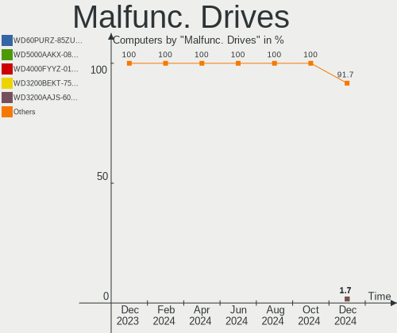

Debian Hardware Trends
----------------------

A project to identify most popular hardware characteristics and track their change
over time based on data collected by Debian users at https://Linux-Hardware.org.

Anyone can contribute to the study by uploading probes of their computers by
the [hw-probe](https://github.com/linuxhw/hw-probe) tool:

    sudo hw-probe -all -upload

This is a report for all computer types. See also reports for [desktops](/Dist/Debian/Desktop/README.md) and [notebooks](/Dist/Debian/Notebook/README.md).

Full-feature report is available here: https://linux-hardware.org/?view=trends

Period: Mar, 2020.

Contents
--------

- [ OS                       ](#os)
- [ OS Family                ](#os-family)
- [ Kernel                   ](#kernel)
- [ Kernel Family            ](#kernel-family)
- [ Kernel Major Ver.        ](#kernel-major-ver)
- [ Arch                     ](#arch)
- [ DE                       ](#de)
- [ Display Server           ](#display-server)
- [ OS Lang                  ](#os-lang)
- [ Boot Mode                ](#boot-mode)
- [ Filesystem               ](#filesystem)
- [ Dual Boot with Linux     ](#dual-boot-with-linux)
- [ Dual Boot (Win)          ](#dual-boot-win)
- [ Country                  ](#country)
- [ City                     ](#city)
- [ Vendor                   ](#vendor)
- [ Model                    ](#model)
- [ Model Family             ](#model-family)
- [ MFG Year                 ](#mfg-year)
- [ Form Factor              ](#form-factor)
- [ Secure Boot              ](#secure-boot)
- [ Coreboot                 ](#coreboot)
- [ RAM Size                 ](#ram-size)
- [ RAM Used                 ](#ram-used)
- [ Drive Vendor             ](#drive-vendor)
- [ Drive Model              ](#drive-model)
- [ Drive Kind               ](#drive-kind)
- [ Drive Connector          ](#drive-connector)
- [ Drive Size               ](#drive-size)
- [ Space Total              ](#space-total)
- [ Space Used               ](#space-used)
- [ Malfunc. Drives          ](#malfunc-drives)
- [ Malfunc. Drive Vendor    ](#malfunc-drive-vendor)
- [ Malfunc. Drive Kind      ](#malfunc-drive-kind)
- [ Failed Drives            ](#failed-drives)
- [ Failed Drive Vendor      ](#failed-drive-vendor)
- [ Drive Status             ](#drive-status)
- [ Storage Vendor           ](#storage-vendor)
- [ Storage Model            ](#storage-model)
- [ Storage Kind             ](#storage-kind)
- [ CPU Vendor               ](#cpu-vendor)
- [ CPU Model                ](#cpu-model)
- [ CPU Model Family         ](#cpu-model-family)
- [ CPU Cores                ](#cpu-cores)
- [ CPU Sockets              ](#cpu-sockets)
- [ CPU Threads              ](#cpu-threads)
- [ CPU Op-Modes             ](#cpu-op-modes)
- [ CPU Microarch            ](#cpu-microarch)
- [ CPU Microcode            ](#cpu-microcode)
- [ GPU Vendor               ](#gpu-vendor)
- [ GPU Model                ](#gpu-model)
- [ GPU Combo                ](#gpu-combo)
- [ GPU Driver               ](#gpu-driver)
- [ GPU Memory               ](#gpu-memory)
- [ Monitor Vendor           ](#monitor-vendor)
- [ Monitor Model            ](#monitor-model)
- [ Monitor Resolution       ](#monitor-resolution)
- [ Monitor Diagonal         ](#monitor-diagonal)
- [ Monitor Width            ](#monitor-width)
- [ Aspect Ratio             ](#aspect-ratio)
- [ Monitor Area             ](#monitor-area)
- [ Pixel Density            ](#pixel-density)
- [ Multiple Monitors        ](#multiple-monitors)
- [ Net Controller Vendor    ](#net-controller-vendor)
- [ Net Controller Model     ](#net-controller-model)
- [ Net Controller Kind      ](#net-controller-kind)
- [ Used Controller          ](#used-controller)
- [ NICs                     ](#nics)
- [ Unsupported Devices      ](#unsupported-devices)
- [ Unsupported Device Types ](#unsupported-device-types)

OS
--

Installed operating systems

| Name                    | Computers | Percent |
|-------------------------|-----------|---------|
| Debian 10               | 45        | 55.56%  |
| Debian Testing          | 14        | 17.28%  |
| Debian                  | 13        | 16.05%  |
| Debian Unstable         | 5         | 6.17%   |
| Debian 9.12             | 3         | 3.7%    |
| Debian Testing/unstable | 1         | 1.23%   |

OS Family
---------

OS without a version

| Name   | Computers | Percent |
|--------|-----------|---------|
| Debian | 81        | 100%    |

Kernel
------

Version of the Linux kernel

| Version                  | Computers | Percent |
|--------------------------|-----------|---------|
| 4.19.0-8-amd64           | 29        | 35.8%   |
| 5.4.0-4-amd64            | 25        | 30.86%  |
| 4.9.0-12-amd64           | 5         | 6.17%   |
| 4.19.0-6-amd64           | 3         | 3.7%    |
| 5.3.18-2-pve             | 2         | 2.47%   |
| 4.19.0-8-686-pae         | 2         | 2.47%   |
| 5.5.0-rc5-amd64          | 1         | 1.23%   |
| 5.5.0-5.1-liquorix-amd64 | 1         | 1.23%   |
| 5.4.28-sunxi             | 1         | 1.23%   |
| 5.4.0-4-rt-amd64         | 1         | 1.23%   |
| 5.4.0-0.bpo.3-amd64      | 1         | 1.23%   |
| 5.4.0-0.bpo.2-amd64      | 1         | 1.23%   |
| 5.3.6-050306-generic     | 1         | 1.23%   |
| 5.3.18-3-pve             | 1         | 1.23%   |
| 5.2.0-0.bpo.3-amd64      | 1         | 1.23%   |
| 5.0.7-rt5avl1            | 1         | 1.23%   |
| 4.9.0-8-amd64            | 1         | 1.23%   |
| 4.9.0-12-686             | 1         | 1.23%   |
| 4.19.112                 | 1         | 1.23%   |
| 4.19.0-8-686             | 1         | 1.23%   |
| 4.19.0-5-amd64           | 1         | 1.23%   |

Kernel Family
-------------

Linux kernel without a distro release

| Version  | Computers | Percent |
|----------|-----------|---------|
| 4.19.0   | 36        | 44.44%  |
| 5.4.0    | 28        | 34.57%  |
| 4.9.0    | 7         | 8.64%   |
| 5.3.18   | 3         | 3.7%    |
| 5.5.0    | 2         | 2.47%   |
| 5.4.28   | 1         | 1.23%   |
| 5.3.6    | 1         | 1.23%   |
| 5.2.0    | 1         | 1.23%   |
| 5.0.7    | 1         | 1.23%   |
| 4.19.112 | 1         | 1.23%   |

Kernel Major Ver.
-----------------

Linux kernel major version

| Version | Computers | Percent |
|---------|-----------|---------|
| 4.19    | 37        | 45.68%  |
| 5.4     | 29        | 35.8%   |
| 4.9     | 7         | 8.64%   |
| 5.3     | 4         | 4.94%   |
| 5.5     | 2         | 2.47%   |
| 5.2     | 1         | 1.23%   |
| 5.0     | 1         | 1.23%   |

Arch
----

OS architecture (x86_64, i586, etc.)

| Name   | Computers | Percent |
|--------|-----------|---------|
| x86_64 | 75        | 92.59%  |
| i686   | 5         | 6.17%   |
| armv7l | 1         | 1.23%   |

DE
--

Desktop Environment

| Name          | Computers | Percent |
|---------------|-----------|---------|
| GNOME         | 17        | 20.99%  |
| XFCE          | 14        | 17.28%  |
| KDE           | 10        | 12.35%  |
| LXQt          | 9         | 11.11%  |
| Unknown       | 7         | 8.64%   |
| MATE          | 5         | 6.17%   |
| KDE5          | 5         | 6.17%   |
| X-Cinnamon    | 4         | 4.94%   |
| Cinnamon      | 4         | 4.94%   |
| Budgie        | 3         | 3.7%    |
| LXDE          | 1         | 1.23%   |
| GNOME Classic | 1         | 1.23%   |
| Enlightenment | 1         | 1.23%   |

Display Server
--------------

X11 or Wayland

| Name    | Computers | Percent |
|---------|-----------|---------|
| X11     | 62        | 76.54%  |
| Wayland | 11        | 13.58%  |
| Tty     | 7         | 8.64%   |
| Unknown | 1         | 1.23%   |

OS Lang
-------

Language

| Lang       | Computers | Percent |
|------------|-----------|---------|
| en_US      | 23        | 28.4%   |
| Unknown    | 9         | 11.11%  |
| ru_RU      | 8         | 9.88%   |
| it_IT      | 6         | 7.41%   |
| fr_FR      | 5         | 6.17%   |
| pt_BR      | 4         | 4.94%   |
| de_DE      | 4         | 4.94%   |
| pl_PL      | 3         | 3.7%    |
| en_GB      | 3         | 3.7%    |
| es_ES      | 2         | 2.47%   |
| en_US.utf8 | 2         | 2.47%   |
| de_DE.utf8 | 2         | 2.47%   |
| de_CH      | 2         | 2.47%   |
| uk_UA      | 1         | 1.23%   |
| pt_PT      | 1         | 1.23%   |
| nl_NL      | 1         | 1.23%   |
| hu_HU      | 1         | 1.23%   |
| es_CL      | 1         | 1.23%   |
| es_AR      | 1         | 1.23%   |
| de_AT      | 1         | 1.23%   |
| ar_EG      | 1         | 1.23%   |

Boot Mode
---------

EFI or BIOS

| Mode | Computers | Percent |
|------|-----------|---------|
| BIOS | 54        | 66.67%  |
| EFI  | 27        | 33.33%  |

Filesystem
----------

Type of filesystem

| Type    | Computers | Percent |
|---------|-----------|---------|
| Ext4    | 77        | 95.06%  |
| Btrfs   | 2         | 2.47%   |
| Overlay | 1         | 1.23%   |
| Ext3    | 1         | 1.23%   |

Dual Boot with Linux
--------------------

Hosting more than one Linux

| Dual boot | Computers | Percent |
|-----------|-----------|---------|
| No        | 68        | 83.95%  |
| Yes       | 13        | 16.05%  |

Dual Boot (Win)
---------------

Hosting Linux and Windows

| Dual boot | Computers | Percent |
|-----------|-----------|---------|
| No        | 68        | 83.95%  |
| Yes       | 13        | 16.05%  |

Country
-------

Geographic location (country)

| Country     | Computers | Percent |
|-------------|-----------|---------|
| Italy       | 12        | 14.81%  |
| USA         | 11        | 13.58%  |
| Russia      | 11        | 13.58%  |
| Germany     | 10        | 12.35%  |
| France      | 5         | 6.17%   |
| Brazil      | 4         | 4.94%   |
| Poland      | 3         | 3.7%    |
| Ukraine     | 2         | 2.47%   |
| Switzerland | 2         | 2.47%   |
| Spain       | 2         | 2.47%   |
| Netherlands | 2         | 2.47%   |
| India       | 2         | 2.47%   |
| UK          | 1         | 1.23%   |
| Taiwan      | 1         | 1.23%   |
| Sweden      | 1         | 1.23%   |
| Slovakia    | 1         | 1.23%   |
| Portugal    | 1         | 1.23%   |
| Indonesia   | 1         | 1.23%   |
| Hungary     | 1         | 1.23%   |
| Greece      | 1         | 1.23%   |
| Finland     | 1         | 1.23%   |
| Ethiopia    | 1         | 1.23%   |
| Egypt       | 1         | 1.23%   |
| Chile       | 1         | 1.23%   |
| Bulgaria    | 1         | 1.23%   |
| Austria     | 1         | 1.23%   |
| Argentina   | 1         | 1.23%   |

City
----

Geographic location (city)

| City                          | Computers | Percent |
|-------------------------------|-----------|---------|
| Chiusi                        | 6         | 7.41%   |
| Zurich                        | 2         | 2.47%   |
| São Paulo                    | 2         | 2.47%   |
| Halle                         | 2         | 2.47%   |
| Delhi                         | 2         | 2.47%   |
| Chicago                       | 2         | 2.47%   |
| Berlin                        | 2         | 2.47%   |
| Zlotow                        | 1         | 1.23%   |
| West Palm Beach               | 1         | 1.23%   |
| Wednesbury                    | 1         | 1.23%   |
| Vsevolozhsk                   | 1         | 1.23%   |
| Voronezh                      | 1         | 1.23%   |
| Vienna                        | 1         | 1.23%   |
| Verona                        | 1         | 1.23%   |
| Valparaíso                   | 1         | 1.23%   |
| Tuusula                       | 1         | 1.23%   |
| Trieste                       | 1         | 1.23%   |
| Torres Novas                  | 1         | 1.23%   |
| Taoyuan District              | 1         | 1.23%   |
| Stockholm                     | 1         | 1.23%   |
| St Petersburg                 | 1         | 1.23%   |
| Sofia                         | 1         | 1.23%   |
| Sevastopol                    | 1         | 1.23%   |
| San Mateo                     | 1         | 1.23%   |
| Salgotarjan                   | 1         | 1.23%   |
| Saint-Martin-d'Hères         | 1         | 1.23%   |
| Piove di Sacco                | 1         | 1.23%   |
| Pinhais                       | 1         | 1.23%   |
| Paris                         | 1         | 1.23%   |
| Padova                        | 1         | 1.23%   |
| Onalaska                      | 1         | 1.23%   |
| Nuremberg                     | 1         | 1.23%   |
| Novosibirsk                   | 1         | 1.23%   |
| Málaga                       | 1         | 1.23%   |
| Muhr am See                   | 1         | 1.23%   |
| Moscow                        | 1         | 1.23%   |
| Michalovce                    | 1         | 1.23%   |
| Mesa                          | 1         | 1.23%   |
| Maua                          | 1         | 1.23%   |
| Maisons-Laffitte              | 1         | 1.23%   |
| Krasnodar                     | 1         | 1.23%   |
| Kirov                         | 1         | 1.23%   |
| Katowice                      | 1         | 1.23%   |
| Kalisz                        | 1         | 1.23%   |
| Kaliningrad                   | 1         | 1.23%   |
| Kaiserslautern                | 1         | 1.23%   |
| Jumilla                       | 1         | 1.23%   |
| Jakarta                       | 1         | 1.23%   |
| Izhevsk                       | 1         | 1.23%   |
| Hurlingham                    | 1         | 1.23%   |
| Hockessin                     | 1         | 1.23%   |
| Heppenheim an der Bergstrasse | 1         | 1.23%   |
| Frankfurt am Main             | 1         | 1.23%   |
| Ekaterinburg                  | 1         | 1.23%   |
| Dnipro                        | 1         | 1.23%   |
| Clermont-Ferrand              | 1         | 1.23%   |
| Christiansburg                | 1         | 1.23%   |
| Chenoa                        | 1         | 1.23%   |
| Catanzaro                     | 1         | 1.23%   |
| Cairo                         | 1         | 1.23%   |

Vendor
------

Motherboard manufacturer

| Name                | Computers | Percent |
|---------------------|-----------|---------|
| Lenovo              | 14        | 17.28%  |
| ASUSTek Computer    | 14        | 17.28%  |
| Hewlett-Packard     | 11        | 13.58%  |
| Dell                | 9         | 11.11%  |
| MSI                 | 5         | 6.17%   |
| Gigabyte Technology | 5         | 6.17%   |
| Acer                | 5         | 6.17%   |
| ASRock              | 4         | 4.94%   |
| Intel               | 3         | 3.7%    |
| Xunlong             | 1         | 1.23%   |
| Toshiba             | 1         | 1.23%   |
| Samsung Electronics | 1         | 1.23%   |
| Quanta              | 1         | 1.23%   |
| Positivo            | 1         | 1.23%   |
| Onda technology     | 1         | 1.23%   |
| ICP / iEi           | 1         | 1.23%   |
| Huanan              | 1         | 1.23%   |
| Clevo               | 1         | 1.23%   |
| Biostar             | 1         | 1.23%   |
| Unknown             | 1         | 1.23%   |

Model
-----

Motherboard model

| Name                                     | Computers | Percent |
|------------------------------------------|-----------|---------|
| Dell OptiPlex 390                        | 4         | 4.94%   |
| Lenovo ThinkPad E480 20KN003WUS          | 2         | 2.47%   |
| Xunlong Orange Pi PC                     | 1         | 1.23%   |
| Toshiba Satellite CL45-C                 | 1         | 1.23%   |
| Samsung Electronics RC530/RC730          | 1         | 1.23%   |
| Quanta 120-1333w                         | 1         | 1.23%   |
| Positivo WCBT1013                        | 1         | 1.23%   |
| Onda technology A68V+                    | 1         | 1.23%   |
| MSI MS-7B89                              | 1         | 1.23%   |
| MSI MS-7A34                              | 1         | 1.23%   |
| MSI MS-7522                              | 1         | 1.23%   |
| MSI GL62M 7RDX                           | 1         | 1.23%   |
| MSI GE70 2PC                             | 1         | 1.23%   |
| Lenovo Yoga C740-14IML 81TC              | 1         | 1.23%   |
| Lenovo V330-15IKB 81AX                   | 1         | 1.23%   |
| Lenovo ThinkPad X250 20CM001XGE          | 1         | 1.23%   |
| Lenovo ThinkPad X1 Carbon 7th 20R1S05B00 | 1         | 1.23%   |
| Lenovo ThinkPad T510 4384G47             | 1         | 1.23%   |
| Lenovo ThinkPad T490s 20NX002QUK         | 1         | 1.23%   |
| Lenovo ThinkPad T490s 20NX000AGE         | 1         | 1.23%   |
| Lenovo ThinkPad T410 2518F5U             | 1         | 1.23%   |
| Lenovo ThinkPad E480 20KN004TBM          | 1         | 1.23%   |
| Lenovo IdeaPad 330-17IKB 81DK            | 1         | 1.23%   |
| Lenovo IdeaPad 330-15IKB 81FE            | 1         | 1.23%   |
| Lenovo IdeaPad 120S-14IAP 81A5           | 1         | 1.23%   |
| Intel S1200RP                            | 1         | 1.23%   |
| Intel NUC5i5RYB H40999-506               | 1         | 1.23%   |
| Intel DH87RL AAG74240-402                | 1         | 1.23%   |
| ICP / iEi AFL-W410A(H388)                | 1         | 1.23%   |
| Huanan X99-TF                            | 1         | 1.23%   |
| HP ProLiant DL380 G7                     | 1         | 1.23%   |
| HP ProBook 4510s                         | 1         | 1.23%   |
| HP ProBook 450 G6                        | 1         | 1.23%   |
| HP Presario CQ42                         | 1         | 1.23%   |
| HP Pavilion dv1000 (PW923EA#ABE)         | 1         | 1.23%   |
| HP Laptop 15-da0xxx                      | 1         | 1.23%   |
| HP EliteBook 8560w                       | 1         | 1.23%   |
| HP EliteBook 840 G6                      | 1         | 1.23%   |
| HP EliteBook 820 G1                      | 1         | 1.23%   |
| HP Compaq 8100 Elite SFF PC              | 1         | 1.23%   |
| HP 350 G2                                | 1         | 1.23%   |
| Gigabyte Z390 I AORUS PRO WIFI           | 1         | 1.23%   |
| Gigabyte C1037UN-EU                      | 1         | 1.23%   |
| Gigabyte B360 HD3P-LM                    | 1         | 1.23%   |
| Gigabyte AX370-Gaming 5                  | 1         | 1.23%   |
| Gigabyte 945GCM-S2L                      | 1         | 1.23%   |
| Dell XPS 13 9360                         | 1         | 1.23%   |
| Dell Vostro 3578                         | 1         | 1.23%   |
| Dell Latitude E6230                      | 1         | 1.23%   |
| Dell Latitude 5401                       | 1         | 1.23%   |
| Dell Inspiron 5570                       | 1         | 1.23%   |
| Clevo D40EV/D47EV                        | 1         | 1.23%   |
| Biostar X370GTN                          | 1         | 1.23%   |
| ASUS X540SC                              | 1         | 1.23%   |
| ASUS UX305FA                             | 1         | 1.23%   |
| ASUS SABERTOOTH X79                      | 1         | 1.23%   |
| ASUS PRIME B350-PLUS                     | 1         | 1.23%   |
| ASUS P6X58D-E                            | 1         | 1.23%   |
| ASUS P5KPL-C                             | 1         | 1.23%   |
| ASUS N751JX                              | 1         | 1.23%   |

Model Family
------------

Motherboard model prefix

| Name                      | Computers | Percent |
|---------------------------|-----------|---------|
| Lenovo ThinkPad           | 9         | 11.11%  |
| Acer Aspire               | 5         | 6.17%   |
| Dell OptiPlex             | 4         | 4.94%   |
| Lenovo IdeaPad            | 3         | 3.7%    |
| HP EliteBook              | 3         | 3.7%    |
| HP ProBook                | 2         | 2.47%   |
| Dell Latitude             | 2         | 2.47%   |
| Xunlong Orange            | 1         | 1.23%   |
| Toshiba Satellite         | 1         | 1.23%   |
| Samsung Electronics RC530 | 1         | 1.23%   |
| Quanta 120-1333w          | 1         | 1.23%   |
| Positivo WCBT1013         | 1         | 1.23%   |
| Onda technology A68V+     | 1         | 1.23%   |
| MSI MS-7B89               | 1         | 1.23%   |
| MSI MS-7A34               | 1         | 1.23%   |
| MSI MS-7522               | 1         | 1.23%   |
| MSI GL62M                 | 1         | 1.23%   |
| MSI GE70                  | 1         | 1.23%   |
| Lenovo Yoga               | 1         | 1.23%   |
| Lenovo V330-15IKB         | 1         | 1.23%   |
| Intel S1200RP             | 1         | 1.23%   |
| Intel NUC5i5RYB           | 1         | 1.23%   |
| Intel DH87RL              | 1         | 1.23%   |
| ICP / iEi AFL-W410A(H388) | 1         | 1.23%   |
| Huanan X99-TF             | 1         | 1.23%   |
| HP ProLiant               | 1         | 1.23%   |
| HP Presario               | 1         | 1.23%   |
| HP Pavilion               | 1         | 1.23%   |
| HP Laptop                 | 1         | 1.23%   |
| HP Compaq                 | 1         | 1.23%   |
| HP 350                    | 1         | 1.23%   |
| Gigabyte Z390             | 1         | 1.23%   |
| Gigabyte C1037UN-EU       | 1         | 1.23%   |
| Gigabyte B360             | 1         | 1.23%   |
| Gigabyte AX370-Gaming     | 1         | 1.23%   |
| Gigabyte 945GCM-S2L       | 1         | 1.23%   |
| Dell XPS                  | 1         | 1.23%   |
| Dell Vostro               | 1         | 1.23%   |
| Dell Inspiron             | 1         | 1.23%   |
| Clevo D40EV               | 1         | 1.23%   |
| Biostar X370GTN           | 1         | 1.23%   |
| ASUS X540SC               | 1         | 1.23%   |
| ASUS UX305FA              | 1         | 1.23%   |
| ASUS SABERTOOTH           | 1         | 1.23%   |
| ASUS PRIME                | 1         | 1.23%   |
| ASUS P6X58D-E             | 1         | 1.23%   |
| ASUS P5KPL-C              | 1         | 1.23%   |
| ASUS N751JX               | 1         | 1.23%   |
| ASUS N55SF                | 1         | 1.23%   |
| ASUS M4A78                | 1         | 1.23%   |
| ASUS M2N68-AM             | 1         | 1.23%   |
| ASUS GN573AA-ABA          | 1         | 1.23%   |
| ASUS F1A75-M              | 1         | 1.23%   |
| ASUS BU201LA              | 1         | 1.23%   |
| ASUS A55BM-A              | 1         | 1.23%   |
| ASRock H81M-HDS           | 1         | 1.23%   |
| ASRock H61M-DGS           | 1         | 1.23%   |
| ASRock FM2A88M            | 1         | 1.23%   |
| ASRock B450M              | 1         | 1.23%   |
| Unknown                   | 1         | 1.23%   |

MFG Year
--------

Motherboard manufacture year

| Year    | Computers | Percent |
|---------|-----------|---------|
| 2019    | 18        | 22.22%  |
| 2018    | 10        | 12.35%  |
| 2011    | 8         | 9.88%   |
| 2016    | 6         | 7.41%   |
| 2015    | 6         | 7.41%   |
| 2014    | 5         | 6.17%   |
| 2012    | 5         | 6.17%   |
| 2010    | 5         | 6.17%   |
| 2009    | 4         | 4.94%   |
| 2017    | 3         | 3.7%    |
| 2013    | 3         | 3.7%    |
| 2007    | 3         | 3.7%    |
| 2020    | 2         | 2.47%   |
| 2005    | 2         | 2.47%   |
| Unknown | 1         | 1.23%   |

Form Factor
-----------

Physical design of the computer

| Name           | Computers | Percent |
|----------------|-----------|---------|
| Notebook       | 44        | 54.32%  |
| Desktop        | 30        | 37.04%  |
| Server         | 2         | 2.47%   |
| Other          | 1         | 1.23%   |
| System on chip | 1         | 1.23%   |
| Convertible    | 1         | 1.23%   |
| Mini pc        | 1         | 1.23%   |
| All in one     | 1         | 1.23%   |

Secure Boot
-----------

Enabled or disabled

| State    | Computers | Percent |
|----------|-----------|---------|
| Disabled | 78        | 96.3%   |
| Enabled  | 3         | 3.7%    |

Coreboot
--------

Have coreboot on board

| Used | Computers | Percent |
|------|-----------|---------|
| No   | 81        | 100%    |

RAM Size
--------

Total RAM memory

| Size in GB  | Computers | Percent |
|-------------|-----------|---------|
| 8.01-16.0   | 18        | 22.22%  |
| 3.01-4.0    | 17        | 20.99%  |
| 16.01-24.0  | 13        | 16.05%  |
| 4.01-8.0    | 12        | 14.81%  |
| 32.01-64.0  | 8         | 9.88%   |
| 0.01-1.0    | 4         | 4.94%   |
| 64.01-256.0 | 3         | 3.7%    |
| 1.01-2.0    | 3         | 3.7%    |
| 2.01-3.0    | 2         | 2.47%   |
| 24.01-32.0  | 1         | 1.23%   |

RAM Used
--------

Used RAM memory

| Used GB    | Computers | Percent |
|------------|-----------|---------|
| 2.01-3.0   | 25        | 30.86%  |
| 1.01-2.0   | 25        | 30.86%  |
| 4.01-8.0   | 12        | 14.81%  |
| 0.01-1.0   | 8         | 9.88%   |
| 3.01-4.0   | 6         | 7.41%   |
| 8.01-16.0  | 3         | 3.7%    |
| 16.01-24.0 | 2         | 2.47%   |

Drive Vendor
------------

Hard drive vendors

| Vendor              | Computers | Drives  | Percent |
|---------------------|-----------|---------|---------|
| WDC                 | 25        | 27      | 23.36%  |
| Seagate             | 16        | 16      | 14.95%  |
| Samsung Electronics | 11        | 13      | 10.28%  |
| Toshiba             | 8         | 8       | 7.48%   |
| Kingston            | 7         | 7       | 6.54%   |
| Unknown             | 6         | 7       | 5.61%   |
| Crucial             | 5         | 5       | 4.67%   |
| SanDisk             | 4         | 5       | 3.74%   |
| Intel               | 4         | 4       | 3.74%   |
| Hitachi             | 3         | 3       | 2.8%    |
| A-DATA Technology   | 3         | 3       | 2.8%    |
| Zheino              | 1         | 1       | 0.93%   |
| Transcend           | 1         | 1       | 0.93%   |
| SPCC                | 1         | 1       | 0.93%   |
| Patriot             | 1         | 1       | 0.93%   |
| OCZ                 | 1         | 1       | 0.93%   |
| Netac               | 1         | 1       | 0.93%   |
| Micron Technology   | 1         | 1       | 0.93%   |
| MAXTOR              | 1         | 1       | 0.93%   |
| LITEON              | 1         | 1       | 0.93%   |
| KingDian            | 1         | 1       | 0.93%   |
| Intenso             | 1         | 1       | 0.93%   |
| HGST                | 1         | 1       | 0.93%   |
| Hewlett-Packard     | 1         | Unknown | 0.93%   |
| Fujitsu             | 1         | 1       | 0.93%   |
| Corsair             | 1         | 1       | 0.93%   |

Drive Model
-----------

Hard drive models

| Model                    | Computers | Percent |
|--------------------------|-----------|---------|
| ST3250312AS 250GB        | 4         | 3.57%   |
| MMC Card  64GB           | 3         | 2.68%   |
| WD5000LPCX-24VHAT0 500GB | 2         | 1.79%   |
| SUV400S37240G 240GB SSD  | 2         | 1.79%   |
| ST1000LM048-2E7172 1TB   | 2         | 1.79%   |
| MQ01ABD100 1TB           | 2         | 1.79%   |
| CT960BX500SSD1 960GB     | 2         | 1.79%   |
| WDS250G2X0C-00L350 250GB | 1         | 0.89%   |
| WD7500BPVX-22JC3T0 752GB | 1         | 0.89%   |
| WD5000LPVX-22V0TT0 500GB | 1         | 0.89%   |
| WD5000ABYS-01TNA0 500GB  | 1         | 0.89%   |
| WD40EZRZ-00GXCB0 4TB     | 1         | 0.89%   |
| WD40EFRX-68N32N0 4TB     | 1         | 0.89%   |
| WD3200BEVT-22A23T0 320GB | 1         | 0.89%   |
| WD3200BEKX-75B7WT0 320GB | 1         | 0.89%   |
| WD30EZRX-00D8PB0 3TB     | 1         | 0.89%   |
| WD2500AAKX-75U6AA0 250GB | 1         | 0.89%   |
| WD20EFRX-68EUZN0 2TB     | 1         | 0.89%   |
| WD20EARX-00PASB0 2TB     | 1         | 0.89%   |
| WD1600AAJS-22WAA0 160GB  | 1         | 0.89%   |
| WD15EADS-00P8B0 1TB      | 1         | 0.89%   |
| WD10SPZX-24Z10 1TB       | 1         | 0.89%   |
| WD10SPZX-21Z10T0 1TB     | 1         | 0.89%   |
| WD10JPVX-22JC3T0 1TB     | 1         | 0.89%   |
| WD10EZEX-00BN5A0 1TB     | 1         | 0.89%   |
| WD10EARX-00N0YB0 1TB     | 1         | 0.89%   |
| WD10EADS-00M2B0 1TB      | 1         | 0.89%   |
| WD1002FAEX-00Z3A0 1TB    | 1         | 0.89%   |
| WD1001FALS-00J7B0 1TB    | 1         | 0.89%   |
| VERTEX3 96GB SSD         | 1         | 0.89%   |
| Ultra II 960GB SSD       | 1         | 0.89%   |
| Ultra II 480GB SSD       | 1         | 0.89%   |
| TR150 960GB SSD          | 1         | 0.89%   |
| THNSNC128GCSJ 128GB SSD  | 1         | 0.89%   |
| SX8200PNP 1TB            | 1         | 0.89%   |
| SV300S37A60G 64GB SSD    | 1         | 0.89%   |
| SV300S37A 240G SSD       | 1         | 0.89%   |
| SU800 256GB SSD          | 1         | 0.89%   |
| STM3250310AS 250GB       | 1         | 0.89%   |
| ST9808210A 80GB          | 1         | 0.89%   |
| ST9320423AS 320GB        | 1         | 0.89%   |
| ST500LM000-SSHD-8GB      | 1         | 0.89%   |
| ST4000VN008-2DR166 4TB   | 1         | 0.89%   |
| ST3500418AS 500GB        | 1         | 0.89%   |
| ST3250410AS 250GB        | 1         | 0.89%   |
| ST1000LM035-1RK172 1TB   | 1         | 0.89%   |
| ST1000DM010-2EP102 1TB   | 1         | 0.89%   |
| ST1000DM003-1CH162 1TB   | 1         | 0.89%   |
| ST10000NM0156-2A 10TB    | 1         | 0.89%   |
| SSDSC2BW240H6 240GB      | 1         | 0.89%   |
| SSDSC2BW120A4 120GB      | 1         | 0.89%   |
| SSDPEKKW128G8 128GB      | 1         | 0.89%   |
| SSDPEKKF512G8L 512GB     | 1         | 0.89%   |
| SSD Sata III 240GB       | 1         | 0.89%   |
| SSD PM851 2.5 7mm 128GB  | 1         | 0.89%   |
| SSD 970 EVO Plus 500GB   | 1         | 0.89%   |
| SSD 970 EVO 1TB          | 1         | 0.89%   |
| SSD 860 EVO 1TB          | 1         | 0.89%   |
| SSD 850 EVO M.2 250GB    | 1         | 0.89%   |
| SSD 850 EVO 500GB        | 1         | 0.89%   |

Drive Kind
----------

HDD or SSD

| Kind    | Computers | Drives | Percent |
|---------|-----------|--------|---------|
| HDD     | 44        | 52     | 46.32%  |
| SSD     | 29        | 36     | 30.53%  |
| NVMe    | 14        | 16     | 14.74%  |
| MMC     | 6         | 7      | 6.32%   |
| Unknown | 2         | 1      | 2.11%   |

Drive Connector
---------------

SATA, SAS, NVMe, etc.

| Type | Computers | Drives  | Percent |
|------|-----------|---------|---------|
| SATA | 61        | 89      | 74.39%  |
| NVMe | 14        | 16      | 17.07%  |
| MMC  | 6         | 7       | 7.32%   |
| SAS  | 1         | Unknown | 1.22%   |

Drive Size
----------

Size of hard drive

| Size in TB | Computers | Drives | Percent |
|------------|-----------|--------|---------|
| 0.01-0.5   | 54        | 63     | 55.67%  |
| 0.51-1.0   | 31        | 34     | 31.96%  |
| 1.01-2.0   | 7         | 9      | 7.22%   |
| 3.01-4.0   | 2         | 3      | 2.06%   |
| 2.01-3.0   | 2         | 2      | 2.06%   |
| 4.01-10.0  | 1         | 1      | 1.03%   |

Space Total
-----------

Amount of disk space available on the file system

| Size in GB     | Computers | Percent |
|----------------|-----------|---------|
| 251-500        | 20        | 24.69%  |
| 101-250        | 16        | 19.75%  |
| 501-1000       | 11        | 13.58%  |
| 1-20           | 8         | 9.88%   |
| 51-100         | 8         | 9.88%   |
| 21-50          | 6         | 7.41%   |
| More than 3000 | 4         | 4.94%   |
| 1001-2000      | 4         | 4.94%   |
| Unknown        | 4         | 4.94%   |

Space Used
----------

Amount of used disk space

| Used GB        | Computers | Percent |
|----------------|-----------|---------|
| 1-20           | 34        | 41.98%  |
| 21-50          | 10        | 12.35%  |
| 101-250        | 10        | 12.35%  |
| 51-100         | 9         | 11.11%  |
| 501-1000       | 5         | 6.17%   |
| 251-500        | 4         | 4.94%   |
| Unknown        | 4         | 4.94%   |
| 1001-2000      | 3         | 3.7%    |
| More than 3000 | 1         | 1.23%   |
| 2001-3000      | 1         | 1.23%   |

Malfunc. Drives
---------------

Drive models with a malfunction

| Model                    | Computers | Drives | Percent |
|--------------------------|-----------|--------|---------|
| WD7500BPVX-22JC3T0 752GB | 1         | 1      | 16.67%  |
| WD10EADS-00M2B0 1TB      | 1         | 1      | 16.67%  |
| ST9808210A 80GB          | 1         | 1      | 16.67%  |
| ST500LM000-SSHD-8GB      | 1         | 1      | 16.67%  |
| ST1000LM035-1RK172 1TB   | 1         | 1      | 16.67%  |
| HTS725050A9A364 500GB    | 1         | 1      | 16.67%  |

Malfunc. Drive Vendor
---------------------

Vendors of faulty drives

| Vendor  | Computers | Drives | Percent |
|---------|-----------|--------|---------|
| Seagate | 3         | 3      | 50%     |
| WDC     | 2         | 2      | 33.33%  |
| Hitachi | 1         | 1      | 16.67%  |

Malfunc. Drive Kind
-------------------

Kinds of faulty drives

| Kind | Computers | Drives | Percent |
|------|-----------|--------|---------|
| HDD  | 6         | 6      | 100%    |

Failed Drives
-------------

Failed drive models

Zero info for selected period =(

Failed Drive Vendor
-------------------

Failed drive vendors

Zero info for selected period =(

Drive Status
------------

Number of failed and malfunc. drives

| Status   | Computers | Drives | Percent |
|----------|-----------|--------|---------|
| Works    | 42        | 62     | 51.22%  |
| Detected | 34        | 44     | 41.46%  |
| Malfunc  | 6         | 6      | 7.32%   |

Storage Vendor
--------------

Storage controller vendors

| Vendor                           | Computers | Percent |
|----------------------------------|-----------|---------|
| Intel                            | 57        | 58.16%  |
| AMD                              | 13        | 13.27%  |
| Samsung Electronics              | 5         | 5.1%    |
| Toshiba America Info Systems     | 4         | 4.08%   |
| Sandisk                          | 4         | 4.08%   |
| Marvell Technology Group         | 4         | 4.08%   |
| Phison Electronics               | 2         | 2.04%   |
| Nvidia                           | 2         | 2.04%   |
| Micron/Crucial Technology        | 2         | 2.04%   |
| Silicon Integrated Systems [SiS] | 1         | 1.02%   |
| JMicron Technology               | 1         | 1.02%   |
| Hewlett-Packard                  | 1         | 1.02%   |
| ASMedia Technology               | 1         | 1.02%   |
| ADATA Technology                 | 1         | 1.02%   |

Storage Model
-------------

Storage controller models

| Model                                                                             | Computers | Percent |
|-----------------------------------------------------------------------------------|-----------|---------|
| FCH SATA Controller [AHCI mode]                                                   | 10        | 8.7%    |
| Sunrise Point-LP SATA Controller [AHCI mode]                                      | 9         | 7.83%   |
| NVMe SSD Controller SM981/PM981/PM983                                             | 5         | 4.35%   |
| 8 Series/C220 Series Chipset Family 6-port SATA Controller 1 [AHCI mode]          | 5         | 4.35%   |
| Wildcat Point-LP SATA Controller [AHCI Mode]                                      | 4         | 3.48%   |
| 6 Series/C200 Series Chipset Family Desktop SATA Controller (IDE mode, ports 4-5) | 4         | 3.48%   |
| 6 Series/C200 Series Chipset Family Desktop SATA Controller (IDE mode, ports 0-3) | 4         | 3.48%   |
| Toshiba America Info Non-Volatile memory controller                               | 3         | 2.61%   |
| FCH IDE Controller                                                                | 3         | 2.61%   |
| 6 Series/C200 Series Chipset Family 6 port Mobile SATA AHCI Controller            | 3         | 2.61%   |
| 5 Series/3400 Series Chipset 6 port SATA AHCI Controller                          | 3         | 2.61%   |
| X370 Series Chipset SATA Controller                                               | 2         | 1.74%   |
| WD Black 2018/PC SN720 NVMe SSD                                                   | 2         | 1.74%   |
| SSD Pro 7600p/760p/E 6100p Series                                                 | 2         | 1.74%   |
| P1 NVMe PCIe SSD                                                                  | 2         | 1.74%   |
| Non-Volatile memory controller                                                    | 2         | 1.74%   |
| NM10/ICH7 Family SATA Controller [IDE mode]                                       | 2         | 1.74%   |
| MCP61 SATA Controller                                                             | 2         | 1.74%   |
| MCP61 IDE                                                                         | 2         | 1.74%   |
| E12 NVMe Controller                                                               | 2         | 1.74%   |
| Cannon Lake PCH SATA AHCI Controller                                              | 2         | 1.74%   |
| 88SE9123 PCIe SATA 6.0 Gb/s controller                                            | 2         | 1.74%   |
| 82801JI (ICH10 Family) SATA AHCI Controller                                       | 2         | 1.74%   |
| 82801IBM/IEM (ICH9M/ICH9M-E) 4 port SATA Controller [AHCI mode]                   | 2         | 1.74%   |
| 82801 Mobile SATA Controller [RAID mode]                                          | 2         | 1.74%   |
| 8 Series SATA Controller 1 [AHCI mode]                                            | 2         | 1.74%   |
| 7 Series Chipset Family 6-port SATA Controller [AHCI mode]                        | 2         | 1.74%   |
| 5 Series/3400 Series Chipset 4 port SATA AHCI Controller                          | 2         | 1.74%   |
| 400 Series Chipset SATA Controller                                                | 2         | 1.74%   |
| 300 Series Chipset SATA Controller                                                | 2         | 1.74%   |
| XPG SX8200 Pro PCIe Gen3x4 M.2 2280 Solid State Drive                             | 1         | 0.87%   |
| XG4 NVMe SSD Controller                                                           | 1         | 0.87%   |
| Smart Array G6 controllers                                                        | 1         | 0.87%   |
| SB7x0/SB8x0/SB9x0 SATA Controller [IDE mode]                                      | 1         | 0.87%   |
| SB7x0/SB8x0/SB9x0 SATA Controller [AHCI mode]                                     | 1         | 0.87%   |
| SB7x0/SB8x0/SB9x0 IDE Controller                                                  | 1         | 0.87%   |
| JMB368 IDE controller                                                             | 1         | 0.87%   |
| HM170/QM170 Chipset SATA Controller [AHCI Mode]                                   | 1         | 0.87%   |
| FCH SATA Controller [IDE mode]                                                    | 1         | 0.87%   |
| Comet Lake SATA AHCI Controller                                                   | 1         | 0.87%   |
| Celeron N3350/Pentium N4200/Atom E3900 Series SATA AHCI Controller                | 1         | 0.87%   |
| Cannon Point-LP SATA Controller [AHCI Mode]                                       | 1         | 0.87%   |
| Cannon Lake Mobile PCH SATA AHCI Controller                                       | 1         | 0.87%   |
| C610/X99 series chipset sSATA Controller [AHCI mode]                              | 1         | 0.87%   |
| C600/X79 series chipset 6-Port SATA AHCI Controller                               | 1         | 0.87%   |
| Atom/Celeron/Pentium Processor x5-E8000/J3xxx/N3xxx Series SATA Controller        | 1         | 0.87%   |
| ASM1062 Serial ATA Controller                                                     | 1         | 0.87%   |
| 92xx SATA 6G Controller                                                           | 1         | 0.87%   |
| 88SE9128 PCIe SATA 6 Gb/s RAID controller with HyperDuo                           | 1         | 0.87%   |
| 82801GBM/GHM (ICH7-M Family) SATA Controller [IDE mode]                           | 1         | 0.87%   |
| 82801G (ICH7 Family) IDE Controller                                               | 1         | 0.87%   |
| 82801DBM (ICH4-M) IDE Controller                                                  | 1         | 0.87%   |
| 6 Series/C200 Series Chipset Family 6 port Desktop SATA AHCI Controller           | 1         | 0.87%   |
| 5513 IDE Controller                                                               | 1         | 0.87%   |

Storage Kind
------------

Kind of storage controller (IDE, SATA, NVMe, SAS, ...)

| Kind | Computers | Percent |
|------|-----------|---------|
| SATA | 59        | 60.2%   |
| NVMe | 20        | 20.41%  |
| IDE  | 16        | 16.33%  |
| RAID | 3         | 3.06%   |

CPU Vendor
----------

Processor vendors

| Vendor | Computers | Percent |
|--------|-----------|---------|
| Intel  | 65        | 80.25%  |
| AMD    | 15        | 18.52%  |
| ARM    | 1         | 1.23%   |

CPU Model
---------

Processor models

| Model                                  | Computers | Percent |
|----------------------------------------|-----------|---------|
| Intel Core i7-8550U CPU @ 1.80GHz      | 5         | 6.17%   |
| Intel Core i5-8250U CPU @ 1.60GHz      | 4         | 4.94%   |
| Intel Core i5-2400 CPU @ 3.10GHz       | 4         | 4.94%   |
| Intel Core i7-8565U CPU @ 1.80GHz      | 3         | 3.7%    |
| Intel Core i5-5200U CPU @ 2.20GHz      | 2         | 2.47%   |
| Intel Xeon CPU X5675 @ 3.07GHz         | 1         | 1.23%   |
| Intel Xeon CPU E5640 @ 2.67GHz         | 1         | 1.23%   |
| Intel Xeon CPU E5-2678 v3 @ 2.50GHz    | 1         | 1.23%   |
| Intel Xeon CPU E3-1270 v3 @ 3.50GHz    | 1         | 1.23%   |
| Intel Processor 5Y10 CPU @ 0.80GHz     | 1         | 1.23%   |
| Intel Pentium M processor 1.60GHz      | 1         | 1.23%   |
| Intel Pentium CPU P6100 @ 2.00GHz      | 1         | 1.23%   |
| Intel Pentium CPU N3700 @ 1.60GHz      | 1         | 1.23%   |
| Intel Pentium CPU 4415U @ 2.30GHz      | 1         | 1.23%   |
| Intel Genuine CPU N270 @ 1.60GHz       | 1         | 1.23%   |
| Intel Genuine CPU 3.06GHz              | 1         | 1.23%   |
| Intel Core i7-8700 CPU @ 3.20GHz       | 1         | 1.23%   |
| Intel Core i7-4720HQ CPU @ 2.60GHz     | 1         | 1.23%   |
| Intel Core i7-3820 CPU @ 3.60GHz       | 1         | 1.23%   |
| Intel Core i7-2670QM CPU @ 2.20GHz     | 1         | 1.23%   |
| Intel Core i7-2630QM CPU @ 2.00GHz     | 1         | 1.23%   |
| Intel Core i7-10710U CPU @ 1.10GHz     | 1         | 1.23%   |
| Intel Core i7-10510U CPU @ 1.80GHz     | 1         | 1.23%   |
| Intel Core i7 CPU 950 @ 3.07GHz        | 1         | 1.23%   |
| Intel Core i5-9600K CPU @ 3.70GHz      | 1         | 1.23%   |
| Intel Core i5-9400H CPU @ 2.50GHz      | 1         | 1.23%   |
| Intel Core i5-8265U CPU @ 1.60GHz      | 1         | 1.23%   |
| Intel Core i5-7300HQ CPU @ 2.50GHz     | 1         | 1.23%   |
| Intel Core i5-7200U CPU @ 2.50GHz      | 1         | 1.23%   |
| Intel Core i5-5250U CPU @ 1.60GHz      | 1         | 1.23%   |
| Intel Core i5-4590 CPU @ 3.30GHz       | 1         | 1.23%   |
| Intel Core i5-4440 CPU @ 3.10GHz       | 1         | 1.23%   |
| Intel Core i5-4210U CPU @ 1.70GHz      | 1         | 1.23%   |
| Intel Core i5-4200U CPU @ 1.60GHz      | 1         | 1.23%   |
| Intel Core i5-4200H CPU @ 2.80GHz      | 1         | 1.23%   |
| Intel Core i5-3340M CPU @ 2.70GHz      | 1         | 1.23%   |
| Intel Core i5-2430M CPU @ 2.40GHz      | 1         | 1.23%   |
| Intel Core i5-2310 CPU @ 2.90GHz       | 1         | 1.23%   |
| Intel Core i5 CPU M 540 @ 2.53GHz      | 1         | 1.23%   |
| Intel Core i5 CPU M 520 @ 2.40GHz      | 1         | 1.23%   |
| Intel Core i5 CPU 650 @ 3.20GHz        | 1         | 1.23%   |
| Intel Core i3-6006U CPU @ 2.00GHz      | 1         | 1.23%   |
| Intel Core i3 CPU M 350 @ 2.27GHz      | 1         | 1.23%   |
| Intel Core 2 Duo CPU T6670 @ 2.20GHz   | 1         | 1.23%   |
| Intel Core 2 Duo CPU T5800 @ 2.00GHz   | 1         | 1.23%   |
| Intel Core 2 Duo CPU E8500 @ 3.16GHz   | 1         | 1.23%   |
| Intel Core 2 Duo CPU E4600 @ 2.40GHz   | 1         | 1.23%   |
| Intel Celeron CPU N3350 @ 1.10GHz      | 1         | 1.23%   |
| Intel Celeron CPU N2840 @ 2.16GHz      | 1         | 1.23%   |
| Intel Celeron CPU 1037U @ 1.80GHz      | 1         | 1.23%   |
| Intel Atom x5-Z8300 CPU @ 1.44GHz      | 1         | 1.23%   |
| Intel Atom CPU Z3735G @ 1.33GHz        | 1         | 1.23%   |
| ARM Allwinner sun8i Family Processor   | 1         | 1.23%   |
| AMD Sempron Processor 3600+            | 1         | 1.23%   |
| AMD Ryzen 7 3700X 8-Core Processor     | 1         | 1.23%   |
| AMD Ryzen 7 2700 Eight-Core Processor  | 1         | 1.23%   |
| AMD Ryzen 7 1700X Eight-Core Processor | 1         | 1.23%   |
| AMD Ryzen 5 2600X Six-Core Processor   | 1         | 1.23%   |
| AMD Ryzen 5 1600 Six-Core Processor    | 1         | 1.23%   |
| AMD Ryzen 5 1500X Quad-Core Processor  | 1         | 1.23%   |

CPU Model Family
----------------

Processor model prefix

| Model            | Computers | Percent |
|------------------|-----------|---------|
| Intel Core i5    | 27        | 33.33%  |
| Intel Core i7    | 16        | 19.75%  |
| Intel Xeon       | 4         | 4.94%   |
| Intel Core 2 Duo | 4         | 4.94%   |
| Intel Pentium    | 3         | 3.7%    |
| Intel Celeron    | 3         | 3.7%    |
| AMD Ryzen 7      | 3         | 3.7%    |
| AMD Ryzen 5      | 3         | 3.7%    |
| AMD A4           | 3         | 3.7%    |
| Intel Genuine    | 2         | 2.47%   |
| Intel Core i3    | 2         | 2.47%   |
| Intel Atom       | 2         | 2.47%   |
| AMD Athlon II X2 | 2         | 2.47%   |
| Other            | 1         | 1.23%   |
| Intel Pentium M  | 1         | 1.23%   |
| ARM Allwinner    | 1         | 1.23%   |
| AMD Sempron      | 1         | 1.23%   |
| AMD E1           | 1         | 1.23%   |
| AMD Athlon X4    | 1         | 1.23%   |
| AMD A8           | 1         | 1.23%   |

CPU Cores
---------

Number of processor cores

| Number | Computers | Percent |
|--------|-----------|---------|
| 4      | 35        | 43.21%  |
| 2      | 30        | 37.04%  |
| 6      | 6         | 7.41%   |
| 1      | 5         | 6.17%   |
| 8      | 4         | 4.94%   |
| 12     | 1         | 1.23%   |

CPU Sockets
-----------

Number of sockets

| Number | Computers | Percent |
|--------|-----------|---------|
| 1      | 80        | 98.77%  |
| 2      | 1         | 1.23%   |

CPU Threads
-----------

Threads per core (Hyper-Threading)

| Number | Computers | Percent |
|--------|-----------|---------|
| 2      | 52        | 64.2%   |
| 1      | 29        | 35.8%   |

CPU Op-Modes
------------

CPU Operation Modes (32-bit, 64-bit)

| Op mode        | Computers | Percent |
|----------------|-----------|---------|
| 32-bit, 64-bit | 77        | 95.06%  |
| 32-bit         | 3         | 3.7%    |
| Unknown        | 1         | 1.23%   |

CPU Microarch
-------------

Microarchitecture

| Name        | Computers | Percent |
|-------------|-----------|---------|
| Skylake     | 12        | 14.81%  |
| SandyBridge | 9         | 11.11%  |
| KabyLake    | 9         | 11.11%  |
| Haswell     | 8         | 9.88%   |
| Westmere    | 7         | 8.64%   |
| Silvermont  | 4         | 4.94%   |
| Broadwell   | 4         | 4.94%   |
| Zen         | 3         | 3.7%    |
| Core        | 3         | 3.7%    |
| Zen+        | 2         | 2.47%   |
| Piledriver  | 2         | 2.47%   |
| K10         | 2         | 2.47%   |
| IvyBridge   | 2         | 2.47%   |
| Zen 2       | 1         | 1.23%   |
| Steamroller | 1         | 1.23%   |
| Puma        | 1         | 1.23%   |
| Penryn      | 1         | 1.23%   |
| P6          | 1         | 1.23%   |
| NetBurst    | 1         | 1.23%   |
| Nehalem     | 1         | 1.23%   |
| K8 Hammer   | 1         | 1.23%   |
| K10 Llano   | 1         | 1.23%   |
| Goldmont    | 1         | 1.23%   |
| CometLake   | 1         | 1.23%   |
| Bonnell     | 1         | 1.23%   |
| Bobcat      | 1         | 1.23%   |
| Unknown     | 1         | 1.23%   |

CPU Microcode
-------------

Microcode number

| Number     | Computers | Percent |
|------------|-----------|---------|
| Unknown    | 30        | 37.04%  |
| 0x206a7    | 7         | 8.64%   |
| 0x806ea    | 4         | 4.94%   |
| 0x306c3    | 4         | 4.94%   |
| 0x806ec    | 3         | 3.7%    |
| 0x306d4    | 3         | 3.7%    |
| 0x806eb    | 2         | 2.47%   |
| 0x6fd      | 2         | 2.47%   |
| 0x20655    | 2         | 2.47%   |
| 0x08001138 | 2         | 2.47%   |
| 0x06001119 | 2         | 2.47%   |
| 0x906ed    | 1         | 1.23%   |
| 0x906ec    | 1         | 1.23%   |
| 0x906ea    | 1         | 1.23%   |
| 0x806e9    | 1         | 1.23%   |
| 0x6d6      | 1         | 1.23%   |
| 0x406e3    | 1         | 1.23%   |
| 0x406c3    | 1         | 1.23%   |
| 0x40651    | 1         | 1.23%   |
| 0x306f2    | 1         | 1.23%   |
| 0x30678    | 1         | 1.23%   |
| 0x206d7    | 1         | 1.23%   |
| 0x206c2    | 1         | 1.23%   |
| 0x20652    | 1         | 1.23%   |
| 0x106c2    | 1         | 1.23%   |
| 0x1067a    | 1         | 1.23%   |
| 0x0800820d | 1         | 1.23%   |
| 0x08001129 | 1         | 1.23%   |
| 0x06003106 | 1         | 1.23%   |
| 0x05000119 | 1         | 1.23%   |
| 0x03000027 | 1         | 1.23%   |

GPU Vendor
----------

Vendors of graphics cards

| Vendor                     | Computers | Percent |
|----------------------------|-----------|---------|
| Intel                      | 50        | 52.63%  |
| AMD                        | 23        | 24.21%  |
| Nvidia                     | 21        | 22.11%  |
| Matrox Electronics Systems | 1         | 1.05%   |

GPU Model
---------

Graphics card models

| Model                                                                              | Computers | Percent |
|------------------------------------------------------------------------------------|-----------|---------|
| UHD Graphics 620                                                                   | 9         | 9.38%   |
| 2nd Generation Core Processor Family Integrated Graphics Controller                | 7         | 7.29%   |
| UHD Graphics 620 (Whiskey Lake)                                                    | 4         | 4.17%   |
| Lexa PRO [Radeon 540/540X/550/550X / RX 540X/550/550X]                             | 3         | 3.13%   |
| Core Processor Integrated Graphics Controller                                      | 3         | 3.13%   |
| UHD Graphics                                                                       | 2         | 2.08%   |
| HD Graphics 5500                                                                   | 2         | 2.08%   |
| Haswell-ULT Integrated Graphics Controller                                         | 2         | 2.08%   |
| GP108M [GeForce MX150]                                                             | 2         | 2.08%   |
| GK208B [GeForce GT 710]                                                            | 2         | 2.08%   |
| Ellesmere [Radeon RX 470/480/570/570X/580/580X/590]                                | 2         | 2.08%   |
| Atom/Celeron/Pentium Processor x5-E8000/J3xxx/N3xxx Integrated Graphics Controller | 2         | 2.08%   |
| Atom Processor Z36xxx/Z37xxx Series Graphics & Display                             | 2         | 2.08%   |
| 4th Gen Core Processor Integrated Graphics Controller                              | 2         | 2.08%   |
| 3rd Gen Core processor Graphics Controller                                         | 2         | 2.08%   |
| Xeon E3-1200 v3/4th Gen Core Processor Integrated Graphics Controller              | 1         | 1.04%   |
| Wrestler [Radeon HD 7310]                                                          | 1         | 1.04%   |
| UHD Graphics 630 (Mobile)                                                          | 1         | 1.04%   |
| UHD Graphics 630 (Desktop)                                                         | 1         | 1.04%   |
| TU116 [GeForce GTX 1660]                                                           | 1         | 1.04%   |
| Topaz XT [Radeon R7 M260/M265 / M340/M360 / M440/M445 / 530/535 / 620/625 Mobile]  | 1         | 1.04%   |
| SuperSumo [Radeon HD 6410D]                                                        | 1         | 1.04%   |
| Skylake GT2 [HD Graphics 520]                                                      | 1         | 1.04%   |
| RV710/M92 [Mobility Radeon HD 4330/4350/4550]                                      | 1         | 1.04%   |
| RV350/M10 / RV360/M11 [Mobility Radeon 9600 (PRO) / 9700]                          | 1         | 1.04%   |
| Richland [Radeon HD 8370D]                                                         | 1         | 1.04%   |
| Redwood LE [Radeon HD 5550/5570/5630/6390/6490/7570]                               | 1         | 1.04%   |
| Park [Mobility Radeon HD 5430]                                                     | 1         | 1.04%   |
| Park [Mobility Radeon HD 5430/5450/5470]                                           | 1         | 1.04%   |
| Mullins [Radeon R3 Graphics]                                                       | 1         | 1.04%   |
| Mobile 945GSE Express Integrated Graphics Controller                               | 1         | 1.04%   |
| Mobile 945GM/GMS/GME, 943/940GML Express Integrated Graphics Controller            | 1         | 1.04%   |
| Mobile 4 Series Chipset Integrated Graphics Controller                             | 1         | 1.04%   |
| MGA G200e [Pilot] ServerEngines (SEP1)                                             | 1         | 1.04%   |
| Kaveri [Radeon R7 Graphics]                                                        | 1         | 1.04%   |
| Kaby Lake-U GT1 Integrated Graphics Controller                                     | 1         | 1.04%   |
| Jet XT [Radeon R5 M240]                                                            | 1         | 1.04%   |
| Jet PRO [Radeon R5 M230 / R7 M260DX / Radeon 520 Mobile]                           | 1         | 1.04%   |
| HD Graphics 630                                                                    | 1         | 1.04%   |
| HD Graphics 620                                                                    | 1         | 1.04%   |
| HD Graphics 6000                                                                   | 1         | 1.04%   |
| HD Graphics 5300                                                                   | 1         | 1.04%   |
| HD Graphics 500                                                                    | 1         | 1.04%   |
| GT218M [NVS 3100M]                                                                 | 1         | 1.04%   |
| GT218 [GeForce G210]                                                               | 1         | 1.04%   |
| GP108 [GeForce GT 1030]                                                            | 1         | 1.04%   |
| GP107M [GeForce GTX 1050 Mobile]                                                   | 1         | 1.04%   |
| GM107M [GeForce GTX 950M]                                                          | 1         | 1.04%   |
| GM107M [GeForce GTX 850M]                                                          | 1         | 1.04%   |
| GM107 [GeForce GTX 750 Ti]                                                         | 1         | 1.04%   |
| GK208B [GeForce GT 730]                                                            | 1         | 1.04%   |
| GK107M [GeForce 810M]                                                              | 1         | 1.04%   |
| GK106 [GeForce GTX 650 Ti Boost]                                                   | 1         | 1.04%   |
| GK104 [GeForce GTX 660 Ti]                                                         | 1         | 1.04%   |
| GF116M [GeForce GT 555M/635M]                                                      | 1         | 1.04%   |
| GF108M [GeForce GT 540M]                                                           | 1         | 1.04%   |
| GF108GLM [Quadro 1000M]                                                            | 1         | 1.04%   |
| G92 [GeForce 9800 GT]                                                              | 1         | 1.04%   |
| ES1000                                                                             | 1         | 1.04%   |
| Curacao XT / Trinidad XT [Radeon R7 370 / R9 270X/370X]                            | 1         | 1.04%   |

GPU Combo
---------

Combinations of graphics cards

| Name           | Computers | Percent |
|----------------|-----------|---------|
| 1 x Intel      | 34        | 41.98%  |
| 1 x AMD        | 17        | 20.99%  |
| 1 x Nvidia     | 13        | 16.05%  |
| Intel + Nvidia | 8         | 9.88%   |
| Intel + AMD    | 6         | 7.41%   |
| Other          | 2         | 2.47%   |
| 1 x Matrox     | 1         | 1.23%   |

GPU Driver
----------

Free vs proprietary

| Driver      | Computers | Percent |
|-------------|-----------|---------|
| Free        | 65        | 80.25%  |
| Proprietary | 11        | 13.58%  |
| Unknown     | 5         | 6.17%   |

GPU Memory
----------

Total video memory

| Size in GB | Computers | Percent |
|------------|-----------|---------|
| Unknown    | 56        | 69.14%  |
| 1.01-2.0   | 10        | 12.35%  |
| 0.51-1.0   | 7         | 8.64%   |
| 0.01-0.5   | 5         | 6.17%   |
| 7.01-8.0   | 1         | 1.23%   |
| 5.01-6.0   | 1         | 1.23%   |
| 3.01-4.0   | 1         | 1.23%   |

Monitor Vendor
--------------

Monitor vendors

| Vendor                  | Computers | Percent |
|-------------------------|-----------|---------|
| Chimei Innolux          | 12        | 14.29%  |
| AU Optronics            | 11        | 13.1%   |
| Samsung Electronics     | 8         | 9.52%   |
| BOE                     | 7         | 8.33%   |
| Philips                 | 6         | 7.14%   |
| Goldstar                | 6         | 7.14%   |
| LG Display              | 4         | 4.76%   |
| Dell                    | 4         | 4.76%   |
| Iiyama                  | 3         | 3.57%   |
| Lenovo                  | 2         | 2.38%   |
| Hewlett-Packard         | 2         | 2.38%   |
| Chi Mei Optoelectronics | 2         | 2.38%   |
| BenQ                    | 2         | 2.38%   |
| Acer                    | 2         | 2.38%   |
| Vizio                   | 1         | 1.19%   |
| Targa Visionary         | 1         | 1.19%   |
| Sharp                   | 1         | 1.19%   |
| RTK                     | 1         | 1.19%   |
| MStar                   | 1         | 1.19%   |
| Medion                  | 1         | 1.19%   |
| LTM                     | 1         | 1.19%   |
| Hitachi                 | 1         | 1.19%   |
| Eizo                    | 1         | 1.19%   |
| AUS                     | 1         | 1.19%   |
| ASUSTek Computer        | 1         | 1.19%   |
| AOC                     | 1         | 1.19%   |
| AGO                     | 1         | 1.19%   |

Monitor Model
-------------

Monitor models

| Model                                              | Computers | Percent |
|----------------------------------------------------|-----------|---------|
| 190SW PHL086D 1440x900 408x255mm 18.9-inch         | 5         | 5.75%   |
| LCD Monitor SyncMaster                             | 2         | 2.3%    |
| LCD Monitor CMN14F2 1920x1080 309x173mm 13.9-inch  | 2         | 2.3%    |
| LCD Monitor AUO423D 1920x1080 309x173mm 13.9-inch  | 2         | 2.3%    |
| X223W ACR0009 1680x1050 473x296mm 22.0-inch        | 1         | 1.15%   |
| VZ239 AUS23CC 1920x1080 509x286mm 23.0-inch        | 1         | 1.15%   |
| Ultra HD GSM5B09 3840x2160 600x340mm 27.2-inch     | 1         | 1.15%   |
| U2311H DELA05F 1920x1080 509x286mm 23.0-inch       | 1         | 1.15%   |
| SyncMaster SAM05CD 1920x1080                       | 1         | 1.15%   |
| SyncMaster SAM0587 1920x1200 518x324mm 24.1-inch   | 1         | 1.15%   |
| SyncMaster SAM0027 1280x1024 320x240mm 15.7-inch   | 1         | 1.15%   |
| SMB2430H SAM064D 1920x1080 531x299mm 24.0-inch     | 1         | 1.15%   |
| S22D300 SAM0B3E 1920x1080 477x268mm 21.5-inch      | 1         | 1.15%   |
| PL2730H IVM663B 1920x1080 598x336mm 27.0-inch      | 1         | 1.15%   |
| PL2280H IVM5620 1920x1080 480x270mm 21.7-inch      | 1         | 1.15%   |
| P2414H DELA09A 1920x1080 527x297mm 23.8-inch       | 1         | 1.15%   |
| P1914S DELF04A 1280x1024 376x301mm 19.0-inch       | 1         | 1.15%   |
| Monitor TAR0C35 1280x1024                          | 1         | 1.15%   |
| MD 20165 MED3623 1920x1080 478x269mm 21.6-inch     | 1         | 1.15%   |
| M43-C1 VIZ1011 3840x2160 941x529mm 42.5-inch       | 1         | 1.15%   |
| LP156WH2-TLR1 LGD0221 1366x768 344x194mm 15.5-inch | 1         | 1.15%   |
| LG ULTRAWIDE GSM59F1 1920x1080 580x240mm 24.7-inch | 1         | 1.15%   |
| LCD_VGA LTM0659 1024x768 880x500mm 39.8-inch       | 1         | 1.15%   |
| LCD Monitor VP249 1920x1080                        | 1         | 1.15%   |
| LCD Monitor T954we 1360x768                        | 1         | 1.15%   |
| LCD Monitor SHP1449 1920x1080 294x165mm 13.3-inch  | 1         | 1.15%   |
| LCD Monitor SEC3245 1366x768 344x194mm 15.5-inch   | 1         | 1.15%   |
| LCD Monitor SEC304C 1920x1080 353x198mm 15.9-inch  | 1         | 1.15%   |
| LCD Monitor SDC374A 3200x1800 293x165mm 13.2-inch  | 1         | 1.15%   |
| LCD Monitor RTK2136 1280x800 473x296mm 22.0-inch   | 1         | 1.15%   |
| LCD Monitor LGD0608 1920x1080 309x174mm 14.0-inch  | 1         | 1.15%   |
| LCD Monitor LGD0437 1920x1080 276x156mm 12.5-inch  | 1         | 1.15%   |
| LCD Monitor LGD03ED 1366x768 277x156mm 12.5-inch   | 1         | 1.15%   |
| LCD Monitor LEN40B0 1366x768 344x194mm 15.5-inch   | 1         | 1.15%   |
| LCD Monitor LEN4036 1440x900 304x190mm 14.1-inch   | 1         | 1.15%   |
| LCD Monitor E910 1280x1024                         | 1         | 1.15%   |
| LCD Monitor E178FP 2880x1200                       | 1         | 1.15%   |
| LCD Monitor Demo 1920x1080                         | 1         | 1.15%   |
| LCD Monitor CMO1720 1920x1080 382x215mm 17.3-inch  | 1         | 1.15%   |
| LCD Monitor CMO15A3 1366x768 344x193mm 15.5-inch   | 1         | 1.15%   |
| LCD Monitor CMN15FE 1920x1080 344x193mm 15.5-inch  | 1         | 1.15%   |
| LCD Monitor CMN15DC 1366x768 344x193mm 15.5-inch   | 1         | 1.15%   |
| LCD Monitor CMN15DB 1366x768 344x193mm 15.5-inch   | 1         | 1.15%   |
| LCD Monitor CMN15D6 1920x1080 344x193mm 15.5-inch  | 1         | 1.15%   |
| LCD Monitor CMN15D5 1920x1080 340x190mm 15.3-inch  | 1         | 1.15%   |
| LCD Monitor CMN15CA 1366x768 340x190mm 15.3-inch   | 1         | 1.15%   |
| LCD Monitor CMN15BC 1366x768 350x190mm 15.7-inch   | 1         | 1.15%   |
| LCD Monitor CMN14D4 1920x1080 309x173mm 13.9-inch  | 1         | 1.15%   |
| LCD Monitor CMN14C3 1366x768 309x173mm 13.9-inch   | 1         | 1.15%   |
| LCD Monitor CMN1493 1366x768 310x170mm 13.9-inch   | 1         | 1.15%   |
| LCD Monitor BOE0868 1920x1080 309x174mm 14.0-inch  | 1         | 1.15%   |
| LCD Monitor BOE0855 1920x1080 309x174mm 14.0-inch  | 1         | 1.15%   |
| LCD Monitor BOE0802 1920x1080 344x193mm 15.5-inch  | 1         | 1.15%   |
| LCD Monitor BOE07BB 1920x1080 309x173mm 13.9-inch  | 1         | 1.15%   |
| LCD Monitor BOE06A9 1920x1080 344x193mm 15.5-inch  | 1         | 1.15%   |
| LCD Monitor BOE0687 1920x1080 344x193mm 15.5-inch  | 1         | 1.15%   |
| LCD Monitor BOE0685 1600x900 382x215mm 17.3-inch   | 1         | 1.15%   |
| LCD Monitor AUO71EC 1366x768 340x190mm 15.3-inch   | 1         | 1.15%   |
| LCD Monitor AUO47EC 1366x768 344x193mm 15.5-inch   | 1         | 1.15%   |
| LCD Monitor AUO315D 1920x1080 256x144mm 11.6-inch  | 1         | 1.15%   |

Monitor Resolution
------------------

Monitor screen resolution

| Resolution         | Computers | Percent |
|--------------------|-----------|---------|
| 1920x1080 (FHD)    | 35        | 43.21%  |
| 1366x768 (WXGA)    | 17        | 20.99%  |
| 1440x900 (WXGA+)   | 6         | 7.41%   |
| 1280x1024 (SXGA)   | 4         | 4.94%   |
| 3840x2160 (4K)     | 3         | 3.7%    |
| 1600x900 (HD+)     | 2         | 2.47%   |
| 1024x768 (XGA)     | 2         | 2.47%   |
| Unknown            | 2         | 2.47%   |
| 3200x1800 (QHD+)   | 1         | 1.23%   |
| 2880x1200          | 1         | 1.23%   |
| 2560x1080          | 1         | 1.23%   |
| 2560x1024          | 1         | 1.23%   |
| 2048x1536          | 1         | 1.23%   |
| 1920x1200 (WUXGA)  | 1         | 1.23%   |
| 1680x1050 (WSXGA+) | 1         | 1.23%   |
| 1360x768           | 1         | 1.23%   |
| 1280x800 (WXGA)    | 1         | 1.23%   |
| 1280x768           | 1         | 1.23%   |

Monitor Diagonal
----------------

Diagonal size in inches

| Inches  | Computers | Percent |
|---------|-----------|---------|
| 15      | 18        | 21.18%  |
| 13      | 11        | 12.94%  |
| Unknown | 8         | 9.41%   |
| 21      | 7         | 8.24%   |
| 14      | 7         | 8.24%   |
| 23      | 5         | 5.88%   |
| 18      | 5         | 5.88%   |
| 12      | 4         | 4.71%   |
| 27      | 3         | 3.53%   |
| 24      | 3         | 3.53%   |
| 19      | 3         | 3.53%   |
| 17      | 3         | 3.53%   |
| 22      | 2         | 2.35%   |
| 52      | 1         | 1.18%   |
| 49      | 1         | 1.18%   |
| 39      | 1         | 1.18%   |
| 28      | 1         | 1.18%   |
| 20      | 1         | 1.18%   |
| 11      | 1         | 1.18%   |

Monitor Width
-------------

Physical width

| Width in mm | Computers | Percent |
|-------------|-----------|---------|
| 301-350     | 33        | 39.29%  |
| 401-500     | 15        | 17.86%  |
| 501-600     | 10        | 11.9%   |
| 201-300     | 8         | 9.52%   |
| Unknown     | 8         | 9.52%   |
| 351-400     | 6         | 7.14%   |
| 1001-1500   | 2         | 2.38%   |
| 801-900     | 1         | 1.19%   |
| 601-700     | 1         | 1.19%   |

Aspect Ratio
------------

Proportional relationship between the width and the height

| Ratio   | Computers | Percent |
|---------|-----------|---------|
| 16/9    | 55        | 72.37%  |
| 16/10   | 9         | 11.84%  |
| Unknown | 6         | 7.89%   |
| 5/4     | 3         | 3.95%   |
| 4/3     | 2         | 2.63%   |
| 21/9    | 1         | 1.32%   |

Monitor Area
------------

Area in inch²

| Area in inch² | Computers | Percent |
|----------------|-----------|---------|
| 101-110        | 17        | 20.48%  |
| 81-90          | 15        | 18.07%  |
| 151-200        | 13        | 15.66%  |
| 201-250        | 10        | 12.05%  |
| Unknown        | 8         | 9.64%   |
| 61-70          | 4         | 4.82%   |
| 301-350        | 3         | 3.61%   |
| 121-130        | 3         | 3.61%   |
| More than 1000 | 2         | 2.41%   |
| 71-80          | 2         | 2.41%   |
| 251-300        | 2         | 2.41%   |
| 51-60          | 1         | 1.2%    |
| 111-120        | 1         | 1.2%    |
| 501-1000       | 1         | 1.2%    |
| 91-100         | 1         | 1.2%    |

Pixel Density
-------------

Pixels per inch

| Density       | Computers | Percent |
|---------------|-----------|---------|
| 121-160       | 24        | 29.63%  |
| 101-120       | 22        | 27.16%  |
| 51-100        | 21        | 25.93%  |
| Unknown       | 8         | 9.88%   |
| 161-240       | 4         | 4.94%   |
| More than 240 | 1         | 1.23%   |
| 1-50          | 1         | 1.23%   |

Multiple Monitors
-----------------

Total monitors connected

| Total | Computers | Percent |
|-------|-----------|---------|
| 1     | 63        | 77.78%  |
| 2     | 14        | 17.28%  |
| 0     | 4         | 4.94%   |

Net Controller Vendor
---------------------

Controller vendors

| Vendor                   | Computers | Percent |
|--------------------------|-----------|---------|
| Intel                    | 12        | 52.17%  |
| Nvidia                   | 2         | 8.7%    |
| Huawei Technologies      | 2         | 8.7%    |
| Sigma Designs            | 1         | 4.35%   |
| Samsung Electronics      | 1         | 4.35%   |
| Realtek Semiconductor    | 1         | 4.35%   |
| HTC (High Tech Computer) | 1         | 4.35%   |
| FIBOCOM                  | 1         | 4.35%   |
| Dell                     | 1         | 4.35%   |
| Android                  | 1         | 4.35%   |

Net Controller Model
--------------------

Controller models

| Model                                                       | Computers | Percent |
|-------------------------------------------------------------|-----------|---------|
| Wi-Fi 6 AX200                                               | 3         | 11.11%  |
| MCP61 Ethernet                                              | 2         | 7.41%   |
| 82579LM Gigabit Network Connection (Lewisville)             | 2         | 7.41%   |
| 82577LM Gigabit Network Connection                          | 2         | 7.41%   |
| SDM636-MTP _SN:5F93851E                                     | 1         | 3.7%    |
| RTL8723DE Wireless Network Adapter                          | 1         | 3.7%    |
| Mobile                                                      | 1         | 3.7%    |
| L830-EB-00                                                  | 1         | 3.7%    |
| I211 Gigabit Network Connection                             | 1         | 3.7%    |
| I210 Gigabit Network Connection                             | 1         | 3.7%    |
| GT-I9070 (network tethering, USB debugging enabled)         | 1         | 3.7%    |
| E398 LTE/UMTS/GSM Modem/Networkcard                         | 1         | 3.7%    |
| E353/E3131 34GB                                             | 1         | 3.7%    |
| DW5811e Snapdragon X7 LTE                                   | 1         | 3.7%    |
| Centrino Advanced-N 6205 [Taylor Peak]                      | 1         | 3.7%    |
| Centrino Advanced-N 6200                                    | 1         | 3.7%    |
| Centrino Advanced-N + WiMAX 6250 [Kilmer Peak]              | 1         | 3.7%    |
| Android Incorporated GSM Handset                            | 1         | 3.7%    |
| Aeotec Z-Stick Gen5 (ZW090) - UZB                           | 1         | 3.7%    |
| 82801DB/DBL/DBM (ICH4/ICH4-L/ICH4-M) AC'97 Modem Controller | 1         | 3.7%    |
| 82579V Gigabit Network Connection                           | 1         | 3.7%    |
| 82578DM Gigabit Network Connection                          | 1         | 3.7%    |

Net Controller Kind
-------------------

Ethernet, WiFi or modem

| Kind     | Computers | Percent |
|----------|-----------|---------|
| Ethernet | 14        | 51.85%  |
| WiFi     | 9         | 33.33%  |
| Modem    | 4         | 14.81%  |

Used Controller
---------------

Currently used network controller

| Kind     | Computers | Percent |
|----------|-----------|---------|
| Ethernet | 8         | 57.14%  |
| WiFi     | 6         | 42.86%  |

NICs
----

Total network controllers on board

| Total | Computers | Percent |
|-------|-----------|---------|
| 2     | 50        | 61.73%  |
| 1     | 27        | 33.33%  |
| 0     | 3         | 3.7%    |
| 4     | 1         | 1.23%   |

Unsupported Devices
-------------------

Total unsupported devices on board

| Total | Computers | Percent |
|-------|-----------|---------|
| 0     | 54        | 66.67%  |
| 1     | 22        | 27.16%  |
| 2     | 4         | 4.94%   |
| 3     | 1         | 1.23%   |

Unsupported Device Types
------------------------

Types of unsupported devices

| Type                     | Computers | Percent |
|--------------------------|-----------|---------|
| Fingerprint reader       | 15        | 44.12%  |
| Chipcard                 | 7         | 20.59%  |
| Graphics card            | 5         | 14.71%  |
| Net/wireless             | 2         | 5.88%   |
| Unassigned class         | 1         | 2.94%   |
| Network                  | 1         | 2.94%   |
| Communication controller | 1         | 2.94%   |
| Card reader              | 1         | 2.94%   |
| Bluetooth                | 1         | 2.94%   |

