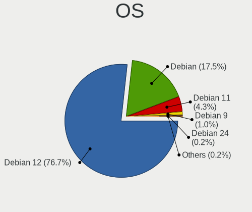
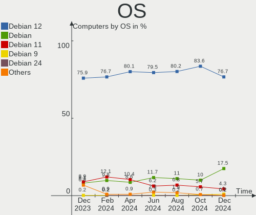
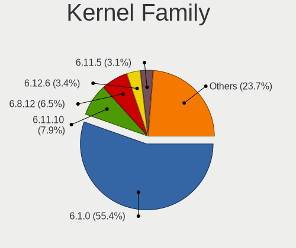
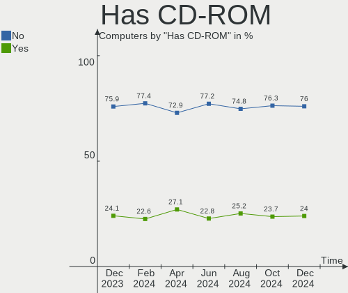
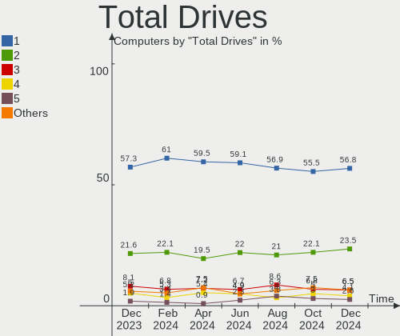
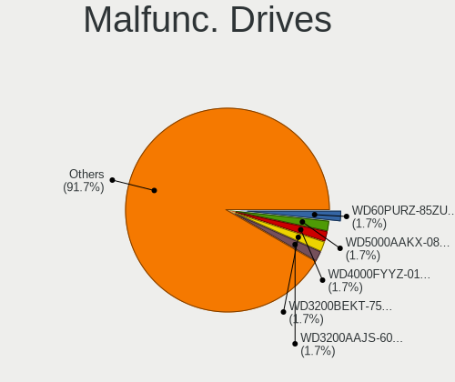
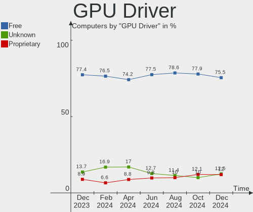
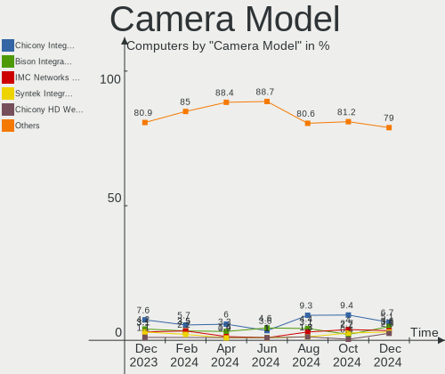
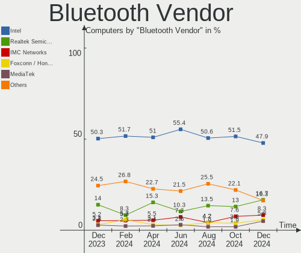

Debian Hardware Trends
----------------------

A project to identify most popular hardware characteristics and track their change
over time based on data collected by Debian users at https://Linux-Hardware.org.

Anyone can contribute to the study by uploading probes of their computers by
the [hw-probe](https://github.com/linuxhw/hw-probe) tool:

    sudo -E hw-probe -all -upload

This is a report for all computer types. See also reports for [desktops](/Dist/Debian/Desktop/README.md) and [notebooks](/Dist/Debian/Notebook/README.md).

Full-feature report is available here: https://linux-hardware.org/?view=trends

Period: Sep, 2020.

Contents
--------

- [ OS                       ](#os)
- [ OS Family                ](#os-family)
- [ Kernel                   ](#kernel)
- [ Kernel Family            ](#kernel-family)
- [ Kernel Major Ver.        ](#kernel-major-ver)
- [ Arch                     ](#arch)
- [ DE                       ](#de)
- [ Display Server           ](#display-server)
- [ Display Manager          ](#display-manager)
- [ OS Lang                  ](#os-lang)
- [ Boot Mode                ](#boot-mode)
- [ Filesystem               ](#filesystem)
- [ Part. scheme             ](#part-scheme)
- [ Dual Boot with Linux/BSD ](#dual-boot-with-linux/bsd)
- [ Dual Boot (Win)          ](#dual-boot-win)
- [ Country                  ](#country)
- [ City                     ](#city)
- [ Vendor                   ](#vendor)
- [ Model                    ](#model)
- [ Model Family             ](#model-family)
- [ MFG Year                 ](#mfg-year)
- [ Form Factor              ](#form-factor)
- [ Secure Boot              ](#secure-boot)
- [ Coreboot                 ](#coreboot)
- [ RAM Size                 ](#ram-size)
- [ RAM Used                 ](#ram-used)
- [ Has CD-ROM               ](#has-cd-rom)
- [ Total Drives             ](#total-drives)
- [ Has Ethernet             ](#has-ethernet)
- [ Drive Vendor             ](#drive-vendor)
- [ HDD Vendor               ](#hdd-vendor)
- [ SSD Vendor               ](#ssd-vendor)
- [ Drive Model              ](#drive-model)
- [ Drive Kind               ](#drive-kind)
- [ Drive Connector          ](#drive-connector)
- [ Drive Size               ](#drive-size)
- [ Space Total              ](#space-total)
- [ Space Used               ](#space-used)
- [ Malfunc. Drives          ](#malfunc-drives)
- [ Malfunc. Drive Vendor    ](#malfunc-drive-vendor)
- [ Malfunc. HDD Vendor      ](#malfunc-hdd-vendor)
- [ Malfunc. Drive Kind      ](#malfunc-drive-kind)
- [ Failed Drives            ](#failed-drives)
- [ Failed Drive Vendor      ](#failed-drive-vendor)
- [ Drive Status             ](#drive-status)
- [ Storage Vendor           ](#storage-vendor)
- [ Storage Model            ](#storage-model)
- [ Storage Kind             ](#storage-kind)
- [ CPU Vendor               ](#cpu-vendor)
- [ CPU Model                ](#cpu-model)
- [ CPU Model Family         ](#cpu-model-family)
- [ CPU Cores                ](#cpu-cores)
- [ CPU Sockets              ](#cpu-sockets)
- [ CPU Threads              ](#cpu-threads)
- [ CPU Op-Modes             ](#cpu-op-modes)
- [ CPU Microcode            ](#cpu-microcode)
- [ CPU Microarch            ](#cpu-microarch)
- [ GPU Vendor               ](#gpu-vendor)
- [ GPU Model                ](#gpu-model)
- [ GPU Combo                ](#gpu-combo)
- [ GPU Driver               ](#gpu-driver)
- [ GPU Memory               ](#gpu-memory)
- [ Monitor Vendor           ](#monitor-vendor)
- [ Monitor Model            ](#monitor-model)
- [ Monitor Resolution       ](#monitor-resolution)
- [ Monitor Diagonal         ](#monitor-diagonal)
- [ Monitor Width            ](#monitor-width)
- [ Aspect Ratio             ](#aspect-ratio)
- [ Monitor Area             ](#monitor-area)
- [ Pixel Density            ](#pixel-density)
- [ Multiple Monitors        ](#multiple-monitors)
- [ Net Controller Vendor    ](#net-controller-vendor)
- [ Net Controller Model     ](#net-controller-model)
- [ Wireless Vendor          ](#wireless-vendor)
- [ Wireless Model           ](#wireless-model)
- [ Ethernet Vendor          ](#ethernet-vendor)
- [ Ethernet Model           ](#ethernet-model)
- [ Net Controller Kind      ](#net-controller-kind)
- [ Used Controller          ](#used-controller)
- [ NICs                     ](#nics)
- [ Memory Vendor            ](#memory-vendor)
- [ Memory Model             ](#memory-model)
- [ Memory Kind              ](#memory-kind)
- [ Memory Form Factor       ](#memory-form-factor)
- [ Memory Size              ](#memory-size)
- [ Memory Speed             ](#memory-speed)
- [ Sound Vendor             ](#sound-vendor)
- [ Sound Model              ](#sound-model)
- [ Camera Vendor            ](#camera-vendor)
- [ Camera Model             ](#camera-model)
- [ Fingerprint Vendor       ](#fingerprint-vendor)
- [ Fingerprint Model        ](#fingerprint-model)
- [ Chipcard Vendor          ](#chipcard-vendor)
- [ Chipcard Model           ](#chipcard-model)
- [ Printer Vendor           ](#printer-vendor)
- [ Printer Model            ](#printer-model)
- [ Scanner Vendor           ](#scanner-vendor)
- [ Scanner Model            ](#scanner-model)
- [ Bluetooth Vendor         ](#bluetooth-vendor)
- [ Bluetooth Model          ](#bluetooth-model)
- [ Unsupported Devices      ](#unsupported-devices)
- [ Unsupported Device Types ](#unsupported-device-types)

OS
--

Installed operating systems

| Name            | Computers | Percent |
|-----------------|-----------|---------|
| Debian 10       | 86        | 55.48%  |
| Debian Testing  | 33        | 21.29%  |
| Debian Unstable | 17        | 10.97%  |
| Debian          | 15        | 9.68%   |
| Debian 9.13     | 2         | 1.29%   |
| Debian 9.12     | 1         | 0.65%   |
| Debian 8.11     | 1         | 0.65%   |

OS Family
---------

OS without a version

| Name   | Computers | Percent |
|--------|-----------|---------|
| Debian | 155       | 100%    |

Kernel
------

Version of the Linux kernel

| Version                      | Computers | Percent |
|------------------------------|-----------|---------|
| 4.19.0-10-amd64              | 46        | 29.68%  |
| 5.7.0-3-amd64                | 23        | 14.84%  |
| 5.8.0-1-amd64                | 14        | 9.03%   |
| 5.7.0-2-amd64                | 7         | 4.52%   |
| 5.8.0-2-amd64                | 6         | 3.87%   |
| 5.7.0-0.bpo.2-amd64          | 6         | 3.87%   |
| 5.6.0-0.bpo.2-amd64          | 3         | 1.94%   |
| 4.19.0-9-amd64               | 3         | 1.94%   |
| 4.19.0-6-amd64               | 3         | 1.94%   |
| 4.19.0-11-amd64              | 3         | 1.94%   |
| 4.19.0-10-686-pae            | 3         | 1.94%   |
| 5.6.0-2-amd64                | 2         | 1.29%   |
| 5.4.60-1-pve                 | 2         | 1.29%   |
| 5.4.55-1-pve                 | 2         | 1.29%   |
| 5.4.44-2-pve                 | 2         | 1.29%   |
| 4.9.0-13-amd64               | 2         | 1.29%   |
| 4.4.13-ntc-mlc               | 2         | 1.29%   |
| 5.9.0-rc6-amd64              | 1         | 0.65%   |
| 5.9.0-rc4-amd64              | 1         | 0.65%   |
| 5.8.6-sunxi                  | 1         | 0.65%   |
| 5.8.5-towo.1-siduction-amd64 | 1         | 0.65%   |
| 5.8.12                       | 1         | 0.65%   |
| 5.8.0a                       | 1         | 0.65%   |
| 5.8.0-6.1-liquorix-amd64     | 1         | 0.65%   |
| 5.8.0-12.1-liquorix-amd64    | 1         | 0.65%   |
| 5.8-sunxi64                  | 1         | 0.65%   |
| 5.7.10-falcot                | 1         | 0.65%   |
| 5.6.17-rt10avl1              | 1         | 0.65%   |
| 5.6.10-antix.1-amd64-smp     | 1         | 0.65%   |
| 5.6.0-0.bpo.2-rt-amd64       | 1         | 0.65%   |
| 5.5.0-1-amd64                | 1         | 0.65%   |
| 5.5.0-0.bpo.2-amd64          | 1         | 0.65%   |
| 5.4.65-v8+                   | 1         | 0.65%   |
| 4.9.0-13-686-pae             | 1         | 0.65%   |
| 4.9.0-13-686                 | 1         | 0.65%   |
| 4.9.0-12-amd64               | 1         | 0.65%   |
| 4.9.0-0.bpo.12-amd64         | 1         | 0.65%   |
| 4.4.232-19101-g619abfde5ea9  | 1         | 0.65%   |
| 4.2.3                        | 1         | 0.65%   |
| 4.19.62-sunxi                | 1         | 0.65%   |
| 4.19.0-8-amd64               | 1         | 0.65%   |
| 4.19.0-4-amd64               | 1         | 0.65%   |
| 4.17.0-1-amd64               | 1         | 0.65%   |

Kernel Family
-------------

Linux kernel without a distro release

| Version | Computers | Percent |
|---------|-----------|---------|
| 4.19.0  | 60        | 38.71%  |
| 5.7.0   | 36        | 23.23%  |
| 5.8.0   | 23        | 14.84%  |
| 5.6.0   | 6         | 3.87%   |
| 4.9.0   | 6         | 3.87%   |
| 5.9.0   | 2         | 1.29%   |
| 5.5.0   | 2         | 1.29%   |
| 5.4.60  | 2         | 1.29%   |
| 5.4.55  | 2         | 1.29%   |
| 5.4.44  | 2         | 1.29%   |
| 4.4.13  | 2         | 1.29%   |
| 5.8.6   | 1         | 0.65%   |
| 5.8.5   | 1         | 0.65%   |
| 5.8.12  | 1         | 0.65%   |
| 5.8     | 1         | 0.65%   |
| 5.7.10  | 1         | 0.65%   |
| 5.6.17  | 1         | 0.65%   |
| 5.6.10  | 1         | 0.65%   |
| 5.4.65  | 1         | 0.65%   |
| 4.4.232 | 1         | 0.65%   |
| 4.2.3   | 1         | 0.65%   |
| 4.19.62 | 1         | 0.65%   |
| 4.17.0  | 1         | 0.65%   |

Kernel Major Ver.
-----------------

Linux kernel major version

| Version | Computers | Percent |
|---------|-----------|---------|
| 4.19    | 61        | 39.35%  |
| 5.7     | 37        | 23.87%  |
| 5.8     | 26        | 16.77%  |
| 5.6     | 8         | 5.16%   |
| 5.4     | 7         | 4.52%   |
| 4.9     | 6         | 3.87%   |
| 4.4     | 3         | 1.94%   |
| 5.9     | 2         | 1.29%   |
| 5.5     | 2         | 1.29%   |
| 5       | 1         | 0.65%   |
| 4.2     | 1         | 0.65%   |
| 4.17    | 1         | 0.65%   |

Arch
----

OS architecture (x86_64, i586, etc.)

| Name    | Computers | Percent |
|---------|-----------|---------|
| x86_64  | 144       | 92.9%   |
| i686    | 5         | 3.23%   |
| armv7l  | 4         | 2.58%   |
| aarch64 | 2         | 1.29%   |

DE
--

Desktop Environment

| Name             | Computers | Percent |
|------------------|-----------|---------|
| GNOME            | 45        | 29.03%  |
| XFCE             | 24        | 15.48%  |
| Unknown          | 22        | 14.19%  |
| KDE5             | 14        | 9.03%   |
| KDE              | 14        | 9.03%   |
| X-Cinnamon       | 6         | 3.87%   |
| LXDE             | 6         | 3.87%   |
| i3               | 5         | 3.23%   |
| MATE             | 4         | 2.58%   |
| Cinnamon         | 4         | 2.58%   |
| Openbox          | 3         | 1.94%   |
| LXQt             | 3         | 1.94%   |
| GNOME Flashback  | 3         | 1.94%   |
| lightdm-xsession | 2         | 1.29%   |

Display Server
--------------

X11 or Wayland

| Name    | Computers | Percent |
|---------|-----------|---------|
| X11     | 102       | 65.81%  |
| Wayland | 25        | 16.13%  |
| Tty     | 25        | 16.13%  |
| Unknown | 3         | 1.94%   |

Display Manager
---------------

SDDM, LightDM, etc.

| Name    | Computers | Percent |
|---------|-----------|---------|
| Unknown | 61        | 39.35%  |
| TDM     | 35        | 22.58%  |
| GDM     | 32        | 20.65%  |
| SDDM    | 18        | 11.61%  |
| LightDM | 6         | 3.87%   |
| XDM     | 1         | 0.65%   |
| SLiM    | 1         | 0.65%   |
| KDM     | 1         | 0.65%   |

OS Lang
-------

Language

| Lang       | Computers | Percent |
|------------|-----------|---------|
| en_US      | 64        | 41.29%  |
| en_GB      | 10        | 6.45%   |
| de_DE      | 9         | 5.81%   |
| en_CA      | 6         | 3.87%   |
| Unknown    | 6         | 3.87%   |
| pt_BR      | 5         | 3.23%   |
| it_IT      | 5         | 3.23%   |
| ru_RU      | 4         | 2.58%   |
| en_US.utf8 | 4         | 2.58%   |
| en_NZ      | 4         | 2.58%   |
| pl_PL      | 3         | 1.94%   |
| fr_FR      | 3         | 1.94%   |
| en_IN      | 3         | 1.94%   |
| es_ES      | 2         | 1.29%   |
| C          | 2         | 1.29%   |
| zh_TW      | 1         | 0.65%   |
| ru_RU.utf8 | 1         | 0.65%   |
| ro_RO      | 1         | 0.65%   |
| pt_PT      | 1         | 0.65%   |
| nl_NL      | 1         | 0.65%   |
| lt_LT      | 1         | 0.65%   |
| ko_KR      | 1         | 0.65%   |
| ja_JP      | 1         | 0.65%   |
| hu_HU      | 1         | 0.65%   |
| hr_HR      | 1         | 0.65%   |
| fr_CA      | 1         | 0.65%   |
| fi_FI      | 1         | 0.65%   |
| es_HN      | 1         | 0.65%   |
| es_CR      | 1         | 0.65%   |
| es_CO      | 1         | 0.65%   |
| es_CL      | 1         | 0.65%   |
| es_BO      | 1         | 0.65%   |
| es_AR      | 1         | 0.65%   |
| en_ZA      | 1         | 0.65%   |
| en_US      | 1         | 0.65%   |
| en_NZ.utf8 | 1         | 0.65%   |
| en_IE      | 1         | 0.65%   |
| en_AU      | 1         | 0.65%   |
| de_CH.utf8 | 1         | 0.65%   |
| cs_CZ      | 1         | 0.65%   |

Boot Mode
---------

EFI or BIOS

| Mode | Computers | Percent |
|------|-----------|---------|
| BIOS | 82        | 52.9%   |
| EFI  | 73        | 47.1%   |

Filesystem
----------

Type of filesystem

| Type    | Computers | Percent |
|---------|-----------|---------|
| Ext4    | 133       | 85.81%  |
| Btrfs   | 6         | 3.87%   |
| Zfs     | 5         | 3.23%   |
| Xfs     | 3         | 1.94%   |
| Overlay | 3         | 1.94%   |
| Ubifs   | 2         | 1.29%   |
| Jfs     | 1         | 0.65%   |
| F2fs    | 1         | 0.65%   |
| Ext2    | 1         | 0.65%   |

Part. scheme
------------

Scheme of partitioning

| Type    | Computers | Percent |
|---------|-----------|---------|
| GPT     | 80        | 51.61%  |
| Unknown | 47        | 30.32%  |
| MBR     | 28        | 18.06%  |

Dual Boot with Linux/BSD
------------------------

Hosting more than one Linux/BSD

| Dual boot | Computers | Percent |
|-----------|-----------|---------|
| No        | 135       | 87.1%   |
| Yes       | 20        | 12.9%   |

Dual Boot (Win)
---------------

Hosting Linux and Windows

| Dual boot | Computers | Percent |
|-----------|-----------|---------|
| No        | 120       | 77.42%  |
| Yes       | 35        | 22.58%  |

Country
-------

Geographic location (country)

| Country            | Computers | Percent |
|--------------------|-----------|---------|
| USA                | 33        | 21.29%  |
| Germany            | 13        | 8.39%   |
| Italy              | 8         | 5.16%   |
| Canada             | 8         | 5.16%   |
| France             | 7         | 4.52%   |
| Brazil             | 7         | 4.52%   |
| Russia             | 6         | 3.87%   |
| UK                 | 5         | 3.23%   |
| New Zealand        | 5         | 3.23%   |
| Netherlands        | 5         | 3.23%   |
| India              | 5         | 3.23%   |
| Switzerland        | 4         | 2.58%   |
| Poland             | 4         | 2.58%   |
| Finland            | 4         | 2.58%   |
| Ukraine            | 3         | 1.94%   |
| Spain              | 3         | 1.94%   |
| Portugal           | 3         | 1.94%   |
| Taiwan             | 2         | 1.29%   |
| Sweden             | 2         | 1.29%   |
| Norway             | 2         | 1.29%   |
| Hungary            | 2         | 1.29%   |
| Belgium            | 2         | 1.29%   |
| South Africa       | 1         | 0.65%   |
| Singapore          | 1         | 0.65%   |
| Romania            | 1         | 0.65%   |
| Luxembourg         | 1         | 0.65%   |
| Lithuania          | 1         | 0.65%   |
| Korea, Republic of | 1         | 0.65%   |
| Kazakhstan         | 1         | 0.65%   |
| Israel             | 1         | 0.65%   |
| Ireland            | 1         | 0.65%   |
| Indonesia          | 1         | 0.65%   |
| Honduras           | 1         | 0.65%   |
| Ecuador            | 1         | 0.65%   |
| Czech Republic     | 1         | 0.65%   |
| Croatia            | 1         | 0.65%   |
| Colombia           | 1         | 0.65%   |
| Chile              | 1         | 0.65%   |
| Bulgaria           | 1         | 0.65%   |
| Bolivia            | 1         | 0.65%   |
| Bermuda            | 1         | 0.65%   |
| Austria            | 1         | 0.65%   |
| Australia          | 1         | 0.65%   |
| Argentina          | 1         | 0.65%   |

City
----

Geographic location (city)

| City                 | Computers | Percent |
|----------------------|-----------|---------|
| Auckland             | 4         | 2.58%   |
| Amsterdam            | 4         | 2.58%   |
| Zurich               | 3         | 1.94%   |
| Warsaw               | 3         | 1.94%   |
| Turin                | 2         | 1.29%   |
| Toronto              | 2         | 1.29%   |
| Paris                | 2         | 1.29%   |
| Marysville           | 2         | 1.29%   |
| Malmo                | 2         | 1.29%   |
| Freiburg             | 2         | 1.29%   |
| Anaheim              | 2         | 1.29%   |
| Zhytomyr             | 1         | 0.65%   |
| Zeist                | 1         | 0.65%   |
| Wurzburg             | 1         | 0.65%   |
| Windsor              | 1         | 0.65%   |
| Whangarei            | 1         | 0.65%   |
| Wenatchee            | 1         | 0.65%   |
| Vitória             | 1         | 0.65%   |
| Vigo                 | 1         | 0.65%   |
| Vienna               | 1         | 0.65%   |
| Tuusula              | 1         | 0.65%   |
| Turku                | 1         | 0.65%   |
| Trondheim            | 1         | 0.65%   |
| Tel Aviv             | 1         | 0.65%   |
| Taoyuan District     | 1         | 0.65%   |
| São Paulo           | 1         | 0.65%   |
| Stillwater           | 1         | 0.65%   |
| St Petersburg        | 1         | 0.65%   |
| Springfield          | 1         | 0.65%   |
| Split                | 1         | 0.65%   |
| Singapore            | 1         | 0.65%   |
| Seattle              | 1         | 0.65%   |
| Sao Felix da Marinha | 1         | 0.65%   |
| Santiago             | 1         | 0.65%   |
| Santa Cruz           | 1         | 0.65%   |
| Rotherhithe          | 1         | 0.65%   |
| Rio de Janeiro       | 1         | 0.65%   |
| Rio Claro            | 1         | 0.65%   |
| Redding              | 1         | 0.65%   |
| Raduzhny             | 1         | 0.65%   |
| Quito                | 1         | 0.65%   |
| Pune                 | 1         | 0.65%   |
| Promissao            | 1         | 0.65%   |
| Prato Lauro          | 1         | 0.65%   |
| Prague               | 1         | 0.65%   |
| Porto                | 1         | 0.65%   |
| Plovdiv              | 1         | 0.65%   |
| Pirmasens            | 1         | 0.65%   |
| Perth                | 1         | 0.65%   |
| Paternò             | 1         | 0.65%   |
| Pasly                | 1         | 0.65%   |
| Palakkad             | 1         | 0.65%   |
| Oulu                 | 1         | 0.65%   |
| Oslo                 | 1         | 0.65%   |
| Oruro                | 1         | 0.65%   |
| Okehampton           | 1         | 0.65%   |
| Odesa                | 1         | 0.65%   |
| Newark               | 1         | 0.65%   |
| New York             | 1         | 0.65%   |
| New Orleans          | 1         | 0.65%   |

Vendor
------

Motherboard manufacturer

| Name                    | Computers | Percent |
|-------------------------|-----------|---------|
| ASUSTek Computer        | 28        | 18.06%  |
| Lenovo                  | 26        | 16.77%  |
| Dell                    | 19        | 12.26%  |
| Hewlett-Packard         | 18        | 11.61%  |
| Gigabyte Technology     | 15        | 9.68%   |
| Acer                    | 9         | 5.81%   |
| MSI                     | 7         | 4.52%   |
| ASRock                  | 6         | 3.87%   |
| Intel                   | 4         | 2.58%   |
| Apple                   | 3         | 1.94%   |
| sunxi                   | 2         | 1.29%   |
| AZW                     | 2         | 1.29%   |
| Unknown                 | 2         | 1.29%   |
| WeiBu                   | 1         | 0.65%   |
| Toshiba                 | 1         | 0.65%   |
| Timi                    | 1         | 0.65%   |
| Supermicro              | 1         | 0.65%   |
| RM                      | 1         | 0.65%   |
| Raspberry Pi Foundation | 1         | 0.65%   |
| Pine Microsystems       | 1         | 0.65%   |
| Notebook                | 1         | 0.65%   |
| Medion                  | 1         | 0.65%   |
| LG Electronics          | 1         | 0.65%   |
| IBM                     | 1         | 0.65%   |
| Google                  | 1         | 0.65%   |
| Biostar                 | 1         | 0.65%   |
| ASRockRack              | 1         | 0.65%   |

Model
-----

Motherboard model

| Name                                                      | Computers | Percent |
|-----------------------------------------------------------|-----------|---------|
| Unknown                                                   | 3         | 1.94%   |
| Gigabyte X570 AORUS ELITE                                 | 2         | 1.29%   |
| ASUS PRIME B350-PLUS                                      | 2         | 1.29%   |
| ASUS All Series                                           | 2         | 1.29%   |
| WeiBu WTGLKC1R120 SD-BS-CJ41G-M-101-B 12/09/2019 18:14:02 | 1         | 0.65%   |
| Toshiba Satellite Pro C650                                | 1         | 0.65%   |
| Timi RedmiBook 14 II                                      | 1         | 0.65%   |
| Supermicro SYS-F627R3-RTB+01-VI009                        | 1         | 0.65%   |
| sunxi Orange Pi                                           | 1         | 0.65%   |
| RM RM NOTEBOOK 310                                        | 1         | 0.65%   |
| RPi Raspberry Pi 4 Model B Rev 1.4                        | 1         | 0.65%   |
| Pine Microsystems Pine64 PinePhone (1.2)                  | 1         | 0.65%   |
| Notebook NJ50_70CU                                        | 1         | 0.65%   |
| MSI MS-7B85                                               | 1         | 0.65%   |
| MSI MS-7B79                                               | 1         | 0.65%   |
| MSI MS-7B09                                               | 1         | 0.65%   |
| MSI MS-7A37                                               | 1         | 0.65%   |
| MSI MS-7A33                                               | 1         | 0.65%   |
| MSI MS-7798                                               | 1         | 0.65%   |
| MSI MS-7750                                               | 1         | 0.65%   |
| Medion E122X                                              | 1         | 0.65%   |
| LG Electronics 15ND530-GX30K                              | 1         | 0.65%   |
| Lenovo ThinkPad X60s 1703Y1F                              | 1         | 0.65%   |
| Lenovo ThinkPad X250 20CLS3KU00                           | 1         | 0.65%   |
| Lenovo ThinkPad X1 Carbon 7th 20QDCTO1WW                  | 1         | 0.65%   |
| Lenovo ThinkPad T495 20NJCTO1WW                           | 1         | 0.65%   |
| Lenovo ThinkPad T470 20HDCTO1WW                           | 1         | 0.65%   |
| Lenovo ThinkPad T440p 20AWS17N00                          | 1         | 0.65%   |
| Lenovo ThinkPad T430 2347HD1                              | 1         | 0.65%   |
| Lenovo ThinkPad T420 4236PRG                              | 1         | 0.65%   |
| Lenovo ThinkPad T410 2522WUZ                              | 1         | 0.65%   |
| Lenovo ThinkPad P52 20M9CTR1WW                            | 1         | 0.65%   |
| Lenovo ThinkPad P14s Gen 1 20S4CTO1WW                     | 1         | 0.65%   |
| Lenovo ThinkPad L14 Gen 1 20U50007MX                      | 1         | 0.65%   |
| Lenovo ThinkPad E15 20RDCTO1WW                            | 1         | 0.65%   |
| Lenovo ThinkPad E14 20RBCTO1WW                            | 1         | 0.65%   |
| Lenovo ThinkPad 13 20GJCTO1WW                             | 1         | 0.65%   |
| Lenovo ThinkCentre M90n-1 11AD0023US                      | 1         | 0.65%   |
| Lenovo ThinkCentre M73 10B00005US                         | 1         | 0.65%   |
| Lenovo ThinkCentre M715q 10VHA00500                       | 1         | 0.65%   |
| Lenovo ThinkCentre M55 88088NU                            | 1         | 0.65%   |
| Lenovo IdeaPad S340-15API 81NC                            | 1         | 0.65%   |
| Lenovo IdeaPad S340-14IML 81N9                            | 1         | 0.65%   |
| Lenovo IdeaPad S145-14IIL 81W6                            | 1         | 0.65%   |
| Lenovo IdeaPad FLEX-14IWL 81SQ                            | 1         | 0.65%   |
| Lenovo IdeaCentre 310S-08ASR 90G90020US                   | 1         | 0.65%   |
| Lenovo G570 20079                                         | 1         | 0.65%   |
| Lenovo G50-45 80E3                                        | 1         | 0.65%   |
| Intel NUC8i5BEH                                           | 1         | 0.65%   |
| Intel NUC10i7FNH                                          | 1         | 0.65%   |
| Intel Infinity JQ                                         | 1         | 0.65%   |
| Intel DH87RL AAG74240-403                                 | 1         | 0.65%   |
| IBM System x3550 M2 -[794622V]-                           | 1         | 0.65%   |
| HP ZBook 15u G6                                           | 1         | 0.65%   |
| HP Stream Notebook PC 13                                  | 1         | 0.65%   |
| HP ProBook 455 G2                                         | 1         | 0.65%   |
| HP ProBook 4540s                                          | 1         | 0.65%   |
| HP Notebook                                               | 1         | 0.65%   |
| HP Mini 110-3100                                          | 1         | 0.65%   |
| HP Laptop 17-ca1xxx                                       | 1         | 0.65%   |

Model Family
------------

Motherboard model prefix

| Name                               | Computers | Percent |
|------------------------------------|-----------|---------|
| Lenovo ThinkPad                    | 15        | 9.68%   |
| Dell Latitude                      | 7         | 4.52%   |
| Dell Inspiron                      | 7         | 4.52%   |
| Acer Aspire                        | 6         | 3.87%   |
| Lenovo ThinkCentre                 | 4         | 2.58%   |
| Lenovo IdeaPad                     | 4         | 2.58%   |
| HP EliteBook                       | 4         | 2.58%   |
| HP Compaq                          | 4         | 2.58%   |
| ASUS TUF                           | 4         | 2.58%   |
| HP Laptop                          | 3         | 1.94%   |
| ASUS PRIME                         | 3         | 1.94%   |
| Unknown                            | 3         | 1.94%   |
| HP ProBook                         | 2         | 1.29%   |
| Gigabyte X570                      | 2         | 1.29%   |
| Dell XPS                           | 2         | 1.29%   |
| Dell Vostro                        | 2         | 1.29%   |
| ASUS VivoBook                      | 2         | 1.29%   |
| ASUS ROG                           | 2         | 1.29%   |
| ASUS M5A97                         | 2         | 1.29%   |
| ASUS All                           | 2         | 1.29%   |
| WeiBu WTGLKC1R120                  | 1         | 0.65%   |
| Toshiba Satellite                  | 1         | 0.65%   |
| Timi RedmiBook                     | 1         | 0.65%   |
| Supermicro SYS-F627R3-RTB+01-VI009 | 1         | 0.65%   |
| sunxi Orange                       | 1         | 0.65%   |
| RM RM                              | 1         | 0.65%   |
| RPi Raspberry                      | 1         | 0.65%   |
| Pine Microsystems Pine64           | 1         | 0.65%   |
| Notebook NJ50                      | 1         | 0.65%   |
| MSI MS-7B85                        | 1         | 0.65%   |
| MSI MS-7B79                        | 1         | 0.65%   |
| MSI MS-7B09                        | 1         | 0.65%   |
| MSI MS-7A37                        | 1         | 0.65%   |
| MSI MS-7A33                        | 1         | 0.65%   |
| MSI MS-7798                        | 1         | 0.65%   |
| MSI MS-7750                        | 1         | 0.65%   |
| Medion E122X                       | 1         | 0.65%   |
| LG Electronics 15ND530-GX30K       | 1         | 0.65%   |
| Lenovo IdeaCentre                  | 1         | 0.65%   |
| Lenovo G570                        | 1         | 0.65%   |
| Lenovo G50-45                      | 1         | 0.65%   |
| Intel NUC8i5BEH                    | 1         | 0.65%   |
| Intel NUC10i7FNH                   | 1         | 0.65%   |
| Intel Infinity                     | 1         | 0.65%   |
| Intel DH87RL                       | 1         | 0.65%   |
| IBM System                         | 1         | 0.65%   |
| HP ZBook                           | 1         | 0.65%   |
| HP Stream                          | 1         | 0.65%   |
| HP Notebook                        | 1         | 0.65%   |
| HP Mini                            | 1         | 0.65%   |
| HP G70                             | 1         | 0.65%   |
| Google Rammus                      | 1         | 0.65%   |
| Gigabyte Z97N-WIFI                 | 1         | 0.65%   |
| Gigabyte Z87X-UD3H                 | 1         | 0.65%   |
| Gigabyte Z87-HD3                   | 1         | 0.65%   |
| Gigabyte Z77X-UD3H                 | 1         | 0.65%   |
| Gigabyte P67A-UD5-B3               | 1         | 0.65%   |
| Gigabyte GA-G41M-ES2L              | 1         | 0.65%   |
| Gigabyte GA-78LMT-USB3             | 1         | 0.65%   |
| Gigabyte F2A78M-HD2                | 1         | 0.65%   |

MFG Year
--------

Motherboard manufacture year

| Year    | Computers | Percent |
|---------|-----------|---------|
| 2020    | 37        | 23.87%  |
| 2019    | 29        | 18.71%  |
| 2013    | 13        | 8.39%   |
| 2014    | 12        | 7.74%   |
| 2018    | 10        | 6.45%   |
| 2017    | 10        | 6.45%   |
| 2010    | 7         | 4.52%   |
| 2015    | 6         | 3.87%   |
| 2011    | 6         | 3.87%   |
| Unknown | 6         | 3.87%   |
| 2012    | 5         | 3.23%   |
| 2016    | 4         | 2.58%   |
| 2009    | 3         | 1.94%   |
| 2008    | 3         | 1.94%   |
| 2007    | 3         | 1.94%   |
| 2006    | 1         | 0.65%   |

Form Factor
-----------

Physical design of the computer

| Name           | Computers | Percent |
|----------------|-----------|---------|
| Notebook       | 78        | 50.32%  |
| Desktop        | 63        | 40.65%  |
| System on chip | 4         | 2.58%   |
| Mini pc        | 4         | 2.58%   |
| Other          | 2         | 1.29%   |
| All in one     | 2         | 1.29%   |
| Convertible    | 1         | 0.65%   |
| Server         | 1         | 0.65%   |

Secure Boot
-----------

Enabled or disabled

| State    | Computers | Percent |
|----------|-----------|---------|
| Disabled | 145       | 93.55%  |
| Enabled  | 10        | 6.45%   |

Coreboot
--------

Have coreboot on board

| Used | Computers | Percent |
|------|-----------|---------|
| No   | 153       | 98.71%  |
| Yes  | 2         | 1.29%   |

RAM Size
--------

Total RAM memory

| Size in GB      | Computers | Percent |
|-----------------|-----------|---------|
| 16.01-24.0      | 38        | 24.52%  |
| 8.01-16.0       | 32        | 20.65%  |
| 4.01-8.0        | 29        | 18.71%  |
| 3.01-4.0        | 20        | 12.9%   |
| 32.01-64.0      | 12        | 7.74%   |
| 64.01-256.0     | 8         | 5.16%   |
| 0.01-1.0        | 5         | 3.23%   |
| 2.01-3.0        | 4         | 2.58%   |
| 24.01-32.0      | 3         | 1.94%   |
| 1.01-2.0        | 3         | 1.94%   |
| More than 256.0 | 1         | 0.65%   |

RAM Used
--------

Used RAM memory

| Used GB    | Computers | Percent |
|------------|-----------|---------|
| 2.01-3.0   | 39        | 25.16%  |
| 4.01-8.0   | 27        | 17.42%  |
| 1.01-2.0   | 27        | 17.42%  |
| 3.01-4.0   | 22        | 14.19%  |
| 0.01-1.0   | 17        | 10.97%  |
| 8.01-16.0  | 15        | 9.68%   |
| 24.01-32.0 | 3         | 1.94%   |
| 16.01-24.0 | 3         | 1.94%   |
| 32.01-64.0 | 2         | 1.29%   |

Has CD-ROM
----------

Has CD-ROM on board

| Presented | Computers | Percent |
|-----------|-----------|---------|
| No        | 105       | 67.74%  |
| Yes       | 50        | 32.26%  |

Total Drives
------------

Number of drives on board

| Drives | Computers | Percent |
|--------|-----------|---------|
| 1      | 82        | 52.9%   |
| 2      | 35        | 22.58%  |
| 3      | 16        | 10.32%  |
| 4      | 10        | 6.45%   |
| 7      | 4         | 2.58%   |
| 5      | 4         | 2.58%   |
| 6      | 2         | 1.29%   |
| 0      | 2         | 1.29%   |

Has Ethernet
------------

Has Ethernet on board

| Presented | Computers | Percent |
|-----------|-----------|---------|
| Yes       | 135       | 87.1%   |
| No        | 20        | 12.9%   |

Drive Vendor
------------

Hard drive vendors

| Vendor              | Computers | Drives  | Percent |
|---------------------|-----------|---------|---------|
| WDC                 | 41        | 53      | 16.8%   |
| Samsung Electronics | 41        | 53      | 16.8%   |
| Seagate             | 36        | 46      | 14.75%  |
| Crucial             | 16        | 16      | 6.56%   |
| Unknown             | 14        | 16      | 5.74%   |
| Toshiba             | 14        | 20      | 5.74%   |
| Kingston            | 14        | 14      | 5.74%   |
| SanDisk             | 9         | 10      | 3.69%   |
| Hitachi             | 8         | 11      | 3.28%   |
| HGST                | 6         | 9       | 2.46%   |
| SK Hynix            | 5         | 5       | 2.05%   |
| Intel               | 5         | 7       | 2.05%   |
| Phison              | 3         | 3       | 1.23%   |
| A-DATA Technology   | 3         | 3       | 1.23%   |
| Team                | 2         | 2       | 0.82%   |
| SPCC                | 2         | 2       | 0.82%   |
| PNY                 | 2         | 3       | 0.82%   |
| Micron Technology   | 2         | 2       | 0.82%   |
| GOODRAM             | 2         | 2       | 0.82%   |
| Fujitsu             | 2         | 2       | 0.82%   |
| China               | 2         | 2       | 0.82%   |
| Union Memory        | 1         | 1       | 0.41%   |
| TO Exter            | 1         | 1       | 0.41%   |
| TAMMUZ              | 1         | 1       | 0.41%   |
| Silicon Motion      | 1         | 1       | 0.41%   |
| OCZ                 | 1         | 1       | 0.41%   |
| NETAPP              | 1         | 2       | 0.41%   |
| Maxtor              | 1         | 1       | 0.41%   |
| LDLC                | 1         | 1       | 0.41%   |
| IBM-ESXS            | 1         | Unknown | 0.41%   |
| HL-DT-ST            | 1         | Unknown | 0.41%   |
| Dogfish             | 1         | 1       | 0.41%   |
| DAS                 | 1         | 1       | 0.41%   |
| Corsair             | 1         | 2       | 0.41%   |
| ASMT                | 1         | 1       | 0.41%   |
| Apple               | 1         | 1       | 0.41%   |

HDD Vendor
----------

Hard disk drive vendors

| Vendor              | Computers | Drives | Percent |
|---------------------|-----------|--------|---------|
| WDC                 | 34        | 43     | 32.69%  |
| Seagate             | 34        | 44     | 32.69%  |
| Toshiba             | 10        | 15     | 9.62%   |
| Hitachi             | 8         | 11     | 7.69%   |
| HGST                | 6         | 9      | 5.77%   |
| Samsung Electronics | 5         | 6      | 4.81%   |
| Fujitsu             | 2         | 2      | 1.92%   |
| TO Exter            | 1         | 1      | 0.96%   |
| NETAPP              | 1         | 2      | 0.96%   |
| Maxtor              | 1         | 1      | 0.96%   |
| ASMT                | 1         | 1      | 0.96%   |
| Apple               | 1         | 1      | 0.96%   |

SSD Vendor
----------

Solid state drive vendors

| Vendor              | Computers | Drives | Percent |
|---------------------|-----------|--------|---------|
| Samsung Electronics | 22        | 26     | 25.58%  |
| Crucial             | 15        | 15     | 17.44%  |
| Kingston            | 12        | 12     | 13.95%  |
| SanDisk             | 8         | 9      | 9.3%    |
| WDC                 | 5         | 6      | 5.81%   |
| Unknown             | 2         | 2      | 2.33%   |
| Team                | 2         | 2      | 2.33%   |
| SPCC                | 2         | 2      | 2.33%   |
| SK Hynix            | 2         | 2      | 2.33%   |
| PNY                 | 2         | 3      | 2.33%   |
| Intel               | 2         | 3      | 2.33%   |
| GOODRAM             | 2         | 2      | 2.33%   |
| China               | 2         | 2      | 2.33%   |
| A-DATA Technology   | 2         | 2      | 2.33%   |
| Toshiba             | 1         | 1      | 1.16%   |
| TAMMUZ              | 1         | 1      | 1.16%   |
| OCZ                 | 1         | 1      | 1.16%   |
| Micron Technology   | 1         | 1      | 1.16%   |
| LDLC                | 1         | 1      | 1.16%   |
| Dogfish             | 1         | 1      | 1.16%   |

Drive Model
-----------

Hard drive models

| Model                        | Computers | Percent |
|------------------------------|-----------|---------|
| NVMe SSD Drive 256GB         | 7         | 2.56%   |
| SSD 850 EVO 500GB            | 5         | 1.83%   |
| WD10EZEX-08WN4A0 1TB         | 4         | 1.47%   |
| ST1000LM035-1RK172 1TB       | 4         | 1.47%   |
| CT500MX500SSD1 500GB         | 4         | 1.47%   |
| CT480BX500SSD1 480GB         | 4         | 1.47%   |
| SSD 860 EVO 500GB            | 3         | 1.1%    |
| SSD 860 EVO 1TB              | 3         | 1.1%    |
| MQ01ABD100 1TB               | 3         | 1.1%    |
| HTS721010A9E630 1TB          | 3         | 1.1%    |
| WD10EZEX-00BN5A0 1TB         | 2         | 0.73%   |
| WD10EACS-00ZJB0 1TB          | 2         | 0.73%   |
| SV300S37A240G 240GB SSD      | 2         | 0.73%   |
| ST500DM002-1BD142 500GB      | 2         | 0.73%   |
| ST3160815AS 160GB            | 2         | 0.73%   |
| ST31000524AS 1TB             | 2         | 0.73%   |
| ST2000DM001-1CH164 2TB       | 2         | 0.73%   |
| ST1000LM048-2E7172 1TB       | 2         | 0.73%   |
| SSD 970 EVO Plus 500GB       | 2         | 0.73%   |
| SSD 850 EVO 250GB            | 2         | 0.73%   |
| SSD 850 EVO 120GB            | 2         | 0.73%   |
| SSD 840 PRO Series 256GB     | 2         | 0.73%   |
| SSD 128GB                    | 2         | 0.73%   |
| SA400S37240G 240GB SSD       | 2         | 0.73%   |
| SA400S37120G 120GB SSD       | 2         | 0.73%   |
| MZVLB512HBJQ-000L7 512GB     | 2         | 0.73%   |
| MZVLB512HAJQ-000H1 512GB     | 2         | 0.73%   |
| MQ01ABF050 500GB             | 2         | 0.73%   |
| MMC Card  32GB               | 2         | 0.73%   |
| MMC Card  2GB                | 2         | 0.73%   |
| Expansion 1TB                | 2         | 0.73%   |
| DT01ACA300 3TB               | 2         | 0.73%   |
| X400 M.2 2280 128GB SSD      | 1         | 0.37%   |
| X300 MSATA 256GB SSD         | 1         | 0.37%   |
| WDS500G2B0A-00SM50 500GB SSD | 1         | 0.37%   |
| WDS500G2B0A 500GB SSD        | 1         | 0.37%   |
| WDS240G2G0B-00EPW0 240GB SSD | 1         | 0.37%   |
| WDS120G1G0A-00SS50 120GB SSD | 1         | 0.37%   |
| WDS100T2G0A-00JH30 1TB SSD   | 1         | 0.37%   |
| WD80EMAZ-00WJTA0 8TB         | 1         | 0.37%   |
| WD800JD-08MSA1 80GB          | 1         | 0.37%   |
| WD8004FRYZ-01VAEB0 8TB       | 1         | 0.37%   |
| WD8003FRYZ-01JPDB1 8TB       | 1         | 0.37%   |
| WD7500BPVT-22HXZT1 752GB     | 1         | 0.37%   |
| WD6001FZWX-00A2VA0 6TB       | 1         | 0.37%   |
| WD5000LPVX-80V0TT0 500GB     | 1         | 0.37%   |
| WD5000AAKX-00ERMA0 500GB     | 1         | 0.37%   |
| WD5000AAKS-00A7B2 500GB      | 1         | 0.37%   |
| WD5000AAJS-22A8B0 500GB      | 1         | 0.37%   |
| WD40EZRZ-00GXCB0 4TB         | 1         | 0.37%   |
| WD40EFRX-68N32N0 4TB         | 1         | 0.37%   |
| WD4005FZBX-00K5WB0 4TB       | 1         | 0.37%   |
| WD3200SD-01KNB0 320GB        | 1         | 0.37%   |
| WD3200BEKT-75PVMT1 320GB     | 1         | 0.37%   |
| WD30EZRS-00J99B0 3TB         | 1         | 0.37%   |
| WD30EFRX-68AX9N0 3TB         | 1         | 0.37%   |
| WD2500BEVT-22A23T0 250GB     | 1         | 0.37%   |
| WD20SPZX-08UA7 2TB           | 1         | 0.37%   |
| WD20EZRX-00DC0B0 2TB         | 1         | 0.37%   |
| WD20EFRX-68EUZN0 2TB         | 1         | 0.37%   |

Drive Kind
----------

HDD or SSD

| Kind    | Computers | Drives | Percent |
|---------|-----------|--------|---------|
| HDD     | 79        | 136    | 36.74%  |
| SSD     | 76        | 94     | 35.35%  |
| NVMe    | 45        | 51     | 20.93%  |
| MMC     | 11        | 13     | 5.12%   |
| Unknown | 4         | 2      | 1.86%   |

Drive Connector
---------------

SATA, SAS, NVMe, etc.

| Type | Computers | Drives | Percent |
|------|-----------|--------|---------|
| SATA | 119       | 222    | 64.67%  |
| NVMe | 45        | 51     | 24.46%  |
| MMC  | 11        | 13     | 5.98%   |
| SAS  | 9         | 10     | 4.89%   |

Drive Size
----------

Size of hard drive

| Size in TB | Computers | Drives | Percent |
|------------|-----------|--------|---------|
| 0.01-0.5   | 113       | 150    | 52.56%  |
| 0.51-1.0   | 66        | 89     | 30.7%   |
| 1.01-2.0   | 14        | 24     | 6.51%   |
| 2.01-3.0   | 8         | 12     | 3.72%   |
| 4.01-10.0  | 8         | 13     | 3.72%   |
| 3.01-4.0   | 5         | 7      | 2.33%   |
| 10.01-20.0 | 1         | 1      | 0.47%   |

Space Total
-----------

Amount of disk space available on the file system

| Size in GB     | Computers | Percent |
|----------------|-----------|---------|
| 101-250        | 40        | 25.81%  |
| 251-500        | 26        | 16.77%  |
| 1001-2000      | 20        | 12.9%   |
| 501-1000       | 20        | 12.9%   |
| 51-100         | 14        | 9.03%   |
| More than 3000 | 11        | 7.1%    |
| 2001-3000      | 9         | 5.81%   |
| Unknown        | 8         | 5.16%   |
| 1-20           | 5         | 3.23%   |
| 21-50          | 2         | 1.29%   |

Space Used
----------

Amount of used disk space

| Used GB        | Computers | Percent |
|----------------|-----------|---------|
| 1-20           | 40        | 25.81%  |
| 21-50          | 25        | 16.13%  |
| 101-250        | 21        | 13.55%  |
| 51-100         | 16        | 10.32%  |
| 501-1000       | 13        | 8.39%   |
| 1001-2000      | 11        | 7.1%    |
| 251-500        | 9         | 5.81%   |
| Unknown        | 8         | 5.16%   |
| More than 3000 | 7         | 4.52%   |
| 2001-3000      | 5         | 3.23%   |

Malfunc. Drives
---------------

Drive models with a malfunction

| Model                       | Computers | Drives | Percent |
|-----------------------------|-----------|--------|---------|
| MQ01ABD100 1TB              | 2         | 2      | 9.09%   |
| WD5000AAJS-22A8B0 500GB     | 1         | 1      | 4.55%   |
| WD3200BEKT-75PVMT1 320GB    | 1         | 1      | 4.55%   |
| WD2500BEVT-22A23T0 250GB    | 1         | 1      | 4.55%   |
| WD20EFRX-68EUZN0 2TB        | 1         | 2      | 4.55%   |
| WD10EADS-00L5B1 1TB         | 1         | 1      | 4.55%   |
| ST3500418AS 500GB           | 1         | 1      | 4.55%   |
| ST3160815AS 160GB           | 1         | 1      | 4.55%   |
| ST31000524AS 1TB            | 1         | 1      | 4.55%   |
| SH103S3120G 120GB SSD       | 1         | 1      | 4.55%   |
| SD8SN8U-256G-1006 256GB SSD | 1         | 1      | 4.55%   |
| L5 LITE SSD 60GB            | 1         | 1      | 4.55%   |
| HTS542512K9A300 120GB       | 1         | 1      | 4.55%   |
| HTS541075A9E680 752GB       | 1         | 1      | 4.55%   |
| HN-M101MBB 1TB              | 1         | 1      | 4.55%   |
| HDS721050CLA660 500GB       | 1         | 1      | 4.55%   |
| HD103UJ 1TB                 | 1         | 1      | 4.55%   |
| DT01ACA100 1TB              | 1         | 1      | 4.55%   |
| CT480BX500SSD1 480GB        | 1         | 1      | 4.55%   |
| AGILITY3 120GB SSD          | 1         | 1      | 4.55%   |
| 6Y200P0 208GB               | 1         | 1      | 4.55%   |

Malfunc. Drive Vendor
---------------------

Vendors of faulty drives

| Vendor              | Computers | Drives | Percent |
|---------------------|-----------|--------|---------|
| WDC                 | 5         | 6      | 22.73%  |
| Toshiba             | 3         | 3      | 13.64%  |
| Seagate             | 3         | 3      | 13.64%  |
| Samsung Electronics | 2         | 2      | 9.09%   |
| Hitachi             | 2         | 2      | 9.09%   |
| Team                | 1         | 1      | 4.55%   |
| SanDisk             | 1         | 1      | 4.55%   |
| OCZ                 | 1         | 1      | 4.55%   |
| Maxtor              | 1         | 1      | 4.55%   |
| Kingston            | 1         | 1      | 4.55%   |
| HGST                | 1         | 1      | 4.55%   |
| Crucial             | 1         | 1      | 4.55%   |

Malfunc. HDD Vendor
-------------------

Vendors of faulty HDD drives

| Vendor              | Computers | Drives | Percent |
|---------------------|-----------|--------|---------|
| WDC                 | 5         | 6      | 29.41%  |
| Toshiba             | 3         | 3      | 17.65%  |
| Seagate             | 3         | 3      | 17.65%  |
| Samsung Electronics | 2         | 2      | 11.76%  |
| Hitachi             | 2         | 2      | 11.76%  |
| Maxtor              | 1         | 1      | 5.88%   |
| HGST                | 1         | 1      | 5.88%   |

Malfunc. Drive Kind
-------------------

Kinds of faulty drives

| Kind | Computers | Drives | Percent |
|------|-----------|--------|---------|
| HDD  | 15        | 18     | 75%     |
| SSD  | 5         | 5      | 25%     |

Failed Drives
-------------

Failed drive models

| Model                | Computers | Drives | Percent |
|----------------------|-----------|--------|---------|
| WD30EZRS-00J99B0 3TB | 1         | 1      | 100%    |

Failed Drive Vendor
-------------------

Failed drive vendors

| Vendor | Computers | Drives | Percent |
|--------|-----------|--------|---------|
| WDC    | 1         | 1      | 100%    |

Drive Status
------------

Number of failed and malfunc. drives

| Status   | Computers | Drives | Percent |
|----------|-----------|--------|---------|
| Works    | 95        | 177    | 54.29%  |
| Detected | 59        | 95     | 33.71%  |
| Malfunc  | 20        | 23     | 11.43%  |
| Failed   | 1         | 1      | 0.57%   |

Storage Vendor
--------------

Storage controller vendors

| Vendor                       | Computers | Percent |
|------------------------------|-----------|---------|
| Intel                        | 92        | 47.18%  |
| AMD                          | 43        | 22.05%  |
| Samsung Electronics          | 18        | 9.23%   |
| Sandisk                      | 5         | 2.56%   |
| Marvell Technology Group     | 5         | 2.56%   |
| Toshiba America Info Systems | 4         | 2.05%   |
| Phison Electronics           | 4         | 2.05%   |
| SK Hynix                     | 3         | 1.54%   |
| ASMedia Technology           | 3         | 1.54%   |
| ADATA Technology             | 3         | 1.54%   |
| Nvidia                       | 2         | 1.03%   |
| Kingston Technology Company  | 2         | 1.03%   |
| VIA Technologies             | 1         | 0.51%   |
| Union Memory (Shenzhen)      | 1         | 0.51%   |
| Tekram Technology            | 1         | 0.51%   |
| Silicon Motion               | 1         | 0.51%   |
| Silicon Image                | 1         | 0.51%   |
| Seagate Technology           | 1         | 0.51%   |
| Micron/Crucial Technology    | 1         | 0.51%   |
| Micron Technology            | 1         | 0.51%   |
| LSI Logic / Symbios Logic    | 1         | 0.51%   |
| JMicron Technology           | 1         | 0.51%   |
| Broadcom / LSI               | 1         | 0.51%   |

Storage Model
-------------

Storage controller models

| Model                                                                             | Computers | Percent |
|-----------------------------------------------------------------------------------|-----------|---------|
| FCH SATA Controller [AHCI mode]                                                   | 31        | 13.48%  |
| NVMe SSD Controller SM981/PM981/PM983                                             | 14        | 6.09%   |
| Non-Volatile memory controller                                                    | 12        | 5.22%   |
| Sunrise Point-LP SATA Controller [AHCI mode]                                      | 11        | 4.78%   |
| SB7x0/SB8x0/SB9x0 SATA Controller [AHCI mode]                                     | 8         | 3.48%   |
| Comet Lake SATA AHCI Controller                                                   | 7         | 3.04%   |
| 8 Series/C220 Series Chipset Family 6-port SATA Controller 1 [AHCI mode]          | 7         | 3.04%   |
| 82801 Mobile SATA Controller [RAID mode]                                          | 5         | 2.17%   |
| 7 Series Chipset Family 6-port SATA Controller [AHCI mode]                        | 5         | 2.17%   |
| 400 Series Chipset SATA Controller                                                | 5         | 2.17%   |
| SB7x0/SB8x0/SB9x0 IDE Controller                                                  | 4         | 1.74%   |
| SATA controller                                                                   | 4         | 1.74%   |
| NM10/ICH7 Family SATA Controller [IDE mode]                                       | 4         | 1.74%   |
| 82801G (ICH7 Family) IDE Controller                                               | 4         | 1.74%   |
| 7 Series/C210 Series Chipset Family 6-port SATA Controller [AHCI mode]            | 4         | 1.74%   |
| 6 Series/C200 Series Chipset Family 6 port Desktop SATA AHCI Controller           | 4         | 1.74%   |
| 300 Series Chipset SATA Controller                                                | 4         | 1.74%   |
| NVMe SSD Controller SM961/PM961                                                   | 3         | 1.3%    |
| E16 PCIe4 NVMe Controller                                                         | 3         | 1.3%    |
| Cannon Point-LP SATA Controller [AHCI Mode]                                       | 3         | 1.3%    |
| 8 Series SATA Controller 1 [AHCI mode]                                            | 3         | 1.3%    |
| 6 Series/C200 Series Chipset Family 6 port Mobile SATA AHCI Controller            | 3         | 1.3%    |
| Toshiba America Info Non-Volatile memory controller                               | 2         | 0.87%   |
| NVMe SSD Controller SM951/PM951                                                   | 2         | 0.87%   |
| Ice Lake-LP SATA Controller [AHCI mode]                                           | 2         | 0.87%   |
| HM170/QM170 Chipset SATA Controller [AHCI Mode]                                   | 2         | 0.87%   |
| Cannon Lake Mobile PCH SATA AHCI Controller                                       | 2         | 0.87%   |
| ASM1062 Serial ATA Controller                                                     | 2         | 0.87%   |
| 88SE9172 SATA 6Gb/s Controller                                                    | 2         | 0.87%   |
| 88SE6101/6102 single-port PATA133 interface                                       | 2         | 0.87%   |
| 82801IBM/IEM (ICH9M/ICH9M-E) 4 port SATA Controller [AHCI mode]                   | 2         | 0.87%   |
| 82801GBM/GHM (ICH7-M Family) SATA Controller [AHCI mode]                          | 2         | 0.87%   |
| 6 Series/C200 Series Chipset Family Desktop SATA Controller (IDE mode, ports 4-5) | 2         | 0.87%   |
| XPG SX8200 Pro PCIe Gen3x4 M.2 2280 Solid State Drive                             | 1         | 0.43%   |
| XG4 NVMe SSD Controller                                                           | 1         | 0.43%   |
| X399 Series Chipset SATA Controller                                               | 1         | 0.43%   |
| X370 Series Chipset SATA Controller                                               | 1         | 0.43%   |
| Wildcat Point-LP SATA Controller [AHCI Mode]                                      | 1         | 0.43%   |
| WD Black 2018/PC SN520 NVMe SSD                                                   | 1         | 0.43%   |
| VT6415 PATA IDE Host Controller                                                   | 1         | 0.43%   |
| TRM-S1040 [DC-315 / DC-395 series]                                                | 1         | 0.43%   |
| SSD Pro 7600p/760p/E 6100p Series                                                 | 1         | 0.43%   |
| SSD 660P Series                                                                   | 1         | 0.43%   |
| SSD 600P Series                                                                   | 1         | 0.43%   |
| SM2262/SM2262EN SSD Controller                                                    | 1         | 0.43%   |
| SiI 3512 [SATALink/SATARaid] Serial ATA Controller                                | 1         | 0.43%   |
| SB7x0/SB8x0/SB9x0 SATA Controller [IDE mode]                                      | 1         | 0.43%   |
| SB600 Non-Raid-5 SATA                                                             | 1         | 0.43%   |
| SB600 IDE                                                                         | 1         | 0.43%   |
| SATA Controller [RAID mode]                                                       | 1         | 0.43%   |
| SAS2008 PCI-Express Fusion-MPT SAS-2 [Falcon]                                     | 1         | 0.43%   |
| SAS1068E PCI-Express Fusion-MPT SAS                                               | 1         | 0.43%   |
| Q170/Q150/B150/H170/H110/Z170/CM236 Chipset SATA Controller [AHCI Mode]           | 1         | 0.43%   |
| P1 NVMe PCIe SSD                                                                  | 1         | 0.43%   |
| NM10/ICH7 Family SATA Controller [AHCI mode]                                      | 1         | 0.43%   |
| MCP61 SATA Controller                                                             | 1         | 0.43%   |
| MCP61 IDE                                                                         | 1         | 0.43%   |
| MCP51 Serial ATA Controller                                                       | 1         | 0.43%   |
| MCP51 IDE                                                                         | 1         | 0.43%   |
| JMB363 SATA/IDE Controller                                                        | 1         | 0.43%   |

Storage Kind
------------

Kind of storage controller (IDE, SATA, NVMe, SAS, ...)

| Kind | Computers | Percent |
|------|-----------|---------|
| SATA | 116       | 58.59%  |
| NVMe | 46        | 23.23%  |
| IDE  | 25        | 12.63%  |
| RAID | 8         | 4.04%   |
| SCSI | 2         | 1.01%   |
| SAS  | 1         | 0.51%   |

CPU Vendor
----------

Processor vendors

| Vendor | Computers | Percent |
|--------|-----------|---------|
| Intel  | 102       | 65.81%  |
| AMD    | 47        | 30.32%  |
| ARM    | 6         | 3.87%   |

CPU Model
---------

Processor models

| Model                                        | Computers | Percent |
|----------------------------------------------|-----------|---------|
| Intel Core i7-8565U CPU @ 1.80GHz            | 3         | 1.94%   |
| Intel Core i5-8265U CPU @ 1.60GHz            | 3         | 1.94%   |
| Intel Core i5-7200U CPU @ 2.50GHz            | 3         | 1.94%   |
| Intel Core i5-6200U CPU @ 2.30GHz            | 3         | 1.94%   |
| Intel Core i5-10210U CPU @ 1.60GHz           | 3         | 1.94%   |
| AMD Ryzen 5 3600 6-Core Processor            | 3         | 1.94%   |
| Intel Core i7-8665U CPU @ 1.90GHz            | 2         | 1.29%   |
| Intel Core i7-8550U CPU @ 1.80GHz            | 2         | 1.29%   |
| Intel Core i7-7700HQ CPU @ 2.80GHz           | 2         | 1.29%   |
| Intel Core i7-10510U CPU @ 1.80GHz           | 2         | 1.29%   |
| Intel Core i5-8250U CPU @ 1.60GHz            | 2         | 1.29%   |
| Intel Core i5-3570K CPU @ 3.40GHz            | 2         | 1.29%   |
| Intel Core i5-2400 CPU @ 3.10GHz             | 2         | 1.29%   |
| Intel Core i3-1005G1 CPU @ 1.20GHz           | 2         | 1.29%   |
| Intel Core 2 Quad CPU Q9650 @ 3.00GHz        | 2         | 1.29%   |
| Intel Atom CPU N455 @ 1.66GHz                | 2         | 1.29%   |
| ARM Processor                                | 2         | 1.29%   |
| ARM Allwinner sun4i/sun5i Families Processor | 2         | 1.29%   |
| AMD Ryzen 9 3900X 12-Core Processor          | 2         | 1.29%   |
| AMD Ryzen 7 2700 Eight-Core Processor        | 2         | 1.29%   |
| AMD Ryzen 5 1600 Six-Core Processor          | 2         | 1.29%   |
| AMD FX-8350 Eight-Core Processor             | 2         | 1.29%   |
| AMD FX-8320 Eight-Core Processor             | 2         | 1.29%   |
| Intel Xeon CPU E5504 @ 2.00GHz               | 1         | 0.65%   |
| Intel Xeon CPU E5-2650 v2 @ 2.60GHz          | 1         | 0.65%   |
| Intel Pentium Silver J5005 CPU @ 1.50GHz     | 1         | 0.65%   |
| Intel Pentium D CPU 3.40GHz                  | 1         | 0.65%   |
| Intel Pentium CPU G3220 @ 3.00GHz            | 1         | 0.65%   |
| Intel Core m3-8100Y CPU @ 1.10GHz            | 1         | 0.65%   |
| Intel Core i7-8850H CPU @ 2.60GHz            | 1         | 0.65%   |
| Intel Core i7-7600U CPU @ 2.80GHz            | 1         | 0.65%   |
| Intel Core i7-7500U CPU @ 2.70GHz            | 1         | 0.65%   |
| Intel Core i7-6600U CPU @ 2.60GHz            | 1         | 0.65%   |
| Intel Core i7-5930K CPU @ 3.50GHz            | 1         | 0.65%   |
| Intel Core i7-4850HQ CPU @ 2.30GHz           | 1         | 0.65%   |
| Intel Core i7-4720HQ CPU @ 2.60GHz           | 1         | 0.65%   |
| Intel Core i7-4600U CPU @ 2.10GHz            | 1         | 0.65%   |
| Intel Core i7-4510U CPU @ 2.00GHz            | 1         | 0.65%   |
| Intel Core i7-3632QM CPU @ 2.20GHz           | 1         | 0.65%   |
| Intel Core i7-2640M CPU @ 2.80GHz            | 1         | 0.65%   |
| Intel Core i7-2600 CPU @ 3.40GHz             | 1         | 0.65%   |
| Intel Core i7-10710U CPU @ 1.10GHz           | 1         | 0.65%   |
| Intel Core i7-10610U CPU @ 1.80GHz           | 1         | 0.65%   |
| Intel Core i5-9300H CPU @ 2.40GHz            | 1         | 0.65%   |
| Intel Core i5-8350U CPU @ 1.70GHz            | 1         | 0.65%   |
| Intel Core i5-8259U CPU @ 2.30GHz            | 1         | 0.65%   |
| Intel Core i5-6300HQ CPU @ 2.30GHz           | 1         | 0.65%   |
| Intel Core i5-5300U CPU @ 2.30GHz            | 1         | 0.65%   |
| Intel Core i5-4690K CPU @ 3.50GHz            | 1         | 0.65%   |
| Intel Core i5-4670 CPU @ 3.40GHz             | 1         | 0.65%   |
| Intel Core i5-4570 CPU @ 3.20GHz             | 1         | 0.65%   |
| Intel Core i5-4460 CPU @ 3.20GHz             | 1         | 0.65%   |
| Intel Core i5-4440 CPU @ 3.10GHz             | 1         | 0.65%   |
| Intel Core i5-4300M CPU @ 2.60GHz            | 1         | 0.65%   |
| Intel Core i5-3470S CPU @ 2.90GHz            | 1         | 0.65%   |
| Intel Core i5-3470 CPU @ 3.20GHz             | 1         | 0.65%   |
| Intel Core i5-3320M CPU @ 2.60GHz            | 1         | 0.65%   |
| Intel Core i5-3317U CPU @ 1.70GHz            | 1         | 0.65%   |
| Intel Core i5-3230M CPU @ 2.60GHz            | 1         | 0.65%   |
| Intel Core i5-3210M CPU @ 2.50GHz            | 1         | 0.65%   |

CPU Model Family
----------------

Processor model prefix

| Model                  | Computers | Percent |
|------------------------|-----------|---------|
| Intel Core i5          | 41        | 26.45%  |
| Intel Core i7          | 25        | 16.13%  |
| Intel Core i3          | 11        | 7.1%    |
| AMD Ryzen 5            | 11        | 7.1%    |
| AMD Ryzen 7            | 8         | 5.16%   |
| Intel Core 2 Duo       | 6         | 3.87%   |
| Intel Celeron          | 6         | 3.87%   |
| AMD FX                 | 6         | 3.87%   |
| ARM Allwinner          | 4         | 2.58%   |
| AMD Ryzen 9            | 4         | 2.58%   |
| Other                  | 3         | 1.94%   |
| Intel Atom             | 3         | 1.94%   |
| Intel Xeon             | 2         | 1.29%   |
| Intel Core 2 Quad      | 2         | 1.29%   |
| AMD Athlon 64 X2       | 2         | 1.29%   |
| AMD Athlon             | 2         | 1.29%   |
| AMD A10                | 2         | 1.29%   |
| Intel Pentium Silver   | 1         | 0.65%   |
| Intel Pentium D        | 1         | 0.65%   |
| Intel Pentium          | 1         | 0.65%   |
| Intel Core m3          | 1         | 0.65%   |
| Intel Core Duo         | 1         | 0.65%   |
| Intel Core 2           | 1         | 0.65%   |
| AMD Ryzen Threadripper | 1         | 0.65%   |
| AMD Ryzen 7 PRO        | 1         | 0.65%   |
| AMD Phenom II X6       | 1         | 0.65%   |
| AMD Phenom II X4       | 1         | 0.65%   |
| AMD EPYC               | 1         | 0.65%   |
| AMD E1                 | 1         | 0.65%   |
| AMD Athlon II X4       | 1         | 0.65%   |
| AMD Athlon 64          | 1         | 0.65%   |
| AMD A8                 | 1         | 0.65%   |
| AMD A6                 | 1         | 0.65%   |
| AMD A4                 | 1         | 0.65%   |

CPU Cores
---------

Number of processor cores

| Number | Computers | Percent |
|--------|-----------|---------|
| 4      | 66        | 42.58%  |
| 2      | 56        | 36.13%  |
| 6      | 12        | 7.74%   |
| 1      | 7         | 4.52%   |
| 8      | 6         | 3.87%   |
| 12     | 4         | 2.58%   |
| 16     | 3         | 1.94%   |
| 3      | 1         | 0.65%   |

CPU Sockets
-----------

Number of sockets

| Number | Computers | Percent |
|--------|-----------|---------|
| 1      | 154       | 99.35%  |
| 2      | 1         | 0.65%   |

CPU Threads
-----------

Threads per core (Hyper-Threading)

| Number | Computers | Percent |
|--------|-----------|---------|
| 2      | 100       | 64.52%  |
| 1      | 55        | 35.48%  |

CPU Op-Modes
------------

CPU Operation Modes (32-bit, 64-bit)

| Op mode        | Computers | Percent |
|----------------|-----------|---------|
| 32-bit, 64-bit | 147       | 94.84%  |
| Unknown        | 6         | 3.87%   |
| 32-bit         | 2         | 1.29%   |

CPU Microcode
-------------

Microcode number

| Number     | Computers | Percent |
|------------|-----------|---------|
| Unknown    | 58        | 37.42%  |
| 0x806ec    | 11        | 7.1%    |
| 0x306c3    | 6         | 3.87%   |
| 0x206a7    | 6         | 3.87%   |
| 0x806e9    | 5         | 3.23%   |
| 0x306a9    | 5         | 3.23%   |
| 0x806ea    | 4         | 2.58%   |
| 0x1067a    | 4         | 2.58%   |
| 0x406e3    | 3         | 1.94%   |
| 0x08701021 | 3         | 1.94%   |
| 0x08701013 | 3         | 1.94%   |
| 0x0800820d | 3         | 1.94%   |
| 0x08001138 | 3         | 1.94%   |
| 0x906ea    | 2         | 1.29%   |
| 0x906e9    | 2         | 1.29%   |
| 0x806eb    | 2         | 1.29%   |
| 0x706a1    | 2         | 1.29%   |
| 0x08600103 | 2         | 1.29%   |
| 0x08108102 | 2         | 1.29%   |
| 0x0810100b | 2         | 1.29%   |
| 0x08001137 | 2         | 1.29%   |
| 0xa0660    | 1         | 0.65%   |
| 0xa0653    | 1         | 0.65%   |
| 0x906eb    | 1         | 0.65%   |
| 0x706e5    | 1         | 0.65%   |
| 0x6ec      | 1         | 0.65%   |
| 0x406c4    | 1         | 0.65%   |
| 0x40651    | 1         | 0.65%   |
| 0x306f2    | 1         | 0.65%   |
| 0x306e4    | 1         | 0.65%   |
| 0x30678    | 1         | 0.65%   |
| 0x20655    | 1         | 0.65%   |
| 0x106ca    | 1         | 0.65%   |
| 0x106c2    | 1         | 0.65%   |
| 0x106a5    | 1         | 0.65%   |
| 0x08301034 | 1         | 0.65%   |
| 0x08108109 | 1         | 0.65%   |
| 0x08008206 | 1         | 0.65%   |
| 0x07030105 | 1         | 0.65%   |
| 0x06006704 | 1         | 0.65%   |
| 0x06006118 | 1         | 0.65%   |
| 0x06003106 | 1         | 0.65%   |
| 0x06000852 | 1         | 0.65%   |
| 0x0600081f | 1         | 0.65%   |
| 0x0600063e | 1         | 0.65%   |
| 0x010000db | 1         | 0.65%   |

CPU Microarch
-------------

Microarchitecture

| Name          | Computers | Percent |
|---------------|-----------|---------|
| Skylake       | 34        | 21.94%  |
| Haswell       | 14        | 9.03%   |
| Zen 2         | 11        | 7.1%    |
| IvyBridge     | 11        | 7.1%    |
| Zen+          | 9         | 5.81%   |
| SandyBridge   | 9         | 5.81%   |
| KabyLake      | 8         | 5.16%   |
| Zen           | 7         | 4.52%   |
| Core          | 7         | 4.52%   |
| Piledriver    | 6         | 3.87%   |
| Unknown       | 6         | 3.87%   |
| K8 Hammer     | 3         | 1.94%   |
| K10           | 3         | 1.94%   |
| Goldmont plus | 3         | 1.94%   |
| Bonnell       | 3         | 1.94%   |
| Westmere      | 2         | 1.29%   |
| Silvermont    | 2         | 1.29%   |
| Puma          | 2         | 1.29%   |
| Penryn        | 2         | 1.29%   |
| Jaguar        | 2         | 1.29%   |
| Icelake       | 2         | 1.29%   |
| Excavator     | 2         | 1.29%   |
| Steamroller   | 1         | 0.65%   |
| P6            | 1         | 0.65%   |
| NetBurst      | 1         | 0.65%   |
| Nehalem       | 1         | 0.65%   |
| Goldmont      | 1         | 0.65%   |
| Bulldozer     | 1         | 0.65%   |
| Broadwell     | 1         | 0.65%   |

GPU Vendor
----------

Vendors of graphics cards

| Vendor                     | Computers | Percent |
|----------------------------|-----------|---------|
| Intel                      | 86        | 50.89%  |
| Nvidia                     | 42        | 24.85%  |
| AMD                        | 39        | 23.08%  |
| Matrox Electronics Systems | 2         | 1.18%   |

GPU Model
---------

Graphics card models

| Model                                                                             | Computers | Percent |
|-----------------------------------------------------------------------------------|-----------|---------|
| UHD Graphics 620 (Whiskey Lake)                                                   | 8         | 4.49%   |
| UHD Graphics                                                                      | 8         | 4.49%   |
| 3rd Gen Core processor Graphics Controller                                        | 6         | 3.37%   |
| 2nd Generation Core Processor Family Integrated Graphics Controller               | 6         | 3.37%   |
| Xeon E3-1200 v3/4th Gen Core Processor Integrated Graphics Controller             | 5         | 2.81%   |
| UHD Graphics 620                                                                  | 5         | 2.81%   |
| Skylake GT2 [HD Graphics 520]                                                     | 5         | 2.81%   |
| HD Graphics 620                                                                   | 5         | 2.81%   |
| Ellesmere [Radeon RX 470/480/570/570X/580/580X/590]                               | 5         | 2.81%   |
| Picasso                                                                           | 4         | 2.25%   |
| GM204 [GeForce GTX 970]                                                           | 4         | 2.25%   |
| UHD Graphics 605                                                                  | 3         | 1.69%   |
| Mobile 945GM/GMS/GME, 943/940GML Express Integrated Graphics Controller           | 3         | 1.69%   |
| Haswell-ULT Integrated Graphics Controller                                        | 3         | 1.69%   |
| GP108M [GeForce MX230]                                                            | 3         | 1.69%   |
| 4th Gen Core Processor Integrated Graphics Controller                             | 3         | 1.69%   |
| Xeon E3-1200 v2/3rd Gen Core processor Graphics Controller                        | 2         | 1.12%   |
| Renoir                                                                            | 2         | 1.12%   |
| Raven Ridge [Radeon Vega Series / Radeon Vega Mobile Series]                      | 2         | 1.12%   |
| Navi 10 [Radeon RX 5600 OEM/5600 XT / 5700/5700 XT]                               | 2         | 1.12%   |
| Mobile 945GM/GMS, 943/940GML Express Integrated Graphics Controller               | 2         | 1.12%   |
| Mobile 4 Series Chipset Integrated Graphics Controller                            | 2         | 1.12%   |
| Iris Plus Graphics G1 (Ice Lake)                                                  | 2         | 1.12%   |
| HD Graphics 630                                                                   | 2         | 1.12%   |
| GP107 [GeForce GTX 1050]                                                          | 2         | 1.12%   |
| GP107 [GeForce GTX 1050 Ti]                                                       | 2         | 1.12%   |
| GM107M [GeForce GTX 960M]                                                         | 2         | 1.12%   |
| GK104 [GeForce GTX 760]                                                           | 2         | 1.12%   |
| Core Processor Integrated Graphics Controller                                     | 2         | 1.12%   |
| Baffin [Radeon RX 550 640SP / RX 560/560X]                                        | 2         | 1.12%   |
| Atom Processor D4xx/D5xx/N4xx/N5xx Integrated Graphics Controller                 | 2         | 1.12%   |
| 4 Series Chipset Integrated Graphics Controller                                   | 2         | 1.12%   |
| Wani [Radeon R5/R6/R7 Graphics]                                                   | 1         | 0.56%   |
| Venus XTX [Radeon HD 8890M / R9 M275X/M375X]                                      | 1         | 0.56%   |
| Vega 10 XL/XT [Radeon RX Vega 56/64]                                              | 1         | 0.56%   |
| UHD Graphics 630 (Mobile)                                                         | 1         | 0.56%   |
| UHD Graphics 630                                                                  | 1         | 0.56%   |
| UHD Graphics 615                                                                  | 1         | 0.56%   |
| TU116 [GeForce GTX 1660 SUPER]                                                    | 1         | 0.56%   |
| TU106 [GeForce RTX 2060 SUPER]                                                    | 1         | 0.56%   |
| TU106 [GeForce RTX 2060 Rev. A]                                                   | 1         | 0.56%   |
| TU104 [GeForce RTX 2070 SUPER]                                                    | 1         | 0.56%   |
| Topaz XT [Radeon R7 M260/M265 / M340/M360 / M440/M445 / 530/535 / 620/625 Mobile] | 1         | 0.56%   |
| Thames [Radeon HD 7500M/7600M Series]                                             | 1         | 0.56%   |
| Tahiti PRO [Radeon HD 7950/8950 OEM / R9 280]                                     | 1         | 0.56%   |
| Sun XT [Radeon HD 8670A/8670M/8690M / R5 M330 / M430 / Radeon 520 Mobile]         | 1         | 0.56%   |
| Stoney [Radeon R2/R3/R4/R5 Graphics]                                              | 1         | 0.56%   |
| RV770 [Radeon HD 4870]                                                            | 1         | 0.56%   |
| RS880 [Radeon HD 4250]                                                            | 1         | 0.56%   |
| RS482/RS485 [Radeon Xpress 1100/1150]                                             | 1         | 0.56%   |
| RS480 [Radeon Xpress 1150] (Secondary)                                            | 1         | 0.56%   |
| Richland [Radeon HD 8670D]                                                        | 1         | 0.56%   |
| Pitcairn PRO [Radeon HD 7850 / R7 265 / R9 270 1024SP]                            | 1         | 0.56%   |
| Navi 10 [Radeon Pro W5700]                                                        | 1         | 0.56%   |
| Mullins [Radeon R4/R5 Graphics]                                                   | 1         | 0.56%   |
| Mullins [Radeon R3 Graphics]                                                      | 1         | 0.56%   |
| Mobile 945GSE Express Integrated Graphics Controller                              | 1         | 0.56%   |
| MGA G200eW WPCM450                                                                | 1         | 0.56%   |
| MGA G200EV                                                                        | 1         | 0.56%   |
| Lexa XT [Radeon PRO WX 3200]                                                      | 1         | 0.56%   |

GPU Combo
---------

Combinations of graphics cards

| Name           | Computers | Percent |
|----------------|-----------|---------|
| 1 x Intel      | 68        | 43.87%  |
| 1 x AMD        | 29        | 18.71%  |
| 1 x Nvidia     | 24        | 15.48%  |
| Intel + Nvidia | 16        | 10.32%  |
| Other          | 6         | 3.87%   |
| 2 x AMD        | 6         | 3.87%   |
| 1 x Matrox     | 2         | 1.29%   |
| Intel + AMD    | 2         | 1.29%   |
| AMD + Nvidia   | 2         | 1.29%   |

GPU Driver
----------

Free vs proprietary

| Driver      | Computers | Percent |
|-------------|-----------|---------|
| Free        | 116       | 74.84%  |
| Proprietary | 27        | 17.42%  |
| Unknown     | 12        | 7.74%   |

GPU Memory
----------

Total video memory

| Size in GB | Computers | Percent |
|------------|-----------|---------|
| Unknown    | 102       | 65.81%  |
| 3.01-4.0   | 14        | 9.03%   |
| 1.01-2.0   | 13        | 8.39%   |
| 0.51-1.0   | 8         | 5.16%   |
| 7.01-8.0   | 6         | 3.87%   |
| 0.01-0.5   | 6         | 3.87%   |
| 5.01-6.0   | 4         | 2.58%   |
| 2.01-3.0   | 2         | 1.29%   |

Monitor Vendor
--------------

Monitor vendors

| Vendor                  | Computers | Percent |
|-------------------------|-----------|---------|
| LG Display              | 17        | 10.06%  |
| AU Optronics            | 17        | 10.06%  |
| BOE                     | 16        | 9.47%   |
| Chimei Innolux          | 14        | 8.28%   |
| Samsung Electronics     | 13        | 7.69%   |
| Acer                    | 13        | 7.69%   |
| Goldstar                | 12        | 7.1%    |
| Dell                    | 11        | 6.51%   |
| Hewlett-Packard         | 6         | 3.55%   |
| AOC                     | 5         | 2.96%   |
| Philips                 | 3         | 1.78%   |
| Lenovo                  | 3         | 1.78%   |
| BenQ                    | 3         | 1.78%   |
| ASUSTek Computer        | 3         | 1.78%   |
| Apple                   | 3         | 1.78%   |
| Ancor Communications    | 3         | 1.78%   |
| ViewSonic               | 2         | 1.18%   |
| Sony                    | 2         | 1.18%   |
| Sharp                   | 2         | 1.18%   |
| LG Philips              | 2         | 1.18%   |
| InfoVision              | 2         | 1.18%   |
| Iiyama                  | 2         | 1.18%   |
| ___                     | 1         | 0.59%   |
| Unknown                 | 1         | 0.59%   |
| Sun                     | 1         | 0.59%   |
| Sanyo                   | 1         | 0.59%   |
| Onkyo                   | 1         | 0.59%   |
| OEM                     | 1         | 0.59%   |
| LG Electronics          | 1         | 0.59%   |
| KON                     | 1         | 0.59%   |
| ITE                     | 1         | 0.59%   |
| Hannspree               | 1         | 0.59%   |
| Fujitsu Siemens         | 1         | 0.59%   |
| CTV                     | 1         | 0.59%   |
| Chi Mei Optoelectronics | 1         | 0.59%   |
| BKM                     | 1         | 0.59%   |
| ASA                     | 1         | 0.59%   |

Monitor Model
-------------

Monitor models

| Model                                               | Computers | Percent |
|-----------------------------------------------------|-----------|---------|
| P235H ACR00D0 1920x1080 510x287mm 23.0-inch         | 4         | 2.23%   |
| LG ULTRAWIDE GSM59F1 1920x1080 580x240mm 24.7-inch  | 3         | 1.68%   |
| PLB2403WS IVM5601 1920x1200 519x324mm 24.1-inch     | 2         | 1.12%   |
| LCD Monitor CMN175A 1920x1080 381x214mm 17.2-inch   | 2         | 1.12%   |
| LCD Monitor CMN14D4 1920x1080 309x173mm 13.9-inch   | 2         | 1.12%   |
| LCD Monitor BOE0819 1920x1080 344x194mm 15.5-inch   | 2         | 1.12%   |
| LCD Monitor BOE0672 1366x768 344x194mm 15.5-inch    | 2         | 1.12%   |
| LCD Monitor AUO70EC 1366x768 340x190mm 15.3-inch    | 2         | 1.12%   |
| LCD Monitor AUO38ED 1920x1080 340x190mm 15.3-inch   | 2         | 1.12%   |
| LCD Monitor AUO203D 1920x1080 309x174mm 14.0-inch   | 2         | 1.12%   |
| ZR2440w HWP2955 1920x1080 520x320mm 24.0-inch       | 1         | 0.56%   |
| XF240H ACR0472 1920x1080 531x299mm 24.0-inch        | 1         | 0.56%   |
| X193W+ ACR0014 1680x1050 410x260mm 19.1-inch        | 1         | 0.56%   |
| VZ239 AUS23CC 1920x1080 509x286mm 23.0-inch         | 1         | 0.56%   |
| VX2439 Series VSC3D24 1920x1080 521x293mm 23.5-inch | 1         | 0.56%   |
| VG910s VSCDA18 1280x1024 376x301mm 19.0-inch        | 1         | 0.56%   |
| VG248 ACI24E1 1680x1050 530x300mm 24.0-inch         | 1         | 0.56%   |
| VE247 ACI2493 1920x1080 531x299mm 24.0-inch         | 1         | 0.56%   |
| VC279 AUS27C4 1920x1080 598x336mm 27.0-inch         | 1         | 0.56%   |
| VA2719 Series VSCC132 1920x1080 598x336mm 27.0-inch | 1         | 0.56%   |
| UP3216Q DEL40C1 3840x2160 698x393mm 31.5-inch       | 1         | 0.56%   |
| ULTRAWIDE GSM76FE 2560x1080 798x334mm 34.1-inch     | 1         | 0.56%   |
| U2718Q DELA0EC 3840x2160 609x349mm 27.6-inch        | 1         | 0.56%   |
| U2412M DELA07A 1920x1200 518x324mm 24.1-inch        | 1         | 0.56%   |
| TX-SR607 ONK0865 1920x1080 708x398mm 32.0-inch      | 1         | 0.56%   |
| TV_MONITOR KON0030 3840x2160 1150x650mm 52.0-inch   | 1         | 0.56%   |
| TV SNY2A01 1360x768 1600x900mm 72.3-inch            | 1         | 0.56%   |
| TV SNY1403 1920x1080 1600x900mm 72.3-inch           | 1         | 0.56%   |
| T24C350 SAM0ABF 1920x1080 530x300mm 24.0-inch       | 1         | 0.56%   |
| SyncMaster SAM055C 1920x1200                        | 1         | 0.56%   |
| SyncMaster SAM04D4 1920x1080 531x298mm 24.0-inch    | 1         | 0.56%   |
| SyncMaster SAM01DD 1280x1024 338x270mm 17.0-inch    | 1         | 0.56%   |
| SyncMaster SAM0115 1280x1024 376x301mm 19.0-inch    | 1         | 0.56%   |
| SyncMaster SAM006A 1280x1024 338x270mm 17.0-inch    | 1         | 0.56%   |
| SE2417HG DELD08D 1920x1080 521x293mm 23.5-inch      | 1         | 0.56%   |
| SB220Q ACR06AB 1920x1080 476x268mm 21.5-inch        | 1         | 0.56%   |
| S24D340 SAM0BBB 1920x1080 531x299mm 24.0-inch       | 1         | 0.56%   |
| S231HL ACR0308 1920x1080 510x287mm 23.0-inch        | 1         | 0.56%   |
| PHL 273V7 PHLC156 1920x1080 598x336mm 27.0-inch     | 1         | 0.56%   |
| PHL 223V5 PHLC0CF 1920x1080 480x270mm 21.7-inch     | 1         | 0.56%   |
| P2714H DELD060 1920x1080 598x336mm 27.0-inch        | 1         | 0.56%   |
| P244 HPN3620 1920x1080 527x297mm 23.8-inch          | 1         | 0.56%   |
| P243W ACRADAF 1920x1200 518x324mm 24.1-inch         | 1         | 0.56%   |
| P2419HC DELA11C 1920x1080 527x296mm 23.8-inch       | 1         | 0.56%   |
| P2314H DEL4099 1920x1080 510x290mm 23.1-inch        | 1         | 0.56%   |
| P2210 DEL404D 1680x1050 474x296mm 22.0-inch         | 1         | 0.56%   |
| MP59G GSM5B34 1920x1080 480x270mm 21.7-inch         | 1         | 0.56%   |
| MG248 AUS24A3 1920x1080 530x300mm 24.0-inch         | 1         | 0.56%   |
| LP154WX4-TLAB LPL3D01 1280x800 331x207mm 15.4-inch  | 1         | 0.56%   |
| LL 3190TS FUS07A3 1366x768 430x255mm 19.7-inch      | 1         | 0.56%   |
| LEN T24d-10 LEN61B4 1920x1200 518x324mm 24.1-inch   | 1         | 0.56%   |
| LCDTV16 ___0101 1600x1200 1600x900mm 72.3-inch      | 1         | 0.56%   |
| LCDTV16 0101 1920x1080 1600x900mm 72.3-inch         | 1         | 0.56%   |
| LCD SAN0A34 1920x540                                | 1         | 0.56%   |
| LCD Monitor ZOWIE XL LCD                            | 1         | 0.56%   |
| LCD Monitor XV272U 2560x1440                        | 1         | 0.56%   |
| LCD Monitor XR341CK 3440x1440                       | 1         | 0.56%   |
| LCD Monitor T24E390 3200x1080                       | 1         | 0.56%   |
| LCD Monitor SyncMaster                              | 1         | 0.56%   |
| LCD Monitor SHP1491 3840x2160 346x194mm 15.6-inch   | 1         | 0.56%   |

Monitor Resolution
------------------

Monitor screen resolution

| Resolution         | Computers | Percent |
|--------------------|-----------|---------|
| 1920x1080 (FHD)    | 75        | 46.3%   |
| 1366x768 (WXGA)    | 28        | 17.28%  |
| 3840x2160 (4K)     | 8         | 4.94%   |
| 1920x1200 (WUXGA)  | 6         | 3.7%    |
| 1280x1024 (SXGA)   | 5         | 3.09%   |
| 2560x1080          | 4         | 2.47%   |
| 1680x1050 (WSXGA+) | 4         | 2.47%   |
| 1600x900 (HD+)     | 4         | 2.47%   |
| 1440x900 (WXGA+)   | 4         | 2.47%   |
| 2560x1440 (QHD)    | 3         | 1.85%   |
| 1024x600           | 3         | 1.85%   |
| Unknown            | 3         | 1.85%   |
| 3840x1080          | 2         | 1.23%   |
| 3440x1440          | 2         | 1.23%   |
| 1920x540           | 2         | 1.23%   |
| 1360x768           | 2         | 1.23%   |
| 1280x800 (WXGA)    | 2         | 1.23%   |
| 5120x1200          | 1         | 0.62%   |
| 3200x1800 (QHD+)   | 1         | 0.62%   |
| 3200x1080          | 1         | 0.62%   |
| 2880x1800          | 1         | 0.62%   |
| 1024x768 (XGA)     | 1         | 0.62%   |

Monitor Diagonal
----------------

Diagonal size in inches

| Inches  | Computers | Percent |
|---------|-----------|---------|
| 15      | 33        | 19.3%   |
| 14      | 19        | 11.11%  |
| 23      | 17        | 9.94%   |
| 24      | 13        | 7.6%    |
| 21      | 13        | 7.6%    |
| 13      | 13        | 7.6%    |
| Unknown | 10        | 5.85%   |
| 27      | 9         | 5.26%   |
| 17      | 8         | 4.68%   |
| 19      | 5         | 2.92%   |
| 72      | 3         | 1.75%   |
| 29      | 3         | 1.75%   |
| 18      | 3         | 1.75%   |
| 12      | 3         | 1.75%   |
| 54      | 2         | 1.17%   |
| 52      | 2         | 1.17%   |
| 34      | 2         | 1.17%   |
| 10      | 2         | 1.17%   |
| 48      | 1         | 0.58%   |
| 46      | 1         | 0.58%   |
| 42      | 1         | 0.58%   |
| 36      | 1         | 0.58%   |
| 32      | 1         | 0.58%   |
| 31      | 1         | 0.58%   |
| 25      | 1         | 0.58%   |
| 22      | 1         | 0.58%   |
| 20      | 1         | 0.58%   |
| 11      | 1         | 0.58%   |
| 8       | 1         | 0.58%   |

Monitor Width
-------------

Physical width

| Width in mm | Computers | Percent |
|-------------|-----------|---------|
| 301-350     | 63        | 36.84%  |
| 501-600     | 37        | 21.64%  |
| 401-500     | 21        | 12.28%  |
| 201-300     | 10        | 5.85%   |
| Unknown     | 10        | 5.85%   |
| 351-400     | 9         | 5.26%   |
| 601-700     | 6         | 3.51%   |
| 1001-1500   | 6         | 3.51%   |
| 701-800     | 4         | 2.34%   |
| 1501-2000   | 3         | 1.75%   |
| 101-200     | 1         | 0.58%   |
| 901-1000    | 1         | 0.58%   |

Aspect Ratio
------------

Proportional relationship between the width and the height

| Ratio   | Computers | Percent |
|---------|-----------|---------|
| 16/9    | 114       | 74.51%  |
| 16/10   | 17        | 11.11%  |
| Unknown | 7         | 4.58%   |
| 5/4     | 5         | 3.27%   |
| 21/9    | 5         | 3.27%   |
| 32/9    | 3         | 1.96%   |
| 4/3     | 1         | 0.65%   |
| 3/2     | 1         | 0.65%   |

Monitor Area
------------

Area in inch²

| Area in inch² | Computers | Percent |
|----------------|-----------|---------|
| 101-110        | 33        | 19.3%   |
| 201-250        | 31        | 18.13%  |
| 81-90          | 28        | 16.37%  |
| 151-200        | 13        | 7.6%    |
| 301-350        | 12        | 7.02%   |
| Unknown        | 10        | 5.85%   |
| 251-300        | 8         | 4.68%   |
| More than 1000 | 7         | 4.09%   |
| 71-80          | 5         | 2.92%   |
| 121-130        | 5         | 2.92%   |
| 351-500        | 4         | 2.34%   |
| 141-150        | 4         | 2.34%   |
| 501-1000       | 4         | 2.34%   |
| 61-70          | 2         | 1.17%   |
| 41-50          | 2         | 1.17%   |
| 51-60          | 1         | 0.58%   |
| 1-40           | 1         | 0.58%   |
| 131-140        | 1         | 0.58%   |

Pixel Density
-------------

Pixels per inch

| Density       | Computers | Percent |
|---------------|-----------|---------|
| 51-100        | 54        | 33.13%  |
| 121-160       | 46        | 28.22%  |
| 101-120       | 40        | 24.54%  |
| Unknown       | 10        | 6.13%   |
| 1-50          | 6         | 3.68%   |
| More than 240 | 4         | 2.45%   |
| 161-240       | 3         | 1.84%   |

Multiple Monitors
-----------------

Total monitors connected

| Total | Computers | Percent |
|-------|-----------|---------|
| 1     | 110       | 70.97%  |
| 2     | 29        | 18.71%  |
| 0     | 12        | 7.74%   |
| 3     | 4         | 2.58%   |

Net Controller Vendor
---------------------

Controller vendors

| Vendor                            | Computers | Percent |
|-----------------------------------|-----------|---------|
| Realtek Semiconductor             | 84        | 37.5%   |
| Intel                             | 74        | 33.04%  |
| Qualcomm Atheros                  | 28        | 12.5%   |
| Broadcom Inc. and subsidiaries    | 9         | 4.02%   |
| Ralink Technology                 | 3         | 1.34%   |
| Broadcom Limited                  | 3         | 1.34%   |
| Ralink                            | 2         | 0.89%   |
| Nvidia                            | 2         | 0.89%   |
| Mellanox Technologies             | 2         | 0.89%   |
| Marvell Technology Group          | 2         | 0.89%   |
| Unknown                           | 1         | 0.45%   |
| Sundance Technology Inc / IC Plus | 1         | 0.45%   |
| Sega                              | 1         | 0.45%   |
| Samsung Electronics               | 1         | 0.45%   |
| Qualcomm Atheros Communications   | 1         | 0.45%   |
| OpenMoko                          | 1         | 0.45%   |
| NetGear                           | 1         | 0.45%   |
| Motorola PCS                      | 1         | 0.45%   |
| Microchip Technology              | 1         | 0.45%   |
| JMicron Technology                | 1         | 0.45%   |
| Input Club                        | 1         | 0.45%   |
| IBM                               | 1         | 0.45%   |
| DisplayLink                       | 1         | 0.45%   |
| Dell                              | 1         | 0.45%   |
| Broadcom                          | 1         | 0.45%   |

Net Controller Model
--------------------

Controller models

| Model                                                                                                         | Computers | Percent |
|---------------------------------------------------------------------------------------------------------------|-----------|---------|
| RTL8111/8168/8411 PCI Express Gigabit Ethernet Controller                                                     | 68        | 25.47%  |
| RTL810xE PCI Express Fast Ethernet controller                                                                 | 8         | 3%      |
| I211 Gigabit Network Connection                                                                               | 8         | 3%      |
| Comet Lake PCH-LP CNVi WiFi                                                                                   | 8         | 3%      |
| Cannon Point-LP CNVi [Wireless-AC]                                                                            | 7         | 2.62%   |
| QCA9377 802.11ac Wireless Network Adapter                                                                     | 6         | 2.25%   |
| 82579LM Gigabit Network Connection (Lewisville)                                                               | 6         | 2.25%   |
| Wireless 7265                                                                                                 | 5         | 1.87%   |
| Wireless 7260                                                                                                 | 5         | 1.87%   |
| Wireless 3165                                                                                                 | 5         | 1.87%   |
| Wi-Fi 6 AX200                                                                                                 | 4         | 1.5%    |
| QCA9565 / AR9565 Wireless Network Adapter                                                                     | 4         | 1.5%    |
| Wireless-AC 9260                                                                                              | 3         | 1.12%   |
| Wireless 8265 / 8275                                                                                          | 3         | 1.12%   |
| Wireless 8260                                                                                                 | 3         | 1.12%   |
| RTL8125 2.5GbE Controller                                                                                     | 3         | 1.12%   |
| QCA6174 802.11ac Wireless Network Adapter                                                                     | 3         | 1.12%   |
| Ethernet Connection I217-V                                                                                    | 3         | 1.12%   |
| Ethernet Connection (6) I219-V                                                                                | 3         | 1.12%   |
| Centrino Advanced-N 6205 [Taylor Peak]                                                                        | 3         | 1.12%   |
| AR9485 Wireless Network Adapter                                                                               | 3         | 1.12%   |
| AR9285 Wireless Network Adapter (PCI-Express)                                                                 | 3         | 1.12%   |
| Wireless-AC 9560 [Jefferson Peak]                                                                             | 2         | 0.75%   |
| USB3.0 802.11ac 1200M Adapter                                                                                 | 2         | 0.75%   |
| RTL8822CE 802.11ac PCIe Wireless Network Adapter                                                              | 2         | 0.75%   |
| RTL8822BE 802.11a/b/g/n/ac WiFi adapter                                                                       | 2         | 0.75%   |
| RTL8821CE 802.11ac PCIe Wireless Network Adapter                                                              | 2         | 0.75%   |
| RTL8723BE PCIe Wireless Network Adapter                                                                       | 2         | 0.75%   |
| RTL8153 Gigabit Ethernet Adapter                                                                              | 2         | 0.75%   |
| RT5370 Wireless Adapter                                                                                       | 2         | 0.75%   |
| MT26448 [ConnectX EN 10GigE, PCIe 2.0 5GT/s]                                                                  | 2         | 0.75%   |
| Ethernet Connection (6) I219-LM                                                                               | 2         | 0.75%   |
| Ethernet Connection (4) I219-V                                                                                | 2         | 0.75%   |
| Ethernet Connection (4) I219-LM                                                                               | 2         | 0.75%   |
| Ethernet Connection (2) I219-V                                                                                | 2         | 0.75%   |
| Ethernet Connection (2) I218-V                                                                                | 2         | 0.75%   |
| AR93xx Wireless Network Adapter                                                                               | 2         | 0.75%   |
| AR8161 Gigabit Ethernet                                                                                       | 2         | 0.75%   |
| AR242x / AR542x Wireless Network Adapter (PCI-Express)                                                        | 2         | 0.75%   |
| Yukon Optima 88E8059 [PCIe Gigabit Ethernet Controller with AVB]                                              | 1         | 0.37%   |
| WNDA3100v2 802.11abgn [Broadcom BCM4323]                                                                      | 1         | 0.37%   |
| Wireless 5808 Mobile Broadband (Sierra Wireless Mini PCIE, 4G UMTS,HSDPA,HSPA+,LTE,1xRTT,EVDO Rev A,GSM,GPRS) | 1         | 0.37%   |
| Wireless 3160                                                                                                 | 1         | 0.37%   |
| Seeeduino_Cortex_M0+                                                                                          | 1         | 0.37%   |
| RTL8821AE 802.11ac PCIe Wireless Network Adapter                                                              | 1         | 0.37%   |
| RTL8814AU 802.11a/b/g/n/ac Wireless Adapter                                                                   | 1         | 0.37%   |
| RTL8723DE Wireless Network Adapter                                                                            | 1         | 0.37%   |
| RTL8191SEvB Wireless LAN Controller                                                                           | 1         | 0.37%   |
| RTL8188CUS 802.11n WLAN Adapter                                                                               | 1         | 0.37%   |
| RTL8169 PCI Gigabit Ethernet Controller                                                                       | 1         | 0.37%   |
| RT5392 PCIe Wireless Network Adapter                                                                          | 1         | 0.37%   |
| RT2870/RT3070 Wireless Adapter                                                                                | 1         | 0.37%   |
| RT2561/RT61 rev B 802.11g                                                                                     | 1         | 0.37%   |
| RNDIS/CDC ETHER                                                                                               | 1         | 0.37%   |
| QCA8171 Gigabit Ethernet                                                                                      | 1         | 0.37%   |
| QCA6164 802.11ac Wireless Network Adapter                                                                     | 1         | 0.37%   |
| PRO/Wireless 5100 AGN [Shiloh] Network Connection                                                             | 1         | 0.37%   |
| PRO/Wireless 3945ABG [Golan] Network Connection                                                               | 1         | 0.37%   |
| OSA Express Network card                                                                                      | 1         | 0.37%   |
| NetXtreme II BCM5709 Gigabit Ethernet                                                                         | 1         | 0.37%   |

Wireless Vendor
---------------

Wireless vendors

| Vendor                          | Computers | Percent |
|---------------------------------|-----------|---------|
| Intel                           | 57        | 50.89%  |
| Qualcomm Atheros                | 25        | 22.32%  |
| Realtek Semiconductor           | 15        | 13.39%  |
| Broadcom Inc. and subsidiaries  | 5         | 4.46%   |
| Ralink Technology               | 3         | 2.68%   |
| Ralink                          | 2         | 1.79%   |
| Qualcomm Atheros Communications | 1         | 0.89%   |
| NetGear                         | 1         | 0.89%   |
| Dell                            | 1         | 0.89%   |
| Broadcom Limited                | 1         | 0.89%   |
| Broadcom                        | 1         | 0.89%   |

Wireless Model
--------------

Wireless models

| Model                                                                                                         | Computers | Percent |
|---------------------------------------------------------------------------------------------------------------|-----------|---------|
| Comet Lake PCH-LP CNVi WiFi                                                                                   | 8         | 7.08%   |
| Cannon Point-LP CNVi [Wireless-AC]                                                                            | 7         | 6.19%   |
| QCA9377 802.11ac Wireless Network Adapter                                                                     | 6         | 5.31%   |
| Wireless 7265                                                                                                 | 5         | 4.42%   |
| Wireless 7260                                                                                                 | 5         | 4.42%   |
| Wireless 3165                                                                                                 | 5         | 4.42%   |
| Wi-Fi 6 AX200                                                                                                 | 4         | 3.54%   |
| QCA9565 / AR9565 Wireless Network Adapter                                                                     | 4         | 3.54%   |
| Wireless-AC 9260                                                                                              | 3         | 2.65%   |
| Wireless 8265 / 8275                                                                                          | 3         | 2.65%   |
| Wireless 8260                                                                                                 | 3         | 2.65%   |
| QCA6174 802.11ac Wireless Network Adapter                                                                     | 3         | 2.65%   |
| Centrino Advanced-N 6205 [Taylor Peak]                                                                        | 3         | 2.65%   |
| AR9485 Wireless Network Adapter                                                                               | 3         | 2.65%   |
| AR9285 Wireless Network Adapter (PCI-Express)                                                                 | 3         | 2.65%   |
| Wireless-AC 9560 [Jefferson Peak]                                                                             | 2         | 1.77%   |
| USB3.0 802.11ac 1200M Adapter                                                                                 | 2         | 1.77%   |
| RTL8822CE 802.11ac PCIe Wireless Network Adapter                                                              | 2         | 1.77%   |
| RTL8822BE 802.11a/b/g/n/ac WiFi adapter                                                                       | 2         | 1.77%   |
| RTL8821CE 802.11ac PCIe Wireless Network Adapter                                                              | 2         | 1.77%   |
| RTL8723BE PCIe Wireless Network Adapter                                                                       | 2         | 1.77%   |
| RT5370 Wireless Adapter                                                                                       | 2         | 1.77%   |
| AR93xx Wireless Network Adapter                                                                               | 2         | 1.77%   |
| AR242x / AR542x Wireless Network Adapter (PCI-Express)                                                        | 2         | 1.77%   |
| WNDA3100v2 802.11abgn [Broadcom BCM4323]                                                                      | 1         | 0.88%   |
| Wireless 5808 Mobile Broadband (Sierra Wireless Mini PCIE, 4G UMTS,HSDPA,HSPA+,LTE,1xRTT,EVDO Rev A,GSM,GPRS) | 1         | 0.88%   |
| Wireless 3160                                                                                                 | 1         | 0.88%   |
| RTL8821AE 802.11ac PCIe Wireless Network Adapter                                                              | 1         | 0.88%   |
| RTL8814AU 802.11a/b/g/n/ac Wireless Adapter                                                                   | 1         | 0.88%   |
| RTL8723DE Wireless Network Adapter                                                                            | 1         | 0.88%   |
| RTL8191SEvB Wireless LAN Controller                                                                           | 1         | 0.88%   |
| RTL8188CUS 802.11n WLAN Adapter                                                                               | 1         | 0.88%   |
| RT5392 PCIe Wireless Network Adapter                                                                          | 1         | 0.88%   |
| RT2870/RT3070 Wireless Adapter                                                                                | 1         | 0.88%   |
| RT2561/RT61 rev B 802.11g                                                                                     | 1         | 0.88%   |
| QCA6164 802.11ac Wireless Network Adapter                                                                     | 1         | 0.88%   |
| PRO/Wireless 5100 AGN [Shiloh] Network Connection                                                             | 1         | 0.88%   |
| PRO/Wireless 3945ABG [Golan] Network Connection                                                               | 1         | 0.88%   |
| Dual Band Wireless-AC 3168NGW [Stone Peak]                                                                    | 1         | 0.88%   |
| Centrino Ultimate-N 6300                                                                                      | 1         | 0.88%   |
| Centrino Advanced-N 6235                                                                                      | 1         | 0.88%   |
| Centrino Advanced-N 6230 [Rainbow Peak]                                                                       | 1         | 0.88%   |
| Centrino Advanced-N 6200                                                                                      | 1         | 0.88%   |
| BCM4360 802.11ac Wireless Network Adapter                                                                     | 1         | 0.88%   |
| BCM4352 802.11ac Wireless Network Adapter                                                                     | 1         | 0.88%   |
| BCM4350 802.11ac Wireless Network Adapter                                                                     | 1         | 0.88%   |
| BCM4331 802.11a/b/g/n                                                                                         | 1         | 0.88%   |
| BCM43142 802.11b/g/n                                                                                          | 1         | 0.88%   |
| BCM4313 802.11bgn Wireless Network Adapter                                                                    | 1         | 0.88%   |
| BCM4311 802.11a/b/g                                                                                           | 1         | 0.88%   |
| AR9287 Wireless Network Adapter (PCI-Express)                                                                 | 1         | 0.88%   |
| AR9271 802.11n                                                                                                | 1         | 0.88%   |
| AC 1550i Wireless                                                                                             | 1         | 0.88%   |
| 802.11n                                                                                                       | 1         | 0.88%   |

Ethernet Vendor
---------------

Ethernet vendors

| Vendor                            | Computers | Percent |
|-----------------------------------|-----------|---------|
| Realtek Semiconductor             | 79        | 54.11%  |
| Intel                             | 43        | 29.45%  |
| Qualcomm Atheros                  | 6         | 4.11%   |
| Broadcom Inc. and subsidiaries    | 4         | 2.74%   |
| Nvidia                            | 2         | 1.37%   |
| Mellanox Technologies             | 2         | 1.37%   |
| Marvell Technology Group          | 2         | 1.37%   |
| Broadcom Limited                  | 2         | 1.37%   |
| Sundance Technology Inc / IC Plus | 1         | 0.68%   |
| Samsung Electronics               | 1         | 0.68%   |
| Microchip Technology              | 1         | 0.68%   |
| JMicron Technology                | 1         | 0.68%   |
| IBM                               | 1         | 0.68%   |
| DisplayLink                       | 1         | 0.68%   |

Ethernet Model
--------------

Ethernet models

| Model                                                            | Computers | Percent |
|------------------------------------------------------------------|-----------|---------|
| RTL8111/8168/8411 PCI Express Gigabit Ethernet Controller        | 68        | 45.64%  |
| RTL810xE PCI Express Fast Ethernet controller                    | 8         | 5.37%   |
| I211 Gigabit Network Connection                                  | 8         | 5.37%   |
| 82579LM Gigabit Network Connection (Lewisville)                  | 6         | 4.03%   |
| RTL8125 2.5GbE Controller                                        | 3         | 2.01%   |
| Ethernet Connection I217-V                                       | 3         | 2.01%   |
| Ethernet Connection (6) I219-V                                   | 3         | 2.01%   |
| RTL8153 Gigabit Ethernet Adapter                                 | 2         | 1.34%   |
| MT26448 [ConnectX EN 10GigE, PCIe 2.0 5GT/s]                     | 2         | 1.34%   |
| Ethernet Connection (6) I219-LM                                  | 2         | 1.34%   |
| Ethernet Connection (4) I219-V                                   | 2         | 1.34%   |
| Ethernet Connection (4) I219-LM                                  | 2         | 1.34%   |
| Ethernet Connection (2) I219-V                                   | 2         | 1.34%   |
| Ethernet Connection (2) I218-V                                   | 2         | 1.34%   |
| AR8161 Gigabit Ethernet                                          | 2         | 1.34%   |
| Yukon Optima 88E8059 [PCIe Gigabit Ethernet Controller with AVB] | 1         | 0.67%   |
| RTL8169 PCI Gigabit Ethernet Controller                          | 1         | 0.67%   |
| RNDIS/CDC ETHER                                                  | 1         | 0.67%   |
| QCA8171 Gigabit Ethernet                                         | 1         | 0.67%   |
| NetXtreme II BCM5709 Gigabit Ethernet                            | 1         | 0.67%   |
| NetXtreme BCM57766 Gigabit Ethernet PCIe                         | 1         | 0.67%   |
| NetXtreme BCM57762 Gigabit Ethernet PCIe                         | 1         | 0.67%   |
| NetXtreme BCM5755 Gigabit Ethernet PCI Express                   | 1         | 0.67%   |
| NetLink BCM5787M Gigabit Ethernet PCI Express                    | 1         | 0.67%   |
| NetLink BCM5787 Gigabit Ethernet PCI Express                     | 1         | 0.67%   |
| MCP61 Ethernet                                                   | 1         | 0.67%   |
| MCP51 Ethernet Controller                                        | 1         | 0.67%   |
| LAN9500/LAN9500i                                                 | 1         | 0.67%   |
| JMC250 PCI Express Gigabit Ethernet Controller                   | 1         | 0.67%   |
| IC Plus IP100A Integrated 10/100 Ethernet MAC + PHY              | 1         | 0.67%   |
| I350 Gigabit Network Connection                                  | 1         | 0.67%   |
| GT-I9070 (network tethering, USB debugging enabled)              | 1         | 0.67%   |
| Ethernet Controller 10G X550T                                    | 1         | 0.67%   |
| Ethernet Connection I219-V                                       | 1         | 0.67%   |
| Ethernet Connection I219-LM                                      | 1         | 0.67%   |
| Ethernet Connection I218-LM                                      | 1         | 0.67%   |
| Ethernet Connection I217-LM                                      | 1         | 0.67%   |
| Ethernet Connection (7) I219-LM                                  | 1         | 0.67%   |
| Ethernet Connection (3) I218-LM                                  | 1         | 0.67%   |
| Ethernet Connection (10) I219-V                                  | 1         | 0.67%   |
| Ethernet Connection (10) I219-LM                                 | 1         | 0.67%   |
| Dell USB3.0 Dock                                                 | 1         | 0.67%   |
| AR8152 v2.0 Fast Ethernet                                        | 1         | 0.67%   |
| AR8152 v1.1 Fast Ethernet                                        | 1         | 0.67%   |
| AR8132 Fast Ethernet                                             | 1         | 0.67%   |
| 88E8053 PCI-E Gigabit Ethernet Controller                        | 1         | 0.67%   |
| 82577LM Gigabit Network Connection                               | 1         | 0.67%   |
| 82573L Gigabit Ethernet Controller                               | 1         | 0.67%   |
| 82566DM-2 Gigabit Network Connection                             | 1         | 0.67%   |

Net Controller Kind
-------------------

Ethernet, WiFi or modem

| Kind     | Computers | Percent |
|----------|-----------|---------|
| Ethernet | 135       | 54.22%  |
| WiFi     | 109       | 43.78%  |
| Modem    | 3         | 1.2%    |
| Unknown  | 2         | 0.8%    |

Used Controller
---------------

Currently used network controller

| Kind     | Computers | Percent |
|----------|-----------|---------|
| Ethernet | 110       | 55.28%  |
| WiFi     | 88        | 44.22%  |
| Unknown  | 1         | 0.5%    |

NICs
----

Total network controllers on board

| Total | Computers | Percent |
|-------|-----------|---------|
| 2     | 91        | 58.71%  |
| 1     | 53        | 34.19%  |
| 0     | 6         | 3.87%   |
| 3     | 5         | 3.23%   |

Memory Vendor
-------------

Memory module vendors

| Vendor              | Computers | Percent |
|---------------------|-----------|---------|
| SK Hynix            | 23        | 17.83%  |
| Kingston            | 21        | 16.28%  |
| Samsung Electronics | 19        | 14.73%  |
| Crucial             | 13        | 10.08%  |
| Micron Technology   | 11        | 8.53%   |
| Unknown             | 9         | 6.98%   |
| Corsair             | 9         | 6.98%   |
| G.Skill             | 7         | 5.43%   |
| Ramaxel Technology  | 3         | 2.33%   |
| Unknown (ABCD)      | 2         | 1.55%   |
| Apacer              | 2         | 1.55%   |
| A-DATA Technology   | 2         | 1.55%   |
| Transcend           | 1         | 0.78%   |
| Swissbit            | 1         | 0.78%   |
| Silicon Power       | 1         | 0.78%   |
| PNY                 | 1         | 0.78%   |
| Patriot             | 1         | 0.78%   |
| Nanya Technology    | 1         | 0.78%   |
| Elpida              | 1         | 0.78%   |
| AMD                 | 1         | 0.78%   |

Memory Model
------------

Memory module models

| Model                                                  | Computers | Percent |
|--------------------------------------------------------|-----------|---------|
| RAM Module 2048MB DIMM DDR2 800MT/s                    | 2         | 1.43%   |
| RAM HMA82GS6AFR8N-UH 16384MB SODIMM DDR4 2400MT/s      | 2         | 1.43%   |
| RAM CMK32GX4M2B3200C16 16384MB DIMM DDR4 3400MT/s      | 2         | 1.43%   |
| RAM 123456789012345678 16384MB DIMM DDR4 2400MT/s      | 2         | 1.43%   |
| RAM TSB1066D3S7DR8/2G 2048MB SODIMM DDR3 1067MT/s      | 1         | 0.71%   |
| RAM SP008GLSTU160N02 8192MB SODIMM DDR3 1600MT/s       | 1         | 0.71%   |
| RAM RMT3160ED58E9W1600 4096MB DIMM DDR3 1600MT/s       | 1         | 0.71%   |
| RAM RMSA3230KB78HAF2133 8192MB SODIMM DDR4 2133MT/s    | 1         | 0.71%   |
| RAM RMN1150EC48D7F-667 1024MB SODIMM DDR2 667MT/s      | 1         | 0.71%   |
| RAM R7416G2400U2S-U 16384MB DIMM DDR4 2400MT/s         | 1         | 0.71%   |
| RAM NT4GC64B8HG0NS-DI 4096MB SODIMM DDR3 1600MT/s      | 1         | 0.71%   |
| RAM MT52L512M32D2PF-09 4096MB LPDDR3 1867MT/s          | 1         | 0.71%   |
| RAM Module 8192MB SODIMM DDR4 2667MT/s                 | 1         | 0.71%   |
| RAM Module 8192MB Row Of Chips LPDDR3 2133MT/s         | 1         | 0.71%   |
| RAM Module 8192MB DIMM DDR4 2133MT/s                   | 1         | 0.71%   |
| RAM Module 8192MB DIMM 1600MT/s                        | 1         | 0.71%   |
| RAM Module 512MB SODIMM DDR2 533MHz                    | 1         | 0.71%   |
| RAM Module 512MB DIMM DDR2 533MT/s                     | 1         | 0.71%   |
| RAM Module 4096MB DIMM DDR4 2667MT/s                   | 1         | 0.71%   |
| RAM Module 4096MB DIMM DDR3 1333MT/s                   | 1         | 0.71%   |
| RAM Module 4096MB DIMM 1600MT/s                        | 1         | 0.71%   |
| RAM Module 4096MB DIMM 1333MT/s                        | 1         | 0.71%   |
| RAM Module 4096MB Chip LPDDR4                          | 1         | 0.71%   |
| RAM Module 2048MB SODIMM 800MT/s                       | 1         | 0.71%   |
| RAM Module 2048MB DIMM DDR3 1333MT/s                   | 1         | 0.71%   |
| RAM Module 16384MB SODIMM DDR4 2667MT/s                | 1         | 0.71%   |
| RAM Module 16384MB SODIMM DDR4 2400MT/s                | 1         | 0.71%   |
| RAM Module 1024MB SODIMM DDR2 667MT/s                  | 1         | 0.71%   |
| RAM Module 1024MB SODIMM DDR2 533MT/s                  | 1         | 0.71%   |
| RAM Module 1024MB DIMM DDR2 667MT/s                    | 1         | 0.71%   |
| RAM Module 1024MB DIMM DDR2                            | 1         | 0.71%   |
| RAM MEU25664D6BC2EP-2A 2048MB DIMM DDR2 800MT/s        | 1         | 0.71%   |
| RAM M471B5273DH0-CK0 4096MB SODIMM DDR3 1600MT/s       | 1         | 0.71%   |
| RAM M471B5273DH0-CH9 4096MB SODIMM DDR3 1334MT/s       | 1         | 0.71%   |
| RAM M471B1G73DB0-YK0 8192MB SODIMM DDR3 1600MT/s       | 1         | 0.71%   |
| RAM M471A5244CB0-CTD 4096MB SODIMM DDR4 2667MT/s       | 1         | 0.71%   |
| RAM M471A5244BB0-CPB 4096MB SODIMM DDR4 2400MT/s       | 1         | 0.71%   |
| RAM M471A4G43MB1-CTD 32GB SODIMM DDR4 2667MT/s         | 1         | 0.71%   |
| RAM M471A2K43DB1-CTD 16384MB SODIMM DDR4 2667MT/s      | 1         | 0.71%   |
| RAM M471A2K43CB1-CRC 16GB SODIMM DDR4 2667MT/s         | 1         | 0.71%   |
| RAM M471A2G44AM0-CWE 16GB SODIMM DDR4 3200MT/s         | 1         | 0.71%   |
| RAM M471A1K43DB1-CWE 8192MB SODIMM DDR4 3200MT/s       | 1         | 0.71%   |
| RAM M471A1K43DB1-CTD 8192MB SODIMM DDR4 2667MT/s       | 1         | 0.71%   |
| RAM M471A1K43CB1-CRC 8192MB SODIMM DDR4 2667MT/s       | 1         | 0.71%   |
| RAM M471A1G44AB0-CTD 8192MB Row Of Chips DDR4 2667MT/s | 1         | 0.71%   |
| RAM M393B1G70QH0-YK0 8192MB DIMM 1600MT/s              | 1         | 0.71%   |
| RAM M393B1G70QH0-CMA 8192MB DIMM 1867MT/s              | 1         | 0.71%   |
| RAM M393A4K40DB3-CWE 32GB DIMM DDR4 3200MT/s           | 1         | 0.71%   |
| RAM M392B5270CH0-YH9 4096MB DIMM 1333MT/s              | 1         | 0.71%   |
| RAM M378B5773DH0-CH9 2048MB DIMM DDR3 1333MT/s         | 1         | 0.71%   |
| RAM M378B5273DH0-CK0 4096MB DIMM DDR3 2200MT/s         | 1         | 0.71%   |
| RAM KNWMX1-ETB 4096MB SODIMM DDR3 1600MT/s             | 1         | 0.71%   |
| RAM KHX3200C16D4/8GX 8192MB DIMM DDR4 3333MT/s         | 1         | 0.71%   |
| RAM KHX3200C16D4/16GX 16384MB DIMM DDR4 3200MT/s       | 1         | 0.71%   |
| RAM KHX2133C14D4/4G 4096MB DIMM DDR4 2933MT/s          | 1         | 0.71%   |
| RAM KHX1866C10D3/ 8192MB DIMM DDR3 1866MT/s            | 1         | 0.71%   |
| RAM KHX1600C10D3/8GX 8192MB DIMM DDR3 1600MT/s         | 1         | 0.71%   |
| RAM KHX1600C10D3/ 4096MB DIMM DDR3 1600MT/s            | 1         | 0.71%   |
| RAM JM667QSU-2G 2048MB SODIMM DDR2 667MT/s             | 1         | 0.71%   |
| RAM HYMP512U64CP8-Y5 1024MB DIMM DDR2 667MT/s          | 1         | 0.71%   |

Memory Kind
-----------

Memory module kinds

| Kind    | Computers | Percent |
|---------|-----------|---------|
| DDR4    | 58        | 52.73%  |
| DDR3    | 34        | 30.91%  |
| DDR2    | 10        | 9.09%   |
| Unknown | 5         | 4.55%   |
| LPDDR3  | 2         | 1.82%   |
| LPDDR4  | 1         | 0.91%   |

Memory Form Factor
------------------

Physical design of the memory module

| Name         | Computers | Percent |
|--------------|-----------|---------|
| SODIMM       | 55        | 49.11%  |
| DIMM         | 53        | 47.32%  |
| Row Of Chips | 2         | 1.79%   |
| Chip         | 1         | 0.89%   |
| Unknown      | 1         | 0.89%   |

Memory Size
-----------

Memory module size

| Size  | Computers | Percent |
|-------|-----------|---------|
| 8192  | 40        | 31.75%  |
| 4096  | 33        | 26.19%  |
| 16384 | 25        | 19.84%  |
| 2048  | 12        | 9.52%   |
| 1024  | 6         | 4.76%   |
| 16000 | 5         | 3.97%   |
| 32000 | 3         | 2.38%   |
| 512   | 2         | 1.59%   |

Memory Speed
------------

Memory module speed

| Speed   | Computers | Percent |
|---------|-----------|---------|
| 1600    | 20        | 17.24%  |
| 2667    | 17        | 14.66%  |
| 2133    | 17        | 14.66%  |
| 2400    | 15        | 12.93%  |
| 1333    | 13        | 11.21%  |
| 3200    | 11        | 9.48%   |
| 800     | 8         | 6.9%    |
| 667     | 5         | 4.31%   |
| 533     | 2         | 1.72%   |
| Unknown | 2         | 1.72%   |
| 3000    | 1         | 0.86%   |
| 2666    | 1         | 0.86%   |
| 1867    | 1         | 0.86%   |
| 1067    | 1         | 0.86%   |
| 1066    | 1         | 0.86%   |
| 933     | 1         | 0.86%   |

Sound Vendor
------------

Sound card vendors

| Vendor                  | Computers | Percent |
|-------------------------|-----------|---------|
| Intel                   | 101       | 49.75%  |
| AMD                     | 49        | 24.14%  |
| Nvidia                  | 33        | 16.26%  |
| C-Media Electronics     | 3         | 1.48%   |
| GN Netcom               | 2         | 0.99%   |
| ZOOM                    | 1         | 0.49%   |
| XMOS                    | 1         | 0.49%   |
| Texas Instruments       | 1         | 0.49%   |
| RODE Microphones        | 1         | 0.49%   |
| Logitech                | 1         | 0.49%   |
| Lenovo                  | 1         | 0.49%   |
| Hewlett-Packard         | 1         | 0.49%   |
| GYROCOM C&C             | 1         | 0.49%   |
| Focusrite-Novation      | 1         | 0.49%   |
| Creative Labs           | 1         | 0.49%   |
| Compal Electronics      | 1         | 0.49%   |
| Cambridge Silicon Radio | 1         | 0.49%   |
| Blue Microphones        | 1         | 0.49%   |
| Arturia                 | 1         | 0.49%   |
| Andrea Electronics      | 1         | 0.49%   |

Sound Model
-----------

Sound card models

| Model                                                                | Computers | Percent |
|----------------------------------------------------------------------|-----------|---------|
| Sunrise Point-LP HD Audio                                            | 17        | 6.91%   |
| SBx00 Azalia (Intel HDA)                                             | 10        | 4.07%   |
| 7 Series/C216 Chipset Family High Definition Audio Controller        | 10        | 4.07%   |
| Family 17h (Models 10h-1fh) HD Audio Controller                      | 9         | 3.66%   |
| Family 17h (Models 00h-0fh) HD Audio Controller                      | 9         | 3.66%   |
| Cannon Point-LP High Definition Audio Controller                     | 9         | 3.66%   |
| 6 Series/C200 Series Chipset Family High Definition Audio Controller | 9         | 3.66%   |
| Xeon E3-1200 v3/4th Gen Core Processor HD Audio Controller           | 8         | 3.25%   |
| Starship/Matisse HD Audio Controller                                 | 8         | 3.25%   |
| NM10/ICH7 Family High Definition Audio Controller                    | 8         | 3.25%   |
| GP107GL High Definition Audio Controller                             | 8         | 3.25%   |
| Comet Lake PCH-LP cAVS                                               | 8         | 3.25%   |
| 8 Series/C220 Series Chipset High Definition Audio Controller        | 8         | 3.25%   |
| Raven/Raven2/Fenghuang HDMI/DP Audio Controller                      | 6         | 2.44%   |
| FCH Azalia Controller                                                | 6         | 2.44%   |
| Kabini HDMI/DP Audio                                                 | 5         | 2.03%   |
| GM204 High Definition Audio Controller                               | 5         | 2.03%   |
| Ellesmere HDMI Audio [Radeon RX 470/480 / 570/580/590]               | 5         | 2.03%   |
| GK107 HDMI Audio Controller                                          | 4         | 1.63%   |
| 82801I (ICH9 Family) HD Audio Controller                             | 4         | 1.63%   |
| Oland/Hainan/Cape Verde/Pitcairn HDMI Audio [Radeon HD 7000 Series]  | 3         | 1.22%   |
| Navi 10 HDMI Audio                                                   | 3         | 1.22%   |
| Haswell-ULT HD Audio Controller                                      | 3         | 1.22%   |
| Celeron/Pentium Silver Processor High Definition Audio               | 3         | 1.22%   |
| 8 Series HD Audio Controller                                         | 3         | 1.22%   |
| USB PnP Sound Device                                                 | 2         | 0.81%   |
| TU106 High Definition Audio Controller                               | 2         | 0.81%   |
| Smart Sound Technology Audio Controller                              | 2         | 0.81%   |
| Renoir Radeon High Definition Audio Controller                       | 2         | 0.81%   |
| High Definition Audio Controller                                     | 2         | 0.81%   |
| Hawaii HDMI Audio [Radeon R9 290/290X / 390/390X]                    | 2         | 0.81%   |
| GP106 High Definition Audio Controller                               | 2         | 0.81%   |
| GM206 High Definition Audio Controller                               | 2         | 0.81%   |
| GK104 HDMI Audio Controller                                          | 2         | 0.81%   |
| GF119 HDMI Audio Controller                                          | 2         | 0.81%   |
| Family 15h (Models 60h-6fh) Audio Controller                         | 2         | 0.81%   |
| CM238 HD Audio Controller                                            | 2         | 0.81%   |
| Cannon Lake PCH cAVS                                                 | 2         | 0.81%   |
| Baffin HDMI/DP Audio [Radeon RX 550 640SP / RX 560/560X]             | 2         | 0.81%   |
| 9 Series Chipset Family HD Audio Controller                          | 2         | 0.81%   |
| 5 Series/3400 Series Chipset High Definition Audio                   | 2         | 0.81%   |
| 100 Series/C230 Series Chipset Family HD Audio Controller            | 2         | 0.81%   |
| Yeti Stereo Microphone                                               | 1         | 0.41%   |
| Wildcat Point-LP High Definition Audio Controller                    | 1         | 0.41%   |
| Vega 10 HDMI Audio [Radeon Vega 56/64]                               | 1         | 0.41%   |
| V20 portable speakers (USB powered)                                  | 1         | 0.41%   |
| USB Audio                                                            | 1         | 0.41%   |
| TU116 High Definition Audio Controller                               | 1         | 0.41%   |
| TU104 HD Audio Controller                                            | 1         | 0.41%   |
| Trinity HDMI Audio Controller                                        | 1         | 0.41%   |
| ThinkPad Dock USB Audio                                              | 1         | 0.41%   |
| Tahiti HDMI Audio [Radeon HD 7870 XT / 7950/7970]                    | 1         | 0.41%   |
| RV770 HDMI Audio [Radeon HD 4850/4870]                               | 1         | 0.41%   |
| RODE NT-USB Mini                                                     | 1         | 0.41%   |
| PureAudio USB-SA                                                     | 1         | 0.41%   |
| PCM2902 Audio Codec                                                  | 1         | 0.41%   |
| MINILAB                                                              | 1         | 0.41%   |
| MCP61 High Definition Audio                                          | 1         | 0.41%   |
| Kaveri HDMI/DP Audio Controller                                      | 1         | 0.41%   |
| Jabra UC VOICE 550a MS                                               | 1         | 0.41%   |

Camera Vendor
-------------

Camera device vendors

| Vendor                                 | Computers | Percent |
|----------------------------------------|-----------|---------|
| Chicony Electronics                    | 14        | 16.67%  |
| IMC Networks                           | 13        | 15.48%  |
| Realtek Semiconductor                  | 10        | 11.9%   |
| Acer                                   | 9         | 10.71%  |
| Microdia                               | 7         | 8.33%   |
| Sunplus Innovation Technology          | 6         | 7.14%   |
| Logitech                               | 5         | 5.95%   |
| Quanta                                 | 3         | 3.57%   |
| Suyin                                  | 2         | 2.38%   |
| Microsoft                              | 2         | 2.38%   |
| Lite-On Technology                     | 2         | 2.38%   |
| Cheng Uei Precision Industry (Foxlink) | 2         | 2.38%   |
| Z-Star Microelectronics                | 1         | 1.19%   |
| Syntek                                 | 1         | 1.19%   |
| Silicon Motion                         | 1         | 1.19%   |
| Pixart Imaging                         | 1         | 1.19%   |
| Importek                               | 1         | 1.19%   |
| Huawei Technologies                    | 1         | 1.19%   |
| Colorado                               | 1         | 1.19%   |
| Asuscom Network                        | 1         | 1.19%   |
| Apple                                  | 1         | 1.19%   |

Camera Model
------------

Camera device models

| Model                         | Computers | Percent |
|-------------------------------|-----------|---------|
| Integrated Camera             | 16        | 18.82%  |
| Integrated_Webcam_HD          | 11        | 12.94%  |
| HP HD Camera                  | 5         | 5.88%   |
| USB2.0 VGA UVC WebCam         | 4         | 4.71%   |
| USB2.0 HD UVC WebCam          | 4         | 4.71%   |
| Integrated Webcam             | 4         | 4.71%   |
| HD WebCam                     | 4         | 4.71%   |
| Lenovo EasyCamera             | 2         | 2.35%   |
| Laptop_Integrated_Webcam_HD   | 2         | 2.35%   |
| HP Webcam                     | 2         | 2.35%   |
| HP TrueVision HD Camera       | 2         | 2.35%   |
| HP Truevision HD              | 2         | 2.35%   |
| HD Pro Webcam C920            | 2         | 2.35%   |
| VGA WebCam                    | 1         | 1.18%   |
| UVC Camera                    | 1         | 1.18%   |
| USB HD Webcam                 | 1         | 1.18%   |
| USB Camera                    | 1         | 1.18%   |
| USB 2.0 UVC 1.3M WebCam       | 1         | 1.18%   |
| ThinkPad T490 Webcam          | 1         | 1.18%   |
| Sonix USB 2.0 Camera          | 1         | 1.18%   |
| LifeCam HD-5000               | 1         | 1.18%   |
| LifeCam Cinema                | 1         | 1.18%   |
| Laptop Integrated Webcam      | 1         | 1.18%   |
| Integrated IR Camera          | 1         | 1.18%   |
| HP Webcam-101                 | 1         | 1.18%   |
| HP HD Webcam [Fixed]          | 1         | 1.18%   |
| HP HD Webcam                  | 1         | 1.18%   |
| HD Webcam C910                | 1         | 1.18%   |
| HD Webcam C615                | 1         | 1.18%   |
| HD Webcam C525                | 1         | 1.18%   |
| HD WebCam (Asus N-series)     | 1         | 1.18%   |
| HD 1080P PC-Camera            | 1         | 1.18%   |
| FaceTime HD Camera (Built-in) | 1         | 1.18%   |
| FaceCam 300                   | 1         | 1.18%   |
| BisonCam,NB Pro               | 1         | 1.18%   |
| BisonCam, NB Pro              | 1         | 1.18%   |
| Acer 640 x 480 laptop camera  | 1         | 1.18%   |
| A4 TECH USB2.0 PC Camera E    | 1         | 1.18%   |

Fingerprint Vendor
------------------

Fingerprint sensor vendors

| Vendor                     | Computers | Percent |
|----------------------------|-----------|---------|
| Synaptics                  | 7         | 36.84%  |
| Validity Sensors           | 6         | 31.58%  |
| Shenzhen Goodix Technology | 2         | 10.53%  |
| Upek                       | 1         | 5.26%   |
| STMicroelectronics         | 1         | 5.26%   |
| LighTuning Technology      | 1         | 5.26%   |
| AuthenTec                  | 1         | 5.26%   |

Fingerprint Model
-----------------

Fingerprint sensor models

| Model                                                     | Computers | Percent |
|-----------------------------------------------------------|-----------|---------|
| Synaptics VFS7552 Touch Fingerprint Sensor with PurePrint | 3         | 15.79%  |
| VFS495 Fingerprint Reader                                 | 2         | 10.53%  |
| Prometheus MIS Touch Fingerprint Reader                   | 2         | 10.53%  |
| Goodix FingerPrint Device                                 | 2         | 10.53%  |
| Unknown                                                   | 2         | 10.53%  |
| VFS5011 Fingerprint Reader                                | 1         | 5.26%   |
| VFS Fingerprint sensor                                    | 1         | 5.26%   |
| Synaptics WBDI                                            | 1         | 5.26%   |
| Metallica MIS Touch Fingerprint Reader                    | 1         | 5.26%   |
| Fingerprint Reader                                        | 1         | 5.26%   |
| EgisTec Touch Fingerprint Sensor                          | 1         | 5.26%   |
| Biometric Touchchip/Touchstrip Fingerprint Sensor         | 1         | 5.26%   |
| AES2810                                                   | 1         | 5.26%   |

Chipcard Vendor
---------------

Chipcard module vendors

| Vendor      | Computers | Percent |
|-------------|-----------|---------|
| Alcor Micro | 4         | 80%     |
| Broadcom    | 1         | 20%     |

Chipcard Model
--------------

Chipcard module models

| Model                                                               | Computers | Percent |
|---------------------------------------------------------------------|-----------|---------|
| AU9540 Smartcard Reader                                             | 4         | 80%     |
| BCM5880 Secure Applications Processor with fingerprint swipe sensor | 1         | 20%     |

Printer Vendor
--------------

Printer device vendors

| Vendor             | Computers | Percent |
|--------------------|-----------|---------|
| Hewlett-Packard    | 2         | 50%     |
| Seiko Epson        | 1         | 25%     |
| Brother Industries | 1         | 25%     |

Printer Model
-------------

Printer device models

| Model                    | Computers | Percent |
|--------------------------|-----------|---------|
| Printer                  | 1         | 25%     |
| DeskJet Plus 4100 series | 1         | 25%     |
| DeskJet 2130 series      | 1         | 25%     |
| AL-M310DN                | 1         | 25%     |

Scanner Vendor
--------------

Scanner device vendors

Zero info for selected period =(

Scanner Model
-------------

Scanner device models

Zero info for selected period =(

Bluetooth Vendor
----------------

Controller vendors

| Vendor                          | Computers | Percent |
|---------------------------------|-----------|---------|
| Intel                           | 43        | 51.19%  |
| Qualcomm Atheros Communications | 7         | 8.33%   |
| Realtek Semiconductor           | 6         | 7.14%   |
| IMC Networks                    | 6         | 7.14%   |
| Cambridge Silicon Radio         | 6         | 7.14%   |
| Lite-On Technology              | 5         | 5.95%   |
| Broadcom                        | 4         | 4.76%   |
| ASUSTek Computer                | 3         | 3.57%   |
| Apple                           | 2         | 2.38%   |
| Realtek                         | 1         | 1.19%   |
| Foxconn / Hon Hai               | 1         | 1.19%   |

Bluetooth Model
---------------

Controller models

| Model                                   | Computers | Percent |
|-----------------------------------------|-----------|---------|
| Bluetooth Device                        | 49        | 58.33%  |
| Bluetooth Radio                         | 9         | 10.71%  |
| Qualcomm Atheros Bluetooth Device       | 6         | 7.14%   |
| Bluetooth Dongle (HCI mode)             | 6         | 7.14%   |
| Bluetooth USB Host Controller           | 4         | 4.76%   |
| Wireless-AC 3168 Bluetooth              | 1         | 1.19%   |
| Broadcom BCM20702A0 Bluetooth           | 1         | 1.19%   |
| Bluetooth Module                        | 1         | 1.19%   |
| BCM43142A0 Bluetooth Device             | 1         | 1.19%   |
| BCM20702A0 Bluetooth 4.0                | 1         | 1.19%   |
| BCM20702A0                              | 1         | 1.19%   |
| BCM2045B (BDC-2) [Bluetooth Controller] | 1         | 1.19%   |
| BCM2045A0                               | 1         | 1.19%   |
| Atheros Bluetooth                       | 1         | 1.19%   |
| 802.11n WLAN Adapter                    | 1         | 1.19%   |

Unsupported Devices
-------------------

Total unsupported devices on board

| Total | Computers | Percent |
|-------|-----------|---------|
| 0     | 108       | 69.68%  |
| 1     | 37        | 23.87%  |
| 2     | 5         | 3.23%   |
| 3     | 3         | 1.94%   |
| 4     | 2         | 1.29%   |

Unsupported Device Types
------------------------

Types of unsupported devices

| Type                     | Computers | Percent |
|--------------------------|-----------|---------|
| Fingerprint reader       | 19        | 30.16%  |
| Graphics card            | 13        | 20.63%  |
| Net/wireless             | 9         | 14.29%  |
| Multimedia controller    | 6         | 9.52%   |
| Chipcard                 | 4         | 6.35%   |
| Sound                    | 3         | 4.76%   |
| Communication controller | 3         | 4.76%   |
| Card reader              | 2         | 3.17%   |
| Unassigned class         | 1         | 1.59%   |
| Storage/ata              | 1         | 1.59%   |
| Storage                  | 1         | 1.59%   |
| Bluetooth                | 1         | 1.59%   |

