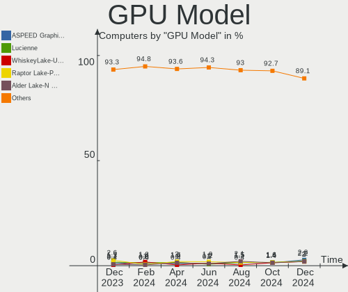
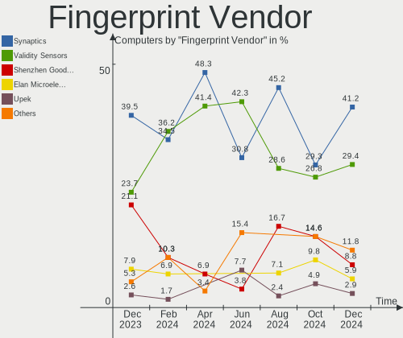

Debian Hardware Trends
----------------------

A project to identify most popular hardware characteristics and track their change
over time based on data collected by Debian users at https://Linux-Hardware.org.

Anyone can contribute to the study by uploading probes of their computers by
the [hw-probe](https://github.com/linuxhw/hw-probe) tool:

    sudo -E hw-probe -all -upload

This is a report for all computer types. See also reports for [desktops](/Dist/Debian/Desktop/README.md) and [notebooks](/Dist/Debian/Notebook/README.md).

Full-feature report is available here: https://linux-hardware.org/?view=trends

Period: Oct, 2020.

Contents
--------

- [ OS                       ](#os)
- [ OS Family                ](#os-family)
- [ Kernel                   ](#kernel)
- [ Kernel Family            ](#kernel-family)
- [ Kernel Major Ver.        ](#kernel-major-ver)
- [ Arch                     ](#arch)
- [ DE                       ](#de)
- [ Display Server           ](#display-server)
- [ Display Manager          ](#display-manager)
- [ OS Lang                  ](#os-lang)
- [ Boot Mode                ](#boot-mode)
- [ Filesystem               ](#filesystem)
- [ Part. scheme             ](#part-scheme)
- [ Dual Boot with Linux/BSD ](#dual-boot-with-linux/bsd)
- [ Dual Boot (Win)          ](#dual-boot-win)
- [ Country                  ](#country)
- [ City                     ](#city)
- [ Vendor                   ](#vendor)
- [ Model                    ](#model)
- [ Model Family             ](#model-family)
- [ MFG Year                 ](#mfg-year)
- [ Form Factor              ](#form-factor)
- [ Secure Boot              ](#secure-boot)
- [ Coreboot                 ](#coreboot)
- [ RAM Size                 ](#ram-size)
- [ RAM Used                 ](#ram-used)
- [ Has CD-ROM               ](#has-cd-rom)
- [ Total Drives             ](#total-drives)
- [ Has Ethernet             ](#has-ethernet)
- [ Drive Vendor             ](#drive-vendor)
- [ HDD Vendor               ](#hdd-vendor)
- [ SSD Vendor               ](#ssd-vendor)
- [ Drive Model              ](#drive-model)
- [ Drive Kind               ](#drive-kind)
- [ Drive Connector          ](#drive-connector)
- [ Drive Size               ](#drive-size)
- [ Space Total              ](#space-total)
- [ Space Used               ](#space-used)
- [ Malfunc. Drives          ](#malfunc-drives)
- [ Malfunc. Drive Vendor    ](#malfunc-drive-vendor)
- [ Malfunc. HDD Vendor      ](#malfunc-hdd-vendor)
- [ Malfunc. Drive Kind      ](#malfunc-drive-kind)
- [ Failed Drives            ](#failed-drives)
- [ Failed Drive Vendor      ](#failed-drive-vendor)
- [ Drive Status             ](#drive-status)
- [ Storage Vendor           ](#storage-vendor)
- [ Storage Model            ](#storage-model)
- [ Storage Kind             ](#storage-kind)
- [ CPU Vendor               ](#cpu-vendor)
- [ CPU Model                ](#cpu-model)
- [ CPU Model Family         ](#cpu-model-family)
- [ CPU Cores                ](#cpu-cores)
- [ CPU Sockets              ](#cpu-sockets)
- [ CPU Threads              ](#cpu-threads)
- [ CPU Op-Modes             ](#cpu-op-modes)
- [ CPU Microcode            ](#cpu-microcode)
- [ CPU Microarch            ](#cpu-microarch)
- [ GPU Vendor               ](#gpu-vendor)
- [ GPU Model                ](#gpu-model)
- [ GPU Combo                ](#gpu-combo)
- [ GPU Driver               ](#gpu-driver)
- [ GPU Memory               ](#gpu-memory)
- [ Monitor Vendor           ](#monitor-vendor)
- [ Monitor Model            ](#monitor-model)
- [ Monitor Resolution       ](#monitor-resolution)
- [ Monitor Diagonal         ](#monitor-diagonal)
- [ Monitor Width            ](#monitor-width)
- [ Aspect Ratio             ](#aspect-ratio)
- [ Monitor Area             ](#monitor-area)
- [ Pixel Density            ](#pixel-density)
- [ Multiple Monitors        ](#multiple-monitors)
- [ Net Controller Vendor    ](#net-controller-vendor)
- [ Net Controller Model     ](#net-controller-model)
- [ Wireless Vendor          ](#wireless-vendor)
- [ Wireless Model           ](#wireless-model)
- [ Ethernet Vendor          ](#ethernet-vendor)
- [ Ethernet Model           ](#ethernet-model)
- [ Net Controller Kind      ](#net-controller-kind)
- [ Used Controller          ](#used-controller)
- [ NICs                     ](#nics)
- [ Memory Vendor            ](#memory-vendor)
- [ Memory Model             ](#memory-model)
- [ Memory Kind              ](#memory-kind)
- [ Memory Form Factor       ](#memory-form-factor)
- [ Memory Size              ](#memory-size)
- [ Memory Speed             ](#memory-speed)
- [ Sound Vendor             ](#sound-vendor)
- [ Sound Model              ](#sound-model)
- [ Camera Vendor            ](#camera-vendor)
- [ Camera Model             ](#camera-model)
- [ Fingerprint Vendor       ](#fingerprint-vendor)
- [ Fingerprint Model        ](#fingerprint-model)
- [ Chipcard Vendor          ](#chipcard-vendor)
- [ Chipcard Model           ](#chipcard-model)
- [ Printer Vendor           ](#printer-vendor)
- [ Printer Model            ](#printer-model)
- [ Scanner Vendor           ](#scanner-vendor)
- [ Scanner Model            ](#scanner-model)
- [ Bluetooth Vendor         ](#bluetooth-vendor)
- [ Bluetooth Model          ](#bluetooth-model)
- [ Unsupported Devices      ](#unsupported-devices)
- [ Unsupported Device Types ](#unsupported-device-types)

OS
--

Installed operating systems

| Name            | Computers | Percent |
|-----------------|-----------|---------|
| Debian 10       | 92        | 56.1%   |
| Debian Testing  | 42        | 25.61%  |
| Debian          | 16        | 9.76%   |
| Debian Unstable | 9         | 5.49%   |
| Debian 9.13     | 3         | 1.83%   |
| Debian 9.12     | 1         | 0.61%   |
| Debian 9        | 1         | 0.61%   |

OS Family
---------

OS without a version

| Name   | Computers | Percent |
|--------|-----------|---------|
| Debian | 164       | 100%    |

Kernel
------

Version of the Linux kernel

| Version                                                   | Computers | Percent |
|-----------------------------------------------------------|-----------|---------|
| 5.8.0-2-amd64                                             | 31        | 18.9%   |
| 4.19.0-11-amd64                                           | 31        | 18.9%   |
| 4.19.0-12-amd64                                           | 14        | 8.54%   |
| 5.8.0-0.bpo.2-amd64                                       | 12        | 7.32%   |
| 5.9.0-1-amd64                                             | 10        | 6.1%    |
| 5.8.0-3-amd64                                             | 9         | 5.49%   |
| 4.19.0-10-amd64                                           | 6         | 3.66%   |
| 5.7.0-0.bpo.2-amd64                                       | 4         | 2.44%   |
| 5.6.0-2-amd64                                             | 4         | 2.44%   |
| 5.4.65-1-pve                                              | 3         | 1.83%   |
| 4.9.0-13-amd64                                            | 3         | 1.83%   |
| 5.8.0-2-686-pae                                           | 2         | 1.22%   |
| 5.8.0-1-amd64                                             | 2         | 1.22%   |
| 5.6.0-0.bpo.2-amd64                                       | 2         | 1.22%   |
| 5.4.60-1-pve                                              | 2         | 1.22%   |
| 5.9.2-gnu                                                 | 1         | 0.61%   |
| 5.9.1-gnu                                                 | 1         | 0.61%   |
| 5.9.0-rc2-local+                                          | 1         | 0.61%   |
| 5.9.0-arm64                                               | 1         | 0.61%   |
| 5.8.16-xanmod1                                            | 1         | 0.61%   |
| 5.8.16-qcmm                                               | 1         | 0.61%   |
| 5.8.16-hpdv2k                                             | 1         | 0.61%   |
| 5.8.0-pf4                                                 | 1         | 0.61%   |
| 5.8.0-3-686-pae                                           | 1         | 0.61%   |
| 5.8.0-2-arm64                                             | 1         | 0.61%   |
| 5.8.0-14.1-liquorix-amd64                                 | 1         | 0.61%   |
| 5.8.0-1-armmp-lpae                                        | 1         | 0.61%   |
| 5.8-sunxi64                                               | 1         | 0.61%   |
| 5.7.0-xanmod1+pfksm+kill-guess-ldt-guest-latencytop-sandy | 1         | 0.61%   |
| 5.7.0-2-amd64                                             | 1         | 0.61%   |
| 5.6.0-1-amd64                                             | 1         | 0.61%   |
| 5.4.72-odroidxu4                                          | 1         | 0.61%   |
| 5.4.44-2-pve                                              | 1         | 0.61%   |
| 5.4.16-polilinux-amd64                                    | 1         | 0.61%   |
| 5.4.0-4-amd64                                             | 1         | 0.61%   |
| 4.9.218black                                              | 1         | 0.61%   |
| 4.9.0-12-amd64                                            | 1         | 0.61%   |
| 4.20.14+zstd-debug-gigalamp                               | 1         | 0.61%   |
| 4.19.0-9-amd64                                            | 1         | 0.61%   |
| 4.19.0-8-amd64                                            | 1         | 0.61%   |
| 4.19.0-6-amd64                                            | 1         | 0.61%   |
| 4.19.0-11-armmp                                           | 1         | 0.61%   |
| 4.19.0-0.bpo.5-amd64                                      | 1         | 0.61%   |
| 3.10.54                                                   | 1         | 0.61%   |

Kernel Family
-------------

Linux kernel without a distro release

| Version | Computers | Percent |
|---------|-----------|---------|
| 5.8.0   | 61        | 37.2%   |
| 4.19.0  | 56        | 34.15%  |
| 5.9.0   | 12        | 7.32%   |
| 5.6.0   | 7         | 4.27%   |
| 5.7.0   | 6         | 3.66%   |
| 4.9.0   | 4         | 2.44%   |
| 5.8.16  | 3         | 1.83%   |
| 5.4.65  | 3         | 1.83%   |
| 5.4.60  | 2         | 1.22%   |
| 5.9.2   | 1         | 0.61%   |
| 5.9.1   | 1         | 0.61%   |
| 5.8     | 1         | 0.61%   |
| 5.4.72  | 1         | 0.61%   |
| 5.4.44  | 1         | 0.61%   |
| 5.4.16  | 1         | 0.61%   |
| 5.4.0   | 1         | 0.61%   |
| 4.9.218 | 1         | 0.61%   |
| 4.20.14 | 1         | 0.61%   |
| 3.10.54 | 1         | 0.61%   |

Kernel Major Ver.
-----------------

Linux kernel major version

| Version | Computers | Percent |
|---------|-----------|---------|
| 5.8     | 64        | 39.02%  |
| 4.19    | 56        | 34.15%  |
| 5.9     | 14        | 8.54%   |
| 5.4     | 9         | 5.49%   |
| 5.6     | 7         | 4.27%   |
| 5.7     | 6         | 3.66%   |
| 4.9     | 5         | 3.05%   |
| 5       | 1         | 0.61%   |
| 4.20    | 1         | 0.61%   |
| 3.10    | 1         | 0.61%   |

Arch
----

OS architecture (x86_64, i586, etc.)

| Name    | Computers | Percent |
|---------|-----------|---------|
| x86_64  | 154       | 93.9%   |
| armv7l  | 4         | 2.44%   |
| i686    | 3         | 1.83%   |
| aarch64 | 3         | 1.83%   |

DE
--

Desktop Environment

| Name             | Computers | Percent |
|------------------|-----------|---------|
| GNOME            | 37        | 22.56%  |
| XFCE             | 23        | 14.02%  |
| Unknown          | 23        | 14.02%  |
| KDE5             | 20        | 12.2%   |
| MATE             | 19        | 11.59%  |
| KDE              | 16        | 9.76%   |
| Cinnamon         | 10        | 6.1%    |
| X-Cinnamon       | 3         | 1.83%   |
| openbox          | 3         | 1.83%   |
| LXQt             | 2         | 1.22%   |
| LXDE             | 2         | 1.22%   |
| lightdm-xsession | 2         | 1.22%   |
| i3               | 2         | 1.22%   |
| GNOME Flashback  | 1         | 0.61%   |
| GNOME Classic    | 1         | 0.61%   |

Display Server
--------------

X11 or Wayland

| Name    | Computers | Percent |
|---------|-----------|---------|
| X11     | 120       | 73.17%  |
| Tty     | 19        | 11.59%  |
| Wayland | 17        | 10.37%  |
| Unknown | 8         | 4.88%   |

Display Manager
---------------

SDDM, LightDM, etc.

| Name    | Computers | Percent |
|---------|-----------|---------|
| Unknown | 70        | 42.68%  |
| TDM     | 44        | 26.83%  |
| GDM     | 29        | 17.68%  |
| SDDM    | 20        | 12.2%   |
| SLiM    | 1         | 0.61%   |

OS Lang
-------

Language

| Lang       | Computers | Percent |
|------------|-----------|---------|
| en_US      | 71        | 43.29%  |
| pt_BR      | 13        | 7.93%   |
| de_DE      | 11        | 6.71%   |
| fr_FR      | 8         | 4.88%   |
| Unknown    | 7         | 4.27%   |
| ru_UA      | 5         | 3.05%   |
| it_IT      | 5         | 3.05%   |
| ru_RU      | 4         | 2.44%   |
| pl_PL      | 3         | 1.83%   |
| en_GB      | 3         | 1.83%   |
| uk_UA      | 2         | 1.22%   |
| es_ES      | 2         | 1.22%   |
| es_AR      | 2         | 1.22%   |
| en_US.utf8 | 2         | 1.22%   |
| en_IE      | 2         | 1.22%   |
| en_GB.utf8 | 2         | 1.22%   |
| C          | 2         | 1.22%   |
| sl_SI      | 1         | 0.61%   |
| pt_PT      | 1         | 0.61%   |
| pt_BR.utf8 | 1         | 0.61%   |
| ja_JP      | 1         | 0.61%   |
| hu_HU      | 1         | 0.61%   |
| fr_FR.utf8 | 1         | 0.61%   |
| fr_CA      | 1         | 0.61%   |
| fr_BE      | 1         | 0.61%   |
| es_MX      | 1         | 0.61%   |
| en_IN      | 1         | 0.61%   |
| en_IN      | 1         | 0.61%   |
| en_IL      | 1         | 0.61%   |
| en_CA      | 1         | 0.61%   |
| en_AU      | 1         | 0.61%   |
| de_CH.utf8 | 1         | 0.61%   |
| de_CH      | 1         | 0.61%   |
| de_BE      | 1         | 0.61%   |
| da_DK      | 1         | 0.61%   |
| cs_CZ      | 1         | 0.61%   |
| C          | 1         | 0.61%   |

Boot Mode
---------

EFI or BIOS

| Mode | Computers | Percent |
|------|-----------|---------|
| BIOS | 99        | 60.37%  |
| EFI  | 65        | 39.63%  |

Filesystem
----------

Type of filesystem

| Type    | Computers | Percent |
|---------|-----------|---------|
| Ext4    | 154       | 93.9%   |
| Zfs     | 3         | 1.83%   |
| Btrfs   | 3         | 1.83%   |
| Ext2    | 2         | 1.22%   |
| Overlay | 1         | 0.61%   |
| Ext3    | 1         | 0.61%   |

Part. scheme
------------

Scheme of partitioning

| Type    | Computers | Percent |
|---------|-----------|---------|
| GPT     | 70        | 42.68%  |
| Unknown | 54        | 32.93%  |
| MBR     | 40        | 24.39%  |

Dual Boot with Linux/BSD
------------------------

Hosting more than one Linux/BSD

| Dual boot | Computers | Percent |
|-----------|-----------|---------|
| No        | 138       | 84.15%  |
| Yes       | 26        | 15.85%  |

Dual Boot (Win)
---------------

Hosting Linux and Windows

| Dual boot | Computers | Percent |
|-----------|-----------|---------|
| No        | 117       | 71.34%  |
| Yes       | 47        | 28.66%  |

Country
-------

Geographic location (country)

| Country        | Computers | Percent |
|----------------|-----------|---------|
| USA            | 23        | 14.02%  |
| Germany        | 22        | 13.41%  |
| Brazil         | 17        | 10.37%  |
| France         | 12        | 7.32%   |
| Italy          | 10        | 6.1%    |
| Russia         | 9         | 5.49%   |
| Ukraine        | 7         | 4.27%   |
| Poland         | 5         | 3.05%   |
| Hungary        | 5         | 3.05%   |
| UK             | 4         | 2.44%   |
| Switzerland    | 4         | 2.44%   |
| Netherlands    | 3         | 1.83%   |
| Ireland        | 3         | 1.83%   |
| Finland        | 3         | 1.83%   |
| Czech Republic | 3         | 1.83%   |
| Argentina      | 3         | 1.83%   |
| Turkey         | 2         | 1.22%   |
| Sweden         | 2         | 1.22%   |
| Spain          | 2         | 1.22%   |
| Romania        | 2         | 1.22%   |
| Portugal       | 2         | 1.22%   |
| Mexico         | 2         | 1.22%   |
| India          | 2         | 1.22%   |
| Canada         | 2         | 1.22%   |
| Vietnam        | 1         | 0.61%   |
| Venezuela      | 1         | 0.61%   |
| UAE            | 1         | 0.61%   |
| Taiwan         | 1         | 0.61%   |
| Slovenia       | 1         | 0.61%   |
| Peru           | 1         | 0.61%   |
| Norway         | 1         | 0.61%   |
| Malawi         | 1         | 0.61%   |
| Japan          | 1         | 0.61%   |
| Israel         | 1         | 0.61%   |
| Denmark        | 1         | 0.61%   |
| Bermuda        | 1         | 0.61%   |
| Belgium        | 1         | 0.61%   |
| Belarus        | 1         | 0.61%   |
| Australia      | 1         | 0.61%   |

City
----

Geographic location (city)

| City                  | Computers | Percent |
|-----------------------|-----------|---------|
| Leverkusen            | 5         | 3.05%   |
| Vasylkiv              | 4         | 2.44%   |
| Paris                 | 4         | 2.44%   |
| Mesa                  | 4         | 2.44%   |
| Budapest              | 4         | 2.44%   |
| St Petersburg         | 3         | 1.83%   |
| San Giorgio a Cremano | 3         | 1.83%   |
| São Paulo            | 2         | 1.22%   |
| Stuttgart             | 2         | 1.22%   |
| South Burlington      | 2         | 1.22%   |
| Rome                  | 2         | 1.22%   |
| Prague                | 2         | 1.22%   |
| Nivala                | 2         | 1.22%   |
| Moscow                | 2         | 1.22%   |
| Lviv                  | 2         | 1.22%   |
| Lisbon                | 2         | 1.22%   |
| Indio                 | 2         | 1.22%   |
| Goiânia              | 2         | 1.22%   |
| Ekaterinburg          | 2         | 1.22%   |
| Dublin                | 2         | 1.22%   |
| Bahía Blanca         | 2         | 1.22%   |
| Andernos-les-Bains    | 2         | 1.22%   |
| Zurich                | 1         | 0.61%   |
| Zafra                 | 1         | 0.61%   |
| Wohlen                | 1         | 0.61%   |
| West Jordan           | 1         | 0.61%   |
| Warsaw                | 1         | 0.61%   |
| Votuporanga           | 1         | 0.61%   |
| Verucchio             | 1         | 0.61%   |
| Valeggio sul Mincio   | 1         | 0.61%   |
| Troy                  | 1         | 0.61%   |
| Tromsø               | 1         | 0.61%   |
| Toulouse              | 1         | 0.61%   |
| Toronto               | 1         | 0.61%   |
| Tel Aviv              | 1         | 0.61%   |
| Taipei                | 1         | 0.61%   |
| São Miguel do Oeste  | 1         | 0.61%   |
| Stelle                | 1         | 0.61%   |
| Spello                | 1         | 0.61%   |
| Shankill              | 1         | 0.61%   |
| Savannah              | 1         | 0.61%   |
| Santo André          | 1         | 0.61%   |
| Salvador              | 1         | 0.61%   |
| Sainte-Julie          | 1         | 0.61%   |
| Resolven              | 1         | 0.61%   |
| Regensburg            | 1         | 0.61%   |
| Recife                | 1         | 0.61%   |
| Příbram             | 1         | 0.61%   |
| Puebla City           | 1         | 0.61%   |
| Puebla                | 1         | 0.61%   |
| Praszka               | 1         | 0.61%   |
| Poznan                | 1         | 0.61%   |
| Porto Alegre          | 1         | 0.61%   |
| Plan-de-Cuques        | 1         | 0.61%   |
| Pelotas               | 1         | 0.61%   |
| Odorheiu Secuiesc     | 1         | 0.61%   |
| Odense                | 1         | 0.61%   |
| Oconomowoc            | 1         | 0.61%   |
| Oberwil-Lieli         | 1         | 0.61%   |
| Nérac                | 1         | 0.61%   |

Vendor
------

Motherboard manufacturer

| Name                    | Computers | Percent |
|-------------------------|-----------|---------|
| Lenovo                  | 25        | 15.24%  |
| ASUSTek Computer        | 24        | 14.63%  |
| Dell                    | 21        | 12.8%   |
| Hewlett-Packard         | 16        | 9.76%   |
| Gigabyte Technology     | 14        | 8.54%   |
| ASRock                  | 8         | 4.88%   |
| Samsung Electronics     | 5         | 3.05%   |
| Intel                   | 5         | 3.05%   |
| Acer                    | 5         | 3.05%   |
| Unknown                 | 5         | 3.05%   |
| MSI                     | 4         | 2.44%   |
| Foxconn                 | 4         | 2.44%   |
| Sony                    | 2         | 1.22%   |
| Positivo                | 2         | 1.22%   |
| Hardkernel              | 2         | 1.22%   |
| ASRockRack              | 2         | 1.22%   |
| Apple                   | 2         | 1.22%   |
| TrekStor                | 1         | 0.61%   |
| Supermicro              | 1         | 0.61%   |
| Razer                   | 1         | 0.61%   |
| Raspberry Pi Foundation | 1         | 0.61%   |
| Positivo Bahia - VAIO   | 1         | 0.61%   |
| Pine Microsystems       | 1         | 0.61%   |
| Pegatron                | 1         | 0.61%   |
| PC Specialist           | 1         | 0.61%   |
| Packard Bell            | 1         | 0.61%   |
| Medion                  | 1         | 0.61%   |
| IBM                     | 1         | 0.61%   |
| HUAWEI                  | 1         | 0.61%   |
| Fujitsu Siemens         | 1         | 0.61%   |
| Fujitsu                 | 1         | 0.61%   |
| Compulab                | 1         | 0.61%   |
| Avell High Performance  | 1         | 0.61%   |
| AMI                     | 1         | 0.61%   |
| Alienware               | 1         | 0.61%   |

Model
-----

Motherboard model

| Name                                                    | Computers | Percent |
|---------------------------------------------------------|-----------|---------|
| Unknown                                                 | 6         | 3.66%   |
| Lenovo IdeaPad 110-15IBR 80T7                           | 2         | 1.22%   |
| Gigabyte X570 AORUS ELITE                               | 2         | 1.22%   |
| TrekStor YOURBOOK C11B                                  | 1         | 0.61%   |
| Supermicro X10SLL-F                                     | 1         | 0.61%   |
| Sony VPCYB3V1E                                          | 1         | 0.61%   |
| Sony SVE14122CXW                                        | 1         | 0.61%   |
| Samsung Electronics RV411/RV511/E3511/S3511/RV711/E3411 | 1         | 0.61%   |
| Samsung Electronics RV409/RV509/RV709                   | 1         | 0.61%   |
| Samsung Electronics NC10                                | 1         | 0.61%   |
| Samsung Electronics N248P                               | 1         | 0.61%   |
| Samsung Electronics 300V3Z/300V4Z/300V5Z/200A4Y/200A5Y  | 1         | 0.61%   |
| Razer Blade 15 Base Model (Early 2020) - RZ09-0328      | 1         | 0.61%   |
| RPi Raspberry Pi 3 Model B Plus Rev 1.3                 | 1         | 0.61%   |
| Positivo MOBILE                                         | 1         | 0.61%   |
| Positivo C6200                                          | 1         | 0.61%   |
| Positivo Bahia - VAIO VJFE42F11X-XXXXXX                 | 1         | 0.61%   |
| Pine Microsystems Pine64 PinePhone Braveheart (1.1)     | 1         | 0.61%   |
| Pegatron IPMIP-GS                                       | 1         | 0.61%   |
| PC Specialist N150CU                                    | 1         | 0.61%   |
| Packard Bell EasyNote TE11HC                            | 1         | 0.61%   |
| MSI MS-7C71                                             | 1         | 0.61%   |
| MSI MS-7C56                                             | 1         | 0.61%   |
| MSI MS-7926                                             | 1         | 0.61%   |
| MSI MS-7641                                             | 1         | 0.61%   |
| Medion MS-7848                                          | 1         | 0.61%   |
| Lenovo Z50-75 80EC                                      | 1         | 0.61%   |
| Lenovo Y520-15IKBN 80WK                                 | 1         | 0.61%   |
| Lenovo ThinkPad X220 4291B66                            | 1         | 0.61%   |
| Lenovo ThinkPad X13 Gen 1 20T2003TGE                    | 1         | 0.61%   |
| Lenovo ThinkPad X1 Yoga 3rd 20LDS1CG00                  | 1         | 0.61%   |
| Lenovo ThinkPad T520 4243GE9                            | 1         | 0.61%   |
| Lenovo ThinkPad T495 20NKS0PG00                         | 1         | 0.61%   |
| Lenovo ThinkPad E585 20KV0008GE                         | 1         | 0.61%   |
| Lenovo ThinkPad E15 20RDS0LE00                          | 1         | 0.61%   |
| Lenovo ThinkPad E14 20RA001HRT                          | 1         | 0.61%   |
| Lenovo Legion Y7000P-1060 81LF                          | 1         | 0.61%   |
| Lenovo Legion Y530-15ICH 81FV                           | 1         | 0.61%   |
| Lenovo Legion 5 17IMH05H 81Y8                           | 1         | 0.61%   |
| Lenovo IdeaPad S340-14API 81NB                          | 1         | 0.61%   |
| Lenovo IdeaPad L340-17API 81LY                          | 1         | 0.61%   |
| Lenovo IdeaPad 510-15ISK 80SR                           | 1         | 0.61%   |
| Lenovo IdeaPad 5 14IIL05 81YH                           | 1         | 0.61%   |
| Lenovo IdeaPad 330-15IKB 81FE                           | 1         | 0.61%   |
| Lenovo IdeaPad 3 17ARE05 81W5                           | 1         | 0.61%   |
| Lenovo IdeaPad 130-15IKB 81H7                           | 1         | 0.61%   |
| Lenovo E31-80 80MX                                      | 1         | 0.61%   |
| Lenovo B50-50 80S2                                      | 1         | 0.61%   |
| Intel MINISERVER                                        | 1         | 0.61%   |
| Intel DH67CL AAG10212-207                               | 1         | 0.61%   |
| Intel DH55TC AAE70932-206                               | 1         | 0.61%   |
| Intel DG31PR AAE58249-302                               | 1         | 0.61%   |
| Intel D945GCNL AAD97184-102                             | 1         | 0.61%   |
| IBM ThinkPad X31 2673PBU                                | 1         | 0.61%   |
| HUAWEI BOHK-WAX9X                                       | 1         | 0.61%   |
| HP ProLiant DL380p Gen8                                 | 1         | 0.61%   |
| HP ProBook 640 G1                                       | 1         | 0.61%   |
| HP ProBook 450 G7                                       | 1         | 0.61%   |
| HP Pavilion x360 Convertible 14-cd2xxx                  | 1         | 0.61%   |
| HP Pavilion Notebook                                    | 1         | 0.61%   |

Model Family
------------

Motherboard model prefix

| Name                                    | Computers | Percent |
|-----------------------------------------|-----------|---------|
| Lenovo IdeaPad                          | 9         | 5.49%   |
| Lenovo ThinkPad                         | 8         | 4.88%   |
| Dell Latitude                           | 8         | 4.88%   |
| Dell Inspiron                           | 7         | 4.27%   |
| Unknown                                 | 6         | 3.66%   |
| Acer Aspire                             | 5         | 3.05%   |
| Lenovo Legion                           | 3         | 1.83%   |
| HP Pavilion                             | 3         | 1.83%   |
| HP Compaq                               | 3         | 1.83%   |
| Dell XPS                                | 3         | 1.83%   |
| Dell OptiPlex                           | 3         | 1.83%   |
| ASUS PRIME                              | 3         | 1.83%   |
| HP ProBook                              | 2         | 1.22%   |
| HP EliteBook                            | 2         | 1.22%   |
| Gigabyte X570                           | 2         | 1.22%   |
| ASUS Z170                               | 2         | 1.22%   |
| ASUS ROG                                | 2         | 1.22%   |
| TrekStor YOURBOOK                       | 1         | 0.61%   |
| Supermicro X10SLL-F                     | 1         | 0.61%   |
| Sony VPCYB3V1E                          | 1         | 0.61%   |
| Sony SVE14122CXW                        | 1         | 0.61%   |
| Samsung Electronics RV411               | 1         | 0.61%   |
| Samsung Electronics RV409               | 1         | 0.61%   |
| Samsung Electronics NC10                | 1         | 0.61%   |
| Samsung Electronics N248P               | 1         | 0.61%   |
| Samsung Electronics 300V3Z              | 1         | 0.61%   |
| Razer Blade                             | 1         | 0.61%   |
| RPi Raspberry                           | 1         | 0.61%   |
| Positivo MOBILE                         | 1         | 0.61%   |
| Positivo C6200                          | 1         | 0.61%   |
| Positivo Bahia - VAIO VJFE42F11X-XXXXXX | 1         | 0.61%   |
| Pine Microsystems Pine64                | 1         | 0.61%   |
| Pegatron IPMIP-GS                       | 1         | 0.61%   |
| PC Specialist N150CU                    | 1         | 0.61%   |
| Packard Bell EasyNote                   | 1         | 0.61%   |
| MSI MS-7C71                             | 1         | 0.61%   |
| MSI MS-7C56                             | 1         | 0.61%   |
| MSI MS-7926                             | 1         | 0.61%   |
| MSI MS-7641                             | 1         | 0.61%   |
| Medion MS-7848                          | 1         | 0.61%   |
| Lenovo Z50-75                           | 1         | 0.61%   |
| Lenovo Y520-15IKBN                      | 1         | 0.61%   |
| Lenovo E31-80                           | 1         | 0.61%   |
| Lenovo B50-50                           | 1         | 0.61%   |
| Intel MINISERVER                        | 1         | 0.61%   |
| Intel DH67CL                            | 1         | 0.61%   |
| Intel DH55TC                            | 1         | 0.61%   |
| Intel DG31PR                            | 1         | 0.61%   |
| Intel D945GCNL                          | 1         | 0.61%   |
| IBM ThinkPad                            | 1         | 0.61%   |
| HUAWEI BOHK-WAX9X                       | 1         | 0.61%   |
| HP ProLiant                             | 1         | 0.61%   |
| HP OMEN                                 | 1         | 0.61%   |
| HP Mini                                 | 1         | 0.61%   |
| HP Laptop                               | 1         | 0.61%   |
| HP All-in-One                           | 1         | 0.61%   |
| HP 255                                  | 1         | 0.61%   |
| Hardkernel ODROID-C2                    | 1         | 0.61%   |
| Hardkernel Odroid                       | 1         | 0.61%   |
| Gigabyte Z77X-UD3H                      | 1         | 0.61%   |

MFG Year
--------

Motherboard manufacture year

| Year    | Computers | Percent |
|---------|-----------|---------|
| 2020    | 36        | 21.95%  |
| 2019    | 22        | 13.41%  |
| 2018    | 19        | 11.59%  |
| 2011    | 14        | 8.54%   |
| 2012    | 9         | 5.49%   |
| 2009    | 9         | 5.49%   |
| 2016    | 8         | 4.88%   |
| 2017    | 7         | 4.27%   |
| 2014    | 7         | 4.27%   |
| 2013    | 7         | 4.27%   |
| 2015    | 6         | 3.66%   |
| 2008    | 5         | 3.05%   |
| 2007    | 5         | 3.05%   |
| Unknown | 5         | 3.05%   |
| 2010    | 4         | 2.44%   |
| 2004    | 1         | 0.61%   |

Form Factor
-----------

Physical design of the computer

| Name           | Computers | Percent |
|----------------|-----------|---------|
| Notebook       | 77        | 46.95%  |
| Desktop        | 72        | 43.9%   |
| System on chip | 4         | 2.44%   |
| Convertible    | 4         | 2.44%   |
| Mini pc        | 2         | 1.22%   |
| All in one     | 2         | 1.22%   |
| Server         | 2         | 1.22%   |
| Tablet         | 1         | 0.61%   |

Secure Boot
-----------

Enabled or disabled

| State    | Computers | Percent |
|----------|-----------|---------|
| Disabled | 156       | 95.12%  |
| Enabled  | 8         | 4.88%   |

Coreboot
--------

Have coreboot on board

| Used | Computers | Percent |
|------|-----------|---------|
| No   | 164       | 100%    |

RAM Size
--------

Total RAM memory

| Size in GB      | Computers | Percent |
|-----------------|-----------|---------|
| 4.01-8.0        | 36        | 21.95%  |
| 16.01-24.0      | 36        | 21.95%  |
| 8.01-16.0       | 25        | 15.24%  |
| 3.01-4.0        | 23        | 14.02%  |
| 32.01-64.0      | 14        | 8.54%   |
| 64.01-256.0     | 9         | 5.49%   |
| 1.01-2.0        | 9         | 5.49%   |
| 0.01-1.0        | 5         | 3.05%   |
| 2.01-3.0        | 4         | 2.44%   |
| 24.01-32.0      | 2         | 1.22%   |
| More than 256.0 | 1         | 0.61%   |

RAM Used
--------

Used RAM memory

| Used GB    | Computers | Percent |
|------------|-----------|---------|
| 1.01-2.0   | 45        | 27.44%  |
| 2.01-3.0   | 30        | 18.29%  |
| 4.01-8.0   | 27        | 16.46%  |
| 3.01-4.0   | 20        | 12.2%   |
| 0.01-1.0   | 19        | 11.59%  |
| 8.01-16.0  | 13        | 7.93%   |
| 16.01-24.0 | 8         | 4.88%   |
| 32.01-64.0 | 1         | 0.61%   |
| Unknown    | 1         | 0.61%   |

Has CD-ROM
----------

Has CD-ROM on board

| Presented | Computers | Percent |
|-----------|-----------|---------|
| No        | 106       | 64.63%  |
| Yes       | 58        | 35.37%  |

Total Drives
------------

Number of drives on board

| Drives | Computers | Percent |
|--------|-----------|---------|
| 1      | 78        | 47.56%  |
| 2      | 50        | 30.49%  |
| 3      | 21        | 12.8%   |
| 4      | 9         | 5.49%   |
| 6      | 2         | 1.22%   |
| 5      | 2         | 1.22%   |
| 10     | 1         | 0.61%   |
| 9      | 1         | 0.61%   |

Has Ethernet
------------

Has Ethernet on board

| Presented | Computers | Percent |
|-----------|-----------|---------|
| Yes       | 142       | 86.59%  |
| No        | 22        | 13.41%  |

Drive Vendor
------------

Hard drive vendors

| Vendor              | Computers | Drives | Percent |
|---------------------|-----------|--------|---------|
| Seagate             | 43        | 51     | 16.73%  |
| WDC                 | 40        | 63     | 15.56%  |
| Samsung Electronics | 39        | 52     | 15.18%  |
| Unknown             | 15        | 17     | 5.84%   |
| Kingston            | 14        | 15     | 5.45%   |
| Toshiba             | 12        | 16     | 4.67%   |
| Hitachi             | 11        | 11     | 4.28%   |
| Crucial             | 11        | 11     | 4.28%   |
| SanDisk             | 9         | 9      | 3.5%    |
| A-DATA Technology   | 9         | 9      | 3.5%    |
| Intel               | 8         | 8      | 3.11%   |
| HGST                | 5         | 5      | 1.95%   |
| SK Hynix            | 4         | 4      | 1.56%   |
| Phison              | 3         | 5      | 1.17%   |
| Corsair             | 3         | 4      | 1.17%   |
| Transcend           | 2         | 2      | 0.78%   |
| LITEON              | 2         | 2      | 0.78%   |
| Lexar               | 2         | 2      | 0.78%   |
| Intenso             | 2         | 2      | 0.78%   |
| IET                 | 2         | 2      | 0.78%   |
| Fujitsu             | 2         | 2      | 0.78%   |
| Dogfish             | 2         | 2      | 0.78%   |
| USB 3.0             | 1         | 2      | 0.39%   |
| TrekStor            | 1         | 1      | 0.39%   |
| Team                | 1         | 1      | 0.39%   |
| Silicon Motion      | 1         | 1      | 0.39%   |
| Patriot             | 1         | 1      | 0.39%   |
| Mushkin             | 1         | 1      | 0.39%   |
| Maxtor              | 1         | 1      | 0.39%   |
| Kston               | 1         | 1      | 0.39%   |
| KingFast            | 1         | 1      | 0.39%   |
| KingDian            | 1         | 1      | 0.39%   |
| Kingchuxing         | 1         | 1      | 0.39%   |
| IBM/Hitachi         | 1         | 1      | 0.39%   |
| Gigabyte Technology | 1         | 1      | 0.39%   |
| ExcelStor           | 1         | 1      | 0.39%   |
| China               | 1         | 1      | 0.39%   |
| Apple               | 1         | 1      | 0.39%   |
| Apacer              | 1         | 1      | 0.39%   |

HDD Vendor
----------

Hard disk drive vendors

| Vendor              | Computers | Drives | Percent |
|---------------------|-----------|--------|---------|
| Seagate             | 42        | 50     | 36.52%  |
| WDC                 | 35        | 55     | 30.43%  |
| Hitachi             | 11        | 11     | 9.57%   |
| Toshiba             | 7         | 10     | 6.09%   |
| Samsung Electronics | 6         | 6      | 5.22%   |
| HGST                | 5         | 5      | 4.35%   |
| Intenso             | 2         | 2      | 1.74%   |
| IET                 | 2         | 2      | 1.74%   |
| Fujitsu             | 2         | 2      | 1.74%   |
| Maxtor              | 1         | 1      | 0.87%   |
| IBM/Hitachi         | 1         | 1      | 0.87%   |
| ExcelStor           | 1         | 1      | 0.87%   |

SSD Vendor
----------

Solid state drive vendors

| Vendor              | Computers | Drives | Percent |
|---------------------|-----------|--------|---------|
| Samsung Electronics | 18        | 23     | 23.68%  |
| Kingston            | 13        | 14     | 17.11%  |
| Crucial             | 10        | 10     | 13.16%  |
| SanDisk             | 5         | 5      | 6.58%   |
| A-DATA Technology   | 5         | 5      | 6.58%   |
| WDC                 | 3         | 3      | 3.95%   |
| Toshiba             | 3         | 3      | 3.95%   |
| Transcend           | 2         | 2      | 2.63%   |
| Intel               | 2         | 2      | 2.63%   |
| DOGFISH             | 2         | 2      | 2.63%   |
| TrekStor            | 1         | 1      | 1.32%   |
| Team                | 1         | 1      | 1.32%   |
| Mushkin             | 1         | 1      | 1.32%   |
| LITEON              | 1         | 1      | 1.32%   |
| Lexar               | 1         | 1      | 1.32%   |
| Kston               | 1         | 1      | 1.32%   |
| KingDian            | 1         | 1      | 1.32%   |
| Kingchuxing         | 1         | 1      | 1.32%   |
| Gigabyte Technology | 1         | 1      | 1.32%   |
| Corsair             | 1         | 1      | 1.32%   |
| China               | 1         | 1      | 1.32%   |
| Apple               | 1         | 1      | 1.32%   |
| Apacer              | 1         | 1      | 1.32%   |

Drive Model
-----------

Hard drive models

| Model                        | Computers | Percent |
|------------------------------|-----------|---------|
| NVMe SSD Drive 256GB         | 5         | 1.72%   |
| SV300S37A120G 120GB SSD      | 3         | 1.03%   |
| ST2000LM015-2E8174 2TB       | 3         | 1.03%   |
| SA400S37480G 480GB SSD       | 3         | 1.03%   |
| SA400S37240G 240GB SSD       | 3         | 1.03%   |
| NVMe SSD Drive 512GB         | 3         | 1.03%   |
| MMC Card  16GB               | 3         | 1.03%   |
| CT240BX500SSD1 240GB         | 3         | 1.03%   |
| WD20EZRX-00D8PB0 2TB         | 2         | 0.69%   |
| WD10SPZX-24Z10 1TB           | 2         | 0.69%   |
| WD10JPCX-24UE4T0 1TB         | 2         | 0.69%   |
| WD10EAVS-00D7B1 1TB          | 2         | 0.69%   |
| VIRTUAL-DISK 34GB            | 2         | 0.69%   |
| SX8200PNP 1TB                | 2         | 0.69%   |
| SU800 256GB SSD              | 2         | 0.69%   |
| ST31000528AS 1TB             | 2         | 0.69%   |
| ST2000DM006-2DM164 2TB       | 2         | 0.69%   |
| ST2000DM001-1ER164 2TB       | 2         | 0.69%   |
| ST2000DM001-1CH164 2TB       | 2         | 0.69%   |
| ST1000LM049-2GH172 1TB       | 2         | 0.69%   |
| ST1000DM010-2EP102 1TB       | 2         | 0.69%   |
| SSD 970 PRO 512GB            | 2         | 0.69%   |
| SSD 860 EVO 1TB              | 2         | 0.69%   |
| SSD 850 PRO 512GB            | 2         | 0.69%   |
| SSD 840 PRO Series 256GB     | 2         | 0.69%   |
| SSD 840 PRO Series 128GB     | 2         | 0.69%   |
| SSD 128GB                    | 2         | 0.69%   |
| SA400S37120G 120GB SSD       | 2         | 0.69%   |
| NVMe SSD Drive 1024GB        | 2         | 0.69%   |
| MZALQ512HALU-000L2 512GB     | 2         | 0.69%   |
| MMC Card  64GB               | 2         | 0.69%   |
| HTS725050A7E630 500GB        | 2         | 0.69%   |
| HTS721010A9E630 1TB          | 2         | 0.69%   |
| External USB 3.0 1TB         | 2         | 0.69%   |
| Expansion Desk 3TB           | 2         | 0.69%   |
| Expansion 4TB                | 2         | 0.69%   |
| EB1QT  32GB                  | 2         | 0.69%   |
| DF4064  64GB                 | 2         | 0.69%   |
| WDS512G1X0C-00ENX0 512GB     | 1         | 0.34%   |
| WDS500G2B0A-00SM50 500GB SSD | 1         | 0.34%   |
| WDS500G1R0B-68A4Z0 500GB SSD | 1         | 0.34%   |
| WDS250G2B0A 250GB SSD        | 1         | 0.34%   |
| WD800AAJS-60B4A0 80GB        | 1         | 0.34%   |
| WD7500AARS-00Y5B1 752GB      | 1         | 0.34%   |
| WD6400AAKS-22A7B2 640GB      | 1         | 0.34%   |
| WD5002ABYS-02B1B0 500GB      | 1         | 0.34%   |
| WD5000AVCS-632DY1 500GB      | 1         | 0.34%   |
| WD5000AAKX-001CA0 500GB      | 1         | 0.34%   |
| WD5000AAKS-40V6A0 500GB      | 1         | 0.34%   |
| WD5000AAKS-00A7B2 500GB      | 1         | 0.34%   |
| WD4005FZBX-00K5WB0 4TB       | 1         | 0.34%   |
| WD4000F9YZ-09N20L1 4TB       | 1         | 0.34%   |
| WD3200AAJS-07B4A0 320GB      | 1         | 0.34%   |
| WD30EURS-73TLHY0 3TB         | 1         | 0.34%   |
| WD30EURS-63SPKY0 3TB         | 1         | 0.34%   |
| WD2500KS-00MJB0 250GB        | 1         | 0.34%   |
| WD2500BEVT-75ZCT2 250GB      | 1         | 0.34%   |
| WD2500BEVT-22ZCT0 250GB      | 1         | 0.34%   |
| WD2500AAKS-00UU3A0 250GB     | 1         | 0.34%   |
| WD20EZRZ-00Z5HB0 2TB         | 1         | 0.34%   |

Drive Kind
----------

HDD or SSD

| Kind    | Computers | Drives | Percent |
|---------|-----------|--------|---------|
| HDD     | 95        | 146    | 40.43%  |
| SSD     | 72        | 82     | 30.64%  |
| NVMe    | 47        | 60     | 20%     |
| MMC     | 15        | 17     | 6.38%   |
| Unknown | 6         | 7      | 2.55%   |

Drive Connector
---------------

SATA, SAS, NVMe, etc.

| Type | Computers | Drives | Percent |
|------|-----------|--------|---------|
| SATA | 130       | 221    | 63.41%  |
| NVMe | 47        | 60     | 22.93%  |
| MMC  | 15        | 17     | 7.32%   |
| SAS  | 13        | 14     | 6.34%   |

Drive Size
----------

Size of hard drive

| Size in TB | Computers | Drives | Percent |
|------------|-----------|--------|---------|
| 0.01-0.5   | 95        | 120    | 53.67%  |
| 0.51-1.0   | 51        | 59     | 28.81%  |
| 1.01-2.0   | 20        | 25     | 11.3%   |
| 3.01-4.0   | 5         | 6      | 2.82%   |
| 2.01-3.0   | 3         | 6      | 1.69%   |
| 4.01-10.0  | 3         | 12     | 1.69%   |

Space Total
-----------

Amount of disk space available on the file system

| Size in GB     | Computers | Percent |
|----------------|-----------|---------|
| 251-500        | 36        | 21.95%  |
| 101-250        | 30        | 18.29%  |
| 501-1000       | 22        | 13.41%  |
| 1001-2000      | 20        | 12.2%   |
| 51-100         | 14        | 8.54%   |
| More than 3000 | 11        | 6.71%   |
| 21-50          | 9         | 5.49%   |
| 2001-3000      | 8         | 4.88%   |
| Unknown        | 8         | 4.88%   |
| 1-20           | 6         | 3.66%   |

Space Used
----------

Amount of used disk space

| Used GB        | Computers | Percent |
|----------------|-----------|---------|
| 1-20           | 37        | 22.56%  |
| 101-250        | 28        | 17.07%  |
| 21-50          | 23        | 14.02%  |
| 251-500        | 21        | 12.8%   |
| 51-100         | 18        | 10.98%  |
| 501-1000       | 16        | 9.76%   |
| Unknown        | 8         | 4.88%   |
| 1001-2000      | 7         | 4.27%   |
| More than 3000 | 5         | 3.05%   |
| 2001-3000      | 1         | 0.61%   |

Malfunc. Drives
---------------

Drive models with a malfunction

| Model                       | Computers | Drives | Percent |
|-----------------------------|-----------|--------|---------|
| SU800 256GB SSD             | 2         | 2      | 7.69%   |
| WD5002ABYS-02B1B0 500GB     | 1         | 1      | 3.85%   |
| WD15EADS-00P8B0 1TB         | 1         | 1      | 3.85%   |
| SUV400S37240G 240GB SSD     | 1         | 1      | 3.85%   |
| SU800NS38 256GB SSD         | 1         | 1      | 3.85%   |
| ST9500325AS 500GB           | 1         | 1      | 3.85%   |
| ST750LM022 HN-M750MBB 752GB | 1         | 1      | 3.85%   |
| ST500LT012-9WS142 500GB     | 1         | 1      | 3.85%   |
| ST3250318AS 250GB           | 1         | 1      | 3.85%   |
| ST320DM000-1BD14C 320GB     | 1         | 1      | 3.85%   |
| ST2000LM003 HN-M201RAD 2TB  | 1         | 1      | 3.85%   |
| ST1000LM049-2GH172 1TB      | 1         | 1      | 3.85%   |
| SP2514N 250GB               | 1         | 1      | 3.85%   |
| SMS200S330G 32GB SSD        | 1         | 1      | 3.85%   |
| SA400S37120G 120GB SSD      | 1         | 1      | 3.85%   |
| S200 60GB SSD               | 1         | 1      | 3.85%   |
| MQ01ABD100 1TB              | 1         | 1      | 3.85%   |
| IC25N040ATCS04-0 40GB       | 1         | 1      | 3.85%   |
| HTS721010A9E630 1TB         | 1         | 1      | 3.85%   |
| HTS545050B9A300 500GB       | 1         | 1      | 3.85%   |
| HTS545032B9A300 320GB       | 1         | 1      | 3.85%   |
| HTS545016B9A300 160GB       | 1         | 1      | 3.85%   |
| HDS721032CLA362 320GB       | 1         | 1      | 3.85%   |
| CSSD-F12 120GB              | 1         | 1      | 3.85%   |
| 7H500F0 500GB               | 1         | 1      | 3.85%   |

Malfunc. Drive Vendor
---------------------

Vendors of faulty drives

| Vendor              | Computers | Drives | Percent |
|---------------------|-----------|--------|---------|
| Seagate             | 6         | 7      | 24%     |
| Hitachi             | 4         | 4      | 16%     |
| Kingston            | 3         | 3      | 12%     |
| A-DATA Technology   | 3         | 3      | 12%     |
| WDC                 | 2         | 2      | 8%      |
| Toshiba             | 1         | 1      | 4%      |
| Samsung Electronics | 1         | 1      | 4%      |
| Maxtor              | 1         | 1      | 4%      |
| KingDian            | 1         | 1      | 4%      |
| IBM/Hitachi         | 1         | 1      | 4%      |
| HGST                | 1         | 1      | 4%      |
| Corsair             | 1         | 1      | 4%      |

Malfunc. HDD Vendor
-------------------

Vendors of faulty HDD drives

| Vendor              | Computers | Drives | Percent |
|---------------------|-----------|--------|---------|
| Seagate             | 6         | 7      | 35.29%  |
| Hitachi             | 4         | 4      | 23.53%  |
| WDC                 | 2         | 2      | 11.76%  |
| Toshiba             | 1         | 1      | 5.88%   |
| Samsung Electronics | 1         | 1      | 5.88%   |
| Maxtor              | 1         | 1      | 5.88%   |
| IBM/Hitachi         | 1         | 1      | 5.88%   |
| HGST                | 1         | 1      | 5.88%   |

Malfunc. Drive Kind
-------------------

Kinds of faulty drives

| Kind | Computers | Drives | Percent |
|------|-----------|--------|---------|
| HDD  | 15        | 18     | 65.22%  |
| SSD  | 8         | 8      | 34.78%  |

Failed Drives
-------------

Failed drive models

Zero info for selected period =(

Failed Drive Vendor
-------------------

Failed drive vendors

Zero info for selected period =(

Drive Status
------------

Number of failed and malfunc. drives

| Status   | Computers | Drives | Percent |
|----------|-----------|--------|---------|
| Works    | 98        | 176    | 51.04%  |
| Detected | 72        | 110    | 37.5%   |
| Malfunc  | 22        | 26     | 11.46%  |

Storage Vendor
--------------

Storage controller vendors

| Vendor                       | Computers | Percent |
|------------------------------|-----------|---------|
| Intel                        | 108       | 52.17%  |
| AMD                          | 33        | 15.94%  |
| Samsung Electronics          | 20        | 9.66%   |
| Phison Electronics           | 6         | 2.9%    |
| Nvidia                       | 5         | 2.42%   |
| ASMedia Technology           | 5         | 2.42%   |
| ADATA Technology             | 5         | 2.42%   |
| SK Hynix                     | 4         | 1.93%   |
| Sandisk                      | 4         | 1.93%   |
| Toshiba America Info Systems | 3         | 1.45%   |
| Marvell Technology Group     | 3         | 1.45%   |
| JMicron Technology           | 3         | 1.45%   |
| Silicon Motion               | 2         | 0.97%   |
| Micron/Crucial Technology    | 1         | 0.48%   |
| LSI Logic / Symbios Logic    | 1         | 0.48%   |
| Lite-On Technology           | 1         | 0.48%   |
| Kingston Technology Company  | 1         | 0.48%   |
| Hewlett-Packard              | 1         | 0.48%   |
| Broadcom / LSI               | 1         | 0.48%   |

Storage Model
-------------

Storage controller models

| Model                                                                      | Computers | Percent |
|----------------------------------------------------------------------------|-----------|---------|
| FCH SATA Controller [AHCI mode]                                            | 21        | 8.54%   |
| Sunrise Point-LP SATA Controller [AHCI mode]                               | 10        | 4.07%   |
| NVMe SSD Controller SM981/PM981/PM983                                      | 9         | 3.66%   |
| Non-Volatile memory controller                                             | 9         | 3.66%   |
| 7 Series Chipset Family 6-port SATA Controller [AHCI mode]                 | 7         | 2.85%   |
| SB7x0/SB8x0/SB9x0 SATA Controller [AHCI mode]                              | 6         | 2.44%   |
| SB7x0/SB8x0/SB9x0 IDE Controller                                           | 6         | 2.44%   |
| Comet Lake SATA AHCI Controller                                            | 6         | 2.44%   |
| 6 Series/C200 Series Chipset Family 6 port Mobile SATA AHCI Controller     | 6         | 2.44%   |
| Q170/Q150/B150/H170/H110/Z170/CM236 Chipset SATA Controller [AHCI Mode]    | 5         | 2.03%   |
| ASM1062 Serial ATA Controller                                              | 5         | 2.03%   |
| 82801 Mobile SATA Controller [RAID mode]                                   | 5         | 2.03%   |
| 8 Series/C220 Series Chipset Family 6-port SATA Controller 1 [AHCI mode]   | 5         | 2.03%   |
| 6 Series/C200 Series Chipset Family 6 port Desktop SATA AHCI Controller    | 5         | 2.03%   |
| 400 Series Chipset SATA Controller                                         | 5         | 2.03%   |
| XPG SX8200 Pro PCIe Gen3x4 M.2 2280 Solid State Drive                      | 4         | 1.63%   |
| SATA controller                                                            | 4         | 1.63%   |
| NVMe SSD Controller SM961/PM961                                            | 4         | 1.63%   |
| NM10/ICH7 Family SATA Controller [IDE mode]                                | 4         | 1.63%   |
| Electronics Non-Volatile memory controller                                 | 4         | 1.63%   |
| 400 Series Chipset Family SATA AHCI Controller                             | 4         | 1.63%   |
| JMB363 SATA/IDE Controller                                                 | 3         | 1.22%   |
| HM170/QM170 Chipset SATA Controller [AHCI Mode]                            | 3         | 1.22%   |
| E12 NVMe Controller                                                        | 3         | 1.22%   |
| 82801I (ICH9 Family) 2 port SATA Controller [IDE mode]                     | 3         | 1.22%   |
| 82801G (ICH7 Family) IDE Controller                                        | 3         | 1.22%   |
| 7 Series/C210 Series Chipset Family 6-port SATA Controller [AHCI mode]     | 3         | 1.22%   |
| X399 Series Chipset SATA Controller                                        | 2         | 0.81%   |
| SSD Pro 7600p/760p/E 6100p Series                                          | 2         | 0.81%   |
| SSD 660P Series                                                            | 2         | 0.81%   |
| SB7x0/SB8x0/SB9x0 SATA Controller [IDE mode]                               | 2         | 0.81%   |
| SATA Controller [RAID mode]                                                | 2         | 0.81%   |
| SAS2008 PCI-Express Fusion-MPT SAS-2 [Falcon]                              | 2         | 0.81%   |
| NVMe SSD Controller SM951/PM951                                            | 2         | 0.81%   |
| NM10/ICH7 Family SATA Controller [AHCI mode]                               | 2         | 0.81%   |
| MCP61 SATA Controller                                                      | 2         | 0.81%   |
| MCP61 IDE                                                                  | 2         | 0.81%   |
| E16 PCIe4 NVMe Controller                                                  | 2         | 0.81%   |
| Celeron N3350/Pentium N4200/Atom E3900 Series SATA AHCI Controller         | 2         | 0.81%   |
| Cannon Lake PCH SATA AHCI Controller                                       | 2         | 0.81%   |
| Cannon Lake Mobile PCH SATA AHCI Controller                                | 2         | 0.81%   |
| Atom/Celeron/Pentium Processor x5-E8000/J3xxx/N3xxx Series SATA Controller | 2         | 0.81%   |
| 9 Series Chipset Family SATA Controller [AHCI Mode]                        | 2         | 0.81%   |
| 82Q35 Express PT IDER Controller                                           | 2         | 0.81%   |
| 82801JI (ICH10 Family) SATA AHCI Controller                                | 2         | 0.81%   |
| 82801JI (ICH10 Family) 4 port SATA IDE Controller #1                       | 2         | 0.81%   |
| 82801JI (ICH10 Family) 2 port SATA IDE Controller #2                       | 2         | 0.81%   |
| 82801IR/IO/IH (ICH9R/DO/DH) 4 port SATA Controller [IDE mode]              | 2         | 0.81%   |
| 82801IBM/IEM (ICH9M/ICH9M-E) 2 port SATA Controller [IDE mode]             | 2         | 0.81%   |
| 8 Series SATA Controller 1 [AHCI mode]                                     | 2         | 0.81%   |
| 5 Series/3400 Series Chipset 6 port SATA AHCI Controller                   | 2         | 0.81%   |
| 5 Series/3400 Series Chipset 4 port SATA IDE Controller                    | 2         | 0.81%   |
| 5 Series/3400 Series Chipset 4 port SATA AHCI Controller                   | 2         | 0.81%   |
| XG4 NVMe SSD Controller                                                    | 1         | 0.41%   |
| Wildcat Point-LP SATA Controller [AHCI Mode]                               | 1         | 0.41%   |
| WD Black NVMe SSD                                                          | 1         | 0.41%   |
| WD Black 2019/PC SN750 NVMe SSD                                            | 1         | 0.41%   |
| WD Black 2018 / PC SN520 NVMe SSD                                          | 1         | 0.41%   |
| Toshiba America Info Non-Volatile memory controller                        | 1         | 0.41%   |
| SSD 600P Series                                                            | 1         | 0.41%   |

Storage Kind
------------

Kind of storage controller (IDE, SATA, NVMe, SAS, ...)

| Kind | Computers | Percent |
|------|-----------|---------|
| SATA | 115       | 55.56%  |
| NVMe | 48        | 23.19%  |
| IDE  | 33        | 15.94%  |
| RAID | 10        | 4.83%   |
| SAS  | 1         | 0.48%   |

CPU Vendor
----------

Processor vendors

| Vendor | Computers | Percent |
|--------|-----------|---------|
| Intel  | 116       | 70.73%  |
| AMD    | 41        | 25%     |
| ARM    | 7         | 4.27%   |

CPU Model
---------

Processor models

| Model                                         | Computers | Percent |
|-----------------------------------------------|-----------|---------|
| Intel Core i7-10510U CPU @ 1.80GHz            | 6         | 3.66%   |
| Intel Core i5-6200U CPU @ 2.30GHz             | 4         | 2.44%   |
| AMD Ryzen 9 3900X 12-Core Processor           | 4         | 2.44%   |
| Intel Core i5-2520M CPU @ 2.50GHz             | 3         | 1.83%   |
| Intel Core 2 Quad CPU Q9300 @ 2.50GHz         | 3         | 1.83%   |
| ARM Processor                                 | 3         | 1.83%   |
| Intel Core i7-8550U CPU @ 1.80GHz             | 2         | 1.22%   |
| Intel Core i7-7700HQ CPU @ 2.80GHz            | 2         | 1.22%   |
| Intel Core i7-4510U CPU @ 2.00GHz             | 2         | 1.22%   |
| Intel Core i7-3770 CPU @ 3.40GHz              | 2         | 1.22%   |
| Intel Core i7-10750H CPU @ 2.60GHz            | 2         | 1.22%   |
| Intel Core i5-8250U CPU @ 1.60GHz             | 2         | 1.22%   |
| Intel Core i5-4570 CPU @ 3.20GHz              | 2         | 1.22%   |
| Intel Core i5-2400 CPU @ 3.10GHz              | 2         | 1.22%   |
| Intel Core i5-10210U CPU @ 1.60GHz            | 2         | 1.22%   |
| Intel Core i3 CPU 540 @ 3.07GHz               | 2         | 1.22%   |
| Intel Core 2 Duo CPU E8400 @ 3.00GHz          | 2         | 1.22%   |
| Intel Celeron CPU N3060 @ 1.60GHz             | 2         | 1.22%   |
| Intel Atom CPU N455 @ 1.66GHz                 | 2         | 1.22%   |
| AMD Ryzen 7 4700U with Radeon Graphics        | 2         | 1.22%   |
| AMD Ryzen 7 3700X 8-Core Processor            | 2         | 1.22%   |
| AMD Ryzen 3 3200U with Radeon Vega Mobile Gfx | 2         | 1.22%   |
| AMD E-450 APU with Radeon HD Graphics         | 2         | 1.22%   |
| Intel Xeon CPU E5-2667 0 @ 2.90GHz            | 1         | 0.61%   |
| Intel Xeon CPU E3-1275 v5 @ 3.60GHz           | 1         | 0.61%   |
| Intel Xeon CPU E3-1220 v3 @ 3.10GHz           | 1         | 0.61%   |
| Intel Pentium M processor 1600MHz             | 1         | 0.61%   |
| Intel Pentium Dual-Core CPU E6600 @ 3.06GHz   | 1         | 0.61%   |
| Intel Pentium Dual CPU E2200 @ 2.20GHz        | 1         | 0.61%   |
| Intel Pentium CPU P6200 @ 2.13GHz             | 1         | 0.61%   |
| Intel Core i7-9700 CPU @ 3.00GHz              | 1         | 0.61%   |
| Intel Core i7-8750H CPU @ 2.20GHz             | 1         | 0.61%   |
| Intel Core i7-8665U CPU @ 1.90GHz             | 1         | 0.61%   |
| Intel Core i7-8650U CPU @ 1.90GHz             | 1         | 0.61%   |
| Intel Core i7-8565U CPU @ 1.80GHz             | 1         | 0.61%   |
| Intel Core i7-7820HK CPU @ 2.90GHz            | 1         | 0.61%   |
| Intel Core i7-7500U CPU @ 2.70GHz             | 1         | 0.61%   |
| Intel Core i7-6700K CPU @ 4.00GHz             | 1         | 0.61%   |
| Intel Core i7-4790K CPU @ 4.00GHz             | 1         | 0.61%   |
| Intel Core i7-4770 CPU @ 3.40GHz              | 1         | 0.61%   |
| Intel Core i7-4710MQ CPU @ 2.50GHz            | 1         | 0.61%   |
| Intel Core i7-4600U CPU @ 2.10GHz             | 1         | 0.61%   |
| Intel Core i7-3612QM CPU @ 2.10GHz            | 1         | 0.61%   |
| Intel Core i7-3540M CPU @ 3.00GHz             | 1         | 0.61%   |
| Intel Core i7-2640M CPU @ 2.80GHz             | 1         | 0.61%   |
| Intel Core i7-2600 CPU @ 3.40GHz              | 1         | 0.61%   |
| Intel Core i7-10875H CPU @ 2.30GHz            | 1         | 0.61%   |
| Intel Core i7-10700KF CPU @ 3.80GHz           | 1         | 0.61%   |
| Intel Core i7-10700 CPU @ 2.90GHz             | 1         | 0.61%   |
| Intel Core i7-10610U CPU @ 1.80GHz            | 1         | 0.61%   |
| Intel Core i7 CPU L 640 @ 2.13GHz             | 1         | 0.61%   |
| Intel Core i7 CPU 920 @ 2.67GHz               | 1         | 0.61%   |
| Intel Core i5-8400T CPU @ 1.70GHz             | 1         | 0.61%   |
| Intel Core i5-8350U CPU @ 1.70GHz             | 1         | 0.61%   |
| Intel Core i5-8300H CPU @ 2.30GHz             | 1         | 0.61%   |
| Intel Core i5-8265U CPU @ 1.60GHz             | 1         | 0.61%   |
| Intel Core i5-7500 CPU @ 3.40GHz              | 1         | 0.61%   |
| Intel Core i5-7400 CPU @ 3.00GHz              | 1         | 0.61%   |
| Intel Core i5-7200U CPU @ 2.50GHz             | 1         | 0.61%   |
| Intel Core i5-6600K CPU @ 3.50GHz             | 1         | 0.61%   |

CPU Model Family
----------------

Processor model prefix

| Model                   | Computers | Percent |
|-------------------------|-----------|---------|
| Intel Core i7           | 38        | 23.17%  |
| Intel Core i5           | 36        | 21.95%  |
| Intel Core i3           | 11        | 6.71%   |
| AMD Ryzen 7             | 7         | 4.27%   |
| Intel Core 2 Duo        | 6         | 3.66%   |
| Intel Celeron           | 6         | 3.66%   |
| Intel Atom              | 6         | 3.66%   |
| Other                   | 5         | 3.05%   |
| Intel Core 2 Quad       | 4         | 2.44%   |
| AMD Ryzen 9             | 4         | 2.44%   |
| AMD Ryzen 5             | 4         | 2.44%   |
| AMD Ryzen 3             | 4         | 2.44%   |
| AMD Athlon 64 X2        | 4         | 2.44%   |
| Intel Xeon              | 3         | 1.83%   |
| AMD Ryzen Threadripper  | 3         | 1.83%   |
| AMD FX                  | 3         | 1.83%   |
| AMD Athlon II X2        | 3         | 1.83%   |
| Intel Core 2            | 2         | 1.22%   |
| AMD E                   | 2         | 1.22%   |
| Intel Pentium M         | 1         | 0.61%   |
| Intel Pentium Dual-Core | 1         | 0.61%   |
| Intel Pentium Dual      | 1         | 0.61%   |
| Intel Pentium           | 1         | 0.61%   |
| ARM ARMv7               | 1         | 0.61%   |
| ARM Allwinner           | 1         | 0.61%   |
| AMD Turion 64 X2        | 1         | 0.61%   |
| AMD Ryzen 7 PRO         | 1         | 0.61%   |
| AMD Phenom II X4        | 1         | 0.61%   |
| AMD EPYC                | 1         | 0.61%   |
| AMD Athlon X4           | 1         | 0.61%   |
| AMD Athlon 64           | 1         | 0.61%   |
| AMD Athlon              | 1         | 0.61%   |

CPU Cores
---------

Number of processor cores

| Number | Computers | Percent |
|--------|-----------|---------|
| 4      | 67        | 40.85%  |
| 2      | 65        | 39.63%  |
| 8      | 11        | 6.71%   |
| 6      | 6         | 3.66%   |
| 1      | 6         | 3.66%   |
| 12     | 5         | 3.05%   |
| 16     | 2         | 1.22%   |
| 64     | 1         | 0.61%   |
| 24     | 1         | 0.61%   |

CPU Sockets
-----------

Number of sockets

| Number | Computers | Percent |
|--------|-----------|---------|
| 1      | 162       | 98.78%  |
| 2      | 2         | 1.22%   |

CPU Threads
-----------

Threads per core (Hyper-Threading)

| Number | Computers | Percent |
|--------|-----------|---------|
| 2      | 102       | 62.2%   |
| 1      | 62        | 37.8%   |

CPU Op-Modes
------------

CPU Operation Modes (32-bit, 64-bit)

| Op mode        | Computers | Percent |
|----------------|-----------|---------|
| 32-bit, 64-bit | 157       | 95.73%  |
| Unknown        | 4         | 2.44%   |
| 32-bit         | 2         | 1.22%   |
| 64-bit         | 1         | 0.61%   |

CPU Microcode
-------------

Microcode number

| Number     | Computers | Percent |
|------------|-----------|---------|
| Unknown    | 52        | 31.71%  |
| 0x206a7    | 10        | 6.1%    |
| 0x806ec    | 8         | 4.88%   |
| 0x306c3    | 7         | 4.27%   |
| 0x906e9    | 6         | 3.66%   |
| 0x08701021 | 6         | 3.66%   |
| 0x306a9    | 5         | 3.05%   |
| 0x806ea    | 4         | 2.44%   |
| 0x10677    | 4         | 2.44%   |
| 0x10676    | 4         | 2.44%   |
| 0x806e9    | 3         | 1.83%   |
| 0x506e3    | 3         | 1.83%   |
| 0x20655    | 3         | 1.83%   |
| 0x1067a    | 3         | 1.83%   |
| 0x08108102 | 3         | 1.83%   |
| 0xa0655    | 2         | 1.22%   |
| 0xa0652    | 2         | 1.22%   |
| 0x906ea    | 2         | 1.22%   |
| 0x506c9    | 2         | 1.22%   |
| 0x406e3    | 2         | 1.22%   |
| 0x40651    | 2         | 1.22%   |
| 0x306d4    | 2         | 1.22%   |
| 0x0810100b | 2         | 1.22%   |
| 0x010000c8 | 2         | 1.22%   |
| 0x706e5    | 1         | 0.61%   |
| 0x6f6      | 1         | 0.61%   |
| 0x695      | 1         | 0.61%   |
| 0x406c4    | 1         | 0.61%   |
| 0x406c3    | 1         | 0.61%   |
| 0x30678    | 1         | 0.61%   |
| 0x206d7    | 1         | 0.61%   |
| 0x20652    | 1         | 0.61%   |
| 0x106ca    | 1         | 0.61%   |
| 0x106c2    | 1         | 0.61%   |
| 0x106a5    | 1         | 0.61%   |
| 0x08600103 | 1         | 0.61%   |
| 0x08600102 | 1         | 0.61%   |
| 0x08301039 | 1         | 0.61%   |
| 0x08301034 | 1         | 0.61%   |
| 0x08108109 | 1         | 0.61%   |
| 0x08101016 | 1         | 0.61%   |
| 0x0800820d | 1         | 0.61%   |
| 0x0800820b | 1         | 0.61%   |
| 0x08001129 | 1         | 0.61%   |
| 0x06003106 | 1         | 0.61%   |
| 0x06001119 | 1         | 0.61%   |
| 0x06000852 | 1         | 0.61%   |
| 0x05000101 | 1         | 0.61%   |
| 0x010000c6 | 1         | 0.61%   |

CPU Microarch
-------------

Microarchitecture

| Name          | Computers | Percent |
|---------------|-----------|---------|
| KabyLake      | 31        | 18.9%   |
| SandyBridge   | 16        | 9.76%   |
| Penryn        | 13        | 7.93%   |
| Zen 2         | 12        | 7.32%   |
| Haswell       | 11        | 6.71%   |
| Zen+          | 8         | 4.88%   |
| Skylake       | 8         | 4.88%   |
| IvyBridge     | 8         | 4.88%   |
| Unknown       | 7         | 4.27%   |
| Westmere      | 6         | 3.66%   |
| K8 Hammer     | 6         | 3.66%   |
| Zen           | 5         | 3.05%   |
| Silvermont    | 5         | 3.05%   |
| CometLake     | 5         | 3.05%   |
| K10           | 4         | 2.44%   |
| Piledriver    | 3         | 1.83%   |
| Bonnell       | 3         | 1.83%   |
| Goldmont      | 2         | 1.22%   |
| Core          | 2         | 1.22%   |
| Broadwell     | 2         | 1.22%   |
| Bobcat        | 2         | 1.22%   |
| Steamroller   | 1         | 0.61%   |
| P6            | 1         | 0.61%   |
| Nehalem       | 1         | 0.61%   |
| IceLake       | 1         | 0.61%   |
| Goldmont plus | 1         | 0.61%   |

GPU Vendor
----------

Vendors of graphics cards

| Vendor                     | Computers | Percent |
|----------------------------|-----------|---------|
| Intel                      | 97        | 52.43%  |
| Nvidia                     | 49        | 26.49%  |
| AMD                        | 36        | 19.46%  |
| ASPEED Technology          | 2         | 1.08%   |
| Matrox Electronics Systems | 1         | 0.54%   |

GPU Model
---------

Graphics card models

| Model                                                                              | Computers | Percent |
|------------------------------------------------------------------------------------|-----------|---------|
| UHD Graphics                                                                       | 13        | 6.74%   |
| 2nd Generation Core Processor Family Integrated Graphics Controller                | 12        | 6.22%   |
| UHD Graphics 620                                                                   | 6         | 3.11%   |
| HD Graphics 630                                                                    | 6         | 3.11%   |
| Picasso                                                                            | 5         | 2.59%   |
| Core Processor Integrated Graphics Controller                                      | 5         | 2.59%   |
| 3rd Gen Core processor Graphics Controller                                         | 5         | 2.59%   |
| Xeon E3-1200 v3/4th Gen Core Processor Integrated Graphics Controller              | 4         | 2.07%   |
| Skylake GT2 [HD Graphics 520]                                                      | 4         | 2.07%   |
| Atom/Celeron/Pentium Processor x5-E8000/J3xxx/N3xxx Integrated Graphics Controller | 4         | 2.07%   |
| UHD Graphics 620 (Whiskey Lake)                                                    | 3         | 1.55%   |
| Raven Ridge [Radeon Vega Series / Radeon Vega Mobile Series]                       | 3         | 1.55%   |
| Mobile 4 Series Chipset Integrated Graphics Controller                             | 3         | 1.55%   |
| HD Graphics 620                                                                    | 3         | 1.55%   |
| Haswell-ULT Integrated Graphics Controller                                         | 3         | 1.55%   |
| GT218 [GeForce 210]                                                                | 3         | 1.55%   |
| GM108M [GeForce 940MX]                                                             | 3         | 1.55%   |
| GK104 [GeForce GTX 760]                                                            | 3         | 1.55%   |
| Ellesmere [Radeon RX 470/480/570/570X/580/580X/590]                                | 3         | 1.55%   |
| Xeon E3-1200 v2/3rd Gen Core processor Graphics Controller                         | 2         | 1.04%   |
| Wrestler [Radeon HD 6320]                                                          | 2         | 1.04%   |
| UHD Graphics 630 (Mobile)                                                          | 2         | 1.04%   |
| TU106M [GeForce RTX 2060 Mobile]                                                   | 2         | 1.04%   |
| Topaz XT [Radeon R7 M260/M265 / M340/M360 / M440/M445 / 530/535 / 620/625 Mobile]  | 2         | 1.04%   |
| Renoir                                                                             | 2         | 1.04%   |
| Navi 10 [Radeon RX 5600 OEM/5600 XT / 5700/5700 XT]                                | 2         | 1.04%   |
| HD Graphics 530                                                                    | 2         | 1.04%   |
| GP108 [GeForce GT 1030]                                                            | 2         | 1.04%   |
| GP107M [GeForce GTX 1050 Mobile]                                                   | 2         | 1.04%   |
| GM206 [GeForce GTX 960]                                                            | 2         | 1.04%   |
| GM204 [GeForce GTX 980]                                                            | 2         | 1.04%   |
| Atom Processor D4xx/D5xx/N4xx/N5xx Integrated Graphics Controller                  | 2         | 1.04%   |
| ASPEED Graphics Family                                                             | 2         | 1.04%   |
| 4th Gen Core Processor Integrated Graphics Controller                              | 2         | 1.04%   |
| 4 Series Chipset Integrated Graphics Controller                                    | 2         | 1.04%   |
| UHD Graphics 630 (Desktop)                                                         | 1         | 0.52%   |
| UHD Graphics 630 (Desktop 9 Series)                                                | 1         | 0.52%   |
| UHD Graphics 605                                                                   | 1         | 0.52%   |
| TU116M [GeForce GTX 1660 Ti Mobile]                                                | 1         | 0.52%   |
| TU116 [GeForce GTX 1660 SUPER]                                                     | 1         | 0.52%   |
| TU104 [GeForce RTX 2080 Rev. A]                                                    | 1         | 0.52%   |
| Tahiti PRO [Radeon HD 7950/8950 OEM / R9 280]                                      | 1         | 0.52%   |
| RV730/M96-XT [Mobility Radeon HD 4670]                                             | 1         | 0.52%   |
| RV730 XT [Radeon HD 4670]                                                          | 1         | 0.52%   |
| RV630 XT [Radeon HD 2600 XT]                                                       | 1         | 0.52%   |
| RV620 LE [Radeon HD 3450]                                                          | 1         | 0.52%   |
| RV570 [Radeon X1950 GT] (Secondary)                                                | 1         | 0.52%   |
| RV570 [Radeon X1950 GT]                                                            | 1         | 0.52%   |
| RV535 PRO [Radeon X1300 Series] (Secondary)                                        | 1         | 0.52%   |
| RV535 PRO [Radeon X1300 Series]                                                    | 1         | 0.52%   |
| RV370 [Radeon X300/X550/X1050 Series] (Secondary)                                  | 1         | 0.52%   |
| RV370 [Radeon X300/X550/X1050 Series]                                              | 1         | 0.52%   |
| RV100/M6 [Rage/Radeon Mobility Series]                                             | 1         | 0.52%   |
| Redwood XT [Radeon HD 5670/5690/5730]                                              | 1         | 0.52%   |
| Oland PRO [Radeon R7 240/340]                                                      | 1         | 0.52%   |
| Navi 10 [Radeon Pro W5700]                                                         | 1         | 0.52%   |
| Mobile GM965/GL960 Integrated Graphics Controller (secondary)                      | 1         | 0.52%   |
| Mobile GM965/GL960 Integrated Graphics Controller (primary)                        | 1         | 0.52%   |
| Mobile 945GSE Express Integrated Graphics Controller                               | 1         | 0.52%   |
| Mobile 945GM/GMS/GME, 943/940GML Express Integrated Graphics Controller            | 1         | 0.52%   |

GPU Combo
---------

Combinations of graphics cards

| Name            | Computers | Percent |
|-----------------|-----------|---------|
| 1 x Intel       | 71        | 43.29%  |
| 1 x AMD         | 27        | 16.46%  |
| 1 x Nvidia      | 26        | 15.85%  |
| Intel + Nvidia  | 20        | 12.2%   |
| Other           | 7         | 4.27%   |
| 2 x AMD         | 4         | 2.44%   |
| Intel + AMD     | 4         | 2.44%   |
| 2 x Nvidia      | 1         | 0.61%   |
| Nvidia + ASPEED | 1         | 0.61%   |
| 1 x Matrox      | 1         | 0.61%   |
| 1 x ASPEED      | 1         | 0.61%   |
| AMD + Nvidia    | 1         | 0.61%   |

GPU Driver
----------

Free vs proprietary

| Driver      | Computers | Percent |
|-------------|-----------|---------|
| Free        | 125       | 76.22%  |
| Proprietary | 27        | 16.46%  |
| Unknown     | 12        | 7.32%   |

GPU Memory
----------

Total video memory

| Size in GB | Computers | Percent |
|------------|-----------|---------|
| Unknown    | 107       | 65.24%  |
| 1.01-2.0   | 19        | 11.59%  |
| 0.51-1.0   | 14        | 8.54%   |
| 0.01-0.5   | 13        | 7.93%   |
| 3.01-4.0   | 4         | 2.44%   |
| 7.01-8.0   | 3         | 1.83%   |
| 8.01-16.0  | 2         | 1.22%   |
| 5.01-6.0   | 1         | 0.61%   |
| 2.01-3.0   | 1         | 0.61%   |

Monitor Vendor
--------------

Monitor vendors

| Vendor                  | Computers | Percent |
|-------------------------|-----------|---------|
| Samsung Electronics     | 29        | 17.47%  |
| AU Optronics            | 18        | 10.84%  |
| BOE                     | 14        | 8.43%   |
| LG Display              | 12        | 7.23%   |
| Dell                    | 12        | 7.23%   |
| Chimei Innolux          | 11        | 6.63%   |
| Goldstar                | 9         | 5.42%   |
| Hewlett-Packard         | 7         | 4.22%   |
| AOC                     | 6         | 3.61%   |
| Acer                    | 6         | 3.61%   |
| ViewSonic               | 5         | 3.01%   |
| Philips                 | 5         | 3.01%   |
| Iiyama                  | 5         | 3.01%   |
| Lenovo                  | 4         | 2.41%   |
| Sharp                   | 3         | 1.81%   |
| Ancor Communications    | 3         | 1.81%   |
| BenQ                    | 2         | 1.2%    |
| Belinea                 | 2         | 1.2%    |
| Apple                   | 2         | 1.2%    |
| Vizio                   | 1         | 0.6%    |
| PANDA                   | 1         | 0.6%    |
| Panasonic               | 1         | 0.6%    |
| Medion                  | 1         | 0.6%    |
| LG Electronics          | 1         | 0.6%    |
| InnoLux Display         | 1         | 0.6%    |
| InfoVision              | 1         | 0.6%    |
| HPN                     | 1         | 0.6%    |
| HannStar                | 1         | 0.6%    |
| Chi Mei Optoelectronics | 1         | 0.6%    |
| Arnos Instruments       | 1         | 0.6%    |

Monitor Model
-------------

Monitor models

| Model                                              | Computers | Percent |
|----------------------------------------------------|-----------|---------|
| VG2021wm-2 VSCD91E 1680x1050 433x270mm 20.1-inch   | 2         | 1.16%   |
| U28E590 SAM0C4E 3840x2160 608x345mm 27.5-inch      | 2         | 1.16%   |
| T24D391 SAM0DAF 1920x1080 520x290mm 23.4-inch      | 2         | 1.16%   |
| PLE2483H-DP IVM611E 1920x1080 531x299mm 24.0-inch  | 2         | 1.16%   |
| LCD Monitor CMN15DB 1366x768 344x193mm 15.5-inch   | 2         | 1.16%   |
| LCD Monitor AUO38ED 1920x1080 340x190mm 15.3-inch  | 2         | 1.16%   |
| LCD Monitor AUO21ED 1920x1080 344x194mm 15.5-inch  | 2         | 1.16%   |
| Bel101728 MAX06E0 1280x1024 376x301mm 19.0-inch    | 2         | 1.16%   |
| 912Vwa AOC1912 1440x900 408x255mm 18.9-inch        | 2         | 1.16%   |
| Z27n G2 HPN348B 2560x1440 597x336mm 27.0-inch      | 1         | 0.58%   |
| XB271HU A ACR052F 2560x1440 598x336mm 27.0-inch    | 1         | 0.58%   |
| X233H ACR0093 1920x1080 510x287mm 23.0-inch        | 1         | 0.58%   |
| W2234 GSM56B8 1680x1050 474x296mm 22.0-inch        | 1         | 0.58%   |
| w2007 HWP26A6 1680x1050 433x271mm 20.1-inch        | 1         | 0.58%   |
| w185e HWP292F 1366x768 410x230mm 18.5-inch         | 1         | 0.58%   |
| W1642C GSM3E89 1366x768 344x194mm 15.5-inch        | 1         | 0.58%   |
| VX900-2 VSC9011 1280x1024 376x301mm 19.0-inch      | 1         | 0.58%   |
| VG3448 VSC0D38 3440x1440 800x330mm 34.1-inch       | 1         | 0.58%   |
| VE247 ACI2493 1920x1080 531x299mm 24.0-inch        | 1         | 0.58%   |
| UP3216Q DEL40C1 3840x2160 698x393mm 31.5-inch      | 1         | 0.58%   |
| UP2516D DEL40E1 2560x1440 550x310mm 24.9-inch      | 1         | 0.58%   |
| U2419H DEL4148 1920x1080 527x296mm 23.8-inch       | 1         | 0.58%   |
| U2415 DELA0B9 1920x1080 518x324mm 24.1-inch        | 1         | 0.58%   |
| U2414H DELA0A4 1920x1080 530x300mm 24.0-inch       | 1         | 0.58%   |
| U2413 DELF046 1920x1080 520x320mm 24.0-inch        | 1         | 0.58%   |
| U2311H DELA060 1920x1080 509x286mm 23.0-inch       | 1         | 0.58%   |
| TV MEIA296 1920x1080 1280x720mm 57.8-inch          | 1         | 0.58%   |
| T24C350 SAM0ABF 1920x1080 530x300mm 24.0-inch      | 1         | 0.58%   |
| SyncMaster SAM0522 1600x900 443x249mm 20.0-inch    | 1         | 0.58%   |
| SyncMaster SAM04D4 1920x1080 531x298mm 24.0-inch   | 1         | 0.58%   |
| SyncMaster SAM036E 1280x1024 376x301mm 19.0-inch   | 1         | 0.58%   |
| SyncMaster SAM01E1 1280x1024 376x301mm 19.0-inch   | 1         | 0.58%   |
| SMS19A450 SAM0834 1440x900 408x255mm 18.9-inch     | 1         | 0.58%   |
| SMB2430H SAM064D 1920x1080 531x299mm 24.0-inch     | 1         | 0.58%   |
| S2719DGF DELD0E6 2560x1440 597x336mm 27.0-inch     | 1         | 0.58%   |
| S24D332 SAM0F5E 1920x1080 531x299mm 24.0-inch      | 1         | 0.58%   |
| S2218H DELD0B8 1920x1080 476x268mm 21.5-inch       | 1         | 0.58%   |
| PLX2783H IVM6611 1920x1080 598x336mm 27.0-inch     | 1         | 0.58%   |
| PLE2483H IVM6113 1920x1080 531x299mm 24.0-inch     | 1         | 0.58%   |
| PL2792Q IVM6637 2560x1440 597x336mm 27.0-inch      | 1         | 0.58%   |
| PL2209HD IVM560B 1920x1080 478x269mm 21.6-inch     | 1         | 0.58%   |
| PHL 272B8Q PHL0918 1920x1080 597x336mm 27.0-inch   | 1         | 0.58%   |
| P243W ACRADAF 1920x1200 518x324mm 24.1-inch        | 1         | 0.58%   |
| P2414H DELA09A 1920x1080 527x297mm 23.8-inch       | 1         | 0.58%   |
| P2317H DEL40F3 1920x1080 509x286mm 23.0-inch       | 1         | 0.58%   |
| P2314H DEL4098 1920x1080 509x286mm 23.0-inch       | 1         | 0.58%   |
| P223 HPN3392 1920x1080 477x268mm 21.5-inch         | 1         | 0.58%   |
| P2217H DELA0D8 1920x1080 476x267mm 21.5-inch       | 1         | 0.58%   |
| LV1911 HWP3005 1366x768 410x230mm 18.5-inch        | 1         | 0.58%   |
| LG ULTRAWIDE GSM59F1 1920x1080 580x240mm 24.7-inch | 1         | 0.58%   |
| LG FULL HD GSM5ABB 1920x1080 480x270mm 21.7-inch   | 1         | 0.58%   |
| LEN T2324pA LEN60C7 1920x1080 509x286mm 23.0-inch  | 1         | 0.58%   |
| LCD Monitor XB271HU A 2560x1440                    | 1         | 0.58%   |
| LCD Monitor VSC5E1E 1440x900 410x260mm 19.1-inch   | 1         | 0.58%   |
| LCD Monitor VG270U 4480x1440                       | 1         | 0.58%   |
| LCD Monitor U2412M 5760x1200                       | 1         | 0.58%   |
| LCD Monitor U2412M                                 | 1         | 0.58%   |
| LCD Monitor SyncMaster 1280x1024                   | 1         | 0.58%   |
| LCD Monitor SHP14E2 1920x1080 309x174mm 14.0-inch  | 1         | 0.58%   |
| LCD Monitor SHP144A 3200x1800 294x165mm 13.3-inch  | 1         | 0.58%   |

Monitor Resolution
------------------

Monitor screen resolution

| Resolution         | Computers | Percent |
|--------------------|-----------|---------|
| 1920x1080 (FHD)    | 73        | 45.34%  |
| 1366x768 (WXGA)    | 23        | 14.29%  |
| 1280x1024 (SXGA)   | 11        | 6.83%   |
| 1600x900 (HD+)     | 9         | 5.59%   |
| 2560x1440 (QHD)    | 7         | 4.35%   |
| 3840x2160 (4K)     | 6         | 3.73%   |
| 1680x1050 (WSXGA+) | 5         | 3.11%   |
| 1440x900 (WXGA+)   | 5         | 3.11%   |
| 1920x1200 (WUXGA)  | 3         | 1.86%   |
| 1024x600           | 3         | 1.86%   |
| Unknown            | 3         | 1.86%   |
| 3440x1440          | 2         | 1.24%   |
| 2560x1080          | 2         | 1.24%   |
| 1280x800 (WXGA)    | 2         | 1.24%   |
| 5760x1200          | 1         | 0.62%   |
| 4480x1440          | 1         | 0.62%   |
| 3840x1080          | 1         | 0.62%   |
| 3200x1800 (QHD+)   | 1         | 0.62%   |
| 1600x1200          | 1         | 0.62%   |
| 1360x768           | 1         | 0.62%   |
| 1280x720 (HD)      | 1         | 0.62%   |

Monitor Diagonal
----------------

Diagonal size in inches

| Inches  | Computers | Percent |
|---------|-----------|---------|
| 15      | 38        | 23.17%  |
| 24      | 14        | 8.54%   |
| 13      | 14        | 8.54%   |
| 17      | 12        | 7.32%   |
| 14      | 12        | 7.32%   |
| Unknown | 12        | 7.32%   |
| 27      | 10        | 6.1%    |
| 21      | 10        | 6.1%    |
| 23      | 9         | 5.49%   |
| 19      | 6         | 3.66%   |
| 18      | 6         | 3.66%   |
| 20      | 5         | 3.05%   |
| 10      | 3         | 1.83%   |
| 34      | 2         | 1.22%   |
| 22      | 2         | 1.22%   |
| 12      | 2         | 1.22%   |
| 84      | 1         | 0.61%   |
| 54      | 1         | 0.61%   |
| 48      | 1         | 0.61%   |
| 38      | 1         | 0.61%   |
| 31      | 1         | 0.61%   |
| 25      | 1         | 0.61%   |
| 16      | 1         | 0.61%   |

Monitor Width
-------------

Physical width

| Width in mm | Computers | Percent |
|-------------|-----------|---------|
| 301-350     | 61        | 37.89%  |
| 501-600     | 30        | 18.63%  |
| 401-500     | 24        | 14.91%  |
| 351-400     | 15        | 9.32%   |
| Unknown     | 12        | 7.45%   |
| 201-300     | 10        | 6.21%   |
| 601-700     | 3         | 1.86%   |
| 701-800     | 2         | 1.24%   |
| 1001-1500   | 2         | 1.24%   |
| 801-900     | 1         | 0.62%   |
| 1501-2000   | 1         | 0.62%   |

Aspect Ratio
------------

Proportional relationship between the width and the height

| Ratio   | Computers | Percent |
|---------|-----------|---------|
| 16/9    | 114       | 74.03%  |
| 16/10   | 17        | 11.04%  |
| Unknown | 11        | 7.14%   |
| 5/4     | 8         | 5.19%   |
| 4/3     | 2         | 1.3%    |
| 21/9    | 2         | 1.3%    |

Monitor Area
------------

Area in inch²

| Area in inch² | Computers | Percent |
|----------------|-----------|---------|
| 101-110        | 37        | 22.56%  |
| 201-250        | 27        | 16.46%  |
| 81-90          | 21        | 12.8%   |
| 151-200        | 18        | 10.98%  |
| Unknown        | 12        | 7.32%   |
| 301-350        | 10        | 6.1%    |
| 121-130        | 10        | 6.1%    |
| 141-150        | 6         | 3.66%   |
| 71-80          | 5         | 3.05%   |
| 251-300        | 5         | 3.05%   |
| More than 1000 | 3         | 1.83%   |
| 351-500        | 3         | 1.83%   |
| 41-50          | 3         | 1.83%   |
| 61-70          | 2         | 1.22%   |
| 111-120        | 1         | 0.61%   |
| 501-1000       | 1         | 0.61%   |

Pixel Density
-------------

Pixels per inch

| Density       | Computers | Percent |
|---------------|-----------|---------|
| 51-100        | 50        | 31.06%  |
| 101-120       | 47        | 29.19%  |
| 121-160       | 45        | 27.95%  |
| Unknown       | 12        | 7.45%   |
| 161-240       | 3         | 1.86%   |
| More than 240 | 2         | 1.24%   |
| 1-50          | 2         | 1.24%   |

Multiple Monitors
-----------------

Total monitors connected

| Total | Computers | Percent |
|-------|-----------|---------|
| 1     | 126       | 76.83%  |
| 2     | 20        | 12.2%   |
| 0     | 14        | 8.54%   |
| 3     | 4         | 2.44%   |

Net Controller Vendor
---------------------

Controller vendors

| Vendor                         | Computers | Percent |
|--------------------------------|-----------|---------|
| Realtek Semiconductor          | 86        | 36.75%  |
| Intel                          | 77        | 32.91%  |
| Qualcomm Atheros               | 32        | 13.68%  |
| Broadcom Inc. and subsidiaries | 8         | 3.42%   |
| Nvidia                         | 5         | 2.14%   |
| TP-Link                        | 3         | 1.28%   |
| Marvell Technology Group       | 3         | 1.28%   |
| Broadcom Limited               | 3         | 1.28%   |
| Ralink Technology              | 2         | 0.85%   |
| Motorola PCS                   | 2         | 0.85%   |
| Microsoft                      | 2         | 0.85%   |
| Dell                           | 2         | 0.85%   |
| VIA Technologies               | 1         | 0.43%   |
| Ralink                         | 1         | 0.43%   |
| NetXen Incorporated            | 1         | 0.43%   |
| Microchip Technology           | 1         | 0.43%   |
| JMicron Technology             | 1         | 0.43%   |
| Broadcom                       | 1         | 0.43%   |
| Belkin Components              | 1         | 0.43%   |
| Aquantia                       | 1         | 0.43%   |
| 3Com                           | 1         | 0.43%   |

Net Controller Model
--------------------

Controller models

| Model                                                     | Computers | Percent |
|-----------------------------------------------------------|-----------|---------|
| RTL8111/8168/8411 PCI Express Gigabit Ethernet Controller | 67        | 24.54%  |
| RTL810xE PCI Express Fast Ethernet controller             | 10        | 3.66%   |
| Comet Lake PCH-LP CNVi WiFi                               | 8         | 2.93%   |
| Wi-Fi 6 AX200                                             | 7         | 2.56%   |
| I211 Gigabit Network Connection                           | 7         | 2.56%   |
| 82579LM Gigabit Network Connection (Lewisville)           | 7         | 2.56%   |
| AR9285 Wireless Network Adapter (PCI-Express)             | 6         | 2.2%    |
| AR9485 Wireless Network Adapter                           | 5         | 1.83%   |
| Wireless 8265 / 8275                                      | 4         | 1.47%   |
| RTL8821CE 802.11ac PCIe Wireless Network Adapter          | 4         | 1.47%   |
| RTL8153 Gigabit Ethernet Adapter                          | 4         | 1.47%   |
| QCA9377 802.11ac Wireless Network Adapter                 | 4         | 1.47%   |
| QCA6174 802.11ac Wireless Network Adapter                 | 4         | 1.47%   |
| Ethernet Connection (2) I219-V                            | 4         | 1.47%   |
| Comet Lake PCH CNVi WiFi                                  | 4         | 1.47%   |
| Wireless-AC 9260                                          | 3         | 1.1%    |
| Wireless 3165                                             | 3         | 1.1%    |
| RTL8723BE PCIe Wireless Network Adapter                   | 3         | 1.1%    |
| RTL8125 2.5GbE Controller                                 | 3         | 1.1%    |
| Dual Band Wireless-AC 3165 Plus Bluetooth                 | 3         | 1.1%    |
| Centrino Advanced-N 6205 [Taylor Peak]                    | 3         | 1.1%    |
| TL-WN823N v2/v3 [Realtek RTL8192EU]                       | 2         | 0.73%   |
| RTL8822BE 802.11a/b/g/n/ac WiFi adapter                   | 2         | 0.73%   |
| RTL8821AE 802.11ac PCIe Wireless Network Adapter          | 2         | 0.73%   |
| RTL8188EUS 802.11n Wireless Network Adapter               | 2         | 0.73%   |
| RTL8169 PCI Gigabit Ethernet Controller                   | 2         | 0.73%   |
| QCA9565 / AR9565 Wireless Network Adapter                 | 2         | 0.73%   |
| NetXtreme BCM5761 Gigabit Ethernet PCIe                   | 2         | 0.73%   |
| moto g(7)                                                 | 2         | 0.73%   |
| MCP61 Ethernet                                            | 2         | 0.73%   |
| Ethernet Controller 10G X550T                             | 2         | 0.73%   |
| Ethernet Connection I217-V                                | 2         | 0.73%   |
| Ethernet Connection (4) I219-LM                           | 2         | 0.73%   |
| Centrino Wireless-N 1030 [Rainbow Peak]                   | 2         | 0.73%   |
| Centrino Wireless-N 1000 [Condor Peak]                    | 2         | 0.73%   |
| AR8161 Gigabit Ethernet                                   | 2         | 0.73%   |
| AR8131 Gigabit Ethernet                                   | 2         | 0.73%   |
| 88E8040 PCI-E Fast Ethernet Controller                    | 2         | 0.73%   |
| 82578DC Gigabit Network Connection                        | 2         | 0.73%   |
| 82566DM-2 Gigabit Network Connection                      | 2         | 0.73%   |
| Xbox 360 Wireless Adapter                                 | 1         | 0.37%   |
| Wireless-AC 9560 [Jefferson Peak]                         | 1         | 0.37%   |
| Wireless XBox Controller Dongle                           | 1         | 0.37%   |
| Wireless 8260                                             | 1         | 0.37%   |
| Wireless 7265                                             | 1         | 0.37%   |
| Wireless 3160                                             | 1         | 0.37%   |
| VT6105/VT6106S [Rhine-III]                                | 1         | 0.37%   |
| TL-WN821N v5/v6 [RTL8192EU]                               | 1         | 0.37%   |
| RTL8822CE 802.11ac PCIe Wireless Network Adapter          | 1         | 0.37%   |
| RTL8723DE Wireless Network Adapter                        | 1         | 0.37%   |
| RTL8192EE PCIe Wireless Network Adapter                   | 1         | 0.37%   |
| RTL8188FTV 802.11b/g/n 1T1R 2.4G WLAN Adapter             | 1         | 0.37%   |
| RTL-8100/8101L/8139 PCI Fast Ethernet Adapter             | 1         | 0.37%   |
| RT5390 Wireless 802.11n 1T/1R PCIe                        | 1         | 0.37%   |
| RT2870/RT3070 Wireless Adapter                            | 1         | 0.37%   |
| QCA6164 802.11ac Wireless Network Adapter                 | 1         | 0.37%   |
| PRO/Wireless LAN 2100 3B Mini PCI Adapter                 | 1         | 0.37%   |
| PRO/Wireless 5100 AGN [Shiloh] Network Connection         | 1         | 0.37%   |
| NX3031 Multifunction 1/10-Gigabit Server Adapter          | 1         | 0.37%   |
| NetXtreme II BCM57711 10-Gigabit PCIe                     | 1         | 0.37%   |

Wireless Vendor
---------------

Wireless vendors

| Vendor                         | Computers | Percent |
|--------------------------------|-----------|---------|
| Intel                          | 53        | 47.75%  |
| Qualcomm Atheros               | 27        | 24.32%  |
| Realtek Semiconductor          | 17        | 15.32%  |
| TP-Link                        | 3         | 2.7%    |
| Broadcom Inc. and subsidiaries | 3         | 2.7%    |
| Ralink Technology              | 2         | 1.8%    |
| Microsoft                      | 2         | 1.8%    |
| Broadcom Limited               | 2         | 1.8%    |
| Ralink                         | 1         | 0.9%    |
| Belkin Components              | 1         | 0.9%    |

Wireless Model
--------------

Wireless models

| Model                                                               | Computers | Percent |
|---------------------------------------------------------------------|-----------|---------|
| Comet Lake PCH-LP CNVi WiFi                                         | 8         | 7.14%   |
| Wi-Fi 6 AX200                                                       | 7         | 6.25%   |
| AR9285 Wireless Network Adapter (PCI-Express)                       | 6         | 5.36%   |
| AR9485 Wireless Network Adapter                                     | 5         | 4.46%   |
| Wireless 8265 / 8275                                                | 4         | 3.57%   |
| RTL8821CE 802.11ac PCIe Wireless Network Adapter                    | 4         | 3.57%   |
| QCA9377 802.11ac Wireless Network Adapter                           | 4         | 3.57%   |
| QCA6174 802.11ac Wireless Network Adapter                           | 4         | 3.57%   |
| Comet Lake PCH CNVi WiFi                                            | 4         | 3.57%   |
| Wireless-AC 9260                                                    | 3         | 2.68%   |
| Wireless 3165                                                       | 3         | 2.68%   |
| RTL8723BE PCIe Wireless Network Adapter                             | 3         | 2.68%   |
| Dual Band Wireless-AC 3165 Plus Bluetooth                           | 3         | 2.68%   |
| Centrino Advanced-N 6205 [Taylor Peak]                              | 3         | 2.68%   |
| TL-WN823N v2/v3 [Realtek RTL8192EU]                                 | 2         | 1.79%   |
| RTL8822BE 802.11a/b/g/n/ac WiFi adapter                             | 2         | 1.79%   |
| RTL8821AE 802.11ac PCIe Wireless Network Adapter                    | 2         | 1.79%   |
| RTL8188EUS 802.11n Wireless Network Adapter                         | 2         | 1.79%   |
| QCA9565 / AR9565 Wireless Network Adapter                           | 2         | 1.79%   |
| Centrino Wireless-N 1030 [Rainbow Peak]                             | 2         | 1.79%   |
| Centrino Wireless-N 1000 [Condor Peak]                              | 2         | 1.79%   |
| Xbox 360 Wireless Adapter                                           | 1         | 0.89%   |
| Wireless-AC 9560 [Jefferson Peak]                                   | 1         | 0.89%   |
| Wireless XBox Controller Dongle                                     | 1         | 0.89%   |
| Wireless 8260                                                       | 1         | 0.89%   |
| Wireless 7265                                                       | 1         | 0.89%   |
| Wireless 3160                                                       | 1         | 0.89%   |
| TL-WN821N v5/v6 [RTL8192EU]                                         | 1         | 0.89%   |
| RTL8822CE 802.11ac PCIe Wireless Network Adapter                    | 1         | 0.89%   |
| RTL8723DE Wireless Network Adapter                                  | 1         | 0.89%   |
| RTL8192EE PCIe Wireless Network Adapter                             | 1         | 0.89%   |
| RTL8188FTV 802.11b/g/n 1T1R 2.4G WLAN Adapter                       | 1         | 0.89%   |
| RT5390 Wireless 802.11n 1T/1R PCIe                                  | 1         | 0.89%   |
| RT2870/RT3070 Wireless Adapter                                      | 1         | 0.89%   |
| QCA6164 802.11ac Wireless Network Adapter                           | 1         | 0.89%   |
| PRO/Wireless LAN 2100 3B Mini PCI Adapter                           | 1         | 0.89%   |
| PRO/Wireless 5100 AGN [Shiloh] Network Connection                   | 1         | 0.89%   |
| MT7601U Wireless Adapter                                            | 1         | 0.89%   |
| Killer Wi-Fi 6 AX1650i 160MHz Wireless Network Adapter (201NGW)     | 1         | 0.89%   |
| F7D1102 N150/Surf Micro Wireless Adapter v1000 [Realtek RTL8188CUS] | 1         | 0.89%   |
| Dual Band Wireless-AC 3168NGW [Stone Peak]                          | 1         | 0.89%   |
| Centrino Wireless-N 2230                                            | 1         | 0.89%   |
| Centrino Wireless-N 130                                             | 1         | 0.89%   |
| Centrino Ultimate-N 6300                                            | 1         | 0.89%   |
| Centrino Advanced-N 6230 [Rainbow Peak]                             | 1         | 0.89%   |
| Centrino Advanced-N 6200                                            | 1         | 0.89%   |
| Cannon Point-LP CNVi [Wireless-AC]                                  | 1         | 0.89%   |
| BCM4360 802.11ac Wireless Network Adapter                           | 1         | 0.89%   |
| BCM4350 802.11ac Wireless Network Adapter                           | 1         | 0.89%   |
| BCM43228 802.11a/b/g/n                                              | 1         | 0.89%   |
| BCM4313 802.11bgn Wireless Network Adapter                          | 1         | 0.89%   |
| BCM4311 802.11a/b/g                                                 | 1         | 0.89%   |
| AR9462 Wireless Network Adapter                                     | 1         | 0.89%   |
| AR93xx Wireless Network Adapter                                     | 1         | 0.89%   |
| AR928X Wireless Network Adapter (PCI-Express)                       | 1         | 0.89%   |
| AR5212/5213/2414 Wireless Network Adapter                           | 1         | 0.89%   |
| AR242x / AR542x Wireless Network Adapter (PCI-Express)              | 1         | 0.89%   |
| 802.11ac NIC                                                        | 1         | 0.89%   |

Ethernet Vendor
---------------

Ethernet vendors

| Vendor                         | Computers | Percent |
|--------------------------------|-----------|---------|
| Realtek Semiconductor          | 85        | 54.84%  |
| Intel                          | 39        | 25.16%  |
| Qualcomm Atheros               | 8         | 5.16%   |
| Nvidia                         | 5         | 3.23%   |
| Broadcom Inc. and subsidiaries | 5         | 3.23%   |
| Marvell Technology Group       | 3         | 1.94%   |
| Motorola PCS                   | 2         | 1.29%   |
| VIA Technologies               | 1         | 0.65%   |
| NetXen Incorporated            | 1         | 0.65%   |
| Microchip Technology           | 1         | 0.65%   |
| JMicron Technology             | 1         | 0.65%   |
| Broadcom Limited               | 1         | 0.65%   |
| Broadcom                       | 1         | 0.65%   |
| Aquantia                       | 1         | 0.65%   |
| 3Com                           | 1         | 0.65%   |

Ethernet Model
--------------

Ethernet models

| Model                                                     | Computers | Percent |
|-----------------------------------------------------------|-----------|---------|
| RTL8111/8168/8411 PCI Express Gigabit Ethernet Controller | 67        | 42.41%  |
| RTL810xE PCI Express Fast Ethernet controller             | 10        | 6.33%   |
| I211 Gigabit Network Connection                           | 7         | 4.43%   |
| 82579LM Gigabit Network Connection (Lewisville)           | 7         | 4.43%   |
| RTL8153 Gigabit Ethernet Adapter                          | 4         | 2.53%   |
| Ethernet Connection (2) I219-V                            | 4         | 2.53%   |
| RTL8125 2.5GbE Controller                                 | 3         | 1.9%    |
| RTL8169 PCI Gigabit Ethernet Controller                   | 2         | 1.27%   |
| NetXtreme BCM5761 Gigabit Ethernet PCIe                   | 2         | 1.27%   |
| moto g(7)                                                 | 2         | 1.27%   |
| MCP61 Ethernet                                            | 2         | 1.27%   |
| Ethernet Controller 10G X550T                             | 2         | 1.27%   |
| Ethernet Connection I217-V                                | 2         | 1.27%   |
| Ethernet Connection (4) I219-LM                           | 2         | 1.27%   |
| AR8161 Gigabit Ethernet                                   | 2         | 1.27%   |
| AR8131 Gigabit Ethernet                                   | 2         | 1.27%   |
| 88E8040 PCI-E Fast Ethernet Controller                    | 2         | 1.27%   |
| 82578DC Gigabit Network Connection                        | 2         | 1.27%   |
| 82566DM-2 Gigabit Network Connection                      | 2         | 1.27%   |
| VT6105/VT6106S [Rhine-III]                                | 1         | 0.63%   |
| RTL-8100/8101L/8139 PCI Fast Ethernet Adapter             | 1         | 0.63%   |
| NX3031 Multifunction 1/10-Gigabit Server Adapter          | 1         | 0.63%   |
| NetXtreme II BCM57711 10-Gigabit PCIe                     | 1         | 0.63%   |
| NetXtreme BCM5764M Gigabit Ethernet PCIe                  | 1         | 0.63%   |
| NetXtreme BCM5719 Gigabit Ethernet PCIe                   | 1         | 0.63%   |
| NetLink BCM57785 Gigabit Ethernet PCIe                    | 1         | 0.63%   |
| NetLink BCM57780 Gigabit Ethernet PCIe                    | 1         | 0.63%   |
| MCP77 Ethernet                                            | 1         | 0.63%   |
| MCP55 Ethernet                                            | 1         | 0.63%   |
| MCP51 Ethernet Controller                                 | 1         | 0.63%   |
| Killer E2500 Gigabit Ethernet Controller                  | 1         | 0.63%   |
| Killer E220x Gigabit Ethernet Controller                  | 1         | 0.63%   |
| JMC260 PCI Express Fast Ethernet Controller               | 1         | 0.63%   |
| I210 Gigabit Network Connection                           | 1         | 0.63%   |
| Ethernet controller                                       | 1         | 0.63%   |
| Ethernet Connection I218-LM                               | 1         | 0.63%   |
| Ethernet Connection I217-LM                               | 1         | 0.63%   |
| Ethernet Connection (7) I219-V                            | 1         | 0.63%   |
| Ethernet Connection (2) I219-LM                           | 1         | 0.63%   |
| Ethernet Connection (2) I218-V                            | 1         | 0.63%   |
| Ethernet Connection (10) I219-V                           | 1         | 0.63%   |
| AR8152 v2.0 Fast Ethernet                                 | 1         | 0.63%   |
| AR8121/AR8113/AR8114 Gigabit or Fast Ethernet             | 1         | 0.63%   |
| AQC107 NBase-T/IEEE 802.3bz Ethernet Controller [AQtion]  | 1         | 0.63%   |
| 88E8056 PCI-E Gigabit Ethernet Controller                 | 1         | 0.63%   |
| 82579V Gigabit Network Connection                         | 1         | 0.63%   |
| 82577LM Gigabit Network Connection                        | 1         | 0.63%   |
| 82567LM Gigabit Network Connection                        | 1         | 0.63%   |
| 82566MM Gigabit Network Connection                        | 1         | 0.63%   |
| 82540EP Gigabit Ethernet Controller (Mobile)              | 1         | 0.63%   |
| 3c905B 100BaseTX [Cyclone]                                | 1         | 0.63%   |

Net Controller Kind
-------------------

Ethernet, WiFi or modem

| Kind     | Computers | Percent |
|----------|-----------|---------|
| Ethernet | 142       | 55.91%  |
| WiFi     | 109       | 42.91%  |
| Modem    | 3         | 1.18%   |

Used Controller
---------------

Currently used network controller

| Kind     | Computers | Percent |
|----------|-----------|---------|
| Ethernet | 120       | 56.07%  |
| WiFi     | 94        | 43.93%  |

NICs
----

Total network controllers on board

| Total | Computers | Percent |
|-------|-----------|---------|
| 2     | 88        | 53.66%  |
| 1     | 59        | 35.98%  |
| 0     | 9         | 5.49%   |
| 3     | 7         | 4.27%   |
| 8     | 1         | 0.61%   |

Memory Vendor
-------------

Memory module vendors

| Vendor              | Computers | Percent |
|---------------------|-----------|---------|
| Samsung Electronics | 25        | 17.99%  |
| Unknown             | 21        | 15.11%  |
| SK Hynix            | 21        | 15.11%  |
| Kingston            | 17        | 12.23%  |
| Micron Technology   | 12        | 8.63%   |
| G.Skill             | 8         | 5.76%   |
| Crucial             | 6         | 4.32%   |
| Corsair             | 4         | 2.88%   |
| Teikon              | 2         | 1.44%   |
| Qimonda             | 2         | 1.44%   |
| Patriot             | 2         | 1.44%   |
| Nanya Technology    | 2         | 1.44%   |
| A-DATA Technology   | 2         | 1.44%   |
| 48spaces            | 2         | 1.44%   |
| Unknown (ABCD)      | 1         | 0.72%   |
| Transcend           | 1         | 0.72%   |
| SMART Brazil        | 1         | 0.72%   |
| Smart               | 1         | 0.72%   |
| Ramaxel Technology  | 1         | 0.72%   |
| Qumo                | 1         | 0.72%   |
| Positivo            | 1         | 0.72%   |
| High Bridge         | 1         | 0.72%   |
| Hewlett-Packard     | 1         | 0.72%   |
| GOODRAM             | 1         | 0.72%   |
| Elpida              | 1         | 0.72%   |
| Atermiter           | 1         | 0.72%   |
| AMD                 | 1         | 0.72%   |

Memory Model
------------

Memory module models

| Model                                                  | Computers | Percent |
|--------------------------------------------------------|-----------|---------|
| RAM M471A1K43DB1-CWE 8GB SODIMM DDR4 3200MT/s          | 3         | 1.99%   |
| RAM M471A1K43CB1-CTD 8GB SODIMM DDR4 2667MT/s          | 3         | 1.99%   |
| RAM HMA81GS6AFR8N-UH 8GB SODIMM DDR4 2667MT/s          | 3         | 1.99%   |
| RAM Module 8192MB DIMM DDR3 1600MT/s                   | 2         | 1.32%   |
| RAM Module 32GB SODIMM DDR4 2667MT/s                   | 2         | 1.32%   |
| RAM Module 2048MB DIMM DDR2 800MT/s                    | 2         | 1.32%   |
| RAM Module 2048MB DIMM DDR2 667MT/s                    | 2         | 1.32%   |
| RAM Module 2048MB DIMM 667MT/s                         | 2         | 1.32%   |
| RAM M471B5273DH0-CH9 4GB SODIMM DDR3 1334MT/s          | 2         | 1.32%   |
| RAM M471B5273CH0-CH9 4096MB SODIMM DDR3 1334MT/s       | 2         | 1.32%   |
| RAM M471A1K43CB1-CRC 8GB SODIMM DDR4 2667MT/s          | 2         | 1.32%   |
| RAM KHX2666C15S4/16G 16384MB SODIMM DDR4 2667MT/s      | 2         | 1.32%   |
| RAM F4-3200C14-8GFX 8192MB DIMM DDR4 3733MT/s          | 2         | 1.32%   |
| SODIMM 1024MB SODIMM DDR2 533MT/s                      | 1         | 0.66%   |
| RAM TMA81GU6AFR8N-UHSC 8192MB DIMM DDR4 2400MT/s       | 1         | 0.66%   |
| RAM TMA81GS6AFR8N-UHSC 8192MB SODIMM DDR4 2400MT/s     | 1         | 0.66%   |
| RAM SMS4TDC3C0K0446SCG 4096MB SODIMM DDR4 2667MT/s     | 1         | 0.66%   |
| RAM SH564568FJ8NZRNSDR 2048MB SODIMM DDR3 1600MT/s     | 1         | 0.66%   |
| RAM SF464128CK8IWGKFEG 4096MB SODIMM DDR4 2133MT/s     | 1         | 0.66%   |
| RAM RMT3170MN68F9F1600 4096MB SODIMM DDR3 1600MT/s     | 1         | 0.66%   |
| RAM R538G1601U2S000000 8192MB DIMM 1333MT/s            | 1         | 0.66%   |
| RAM QUM4U-8G2133P15 8192MB DIMM DDR4 2133MT/s          | 1         | 0.66%   |
| RAM QUM4U-8G2133M15 8192MB DIMM DDR4 2133MT/s          | 1         | 0.66%   |
| RAM NT4GC64B8HG0NS-CG 4096MB SODIMM DDR3 1333MT/s      | 1         | 0.66%   |
| RAM NT4GC64B8HG0NF-CG 4096MB DIMM DDR3 1333MT/s        | 1         | 0.66%   |
| RAM MT52L1G32D4PG-093 8GB Row Of Chips LPDDR3 2133MT/s | 1         | 0.66%   |
| RAM Module 8192MB DIMM 1600MT/s                        | 1         | 0.66%   |
| RAM Module 4096MB SODIMM DDR3 1600MT/s                 | 1         | 0.66%   |
| RAM Module 4096MB SODIMM DDR3                          | 1         | 0.66%   |
| RAM Module 4096MB SODIMM DDR2 667MT/s                  | 1         | 0.66%   |
| RAM Module 4096MB DIMM DDR3 1066MT/s                   | 1         | 0.66%   |
| RAM Module 4096MB DIMM DDR2 667MT/s                    | 1         | 0.66%   |
| RAM Module 4096MB DIMM DDR 1333MT/s                    | 1         | 0.66%   |
| RAM Module 256MB SODIMM DDR                            | 1         | 0.66%   |
| RAM Module 2048MB DIMM DDR3 1333MT/s                   | 1         | 0.66%   |
| RAM Module 2048MB DIMM DDR3 1067MT/s                   | 1         | 0.66%   |
| RAM Module 2048MB DIMM DDR3 1066MT/s                   | 1         | 0.66%   |
| RAM Module 2048MB DIMM DDR2 1639MT/s                   | 1         | 0.66%   |
| RAM Module 2048MB DIMM DDR 1333MT/s                    | 1         | 0.66%   |
| RAM Module 2048MB DIMM 800MT/s                         | 1         | 0.66%   |
| RAM Module 2048MB DIMM 1066MT/s                        | 1         | 0.66%   |
| RAM Module 16GB SODIMM DDR4 2667MT/s                   | 1         | 0.66%   |
| RAM Module 1024MB SODIMM DDR 667MT/s                   | 1         | 0.66%   |
| RAM Module 1024MB DIMM DDR3 1066MT/s                   | 1         | 0.66%   |
| RAM Module 1024MB DIMM DDR2 800MT/s                    | 1         | 0.66%   |
| RAM Module 1024MB DIMM DDR2 533MT/s                    | 1         | 0.66%   |
| RAM M471B5773DH0-CH9 2048MB SODIMM DDR3 1600MT/s       | 1         | 0.66%   |
| RAM M471B5773CHS-CK0 2048MB SODIMM DDR3 1600MT/s       | 1         | 0.66%   |
| RAM M471B5673FH0-CH9 2GB SODIMM 1333MT/s               | 1         | 0.66%   |
| RAM M471B5173DB0-YK0 4096MB SODIMM DDR3 1600MT/s       | 1         | 0.66%   |
| RAM M471B2873FHS-CF8 1024MB SODIMM DDR3 1067MT/s       | 1         | 0.66%   |
| RAM M471B1G73DB0-YK0 8192MB SODIMM DDR3 1600MT/s       | 1         | 0.66%   |
| RAM M471A5244BB0-CPB 4GB SODIMM DDR4 2400MT/s          | 1         | 0.66%   |
| RAM M471A2K43CB1-CTD 16384MB SODIMM DDR4 2667MT/s      | 1         | 0.66%   |
| RAM M393A4K40DB3-CWE 32GB DIMM DDR4 3200MT/s           | 1         | 0.66%   |
| RAM M391A2K43BB1-CPB 16384MB DIMM DDR4 2133MT/s        | 1         | 0.66%   |
| RAM M378B5673FH0-CH9 2048MB DIMM DDR3 1600MT/s         | 1         | 0.66%   |
| RAM M378B5673EH1-CH9 2048MB DIMM DDR3 1333MT/s         | 1         | 0.66%   |
| RAM KP223C-ELD 2048MB DIMM DDR3 1333MT/s               | 1         | 0.66%   |
| RAM KN2M64-ETB 8GB SODIMM DDR3 1600MT/s                | 1         | 0.66%   |

Memory Kind
-----------

Memory module kinds

| Kind    | Computers | Percent |
|---------|-----------|---------|
| DDR4    | 51        | 42.15%  |
| DDR3    | 46        | 38.02%  |
| DDR2    | 11        | 9.09%   |
| Unknown | 6         | 4.96%   |
| DDR     | 3         | 2.48%   |
| LPDDR3  | 2         | 1.65%   |
| SDRAM   | 1         | 0.83%   |
| LPDDR4  | 1         | 0.83%   |

Memory Form Factor
------------------

Physical design of the memory module

| Name         | Computers | Percent |
|--------------|-----------|---------|
| SODIMM       | 63        | 52.07%  |
| DIMM         | 53        | 43.8%   |
| Row Of Chips | 5         | 4.13%   |

Memory Size
-----------

Memory module size

| Size  | Computers | Percent |
|-------|-----------|---------|
| 8192  | 42        | 31.82%  |
| 4096  | 34        | 25.76%  |
| 2048  | 27        | 20.45%  |
| 16384 | 16        | 12.12%  |
| 1024  | 6         | 4.55%   |
| 32768 | 5         | 3.79%   |
| 512   | 1         | 0.76%   |
| 256   | 1         | 0.76%   |

Memory Speed
------------

Memory module speed

| Speed   | Computers | Percent |
|---------|-----------|---------|
| 1600    | 28        | 21.21%  |
| 2667    | 19        | 14.39%  |
| 3200    | 13        | 9.85%   |
| 1333    | 12        | 9.09%   |
| 2400    | 10        | 7.58%   |
| 667     | 9         | 6.82%   |
| 2133    | 6         | 4.55%   |
| 1334    | 6         | 4.55%   |
| 800     | 6         | 4.55%   |
| 1867    | 4         | 3.03%   |
| 3733    | 2         | 1.52%   |
| 2933    | 2         | 1.52%   |
| 1067    | 2         | 1.52%   |
| 1066    | 2         | 1.52%   |
| 533     | 2         | 1.52%   |
| Unknown | 2         | 1.52%   |
| 4200    | 1         | 0.76%   |
| 3600    | 1         | 0.76%   |
| 3266    | 1         | 0.76%   |
| 2048    | 1         | 0.76%   |
| 1866    | 1         | 0.76%   |
| 1776    | 1         | 0.76%   |
| 1639    | 1         | 0.76%   |

Sound Vendor
------------

Sound card vendors

| Vendor                         | Computers | Percent |
|--------------------------------|-----------|---------|
| Intel                          | 113       | 54.33%  |
| AMD                            | 39        | 18.75%  |
| Nvidia                         | 38        | 18.27%  |
| C-Media Electronics            | 3         | 1.44%   |
| Plantronics                    | 2         | 0.96%   |
| Logitech                       | 2         | 0.96%   |
| Yamaha                         | 1         | 0.48%   |
| www.hirestech.com 2013 Rev 1.3 | 1         | 0.48%   |
| Veho                           | 1         | 0.48%   |
| Microsoft                      | 1         | 0.48%   |
| GYROCOM C&C                    | 1         | 0.48%   |
| Generalplus Technology         | 1         | 0.48%   |
| Focusrite-Novation             | 1         | 0.48%   |
| Cambridge Silicon Radio        | 1         | 0.48%   |
| BlackWeb                       | 1         | 0.48%   |
| ASUSTek Computer               | 1         | 0.48%   |
| AKAI Professional M.I.         | 1         | 0.48%   |

Sound Model
-----------

Sound card models

| Model                                                                                       | Computers | Percent |
|---------------------------------------------------------------------------------------------|-----------|---------|
| Sunrise Point-LP HD Audio                                                                   | 13        | 5.33%   |
| 6 Series/C200 Series Chipset Family High Definition Audio Controller                        | 13        | 5.33%   |
| Family 17h (Models 10h-1fh) HD Audio Controller                                             | 11        | 4.51%   |
| 7 Series/C216 Chipset Family High Definition Audio Controller                               | 10        | 4.1%    |
| Starship/Matisse HD Audio Controller                                                        | 9         | 3.69%   |
| SBx00 Azalia (Intel HDA)                                                                    | 9         | 3.69%   |
| Comet Lake PCH-LP cAVS                                                                      | 9         | 3.69%   |
| Raven/Raven2/Fenghuang HDMI/DP Audio Controller                                             | 8         | 3.28%   |
| NM10/ICH7 Family High Definition Audio Controller                                           | 7         | 2.87%   |
| 82801I (ICH9 Family) HD Audio Controller                                                    | 7         | 2.87%   |
| Xeon E3-1200 v3/4th Gen Core Processor HD Audio Controller                                  | 6         | 2.46%   |
| 5 Series/3400 Series Chipset High Definition Audio                                          | 6         | 2.46%   |
| 8 Series/C220 Series Chipset High Definition Audio Controller                               | 5         | 2.05%   |
| GK104 HDMI Audio Controller                                                                 | 4         | 1.64%   |
| Family 17h (Models 00h-0fh) HD Audio Controller                                             | 4         | 1.64%   |
| Comet Lake PCH cAVS                                                                         | 4         | 1.64%   |
| Cannon Lake PCH cAVS                                                                        | 4         | 1.64%   |
| 100 Series/C230 Series Chipset Family HD Audio Controller                                   | 4         | 1.64%   |
| Navi 10 HDMI Audio                                                                          | 3         | 1.23%   |
| High Definition Audio Controller                                                            | 3         | 1.23%   |
| Haswell-ULT HD Audio Controller                                                             | 3         | 1.23%   |
| GM204 High Definition Audio Controller                                                      | 3         | 1.23%   |
| GF119 HDMI Audio Controller                                                                 | 3         | 1.23%   |
| Ellesmere HDMI Audio [Radeon RX 470/480 / 570/580/590]                                      | 3         | 1.23%   |
| CM238 HD Audio Controller                                                                   | 3         | 1.23%   |
| Cannon Point-LP High Definition Audio Controller                                            | 3         | 1.23%   |
| Atom/Celeron/Pentium Processor x5-E8000/J3xxx/N3xxx Series High Definition Audio Controller | 3         | 1.23%   |
| 82801JI (ICH10 Family) HD Audio Controller                                                  | 3         | 1.23%   |
| 8 Series HD Audio Controller                                                                | 3         | 1.23%   |
| Wildcat Point-LP High Definition Audio Controller                                           | 2         | 0.82%   |
| USB Audio Device                                                                            | 2         | 0.82%   |
| TU116 High Definition Audio Controller                                                      | 2         | 0.82%   |
| TU106 High Definition Audio Controller                                                      | 2         | 0.82%   |
| RV710/730 HDMI Audio [Radeon HD 4000 series]                                                | 2         | 0.82%   |
| Renoir Radeon High Definition Audio Controller                                              | 2         | 0.82%   |
| Oland/Hainan/Cape Verde/Pitcairn HDMI Audio [Radeon HD 7000 Series]                         | 2         | 0.82%   |
| MCP61 High Definition Audio                                                                 | 2         | 0.82%   |
| GP108 High Definition Audio Controller                                                      | 2         | 0.82%   |
| GP106 High Definition Audio Controller                                                      | 2         | 0.82%   |
| GM206 High Definition Audio Controller                                                      | 2         | 0.82%   |
| GK107 HDMI Audio Controller                                                                 | 2         | 0.82%   |
| GF116 High Definition Audio Controller                                                      | 2         | 0.82%   |
| FCH Azalia Controller                                                                       | 2         | 0.82%   |
| Celeron N3350/Pentium N4200/Atom E3900 Series Audio Cluster                                 | 2         | 0.82%   |
| Broadwell-U Audio Controller                                                                | 2         | 0.82%   |
| Audio device                                                                                | 2         | 0.82%   |
| 9 Series Chipset Family HD Audio Controller                                                 | 2         | 0.82%   |
| 200 Series PCH HD Audio                                                                     | 2         | 0.82%   |
| Wrestler HDMI Audio                                                                         | 1         | 0.41%   |
| USB PnP Sound Device                                                                        | 1         | 0.41%   |
| USB Headset H540                                                                            | 1         | 0.41%   |
| USB Audio                                                                                   | 1         | 0.41%   |
| TU104 HD Audio Controller                                                                   | 1         | 0.41%   |
| Tahiti HDMI Audio [Radeon HD 7870 XT / 7950/7970]                                           | 1         | 0.41%   |
| Smart Sound Technology Audio Controller                                                     | 1         | 0.41%   |
| Scarlett 2i4 USB                                                                            | 1         | 0.41%   |
| RV630 HDMI Audio [Radeon HD 2600 PRO/XT / HD 3610]                                          | 1         | 0.41%   |
| RV620 HDMI Audio [Radeon HD 3450/3470/3550/3570]                                            | 1         | 0.41%   |
| Redwood HDMI Audio [Radeon HD 5000 Series]                                                  | 1         | 0.41%   |
| MPK261                                                                                      | 1         | 0.41%   |

Camera Vendor
-------------

Camera device vendors

| Vendor                                 | Computers | Percent |
|----------------------------------------|-----------|---------|
| Chicony Electronics                    | 21        | 22.58%  |
| Microdia                               | 11        | 11.83%  |
| Logitech                               | 11        | 11.83%  |
| Realtek Semiconductor                  | 9         | 9.68%   |
| IMC Networks                           | 8         | 8.6%    |
| Sunplus Innovation Technology          | 7         | 7.53%   |
| Silicon Motion                         | 4         | 4.3%    |
| Microsoft                              | 3         | 3.23%   |
| Syntek                                 | 2         | 2.15%   |
| Quanta                                 | 2         | 2.15%   |
| Lite-On Technology                     | 2         | 2.15%   |
| Acer                                   | 2         | 2.15%   |
| Z-Star Microelectronics                | 1         | 1.08%   |
| Tobii Technology AB                    | 1         | 1.08%   |
| Suyin                                  | 1         | 1.08%   |
| Samsung Electronics                    | 1         | 1.08%   |
| Jieli Technology                       | 1         | 1.08%   |
| Huawei Technologies                    | 1         | 1.08%   |
| Hewlett-Packard                        | 1         | 1.08%   |
| Genesys Logic                          | 1         | 1.08%   |
| Cheng Uei Precision Industry (Foxlink) | 1         | 1.08%   |
| Apple                                  | 1         | 1.08%   |
| Alcor Micro                            | 1         | 1.08%   |

Camera Model
------------

Camera device models

| Model                            | Computers | Percent |
|----------------------------------|-----------|---------|
| Integrated Camera                | 10        | 10.64%  |
| Integrated_Webcam_HD             | 9         | 9.57%   |
| EasyCamera                       | 6         | 6.38%   |
| HD WebCam                        | 4         | 4.26%   |
| LifeCam HD-3000                  | 3         | 3.19%   |
| Lenovo EasyCamera                | 3         | 3.19%   |
| Integrated Webcam                | 3         | 3.19%   |
| WebCam SCB-0385N                 | 2         | 2.13%   |
| USB2.0 Camera                    | 2         | 2.13%   |
| USB 2.0 Camera                   | 2         | 2.13%   |
| Integrated Camera (1280x720@30)  | 2         | 2.13%   |
| HP Webcam                        | 2         | 2.13%   |
| HP TrueVision HD Camera          | 2         | 2.13%   |
| HD Pro Webcam C920               | 2         | 2.13%   |
| Webcam Vitade AF                 | 1         | 1.06%   |
| WebCam SCB-1100N                 | 1         | 1.06%   |
| WebCam SCB-0355N                 | 1         | 1.06%   |
| Webcam C270                      | 1         | 1.06%   |
| Webcam C210                      | 1         | 1.06%   |
| Webcam 3110                      | 1         | 1.06%   |
| WebCam                           | 1         | 1.06%   |
| VGA UVC WebCam                   | 1         | 1.06%   |
| UVC Camera                       | 1         | 1.06%   |
| USB2.0 HD UVC WebCam             | 1         | 1.06%   |
| USB PHY 2.0                      | 1         | 1.06%   |
| USB Camera                       | 1         | 1.06%   |
| USB 2.0 PC Camera                | 1         | 1.06%   |
| Sony Visual Communication Camera | 1         | 1.06%   |
| Sonix USB 2.0 Camera             | 1         | 1.06%   |
| QuickCam Home                    | 1         | 1.06%   |
| QuickCam E 3500                  | 1         | 1.06%   |
| ov9734_azurewave_camera          | 1         | 1.06%   |
| Namuga 1.3M Webcam               | 1         | 1.06%   |
| Logitech Webcam C160             | 1         | 1.06%   |
| Lenovo Integrated Camera (0.3MP) | 1         | 1.06%   |
| Laptop_Integrated_Webcam_HD      | 1         | 1.06%   |
| Laptop_Integrated_Webcam_2HDM    | 1         | 1.06%   |
| Laptop Integrated Webcam FHD     | 1         | 1.06%   |
| Integrated_Webcam_FHD            | 1         | 1.06%   |
| Integrated Webcam HD             | 1         | 1.06%   |
| Integrated IR Camera             | 1         | 1.06%   |
| HP Wide Vision HD Camera         | 1         | 1.06%   |
| HP Wide Vision HD                | 1         | 1.06%   |
| HP Webcam [2 MP Macro]           | 1         | 1.06%   |
| HP Truevision HD                 | 1         | 1.06%   |
| HP HD Webcam                     | 1         | 1.06%   |
| HP HD Camera                     | 1         | 1.06%   |
| HD Webcam C615                   | 1         | 1.06%   |
| HD Webcam C525                   | 1         | 1.06%   |
| HD Webcam C510                   | 1         | 1.06%   |
| Galaxy series, misc. (MTP mode)  | 1         | 1.06%   |
| EyeChip                          | 1         | 1.06%   |
| Dell HD Webcam                   | 1         | 1.06%   |
| Built-in iSight                  | 1         | 1.06%   |
| BRIO                             | 1         | 1.06%   |
| Asus Webcam                      | 1         | 1.06%   |

Fingerprint Vendor
------------------

Fingerprint sensor vendors

| Vendor                     | Computers | Percent |
|----------------------------|-----------|---------|
| Synaptics                  | 5         | 50%     |
| Validity Sensors           | 3         | 30%     |
| Shenzhen Goodix Technology | 2         | 20%     |

Fingerprint Model
-----------------

Fingerprint sensor models

| Model                                   | Computers | Percent |
|-----------------------------------------|-----------|---------|
| Prometheus MIS Touch Fingerprint Reader | 2         | 20%     |
| Goodix Fingerprint Device               | 2         | 20%     |
| Unknown                                 | 2         | 20%     |
| VFS5011 Fingerprint Reader              | 1         | 10%     |
| VFS495 Fingerprint Reader               | 1         | 10%     |
| VFS451 Fingerprint Reader               | 1         | 10%     |
| Metallica MIS Touch Fingerprint Reader  | 1         | 10%     |

Chipcard Vendor
---------------

Chipcard module vendors

| Vendor      | Computers | Percent |
|-------------|-----------|---------|
| Broadcom    | 4         | 66.67%  |
| O2 Micro    | 1         | 16.67%  |
| Alcor Micro | 1         | 16.67%  |

Chipcard Model
--------------

Chipcard module models

| Model                                 | Computers | Percent |
|---------------------------------------|-----------|---------|
| 58200                                 | 2         | 33.33%  |
| OZ776 CCID Smartcard Reader           | 1         | 16.67%  |
| BCM5880 Secure Applications Processor | 1         | 16.67%  |
| AU9540 Smartcard Reader               | 1         | 16.67%  |
| 5880                                  | 1         | 16.67%  |

Printer Vendor
--------------

Printer device vendors

| Vendor             | Computers | Percent |
|--------------------|-----------|---------|
| Seiko Epson        | 1         | 25%     |
| Hewlett-Packard    | 1         | 25%     |
| Datamax-O'Neil     | 1         | 25%     |
| Brother Industries | 1         | 25%     |

Printer Model
-------------

Printer device models

| Model               | Computers | Percent |
|---------------------|-----------|---------|
| Printer             | 1         | 25%     |
| L395 Series         | 1         | 25%     |
| Deskjet 2540 series | 1         | 25%     |
| Datamax E-4304      | 1         | 25%     |

Scanner Vendor
--------------

Scanner device vendors

| Vendor | Computers | Percent |
|--------|-----------|---------|
| Canon  | 1         | 100%    |

Scanner Model
-------------

Scanner device models

| Model                        | Computers | Percent |
|------------------------------|-----------|---------|
| CanoScan N670U/N676U/LiDE 20 | 1         | 100%    |

Bluetooth Vendor
----------------

Controller vendors

| Vendor                          | Computers | Percent |
|---------------------------------|-----------|---------|
| Intel                           | 42        | 48.28%  |
| Realtek Semiconductor           | 12        | 13.79%  |
| Qualcomm Atheros Communications | 10        | 11.49%  |
| Broadcom                        | 6         | 6.9%    |
| Cambridge Silicon Radio         | 5         | 5.75%   |
| Foxconn / Hon Hai               | 4         | 4.6%    |
| Hewlett-Packard                 | 2         | 2.3%    |
| Apple                           | 2         | 2.3%    |
| Realtek                         | 1         | 1.15%   |
| Lite-On Technology              | 1         | 1.15%   |
| IMC Networks                    | 1         | 1.15%   |
| Dell                            | 1         | 1.15%   |

Bluetooth Model
---------------

Controller models

| Model                                                             | Computers | Percent |
|-------------------------------------------------------------------|-----------|---------|
| Bluetooth Device                                                  | 14        | 16.09%  |
| Bluetooth wireless interface                                      | 12        | 13.79%  |
| AX200 Bluetooth                                                   | 7         | 8.05%   |
| Qualcomm Atheros Bluetooth Device                                 | 5         | 5.75%   |
| Bluetooth Radio                                                   | 5         | 5.75%   |
| Bluetooth Dongle (HCI mode)                                       | 5         | 5.75%   |
| Bluetooth 9460/9560 Jefferson Peak (JfP)                          | 5         | 5.75%   |
| Centrino Advanced-N 6230 Bluetooth adapter                        | 4         | 4.6%    |
| Realtek Bluetooth 4.2 Adapter                                     | 3         | 3.45%   |
| RTL8822BE Bluetooth 4.2 Adapter                                   | 2         | 2.3%    |
| RTL8821A Bluetooth                                                | 2         | 2.3%    |
| QCA61x4 Bluetooth 4.0                                             | 2         | 2.3%    |
| Bluetooth USB Host Controller                                     | 2         | 2.3%    |
| AR3012 Bluetooth 4.0                                              | 2         | 2.3%    |
| Wireless-AC 3168 Bluetooth                                        | 1         | 1.15%   |
| RTL8723B Bluetooth                                                | 1         | 1.15%   |
| Qualcomm Atheros QCA9377 Bluetooth                                | 1         | 1.15%   |
| HP Portable Bumble Bee                                            | 1         | 1.15%   |
| Foxconn T77H114 BCM2070 [Single-Chip Bluetooth 2.1 + EDR Adapter] | 1         | 1.15%   |
| Centrino Bluetooth Wireless Transceiver                           | 1         | 1.15%   |
| Built-in Bluetooth 2.0+EDR HCI                                    | 1         | 1.15%   |
| Broadcom 2070 Bluetooth Combo                                     | 1         | 1.15%   |
| Bluetooth 3.0 Dongle                                              | 1         | 1.15%   |
| Bluetooth 2.0 Interface [Broadcom BCM2045]                        | 1         | 1.15%   |
| BCM20702A0 Bluetooth Module                                       | 1         | 1.15%   |
| BCM20702A0 Bluetooth 4.0                                          | 1         | 1.15%   |
| BCM2045B (BDC-2.1)                                                | 1         | 1.15%   |
| BCM2045A0                                                         | 1         | 1.15%   |
| BCM2045 Bluetooth                                                 | 1         | 1.15%   |
| AR3011 Bluetooth                                                  | 1         | 1.15%   |
| Acer Bluetooth module                                             | 1         | 1.15%   |

Unsupported Devices
-------------------

Total unsupported devices on board

| Total | Computers | Percent |
|-------|-----------|---------|
| 0     | 119       | 72.56%  |
| 1     | 34        | 20.73%  |
| 2     | 9         | 5.49%   |
| 3     | 2         | 1.22%   |

Unsupported Device Types
------------------------

Types of unsupported devices

| Type                     | Computers | Percent |
|--------------------------|-----------|---------|
| Graphics card            | 16        | 27.59%  |
| Multimedia controller    | 11        | 18.97%  |
| Fingerprint reader       | 10        | 17.24%  |
| Chipcard                 | 6         | 10.34%  |
| Net/wireless             | 4         | 6.9%    |
| Communication controller | 3         | 5.17%   |
| Sound                    | 2         | 3.45%   |
| Unassigned class         | 1         | 1.72%   |
| Storage/ata              | 1         | 1.72%   |
| Storage                  | 1         | 1.72%   |
| Firewire controller      | 1         | 1.72%   |
| Camera                   | 1         | 1.72%   |
| Bluetooth                | 1         | 1.72%   |

