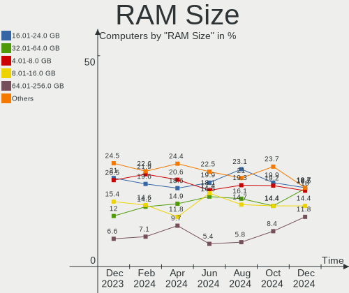
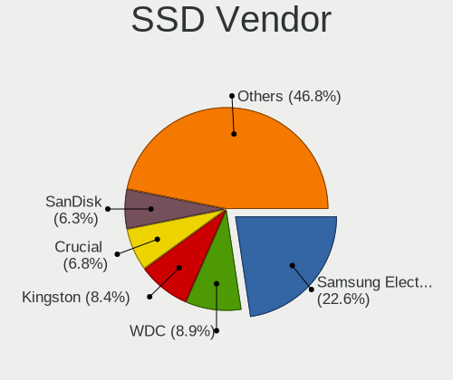
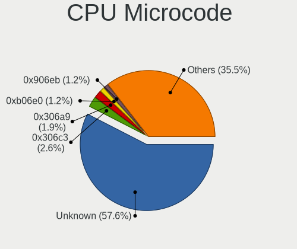
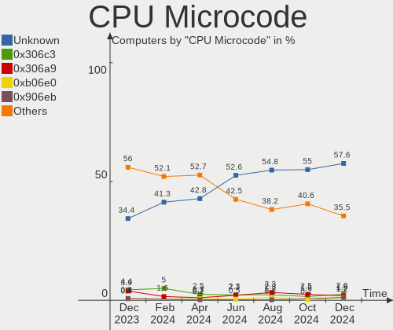
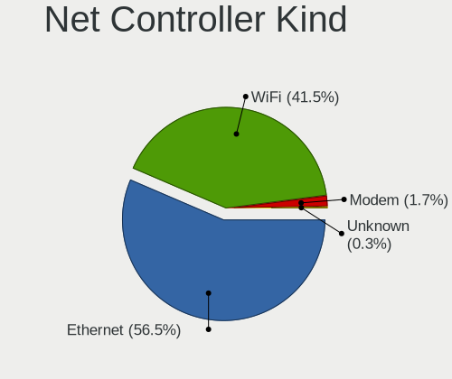
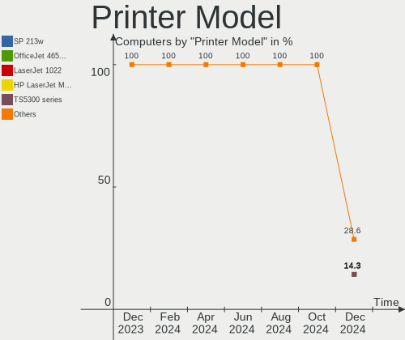
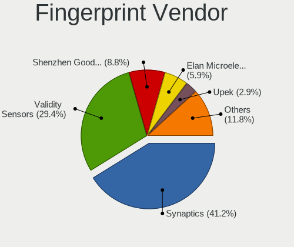

Debian - Hardware Trends
------------------------

A project to identify most popular hardware characteristics and track their change
over time based on data collected by Linux users at https://Linux-Hardware.org.

Anyone can contribute to this report by the [hw-probe](https://github.com/linuxhw/hw-probe) tool:

    sudo -E hw-probe -all -upload

This is a report for all computer types. See also reports for [desktops](/Dist/Debian/Desktop/README.md) and [notebooks](/Dist/Debian/Notebook/README.md).

This report is for one last month. Overall report since the beginning of time: [TestCoverage](https://github.com/linuxhw/TestCoverage)

Period: Dec, 2022.

Contents
--------

* [ System ](#system)
  - [ OS                       ](#os)
  - [ OS Family                ](#os-family)
  - [ Kernel                   ](#kernel)
  - [ Kernel Family            ](#kernel-family)
  - [ Kernel Major Ver.        ](#kernel-major-ver)
  - [ Arch                     ](#arch)
  - [ DE                       ](#de)
  - [ Display Server           ](#display-server)
  - [ Display Manager          ](#display-manager)
  - [ OS Lang                  ](#os-lang)
  - [ Boot Mode                ](#boot-mode)
  - [ Filesystem               ](#filesystem)
  - [ Part. scheme             ](#part-scheme)
  - [ Dual Boot with Linux/BSD ](#dual-boot-with-linuxbsd)
  - [ Dual Boot (Win)          ](#dual-boot-win)

* [ Board ](#board)
  - [ Vendor                   ](#vendor)
  - [ Model                    ](#model)
  - [ Model Family             ](#model-family)
  - [ MFG Year                 ](#mfg-year)
  - [ Form Factor              ](#form-factor)
  - [ Secure Boot              ](#secure-boot)
  - [ Coreboot                 ](#coreboot)
  - [ RAM Size                 ](#ram-size)
  - [ RAM Used                 ](#ram-used)
  - [ Total Drives             ](#total-drives)
  - [ Has CD-ROM               ](#has-cd-rom)
  - [ Has Ethernet             ](#has-ethernet)
  - [ Has WiFi                 ](#has-wifi)
  - [ Has Bluetooth            ](#has-bluetooth)

* [ Location ](#location)
  - [ Country                  ](#country)
  - [ City                     ](#city)

* [ Drives ](#drives)
  - [ Drive Vendor             ](#drive-vendor)
  - [ Drive Model              ](#drive-model)
  - [ HDD Vendor               ](#hdd-vendor)
  - [ SSD Vendor               ](#ssd-vendor)
  - [ Drive Kind               ](#drive-kind)
  - [ Drive Connector          ](#drive-connector)
  - [ Drive Size               ](#drive-size)
  - [ Space Total              ](#space-total)
  - [ Space Used               ](#space-used)
  - [ Malfunc. Drives          ](#malfunc-drives)
  - [ Malfunc. Drive Vendor    ](#malfunc-drive-vendor)
  - [ Malfunc. HDD Vendor      ](#malfunc-hdd-vendor)
  - [ Malfunc. Drive Kind      ](#malfunc-drive-kind)
  - [ Failed Drives            ](#failed-drives)
  - [ Failed Drive Vendor      ](#failed-drive-vendor)
  - [ Drive Status             ](#drive-status)

* [ Storage controller ](#storage-controller)
  - [ Storage Vendor           ](#storage-vendor)
  - [ Storage Model            ](#storage-model)
  - [ Storage Kind             ](#storage-kind)

* [ Processor ](#processor)
  - [ CPU Vendor               ](#cpu-vendor)
  - [ CPU Model                ](#cpu-model)
  - [ CPU Model Family         ](#cpu-model-family)
  - [ CPU Cores                ](#cpu-cores)
  - [ CPU Sockets              ](#cpu-sockets)
  - [ CPU Threads              ](#cpu-threads)
  - [ CPU Op-Modes             ](#cpu-op-modes)
  - [ CPU Microcode            ](#cpu-microcode)
  - [ CPU Microarch            ](#cpu-microarch)

* [ Graphics ](#graphics)
  - [ GPU Vendor               ](#gpu-vendor)
  - [ GPU Model                ](#gpu-model)
  - [ GPU Combo                ](#gpu-combo)
  - [ GPU Driver               ](#gpu-driver)
  - [ GPU Memory               ](#gpu-memory)

* [ Monitor ](#monitor)
  - [ Monitor Vendor           ](#monitor-vendor)
  - [ Monitor Model            ](#monitor-model)
  - [ Monitor Resolution       ](#monitor-resolution)
  - [ Monitor Diagonal         ](#monitor-diagonal)
  - [ Monitor Width            ](#monitor-width)
  - [ Aspect Ratio             ](#aspect-ratio)
  - [ Monitor Area             ](#monitor-area)
  - [ Pixel Density            ](#pixel-density)
  - [ Multiple Monitors        ](#multiple-monitors)

* [ Network ](#network)
  - [ Net Controller Vendor    ](#net-controller-vendor)
  - [ Net Controller Model     ](#net-controller-model)
  - [ Wireless Vendor          ](#wireless-vendor)
  - [ Wireless Model           ](#wireless-model)
  - [ Ethernet Vendor          ](#ethernet-vendor)
  - [ Ethernet Model           ](#ethernet-model)
  - [ Net Controller Kind      ](#net-controller-kind)
  - [ Used Controller          ](#used-controller)
  - [ NICs                     ](#nics)
  - [ IPv6                     ](#ipv6)

* [ Bluetooth ](#bluetooth)
  - [ Bluetooth Vendor         ](#bluetooth-vendor)
  - [ Bluetooth Model          ](#bluetooth-model)

* [ Sound ](#sound)
  - [ Sound Vendor             ](#sound-vendor)
  - [ Sound Model              ](#sound-model)

* [ Memory ](#memory)
  - [ Memory Vendor            ](#memory-vendor)
  - [ Memory Model             ](#memory-model)
  - [ Memory Kind              ](#memory-kind)
  - [ Memory Form Factor       ](#memory-form-factor)
  - [ Memory Size              ](#memory-size)
  - [ Memory Speed             ](#memory-speed)

* [ Printers & scanners ](#printers--scanners)
  - [ Printer Vendor           ](#printer-vendor)
  - [ Printer Model            ](#printer-model)
  - [ Scanner Vendor           ](#scanner-vendor)
  - [ Scanner Model            ](#scanner-model)

* [ Camera ](#camera)
  - [ Camera Vendor            ](#camera-vendor)
  - [ Camera Model             ](#camera-model)

* [ Security ](#security)
  - [ Fingerprint Vendor       ](#fingerprint-vendor)
  - [ Fingerprint Model        ](#fingerprint-model)
  - [ Chipcard Vendor          ](#chipcard-vendor)
  - [ Chipcard Model           ](#chipcard-model)

* [ Unsupported ](#unsupported)
  - [ Unsupported Devices      ](#unsupported-devices)
  - [ Unsupported Device Types ](#unsupported-device-types)

System
------

OS
--

Installed operating systems

| Name              | Computers | Percent |
|-------------------|-----------|---------|
| Debian 11         | 311       | 81.63%  |
| Debian            | 53        | 13.91%  |
| Debian 10         | 8         | 2.1%    |
| Debian 11-updates | 5         | 1.31%   |
| Debian 8          | 2         | 0.52%   |
| Debian Testing    | 1         | 0.26%   |
| Debian 9          | 1         | 0.26%   |

OS Family
---------

OS without a version

| Name   | Computers | Percent |
|--------|-----------|---------|
| Debian | 381       | 100%    |

Kernel
------

Version of the Linux kernel

| Version                   | Computers | Percent |
|---------------------------|-----------|---------|
| 5.10.0-19-amd64           | 96        | 25.2%   |
| 5.10.0-20-amd64           | 75        | 19.69%  |
| 5.10.0-18-amd64           | 30        | 7.87%   |
| 6.0.0-5-amd64             | 21        | 5.51%   |
| 6.0.0-0.deb11.2-amd64     | 21        | 5.51%   |
| 6.0.0-6-amd64             | 17        | 4.46%   |
| 5.10.0-7-amd64            | 16        | 4.2%    |
| 5.15.74-1-pve             | 11        | 2.89%   |
| 6.0.0-4-amd64             | 8         | 2.1%    |
| 5.15.76-v8+               | 8         | 2.1%    |
| 5.10.0-15-amd64           | 6         | 1.57%   |
| 6.0.0-2-amd64             | 4         | 1.05%   |
| 5.19.0-0.deb11.2-amd64    | 4         | 1.05%   |
| 5.19.11                   | 3         | 0.79%   |
| 4.19.0-22-amd64           | 3         | 0.79%   |
| 5.18.0-4mx-amd64          | 2         | 0.52%   |
| 5.15.83-1-pve             | 2         | 0.52%   |
| 5.10.142+truenas          | 2         | 0.52%   |
| 5.10.0-9-amd64            | 2         | 0.52%   |
| 5.10.0-20-686-pae         | 2         | 0.52%   |
| 5.10.0-16-amd64           | 2         | 0.52%   |
| 4.19.0-6-amd64            | 2         | 0.52%   |
| 6.1.1-pkg1                | 1         | 0.26%   |
| 6.1.0-titanide            | 1         | 0.26%   |
| 6.1.0-asahi               | 1         | 0.26%   |
| 6.1.0-0-amd64             | 1         | 0.26%   |
| 6.1.0                     | 1         | 0.26%   |
| 6.0.11-x64v1-xanmod1      | 1         | 0.26%   |
| 6.0.0-6-686               | 1         | 0.26%   |
| 6.0.0-5-686               | 1         | 0.26%   |
| 6.0.0-4mx-amd64           | 1         | 0.26%   |
| 6.0.0-3mx-amd64           | 1         | 0.26%   |
| 6.0.0-3.1mx-amd64         | 1         | 0.26%   |
| 5.4.3-g050b21f4b394-dirty | 1         | 0.26%   |
| 5.4.189-2-pve             | 1         | 0.26%   |
| 5.19.17-1-pve             | 1         | 0.26%   |
| 5.19.1-stb-cbq+           | 1         | 0.26%   |
| 5.19.0-1-amd64            | 1         | 0.26%   |
| 5.18.0-0.deb11.4-amd64    | 1         | 0.26%   |
| 5.18.0-0.deb11.3-amd64    | 1         | 0.26%   |

Kernel Family
-------------

Linux kernel without a distro release

| Version  | Computers | Percent |
|----------|-----------|---------|
| 5.10.0   | 238       | 62.47%  |
| 6.0.0    | 76        | 19.95%  |
| 5.15.74  | 12        | 3.15%   |
| 5.15.76  | 8         | 2.1%    |
| 4.19.0   | 8         | 2.1%    |
| 5.19.0   | 5         | 1.31%   |
| 5.18.0   | 5         | 1.31%   |
| 6.1.0    | 4         | 1.05%   |
| 5.19.11  | 3         | 0.79%   |
| 5.15.83  | 2         | 0.52%   |
| 5.10.142 | 2         | 0.52%   |
| 6.1.1    | 1         | 0.26%   |
| 6.0.11   | 1         | 0.26%   |
| 5.4.3    | 1         | 0.26%   |
| 5.4.189  | 1         | 0.26%   |
| 5.19.17  | 1         | 0.26%   |
| 5.19.1   | 1         | 0.26%   |
| 5.16.12  | 1         | 0.26%   |
| 5.15.84  | 1         | 0.26%   |
| 5.15.80  | 1         | 0.26%   |
| 5.15.61  | 1         | 0.26%   |
| 5.15.32  | 1         | 0.26%   |
| 5.15.30  | 1         | 0.26%   |
| 5.15.0   | 1         | 0.26%   |
| 5.10.92  | 1         | 0.26%   |
| 5.10.10  | 1         | 0.26%   |
| 4.4.194  | 1         | 0.26%   |
| 3.18.19  | 1         | 0.26%   |
| 3.10.65  | 1         | 0.26%   |

Kernel Major Ver.
-----------------

Linux kernel major version

| Version | Computers | Percent |
|---------|-----------|---------|
| 5.10    | 242       | 63.52%  |
| 6.0     | 77        | 20.21%  |
| 5.15    | 28        | 7.35%   |
| 5.19    | 10        | 2.62%   |
| 4.19    | 8         | 2.1%    |
| 6.1     | 5         | 1.31%   |
| 5.18    | 5         | 1.31%   |
| 5.4     | 2         | 0.52%   |
| 5.16    | 1         | 0.26%   |
| 4.4     | 1         | 0.26%   |
| 3.18    | 1         | 0.26%   |
| 3.10    | 1         | 0.26%   |

Arch
----

OS architecture (x86_64, i586, etc.)

| Name    | Computers | Percent |
|---------|-----------|---------|
| x86_64  | 353       | 92.65%  |
| aarch64 | 17        | 4.46%   |
| i686    | 7         | 1.84%   |
| armv7l  | 3         | 0.79%   |
| riscv64 | 1         | 0.26%   |

DE
--

Desktop Environment

| Name              | Computers | Percent |
|-------------------|-----------|---------|
| Unknown           | 95        | 24.93%  |
| GNOME             | 94        | 24.67%  |
| KDE5              | 57        | 14.96%  |
| XFCE              | 54        | 14.17%  |
| LXDE              | 19        | 4.99%   |
| X-Cinnamon        | 17        | 4.46%   |
| MATE              | 13        | 3.41%   |
| LXQt              | 9         | 2.36%   |
| Cinnamon          | 9         | 2.36%   |
| KDE               | 3         | 0.79%   |
| i3                | 3         | 0.79%   |
| GNOME Flashback   | 2         | 0.52%   |
| x-session-manager | 1         | 0.26%   |
| Openbox           | 1         | 0.26%   |
| GNOME Classic     | 1         | 0.26%   |
| fvwm              | 1         | 0.26%   |
| fluxbox           | 1         | 0.26%   |
| Budgie            | 1         | 0.26%   |

Display Server
--------------

X11 or Wayland

| Name        | Computers | Percent |
|-------------|-----------|---------|
| X11         | 208       | 54.59%  |
| Wayland     | 66        | 17.32%  |
| Tty         | 62        | 16.27%  |
| Unknown     | 43        | 11.29%  |
| Web         | 1         | 0.26%   |
| Unspecified | 1         | 0.26%   |

Display Manager
---------------

SDDM, LightDM, etc.

| Name    | Computers | Percent |
|---------|-----------|---------|
| Unknown | 146       | 38.32%  |
| LightDM | 91        | 23.88%  |
| GDM     | 66        | 17.32%  |
| SDDM    | 49        | 12.86%  |
| GDM3    | 24        | 6.3%    |
| XDM     | 2         | 0.52%   |
| KDM     | 2         | 0.52%   |
| LXDM    | 1         | 0.26%   |

OS Lang
-------

Language

| Lang       | Computers | Percent |
|------------|-----------|---------|
| en_US      | 144       | 37.8%   |
| ru_RU      | 37        | 9.71%   |
| en_GB      | 29        | 7.61%   |
| de_DE      | 29        | 7.61%   |
| fr_FR      | 28        | 7.35%   |
| it_IT      | 15        | 3.94%   |
| C          | 11        | 2.89%   |
| es_ES      | 9         | 2.36%   |
| Unknown    | 9         | 2.36%   |
| pt_BR      | 8         | 2.1%    |
| en_CA      | 6         | 1.57%   |
| pl_PL      | 5         | 1.31%   |
| ko_KR      | 5         | 1.31%   |
| en_IE      | 5         | 1.31%   |
| es_MX      | 4         | 1.05%   |
| en_IN      | 4         | 1.05%   |
| zh_CN      | 3         | 0.79%   |
| es_AR      | 3         | 0.79%   |
| de_AT      | 3         | 0.79%   |
| nl_NL      | 2         | 0.52%   |
| fi_FI      | 2         | 0.52%   |
| en_DE      | 2         | 0.52%   |
| en_AU      | 2         | 0.52%   |
| zh_TW      | 1         | 0.26%   |
| ro_RO      | 1         | 0.26%   |
| pt_PT      | 1         | 0.26%   |
| nl_BE      | 1         | 0.26%   |
| nb_NO      | 1         | 0.26%   |
| fr_CA      | 1         | 0.26%   |
| fr_BE      | 1         | 0.26%   |
| es_PR      | 1         | 0.26%   |
| es_GT      | 1         | 0.26%   |
| es_ES@euro | 1         | 0.26%   |
| en_SG      | 1         | 0.26%   |
| en_NZ      | 1         | 0.26%   |
| en_DK      | 1         | 0.26%   |
| de_CH      | 1         | 0.26%   |
| da_DK      | 1         | 0.26%   |
| cs_CZ      | 1         | 0.26%   |

Boot Mode
---------

EFI or BIOS

| Mode | Computers | Percent |
|------|-----------|---------|
| EFI  | 224       | 58.79%  |
| BIOS | 157       | 41.21%  |

Filesystem
----------

Type of filesystem

| Type    | Computers | Percent |
|---------|-----------|---------|
| Ext4    | 296       | 77.69%  |
| Overlay | 59        | 15.49%  |
| Btrfs   | 13        | 3.41%   |
| Zfs     | 5         | 1.31%   |
| Xfs     | 4         | 1.05%   |
| Tmpfs   | 2         | 0.52%   |
| Rootfs  | 2         | 0.52%   |

Part. scheme
------------

Scheme of partitioning

| Type    | Computers | Percent |
|---------|-----------|---------|
| GPT     | 238       | 62.47%  |
| MBR     | 89        | 23.36%  |
| Unknown | 54        | 14.17%  |

Dual Boot with Linux/BSD
------------------------

Hosting more than one Linux/BSD

| Dual boot | Computers | Percent |
|-----------|-----------|---------|
| No        | 325       | 85.3%   |
| Yes       | 56        | 14.7%   |

Dual Boot (Win)
---------------

Hosting Linux and Windows

| Dual boot | Computers | Percent |
|-----------|-----------|---------|
| No        | 271       | 71.13%  |
| Yes       | 110       | 28.87%  |

Board
-----

Vendor
------

Motherboard manufacturer

| Name                      | Computers | Percent |
|---------------------------|-----------|---------|
| Lenovo                    | 63        | 16.54%  |
| ASUSTek Computer          | 59        | 15.49%  |
| Dell                      | 53        | 13.91%  |
| Hewlett-Packard           | 42        | 11.02%  |
| Gigabyte Technology       | 20        | 5.25%   |
| ASRock                    | 16        | 4.2%    |
| MSI                       | 14        | 3.67%   |
| Raspberry Pi Foundation   | 12        | 3.15%   |
| Acer                      | 12        | 3.15%   |
| Unknown                   | 12        | 3.15%   |
| Intel                     | 10        | 2.62%   |
| Supermicro                | 9         | 2.36%   |
| Apple                     | 9         | 2.36%   |
| Google                    | 8         | 2.1%    |
| Toshiba                   | 7         | 1.84%   |
| Fujitsu                   | 4         | 1.05%   |
| Aquarius                  | 4         | 1.05%   |
| HUAWEI                    | 3         | 0.79%   |
| Panasonic                 | 2         | 0.52%   |
| Notebook                  | 2         | 0.52%   |
| Xunlong                   | 1         | 0.26%   |
| TrekStor                  | 1         | 0.26%   |
| Sony                      | 1         | 0.26%   |
| SANTECH                   | 1         | 0.26%   |
| Pro-B                     | 1         | 0.26%   |
| Packard Bell              | 1         | 0.26%   |
| NetGear                   | 1         | 0.26%   |
| Medion                    | 1         | 0.26%   |
| Matrox Electronic Systems | 1         | 0.26%   |
| MACHCREATOR               | 1         | 0.26%   |
| Inventec                  | 1         | 0.26%   |
| IceWhale Technology       | 1         | 0.26%   |
| GMKtec                    | 1         | 0.26%   |
| GIFA Industrial Control   | 1         | 0.26%   |
| Exo                       | 1         | 0.26%   |
| EUROCOM                   | 1         | 0.26%   |
| CSL-Computer              | 1         | 0.26%   |
| BESSTAR Tech              | 1         | 0.26%   |
| AZW                       | 1         | 0.26%   |
| ASRockRack                | 1         | 0.26%   |

Model
-----

Motherboard model

| Name                                      | Computers | Percent |
|-------------------------------------------|-----------|---------|
| Unknown                                   | 13        | 3.41%   |
| Dell Latitude E7440                       | 8         | 2.1%    |
| Supermicro Super Server                   | 5         | 1.31%   |
| Aquarius NS585                            | 4         | 1.05%   |
| Apple MacBookAir7,1                       | 3         | 0.79%   |
| RPi Raspberry Pi Compute Module 4 Rev 1.1 | 2         | 0.52%   |
| RPi Raspberry Pi 400 Rev 1.0              | 2         | 0.52%   |
| RPi Raspberry Pi 4 Model B Rev 1.1        | 2         | 0.52%   |
| RPi Raspberry Pi 3 Model B Rev 1.2        | 2         | 0.52%   |
| MSI MS-7C56                               | 2         | 0.52%   |
| Lenovo ThinkPad L13 Yoga Gen 2 20VK0019US | 2         | 0.52%   |
| Lenovo ThinkPad 13 2nd Gen 20J10046US     | 2         | 0.52%   |
| HP EliteBook 8460p                        | 2         | 0.52%   |
| HP Compaq Pro 6300 SFF                    | 2         | 0.52%   |
| Google Reks                               | 2         | 0.52%   |
| Gigabyte B450M DS3H                       | 2         | 0.52%   |
| Dell OptiPlex 7010                        | 2         | 0.52%   |
| Dell Inspiron 5490                        | 2         | 0.52%   |
| ASUS WS C422 DC                           | 2         | 0.52%   |
| ASRock X570 Pro4                          | 2         | 0.52%   |
| ASRock H470M-HVS                          | 2         | 0.52%   |
| Apple MacBookAir7,2                       | 2         | 0.52%   |
| Xunlong Orange Pi PC                      | 1         | 0.26%   |
| TrekStor SurfTab twin 11.6                | 1         | 0.26%   |
| Toshiba TECRA A11                         | 1         | 0.26%   |
| Toshiba Satellite L775-12V                | 1         | 0.26%   |
| Toshiba Satellite L455D                   | 1         | 0.26%   |
| Toshiba Satellite L10W-B-101              | 1         | 0.26%   |
| Toshiba Satellite C850-1LJ                | 1         | 0.26%   |
| Toshiba Satellite C55Dt-A                 | 1         | 0.26%   |
| Toshiba dynabook R63/P                    | 1         | 0.26%   |
| Supermicro X10SLH-F/X10SLM+-F             | 1         | 0.26%   |
| Supermicro X10DRH                         | 1         | 0.26%   |
| Supermicro H8SCM                          | 1         | 0.26%   |
| Supermicro C7SIM-Q                        | 1         | 0.26%   |
| Sony SVE1112M1EB                          | 1         | 0.26%   |
| SANTECH NHx0DB,DE                         | 1         | 0.26%   |
| RPi Raspberry Pi 4 Model B Rev 1.5        | 1         | 0.26%   |
| RPi Raspberry Pi 4 Model B Rev 1.4        | 1         | 0.26%   |
| RPi Raspberry Pi 3 Model B Plus Rev 1.3   | 1         | 0.26%   |

Model Family
------------

Motherboard model prefix

| Name                | Computers | Percent |
|---------------------|-----------|---------|
| Lenovo ThinkPad     | 41        | 10.76%  |
| Dell Latitude       | 18        | 4.72%   |
| Dell Inspiron       | 15        | 3.94%   |
| Unknown             | 13        | 3.41%   |
| RPi Raspberry       | 12        | 3.15%   |
| ASUS ROG            | 9         | 2.36%   |
| ASUS PRIME          | 9         | 2.36%   |
| Acer Aspire         | 9         | 2.36%   |
| HP EliteBook        | 8         | 2.1%    |
| Dell OptiPlex       | 7         | 1.84%   |
| Dell Vostro         | 6         | 1.57%   |
| Toshiba Satellite   | 5         | 1.31%   |
| Supermicro Super    | 5         | 1.31%   |
| HP ProLiant         | 5         | 1.31%   |
| HP Laptop           | 5         | 1.31%   |
| HP Compaq           | 5         | 1.31%   |
| ASUS VivoBook       | 5         | 1.31%   |
| Apple MacBookAir7   | 5         | 1.31%   |
| Lenovo ThinkCentre  | 4         | 1.05%   |
| Aquarius NS585      | 4         | 1.05%   |
| Lenovo Yoga         | 3         | 0.79%   |
| Lenovo Legion       | 3         | 0.79%   |
| Lenovo IdeaPad      | 3         | 0.79%   |
| HP 255              | 3         | 0.79%   |
| ASUS ZenBook        | 3         | 0.79%   |
| ASRock X570         | 3         | 0.79%   |
| MSI MS-7C56         | 2         | 0.52%   |
| Lenovo ThinkStation | 2         | 0.52%   |
| Lenovo ThinkBook    | 2         | 0.52%   |
| HP ZBook            | 2         | 0.52%   |
| HP ProBook          | 2         | 0.52%   |
| Google Reks         | 2         | 0.52%   |
| Gigabyte H61M-DS2   | 2         | 0.52%   |
| Gigabyte B450M      | 2         | 0.52%   |
| Gigabyte 990FXA-UD3 | 2         | 0.52%   |
| Fujitsu ESPRIMO     | 2         | 0.52%   |
| Dell Precision      | 2         | 0.52%   |
| Dell PowerEdge      | 2         | 0.52%   |
| ASUS WS             | 2         | 0.52%   |
| ASUS TUF            | 2         | 0.52%   |

MFG Year
--------

Motherboard manufacture year

| Year    | Computers | Percent |
|---------|-----------|---------|
| 2021    | 44        | 11.55%  |
| 2019    | 34        | 8.92%   |
| 2020    | 33        | 8.66%   |
| 2017    | 33        | 8.66%   |
| 2018    | 32        | 8.4%    |
| 2013    | 30        | 7.87%   |
| 2012    | 29        | 7.61%   |
| 2022    | 26        | 6.82%   |
| Unknown | 21        | 5.51%   |
| 2015    | 16        | 4.2%    |
| 2014    | 16        | 4.2%    |
| 2011    | 16        | 4.2%    |
| 2016    | 15        | 3.94%   |
| 2010    | 13        | 3.41%   |
| 2009    | 8         | 2.1%    |
| 2007    | 7         | 1.84%   |
| 2008    | 3         | 0.79%   |
| 2006    | 3         | 0.79%   |
| 2005    | 1         | 0.26%   |
| 2004    | 1         | 0.26%   |

Form Factor
-----------

Physical design of the computer

| Name           | Computers | Percent |
|----------------|-----------|---------|
| Notebook       | 193       | 50.66%  |
| Desktop        | 135       | 35.43%  |
| System on chip | 18        | 4.72%   |
| Server         | 12        | 3.15%   |
| Mini pc        | 10        | 2.62%   |
| Convertible    | 9         | 2.36%   |
| All in one     | 3         | 0.79%   |
| Tablet         | 1         | 0.26%   |

Secure Boot
-----------

Enabled or disabled

| State    | Computers | Percent |
|----------|-----------|---------|
| Disabled | 352       | 92.39%  |
| Enabled  | 29        | 7.61%   |

Coreboot
--------

Have coreboot on board

| Used | Computers | Percent |
|------|-----------|---------|
| No   | 371       | 97.38%  |
| Yes  | 10        | 2.62%   |

RAM Size
--------

Total RAM memory

| Size in GB  | Computers | Percent |
|-------------|-----------|---------|
| 4.01-8.0    | 84        | 22.05%  |
| 8.01-16.0   | 65        | 17.06%  |
| 16.01-24.0  | 64        | 16.8%   |
| 32.01-64.0  | 52        | 13.65%  |
| 3.01-4.0    | 52        | 13.65%  |
| 64.01-256.0 | 22        | 5.77%   |
| 1.01-2.0    | 21        | 5.51%   |
| 0.51-1.0    | 9         | 2.36%   |
| 24.01-32.0  | 7         | 1.84%   |
| 2.01-3.0    | 5         | 1.31%   |

RAM Used
--------

Used RAM memory

| Used GB    | Computers | Percent |
|------------|-----------|---------|
| 1.01-2.0   | 110       | 28.87%  |
| 2.01-3.0   | 73        | 19.16%  |
| 4.01-8.0   | 54        | 14.17%  |
| 3.01-4.0   | 50        | 13.12%  |
| 0.51-1.0   | 50        | 13.12%  |
| 0.01-0.5   | 22        | 5.77%   |
| 8.01-16.0  | 16        | 4.2%    |
| 16.01-24.0 | 4         | 1.05%   |
| 32.01-64.0 | 1         | 0.26%   |
| Unknown    | 1         | 0.26%   |

Total Drives
------------

Number of drives on board

| Drives | Computers | Percent |
|--------|-----------|---------|
| 1      | 237       | 62.2%   |
| 2      | 87        | 22.83%  |
| 4      | 21        | 5.51%   |
| 3      | 17        | 4.46%   |
| 5      | 7         | 1.84%   |
| 6      | 3         | 0.79%   |
| 0      | 2         | 0.52%   |
| 26     | 1         | 0.26%   |
| 21     | 1         | 0.26%   |
| 13     | 1         | 0.26%   |
| 10     | 1         | 0.26%   |
| 9      | 1         | 0.26%   |
| 8      | 1         | 0.26%   |
| 7      | 1         | 0.26%   |

Has CD-ROM
----------

Has CD-ROM on board

| Presented | Computers | Percent |
|-----------|-----------|---------|
| No        | 290       | 76.12%  |
| Yes       | 91        | 23.88%  |

Has Ethernet
------------

Has Ethernet on board

| Presented | Computers | Percent |
|-----------|-----------|---------|
| Yes       | 325       | 85.3%   |
| No        | 56        | 14.7%   |

Has WiFi
--------

Has WiFi module

| Presented | Computers | Percent |
|-----------|-----------|---------|
| Yes       | 259       | 67.98%  |
| No        | 122       | 32.02%  |

Has Bluetooth
-------------

Has Bluetooth module

| Presented | Computers | Percent |
|-----------|-----------|---------|
| Yes       | 225       | 59.06%  |
| No        | 156       | 40.94%  |

Location
--------

Country
-------

Geographic location (country)

| Country      | Computers | Percent |
|--------------|-----------|---------|
| USA          | 72        | 18.9%   |
| Germany      | 56        | 14.7%   |
| Russia       | 40        | 10.5%   |
| France       | 31        | 8.14%   |
| Italy        | 24        | 6.3%    |
| Spain        | 13        | 3.41%   |
| Brazil       | 13        | 3.41%   |
| UK           | 12        | 3.15%   |
| Poland       | 12        | 3.15%   |
| Netherlands  | 10        | 2.62%   |
| Canada       | 10        | 2.62%   |
| South Korea  | 5         | 1.31%   |
| India        | 5         | 1.31%   |
| Australia    | 5         | 1.31%   |
| Taiwan       | 4         | 1.05%   |
| Sweden       | 4         | 1.05%   |
| Romania      | 4         | 1.05%   |
| Mexico       | 4         | 1.05%   |
| Austria      | 4         | 1.05%   |
| Turkey       | 3         | 0.79%   |
| Portugal     | 3         | 0.79%   |
| Ireland      | 3         | 0.79%   |
| Hong Kong    | 3         | 0.79%   |
| Finland      | 3         | 0.79%   |
| Denmark      | 3         | 0.79%   |
| Argentina    | 3         | 0.79%   |
| Thailand     | 2         | 0.52%   |
| Switzerland  | 2         | 0.52%   |
| Indonesia    | 2         | 0.52%   |
| Czechia      | 2         | 0.52%   |
| Croatia      | 2         | 0.52%   |
| Belgium      | 2         | 0.52%   |
| Vietnam      | 1         | 0.26%   |
| Tunisia      | 1         | 0.26%   |
| South Africa | 1         | 0.26%   |
| Slovakia     | 1         | 0.26%   |
| Puerto Rico  | 1         | 0.26%   |
| Peru         | 1         | 0.26%   |
| Norway       | 1         | 0.26%   |
| New Zealand  | 1         | 0.26%   |

City
----

Geographic location (city)

| City            | Computers | Percent |
|-----------------|-----------|---------|
| Bangor          | 29        | 7.61%   |
| Voronezh        | 19        | 4.99%   |
| Moscow          | 11        | 2.89%   |
| Paris           | 6         | 1.57%   |
| Hamburg         | 6         | 1.57%   |
| Falkenstein     | 6         | 1.57%   |
| Seocho-gu       | 5         | 1.31%   |
| Berlin          | 5         | 1.31%   |
| St Petersburg   | 4         | 1.05%   |
| Milan           | 4         | 1.05%   |
| Warsaw          | 3         | 0.79%   |
| Seattle         | 3         | 0.79%   |
| Sao Paulo       | 3         | 0.79%   |
| Pittsburgh      | 3         | 0.79%   |
| Melbourne       | 3         | 0.79%   |
| Madrid          | 3         | 0.79%   |
| London          | 3         | 0.79%   |
| Lisbon          | 3         | 0.79%   |
| Gloucester      | 3         | 0.79%   |
| Vila Velha      | 2         | 0.52%   |
| Toronto         | 2         | 0.52%   |
| Springfield     | 2         | 0.52%   |
| Seville         | 2         | 0.52%   |
| San Luis Obispo | 2         | 0.52%   |
| Saarbrücken    | 2         | 0.52%   |
| Prague          | 2         | 0.52%   |
| Poznan          | 2         | 0.52%   |
| Nuremberg       | 2         | 0.52%   |
| New Taipei      | 2         | 0.52%   |
| Mesa            | 2         | 0.52%   |
| Istanbul        | 2         | 0.52%   |
| Ho Man Tin      | 2         | 0.52%   |
| Hattersheim     | 2         | 0.52%   |
| Bonn            | 2         | 0.52%   |
| Asti            | 2         | 0.52%   |
| Amstelveen      | 2         | 0.52%   |
| Zurich          | 1         | 0.26%   |
| Zapopan         | 1         | 0.26%   |
| Yogyakarta      | 1         | 0.26%   |
| Xiawanzi        | 1         | 0.26%   |

Drives
------

Drive Vendor
------------

Hard drive vendors

| Vendor                    | Computers | Drives | Percent |
|---------------------------|-----------|--------|---------|
| Samsung Electronics       | 101       | 129    | 18.4%   |
| WDC                       | 69        | 87     | 12.57%  |
| Seagate                   | 66        | 114    | 12.02%  |
| Toshiba                   | 37        | 48     | 6.74%   |
| Unknown                   | 34        | 37     | 6.19%   |
| Kingston                  | 31        | 31     | 5.65%   |
| Crucial                   | 24        | 26     | 4.37%   |
| Sandisk                   | 21        | 24     | 3.83%   |
| Intel                     | 18        | 20     | 3.28%   |
| Hitachi                   | 16        | 27     | 2.91%   |
| SK hynix                  | 9         | 12     | 1.64%   |
| HGST                      | 8         | 13     | 1.46%   |
| A-DATA Technology         | 8         | 8      | 1.46%   |
| KIOXIA                    | 7         | 7      | 1.28%   |
| Apple                     | 6         | 8      | 1.09%   |
| Transcend                 | 5         | 5      | 0.91%   |
| SPCC                      | 5         | 5      | 0.91%   |
| Micron Technology         | 5         | 5      | 0.91%   |
| Intenso                   | 5         | 5      | 0.91%   |
| SSSTC                     | 4         | 4      | 0.73%   |
| PNY                       | 4         | 4      | 0.73%   |
| JMicron Technology        | 4         | 4      | 0.73%   |
| China                     | 4         | 5      | 0.73%   |
| Team                      | 3         | 3      | 0.55%   |
| Phison                    | 3         | 3      | 0.55%   |
| OCZ                       | 3         | 4      | 0.55%   |
| Netac                     | 3         | 3      | 0.55%   |
| Hewlett-Packard           | 3         | 4      | 0.55%   |
| Unknown                   | 3         | 3      | 0.55%   |
| Phison Electronics        | 2         | 2      | 0.36%   |
| Patriot                   | 2         | 2      | 0.36%   |
| Micron/Crucial Technology | 2         | 2      | 0.36%   |
| LITEONIT                  | 2         | 2      | 0.36%   |
| LITEON                    | 2         | 2      | 0.36%   |
| Inland                    | 2         | 2      | 0.36%   |
| Fujitsu                   | 2         | 2      | 0.36%   |
| Corsair                   | 2         | 3      | 0.36%   |
| ASMT                      | 2         | 2      | 0.36%   |
| ZTC                       | 1         | 1      | 0.18%   |
| XrayDisk                  | 1         | 1      | 0.18%   |

Drive Model
-----------

Hard drive models

| Model                                              | Computers | Percent |
|----------------------------------------------------|-----------|---------|
| Seagate ST500DM002-1BD142 500GB                    | 8         | 1.31%   |
| Samsung SSD 980 PRO 1TB                            | 5         | 0.82%   |
| Samsung SSD 970 EVO Plus 1TB                       | 5         | 0.82%   |
| Samsung SSD 860 EVO 250GB                          | 5         | 0.82%   |
| Kingston SA400S37480G 480GB SSD                    | 5         | 0.82%   |
| Kingston SA400S37240G 240GB SSD                    | 5         | 0.82%   |
| Unknown MMC Card  32GB                             | 4         | 0.66%   |
| Unknown MMC Card  128GB                            | 4         | 0.66%   |
| Seagate Expansion Desk 5TB                         | 4         | 0.66%   |
| Samsung SSD 980 1TB                                | 4         | 0.66%   |
| Samsung SSD 870 EVO 500GB                          | 4         | 0.66%   |
| Samsung NVMe SSD Controller PM9A1/PM9A3/980PRO 2TB | 4         | 0.66%   |
| Kingston SV300S37A120G 120GB SSD                   | 4         | 0.66%   |
| Crucial CT500MX500SSD1 500GB                       | 4         | 0.66%   |
| A-DATA SU800 512GB SSD                             | 4         | 0.66%   |
| WDC WD30EFRX-68EUZN0 3TB                           | 3         | 0.49%   |
| Toshiba MQ04ABF100 1TB                             | 3         | 0.49%   |
| Seagate ST4000VN008-2DR166 4TB                     | 3         | 0.49%   |
| Seagate ST3500413AS 500GB                          | 3         | 0.49%   |
| Seagate ST2000LM015-2E8174 2TB                     | 3         | 0.49%   |
| Seagate ST1000LM049-2GH172 1TB                     | 3         | 0.49%   |
| Samsung SSD 860 EVO 1TB                            | 3         | 0.49%   |
| Samsung SSD 850 EVO 500GB                          | 3         | 0.49%   |
| Samsung SSD 850 EVO 250GB                          | 3         | 0.49%   |
| Samsung MZVLB512HBJQ-000L7 512GB                   | 3         | 0.49%   |
| Kingston SA400S37120G 120GB SSD                    | 3         | 0.49%   |
| JMicron Tech 250GB                                 | 3         | 0.49%   |
| Crucial CT1000P2SSD8 1TB                           | 3         | 0.49%   |
| Apple SSD AP0128H 121GB                            | 3         | 0.49%   |
| Unknown                                            | 3         | 0.49%   |
| WDC WDS100T2B0C-00PXH0 1TB                         | 2         | 0.33%   |
| WDC WDS100T2B0A-00SM50 1TB SSD                     | 2         | 0.33%   |
| WDC WD5000AAKX-08U6AA0 500GB                       | 2         | 0.33%   |
| WDC WD40EFRX-68N32N0 4TB                           | 2         | 0.33%   |
| WDC WD20EZRZ-00Z5HB0 2TB                           | 2         | 0.33%   |
| WDC WD10SPZX-21Z10T0 1TB                           | 2         | 0.33%   |
| WDC WD100EMAZ-00WJTA0 10TB                         | 2         | 0.33%   |
| Unknown SC16G  16GB                                | 2         | 0.33%   |
| Unknown MMC Card  4GB                              | 2         | 0.33%   |
| Unknown DA4064  64GB                               | 2         | 0.33%   |

HDD Vendor
----------

Hard disk drive vendors

| Vendor              | Computers | Drives | Percent |
|---------------------|-----------|--------|---------|
| Seagate             | 64        | 105    | 34.78%  |
| WDC                 | 56        | 70     | 30.43%  |
| Toshiba             | 27        | 35     | 14.67%  |
| Hitachi             | 16        | 27     | 8.7%    |
| HGST                | 8         | 13     | 4.35%   |
| Samsung Electronics | 4         | 5      | 2.17%   |
| Unknown             | 2         | 2      | 1.09%   |
| Intenso             | 2         | 2      | 1.09%   |
| Fujitsu             | 2         | 2      | 1.09%   |
| Maxtor              | 1         | 1      | 0.54%   |
| HPE                 | 1         | 1      | 0.54%   |
| ASMT                | 1         | 1      | 0.54%   |

SSD Vendor
----------

Solid state drive vendors

| Vendor              | Computers | Drives | Percent |
|---------------------|-----------|--------|---------|
| Samsung Electronics | 45        | 56     | 24.46%  |
| Kingston            | 24        | 24     | 13.04%  |
| Crucial             | 19        | 21     | 10.33%  |
| SanDisk             | 13        | 15     | 7.07%   |
| WDC                 | 8         | 9      | 4.35%   |
| Intel               | 8         | 8      | 4.35%   |
| Toshiba             | 5         | 6      | 2.72%   |
| A-DATA Technology   | 5         | 5      | 2.72%   |
| Transcend           | 4         | 4      | 2.17%   |
| SPCC                | 4         | 4      | 2.17%   |
| China               | 4         | 5      | 2.17%   |
| OCZ                 | 3         | 4      | 1.63%   |
| Netac               | 3         | 3      | 1.63%   |
| Micron Technology   | 3         | 3      | 1.63%   |
| Intenso             | 3         | 3      | 1.63%   |
| Team                | 2         | 2      | 1.09%   |
| SK hynix            | 2         | 2      | 1.09%   |
| PNY                 | 2         | 2      | 1.09%   |
| LITEONIT            | 2         | 2      | 1.09%   |
| Inland              | 2         | 2      | 1.09%   |
| Apple               | 2         | 2      | 1.09%   |
| ZTC                 | 1         | 1      | 0.54%   |
| XrayDisk            | 1         | 1      | 0.54%   |
| Verbatim            | 1         | 1      | 0.54%   |
| T-FORCE             | 1         | 1      | 0.54%   |
| SSSTC               | 1         | 1      | 0.54%   |
| Seagate             | 1         | 2      | 0.54%   |
| S3+                 | 1         | 1      | 0.54%   |
| Patriot             | 1         | 1      | 0.54%   |
| LITEON              | 1         | 1      | 0.54%   |
| LDLC                | 1         | 1      | 0.54%   |
| KingFast            | 1         | 1      | 0.54%   |
| JMicron Technology  | 1         | 1      | 0.54%   |
| Hewlett-Packard     | 1         | 2      | 0.54%   |
| Fanxiang            | 1         | 1      | 0.54%   |
| Drevo               | 1         | 1      | 0.54%   |
| Dogfish             | 1         | 1      | 0.54%   |
| Corsair             | 1         | 2      | 0.54%   |
| ASUSTek Computer    | 1         | 1      | 0.54%   |
| ASMT                | 1         | 1      | 0.54%   |

Drive Kind
----------

HDD or SSD

| Kind    | Computers | Drives | Percent |
|---------|-----------|--------|---------|
| SSD     | 161       | 206    | 33.06%  |
| NVMe    | 141       | 168    | 28.95%  |
| HDD     | 140       | 264    | 28.75%  |
| MMC     | 37        | 40     | 7.6%    |
| Unknown | 8         | 11     | 1.64%   |

Drive Connector
---------------

SATA, SAS, NVMe, etc.

| Type | Computers | Drives | Percent |
|------|-----------|--------|---------|
| SATA | 240       | 415    | 54.55%  |
| NVMe | 141       | 168    | 32.05%  |
| MMC  | 37        | 40     | 8.41%   |
| SAS  | 22        | 66     | 5%      |

Drive Size
----------

Size of hard drive

| Size in TB | Computers | Drives | Percent |
|------------|-----------|--------|---------|
| 0.01-0.5   | 180       | 222    | 54.05%  |
| 0.51-1.0   | 82        | 113    | 24.62%  |
| 1.01-2.0   | 28        | 50     | 8.41%   |
| 4.01-10.0  | 17        | 38     | 5.11%   |
| 3.01-4.0   | 15        | 24     | 4.5%    |
| 2.01-3.0   | 10        | 17     | 3%      |
| 10.01-20.0 | 1         | 6      | 0.3%    |

Space Total
-----------

Amount of disk space available on the file system

| Size in GB     | Computers | Percent |
|----------------|-----------|---------|
| 101-250        | 91        | 23.88%  |
| 251-500        | 68        | 17.85%  |
| Unknown        | 53        | 13.91%  |
| 501-1000       | 46        | 12.07%  |
| 51-100         | 28        | 7.35%   |
| 1001-2000      | 26        | 6.82%   |
| More than 3000 | 23        | 6.04%   |
| 21-50          | 19        | 4.99%   |
| 1-20           | 18        | 4.72%   |
| 2001-3000      | 9         | 2.36%   |

Space Used
----------

Amount of used disk space

| Used GB        | Computers | Percent |
|----------------|-----------|---------|
| 1-20           | 153       | 40.16%  |
| Unknown        | 53        | 13.91%  |
| 101-250        | 41        | 10.76%  |
| 51-100         | 36        | 9.45%   |
| 21-50          | 35        | 9.19%   |
| 501-1000       | 22        | 5.77%   |
| 251-500        | 13        | 3.41%   |
| 1001-2000      | 13        | 3.41%   |
| More than 3000 | 11        | 2.89%   |
| 2001-3000      | 2         | 0.52%   |
| 0              | 2         | 0.52%   |

Malfunc. Drives
---------------

Drive models with a malfunction

| Model                                                               | Computers | Drives | Percent |
|---------------------------------------------------------------------|-----------|--------|---------|
| Seagate ST500DM002-1BD142 500GB                                     | 4         | 7      | 8.33%   |
| Seagate ST3500413AS 500GB                                           | 2         | 2      | 4.17%   |
| Kingston SV300S37A120G 120GB SSD                                    | 2         | 2      | 4.17%   |
| WDC WDS120G2G0A-00JH30 120GB SSD                                    | 1         | 1      | 2.08%   |
| WDC WD800AAJS-00PSA0 80GB                                           | 1         | 1      | 2.08%   |
| WDC WD60EFRX-68MYMN1 6TB                                            | 1         | 1      | 2.08%   |
| WDC WD5000LPVX-75V0TT0 500GB                                        | 1         | 1      | 2.08%   |
| WDC WD5000LPVX-08V0TT5 500GB                                        | 1         | 1      | 2.08%   |
| WDC WD5000AAKX-08U6AA0 500GB                                        | 1         | 1      | 2.08%   |
| WDC WD3200AAKS-00SBA0 320GB                                         | 1         | 1      | 2.08%   |
| WDC WD2500AAJS-00YZCA0 250GB                                        | 1         | 1      | 2.08%   |
| WDC WD20EARX-00PASB0 2TB                                            | 1         | 1      | 2.08%   |
| WDC WD1600AAJS-08PSA0 160GB                                         | 1         | 1      | 2.08%   |
| Toshiba MQ01ABF032 320GB                                            | 1         | 1      | 2.08%   |
| Toshiba KSG60ZSE256G SATA 256GB SSD                                 | 1         | 1      | 2.08%   |
| SSSTC CVB-8D128-HP 128GB                                            | 1         | 1      | 2.08%   |
| SK hynix SH920 mSATA 128GB SSD                                      | 1         | 1      | 2.08%   |
| Seagate ST9500325AS 500GB                                           | 1         | 1      | 2.08%   |
| Seagate ST500LM021-1KJ152 500GB                                     | 1         | 1      | 2.08%   |
| Seagate ST5000LM000-2AN170 5TB                                      | 1         | 2      | 2.08%   |
| Seagate ST380817AS 80GB                                             | 1         | 1      | 2.08%   |
| Seagate ST3808110AS 80GB                                            | 1         | 1      | 2.08%   |
| Seagate ST3250318AS 250GB                                           | 1         | 1      | 2.08%   |
| Seagate ST31000340AS 1TB                                            | 1         | 1      | 2.08%   |
| Seagate ST1000LM049-2GH172 1TB                                      | 1         | 1      | 2.08%   |
| Seagate ST1000LM035-1RK172 1TB                                      | 1         | 1      | 2.08%   |
| Seagate ST1000LM024 HN-M101MBB 1TB                                  | 1         | 1      | 2.08%   |
| Seagate ST1000DM003-1CH162 1TB                                      | 1         | 1      | 2.08%   |
| Samsung Electronics SSD 870 EVO 250GB                               | 1         | 1      | 2.08%   |
| Samsung Electronics SSD 840 Series 250GB                            | 1         | 1      | 2.08%   |
| Micron Technology MTFDDAK960TCB-1AR1ZA 01GV854 01GV857LEN 960GB SSD | 1         | 1      | 2.08%   |
| Micron Technology M510DC_MTFDDAK960MBP 960GB SSD                    | 1         | 1      | 2.08%   |
| Micron Technology 1100 SATA 512GB SSD                               | 1         | 1      | 2.08%   |
| Kingston SH103S3240G 240GB                                          | 1         | 1      | 2.08%   |
| Intel SSDSC2CW120A3 120GB                                           | 1         | 1      | 2.08%   |
| Intel SSDSC2BB960G7 960GB                                           | 1         | 1      | 2.08%   |
| Hitachi HTS725032A9A364 320GB                                       | 1         | 1      | 2.08%   |
| Hitachi HTS725032A9A360 320GB                                       | 1         | 1      | 2.08%   |
| HGST HTS545050A7E680 500GB                                          | 1         | 1      | 2.08%   |
| HGST HTS545050A7E380 500GB                                          | 1         | 1      | 2.08%   |

Malfunc. Drive Vendor
---------------------

Vendors of faulty drives

| Vendor              | Computers | Drives | Percent |
|---------------------|-----------|--------|---------|
| Seagate             | 16        | 21     | 35.56%  |
| WDC                 | 9         | 10     | 20%     |
| Micron Technology   | 3         | 3      | 6.67%   |
| Kingston            | 3         | 3      | 6.67%   |
| Toshiba             | 2         | 2      | 4.44%   |
| Samsung Electronics | 2         | 2      | 4.44%   |
| Intel               | 2         | 2      | 4.44%   |
| HGST                | 2         | 2      | 4.44%   |
| Crucial             | 2         | 2      | 4.44%   |
| SSSTC               | 1         | 1      | 2.22%   |
| SK hynix            | 1         | 1      | 2.22%   |
| Hitachi             | 1         | 2      | 2.22%   |
| A-DATA Technology   | 1         | 1      | 2.22%   |

Malfunc. HDD Vendor
-------------------

Vendors of faulty HDD drives

| Vendor  | Computers | Drives | Percent |
|---------|-----------|--------|---------|
| Seagate | 16        | 21     | 57.14%  |
| WDC     | 8         | 9      | 28.57%  |
| HGST    | 2         | 2      | 7.14%   |
| Toshiba | 1         | 1      | 3.57%   |
| Hitachi | 1         | 2      | 3.57%   |

Malfunc. Drive Kind
-------------------

Kinds of faulty drives

| Kind | Computers | Drives | Percent |
|------|-----------|--------|---------|
| HDD  | 25        | 35     | 60.98%  |
| SSD  | 16        | 17     | 39.02%  |

Failed Drives
-------------

Failed drive models

| Model                           | Computers | Drives | Percent |
|---------------------------------|-----------|--------|---------|
| Samsung Electronics SSD 980 1TB | 1         | 1      | 100%    |

Failed Drive Vendor
-------------------

Failed drive vendors

| Vendor              | Computers | Drives | Percent |
|---------------------|-----------|--------|---------|
| Samsung Electronics | 1         | 1      | 100%    |

Drive Status
------------

Number of failed and malfunc. drives

| Status   | Computers | Drives | Percent |
|----------|-----------|--------|---------|
| Works    | 271       | 414    | 64.52%  |
| Detected | 109       | 222    | 25.95%  |
| Malfunc  | 39        | 52     | 9.29%   |
| Failed   | 1         | 1      | 0.24%   |

Storage controller
------------------

Storage Vendor
--------------

Storage controller vendors

| Vendor                         | Computers | Percent |
|--------------------------------|-----------|---------|
| Intel                          | 225       | 46.97%  |
| AMD                            | 75        | 15.66%  |
| Samsung Electronics            | 58        | 12.11%  |
| Sandisk                        | 14        | 2.92%   |
| ASMedia Technology             | 10        | 2.09%   |
| Toshiba America Info Systems   | 8         | 1.67%   |
| Kingston Technology Company    | 8         | 1.67%   |
| SK hynix                       | 7         | 1.46%   |
| Phison Electronics             | 7         | 1.46%   |
| Micron/Crucial Technology      | 7         | 1.46%   |
| LSI Logic / Symbios Logic      | 7         | 1.46%   |
| KIOXIA                         | 7         | 1.46%   |
| Marvell Technology Group       | 6         | 1.25%   |
| JMicron Technology             | 5         | 1.04%   |
| Nvidia                         | 4         | 0.84%   |
| MAXIO Technology (Hangzhou)    | 4         | 0.84%   |
| ADATA Technology               | 4         | 0.84%   |
| Solid State Storage Technology | 3         | 0.63%   |
| Silicon Motion                 | 3         | 0.63%   |
| Apple                          | 3         | 0.63%   |
| VIA Technologies               | 2         | 0.42%   |
| Micron Technology              | 2         | 0.42%   |
| Hewlett-Packard                | 2         | 0.42%   |
| Broadcom / LSI                 | 2         | 0.42%   |
| Adaptec                        | 2         | 0.42%   |
| Union Memory (Shenzhen)        | 1         | 0.21%   |
| Lite-On Technology             | 1         | 0.21%   |
| INNOGRIT                       | 1         | 0.21%   |
| Biwin Storage Technology       | 1         | 0.21%   |

Storage Model
-------------

Storage controller models

| Model                                                                          | Computers | Percent |
|--------------------------------------------------------------------------------|-----------|---------|
| AMD FCH SATA Controller [AHCI mode]                                            | 47        | 8.58%   |
| Samsung NVMe SSD Controller SM981/PM981/PM983                                  | 29        | 5.29%   |
| Intel Sunrise Point-LP SATA Controller [AHCI mode]                             | 18        | 3.28%   |
| Samsung NVMe SSD Controller PM9A1/PM9A3/980PRO                                 | 15        | 2.74%   |
| Intel Volume Management Device NVMe RAID Controller                            | 15        | 2.74%   |
| Intel 82801 Mobile SATA Controller [RAID mode]                                 | 15        | 2.74%   |
| Intel 8 Series/C220 Series Chipset Family 6-port SATA Controller 1 [AHCI mode] | 14        | 2.55%   |
| Intel 7 Series Chipset Family 6-port SATA Controller [AHCI mode]               | 14        | 2.55%   |
| AMD 400 Series Chipset SATA Controller                                         | 12        | 2.19%   |
| Intel Tiger Lake-LP SATA Controller                                            | 11        | 2.01%   |
| Samsung NVMe SSD Controller 980                                                | 10        | 1.82%   |
| Intel Cannon Lake PCH SATA AHCI Controller                                     | 10        | 1.82%   |
| Intel 200 Series PCH SATA controller [AHCI mode]                               | 10        | 1.82%   |
| AMD 500 Series Chipset SATA Controller                                         | 10        | 1.82%   |
| Intel 6 Series/C200 Series Chipset Family 6 port Mobile SATA AHCI Controller   | 8         | 1.46%   |
| ASMedia ASM1062 Serial ATA Controller                                          | 8         | 1.46%   |
| SanDisk Non-Volatile memory controller                                         | 7         | 1.28%   |
| Intel Comet Lake SATA AHCI Controller                                          | 6         | 1.09%   |
| Intel Celeron N3350/Pentium N4200/Atom E3900 Series SATA AHCI Controller       | 6         | 1.09%   |
| Intel Cannon Lake Mobile PCH SATA AHCI Controller                              | 6         | 1.09%   |
| Intel 7 Series/C210 Series Chipset Family 6-port SATA Controller [AHCI mode]   | 6         | 1.09%   |
| AMD SB7x0/SB8x0/SB9x0 IDE Controller                                           | 6         | 1.09%   |
| Intel Wildcat Point-LP SATA Controller [AHCI Mode]                             | 5         | 0.91%   |
| Intel Cannon Point-LP SATA Controller [AHCI Mode]                              | 5         | 0.91%   |
| Intel Alder Lake-S PCH SATA Controller [AHCI Mode]                             | 5         | 0.91%   |
| Intel 5 Series/3400 Series Chipset 6 port SATA AHCI Controller                 | 5         | 0.91%   |
| AMD FCH SATA Controller D                                                      | 5         | 0.91%   |
| Micron/Crucial P2 NVMe PCIe SSD                                                | 4         | 0.73%   |
| MAXIO (Hangzhou) NVMe SSD Controller MAP1202                                   | 4         | 0.73%   |
| KIOXIA NVMe SSD Controller BG4                                                 | 4         | 0.73%   |
| Kingston Company Company Non-Volatile memory controller                        | 4         | 0.73%   |
| Intel Q170/Q150/B150/H170/H110/Z170/CM236 Chipset SATA Controller [AHCI Mode]  | 4         | 0.73%   |
| Intel 82801JI (ICH10 Family) SATA AHCI Controller                              | 4         | 0.73%   |
| Intel 400 Series Chipset Family SATA AHCI Controller                           | 4         | 0.73%   |
| AMD SB7x0/SB8x0/SB9x0 SATA Controller [AHCI mode]                              | 4         | 0.73%   |
| Toshiba America Info Systems XG6 NVMe SSD Controller                           | 3         | 0.55%   |
| Toshiba America Info Systems XG5 NVMe SSD Controller                           | 3         | 0.55%   |
| Solid State Storage Non-Volatile memory controller                             | 3         | 0.55%   |
| SK hynix Gold P31/PC711 NVMe Solid State Drive                                 | 3         | 0.55%   |
| SanDisk WD Blue SN550 NVMe SSD                                                 | 3         | 0.55%   |

Storage Kind
------------

Kind of storage controller (IDE, SATA, NVMe, SAS, ...)

| Kind | Computers | Percent |
|------|-----------|---------|
| SATA | 250       | 51.44%  |
| NVMe | 140       | 28.81%  |
| IDE  | 46        | 9.47%   |
| RAID | 42        | 8.64%   |
| SAS  | 6         | 1.23%   |
| SCSI | 2         | 0.41%   |

Processor
---------

CPU Vendor
----------

Processor vendors

| Vendor        | Computers | Percent |
|---------------|-----------|---------|
| Intel         | 271       | 71.13%  |
| AMD           | 89        | 23.36%  |
| ARM           | 18        | 4.72%   |
| sifive,u74-mc | 1         | 0.26%   |
| Qualcomm      | 1         | 0.26%   |
| Unknown       | 1         | 0.26%   |

CPU Model
---------

Processor models

| Model                                         | Computers | Percent |
|-----------------------------------------------|-----------|---------|
| ARM Processor                                 | 14        | 3.67%   |
| Intel 11th Gen Core i5-1135G7 @ 2.40GHz       | 9         | 2.36%   |
| Intel 11th Gen Core i7-1165G7 @ 2.80GHz       | 7         | 1.84%   |
| Intel Xeon W-2145 CPU @ 3.70GHz               | 6         | 1.57%   |
| AMD Ryzen 5 3500U with Radeon Vega Mobile Gfx | 6         | 1.57%   |
| Intel Core i5-5250U CPU @ 1.60GHz             | 5         | 1.31%   |
| Intel Core i5-4300U CPU @ 1.90GHz             | 5         | 1.31%   |
| Intel Core i5-3320M CPU @ 2.60GHz             | 5         | 1.31%   |
| Intel Core i7-9750H CPU @ 2.60GHz             | 4         | 1.05%   |
| Intel Core i7-8550U CPU @ 1.80GHz             | 4         | 1.05%   |
| Intel Core i7-7500U CPU @ 2.70GHz             | 4         | 1.05%   |
| Intel Core i3-9100 CPU @ 3.60GHz              | 4         | 1.05%   |
| AMD Ryzen 5 5500U with Radeon Graphics        | 4         | 1.05%   |
| Intel Core i7-10700 CPU @ 2.90GHz             | 3         | 0.79%   |
| Intel Core i5-8265U CPU @ 1.60GHz             | 3         | 0.79%   |
| Intel Core i5-6200U CPU @ 2.30GHz             | 3         | 0.79%   |
| Intel Core i5-4310U CPU @ 2.00GHz             | 3         | 0.79%   |
| Intel Core i5-3470 CPU @ 3.20GHz              | 3         | 0.79%   |
| Intel Core i5-2520M CPU @ 2.50GHz             | 3         | 0.79%   |
| Intel Core i5-10210U CPU @ 1.60GHz            | 3         | 0.79%   |
| Intel Celeron CPU N3060 @ 1.60GHz             | 3         | 0.79%   |
| Intel Celeron CPU 3865U @ 1.80GHz             | 3         | 0.79%   |
| Intel 12th Gen Core i5-1235U                  | 3         | 0.79%   |
| AMD Ryzen 9 3900X 12-Core Processor           | 3         | 0.79%   |
| AMD Ryzen 7 5800H with Radeon Graphics        | 3         | 0.79%   |
| AMD Ryzen 7 5700G with Radeon Graphics        | 3         | 0.79%   |
| AMD Ryzen 5 5600G with Radeon Graphics        | 3         | 0.79%   |
| Intel Xeon CPU E5620 @ 2.40GHz                | 2         | 0.52%   |
| Intel Xeon CPU E5-2640 v3 @ 2.60GHz           | 2         | 0.52%   |
| Intel Core i7-7820HQ CPU @ 2.90GHz            | 2         | 0.52%   |
| Intel Core i7-7600U CPU @ 2.80GHz             | 2         | 0.52%   |
| Intel Core i7-3770 CPU @ 3.40GHz              | 2         | 0.52%   |
| Intel Core i7-10750H CPU @ 2.60GHz            | 2         | 0.52%   |
| Intel Core i7-10710U CPU @ 1.10GHz            | 2         | 0.52%   |
| Intel Core i5-9600K CPU @ 3.70GHz             | 2         | 0.52%   |
| Intel Core i5-8250U CPU @ 1.60GHz             | 2         | 0.52%   |
| Intel Core i5-7300U CPU @ 2.60GHz             | 2         | 0.52%   |
| Intel Core i5-6300U CPU @ 2.40GHz             | 2         | 0.52%   |
| Intel Core i5-5300U CPU @ 2.30GHz             | 2         | 0.52%   |
| Intel Core i5-4590 CPU @ 3.30GHz              | 2         | 0.52%   |

CPU Model Family
----------------

Processor model prefix

| Model                   | Computers | Percent |
|-------------------------|-----------|---------|
| Intel Core i5           | 74        | 19.42%  |
| Other                   | 58        | 15.22%  |
| Intel Core i7           | 50        | 13.12%  |
| Intel Core i3           | 27        | 7.09%   |
| AMD Ryzen 5             | 26        | 6.82%   |
| Intel Celeron           | 25        | 6.56%   |
| Intel Xeon              | 22        | 5.77%   |
| AMD Ryzen 7             | 19        | 4.99%   |
| AMD Ryzen 9             | 9         | 2.36%   |
| Intel Core 2 Duo        | 7         | 1.84%   |
| Intel Atom              | 7         | 1.84%   |
| Intel Pentium           | 6         | 1.57%   |
| Intel Pentium Dual-Core | 4         | 1.05%   |
| Intel Core 2 Quad       | 3         | 0.79%   |
| AMD Ryzen 5 PRO         | 3         | 0.79%   |
| AMD Ryzen 3             | 3         | 0.79%   |
| AMD FX                  | 3         | 0.79%   |
| AMD Athlon II X2        | 3         | 0.79%   |
| Intel Core 2            | 2         | 0.52%   |
| AMD GX                  | 2         | 0.52%   |
| AMD E2                  | 2         | 0.52%   |
| AMD E1                  | 2         | 0.52%   |
| AMD A4                  | 2         | 0.52%   |
| Intel Pentium M         | 1         | 0.26%   |
| Intel Pentium Gold      | 1         | 0.26%   |
| Intel Pentium Dual      | 1         | 0.26%   |
| Intel Pentium D         | 1         | 0.26%   |
| Intel Core i9           | 1         | 0.26%   |
| Intel Celeron M         | 1         | 0.26%   |
| ARM ARMv7               | 1         | 0.26%   |
| ARM Allwinner           | 1         | 0.26%   |
| ARM AArch64             | 1         | 0.26%   |
| AMD Turion II Neo       | 1         | 0.26%   |
| AMD Sempron             | 1         | 0.26%   |
| AMD Ryzen 7 PRO         | 1         | 0.26%   |
| AMD Ryzen 3 PRO         | 1         | 0.26%   |
| AMD Phenom              | 1         | 0.26%   |
| AMD Opteron             | 1         | 0.26%   |
| AMD Embedded            | 1         | 0.26%   |
| AMD E                   | 1         | 0.26%   |

CPU Cores
---------

Number of processor cores

| Number  | Computers | Percent |
|---------|-----------|---------|
| 4       | 134       | 35.17%  |
| 2       | 134       | 35.17%  |
| 8       | 41        | 10.76%  |
| 6       | 41        | 10.76%  |
| 12      | 9         | 2.36%   |
| 16      | 7         | 1.84%   |
| 1       | 7         | 1.84%   |
| 10      | 4         | 1.05%   |
| 24      | 1         | 0.26%   |
| 18      | 1         | 0.26%   |
| 14      | 1         | 0.26%   |
| Unknown | 1         | 0.26%   |

CPU Sockets
-----------

Number of sockets

| Number  | Computers | Percent |
|---------|-----------|---------|
| 1       | 374       | 98.16%  |
| 2       | 6         | 1.57%   |
| Unknown | 1         | 0.26%   |

CPU Threads
-----------

Threads per core (Hyper-Threading)

| Number  | Computers | Percent |
|---------|-----------|---------|
| 2       | 252       | 66.14%  |
| 1       | 128       | 33.6%   |
| Unknown | 1         | 0.26%   |

CPU Op-Modes
------------

CPU Operation Modes (32-bit, 64-bit)

| Op mode        | Computers | Percent |
|----------------|-----------|---------|
| 32-bit, 64-bit | 372       | 97.64%  |
| Unknown        | 5         | 1.31%   |
| 32-bit         | 3         | 0.79%   |
| 64-bit         | 1         | 0.26%   |

CPU Microcode
-------------

Microcode number

| Number     | Computers | Percent |
|------------|-----------|---------|
| Unknown    | 74        | 19.42%  |
| 0x806c1    | 21        | 5.51%   |
| 0x306a9    | 20        | 5.25%   |
| 0x206a7    | 14        | 3.67%   |
| 0x306c3    | 13        | 3.41%   |
| 0x806e9    | 12        | 3.15%   |
| 0x906ea    | 9         | 2.36%   |
| 0x40651    | 9         | 2.36%   |
| 0x306d4    | 9         | 2.36%   |
| 0x806ea    | 8         | 2.1%    |
| 0x1067a    | 8         | 2.1%    |
| 0x0a50000c | 8         | 2.1%    |
| 0x08108109 | 8         | 2.1%    |
| 0x806ec    | 7         | 1.84%   |
| 0x506e3    | 6         | 1.57%   |
| 0x50654    | 6         | 1.57%   |
| 0x906e9    | 5         | 1.31%   |
| 0x506c9    | 5         | 1.31%   |
| 0x406e3    | 5         | 1.31%   |
| 0x406c4    | 5         | 1.31%   |
| 0x08608103 | 5         | 1.31%   |
| 0x906eb    | 4         | 1.05%   |
| 0x906a4    | 4         | 1.05%   |
| 0x08600106 | 4         | 1.05%   |
| 0xa0660    | 3         | 0.79%   |
| 0xa0655    | 3         | 0.79%   |
| 0xa0653    | 3         | 0.79%   |
| 0xa0652    | 3         | 0.79%   |
| 0x906ed    | 3         | 0.79%   |
| 0x906a3    | 3         | 0.79%   |
| 0x30678    | 3         | 0.79%   |
| 0x206c2    | 3         | 0.79%   |
| 0x20655    | 3         | 0.79%   |
| 0x20652    | 3         | 0.79%   |
| 0x0a50000d | 3         | 0.79%   |
| 0x08701021 | 3         | 0.79%   |
| 0x010000c8 | 3         | 0.79%   |
| 0x90672    | 2         | 0.52%   |
| 0x706a8    | 2         | 0.52%   |
| 0x6fd      | 2         | 0.52%   |

CPU Microarch
-------------

Microarchitecture

| Name             | Computers | Percent |
|------------------|-----------|---------|
| KabyLake         | 59        | 15.49%  |
| Unknown          | 37        | 9.71%   |
| Haswell          | 27        | 7.09%   |
| Zen 3            | 25        | 6.56%   |
| TigerLake        | 23        | 6.04%   |
| IvyBridge        | 23        | 6.04%   |
| Skylake          | 21        | 5.51%   |
| SandyBridge      | 21        | 5.51%   |
| Zen 2            | 13        | 3.41%   |
| Silvermont       | 13        | 3.41%   |
| Zen+             | 12        | 3.15%   |
| CometLake        | 12        | 3.15%   |
| Penryn           | 11        | 2.89%   |
| Broadwell        | 10        | 2.62%   |
| Westmere         | 9         | 2.36%   |
| K10              | 6         | 1.57%   |
| Goldmont         | 6         | 1.57%   |
| Core             | 6         | 1.57%   |
| Alderlake Hybrid | 6         | 1.57%   |
| Zen              | 4         | 1.05%   |
| Piledriver       | 4         | 1.05%   |
| Bonnell          | 4         | 1.05%   |
| Puma             | 3         | 0.79%   |
| Nehalem          | 3         | 0.79%   |
| Jaguar           | 3         | 0.79%   |
| Goldmont plus    | 3         | 0.79%   |
| Excavator        | 3         | 0.79%   |
| P6               | 2         | 0.52%   |
| NetBurst         | 2         | 0.52%   |
| Icelake          | 2         | 0.52%   |
| Bobcat           | 2         | 0.52%   |
| Tremont          | 1         | 0.26%   |
| Steamroller      | 1         | 0.26%   |
| K8 Hammer        | 1         | 0.26%   |
| K8 & K10 hybrid  | 1         | 0.26%   |
| K10 Llano        | 1         | 0.26%   |
| Bulldozer        | 1         | 0.26%   |

Graphics
--------

GPU Vendor
----------

Vendors of graphics cards

| Vendor                     | Computers | Percent |
|----------------------------|-----------|---------|
| Intel                      | 211       | 52.23%  |
| Nvidia                     | 89        | 22.03%  |
| AMD                        | 86        | 21.29%  |
| ASPEED Technology          | 10        | 2.48%   |
| Matrox Electronics Systems | 8         | 1.98%   |

GPU Model
---------

Graphics card models

| Model                                                                                    | Computers | Percent |
|------------------------------------------------------------------------------------------|-----------|---------|
| Intel TigerLake-LP GT2 [Iris Xe Graphics]                                                | 20        | 4.85%   |
| AMD Cezanne [Radeon Vega Series / Radeon Vega Mobile Series]                             | 13        | 3.16%   |
| Intel 3rd Gen Core processor Graphics Controller                                         | 12        | 2.91%   |
| Intel HD Graphics 620                                                                    | 11        | 2.67%   |
| Intel 2nd Generation Core Processor Family Integrated Graphics Controller                | 11        | 2.67%   |
| ASPEED Technology ASPEED Graphics Family                                                 | 10        | 2.43%   |
| Intel Haswell-ULT Integrated Graphics Controller                                         | 9         | 2.18%   |
| Intel Atom/Celeron/Pentium Processor x5-E8000/J3xxx/N3xxx Integrated Graphics Controller | 9         | 2.18%   |
| Intel UHD Graphics 620                                                                   | 8         | 1.94%   |
| Intel CoffeeLake-H GT2 [UHD Graphics 630]                                                | 8         | 1.94%   |
| AMD Picasso/Raven 2 [Radeon Vega Series / Radeon Vega Mobile Series]                     | 8         | 1.94%   |
| Intel Skylake GT2 [HD Graphics 520]                                                      | 7         | 1.7%    |
| Intel CoffeeLake-S GT2 [UHD Graphics 630]                                                | 6         | 1.46%   |
| AMD Lucienne                                                                             | 6         | 1.46%   |
| Intel Xeon E3-1200 v3/4th Gen Core Processor Integrated Graphics Controller              | 5         | 1.21%   |
| Intel Xeon E3-1200 v2/3rd Gen Core processor Graphics Controller                         | 5         | 1.21%   |
| Intel WhiskeyLake-U GT2 [UHD Graphics 620]                                               | 5         | 1.21%   |
| Intel HD Graphics 630                                                                    | 5         | 1.21%   |
| Intel HD Graphics 6000                                                                   | 5         | 1.21%   |
| Intel HD Graphics 5500                                                                   | 5         | 1.21%   |
| Intel HD Graphics 500                                                                    | 5         | 1.21%   |
| AMD Renoir                                                                               | 5         | 1.21%   |
| Nvidia TU116M [GeForce GTX 1660 Ti Mobile]                                               | 4         | 0.97%   |
| Matrox Electronics Systems MGA G200EH                                                    | 4         | 0.97%   |
| Intel Core Processor Integrated Graphics Controller                                      | 4         | 0.97%   |
| Intel CometLake-U GT2 [UHD Graphics]                                                     | 4         | 0.97%   |
| Intel Atom Processor Z36xxx/Z37xxx Series Graphics & Display                             | 4         | 0.97%   |
| Intel Alder Lake-UP3 GT2 [Iris Xe Graphics]                                              | 4         | 0.97%   |
| AMD Navi 23 [Radeon RX 6600/6600 XT/6600M]                                               | 4         | 0.97%   |
| Nvidia GP107 [GeForce GTX 1050 Ti]                                                       | 3         | 0.73%   |
| Nvidia GP104 [GeForce GTX 1070]                                                          | 3         | 0.73%   |
| Nvidia GK208B [GeForce GT 710]                                                           | 3         | 0.73%   |
| Matrox Electronics Systems MGA G200eW WPCM450                                            | 3         | 0.73%   |
| Intel Tiger Lake-LP GT2 [UHD Graphics G4]                                                | 3         | 0.73%   |
| Intel Mobile GM965/GL960 Integrated Graphics Controller (secondary)                      | 3         | 0.73%   |
| Intel Mobile GM965/GL960 Integrated Graphics Controller (primary)                        | 3         | 0.73%   |
| Intel HD Graphics 610                                                                    | 3         | 0.73%   |
| Intel HD Graphics 530                                                                    | 3         | 0.73%   |
| Intel HD Graphics 510                                                                    | 3         | 0.73%   |
| Intel GeminiLake [UHD Graphics 600]                                                      | 3         | 0.73%   |

GPU Combo
---------

Combinations of graphics cards

| Name            | Computers | Percent |
|-----------------|-----------|---------|
| 1 x Intel       | 174       | 45.67%  |
| 1 x AMD         | 70        | 18.37%  |
| 1 x Nvidia      | 50        | 13.12%  |
| Intel + Nvidia  | 31        | 8.14%   |
| Other           | 23        | 6.04%   |
| 1 x Matrox      | 8         | 2.1%    |
| 1 x ASPEED      | 8         | 2.1%    |
| AMD + Nvidia    | 7         | 1.84%   |
| 2 x AMD         | 4         | 1.05%   |
| Intel + AMD     | 4         | 1.05%   |
| Nvidia + ASPEED | 1         | 0.26%   |
| AMD + ASPEED    | 1         | 0.26%   |

GPU Driver
----------

Free vs proprietary

| Driver      | Computers | Percent |
|-------------|-----------|---------|
| Free        | 272       | 71.39%  |
| Unknown     | 74        | 19.42%  |
| Proprietary | 35        | 9.19%   |

GPU Memory
----------

Total video memory

| Size in GB | Computers | Percent |
|------------|-----------|---------|
| Unknown    | 281       | 73.75%  |
| 0.01-0.5   | 26        | 6.82%   |
| 1.01-2.0   | 21        | 5.51%   |
| 0.51-1.0   | 16        | 4.2%    |
| 3.01-4.0   | 12        | 3.15%   |
| 7.01-8.0   | 11        | 2.89%   |
| 5.01-6.0   | 4         | 1.05%   |
| 2.01-3.0   | 4         | 1.05%   |
| 8.01-16.0  | 4         | 1.05%   |
| 16.01-24.0 | 2         | 0.52%   |

Monitor
-------

Monitor Vendor
--------------

Monitor vendors

| Vendor                  | Computers | Percent |
|-------------------------|-----------|---------|
| AU Optronics            | 49        | 14%     |
| Samsung Electronics     | 44        | 12.57%  |
| BOE                     | 32        | 9.14%   |
| Chimei Innolux          | 29        | 8.29%   |
| LG Display              | 27        | 7.71%   |
| Dell                    | 23        | 6.57%   |
| Acer                    | 14        | 4%      |
| Goldstar                | 13        | 3.71%   |
| Hewlett-Packard         | 10        | 2.86%   |
| BenQ                    | 10        | 2.86%   |
| Philips                 | 9         | 2.57%   |
| Iiyama                  | 9         | 2.57%   |
| InfoVision              | 8         | 2.29%   |
| ViewSonic               | 6         | 1.71%   |
| Lenovo                  | 6         | 1.71%   |
| Apple                   | 6         | 1.71%   |
| Chi Mei Optoelectronics | 5         | 1.43%   |
| Ancor Communications    | 5         | 1.43%   |
| AOC                     | 4         | 1.14%   |
| Unknown                 | 3         | 0.86%   |
| MSI                     | 3         | 0.86%   |
| Vizio                   | 2         | 0.57%   |
| PANDA                   | 2         | 0.57%   |
| NEC Computers           | 2         | 0.57%   |
| Lanix                   | 2         | 0.57%   |
| HUAWEI                  | 2         | 0.57%   |
| CSO                     | 2         | 0.57%   |
| ASUSTek Computer        | 2         | 0.57%   |
| Vestel Elektronik       | 1         | 0.29%   |
| Unknown (XXX)           | 1         | 0.29%   |
| TUO                     | 1         | 0.29%   |
| Sony                    | 1         | 0.29%   |
| SKY                     | 1         | 0.29%   |
| LLP                     | 1         | 0.29%   |
| LGD                     | 1         | 0.29%   |
| LG Philips              | 1         | 0.29%   |
| LG Electronics          | 1         | 0.29%   |
| Lenovo Group Limited    | 1         | 0.29%   |
| JDI                     | 1         | 0.29%   |
| Huion                   | 1         | 0.29%   |

Monitor Model
-------------

Monitor models

| Model                                                                 | Computers | Percent |
|-----------------------------------------------------------------------|-----------|---------|
| Unknown LCD Monitor FFFF 2288x1287 2550x2550mm 142.0-inch             | 3         | 0.83%   |
| LG Display LCD Monitor LGD03D7 1366x768 309x174mm 14.0-inch           | 3         | 0.83%   |
| InfoVision LCD Monitor IVO0533 1366x768 293x165mm 13.2-inch           | 3         | 0.83%   |
| Chimei Innolux LCD Monitor CMN15DB 1366x768 344x193mm 15.5-inch       | 3         | 0.83%   |
| Samsung Electronics S24F350 SAM0D20 1920x1080 520x290mm 23.4-inch     | 2         | 0.55%   |
| Philips PHL 243V7 PHLC155 1920x1080 527x296mm 23.8-inch               | 2         | 0.55%   |
| Philips PHL 223V5 PHLC0CF 1920x1080 477x268mm 21.5-inch               | 2         | 0.55%   |
| Philips 200W PHL0832 1680x1050 433x271mm 20.1-inch                    | 2         | 0.55%   |
| Lenovo LCD Monitor LEN4011 1280x800 261x163mm 12.1-inch               | 2         | 0.55%   |
| Lanix PiKVM LNX8888 1280x1024 320x180mm 14.5-inch                     | 2         | 0.55%   |
| Iiyama PL2740HS IVM6663 1920x1080 598x336mm 27.0-inch                 | 2         | 0.55%   |
| Iiyama PL2740HS IVM6662 1920x1080 598x336mm 27.0-inch                 | 2         | 0.55%   |
| HUAWEI AD80HW HWV2402 1920x1080 527x296mm 23.8-inch                   | 2         | 0.55%   |
| Goldstar ULTRAWIDE GSM59F1 2560x1080 798x334mm 34.1-inch              | 2         | 0.55%   |
| Chimei Innolux LCD Monitor CMN14D4 1920x1080 309x173mm 13.9-inch      | 2         | 0.55%   |
| Chimei Innolux LCD Monitor CMN14C3 1366x768 309x173mm 13.9-inch       | 2         | 0.55%   |
| Chimei Innolux LCD Monitor CMN1492 1366x768 309x174mm 14.0-inch       | 2         | 0.55%   |
| Chimei Innolux LCD Monitor CMN1387 1920x1080 293x165mm 13.2-inch      | 2         | 0.55%   |
| BOE LCD Monitor BOE082E 1920x1080 309x174mm 14.0-inch                 | 2         | 0.55%   |
| BOE LCD Monitor BOE07AA 1366x768 344x194mm 15.5-inch                  | 2         | 0.55%   |
| BenQ G2220HD BNQ7821 1920x1080 480x270mm 21.7-inch                    | 2         | 0.55%   |
| BenQ BL902 BNQ8007 1280x1024 380x300mm 19.1-inch                      | 2         | 0.55%   |
| AU Optronics LCD Monitor AUO2E3C 1366x768 309x173mm 13.9-inch         | 2         | 0.55%   |
| AU Optronics LCD Monitor AUO22EC 1366x768 344x193mm 15.5-inch         | 2         | 0.55%   |
| AU Optronics LCD Monitor AUO21ED 1920x1080 344x193mm 15.5-inch        | 2         | 0.55%   |
| AU Optronics LCD Monitor AUO106C 1366x768 276x155mm 12.5-inch         | 2         | 0.55%   |
| Apple Color LCD APP9CF3 1366x768 260x140mm 11.6-inch                  | 2         | 0.55%   |
| Apple Color LCD APP9CF0 1440x900 290x180mm 13.4-inch                  | 2         | 0.55%   |
| Ancor Communications ASUS VE278 ACI27F6 1920x1080 598x336mm 27.0-inch | 2         | 0.55%   |
| Vizio E221-A1 VIZ0098 1920x1080 476x268mm 21.5-inch                   | 1         | 0.28%   |
| Vizio D32f-G1 VIZ1027 1920x1080 698x392mm 31.5-inch                   | 1         | 0.28%   |
| ViewSonic VX3276-UHD VSC5138 3840x2160 697x392mm 31.5-inch            | 1         | 0.28%   |
| ViewSonic VX3276-QHD VSCE635 2560x1440 698x393mm 31.5-inch            | 1         | 0.28%   |
| ViewSonic VX2776-4K-mhd VSC7137 3840x2160 608x355mm 27.7-inch         | 1         | 0.28%   |
| ViewSonic VX2410 SERIES VSCEF2D 1920x1080 521x293mm 23.5-inch         | 1         | 0.28%   |
| ViewSonic VG730m VSC951E 1280x1024 338x270mm 17.0-inch                | 1         | 0.28%   |
| ViewSonic VA2432-FHD VSCB639 1920x1080 530x300mm 24.0-inch            | 1         | 0.28%   |
| Vestel Elektronik 40UHD_LCD_TV VES3700 3840x2160 890x500mm 40.2-inch  | 1         | 0.28%   |
| Unknown (XXX) Beyond TV XXX2851 3840x2160 1209x680mm 54.6-inch        | 1         | 0.28%   |
| TUO 240RS TUO2400 1920x1080 408x255mm 18.9-inch                       | 1         | 0.28%   |

Monitor Resolution
------------------

Monitor screen resolution

| Resolution         | Computers | Percent |
|--------------------|-----------|---------|
| 1920x1080 (FHD)    | 136       | 40.96%  |
| 1366x768 (WXGA)    | 71        | 21.39%  |
| 3840x2160 (4K)     | 19        | 5.72%   |
| 2560x1440 (QHD)    | 14        | 4.22%   |
| 1280x1024 (SXGA)   | 13        | 3.92%   |
| 1920x1200 (WUXGA)  | 11        | 3.31%   |
| 1680x1050 (WSXGA+) | 11        | 3.31%   |
| 1600x900 (HD+)     | 8         | 2.41%   |
| 1440x900 (WXGA+)   | 5         | 1.51%   |
| 1280x800 (WXGA)    | 5         | 1.51%   |
| 1024x600           | 5         | 1.51%   |
| 2560x1080          | 4         | 1.2%    |
| 2288x1287          | 4         | 1.2%    |
| Unknown            | 3         | 0.9%    |
| 3840x2400          | 2         | 0.6%    |
| 3840x1080          | 2         | 0.6%    |
| 3440x1440          | 2         | 0.6%    |
| 2560x1600          | 2         | 0.6%    |
| 1600x1200          | 2         | 0.6%    |
| 1360x768           | 2         | 0.6%    |
| 5760x1080          | 1         | 0.3%    |
| 3840x1600          | 1         | 0.3%    |
| 3840x1100          | 1         | 0.3%    |
| 3072x1920          | 1         | 0.3%    |
| 3000x2000          | 1         | 0.3%    |
| 2944x1280          | 1         | 0.3%    |
| 2880x1800          | 1         | 0.3%    |
| 2160x1440          | 1         | 0.3%    |
| 2048x1152          | 1         | 0.3%    |
| 1400x1050          | 1         | 0.3%    |
| 1024x768 (XGA)     | 1         | 0.3%    |

Monitor Diagonal
----------------

Diagonal size in inches

| Inches  | Computers | Percent |
|---------|-----------|---------|
| 15      | 67        | 19.36%  |
| 14      | 38        | 10.98%  |
| 13      | 38        | 10.98%  |
| 24      | 35        | 10.12%  |
| 27      | 25        | 7.23%   |
| 23      | 16        | 4.62%   |
| 21      | 15        | 4.34%   |
| 17      | 15        | 4.34%   |
| 19      | 12        | 3.47%   |
| 12      | 12        | 3.47%   |
| 20      | 10        | 2.89%   |
| 11      | 8         | 2.31%   |
| 34      | 6         | 1.73%   |
| 31      | 5         | 1.45%   |
| Unknown | 5         | 1.45%   |
| 10      | 4         | 1.16%   |
| 142     | 3         | 0.87%   |
| 84      | 3         | 0.87%   |
| 32      | 3         | 0.87%   |
| 26      | 3         | 0.87%   |
| 25      | 3         | 0.87%   |
| 22      | 3         | 0.87%   |
| 18      | 3         | 0.87%   |
| 54      | 2         | 0.58%   |
| 49      | 2         | 0.58%   |
| 16      | 2         | 0.58%   |
| 8       | 2         | 0.58%   |
| 61      | 1         | 0.29%   |
| 60      | 1         | 0.29%   |
| 43      | 1         | 0.29%   |
| 42      | 1         | 0.29%   |
| 41      | 1         | 0.29%   |
| 37      | 1         | 0.29%   |

Monitor Width
-------------

Physical width

| Width in mm    | Computers | Percent |
|----------------|-----------|---------|
| 301-350        | 127       | 37.46%  |
| 501-600        | 69        | 20.35%  |
| 201-300        | 44        | 12.98%  |
| 401-500        | 36        | 10.62%  |
| 351-400        | 21        | 6.19%   |
| 601-700        | 10        | 2.95%   |
| 701-800        | 9         | 2.65%   |
| 1001-1500      | 6         | 1.77%   |
| Unknown        | 5         | 1.47%   |
| More than 2000 | 3         | 0.88%   |
| 1501-2000      | 3         | 0.88%   |
| 901-1000       | 3         | 0.88%   |
| 101-200        | 2         | 0.59%   |
| 801-900        | 1         | 0.29%   |

Aspect Ratio
------------

Proportional relationship between the width and the height

| Ratio   | Computers | Percent |
|---------|-----------|---------|
| 16/9    | 238       | 74.38%  |
| 16/10   | 40        | 12.5%   |
| 5/4     | 12        | 3.75%   |
| 21/9    | 7         | 2.19%   |
| 4/3     | 6         | 1.88%   |
| 3/2     | 6         | 1.88%   |
| Unknown | 5         | 1.56%   |
| 1.00    | 3         | 0.94%   |
| 6/5     | 1         | 0.31%   |
| 32/9    | 1         | 0.31%   |
| 3.40    | 1         | 0.31%   |

Monitor Area
------------

Area in inch²

| Area in inch² | Computers | Percent |
|----------------|-----------|---------|
| 101-110        | 66        | 19.19%  |
| 81-90          | 58        | 16.86%  |
| 201-250        | 50        | 14.53%  |
| 301-350        | 28        | 8.14%   |
| 151-200        | 26        | 7.56%   |
| 251-300        | 17        | 4.94%   |
| 71-80          | 15        | 4.36%   |
| 351-500        | 15        | 4.36%   |
| 61-70          | 12        | 3.49%   |
| More than 1000 | 11        | 3.2%    |
| 121-130        | 10        | 2.91%   |
| 51-60          | 9         | 2.62%   |
| 141-150        | 6         | 1.74%   |
| Unknown        | 5         | 1.45%   |
| 41-50          | 4         | 1.16%   |
| 501-1000       | 4         | 1.16%   |
| 91-100         | 3         | 0.87%   |
| 1-40           | 2         | 0.58%   |
| 111-120        | 2         | 0.58%   |
| 131-140        | 1         | 0.29%   |

Pixel Density
-------------

Pixels per inch

| Density       | Computers | Percent |
|---------------|-----------|---------|
| 51-100        | 105       | 32.11%  |
| 121-160       | 95        | 29.05%  |
| 101-120       | 84        | 25.69%  |
| 161-240       | 21        | 6.42%   |
| 1-50          | 10        | 3.06%   |
| More than 240 | 7         | 2.14%   |
| Unknown       | 5         | 1.53%   |

Multiple Monitors
-----------------

Total monitors connected

| Total | Computers | Percent |
|-------|-----------|---------|
| 1     | 240       | 62.99%  |
| 0     | 79        | 20.73%  |
| 2     | 53        | 13.91%  |
| 3     | 9         | 2.36%   |

Network
-------

Net Controller Vendor
---------------------

Controller vendors

| Vendor                            | Computers | Percent |
|-----------------------------------|-----------|---------|
| Intel                             | 208       | 38.95%  |
| Realtek Semiconductor             | 172       | 32.21%  |
| Qualcomm Atheros                  | 40        | 7.49%   |
| Broadcom                          | 21        | 3.93%   |
| Broadcom Limited                  | 16        | 3%      |
| MediaTek                          | 14        | 2.62%   |
| TP-Link                           | 5         | 0.94%   |
| Hewlett-Packard                   | 5         | 0.94%   |
| Dell                              | 4         | 0.75%   |
| Sigma Designs                     | 3         | 0.56%   |
| Sierra Wireless                   | 3         | 0.56%   |
| Samsung Electronics               | 3         | 0.56%   |
| Nvidia                            | 3         | 0.56%   |
| Lenovo                            | 3         | 0.56%   |
| Ericsson Business Mobile Networks | 3         | 0.56%   |
| ASIX Electronics                  | 3         | 0.56%   |
| Aquantia                          | 3         | 0.56%   |
| Ralink Technology                 | 2         | 0.37%   |
| Qualcomm                          | 2         | 0.37%   |
| NetGear                           | 2         | 0.37%   |
| Microchip Technology              | 2         | 0.37%   |
| D-Link System                     | 2         | 0.37%   |
| ZTE WCDMA Technologies MSM        | 1         | 0.19%   |
| VIA Technologies                  | 1         | 0.19%   |
| Standard Microsystems             | 1         | 0.19%   |
| Ralink                            | 1         | 0.19%   |
| QinHeng Electronics               | 1         | 0.19%   |
| OPPO Electronics                  | 1         | 0.19%   |
| OnePlus Technology (Shenzhen)     | 1         | 0.19%   |
| Marvell Technology Group          | 1         | 0.19%   |
| Manta                             | 1         | 0.19%   |
| Lakeview Research                 | 1         | 0.19%   |
| Gemtek                            | 1         | 0.19%   |
| Dresden Elektronik                | 1         | 0.19%   |
| DisplayLink                       | 1         | 0.19%   |
| D-Link                            | 1         | 0.19%   |
| Belkin Components                 | 1         | 0.19%   |

Net Controller Model
--------------------

Controller models

| Model                                                             | Computers | Percent |
|-------------------------------------------------------------------|-----------|---------|
| Realtek RTL8111/8168/8411 PCI Express Gigabit Ethernet Controller | 120       | 18.49%  |
| Intel 82579LM Gigabit Network Connection (Lewisville)             | 18        | 2.77%   |
| Intel Wi-Fi 6 AX201                                               | 17        | 2.62%   |
| Realtek RTL8153 Gigabit Ethernet Adapter                          | 14        | 2.16%   |
| Realtek RTL810xE PCI Express Fast Ethernet controller             | 14        | 2.16%   |
| Intel Wireless 8265 / 8275                                        | 13        | 2%      |
| Intel Wireless 7260                                               | 11        | 1.69%   |
| Intel Wi-Fi 6 AX200                                               | 11        | 1.69%   |
| Intel Ethernet Controller I225-V                                  | 11        | 1.69%   |
| Intel I211 Gigabit Network Connection                             | 9         | 1.39%   |
| Intel I210 Gigabit Network Connection                             | 9         | 1.39%   |
| Intel Cannon Lake PCH CNVi WiFi                                   | 9         | 1.39%   |
| Intel Wireless 7265                                               | 8         | 1.23%   |
| Intel Ethernet Connection I218-LM                                 | 8         | 1.23%   |
| Qualcomm Atheros QCA9565 / AR9565 Wireless Network Adapter        | 7         | 1.08%   |
| Qualcomm Atheros QCA9377 802.11ac Wireless Network Adapter        | 7         | 1.08%   |
| MediaTek MT7921 802.11ax PCI Express Wireless Network Adapter     | 7         | 1.08%   |
| Intel Alder Lake-P PCH CNVi WiFi                                  | 7         | 1.08%   |
| MediaTek MT7921K (RZ608) Wi-Fi 6E 80MHz                           | 6         | 0.92%   |
| Intel Wireless 3165                                               | 6         | 0.92%   |
| Intel Wi-Fi 6 AX210/AX211/AX411 160MHz                            | 6         | 0.92%   |
| Intel Ethernet Connection I217-LM                                 | 6         | 0.92%   |
| Intel Comet Lake PCH-LP CNVi WiFi                                 | 6         | 0.92%   |
| Intel 82574L Gigabit Network Connection                           | 6         | 0.92%   |
| Realtek RTL8821CE 802.11ac PCIe Wireless Network Adapter          | 5         | 0.77%   |
| Realtek RTL8125 2.5GbE Controller                                 | 5         | 0.77%   |
| Qualcomm Atheros AR9485 Wireless Network Adapter                  | 5         | 0.77%   |
| Qualcomm Atheros AR9462 Wireless Network Adapter                  | 5         | 0.77%   |
| Intel Wireless-AC 9260                                            | 5         | 0.77%   |
| Intel Wireless 8260                                               | 5         | 0.77%   |
| Intel Ethernet Connection (5) I219-LM                             | 5         | 0.77%   |
| Intel Ethernet Connection (4) I219-LM                             | 5         | 0.77%   |
| Intel Ethernet Connection (2) I219-V                              | 5         | 0.77%   |
| Intel Ethernet Connection (13) I219-V                             | 5         | 0.77%   |
| Intel Centrino Ultimate-N 6300                                    | 5         | 0.77%   |
| Broadcom Limited BCM4360 802.11ac Wireless Network Adapter        | 5         | 0.77%   |
| Realtek RTL8852AE 802.11ax PCIe Wireless Network Adapter          | 4         | 0.62%   |
| Realtek RTL8822CE 802.11ac PCIe Wireless Network Adapter          | 4         | 0.62%   |
| Realtek RTL8723BE PCIe Wireless Network Adapter                   | 4         | 0.62%   |
| Qualcomm Atheros QCA6174 802.11ac Wireless Network Adapter        | 4         | 0.62%   |

Wireless Vendor
---------------

Wireless vendors

| Vendor                | Computers | Percent |
|-----------------------|-----------|---------|
| Intel                 | 142       | 52.21%  |
| Realtek Semiconductor | 42        | 15.44%  |
| Qualcomm Atheros      | 35        | 12.87%  |
| MediaTek              | 14        | 5.15%   |
| Broadcom Limited      | 11        | 4.04%   |
| Broadcom              | 8         | 2.94%   |
| TP-Link               | 4         | 1.47%   |
| Sierra Wireless       | 3         | 1.1%    |
| Dell                  | 3         | 1.1%    |
| Ralink Technology     | 2         | 0.74%   |
| NetGear               | 2         | 0.74%   |
| Ralink                | 1         | 0.37%   |
| Qualcomm              | 1         | 0.37%   |
| Gemtek                | 1         | 0.37%   |
| D-Link System         | 1         | 0.37%   |
| D-Link                | 1         | 0.37%   |
| Belkin Components     | 1         | 0.37%   |

Wireless Model
--------------

Wireless models

| Model                                                          | Computers | Percent |
|----------------------------------------------------------------|-----------|---------|
| Intel Wi-Fi 6 AX201                                            | 17        | 6.25%   |
| Intel Wireless 8265 / 8275                                     | 13        | 4.78%   |
| Intel Wireless 7260                                            | 11        | 4.04%   |
| Intel Wi-Fi 6 AX200                                            | 11        | 4.04%   |
| Intel Cannon Lake PCH CNVi WiFi                                | 9         | 3.31%   |
| Intel Wireless 7265                                            | 8         | 2.94%   |
| Qualcomm Atheros QCA9565 / AR9565 Wireless Network Adapter     | 7         | 2.57%   |
| Qualcomm Atheros QCA9377 802.11ac Wireless Network Adapter     | 7         | 2.57%   |
| MediaTek MT7921 802.11ax PCI Express Wireless Network Adapter  | 7         | 2.57%   |
| Intel Alder Lake-P PCH CNVi WiFi                               | 7         | 2.57%   |
| MediaTek MT7921K (RZ608) Wi-Fi 6E 80MHz                        | 6         | 2.21%   |
| Intel Wireless 3165                                            | 6         | 2.21%   |
| Intel Wi-Fi 6 AX210/AX211/AX411 160MHz                         | 6         | 2.21%   |
| Intel Comet Lake PCH-LP CNVi WiFi                              | 6         | 2.21%   |
| Realtek RTL8821CE 802.11ac PCIe Wireless Network Adapter       | 5         | 1.84%   |
| Qualcomm Atheros AR9485 Wireless Network Adapter               | 5         | 1.84%   |
| Qualcomm Atheros AR9462 Wireless Network Adapter               | 5         | 1.84%   |
| Intel Wireless-AC 9260                                         | 5         | 1.84%   |
| Intel Wireless 8260                                            | 5         | 1.84%   |
| Intel Centrino Ultimate-N 6300                                 | 5         | 1.84%   |
| Broadcom Limited BCM4360 802.11ac Wireless Network Adapter     | 5         | 1.84%   |
| Realtek RTL8852AE 802.11ax PCIe Wireless Network Adapter       | 4         | 1.47%   |
| Realtek RTL8822CE 802.11ac PCIe Wireless Network Adapter       | 4         | 1.47%   |
| Realtek RTL8723BE PCIe Wireless Network Adapter                | 4         | 1.47%   |
| Qualcomm Atheros QCA6174 802.11ac Wireless Network Adapter     | 4         | 1.47%   |
| Intel Dual Band Wireless-AC 3168NGW [Stone Peak]               | 4         | 1.47%   |
| Intel Centrino Advanced-N 6205 [Taylor Peak]                   | 4         | 1.47%   |
| Sierra Wireless EM7455                                         | 3         | 1.1%    |
| Realtek RTL88x2bu [AC1200 Techkey]                             | 3         | 1.1%    |
| Realtek RTL8188CE 802.11b/g/n WiFi Adapter                     | 3         | 1.1%    |
| Realtek 802.11ac NIC                                           | 3         | 1.1%    |
| Qualcomm Atheros AR9285 Wireless Network Adapter (PCI-Express) | 3         | 1.1%    |
| Intel PRO/Wireless 3945ABG [Golan] Network Connection          | 3         | 1.1%    |
| Intel Dual Band Wireless-AC 3165 Plus Bluetooth                | 3         | 1.1%    |
| Intel Comet Lake PCH CNVi WiFi                                 | 3         | 1.1%    |
| Intel Cannon Point-LP CNVi [Wireless-AC]                       | 3         | 1.1%    |
| TP-Link AC600 wireless Realtek RTL8811AU [Archer T2U Nano]     | 2         | 0.74%   |
| Realtek RTL8822BE 802.11a/b/g/n/ac WiFi adapter                | 2         | 0.74%   |
| Realtek RTL8192EE PCIe Wireless Network Adapter                | 2         | 0.74%   |
| Realtek 802.11n WLAN Adapter                                   | 2         | 0.74%   |

Ethernet Vendor
---------------

Ethernet vendors

| Vendor                        | Computers | Percent |
|-------------------------------|-----------|---------|
| Realtek Semiconductor         | 153       | 44.22%  |
| Intel                         | 137       | 39.6%   |
| Broadcom                      | 14        | 4.05%   |
| Qualcomm Atheros              | 8         | 2.31%   |
| Broadcom Limited              | 5         | 1.45%   |
| Samsung Electronics           | 3         | 0.87%   |
| Nvidia                        | 3         | 0.87%   |
| Lenovo                        | 3         | 0.87%   |
| ASIX Electronics              | 3         | 0.87%   |
| Aquantia                      | 3         | 0.87%   |
| Microchip Technology          | 2         | 0.58%   |
| Hewlett-Packard               | 2         | 0.58%   |
| ZTE WCDMA Technologies MSM    | 1         | 0.29%   |
| VIA Technologies              | 1         | 0.29%   |
| TP-Link                       | 1         | 0.29%   |
| Standard Microsystems         | 1         | 0.29%   |
| Qualcomm                      | 1         | 0.29%   |
| OPPO Electronics              | 1         | 0.29%   |
| OnePlus Technology (Shenzhen) | 1         | 0.29%   |
| Marvell Technology Group      | 1         | 0.29%   |
| DisplayLink                   | 1         | 0.29%   |
| D-Link System                 | 1         | 0.29%   |

Ethernet Model
--------------

Ethernet models

| Model                                                               | Computers | Percent |
|---------------------------------------------------------------------|-----------|---------|
| Realtek RTL8111/8168/8411 PCI Express Gigabit Ethernet Controller   | 120       | 33.33%  |
| Intel 82579LM Gigabit Network Connection (Lewisville)               | 18        | 5%      |
| Realtek RTL8153 Gigabit Ethernet Adapter                            | 14        | 3.89%   |
| Realtek RTL810xE PCI Express Fast Ethernet controller               | 14        | 3.89%   |
| Intel Ethernet Controller I225-V                                    | 11        | 3.06%   |
| Intel I211 Gigabit Network Connection                               | 9         | 2.5%    |
| Intel I210 Gigabit Network Connection                               | 9         | 2.5%    |
| Intel Ethernet Connection I218-LM                                   | 8         | 2.22%   |
| Intel Ethernet Connection I217-LM                                   | 6         | 1.67%   |
| Intel 82574L Gigabit Network Connection                             | 6         | 1.67%   |
| Realtek RTL8125 2.5GbE Controller                                   | 5         | 1.39%   |
| Intel Ethernet Connection (5) I219-LM                               | 5         | 1.39%   |
| Intel Ethernet Connection (4) I219-LM                               | 5         | 1.39%   |
| Intel Ethernet Connection (2) I219-V                                | 5         | 1.39%   |
| Intel Ethernet Connection (13) I219-V                               | 5         | 1.39%   |
| Intel Ethernet Controller X550                                      | 4         | 1.11%   |
| Intel Ethernet Connection (4) I219-V                                | 4         | 1.11%   |
| Intel 82579V Gigabit Network Connection                             | 4         | 1.11%   |
| Intel Ethernet Connection I219-V                                    | 3         | 0.83%   |
| Intel Ethernet Connection (7) I219-V                                | 3         | 0.83%   |
| Intel Ethernet Connection (14) I219-V                               | 3         | 0.83%   |
| Intel Ethernet Connection (10) I219-V                               | 3         | 0.83%   |
| Intel 82577LM Gigabit Network Connection                            | 3         | 0.83%   |
| Aquantia AQC113CS NBase-T/IEEE 802.3bz Ethernet Controller [AQtion] | 3         | 0.83%   |
| Samsung GT-I9070 (network tethering, USB debugging enabled)         | 2         | 0.56%   |
| Nvidia MCP61 Ethernet                                               | 2         | 0.56%   |
| Microchip SMSC9512/9514 Fast Ethernet Adapter                       | 2         | 0.56%   |
| Intel I350 Gigabit Network Connection                               | 2         | 0.56%   |
| Intel Ethernet Controller 10-Gigabit X540-AT2                       | 2         | 0.56%   |
| Intel Ethernet Connection I219-LM                                   | 2         | 0.56%   |
| Intel Ethernet Connection (7) I219-LM                               | 2         | 0.56%   |
| Intel Ethernet Connection (6) I219-V                                | 2         | 0.56%   |
| Intel Ethernet Connection (3) I218-LM                               | 2         | 0.56%   |
| Intel Ethernet Connection (2) I219-LM                               | 2         | 0.56%   |
| Intel Ethernet Connection (16) I219-V                               | 2         | 0.56%   |
| Intel Ethernet Connection (13) I219-LM                              | 2         | 0.56%   |
| Intel Ethernet Connection (10) I219-LM                              | 2         | 0.56%   |
| Broadcom NetXtreme II BCM5709 Gigabit Ethernet                      | 2         | 0.56%   |
| Broadcom NetXtreme BCM5720 Gigabit Ethernet PCIe                    | 2         | 0.56%   |
| Broadcom NetLink BCM57785 Gigabit Ethernet PCIe                     | 2         | 0.56%   |

Net Controller Kind
-------------------

Ethernet, WiFi or modem

| Kind     | Computers | Percent |
|----------|-----------|---------|
| Ethernet | 325       | 54.08%  |
| WiFi     | 259       | 43.09%  |
| Modem    | 14        | 2.33%   |
| Unknown  | 3         | 0.5%    |

Used Controller
---------------

Currently used network controller

| Kind     | Computers | Percent |
|----------|-----------|---------|
| Ethernet | 199       | 53.49%  |
| WiFi     | 173       | 46.51%  |

NICs
----

Total network controllers on board

| Total | Computers | Percent |
|-------|-----------|---------|
| 2     | 199       | 52.23%  |
| 1     | 139       | 36.48%  |
| 0     | 25        | 6.56%   |
| 3     | 10        | 2.62%   |
| 4     | 5         | 1.31%   |
| 20    | 2         | 0.52%   |
| 6     | 1         | 0.26%   |

IPv6
----

IPv6 vs IPv4

| Used | Computers | Percent |
|------|-----------|---------|
| No   | 279       | 73.23%  |
| Yes  | 102       | 26.77%  |

Bluetooth
---------

Bluetooth Vendor
----------------

Controller vendors

| Vendor                          | Computers | Percent |
|---------------------------------|-----------|---------|
| Intel                           | 116       | 50.43%  |
| Realtek Semiconductor           | 18        | 7.83%   |
| Cambridge Silicon Radio         | 15        | 6.52%   |
| Qualcomm Atheros Communications | 13        | 5.65%   |
| Broadcom                        | 12        | 5.22%   |
| Lite-On Technology              | 11        | 4.78%   |
| IMC Networks                    | 10        | 4.35%   |
| Apple                           | 10        | 4.35%   |
| MediaTek                        | 7         | 3.04%   |
| Foxconn / Hon Hai               | 7         | 3.04%   |
| TP-Link                         | 2         | 0.87%   |
| Toshiba                         | 2         | 0.87%   |
| Realtek                         | 2         | 0.87%   |
| Dell                            | 2         | 0.87%   |
| ASUSTek Computer                | 2         | 0.87%   |
| Hewlett-Packard                 | 1         | 0.43%   |

Bluetooth Model
---------------

Controller models

| Model                                               | Computers | Percent |
|-----------------------------------------------------|-----------|---------|
| Intel Bluetooth wireless interface                  | 41        | 17.83%  |
| Intel AX201 Bluetooth                               | 24        | 10.43%  |
| Intel Bluetooth 9460/9560 Jefferson Peak (JfP)      | 19        | 8.26%   |
| Cambridge Silicon Radio Bluetooth Dongle (HCI mode) | 15        | 6.52%   |
| Realtek Bluetooth Radio                             | 14        | 6.09%   |
| Intel AX200 Bluetooth                               | 11        | 4.78%   |
| MediaTek Wireless_Device                            | 7         | 3.04%   |
| Qualcomm Atheros  Bluetooth Device                  | 6         | 2.61%   |
| Intel AX210 Bluetooth                               | 6         | 2.61%   |
| Apple Bluetooth USB Host Controller                 | 6         | 2.61%   |
| Intel Wireless-AC 9260 Bluetooth Adapter            | 5         | 2.17%   |
| Intel Bluetooth Device                              | 5         | 2.17%   |
| Lite-On Bluetooth Device                            | 4         | 1.74%   |
| Intel Wireless-AC 3168 Bluetooth                    | 4         | 1.74%   |
| Realtek  Bluetooth 4.2 Adapter                      | 3         | 1.3%    |
| Qualcomm Atheros AR3012 Bluetooth 4.0               | 3         | 1.3%    |
| Lite-On Qualcomm Atheros QCA9377 Bluetooth          | 3         | 1.3%    |
| IMC Networks Wireless_Device                        | 3         | 1.3%    |
| Broadcom HP Portable SoftSailing                    | 3         | 1.3%    |
| Broadcom BCM20702 Bluetooth 4.0 [ThinkPad]          | 3         | 1.3%    |
| TP-Link UB500 Adapter                               | 2         | 0.87%   |
| Realtek Bluetooth Radio                             | 2         | 0.87%   |
| Qualcomm Atheros AR3011 Bluetooth                   | 2         | 0.87%   |
| Lite-On Wireless_Device                             | 2         | 0.87%   |
| IMC Networks Bluetooth USB Host Controller          | 2         | 0.87%   |
| IMC Networks Bluetooth Device                       | 2         | 0.87%   |
| Foxconn / Hon Hai Wireless_Device                   | 2         | 0.87%   |
| Foxconn / Hon Hai Broadcom Bluetooth 2.1 Device     | 2         | 0.87%   |
| Foxconn / Hon Hai Bluetooth Device                  | 2         | 0.87%   |
| Broadcom BCM2045B (BDC-2.1)                         | 2         | 0.87%   |
| Broadcom BCM2045B (BDC-2) [Bluetooth Controller]    | 2         | 0.87%   |
| Apple Bluetooth Host Controller                     | 2         | 0.87%   |
| Toshiba Integrated Bluetooth HCI                    | 1         | 0.43%   |
| Toshiba Bluetooth Radio                             | 1         | 0.43%   |
| Realtek RTL8723B Bluetooth                          | 1         | 0.43%   |
| Qualcomm Atheros QCA61x4 Bluetooth 4.0              | 1         | 0.43%   |
| Qualcomm Atheros AR9462 Bluetooth                   | 1         | 0.43%   |
| Lite-On Broadcom BCM43142A0 Bluetooth Device        | 1         | 0.43%   |
| Lite-On Atheros AR3012 Bluetooth                    | 1         | 0.43%   |
| Intel Centrino Advanced-N 6230 Bluetooth adapter    | 1         | 0.43%   |

Sound
-----

Sound Vendor
------------

Sound card vendors

| Vendor                                       | Computers | Percent |
|----------------------------------------------|-----------|---------|
| Intel                                        | 247       | 53.12%  |
| AMD                                          | 101       | 21.72%  |
| Nvidia                                       | 69        | 14.84%  |
| C-Media Electronics                          | 10        | 2.15%   |
| ASUSTek Computer                             | 6         | 1.29%   |
| Realtek Semiconductor                        | 3         | 0.65%   |
| Razer USA                                    | 2         | 0.43%   |
| Logitech                                     | 2         | 0.43%   |
| Generalplus Technology                       | 2         | 0.43%   |
| Creative Labs                                | 2         | 0.43%   |
| BEHRINGER International                      | 2         | 0.43%   |
| Zoran Co. Personal Media Division (Nogatech) | 1         | 0.22%   |
| XMOS                                         | 1         | 0.22%   |
| VIA Technologies                             | 1         | 0.22%   |
| Thesycon Systemsoftware & Consulting         | 1         | 0.22%   |
| Texas Instruments                            | 1         | 0.22%   |
| SteelSeries ApS                              | 1         | 0.22%   |
| Solid State Logic                            | 1         | 0.22%   |
| Samson Technologies                          | 1         | 0.22%   |
| Micro Star International                     | 1         | 0.22%   |
| Lenovo                                       | 1         | 0.22%   |
| KTMicro                                      | 1         | 0.22%   |
| JMTek                                        | 1         | 0.22%   |
| Hewlett-Packard                              | 1         | 0.22%   |
| Focusrite-Novation                           | 1         | 0.22%   |
| Dell                                         | 1         | 0.22%   |
| Creative Technology                          | 1         | 0.22%   |
| Corsair                                      | 1         | 0.22%   |
| Conexant Systems                             | 1         | 0.22%   |
| BR25                                         | 1         | 0.22%   |

Sound Model
-----------

Sound card models

| Model                                                                                             | Computers | Percent |
|---------------------------------------------------------------------------------------------------|-----------|---------|
| AMD Family 17h/19h HD Audio Controller                                                            | 39        | 7.05%   |
| Intel Sunrise Point-LP HD Audio                                                                   | 30        | 5.42%   |
| Intel 7 Series/C216 Chipset Family High Definition Audio Controller                               | 24        | 4.34%   |
| AMD Renoir Radeon High Definition Audio Controller                                                | 24        | 4.34%   |
| Intel Tiger Lake-LP Smart Sound Technology Audio Controller                                       | 23        | 4.16%   |
| Intel Cannon Lake PCH cAVS                                                                        | 17        | 3.07%   |
| Intel 6 Series/C200 Series Chipset Family High Definition Audio Controller                        | 15        | 2.71%   |
| AMD Starship/Matisse HD Audio Controller                                                          | 15        | 2.71%   |
| Intel 8 Series/C220 Series Chipset High Definition Audio Controller                               | 13        | 2.35%   |
| AMD FCH Azalia Controller                                                                         | 11        | 1.99%   |
| Intel Xeon E3-1200 v3/4th Gen Core Processor HD Audio Controller                                  | 10        | 1.81%   |
| Intel Wildcat Point-LP High Definition Audio Controller                                           | 10        | 1.81%   |
| Intel Broadwell-U Audio Controller                                                                | 10        | 1.81%   |
| Intel Haswell-ULT HD Audio Controller                                                             | 9         | 1.63%   |
| Intel 8 Series HD Audio Controller                                                                | 9         | 1.63%   |
| AMD Raven/Raven2/Fenghuang HDMI/DP Audio Controller                                               | 9         | 1.63%   |
| Intel NM10/ICH7 Family High Definition Audio Controller                                           | 8         | 1.45%   |
| AMD Navi 21/23 HDMI/DP Audio Controller                                                           | 8         | 1.45%   |
| Nvidia GF108 High Definition Audio Controller                                                     | 7         | 1.27%   |
| Intel Comet Lake PCH-LP cAVS                                                                      | 7         | 1.27%   |
| Intel Cannon Point-LP High Definition Audio Controller                                            | 7         | 1.27%   |
| Intel Atom/Celeron/Pentium Processor x5-E8000/J3xxx/N3xxx Series High Definition Audio Controller | 7         | 1.27%   |
| Intel Alder Lake PCH-P High Definition Audio Controller                                           | 7         | 1.27%   |
| Intel 5 Series/3400 Series Chipset High Definition Audio                                          | 7         | 1.27%   |
| AMD SBx00 Azalia (Intel HDA)                                                                      | 7         | 1.27%   |
| Nvidia TU106 High Definition Audio Controller                                                     | 6         | 1.08%   |
| Intel 82801JI (ICH10 Family) HD Audio Controller                                                  | 6         | 1.08%   |
| Intel 82801H (ICH8 Family) HD Audio Controller                                                    | 6         | 1.08%   |
| AMD Kabini HDMI/DP Audio                                                                          | 6         | 1.08%   |
| Nvidia TU116 High Definition Audio Controller                                                     | 5         | 0.9%    |
| Nvidia GP107GL High Definition Audio Controller                                                   | 5         | 0.9%    |
| Nvidia GK208 HDMI/DP Audio Controller                                                             | 5         | 0.9%    |
| Intel Comet Lake PCH cAVS                                                                         | 5         | 0.9%    |
| Intel Celeron N3350/Pentium N4200/Atom E3900 Series Audio Cluster                                 | 5         | 0.9%    |
| Intel Alder Lake-S HD Audio Controller                                                            | 5         | 0.9%    |
| Intel 200 Series PCH HD Audio                                                                     | 5         | 0.9%    |
| Intel 100 Series/C230 Series Chipset Family HD Audio Controller                                   | 5         | 0.9%    |
| Nvidia TU107 GeForce GTX 1650 High Definition Audio Controller                                    | 4         | 0.72%   |
| Nvidia High Definition Audio Controller                                                           | 4         | 0.72%   |
| Nvidia GP104 High Definition Audio Controller                                                     | 4         | 0.72%   |

Memory
------

Memory Vendor
-------------

Memory module vendors

| Vendor                             | Computers | Percent |
|------------------------------------|-----------|---------|
| Samsung Electronics                | 95        | 26.69%  |
| SK hynix                           | 63        | 17.7%   |
| Kingston                           | 36        | 10.11%  |
| Micron Technology                  | 27        | 7.58%   |
| Crucial                            | 27        | 7.58%   |
| Unknown                            | 25        | 7.02%   |
| Corsair                            | 15        | 4.21%   |
| A-DATA Technology                  | 11        | 3.09%   |
| G.Skill                            | 7         | 1.97%   |
| Unknown                            | 6         | 1.69%   |
| Ramaxel Technology                 | 5         | 1.4%    |
| Elpida                             | 5         | 1.4%    |
| Unknown (ABCD)                     | 3         | 0.84%   |
| Hewlett-Packard                    | 3         | 0.84%   |
| Transcend                          | 2         | 0.56%   |
| PNY                                | 2         | 0.56%   |
| Patriot                            | 2         | 0.56%   |
| Nanya Technology                   | 2         | 0.56%   |
| Hikvision                          | 2         | 0.56%   |
| GOODRAM                            | 2         | 0.56%   |
| Wilk                               | 1         | 0.28%   |
| Unknown (F301)                     | 1         | 0.28%   |
| Unknown (AB)                       | 1         | 0.28%   |
| Unknown (0x0C97)                   | 1         | 0.28%   |
| Unifosa                            | 1         | 0.28%   |
| Undefi                             | 1         | 0.28%   |
| Toshiba                            | 1         | 0.28%   |
| Timetec                            | 1         | 0.28%   |
| Thermaltake                        | 1         | 0.28%   |
| Team                               | 1         | 0.28%   |
| PUSKILL                            | 1         | 0.28%   |
| KingSpec                           | 1         | 0.28%   |
| Kimtigo Semiconductor (HK) Limited | 1         | 0.28%   |
| Avant                              | 1         | 0.28%   |
| ASint Technology                   | 1         | 0.28%   |
| Apacer                             | 1         | 0.28%   |

Memory Model
------------

Memory module models

| Model                                                            | Computers | Percent |
|------------------------------------------------------------------|-----------|---------|
| Samsung RAM M471B5173DB0-YK0 4GB SODIMM DDR3 1600MT/s            | 7         | 1.85%   |
| Unknown                                                          | 6         | 1.58%   |
| SK hynix RAM HMT451S6BFR8A-PB 4GB SODIMM DDR3 1600MT/s           | 5         | 1.32%   |
| SK hynix RAM HMAA1GS6CJR6N-XN 8GB SODIMM DDR4 3200MT/s           | 5         | 1.32%   |
| Samsung RAM M471A1G44AB0-CWE 8GB SODIMM DDR4 3200MT/s            | 5         | 1.32%   |
| Samsung RAM M471A1K43DB1-CTD 8GB SODIMM DDR4 2667MT/s            | 4         | 1.06%   |
| Micron RAM Module 32GB DIMM DDR4 2666MT/s                        | 4         | 1.06%   |
| Crucial RAM CT8G4SFRA266.C8FD1 8GB SODIMM DDR4 2667MT/s          | 4         | 1.06%   |
| SK hynix RAM HMT451S6AFR8A-PB 4GB SODIMM DDR3 1600MT/s           | 3         | 0.79%   |
| SK hynix RAM HMA81GS6JJR8N-VK 8GB SODIMM DDR4 2667MT/s           | 3         | 0.79%   |
| SK hynix RAM HMA41GS6AFR8N-TF 8GB SODIMM DDR4 2667MT/s           | 3         | 0.79%   |
| Samsung RAM Module 4GB SODIMM DDR3 1600MT/s                      | 3         | 0.79%   |
| Samsung RAM M471A5244CB0-CTD 4GB SODIMM DDR4 3266MT/s            | 3         | 0.79%   |
| Samsung RAM M471A2K43DB1-CWE 16GB SODIMM DDR4 3200MT/s           | 3         | 0.79%   |
| Samsung RAM M471A1K43CB1-CTD 8GB SODIMM DDR4 2667MT/s            | 3         | 0.79%   |
| Crucial RAM CT8G4SFS824A.M8FE 8192MB SODIMM DDR4 2667MT/s        | 3         | 0.79%   |
| Unknown RAM Module 2GB DIMM 1066MT/s                             | 2         | 0.53%   |
| Unknown (ABCD) RAM 123456789012345678 2GB SODIMM LPDDR4 2400MT/s | 2         | 0.53%   |
| SK hynix RAM Module 2GB SODIMM DDR3 1600MT/s                     | 2         | 0.53%   |
| SK hynix RAM HMT451S6AFR8C-PB 4GB SODIMM DDR3 1600MT/s           | 2         | 0.53%   |
| SK hynix RAM HMT41GS6BFR8A-PB 8GB SODIMM DDR3 1600MT/s           | 2         | 0.53%   |
| SK hynix RAM HMT351U6CFR8C-H9 4GB DIMM DDR3 1600MT/s             | 2         | 0.53%   |
| SK hynix RAM HMT351S6CFR8C-PB 4GB SODIMM DDR3 1600MT/s           | 2         | 0.53%   |
| SK hynix RAM HMAA2GS6CJR8N-XN 16GB SODIMM DDR4 3200MT/s          | 2         | 0.53%   |
| SK hynix RAM HMA851S6DJR6N-VK 4GB SODIMM DDR4 2667MT/s           | 2         | 0.53%   |
| SK hynix RAM HMA851S6AFR6N-UH 2GB SODIMM LPDDR4 2667MT/s         | 2         | 0.53%   |
| SK hynix RAM HMA451S6AFR8N-TF 4GB SODIMM DDR4 2133MT/s           | 2         | 0.53%   |
| Samsung RAM Module 8GB Row Of Chips LPDDR3 2133MT/s              | 2         | 0.53%   |
| Samsung RAM Module 2GB SODIMM DDR3 1600MT/s                      | 2         | 0.53%   |
| Samsung RAM M471B5673FH0-CF8 2GB SODIMM DDR3 1067MT/s            | 2         | 0.53%   |
| Samsung RAM M471B5273DH0-CK0 4GB SODIMM DDR3 1600MT/s            | 2         | 0.53%   |
| Samsung RAM M471B5273DH0-CH9 4096MB SODIMM DDR3 1334MT/s         | 2         | 0.53%   |
| Samsung RAM M471B5273CH0-CH9 4GB SODIMM DDR3 1334MT/s            | 2         | 0.53%   |
| Samsung RAM M471B5173EB0-YK0 4GB SODIMM DDR3 1600MT/s            | 2         | 0.53%   |
| Samsung RAM M471A5244CB0-CRC 4GB SODIMM DDR4 2667MT/s            | 2         | 0.53%   |
| Samsung RAM M471A2K43CB1-CRC 16GB SODIMM DDR4 2667MT/s           | 2         | 0.53%   |
| Samsung RAM M471A2G43BB2-CWE 16GB SODIMM DDR4 3200MT/s           | 2         | 0.53%   |
| Samsung RAM M471A2G43AB2-CWE 16GB SODIMM DDR4 3200MT/s           | 2         | 0.53%   |
| Samsung RAM M471A1K43EB1-CWE 8GB SODIMM DDR4 3200MT/s            | 2         | 0.53%   |
| Samsung RAM M471A1K43CB1-CRC 8GB SODIMM DDR4 2667MT/s            | 2         | 0.53%   |

Memory Kind
-----------

Memory module kinds

| Kind    | Computers | Percent |
|---------|-----------|---------|
| DDR4    | 155       | 50%     |
| DDR3    | 102       | 32.9%   |
| LPDDR4  | 10        | 3.23%   |
| DDR2    | 10        | 3.23%   |
| Unknown | 10        | 3.23%   |
| SDRAM   | 7         | 2.26%   |
| LPDDR3  | 7         | 2.26%   |
| DDR5    | 5         | 1.61%   |
| LPDDR5  | 2         | 0.65%   |
| DDR     | 2         | 0.65%   |

Memory Form Factor
------------------

Physical design of the memory module

| Name         | Computers | Percent |
|--------------|-----------|---------|
| SODIMM       | 177       | 57.28%  |
| DIMM         | 112       | 36.25%  |
| Row Of Chips | 16        | 5.18%   |
| Unknown      | 4         | 1.29%   |

Memory Size
-----------

Memory module size

| Size  | Computers | Percent |
|-------|-----------|---------|
| 8192  | 113       | 34.04%  |
| 4096  | 88        | 26.51%  |
| 16384 | 57        | 17.17%  |
| 2048  | 35        | 10.54%  |
| 32768 | 20        | 6.02%   |
| 1024  | 17        | 5.12%   |
| 65536 | 1         | 0.3%    |
| 512   | 1         | 0.3%    |

Memory Speed
------------

Memory module speed

| Speed   | Computers | Percent |
|---------|-----------|---------|
| 1600    | 75        | 22.46%  |
| 3200    | 57        | 17.07%  |
| 2667    | 54        | 16.17%  |
| 1333    | 20        | 5.99%   |
| 2133    | 19        | 5.69%   |
| 2400    | 18        | 5.39%   |
| 1066    | 9         | 2.69%   |
| 3600    | 8         | 2.4%    |
| 2666    | 8         | 2.4%    |
| 1334    | 7         | 2.1%    |
| 1067    | 6         | 1.8%    |
| 800     | 6         | 1.8%    |
| 667     | 5         | 1.5%    |
| Unknown | 4         | 1.2%    |
| 4800    | 3         | 0.9%    |
| 3733    | 3         | 0.9%    |
| 3466    | 3         | 0.9%    |
| 3266    | 3         | 0.9%    |
| 6400    | 2         | 0.6%    |
| 6000    | 2         | 0.6%    |
| 4267    | 2         | 0.6%    |
| 3400    | 2         | 0.6%    |
| 533     | 2         | 0.6%    |
| 400     | 2         | 0.6%    |
| 8400    | 1         | 0.3%    |
| 5800    | 1         | 0.3%    |
| 5600    | 1         | 0.3%    |
| 4266    | 1         | 0.3%    |
| 4199    | 1         | 0.3%    |
| 3866    | 1         | 0.3%    |
| 3500    | 1         | 0.3%    |
| 3000    | 1         | 0.3%    |
| 2933    | 1         | 0.3%    |
| 2048    | 1         | 0.3%    |
| 1867    | 1         | 0.3%    |
| 1866    | 1         | 0.3%    |
| 1800    | 1         | 0.3%    |
| 1639    | 1         | 0.3%    |

Printers & scanners
-------------------

Printer Vendor
--------------

Printer device vendors

| Vendor             | Computers | Percent |
|--------------------|-----------|---------|
| Canon              | 4         | 40%     |
| Brother Industries | 3         | 30%     |
| Seiko Epson        | 1         | 10%     |
| Hewlett-Packard    | 1         | 10%     |
| Apple              | 1         | 10%     |

Printer Model
-------------

Printer device models

| Model                    | Computers | Percent |
|--------------------------|-----------|---------|
| Canon MF4410             | 2         | 20%     |
| Seiko Epson L3150 Series | 1         | 10%     |
| HP LaserJet 1320         | 1         | 10%     |
| Canon PIXMA MX920 Series | 1         | 10%     |
| Canon G3010 series       | 1         | 10%     |
| Brother MFC-7460DN       | 1         | 10%     |
| Brother HL-5370DW series | 1         | 10%     |
| Brother DCP-T300         | 1         | 10%     |
| Apple Gamesir-G3s 2.15   | 1         | 10%     |

Scanner Vendor
--------------

Scanner device vendors

| Vendor | Computers | Percent |
|--------|-----------|---------|
| Canon  | 1         | 100%    |

Scanner Model
-------------

Scanner device models

| Model                   | Computers | Percent |
|-------------------------|-----------|---------|
| Canon CanoScan LiDE 210 | 1         | 100%    |

Camera
------

Camera Vendor
-------------

Camera device vendors

| Vendor                                 | Computers | Percent |
|----------------------------------------|-----------|---------|
| Chicony Electronics                    | 42        | 21.11%  |
| Acer                                   | 23        | 11.56%  |
| Microdia                               | 18        | 9.05%   |
| IMC Networks                           | 17        | 8.54%   |
| Realtek Semiconductor                  | 16        | 8.04%   |
| Quanta                                 | 16        | 8.04%   |
| Logitech                               | 14        | 7.04%   |
| Sunplus Innovation Technology          | 9         | 4.52%   |
| Luxvisions Innotech Limited            | 5         | 2.51%   |
| Cheng Uei Precision Industry (Foxlink) | 5         | 2.51%   |
| Syntek                                 | 4         | 2.01%   |
| Suyin                                  | 4         | 2.01%   |
| Lite-On Technology                     | 3         | 1.51%   |
| Samsung Electronics                    | 2         | 1.01%   |
| Primax Electronics                     | 2         | 1.01%   |
| Lenovo                                 | 2         | 1.01%   |
| Apple                                  | 2         | 1.01%   |
| USB Camera                             | 1         | 0.5%    |
| Unknown                                | 1         | 0.5%    |
| Sonix Technology                       | 1         | 0.5%    |
| Ricoh                                  | 1         | 0.5%    |
| Pixart Imaging                         | 1         | 0.5%    |
| Microsoft                              | 1         | 0.5%    |
| Jieli Technology                       | 1         | 0.5%    |
| Importek                               | 1         | 0.5%    |
| HD 2MP WEBCAM                          | 1         | 0.5%    |
| Google                                 | 1         | 0.5%    |
| Creative Technology                    | 1         | 0.5%    |
| Aveo Technology                        | 1         | 0.5%    |
| ARC International                      | 1         | 0.5%    |
| ALi                                    | 1         | 0.5%    |
| Alcor Micro                            | 1         | 0.5%    |

Camera Model
------------

Camera device models

| Model                                         | Computers | Percent |
|-----------------------------------------------|-----------|---------|
| Chicony Integrated Camera                     | 15        | 7.54%   |
| Acer Integrated Camera                        | 8         | 4.02%   |
| Realtek Integrated_Webcam_HD                  | 7         | 3.52%   |
| Microdia Integrated_Webcam_HD                 | 7         | 3.52%   |
| IMC Networks Integrated Camera                | 5         | 2.51%   |
| Acer BisonCam, NB Pro                         | 5         | 2.51%   |
| Quanta HP HD Camera                           | 4         | 2.01%   |
| Microdia Integrated Webcam                    | 4         | 2.01%   |
| Logitech Webcam C310                          | 4         | 2.01%   |
| Logitech Webcam C270                          | 4         | 2.01%   |
| Chicony HD WebCam                             | 4         | 2.01%   |
| Syntek Integrated Camera                      | 3         | 1.51%   |
| Sunplus Laptop Integrated Webcam HD           | 3         | 1.51%   |
| Sunplus Integrated_Webcam_HD                  | 3         | 1.51%   |
| IMC Networks USB2.0 HD UVC WebCam             | 3         | 1.51%   |
| Chicony HP TrueVision HD Camera               | 3         | 1.51%   |
| Sunplus HP HD Webcam [Fixed]                  | 2         | 1.01%   |
| Samsung Galaxy A5 (MTP)                       | 2         | 1.01%   |
| Realtek USB2.0 HD UVC WebCam                  | 2         | 1.01%   |
| Realtek USB Camera                            | 2         | 1.01%   |
| Quanta USB2.0 HD UVC WebCam                   | 2         | 1.01%   |
| Quanta Lenovo EasyCamera                      | 2         | 1.01%   |
| Quanta HP TrueVision HD Camera                | 2         | 1.01%   |
| Luxvisions Innotech Limited Integrated Camera | 2         | 1.01%   |
| Lenovo Integrated Webcam                      | 2         | 1.01%   |
| IMC Networks VGA UVC WebCam                   | 2         | 1.01%   |
| IMC Networks USB2.0 UVC HD Webcam             | 2         | 1.01%   |
| Chicony VGA Webcam                            | 2         | 1.01%   |
| Chicony USB2.0 HD UVC WebCam                  | 2         | 1.01%   |
| Chicony USB2.0 Camera                         | 2         | 1.01%   |
| Chicony Integrated HP HD Webcam               | 2         | 1.01%   |
| Chicony Integrated Camera (1280x720@30)       | 2         | 1.01%   |
| Chicony HD User Facing                        | 2         | 1.01%   |
| Acer USB HD Webcam                            | 2         | 1.01%   |
| Acer Integrated RGB Camera                    | 2         | 1.01%   |
| Acer BisonCam,NB Pro                          | 2         | 1.01%   |
| USB Camera USB Camera                         | 1         | 0.5%    |
| Unknown HD camera                             | 1         | 0.5%    |
| Syntek Lenovo EasyCamera                      | 1         | 0.5%    |
| Suyin USB 2.0 UVC 1.3M WebCam                 | 1         | 0.5%    |

Security
--------

Fingerprint Vendor
------------------

Fingerprint sensor vendors

| Vendor                     | Computers | Percent |
|----------------------------|-----------|---------|
| Synaptics                  | 14        | 34.15%  |
| Validity Sensors           | 13        | 31.71%  |
| Shenzhen Goodix Technology | 8         | 19.51%  |
| Upek                       | 2         | 4.88%   |
| STMicroelectronics         | 2         | 4.88%   |
| Elan Microelectronics      | 1         | 2.44%   |
| AuthenTec                  | 1         | 2.44%   |

Fingerprint Model
-----------------

Fingerprint sensor models

| Model                                                                      | Computers | Percent |
|----------------------------------------------------------------------------|-----------|---------|
| Shenzhen Goodix  FingerPrint Device                                        | 7         | 17.07%  |
| Synaptics Prometheus MIS Touch Fingerprint Reader                          | 5         | 12.2%   |
| Validity Sensors VFS5011 Fingerprint Reader                                | 4         | 9.76%   |
| Unknown                                                                    | 4         | 9.76%   |
| Validity Sensors VFS471 Fingerprint Reader                                 | 2         | 4.88%   |
| Validity Sensors VFS 5011 fingerprint sensor                               | 2         | 4.88%   |
| Upek Biometric Touchchip/Touchstrip Fingerprint Sensor                     | 2         | 4.88%   |
| STMicroelectronics Fingerprint Reader                                      | 2         | 4.88%   |
| Validity Sensors VFS495 Fingerprint Reader                                 | 1         | 2.44%   |
| Validity Sensors VFS491                                                    | 1         | 2.44%   |
| Validity Sensors VFS Fingerprint sensor                                    | 1         | 2.44%   |
| Validity Sensors Synaptics WBDI                                            | 1         | 2.44%   |
| Validity Sensors Synaptics VFS7552 Touch Fingerprint Sensor with PurePrint | 1         | 2.44%   |
| Synaptics  WBDI                                                            | 1         | 2.44%   |
| Synaptics  VFS7552 Touch Fingerprint Sensor with PurePrint                 | 1         | 2.44%   |
| Synaptics  FS7604 Touch Fingerprint Sensor with PurePrint                  | 1         | 2.44%   |
| Synaptics Metallica MOH Touch Fingerprint Reader                           | 1         | 2.44%   |
| Synaptics Metallica MIS Touch Fingerprint Reader                           | 1         | 2.44%   |
| Shenzhen Goodix Fingerprint Reader                                         | 1         | 2.44%   |
| Elan ELAN:ARM-M4                                                           | 1         | 2.44%   |
| AuthenTec Fingerprint Sensor                                               | 1         | 2.44%   |

Chipcard Vendor
---------------

Chipcard module vendors

| Vendor                | Computers | Percent |
|-----------------------|-----------|---------|
| Alcor Micro           | 7         | 36.84%  |
| Broadcom              | 6         | 31.58%  |
| Lenovo                | 2         | 10.53%  |
| SCM Microsystems      | 1         | 5.26%   |
| O2 Micro              | 1         | 5.26%   |
| Gemalto (was Gemplus) | 1         | 5.26%   |
| Feitian Technologies  | 1         | 5.26%   |

Chipcard Model
--------------

Chipcard module models

| Model                                                                        | Computers | Percent |
|------------------------------------------------------------------------------|-----------|---------|
| Alcor Micro AU9540 Smartcard Reader                                          | 7         | 36.84%  |
| Broadcom 58200                                                               | 3         | 15.79%  |
| Broadcom BCM5880 Secure Applications Processor                               | 2         | 10.53%  |
| SCM Microsystems SCR331-LC1 / SCR3310 SmartCard Reader                       | 1         | 5.26%   |
| O2 Micro OZ776 CCID Smartcard Reader                                         | 1         | 5.26%   |
| Lenovo Smartcard Keyboard                                                    | 1         | 5.26%   |
| Lenovo Integrated Smart Card Reader                                          | 1         | 5.26%   |
| Gemalto (was Gemplus) GemPC Twin SmartCard Reader                            | 1         | 5.26%   |
| Feitian Technologies SCR301                                                  | 1         | 5.26%   |
| Broadcom BCM5880 Secure Applications Processor with fingerprint swipe sensor | 1         | 5.26%   |

Unsupported
-----------

Unsupported Devices
-------------------

Total unsupported devices on board

| Total | Computers | Percent |
|-------|-----------|---------|
| 0     | 232       | 60.89%  |
| 1     | 117       | 30.71%  |
| 2     | 23        | 6.04%   |
| 3     | 8         | 2.1%    |
| 4     | 1         | 0.26%   |

Unsupported Device Types
------------------------

Types of unsupported devices

| Type                     | Computers | Percent |
|--------------------------|-----------|---------|
| Graphics card            | 67        | 35.83%  |
| Fingerprint reader       | 41        | 21.93%  |
| Net/wireless             | 18        | 9.63%   |
| Chipcard                 | 17        | 9.09%   |
| Communication controller | 11        | 5.88%   |
| Camera                   | 9         | 4.81%   |
| Multimedia controller    | 8         | 4.28%   |
| Storage/raid             | 3         | 1.6%    |
| Net/ethernet             | 3         | 1.6%    |
| Card reader              | 3         | 1.6%    |
| Unassigned class         | 2         | 1.07%   |
| Bluetooth                | 2         | 1.07%   |
| Tv card                  | 1         | 0.53%   |
| Storage                  | 1         | 0.53%   |
| Network                  | 1         | 0.53%   |

