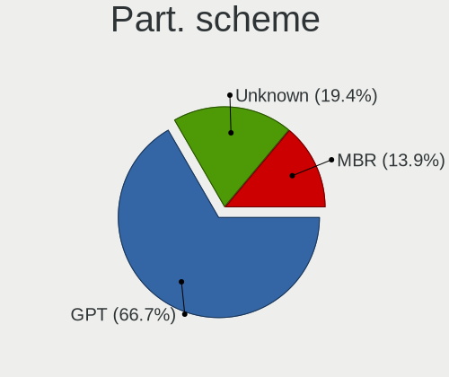
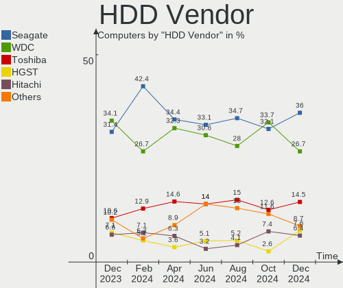

Debian Hardware Trends
----------------------

A project to identify most popular hardware characteristics and track their change
over time based on data collected by Debian users at https://Linux-Hardware.org.

Anyone can contribute to the study by uploading probes of their computers by
the [hw-probe](https://github.com/linuxhw/hw-probe) tool:

    sudo -E hw-probe -all -upload

This is a report for all computer types. See also reports for [desktops](/Dist/Debian/Desktop/README.md) and [notebooks](/Dist/Debian/Notebook/README.md).

Full-feature report is available here: https://linux-hardware.org/?view=trends

Period: Mar, 2021.

Contents
--------

- [ OS                       ](#os)
- [ OS Family                ](#os-family)
- [ Kernel                   ](#kernel)
- [ Kernel Family            ](#kernel-family)
- [ Kernel Major Ver.        ](#kernel-major-ver)
- [ Arch                     ](#arch)
- [ DE                       ](#de)
- [ Display Server           ](#display-server)
- [ Display Manager          ](#display-manager)
- [ OS Lang                  ](#os-lang)
- [ Boot Mode                ](#boot-mode)
- [ Filesystem               ](#filesystem)
- [ Part. scheme             ](#part-scheme)
- [ Dual Boot with Linux/BSD ](#dual-boot-with-linux/bsd)
- [ Dual Boot (Win)          ](#dual-boot-win)
- [ Country                  ](#country)
- [ City                     ](#city)
- [ Vendor                   ](#vendor)
- [ Model                    ](#model)
- [ Model Family             ](#model-family)
- [ MFG Year                 ](#mfg-year)
- [ Form Factor              ](#form-factor)
- [ Secure Boot              ](#secure-boot)
- [ Coreboot                 ](#coreboot)
- [ RAM Size                 ](#ram-size)
- [ RAM Used                 ](#ram-used)
- [ Has CD-ROM               ](#has-cd-rom)
- [ Total Drives             ](#total-drives)
- [ Has Ethernet             ](#has-ethernet)
- [ Has WiFi                 ](#has-wifi)
- [ Has Bluetooth            ](#has-bluetooth)
- [ Drive Vendor             ](#drive-vendor)
- [ Drive Model              ](#drive-model)
- [ HDD Vendor               ](#hdd-vendor)
- [ SSD Vendor               ](#ssd-vendor)
- [ Drive Kind               ](#drive-kind)
- [ Drive Connector          ](#drive-connector)
- [ Drive Size               ](#drive-size)
- [ Space Total              ](#space-total)
- [ Space Used               ](#space-used)
- [ Malfunc. Drives          ](#malfunc-drives)
- [ Malfunc. Drive Vendor    ](#malfunc-drive-vendor)
- [ Malfunc. HDD Vendor      ](#malfunc-hdd-vendor)
- [ Malfunc. Drive Kind      ](#malfunc-drive-kind)
- [ Failed Drives            ](#failed-drives)
- [ Failed Drive Vendor      ](#failed-drive-vendor)
- [ Drive Status             ](#drive-status)
- [ Storage Vendor           ](#storage-vendor)
- [ Storage Model            ](#storage-model)
- [ Storage Kind             ](#storage-kind)
- [ CPU Vendor               ](#cpu-vendor)
- [ CPU Model                ](#cpu-model)
- [ CPU Model Family         ](#cpu-model-family)
- [ CPU Cores                ](#cpu-cores)
- [ CPU Sockets              ](#cpu-sockets)
- [ CPU Threads              ](#cpu-threads)
- [ CPU Op-Modes             ](#cpu-op-modes)
- [ CPU Microcode            ](#cpu-microcode)
- [ CPU Microarch            ](#cpu-microarch)
- [ GPU Vendor               ](#gpu-vendor)
- [ GPU Model                ](#gpu-model)
- [ GPU Combo                ](#gpu-combo)
- [ GPU Driver               ](#gpu-driver)
- [ GPU Memory               ](#gpu-memory)
- [ Monitor Vendor           ](#monitor-vendor)
- [ Monitor Model            ](#monitor-model)
- [ Monitor Resolution       ](#monitor-resolution)
- [ Monitor Diagonal         ](#monitor-diagonal)
- [ Monitor Width            ](#monitor-width)
- [ Aspect Ratio             ](#aspect-ratio)
- [ Monitor Area             ](#monitor-area)
- [ Pixel Density            ](#pixel-density)
- [ Multiple Monitors        ](#multiple-monitors)
- [ Net Controller Vendor    ](#net-controller-vendor)
- [ Net Controller Model     ](#net-controller-model)
- [ Wireless Vendor          ](#wireless-vendor)
- [ Wireless Model           ](#wireless-model)
- [ Ethernet Vendor          ](#ethernet-vendor)
- [ Ethernet Model           ](#ethernet-model)
- [ Net Controller Kind      ](#net-controller-kind)
- [ Used Controller          ](#used-controller)
- [ NICs                     ](#nics)
- [ IPv6                     ](#ipv6)
- [ Memory Vendor            ](#memory-vendor)
- [ Memory Model             ](#memory-model)
- [ Memory Kind              ](#memory-kind)
- [ Memory Form Factor       ](#memory-form-factor)
- [ Memory Size              ](#memory-size)
- [ Memory Speed             ](#memory-speed)
- [ Sound Vendor             ](#sound-vendor)
- [ Sound Model              ](#sound-model)
- [ Camera Vendor            ](#camera-vendor)
- [ Camera Model             ](#camera-model)
- [ Fingerprint Vendor       ](#fingerprint-vendor)
- [ Fingerprint Model        ](#fingerprint-model)
- [ Chipcard Vendor          ](#chipcard-vendor)
- [ Chipcard Model           ](#chipcard-model)
- [ Printer Vendor           ](#printer-vendor)
- [ Printer Model            ](#printer-model)
- [ Scanner Vendor           ](#scanner-vendor)
- [ Scanner Model            ](#scanner-model)
- [ Bluetooth Vendor         ](#bluetooth-vendor)
- [ Bluetooth Model          ](#bluetooth-model)
- [ Unsupported Devices      ](#unsupported-devices)
- [ Unsupported Device Types ](#unsupported-device-types)

OS
--

Installed operating systems

| Name            | Computers | Percent |
|-----------------|-----------|---------|
| Debian 10       | 105       | 54.69%  |
| Debian Testing  | 38        | 19.79%  |
| Debian          | 25        | 13.02%  |
| Debian Unstable | 16        | 8.33%   |
| Debian 9.13     | 4         | 2.08%   |
| Debian 9        | 2         | 1.04%   |
| Debian Sid      | 1         | 0.52%   |
| Debian 10.8     | 1         | 0.52%   |

OS Family
---------

OS without a version

| Name   | Computers | Percent |
|--------|-----------|---------|
| Debian | 192       | 100%    |

Kernel
------

Version of the Linux kernel

| Version                         | Computers | Percent |
|---------------------------------|-----------|---------|
| 4.19.0-14-amd64                 | 49        | 25.52%  |
| 5.10.0-4-amd64                  | 32        | 16.67%  |
| 5.10.0-3-amd64                  | 18        | 9.38%   |
| 5.10.0-0.bpo.3-amd64            | 15        | 7.81%   |
| 5.10.0-5-amd64                  | 8         | 4.17%   |
| 4.19.0-16-amd64                 | 6         | 3.13%   |
| 5.8.0-3-amd64                   | 5         | 2.6%    |
| 4.19.0-13-amd64                 | 4         | 2.08%   |
| 5.6.0-2-amd64                   | 3         | 1.56%   |
| 5.4.103-1-pve                   | 3         | 1.56%   |
| 5.10.0-2-amd64                  | 3         | 1.56%   |
| 4.9.0-15-amd64                  | 3         | 1.56%   |
| 5.8.16-antix.1-amd64-smp        | 2         | 1.04%   |
| 5.10.17-v8+                     | 2         | 1.04%   |
| 5.10.0-3-686-pae                | 2         | 1.04%   |
| 4.9.0-14-amd64                  | 2         | 1.04%   |
| 4.19.0-9-amd64                  | 2         | 1.04%   |
| 4.19.0-15-amd64                 | 2         | 1.04%   |
| 5.9.0-5-amd64                   | 1         | 0.52%   |
| 5.8.0-0.bpo.2-amd64             | 1         | 0.52%   |
| 5.6.19-rt12-v8+                 | 1         | 0.52%   |
| 5.6.0-trunk-amd64               | 1         | 0.52%   |
| 5.4.98-1-pve                    | 1         | 0.52%   |
| 5.4.78-2-pve                    | 1         | 0.52%   |
| 5.4.73-1-pve                    | 1         | 0.52%   |
| 5.4.35-polilinux-amd64          | 1         | 0.52%   |
| 5.4.106-1-pve                   | 1         | 0.52%   |
| 5.3.10-1-pve                    | 1         | 0.52%   |
| 5.3.0-1-amd64                   | 1         | 0.52%   |
| 5.2.0-0.bpo.2-amd64             | 1         | 0.52%   |
| 5.12.0-rc1-recomp               | 1         | 0.52%   |
| 5.11.6                          | 1         | 0.52%   |
| 5.11.2-uefi-00050-g56e2b17e52f6 | 1         | 0.52%   |
| 5.11.2                          | 1         | 0.52%   |
| 5.11.1-recomp                   | 1         | 0.52%   |
| 5.10.19-acer-one-s10-4          | 1         | 0.52%   |
| 5.10.19                         | 1         | 0.52%   |
| 5.10.13-bootes1-p-1000          | 1         | 0.52%   |
| 5.10.12                         | 1         | 0.52%   |
| 5.10.0-kali3-amd64              | 1         | 0.52%   |
| 5.10.0-8.1-liquorix-amd64       | 1         | 0.52%   |
| 5.10.0-4-rt-amd64               | 1         | 0.52%   |
| 5.10.0-1-amd64                  | 1         | 0.52%   |
| 5.10-sunxi64                    | 1         | 0.52%   |
| 4.9.0-15-686                    | 1         | 0.52%   |
| 4.9.0-13-amd64                  | 1         | 0.52%   |
| 4.19.0-6-amd64                  | 1         | 0.52%   |
| 4.19.0-14-686-pae               | 1         | 0.52%   |
| 4.19.0-11-amd64                 | 1         | 0.52%   |

Kernel Family
-------------

Linux kernel without a distro release

| Version | Computers | Percent |
|---------|-----------|---------|
| 5.10.0  | 82        | 42.71%  |
| 4.19.0  | 66        | 34.38%  |
| 4.9.0   | 7         | 3.65%   |
| 5.8.0   | 6         | 3.13%   |
| 5.6.0   | 4         | 2.08%   |
| 5.4.103 | 3         | 1.56%   |
| 5.8.16  | 2         | 1.04%   |
| 5.11.2  | 2         | 1.04%   |
| 5.10.19 | 2         | 1.04%   |
| 5.10.17 | 2         | 1.04%   |
| 5.9.0   | 1         | 0.52%   |
| 5.6.19  | 1         | 0.52%   |
| 5.4.98  | 1         | 0.52%   |
| 5.4.78  | 1         | 0.52%   |
| 5.4.73  | 1         | 0.52%   |
| 5.4.35  | 1         | 0.52%   |
| 5.4.106 | 1         | 0.52%   |
| 5.3.10  | 1         | 0.52%   |
| 5.3.0   | 1         | 0.52%   |
| 5.2.0   | 1         | 0.52%   |
| 5.12.0  | 1         | 0.52%   |
| 5.11.6  | 1         | 0.52%   |
| 5.11.1  | 1         | 0.52%   |
| 5.10.13 | 1         | 0.52%   |
| 5.10.12 | 1         | 0.52%   |
| 5.10    | 1         | 0.52%   |

Kernel Major Ver.
-----------------

Linux kernel major version

| Version | Computers | Percent |
|---------|-----------|---------|
| 5.10    | 88        | 45.83%  |
| 4.19    | 66        | 34.38%  |
| 5.8     | 8         | 4.17%   |
| 5.4     | 8         | 4.17%   |
| 4.9     | 7         | 3.65%   |
| 5.6     | 5         | 2.6%    |
| 5.11    | 4         | 2.08%   |
| 5.3     | 2         | 1.04%   |
| 5.9     | 1         | 0.52%   |
| 5.2     | 1         | 0.52%   |
| 5.12    | 1         | 0.52%   |
| 5       | 1         | 0.52%   |

Arch
----

OS architecture (x86_64, i586, etc.)

| Name    | Computers | Percent |
|---------|-----------|---------|
| x86_64  | 183       | 95.31%  |
| aarch64 | 5         | 2.6%    |
| i686    | 4         | 2.08%   |

DE
--

Desktop Environment

| Name             | Computers | Percent |
|------------------|-----------|---------|
| GNOME            | 46        | 23.96%  |
| Unknown          | 36        | 18.75%  |
| XFCE             | 32        | 16.67%  |
| KDE5             | 24        | 12.5%   |
| KDE              | 20        | 10.42%  |
| MATE             | 11        | 5.73%   |
| LXDE             | 7         | 3.65%   |
| X-Cinnamon       | 5         | 2.6%    |
| i3               | 3         | 1.56%   |
| Cinnamon         | 3         | 1.56%   |
| LXQt             | 2         | 1.04%   |
| lightdm-xsession | 1         | 0.52%   |
| GNOME Flashback  | 1         | 0.52%   |
| awesome          | 1         | 0.52%   |

Display Server
--------------

X11 or Wayland

| Name    | Computers | Percent |
|---------|-----------|---------|
| X11     | 123       | 64.06%  |
| Wayland | 35        | 18.23%  |
| Tty     | 17        | 8.85%   |
| Unknown | 17        | 8.85%   |

Display Manager
---------------

SDDM, LightDM, etc.

| Name    | Computers | Percent |
|---------|-----------|---------|
| Unknown | 92        | 47.92%  |
| GDM     | 33        | 17.19%  |
| TDM     | 32        | 16.67%  |
| SDDM    | 28        | 14.58%  |
| LightDM | 5         | 2.6%    |
| XDM     | 1         | 0.52%   |
| SLiM    | 1         | 0.52%   |

OS Lang
-------

Language

| Lang    | Computers | Percent |
|---------|-----------|---------|
| en_US   | 62        | 32.29%  |
| ru_RU   | 21        | 10.94%  |
| fr_FR   | 21        | 10.94%  |
| de_DE   | 18        | 9.38%   |
| en_GB   | 14        | 7.29%   |
| pt_BR   | 11        | 5.73%   |
| Unknown | 5         | 2.6%    |
| it_IT   | 4         | 2.08%   |
| eu_ES   | 3         | 1.56%   |
| de_CH   | 3         | 1.56%   |
| pt_PT   | 2         | 1.04%   |
| ja_JP   | 2         | 1.04%   |
| hu_HU   | 2         | 1.04%   |
| es_ES   | 2         | 1.04%   |
| en_ZA   | 2         | 1.04%   |
| en_IN   | 2         | 1.04%   |
| en_IE   | 2         | 1.04%   |
| C       | 2         | 1.04%   |
| be_BY   | 2         | 1.04%   |
| tr_TR   | 1         | 0.52%   |
| pl_PL   | 1         | 0.52%   |
| nl_NL   | 1         | 0.52%   |
| lt_LT   | 1         | 0.52%   |
| fr_BE   | 1         | 0.52%   |
| et_EE   | 1         | 0.52%   |
| es_MX   | 1         | 0.52%   |
| es_CO   | 1         | 0.52%   |
| en_DK   | 1         | 0.52%   |
| en_CA   | 1         | 0.52%   |
| de_AT   | 1         | 0.52%   |
| cs_CZ   | 1         | 0.52%   |

Boot Mode
---------

EFI or BIOS

| Mode | Computers | Percent |
|------|-----------|---------|
| BIOS | 119       | 61.98%  |
| EFI  | 73        | 38.02%  |

Filesystem
----------

Type of filesystem

| Type    | Computers | Percent |
|---------|-----------|---------|
| Ext4    | 171       | 89.06%  |
| Btrfs   | 9         | 4.69%   |
| Overlay | 6         | 3.13%   |
| Zfs     | 3         | 1.56%   |
| Ext3    | 2         | 1.04%   |
| Xfs     | 1         | 0.52%   |

Part. scheme
------------

Scheme of partitioning

| Type    | Computers | Percent |
|---------|-----------|---------|
| GPT     | 91        | 47.4%   |
| Unknown | 61        | 31.77%  |
| MBR     | 40        | 20.83%  |

Dual Boot with Linux/BSD
------------------------

Hosting more than one Linux/BSD

| Dual boot | Computers | Percent |
|-----------|-----------|---------|
| No        | 164       | 85.42%  |
| Yes       | 28        | 14.58%  |

Dual Boot (Win)
---------------

Hosting Linux and Windows

| Dual boot | Computers | Percent |
|-----------|-----------|---------|
| No        | 137       | 71.35%  |
| Yes       | 55        | 28.65%  |

Country
-------

Geographic location (country)

| Country       | Computers | Percent |
|---------------|-----------|---------|
| Russia        | 29        | 15.1%   |
| USA           | 24        | 12.5%   |
| France        | 23        | 11.98%  |
| Germany       | 20        | 10.42%  |
| Brazil        | 14        | 7.29%   |
| UK            | 10        | 5.21%   |
| Spain         | 7         | 3.65%   |
| Italy         | 7         | 3.65%   |
| Switzerland   | 6         | 3.13%   |
| Poland        | 4         | 2.08%   |
| Netherlands   | 4         | 2.08%   |
| Belarus       | 4         | 2.08%   |
| Austria       | 4         | 2.08%   |
| Canada        | 3         | 1.56%   |
| Ukraine       | 2         | 1.04%   |
| Sweden        | 2         | 1.04%   |
| South Africa  | 2         | 1.04%   |
| Portugal      | 2         | 1.04%   |
| Norway        | 2         | 1.04%   |
| Japan         | 2         | 1.04%   |
| India         | 2         | 1.04%   |
| Hungary       | 2         | 1.04%   |
| Belgium       | 2         | 1.04%   |
| Turkey        | 1         | 0.52%   |
| Singapore     | 1         | 0.52%   |
| Philippines   | 1         | 0.52%   |
| New Caledonia | 1         | 0.52%   |
| Moldova       | 1         | 0.52%   |
| Mexico        | 1         | 0.52%   |
| Lithuania     | 1         | 0.52%   |
| Latvia        | 1         | 0.52%   |
| Kenya         | 1         | 0.52%   |
| Iceland       | 1         | 0.52%   |
| Greece        | 1         | 0.52%   |
| Estonia       | 1         | 0.52%   |
| Czechia       | 1         | 0.52%   |
| Colombia      | 1         | 0.52%   |
| Australia     | 1         | 0.52%   |

City
----

Geographic location (city)

| City                   | Computers | Percent |
|------------------------|-----------|---------|
| Vienna                 | 5         | 2.6%    |
| Voronezh               | 4         | 2.08%   |
| St Petersburg          | 4         | 2.08%   |
| Yekaterinburg          | 3         | 1.56%   |
| Swindon                | 3         | 1.56%   |
| Sainte-Sigolene        | 3         | 1.56%   |
| Paris                  | 3         | 1.56%   |
| Zurich                 | 2         | 1.04%   |
| Wrzesnia               | 2         | 1.04%   |
| Talange                | 2         | 1.04%   |
| São Paulo             | 2         | 1.04%   |
| Plano                  | 2         | 1.04%   |
| Moscow                 | 2         | 1.04%   |
| Hrodna                 | 2         | 1.04%   |
| Gatchina               | 2         | 1.04%   |
| Dallas                 | 2         | 1.04%   |
| Budapest               | 2         | 1.04%   |
| Aretxabaleta           | 2         | 1.04%   |
| Angers                 | 2         | 1.04%   |
| Xalapa                 | 1         | 0.52%   |
| Vladivostok            | 1         | 0.52%   |
| Vitória               | 1         | 0.52%   |
| Villars-les-Dombes     | 1         | 0.52%   |
| Vilhena                | 1         | 0.52%   |
| Versmold               | 1         | 0.52%   |
| Veberoed               | 1         | 0.52%   |
| Vaudreuil-Dorion       | 1         | 0.52%   |
| Ufa                    | 1         | 0.52%   |
| Tyler                  | 1         | 0.52%   |
| Turin                  | 1         | 0.52%   |
| Tula                   | 1         | 0.52%   |
| Trondheim              | 1         | 0.52%   |
| Toshima                | 1         | 0.52%   |
| Tomsk                  | 1         | 0.52%   |
| Tallinn                | 1         | 0.52%   |
| Tallard                | 1         | 0.52%   |
| São Bernardo do Campo | 1         | 0.52%   |
| Stuttgart              | 1         | 0.52%   |
| Steenwijk              | 1         | 0.52%   |
| St Louis               | 1         | 0.52%   |
| Sochi                  | 1         | 0.52%   |
| Sinzig                 | 1         | 0.52%   |
| Singapore              | 1         | 0.52%   |
| Seville                | 1         | 0.52%   |
| Senonches              | 1         | 0.52%   |
| Schwanden              | 1         | 0.52%   |
| Santa Clara            | 1         | 0.52%   |
| Runding                | 1         | 0.52%   |
| Rotherham              | 1         | 0.52%   |
| Roseville              | 1         | 0.52%   |
| Rome                   | 1         | 0.52%   |
| Rio de Janeiro         | 1         | 0.52%   |
| Rilhac-Rancon          | 1         | 0.52%   |
| Riga                   | 1         | 0.52%   |
| Rietberg               | 1         | 0.52%   |
| Reutlingen             | 1         | 0.52%   |
| Rastatt                | 1         | 0.52%   |
| Raleigh                | 1         | 0.52%   |
| Queens                 | 1         | 0.52%   |
| Purley                 | 1         | 0.52%   |

Vendor
------

Motherboard manufacturer

| Name                    | Computers | Percent |
|-------------------------|-----------|---------|
| Lenovo                  | 33        | 17.19%  |
| ASUSTek Computer        | 29        | 15.1%   |
| Hewlett-Packard         | 28        | 14.58%  |
| Gigabyte Technology     | 17        | 8.85%   |
| Dell                    | 16        | 8.33%   |
| ASRock                  | 12        | 6.25%   |
| Intel                   | 11        | 5.73%   |
| MSI                     | 8         | 4.17%   |
| Acer                    | 7         | 3.65%   |
| Supermicro              | 4         | 2.08%   |
| Raspberry Pi Foundation | 3         | 1.56%   |
| Sony                    | 2         | 1.04%   |
| Positivo                | 2         | 1.04%   |
| Medion                  | 2         | 1.04%   |
| Apple                   | 2         | 1.04%   |
| Unknown                 | 2         | 1.04%   |
| YiFang                  | 1         | 0.52%   |
| Toshiba                 | 1         | 0.52%   |
| SolidRun                | 1         | 0.52%   |
| Shuttle                 | 1         | 0.52%   |
| Pine Microsystems       | 1         | 0.52%   |
| Packard Bell            | 1         | 0.52%   |
| Notebook                | 1         | 0.52%   |
| Micro Electronics       | 1         | 0.52%   |
| HUAWEI                  | 1         | 0.52%   |
| HPE                     | 1         | 0.52%   |
| HARDKERNEL              | 1         | 0.52%   |
| Fujitsu                 | 1         | 0.52%   |
| DNS                     | 1         | 0.52%   |
| Archos                  | 1         | 0.52%   |

Model
-----

Motherboard model

| Name                                            | Computers | Percent |
|-------------------------------------------------|-----------|---------|
| ASUS All Series                                 | 4         | 2.08%   |
| Supermicro X10SLL-F                             | 2         | 1.04%   |
| RPi Raspberry Pi 4 Model B Rev 1.1              | 2         | 1.04%   |
| HP Notebook                                     | 2         | 1.04%   |
| Unknown                                         | 2         | 1.04%   |
| YiFang NXM1012BCP                               | 1         | 0.52%   |
| Toshiba PORTEGE Z930                            | 1         | 0.52%   |
| Supermicro X10DRi                               | 1         | 0.52%   |
| Supermicro SYS-5039MC-H12TRF                    | 1         | 0.52%   |
| Sony VPCEH2F1E                                  | 1         | 0.52%   |
| Sony VPCEG15FB                                  | 1         | 0.52%   |
| SolidRun SolidRun CEX7 Platform                 | 1         | 0.52%   |
| Shuttle FN85                                    | 1         | 0.52%   |
| RPi Raspberry Pi 4 Model B Rev 1.4              | 1         | 0.52%   |
| Positivo Sinatra                                | 1         | 0.52%   |
| Positivo C464C                                  | 1         | 0.52%   |
| Pine Microsystems Pine64 PinePhone (1.2)        | 1         | 0.52%   |
| Packard Bell EasyNote TE11HC                    | 1         | 0.52%   |
| Notebook NJ5x_NJ7xLU                            | 1         | 0.52%   |
| MSI P65 Creator 9SD                             | 1         | 0.52%   |
| MSI OR-PC                                       | 1         | 0.52%   |
| MSI MS-7C56                                     | 1         | 0.52%   |
| MSI MS-7C35                                     | 1         | 0.52%   |
| MSI MS-7C06                                     | 1         | 0.52%   |
| MSI MS-7B85                                     | 1         | 0.52%   |
| MSI MS-7A39                                     | 1         | 0.52%   |
| MSI GL65 Leopard 10SFKV                         | 1         | 0.52%   |
| Micro MG-VCTR002-2060                           | 1         | 0.52%   |
| Medion P861X                                    | 1         | 0.52%   |
| Medion Akoya P7818                              | 1         | 0.52%   |
| Lenovo Yoga 7 14ITL5 82BH                       | 1         | 0.52%   |
| Lenovo ThinkPad X230 2325LQ3                    | 1         | 0.52%   |
| Lenovo ThinkPad X201 3249CTO                    | 1         | 0.52%   |
| Lenovo ThinkPad X12 Detachable Gen 1 20UWCTO1WW | 1         | 0.52%   |
| Lenovo ThinkPad X1 Yoga 1st 20FQS08F01          | 1         | 0.52%   |
| Lenovo ThinkPad X1 Carbon 7th 20QDCTO1WW        | 1         | 0.52%   |
| Lenovo ThinkPad X1 Carbon 7th 20QD0039FR        | 1         | 0.52%   |
| Lenovo ThinkPad W520 42844LG                    | 1         | 0.52%   |
| Lenovo ThinkPad T61 7665V2R                     | 1         | 0.52%   |
| Lenovo ThinkPad T530 24296HG                    | 1         | 0.52%   |
| Lenovo ThinkPad T470s 20HGS45C00                | 1         | 0.52%   |
| Lenovo ThinkPad T450s 20BXCTO1WW                | 1         | 0.52%   |
| Lenovo ThinkPad T430 2349PS9                    | 1         | 0.52%   |
| Lenovo ThinkPad T420 4236WQX                    | 1         | 0.52%   |
| Lenovo ThinkPad T400 2768BM2                    | 1         | 0.52%   |
| Lenovo ThinkPad P51s 20HB000URT                 | 1         | 0.52%   |
| Lenovo ThinkPad P14s Gen 1 20Y1CTO1WW           | 1         | 0.52%   |
| Lenovo ThinkPad L390 20NRCTO1WW                 | 1         | 0.52%   |
| Lenovo ThinkPad L15 Gen 1 20U7001VMH            | 1         | 0.52%   |
| Lenovo ThinkPad Edge E145 20BC0005FR            | 1         | 0.52%   |
| Lenovo ThinkPad E495 20NECTO1WW                 | 1         | 0.52%   |
| Lenovo ThinkPad E470 20H2S00400                 | 1         | 0.52%   |
| Lenovo ThinkPad 11e 20DAS0PS00                  | 1         | 0.52%   |
| Lenovo ThinkCentre M83 10AHS1CC00               | 1         | 0.52%   |
| Lenovo Legion Y530-15ICH 81FV                   | 1         | 0.52%   |
| Lenovo IdeaPad Z510 20287                       | 1         | 0.52%   |
| Lenovo IdeaPad 330S-15IKB 81F5                  | 1         | 0.52%   |
| Lenovo IdeaCentre 510S-07ICB 90K800GHMW         | 1         | 0.52%   |
| Lenovo IdeaCentre 510A-15ARR 90J0008EPB         | 1         | 0.52%   |
| Lenovo IdeaCentre 510A-15ARR 90J00019FR         | 1         | 0.52%   |

Model Family
------------

Motherboard model prefix

| Name                         | Computers | Percent |
|------------------------------|-----------|---------|
| Lenovo ThinkPad              | 22        | 11.46%  |
| ASUS PRIME                   | 6         | 3.13%   |
| HP ProBook                   | 5         | 2.6%    |
| HP EliteBook                 | 5         | 2.6%    |
| Dell XPS                     | 5         | 2.6%    |
| HP Pavilion                  | 4         | 2.08%   |
| Dell Inspiron                | 4         | 2.08%   |
| ASUS TUF                     | 4         | 2.08%   |
| ASUS All                     | 4         | 2.08%   |
| Acer Aspire                  | 4         | 2.08%   |
| RPi Raspberry                | 3         | 1.56%   |
| Lenovo IdeaCentre            | 3         | 1.56%   |
| Dell Latitude                | 3         | 1.56%   |
| Supermicro X10SLL-F          | 2         | 1.04%   |
| Lenovo IdeaPad               | 2         | 1.04%   |
| Intel DH61CR                 | 2         | 1.04%   |
| HP ProLiant                  | 2         | 1.04%   |
| HP Notebook                  | 2         | 1.04%   |
| HP Compaq                    | 2         | 1.04%   |
| Gigabyte Z390                | 2         | 1.04%   |
| Gigabyte X570                | 2         | 1.04%   |
| Gigabyte B550M               | 2         | 1.04%   |
| Dell Vostro                  | 2         | 1.04%   |
| ASUS ROG                     | 2         | 1.04%   |
| Unknown                      | 2         | 1.04%   |
| YiFang NXM1012BCP            | 1         | 0.52%   |
| Toshiba PORTEGE              | 1         | 0.52%   |
| Supermicro X10DRi            | 1         | 0.52%   |
| Supermicro SYS-5039MC-H12TRF | 1         | 0.52%   |
| Sony VPCEH2F1E               | 1         | 0.52%   |
| Sony VPCEG15FB               | 1         | 0.52%   |
| SolidRun SolidRun            | 1         | 0.52%   |
| Shuttle FN85                 | 1         | 0.52%   |
| Positivo Sinatra             | 1         | 0.52%   |
| Positivo C464C               | 1         | 0.52%   |
| Pine Microsystems Pine64     | 1         | 0.52%   |
| Packard Bell EasyNote        | 1         | 0.52%   |
| Notebook NJ5x                | 1         | 0.52%   |
| MSI P65                      | 1         | 0.52%   |
| MSI OR-PC                    | 1         | 0.52%   |
| MSI MS-7C56                  | 1         | 0.52%   |
| MSI MS-7C35                  | 1         | 0.52%   |
| MSI MS-7C06                  | 1         | 0.52%   |
| MSI MS-7B85                  | 1         | 0.52%   |
| MSI MS-7A39                  | 1         | 0.52%   |
| MSI GL65                     | 1         | 0.52%   |
| Micro MG-VCTR002-2060        | 1         | 0.52%   |
| Medion P861X                 | 1         | 0.52%   |
| Medion Akoya                 | 1         | 0.52%   |
| Lenovo Yoga                  | 1         | 0.52%   |
| Lenovo ThinkCentre           | 1         | 0.52%   |
| Lenovo Legion                | 1         | 0.52%   |
| Lenovo G580                  | 1         | 0.52%   |
| Lenovo G510                  | 1         | 0.52%   |
| Lenovo B50-30                | 1         | 0.52%   |
| Intel X99                    | 1         | 0.52%   |
| Intel SLIMBOOK               | 1         | 0.52%   |
| Intel NUC8i3BEK              | 1         | 0.52%   |
| Intel NUC10i7FNH             | 1         | 0.52%   |
| Intel DQ45CB                 | 1         | 0.52%   |

MFG Year
--------

Motherboard manufacture year

| Year    | Computers | Percent |
|---------|-----------|---------|
| 2020    | 45        | 23.44%  |
| 2019    | 32        | 16.67%  |
| 2015    | 15        | 7.81%   |
| 2013    | 15        | 7.81%   |
| 2018    | 13        | 6.77%   |
| 2021    | 9         | 4.69%   |
| 2012    | 9         | 4.69%   |
| 2014    | 8         | 4.17%   |
| 2010    | 8         | 4.17%   |
| 2016    | 7         | 3.65%   |
| 2011    | 7         | 3.65%   |
| 2008    | 7         | 3.65%   |
| 2017    | 5         | 2.6%    |
| 2009    | 5         | 2.6%    |
| Unknown | 4         | 2.08%   |
| 2007    | 2         | 1.04%   |
| 2004    | 1         | 0.52%   |

Form Factor
-----------

Physical design of the computer

| Name           | Computers | Percent |
|----------------|-----------|---------|
| Desktop        | 87        | 45.31%  |
| Notebook       | 82        | 42.71%  |
| Server         | 6         | 3.13%   |
| Convertible    | 5         | 2.6%    |
| System on chip | 3         | 1.56%   |
| Tablet         | 3         | 1.56%   |
| Mini pc        | 3         | 1.56%   |
| All in one     | 2         | 1.04%   |
| Phone          | 1         | 0.52%   |

Secure Boot
-----------

Enabled or disabled

| State    | Computers | Percent |
|----------|-----------|---------|
| Disabled | 189       | 98.44%  |
| Enabled  | 3         | 1.56%   |

Coreboot
--------

Have coreboot on board

| Used | Computers | Percent |
|------|-----------|---------|
| No   | 190       | 98.96%  |
| Yes  | 2         | 1.04%   |

RAM Size
--------

Total RAM memory

| Size in GB  | Computers | Percent |
|-------------|-----------|---------|
| 16.01-24.0  | 50        | 26.04%  |
| 4.01-8.0    | 34        | 17.71%  |
| 3.01-4.0    | 32        | 16.67%  |
| 8.01-16.0   | 30        | 15.63%  |
| 32.01-64.0  | 20        | 10.42%  |
| 1.01-2.0    | 10        | 5.21%   |
| 64.01-256.0 | 8         | 4.17%   |
| 2.01-3.0    | 3         | 1.56%   |
| 0.51-1.0    | 3         | 1.56%   |
| 24.01-32.0  | 2         | 1.04%   |

RAM Used
--------

Used RAM memory

| Used GB     | Computers | Percent |
|-------------|-----------|---------|
| 1.01-2.0    | 53        | 27.6%   |
| 2.01-3.0    | 40        | 20.83%  |
| 4.01-8.0    | 28        | 14.58%  |
| 3.01-4.0    | 22        | 11.46%  |
| 0.51-1.0    | 22        | 11.46%  |
| 8.01-16.0   | 16        | 8.33%   |
| 0.01-0.5    | 5         | 2.6%    |
| 16.01-24.0  | 3         | 1.56%   |
| 32.01-64.0  | 1         | 0.52%   |
| 24.01-32.0  | 1         | 0.52%   |
| 64.01-256.0 | 1         | 0.52%   |

Has CD-ROM
----------

Has CD-ROM on board

| Presented | Computers | Percent |
|-----------|-----------|---------|
| No        | 133       | 69.27%  |
| Yes       | 59        | 30.73%  |

Total Drives
------------

Number of drives on board

| Drives | Computers | Percent |
|--------|-----------|---------|
| 1      | 99        | 51.56%  |
| 2      | 47        | 24.48%  |
| 3      | 17        | 8.85%   |
| 5      | 12        | 6.25%   |
| 4      | 10        | 5.21%   |
| 8      | 2         | 1.04%   |
| 6      | 2         | 1.04%   |
| 14     | 1         | 0.52%   |
| 9      | 1         | 0.52%   |
| 0      | 1         | 0.52%   |

Has Ethernet
------------

Has Ethernet on board

| Presented | Computers | Percent |
|-----------|-----------|---------|
| Yes       | 175       | 91.15%  |
| No        | 17        | 8.85%   |

Has WiFi
--------

Has WiFi module

| Presented | Computers | Percent |
|-----------|-----------|---------|
| Yes       | 116       | 60.42%  |
| No        | 76        | 39.58%  |

Has Bluetooth
-------------

Has Bluetooth module

| Presented | Computers | Percent |
|-----------|-----------|---------|
| Yes       | 101       | 52.6%   |
| No        | 91        | 47.4%   |

Drive Vendor
------------

Hard drive vendors

| Vendor              | Computers | Drives | Percent |
|---------------------|-----------|--------|---------|
| WDC                 | 56        | 79     | 17.89%  |
| Samsung Electronics | 49        | 57     | 15.65%  |
| Seagate             | 45        | 61     | 14.38%  |
| Crucial             | 22        | 25     | 7.03%   |
| Toshiba             | 21        | 25     | 6.71%   |
| Unknown             | 18        | 26     | 5.75%   |
| SanDisk             | 16        | 17     | 5.11%   |
| Intel               | 10        | 12     | 3.19%   |
| Hitachi             | 9         | 11     | 2.88%   |
| Kingston            | 8         | 9      | 2.56%   |
| OCZ                 | 6         | 6      | 1.92%   |
| China               | 6         | 6      | 1.92%   |
| HGST                | 5         | 5      | 1.6%    |
| Phison              | 4         | 5      | 1.28%   |
| Transcend           | 3         | 3      | 0.96%   |
| SK Hynix            | 3         | 3      | 0.96%   |
| KingDian            | 3         | 3      | 0.96%   |
| Intenso             | 3         | 3      | 0.96%   |
| Corsair             | 3         | 3      | 0.96%   |
| PLEXTOR             | 2         | 3      | 0.64%   |
| Hewlett-Packard     | 2         | 2      | 0.64%   |
| Gigabyte Technology | 2         | 2      | 0.64%   |
| A-DATA Technology   | 2         | 2      | 0.64%   |
| ZTC                 | 1         | 1      | 0.32%   |
| XPG                 | 1         | 1      | 0.32%   |
| Vaseky              | 1         | 1      | 0.32%   |
| Silicon Motion      | 1         | 1      | 0.32%   |
| QNAP                | 1         | 2      | 0.32%   |
| PNY                 | 1         | 4      | 0.32%   |
| Phison Electronics  | 1         | 1      | 0.32%   |
| Patriot             | 1         | 1      | 0.32%   |
| Micron Technology   | 1         | 1      | 0.32%   |
| Maxtor              | 1         | 1      | 0.32%   |
| LITEON              | 1         | 1      | 0.32%   |
| Leven               | 1         | 1      | 0.32%   |
| Lenovo              | 1         | 1      | 0.32%   |
| LDLC                | 1         | 1      | 0.32%   |
| Elite               | 1         | 2      | 0.32%   |

Drive Model
-----------

Hard drive models

| Model                              | Computers | Percent |
|------------------------------------|-----------|---------|
| Toshiba DT01ACA100 1TB             | 6         | 1.67%   |
| WDC WDS240G2G0A-00JH30 240GB SSD   | 5         | 1.39%   |
| Samsung SSD 860 EVO 1TB            | 4         | 1.11%   |
| Crucial CT500MX500SSD1 500GB       | 4         | 1.11%   |
| Crucial CT250MX500SSD1 250GB       | 4         | 1.11%   |
| Seagate ST4000VN008-2DR166 4TB     | 3         | 0.84%   |
| Seagate ST2000DM001-1ER164 2TB     | 3         | 0.84%   |
| Samsung SSD 970 EVO 1TB            | 3         | 0.84%   |
| Samsung SSD 860 QVO 1TB            | 3         | 0.84%   |
| WDC WD5000LPVX-22V0TT0 500GB       | 2         | 0.56%   |
| WDC WD10EZEX-60WN4A0 1TB           | 2         | 0.56%   |
| WDC WD10EZEX-08WN4A0 1TB           | 2         | 0.56%   |
| WDC WD10EZEX-00BN5A0 1TB           | 2         | 0.56%   |
| WDC WD10EARX-00N0YB0 1TB           | 2         | 0.56%   |
| WDC WD100EMAZ-00WJTA0 10TB         | 2         | 0.56%   |
| Unknown SD32G  32GB                | 2         | 0.56%   |
| Unknown SD/MMC 64GB                | 2         | 0.56%   |
| Unknown MMC Card  64GB             | 2         | 0.56%   |
| Unknown MMC Card  32GB             | 2         | 0.56%   |
| Unknown MMC Card  128GB            | 2         | 0.56%   |
| Unknown M.S./M.S.Pro/HG 16GB       | 2         | 0.56%   |
| Toshiba HDWF180 8TB                | 2         | 0.56%   |
| Toshiba HDWE140 4TB                | 2         | 0.56%   |
| Toshiba HDWD110 1TB                | 2         | 0.56%   |
| Seagate ST500LT012-1DG142 500GB    | 2         | 0.56%   |
| Seagate ST4000DM000-1F2168 4TB     | 2         | 0.56%   |
| Seagate ST3500418AS 500GB          | 2         | 0.56%   |
| Seagate ST2000DM008-2FR102 2TB     | 2         | 0.56%   |
| Seagate ST1000VM002-1CT162 1TB     | 2         | 0.56%   |
| Seagate ST1000LM024 HN-M101MBB 1TB | 2         | 0.56%   |
| SanDisk SSD PLUS 120GB             | 2         | 0.56%   |
| Samsung SSD 970 EVO Plus 1TB       | 2         | 0.56%   |
| Samsung SSD 860 EVO 250GB          | 2         | 0.56%   |
| Samsung SSD 850 EVO 250GB          | 2         | 0.56%   |
| Samsung NVMe SSD Drive 512GB       | 2         | 0.56%   |
| OCZ AGILITY3 64GB SSD              | 2         | 0.56%   |
| Kingston SA400S37240G 240GB SSD    | 2         | 0.56%   |
| Kingston SA400S37120G 120GB SSD    | 2         | 0.56%   |
| Intel SSDSC2BW120H6 120GB          | 2         | 0.56%   |
| HGST HTS725050A7E630 500GB         | 2         | 0.56%   |
| Crucial M4-CT128M4SSD2 128GB       | 2         | 0.56%   |
| Crucial CT120BX500SSD1 120GB       | 2         | 0.56%   |
| Crucial CT1000MX500SSD1 1TB        | 2         | 0.56%   |
| China SATA3 240GB SSD              | 2         | 0.56%   |
| ZTC SM201-512G                     | 1         | 0.28%   |
| XPG GAMMIX S11 Pro 256GB           | 1         | 0.28%   |
| WDC WDS100T1R0A-68A4W0 1TB SSD     | 1         | 0.28%   |
| WDC WD80EFAX-68LHPN0 8TB           | 1         | 0.28%   |
| WDC WD80EDAZ-11TA3A0 8TB           | 1         | 0.28%   |
| WDC WD7500BPVT-80HXZT3 752GB       | 1         | 0.28%   |
| WDC WD60EZRZ-00GZ5B1 6TB           | 1         | 0.28%   |
| WDC WD60EZRX-00MVLB1 6TB           | 1         | 0.28%   |
| WDC WD5000LUCT-63RC2Y0 500GB       | 1         | 0.28%   |
| WDC WD5000LPCX-24C6HT0 500GB       | 1         | 0.28%   |
| WDC WD5000BEVT-60ZAT1 500GB        | 1         | 0.28%   |
| WDC WD5000AAKX-00ERMA0 500GB       | 1         | 0.28%   |
| WDC WD5000AAKS-08V0A0 500GB        | 1         | 0.28%   |
| WDC WD50 00LPCX-24VHA 500GB        | 1         | 0.28%   |
| WDC WD40EFRX-68WT0N0 4TB           | 1         | 0.28%   |
| WDC WD40EFAX-68JH4N0 4TB           | 1         | 0.28%   |

HDD Vendor
----------

Hard disk drive vendors

| Vendor              | Computers | Drives | Percent |
|---------------------|-----------|--------|---------|
| WDC                 | 45        | 67     | 35.43%  |
| Seagate             | 42        | 58     | 33.07%  |
| Toshiba             | 18        | 21     | 14.17%  |
| Hitachi             | 9         | 11     | 7.09%   |
| Samsung Electronics | 6         | 8      | 4.72%   |
| HGST                | 5         | 5      | 3.94%   |
| QNAP                | 1         | 2      | 0.79%   |
| Maxtor              | 1         | 1      | 0.79%   |

SSD Vendor
----------

Solid state drive vendors

| Vendor              | Computers | Drives | Percent |
|---------------------|-----------|--------|---------|
| Crucial             | 22        | 24     | 20.37%  |
| Samsung Electronics | 21        | 24     | 19.44%  |
| SanDisk             | 10        | 10     | 9.26%   |
| Intel               | 7         | 8      | 6.48%   |
| WDC                 | 6         | 7      | 5.56%   |
| OCZ                 | 6         | 6      | 5.56%   |
| Kingston            | 6         | 7      | 5.56%   |
| China               | 6         | 6      | 5.56%   |
| Transcend           | 3         | 3      | 2.78%   |
| KingDian            | 3         | 3      | 2.78%   |
| Intenso             | 3         | 3      | 2.78%   |
| PLEXTOR             | 2         | 3      | 1.85%   |
| A-DATA Technology   | 2         | 2      | 1.85%   |
| ZTC                 | 1         | 1      | 0.93%   |
| Vaseky              | 1         | 1      | 0.93%   |
| Toshiba             | 1         | 1      | 0.93%   |
| Patriot             | 1         | 1      | 0.93%   |
| Micron Technology   | 1         | 1      | 0.93%   |
| LITEON              | 1         | 1      | 0.93%   |
| Leven               | 1         | 1      | 0.93%   |
| LDLC                | 1         | 1      | 0.93%   |
| Hewlett-Packard     | 1         | 1      | 0.93%   |
| Gigabyte Technology | 1         | 1      | 0.93%   |
| Corsair             | 1         | 1      | 0.93%   |

Drive Kind
----------

HDD or SSD

| Kind    | Computers | Drives | Percent |
|---------|-----------|--------|---------|
| HDD     | 97        | 173    | 36.6%   |
| SSD     | 92        | 117    | 34.72%  |
| NVMe    | 56        | 68     | 21.13%  |
| MMC     | 15        | 22     | 5.66%   |
| Unknown | 5         | 8      | 1.89%   |

Drive Connector
---------------

SATA, SAS, NVMe, etc.

| Type | Computers | Drives | Percent |
|------|-----------|--------|---------|
| SATA | 147       | 283    | 64.19%  |
| NVMe | 56        | 68     | 24.45%  |
| MMC  | 15        | 22     | 6.55%   |
| SAS  | 11        | 15     | 4.8%    |

Drive Size
----------

Size of hard drive

| Size in TB | Computers | Drives | Percent |
|------------|-----------|--------|---------|
| 0.01-0.5   | 109       | 138    | 51.17%  |
| 0.51-1.0   | 56        | 76     | 26.29%  |
| 1.01-2.0   | 19        | 21     | 8.92%   |
| 3.01-4.0   | 12        | 20     | 5.63%   |
| 4.01-10.0  | 9         | 20     | 4.23%   |
| 2.01-3.0   | 6         | 12     | 2.82%   |
| 10.01-20.0 | 2         | 3      | 0.94%   |

Space Total
-----------

Amount of disk space available on the file system

| Size in GB     | Computers | Percent |
|----------------|-----------|---------|
| 101-250        | 46        | 23.96%  |
| 251-500        | 34        | 17.71%  |
| 501-1000       | 26        | 13.54%  |
| More than 3000 | 16        | 8.33%   |
| 1001-2000      | 16        | 8.33%   |
| 51-100         | 14        | 7.29%   |
| 21-50          | 13        | 6.77%   |
| Unknown        | 13        | 6.77%   |
| 2001-3000      | 11        | 5.73%   |
| 1-20           | 3         | 1.56%   |

Space Used
----------

Amount of used disk space

| Used GB        | Computers | Percent |
|----------------|-----------|---------|
| 1-20           | 50        | 26.04%  |
| 101-250        | 28        | 14.58%  |
| 51-100         | 24        | 12.5%   |
| 21-50          | 23        | 11.98%  |
| 251-500        | 16        | 8.33%   |
| 501-1000       | 16        | 8.33%   |
| Unknown        | 13        | 6.77%   |
| 1001-2000      | 12        | 6.25%   |
| More than 3000 | 6         | 3.13%   |
| 2001-3000      | 4         | 2.08%   |

Malfunc. Drives
---------------

Drive models with a malfunction

| Model                                        | Computers | Drives | Percent |
|----------------------------------------------|-----------|--------|---------|
| Seagate ST3500418AS 500GB                    | 2         | 2      | 5.88%   |
| WDC WD7500BPVT-80HXZT3 752GB                 | 1         | 1      | 2.94%   |
| WDC WD5000AAKS-08V0A0 500GB                  | 1         | 1      | 2.94%   |
| WDC WD4003FZEX-00Z4SA0 4TB                   | 1         | 1      | 2.94%   |
| WDC WD3200BEKT-75PVMT1 320GB                 | 1         | 1      | 2.94%   |
| WDC WD3200AVJS-63B6A0 320GB                  | 1         | 1      | 2.94%   |
| WDC WD2500AAKX-001CA0 250GB                  | 1         | 1      | 2.94%   |
| WDC WD2500AAJS-00L7A0 250GB                  | 1         | 1      | 2.94%   |
| WDC WD20EFRX-68EUZN0 2TB                     | 1         | 2      | 2.94%   |
| WDC WD2002FAEX-007BA0 2TB                    | 1         | 1      | 2.94%   |
| WDC WD10EZEX-60M2NA0 1TB                     | 1         | 1      | 2.94%   |
| WDC WD10EADS-65M2B1 1TB                      | 1         | 1      | 2.94%   |
| Toshiba HDWD110 1TB                          | 1         | 2      | 2.94%   |
| Toshiba DT01ACA100 1TB                       | 1         | 1      | 2.94%   |
| Seagate ST3750528AS 752GB                    | 1         | 1      | 2.94%   |
| Seagate ST3250310AS 250GB                    | 1         | 1      | 2.94%   |
| Seagate ST2000DM001-1ER164 2TB               | 1         | 1      | 2.94%   |
| Seagate ST1000LM024 HN-M101MBB 1TB           | 1         | 1      | 2.94%   |
| Samsung Electronics SSD 970 EVO 2TB          | 1         | 1      | 2.94%   |
| Samsung Electronics SSD 960 EVO 500GB        | 1         | 1      | 2.94%   |
| Samsung Electronics SSD 840 PRO Series 256GB | 1         | 1      | 2.94%   |
| Samsung Electronics HD753LJ 752GB            | 1         | 1      | 2.94%   |
| Samsung Electronics HD321KJ 320GB            | 1         | 1      | 2.94%   |
| Samsung Electronics HD103UJ 1TB              | 1         | 1      | 2.94%   |
| PLEXTOR PX-128M2S 128GB SSD                  | 1         | 1      | 2.94%   |
| LITEON CV8-8E128-HP 128GB SSD                | 1         | 1      | 2.94%   |
| KingDian S200 60GB SSD                       | 1         | 1      | 2.94%   |
| Intel SSDSC2CW060A3 64GB                     | 1         | 1      | 2.94%   |
| Hitachi HTS543216L9A300 160GB                | 1         | 1      | 2.94%   |
| HGST HTS541075A9E680 752GB                   | 1         | 1      | 2.94%   |
| Crucial CT525MX300SSD1 528GB                 | 1         | 1      | 2.94%   |
| Crucial CT1000MX500SSD1 1TB                  | 1         | 1      | 2.94%   |
| China SSD32G 32GB                            | 1         | 1      | 2.94%   |

Malfunc. Drive Vendor
---------------------

Vendors of faulty drives

| Vendor              | Computers | Drives | Percent |
|---------------------|-----------|--------|---------|
| WDC                 | 9         | 12     | 30%     |
| Seagate             | 5         | 6      | 16.67%  |
| Samsung Electronics | 5         | 6      | 16.67%  |
| Toshiba             | 2         | 3      | 6.67%   |
| Crucial             | 2         | 2      | 6.67%   |
| PLEXTOR             | 1         | 1      | 3.33%   |
| LITEON              | 1         | 1      | 3.33%   |
| KingDian            | 1         | 1      | 3.33%   |
| Intel               | 1         | 1      | 3.33%   |
| Hitachi             | 1         | 1      | 3.33%   |
| HGST                | 1         | 1      | 3.33%   |
| China               | 1         | 1      | 3.33%   |

Malfunc. HDD Vendor
-------------------

Vendors of faulty HDD drives

| Vendor              | Computers | Drives | Percent |
|---------------------|-----------|--------|---------|
| WDC                 | 9         | 12     | 45%     |
| Seagate             | 5         | 6      | 25%     |
| Toshiba             | 2         | 3      | 10%     |
| Samsung Electronics | 2         | 3      | 10%     |
| Hitachi             | 1         | 1      | 5%      |
| HGST                | 1         | 1      | 5%      |

Malfunc. Drive Kind
-------------------

Kinds of faulty drives

| Kind | Computers | Drives | Percent |
|------|-----------|--------|---------|
| HDD  | 18        | 26     | 64.29%  |
| SSD  | 8         | 8      | 28.57%  |
| NVMe | 2         | 2      | 7.14%   |

Failed Drives
-------------

Failed drive models

Zero info for selected period =(

Failed Drive Vendor
-------------------

Failed drive vendors

Zero info for selected period =(

Drive Status
------------

Number of failed and malfunc. drives

| Status   | Computers | Drives | Percent |
|----------|-----------|--------|---------|
| Works    | 118       | 212    | 53.88%  |
| Detected | 74        | 140    | 33.79%  |
| Malfunc  | 27        | 36     | 12.33%  |

Storage Vendor
--------------

Storage controller vendors

| Vendor                        | Computers | Percent |
|-------------------------------|-----------|---------|
| Intel                         | 125       | 51.87%  |
| AMD                           | 41        | 17.01%  |
| Samsung Electronics           | 24        | 9.96%   |
| Sandisk                       | 9         | 3.73%   |
| Phison Electronics            | 6         | 2.49%   |
| Nvidia                        | 6         | 2.49%   |
| Marvell Technology Group      | 4         | 1.66%   |
| Toshiba America Info Systems  | 3         | 1.24%   |
| SK Hynix                      | 3         | 1.24%   |
| LSI Logic / Symbios Logic     | 3         | 1.24%   |
| Silicon Motion                | 2         | 0.83%   |
| Seagate Technology            | 2         | 0.83%   |
| Kingston Technology Company   | 2         | 0.83%   |
| ASMedia Technology            | 2         | 0.83%   |
| Adaptec                       | 2         | 0.83%   |
| Silicon Image                 | 1         | 0.41%   |
| Micron/Crucial Technology     | 1         | 0.41%   |
| Lenovo                        | 1         | 0.41%   |
| JMicron Technology            | 1         | 0.41%   |
| Integrated Technology Express | 1         | 0.41%   |
| Hewlett-Packard               | 1         | 0.41%   |
| ADATA Technology              | 1         | 0.41%   |

Storage Model
-------------

Storage controller models

| Model                                                                                   | Computers | Percent |
|-----------------------------------------------------------------------------------------|-----------|---------|
| AMD FCH SATA Controller [AHCI mode]                                                     | 30        | 10.91%  |
| Samsung NVMe SSD Controller SM981/PM981/PM983                                           | 19        | 6.91%   |
| Intel 8 Series/C220 Series Chipset Family 6-port SATA Controller 1 [AHCI mode]          | 15        | 5.45%   |
| Intel Sunrise Point-LP SATA Controller [AHCI mode]                                      | 10        | 3.64%   |
| Intel Cannon Lake PCH SATA AHCI Controller                                              | 9         | 3.27%   |
| Intel 7 Series Chipset Family 6-port SATA Controller [AHCI mode]                        | 9         | 3.27%   |
| Intel 200 Series PCH SATA controller [AHCI mode]                                        | 7         | 2.55%   |
| Intel 6 Series/C200 Series Chipset Family 6 port Mobile SATA AHCI Controller            | 6         | 2.18%   |
| Intel 5 Series/3400 Series Chipset 6 port SATA AHCI Controller                          | 5         | 1.82%   |
| AMD Starship/Matisse Chipset SATA Controller [AHCI mode]                                | 5         | 1.82%   |
| AMD 400 Series Chipset SATA Controller                                                  | 5         | 1.82%   |
| Sandisk WD Black SN750 / PC SN730 NVMe SSD                                              | 4         | 1.45%   |
| Nvidia MCP61 SATA Controller                                                            | 4         | 1.45%   |
| Nvidia MCP61 IDE                                                                        | 4         | 1.45%   |
| Intel Cannon Point-LP SATA Controller [AHCI Mode]                                       | 4         | 1.45%   |
| Intel 82801HM/HEM (ICH8M/ICH8M-E) SATA Controller [AHCI mode]                           | 4         | 1.45%   |
| Intel 82801HM/HEM (ICH8M/ICH8M-E) IDE Controller                                        | 4         | 1.45%   |
| Intel 6 Series/C200 Series Chipset Family 6 port Desktop SATA AHCI Controller           | 4         | 1.45%   |
| AMD SB7x0/SB8x0/SB9x0 SATA Controller [AHCI mode]                                       | 4         | 1.45%   |
| Sandisk WD Blue SN500 / PC SN520 NVMe SSD                                               | 3         | 1.09%   |
| Samsung NVMe Controller                                                                 | 3         | 1.09%   |
| Phison E12 NVMe Controller                                                              | 3         | 1.09%   |
| Intel SATA Controller [RAID mode]                                                       | 3         | 1.09%   |
| Intel Cannon Lake Mobile PCH SATA AHCI Controller                                       | 3         | 1.09%   |
| Intel C610/X99 series chipset 6-Port SATA Controller [AHCI mode]                        | 3         | 1.09%   |
| Intel Atom Processor E3800 Series SATA AHCI Controller                                  | 3         | 1.09%   |
| Intel 82801IBM/IEM (ICH9M/ICH9M-E) 4 port SATA Controller [AHCI mode]                   | 3         | 1.09%   |
| Intel 7 Series/C210 Series Chipset Family 6-port SATA Controller [AHCI mode]            | 3         | 1.09%   |
| Intel 400 Series Chipset Family SATA AHCI Controller                                    | 3         | 1.09%   |
| AMD SB7x0/SB8x0/SB9x0 IDE Controller                                                    | 3         | 1.09%   |
| AMD FCH SATA Controller D                                                               | 3         | 1.09%   |
| SK Hynix Non-Volatile memory controller                                                 | 2         | 0.73%   |
| Silicon Motion SM2263EN/SM2263XT SSD Controller                                         | 2         | 0.73%   |
| Seagate Non-Volatile memory controller                                                  | 2         | 0.73%   |
| Samsung NVMe SSD Controller SM961/PM961/SM963                                           | 2         | 0.73%   |
| Phison E16 PCIe4 NVMe Controller                                                        | 2         | 0.73%   |
| Intel Wildcat Point-LP SATA Controller [AHCI Mode]                                      | 2         | 0.73%   |
| Intel Volume Management Device NVMe RAID Controller                                     | 2         | 0.73%   |
| Intel SSD 660P Series                                                                   | 2         | 0.73%   |
| Intel NM10/ICH7 Family SATA Controller [IDE mode]                                       | 2         | 0.73%   |
| Intel NM10/ICH7 Family SATA Controller [AHCI mode]                                      | 2         | 0.73%   |
| Intel Comet Lake SATA AHCI Controller                                                   | 2         | 0.73%   |
| Intel 82801 Mobile SATA Controller [RAID mode]                                          | 2         | 0.73%   |
| Intel 6 Series/C200 Series Chipset Family Desktop SATA Controller (IDE mode, ports 4-5) | 2         | 0.73%   |
| Intel 6 Series/C200 Series Chipset Family Desktop SATA Controller (IDE mode, ports 0-3) | 2         | 0.73%   |
| Intel 4 Series Chipset PT IDER Controller                                               | 2         | 0.73%   |
| ASMedia ASM1062 Serial ATA Controller                                                   | 2         | 0.73%   |
| AMD 300 Series Chipset SATA Controller                                                  | 2         | 0.73%   |
| Toshiba America Info Systems XG6 NVMe SSD Controller                                    | 1         | 0.36%   |
| Toshiba America Info Systems Toshiba America Info Non-Volatile memory controller        | 1         | 0.36%   |
| Toshiba America Info Systems BG3 NVMe SSD Controller                                    | 1         | 0.36%   |
| SK Hynix BC511                                                                          | 1         | 0.36%   |
| Silicon Image SiI 3512 [SATALink/SATARaid] Serial ATA Controller                        | 1         | 0.36%   |
| Sandisk WD Black 2018/SN750 / PC SN720 NVMe SSD                                         | 1         | 0.36%   |
| Sandisk Non-Volatile memory controller                                                  | 1         | 0.36%   |
| Phison PS5013 E13 NVMe Controller                                                       | 1         | 0.36%   |
| Phison Electronics Non-Volatile memory controller                                       | 1         | 0.36%   |
| Nvidia nForce3 IDE                                                                      | 1         | 0.36%   |
| Nvidia MCP79 AHCI Controller                                                            | 1         | 0.36%   |
| Micron/Crucial P1 NVMe PCIe SSD                                                         | 1         | 0.36%   |

Storage Kind
------------

Kind of storage controller (IDE, SATA, NVMe, SAS, ...)

| Kind | Computers | Percent |
|------|-----------|---------|
| SATA | 147       | 60.49%  |
| NVMe | 56        | 23.05%  |
| IDE  | 26        | 10.7%   |
| RAID | 11        | 4.53%   |
| SAS  | 2         | 0.82%   |
| SCSI | 1         | 0.41%   |

CPU Vendor
----------

Processor vendors

| Vendor | Computers | Percent |
|--------|-----------|---------|
| Intel  | 138       | 71.88%  |
| AMD    | 49        | 25.52%  |
| ARM    | 5         | 2.6%    |

CPU Model
---------

Processor models

| Model                                       | Computers | Percent |
|---------------------------------------------|-----------|---------|
| ARM Processor                               | 5         | 2.6%    |
| Intel Core i7-8565U CPU @ 1.80GHz           | 4         | 2.08%   |
| Intel Core i5-7200U CPU @ 2.50GHz           | 3         | 1.56%   |
| AMD Ryzen 7 3700X 8-Core Processor          | 3         | 1.56%   |
| AMD Ryzen 5 3600 6-Core Processor           | 3         | 1.56%   |
| Intel Pentium CPU G3420 @ 3.20GHz           | 2         | 1.04%   |
| Intel Pentium CPU G3220 @ 3.00GHz           | 2         | 1.04%   |
| Intel Core i9-9900K CPU @ 3.60GHz           | 2         | 1.04%   |
| Intel Core i7-9750H CPU @ 2.60GHz           | 2         | 1.04%   |
| Intel Core i7-8700 CPU @ 3.20GHz            | 2         | 1.04%   |
| Intel Core i7-7500U CPU @ 2.70GHz           | 2         | 1.04%   |
| Intel Core i7-4770 CPU @ 3.40GHz            | 2         | 1.04%   |
| Intel Core i7-3537U CPU @ 2.00GHz           | 2         | 1.04%   |
| Intel Core i7-10750H CPU @ 2.60GHz          | 2         | 1.04%   |
| Intel Core i5-9600K CPU @ 3.70GHz           | 2         | 1.04%   |
| Intel Core i5-8250U CPU @ 1.60GHz           | 2         | 1.04%   |
| Intel Core i5-5200U CPU @ 2.20GHz           | 2         | 1.04%   |
| Intel Core i5-3320M CPU @ 2.60GHz           | 2         | 1.04%   |
| Intel Core i5-2520M CPU @ 2.50GHz           | 2         | 1.04%   |
| Intel Core i5-2410M CPU @ 2.30GHz           | 2         | 1.04%   |
| Intel Core i5-2400 CPU @ 3.10GHz            | 2         | 1.04%   |
| Intel Core i5 CPU M 560 @ 2.67GHz           | 2         | 1.04%   |
| Intel Core i3-4000M CPU @ 2.40GHz           | 2         | 1.04%   |
| Intel Core 2 Duo CPU T9400 @ 2.53GHz        | 2         | 1.04%   |
| Intel 11th Gen Core i7-1165G7 @ 2.80GHz     | 2         | 1.04%   |
| AMD Ryzen 9 3950X 16-Core Processor         | 2         | 1.04%   |
| AMD Ryzen 9 3900X 12-Core Processor         | 2         | 1.04%   |
| AMD Ryzen 5 5600X 6-Core Processor          | 2         | 1.04%   |
| AMD Ryzen 5 2400G with Radeon Vega Graphics | 2         | 1.04%   |
| AMD FX-8350 Eight-Core Processor            | 2         | 1.04%   |
| Intel Xeon E-2288G CPU @ 3.70GHz            | 1         | 0.52%   |
| Intel Xeon E-2278G CPU @ 3.40GHz            | 1         | 0.52%   |
| Intel Xeon CPU E5620 @ 2.40GHz              | 1         | 0.52%   |
| Intel Xeon CPU E5335 @ 2.00GHz              | 1         | 0.52%   |
| Intel Xeon CPU E5-2643 v3 @ 3.40GHz         | 1         | 0.52%   |
| Intel Xeon CPU E5-2620 v3 @ 2.40GHz         | 1         | 0.52%   |
| Intel Xeon CPU E5-2620 v2 @ 2.10GHz         | 1         | 0.52%   |
| Intel Xeon CPU E3-1240L v3 @ 2.00GHz        | 1         | 0.52%   |
| Intel Xeon CPU E3-1220 v3 @ 3.10GHz         | 1         | 0.52%   |
| Intel Pentium Dual-Core CPU T4400 @ 2.20GHz | 1         | 0.52%   |
| Intel Pentium Dual-Core CPU E5200 @ 2.50GHz | 1         | 0.52%   |
| Intel Pentium Dual CPU T3200 @ 2.00GHz      | 1         | 0.52%   |
| Intel Core m5-6Y57 CPU @ 1.10GHz            | 1         | 0.52%   |
| Intel Core i9-9980XE CPU @ 3.00GHz          | 1         | 0.52%   |
| Intel Core i9-9900X CPU @ 3.50GHz           | 1         | 0.52%   |
| Intel Core i7-9800X CPU @ 3.80GHz           | 1         | 0.52%   |
| Intel Core i7-9700K CPU @ 3.60GHz           | 1         | 0.52%   |
| Intel Core i7-8750H CPU @ 2.20GHz           | 1         | 0.52%   |
| Intel Core i7-8665U CPU @ 1.90GHz           | 1         | 0.52%   |
| Intel Core i7-8550U CPU @ 1.80GHz           | 1         | 0.52%   |
| Intel Core i7-7700K CPU @ 4.20GHz           | 1         | 0.52%   |
| Intel Core i7-7700 CPU @ 3.60GHz            | 1         | 0.52%   |
| Intel Core i7-5820K CPU @ 3.30GHz           | 1         | 0.52%   |
| Intel Core i7-4790K CPU @ 4.00GHz           | 1         | 0.52%   |
| Intel Core i7-4702MQ CPU @ 2.20GHz          | 1         | 0.52%   |
| Intel Core i7-3770K CPU @ 3.50GHz           | 1         | 0.52%   |
| Intel Core i7-3687U CPU @ 2.10GHz           | 1         | 0.52%   |
| Intel Core i7-3632QM CPU @ 2.20GHz          | 1         | 0.52%   |
| Intel Core i7-3630QM CPU @ 2.40GHz          | 1         | 0.52%   |
| Intel Core i7-3520M CPU @ 2.90GHz           | 1         | 0.52%   |

CPU Model Family
----------------

Processor model prefix

| Model                   | Computers | Percent |
|-------------------------|-----------|---------|
| Intel Core i7           | 37        | 19.27%  |
| Intel Core i5           | 36        | 18.75%  |
| Intel Core i3           | 16        | 8.33%   |
| AMD Ryzen 5             | 13        | 6.77%   |
| Other                   | 10        | 5.21%   |
| Intel Xeon              | 9         | 4.69%   |
| Intel Core 2 Duo        | 9         | 4.69%   |
| Intel Atom              | 7         | 3.65%   |
| AMD Ryzen 7             | 7         | 3.65%   |
| Intel Celeron           | 6         | 3.13%   |
| Intel Pentium           | 4         | 2.08%   |
| Intel Core i9           | 4         | 2.08%   |
| AMD Ryzen 9             | 4         | 2.08%   |
| AMD FX                  | 3         | 1.56%   |
| Intel Pentium Dual-Core | 2         | 1.04%   |
| Intel Core 2 Quad       | 2         | 1.04%   |
| AMD Ryzen 7 PRO         | 2         | 1.04%   |
| AMD Athlon 64 X2        | 2         | 1.04%   |
| AMD Athlon 64           | 2         | 1.04%   |
| AMD A8                  | 2         | 1.04%   |
| AMD A4                  | 2         | 1.04%   |
| AMD A10                 | 2         | 1.04%   |
| Intel Pentium Dual      | 1         | 0.52%   |
| Intel Core m5           | 1         | 0.52%   |
| AMD Ryzen 5 PRO         | 1         | 0.52%   |
| AMD Opteron             | 1         | 0.52%   |
| AMD GX                  | 1         | 0.52%   |
| AMD G                   | 1         | 0.52%   |
| AMD E1                  | 1         | 0.52%   |
| AMD Athlon X4           | 1         | 0.52%   |
| AMD Athlon II X2        | 1         | 0.52%   |
| AMD Athlon              | 1         | 0.52%   |
| AMD A6                  | 1         | 0.52%   |

CPU Cores
---------

Number of processor cores

| Number | Computers | Percent |
|--------|-----------|---------|
| 2      | 74        | 38.54%  |
| 4      | 65        | 33.85%  |
| 6      | 23        | 11.98%  |
| 8      | 16        | 8.33%   |
| 1      | 6         | 3.13%   |
| 16     | 3         | 1.56%   |
| 12     | 3         | 1.56%   |
| 18     | 1         | 0.52%   |
| 10     | 1         | 0.52%   |

CPU Sockets
-----------

Number of sockets

| Number | Computers | Percent |
|--------|-----------|---------|
| 1      | 190       | 98.96%  |
| 2      | 2         | 1.04%   |

CPU Threads
-----------

Threads per core (Hyper-Threading)

| Number | Computers | Percent |
|--------|-----------|---------|
| 2      | 130       | 67.71%  |
| 1      | 62        | 32.29%  |

CPU Op-Modes
------------

CPU Operation Modes (32-bit, 64-bit)

| Op mode        | Computers | Percent |
|----------------|-----------|---------|
| 32-bit, 64-bit | 189       | 98.44%  |
| Unknown        | 3         | 1.56%   |

CPU Microcode
-------------

Microcode number

| Number     | Computers | Percent |
|------------|-----------|---------|
| Unknown    | 68        | 35.42%  |
| 0x306c3    | 10        | 5.21%   |
| 0x306a9    | 10        | 5.21%   |
| 0x08701021 | 8         | 4.17%   |
| 0x906ea    | 7         | 3.65%   |
| 0x206a7    | 6         | 3.13%   |
| 0x806e9    | 5         | 2.6%    |
| 0x906ed    | 4         | 2.08%   |
| 0x806ec    | 4         | 2.08%   |
| 0x406e3    | 4         | 2.08%   |
| 0x1067a    | 4         | 2.08%   |
| 0x806ea    | 3         | 1.56%   |
| 0x806c1    | 3         | 1.56%   |
| 0x306f2    | 3         | 1.56%   |
| 0x30678    | 3         | 1.56%   |
| 0x10676    | 3         | 1.56%   |
| 0x0810100b | 3         | 1.56%   |
| 0x906e9    | 2         | 1.04%   |
| 0x6fb      | 2         | 1.04%   |
| 0x106ca    | 2         | 1.04%   |
| 0x0a201009 | 2         | 1.04%   |
| 0x08701013 | 2         | 1.04%   |
| 0x08600106 | 2         | 1.04%   |
| 0x06003106 | 2         | 1.04%   |
| 0xa0660    | 1         | 0.52%   |
| 0xa0655    | 1         | 0.52%   |
| 0xa0652    | 1         | 0.52%   |
| 0x806eb    | 1         | 0.52%   |
| 0x706e5    | 1         | 0.52%   |
| 0x706a1    | 1         | 0.52%   |
| 0x6fd      | 1         | 0.52%   |
| 0x406c3    | 1         | 0.52%   |
| 0x306e4    | 1         | 0.52%   |
| 0x306d4    | 1         | 0.52%   |
| 0x30673    | 1         | 0.52%   |
| 0x206c2    | 1         | 0.52%   |
| 0x20655    | 1         | 0.52%   |
| 0x20652    | 1         | 0.52%   |
| 0x106e5    | 1         | 0.52%   |
| 0x10677    | 1         | 0.52%   |
| 0x08108102 | 1         | 0.52%   |
| 0x08101007 | 1         | 0.52%   |
| 0x0800820d | 1         | 0.52%   |
| 0x08001136 | 1         | 0.52%   |
| 0x08001105 | 1         | 0.52%   |
| 0x07030106 | 1         | 0.52%   |
| 0x07030105 | 1         | 0.52%   |
| 0x07000110 | 1         | 0.52%   |
| 0x0700010f | 1         | 0.52%   |
| 0x0600611a | 1         | 0.52%   |
| 0x0600063e | 1         | 0.52%   |
| 0x05000119 | 1         | 0.52%   |
| 0x03000027 | 1         | 0.52%   |
| 0x010000c7 | 1         | 0.52%   |

CPU Microarch
-------------

Microarchitecture

| Name          | Computers | Percent |
|---------------|-----------|---------|
| KabyLake      | 39        | 20.31%  |
| Haswell       | 19        | 9.9%    |
| Zen 2         | 16        | 8.33%   |
| IvyBridge     | 15        | 7.81%   |
| SandyBridge   | 12        | 6.25%   |
| Penryn        | 11        | 5.73%   |
| Skylake       | 9         | 4.69%   |
| Zen           | 6         | 3.13%   |
| Silvermont    | 6         | 3.13%   |
| Westmere      | 5         | 2.6%    |
| CometLake     | 5         | 2.6%    |
| Unknown       | 5         | 2.6%    |
| Zen+          | 4         | 2.08%   |
| TigerLake     | 4         | 2.08%   |
| K8 Hammer     | 4         | 2.08%   |
| Core          | 4         | 2.08%   |
| Puma          | 3         | 1.56%   |
| Excavator     | 3         | 1.56%   |
| Bonnell       | 3         | 1.56%   |
| Zen 3         | 2         | 1.04%   |
| Steamroller   | 2         | 1.04%   |
| Piledriver    | 2         | 1.04%   |
| K10           | 2         | 1.04%   |
| Jaguar        | 2         | 1.04%   |
| Broadwell     | 2         | 1.04%   |
| Nehalem       | 1         | 0.52%   |
| K10 Llano     | 1         | 0.52%   |
| IceLake       | 1         | 0.52%   |
| Goldmont plus | 1         | 0.52%   |
| Goldmont      | 1         | 0.52%   |
| Bulldozer     | 1         | 0.52%   |
| Bobcat        | 1         | 0.52%   |

GPU Vendor
----------

Vendors of graphics cards

| Vendor                     | Computers | Percent |
|----------------------------|-----------|---------|
| Intel                      | 102       | 47.22%  |
| Nvidia                     | 58        | 26.85%  |
| AMD                        | 50        | 23.15%  |
| ASPEED Technology          | 4         | 1.85%   |
| Matrox Electronics Systems | 2         | 0.93%   |

GPU Model
---------

Graphics card models

| Model                                                                       | Computers | Percent |
|-----------------------------------------------------------------------------|-----------|---------|
| Intel 3rd Gen Core processor Graphics Controller                            | 10        | 4.46%   |
| Intel 2nd Generation Core Processor Family Integrated Graphics Controller   | 8         | 3.57%   |
| Intel WhiskeyLake-U GT2 [UHD Graphics 620]                                  | 7         | 3.13%   |
| Intel HD Graphics 620                                                       | 6         | 2.68%   |
| Intel Xeon E3-1200 v3/4th Gen Core Processor Integrated Graphics Controller | 5         | 2.23%   |
| Intel Atom Processor Z36xxx/Z37xxx Series Graphics & Display                | 5         | 2.23%   |
| AMD Ellesmere [Radeon RX 470/480/570/570X/580/580X/590]                     | 5         | 2.23%   |
| Intel Mobile 4 Series Chipset Integrated Graphics Controller                | 4         | 1.79%   |
| Intel CometLake-S GT2 [UHD Graphics 630]                                    | 4         | 1.79%   |
| ASPEED Technology ASPEED Graphics Family                                    | 4         | 1.79%   |
| AMD Raven Ridge [Radeon Vega Series / Radeon Vega Mobile Series]            | 4         | 1.79%   |
| Nvidia GK208B [GeForce GT 710]                                              | 3         | 1.34%   |
| Intel UHD Graphics 620                                                      | 3         | 1.34%   |
| Intel TigerLake GT2 [Iris Xe Graphics]                                      | 3         | 1.34%   |
| Intel Skylake GT2 [HD Graphics 520]                                         | 3         | 1.34%   |
| Intel Core Processor Integrated Graphics Controller                         | 3         | 1.34%   |
| Intel CometLake-H GT2 [UHD Graphics]                                        | 3         | 1.34%   |
| Intel CoffeeLake-S GT2 [UHD Graphics 630]                                   | 3         | 1.34%   |
| Intel CoffeeLake-H GT2 [UHD Graphics 630]                                   | 3         | 1.34%   |
| Intel Atom Processor D4xx/D5xx/N4xx/N5xx Integrated Graphics Controller     | 3         | 1.34%   |
| Intel 4th Gen Core Processor Integrated Graphics Controller                 | 3         | 1.34%   |
| AMD Picasso                                                                 | 3         | 1.34%   |
| Nvidia TU116 [GeForce GTX 1660 SUPER]                                       | 2         | 0.89%   |
| Nvidia TU106 [GeForce RTX 2070]                                             | 2         | 0.89%   |
| Nvidia GP107 [GeForce GTX 1050]                                             | 2         | 0.89%   |
| Nvidia GP107 [GeForce GTX 1050 Ti]                                          | 2         | 0.89%   |
| Nvidia GM107 [GeForce GTX 750 Ti]                                           | 2         | 0.89%   |
| Nvidia C61 [GeForce 6150SE nForce 430]                                      | 2         | 0.89%   |
| Intel Xeon E3-1200 v2/3rd Gen Core processor Graphics Controller            | 2         | 0.89%   |
| Intel Mobile GM965/GL960 Integrated Graphics Controller (secondary)         | 2         | 0.89%   |
| Intel Mobile GM965/GL960 Integrated Graphics Controller (primary)           | 2         | 0.89%   |
| Intel HD Graphics 630                                                       | 2         | 0.89%   |
| Intel HD Graphics 5500                                                      | 2         | 0.89%   |
| Intel HD Graphics 530                                                       | 2         | 0.89%   |
| Intel CometLake-U GT2 [UHD Graphics]                                        | 2         | 0.89%   |
| Intel 82G33/G31 Express Integrated Graphics Controller                      | 2         | 0.89%   |
| Intel 4 Series Chipset Integrated Graphics Controller                       | 2         | 0.89%   |
| AMD Wani [Radeon R5/R6/R7 Graphics]                                         | 2         | 0.89%   |
| AMD Seymour [Radeon HD 6400M/7400M Series]                                  | 2         | 0.89%   |
| AMD Renoir                                                                  | 2         | 0.89%   |
| AMD Mullins [Radeon R4/R5 Graphics]                                         | 2         | 0.89%   |
| AMD Jet PRO [Radeon R5 M230 / R7 M260DX / Radeon 520 Mobile]                | 2         | 0.89%   |
| AMD Baffin [Radeon RX 460/560D / Pro 450/455/460/555/555X/560/560X]         | 2         | 0.89%   |
| Nvidia TU117M [GeForce GTX 1650 Ti Mobile]                                  | 1         | 0.45%   |
| Nvidia TU117M [GeForce GTX 1650 Mobile / Max-Q]                             | 1         | 0.45%   |
| Nvidia TU116M [GeForce GTX 1660 Ti Mobile]                                  | 1         | 0.45%   |
| Nvidia TU116 [GeForce GTX 1650 SUPER]                                       | 1         | 0.45%   |
| Nvidia TU106M [GeForce RTX 2070 Mobile / Max-Q Refresh]                     | 1         | 0.45%   |
| Nvidia TU106M [GeForce RTX 2060 Mobile]                                     | 1         | 0.45%   |
| Nvidia TU102 [GeForce RTX 2080 Ti]                                          | 1         | 0.45%   |
| Nvidia TU102 [GeForce RTX 2080 Ti Rev. A]                                   | 1         | 0.45%   |
| Nvidia GT218 [GeForce 310]                                                  | 1         | 0.45%   |
| Nvidia GT218 [GeForce 210]                                                  | 1         | 0.45%   |
| Nvidia GT216M [GeForce GT 230M]                                             | 1         | 0.45%   |
| Nvidia GP108 [GeForce GT 1030]                                              | 1         | 0.45%   |
| Nvidia GP107M [GeForce GTX 1050 Mobile]                                     | 1         | 0.45%   |
| Nvidia GP107GL [Quadro P400]                                                | 1         | 0.45%   |
| Nvidia GP106GL [Quadro P2200]                                               | 1         | 0.45%   |
| Nvidia GP106 [GeForce GTX 1060 6GB]                                         | 1         | 0.45%   |
| Nvidia GP104M [GeForce GTX 1070 Mobile]                                     | 1         | 0.45%   |

GPU Combo
---------

Combinations of graphics cards

| Name           | Computers | Percent |
|----------------|-----------|---------|
| 1 x Intel      | 76        | 39.58%  |
| 1 x AMD        | 36        | 18.75%  |
| 1 x Nvidia     | 35        | 18.23%  |
| Intel + Nvidia | 18        | 9.38%   |
| Other          | 6         | 3.13%   |
| Intel + AMD    | 6         | 3.13%   |
| 2 x AMD        | 4         | 2.08%   |
| 1 x ASPEED     | 4         | 2.08%   |
| AMD + Nvidia   | 3         | 1.56%   |
| 2 x Nvidia     | 2         | 1.04%   |
| 1 x Matrox     | 1         | 0.52%   |
| AMD + Matrox   | 1         | 0.52%   |

GPU Driver
----------

Free vs proprietary

| Driver      | Computers | Percent |
|-------------|-----------|---------|
| Free        | 149       | 77.6%   |
| Proprietary | 29        | 15.1%   |
| Unknown     | 14        | 7.29%   |

GPU Memory
----------

Total video memory

| Size in GB | Computers | Percent |
|------------|-----------|---------|
| Unknown    | 128       | 66.67%  |
| 0.01-0.5   | 18        | 9.38%   |
| 1.01-2.0   | 13        | 6.77%   |
| 0.51-1.0   | 13        | 6.77%   |
| 3.01-4.0   | 7         | 3.65%   |
| 7.01-8.0   | 6         | 3.13%   |
| 8.01-16.0  | 4         | 2.08%   |
| 5.01-6.0   | 3         | 1.56%   |

Monitor Vendor
--------------

Monitor vendors

| Vendor                  | Computers | Percent |
|-------------------------|-----------|---------|
| Samsung Electronics     | 30        | 15.63%  |
| AU Optronics            | 23        | 11.98%  |
| Dell                    | 18        | 9.38%   |
| Chimei Innolux          | 12        | 6.25%   |
| LG Display              | 11        | 5.73%   |
| BOE                     | 11        | 5.73%   |
| Goldstar                | 9         | 4.69%   |
| Lenovo                  | 8         | 4.17%   |
| Acer                    | 8         | 4.17%   |
| Ancor Communications    | 7         | 3.65%   |
| Philips                 | 6         | 3.13%   |
| BenQ                    | 6         | 3.13%   |
| Hewlett-Packard         | 5         | 2.6%    |
| LG Electronics          | 3         | 1.56%   |
| InfoVision              | 3         | 1.56%   |
| Iiyama                  | 3         | 1.56%   |
| Chi Mei Optoelectronics | 3         | 1.56%   |
| AOC                     | 3         | 1.56%   |
| WCS                     | 2         | 1.04%   |
| ViewSonic               | 2         | 1.04%   |
| Sharp                   | 2         | 1.04%   |
| Unknown (AAA)           | 1         | 0.52%   |
| SNC                     | 1         | 0.52%   |
| SGT                     | 1         | 0.52%   |
| PANDA                   | 1         | 0.52%   |
| Packard Bell            | 1         | 0.52%   |
| ONN                     | 1         | 0.52%   |
| NEC Computers           | 1         | 0.52%   |
| MSI                     | 1         | 0.52%   |
| ITE                     | 1         | 0.52%   |
| IBM                     | 1         | 0.52%   |
| Hitachi                 | 1         | 0.52%   |
| HannStar                | 1         | 0.52%   |
| Envision                | 1         | 0.52%   |
| CPT                     | 1         | 0.52%   |
| ASUSTek Computer        | 1         | 0.52%   |
| ASM                     | 1         | 0.52%   |
| Apple                   | 1         | 0.52%   |

Monitor Model
-------------

Monitor models

| Model                                                                   | Computers | Percent |
|-------------------------------------------------------------------------|-----------|---------|
| Goldstar LG ULTRAWIDE GSM59F1 1920x1080 580x240mm 24.7-inch             | 3         | 1.53%   |
| WCS HDMI WCS2556 1920x1080 345x194mm 15.6-inch                          | 2         | 1.02%   |
| Samsung Electronics LCD Monitor SyncMaster                              | 2         | 1.02%   |
| LG Display LCD Monitor LGD0362 1600x900 309x174mm 14.0-inch             | 2         | 1.02%   |
| Goldstar FULL HD GSM5B54 1920x1080 480x270mm 21.7-inch                  | 2         | 1.02%   |
| Dell U2415 DELA0B8 1920x1080 520x320mm 24.0-inch                        | 2         | 1.02%   |
| Dell U2412M DELA07B 1920x1200 518x324mm 24.1-inch                       | 2         | 1.02%   |
| Dell E151FPb DELA005 1024x768 304x228mm 15.0-inch                       | 2         | 1.02%   |
| Chimei Innolux LCD Monitor CMN15E8 1920x1080 344x193mm 15.5-inch        | 2         | 1.02%   |
| Chimei Innolux LCD Monitor CMN15C4 1920x1080 344x193mm 15.5-inch        | 2         | 1.02%   |
| BOE LCD Monitor BOE06A4 1366x768 344x194mm 15.5-inch                    | 2         | 1.02%   |
| BenQ GW2480 BNQ78E7 1920x1080 527x296mm 23.8-inch                       | 2         | 1.02%   |
| AU Optronics LCD Monitor AUO453D 1920x1080 309x174mm 14.0-inch          | 2         | 1.02%   |
| Acer XR342CK ACR0519 3440x1440 800x335mm 34.1-inch                      | 2         | 1.02%   |
| ViewSonic VA2216w SERIE VSC2920 1680x1050 465x291mm 21.6-inch           | 1         | 0.51%   |
| ViewSonic LCD Monitor VSCEF2D 1920x1080 520x290mm 23.4-inch             | 1         | 0.51%   |
| Unknown (AAA) PM156 AAAC008 1920x1080 350x190mm 15.7-inch               | 1         | 0.51%   |
| SNC PHOTO 190V SNC1850 1366x768 409x230mm 18.5-inch                     | 1         | 0.51%   |
| Sharp LCD Monitor SHP14F9 1920x1200 288x180mm 13.4-inch                 | 1         | 0.51%   |
| Sharp LCD Monitor SHP14AE 1920x1080 294x165mm 13.3-inch                 | 1         | 0.51%   |
| SGT HDMI SGT2271 1920x1080 477x268mm 21.5-inch                          | 1         | 0.51%   |
| Samsung Electronics U32J59x SAM0F35 3840x2160 697x392mm 31.5-inch       | 1         | 0.51%   |
| Samsung Electronics T24B350 SAM093E 1920x1080 531x299mm 24.0-inch       | 1         | 0.51%   |
| Samsung Electronics SyncMaster SAM0571 1680x1050 510x290mm 23.1-inch    | 1         | 0.51%   |
| Samsung Electronics SyncMaster SAM0524 1920x1080 477x268mm 21.5-inch    | 1         | 0.51%   |
| Samsung Electronics SyncMaster SAM04D5 1920x540                         | 1         | 0.51%   |
| Samsung Electronics SyncMaster SAM0303 1680x1050 494x320mm 23.2-inch    | 1         | 0.51%   |
| Samsung Electronics SyncMaster SAM01DD 1280x1024 338x270mm 17.0-inch    | 1         | 0.51%   |
| Samsung Electronics SMS24A450 SAM083A 1920x1200 518x324mm 24.1-inch     | 1         | 0.51%   |
| Samsung Electronics S32D850 SAM0BCB 1920x1080 710x400mm 32.1-inch       | 1         | 0.51%   |
| Samsung Electronics S27F350 SAM0D22 1920x1080 598x336mm 27.0-inch       | 1         | 0.51%   |
| Samsung Electronics S24F350 SAM0D20 1920x1080 521x293mm 23.5-inch       | 1         | 0.51%   |
| Samsung Electronics S24E390 SAM0C1A 1920x1080 520x290mm 23.4-inch       | 1         | 0.51%   |
| Samsung Electronics S23B550 SAM0919 1920x1080 510x287mm 23.0-inch       | 1         | 0.51%   |
| Samsung Electronics LCD Monitor T24E390 3200x1080                       | 1         | 0.51%   |
| Samsung Electronics LCD Monitor SEC5842 1366x768 309x174mm 14.0-inch    | 1         | 0.51%   |
| Samsung Electronics LCD Monitor SEC4E42 1280x800 303x190mm 14.1-inch    | 1         | 0.51%   |
| Samsung Electronics LCD Monitor SEC3253 1366x768 344x194mm 15.5-inch    | 1         | 0.51%   |
| Samsung Electronics LCD Monitor SEC324A 1366x768 344x194mm 15.5-inch    | 1         | 0.51%   |
| Samsung Electronics LCD Monitor SEC314B 1680x945 409x230mm 18.5-inch    | 1         | 0.51%   |
| Samsung Electronics LCD Monitor SDC4752 1366x768 340x190mm 15.3-inch    | 1         | 0.51%   |
| Samsung Electronics LCD Monitor SDC4143 3840x2160 344x194mm 15.5-inch   | 1         | 0.51%   |
| Samsung Electronics LCD Monitor SAM0FB9 3840x2160 1872x1053mm 84.6-inch | 1         | 0.51%   |
| Samsung Electronics LCD Monitor SAM0C39 1920x1080 1050x590mm 47.4-inch  | 1         | 0.51%   |
| Samsung Electronics LCD Monitor SAM0678 1920x1080                       | 1         | 0.51%   |
| Samsung Electronics LC32T55 SAM7024 1920x1080 700x400mm 31.7-inch       | 1         | 0.51%   |
| Samsung Electronics Color LCD SDCA029 2160x1440 252x168mm 11.9-inch     | 1         | 0.51%   |
| Samsung Electronics C49RG9x SAM0F9C 3840x1080 1190x340mm 48.7-inch      | 1         | 0.51%   |
| Samsung Electronics C34H89x SAM0E25 3440x1440 797x333mm 34.0-inch       | 1         | 0.51%   |
| Samsung Electronics C27F390 SAM0D33 1920x1080 598x336mm 27.0-inch       | 1         | 0.51%   |
| Philips PHL 273V7 PHLC156 1920x1080 598x336mm 27.0-inch                 | 1         | 0.51%   |
| Philips PHL 246E9Q PHLC17C 1920x1080 527x296mm 23.8-inch                | 1         | 0.51%   |
| Philips PHL 220V8 PHLC218 1920x1080 477x268mm 21.5-inch                 | 1         | 0.51%   |
| Philips LCD Monitor 221V                                                | 1         | 0.51%   |
| Philips 240B PHL087F 1920x1200 519x324mm 24.1-inch                      | 1         | 0.51%   |
| Philips 190CW PHL084A 1440x900 408x255mm 18.9-inch                      | 1         | 0.51%   |
| PANDA LCD Monitor NCP004D 1920x1080 344x194mm 15.5-inch                 | 1         | 0.51%   |
| Packard Bell Viseo 223Ws PKB008B 1680x1050 464x290mm 21.5-inch          | 1         | 0.51%   |
| ONN onn. TV ONN0055 1920x1080 710x400mm 32.1-inch                       | 1         | 0.51%   |
| NEC Computers LCD92VM NEC665A 1280x1024 376x301mm 19.0-inch             | 1         | 0.51%   |

Monitor Resolution
------------------

Monitor screen resolution

| Resolution         | Computers | Percent |
|--------------------|-----------|---------|
| 1920x1080 (FHD)    | 72        | 39.34%  |
| 1366x768 (WXGA)    | 28        | 15.3%   |
| 1920x1200 (WUXGA)  | 14        | 7.65%   |
| 2560x1440 (QHD)    | 12        | 6.56%   |
| 1680x1050 (WSXGA+) | 7         | 3.83%   |
| 1600x900 (HD+)     | 6         | 3.28%   |
| 1280x1024 (SXGA)   | 6         | 3.28%   |
| 3840x2160 (4K)     | 5         | 2.73%   |
| 1280x800 (WXGA)    | 5         | 2.73%   |
| Unknown            | 5         | 2.73%   |
| 3440x1440          | 4         | 2.19%   |
| 2560x1080          | 3         | 1.64%   |
| 1024x768 (XGA)     | 3         | 1.64%   |
| 3840x1080          | 2         | 1.09%   |
| 3200x1080          | 2         | 1.09%   |
| 1440x900 (WXGA+)   | 2         | 1.09%   |
| 1360x768           | 2         | 1.09%   |
| 1024x600           | 2         | 1.09%   |
| 1920x540           | 1         | 0.55%   |
| 1920x1280          | 1         | 0.55%   |
| 1680x945           | 1         | 0.55%   |

Monitor Diagonal
----------------

Diagonal size in inches

| Inches  | Computers | Percent |
|---------|-----------|---------|
| 15      | 45        | 23.81%  |
| 24      | 19        | 10.05%  |
| 14      | 18        | 9.52%   |
| 21      | 14        | 7.41%   |
| 13      | 14        | 7.41%   |
| 27      | 12        | 6.35%   |
| 23      | 9         | 4.76%   |
| Unknown | 9         | 4.76%   |
| 34      | 7         | 3.7%    |
| 22      | 5         | 2.65%   |
| 18      | 5         | 2.65%   |
| 17      | 5         | 2.65%   |
| 12      | 5         | 2.65%   |
| 31      | 4         | 2.12%   |
| 19      | 4         | 2.12%   |
| 25      | 3         | 1.59%   |
| 32      | 2         | 1.06%   |
| 20      | 2         | 1.06%   |
| 11      | 2         | 1.06%   |
| 10      | 2         | 1.06%   |
| 84      | 1         | 0.53%   |
| 48      | 1         | 0.53%   |
| 47      | 1         | 0.53%   |

Monitor Width
-------------

Physical width

| Width in mm | Computers | Percent |
|-------------|-----------|---------|
| 301-350     | 69        | 37.5%   |
| 501-600     | 40        | 21.74%  |
| 401-500     | 26        | 14.13%  |
| 201-300     | 18        | 9.78%   |
| Unknown     | 9         | 4.89%   |
| 701-800     | 8         | 4.35%   |
| 351-400     | 7         | 3.8%    |
| 601-700     | 4         | 2.17%   |
| 1001-1500   | 2         | 1.09%   |
| 1501-2000   | 1         | 0.54%   |

Aspect Ratio
------------

Proportional relationship between the width and the height

| Ratio   | Computers | Percent |
|---------|-----------|---------|
| 16/9    | 118       | 69.01%  |
| 16/10   | 24        | 14.04%  |
| 21/9    | 7         | 4.09%   |
| Unknown | 7         | 4.09%   |
| 5/4     | 6         | 3.51%   |
| 4/3     | 3         | 1.75%   |
| 3/2     | 3         | 1.75%   |
| 32/9    | 2         | 1.17%   |
| 6/5     | 1         | 0.58%   |

Monitor Area
------------

Area in inch²

| Area in inch² | Computers | Percent |
|----------------|-----------|---------|
| 101-110        | 44        | 23.53%  |
| 201-250        | 31        | 16.58%  |
| 81-90          | 25        | 13.37%  |
| 251-300        | 13        | 6.95%   |
| 351-500        | 12        | 6.42%   |
| 301-350        | 12        | 6.42%   |
| 151-200        | 11        | 5.88%   |
| Unknown        | 9         | 4.81%   |
| 71-80          | 7         | 3.74%   |
| 141-150        | 6         | 3.21%   |
| 61-70          | 5         | 2.67%   |
| 121-130        | 4         | 2.14%   |
| 51-60          | 2         | 1.07%   |
| 41-50          | 2         | 1.07%   |
| 501-1000       | 2         | 1.07%   |
| More than 1000 | 1         | 0.53%   |
| 91-100         | 1         | 0.53%   |

Pixel Density
-------------

Pixels per inch

| Density       | Computers | Percent |
|---------------|-----------|---------|
| 51-100        | 66        | 36.26%  |
| 121-160       | 48        | 26.37%  |
| 101-120       | 47        | 25.82%  |
| Unknown       | 9         | 4.95%   |
| 161-240       | 8         | 4.4%    |
| More than 240 | 3         | 1.65%   |
| 1-50          | 1         | 0.55%   |

Multiple Monitors
-----------------

Total monitors connected

| Total | Computers | Percent |
|-------|-----------|---------|
| 1     | 134       | 69.79%  |
| 2     | 30        | 15.63%  |
| 0     | 24        | 12.5%   |
| 3     | 4         | 2.08%   |

Net Controller Vendor
---------------------

Controller vendors

| Vendor                         | Computers | Percent |
|--------------------------------|-----------|---------|
| Intel                          | 100       | 38.02%  |
| Realtek Semiconductor          | 92        | 34.98%  |
| Qualcomm Atheros               | 21        | 7.98%   |
| Broadcom Inc. and subsidiaries | 15        | 5.7%    |
| Nvidia                         | 6         | 2.28%   |
| Marvell Technology Group       | 5         | 1.9%    |
| Mellanox Technologies          | 3         | 1.14%   |
| Ralink Technology              | 2         | 0.76%   |
| Broadcom Limited               | 2         | 0.76%   |
| ASIX Electronics               | 2         | 0.76%   |
| TP-Link                        | 1         | 0.38%   |
| Toshiba                        | 1         | 0.38%   |
| Texas Instruments              | 1         | 0.38%   |
| Sierra Wireless                | 1         | 0.38%   |
| Samsung Electronics            | 1         | 0.38%   |
| Pulse-Eight                    | 1         | 0.38%   |
| Motorola                       | 1         | 0.38%   |
| Microsoft                      | 1         | 0.38%   |
| MediaTek                       | 1         | 0.38%   |
| Lenovo                         | 1         | 0.38%   |
| GreenWave Reality              | 1         | 0.38%   |
| D-Link System                  | 1         | 0.38%   |
| Conexant Systems               | 1         | 0.38%   |
| ASUSTek Computer               | 1         | 0.38%   |
| Aquantia                       | 1         | 0.38%   |

Net Controller Model
--------------------

Controller models

| Model                                                                  | Computers | Percent |
|------------------------------------------------------------------------|-----------|---------|
| Realtek RTL8111/8168/8411 PCI Express Gigabit Ethernet Controller      | 64        | 19.51%  |
| Realtek RTL810xE PCI Express Fast Ethernet controller                  | 10        | 3.05%   |
| Intel I211 Gigabit Network Connection                                  | 10        | 3.05%   |
| Realtek RTL8125 2.5GbE Controller                                      | 8         | 2.44%   |
| Intel Wi-Fi 6 AX200                                                    | 8         | 2.44%   |
| Intel 82579LM Gigabit Network Connection (Lewisville)                  | 8         | 2.44%   |
| Realtek RTL8153 Gigabit Ethernet Adapter                               | 7         | 2.13%   |
| Intel Cannon Point-LP CNVi [Wireless-AC]                               | 7         | 2.13%   |
| Realtek RTL8821CE 802.11ac PCIe Wireless Network Adapter               | 5         | 1.52%   |
| Qualcomm Atheros AR9285 Wireless Network Adapter (PCI-Express)         | 5         | 1.52%   |
| Intel Wireless-AC 9260                                                 | 5         | 1.52%   |
| Intel Ethernet Connection (7) I219-V                                   | 5         | 1.52%   |
| Intel Ethernet Connection (2) I219-V                                   | 5         | 1.52%   |
| Realtek RTL8723BE PCIe Wireless Network Adapter                        | 4         | 1.22%   |
| Qualcomm Atheros AR9485 Wireless Network Adapter                       | 4         | 1.22%   |
| Nvidia MCP61 Ethernet                                                  | 4         | 1.22%   |
| Intel Wireless-AC 9560 [Jefferson Peak]                                | 4         | 1.22%   |
| Intel Wi-Fi 6 AX201                                                    | 4         | 1.22%   |
| Intel I210 Gigabit Network Connection                                  | 4         | 1.22%   |
| Intel Ethernet Connection I217-LM                                      | 4         | 1.22%   |
| Intel Centrino Advanced-N 6235                                         | 4         | 1.22%   |
| Intel Centrino Advanced-N 6205 [Taylor Peak]                           | 4         | 1.22%   |
| Realtek RTL8822BE 802.11a/b/g/n/ac WiFi adapter                        | 3         | 0.91%   |
| Qualcomm Atheros AR9462 Wireless Network Adapter                       | 3         | 0.91%   |
| Qualcomm Atheros AR8151 v2.0 Gigabit Ethernet                          | 3         | 0.91%   |
| Intel Wireless 8260                                                    | 3         | 0.91%   |
| Intel Ethernet Connection I217-V                                       | 3         | 0.91%   |
| Intel Ethernet Connection (6) I219-V                                   | 3         | 0.91%   |
| Intel Comet Lake PCH CNVi WiFi                                         | 3         | 0.91%   |
| Intel Centrino Ultimate-N 6300                                         | 3         | 0.91%   |
| Intel 82579V Gigabit Network Connection                                | 3         | 0.91%   |
| Broadcom Inc. and subsidiaries NetXtreme BCM5720 Gigabit Ethernet PCIe | 3         | 0.91%   |
| Realtek RTL8723BU 802.11b/g/n WLAN Adapter                             | 2         | 0.61%   |
| Realtek RTL8169 PCI Gigabit Ethernet Controller                        | 2         | 0.61%   |
| Ralink MT7601U Wireless Adapter                                        | 2         | 0.61%   |
| Qualcomm Atheros AR8162 Fast Ethernet                                  | 2         | 0.61%   |
| Mellanox MT27700 Family [ConnectX-4]                                   | 2         | 0.61%   |
| Marvell Group 88E8058 PCI-E Gigabit Ethernet Controller                | 2         | 0.61%   |
| Intel Wireless 8265 / 8275                                             | 2         | 0.61%   |
| Intel Wireless 7265                                                    | 2         | 0.61%   |
| Intel Wireless 7260                                                    | 2         | 0.61%   |
| Intel Wireless 3165                                                    | 2         | 0.61%   |
| Intel Ethernet Connection (6) I219-LM                                  | 2         | 0.61%   |
| Intel Ethernet Connection (4) I219-V                                   | 2         | 0.61%   |
| Intel Dual Band Wireless-AC 3165 Plus Bluetooth                        | 2         | 0.61%   |
| Intel Comet Lake PCH-LP CNVi WiFi                                      | 2         | 0.61%   |
| Intel Centrino Wireless-N 2230                                         | 2         | 0.61%   |
| Intel 82574L Gigabit Network Connection                                | 2         | 0.61%   |
| Intel 82567LM-3 Gigabit Network Connection                             | 2         | 0.61%   |
| Intel 82567LM Gigabit Network Connection                               | 2         | 0.61%   |
| Broadcom Inc. and subsidiaries NetLink BCM57785 Gigabit Ethernet PCIe  | 2         | 0.61%   |
| Broadcom Inc. and subsidiaries BCM4321 802.11a/b/g/n                   | 2         | 0.61%   |
| Broadcom Inc. and subsidiaries BCM43142 802.11b/g/n                    | 2         | 0.61%   |
| ASIX AX88179 Gigabit Ethernet                                          | 2         | 0.61%   |
| TP-Link Archer T2U PLUS [RTL8821AU]                                    | 1         | 0.3%    |
| Toshiba H5321gw                                                        | 1         | 0.3%    |
| Texas Instruments TI CC2531 USB CDC                                    | 1         | 0.3%    |
| Sierra Wireless EM7455                                                 | 1         | 0.3%    |
| Samsung Galaxy series, misc. (tethering mode)                          | 1         | 0.3%    |
| Realtek RTL88x2bu [AC1200 Techkey]                                     | 1         | 0.3%    |

Wireless Vendor
---------------

Wireless vendors

| Vendor                         | Computers | Percent |
|--------------------------------|-----------|---------|
| Intel                          | 66        | 55.93%  |
| Realtek Semiconductor          | 22        | 18.64%  |
| Qualcomm Atheros               | 15        | 12.71%  |
| Broadcom Inc. and subsidiaries | 9         | 7.63%   |
| Ralink Technology              | 2         | 1.69%   |
| TP-Link                        | 1         | 0.85%   |
| Sierra Wireless                | 1         | 0.85%   |
| Broadcom Limited               | 1         | 0.85%   |
| ASUSTek Computer               | 1         | 0.85%   |

Wireless Model
--------------

Wireless models

| Model                                                                     | Computers | Percent |
|---------------------------------------------------------------------------|-----------|---------|
| Intel Wi-Fi 6 AX200                                                       | 8         | 6.78%   |
| Intel Cannon Point-LP CNVi [Wireless-AC]                                  | 7         | 5.93%   |
| Realtek RTL8821CE 802.11ac PCIe Wireless Network Adapter                  | 5         | 4.24%   |
| Qualcomm Atheros AR9285 Wireless Network Adapter (PCI-Express)            | 5         | 4.24%   |
| Intel Wireless-AC 9260                                                    | 5         | 4.24%   |
| Realtek RTL8723BE PCIe Wireless Network Adapter                           | 4         | 3.39%   |
| Qualcomm Atheros AR9485 Wireless Network Adapter                          | 4         | 3.39%   |
| Intel Wireless-AC 9560 [Jefferson Peak]                                   | 4         | 3.39%   |
| Intel Wi-Fi 6 AX201                                                       | 4         | 3.39%   |
| Intel Centrino Advanced-N 6235                                            | 4         | 3.39%   |
| Intel Centrino Advanced-N 6205 [Taylor Peak]                              | 4         | 3.39%   |
| Realtek RTL8822BE 802.11a/b/g/n/ac WiFi adapter                           | 3         | 2.54%   |
| Qualcomm Atheros AR9462 Wireless Network Adapter                          | 3         | 2.54%   |
| Intel Wireless 8260                                                       | 3         | 2.54%   |
| Intel Comet Lake PCH CNVi WiFi                                            | 3         | 2.54%   |
| Intel Centrino Ultimate-N 6300                                            | 3         | 2.54%   |
| Realtek RTL8723BU 802.11b/g/n WLAN Adapter                                | 2         | 1.69%   |
| Ralink MT7601U Wireless Adapter                                           | 2         | 1.69%   |
| Intel Wireless 8265 / 8275                                                | 2         | 1.69%   |
| Intel Wireless 7265                                                       | 2         | 1.69%   |
| Intel Wireless 7260                                                       | 2         | 1.69%   |
| Intel Wireless 3165                                                       | 2         | 1.69%   |
| Intel Dual Band Wireless-AC 3165 Plus Bluetooth                           | 2         | 1.69%   |
| Intel Comet Lake PCH-LP CNVi WiFi                                         | 2         | 1.69%   |
| Intel Centrino Wireless-N 2230                                            | 2         | 1.69%   |
| Broadcom Inc. and subsidiaries BCM4321 802.11a/b/g/n                      | 2         | 1.69%   |
| Broadcom Inc. and subsidiaries BCM43142 802.11b/g/n                       | 2         | 1.69%   |
| TP-Link Archer T2U PLUS [RTL8821AU]                                       | 1         | 0.85%   |
| Sierra Wireless EM7455                                                    | 1         | 0.85%   |
| Realtek RTL88x2bu [AC1200 Techkey]                                        | 1         | 0.85%   |
| Realtek RTL8822CE 802.11ac PCIe Wireless Network Adapter                  | 1         | 0.85%   |
| Realtek RTL8821AE 802.11ac PCIe Wireless Network Adapter                  | 1         | 0.85%   |
| Realtek RTL8812AE 802.11ac PCIe Wireless Network Adapter                  | 1         | 0.85%   |
| Realtek RTL8191SEvB Wireless LAN Controller                               | 1         | 0.85%   |
| Realtek RTL8188EUS 802.11n Wireless Network Adapter                       | 1         | 0.85%   |
| Realtek RTL8188EE Wireless Network Adapter                                | 1         | 0.85%   |
| Realtek RTL8188CE 802.11b/g/n WiFi Adapter                                | 1         | 0.85%   |
| Qualcomm Atheros QCA9565 / AR9565 Wireless Network Adapter                | 1         | 0.85%   |
| Qualcomm Atheros QCA9377 802.11ac Wireless Network Adapter                | 1         | 0.85%   |
| Qualcomm Atheros QCA6174 802.11ac Wireless Network Adapter                | 1         | 0.85%   |
| Intel WiFi Link 5100                                                      | 1         | 0.85%   |
| Intel Ultimate N WiFi Link 5300                                           | 1         | 0.85%   |
| Intel PRO/Wireless 5100 AGN [Shiloh] Network Connection                   | 1         | 0.85%   |
| Intel Killer Wi-Fi 6 AX1650i 160MHz Wireless Network Adapter (201NGW)     | 1         | 0.85%   |
| Intel Dual Band Wireless-AC 3168NGW [Stone Peak]                          | 1         | 0.85%   |
| Intel Centrino Wireless-N 1000 [Condor Peak]                              | 1         | 0.85%   |
| Intel Centrino Advanced-N 6200                                            | 1         | 0.85%   |
| Broadcom Limited BCM43228 802.11a/b/g/n                                   | 1         | 0.85%   |
| Broadcom Inc. and subsidiaries BCM4360 802.11ac Wireless Network Adapter  | 1         | 0.85%   |
| Broadcom Inc. and subsidiaries BCM4352 802.11ac Wireless Network Adapter  | 1         | 0.85%   |
| Broadcom Inc. and subsidiaries BCM43228 802.11a/b/g/n                     | 1         | 0.85%   |
| Broadcom Inc. and subsidiaries BCM4313 802.11bgn Wireless Network Adapter | 1         | 0.85%   |
| Broadcom Inc. and subsidiaries BCM4312 802.11b/g LP-PHY                   | 1         | 0.85%   |
| ASUS AC51 802.11a/b/g/n/ac Wireless Adapter [Mediatek MT7610U]            | 1         | 0.85%   |

Ethernet Vendor
---------------

Ethernet vendors

| Vendor                         | Computers | Percent |
|--------------------------------|-----------|---------|
| Realtek Semiconductor          | 87        | 45.31%  |
| Intel                          | 67        | 34.9%   |
| Qualcomm Atheros               | 9         | 4.69%   |
| Nvidia                         | 6         | 3.13%   |
| Broadcom Inc. and subsidiaries | 6         | 3.13%   |
| Marvell Technology Group       | 5         | 2.6%    |
| Mellanox Technologies          | 3         | 1.56%   |
| ASIX Electronics               | 2         | 1.04%   |
| Samsung Electronics            | 1         | 0.52%   |
| Microsoft                      | 1         | 0.52%   |
| MediaTek                       | 1         | 0.52%   |
| Lenovo                         | 1         | 0.52%   |
| D-Link System                  | 1         | 0.52%   |
| Broadcom Limited               | 1         | 0.52%   |
| Aquantia                       | 1         | 0.52%   |

Ethernet Model
--------------

Ethernet models

| Model                                                                  | Computers | Percent |
|------------------------------------------------------------------------|-----------|---------|
| Realtek RTL8111/8168/8411 PCI Express Gigabit Ethernet Controller      | 64        | 31.37%  |
| Realtek RTL810xE PCI Express Fast Ethernet controller                  | 10        | 4.9%    |
| Intel I211 Gigabit Network Connection                                  | 10        | 4.9%    |
| Realtek RTL8125 2.5GbE Controller                                      | 8         | 3.92%   |
| Intel 82579LM Gigabit Network Connection (Lewisville)                  | 8         | 3.92%   |
| Realtek RTL8153 Gigabit Ethernet Adapter                               | 7         | 3.43%   |
| Intel Ethernet Connection (7) I219-V                                   | 5         | 2.45%   |
| Intel Ethernet Connection (2) I219-V                                   | 5         | 2.45%   |
| Nvidia MCP61 Ethernet                                                  | 4         | 1.96%   |
| Intel I210 Gigabit Network Connection                                  | 4         | 1.96%   |
| Intel Ethernet Connection I217-LM                                      | 4         | 1.96%   |
| Qualcomm Atheros AR8151 v2.0 Gigabit Ethernet                          | 3         | 1.47%   |
| Intel Ethernet Connection I217-V                                       | 3         | 1.47%   |
| Intel Ethernet Connection (6) I219-V                                   | 3         | 1.47%   |
| Intel 82579V Gigabit Network Connection                                | 3         | 1.47%   |
| Broadcom Inc. and subsidiaries NetXtreme BCM5720 Gigabit Ethernet PCIe | 3         | 1.47%   |
| Realtek RTL8169 PCI Gigabit Ethernet Controller                        | 2         | 0.98%   |
| Qualcomm Atheros AR8162 Fast Ethernet                                  | 2         | 0.98%   |
| Mellanox MT27700 Family [ConnectX-4]                                   | 2         | 0.98%   |
| Marvell Group 88E8058 PCI-E Gigabit Ethernet Controller                | 2         | 0.98%   |
| Intel Ethernet Connection (6) I219-LM                                  | 2         | 0.98%   |
| Intel Ethernet Connection (4) I219-V                                   | 2         | 0.98%   |
| Intel 82574L Gigabit Network Connection                                | 2         | 0.98%   |
| Intel 82567LM-3 Gigabit Network Connection                             | 2         | 0.98%   |
| Intel 82567LM Gigabit Network Connection                               | 2         | 0.98%   |
| Broadcom Inc. and subsidiaries NetLink BCM57785 Gigabit Ethernet PCIe  | 2         | 0.98%   |
| ASIX AX88179 Gigabit Ethernet                                          | 2         | 0.98%   |
| Samsung Galaxy series, misc. (tethering mode)                          | 1         | 0.49%   |
| Qualcomm Atheros QCA8171 Gigabit Ethernet                              | 1         | 0.49%   |
| Qualcomm Atheros Killer E2500 Gigabit Ethernet Controller              | 1         | 0.49%   |
| Qualcomm Atheros AR8152 v1.1 Fast Ethernet                             | 1         | 0.49%   |
| Qualcomm Atheros AR8131 Gigabit Ethernet                               | 1         | 0.49%   |
| Nvidia nForce3 Ethernet                                                | 1         | 0.49%   |
| Nvidia MCP79 Ethernet                                                  | 1         | 0.49%   |
| Microsoft RTL8153B GigE [Surface Ethernet Adapter]                     | 1         | 0.49%   |
| Mellanox MT27500 Family [ConnectX-3]                                   | 1         | 0.49%   |
| MediaTek Nokia 3.1 Plus                                                | 1         | 0.49%   |
| Marvell Group 88E8071 PCI-E Gigabit Ethernet Controller                | 1         | 0.49%   |
| Marvell Group 88E8056 PCI-E Gigabit Ethernet Controller                | 1         | 0.49%   |
| Marvell Group 88E8040 PCI-E Fast Ethernet Controller                   | 1         | 0.49%   |
| Lenovo ThinkPad TBT 3 Dock                                             | 1         | 0.49%   |
| Intel I350 Gigabit Network Connection                                  | 1         | 0.49%   |
| Intel Ethernet Controller 10-Gigabit X540-AT2                          | 1         | 0.49%   |
| Intel Ethernet Connection I219-V                                       | 1         | 0.49%   |
| Intel Ethernet Connection I219-LM                                      | 1         | 0.49%   |
| Intel Ethernet Connection I218-LM                                      | 1         | 0.49%   |
| Intel Ethernet Connection (7) I219-LM                                  | 1         | 0.49%   |
| Intel Ethernet Connection (5) I219-LM                                  | 1         | 0.49%   |
| Intel Ethernet Connection (3) I218-V                                   | 1         | 0.49%   |
| Intel Ethernet Connection (2) I218-V                                   | 1         | 0.49%   |
| Intel Ethernet Connection (11) I219-V                                  | 1         | 0.49%   |
| Intel Ethernet Connection (10) I219-V                                  | 1         | 0.49%   |
| Intel 82578DM Gigabit Network Connection                               | 1         | 0.49%   |
| Intel 82577LM Gigabit Network Connection                               | 1         | 0.49%   |
| Intel 82577LC Gigabit Network Connection                               | 1         | 0.49%   |
| Intel 82572EI Gigabit Ethernet Controller (Copper)                     | 1         | 0.49%   |
| Intel 82571EB/82571GB Gigabit Ethernet Controller (Copper)             | 1         | 0.49%   |
| Intel 82566MM Gigabit Network Connection                               | 1         | 0.49%   |
| Intel 82566DC-2 Gigabit Network Connection                             | 1         | 0.49%   |
| D-Link System RTL8139 Ethernet                                         | 1         | 0.49%   |

Net Controller Kind
-------------------

Ethernet, WiFi or modem

| Kind     | Computers | Percent |
|----------|-----------|---------|
| Ethernet | 175       | 59.32%  |
| WiFi     | 115       | 38.98%  |
| Modem    | 5         | 1.69%   |

Used Controller
---------------

Currently used network controller

| Kind     | Computers | Percent |
|----------|-----------|---------|
| Ethernet | 150       | 61.73%  |
| WiFi     | 93        | 38.27%  |

NICs
----

Total network controllers on board

| Total | Computers | Percent |
|-------|-----------|---------|
| 2     | 107       | 55.73%  |
| 1     | 66        | 34.38%  |
| 3     | 8         | 4.17%   |
| 0     | 8         | 4.17%   |
| 4     | 2         | 1.04%   |
| 5     | 1         | 0.52%   |

IPv6
----

IPv6 vs IPv4

| Used | Computers | Percent |
|------|-----------|---------|
| No   | 139       | 72.4%   |
| Yes  | 53        | 27.6%   |

Memory Vendor
-------------

Memory module vendors

| Vendor                       | Computers | Percent |
|------------------------------|-----------|---------|
| Samsung Electronics          | 32        | 21.05%  |
| Unknown                      | 26        | 17.11%  |
| SK Hynix                     | 23        | 15.13%  |
| Kingston                     | 15        | 9.87%   |
| Micron Technology            | 14        | 9.21%   |
| Crucial                      | 8         | 5.26%   |
| G.Skill                      | 7         | 4.61%   |
| Corsair                      | 6         | 3.95%   |
| Ramaxel Technology           | 4         | 2.63%   |
| Elpida                       | 3         | 1.97%   |
| Team                         | 2         | 1.32%   |
| Nanya Technology             | 2         | 1.32%   |
| Wilk Elektronik              | 1         | 0.66%   |
| Unknown (ABCD)               | 1         | 0.66%   |
| Unknown (8C97)               | 1         | 0.66%   |
| Unknown (0x7F7F7F8A00000000) | 1         | 0.66%   |
| Qimonda                      | 1         | 0.66%   |
| Hewlett-Packard              | 1         | 0.66%   |
| GOODRAM                      | 1         | 0.66%   |
| GeIL                         | 1         | 0.66%   |
| atermiter                    | 1         | 0.66%   |
| AMD                          | 1         | 0.66%   |

Memory Model
------------

Memory module models

| Model                                                              | Computers | Percent |
|--------------------------------------------------------------------|-----------|---------|
| Samsung RAM M471B5173EB0-YK0 4GB SODIMM DDR3 1600MT/s              | 3         | 1.81%   |
| Unknown RAM Module 4096MB DIMM DDR3 1333MT/s                       | 2         | 1.2%    |
| Unknown RAM Module 2048MB DIMM DDR2 667MT/s                        | 2         | 1.2%    |
| Unknown RAM Module 1024MB DIMM DDR2 667MT/s                        | 2         | 1.2%    |
| SK Hynix RAM HMT351S6CFR8C-PB 4GB SODIMM DDR3 1600MT/s             | 2         | 1.2%    |
| SK Hynix RAM HMA81GS6CJR8N-VK 8192MB SODIMM DDR4 2667MT/s          | 2         | 1.2%    |
| Samsung RAM M471B5273DH0-CH9 4096MB SODIMM DDR3 1334MT/s           | 2         | 1.2%    |
| Samsung RAM M471B5173QH0-YK0 4096MB SODIMM DDR3 1600MT/s           | 2         | 1.2%    |
| Samsung RAM M471A1K43DB1-CWE 8GB SODIMM DDR4 3200MT/s              | 2         | 1.2%    |
| Samsung RAM M471A1K43BB1-CRC 8GB SODIMM DDR4 2667MT/s              | 2         | 1.2%    |
| Micron RAM 8KTF51264HZ-1G6E1 4096MB SODIMM DDR3 1600MT/s           | 2         | 1.2%    |
| Corsair RAM CMK8GX4M1A2666C16 8GB DIMM DDR4 3000MT/s               | 2         | 1.2%    |
| Wilk Elektronik RAM IRP3600D4V64L17S/8G 8GB DIMM DDR4 3600MT/s     | 1         | 0.6%    |
| Unknown SODIMM 2048MB SODIMM 800MT/s                               | 1         | 0.6%    |
| Unknown RAM Module 8GB SODIMM DDR4 2133MT/s                        | 1         | 0.6%    |
| Unknown RAM Module 8192MB DIMM DDR3 1600MT/s                       | 1         | 0.6%    |
| Unknown RAM Module 4GB DIMM DDR3 1333MT/s                          | 1         | 0.6%    |
| Unknown RAM Module 4GB DIMM 667MT/s                                | 1         | 0.6%    |
| Unknown RAM Module 4096MB FB-DIMM DDR2 667MT/s                     | 1         | 0.6%    |
| Unknown RAM Module 2GB SODIMM DDR3 1600MT/s                        | 1         | 0.6%    |
| Unknown RAM Module 2GB SODIMM DDR3 1333MT/s                        | 1         | 0.6%    |
| Unknown RAM Module 2GB SODIMM DDR2 667MT/s                         | 1         | 0.6%    |
| Unknown RAM Module 2GB DIMM DDR 667MT/s                            | 1         | 0.6%    |
| Unknown RAM Module 2GB DIMM 1333MT/s                               | 1         | 0.6%    |
| Unknown RAM Module 2048MB SODIMM DDR2 1067MT/s                     | 1         | 0.6%    |
| Unknown RAM Module 2048MB FB-DIMM DDR2 667MT/s                     | 1         | 0.6%    |
| Unknown RAM Module 2048MB DIMM SDRAM                               | 1         | 0.6%    |
| Unknown RAM Module 2048MB DIMM DDR2 800MT/s                        | 1         | 0.6%    |
| Unknown RAM Module 2048MB DIMM DDR2 400MT/s                        | 1         | 0.6%    |
| Unknown RAM Module 2048MB DIMM 800MT/s                             | 1         | 0.6%    |
| Unknown RAM Module 1GB SODIMM DDR3 1333MT/s                        | 1         | 0.6%    |
| Unknown RAM Module 1GB SODIMM DDR2 667MT/s                         | 1         | 0.6%    |
| Unknown RAM Module 16GB DIMM DDR4 2133MT/s                         | 1         | 0.6%    |
| Unknown RAM Module 1024MB SODIMM DDR3 667MT/s                      | 1         | 0.6%    |
| Unknown RAM Module 1024MB FB-DIMM DDR2 667MT/s                     | 1         | 0.6%    |
| Unknown RAM Module 1024MB DIMM 800MT/s                             | 1         | 0.6%    |
| Unknown RAM 2133 C14 Series 8192MB DIMM DDR4 2133MT/s              | 1         | 0.6%    |
| Unknown (ABCD) RAM 123456789012345678 2GB DIMM LPDDR4 2400MT/s     | 1         | 0.6%    |
| Unknown (8C97) RAM TXS8G1M2666C19 8192MB SODIMM DDR4 2667MT/s      | 1         | 0.6%    |
| Unknown (0x7F7F7F8A00000000) RAM Module 2048MB SODIMM DDR2 800MT/s | 1         | 0.6%    |
| Team RAM TEAMGROUP-UD4-3200 16GB DIMM DDR4 3200MT/s                | 1         | 0.6%    |
| Team RAM TEAMGROUP-UD4-2666 8192MB DIMM DDR4 2667MT/s              | 1         | 0.6%    |
| SK Hynix RAM Module 8GB SODIMM DDR4 2667MT/s                       | 1         | 0.6%    |
| SK Hynix RAM Module 8GB DIMM DDR4 2400MT/s                         | 1         | 0.6%    |
| SK Hynix RAM Module 8192MB Row Of Chips LPDDR3 2133MT/s            | 1         | 0.6%    |
| SK Hynix RAM Module 2048MB DIMM DDR3 800MT/s                       | 1         | 0.6%    |
| SK Hynix RAM HYMP512S64CP8-Y5 1GB SODIMM DDR2 667MT/s              | 1         | 0.6%    |
| SK Hynix RAM HYMP125S64CP8-S6 2048MB SODIMM DDR2 975MT/s           | 1         | 0.6%    |
| SK Hynix RAM HT5SMRAP 4GB SODIMM DDR3 1600MT/s                     | 1         | 0.6%    |
| SK Hynix RAM HMT451S6DFR8A-PB 4096MB SODIMM DDR3 1600MT/s          | 1         | 0.6%    |
| SK Hynix RAM HMT451S6BFR8A-PB 4096MB SODIMM DDR3 1600MT/s          | 1         | 0.6%    |
| SK Hynix RAM HMT41GU7MFR8C-PB 8192MB DIMM DDR3 1600MT/s            | 1         | 0.6%    |
| SK Hynix RAM HMT41GS6MFR8C-PB 8GB SODIMM DDR3 1600MT/s             | 1         | 0.6%    |
| SK Hynix RAM HMT41GR7AFR4C 8GB DIMM DDR3 1600MT/s                  | 1         | 0.6%    |
| SK Hynix RAM HMAB2GS6AMR6N-XN 16GB SODIMM DDR4 3200MT/s            | 1         | 0.6%    |
| SK Hynix RAM HMAA4GS6AJR8N-XN 32GB SODIMM DDR4 3200MT/s            | 1         | 0.6%    |
| SK Hynix RAM HMA851S6CJR6N-VK 4096MB Row Of Chips DDR4 2667MT/s    | 1         | 0.6%    |
| SK Hynix RAM HMA82GU7CJR8N-VK 16GB DIMM DDR4 2667MT/s              | 1         | 0.6%    |
| SK Hynix RAM HMA82GU6CJR8N-VK 16GB DIMM DDR4 2666MT/s              | 1         | 0.6%    |
| SK Hynix RAM HMA82GS6CJR8N-VK 16384MB SODIMM DDR4 2667MT/s         | 1         | 0.6%    |

Memory Kind
-----------

Memory module kinds

| Kind    | Computers | Percent |
|---------|-----------|---------|
| DDR4    | 63        | 45.65%  |
| DDR3    | 48        | 34.78%  |
| DDR2    | 12        | 8.7%    |
| LPDDR3  | 5         | 3.62%   |
| Unknown | 5         | 3.62%   |
| SDRAM   | 2         | 1.45%   |
| LPDDR4  | 2         | 1.45%   |
| DDR     | 1         | 0.72%   |

Memory Form Factor
------------------

Physical design of the memory module

| Name         | Computers | Percent |
|--------------|-----------|---------|
| SODIMM       | 66        | 47.14%  |
| DIMM         | 65        | 46.43%  |
| Row Of Chips | 6         | 4.29%   |
| FB-DIMM      | 1         | 0.71%   |
| Chip         | 1         | 0.71%   |
| Unknown      | 1         | 0.71%   |

Memory Size
-----------

Memory module size

| Size  | Computers | Percent |
|-------|-----------|---------|
| 8192  | 51        | 32.9%   |
| 4096  | 37        | 23.87%  |
| 2048  | 27        | 17.42%  |
| 16384 | 25        | 16.13%  |
| 1024  | 9         | 5.81%   |
| 32768 | 5         | 3.23%   |
| 512   | 1         | 0.65%   |

Memory Speed
------------

Memory module speed

| Speed   | Computers | Percent |
|---------|-----------|---------|
| 1600    | 36        | 24.66%  |
| 2667    | 17        | 11.64%  |
| 3200    | 15        | 10.27%  |
| 2400    | 11        | 7.53%   |
| 2133    | 11        | 7.53%   |
| 1333    | 9         | 6.16%   |
| 667     | 9         | 6.16%   |
| 800     | 6         | 4.11%   |
| 3000    | 4         | 2.74%   |
| 2666    | 4         | 2.74%   |
| 1334    | 4         | 2.74%   |
| 3600    | 3         | 2.05%   |
| 1067    | 3         | 2.05%   |
| 3400    | 2         | 1.37%   |
| Unknown | 2         | 1.37%   |
| 4267    | 1         | 0.68%   |
| 4199    | 1         | 0.68%   |
| 3800    | 1         | 0.68%   |
| 3733    | 1         | 0.68%   |
| 3334    | 1         | 0.68%   |
| 3333    | 1         | 0.68%   |
| 1867    | 1         | 0.68%   |
| 1866    | 1         | 0.68%   |
| 975     | 1         | 0.68%   |
| 400     | 1         | 0.68%   |

Sound Vendor
------------

Sound card vendors

| Vendor                    | Computers | Percent |
|---------------------------|-----------|---------|
| Intel                     | 123       | 49%     |
| AMD                       | 54        | 21.51%  |
| Nvidia                    | 45        | 17.93%  |
| C-Media Electronics       | 5         | 1.99%   |
| Musical Fidelity          | 2         | 0.8%    |
| Logitech                  | 2         | 0.8%    |
| Lenovo                    | 2         | 0.8%    |
| Kingston Technology       | 2         | 0.8%    |
| GN Netcom                 | 2         | 0.8%    |
| ZOOM                      | 1         | 0.4%    |
| Yamaha                    | 1         | 0.4%    |
| VIA Technologies          | 1         | 0.4%    |
| SmartlinkTechnology       | 1         | 0.4%    |
| Sennheiser Communications | 1         | 0.4%    |
| SAVITECH                  | 1         | 0.4%    |
| Realtek Semiconductor     | 1         | 0.4%    |
| Plantronics               | 1         | 0.4%    |
| Microsoft                 | 1         | 0.4%    |
| Focusrite-Novation        | 1         | 0.4%    |
| Dell                      | 1         | 0.4%    |
| Creative Technology       | 1         | 0.4%    |
| B & W Group               | 1         | 0.4%    |
| AKAI Professional M.I.    | 1         | 0.4%    |

Sound Model
-----------

Sound card models

| Model                                                                             | Computers | Percent |
|-----------------------------------------------------------------------------------|-----------|---------|
| AMD Starship/Matisse HD Audio Controller                                          | 16        | 5.44%   |
| Intel Sunrise Point-LP HD Audio                                                   | 13        | 4.42%   |
| Intel Cannon Lake PCH cAVS                                                        | 13        | 4.42%   |
| Intel 7 Series/C216 Chipset Family High Definition Audio Controller               | 13        | 4.42%   |
| Intel 6 Series/C200 Series Chipset Family High Definition Audio Controller        | 13        | 4.42%   |
| Intel 8 Series/C220 Series Chipset High Definition Audio Controller               | 12        | 4.08%   |
| AMD FCH Azalia Controller                                                         | 9         | 3.06%   |
| AMD Family 17h (Models 10h-1fh) HD Audio Controller                               | 9         | 3.06%   |
| Intel Cannon Point-LP High Definition Audio Controller                            | 8         | 2.72%   |
| Intel Xeon E3-1200 v3/4th Gen Core Processor HD Audio Controller                  | 7         | 2.38%   |
| AMD Raven/Raven2/Fenghuang HDMI/DP Audio Controller                               | 7         | 2.38%   |
| AMD Kabini HDMI/DP Audio                                                          | 7         | 2.38%   |
| Nvidia GP107GL High Definition Audio Controller                                   | 6         | 2.04%   |
| Intel 82801I (ICH9 Family) HD Audio Controller                                    | 6         | 2.04%   |
| Intel 200 Series PCH HD Audio                                                     | 6         | 2.04%   |
| AMD Ellesmere HDMI Audio [Radeon RX 470/480 / 570/580/590]                        | 6         | 2.04%   |
| Intel 5 Series/3400 Series Chipset High Definition Audio                          | 5         | 1.7%    |
| Nvidia TU116 High Definition Audio Controller                                     | 4         | 1.36%   |
| Nvidia TU106 High Definition Audio Controller                                     | 4         | 1.36%   |
| Nvidia MCP61 High Definition Audio                                                | 4         | 1.36%   |
| Nvidia GK208 HDMI/DP Audio Controller                                             | 4         | 1.36%   |
| Intel Tiger Lake-LP Smart Sound Technology Audio Controller                       | 4         | 1.36%   |
| Intel NM10/ICH7 Family High Definition Audio Controller                           | 4         | 1.36%   |
| Intel Comet Lake PCH cAVS                                                         | 4         | 1.36%   |
| Intel 82801H (ICH8 Family) HD Audio Controller                                    | 4         | 1.36%   |
| AMD SBx00 Azalia (Intel HDA)                                                      | 4         | 1.36%   |
| Nvidia GM107 High Definition Audio Controller [GeForce 940MX]                     | 3         | 1.02%   |
| Nvidia GF119 HDMI Audio Controller                                                | 3         | 1.02%   |
| Intel Comet Lake PCH-LP cAVS                                                      | 3         | 1.02%   |
| Intel Atom Processor Z36xxx/Z37xxx Series High Definition Audio Controller        | 3         | 1.02%   |
| AMD Family 17h (Models 00h-0fh) HD Audio Controller                               | 3         | 1.02%   |
| AMD Caicos HDMI Audio [Radeon HD 6450 / 7450/8450/8490 OEM / R5 230/235/235X OEM] | 3         | 1.02%   |
| AMD Baffin HDMI/DP Audio [Radeon RX 550 640SP / RX 560/560X]                      | 3         | 1.02%   |
| Nvidia TU102 High Definition Audio Controller                                     | 2         | 0.68%   |
| Nvidia High Definition Audio Controller                                           | 2         | 0.68%   |
| Nvidia GP106 High Definition Audio Controller                                     | 2         | 0.68%   |
| Nvidia GP104 High Definition Audio Controller                                     | 2         | 0.68%   |
| Nvidia GF108 High Definition Audio Controller                                     | 2         | 0.68%   |
| Musical Fidelity V90-DAC 24/96                                                    | 2         | 0.68%   |
| Intel Wildcat Point-LP High Definition Audio Controller                           | 2         | 0.68%   |
| Intel C610/X99 series chipset HD Audio Controller                                 | 2         | 0.68%   |
| Intel Broadwell-U Audio Controller                                                | 2         | 0.68%   |
| Intel 82801JD/DO (ICH10 Family) HD Audio Controller                               | 2         | 0.68%   |
| Intel 100 Series/C230 Series Chipset Family HD Audio Controller                   | 2         | 0.68%   |
| C-Media Electronics CMI8788 [Oxygen HD Audio]                                     | 2         | 0.68%   |
| AMD Renoir Radeon High Definition Audio Controller                                | 2         | 0.68%   |
| AMD Oland/Hainan/Cape Verde/Pitcairn HDMI Audio [Radeon HD 7000 Series]           | 2         | 0.68%   |
| AMD Kaveri HDMI/DP Audio Controller                                               | 2         | 0.68%   |
| ZOOM H2                                                                           | 1         | 0.34%   |
| Yamaha YMF-754 [DS-1E Audio Controller]                                           | 1         | 0.34%   |
| VIA Technologies ICE1712 [Envy24] PCI Multi-Channel I/O Controller                | 1         | 0.34%   |
| SmartlinkTechnology USB2.0 Device                                                 | 1         | 0.34%   |
| Sennheiser Communications Sennheiser PC 8.2 USB                                   | 1         | 0.34%   |
| SAVITECH USB DAC K1                                                               | 1         | 0.34%   |
| Realtek Semiconductor USB Audio                                                   | 1         | 0.34%   |
| Plantronics D100                                                                  | 1         | 0.34%   |
| Nvidia TU107 GeForce GTX 1650 High Definition Audio Controller                    | 1         | 0.34%   |
| Nvidia nForce3 Audio                                                              | 1         | 0.34%   |
| Nvidia MCP79 High Definition Audio                                                | 1         | 0.34%   |
| Nvidia GT216 HDMI Audio Controller                                                | 1         | 0.34%   |

Camera Vendor
-------------

Camera device vendors

| Vendor                                 | Computers | Percent |
|----------------------------------------|-----------|---------|
| Chicony Electronics                    | 24        | 26.37%  |
| Logitech                               | 11        | 12.09%  |
| Microdia                               | 10        | 10.99%  |
| IMC Networks                           | 8         | 8.79%   |
| Acer                                   | 7         | 7.69%   |
| Sunplus Innovation Technology          | 4         | 4.4%    |
| Lite-On Technology                     | 4         | 4.4%    |
| Cheng Uei Precision Industry (Foxlink) | 4         | 4.4%    |
| Realtek Semiconductor                  | 3         | 3.3%    |
| Alcor Micro                            | 3         | 3.3%    |
| Apple                                  | 2         | 2.2%    |
| Syntek                                 | 1         | 1.1%    |
| Suyin                                  | 1         | 1.1%    |
| Silicon Motion                         | 1         | 1.1%    |
| Quanta                                 | 1         | 1.1%    |
| Primax Electronics                     | 1         | 1.1%    |
| Microsoft                              | 1         | 1.1%    |
| Lenovo                                 | 1         | 1.1%    |
| Hewlett-Packard                        | 1         | 1.1%    |
| Genesys Logic                          | 1         | 1.1%    |
| Cubeternet                             | 1         | 1.1%    |
| ALi                                    | 1         | 1.1%    |

Camera Model
------------

Camera device models

| Model                                                          | Computers | Percent |
|----------------------------------------------------------------|-----------|---------|
| Microdia Integrated_Webcam_HD                                  | 5         | 5.43%   |
| Chicony Integrated Camera                                      | 5         | 5.43%   |
| Acer Integrated Camera                                         | 5         | 5.43%   |
| IMC Networks Integrated Camera                                 | 4         | 4.35%   |
| Logitech HD Pro Webcam C920                                    | 3         | 3.26%   |
| Logitech HD Webcam C525                                        | 2         | 2.17%   |
| Lite-On HP HD Camera                                           | 2         | 2.17%   |
| IMC Networks USB2.0 HD UVC WebCam                              | 2         | 2.17%   |
| Chicony Integrated Camera (1280x720@30)                        | 2         | 2.17%   |
| Chicony HP Wide Vision HD Camera                               | 2         | 2.17%   |
| Chicony HP HD Camera                                           | 2         | 2.17%   |
| Chicony HD WebCam                                              | 2         | 2.17%   |
| Cheng Uei Precision Industry (Foxlink) HP TrueVision HD        | 2         | 2.17%   |
| Syntek Integrated RGB Camera                                   | 1         | 1.09%   |
| Suyin HP Truevision HD                                         | 1         | 1.09%   |
| Sunplus Laptop_Integrated_Webcam_FHD                           | 1         | 1.09%   |
| Sunplus HP HD Webcam [Fixed]                                   | 1         | 1.09%   |
| Sunplus HD WebCam                                              | 1         | 1.09%   |
| Sunplus FULL HD webcam                                         | 1         | 1.09%   |
| Silicon Motion 300k Pixel Camera                               | 1         | 1.09%   |
| Realtek USB2.0 VGA UVC WebCam                                  | 1         | 1.09%   |
| Realtek Integrated_Webcam_HD                                   | 1         | 1.09%   |
| Realtek Integrated Webcam                                      | 1         | 1.09%   |
| Quanta HP TrueVision HD Camera                                 | 1         | 1.09%   |
| Primax Villem                                                  | 1         | 1.09%   |
| Microsoft Azure Kinect Depth Camera                            | 1         | 1.09%   |
| Microsoft Azure Kinect 4K Camera                               | 1         | 1.09%   |
| Microdia USB 2.0 Camera                                        | 1         | 1.09%   |
| Microdia Sony Visual Communication Camera                      | 1         | 1.09%   |
| Microdia Laptop_Integrated_Webcam_HD                           | 1         | 1.09%   |
| Microdia Integrated Camera                                     | 1         | 1.09%   |
| Microdia 1.3 MPixel Integrated Webcam                          | 1         | 1.09%   |
| Logitech Webcam C930e                                          | 1         | 1.09%   |
| Logitech Webcam C310                                           | 1         | 1.09%   |
| Logitech Webcam C270                                           | 1         | 1.09%   |
| Logitech QuickCam Communicate MP/S5500                         | 1         | 1.09%   |
| Logitech HD Webcam C510                                        | 1         | 1.09%   |
| Logitech BRIO                                                  | 1         | 1.09%   |
| Lite-On Integrated Camera                                      | 1         | 1.09%   |
| Lite-On HP HD Webcam                                           | 1         | 1.09%   |
| Lenovo Integrated Webcam                                       | 1         | 1.09%   |
| IMC Networks UVC VGA Webcam                                    | 1         | 1.09%   |
| IMC Networks ov9734_azurewave_camera                           | 1         | 1.09%   |
| HP Webcam HD 4310                                              | 1         | 1.09%   |
| Genesys Logic USB2.0 UVC PC Camera                             | 1         | 1.09%   |
| Cubeternet GL-UPC822 UVC WebCam                                | 1         | 1.09%   |
| Chicony VGA WebCam                                             | 1         | 1.09%   |
| Chicony USB2.0 Camera                                          | 1         | 1.09%   |
| Chicony USB2.0 1.3M UVC WebCam                                 | 1         | 1.09%   |
| Chicony TOSHIBA Web Camera - HD                                | 1         | 1.09%   |
| Chicony Sony Visual Communication Camera                       | 1         | 1.09%   |
| Chicony Lenovo Integrated Camera (0.3MP)                       | 1         | 1.09%   |
| Chicony Lenovo EasyCamera                                      | 1         | 1.09%   |
| Chicony HP Laptop Integrated Webcam [2 MP Fixed]               | 1         | 1.09%   |
| Chicony HP HD Webcam                                           | 1         | 1.09%   |
| Chicony Asus 720p CMOS webcam                                  | 1         | 1.09%   |
| Chicony Acer CrystalEye Webcam                                 | 1         | 1.09%   |
| Cheng Uei Precision Industry (Foxlink) HP Webcam-101           | 1         | 1.09%   |
| Cheng Uei Precision Industry (Foxlink) HP TrueVision HD Camera | 1         | 1.09%   |
| Apple iPhone 5/5C/5S/6/SE                                      | 1         | 1.09%   |

Fingerprint Vendor
------------------

Fingerprint sensor vendors

| Vendor                     | Computers | Percent |
|----------------------------|-----------|---------|
| Synaptics                  | 7         | 31.82%  |
| Validity Sensors           | 6         | 27.27%  |
| Shenzhen Goodix Technology | 4         | 18.18%  |
| AuthenTec                  | 3         | 13.64%  |
| Upek                       | 1         | 4.55%   |
| STMicroelectronics         | 1         | 4.55%   |

Fingerprint Model
-----------------

Fingerprint sensor models

| Model                                                                      | Computers | Percent |
|----------------------------------------------------------------------------|-----------|---------|
| Synaptics Prometheus MIS Touch Fingerprint Reader                          | 3         | 13.64%  |
| Shenzhen Goodix Fingerprint Reader                                         | 2         | 9.09%   |
| AuthenTec AES2810                                                          | 2         | 9.09%   |
| Unknown                                                                    | 2         | 9.09%   |
| Validity Sensors VFS7500 Touch Fingerprint Sensor                          | 1         | 4.55%   |
| Validity Sensors VFS5011 Fingerprint Reader                                | 1         | 4.55%   |
| Validity Sensors VFS495 Fingerprint Reader                                 | 1         | 4.55%   |
| Validity Sensors VFS471 Fingerprint Reader                                 | 1         | 4.55%   |
| Validity Sensors VFS 5011 fingerprint sensor                               | 1         | 4.55%   |
| Validity Sensors Synaptics VFS7552 Touch Fingerprint Sensor with PurePrint | 1         | 4.55%   |
| Upek Biometric Touchchip/Touchstrip Fingerprint Sensor                     | 1         | 4.55%   |
| Synaptics  VFS7552 Touch Fingerprint Sensor with PurePrint                 | 1         | 4.55%   |
| Synaptics Metallica MOH Touch Fingerprint Reader                           | 1         | 4.55%   |
| STMicroelectronics Fingerprint Reader                                      | 1         | 4.55%   |
| Shenzhen Goodix  Fingerprint Device                                        | 1         | 4.55%   |
| Shenzhen Goodix FingerPrint                                                | 1         | 4.55%   |
| AuthenTec Fingerprint Sensor                                               | 1         | 4.55%   |

Chipcard Vendor
---------------

Chipcard module vendors

| Vendor      | Computers | Percent |
|-------------|-----------|---------|
| Alcor Micro | 2         | 33.33%  |
| Upek        | 1         | 16.67%  |
| Lenovo      | 1         | 16.67%  |
| Clay Logic  | 1         | 16.67%  |
| Broadcom    | 1         | 16.67%  |

Chipcard Model
--------------

Chipcard module models

| Model                                                      | Computers | Percent |
|------------------------------------------------------------|-----------|---------|
| Alcor Micro AU9540 Smartcard Reader                        | 2         | 33.33%  |
| Upek TouchChip Fingerprint Coprocessor (WBF advanced mode) | 1         | 16.67%  |
| Lenovo Integrated Smart Card Reader                        | 1         | 16.67%  |
| Clay Logic Nitrokey Start                                  | 1         | 16.67%  |
| Broadcom BCM5880 Secure Applications Processor             | 1         | 16.67%  |

Printer Vendor
--------------

Printer device vendors

| Vendor              | Computers | Percent |
|---------------------|-----------|---------|
| Prolific Technology | 1         | 33.33%  |
| Kyocera             | 1         | 33.33%  |
| Datamax-O'Neil      | 1         | 33.33%  |

Printer Model
-------------

Printer device models

| Model                         | Computers | Percent |
|-------------------------------|-----------|---------|
| Prolific PL2305 Parallel Port | 1         | 33.33%  |
| Kyocera ECOSYS P2335d         | 1         | 33.33%  |
| Datamax-O'Neil Datamax E-4304 | 1         | 33.33%  |

Scanner Vendor
--------------

Scanner device vendors

Zero info for selected period =(

Scanner Model
-------------

Scanner device models

Zero info for selected period =(

Bluetooth Vendor
----------------

Controller vendors

| Vendor                          | Computers | Percent |
|---------------------------------|-----------|---------|
| Intel                           | 52        | 50%     |
| Realtek Semiconductor           | 13        | 12.5%   |
| Broadcom                        | 9         | 8.65%   |
| Qualcomm Atheros Communications | 8         | 7.69%   |
| Cambridge Silicon Radio         | 7         | 6.73%   |
| Hewlett-Packard                 | 3         | 2.88%   |
| Realtek                         | 2         | 1.92%   |
| Lite-On Technology              | 2         | 1.92%   |
| Dell                            | 2         | 1.92%   |
| Apple                           | 2         | 1.92%   |
| Fujitsu                         | 1         | 0.96%   |
| Foxconn International           | 1         | 0.96%   |
| Foxconn / Hon Hai               | 1         | 0.96%   |
| ASUSTek Computer                | 1         | 0.96%   |

Bluetooth Model
---------------

Controller models

| Model                                               | Computers | Percent |
|-----------------------------------------------------|-----------|---------|
| Intel Bluetooth wireless interface                  | 11        | 10.58%  |
| Intel Bluetooth Device                              | 11        | 10.58%  |
| Intel Bluetooth 9460/9560 Jefferson Peak (JfP)      | 10        | 9.62%   |
| Intel AX200 Bluetooth                               | 9         | 8.65%   |
| Realtek Bluetooth Radio                             | 8         | 7.69%   |
| Cambridge Silicon Radio Bluetooth Dongle (HCI mode) | 7         | 6.73%   |
| Intel Centrino Bluetooth Wireless Transceiver       | 6         | 5.77%   |
| Intel Wireless-AC 9260 Bluetooth Adapter            | 5         | 4.81%   |
| Realtek  Bluetooth 4.2 Adapter                      | 4         | 3.85%   |
| Qualcomm Atheros  Bluetooth Device                  | 3         | 2.88%   |
| Broadcom BCM2045B (BDC-2.1)                         | 3         | 2.88%   |
| Realtek Bluetooth Radio                             | 2         | 1.92%   |
| Qualcomm Atheros AR3011 Bluetooth                   | 2         | 1.92%   |
| HP Broadcom 2070 Bluetooth Combo                    | 2         | 1.92%   |
| Broadcom BCM20702A0 Bluetooth 4.0                   | 2         | 1.92%   |
| Apple Bluetooth HCI                                 | 2         | 1.92%   |
| Realtek RTL8723B Bluetooth                          | 1         | 0.96%   |
| Qualcomm Atheros QCA61x4 Bluetooth 4.0              | 1         | 0.96%   |
| Qualcomm Atheros Bluetooth USB Host Controller      | 1         | 0.96%   |
| Qualcomm Atheros Bluetooth                          | 1         | 0.96%   |
| Lite-On Qualcomm Atheros QCA9377 Bluetooth          | 1         | 0.96%   |
| Lite-On BCM43142A0                                  | 1         | 0.96%   |
| HP Bluetooth 2.0 Interface [Broadcom BCM2045]       | 1         | 0.96%   |
| Fujitsu Bluetooth Device                            | 1         | 0.96%   |
| Foxconn International BCM43142A0 Bluetooth module   | 1         | 0.96%   |
| Foxconn / Hon Hai Bluetooth Device                  | 1         | 0.96%   |
| Dell Wireless 355 Bluetooth                         | 1         | 0.96%   |
| Dell DW375 Bluetooth Module                         | 1         | 0.96%   |
| Broadcom HP Portable Bumble Bee                     | 1         | 0.96%   |
| Broadcom BCM20702A0                                 | 1         | 0.96%   |
| Broadcom BCM20702 Bluetooth 4.0 [ThinkPad]          | 1         | 0.96%   |
| Broadcom BCM2045B (BDC-2.1) [Bluetooth Controller]  | 1         | 0.96%   |
| ASUS BCM20702A0                                     | 1         | 0.96%   |

Unsupported Devices
-------------------

Total unsupported devices on board

| Total | Computers | Percent |
|-------|-----------|---------|
| 0     | 138       | 71.88%  |
| 1     | 39        | 20.31%  |
| 2     | 9         | 4.69%   |
| 3     | 6         | 3.13%   |

Unsupported Device Types
------------------------

Types of unsupported devices

| Type                     | Computers | Percent |
|--------------------------|-----------|---------|
| Fingerprint reader       | 22        | 31.88%  |
| Graphics card            | 16        | 23.19%  |
| Chipcard                 | 6         | 8.7%    |
| Net/wireless             | 5         | 7.25%   |
| Multimedia controller    | 5         | 7.25%   |
| Communication controller | 4         | 5.8%    |
| Unassigned class         | 3         | 4.35%   |
| Bluetooth                | 2         | 2.9%    |
| Storage                  | 1         | 1.45%   |
| Sound                    | 1         | 1.45%   |
| Net/ethernet             | 1         | 1.45%   |
| Modem                    | 1         | 1.45%   |
| Card reader              | 1         | 1.45%   |
| Camera                   | 1         | 1.45%   |

