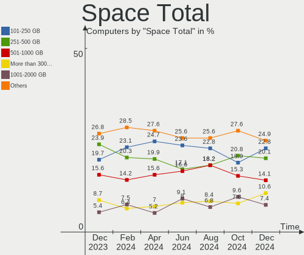
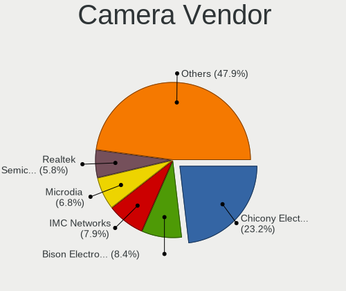
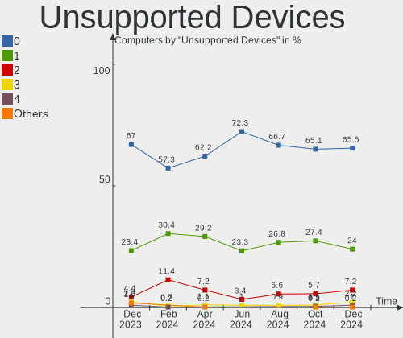

Debian Hardware Trends
----------------------

A project to identify most popular hardware characteristics and track their change
over time based on data collected by Debian users at https://Linux-Hardware.org.

Anyone can contribute to this report by the [hw-probe](https://github.com/linuxhw/hw-probe) tool:

    sudo -E hw-probe -all -upload

This is a report for all computer types. See also reports for [desktops](/Dist/Debian/Desktop/README.md) and [notebooks](/Dist/Debian/Notebook/README.md).

This report is for one last month. Overall report since the beginning of time: [TestCoverage](https://github.com/linuxhw/TestCoverage)

Period: Apr, 2022.

Contents
--------

* [ System ](#system)
  - [ OS                       ](#os)
  - [ OS Family                ](#os-family)
  - [ Kernel                   ](#kernel)
  - [ Kernel Family            ](#kernel-family)
  - [ Kernel Major Ver.        ](#kernel-major-ver)
  - [ Arch                     ](#arch)
  - [ DE                       ](#de)
  - [ Display Server           ](#display-server)
  - [ Display Manager          ](#display-manager)
  - [ OS Lang                  ](#os-lang)
  - [ Boot Mode                ](#boot-mode)
  - [ Filesystem               ](#filesystem)
  - [ Part. scheme             ](#part-scheme)
  - [ Dual Boot with Linux/BSD ](#dual-boot-with-linuxbsd)
  - [ Dual Boot (Win)          ](#dual-boot-win)

* [ Board ](#board)
  - [ Vendor                   ](#vendor)
  - [ Model                    ](#model)
  - [ Model Family             ](#model-family)
  - [ MFG Year                 ](#mfg-year)
  - [ Form Factor              ](#form-factor)
  - [ Secure Boot              ](#secure-boot)
  - [ Coreboot                 ](#coreboot)
  - [ RAM Size                 ](#ram-size)
  - [ RAM Used                 ](#ram-used)
  - [ Total Drives             ](#total-drives)
  - [ Has CD-ROM               ](#has-cd-rom)
  - [ Has Ethernet             ](#has-ethernet)
  - [ Has WiFi                 ](#has-wifi)
  - [ Has Bluetooth            ](#has-bluetooth)

* [ Location ](#location)
  - [ Country                  ](#country)
  - [ City                     ](#city)

* [ Drives ](#drives)
  - [ Drive Vendor             ](#drive-vendor)
  - [ Drive Model              ](#drive-model)
  - [ HDD Vendor               ](#hdd-vendor)
  - [ SSD Vendor               ](#ssd-vendor)
  - [ Drive Kind               ](#drive-kind)
  - [ Drive Connector          ](#drive-connector)
  - [ Drive Size               ](#drive-size)
  - [ Space Total              ](#space-total)
  - [ Space Used               ](#space-used)
  - [ Malfunc. Drives          ](#malfunc-drives)
  - [ Malfunc. Drive Vendor    ](#malfunc-drive-vendor)
  - [ Malfunc. HDD Vendor      ](#malfunc-hdd-vendor)
  - [ Malfunc. Drive Kind      ](#malfunc-drive-kind)
  - [ Failed Drives            ](#failed-drives)
  - [ Failed Drive Vendor      ](#failed-drive-vendor)
  - [ Drive Status             ](#drive-status)

* [ Storage controller ](#storage-controller)
  - [ Storage Vendor           ](#storage-vendor)
  - [ Storage Model            ](#storage-model)
  - [ Storage Kind             ](#storage-kind)

* [ Processor ](#processor)
  - [ CPU Vendor               ](#cpu-vendor)
  - [ CPU Model                ](#cpu-model)
  - [ CPU Model Family         ](#cpu-model-family)
  - [ CPU Cores                ](#cpu-cores)
  - [ CPU Sockets              ](#cpu-sockets)
  - [ CPU Threads              ](#cpu-threads)
  - [ CPU Op-Modes             ](#cpu-op-modes)
  - [ CPU Microcode            ](#cpu-microcode)
  - [ CPU Microarch            ](#cpu-microarch)

* [ Graphics ](#graphics)
  - [ GPU Vendor               ](#gpu-vendor)
  - [ GPU Model                ](#gpu-model)
  - [ GPU Combo                ](#gpu-combo)
  - [ GPU Driver               ](#gpu-driver)
  - [ GPU Memory               ](#gpu-memory)

* [ Monitor ](#monitor)
  - [ Monitor Vendor           ](#monitor-vendor)
  - [ Monitor Model            ](#monitor-model)
  - [ Monitor Resolution       ](#monitor-resolution)
  - [ Monitor Diagonal         ](#monitor-diagonal)
  - [ Monitor Width            ](#monitor-width)
  - [ Aspect Ratio             ](#aspect-ratio)
  - [ Monitor Area             ](#monitor-area)
  - [ Pixel Density            ](#pixel-density)
  - [ Multiple Monitors        ](#multiple-monitors)

* [ Network ](#network)
  - [ Net Controller Vendor    ](#net-controller-vendor)
  - [ Net Controller Model     ](#net-controller-model)
  - [ Wireless Vendor          ](#wireless-vendor)
  - [ Wireless Model           ](#wireless-model)
  - [ Ethernet Vendor          ](#ethernet-vendor)
  - [ Ethernet Model           ](#ethernet-model)
  - [ Net Controller Kind      ](#net-controller-kind)
  - [ Used Controller          ](#used-controller)
  - [ NICs                     ](#nics)
  - [ IPv6                     ](#ipv6)

* [ Bluetooth ](#bluetooth)
  - [ Bluetooth Vendor         ](#bluetooth-vendor)
  - [ Bluetooth Model          ](#bluetooth-model)

* [ Sound ](#sound)
  - [ Sound Vendor             ](#sound-vendor)
  - [ Sound Model              ](#sound-model)

* [ Memory ](#memory)
  - [ Memory Vendor            ](#memory-vendor)
  - [ Memory Model             ](#memory-model)
  - [ Memory Kind              ](#memory-kind)
  - [ Memory Form Factor       ](#memory-form-factor)
  - [ Memory Size              ](#memory-size)
  - [ Memory Speed             ](#memory-speed)

* [ Printers & scanners ](#printers--scanners)
  - [ Printer Vendor           ](#printer-vendor)
  - [ Printer Model            ](#printer-model)
  - [ Scanner Vendor           ](#scanner-vendor)
  - [ Scanner Model            ](#scanner-model)

* [ Camera ](#camera)
  - [ Camera Vendor            ](#camera-vendor)
  - [ Camera Model             ](#camera-model)

* [ Security ](#security)
  - [ Fingerprint Vendor       ](#fingerprint-vendor)
  - [ Fingerprint Model        ](#fingerprint-model)
  - [ Chipcard Vendor          ](#chipcard-vendor)
  - [ Chipcard Model           ](#chipcard-model)

* [ Unsupported ](#unsupported)
  - [ Unsupported Devices      ](#unsupported-devices)
  - [ Unsupported Device Types ](#unsupported-device-types)

System
------

OS
--

Installed operating systems

| Name              | Computers | Percent |
|-------------------|-----------|---------|
| Debian 11         | 331       | 82.75%  |
| Debian Testing    | 30        | 7.5%    |
| Debian 10         | 18        | 4.5%    |
| Debian Unstable   | 15        | 3.75%   |
| Debian 9          | 2         | 0.5%    |
| Debian 11-updates | 2         | 0.5%    |
| Debian 8          | 1         | 0.25%   |
| Debian 7          | 1         | 0.25%   |

OS Family
---------

OS without a version

| Name   | Computers | Percent |
|--------|-----------|---------|
| Debian | 400       | 100%    |

Kernel
------

Version of the Linux kernel

| Version                    | Computers | Percent |
|----------------------------|-----------|---------|
| 5.10.0-13-amd64            | 160       | 40%     |
| 5.10.0-7-amd64             | 37        | 9.25%   |
| 5.16.0-6-amd64             | 32        | 8%      |
| 5.10.0-10-amd64            | 32        | 8%      |
| 5.10.0-13-686-pae          | 15        | 3.75%   |
| 5.16.0-0.bpo.4-amd64       | 10        | 2.5%    |
| 5.13.19-6-pve              | 10        | 2.5%    |
| 5.10.0-12-amd64            | 10        | 2.5%    |
| 5.16.0-5-amd64             | 8         | 2%      |
| 5.10.0-11-amd64            | 7         | 1.75%   |
| 5.10.0-13-686              | 5         | 1.25%   |
| 5.15.19-2-pve              | 3         | 0.75%   |
| 4.19.0-20-amd64            | 3         | 0.75%   |
| 5.17.0-1-amd64             | 2         | 0.5%    |
| 5.16.0-1-amd64             | 2         | 0.5%    |
| 5.15.32-xanmod1            | 2         | 0.5%    |
| 5.15.32-v8+                | 2         | 0.5%    |
| 5.15.0-2-amd64             | 2         | 0.5%    |
| 5.13.19-2-pve              | 2         | 0.5%    |
| 4.9.35-dyvi                | 2         | 0.5%    |
| 4.19.0-19-amd64            | 2         | 0.5%    |
| 4.19.0-10-amd64            | 2         | 0.5%    |
| 5.4.21                     | 1         | 0.25%   |
| 5.4.174-2-pve              | 1         | 0.25%   |
| 5.4.124-1-pve              | 1         | 0.25%   |
| 5.17.5-xanmod1             | 1         | 0.25%   |
| 5.17.4-xanmod1             | 1         | 0.25%   |
| 5.17.2-xanmod1+amdnative   | 1         | 0.25%   |
| 5.17.2-xanmod1             | 1         | 0.25%   |
| 5.17.1-xanmod1             | 1         | 0.25%   |
| 5.17.0-trunk-amd64         | 1         | 0.25%   |
| 5.17.0-5.1-liquorix-amd64  | 1         | 0.25%   |
| 5.17.0-3.2-liquorix-amd64  | 1         | 0.25%   |
| 5.17.0-2.3-liquorix-amd64  | 1         | 0.25%   |
| 5.17.0-2.1-liquorix-amd64  | 1         | 0.25%   |
| 5.17.0-1.2-liquorix-amd64  | 1         | 0.25%   |
| 5.17.0-1.1-liquorix-amd64  | 1         | 0.25%   |
| 5.17-rockchip              | 1         | 0.25%   |
| 5.16.5                     | 1         | 0.25%   |
| 5.16.0-18.1-liquorix-amd64 | 1         | 0.25%   |
| 5.16.0-1-rt-amd64          | 1         | 0.25%   |
| 5.15.34-xanmod1            | 1         | 0.25%   |
| 5.15.25-rockchip64         | 1         | 0.25%   |
| 5.15.15-1rodete2-amd64     | 1         | 0.25%   |
| 5.15.12-1-pve              | 1         | 0.25%   |
| 5.15.12                    | 1         | 0.25%   |
| 5.15.0-3mx-amd64           | 1         | 0.25%   |
| 5.15.0-1mx-amd64           | 1         | 0.25%   |
| 5.15.0-0.bpo.3-amd64       | 1         | 0.25%   |
| 5.14.0-trunk-amd64         | 1         | 0.25%   |
| 5.14.0-4mx-amd64           | 1         | 0.25%   |
| 5.13.19-4-pve              | 1         | 0.25%   |
| 5.10.93+truenas            | 1         | 0.25%   |
| 5.10.57-antix.1-amd64-smp  | 1         | 0.25%   |
| 5.10.43v64                 | 1         | 0.25%   |
| 5.10.109stock              | 1         | 0.25%   |
| 5.10.109-loc-os            | 1         | 0.25%   |
| 5.10.100-rt62-xanmod1      | 1         | 0.25%   |
| 5.10.0-9-amd64             | 1         | 0.25%   |
| 5.10.0-9-686-pae           | 1         | 0.25%   |

Kernel Family
-------------

Linux kernel without a distro release

| Version  | Computers | Percent |
|----------|-----------|---------|
| 5.10.0   | 273       | 68.25%  |
| 5.16.0   | 54        | 13.5%   |
| 5.13.19  | 13        | 3.25%   |
| 4.19.0   | 10        | 2.5%    |
| 5.17.0   | 9         | 2.25%   |
| 5.15.0   | 5         | 1.25%   |
| 5.15.32  | 4         | 1%      |
| 5.15.19  | 3         | 0.75%   |
| 5.17.2   | 2         | 0.5%    |
| 5.15.12  | 2         | 0.5%    |
| 5.14.0   | 2         | 0.5%    |
| 5.10.109 | 2         | 0.5%    |
| 4.9.35   | 2         | 0.5%    |
| 5.4.21   | 1         | 0.25%   |
| 5.4.174  | 1         | 0.25%   |
| 5.4.124  | 1         | 0.25%   |
| 5.17.5   | 1         | 0.25%   |
| 5.17.4   | 1         | 0.25%   |
| 5.17.1   | 1         | 0.25%   |
| 5.17     | 1         | 0.25%   |
| 5.16.5   | 1         | 0.25%   |
| 5.15.34  | 1         | 0.25%   |
| 5.15.25  | 1         | 0.25%   |
| 5.15.15  | 1         | 0.25%   |
| 5.10.93  | 1         | 0.25%   |
| 5.10.57  | 1         | 0.25%   |
| 5.10.43  | 1         | 0.25%   |
| 5.10.100 | 1         | 0.25%   |
| 4.9.0    | 1         | 0.25%   |
| 4.1.42   | 1         | 0.25%   |
| 3.8.11   | 1         | 0.25%   |
| 3.0.21   | 1         | 0.25%   |

Kernel Major Ver.
-----------------

Linux kernel major version

| Version | Computers | Percent |
|---------|-----------|---------|
| 5.10    | 279       | 69.75%  |
| 5.16    | 55        | 13.75%  |
| 5.15    | 17        | 4.25%   |
| 5.17    | 14        | 3.5%    |
| 5.13    | 13        | 3.25%   |
| 4.19    | 10        | 2.5%    |
| 5.4     | 3         | 0.75%   |
| 4.9     | 3         | 0.75%   |
| 5.14    | 2         | 0.5%    |
| 5       | 1         | 0.25%   |
| 4.1     | 1         | 0.25%   |
| 3.8     | 1         | 0.25%   |
| 3.0     | 1         | 0.25%   |

Arch
----

OS architecture (x86_64, i586, etc.)

| Name    | Computers | Percent |
|---------|-----------|---------|
| x86_64  | 368       | 92%     |
| i686    | 24        | 6%      |
| aarch64 | 5         | 1.25%   |
| armv7l  | 2         | 0.5%    |
| ppc64   | 1         | 0.25%   |

DE
--

Desktop Environment

| Name             | Computers | Percent |
|------------------|-----------|---------|
| Unknown          | 158       | 39.5%   |
| GNOME            | 87        | 21.75%  |
| XFCE             | 51        | 12.75%  |
| KDE5             | 38        | 9.5%    |
| MATE             | 15        | 3.75%   |
| LXDE             | 9         | 2.25%   |
| i3               | 8         | 2%      |
| LXQt             | 7         | 1.75%   |
| Cinnamon         | 6         | 1.5%    |
| X-Cinnamon       | 4         | 1%      |
| Trinity          | 3         | 0.75%   |
| GNOME Flashback  | 3         | 0.75%   |
| Openbox          | 2         | 0.5%    |
| Budgie           | 2         | 0.5%    |
| sway             | 1         | 0.25%   |
| Phosh:GNOME      | 1         | 0.25%   |
| lightdm-xsession | 1         | 0.25%   |
| KDE              | 1         | 0.25%   |
| jwm              | 1         | 0.25%   |
| icewm            | 1         | 0.25%   |
| DWM              | 1         | 0.25%   |

Display Server
--------------

X11 or Wayland

| Name    | Computers | Percent |
|---------|-----------|---------|
| X11     | 169       | 42.25%  |
| Unknown | 126       | 31.5%   |
| Wayland | 68        | 17%     |
| Tty     | 37        | 9.25%   |

Display Manager
---------------

SDDM, LightDM, etc.

| Name    | Computers | Percent |
|---------|-----------|---------|
| Unknown | 219       | 54.75%  |
| LightDM | 70        | 17.5%   |
| GDM     | 48        | 12%     |
| SDDM    | 30        | 7.5%    |
| GDM3    | 28        | 7%      |
| SLiM    | 2         | 0.5%    |
| NODM    | 2         | 0.5%    |
| XDM     | 1         | 0.25%   |

OS Lang
-------

Language

| Lang       | Computers | Percent |
|------------|-----------|---------|
| en_US      | 135       | 33.75%  |
| Unknown    | 63        | 15.75%  |
| ru_RU      | 43        | 10.75%  |
| en_GB      | 24        | 6%      |
| de_DE      | 19        | 4.75%   |
| fr_FR      | 15        | 3.75%   |
| it_IT      | 11        | 2.75%   |
| pt_BR      | 10        | 2.5%    |
| en_AU      | 8         | 2%      |
| zh_CN      | 6         | 1.5%    |
| es_ES      | 6         | 1.5%    |
| C          | 6         | 1.5%    |
| pl_PL      | 4         | 1%      |
| en_IE      | 4         | 1%      |
| en_CA      | 4         | 1%      |
| es_VE      | 3         | 0.75%   |
| en_IN      | 3         | 0.75%   |
| ca_ES      | 3         | 0.75%   |
| pt_PT      | 2         | 0.5%    |
| nl_NL      | 2         | 0.5%    |
| ko_KR      | 2         | 0.5%    |
| es_PE      | 2         | 0.5%    |
| es_MX      | 2         | 0.5%    |
| es_AR      | 2         | 0.5%    |
| en_SG      | 2         | 0.5%    |
| cs_CZ      | 2         | 0.5%    |
| zh_TW      | 1         | 0.25%   |
| sv_SE      | 1         | 0.25%   |
| nb_NO      | 1         | 0.25%   |
| hu_HU      | 1         | 0.25%   |
| fr_BE      | 1         | 0.25%   |
| fi_FI      | 1         | 0.25%   |
| es_SV      | 1         | 0.25%   |
| es_EC      | 1         | 0.25%   |
| es_CO      | 1         | 0.25%   |
| es_CL      | 1         | 0.25%   |
| en_US.UTF8 | 1         | 0.25%   |
| en_NZ      | 1         | 0.25%   |
| en_HK      | 1         | 0.25%   |
| en_DE      | 1         | 0.25%   |
| de_CH      | 1         | 0.25%   |
| de_AT.UTF8 | 1         | 0.25%   |
| de_AT      | 1         | 0.25%   |

Boot Mode
---------

EFI or BIOS

| Mode | Computers | Percent |
|------|-----------|---------|
| EFI  | 208       | 52%     |
| BIOS | 192       | 48%     |

Filesystem
----------

Type of filesystem

| Type    | Computers | Percent |
|---------|-----------|---------|
| Ext4    | 259       | 64.75%  |
| Overlay | 116       | 29%     |
| Btrfs   | 13        | 3.25%   |
| Zfs     | 6         | 1.5%    |
| Xfs     | 4         | 1%      |
| Tmpfs   | 1         | 0.25%   |
| Ext3    | 1         | 0.25%   |

Part. scheme
------------

Scheme of partitioning

| Type    | Computers | Percent |
|---------|-----------|---------|
| GPT     | 228       | 57%     |
| MBR     | 101       | 25.25%  |
| Unknown | 71        | 17.75%  |

Dual Boot with Linux/BSD
------------------------

Hosting more than one Linux/BSD

| Dual boot | Computers | Percent |
|-----------|-----------|---------|
| No        | 331       | 82.75%  |
| Yes       | 69        | 17.25%  |

Dual Boot (Win)
---------------

Hosting Linux and Windows

| Dual boot | Computers | Percent |
|-----------|-----------|---------|
| No        | 283       | 70.75%  |
| Yes       | 117       | 29.25%  |

Board
-----

Vendor
------

Motherboard manufacturer

| Name                    | Computers | Percent |
|-------------------------|-----------|---------|
| ASUSTek Computer        | 57        | 14.25%  |
| Lenovo                  | 50        | 12.5%   |
| Dell                    | 43        | 10.75%  |
| Hewlett-Packard         | 42        | 10.5%   |
| Gigabyte Technology     | 35        | 8.75%   |
| MSI                     | 27        | 6.75%   |
| Google                  | 27        | 6.75%   |
| Apple                   | 22        | 5.5%    |
| Supermicro              | 13        | 3.25%   |
| ASRock                  | 13        | 3.25%   |
| Intel                   | 10        | 2.5%    |
| Acer                    | 8         | 2%      |
| Unknown                 | 8         | 2%      |
| Toshiba                 | 4         | 1%      |
| ASRockRack              | 4         | 1%      |
| Samsung Electronics     | 3         | 0.75%   |
| Raspberry Pi Foundation | 3         | 0.75%   |
| Timi                    | 2         | 0.5%    |
| Sony                    | 2         | 0.5%    |
| Packard Bell            | 2         | 0.5%    |
| Fujitsu                 | 2         | 0.5%    |
| Clevo                   | 2         | 0.5%    |
| ZOTAC                   | 1         | 0.25%   |
| Wistron                 | 1         | 0.25%   |
| TUXEDO                  | 1         | 0.25%   |
| Thirdwave               | 1         | 0.25%   |
| Razer                   | 1         | 0.25%   |
| Pegatron                | 1         | 0.25%   |
| PC Engines              | 1         | 0.25%   |
| Medion                  | 1         | 0.25%   |
| MACHINIST               | 1         | 0.25%   |
| J&W                     | 1         | 0.25%   |
| IBM                     | 1         | 0.25%   |
| HUAWEI                  | 1         | 0.25%   |
| HARDKERNEL              | 1         | 0.25%   |
| GMKTEC                  | 1         | 0.25%   |
| Getac                   | 1         | 0.25%   |
| Foxconn                 | 1         | 0.25%   |
| Fanless Mini PC         | 1         | 0.25%   |
| eMachines               | 1         | 0.25%   |
| Chuwi                   | 1         | 0.25%   |
| Biostar                 | 1         | 0.25%   |
| Advent                  | 1         | 0.25%   |

Model
-----

Motherboard model

| Name                                               | Computers | Percent |
|----------------------------------------------------|-----------|---------|
| Google Enguarde                                    | 26        | 6.5%    |
| Apple MacBook5,2                                   | 18        | 4.5%    |
| Gigabyte H410M S2H                                 | 15        | 3.75%   |
| ASUS 1005HA                                        | 11        | 2.75%   |
| Unknown                                            | 10        | 2.5%    |
| Dell Latitude 3120                                 | 3         | 0.75%   |
| ASUS All Series                                    | 3         | 0.75%   |
| Apple MacBook2,1                                   | 3         | 0.75%   |
| Supermicro X9SRH-7F/7TF                            | 2         | 0.5%    |
| Supermicro X7DWT                                   | 2         | 0.5%    |
| Supermicro X5DP8                                   | 2         | 0.5%    |
| Supermicro Super Server                            | 2         | 0.5%    |
| RPi Raspberry Pi 4 Model B Rev 1.4                 | 2         | 0.5%    |
| MSI MS-7721                                        | 2         | 0.5%    |
| Lenovo ThinkPad L13 Yoga Gen 2 20VK0019US          | 2         | 0.5%    |
| Lenovo ThinkPad 13 2nd Gen 20J10046US              | 2         | 0.5%    |
| Lenovo ThinkCentre M55p 8808D8U                    | 2         | 0.5%    |
| Lenovo ThinkBook 14p Gen 2 20YN                    | 2         | 0.5%    |
| Intel powered classmate PC                         | 2         | 0.5%    |
| HP Notebook                                        | 2         | 0.5%    |
| HP Laptop 15s-fq2xxx                               | 2         | 0.5%    |
| HP EliteBook 840 G8 Notebook PC                    | 2         | 0.5%    |
| HP EliteBook 840 G3                                | 2         | 0.5%    |
| Dell OptiPlex 790                                  | 2         | 0.5%    |
| Dell OptiPlex 7010                                 | 2         | 0.5%    |
| ASUS PRIME H510M-A                                 | 2         | 0.5%    |
| ASRockRack B565D4-V1L                              | 2         | 0.5%    |
| ASRock G31M-VS2                                    | 2         | 0.5%    |
| ASRock A300M-STX                                   | 2         | 0.5%    |
| ZOTAC ZBOX-CI331NANO                               | 1         | 0.25%   |
| Wistron ProLiant ML110 G5                          | 1         | 0.25%   |
| TUXEDO Pulse 15 Gen1                               | 1         | 0.25%   |
| Toshiba TECRA X40-E                                | 1         | 0.25%   |
| Toshiba TECRA X40-D                                | 1         | 0.25%   |
| Toshiba Satellite L50D-B                           | 1         | 0.25%   |
| Toshiba Satellite A300                             | 1         | 0.25%   |
| Timi TM1612                                        | 1         | 0.25%   |
| Timi A7S                                           | 1         | 0.25%   |
| Thirdwave DX-T7                                    | 1         | 0.25%   |
| Supermicro X9SRE/X9SRE-3F/X9SRi/X9SRi-3F           | 1         | 0.25%   |
| Supermicro X9DRW                                   | 1         | 0.25%   |
| Supermicro X7DB8                                   | 1         | 0.25%   |
| Supermicro SYS-6029P-WTRT                          | 1         | 0.25%   |
| Supermicro SYS-5019S-MR                            | 1         | 0.25%   |
| Sony VGN-NR31ZR_S                                  | 1         | 0.25%   |
| Sony SVE1712S1EB                                   | 1         | 0.25%   |
| Samsung RV415/RV515                                | 1         | 0.25%   |
| Samsung 300V3A/300V4A/300V5A                       | 1         | 0.25%   |
| Samsung 270E5J/2570EJ                              | 1         | 0.25%   |
| Razer Blade 15 Base Model (Early 2020) - RZ09-0328 | 1         | 0.25%   |
| RPi Raspberry Pi 3 Model B Plus Rev 1.3            | 1         | 0.25%   |
| Pegatron AY030AA-ABA CQ5320F                       | 1         | 0.25%   |
| PC Engines apu4                                    | 1         | 0.25%   |
| Packard Bell IMEDIA MC 9604                        | 1         | 0.25%   |
| Packard Bell DOTM                                  | 1         | 0.25%   |
| MSI Prestige 14Evo A11M                            | 1         | 0.25%   |
| MSI p6620ch-m                                      | 1         | 0.25%   |
| MSI MS-7D54                                        | 1         | 0.25%   |
| MSI MS-7D20                                        | 1         | 0.25%   |
| MSI MS-7C95                                        | 1         | 0.25%   |

Model Family
------------

Motherboard model prefix

| Name                      | Computers | Percent |
|---------------------------|-----------|---------|
| Lenovo ThinkPad           | 27        | 6.75%   |
| Google Enguarde           | 26        | 6.5%    |
| Apple MacBook5            | 18        | 4.5%    |
| Gigabyte H410M            | 15        | 3.75%   |
| Dell Inspiron             | 12        | 3%      |
| Dell Latitude             | 11        | 2.75%   |
| ASUS 1005HA               | 11        | 2.75%   |
| ASUS PRIME                | 10        | 2.5%    |
| Unknown                   | 10        | 2.5%    |
| Lenovo IdeaPad            | 9         | 2.25%   |
| HP Laptop                 | 9         | 2.25%   |
| Lenovo ThinkCentre        | 6         | 1.5%    |
| HP Pavilion               | 6         | 1.5%    |
| HP EliteBook              | 6         | 1.5%    |
| Dell OptiPlex             | 6         | 1.5%    |
| Dell XPS                  | 5         | 1.25%   |
| Acer Aspire               | 5         | 1.25%   |
| Dell Precision            | 4         | 1%      |
| ASUS VivoBook             | 4         | 1%      |
| RPi Raspberry             | 3         | 0.75%   |
| HP ProBook                | 3         | 0.75%   |
| Gigabyte B450M            | 3         | 0.75%   |
| ASUS TUF                  | 3         | 0.75%   |
| ASUS All                  | 3         | 0.75%   |
| Apple MacBook2            | 3         | 0.75%   |
| Toshiba TECRA             | 2         | 0.5%    |
| Toshiba Satellite         | 2         | 0.5%    |
| Supermicro X9SRH-7F       | 2         | 0.5%    |
| Supermicro X7DWT          | 2         | 0.5%    |
| Supermicro X5DP8          | 2         | 0.5%    |
| Supermicro Super          | 2         | 0.5%    |
| MSI MS-7721               | 2         | 0.5%    |
| Lenovo ThinkBook          | 2         | 0.5%    |
| Lenovo G580               | 2         | 0.5%    |
| Intel powered             | 2         | 0.5%    |
| HP Stream                 | 2         | 0.5%    |
| HP Notebook               | 2         | 0.5%    |
| HP ENVY                   | 2         | 0.5%    |
| HP Compaq                 | 2         | 0.5%    |
| HP 250                    | 2         | 0.5%    |
| Gigabyte X570             | 2         | 0.5%    |
| Dell Vostro               | 2         | 0.5%    |
| Dell PowerEdge            | 2         | 0.5%    |
| ASUS ASUS                 | 2         | 0.5%    |
| ASRockRack B565D4-V1L     | 2         | 0.5%    |
| ASRock G31M-VS2           | 2         | 0.5%    |
| ASRock A300M-STX          | 2         | 0.5%    |
| ZOTAC ZBOX-CI331NANO      | 1         | 0.25%   |
| Wistron ProLiant          | 1         | 0.25%   |
| TUXEDO Pulse              | 1         | 0.25%   |
| Timi TM1612               | 1         | 0.25%   |
| Timi A7S                  | 1         | 0.25%   |
| Thirdwave DX-T7           | 1         | 0.25%   |
| Supermicro X9SRE          | 1         | 0.25%   |
| Supermicro X9DRW          | 1         | 0.25%   |
| Supermicro X7DB8          | 1         | 0.25%   |
| Supermicro SYS-6029P-WTRT | 1         | 0.25%   |
| Supermicro SYS-5019S-MR   | 1         | 0.25%   |
| Sony VGN-NR31ZR           | 1         | 0.25%   |
| Sony SVE1712S1EB          | 1         | 0.25%   |

MFG Year
--------

Motherboard manufacture year

| Year    | Computers | Percent |
|---------|-----------|---------|
| 2020    | 54        | 13.5%   |
| 2021    | 38        | 9.5%    |
| 2009    | 37        | 9.25%   |
| 2022    | 34        | 8.5%    |
| 2018    | 27        | 6.75%   |
| 2017    | 25        | 6.25%   |
| 2011    | 24        | 6%      |
| 2013    | 22        | 5.5%    |
| 2019    | 21        | 5.25%   |
| 2012    | 18        | 4.5%    |
| 2015    | 17        | 4.25%   |
| 2016    | 15        | 3.75%   |
| 2014    | 15        | 3.75%   |
| 2008    | 15        | 3.75%   |
| 2010    | 12        | 3%      |
| 2007    | 12        | 3%      |
| Unknown | 8         | 2%      |
| 2006    | 2         | 0.5%    |
| 2005    | 2         | 0.5%    |
| 2003    | 2         | 0.5%    |

Form Factor
-----------

Physical design of the computer

| Name           | Computers | Percent |
|----------------|-----------|---------|
| Notebook       | 215       | 53.75%  |
| Desktop        | 153       | 38.25%  |
| Server         | 11        | 2.75%   |
| Convertible    | 6         | 1.5%    |
| Mini pc        | 6         | 1.5%    |
| System on chip | 5         | 1.25%   |
| Tablet         | 2         | 0.5%    |
| All in one     | 2         | 0.5%    |

Secure Boot
-----------

Enabled or disabled

| State    | Computers | Percent |
|----------|-----------|---------|
| Disabled | 384       | 96%     |
| Enabled  | 16        | 4%      |

Coreboot
--------

Have coreboot on board

| Used | Computers | Percent |
|------|-----------|---------|
| No   | 371       | 92.75%  |
| Yes  | 29        | 7.25%   |

RAM Size
--------

Total RAM memory

| Size in GB  | Computers | Percent |
|-------------|-----------|---------|
| 3.01-4.0    | 77        | 19.25%  |
| 4.01-8.0    | 70        | 17.5%   |
| 16.01-24.0  | 68        | 17%     |
| 8.01-16.0   | 56        | 14%     |
| 32.01-64.0  | 37        | 9.25%   |
| 1.01-2.0    | 33        | 8.25%   |
| 64.01-256.0 | 25        | 6.25%   |
| 0.51-1.0    | 17        | 4.25%   |
| 2.01-3.0    | 8         | 2%      |
| 24.01-32.0  | 6         | 1.5%    |
| 0.01-0.5    | 2         | 0.5%    |
| Unknown     | 1         | 0.25%   |

RAM Used
--------

Used RAM memory

| Used GB    | Computers | Percent |
|------------|-----------|---------|
| 1.01-2.0   | 127       | 31.75%  |
| 0.51-1.0   | 75        | 18.75%  |
| 2.01-3.0   | 54        | 13.5%   |
| 4.01-8.0   | 48        | 12%     |
| 3.01-4.0   | 39        | 9.75%   |
| 8.01-16.0  | 17        | 4.25%   |
| 0.01-0.5   | 15        | 3.75%   |
| 16.01-24.0 | 11        | 2.75%   |
| 32.01-64.0 | 6         | 1.5%    |
| 24.01-32.0 | 5         | 1.25%   |
| Unknown    | 3         | 0.75%   |

Total Drives
------------

Number of drives on board

| Drives | Computers | Percent |
|--------|-----------|---------|
| 1      | 257       | 64.25%  |
| 2      | 79        | 19.75%  |
| 3      | 22        | 5.5%    |
| 4      | 18        | 4.5%    |
| 5      | 10        | 2.5%    |
| 6      | 6         | 1.5%    |
| 8      | 3         | 0.75%   |
| 7      | 3         | 0.75%   |
| 16     | 1         | 0.25%   |
| 0      | 1         | 0.25%   |

Has CD-ROM
----------

Has CD-ROM on board

| Presented | Computers | Percent |
|-----------|-----------|---------|
| No        | 270       | 67.5%   |
| Yes       | 130       | 32.5%   |

Has Ethernet
------------

Has Ethernet on board

| Presented | Computers | Percent |
|-----------|-----------|---------|
| Yes       | 341       | 85.25%  |
| No        | 59        | 14.75%  |

Has WiFi
--------

Has WiFi module

| Presented | Computers | Percent |
|-----------|-----------|---------|
| Yes       | 266       | 66.5%   |
| No        | 134       | 33.5%   |

Has Bluetooth
-------------

Has Bluetooth module

| Presented | Computers | Percent |
|-----------|-----------|---------|
| Yes       | 223       | 55.75%  |
| No        | 177       | 44.25%  |

Location
--------

Country
-------

Geographic location (country)

| Country     | Computers | Percent |
|-------------|-----------|---------|
| USA         | 117       | 29.25%  |
| Russia      | 55        | 13.75%  |
| Germany     | 31        | 7.75%   |
| France      | 26        | 6.5%    |
| UK          | 18        | 4.5%    |
| Spain       | 15        | 3.75%   |
| Brazil      | 14        | 3.5%    |
| Italy       | 12        | 3%      |
| Australia   | 10        | 2.5%    |
| Canada      | 7         | 1.75%   |
| Poland      | 6         | 1.5%    |
| Greece      | 6         | 1.5%    |
| Switzerland | 5         | 1.25%   |
| Netherlands | 5         | 1.25%   |
| China       | 5         | 1.25%   |
| Venezuela   | 4         | 1%      |
| Norway      | 4         | 1%      |
| Japan       | 4         | 1%      |
| Austria     | 4         | 1%      |
| Sweden      | 3         | 0.75%   |
| Peru        | 3         | 0.75%   |
| Mexico      | 3         | 0.75%   |
| Czechia     | 3         | 0.75%   |
| Argentina   | 3         | 0.75%   |
| South Korea | 2         | 0.5%    |
| Slovakia    | 2         | 0.5%    |
| Romania     | 2         | 0.5%    |
| Portugal    | 2         | 0.5%    |
| Ireland     | 2         | 0.5%    |
| India       | 2         | 0.5%    |
| Chile       | 2         | 0.5%    |
| Uzbekistan  | 1         | 0.25%   |
| Tunisia     | 1         | 0.25%   |
| Thailand    | 1         | 0.25%   |
| Taiwan      | 1         | 0.25%   |
| Singapore   | 1         | 0.25%   |
| Philippines | 1         | 0.25%   |
| New Zealand | 1         | 0.25%   |
| Latvia      | 1         | 0.25%   |
| Iran        | 1         | 0.25%   |
| Hungary     | 1         | 0.25%   |
| Hong Kong   | 1         | 0.25%   |
| Gambia      | 1         | 0.25%   |
| Finland     | 1         | 0.25%   |
| El Salvador | 1         | 0.25%   |
| Ecuador     | 1         | 0.25%   |
| Denmark     | 1         | 0.25%   |
| Cyprus      | 1         | 0.25%   |
| Croatia     | 1         | 0.25%   |
| Colombia    | 1         | 0.25%   |
| Bulgaria    | 1         | 0.25%   |
| Belgium     | 1         | 0.25%   |
| Azerbaijan  | 1         | 0.25%   |
| Albania     | 1         | 0.25%   |

City
----

Geographic location (city)

| City                 | Computers | Percent |
|----------------------|-----------|---------|
| Bangor               | 73        | 18.25%  |
| Voronezh             | 37        | 9.25%   |
| Moscow               | 6         | 1.5%    |
| Sydney               | 5         | 1.25%   |
| Perm                 | 4         | 1%      |
| Paris                | 4         | 1%      |
| Milan                | 4         | 1%      |
| London               | 4         | 1%      |
| Chicago              | 4         | 1%      |
| Barcelona            | 4         | 1%      |
| The Hague            | 3         | 0.75%   |
| Madrid               | 3         | 0.75%   |
| Jundiaí             | 3         | 0.75%   |
| Dresden              | 3         | 0.75%   |
| Caracas              | 3         | 0.75%   |
| Athens               | 3         | 0.75%   |
| Wettringen           | 2         | 0.5%    |
| Uiwang               | 2         | 0.5%    |
| Toulouse             | 2         | 0.5%    |
| St Petersburg        | 2         | 0.5%    |
| Ripollet             | 2         | 0.5%    |
| Rio de Janeiro       | 2         | 0.5%    |
| Regensdorf           | 2         | 0.5%    |
| Prague               | 2         | 0.5%    |
| Piraeus              | 2         | 0.5%    |
| Osternienburger Land | 2         | 0.5%    |
| Munich               | 2         | 0.5%    |
| Melbourne            | 2         | 0.5%    |
| Marseille            | 2         | 0.5%    |
| Lima                 | 2         | 0.5%    |
| Irkutsk              | 2         | 0.5%    |
| Dublin               | 2         | 0.5%    |
| Denton               | 2         | 0.5%    |
| Chemnitz             | 2         | 0.5%    |
| Central              | 2         | 0.5%    |
| Brasília            | 2         | 0.5%    |
| Bonn                 | 2         | 0.5%    |
| Berlin               | 2         | 0.5%    |
| Amsterdam            | 2         | 0.5%    |
| Zurich               | 1         | 0.25%   |
| Zelenograd           | 1         | 0.25%   |
| Zagreb               | 1         | 0.25%   |
| Yunlin               | 1         | 0.25%   |
| Xuhui                | 1         | 0.25%   |
| Xiamen               | 1         | 0.25%   |
| Worthing             | 1         | 0.25%   |
| Winter Park          | 1         | 0.25%   |
| Wieluń              | 1         | 0.25%   |
| Warsaw               | 1         | 0.25%   |
| Wadsworth            | 1         | 0.25%   |
| Villahermosa         | 1         | 0.25%   |
| Vikhamar             | 1         | 0.25%   |
| Vienna               | 1         | 0.25%   |
| Varginha             | 1         | 0.25%   |
| Ulm                  | 1         | 0.25%   |
| Torquay              | 1         | 0.25%   |
| Tokyo                | 1         | 0.25%   |
| Tivoli               | 1         | 0.25%   |
| Tirana               | 1         | 0.25%   |
| Thorens-Glieres      | 1         | 0.25%   |

Drives
------

Drive Vendor
------------

Hard drive vendors

| Vendor                       | Computers | Drives | Percent |
|------------------------------|-----------|--------|---------|
| Seagate                      | 84        | 121    | 15.11%  |
| WDC                          | 72        | 110    | 12.95%  |
| Samsung Electronics          | 65        | 86     | 11.69%  |
| Unknown                      | 44        | 49     | 7.91%   |
| Kingston                     | 40        | 41     | 7.19%   |
| Toshiba                      | 37        | 40     | 6.65%   |
| Crucial                      | 25        | 26     | 4.5%    |
| SanDisk                      | 22        | 22     | 3.96%   |
| Fujitsu                      | 17        | 17     | 3.06%   |
| SK Hynix                     | 16        | 20     | 2.88%   |
| Hitachi                      | 14        | 15     | 2.52%   |
| HGST                         | 13        | 26     | 2.34%   |
| A-DATA Technology            | 11        | 11     | 1.98%   |
| KIOXIA                       | 8         | 8      | 1.44%   |
| Intel                        | 8         | 10     | 1.44%   |
| China                        | 7         | 7      | 1.26%   |
| Micron Technology            | 6         | 6      | 1.08%   |
| PNY                          | 5         | 6      | 0.9%    |
| Phison                       | 4         | 4      | 0.72%   |
| Corsair                      | 4         | 6      | 0.72%   |
| Transcend                    | 3         | 3      | 0.54%   |
| Silicon Motion               | 3         | 3      | 0.54%   |
| Team                         | 2         | 2      | 0.36%   |
| Realtek                      | 2         | 3      | 0.36%   |
| Patriot                      | 2         | 2      | 0.36%   |
| LITEONIT                     | 2         | 2      | 0.36%   |
| LITEON                       | 2         | 2      | 0.36%   |
| Unknown                      | 2         | 2      | 0.36%   |
| XPG                          | 1         | 1      | 0.18%   |
| Verbatim                     | 1         | 1      | 0.18%   |
| Unknown (CF)                 | 1         | 1      | 0.18%   |
| TEXTORM                      | 1         | 1      | 0.18%   |
| Teclast                      | 1         | 1      | 0.18%   |
| SSSTC                        | 1         | 1      | 0.18%   |
| SNR                          | 1         | 1      | 0.18%   |
| Shenzhen Longsys Electronics | 1         | 1      | 0.18%   |
| S3+                          | 1         | 1      | 0.18%   |
| Phison Electronics           | 1         | 1      | 0.18%   |
| Pear 2TB                     | 1         | 1      | 0.18%   |
| ORICO                        | 1         | 1      | 0.18%   |
| OCZ                          | 1         | 1      | 0.18%   |
| Micron/Crucial Technology    | 1         | 1      | 0.18%   |
| MAXTOR                       | 1         | 1      | 0.18%   |
| MATSHITA                     | 1         | 1      | 0.18%   |
| Lenovo                       | 1         | 1      | 0.18%   |
| LDLC                         | 1         | 1      | 0.18%   |
| KIOXIA-EXCERIA               | 1         | 1      | 0.18%   |
| KingFast                     | 1         | 1      | 0.18%   |
| Intenso                      | 1         | 1      | 0.18%   |
| INTEL SS                     | 1         | 1      | 0.18%   |
| INDMEM                       | 1         | 1      | 0.18%   |
| IBM H0                       | 1         | 1      | 0.18%   |
| Hoodisk                      | 1         | 1      | 0.18%   |
| Hewlett-Packard              | 1         | 1      | 0.18%   |
| GOODRAM                      | 1         | 2      | 0.18%   |
| Gigabyte Technology          | 1         | 1      | 0.18%   |
| FORESEE                      | 1         | 1      | 0.18%   |
| faspeed                      | 1         | 1      | 0.18%   |
| ASMT                         | 1         | 1      | 0.18%   |
| ASMedia                      | 1         | 1      | 0.18%   |

Drive Model
-----------

Hard drive models

| Model                                   | Computers | Percent |
|-----------------------------------------|-----------|---------|
| Kingston SA400S37240G 240GB SSD         | 22        | 3.53%   |
| Fujitsu MHZ2160BH FFS G1 160GB          | 15        | 2.41%   |
| Unknown AGND3R  16GB                    | 13        | 2.09%   |
| Unknown HAG2e  16GB                     | 11        | 1.77%   |
| Samsung SSD 970 EVO Plus 500GB          | 8         | 1.28%   |
| Crucial CT240BX500SSD1 240GB            | 6         | 0.96%   |
| Seagate ST9160301AS 160GB               | 5         | 0.8%    |
| Seagate ST500DM002-1BD142 500GB         | 5         | 0.8%    |
| Seagate ST1000LM035-1RK172 1TB          | 5         | 0.8%    |
| Toshiba DT01ACA050 500GB                | 4         | 0.64%   |
| Seagate ST9160310AS 160GB               | 4         | 0.64%   |
| Seagate ST1000DM010-2EP102 1TB          | 4         | 0.64%   |
| Samsung SSD 860 EVO 1TB                 | 4         | 0.64%   |
| Kingston SA400S37480G 480GB SSD         | 4         | 0.64%   |
| Crucial CT500MX500SSD1 500GB            | 4         | 0.64%   |
| WDC WDS500G2B0A-00SM50 500GB SSD        | 3         | 0.48%   |
| WDC WDS100T2B0A-00SM50 1TB SSD          | 3         | 0.48%   |
| WDC WD5000AAKX-08U6AA0 500GB            | 3         | 0.48%   |
| WDC WD10SPZX-24Z10 1TB                  | 3         | 0.48%   |
| Unknown MMC Card  32GB                  | 3         | 0.48%   |
| Toshiba MQ01ABF050 500GB                | 3         | 0.48%   |
| Toshiba MK1655GSXF 160GB                | 3         | 0.48%   |
| Toshiba DT01ACA100 1TB                  | 3         | 0.48%   |
| Seagate ST4000DM004-2CV104 4TB          | 3         | 0.48%   |
| Seagate ST3500418AS 500GB               | 3         | 0.48%   |
| Seagate ST31500341AS 1TB                | 3         | 0.48%   |
| Samsung SSD 860 EVO 500GB               | 3         | 0.48%   |
| Samsung SSD 850 EVO 500GB               | 3         | 0.48%   |
| Samsung NVMe SSD Drive 500GB            | 3         | 0.48%   |
| KIOXIA KBG40ZNS128G NVMe 128GB          | 3         | 0.48%   |
| Crucial CT250MX500SSD1 250GB            | 3         | 0.48%   |
| A-DATA SU650 120GB SSD                  | 3         | 0.48%   |
| WDC WDS500G2B0B-00YS70 500GB SSD        | 2         | 0.32%   |
| WDC WDS240G2G0A-00JH30 240GB SSD        | 2         | 0.32%   |
| WDC WD10EZEX-00BN5A0 1TB                | 2         | 0.32%   |
| WDC WD1003FBYX-01Y7B1 1TB               | 2         | 0.32%   |
| Unknown SEM16G  16GB                    | 2         | 0.32%   |
| Unknown MMC Card  64GB                  | 2         | 0.32%   |
| Unknown MMC Card  128GB                 | 2         | 0.32%   |
| Toshiba MQ01ABD100 1TB                  | 2         | 0.32%   |
| Toshiba MK1653GSX 160GB                 | 2         | 0.32%   |
| Team T253X2128G 128GB SSD               | 2         | 0.32%   |
| SK Hynix SKHynix_HFS512GDE9X084N 512GB  | 2         | 0.32%   |
| SK Hynix SKHynix_HFS001TD9TNI-L2B0B 1TB | 2         | 0.32%   |
| SK Hynix NVMe SSD Drive 512GB           | 2         | 0.32%   |
| Silicon Motion NVMe SSD Drive 512GB     | 2         | 0.32%   |
| Seagate ST4000VN008-2DR166 4TB          | 2         | 0.32%   |
| Seagate ST3500413AS 500GB               | 2         | 0.32%   |
| Seagate ST3250410AS 250GB               | 2         | 0.32%   |
| Seagate ST1000NX0313 1TB                | 2         | 0.32%   |
| Seagate ST1000LM024 HN-M101MBB 1TB      | 2         | 0.32%   |
| Seagate ST1000DM003-1SB102 1TB          | 2         | 0.32%   |
| Seagate ST1000DM003-1ER162 1TB          | 2         | 0.32%   |
| Seagate ST1000DM003-1CH162 1TB          | 2         | 0.32%   |
| Seagate Expansion Desk 4TB              | 2         | 0.32%   |
| Seagate BUP Portable 5TB                | 2         | 0.32%   |
| SanDisk SSD PLUS 240GB                  | 2         | 0.32%   |
| SanDisk SD8SN8U-256G-1006 256GB SSD     | 2         | 0.32%   |
| Sandisk NVMe SSD Drive 1TB              | 2         | 0.32%   |
| Samsung SSD 980 PRO 1TB                 | 2         | 0.32%   |

HDD Vendor
----------

Hard disk drive vendors

| Vendor              | Computers | Drives | Percent |
|---------------------|-----------|--------|---------|
| Seagate             | 82        | 118    | 36.77%  |
| WDC                 | 53        | 88     | 23.77%  |
| Toshiba             | 32        | 34     | 14.35%  |
| Fujitsu             | 17        | 17     | 7.62%   |
| Hitachi             | 14        | 15     | 6.28%   |
| HGST                | 13        | 26     | 5.83%   |
| Samsung Electronics | 4         | 5      | 1.79%   |
| Unknown (CF)        | 1         | 1      | 0.45%   |
| Unknown             | 1         | 1      | 0.45%   |
| Pear 2TB            | 1         | 1      | 0.45%   |
| MAXTOR              | 1         | 1      | 0.45%   |
| Intenso             | 1         | 1      | 0.45%   |
| IBM H0              | 1         | 1      | 0.45%   |
| Apple               | 1         | 1      | 0.45%   |
| 3ware               | 1         | 4      | 0.45%   |

SSD Vendor
----------

Solid state drive vendors

| Vendor              | Computers | Drives | Percent |
|---------------------|-----------|--------|---------|
| Kingston            | 36        | 37     | 18.85%  |
| Samsung Electronics | 34        | 39     | 17.8%   |
| Crucial             | 23        | 24     | 12.04%  |
| SanDisk             | 18        | 18     | 9.42%   |
| WDC                 | 14        | 14     | 7.33%   |
| A-DATA Technology   | 10        | 10     | 5.24%   |
| China               | 7         | 7      | 3.66%   |
| Micron Technology   | 5         | 5      | 2.62%   |
| PNY                 | 4         | 5      | 2.09%   |
| Transcend           | 3         | 3      | 1.57%   |
| SK Hynix            | 3         | 4      | 1.57%   |
| Intel               | 3         | 4      | 1.57%   |
| Toshiba             | 2         | 2      | 1.05%   |
| Team                | 2         | 2      | 1.05%   |
| Patriot             | 2         | 2      | 1.05%   |
| LITEONIT            | 2         | 2      | 1.05%   |
| LITEON              | 2         | 2      | 1.05%   |
| Verbatim            | 1         | 1      | 0.52%   |
| TEXTORM             | 1         | 1      | 0.52%   |
| Teclast             | 1         | 1      | 0.52%   |
| Seagate             | 1         | 1      | 0.52%   |
| S3+                 | 1         | 1      | 0.52%   |
| OCZ                 | 1         | 1      | 0.52%   |
| LDLC                | 1         | 1      | 0.52%   |
| KIOXIA-EXCERIA      | 1         | 1      | 0.52%   |
| KingFast            | 1         | 1      | 0.52%   |
| INTEL SS            | 1         | 1      | 0.52%   |
| INDMEM              | 1         | 1      | 0.52%   |
| Hoodisk             | 1         | 1      | 0.52%   |
| Hewlett-Packard     | 1         | 1      | 0.52%   |
| GOODRAM             | 1         | 2      | 0.52%   |
| FORESEE             | 1         | 1      | 0.52%   |
| faspeed             | 1         | 1      | 0.52%   |
| CORSAIR             | 1         | 1      | 0.52%   |
| ASMedia             | 1         | 1      | 0.52%   |
| Argon               | 1         | 1      | 0.52%   |
| Apacer              | 1         | 1      | 0.52%   |
| Unknown             | 1         | 1      | 0.52%   |

Drive Kind
----------

HDD or SSD

| Kind    | Computers | Drives | Percent |
|---------|-----------|--------|---------|
| HDD     | 193       | 314    | 37.62%  |
| SSD     | 168       | 202    | 32.75%  |
| NVMe    | 104       | 122    | 20.27%  |
| MMC     | 44        | 48     | 8.58%   |
| Unknown | 4         | 5      | 0.78%   |

Drive Connector
---------------

SATA, SAS, NVMe, etc.

| Type | Computers | Drives | Percent |
|------|-----------|--------|---------|
| SATA | 296       | 484    | 63.79%  |
| NVMe | 103       | 119    | 22.2%   |
| MMC  | 44        | 48     | 9.48%   |
| SAS  | 21        | 40     | 4.53%   |

Drive Size
----------

Size of hard drive

| Size in TB | Computers | Drives | Percent |
|------------|-----------|--------|---------|
| 0.01-0.5   | 239       | 295    | 61.6%   |
| 0.51-1.0   | 94        | 127    | 24.23%  |
| 1.01-2.0   | 18        | 24     | 4.64%   |
| 3.01-4.0   | 17        | 29     | 4.38%   |
| 4.01-10.0  | 13        | 29     | 3.35%   |
| 2.01-3.0   | 4         | 6      | 1.03%   |
| 10.01-20.0 | 3         | 6      | 0.77%   |

Space Total
-----------

Amount of disk space available on the file system

| Size in GB     | Computers | Percent |
|----------------|-----------|---------|
| Unknown        | 88        | 22%     |
| 101-250        | 72        | 18%     |
| 251-500        | 52        | 13%     |
| 1-20           | 42        | 10.5%   |
| 501-1000       | 40        | 10%     |
| More than 3000 | 29        | 7.25%   |
| 1001-2000      | 29        | 7.25%   |
| 51-100         | 26        | 6.5%    |
| 21-50          | 13        | 3.25%   |
| 2001-3000      | 9         | 2.25%   |

Space Used
----------

Amount of used disk space

| Used GB        | Computers | Percent |
|----------------|-----------|---------|
| 1-20           | 129       | 32.25%  |
| Unknown        | 88        | 22%     |
| 101-250        | 45        | 11.25%  |
| 51-100         | 30        | 7.5%    |
| 21-50          | 29        | 7.25%   |
| 251-500        | 26        | 6.5%    |
| 501-1000       | 24        | 6%      |
| More than 3000 | 14        | 3.5%    |
| 1001-2000      | 12        | 3%      |
| 2001-3000      | 3         | 0.75%   |

Malfunc. Drives
---------------

Drive models with a malfunction

| Model                                          | Computers | Drives | Percent |
|------------------------------------------------|-----------|--------|---------|
| Seagate ST31500341AS 1TB                       | 2         | 2      | 4%      |
| Micron Technology 5100_MTFDDAK240TCC 240GB SSD | 2         | 2      | 4%      |
| WDC WDS100T2B0A-00SM50 1TB SSD                 | 1         | 1      | 2%      |
| WDC WD7500BPKT-22PK4T0 752GB                   | 1         | 1      | 2%      |
| WDC WD5000AAKX-08U6AA0 500GB                   | 1         | 1      | 2%      |
| WDC WD5000AAKS-65V0A0 500GB                    | 1         | 1      | 2%      |
| WDC WD2500JD-00HBC0 250GB                      | 1         | 1      | 2%      |
| WDC WD2500BEVT-22ZCT0 250GB                    | 1         | 1      | 2%      |
| WDC WD2500AAJS-75M0A0 250GB                    | 1         | 1      | 2%      |
| WDC WD20EARS-00J2GB0 2TB                       | 1         | 1      | 2%      |
| WDC WD2002FAEX-007BA0 2TB                      | 1         | 1      | 2%      |
| WDC WD10SPCX-60KHST0 1TB                       | 1         | 1      | 2%      |
| WDC WD10EARS-00Y5B1 1TB                        | 1         | 1      | 2%      |
| WDC WD1003FZEX-00MK2A0 1TB                     | 1         | 1      | 2%      |
| Toshiba MK1655GSXF 160GB                       | 1         | 1      | 2%      |
| Toshiba DT01ACA050 500GB                       | 1         | 1      | 2%      |
| SK Hynix HFS256G3BTND-N210A 256GB SSD          | 1         | 1      | 2%      |
| Seagate ST960822A 64GB                         | 1         | 1      | 2%      |
| Seagate ST9500420AS 500GB                      | 1         | 1      | 2%      |
| Seagate ST9500325AS 500GB                      | 1         | 1      | 2%      |
| Seagate ST91000640NS 1TB                       | 1         | 1      | 2%      |
| Seagate ST6000VN0033-2EE110 6TB                | 1         | 2      | 2%      |
| Seagate ST500LT012-1DG142 500GB                | 1         | 1      | 2%      |
| Seagate ST380815AS 80GB                        | 1         | 1      | 2%      |
| Seagate ST3808110AS 41N3267 LEN 80GB           | 1         | 1      | 2%      |
| Seagate ST3750528AS 752GB                      | 1         | 1      | 2%      |
| Seagate ST3500418AS 500GB                      | 1         | 1      | 2%      |
| Seagate ST3500413AS 500GB                      | 1         | 1      | 2%      |
| Seagate ST3250410AS 250GB                      | 1         | 1      | 2%      |
| Seagate ST3250318AS 250GB                      | 1         | 1      | 2%      |
| Seagate ST3250312AS 250GB                      | 1         | 1      | 2%      |
| Seagate ST3120827AS 120GB                      | 1         | 1      | 2%      |
| Seagate ST31000524NS 1TB                       | 1         | 1      | 2%      |
| Seagate ST2000DM001-1CH164 2TB                 | 1         | 1      | 2%      |
| Seagate ST2000DL003-9VT166 2TB                 | 1         | 1      | 2%      |
| Samsung Electronics HD203WI 2TB                | 1         | 1      | 2%      |
| Samsung Electronics HD103UJ 1TB                | 1         | 2      | 2%      |
| Micron Technology 5100_MTFDDAK1T9TBY 2TB SSD   | 1         | 1      | 2%      |
| MAXTOR STM3250310AS 250GB                      | 1         | 1      | 2%      |
| LITEONIT LMT-32L3M-HP 32GB SSD                 | 1         | 1      | 2%      |
| Kingston SHFS37A120G 120GB SSD                 | 1         | 1      | 2%      |
| Intel SSDSA2M160G2HP 160GB                     | 1         | 1      | 2%      |
| Hitachi HDS5C3020ALA632 2TB                    | 1         | 1      | 2%      |
| HGST HTS721010A9E630 1TB                       | 1         | 1      | 2%      |
| HGST HTS541075A7E630 752GB                     | 1         | 1      | 2%      |
| Fujitsu MHZ2160BH FFS G1 160GB                 | 1         | 1      | 2%      |
| A-DATA Technology SX900 256GB SSD              | 1         | 1      | 2%      |
| A-DATA Technology SU800NS38 256GB SSD          | 1         | 1      | 2%      |

Malfunc. Drive Vendor
---------------------

Vendors of faulty drives

| Vendor              | Computers | Drives | Percent |
|---------------------|-----------|--------|---------|
| Seagate             | 18        | 21     | 38.3%   |
| WDC                 | 11        | 12     | 23.4%   |
| Micron Technology   | 3         | 3      | 6.38%   |
| Toshiba             | 2         | 2      | 4.26%   |
| Samsung Electronics | 2         | 3      | 4.26%   |
| HGST                | 2         | 2      | 4.26%   |
| A-DATA Technology   | 2         | 2      | 4.26%   |
| SK Hynix            | 1         | 1      | 2.13%   |
| MAXTOR              | 1         | 1      | 2.13%   |
| LITEONIT            | 1         | 1      | 2.13%   |
| Kingston            | 1         | 1      | 2.13%   |
| Intel               | 1         | 1      | 2.13%   |
| Hitachi             | 1         | 1      | 2.13%   |
| Fujitsu             | 1         | 1      | 2.13%   |

Malfunc. HDD Vendor
-------------------

Vendors of faulty HDD drives

| Vendor              | Computers | Drives | Percent |
|---------------------|-----------|--------|---------|
| Seagate             | 18        | 21     | 48.65%  |
| WDC                 | 10        | 11     | 27.03%  |
| Toshiba             | 2         | 2      | 5.41%   |
| Samsung Electronics | 2         | 3      | 5.41%   |
| HGST                | 2         | 2      | 5.41%   |
| MAXTOR              | 1         | 1      | 2.7%    |
| Hitachi             | 1         | 1      | 2.7%    |
| Fujitsu             | 1         | 1      | 2.7%    |

Malfunc. Drive Kind
-------------------

Kinds of faulty drives

| Kind | Computers | Drives | Percent |
|------|-----------|--------|---------|
| HDD  | 32        | 42     | 76.19%  |
| SSD  | 10        | 10     | 23.81%  |

Failed Drives
-------------

Failed drive models

| Model                                        | Computers | Drives | Percent |
|----------------------------------------------|-----------|--------|---------|
| Samsung Electronics MZVLB512HAJQ-000H1 512GB | 1         | 1      | 50%     |
| Hitachi HTS545050A7E380 500GB                | 1         | 1      | 50%     |

Failed Drive Vendor
-------------------

Failed drive vendors

| Vendor              | Computers | Drives | Percent |
|---------------------|-----------|--------|---------|
| Samsung Electronics | 1         | 1      | 50%     |
| Hitachi             | 1         | 1      | 50%     |

Drive Status
------------

Number of failed and malfunc. drives

| Status   | Computers | Drives | Percent |
|----------|-----------|--------|---------|
| Works    | 277       | 439    | 62.39%  |
| Detected | 124       | 198    | 27.93%  |
| Malfunc  | 41        | 52     | 9.23%   |
| Failed   | 2         | 2      | 0.45%   |

Storage controller
------------------

Storage Vendor
--------------

Storage controller vendors

| Vendor                         | Computers | Percent |
|--------------------------------|-----------|---------|
| Intel                          | 247       | 52.78%  |
| AMD                            | 67        | 14.32%  |
| Samsung Electronics            | 37        | 7.91%   |
| Nvidia                         | 20        | 4.27%   |
| SK Hynix                       | 13        | 2.78%   |
| Sandisk                        | 11        | 2.35%   |
| Phison Electronics             | 10        | 2.14%   |
| KIOXIA                         | 6         | 1.28%   |
| JMicron Technology             | 6         | 1.28%   |
| ASMedia Technology             | 6         | 1.28%   |
| Toshiba America Info Systems   | 5         | 1.07%   |
| Silicon Motion                 | 4         | 0.85%   |
| Marvell Technology Group       | 4         | 0.85%   |
| Kingston Technology Company    | 4         | 0.85%   |
| Broadcom / LSI                 | 4         | 0.85%   |
| Micron/Crucial Technology      | 3         | 0.64%   |
| LSI Logic / Symbios Logic      | 3         | 0.64%   |
| Silicon Image                  | 2         | 0.43%   |
| Chelsio Communications         | 2         | 0.43%   |
| 3ware                          | 2         | 0.43%   |
| VIA Technologies               | 1         | 0.21%   |
| Solid State Storage Technology | 1         | 0.21%   |
| Shenzhen Longsys Electronics   | 1         | 0.21%   |
| Seagate Technology             | 1         | 0.21%   |
| Realtek Semiconductor          | 1         | 0.21%   |
| Mylex                          | 1         | 0.21%   |
| Micron Technology              | 1         | 0.21%   |
| Lenovo                         | 1         | 0.21%   |
| Hewlett-Packard                | 1         | 0.21%   |
| Apple                          | 1         | 0.21%   |
| ADATA Technology               | 1         | 0.21%   |
| Adaptec                        | 1         | 0.21%   |

Storage Model
-------------

Storage controller models

| Model                                                                            | Computers | Percent |
|----------------------------------------------------------------------------------|-----------|---------|
| AMD FCH SATA Controller [AHCI mode]                                              | 49        | 9.14%   |
| Samsung NVMe SSD Controller SM981/PM981/PM983                                    | 24        | 4.48%   |
| Nvidia MCP79 AHCI Controller                                                     | 18        | 3.36%   |
| Intel 400 Series Chipset Family SATA AHCI Controller                             | 18        | 3.36%   |
| Intel Sunrise Point-LP SATA Controller [AHCI mode]                               | 16        | 2.99%   |
| Intel 82801GBM/GHM (ICH7-M Family) SATA Controller [AHCI mode]                   | 16        | 2.99%   |
| Intel 8 Series/C220 Series Chipset Family 6-port SATA Controller 1 [AHCI mode]   | 15        | 2.8%    |
| Intel 82801G (ICH7 Family) IDE Controller                                        | 12        | 2.24%   |
| Intel 82801 Mobile SATA Controller [RAID mode]                                   | 10        | 1.87%   |
| Intel NM10/ICH7 Family SATA Controller [IDE mode]                                | 9         | 1.68%   |
| Intel 6 Series/C200 Series Chipset Family 6 port Desktop SATA AHCI Controller    | 9         | 1.68%   |
| SK Hynix Gold P31 SSD                                                            | 8         | 1.49%   |
| Intel Volume Management Device NVMe RAID Controller                              | 8         | 1.49%   |
| Intel Q170/Q150/B150/H170/H110/Z170/CM236 Chipset SATA Controller [AHCI Mode]    | 8         | 1.49%   |
| Intel C600/X79 series chipset 6-Port SATA AHCI Controller                        | 8         | 1.49%   |
| Intel 7 Series Chipset Family 6-port SATA Controller [AHCI mode]                 | 8         | 1.49%   |
| Intel 500 Series Chipset Family SATA AHCI Controller                             | 8         | 1.49%   |
| Intel 8 Series SATA Controller 1 [AHCI mode]                                     | 7         | 1.31%   |
| Intel 6 Series/C200 Series Chipset Family 6 port Mobile SATA AHCI Controller     | 7         | 1.31%   |
| AMD 500 Series Chipset SATA Controller                                           | 7         | 1.31%   |
| AMD 400 Series Chipset SATA Controller                                           | 7         | 1.31%   |
| Samsung NVMe SSD Controller 980                                                  | 6         | 1.12%   |
| KIOXIA Non-Volatile memory controller                                            | 6         | 1.12%   |
| Intel 82801HM/HEM (ICH8M/ICH8M-E) IDE Controller                                 | 6         | 1.12%   |
| Intel 200 Series PCH SATA controller [AHCI mode]                                 | 6         | 1.12%   |
| ASMedia ASM1062 Serial ATA Controller                                            | 6         | 1.12%   |
| AMD SB7x0/SB8x0/SB9x0 IDE Controller                                             | 6         | 1.12%   |
| Sandisk WD Blue SN550 NVMe SSD                                                   | 5         | 0.93%   |
| Samsung NVMe SSD Controller PM9A1/PM9A3/980PRO                                   | 5         | 0.93%   |
| Phison E12 NVMe Controller                                                       | 5         | 0.93%   |
| Intel Wildcat Point-LP SATA Controller [AHCI Mode]                               | 5         | 0.93%   |
| Intel Celeron/Pentium Silver Processor SATA Controller                           | 5         | 0.93%   |
| Intel 9 Series Chipset Family SATA Controller [AHCI Mode]                        | 5         | 0.93%   |
| Intel 82801HM/HEM (ICH8M/ICH8M-E) SATA Controller [AHCI mode]                    | 5         | 0.93%   |
| Intel 7 Series/C210 Series Chipset Family 6-port SATA Controller [AHCI mode]     | 5         | 0.93%   |
| Toshiba America Info Systems XG6 NVMe SSD Controller                             | 4         | 0.75%   |
| SK Hynix Non-Volatile memory controller                                          | 4         | 0.75%   |
| Silicon Motion SM2263EN/SM2263XT SSD Controller                                  | 4         | 0.75%   |
| Intel NM10/ICH7 Family SATA Controller [AHCI mode]                               | 4         | 0.75%   |
| Intel C610/X99 series chipset sSATA Controller [AHCI mode]                       | 4         | 0.75%   |
| Intel C610/X99 series chipset 6-Port SATA Controller [AHCI mode]                 | 4         | 0.75%   |
| Intel Atom/Celeron/Pentium Processor x5-E8000/J3xxx/N3xxx Series SATA Controller | 4         | 0.75%   |
| Intel 5 Series/3400 Series Chipset 6 port SATA AHCI Controller                   | 4         | 0.75%   |
| AMD SB7x0/SB8x0/SB9x0 SATA Controller [IDE mode]                                 | 4         | 0.75%   |
| AMD SB7x0/SB8x0/SB9x0 SATA Controller [AHCI mode]                                | 4         | 0.75%   |
| Sandisk WD Black SN750 / PC SN730 NVMe SSD                                       | 3         | 0.56%   |
| Samsung NVMe SSD Controller SM961/PM961/SM963                                    | 3         | 0.56%   |
| Intel SSD 660P Series                                                            | 3         | 0.56%   |
| Intel HM170/QM170 Chipset SATA Controller [AHCI Mode]                            | 3         | 0.56%   |
| Intel Cannon Lake PCH SATA AHCI Controller                                       | 3         | 0.56%   |
| Intel 7 Series Chipset Family 4-port SATA Controller [IDE mode]                  | 3         | 0.56%   |
| Intel 7 Series Chipset Family 2-port SATA Controller [IDE mode]                  | 3         | 0.56%   |
| Intel 631xESB/632xESB/3100 Chipset SATA IDE Controller                           | 3         | 0.56%   |
| AMD FCH SATA Controller D                                                        | 3         | 0.56%   |
| Phison E16 PCIe4 NVMe Controller                                                 | 2         | 0.37%   |
| Nvidia MCP61 SATA Controller                                                     | 2         | 0.37%   |
| Marvell Group 88SE9485 SAS/SATA 6Gb/s controller                                 | 2         | 0.37%   |
| Kingston Company OM3PDP3 NVMe SSD                                                | 2         | 0.37%   |
| JMicron JMB368 IDE controller                                                    | 2         | 0.37%   |
| Intel US15W/US15X/US15L/UL11L SCH [Poulsbo] IDE Controller                       | 2         | 0.37%   |

Storage Kind
------------

Kind of storage controller (IDE, SATA, NVMe, SAS, ...)

| Kind | Computers | Percent |
|------|-----------|---------|
| SATA | 280       | 58.58%  |
| NVMe | 103       | 21.55%  |
| IDE  | 58        | 12.13%  |
| RAID | 29        | 6.07%   |
| SAS  | 4         | 0.84%   |
| SCSI | 4         | 0.84%   |

Processor
---------

CPU Vendor
----------

Processor vendors

| Vendor            | Computers | Percent |
|-------------------|-----------|---------|
| Intel             | 318       | 79.5%   |
| AMD               | 74        | 18.5%   |
| ARM               | 7         | 1.75%   |
| CHRP IBM,9131-52A | 1         | 0.25%   |

CPU Model
---------

Processor models

| Model                                         | Computers | Percent |
|-----------------------------------------------|-----------|---------|
| Intel Celeron CPU N2840 @ 2.16GHz             | 28        | 7%      |
| Intel Core 2 Duo CPU P7450 @ 2.13GHz          | 18        | 4.5%    |
| Intel Core i3-10100 CPU @ 3.60GHz             | 15        | 3.75%   |
| Intel Atom CPU N270 @ 1.60GHz                 | 12        | 3%      |
| Intel 11th Gen Core i7-1165G7 @ 2.80GHz       | 5         | 1.25%   |
| Intel 11th Gen Core i5-1135G7 @ 2.40GHz       | 5         | 1.25%   |
| ARM Processor                                 | 5         | 1.25%   |
| Intel Pentium Dual-Core CPU E6500 @ 2.93GHz   | 3         | 0.75%   |
| Intel Core i7-8700 CPU @ 3.20GHz              | 3         | 0.75%   |
| Intel Core i7-7700HQ CPU @ 2.80GHz            | 3         | 0.75%   |
| Intel Core i7-7500U CPU @ 2.70GHz             | 3         | 0.75%   |
| Intel Core i7-4510U CPU @ 2.00GHz             | 3         | 0.75%   |
| Intel Core i7-2600 CPU @ 3.40GHz              | 3         | 0.75%   |
| Intel Core i7-10750H CPU @ 2.60GHz            | 3         | 0.75%   |
| Intel Core i5-7200U CPU @ 2.50GHz             | 3         | 0.75%   |
| Intel Core i5-6300U CPU @ 2.40GHz             | 3         | 0.75%   |
| Intel Core 2 CPU T7200 @ 2.00GHz              | 3         | 0.75%   |
| AMD Ryzen 9 5950X 16-Core Processor           | 3         | 0.75%   |
| AMD Ryzen 7 5800H with Radeon Graphics        | 3         | 0.75%   |
| AMD Ryzen 7 3700X 8-Core Processor            | 3         | 0.75%   |
| Intel Xeon CPU E5-2697 v2 @ 2.70GHz           | 2         | 0.5%    |
| Intel Xeon CPU 3.20GHz                        | 2         | 0.5%    |
| Intel Pentium Silver N6000 @ 1.10GHz          | 2         | 0.5%    |
| Intel Pentium Dual-Core CPU E5800 @ 3.20GHz   | 2         | 0.5%    |
| Intel Pentium CPU B960 @ 2.20GHz              | 2         | 0.5%    |
| Intel Core i7-8750H CPU @ 2.20GHz             | 2         | 0.5%    |
| Intel Core i7-6600U CPU @ 2.60GHz             | 2         | 0.5%    |
| Intel Core i7-10810U CPU @ 1.10GHz            | 2         | 0.5%    |
| Intel Core i7 CPU M 620 @ 2.67GHz             | 2         | 0.5%    |
| Intel Core i5-8250U CPU @ 1.60GHz             | 2         | 0.5%    |
| Intel Core i5-6200U CPU @ 2.30GHz             | 2         | 0.5%    |
| Intel Core i5-5200U CPU @ 2.20GHz             | 2         | 0.5%    |
| Intel Core i5-4690K CPU @ 3.50GHz             | 2         | 0.5%    |
| Intel Core i5-4430 CPU @ 3.00GHz              | 2         | 0.5%    |
| Intel Core i5-4300U CPU @ 1.90GHz             | 2         | 0.5%    |
| Intel Core i5-3317U CPU @ 1.70GHz             | 2         | 0.5%    |
| Intel Core i5-3230M CPU @ 2.60GHz             | 2         | 0.5%    |
| Intel Core i5-2500 CPU @ 3.30GHz              | 2         | 0.5%    |
| Intel Core i5-2400 CPU @ 3.10GHz              | 2         | 0.5%    |
| Intel Core i3-3220 CPU @ 3.30GHz              | 2         | 0.5%    |
| Intel Core 2 Duo CPU T5550 @ 1.83GHz          | 2         | 0.5%    |
| Intel Core 2 Duo CPU E7400 @ 2.80GHz          | 2         | 0.5%    |
| Intel Core 2 CPU 6400 @ 2.13GHz               | 2         | 0.5%    |
| Intel Celeron N5100 @ 1.10GHz                 | 2         | 0.5%    |
| Intel Celeron N4020 CPU @ 1.10GHz             | 2         | 0.5%    |
| Intel Celeron CPU 3865U @ 1.80GHz             | 2         | 0.5%    |
| Intel Celeron CPU 1017U @ 1.60GHz             | 2         | 0.5%    |
| Intel Atom CPU Z520 @ 1.33GHz                 | 2         | 0.5%    |
| Intel Atom CPU N2600 @ 1.60GHz                | 2         | 0.5%    |
| Intel 11th Gen Core i7-1185G7 @ 3.00GHz       | 2         | 0.5%    |
| Intel 11th Gen Core i7-11700 @ 2.50GHz        | 2         | 0.5%    |
| AMD Ryzen 9 5900X 12-Core Processor           | 2         | 0.5%    |
| AMD Ryzen 9 3950X 16-Core Processor           | 2         | 0.5%    |
| AMD Ryzen 7 5700U with Radeon Graphics        | 2         | 0.5%    |
| AMD Ryzen 7 5700G with Radeon Graphics        | 2         | 0.5%    |
| AMD Ryzen 7 4800H with Radeon Graphics        | 2         | 0.5%    |
| AMD Ryzen 7 3700U with Radeon Vega Mobile Gfx | 2         | 0.5%    |
| AMD Ryzen 5 5600G with Radeon Graphics        | 2         | 0.5%    |
| AMD Ryzen 5 2600 Six-Core Processor           | 2         | 0.5%    |
| AMD Ryzen 3 3200G with Radeon Vega Graphics   | 2         | 0.5%    |

CPU Model Family
----------------

Processor model prefix

| Model                          | Computers | Percent |
|--------------------------------|-----------|---------|
| Intel Core i5                  | 58        | 14.5%   |
| Intel Core i7                  | 49        | 12.25%  |
| Intel Celeron                  | 47        | 11.75%  |
| Other                          | 32        | 8%      |
| Intel Core i3                  | 31        | 7.75%   |
| Intel Core 2 Duo               | 30        | 7.5%    |
| Intel Xeon                     | 25        | 6.25%   |
| Intel Atom                     | 18        | 4.5%    |
| AMD Ryzen 7                    | 18        | 4.5%    |
| AMD Ryzen 5                    | 13        | 3.25%   |
| Intel Pentium                  | 10        | 2.5%    |
| AMD Ryzen 9                    | 9         | 2.25%   |
| AMD Ryzen 3                    | 7         | 1.75%   |
| Intel Pentium Dual-Core        | 6         | 1.5%    |
| Intel Core 2                   | 6         | 1.5%    |
| AMD A6                         | 4         | 1%      |
| Intel Core i9                  | 3         | 0.75%   |
| AMD FX                         | 3         | 0.75%   |
| AMD A8                         | 3         | 0.75%   |
| Intel Pentium Silver           | 2         | 0.5%    |
| Intel Pentium M                | 2         | 0.5%    |
| Intel Genuine                  | 2         | 0.5%    |
| Intel Core 2 Quad              | 2         | 0.5%    |
| AMD E                          | 2         | 0.5%    |
| AMD A10                        | 2         | 0.5%    |
| Intel Xeon Silver              | 1         | 0.25%   |
| Intel Xeon Gold                | 1         | 0.25%   |
| Intel Pentium Dual             | 1         | 0.25%   |
| Intel Core m3                  | 1         | 0.25%   |
| ARM ARMv7                      | 1         | 0.25%   |
| AMD Turion X2 Dual-Core Mobile | 1         | 0.25%   |
| AMD Ryzen Threadripper         | 1         | 0.25%   |
| AMD Phenom II X6               | 1         | 0.25%   |
| AMD Phenom                     | 1         | 0.25%   |
| AMD GX                         | 1         | 0.25%   |
| AMD EPYC                       | 1         | 0.25%   |
| AMD E2                         | 1         | 0.25%   |
| AMD Athlon II X2               | 1         | 0.25%   |
| AMD Athlon 64 X2               | 1         | 0.25%   |
| AMD Athlon 64                  | 1         | 0.25%   |
| AMD A12                        | 1         | 0.25%   |

CPU Cores
---------

Number of processor cores

| Number  | Computers | Percent |
|---------|-----------|---------|
| 2       | 171       | 42.75%  |
| 4       | 122       | 30.5%   |
| 6       | 32        | 8%      |
| 8       | 27        | 6.75%   |
| 1       | 22        | 5.5%    |
| 12      | 8         | 2%      |
| 16      | 6         | 1.5%    |
| 10      | 3         | 0.75%   |
| 24      | 2         | 0.5%    |
| 3       | 2         | 0.5%    |
| Unknown | 2         | 0.5%    |
| 44      | 1         | 0.25%   |
| 20      | 1         | 0.25%   |
| 18      | 1         | 0.25%   |

CPU Sockets
-----------

Number of sockets

| Number  | Computers | Percent |
|---------|-----------|---------|
| 1       | 386       | 96.5%   |
| 2       | 12        | 3%      |
| Unknown | 2         | 0.5%    |

CPU Threads
-----------

Threads per core (Hyper-Threading)

| Number  | Computers | Percent |
|---------|-----------|---------|
| 2       | 234       | 58.5%   |
| 1       | 164       | 41%     |
| Unknown | 2         | 0.5%    |

CPU Op-Modes
------------

CPU Operation Modes (32-bit, 64-bit)

| Op mode        | Computers | Percent |
|----------------|-----------|---------|
| 32-bit, 64-bit | 374       | 93.5%   |
| 32-bit         | 20        | 5%      |
| 64-bit         | 3         | 0.75%   |
| Unknown        | 3         | 0.75%   |

CPU Microcode
-------------

Microcode number

| Number     | Computers | Percent |
|------------|-----------|---------|
| Unknown    | 80        | 20%     |
| 0x30678    | 28        | 7%      |
| 0x1067a    | 27        | 6.75%   |
| 0xa0653    | 18        | 4.5%    |
| 0x206a7    | 17        | 4.25%   |
| 0x306c3    | 16        | 4%      |
| 0x306a9    | 15        | 3.75%   |
| 0x106c2    | 13        | 3.25%   |
| 0x806c1    | 12        | 3%      |
| 0x0a50000c | 8         | 2%      |
| 0x906ea    | 7         | 1.75%   |
| 0x6f6      | 7         | 1.75%   |
| 0x906e9    | 6         | 1.5%    |
| 0x806ea    | 6         | 1.5%    |
| 0x806e9    | 6         | 1.5%    |
| 0x406e3    | 6         | 1.5%    |
| 0x306e4    | 6         | 1.5%    |
| 0x0a201016 | 5         | 1.25%   |
| 0x08108109 | 5         | 1.25%   |
| 0x906c0    | 4         | 1%      |
| 0x6fd      | 4         | 1%      |
| 0x506e3    | 4         | 1%      |
| 0x40651    | 4         | 1%      |
| 0x08701021 | 4         | 1%      |
| 0x0800820d | 4         | 1%      |
| 0xa0671    | 3         | 0.75%   |
| 0xa0652    | 3         | 0.75%   |
| 0x806ec    | 3         | 0.75%   |
| 0x706a8    | 3         | 0.75%   |
| 0x406f1    | 3         | 0.75%   |
| 0x306d4    | 3         | 0.75%   |
| 0x20655    | 3         | 0.75%   |
| 0xf25      | 2         | 0.5%    |
| 0xa0660    | 2         | 0.5%    |
| 0x906ed    | 2         | 0.5%    |
| 0x6e8      | 2         | 0.5%    |
| 0x106ca    | 2         | 0.5%    |
| 0x08608103 | 2         | 0.5%    |
| 0x08600106 | 2         | 0.5%    |
| 0x08108102 | 2         | 0.5%    |
| 0x08101016 | 2         | 0.5%    |
| 0x06006704 | 2         | 0.5%    |
| 0x06006118 | 2         | 0.5%    |
| 0x06003106 | 2         | 0.5%    |
| 0x906eb    | 1         | 0.25%   |
| 0x906a4    | 1         | 0.25%   |
| 0x806eb    | 1         | 0.25%   |
| 0x806d1    | 1         | 0.25%   |
| 0x806c2    | 1         | 0.25%   |
| 0x706a1    | 1         | 0.25%   |
| 0x6fb      | 1         | 0.25%   |
| 0x6f2      | 1         | 0.25%   |
| 0x6d8      | 1         | 0.25%   |
| 0x6d6      | 1         | 0.25%   |
| 0x506c9    | 1         | 0.25%   |
| 0x50663    | 1         | 0.25%   |
| 0x50657    | 1         | 0.25%   |
| 0x50654    | 1         | 0.25%   |
| 0x406c4    | 1         | 0.25%   |
| 0x406c3    | 1         | 0.25%   |

CPU Microarch
-------------

Microarchitecture

| Name             | Computers | Percent |
|------------------|-----------|---------|
| KabyLake         | 41        | 10.25%  |
| Silvermont       | 34        | 8.5%    |
| Penryn           | 32        | 8%      |
| Haswell          | 28        | 7%      |
| CometLake        | 28        | 7%      |
| IvyBridge        | 26        | 6.5%    |
| SandyBridge      | 20        | 5%      |
| Bonnell          | 18        | 4.5%    |
| Skylake          | 17        | 4.25%   |
| TigerLake        | 16        | 4%      |
| Core             | 16        | 4%      |
| Zen+             | 15        | 3.75%   |
| Zen 3            | 15        | 3.75%   |
| Zen 2            | 13        | 3.25%   |
| Unknown          | 13        | 3.25%   |
| Broadwell        | 9         | 2.25%   |
| Westmere         | 7         | 1.75%   |
| Excavator        | 7         | 1.75%   |
| Goldmont plus    | 5         | 1.25%   |
| Tremont          | 4         | 1%      |
| P6               | 4         | 1%      |
| Icelake          | 4         | 1%      |
| Zen              | 3         | 0.75%   |
| Steamroller      | 3         | 0.75%   |
| Puma             | 3         | 0.75%   |
| Nehalem          | 3         | 0.75%   |
| K10              | 3         | 0.75%   |
| NetBurst         | 2         | 0.5%    |
| K8 Hammer        | 2         | 0.5%    |
| Bulldozer        | 2         | 0.5%    |
| Bobcat           | 2         | 0.5%    |
| Piledriver       | 1         | 0.25%   |
| K8 & K10 hybrid  | 1         | 0.25%   |
| K10 Llano        | 1         | 0.25%   |
| Goldmont         | 1         | 0.25%   |
| Alderlake Hybrid | 1         | 0.25%   |

Graphics
--------

GPU Vendor
----------

Vendors of graphics cards

| Vendor                     | Computers | Percent |
|----------------------------|-----------|---------|
| Intel                      | 232       | 52.73%  |
| Nvidia                     | 103       | 23.41%  |
| AMD                        | 86        | 19.55%  |
| ASPEED Technology          | 10        | 2.27%   |
| Matrox Electronics Systems | 9         | 2.05%   |

GPU Model
---------

Graphics card models

| Model                                                                                    | Computers | Percent |
|------------------------------------------------------------------------------------------|-----------|---------|
| Intel Atom Processor Z36xxx/Z37xxx Series Graphics & Display                             | 30        | 6.48%   |
| Nvidia C79 [GeForce 9400M G]                                                             | 18        | 3.89%   |
| Intel CometLake-S GT2 [UHD Graphics 630]                                                 | 18        | 3.89%   |
| Intel Mobile 945GM/GMS/GME, 943/940GML Express Integrated Graphics Controller            | 16        | 3.46%   |
| Intel TigerLake-LP GT2 [Iris Xe Graphics]                                                | 14        | 3.02%   |
| Intel Mobile 945GSE Express Integrated Graphics Controller                               | 12        | 2.59%   |
| Intel 3rd Gen Core processor Graphics Controller                                         | 12        | 2.59%   |
| Intel 2nd Generation Core Processor Family Integrated Graphics Controller                | 11        | 2.38%   |
| ASPEED Technology ASPEED Graphics Family                                                 | 10        | 2.16%   |
| AMD Picasso/Raven 2 [Radeon Vega Series / Radeon Vega Mobile Series]                     | 9         | 1.94%   |
| Intel Xeon E3-1200 v3/4th Gen Core Processor Integrated Graphics Controller              | 8         | 1.73%   |
| Intel Skylake GT2 [HD Graphics 520]                                                      | 8         | 1.73%   |
| Intel HD Graphics 620                                                                    | 8         | 1.73%   |
| AMD Cezanne                                                                              | 8         | 1.73%   |
| Intel HD Graphics 630                                                                    | 7         | 1.51%   |
| Intel Haswell-ULT Integrated Graphics Controller                                         | 7         | 1.51%   |
| Nvidia GP107 [GeForce GTX 1050 Ti]                                                       | 5         | 1.08%   |
| Intel UHD Graphics 620                                                                   | 5         | 1.08%   |
| Intel HD Graphics 5500                                                                   | 5         | 1.08%   |
| Intel GeminiLake [UHD Graphics 600]                                                      | 5         | 1.08%   |
| Intel CometLake-H GT2 [UHD Graphics]                                                     | 5         | 1.08%   |
| AMD Ellesmere [Radeon RX 470/480/570/570X/580/580X/590]                                  | 5         | 1.08%   |
| Matrox Electronics Systems MGA G200eW WPCM450                                            | 4         | 0.86%   |
| Intel Xeon E3-1200 v2/3rd Gen Core processor Graphics Controller                         | 4         | 0.86%   |
| Intel Mobile 945GM/GMS, 943/940GML Express Integrated Graphics Controller                | 4         | 0.86%   |
| Intel JasperLake [UHD Graphics]                                                          | 4         | 0.86%   |
| Intel CoffeeLake-S GT2 [UHD Graphics 630]                                                | 4         | 0.86%   |
| Intel Atom/Celeron/Pentium Processor x5-E8000/J3xxx/N3xxx Integrated Graphics Controller | 4         | 0.86%   |
| Intel 82G33/G31 Express Integrated Graphics Controller                                   | 4         | 0.86%   |
| Intel 4th Gen Core Processor Integrated Graphics Controller                              | 4         | 0.86%   |
| AMD Stoney [Radeon R2/R3/R4/R5 Graphics]                                                 | 4         | 0.86%   |
| AMD Renoir                                                                               | 4         | 0.86%   |
| Nvidia GP106 [GeForce GTX 1060 6GB]                                                      | 3         | 0.65%   |
| Nvidia GA106M [GeForce RTX 3060 Mobile / Max-Q]                                          | 3         | 0.65%   |
| Intel Core Processor Integrated Graphics Controller                                      | 3         | 0.65%   |
| Intel CometLake-U GT2 [UHD Graphics]                                                     | 3         | 0.65%   |
| Intel CoffeeLake-H GT2 [UHD Graphics 630]                                                | 3         | 0.65%   |
| Intel 4 Series Chipset Integrated Graphics Controller                                    | 3         | 0.65%   |
| AMD Wani [Radeon R5/R6/R7 Graphics]                                                      | 3         | 0.65%   |
| AMD Lucienne                                                                             | 3         | 0.65%   |
| AMD ES1000                                                                               | 3         | 0.65%   |
| Nvidia TU117M [GeForce MX450]                                                            | 2         | 0.43%   |
| Nvidia TU117 [GeForce GTX 1650]                                                          | 2         | 0.43%   |
| Nvidia GP107M [GeForce GTX 1050 Ti Mobile]                                               | 2         | 0.43%   |
| Nvidia GP107M [GeForce GTX 1050 Mobile]                                                  | 2         | 0.43%   |
| Nvidia GP106M [GeForce GTX 1060 Mobile]                                                  | 2         | 0.43%   |
| Nvidia GP104 [GeForce GTX 1070]                                                          | 2         | 0.43%   |
| Nvidia GP102GL [Quadro P6000]                                                            | 2         | 0.43%   |
| Nvidia GM204 [GeForce GTX 970]                                                           | 2         | 0.43%   |
| Nvidia GM108M [GeForce 840M]                                                             | 2         | 0.43%   |
| Nvidia GK107 [GeForce GT 640]                                                            | 2         | 0.43%   |
| Nvidia GF119 [GeForce GT 610]                                                            | 2         | 0.43%   |
| Nvidia GF117M [GeForce 610M/710M/810M/820M / GT 620M/625M/630M/720M]                     | 2         | 0.43%   |
| Nvidia GF108 [GeForce GT 730]                                                            | 2         | 0.43%   |
| Matrox Electronics Systems G200eR2                                                       | 2         | 0.43%   |
| Intel WhiskeyLake-U GT2 [UHD Graphics 620]                                               | 2         | 0.43%   |
| Intel US15W/US15X SCH [Poulsbo] Graphics Controller                                      | 2         | 0.43%   |
| Intel TigerLake-H GT1 [UHD Graphics]                                                     | 2         | 0.43%   |
| Intel RocketLake-S GT1 [UHD Graphics 750]                                                | 2         | 0.43%   |
| Intel Mobile 4 Series Chipset Integrated Graphics Controller                             | 2         | 0.43%   |

GPU Combo
---------

Combinations of graphics cards

| Name            | Computers | Percent |
|-----------------|-----------|---------|
| 1 x Intel       | 187       | 46.75%  |
| 1 x AMD         | 70        | 17.5%   |
| 1 x Nvidia      | 69        | 17.25%  |
| Intel + Nvidia  | 29        | 7.25%   |
| Other           | 10        | 2.5%    |
| 1 x Matrox      | 9         | 2.25%   |
| Intel + AMD     | 8         | 2%      |
| 1 x ASPEED      | 7         | 1.75%   |
| 2 x AMD         | 5         | 1.25%   |
| Nvidia + ASPEED | 2         | 0.5%    |
| AMD + Nvidia    | 2         | 0.5%    |
| 2 x Nvidia      | 1         | 0.25%   |
| AMD + ASPEED    | 1         | 0.25%   |

GPU Driver
----------

Free vs proprietary

| Driver      | Computers | Percent |
|-------------|-----------|---------|
| Free        | 296       | 74%     |
| Unknown     | 66        | 16.5%   |
| Proprietary | 38        | 9.5%    |

GPU Memory
----------

Total video memory

| Size in GB | Computers | Percent |
|------------|-----------|---------|
| Unknown    | 290       | 72.5%   |
| 0.01-0.5   | 44        | 11%     |
| 3.01-4.0   | 18        | 4.5%    |
| 1.01-2.0   | 16        | 4%      |
| 0.51-1.0   | 13        | 3.25%   |
| 7.01-8.0   | 9         | 2.25%   |
| 5.01-6.0   | 6         | 1.5%    |
| 2.01-3.0   | 2         | 0.5%    |
| 16.01-24.0 | 2         | 0.5%    |

Monitor
-------

Monitor Vendor
--------------

Monitor vendors

| Vendor                  | Computers | Percent |
|-------------------------|-----------|---------|
| BOE                     | 48        | 12.77%  |
| Samsung Electronics     | 40        | 10.64%  |
| AU Optronics            | 34        | 9.04%   |
| LG Display              | 31        | 8.24%   |
| Dell                    | 24        | 6.38%   |
| Apple                   | 24        | 6.38%   |
| Chimei Innolux          | 22        | 5.85%   |
| Goldstar                | 20        | 5.32%   |
| HannStar                | 13        | 3.46%   |
| Hewlett-Packard         | 11        | 2.93%   |
| Philips                 | 10        | 2.66%   |
| Acer                    | 8         | 2.13%   |
| ViewSonic               | 7         | 1.86%   |
| Lenovo                  | 7         | 1.86%   |
| Iiyama                  | 7         | 1.86%   |
| Sharp                   | 5         | 1.33%   |
| Eizo                    | 5         | 1.33%   |
| Chi Mei Optoelectronics | 5         | 1.33%   |
| Ancor Communications    | 5         | 1.33%   |
| LG Philips              | 3         | 0.8%    |
| LG Electronics          | 3         | 0.8%    |
| CSO                     | 3         | 0.8%    |
| BenQ                    | 3         | 0.8%    |
| Unknown                 | 2         | 0.53%   |
| Sony                    | 2         | 0.53%   |
| Sceptre Tech            | 2         | 0.53%   |
| Mi                      | 2         | 0.53%   |
| CPT                     | 2         | 0.53%   |
| ASUSTek Computer        | 2         | 0.53%   |
| AOC                     | 2         | 0.53%   |
| Unknown                 | 2         | 0.53%   |
| WEB                     | 1         | 0.27%   |
| VIZ                     | 1         | 0.27%   |
| Videoseven              | 1         | 0.27%   |
| Valve                   | 1         | 0.27%   |
| Toshiba                 | 1         | 0.27%   |
| SLE                     | 1         | 0.27%   |
| S2-Tek                  | 1         | 0.27%   |
| PNP                     | 1         | 0.27%   |
| PANDA                   | 1         | 0.27%   |
| OOO                     | 1         | 0.27%   |
| ONN                     | 1         | 0.27%   |
| Microstep               | 1         | 0.27%   |
| Medion                  | 1         | 0.27%   |
| Kogan                   | 1         | 0.27%   |
| InnoLux Display         | 1         | 0.27%   |
| InfoVision              | 1         | 0.27%   |
| Grundig                 | 1         | 0.27%   |
| GKK                     | 1         | 0.27%   |
| FNI                     | 1         | 0.27%   |
| Envision                | 1         | 0.27%   |
| CHI                     | 1         | 0.27%   |
| AOpen                   | 1         | 0.27%   |

Monitor Model
-------------

Monitor models

| Model                                                                 | Computers | Percent |
|-----------------------------------------------------------------------|-----------|---------|
| BOE LCD Monitor BOE0609 1366x768 256x144mm 11.6-inch                  | 19        | 4.92%   |
| HannStar HSD101PFW2 HSD03E9 1024x600 222x125mm 10.0-inch              | 12        | 3.11%   |
| Apple Color LCD APP9C5B 1280x800 286x179mm 13.3-inch                  | 11        | 2.85%   |
| Apple LCD Monitor APP9C5F 1280x800 286x179mm 13.3-inch                | 7         | 1.81%   |
| Chimei Innolux LCD Monitor CMN1132 1366x768 256x144mm 11.6-inch       | 4         | 1.04%   |
| ViewSonic VG730m VSC951E 1280x1024 338x270mm 17.0-inch                | 3         | 0.78%   |
| AU Optronics LCD Monitor AUO235C 1366x768 256x144mm 11.6-inch         | 3         | 0.78%   |
| Unknown LCD Monitor FFFF 2288x1287 2550x2550mm 142.0-inch             | 2         | 0.52%   |
| Samsung Electronics SMB2440MH SAM06DC 1920x1080 531x299mm 24.0-inch   | 2         | 0.52%   |
| Samsung Electronics LCD Monitor SDC4161 1920x1080 344x194mm 15.5-inch | 2         | 0.52%   |
| Philips PHL 272P7VU PHL093A 3840x2160 597x336mm 27.0-inch             | 2         | 0.52%   |
| LG Philips LP154WX4-TLC8 LPL0120 1280x800 331x207mm 15.4-inch         | 2         | 0.52%   |
| LG Display LCD Monitor LGD05F3 1920x1080 309x174mm 14.0-inch          | 2         | 0.52%   |
| LG Display LCD Monitor LGD0575 1920x1080 309x174mm 14.0-inch          | 2         | 0.52%   |
| LG Display LCD Monitor LGD056D 1920x1080 382x215mm 17.3-inch          | 2         | 0.52%   |
| LG Display LCD Monitor LGD053F 1920x1080 344x194mm 15.5-inch          | 2         | 0.52%   |
| Lenovo LCD Monitor LEN4035 1280x800 303x190mm 14.1-inch               | 2         | 0.52%   |
| Iiyama PLE2483H IVM6113 1920x1080 530x300mm 24.0-inch                 | 2         | 0.52%   |
| Iiyama PL2480H IVM610B 1920x1080 520x290mm 23.4-inch                  | 2         | 0.52%   |
| Dell LCD Monitor DELD0F4 2560x1440 700x400mm 31.7-inch                | 2         | 0.52%   |
| Chimei Innolux LCD Monitor CMN1482 1600x900 309x174mm 14.0-inch       | 2         | 0.52%   |
| BOE LCD Monitor BOE09C3 1366x768 256x144mm 11.6-inch                  | 2         | 0.52%   |
| BOE LCD Monitor BOE0757 1366x768 344x194mm 15.5-inch                  | 2         | 0.52%   |
| BOE LCD Monitor BOE06A5 1366x768 344x194mm 15.5-inch                  | 2         | 0.52%   |
| AU Optronics LCD Monitor AUOA195 2240x1400 300x188mm 13.9-inch        | 2         | 0.52%   |
| AU Optronics LCD Monitor AUO70EC 1366x768 344x193mm 15.5-inch         | 2         | 0.52%   |
| AU Optronics LCD Monitor AUO38ED 1920x1080 344x193mm 15.5-inch        | 2         | 0.52%   |
| AU Optronics LCD Monitor AUO312C 1366x768 293x164mm 13.2-inch         | 2         | 0.52%   |
| AU Optronics LCD Monitor AUO226D 1920x1080 276x155mm 12.5-inch        | 2         | 0.52%   |
| AU Optronics LCD Monitor AUO205C 1366x768 256x144mm 11.6-inch         | 2         | 0.52%   |
| ASUSTek Computer VG275 AUS27AB 1920x1080 597x336mm 27.0-inch          | 2         | 0.52%   |
| Apple Color LCD APP9C5E 1280x800 286x178mm 13.3-inch                  | 2         | 0.52%   |
| Apple Color LCD APP9C5C 1280x800 286x179mm 13.3-inch                  | 2         | 0.52%   |
| Ancor Communications VS248 ACI2498 1920x1080 530x300mm 24.0-inch      | 2         | 0.52%   |
| Unknown                                                               | 2         | 0.52%   |
| WEB LCD Monitor WEB1701 1280x1024 340x270mm 17.1-inch                 | 1         | 0.26%   |
| VIZ LCD Monitor D24h-C1 3280x1080                                     | 1         | 0.26%   |
| ViewSonic XG2402 SERIES VSC1B35 1920x1080 531x299mm 24.0-inch         | 1         | 0.26%   |
| ViewSonic VX2703 SERIES VSCF62B 1920x1080 597x336mm 27.0-inch         | 1         | 0.26%   |
| ViewSonic LCD Monitor VX2452 Series 1920x1080                         | 1         | 0.26%   |
| ViewSonic LCD Monitor VSCBB31 1920x1080 530x300mm 24.0-inch           | 1         | 0.26%   |
| Videoseven L236VA IGM2380 1920x1080 521x293mm 23.5-inch               | 1         | 0.26%   |
| Valve Index HMD VLV91A8                                               | 1         | 0.26%   |
| Toshiba TV TSB0209 1920x1080 1594x900mm 72.1-inch                     | 1         | 0.26%   |
| Sony TV SNY3002 1920x1080 886x498mm 40.0-inch                         | 1         | 0.26%   |
| Sony TV SNY1802 1920x1080                                             | 1         | 0.26%   |
| SLE SLEN SLE2360 1920x1080 436x245mm 19.7-inch                        | 1         | 0.26%   |
| Sharp LQ156M1JW01 SHP14C3 1920x1080 344x194mm 15.5-inch               | 1         | 0.26%   |
| Sharp LCD Monitor SHP1526 1920x1280 274x183mm 13.0-inch               | 1         | 0.26%   |
| Sharp LCD Monitor SHP1518 1920x1200 366x229mm 17.0-inch               | 1         | 0.26%   |
| Sharp LCD Monitor SHP14E0 1920x1280 259x173mm 12.3-inch               | 1         | 0.26%   |
| Sharp LCD Monitor SHP14D6 3840x2400 366x229mm 17.0-inch               | 1         | 0.26%   |
| Sceptre Tech X195W-Naga SPT1801 1360x768 410x230mm 18.5-inch          | 1         | 0.26%   |
| Sceptre Tech Sceptre N55 SPT15BC 3840x2160 708x398mm 32.0-inch        | 1         | 0.26%   |
| Samsung Electronics U28E590 SAM0C4C 3840x2160 608x345mm 27.5-inch     | 1         | 0.26%   |
| Samsung Electronics U28E570 SAM0D6F 3840x2160 610x350mm 27.7-inch     | 1         | 0.26%   |
| Samsung Electronics SyncMaster SAM05C5 1920x1080                      | 1         | 0.26%   |
| Samsung Electronics SyncMaster SAM0546 1920x1080 510x287mm 23.0-inch  | 1         | 0.26%   |
| Samsung Electronics SyncMaster SAM04D4 1920x1080 531x298mm 24.0-inch  | 1         | 0.26%   |
| Samsung Electronics SyncMaster SAM03EC 1680x1050 430x270mm 20.0-inch  | 1         | 0.26%   |

Monitor Resolution
------------------

Monitor screen resolution

| Resolution         | Computers | Percent |
|--------------------|-----------|---------|
| 1920x1080 (FHD)    | 137       | 37.85%  |
| 1366x768 (WXGA)    | 77        | 21.27%  |
| 1280x800 (WXGA)    | 29        | 8.01%   |
| 3840x2160 (4K)     | 18        | 4.97%   |
| 1024x600           | 14        | 3.87%   |
| 2560x1440 (QHD)    | 11        | 3.04%   |
| 1600x900 (HD+)     | 11        | 3.04%   |
| 1680x1050 (WSXGA+) | 9         | 2.49%   |
| 1280x1024 (SXGA)   | 9         | 2.49%   |
| Unknown            | 8         | 2.21%   |
| 1440x900 (WXGA+)   | 6         | 1.66%   |
| 2560x1080          | 3         | 0.83%   |
| 1920x1200 (WUXGA)  | 3         | 0.83%   |
| 1360x768           | 3         | 0.83%   |
| 1024x768 (XGA)     | 3         | 0.83%   |
| 4480x1440          | 2         | 0.55%   |
| 3840x1080          | 2         | 0.55%   |
| 2288x1287          | 2         | 0.55%   |
| 2240x1400          | 2         | 0.55%   |
| 1920x1280          | 2         | 0.55%   |
| 1600x1200          | 2         | 0.55%   |
| 7680x2160          | 1         | 0.28%   |
| 3840x2400          | 1         | 0.28%   |
| 3840x1600          | 1         | 0.28%   |
| 3840x1100          | 1         | 0.28%   |
| 3440x1440          | 1         | 0.28%   |
| 3360x1050          | 1         | 0.28%   |
| 3280x1080          | 1         | 0.28%   |
| 3200x1080          | 1         | 0.28%   |
| 2560x1600          | 1         | 0.28%   |

Monitor Diagonal
----------------

Diagonal size in inches

| Inches  | Computers | Percent |
|---------|-----------|---------|
| 15      | 63        | 17.17%  |
| 13      | 42        | 11.44%  |
| 11      | 34        | 9.26%   |
| 23      | 30        | 8.17%   |
| 14      | 28        | 7.63%   |
| 27      | 22        | 5.99%   |
| 17      | 21        | 5.72%   |
| 24      | 16        | 4.36%   |
| 21      | 15        | 4.09%   |
| 10      | 15        | 4.09%   |
| Unknown | 13        | 3.54%   |
| 12      | 11        | 3%      |
| 22      | 8         | 2.18%   |
| 31      | 7         | 1.91%   |
| 18      | 7         | 1.91%   |
| 20      | 6         | 1.63%   |
| 19      | 6         | 1.63%   |
| 34      | 4         | 1.09%   |
| 72      | 3         | 0.82%   |
| 142     | 2         | 0.54%   |
| 48      | 2         | 0.54%   |
| 40      | 2         | 0.54%   |
| 32      | 2         | 0.54%   |
| 16      | 2         | 0.54%   |
| 54      | 1         | 0.27%   |
| 42      | 1         | 0.27%   |
| 39      | 1         | 0.27%   |
| 37      | 1         | 0.27%   |
| 28      | 1         | 0.27%   |
| 25      | 1         | 0.27%   |

Monitor Width
-------------

Physical width

| Width in mm    | Computers | Percent |
|----------------|-----------|---------|
| 301-350        | 104       | 28.73%  |
| 201-300        | 96        | 26.52%  |
| 501-600        | 64        | 17.68%  |
| 401-500        | 38        | 10.5%   |
| 351-400        | 16        | 4.42%   |
| Unknown        | 13        | 3.59%   |
| 601-700        | 12        | 3.31%   |
| 701-800        | 6         | 1.66%   |
| 801-900        | 4         | 1.1%    |
| 1501-2000      | 3         | 0.83%   |
| 1001-1500      | 3         | 0.83%   |
| More than 2000 | 2         | 0.55%   |
| 901-1000       | 1         | 0.28%   |

Aspect Ratio
------------

Proportional relationship between the width and the height

| Ratio   | Computers | Percent |
|---------|-----------|---------|
| 16/9    | 250       | 73.96%  |
| 16/10   | 52        | 15.38%  |
| Unknown | 10        | 2.96%   |
| 5/4     | 9         | 2.66%   |
| 4/3     | 5         | 1.48%   |
| 21/9    | 5         | 1.48%   |
| 32/9    | 2         | 0.59%   |
| 3/2     | 2         | 0.59%   |
| 1.00    | 2         | 0.59%   |
| 3.40    | 1         | 0.3%    |

Monitor Area
------------

Area in inch²

| Area in inch² | Computers | Percent |
|----------------|-----------|---------|
| 101-110        | 64        | 17.53%  |
| 201-250        | 62        | 16.99%  |
| 81-90          | 56        | 15.34%  |
| 51-60          | 35        | 9.59%   |
| 301-350        | 22        | 6.03%   |
| 151-200        | 16        | 4.38%   |
| 71-80          | 15        | 4.11%   |
| 41-50          | 15        | 4.11%   |
| 351-500        | 14        | 3.84%   |
| 141-150        | 13        | 3.56%   |
| Unknown        | 13        | 3.56%   |
| 61-70          | 10        | 2.74%   |
| 121-130        | 9         | 2.47%   |
| 501-1000       | 7         | 1.92%   |
| More than 1000 | 6         | 1.64%   |
| 131-140        | 4         | 1.1%    |
| 251-300        | 3         | 0.82%   |
| 111-120        | 1         | 0.27%   |

Pixel Density
-------------

Pixels per inch

| Density       | Computers | Percent |
|---------------|-----------|---------|
| 121-160       | 107       | 30.23%  |
| 51-100        | 107       | 30.23%  |
| 101-120       | 95        | 26.84%  |
| 161-240       | 20        | 5.65%   |
| Unknown       | 14        | 3.95%   |
| 1-50          | 6         | 1.69%   |
| More than 240 | 5         | 1.41%   |

Multiple Monitors
-----------------

Total monitors connected

| Total | Computers | Percent |
|-------|-----------|---------|
| 1     | 260       | 65%     |
| 0     | 78        | 19.5%   |
| 2     | 55        | 13.75%  |
| 3     | 6         | 1.5%    |
| 4     | 1         | 0.25%   |

Network
-------

Net Controller Vendor
---------------------

Controller vendors

| Vendor                          | Computers | Percent |
|---------------------------------|-----------|---------|
| Intel                           | 207       | 36.64%  |
| Realtek Semiconductor           | 184       | 32.57%  |
| Qualcomm Atheros                | 56        | 9.91%   |
| Broadcom                        | 38        | 6.73%   |
| Nvidia                          | 20        | 3.54%   |
| Marvell Technology Group        | 9         | 1.59%   |
| MEDIATEK                        | 6         | 1.06%   |
| TP-Link                         | 4         | 0.71%   |
| Ralink Technology               | 4         | 0.71%   |
| ASIX Electronics                | 4         | 0.71%   |
| Broadcom Limited                | 3         | 0.53%   |
| Samsung Electronics             | 2         | 0.35%   |
| Qualcomm                        | 2         | 0.35%   |
| Lenovo                          | 2         | 0.35%   |
| Dell                            | 2         | 0.35%   |
| Chelsio Communications          | 2         | 0.35%   |
| Xiaomi                          | 1         | 0.18%   |
| Texas Instruments               | 1         | 0.18%   |
| Standard Microsystems           | 1         | 0.18%   |
| Ralink                          | 1         | 0.18%   |
| Qualcomm Atheros Communications | 1         | 0.18%   |
| Microsoft                       | 1         | 0.18%   |
| Lakeview Research               | 1         | 0.18%   |
| JMicron Technology              | 1         | 0.18%   |
| ICS Advent                      | 1         | 0.18%   |
| IBM                             | 1         | 0.18%   |
| Hewlett-Packard                 | 1         | 0.18%   |
| Google                          | 1         | 0.18%   |
| Dresden Elektronik              | 1         | 0.18%   |
| DisplayLink                     | 1         | 0.18%   |
| D-Link System                   | 1         | 0.18%   |
| Atmel                           | 1         | 0.18%   |
| Aquantia                        | 1         | 0.18%   |
| Apple                           | 1         | 0.18%   |
| American Megatrends             | 1         | 0.18%   |
| AMD                             | 1         | 0.18%   |

Net Controller Model
--------------------

Controller models

| Model                                                                                 | Computers | Percent |
|---------------------------------------------------------------------------------------|-----------|---------|
| Realtek RTL8111/8168/8411 PCI Express Gigabit Ethernet Controller                     | 119       | 17.98%  |
| Intel Wireless 7260                                                                   | 32        | 4.83%   |
| Realtek RTL810xE PCI Express Fast Ethernet controller                                 | 27        | 4.08%   |
| Qualcomm Atheros AR9285 Wireless Network Adapter (PCI-Express)                        | 18        | 2.72%   |
| Nvidia MCP79 Ethernet                                                                 | 18        | 2.72%   |
| Broadcom BCM4322 802.11a/b/g/n Wireless LAN Controller                                | 18        | 2.72%   |
| Qualcomm Atheros AR8132 Fast Ethernet                                                 | 14        | 2.11%   |
| Intel Wi-Fi 6 AX200                                                                   | 14        | 2.11%   |
| Intel Wi-Fi 6 AX201                                                                   | 13        | 1.96%   |
| Realtek RTL8153 Gigabit Ethernet Adapter                                              | 11        | 1.66%   |
| Intel 82579LM Gigabit Network Connection (Lewisville)                                 | 10        | 1.51%   |
| Realtek RTL8125 2.5GbE Controller                                                     | 9         | 1.36%   |
| Intel Wireless 8265 / 8275                                                            | 9         | 1.36%   |
| Intel Wireless 8260                                                                   | 9         | 1.36%   |
| Intel I210 Gigabit Network Connection                                                 | 9         | 1.36%   |
| Realtek RTL8821CE 802.11ac PCIe Wireless Network Adapter                              | 8         | 1.21%   |
| Qualcomm Atheros QCA9377 802.11ac Wireless Network Adapter                            | 8         | 1.21%   |
| Intel Wireless 7265                                                                   | 8         | 1.21%   |
| Intel I350 Gigabit Network Connection                                                 | 7         | 1.06%   |
| Intel Wireless 3165                                                                   | 6         | 0.91%   |
| Intel I211 Gigabit Network Connection                                                 | 6         | 0.91%   |
| Intel Comet Lake PCH CNVi WiFi                                                        | 6         | 0.91%   |
| Qualcomm Atheros QCA9565 / AR9565 Wireless Network Adapter                            | 5         | 0.76%   |
| Qualcomm Atheros AR9485 Wireless Network Adapter                                      | 5         | 0.76%   |
| Intel Ethernet Connection I219-LM                                                     | 5         | 0.76%   |
| Intel Ethernet Connection (2) I218-V                                                  | 5         | 0.76%   |
| Intel Dual Band Wireless-AC 3168NGW [Stone Peak]                                      | 5         | 0.76%   |
| Intel Comet Lake PCH-LP CNVi WiFi                                                     | 5         | 0.76%   |
| Broadcom BCM4313 802.11bgn Wireless Network Adapter                                   | 5         | 0.76%   |
| Realtek RTL8723DE Wireless Network Adapter                                            | 4         | 0.6%    |
| Realtek RTL8192EE PCIe Wireless Network Adapter                                       | 4         | 0.6%    |
| Qualcomm Atheros QCA6174 802.11ac Wireless Network Adapter                            | 4         | 0.6%    |
| MEDIATEK MT7921 802.11ax PCI Express Wireless Network Adapter                         | 4         | 0.6%    |
| Intel Wi-Fi 6 AX201 160MHz                                                            | 4         | 0.6%    |
| Intel PRO/Wireless 4965 AG or AGN [Kedron] Network Connection                         | 4         | 0.6%    |
| Intel PRO/Wireless 3945ABG [Golan] Network Connection                                 | 4         | 0.6%    |
| Intel Ethernet Connection I217-LM                                                     | 4         | 0.6%    |
| Intel Ethernet Connection (7) I219-V                                                  | 4         | 0.6%    |
| Intel Ethernet Connection (14) I219-V                                                 | 4         | 0.6%    |
| Intel 82579V Gigabit Network Connection                                               | 4         | 0.6%    |
| Intel 82574L Gigabit Network Connection                                               | 4         | 0.6%    |
| Broadcom BCM43142 802.11b/g/n                                                         | 4         | 0.6%    |
| Realtek RTL8822CE 802.11ac PCIe Wireless Network Adapter                              | 3         | 0.45%   |
| Realtek RTL8169 PCI Gigabit Ethernet Controller                                       | 3         | 0.45%   |
| Qualcomm Atheros Killer E220x Gigabit Ethernet Controller                             | 3         | 0.45%   |
| Qualcomm Atheros AR8151 v2.0 Gigabit Ethernet                                         | 3         | 0.45%   |
| Qualcomm Atheros AR5418 Wireless Network Adapter [AR5008E 802.11(a)bgn] (PCI-Express) | 3         | 0.45%   |
| Marvell Group 88E8053 PCI-E Gigabit Ethernet Controller                               | 3         | 0.45%   |
| Intel Wireless 3160                                                                   | 3         | 0.45%   |
| Intel Ethernet Connection (4) I219-V                                                  | 3         | 0.45%   |
| Intel Ethernet Connection (13) I219-V                                                 | 3         | 0.45%   |
| Intel 80003ES2LAN Gigabit Ethernet Controller (Copper)                                | 3         | 0.45%   |
| Realtek RTL88x2bu [AC1200 Techkey]                                                    | 2         | 0.3%    |
| Realtek RTL8821AE 802.11ac PCIe Wireless Network Adapter                              | 2         | 0.3%    |
| Realtek RTL8192CU 802.11n WLAN Adapter                                                | 2         | 0.3%    |
| Realtek RTL8188EE Wireless Network Adapter                                            | 2         | 0.3%    |
| Realtek RTL8188CE 802.11b/g/n WiFi Adapter                                            | 2         | 0.3%    |
| Realtek RTL-8100/8101L/8139 PCI Fast Ethernet Adapter                                 | 2         | 0.3%    |
| Ralink RT5370 Wireless Adapter                                                        | 2         | 0.3%    |
| Qualcomm Atheros AR8162 Fast Ethernet                                                 | 2         | 0.3%    |

Wireless Vendor
---------------

Wireless vendors

| Vendor                          | Computers | Percent |
|---------------------------------|-----------|---------|
| Intel                           | 145       | 52.54%  |
| Qualcomm Atheros                | 48        | 17.39%  |
| Realtek Semiconductor           | 36        | 13.04%  |
| Broadcom                        | 29        | 10.51%  |
| MEDIATEK                        | 6         | 2.17%   |
| Ralink Technology               | 4         | 1.45%   |
| TP-Link                         | 3         | 1.09%   |
| Ralink                          | 1         | 0.36%   |
| Qualcomm Atheros Communications | 1         | 0.36%   |
| Microsoft                       | 1         | 0.36%   |
| Lenovo                          | 1         | 0.36%   |
| Hewlett-Packard                 | 1         | 0.36%   |

Wireless Model
--------------

Wireless models

| Model                                                                                         | Computers | Percent |
|-----------------------------------------------------------------------------------------------|-----------|---------|
| Intel Wireless 7260                                                                           | 32        | 11.59%  |
| Qualcomm Atheros AR9285 Wireless Network Adapter (PCI-Express)                                | 18        | 6.52%   |
| Broadcom BCM4322 802.11a/b/g/n Wireless LAN Controller                                        | 18        | 6.52%   |
| Intel Wi-Fi 6 AX200                                                                           | 14        | 5.07%   |
| Intel Wi-Fi 6 AX201                                                                           | 13        | 4.71%   |
| Intel Wireless 8265 / 8275                                                                    | 9         | 3.26%   |
| Intel Wireless 8260                                                                           | 9         | 3.26%   |
| Realtek RTL8821CE 802.11ac PCIe Wireless Network Adapter                                      | 8         | 2.9%    |
| Qualcomm Atheros QCA9377 802.11ac Wireless Network Adapter                                    | 8         | 2.9%    |
| Intel Wireless 7265                                                                           | 8         | 2.9%    |
| Intel Wireless 3165                                                                           | 6         | 2.17%   |
| Intel Comet Lake PCH CNVi WiFi                                                                | 6         | 2.17%   |
| Qualcomm Atheros QCA9565 / AR9565 Wireless Network Adapter                                    | 5         | 1.81%   |
| Qualcomm Atheros AR9485 Wireless Network Adapter                                              | 5         | 1.81%   |
| Intel Dual Band Wireless-AC 3168NGW [Stone Peak]                                              | 5         | 1.81%   |
| Intel Comet Lake PCH-LP CNVi WiFi                                                             | 5         | 1.81%   |
| Broadcom BCM4313 802.11bgn Wireless Network Adapter                                           | 5         | 1.81%   |
| Realtek RTL8723DE Wireless Network Adapter                                                    | 4         | 1.45%   |
| Realtek RTL8192EE PCIe Wireless Network Adapter                                               | 4         | 1.45%   |
| Qualcomm Atheros QCA6174 802.11ac Wireless Network Adapter                                    | 4         | 1.45%   |
| MEDIATEK MT7921 802.11ax PCI Express Wireless Network Adapter                                 | 4         | 1.45%   |
| Intel Wi-Fi 6 AX201 160MHz                                                                    | 4         | 1.45%   |
| Intel PRO/Wireless 4965 AG or AGN [Kedron] Network Connection                                 | 4         | 1.45%   |
| Intel PRO/Wireless 3945ABG [Golan] Network Connection                                         | 4         | 1.45%   |
| Broadcom BCM43142 802.11b/g/n                                                                 | 4         | 1.45%   |
| Realtek RTL8822CE 802.11ac PCIe Wireless Network Adapter                                      | 3         | 1.09%   |
| Qualcomm Atheros AR5418 Wireless Network Adapter [AR5008E 802.11(a)bgn] (PCI-Express)         | 3         | 1.09%   |
| Intel Wireless 3160                                                                           | 3         | 1.09%   |
| Realtek RTL88x2bu [AC1200 Techkey]                                                            | 2         | 0.72%   |
| Realtek RTL8821AE 802.11ac PCIe Wireless Network Adapter                                      | 2         | 0.72%   |
| Realtek RTL8192CU 802.11n WLAN Adapter                                                        | 2         | 0.72%   |
| Realtek RTL8188EE Wireless Network Adapter                                                    | 2         | 0.72%   |
| Realtek RTL8188CE 802.11b/g/n WiFi Adapter                                                    | 2         | 0.72%   |
| Ralink RT5370 Wireless Adapter                                                                | 2         | 0.72%   |
| Qualcomm Atheros AR242x / AR542x Wireless Network Adapter (PCI-Express)                       | 2         | 0.72%   |
| Intel Tiger Lake PCH CNVi WiFi                                                                | 2         | 0.72%   |
| Intel PRO/Wireless 5100 AGN [Shiloh] Network Connection                                       | 2         | 0.72%   |
| Intel Centrino Wireless-N 2230                                                                | 2         | 0.72%   |
| Intel Centrino Wireless-N 1030 [Rainbow Peak]                                                 | 2         | 0.72%   |
| Intel Centrino Advanced-N 6205 [Taylor Peak]                                                  | 2         | 0.72%   |
| Intel Centrino Advanced-N 6200                                                                | 2         | 0.72%   |
| TP-Link Archer T4U ver.3                                                                      | 1         | 0.36%   |
| TP-Link Archer T3U [Realtek RTL8812BU]                                                        | 1         | 0.36%   |
| TP-Link 802.11n NIC                                                                           | 1         | 0.36%   |
| Realtek RTL8852AE 802.11ax PCIe Wireless Network Adapter                                      | 1         | 0.36%   |
| Realtek RTL8822BE 802.11a/b/g/n/ac WiFi adapter                                               | 1         | 0.36%   |
| Realtek RTL8723BE PCIe Wireless Network Adapter                                               | 1         | 0.36%   |
| Realtek RTL8192EU 802.11b/g/n WLAN Adapter                                                    | 1         | 0.36%   |
| Realtek RTL8192CE PCIe Wireless Network Adapter                                               | 1         | 0.36%   |
| Realtek RTL8188CUS 802.11n WLAN Adapter                                                       | 1         | 0.36%   |
| Realtek Realtek 8812AU/8821AU 802.11ac WLAN Adapter [USB Wireless Dual-Band Adapter 2.4/5Ghz] | 1         | 0.36%   |
| Ralink RT2870/RT3070 Wireless Adapter                                                         | 1         | 0.36%   |
| Ralink MT7601U Wireless Adapter                                                               | 1         | 0.36%   |
| Ralink RT3090 Wireless 802.11n 1T/1R PCIe                                                     | 1         | 0.36%   |
| Qualcomm Atheros AR9271 802.11n                                                               | 1         | 0.36%   |
| Qualcomm Atheros AR9462 Wireless Network Adapter                                              | 1         | 0.36%   |
| Qualcomm Atheros AR93xx Wireless Network Adapter                                              | 1         | 0.36%   |
| Qualcomm Atheros AR9227 Wireless Network Adapter                                              | 1         | 0.36%   |
| Microsoft XBOX ACC                                                                            | 1         | 0.36%   |
| MEDIATEK RZ608 Wi-Fi 6E 80MHz                                                                 | 1         | 0.36%   |

Ethernet Vendor
---------------

Ethernet vendors

| Vendor                   | Computers | Percent |
|--------------------------|-----------|---------|
| Realtek Semiconductor    | 171       | 47.24%  |
| Intel                    | 100       | 27.62%  |
| Qualcomm Atheros         | 25        | 6.91%   |
| Nvidia                   | 20        | 5.52%   |
| Broadcom                 | 11        | 3.04%   |
| Marvell Technology Group | 9         | 2.49%   |
| ASIX Electronics         | 4         | 1.1%    |
| Broadcom Limited         | 3         | 0.83%   |
| Samsung Electronics      | 2         | 0.55%   |
| Qualcomm                 | 2         | 0.55%   |
| Chelsio Communications   | 2         | 0.55%   |
| Xiaomi                   | 1         | 0.28%   |
| TP-Link                  | 1         | 0.28%   |
| Standard Microsystems    | 1         | 0.28%   |
| Lenovo                   | 1         | 0.28%   |
| JMicron Technology       | 1         | 0.28%   |
| ICS Advent               | 1         | 0.28%   |
| IBM                      | 1         | 0.28%   |
| Google                   | 1         | 0.28%   |
| DisplayLink              | 1         | 0.28%   |
| D-Link System            | 1         | 0.28%   |
| Aquantia                 | 1         | 0.28%   |
| Apple                    | 1         | 0.28%   |
| American Megatrends      | 1         | 0.28%   |

Ethernet Model
--------------

Ethernet models

| Model                                                             | Computers | Percent |
|-------------------------------------------------------------------|-----------|---------|
| Realtek RTL8111/8168/8411 PCI Express Gigabit Ethernet Controller | 119       | 31.56%  |
| Realtek RTL810xE PCI Express Fast Ethernet controller             | 27        | 7.16%   |
| Nvidia MCP79 Ethernet                                             | 18        | 4.77%   |
| Qualcomm Atheros AR8132 Fast Ethernet                             | 14        | 3.71%   |
| Realtek RTL8153 Gigabit Ethernet Adapter                          | 11        | 2.92%   |
| Intel 82579LM Gigabit Network Connection (Lewisville)             | 10        | 2.65%   |
| Realtek RTL8125 2.5GbE Controller                                 | 9         | 2.39%   |
| Intel I210 Gigabit Network Connection                             | 9         | 2.39%   |
| Intel I350 Gigabit Network Connection                             | 7         | 1.86%   |
| Intel I211 Gigabit Network Connection                             | 6         | 1.59%   |
| Intel Ethernet Connection I219-LM                                 | 5         | 1.33%   |
| Intel Ethernet Connection (2) I218-V                              | 5         | 1.33%   |
| Intel Ethernet Connection I217-LM                                 | 4         | 1.06%   |
| Intel Ethernet Connection (7) I219-V                              | 4         | 1.06%   |
| Intel Ethernet Connection (14) I219-V                             | 4         | 1.06%   |
| Intel 82579V Gigabit Network Connection                           | 4         | 1.06%   |
| Intel 82574L Gigabit Network Connection                           | 4         | 1.06%   |
| Realtek RTL8169 PCI Gigabit Ethernet Controller                   | 3         | 0.8%    |
| Qualcomm Atheros Killer E220x Gigabit Ethernet Controller         | 3         | 0.8%    |
| Qualcomm Atheros AR8151 v2.0 Gigabit Ethernet                     | 3         | 0.8%    |
| Marvell Group 88E8053 PCI-E Gigabit Ethernet Controller           | 3         | 0.8%    |
| Intel Ethernet Connection (4) I219-V                              | 3         | 0.8%    |
| Intel Ethernet Connection (13) I219-V                             | 3         | 0.8%    |
| Intel 80003ES2LAN Gigabit Ethernet Controller (Copper)            | 3         | 0.8%    |
| Realtek RTL-8100/8101L/8139 PCI Fast Ethernet Adapter             | 2         | 0.53%   |
| Qualcomm Atheros AR8162 Fast Ethernet                             | 2         | 0.53%   |
| Nvidia MCP61 Ethernet                                             | 2         | 0.53%   |
| Marvell Group 88E8056 PCI-E Gigabit Ethernet Controller           | 2         | 0.53%   |
| Intel Ethernet Controller I225-V                                  | 2         | 0.53%   |
| Intel Ethernet Connection I219-V                                  | 2         | 0.53%   |
| Intel Ethernet Connection I218-LM                                 | 2         | 0.53%   |
| Intel Ethernet Connection I217-V                                  | 2         | 0.53%   |
| Intel Ethernet Connection (4) I219-LM                             | 2         | 0.53%   |
| Intel Ethernet Connection (3) I218-LM                             | 2         | 0.53%   |
| Intel Ethernet Connection (2) I219-V                              | 2         | 0.53%   |
| Intel Ethernet Connection (10) I219-LM                            | 2         | 0.53%   |
| Intel 82599ES 10-Gigabit SFI/SFP+ Network Connection              | 2         | 0.53%   |
| Intel 82577LM Gigabit Network Connection                          | 2         | 0.53%   |
| Intel 82567V-2 Gigabit Network Connection                         | 2         | 0.53%   |
| Intel 82566DM Gigabit Network Connection                          | 2         | 0.53%   |
| Intel 82546EB Gigabit Ethernet Controller (Copper)                | 2         | 0.53%   |
| ASIX AX88179 Gigabit Ethernet                                     | 2         | 0.53%   |
| Xiaomi Mi/Redmi series (RNDIS)                                    | 1         | 0.27%   |
| TP-Link USB 10/100/1000 LAN                                       | 1         | 0.27%   |
| Standard Microsystems Ethernet controller                         | 1         | 0.27%   |
| Samsung GT-I9070 (network tethering, USB debugging enabled)       | 1         | 0.27%   |
| Samsung Galaxy series, misc. (tethering mode)                     | 1         | 0.27%   |
| Realtek USB 10/100/1G/2.5G LAN                                    | 1         | 0.27%   |
| Realtek RTL8152 Fast Ethernet Adapter                             | 1         | 0.27%   |
| Realtek Realtek Ethernet controller                               | 1         | 0.27%   |
| Qualcomm Mobile Router                                            | 1         | 0.27%   |
| Qualcomm Mi A1                                                    | 1         | 0.27%   |
| Qualcomm Atheros QCA8171 Gigabit Ethernet                         | 1         | 0.27%   |
| Qualcomm Atheros Killer E2400 Gigabit Ethernet Controller         | 1         | 0.27%   |
| Qualcomm Atheros AR8121/AR8113/AR8114 Gigabit or Fast Ethernet    | 1         | 0.27%   |
| Marvell Group 88E8057 PCI-E Gigabit Ethernet Controller           | 1         | 0.27%   |
| Marvell Group 88E8055 PCI-E Gigabit Ethernet Controller           | 1         | 0.27%   |
| Marvell Group 88E8040T PCI-E Fast Ethernet Controller             | 1         | 0.27%   |
| Marvell Group 88E8039 PCI-E Fast Ethernet Controller              | 1         | 0.27%   |
| Lenovo USB-C Dock Ethernet                                        | 1         | 0.27%   |

Net Controller Kind
-------------------

Ethernet, WiFi or modem

| Kind     | Computers | Percent |
|----------|-----------|---------|
| Ethernet | 341       | 55.45%  |
| WiFi     | 265       | 43.09%  |
| Modem    | 8         | 1.3%    |
| Unknown  | 1         | 0.16%   |

Used Controller
---------------

Currently used network controller

| Kind     | Computers | Percent |
|----------|-----------|---------|
| Ethernet | 205       | 51.64%  |
| WiFi     | 192       | 48.36%  |

NICs
----

Total network controllers on board

| Total | Computers | Percent |
|-------|-----------|---------|
| 2     | 213       | 53.25%  |
| 1     | 166       | 41.5%   |
| 0     | 7         | 1.75%   |
| 3     | 6         | 1.5%    |
| 4     | 4         | 1%      |
| 8     | 2         | 0.5%    |
| 14    | 1         | 0.25%   |
| 6     | 1         | 0.25%   |

IPv6
----

IPv6 vs IPv4

| Used | Computers | Percent |
|------|-----------|---------|
| No   | 318       | 79.5%   |
| Yes  | 82        | 20.5%   |

Bluetooth
---------

Bluetooth Vendor
----------------

Controller vendors

| Vendor                          | Computers | Percent |
|---------------------------------|-----------|---------|
| Intel                           | 121       | 53.3%   |
| Apple                           | 22        | 9.69%   |
| Realtek Semiconductor           | 19        | 8.37%   |
| Qualcomm Atheros Communications | 17        | 7.49%   |
| Broadcom                        | 10        | 4.41%   |
| IMC Networks                    | 7         | 3.08%   |
| Cambridge Silicon Radio         | 7         | 3.08%   |
| ASUSTek Computer                | 7         | 3.08%   |
| Foxconn / Hon Hai               | 3         | 1.32%   |
| Dell                            | 3         | 1.32%   |
| Toshiba                         | 2         | 0.88%   |
| MediaTek                        | 2         | 0.88%   |
| Lite-On Technology              | 2         | 0.88%   |
| Realtek                         | 1         | 0.44%   |
| Opticis                         | 1         | 0.44%   |
| Hewlett-Packard                 | 1         | 0.44%   |
| Foxconn International           | 1         | 0.44%   |
| Edimax Technology               | 1         | 0.44%   |

Bluetooth Model
---------------

Controller models

| Model                                               | Computers | Percent |
|-----------------------------------------------------|-----------|---------|
| Intel Bluetooth wireless interface                  | 65        | 28.63%  |
| Intel Bluetooth Device                              | 27        | 11.89%  |
| Apple Built-in Bluetooth 2.0+EDR HCI                | 18        | 7.93%   |
| Intel AX200 Bluetooth                               | 13        | 5.73%   |
| Realtek Bluetooth Radio                             | 11        | 4.85%   |
| Qualcomm Atheros  Bluetooth Device                  | 11        | 4.85%   |
| Cambridge Silicon Radio Bluetooth Dongle (HCI mode) | 7         | 3.08%   |
| Realtek  Bluetooth 4.2 Adapter                      | 6         | 2.64%   |
| Intel Wireless-AC 3168 Bluetooth                    | 5         | 2.2%    |
| Intel Bluetooth 9460/9560 Jefferson Peak (JfP)      | 4         | 1.76%   |
| Broadcom BCM20702A0 Bluetooth 4.0                   | 4         | 1.76%   |
| Intel Centrino Bluetooth Wireless Transceiver       | 3         | 1.32%   |
| Intel Centrino Advanced-N 6230 Bluetooth adapter    | 3         | 1.32%   |
| ASUS Broadcom BCM20702A0 Bluetooth                  | 3         | 1.32%   |
| Apple Bluetooth HCI MacBookPro (HID mode)           | 3         | 1.32%   |
| Realtek RTL8821A Bluetooth                          | 2         | 0.88%   |
| Qualcomm Atheros AR3011 Bluetooth                   | 2         | 0.88%   |
| Lite-On Bluetooth Device                            | 2         | 0.88%   |
| IMC Networks Wireless_Device                        | 2         | 0.88%   |
| IMC Networks Bluetooth Radio                        | 2         | 0.88%   |
| IMC Networks Atheros AR3012 Bluetooth 4.0 Adapter   | 2         | 0.88%   |
| Foxconn / Hon Hai Wireless_Device                   | 2         | 0.88%   |
| Broadcom BCM2045B (BDC-2.1)                         | 2         | 0.88%   |
| Toshiba Integrated Bluetooth HCI                    | 1         | 0.44%   |
| Toshiba BCM43142A0                                  | 1         | 0.44%   |
| Realtek Bluetooth Radio                             | 1         | 0.44%   |
| Qualcomm Atheros QCA61x4 Bluetooth 4.0              | 1         | 0.44%   |
| Qualcomm Atheros Bluetooth USB Host Controller      | 1         | 0.44%   |
| Qualcomm Atheros AR3012 Bluetooth 4.0               | 1         | 0.44%   |
| Qualcomm Atheros AR3012 Bluetooth                   | 1         | 0.44%   |
| Opticis Bluetooth Radio                             | 1         | 0.44%   |
| MediaTek Wireless_Device                            | 1         | 0.44%   |
| MediaTek BT                                         | 1         | 0.44%   |
| Intel AX210 Bluetooth                               | 1         | 0.44%   |
| IMC Networks Bluetooth Device                       | 1         | 0.44%   |
| HP Broadcom 2070 Bluetooth Combo                    | 1         | 0.44%   |
| Foxconn International BCM43142A0 Bluetooth module   | 1         | 0.44%   |
| Foxconn / Hon Hai Bluetooth Device                  | 1         | 0.44%   |
| Edimax Bluetooth Adapter                            | 1         | 0.44%   |
| Dell Wireless 365 Bluetooth                         | 1         | 0.44%   |
| Dell BCM20702A0 Bluetooth Module                    | 1         | 0.44%   |
| Dell BC02 Bluetooth Adapter                         | 1         | 0.44%   |
| Broadcom HP Portable Valentine                      | 1         | 0.44%   |
| Broadcom BCM43142A0 Bluetooth Device                | 1         | 0.44%   |
| Broadcom BCM43142A0 Bluetooth 4.0                   | 1         | 0.44%   |
| Broadcom BCM2045B (BDC-2) [Bluetooth Controller]    | 1         | 0.44%   |
| ASUS BT-183 Bluetooth 2.0+EDR adapter               | 1         | 0.44%   |
| ASUS Broadcom Bluetooth 2.1                         | 1         | 0.44%   |
| ASUS Bluetooth Radio                                | 1         | 0.44%   |
| ASUS ASUS USB-BT500                                 | 1         | 0.44%   |
| Apple Bluetooth USB Host Controller                 | 1         | 0.44%   |

Sound
-----

Sound Vendor
------------

Sound card vendors

| Vendor                                       | Computers | Percent |
|----------------------------------------------|-----------|---------|
| Intel                                        | 269       | 54.67%  |
| AMD                                          | 86        | 17.48%  |
| Nvidia                                       | 85        | 17.28%  |
| C-Media Electronics                          | 6         | 1.22%   |
| Logitech                                     | 5         | 1.02%   |
| Plantronics                                  | 4         | 0.81%   |
| Texas Instruments                            | 3         | 0.61%   |
| Focusrite-Novation                           | 3         | 0.61%   |
| Creative Technology                          | 3         | 0.61%   |
| Creative Labs                                | 3         | 0.61%   |
| Lenovo                                       | 2         | 0.41%   |
| Blue Microphones                             | 2         | 0.41%   |
| Zoran Co. Personal Media Division (Nogatech) | 1         | 0.2%    |
| Yamaha                                       | 1         | 0.2%    |
| VIA Technologies                             | 1         | 0.2%    |
| Valve Software                               | 1         | 0.2%    |
| Toshiba                                      | 1         | 0.2%    |
| Studiologic                                  | 1         | 0.2%    |
| SteelSeries ApS                              | 1         | 0.2%    |
| Sennheiser Communications                    | 1         | 0.2%    |
| Realtek Semiconductor                        | 1         | 0.2%    |
| Microsoft                                    | 1         | 0.2%    |
| Micro Star International                     | 1         | 0.2%    |
| M-Audio                                      | 1         | 0.2%    |
| Kingston Technology                          | 1         | 0.2%    |
| JMTek                                        | 1         | 0.2%    |
| Generalplus Technology                       | 1         | 0.2%    |
| ESS Technology                               | 1         | 0.2%    |
| Elite Silicon                                | 1         | 0.2%    |
| Corsair                                      | 1         | 0.2%    |
| Cambridge Silicon Radio                      | 1         | 0.2%    |
| ASUSTek Computer                             | 1         | 0.2%    |
| Asahi Kasei Microsystems                     | 1         | 0.2%    |

Sound Model
-----------

Sound card models

| Model                                                                      | Computers | Percent |
|----------------------------------------------------------------------------|-----------|---------|
| Intel NM10/ICH7 Family High Definition Audio Controller                    | 30        | 5.25%   |
| Intel Atom Processor Z36xxx/Z37xxx Series High Definition Audio Controller | 30        | 5.25%   |
| AMD Family 17h/19h HD Audio Controller                                     | 26        | 4.55%   |
| Intel Sunrise Point-LP HD Audio                                            | 25        | 4.38%   |
| Nvidia MCP79 High Definition Audio                                         | 18        | 3.15%   |
| Intel 6 Series/C200 Series Chipset Family High Definition Audio Controller | 18        | 3.15%   |
| Intel 7 Series/C216 Chipset Family High Definition Audio Controller        | 17        | 2.98%   |
| Intel Tiger Lake-LP Smart Sound Technology Audio Controller                | 16        | 2.8%    |
| Intel Comet Lake PCH-V cAVS                                                | 15        | 2.63%   |
| AMD Renoir Radeon High Definition Audio Controller                         | 15        | 2.63%   |
| Intel 8 Series/C220 Series Chipset High Definition Audio Controller        | 14        | 2.45%   |
| Intel Xeon E3-1200 v3/4th Gen Core Processor HD Audio Controller           | 13        | 2.28%   |
| AMD Starship/Matisse HD Audio Controller                                   | 12        | 2.1%    |
| AMD Raven/Raven2/Fenghuang HDMI/DP Audio Controller                        | 11        | 1.93%   |
| Nvidia GP107GL High Definition Audio Controller                            | 9         | 1.58%   |
| Intel 82801H (ICH8 Family) HD Audio Controller                             | 8         | 1.4%    |
| AMD SBx00 Azalia (Intel HDA)                                               | 8         | 1.4%    |
| Intel Haswell-ULT HD Audio Controller                                      | 7         | 1.23%   |
| Intel Comet Lake PCH cAVS                                                  | 7         | 1.23%   |
| Intel Cannon Lake PCH cAVS                                                 | 7         | 1.23%   |
| Intel 8 Series HD Audio Controller                                         | 7         | 1.23%   |
| Intel 100 Series/C230 Series Chipset Family HD Audio Controller            | 7         | 1.23%   |
| AMD Family 15h (Models 60h-6fh) Audio Controller                           | 7         | 1.23%   |
| Nvidia GP106 High Definition Audio Controller                              | 6         | 1.05%   |
| Intel 5 Series/3400 Series Chipset High Definition Audio                   | 6         | 1.05%   |
| AMD FCH Azalia Controller                                                  | 6         | 1.05%   |
| AMD Family 17h (Models 00h-0fh) HD Audio Controller                        | 6         | 1.05%   |
| Nvidia TU107 GeForce GTX 1650 High Definition Audio Controller             | 5         | 0.88%   |
| Nvidia Audio device                                                        | 5         | 0.88%   |
| Intel Wildcat Point-LP High Definition Audio Controller                    | 5         | 0.88%   |
| Intel Tiger Lake-H HD Audio Controller                                     | 5         | 0.88%   |
| Intel Comet Lake PCH-LP cAVS                                               | 5         | 0.88%   |
| Intel Celeron/Pentium Silver Processor High Definition Audio               | 5         | 0.88%   |
| Intel Broadwell-U Audio Controller                                         | 5         | 0.88%   |
| Intel 9 Series Chipset Family HD Audio Controller                          | 5         | 0.88%   |
| Intel 200 Series PCH HD Audio                                              | 5         | 0.88%   |
| AMD Turks HDMI Audio [Radeon HD 6500/6600 / 6700M Series]                  | 5         | 0.88%   |
| AMD Kabini HDMI/DP Audio                                                   | 5         | 0.88%   |
| AMD Ellesmere HDMI Audio [Radeon RX 470/480 / 570/580/590]                 | 5         | 0.88%   |
| Nvidia GM107 High Definition Audio Controller [GeForce 940MX]              | 4         | 0.7%    |
| Nvidia GK107 HDMI Audio Controller                                         | 4         | 0.7%    |
| Intel Jasper Lake HD Audio                                                 | 4         | 0.7%    |
| Intel CM238 HD Audio Controller                                            | 4         | 0.7%    |
| Intel Audio device                                                         | 4         | 0.7%    |
| AMD High Definition Audio Controller                                       | 4         | 0.7%    |
| Nvidia TU106 High Definition Audio Controller                              | 3         | 0.53%   |
| Nvidia High Definition Audio Controller                                    | 3         | 0.53%   |
| Nvidia GP104 High Definition Audio Controller                              | 3         | 0.53%   |
| Nvidia GP102 HDMI Audio Controller                                         | 3         | 0.53%   |
| Nvidia GM204 High Definition Audio Controller                              | 3         | 0.53%   |
| Nvidia GK208 HDMI/DP Audio Controller                                      | 3         | 0.53%   |
| Nvidia GF108 High Definition Audio Controller                              | 3         | 0.53%   |
| Intel Cannon Point-LP High Definition Audio Controller                     | 3         | 0.53%   |
| Intel 82801JI (ICH10 Family) HD Audio Controller                           | 3         | 0.53%   |
| Intel 82801I (ICH9 Family) HD Audio Controller                             | 3         | 0.53%   |
| AMD Oland/Hainan/Cape Verde/Pitcairn HDMI Audio [Radeon HD 7000 Series]    | 3         | 0.53%   |
| AMD Navi 21/23 HDMI/DP Audio Controller                                    | 3         | 0.53%   |
| AMD Kaveri HDMI/DP Audio Controller                                        | 3         | 0.53%   |
| AMD Cedar HDMI Audio [Radeon HD 5400/6300/7300 Series]                     | 3         | 0.53%   |
| Nvidia TU116 High Definition Audio Controller                              | 2         | 0.35%   |

Memory
------

Memory Vendor
-------------

Memory module vendors

| Vendor                       | Computers | Percent |
|------------------------------|-----------|---------|
| Samsung Electronics          | 85        | 22.67%  |
| SK Hynix                     | 84        | 22.4%   |
| Unknown                      | 43        | 11.47%  |
| Kingston                     | 38        | 10.13%  |
| Micron Technology            | 31        | 8.27%   |
| Crucial                      | 29        | 7.73%   |
| Corsair                      | 11        | 2.93%   |
| G.Skill                      | 7         | 1.87%   |
| A-DATA Technology            | 6         | 1.6%    |
| Ramaxel Technology           | 5         | 1.33%   |
| Elpida                       | 5         | 1.33%   |
| Unknown                      | 5         | 1.33%   |
| Unknown (ABCD)               | 3         | 0.8%    |
| Team                         | 3         | 0.8%    |
| Transcend                    | 2         | 0.53%   |
| Smart                        | 2         | 0.53%   |
| GOODRAM                      | 2         | 0.53%   |
| Essencore                    | 2         | 0.53%   |
| AMD                          | 2         | 0.53%   |
| Unknown (8AC8)               | 1         | 0.27%   |
| Qimonda                      | 1         | 0.27%   |
| PNY                          | 1         | 0.27%   |
| PKI                          | 1         | 0.27%   |
| Patriot Memory (PDP Systems) | 1         | 0.27%   |
| Patriot                      | 1         | 0.27%   |
| Nanya Technology             | 1         | 0.27%   |
| Magnum Tech                  | 1         | 0.27%   |
| GSkill                       | 1         | 0.27%   |
| 48spaces                     | 1         | 0.27%   |

Memory Model
------------

Memory module models

| Model                                                          | Computers | Percent |
|----------------------------------------------------------------|-----------|---------|
| Samsung RAM M471B5674QH0-YK0 2GB SODIMM DDR3 1600MT/s          | 21        | 5.21%   |
| SK Hynix RAM Module 1GB SODIMM DDR2 800MT/s                    | 17        | 4.22%   |
| SK Hynix RAM HMA82GU6JJR8N-VK 16GB DIMM DDR4 2667MT/s          | 15        | 3.72%   |
| Unknown RAM Module 1GB SODIMM SDRAM                            | 12        | 2.98%   |
| Samsung RAM M471A5244CB0-CTD 4096MB SODIMM DDR4 3266MT/s       | 5         | 1.24%   |
| Samsung RAM M471A1G44AB0-CWE 8192MB SODIMM DDR4 3200MT/s       | 5         | 1.24%   |
| Micron RAM 4KTF25664HZ-1G6E 2GB SODIMM DDR3 1333MT/s           | 5         | 1.24%   |
| Unknown                                                        | 5         | 1.24%   |
| Unknown RAM Module 2GB DIMM SDRAM                              | 3         | 0.74%   |
| Unknown RAM Module 2GB DIMM DDR2 800MT/s                       | 3         | 0.74%   |
| Unknown RAM Module 1GB SODIMM DDR2                             | 3         | 0.74%   |
| SK Hynix RAM HMT351S6EFR8A-PB 4GB SODIMM DDR3 1600MT/s         | 3         | 0.74%   |
| SK Hynix RAM HMAA1GS6CJR6N-XN 8GB SODIMM DDR4 3200MT/s         | 3         | 0.74%   |
| SK Hynix RAM HMA82GS6AFR8N-UH 16384MB SODIMM DDR4 2667MT/s     | 3         | 0.74%   |
| SK Hynix RAM HMA81GS6DJR8N-XN 8GB SODIMM DDR4 3200MT/s         | 3         | 0.74%   |
| Samsung RAM M471B5273CH0-CH9 4GB SODIMM DDR3 1334MT/s          | 3         | 0.74%   |
| Samsung RAM M471B5173EB0-YK0 4GB SODIMM DDR3 1600MT/s          | 3         | 0.74%   |
| Unknown RAM Module 512MB DIMM DDR 266MT/s                      | 2         | 0.5%    |
| Unknown RAM Module 4GB DIMM DDR3 1333MT/s                      | 2         | 0.5%    |
| Unknown RAM Module 2GB SODIMM DDR2 667MT/s                     | 2         | 0.5%    |
| Unknown RAM Module 2GB SODIMM DDR2                             | 2         | 0.5%    |
| Unknown RAM Module 1GB DIMM SDRAM                              | 2         | 0.5%    |
| Unknown (ABCD) RAM 123456789012345678 2GB DIMM LPDDR3 2400MT/s | 2         | 0.5%    |
| SK Hynix RAM Module 1GB SODIMM DDR2 667MT/s                    | 2         | 0.5%    |
| SK Hynix RAM HMT351S6CFR8C-PB 4GB SODIMM DDR3 1600MT/s         | 2         | 0.5%    |
| SK Hynix RAM HMAB2GS6AMR6N-XN 16GB Row Of Chips DDR4 3200MT/s  | 2         | 0.5%    |
| SK Hynix RAM HMA82GS6CJR8N-VK 16GB SODIMM DDR4 2667MT/s        | 2         | 0.5%    |
| SK Hynix RAM HMA81GS6AFR8N-UH 8GB SODIMM DDR4 2667MT/s         | 2         | 0.5%    |
| SK Hynix RAM HCNNNBKMMLXR-NEE 4GB Row Of Chips LPDDR4 4267MT/s | 2         | 0.5%    |
| Samsung RAM Module 8GB SODIMM DDR4 3200MT/s                    | 2         | 0.5%    |
| Samsung RAM M471B5273DH0-CH9 4096MB SODIMM DDR3 1334MT/s       | 2         | 0.5%    |
| Samsung RAM M471B5173DB0-YK0 4096MB SODIMM DDR3 1600MT/s       | 2         | 0.5%    |
| Samsung RAM M471B1G73QH0-YK0 8GB SODIMM DDR3 1600MT/s          | 2         | 0.5%    |
| Samsung RAM M393B2G70DB0-YK0 16GB DIMM DDR3 1600MT/s           | 2         | 0.5%    |
| Samsung RAM M391A4G43BB1-CWE 32GB DIMM DDR4 3200MT/s           | 2         | 0.5%    |
| Samsung RAM M378B5673FH0-CH9 2GB DIMM DDR3 1600MT/s            | 2         | 0.5%    |
| Micron RAM Module 4GB SODIMM DDR3 1600MT/s                     | 2         | 0.5%    |
| Micron RAM 8JTF51264AZ-1G6E1 4GB DIMM DDR3 1600MT/s            | 2         | 0.5%    |
| Kingston RAM KHX2400C11D3/8GX 8GB DIMM DDR3 2400MT/s           | 2         | 0.5%    |
| Elpida RAM EBJ41UF8BCS0-DJ-F 4GB SODIMM DDR3 1334MT/s          | 2         | 0.5%    |
| Crucial RAM CT8G4SFS824A.M8FE 8192MB SODIMM DDR4 2667MT/s      | 2         | 0.5%    |
| Corsair RAM CMK64GX4M2E3200C16 32GB DIMM DDR4 3200MT/s         | 2         | 0.5%    |
| Corsair RAM CMK32GX4M2B3200C16 16GB DIMM DDR4 3400MT/s         | 2         | 0.5%    |
| Unknown RAM Module 8GB DIMM DDR3 1333MT/s                      | 1         | 0.25%   |
| Unknown RAM Module 8192MB SODIMM DDR4 2133MT/s                 | 1         | 0.25%   |
| Unknown RAM Module 8192MB DIMM DDR4 2667MT/s                   | 1         | 0.25%   |
| Unknown RAM Module 512MB SODIMM DRAM                           | 1         | 0.25%   |
| Unknown RAM Module 512MB SODIMM DDR 266MT/s                    | 1         | 0.25%   |
| Unknown RAM Module 4GB SODIMM DDR4 2400MT/s                    | 1         | 0.25%   |
| Unknown RAM Module 4GB DIMM DDR3 1600MT/s                      | 1         | 0.25%   |
| Unknown RAM Module 4GB DIMM 1600MT/s                           | 1         | 0.25%   |
| Unknown RAM Module 4GB DIMM 1066MT/s                           | 1         | 0.25%   |
| Unknown RAM Module 4096MB DIMM 1333MT/s                        | 1         | 0.25%   |
| Unknown RAM Module 2GB DIMM SDRAM 667MT/s                      | 1         | 0.25%   |
| Unknown RAM Module 2GB DIMM DDR2 667MT/s                       | 1         | 0.25%   |
| Unknown RAM Module 2GB DIMM 800MT/s                            | 1         | 0.25%   |
| Unknown RAM Module 2GB DIMM 1066MT/s                           | 1         | 0.25%   |
| Unknown RAM Module 2048MB DIMM SDRAM 800MT/s                   | 1         | 0.25%   |
| Unknown RAM Module 1GB SODIMM DDR2 667MT/s                     | 1         | 0.25%   |
| Unknown RAM Module 1GB SODIMM DDR 266MT/s                      | 1         | 0.25%   |

Memory Kind
-----------

Memory module kinds

| Kind         | Computers | Percent |
|--------------|-----------|---------|
| DDR4         | 139       | 41.74%  |
| DDR3         | 114       | 34.23%  |
| DDR2         | 35        | 10.51%  |
| SDRAM        | 21        | 6.31%   |
| LPDDR4       | 8         | 2.4%    |
| LPDDR3       | 5         | 1.5%    |
| Unknown      | 5         | 1.5%    |
| DDR          | 4         | 1.2%    |
| DRAM         | 1         | 0.3%    |
| DDR2 FB-DIMM | 1         | 0.3%    |

Memory Form Factor
------------------

Physical design of the memory module

| Name         | Computers | Percent |
|--------------|-----------|---------|
| SODIMM       | 185       | 55.72%  |
| DIMM         | 134       | 40.36%  |
| Row Of Chips | 11        | 3.31%   |
| Chip         | 1         | 0.3%    |
| Unknown      | 1         | 0.3%    |

Memory Size
-----------

Memory module size

| Size  | Computers | Percent |
|-------|-----------|---------|
| 8192  | 92        | 25.77%  |
| 4096  | 75        | 21.01%  |
| 16384 | 63        | 17.65%  |
| 2048  | 58        | 16.25%  |
| 1024  | 47        | 13.17%  |
| 32768 | 17        | 4.76%   |
| 512   | 5         | 1.4%    |

Memory Speed
------------

Memory module speed

| Speed   | Computers | Percent |
|---------|-----------|---------|
| 1600    | 74        | 20.79%  |
| 2667    | 50        | 14.04%  |
| 3200    | 48        | 13.48%  |
| 800     | 29        | 8.15%   |
| 2400    | 24        | 6.74%   |
| 1333    | 24        | 6.74%   |
| Unknown | 21        | 5.9%    |
| 2133    | 13        | 3.65%   |
| 667     | 12        | 3.37%   |
| 1334    | 10        | 2.81%   |
| 3600    | 6         | 1.69%   |
| 3266    | 5         | 1.4%    |
| 4267    | 4         | 1.12%   |
| 2666    | 4         | 1.12%   |
| 1867    | 4         | 1.12%   |
| 1067    | 4         | 1.12%   |
| 1066    | 3         | 0.84%   |
| 266     | 3         | 0.84%   |
| 3800    | 2         | 0.56%   |
| 3400    | 2         | 0.56%   |
| 3000    | 2         | 0.56%   |
| 2933    | 2         | 0.56%   |
| 1800    | 2         | 0.56%   |
| 8400    | 1         | 0.28%   |
| 4199    | 1         | 0.28%   |
| 3733    | 1         | 0.28%   |
| 3500    | 1         | 0.28%   |
| 3466    | 1         | 0.28%   |
| 3067    | 1         | 0.28%   |
| 2048    | 1         | 0.28%   |
| 1866    | 1         | 0.28%   |

Printers & scanners
-------------------

Printer Vendor
--------------

Printer device vendors

| Vendor              | Computers | Percent |
|---------------------|-----------|---------|
| Brother Industries  | 4         | 50%     |
| Hewlett-Packard     | 2         | 25%     |
| Seiko Epson         | 1         | 12.5%   |
| Prolific Technology | 1         | 12.5%   |

Printer Model
-------------

Printer device models

| Model                                                                 | Computers | Percent |
|-----------------------------------------------------------------------|-----------|---------|
| Seiko Epson ME OFFICE 620F Series/Stylus Office BX305F/BX305FW/TX320F | 1         | 12.5%   |
| Prolific PL2305 Parallel Port                                         | 1         | 12.5%   |
| HP LaserJet Pro M148f-M149f                                           | 1         | 12.5%   |
| HP LaserJet 1020                                                      | 1         | 12.5%   |
| Brother HL-L2340D series                                              | 1         | 12.5%   |
| Brother HL-2270DW Laser Printer                                       | 1         | 12.5%   |
| Brother FAX-2940                                                      | 1         | 12.5%   |
| Brother DCP-L3550CDW series                                           | 1         | 12.5%   |

Scanner Vendor
--------------

Scanner device vendors

| Vendor | Computers | Percent |
|--------|-----------|---------|
| Canon  | 1         | 100%    |

Scanner Model
-------------

Scanner device models

| Model                   | Computers | Percent |
|-------------------------|-----------|---------|
| Canon CanoScan LiDE 110 | 1         | 100%    |

Camera
------

Camera Vendor
-------------

Camera device vendors

| Vendor                                 | Computers | Percent |
|----------------------------------------|-----------|---------|
| Chicony Electronics                    | 35        | 16.06%  |
| Quanta                                 | 30        | 13.76%  |
| IMC Networks                           | 28        | 12.84%  |
| Microdia                               | 20        | 9.17%   |
| Logitech                               | 15        | 6.88%   |
| Acer                                   | 14        | 6.42%   |
| Realtek Semiconductor                  | 10        | 4.59%   |
| Suyin                                  | 9         | 4.13%   |
| Sunplus Innovation Technology          | 8         | 3.67%   |
| Cheng Uei Precision Industry (Foxlink) | 8         | 3.67%   |
| Syntek                                 | 6         | 2.75%   |
| Luxvisions Innotech Limited            | 5         | 2.29%   |
| Lite-On Technology                     | 4         | 1.83%   |
| Silicon Motion                         | 3         | 1.38%   |
| Microsoft                              | 3         | 1.38%   |
| Alcor Micro                            | 3         | 1.38%   |
| GEMBIRD                                | 2         | 0.92%   |
| ARC International                      | 2         | 0.92%   |
| Apple                                  | 2         | 0.92%   |
| Z-Star Microelectronics                | 1         | 0.46%   |
| Valve Software                         | 1         | 0.46%   |
| USB Camera                             | 1         | 0.46%   |
| Sonix Technology                       | 1         | 0.46%   |
| Samsung Electronics                    | 1         | 0.46%   |
| Ricoh                                  | 1         | 0.46%   |
| Lenovo                                 | 1         | 0.46%   |
| Google                                 | 1         | 0.46%   |
| Genesys Logic                          | 1         | 0.46%   |
| Generalplus Technology                 | 1         | 0.46%   |
| Creative Technology                    | 1         | 0.46%   |

Camera Model
------------

Camera device models

| Model                                         | Computers | Percent |
|-----------------------------------------------|-----------|---------|
| Quanta Chromebook HD Camera                   | 21        | 9.42%   |
| IMC Networks USB 2.0 Camera                   | 11        | 4.93%   |
| Chicony Integrated Camera                     | 10        | 4.48%   |
| Microdia Integrated_Webcam_HD                 | 9         | 4.04%   |
| Logitech Webcam C270                          | 5         | 2.24%   |
| IMC Networks Integrated Camera                | 5         | 2.24%   |
| Acer Integrated Camera                        | 5         | 2.24%   |
| Sunplus Integrated_Webcam_HD                  | 4         | 1.79%   |
| Realtek Integrated_Webcam_HD                  | 4         | 1.79%   |
| IMC Networks USB2.0 HD UVC WebCam             | 4         | 1.79%   |
| Chicony Chromebook HD Camera                  | 4         | 1.79%   |
| Suyin HP Truevision HD                        | 3         | 1.35%   |
| Chicony USB 2.0 Camera                        | 3         | 1.35%   |
| Chicony TOSHIBA Web Camera - HD               | 3         | 1.35%   |
| Chicony HP HD Camera                          | 3         | 1.35%   |
| Syntek Integrated Camera                      | 2         | 0.9%    |
| Syntek EasyCamera                             | 2         | 0.9%    |
| Quanta HP Webcam                              | 2         | 0.9%    |
| Quanta HP TrueVision HD Camera                | 2         | 0.9%    |
| Microsoft LifeCam HD-3000                     | 2         | 0.9%    |
| Microdia HP Webcam                            | 2         | 0.9%    |
| Luxvisions Innotech Limited Integrated Camera | 2         | 0.9%    |
| Luxvisions Innotech Limited HP HD Camera      | 2         | 0.9%    |
| Lite-On Integrated Camera                     | 2         | 0.9%    |
| IMC Networks UVC VGA Webcam                   | 2         | 0.9%    |
| GEMBIRD USB2.0 PC CAMERA                      | 2         | 0.9%    |
| Chicony HP TrueVision HD Camera               | 2         | 0.9%    |
| Chicony HD WebCam                             | 2         | 0.9%    |
| Cheng Uei Precision Industry (Foxlink) Webcam | 2         | 0.9%    |
| ARC International Camera                      | 2         | 0.9%    |
| Acer Integrated 5M Camera                     | 2         | 0.9%    |
| Acer EasyCamera                               | 2         | 0.9%    |
| Z-Star Venus USB2.0 Camera                    | 1         | 0.45%   |
| Valve Software 3D Camera                      | 1         | 0.45%   |
| USB Camera USB Camera                         | 1         | 0.45%   |
| Syntek USB2.0 Camera                          | 1         | 0.45%   |
| Syntek Lenovo EasyCamera                      | 1         | 0.45%   |
| Suyin UVC 0.3M Webcam                         | 1         | 0.45%   |
| Suyin Integrated_Webcam_HD                    | 1         | 0.45%   |
| Suyin Integrated Webcam                       | 1         | 0.45%   |
| Suyin HP Webcam                               | 1         | 0.45%   |
| Suyin Asus Integrated Webcam                  | 1         | 0.45%   |
| Suyin Acer CrystalEye Webcam                  | 1         | 0.45%   |
| Sunplus Live Camera                           | 1         | 0.45%   |
| Sunplus Laptop_Integrated_Webcam_1.3M         | 1         | 0.45%   |
| Sunplus HD WebCam                             | 1         | 0.45%   |
| Sunplus Aukey-PC-LM1E Camera                  | 1         | 0.45%   |
| Sonix USB2.0 HD UVC WebCam                    | 1         | 0.45%   |
| Silicon Motion WebCam SCB-1100N               | 1         | 0.45%   |
| Silicon Motion WebCam SC-03FFM12339N          | 1         | 0.45%   |
| Silicon Motion WebCam SC-0311139N             | 1         | 0.45%   |
| Samsung Galaxy A5 (MTP)                       | 1         | 0.45%   |
| Ricoh Dell Laptop Integrated Webcam           | 1         | 0.45%   |
| Realtek USB2.0 VGA UVC WebCam                 | 1         | 0.45%   |
| Realtek Integrated_Webcam_8M                  | 1         | 0.45%   |
| Realtek Integrated_Webcam_5M                  | 1         | 0.45%   |
| Realtek Integrated Webcam                     | 1         | 0.45%   |
| Realtek Integrated Camera                     | 1         | 0.45%   |
| Realtek HP Wide Vision HD Camera              | 1         | 0.45%   |
| Realtek HD WebCam                             | 1         | 0.45%   |

Security
--------

Fingerprint Vendor
------------------

Fingerprint sensor vendors

| Vendor                     | Computers | Percent |
|----------------------------|-----------|---------|
| Validity Sensors           | 17        | 45.95%  |
| Synaptics                  | 10        | 27.03%  |
| Upek                       | 3         | 8.11%   |
| Shenzhen Goodix Technology | 2         | 5.41%   |
| LighTuning Technology      | 2         | 5.41%   |
| STMicroelectronics         | 1         | 2.7%    |
| Elan Microelectronics      | 1         | 2.7%    |
| AuthenTec                  | 1         | 2.7%    |

Fingerprint Model
-----------------

Fingerprint sensor models

| Model                                                                      | Computers | Percent |
|----------------------------------------------------------------------------|-----------|---------|
| Validity Sensors VFS5011 Fingerprint Reader                                | 5         | 13.51%  |
| Synaptics Prometheus MIS Touch Fingerprint Reader                          | 5         | 13.51%  |
| Validity Sensors VFS495 Fingerprint Reader                                 | 4         | 10.81%  |
| Unknown                                                                    | 4         | 10.81%  |
| Upek Biometric Touchchip/Touchstrip Fingerprint Sensor                     | 3         | 8.11%   |
| Validity Sensors VFS 5011 fingerprint sensor                               | 2         | 5.41%   |
| Validity Sensors Synaptics WBDI                                            | 2         | 5.41%   |
| Validity Sensors VFS301 Fingerprint Reader                                 | 1         | 2.7%    |
| Validity Sensors Synaptics VFS7552 Touch Fingerprint Sensor with PurePrint | 1         | 2.7%    |
| Validity Sensors Swipe Fingerprint Sensor                                  | 1         | 2.7%    |
| Validity Sensors Fingerprint scanner                                       | 1         | 2.7%    |
| Synaptics Metallica MOH Touch Fingerprint Reader                           | 1         | 2.7%    |
| STMicroelectronics Fingerprint Reader                                      | 1         | 2.7%    |
| Shenzhen Goodix  Fingerprint Device                                        | 1         | 2.7%    |
| Shenzhen Goodix FingerPrint                                                | 1         | 2.7%    |
| LighTuning ES603 Swipe Fingerprint Sensor                                  | 1         | 2.7%    |
| LighTuning EgisTec Touch Fingerprint Sensor                                | 1         | 2.7%    |
| Elan ELAN:Fingerprint                                                      | 1         | 2.7%    |
| AuthenTec AES2550 Fingerprint Sensor                                       | 1         | 2.7%    |

Chipcard Vendor
---------------

Chipcard module vendors

| Vendor                | Computers | Percent |
|-----------------------|-----------|---------|
| Alcor Micro           | 6         | 60%     |
| Broadcom              | 2         | 20%     |
| O2 Micro              | 1         | 10%     |
| Gemalto (was Gemplus) | 1         | 10%     |

Chipcard Model
--------------

Chipcard module models

| Model                                            | Computers | Percent |
|--------------------------------------------------|-----------|---------|
| Alcor Micro AU9540 Smartcard Reader              | 4         | 40%     |
| Alcor Micro Watchdata W 1981                     | 2         | 20%     |
| O2 Micro Oz776 SmartCard Reader                  | 1         | 10%     |
| Gemalto (was Gemplus) GemPC Key SmartCard Reader | 1         | 10%     |
| Broadcom BCM5880 Secure Applications Processor   | 1         | 10%     |
| Broadcom 58200                                   | 1         | 10%     |

Unsupported
-----------

Unsupported Devices
-------------------

Total unsupported devices on board

| Total | Computers | Percent |
|-------|-----------|---------|
| 0     | 250       | 62.5%   |
| 1     | 119       | 29.75%  |
| 2     | 24        | 6%      |
| 3     | 4         | 1%      |
| 7     | 1         | 0.25%   |
| 6     | 1         | 0.25%   |
| 5     | 1         | 0.25%   |

Unsupported Device Types
------------------------

Types of unsupported devices

| Type                     | Computers | Percent |
|--------------------------|-----------|---------|
| Graphics card            | 76        | 41.99%  |
| Fingerprint reader       | 37        | 20.44%  |
| Net/wireless             | 16        | 8.84%   |
| Communication controller | 13        | 7.18%   |
| Chipcard                 | 8         | 4.42%   |
| Unassigned class         | 7         | 3.87%   |
| Multimedia controller    | 7         | 3.87%   |
| Storage                  | 4         | 2.21%   |
| Sound                    | 4         | 2.21%   |
| Network                  | 3         | 1.66%   |
| Card reader              | 2         | 1.1%    |
| Camera                   | 2         | 1.1%    |
| Net/ethernet             | 1         | 0.55%   |
| Bluetooth                | 1         | 0.55%   |

