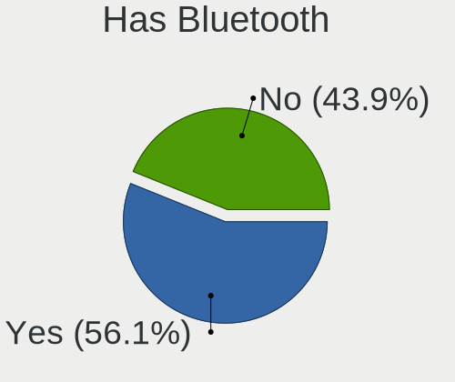
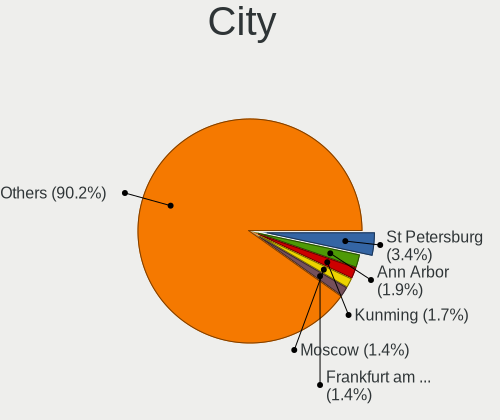
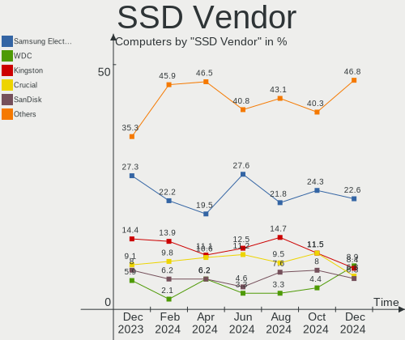
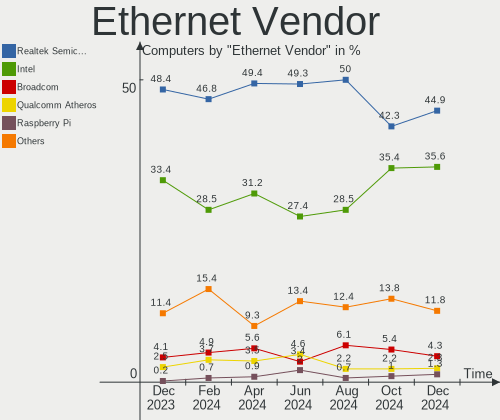
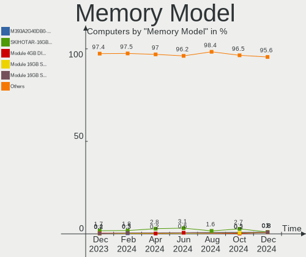
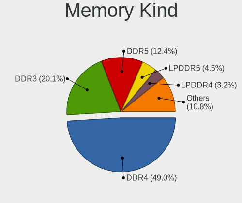

Debian - Hardware Trends
------------------------

A project to identify most popular hardware characteristics and track their change
over time based on data collected by Linux users at https://Linux-Hardware.org.

Anyone can contribute to this report by the [hw-probe](https://github.com/linuxhw/hw-probe) tool:

    sudo -E hw-probe -all -upload

This is a report for all computer types. See also reports for [desktops](/Dist/Debian/Desktop/README.md) and [notebooks](/Dist/Debian/Notebook/README.md).

This report is for one last month. Overall report since the beginning of time: [TestDays](https://github.com/linuxhw/TestDays)

Period: Mar, 2023.

Contents
--------

* [ System ](#system)
  - [ OS                       ](#os)
  - [ OS Family                ](#os-family)
  - [ Kernel                   ](#kernel)
  - [ Kernel Family            ](#kernel-family)
  - [ Kernel Major Ver.        ](#kernel-major-ver)
  - [ Arch                     ](#arch)
  - [ DE                       ](#de)
  - [ Display Server           ](#display-server)
  - [ Display Manager          ](#display-manager)
  - [ OS Lang                  ](#os-lang)
  - [ Boot Mode                ](#boot-mode)
  - [ Filesystem               ](#filesystem)
  - [ Part. scheme             ](#part-scheme)
  - [ Dual Boot with Linux/BSD ](#dual-boot-with-linuxbsd)
  - [ Dual Boot (Win)          ](#dual-boot-win)

* [ Board ](#board)
  - [ Vendor                   ](#vendor)
  - [ Model                    ](#model)
  - [ Model Family             ](#model-family)
  - [ MFG Year                 ](#mfg-year)
  - [ Form Factor              ](#form-factor)
  - [ Secure Boot              ](#secure-boot)
  - [ Coreboot                 ](#coreboot)
  - [ RAM Size                 ](#ram-size)
  - [ RAM Used                 ](#ram-used)
  - [ Total Drives             ](#total-drives)
  - [ Has CD-ROM               ](#has-cd-rom)
  - [ Has Ethernet             ](#has-ethernet)
  - [ Has WiFi                 ](#has-wifi)
  - [ Has Bluetooth            ](#has-bluetooth)

* [ Location ](#location)
  - [ Country                  ](#country)
  - [ City                     ](#city)

* [ Drives ](#drives)
  - [ Drive Vendor             ](#drive-vendor)
  - [ Drive Model              ](#drive-model)
  - [ HDD Vendor               ](#hdd-vendor)
  - [ SSD Vendor               ](#ssd-vendor)
  - [ Drive Kind               ](#drive-kind)
  - [ Drive Connector          ](#drive-connector)
  - [ Drive Size               ](#drive-size)
  - [ Space Total              ](#space-total)
  - [ Space Used               ](#space-used)
  - [ Malfunc. Drives          ](#malfunc-drives)
  - [ Malfunc. Drive Vendor    ](#malfunc-drive-vendor)
  - [ Malfunc. HDD Vendor      ](#malfunc-hdd-vendor)
  - [ Malfunc. Drive Kind      ](#malfunc-drive-kind)
  - [ Failed Drives            ](#failed-drives)
  - [ Failed Drive Vendor      ](#failed-drive-vendor)
  - [ Drive Status             ](#drive-status)

* [ Storage controller ](#storage-controller)
  - [ Storage Vendor           ](#storage-vendor)
  - [ Storage Model            ](#storage-model)
  - [ Storage Kind             ](#storage-kind)

* [ Processor ](#processor)
  - [ CPU Vendor               ](#cpu-vendor)
  - [ CPU Model                ](#cpu-model)
  - [ CPU Model Family         ](#cpu-model-family)
  - [ CPU Cores                ](#cpu-cores)
  - [ CPU Sockets              ](#cpu-sockets)
  - [ CPU Threads              ](#cpu-threads)
  - [ CPU Op-Modes             ](#cpu-op-modes)
  - [ CPU Microcode            ](#cpu-microcode)
  - [ CPU Microarch            ](#cpu-microarch)

* [ Graphics ](#graphics)
  - [ GPU Vendor               ](#gpu-vendor)
  - [ GPU Model                ](#gpu-model)
  - [ GPU Combo                ](#gpu-combo)
  - [ GPU Driver               ](#gpu-driver)
  - [ GPU Memory               ](#gpu-memory)

* [ Monitor ](#monitor)
  - [ Monitor Vendor           ](#monitor-vendor)
  - [ Monitor Model            ](#monitor-model)
  - [ Monitor Resolution       ](#monitor-resolution)
  - [ Monitor Diagonal         ](#monitor-diagonal)
  - [ Monitor Width            ](#monitor-width)
  - [ Aspect Ratio             ](#aspect-ratio)
  - [ Monitor Area             ](#monitor-area)
  - [ Pixel Density            ](#pixel-density)
  - [ Multiple Monitors        ](#multiple-monitors)

* [ Network ](#network)
  - [ Net Controller Vendor    ](#net-controller-vendor)
  - [ Net Controller Model     ](#net-controller-model)
  - [ Wireless Vendor          ](#wireless-vendor)
  - [ Wireless Model           ](#wireless-model)
  - [ Ethernet Vendor          ](#ethernet-vendor)
  - [ Ethernet Model           ](#ethernet-model)
  - [ Net Controller Kind      ](#net-controller-kind)
  - [ Used Controller          ](#used-controller)
  - [ NICs                     ](#nics)
  - [ IPv6                     ](#ipv6)

* [ Bluetooth ](#bluetooth)
  - [ Bluetooth Vendor         ](#bluetooth-vendor)
  - [ Bluetooth Model          ](#bluetooth-model)

* [ Sound ](#sound)
  - [ Sound Vendor             ](#sound-vendor)
  - [ Sound Model              ](#sound-model)

* [ Memory ](#memory)
  - [ Memory Vendor            ](#memory-vendor)
  - [ Memory Model             ](#memory-model)
  - [ Memory Kind              ](#memory-kind)
  - [ Memory Form Factor       ](#memory-form-factor)
  - [ Memory Size              ](#memory-size)
  - [ Memory Speed             ](#memory-speed)

* [ Printers & scanners ](#printers--scanners)
  - [ Printer Vendor           ](#printer-vendor)
  - [ Printer Model            ](#printer-model)
  - [ Scanner Vendor           ](#scanner-vendor)
  - [ Scanner Model            ](#scanner-model)

* [ Camera ](#camera)
  - [ Camera Vendor            ](#camera-vendor)
  - [ Camera Model             ](#camera-model)

* [ Security ](#security)
  - [ Fingerprint Vendor       ](#fingerprint-vendor)
  - [ Fingerprint Model        ](#fingerprint-model)
  - [ Chipcard Vendor          ](#chipcard-vendor)
  - [ Chipcard Model           ](#chipcard-model)

* [ Unsupported ](#unsupported)
  - [ Unsupported Devices      ](#unsupported-devices)
  - [ Unsupported Device Types ](#unsupported-device-types)

System
------

OS
--

Installed operating systems

| Name              | Computers | Percent |
|-------------------|-----------|---------|
| Debian 11         | 369       | 77.2%   |
| Debian            | 61        | 12.76%  |
| Debian 12         | 34        | 7.11%   |
| Debian 10         | 12        | 2.51%   |
| Debian Sid        | 1         | 0.21%   |
| Debian 11-updates | 1         | 0.21%   |

OS Family
---------

OS without a version

| Name   | Computers | Percent |
|--------|-----------|---------|
| Debian | 478       | 100%    |

Kernel
------

Version of the Linux kernel

| Version                | Computers | Percent |
|------------------------|-----------|---------|
| 5.10.0-21-amd64        | 151       | 31.59%  |
| 5.10.0-20-amd64        | 69        | 14.44%  |
| 6.1.0-6-amd64          | 37        | 7.74%   |
| 6.1.0-5-amd64          | 27        | 5.65%   |
| 6.0.0-0.deb11.6-amd64  | 24        | 5.02%   |
| 5.15.85-1-pve          | 14        | 2.93%   |
| 5.10.0-2-amd64         | 12        | 2.51%   |
| 6.1.0-7-amd64          | 10        | 2.09%   |
| 6.1.0-4-amd64          | 9         | 1.88%   |
| 5.15.83-1-pve          | 8         | 1.67%   |
| 6.1.0-3-amd64          | 6         | 1.26%   |
| 6.0.0-6mx-amd64        | 6         | 1.26%   |
| 5.10.0-21-686-pae      | 6         | 1.26%   |
| 5.15.84-v8+            | 5         | 1.05%   |
| 5.15.74-1-pve          | 4         | 0.84%   |
| 5.15.102-1-pve         | 4         | 0.84%   |
| 5.10.0-15-amd64        | 4         | 0.84%   |
| 6.1.15-1-pve           | 3         | 0.63%   |
| 5.19.0-0.deb11.2-amd64 | 3         | 0.63%   |
| 5.16.0-0.bpo.4-amd64   | 3         | 0.63%   |
| 5.13.19-6-pve          | 3         | 0.63%   |
| 5.10.0-21-686          | 3         | 0.63%   |
| 5.10.0-18-amd64        | 3         | 0.63%   |
| 6.1.19-v8+             | 2         | 0.42%   |
| 6.0.0-6-amd64          | 2         | 0.42%   |
| 5.15.94-starfive2      | 2         | 0.42%   |
| 5.15.79+truenas        | 2         | 0.42%   |
| 5.15.60-1-pve          | 2         | 0.42%   |
| 5.11.22-5-pve          | 2         | 0.42%   |
| 4.19.0-23-amd64        | 2         | 0.42%   |
| 6.3.0-rc1-recompv5     | 1         | 0.21%   |
| 6.2.8-x64v3-xanmod1    | 1         | 0.21%   |
| 6.2.8                  | 1         | 0.21%   |
| 6.2.7-v8+              | 1         | 0.21%   |
| 6.2.7-amd64            | 1         | 0.21%   |
| 6.2.6-1-pve            | 1         | 0.21%   |
| 6.2.6-1-liquorix-amd64 | 1         | 0.21%   |
| 6.2.2-jason            | 1         | 0.21%   |
| 6.2.1                  | 1         | 0.21%   |
| 6.1.3                  | 1         | 0.21%   |

Kernel Family
-------------

Linux kernel without a distro release

| Version  | Computers | Percent |
|----------|-----------|---------|
| 5.10.0   | 258       | 53.97%  |
| 6.1.0    | 91        | 19.04%  |
| 6.0.0    | 34        | 7.11%   |
| 5.15.85  | 14        | 2.93%   |
| 5.15.83  | 8         | 1.67%   |
| 4.19.0   | 6         | 1.26%   |
| 5.15.84  | 5         | 1.05%   |
| 5.15.74  | 4         | 0.84%   |
| 5.15.102 | 4         | 0.84%   |
| 5.13.19  | 4         | 0.84%   |
| 6.1.19   | 3         | 0.63%   |
| 6.1.15   | 3         | 0.63%   |
| 5.19.0   | 3         | 0.63%   |
| 5.16.0   | 3         | 0.63%   |
| 5.15.60  | 3         | 0.63%   |
| 6.2.8    | 2         | 0.42%   |
| 6.2.7    | 2         | 0.42%   |
| 6.2.6    | 2         | 0.42%   |
| 6.1.11   | 2         | 0.42%   |
| 5.15.94  | 2         | 0.42%   |
| 5.15.79  | 2         | 0.42%   |
| 5.11.22  | 2         | 0.42%   |
| 6.3.0    | 1         | 0.21%   |
| 6.2.2    | 1         | 0.21%   |
| 6.2.1    | 1         | 0.21%   |
| 6.1.3    | 1         | 0.21%   |
| 6.1.14   | 1         | 0.21%   |
| 6.1.12   | 1         | 0.21%   |
| 6.1.10   | 1         | 0.21%   |
| 6.0.19   | 1         | 0.21%   |
| 5.4.203  | 1         | 0.21%   |
| 5.3.5    | 1         | 0.21%   |
| 5.2.5    | 1         | 0.21%   |
| 5.19.17  | 1         | 0.21%   |
| 5.16.2   | 1         | 0.21%   |
| 5.16.17  | 1         | 0.21%   |
| 5.15.96  | 1         | 0.21%   |
| 5.15.95  | 1         | 0.21%   |
| 5.15.30  | 1         | 0.21%   |
| 5.10.103 | 1         | 0.21%   |

Kernel Major Ver.
-----------------

Linux kernel major version

| Version | Computers | Percent |
|---------|-----------|---------|
| 5.10    | 260       | 54.39%  |
| 6.1     | 103       | 21.55%  |
| 5.15    | 45        | 9.41%   |
| 6.0     | 35        | 7.32%   |
| 6.2     | 8         | 1.67%   |
| 4.19    | 7         | 1.46%   |
| 5.16    | 5         | 1.05%   |
| 5.19    | 4         | 0.84%   |
| 5.13    | 4         | 0.84%   |
| 5.11    | 2         | 0.42%   |
| 6.3     | 1         | 0.21%   |
| 5.4     | 1         | 0.21%   |
| 5.3     | 1         | 0.21%   |
| 5.2     | 1         | 0.21%   |
| 4.4     | 1         | 0.21%   |

Arch
----

OS architecture (x86_64, i586, etc.)

| Name    | Computers | Percent |
|---------|-----------|---------|
| x86_64  | 445       | 93.1%   |
| aarch64 | 17        | 3.56%   |
| i686    | 12        | 2.51%   |
| riscv64 | 2         | 0.42%   |
| ppc64   | 1         | 0.21%   |
| armv7l  | 1         | 0.21%   |

DE
--

Desktop Environment

| Name              | Computers | Percent |
|-------------------|-----------|---------|
| Unknown           | 166       | 34.73%  |
| GNOME             | 113       | 23.64%  |
| KDE5              | 62        | 12.97%  |
| XFCE              | 42        | 8.79%   |
| X-Cinnamon        | 19        | 3.97%   |
| LXDE              | 17        | 3.56%   |
| Cinnamon          | 16        | 3.35%   |
| MATE              | 12        | 2.51%   |
| Openbox           | 7         | 1.46%   |
| i3                | 7         | 1.46%   |
| LXQt              | 4         | 0.84%   |
| GNOME Flashback   | 4         | 0.84%   |
| Trinity           | 2         | 0.42%   |
| x-session-manager | 1         | 0.21%   |
| sway              | 1         | 0.21%   |
| KDE               | 1         | 0.21%   |
| GNOME Classic     | 1         | 0.21%   |
| Enlightenment     | 1         | 0.21%   |
| Budgie            | 1         | 0.21%   |
| awesome           | 1         | 0.21%   |

Display Server
--------------

X11 or Wayland

| Name    | Computers | Percent |
|---------|-----------|---------|
| X11     | 223       | 46.65%  |
| Unknown | 90        | 18.83%  |
| Tty     | 87        | 18.2%   |
| Wayland | 78        | 16.32%  |

Display Manager
---------------

SDDM, LightDM, etc.

| Name    | Computers | Percent |
|---------|-----------|---------|
| Unknown | 207       | 43.31%  |
| LightDM | 111       | 23.22%  |
| GDM     | 61        | 12.76%  |
| SDDM    | 49        | 10.25%  |
| GDM3    | 37        | 7.74%   |
| NODM    | 3         | 0.63%   |
| XDM     | 2         | 0.42%   |
| SLiM    | 2         | 0.42%   |
| GREETD  | 2         | 0.42%   |
| TDM     | 1         | 0.21%   |
| Ly      | 1         | 0.21%   |
| LXDM    | 1         | 0.21%   |
| KDM     | 1         | 0.21%   |

OS Lang
-------

Language

| Lang       | Computers | Percent |
|------------|-----------|---------|
| en_US      | 171       | 35.77%  |
| Unknown    | 57        | 11.92%  |
| de_DE      | 54        | 11.3%   |
| ru_RU      | 39        | 8.16%   |
| en_GB      | 26        | 5.44%   |
| fr_FR      | 24        | 5.02%   |
| es_ES      | 17        | 3.56%   |
| it_IT      | 14        | 2.93%   |
| C          | 11        | 2.3%    |
| pl_PL      | 9         | 1.88%   |
| pt_BR      | 7         | 1.46%   |
| en_CA      | 5         | 1.05%   |
| en_AU      | 5         | 1.05%   |
| es_AR      | 4         | 0.84%   |
| fi_FI      | 3         | 0.63%   |
| zh_TW      | 2         | 0.42%   |
| nl_BE      | 2         | 0.42%   |
| es_MX      | 2         | 0.42%   |
| es_CL      | 2         | 0.42%   |
| en_NZ      | 2         | 0.42%   |
| en_IE      | 2         | 0.42%   |
| de_CH      | 2         | 0.42%   |
| de_AT      | 2         | 0.42%   |
| zh_CN      | 1         | 0.21%   |
| uk_UA      | 1         | 0.21%   |
| tr_TR      | 1         | 0.21%   |
| sv_SE      | 1         | 0.21%   |
| oc_FR      | 1         | 0.21%   |
| nl_NL      | 1         | 0.21%   |
| ja_JP      | 1         | 0.21%   |
| it_IT@euro | 1         | 0.21%   |
| fr_BE      | 1         | 0.21%   |
| es_VE      | 1         | 0.21%   |
| es_UY      | 1         | 0.21%   |
| es_CO      | 1         | 0.21%   |
| en_SG      | 1         | 0.21%   |
| en_IL      | 1         | 0.21%   |
| cs_CZ      | 1         | 0.21%   |
| be_BY      | 1         | 0.21%   |

Boot Mode
---------

EFI or BIOS

| Mode | Computers | Percent |
|------|-----------|---------|
| EFI  | 317       | 66.32%  |
| BIOS | 161       | 33.68%  |

Filesystem
----------

Type of filesystem

| Type    | Computers | Percent |
|---------|-----------|---------|
| Ext4    | 341       | 71.34%  |
| Overlay | 90        | 18.83%  |
| Zfs     | 19        | 3.97%   |
| Btrfs   | 13        | 2.72%   |
| Xfs     | 9         | 1.88%   |
| Rootfs  | 3         | 0.63%   |
| Ext3    | 2         | 0.42%   |
| Tmpfs   | 1         | 0.21%   |

Part. scheme
------------

Scheme of partitioning

| Type    | Computers | Percent |
|---------|-----------|---------|
| GPT     | 338       | 70.71%  |
| MBR     | 95        | 19.87%  |
| Unknown | 45        | 9.41%   |

Dual Boot with Linux/BSD
------------------------

Hosting more than one Linux/BSD

| Dual boot | Computers | Percent |
|-----------|-----------|---------|
| No        | 408       | 85.36%  |
| Yes       | 70        | 14.64%  |

Dual Boot (Win)
---------------

Hosting Linux and Windows

| Dual boot | Computers | Percent |
|-----------|-----------|---------|
| No        | 354       | 74.06%  |
| Yes       | 124       | 25.94%  |

Board
-----

Vendor
------

Motherboard manufacturer

| Name                    | Computers | Percent |
|-------------------------|-----------|---------|
| Hewlett-Packard         | 65        | 13.6%   |
| Lenovo                  | 57        | 11.92%  |
| ASUSTek Computer        | 54        | 11.3%   |
| Apple                   | 52        | 10.88%  |
| Dell                    | 50        | 10.46%  |
| Gigabyte Technology     | 25        | 5.23%   |
| Acer                    | 20        | 4.18%   |
| MSI                     | 19        | 3.97%   |
| ASRock                  | 16        | 3.35%   |
| Unknown                 | 14        | 2.93%   |
| Supermicro              | 11        | 2.3%    |
| Raspberry Pi Foundation | 10        | 2.09%   |
| Intel                   | 9         | 1.88%   |
| Fujitsu                 | 8         | 1.67%   |
| AZW                     | 7         | 1.46%   |
| ASRockRack              | 6         | 1.26%   |
| Samsung Electronics     | 4         | 0.84%   |
| TUXEDO                  | 3         | 0.63%   |
| Toshiba                 | 3         | 0.63%   |
| Techvision              | 3         | 0.63%   |
| Medion                  | 3         | 0.63%   |
| ECS                     | 3         | 0.63%   |
| Microsoft               | 2         | 0.42%   |
| HUAWEI                  | 2         | 0.42%   |
| Google                  | 2         | 0.42%   |
| ZOTAC                   | 1         | 0.21%   |
| Win element             | 1         | 0.21%   |
| THUNDEROBOT             | 1         | 0.21%   |
| System76                | 1         | 0.21%   |
| sunxi                   | 1         | 0.21%   |
| Sony                    | 1         | 0.21%   |
| Schenker                | 1         | 0.21%   |
| SANTECH                 | 1         | 0.21%   |
| Pine Microsystems       | 1         | 0.21%   |
| Pegatron                | 1         | 0.21%   |
| PC Specialist           | 1         | 0.21%   |
| Packard Bell            | 1         | 0.21%   |
| OEGStone                | 1         | 0.21%   |
| Notebook                | 1         | 0.21%   |
| MicroByte               | 1         | 0.21%   |

Model
-----

Motherboard model

| Name                                      | Computers | Percent |
|-------------------------------------------|-----------|---------|
| Apple MacBook5,2                          | 47        | 9.83%   |
| Unknown                                   | 14        | 2.93%   |
| Techvision TVI7309X                       | 3         | 0.63%   |
| Supermicro X11DPi-N(T)                    | 3         | 0.63%   |
| Lenovo ThinkPad 13 2nd Gen 20J10046US     | 3         | 0.63%   |
| AZW U59                                   | 3         | 0.63%   |
| AZW MINI S                                | 3         | 0.63%   |
| Supermicro X9DR3-F                        | 2         | 0.42%   |
| Supermicro egino BTO Konfig Server        | 2         | 0.42%   |
| RPi Raspberry Pi Compute Module 4 Rev 1.1 | 2         | 0.42%   |
| RPi Raspberry Pi 4 Model B Rev 1.4        | 2         | 0.42%   |
| MSI MS-7C91                               | 2         | 0.42%   |
| MSI MS-7C02                               | 2         | 0.42%   |
| Lenovo ThinkPad L13 Yoga Gen 2 20VK0019US | 2         | 0.42%   |
| Lenovo IdeaPad 5 15ARE05 81YQ             | 2         | 0.42%   |
| HP ProLiant DL380p Gen8                   | 2         | 0.42%   |
| HP ProDesk 600 G6 Desktop Mini PC         | 2         | 0.42%   |
| HP EliteDesk 800 G1 DM                    | 2         | 0.42%   |
| HP EliteBook 840 G6                       | 2         | 0.42%   |
| HP EliteBook 840 G3                       | 2         | 0.42%   |
| HP EliteBook 830 G5                       | 2         | 0.42%   |
| HP Compaq 8200 Elite SFF PC               | 2         | 0.42%   |
| Gigabyte H97M-HD3                         | 2         | 0.42%   |
| ECS G31T-M9                               | 2         | 0.42%   |
| Dell Precision 5570                       | 2         | 0.42%   |
| Dell OptiPlex 790                         | 2         | 0.42%   |
| Dell Latitude E6440                       | 2         | 0.42%   |
| Dell Latitude E6330                       | 2         | 0.42%   |
| Dell Latitude 3510                        | 2         | 0.42%   |
| Dell Latitude 3320                        | 2         | 0.42%   |
| ASUS Zenbook UX535QE_UM535QE              | 2         | 0.42%   |
| ASUS Pro WS WRX80E-SAGE SE WIFI           | 2         | 0.42%   |
| ASRockRack B450D4U-V1L                    | 2         | 0.42%   |
| Acer Nitro AN515-43                       | 2         | 0.42%   |
| ZOTAC ZBOX-CI331NANO                      | 1         | 0.21%   |
| Win element M600                          | 1         | 0.21%   |
| TUXEDO N13xWU                             | 1         | 0.21%   |
| TUXEDO InfinityBook Pro 14 v4             | 1         | 0.21%   |
| TUXEDO Aura 15 Gen2                       | 1         | 0.21%   |
| Toshiba Satellite C655                    | 1         | 0.21%   |

Model Family
------------

Motherboard model prefix

| Name                   | Computers | Percent |
|------------------------|-----------|---------|
| Apple MacBook5         | 47        | 9.83%   |
| Lenovo ThinkPad        | 28        | 5.86%   |
| Dell Latitude          | 15        | 3.14%   |
| Unknown                | 14        | 2.93%   |
| Acer Aspire            | 13        | 2.72%   |
| RPi Raspberry          | 10        | 2.09%   |
| HP EliteBook           | 10        | 2.09%   |
| ASUS PRIME             | 9         | 1.88%   |
| HP Pavilion            | 7         | 1.46%   |
| Dell Precision         | 7         | 1.46%   |
| Lenovo ThinkCentre     | 6         | 1.26%   |
| Lenovo IdeaPad         | 6         | 1.26%   |
| HP ProDesk             | 6         | 1.26%   |
| HP Compaq              | 6         | 1.26%   |
| Dell Inspiron          | 6         | 1.26%   |
| HP ProLiant            | 5         | 1.05%   |
| Dell PowerEdge         | 5         | 1.05%   |
| Dell OptiPlex          | 5         | 1.05%   |
| ASUS Zenbook           | 5         | 1.05%   |
| ASUS VivoBook          | 5         | 1.05%   |
| ASUS ROG               | 5         | 1.05%   |
| HP ZBook               | 4         | 0.84%   |
| HP Laptop              | 4         | 0.84%   |
| HP ENVY                | 4         | 0.84%   |
| Fujitsu LIFEBOOK       | 4         | 0.84%   |
| Dell XPS               | 4         | 0.84%   |
| Toshiba Satellite      | 3         | 0.63%   |
| Techvision TVI7309X    | 3         | 0.63%   |
| Supermicro X11DPi-N(T) | 3         | 0.63%   |
| Lenovo Yoga            | 3         | 0.63%   |
| HP ProBook             | 3         | 0.63%   |
| HP EliteDesk           | 3         | 0.63%   |
| Gigabyte B550          | 3         | 0.63%   |
| Fujitsu ESPRIMO        | 3         | 0.63%   |
| Dell Vostro            | 3         | 0.63%   |
| AZW U59                | 3         | 0.63%   |
| AZW MINI               | 3         | 0.63%   |
| ASUS Pro               | 3         | 0.63%   |
| Acer Nitro             | 3         | 0.63%   |
| Supermicro X9DR3-F     | 2         | 0.42%   |

MFG Year
--------

Motherboard manufacture year

| Year    | Computers | Percent |
|---------|-----------|---------|
| 2022    | 61        | 12.76%  |
| 2009    | 57        | 11.92%  |
| 2020    | 47        | 9.83%   |
| 2021    | 41        | 8.58%   |
| 2019    | 37        | 7.74%   |
| 2018    | 33        | 6.9%    |
| 2012    | 26        | 5.44%   |
| 2014    | 22        | 4.6%    |
| 2011    | 22        | 4.6%    |
| Unknown | 20        | 4.18%   |
| 2017    | 19        | 3.97%   |
| 2013    | 19        | 3.97%   |
| 2016    | 18        | 3.77%   |
| 2015    | 15        | 3.14%   |
| 2010    | 15        | 3.14%   |
| 2007    | 9         | 1.88%   |
| 2023    | 6         | 1.26%   |
| 2008    | 6         | 1.26%   |
| 2006    | 5         | 1.05%   |

Form Factor
-----------

Physical design of the computer

| Name           | Computers | Percent |
|----------------|-----------|---------|
| Notebook       | 241       | 50.42%  |
| Desktop        | 170       | 35.56%  |
| System on chip | 18        | 3.77%   |
| Server         | 18        | 3.77%   |
| Convertible    | 12        | 2.51%   |
| Mini pc        | 12        | 2.51%   |
| Tablet         | 4         | 0.84%   |
| All in one     | 2         | 0.42%   |
| Phone          | 1         | 0.21%   |

Secure Boot
-----------

Enabled or disabled

| State    | Computers | Percent |
|----------|-----------|---------|
| Disabled | 452       | 94.56%  |
| Enabled  | 26        | 5.44%   |

Coreboot
--------

Have coreboot on board

| Used | Computers | Percent |
|------|-----------|---------|
| No   | 474       | 99.16%  |
| Yes  | 4         | 0.84%   |

RAM Size
--------

Total RAM memory

| Size in GB      | Computers | Percent |
|-----------------|-----------|---------|
| 3.01-4.0        | 101       | 21.13%  |
| 16.01-24.0      | 99        | 20.71%  |
| 4.01-8.0        | 87        | 18.2%   |
| 8.01-16.0       | 57        | 11.92%  |
| 32.01-64.0      | 43        | 9%      |
| 64.01-256.0     | 43        | 9%      |
| 1.01-2.0        | 22        | 4.6%    |
| 24.01-32.0      | 8         | 1.67%   |
| 0.51-1.0        | 7         | 1.46%   |
| 2.01-3.0        | 6         | 1.26%   |
| More than 256.0 | 4         | 0.84%   |
| 0.01-0.5        | 1         | 0.21%   |

RAM Used
--------

Used RAM memory

| Used GB         | Computers | Percent |
|-----------------|-----------|---------|
| 1.01-2.0        | 141       | 29.5%   |
| 2.01-3.0        | 85        | 17.78%  |
| 4.01-8.0        | 79        | 16.53%  |
| 0.51-1.0        | 48        | 10.04%  |
| 3.01-4.0        | 40        | 8.37%   |
| 0.01-0.5        | 32        | 6.69%   |
| 8.01-16.0       | 23        | 4.81%   |
| 32.01-64.0      | 12        | 2.51%   |
| 64.01-256.0     | 7         | 1.46%   |
| 16.01-24.0      | 7         | 1.46%   |
| 24.01-32.0      | 3         | 0.63%   |
| More than 256.0 | 1         | 0.21%   |

Total Drives
------------

Number of drives on board

| Drives | Computers | Percent |
|--------|-----------|---------|
| 1      | 288       | 60.25%  |
| 2      | 103       | 21.55%  |
| 3      | 26        | 5.44%   |
| 4      | 21        | 4.39%   |
| 5      | 10        | 2.09%   |
| 13     | 6         | 1.26%   |
| 8      | 5         | 1.05%   |
| 7      | 5         | 1.05%   |
| 6      | 5         | 1.05%   |
| 0      | 3         | 0.63%   |
| 9      | 2         | 0.42%   |
| 29     | 1         | 0.21%   |
| 22     | 1         | 0.21%   |
| 12     | 1         | 0.21%   |
| 11     | 1         | 0.21%   |

Has CD-ROM
----------

Has CD-ROM on board

| Presented | Computers | Percent |
|-----------|-----------|---------|
| No        | 321       | 67.15%  |
| Yes       | 157       | 32.85%  |

Has Ethernet
------------

Has Ethernet on board

| Presented | Computers | Percent |
|-----------|-----------|---------|
| Yes       | 416       | 87.03%  |
| No        | 62        | 12.97%  |

Has WiFi
--------

Has WiFi module

| Presented | Computers | Percent |
|-----------|-----------|---------|
| Yes       | 341       | 71.34%  |
| No        | 137       | 28.66%  |

Has Bluetooth
-------------

Has Bluetooth module

| Presented | Computers | Percent |
|-----------|-----------|---------|
| Yes       | 295       | 61.72%  |
| No        | 183       | 38.28%  |

Location
--------

Country
-------

Geographic location (country)

| Country     | Computers | Percent |
|-------------|-----------|---------|
| USA         | 124       | 25.94%  |
| Germany     | 75        | 15.69%  |
| Russia      | 47        | 9.83%   |
| France      | 30        | 6.28%   |
| Italy       | 22        | 4.6%    |
| Spain       | 21        | 4.39%   |
| Poland      | 14        | 2.93%   |
| Canada      | 13        | 2.72%   |
| Brazil      | 10        | 2.09%   |
| UK          | 9         | 1.88%   |
| Netherlands | 8         | 1.67%   |
| Australia   | 8         | 1.67%   |
| China       | 7         | 1.46%   |
| Austria     | 7         | 1.46%   |
| Switzerland | 5         | 1.05%   |
| Malaysia    | 5         | 1.05%   |
| Mexico      | 4         | 0.84%   |
| Finland     | 4         | 0.84%   |
| Argentina   | 4         | 0.84%   |
| Ukraine     | 3         | 0.63%   |
| Turkey      | 3         | 0.63%   |
| Taiwan      | 3         | 0.63%   |
| Sweden      | 3         | 0.63%   |
| Norway      | 3         | 0.63%   |
| Belgium     | 3         | 0.63%   |
| Belarus     | 3         | 0.63%   |
| Slovakia    | 2         | 0.42%   |
| Romania     | 2         | 0.42%   |
| New Zealand | 2         | 0.42%   |
| Morocco     | 2         | 0.42%   |
| Kazakhstan  | 2         | 0.42%   |
| Japan       | 2         | 0.42%   |
| Czechia     | 2         | 0.42%   |
| Colombia    | 2         | 0.42%   |
| Chile       | 2         | 0.42%   |
| Vietnam     | 1         | 0.21%   |
| Venezuela   | 1         | 0.21%   |
| Uruguay     | 1         | 0.21%   |
| Tunisia     | 1         | 0.21%   |
| Thailand    | 1         | 0.21%   |

City
----

Geographic location (city)

| City              | Computers | Percent |
|-------------------|-----------|---------|
| Bangor            | 53        | 11.09%  |
| Voronezh          | 22        | 4.6%    |
| Vienna            | 7         | 1.46%   |
| Stuttgart         | 7         | 1.46%   |
| Paris             | 5         | 1.05%   |
| Madrid            | 5         | 1.05%   |
| Kuala Lumpur      | 5         | 1.05%   |
| St Petersburg     | 4         | 0.84%   |
| Munich            | 4         | 0.84%   |
| Moscow            | 4         | 0.84%   |
| Helsinki          | 4         | 0.84%   |
| Bonn              | 4         | 0.84%   |
| Berlin            | 4         | 0.84%   |
| Ufa               | 3         | 0.63%   |
| Sydney            | 3         | 0.63%   |
| London            | 3         | 0.63%   |
| Kirishi           | 3         | 0.63%   |
| Frankfurt am Main | 3         | 0.63%   |
| Courtice          | 3         | 0.63%   |
| Bieligutai        | 3         | 0.63%   |
| Barcelona         | 3         | 0.63%   |
| Amsterdam         | 3         | 0.63%   |
| Zurich            | 2         | 0.42%   |
| Wroclaw           | 2         | 0.42%   |
| Vila Velha        | 2         | 0.42%   |
| Toronto           | 2         | 0.42%   |
| Taipei            | 2         | 0.42%   |
| Seville           | 2         | 0.42%   |
| Sao Paulo         | 2         | 0.42%   |
| San Jose          | 2         | 0.42%   |
| Roubaix           | 2         | 0.42%   |
| Rhede             | 2         | 0.42%   |
| Puyallup          | 2         | 0.42%   |
| Onalaska          | 2         | 0.42%   |
| Nizhniy Novgorod  | 2         | 0.42%   |
| Milano            | 2         | 0.42%   |
| Mexico City       | 2         | 0.42%   |
| Melbourne         | 2         | 0.42%   |
| Leipzig           | 2         | 0.42%   |
| Košice           | 2         | 0.42%   |

Drives
------

Drive Vendor
------------

Hard drive vendors

| Vendor              | Computers | Drives | Percent |
|---------------------|-----------|--------|---------|
| Samsung Electronics | 121       | 153    | 17.26%  |
| Seagate             | 84        | 145    | 11.98%  |
| WDC                 | 80        | 135    | 11.41%  |
| Toshiba             | 49        | 70     | 6.99%   |
| SanDisk             | 36        | 41     | 5.14%   |
| Fujitsu             | 36        | 36     | 5.14%   |
| Kingston            | 33        | 43     | 4.71%   |
| Unknown             | 32        | 36     | 4.56%   |
| Intel               | 26        | 42     | 3.71%   |
| Hitachi             | 19        | 22     | 2.71%   |
| Crucial             | 19        | 22     | 2.71%   |
| Micron Technology   | 13        | 28     | 1.85%   |
| HGST                | 13        | 15     | 1.85%   |
| SK hynix            | 12        | 12     | 1.71%   |
| PNY                 | 11        | 21     | 1.57%   |
| A-DATA Technology   | 10        | 11     | 1.43%   |
| Phison              | 7         | 7      | 1%      |
| LITEON              | 6         | 6      | 0.86%   |
| China               | 6         | 6      | 0.86%   |
| Corsair             | 5         | 7      | 0.71%   |
| Team                | 4         | 4      | 0.57%   |
| Intenso             | 4         | 4      | 0.57%   |
| GOODRAM             | 4         | 7      | 0.57%   |
| Unknown             | 4         | 4      | 0.57%   |
| TO Exter            | 3         | 3      | 0.43%   |
| SSSTC               | 3         | 3      | 0.43%   |
| SPCC                | 3         | 3      | 0.43%   |
| KIOXIA              | 3         | 3      | 0.43%   |
| JMicron Technology  | 3         | 3      | 0.43%   |
| Fanxiang            | 3         | 3      | 0.43%   |
| Apple               | 3         | 3      | 0.43%   |
| XPG                 | 2         | 2      | 0.29%   |
| Xinhaike            | 2         | 2      | 0.29%   |
| Transcend           | 2         | 2      | 0.29%   |
| Patriot             | 2         | 2      | 0.29%   |
| NGFF                | 2         | 2      | 0.29%   |
| Netac               | 2         | 2      | 0.29%   |
| LITEONIT            | 2         | 2      | 0.29%   |
| KIOXIA-EXCERIA      | 2         | 2      | 0.29%   |
| INNOVATION IT       | 2         | 2      | 0.29%   |

Drive Model
-----------

Hard drive models

| Model                                               | Computers | Percent |
|-----------------------------------------------------|-----------|---------|
| Fujitsu MHZ2160BH FFS G1 160GB                      | 35        | 4.4%    |
| Samsung SSD 970 EVO Plus 1TB                        | 8         | 1.01%   |
| Samsung SSD 850 EVO 250GB                           | 8         | 1.01%   |
| Kingston SA400S37240G 240GB SSD                     | 8         | 1.01%   |
| Seagate Expansion+ 2TB                              | 7         | 0.88%   |
| Samsung SSD 980 PRO 1TB                             | 7         | 0.88%   |
| Toshiba MK1655GSXF 160GB                            | 6         | 0.75%   |
| Kingston SA400S37120G 120GB SSD                     | 6         | 0.75%   |
| Toshiba MQ01ABD100 1TB                              | 5         | 0.63%   |
| Toshiba DT01ACA100 1TB                              | 5         | 0.63%   |
| Kingston SV300S37A120G 120GB SSD                    | 5         | 0.63%   |
| Hitachi HTS543216L9SA02 160GB                       | 5         | 0.63%   |
| Crucial CT1000MX500SSD1 1TB                         | 5         | 0.63%   |
| Unknown SD32G  32GB                                 | 4         | 0.5%    |
| Unknown MMC Card  32GB                              | 4         | 0.5%    |
| Seagate ST2000DM008-2UB102 2TB                      | 4         | 0.5%    |
| Seagate ST1000LM035-1RK172 1TB                      | 4         | 0.5%    |
| Seagate ST1000LM024 HN-M101MBB 1TB                  | 4         | 0.5%    |
| SanDisk NVMe SSD Drive 500GB                        | 4         | 0.5%    |
| Samsung SSD 980 PRO 2TB                             | 4         | 0.5%    |
| Samsung SSD 980 1TB                                 | 4         | 0.5%    |
| Samsung SSD 850 EVO 500GB                           | 4         | 0.5%    |
| Samsung NVMe SSD Controller SM981/PM981/PM983 250GB | 4         | 0.5%    |
| PNY 1TB SATA SSD                                    | 4         | 0.5%    |
| Kingston SA400S37480G 480GB SSD                     | 4         | 0.5%    |
| HGST HUS726060ALE610 6TB                            | 4         | 0.5%    |
| Unknown                                             | 4         | 0.5%    |
| Toshiba MQ01ABF050 500GB                            | 3         | 0.38%   |
| Toshiba MK2555GSXF 250GB                            | 3         | 0.38%   |
| Toshiba DT01ACA050 500GB                            | 3         | 0.38%   |
| TO Exter nal USB 3.0 1TB                            | 3         | 0.38%   |
| Seagate ST500LT012-1DG142 500GB                     | 3         | 0.38%   |
| Seagate ST2000DM008-2FR102 2TB                      | 3         | 0.38%   |
| Seagate ST1000LM048-2E7172 1TB                      | 3         | 0.38%   |
| Sandisk WD Blue SN550 NVMe SSD 256GB                | 3         | 0.38%   |
| SanDisk SDSSDH3 4T00 4TB                            | 3         | 0.38%   |
| Samsung SSD 970 EVO Plus 500GB                      | 3         | 0.38%   |
| Samsung SSD 860 EVO 500GB                           | 3         | 0.38%   |
| Samsung SSD 860 EVO 250GB                           | 3         | 0.38%   |
| Samsung PM9A1 NVMe 1024GB                           | 3         | 0.38%   |

HDD Vendor
----------

Hard disk drive vendors

| Vendor              | Computers | Drives | Percent |
|---------------------|-----------|--------|---------|
| Seagate             | 84        | 144    | 32.06%  |
| WDC                 | 55        | 106    | 20.99%  |
| Toshiba             | 41        | 55     | 15.65%  |
| Fujitsu             | 36        | 36     | 13.74%  |
| Hitachi             | 19        | 22     | 7.25%   |
| HGST                | 13        | 15     | 4.96%   |
| Samsung Electronics | 6         | 6      | 2.29%   |
| Apple               | 2         | 2      | 0.76%   |
| USB                 | 1         | 1      | 0.38%   |
| Unknown             | 1         | 1      | 0.38%   |
| SD                  | 1         | 1      | 0.38%   |
| SABRENT             | 1         | 1      | 0.38%   |
| QNAP                | 1         | 2      | 0.38%   |
| ASMT                | 1         | 1      | 0.38%   |

SSD Vendor
----------

Solid state drive vendors

| Vendor              | Computers | Drives | Percent |
|---------------------|-----------|--------|---------|
| Samsung Electronics | 52        | 65     | 23.85%  |
| Kingston            | 29        | 39     | 13.3%   |
| SanDisk             | 20        | 22     | 9.17%   |
| Crucial             | 15        | 18     | 6.88%   |
| Intel               | 14        | 29     | 6.42%   |
| WDC                 | 8         | 9      | 3.67%   |
| PNY                 | 8         | 16     | 3.67%   |
| China               | 6         | 6      | 2.75%   |
| Micron Technology   | 5         | 20     | 2.29%   |
| LITEON              | 5         | 5      | 2.29%   |
| A-DATA Technology   | 5         | 5      | 2.29%   |
| Team                | 4         | 4      | 1.83%   |
| Intenso             | 4         | 4      | 1.83%   |
| Toshiba             | 3         | 5      | 1.38%   |
| TO Exter            | 3         | 3      | 1.38%   |
| GOODRAM             | 3         | 3      | 1.38%   |
| Xinhaike            | 2         | 2      | 0.92%   |
| Transcend           | 2         | 2      | 0.92%   |
| SPCC                | 2         | 2      | 0.92%   |
| SK hynix            | 2         | 2      | 0.92%   |
| Phison              | 2         | 2      | 0.92%   |
| NGFF                | 2         | 2      | 0.92%   |
| Netac               | 2         | 2      | 0.92%   |
| LITEONIT            | 2         | 2      | 0.92%   |
| JMicron Technology  | 2         | 2      | 0.92%   |
| INNOVATION IT       | 2         | 2      | 0.92%   |
| WDC WDS             | 1         | 1      | 0.46%   |
| sk600               | 1         | 1      | 0.46%   |
| ShiJi               | 1         | 1      | 0.46%   |
| Patriot             | 1         | 1      | 0.46%   |
| Maxtor              | 1         | 1      | 0.46%   |
| Kimtigo             | 1         | 1      | 0.46%   |
| iODD                | 1         | 1      | 0.46%   |
| Hewlett-Packard     | 1         | 1      | 0.46%   |
| Gigabyte Technology | 1         | 1      | 0.46%   |
| Corsair             | 1         | 1      | 0.46%   |
| Colorful            | 1         | 1      | 0.46%   |
| CIS                 | 1         | 1      | 0.46%   |
| Apple               | 1         | 1      | 0.46%   |
| ADATA SU            | 1         | 1      | 0.46%   |

Drive Kind
----------

HDD or SSD

| Kind    | Computers | Drives | Percent |
|---------|-----------|--------|---------|
| HDD     | 222       | 393    | 35.46%  |
| SSD     | 183       | 287    | 29.23%  |
| NVMe    | 178       | 219    | 28.43%  |
| MMC     | 36        | 40     | 5.75%   |
| Unknown | 7         | 7      | 1.12%   |

Drive Connector
---------------

SATA, SAS, NVMe, etc.

| Type | Computers | Drives | Percent |
|------|-----------|--------|---------|
| SATA | 328       | 644    | 57.04%  |
| NVMe | 178       | 219    | 30.96%  |
| MMC  | 36        | 40     | 6.26%   |
| SAS  | 33        | 43     | 5.74%   |

Drive Size
----------

Size of hard drive

| Size in TB | Computers | Drives | Percent |
|------------|-----------|--------|---------|
| 0.01-0.5   | 252       | 313    | 55.88%  |
| 0.51-1.0   | 103       | 141    | 22.84%  |
| 1.01-2.0   | 43        | 80     | 9.53%   |
| 4.01-10.0  | 24        | 63     | 5.32%   |
| 3.01-4.0   | 15        | 28     | 3.33%   |
| 2.01-3.0   | 7         | 23     | 1.55%   |
| 10.01-20.0 | 7         | 32     | 1.55%   |

Space Total
-----------

Amount of disk space available on the file system

| Size in GB     | Computers | Percent |
|----------------|-----------|---------|
| 101-250        | 100       | 20.92%  |
| Unknown        | 92        | 19.25%  |
| 251-500        | 75        | 15.69%  |
| 501-1000       | 54        | 11.3%   |
| 1001-2000      | 41        | 8.58%   |
| 51-100         | 29        | 6.07%   |
| More than 3000 | 28        | 5.86%   |
| 21-50          | 28        | 5.86%   |
| 1-20           | 20        | 4.18%   |
| 2001-3000      | 11        | 2.3%    |

Space Used
----------

Amount of used disk space

| Used GB        | Computers | Percent |
|----------------|-----------|---------|
| 1-20           | 161       | 33.68%  |
| Unknown        | 92        | 19.25%  |
| 101-250        | 53        | 11.09%  |
| 21-50          | 45        | 9.41%   |
| 51-100         | 38        | 7.95%   |
| 501-1000       | 29        | 6.07%   |
| 251-500        | 28        | 5.86%   |
| More than 3000 | 15        | 3.14%   |
| 1001-2000      | 12        | 2.51%   |
| 2001-3000      | 4         | 0.84%   |
| 0              | 1         | 0.21%   |

Malfunc. Drives
---------------

Drive models with a malfunction

| Model                                | Computers | Drives | Percent |
|--------------------------------------|-----------|--------|---------|
| Hitachi HTS543216L9SA02 160GB        | 5         | 5      | 6.49%   |
| Fujitsu MHZ2160BH FFS G1 160GB       | 5         | 5      | 6.49%   |
| Toshiba MQ01ABD100 1TB               | 3         | 3      | 3.9%    |
| Toshiba MK2555GSXF 250GB             | 3         | 3      | 3.9%    |
| WDC WD20EARX-00PASB0 2TB             | 2         | 2      | 2.6%    |
| Kingston SV300S37A120G 120GB SSD     | 2         | 2      | 2.6%    |
| WDC WD5001AALS-00L3B2 500GB          | 1         | 1      | 1.3%    |
| WDC WD5000AAKX-60U6AA0 500GB         | 1         | 1      | 1.3%    |
| WDC WD4001FFSX-68JNUN0 4TB           | 1         | 1      | 1.3%    |
| WDC WD3200BPVT-22JJ5T0 320GB         | 1         | 1      | 1.3%    |
| WDC WD3200AAJS-00L7A0 320GB          | 1         | 1      | 1.3%    |
| WDC WD2500AAJS-00B4A0 250GB          | 1         | 1      | 1.3%    |
| WDC WD10SPZX-60Z10T0 1TB             | 1         | 1      | 1.3%    |
| WDC WD10EADS-00P8B0 1TB              | 1         | 1      | 1.3%    |
| WDC WD1000DHTZ-04N21V0 1TB           | 1         | 1      | 1.3%    |
| Transcend TS32GMTS400 32GB SSD       | 1         | 1      | 1.3%    |
| Toshiba MQ02ABD100H 1TB              | 1         | 1      | 1.3%    |
| Toshiba MQ01ABD050 500GB             | 1         | 1      | 1.3%    |
| Toshiba MK2035GSS 200GB              | 1         | 1      | 1.3%    |
| Toshiba MK1655GSXF 160GB             | 1         | 1      | 1.3%    |
| Toshiba DT01ACA100 1TB               | 1         | 1      | 1.3%    |
| Toshiba DT01ACA050 500GB             | 1         | 1      | 1.3%    |
| SK hynix BC711 HFM512GD3JX013N 512GB | 1         | 1      | 1.3%    |
| Seagate ST9320423AS 320GB            | 1         | 1      | 1.3%    |
| Seagate ST9320421AS 320GB            | 1         | 1      | 1.3%    |
| Seagate ST9250827AS 250GB            | 1         | 1      | 1.3%    |
| Seagate ST500LM021-1KJ152 500GB      | 1         | 1      | 1.3%    |
| Seagate ST500LM012 HN-M500MBB 500GB  | 1         | 1      | 1.3%    |
| Seagate ST500DM002-1BD142 500GB      | 1         | 4      | 1.3%    |
| Seagate ST3320820SCE 320GB           | 1         | 1      | 1.3%    |
| Seagate ST3320613AS 320GB            | 1         | 1      | 1.3%    |
| Seagate ST3250824AS 250GB            | 1         | 1      | 1.3%    |
| Seagate ST3250410AS 250GB            | 1         | 1      | 1.3%    |
| Seagate ST320LT007-9ZV142 320GB      | 1         | 1      | 1.3%    |
| Seagate ST2000DM006-2DM164 2TB       | 1         | 1      | 1.3%    |
| Seagate ST14000NM001G-2KJ103 14TB    | 1         | 5      | 1.3%    |
| Seagate ST1000VM002-1CT162 1TB       | 1         | 3      | 1.3%    |
| Seagate ST1000LM049-2GH172 1TB       | 1         | 1      | 1.3%    |
| Seagate ST1000LM048-2E7172 1TB       | 1         | 1      | 1.3%    |
| Seagate ST1000LM035-1RK172 1TB       | 1         | 1      | 1.3%    |

Malfunc. Drive Vendor
---------------------

Vendors of faulty drives

| Vendor              | Computers | Drives | Percent |
|---------------------|-----------|--------|---------|
| Seagate             | 16        | 27     | 21.92%  |
| Toshiba             | 12        | 12     | 16.44%  |
| WDC                 | 11        | 11     | 15.07%  |
| Hitachi             | 8         | 8      | 10.96%  |
| Kingston            | 5         | 5      | 6.85%   |
| Fujitsu             | 5         | 5      | 6.85%   |
| SanDisk             | 4         | 4      | 5.48%   |
| Samsung Electronics | 3         | 3      | 4.11%   |
| Intel               | 3         | 3      | 4.11%   |
| Crucial             | 2         | 3      | 2.74%   |
| Transcend           | 1         | 1      | 1.37%   |
| SK hynix            | 1         | 1      | 1.37%   |
| PNY                 | 1         | 3      | 1.37%   |
| Micron Technology   | 1         | 6      | 1.37%   |

Malfunc. HDD Vendor
-------------------

Vendors of faulty HDD drives

| Vendor              | Computers | Drives | Percent |
|---------------------|-----------|--------|---------|
| Seagate             | 16        | 27     | 29.63%  |
| Toshiba             | 12        | 12     | 22.22%  |
| WDC                 | 11        | 11     | 20.37%  |
| Hitachi             | 8         | 8      | 14.81%  |
| Fujitsu             | 5         | 5      | 9.26%   |
| Samsung Electronics | 2         | 2      | 3.7%    |

Malfunc. Drive Kind
-------------------

Kinds of faulty drives

| Kind | Computers | Drives | Percent |
|------|-----------|--------|---------|
| HDD  | 52        | 65     | 73.24%  |
| SSD  | 17        | 25     | 23.94%  |
| NVMe | 2         | 2      | 2.82%   |

Failed Drives
-------------

Failed drive models

| Model                             | Computers | Drives | Percent |
|-----------------------------------|-----------|--------|---------|
| Samsung Electronics SSD 980 250GB | 1         | 1      | 100%    |

Failed Drive Vendor
-------------------

Failed drive vendors

| Vendor              | Computers | Drives | Percent |
|---------------------|-----------|--------|---------|
| Samsung Electronics | 1         | 1      | 100%    |

Drive Status
------------

Number of failed and malfunc. drives

| Status   | Computers | Drives | Percent |
|----------|-----------|--------|---------|
| Works    | 357       | 667    | 66.11%  |
| Detected | 114       | 186    | 21.11%  |
| Malfunc  | 68        | 92     | 12.59%  |
| Failed   | 1         | 1      | 0.19%   |

Storage controller
------------------

Storage Vendor
--------------

Storage controller vendors

| Vendor                         | Computers | Percent |
|--------------------------------|-----------|---------|
| Intel                          | 263       | 41.95%  |
| AMD                            | 83        | 13.24%  |
| Samsung Electronics            | 70        | 11.16%  |
| Nvidia                         | 52        | 8.29%   |
| SanDisk                        | 33        | 5.26%   |
| Phison Electronics             | 15        | 2.39%   |
| Broadcom / LSI                 | 12        | 1.91%   |
| ASMedia Technology             | 10        | 1.59%   |
| SK hynix                       | 9         | 1.44%   |
| Micron Technology              | 8         | 1.28%   |
| Marvell Technology Group       | 7         | 1.12%   |
| LSI Logic / Symbios Logic      | 7         | 1.12%   |
| ADATA Technology               | 7         | 1.12%   |
| Toshiba America Info Systems   | 6         | 0.96%   |
| KIOXIA                         | 5         | 0.8%    |
| Micron/Crucial Technology      | 4         | 0.64%   |
| Kingston Technology Company    | 4         | 0.64%   |
| JMicron Technology             | 4         | 0.64%   |
| Hewlett-Packard                | 4         | 0.64%   |
| VIA Technologies               | 3         | 0.48%   |
| Solid State Storage Technology | 3         | 0.48%   |
| Silicon Motion                 | 3         | 0.48%   |
| MAXIO Technology (Hangzhou)    | 3         | 0.48%   |
| Adaptec                        | 3         | 0.48%   |
| Lite-On Technology             | 2         | 0.32%   |
| INNOGRIT                       | 2         | 0.32%   |
| Yangtze Memory Technologies    | 1         | 0.16%   |
| Silicon Image                  | 1         | 0.16%   |
| Realtek Semiconductor          | 1         | 0.16%   |
| IBM                            | 1         | 0.16%   |
| Biwin Storage Technology       | 1         | 0.16%   |

Storage Model
-------------

Storage controller models

| Model                                                                          | Computers | Percent |
|--------------------------------------------------------------------------------|-----------|---------|
| AMD FCH SATA Controller [AHCI mode]                                            | 59        | 8.21%   |
| Nvidia MCP79 AHCI Controller                                                   | 49        | 6.82%   |
| Samsung NVMe SSD Controller SM981/PM981/PM983                                  | 30        | 4.17%   |
| Samsung NVMe SSD Controller PM9A1/PM9A3/980PRO                                 | 23        | 3.2%    |
| Intel Sunrise Point-LP SATA Controller [AHCI mode]                             | 20        | 2.78%   |
| Intel 8 Series/C220 Series Chipset Family 6-port SATA Controller 1 [AHCI mode] | 19        | 2.64%   |
| AMD 400 Series Chipset SATA Controller                                         | 17        | 2.36%   |
| Intel 82801 Mobile SATA Controller [RAID mode]                                 | 16        | 2.23%   |
| Intel 82801G (ICH7 Family) IDE Controller                                      | 14        | 1.95%   |
| Samsung NVMe SSD Controller 980                                                | 13        | 1.81%   |
| Intel Jasper Lake SATA AHCI Controller                                         | 13        | 1.81%   |
| Intel Volume Management Device NVMe RAID Controller                            | 11        | 1.53%   |
| Intel NM10/ICH7 Family SATA Controller [IDE mode]                              | 11        | 1.53%   |
| Intel 7 Series Chipset Family 6-port SATA Controller [AHCI mode]               | 10        | 1.39%   |
| Intel Comet Lake SATA AHCI Controller                                          | 9         | 1.25%   |
| Intel Alder Lake-S PCH SATA Controller [AHCI Mode]                             | 9         | 1.25%   |
| Intel 6 Series/C200 Series Chipset Family 6 port Mobile SATA AHCI Controller   | 9         | 1.25%   |
| Intel 200 Series PCH SATA controller [AHCI mode]                               | 9         | 1.25%   |
| ASMedia ASM1062 Serial ATA Controller                                          | 9         | 1.25%   |
| SanDisk WD Blue SN550 NVMe SSD                                                 | 8         | 1.11%   |
| Phison E12 NVMe Controller                                                     | 8         | 1.11%   |
| Micron NVMe Storage Controller                                                 | 8         | 1.11%   |
| AMD SB7x0/SB8x0/SB9x0 IDE Controller                                           | 8         | 1.11%   |
| AMD 500 Series Chipset SATA Controller                                         | 8         | 1.11%   |
| Intel Q170/Q150/B150/H170/H110/Z170/CM236 Chipset SATA Controller [AHCI Mode]  | 7         | 0.97%   |
| Intel C600/X79 series chipset 6-Port SATA AHCI Controller                      | 7         | 0.97%   |
| Intel 6 Series/C200 Series Chipset Family 6 port Desktop SATA AHCI Controller  | 7         | 0.97%   |
| SK hynix Gold P31/PC711 NVMe Solid State Drive                                 | 6         | 0.83%   |
| SanDisk WD Black SN750 / PC SN730 NVMe SSD                                     | 6         | 0.83%   |
| Intel Cannon Lake PCH SATA AHCI Controller                                     | 6         | 0.83%   |
| Intel C610/X99 series chipset 6-Port SATA Controller [AHCI mode]               | 6         | 0.83%   |
| Intel 8 Series SATA Controller 1 [AHCI mode]                                   | 6         | 0.83%   |
| AMD SB7x0/SB8x0/SB9x0 SATA Controller [AHCI mode]                              | 6         | 0.83%   |
| SanDisk Non-Volatile memory controller                                         | 5         | 0.7%    |
| Intel SSD 660P Series                                                          | 5         | 0.7%    |
| Intel SSD 600P Series                                                          | 5         | 0.7%    |
| Intel Celeron/Pentium Silver Processor SATA Controller                         | 5         | 0.7%    |
| Intel C620 Series Chipset Family SSATA Controller [AHCI mode]                  | 5         | 0.7%    |
| Intel C620 Series Chipset Family SATA Controller [AHCI mode]                   | 5         | 0.7%    |
| Intel C610/X99 series chipset sSATA Controller [AHCI mode]                     | 5         | 0.7%    |

Storage Kind
------------

Kind of storage controller (IDE, SATA, NVMe, SAS, ...)

| Kind | Computers | Percent |
|------|-----------|---------|
| SATA | 346       | 54.49%  |
| NVMe | 177       | 27.87%  |
| IDE  | 53        | 8.35%   |
| RAID | 43        | 6.77%   |
| SAS  | 16        | 2.52%   |

Processor
---------

CPU Vendor
----------

Processor vendors

| Vendor            | Computers | Percent |
|-------------------|-----------|---------|
| Intel             | 362       | 75.73%  |
| AMD               | 95        | 19.87%  |
| ARM               | 17        | 3.56%   |
| sifive,u74-mc     | 2         | 0.42%   |
| CHRP IBM,8233-E8B | 1         | 0.21%   |
| Unknown           | 1         | 0.21%   |

CPU Model
---------

Processor models

| Model                                   | Computers | Percent |
|-----------------------------------------|-----------|---------|
| Intel Core 2 Duo CPU P7450 @ 2.13GHz    | 49        | 10.25%  |
| ARM Processor                           | 16        | 3.35%   |
| Intel Celeron N5105 @ 2.00GHz           | 9         | 1.88%   |
| Intel Core i5-10210U CPU @ 1.60GHz      | 7         | 1.46%   |
| Intel 11th Gen Core i7-1165G7 @ 2.80GHz | 7         | 1.46%   |
| Intel Core i5-8250U CPU @ 1.60GHz       | 5         | 1.05%   |
| Intel Core i7-8750H CPU @ 2.20GHz       | 4         | 0.84%   |
| Intel Core i7-6500U CPU @ 2.50GHz       | 4         | 0.84%   |
| Intel Core i7-4710MQ CPU @ 2.50GHz      | 4         | 0.84%   |
| Intel 12th Gen Core i7-12700H           | 4         | 0.84%   |
| AMD Ryzen 9 5950X 16-Core Processor     | 4         | 0.84%   |
| AMD Ryzen 7 5700U with Radeon Graphics  | 4         | 0.84%   |
| AMD Ryzen 7 3700X 8-Core Processor      | 4         | 0.84%   |
| Intel Xeon Gold 6128 CPU @ 3.40GHz      | 3         | 0.63%   |
| Intel Xeon CPU E3-1230 V2 @ 3.30GHz     | 3         | 0.63%   |
| Intel Core i7-8550U CPU @ 1.80GHz       | 3         | 0.63%   |
| Intel Core i7-6820HQ CPU @ 2.70GHz      | 3         | 0.63%   |
| Intel Core i7-10510U CPU @ 1.80GHz      | 3         | 0.63%   |
| Intel Core i5-4300M CPU @ 2.60GHz       | 3         | 0.63%   |
| Intel Core i5-3320M CPU @ 2.60GHz       | 3         | 0.63%   |
| Intel Core i5-1035G1 CPU @ 1.00GHz      | 3         | 0.63%   |
| Intel Core i3-1005G1 CPU @ 1.20GHz      | 3         | 0.63%   |
| Intel Core 2 Duo CPU E7400 @ 2.80GHz    | 3         | 0.63%   |
| Intel Celeron CPU 3865U @ 1.80GHz       | 3         | 0.63%   |
| Intel 12th Gen Core i7-1255U            | 3         | 0.63%   |
| Intel 12th Gen Core i5-12500            | 3         | 0.63%   |
| Intel 12th Gen Core i5-1235U            | 3         | 0.63%   |
| Intel 11th Gen Core i7-1185G7 @ 3.00GHz | 3         | 0.63%   |
| Intel 11th Gen Core i5-1135G7 @ 2.40GHz | 3         | 0.63%   |
| AMD Ryzen 5 5600X 6-Core Processor      | 3         | 0.63%   |
| AMD Ryzen 5 5500U with Radeon Graphics  | 3         | 0.63%   |
| sifive,u74-mc rv64imafdc                | 2         | 0.42%   |
| Intel Xeon Silver 4215R CPU @ 3.20GHz   | 2         | 0.42%   |
| Intel Xeon CPU E5-2670 0 @ 2.60GHz      | 2         | 0.42%   |
| Intel Xeon CPU E5-2640 0 @ 2.50GHz      | 2         | 0.42%   |
| Intel Xeon CPU E5-2620 v3 @ 2.40GHz     | 2         | 0.42%   |
| Intel Xeon CPU E5-1630 v4 @ 3.70GHz     | 2         | 0.42%   |
| Intel Pentium Silver N6005 @ 2.00GHz    | 2         | 0.42%   |
| Intel Pentium Silver N6000 @ 1.10GHz    | 2         | 0.42%   |
| Intel Core i7-9750H CPU @ 2.60GHz       | 2         | 0.42%   |

CPU Model Family
----------------

Processor model prefix

| Model                   | Computers | Percent |
|-------------------------|-----------|---------|
| Intel Core i5           | 70        | 14.64%  |
| Other                   | 69        | 14.44%  |
| Intel Core 2 Duo        | 64        | 13.39%  |
| Intel Core i7           | 55        | 11.51%  |
| Intel Celeron           | 33        | 6.9%    |
| Intel Core i3           | 26        | 5.44%   |
| Intel Xeon              | 24        | 5.02%   |
| AMD Ryzen 7             | 23        | 4.81%   |
| AMD Ryzen 5             | 22        | 4.6%    |
| AMD Ryzen 9             | 12        | 2.51%   |
| Intel Pentium           | 9         | 1.88%   |
| Intel Atom              | 6         | 1.26%   |
| Intel Pentium Silver    | 5         | 1.05%   |
| AMD FX                  | 5         | 1.05%   |
| AMD A10                 | 4         | 0.84%   |
| Intel Xeon Gold         | 3         | 0.63%   |
| Intel Genuine           | 3         | 0.63%   |
| AMD Ryzen Threadripper  | 3         | 0.63%   |
| AMD Athlon II X2        | 3         | 0.63%   |
| Intel Xeon Silver       | 2         | 0.42%   |
| Intel Pentium Gold      | 2         | 0.42%   |
| Intel Core i9           | 2         | 0.42%   |
| Intel Core 2 Quad       | 2         | 0.42%   |
| AMD Ryzen 7 PRO         | 2         | 0.42%   |
| AMD Ryzen 5 PRO         | 2         | 0.42%   |
| AMD Ryzen 3             | 2         | 0.42%   |
| AMD Phenom II X4        | 2         | 0.42%   |
| AMD EPYC                | 2         | 0.42%   |
| AMD E1                  | 2         | 0.42%   |
| AMD Athlon II X4        | 2         | 0.42%   |
| AMD A8                  | 2         | 0.42%   |
| Intel Pentium M         | 1         | 0.21%   |
| Intel Pentium Dual-Core | 1         | 0.21%   |
| Intel Pentium Dual      | 1         | 0.21%   |
| Intel Core m3           | 1         | 0.21%   |
| Intel Core M            | 1         | 0.21%   |
| Intel Core Duo          | 1         | 0.21%   |
| Intel Core 2            | 1         | 0.21%   |
| ARM Allwinner           | 1         | 0.21%   |
| AMD Turion II Dual-Core | 1         | 0.21%   |

CPU Cores
---------

Number of processor cores

| Number  | Computers | Percent |
|---------|-----------|---------|
| 2       | 173       | 36.19%  |
| 4       | 160       | 33.47%  |
| 6       | 43        | 9%      |
| 8       | 36        | 7.53%   |
| 12      | 18        | 3.77%   |
| 16      | 15        | 3.14%   |
| 10      | 8         | 1.67%   |
| 1       | 7         | 1.46%   |
| 14      | 6         | 1.26%   |
| Unknown | 4         | 0.84%   |
| 24      | 2         | 0.42%   |
| 20      | 2         | 0.42%   |
| 128     | 1         | 0.21%   |
| 64      | 1         | 0.21%   |
| 44      | 1         | 0.21%   |
| 3       | 1         | 0.21%   |

CPU Sockets
-----------

Number of sockets

| Number  | Computers | Percent |
|---------|-----------|---------|
| 1       | 454       | 94.98%  |
| 2       | 19        | 3.97%   |
| Unknown | 4         | 0.84%   |
| 16      | 1         | 0.21%   |

CPU Threads
-----------

Threads per core (Hyper-Threading)

| Number  | Computers | Percent |
|---------|-----------|---------|
| 2       | 275       | 57.53%  |
| 1       | 198       | 41.42%  |
| Unknown | 4         | 0.84%   |
| 4       | 1         | 0.21%   |

CPU Op-Modes
------------

CPU Operation Modes (32-bit, 64-bit)

| Op mode        | Computers | Percent |
|----------------|-----------|---------|
| 32-bit, 64-bit | 466       | 97.49%  |
| 32-bit         | 6         | 1.26%   |
| Unknown        | 5         | 1.05%   |
| 64-bit         | 1         | 0.21%   |

CPU Microcode
-------------

Microcode number

| Number     | Computers | Percent |
|------------|-----------|---------|
| Unknown    | 95        | 19.87%  |
| 0x1067a    | 56        | 11.72%  |
| 0x306c3    | 23        | 4.81%   |
| 0x206a7    | 19        | 3.97%   |
| 0x906c0    | 17        | 3.56%   |
| 0x306a9    | 14        | 2.93%   |
| 0x806c1    | 12        | 2.51%   |
| 0x806ec    | 10        | 2.09%   |
| 0x806ea    | 10        | 2.09%   |
| 0x406e3    | 10        | 2.09%   |
| 0x906a3    | 9         | 1.88%   |
| 0x0a50000d | 8         | 1.67%   |
| 0x906a4    | 7         | 1.46%   |
| 0x806e9    | 7         | 1.46%   |
| 0x706e5    | 7         | 1.46%   |
| 0x506e3    | 7         | 1.46%   |
| 0x906ea    | 6         | 1.26%   |
| 0x0a50000c | 6         | 1.26%   |
| 0x08701021 | 6         | 1.26%   |
| 0x406c4    | 5         | 1.05%   |
| 0x40651    | 5         | 1.05%   |
| 0x08608103 | 5         | 1.05%   |
| 0xa0653    | 4         | 0.84%   |
| 0x90675    | 4         | 0.84%   |
| 0x90672    | 4         | 0.84%   |
| 0x6fd      | 4         | 0.84%   |
| 0x206d7    | 4         | 0.84%   |
| 0x20655    | 4         | 0.84%   |
| 0x10676    | 4         | 0.84%   |
| 0xa0652    | 3         | 0.63%   |
| 0x906eb    | 3         | 0.63%   |
| 0x706a8    | 3         | 0.63%   |
| 0x6e8      | 3         | 0.63%   |
| 0x406f1    | 3         | 0.63%   |
| 0x306d4    | 3         | 0.63%   |
| 0x30678    | 3         | 0.63%   |
| 0x0a601203 | 3         | 0.63%   |
| 0x08600106 | 3         | 0.63%   |
| 0x08108102 | 3         | 0.63%   |
| 0x0800820d | 3         | 0.63%   |

CPU Microarch
-------------

Microarchitecture

| Name             | Computers | Percent |
|------------------|-----------|---------|
| Penryn           | 62        | 12.97%  |
| KabyLake         | 57        | 11.92%  |
| Unknown          | 47        | 9.83%   |
| Haswell          | 36        | 7.53%   |
| SandyBridge      | 30        | 6.28%   |
| Zen 3            | 25        | 5.23%   |
| Skylake          | 25        | 5.23%   |
| Alderlake Hybrid | 20        | 4.18%   |
| Tremont          | 19        | 3.97%   |
| Zen 2            | 18        | 3.77%   |
| IvyBridge        | 17        | 3.56%   |
| TigerLake        | 15        | 3.14%   |
| Zen+             | 9         | 1.88%   |
| Silvermont       | 9         | 1.88%   |
| CometLake        | 9         | 1.88%   |
| K10              | 8         | 1.67%   |
| Core             | 8         | 1.67%   |
| Broadwell        | 8         | 1.67%   |
| Westmere         | 7         | 1.46%   |
| IceLake          | 7         | 1.46%   |
| Piledriver       | 6         | 1.26%   |
| P6               | 6         | 1.26%   |
| Zen              | 5         | 1.05%   |
| Goldmont plus    | 5         | 1.05%   |
| Bonnell          | 4         | 0.84%   |
| Steamroller      | 3         | 0.63%   |
| Jaguar           | 3         | 0.63%   |
| Goldmont         | 3         | 0.63%   |
| Excavator        | 3         | 0.63%   |
| Puma             | 2         | 0.42%   |
| Nehalem          | 1         | 0.21%   |
| Bobcat           | 1         | 0.21%   |

Graphics
--------

GPU Vendor
----------

Vendors of graphics cards

| Vendor                     | Computers | Percent |
|----------------------------|-----------|---------|
| Intel                      | 253       | 47.56%  |
| Nvidia                     | 156       | 29.32%  |
| AMD                        | 90        | 16.92%  |
| ASPEED Technology          | 19        | 3.57%   |
| Matrox Electronics Systems | 14        | 2.63%   |

GPU Model
---------

Graphics card models

| Model                                                                                    | Computers | Percent |
|------------------------------------------------------------------------------------------|-----------|---------|
| Nvidia C79 [GeForce 9400M G]                                                             | 47        | 8.7%    |
| ASPEED Technology ASPEED Graphics Family                                                 | 19        | 3.52%   |
| Intel JasperLake [UHD Graphics]                                                          | 18        | 3.33%   |
| Intel 2nd Generation Core Processor Family Integrated Graphics Controller                | 18        | 3.33%   |
| Intel TigerLake-LP GT2 [Iris Xe Graphics]                                                | 13        | 2.41%   |
| Intel 4th Gen Core Processor Integrated Graphics Controller                              | 11        | 2.04%   |
| Intel UHD Graphics 620                                                                   | 10        | 1.85%   |
| Intel Skylake GT2 [HD Graphics 520]                                                      | 10        | 1.85%   |
| Intel CometLake-U GT2 [UHD Graphics]                                                     | 10        | 1.85%   |
| Intel 3rd Gen Core processor Graphics Controller                                         | 10        | 1.85%   |
| Intel Xeon E3-1200 v3/4th Gen Core Processor Integrated Graphics Controller              | 9         | 1.67%   |
| AMD Cezanne [Radeon Vega Series / Radeon Vega Mobile Series]                             | 9         | 1.67%   |
| Intel HD Graphics 530                                                                    | 7         | 1.3%    |
| Intel CoffeeLake-S GT2 [UHD Graphics 630]                                                | 7         | 1.3%    |
| Intel CoffeeLake-H GT2 [UHD Graphics 630]                                                | 7         | 1.3%    |
| Intel Alder Lake-P Integrated Graphics Controller                                        | 7         | 1.3%    |
| AMD Lucienne                                                                             | 7         | 1.3%    |
| Intel Iris Plus Graphics G1 (Ice Lake)                                                   | 6         | 1.11%   |
| Intel Haswell-ULT Integrated Graphics Controller                                         | 6         | 1.11%   |
| Intel Alder Lake-UP3 GT2 [Iris Xe Graphics]                                              | 6         | 1.11%   |
| Nvidia GK208B [GeForce GT 710]                                                           | 5         | 0.93%   |
| Matrox Electronics Systems MGA G200EH                                                    | 5         | 0.93%   |
| Intel WhiskeyLake-U GT2 [UHD Graphics 620]                                               | 5         | 0.93%   |
| Intel Atom/Celeron/Pentium Processor x5-E8000/J3xxx/N3xxx Integrated Graphics Controller | 5         | 0.93%   |
| AMD Renoir                                                                               | 5         | 0.93%   |
| AMD Picasso/Raven 2 [Radeon Vega Series / Radeon Vega Mobile Series]                     | 5         | 0.93%   |
| Matrox Electronics Systems MGA G200eW WPCM450                                            | 4         | 0.74%   |
| Intel HD Graphics 620                                                                    | 4         | 0.74%   |
| Intel GeminiLake [UHD Graphics 600]                                                      | 4         | 0.74%   |
| Intel Core Processor Integrated Graphics Controller                                      | 4         | 0.74%   |
| Intel CometLake-S GT2 [UHD Graphics 630]                                                 | 4         | 0.74%   |
| Intel Atom Processor Z36xxx/Z37xxx Series Graphics & Display                             | 4         | 0.74%   |
| Intel AlderLake-S GT1                                                                    | 4         | 0.74%   |
| Intel 82G33/G31 Express Integrated Graphics Controller                                   | 4         | 0.74%   |
| AMD Ellesmere [Radeon RX 470/480/570/570X/580/580X/590]                                  | 4         | 0.74%   |
| Nvidia TU117 [GeForce GTX 1650]                                                          | 3         | 0.56%   |
| Nvidia GP107 [GeForce GTX 1050 Ti]                                                       | 3         | 0.56%   |
| Nvidia GP106M [GeForce GTX 1060 Mobile]                                                  | 3         | 0.56%   |
| Nvidia GM107 [GeForce GTX 750 Ti]                                                        | 3         | 0.56%   |
| Nvidia GA107M [GeForce RTX 3050 Ti Mobile]                                               | 3         | 0.56%   |

GPU Combo
---------

Combinations of graphics cards

| Name            | Computers | Percent |
|-----------------|-----------|---------|
| 1 x Intel       | 194       | 40.59%  |
| 1 x Nvidia      | 93        | 19.46%  |
| 1 x AMD         | 68        | 14.23%  |
| Intel + Nvidia  | 48        | 10.04%  |
| Other           | 20        | 4.18%   |
| 1 x ASPEED      | 14        | 2.93%   |
| 1 x Matrox      | 12        | 2.51%   |
| Intel + AMD     | 8         | 1.67%   |
| AMD + Nvidia    | 8         | 1.67%   |
| 2 x AMD         | 4         | 0.84%   |
| Nvidia + ASPEED | 4         | 0.84%   |
| 2 x Intel       | 2         | 0.42%   |
| Nvidia + Matrox | 1         | 0.21%   |
| AMD + Matrox    | 1         | 0.21%   |
| AMD + ASPEED    | 1         | 0.21%   |

GPU Driver
----------

Free vs proprietary

| Driver      | Computers | Percent |
|-------------|-----------|---------|
| Free        | 355       | 74.27%  |
| Unknown     | 78        | 16.32%  |
| Proprietary | 45        | 9.41%   |

GPU Memory
----------

Total video memory

| Size in GB | Computers | Percent |
|------------|-----------|---------|
| Unknown    | 316       | 66.11%  |
| 0.01-0.5   | 82        | 17.15%  |
| 1.01-2.0   | 23        | 4.81%   |
| 0.51-1.0   | 19        | 3.97%   |
| 3.01-4.0   | 18        | 3.77%   |
| 7.01-8.0   | 10        | 2.09%   |
| 5.01-6.0   | 5         | 1.05%   |
| 8.01-16.0  | 5         | 1.05%   |

Monitor
-------

Monitor Vendor
--------------

Monitor vendors

| Vendor                  | Computers | Percent |
|-------------------------|-----------|---------|
| AU Optronics            | 52        | 12.71%  |
| Apple                   | 51        | 12.47%  |
| Samsung Electronics     | 33        | 8.07%   |
| LG Display              | 31        | 7.58%   |
| BOE                     | 30        | 7.33%   |
| Chimei Innolux          | 27        | 6.6%    |
| Dell                    | 24        | 5.87%   |
| Acer                    | 18        | 4.4%    |
| Hewlett-Packard         | 15        | 3.67%   |
| Philips                 | 14        | 3.42%   |
| Goldstar                | 11        | 2.69%   |
| Sharp                   | 8         | 1.96%   |
| BenQ                    | 8         | 1.96%   |
| Chi Mei Optoelectronics | 7         | 1.71%   |
| Ancor Communications    | 7         | 1.71%   |
| AOC                     | 6         | 1.47%   |
| Unknown                 | 4         | 0.98%   |
| Sony                    | 4         | 0.98%   |
| PANDA                   | 4         | 0.98%   |
| InfoVision              | 4         | 0.98%   |
| NEC Computers           | 3         | 0.73%   |
| Iiyama                  | 3         | 0.73%   |
| Unknown                 | 3         | 0.73%   |
| ViewSonic               | 2         | 0.49%   |
| Panasonic               | 2         | 0.49%   |
| Mi                      | 2         | 0.49%   |
| LG Philips              | 2         | 0.49%   |
| LG Electronics          | 2         | 0.49%   |
| Lenovo                  | 2         | 0.49%   |
| CSO                     | 2         | 0.49%   |
| Belinea                 | 2         | 0.49%   |
| ASUSTek Computer        | 2         | 0.49%   |
| Vizio                   | 1         | 0.24%   |
| TCT                     | 1         | 0.24%   |
| TCL                     | 1         | 0.24%   |
| SKY                     | 1         | 0.24%   |
| Quanta Display          | 1         | 0.24%   |
| PQA                     | 1         | 0.24%   |
| Pixio                   | 1         | 0.24%   |
| OVR                     | 1         | 0.24%   |

Monitor Model
-------------

Monitor models

| Model                                                                 | Computers | Percent |
|-----------------------------------------------------------------------|-----------|---------|
| Apple LCD Monitor APP9C5F 1280x800 286x179mm 13.3-inch                | 36        | 8.61%   |
| Apple Color LCD APP9C5B 1280x800 286x179mm 13.3-inch                  | 10        | 2.39%   |
| Dell U2412M DELA07A 1920x1200 518x324mm 24.1-inch                     | 3         | 0.72%   |
| Chimei Innolux LCD Monitor CMN14D5 1920x1080 309x173mm 13.9-inch      | 3         | 0.72%   |
| Unknown                                                               | 3         | 0.72%   |
| Unknown LCD Monitor FFFF 2288x1287 2550x2550mm 142.0-inch             | 2         | 0.48%   |
| Sharp LCD Monitor SHP1516 3840x2400 336x210mm 15.6-inch               | 2         | 0.48%   |
| Samsung Electronics LCD Monitor SDC4161 1920x1080 344x194mm 15.5-inch | 2         | 0.48%   |
| Philips PHL 242V8 PHLC219 1920x1080 527x296mm 23.8-inch               | 2         | 0.48%   |
| Philips 236VL PHLC082 1920x1080 509x286mm 23.0-inch                   | 2         | 0.48%   |
| PANDA LCD Monitor NCP0035 1920x1080 309x174mm 14.0-inch               | 2         | 0.48%   |
| LG Display LCD Monitor LGD04E1 1366x768 344x194mm 15.5-inch           | 2         | 0.48%   |
| LG Display LCD Monitor LGD046F 1920x1080 344x194mm 15.5-inch          | 2         | 0.48%   |
| LG Display LCD Monitor LGD034C 1366x768 293x165mm 13.2-inch           | 2         | 0.48%   |
| InfoVision LCD Monitor IVO0533 1366x768 293x165mm 13.2-inch           | 2         | 0.48%   |
| Hewlett-Packard E232 HWP3279 1920x1080 509x286mm 23.0-inch            | 2         | 0.48%   |
| Hewlett-Packard E201 HWP305F 1600x900 443x249mm 20.0-inch             | 2         | 0.48%   |
| Hewlett-Packard E201 HWP305C 1600x900 443x249mm 20.0-inch             | 2         | 0.48%   |
| Goldstar FULL HD GSM5B55 1920x1080 480x270mm 21.7-inch                | 2         | 0.48%   |
| CSO LCD Monitor CSO1411 3840x2400 302x189mm 14.0-inch                 | 2         | 0.48%   |
| Chimei Innolux LCD Monitor CMN1738 1920x1080 381x214mm 17.2-inch      | 2         | 0.48%   |
| Chimei Innolux LCD Monitor CMN15E5 1920x1080 344x193mm 15.5-inch      | 2         | 0.48%   |
| BOE LCD Monitor BOE07D8 1920x1080 344x194mm 15.5-inch                 | 2         | 0.48%   |
| BOE LCD Monitor BOE0747 1920x1080 344x194mm 15.5-inch                 | 2         | 0.48%   |
| BenQ GW2480 BNQ78E7 1920x1080 527x296mm 23.8-inch                     | 2         | 0.48%   |
| AU Optronics LCD Monitor AUOE48D 1920x1080 344x194mm 15.5-inch        | 2         | 0.48%   |
| AU Optronics LCD Monitor AUO623D 1920x1080 309x174mm 14.0-inch        | 2         | 0.48%   |
| AU Optronics LCD Monitor AUO592D 1920x1080 293x165mm 13.2-inch        | 2         | 0.48%   |
| AU Optronics LCD Monitor AUO36ED 1920x1080 344x193mm 15.5-inch        | 2         | 0.48%   |
| AU Optronics LCD Monitor AUO2B99 1920x1080 293x165mm 13.2-inch        | 2         | 0.48%   |
| AU Optronics LCD Monitor AUO26EC 1366x768 344x193mm 15.5-inch         | 2         | 0.48%   |
| AU Optronics LCD Monitor AUO22EC 1366x768 344x193mm 15.5-inch         | 2         | 0.48%   |
| AU Optronics LCD Monitor AUO133D 1920x1080 309x173mm 13.9-inch        | 2         | 0.48%   |
| AU Optronics LCD Monitor AUO109D 1920x1080 381x214mm 17.2-inch        | 2         | 0.48%   |
| Acer G215HV ACR0227 1920x1080 477x268mm 21.5-inch                     | 2         | 0.48%   |
| Vizio D50n-E1 VIZ1009 1920x1080 953x543mm 43.2-inch                   | 1         | 0.24%   |
| ViewSonic VX2453 Series VSC0C28 1920x1080 520x290mm 23.4-inch         | 1         | 0.24%   |
| ViewSonic VG730m VSC951E 1280x1024 338x270mm 17.0-inch                | 1         | 0.24%   |
| Unknown LCD Monitor TCT DP1080P60 1920x1080                           | 1         | 0.24%   |
| Unknown LCD Monitor SAMSUNG 3840x2160                                 | 1         | 0.24%   |

Monitor Resolution
------------------

Monitor screen resolution

| Resolution         | Computers | Percent |
|--------------------|-----------|---------|
| 1920x1080 (FHD)    | 153       | 38.83%  |
| 1366x768 (WXGA)    | 54        | 13.71%  |
| 1280x800 (WXGA)    | 52        | 13.2%   |
| 3840x2160 (4K)     | 28        | 7.11%   |
| 2560x1440 (QHD)    | 21        | 5.33%   |
| 1920x1200 (WUXGA)  | 12        | 3.05%   |
| 1280x1024 (SXGA)   | 10        | 2.54%   |
| Unknown            | 7         | 1.78%   |
| 1600x900 (HD+)     | 6         | 1.52%   |
| 1440x900 (WXGA+)   | 6         | 1.52%   |
| 3840x2400          | 5         | 1.27%   |
| 1680x1050 (WSXGA+) | 5         | 1.27%   |
| 3440x1440          | 4         | 1.02%   |
| 2560x1080          | 3         | 0.76%   |
| 3840x1200          | 2         | 0.51%   |
| 3840x1080          | 2         | 0.51%   |
| 2880x1800          | 2         | 0.51%   |
| 2560x1600          | 2         | 0.51%   |
| 2288x1287          | 2         | 0.51%   |
| 1920x1280          | 2         | 0.51%   |
| 1600x1200          | 2         | 0.51%   |
| 1024x600           | 2         | 0.51%   |
| 6160x1440          | 1         | 0.25%   |
| 3456x2160          | 1         | 0.25%   |
| 3286x1080          | 1         | 0.25%   |
| 3200x1800 (QHD+)   | 1         | 0.25%   |
| 2966x900           | 1         | 0.25%   |
| 2880x1920          | 1         | 0.25%   |
| 2736x1824          | 1         | 0.25%   |
| 1800x1200          | 1         | 0.25%   |
| 1360x768           | 1         | 0.25%   |
| 1280x720 (HD)      | 1         | 0.25%   |
| 1080x1920          | 1         | 0.25%   |
| 1024x768 (XGA)     | 1         | 0.25%   |

Monitor Diagonal
----------------

Diagonal size in inches

| Inches  | Computers | Percent |
|---------|-----------|---------|
| 13      | 95        | 23.4%   |
| 15      | 78        | 19.21%  |
| 27      | 27        | 6.65%   |
| 14      | 27        | 6.65%   |
| Unknown | 26        | 6.4%    |
| 24      | 23        | 5.67%   |
| 17      | 23        | 5.67%   |
| 23      | 21        | 5.17%   |
| 21      | 11        | 2.71%   |
| 31      | 8         | 1.97%   |
| 18      | 8         | 1.97%   |
| 34      | 5         | 1.23%   |
| 20      | 5         | 1.23%   |
| 12      | 5         | 1.23%   |
| 11      | 5         | 1.23%   |
| 10      | 5         | 1.23%   |
| 32      | 4         | 0.99%   |
| 16      | 4         | 0.99%   |
| 84      | 3         | 0.74%   |
| 72      | 3         | 0.74%   |
| 54      | 3         | 0.74%   |
| 142     | 2         | 0.49%   |
| 43      | 2         | 0.49%   |
| 40      | 2         | 0.49%   |
| 28      | 2         | 0.49%   |
| 26      | 2         | 0.49%   |
| 22      | 2         | 0.49%   |
| 19      | 2         | 0.49%   |
| 99      | 1         | 0.25%   |
| 75      | 1         | 0.25%   |
| 25      | 1         | 0.25%   |

Monitor Width
-------------

Physical width

| Width in mm    | Computers | Percent |
|----------------|-----------|---------|
| 301-350        | 131       | 32.59%  |
| 201-300        | 92        | 22.89%  |
| 501-600        | 67        | 16.67%  |
| 401-500        | 26        | 6.47%   |
| Unknown        | 26        | 6.47%   |
| 351-400        | 20        | 4.98%   |
| 601-700        | 14        | 3.48%   |
| 701-800        | 9         | 2.24%   |
| 1501-2000      | 7         | 1.74%   |
| 1001-1500      | 4         | 1%      |
| More than 2000 | 3         | 0.75%   |
| 801-900        | 2         | 0.5%    |
| 901-1000       | 1         | 0.25%   |

Aspect Ratio
------------

Proportional relationship between the width and the height

| Ratio   | Computers | Percent |
|---------|-----------|---------|
| 16/9    | 229       | 61.89%  |
| 16/10   | 86        | 23.24%  |
| Unknown | 24        | 6.49%   |
| 5/4     | 10        | 2.7%    |
| 21/9    | 7         | 1.89%   |
| 3/2     | 5         | 1.35%   |
| 4/3     | 4         | 1.08%   |
| 1.00    | 2         | 0.54%   |
| 3.20    | 1         | 0.27%   |
| 11/10   | 1         | 0.27%   |
| 0.56    | 1         | 0.27%   |

Monitor Area
------------

Area in inch²

| Area in inch² | Computers | Percent |
|----------------|-----------|---------|
| 81-90          | 95        | 23.46%  |
| 101-110        | 75        | 18.52%  |
| 201-250        | 41        | 10.12%  |
| 301-350        | 28        | 6.91%   |
| 71-80          | 27        | 6.67%   |
| Unknown        | 26        | 6.42%   |
| 351-500        | 17        | 4.2%    |
| 251-300        | 15        | 3.7%    |
| More than 1000 | 13        | 3.21%   |
| 151-200        | 13        | 3.21%   |
| 141-150        | 13        | 3.21%   |
| 121-130        | 13        | 3.21%   |
| 51-60          | 6         | 1.48%   |
| 131-140        | 5         | 1.23%   |
| 111-120        | 5         | 1.23%   |
| 61-70          | 4         | 0.99%   |
| 41-50          | 4         | 0.99%   |
| 501-1000       | 4         | 0.99%   |
| 91-100         | 1         | 0.25%   |

Pixel Density
-------------

Pixels per inch

| Density       | Computers | Percent |
|---------------|-----------|---------|
| 101-120       | 120       | 30.23%  |
| 121-160       | 104       | 26.2%   |
| 51-100        | 97        | 24.43%  |
| 161-240       | 30        | 7.56%   |
| Unknown       | 26        | 6.55%   |
| More than 240 | 12        | 3.02%   |
| 1-50          | 8         | 2.02%   |

Multiple Monitors
-----------------

Total monitors connected

| Total | Computers | Percent |
|-------|-----------|---------|
| 1     | 302       | 63.18%  |
| 0     | 112       | 23.43%  |
| 2     | 61        | 12.76%  |
| 3     | 3         | 0.63%   |

Network
-------

Net Controller Vendor
---------------------

Controller vendors

| Vendor                            | Computers | Percent |
|-----------------------------------|-----------|---------|
| Intel                             | 258       | 35.25%  |
| Realtek Semiconductor             | 199       | 27.19%  |
| Broadcom                          | 85        | 11.61%  |
| Nvidia                            | 51        | 6.97%   |
| Qualcomm Atheros                  | 46        | 6.28%   |
| MediaTek                          | 12        | 1.64%   |
| Broadcom Limited                  | 9         | 1.23%   |
| ASIX Electronics                  | 9         | 1.23%   |
| Ralink Technology                 | 5         | 0.68%   |
| Mellanox Technologies             | 5         | 0.68%   |
| Dell                              | 5         | 0.68%   |
| TP-Link                           | 4         | 0.55%   |
| Aquantia                          | 3         | 0.41%   |
| Sigma Designs                     | 2         | 0.27%   |
| Sierra Wireless                   | 2         | 0.27%   |
| Samsung Electronics               | 2         | 0.27%   |
| Ralink                            | 2         | 0.27%   |
| Qualcomm Atheros Communications   | 2         | 0.27%   |
| Qualcomm                          | 2         | 0.27%   |
| OPPO Electronics                  | 2         | 0.27%   |
| Motorola PCS                      | 2         | 0.27%   |
| Huawei Technologies               | 2         | 0.27%   |
| Edimax Technology                 | 2         | 0.27%   |
| D-Link System                     | 2         | 0.27%   |
| ASUSTek Computer                  | 2         | 0.27%   |
| ZyDAS                             | 1         | 0.14%   |
| Tenda                             | 1         | 0.14%   |
| SysKonnect                        | 1         | 0.14%   |
| Quectel Wireless Solutions        | 1         | 0.14%   |
| QLogic                            | 1         | 0.14%   |
| QinHeng Electronics               | 1         | 0.14%   |
| Microsoft                         | 1         | 0.14%   |
| Microchip Technology              | 1         | 0.14%   |
| Marvell Technology Group          | 1         | 0.14%   |
| Lakeview Research                 | 1         | 0.14%   |
| ICS Advent                        | 1         | 0.14%   |
| IBM                               | 1         | 0.14%   |
| Ericsson Business Mobile Networks | 1         | 0.14%   |
| Dresden Elektronik                | 1         | 0.14%   |
| DisplayLink                       | 1         | 0.14%   |

Net Controller Model
--------------------

Controller models

| Model                                                             | Computers | Percent |
|-------------------------------------------------------------------|-----------|---------|
| Realtek RTL8111/8168/8411 PCI Express Gigabit Ethernet Controller | 119       | 13.98%  |
| Nvidia MCP79 Ethernet                                             | 49        | 5.76%   |
| Broadcom BCM4322 802.11a/b/g/n Wireless LAN Controller            | 48        | 5.64%   |
| Realtek RTL810xE PCI Express Fast Ethernet controller             | 22        | 2.59%   |
| Intel Wi-Fi 6 AX200                                               | 22        | 2.59%   |
| Realtek RTL8125 2.5GbE Controller                                 | 21        | 2.47%   |
| Intel Alder Lake-P PCH CNVi WiFi                                  | 16        | 1.88%   |
| Intel 82579LM Gigabit Network Connection (Lewisville)             | 16        | 1.88%   |
| Intel Wireless 8265 / 8275                                        | 14        | 1.65%   |
| Intel Wi-Fi 6 AX201                                               | 14        | 1.65%   |
| Intel Ethernet Connection I217-LM                                 | 14        | 1.65%   |
| Realtek RTL8153 Gigabit Ethernet Adapter                          | 12        | 1.41%   |
| Intel Wireless 3165                                               | 12        | 1.41%   |
| Intel Wireless 7260                                               | 11        | 1.29%   |
| Intel I350 Gigabit Network Connection                             | 11        | 1.29%   |
| Intel Ethernet Controller I225-V                                  | 11        | 1.29%   |
| Qualcomm Atheros QCA9377 802.11ac Wireless Network Adapter        | 10        | 1.18%   |
| Intel I211 Gigabit Network Connection                             | 9         | 1.06%   |
| Intel Comet Lake PCH-LP CNVi WiFi                                 | 9         | 1.06%   |
| ASIX AX88179 Gigabit Ethernet                                     | 9         | 1.06%   |
| Realtek RTL8821CE 802.11ac PCIe Wireless Network Adapter          | 8         | 0.94%   |
| Qualcomm Atheros AR9485 Wireless Network Adapter                  | 8         | 0.94%   |
| Intel Wireless 8260                                               | 8         | 0.94%   |
| Intel Ethernet Connection (2) I219-LM                             | 8         | 0.94%   |
| Qualcomm Atheros QCA9565 / AR9565 Wireless Network Adapter        | 7         | 0.82%   |
| Intel Wireless 7265                                               | 7         | 0.82%   |
| Realtek RTL8723BE PCIe Wireless Network Adapter                   | 6         | 0.71%   |
| Intel Wi-Fi 6 AX210/AX211/AX411 160MHz                            | 6         | 0.71%   |
| Intel Wi-Fi 6 AX201 160MHz                                        | 6         | 0.71%   |
| Intel PRO/Wireless 3945ABG [Golan] Network Connection             | 6         | 0.71%   |
| Intel Ethernet Connection (4) I219-V                              | 6         | 0.71%   |
| Realtek RTL8852AE 802.11ax PCIe Wireless Network Adapter          | 5         | 0.59%   |
| MediaTek MT7921 802.11ax PCI Express Wireless Network Adapter     | 5         | 0.59%   |
| Intel Wireless-AC 9260                                            | 5         | 0.59%   |
| Intel Ethernet Connection X722 for 10GBASE-T                      | 5         | 0.59%   |
| Intel Cannon Lake PCH CNVi WiFi                                   | 5         | 0.59%   |
| Broadcom BCM57412 NetXtreme-E 10Gb RDMA Ethernet Controller       | 5         | 0.59%   |
| Qualcomm Atheros QCA6174 802.11ac Wireless Network Adapter        | 4         | 0.47%   |
| Intel Ethernet Controller X550                                    | 4         | 0.47%   |
| Intel Ethernet Controller I226-V                                  | 4         | 0.47%   |

Wireless Vendor
---------------

Wireless vendors

| Vendor                          | Computers | Percent |
|---------------------------------|-----------|---------|
| Intel                           | 177       | 49.44%  |
| Broadcom                        | 58        | 16.2%   |
| Realtek Semiconductor           | 40        | 11.17%  |
| Qualcomm Atheros                | 39        | 10.89%  |
| MediaTek                        | 10        | 2.79%   |
| Broadcom Limited                | 6         | 1.68%   |
| Ralink Technology               | 5         | 1.4%    |
| Dell                            | 4         | 1.12%   |
| TP-Link                         | 3         | 0.84%   |
| Sierra Wireless                 | 2         | 0.56%   |
| Ralink                          | 2         | 0.56%   |
| Qualcomm Atheros Communications | 2         | 0.56%   |
| Edimax Technology               | 2         | 0.56%   |
| ASUSTek Computer                | 2         | 0.56%   |
| ZyDAS                           | 1         | 0.28%   |
| Tenda                           | 1         | 0.28%   |
| Quectel Wireless Solutions      | 1         | 0.28%   |
| Qualcomm                        | 1         | 0.28%   |
| D-Link System                   | 1         | 0.28%   |
| D-Link                          | 1         | 0.28%   |

Wireless Model
--------------

Wireless models

| Model                                                          | Computers | Percent |
|----------------------------------------------------------------|-----------|---------|
| Broadcom BCM4322 802.11a/b/g/n Wireless LAN Controller         | 48        | 13.33%  |
| Intel Wi-Fi 6 AX200                                            | 22        | 6.11%   |
| Intel Alder Lake-P PCH CNVi WiFi                               | 16        | 4.44%   |
| Intel Wireless 8265 / 8275                                     | 14        | 3.89%   |
| Intel Wi-Fi 6 AX201                                            | 14        | 3.89%   |
| Intel Wireless 3165                                            | 12        | 3.33%   |
| Intel Wireless 7260                                            | 11        | 3.06%   |
| Qualcomm Atheros QCA9377 802.11ac Wireless Network Adapter     | 10        | 2.78%   |
| Intel Comet Lake PCH-LP CNVi WiFi                              | 9         | 2.5%    |
| Realtek RTL8821CE 802.11ac PCIe Wireless Network Adapter       | 8         | 2.22%   |
| Qualcomm Atheros AR9485 Wireless Network Adapter               | 8         | 2.22%   |
| Intel Wireless 8260                                            | 8         | 2.22%   |
| Qualcomm Atheros QCA9565 / AR9565 Wireless Network Adapter     | 7         | 1.94%   |
| Intel Wireless 7265                                            | 7         | 1.94%   |
| Realtek RTL8723BE PCIe Wireless Network Adapter                | 6         | 1.67%   |
| Intel Wi-Fi 6 AX210/AX211/AX411 160MHz                         | 6         | 1.67%   |
| Intel Wi-Fi 6 AX201 160MHz                                     | 6         | 1.67%   |
| Intel PRO/Wireless 3945ABG [Golan] Network Connection          | 6         | 1.67%   |
| Realtek RTL8852AE 802.11ax PCIe Wireless Network Adapter       | 5         | 1.39%   |
| MediaTek MT7921 802.11ax PCI Express Wireless Network Adapter  | 5         | 1.39%   |
| Intel Wireless-AC 9260                                         | 5         | 1.39%   |
| Intel Cannon Lake PCH CNVi WiFi                                | 5         | 1.39%   |
| Qualcomm Atheros QCA6174 802.11ac Wireless Network Adapter     | 4         | 1.11%   |
| Intel Comet Lake PCH CNVi WiFi                                 | 4         | 1.11%   |
| Intel Alder Lake-S PCH CNVi WiFi                               | 4         | 1.11%   |
| Broadcom BCM4313 802.11bgn Wireless Network Adapter            | 4         | 1.11%   |
| Realtek RTL8822CE 802.11ac PCIe Wireless Network Adapter       | 3         | 0.83%   |
| Realtek RTL8188EUS 802.11n Wireless Network Adapter            | 3         | 0.83%   |
| Qualcomm Atheros AR9462 Wireless Network Adapter               | 3         | 0.83%   |
| Qualcomm Atheros AR9285 Wireless Network Adapter (PCI-Express) | 3         | 0.83%   |
| Intel Wireless 3160                                            | 3         | 0.83%   |
| Intel Ice Lake-LP PCH CNVi WiFi                                | 3         | 0.83%   |
| Intel Centrino Advanced-N 6205 [Taylor Peak]                   | 3         | 0.83%   |
| Intel Cannon Point-LP CNVi [Wireless-AC]                       | 3         | 0.83%   |
| Realtek RTL88x2bu [AC1200 Techkey]                             | 2         | 0.56%   |
| Realtek RTL8723DE Wireless Network Adapter                     | 2         | 0.56%   |
| Realtek RTL8191SEvB Wireless LAN Controller                    | 2         | 0.56%   |
| Realtek 802.11ac NIC                                           | 2         | 0.56%   |
| Ralink MT7601U Wireless Adapter                                | 2         | 0.56%   |
| Qualcomm Atheros AR9271 802.11n                                | 2         | 0.56%   |

Ethernet Vendor
---------------

Ethernet vendors

| Vendor                   | Computers | Percent |
|--------------------------|-----------|---------|
| Realtek Semiconductor    | 180       | 38.71%  |
| Intel                    | 152       | 32.69%  |
| Nvidia                   | 51        | 10.97%  |
| Broadcom                 | 29        | 6.24%   |
| Qualcomm Atheros         | 15        | 3.23%   |
| ASIX Electronics         | 9         | 1.94%   |
| Mellanox Technologies    | 3         | 0.65%   |
| Broadcom Limited         | 3         | 0.65%   |
| Aquantia                 | 3         | 0.65%   |
| Samsung Electronics      | 2         | 0.43%   |
| OPPO Electronics         | 2         | 0.43%   |
| MediaTek                 | 2         | 0.43%   |
| TP-Link                  | 1         | 0.22%   |
| SysKonnect               | 1         | 0.22%   |
| Qualcomm                 | 1         | 0.22%   |
| QLogic                   | 1         | 0.22%   |
| Motorola PCS             | 1         | 0.22%   |
| Microsoft                | 1         | 0.22%   |
| Microchip Technology     | 1         | 0.22%   |
| Marvell Technology Group | 1         | 0.22%   |
| ICS Advent               | 1         | 0.22%   |
| IBM                      | 1         | 0.22%   |
| Huawei Technologies      | 1         | 0.22%   |
| DisplayLink              | 1         | 0.22%   |
| D-Link System            | 1         | 0.22%   |
| American Megatrends      | 1         | 0.22%   |

Ethernet Model
--------------

Ethernet models

| Model                                                             | Computers | Percent |
|-------------------------------------------------------------------|-----------|---------|
| Realtek RTL8111/8168/8411 PCI Express Gigabit Ethernet Controller | 119       | 24.79%  |
| Nvidia MCP79 Ethernet                                             | 49        | 10.21%  |
| Realtek RTL810xE PCI Express Fast Ethernet controller             | 22        | 4.58%   |
| Realtek RTL8125 2.5GbE Controller                                 | 21        | 4.38%   |
| Intel 82579LM Gigabit Network Connection (Lewisville)             | 16        | 3.33%   |
| Intel Ethernet Connection I217-LM                                 | 14        | 2.92%   |
| Realtek RTL8153 Gigabit Ethernet Adapter                          | 12        | 2.5%    |
| Intel I350 Gigabit Network Connection                             | 11        | 2.29%   |
| Intel Ethernet Controller I225-V                                  | 11        | 2.29%   |
| Intel I211 Gigabit Network Connection                             | 9         | 1.88%   |
| ASIX AX88179 Gigabit Ethernet                                     | 9         | 1.88%   |
| Intel Ethernet Connection (2) I219-LM                             | 8         | 1.67%   |
| Intel Ethernet Connection (4) I219-V                              | 6         | 1.25%   |
| Intel Ethernet Connection X722 for 10GBASE-T                      | 5         | 1.04%   |
| Broadcom BCM57412 NetXtreme-E 10Gb RDMA Ethernet Controller       | 5         | 1.04%   |
| Intel Ethernet Controller X550                                    | 4         | 0.83%   |
| Intel Ethernet Controller I226-V                                  | 4         | 0.83%   |
| Intel Ethernet Connection (4) I219-LM                             | 4         | 0.83%   |
| Intel Ethernet Connection (13) I219-V                             | 4         | 0.83%   |
| Intel 82599ES 10-Gigabit SFI/SFP+ Network Connection              | 4         | 0.83%   |
| Realtek RTL8152 Fast Ethernet Adapter                             | 3         | 0.63%   |
| Qualcomm Atheros QCA8171 Gigabit Ethernet                         | 3         | 0.63%   |
| Intel I210 Gigabit Network Connection                             | 3         | 0.63%   |
| Intel Ethernet Connection I217-V                                  | 3         | 0.63%   |
| Intel Ethernet Connection (7) I219-V                              | 3         | 0.63%   |
| Intel Ethernet Connection (2) I219-V                              | 3         | 0.63%   |
| Intel Ethernet Connection (16) I219-V                             | 3         | 0.63%   |
| Intel Ethernet Connection (11) I219-LM                            | 3         | 0.63%   |
| Intel 82574L Gigabit Network Connection                           | 3         | 0.63%   |
| Broadcom NetXtreme BCM5720 Gigabit Ethernet PCIe                  | 3         | 0.63%   |
| Broadcom NetXtreme BCM5719 Gigabit Ethernet PCIe                  | 3         | 0.63%   |
| Broadcom NetLink BCM57785 Gigabit Ethernet PCIe                   | 3         | 0.63%   |
| Realtek USB 10/100/1G/2.5G LAN                                    | 2         | 0.42%   |
| Realtek RTL-8100/8101L/8139 PCI Fast Ethernet Adapter             | 2         | 0.42%   |
| Qualcomm Atheros Killer E220x Gigabit Ethernet Controller         | 2         | 0.42%   |
| Qualcomm Atheros AR8152 v2.0 Fast Ethernet                        | 2         | 0.42%   |
| OPPO RMX3263                                                      | 2         | 0.42%   |
| Nvidia MCP61 Ethernet                                             | 2         | 0.42%   |
| Mellanox MT26448 [ConnectX EN 10GigE, PCIe 2.0 5GT/s]             | 2         | 0.42%   |
| MediaTek U318AA                                                   | 2         | 0.42%   |

Net Controller Kind
-------------------

Ethernet, WiFi or modem

| Kind     | Computers | Percent |
|----------|-----------|---------|
| Ethernet | 415       | 54.11%  |
| WiFi     | 341       | 44.46%  |
| Modem    | 8         | 1.04%   |
| Unknown  | 3         | 0.39%   |

Used Controller
---------------

Currently used network controller

| Kind     | Computers | Percent |
|----------|-----------|---------|
| Ethernet | 249       | 52.98%  |
| WiFi     | 221       | 47.02%  |

NICs
----

Total network controllers on board

| Total | Computers | Percent |
|-------|-----------|---------|
| 2     | 263       | 55.02%  |
| 1     | 139       | 29.08%  |
| 3     | 26        | 5.44%   |
| 0     | 21        | 4.39%   |
| 4     | 17        | 3.56%   |
| 5     | 5         | 1.05%   |
| 6     | 4         | 0.84%   |
| 8     | 2         | 0.42%   |
| 7     | 1         | 0.21%   |

IPv6
----

IPv6 vs IPv4

| Used | Computers | Percent |
|------|-----------|---------|
| No   | 371       | 77.62%  |
| Yes  | 107       | 22.38%  |

Bluetooth
---------

Bluetooth Vendor
----------------

Controller vendors

| Vendor                          | Computers | Percent |
|---------------------------------|-----------|---------|
| Intel                           | 152       | 50.33%  |
| Apple                           | 52        | 17.22%  |
| Realtek Semiconductor           | 23        | 7.62%   |
| Cambridge Silicon Radio         | 15        | 4.97%   |
| Qualcomm Atheros Communications | 14        | 4.64%   |
| Lite-On Technology              | 10        | 3.31%   |
| IMC Networks                    | 10        | 3.31%   |
| Foxconn / Hon Hai               | 8         | 2.65%   |
| Hewlett-Packard                 | 4         | 1.32%   |
| Dell                            | 4         | 1.32%   |
| Broadcom                        | 3         | 0.99%   |
| MediaTek                        | 2         | 0.66%   |
| TP-Link                         | 1         | 0.33%   |
| SINO WEALTH                     | 1         | 0.33%   |
| Chicony Electronics             | 1         | 0.33%   |
| ASUSTek Computer                | 1         | 0.33%   |
| Unknown                         | 1         | 0.33%   |

Bluetooth Model
---------------

Controller models

| Model                                               | Computers | Percent |
|-----------------------------------------------------|-----------|---------|
| Intel Bluetooth wireless interface                  | 49        | 16.23%  |
| Apple Built-in Bluetooth 2.0+EDR HCI                | 47        | 15.56%  |
| Intel AX201 Bluetooth                               | 36        | 11.92%  |
| Intel AX200 Bluetooth                               | 22        | 7.28%   |
| Intel Bluetooth 9460/9560 Jefferson Peak (JfP)      | 16        | 5.3%    |
| Realtek Bluetooth Radio                             | 15        | 4.97%   |
| Cambridge Silicon Radio Bluetooth Dongle (HCI mode) | 15        | 4.97%   |
| Intel Bluetooth Device                              | 14        | 4.64%   |
| Qualcomm Atheros  Bluetooth Device                  | 9         | 2.98%   |
| Realtek  Bluetooth 4.2 Adapter                      | 5         | 1.66%   |
| Intel Wireless-AC 9260 Bluetooth Adapter            | 5         | 1.66%   |
| Intel AX210 Bluetooth                               | 5         | 1.66%   |
| Apple Bluetooth Host Controller                     | 5         | 1.66%   |
| Lite-On Atheros AR3012 Bluetooth                    | 4         | 1.32%   |
| Foxconn / Hon Hai Wireless_Device                   | 4         | 1.32%   |
| HP Broadcom 2070 Bluetooth Combo                    | 3         | 0.99%   |
| Dell BCM20702A0 Bluetooth Module                    | 3         | 0.99%   |
| Realtek RTL8723B Bluetooth                          | 2         | 0.66%   |
| Qualcomm Atheros AR3012 Bluetooth 4.0               | 2         | 0.66%   |
| MediaTek Wireless_Device                            | 2         | 0.66%   |
| Lite-On Qualcomm Atheros QCA9377 Bluetooth          | 2         | 0.66%   |
| Lite-On Bluetooth Device                            | 2         | 0.66%   |
| Intel Wireless-AC 3168 Bluetooth                    | 2         | 0.66%   |
| Intel Centrino Advanced-N 6230 Bluetooth adapter    | 2         | 0.66%   |
| IMC Networks Wireless_Device                        | 2         | 0.66%   |
| IMC Networks Bluetooth Radio                        | 2         | 0.66%   |
| IMC Networks Bluetooth Module                       | 2         | 0.66%   |
| IMC Networks Bluetooth Device                       | 2         | 0.66%   |
| Foxconn / Hon Hai Bluetooth Device                  | 2         | 0.66%   |
| TP-Link UB500 Adapter                               | 1         | 0.33%   |
| SINO WEALTH RK Bluetooth Keyboard                   | 1         | 0.33%   |
| Realtek RT Bluetooth Radio                          | 1         | 0.33%   |
| Qualcomm Atheros QCA61x4 Bluetooth 4.0              | 1         | 0.33%   |
| Qualcomm Atheros AR3011 Bluetooth (no firmware)     | 1         | 0.33%   |
| Qualcomm Atheros AR3011 Bluetooth                   | 1         | 0.33%   |
| Lite-On Wireless_Device                             | 1         | 0.33%   |
| Lite-On Atheros Bluetooth                           | 1         | 0.33%   |
| Intel Centrino Bluetooth Wireless Transceiver       | 1         | 0.33%   |
| IMC Networks Bluetooth USB Host Controller          | 1         | 0.33%   |
| IMC Networks Atheros AR3012 Bluetooth 4.0 Adapter   | 1         | 0.33%   |

Sound
-----

Sound Vendor
------------

Sound card vendors

| Vendor                                       | Computers | Percent |
|----------------------------------------------|-----------|---------|
| Intel                                        | 281       | 50.27%  |
| Nvidia                                       | 126       | 22.54%  |
| AMD                                          | 100       | 17.89%  |
| KTMicro                                      | 6         | 1.07%   |
| C-Media Electronics                          | 5         | 0.89%   |
| ASUSTek Computer                             | 5         | 0.89%   |
| Logitech                                     | 4         | 0.72%   |
| Texas Instruments                            | 3         | 0.54%   |
| Lenovo                                       | 3         | 0.54%   |
| Dell                                         | 3         | 0.54%   |
| Zoran Co. Personal Media Division (Nogatech) | 2         | 0.36%   |
| SteelSeries ApS                              | 2         | 0.36%   |
| Realtek Semiconductor                        | 2         | 0.36%   |
| JMTek                                        | 2         | 0.36%   |
| Corsair                                      | 2         | 0.36%   |
| Plantronics                                  | 1         | 0.18%   |
| Phoenix Audio Technologies                   | 1         | 0.18%   |
| Musical Fidelity                             | 1         | 0.18%   |
| Micro Star International                     | 1         | 0.18%   |
| GN Netcom                                    | 1         | 0.18%   |
| Giga-Byte Technology                         | 1         | 0.18%   |
| Focusrite-Novation                           | 1         | 0.18%   |
| ESS Technology                               | 1         | 0.18%   |
| Ensoniq                                      | 1         | 0.18%   |
| D&M Holdings (Denon/Marantz)                 | 1         | 0.18%   |
| Creative Technology                          | 1         | 0.18%   |
| Conexant Systems                             | 1         | 0.18%   |
| ASRock                                       | 1         | 0.18%   |

Sound Model
-----------

Sound card models

| Model                                                                      | Computers | Percent |
|----------------------------------------------------------------------------|-----------|---------|
| Nvidia MCP79 High Definition Audio                                         | 50        | 7.6%    |
| AMD Family 17h/19h HD Audio Controller                                     | 36        | 5.47%   |
| Intel Sunrise Point-LP HD Audio                                            | 30        | 4.56%   |
| AMD Renoir Radeon High Definition Audio Controller                         | 25        | 3.8%    |
| Intel 8 Series/C220 Series Chipset High Definition Audio Controller        | 23        | 3.5%    |
| Intel Xeon E3-1200 v3/4th Gen Core Processor HD Audio Controller           | 22        | 3.34%   |
| AMD Starship/Matisse HD Audio Controller                                   | 22        | 3.34%   |
| Intel Jasper Lake HD Audio                                                 | 18        | 2.74%   |
| Intel 6 Series/C200 Series Chipset Family High Definition Audio Controller | 18        | 2.74%   |
| Intel Alder Lake PCH-P High Definition Audio Controller                    | 17        | 2.58%   |
| Intel 7 Series/C216 Chipset Family High Definition Audio Controller        | 17        | 2.58%   |
| Intel NM10/ICH7 Family High Definition Audio Controller                    | 16        | 2.43%   |
| Intel Tiger Lake-LP Smart Sound Technology Audio Controller                | 15        | 2.28%   |
| Intel Cannon Lake PCH cAVS                                                 | 12        | 1.82%   |
| Intel Comet Lake PCH-LP cAVS                                               | 11        | 1.67%   |
| AMD SBx00 Azalia (Intel HDA)                                               | 11        | 1.67%   |
| Intel Alder Lake-S HD Audio Controller                                     | 10        | 1.52%   |
| AMD FCH Azalia Controller                                                  | 10        | 1.52%   |
| Nvidia GK208 HDMI/DP Audio Controller                                      | 8         | 1.22%   |
| Nvidia GF108 High Definition Audio Controller                              | 8         | 1.22%   |
| Intel 200 Series PCH HD Audio                                              | 8         | 1.22%   |
| Nvidia GP107GL High Definition Audio Controller                            | 7         | 1.06%   |
| Intel Ice Lake-LP Smart Sound Technology Audio Controller                  | 7         | 1.06%   |
| Intel Haswell-ULT HD Audio Controller                                      | 7         | 1.06%   |
| Intel 82801I (ICH9 Family) HD Audio Controller                             | 7         | 1.06%   |
| Intel 8 Series HD Audio Controller                                         | 7         | 1.06%   |
| AMD Raven/Raven2/Fenghuang HDMI/DP Audio Controller                        | 7         | 1.06%   |
| AMD Family 17h (Models 00h-0fh) HD Audio Controller                        | 7         | 1.06%   |
| KTMicro KT USB Audio                                                       | 6         | 0.91%   |
| Intel Comet Lake PCH cAVS                                                  | 6         | 0.91%   |
| Intel Cannon Point-LP High Definition Audio Controller                     | 6         | 0.91%   |
| Intel 5 Series/3400 Series Chipset High Definition Audio                   | 6         | 0.91%   |
| Intel 100 Series/C230 Series Chipset Family HD Audio Controller            | 6         | 0.91%   |
| AMD Kabini HDMI/DP Audio                                                   | 6         | 0.91%   |
| Nvidia GM107 High Definition Audio Controller [GeForce 940MX]              | 5         | 0.76%   |
| Intel Celeron/Pentium Silver Processor High Definition Audio               | 5         | 0.76%   |
| AMD Navi 21/23 HDMI/DP Audio Controller                                    | 5         | 0.76%   |
| Nvidia TU116 High Definition Audio Controller                              | 4         | 0.61%   |
| Nvidia TU107 GeForce GTX 1650 High Definition Audio Controller             | 4         | 0.61%   |
| Nvidia GP106 High Definition Audio Controller                              | 4         | 0.61%   |

Memory
------

Memory Vendor
-------------

Memory module vendors

| Vendor                               | Computers | Percent |
|--------------------------------------|-----------|---------|
| Samsung Electronics                  | 94        | 20.61%  |
| SK hynix                             | 87        | 19.08%  |
| Unknown                              | 62        | 13.6%   |
| Micron Technology                    | 57        | 12.5%   |
| Kingston                             | 44        | 9.65%   |
| Crucial                              | 25        | 5.48%   |
| Corsair                              | 18        | 3.95%   |
| G.Skill                              | 14        | 3.07%   |
| Elpida                               | 8         | 1.75%   |
| Ramaxel Technology                   | 6         | 1.32%   |
| A-DATA Technology                    | 5         | 1.1%    |
| Unknown (ABCD)                       | 4         | 0.88%   |
| Nanya Technology                     | 3         | 0.66%   |
| Hewlett-Packard                      | 3         | 0.66%   |
| Unknown                              | 3         | 0.66%   |
| Timetec                              | 2         | 0.44%   |
| Team                                 | 2         | 0.44%   |
| Apacer                               | 2         | 0.44%   |
| Wilk                                 | 1         | 0.22%   |
| Unknown (0x7FFF)                     | 1         | 0.22%   |
| Unknown (0x5846)                     | 1         | 0.22%   |
| Unknown (0x0DD5)                     | 1         | 0.22%   |
| Unknown (0x0B45)                     | 1         | 0.22%   |
| Unknown (0x0AFD)                     | 1         | 0.22%   |
| Super Talent                         | 1         | 0.22%   |
| Smart                                | 1         | 0.22%   |
| SHARETRONIC                          | 1         | 0.22%   |
| Ramos Technology                     | 1         | 0.22%   |
| Qimonda                              | 1         | 0.22%   |
| Patriot                              | 1         | 0.22%   |
| Lenovo                               | 1         | 0.22%   |
| Infineon                             | 1         | 0.22%   |
| Goldkey                              | 1         | 0.22%   |
| Chun Well Technology Holding Limited | 1         | 0.22%   |
| 48spaces                             | 1         | 0.22%   |

Memory Model
------------

Memory module models

| Model                                                            | Computers | Percent |
|------------------------------------------------------------------|-----------|---------|
| Unknown RAM Module 2GB SODIMM DDR2 800MT/s                       | 23        | 4.76%   |
| Micron RAM Module 2GB SODIMM DDR2 800MT/s                        | 17        | 3.52%   |
| SK hynix RAM Module 1GB SODIMM DDR2 800MT/s                      | 6         | 1.24%   |
| SK hynix RAM HMT41GS6BFR8A-PB 8GB SODIMM DDR3 1600MT/s           | 5         | 1.04%   |
| Unknown RAM Module 1GB DIMM SDRAM                                | 4         | 0.83%   |
| Unknown RAM DDR4 NB 8G 2666 8GB SODIMM DDR4 2667MT/s             | 4         | 0.83%   |
| Samsung RAM M471B5273DH0-CH9 4GB SODIMM DDR3 1334MT/s            | 4         | 0.83%   |
| Samsung RAM M471A1G44BB0-CWE 8GB SODIMM DDR4 3200MT/s            | 4         | 0.83%   |
| Unknown RAM Module 4GB DIMM 1333MT/s                             | 3         | 0.62%   |
| Unknown RAM Module 2GB DIMM SDRAM                                | 3         | 0.62%   |
| SK hynix RAM Module 4GB SODIMM DDR3 1600MT/s                     | 3         | 0.62%   |
| SK hynix RAM HMT451S6BFR8A-PB 4GB SODIMM DDR3 1600MT/s           | 3         | 0.62%   |
| SK hynix RAM HMA81GS6DJR8N-XN 8GB SODIMM DDR4 3200MT/s           | 3         | 0.62%   |
| Samsung RAM M471B5173QH0-YK0 4GB SODIMM DDR3 1600MT/s            | 3         | 0.62%   |
| Samsung RAM M471B5173EB0-YK0 4GB SODIMM DDR3 1600MT/s            | 3         | 0.62%   |
| Samsung RAM M471A1K43EB1-CWE 8GB SODIMM DDR4 3200MT/s            | 3         | 0.62%   |
| Samsung RAM M471A1K43CB1-CTD 8GB SODIMM DDR4 2667MT/s            | 3         | 0.62%   |
| Samsung RAM M391A4G43MB1-CTD 32GB DIMM DDR4 2667MT/s             | 3         | 0.62%   |
| Micron RAM 18ASF2G72PZ-2G9E1 16GB DIMM DDR4 2933MT/s             | 3         | 0.62%   |
| Elpida RAM EBJ41UF8BCS0-DJ-F 4GB SODIMM DDR3 1334MT/s            | 3         | 0.62%   |
| Crucial RAM CT8G4SFS824A.M8FE 8GB SODIMM DDR4 2667MT/s           | 3         | 0.62%   |
| Corsair RAM CMK64GX4M2E3200C16 32GB DIMM DDR4 3200MT/s           | 3         | 0.62%   |
| Corsair RAM CMK16GX4M2B3200C16 8GB DIMM DDR4 3600MT/s            | 3         | 0.62%   |
| Unknown                                                          | 3         | 0.62%   |
| Unknown RAM Module 4GB Row Of Chips LPDDR4 4267MT/s              | 2         | 0.41%   |
| Unknown RAM Module 4GB DIMM DDR3 1333MT/s                        | 2         | 0.41%   |
| Unknown RAM Module 4GB DIMM 1066MT/s                             | 2         | 0.41%   |
| Unknown RAM Module 2GB DIMM 667MT/s                              | 2         | 0.41%   |
| Unknown RAM Module 1GB SODIMM DDR2 667MT/s                       | 2         | 0.41%   |
| Unknown RAM Module 1GB SODIMM DDR2                               | 2         | 0.41%   |
| Unknown (ABCD) RAM 123456789012345678 2GB SODIMM LPDDR4 2400MT/s | 2         | 0.41%   |
| Unknown (ABCD) RAM 123456789012345678 1GB DIMM DDR3 2400MT/s     | 2         | 0.41%   |
| SK hynix RAM Module 2GB SODIMM DDR3 1600MT/s                     | 2         | 0.41%   |
| SK hynix RAM Module 16GB SODIMM DDR4 2667MT/s                    | 2         | 0.41%   |
| SK hynix RAM HMT425S6AFR6A-PB 2GB SODIMM DDR3 3200MT/s           | 2         | 0.41%   |
| SK hynix RAM HMT41GS6AFR8A-PB 8GB SODIMM DDR3 1600MT/s           | 2         | 0.41%   |
| SK hynix RAM HMT351S6CFR8C-PB 4GB SODIMM DDR3 1600MT/s           | 2         | 0.41%   |
| SK hynix RAM HMAA1GS6CJR6N-XN 8GB SODIMM DDR4 3200MT/s           | 2         | 0.41%   |
| SK hynix RAM HMAA1GS6CJR6N-XN 8GB Row Of Chips DDR4 3200MT/s     | 2         | 0.41%   |
| SK hynix RAM HMA81GU6AFR8N-UH 8GB DIMM DDR4 2400MT/s             | 2         | 0.41%   |

Memory Kind
-----------

Memory module kinds

| Kind    | Computers | Percent |
|---------|-----------|---------|
| DDR4    | 171       | 41.71%  |
| DDR3    | 102       | 24.88%  |
| DDR2    | 61        | 14.88%  |
| LPDDR4  | 22        | 5.37%   |
| Unknown | 17        | 4.15%   |
| SDRAM   | 14        | 3.41%   |
| LPDDR3  | 10        | 2.44%   |
| DDR5    | 10        | 2.44%   |
| LPDDR5  | 3         | 0.73%   |

Memory Form Factor
------------------

Physical design of the memory module

| Name         | Computers | Percent |
|--------------|-----------|---------|
| SODIMM       | 237       | 58.09%  |
| DIMM         | 138       | 33.82%  |
| Row Of Chips | 32        | 7.84%   |
| RIMM         | 1         | 0.25%   |

Memory Size
-----------

Memory module size

| Size  | Computers | Percent |
|-------|-----------|---------|
| 8192  | 148       | 34.42%  |
| 4096  | 83        | 19.3%   |
| 2048  | 83        | 19.3%   |
| 16384 | 67        | 15.58%  |
| 32768 | 25        | 5.81%   |
| 1024  | 21        | 4.88%   |
| 512   | 3         | 0.7%    |

Memory Speed
------------

Memory module speed

| Speed   | Computers | Percent |
|---------|-----------|---------|
| 1600    | 73        | 16.74%  |
| 3200    | 63        | 14.45%  |
| 800     | 54        | 12.39%  |
| 2667    | 52        | 11.93%  |
| 2400    | 29        | 6.65%   |
| 2133    | 22        | 5.05%   |
| 1333    | 20        | 4.59%   |
| 3600    | 13        | 2.98%   |
| 4800    | 11        | 2.52%   |
| Unknown | 11        | 2.52%   |
| 4267    | 10        | 2.29%   |
| 1334    | 10        | 2.29%   |
| 667     | 9         | 2.06%   |
| 1867    | 7         | 1.61%   |
| 2933    | 6         | 1.38%   |
| 1066    | 5         | 1.15%   |
| 6400    | 4         | 0.92%   |
| 4266    | 3         | 0.69%   |
| 3733    | 3         | 0.69%   |
| 2048    | 3         | 0.69%   |
| 1866    | 3         | 0.69%   |
| 4199    | 2         | 0.46%   |
| 3534    | 2         | 0.46%   |
| 3466    | 2         | 0.46%   |
| 3400    | 2         | 0.46%   |
| 3266    | 2         | 0.46%   |
| 8400    | 1         | 0.23%   |
| 6000    | 1         | 0.23%   |
| 5600    | 1         | 0.23%   |
| 5200    | 1         | 0.23%   |
| 3800    | 1         | 0.23%   |
| 3666    | 1         | 0.23%   |
| 3500    | 1         | 0.23%   |
| 3100    | 1         | 0.23%   |
| 2666    | 1         | 0.23%   |
| 2600    | 1         | 0.23%   |
| 1648    | 1         | 0.23%   |
| 1639    | 1         | 0.23%   |
| 1067    | 1         | 0.23%   |
| 975     | 1         | 0.23%   |

Printers & scanners
-------------------

Printer Vendor
--------------

Printer device vendors

| Vendor                | Computers | Percent |
|-----------------------|-----------|---------|
| Samsung Electronics   | 3         | 23.08%  |
| Hewlett-Packard       | 2         | 15.38%  |
| Brother Industries    | 2         | 15.38%  |
| Zebra                 | 1         | 7.69%   |
| QinHeng Electronics   | 1         | 7.69%   |
| Printer               | 1         | 7.69%   |
| Lexmark International | 1         | 7.69%   |
| Dymo-CoStar           | 1         | 7.69%   |
| Canon                 | 1         | 7.69%   |

Printer Model
-------------

Printer device models

| Model                            | Computers | Percent |
|----------------------------------|-----------|---------|
| Zebra Printer                    | 1         | 7.69%   |
| Samsung SCX-4x26 Series          | 1         | 7.69%   |
| Samsung ML-1660 Series           | 1         | 7.69%   |
| Samsung M2020 Series             | 1         | 7.69%   |
| QinHeng CH340S                   | 1         | 7.69%   |
| Printer Printer                  | 1         | 7.69%   |
| Lexmark International MS710      | 1         | 7.69%   |
| HP LaserJet 1150                 | 1         | 7.69%   |
| HP DeskJet 2130 series           | 1         | 7.69%   |
| Dymo-CoStar DYMO LabelWriter DUO | 1         | 7.69%   |
| Canon PIXMA MG3600 Series        | 1         | 7.69%   |
| Brother MFC-L2710DW series       | 1         | 7.69%   |
| Brother HL-L2395DW series        | 1         | 7.69%   |

Scanner Vendor
--------------

Scanner device vendors

Zero info for selected period =(

Scanner Model
-------------

Scanner device models

Zero info for selected period =(

Camera
------

Camera Vendor
-------------

Camera device vendors

| Vendor                                 | Computers | Percent |
|----------------------------------------|-----------|---------|
| Chicony Electronics                    | 46        | 22.12%  |
| Microdia                               | 26        | 12.5%   |
| IMC Networks                           | 18        | 8.65%   |
| Acer                                   | 16        | 7.69%   |
| Realtek Semiconductor                  | 13        | 6.25%   |
| Quanta                                 | 12        | 5.77%   |
| Sunplus Innovation Technology          | 11        | 5.29%   |
| Apple                                  | 11        | 5.29%   |
| Logitech                               | 10        | 4.81%   |
| Suyin                                  | 6         | 2.88%   |
| Silicon Motion                         | 6         | 2.88%   |
| Luxvisions Innotech Limited            | 6         | 2.88%   |
| Syntek                                 | 4         | 1.92%   |
| Lite-On Technology                     | 4         | 1.92%   |
| Cheng Uei Precision Industry (Foxlink) | 3         | 1.44%   |
| Bison Electronics                      | 3         | 1.44%   |
| Microsoft                              | 2         | 0.96%   |
| USB Camera                             | 1         | 0.48%   |
| Sony Electronics                       | 1         | 0.48%   |
| Sonix Technology                       | 1         | 0.48%   |
| Magic Control Technology               | 1         | 0.48%   |
| Importek                               | 1         | 0.48%   |
| Huawei Technologies                    | 1         | 0.48%   |
| Generalplus Technology                 | 1         | 0.48%   |
| BRS 2Mp Camera                         | 1         | 0.48%   |
| Arkmicro Technologies                  | 1         | 0.48%   |
| Alpha Imaging Technology               | 1         | 0.48%   |
| Alcor Micro                            | 1         | 0.48%   |

Camera Model
------------

Camera device models

| Model                                    | Computers | Percent |
|------------------------------------------|-----------|---------|
| Chicony Integrated Camera                | 16        | 7.62%   |
| Microdia Integrated_Webcam_HD            | 13        | 6.19%   |
| IMC Networks USB2.0 HD UVC WebCam        | 7         | 3.33%   |
| Apple Built-in iSight [Micron]           | 6         | 2.86%   |
| IMC Networks Integrated Camera           | 5         | 2.38%   |
| Sunplus Integrated_Webcam_HD             | 4         | 1.9%    |
| Chicony HP HD Camera                     | 4         | 1.9%    |
| Realtek Integrated_Webcam_HD             | 3         | 1.43%   |
| Quanta HD User Facing                    | 3         | 1.43%   |
| Microdia Integrated Webcam               | 3         | 1.43%   |
| Logitech HD Webcam C525                  | 3         | 1.43%   |
| IMC Networks USB2.0 VGA UVC WebCam       | 3         | 1.43%   |
| Chicony USB2.0 Camera                    | 3         | 1.43%   |
| Chicony HD WebCam                        | 3         | 1.43%   |
| Syntek Lenovo EasyCamera                 | 2         | 0.95%   |
| Syntek Integrated Camera                 | 2         | 0.95%   |
| Suyin Acer CrystalEye Webcam             | 2         | 0.95%   |
| Sunplus HD WebCam                        | 2         | 0.95%   |
| Silicon Motion WebCam SCB-1100N          | 2         | 0.95%   |
| Realtek Integrated Webcam                | 2         | 0.95%   |
| Quanta HP HD Camera                      | 2         | 0.95%   |
| Quanta HD Camera                         | 2         | 0.95%   |
| Microdia Webcam Vitade AF                | 2         | 0.95%   |
| Microdia USB 2.0 Camera                  | 2         | 0.95%   |
| Microdia Dell Integrated HD Webcam       | 2         | 0.95%   |
| Lite-On HP HD Camera                     | 2         | 0.95%   |
| IMC Networks USB2.0 HD IR UVC WebCam     | 2         | 0.95%   |
| Chicony USB 2.0 Camera                   | 2         | 0.95%   |
| Chicony HP Truevision HD                 | 2         | 0.95%   |
| Chicony FJ Camera                        | 2         | 0.95%   |
| Bison Integrated Camera                  | 2         | 0.95%   |
| Apple iPhone 5/5C/5S/6/SE/7/8/X          | 2         | 0.95%   |
| Apple Built-in iSight                    | 2         | 0.95%   |
| Acer Lenovo EasyCamera integrated webcam | 2         | 0.95%   |
| Acer Lenovo EasyCamera                   | 2         | 0.95%   |
| Acer HD Webcam                           | 2         | 0.95%   |
| Acer BisonCam,NB Pro                     | 2         | 0.95%   |
| Acer BisonCam, NB Pro                    | 2         | 0.95%   |
| USB Camera USB Camera                    | 1         | 0.48%   |
| Suyin USB 2.0 UVC 1.3M WebCam            | 1         | 0.48%   |

Security
--------

Fingerprint Vendor
------------------

Fingerprint sensor vendors

| Vendor                     | Computers | Percent |
|----------------------------|-----------|---------|
| Synaptics                  | 13        | 43.33%  |
| Validity Sensors           | 12        | 40%     |
| Shenzhen Goodix Technology | 3         | 10%     |
| Upek                       | 1         | 3.33%   |
| Elan Microelectronics      | 1         | 3.33%   |

Fingerprint Model
-----------------

Fingerprint sensor models

| Model                                                      | Computers | Percent |
|------------------------------------------------------------|-----------|---------|
| Synaptics Prometheus MIS Touch Fingerprint Reader          | 6         | 20%     |
| Validity Sensors VFS5011 Fingerprint Reader                | 4         | 13.33%  |
| Validity Sensors VFS 5011 fingerprint sensor               | 4         | 13.33%  |
| Synaptics WBDI Fingerprint Reader USB 086                  | 2         | 6.67%   |
| Shenzhen Goodix  FingerPrint Device                        | 2         | 6.67%   |
| Validity Sensors VFS495 Fingerprint Reader                 | 1         | 3.33%   |
| Validity Sensors VFS471 Fingerprint Reader                 | 1         | 3.33%   |
| Validity Sensors Synaptics WBDI                            | 1         | 3.33%   |
| Validity Sensors Swipe Fingerprint Sensor                  | 1         | 3.33%   |
| Upek Biometric Touchchip/Touchstrip Fingerprint Sensor     | 1         | 3.33%   |
| Synaptics UWP WBDI Device                                  | 1         | 3.33%   |
| Synaptics  VFS7552 Touch Fingerprint Sensor with PurePrint | 1         | 3.33%   |
| Synaptics Metallica MIS Touch Fingerprint Reader           | 1         | 3.33%   |
| Synaptics FS7604 Touch Fingerprint Sensor with PurePrint   | 1         | 3.33%   |
| Shenzhen Goodix FingerPrint                                | 1         | 3.33%   |
| Elan ELAN:ARM-M4                                           | 1         | 3.33%   |
| Unknown                                                    | 1         | 3.33%   |

Chipcard Vendor
---------------

Chipcard module vendors

| Vendor                | Computers | Percent |
|-----------------------|-----------|---------|
| Broadcom              | 9         | 42.86%  |
| Alcor Micro           | 9         | 42.86%  |
| Upek                  | 1         | 4.76%   |
| Realtek Semiconductor | 1         | 4.76%   |
| O2 Micro              | 1         | 4.76%   |

Chipcard Model
--------------

Chipcard module models

| Model                                                                        | Computers | Percent |
|------------------------------------------------------------------------------|-----------|---------|
| Alcor Micro AU9540 Smartcard Reader                                          | 8         | 38.1%   |
| Broadcom BCM5880 Secure Applications Processor with fingerprint swipe sensor | 5         | 23.81%  |
| Broadcom BCM5880 Secure Applications Processor                               | 3         | 14.29%  |
| Upek TouchChip Fingerprint Coprocessor (WBF advanced mode)                   | 1         | 4.76%   |
| Realtek Semiconductor Smart Card Reader Interface                            | 1         | 4.76%   |
| O2 Micro OZ776 CCID Smartcard Reader                                         | 1         | 4.76%   |
| Broadcom 58200                                                               | 1         | 4.76%   |
| Alcor Micro Watchdata W 1981                                                 | 1         | 4.76%   |

Unsupported
-----------

Unsupported Devices
-------------------

Total unsupported devices on board

| Total | Computers | Percent |
|-------|-----------|---------|
| 0     | 303       | 63.39%  |
| 1     | 133       | 27.82%  |
| 2     | 28        | 5.86%   |
| 3     | 8         | 1.67%   |
| 4     | 5         | 1.05%   |
| 7     | 1         | 0.21%   |

Unsupported Device Types
------------------------

Types of unsupported devices

| Type                     | Computers | Percent |
|--------------------------|-----------|---------|
| Graphics card            | 88        | 41.31%  |
| Fingerprint reader       | 30        | 14.08%  |
| Net/wireless             | 20        | 9.39%   |
| Communication controller | 18        | 8.45%   |
| Chipcard                 | 18        | 8.45%   |
| Unassigned class         | 13        | 6.1%    |
| Multimedia controller    | 9         | 4.23%   |
| Sound                    | 5         | 2.35%   |
| Camera                   | 4         | 1.88%   |
| Bluetooth                | 4         | 1.88%   |
| Storage                  | 3         | 1.41%   |
| Card reader              | 1         | 0.47%   |

