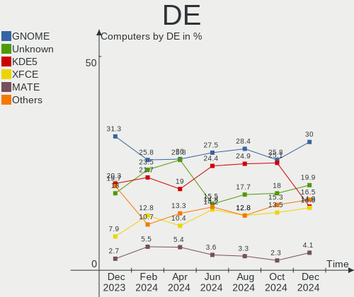
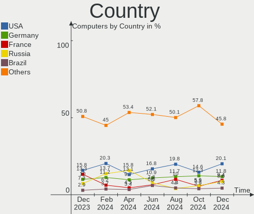
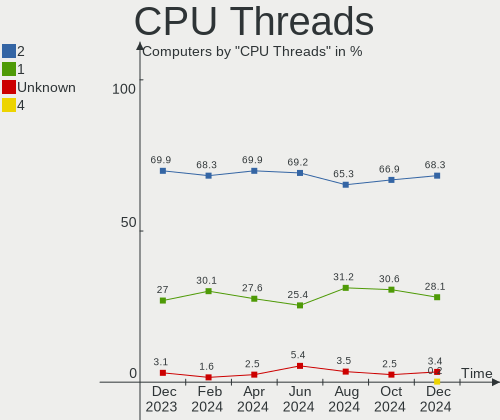
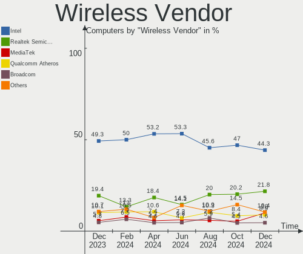
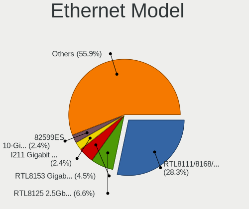
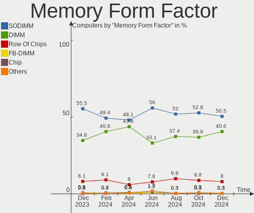

Debian Hardware Trends
----------------------

A project to identify most popular hardware characteristics and track their change
over time based on data collected by Debian users at https://Linux-Hardware.org.

Anyone can contribute to this report by the [hw-probe](https://github.com/linuxhw/hw-probe) tool:

    sudo -E hw-probe -all -upload

This is a report for all computer types. See also reports for [desktops](/Dist/Debian/Desktop/README.md) and [notebooks](/Dist/Debian/Notebook/README.md).

Full-feature report is available here: https://linux-hardware.org/?view=trends

Period: Aug, 2021.

Contents
--------

* [ System ](#system)
  - [ OS                       ](#os)
  - [ OS Family                ](#os-family)
  - [ Kernel                   ](#kernel)
  - [ Kernel Family            ](#kernel-family)
  - [ Kernel Major Ver.        ](#kernel-major-ver)
  - [ Arch                     ](#arch)
  - [ DE                       ](#de)
  - [ Display Server           ](#display-server)
  - [ Display Manager          ](#display-manager)
  - [ OS Lang                  ](#os-lang)
  - [ Boot Mode                ](#boot-mode)
  - [ Filesystem               ](#filesystem)
  - [ Part. scheme             ](#part-scheme)
  - [ Dual Boot with Linux/BSD ](#dual-boot-with-linuxbsd)
  - [ Dual Boot (Win)          ](#dual-boot-win)

* [ Board ](#board)
  - [ Vendor                   ](#vendor)
  - [ Model                    ](#model)
  - [ Model Family             ](#model-family)
  - [ MFG Year                 ](#mfg-year)
  - [ Form Factor              ](#form-factor)
  - [ Secure Boot              ](#secure-boot)
  - [ Coreboot                 ](#coreboot)
  - [ RAM Size                 ](#ram-size)
  - [ RAM Used                 ](#ram-used)
  - [ Total Drives             ](#total-drives)
  - [ Has CD-ROM               ](#has-cd-rom)
  - [ Has Ethernet             ](#has-ethernet)
  - [ Has WiFi                 ](#has-wifi)
  - [ Has Bluetooth            ](#has-bluetooth)

* [ Location ](#location)
  - [ Country                  ](#country)
  - [ City                     ](#city)

* [ Drives ](#drives)
  - [ Drive Vendor             ](#drive-vendor)
  - [ Drive Model              ](#drive-model)
  - [ HDD Vendor               ](#hdd-vendor)
  - [ SSD Vendor               ](#ssd-vendor)
  - [ Drive Kind               ](#drive-kind)
  - [ Drive Connector          ](#drive-connector)
  - [ Drive Size               ](#drive-size)
  - [ Space Total              ](#space-total)
  - [ Space Used               ](#space-used)
  - [ Malfunc. Drives          ](#malfunc-drives)
  - [ Malfunc. Drive Vendor    ](#malfunc-drive-vendor)
  - [ Malfunc. HDD Vendor      ](#malfunc-hdd-vendor)
  - [ Malfunc. Drive Kind      ](#malfunc-drive-kind)
  - [ Failed Drives            ](#failed-drives)
  - [ Failed Drive Vendor      ](#failed-drive-vendor)
  - [ Drive Status             ](#drive-status)

* [ Storage controller ](#storage-controller)
  - [ Storage Vendor           ](#storage-vendor)
  - [ Storage Model            ](#storage-model)
  - [ Storage Kind             ](#storage-kind)

* [ Processor ](#processor)
  - [ CPU Vendor               ](#cpu-vendor)
  - [ CPU Model                ](#cpu-model)
  - [ CPU Model Family         ](#cpu-model-family)
  - [ CPU Cores                ](#cpu-cores)
  - [ CPU Sockets              ](#cpu-sockets)
  - [ CPU Threads              ](#cpu-threads)
  - [ CPU Op-Modes             ](#cpu-op-modes)
  - [ CPU Microcode            ](#cpu-microcode)
  - [ CPU Microarch            ](#cpu-microarch)

* [ Graphics ](#graphics)
  - [ GPU Vendor               ](#gpu-vendor)
  - [ GPU Model                ](#gpu-model)
  - [ GPU Combo                ](#gpu-combo)
  - [ GPU Driver               ](#gpu-driver)
  - [ GPU Memory               ](#gpu-memory)

* [ Monitor ](#monitor)
  - [ Monitor Vendor           ](#monitor-vendor)
  - [ Monitor Model            ](#monitor-model)
  - [ Monitor Resolution       ](#monitor-resolution)
  - [ Monitor Diagonal         ](#monitor-diagonal)
  - [ Monitor Width            ](#monitor-width)
  - [ Aspect Ratio             ](#aspect-ratio)
  - [ Monitor Area             ](#monitor-area)
  - [ Pixel Density            ](#pixel-density)
  - [ Multiple Monitors        ](#multiple-monitors)

* [ Network ](#network)
  - [ Net Controller Vendor    ](#net-controller-vendor)
  - [ Net Controller Model     ](#net-controller-model)
  - [ Wireless Vendor          ](#wireless-vendor)
  - [ Wireless Model           ](#wireless-model)
  - [ Ethernet Vendor          ](#ethernet-vendor)
  - [ Ethernet Model           ](#ethernet-model)
  - [ Net Controller Kind      ](#net-controller-kind)
  - [ Used Controller          ](#used-controller)
  - [ NICs                     ](#nics)
  - [ IPv6                     ](#ipv6)

* [ Bluetooth ](#bluetooth)
  - [ Bluetooth Vendor         ](#bluetooth-vendor)
  - [ Bluetooth Model          ](#bluetooth-model)

* [ Sound ](#sound)
  - [ Sound Vendor             ](#sound-vendor)
  - [ Sound Model              ](#sound-model)

* [ Memory ](#memory)
  - [ Memory Vendor            ](#memory-vendor)
  - [ Memory Model             ](#memory-model)
  - [ Memory Kind              ](#memory-kind)
  - [ Memory Form Factor       ](#memory-form-factor)
  - [ Memory Size              ](#memory-size)
  - [ Memory Speed             ](#memory-speed)

* [ Printers & scanners ](#printers--scanners)
  - [ Printer Vendor           ](#printer-vendor)
  - [ Printer Model            ](#printer-model)
  - [ Scanner Vendor           ](#scanner-vendor)
  - [ Scanner Model            ](#scanner-model)

* [ Camera ](#camera)
  - [ Camera Vendor            ](#camera-vendor)
  - [ Camera Model             ](#camera-model)

* [ Security ](#security)
  - [ Fingerprint Vendor       ](#fingerprint-vendor)
  - [ Fingerprint Model        ](#fingerprint-model)
  - [ Chipcard Vendor          ](#chipcard-vendor)
  - [ Chipcard Model           ](#chipcard-model)

* [ Unsupported ](#unsupported)
  - [ Unsupported Devices      ](#unsupported-devices)
  - [ Unsupported Device Types ](#unsupported-device-types)

System
------

OS
--

Installed operating systems

| Name           | Computers | Percent |
|----------------|-----------|---------|
| Debian 11      | 499       | 86.33%  |
| Debian 10      | 61        | 10.55%  |
| Debian         | 11        | 1.9%    |
| Debian 9       | 2         | 0.35%   |
| Debian Testing | 1         | 0.17%   |
| Debian 9.9     | 1         | 0.17%   |
| Debian 9.13    | 1         | 0.17%   |
| Debian 8       | 1         | 0.17%   |
| Debian 11.0    | 1         | 0.17%   |

OS Family
---------

OS without a version

| Name   | Computers | Percent |
|--------|-----------|---------|
| Debian | 578       | 100%    |

Kernel
------

Version of the Linux kernel

| Version                    | Computers | Percent |
|----------------------------|-----------|---------|
| 5.10.0-8-amd64             | 428       | 74.05%  |
| 5.10.0-7-amd64             | 40        | 6.92%   |
| 4.19.0-17-amd64            | 32        | 5.54%   |
| 5.10.0-8-686-pae           | 7         | 1.21%   |
| 5.10.0-2-amd64             | 6         | 1.04%   |
| 4.19.0-16-amd64            | 6         | 1.04%   |
| 5.8.0-3-amd64              | 4         | 0.69%   |
| 5.10.0-8-686               | 4         | 0.69%   |
| 5.10.0-0.bpo.8-amd64       | 4         | 0.69%   |
| 5.10.0-8-armmp-lpae        | 3         | 0.52%   |
| 5.10.0-0.bpo.7-amd64       | 3         | 0.52%   |
| 5.13.0-13.1-liquorix-amd64 | 2         | 0.35%   |
| 5.10.42+truenas            | 2         | 0.35%   |
| 5.10.0-5-amd64             | 2         | 0.35%   |
| 5.8.16-antix.1-amd64-smp   | 1         | 0.17%   |
| 5.4.70                     | 1         | 0.17%   |
| 5.4.128-1-pve              | 1         | 0.17%   |
| 5.4.124-1-pve              | 1         | 0.17%   |
| 5.4.103-1-pve              | 1         | 0.17%   |
| 5.13.8-xanmod1             | 1         | 0.17%   |
| 5.13.8-gnu                 | 1         | 0.17%   |
| 5.13.8                     | 1         | 0.17%   |
| 5.13.0-10.3-liquorix-amd64 | 1         | 0.17%   |
| 5.12.18-amd64-desktop      | 1         | 0.17%   |
| 5.12.14-amd64-desktop      | 1         | 0.17%   |
| 5.12.0-19.3-liquorix-amd64 | 1         | 0.17%   |
| 5.11.22-3-pve              | 1         | 0.17%   |
| 5.11.22-2-pve              | 1         | 0.17%   |
| 5.11.22-1-pve              | 1         | 0.17%   |
| 5.10.52-v8+                | 1         | 0.17%   |
| 5.10.10-64                 | 1         | 0.17%   |
| 5.10.0-8mx-amd64           | 1         | 0.17%   |
| 5.10.0-8-rt-amd64          | 1         | 0.17%   |
| 5.10.0-8-arm64             | 1         | 0.17%   |
| 5.10.0-3-amd64             | 1         | 0.17%   |
| 5.10.0-0.bpo.8-rt-amd64    | 1         | 0.17%   |
| 4.9.0-16-686               | 1         | 0.17%   |
| 4.9.0-13-amd64             | 1         | 0.17%   |
| 4.19.0-9-686-pae           | 1         | 0.17%   |
| 4.19.0-6-amd64             | 1         | 0.17%   |
| 4.19.0-17-rt-amd64         | 1         | 0.17%   |
| 4.19.0-17-686-pae          | 1         | 0.17%   |
| 4.19.0-14-amd64            | 1         | 0.17%   |
| 4.19.0-14-686-pae          | 1         | 0.17%   |
| 4.19.0-13-amd64            | 1         | 0.17%   |
| 4.19.0-12-amd64            | 1         | 0.17%   |
| 4.19.0-0.bpo.9-amd64       | 1         | 0.17%   |
| 4.15.18-16-pve             | 1         | 0.17%   |
| 4.1.42-rivoreo-powerpc64   | 1         | 0.17%   |

Kernel Family
-------------

Linux kernel without a distro release

| Version | Computers | Percent |
|---------|-----------|---------|
| 5.10.0  | 502       | 86.85%  |
| 4.19.0  | 47        | 8.13%   |
| 5.8.0   | 4         | 0.69%   |
| 5.13.8  | 3         | 0.52%   |
| 5.13.0  | 3         | 0.52%   |
| 5.11.22 | 3         | 0.52%   |
| 5.10.42 | 2         | 0.35%   |
| 4.9.0   | 2         | 0.35%   |
| 5.8.16  | 1         | 0.17%   |
| 5.4.70  | 1         | 0.17%   |
| 5.4.128 | 1         | 0.17%   |
| 5.4.124 | 1         | 0.17%   |
| 5.4.103 | 1         | 0.17%   |
| 5.12.18 | 1         | 0.17%   |
| 5.12.14 | 1         | 0.17%   |
| 5.12.0  | 1         | 0.17%   |
| 5.10.52 | 1         | 0.17%   |
| 5.10.10 | 1         | 0.17%   |
| 4.15.18 | 1         | 0.17%   |
| 4.1.42  | 1         | 0.17%   |

Kernel Major Ver.
-----------------

Linux kernel major version

| Version | Computers | Percent |
|---------|-----------|---------|
| 5.10    | 506       | 87.54%  |
| 4.19    | 47        | 8.13%   |
| 5.13    | 6         | 1.04%   |
| 5.8     | 5         | 0.87%   |
| 5.4     | 4         | 0.69%   |
| 5.12    | 3         | 0.52%   |
| 5.11    | 3         | 0.52%   |
| 4.9     | 2         | 0.35%   |
| 4.15    | 1         | 0.17%   |
| 4.1     | 1         | 0.17%   |

Arch
----

OS architecture (x86_64, i586, etc.)

| Name    | Computers | Percent |
|---------|-----------|---------|
| x86_64  | 556       | 96.19%  |
| i686    | 15        | 2.6%    |
| armv7l  | 4         | 0.69%   |
| aarch64 | 2         | 0.35%   |
| ppc64   | 1         | 0.17%   |

DE
--

Desktop Environment

| Name             | Computers | Percent |
|------------------|-----------|---------|
| Unknown          | 320       | 55.36%  |
| GNOME            | 89        | 15.4%   |
| KDE5             | 59        | 10.21%  |
| XFCE             | 48        | 8.3%    |
| MATE             | 12        | 2.08%   |
| KDE              | 12        | 2.08%   |
| X-Cinnamon       | 9         | 1.56%   |
| i3               | 7         | 1.21%   |
| Cinnamon         | 7         | 1.21%   |
| LXQt             | 3         | 0.52%   |
| LXDE             | 3         | 0.52%   |
| Trinity          | 2         | 0.35%   |
| lightdm-xsession | 2         | 0.35%   |
| Enlightenment    | 2         | 0.35%   |
| openbox          | 1         | 0.17%   |
| ICEWM            | 1         | 0.17%   |
| Deepin           | 1         | 0.17%   |

Display Server
--------------

X11 or Wayland

| Name    | Computers | Percent |
|---------|-----------|---------|
| Unknown | 290       | 50.17%  |
| X11     | 202       | 34.95%  |
| Wayland | 55        | 9.52%   |
| Tty     | 31        | 5.36%   |

Display Manager
---------------

SDDM, LightDM, etc.

| Name    | Computers | Percent |
|---------|-----------|---------|
| Unknown | 362       | 62.63%  |
| GDM     | 74        | 12.8%   |
| SDDM    | 59        | 10.21%  |
| TDM     | 57        | 9.86%   |
| LightDM | 21        | 3.63%   |
| GDM3    | 3         | 0.52%   |
| SLiM    | 1         | 0.17%   |
| KDM     | 1         | 0.17%   |

OS Lang
-------

Language

| Lang    | Computers | Percent |
|---------|-----------|---------|
| Unknown | 221       | 38.24%  |
| en_US   | 146       | 25.26%  |
| ru_RU   | 61        | 10.55%  |
| fr_FR   | 16        | 2.77%   |
| en_GB   | 16        | 2.77%   |
| es_ES   | 15        | 2.6%    |
| de_DE   | 15        | 2.6%    |
| pt_BR   | 9         | 1.56%   |
| pl_PL   | 8         | 1.38%   |
| sv_SE   | 5         | 0.87%   |
| C       | 5         | 0.87%   |
| nl_NL   | 4         | 0.69%   |
| es_MX   | 4         | 0.69%   |
| en_CA   | 4         | 0.69%   |
| de_CH   | 4         | 0.69%   |
| nn_NO   | 3         | 0.52%   |
| ja_JP   | 3         | 0.52%   |
| it_IT   | 3         | 0.52%   |
| es_VE   | 3         | 0.52%   |
| en_AU   | 3         | 0.52%   |
| zh_CN   | 2         | 0.35%   |
| tr_TR   | 2         | 0.35%   |
| pt_PT   | 2         | 0.35%   |
| nl_BE   | 2         | 0.35%   |
| es_CL   | 2         | 0.35%   |
| en_NZ   | 2         | 0.35%   |
| de_AT   | 2         | 0.35%   |
| bg_BG   | 2         | 0.35%   |
| sk_SK   | 1         | 0.17%   |
| lt_LT   | 1         | 0.17%   |
| hu_HU   | 1         | 0.17%   |
| hr_HR   | 1         | 0.17%   |
| fi_FI   | 1         | 0.17%   |
| es_UY   | 1         | 0.17%   |
| es_PA   | 1         | 0.17%   |
| es_GT   | 1         | 0.17%   |
| es_CO   | 1         | 0.17%   |
| es_AR   | 1         | 0.17%   |
| en_PH   | 1         | 0.17%   |
| en_NG   | 1         | 0.17%   |
| en_IE   | 1         | 0.17%   |
| cs_CZ   | 1         | 0.17%   |

Boot Mode
---------

EFI or BIOS

| Mode | Computers | Percent |
|------|-----------|---------|
| EFI  | 399       | 69.03%  |
| BIOS | 179       | 30.97%  |

Filesystem
----------

Type of filesystem

| Type    | Computers | Percent |
|---------|-----------|---------|
| Overlay | 288       | 49.83%  |
| Ext4    | 256       | 44.29%  |
| Btrfs   | 23        | 3.98%   |
| Zfs     | 4         | 0.69%   |
| Xfs     | 4         | 0.69%   |
| XXXXXXX | 1         | 0.17%   |
| Rootfs  | 1         | 0.17%   |
| Ext2    | 1         | 0.17%   |

Part. scheme
------------

Scheme of partitioning

| Type    | Computers | Percent |
|---------|-----------|---------|
| GPT     | 428       | 74.05%  |
| MBR     | 97        | 16.78%  |
| Unknown | 53        | 9.17%   |

Dual Boot with Linux/BSD
------------------------

Hosting more than one Linux/BSD

| Dual boot | Computers | Percent |
|-----------|-----------|---------|
| No        | 528       | 91.35%  |
| Yes       | 50        | 8.65%   |

Dual Boot (Win)
---------------

Hosting Linux and Windows

| Dual boot | Computers | Percent |
|-----------|-----------|---------|
| No        | 460       | 79.58%  |
| Yes       | 118       | 20.42%  |

Board
-----

Vendor
------

Motherboard manufacturer

| Name                    | Computers | Percent |
|-------------------------|-----------|---------|
| Apple                   | 153       | 26.47%  |
| Lenovo                  | 79        | 13.67%  |
| ASUSTek Computer        | 58        | 10.03%  |
| Google                  | 51        | 8.82%   |
| Hewlett-Packard         | 49        | 8.48%   |
| Dell                    | 38        | 6.57%   |
| ASRock                  | 38        | 6.57%   |
| Gigabyte Technology     | 21        | 3.63%   |
| MSI                     | 12        | 2.08%   |
| Intel                   | 11        | 1.9%    |
| Acer                    | 10        | 1.73%   |
| Supermicro              | 6         | 1.04%   |
| Unknown                 | 4         | 0.69%   |
| Sony                    | 3         | 0.52%   |
| Notebook                | 3         | 0.52%   |
| Hardkernel              | 3         | 0.52%   |
| Clevo                   | 3         | 0.52%   |
| AMI                     | 3         | 0.52%   |
| Toshiba                 | 2         | 0.35%   |
| Semp Toshiba            | 2         | 0.35%   |
| Samsung Electronics     | 2         | 0.35%   |
| HUAWEI                  | 2         | 0.35%   |
| Fujitsu Siemens         | 2         | 0.35%   |
| Fujitsu                 | 2         | 0.35%   |
| ECS                     | 2         | 0.35%   |
| YJKC                    | 1         | 0.17%   |
| YANYU                   | 1         | 0.17%   |
| TUXEDO                  | 1         | 0.17%   |
| TQ-Group                | 1         | 0.17%   |
| Timi                    | 1         | 0.17%   |
| SLIMBOOK                | 1         | 0.17%   |
| SimpliVity              | 1         | 0.17%   |
| RuggedPC                | 1         | 0.17%   |
| Raspberry Pi Foundation | 1         | 0.17%   |
| Pine Microsystems       | 1         | 0.17%   |
| NC9VL                   | 1         | 0.17%   |
| Microsoft               | 1         | 0.17%   |
| Itautec                 | 1         | 0.17%   |
| Gateway                 | 1         | 0.17%   |
| DNS                     | 1         | 0.17%   |
| Biostar                 | 1         | 0.17%   |
| ASRockRack              | 1         | 0.17%   |
| AOpen                   | 1         | 0.17%   |
| AAEON                   | 1         | 0.17%   |

Model
-----

Motherboard model

| Name                                       | Computers | Percent |
|--------------------------------------------|-----------|---------|
| Apple MacBookAir7,1                        | 74        | 12.8%   |
| Apple MacBookAir7,2                        | 63        | 10.9%   |
| Google Enguarde                            | 47        | 8.13%   |
| ASRock H470M-HVS                           | 20        | 3.46%   |
| Lenovo ThinkPad 13 2nd Gen 20J10046US      | 13        | 2.25%   |
| Unknown                                    | 4         | 0.69%   |
| Hardkernel Odroid XU4                      | 3         | 0.52%   |
| ASUS P5KPL-CM                              | 3         | 0.52%   |
| ASUS All Series                            | 3         | 0.52%   |
| Apple iMac11,2                             | 3         | 0.52%   |
| Semp Toshiba STI                           | 2         | 0.35%   |
| MSI MS-7A71                                | 2         | 0.35%   |
| Lenovo ThinkPad E475 20H40006US            | 2         | 0.35%   |
| Lenovo ThinkBook 14 G2 ARE 20VF            | 2         | 0.35%   |
| Intel Pro, Std, Elt Series                 | 2         | 0.35%   |
| Intel DN2820FYK H24582-201                 | 2         | 0.35%   |
| HP Laptop 15s-eq1xxx                       | 2         | 0.35%   |
| HP EliteBook 8460p                         | 2         | 0.35%   |
| HP Compaq nx6125 (PZ849UA#ABA)             | 2         | 0.35%   |
| HP Compaq nx6110 (PZ065UA#ABA)             | 2         | 0.35%   |
| Gigabyte Z77-D3H                           | 2         | 0.35%   |
| Gigabyte 970A-DS3P                         | 2         | 0.35%   |
| Dell OptiPlex 7010                         | 2         | 0.35%   |
| Dell Inspiron 15 7000 Gaming               | 2         | 0.35%   |
| Dell G3 3590                               | 2         | 0.35%   |
| ASUS TUF GAMING X570-PRO                   | 2         | 0.35%   |
| ASRock H61M-VG4                            | 2         | 0.35%   |
| Apple MacBook7,1                           | 2         | 0.35%   |
| Apple MacBook5,2                           | 2         | 0.35%   |
| Acer Aspire 5315                           | 2         | 0.35%   |
| YJKC vBOOK Plus                            | 1         | 0.17%   |
| YANYU M9F baytrail                         | 1         | 0.17%   |
| TUXEDO Pulse 15 Gen1                       | 1         | 0.17%   |
| TQ-Group TQMxE39S                          | 1         | 0.17%   |
| Toshiba Satellite C55D-B                   | 1         | 0.17%   |
| Toshiba Satellite C55-B                    | 1         | 0.17%   |
| Timi TM1612                                | 1         | 0.17%   |
| Supermicro X9SCL/X9SCM                     | 1         | 0.17%   |
| Supermicro X8DT3                           | 1         | 0.17%   |
| Supermicro X10SLM-F                        | 1         | 0.17%   |
| Supermicro SYS-6028R-WTRT                  | 1         | 0.17%   |
| Supermicro SYS-5019S-MR                    | 1         | 0.17%   |
| Supermicro SYS-5018R-WR                    | 1         | 0.17%   |
| Sony VPCS110FL                             | 1         | 0.17%   |
| Sony VPCF21AFX                             | 1         | 0.17%   |
| Sony VPCF115FM                             | 1         | 0.17%   |
| SLIMBOOK TITAN                             | 1         | 0.17%   |
| SimpliVity OmniCube CN-3400-1              | 1         | 0.17%   |
| Samsung 900X3C/900X3D/900X3E/900X4C/900X4D | 1         | 0.17%   |
| Samsung 300E5M/300E5L                      | 1         | 0.17%   |
| RuggedPC Caterpillar T20                   | 1         | 0.17%   |
| RPi Raspberry Pi 4 Model B Rev 1.4         | 1         | 0.17%   |
| Pine Microsystems Pine64+                  | 1         | 0.17%   |
| Notebook NL4x_NL5xLU                       | 1         | 0.17%   |
| Notebook NJ50_70CU                         | 1         | 0.17%   |
| Notebook N13_N140ZU                        | 1         | 0.17%   |
| NC9VL 1.0                                  | 1         | 0.17%   |
| MSI MS-7C75                                | 1         | 0.17%   |
| MSI MS-7C02                                | 1         | 0.17%   |
| MSI MS-7B92                                | 1         | 0.17%   |

Model Family
------------

Motherboard model prefix

| Name                      | Computers | Percent |
|---------------------------|-----------|---------|
| Apple MacBookAir7         | 137       | 23.7%   |
| Lenovo ThinkPad           | 56        | 9.69%   |
| Google Enguarde           | 47        | 8.13%   |
| ASRock H470M-HVS          | 20        | 3.46%   |
| HP Compaq                 | 10        | 1.73%   |
| ASUS ROG                  | 10        | 1.73%   |
| Lenovo IdeaPad            | 9         | 1.56%   |
| Dell Latitude             | 8         | 1.38%   |
| Dell Precision            | 7         | 1.21%   |
| Dell OptiPlex             | 7         | 1.21%   |
| Dell Inspiron             | 7         | 1.21%   |
| ASUS PRIME                | 7         | 1.21%   |
| HP EliteBook              | 6         | 1.04%   |
| Acer Aspire               | 6         | 1.04%   |
| HP ProBook                | 5         | 0.87%   |
| HP Pavilion               | 5         | 0.87%   |
| Lenovo ThinkCentre        | 4         | 0.69%   |
| HP Laptop                 | 4         | 0.69%   |
| Apple iMac11              | 4         | 0.69%   |
| Unknown                   | 4         | 0.69%   |
| Lenovo ThinkBook          | 3         | 0.52%   |
| Hardkernel Odroid         | 3         | 0.52%   |
| Dell XPS                  | 3         | 0.52%   |
| Dell G3                   | 3         | 0.52%   |
| ASUS TUF                  | 3         | 0.52%   |
| ASUS P5KPL-CM             | 3         | 0.52%   |
| ASUS All                  | 3         | 0.52%   |
| Toshiba Satellite         | 2         | 0.35%   |
| Semp Toshiba STI          | 2         | 0.35%   |
| MSI MS-7A71               | 2         | 0.35%   |
| Lenovo Yoga               | 2         | 0.35%   |
| Intel Pro                 | 2         | 0.35%   |
| Intel DN2820FYK           | 2         | 0.35%   |
| HP 250                    | 2         | 0.35%   |
| Gigabyte Z77-D3H          | 2         | 0.35%   |
| Gigabyte A320M-S2H        | 2         | 0.35%   |
| Gigabyte 970A-DS3P        | 2         | 0.35%   |
| ASUS P7H55-M              | 2         | 0.35%   |
| ASRock Z97                | 2         | 0.35%   |
| ASRock H61M-VG4           | 2         | 0.35%   |
| Apple Macmini6            | 2         | 0.35%   |
| Apple MacBook7            | 2         | 0.35%   |
| Apple MacBook5            | 2         | 0.35%   |
| Acer TravelMate           | 2         | 0.35%   |
| Acer Swift                | 2         | 0.35%   |
| YJKC vBOOK                | 1         | 0.17%   |
| YANYU M9F                 | 1         | 0.17%   |
| TUXEDO Pulse              | 1         | 0.17%   |
| TQ-Group TQMxE39S         | 1         | 0.17%   |
| Timi TM1612               | 1         | 0.17%   |
| Supermicro X9SCL          | 1         | 0.17%   |
| Supermicro X8DT3          | 1         | 0.17%   |
| Supermicro X10SLM-F       | 1         | 0.17%   |
| Supermicro SYS-6028R-WTRT | 1         | 0.17%   |
| Supermicro SYS-5019S-MR   | 1         | 0.17%   |
| Supermicro SYS-5018R-WR   | 1         | 0.17%   |
| Sony VPCS110FL            | 1         | 0.17%   |
| Sony VPCF21AFX            | 1         | 0.17%   |
| Sony VPCF115FM            | 1         | 0.17%   |
| SLIMBOOK TITAN            | 1         | 0.17%   |

MFG Year
--------

Motherboard manufacture year

| Year    | Computers | Percent |
|---------|-----------|---------|
| 2021    | 129       | 22.32%  |
| 2020    | 128       | 22.15%  |
| 2019    | 105       | 18.17%  |
| 2018    | 38        | 6.57%   |
| 2015    | 27        | 4.67%   |
| 2011    | 21        | 3.63%   |
| 2013    | 17        | 2.94%   |
| 2017    | 16        | 2.77%   |
| 2008    | 15        | 2.6%    |
| 2014    | 14        | 2.42%   |
| 2009    | 14        | 2.42%   |
| 2012    | 13        | 2.25%   |
| 2016    | 11        | 1.9%    |
| 2010    | 11        | 1.9%    |
| Unknown | 8         | 1.38%   |
| 2007    | 4         | 0.69%   |
| 2006    | 3         | 0.52%   |
| 2005    | 3         | 0.52%   |
| 2004    | 1         | 0.17%   |

Form Factor
-----------

Physical design of the computer

| Name           | Computers | Percent |
|----------------|-----------|---------|
| Notebook       | 372       | 64.36%  |
| Desktop        | 167       | 28.89%  |
| Mini pc        | 11        | 1.9%    |
| Convertible    | 7         | 1.21%   |
| Server         | 7         | 1.21%   |
| All in one     | 6         | 1.04%   |
| System on chip | 5         | 0.87%   |
| Tablet         | 3         | 0.52%   |

Secure Boot
-----------

Enabled or disabled

| State    | Computers | Percent |
|----------|-----------|---------|
| Disabled | 558       | 96.54%  |
| Enabled  | 20        | 3.46%   |

Coreboot
--------

Have coreboot on board

| Used | Computers | Percent |
|------|-----------|---------|
| No   | 527       | 91.18%  |
| Yes  | 51        | 8.82%   |

RAM Size
--------

Total RAM memory

| Size in GB      | Computers | Percent |
|-----------------|-----------|---------|
| 3.01-4.0        | 164       | 28.37%  |
| 4.01-8.0        | 148       | 25.61%  |
| 16.01-24.0      | 83        | 14.36%  |
| 8.01-16.0       | 62        | 10.73%  |
| 32.01-64.0      | 55        | 9.52%   |
| 1.01-2.0        | 27        | 4.67%   |
| 64.01-256.0     | 15        | 2.6%    |
| 0.51-1.0        | 8         | 1.38%   |
| 2.01-3.0        | 7         | 1.21%   |
| 24.01-32.0      | 5         | 0.87%   |
| 0.01-0.5        | 2         | 0.35%   |
| More than 256.0 | 1         | 0.17%   |
| Unknown         | 1         | 0.17%   |

RAM Used
--------

Used RAM memory

| Used GB     | Computers | Percent |
|-------------|-----------|---------|
| 1.01-2.0    | 298       | 51.56%  |
| 2.01-3.0    | 82        | 14.19%  |
| 0.51-1.0    | 76        | 13.15%  |
| 4.01-8.0    | 42        | 7.27%   |
| 3.01-4.0    | 33        | 5.71%   |
| 0.01-0.5    | 21        | 3.63%   |
| 8.01-16.0   | 14        | 2.42%   |
| 16.01-24.0  | 7         | 1.21%   |
| 32.01-64.0  | 2         | 0.35%   |
| 64.01-256.0 | 2         | 0.35%   |
| Unknown     | 1         | 0.17%   |

Total Drives
------------

Number of drives on board

| Drives | Computers | Percent |
|--------|-----------|---------|
| 1      | 400       | 69.2%   |
| 2      | 120       | 20.76%  |
| 3      | 20        | 3.46%   |
| 4      | 14        | 2.42%   |
| 5      | 9         | 1.56%   |
| 7      | 3         | 0.52%   |
| 6      | 3         | 0.52%   |
| 10     | 2         | 0.35%   |
| 8      | 2         | 0.35%   |
| 0      | 2         | 0.35%   |
| 28     | 1         | 0.17%   |
| 13     | 1         | 0.17%   |
| 12     | 1         | 0.17%   |

Has CD-ROM
----------

Has CD-ROM on board

| Presented | Computers | Percent |
|-----------|-----------|---------|
| No        | 447       | 77.34%  |
| Yes       | 131       | 22.66%  |

Has Ethernet
------------

Has Ethernet on board

| Presented | Computers | Percent |
|-----------|-----------|---------|
| Yes       | 362       | 62.63%  |
| No        | 216       | 37.37%  |

Has WiFi
--------

Has WiFi module

| Presented | Computers | Percent |
|-----------|-----------|---------|
| Yes       | 438       | 75.78%  |
| No        | 140       | 24.22%  |

Has Bluetooth
-------------

Has Bluetooth module

| Presented | Computers | Percent |
|-----------|-----------|---------|
| Yes       | 392       | 67.82%  |
| No        | 186       | 32.18%  |

Location
--------

Country
-------

Geographic location (country)

| Country     | Computers | Percent |
|-------------|-----------|---------|
| USA         | 300       | 51.9%   |
| Russia      | 60        | 10.38%  |
| Germany     | 20        | 3.46%   |
| France      | 20        | 3.46%   |
| Spain       | 19        | 3.29%   |
| UK          | 16        | 2.77%   |
| Poland      | 12        | 2.08%   |
| Ukraine     | 10        | 1.73%   |
| Brazil      | 9         | 1.56%   |
| Switzerland | 7         | 1.21%   |
| Sweden      | 7         | 1.21%   |
| Netherlands | 7         | 1.21%   |
| Mexico      | 7         | 1.21%   |
| Turkey      | 5         | 0.87%   |
| China       | 5         | 0.87%   |
| Canada      | 5         | 0.87%   |
| Belgium     | 5         | 0.87%   |
| Portugal    | 4         | 0.69%   |
| Italy       | 4         | 0.69%   |
| Austria     | 4         | 0.69%   |
| Australia   | 4         | 0.69%   |
| Venezuela   | 3         | 0.52%   |
| Romania     | 3         | 0.52%   |
| Norway      | 3         | 0.52%   |
| Japan       | 3         | 0.52%   |
| Czechia     | 3         | 0.52%   |
| Argentina   | 3         | 0.52%   |
| Philippines | 2         | 0.35%   |
| New Zealand | 2         | 0.35%   |
| Ireland     | 2         | 0.35%   |
| Croatia     | 2         | 0.35%   |
| Chile       | 2         | 0.35%   |
| Bulgaria    | 2         | 0.35%   |
| Uruguay     | 1         | 0.17%   |
| South Sudan | 1         | 0.17%   |
| Slovakia    | 1         | 0.17%   |
| Serbia      | 1         | 0.17%   |
| Panama      | 1         | 0.17%   |
| Nigeria     | 1         | 0.17%   |
| Morocco     | 1         | 0.17%   |
| Lithuania   | 1         | 0.17%   |
| Lebanon     | 1         | 0.17%   |
| Kazakhstan  | 1         | 0.17%   |
| Iran        | 1         | 0.17%   |
| Indonesia   | 1         | 0.17%   |
| Hungary     | 1         | 0.17%   |
| Guatemala   | 1         | 0.17%   |
| Finland     | 1         | 0.17%   |
| Colombia    | 1         | 0.17%   |
| Azerbaijan  | 1         | 0.17%   |
| Aruba       | 1         | 0.17%   |

City
----

Geographic location (city)

| City                | Computers | Percent |
|---------------------|-----------|---------|
| Portland            | 231       | 39.97%  |
| Voronezh            | 37        | 6.4%    |
| Frankfort           | 10        | 1.73%   |
| St Petersburg       | 7         | 1.21%   |
| London              | 7         | 1.21%   |
| Moscow              | 6         | 1.04%   |
| Hampden             | 6         | 1.04%   |
| Vienna              | 4         | 0.69%   |
| Valencia            | 4         | 0.69%   |
| Sevastopol          | 4         | 0.69%   |
| S??o Paulo          | 4         | 0.69%   |
| Kyiv                | 4         | 0.69%   |
| San Jose            | 3         | 0.52%   |
| Paris               | 3         | 0.52%   |
| Lyon                | 3         | 0.52%   |
| Herndon             | 3         | 0.52%   |
| Coatzacoalcos       | 3         | 0.52%   |
| Berlin              | 3         | 0.52%   |
| Atlanta             | 3         | 0.52%   |
| Zurich              | 2         | 0.35%   |
| Yevpatoriya         | 2         | 0.35%   |
| Yekaterinburg       | 2         | 0.35%   |
| Wroclaw             | 2         | 0.35%   |
| Warsaw              | 2         | 0.35%   |
| Tyreso Strand       | 2         | 0.35%   |
| Thermopolis         | 2         | 0.35%   |
| Stockholm           | 2         | 0.35%   |
| Springfield         | 2         | 0.35%   |
| Saratov             | 2         | 0.35%   |
| Riegelwood          | 2         | 0.35%   |
| Port Montt          | 2         | 0.35%   |
| Pontevedra          | 2         | 0.35%   |
| Perm                | 2         | 0.35%   |
| Offenburg           | 2         | 0.35%   |
| Ocala               | 2         | 0.35%   |
| Nashville           | 2         | 0.35%   |
| Molde               | 2         | 0.35%   |
| Kreuzlingen         | 2         | 0.35%   |
| Izmir               | 2         | 0.35%   |
| Iasi                | 2         | 0.35%   |
| Hellevoetsluis      | 2         | 0.35%   |
| Hamilton            | 2         | 0.35%   |
| Halifax             | 2         | 0.35%   |
| Dublin              | 2         | 0.35%   |
| Clitheroe           | 2         | 0.35%   |
| C??rdoba            | 2         | 0.35%   |
| Beijing             | 2         | 0.35%   |
| Amsterdam           | 2         | 0.35%   |
| Zhuhai              | 1         | 0.17%   |
| Zeist               | 1         | 0.17%   |
| Zastavka            | 1         | 0.17%   |
| Zagreb              | 1         | 0.17%   |
| Yuncos              | 1         | 0.17%   |
| Ypres               | 1         | 0.17%   |
| Xalapa              | 1         | 0.17%   |
| Wysokie Mazowieckie | 1         | 0.17%   |
| Woburn              | 1         | 0.17%   |
| Wheaton             | 1         | 0.17%   |
| West Cowes          | 1         | 0.17%   |
| Waregem             | 1         | 0.17%   |

Drives
------

Drive Vendor
------------

Hard drive vendors

| Vendor                    | Computers | Drives | Percent |
|---------------------------|-----------|--------|---------|
| Apple                     | 139       | 139    | 17.68%  |
| Samsung Electronics       | 104       | 121    | 13.23%  |
| Seagate                   | 81        | 116    | 10.31%  |
| WDC                       | 74        | 131    | 9.41%   |
| Unknown                   | 69        | 71     | 8.78%   |
| Toshiba                   | 46        | 54     | 5.85%   |
| Kingston                  | 40        | 44     | 5.09%   |
| SanDisk                   | 30        | 32     | 3.82%   |
| Crucial                   | 25        | 27     | 3.18%   |
| Hitachi                   | 22        | 23     | 2.8%    |
| Netac                     | 21        | 21     | 2.67%   |
| SABRENT                   | 18        | 18     | 2.29%   |
| Intel                     | 14        | 17     | 1.78%   |
| SK Hynix                  | 9         | 10     | 1.15%   |
| HGST                      | 9         | 13     | 1.15%   |
| Micron Technology         | 8         | 8      | 1.02%   |
| A-DATA Technology         | 6         | 7      | 0.76%   |
| PNY                       | 5         | 5      | 0.64%   |
| Fujitsu                   | 5         | 5      | 0.64%   |
| OCZ                       | 4         | 4      | 0.51%   |
| MAXTOR                    | 4         | 4      | 0.51%   |
| JMicron                   | 4         | 4      | 0.51%   |
| Transcend                 | 3         | 3      | 0.38%   |
| SPCC                      | 3         | 3      | 0.38%   |
| LITEON                    | 3         | 3      | 0.38%   |
| Intenso                   | 3         | 3      | 0.38%   |
| GOODRAM                   | 3         | 3      | 0.38%   |
| China                     | 3         | 3      | 0.38%   |
| Union Memory              | 2         | 2      | 0.25%   |
| KIOXIA                    | 2         | 2      | 0.25%   |
| Hewlett-Packard           | 2         | 3      | 0.25%   |
| ZTC                       | 1         | 1      | 0.13%   |
| XPG                       | 1         | 1      | 0.13%   |
| TurXun                    | 1         | 1      | 0.13%   |
| THU                       | 1         | 1      | 0.13%   |
| Team                      | 1         | 1      | 0.13%   |
| T-FORCE                   | 1         | 1      | 0.13%   |
| Smartbuy                  | 1         | 1      | 0.13%   |
| PNY USB                   | 1         | 1      | 0.13%   |
| PLEXTOR                   | 1         | 2      | 0.13%   |
| Phison                    | 1         | 1      | 0.13%   |
| Patriot                   | 1         | 1      | 0.13%   |
| OWC                       | 1         | 1      | 0.13%   |
| NAS                       | 1         | 5      | 0.13%   |
| MyDigitalSSD              | 1         | 1      | 0.13%   |
| Mushkin                   | 1         | 1      | 0.13%   |
| Micron/Crucial Technology | 1         | 1      | 0.13%   |
| LITEONIT                  | 1         | 1      | 0.13%   |
| KIOXIA-EXCERIA            | 1         | 1      | 0.13%   |
| KingSpec                  | 1         | 1      | 0.13%   |
| Hikvision                 | 1         | 1      | 0.13%   |
| FORESEE                   | 1         | 1      | 0.13%   |
| Corsair                   | 1         | 1      | 0.13%   |
| Apacer                    | 1         | 1      | 0.13%   |
| AMD                       | 1         | 1      | 0.13%   |
| 128MB                     | 1         | 1      | 0.13%   |

Drive Model
-----------

Hard drive models

| Model                                   | Computers | Percent |
|-----------------------------------------|-----------|---------|
| Apple SSD AP0128H 121GB                 | 74        | 8.84%   |
| Apple SSD SM0128G 121GB                 | 62        | 7.41%   |
| Unknown AGND3R  16GB                    | 25        | 2.99%   |
| Toshiba HDWD110 1TB                     | 20        | 2.39%   |
| Netac SSD 240GB                         | 20        | 2.39%   |
| Unknown HAG2e  16GB                     | 19        | 2.27%   |
| SABRENT Disk 1TB                        | 18        | 2.15%   |
| Kingston SA400S37240G 240GB SSD         | 10        | 1.19%   |
| Kingston SA400S37120G 120GB SSD         | 9         | 1.08%   |
| SanDisk SD8SN8U128G1001 128GB SSD       | 8         | 0.96%   |
| SanDisk SD8SBAT128G1122 128GB SSD       | 6         | 0.72%   |
| Samsung MZNTY128HDHP-000L1 128GB SSD    | 6         | 0.72%   |
| Crucial CT500MX500SSD1 500GB            | 6         | 0.72%   |
| Seagate ST500DM002-1BD142 500GB         | 5         | 0.6%    |
| Seagate ST2000DM008-2FR102 2TB          | 5         | 0.6%    |
| Seagate ST1000LM035-1RK172 1TB          | 5         | 0.6%    |
| Samsung SSD 970 EVO Plus 1TB            | 5         | 0.6%    |
| Samsung SSD 850 EVO 250GB               | 5         | 0.6%    |
| Kingston SV300S37A120G 120GB SSD        | 5         | 0.6%    |
| WDC WDS500G3X0C-00SJG0 500GB            | 4         | 0.48%   |
| Seagate ST2000DM001-1ER164 2TB          | 4         | 0.48%   |
| Seagate ST1000DM010-2EP102 1TB          | 4         | 0.48%   |
| Samsung SSD 970 EVO Plus 500GB          | 4         | 0.48%   |
| Samsung SSD 860 EVO 500GB               | 4         | 0.48%   |
| Samsung SSD 860 EVO 250GB               | 4         | 0.48%   |
| Samsung SSD 860 EVO 1TB                 | 4         | 0.48%   |
| Samsung SSD 850 PRO 1TB                 | 4         | 0.48%   |
| Samsung SSD 850 EVO 500GB               | 4         | 0.48%   |
| Unknown SDW16G  16GB                    | 3         | 0.36%   |
| Toshiba MQ01ABD100 1TB                  | 3         | 0.36%   |
| Toshiba DT01ACA100 1TB                  | 3         | 0.36%   |
| Seagate ST4000VN008-2DR166 4TB          | 3         | 0.36%   |
| Samsung SSD 980 PRO 1TB                 | 3         | 0.36%   |
| Samsung SSD 970 EVO 500GB               | 3         | 0.36%   |
| Samsung SSD 840 EVO 250GB               | 3         | 0.36%   |
| JMicron Disk 250GB                      | 3         | 0.36%   |
| Intel SSDPEKKW128G7 128GB               | 3         | 0.36%   |
| Hitachi HTS543216L9A300 160GB           | 3         | 0.36%   |
| Crucial CT250MX500SSD1 250GB            | 3         | 0.36%   |
| Crucial CT240BX500SSD1 240GB            | 3         | 0.36%   |
| WDC WDS250G2B0A-00SM50 250GB SSD        | 2         | 0.24%   |
| WDC WDS240G2G0A-00JH30 240GB SSD        | 2         | 0.24%   |
| WDC WD60PURX-64T0ZY0 6TB                | 2         | 0.24%   |
| WDC WD40EFRX-68N32N0 4TB                | 2         | 0.24%   |
| WDC WD20EZRZ-00Z5HB0 2TB                | 2         | 0.24%   |
| WDC WD20EFRX-68EUZN0 2TB                | 2         | 0.24%   |
| WDC WD10EZEX-22MFCA0 1TB                | 2         | 0.24%   |
| WDC WD10EZEX-00BN5A0 1TB                | 2         | 0.24%   |
| Unknown SD32G  32GB                     | 2         | 0.24%   |
| Unknown GB1QT  32GB                     | 2         | 0.24%   |
| Unknown ED4QT  128GB                    | 2         | 0.24%   |
| Union Memory UMIS RPJTJ256MEE1OWX 256GB | 2         | 0.24%   |
| Toshiba DT01ACA300 3TB                  | 2         | 0.24%   |
| SPCC Solid State Disk 128GB             | 2         | 0.24%   |
| SK Hynix SHGS31-1000GS-2 1TB SSD        | 2         | 0.24%   |
| SK Hynix SC300B SATA 512GB SSD          | 2         | 0.24%   |
| Seagate ST3802110A 80GB                 | 2         | 0.24%   |
| Seagate ST3320620A 320GB                | 2         | 0.24%   |
| Seagate ST3160813AS 160GB               | 2         | 0.24%   |
| Seagate ST3120811AS 120GB               | 2         | 0.24%   |

HDD Vendor
----------

Hard disk drive vendors

| Vendor              | Computers | Drives | Percent |
|---------------------|-----------|--------|---------|
| Seagate             | 79        | 112    | 35.11%  |
| WDC                 | 54        | 109    | 24%     |
| Toshiba             | 39        | 46     | 17.33%  |
| Hitachi             | 22        | 23     | 9.78%   |
| HGST                | 9         | 13     | 4%      |
| Samsung Electronics | 8         | 9      | 3.56%   |
| Fujitsu             | 5         | 5      | 2.22%   |
| Maxtor              | 3         | 3      | 1.33%   |
| JMicron             | 3         | 3      | 1.33%   |
| NAS                 | 1         | 5      | 0.44%   |
| Apple               | 1         | 1      | 0.44%   |
| 128MB               | 1         | 1      | 0.44%   |

SSD Vendor
----------

Solid state drive vendors

| Vendor              | Computers | Drives | Percent |
|---------------------|-----------|--------|---------|
| Apple               | 64        | 64     | 19.94%  |
| Samsung Electronics | 59        | 66     | 18.38%  |
| Kingston            | 37        | 40     | 11.53%  |
| SanDisk             | 27        | 29     | 8.41%   |
| Netac               | 21        | 21     | 6.54%   |
| Crucial             | 21        | 22     | 6.54%   |
| SABRENT             | 18        | 18     | 5.61%   |
| WDC                 | 9         | 9      | 2.8%    |
| SK Hynix            | 5         | 5      | 1.56%   |
| PNY                 | 4         | 4      | 1.25%   |
| OCZ                 | 4         | 4      | 1.25%   |
| Intel               | 4         | 6      | 1.25%   |
| A-DATA Technology   | 4         | 5      | 1.25%   |
| Transcend           | 3         | 3      | 0.93%   |
| Toshiba             | 3         | 3      | 0.93%   |
| SPCC                | 3         | 3      | 0.93%   |
| Micron Technology   | 3         | 3      | 0.93%   |
| GOODRAM             | 3         | 3      | 0.93%   |
| China               | 3         | 3      | 0.93%   |
| Unknown             | 2         | 2      | 0.62%   |
| LITEON              | 2         | 2      | 0.62%   |
| Intenso             | 2         | 2      | 0.62%   |
| ZTC                 | 1         | 1      | 0.31%   |
| TurXun              | 1         | 1      | 0.31%   |
| THU                 | 1         | 1      | 0.31%   |
| T-FORCE             | 1         | 1      | 0.31%   |
| Smartbuy            | 1         | 1      | 0.31%   |
| Seagate             | 1         | 1      | 0.31%   |
| PNY USB             | 1         | 1      | 0.31%   |
| PLEXTOR             | 1         | 2      | 0.31%   |
| Patriot             | 1         | 1      | 0.31%   |
| OWC                 | 1         | 1      | 0.31%   |
| MyDigitalSSD        | 1         | 1      | 0.31%   |
| Mushkin             | 1         | 1      | 0.31%   |
| Maxtor              | 1         | 1      | 0.31%   |
| LITEONIT            | 1         | 1      | 0.31%   |
| KingSpec            | 1         | 1      | 0.31%   |
| JMicron             | 1         | 1      | 0.31%   |
| Hikvision           | 1         | 1      | 0.31%   |
| FORESEE             | 1         | 1      | 0.31%   |
| Apacer              | 1         | 1      | 0.31%   |
| AMD                 | 1         | 1      | 0.31%   |

Drive Kind
----------

HDD or SSD

| Kind    | Computers | Drives | Percent |
|---------|-----------|--------|---------|
| SSD     | 290       | 338    | 40.39%  |
| HDD     | 186       | 330    | 25.91%  |
| NVMe    | 171       | 186    | 23.82%  |
| MMC     | 67        | 70     | 9.33%   |
| Unknown | 4         | 5      | 0.56%   |

Drive Connector
---------------

SATA, SAS, NVMe, etc.

| Type | Computers | Drives | Percent |
|------|-----------|--------|---------|
| SATA | 379       | 634    | 58.58%  |
| NVMe | 171       | 186    | 26.43%  |
| MMC  | 67        | 70     | 10.36%  |
| SAS  | 30        | 39     | 4.64%   |

Drive Size
----------

Size of hard drive

| Size in TB | Computers | Drives | Percent |
|------------|-----------|--------|---------|
| 0.01-0.5   | 318       | 400    | 62.85%  |
| 0.51-1.0   | 121       | 140    | 23.91%  |
| 1.01-2.0   | 29        | 47     | 5.73%   |
| 3.01-4.0   | 15        | 32     | 2.96%   |
| 4.01-10.0  | 15        | 29     | 2.96%   |
| 2.01-3.0   | 5         | 7      | 0.99%   |
| 10.01-20.0 | 3         | 13     | 0.59%   |

Space Total
-----------

Amount of disk space available on the file system

| Size in GB     | Computers | Percent |
|----------------|-----------|---------|
| 101-250        | 260       | 44.98%  |
| 1-20           | 75        | 12.98%  |
| 251-500        | 61        | 10.55%  |
| Unknown        | 59        | 10.21%  |
| 501-1000       | 37        | 6.4%    |
| More than 3000 | 22        | 3.81%   |
| 51-100         | 21        | 3.63%   |
| 1001-2000      | 18        | 3.11%   |
| 21-50          | 14        | 2.42%   |
| 2001-3000      | 11        | 1.9%    |

Space Used
----------

Amount of used disk space

| Used GB        | Computers | Percent |
|----------------|-----------|---------|
| 1-20           | 318       | 55.02%  |
| Unknown        | 59        | 10.21%  |
| 101-250        | 49        | 8.48%   |
| 21-50          | 40        | 6.92%   |
| 51-100         | 35        | 6.06%   |
| 251-500        | 29        | 5.02%   |
| 501-1000       | 20        | 3.46%   |
| 1001-2000      | 13        | 2.25%   |
| More than 3000 | 11        | 1.9%    |
| 2001-3000      | 2         | 0.35%   |
| 0              | 2         | 0.35%   |

Malfunc. Drives
---------------

Drive models with a malfunction

| Model                                          | Computers | Drives | Percent |
|------------------------------------------------|-----------|--------|---------|
| Seagate ST3160813AS 160GB                      | 2         | 2      | 3.39%   |
| Seagate ST2000DM001-1ER164 2TB                 | 2         | 2      | 3.39%   |
| Intel SSDPEKKW128G7 128GB                      | 2         | 3      | 3.39%   |
| WDC WDS240G2G0A-00JH30 240GB SSD               | 1         | 1      | 1.69%   |
| WDC WD6400AAKS-22A7B0 640GB                    | 1         | 1      | 1.69%   |
| WDC WD5000AAKX-00U6AA0 500GB                   | 1         | 1      | 1.69%   |
| WDC WD5000AAKX-0 500GB                         | 1         | 1      | 1.69%   |
| WDC WD30EZRX-00AZ6B0 3TB                       | 1         | 1      | 1.69%   |
| WDC WD20EFRX-68EUZN0 2TB                       | 1         | 2      | 1.69%   |
| WDC WD20EARS-00MVWB0 2TB                       | 1         | 1      | 1.69%   |
| WDC WD2002FAEX-007BA0 2TB                      | 1         | 1      | 1.69%   |
| WDC WD10JPVX-22JC3T0 1TB                       | 1         | 1      | 1.69%   |
| WDC WD10EALX-009BA0 1TB                        | 1         | 1      | 1.69%   |
| SK Hynix PC401 NVMe 512GB                      | 1         | 2      | 1.69%   |
| SK Hynix HFS256G39TND-N210A 256GB SSD          | 1         | 1      | 1.69%   |
| Seagate ST960822A 64GB                         | 1         | 1      | 1.69%   |
| Seagate ST9500325AS 500GB                      | 1         | 2      | 1.69%   |
| Seagate ST500LM021-1KJ152 500GB                | 1         | 1      | 1.69%   |
| Seagate ST340014A 40GB                         | 1         | 1      | 1.69%   |
| Seagate ST3320620A 320GB                       | 1         | 1      | 1.69%   |
| Seagate ST3200827AS 200GB                      | 1         | 1      | 1.69%   |
| Seagate ST3120827AS 120GB                      | 1         | 1      | 1.69%   |
| Seagate ST3120811AS 120GB                      | 1         | 1      | 1.69%   |
| Seagate ST1000VM002-1CT162 1TB                 | 1         | 1      | 1.69%   |
| Seagate ST1000LX015-1U7172 1TB                 | 1         | 1      | 1.69%   |
| Seagate ST1000DM003-9YN162 1TB                 | 1         | 1      | 1.69%   |
| Seagate ST10000NE0004-1ZF101 10TB              | 1         | 1      | 1.69%   |
| SanDisk SD7SB3Q128G1002 128GB SSD              | 1         | 1      | 1.69%   |
| Samsung Electronics SSD 870 EVO 500GB          | 1         | 1      | 1.69%   |
| Samsung Electronics SSD 850 EVO 1TB            | 1         | 1      | 1.69%   |
| Samsung Electronics SP0842N 80GB               | 1         | 1      | 1.69%   |
| Samsung Electronics HM321HI 320GB              | 1         | 1      | 1.69%   |
| Samsung Electronics HD103SI 1TB                | 1         | 1      | 1.69%   |
| Micron Technology 1100_MTFDDAV256TBN 256GB SSD | 1         | 1      | 1.69%   |
| Maxtor 6B300S0 304GB                           | 1         | 1      | 1.69%   |
| LITEONIT LSS-16L6G-HP 16GB SSD                 | 1         | 1      | 1.69%   |
| Kingston SV300S37A120G 120GB SSD               | 1         | 1      | 1.69%   |
| Kingston SE100S3100G 100GB SSD                 | 1         | 1      | 1.69%   |
| Kingston SA400S37240G 240GB SSD                | 1         | 1      | 1.69%   |
| Kingston SA400S37120G 120GB SSD                | 1         | 1      | 1.69%   |
| JMicron Disk 250GB                             | 1         | 1      | 1.69%   |
| Intel SSDSC2BF180A5 180GB                      | 1         | 2      | 1.69%   |
| Intel SSDSA2M160G2HP 160GB                     | 1         | 1      | 1.69%   |
| Intel SSDPEKKF256G7H 256GB                     | 1         | 1      | 1.69%   |
| Hitachi HUA722020ALA331 2TB                    | 1         | 1      | 1.69%   |
| Hitachi HUA722010ALA330 1TB                    | 1         | 1      | 1.69%   |
| Hitachi HTS725050A9A364 500GB                  | 1         | 1      | 1.69%   |
| Hitachi HTS725032A7E630 320GB                  | 1         | 1      | 1.69%   |
| Hitachi HTS547575A9E384 752GB                  | 1         | 1      | 1.69%   |
| Hitachi HTS543225L9A300 250GB                  | 1         | 1      | 1.69%   |
| Hitachi HTS542516K9SA00 160GB                  | 1         | 1      | 1.69%   |
| Hitachi HTS542512K9SA00 120GB                  | 1         | 1      | 1.69%   |
| Hitachi HTS541040G9AT00 40GB                   | 1         | 1      | 1.69%   |
| Crucial CT128MX100SSD1 128GB                   | 1         | 1      | 1.69%   |
| China SATA SSD 120GB                           | 1         | 1      | 1.69%   |
| A-DATA Technology SU650 480GB SSD              | 1         | 1      | 1.69%   |

Malfunc. Drive Vendor
---------------------

Vendors of faulty drives

| Vendor              | Computers | Drives | Percent |
|---------------------|-----------|--------|---------|
| Seagate             | 14        | 17     | 25%     |
| WDC                 | 9         | 11     | 16.07%  |
| Hitachi             | 9         | 9      | 16.07%  |
| Samsung Electronics | 5         | 5      | 8.93%   |
| Intel               | 5         | 7      | 8.93%   |
| Kingston            | 4         | 4      | 7.14%   |
| SK Hynix            | 2         | 3      | 3.57%   |
| SanDisk             | 1         | 1      | 1.79%   |
| Micron Technology   | 1         | 1      | 1.79%   |
| Maxtor              | 1         | 1      | 1.79%   |
| LITEONIT            | 1         | 1      | 1.79%   |
| JMicron             | 1         | 1      | 1.79%   |
| Crucial             | 1         | 1      | 1.79%   |
| China               | 1         | 1      | 1.79%   |
| A-DATA Technology   | 1         | 1      | 1.79%   |

Malfunc. HDD Vendor
-------------------

Vendors of faulty HDD drives

| Vendor              | Computers | Drives | Percent |
|---------------------|-----------|--------|---------|
| Seagate             | 14        | 17     | 38.89%  |
| Hitachi             | 9         | 9      | 25%     |
| WDC                 | 8         | 10     | 22.22%  |
| Samsung Electronics | 3         | 3      | 8.33%   |
| Maxtor              | 1         | 1      | 2.78%   |
| JMicron             | 1         | 1      | 2.78%   |

Malfunc. Drive Kind
-------------------

Kinds of faulty drives

| Kind | Computers | Drives | Percent |
|------|-----------|--------|---------|
| HDD  | 32        | 41     | 61.54%  |
| SSD  | 16        | 17     | 30.77%  |
| NVMe | 4         | 6      | 7.69%   |

Failed Drives
-------------

Failed drive models

| Model                            | Computers | Drives | Percent |
|----------------------------------|-----------|--------|---------|
| Seagate ST500DM005 HD502HJ 500GB | 1         | 1      | 100%    |

Failed Drive Vendor
-------------------

Failed drive vendors

| Vendor  | Computers | Drives | Percent |
|---------|-----------|--------|---------|
| Seagate | 1         | 1      | 100%    |

Drive Status
------------

Number of failed and malfunc. drives

| Status   | Computers | Drives | Percent |
|----------|-----------|--------|---------|
| Works    | 437       | 670    | 69.26%  |
| Detected | 143       | 194    | 22.66%  |
| Malfunc  | 50        | 64     | 7.92%   |
| Failed   | 1         | 1      | 0.16%   |

Storage controller
------------------

Storage Vendor
--------------

Storage controller vendors

| Vendor                       | Computers | Percent |
|------------------------------|-----------|---------|
| Intel                        | 281       | 45.69%  |
| Samsung Electronics          | 105       | 17.07%  |
| Apple                        | 74        | 12.03%  |
| AMD                          | 64        | 10.41%  |
| Sandisk                      | 15        | 2.44%   |
| Marvell Technology Group     | 12        | 1.95%   |
| Nvidia                       | 6         | 0.98%   |
| JMicron Technology           | 6         | 0.98%   |
| ASMedia Technology           | 6         | 0.98%   |
| Micron/Crucial Technology    | 5         | 0.81%   |
| Micron Technology            | 5         | 0.81%   |
| SK Hynix                     | 4         | 0.65%   |
| Phison Electronics           | 4         | 0.65%   |
| KIOXIA                       | 4         | 0.65%   |
| Toshiba America Info Systems | 3         | 0.49%   |
| LSI Logic / Symbios Logic    | 3         | 0.49%   |
| Kingston Technology Company  | 3         | 0.49%   |
| ADATA Technology             | 3         | 0.49%   |
| VIA Technologies             | 2         | 0.33%   |
| Union Memory (Shenzhen)      | 2         | 0.33%   |
| Silicon Motion               | 2         | 0.33%   |
| Broadcom / LSI               | 2         | 0.33%   |
| Realtek Semiconductor        | 1         | 0.16%   |
| Mylex                        | 1         | 0.16%   |
| Lite-On Technology           | 1         | 0.16%   |
| Hewlett-Packard              | 1         | 0.16%   |

Storage Model
-------------

Storage controller models

| Model                                                                            | Computers | Percent |
|----------------------------------------------------------------------------------|-----------|---------|
| Apple S1X NVMe Controller                                                        | 74        | 10.88%  |
| Samsung Electronics SATA controller                                              | 63        | 9.26%   |
| AMD FCH SATA Controller [AHCI mode]                                              | 44        | 6.47%   |
| Intel Sunrise Point-LP SATA Controller [AHCI mode]                               | 32        | 4.71%   |
| Intel Comet Lake SATA AHCI Controller                                            | 28        | 4.12%   |
| Samsung NVMe SSD Controller SM981/PM981/PM983                                    | 24        | 3.53%   |
| Intel 8 Series/C220 Series Chipset Family 6-port SATA Controller 1 [AHCI mode]   | 17        | 2.5%    |
| Intel 7 Series Chipset Family 6-port SATA Controller [AHCI mode]                 | 17        | 2.5%    |
| Intel 6 Series/C200 Series Chipset Family 6 port Mobile SATA AHCI Controller     | 13        | 1.91%   |
| Intel 8 Series SATA Controller 1 [AHCI mode]                                     | 12        | 1.76%   |
| Intel 6 Series/C200 Series Chipset Family 6 port Desktop SATA AHCI Controller    | 10        | 1.47%   |
| AMD SB7x0/SB8x0/SB9x0 SATA Controller [AHCI mode]                                | 10        | 1.47%   |
| Intel 7 Series/C210 Series Chipset Family 6-port SATA Controller [AHCI mode]     | 9         | 1.32%   |
| Intel 5 Series/3400 Series Chipset 6 port SATA AHCI Controller                   | 9         | 1.32%   |
| AMD 400 Series Chipset SATA Controller                                           | 9         | 1.32%   |
| Intel 82801G (ICH7 Family) IDE Controller                                        | 8         | 1.18%   |
| Intel Wildcat Point-LP SATA Controller [AHCI Mode]                               | 7         | 1.03%   |
| Intel SATA Controller [RAID mode]                                                | 7         | 1.03%   |
| Intel Cannon Lake Mobile PCH SATA AHCI Controller                                | 7         | 1.03%   |
| Intel 82801IBM/IEM (ICH9M/ICH9M-E) 4 port SATA Controller [AHCI mode]            | 7         | 1.03%   |
| Intel 200 Series PCH SATA controller [AHCI mode]                                 | 7         | 1.03%   |
| Samsung NVMe Controller                                                          | 6         | 0.88%   |
| Intel Volume Management Device NVMe RAID Controller                              | 6         | 0.88%   |
| Intel SSD 600P Series                                                            | 6         | 0.88%   |
| Intel Q170/Q150/B150/H170/H110/Z170/CM236 Chipset SATA Controller [AHCI Mode]    | 6         | 0.88%   |
| Intel NM10/ICH7 Family SATA Controller [IDE mode]                                | 6         | 0.88%   |
| Intel 82801HM/HEM (ICH8M/ICH8M-E) SATA Controller [AHCI mode]                    | 6         | 0.88%   |
| Intel 82801HM/HEM (ICH8M/ICH8M-E) IDE Controller                                 | 6         | 0.88%   |
| Intel 82801 Mobile SATA Controller [RAID mode]                                   | 6         | 0.88%   |
| ASMedia ASM1062 Serial ATA Controller                                            | 6         | 0.88%   |
| Sandisk WD Black SN750 / PC SN730 NVMe SSD                                       | 5         | 0.74%   |
| Samsung NVMe SSD Controller SM961/PM961/SM963                                    | 5         | 0.74%   |
| Samsung NVMe SSD Controller PM9A1/PM9A3/980PRO                                   | 5         | 0.74%   |
| Micron Non-Volatile memory controller                                            | 5         | 0.74%   |
| Intel Cannon Lake PCH SATA AHCI Controller                                       | 5         | 0.74%   |
| Intel Atom Processor E3800 Series SATA AHCI Controller                           | 5         | 0.74%   |
| Marvell Group 88SE9215 PCIe 2.0 x1 4-port SATA 6 Gb/s Controller                 | 4         | 0.59%   |
| KIOXIA Non-Volatile memory controller                                            | 4         | 0.59%   |
| JMicron JMB363 SATA/IDE Controller                                               | 4         | 0.59%   |
| Intel 9 Series Chipset Family SATA Controller [AHCI Mode]                        | 4         | 0.59%   |
| Intel 82801GBM/GHM (ICH7-M Family) SATA Controller [AHCI mode]                   | 4         | 0.59%   |
| Intel 400 Series Chipset Family SATA AHCI Controller                             | 4         | 0.59%   |
| AMD SB7x0/SB8x0/SB9x0 IDE Controller                                             | 4         | 0.59%   |
| Sandisk WD Black 2018/SN750 / PC SN720 NVMe SSD                                  | 3         | 0.44%   |
| Sandisk PC SN520 NVMe SSD                                                        | 3         | 0.44%   |
| Micron/Crucial P1 NVMe PCIe SSD                                                  | 3         | 0.44%   |
| Marvell Group 88SE9230 PCIe 2.0 x2 4-port SATA 6 Gb/s RAID Controller            | 3         | 0.44%   |
| Intel Ice Lake-LP SATA Controller [AHCI mode]                                    | 3         | 0.44%   |
| Intel Atom/Celeron/Pentium Processor x5-E8000/J3xxx/N3xxx Series SATA Controller | 3         | 0.44%   |
| Intel 82801H (ICH8 Family) 4 port SATA Controller [IDE mode]                     | 3         | 0.44%   |
| Intel 82801FB/FBM/FR/FW/FRW (ICH6 Family) IDE Controller                         | 3         | 0.44%   |
| AMD IXP SB4x0 IDE Controller                                                     | 3         | 0.44%   |
| AMD 300 Series Chipset SATA Controller                                           | 3         | 0.44%   |
| ADATA XPG SX8200 Pro PCIe Gen3x4 M.2 2280 Solid State Drive                      | 3         | 0.44%   |
| Union Memory (Shenzhen) Non-Volatile memory controller                           | 2         | 0.29%   |
| Toshiba America Info Systems Toshiba America Info Non-Volatile memory controller | 2         | 0.29%   |
| Silicon Motion SM2262/SM2262EN SSD Controller                                    | 2         | 0.29%   |
| Sandisk WD Blue SN550 NVMe SSD                                                   | 2         | 0.29%   |
| Sandisk Non-Volatile memory controller                                           | 2         | 0.29%   |
| Phison E7 NVMe Controller                                                        | 2         | 0.29%   |

Storage Kind
------------

Kind of storage controller (IDE, SATA, NVMe, SAS, ...)

| Kind | Computers | Percent |
|------|-----------|---------|
| SATA | 369       | 59.81%  |
| NVMe | 171       | 27.71%  |
| IDE  | 49        | 7.94%   |
| RAID | 24        | 3.89%   |
| SAS  | 2         | 0.32%   |
| SCSI | 2         | 0.32%   |

Processor
---------

CPU Vendor
----------

Processor vendors

| Vendor            | Computers | Percent |
|-------------------|-----------|---------|
| Intel             | 496       | 85.81%  |
| AMD               | 74        | 12.8%   |
| ARM               | 6         | 1.04%   |
| CHRP IBM,9131-52A | 1         | 0.17%   |
| CentaurHauls      | 1         | 0.17%   |

CPU Model
---------

Processor models

| Model                                                | Computers | Percent |
|------------------------------------------------------|-----------|---------|
| Intel Core i5-5250U CPU @ 1.60GHz                    | 136       | 23.53%  |
| Intel Celeron CPU N2840 @ 2.16GHz                    | 48        | 8.3%    |
| Intel Core i7-10700 CPU @ 2.90GHz                    | 21        | 3.63%   |
| Intel Celeron CPU 3865U @ 1.80GHz                    | 14        | 2.42%   |
| Intel Core i5-8250U CPU @ 1.60GHz                    | 5         | 0.87%   |
| Intel Core i5-2520M CPU @ 2.50GHz                    | 5         | 0.87%   |
| Intel Core i7-7500U CPU @ 2.70GHz                    | 4         | 0.69%   |
| Intel Core i5-4210U CPU @ 1.70GHz                    | 4         | 0.69%   |
| Intel Core i5-3320M CPU @ 2.60GHz                    | 4         | 0.69%   |
| Intel Core i5-3210M CPU @ 2.50GHz                    | 4         | 0.69%   |
| Intel Core i5-10210U CPU @ 1.60GHz                   | 4         | 0.69%   |
| Intel 11th Gen Core i5-1135G7 @ 2.40GHz              | 4         | 0.69%   |
| Intel Core i7-9750H CPU @ 2.60GHz                    | 3         | 0.52%   |
| Intel Core i7-3630QM CPU @ 2.40GHz                   | 3         | 0.52%   |
| Intel Core i5-7200U CPU @ 2.50GHz                    | 3         | 0.52%   |
| Intel Core i5 CPU M 520 @ 2.40GHz                    | 3         | 0.52%   |
| Intel Core i3-7100U CPU @ 2.40GHz                    | 3         | 0.52%   |
| Intel Core 2 Duo CPU P8600 @ 2.40GHz                 | 3         | 0.52%   |
| Intel Core 2 Duo CPU E7500 @ 2.93GHz                 | 3         | 0.52%   |
| ARM Samsung Exynos (Flattened Device Tree) Processor | 3         | 0.52%   |
| AMD Ryzen 5 1600 Six-Core Processor                  | 3         | 0.52%   |
| Intel Pentium M processor 1.73GHz                    | 2         | 0.35%   |
| Intel Pentium CPU G3220 @ 3.00GHz                    | 2         | 0.35%   |
| Intel Genuine CPU T1400 @ 1.73GHz                    | 2         | 0.35%   |
| Intel Core i7-9700K CPU @ 3.60GHz                    | 2         | 0.35%   |
| Intel Core i7-8550U CPU @ 1.80GHz                    | 2         | 0.35%   |
| Intel Core i7-6600U CPU @ 2.60GHz                    | 2         | 0.35%   |
| Intel Core i7-5600U CPU @ 2.60GHz                    | 2         | 0.35%   |
| Intel Core i7-4790 CPU @ 3.60GHz                     | 2         | 0.35%   |
| Intel Core i7-4710HQ CPU @ 2.50GHz                   | 2         | 0.35%   |
| Intel Core i7-4600U CPU @ 2.10GHz                    | 2         | 0.35%   |
| Intel Core i7-3770 CPU @ 3.40GHz                     | 2         | 0.35%   |
| Intel Core i7-2600 CPU @ 3.40GHz                     | 2         | 0.35%   |
| Intel Core i7-10850H CPU @ 2.70GHz                   | 2         | 0.35%   |
| Intel Core i7-10710U CPU @ 1.10GHz                   | 2         | 0.35%   |
| Intel Core i5-8265U CPU @ 1.60GHz                    | 2         | 0.35%   |
| Intel Core i5-7500 CPU @ 3.40GHz                     | 2         | 0.35%   |
| Intel Core i5-7300U CPU @ 2.60GHz                    | 2         | 0.35%   |
| Intel Core i5-6400 CPU @ 2.70GHz                     | 2         | 0.35%   |
| Intel Core i5-6300U CPU @ 2.40GHz                    | 2         | 0.35%   |
| Intel Core i5-5300U CPU @ 2.30GHz                    | 2         | 0.35%   |
| Intel Core i5-5200U CPU @ 2.20GHz                    | 2         | 0.35%   |
| Intel Core i5-4590 CPU @ 3.30GHz                     | 2         | 0.35%   |
| Intel Core i5-4300U CPU @ 1.90GHz                    | 2         | 0.35%   |
| Intel Core i5-3570K CPU @ 3.40GHz                    | 2         | 0.35%   |
| Intel Core i5-3470 CPU @ 3.20GHz                     | 2         | 0.35%   |
| Intel Core i3-3210 CPU @ 3.20GHz                     | 2         | 0.35%   |
| Intel Core i3-10110U CPU @ 2.10GHz                   | 2         | 0.35%   |
| Intel Core i3 CPU 550 @ 3.20GHz                      | 2         | 0.35%   |
| Intel Core i3 CPU 540 @ 3.07GHz                      | 2         | 0.35%   |
| Intel Core 2 Duo CPU T7300 @ 2.00GHz                 | 2         | 0.35%   |
| Intel Core 2 Duo CPU P7450 @ 2.13GHz                 | 2         | 0.35%   |
| Intel Core 2 Duo CPU E8400 @ 3.00GHz                 | 2         | 0.35%   |
| Intel Core 2 Duo CPU E7400 @ 2.80GHz                 | 2         | 0.35%   |
| Intel Core 2 Duo CPU E7300 @ 2.66GHz                 | 2         | 0.35%   |
| Intel Core 2 CPU T5600 @ 1.83GHz                     | 2         | 0.35%   |
| Intel Celeron CPU N2820 @ 2.13GHz                    | 2         | 0.35%   |
| Intel Celeron CPU J1900 @ 1.99GHz                    | 2         | 0.35%   |
| Intel Atom x5-Z8350 CPU @ 1.44GHz                    | 2         | 0.35%   |
| ARM Processor                                        | 2         | 0.35%   |

CPU Model Family
----------------

Processor model prefix

| Model                   | Computers | Percent |
|-------------------------|-----------|---------|
| Intel Core i5           | 223       | 38.58%  |
| Intel Core i7           | 80        | 13.84%  |
| Intel Celeron           | 76        | 13.15%  |
| Intel Core i3           | 30        | 5.19%   |
| Intel Core 2 Duo        | 24        | 4.15%   |
| Other                   | 15        | 2.6%    |
| AMD Ryzen 5             | 15        | 2.6%    |
| Intel Xeon              | 14        | 2.42%   |
| AMD Ryzen 7             | 12        | 2.08%   |
| Intel Pentium           | 10        | 1.73%   |
| Intel Atom              | 8         | 1.38%   |
| AMD FX                  | 7         | 1.21%   |
| Intel Core 2            | 5         | 0.87%   |
| AMD Ryzen 9             | 5         | 0.87%   |
| AMD Ryzen 3             | 4         | 0.69%   |
| AMD A8                  | 4         | 0.69%   |
| Intel Pentium M         | 3         | 0.52%   |
| Intel Pentium Dual-Core | 3         | 0.52%   |
| Intel Pentium 4         | 3         | 0.52%   |
| AMD Ryzen Threadripper  | 3         | 0.52%   |
| AMD A6                  | 3         | 0.52%   |
| Intel Genuine           | 2         | 0.35%   |
| Intel Core i9           | 2         | 0.35%   |
| AMD Turion 64 Mobile    | 2         | 0.35%   |
| AMD Phenom II X4        | 2         | 0.35%   |
| AMD E                   | 2         | 0.35%   |
| AMD A10                 | 2         | 0.35%   |
| Intel Pentium Silver    | 1         | 0.17%   |
| Intel Pentium Gold      | 1         | 0.17%   |
| Intel Pentium Dual      | 1         | 0.17%   |
| Intel Core m7           | 1         | 0.17%   |
| Intel Core m5           | 1         | 0.17%   |
| Intel Core m3           | 1         | 0.17%   |
| Intel Celeron M         | 1         | 0.17%   |
| CentaurHauls VIA Eden   | 1         | 0.17%   |
| AMD Sempron             | 1         | 0.17%   |
| AMD Ryzen 7 PRO         | 1         | 0.17%   |
| AMD Ryzen 5 PRO         | 1         | 0.17%   |
| AMD Phenom II X6        | 1         | 0.17%   |
| AMD Phenom II X3        | 1         | 0.17%   |
| AMD GX                  | 1         | 0.17%   |
| AMD E1                  | 1         | 0.17%   |
| AMD Athlon 64           | 1         | 0.17%   |
| AMD Athlon              | 1         | 0.17%   |
| AMD A4                  | 1         | 0.17%   |
| AMD A12                 | 1         | 0.17%   |

CPU Cores
---------

Number of processor cores

| Number | Computers | Percent |
|--------|-----------|---------|
| 2      | 359       | 62.11%  |
| 4      | 109       | 18.86%  |
| 8      | 50        | 8.65%   |
| 6      | 28        | 4.84%   |
| 1      | 20        | 3.46%   |
| 16     | 4         | 0.69%   |
| 12     | 4         | 0.69%   |
| 24     | 1         | 0.17%   |
| 22     | 1         | 0.17%   |
| 14     | 1         | 0.17%   |
| 3      | 1         | 0.17%   |

CPU Sockets
-----------

Number of sockets

| Number | Computers | Percent |
|--------|-----------|---------|
| 1      | 569       | 98.44%  |
| 2      | 9         | 1.56%   |

CPU Threads
-----------

Threads per core (Hyper-Threading)

| Number | Computers | Percent |
|--------|-----------|---------|
| 2      | 383       | 66.26%  |
| 1      | 195       | 33.74%  |

CPU Op-Modes
------------

CPU Operation Modes (32-bit, 64-bit)

| Op mode        | Computers | Percent |
|----------------|-----------|---------|
| 32-bit, 64-bit | 566       | 97.92%  |
| 32-bit         | 8         | 1.38%   |
| Unknown        | 4         | 0.69%   |

CPU Microcode
-------------

Microcode number

| Number     | Computers | Percent |
|------------|-----------|---------|
| 0x306d4    | 143       | 24.74%  |
| Unknown    | 71        | 12.28%  |
| 0x30678    | 51        | 8.82%   |
| 0x806e9    | 27        | 4.67%   |
| 0xa0655    | 23        | 3.98%   |
| 0x306a9    | 22        | 3.81%   |
| 0x206a7    | 22        | 3.81%   |
| 0x1067a    | 19        | 3.29%   |
| 0x306c3    | 16        | 2.77%   |
| 0x406e3    | 9         | 1.56%   |
| 0x806ec    | 8         | 1.38%   |
| 0x40651    | 8         | 1.38%   |
| 0x906ea    | 7         | 1.21%   |
| 0x906e9    | 6         | 1.04%   |
| 0x806c1    | 6         | 1.04%   |
| 0x0800820d | 6         | 1.04%   |
| 0x806ea    | 5         | 0.87%   |
| 0x6fd      | 5         | 0.87%   |
| 0x506e3    | 5         | 0.87%   |
| 0x20655    | 5         | 0.87%   |
| 0x08701021 | 5         | 0.87%   |
| 0x08108109 | 5         | 0.87%   |
| 0xa0652    | 4         | 0.69%   |
| 0x906ed    | 4         | 0.69%   |
| 0x6d8      | 4         | 0.69%   |
| 0x406c4    | 4         | 0.69%   |
| 0x06000852 | 4         | 0.69%   |
| 0x806eb    | 3         | 0.52%   |
| 0x206c2    | 3         | 0.52%   |
| 0x10676    | 3         | 0.52%   |
| 0x0a50000b | 3         | 0.52%   |
| 0x0a201016 | 3         | 0.52%   |
| 0x08600104 | 3         | 0.52%   |
| 0x0600611a | 3         | 0.52%   |
| 0xf29      | 2         | 0.35%   |
| 0xa0660    | 2         | 0.35%   |
| 0x706a8    | 2         | 0.35%   |
| 0x6f6      | 2         | 0.35%   |
| 0x6f2      | 2         | 0.35%   |
| 0x50654    | 2         | 0.35%   |
| 0x406f1    | 2         | 0.35%   |
| 0x30673    | 2         | 0.35%   |
| 0x206d7    | 2         | 0.35%   |
| 0x106e5    | 2         | 0.35%   |
| 0x08608103 | 2         | 0.35%   |
| 0x08101016 | 2         | 0.35%   |
| 0x07030105 | 2         | 0.35%   |
| 0x0700010f | 2         | 0.35%   |
| 0x06001119 | 2         | 0.35%   |
| 0x05000101 | 2         | 0.35%   |
| 0x010000c8 | 2         | 0.35%   |
| 0xf49      | 1         | 0.17%   |
| 0xa0671    | 1         | 0.17%   |
| 0xa0653    | 1         | 0.17%   |
| 0x906eb    | 1         | 0.17%   |
| 0x706e5    | 1         | 0.17%   |
| 0x6fb      | 1         | 0.17%   |
| 0x6fa      | 1         | 0.17%   |
| 0x506ca    | 1         | 0.17%   |
| 0x506c9    | 1         | 0.17%   |

CPU Microarch
-------------

Microarchitecture

| Name          | Computers | Percent |
|---------------|-----------|---------|
| Broadwell     | 146       | 25.26%  |
| KabyLake      | 74        | 12.8%   |
| Silvermont    | 59        | 10.21%  |
| Haswell       | 37        | 6.4%    |
| CometLake     | 30        | 5.19%   |
| IvyBridge     | 29        | 5.02%   |
| SandyBridge   | 26        | 4.5%    |
| Penryn        | 24        | 4.15%   |
| Skylake       | 18        | 3.11%   |
| Zen+          | 15        | 2.6%    |
| Westmere      | 14        | 2.42%   |
| Zen 2         | 12        | 2.08%   |
| Core          | 12        | 2.08%   |
| Unknown       | 11        | 1.9%    |
| Zen 3         | 8         | 1.38%   |
| Piledriver    | 8         | 1.38%   |
| TigerLake     | 6         | 1.04%   |
| Excavator     | 6         | 1.04%   |
| Zen           | 5         | 0.87%   |
| K10           | 5         | 0.87%   |
| P6            | 4         | 0.69%   |
| NetBurst      | 3         | 0.52%   |
| Nehalem       | 3         | 0.52%   |
| K8 Hammer     | 3         | 0.52%   |
| IceLake       | 3         | 0.52%   |
| Bonnell       | 3         | 0.52%   |
| Steamroller   | 2         | 0.35%   |
| Puma          | 2         | 0.35%   |
| Jaguar        | 2         | 0.35%   |
| Goldmont plus | 2         | 0.35%   |
| Goldmont      | 2         | 0.35%   |
| Bobcat        | 2         | 0.35%   |
| K10 Llano     | 1         | 0.17%   |
| Bulldozer     | 1         | 0.17%   |

Graphics
--------

GPU Vendor
----------

Vendors of graphics cards

| Vendor                     | Computers | Percent |
|----------------------------|-----------|---------|
| Intel                      | 413       | 66.94%  |
| Nvidia                     | 112       | 18.15%  |
| AMD                        | 78        | 12.64%  |
| ASPEED Technology          | 8         | 1.3%    |
| Matrox Electronics Systems | 4         | 0.65%   |
| VIA Technologies           | 2         | 0.32%   |

GPU Model
---------

Graphics card models

| Model                                                                                    | Computers | Percent |
|------------------------------------------------------------------------------------------|-----------|---------|
| Intel HD Graphics 6000                                                                   | 137       | 21.68%  |
| Intel Atom Processor Z36xxx/Z37xxx Series Graphics & Display                             | 53        | 8.39%   |
| Nvidia TU106 [GeForce RTX 2060 Rev. A]                                                   | 19        | 3.01%   |
| Intel 3rd Gen Core processor Graphics Controller                                         | 16        | 2.53%   |
| Intel Kaby Lake-U GT1 Integrated Graphics Controller                                     | 14        | 2.22%   |
| Intel 2nd Generation Core Processor Family Integrated Graphics Controller                | 14        | 2.22%   |
| Intel HD Graphics 620                                                                    | 13        | 2.06%   |
| Intel Haswell-ULT Integrated Graphics Controller                                         | 13        | 2.06%   |
| Intel UHD Graphics 620                                                                   | 9         | 1.42%   |
| Intel Xeon E3-1200 v3/4th Gen Core Processor Integrated Graphics Controller              | 8         | 1.27%   |
| ASPEED Technology ASPEED Graphics Family                                                 | 8         | 1.27%   |
| AMD Picasso                                                                              | 8         | 1.27%   |
| Intel Skylake GT2 [HD Graphics 520]                                                      | 7         | 1.11%   |
| Intel Mobile GM965/GL960 Integrated Graphics Controller (secondary)                      | 7         | 1.11%   |
| Intel Mobile GM965/GL960 Integrated Graphics Controller (primary)                        | 7         | 1.11%   |
| Intel HD Graphics 5500                                                                   | 7         | 1.11%   |
| Intel CometLake-U GT2 [UHD Graphics]                                                     | 7         | 1.11%   |
| Intel CoffeeLake-H GT2 [UHD Graphics 630]                                                | 7         | 1.11%   |
| AMD Ellesmere [Radeon RX 470/480/570/570X/580/580X/590]                                  | 7         | 1.11%   |
| Intel Xeon E3-1200 v2/3rd Gen Core processor Graphics Controller                         | 6         | 0.95%   |
| Intel WhiskeyLake-U GT2 [UHD Graphics 620]                                               | 6         | 0.95%   |
| Intel Core Processor Integrated Graphics Controller                                      | 6         | 0.95%   |
| Intel CometLake-S GT2 [UHD Graphics 630]                                                 | 6         | 0.95%   |
| Nvidia GK208B [GeForce GT 710]                                                           | 5         | 0.79%   |
| Intel HD Graphics 630                                                                    | 5         | 0.79%   |
| Intel Atom/Celeron/Pentium Processor x5-E8000/J3xxx/N3xxx Integrated Graphics Controller | 5         | 0.79%   |
| AMD Renoir                                                                               | 5         | 0.79%   |
| Nvidia GP107M [GeForce GTX 1050 Mobile]                                                  | 4         | 0.63%   |
| Nvidia GP107 [GeForce GTX 1050 Ti]                                                       | 4         | 0.63%   |
| Nvidia GF108 [GeForce GT 730]                                                            | 4         | 0.63%   |
| Intel TigerLake-LP GT2 [Iris Xe Graphics]                                                | 4         | 0.63%   |
| Intel Mobile 945GM/GMS/GME, 943/940GML Express Integrated Graphics Controller            | 4         | 0.63%   |
| Intel Mobile 915GM/GMS/910GML Express Graphics Controller                                | 4         | 0.63%   |
| Intel Mobile 4 Series Chipset Integrated Graphics Controller                             | 4         | 0.63%   |
| Intel HD Graphics 530                                                                    | 4         | 0.63%   |
| Intel CometLake-H GT2 [UHD Graphics]                                                     | 4         | 0.63%   |
| Intel CoffeeLake-S GT2 [UHD Graphics 630]                                                | 4         | 0.63%   |
| Intel 82G33/G31 Express Integrated Graphics Controller                                   | 4         | 0.63%   |
| Intel 4th Generation Core Processor Family Integrated Graphics Controller                | 4         | 0.63%   |
| Intel 4th Gen Core Processor Integrated Graphics Controller                              | 4         | 0.63%   |
| AMD Wani [Radeon R5/R6/R7 Graphics]                                                      | 4         | 0.63%   |
| AMD Seymour [Radeon HD 6400M/7400M Series]                                               | 4         | 0.63%   |
| AMD Navi 10 [Radeon RX 5600 OEM/5600 XT / 5700/5700 XT]                                  | 4         | 0.63%   |
| Nvidia TU106M [GeForce RTX 2060 Mobile]                                                  | 3         | 0.47%   |
| Nvidia GP108 [GeForce GT 1030]                                                           | 3         | 0.47%   |
| Nvidia GM108M [GeForce 840M]                                                             | 3         | 0.47%   |
| Nvidia GA102 [GeForce RTX 3090]                                                          | 3         | 0.47%   |
| Matrox Electronics Systems MGA G200eW WPCM450                                            | 3         | 0.47%   |
| Intel Mobile 945GM/GMS, 943/940GML Express Integrated Graphics Controller                | 3         | 0.47%   |
| Intel HD Graphics 515                                                                    | 3         | 0.47%   |
| Intel 82Q963/Q965 Integrated Graphics Controller                                         | 3         | 0.47%   |
| Intel 4 Series Chipset Integrated Graphics Controller                                    | 3         | 0.47%   |
| AMD RS480M [Mobility Radeon Xpress 200]                                                  | 3         | 0.47%   |
| AMD Cezanne                                                                              | 3         | 0.47%   |
| Nvidia TU117M                                                                            | 2         | 0.32%   |
| Nvidia MCP89 [GeForce 320M]                                                              | 2         | 0.32%   |
| Nvidia GT218 [GeForce 210]                                                               | 2         | 0.32%   |
| Nvidia GP107 [GeForce GTX 1050]                                                          | 2         | 0.32%   |
| Nvidia GP106 [GeForce GTX 1060 6GB]                                                      | 2         | 0.32%   |
| Nvidia GM204 [GeForce GTX 970]                                                           | 2         | 0.32%   |

GPU Combo
---------

Combinations of graphics cards

| Name               | Computers | Percent |
|--------------------|-----------|---------|
| 1 x Intel          | 372       | 64.36%  |
| 1 x Nvidia         | 75        | 12.98%  |
| 1 x AMD            | 69        | 11.94%  |
| Intel + Nvidia     | 30        | 5.19%   |
| 1 x ASPEED         | 8         | 1.38%   |
| Other              | 7         | 1.21%   |
| Intel + AMD        | 4         | 0.69%   |
| AMD + Nvidia       | 4         | 0.69%   |
| 1 x Matrox         | 3         | 0.52%   |
| 1 x VIA            | 2         | 0.35%   |
| Intel + 2 x Nvidia | 2         | 0.35%   |
| 2 x AMD            | 1         | 0.17%   |
| Nvidia + Matrox    | 1         | 0.17%   |

GPU Driver
----------

Free vs proprietary

| Driver      | Computers | Percent |
|-------------|-----------|---------|
| Free        | 479       | 82.87%  |
| Unknown     | 57        | 9.86%   |
| Proprietary | 42        | 7.27%   |

GPU Memory
----------

Total video memory

| Size in GB | Computers | Percent |
|------------|-----------|---------|
| Unknown    | 471       | 81.49%  |
| 0.01-0.5   | 36        | 6.23%   |
| 0.51-1.0   | 22        | 3.81%   |
| 3.01-4.0   | 17        | 2.94%   |
| 1.01-2.0   | 16        | 2.77%   |
| 7.01-8.0   | 10        | 1.73%   |
| 5.01-6.0   | 3         | 0.52%   |
| 2.01-3.0   | 1         | 0.17%   |
| 16.01-24.0 | 1         | 0.17%   |
| 8.01-16.0  | 1         | 0.17%   |

Monitor
-------

Monitor Vendor
--------------

Monitor vendors

| Vendor                  | Computers | Percent |
|-------------------------|-----------|---------|
| Apple                   | 149       | 26.56%  |
| BOE                     | 69        | 12.3%   |
| AU Optronics            | 51        | 9.09%   |
| Samsung Electronics     | 36        | 6.42%   |
| Chimei Innolux          | 31        | 5.53%   |
| LG Display              | 24        | 4.28%   |
| Goldstar                | 20        | 3.57%   |
| Dell                    | 16        | 2.85%   |
| Philips                 | 12        | 2.14%   |
| Lenovo                  | 12        | 2.14%   |
| BenQ                    | 12        | 2.14%   |
| Acer                    | 12        | 2.14%   |
| NEC Computers           | 10        | 1.78%   |
| InfoVision              | 10        | 1.78%   |
| Ancor Communications    | 10        | 1.78%   |
| Hewlett-Packard         | 9         | 1.6%    |
| ViewSonic               | 8         | 1.43%   |
| Sharp                   | 8         | 1.43%   |
| Chi Mei Optoelectronics | 6         | 1.07%   |
| Eizo                    | 5         | 0.89%   |
| Unknown                 | 4         | 0.71%   |
| Sony                    | 4         | 0.71%   |
| PANDA                   | 4         | 0.71%   |
| Iiyama                  | 4         | 0.71%   |
| AOC                     | 4         | 0.71%   |
| LG Philips              | 3         | 0.53%   |
| Vizio                   | 2         | 0.36%   |
| MSI                     | 2         | 0.36%   |
| ITL                     | 2         | 0.36%   |
| HannStar                | 2         | 0.36%   |
| FOX                     | 2         | 0.36%   |
| WTC                     | 1         | 0.18%   |
| VMO                     | 1         | 0.18%   |
| Vestel Elektronik       | 1         | 0.18%   |
| TCL                     | 1         | 0.18%   |
| SGT                     | 1         | 0.18%   |
| Quanta Display          | 1         | 0.18%   |
| Mitsubishi              | 1         | 0.18%   |
| LKM                     | 1         | 0.18%   |
| IOD                     | 1         | 0.18%   |
| Insignia                | 1         | 0.18%   |
| InnoLux Display         | 1         | 0.18%   |
| Hyundai ImageQuest      | 1         | 0.18%   |
| HKC                     | 1         | 0.18%   |
| HannStar Display        | 1         | 0.18%   |
| Fujitsu Siemens         | 1         | 0.18%   |
| Compaq Computer         | 1         | 0.18%   |
| Belinea                 | 1         | 0.18%   |
| ASUSTek Computer        | 1         | 0.18%   |

Monitor Model
-------------

Monitor models

| Model                                                                    | Computers | Percent |
|--------------------------------------------------------------------------|-----------|---------|
| Apple Color LCD APP9CF3 1366x768 260x140mm 11.6-inch                     | 40        | 7.01%   |
| Apple Color LCD APP9CDF 1440x900 286x179mm 13.3-inch                     | 36        | 6.3%    |
| Apple Color LCD APP9CF2 1366x768 260x140mm 11.6-inch                     | 34        | 5.95%   |
| BOE LCD Monitor BOE0609 1366x768 256x144mm 11.6-inch                     | 29        | 5.08%   |
| Apple Color LCD APP9CF0 1440x900 290x180mm 13.4-inch                     | 23        | 4.03%   |
| Chimei Innolux LCD Monitor CMN1132 1366x768 260x140mm 11.6-inch          | 10        | 1.75%   |
| BOE LCD Monitor BOE06CF 1366x768 277x156mm 12.5-inch                     | 9         | 1.58%   |
| AU Optronics LCD Monitor AUO235C 1366x768 260x140mm 11.6-inch            | 7         | 1.23%   |
| InfoVision LCD Monitor IVO0533 1366x768 293x164mm 13.2-inch              | 5         | 0.88%   |
| ViewSonic VG730m VSC951E 1280x1024 338x270mm 17.0-inch                   | 4         | 0.7%    |
| Philips PHL 243V7 PHLC155 1920x1080 530x300mm 24.0-inch                  | 4         | 0.7%    |
| NEC Computers LCD1550V NEC65C6 1024x768 304x228mm 15.0-inch              | 4         | 0.7%    |
| Apple Color LCD APPA01B 1440x900 286x179mm 13.3-inch                     | 4         | 0.7%    |
| Samsung Electronics LCD Monitor SEC4351 1366x768 344x194mm 15.5-inch     | 3         | 0.53%   |
| Philips 220WS PHL0851 1680x1050 474x296mm 22.0-inch                      | 3         | 0.53%   |
| Goldstar LG ULTRAWIDE GSM59F1 1920x1080 580x240mm 24.7-inch              | 3         | 0.53%   |
| AU Optronics LCD Monitor AUO61ED 1920x1080 340x190mm 15.3-inch           | 3         | 0.53%   |
| ViewSonic VG2860 SERIES VSC1F30 3840x2160 621x341mm 27.9-inch            | 2         | 0.35%   |
| Unknown LCD Monitor FFFF 2288x1287 2550x2550mm 142.0-inch                | 2         | 0.35%   |
| Sony TV *00 SNY8004 3840x2160 1085x610mm 49.0-inch                       | 2         | 0.35%   |
| Samsung Electronics LCD Monitor SEC5441 1366x768 344x194mm 15.5-inch     | 2         | 0.35%   |
| NEC Computers EA244WMi NEC68D7 1920x1080 520x320mm 24.0-inch             | 2         | 0.35%   |
| NEC Computers EA244WMi NEC68D5 1920x1200 520x320mm 24.0-inch             | 2         | 0.35%   |
| LG Philips LCD Monitor LPL1151 1024x768 304x228mm 15.0-inch              | 2         | 0.35%   |
| LG Display LCD Monitor LGD0437 1920x1080 276x156mm 12.5-inch             | 2         | 0.35%   |
| LG Display LCD Monitor LGD033A 1366x768 340x190mm 15.3-inch              | 2         | 0.35%   |
| ITL MT-3185 ITL3185 1366x768 409x230mm 18.5-inch                         | 2         | 0.35%   |
| FOX FBC TV FOX9C01 1366x768 698x393mm 31.5-inch                          | 2         | 0.35%   |
| Dell P2213 DELF042 1680x1050 473x296mm 22.0-inch                         | 2         | 0.35%   |
| Chimei Innolux LCD Monitor CMN15DB 1366x768 344x193mm 15.5-inch          | 2         | 0.35%   |
| Chimei Innolux LCD Monitor CMN14D5 1920x1080 309x173mm 13.9-inch         | 2         | 0.35%   |
| Chimei Innolux LCD Monitor CMN14D4 1920x1080 309x173mm 13.9-inch         | 2         | 0.35%   |
| Chi Mei Optoelectronics LCD Monitor CMO1467 1366x768 309x174mm 14.0-inch | 2         | 0.35%   |
| BOE LCD Monitor BOE06B3 1366x768 309x173mm 13.9-inch                     | 2         | 0.35%   |
| BenQ GW2760 BNQ78C6 1920x1080 598x336mm 27.0-inch                        | 2         | 0.35%   |
| AU Optronics LCD Monitor AUO8174 1280x800 331x207mm 15.4-inch            | 2         | 0.35%   |
| AU Optronics LCD Monitor AUO403D 1920x1080 309x173mm 13.9-inch           | 2         | 0.35%   |
| AU Optronics LCD Monitor AUO38ED 1920x1080 340x190mm 15.3-inch           | 2         | 0.35%   |
| AU Optronics LCD Monitor AUO303E 1600x900 309x174mm 14.0-inch            | 2         | 0.35%   |
| AU Optronics LCD Monitor AUO243D 1920x1080 309x173mm 13.9-inch           | 2         | 0.35%   |
| AU Optronics LCD Monitor AUO213E 1600x900 309x174mm 14.0-inch            | 2         | 0.35%   |
| AU Optronics LCD Monitor AUO133D 1920x1080 309x173mm 13.9-inch           | 2         | 0.35%   |
| AU Optronics LCD Monitor AUO106C 1366x768 277x156mm 12.5-inch            | 2         | 0.35%   |
| Apple LCD Monitor APP9C5F 1280x800 286x179mm 13.3-inch                   | 2         | 0.35%   |
| Apple Color LCD APP9CDD 1920x1080 475x267mm 21.5-inch                    | 2         | 0.35%   |
| Ancor Communications ASUS VH236H ACI23F2 1920x1080 520x290mm 23.4-inch   | 2         | 0.35%   |
| WTC FW1420S WTC1400 1024x768 304x228mm 15.0-inch                         | 1         | 0.18%   |
| VMO WQX DP VMO1507 2560x1600 1600x1000mm 74.3-inch                       | 1         | 0.18%   |
| Vizio D32h-D1 VIZ1002 1360x768 697x392mm 31.5-inch                       | 1         | 0.18%   |
| Vizio D32f-F1 VIZ1027 1920x1080 698x392mm 31.5-inch                      | 1         | 0.18%   |
| ViewSonic XG2402 SERIES VSC1B35 1920x1080 531x299mm 24.0-inch            | 1         | 0.18%   |
| ViewSonic VA2719-2K VSC6B34 2560x1440 597x336mm 27.0-inch                | 1         | 0.18%   |
| Vestel Elektronik 50UHD_LCD_TV VES3700 3840x2160 1872x1053mm 84.6-inch   | 1         | 0.18%   |
| Unknown LCD Monitor TCT DP1080P60 1920x1080                              | 1         | 0.18%   |
| Unknown LCD Monitor RTK VGA 1280x1024                                    | 1         | 0.18%   |
| TCL SMART TV TCL6586 3840x2160 1209x680mm 54.6-inch                      | 1         | 0.18%   |
| Sony PCVD-15XA1 SNY1A52 1024x768 304x228mm 15.0-inch                     | 1         | 0.18%   |
| Sony Nvidia Defaul t Flat Panel MS_0025 1920x1080 531x299mm 24.0-inch    | 1         | 0.18%   |
| Sharp LQ173M1JW04 SHP14E1 1920x1080 382x215mm 17.3-inch                  | 1         | 0.18%   |
| Sharp LQ156M1JW03 SHP14C5 1920x1080 344x194mm 15.5-inch                  | 1         | 0.18%   |

Monitor Resolution
------------------

Monitor screen resolution

| Resolution         | Computers | Percent |
|--------------------|-----------|---------|
| 1366x768 (WXGA)    | 189       | 34.36%  |
| 1920x1080 (FHD)    | 148       | 26.91%  |
| 1440x900 (WXGA+)   | 69        | 12.55%  |
| 1280x1024 (SXGA)   | 21        | 3.82%   |
| 1920x1200 (WUXGA)  | 17        | 3.09%   |
| 1280x800 (WXGA)    | 16        | 2.91%   |
| 1680x1050 (WSXGA+) | 15        | 2.73%   |
| 2560x1440 (QHD)    | 13        | 2.36%   |
| 3840x2160 (4K)     | 12        | 2.18%   |
| 1600x900 (HD+)     | 11        | 2%      |
| 1024x768 (XGA)     | 11        | 2%      |
| 3840x1080          | 4         | 0.73%   |
| 2560x1080          | 4         | 0.73%   |
| Unknown            | 4         | 0.73%   |
| 3440x1440          | 2         | 0.36%   |
| 3200x1800 (QHD+)   | 2         | 0.36%   |
| 2288x1287          | 2         | 0.36%   |
| 1024x600           | 2         | 0.36%   |
| 3200x1080          | 1         | 0.18%   |
| 2880x1920          | 1         | 0.18%   |
| 2880x1800          | 1         | 0.18%   |
| 2560x1600          | 1         | 0.18%   |
| 2160x1440          | 1         | 0.18%   |
| 1800x1200          | 1         | 0.18%   |
| 1600x1200          | 1         | 0.18%   |
| 1360x768           | 1         | 0.18%   |

Monitor Diagonal
----------------

Diagonal size in inches

| Inches  | Computers | Percent |
|---------|-----------|---------|
| 11      | 126       | 22.62%  |
| 13      | 109       | 19.57%  |
| 15      | 82        | 14.72%  |
| 24      | 31        | 5.57%   |
| 14      | 28        | 5.03%   |
| 12      | 23        | 4.13%   |
| 27      | 21        | 3.77%   |
| 17      | 21        | 3.77%   |
| 23      | 19        | 3.41%   |
| 21      | 18        | 3.23%   |
| 22      | 13        | 2.33%   |
| 19      | 10        | 1.8%    |
| Unknown | 9         | 1.62%   |
| 31      | 6         | 1.08%   |
| 20      | 6         | 1.08%   |
| 34      | 5         | 0.9%    |
| 25      | 5         | 0.9%    |
| 10      | 3         | 0.54%   |
| 142     | 2         | 0.36%   |
| 84      | 2         | 0.36%   |
| 65      | 2         | 0.36%   |
| 32      | 2         | 0.36%   |
| 26      | 2         | 0.36%   |
| 18      | 2         | 0.36%   |
| 74      | 1         | 0.18%   |
| 54      | 1         | 0.18%   |
| 49      | 1         | 0.18%   |
| 48      | 1         | 0.18%   |
| 46      | 1         | 0.18%   |
| 40      | 1         | 0.18%   |
| 38      | 1         | 0.18%   |
| 29      | 1         | 0.18%   |
| 28      | 1         | 0.18%   |
| 16      | 1         | 0.18%   |

Monitor Width
-------------

Physical width

| Width in mm    | Computers | Percent |
|----------------|-----------|---------|
| 201-300        | 239       | 43.45%  |
| 301-350        | 138       | 25.09%  |
| 501-600        | 72        | 13.09%  |
| 401-500        | 40        | 7.27%   |
| 351-400        | 23        | 4.18%   |
| 601-700        | 9         | 1.64%   |
| Unknown        | 9         | 1.64%   |
| 701-800        | 7         | 1.27%   |
| 1001-1500      | 6         | 1.09%   |
| 1501-2000      | 3         | 0.55%   |
| More than 2000 | 2         | 0.36%   |
| 801-900        | 2         | 0.36%   |

Aspect Ratio
------------

Proportional relationship between the width and the height

| Ratio   | Computers | Percent |
|---------|-----------|---------|
| 16/9    | 357       | 67.49%  |
| 16/10   | 118       | 22.31%  |
| 5/4     | 18        | 3.4%    |
| 4/3     | 14        | 2.65%   |
| Unknown | 9         | 1.7%    |
| 21/9    | 6         | 1.13%   |
| 3/2     | 3         | 0.57%   |
| 1.00    | 3         | 0.57%   |
| 32/9    | 1         | 0.19%   |

Monitor Area
------------

Area in inch

| Area in inch | Computers | Percent |
|----------------|-----------|---------|
| 51-60          | 126       | 22.66%  |
| 81-90          | 84        | 15.11%  |
| 101-110        | 82        | 14.75%  |
| 201-250        | 60        | 10.79%  |
| 71-80          | 53        | 9.53%   |
| 151-200        | 23        | 4.14%   |
| 61-70          | 22        | 3.96%   |
| 301-350        | 21        | 3.78%   |
| 251-300        | 21        | 3.78%   |
| 351-500        | 14        | 2.52%   |
| 141-150        | 13        | 2.34%   |
| 121-130        | 10        | 1.8%    |
| Unknown        | 9         | 1.62%   |
| More than 1000 | 8         | 1.44%   |
| 501-1000       | 4         | 0.72%   |
| 41-50          | 3         | 0.54%   |
| 131-140        | 1         | 0.18%   |
| 111-120        | 1         | 0.18%   |
| 91-100         | 1         | 0.18%   |

Pixel Density
-------------

Pixels per inch

| Density       | Computers | Percent |
|---------------|-----------|---------|
| 121-160       | 291       | 52.62%  |
| 51-100        | 139       | 25.14%  |
| 101-120       | 83        | 15.01%  |
| 161-240       | 18        | 3.25%   |
| 1-50          | 9         | 1.63%   |
| Unknown       | 9         | 1.63%   |
| More than 240 | 4         | 0.72%   |

Multiple Monitors
-----------------

Total monitors connected

| Total | Computers | Percent |
|-------|-----------|---------|
| 1     | 454       | 78.55%  |
| 0     | 65        | 11.25%  |
| 2     | 53        | 9.17%   |
| 3     | 6         | 1.04%   |

Network
-------

Net Controller Vendor
---------------------

Controller vendors

| Vendor                                | Computers | Percent |
|---------------------------------------|-----------|---------|
| Intel                                 | 247       | 33.7%   |
| Realtek Semiconductor                 | 184       | 25.1%   |
| Broadcom Limited                      | 146       | 19.92%  |
| Qualcomm Atheros                      | 60        | 8.19%   |
| Broadcom                              | 38        | 5.18%   |
| Ralink Technology                     | 6         | 0.82%   |
| Nvidia                                | 6         | 0.82%   |
| Marvell Technology Group              | 6         | 0.82%   |
| Sierra Wireless                       | 4         | 0.55%   |
| TP-Link                               | 3         | 0.41%   |
| Ralink                                | 3         | 0.41%   |
| Dell                                  | 3         | 0.41%   |
| AMD                                   | 3         | 0.41%   |
| VIA Technologies                      | 2         | 0.27%   |
| Qualcomm Atheros Communications       | 2         | 0.27%   |
| Microsoft                             | 2         | 0.27%   |
| Lenovo                                | 2         | 0.27%   |
| JMicron Technology                    | 2         | 0.27%   |
| ASIX Electronics                      | 2         | 0.27%   |
| Xiaomi                                | 1         | 0.14%   |
| U-Blox                                | 1         | 0.14%   |
| Sundance Technology Inc / IC Plus     | 1         | 0.14%   |
| Samsung Electronics                   | 1         | 0.14%   |
| NetGear                               | 1         | 0.14%   |
| Mellanox Technologies                 | 1         | 0.14%   |
| MEDIATEK                              | 1         | 0.14%   |
| Ericsson Business Mobile Networks     | 1         | 0.14%   |
| DisplayLink                           | 1         | 0.14%   |
| Aquantia                              | 1         | 0.14%   |
| American Megatrends                   | 1         | 0.14%   |
| 802.11g Adapter [Linksys WUSB54GC v3] | 1         | 0.14%   |

Net Controller Model
--------------------

Controller models

| Model                                                             | Computers | Percent |
|-------------------------------------------------------------------|-----------|---------|
| Realtek RTL8111/8168/8411 PCI Express Gigabit Ethernet Controller | 138       | 16.2%   |
| Broadcom Limited BCM4360 802.11ac Wireless Network Adapter        | 138       | 16.2%   |
| Intel Wireless 7260                                               | 59        | 6.92%   |
| Intel Wireless 8265 / 8275                                        | 31        | 3.64%   |
| Intel 82579LM Gigabit Network Connection (Lewisville)             | 20        | 2.35%   |
| Intel Ethernet Connection (4) I219-V                              | 18        | 2.11%   |
| Intel Wi-Fi 6 AX200                                               | 16        | 1.88%   |
| Qualcomm Atheros QCA9377 802.11ac Wireless Network Adapter        | 12        | 1.41%   |
| Realtek RTL8822CE 802.11ac PCIe Wireless Network Adapter          | 11        | 1.29%   |
| Intel I211 Gigabit Network Connection                             | 10        | 1.17%   |
| Intel I210 Gigabit Network Connection                             | 10        | 1.17%   |
| Realtek RTL8153 Gigabit Ethernet Adapter                          | 9         | 1.06%   |
| Realtek RTL810xE PCI Express Fast Ethernet controller             | 9         | 1.06%   |
| Intel Wireless 7265                                               | 8         | 0.94%   |
| Intel Wireless 8260                                               | 7         | 0.82%   |
| Intel Centrino Advanced-N 6205 [Taylor Peak]                      | 7         | 0.82%   |
| Qualcomm Atheros AR928X Wireless Network Adapter (PCI-Express)    | 6         | 0.7%    |
| Qualcomm Atheros AR9285 Wireless Network Adapter (PCI-Express)    | 6         | 0.7%    |
| Intel Ethernet Connection I217-LM                                 | 6         | 0.7%    |
| Intel Ethernet Connection (4) I219-LM                             | 6         | 0.7%    |
| Intel Comet Lake PCH-LP CNVi WiFi                                 | 6         | 0.7%    |
| Intel Cannon Lake PCH CNVi WiFi                                   | 6         | 0.7%    |
| Realtek RTL8821CE 802.11ac PCIe Wireless Network Adapter          | 5         | 0.59%   |
| Qualcomm Atheros QCA6174 802.11ac Wireless Network Adapter        | 5         | 0.59%   |
| Intel Ethernet Connection I218-LM                                 | 5         | 0.59%   |
| Intel Ethernet Connection (3) I218-LM                             | 5         | 0.59%   |
| Intel Ethernet Connection (2) I219-V                              | 5         | 0.59%   |
| Sierra Wireless EM7345 4G LTE                                     | 4         | 0.47%   |
| Realtek RTL8723BE PCIe Wireless Network Adapter                   | 4         | 0.47%   |
| Realtek RTL8125 2.5GbE Controller                                 | 4         | 0.47%   |
| Realtek RTL-8100/8101L/8139 PCI Fast Ethernet Adapter             | 4         | 0.47%   |
| Ralink MT7601U Wireless Adapter                                   | 4         | 0.47%   |
| Qualcomm Atheros QCA9565 / AR9565 Wireless Network Adapter        | 4         | 0.47%   |
| Qualcomm Atheros AR9462 Wireless Network Adapter                  | 4         | 0.47%   |
| Qualcomm Atheros AR8161 Gigabit Ethernet                          | 4         | 0.47%   |
| Qualcomm Atheros AR8121/AR8113/AR8114 Gigabit or Fast Ethernet    | 4         | 0.47%   |
| Intel Wireless-AC 9260                                            | 4         | 0.47%   |
| Intel Ultimate N WiFi Link 5300                                   | 4         | 0.47%   |
| Intel PRO/Wireless 4965 AG or AGN [Kedron] Network Connection     | 4         | 0.47%   |
| Intel Ethernet Connection I219-LM                                 | 4         | 0.47%   |
| Intel Cannon Point-LP CNVi [Wireless-AC]                          | 4         | 0.47%   |
| Intel 82579V Gigabit Network Connection                           | 4         | 0.47%   |
| Broadcom NetXtreme BCM5764M Gigabit Ethernet PCIe                 | 4         | 0.47%   |
| Realtek RTL8152 Fast Ethernet Adapter                             | 3         | 0.35%   |
| Qualcomm Atheros AR9485 Wireless Network Adapter                  | 3         | 0.35%   |
| Qualcomm Atheros AR9287 Wireless Network Adapter (PCI-Express)    | 3         | 0.35%   |
| Qualcomm Atheros AR8151 v2.0 Gigabit Ethernet                     | 3         | 0.35%   |
| Intel Wireless 3165                                               | 3         | 0.35%   |
| Intel Wi-Fi 6 AX201                                               | 3         | 0.35%   |
| Intel PRO/Wireless 3945ABG [Golan] Network Connection             | 3         | 0.35%   |
| Intel I350 Gigabit Network Connection                             | 3         | 0.35%   |
| Intel Ethernet Controller I225-V                                  | 3         | 0.35%   |
| Intel Ethernet Connection I217-V                                  | 3         | 0.35%   |
| Intel Ethernet Connection (7) I219-V                              | 3         | 0.35%   |
| Intel Ethernet Connection (7) I219-LM                             | 3         | 0.35%   |
| Intel Ethernet Connection (2) I218-V                              | 3         | 0.35%   |
| Intel Comet Lake PCH CNVi WiFi                                    | 3         | 0.35%   |
| Intel Centrino Wireless-N 2230                                    | 3         | 0.35%   |
| Intel 82801FB/FBM/FR/FW/FRW (ICH6 Family) AC'97 Modem Controller  | 3         | 0.35%   |
| Intel 82577LM Gigabit Network Connection                          | 3         | 0.35%   |

Wireless Vendor
---------------

Wireless vendors

| Vendor                                | Computers | Percent |
|---------------------------------------|-----------|---------|
| Intel                                 | 185       | 41.76%  |
| Broadcom Limited                      | 142       | 32.05%  |
| Qualcomm Atheros                      | 46        | 10.38%  |
| Realtek Semiconductor                 | 30        | 6.77%   |
| Broadcom                              | 20        | 4.51%   |
| Ralink Technology                     | 6         | 1.35%   |
| Ralink                                | 3         | 0.68%   |
| TP-Link                               | 2         | 0.45%   |
| Qualcomm Atheros Communications       | 2         | 0.45%   |
| Microsoft                             | 2         | 0.45%   |
| Dell                                  | 2         | 0.45%   |
| NetGear                               | 1         | 0.23%   |
| MEDIATEK                              | 1         | 0.23%   |
| 802.11g Adapter [Linksys WUSB54GC v3] | 1         | 0.23%   |

Wireless Model
--------------

Wireless models

| Model                                                                       | Computers | Percent |
|-----------------------------------------------------------------------------|-----------|---------|
| Broadcom Limited BCM4360 802.11ac Wireless Network Adapter                  | 138       | 30.94%  |
| Intel Wireless 7260                                                         | 59        | 13.23%  |
| Intel Wireless 8265 / 8275                                                  | 31        | 6.95%   |
| Intel Wi-Fi 6 AX200                                                         | 16        | 3.59%   |
| Qualcomm Atheros QCA9377 802.11ac Wireless Network Adapter                  | 12        | 2.69%   |
| Realtek RTL8822CE 802.11ac PCIe Wireless Network Adapter                    | 8         | 1.79%   |
| Intel Wireless 7265                                                         | 8         | 1.79%   |
| Intel Wireless 8260                                                         | 7         | 1.57%   |
| Intel Centrino Advanced-N 6205 [Taylor Peak]                                | 7         | 1.57%   |
| Qualcomm Atheros AR928X Wireless Network Adapter (PCI-Express)              | 6         | 1.35%   |
| Qualcomm Atheros AR9285 Wireless Network Adapter (PCI-Express)              | 6         | 1.35%   |
| Intel Comet Lake PCH-LP CNVi WiFi                                           | 6         | 1.35%   |
| Intel Cannon Lake PCH CNVi WiFi                                             | 6         | 1.35%   |
| Realtek RTL8821CE 802.11ac PCIe Wireless Network Adapter                    | 5         | 1.12%   |
| Qualcomm Atheros QCA6174 802.11ac Wireless Network Adapter                  | 5         | 1.12%   |
| Realtek RTL8723BE PCIe Wireless Network Adapter                             | 4         | 0.9%    |
| Ralink MT7601U Wireless Adapter                                             | 4         | 0.9%    |
| Qualcomm Atheros QCA9565 / AR9565 Wireless Network Adapter                  | 4         | 0.9%    |
| Qualcomm Atheros AR9462 Wireless Network Adapter                            | 4         | 0.9%    |
| Intel Wireless-AC 9260                                                      | 4         | 0.9%    |
| Intel Ultimate N WiFi Link 5300                                             | 4         | 0.9%    |
| Intel PRO/Wireless 4965 AG or AGN [Kedron] Network Connection               | 4         | 0.9%    |
| Intel Cannon Point-LP CNVi [Wireless-AC]                                    | 4         | 0.9%    |
| Qualcomm Atheros AR9485 Wireless Network Adapter                            | 3         | 0.67%   |
| Qualcomm Atheros AR9287 Wireless Network Adapter (PCI-Express)              | 3         | 0.67%   |
| Intel Wireless 3165                                                         | 3         | 0.67%   |
| Intel Wi-Fi 6 AX201                                                         | 3         | 0.67%   |
| Intel PRO/Wireless 3945ABG [Golan] Network Connection                       | 3         | 0.67%   |
| Intel Comet Lake PCH CNVi WiFi                                              | 3         | 0.67%   |
| Intel Centrino Wireless-N 2230                                              | 3         | 0.67%   |
| Broadcom BCM4331 802.11a/b/g/n                                              | 3         | 0.67%   |
| Broadcom BCM43142 802.11b/g/n                                               | 3         | 0.67%   |
| Broadcom BCM4313 802.11bgn Wireless Network Adapter                         | 3         | 0.67%   |
| Realtek RTL8822BE 802.11a/b/g/n/ac WiFi adapter                             | 2         | 0.45%   |
| Realtek RTL8192EE PCIe Wireless Network Adapter                             | 2         | 0.45%   |
| Realtek RTL8188EUS 802.11n Wireless Network Adapter                         | 2         | 0.45%   |
| Realtek RTL8188CE 802.11b/g/n WiFi Adapter                                  | 2         | 0.45%   |
| Qualcomm Atheros AR9271 802.11n                                             | 2         | 0.45%   |
| Intel Wireless 3160                                                         | 2         | 0.45%   |
| Intel PRO/Wireless 2915ABG [Calexico2] Network Connection                   | 2         | 0.45%   |
| Intel Centrino Ultimate-N 6300                                              | 2         | 0.45%   |
| Intel Centrino Advanced-N 6200                                              | 2         | 0.45%   |
| Broadcom Limited BCM43224 802.11a/b/g/n                                     | 2         | 0.45%   |
| Broadcom Limited BCM4318 [AirForce 54g] 802.11a/b/g PCI Express Transceiver | 2         | 0.45%   |
| Broadcom BCM4360 802.11ac Wireless Network Adapter                          | 2         | 0.45%   |
| Broadcom BCM43224 802.11a/b/g/n                                             | 2         | 0.45%   |
| Broadcom BCM4322 802.11a/b/g/n Wireless LAN Controller                      | 2         | 0.45%   |
| Broadcom BCM4318 [AirForce One 54g] 802.11g Wireless LAN Controller         | 2         | 0.45%   |
| TP-Link TL-WN821N Version 5 RTL8192EU                                       | 1         | 0.22%   |
| TP-Link AC600 wireless Realtek RTL8811AU [Archer T2U Nano]                  | 1         | 0.22%   |
| Realtek RTL88x2bu [AC1200 Techkey]                                          | 1         | 0.22%   |
| Realtek RTL8852AE 802.11ax PCIe Wireless Network Adapter                    | 1         | 0.22%   |
| Realtek RTL8812AU 802.11a/b/g/n/ac 2T2R DB WLAN Adapter                     | 1         | 0.22%   |
| Realtek RTL8723DE Wireless Network Adapter                                  | 1         | 0.22%   |
| Realtek RTL8188SU 802.11n WLAN Adapter                                      | 1         | 0.22%   |
| Realtek RTL8188CUS 802.11n WLAN Adapter                                     | 1         | 0.22%   |
| Realtek 802.11ac NIC                                                        | 1         | 0.22%   |
| Ralink RT5572 Wireless Adapter                                              | 1         | 0.22%   |
| Ralink RT5370 Wireless Adapter                                              | 1         | 0.22%   |
| Ralink RT3090 Wireless 802.11n 1T/1R PCIe                                   | 1         | 0.22%   |

Ethernet Vendor
---------------

Ethernet vendors

| Vendor                            | Computers | Percent |
|-----------------------------------|-----------|---------|
| Realtek Semiconductor             | 169       | 44.01%  |
| Intel                             | 139       | 36.2%   |
| Broadcom                          | 22        | 5.73%   |
| Qualcomm Atheros                  | 18        | 4.69%   |
| Nvidia                            | 6         | 1.56%   |
| Marvell Technology Group          | 6         | 1.56%   |
| Sierra Wireless                   | 4         | 1.04%   |
| Broadcom Limited                  | 4         | 1.04%   |
| VIA Technologies                  | 2         | 0.52%   |
| Lenovo                            | 2         | 0.52%   |
| JMicron Technology                | 2         | 0.52%   |
| ASIX Electronics                  | 2         | 0.52%   |
| Xiaomi                            | 1         | 0.26%   |
| TP-Link                           | 1         | 0.26%   |
| Sundance Technology Inc / IC Plus | 1         | 0.26%   |
| Samsung Electronics               | 1         | 0.26%   |
| Mellanox Technologies             | 1         | 0.26%   |
| DisplayLink                       | 1         | 0.26%   |
| Aquantia                          | 1         | 0.26%   |
| American Megatrends               | 1         | 0.26%   |

Ethernet Model
--------------

Ethernet models

| Model                                                                      | Computers | Percent |
|----------------------------------------------------------------------------|-----------|---------|
| Realtek RTL8111/8168/8411 PCI Express Gigabit Ethernet Controller          | 138       | 34.76%  |
| Intel 82579LM Gigabit Network Connection (Lewisville)                      | 20        | 5.04%   |
| Intel Ethernet Connection (4) I219-V                                       | 18        | 4.53%   |
| Intel I211 Gigabit Network Connection                                      | 10        | 2.52%   |
| Intel I210 Gigabit Network Connection                                      | 10        | 2.52%   |
| Realtek RTL8153 Gigabit Ethernet Adapter                                   | 9         | 2.27%   |
| Realtek RTL810xE PCI Express Fast Ethernet controller                      | 9         | 2.27%   |
| Intel Ethernet Connection I217-LM                                          | 6         | 1.51%   |
| Intel Ethernet Connection (4) I219-LM                                      | 6         | 1.51%   |
| Intel Ethernet Connection I218-LM                                          | 5         | 1.26%   |
| Intel Ethernet Connection (3) I218-LM                                      | 5         | 1.26%   |
| Intel Ethernet Connection (2) I219-V                                       | 5         | 1.26%   |
| Sierra Wireless EM7345 4G LTE                                              | 4         | 1.01%   |
| Realtek RTL8125 2.5GbE Controller                                          | 4         | 1.01%   |
| Realtek RTL-8100/8101L/8139 PCI Fast Ethernet Adapter                      | 4         | 1.01%   |
| Qualcomm Atheros AR8161 Gigabit Ethernet                                   | 4         | 1.01%   |
| Qualcomm Atheros AR8121/AR8113/AR8114 Gigabit or Fast Ethernet             | 4         | 1.01%   |
| Intel Ethernet Connection I219-LM                                          | 4         | 1.01%   |
| Intel 82579V Gigabit Network Connection                                    | 4         | 1.01%   |
| Broadcom NetXtreme BCM5764M Gigabit Ethernet PCIe                          | 4         | 1.01%   |
| Realtek RTL8822CE 802.11ac PCIe Wireless Network Adapter                   | 3         | 0.76%   |
| Realtek RTL8152 Fast Ethernet Adapter                                      | 3         | 0.76%   |
| Qualcomm Atheros AR8151 v2.0 Gigabit Ethernet                              | 3         | 0.76%   |
| Intel I350 Gigabit Network Connection                                      | 3         | 0.76%   |
| Intel Ethernet Controller I225-V                                           | 3         | 0.76%   |
| Intel Ethernet Connection I217-V                                           | 3         | 0.76%   |
| Intel Ethernet Connection (7) I219-V                                       | 3         | 0.76%   |
| Intel Ethernet Connection (7) I219-LM                                      | 3         | 0.76%   |
| Intel Ethernet Connection (2) I218-V                                       | 3         | 0.76%   |
| Intel 82577LM Gigabit Network Connection                                   | 3         | 0.76%   |
| Broadcom NetXtreme BCM57766 Gigabit Ethernet PCIe                          | 3         | 0.76%   |
| Qualcomm Atheros Attansic L2 Fast Ethernet                                 | 2         | 0.5%    |
| Qualcomm Atheros Attansic L1 Gigabit Ethernet                              | 2         | 0.5%    |
| Nvidia MCP89 Ethernet                                                      | 2         | 0.5%    |
| Nvidia MCP79 Ethernet                                                      | 2         | 0.5%    |
| Nvidia MCP61 Ethernet                                                      | 2         | 0.5%    |
| Marvell Group 88E8057 PCI-E Gigabit Ethernet Controller                    | 2         | 0.5%    |
| Marvell Group 88E8053 PCI-E Gigabit Ethernet Controller                    | 2         | 0.5%    |
| JMicron JMC250 PCI Express Gigabit Ethernet Controller                     | 2         | 0.5%    |
| Intel Ethernet Connection (6) I219-V                                       | 2         | 0.5%    |
| Intel Ethernet Connection (6) I219-LM                                      | 2         | 0.5%    |
| Intel Ethernet Connection (5) I219-LM                                      | 2         | 0.5%    |
| Intel Ethernet Connection (11) I219-LM                                     | 2         | 0.5%    |
| Intel Ethernet Connection (10) I219-V                                      | 2         | 0.5%    |
| Intel 82574L Gigabit Network Connection                                    | 2         | 0.5%    |
| Intel 82567LM-3 Gigabit Network Connection                                 | 2         | 0.5%    |
| Intel 82567LM Gigabit Network Connection                                   | 2         | 0.5%    |
| Intel 82567LF Gigabit Network Connection                                   | 2         | 0.5%    |
| Intel 82566MM Gigabit Network Connection                                   | 2         | 0.5%    |
| Intel 82566DM Gigabit Network Connection                                   | 2         | 0.5%    |
| Broadcom NetXtreme BCM5788 Gigabit Ethernet                                | 2         | 0.5%    |
| Broadcom NetLink BCM5906M Fast Ethernet PCI Express                        | 2         | 0.5%    |
| Broadcom NetLink BCM5787M Gigabit Ethernet PCI Express                     | 2         | 0.5%    |
| Broadcom Limited BCM4401-B0 100Base-TX                                     | 2         | 0.5%    |
| Broadcom BCM4401-B0 100Base-TX                                             | 2         | 0.5%    |
| Xiaomi Mi/Redmi series (RNDIS)                                             | 1         | 0.25%   |
| VIA VT6120/VT6121/VT6122 Gigabit Ethernet Adapter                          | 1         | 0.25%   |
| VIA VT6102/VT6103 [Rhine-II]                                               | 1         | 0.25%   |
| TP-Link USB 10/100/1000 LAN                                                | 1         | 0.25%   |
| Sundance Inc / IC Plus IC Plus IP100A Integrated 10/100 Ethernet MAC + PHY | 1         | 0.25%   |

Net Controller Kind
-------------------

Ethernet, WiFi or modem

| Kind     | Computers | Percent |
|----------|-----------|---------|
| WiFi     | 437       | 54.08%  |
| Ethernet | 362       | 44.8%   |
| Modem    | 9         | 1.11%   |

Used Controller
---------------

Currently used network controller

| Kind     | Computers | Percent |
|----------|-----------|---------|
| WiFi     | 411       | 57.16%  |
| Ethernet | 307       | 42.7%   |
| Modem    | 1         | 0.14%   |

NICs
----

Total network controllers on board

| Total | Computers | Percent |
|-------|-----------|---------|
| 1     | 344       | 59.52%  |
| 2     | 212       | 36.68%  |
| 3     | 7         | 1.21%   |
| 0     | 7         | 1.21%   |
| 4     | 5         | 0.87%   |
| 6     | 2         | 0.35%   |
| 5     | 1         | 0.17%   |

IPv6
----

IPv6 vs IPv4

| Used | Computers | Percent |
|------|-----------|---------|
| No   | 523       | 90.48%  |
| Yes  | 55        | 9.52%   |

Bluetooth
---------

Bluetooth Vendor
----------------

Controller vendors

| Vendor                          | Computers | Percent |
|---------------------------------|-----------|---------|
| Apple                           | 152       | 38.78%  |
| Intel                           | 147       | 37.5%   |
| Qualcomm Atheros Communications | 21        | 5.36%   |
| Realtek Semiconductor           | 19        | 4.85%   |
| Broadcom                        | 15        | 3.83%   |
| Cambridge Silicon Radio         | 9         | 2.3%    |
| IMC Networks                    | 6         | 1.53%   |
| Foxconn / Hon Hai               | 5         | 1.28%   |
| Lite-On Technology              | 4         | 1.02%   |
| Hewlett-Packard                 | 4         | 1.02%   |
| Taiyo Yuden                     | 2         | 0.51%   |
| Dell                            | 2         | 0.51%   |
| ASUSTek Computer                | 2         | 0.51%   |
| Toshiba                         | 1         | 0.26%   |
| Sitecom Europe                  | 1         | 0.26%   |
| Realtek                         | 1         | 0.26%   |
| Belkin Components               | 1         | 0.26%   |

Bluetooth Model
---------------

Controller models

| Model                                                                               | Computers | Percent |
|-------------------------------------------------------------------------------------|-----------|---------|
| Apple Bluetooth USB Host Controller                                                 | 139       | 35.46%  |
| Intel Bluetooth wireless interface                                                  | 101       | 25.77%  |
| Realtek Bluetooth Radio                                                             | 17        | 4.34%   |
| Intel AX200 Bluetooth                                                               | 16        | 4.08%   |
| Qualcomm Atheros  Bluetooth Device                                                  | 14        | 3.57%   |
| Intel Bluetooth Device                                                              | 14        | 3.57%   |
| Intel Bluetooth 9460/9560 Jefferson Peak (JfP)                                      | 13        | 3.32%   |
| Cambridge Silicon Radio Bluetooth Dongle (HCI mode)                                 | 9         | 2.3%    |
| Apple Built-in Bluetooth 2.0+EDR HCI                                                | 6         | 1.53%   |
| HP Broadcom 2070 Bluetooth Combo                                                    | 4         | 1.02%   |
| Broadcom BCM20702A0 Bluetooth 4.0                                                   | 4         | 1.02%   |
| Broadcom BCM2045B (BDC-2.1)                                                         | 4         | 1.02%   |
| Apple Bluetooth Host Controller                                                     | 4         | 1.02%   |
| Qualcomm Atheros AR3011 Bluetooth                                                   | 3         | 0.77%   |
| Apple Bluetooth HCI MacBookPro (HID mode)                                           | 3         | 0.77%   |
| Qualcomm Atheros QCA61x4 Bluetooth 4.0                                              | 2         | 0.51%   |
| Qualcomm Atheros AR3012 Bluetooth 4.0                                               | 2         | 0.51%   |
| Intel Centrino Bluetooth Wireless Transceiver                                       | 2         | 0.51%   |
| IMC Networks Bluetooth Radio                                                        | 2         | 0.51%   |
| IMC Networks Atheros AR3012 Bluetooth 4.0 Adapter                                   | 2         | 0.51%   |
| Foxconn / Hon Hai Foxconn T77H114 BCM2070 [Single-Chip Bluetooth 2.1 + EDR Adapter] | 2         | 0.51%   |
| Foxconn / Hon Hai Bluetooth Device                                                  | 2         | 0.51%   |
| Broadcom BCM2045B (BDC-2) [Bluetooth Controller]                                    | 2         | 0.51%   |
| Toshiba Bluetooth Device                                                            | 1         | 0.26%   |
| Taiyo Yuden Bluetooth Device (V2.1+EDR)                                             | 1         | 0.26%   |
| Taiyo Yuden Bluetooth Device                                                        | 1         | 0.26%   |
| Sitecom Europe Sitecom bluetooth2.0 class 1 dongle CN-521                           | 1         | 0.26%   |
| Realtek  Bluetooth 4.2 Adapter                                                      | 1         | 0.26%   |
| Realtek 802.11n WLAN Adapter                                                        | 1         | 0.26%   |
| Realtek Bluetooth Radio                                                             | 1         | 0.26%   |
| Lite-On Qualcomm Atheros QCA9377 Bluetooth                                          | 1         | 0.26%   |
| Lite-On Bluetooth Device                                                            | 1         | 0.26%   |
| Lite-On BCM43142A0                                                                  | 1         | 0.26%   |
| Lite-On Atheros AR3012 Bluetooth                                                    | 1         | 0.26%   |
| Intel Wireless-AC 3168 Bluetooth                                                    | 1         | 0.26%   |
| IMC Networks Wireless_Device                                                        | 1         | 0.26%   |
| IMC Networks Bluetooth module                                                       | 1         | 0.26%   |
| Foxconn / Hon Hai Acer Module                                                       | 1         | 0.26%   |
| Dell Wireless 370 Bluetooth Mini-card                                               | 1         | 0.26%   |
| Dell BCM20702A0 Bluetooth Module                                                    | 1         | 0.26%   |
| Broadcom BCM43142A0 Bluetooth 4.0                                                   | 1         | 0.26%   |
| Broadcom BCM43142 Bluetooth 4.0                                                     | 1         | 0.26%   |
| Broadcom BCM20702 Bluetooth 4.0 [ThinkPad]                                          | 1         | 0.26%   |
| Broadcom BCM2045B (BDC-2.1) [Bluetooth Controller]                                  | 1         | 0.26%   |
| Broadcom BCM2045 Bluetooth                                                          | 1         | 0.26%   |
| Belkin Components F8T065BF Mini Bluetooth 4.0 Adapter                               | 1         | 0.26%   |
| ASUS Broadcom BCM20702 Single-Chip Bluetooth 4.0 + LE                               | 1         | 0.26%   |
| ASUS Bluetooth Device                                                               | 1         | 0.26%   |

Sound
-----

Sound Vendor
------------

Sound card vendors

| Vendor                    | Computers | Percent |
|---------------------------|-----------|---------|
| Intel                     | 470       | 66.95%  |
| Nvidia                    | 98        | 13.96%  |
| AMD                       | 89        | 12.68%  |
| Logitech                  | 4         | 0.57%   |
| VIA Technologies          | 3         | 0.43%   |
| Lenovo                    | 3         | 0.43%   |
| C-Media Electronics       | 3         | 0.43%   |
| Sennheiser Communications | 2         | 0.28%   |
| Kingston Technology       | 2         | 0.28%   |
| GN Netcom                 | 2         | 0.28%   |
| Generalplus Technology    | 2         | 0.28%   |
| Focusrite-Novation        | 2         | 0.28%   |
| Creative Technology       | 2         | 0.28%   |
| Creative Labs             | 2         | 0.28%   |
| Cambridge Silicon Radio   | 2         | 0.28%   |
| Yamaha                    | 1         | 0.14%   |
| XMOS                      | 1         | 0.14%   |
| Unknown                   | 1         | 0.14%   |
| TerraTec Electronic       | 1         | 0.14%   |
| Shure                     | 1         | 0.14%   |
| SAVITECH                  | 1         | 0.14%   |
| RODE Microphones          | 1         | 0.14%   |
| Plantronics               | 1         | 0.14%   |
| Native Instruments        | 1         | 0.14%   |
| Micronas                  | 1         | 0.14%   |
| M-Audio                   | 1         | 0.14%   |
| JMTek                     | 1         | 0.14%   |
| CMX Systems               | 1         | 0.14%   |
| Audioengine               | 1         | 0.14%   |
| ASUSTek Computer          | 1         | 0.14%   |
| Apple                     | 1         | 0.14%   |

Sound Model
-----------

Sound card models

| Model                                                                             | Computers | Percent |
|-----------------------------------------------------------------------------------|-----------|---------|
| Intel Wildcat Point-LP High Definition Audio Controller                           | 144       | 15.6%   |
| Intel Broadwell-U Audio Controller                                                | 144       | 15.6%   |
| Intel Atom Processor Z36xxx/Z37xxx Series High Definition Audio Controller        | 52        | 5.63%   |
| Intel Sunrise Point-LP HD Audio                                                   | 47        | 5.09%   |
| Intel 7 Series/C216 Chipset Family High Definition Audio Controller               | 28        | 3.03%   |
| Intel Comet Lake PCH cAVS                                                         | 26        | 2.82%   |
| Nvidia TU106 High Definition Audio Controller                                     | 22        | 2.38%   |
| Intel 6 Series/C200 Series Chipset Family High Definition Audio Controller        | 22        | 2.38%   |
| AMD Family 17h (Models 10h-1fh) HD Audio Controller                               | 21        | 2.28%   |
| Intel Xeon E3-1200 v3/4th Gen Core Processor HD Audio Controller                  | 15        | 1.63%   |
| Intel 8 Series/C220 Series Chipset High Definition Audio Controller               | 15        | 1.63%   |
| Intel Cannon Lake PCH cAVS                                                        | 14        | 1.52%   |
| Intel 5 Series/3400 Series Chipset High Definition Audio                          | 14        | 1.52%   |
| Intel Haswell-ULT HD Audio Controller                                             | 13        | 1.41%   |
| Intel 8 Series HD Audio Controller                                                | 13        | 1.41%   |
| Nvidia GP107GL High Definition Audio Controller                                   | 12        | 1.3%    |
| Intel NM10/ICH7 Family High Definition Audio Controller                           | 12        | 1.3%    |
| AMD SBx00 Azalia (Intel HDA)                                                      | 12        | 1.3%    |
| Intel 82801H (ICH8 Family) HD Audio Controller                                    | 11        | 1.19%   |
| AMD Starship/Matisse HD Audio Controller                                          | 11        | 1.19%   |
| AMD Raven/Raven2/Fenghuang HDMI/DP Audio Controller                               | 10        | 1.08%   |
| AMD FCH Azalia Controller                                                         | 10        | 1.08%   |
| Intel 82801I (ICH9 Family) HD Audio Controller                                    | 9         | 0.98%   |
| AMD Renoir Radeon High Definition Audio Controller                                | 9         | 0.98%   |
| AMD Family 17h (Models 00h-0fh) HD Audio Controller                               | 9         | 0.98%   |
| Nvidia GF108 High Definition Audio Controller                                     | 8         | 0.87%   |
| Intel Comet Lake PCH-LP cAVS                                                      | 8         | 0.87%   |
| AMD Kabini HDMI/DP Audio                                                          | 8         | 0.87%   |
| Intel 200 Series PCH HD Audio                                                     | 7         | 0.76%   |
| AMD Ellesmere HDMI Audio [Radeon RX 470/480 / 570/580/590]                        | 7         | 0.76%   |
| Nvidia GK208 HDMI/DP Audio Controller                                             | 6         | 0.65%   |
| Intel Tiger Lake-LP Smart Sound Technology Audio Controller                       | 6         | 0.65%   |
| Intel Cannon Point-LP High Definition Audio Controller                            | 6         | 0.65%   |
| Nvidia High Definition Audio Controller                                           | 5         | 0.54%   |
| Intel 100 Series/C230 Series Chipset Family HD Audio Controller                   | 5         | 0.54%   |
| AMD Navi 10 HDMI Audio                                                            | 5         | 0.54%   |
| AMD Caicos HDMI Audio [Radeon HD 6450 / 7450/8450/8490 OEM / R5 230/235/235X OEM] | 5         | 0.54%   |
| Nvidia TU107 GeForce GTX 1650 High Definition Audio Controller                    | 4         | 0.43%   |
| Nvidia GK107 HDMI Audio Controller                                                | 4         | 0.43%   |
| Intel 9 Series Chipset Family HD Audio Controller                                 | 4         | 0.43%   |
| AMD Family 15h (Models 60h-6fh) Audio Controller                                  | 4         | 0.43%   |
| Nvidia GP108 High Definition Audio Controller                                     | 3         | 0.33%   |
| Nvidia GP106 High Definition Audio Controller                                     | 3         | 0.33%   |
| Nvidia GM204 High Definition Audio Controller                                     | 3         | 0.33%   |
| Nvidia GF119 HDMI Audio Controller                                                | 3         | 0.33%   |
| Nvidia GA104 High Definition Audio Controller                                     | 3         | 0.33%   |
| Nvidia GA102 High Definition Audio Controller                                     | 3         | 0.33%   |
| Intel Ice Lake-LP Smart Sound Technology Audio Controller                         | 3         | 0.33%   |
| Intel CM238 HD Audio Controller                                                   | 3         | 0.33%   |
| Intel 82801FB/FBM/FR/FW/FRW (ICH6 Family) AC'97 Audio Controller                  | 3         | 0.33%   |
| AMD RV710/730 HDMI Audio [Radeon HD 4000 series]                                  | 3         | 0.33%   |
| AMD IXP SB400 AC'97 Audio Controller                                              | 3         | 0.33%   |
| AMD Baffin HDMI/DP Audio [Radeon RX 550 640SP / RX 560/560X]                      | 3         | 0.33%   |
| Sennheiser Communications SC230                                                   | 2         | 0.22%   |
| Nvidia TU116 High Definition Audio Controller                                     | 2         | 0.22%   |
| Nvidia MCP89 High Definition Audio                                                | 2         | 0.22%   |
| Nvidia MCP79 High Definition Audio                                                | 2         | 0.22%   |
| Nvidia MCP61 High Definition Audio                                                | 2         | 0.22%   |
| Nvidia GM107 High Definition Audio Controller [GeForce 940MX]                     | 2         | 0.22%   |
| Nvidia GF106 High Definition Audio Controller                                     | 2         | 0.22%   |

Memory
------

Memory Vendor
-------------

Memory module vendors

| Vendor                 | Computers | Percent |
|------------------------|-----------|---------|
| Samsung Electronics    | 185       | 32.12%  |
| SK Hynix               | 79        | 13.72%  |
| Kingston               | 53        | 9.2%    |
| Elpida                 | 49        | 8.51%   |
| Unknown                | 42        | 7.29%   |
| Crucial                | 37        | 6.42%   |
| Micron Technology      | 32        | 5.56%   |
| Corsair                | 23        | 3.99%   |
| Hikvision              | 20        | 3.47%   |
| G.Skill                | 12        | 2.08%   |
| Ramaxel Technology     | 7         | 1.22%   |
| Patriot                | 5         | 0.87%   |
| Nanya Technology       | 5         | 0.87%   |
| AMD                    | 4         | 0.69%   |
| A-DATA Technology      | 4         | 0.69%   |
| Unknown (0x07D5)       | 2         | 0.35%   |
| Smart                  | 2         | 0.35%   |
| Infineon               | 2         | 0.35%   |
| Wilk                   | 1         | 0.17%   |
| V-Color                | 1         | 0.17%   |
| Unknown (ABCD)         | 1         | 0.17%   |
| Unknown (0080000080AD) | 1         | 0.17%   |
| Transcend              | 1         | 0.17%   |
| Team                   | 1         | 0.17%   |
| Silicon Power          | 1         | 0.17%   |
| Sesame                 | 1         | 0.17%   |
| PNY                    | 1         | 0.17%   |
| OCZ                    | 1         | 0.17%   |
| KETECH                 | 1         | 0.17%   |
| GOODRAM                | 1         | 0.17%   |
| Apacer                 | 1         | 0.17%   |

Memory Model
------------

Memory module models

| Model                                                        | Computers | Percent |
|--------------------------------------------------------------|-----------|---------|
| Samsung RAM Module 2GB SODIMM DDR3 1600MT/s                  | 59        | 9.7%    |
| Samsung RAM M471B5674QH0-YK0 2GB SODIMM DDR3 1600MT/s        | 37        | 6.09%   |
| Elpida RAM Module 4GB SODIMM DDR3 1600MT/s                   | 28        | 4.61%   |
| Hikvision RAM HKED4161DAA1D0MA1 16384MB DIMM DDR4 2667MT/s   | 20        | 3.29%   |
| SK Hynix RAM Module 4GB SODIMM DDR3 1600MT/s                 | 18        | 2.96%   |
| Samsung RAM Module 4GB SODIMM DDR3 1600MT/s                  | 18        | 2.96%   |
| Elpida RAM Module 2GB SODIMM DDR3 1600MT/s                   | 15        | 2.47%   |
| Crucial RAM CT8G4SFS824A.M8FE 8GB SODIMM DDR4 2667MT/s       | 15        | 2.47%   |
| Micron RAM 4KTF25664HZ-1G6E 2GB SODIMM DDR3 1333MT/s         | 10        | 1.64%   |
| Samsung RAM M471B5273DH0-CH9 4GB SODIMM DDR3 1334MT/s        | 4         | 0.66%   |
| Samsung RAM M471B5173QH0-YK0 4GB SODIMM DDR3 1600MT/s        | 4         | 0.66%   |
| SK Hynix RAM HMT41GS6BFR8A-PB 8GB SODIMM DDR3 1600MT/s       | 3         | 0.49%   |
| SK Hynix RAM HMA81GS6AFR8N-UH 8GB SODIMM DDR4 2667MT/s       | 3         | 0.49%   |
| Samsung RAM M471B5273CH0-CH9 4096MB SODIMM DDR3 1334MT/s     | 3         | 0.49%   |
| Samsung RAM M471B5173DB0-YK0 4GB SODIMM DDR3 1600MT/s        | 3         | 0.49%   |
| Samsung RAM M471B1G73DB0-YK0 8GB SODIMM DDR3 1600MT/s        | 3         | 0.49%   |
| Micron RAM 4ATF1G64HZ-3G2E1 8192MB SODIMM DDR4 3200MT/s      | 3         | 0.49%   |
| Corsair RAM CMK16GX4M2B3200C16 8GB DIMM DDR4 3600MT/s        | 3         | 0.49%   |
| Unknown RAM Module 8GB DIMM DDR3 1333MT/s                    | 2         | 0.33%   |
| Unknown RAM Module 4GB SODIMM DDR3                           | 2         | 0.33%   |
| Unknown RAM Module 4GB DIMM DDR3 1600MT/s                    | 2         | 0.33%   |
| Unknown RAM Module 4GB DIMM 1333MT/s                         | 2         | 0.33%   |
| Unknown RAM Module 4096MB DIMM 1333MT/s                      | 2         | 0.33%   |
| Unknown RAM Module 2GB SODIMM DDR2 667MT/s                   | 2         | 0.33%   |
| Unknown RAM Module 2048MB SODIMM DDR2 667MT/s                | 2         | 0.33%   |
| Unknown RAM Module 2048MB DIMM DDR 1333MT/s                  | 2         | 0.33%   |
| Unknown RAM Module 1024MB DIMM DDR2 800MT/s                  | 2         | 0.33%   |
| Unknown (0x07D5) RAM Module 4GB SODIMM DDR3 1333MT/s         | 2         | 0.33%   |
| SK Hynix RAM Module 1GB SODIMM DDR2 800MT/s                  | 2         | 0.33%   |
| SK Hynix RAM Module 1GB SODIMM DDR2 667MT/s                  | 2         | 0.33%   |
| SK Hynix RAM HMT451S6BFR8A-PB 4096MB SODIMM DDR3 1600MT/s    | 2         | 0.33%   |
| SK Hynix RAM HMT351S6EFR8C-PB 4GB SODIMM DDR3 1600MT/s       | 2         | 0.33%   |
| SK Hynix RAM HMT351S6CFR8C-PB 4GB SODIMM DDR3 1600MT/s       | 2         | 0.33%   |
| SK Hynix RAM HMT325S6BFR8C-H9 2GB SODIMM DDR3 1600MT/s       | 2         | 0.33%   |
| SK Hynix RAM HMAA2GU6AJR8N-XN 16GB DIMM DDR4 3200MT/s        | 2         | 0.33%   |
| SK Hynix RAM HMA81GS6JJR8N-VK 8GB SODIMM DDR4 2667MT/s       | 2         | 0.33%   |
| SK Hynix RAM HMA81GS6DJR8N-VK 8GB SODIMM DDR4 2667MT/s       | 2         | 0.33%   |
| SK Hynix RAM HMA81GS6CJR8N-VK 8GB SODIMM DDR4 2667MT/s       | 2         | 0.33%   |
| Samsung RAM Module 4GB SODIMM DDR3 1333MT/s                  | 2         | 0.33%   |
| Samsung RAM Module 1GB SODIMM DDR2 533MT/s                   | 2         | 0.33%   |
| Samsung RAM M471B5173EB0-YK0 4096MB SODIMM DDR3 1600MT/s     | 2         | 0.33%   |
| Samsung RAM M471A5244CB0-CTD 4096MB SODIMM DDR4 2667MT/s     | 2         | 0.33%   |
| Samsung RAM M471A4G43MB1-CTD 32GB SODIMM DDR4 2667MT/s       | 2         | 0.33%   |
| Samsung RAM M471A2K43DB1-CWE 16GB SODIMM DDR4 3200MT/s       | 2         | 0.33%   |
| Samsung RAM M471A1K43BB1-CRC 8192MB SODIMM DDR4 2667MT/s     | 2         | 0.33%   |
| Samsung RAM M471A1G44AB0-CWE 8GB SODIMM DDR4 3200MT/s        | 2         | 0.33%   |
| Samsung RAM M4 70L6524CU0-CB3 512MB SODIMM DDR 333MT/s       | 2         | 0.33%   |
| Samsung RAM K4E6E304EB-EGCF 4GB Row Of Chips LPDDR3 1867MT/s | 2         | 0.33%   |
| Ramaxel RAM Module 4GB SODIMM DDR3 1333MT/s                  | 2         | 0.33%   |
| Nanya RAM NT512D64SH8B0GN-6K 512MB SODIMM DDR 333MT/s        | 2         | 0.33%   |
| Micron RAM 4ATF51264HZ-3G2J1 4096MB SODIMM DDR4 3200MT/s     | 2         | 0.33%   |
| Kingston RAM KHX3200C16D4/8GX 8GB DIMM DDR4 3533MT/s         | 2         | 0.33%   |
| Kingston RAM KHX2133C14D4/8G 8192MB DIMM DDR4 2667MT/s       | 2         | 0.33%   |
| Kingston RAM 99U5584-010.A00LF 4096MB DIMM DDR3 1600MT/s     | 2         | 0.33%   |
| Kingston RAM 99U5474-010.A00LF 2048MB DIMM DDR3 1333MT/s     | 2         | 0.33%   |
| Kingston RAM 99U5471-052.A00LF 8GB DIMM DDR3 1333MT/s        | 2         | 0.33%   |
| G.Skill RAM F4-3600C16-16GVKC 16384MB DIMM DDR4 3866MT/s     | 2         | 0.33%   |
| Crucial RAM CT102464BF160B.C16 8GB SODIMM DDR3 1600MT/s      | 2         | 0.33%   |
| Corsair RAM CMK16GX4M2B3000C15 8GB DIMM DDR4 3466MT/s        | 2         | 0.33%   |
| Corsair RAM CMK16GX4M2A2666C16 8GB DIMM DDR4 3200MT/s        | 2         | 0.33%   |

Memory Kind
-----------

Memory module kinds

| Kind    | Computers | Percent |
|---------|-----------|---------|
| DDR3    | 311       | 58.79%  |
| DDR4    | 154       | 29.11%  |
| DDR2    | 22        | 4.16%   |
| LPDDR3  | 14        | 2.65%   |
| DDR     | 9         | 1.7%    |
| Unknown | 9         | 1.7%    |
| SDRAM   | 5         | 0.95%   |
| LPDDR4  | 4         | 0.76%   |
| DRAM    | 1         | 0.19%   |

Memory Form Factor
------------------

Physical design of the memory module

| Name         | Computers | Percent |
|--------------|-----------|---------|
| SODIMM       | 364       | 68.42%  |
| DIMM         | 148       | 27.82%  |
| Row Of Chips | 15        | 2.82%   |
| Chip         | 4         | 0.75%   |
| Unknown      | 1         | 0.19%   |

Memory Size
-----------

Memory module size

| Size  | Computers | Percent |
|-------|-----------|---------|
| 4096  | 169       | 30.18%  |
| 2048  | 169       | 30.18%  |
| 8192  | 125       | 22.32%  |
| 16384 | 59        | 10.54%  |
| 1024  | 20        | 3.57%   |
| 32768 | 8         | 1.43%   |
| 512   | 7         | 1.25%   |
| 256   | 3         | 0.54%   |

Memory Speed
------------

Memory module speed

| Speed   | Computers | Percent |
|---------|-----------|---------|
| 1600    | 262       | 47.12%  |
| 2667    | 76        | 13.67%  |
| 1333    | 41        | 7.37%   |
| 3200    | 28        | 5.04%   |
| 2400    | 21        | 3.78%   |
| 2133    | 17        | 3.06%   |
| 1334    | 14        | 2.52%   |
| 667     | 13        | 2.34%   |
| 1867    | 11        | 1.98%   |
| 800     | 9         | 1.62%   |
| Unknown | 8         | 1.44%   |
| 3600    | 7         | 1.26%   |
| 2666    | 6         | 1.08%   |
| 1866    | 5         | 0.9%    |
| 333     | 5         | 0.9%    |
| 533     | 4         | 0.72%   |
| 3000    | 3         | 0.54%   |
| 1067    | 3         | 0.54%   |
| 3866    | 2         | 0.36%   |
| 3533    | 2         | 0.36%   |
| 3466    | 2         | 0.36%   |
| 2933    | 2         | 0.36%   |
| 400     | 2         | 0.36%   |
| 4267    | 1         | 0.18%   |
| 3733    | 1         | 0.18%   |
| 3500    | 1         | 0.18%   |
| 3100    | 1         | 0.18%   |
| 2866    | 1         | 0.18%   |
| 2267    | 1         | 0.18%   |
| 2048    | 1         | 0.18%   |
| 2000    | 1         | 0.18%   |
| 1800    | 1         | 0.18%   |
| 1400    | 1         | 0.18%   |
| 1367    | 1         | 0.18%   |
| 1066    | 1         | 0.18%   |
| 933     | 1         | 0.18%   |

Printers & scanners
-------------------

Printer Vendor
--------------

Printer device vendors

| Vendor              | Computers | Percent |
|---------------------|-----------|---------|
| Hewlett-Packard     | 4         | 44.44%  |
| Samsung Electronics | 1         | 11.11%  |
| Konica Minolta      | 1         | 11.11%  |
| Datamax-O'Neil      | 1         | 11.11%  |
| Canon               | 1         | 11.11%  |
| Brother Industries  | 1         | 11.11%  |

Printer Model
-------------

Printer device models

| Model                               | Computers | Percent |
|-------------------------------------|-----------|---------|
| Samsung ML-2010P Mono Laser Printer | 1         | 11.11%  |
| Konica Minolta bizhub 4402P         | 1         | 11.11%  |
| HP LaserJet M14-M17                 | 1         | 11.11%  |
| HP LaserJet 1200                    | 1         | 11.11%  |
| HP LaserJet 1150                    | 1         | 11.11%  |
| HP ENVY 5000 series                 | 1         | 11.11%  |
| Datamax-O'Neil Datamax E-4304       | 1         | 11.11%  |
| Canon TS6400 series                 | 1         | 11.11%  |
| Brother MFC-L2707DW                 | 1         | 11.11%  |

Scanner Vendor
--------------

Scanner device vendors

| Vendor      | Computers | Percent |
|-------------|-----------|---------|
| Seiko Epson | 3         | 60%     |
| Canon       | 2         | 40%     |

Scanner Model
-------------

Scanner device models

| Model                                                    | Computers | Percent |
|----------------------------------------------------------|-----------|---------|
| Seiko Epson GT-F500/GT-F550 [Perfection 2480/2580 PHOTO] | 1         | 20%     |
| Seiko Epson GT-8300UF [Perfection 1660 PHOTO]            | 1         | 20%     |
| Seiko Epson GT-7700U [Perfection 1240U]                  | 1         | 20%     |
| Canon CanoScan LiDE 210                                  | 1         | 20%     |
| Canon CanoScan LiDE 110                                  | 1         | 20%     |

Camera
------

Camera Vendor
-------------

Camera device vendors

| Vendor                                 | Computers | Percent |
|----------------------------------------|-----------|---------|
| Chicony Electronics                    | 61        | 24.7%   |
| Quanta                                 | 42        | 17%     |
| Acer                                   | 19        | 7.69%   |
| Realtek Semiconductor                  | 17        | 6.88%   |
| Microdia                               | 15        | 6.07%   |
| IMC Networks                           | 15        | 6.07%   |
| Logitech                               | 13        | 5.26%   |
| Apple                                  | 10        | 4.05%   |
| Syntek                                 | 6         | 2.43%   |
| Sunplus Innovation Technology          | 6         | 2.43%   |
| Cheng Uei Precision Industry (Foxlink) | 6         | 2.43%   |
| Lenovo                                 | 5         | 2.02%   |
| Suyin                                  | 4         | 1.62%   |
| Lite-On Technology                     | 4         | 1.62%   |
| Silicon Motion                         | 3         | 1.21%   |
| Ricoh                                  | 3         | 1.21%   |
| Primax Electronics                     | 2         | 0.81%   |
| Creative Technology                    | 2         | 0.81%   |
| Z-Star Microelectronics                | 1         | 0.4%    |
| Xiongmai                               | 1         | 0.4%    |
| Unknown                                | 1         | 0.4%    |
| Samsung Electronics                    | 1         | 0.4%    |
| Philips (or NXP)                       | 1         | 0.4%    |
| Microsoft                              | 1         | 0.4%    |
| Luxvisions Innotech Limited            | 1         | 0.4%    |
| Genesys Logic                          | 1         | 0.4%    |
| Generalplus Technology                 | 1         | 0.4%    |
| Fitipower Integrated Technology        | 1         | 0.4%    |
| eMPIA Technology                       | 1         | 0.4%    |
| DLEQNA1RSF8M7D                         | 1         | 0.4%    |
| Alcor Micro                            | 1         | 0.4%    |
| 8SSC20F27114V1SR11K1SE2                | 1         | 0.4%    |

Camera Model
------------

Camera device models

| Model                                                   | Computers | Percent |
|---------------------------------------------------------|-----------|---------|
| Quanta Chromebook HD Camera                             | 37        | 14.92%  |
| Chicony Integrated Camera                               | 24        | 9.68%   |
| Chicony Chromebook HD Camera                            | 10        | 4.03%   |
| Realtek Integrated_Webcam_HD                            | 8         | 3.23%   |
| Acer Integrated Camera                                  | 8         | 3.23%   |
| Chicony HD WebCam                                       | 6         | 2.42%   |
| Apple Built-in iSight                                   | 6         | 2.42%   |
| Microdia Integrated_Webcam_HD                           | 5         | 2.02%   |
| Syntek Integrated Camera                                | 4         | 1.61%   |
| Logitech HD Pro Webcam C920                             | 4         | 1.61%   |
| Logitech Webcam C270                                    | 3         | 1.21%   |
| Lenovo Integrated Webcam                                | 3         | 1.21%   |
| IMC Networks USB2.0 HD UVC WebCam                       | 3         | 1.21%   |
| IMC Networks Integrated Camera                          | 3         | 1.21%   |
| Chicony EasyCamera                                      | 3         | 1.21%   |
| Acer Lenovo EasyCamera                                  | 3         | 1.21%   |
| Sunplus HP Universal Camera                             | 2         | 0.81%   |
| Realtek USB Camera                                      | 2         | 0.81%   |
| Realtek Integrated Webcam_HD                            | 2         | 0.81%   |
| Quanta HP TrueVision HD Camera                          | 2         | 0.81%   |
| Microdia Webcam Vitade AF                               | 2         | 0.81%   |
| Microdia HP Webcam                                      | 2         | 0.81%   |
| Microdia HDP Webcam USB                                 | 2         | 0.81%   |
| Logitech Webcam C170                                    | 2         | 0.81%   |
| Lite-On HP HD Camera                                    | 2         | 0.81%   |
| IMC Networks UVC VGA Webcam                             | 2         | 0.81%   |
| IMC Networks SunplusIT Integrated Camera                | 2         | 0.81%   |
| IMC Networks HP TrueVision HD Camera                    | 2         | 0.81%   |
| Creative Live! Cam Chat HD [VF0700]                     | 2         | 0.81%   |
| Chicony USB2.0 Camera                                   | 2         | 0.81%   |
| Chicony ThinkPad T490 Webcam                            | 2         | 0.81%   |
| Chicony Lenovo Integrated Camera (0.3MP)                | 2         | 0.81%   |
| Chicony Integrated Camera (1280x720@30)                 | 2         | 0.81%   |
| Acer SunplusIT Integrated Camera                        | 2         | 0.81%   |
| Acer BisonCam, NB Pro                                   | 2         | 0.81%   |
| Z-Star Sirius USB2.0 Camera                             | 1         | 0.4%    |
| Xiongmai web camera                                     | 1         | 0.4%    |
| Unknown Konftel Cam20                                   | 1         | 0.4%    |
| Syntek Integrated RGB Camera                            | 1         | 0.4%    |
| Syntek HP Webcam                                        | 1         | 0.4%    |
| Suyin Sony Visual Communication Camera                  | 1         | 0.4%    |
| Suyin HP TrueVision HD Integrated Webcam                | 1         | 0.4%    |
| Suyin HD WebCam                                         | 1         | 0.4%    |
| Suyin Acer/HP Integrated Webcam [CN0314]                | 1         | 0.4%    |
| Sunplus Integrated_Webcam_HD                            | 1         | 0.4%    |
| Sunplus HD 720P webcam                                  | 1         | 0.4%    |
| Sunplus Full HD webcam                                  | 1         | 0.4%    |
| Sunplus Asus Webcam                                     | 1         | 0.4%    |
| Silicon Motion Webcam SC-13HDL11624N [Namuga Co., Ltd.] | 1         | 0.4%    |
| Silicon Motion Web Camera                               | 1         | 0.4%    |
| Silicon Motion 300k Pixel Camera                        | 1         | 0.4%    |
| Samsung Galaxy series, misc. (MTP mode)                 | 1         | 0.4%    |
| Ricoh USB2.0 Camera                                     | 1         | 0.4%    |
| Ricoh Sony Visual Communication Camera                  | 1         | 0.4%    |
| Ricoh Integrated Webcam                                 | 1         | 0.4%    |
| Realtek USB2.0 HD UVC WebCam                            | 1         | 0.4%    |
| Realtek Integrated Webcam HD                            | 1         | 0.4%    |
| Realtek Integrated Webcam                               | 1         | 0.4%    |
| Realtek Integrated Camera                               | 1         | 0.4%    |
| Realtek HP Wide Vision HD Camera                        | 1         | 0.4%    |

Security
--------

Fingerprint Vendor
------------------

Fingerprint sensor vendors

| Vendor                     | Computers | Percent |
|----------------------------|-----------|---------|
| Validity Sensors           | 29        | 50.88%  |
| Synaptics                  | 8         | 14.04%  |
| Shenzhen Goodix Technology | 6         | 10.53%  |
| Upek                       | 5         | 8.77%   |
| AuthenTec                  | 5         | 8.77%   |
| Elan Microelectronics      | 2         | 3.51%   |
| STMicroelectronics         | 1         | 1.75%   |
| LighTuning Technology      | 1         | 1.75%   |

Fingerprint Model
-----------------

Fingerprint sensor models

| Model                                                  | Computers | Percent |
|--------------------------------------------------------|-----------|---------|
| Validity Sensors VFS5011 Fingerprint Reader            | 15        | 26.32%  |
| Validity Sensors VFS 5011 fingerprint sensor           | 7         | 12.28%  |
| Upek Biometric Touchchip/Touchstrip Fingerprint Sensor | 4         | 7.02%   |
| Synaptics Prometheus MIS Touch Fingerprint Reader      | 4         | 7.02%   |
| AuthenTec AES2501 Fingerprint Sensor                   | 4         | 7.02%   |
| Validity Sensors VFS471 Fingerprint Reader             | 3         | 5.26%   |
| Shenzhen Goodix  FingerPrint Device                    | 3         | 5.26%   |
| Shenzhen Goodix Fingerprint Reader                     | 3         | 5.26%   |
| Validity Sensors Synaptics WBDI                        | 2         | 3.51%   |
| Synaptics Metallica MIS Touch Fingerprint Reader       | 2         | 3.51%   |
| Elan ELAN:Fingerprint                                  | 2         | 3.51%   |
| Validity Sensors VFS495 Fingerprint Reader             | 1         | 1.75%   |
| Validity Sensors VFS301 Fingerprint Reader             | 1         | 1.75%   |
| Upek TCS5B Fingerprint sensor                          | 1         | 1.75%   |
| Synaptics Metallica MOH Touch Fingerprint Reader       | 1         | 1.75%   |
| STMicroelectronics Fingerprint Reader                  | 1         | 1.75%   |
| LighTuning EgisTec Touch Fingerprint Sensor            | 1         | 1.75%   |
| AuthenTec AES2550 Fingerprint Sensor                   | 1         | 1.75%   |
| Unknown                                                | 1         | 1.75%   |

Chipcard Vendor
---------------

Chipcard module vendors

| Vendor      | Computers | Percent |
|-------------|-----------|---------|
| Broadcom    | 7         | 35%     |
| Alcor Micro | 7         | 35%     |
| Upek        | 2         | 10%     |
| Lenovo      | 2         | 10%     |
| OmniKey     | 1         | 5%      |
| Cherry      | 1         | 5%      |

Chipcard Model
--------------

Chipcard module models

| Model                                                                        | Computers | Percent |
|------------------------------------------------------------------------------|-----------|---------|
| Alcor Micro AU9540 Smartcard Reader                                          | 7         | 35%     |
| Broadcom 5880                                                                | 4         | 20%     |
| Upek TouchChip Fingerprint Coprocessor (WBF advanced mode)                   | 2         | 10%     |
| Lenovo Integrated Smart Card Reader                                          | 2         | 10%     |
| OmniKey CardMan 4321                                                         | 1         | 5%      |
| Cherry SmartCard Reader Keyboard KC 1000 SC                                  | 1         | 5%      |
| Broadcom BCM5880 Secure Applications Processor with fingerprint swipe sensor | 1         | 5%      |
| Broadcom BCM5880 Secure Applications Processor                               | 1         | 5%      |
| Broadcom 58200                                                               | 1         | 5%      |

Unsupported
-----------

Unsupported Devices
-------------------

Total unsupported devices on board

| Total | Computers | Percent |
|-------|-----------|---------|
| 0     | 289       | 50%     |
| 1     | 262       | 45.33%  |
| 2     | 23        | 3.98%   |
| 3     | 2         | 0.35%   |
| 6     | 1         | 0.17%   |
| 4     | 1         | 0.17%   |

Unsupported Device Types
------------------------

Types of unsupported devices

| Type                     | Computers | Percent |
|--------------------------|-----------|---------|
| Multimedia controller    | 142       | 45.66%  |
| Graphics card            | 63        | 20.26%  |
| Fingerprint reader       | 57        | 18.33%  |
| Chipcard                 | 17        | 5.47%   |
| Communication controller | 10        | 3.22%   |
| Net/wireless             | 6         | 1.93%   |
| Unassigned class         | 4         | 1.29%   |
| Storage                  | 3         | 0.96%   |
| Bluetooth                | 3         | 0.96%   |
| Network                  | 2         | 0.64%   |
| Storage/raid             | 1         | 0.32%   |
| Sound                    | 1         | 0.32%   |
| Card reader              | 1         | 0.32%   |
| Camera                   | 1         | 0.32%   |

