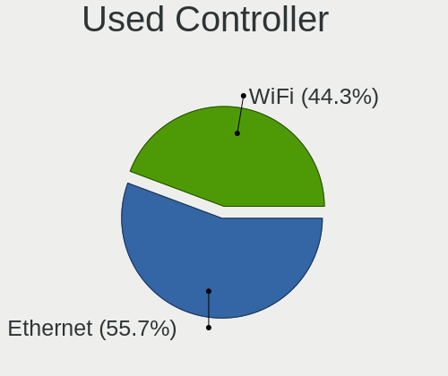
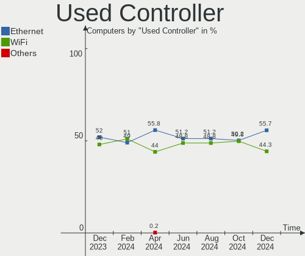
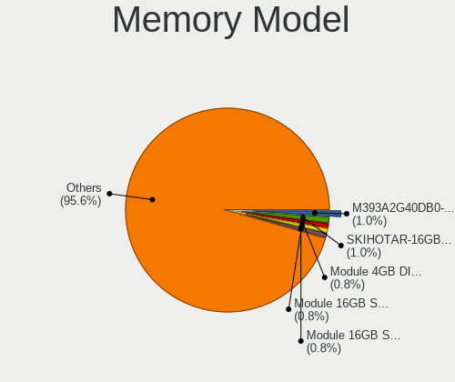
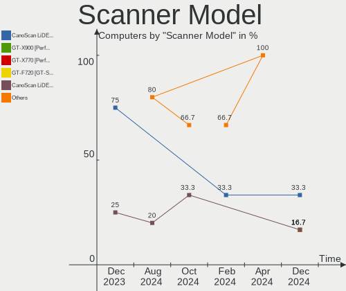

Debian - Hardware Trends
------------------------

A project to identify most popular hardware characteristics and track their change
over time based on data collected by Linux users at https://Linux-Hardware.org.

Anyone can contribute to this report by the [hw-probe](https://github.com/linuxhw/hw-probe) tool:

    sudo -E hw-probe -all -upload

This is a report for all computer types. See also reports for [desktops](/Dist/Debian/Desktop/README.md) and [notebooks](/Dist/Debian/Notebook/README.md).

This report is for one last month. Overall report since the beginning of time: [TestCoverage](https://github.com/linuxhw/TestCoverage)

Period: May, 2022.

Contents
--------

* [ System ](#system)
  - [ OS                       ](#os)
  - [ OS Family                ](#os-family)
  - [ Kernel                   ](#kernel)
  - [ Kernel Family            ](#kernel-family)
  - [ Kernel Major Ver.        ](#kernel-major-ver)
  - [ Arch                     ](#arch)
  - [ DE                       ](#de)
  - [ Display Server           ](#display-server)
  - [ Display Manager          ](#display-manager)
  - [ OS Lang                  ](#os-lang)
  - [ Boot Mode                ](#boot-mode)
  - [ Filesystem               ](#filesystem)
  - [ Part. scheme             ](#part-scheme)
  - [ Dual Boot with Linux/BSD ](#dual-boot-with-linuxbsd)
  - [ Dual Boot (Win)          ](#dual-boot-win)

* [ Board ](#board)
  - [ Vendor                   ](#vendor)
  - [ Model                    ](#model)
  - [ Model Family             ](#model-family)
  - [ MFG Year                 ](#mfg-year)
  - [ Form Factor              ](#form-factor)
  - [ Secure Boot              ](#secure-boot)
  - [ Coreboot                 ](#coreboot)
  - [ RAM Size                 ](#ram-size)
  - [ RAM Used                 ](#ram-used)
  - [ Total Drives             ](#total-drives)
  - [ Has CD-ROM               ](#has-cd-rom)
  - [ Has Ethernet             ](#has-ethernet)
  - [ Has WiFi                 ](#has-wifi)
  - [ Has Bluetooth            ](#has-bluetooth)

* [ Location ](#location)
  - [ Country                  ](#country)
  - [ City                     ](#city)

* [ Drives ](#drives)
  - [ Drive Vendor             ](#drive-vendor)
  - [ Drive Model              ](#drive-model)
  - [ HDD Vendor               ](#hdd-vendor)
  - [ SSD Vendor               ](#ssd-vendor)
  - [ Drive Kind               ](#drive-kind)
  - [ Drive Connector          ](#drive-connector)
  - [ Drive Size               ](#drive-size)
  - [ Space Total              ](#space-total)
  - [ Space Used               ](#space-used)
  - [ Malfunc. Drives          ](#malfunc-drives)
  - [ Malfunc. Drive Vendor    ](#malfunc-drive-vendor)
  - [ Malfunc. HDD Vendor      ](#malfunc-hdd-vendor)
  - [ Malfunc. Drive Kind      ](#malfunc-drive-kind)
  - [ Failed Drives            ](#failed-drives)
  - [ Failed Drive Vendor      ](#failed-drive-vendor)
  - [ Drive Status             ](#drive-status)

* [ Storage controller ](#storage-controller)
  - [ Storage Vendor           ](#storage-vendor)
  - [ Storage Model            ](#storage-model)
  - [ Storage Kind             ](#storage-kind)

* [ Processor ](#processor)
  - [ CPU Vendor               ](#cpu-vendor)
  - [ CPU Model                ](#cpu-model)
  - [ CPU Model Family         ](#cpu-model-family)
  - [ CPU Cores                ](#cpu-cores)
  - [ CPU Sockets              ](#cpu-sockets)
  - [ CPU Threads              ](#cpu-threads)
  - [ CPU Op-Modes             ](#cpu-op-modes)
  - [ CPU Microcode            ](#cpu-microcode)
  - [ CPU Microarch            ](#cpu-microarch)

* [ Graphics ](#graphics)
  - [ GPU Vendor               ](#gpu-vendor)
  - [ GPU Model                ](#gpu-model)
  - [ GPU Combo                ](#gpu-combo)
  - [ GPU Driver               ](#gpu-driver)
  - [ GPU Memory               ](#gpu-memory)

* [ Monitor ](#monitor)
  - [ Monitor Vendor           ](#monitor-vendor)
  - [ Monitor Model            ](#monitor-model)
  - [ Monitor Resolution       ](#monitor-resolution)
  - [ Monitor Diagonal         ](#monitor-diagonal)
  - [ Monitor Width            ](#monitor-width)
  - [ Aspect Ratio             ](#aspect-ratio)
  - [ Monitor Area             ](#monitor-area)
  - [ Pixel Density            ](#pixel-density)
  - [ Multiple Monitors        ](#multiple-monitors)

* [ Network ](#network)
  - [ Net Controller Vendor    ](#net-controller-vendor)
  - [ Net Controller Model     ](#net-controller-model)
  - [ Wireless Vendor          ](#wireless-vendor)
  - [ Wireless Model           ](#wireless-model)
  - [ Ethernet Vendor          ](#ethernet-vendor)
  - [ Ethernet Model           ](#ethernet-model)
  - [ Net Controller Kind      ](#net-controller-kind)
  - [ Used Controller          ](#used-controller)
  - [ NICs                     ](#nics)
  - [ IPv6                     ](#ipv6)

* [ Bluetooth ](#bluetooth)
  - [ Bluetooth Vendor         ](#bluetooth-vendor)
  - [ Bluetooth Model          ](#bluetooth-model)

* [ Sound ](#sound)
  - [ Sound Vendor             ](#sound-vendor)
  - [ Sound Model              ](#sound-model)

* [ Memory ](#memory)
  - [ Memory Vendor            ](#memory-vendor)
  - [ Memory Model             ](#memory-model)
  - [ Memory Kind              ](#memory-kind)
  - [ Memory Form Factor       ](#memory-form-factor)
  - [ Memory Size              ](#memory-size)
  - [ Memory Speed             ](#memory-speed)

* [ Printers & scanners ](#printers--scanners)
  - [ Printer Vendor           ](#printer-vendor)
  - [ Printer Model            ](#printer-model)
  - [ Scanner Vendor           ](#scanner-vendor)
  - [ Scanner Model            ](#scanner-model)

* [ Camera ](#camera)
  - [ Camera Vendor            ](#camera-vendor)
  - [ Camera Model             ](#camera-model)

* [ Security ](#security)
  - [ Fingerprint Vendor       ](#fingerprint-vendor)
  - [ Fingerprint Model        ](#fingerprint-model)
  - [ Chipcard Vendor          ](#chipcard-vendor)
  - [ Chipcard Model           ](#chipcard-model)

* [ Unsupported ](#unsupported)
  - [ Unsupported Devices      ](#unsupported-devices)
  - [ Unsupported Device Types ](#unsupported-device-types)

System
------

OS
--

Installed operating systems

| Name              | Computers | Percent |
|-------------------|-----------|---------|
| Debian 11         | 263       | 82.7%   |
| Debian Testing    | 22        | 6.92%   |
| Debian 10         | 12        | 3.77%   |
| Debian Unstable   | 11        | 3.46%   |
| Debian 11-updates | 6         | 1.89%   |
| Debian 9          | 4         | 1.26%   |

OS Family
---------

OS without a version

| Name   | Computers | Percent |
|--------|-----------|---------|
| Debian | 318       | 100%    |

Kernel
------

Version of the Linux kernel

| Version                    | Computers | Percent |
|----------------------------|-----------|---------|
| 5.10.0-14-amd64            | 91        | 28.62%  |
| 5.10.0-7-amd64             | 69        | 21.7%   |
| 5.10.0-13-amd64            | 40        | 12.58%  |
| 5.17.0-1-amd64             | 29        | 9.12%   |
| 5.16.0-0.bpo.4-amd64       | 10        | 3.14%   |
| 5.17.0-2-amd64             | 6         | 1.89%   |
| 5.15.35-1-pve              | 6         | 1.89%   |
| 5.10.0-10-amd64            | 5         | 1.57%   |
| 4.19.0-20-amd64            | 5         | 1.57%   |
| 5.16.0-6-amd64             | 4         | 1.26%   |
| 5.15.32-v8+                | 4         | 1.26%   |
| 5.13.19-6-pve              | 3         | 0.94%   |
| 5.10.0-13-686-pae          | 3         | 0.94%   |
| 5.17.0-5.1-liquorix-amd64  | 2         | 0.63%   |
| 5.17.0-3-amd64             | 2         | 0.63%   |
| 5.10.0-14-686-pae          | 2         | 0.63%   |
| 5.10.0-13-686              | 2         | 0.63%   |
| 4.19.0-18-amd64            | 2         | 0.63%   |
| 4.19.0-17-amd64            | 2         | 0.63%   |
| 5.8.0-3-amd64              | 1         | 0.31%   |
| 5.18.0                     | 1         | 0.31%   |
| 5.17.6-wrkd                | 1         | 0.31%   |
| 5.17.6-hpelite             | 1         | 0.31%   |
| 5.17.6-amd64               | 1         | 0.31%   |
| 5.17.5-t2                  | 1         | 0.31%   |
| 5.17.5-frehi               | 1         | 0.31%   |
| 5.17.5                     | 1         | 0.31%   |
| 5.17.11-xanmod1            | 1         | 0.31%   |
| 5.17.0-rc8-amd64           | 1         | 0.31%   |
| 5.17.0-rc5                 | 1         | 0.31%   |
| 5.17.0-7.1-liquorix-amd64  | 1         | 0.31%   |
| 5.17.0-2-rt-amd64          | 1         | 0.31%   |
| 5.17-rockchip              | 1         | 0.31%   |
| 5.16.12-mod-amd64          | 1         | 0.31%   |
| 5.16.0-6mx-amd64           | 1         | 0.31%   |
| 5.14.0-4mx-amd64           | 1         | 0.31%   |
| 5.14.0-0.bpo.2-686         | 1         | 0.31%   |
| 5.13.0-051300-generic      | 1         | 0.31%   |
| 5.12.0-14.2-liquorix-amd64 | 1         | 0.31%   |
| 5.10.93+truenas            | 1         | 0.31%   |
| 5.10.92-051092-generic     | 1         | 0.31%   |
| 5.10.60                    | 1         | 0.31%   |
| 5.10.103-v8+               | 1         | 0.31%   |
| 5.10.0-9-amd64             | 1         | 0.31%   |
| 5.10.0-12-amd64            | 1         | 0.31%   |
| 5.10.0-0.bpo.12-amd64      | 1         | 0.31%   |
| 4.9.0-18-amd64             | 1         | 0.31%   |
| 4.9.0-18-686-pae           | 1         | 0.31%   |
| 4.9.0-17-amd64             | 1         | 0.31%   |
| 4.19.0-13-amd64            | 1         | 0.31%   |

Kernel Family
-------------

Linux kernel without a distro release

| Version  | Computers | Percent |
|----------|-----------|---------|
| 5.10.0   | 215       | 67.61%  |
| 5.17.0   | 43        | 13.52%  |
| 5.16.0   | 15        | 4.72%   |
| 4.19.0   | 10        | 3.14%   |
| 5.15.35  | 6         | 1.89%   |
| 5.15.32  | 4         | 1.26%   |
| 5.17.6   | 3         | 0.94%   |
| 5.17.5   | 3         | 0.94%   |
| 5.13.19  | 3         | 0.94%   |
| 4.9.0    | 3         | 0.94%   |
| 5.14.0   | 2         | 0.63%   |
| 5.8.0    | 1         | 0.31%   |
| 5.18.0   | 1         | 0.31%   |
| 5.17.11  | 1         | 0.31%   |
| 5.17     | 1         | 0.31%   |
| 5.16.12  | 1         | 0.31%   |
| 5.13.0   | 1         | 0.31%   |
| 5.12.0   | 1         | 0.31%   |
| 5.10.93  | 1         | 0.31%   |
| 5.10.92  | 1         | 0.31%   |
| 5.10.60  | 1         | 0.31%   |
| 5.10.103 | 1         | 0.31%   |

Kernel Major Ver.
-----------------

Linux kernel major version

| Version | Computers | Percent |
|---------|-----------|---------|
| 5.10    | 219       | 68.87%  |
| 5.17    | 50        | 15.72%  |
| 5.16    | 16        | 5.03%   |
| 5.15    | 10        | 3.14%   |
| 4.19    | 10        | 3.14%   |
| 5.13    | 4         | 1.26%   |
| 4.9     | 3         | 0.94%   |
| 5.14    | 2         | 0.63%   |
| 5.8     | 1         | 0.31%   |
| 5.18    | 1         | 0.31%   |
| 5.12    | 1         | 0.31%   |
| 5       | 1         | 0.31%   |

Arch
----

OS architecture (x86_64, i586, etc.)

| Name    | Computers | Percent |
|---------|-----------|---------|
| x86_64  | 303       | 95.28%  |
| i686    | 9         | 2.83%   |
| aarch64 | 6         | 1.89%   |

DE
--

Desktop Environment

| Name             | Computers | Percent |
|------------------|-----------|---------|
| Unknown          | 102       | 32.08%  |
| GNOME            | 72        | 22.64%  |
| XFCE             | 40        | 12.58%  |
| KDE5             | 39        | 12.26%  |
| MATE             | 21        | 6.6%    |
| X-Cinnamon       | 11        | 3.46%   |
| LXDE             | 9         | 2.83%   |
| Cinnamon         | 7         | 2.2%    |
| LXQt             | 6         | 1.89%   |
| lightdm-xsession | 2         | 0.63%   |
| Phosh:GNOME      | 1         | 0.31%   |
| matchbox         | 1         | 0.31%   |
| KDE              | 1         | 0.31%   |
| i3               | 1         | 0.31%   |
| GNOME Classic    | 1         | 0.31%   |
| DWM              | 1         | 0.31%   |
| Cutefish         | 1         | 0.31%   |
| Budgie           | 1         | 0.31%   |
| bspwm            | 1         | 0.31%   |

Display Server
--------------

X11 or Wayland

| Name    | Computers | Percent |
|---------|-----------|---------|
| X11     | 149       | 46.86%  |
| Unknown | 84        | 26.42%  |
| Wayland | 56        | 17.61%  |
| Tty     | 29        | 9.12%   |

Display Manager
---------------

SDDM, LightDM, etc.

| Name    | Computers | Percent |
|---------|-----------|---------|
| Unknown | 162       | 50.94%  |
| LightDM | 65        | 20.44%  |
| GDM     | 34        | 10.69%  |
| GDM3    | 28        | 8.81%   |
| SDDM    | 27        | 8.49%   |
| SLiM    | 2         | 0.63%   |

OS Lang
-------

Language

| Lang    | Computers | Percent |
|---------|-----------|---------|
| en_US   | 111       | 34.91%  |
| ru_RU   | 84        | 26.42%  |
| de_DE   | 16        | 5.03%   |
| en_GB   | 14        | 4.4%    |
| fr_FR   | 13        | 4.09%   |
| es_ES   | 11        | 3.46%   |
| en_AU   | 10        | 3.14%   |
| Unknown | 10        | 3.14%   |
| pt_BR   | 8         | 2.52%   |
| it_IT   | 5         | 1.57%   |
| pl_PL   | 4         | 1.26%   |
| ja_JP   | 3         | 0.94%   |
| en_IE   | 3         | 0.94%   |
| C       | 3         | 0.94%   |
| fi_FI   | 2         | 0.63%   |
| es_VE   | 2         | 0.63%   |
| es_MX   | 2         | 0.63%   |
| en_CA   | 2         | 0.63%   |
| de_AT   | 2         | 0.63%   |
| zh_CN   | 1         | 0.31%   |
| pt_PT   | 1         | 0.31%   |
| nl_NL   | 1         | 0.31%   |
| nl_BE   | 1         | 0.31%   |
| nb_NO   | 1         | 0.31%   |
| fr_LU   | 1         | 0.31%   |
| es_CL   | 1         | 0.31%   |
| es_AR   | 1         | 0.31%   |
| en_SG   | 1         | 0.31%   |
| en_IN   | 1         | 0.31%   |
| en_DK   | 1         | 0.31%   |
| cs_CZ   | 1         | 0.31%   |
| ca_ES   | 1         | 0.31%   |

Boot Mode
---------

EFI or BIOS

| Mode | Computers | Percent |
|------|-----------|---------|
| BIOS | 159       | 50%     |
| EFI  | 159       | 50%     |

Filesystem
----------

Type of filesystem

| Type    | Computers | Percent |
|---------|-----------|---------|
| Ext4    | 216       | 67.92%  |
| Overlay | 80        | 25.16%  |
| Btrfs   | 15        | 4.72%   |
| Xfs     | 3         | 0.94%   |
| Zfs     | 2         | 0.63%   |
| Ext3    | 1         | 0.31%   |
| Unknown | 1         | 0.31%   |

Part. scheme
------------

Scheme of partitioning

| Type    | Computers | Percent |
|---------|-----------|---------|
| GPT     | 154       | 48.43%  |
| MBR     | 96        | 30.19%  |
| Unknown | 68        | 21.38%  |

Dual Boot with Linux/BSD
------------------------

Hosting more than one Linux/BSD

| Dual boot | Computers | Percent |
|-----------|-----------|---------|
| No        | 283       | 88.99%  |
| Yes       | 35        | 11.01%  |

Dual Boot (Win)
---------------

Hosting Linux and Windows

| Dual boot | Computers | Percent |
|-----------|-----------|---------|
| No        | 203       | 63.84%  |
| Yes       | 115       | 36.16%  |

Board
-----

Vendor
------

Motherboard manufacturer

| Name                    | Computers | Percent |
|-------------------------|-----------|---------|
| ASUSTek Computer        | 43        | 13.52%  |
| Lenovo                  | 39        | 12.26%  |
| Dell                    | 37        | 11.64%  |
| Hewlett-Packard         | 36        | 11.32%  |
| Gigabyte Technology     | 27        | 8.49%   |
| Aquarius                | 22        | 6.92%   |
| ASRock                  | 21        | 6.6%    |
| MSI                     | 20        | 6.29%   |
| Acer                    | 10        | 3.14%   |
| Apple                   | 8         | 2.52%   |
| Raspberry Pi Foundation | 5         | 1.57%   |
| Samsung Electronics     | 4         | 1.26%   |
| Intel                   | 4         | 1.26%   |
| ECS                     | 3         | 0.94%   |
| TUXEDO                  | 2         | 0.63%   |
| Panasonic               | 2         | 0.63%   |
| Packard Bell            | 2         | 0.63%   |
| Notebook                | 2         | 0.63%   |
| Fujitsu                 | 2         | 0.63%   |
| Foxconn                 | 2         | 0.63%   |
| Alienware               | 2         | 0.63%   |
| Unknown                 | 2         | 0.63%   |
| Thirdwave               | 1         | 0.31%   |
| Teclast                 | 1         | 0.31%   |
| System76                | 1         | 0.31%   |
| Supermicro              | 1         | 0.31%   |
| SLIMBOOK                | 1         | 0.31%   |
| SANTECH                 | 1         | 0.31%   |
| Quanta                  | 1         | 0.31%   |
| Positivo                | 1         | 0.31%   |
| MouseComputer           | 1         | 0.31%   |
| Medion                  | 1         | 0.31%   |
| MACHINIST               | 1         | 0.31%   |
| LG Electronics          | 1         | 0.31%   |
| KLLISRE                 | 1         | 0.31%   |
| IP3 Tech                | 1         | 0.31%   |
| HUAWEI                  | 1         | 0.31%   |
| Google                  | 1         | 0.31%   |
| Fanless Mini PC         | 1         | 0.31%   |
| Clientron               | 1         | 0.31%   |
| Biostar                 | 1         | 0.31%   |
| BESSTAR Tech            | 1         | 0.31%   |
| ASRockRack              | 1         | 0.31%   |
| American Megatrends     | 1         | 0.31%   |
| AAEON                   | 1         | 0.31%   |

Model
-----

Motherboard model

| Name                                      | Computers | Percent |
|-------------------------------------------|-----------|---------|
| Aquarius NS585                            | 22        | 6.92%   |
| ASRock H470M-HVS                          | 12        | 3.77%   |
| ASUS S20 K29                              | 6         | 1.89%   |
| ASUS All Series                           | 5         | 1.57%   |
| MSI MS-7996                               | 4         | 1.26%   |
| Lenovo ThinkPad L13 Yoga Gen 2 20VK0019US | 3         | 0.94%   |
| HP Z620 Workstation                       | 3         | 0.94%   |
| Unknown                                   | 3         | 0.94%   |
| RPi Raspberry Pi 4 Model B Rev 1.5        | 2         | 0.63%   |
| RPi Raspberry Pi 4 Model B Rev 1.4        | 2         | 0.63%   |
| Lenovo V145-15AST 81MT                    | 2         | 0.63%   |
| HP ProLiant DL360e Gen8                   | 2         | 0.63%   |
| HP Notebook                               | 2         | 0.63%   |
| HP EliteBook 820 G1                       | 2         | 0.63%   |
| Dell PowerEdge R410                       | 2         | 0.63%   |
| Dell OptiPlex 990                         | 2         | 0.63%   |
| Dell Latitude 3520                        | 2         | 0.63%   |
| TUXEDO InfinityBook Pro 14 Gen6           | 1         | 0.31%   |
| Thirdwave DX-T7                           | 1         | 0.31%   |
| Teclast X16                               | 1         | 0.31%   |
| System76 Kudu                             | 1         | 0.31%   |
| Supermicro X9SRA/X9SRA-3                  | 1         | 0.31%   |
| SLIMBOOK Essential15L                     | 1         | 0.31%   |
| SANTECH NHx0DB,DE                         | 1         | 0.31%   |
| Samsung SR70S/SR71S                       | 1         | 0.31%   |
| Samsung 950QDB                            | 1         | 0.31%   |
| Samsung 350V5C/351V5C/3540VC/3440VC       | 1         | 0.31%   |
| Samsung 300E4C/300E5C/300E7C              | 1         | 0.31%   |
| RPi Raspberry Pi 4 Model B Rev 1.2        | 1         | 0.31%   |
| Quanta Leopard ORv2-DDR4                  | 1         | 0.31%   |
| Positivo I541TB                           | 1         | 0.31%   |
| Panasonic CF-AX2LDCZMF                    | 1         | 0.31%   |
| Panasonic CF-31-5                         | 1         | 0.31%   |
| Packard Bell LES ESSENTIELS IMEDIA 8100   | 1         | 0.31%   |
| Packard Bell IMEDIA S3840                 | 1         | 0.31%   |
| Notebook W65_67SJ                         | 1         | 0.31%   |
| Notebook NS50_70MU                        | 1         | 0.31%   |
| MSI Prestige 14Evo A11M                   | 1         | 0.31%   |
| MSI MS-7D54                               | 1         | 0.31%   |
| MSI MS-7D53                               | 1         | 0.31%   |
| MSI MS-7C95                               | 1         | 0.31%   |
| MSI MS-7C56                               | 1         | 0.31%   |
| MSI MS-7998                               | 1         | 0.31%   |
| MSI MS-7846                               | 1         | 0.31%   |
| MSI MS-7817                               | 1         | 0.31%   |
| MSI MS-7721                               | 1         | 0.31%   |
| MSI MS-7715                               | 1         | 0.31%   |
| MSI MS-7529                               | 1         | 0.31%   |
| MSI MS-7053                               | 1         | 0.31%   |
| MSI Modern 15 A11M                        | 1         | 0.31%   |
| MSI Katana GF66 11UD                      | 1         | 0.31%   |
| MSI GP62MVR 6RF                           | 1         | 0.31%   |
| MSI A320M-HDV R4.0                        | 1         | 0.31%   |
| MouseComputer MPro-S200                   | 1         | 0.31%   |
| Medion MD34189/C731                       | 1         | 0.31%   |
| MACHINIST X99-RS9 V2.0                    | 1         | 0.31%   |
| LG A410-G.BC48P1                          | 1         | 0.31%   |
| Lenovo Z710 20250                         | 1         | 0.31%   |
| Lenovo Yoga 910-13IKB 80VF                | 1         | 0.31%   |
| Lenovo Y520-15IKBN 80WK                   | 1         | 0.31%   |

Model Family
------------

Motherboard model prefix

| Name                   | Computers | Percent |
|------------------------|-----------|---------|
| Lenovo ThinkPad        | 27        | 8.49%   |
| Aquarius NS585         | 22        | 6.92%   |
| ASRock H470M-HVS       | 12        | 3.77%   |
| Dell Latitude          | 9         | 2.83%   |
| Dell OptiPlex          | 8         | 2.52%   |
| Acer Aspire            | 8         | 2.52%   |
| ASUS S20               | 6         | 1.89%   |
| RPi Raspberry          | 5         | 1.57%   |
| Dell Inspiron          | 5         | 1.57%   |
| ASUS All               | 5         | 1.57%   |
| MSI MS-7996            | 4         | 1.26%   |
| HP ProLiant            | 4         | 1.26%   |
| HP ProBook             | 4         | 1.26%   |
| HP EliteBook           | 4         | 1.26%   |
| Dell Vostro            | 4         | 1.26%   |
| Dell PowerEdge         | 4         | 1.26%   |
| ASUS ROG               | 4         | 1.26%   |
| Lenovo Legion          | 3         | 0.94%   |
| Lenovo IdeaPad         | 3         | 0.94%   |
| HP Z620                | 3         | 0.94%   |
| Dell Precision         | 3         | 0.94%   |
| ASUS VivoBook          | 3         | 0.94%   |
| ASUS PRIME             | 3         | 0.94%   |
| ASUS ASUS              | 3         | 0.94%   |
| Unknown                | 3         | 0.94%   |
| Lenovo V145-15AST      | 2         | 0.63%   |
| HP Pavilion            | 2         | 0.63%   |
| HP Notebook            | 2         | 0.63%   |
| HP ENVY                | 2         | 0.63%   |
| HP EliteDesk           | 2         | 0.63%   |
| HP 250                 | 2         | 0.63%   |
| Gigabyte B550          | 2         | 0.63%   |
| Gigabyte B450M         | 2         | 0.63%   |
| Dell XPS               | 2         | 0.63%   |
| ASRock B450            | 2         | 0.63%   |
| TUXEDO InfinityBook    | 1         | 0.31%   |
| Thirdwave DX-T7        | 1         | 0.31%   |
| Teclast X16            | 1         | 0.31%   |
| System76 Kudu          | 1         | 0.31%   |
| Supermicro X9SRA       | 1         | 0.31%   |
| SLIMBOOK Essential15L  | 1         | 0.31%   |
| SANTECH NHx0DB         | 1         | 0.31%   |
| Samsung SR70S          | 1         | 0.31%   |
| Samsung 950QDB         | 1         | 0.31%   |
| Samsung 350V5C         | 1         | 0.31%   |
| Samsung 300E4C         | 1         | 0.31%   |
| Quanta Leopard         | 1         | 0.31%   |
| Positivo I541TB        | 1         | 0.31%   |
| Panasonic CF-AX2LDCZMF | 1         | 0.31%   |
| Panasonic CF-31-5      | 1         | 0.31%   |
| Packard Bell LES       | 1         | 0.31%   |
| Packard Bell IMEDIA    | 1         | 0.31%   |
| Notebook W65           | 1         | 0.31%   |
| Notebook NS50          | 1         | 0.31%   |
| MSI Prestige           | 1         | 0.31%   |
| MSI MS-7D54            | 1         | 0.31%   |
| MSI MS-7D53            | 1         | 0.31%   |
| MSI MS-7C95            | 1         | 0.31%   |
| MSI MS-7C56            | 1         | 0.31%   |
| MSI MS-7998            | 1         | 0.31%   |

MFG Year
--------

Motherboard manufacture year

| Year    | Computers | Percent |
|---------|-----------|---------|
| 2020    | 69        | 21.7%   |
| 2021    | 50        | 15.72%  |
| 2012    | 21        | 6.6%    |
| 2018    | 20        | 6.29%   |
| 2015    | 20        | 6.29%   |
| 2013    | 20        | 6.29%   |
| 2011    | 19        | 5.97%   |
| 2019    | 16        | 5.03%   |
| 2017    | 13        | 4.09%   |
| 2014    | 13        | 4.09%   |
| 2016    | 10        | 3.14%   |
| 2010    | 8         | 2.52%   |
| 2009    | 8         | 2.52%   |
| 2008    | 7         | 2.2%    |
| 2022    | 6         | 1.89%   |
| Unknown | 6         | 1.89%   |
| 2007    | 5         | 1.57%   |
| 2006    | 4         | 1.26%   |
| 2004    | 2         | 0.63%   |
| 2005    | 1         | 0.31%   |

Form Factor
-----------

Physical design of the computer

| Name           | Computers | Percent |
|----------------|-----------|---------|
| Notebook       | 145       | 45.6%   |
| Desktop        | 140       | 44.03%  |
| Server         | 8         | 2.52%   |
| Convertible    | 7         | 2.2%    |
| System on chip | 6         | 1.89%   |
| Mini pc        | 6         | 1.89%   |
| All in one     | 4         | 1.26%   |
| Tablet         | 2         | 0.63%   |

Secure Boot
-----------

Enabled or disabled

| State    | Computers | Percent |
|----------|-----------|---------|
| Disabled | 302       | 94.97%  |
| Enabled  | 16        | 5.03%   |

Coreboot
--------

Have coreboot on board

| Used | Computers | Percent |
|------|-----------|---------|
| No   | 317       | 99.69%  |
| Yes  | 1         | 0.31%   |

RAM Size
--------

Total RAM memory

| Size in GB  | Computers | Percent |
|-------------|-----------|---------|
| 4.01-8.0    | 84        | 26.42%  |
| 16.01-24.0  | 57        | 17.92%  |
| 3.01-4.0    | 53        | 16.67%  |
| 32.01-64.0  | 47        | 14.78%  |
| 8.01-16.0   | 33        | 10.38%  |
| 64.01-256.0 | 21        | 6.6%    |
| 1.01-2.0    | 11        | 3.46%   |
| 2.01-3.0    | 9         | 2.83%   |
| 24.01-32.0  | 2         | 0.63%   |
| 0.51-1.0    | 1         | 0.31%   |

RAM Used
--------

Used RAM memory

| Used GB    | Computers | Percent |
|------------|-----------|---------|
| 0.51-1.0   | 91        | 28.62%  |
| 1.01-2.0   | 71        | 22.33%  |
| 2.01-3.0   | 60        | 18.87%  |
| 4.01-8.0   | 38        | 11.95%  |
| 3.01-4.0   | 27        | 8.49%   |
| 8.01-16.0  | 11        | 3.46%   |
| 0.01-0.5   | 8         | 2.52%   |
| 32.01-64.0 | 5         | 1.57%   |
| 16.01-24.0 | 4         | 1.26%   |
| 24.01-32.0 | 3         | 0.94%   |

Total Drives
------------

Number of drives on board

| Drives | Computers | Percent |
|--------|-----------|---------|
| 1      | 203       | 63.84%  |
| 2      | 63        | 19.81%  |
| 3      | 22        | 6.92%   |
| 4      | 14        | 4.4%    |
| 5      | 8         | 2.52%   |
| 7      | 2         | 0.63%   |
| 6      | 2         | 0.63%   |
| 0      | 2         | 0.63%   |
| 9      | 1         | 0.31%   |
| 8      | 1         | 0.31%   |

Has CD-ROM
----------

Has CD-ROM on board

| Presented | Computers | Percent |
|-----------|-----------|---------|
| No        | 227       | 71.38%  |
| Yes       | 91        | 28.62%  |

Has Ethernet
------------

Has Ethernet on board

| Presented | Computers | Percent |
|-----------|-----------|---------|
| Yes       | 291       | 91.51%  |
| No        | 27        | 8.49%   |

Has WiFi
--------

Has WiFi module

| Presented | Computers | Percent |
|-----------|-----------|---------|
| Yes       | 202       | 63.52%  |
| No        | 116       | 36.48%  |

Has Bluetooth
-------------

Has Bluetooth module

| Presented | Computers | Percent |
|-----------|-----------|---------|
| Yes       | 170       | 53.46%  |
| No        | 148       | 46.54%  |

Location
--------

Country
-------

Geographic location (country)

| Country       | Computers | Percent |
|---------------|-----------|---------|
| Russia        | 83        | 26.1%   |
| USA           | 51        | 16.04%  |
| Germany       | 23        | 7.23%   |
| Spain         | 16        | 5.03%   |
| France        | 14        | 4.4%    |
| Italy         | 13        | 4.09%   |
| Australia     | 11        | 3.46%   |
| Brazil        | 10        | 3.14%   |
| Poland        | 7         | 2.2%    |
| Netherlands   | 7         | 2.2%    |
| Canada        | 7         | 2.2%    |
| Finland       | 6         | 1.89%   |
| Austria       | 6         | 1.89%   |
| UK            | 5         | 1.57%   |
| Mexico        | 5         | 1.57%   |
| Belgium       | 5         | 1.57%   |
| Portugal      | 4         | 1.26%   |
| Japan         | 4         | 1.26%   |
| China         | 4         | 1.26%   |
| Norway        | 3         | 0.94%   |
| Croatia       | 3         | 0.94%   |
| Venezuela     | 2         | 0.63%   |
| Slovenia      | 2         | 0.63%   |
| Ireland       | 2         | 0.63%   |
| India         | 2         | 0.63%   |
| Hungary       | 2         | 0.63%   |
| Denmark       | 2         | 0.63%   |
| Uganda        | 1         | 0.31%   |
| UAE           | 1         | 0.31%   |
| Turkey        | 1         | 0.31%   |
| Thailand      | 1         | 0.31%   |
| Sweden        | 1         | 0.31%   |
| Serbia        | 1         | 0.31%   |
| Pakistan      | 1         | 0.31%   |
| New Zealand   | 1         | 0.31%   |
| Lithuania     | 1         | 0.31%   |
| Liechtenstein | 1         | 0.31%   |
| Kenya         | 1         | 0.31%   |
| Kazakhstan    | 1         | 0.31%   |
| Israel        | 1         | 0.31%   |
| Czechia       | 1         | 0.31%   |
| Colombia      | 1         | 0.31%   |
| Chile         | 1         | 0.31%   |
| Cameroon      | 1         | 0.31%   |
| Argentina     | 1         | 0.31%   |
| Algeria       | 1         | 0.31%   |

City
----

Geographic location (city)

| City             | Computers | Percent |
|------------------|-----------|---------|
| Voronezh         | 69        | 21.7%   |
| Brisbane         | 6         | 1.89%   |
| Vienna           | 5         | 1.57%   |
| St Petersburg    | 5         | 1.57%   |
| Orlando          | 4         | 1.26%   |
| Berlin           | 4         | 1.26%   |
| Amsterdam        | 4         | 1.26%   |
| Toronto          | 3         | 0.94%   |
| Seville          | 3         | 0.94%   |
| Sao Paulo        | 3         | 0.94%   |
| Madrid           | 3         | 0.94%   |
| Bangor           | 3         | 0.94%   |
| Vicente Guerrero | 2         | 0.63%   |
| Turin            | 2         | 0.63%   |
| Sydney           | 2         | 0.63%   |
| Sheerness        | 2         | 0.63%   |
| Raahe            | 2         | 0.63%   |
| Palma            | 2         | 0.63%   |
| Pabianice        | 2         | 0.63%   |
| Omaha            | 2         | 0.63%   |
| Munich           | 2         | 0.63%   |
| Moscow           | 2         | 0.63%   |
| Milan            | 2         | 0.63%   |
| Los Angeles      | 2         | 0.63%   |
| Helsinki         | 2         | 0.63%   |
| Dublin           | 2         | 0.63%   |
| Chicago          | 2         | 0.63%   |
| Calgary          | 2         | 0.63%   |
| Barcelona        | 2         | 0.63%   |
| Adelfia          | 2         | 0.63%   |
| Zaprešić       | 1         | 0.31%   |
| Zagreb           | 1         | 0.31%   |
| Yepes            | 1         | 0.31%   |
| Yekaterinburg    | 1         | 0.31%   |
| Yaoundé         | 1         | 0.31%   |
| Wissous          | 1         | 0.31%   |
| Winnipeg         | 1         | 0.31%   |
| Weaverville      | 1         | 0.31%   |
| Washington       | 1         | 0.31%   |
| Warsaw           | 1         | 0.31%   |
| Waregem          | 1         | 0.31%   |
| Vladivostok      | 1         | 0.31%   |
| Vitória         | 1         | 0.31%   |
| Vilnius          | 1         | 0.31%   |
| Velserbroek      | 1         | 0.31%   |
| Vancouver        | 1         | 0.31%   |
| Valla            | 1         | 0.31%   |
| Vaduz            | 1         | 0.31%   |
| Turku            | 1         | 0.31%   |
| Trzin            | 1         | 0.31%   |
| Trondheim        | 1         | 0.31%   |
| Toulouse         | 1         | 0.31%   |
| Topeka           | 1         | 0.31%   |
| Toms River       | 1         | 0.31%   |
| Tilburg          | 1         | 0.31%   |
| Thermopolis      | 1         | 0.31%   |
| Tel Aviv         | 1         | 0.31%   |
| Tczew            | 1         | 0.31%   |
| Tatuí           | 1         | 0.31%   |
| Tata             | 1         | 0.31%   |

Drives
------

Drive Vendor
------------

Hard drive vendors

| Vendor                         | Computers | Drives | Percent |
|--------------------------------|-----------|--------|---------|
| Seagate                        | 65        | 87     | 14.41%  |
| Samsung Electronics            | 63        | 74     | 13.97%  |
| WDC                            | 47        | 68     | 10.42%  |
| Toshiba                        | 34        | 35     | 7.54%   |
| A-DATA Technology              | 32        | 33     | 7.1%    |
| Kingston                       | 29        | 31     | 6.43%   |
| SanDisk                        | 23        | 25     | 5.1%    |
| Crucial                        | 20        | 23     | 4.43%   |
| Unknown                        | 18        | 22     | 3.99%   |
| Hitachi                        | 16        | 17     | 3.55%   |
| SK Hynix                       | 13        | 13     | 2.88%   |
| Netac                          | 12        | 12     | 2.66%   |
| Intel                          | 11        | 11     | 2.44%   |
| Micron Technology              | 6         | 7      | 1.33%   |
| HGST                           | 5         | 6      | 1.11%   |
| Unknown                        | 5         | 6      | 1.11%   |
| KIOXIA                         | 4         | 4      | 0.89%   |
| China                          | 4         | 4      | 0.89%   |
| SPCC                           | 3         | 3      | 0.67%   |
| Intenso                        | 3         | 3      | 0.67%   |
| Transcend                      | 2         | 2      | 0.44%   |
| Solid State Storage Technology | 2         | 2      | 0.44%   |
| Silicon Motion                 | 2         | 2      | 0.44%   |
| Patriot                        | 2         | 2      | 0.44%   |
| MAXTOR                         | 2         | 2      | 0.44%   |
| Fujitsu                        | 2         | 2      | 0.44%   |
| Apple                          | 2         | 2      | 0.44%   |
| USB3.0                         | 1         | 1      | 0.22%   |
| UMIS                           | 1         | 1      | 0.22%   |
| Team                           | 1         | 1      | 0.22%   |
| T-FORCE                        | 1         | 2      | 0.22%   |
| SABRENT                        | 1         | 1      | 0.22%   |
| Realtek Semiconductor          | 1         | 1      | 0.22%   |
| pqi                            | 1         | 1      | 0.22%   |
| PNY                            | 1         | 2      | 0.22%   |
| Phison                         | 1         | 1      | 0.22%   |
| Micron/Crucial Technology      | 1         | 1      | 0.22%   |
| MaxDigital                     | 1         | 2      | 0.22%   |
| LITEON                         | 1         | 1      | 0.22%   |
| KIOXIA-EXCERIA                 | 1         | 1      | 0.22%   |
| JMicron                        | 1         | 1      | 0.22%   |
| JetFlash                       | 1         | 1      | 0.22%   |
| IBM-207x                       | 1         | 4      | 0.22%   |
| HPE                            | 1         | 2      | 0.22%   |
| GOODRAM                        | 1         | 2      | 0.22%   |
| Dell                           | 1         | 1      | 0.22%   |
| CFast                          | 1         | 1      | 0.22%   |
| Aura                           | 1         | 1      | 0.22%   |
| ASUS-PHISON                    | 1         | 1      | 0.22%   |
| ASMT                           | 1         | 2      | 0.22%   |
| AMD                            | 1         | 1      | 0.22%   |

Drive Model
-----------

Hard drive models

| Model                              | Computers | Percent |
|------------------------------------|-----------|---------|
| A-DATA SU800 512GB SSD             | 22        | 4.5%    |
| Toshiba HDWD110 1TB                | 12        | 2.45%   |
| Netac SSD 240GB                    | 12        | 2.45%   |
| Seagate ST500DM002-1BD142 500GB    | 8         | 1.64%   |
| Crucial CT480BX500SSD1 480GB       | 8         | 1.64%   |
| Samsung SSD 860 EVO 1TB            | 5         | 1.02%   |
| Kingston SV300S37A120G 120GB SSD   | 5         | 1.02%   |
| Unknown                            | 5         | 1.02%   |
| Seagate ST1000DM010-2EP102 1TB     | 4         | 0.82%   |
| Samsung SSD 860 EVO 500GB          | 4         | 0.82%   |
| Samsung MZVLB512HBJQ-000L7 512GB   | 4         | 0.82%   |
| Kingston SA400S37240G 240GB SSD    | 4         | 0.82%   |
| Hitachi HDS721050CLA362 500GB      | 4         | 0.82%   |
| WDC WDS100T2B0A-00SM50 1TB SSD     | 3         | 0.61%   |
| WDC WD10EZEX-08WN4A0 1TB           | 3         | 0.61%   |
| Toshiba DT01ACA050 500GB           | 3         | 0.61%   |
| Seagate ST1000DM003-1CH162 1TB     | 3         | 0.61%   |
| Samsung SSD 970 EVO Plus 250GB     | 3         | 0.61%   |
| Samsung SSD 970 EVO Plus 1TB       | 3         | 0.61%   |
| Kingston SUV400S37120G 120GB SSD   | 3         | 0.61%   |
| Kingston SA400S37480G 480GB SSD    | 3         | 0.61%   |
| Kingston SA400S37120G 120GB SSD    | 3         | 0.61%   |
| Hitachi HUS724040ALE641 4TB        | 3         | 0.61%   |
| Crucial CT2000MX500SSD1 2TB        | 3         | 0.61%   |
| WDC WDS500G2B0C-00PXH0 500GB       | 2         | 0.41%   |
| WDC WDS120G2G0A-00JH30 120GB SSD   | 2         | 0.41%   |
| WDC WD5000AAKX-08U6AA0 500GB       | 2         | 0.41%   |
| WDC WD10EZEX-00BBHA0 1TB           | 2         | 0.41%   |
| Unknown SD/MMC/MS PRO 999GB        | 2         | 0.41%   |
| Unknown MMC Card  32GB             | 2         | 0.41%   |
| Unknown MMC Card  128GB            | 2         | 0.41%   |
| Toshiba MQ01ABF050 500GB           | 2         | 0.41%   |
| Toshiba MQ01ABD100 1TB             | 2         | 0.41%   |
| Toshiba DT01ACA100 1TB             | 2         | 0.41%   |
| SPCC Solid State Disk 512GB        | 2         | 0.41%   |
| Seagate ST3500418AS 500GB          | 2         | 0.41%   |
| Seagate ST3500413AS 500GB          | 2         | 0.41%   |
| Seagate ST3250318AS 250GB          | 2         | 0.41%   |
| Seagate ST3160318AS 160GB          | 2         | 0.41%   |
| Seagate ST3146356SS 147GB          | 2         | 0.41%   |
| Seagate ST31000524AS 1TB           | 2         | 0.41%   |
| Seagate ST1000LM048-2E7172 1TB     | 2         | 0.41%   |
| Seagate ST1000LM024 HN-M101MBB 1TB | 2         | 0.41%   |
| SanDisk SSD PLUS 240GB             | 2         | 0.41%   |
| SanDisk SDSSDH3 1T00 1TB           | 2         | 0.41%   |
| Sandisk NVMe SSD Drive 1TB         | 2         | 0.41%   |
| Samsung SSD 980 1TB                | 2         | 0.41%   |
| Samsung SSD 970 EVO Plus 500GB     | 2         | 0.41%   |
| Samsung SSD 860 QVO 1TB            | 2         | 0.41%   |
| Samsung SSD 850 PRO 512GB          | 2         | 0.41%   |
| Samsung SSD 830 Series 256GB       | 2         | 0.41%   |
| Samsung NVMe SSD Drive 512GB       | 2         | 0.41%   |
| Samsung NVMe SSD Drive 1TB         | 2         | 0.41%   |
| Samsung MZVLB1T0HBLR-000H1 1TB     | 2         | 0.41%   |
| Kingston OM8PCP3512F-AI1 512GB     | 2         | 0.41%   |
| Intel SSDPEKNU512GZ 512GB          | 2         | 0.41%   |
| Intel SSDPEKKW256G7 256GB          | 2         | 0.41%   |
| HGST HTS725050A7E630 500GB         | 2         | 0.41%   |
| HGST HTS721010A9E630 1TB           | 2         | 0.41%   |
| Crucial CT500MX500SSD1 500GB       | 2         | 0.41%   |

HDD Vendor
----------

Hard disk drive vendors

| Vendor              | Computers | Drives | Percent |
|---------------------|-----------|--------|---------|
| Seagate             | 61        | 82     | 37.2%   |
| WDC                 | 34        | 53     | 20.73%  |
| Toshiba             | 29        | 30     | 17.68%  |
| Hitachi             | 16        | 17     | 9.76%   |
| Unknown             | 5         | 8      | 3.05%   |
| HGST                | 5         | 6      | 3.05%   |
| Samsung Electronics | 3         | 3      | 1.83%   |
| MAXTOR              | 2         | 2      | 1.22%   |
| Fujitsu             | 2         | 2      | 1.22%   |
| SABRENT             | 1         | 1      | 0.61%   |
| pqi                 | 1         | 1      | 0.61%   |
| MaxDigital          | 1         | 2      | 0.61%   |
| IBM-207x            | 1         | 4      | 0.61%   |
| HPE                 | 1         | 2      | 0.61%   |
| ASMT                | 1         | 2      | 0.61%   |
| Apple               | 1         | 1      | 0.61%   |

SSD Vendor
----------

Solid state drive vendors

| Vendor              | Computers | Drives | Percent |
|---------------------|-----------|--------|---------|
| Samsung Electronics | 31        | 35     | 17.92%  |
| A-DATA Technology   | 27        | 27     | 15.61%  |
| Kingston            | 23        | 25     | 13.29%  |
| Crucial             | 19        | 21     | 10.98%  |
| SanDisk             | 17        | 18     | 9.83%   |
| Netac               | 12        | 12     | 6.94%   |
| WDC                 | 8         | 8      | 4.62%   |
| Intel               | 5         | 5      | 2.89%   |
| Micron Technology   | 4         | 4      | 2.31%   |
| China               | 4         | 4      | 2.31%   |
| Toshiba             | 3         | 3      | 1.73%   |
| SK Hynix            | 3         | 3      | 1.73%   |
| Intenso             | 3         | 3      | 1.73%   |
| Transcend           | 2         | 2      | 1.16%   |
| SPCC                | 2         | 2      | 1.16%   |
| USB3.0              | 1         | 1      | 0.58%   |
| Team                | 1         | 1      | 0.58%   |
| Seagate             | 1         | 1      | 0.58%   |
| Patriot             | 1         | 1      | 0.58%   |
| LITEON              | 1         | 1      | 0.58%   |
| KIOXIA-EXCERIA      | 1         | 1      | 0.58%   |
| JMicron             | 1         | 1      | 0.58%   |
| GOODRAM             | 1         | 2      | 0.58%   |
| ASUS-PHISON         | 1         | 1      | 0.58%   |
| Unknown             | 1         | 2      | 0.58%   |

Drive Kind
----------

HDD or SSD

| Kind    | Computers | Drives | Percent |
|---------|-----------|--------|---------|
| SSD     | 156       | 184    | 37.86%  |
| HDD     | 139       | 216    | 33.74%  |
| NVMe    | 97        | 110    | 23.54%  |
| MMC     | 16        | 17     | 3.88%   |
| Unknown | 4         | 4      | 0.97%   |

Drive Connector
---------------

SATA, SAS, NVMe, etc.

| Type | Computers | Drives | Percent |
|------|-----------|--------|---------|
| SATA | 237       | 381    | 65.29%  |
| NVMe | 97        | 110    | 26.72%  |
| MMC  | 16        | 17     | 4.41%   |
| SAS  | 13        | 23     | 3.58%   |

Drive Size
----------

Size of hard drive

| Size in TB | Computers | Drives | Percent |
|------------|-----------|--------|---------|
| 0.01-0.5   | 166       | 211    | 53.72%  |
| 0.51-1.0   | 103       | 122    | 33.33%  |
| 1.01-2.0   | 17        | 20     | 5.5%    |
| 3.01-4.0   | 10        | 25     | 3.24%   |
| 4.01-10.0  | 7         | 9      | 2.27%   |
| 10.01-20.0 | 4         | 10     | 1.29%   |
| 2.01-3.0   | 2         | 3      | 0.65%   |

Space Total
-----------

Amount of disk space available on the file system

| Size in GB     | Computers | Percent |
|----------------|-----------|---------|
| Unknown        | 77        | 24.21%  |
| 101-250        | 60        | 18.87%  |
| 501-1000       | 57        | 17.92%  |
| 251-500        | 45        | 14.15%  |
| 51-100         | 24        | 7.55%   |
| More than 3000 | 15        | 4.72%   |
| 2001-3000      | 11        | 3.46%   |
| 1001-2000      | 11        | 3.46%   |
| 1-20           | 10        | 3.14%   |
| 21-50          | 8         | 2.52%   |

Space Used
----------

Amount of used disk space

| Used GB        | Computers | Percent |
|----------------|-----------|---------|
| 1-20           | 86        | 27.04%  |
| Unknown        | 77        | 24.21%  |
| 101-250        | 37        | 11.64%  |
| 51-100         | 35        | 11.01%  |
| 21-50          | 29        | 9.12%   |
| 251-500        | 22        | 6.92%   |
| 501-1000       | 14        | 4.4%    |
| 1001-2000      | 8         | 2.52%   |
| More than 3000 | 7         | 2.2%    |
| 2001-3000      | 3         | 0.94%   |

Malfunc. Drives
---------------

Drive models with a malfunction

| Model                                | Computers | Drives | Percent |
|--------------------------------------|-----------|--------|---------|
| Seagate ST500DM002-1BD142 500GB      | 2         | 2      | 5.41%   |
| Kingston SV300S37A120G 120GB SSD     | 2         | 2      | 5.41%   |
| HGST HTS725050A7E630 500GB           | 2         | 2      | 5.41%   |
| WDC WD7500BFCX-68N6GN0 752GB         | 1         | 1      | 2.7%    |
| WDC WD5000LPVX-75V0TT0 500GB         | 1         | 1      | 2.7%    |
| WDC WD5000BPVT-22HXZT1 500GB         | 1         | 1      | 2.7%    |
| WDC WD5000AAKX-001CA0 500GB          | 1         | 2      | 2.7%    |
| WDC WD3200AAKS-75L9A0 320GB          | 1         | 1      | 2.7%    |
| WDC WD2500AAJS-00YZCA0 250GB         | 1         | 1      | 2.7%    |
| WDC WD1002FAEX-00Y9A0 1TB            | 1         | 1      | 2.7%    |
| Unknown MM0500EANCR 500GB            | 1         | 1      | 2.7%    |
| Toshiba MK3275GSX 320GB              | 1         | 1      | 2.7%    |
| Toshiba DT01ACA050 500GB             | 1         | 1      | 2.7%    |
| SK Hynix SC308 SATA 128GB SSD        | 1         | 1      | 2.7%    |
| SK Hynix BC711 HFM256GD3JX013N 256GB | 1         | 1      | 2.7%    |
| Seagate ST9500325AS 500GB            | 1         | 1      | 2.7%    |
| Seagate ST500LM021-1KJ152 500GB      | 1         | 1      | 2.7%    |
| Seagate ST3500830AS 500GB            | 1         | 1      | 2.7%    |
| Seagate ST3500413AS 500GB            | 1         | 1      | 2.7%    |
| Seagate ST3250318AS 250GB            | 1         | 1      | 2.7%    |
| Seagate ST32000542AS 2TB             | 1         | 1      | 2.7%    |
| Seagate ST3160812AS 160GB            | 1         | 1      | 2.7%    |
| Seagate ST2000DM001-1CH164 2TB       | 1         | 1      | 2.7%    |
| Seagate ST1000NC000-1CX162 1TB       | 1         | 2      | 2.7%    |
| Samsung Electronics SSD 970 EVO 1TB  | 1         | 1      | 2.7%    |
| Samsung Electronics HM320HJ 320GB    | 1         | 1      | 2.7%    |
| Samsung Electronics HM160HC 160GB    | 1         | 1      | 2.7%    |
| Kingston SA400S37240G 240GB SSD      | 1         | 1      | 2.7%    |
| Kingston SA2000M81000G 1TB           | 1         | 1      | 2.7%    |
| Intel SSDSC2CT180A4 180GB            | 1         | 1      | 2.7%    |
| Intel SSDSA2M160G2GC 160GB           | 1         | 1      | 2.7%    |
| Hitachi HDS728080PLAT20 82GB         | 1         | 1      | 2.7%    |
| Hitachi HDS721050CLA362 500GB        | 1         | 1      | 2.7%    |
| Fujitsu MHW2160BH PL 160GB           | 1         | 1      | 2.7%    |

Malfunc. Drive Vendor
---------------------

Vendors of faulty drives

| Vendor              | Computers | Drives | Percent |
|---------------------|-----------|--------|---------|
| Seagate             | 10        | 12     | 27.78%  |
| WDC                 | 7         | 8      | 19.44%  |
| Kingston            | 4         | 4      | 11.11%  |
| Samsung Electronics | 3         | 3      | 8.33%   |
| Toshiba             | 2         | 2      | 5.56%   |
| SK Hynix            | 2         | 2      | 5.56%   |
| Intel               | 2         | 2      | 5.56%   |
| Hitachi             | 2         | 2      | 5.56%   |
| HGST                | 2         | 2      | 5.56%   |
| Unknown             | 1         | 1      | 2.78%   |
| Fujitsu             | 1         | 1      | 2.78%   |

Malfunc. HDD Vendor
-------------------

Vendors of faulty HDD drives

| Vendor              | Computers | Drives | Percent |
|---------------------|-----------|--------|---------|
| Seagate             | 10        | 12     | 37.04%  |
| WDC                 | 7         | 8      | 25.93%  |
| Toshiba             | 2         | 2      | 7.41%   |
| Samsung Electronics | 2         | 2      | 7.41%   |
| Hitachi             | 2         | 2      | 7.41%   |
| HGST                | 2         | 2      | 7.41%   |
| Unknown             | 1         | 1      | 3.7%    |
| Fujitsu             | 1         | 1      | 3.7%    |

Malfunc. Drive Kind
-------------------

Kinds of faulty drives

| Kind | Computers | Drives | Percent |
|------|-----------|--------|---------|
| HDD  | 26        | 30     | 74.29%  |
| SSD  | 6         | 6      | 17.14%  |
| NVMe | 3         | 3      | 8.57%   |

Failed Drives
-------------

Failed drive models

Zero info for selected period =(

Failed Drive Vendor
-------------------

Failed drive vendors

Zero info for selected period =(

Drive Status
------------

Number of failed and malfunc. drives

| Status   | Computers | Drives | Percent |
|----------|-----------|--------|---------|
| Works    | 216       | 332    | 62.97%  |
| Detected | 93        | 160    | 27.11%  |
| Malfunc  | 34        | 39     | 9.91%   |

Storage controller
------------------

Storage Vendor
--------------

Storage controller vendors

| Vendor                           | Computers | Percent |
|----------------------------------|-----------|---------|
| Intel                            | 224       | 56.85%  |
| AMD                              | 47        | 11.93%  |
| Samsung Electronics              | 35        | 8.88%   |
| Sandisk                          | 12        | 3.05%   |
| SK Hynix                         | 10        | 2.54%   |
| Kingston Technology Company      | 6         | 1.52%   |
| Nvidia                           | 5         | 1.27%   |
| ASMedia Technology               | 5         | 1.27%   |
| Toshiba America Info Systems     | 4         | 1.02%   |
| Silicon Motion                   | 4         | 1.02%   |
| Phison Electronics               | 4         | 1.02%   |
| LSI Logic / Symbios Logic        | 4         | 1.02%   |
| ADATA Technology                 | 4         | 1.02%   |
| Seagate Technology               | 3         | 0.76%   |
| Micron/Crucial Technology        | 3         | 0.76%   |
| Micron Technology                | 3         | 0.76%   |
| JMicron Technology               | 3         | 0.76%   |
| Broadcom / LSI                   | 3         | 0.76%   |
| Solid State Storage Technology   | 2         | 0.51%   |
| Silicon Integrated Systems [SiS] | 2         | 0.51%   |
| Realtek Semiconductor            | 2         | 0.51%   |
| Marvell Technology Group         | 2         | 0.51%   |
| KIOXIA                           | 2         | 0.51%   |
| VIA Technologies                 | 1         | 0.25%   |
| Union Memory (Shenzhen)          | 1         | 0.25%   |
| Hewlett-Packard                  | 1         | 0.25%   |
| Apple                            | 1         | 0.25%   |
| Unknown                          | 1         | 0.25%   |

Storage Model
-------------

Storage controller models

| Model                                                                          | Computers | Percent |
|--------------------------------------------------------------------------------|-----------|---------|
| AMD FCH SATA Controller [AHCI mode]                                            | 34        | 7.73%   |
| Intel Cannon Lake PCH SATA AHCI Controller                                     | 26        | 5.91%   |
| Samsung NVMe SSD Controller SM981/PM981/PM983                                  | 23        | 5.23%   |
| Intel Comet Lake SATA AHCI Controller                                          | 19        | 4.32%   |
| Intel 8 Series/C220 Series Chipset Family 6-port SATA Controller 1 [AHCI mode] | 13        | 2.95%   |
| Intel 6 Series/C200 Series Chipset Family 6 port Desktop SATA AHCI Controller  | 13        | 2.95%   |
| Intel Sunrise Point-LP SATA Controller [AHCI mode]                             | 11        | 2.5%    |
| Intel Q170/Q150/B150/H170/H110/Z170/CM236 Chipset SATA Controller [AHCI Mode]  | 11        | 2.5%    |
| Intel 8 Series SATA Controller 1 [AHCI mode]                                   | 9         | 2.05%   |
| Intel 500 Series Chipset Family SATA AHCI Controller                           | 9         | 2.05%   |
| Intel 200 Series PCH SATA controller [AHCI mode]                               | 9         | 2.05%   |
| SK Hynix Gold P31 SSD                                                          | 7         | 1.59%   |
| Intel 82801 Mobile SATA Controller [RAID mode]                                 | 7         | 1.59%   |
| Intel 6 Series/C200 Series Chipset Family 6 port Mobile SATA AHCI Controller   | 7         | 1.59%   |
| AMD 500 Series Chipset SATA Controller                                         | 7         | 1.59%   |
| Intel NM10/ICH7 Family SATA Controller [IDE mode]                              | 6         | 1.36%   |
| Intel 7 Series Chipset Family 6-port SATA Controller [AHCI mode]               | 6         | 1.36%   |
| Sandisk WD Black SN750 / PC SN730 NVMe SSD                                     | 5         | 1.14%   |
| Samsung NVMe SSD Controller 980                                                | 5         | 1.14%   |
| Kingston Company Company Non-Volatile memory controller                        | 5         | 1.14%   |
| Intel Wildcat Point-LP SATA Controller [AHCI Mode]                             | 5         | 1.14%   |
| Intel 9 Series Chipset Family SATA Controller [AHCI Mode]                      | 5         | 1.14%   |
| ASMedia ASM1062 Serial ATA Controller                                          | 5         | 1.14%   |
| AMD 400 Series Chipset SATA Controller                                         | 5         | 1.14%   |
| Toshiba America Info Systems XG6 NVMe SSD Controller                           | 4         | 0.91%   |
| Samsung NVMe SSD Controller PM9A1/PM9A3/980PRO                                 | 4         | 0.91%   |
| Phison E12 NVMe Controller                                                     | 4         | 0.91%   |
| Nvidia MCP61 SATA Controller                                                   | 4         | 0.91%   |
| Nvidia MCP61 IDE                                                               | 4         | 0.91%   |
| Intel Tiger Lake-LP SATA Controller [AHCI mode]                                | 4         | 0.91%   |
| Intel C602 chipset 4-Port SATA Storage Control Unit                            | 4         | 0.91%   |
| Intel C600/X79 series chipset SATA RAID Controller                             | 4         | 0.91%   |
| Intel C600/X79 series chipset 6-Port SATA AHCI Controller                      | 4         | 0.91%   |
| Intel 82801G (ICH7 Family) IDE Controller                                      | 4         | 0.91%   |
| SK Hynix Non-Volatile memory controller                                        | 3         | 0.68%   |
| Silicon Motion SM2263EN/SM2263XT SSD Controller                                | 3         | 0.68%   |
| Micron Non-Volatile memory controller                                          | 3         | 0.68%   |
| Intel Volume Management Device NVMe RAID Controller                            | 3         | 0.68%   |
| Intel HM170/QM170 Chipset SATA Controller [AHCI Mode]                          | 3         | 0.68%   |
| Intel Celeron/Pentium Silver Processor SATA Controller                         | 3         | 0.68%   |
| Intel C600/X79 series chipset IDE-r Controller                                 | 3         | 0.68%   |
| Intel 7 Series/C210 Series Chipset Family 6-port SATA Controller [AHCI mode]   | 3         | 0.68%   |
| Intel 5 Series/3400 Series Chipset 4 port SATA AHCI Controller                 | 3         | 0.68%   |
| Intel 400 Series Chipset Family SATA AHCI Controller                           | 3         | 0.68%   |
| AMD SB7x0/SB8x0/SB9x0 SATA Controller [IDE mode]                               | 3         | 0.68%   |
| AMD SB7x0/SB8x0/SB9x0 SATA Controller [AHCI mode]                              | 3         | 0.68%   |
| Solid State Storage Non-Volatile memory controller                             | 2         | 0.45%   |
| Silicon Integrated Systems [SiS] 5513 IDE Controller                           | 2         | 0.45%   |
| Sandisk WD Blue SN570 NVMe SSD                                                 | 2         | 0.45%   |
| Sandisk WD Blue SN550 NVMe SSD                                                 | 2         | 0.45%   |
| Micron/Crucial Non-Volatile memory controller                                  | 2         | 0.45%   |
| LSI Logic / Symbios Logic SAS2008 PCI-Express Fusion-MPT SAS-2 [Falcon]        | 2         | 0.45%   |
| LSI Logic / Symbios Logic SAS1068E PCI-Express Fusion-MPT SAS                  | 2         | 0.45%   |
| KIOXIA Non-Volatile memory controller                                          | 2         | 0.45%   |
| Intel SSD 660P Series                                                          | 2         | 0.45%   |
| Intel SSD 600P Series                                                          | 2         | 0.45%   |
| Intel SATA Controller [RAID mode]                                              | 2         | 0.45%   |
| Intel Non-Volatile memory controller                                           | 2         | 0.45%   |
| Intel Ice Lake-LP SATA Controller [AHCI mode]                                  | 2         | 0.45%   |
| Intel Celeron N3350/Pentium N4200/Atom E3900 Series SATA AHCI Controller       | 2         | 0.45%   |

Storage Kind
------------

Kind of storage controller (IDE, SATA, NVMe, SAS, ...)

| Kind | Computers | Percent |
|------|-----------|---------|
| SATA | 233       | 58.54%  |
| NVMe | 97        | 24.37%  |
| IDE  | 38        | 9.55%   |
| RAID | 20        | 5.03%   |
| SAS  | 8         | 2.01%   |
| SCSI | 2         | 0.5%    |

Processor
---------

CPU Vendor
----------

Processor vendors

| Vendor | Computers | Percent |
|--------|-----------|---------|
| Intel  | 253       | 79.56%  |
| AMD    | 59        | 18.55%  |
| ARM    | 6         | 1.89%   |

CPU Model
---------

Processor models

| Model                                         | Computers | Percent |
|-----------------------------------------------|-----------|---------|
| Intel Core i3-9100 CPU @ 3.60GHz              | 22        | 6.92%   |
| Intel Core i7-10700 CPU @ 2.90GHz             | 13        | 4.09%   |
| Intel 11th Gen Core i7-1165G7 @ 2.80GHz       | 8         | 2.52%   |
| Intel Core i5-9400 CPU @ 2.90GHz              | 6         | 1.89%   |
| Intel 11th Gen Core i5-1135G7 @ 2.40GHz       | 6         | 1.89%   |
| ARM Processor                                 | 6         | 1.89%   |
| Intel Pentium CPU G4400 @ 3.30GHz             | 5         | 1.57%   |
| Intel Core i5-7200U CPU @ 2.50GHz             | 5         | 1.57%   |
| Intel Core i7-7500U CPU @ 2.70GHz             | 4         | 1.26%   |
| Intel Core i7-8700 CPU @ 3.20GHz              | 3         | 0.94%   |
| Intel Core i7-4700MQ CPU @ 2.40GHz            | 3         | 0.94%   |
| Intel Core i7-10750H CPU @ 2.60GHz            | 3         | 0.94%   |
| Intel Core i5-4200U CPU @ 1.60GHz             | 3         | 0.94%   |
| Intel Core i5-2400 CPU @ 3.10GHz              | 3         | 0.94%   |
| AMD Ryzen 9 5950X 16-Core Processor           | 3         | 0.94%   |
| AMD Ryzen 7 PRO 4750U with Radeon Graphics    | 3         | 0.94%   |
| AMD Ryzen 7 4800H with Radeon Graphics        | 3         | 0.94%   |
| AMD Ryzen 5 3500U with Radeon Vega Mobile Gfx | 3         | 0.94%   |
| Intel Xeon CPU E5-1620 v2 @ 3.70GHz           | 2         | 0.63%   |
| Intel Pentium Dual-Core CPU E6500 @ 2.93GHz   | 2         | 0.63%   |
| Intel Pentium CPU G620 @ 2.60GHz              | 2         | 0.63%   |
| Intel Core i7-8565U CPU @ 1.80GHz             | 2         | 0.63%   |
| Intel Core i7-6700HQ CPU @ 2.60GHz            | 2         | 0.63%   |
| Intel Core i7-6600U CPU @ 2.60GHz             | 2         | 0.63%   |
| Intel Core i7-10700T CPU @ 2.00GHz            | 2         | 0.63%   |
| Intel Core i7-10510U CPU @ 1.80GHz            | 2         | 0.63%   |
| Intel Core i5-8265U CPU @ 1.60GHz             | 2         | 0.63%   |
| Intel Core i5-5300U CPU @ 2.30GHz             | 2         | 0.63%   |
| Intel Core i5-4210U CPU @ 1.70GHz             | 2         | 0.63%   |
| Intel Core i5-3320M CPU @ 2.60GHz             | 2         | 0.63%   |
| Intel Core i5-3210M CPU @ 2.50GHz             | 2         | 0.63%   |
| Intel Core i5-2430M CPU @ 2.40GHz             | 2         | 0.63%   |
| Intel Core i5-2410M CPU @ 2.30GHz             | 2         | 0.63%   |
| Intel Core i5-1035G1 CPU @ 1.00GHz            | 2         | 0.63%   |
| Intel Core i5-10210U CPU @ 1.60GHz            | 2         | 0.63%   |
| Intel Celeron 2957U @ 1.40GHz                 | 2         | 0.63%   |
| AMD Ryzen 9 3900X 12-Core Processor           | 2         | 0.63%   |
| AMD Ryzen 7 5800X 8-Core Processor            | 2         | 0.63%   |
| AMD Ryzen 7 5700G with Radeon Graphics        | 2         | 0.63%   |
| AMD Ryzen 7 4800U with Radeon Graphics        | 2         | 0.63%   |
| AMD Ryzen 5 5600X 6-Core Processor            | 2         | 0.63%   |
| AMD Ryzen 5 3600 6-Core Processor             | 2         | 0.63%   |
| AMD Ryzen 5 1600 Six-Core Processor           | 2         | 0.63%   |
| AMD A4-9125 RADEON R3, 4 COMPUTE CORES 2C+2G  | 2         | 0.63%   |
| Intel Xeon Silver 4316 CPU @ 2.30GHz          | 1         | 0.31%   |
| Intel Xeon CPU X3430 @ 2.40GHz                | 1         | 0.31%   |
| Intel Xeon CPU L5520 @ 2.27GHz                | 1         | 0.31%   |
| Intel Xeon CPU E5520 @ 2.27GHz                | 1         | 0.31%   |
| Intel Xeon CPU E5-2697 v3 @ 2.60GHz           | 1         | 0.31%   |
| Intel Xeon CPU E5-2680 v4 @ 2.40GHz           | 1         | 0.31%   |
| Intel Xeon CPU E5-2666 v3 @ 2.90GHz           | 1         | 0.31%   |
| Intel Xeon CPU E5-2660 v3 @ 2.60GHz           | 1         | 0.31%   |
| Intel Xeon CPU E5-2660 0 @ 2.20GHz            | 1         | 0.31%   |
| Intel Xeon CPU E5-2630 0 @ 2.30GHz            | 1         | 0.31%   |
| Intel Xeon CPU E5-2620 v4 @ 2.10GHz           | 1         | 0.31%   |
| Intel Xeon CPU E5-2450L 0 @ 1.80GHz           | 1         | 0.31%   |
| Intel Xeon CPU E5-2430L 0 @ 2.00GHz           | 1         | 0.31%   |
| Intel Xeon CPU E5-1680 v2 @ 3.00GHz           | 1         | 0.31%   |
| Intel Xeon CPU E5-1650 0 @ 3.20GHz            | 1         | 0.31%   |
| Intel Xeon CPU E31220L @ 2.20GHz              | 1         | 0.31%   |

CPU Model Family
----------------

Processor model prefix

| Model                   | Computers | Percent |
|-------------------------|-----------|---------|
| Intel Core i5           | 58        | 18.24%  |
| Intel Core i7           | 57        | 17.92%  |
| Intel Core i3           | 34        | 10.69%  |
| Other                   | 32        | 10.06%  |
| Intel Xeon              | 22        | 6.92%   |
| Intel Pentium           | 18        | 5.66%   |
| Intel Celeron           | 13        | 4.09%   |
| AMD Ryzen 7             | 13        | 4.09%   |
| AMD Ryzen 5             | 12        | 3.77%   |
| Intel Core 2 Duo        | 9         | 2.83%   |
| AMD Ryzen 9             | 6         | 1.89%   |
| AMD Ryzen 7 PRO         | 4         | 1.26%   |
| AMD A4                  | 4         | 1.26%   |
| Intel Pentium Dual-Core | 3         | 0.94%   |
| Intel Core i9           | 3         | 0.94%   |
| AMD Ryzen 3             | 3         | 0.94%   |
| AMD FX                  | 3         | 0.94%   |
| AMD Athlon 64 X2        | 3         | 0.94%   |
| Intel Core 2 Quad       | 2         | 0.63%   |
| Intel Atom              | 2         | 0.63%   |
| AMD Sempron             | 2         | 0.63%   |
| AMD Ryzen Threadripper  | 2         | 0.63%   |
| Intel Xeon Silver       | 1         | 0.31%   |
| Intel Pentium Silver    | 1         | 0.31%   |
| Intel Pentium M         | 1         | 0.31%   |
| Intel Pentium 4         | 1         | 0.31%   |
| Intel Genuine           | 1         | 0.31%   |
| Intel Core 2            | 1         | 0.31%   |
| Intel Celeron M         | 1         | 0.31%   |
| AMD Phenom II X6        | 1         | 0.31%   |
| AMD GX                  | 1         | 0.31%   |
| AMD G                   | 1         | 0.31%   |
| AMD Embedded            | 1         | 0.31%   |
| AMD Athlon II X2        | 1         | 0.31%   |
| AMD A6                  | 1         | 0.31%   |

CPU Cores
---------

Number of processor cores

| Number | Computers | Percent |
|--------|-----------|---------|
| 4      | 120       | 37.74%  |
| 2      | 95        | 29.87%  |
| 8      | 40        | 12.58%  |
| 6      | 32        | 10.06%  |
| 1      | 11        | 3.46%   |
| 10     | 6         | 1.89%   |
| 16     | 5         | 1.57%   |
| 12     | 4         | 1.26%   |
| 28     | 2         | 0.63%   |
| 24     | 1         | 0.31%   |
| 20     | 1         | 0.31%   |
| 14     | 1         | 0.31%   |

CPU Sockets
-----------

Number of sockets

| Number | Computers | Percent |
|--------|-----------|---------|
| 1      | 311       | 97.8%   |
| 2      | 7         | 2.2%    |

CPU Threads
-----------

Threads per core (Hyper-Threading)

| Number | Computers | Percent |
|--------|-----------|---------|
| 2      | 196       | 61.64%  |
| 1      | 122       | 38.36%  |

CPU Op-Modes
------------

CPU Operation Modes (32-bit, 64-bit)

| Op mode        | Computers | Percent |
|----------------|-----------|---------|
| 32-bit, 64-bit | 310       | 97.48%  |
| 32-bit         | 6         | 1.89%   |
| 64-bit         | 1         | 0.31%   |
| Unknown        | 1         | 0.31%   |

CPU Microcode
-------------

Microcode number

| Number     | Computers | Percent |
|------------|-----------|---------|
| Unknown    | 66        | 20.75%  |
| 0x906eb    | 22        | 6.92%   |
| 0x206a7    | 18        | 5.66%   |
| 0xa0655    | 17        | 5.35%   |
| 0x506e3    | 13        | 4.09%   |
| 0x306c3    | 11        | 3.46%   |
| 0x906ea    | 10        | 3.14%   |
| 0x806c1    | 10        | 3.14%   |
| 0x306a9    | 10        | 3.14%   |
| 0x1067a    | 10        | 3.14%   |
| 0x40651    | 8         | 2.52%   |
| 0x08600106 | 7         | 2.2%    |
| 0x806ec    | 6         | 1.89%   |
| 0x806e9    | 6         | 1.89%   |
| 0xa0671    | 5         | 1.57%   |
| 0x206d7    | 5         | 1.57%   |
| 0x0a50000c | 5         | 1.57%   |
| 0x08701021 | 5         | 1.57%   |
| 0xa0652    | 4         | 1.26%   |
| 0x806ea    | 4         | 1.26%   |
| 0x20655    | 4         | 1.26%   |
| 0x306e4    | 3         | 0.94%   |
| 0x306d4    | 3         | 0.94%   |
| 0x0a201016 | 3         | 0.94%   |
| 0x08108109 | 3         | 0.94%   |
| 0x06006705 | 3         | 0.94%   |
| 0xa0653    | 2         | 0.63%   |
| 0x906e9    | 2         | 0.63%   |
| 0x906a3    | 2         | 0.63%   |
| 0x806eb    | 2         | 0.63%   |
| 0x706e5    | 2         | 0.63%   |
| 0x706a8    | 2         | 0.63%   |
| 0x6fb      | 2         | 0.63%   |
| 0x6f6      | 2         | 0.63%   |
| 0x6d8      | 2         | 0.63%   |
| 0x406f1    | 2         | 0.63%   |
| 0x406e3    | 2         | 0.63%   |
| 0x306f2    | 2         | 0.63%   |
| 0x30678    | 2         | 0.63%   |
| 0x106e5    | 2         | 0.63%   |
| 0x106c2    | 2         | 0.63%   |
| 0x106a5    | 2         | 0.63%   |
| 0x08608103 | 2         | 0.63%   |
| 0x0800820d | 2         | 0.63%   |
| 0xf4a      | 1         | 0.31%   |
| 0x906c0    | 1         | 0.31%   |
| 0x906a4    | 1         | 0.31%   |
| 0x6fa      | 1         | 0.31%   |
| 0x6e8      | 1         | 0.31%   |
| 0x606a6    | 1         | 0.31%   |
| 0x506c9    | 1         | 0.31%   |
| 0x406c4    | 1         | 0.31%   |
| 0x20652    | 1         | 0.31%   |
| 0x10676    | 1         | 0.31%   |
| 0x10661    | 1         | 0.31%   |
| 0x0a201205 | 1         | 0.31%   |
| 0x0a201204 | 1         | 0.31%   |
| 0x08600104 | 1         | 0.31%   |
| 0x0800820b | 1         | 0.31%   |
| 0x0700010f | 1         | 0.31%   |

CPU Microarch
-------------

Microarchitecture

| Name             | Computers | Percent |
|------------------|-----------|---------|
| KabyLake         | 62        | 19.5%   |
| Haswell          | 29        | 9.12%   |
| SandyBridge      | 26        | 8.18%   |
| CometLake        | 26        | 8.18%   |
| Zen 2            | 17        | 5.35%   |
| TigerLake        | 16        | 5.03%   |
| Skylake          | 16        | 5.03%   |
| IvyBridge        | 15        | 4.72%   |
| Unknown          | 13        | 4.09%   |
| Zen 3            | 12        | 3.77%   |
| Penryn           | 12        | 3.77%   |
| Zen+             | 8         | 2.52%   |
| Broadwell        | 8         | 2.52%   |
| Westmere         | 6         | 1.89%   |
| Core             | 6         | 1.89%   |
| Nehalem          | 4         | 1.26%   |
| K8 Hammer        | 4         | 1.26%   |
| IceLake          | 4         | 1.26%   |
| Excavator        | 4         | 1.26%   |
| Silvermont       | 3         | 0.94%   |
| Piledriver       | 3         | 0.94%   |
| P6               | 3         | 0.94%   |
| Goldmont plus    | 3         | 0.94%   |
| Alderlake Hybrid | 3         | 0.94%   |
| K10              | 2         | 0.63%   |
| Jaguar           | 2         | 0.63%   |
| Goldmont         | 2         | 0.63%   |
| Bonnell          | 2         | 0.63%   |
| Zen              | 1         | 0.31%   |
| Tremont          | 1         | 0.31%   |
| NetBurst         | 1         | 0.31%   |
| K6               | 1         | 0.31%   |
| K10 Llano        | 1         | 0.31%   |
| Bulldozer        | 1         | 0.31%   |
| Bobcat           | 1         | 0.31%   |

Graphics
--------

GPU Vendor
----------

Vendors of graphics cards

| Vendor                     | Computers | Percent |
|----------------------------|-----------|---------|
| Intel                      | 187       | 53.89%  |
| Nvidia                     | 88        | 25.36%  |
| AMD                        | 63        | 18.16%  |
| Matrox Electronics Systems | 8         | 2.31%   |
| ASPEED Technology          | 1         | 0.29%   |

GPU Model
---------

Graphics card models

| Model                                                                         | Computers | Percent |
|-------------------------------------------------------------------------------|-----------|---------|
| Intel CoffeeLake-S GT2 [UHD Graphics 630]                                     | 33        | 9.32%   |
| Intel 2nd Generation Core Processor Family Integrated Graphics Controller     | 17        | 4.8%    |
| Intel TigerLake-LP GT2 [Iris Xe Graphics]                                     | 15        | 4.24%   |
| Nvidia TU106 [GeForce RTX 2060 Rev. A]                                        | 12        | 3.39%   |
| Intel HD Graphics 620                                                         | 9         | 2.54%   |
| Intel Haswell-ULT Integrated Graphics Controller                              | 9         | 2.54%   |
| AMD Renoir                                                                    | 9         | 2.54%   |
| Intel Xeon E3-1200 v3/4th Gen Core Processor Integrated Graphics Controller   | 6         | 1.69%   |
| Intel CometLake-S GT2 [UHD Graphics 630]                                      | 6         | 1.69%   |
| Intel 3rd Gen Core processor Graphics Controller                              | 6         | 1.69%   |
| Intel HD Graphics 5500                                                        | 5         | 1.41%   |
| Intel HD Graphics 530                                                         | 5         | 1.41%   |
| Intel HD Graphics 510                                                         | 5         | 1.41%   |
| Intel CometLake-U GT2 [UHD Graphics]                                          | 5         | 1.41%   |
| AMD Cezanne                                                                   | 5         | 1.41%   |
| Matrox Electronics Systems MGA G200EH                                         | 4         | 1.13%   |
| Intel Xeon E3-1200 v2/3rd Gen Core processor Graphics Controller              | 4         | 1.13%   |
| Intel WhiskeyLake-U GT2 [UHD Graphics 620]                                    | 4         | 1.13%   |
| Intel UHD Graphics 620                                                        | 4         | 1.13%   |
| Intel Core Processor Integrated Graphics Controller                           | 4         | 1.13%   |
| Intel 82G33/G31 Express Integrated Graphics Controller                        | 4         | 1.13%   |
| Intel 4th Gen Core Processor Integrated Graphics Controller                   | 4         | 1.13%   |
| AMD Picasso/Raven 2 [Radeon Vega Series / Radeon Vega Mobile Series]          | 4         | 1.13%   |
| AMD Ellesmere [Radeon RX 470/480/570/570X/580/580X/590]                       | 4         | 1.13%   |
| Nvidia GK208B [GeForce GT 710]                                                | 3         | 0.85%   |
| Nvidia GA106M [GeForce RTX 3060 Mobile / Max-Q]                               | 3         | 0.85%   |
| Matrox Electronics Systems MGA G200eW WPCM450                                 | 3         | 0.85%   |
| Intel Skylake GT2 [HD Graphics 520]                                           | 3         | 0.85%   |
| Intel GeminiLake [UHD Graphics 600]                                           | 3         | 0.85%   |
| Intel CometLake-H GT2 [UHD Graphics]                                          | 3         | 0.85%   |
| Intel 4 Series Chipset Integrated Graphics Controller                         | 3         | 0.85%   |
| AMD Stoney [Radeon R2/R3/R4/R5 Graphics]                                      | 3         | 0.85%   |
| AMD Cedar [Radeon HD 5000/6000/7350/8350 Series]                              | 3         | 0.85%   |
| Nvidia TU117M [GeForce GTX 1650 Mobile / Max-Q]                               | 2         | 0.56%   |
| Nvidia TU116M [GeForce GTX 1660 Ti Mobile]                                    | 2         | 0.56%   |
| Nvidia TU116 [GeForce GTX 1660 Ti]                                            | 2         | 0.56%   |
| Nvidia GT218 [GeForce 210]                                                    | 2         | 0.56%   |
| Intel Xeon E3-1200 v3 Processor Integrated Graphics Controller                | 2         | 0.56%   |
| Intel Mobile 945GM/GMS/GME, 943/940GML Express Integrated Graphics Controller | 2         | 0.56%   |
| Intel Iris Plus Graphics G1 (Ice Lake)                                        | 2         | 0.56%   |
| Intel HD Graphics 630                                                         | 2         | 0.56%   |
| Intel Atom Processor Z36xxx/Z37xxx Series Graphics & Display                  | 2         | 0.56%   |
| Intel 4th Generation Core Processor Family Integrated Graphics Controller     | 2         | 0.56%   |
| AMD Sun XT [Radeon HD 8670A/8670M/8690M / R5 M330 / M430 / Radeon 520 Mobile] | 2         | 0.56%   |
| AMD Oland XT [Radeon HD 8670 / R5 340X OEM / R7 250/350/350X OEM]             | 2         | 0.56%   |
| AMD Navi 22 [Radeon RX 6700/6700 XT/6750 XT / 6800M]                          | 2         | 0.56%   |
| AMD Navi 14 [Radeon RX 5500/5500M / Pro 5500M]                                | 2         | 0.56%   |
| AMD Lucienne                                                                  | 2         | 0.56%   |
| Nvidia TU117M                                                                 | 1         | 0.28%   |
| Nvidia TU117GLM [Quadro T1000 Mobile]                                         | 1         | 0.28%   |
| Nvidia TU117 [GeForce GTX 1650]                                               | 1         | 0.28%   |
| Nvidia TU116 [GeForce GTX 1660]                                               | 1         | 0.28%   |
| Nvidia TU116 [GeForce GTX 1650 SUPER]                                         | 1         | 0.28%   |
| Nvidia TU106M [GeForce RTX 2060 Mobile]                                       | 1         | 0.28%   |
| Nvidia TU104GLM [Quadro RTX 5000 Mobile / Max-Q]                              | 1         | 0.28%   |
| Nvidia TU104 [GeForce RTX 2080 SUPER]                                         | 1         | 0.28%   |
| Nvidia NV44A [GeForce 6200]                                                   | 1         | 0.28%   |
| Nvidia GP108M [GeForce MX230]                                                 | 1         | 0.28%   |
| Nvidia GP108M [GeForce MX150]                                                 | 1         | 0.28%   |
| Nvidia GP107M [GeForce GTX 1050 Ti Mobile]                                    | 1         | 0.28%   |

GPU Combo
---------

Combinations of graphics cards

| Name            | Computers | Percent |
|-----------------|-----------|---------|
| 1 x Intel       | 157       | 49.37%  |
| 1 x Nvidia      | 57        | 17.92%  |
| 1 x AMD         | 47        | 14.78%  |
| Intel + Nvidia  | 24        | 7.55%   |
| Other           | 8         | 2.52%   |
| 1 x Matrox      | 8         | 2.52%   |
| AMD + Nvidia    | 6         | 1.89%   |
| 2 x AMD         | 5         | 1.57%   |
| Intel + AMD     | 5         | 1.57%   |
| Nvidia + ASPEED | 1         | 0.31%   |

GPU Driver
----------

Free vs proprietary

| Driver      | Computers | Percent |
|-------------|-----------|---------|
| Free        | 199       | 62.58%  |
| Unknown     | 87        | 27.36%  |
| Proprietary | 32        | 10.06%  |

GPU Memory
----------

Total video memory

| Size in GB | Computers | Percent |
|------------|-----------|---------|
| Unknown    | 239       | 75.16%  |
| 0.01-0.5   | 26        | 8.18%   |
| 1.01-2.0   | 19        | 5.97%   |
| 7.01-8.0   | 10        | 3.14%   |
| 3.01-4.0   | 8         | 2.52%   |
| 0.51-1.0   | 7         | 2.2%    |
| 5.01-6.0   | 4         | 1.26%   |
| 8.01-16.0  | 4         | 1.26%   |
| 2.01-3.0   | 1         | 0.31%   |

Monitor
-------

Monitor Vendor
--------------

Monitor vendors

| Vendor                  | Computers | Percent |
|-------------------------|-----------|---------|
| AU Optronics            | 30        | 11.9%   |
| LG Display              | 28        | 11.11%  |
| BOE                     | 22        | 8.73%   |
| Samsung Electronics     | 20        | 7.94%   |
| Goldstar                | 18        | 7.14%   |
| Chimei Innolux          | 18        | 7.14%   |
| Dell                    | 17        | 6.75%   |
| Hewlett-Packard         | 8         | 3.17%   |
| Ancor Communications    | 8         | 3.17%   |
| AOC                     | 7         | 2.78%   |
| Iiyama                  | 6         | 2.38%   |
| ASUSTek Computer        | 6         | 2.38%   |
| Acer                    | 6         | 2.38%   |
| ViewSonic               | 5         | 1.98%   |
| Lenovo                  | 5         | 1.98%   |
| BenQ                    | 5         | 1.98%   |
| Apple                   | 5         | 1.98%   |
| Philips                 | 4         | 1.59%   |
| Chi Mei Optoelectronics | 4         | 1.59%   |
| Unknown                 | 3         | 1.19%   |
| Sony                    | 2         | 0.79%   |
| Panasonic               | 2         | 0.79%   |
| Eizo                    | 2         | 0.79%   |
| AHE                     | 2         | 0.79%   |
| Unknown                 | 2         | 0.79%   |
| Vizio                   | 1         | 0.4%    |
| Vestel Elektronik       | 1         | 0.4%    |
| STD                     | 1         | 0.4%    |
| Sharp                   | 1         | 0.4%    |
| Sceptre Tech            | 1         | 0.4%    |
| RTK                     | 1         | 0.4%    |
| PRISM+                  | 1         | 0.4%    |
| Plain Tree Systems      | 1         | 0.4%    |
| Pixio                   | 1         | 0.4%    |
| NEC Computers           | 1         | 0.4%    |
| MSI                     | 1         | 0.4%    |
| LPL                     | 1         | 0.4%    |
| LG Philips              | 1         | 0.4%    |
| InfoVision              | 1         | 0.4%    |
| Gigabyte Technology     | 1         | 0.4%    |
| Denver                  | 1         | 0.4%    |
| CHR                     | 1         | 0.4%    |

Monitor Model
-------------

Monitor models

| Model                                                                   | Computers | Percent |
|-------------------------------------------------------------------------|-----------|---------|
| Goldstar LG HDR 4K GSM7707 3840x2160 600x340mm 27.2-inch                | 3         | 1.18%   |
| Chimei Innolux LCD Monitor CMN15D2 1920x1080 344x193mm 15.5-inch        | 3         | 1.18%   |
| AU Optronics LCD Monitor AUO592D 1920x1080 293x165mm 13.2-inch          | 3         | 1.18%   |
| ASUSTek Computer MZ279 AUS27CA 1920x1080 598x336mm 27.0-inch            | 3         | 1.18%   |
| Unknown LCD Monitor FFFF 2288x1287 2550x2550mm 142.0-inch               | 2         | 0.78%   |
| Panasonic VVX16T029D00 MEI96A2 2880x1620 344x193mm 15.5-inch            | 2         | 0.78%   |
| LG Display LCD Monitor LGD05DB 1920x1080 294x165mm 13.3-inch            | 2         | 0.78%   |
| LG Display LCD Monitor LGD0590 1920x1080 344x194mm 15.5-inch            | 2         | 0.78%   |
| Hewlett-Packard 27fw HPN354A 1920x1080 598x336mm 27.0-inch              | 2         | 0.78%   |
| Dell U2715H DELD065 2560x1440 597x336mm 27.0-inch                       | 2         | 0.78%   |
| Chimei Innolux LCD Monitor CMN15DB 1366x768 344x193mm 15.5-inch         | 2         | 0.78%   |
| Chimei Innolux LCD Monitor CMN15C6 1366x768 344x193mm 15.5-inch         | 2         | 0.78%   |
| BOE LCD Monitor BOE0747 1920x1080 344x194mm 15.5-inch                   | 2         | 0.78%   |
| AU Optronics LCD Monitor AUO21ED 1920x1080 344x194mm 15.5-inch          | 2         | 0.78%   |
| AOC 2481W AOC2481 1920x1080 527x296mm 23.8-inch                         | 2         | 0.78%   |
| AHE LED17W AHE4844 1920x1080                                            | 2         | 0.78%   |
| Unknown                                                                 | 2         | 0.78%   |
| Vizio E390-A1 VIZ0098 1920x1080 853x480mm 38.5-inch                     | 1         | 0.39%   |
| ViewSonic VX3276-QHD VSCE635 2560x1440 698x393mm 31.5-inch              | 1         | 0.39%   |
| ViewSonic VX2452 Series VSCDE2E 1920x1080 521x293mm 23.5-inch           | 1         | 0.39%   |
| ViewSonic VG730m VSC951E 1280x1024 338x270mm 17.0-inch                  | 1         | 0.39%   |
| ViewSonic VA2718-FHD VSCD839 1920x1080 598x336mm 27.0-inch              | 1         | 0.39%   |
| ViewSonic VA2037 SERIES VSCCC2C 1600x900 432x240mm 19.5-inch            | 1         | 0.39%   |
| Vestel Elektronik 22W_LCD_TV VES3700 1920x540                           | 1         | 0.39%   |
| Unknown LCD Monitor STD HDMI TV 1920x1080                               | 1         | 0.39%   |
| STD HDMI TV STD00C7 1680x1050 698x392mm 31.5-inch                       | 1         | 0.39%   |
| Sony TV SNYE903 1920x1080                                               | 1         | 0.39%   |
| Sony TV SNY2801 1920x1080                                               | 1         | 0.39%   |
| Sharp LCD Monitor SHP144A 3200x1800 294x165mm 13.3-inch                 | 1         | 0.39%   |
| Sceptre Tech E24 SPT099D 1920x1080 521x293mm 23.5-inch                  | 1         | 0.39%   |
| Samsung Electronics U28E570 SAM0D71 3840x2160 608x345mm 27.5-inch       | 1         | 0.39%   |
| Samsung Electronics T24B350 SAM093E 1920x1080 531x299mm 24.0-inch       | 1         | 0.39%   |
| Samsung Electronics SyncMaster SAM027F 1680x1050 474x296mm 22.0-inch    | 1         | 0.39%   |
| Samsung Electronics SyncMaster SAM021E 1680x1050 430x270mm 20.0-inch    | 1         | 0.39%   |
| Samsung Electronics SMT24A550 SAM07B3 1920x1080 530x300mm 24.0-inch     | 1         | 0.39%   |
| Samsung Electronics SMB1940 SAM06BA 1280x1024 376x301mm 19.0-inch       | 1         | 0.39%   |
| Samsung Electronics LCD Monitor SyncMaster 1680x1050                    | 1         | 0.39%   |
| Samsung Electronics LCD Monitor SyncMaster                              | 1         | 0.39%   |
| Samsung Electronics LCD Monitor SEC5442 1440x900 303x190mm 14.1-inch    | 1         | 0.39%   |
| Samsung Electronics LCD Monitor SEC5441 1366x768 309x174mm 14.0-inch    | 1         | 0.39%   |
| Samsung Electronics LCD Monitor SEC4542 1366x768 309x174mm 14.0-inch    | 1         | 0.39%   |
| Samsung Electronics LCD Monitor SEC4457 1440x900 303x190mm 14.1-inch    | 1         | 0.39%   |
| Samsung Electronics LCD Monitor SEC3646 1680x1050 331x207mm 15.4-inch   | 1         | 0.39%   |
| Samsung Electronics LCD Monitor SEC3254 1600x900 370x230mm 17.2-inch    | 1         | 0.39%   |
| Samsung Electronics LCD Monitor SEC304C 1366x768 350x200mm 15.9-inch    | 1         | 0.39%   |
| Samsung Electronics LCD Monitor SDC4C48 1920x1080 344x194mm 15.5-inch   | 1         | 0.39%   |
| Samsung Electronics LCD Monitor SDC4159 1920x1080 344x194mm 15.5-inch   | 1         | 0.39%   |
| Samsung Electronics LCD Monitor SAM7103 3840x2160 700x390mm 31.5-inch   | 1         | 0.39%   |
| Samsung Electronics LCD Monitor SAM0F13 3840x2160 1872x1053mm 84.6-inch | 1         | 0.39%   |
| Samsung Electronics LCD Monitor C49HG9x 3840x1080                       | 1         | 0.39%   |
| RTK C-FORCE RTK2A3B 1920x1080 531x299mm 24.0-inch                       | 1         | 0.39%   |
| PRISM+ C34SW INN3400 3440x1440 800x340mm 34.2-inch                      | 1         | 0.39%   |
| Plain Tree Systems Monitor PTS05DD 1024x768 304x228mm 15.0-inch         | 1         | 0.39%   |
| Pixio U29I WAM2900 2560x1080 690x260mm 29.0-inch                        | 1         | 0.39%   |
| Philips PHL 273V5 PHLC0D2 1920x1080 598x336mm 27.0-inch                 | 1         | 0.39%   |
| Philips LCD Monitor PHL 243V5 1920x1080                                 | 1         | 0.39%   |
| Philips FTV PHL01EA 1920x1080 1440x810mm 65.0-inch                      | 1         | 0.39%   |
| Philips 247EL PHLC084 1920x1080 521x293mm 23.5-inch                     | 1         | 0.39%   |
| NEC Computers LCD1970V NEC6663 1280x1024 376x301mm 19.0-inch            | 1         | 0.39%   |
| MSI G27CQ4 MSI3CB0 2560x1440 600x340mm 27.2-inch                        | 1         | 0.39%   |

Monitor Resolution
------------------

Monitor screen resolution

| Resolution         | Computers | Percent |
|--------------------|-----------|---------|
| 1920x1080 (FHD)    | 122       | 49.19%  |
| 1366x768 (WXGA)    | 39        | 15.73%  |
| 3840x2160 (4K)     | 15        | 6.05%   |
| 2560x1440 (QHD)    | 12        | 4.84%   |
| 1920x1200 (WUXGA)  | 10        | 4.03%   |
| 1280x1024 (SXGA)   | 9         | 3.63%   |
| 1600x900 (HD+)     | 8         | 3.23%   |
| 1440x900 (WXGA+)   | 7         | 2.82%   |
| 1680x1050 (WSXGA+) | 6         | 2.42%   |
| 3440x1440          | 5         | 2.02%   |
| 2560x1600          | 3         | 1.21%   |
| 2288x1287          | 2         | 0.81%   |
| Unknown            | 2         | 0.81%   |
| 3840x1080          | 1         | 0.4%    |
| 3200x1800 (QHD+)   | 1         | 0.4%    |
| 2960x1050          | 1         | 0.4%    |
| 2736x1824          | 1         | 0.4%    |
| 2560x1080          | 1         | 0.4%    |
| 1600x1200          | 1         | 0.4%    |
| 1280x800 (WXGA)    | 1         | 0.4%    |
| 1024x768 (XGA)     | 1         | 0.4%    |

Monitor Diagonal
----------------

Diagonal size in inches

| Inches  | Computers | Percent |
|---------|-----------|---------|
| 15      | 54        | 21.43%  |
| 27      | 26        | 10.32%  |
| 13      | 25        | 9.92%   |
| 24      | 21        | 8.33%   |
| 14      | 21        | 8.33%   |
| 17      | 15        | 5.95%   |
| 23      | 14        | 5.56%   |
| Unknown | 11        | 4.37%   |
| 21      | 10        | 3.97%   |
| 19      | 9         | 3.57%   |
| 18      | 6         | 2.38%   |
| 12      | 6         | 2.38%   |
| 31      | 5         | 1.98%   |
| 22      | 4         | 1.59%   |
| 20      | 4         | 1.59%   |
| 11      | 3         | 1.19%   |
| 142     | 2         | 0.79%   |
| 84      | 2         | 0.79%   |
| 72      | 2         | 0.79%   |
| 35      | 2         | 0.79%   |
| 34      | 2         | 0.79%   |
| 29      | 2         | 0.79%   |
| 65      | 1         | 0.4%    |
| 46      | 1         | 0.4%    |
| 43      | 1         | 0.4%    |
| 42      | 1         | 0.4%    |
| 25      | 1         | 0.4%    |
| 16      | 1         | 0.4%    |

Monitor Width
-------------

Physical width

| Width in mm    | Computers | Percent |
|----------------|-----------|---------|
| 301-350        | 90        | 36.14%  |
| 501-600        | 57        | 22.89%  |
| 401-500        | 30        | 12.05%  |
| 201-300        | 23        | 9.24%   |
| 351-400        | 16        | 6.43%   |
| Unknown        | 11        | 4.42%   |
| 601-700        | 8         | 3.21%   |
| 1501-2000      | 4         | 1.61%   |
| More than 2000 | 2         | 0.8%    |
| 801-900        | 2         | 0.8%    |
| 701-800        | 2         | 0.8%    |
| 1001-1500      | 2         | 0.8%    |
| 901-1000       | 2         | 0.8%    |

Aspect Ratio
------------

Proportional relationship between the width and the height

| Ratio   | Computers | Percent |
|---------|-----------|---------|
| 16/9    | 170       | 74.89%  |
| 16/10   | 28        | 12.33%  |
| 5/4     | 9         | 3.96%   |
| Unknown | 9         | 3.96%   |
| 21/9    | 4         | 1.76%   |
| 4/3     | 2         | 0.88%   |
| 3/2     | 2         | 0.88%   |
| 1.00    | 2         | 0.88%   |
| 2.65    | 1         | 0.44%   |

Monitor Area
------------

Area in inch²

| Area in inch² | Computers | Percent |
|----------------|-----------|---------|
| 101-110        | 54        | 21.6%   |
| 201-250        | 37        | 14.8%   |
| 81-90          | 34        | 13.6%   |
| 301-350        | 26        | 10.4%   |
| 151-200        | 17        | 6.8%    |
| 71-80          | 12        | 4.8%    |
| Unknown        | 11        | 4.4%    |
| 351-500        | 10        | 4%      |
| 141-150        | 10        | 4%      |
| 251-300        | 9         | 3.6%    |
| 121-130        | 8         | 3.2%    |
| More than 1000 | 7         | 2.8%    |
| 61-70          | 6         | 2.4%    |
| 51-60          | 3         | 1.2%    |
| 501-1000       | 3         | 1.2%    |
| 131-140        | 2         | 0.8%    |
| 111-120        | 1         | 0.4%    |

Pixel Density
-------------

Pixels per inch

| Density       | Computers | Percent |
|---------------|-----------|---------|
| 51-100        | 84        | 35%     |
| 121-160       | 62        | 25.83%  |
| 101-120       | 51        | 21.25%  |
| 161-240       | 21        | 8.75%   |
| Unknown       | 11        | 4.58%   |
| 1-50          | 6         | 2.5%    |
| More than 240 | 5         | 2.08%   |

Multiple Monitors
-----------------

Total monitors connected

| Total | Computers | Percent |
|-------|-----------|---------|
| 1     | 189       | 59.43%  |
| 0     | 91        | 28.62%  |
| 2     | 37        | 11.64%  |
| 3     | 1         | 0.31%   |

Network
-------

Net Controller Vendor
---------------------

Controller vendors

| Vendor                           | Computers | Percent |
|----------------------------------|-----------|---------|
| Realtek Semiconductor            | 174       | 36.71%  |
| Intel                            | 173       | 36.5%   |
| Qualcomm Atheros                 | 38        | 8.02%   |
| Broadcom                         | 25        | 5.27%   |
| Ralink Technology                | 6         | 1.27%   |
| Ralink                           | 5         | 1.05%   |
| Nvidia                           | 5         | 1.05%   |
| MEDIATEK                         | 4         | 0.84%   |
| Marvell Technology Group         | 4         | 0.84%   |
| Lenovo                           | 4         | 0.84%   |
| ASIX Electronics                 | 4         | 0.84%   |
| Sierra Wireless                  | 3         | 0.63%   |
| Dell                             | 3         | 0.63%   |
| TP-Link                          | 2         | 0.42%   |
| Silicon Integrated Systems [SiS] | 2         | 0.42%   |
| Qualcomm Atheros Communications  | 2         | 0.42%   |
| NetGear                          | 2         | 0.42%   |
| Hewlett-Packard                  | 2         | 0.42%   |
| Fibocom                          | 2         | 0.42%   |
| D-Link                           | 2         | 0.42%   |
| Xiaomi                           | 1         | 0.21%   |
| Qualcomm                         | 1         | 0.21%   |
| Mellanox Technologies            | 1         | 0.21%   |
| Lakeview Research                | 1         | 0.21%   |
| JMicron Technology               | 1         | 0.21%   |
| Dresden Elektronik               | 1         | 0.21%   |
| Cypress Semiconductor            | 1         | 0.21%   |
| Broadcom Limited                 | 1         | 0.21%   |
| Atmel                            | 1         | 0.21%   |
| Aquantia                         | 1         | 0.21%   |
| Apple                            | 1         | 0.21%   |
| 3Com                             | 1         | 0.21%   |

Net Controller Model
--------------------

Controller models

| Model                                                                   | Computers | Percent |
|-------------------------------------------------------------------------|-----------|---------|
| Realtek RTL8111/8168/8411 PCI Express Gigabit Ethernet Controller       | 138       | 25.05%  |
| Intel Cannon Lake PCH CNVi WiFi                                         | 23        | 4.17%   |
| Intel Wi-Fi 6 AX200                                                     | 18        | 3.27%   |
| Intel 82579LM Gigabit Network Connection (Lewisville)                   | 12        | 2.18%   |
| Realtek RTL810xE PCI Express Fast Ethernet controller                   | 11        | 2%      |
| Intel Wi-Fi 6 AX201                                                     | 11        | 2%      |
| Qualcomm Atheros QCA9377 802.11ac Wireless Network Adapter              | 8         | 1.45%   |
| Realtek RTL8125 2.5GbE Controller                                       | 7         | 1.27%   |
| Intel Wireless 8265 / 8275                                              | 7         | 1.27%   |
| Intel Wireless 7265                                                     | 7         | 1.27%   |
| Qualcomm Atheros QCA6174 802.11ac Wireless Network Adapter              | 6         | 1.09%   |
| Intel Wireless 7260                                                     | 6         | 1.09%   |
| Intel Wi-Fi 6 AX210/AX211/AX411 160MHz                                  | 6         | 1.09%   |
| Intel Comet Lake PCH CNVi WiFi                                          | 6         | 1.09%   |
| Intel 82574L Gigabit Network Connection                                 | 6         | 1.09%   |
| Intel Wireless 8260                                                     | 5         | 0.91%   |
| Intel I211 Gigabit Network Connection                                   | 5         | 0.91%   |
| Intel Ethernet Connection (13) I219-V                                   | 5         | 0.91%   |
| Realtek RTL8822CE 802.11ac PCIe Wireless Network Adapter                | 4         | 0.73%   |
| Realtek RTL8821CE 802.11ac PCIe Wireless Network Adapter                | 4         | 0.73%   |
| Qualcomm Atheros AR8151 v2.0 Gigabit Ethernet                           | 4         | 0.73%   |
| Nvidia MCP61 Ethernet                                                   | 4         | 0.73%   |
| Intel I350 Gigabit Network Connection                                   | 4         | 0.73%   |
| Intel Ethernet Connection (2) I219-V                                    | 4         | 0.73%   |
| Intel Ethernet Connection (14) I219-V                                   | 4         | 0.73%   |
| Intel Ethernet Connection (11) I219-LM                                  | 4         | 0.73%   |
| Intel Comet Lake PCH-LP CNVi WiFi                                       | 4         | 0.73%   |
| Intel 82579V Gigabit Network Connection                                 | 4         | 0.73%   |
| Realtek RTL8153 Gigabit Ethernet Adapter                                | 3         | 0.54%   |
| Realtek RTL-8100/8101L/8139 PCI Fast Ethernet Adapter                   | 3         | 0.54%   |
| Qualcomm Atheros AR9485 Wireless Network Adapter                        | 3         | 0.54%   |
| Qualcomm Atheros AR9462 Wireless Network Adapter                        | 3         | 0.54%   |
| Qualcomm Atheros AR242x / AR542x Wireless Network Adapter (PCI-Express) | 3         | 0.54%   |
| MEDIATEK MT7921 802.11ax PCI Express Wireless Network Adapter           | 3         | 0.54%   |
| Intel Wireless-AC 9260                                                  | 3         | 0.54%   |
| Intel Ethernet Controller I225-V                                        | 3         | 0.54%   |
| Intel Ethernet Connection I219-LM                                       | 3         | 0.54%   |
| Intel Ethernet Connection I217-LM                                       | 3         | 0.54%   |
| Intel Ethernet Connection (7) I219-V                                    | 3         | 0.54%   |
| Intel Ethernet Connection (3) I218-LM                                   | 3         | 0.54%   |
| Intel Ethernet Connection (2) I218-V                                    | 3         | 0.54%   |
| Intel Dual Band Wireless-AC 3168NGW [Stone Peak]                        | 3         | 0.54%   |
| Intel Centrino Advanced-N 6205 [Taylor Peak]                            | 3         | 0.54%   |
| Intel Alder Lake-P PCH CNVi WiFi                                        | 3         | 0.54%   |
| Intel 82567LM Gigabit Network Connection                                | 3         | 0.54%   |
| Broadcom NetXtreme II BCM5716 Gigabit Ethernet                          | 3         | 0.54%   |
| ASIX AX88179 Gigabit Ethernet                                           | 3         | 0.54%   |
| TP-Link 802.11ac NIC                                                    | 2         | 0.36%   |
| Realtek RTL8812AE 802.11ac PCIe Wireless Network Adapter                | 2         | 0.36%   |
| Realtek 802.11ac NIC                                                    | 2         | 0.36%   |
| Ralink MT7601U Wireless Adapter                                         | 2         | 0.36%   |
| Ralink RT3290 Wireless 802.11n 1T/1R PCIe                               | 2         | 0.36%   |
| Ralink RT3090 Wireless 802.11n 1T/1R PCIe                               | 2         | 0.36%   |
| Qualcomm Atheros QCA9565 / AR9565 Wireless Network Adapter              | 2         | 0.36%   |
| Qualcomm Atheros Killer E2400 Gigabit Ethernet Controller               | 2         | 0.36%   |
| Qualcomm Atheros AR9271 802.11n                                         | 2         | 0.36%   |
| Lenovo ThinkPad Lan                                                     | 2         | 0.36%   |
| Intel Wireless 3165                                                     | 2         | 0.36%   |
| Intel Wireless 3160                                                     | 2         | 0.36%   |
| Intel WiFi Link 5100                                                    | 2         | 0.36%   |

Wireless Vendor
---------------

Wireless vendors

| Vendor                          | Computers | Percent |
|---------------------------------|-----------|---------|
| Intel                           | 126       | 59.15%  |
| Qualcomm Atheros                | 27        | 12.68%  |
| Realtek Semiconductor           | 19        | 8.92%   |
| Broadcom                        | 10        | 4.69%   |
| Ralink Technology               | 6         | 2.82%   |
| Ralink                          | 5         | 2.35%   |
| MEDIATEK                        | 4         | 1.88%   |
| Sierra Wireless                 | 3         | 1.41%   |
| TP-Link                         | 2         | 0.94%   |
| Qualcomm Atheros Communications | 2         | 0.94%   |
| NetGear                         | 2         | 0.94%   |
| Dell                            | 2         | 0.94%   |
| D-Link                          | 2         | 0.94%   |
| Hewlett-Packard                 | 1         | 0.47%   |
| Fibocom                         | 1         | 0.47%   |
| Broadcom Limited                | 1         | 0.47%   |

Wireless Model
--------------

Wireless models

| Model                                                                     | Computers | Percent |
|---------------------------------------------------------------------------|-----------|---------|
| Intel Cannon Lake PCH CNVi WiFi                                           | 23        | 10.75%  |
| Intel Wi-Fi 6 AX200                                                       | 18        | 8.41%   |
| Intel Wi-Fi 6 AX201                                                       | 11        | 5.14%   |
| Qualcomm Atheros QCA9377 802.11ac Wireless Network Adapter                | 8         | 3.74%   |
| Intel Wireless 8265 / 8275                                                | 7         | 3.27%   |
| Intel Wireless 7265                                                       | 7         | 3.27%   |
| Qualcomm Atheros QCA6174 802.11ac Wireless Network Adapter                | 6         | 2.8%    |
| Intel Wireless 7260                                                       | 6         | 2.8%    |
| Intel Wi-Fi 6 AX210/AX211/AX411 160MHz                                    | 6         | 2.8%    |
| Intel Comet Lake PCH CNVi WiFi                                            | 6         | 2.8%    |
| Intel Wireless 8260                                                       | 5         | 2.34%   |
| Realtek RTL8822CE 802.11ac PCIe Wireless Network Adapter                  | 4         | 1.87%   |
| Realtek RTL8821CE 802.11ac PCIe Wireless Network Adapter                  | 4         | 1.87%   |
| Intel Comet Lake PCH-LP CNVi WiFi                                         | 4         | 1.87%   |
| Qualcomm Atheros AR9485 Wireless Network Adapter                          | 3         | 1.4%    |
| Qualcomm Atheros AR9462 Wireless Network Adapter                          | 3         | 1.4%    |
| Qualcomm Atheros AR242x / AR542x Wireless Network Adapter (PCI-Express)   | 3         | 1.4%    |
| MEDIATEK MT7921 802.11ax PCI Express Wireless Network Adapter             | 3         | 1.4%    |
| Intel Wireless-AC 9260                                                    | 3         | 1.4%    |
| Intel Dual Band Wireless-AC 3168NGW [Stone Peak]                          | 3         | 1.4%    |
| Intel Centrino Advanced-N 6205 [Taylor Peak]                              | 3         | 1.4%    |
| Intel Alder Lake-P PCH CNVi WiFi                                          | 3         | 1.4%    |
| TP-Link 802.11ac NIC                                                      | 2         | 0.93%   |
| Realtek RTL8812AE 802.11ac PCIe Wireless Network Adapter                  | 2         | 0.93%   |
| Realtek 802.11ac NIC                                                      | 2         | 0.93%   |
| Ralink MT7601U Wireless Adapter                                           | 2         | 0.93%   |
| Ralink RT3290 Wireless 802.11n 1T/1R PCIe                                 | 2         | 0.93%   |
| Ralink RT3090 Wireless 802.11n 1T/1R PCIe                                 | 2         | 0.93%   |
| Qualcomm Atheros QCA9565 / AR9565 Wireless Network Adapter                | 2         | 0.93%   |
| Qualcomm Atheros AR9271 802.11n                                           | 2         | 0.93%   |
| Intel Wireless 3165                                                       | 2         | 0.93%   |
| Intel Wireless 3160                                                       | 2         | 0.93%   |
| Intel WiFi Link 5100                                                      | 2         | 0.93%   |
| Intel Tiger Lake PCH CNVi WiFi                                            | 2         | 0.93%   |
| Intel PRO/Wireless 3945ABG [Golan] Network Connection                     | 2         | 0.93%   |
| Intel Ice Lake-LP PCH CNVi WiFi                                           | 2         | 0.93%   |
| Intel Centrino Advanced-N 6200                                            | 2         | 0.93%   |
| Broadcom BCM4313 802.11bgn Wireless Network Adapter                       | 2         | 0.93%   |
| Sierra Wireless EM7455                                                    | 1         | 0.47%   |
| Sierra Wireless EM7345 4G LTE                                             | 1         | 0.47%   |
| Sierra Wireless EM7305 Modem                                              | 1         | 0.47%   |
| Realtek RTL88x2bu [AC1200 Techkey]                                        | 1         | 0.47%   |
| Realtek RTL8822BE 802.11a/b/g/n/ac WiFi adapter                           | 1         | 0.47%   |
| Realtek RTL8723BU 802.11b/g/n WLAN Adapter                                | 1         | 0.47%   |
| Realtek RTL8723BE PCIe Wireless Network Adapter                           | 1         | 0.47%   |
| Realtek RTL8723AU 802.11n WLAN Adapter                                    | 1         | 0.47%   |
| Realtek RTL8188FTV 802.11b/g/n 1T1R 2.4G WLAN Adapter                     | 1         | 0.47%   |
| Realtek RTL8188EE Wireless Network Adapter                                | 1         | 0.47%   |
| Realtek RTL8188CE 802.11b/g/n WiFi Adapter                                | 1         | 0.47%   |
| Ralink RT5372 Wireless Adapter                                            | 1         | 0.47%   |
| Ralink RT5370 Wireless Adapter                                            | 1         | 0.47%   |
| Ralink RT2870/RT3070 Wireless Adapter                                     | 1         | 0.47%   |
| Ralink MT7610U ("Archer T2U" 2.4G+5G WLAN Adapter                         | 1         | 0.47%   |
| Ralink RT3592 Wireless 802.11abgn 2T/2R PCIe                              | 1         | 0.47%   |
| Qualcomm Atheros AR928X Wireless Network Adapter (PCI-Express)            | 1         | 0.47%   |
| Qualcomm Atheros AR9285 Wireless Network Adapter (PCI-Express)            | 1         | 0.47%   |
| NetGear WG111v3 54 Mbps Wireless [realtek RTL8187B]                       | 1         | 0.47%   |
| NetGear Nighthawk A7000 802.11ac Wireless Adapter AC1900 [Realtek 8814AU] | 1         | 0.47%   |
| MEDIATEK MT7921K (RZ608) Wi-Fi 6E 80MHz                                   | 1         | 0.47%   |
| Intel Wi-Fi 6 AX201 160MHz                                                | 1         | 0.47%   |

Ethernet Vendor
---------------

Ethernet vendors

| Vendor                           | Computers | Percent |
|----------------------------------|-----------|---------|
| Realtek Semiconductor            | 164       | 51.9%   |
| Intel                            | 91        | 28.8%   |
| Broadcom                         | 19        | 6.01%   |
| Qualcomm Atheros                 | 13        | 4.11%   |
| Nvidia                           | 5         | 1.58%   |
| Marvell Technology Group         | 4         | 1.27%   |
| Lenovo                           | 4         | 1.27%   |
| ASIX Electronics                 | 4         | 1.27%   |
| Silicon Integrated Systems [SiS] | 2         | 0.63%   |
| Xiaomi                           | 1         | 0.32%   |
| Qualcomm                         | 1         | 0.32%   |
| Mellanox Technologies            | 1         | 0.32%   |
| JMicron Technology               | 1         | 0.32%   |
| Hewlett-Packard                  | 1         | 0.32%   |
| Fibocom                          | 1         | 0.32%   |
| Cypress Semiconductor            | 1         | 0.32%   |
| Aquantia                         | 1         | 0.32%   |
| Apple                            | 1         | 0.32%   |
| 3Com                             | 1         | 0.32%   |

Ethernet Model
--------------

Ethernet models

| Model                                                             | Computers | Percent |
|-------------------------------------------------------------------|-----------|---------|
| Realtek RTL8111/8168/8411 PCI Express Gigabit Ethernet Controller | 138       | 41.82%  |
| Intel 82579LM Gigabit Network Connection (Lewisville)             | 12        | 3.64%   |
| Realtek RTL810xE PCI Express Fast Ethernet controller             | 11        | 3.33%   |
| Realtek RTL8125 2.5GbE Controller                                 | 7         | 2.12%   |
| Intel 82574L Gigabit Network Connection                           | 6         | 1.82%   |
| Intel I211 Gigabit Network Connection                             | 5         | 1.52%   |
| Intel Ethernet Connection (13) I219-V                             | 5         | 1.52%   |
| Qualcomm Atheros AR8151 v2.0 Gigabit Ethernet                     | 4         | 1.21%   |
| Nvidia MCP61 Ethernet                                             | 4         | 1.21%   |
| Intel I350 Gigabit Network Connection                             | 4         | 1.21%   |
| Intel Ethernet Connection (2) I219-V                              | 4         | 1.21%   |
| Intel Ethernet Connection (14) I219-V                             | 4         | 1.21%   |
| Intel Ethernet Connection (11) I219-LM                            | 4         | 1.21%   |
| Intel 82579V Gigabit Network Connection                           | 4         | 1.21%   |
| Realtek RTL8153 Gigabit Ethernet Adapter                          | 3         | 0.91%   |
| Realtek RTL-8100/8101L/8139 PCI Fast Ethernet Adapter             | 3         | 0.91%   |
| Intel Ethernet Controller I225-V                                  | 3         | 0.91%   |
| Intel Ethernet Connection I219-LM                                 | 3         | 0.91%   |
| Intel Ethernet Connection I217-LM                                 | 3         | 0.91%   |
| Intel Ethernet Connection (7) I219-V                              | 3         | 0.91%   |
| Intel Ethernet Connection (3) I218-LM                             | 3         | 0.91%   |
| Intel Ethernet Connection (2) I218-V                              | 3         | 0.91%   |
| Intel 82567LM Gigabit Network Connection                          | 3         | 0.91%   |
| Broadcom NetXtreme II BCM5716 Gigabit Ethernet                    | 3         | 0.91%   |
| ASIX AX88179 Gigabit Ethernet                                     | 3         | 0.91%   |
| Qualcomm Atheros Killer E2400 Gigabit Ethernet Controller         | 2         | 0.61%   |
| Lenovo ThinkPad Lan                                               | 2         | 0.61%   |
| Intel I210 Gigabit Network Connection                             | 2         | 0.61%   |
| Intel Ethernet Connection I218-LM                                 | 2         | 0.61%   |
| Intel Ethernet Connection I217-V                                  | 2         | 0.61%   |
| Intel Ethernet Connection (6) I219-V                              | 2         | 0.61%   |
| Intel Ethernet Connection (4) I219-LM                             | 2         | 0.61%   |
| Intel Ethernet Connection (14) I219-LM                            | 2         | 0.61%   |
| Broadcom NetXtreme BCM57766 Gigabit Ethernet PCIe                 | 2         | 0.61%   |
| Broadcom NetXtreme BCM5720 Gigabit Ethernet PCIe                  | 2         | 0.61%   |
| Broadcom NetLink BCM57785 Gigabit Ethernet PCIe                   | 2         | 0.61%   |
| Xiaomi Mi/Redmi series (RNDIS + ADB)                              | 1         | 0.3%    |
| Silicon Integrated Systems [SiS] SiS900 PCI Fast Ethernet         | 1         | 0.3%    |
| Silicon Integrated Systems [SiS] 191 Gigabit Ethernet Adapter     | 1         | 0.3%    |
| Realtek RTL8152 Fast Ethernet Adapter                             | 1         | 0.3%    |
| Realtek Killer E3000 2.5GbE Controller                            | 1         | 0.3%    |
| Realtek Killer E2600 Gigabit Ethernet Controller                  | 1         | 0.3%    |
| Qualcomm M2012K11AG                                               | 1         | 0.3%    |
| Qualcomm Atheros QCA8171 Gigabit Ethernet                         | 1         | 0.3%    |
| Qualcomm Atheros Killer E220x Gigabit Ethernet Controller         | 1         | 0.3%    |
| Qualcomm Atheros Attansic L2 Fast Ethernet                        | 1         | 0.3%    |
| Qualcomm Atheros Attansic L1 Gigabit Ethernet                     | 1         | 0.3%    |
| Qualcomm Atheros AR8161 Gigabit Ethernet                          | 1         | 0.3%    |
| Qualcomm Atheros AR8151 v1.0 Gigabit Ethernet                     | 1         | 0.3%    |
| Qualcomm Atheros AR8131 Gigabit Ethernet                          | 1         | 0.3%    |
| Nvidia MCP79 Ethernet                                             | 1         | 0.3%    |
| Mellanox MT27710 Family [ConnectX-4 Lx]                           | 1         | 0.3%    |
| Marvell Group 88E8075 PCI-E Gigabit Ethernet Controller           | 1         | 0.3%    |
| Marvell Group 88E8055 PCI-E Gigabit Ethernet Controller           | 1         | 0.3%    |
| Marvell Group 88E8053 PCI-E Gigabit Ethernet Controller           | 1         | 0.3%    |
| Marvell Group 88E8040 PCI-E Fast Ethernet Controller              | 1         | 0.3%    |
| Lenovo ThinkPad TBT 3 Dock                                        | 1         | 0.3%    |
| Lenovo OneLink+ Giga                                              | 1         | 0.3%    |
| JMicron JMC250 PCI Express Gigabit Ethernet Controller            | 1         | 0.3%    |
| Intel Ethernet Controller X550                                    | 1         | 0.3%    |

Net Controller Kind
-------------------

Ethernet, WiFi or modem

| Kind     | Computers | Percent |
|----------|-----------|---------|
| Ethernet | 291       | 58.43%  |
| WiFi     | 201       | 40.36%  |
| Modem    | 5         | 1%      |
| Unknown  | 1         | 0.2%    |

Used Controller
---------------

Currently used network controller

| Kind     | Computers | Percent |
|----------|-----------|---------|
| Ethernet | 198       | 62.07%  |
| WiFi     | 121       | 37.93%  |

NICs
----

Total network controllers on board

| Total | Computers | Percent |
|-------|-----------|---------|
| 2     | 170       | 53.46%  |
| 1     | 122       | 38.36%  |
| 3     | 10        | 3.14%   |
| 0     | 7         | 2.2%    |
| 4     | 5         | 1.57%   |
| 6     | 2         | 0.63%   |
| 8     | 1         | 0.31%   |
| 5     | 1         | 0.31%   |

IPv6
----

IPv6 vs IPv4

| Used | Computers | Percent |
|------|-----------|---------|
| No   | 258       | 81.13%  |
| Yes  | 60        | 18.87%  |

Bluetooth
---------

Bluetooth Vendor
----------------

Controller vendors

| Vendor                          | Computers | Percent |
|---------------------------------|-----------|---------|
| Intel                           | 105       | 61.05%  |
| Qualcomm Atheros Communications | 12        | 6.98%   |
| Realtek Semiconductor           | 8         | 4.65%   |
| IMC Networks                    | 8         | 4.65%   |
| Lite-On Technology              | 7         | 4.07%   |
| Cambridge Silicon Radio         | 7         | 4.07%   |
| Broadcom                        | 7         | 4.07%   |
| Apple                           | 6         | 3.49%   |
| Dell                            | 3         | 1.74%   |
| Ralink                          | 2         | 1.16%   |
| Foxconn / Hon Hai               | 2         | 1.16%   |
| ASUSTek Computer                | 2         | 1.16%   |
| Ralink Technology               | 1         | 0.58%   |
| MediaTek                        | 1         | 0.58%   |
| Dynex                           | 1         | 0.58%   |

Bluetooth Model
---------------

Controller models

| Model                                                    | Computers | Percent |
|----------------------------------------------------------|-----------|---------|
| Intel Bluetooth wireless interface                       | 26        | 15.12%  |
| Intel Bluetooth 9460/9560 Jefferson Peak (JfP)           | 26        | 15.12%  |
| Intel AX201 Bluetooth                                    | 23        | 13.37%  |
| Intel AX200 Bluetooth                                    | 17        | 9.88%   |
| Cambridge Silicon Radio Bluetooth Dongle (HCI mode)      | 7         | 4.07%   |
| Qualcomm Atheros  Bluetooth Device                       | 6         | 3.49%   |
| Intel AX210 Bluetooth                                    | 6         | 3.49%   |
| IMC Networks Bluetooth Device                            | 4         | 2.33%   |
| Realtek Bluetooth Radio                                  | 3         | 1.74%   |
| Qualcomm Atheros QCA61x4 Bluetooth 4.0                   | 3         | 1.74%   |
| Qualcomm Atheros AR3012 Bluetooth 4.0                    | 3         | 1.74%   |
| Lite-On Qualcomm Atheros QCA9377 Bluetooth               | 3         | 1.74%   |
| Intel Wireless-AC 3168 Bluetooth                         | 3         | 1.74%   |
| Apple Bluetooth USB Host Controller                      | 3         | 1.74%   |
| Realtek  Bluetooth 4.2 Adapter                           | 2         | 1.16%   |
| Realtek 802.11ac WLAN Adapter                            | 2         | 1.16%   |
| Ralink RT3290 Bluetooth                                  | 2         | 1.16%   |
| Lite-On Bluetooth Device                                 | 2         | 1.16%   |
| Intel Bluetooth Device                                   | 2         | 1.16%   |
| IMC Networks Bluetooth Radio                             | 2         | 1.16%   |
| Dell Wireless 370 Bluetooth Mini-card                    | 2         | 1.16%   |
| Broadcom BCM20702A0 Bluetooth 4.0                        | 2         | 1.16%   |
| Broadcom BCM2045B (BDC-2.1)                              | 2         | 1.16%   |
| Realtek RTL8822BE Bluetooth 4.2 Adapter                  | 1         | 0.58%   |
| Ralink Motorola BC4 Bluetooth 3.0+HS Adapter             | 1         | 0.58%   |
| MediaTek Wireless_Device                                 | 1         | 0.58%   |
| Lite-On Wireless_Device                                  | 1         | 0.58%   |
| Lite-On Atheros AR3012 Bluetooth                         | 1         | 0.58%   |
| Intel Wireless-AC 9260 Bluetooth Adapter                 | 1         | 0.58%   |
| Intel Centrino Advanced-N 6230 Bluetooth adapter         | 1         | 0.58%   |
| IMC Networks Wireless_Device                             | 1         | 0.58%   |
| IMC Networks Asus Integrated Bluetooth module [AR3011]   | 1         | 0.58%   |
| Foxconn / Hon Hai Wireless_Device                        | 1         | 0.58%   |
| Foxconn / Hon Hai Acer Module                            | 1         | 0.58%   |
| Dynex Bluetooth 4.0 Adapter [Broadcom, 1.12, BCM20702A0] | 1         | 0.58%   |
| Dell Wireless 355 Bluetooth                              | 1         | 0.58%   |
| Broadcom HP Portable Bumble Bee                          | 1         | 0.58%   |
| Broadcom BCM43142 Bluetooth 4.0                          | 1         | 0.58%   |
| Broadcom BCM2045 Bluetooth                               | 1         | 0.58%   |
| ASUS Broadcom BCM20702A0 Bluetooth                       | 1         | 0.58%   |
| ASUS Bluetooth Radio                                     | 1         | 0.58%   |
| Apple Built-in Bluetooth 2.0+EDR HCI                     | 1         | 0.58%   |
| Apple Bluetooth Host Controller                          | 1         | 0.58%   |
| Apple Bluetooth HCI                                      | 1         | 0.58%   |

Sound
-----

Sound Vendor
------------

Sound card vendors

| Vendor                           | Computers | Percent |
|----------------------------------|-----------|---------|
| Intel                            | 235       | 57.6%   |
| Nvidia                           | 67        | 16.42%  |
| AMD                              | 65        | 15.93%  |
| Logitech                         | 3         | 0.74%   |
| Lenovo                           | 3         | 0.74%   |
| Kingston Technology              | 3         | 0.74%   |
| ASUSTek Computer                 | 3         | 0.74%   |
| Silicon Integrated Systems [SiS] | 2         | 0.49%   |
| Razer USA                        | 2         | 0.49%   |
| JMTek                            | 2         | 0.49%   |
| GN Netcom                        | 2         | 0.49%   |
| BEHRINGER International          | 2         | 0.49%   |
| Texas Instruments                | 1         | 0.25%   |
| SteelSeries ApS                  | 1         | 0.25%   |
| Sennheiser Communications        | 1         | 0.25%   |
| ROCCAT                           | 1         | 0.25%   |
| Realtek Semiconductor            | 1         | 0.25%   |
| Nordic Semiconductor ASA         | 1         | 0.25%   |
| Microsoft                        | 1         | 0.25%   |
| Micro Star International         | 1         | 0.25%   |
| M-Audio                          | 1         | 0.25%   |
| Hewlett-Packard                  | 1         | 0.25%   |
| GYROCOM C&C                      | 1         | 0.25%   |
| Giga-Byte Technology             | 1         | 0.25%   |
| Generalplus Technology           | 1         | 0.25%   |
| Focusrite-Novation               | 1         | 0.25%   |
| Ensoniq                          | 1         | 0.25%   |
| Creative Labs                    | 1         | 0.25%   |
| C-Media Electronics              | 1         | 0.25%   |
| Asahi Kasei Microsystems         | 1         | 0.25%   |
| Apple                            | 1         | 0.25%   |

Sound Model
-----------

Sound card models

| Model                                                                      | Computers | Percent |
|----------------------------------------------------------------------------|-----------|---------|
| Intel Cannon Lake PCH cAVS                                                 | 27        | 5.67%   |
| Intel Comet Lake PCH cAVS                                                  | 22        | 4.62%   |
| AMD Family 17h/19h HD Audio Controller                                     | 22        | 4.62%   |
| Intel 6 Series/C200 Series Chipset Family High Definition Audio Controller | 19        | 3.99%   |
| Intel Sunrise Point-LP HD Audio                                            | 16        | 3.36%   |
| Intel Tiger Lake-LP Smart Sound Technology Audio Controller                | 15        | 3.15%   |
| AMD Renoir Radeon High Definition Audio Controller                         | 15        | 3.15%   |
| Intel 8 Series/C220 Series Chipset High Definition Audio Controller        | 14        | 2.94%   |
| Intel 100 Series/C230 Series Chipset Family HD Audio Controller            | 14        | 2.94%   |
| Nvidia TU106 High Definition Audio Controller                              | 13        | 2.73%   |
| AMD Starship/Matisse HD Audio Controller                                   | 13        | 2.73%   |
| Intel Xeon E3-1200 v3/4th Gen Core Processor HD Audio Controller           | 11        | 2.31%   |
| Intel 7 Series/C216 Chipset Family High Definition Audio Controller        | 11        | 2.31%   |
| Intel Haswell-ULT HD Audio Controller                                      | 9         | 1.89%   |
| Intel 8 Series HD Audio Controller                                         | 9         | 1.89%   |
| Intel 200 Series PCH HD Audio                                              | 9         | 1.89%   |
| Intel NM10/ICH7 Family High Definition Audio Controller                    | 8         | 1.68%   |
| Intel 5 Series/3400 Series Chipset High Definition Audio                   | 7         | 1.47%   |
| Nvidia TU116 High Definition Audio Controller                              | 6         | 1.26%   |
| Nvidia Audio device                                                        | 6         | 1.26%   |
| Intel Tiger Lake-H HD Audio Controller                                     | 6         | 1.26%   |
| Intel Broadwell-U Audio Controller                                         | 6         | 1.26%   |
| AMD SBx00 Azalia (Intel HDA)                                               | 6         | 1.26%   |
| Intel Wildcat Point-LP High Definition Audio Controller                    | 5         | 1.05%   |
| Intel Comet Lake PCH-LP cAVS                                               | 5         | 1.05%   |
| Intel Cannon Point-LP High Definition Audio Controller                     | 5         | 1.05%   |
| Intel C600/X79 series chipset High Definition Audio Controller             | 5         | 1.05%   |
| Intel 9 Series Chipset Family HD Audio Controller                          | 5         | 1.05%   |
| Intel 82801I (ICH9 Family) HD Audio Controller                             | 5         | 1.05%   |
| AMD Raven/Raven2/Fenghuang HDMI/DP Audio Controller                        | 5         | 1.05%   |
| Nvidia TU107 GeForce GTX 1650 High Definition Audio Controller             | 4         | 0.84%   |
| Nvidia GP107GL High Definition Audio Controller                            | 4         | 0.84%   |
| Nvidia GK208 HDMI/DP Audio Controller                                      | 4         | 0.84%   |
| Nvidia GF108 High Definition Audio Controller                              | 4         | 0.84%   |
| AMD Oland/Hainan/Cape Verde/Pitcairn HDMI Audio [Radeon HD 7000 Series]    | 4         | 0.84%   |
| AMD Navi 21/23 HDMI/DP Audio Controller                                    | 4         | 0.84%   |
| AMD FCH Azalia Controller                                                  | 4         | 0.84%   |
| AMD Family 17h (Models 00h-0fh) HD Audio Controller                        | 4         | 0.84%   |
| AMD Family 15h (Models 60h-6fh) Audio Controller                           | 4         | 0.84%   |
| AMD Ellesmere HDMI Audio [Radeon RX 470/480 / 570/580/590]                 | 4         | 0.84%   |
| Nvidia MCP61 High Definition Audio                                         | 3         | 0.63%   |
| Nvidia GK107 HDMI Audio Controller                                         | 3         | 0.63%   |
| Intel Celeron/Pentium Silver Processor High Definition Audio               | 3         | 0.63%   |
| Intel Audio device                                                         | 3         | 0.63%   |
| Intel Alder Lake PCH-P High Definition Audio Controller                    | 3         | 0.63%   |
| AMD Navi 10 HDMI Audio                                                     | 3         | 0.63%   |
| AMD Kabini HDMI/DP Audio                                                   | 3         | 0.63%   |
| AMD High Definition Audio Controller                                       | 3         | 0.63%   |
| AMD Cedar HDMI Audio [Radeon HD 5400/6300/7300 Series]                     | 3         | 0.63%   |
| Nvidia TU104 HD Audio Controller                                           | 2         | 0.42%   |
| Nvidia High Definition Audio Controller                                    | 2         | 0.42%   |
| Nvidia GK106 HDMI Audio Controller                                         | 2         | 0.42%   |
| Nvidia GA104 High Definition Audio Controller                              | 2         | 0.42%   |
| Kingston Technology HyperX 7.1 Audio                                       | 2         | 0.42%   |
| JMTek USB PnP Audio Device                                                 | 2         | 0.42%   |
| Intel Ice Lake-LP Smart Sound Technology Audio Controller                  | 2         | 0.42%   |
| Intel Celeron N3350/Pentium N4200/Atom E3900 Series Audio Cluster          | 2         | 0.42%   |
| Intel Atom Processor Z36xxx/Z37xxx Series High Definition Audio Controller | 2         | 0.42%   |
| Intel 82801H (ICH8 Family) HD Audio Controller                             | 2         | 0.42%   |
| Intel 82801FB/FBM/FR/FW/FRW (ICH6 Family) High Definition Audio Controller | 2         | 0.42%   |

Memory
------

Memory Vendor
-------------

Memory module vendors

| Vendor              | Computers | Percent |
|---------------------|-----------|---------|
| SK Hynix            | 50        | 17.67%  |
| Samsung Electronics | 50        | 17.67%  |
| Crucial             | 49        | 17.31%  |
| Kingston            | 31        | 10.95%  |
| Unknown             | 24        | 8.48%   |
| Micron Technology   | 17        | 6.01%   |
| Hikvision           | 10        | 3.53%   |
| Corsair             | 10        | 3.53%   |
| G.Skill             | 6         | 2.12%   |
| A-DATA Technology   | 5         | 1.77%   |
| Team                | 3         | 1.06%   |
| Patriot             | 3         | 1.06%   |
| Nanya Technology    | 3         | 1.06%   |
| Unknown             | 3         | 1.06%   |
| Unknown (ABCD)      | 2         | 0.71%   |
| Ramaxel Technology  | 2         | 0.71%   |
| Hewlett-Packard     | 2         | 0.71%   |
| GOODRAM             | 2         | 0.71%   |
| Elpida              | 2         | 0.71%   |
| Unknown (0x9801)    | 1         | 0.35%   |
| Unknown (0x2503)    | 1         | 0.35%   |
| Unknown (0x0CBA)    | 1         | 0.35%   |
| Unknown (0x0100)    | 1         | 0.35%   |
| Super Talent        | 1         | 0.35%   |
| SHARETRONIC         | 1         | 0.35%   |
| ATP                 | 1         | 0.35%   |
| ASint Technology    | 1         | 0.35%   |
| Apacer              | 1         | 0.35%   |

Memory Model
------------

Memory module models

| Model                                                          | Computers | Percent |
|----------------------------------------------------------------|-----------|---------|
| Crucial RAM CT8G4SFRA266.C8FD1 8GB SODIMM DDR4 2667MT/s        | 22        | 7.41%   |
| Hikvision RAM HKED4161DAA1D0MA1 16GB DIMM DDR4 2667MT/s        | 10        | 3.37%   |
| SK Hynix RAM HMT451S6BFR8A-PB 4GB SODIMM DDR3 1600MT/s         | 4         | 1.35%   |
| Samsung RAM M471A1G44AB0-CWE 8GB SODIMM DDR4 3200MT/s          | 4         | 1.35%   |
| Crucial RAM CT4G4DFS8213.C8FAR2 4GB DIMM DDR4 2133MT/s         | 4         | 1.35%   |
| SK Hynix RAM HMA82GS6CJR8N-VK 16GB SODIMM DDR4 2667MT/s        | 3         | 1.01%   |
| SK Hynix RAM HMA81GS6AFR8N-UH 8GB SODIMM DDR4 2667MT/s         | 3         | 1.01%   |
| Samsung RAM M471B5173EB0-YK0 4GB SODIMM DDR3 1600MT/s          | 3         | 1.01%   |
| Crucial RAM CT8G4DFRA266.M16FG 8GB DIMM DDR4 2666MT/s          | 3         | 1.01%   |
| Crucial RAM CT8G4DFRA266.C8FN 8GB DIMM DDR4 2667MT/s           | 3         | 1.01%   |
| Unknown                                                        | 3         | 1.01%   |
| Unknown RAM Module 4GB SODIMM DDR3 1067MT/s                    | 2         | 0.67%   |
| Unknown RAM Module 2GB DIMM 800MT/s                            | 2         | 0.67%   |
| SK Hynix RAM HMAB2GS6AMR6N-XN 16GB SODIMM DDR4 3200MT/s        | 2         | 0.67%   |
| SK Hynix RAM HMA82GU6JJR8N-VK 16GB DIMM DDR4 2667MT/s          | 2         | 0.67%   |
| SK Hynix RAM HMA81GS6DJR8N-XN 8GB SODIMM DDR4 3200MT/s         | 2         | 0.67%   |
| Samsung RAM M471B5273DH0-CH9 4GB SODIMM DDR3 1334MT/s          | 2         | 0.67%   |
| Samsung RAM M471B5273CH0-CH9 4GB SODIMM DDR3 1334MT/s          | 2         | 0.67%   |
| Samsung RAM M471B5173QH0-YK0 4GB SODIMM DDR3 1600MT/s          | 2         | 0.67%   |
| Samsung RAM M471A1K43EB1-CWE 8GB SODIMM DDR4 3200MT/s          | 2         | 0.67%   |
| Samsung RAM M471A1K43DB1-CWE 8GB SODIMM DDR4 3200MT/s          | 2         | 0.67%   |
| Samsung RAM M471A1K43DB1-CTD 8GB SODIMM DDR4 2667MT/s          | 2         | 0.67%   |
| Samsung RAM M471A1K43BB1-CRC 8GB SODIMM DDR4 2667MT/s          | 2         | 0.67%   |
| Samsung RAM M393B5773CH0-CH9 2GB DIMM DDR3 1333MT/s            | 2         | 0.67%   |
| Samsung RAM M393B1K73CHD-CF8 8192MB DIMM DDR3 1066MT/s         | 2         | 0.67%   |
| Patriot RAM PSD32G133381 2GB DIMM DDR3 1333MT/s                | 2         | 0.67%   |
| Micron RAM Module 4GB SODIMM DDR3 1600MT/s                     | 2         | 0.67%   |
| Micron RAM 8ATF2G64HZ-3G2E1 16GB SODIMM DDR4 3200MT/s          | 2         | 0.67%   |
| Kingston RAM 9905744-062.A00G 32GB SODIMM DDR4 3200MT/s        | 2         | 0.67%   |
| GOODRAM RAM GR2666S464L19/16G 16GB SODIMM DDR4 2667MT/s        | 2         | 0.67%   |
| Corsair RAM CMK32GX4M2A2666C16 16GB DIMM DDR4 3100MT/s         | 2         | 0.67%   |
| Corsair RAM CMK16GX4M2B3200C16 8GB DIMM DDR4 3600MT/s          | 2         | 0.67%   |
| Unknown RAM Module 8GB DIMM DDR4 2667MT/s                      | 1         | 0.34%   |
| Unknown RAM Module 8GB DIMM DDR3 1600MT/s                      | 1         | 0.34%   |
| Unknown RAM Module 4GB SODIMM DDR4 2400MT/s                    | 1         | 0.34%   |
| Unknown RAM Module 4GB SODIMM DDR4 2133MT/s                    | 1         | 0.34%   |
| Unknown RAM Module 4GB DIMM DDR3 1600MT/s                      | 1         | 0.34%   |
| Unknown RAM Module 32GB DIMM DDR4 2400MT/s                     | 1         | 0.34%   |
| Unknown RAM Module 2GB SODIMM DDR3 1600MT/s                    | 1         | 0.34%   |
| Unknown RAM Module 2GB SODIMM DDR2 400MT/s                     | 1         | 0.34%   |
| Unknown RAM Module 2GB SODIMM DDR2                             | 1         | 0.34%   |
| Unknown RAM Module 2GB DIMM SDRAM                              | 1         | 0.34%   |
| Unknown RAM Module 2GB DIMM DDR2 800MT/s                       | 1         | 0.34%   |
| Unknown RAM Module 2GB DIMM DDR 1333MT/s                       | 1         | 0.34%   |
| Unknown RAM Module 2GB DIMM 400MT/s                            | 1         | 0.34%   |
| Unknown RAM Module 2GB DIMM 1333MT/s                           | 1         | 0.34%   |
| Unknown RAM Module 2048MB SODIMM SDRAM                         | 1         | 0.34%   |
| Unknown RAM Module 1GB SODIMM DDR2 667MT/s                     | 1         | 0.34%   |
| Unknown RAM Module 1GB DIMM SDRAM                              | 1         | 0.34%   |
| Unknown RAM Module 1GB DIMM 800MT/s                            | 1         | 0.34%   |
| Unknown RAM Module 16GB DIMM DDR3 1333MT/s                     | 1         | 0.34%   |
| Unknown RAM 3600 C18 Series 16GB DIMM DDR4 2933MT/s            | 1         | 0.34%   |
| Unknown (ABCD) RAM 123456789012345678 2GB SODIMM DDR4 2400MT/s | 1         | 0.34%   |
| Unknown (ABCD) RAM 123456789012345678 2GB DIMM LPDDR4 2400MT/s | 1         | 0.34%   |
| Unknown (0x9801) RAM Module 8GB DIMM DDR3 1334MT/s             | 1         | 0.34%   |
| Unknown (0x9801) RAM Module 4GB DIMM DDR3 1334MT/s             | 1         | 0.34%   |
| Unknown (0x2503) RAM Module 1GB DIMM DDR3 1334MT/s             | 1         | 0.34%   |
| Unknown (0x0CBA) RAM JC4S8GB26C03D 8GB SODIMM DDR4 2667MT/s    | 1         | 0.34%   |
| Unknown (0x0100) RAM Module 4GB DIMM DDR3 1334MT/s             | 1         | 0.34%   |
| Team RAM TEAMGROUP-UD4-3200 16GB DIMM DDR4 3733MT/s            | 1         | 0.34%   |

Memory Kind
-----------

Memory module kinds

| Kind    | Computers | Percent |
|---------|-----------|---------|
| DDR4    | 141       | 56.63%  |
| DDR3    | 72        | 28.92%  |
| Unknown | 8         | 3.21%   |
| LPDDR4  | 7         | 2.81%   |
| DDR2    | 7         | 2.81%   |
| SDRAM   | 6         | 2.41%   |
| LPDDR3  | 6         | 2.41%   |
| DDR     | 2         | 0.8%    |

Memory Form Factor
------------------

Physical design of the memory module

| Name         | Computers | Percent |
|--------------|-----------|---------|
| SODIMM       | 126       | 50.81%  |
| DIMM         | 109       | 43.95%  |
| Row Of Chips | 11        | 4.44%   |
| FB-DIMM      | 1         | 0.4%    |
| Chip         | 1         | 0.4%    |

Memory Size
-----------

Memory module size

| Size  | Computers | Percent |
|-------|-----------|---------|
| 8192  | 99        | 37.5%   |
| 4096  | 64        | 24.24%  |
| 16384 | 42        | 15.91%  |
| 2048  | 32        | 12.12%  |
| 32768 | 18        | 6.82%   |
| 1024  | 7         | 2.65%   |
| 512   | 2         | 0.76%   |

Memory Speed
------------

Memory module speed

| Speed   | Computers | Percent |
|---------|-----------|---------|
| 2667    | 66        | 25.48%  |
| 3200    | 40        | 15.44%  |
| 1600    | 40        | 15.44%  |
| 1333    | 16        | 6.18%   |
| 2400    | 14        | 5.41%   |
| 2133    | 14        | 5.41%   |
| 1334    | 9         | 3.47%   |
| 3600    | 7         | 2.7%    |
| 800     | 7         | 2.7%    |
| 4267    | 4         | 1.54%   |
| 2666    | 4         | 1.54%   |
| 1067    | 4         | 1.54%   |
| Unknown | 4         | 1.54%   |
| 1867    | 3         | 1.16%   |
| 1866    | 3         | 1.16%   |
| 667     | 3         | 1.16%   |
| 4800    | 2         | 0.77%   |
| 3100    | 2         | 0.77%   |
| 3000    | 2         | 0.77%   |
| 2933    | 2         | 0.77%   |
| 1800    | 2         | 0.77%   |
| 1066    | 2         | 0.77%   |
| 400     | 2         | 0.77%   |
| 5354    | 1         | 0.39%   |
| 4199    | 1         | 0.39%   |
| 3800    | 1         | 0.39%   |
| 3733    | 1         | 0.39%   |
| 3466    | 1         | 0.39%   |
| 2048    | 1         | 0.39%   |
| 200     | 1         | 0.39%   |

Printers & scanners
-------------------

Printer Vendor
--------------

Printer device vendors

| Vendor              | Computers | Percent |
|---------------------|-----------|---------|
| Samsung Electronics | 2         | 20%     |
| Hewlett-Packard     | 2         | 20%     |
| Brother Industries  | 2         | 20%     |
| Seiko Epson         | 1         | 10%     |
| Pantum              | 1         | 10%     |
| Kyocera             | 1         | 10%     |
| Canon               | 1         | 10%     |

Printer Model
-------------

Printer device models

| Model                                                                 | Computers | Percent |
|-----------------------------------------------------------------------|-----------|---------|
| Seiko Epson ME OFFICE 620F Series/Stylus Office BX305F/BX305FW/TX320F | 1         | 10%     |
| Samsung SCX-3200 Series                                               | 1         | 10%     |
| Samsung ML-1660 Series                                                | 1         | 10%     |
| Pantum P2500W series                                                  | 1         | 10%     |
| Kyocera ECOSYS M5521cdn                                               | 1         | 10%     |
| HP LaserJet 1160 series                                               | 1         | 10%     |
| HP LaserJet 1020                                                      | 1         | 10%     |
| Canon PIXMA MG3600 Series                                             | 1         | 10%     |
| Brother MFC-L3770CDW series                                           | 1         | 10%     |
| Brother MFC-L2690DW                                                   | 1         | 10%     |

Scanner Vendor
--------------

Scanner device vendors

| Vendor | Computers | Percent |
|--------|-----------|---------|
| Canon  | 1         | 100%    |

Scanner Model
-------------

Scanner device models

| Model                   | Computers | Percent |
|-------------------------|-----------|---------|
| Canon CanoScan LiDE 220 | 1         | 100%    |

Camera
------

Camera Vendor
-------------

Camera device vendors

| Vendor                                 | Computers | Percent |
|----------------------------------------|-----------|---------|
| Acer                                   | 40        | 25%     |
| Chicony Electronics                    | 32        | 20%     |
| Realtek Semiconductor                  | 11        | 6.88%   |
| IMC Networks                           | 11        | 6.88%   |
| Microdia                               | 10        | 6.25%   |
| Logitech                               | 10        | 6.25%   |
| Sunplus Innovation Technology          | 9         | 5.63%   |
| Cheng Uei Precision Industry (Foxlink) | 7         | 4.38%   |
| Quanta                                 | 5         | 3.13%   |
| Apple                                  | 4         | 2.5%    |
| Suyin                                  | 3         | 1.88%   |
| Syntek                                 | 2         | 1.25%   |
| Silicon Motion                         | 2         | 1.25%   |
| Genesys Logic                          | 2         | 1.25%   |
| Z-Star Microelectronics                | 1         | 0.63%   |
| Unknown                                | 1         | 0.63%   |
| Sonix Technology                       | 1         | 0.63%   |
| Samsung Electronics                    | 1         | 0.63%   |
| Razer USA                              | 1         | 0.63%   |
| Microsoft                              | 1         | 0.63%   |
| Luxvisions Innotech Limited            | 1         | 0.63%   |
| Google                                 | 1         | 0.63%   |
| GEMBIRD                                | 1         | 0.63%   |
| Creative Technology                    | 1         | 0.63%   |
| ALi                                    | 1         | 0.63%   |
| Alcor Micro                            | 1         | 0.63%   |

Camera Model
------------

Camera device models

| Model                                                          | Computers | Percent |
|----------------------------------------------------------------|-----------|---------|
| Acer BisonCam, NB Pro                                          | 22        | 13.5%   |
| Acer Integrated Camera                                         | 9         | 5.52%   |
| Chicony Integrated Camera                                      | 6         | 3.68%   |
| Microdia Integrated_Webcam_HD                                  | 5         | 3.07%   |
| Logitech Webcam C270                                           | 5         | 3.07%   |
| Realtek Integrated_Webcam_HD                                   | 4         | 2.45%   |
| IMC Networks USB2.0 HD UVC WebCam                              | 4         | 2.45%   |
| Sunplus Integrated_Webcam_HD                                   | 3         | 1.84%   |
| IMC Networks Integrated Camera                                 | 3         | 1.84%   |
| Chicony USB2.0 Camera                                          | 3         | 1.84%   |
| Chicony HD WebCam                                              | 3         | 1.84%   |
| Syntek Integrated Camera                                       | 2         | 1.23%   |
| Realtek EasyCamera                                             | 2         | 1.23%   |
| Quanta VGA WebCam                                              | 2         | 1.23%   |
| Logitech StreamCam                                             | 2         | 1.23%   |
| Chicony Integrated 5M Camera                                   | 2         | 1.23%   |
| Chicony HP Wide Vision HD Camera                               | 2         | 1.23%   |
| Chicony EasyCamera                                             | 2         | 1.23%   |
| Cheng Uei Precision Industry (Foxlink) HP TrueVision HD Camera | 2         | 1.23%   |
| Apple FaceTime HD Camera (Built-in)                            | 2         | 1.23%   |
| Acer HD Webcam                                                 | 2         | 1.23%   |
| Acer BisonCam,NB Pro                                           | 2         | 1.23%   |
| Z-Star Vega USB 2.0 Camera                                     | 1         | 0.61%   |
| Unknown 720p HD Camera                                         | 1         | 0.61%   |
| Suyin Integrated_Webcam_HD                                     | 1         | 0.61%   |
| Suyin HP Webcam                                                | 1         | 0.61%   |
| Suyin HP Truevision HD                                         | 1         | 0.61%   |
| Sunplus Laptop_Integrated_Webcam_HD                            | 1         | 0.61%   |
| Sunplus HP HD Webcam [Fixed]                                   | 1         | 0.61%   |
| Sunplus HK 1080P K20Pro                                        | 1         | 0.61%   |
| Sunplus HD WebCam                                              | 1         | 0.61%   |
| Sunplus Canyon CNS-CWC5 Webcam                                 | 1         | 0.61%   |
| Sunplus 1.3M HD WebCam                                         | 1         | 0.61%   |
| Sonix USB2.0 HD UVC WebCam                                     | 1         | 0.61%   |
| Silicon Motion WebCam SC-13HDL11939N                           | 1         | 0.61%   |
| Silicon Motion WebCam SC-03FFL11939N                           | 1         | 0.61%   |
| Samsung Galaxy A5 (MTP)                                        | 1         | 0.61%   |
| Realtek USB2.0 HD UVC WebCam                                   | 1         | 0.61%   |
| Realtek USB Camera                                             | 1         | 0.61%   |
| Realtek Integrated Webcam HD                                   | 1         | 0.61%   |
| Realtek HP Truevision HD integrated webcam                     | 1         | 0.61%   |
| Realtek Front Camera                                           | 1         | 0.61%   |
| Realtek Back Camera                                            | 1         | 0.61%   |
| Razer USA Razer Ripsaw HD - Game Capture Card                  | 1         | 0.61%   |
| Quanta USB HD Webcam                                           | 1         | 0.61%   |
| Quanta HP Webcam                                               | 1         | 0.61%   |
| Quanta HP HD Camera                                            | 1         | 0.61%   |
| Microsoft LifeCam VX-2000                                      | 1         | 0.61%   |
| Microdia Sonix USB 2.0 Camera                                  | 1         | 0.61%   |
| Microdia Sonix Integrated Webcam                               | 1         | 0.61%   |
| Microdia Laptop_Integrated_Webcam_E4HD                         | 1         | 0.61%   |
| Microdia Integrated_Webcam_FHD                                 | 1         | 0.61%   |
| Microdia Integrated_Webcam_1.3M                                | 1         | 0.61%   |
| Luxvisions Innotech Limited HP TrueVision HD Camera            | 1         | 0.61%   |
| Logitech Webcam Pro 9000                                       | 1         | 0.61%   |
| Logitech HD Webcam C525                                        | 1         | 0.61%   |
| Logitech HD Pro Webcam C920                                    | 1         | 0.61%   |
| IMC Networks USB2.0 VGA UVC WebCam                             | 1         | 0.61%   |
| IMC Networks Integrated Webcam                                 | 1         | 0.61%   |
| IMC Networks HD Camera                                         | 1         | 0.61%   |

Security
--------

Fingerprint Vendor
------------------

Fingerprint sensor vendors

| Vendor                     | Computers | Percent |
|----------------------------|-----------|---------|
| Synaptics                  | 15        | 50%     |
| Validity Sensors           | 11        | 36.67%  |
| Shenzhen Goodix Technology | 1         | 3.33%   |
| LighTuning Technology      | 1         | 3.33%   |
| Elan Microelectronics      | 1         | 3.33%   |
| AuthenTec                  | 1         | 3.33%   |

Fingerprint Model
-----------------

Fingerprint sensor models

| Model                                                     | Computers | Percent |
|-----------------------------------------------------------|-----------|---------|
| Synaptics Prometheus MIS Touch Fingerprint Reader         | 9         | 30%     |
| Validity Sensors VFS5011 Fingerprint Reader               | 3         | 10%     |
| Unknown                                                   | 3         | 10%     |
| Validity Sensors VFS495 Fingerprint Reader                | 2         | 6.67%   |
| Validity Sensors VFS 5011 fingerprint sensor              | 2         | 6.67%   |
| Synaptics Metallica MIS Touch Fingerprint Reader          | 2         | 6.67%   |
| Validity Sensors VFS7500 Touch Fingerprint Sensor         | 1         | 3.33%   |
| Validity Sensors VFS451 Fingerprint Reader                | 1         | 3.33%   |
| Validity Sensors Synaptics WBDI                           | 1         | 3.33%   |
| Validity Sensors Swipe Fingerprint Sensor                 | 1         | 3.33%   |
| Synaptics  FS7604 Touch Fingerprint Sensor with PurePrint | 1         | 3.33%   |
| Shenzhen Goodix  FingerPrint Device                       | 1         | 3.33%   |
| LighTuning EgisTec Touch Fingerprint Sensor               | 1         | 3.33%   |
| Elan ELAN:Fingerprint                                     | 1         | 3.33%   |
| AuthenTec AES2810                                         | 1         | 3.33%   |

Chipcard Vendor
---------------

Chipcard module vendors

| Vendor           | Computers | Percent |
|------------------|-----------|---------|
| Broadcom         | 7         | 38.89%  |
| Alcor Micro      | 7         | 38.89%  |
| SCM Microsystems | 1         | 5.56%   |
| O2 Micro         | 1         | 5.56%   |
| Lenovo           | 1         | 5.56%   |
| Cherry           | 1         | 5.56%   |

Chipcard Model
--------------

Chipcard module models

| Model                                                                        | Computers | Percent |
|------------------------------------------------------------------------------|-----------|---------|
| Alcor Micro AU9540 Smartcard Reader                                          | 7         | 38.89%  |
| Broadcom BCM5880 Secure Applications Processor                               | 3         | 16.67%  |
| Broadcom 58200                                                               | 2         | 11.11%  |
| SCM Microsystems uTrust 3512 SAM slot Token                                  | 1         | 5.56%   |
| O2 Micro Oz776 SmartCard Reader                                              | 1         | 5.56%   |
| Lenovo Integrated Smart Card Reader                                          | 1         | 5.56%   |
| Cherry SmartTerminal XX1X                                                    | 1         | 5.56%   |
| Broadcom BCM5880 Secure Applications Processor with fingerprint swipe sensor | 1         | 5.56%   |
| Broadcom 5880                                                                | 1         | 5.56%   |

Unsupported
-----------

Unsupported Devices
-------------------

Total unsupported devices on board

| Total | Computers | Percent |
|-------|-----------|---------|
| 0     | 163       | 51.26%  |
| 1     | 132       | 41.51%  |
| 2     | 19        | 5.97%   |
| 3     | 3         | 0.94%   |
| 5     | 1         | 0.31%   |

Unsupported Device Types
------------------------

Types of unsupported devices

| Type                     | Computers | Percent |
|--------------------------|-----------|---------|
| Graphics card            | 96        | 53.63%  |
| Fingerprint reader       | 30        | 16.76%  |
| Chipcard                 | 17        | 9.5%    |
| Net/wireless             | 12        | 6.7%    |
| Unassigned class         | 5         | 2.79%   |
| Multimedia controller    | 5         | 2.79%   |
| Communication controller | 5         | 2.79%   |
| Card reader              | 3         | 1.68%   |
| Camera                   | 2         | 1.12%   |
| Bluetooth                | 2         | 1.12%   |
| Storage/raid             | 1         | 0.56%   |
| Sound                    | 1         | 0.56%   |

