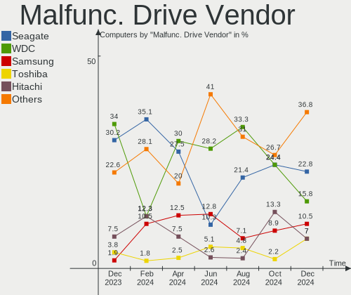
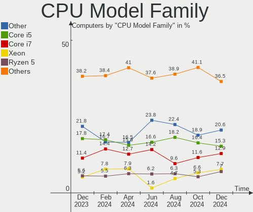

Debian Hardware Trends
----------------------

A project to identify most popular hardware characteristics and track their change
over time based on data collected by Debian users at https://Linux-Hardware.org.

Anyone can contribute to this report by the [hw-probe](https://github.com/linuxhw/hw-probe) tool:

    sudo -E hw-probe -all -upload

This is a report for all computer types. See also reports for [desktops](/Dist/Debian/Desktop/README.md) and [notebooks](/Dist/Debian/Notebook/README.md).

Full-feature report is available here: https://linux-hardware.org/?view=trends

Period: Nov, 2021.

Contents
--------

* [ System ](#system)
  - [ OS                       ](#os)
  - [ OS Family                ](#os-family)
  - [ Kernel                   ](#kernel)
  - [ Kernel Family            ](#kernel-family)
  - [ Kernel Major Ver.        ](#kernel-major-ver)
  - [ Arch                     ](#arch)
  - [ DE                       ](#de)
  - [ Display Server           ](#display-server)
  - [ Display Manager          ](#display-manager)
  - [ OS Lang                  ](#os-lang)
  - [ Boot Mode                ](#boot-mode)
  - [ Filesystem               ](#filesystem)
  - [ Part. scheme             ](#part-scheme)
  - [ Dual Boot with Linux/BSD ](#dual-boot-with-linuxbsd)
  - [ Dual Boot (Win)          ](#dual-boot-win)

* [ Board ](#board)
  - [ Vendor                   ](#vendor)
  - [ Model                    ](#model)
  - [ Model Family             ](#model-family)
  - [ MFG Year                 ](#mfg-year)
  - [ Form Factor              ](#form-factor)
  - [ Secure Boot              ](#secure-boot)
  - [ Coreboot                 ](#coreboot)
  - [ RAM Size                 ](#ram-size)
  - [ RAM Used                 ](#ram-used)
  - [ Total Drives             ](#total-drives)
  - [ Has CD-ROM               ](#has-cd-rom)
  - [ Has Ethernet             ](#has-ethernet)
  - [ Has WiFi                 ](#has-wifi)
  - [ Has Bluetooth            ](#has-bluetooth)

* [ Location ](#location)
  - [ Country                  ](#country)
  - [ City                     ](#city)

* [ Drives ](#drives)
  - [ Drive Vendor             ](#drive-vendor)
  - [ Drive Model              ](#drive-model)
  - [ HDD Vendor               ](#hdd-vendor)
  - [ SSD Vendor               ](#ssd-vendor)
  - [ Drive Kind               ](#drive-kind)
  - [ Drive Connector          ](#drive-connector)
  - [ Drive Size               ](#drive-size)
  - [ Space Total              ](#space-total)
  - [ Space Used               ](#space-used)
  - [ Malfunc. Drives          ](#malfunc-drives)
  - [ Malfunc. Drive Vendor    ](#malfunc-drive-vendor)
  - [ Malfunc. HDD Vendor      ](#malfunc-hdd-vendor)
  - [ Malfunc. Drive Kind      ](#malfunc-drive-kind)
  - [ Failed Drives            ](#failed-drives)
  - [ Failed Drive Vendor      ](#failed-drive-vendor)
  - [ Drive Status             ](#drive-status)

* [ Storage controller ](#storage-controller)
  - [ Storage Vendor           ](#storage-vendor)
  - [ Storage Model            ](#storage-model)
  - [ Storage Kind             ](#storage-kind)

* [ Processor ](#processor)
  - [ CPU Vendor               ](#cpu-vendor)
  - [ CPU Model                ](#cpu-model)
  - [ CPU Model Family         ](#cpu-model-family)
  - [ CPU Cores                ](#cpu-cores)
  - [ CPU Sockets              ](#cpu-sockets)
  - [ CPU Threads              ](#cpu-threads)
  - [ CPU Op-Modes             ](#cpu-op-modes)
  - [ CPU Microcode            ](#cpu-microcode)
  - [ CPU Microarch            ](#cpu-microarch)

* [ Graphics ](#graphics)
  - [ GPU Vendor               ](#gpu-vendor)
  - [ GPU Model                ](#gpu-model)
  - [ GPU Combo                ](#gpu-combo)
  - [ GPU Driver               ](#gpu-driver)
  - [ GPU Memory               ](#gpu-memory)

* [ Monitor ](#monitor)
  - [ Monitor Vendor           ](#monitor-vendor)
  - [ Monitor Model            ](#monitor-model)
  - [ Monitor Resolution       ](#monitor-resolution)
  - [ Monitor Diagonal         ](#monitor-diagonal)
  - [ Monitor Width            ](#monitor-width)
  - [ Aspect Ratio             ](#aspect-ratio)
  - [ Monitor Area             ](#monitor-area)
  - [ Pixel Density            ](#pixel-density)
  - [ Multiple Monitors        ](#multiple-monitors)

* [ Network ](#network)
  - [ Net Controller Vendor    ](#net-controller-vendor)
  - [ Net Controller Model     ](#net-controller-model)
  - [ Wireless Vendor          ](#wireless-vendor)
  - [ Wireless Model           ](#wireless-model)
  - [ Ethernet Vendor          ](#ethernet-vendor)
  - [ Ethernet Model           ](#ethernet-model)
  - [ Net Controller Kind      ](#net-controller-kind)
  - [ Used Controller          ](#used-controller)
  - [ NICs                     ](#nics)
  - [ IPv6                     ](#ipv6)

* [ Bluetooth ](#bluetooth)
  - [ Bluetooth Vendor         ](#bluetooth-vendor)
  - [ Bluetooth Model          ](#bluetooth-model)

* [ Sound ](#sound)
  - [ Sound Vendor             ](#sound-vendor)
  - [ Sound Model              ](#sound-model)

* [ Memory ](#memory)
  - [ Memory Vendor            ](#memory-vendor)
  - [ Memory Model             ](#memory-model)
  - [ Memory Kind              ](#memory-kind)
  - [ Memory Form Factor       ](#memory-form-factor)
  - [ Memory Size              ](#memory-size)
  - [ Memory Speed             ](#memory-speed)

* [ Printers & scanners ](#printers--scanners)
  - [ Printer Vendor           ](#printer-vendor)
  - [ Printer Model            ](#printer-model)
  - [ Scanner Vendor           ](#scanner-vendor)
  - [ Scanner Model            ](#scanner-model)

* [ Camera ](#camera)
  - [ Camera Vendor            ](#camera-vendor)
  - [ Camera Model             ](#camera-model)

* [ Security ](#security)
  - [ Fingerprint Vendor       ](#fingerprint-vendor)
  - [ Fingerprint Model        ](#fingerprint-model)
  - [ Chipcard Vendor          ](#chipcard-vendor)
  - [ Chipcard Model           ](#chipcard-model)

* [ Unsupported ](#unsupported)
  - [ Unsupported Devices      ](#unsupported-devices)
  - [ Unsupported Device Types ](#unsupported-device-types)

System
------

OS
--

Installed operating systems

| Name                            | Computers | Percent |
|---------------------------------|-----------|---------|
| Debian 11                       | 266       | 80.85%  |
| Debian 10                       | 23        | 6.99%   |
| Debian Testing                  | 22        | 6.69%   |
| Debian Unstable                 | 9         | 2.74%   |
| Debian 5                        | 3         | 0.91%   |
| Debian 9                        | 2         | 0.61%   |
| Debian 11-updates               | 2         | 0.61%   |
| Debian Testing-proposed-updates | 1         | 0.3%    |
| Debian 8                        | 1         | 0.3%    |

OS Family
---------

OS without a version

| Name   | Computers | Percent |
|--------|-----------|---------|
| Debian | 329       | 100%    |

Kernel
------

Version of the Linux kernel

| Version                             | Computers | Percent |
|-------------------------------------|-----------|---------|
| 5.10.0-9-amd64                      | 146       | 44.38%  |
| 5.10.0-7-amd64                      | 57        | 17.33%  |
| 5.10.0-8-amd64                      | 22        | 6.69%   |
| 5.14.0-4-amd64                      | 10        | 3.04%   |
| 5.14.0-2-amd64                      | 10        | 3.04%   |
| 4.19.0-18-amd64                     | 8         | 2.43%   |
| 5.15.0-1-amd64                      | 6         | 1.82%   |
| 5.10.0-9-686-pae                    | 6         | 1.82%   |
| 5.14.0-0.bpo.2-amd64                | 5         | 1.52%   |
| 5.10.63-v8+                         | 4         | 1.22%   |
| 5.10.0-9-686                        | 4         | 1.22%   |
| 5.14.0-9parrot1-amd64               | 3         | 0.91%   |
| 5.13.19-1-pve                       | 3         | 0.91%   |
| 5.15.0-trunk-amd64                  | 2         | 0.61%   |
| 5.14.0-3-amd64                      | 2         | 0.61%   |
| 5.14.0-16.4-liquorix-amd64          | 2         | 0.61%   |
| 5.11.22-7-pve                       | 2         | 0.61%   |
| 4.9.0-16-amd64                      | 2         | 0.61%   |
| 4.19.0-17-amd64                     | 2         | 0.61%   |
| 5.9.0-arm-64                        | 1         | 0.3%    |
| 5.9.0-3-amd64                       | 1         | 0.3%    |
| 5.15.3-edge                         | 1         | 0.3%    |
| 5.15.0-3.2-liquorix-amd64           | 1         | 0.3%    |
| 5.15.0-2-amd64                      | 1         | 0.3%    |
| 5.14.6-sndpatch1                    | 1         | 0.3%    |
| 5.14.16-wrkd                        | 1         | 0.3%    |
| 5.14.12.1-sleek-amd64               | 1         | 0.3%    |
| 5.14.0-3mx-amd64                    | 1         | 0.3%    |
| 5.14.0-18.1-liquorix-amd64          | 1         | 0.3%    |
| 5.14.0-1-amd64                      | 1         | 0.3%    |
| 5.13.18-21.09.16.amdgpu             | 1         | 0.3%    |
| 5.11.22-6-pve                       | 1         | 0.3%    |
| 5.11.22-4-pve                       | 1         | 0.3%    |
| 5.10.79stripped                     | 1         | 0.3%    |
| 5.10.78-ndmnet-stableconf-1         | 1         | 0.3%    |
| 5.10.70+truenas                     | 1         | 0.3%    |
| 5.10.70                             | 1         | 0.3%    |
| 5.10.0-8-2-amd64                    | 1         | 0.3%    |
| 5.10.0-5mx-amd64                    | 1         | 0.3%    |
| 5.10.0-0.bpo.9-rt-amd64             | 1         | 0.3%    |
| 5.10.0-0.bpo.9-amd64                | 1         | 0.3%    |
| 5.10.0-0.bpo.8-amd64                | 1         | 0.3%    |
| 5.10.0-0.bpo.5-amd64                | 1         | 0.3%    |
| 5.10.0-0.bpo.3-amd64                | 1         | 0.3%    |
| 4.19.0-18-rt-amd64                  | 1         | 0.3%    |
| 4.19.0-18-686-pae                   | 1         | 0.3%    |
| 4.19.0-18-686                       | 1         | 0.3%    |
| 4.19.0-16-amd64                     | 1         | 0.3%    |
| 4.19.0-13-amd64                     | 1         | 0.3%    |
| 4.19.0-12-amd64                     | 1         | 0.3%    |
| 4.1.44-06.151.vhulk1711.1.1.aarch64 | 1         | 0.3%    |
| 3.10.65+                            | 1         | 0.3%    |

Kernel Family
-------------

Linux kernel without a distro release

| Version   | Computers | Percent |
|-----------|-----------|---------|
| 5.10.0    | 242       | 73.56%  |
| 5.14.0    | 35        | 10.64%  |
| 4.19.0    | 16        | 4.86%   |
| 5.15.0    | 10        | 3.04%   |
| 5.11.22   | 4         | 1.22%   |
| 5.10.63   | 4         | 1.22%   |
| 5.13.19   | 3         | 0.91%   |
| 5.9.0     | 2         | 0.61%   |
| 5.10.70   | 2         | 0.61%   |
| 4.9.0     | 2         | 0.61%   |
| 5.15.3    | 1         | 0.3%    |
| 5.14.6    | 1         | 0.3%    |
| 5.14.16   | 1         | 0.3%    |
| 5.14.12.1 | 1         | 0.3%    |
| 5.13.18   | 1         | 0.3%    |
| 5.10.79   | 1         | 0.3%    |
| 5.10.78   | 1         | 0.3%    |
| 4.1.44    | 1         | 0.3%    |
| 3.10.65   | 1         | 0.3%    |

Kernel Major Ver.
-----------------

Linux kernel major version

| Version | Computers | Percent |
|---------|-----------|---------|
| 5.10    | 250       | 75.99%  |
| 5.14    | 37        | 11.25%  |
| 4.19    | 16        | 4.86%   |
| 5.15    | 11        | 3.34%   |
| 5.13    | 4         | 1.22%   |
| 5.11    | 4         | 1.22%   |
| 5.9     | 2         | 0.61%   |
| 4.9     | 2         | 0.61%   |
| 5.14.12 | 1         | 0.3%    |
| 4.1     | 1         | 0.3%    |
| 3.10    | 1         | 0.3%    |

Arch
----

OS architecture (x86_64, i586, etc.)

| Name    | Computers | Percent |
|---------|-----------|---------|
| x86_64  | 310       | 94.22%  |
| i686    | 12        | 3.65%   |
| aarch64 | 6         | 1.82%   |
| armv7l  | 1         | 0.3%    |

DE
--

Desktop Environment

| Name             | Computers | Percent |
|------------------|-----------|---------|
| Unknown          | 106       | 32.22%  |
| GNOME            | 68        | 20.67%  |
| KDE5             | 49        | 14.89%  |
| XFCE             | 38        | 11.55%  |
| MATE             | 11        | 3.34%   |
| LXDE             | 10        | 3.04%   |
| X-Cinnamon       | 8         | 2.43%   |
| lightdm-xsession | 8         | 2.43%   |
| LXQt             | 6         | 1.82%   |
| Cinnamon         | 6         | 1.82%   |
| GNOME Classic    | 5         | 1.52%   |
| i3               | 4         | 1.22%   |
| trinity          | 2         | 0.61%   |
| Openbox          | 2         | 0.61%   |
| GNOME Flashback  | 2         | 0.61%   |
| xmonad           | 1         | 0.3%    |
| Unity            | 1         | 0.3%    |
| KDE              | 1         | 0.3%    |
| Budgie           | 1         | 0.3%    |

Display Server
--------------

X11 or Wayland

| Name    | Computers | Percent |
|---------|-----------|---------|
| X11     | 174       | 52.89%  |
| Unknown | 81        | 24.62%  |
| Wayland | 44        | 13.37%  |
| Tty     | 30        | 9.12%   |

Display Manager
---------------

SDDM, LightDM, etc.

| Name    | Computers | Percent |
|---------|-----------|---------|
| Unknown | 161       | 48.94%  |
| LightDM | 68        | 20.67%  |
| GDM     | 52        | 15.81%  |
| SDDM    | 38        | 11.55%  |
| GDM3    | 9         | 2.74%   |
| XDM     | 1         | 0.3%    |

OS Lang
-------

Language

| Lang    | Computers | Percent |
|---------|-----------|---------|
| en_US   | 105       | 31.91%  |
| ru_RU   | 74        | 22.49%  |
| Unknown | 23        | 6.99%   |
| de_DE   | 22        | 6.69%   |
| fr_FR   | 21        | 6.38%   |
| en_GB   | 14        | 4.26%   |
| pt_BR   | 10        | 3.04%   |
| es_ES   | 9         | 2.74%   |
| it_IT   | 7         | 2.13%   |
| pt_PT   | 4         | 1.22%   |
| pl_PL   | 3         | 0.91%   |
| es_CL   | 3         | 0.91%   |
| en_AU   | 3         | 0.91%   |
| zh_CN   | 2         | 0.61%   |
| sv_SE   | 2         | 0.61%   |
| ru_UA   | 2         | 0.61%   |
| es_VE   | 2         | 0.61%   |
| en_CA   | 2         | 0.61%   |
| C       | 2         | 0.61%   |
| uk_UA   | 1         | 0.3%    |
| tr_TR   | 1         | 0.3%    |
| th_TH   | 1         | 0.3%    |
| nl_NL   | 1         | 0.3%    |
| nl_BE   | 1         | 0.3%    |
| nb_NO   | 1         | 0.3%    |
| lt_LT   | 1         | 0.3%    |
| ja_JP   | 1         | 0.3%    |
| fr_CH   | 1         | 0.3%    |
| fr_CA   | 1         | 0.3%    |
| fi_FI   | 1         | 0.3%    |
| es_MX   | 1         | 0.3%    |
| es_EC   | 1         | 0.3%    |
| es_CO   | 1         | 0.3%    |
| en_IL   | 1         | 0.3%    |
| en_HK   | 1         | 0.3%    |
| en_DK   | 1         | 0.3%    |
| cs_CZ   | 1         | 0.3%    |
| be_BY   | 1         | 0.3%    |

Boot Mode
---------

EFI or BIOS

| Mode | Computers | Percent |
|------|-----------|---------|
| BIOS | 180       | 54.71%  |
| EFI  | 149       | 45.29%  |

Filesystem
----------

Type of filesystem

| Type    | Computers | Percent |
|---------|-----------|---------|
| Ext4    | 227       | 69%     |
| Overlay | 81        | 24.62%  |
| Btrfs   | 13        | 3.95%   |
| Zfs     | 6         | 1.82%   |
| Xfs     | 2         | 0.61%   |

Part. scheme
------------

Scheme of partitioning

| Type    | Computers | Percent |
|---------|-----------|---------|
| GPT     | 155       | 47.11%  |
| MBR     | 105       | 31.91%  |
| Unknown | 69        | 20.97%  |

Dual Boot with Linux/BSD
------------------------

Hosting more than one Linux/BSD

| Dual boot | Computers | Percent |
|-----------|-----------|---------|
| No        | 292       | 88.75%  |
| Yes       | 37        | 11.25%  |

Dual Boot (Win)
---------------

Hosting Linux and Windows

| Dual boot | Computers | Percent |
|-----------|-----------|---------|
| No        | 205       | 62.31%  |
| Yes       | 124       | 37.69%  |

Board
-----

Vendor
------

Motherboard manufacturer

| Name                    | Computers | Percent |
|-------------------------|-----------|---------|
| ASUSTek Computer        | 60        | 18.24%  |
| Lenovo                  | 44        | 13.37%  |
| Hewlett-Packard         | 34        | 10.33%  |
| Dell                    | 31        | 9.42%   |
| ASRock                  | 27        | 8.21%   |
| MSI                     | 19        | 5.78%   |
| Gigabyte Technology     | 17        | 5.17%   |
| Apple                   | 16        | 4.86%   |
| Acer                    | 14        | 4.26%   |
| Intel                   | 9         | 2.74%   |
| Samsung Electronics     | 5         | 1.52%   |
| Raspberry Pi Foundation | 4         | 1.22%   |
| Unknown                 | 4         | 1.22%   |
| Shuttle                 | 3         | 0.91%   |
| IBM                     | 3         | 0.91%   |
| HUAWEI                  | 3         | 0.91%   |
| ECS                     | 3         | 0.91%   |
| Sony                    | 2         | 0.61%   |
| HPE                     | 2         | 0.61%   |
| Google                  | 2         | 0.61%   |
| Foxconn                 | 2         | 0.61%   |
| AXDIA International     | 2         | 0.61%   |
| ZOTAC                   | 1         | 0.3%    |
| Toshiba                 | 1         | 0.3%    |
| Timi                    | 1         | 0.3%    |
| Tablet                  | 1         | 0.3%    |
| Supermicro              | 1         | 0.3%    |
| SixForOne               | 1         | 0.3%    |
| Quanta                  | 1         | 0.3%    |
| Philco                  | 1         | 0.3%    |
| PCWare                  | 1         | 0.3%    |
| Panasonic               | 1         | 0.3%    |
| Packard Bell            | 1         | 0.3%    |
| Minix                   | 1         | 0.3%    |
| Huanan                  | 1         | 0.3%    |
| Gateway                 | 1         | 0.3%    |
| Fujitsu Siemens         | 1         | 0.3%    |
| Fujitsu                 | 1         | 0.3%    |
| Datto                   | 1         | 0.3%    |
| Compal                  | 1         | 0.3%    |
| Celestica               | 1         | 0.3%    |
| Avell High Performance  | 1         | 0.3%    |
| ASRockRack              | 1         | 0.3%    |
| Aquarius                | 1         | 0.3%    |
| A10 Networks            | 1         | 0.3%    |

Model
-----

Motherboard model

| Name                                              | Computers | Percent |
|---------------------------------------------------|-----------|---------|
| ASRock H470M-HVS                                  | 20        | 6.08%   |
| Apple MacBookAir7,1                               | 11        | 3.34%   |
| ASUS All Series                                   | 9         | 2.74%   |
| ASUS P8H61-M LX3 R2.0                             | 7         | 2.13%   |
| Unknown                                           | 5         | 1.52%   |
| RPi Raspberry Pi                                  | 4         | 1.22%   |
| ASUS S20 K29                                      | 4         | 1.22%   |
| Shuttle DS81D                                     | 2         | 0.61%   |
| Samsung 950QCG                                    | 2         | 0.61%   |
| Samsung 300E4C/300E5C/300E7C                      | 2         | 0.61%   |
| HP Pavilion Gaming Laptop 15-ec1xxx               | 2         | 0.61%   |
| HP Pavilion dv6                                   | 2         | 0.61%   |
| HP Laptop 15-bw0xx                                | 2         | 0.61%   |
| Gigabyte B550M DS3H                               | 2         | 0.61%   |
| Toshiba Satellite L40                             | 1         | 0.3%    |
| Timi A7S                                          | 1         | 0.3%    |
| Tablet 8                                          | 1         | 0.3%    |
| Supermicro Super Server                           | 1         | 0.3%    |
| Sony VGN-NS30E_S                                  | 1         | 0.3%    |
| Sony SVE1712E1RB                                  | 1         | 0.3%    |
| SixForOne 64Megaspeed                             | 1         | 0.3%    |
| Shuttle XS35V4                                    | 1         | 0.3%    |
| Samsung RV420/RV520/RV720/E3530/S3530/E3420/E3520 | 1         | 0.3%    |
| Quanta Pro 3420 AiO PC                            | 1         | 0.3%    |
| Philco OEM                                        | 1         | 0.3%    |
| PCWare IPMH61R3                                   | 1         | 0.3%    |
| Panasonic CF-54-1                                 | 1         | 0.3%    |
| Packard Bell IXTREME M5740                        | 1         | 0.3%    |
| MSI Prestige 15 A10SC                             | 1         | 0.3%    |
| MSI MS-N014                                       | 1         | 0.3%    |
| MSI MS-7D15                                       | 1         | 0.3%    |
| MSI MS-7C77                                       | 1         | 0.3%    |
| MSI MS-7C75                                       | 1         | 0.3%    |
| MSI MS-7C52                                       | 1         | 0.3%    |
| MSI MS-7C02                                       | 1         | 0.3%    |
| MSI MS-7B79                                       | 1         | 0.3%    |
| MSI MS-7A37                                       | 1         | 0.3%    |
| MSI MS-7996                                       | 1         | 0.3%    |
| MSI MS-7817                                       | 1         | 0.3%    |
| MSI MS-7640                                       | 1         | 0.3%    |
| MSI MS-7592                                       | 1         | 0.3%    |
| MSI MS-7369                                       | 1         | 0.3%    |
| MSI MS-7030                                       | 1         | 0.3%    |
| MSI GS65 Stealth 9SE                              | 1         | 0.3%    |
| MSI GE60 2PL                                      | 1         | 0.3%    |
| MSI GE60 2OC\2OD\2OE                              | 1         | 0.3%    |
| MSI Creator Z16 Hiroshi F A11UE                   | 1         | 0.3%    |
| Minix Z83-4                                       | 1         | 0.3%    |
| Lenovo V520-15IKL 10NK006JSP                      | 1         | 0.3%    |
| Lenovo V330-15IKB 81AX                            | 1         | 0.3%    |
| Lenovo V14-IIL 82C4                               | 1         | 0.3%    |
| Lenovo ThinkStation D30 4223CC9                   | 1         | 0.3%    |
| Lenovo ThinkPad X250 20CM004UGE                   | 1         | 0.3%    |
| Lenovo ThinkPad X201 3626GG3                      | 1         | 0.3%    |
| Lenovo ThinkPad X1 Carbon 6th 20KHCTO1WW          | 1         | 0.3%    |
| Lenovo ThinkPad W540 20BG0042FR                   | 1         | 0.3%    |
| Lenovo ThinkPad T490 20N2CTO1WW                   | 1         | 0.3%    |
| Lenovo ThinkPad T480s 20L8S31E00                  | 1         | 0.3%    |
| Lenovo ThinkPad T480 20L6SCYP00                   | 1         | 0.3%    |
| Lenovo ThinkPad T480 20L50009MX                   | 1         | 0.3%    |

Model Family
------------

Motherboard model prefix

| Name                  | Computers | Percent |
|-----------------------|-----------|---------|
| Lenovo ThinkPad       | 28        | 8.51%   |
| ASRock H470M-HVS      | 20        | 6.08%   |
| Apple MacBookAir7     | 12        | 3.65%   |
| HP Pavilion           | 9         | 2.74%   |
| ASUS P8H61-M          | 9         | 2.74%   |
| ASUS All              | 9         | 2.74%   |
| Dell Latitude         | 8         | 2.43%   |
| Acer Aspire           | 7         | 2.13%   |
| HP ProBook            | 6         | 1.82%   |
| Dell Precision        | 6         | 1.82%   |
| Dell Inspiron         | 5         | 1.52%   |
| Unknown               | 5         | 1.52%   |
| RPi Raspberry         | 4         | 1.22%   |
| HP EliteBook          | 4         | 1.22%   |
| Dell XPS              | 4         | 1.22%   |
| Dell Vostro           | 4         | 1.22%   |
| ASUS S20              | 4         | 1.22%   |
| ASUS PRIME            | 4         | 1.22%   |
| Lenovo ThinkCentre    | 3         | 0.91%   |
| Lenovo IdeaPad        | 3         | 0.91%   |
| IBM ThinkPad          | 3         | 0.91%   |
| HP Laptop             | 3         | 0.91%   |
| Gigabyte B550M        | 3         | 0.91%   |
| Gigabyte B450M        | 3         | 0.91%   |
| Dell OptiPlex         | 3         | 0.91%   |
| ASUS ZenBook          | 3         | 0.91%   |
| ASUS VivoBook         | 3         | 0.91%   |
| ASUS TUF              | 3         | 0.91%   |
| ASUS ROG              | 3         | 0.91%   |
| Acer TravelMate       | 3         | 0.91%   |
| Shuttle DS81D         | 2         | 0.61%   |
| Samsung 950QCG        | 2         | 0.61%   |
| Samsung 300E4C        | 2         | 0.61%   |
| MSI GE60              | 2         | 0.61%   |
| HPE ProLiant          | 2         | 0.61%   |
| HP ZBook              | 2         | 0.61%   |
| HP Compaq             | 2         | 0.61%   |
| ASUS P8H67-M          | 2         | 0.61%   |
| ASUS M5A97            | 2         | 0.61%   |
| ASUS ASUS             | 2         | 0.61%   |
| Toshiba Satellite     | 1         | 0.3%    |
| Timi A7S              | 1         | 0.3%    |
| Tablet 8              | 1         | 0.3%    |
| Supermicro Super      | 1         | 0.3%    |
| Sony VGN-NS30E        | 1         | 0.3%    |
| Sony SVE1712E1RB      | 1         | 0.3%    |
| SixForOne 64Megaspeed | 1         | 0.3%    |
| Shuttle XS35V4        | 1         | 0.3%    |
| Samsung RV420         | 1         | 0.3%    |
| Quanta Pro            | 1         | 0.3%    |
| Philco OEM            | 1         | 0.3%    |
| PCWare IPMH61R3       | 1         | 0.3%    |
| Panasonic CF-54-1     | 1         | 0.3%    |
| Packard Bell IXTREME  | 1         | 0.3%    |
| MSI Prestige          | 1         | 0.3%    |
| MSI MS-N014           | 1         | 0.3%    |
| MSI MS-7D15           | 1         | 0.3%    |
| MSI MS-7C77           | 1         | 0.3%    |
| MSI MS-7C75           | 1         | 0.3%    |
| MSI MS-7C52           | 1         | 0.3%    |

MFG Year
--------

Motherboard manufacture year

| Year    | Computers | Percent |
|---------|-----------|---------|
| 2021    | 81        | 24.62%  |
| 2020    | 41        | 12.46%  |
| 2019    | 33        | 10.03%  |
| 2012    | 24        | 7.29%   |
| 2018    | 23        | 6.99%   |
| 2013    | 23        | 6.99%   |
| 2014    | 22        | 6.69%   |
| 2011    | 15        | 4.56%   |
| 2015    | 14        | 4.26%   |
| 2016    | 10        | 3.04%   |
| 2009    | 10        | 3.04%   |
| 2017    | 8         | 2.43%   |
| 2010    | 7         | 2.13%   |
| Unknown | 6         | 1.82%   |
| 2006    | 5         | 1.52%   |
| 2008    | 3         | 0.91%   |
| 2007    | 2         | 0.61%   |
| 2005    | 2         | 0.61%   |

Form Factor
-----------

Physical design of the computer

| Name           | Computers | Percent |
|----------------|-----------|---------|
| Notebook       | 163       | 49.54%  |
| Desktop        | 145       | 44.07%  |
| Convertible    | 7         | 2.13%   |
| System on chip | 5         | 1.52%   |
| Mini pc        | 4         | 1.22%   |
| Server         | 3         | 0.91%   |
| Tablet         | 1         | 0.3%    |
| All in one     | 1         | 0.3%    |

Secure Boot
-----------

Enabled or disabled

| State    | Computers | Percent |
|----------|-----------|---------|
| Disabled | 312       | 94.83%  |
| Enabled  | 17        | 5.17%   |

Coreboot
--------

Have coreboot on board

| Used | Computers | Percent |
|------|-----------|---------|
| No   | 327       | 99.39%  |
| Yes  | 2         | 0.61%   |

RAM Size
--------

Total RAM memory

| Size in GB      | Computers | Percent |
|-----------------|-----------|---------|
| 3.01-4.0        | 69        | 20.97%  |
| 4.01-8.0        | 64        | 19.45%  |
| 16.01-24.0      | 57        | 17.33%  |
| 8.01-16.0       | 53        | 16.11%  |
| 32.01-64.0      | 52        | 15.81%  |
| 1.01-2.0        | 13        | 3.95%   |
| 64.01-256.0     | 8         | 2.43%   |
| 2.01-3.0        | 6         | 1.82%   |
| 0.51-1.0        | 4         | 1.22%   |
| 24.01-32.0      | 2         | 0.61%   |
| More than 256.0 | 1         | 0.3%    |

RAM Used
--------

Used RAM memory

| Used GB    | Computers | Percent |
|------------|-----------|---------|
| 1.01-2.0   | 104       | 31.61%  |
| 0.51-1.0   | 75        | 22.8%   |
| 2.01-3.0   | 51        | 15.5%   |
| 4.01-8.0   | 45        | 13.68%  |
| 3.01-4.0   | 35        | 10.64%  |
| 0.01-0.5   | 10        | 3.04%   |
| 8.01-16.0  | 4         | 1.22%   |
| 16.01-24.0 | 2         | 0.61%   |
| 32.01-64.0 | 1         | 0.3%    |
| 24.01-32.0 | 1         | 0.3%    |
| Unknown    | 1         | 0.3%    |

Total Drives
------------

Number of drives on board

| Drives | Computers | Percent |
|--------|-----------|---------|
| 1      | 212       | 64.44%  |
| 2      | 75        | 22.8%   |
| 3      | 18        | 5.47%   |
| 4      | 9         | 2.74%   |
| 5      | 6         | 1.82%   |
| 8      | 2         | 0.61%   |
| 7      | 2         | 0.61%   |
| 6      | 2         | 0.61%   |
| 11     | 1         | 0.3%    |
| 10     | 1         | 0.3%    |
| 0      | 1         | 0.3%    |

Has CD-ROM
----------

Has CD-ROM on board

| Presented | Computers | Percent |
|-----------|-----------|---------|
| No        | 243       | 73.86%  |
| Yes       | 86        | 26.14%  |

Has Ethernet
------------

Has Ethernet on board

| Presented | Computers | Percent |
|-----------|-----------|---------|
| Yes       | 279       | 84.8%   |
| No        | 50        | 15.2%   |

Has WiFi
--------

Has WiFi module

| Presented | Computers | Percent |
|-----------|-----------|---------|
| Yes       | 202       | 61.4%   |
| No        | 127       | 38.6%   |

Has Bluetooth
-------------

Has Bluetooth module

| Presented | Computers | Percent |
|-----------|-----------|---------|
| No        | 176       | 53.5%   |
| Yes       | 153       | 46.5%   |

Location
--------

Country
-------

Geographic location (country)

| Country     | Computers | Percent |
|-------------|-----------|---------|
| Russia      | 79        | 24.01%  |
| USA         | 59        | 17.93%  |
| Germany     | 32        | 9.73%   |
| France      | 25        | 7.6%    |
| Spain       | 11        | 3.34%   |
| Brazil      | 11        | 3.34%   |
| Switzerland | 8         | 2.43%   |
| Poland      | 7         | 2.13%   |
| Netherlands | 7         | 2.13%   |
| Italy       | 7         | 2.13%   |
| Ukraine     | 6         | 1.82%   |
| UK          | 6         | 1.82%   |
| China       | 6         | 1.82%   |
| Portugal    | 5         | 1.52%   |
| Canada      | 5         | 1.52%   |
| Sweden      | 4         | 1.22%   |
| Pakistan    | 4         | 1.22%   |
| Australia   | 4         | 1.22%   |
| Turkey      | 3         | 0.91%   |
| Mexico      | 3         | 0.91%   |
| Czechia     | 3         | 0.91%   |
| Colombia    | 3         | 0.91%   |
| Chile       | 3         | 0.91%   |
| Argentina   | 3         | 0.91%   |
| Finland     | 2         | 0.61%   |
| Belgium     | 2         | 0.61%   |
| Venezuela   | 1         | 0.3%    |
| Thailand    | 1         | 0.3%    |
| Taiwan      | 1         | 0.3%    |
| Serbia      | 1         | 0.3%    |
| Romania     | 1         | 0.3%    |
| Norway      | 1         | 0.3%    |
| Morocco     | 1         | 0.3%    |
| Luxembourg  | 1         | 0.3%    |
| Lithuania   | 1         | 0.3%    |
| Latvia      | 1         | 0.3%    |
| Kazakhstan  | 1         | 0.3%    |
| Japan       | 1         | 0.3%    |
| Israel      | 1         | 0.3%    |
| Indonesia   | 1         | 0.3%    |
| Hungary     | 1         | 0.3%    |
| Greece      | 1         | 0.3%    |
| Ecuador     | 1         | 0.3%    |
| Denmark     | 1         | 0.3%    |
| Cuba        | 1         | 0.3%    |
| Croatia     | 1         | 0.3%    |
| Belarus     | 1         | 0.3%    |

City
----

Geographic location (city)

| City                   | Computers | Percent |
|------------------------|-----------|---------|
| Voronezh               | 57        | 17.33%  |
| Eliot                  | 17        | 5.17%   |
| St Petersburg          | 7         | 2.13%   |
| Paris                  | 5         | 1.52%   |
| Moscow                 | 4         | 1.22%   |
| Lahore                 | 4         | 1.22%   |
| Barcelona              | 4         | 1.22%   |
| Zurich                 | 3         | 0.91%   |
| Warsaw                 | 3         | 0.91%   |
| Leimen                 | 3         | 0.91%   |
| Warrenton              | 2         | 0.61%   |
| Warminster             | 2         | 0.61%   |
| Prague                 | 2         | 0.61%   |
| New York               | 2         | 0.61%   |
| Montreal               | 2         | 0.61%   |
| Maipu                  | 2         | 0.61%   |
| Madrid                 | 2         | 0.61%   |
| Lyon                   | 2         | 0.61%   |
| Lisbon                 | 2         | 0.61%   |
| Frankfurt am Main      | 2         | 0.61%   |
| Dallas                 | 2         | 0.61%   |
| Curitiba               | 2         | 0.61%   |
| Ciudadela              | 2         | 0.61%   |
| Zuchwil                | 1         | 0.3%    |
| Zagreb                 | 1         | 0.3%    |
| Yekaterinburg          | 1         | 0.3%    |
| Yehud                  | 1         | 0.3%    |
| Yaroslavl              | 1         | 0.3%    |
| Wilmette               | 1         | 0.3%    |
| Wiesloch               | 1         | 0.3%    |
| White Lake             | 1         | 0.3%    |
| Weilheim               | 1         | 0.3%    |
| Waregem                | 1         | 0.3%    |
| Vilnius                | 1         | 0.3%    |
| Villingen-Schwenningen | 1         | 0.3%    |
| Vi?±a del Mar          | 1         | 0.3%    |
| Vianden                | 1         | 0.3%    |
| Ufa                    | 1         | 0.3%    |
| Tyler                  | 1         | 0.3%    |
| Tver                   | 1         | 0.3%    |
| Troy                   | 1         | 0.3%    |
| Toyokawa               | 1         | 0.3%    |
| Toulouse               | 1         | 0.3%    |
| Toronto                | 1         | 0.3%    |
| Torgau                 | 1         | 0.3%    |
| Toluca                 | 1         | 0.3%    |
| Tienen                 | 1         | 0.3%    |
| The Hague              | 1         | 0.3%    |
| Taichung               | 1         | 0.3%    |
| Tacoma                 | 1         | 0.3%    |
| Sydney                 | 1         | 0.3%    |
| Surrey                 | 1         | 0.3%    |
| Strongsville           | 1         | 0.3%    |
| Stein                  | 1         | 0.3%    |
| Stains                 | 1         | 0.3%    |
| Springfield            | 1         | 0.3%    |
| Sorgues                | 1         | 0.3%    |
| Shenzhen               | 1         | 0.3%    |
| Shenyang               | 1         | 0.3%    |
| Shanghai               | 1         | 0.3%    |

Drives
------

Drive Vendor
------------

Hard drive vendors

| Vendor                    | Computers | Drives | Percent |
|---------------------------|-----------|--------|---------|
| WDC                       | 71        | 107    | 15.14%  |
| Samsung Electronics       | 65        | 72     | 13.86%  |
| Seagate                   | 62        | 86     | 13.22%  |
| Toshiba                   | 47        | 49     | 10.02%  |
| Kingston                  | 22        | 22     | 4.69%   |
| Crucial                   | 21        | 22     | 4.48%   |
| Unknown                   | 20        | 23     | 4.26%   |
| SanDisk                   | 20        | 22     | 4.26%   |
| Netac                     | 20        | 20     | 4.26%   |
| Apple                     | 12        | 12     | 2.56%   |
| Hitachi                   | 10        | 12     | 2.13%   |
| A-DATA Technology         | 9         | 10     | 1.92%   |
| Micron Technology         | 6         | 6      | 1.28%   |
| SK Hynix                  | 5         | 5      | 1.07%   |
| KIOXIA                    | 5         | 5      | 1.07%   |
| OCZ                       | 4         | 4      | 0.85%   |
| LITEON                    | 4         | 5      | 0.85%   |
| Intel                     | 4         | 4      | 0.85%   |
| LITEONIT                  | 3         | 3      | 0.64%   |
| Intenso                   | 3         | 3      | 0.64%   |
| HGST                      | 3         | 5      | 0.64%   |
| Hewlett-Packard           | 3         | 5      | 0.64%   |
| Unknown                   | 3         | 3      | 0.64%   |
| XPG                       | 2         | 2      | 0.43%   |
| SPCC                      | 2         | 2      | 0.43%   |
| PNY                       | 2         | 2      | 0.43%   |
| Patriot                   | 2         | 2      | 0.43%   |
| JMicron                   | 2         | 2      | 0.43%   |
| IBM/Hitachi               | 2         | 2      | 0.43%   |
| Hajaan                    | 2         | 2      | 0.43%   |
| Gigabyte Technology       | 2         | 2      | 0.43%   |
| Fujitsu                   | 2         | 2      | 0.43%   |
| Corsair                   | 2         | 2      | 0.43%   |
| China                     | 2         | 2      | 0.43%   |
| YMTC                      | 1         | 1      | 0.21%   |
| WDC WUH                   | 1         | 1      | 0.21%   |
| WDC WDS                   | 1         | 1      | 0.21%   |
| Transcend                 | 1         | 1      | 0.21%   |
| StoreJet                  | 1         | 1      | 0.21%   |
| Smartbuy                  | 1         | 1      | 0.21%   |
| SABRENT                   | 1         | 2      | 0.21%   |
| RAVPOWER                  | 1         | 1      | 0.21%   |
| Phison                    | 1         | 1      | 0.21%   |
| Mushkin                   | 1         | 1      | 0.21%   |
| Micron/Crucial Technology | 1         | 1      | 0.21%   |
| MAXTOR                    | 1         | 1      | 0.21%   |
| Mass                      | 1         | 1      | 0.21%   |
| Lexar                     | 1         | 1      | 0.21%   |
| KingSpec                  | 1         | 1      | 0.21%   |
| InnoDisk                  | 1         | 1      | 0.21%   |
| IBM-ESXS                  | 1         | 1      | 0.21%   |
| GOODRAM                   | 1         | 1      | 0.21%   |
| FORESEE                   | 1         | 1      | 0.21%   |
| EMTEC                     | 1         | 1      | 0.21%   |
| BP4                       | 1         | 1      | 0.21%   |
| BHT                       | 1         | 1      | 0.21%   |
| BAITITON                  | 1         | 1      | 0.21%   |
| ASMT                      | 1         | 2      | 0.21%   |
| Apacer                    | 1         | 1      | 0.21%   |

Drive Model
-----------

Hard drive models

| Model                               | Computers | Percent |
|-------------------------------------|-----------|---------|
| Toshiba HDWD110 1TB                 | 20        | 3.89%   |
| Netac SSD 240GB                     | 20        | 3.89%   |
| Apple SSD AP0128H 121GB             | 11        | 2.14%   |
| Seagate ST250DM000-1BD141 250GB     | 8         | 1.56%   |
| Samsung SSD 860 EVO 250GB           | 6         | 1.17%   |
| Kingston SV300S37A120G 120GB SSD    | 5         | 0.97%   |
| WDC WD5000AAKX-60U6AA0 500GB        | 4         | 0.78%   |
| Unknown MMC Card  32GB              | 4         | 0.78%   |
| Crucial CT480BX500SSD1 480GB        | 4         | 0.78%   |
| Toshiba MQ01ABF050 500GB            | 3         | 0.58%   |
| Seagate ST320LM001 HN-M320MBB 320GB | 3         | 0.58%   |
| Seagate ST31000528AS 1TB            | 3         | 0.58%   |
| Seagate ST3000NXCLAR3000 3TB        | 3         | 0.58%   |
| Seagate ST1000DM010-2EP102 1TB      | 3         | 0.58%   |
| Samsung SSD 970 EVO Plus 500GB      | 3         | 0.58%   |
| Samsung SSD 860 EVO 500GB           | 3         | 0.58%   |
| Samsung MZVLB1T0HALR-00000 1TB      | 3         | 0.58%   |
| Kingston SA400S37240G 240GB SSD     | 3         | 0.58%   |
| HP MB2000EBZQC 2TB                  | 3         | 0.58%   |
| Crucial CT120BX500SSD1 120GB        | 3         | 0.58%   |
| Unknown                             | 3         | 0.58%   |
| WDC WD5000AAKX-00ERMA0 500GB        | 2         | 0.39%   |
| WDC WD40EZRZ-00GXCB0 4TB            | 2         | 0.39%   |
| WDC WD10EZEX-08WN4A0 1TB            | 2         | 0.39%   |
| WDC PC SN530 NVMe 256GB             | 2         | 0.39%   |
| Unknown MMC Card  16GB              | 2         | 0.39%   |
| Unknown MMC Card  128GB             | 2         | 0.39%   |
| Unknown BJNB4R  32GB                | 2         | 0.39%   |
| Toshiba THNSNH128GCST 128GB SSD     | 2         | 0.39%   |
| Toshiba MQ04ABF100 1TB              | 2         | 0.39%   |
| Toshiba DT01ACA100 1TB              | 2         | 0.39%   |
| Toshiba DT01ACA050 500GB            | 2         | 0.39%   |
| Seagate ST8000DM004-2CX188 8TB      | 2         | 0.39%   |
| Seagate ST500LT012-1DG142 500GB     | 2         | 0.39%   |
| Seagate ST500LM012 HN-M500MBB 500GB | 2         | 0.39%   |
| Seagate ST500DM002-1BD142 500GB     | 2         | 0.39%   |
| Seagate ST4000VN008-2DR166 4TB      | 2         | 0.39%   |
| Seagate ST3500418AS 500GB           | 2         | 0.39%   |
| Seagate ST31500341AS 1TB            | 2         | 0.39%   |
| Seagate ST1000DM003-1ER162 1TB      | 2         | 0.39%   |
| Seagate ST1000DM003-1CH162 1TB      | 2         | 0.39%   |
| SanDisk SSD PLUS 480GB              | 2         | 0.39%   |
| Sandisk NVMe SSD Drive 256GB        | 2         | 0.39%   |
| SanDisk DF4032  32GB                | 2         | 0.39%   |
| Samsung SSD 980 PRO 500GB           | 2         | 0.39%   |
| Samsung SSD 980 1TB                 | 2         | 0.39%   |
| Samsung SSD 970 EVO Plus 1TB        | 2         | 0.39%   |
| Samsung SSD 860 EVO 1TB             | 2         | 0.39%   |
| Samsung SSD 850 EVO 500GB           | 2         | 0.39%   |
| Samsung SSD 850 EVO 250GB           | 2         | 0.39%   |
| Samsung SSD 840 PRO Series 256GB    | 2         | 0.39%   |
| Samsung PM991a NVMe 512GB           | 2         | 0.39%   |
| Samsung MZALQ128HBHQ-000L2 128GB    | 2         | 0.39%   |
| KIOXIA KBG40ZNV256G 256GB           | 2         | 0.39%   |
| Kingston SUV400S37480G 480GB SSD    | 2         | 0.39%   |
| Kingston SUV400S37120G 120GB SSD    | 2         | 0.39%   |
| Kingston SA400S37120G 120GB SSD     | 2         | 0.39%   |
| Kingston RBUSNS8154P3128GJ1 128GB   | 2         | 0.39%   |
| Hajaan SSD 256G                     | 2         | 0.39%   |
| Crucial CT500MX500SSD1 500GB        | 2         | 0.39%   |

HDD Vendor
----------

Hard disk drive vendors

| Vendor              | Computers | Drives | Percent |
|---------------------|-----------|--------|---------|
| Seagate             | 60        | 84     | 32.26%  |
| WDC                 | 55        | 88     | 29.57%  |
| Toshiba             | 41        | 42     | 22.04%  |
| Hitachi             | 10        | 12     | 5.38%   |
| Samsung Electronics | 6         | 6      | 3.23%   |
| HGST                | 3         | 5      | 1.61%   |
| Hewlett-Packard     | 3         | 5      | 1.61%   |
| Unknown             | 2         | 3      | 1.08%   |
| IBM/Hitachi         | 2         | 2      | 1.08%   |
| Fujitsu             | 2         | 2      | 1.08%   |
| StoreJet            | 1         | 1      | 0.54%   |
| ASMT                | 1         | 2      | 0.54%   |

SSD Vendor
----------

Solid state drive vendors

| Vendor              | Computers | Drives | Percent |
|---------------------|-----------|--------|---------|
| Samsung Electronics | 29        | 32     | 18.47%  |
| Netac               | 20        | 20     | 12.74%  |
| Crucial             | 19        | 20     | 12.1%   |
| Kingston            | 15        | 15     | 9.55%   |
| SanDisk             | 14        | 16     | 8.92%   |
| A-DATA Technology   | 6         | 6      | 3.82%   |
| WDC                 | 5         | 5      | 3.18%   |
| OCZ                 | 4         | 4      | 2.55%   |
| LITEONIT            | 3         | 3      | 1.91%   |
| LITEON              | 3         | 4      | 1.91%   |
| Unknown             | 2         | 2      | 1.27%   |
| Toshiba             | 2         | 2      | 1.27%   |
| SPCC                | 2         | 2      | 1.27%   |
| SK Hynix            | 2         | 2      | 1.27%   |
| PNY                 | 2         | 2      | 1.27%   |
| Patriot             | 2         | 2      | 1.27%   |
| Intenso             | 2         | 2      | 1.27%   |
| Intel               | 2         | 2      | 1.27%   |
| Hajaan              | 2         | 2      | 1.27%   |
| Corsair             | 2         | 2      | 1.27%   |
| China               | 2         | 2      | 1.27%   |
| Unknown             | 2         | 2      | 1.27%   |
| WDC WDS             | 1         | 1      | 0.64%   |
| Transcend           | 1         | 1      | 0.64%   |
| Smartbuy            | 1         | 1      | 0.64%   |
| Mushkin             | 1         | 1      | 0.64%   |
| Micron Technology   | 1         | 1      | 0.64%   |
| MAXTOR              | 1         | 1      | 0.64%   |
| Lexar               | 1         | 1      | 0.64%   |
| KingSpec            | 1         | 1      | 0.64%   |
| JMicron             | 1         | 1      | 0.64%   |
| InnoDisk            | 1         | 1      | 0.64%   |
| GOODRAM             | 1         | 1      | 0.64%   |
| Gigabyte Technology | 1         | 1      | 0.64%   |
| EMTEC               | 1         | 1      | 0.64%   |
| BP4                 | 1         | 1      | 0.64%   |
| Apple               | 1         | 1      | 0.64%   |

Drive Kind
----------

HDD or SSD

| Kind    | Computers | Drives | Percent |
|---------|-----------|--------|---------|
| HDD     | 164       | 252    | 38.59%  |
| SSD     | 138       | 164    | 32.47%  |
| NVMe    | 97        | 108    | 22.82%  |
| MMC     | 18        | 20     | 4.24%   |
| Unknown | 8         | 10     | 1.88%   |

Drive Connector
---------------

SATA, SAS, NVMe, etc.

| Type | Computers | Drives | Percent |
|------|-----------|--------|---------|
| SATA | 237       | 400    | 64.05%  |
| NVMe | 97        | 106    | 26.22%  |
| SAS  | 18        | 28     | 4.86%   |
| MMC  | 18        | 20     | 4.86%   |

Drive Size
----------

Size of hard drive

| Size in TB | Computers | Drives | Percent |
|------------|-----------|--------|---------|
| 0.01-0.5   | 193       | 234    | 60.69%  |
| 0.51-1.0   | 87        | 102    | 27.36%  |
| 1.01-2.0   | 14        | 21     | 4.4%    |
| 3.01-4.0   | 7         | 18     | 2.2%    |
| 2.01-3.0   | 7         | 11     | 2.2%    |
| 4.01-10.0  | 6         | 17     | 1.89%   |
| 10.01-20.0 | 4         | 13     | 1.26%   |

Space Total
-----------

Amount of disk space available on the file system

| Size in GB     | Computers | Percent |
|----------------|-----------|---------|
| 101-250        | 90        | 27.36%  |
| Unknown        | 70        | 21.28%  |
| 251-500        | 62        | 18.84%  |
| 501-1000       | 29        | 8.81%   |
| 51-100         | 20        | 6.08%   |
| 21-50          | 18        | 5.47%   |
| 1001-2000      | 15        | 4.56%   |
| More than 3000 | 11        | 3.34%   |
| 1-20           | 10        | 3.04%   |
| 2001-3000      | 4         | 1.22%   |

Space Used
----------

Amount of used disk space

| Used GB        | Computers | Percent |
|----------------|-----------|---------|
| 1-20           | 121       | 36.78%  |
| Unknown        | 70        | 21.28%  |
| 21-50          | 39        | 11.85%  |
| 101-250        | 28        | 8.51%   |
| 51-100         | 27        | 8.21%   |
| 251-500        | 19        | 5.78%   |
| 501-1000       | 11        | 3.34%   |
| More than 3000 | 7         | 2.13%   |
| 1001-2000      | 4         | 1.22%   |
| 2001-3000      | 2         | 0.61%   |
| 0              | 1         | 0.3%    |

Malfunc. Drives
---------------

Drive models with a malfunction

| Model                             | Computers | Drives | Percent |
|-----------------------------------|-----------|--------|---------|
| Seagate ST250DM000-1BD141 250GB   | 3         | 3      | 6.82%   |
| WDC WD5000AAKX-60U6AA0 500GB      | 2         | 2      | 4.55%   |
| Seagate ST31500341AS 1TB          | 2         | 2      | 4.55%   |
| WDC WD5003ABYX-18WERA0 500GB      | 1         | 2      | 2.27%   |
| WDC WD5000AAKX-00ERMA0 500GB      | 1         | 1      | 2.27%   |
| WDC WD40EFRX-68N32N0 4TB          | 1         | 1      | 2.27%   |
| WDC WD40EFAX-68JH4N1 4TB          | 1         | 2      | 2.27%   |
| WDC WD20EFRX-68AX9N0 2TB          | 1         | 1      | 2.27%   |
| WDC WD20EARX-00ZUDB0 2TB          | 1         | 1      | 2.27%   |
| WDC WD10EADS-65M2B1 1TB           | 1         | 1      | 2.27%   |
| WDC WD1003FBYZ-010FB0 1TB         | 1         | 1      | 2.27%   |
| Toshiba MK5065GSXF 500GB          | 1         | 1      | 2.27%   |
| Toshiba MK3265GSX 320GB           | 1         | 1      | 2.27%   |
| Toshiba MK2555GSX 250GB           | 1         | 1      | 2.27%   |
| Toshiba MK1633GSG 160GB           | 1         | 1      | 2.27%   |
| Toshiba DT01ACA300 3TB            | 1         | 1      | 2.27%   |
| Seagate ST9250315AS 250GB         | 1         | 1      | 2.27%   |
| Seagate ST500LM000-1EJ162 500GB   | 1         | 1      | 2.27%   |
| Seagate ST500DM002-1BD142 500GB   | 1         | 1      | 2.27%   |
| Seagate ST380815AS 80GB           | 1         | 1      | 2.27%   |
| Seagate ST3250312AS 250GB         | 1         | 1      | 2.27%   |
| Seagate ST3200827AS 200GB         | 1         | 1      | 2.27%   |
| Seagate ST32000644NS 2TB          | 1         | 1      | 2.27%   |
| Seagate ST3120827AS 120GB         | 1         | 1      | 2.27%   |
| Seagate ST31000528AS 1TB          | 1         | 1      | 2.27%   |
| Seagate ST2000VM003-1ET164 2TB    | 1         | 1      | 2.27%   |
| Seagate ST2000DM008-2FR102 2TB    | 1         | 1      | 2.27%   |
| SanDisk SSD PLUS 480GB            | 1         | 1      | 2.27%   |
| IBM/Hitachi IC25N060ATMR04-0 64GB | 1         | 1      | 2.27%   |
| Hitachi HUA723020ALA640 2TB       | 1         | 1      | 2.27%   |
| Hitachi HTS541660J9AT00 64GB      | 1         | 1      | 2.27%   |
| Hitachi HTS541060G9AT00 64GB      | 1         | 1      | 2.27%   |
| Hitachi HDS721010CLA332 1TB       | 1         | 2      | 2.27%   |
| Hitachi HDP725050GLA360 500GB     | 1         | 1      | 2.27%   |
| Hitachi HDP725025GLA380 250GB     | 1         | 1      | 2.27%   |
| Hewlett-Packard MB2000EBZQC 2TB   | 1         | 1      | 2.27%   |
| Fujitsu MHZ2160BH G2 160GB        | 1         | 1      | 2.27%   |
| Crucial CT525MX300SSD1 528GB      | 1         | 1      | 2.27%   |
| Crucial CT500P1SSD8 500GB         | 1         | 1      | 2.27%   |
| A-DATA Technology SP900 256GB SSD | 1         | 1      | 2.27%   |

Malfunc. Drive Vendor
---------------------

Vendors of faulty drives

| Vendor            | Computers | Drives | Percent |
|-------------------|-----------|--------|---------|
| Seagate           | 13        | 16     | 32.5%   |
| WDC               | 10        | 12     | 25%     |
| Toshiba           | 5         | 5      | 12.5%   |
| Hitachi           | 5         | 7      | 12.5%   |
| Crucial           | 2         | 2      | 5%      |
| SanDisk           | 1         | 1      | 2.5%    |
| IBM/Hitachi       | 1         | 1      | 2.5%    |
| Hewlett-Packard   | 1         | 1      | 2.5%    |
| Fujitsu           | 1         | 1      | 2.5%    |
| A-DATA Technology | 1         | 1      | 2.5%    |

Malfunc. HDD Vendor
-------------------

Vendors of faulty HDD drives

| Vendor          | Computers | Drives | Percent |
|-----------------|-----------|--------|---------|
| Seagate         | 13        | 16     | 36.11%  |
| WDC             | 10        | 12     | 27.78%  |
| Toshiba         | 5         | 5      | 13.89%  |
| Hitachi         | 5         | 7      | 13.89%  |
| IBM/Hitachi     | 1         | 1      | 2.78%   |
| Hewlett-Packard | 1         | 1      | 2.78%   |
| Fujitsu         | 1         | 1      | 2.78%   |

Malfunc. Drive Kind
-------------------

Kinds of faulty drives

| Kind | Computers | Drives | Percent |
|------|-----------|--------|---------|
| HDD  | 32        | 43     | 88.89%  |
| SSD  | 3         | 3      | 8.33%   |
| NVMe | 1         | 1      | 2.78%   |

Failed Drives
-------------

Failed drive models

| Model                        | Computers | Drives | Percent |
|------------------------------|-----------|--------|---------|
| WDC WD5000BEVT-35A0RT0 500GB | 1         | 1      | 100%    |

Failed Drive Vendor
-------------------

Failed drive vendors

| Vendor | Computers | Drives | Percent |
|--------|-----------|--------|---------|
| WDC    | 1         | 1      | 100%    |

Drive Status
------------

Number of failed and malfunc. drives

| Status   | Computers | Drives | Percent |
|----------|-----------|--------|---------|
| Works    | 237       | 363    | 65.65%  |
| Detected | 87        | 143    | 24.1%   |
| Malfunc  | 36        | 47     | 9.97%   |
| Failed   | 1         | 1      | 0.28%   |

Storage controller
------------------

Storage Vendor
--------------

Storage controller vendors

| Vendor                       | Computers | Percent |
|------------------------------|-----------|---------|
| Intel                        | 226       | 57.65%  |
| AMD                          | 46        | 11.73%  |
| Samsung Electronics          | 32        | 8.16%   |
| Sandisk                      | 16        | 4.08%   |
| Apple                        | 11        | 2.81%   |
| Kingston Technology Company  | 7         | 1.79%   |
| Toshiba America Info Systems | 5         | 1.28%   |
| Nvidia                       | 5         | 1.28%   |
| Micron Technology            | 5         | 1.28%   |
| Marvell Technology Group     | 5         | 1.28%   |
| KIOXIA                       | 4         | 1.02%   |
| SK Hynix                     | 3         | 0.77%   |
| Silicon Motion               | 3         | 0.77%   |
| Micron/Crucial Technology    | 3         | 0.77%   |
| LSI Logic / Symbios Logic    | 3         | 0.77%   |
| JMicron Technology           | 3         | 0.77%   |
| ADATA Technology             | 3         | 0.77%   |
| Realtek Semiconductor        | 2         | 0.51%   |
| Phison Electronics           | 2         | 0.51%   |
| Broadcom / LSI               | 2         | 0.51%   |
| ASMedia Technology           | 2         | 0.51%   |
| Yangtze Memory Technologies  | 1         | 0.26%   |
| Silicon Image                | 1         | 0.26%   |
| Shenzhen Longsys Electronics | 1         | 0.26%   |
| Lite-On Technology           | 1         | 0.26%   |

Storage Model
-------------

Storage controller models

| Model                                                                                   | Computers | Percent |
|-----------------------------------------------------------------------------------------|-----------|---------|
| AMD FCH SATA Controller [AHCI mode]                                                     | 32        | 7.1%    |
| Intel Comet Lake SATA AHCI Controller                                                   | 26        | 5.76%   |
| Intel 8 Series/C220 Series Chipset Family 6-port SATA Controller 1 [AHCI mode]          | 21        | 4.66%   |
| Samsung NVMe SSD Controller SM981/PM981/PM983                                           | 18        | 3.99%   |
| Intel Sunrise Point-LP SATA Controller [AHCI mode]                                      | 12        | 2.66%   |
| Apple S1X NVMe Controller                                                               | 11        | 2.44%   |
| Intel Q170/Q150/B150/H170/H110/Z170/CM236 Chipset SATA Controller [AHCI Mode]           | 10        | 2.22%   |
| Intel 6 Series/C200 Series Chipset Family Desktop SATA Controller (IDE mode, ports 4-5) | 10        | 2.22%   |
| Intel 6 Series/C200 Series Chipset Family Desktop SATA Controller (IDE mode, ports 0-3) | 10        | 2.22%   |
| Intel 6 Series/C200 Series Chipset Family 6 port Mobile SATA AHCI Controller            | 10        | 2.22%   |
| Samsung NVMe SSD Controller 980                                                         | 9         | 2%      |
| Intel Volume Management Device NVMe RAID Controller                                     | 9         | 2%      |
| Intel 7 Series Chipset Family 6-port SATA Controller [AHCI mode]                        | 9         | 2%      |
| AMD 400 Series Chipset SATA Controller                                                  | 8         | 1.77%   |
| Intel Wildcat Point-LP SATA Controller [AHCI Mode]                                      | 7         | 1.55%   |
| Intel 82801G (ICH7 Family) IDE Controller                                               | 7         | 1.55%   |
| Intel 5 Series/3400 Series Chipset 6 port SATA AHCI Controller                          | 7         | 1.55%   |
| Intel 200 Series PCH SATA controller [AHCI mode]                                        | 7         | 1.55%   |
| AMD SB7x0/SB8x0/SB9x0 SATA Controller [AHCI mode]                                       | 7         | 1.55%   |
| Intel NM10/ICH7 Family SATA Controller [IDE mode]                                       | 6         | 1.33%   |
| Intel Cannon Lake PCH SATA AHCI Controller                                              | 6         | 1.33%   |
| Intel 82801IBM/IEM (ICH9M/ICH9M-E) 4 port SATA Controller [AHCI mode]                   | 6         | 1.33%   |
| Intel 6 Series/C200 Series Chipset Family 6 port Desktop SATA AHCI Controller           | 6         | 1.33%   |
| Sandisk WD Black SN750 / PC SN730 NVMe SSD                                              | 5         | 1.11%   |
| Micron Non-Volatile memory controller                                                   | 5         | 1.11%   |
| Intel Cannon Lake Mobile PCH SATA AHCI Controller                                       | 5         | 1.11%   |
| Intel C600/X79 series chipset 6-Port SATA AHCI Controller                               | 5         | 1.11%   |
| AMD SB7x0/SB8x0/SB9x0 IDE Controller                                                    | 5         | 1.11%   |
| Sandisk WD Blue SN550 NVMe SSD                                                          | 4         | 0.89%   |
| Sandisk Non-Volatile memory controller                                                  | 4         | 0.89%   |
| Samsung NVMe SSD Controller PM9A1/PM9A3/980PRO                                          | 4         | 0.89%   |
| KIOXIA Non-Volatile memory controller                                                   | 4         | 0.89%   |
| Intel Ice Lake-LP SATA Controller [AHCI mode]                                           | 4         | 0.89%   |
| Intel 9 Series Chipset Family SATA Controller [AHCI Mode]                               | 4         | 0.89%   |
| Intel 82801 Mobile SATA Controller [RAID mode]                                          | 4         | 0.89%   |
| Intel 7 Series/C210 Series Chipset Family 6-port SATA Controller [AHCI mode]            | 4         | 0.89%   |
| AMD Starship/Matisse Chipset SATA Controller [AHCI mode]                                | 4         | 0.89%   |
| Toshiba America Info Systems XG6 NVMe SSD Controller                                    | 3         | 0.67%   |
| LSI Logic / Symbios Logic SAS2008 PCI-Express Fusion-MPT SAS-2 [Falcon]                 | 3         | 0.67%   |
| Intel Tiger Lake-LP SATA Controller [AHCI mode]                                         | 3         | 0.67%   |
| Intel NM10/ICH7 Family SATA Controller [AHCI mode]                                      | 3         | 0.67%   |
| Intel Celeron N3350/Pentium N4200/Atom E3900 Series SATA AHCI Controller                | 3         | 0.67%   |
| Intel Atom/Celeron/Pentium Processor x5-E8000/J3xxx/N3xxx Series SATA Controller        | 3         | 0.67%   |
| Intel Atom Processor E3800 Series SATA AHCI Controller                                  | 3         | 0.67%   |
| Intel 82801FBM (ICH6M) SATA Controller                                                  | 3         | 0.67%   |
| Intel 8 Series/C220 Series Chipset Family 4-port SATA Controller 1 [IDE mode]           | 3         | 0.67%   |
| Intel 8 Series SATA Controller 1 [AHCI mode]                                            | 3         | 0.67%   |
| Toshiba America Info Systems Toshiba America Info Non-Volatile memory controller        | 2         | 0.44%   |
| Silicon Motion SM2263EN/SM2263XT SSD Controller                                         | 2         | 0.44%   |
| Sandisk WD Black 2018/SN750 / PC SN720 NVMe SSD                                         | 2         | 0.44%   |
| Phison PS5013 E13 NVMe Controller                                                       | 2         | 0.44%   |
| Marvell Group 88SE9230 PCIe 2.0 x2 4-port SATA 6 Gb/s RAID Controller                   | 2         | 0.44%   |
| LSI Logic / Symbios Logic SAS1068E PCI-Express Fusion-MPT SAS                           | 2         | 0.44%   |
| LSI Logic / Symbios Logic MegaRAID SAS 2008 [Falcon]                                    | 2         | 0.44%   |
| Kingston Company U-SNS8154P3 NVMe SSD                                                   | 2         | 0.44%   |
| Kingston Company Company Non-Volatile memory controller                                 | 2         | 0.44%   |
| JMicron JMB363 SATA/IDE Controller                                                      | 2         | 0.44%   |
| Intel Cannon Point-LP SATA Controller [AHCI Mode]                                       | 2         | 0.44%   |
| Intel 82801HM/HEM (ICH8M/ICH8M-E) SATA Controller [AHCI mode]                           | 2         | 0.44%   |
| Intel 82801HM/HEM (ICH8M/ICH8M-E) IDE Controller                                        | 2         | 0.44%   |

Storage Kind
------------

Kind of storage controller (IDE, SATA, NVMe, SAS, ...)

| Kind | Computers | Percent |
|------|-----------|---------|
| SATA | 230       | 57.36%  |
| NVMe | 97        | 24.19%  |
| IDE  | 48        | 11.97%  |
| RAID | 18        | 4.49%   |
| SAS  | 6         | 1.5%    |
| SCSI | 2         | 0.5%    |

Processor
---------

CPU Vendor
----------

Processor vendors

| Vendor | Computers | Percent |
|--------|-----------|---------|
| Intel  | 267       | 81.16%  |
| AMD    | 55        | 16.72%  |
| ARM    | 7         | 2.13%   |

CPU Model
---------

Processor models

| Model                                       | Computers | Percent |
|---------------------------------------------|-----------|---------|
| Intel Core i7-10700 CPU @ 2.90GHz           | 20        | 6.08%   |
| Intel Core i5-5250U CPU @ 1.60GHz           | 12        | 3.65%   |
| Intel Core i3-2120 CPU @ 3.30GHz            | 8         | 2.43%   |
| Intel Pentium CPU G3420 @ 3.20GHz           | 6         | 1.82%   |
| Intel 11th Gen Core i7-1165G7 @ 2.80GHz     | 6         | 1.82%   |
| ARM Processor                               | 6         | 1.82%   |
| Intel 11th Gen Core i5-1135G7 @ 2.40GHz     | 5         | 1.52%   |
| Intel Core i7-9750H CPU @ 2.60GHz           | 4         | 1.22%   |
| Intel Core i7-8550U CPU @ 1.80GHz           | 4         | 1.22%   |
| Intel Core i5-9400 CPU @ 2.90GHz            | 4         | 1.22%   |
| Intel Core i5 CPU M 520 @ 2.40GHz           | 4         | 1.22%   |
| Intel Pentium M processor 1.86GHz           | 3         | 0.91%   |
| Intel Core i7-8650U CPU @ 1.90GHz           | 3         | 0.91%   |
| Intel Core i7-6600U CPU @ 2.60GHz           | 3         | 0.91%   |
| Intel Core i5-3320M CPU @ 2.60GHz           | 3         | 0.91%   |
| Intel Core i5-2520M CPU @ 2.50GHz           | 3         | 0.91%   |
| Intel Core i3-3220 CPU @ 3.30GHz            | 3         | 0.91%   |
| Intel Pentium CPU G4400 @ 3.30GHz           | 2         | 0.61%   |
| Intel Core i7-7500U CPU @ 2.70GHz           | 2         | 0.61%   |
| Intel Core i7-5500U CPU @ 2.40GHz           | 2         | 0.61%   |
| Intel Core i7-4790 CPU @ 3.60GHz            | 2         | 0.61%   |
| Intel Core i7-4770 CPU @ 3.40GHz            | 2         | 0.61%   |
| Intel Core i7-4700MQ CPU @ 2.40GHz          | 2         | 0.61%   |
| Intel Core i7-3630QM CPU @ 2.40GHz          | 2         | 0.61%   |
| Intel Core i7-1065G7 CPU @ 1.30GHz          | 2         | 0.61%   |
| Intel Core i7-10510U CPU @ 1.80GHz          | 2         | 0.61%   |
| Intel Core i5-8300H CPU @ 2.30GHz           | 2         | 0.61%   |
| Intel Core i5-7200U CPU @ 2.50GHz           | 2         | 0.61%   |
| Intel Core i5-6500 CPU @ 3.20GHz            | 2         | 0.61%   |
| Intel Core i5-5300U CPU @ 2.30GHz           | 2         | 0.61%   |
| Intel Core i5-4590S CPU @ 3.00GHz           | 2         | 0.61%   |
| Intel Core i5-10210U CPU @ 1.60GHz          | 2         | 0.61%   |
| Intel Core i3-7020U CPU @ 2.30GHz           | 2         | 0.61%   |
| Intel Core i3-4130 CPU @ 3.40GHz            | 2         | 0.61%   |
| Intel Core i3-2310M CPU @ 2.10GHz           | 2         | 0.61%   |
| Intel Core i3-1005G1 CPU @ 1.20GHz          | 2         | 0.61%   |
| Intel Core 2 Duo CPU E8400 @ 3.00GHz        | 2         | 0.61%   |
| Intel Celeron CPU N3060 @ 1.60GHz           | 2         | 0.61%   |
| Intel Celeron CPU N2840 @ 2.16GHz           | 2         | 0.61%   |
| Intel Celeron CPU 3865U @ 1.80GHz           | 2         | 0.61%   |
| AMD Ryzen 5 5600G with Radeon Graphics      | 2         | 0.61%   |
| AMD Ryzen 5 5500U with Radeon Graphics      | 2         | 0.61%   |
| AMD Ryzen 5 4600H with Radeon Graphics      | 2         | 0.61%   |
| AMD Ryzen 5 4500U with Radeon Graphics      | 2         | 0.61%   |
| AMD Ryzen 5 3600 6-Core Processor           | 2         | 0.61%   |
| AMD Ryzen 5 2600 Six-Core Processor         | 2         | 0.61%   |
| Intel Xeon E-2224G CPU @ 3.50GHz            | 1         | 0.3%    |
| Intel Xeon E-2224 CPU @ 3.40GHz             | 1         | 0.3%    |
| Intel Xeon CPU X5650 @ 2.67GHz              | 1         | 0.3%    |
| Intel Xeon CPU E5-2680 v2 @ 2.80GHz         | 1         | 0.3%    |
| Intel Xeon CPU E5-2678 v3 @ 2.50GHz         | 1         | 0.3%    |
| Intel Xeon CPU E5-2650 0 @ 2.00GHz          | 1         | 0.3%    |
| Intel Xeon CPU E5-2620 0 @ 2.00GHz          | 1         | 0.3%    |
| Intel Xeon CPU E5-2609 0 @ 2.40GHz          | 1         | 0.3%    |
| Intel Xeon CPU E5-1620 0 @ 3.60GHz          | 1         | 0.3%    |
| Intel Xeon CPU E3-1505M v6 @ 3.00GHz        | 1         | 0.3%    |
| Intel Xeon CPU E3-1245 V2 @ 3.40GHz         | 1         | 0.3%    |
| Intel Xeon CPU 5160 @ 3.00GHz               | 1         | 0.3%    |
| Intel Pentium M processor 1.70GHz           | 1         | 0.3%    |
| Intel Pentium Dual-Core CPU T4500 @ 2.30GHz | 1         | 0.3%    |

CPU Model Family
----------------

Processor model prefix

| Model                   | Computers | Percent |
|-------------------------|-----------|---------|
| Intel Core i7           | 72        | 21.88%  |
| Intel Core i5           | 69        | 20.97%  |
| Intel Core i3           | 28        | 8.51%   |
| Other                   | 24        | 7.29%   |
| Intel Pentium           | 17        | 5.17%   |
| Intel Celeron           | 17        | 5.17%   |
| AMD Ryzen 5             | 15        | 4.56%   |
| Intel Xeon              | 12        | 3.65%   |
| Intel Core 2 Duo        | 9         | 2.74%   |
| Intel Atom              | 8         | 2.43%   |
| AMD Ryzen 7             | 6         | 1.82%   |
| Intel Pentium M         | 4         | 1.22%   |
| Intel Pentium Dual-Core | 4         | 1.22%   |
| Intel Core i9           | 4         | 1.22%   |
| AMD FX                  | 4         | 1.22%   |
| Intel Genuine           | 3         | 0.91%   |
| Intel Core 2 Quad       | 3         | 0.91%   |
| AMD Ryzen 9             | 3         | 0.91%   |
| AMD Athlon              | 3         | 0.91%   |
| AMD Ryzen Threadripper  | 2         | 0.61%   |
| AMD Ryzen 3             | 2         | 0.61%   |
| AMD E                   | 2         | 0.61%   |
| AMD Athlon II X2        | 2         | 0.61%   |
| AMD A6                  | 2         | 0.61%   |
| Intel Pentium Dual      | 1         | 0.3%    |
| ARM ARMv7               | 1         | 0.3%    |
| AMD Turion II Neo       | 1         | 0.3%    |
| AMD Sempron             | 1         | 0.3%    |
| AMD Ryzen 5 PRO         | 1         | 0.3%    |
| AMD PRO A8              | 1         | 0.3%    |
| AMD Phenom II X4        | 1         | 0.3%    |
| AMD Opteron             | 1         | 0.3%    |
| AMD E2                  | 1         | 0.3%    |
| AMD E1                  | 1         | 0.3%    |
| AMD Athlon 64 X2        | 1         | 0.3%    |
| AMD A4                  | 1         | 0.3%    |
| AMD A12                 | 1         | 0.3%    |
| AMD A10                 | 1         | 0.3%    |

CPU Cores
---------

Number of processor cores

| Number  | Computers | Percent |
|---------|-----------|---------|
| 2       | 138       | 41.95%  |
| 4       | 103       | 31.31%  |
| 8       | 33        | 10.03%  |
| 6       | 31        | 9.42%   |
| 1       | 9         | 2.74%   |
| 16      | 3         | 0.91%   |
| 12      | 3         | 0.91%   |
| 32      | 2         | 0.61%   |
| 10      | 2         | 0.61%   |
| 3       | 2         | 0.61%   |
| Unknown | 2         | 0.61%   |
| 24      | 1         | 0.3%    |

CPU Sockets
-----------

Number of sockets

| Number  | Computers | Percent |
|---------|-----------|---------|
| 1       | 323       | 98.18%  |
| 2       | 4         | 1.22%   |
| Unknown | 2         | 0.61%   |

CPU Threads
-----------

Threads per core (Hyper-Threading)

| Number  | Computers | Percent |
|---------|-----------|---------|
| 2       | 215       | 65.35%  |
| 1       | 112       | 34.04%  |
| Unknown | 2         | 0.61%   |

CPU Op-Modes
------------

CPU Operation Modes (32-bit, 64-bit)

| Op mode        | Computers | Percent |
|----------------|-----------|---------|
| 32-bit, 64-bit | 317       | 96.35%  |
| 32-bit         | 6         | 1.82%   |
| Unknown        | 4         | 1.22%   |
| 64-bit         | 2         | 0.61%   |

CPU Microcode
-------------

Microcode number

| Number     | Computers | Percent |
|------------|-----------|---------|
| Unknown    | 63        | 19.15%  |
| 0xa0655    | 22        | 6.69%   |
| 0x306c3    | 20        | 6.08%   |
| 0x206a7    | 19        | 5.78%   |
| 0x306d4    | 18        | 5.47%   |
| 0x806c1    | 12        | 3.65%   |
| 0x306a9    | 12        | 3.65%   |
| 0x906ea    | 10        | 3.04%   |
| 0x1067a    | 10        | 3.04%   |
| 0x506e3    | 8         | 2.43%   |
| 0x806ec    | 7         | 2.13%   |
| 0x806ea    | 7         | 2.13%   |
| 0x806e9    | 7         | 2.13%   |
| 0x08600106 | 7         | 2.13%   |
| 0x706e5    | 6         | 1.82%   |
| 0x906e9    | 5         | 1.52%   |
| 0x406e3    | 5         | 1.52%   |
| 0x406c4    | 5         | 1.52%   |
| 0x30678    | 4         | 1.22%   |
| 0x206d7    | 4         | 1.22%   |
| 0xa0653    | 3         | 0.91%   |
| 0xa0652    | 3         | 0.91%   |
| 0x906ed    | 3         | 0.91%   |
| 0x6fd      | 3         | 0.91%   |
| 0x6d8      | 3         | 0.91%   |
| 0x506c9    | 3         | 0.91%   |
| 0x20655    | 3         | 0.91%   |
| 0x106ca    | 3         | 0.91%   |
| 0x0a50000c | 3         | 0.91%   |
| 0x08701021 | 3         | 0.91%   |
| 0x06006705 | 3         | 0.91%   |
| 0x0600063e | 3         | 0.91%   |
| 0x806d1    | 2         | 0.61%   |
| 0x40651    | 2         | 0.61%   |
| 0x30673    | 2         | 0.61%   |
| 0x106e5    | 2         | 0.61%   |
| 0x08608103 | 2         | 0.61%   |
| 0x08108109 | 2         | 0.61%   |
| 0x08101016 | 2         | 0.61%   |
| 0x0800820d | 2         | 0.61%   |
| 0x010000c8 | 2         | 0.61%   |
| 0xa0671    | 1         | 0.3%    |
| 0xa0660    | 1         | 0.3%    |
| 0x906eb    | 1         | 0.3%    |
| 0x806eb    | 1         | 0.3%    |
| 0x6f6      | 1         | 0.3%    |
| 0x6e8      | 1         | 0.3%    |
| 0x406d8    | 1         | 0.3%    |
| 0x406c3    | 1         | 0.3%    |
| 0x306f2    | 1         | 0.3%    |
| 0x306e4    | 1         | 0.3%    |
| 0x206c2    | 1         | 0.3%    |
| 0x10677    | 1         | 0.3%    |
| 0x10676    | 1         | 0.3%    |
| 0x0a201016 | 1         | 0.3%    |
| 0x08407007 | 1         | 0.3%    |
| 0x08301039 | 1         | 0.3%    |
| 0x0810100b | 1         | 0.3%    |
| 0x0800820b | 1         | 0.3%    |
| 0x08008206 | 1         | 0.3%    |

CPU Microarch
-------------

Microarchitecture

| Name        | Computers | Percent |
|-------------|-----------|---------|
| KabyLake    | 46        | 13.98%  |
| Haswell     | 32        | 9.73%   |
| CometLake   | 29        | 8.81%   |
| SandyBridge | 28        | 8.51%   |
| Broadwell   | 20        | 6.08%   |
| IvyBridge   | 19        | 5.78%   |
| Penryn      | 17        | 5.17%   |
| Skylake     | 14        | 4.26%   |
| Silvermont  | 14        | 4.26%   |
| Zen 2       | 13        | 3.95%   |
| TigerLake   | 13        | 3.95%   |
| Unknown     | 11        | 3.34%   |
| Zen+        | 8         | 2.43%   |
| IceLake     | 8         | 2.43%   |
| Westmere    | 7         | 2.13%   |
| Excavator   | 7         | 2.13%   |
| P6          | 6         | 1.82%   |
| Zen 3       | 5         | 1.52%   |
| Zen         | 5         | 1.52%   |
| K10         | 4         | 1.22%   |
| Core        | 4         | 1.22%   |
| Nehalem     | 3         | 0.91%   |
| Goldmont    | 3         | 0.91%   |
| Bulldozer   | 3         | 0.91%   |
| Bonnell     | 3         | 0.91%   |
| K8 Hammer   | 2         | 0.61%   |
| Steamroller | 1         | 0.3%    |
| Puma        | 1         | 0.3%    |
| Piledriver  | 1         | 0.3%    |
| Jaguar      | 1         | 0.3%    |
| Bobcat      | 1         | 0.3%    |

Graphics
--------

GPU Vendor
----------

Vendors of graphics cards

| Vendor                     | Computers | Percent |
|----------------------------|-----------|---------|
| Intel                      | 199       | 53.49%  |
| Nvidia                     | 105       | 28.23%  |
| AMD                        | 62        | 16.67%  |
| ASPEED Technology          | 3         | 0.81%   |
| Matrox Electronics Systems | 2         | 0.54%   |
| Huawei Technologies        | 1         | 0.27%   |

GPU Model
---------

Graphics card models

| Model                                                                                    | Computers | Percent |
|------------------------------------------------------------------------------------------|-----------|---------|
| Nvidia TU106 [GeForce RTX 2060 Rev. A]                                                   | 20        | 5.28%   |
| Intel 2nd Generation Core Processor Family Integrated Graphics Controller                | 20        | 5.28%   |
| Intel HD Graphics 6000                                                                   | 13        | 3.43%   |
| Intel TigerLake-LP GT2 [Iris Xe Graphics]                                                | 12        | 3.17%   |
| Intel Xeon E3-1200 v3/4th Gen Core Processor Integrated Graphics Controller              | 10        | 2.64%   |
| Intel 4th Gen Core Processor Integrated Graphics Controller                              | 8         | 2.11%   |
| Intel 3rd Gen Core processor Graphics Controller                                         | 8         | 2.11%   |
| AMD Renoir                                                                               | 8         | 2.11%   |
| Intel UHD Graphics 620                                                                   | 7         | 1.85%   |
| Intel HD Graphics 5500                                                                   | 7         | 1.85%   |
| Intel CoffeeLake-S GT2 [UHD Graphics 630]                                                | 7         | 1.85%   |
| Intel CoffeeLake-H GT2 [UHD Graphics 630]                                                | 7         | 1.85%   |
| Intel Atom Processor Z36xxx/Z37xxx Series Graphics & Display                             | 7         | 1.85%   |
| Nvidia GP107 [GeForce GTX 1050 Ti]                                                       | 6         | 1.58%   |
| Intel Core Processor Integrated Graphics Controller                                      | 6         | 1.58%   |
| Intel Atom/Celeron/Pentium Processor x5-E8000/J3xxx/N3xxx Integrated Graphics Controller | 6         | 1.58%   |
| Intel Xeon E3-1200 v2/3rd Gen Core processor Graphics Controller                         | 5         | 1.32%   |
| Intel Skylake GT2 [HD Graphics 520]                                                      | 5         | 1.32%   |
| Intel Mobile 4 Series Chipset Integrated Graphics Controller                             | 5         | 1.32%   |
| Intel HD Graphics 630                                                                    | 5         | 1.32%   |
| Intel HD Graphics 530                                                                    | 5         | 1.32%   |
| Nvidia TU106M [GeForce RTX 2060 Mobile]                                                  | 4         | 1.06%   |
| Nvidia GT218 [GeForce 210]                                                               | 4         | 1.06%   |
| Intel HD Graphics 620                                                                    | 4         | 1.06%   |
| Intel CometLake-U GT2 [UHD Graphics]                                                     | 4         | 1.06%   |
| Intel 4 Series Chipset Integrated Graphics Controller                                    | 4         | 1.06%   |
| AMD Wani [Radeon R5/R6/R7 Graphics]                                                      | 4         | 1.06%   |
| AMD Ellesmere [Radeon RX 470/480/570/570X/580/580X/590]                                  | 4         | 1.06%   |
| Nvidia TU116 [GeForce GTX 1660]                                                          | 3         | 0.79%   |
| Nvidia GP108 [GeForce GT 1030]                                                           | 3         | 0.79%   |
| Nvidia GP107M [GeForce GTX 1050 Mobile]                                                  | 3         | 0.79%   |
| Nvidia GK208B [GeForce GT 710]                                                           | 3         | 0.79%   |
| Intel WhiskeyLake-U GT2 [UHD Graphics 620]                                               | 3         | 0.79%   |
| Intel Iris Plus Graphics G1 (Ice Lake)                                                   | 3         | 0.79%   |
| Intel HD Graphics 510                                                                    | 3         | 0.79%   |
| Intel Haswell-ULT Integrated Graphics Controller                                         | 3         | 0.79%   |
| Intel CometLake-H GT2 [UHD Graphics]                                                     | 3         | 0.79%   |
| Intel Atom Processor D4xx/D5xx/N4xx/N5xx Integrated Graphics Controller                  | 3         | 0.79%   |
| Intel 82G33/G31 Express Integrated Graphics Controller                                   | 3         | 0.79%   |
| ASPEED Technology ASPEED Graphics Family                                                 | 3         | 0.79%   |
| AMD Topaz XT [Radeon R7 M260/M265 / M340/M360 / M440/M445 / 530/535 / 620/625 Mobile]    | 3         | 0.79%   |
| AMD Stoney [Radeon R2/R3/R4/R5 Graphics]                                                 | 3         | 0.79%   |
| AMD RV370/M22 [Mobility Radeon X300]                                                     | 3         | 0.79%   |
| AMD Raven Ridge [Radeon Vega Series / Radeon Vega Mobile Series]                         | 3         | 0.79%   |
| AMD Picasso/Raven 2 [Radeon Vega Series / Radeon Vega Mobile Series]                     | 3         | 0.79%   |
| AMD Cezanne                                                                              | 3         | 0.79%   |
| Nvidia TU117M [GeForce MX450]                                                            | 2         | 0.53%   |
| Nvidia TU117M [GeForce GTX 1650 Ti Mobile]                                               | 2         | 0.53%   |
| Nvidia TU117M [GeForce GTX 1650 Mobile / Max-Q]                                          | 2         | 0.53%   |
| Nvidia GM107M [GeForce GTX 950M]                                                         | 2         | 0.53%   |
| Nvidia GM107GLM [Quadro M1200 Mobile]                                                    | 2         | 0.53%   |
| Nvidia GF119 [GeForce GT 610]                                                            | 2         | 0.53%   |
| Nvidia GF108 [GeForce GT 730]                                                            | 2         | 0.53%   |
| Nvidia GA106M [GeForce RTX 3060 Mobile / Max-Q]                                          | 2         | 0.53%   |
| Intel TigerLake-H GT1 [UHD Graphics]                                                     | 2         | 0.53%   |
| Intel Mobile GM965/GL960 Integrated Graphics Controller (secondary)                      | 2         | 0.53%   |
| Intel Mobile GM965/GL960 Integrated Graphics Controller (primary)                        | 2         | 0.53%   |
| Intel Kaby Lake-U GT2f HD 620 Graphics Controller                                        | 2         | 0.53%   |
| Intel Kaby Lake-U GT1 Integrated Graphics Controller                                     | 2         | 0.53%   |
| Intel Iris Plus Graphics G7                                                              | 2         | 0.53%   |

GPU Combo
---------

Combinations of graphics cards

| Name                              | Computers | Percent |
|-----------------------------------|-----------|---------|
| 1 x Intel                         | 154       | 46.81%  |
| 1 x Nvidia                        | 62        | 18.84%  |
| 1 x AMD                           | 51        | 15.5%   |
| Intel + Nvidia                    | 36        | 10.94%  |
| Other                             | 8         | 2.43%   |
| Intel + AMD                       | 5         | 1.52%   |
| AMD + Nvidia                      | 3         | 0.91%   |
| 2 x Nvidia                        | 2         | 0.61%   |
| 2 x AMD                           | 2         | 0.61%   |
| 1 x Matrox                        | 2         | 0.61%   |
| 1 x ASPEED                        | 2         | 0.61%   |
| 2 x AMD + 1 x Nvidia + 1 x ASPEED | 1         | 0.3%    |
| Nvidia + Huawei Technologies      | 1         | 0.3%    |

GPU Driver
----------

Free vs proprietary

| Driver      | Computers | Percent |
|-------------|-----------|---------|
| Free        | 220       | 66.87%  |
| Unknown     | 75        | 22.8%   |
| Proprietary | 34        | 10.33%  |

GPU Memory
----------

Total video memory

| Size in GB | Computers | Percent |
|------------|-----------|---------|
| Unknown    | 257       | 78.12%  |
| 0.01-0.5   | 21        | 6.38%   |
| 0.51-1.0   | 14        | 4.26%   |
| 1.01-2.0   | 13        | 3.95%   |
| 3.01-4.0   | 12        | 3.65%   |
| 7.01-8.0   | 4         | 1.22%   |
| 5.01-6.0   | 4         | 1.22%   |
| 2.01-3.0   | 2         | 0.61%   |
| 8.01-16.0  | 2         | 0.61%   |

Monitor
-------

Monitor Vendor
--------------

Monitor vendors

| Vendor                  | Computers | Percent |
|-------------------------|-----------|---------|
| AU Optronics            | 40        | 15.15%  |
| BOE                     | 30        | 11.36%  |
| Samsung Electronics     | 26        | 9.85%   |
| LG Display              | 25        | 9.47%   |
| Dell                    | 15        | 5.68%   |
| Chimei Innolux          | 15        | 5.68%   |
| Apple                   | 14        | 5.3%    |
| Goldstar                | 10        | 3.79%   |
| Philips                 | 8         | 3.03%   |
| Ancor Communications    | 8         | 3.03%   |
| Sharp                   | 6         | 2.27%   |
| Unknown                 | 5         | 1.89%   |
| Acer                    | 5         | 1.89%   |
| BenQ                    | 4         | 1.52%   |
| ASUSTek Computer        | 4         | 1.52%   |
| AOC                     | 4         | 1.52%   |
| Lenovo                  | 3         | 1.14%   |
| InfoVision              | 3         | 1.14%   |
| Hewlett-Packard         | 3         | 1.14%   |
| ViewSonic               | 2         | 0.76%   |
| PANDA                   | 2         | 0.76%   |
| NEC Computers           | 2         | 0.76%   |
| Iiyama                  | 2         | 0.76%   |
| HannStar                | 2         | 0.76%   |
| Chi Mei Optoelectronics | 2         | 0.76%   |
| ___                     | 1         | 0.38%   |
| Vizio                   | 1         | 0.38%   |
| UGD                     | 1         | 0.38%   |
| Toshiba                 | 1         | 0.38%   |
| Sony                    | 1         | 0.38%   |
| RX_                     | 1         | 0.38%   |
| REG                     | 1         | 0.38%   |
| Quanta Display          | 1         | 0.38%   |
| Panasonic               | 1         | 0.38%   |
| Packard Bell            | 1         | 0.38%   |
| Olevia                  | 1         | 0.38%   |
| NECCI                   | 1         | 0.38%   |
| LG Philips              | 1         | 0.38%   |
| LG Electronics          | 1         | 0.38%   |
| IOD                     | 1         | 0.38%   |
| Insignia                | 1         | 0.38%   |
| HYD                     | 1         | 0.38%   |
| Grundig                 | 1         | 0.38%   |
| Denver                  | 1         | 0.38%   |
| DENON                   | 1         | 0.38%   |
| CPT                     | 1         | 0.38%   |
| Compaq Computer         | 1         | 0.38%   |
| Belinea                 | 1         | 0.38%   |
| Alba                    | 1         | 0.38%   |

Monitor Model
-------------

Monitor models

| Model                                                                 | Computers | Percent |
|-----------------------------------------------------------------------|-----------|---------|
| Apple Color LCD APP9CF3 1366x768 260x140mm 11.6-inch                  | 7         | 2.59%   |
| LG Display LCD Monitor LGD045E 1366x768 309x174mm 14.0-inch           | 4         | 1.48%   |
| AU Optronics LCD Monitor AUO38ED 1920x1080 340x190mm 15.3-inch        | 4         | 1.48%   |
| Apple Color LCD APP9CF2 1366x768 260x140mm 11.6-inch                  | 4         | 1.48%   |
| Unknown LCD Monitor FFFF 2288x1287 2550x2550mm 142.0-inch             | 2         | 0.74%   |
| Samsung Electronics S24R65x SAM1025 1920x1080 527x296mm 23.8-inch     | 2         | 0.74%   |
| Samsung Electronics Color LCD SDCA029 2160x1440 252x168mm 11.9-inch   | 2         | 0.74%   |
| HannStar LCD Monitor HSD03E9 1024x600 220x129mm 10.0-inch             | 2         | 0.74%   |
| Goldstar LG ULTRAWIDE GSM59F1 1920x1080 580x240mm 24.7-inch           | 2         | 0.74%   |
| Chimei Innolux LCD Monitor CMN14C9 1920x1080 309x173mm 13.9-inch      | 2         | 0.74%   |
| BOE LCD Monitor BOE0889 1920x1080 344x194mm 15.5-inch                 | 2         | 0.74%   |
| BOE LCD Monitor BOE085F 3840x1100 340x100mm 14.0-inch                 | 2         | 0.74%   |
| BOE LCD Monitor BOE07D3 1920x1080 309x174mm 14.0-inch                 | 2         | 0.74%   |
| BOE LCD Monitor BOE06CF 1366x768 277x156mm 12.5-inch                  | 2         | 0.74%   |
| AU Optronics LCD Monitor AUO235C 1366x768 260x140mm 11.6-inch         | 2         | 0.74%   |
| AU Optronics LCD Monitor AUO22EC 1366x768 344x193mm 15.5-inch         | 2         | 0.74%   |
| AU Optronics LCD Monitor AUO213E 1600x900 309x174mm 14.0-inch         | 2         | 0.74%   |
| Ancor Communications ASUS VS247 ACI249A 1920x1080 521x293mm 23.5-inch | 2         | 0.74%   |
| ___ LCDTV16 ___0101 1600x1200 1600x900mm 72.3-inch                    | 1         | 0.37%   |
| Vizio VA19L HDTV10T VIZ0019 1360x768 410x230mm 18.5-inch              | 1         | 0.37%   |
| ViewSonic VX2457 VSCB931 1920x1080 520x290mm 23.4-inch                | 1         | 0.37%   |
| ViewSonic VG730m VSC951E 1280x1024 338x270mm 17.0-inch                | 1         | 0.37%   |
| Unknown LCDTV16 0101 1920x1080 1600x900mm 72.3-inch                   | 1         | 0.37%   |
| Unknown LCD Monitor SAMSUNG 3840x2160                                 | 1         | 0.37%   |
| Unknown LCD Monitor SAMSUNG 3840x1080                                 | 1         | 0.37%   |
| UGD Artist13.3pro UGD1302 1920x1080 293x165mm 13.2-inch               | 1         | 0.37%   |
| Toshiba LCD Monitor LCD0307 1280x800 287x180mm 13.3-inch              | 1         | 0.37%   |
| Sony SDM-HS75 SNY2400 1280x1024 338x270mm 17.0-inch                   | 1         | 0.37%   |
| Sharp LQ156M1JW03 SHP14C5 1920x1080 344x194mm 15.5-inch               | 1         | 0.37%   |
| Sharp LCD Monitor SHP14FA 3840x2400 288x180mm 13.4-inch               | 1         | 0.37%   |
| Sharp LCD Monitor SHP14BA 1920x1080 344x194mm 15.5-inch               | 1         | 0.37%   |
| Sharp LCD Monitor SHP14A1 3840x2160 344x194mm 15.5-inch               | 1         | 0.37%   |
| Sharp LCD Monitor SHP1476 3840x2160 346x194mm 15.6-inch               | 1         | 0.37%   |
| Sharp LCD Monitor SHP1453 1920x1080 346x194mm 15.6-inch               | 1         | 0.37%   |
| Samsung Electronics U28E590 SAM0C4D 3840x2160 607x345mm 27.5-inch     | 1         | 0.37%   |
| Samsung Electronics SyncMaster SAM0582 1680x1050 480x270mm 21.7-inch  | 1         | 0.37%   |
| Samsung Electronics SyncMaster SAM022B 1280x1024 338x270mm 17.0-inch  | 1         | 0.37%   |
| Samsung Electronics SyncMaster SAM011E 1280x1024 338x270mm 17.0-inch  | 1         | 0.37%   |
| Samsung Electronics SyncMaster SAM00BB 1280x1024 376x301mm 19.0-inch  | 1         | 0.37%   |
| Samsung Electronics SyncMaster SAM0059 1280x1024 312x234mm 15.4-inch  | 1         | 0.37%   |
| Samsung Electronics SMB1940 SAM06BA 1280x1024 376x301mm 19.0-inch     | 1         | 0.37%   |
| Samsung Electronics SMB1630N SAM0630 1366x768 344x194mm 15.5-inch     | 1         | 0.37%   |
| Samsung Electronics S24R65x SAM1027 1920x1080 527x296mm 23.8-inch     | 1         | 0.37%   |
| Samsung Electronics S24R65x SAM1026 1920x1080 530x300mm 24.0-inch     | 1         | 0.37%   |
| Samsung Electronics S24F350 SAM0D20 1920x1080 521x293mm 23.5-inch     | 1         | 0.37%   |
| Samsung Electronics S22E391 SAM0C0E 1920x1080 477x268mm 21.5-inch     | 1         | 0.37%   |
| Samsung Electronics LCD Monitor SEC5541 1366x768 344x193mm 15.5-inch  | 1         | 0.37%   |
| Samsung Electronics LCD Monitor SEC5441 1366x768 344x194mm 15.5-inch  | 1         | 0.37%   |
| Samsung Electronics LCD Monitor SEC4249 1366x768 309x174mm 14.0-inch  | 1         | 0.37%   |
| Samsung Electronics LCD Monitor SEC4149 1366x768 292x174mm 13.4-inch  | 1         | 0.37%   |
| Samsung Electronics LCD Monitor SEC3845 1280x800 331x207mm 15.4-inch  | 1         | 0.37%   |
| Samsung Electronics LCD Monitor SEC3130 1024x600 223x125mm 10.1-inch  | 1         | 0.37%   |
| Samsung Electronics LCD Monitor SEC3051 1600x900 398x232mm 18.1-inch  | 1         | 0.37%   |
| Samsung Electronics LCD Monitor SDC4852 3840x2160 340x190mm 15.3-inch | 1         | 0.37%   |
| Samsung Electronics LCD Monitor SAM7106 1920x1080 600x340mm 27.2-inch | 1         | 0.37%   |
| Samsung Electronics LCD Monitor SAM0900 1920x1080 700x390mm 31.5-inch | 1         | 0.37%   |
| Samsung Electronics LCD Monitor SAM0470 1920x1080                     | 1         | 0.37%   |
| Samsung Electronics C27F390 SAM0D32 1920x1080 600x340mm 27.2-inch     | 1         | 0.37%   |
| RX_ HD270 HDMI RX_2700 2560x1440 597x336mm 27.0-inch                  | 1         | 0.37%   |
| REG Duex Pro REG0527 1920x1080 270x150mm 12.2-inch                    | 1         | 0.37%   |

Monitor Resolution
------------------

Monitor screen resolution

| Resolution         | Computers | Percent |
|--------------------|-----------|---------|
| 1920x1080 (FHD)    | 113       | 43.63%  |
| 1366x768 (WXGA)    | 58        | 22.39%  |
| 3840x2160 (4K)     | 12        | 4.63%   |
| 1280x1024 (SXGA)   | 12        | 4.63%   |
| 2560x1440 (QHD)    | 9         | 3.47%   |
| 1600x900 (HD+)     | 9         | 3.47%   |
| 1280x800 (WXGA)    | 8         | 3.09%   |
| 1680x1050 (WSXGA+) | 6         | 2.32%   |
| 1920x1200 (WUXGA)  | 4         | 1.54%   |
| 1440x900 (WXGA+)   | 4         | 1.54%   |
| 2560x1600          | 3         | 1.16%   |
| 1024x600           | 3         | 1.16%   |
| 3840x1100          | 2         | 0.77%   |
| 2560x1080          | 2         | 0.77%   |
| 2288x1287          | 2         | 0.77%   |
| 1360x768           | 2         | 0.77%   |
| Unknown            | 2         | 0.77%   |
| 4480x1440          | 1         | 0.39%   |
| 3840x2400          | 1         | 0.39%   |
| 3840x1200          | 1         | 0.39%   |
| 3840x1080          | 1         | 0.39%   |
| 2048x1536          | 1         | 0.39%   |
| 1920x540           | 1         | 0.39%   |
| 1920x515           | 1         | 0.39%   |
| 1024x768 (XGA)     | 1         | 0.39%   |

Monitor Diagonal
----------------

Diagonal size in inches

| Inches  | Computers | Percent |
|---------|-----------|---------|
| 15      | 62        | 23.31%  |
| 14      | 32        | 12.03%  |
| 13      | 30        | 11.28%  |
| 23      | 19        | 7.14%   |
| 24      | 18        | 6.77%   |
| 11      | 16        | 6.02%   |
| 17      | 15        | 5.64%   |
| 27      | 12        | 4.51%   |
| 21      | 8         | 3.01%   |
| Unknown | 8         | 3.01%   |
| 18      | 6         | 2.26%   |
| 12      | 6         | 2.26%   |
| 19      | 4         | 1.5%    |
| 16      | 4         | 1.5%    |
| 10      | 4         | 1.5%    |
| 22      | 3         | 1.13%   |
| 20      | 3         | 1.13%   |
| 142     | 2         | 0.75%   |
| 72      | 2         | 0.75%   |
| 34      | 2         | 0.75%   |
| 25      | 2         | 0.75%   |
| 54      | 1         | 0.38%   |
| 50      | 1         | 0.38%   |
| 43      | 1         | 0.38%   |
| 33      | 1         | 0.38%   |
| 32      | 1         | 0.38%   |
| 31      | 1         | 0.38%   |
| 29      | 1         | 0.38%   |
| 28      | 1         | 0.38%   |

Monitor Width
-------------

Physical width

| Width in mm    | Computers | Percent |
|----------------|-----------|---------|
| 301-350        | 115       | 44.23%  |
| 501-600        | 48        | 18.46%  |
| 201-300        | 41        | 15.77%  |
| 401-500        | 19        | 7.31%   |
| 351-400        | 14        | 5.38%   |
| Unknown        | 8         | 3.08%   |
| 701-800        | 4         | 1.54%   |
| 601-700        | 4         | 1.54%   |
| 1001-1500      | 3         | 1.15%   |
| More than 2000 | 2         | 0.77%   |
| 1501-2000      | 2         | 0.77%   |

Aspect Ratio
------------

Proportional relationship between the width and the height

| Ratio   | Computers | Percent |
|---------|-----------|---------|
| 16/9    | 190       | 77.87%  |
| 16/10   | 24        | 9.84%   |
| 5/4     | 12        | 4.92%   |
| Unknown | 6         | 2.46%   |
| 4/3     | 2         | 0.82%   |
| 3/2     | 2         | 0.82%   |
| 3.40    | 2         | 0.82%   |
| 21/9    | 2         | 0.82%   |
| 1.00    | 2         | 0.82%   |
| 3.73    | 1         | 0.41%   |
| 3.20    | 1         | 0.41%   |

Monitor Area
------------

Area in inch²

| Area in inch² | Computers | Percent |
|----------------|-----------|---------|
| 101-110        | 63        | 23.86%  |
| 81-90          | 48        | 18.18%  |
| 201-250        | 41        | 15.53%  |
| 51-60          | 18        | 6.82%   |
| 141-150        | 13        | 4.92%   |
| 71-80          | 12        | 4.55%   |
| 301-350        | 12        | 4.55%   |
| 151-200        | 10        | 3.79%   |
| Unknown        | 8         | 3.03%   |
| 351-500        | 7         | 2.65%   |
| More than 1000 | 6         | 2.27%   |
| 61-70          | 6         | 2.27%   |
| 251-300        | 6         | 2.27%   |
| 121-130        | 6         | 2.27%   |
| 41-50          | 4         | 1.52%   |
| 111-120        | 3         | 1.14%   |
| 501-1000       | 1         | 0.38%   |

Pixel Density
-------------

Pixels per inch

| Density       | Computers | Percent |
|---------------|-----------|---------|
| 121-160       | 92        | 35.66%  |
| 51-100        | 75        | 29.07%  |
| 101-120       | 56        | 21.71%  |
| 161-240       | 13        | 5.04%   |
| 1-50          | 8         | 3.1%    |
| Unknown       | 8         | 3.1%    |
| More than 240 | 6         | 2.33%   |

Multiple Monitors
-----------------

Total monitors connected

| Total | Computers | Percent |
|-------|-----------|---------|
| 1     | 207       | 62.92%  |
| 0     | 86        | 26.14%  |
| 2     | 32        | 9.73%   |
| 3     | 3         | 0.91%   |
| 5     | 1         | 0.3%    |

Network
-------

Net Controller Vendor
---------------------

Controller vendors

| Vendor                          | Computers | Percent |
|---------------------------------|-----------|---------|
| Realtek Semiconductor           | 182       | 40.18%  |
| Intel                           | 142       | 31.35%  |
| Qualcomm Atheros                | 45        | 9.93%   |
| Broadcom                        | 19        | 4.19%   |
| Broadcom Limited                | 16        | 3.53%   |
| Marvell Technology Group        | 4         | 0.88%   |
| TP-Link                         | 3         | 0.66%   |
| Ralink Technology               | 3         | 0.66%   |
| Nvidia                          | 3         | 0.66%   |
| Dell                            | 3         | 0.66%   |
| D-Link                          | 3         | 0.66%   |
| ASIX Electronics                | 3         | 0.66%   |
| 3Com                            | 3         | 0.66%   |
| Ralink                          | 2         | 0.44%   |
| Microsoft                       | 2         | 0.44%   |
| MEDIATEK                        | 2         | 0.44%   |
| JMicron Technology              | 2         | 0.44%   |
| Huawei Technologies             | 2         | 0.44%   |
| Winbond Electronics             | 1         | 0.22%   |
| VIA Technologies                | 1         | 0.22%   |
| Sierra Wireless                 | 1         | 0.22%   |
| Samsung Electronics             | 1         | 0.22%   |
| Qualcomm Atheros Communications | 1         | 0.22%   |
| Qualcomm                        | 1         | 0.22%   |
| Microchip Technology            | 1         | 0.22%   |
| Lenovo                          | 1         | 0.22%   |
| ICS Advent                      | 1         | 0.22%   |
| Hewlett-Packard                 | 1         | 0.22%   |
| Fibocom                         | 1         | 0.22%   |
| D-Link System                   | 1         | 0.22%   |
| Attansic Technology             | 1         | 0.22%   |
| Aquantia                        | 1         | 0.22%   |

Net Controller Model
--------------------

Controller models

| Model                                                             | Computers | Percent |
|-------------------------------------------------------------------|-----------|---------|
| Realtek RTL8111/8168/8411 PCI Express Gigabit Ethernet Controller | 139       | 26.43%  |
| Intel Wi-Fi 6 AX200                                               | 16        | 3.04%   |
| Intel 82579LM Gigabit Network Connection (Lewisville)             | 12        | 2.28%   |
| Broadcom Limited BCM4360 802.11ac Wireless Network Adapter        | 12        | 2.28%   |
| Realtek RTL810xE PCI Express Fast Ethernet controller             | 10        | 1.9%    |
| Intel Wireless 8265 / 8275                                        | 10        | 1.9%    |
| Qualcomm Atheros QCA9377 802.11ac Wireless Network Adapter        | 8         | 1.52%   |
| Intel Wireless 7265                                               | 7         | 1.33%   |
| Intel I211 Gigabit Network Connection                             | 7         | 1.33%   |
| Intel Centrino Advanced-N 6205 [Taylor Peak]                      | 7         | 1.33%   |
| Realtek RTL8153 Gigabit Ethernet Adapter                          | 6         | 1.14%   |
| Qualcomm Atheros AR9485 Wireless Network Adapter                  | 6         | 1.14%   |
| Intel Wi-Fi 6 AX201                                               | 6         | 1.14%   |
| Realtek RTL8822CE 802.11ac PCIe Wireless Network Adapter          | 5         | 0.95%   |
| Realtek RTL8723BE PCIe Wireless Network Adapter                   | 5         | 0.95%   |
| Qualcomm Atheros QCA9565 / AR9565 Wireless Network Adapter        | 5         | 0.95%   |
| Qualcomm Atheros QCA6174 802.11ac Wireless Network Adapter        | 5         | 0.95%   |
| Qualcomm Atheros AR9285 Wireless Network Adapter (PCI-Express)    | 5         | 0.95%   |
| Intel Ethernet Connection I217-LM                                 | 5         | 0.95%   |
| Intel Ethernet Connection (2) I219-LM                             | 5         | 0.95%   |
| Intel Comet Lake PCH-LP CNVi WiFi                                 | 5         | 0.95%   |
| Realtek RTL8125 2.5GbE Controller                                 | 4         | 0.76%   |
| Realtek RTL-8100/8101L/8139 PCI Fast Ethernet Adapter             | 4         | 0.76%   |
| Intel Wireless 8260                                               | 4         | 0.76%   |
| Intel Wireless 7260                                               | 4         | 0.76%   |
| Intel Wi-Fi 6 AX210/AX211/AX411 160MHz                            | 4         | 0.76%   |
| Intel Ice Lake-LP PCH CNVi WiFi                                   | 4         | 0.76%   |
| Intel Cannon Lake PCH CNVi WiFi                                   | 4         | 0.76%   |
| Intel 82577LM Gigabit Network Connection                          | 4         | 0.76%   |
| Realtek 802.11ac NIC                                              | 3         | 0.57%   |
| Qualcomm Atheros AR9462 Wireless Network Adapter                  | 3         | 0.57%   |
| Qualcomm Atheros AR8151 v2.0 Gigabit Ethernet                     | 3         | 0.57%   |
| Intel Ethernet Connection I219-LM                                 | 3         | 0.57%   |
| Intel Ethernet Connection (4) I219-V                              | 3         | 0.57%   |
| Intel Ethernet Connection (4) I219-LM                             | 3         | 0.57%   |
| Intel Ethernet Connection (3) I218-LM                             | 3         | 0.57%   |
| Intel Ethernet Connection (2) I218-V                              | 3         | 0.57%   |
| Intel Ethernet Connection (13) I219-V                             | 3         | 0.57%   |
| Intel Ethernet Connection (10) I219-V                             | 3         | 0.57%   |
| Intel Dual Band Wireless-AC 3168NGW [Stone Peak]                  | 3         | 0.57%   |
| Intel Comet Lake PCH CNVi WiFi                                    | 3         | 0.57%   |
| Intel Centrino Advanced-N 6200                                    | 3         | 0.57%   |
| Intel 82801FB/FBM/FR/FW/FRW (ICH6 Family) AC'97 Modem Controller  | 3         | 0.57%   |
| Intel 82599ES 10-Gigabit SFI/SFP+ Network Connection              | 3         | 0.57%   |
| Intel 82574L Gigabit Network Connection                           | 3         | 0.57%   |
| Broadcom NetXtreme BCM5751M Gigabit Ethernet PCI Express          | 3         | 0.57%   |
| ASIX AX88179 Gigabit Ethernet                                     | 3         | 0.57%   |
| Realtek RTL88x2bu [AC1200 Techkey]                                | 2         | 0.38%   |
| Realtek RTL8852AE 802.11ax PCIe Wireless Network Adapter          | 2         | 0.38%   |
| Realtek RTL8822BE 802.11a/b/g/n/ac WiFi adapter                   | 2         | 0.38%   |
| Realtek RTL8821CE 802.11ac PCIe Wireless Network Adapter          | 2         | 0.38%   |
| Realtek RTL8812AU 802.11a/b/g/n/ac 2T2R DB WLAN Adapter           | 2         | 0.38%   |
| Realtek RTL8723DE Wireless Network Adapter                        | 2         | 0.38%   |
| Realtek RTL8188EUS 802.11n Wireless Network Adapter               | 2         | 0.38%   |
| Realtek RTL8169 PCI Gigabit Ethernet Controller                   | 2         | 0.38%   |
| Ralink MT7601U Wireless Adapter                                   | 2         | 0.38%   |
| Qualcomm Atheros Killer E2500 Gigabit Ethernet Controller         | 2         | 0.38%   |
| Qualcomm Atheros Killer E220x Gigabit Ethernet Controller         | 2         | 0.38%   |
| Qualcomm Atheros AR928X Wireless Network Adapter (PCI-Express)    | 2         | 0.38%   |
| Qualcomm Atheros AR8161 Gigabit Ethernet                          | 2         | 0.38%   |

Wireless Vendor
---------------

Wireless vendors

| Vendor                          | Computers | Percent |
|---------------------------------|-----------|---------|
| Intel                           | 99        | 46.7%   |
| Realtek Semiconductor           | 35        | 16.51%  |
| Qualcomm Atheros                | 35        | 16.51%  |
| Broadcom Limited                | 14        | 6.6%    |
| Broadcom                        | 11        | 5.19%   |
| TP-Link                         | 3         | 1.42%   |
| Ralink Technology               | 3         | 1.42%   |
| Ralink                          | 2         | 0.94%   |
| MEDIATEK                        | 2         | 0.94%   |
| D-Link                          | 2         | 0.94%   |
| Sierra Wireless                 | 1         | 0.47%   |
| Qualcomm Atheros Communications | 1         | 0.47%   |
| Qualcomm                        | 1         | 0.47%   |
| Microsoft                       | 1         | 0.47%   |
| Fibocom                         | 1         | 0.47%   |
| Dell                            | 1         | 0.47%   |

Wireless Model
--------------

Wireless models

| Model                                                                | Computers | Percent |
|----------------------------------------------------------------------|-----------|---------|
| Intel Wi-Fi 6 AX200                                                  | 16        | 7.51%   |
| Broadcom Limited BCM4360 802.11ac Wireless Network Adapter           | 12        | 5.63%   |
| Intel Wireless 8265 / 8275                                           | 10        | 4.69%   |
| Qualcomm Atheros QCA9377 802.11ac Wireless Network Adapter           | 8         | 3.76%   |
| Intel Wireless 7265                                                  | 7         | 3.29%   |
| Intel Centrino Advanced-N 6205 [Taylor Peak]                         | 7         | 3.29%   |
| Qualcomm Atheros AR9485 Wireless Network Adapter                     | 6         | 2.82%   |
| Intel Wi-Fi 6 AX201                                                  | 6         | 2.82%   |
| Realtek RTL8822CE 802.11ac PCIe Wireless Network Adapter             | 5         | 2.35%   |
| Realtek RTL8723BE PCIe Wireless Network Adapter                      | 5         | 2.35%   |
| Qualcomm Atheros QCA9565 / AR9565 Wireless Network Adapter           | 5         | 2.35%   |
| Qualcomm Atheros QCA6174 802.11ac Wireless Network Adapter           | 5         | 2.35%   |
| Qualcomm Atheros AR9285 Wireless Network Adapter (PCI-Express)       | 5         | 2.35%   |
| Intel Comet Lake PCH-LP CNVi WiFi                                    | 5         | 2.35%   |
| Intel Wireless 8260                                                  | 4         | 1.88%   |
| Intel Wireless 7260                                                  | 4         | 1.88%   |
| Intel Wi-Fi 6 AX210/AX211/AX411 160MHz                               | 4         | 1.88%   |
| Intel Ice Lake-LP PCH CNVi WiFi                                      | 4         | 1.88%   |
| Intel Cannon Lake PCH CNVi WiFi                                      | 4         | 1.88%   |
| Realtek 802.11ac NIC                                                 | 3         | 1.41%   |
| Qualcomm Atheros AR9462 Wireless Network Adapter                     | 3         | 1.41%   |
| Intel Dual Band Wireless-AC 3168NGW [Stone Peak]                     | 3         | 1.41%   |
| Intel Comet Lake PCH CNVi WiFi                                       | 3         | 1.41%   |
| Intel Centrino Advanced-N 6200                                       | 3         | 1.41%   |
| Realtek RTL88x2bu [AC1200 Techkey]                                   | 2         | 0.94%   |
| Realtek RTL8852AE 802.11ax PCIe Wireless Network Adapter             | 2         | 0.94%   |
| Realtek RTL8822BE 802.11a/b/g/n/ac WiFi adapter                      | 2         | 0.94%   |
| Realtek RTL8821CE 802.11ac PCIe Wireless Network Adapter             | 2         | 0.94%   |
| Realtek RTL8812AU 802.11a/b/g/n/ac 2T2R DB WLAN Adapter              | 2         | 0.94%   |
| Realtek RTL8723DE Wireless Network Adapter                           | 2         | 0.94%   |
| Realtek RTL8188EUS 802.11n Wireless Network Adapter                  | 2         | 0.94%   |
| Ralink MT7601U Wireless Adapter                                      | 2         | 0.94%   |
| Qualcomm Atheros AR928X Wireless Network Adapter (PCI-Express)       | 2         | 0.94%   |
| MEDIATEK Network controller                                          | 2         | 0.94%   |
| Intel Wireless 3160                                                  | 2         | 0.94%   |
| Intel PRO/Wireless 3945ABG [Golan] Network Connection                | 2         | 0.94%   |
| Intel Centrino Wireless-N 2230                                       | 2         | 0.94%   |
| Intel Cannon Point-LP CNVi [Wireless-AC]                             | 2         | 0.94%   |
| D-Link DWA-131 Wireless N Nano Adapter (Rev. E1) [Realtek RTL8192EU] | 2         | 0.94%   |
| Broadcom BCM43142 802.11b/g/n                                        | 2         | 0.94%   |
| Broadcom BCM4313 802.11bgn Wireless Network Adapter                  | 2         | 0.94%   |
| TP-Link Archer T9UH v1 [Realtek RTL8814AU]                           | 1         | 0.47%   |
| TP-Link Archer T4U ver.3                                             | 1         | 0.47%   |
| TP-Link 802.11ac WLAN Adapter                                        | 1         | 0.47%   |
| Sierra Wireless EM7345 4G LTE                                        | 1         | 0.47%   |
| Realtek RTL8821AE 802.11ac PCIe Wireless Network Adapter             | 1         | 0.47%   |
| Realtek RTL8723BU 802.11b/g/n WLAN Adapter                           | 1         | 0.47%   |
| Realtek RTL8723AE PCIe Wireless Network Adapter                      | 1         | 0.47%   |
| Realtek RTL8191SEvB Wireless LAN Controller                          | 1         | 0.47%   |
| Realtek RTL8191SEvA Wireless LAN Controller                          | 1         | 0.47%   |
| Realtek RTL8188ETV Wireless LAN 802.11n Network Adapter              | 1         | 0.47%   |
| Realtek RTL8188EE Wireless Network Adapter                           | 1         | 0.47%   |
| Realtek RTL8187B Wireless Adapter                                    | 1         | 0.47%   |
| Realtek RTL-8185 IEEE 802.11a/b/g Wireless LAN Controller            | 1         | 0.47%   |
| Ralink RT5372 Wireless Adapter                                       | 1         | 0.47%   |
| Ralink RT5390 Wireless 802.11n 1T/1R PCIe                            | 1         | 0.47%   |
| Ralink RT3090 Wireless 802.11n 1T/1R PCIe                            | 1         | 0.47%   |
| Qualcomm QCA6390 Wireless Network Adapter [AX500-DBS (2x2)]          | 1         | 0.47%   |
| Qualcomm Atheros AR9271 802.11n                                      | 1         | 0.47%   |
| Qualcomm Atheros AR93xx Wireless Network Adapter                     | 1         | 0.47%   |

Ethernet Vendor
---------------

Ethernet vendors

| Vendor                   | Computers | Percent |
|--------------------------|-----------|---------|
| Realtek Semiconductor    | 164       | 55.78%  |
| Intel                    | 81        | 27.55%  |
| Qualcomm Atheros         | 11        | 3.74%   |
| Broadcom                 | 10        | 3.4%    |
| Marvell Technology Group | 4         | 1.36%   |
| Nvidia                   | 3         | 1.02%   |
| ASIX Electronics         | 3         | 1.02%   |
| 3Com                     | 3         | 1.02%   |
| JMicron Technology       | 2         | 0.68%   |
| Broadcom Limited         | 2         | 0.68%   |
| VIA Technologies         | 1         | 0.34%   |
| Samsung Electronics      | 1         | 0.34%   |
| Microsoft                | 1         | 0.34%   |
| Microchip Technology     | 1         | 0.34%   |
| Lenovo                   | 1         | 0.34%   |
| ICS Advent               | 1         | 0.34%   |
| Huawei Technologies      | 1         | 0.34%   |
| D-Link System            | 1         | 0.34%   |
| D-Link                   | 1         | 0.34%   |
| Attansic Technology      | 1         | 0.34%   |
| Aquantia                 | 1         | 0.34%   |

Ethernet Model
--------------

Ethernet models

| Model                                                             | Computers | Percent |
|-------------------------------------------------------------------|-----------|---------|
| Realtek RTL8111/8168/8411 PCI Express Gigabit Ethernet Controller | 139       | 45.87%  |
| Intel 82579LM Gigabit Network Connection (Lewisville)             | 12        | 3.96%   |
| Realtek RTL810xE PCI Express Fast Ethernet controller             | 10        | 3.3%    |
| Intel I211 Gigabit Network Connection                             | 7         | 2.31%   |
| Realtek RTL8153 Gigabit Ethernet Adapter                          | 6         | 1.98%   |
| Intel Ethernet Connection I217-LM                                 | 5         | 1.65%   |
| Intel Ethernet Connection (2) I219-LM                             | 5         | 1.65%   |
| Realtek RTL8125 2.5GbE Controller                                 | 4         | 1.32%   |
| Realtek RTL-8100/8101L/8139 PCI Fast Ethernet Adapter             | 4         | 1.32%   |
| Intel 82577LM Gigabit Network Connection                          | 4         | 1.32%   |
| Qualcomm Atheros AR8151 v2.0 Gigabit Ethernet                     | 3         | 0.99%   |
| Intel Ethernet Connection I219-LM                                 | 3         | 0.99%   |
| Intel Ethernet Connection (4) I219-V                              | 3         | 0.99%   |
| Intel Ethernet Connection (4) I219-LM                             | 3         | 0.99%   |
| Intel Ethernet Connection (3) I218-LM                             | 3         | 0.99%   |
| Intel Ethernet Connection (2) I218-V                              | 3         | 0.99%   |
| Intel Ethernet Connection (13) I219-V                             | 3         | 0.99%   |
| Intel Ethernet Connection (10) I219-V                             | 3         | 0.99%   |
| Intel 82599ES 10-Gigabit SFI/SFP+ Network Connection              | 3         | 0.99%   |
| Intel 82574L Gigabit Network Connection                           | 3         | 0.99%   |
| Broadcom NetXtreme BCM5751M Gigabit Ethernet PCI Express          | 3         | 0.99%   |
| ASIX AX88179 Gigabit Ethernet                                     | 3         | 0.99%   |
| Realtek RTL8169 PCI Gigabit Ethernet Controller                   | 2         | 0.66%   |
| Qualcomm Atheros Killer E2500 Gigabit Ethernet Controller         | 2         | 0.66%   |
| Qualcomm Atheros Killer E220x Gigabit Ethernet Controller         | 2         | 0.66%   |
| Qualcomm Atheros AR8161 Gigabit Ethernet                          | 2         | 0.66%   |
| Nvidia MCP79 Ethernet                                             | 2         | 0.66%   |
| Marvell Group 88E8055 PCI-E Gigabit Ethernet Controller           | 2         | 0.66%   |
| Intel I350 Gigabit Network Connection                             | 2         | 0.66%   |
| Intel I210 Gigabit Network Connection                             | 2         | 0.66%   |
| Intel Ethernet Connection (3) I218-V                              | 2         | 0.66%   |
| 3Com 3c905C-TX/TX-M [Tornado]                                     | 2         | 0.66%   |
| VIA VT6105/VT6106S [Rhine-III]                                    | 1         | 0.33%   |
| Samsung Galaxy series, misc. (tethering mode)                     | 1         | 0.33%   |
| Realtek Killer E3000 2.5GbE Controller                            | 1         | 0.33%   |
| Qualcomm Atheros AR8132 Fast Ethernet                             | 1         | 0.33%   |
| Qualcomm Atheros AR8131 Gigabit Ethernet                          | 1         | 0.33%   |
| Nvidia MCP61 Ethernet                                             | 1         | 0.33%   |
| Microsoft RTL8153B GigE [Surface Ethernet Adapter]                | 1         | 0.33%   |
| Microchip SMSC9512/9514 Fast Ethernet Adapter                     | 1         | 0.33%   |
| Marvell Group 88E8057 PCI-E Gigabit Ethernet Controller           | 1         | 0.33%   |
| Marvell Group 88E8056 PCI-E Gigabit Ethernet Controller           | 1         | 0.33%   |
| Lenovo USB-C Dock Ethernet                                        | 1         | 0.33%   |
| JMicron JMC260 PCI Express Fast Ethernet Controller               | 1         | 0.33%   |
| JMicron JMC250 PCI Express Gigabit Ethernet Controller            | 1         | 0.33%   |
| Intel Ethernet Controller I225-V                                  | 1         | 0.33%   |
| Intel Ethernet Controller 10G X550T                               | 1         | 0.33%   |
| Intel Ethernet Connection I354                                    | 1         | 0.33%   |
| Intel Ethernet Connection I219-V                                  | 1         | 0.33%   |
| Intel Ethernet Connection I218-LM                                 | 1         | 0.33%   |
| Intel Ethernet Connection I217-V                                  | 1         | 0.33%   |
| Intel Ethernet Connection (7) I219-V                              | 1         | 0.33%   |
| Intel Ethernet Connection (7) I219-LM                             | 1         | 0.33%   |
| Intel Ethernet Connection (6) I219-V                              | 1         | 0.33%   |
| Intel Ethernet Connection (5) I219-V                              | 1         | 0.33%   |
| Intel Ethernet Connection (5) I219-LM                             | 1         | 0.33%   |
| Intel Ethernet Connection (2) I219-V                              | 1         | 0.33%   |
| Intel Ethernet Connection (14) I219-V                             | 1         | 0.33%   |
| Intel Ethernet Connection (14) I219-LM                            | 1         | 0.33%   |
| Intel Ethernet Connection (11) I219-V                             | 1         | 0.33%   |

Net Controller Kind
-------------------

Ethernet, WiFi or modem

| Kind     | Computers | Percent |
|----------|-----------|---------|
| Ethernet | 279       | 56.82%  |
| WiFi     | 202       | 41.14%  |
| Modem    | 9         | 1.83%   |
| Unknown  | 1         | 0.2%    |

Used Controller
---------------

Currently used network controller

| Kind     | Computers | Percent |
|----------|-----------|---------|
| Ethernet | 236       | 57.42%  |
| WiFi     | 175       | 42.58%  |

NICs
----

Total network controllers on board

| Total | Computers | Percent |
|-------|-----------|---------|
| 1     | 156       | 47.42%  |
| 2     | 149       | 45.29%  |
| 0     | 12        | 3.65%   |
| 4     | 6         | 1.82%   |
| 3     | 6         | 1.82%   |

IPv6
----

IPv6 vs IPv4

| Used | Computers | Percent |
|------|-----------|---------|
| No   | 267       | 81.16%  |
| Yes  | 62        | 18.84%  |

Bluetooth
---------

Bluetooth Vendor
----------------

Controller vendors

| Vendor                          | Computers | Percent |
|---------------------------------|-----------|---------|
| Intel                           | 74        | 48.05%  |
| Qualcomm Atheros Communications | 17        | 11.04%  |
| Apple                           | 15        | 9.74%   |
| Realtek Semiconductor           | 14        | 9.09%   |
| IMC Networks                    | 8         | 5.19%   |
| Cambridge Silicon Radio         | 7         | 4.55%   |
| Lite-On Technology              | 4         | 2.6%    |
| Broadcom                        | 4         | 2.6%    |
| Foxconn / Hon Hai               | 3         | 1.95%   |
| Hewlett-Packard                 | 2         | 1.3%    |
| Dell                            | 2         | 1.3%    |
| Realtek                         | 1         | 0.65%   |
| Opticis                         | 1         | 0.65%   |
| Edimax Technology               | 1         | 0.65%   |
| Belkin Components               | 1         | 0.65%   |

Bluetooth Model
---------------

Controller models

| Model                                                   | Computers | Percent |
|---------------------------------------------------------|-----------|---------|
| Intel Bluetooth wireless interface                      | 23        | 14.94%  |
| Intel Bluetooth Device                                  | 18        | 11.69%  |
| Intel AX200 Bluetooth                                   | 16        | 10.39%  |
| Apple Bluetooth USB Host Controller                     | 13        | 8.44%   |
| Qualcomm Atheros  Bluetooth Device                      | 9         | 5.84%   |
| Realtek Bluetooth Radio                                 | 8         | 5.19%   |
| Intel Bluetooth 9460/9560 Jefferson Peak (JfP)          | 8         | 5.19%   |
| Cambridge Silicon Radio Bluetooth Dongle (HCI mode)     | 7         | 4.55%   |
| Qualcomm Atheros AR3012 Bluetooth 4.0                   | 5         | 3.25%   |
| IMC Networks Bluetooth Radio                            | 4         | 2.6%    |
| Intel Wireless-AC 3168 Bluetooth                        | 3         | 1.95%   |
| Intel AX210 Bluetooth                                   | 3         | 1.95%   |
| Realtek RTL8723B Bluetooth                              | 2         | 1.3%    |
| Realtek 802.11n WLAN Adapter                            | 2         | 1.3%    |
| Qualcomm Atheros QCA61x4 Bluetooth 4.0                  | 2         | 1.3%    |
| Lite-On Bluetooth Device                                | 2         | 1.3%    |
| Intel Centrino Advanced-N 6230 Bluetooth adapter        | 2         | 1.3%    |
| IMC Networks Bluetooth Device                           | 2         | 1.3%    |
| Apple Bluetooth Host Controller                         | 2         | 1.3%    |
| Realtek RTL8822BE Bluetooth 4.2 Adapter                 | 1         | 0.65%   |
| Realtek  Bluetooth 4.2 Adapter                          | 1         | 0.65%   |
| Realtek Bluetooth Radio                                 | 1         | 0.65%   |
| Qualcomm Atheros Bluetooth                              | 1         | 0.65%   |
| Opticis Bluetooth Radio                                 | 1         | 0.65%   |
| Lite-On Broadcom BCM43142A0 Bluetooth Device            | 1         | 0.65%   |
| Lite-On BCM43142A0                                      | 1         | 0.65%   |
| Intel Wireless-AC 9260 Bluetooth Adapter                | 1         | 0.65%   |
| IMC Networks Wireless_Device                            | 1         | 0.65%   |
| IMC Networks Bluetooth                                  | 1         | 0.65%   |
| HP Broadcom 2070 Bluetooth Combo                        | 1         | 0.65%   |
| HP Atheros AR9285 Malbec Bluetooth Adapter              | 1         | 0.65%   |
| Foxconn / Hon Hai Wireless_Device                       | 1         | 0.65%   |
| Foxconn / Hon Hai Bluetooth USB Host Controller         | 1         | 0.65%   |
| Foxconn / Hon Hai Bluetooth Device                      | 1         | 0.65%   |
| Edimax EW-7611ULB 802.11b/g/n and Bluetooth 4.0 Adapter | 1         | 0.65%   |
| Dell DW375 Bluetooth Module                             | 1         | 0.65%   |
| Dell BCM20702A0                                         | 1         | 0.65%   |
| Broadcom HP Portable Bumble Bee                         | 1         | 0.65%   |
| Broadcom Bluetooth                                      | 1         | 0.65%   |
| Broadcom BCM20702A0                                     | 1         | 0.65%   |
| Broadcom BCM2045B (BDC-2.1)                             | 1         | 0.65%   |
| Belkin Components F8T065BF Mini Bluetooth 4.0 Adapter   | 1         | 0.65%   |

Sound
-----

Sound Vendor
------------

Sound card vendors

| Vendor                 | Computers | Percent |
|------------------------|-----------|---------|
| Intel                  | 253       | 60.67%  |
| Nvidia                 | 83        | 19.9%   |
| AMD                    | 60        | 14.39%  |
| Realtek Semiconductor  | 3         | 0.72%   |
| SteelSeries ApS        | 2         | 0.48%   |
| Logitech               | 2         | 0.48%   |
| Generalplus Technology | 2         | 0.48%   |
| ASUSTek Computer       | 2         | 0.48%   |
| Samsung Electronics    | 1         | 0.24%   |
| Plantronics            | 1         | 0.24%   |
| Microdia               | 1         | 0.24%   |
| Meizu                  | 1         | 0.24%   |
| Mackie Designs         | 1         | 0.24%   |
| Lenovo                 | 1         | 0.24%   |
| Focusrite-Novation     | 1         | 0.24%   |
| DisplayLink            | 1         | 0.24%   |
| Creative Labs          | 1         | 0.24%   |
| C-Media Electronics    | 1         | 0.24%   |

Sound Model
-----------

Sound card models

| Model                                                                                             | Computers | Percent |
|---------------------------------------------------------------------------------------------------|-----------|---------|
| Intel Comet Lake PCH cAVS                                                                         | 27        | 5.45%   |
| Nvidia TU106 High Definition Audio Controller                                                     | 25        | 5.05%   |
| Intel 6 Series/C200 Series Chipset Family High Definition Audio Controller                        | 25        | 5.05%   |
| Intel 8 Series/C220 Series Chipset High Definition Audio Controller                               | 23        | 4.65%   |
| Intel Sunrise Point-LP HD Audio                                                                   | 20        | 4.04%   |
| Intel Broadwell-U Audio Controller                                                                | 20        | 4.04%   |
| Intel Xeon E3-1200 v3/4th Gen Core Processor HD Audio Controller                                  | 19        | 3.84%   |
| Intel Wildcat Point-LP High Definition Audio Controller                                           | 19        | 3.84%   |
| AMD Family 17h (Models 10h-1fh) HD Audio Controller                                               | 18        | 3.64%   |
| Intel 7 Series/C216 Chipset Family High Definition Audio Controller                               | 15        | 3.03%   |
| Intel Tiger Lake-LP Smart Sound Technology Audio Controller                                       | 13        | 2.63%   |
| Intel NM10/ICH7 Family High Definition Audio Controller                                           | 11        | 2.22%   |
| AMD Renoir Radeon High Definition Audio Controller                                                | 11        | 2.22%   |
| Intel Cannon Lake PCH cAVS                                                                        | 10        | 2.02%   |
| Nvidia GP107GL High Definition Audio Controller                                                   | 9         | 1.82%   |
| Intel 5 Series/3400 Series Chipset High Definition Audio                                          | 9         | 1.82%   |
| Intel 82801I (ICH9 Family) HD Audio Controller                                                    | 7         | 1.41%   |
| Intel 200 Series PCH HD Audio                                                                     | 7         | 1.41%   |
| Intel 100 Series/C230 Series Chipset Family HD Audio Controller                                   | 7         | 1.41%   |
| AMD Starship/Matisse HD Audio Controller                                                          | 7         | 1.41%   |
| AMD SBx00 Azalia (Intel HDA)                                                                      | 7         | 1.41%   |
| Intel Ice Lake-LP Smart Sound Technology Audio Controller                                         | 6         | 1.21%   |
| Intel Comet Lake PCH-LP cAVS                                                                      | 6         | 1.21%   |
| AMD Raven/Raven2/Fenghuang HDMI/DP Audio Controller                                               | 6         | 1.21%   |
| AMD Family 15h (Models 60h-6fh) Audio Controller                                                  | 6         | 1.21%   |
| Intel Atom/Celeron/Pentium Processor x5-E8000/J3xxx/N3xxx Series High Definition Audio Controller | 5         | 1.01%   |
| AMD Kabini HDMI/DP Audio                                                                          | 5         | 1.01%   |
| AMD Family 17h (Models 00h-0fh) HD Audio Controller                                               | 5         | 1.01%   |
| AMD Ellesmere HDMI Audio [Radeon RX 470/480 / 570/580/590]                                        | 5         | 1.01%   |
| Nvidia High Definition Audio Controller                                                           | 4         | 0.81%   |
| Nvidia GF119 HDMI Audio Controller                                                                | 4         | 0.81%   |
| Nvidia GF108 High Definition Audio Controller                                                     | 4         | 0.81%   |
| Intel CM238 HD Audio Controller                                                                   | 4         | 0.81%   |
| Intel C600/X79 series chipset High Definition Audio Controller                                    | 4         | 0.81%   |
| Intel Atom Processor Z36xxx/Z37xxx Series High Definition Audio Controller                        | 4         | 0.81%   |
| Intel 9 Series Chipset Family HD Audio Controller                                                 | 4         | 0.81%   |
| AMD FCH Azalia Controller                                                                         | 4         | 0.81%   |
| Realtek Semiconductor USB Audio                                                                   | 3         | 0.61%   |
| Nvidia TU116 High Definition Audio Controller                                                     | 3         | 0.61%   |
| Nvidia TU107 GeForce GTX 1650 High Definition Audio Controller                                    | 3         | 0.61%   |
| Nvidia GP108 High Definition Audio Controller                                                     | 3         | 0.61%   |
| Nvidia GP104 High Definition Audio Controller                                                     | 3         | 0.61%   |
| Nvidia GM107 High Definition Audio Controller [GeForce 940MX]                                     | 3         | 0.61%   |
| Nvidia GK208 HDMI/DP Audio Controller                                                             | 3         | 0.61%   |
| Nvidia GK107 HDMI Audio Controller                                                                | 3         | 0.61%   |
| Nvidia GK106 HDMI Audio Controller                                                                | 3         | 0.61%   |
| Intel Tiger Lake-H HD Audio Controller                                                            | 3         | 0.61%   |
| Intel Haswell-ULT HD Audio Controller                                                             | 3         | 0.61%   |
| Intel Celeron N3350/Pentium N4200/Atom E3900 Series Audio Cluster                                 | 3         | 0.61%   |
| Intel Cannon Point-LP High Definition Audio Controller                                            | 3         | 0.61%   |
| Intel 82801FB/FBM/FR/FW/FRW (ICH6 Family) AC'97 Audio Controller                                  | 3         | 0.61%   |
| Intel 8 Series HD Audio Controller                                                                | 3         | 0.61%   |
| AMD Oland/Hainan/Cape Verde/Pitcairn HDMI Audio [Radeon HD 7000 Series]                           | 3         | 0.61%   |
| AMD High Definition Audio Controller                                                              | 3         | 0.61%   |
| AMD Baffin HDMI/DP Audio [Radeon RX 550 640SP / RX 560/560X]                                      | 3         | 0.61%   |
| Nvidia MCP79 High Definition Audio                                                                | 2         | 0.4%    |
| Nvidia GP106 High Definition Audio Controller                                                     | 2         | 0.4%    |
| Nvidia Audio device                                                                               | 2         | 0.4%    |
| Intel 82801JI (ICH10 Family) HD Audio Controller                                                  | 2         | 0.4%    |
| Intel 82801JD/DO (ICH10 Family) HD Audio Controller                                               | 2         | 0.4%    |

Memory
------

Memory Vendor
-------------

Memory module vendors

| Vendor              | Computers | Percent |
|---------------------|-----------|---------|
| Samsung Electronics | 66        | 21.93%  |
| Kingston            | 51        | 16.94%  |
| SK Hynix            | 41        | 13.62%  |
| Unknown             | 35        | 11.63%  |
| Crucial             | 22        | 7.31%   |
| Hikvision           | 20        | 6.64%   |
| Micron Technology   | 16        | 5.32%   |
| Patriot             | 9         | 2.99%   |
| G.Skill             | 8         | 2.66%   |
| Corsair             | 7         | 2.33%   |
| Elpida              | 6         | 1.99%   |
| GOODRAM             | 4         | 1.33%   |
| Unknown             | 2         | 0.66%   |
| Unknown (836D)      | 1         | 0.33%   |
| Unifosa             | 1         | 0.33%   |
| Transcend           | 1         | 0.33%   |
| Team                | 1         | 0.33%   |
| Smart               | 1         | 0.33%   |
| Silicon Power       | 1         | 0.33%   |
| Neo Forza           | 1         | 0.33%   |
| Nanya Technology    | 1         | 0.33%   |
| HPE                 | 1         | 0.33%   |
| Exceleram           | 1         | 0.33%   |
| Essencore           | 1         | 0.33%   |
| Avant               | 1         | 0.33%   |
| A-DATA Technology   | 1         | 0.33%   |
| A-DA                | 1         | 0.33%   |

Memory Model
------------

Memory module models

| Model                                                        | Computers | Percent |
|--------------------------------------------------------------|-----------|---------|
| Hikvision RAM HKED4161DAA1D0MA1 16GB DIMM DDR4 2667MT/s      | 20        | 6.35%   |
| Samsung RAM Module 2GB SODIMM DDR3 1600MT/s                  | 10        | 3.17%   |
| Kingston RAM 99U5474-013.A00LF 2GB DIMM DDR3 1600MT/s        | 7         | 2.22%   |
| Patriot RAM PSD34G160081 4GB DIMM DDR3 1600MT/s              | 6         | 1.9%    |
| Kingston RAM 99U5584-010.A00LF 4GB DIMM DDR3 1600MT/s        | 5         | 1.59%   |
| SK Hynix RAM HMAB2GS6AMR6N-XN 16GB SODIMM DDR4 3200MT/s      | 4         | 1.27%   |
| Unknown RAM Module 1GB SODIMM DDR                            | 3         | 0.95%   |
| Samsung RAM M471B5173EB0-YK0 4096MB SODIMM DDR3 1600MT/s     | 3         | 0.95%   |
| Samsung RAM M471A5244CB0-CTD 4GB SODIMM DDR4 3266MT/s        | 3         | 0.95%   |
| Kingston RAM 99U5428-018.A00LF 8GB SODIMM DDR3 1600MT/s      | 3         | 0.95%   |
| Crucial RAM CT8G4DFRA266.M16FG 8GB DIMM DDR4 2666MT/s        | 3         | 0.95%   |
| Unknown RAM Module 2GB DIMM 1333MT/s                         | 2         | 0.63%   |
| SK Hynix RAM HMT41GS6AFR8A-PB 8GB SODIMM DDR3 1600MT/s       | 2         | 0.63%   |
| SK Hynix RAM HMT351S6CFR8C-PB 4GB SODIMM DDR3 1600MT/s       | 2         | 0.63%   |
| SK Hynix RAM HMA81GS6AFR8N-UH 8192MB SODIMM DDR4 2667MT/s    | 2         | 0.63%   |
| Samsung RAM M471B5173DB0-YK0 4GB SODIMM DDR3 1600MT/s        | 2         | 0.63%   |
| Samsung RAM M471B1G73BH0-YK0 8GB SODIMM DDR3 1600MT/s        | 2         | 0.63%   |
| Samsung RAM M471A1K43BB1-CRC 8GB SODIMM DDR4 2667MT/s        | 2         | 0.63%   |
| Samsung RAM K4U6E3S4AA-MGCL 4GB Row Of Chips LPDDR4 4267MT/s | 2         | 0.63%   |
| Kingston RAM KHX2400C15/16G 16GB DIMM DDR4 3334MT/s          | 2         | 0.63%   |
| Kingston RAM KF3200C16D4/8GX 8GB DIMM DDR4 3200MT/s          | 2         | 0.63%   |
| G.Skill RAM F4-3200C16-16GVK 16GB DIMM DDR4 3600MT/s         | 2         | 0.63%   |
| Elpida RAM Module 2GB SODIMM DDR3 1600MT/s                   | 2         | 0.63%   |
| Crucial RAM CT8G4SFS8266.M8FD 8GB SODIMM DDR4 2667MT/s       | 2         | 0.63%   |
| Crucial RAM CT8G4SFS824A.M8FE 8GB SODIMM DDR4 2667MT/s       | 2         | 0.63%   |
| Corsair RAM CMK16GX4M2B3200C16 8GB DIMM DDR4 3600MT/s        | 2         | 0.63%   |
| Unknown                                                      | 2         | 0.63%   |
| Unknown RAM Module 8GB SODIMM DDR4 2133MT/s                  | 1         | 0.32%   |
| Unknown RAM Module 8GB DIMM 400MT/s                          | 1         | 0.32%   |
| Unknown RAM Module 512MB SODIMM DDR 266MT/s                  | 1         | 0.32%   |
| Unknown RAM Module 4GB SODIMM DDR3 1600MT/s                  | 1         | 0.32%   |
| Unknown RAM Module 4GB Row Of Chips LPDDR4 4267MT/s          | 1         | 0.32%   |
| Unknown RAM Module 4GB DIMM SDRAM 1066MT/s                   | 1         | 0.32%   |
| Unknown RAM Module 4GB DIMM SDRAM                            | 1         | 0.32%   |
| Unknown RAM Module 4GB DIMM DDR3 667MT/s                     | 1         | 0.32%   |
| Unknown RAM Module 4GB DIMM DDR3 1333MT/s                    | 1         | 0.32%   |
| Unknown RAM Module 4GB DIMM                                  | 1         | 0.32%   |
| Unknown RAM Module 4GB Chip DDR4 2133MT/s                    | 1         | 0.32%   |
| Unknown RAM Module 4096MB DIMM                               | 1         | 0.32%   |
| Unknown RAM Module 2GB SODIMM DDR3 1066MT/s                  | 1         | 0.32%   |
| Unknown RAM Module 2GB SODIMM DDR2 667MT/s                   | 1         | 0.32%   |
| Unknown RAM Module 2GB SODIMM 667MT/s                        | 1         | 0.32%   |
| Unknown RAM Module 2GB DIMM SDRAM                            | 1         | 0.32%   |
| Unknown RAM Module 2GB DIMM DDR2 800MT/s                     | 1         | 0.32%   |
| Unknown RAM Module 2GB DIMM DDR2 667MT/s                     | 1         | 0.32%   |
| Unknown RAM Module 2GB DIMM DDR2 333MT/s                     | 1         | 0.32%   |
| Unknown RAM Module 2GB DDR3 1600MT/s                         | 1         | 0.32%   |
| Unknown RAM Module 2048MB SODIMM DDR2                        | 1         | 0.32%   |
| Unknown RAM Module 2048MB SODIMM 667MT/s                     | 1         | 0.32%   |
| Unknown RAM Module 2048MB DIMM 1066MT/s                      | 1         | 0.32%   |
| Unknown RAM Module 1GB SODIMM DDR2 667MT/s                   | 1         | 0.32%   |
| Unknown RAM Module 1GB SODIMM DDR2                           | 1         | 0.32%   |
| Unknown RAM Module 1GB SODIMM 667MT/s                        | 1         | 0.32%   |
| Unknown RAM Module 1GB Row Of Chips LPDDR4 4267MT/s          | 1         | 0.32%   |
| Unknown RAM Module 1GB DIMM SDRAM                            | 1         | 0.32%   |
| Unknown RAM Module 1GB DIMM DDR3 1333MT/s                    | 1         | 0.32%   |
| Unknown RAM Module 1GB DIMM DDR2 333MT/s                     | 1         | 0.32%   |
| Unknown RAM Module 1GB DIMM                                  | 1         | 0.32%   |
| Unknown RAM Module 16GB DIMM DDR4 2400MT/s                   | 1         | 0.32%   |
| Unknown RAM Module 1024MB SODIMM DDR2                        | 1         | 0.32%   |

Memory Kind
-----------

Memory module kinds

| Kind    | Computers | Percent |
|---------|-----------|---------|
| DDR4    | 126       | 46.67%  |
| DDR3    | 102       | 37.78%  |
| Unknown | 11        | 4.07%   |
| DDR2    | 10        | 3.7%    |
| LPDDR4  | 8         | 2.96%   |
| SDRAM   | 7         | 2.59%   |
| DDR     | 4         | 1.48%   |
| LPDDR3  | 2         | 0.74%   |

Memory Form Factor
------------------

Physical design of the memory module

| Name         | Computers | Percent |
|--------------|-----------|---------|
| SODIMM       | 126       | 47.01%  |
| DIMM         | 123       | 45.9%   |
| Row Of Chips | 14        | 5.22%   |
| Chip         | 3         | 1.12%   |
| Unknown      | 2         | 0.75%   |

Memory Size
-----------

Memory module size

| Size  | Computers | Percent |
|-------|-----------|---------|
| 4096  | 80        | 28.07%  |
| 8192  | 78        | 27.37%  |
| 16384 | 61        | 21.4%   |
| 2048  | 45        | 15.79%  |
| 1024  | 14        | 4.91%   |
| 32768 | 6         | 2.11%   |
| 512   | 1         | 0.35%   |

Memory Speed
------------

Memory module speed

| Speed   | Computers | Percent |
|---------|-----------|---------|
| 1600    | 74        | 25.52%  |
| 2667    | 53        | 18.28%  |
| 3200    | 35        | 12.07%  |
| 1333    | 19        | 6.55%   |
| 2400    | 15        | 5.17%   |
| Unknown | 12        | 4.14%   |
| 2133    | 10        | 3.45%   |
| 3600    | 9         | 3.1%    |
| 1334    | 8         | 2.76%   |
| 4267    | 7         | 2.41%   |
| 2666    | 6         | 2.07%   |
| 667     | 6         | 2.07%   |
| 1067    | 5         | 1.72%   |
| 3266    | 3         | 1.03%   |
| 1800    | 3         | 1.03%   |
| 1066    | 3         | 1.03%   |
| 4199    | 2         | 0.69%   |
| 3334    | 2         | 0.69%   |
| 2933    | 2         | 0.69%   |
| 1866    | 2         | 0.69%   |
| 975     | 2         | 0.69%   |
| 800     | 2         | 0.69%   |
| 3800    | 1         | 0.34%   |
| 3733    | 1         | 0.34%   |
| 3500    | 1         | 0.34%   |
| 3400    | 1         | 0.34%   |
| 3000    | 1         | 0.34%   |
| 2048    | 1         | 0.34%   |
| 1867    | 1         | 0.34%   |
| 400     | 1         | 0.34%   |
| 333     | 1         | 0.34%   |
| 266     | 1         | 0.34%   |

Printers & scanners
-------------------

Printer Vendor
--------------

Printer device vendors

| Vendor             | Computers | Percent |
|--------------------|-----------|---------|
| Hewlett-Packard    | 4         | 66.67%  |
| Seiko Epson        | 1         | 16.67%  |
| Brother Industries | 1         | 16.67%  |

Printer Model
-------------

Printer device models

| Model                              | Computers | Percent |
|------------------------------------|-----------|---------|
| Seiko Epson L4150 Series           | 1         | 16.67%  |
| HP Officejet 7110 series           | 1         | 16.67%  |
| HP LaserJet M101-M106              | 1         | 16.67%  |
| HP ENVY Photo 6200 series          | 1         | 16.67%  |
| HP DeskJet 2620 All-in-One Printer | 1         | 16.67%  |
| Brother Printer                    | 1         | 16.67%  |

Scanner Vendor
--------------

Scanner device vendors

| Vendor | Computers | Percent |
|--------|-----------|---------|
| Canon  | 1         | 100%    |

Scanner Model
-------------

Scanner device models

| Model                   | Computers | Percent |
|-------------------------|-----------|---------|
| Canon CanoScan LiDE 120 | 1         | 100%    |

Camera
------

Camera Vendor
-------------

Camera device vendors

| Vendor                                 | Computers | Percent |
|----------------------------------------|-----------|---------|
| Chicony Electronics                    | 31        | 21.99%  |
| Acer                                   | 17        | 12.06%  |
| IMC Networks                           | 15        | 10.64%  |
| Sunplus Innovation Technology          | 13        | 9.22%   |
| Microdia                               | 10        | 7.09%   |
| Realtek Semiconductor                  | 9         | 6.38%   |
| Quanta                                 | 7         | 4.96%   |
| Logitech                               | 5         | 3.55%   |
| Cheng Uei Precision Industry (Foxlink) | 4         | 2.84%   |
| Luxvisions Innotech Limited            | 3         | 2.13%   |
| Apple                                  | 3         | 2.13%   |
| Unknown                                | 2         | 1.42%   |
| Syntek                                 | 2         | 1.42%   |
| Silicon Motion                         | 2         | 1.42%   |
| Lite-On Technology                     | 2         | 1.42%   |
| Lenovo                                 | 2         | 1.42%   |
| Alcor Micro                            | 2         | 1.42%   |
| Z-Star Microelectronics                | 1         | 0.71%   |
| Suyin                                  | 1         | 0.71%   |
| Sonix Technology                       | 1         | 0.71%   |
| SHENZHEN Fullhan                       | 1         | 0.71%   |
| Ricoh                                  | 1         | 0.71%   |
| Primax Electronics                     | 1         | 0.71%   |
| Microsoft                              | 1         | 0.71%   |
| KYE Systems (Mouse Systems)            | 1         | 0.71%   |
| Jieli Technology                       | 1         | 0.71%   |
| Importek                               | 1         | 0.71%   |
| Genesys Logic                          | 1         | 0.71%   |
| ALi                                    | 1         | 0.71%   |

Camera Model
------------

Camera device models

| Model                                                | Computers | Percent |
|------------------------------------------------------|-----------|---------|
| Chicony Integrated Camera                            | 12        | 8.39%   |
| Acer Integrated Camera                               | 10        | 6.99%   |
| Microdia Integrated_Webcam_HD                        | 6         | 4.2%    |
| IMC Networks Integrated Camera                       | 5         | 3.5%    |
| Sunplus Integrated_Webcam_HD                         | 4         | 2.8%    |
| IMC Networks USB2.0 HD UVC WebCam                    | 4         | 2.8%    |
| Quanta HD Webcam                                     | 3         | 2.1%    |
| Logitech Webcam C270                                 | 3         | 2.1%    |
| Chicony HP HD Camera                                 | 3         | 2.1%    |
| Chicony HD WebCam                                    | 3         | 2.1%    |
| Unknown 720p HD Camera                               | 2         | 1.4%    |
| Sunplus FHD Camera Microphone                        | 2         | 1.4%    |
| Realtek Integrated_Webcam_HD                         | 2         | 1.4%    |
| Chicony Integrated 5M Camera                         | 2         | 1.4%    |
| Chicony HD User Facing                               | 2         | 1.4%    |
| Z-Star WebCam SC-03FFL11739P                         | 1         | 0.7%    |
| Syntek Lenovo EasyCamera                             | 1         | 0.7%    |
| Syntek Integrated Camera                             | 1         | 0.7%    |
| Suyin HP webcam [dv6-1190en]                         | 1         | 0.7%    |
| Sunplus Integrated Camera                            | 1         | 0.7%    |
| Sunplus HP Wide Vision HD                            | 1         | 0.7%    |
| Sunplus HP TrueVision HD Camera                      | 1         | 0.7%    |
| Sunplus HD WebCam                                    | 1         | 0.7%    |
| Sunplus FULL HD webcam                               | 1         | 0.7%    |
| Sunplus Dell E5570 integrated webcam                 | 1         | 0.7%    |
| Sunplus Asus Webcam                                  | 1         | 0.7%    |
| Sonix USB2.0 HD UVC WebCam                           | 1         | 0.7%    |
| Silicon Motion WebCam SC-13HDL11939N                 | 1         | 0.7%    |
| Silicon Motion WebCam SC-0311139N                    | 1         | 0.7%    |
| SHENZHEN Fullhan webcam                              | 1         | 0.7%    |
| Ricoh Sony Vaio Integrated Webcam                    | 1         | 0.7%    |
| Realtek USB2.0 HD UVC WebCam                         | 1         | 0.7%    |
| Realtek USB Boot                                     | 1         | 0.7%    |
| Realtek Lenovo EasyCamera                            | 1         | 0.7%    |
| Realtek Integrated Webcam HD                         | 1         | 0.7%    |
| Realtek Integrated Webcam                            | 1         | 0.7%    |
| Realtek Integrated Camera                            | 1         | 0.7%    |
| Realtek HD WebCam                                    | 1         | 0.7%    |
| Quanta WEBCAM                                        | 1         | 0.7%    |
| Quanta HP TrueVision HD Camera                       | 1         | 0.7%    |
| Quanta HP HD Camera                                  | 1         | 0.7%    |
| Quanta Chromebook HD Camera                          | 1         | 0.7%    |
| Primax HP HD Webcam [Fixed]                          | 1         | 0.7%    |
| Microsoft Microsoft?‚ LifeCam Cinema                 | 1         | 0.7%    |
| Microdia USB 2.0 Camera                              | 1         | 0.7%    |
| Microdia Laptop_Integrated_Webcam_E4HD               | 1         | 0.7%    |
| Microdia Integrated Webcam                           | 1         | 0.7%    |
| Microdia HP Webcam                                   | 1         | 0.7%    |
| Luxvisions Innotech Limited HP Wide Vision HD Camera | 1         | 0.7%    |
| Luxvisions Innotech Limited HP TrueVision HD Camera  | 1         | 0.7%    |
| Luxvisions Innotech Limited HP HD Camera             | 1         | 0.7%    |
| Logitech Webcam C170                                 | 1         | 0.7%    |
| Logitech HD Webcam C615                              | 1         | 0.7%    |
| Lite-On Integrated Camera                            | 1         | 0.7%    |
| Lite-On HP Webcam                                    | 1         | 0.7%    |
| Lenovo Integrated Webcam [R5U877]                    | 1         | 0.7%    |
| Lenovo Integrated Webcam                             | 1         | 0.7%    |
| KYE Systems (Mouse Systems) Genius Webcam            | 1         | 0.7%    |
| Jieli USB PHY 2.0                                    | 1         | 0.7%    |
| Importek HP Truevision HD                            | 1         | 0.7%    |

Security
--------

Fingerprint Vendor
------------------

Fingerprint sensor vendors

| Vendor                     | Computers | Percent |
|----------------------------|-----------|---------|
| Validity Sensors           | 14        | 34.15%  |
| Synaptics                  | 14        | 34.15%  |
| Shenzhen Goodix Technology | 5         | 12.2%   |
| Samsung Electronics        | 2         | 4.88%   |
| LighTuning Technology      | 2         | 4.88%   |
| Upek                       | 1         | 2.44%   |
| STMicroelectronics         | 1         | 2.44%   |
| Elan Microelectronics      | 1         | 2.44%   |
| AuthenTec                  | 1         | 2.44%   |

Fingerprint Model
-----------------

Fingerprint sensor models

| Model                                                     | Computers | Percent |
|-----------------------------------------------------------|-----------|---------|
| Validity Sensors VFS5011 Fingerprint Reader               | 4         | 9.76%   |
| Validity Sensors VFS 5011 fingerprint sensor              | 4         | 9.76%   |
| Synaptics Prometheus MIS Touch Fingerprint Reader         | 4         | 9.76%   |
| Shenzhen Goodix  Fingerprint Device                       | 4         | 9.76%   |
| Unknown                                                   | 4         | 9.76%   |
| Synaptics Metallica MIS Touch Fingerprint Reader          | 3         | 7.32%   |
| Synaptics  FS7604 Touch Fingerprint Sensor with PurePrint | 2         | 4.88%   |
| Samsung Fingerprint Sensor Device - 730B                  | 2         | 4.88%   |
| Validity Sensors VFS7552 Touch Fingerprint Sensor         | 1         | 2.44%   |
| Validity Sensors VFS495 Fingerprint Reader                | 1         | 2.44%   |
| Validity Sensors VFS471 Fingerprint Reader                | 1         | 2.44%   |
| Validity Sensors VFS451 Fingerprint Reader                | 1         | 2.44%   |
| Validity Sensors VFS Fingerprint sensor                   | 1         | 2.44%   |
| Validity Sensors Fingerprint scanner                      | 1         | 2.44%   |
| Upek Biometric Touchchip/Touchstrip Fingerprint Sensor    | 1         | 2.44%   |
| Synaptics  WBDI                                           | 1         | 2.44%   |
| STMicroelectronics Fingerprint Reader                     | 1         | 2.44%   |
| Shenzhen Goodix FingerPrint                               | 1         | 2.44%   |
| LighTuning Fingerprint Reader                             | 1         | 2.44%   |
| LighTuning EgisTec Touch Fingerprint Sensor               | 1         | 2.44%   |
| Elan ELAN:Fingerprint                                     | 1         | 2.44%   |
| AuthenTec AES1660 Fingerprint Sensor                      | 1         | 2.44%   |

Chipcard Vendor
---------------

Chipcard module vendors

| Vendor                | Computers | Percent |
|-----------------------|-----------|---------|
| Broadcom              | 9         | 45%     |
| Alcor Micro           | 8         | 40%     |
| Gemalto (was Gemplus) | 2         | 10%     |
| Lenovo                | 1         | 5%      |

Chipcard Model
--------------

Chipcard module models

| Model                                                                        | Computers | Percent |
|------------------------------------------------------------------------------|-----------|---------|
| Alcor Micro AU9540 Smartcard Reader                                          | 8         | 40%     |
| Broadcom BCM5880 Secure Applications Processor with fingerprint swipe sensor | 3         | 15%     |
| Broadcom 5880                                                                | 3         | 15%     |
| Broadcom 58200                                                               | 2         | 10%     |
| Lenovo Integrated Smart Card Reader                                          | 1         | 5%      |
| Gemalto (was Gemplus) GemPC Twin SmartCard Reader                            | 1         | 5%      |
| Gemalto (was Gemplus) Compact Smart Card Reader Writer                       | 1         | 5%      |
| Broadcom BCM5880 Secure Applications Processor                               | 1         | 5%      |

Unsupported
-----------

Unsupported Devices
-------------------

Total unsupported devices on board

| Total | Computers | Percent |
|-------|-----------|---------|
| 0     | 175       | 53.19%  |
| 1     | 126       | 38.3%   |
| 2     | 22        | 6.69%   |
| 3     | 5         | 1.52%   |
| 4     | 1         | 0.3%    |

Unsupported Device Types
------------------------

Types of unsupported devices

| Type                     | Computers | Percent |
|--------------------------|-----------|---------|
| Graphics card            | 82        | 45.3%   |
| Fingerprint reader       | 40        | 22.1%   |
| Chipcard                 | 15        | 8.29%   |
| Multimedia controller    | 14        | 7.73%   |
| Net/wireless             | 10        | 5.52%   |
| Sound                    | 6         | 3.31%   |
| Communication controller | 3         | 1.66%   |
| Card reader              | 3         | 1.66%   |
| Unassigned class         | 2         | 1.1%    |
| Net/ethernet             | 2         | 1.1%    |
| Camera                   | 2         | 1.1%    |
| Storage                  | 1         | 0.55%   |
| Flash memory             | 1         | 0.55%   |

