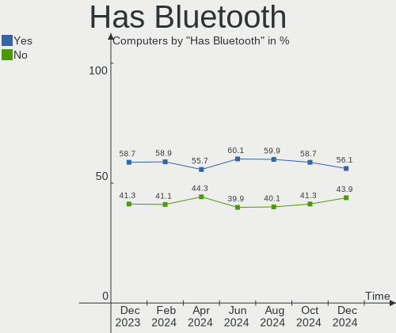
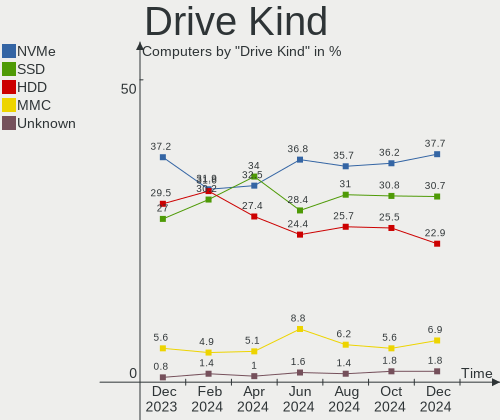
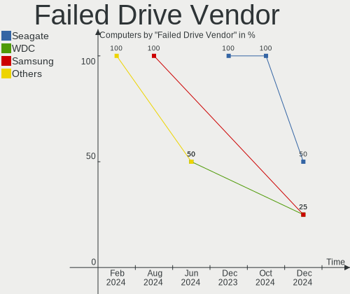
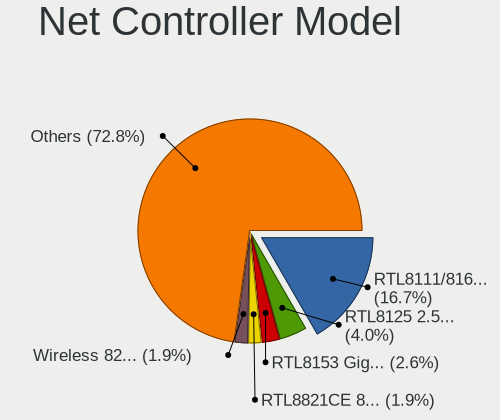
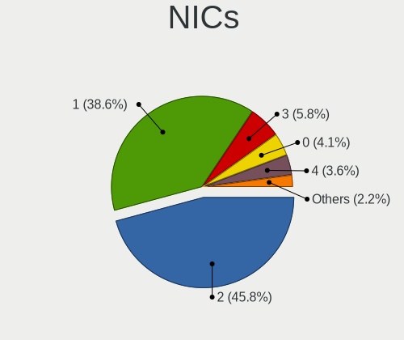

Debian - Hardware Trends
------------------------

A project to identify most popular hardware characteristics and track their change
over time based on data collected by Linux users at https://Linux-Hardware.org.

Anyone can contribute to this report by the [hw-probe](https://github.com/linuxhw/hw-probe) tool:

    sudo -E hw-probe -all -upload

This is a report for all computer types. See also reports for [desktops](/Dist/Debian/Desktop/README.md) and [notebooks](/Dist/Debian/Notebook/README.md).

This report is for one last month. Overall report since the beginning of time: [TestDays](https://github.com/linuxhw/TestDays)

Period: Sep, 2023.

Contents
--------

* [ System ](#system)
  - [ OS                       ](#os)
  - [ OS Family                ](#os-family)
  - [ Kernel                   ](#kernel)
  - [ Kernel Family            ](#kernel-family)
  - [ Kernel Major Ver.        ](#kernel-major-ver)
  - [ Arch                     ](#arch)
  - [ DE                       ](#de)
  - [ Display Server           ](#display-server)
  - [ Display Manager          ](#display-manager)
  - [ OS Lang                  ](#os-lang)
  - [ Boot Mode                ](#boot-mode)
  - [ Filesystem               ](#filesystem)
  - [ Part. scheme             ](#part-scheme)
  - [ Dual Boot with Linux/BSD ](#dual-boot-with-linuxbsd)
  - [ Dual Boot (Win)          ](#dual-boot-win)

* [ Board ](#board)
  - [ Vendor                   ](#vendor)
  - [ Model                    ](#model)
  - [ Model Family             ](#model-family)
  - [ MFG Year                 ](#mfg-year)
  - [ Form Factor              ](#form-factor)
  - [ Secure Boot              ](#secure-boot)
  - [ Coreboot                 ](#coreboot)
  - [ RAM Size                 ](#ram-size)
  - [ RAM Used                 ](#ram-used)
  - [ Total Drives             ](#total-drives)
  - [ Has CD-ROM               ](#has-cd-rom)
  - [ Has Ethernet             ](#has-ethernet)
  - [ Has WiFi                 ](#has-wifi)
  - [ Has Bluetooth            ](#has-bluetooth)

* [ Location ](#location)
  - [ Country                  ](#country)
  - [ City                     ](#city)

* [ Drives ](#drives)
  - [ Drive Vendor             ](#drive-vendor)
  - [ Drive Model              ](#drive-model)
  - [ HDD Vendor               ](#hdd-vendor)
  - [ SSD Vendor               ](#ssd-vendor)
  - [ Drive Kind               ](#drive-kind)
  - [ Drive Connector          ](#drive-connector)
  - [ Drive Size               ](#drive-size)
  - [ Space Total              ](#space-total)
  - [ Space Used               ](#space-used)
  - [ Malfunc. Drives          ](#malfunc-drives)
  - [ Malfunc. Drive Vendor    ](#malfunc-drive-vendor)
  - [ Malfunc. HDD Vendor      ](#malfunc-hdd-vendor)
  - [ Malfunc. Drive Kind      ](#malfunc-drive-kind)
  - [ Failed Drives            ](#failed-drives)
  - [ Failed Drive Vendor      ](#failed-drive-vendor)
  - [ Drive Status             ](#drive-status)

* [ Storage controller ](#storage-controller)
  - [ Storage Vendor           ](#storage-vendor)
  - [ Storage Model            ](#storage-model)
  - [ Storage Kind             ](#storage-kind)

* [ Processor ](#processor)
  - [ CPU Vendor               ](#cpu-vendor)
  - [ CPU Model                ](#cpu-model)
  - [ CPU Model Family         ](#cpu-model-family)
  - [ CPU Cores                ](#cpu-cores)
  - [ CPU Sockets              ](#cpu-sockets)
  - [ CPU Threads              ](#cpu-threads)
  - [ CPU Op-Modes             ](#cpu-op-modes)
  - [ CPU Microcode            ](#cpu-microcode)
  - [ CPU Microarch            ](#cpu-microarch)

* [ Graphics ](#graphics)
  - [ GPU Vendor               ](#gpu-vendor)
  - [ GPU Model                ](#gpu-model)
  - [ GPU Combo                ](#gpu-combo)
  - [ GPU Driver               ](#gpu-driver)
  - [ GPU Memory               ](#gpu-memory)

* [ Monitor ](#monitor)
  - [ Monitor Vendor           ](#monitor-vendor)
  - [ Monitor Model            ](#monitor-model)
  - [ Monitor Resolution       ](#monitor-resolution)
  - [ Monitor Diagonal         ](#monitor-diagonal)
  - [ Monitor Width            ](#monitor-width)
  - [ Aspect Ratio             ](#aspect-ratio)
  - [ Monitor Area             ](#monitor-area)
  - [ Pixel Density            ](#pixel-density)
  - [ Multiple Monitors        ](#multiple-monitors)

* [ Network ](#network)
  - [ Net Controller Vendor    ](#net-controller-vendor)
  - [ Net Controller Model     ](#net-controller-model)
  - [ Wireless Vendor          ](#wireless-vendor)
  - [ Wireless Model           ](#wireless-model)
  - [ Ethernet Vendor          ](#ethernet-vendor)
  - [ Ethernet Model           ](#ethernet-model)
  - [ Net Controller Kind      ](#net-controller-kind)
  - [ Used Controller          ](#used-controller)
  - [ NICs                     ](#nics)
  - [ IPv6                     ](#ipv6)

* [ Bluetooth ](#bluetooth)
  - [ Bluetooth Vendor         ](#bluetooth-vendor)
  - [ Bluetooth Model          ](#bluetooth-model)

* [ Sound ](#sound)
  - [ Sound Vendor             ](#sound-vendor)
  - [ Sound Model              ](#sound-model)

* [ Memory ](#memory)
  - [ Memory Vendor            ](#memory-vendor)
  - [ Memory Model             ](#memory-model)
  - [ Memory Kind              ](#memory-kind)
  - [ Memory Form Factor       ](#memory-form-factor)
  - [ Memory Size              ](#memory-size)
  - [ Memory Speed             ](#memory-speed)

* [ Printers & scanners ](#printers--scanners)
  - [ Printer Vendor           ](#printer-vendor)
  - [ Printer Model            ](#printer-model)
  - [ Scanner Vendor           ](#scanner-vendor)
  - [ Scanner Model            ](#scanner-model)

* [ Camera ](#camera)
  - [ Camera Vendor            ](#camera-vendor)
  - [ Camera Model             ](#camera-model)

* [ Security ](#security)
  - [ Fingerprint Vendor       ](#fingerprint-vendor)
  - [ Fingerprint Model        ](#fingerprint-model)
  - [ Chipcard Vendor          ](#chipcard-vendor)
  - [ Chipcard Model           ](#chipcard-model)

* [ Unsupported ](#unsupported)
  - [ Unsupported Devices      ](#unsupported-devices)
  - [ Unsupported Device Types ](#unsupported-device-types)

System
------

OS
--

Installed operating systems

| Name      | Computers | Percent |
|-----------|-----------|---------|
| Debian 12 | 320       | 76.19%  |
| Debian 11 | 64        | 15.24%  |
| Debian    | 31        | 7.38%   |
| Debian 10 | 3         | 0.71%   |
| Debian 8  | 1         | 0.24%   |
| Debian 23 | 1         | 0.24%   |

OS Family
---------

OS without a version

| Name   | Computers | Percent |
|--------|-----------|---------|
| Debian | 420       | 100%    |

Kernel
------

Version of the Linux kernel

| Version                 | Computers | Percent |
|-------------------------|-----------|---------|
| 6.1.0-12-amd64          | 111       | 26.43%  |
| 6.1.0-11-amd64          | 102       | 24.29%  |
| 6.1.0-10-amd64          | 41        | 9.76%   |
| 5.10.0-25-amd64         | 23        | 5.48%   |
| 6.1.0-4-amd64           | 16        | 3.81%   |
| 6.4.0-4-amd64           | 12        | 2.86%   |
| 6.5.0-1-amd64           | 9         | 2.14%   |
| 6.4.0-0.deb12.2-amd64   | 8         | 1.9%    |
| 6.2.16-3-pve            | 7         | 1.67%   |
| 6.2.16-12-pve           | 6         | 1.43%   |
| 5.15.116-1-pve          | 6         | 1.43%   |
| 6.1.21-v8+              | 5         | 1.19%   |
| 5.10.0-23-amd64         | 5         | 1.19%   |
| 5.10.0-22-amd64         | 4         | 0.95%   |
| 6.4.0-3-amd64           | 3         | 0.71%   |
| 6.1.0-9-amd64           | 3         | 0.71%   |
| 6.1.0-0.deb11.11-amd64  | 3         | 0.71%   |
| 5.15.108-1-pve          | 3         | 0.71%   |
| 5.10.0-24-amd64         | 3         | 0.71%   |
| 6.4.15-2-liquorix-amd64 | 2         | 0.48%   |
| 6.4.0-1mx-ahs-amd64     | 2         | 0.48%   |
| 6.2.16-14-pve           | 2         | 0.48%   |
| 6.2.16-10-pve           | 2         | 0.48%   |
| 6.1.0-12-686-pae        | 2         | 0.48%   |
| 5.18.0-0.deb11.4-amd64  | 2         | 0.48%   |
| 5.15.107+truenas        | 2         | 0.48%   |
| 5.10.0-21-amd64         | 2         | 0.48%   |
| 5.10.0-20-amd64         | 2         | 0.48%   |
| 6.6.0-rc3               | 1         | 0.24%   |
| 6.5.3-amd64             | 1         | 0.24%   |
| 6.5.3                   | 1         | 0.24%   |
| 6.5.0-0-amd64           | 1         | 0.24%   |
| 6.5.0+                  | 1         | 0.24%   |
| 6.4.3-1-liquorix-amd64  | 1         | 0.24%   |
| 6.4.14-1-liquorix-amd64 | 1         | 0.24%   |
| 6.4.12-2-liquorix-amd64 | 1         | 0.24%   |
| 6.3.0-2mx-ahs-amd64     | 1         | 0.24%   |
| 6.2.16-8-pve            | 1         | 0.24%   |
| 6.2.16-6-pve            | 1         | 0.24%   |
| 6.1.48                  | 1         | 0.24%   |

Kernel Family
-------------

Linux kernel without a distro release

| Version  | Computers | Percent |
|----------|-----------|---------|
| 6.1.0    | 281       | 66.9%   |
| 5.10.0   | 41        | 9.76%   |
| 6.4.0    | 25        | 5.95%   |
| 6.2.16   | 19        | 4.52%   |
| 6.5.0    | 11        | 2.62%   |
| 5.15.116 | 6         | 1.43%   |
| 6.1.21   | 5         | 1.19%   |
| 5.15.108 | 3         | 0.71%   |
| 6.5.3    | 2         | 0.48%   |
| 6.4.15   | 2         | 0.48%   |
| 5.18.0   | 2         | 0.48%   |
| 5.15.107 | 2         | 0.48%   |
| 6.6.0    | 1         | 0.24%   |
| 6.4.3    | 1         | 0.24%   |
| 6.4.14   | 1         | 0.24%   |
| 6.4.12   | 1         | 0.24%   |
| 6.3.0    | 1         | 0.24%   |
| 6.1.48   | 1         | 0.24%   |
| 6.1.28   | 1         | 0.24%   |
| 6.1.15   | 1         | 0.24%   |
| 6.1.11   | 1         | 0.24%   |
| 6.0.12   | 1         | 0.24%   |
| 6.0.0    | 1         | 0.24%   |
| 5.16.0   | 1         | 0.24%   |
| 5.15.0   | 1         | 0.24%   |
| 5.10.191 | 1         | 0.24%   |
| 5.10.181 | 1         | 0.24%   |
| 5.10.160 | 1         | 0.24%   |
| 5.10.142 | 1         | 0.24%   |
| 5.10.113 | 1         | 0.24%   |
| 4.19.0   | 1         | 0.24%   |
| 4.14.76  | 1         | 0.24%   |
| 3.16.0   | 1         | 0.24%   |

Kernel Major Ver.
-----------------

Linux kernel major version

| Version | Computers | Percent |
|---------|-----------|---------|
| 6.1     | 290       | 69.05%  |
| 5.10    | 46        | 10.95%  |
| 6.4     | 30        | 7.14%   |
| 6.2     | 19        | 4.52%   |
| 6.5     | 13        | 3.1%    |
| 5.15    | 12        | 2.86%   |
| 6.0     | 2         | 0.48%   |
| 5.18    | 2         | 0.48%   |
| 6.6     | 1         | 0.24%   |
| 6.3     | 1         | 0.24%   |
| 5.16    | 1         | 0.24%   |
| 4.19    | 1         | 0.24%   |
| 4.14    | 1         | 0.24%   |
| 3.16    | 1         | 0.24%   |

Arch
----

OS architecture (x86_64, i586, etc.)

| Name        | Computers | Percent |
|-------------|-----------|---------|
| x86_64      | 404       | 96.19%  |
| aarch64     | 9         | 2.14%   |
| riscv64     | 2         | 0.48%   |
| i686        | 2         | 0.48%   |
| armv7l      | 2         | 0.48%   |
| loongarch64 | 1         | 0.24%   |

DE
--

Desktop Environment

| Name             | Computers | Percent |
|------------------|-----------|---------|
| Unknown          | 119       | 28.33%  |
| GNOME            | 109       | 25.95%  |
| KDE5             | 78        | 18.57%  |
| XFCE             | 41        | 9.76%   |
| X-Cinnamon       | 19        | 4.52%   |
| MATE             | 19        | 4.52%   |
| LXDE             | 10        | 2.38%   |
| LXQt             | 7         | 1.67%   |
| i3               | 5         | 1.19%   |
| Cinnamon         | 5         | 1.19%   |
| Openbox          | 2         | 0.48%   |
| lightdm-xsession | 2         | 0.48%   |
| Budgie           | 2         | 0.48%   |
| KDE              | 1         | 0.24%   |
| GNOME Flashback  | 1         | 0.24%   |

Display Server
--------------

X11 or Wayland

| Name        | Computers | Percent |
|-------------|-----------|---------|
| X11         | 172       | 40.95%  |
| Wayland     | 117       | 27.86%  |
| Unknown     | 66        | 15.71%  |
| Tty         | 63        | 15%     |
| Web         | 1         | 0.24%   |
| Unspecified | 1         | 0.24%   |

Display Manager
---------------

SDDM, LightDM, etc.

| Name    | Computers | Percent |
|---------|-----------|---------|
| Unknown | 200       | 47.62%  |
| GDM3    | 77        | 18.33%  |
| LightDM | 76        | 18.1%   |
| SDDM    | 54        | 12.86%  |
| GDM     | 11        | 2.62%   |
| SLiM    | 1         | 0.24%   |
| GREETD  | 1         | 0.24%   |

OS Lang
-------

Language

| Lang       | Computers | Percent |
|------------|-----------|---------|
| en_US      | 173       | 41.19%  |
| Unknown    | 43        | 10.24%  |
| ru_RU      | 36        | 8.57%   |
| de_DE      | 22        | 5.24%   |
| en_GB      | 18        | 4.29%   |
| pt_BR      | 14        | 3.33%   |
| fr_FR      | 14        | 3.33%   |
| it_IT      | 8         | 1.9%    |
| C          | 8         | 1.9%    |
| es_ES      | 7         | 1.67%   |
| en_AU      | 7         | 1.67%   |
| pl_PL      | 6         | 1.43%   |
| sv_SE      | 4         | 0.95%   |
| hu_HU      | 4         | 0.95%   |
| es_MX      | 4         | 0.95%   |
| es_CL      | 4         | 0.95%   |
| en_ZA      | 4         | 0.95%   |
| en_IN      | 4         | 0.95%   |
| de_AT      | 4         | 0.95%   |
| fr_BE      | 3         | 0.71%   |
| es_AR      | 3         | 0.71%   |
| en_IE      | 3         | 0.71%   |
| en_CA      | 3         | 0.71%   |
| zh_CN      | 2         | 0.48%   |
| tr_TR      | 2         | 0.48%   |
| sk_SK      | 2         | 0.48%   |
| nl_NL      | 2         | 0.48%   |
| fr_CA      | 2         | 0.48%   |
| fi_FI      | 2         | 0.48%   |
| es_CO      | 2         | 0.48%   |
| zh_TW      | 1         | 0.24%   |
| sl_SI      | 1         | 0.24%   |
| nn_NO      | 1         | 0.24%   |
| nl_BE      | 1         | 0.24%   |
| lv_LV      | 1         | 0.24%   |
| it_IT@euro | 1         | 0.24%   |
| fr_CH      | 1         | 0.24%   |
| es_CU      | 1         | 0.24%   |
| en_NZ      | 1         | 0.24%   |
| cs_CZ      | 1         | 0.24%   |

Boot Mode
---------

EFI or BIOS

| Mode | Computers | Percent |
|------|-----------|---------|
| EFI  | 259       | 61.67%  |
| BIOS | 161       | 38.33%  |

Filesystem
----------

Type of filesystem

| Type    | Computers | Percent |
|---------|-----------|---------|
| Ext4    | 307       | 73.1%   |
| Overlay | 63        | 15%     |
| Btrfs   | 23        | 5.48%   |
| Tmpfs   | 13        | 3.1%    |
| Zfs     | 9         | 2.14%   |
| Xfs     | 2         | 0.48%   |
| F2fs    | 1         | 0.24%   |
| Ext3    | 1         | 0.24%   |
| Ext2    | 1         | 0.24%   |

Part. scheme
------------

Scheme of partitioning

| Type    | Computers | Percent |
|---------|-----------|---------|
| GPT     | 279       | 66.43%  |
| Unknown | 79        | 18.81%  |
| MBR     | 62        | 14.76%  |

Dual Boot with Linux/BSD
------------------------

Hosting more than one Linux/BSD

| Dual boot | Computers | Percent |
|-----------|-----------|---------|
| No        | 352       | 83.81%  |
| Yes       | 68        | 16.19%  |

Dual Boot (Win)
---------------

Hosting Linux and Windows

| Dual boot | Computers | Percent |
|-----------|-----------|---------|
| No        | 325       | 77.38%  |
| Yes       | 95        | 22.62%  |

Board
-----

Vendor
------

Motherboard manufacturer

| Name                                 | Computers | Percent |
|--------------------------------------|-----------|---------|
| Lenovo                               | 80        | 19.05%  |
| ASUSTek Computer                     | 52        | 12.38%  |
| Hewlett-Packard                      | 44        | 10.48%  |
| Dell                                 | 43        | 10.24%  |
| Gigabyte Technology                  | 31        | 7.38%   |
| MSI                                  | 25        | 5.95%   |
| Google                               | 20        | 4.76%   |
| Acer                                 | 20        | 4.76%   |
| ASRock                               | 14        | 3.33%   |
| Intel                                | 8         | 1.9%    |
| Supermicro                           | 7         | 1.67%   |
| Raspberry Pi Foundation              | 6         | 1.43%   |
| Fujitsu                              | 5         | 1.19%   |
| Unknown                              | 5         | 1.19%   |
| Toshiba                              | 4         | 0.95%   |
| AZW                                  | 4         | 0.95%   |
| Apple                                | 4         | 0.95%   |
| Shenzhen Meigao Electronic Equipment | 3         | 0.71%   |
| Samsung Electronics                  | 3         | 0.71%   |
| Microsoft                            | 2         | 0.48%   |
| HUAWEI                               | 2         | 0.48%   |
| Framework                            | 2         | 0.48%   |
| ASRockRack                           | 2         | 0.48%   |
| Aquarius                             | 2         | 0.48%   |
| ZOTAC                                | 1         | 0.24%   |
| YANYU                                | 1         | 0.24%   |
| Valve                                | 1         | 0.24%   |
| Techvision                           | 1         | 0.24%   |
| Sony                                 | 1         | 0.24%   |
| SolidRun                             | 1         | 0.24%   |
| SLIMBOOK                             | 1         | 0.24%   |
| Radxa                                | 1         | 0.24%   |
| Pegatron                             | 1         | 0.24%   |
| Panasonic                            | 1         | 0.24%   |
| Olimex                               | 1         | 0.24%   |
| Notebook                             | 1         | 0.24%   |
| NetGear                              | 1         | 0.24%   |
| MEGA                                 | 1         | 0.24%   |
| Loongson                             | 1         | 0.24%   |
| Juana Manso                          | 1         | 0.24%   |

Model
-----

Motherboard model

| Name                                         | Computers | Percent |
|----------------------------------------------|-----------|---------|
| Google Enguarde                              | 15        | 3.57%   |
| Lenovo ThinkPad L13 Yoga Gen 2 20VK0019US    | 9         | 2.14%   |
| Unknown                                      | 7         | 1.67%   |
| Supermicro SYS-5019S-ML                      | 4         | 0.95%   |
| RPi Raspberry Pi 4 Model B Rev 1.4           | 3         | 0.71%   |
| Lenovo ThinkPad 13 2nd Gen 20J10046US        | 3         | 0.71%   |
| Acer Aspire A515-56                          | 3         | 0.71%   |
| MSI MS-7B79                                  | 2         | 0.48%   |
| Lenovo IdeaPad Slim 5 14ABR8 82XE            | 2         | 0.48%   |
| HP Z230 Tower Workstation                    | 2         | 0.48%   |
| HP ProBook 450 G1                            | 2         | 0.48%   |
| HP EliteBook 845 G8 Notebook PC              | 2         | 0.48%   |
| Google Droid                                 | 2         | 0.48%   |
| Gigabyte X570 GAMING X                       | 2         | 0.48%   |
| Gigabyte H110M-H                             | 2         | 0.48%   |
| Framework Laptop (13th Gen Intel Core)       | 2         | 0.48%   |
| Dell Latitude 3320                           | 2         | 0.48%   |
| ASUS TUF B450-PLUS GAMING                    | 2         | 0.48%   |
| Aquarius NS585                               | 2         | 0.48%   |
| Acer Veriton Z4630G                          | 2         | 0.48%   |
| Acer Aspire E1-531                           | 2         | 0.48%   |
| ZOTAC ZBOX-BI323                             | 1         | 0.24%   |
| YANYU H17SL                                  | 1         | 0.24%   |
| Valve Jupiter                                | 1         | 0.24%   |
| Toshiba Satellite L640                       | 1         | 0.24%   |
| Toshiba Satellite L10W-B-101                 | 1         | 0.24%   |
| Toshiba Satellite A205                       | 1         | 0.24%   |
| Toshiba PORTEGE Z830                         | 1         | 0.24%   |
| Techvision TVI7309X                          | 1         | 0.24%   |
| Supermicro X9DR3-F                           | 1         | 0.24%   |
| Supermicro SYS-6029P-WTRT                    | 1         | 0.24%   |
| Supermicro Super Server                      | 1         | 0.24%   |
| Sony VGN-CS108D                              | 1         | 0.24%   |
| SolidRun CEX7 Platform                       | 1         | 0.24%   |
| SLIMBOOK Essential15L                        | 1         | 0.24%   |
| Shenzhen Meigao Electronic Equipment UM480XT | 1         | 0.24%   |
| Shenzhen Meigao Electronic Equipment HX90G   | 1         | 0.24%   |
| Shenzhen Meigao Electronic Equipment HX77G   | 1         | 0.24%   |
| Samsung RF511/RF411/RF711                    | 1         | 0.24%   |
| Samsung R505                                 | 1         | 0.24%   |

Model Family
------------

Motherboard model prefix

| Name                    | Computers | Percent |
|-------------------------|-----------|---------|
| Lenovo ThinkPad         | 45        | 10.71%  |
| Google Enguarde         | 15        | 3.57%   |
| Dell Latitude           | 15        | 3.57%   |
| Lenovo IdeaPad          | 12        | 2.86%   |
| Acer Aspire             | 9         | 2.14%   |
| ASUS ROG                | 8         | 1.9%    |
| HP Pavilion             | 7         | 1.67%   |
| Dell XPS                | 7         | 1.67%   |
| Unknown                 | 7         | 1.67%   |
| RPi Raspberry           | 6         | 1.43%   |
| HP EliteBook            | 5         | 1.19%   |
| Dell Precision          | 5         | 1.19%   |
| Dell PowerEdge          | 5         | 1.19%   |
| Dell OptiPlex           | 5         | 1.19%   |
| ASUS PRIME              | 5         | 1.19%   |
| Acer Veriton            | 5         | 1.19%   |
| Supermicro SYS-5019S-ML | 4         | 0.95%   |
| Lenovo ThinkCentre      | 4         | 0.95%   |
| HP Laptop               | 4         | 0.95%   |
| ASUS TUF                | 4         | 0.95%   |
| Toshiba Satellite       | 3         | 0.71%   |
| Lenovo ThinkStation     | 3         | 0.71%   |
| Lenovo Legion           | 3         | 0.71%   |
| HP ProBook              | 3         | 0.71%   |
| HP 250                  | 3         | 0.71%   |
| Gigabyte B550           | 3         | 0.71%   |
| Dell Vostro             | 3         | 0.71%   |
| ASUS VivoBook           | 3         | 0.71%   |
| MSI MS-7B79             | 2         | 0.48%   |
| Microsoft Surface       | 2         | 0.48%   |
| Lenovo Yoga             | 2         | 0.48%   |
| Lenovo ThinkSystem      | 2         | 0.48%   |
| Lenovo IdeaPadFlex      | 2         | 0.48%   |
| HP ZBook                | 2         | 0.48%   |
| HP Z230                 | 2         | 0.48%   |
| HP EliteDesk            | 2         | 0.48%   |
| HP Compaq               | 2         | 0.48%   |
| Google Droid            | 2         | 0.48%   |
| Gigabyte Z790           | 2         | 0.48%   |
| Gigabyte X570           | 2         | 0.48%   |

MFG Year
--------

Motherboard manufacture year

| Year    | Computers | Percent |
|---------|-----------|---------|
| 2020    | 53        | 12.62%  |
| 2022    | 48        | 11.43%  |
| 2021    | 43        | 10.24%  |
| 2018    | 31        | 7.38%   |
| 2023    | 29        | 6.9%    |
| 2019    | 27        | 6.43%   |
| 2017    | 26        | 6.19%   |
| 2016    | 24        | 5.71%   |
| 2015    | 20        | 4.76%   |
| 2014    | 18        | 4.29%   |
| 2013    | 18        | 4.29%   |
| 2012    | 18        | 4.29%   |
| 2011    | 16        | 3.81%   |
| Unknown | 12        | 2.86%   |
| 2008    | 11        | 2.62%   |
| 2009    | 10        | 2.38%   |
| 2007    | 9         | 2.14%   |
| 2010    | 7         | 1.67%   |

Form Factor
-----------

Physical design of the computer

| Name           | Computers | Percent |
|----------------|-----------|---------|
| Notebook       | 199       | 47.38%  |
| Desktop        | 157       | 37.38%  |
| Convertible    | 15        | 3.57%   |
| Mini pc        | 15        | 3.57%   |
| Server         | 13        | 3.1%    |
| System on chip | 11        | 2.62%   |
| All in one     | 6         | 1.43%   |
| Tablet         | 4         | 0.95%   |

Secure Boot
-----------

Enabled or disabled

| State    | Computers | Percent |
|----------|-----------|---------|
| Disabled | 395       | 94.05%  |
| Enabled  | 25        | 5.95%   |

Coreboot
--------

Have coreboot on board

| Used | Computers | Percent |
|------|-----------|---------|
| No   | 401       | 95.48%  |
| Yes  | 19        | 4.52%   |

RAM Size
--------

Total RAM memory

| Size in GB      | Computers | Percent |
|-----------------|-----------|---------|
| 16.01-24.0      | 88        | 20.95%  |
| 4.01-8.0        | 81        | 19.29%  |
| 3.01-4.0        | 61        | 14.52%  |
| 8.01-16.0       | 60        | 14.29%  |
| 32.01-64.0      | 58        | 13.81%  |
| 64.01-256.0     | 40        | 9.52%   |
| 24.01-32.0      | 10        | 2.38%   |
| 1.01-2.0        | 10        | 2.38%   |
| 2.01-3.0        | 6         | 1.43%   |
| More than 256.0 | 3         | 0.71%   |
| 0.51-1.0        | 3         | 0.71%   |

RAM Used
--------

Used RAM memory

| Used GB     | Computers | Percent |
|-------------|-----------|---------|
| 1.01-2.0    | 110       | 26.19%  |
| 2.01-3.0    | 80        | 19.05%  |
| 4.01-8.0    | 71        | 16.9%   |
| 3.01-4.0    | 54        | 12.86%  |
| 0.51-1.0    | 39        | 9.29%   |
| 8.01-16.0   | 24        | 5.71%   |
| 0.01-0.5    | 19        | 4.52%   |
| 16.01-24.0  | 9         | 2.14%   |
| 32.01-64.0  | 7         | 1.67%   |
| 24.01-32.0  | 4         | 0.95%   |
| 64.01-256.0 | 3         | 0.71%   |

Total Drives
------------

Number of drives on board

| Drives | Computers | Percent |
|--------|-----------|---------|
| 1      | 251       | 59.76%  |
| 2      | 95        | 22.62%  |
| 3      | 34        | 8.1%    |
| 4      | 17        | 4.05%   |
| 5      | 7         | 1.67%   |
| 8      | 3         | 0.71%   |
| 6      | 3         | 0.71%   |
| 0      | 3         | 0.71%   |
| 9      | 2         | 0.48%   |
| 7      | 2         | 0.48%   |
| 23     | 1         | 0.24%   |
| 19     | 1         | 0.24%   |
| 16     | 1         | 0.24%   |

Has CD-ROM
----------

Has CD-ROM on board

| Presented | Computers | Percent |
|-----------|-----------|---------|
| No        | 331       | 78.81%  |
| Yes       | 89        | 21.19%  |

Has Ethernet
------------

Has Ethernet on board

| Presented | Computers | Percent |
|-----------|-----------|---------|
| Yes       | 349       | 83.1%   |
| No        | 71        | 16.9%   |

Has WiFi
--------

Has WiFi module

| Presented | Computers | Percent |
|-----------|-----------|---------|
| Yes       | 289       | 68.81%  |
| No        | 131       | 31.19%  |

Has Bluetooth
-------------

Has Bluetooth module

| Presented | Computers | Percent |
|-----------|-----------|---------|
| Yes       | 256       | 60.95%  |
| No        | 164       | 39.05%  |

Location
--------

Country
-------

Geographic location (country)

| Country      | Computers | Percent |
|--------------|-----------|---------|
| USA          | 84        | 20%     |
| Russia       | 52        | 12.38%  |
| Germany      | 45        | 10.71%  |
| Brazil       | 18        | 4.29%   |
| Italy        | 17        | 4.05%   |
| France       | 17        | 4.05%   |
| Spain        | 11        | 2.62%   |
| UK           | 9         | 2.14%   |
| Poland       | 9         | 2.14%   |
| Canada       | 9         | 2.14%   |
| Belgium      | 9         | 2.14%   |
| Australia    | 8         | 1.9%    |
| Netherlands  | 7         | 1.67%   |
| Hungary      | 7         | 1.67%   |
| Austria      | 7         | 1.67%   |
| Sweden       | 6         | 1.43%   |
| Romania      | 6         | 1.43%   |
| Turkey       | 5         | 1.19%   |
| South Africa | 5         | 1.19%   |
| India        | 5         | 1.19%   |
| Greece       | 5         | 1.19%   |
| Switzerland  | 4         | 0.95%   |
| Portugal     | 4         | 0.95%   |
| Mexico       | 4         | 0.95%   |
| Indonesia    | 4         | 0.95%   |
| Finland      | 4         | 0.95%   |
| China        | 4         | 0.95%   |
| Chile        | 4         | 0.95%   |
| Argentina    | 4         | 0.95%   |
| Norway       | 3         | 0.71%   |
| Iran         | 3         | 0.71%   |
| Hong Kong    | 3         | 0.71%   |
| Czechia      | 3         | 0.71%   |
| Colombia     | 3         | 0.71%   |
| Vietnam      | 2         | 0.48%   |
| Thailand     | 2         | 0.48%   |
| Slovakia     | 2         | 0.48%   |
| New Zealand  | 2         | 0.48%   |
| Malaysia     | 2         | 0.48%   |
| Ireland      | 2         | 0.48%   |

City
----

Geographic location (city)

| City              | Computers | Percent |
|-------------------|-----------|---------|
| Bangor            | 32        | 7.62%   |
| Voronezh          | 16        | 3.81%   |
| Frankfurt am Main | 7         | 1.67%   |
| Ufa               | 5         | 1.19%   |
| Moscow            | 5         | 1.19%   |
| St Petersburg     | 4         | 0.95%   |
| Perm              | 4         | 0.95%   |
| Helsinki          | 4         | 0.95%   |
| Düsseldorf       | 4         | 0.95%   |
| Budapest          | 4         | 0.95%   |
| Vienna            | 3         | 0.71%   |
| Steyr             | 3         | 0.71%   |
| Ruda Śląska     | 3         | 0.71%   |
| Paris             | 3         | 0.71%   |
| Milan             | 3         | 0.71%   |
| Los Angeles       | 3         | 0.71%   |
| Johannesburg      | 3         | 0.71%   |
| Bucharest         | 3         | 0.71%   |
| Beijing           | 3         | 0.71%   |
| Amsterdam         | 3         | 0.71%   |
| Warsaw            | 2         | 0.48%   |
| Veliky Novgorod   | 2         | 0.48%   |
| Tullahoma         | 2         | 0.48%   |
| Toulouse          | 2         | 0.48%   |
| Toronto           | 2         | 0.48%   |
| Tehran            | 2         | 0.48%   |
| Stockholm         | 2         | 0.48%   |
| Santiago          | 2         | 0.48%   |
| Puebla City       | 2         | 0.48%   |
| Partille          | 2         | 0.48%   |
| Nakhon Pathom     | 2         | 0.48%   |
| Monza             | 2         | 0.48%   |
| Montreal          | 2         | 0.48%   |
| Minsk             | 2         | 0.48%   |
| Mesa              | 2         | 0.48%   |
| Leeds             | 2         | 0.48%   |
| Kummersbruck      | 2         | 0.48%   |
| Kuala Lumpur      | 2         | 0.48%   |
| Ho Chi Minh City  | 2         | 0.48%   |
| Hamburg           | 2         | 0.48%   |

Drives
------

Drive Vendor
------------

Hard drive vendors

| Vendor                      | Computers | Drives | Percent |
|-----------------------------|-----------|--------|---------|
| Samsung Electronics         | 109       | 144    | 18.51%  |
| WDC                         | 72        | 99     | 12.22%  |
| Seagate                     | 59        | 96     | 10.02%  |
| Unknown                     | 38        | 43     | 6.45%   |
| Toshiba                     | 38        | 47     | 6.45%   |
| Crucial                     | 30        | 49     | 5.09%   |
| SanDisk                     | 28        | 31     | 4.75%   |
| Kingston                    | 27        | 28     | 4.58%   |
| SK hynix                    | 17        | 18     | 2.89%   |
| Intel                       | 17        | 17     | 2.89%   |
| Micron Technology           | 14        | 16     | 2.38%   |
| Hitachi                     | 12        | 14     | 2.04%   |
| HGST                        | 9         | 19     | 1.53%   |
| Unknown                     | 8         | 10     | 1.36%   |
| China                       | 7         | 8      | 1.19%   |
| A-DATA Technology           | 7         | 7      | 1.19%   |
| Silicon Motion              | 6         | 6      | 1.02%   |
| Kingston Technology Company | 5         | 5      | 0.85%   |
| Apacer                      | 5         | 5      | 0.85%   |
| SPCC                        | 4         | 4      | 0.68%   |
| Phison Electronics          | 4         | 5      | 0.68%   |
| GOODRAM                     | 4         | 11     | 0.68%   |
| XPG                         | 3         | 3      | 0.51%   |
| Transcend                   | 3         | 3      | 0.51%   |
| Team                        | 3         | 3      | 0.51%   |
| PNY                         | 3         | 5      | 0.51%   |
| Netac                       | 3         | 3      | 0.51%   |
| KIOXIA                      | 3         | 3      | 0.51%   |
| Hewlett-Packard             | 3         | 4      | 0.51%   |
| Apple                       | 3         | 3      | 0.51%   |
| Union Memory (Shenzhen)     | 2         | 2      | 0.34%   |
| UMIS                        | 2         | 2      | 0.34%   |
| Patriot                     | 2         | 2      | 0.34%   |
| MAXIO Technology (Hangzhou) | 2         | 2      | 0.34%   |
| JMicron Technology          | 2         | 2      | 0.34%   |
| Gigabyte Technology         | 2         | 2      | 0.34%   |
| ZHITAI                      | 1         | 1      | 0.17%   |
| SSK                         | 1         | 1      | 0.17%   |
| SNR                         | 1         | 1      | 0.17%   |
| SHGP31-1                    | 1         | 1      | 0.17%   |

Drive Model
-----------

Hard drive models

| Model                                                 | Computers | Percent |
|-------------------------------------------------------|-----------|---------|
| Unknown AGND3R  16GB                                  | 9         | 1.37%   |
| Samsung MZVLB512HBJQ-000L7 512GB                      | 9         | 1.37%   |
| Unknown                                               | 8         | 1.22%   |
| Seagate ST500DM002-1BD142 500GB                       | 6         | 0.91%   |
| Samsung SSD 970 EVO Plus 1TB                          | 6         | 0.91%   |
| Samsung NVMe SSD Controller SM981/PM981/PM983 256GB   | 6         | 0.91%   |
| Crucial CT1000MX500SSD1 1TB                           | 6         | 0.91%   |
| Unknown HAG2e  16GB                                   | 5         | 0.76%   |
| Toshiba MQ01ABD100 1TB                                | 5         | 0.76%   |
| Toshiba DT01ACA100 1TB                                | 5         | 0.76%   |
| Kingston SA400S37480G 480GB SSD                       | 5         | 0.76%   |
| Crucial CT500MX500SSD1 500GB                          | 5         | 0.76%   |
| Unknown MMC Card  32GB                                | 4         | 0.61%   |
| Samsung SSD 870 QVO 1TB                               | 4         | 0.61%   |
| Samsung SSD 870 EVO 1TB                               | 4         | 0.61%   |
| Samsung SSD 860 EVO 500GB                             | 4         | 0.61%   |
| Kingston SA400S37120G 120GB SSD                       | 4         | 0.61%   |
| Crucial CT240BX500SSD1 240GB                          | 4         | 0.61%   |
| XPG GAMMIX S11 Pro 1TB                                | 3         | 0.46%   |
| WDC WD Blue SA510 2.5 1TB                             | 3         | 0.46%   |
| Unknown MMC Card  64GB                                | 3         | 0.46%   |
| Toshiba MQ01ABF050 500GB                              | 3         | 0.46%   |
| Toshiba DT01ACA050 500GB                              | 3         | 0.46%   |
| Silicon Motion SM2263EN/SM2263XT SSD Controller 512GB | 3         | 0.46%   |
| Sandisk WD Black SN750 / PC SN730 NVMe SSD 512GB      | 3         | 0.46%   |
| SanDisk SD8SN8U128G1001 128GB SSD                     | 3         | 0.46%   |
| SanDisk NVMe SSD Drive 512GB                          | 3         | 0.46%   |
| SanDisk NVMe SSD Drive 1TB                            | 3         | 0.46%   |
| Samsung SSD 980 PRO with Heatsink 2TB                 | 3         | 0.46%   |
| Samsung SSD 980 PRO 1TB                               | 3         | 0.46%   |
| Samsung SSD 980 1TB                                   | 3         | 0.46%   |
| Samsung SSD 870 EVO 500GB                             | 3         | 0.46%   |
| Samsung SSD 850 PRO 512GB                             | 3         | 0.46%   |
| Samsung NVMe SSD Controller PM9A1/PM9A3/980PRO 1TB    | 3         | 0.46%   |
| Samsung MZALQ256HBJD-00BL2 256GB                      | 3         | 0.46%   |
| GOODRAM IRP-SSDPR-S25C-256 256GB                      | 3         | 0.46%   |
| WDC WD60EFRX-68L0BN1 6TB                              | 2         | 0.3%    |
| WDC WD5000AZLX-00K2TA0 500GB                          | 2         | 0.3%    |
| WDC WD20SPZX-22UA7T0 2TB                              | 2         | 0.3%    |
| WDC WD20EFRX-68EUZN0 2TB                              | 2         | 0.3%    |

HDD Vendor
----------

Hard disk drive vendors

| Vendor              | Computers | Drives | Percent |
|---------------------|-----------|--------|---------|
| Seagate             | 59        | 91     | 35.98%  |
| WDC                 | 51        | 76     | 31.1%   |
| Toshiba             | 23        | 32     | 14.02%  |
| Hitachi             | 12        | 14     | 7.32%   |
| HGST                | 9         | 19     | 5.49%   |
| Samsung Electronics | 6         | 6      | 3.66%   |
| Unknown             | 2         | 2      | 1.22%   |
| Fujitsu             | 1         | 1      | 0.61%   |
| Apple               | 1         | 1      | 0.61%   |

SSD Vendor
----------

Solid state drive vendors

| Vendor              | Computers | Drives | Percent |
|---------------------|-----------|--------|---------|
| Samsung Electronics | 35        | 44     | 20%     |
| Kingston            | 20        | 20     | 11.43%  |
| Crucial             | 20        | 37     | 11.43%  |
| WDC                 | 12        | 12     | 6.86%   |
| SanDisk             | 10        | 12     | 5.71%   |
| Micron Technology   | 7         | 9      | 4%      |
| Intel               | 7         | 7      | 4%      |
| China               | 7         | 8      | 4%      |
| A-DATA Technology   | 6         | 6      | 3.43%   |
| Toshiba             | 4         | 4      | 2.29%   |
| GOODRAM             | 4         | 7      | 2.29%   |
| Apacer              | 4         | 4      | 2.29%   |
| Transcend           | 3         | 3      | 1.71%   |
| SPCC                | 3         | 3      | 1.71%   |
| PNY                 | 3         | 5      | 1.71%   |
| Hewlett-Packard     | 3         | 4      | 1.71%   |
| Team                | 2         | 2      | 1.14%   |
| Patriot             | 2         | 2      | 1.14%   |
| Netac               | 2         | 2      | 1.14%   |
| Apple               | 2         | 2      | 1.14%   |
| SK hynix            | 1         | 2      | 0.57%   |
| SD                  | 1         | 2      | 0.57%   |
| Rogueware           | 1         | 1      | 0.57%   |
| OCZ                 | 1         | 1      | 0.57%   |
| NGFF                | 1         | 1      | 0.57%   |
| Neo                 | 1         | 1      | 0.57%   |
| MOVESPEED           | 1         | 1      | 0.57%   |
| LITEON              | 1         | 1      | 0.57%   |
| Lexar               | 1         | 1      | 0.57%   |
| KingSpec            | 1         | 1      | 0.57%   |
| Intenso             | 1         | 1      | 0.57%   |
| GLOWAY              | 1         | 1      | 0.57%   |
| Gigabyte Technology | 1         | 1      | 0.57%   |
| EZCOOL              | 1         | 1      | 0.57%   |
| Emtec               | 1         | 1      | 0.57%   |
| Drevo               | 1         | 1      | 0.57%   |
| Dogfish             | 1         | 1      | 0.57%   |
| Argon               | 1         | 1      | 0.57%   |
| Unknown             | 1         | 3      | 0.57%   |

Drive Kind
----------

HDD or SSD

| Kind    | Computers | Drives | Percent |
|---------|-----------|--------|---------|
| NVMe    | 196       | 238    | 36.03%  |
| SSD     | 158       | 216    | 29.04%  |
| HDD     | 139       | 242    | 25.55%  |
| MMC     | 42        | 46     | 7.72%   |
| Unknown | 9         | 14     | 1.65%   |

Drive Connector
---------------

SATA, SAS, NVMe, etc.

| Type | Computers | Drives | Percent |
|------|-----------|--------|---------|
| SATA | 243       | 434    | 48.31%  |
| NVMe | 196       | 235    | 38.97%  |
| MMC  | 42        | 46     | 8.35%   |
| SAS  | 22        | 41     | 4.37%   |

Drive Size
----------

Size of hard drive

| Size in TB | Computers | Drives | Percent |
|------------|-----------|--------|---------|
| 0.01-0.5   | 162       | 199    | 50.15%  |
| 0.51-1.0   | 95        | 146    | 29.41%  |
| 1.01-2.0   | 32        | 47     | 9.91%   |
| 4.01-10.0  | 15        | 25     | 4.64%   |
| 3.01-4.0   | 10        | 18     | 3.1%    |
| 2.01-3.0   | 5         | 12     | 1.55%   |
| 10.01-20.0 | 4         | 11     | 1.24%   |

Space Total
-----------

Amount of disk space available on the file system

| Size in GB     | Computers | Percent |
|----------------|-----------|---------|
| 251-500        | 91        | 21.67%  |
| 101-250        | 79        | 18.81%  |
| 501-1000       | 63        | 15%     |
| 1001-2000      | 41        | 9.76%   |
| Unknown        | 37        | 8.81%   |
| 1-20           | 34        | 8.1%    |
| 51-100         | 31        | 7.38%   |
| More than 3000 | 24        | 5.71%   |
| 2001-3000      | 13        | 3.1%    |
| 21-50          | 7         | 1.67%   |

Space Used
----------

Amount of used disk space

| Used GB        | Computers | Percent |
|----------------|-----------|---------|
| 1-20           | 162       | 38.57%  |
| 21-50          | 56        | 13.33%  |
| 101-250        | 51        | 12.14%  |
| 251-500        | 37        | 8.81%   |
| Unknown        | 37        | 8.81%   |
| 51-100         | 31        | 7.38%   |
| 501-1000       | 15        | 3.57%   |
| 1001-2000      | 14        | 3.33%   |
| More than 3000 | 12        | 2.86%   |
| 2001-3000      | 5         | 1.19%   |

Malfunc. Drives
---------------

Drive models with a malfunction

| Model                                                 | Computers | Drives | Percent |
|-------------------------------------------------------|-----------|--------|---------|
| Toshiba MQ01ABD100 1TB                                | 2         | 2      | 4.17%   |
| Seagate ST500DM002-1BD142 500GB                       | 2         | 3      | 4.17%   |
| Micron Technology MTFDDAV256TDL-1AW1ZABHA 256GB SSD   | 2         | 2      | 4.17%   |
| WDC WD60EFRX-68L0BN1 6TB                              | 1         | 1      | 2.08%   |
| WDC WD5000AZLX-22JKKA0 500GB                          | 1         | 2      | 2.08%   |
| WDC WD40EFRX-68WT0N0 4TB                              | 1         | 1      | 2.08%   |
| WDC WD3200BEKT-75PVMT1 320GB                          | 1         | 1      | 2.08%   |
| WDC WD30EZRX-00MMMB0 3TB                              | 1         | 1      | 2.08%   |
| WDC WD2500BEVT-22A23T0 208GB                          | 1         | 1      | 2.08%   |
| WDC WD20EURS-63S48Y0 2TB                              | 1         | 1      | 2.08%   |
| WDC WD20EARS-00MVWB0 2TB                              | 1         | 1      | 2.08%   |
| Toshiba MQ01ABB200 2TB                                | 1         | 1      | 2.08%   |
| SPCC Solid State Disk 1TB                             | 1         | 1      | 2.08%   |
| SK hynix BC711 HFM512GD3JX013N 512GB                  | 1         | 1      | 2.08%   |
| Seagate ST9500420AS 500GB                             | 1         | 1      | 2.08%   |
| Seagate ST4000NM0033-9ZM170 4TB                       | 1         | 1      | 2.08%   |
| Seagate ST3500418AS 500GB                             | 1         | 1      | 2.08%   |
| Seagate ST2000DM001-1CH164 2TB                        | 1         | 1      | 2.08%   |
| Seagate ST1000NM0033-9ZM173 1TB                       | 1         | 1      | 2.08%   |
| Seagate ST1000LM035-1RK172 1TB                        | 1         | 1      | 2.08%   |
| Seagate ST1000DM005 HD103SJ 1TB                       | 1         | 1      | 2.08%   |
| Seagate ST1000DM003-1ER162 1TB                        | 1         | 2      | 2.08%   |
| Samsung Electronics SSD 980 PRO 500GB S5GYNG0R122530Z | 1         | 1      | 2.08%   |
| Samsung Electronics SSD 980 PRO 500GB                 | 1         | 1      | 2.08%   |
| Samsung Electronics SSD 970 PRO 512GB S463NF0M206667V | 1         | 1      | 2.08%   |
| Samsung Electronics SSD 970 EVO 1TB                   | 1         | 1      | 2.08%   |
| Samsung Electronics SSD 870 EVO 500GB                 | 1         | 1      | 2.08%   |
| Samsung Electronics SSD 870 EVO 1TB                   | 1         | 1      | 2.08%   |
| Samsung Electronics HD502HJ 500GB                     | 1         | 1      | 2.08%   |
| Samsung Electronics HD154UI 1TB                       | 1         | 1      | 2.08%   |
| OCZ VERTEX4 256GB SSD                                 | 1         | 1      | 2.08%   |
| Micron Technology 2200V_MTFDHBA512TCK 512GB           | 1         | 1      | 2.08%   |
| Kingston SA400S37480G 480GB SSD                       | 1         | 1      | 2.08%   |
| Intel SSDSCKKF256G8H 256GB                            | 1         | 1      | 2.08%   |
| Intel SSDSC2KW480H6 480GB                             | 1         | 1      | 2.08%   |
| Intel SSDSC2CW120A3 120GB                             | 1         | 1      | 2.08%   |
| Intel SSDSC2BF180A5L 180GB                            | 1         | 1      | 2.08%   |
| Hitachi HTS545050A7E380 500GB                         | 1         | 1      | 2.08%   |
| Hitachi HTS543216L9A300 160GB                         | 1         | 1      | 2.08%   |
| Hitachi HDT721064SLA360 640GB                         | 1         | 1      | 2.08%   |

Malfunc. Drive Vendor
---------------------

Vendors of faulty drives

| Vendor              | Computers | Drives | Percent |
|---------------------|-----------|--------|---------|
| Seagate             | 10        | 12     | 21.28%  |
| WDC                 | 8         | 9      | 17.02%  |
| Samsung Electronics | 7         | 8      | 14.89%  |
| Intel               | 4         | 4      | 8.51%   |
| Hitachi             | 4         | 4      | 8.51%   |
| Toshiba             | 3         | 3      | 6.38%   |
| Micron Technology   | 3         | 3      | 6.38%   |
| HGST                | 2         | 2      | 4.26%   |
| SPCC                | 1         | 1      | 2.13%   |
| SK hynix            | 1         | 1      | 2.13%   |
| OCZ                 | 1         | 1      | 2.13%   |
| Kingston            | 1         | 1      | 2.13%   |
| Crucial             | 1         | 1      | 2.13%   |
| Apple               | 1         | 1      | 2.13%   |

Malfunc. HDD Vendor
-------------------

Vendors of faulty HDD drives

| Vendor              | Computers | Drives | Percent |
|---------------------|-----------|--------|---------|
| Seagate             | 10        | 12     | 33.33%  |
| WDC                 | 8         | 9      | 26.67%  |
| Hitachi             | 4         | 4      | 13.33%  |
| Toshiba             | 3         | 3      | 10%     |
| Samsung Electronics | 2         | 2      | 6.67%   |
| HGST                | 2         | 2      | 6.67%   |
| Apple               | 1         | 1      | 3.33%   |

Malfunc. Drive Kind
-------------------

Kinds of faulty drives

| Kind | Computers | Drives | Percent |
|------|-----------|--------|---------|
| HDD  | 28        | 33     | 62.22%  |
| SSD  | 12        | 12     | 26.67%  |
| NVMe | 5         | 6      | 11.11%  |

Failed Drives
-------------

Failed drive models

| Model                      | Computers | Drives | Percent |
|----------------------------|-----------|--------|---------|
| Seagate ST3500418ASQ 500GB | 1         | 1      | 100%    |

Failed Drive Vendor
-------------------

Failed drive vendors

| Vendor  | Computers | Drives | Percent |
|---------|-----------|--------|---------|
| Seagate | 1         | 1      | 100%    |

Drive Status
------------

Number of failed and malfunc. drives

| Status   | Computers | Drives | Percent |
|----------|-----------|--------|---------|
| Works    | 274       | 473    | 59.69%  |
| Detected | 140       | 231    | 30.5%   |
| Malfunc  | 44        | 51     | 9.59%   |
| Failed   | 1         | 1      | 0.22%   |

Storage controller
------------------

Storage Vendor
--------------

Storage controller vendors

| Vendor                       | Computers | Percent |
|------------------------------|-----------|---------|
| Intel                        | 227       | 41.58%  |
| Samsung Electronics          | 75        | 13.74%  |
| AMD                          | 74        | 13.55%  |
| Sandisk                      | 28        | 5.13%   |
| SK hynix                     | 16        | 2.93%   |
| Toshiba America Info Systems | 14        | 2.56%   |
| Kingston Technology Company  | 13        | 2.38%   |
| Micron/Crucial Technology    | 12        | 2.2%    |
| ASMedia Technology           | 11        | 2.01%   |
| Phison Electronics           | 10        | 1.83%   |
| Silicon Motion               | 8         | 1.47%   |
| Nvidia                       | 7         | 1.28%   |
| Micron Technology            | 7         | 1.28%   |
| Marvell Technology Group     | 7         | 1.28%   |
| Broadcom / LSI               | 6         | 1.1%    |
| Union Memory (Shenzhen)      | 4         | 0.73%   |
| MAXIO Technology (Hangzhou)  | 4         | 0.73%   |
| LSI Logic / Symbios Logic    | 4         | 0.73%   |
| ADATA Technology             | 4         | 0.73%   |
| JMicron Technology           | 3         | 0.55%   |
| Adaptec                      | 2         | 0.37%   |
| Yangtze Memory Technologies  | 1         | 0.18%   |
| VIA Technologies             | 1         | 0.18%   |
| Silicon Image                | 1         | 0.18%   |
| Realtek Semiconductor        | 1         | 0.18%   |
| Nextorage                    | 1         | 0.18%   |
| Loongson Technology          | 1         | 0.18%   |
| KIOXIA                       | 1         | 0.18%   |
| Hewlett-Packard              | 1         | 0.18%   |
| Biwin Storage Technology     | 1         | 0.18%   |
| 3ware                        | 1         | 0.18%   |

Storage Model
-------------

Storage controller models

| Model                                                                          | Computers | Percent |
|--------------------------------------------------------------------------------|-----------|---------|
| AMD FCH SATA Controller [AHCI mode]                                            | 43        | 7.05%   |
| Samsung NVMe SSD Controller SM981/PM981/PM983                                  | 34        | 5.57%   |
| Samsung NVMe SSD Controller PM9A1/PM9A3/980PRO                                 | 18        | 2.95%   |
| Intel 8 Series/C220 Series Chipset Family 6-port SATA Controller 1 [AHCI mode] | 17        | 2.79%   |
| Intel Q170/Q150/B150/H170/H110/Z170/CM236 Chipset SATA Controller [AHCI Mode]  | 15        | 2.46%   |
| Samsung NVMe SSD Controller 980                                                | 14        | 2.3%    |
| Intel Sunrise Point-LP SATA Controller [AHCI mode]                             | 14        | 2.3%    |
| AMD 400 Series Chipset SATA Controller                                         | 12        | 1.97%   |
| SK hynix Gold P31/BC711/PC711 NVMe Solid State Drive                           | 11        | 1.8%    |
| Intel Volume Management Device NVMe RAID Controller                            | 11        | 1.8%    |
| Intel 6 Series/C200 Series Chipset Family 6 port Mobile SATA AHCI Controller   | 10        | 1.64%   |
| ASMedia ASM1062 Serial ATA Controller                                          | 10        | 1.64%   |
| AMD SB7x0/SB8x0/SB9x0 IDE Controller                                           | 9         | 1.48%   |
| AMD 500 Series Chipset SATA Controller                                         | 9         | 1.48%   |
| Toshiba America Info Systems XG6 NVMe SSD Controller                           | 8         | 1.31%   |
| Intel 200 Series PCH SATA controller [AHCI mode]                               | 8         | 1.31%   |
| Silicon Motion SM2263EN/SM2263XT (DRAM-less) NVMe SSD Controllers              | 7         | 1.15%   |
| Micron/Crucial P2 [Nick P2] / P3 / P3 Plus NVMe PCIe SSD (DRAM-less)           | 7         | 1.15%   |
| Intel Cannon Lake PCH SATA AHCI Controller                                     | 7         | 1.15%   |
| Intel Alder Lake-P SATA AHCI Controller                                        | 7         | 1.15%   |
| Intel 7 Series Chipset Family 6-port SATA Controller [AHCI mode]               | 7         | 1.15%   |
| AMD SB7x0/SB8x0/SB9x0 SATA Controller [AHCI mode]                              | 7         | 1.15%   |
| SanDisk WD Black SN750 / PC SN730 NVMe SSD                                     | 6         | 0.98%   |
| Intel 82801 Mobile SATA Controller [RAID mode]                                 | 6         | 0.98%   |
| Intel 5 Series/3400 Series Chipset 6 port SATA AHCI Controller                 | 6         | 0.98%   |
| AMD SB7x0/SB8x0/SB9x0 SATA Controller [IDE mode]                               | 6         | 0.98%   |
| Intel Tiger Lake-LP SATA Controller                                            | 5         | 0.82%   |
| Intel SATA Controller [RAID mode]                                              | 5         | 0.82%   |
| Intel Comet Lake SATA AHCI Controller                                          | 5         | 0.82%   |
| Intel Cannon Point-LP SATA Controller [AHCI Mode]                              | 5         | 0.82%   |
| Intel 82801IBM/IEM (ICH9M/ICH9M-E) 4 port SATA Controller [AHCI mode]          | 5         | 0.82%   |
| Intel 82801HM/HEM (ICH8M/ICH8M-E) SATA Controller [AHCI mode]                  | 5         | 0.82%   |
| Intel 82801HM/HEM (ICH8M/ICH8M-E) IDE Controller                               | 5         | 0.82%   |
| Intel 8 Series SATA Controller 1 [AHCI mode]                                   | 5         | 0.82%   |
| Intel 500 Series Chipset Family SATA AHCI Controller                           | 5         | 0.82%   |
| SanDisk WD Blue SN550 NVMe SSD                                                 | 4         | 0.66%   |
| SanDisk WD Black SN770 / PC SN740 256GB / PC SN560 (DRAM-less) NVMe SSD        | 4         | 0.66%   |
| Samsung NVMe SSD Controller S4LV008[Pascal]                                    | 4         | 0.66%   |
| Kingston Company Company Non-Volatile memory controller                        | 4         | 0.66%   |
| Intel Wildcat Point-LP SATA Controller [AHCI Mode]                             | 4         | 0.66%   |

Storage Kind
------------

Kind of storage controller (IDE, SATA, NVMe, SAS, ...)

| Kind | Computers | Percent |
|------|-----------|---------|
| SATA | 269       | 49.54%  |
| NVMe | 195       | 35.91%  |
| IDE  | 37        | 6.81%   |
| RAID | 34        | 6.26%   |
| SAS  | 8         | 1.47%   |

Processor
---------

CPU Vendor
----------

Processor vendors

| Vendor        | Computers | Percent |
|---------------|-----------|---------|
| Intel         | 305       | 72.62%  |
| AMD           | 101       | 24.05%  |
| ARM           | 11        | 2.62%   |
| sifive,u74-mc | 1         | 0.24%   |
| Loongson      | 1         | 0.24%   |
| Unknown       | 1         | 0.24%   |

CPU Model
---------

Processor models

| Model                                   | Computers | Percent |
|-----------------------------------------|-----------|---------|
| Intel Celeron CPU N2840 @ 2.16GHz       | 17        | 4.05%   |
| Intel 11th Gen Core i7-1165G7 @ 2.80GHz | 12        | 2.86%   |
| Intel 11th Gen Core i5-1135G7 @ 2.40GHz | 9         | 2.14%   |
| ARM Processor                           | 9         | 2.14%   |
| Intel Celeron N4020 CPU @ 1.10GHz       | 5         | 1.19%   |
| AMD Ryzen 7 3700X 8-Core Processor      | 5         | 1.19%   |
| AMD Ryzen 5 3600 6-Core Processor       | 5         | 1.19%   |
| Intel Xeon CPU E3-1240 v6 @ 3.70GHz     | 4         | 0.95%   |
| Intel Core i7-10750H CPU @ 2.60GHz      | 4         | 0.95%   |
| Intel Core i5-6300U CPU @ 2.40GHz       | 4         | 0.95%   |
| Intel 12th Gen Core i7-12700H           | 4         | 0.95%   |
| Intel Core i7-8650U CPU @ 1.90GHz       | 3         | 0.71%   |
| Intel Core i7-7700K CPU @ 4.20GHz       | 3         | 0.71%   |
| Intel Core i7-4790 CPU @ 3.60GHz        | 3         | 0.71%   |
| Intel Core i5-8265U CPU @ 1.60GHz       | 3         | 0.71%   |
| Intel Core i5-6200U CPU @ 2.30GHz       | 3         | 0.71%   |
| Intel Core i5-1035G1 CPU @ 1.00GHz      | 3         | 0.71%   |
| Intel Celeron CPU N3350 @ 1.10GHz       | 3         | 0.71%   |
| Intel Celeron CPU 3865U @ 1.80GHz       | 3         | 0.71%   |
| Intel 12th Gen Core i5-1235U            | 3         | 0.71%   |
| Intel 11th Gen Core i3-1115G4 @ 3.00GHz | 3         | 0.71%   |
| AMD Ryzen 9 7950X 16-Core Processor     | 3         | 0.71%   |
| AMD Ryzen 9 5900HX with Radeon Graphics | 3         | 0.71%   |
| AMD Ryzen 5 5600G with Radeon Graphics  | 3         | 0.71%   |
| AMD Ryzen 5 5500U with Radeon Graphics  | 3         | 0.71%   |
| AMD FX-6300 Six-Core Processor          | 3         | 0.71%   |
| Intel Xeon Silver 4210R CPU @ 2.40GHz   | 2         | 0.48%   |
| Intel Xeon CPU E5-2697 v2 @ 2.70GHz     | 2         | 0.48%   |
| Intel Xeon CPU E5-2620 v2 @ 2.10GHz     | 2         | 0.48%   |
| Intel Xeon CPU E3-1245 v3 @ 3.40GHz     | 2         | 0.48%   |
| Intel Core i7-8665U CPU @ 1.90GHz       | 2         | 0.48%   |
| Intel Core i7-8565U CPU @ 1.80GHz       | 2         | 0.48%   |
| Intel Core i7-7500U CPU @ 2.70GHz       | 2         | 0.48%   |
| Intel Core i7-6700HQ CPU @ 2.60GHz      | 2         | 0.48%   |
| Intel Core i7-4702MQ CPU @ 2.20GHz      | 2         | 0.48%   |
| Intel Core i7-3770S CPU @ 3.10GHz       | 2         | 0.48%   |
| Intel Core i7-2670QM CPU @ 2.20GHz      | 2         | 0.48%   |
| Intel Core i7-10870H CPU @ 2.20GHz      | 2         | 0.48%   |
| Intel Core i5-8250U CPU @ 1.60GHz       | 2         | 0.48%   |
| Intel Core i5-7500 CPU @ 3.40GHz        | 2         | 0.48%   |

CPU Model Family
----------------

Processor model prefix

| Model                          | Computers | Percent |
|--------------------------------|-----------|---------|
| Other                          | 74        | 17.62%  |
| Intel Core i7                  | 64        | 15.24%  |
| Intel Core i5                  | 58        | 13.81%  |
| Intel Celeron                  | 42        | 10%     |
| AMD Ryzen 5                    | 27        | 6.43%   |
| Intel Xeon                     | 25        | 5.95%   |
| AMD Ryzen 7                    | 24        | 5.71%   |
| Intel Core i3                  | 17        | 4.05%   |
| AMD Ryzen 9                    | 12        | 2.86%   |
| Intel Pentium                  | 8         | 1.9%    |
| Intel Core 2 Duo               | 8         | 1.9%    |
| AMD FX                         | 8         | 1.9%    |
| Intel Atom                     | 7         | 1.67%   |
| AMD Ryzen 5 PRO                | 5         | 1.19%   |
| AMD Ryzen 7 PRO                | 4         | 0.95%   |
| Intel Pentium Dual-Core        | 3         | 0.71%   |
| Intel Core 2 Quad              | 3         | 0.71%   |
| AMD Phenom II X4               | 3         | 0.71%   |
| Intel Xeon Silver              | 2         | 0.48%   |
| Intel Genuine                  | 2         | 0.48%   |
| Intel Core i9                  | 2         | 0.48%   |
| AMD Ryzen 3                    | 2         | 0.48%   |
| AMD EPYC                       | 2         | 0.48%   |
| AMD Athlon                     | 2         | 0.48%   |
| Intel Pentium Silver           | 1         | 0.24%   |
| Intel Pentium Gold             | 1         | 0.24%   |
| Intel Pentium Dual             | 1         | 0.24%   |
| Intel Core m5                  | 1         | 0.24%   |
| Intel Core 2                   | 1         | 0.24%   |
| ARM Allwinner                  | 1         | 0.24%   |
| AMD Turion X2 Dual-Core Mobile | 1         | 0.24%   |
| AMD Turion 64 X2 Mobile        | 1         | 0.24%   |
| AMD Ryzen Threadripper         | 1         | 0.24%   |
| AMD Phenom II X6               | 1         | 0.24%   |
| AMD Embedded                   | 1         | 0.24%   |
| AMD E1                         | 1         | 0.24%   |
| AMD Athlon II X3               | 1         | 0.24%   |
| AMD Athlon II X2               | 1         | 0.24%   |
| AMD Athlon 64 X2               | 1         | 0.24%   |
| AMD A6                         | 1         | 0.24%   |

CPU Cores
---------

Number of processor cores

| Number  | Computers | Percent |
|---------|-----------|---------|
| 4       | 141       | 33.57%  |
| 2       | 122       | 29.05%  |
| 6       | 51        | 12.14%  |
| 8       | 45        | 10.71%  |
| 10      | 12        | 2.86%   |
| 12      | 11        | 2.62%   |
| 16      | 7         | 1.67%   |
| 24      | 6         | 1.43%   |
| 1       | 6         | 1.43%   |
| 14      | 5         | 1.19%   |
| 3       | 5         | 1.19%   |
| Unknown | 5         | 1.19%   |
| 28      | 1         | 0.24%   |
| 22      | 1         | 0.24%   |
| 20      | 1         | 0.24%   |
| 5       | 1         | 0.24%   |

CPU Sockets
-----------

Number of sockets

| Number  | Computers | Percent |
|---------|-----------|---------|
| 1       | 407       | 96.9%   |
| 2       | 7         | 1.67%   |
| Unknown | 5         | 1.19%   |
| 4       | 1         | 0.24%   |

CPU Threads
-----------

Threads per core (Hyper-Threading)

| Number  | Computers | Percent |
|---------|-----------|---------|
| 2       | 297       | 70.71%  |
| 1       | 118       | 28.1%   |
| Unknown | 5         | 1.19%   |

CPU Op-Modes
------------

CPU Operation Modes (32-bit, 64-bit)

| Op mode        | Computers | Percent |
|----------------|-----------|---------|
| 32-bit, 64-bit | 411       | 97.86%  |
| Unknown        | 5         | 1.19%   |
| 64-bit         | 2         | 0.48%   |
| 32-bit         | 2         | 0.48%   |

CPU Microcode
-------------

Microcode number

| Number     | Computers | Percent |
|------------|-----------|---------|
| Unknown    | 144       | 34.29%  |
| 0x806c1    | 20        | 4.76%   |
| 0x30678    | 15        | 3.57%   |
| 0x906e9    | 13        | 3.1%    |
| 0x306c3    | 13        | 3.1%    |
| 0x0a50000d | 11        | 2.62%   |
| 0x306a9    | 9         | 2.14%   |
| 0x0a601203 | 8         | 1.9%    |
| 0x906a3    | 7         | 1.67%   |
| 0x506e3    | 7         | 1.67%   |
| 0x406e3    | 7         | 1.67%   |
| 0x206a7    | 7         | 1.67%   |
| 0x906a4    | 6         | 1.43%   |
| 0x806e9    | 6         | 1.43%   |
| 0x906ea    | 5         | 1.19%   |
| 0x806ec    | 5         | 1.19%   |
| 0x40651    | 5         | 1.19%   |
| 0x306d4    | 5         | 1.19%   |
| 0x1067a    | 5         | 1.19%   |
| 0x0a50000c | 5         | 1.19%   |
| 0x08701030 | 5         | 1.19%   |
| 0x08108109 | 5         | 1.19%   |
| 0xa0671    | 4         | 0.95%   |
| 0xa0652    | 4         | 0.95%   |
| 0x906c0    | 4         | 0.95%   |
| 0x706a8    | 4         | 0.95%   |
| 0x6fd      | 4         | 0.95%   |
| 0x08701021 | 4         | 0.95%   |
| 0xb06a2    | 3         | 0.71%   |
| 0xb0671    | 3         | 0.71%   |
| 0x806ea    | 3         | 0.71%   |
| 0x08608103 | 3         | 0.71%   |
| 0x08600106 | 3         | 0.71%   |
| 0x06000852 | 3         | 0.71%   |
| 0x010000c8 | 3         | 0.71%   |
| 0x906eb    | 2         | 0.48%   |
| 0x90675    | 2         | 0.48%   |
| 0x706e5    | 2         | 0.48%   |
| 0x6fb      | 2         | 0.48%   |
| 0x506c9    | 2         | 0.48%   |

CPU Microarch
-------------

Microarchitecture

| Name             | Computers | Percent |
|------------------|-----------|---------|
| KabyLake         | 57        | 13.57%  |
| Unknown          | 37        | 8.81%   |
| Haswell          | 33        | 7.86%   |
| Alderlake Hybrid | 27        | 6.43%   |
| Zen 3            | 26        | 6.19%   |
| TigerLake        | 25        | 5.95%   |
| Silvermont       | 24        | 5.71%   |
| Skylake          | 23        | 5.48%   |
| Zen 2            | 19        | 4.52%   |
| SandyBridge      | 18        | 4.29%   |
| CometLake        | 16        | 3.81%   |
| IvyBridge        | 15        | 3.57%   |
| Core             | 12        | 2.86%   |
| Zen+             | 9         | 2.14%   |
| Penryn           | 9         | 2.14%   |
| Zen              | 7         | 1.67%   |
| IceLake          | 7         | 1.67%   |
| Broadwell        | 7         | 1.67%   |
| Piledriver       | 6         | 1.43%   |
| K10              | 6         | 1.43%   |
| Goldmont plus    | 6         | 1.43%   |
| Westmere         | 5         | 1.19%   |
| Tremont          | 5         | 1.19%   |
| Goldmont         | 4         | 0.95%   |
| Nehalem          | 3         | 0.71%   |
| Excavator        | 3         | 0.71%   |
| Bonnell          | 3         | 0.71%   |
| K8 Hammer        | 2         | 0.48%   |
| K8 & K10 hybrid  | 2         | 0.48%   |
| Steamroller      | 1         | 0.24%   |
| Jaguar           | 1         | 0.24%   |
| Gracemont        | 1         | 0.24%   |
| Bulldozer        | 1         | 0.24%   |

Graphics
--------

GPU Vendor
----------

Vendors of graphics cards

| Vendor                     | Computers | Percent |
|----------------------------|-----------|---------|
| Intel                      | 243       | 52.03%  |
| Nvidia                     | 104       | 22.27%  |
| AMD                        | 99        | 21.2%   |
| ASPEED Technology          | 10        | 2.14%   |
| Matrox Electronics Systems | 9         | 1.93%   |
| Loongson Technology        | 1         | 0.21%   |
| Huawei Technologies        | 1         | 0.21%   |

GPU Model
---------

Graphics card models

| Model                                                                                    | Computers | Percent |
|------------------------------------------------------------------------------------------|-----------|---------|
| Intel TigerLake-LP GT2 [Iris Xe Graphics]                                                | 22        | 4.59%   |
| Intel Atom Processor Z36xxx/Z37xxx Series Graphics & Display                             | 20        | 4.18%   |
| AMD Cezanne [Radeon Vega Series / Radeon Vega Mobile Series]                             | 14        | 2.92%   |
| Intel 2nd Generation Core Processor Family Integrated Graphics Controller                | 12        | 2.51%   |
| ASPEED Technology ASPEED Graphics Family                                                 | 10        | 2.09%   |
| Intel Skylake GT2 [HD Graphics 520]                                                      | 9         | 1.88%   |
| Intel CoffeeLake-S GT2 [UHD Graphics 630]                                                | 9         | 1.88%   |
| Intel WhiskeyLake-U GT2 [UHD Graphics 620]                                               | 8         | 1.67%   |
| AMD Raphael                                                                              | 8         | 1.67%   |
| Intel UHD Graphics 620                                                                   | 7         | 1.46%   |
| Intel HD Graphics 530                                                                    | 7         | 1.46%   |
| Intel CometLake-H GT2 [UHD Graphics]                                                     | 7         | 1.46%   |
| Intel Xeon E3-1200 v3/4th Gen Core Processor Integrated Graphics Controller              | 6         | 1.25%   |
| Intel HD Graphics 620                                                                    | 6         | 1.25%   |
| Intel Haswell-ULT Integrated Graphics Controller                                         | 6         | 1.25%   |
| Intel GeminiLake [UHD Graphics 600]                                                      | 6         | 1.25%   |
| Intel Alder Lake-P Integrated Graphics Controller                                        | 6         | 1.25%   |
| Intel 3rd Gen Core processor Graphics Controller                                         | 6         | 1.25%   |
| AMD Picasso/Raven 2 [Radeon Vega Series / Radeon Vega Mobile Series]                     | 6         | 1.25%   |
| AMD Navi 23 [Radeon RX 6600/6600 XT/6600M]                                               | 6         | 1.25%   |
| AMD Barcelo                                                                              | 6         | 1.25%   |
| Intel Raptor Lake-P [Iris Xe Graphics]                                                   | 5         | 1.04%   |
| Intel Mobile GM965/GL960 Integrated Graphics Controller (secondary)                      | 5         | 1.04%   |
| Intel Mobile GM965/GL960 Integrated Graphics Controller (primary)                        | 5         | 1.04%   |
| Intel HD Graphics 630                                                                    | 5         | 1.04%   |
| AMD Renoir                                                                               | 5         | 1.04%   |
| Intel Mobile 4 Series Chipset Integrated Graphics Controller                             | 4         | 0.84%   |
| Intel JasperLake [UHD Graphics]                                                          | 4         | 0.84%   |
| Intel IvyBridge GT2 [HD Graphics 4000]                                                   | 4         | 0.84%   |
| Intel HD Graphics 500                                                                    | 4         | 0.84%   |
| Intel Core Processor Integrated Graphics Controller                                      | 4         | 0.84%   |
| Intel CometLake-S GT2 [UHD Graphics 630]                                                 | 4         | 0.84%   |
| Intel Atom/Celeron/Pentium Processor x5-E8000/J3xxx/N3xxx Integrated Graphics Controller | 4         | 0.84%   |
| Intel 4th Gen Core Processor Integrated Graphics Controller                              | 4         | 0.84%   |
| AMD Raven Ridge [Radeon Vega Series / Radeon Vega Mobile Series]                         | 4         | 0.84%   |
| AMD Navi 22 [Radeon RX 6700/6700 XT/6750 XT / 6800M/6850M XT]                            | 4         | 0.84%   |
| AMD Navi 10 [Radeon RX 5600 OEM/5600 XT / 5700/5700 XT]                                  | 4         | 0.84%   |
| AMD Lucienne                                                                             | 4         | 0.84%   |
| Nvidia TU117M [GeForce GTX 1650 Ti Mobile]                                               | 3         | 0.63%   |
| Nvidia TU117M                                                                            | 3         | 0.63%   |

GPU Combo
---------

Combinations of graphics cards

| Name                      | Computers | Percent |
|---------------------------|-----------|---------|
| 1 x Intel                 | 183       | 43.57%  |
| 1 x AMD                   | 79        | 18.81%  |
| 1 x Nvidia                | 53        | 12.62%  |
| Intel + Nvidia            | 43        | 10.24%  |
| Other                     | 16        | 3.81%   |
| 1 x Matrox                | 9         | 2.14%   |
| Intel + AMD               | 9         | 2.14%   |
| 1 x ASPEED                | 9         | 2.14%   |
| AMD + Nvidia              | 6         | 1.43%   |
| 2 x Intel                 | 5         | 1.19%   |
| 2 x AMD                   | 3         | 0.71%   |
| 2 x Nvidia                | 2         | 0.48%   |
| 1 x Huawei Technologies   | 1         | 0.24%   |
| AMD + Loongson Technology | 1         | 0.24%   |
| AMD + ASPEED              | 1         | 0.24%   |

GPU Driver
----------

Free vs proprietary

| Driver      | Computers | Percent |
|-------------|-----------|---------|
| Free        | 338       | 80.48%  |
| Unknown     | 50        | 11.9%   |
| Proprietary | 32        | 7.62%   |

GPU Memory
----------

Total video memory

| Size in GB | Computers | Percent |
|------------|-----------|---------|
| Unknown    | 299       | 71.19%  |
| 1.01-2.0   | 31        | 7.38%   |
| 0.01-0.5   | 26        | 6.19%   |
| 3.01-4.0   | 22        | 5.24%   |
| 7.01-8.0   | 14        | 3.33%   |
| 0.51-1.0   | 11        | 2.62%   |
| 5.01-6.0   | 7         | 1.67%   |
| 8.01-16.0  | 6         | 1.43%   |
| 2.01-3.0   | 2         | 0.48%   |
| 16.01-24.0 | 2         | 0.48%   |

Monitor
-------

Monitor Vendor
--------------

Monitor vendors

| Vendor                  | Computers | Percent |
|-------------------------|-----------|---------|
| AU Optronics            | 57        | 14.69%  |
| BOE                     | 47        | 12.11%  |
| Samsung Electronics     | 43        | 11.08%  |
| Chimei Innolux          | 32        | 8.25%   |
| LG Display              | 24        | 6.19%   |
| Dell                    | 24        | 6.19%   |
| Goldstar                | 20        | 5.15%   |
| Hewlett-Packard         | 12        | 3.09%   |
| BenQ                    | 12        | 3.09%   |
| Lenovo                  | 11        | 2.84%   |
| AOC                     | 9         | 2.32%   |
| Ancor Communications    | 9         | 2.32%   |
| Acer                    | 9         | 2.32%   |
| Sharp                   | 8         | 2.06%   |
| Philips                 | 8         | 2.06%   |
| ViewSonic               | 6         | 1.55%   |
| InfoVision              | 6         | 1.55%   |
| ASUSTek Computer        | 6         | 1.55%   |
| PANDA                   | 5         | 1.29%   |
| CSO                     | 4         | 1.03%   |
| Apple                   | 4         | 1.03%   |
| Iiyama                  | 3         | 0.77%   |
| Sceptre Tech            | 2         | 0.52%   |
| CHR                     | 2         | 0.52%   |
| Chi Mei Optoelectronics | 2         | 0.52%   |
| Valve                   | 1         | 0.26%   |
| Unknown                 | 1         | 0.26%   |
| Toshiba                 | 1         | 0.26%   |
| TCT                     | 1         | 0.26%   |
| Sony                    | 1         | 0.26%   |
| SAC                     | 1         | 0.26%   |
| Pixio                   | 1         | 0.26%   |
| NEC Computers           | 1         | 0.26%   |
| MStar                   | 1         | 0.26%   |
| MSI                     | 1         | 0.26%   |
| MSD                     | 1         | 0.26%   |
| LYC                     | 1         | 0.26%   |
| LG Philips              | 1         | 0.26%   |
| LG Electronics          | 1         | 0.26%   |
| KDB                     | 1         | 0.26%   |

Monitor Model
-------------

Monitor models

| Model                                                                 | Computers | Percent |
|-----------------------------------------------------------------------|-----------|---------|
| BOE LCD Monitor BOE0609 1366x768 256x144mm 11.6-inch                  | 11        | 2.77%   |
| AU Optronics LCD Monitor AUO592D 1920x1080 293x165mm 13.2-inch        | 9         | 2.27%   |
| Goldstar ULTRAWIDE GSM59F1 2560x1080 673x284mm 28.8-inch              | 5         | 1.26%   |
| Ancor Communications ASUS VB178 ACI1714 1280x1024 338x270mm 17.0-inch | 4         | 1.01%   |
| Chimei Innolux LCD Monitor CMN14D4 1920x1080 309x173mm 13.9-inch      | 3         | 0.76%   |
| BOE LCD Monitor BOE06CF 1366x768 277x156mm 12.5-inch                  | 3         | 0.76%   |
| Samsung Electronics LCD Monitor SDC4187 1920x1200 302x189mm 14.0-inch | 2         | 0.5%    |
| Philips PHL 243V5 PHLC0D1 1920x1080 521x293mm 23.5-inch               | 2         | 0.5%    |
| PANDA LCD Monitor NCP004D 1920x1080 344x194mm 15.5-inch               | 2         | 0.5%    |
| LG Display LCD Monitor LGD046C 1920x1080 382x215mm 17.3-inch          | 2         | 0.5%    |
| InfoVision LCD Monitor IVO8C78 1920x1080 309x174mm 14.0-inch          | 2         | 0.5%    |
| Chimei Innolux LCD Monitor CMN15E7 1920x1080 344x193mm 15.5-inch      | 2         | 0.5%    |
| Chimei Innolux LCD Monitor CMN15CA 1366x768 344x193mm 15.5-inch       | 2         | 0.5%    |
| Chimei Innolux LCD Monitor CMN14F2 1920x1080 309x173mm 13.9-inch      | 2         | 0.5%    |
| Chimei Innolux LCD Monitor CMN1132 1366x768 256x144mm 11.6-inch       | 2         | 0.5%    |
| BOE LCD Monitor BOE0BCA 2256x1504 285x190mm 13.5-inch                 | 2         | 0.5%    |
| BOE LCD Monitor BOE08D6 1920x1080 309x174mm 14.0-inch                 | 2         | 0.5%    |
| BOE LCD Monitor BOE0700 1920x1080 344x194mm 15.5-inch                 | 2         | 0.5%    |
| AU Optronics LCD Monitor AUO8174 1280x800 331x207mm 15.4-inch         | 2         | 0.5%    |
| AU Optronics LCD Monitor AUO46EC 1366x768 344x193mm 15.5-inch         | 2         | 0.5%    |
| AU Optronics LCD Monitor AUO403D 1920x1080 309x173mm 13.9-inch        | 2         | 0.5%    |
| AU Optronics LCD Monitor AUO303E 1600x900 309x174mm 14.0-inch         | 2         | 0.5%    |
| AU Optronics LCD Monitor AUO2E3C 1366x768 309x173mm 13.9-inch         | 2         | 0.5%    |
| AU Optronics LCD Monitor AUO2B99 1920x1080 293x165mm 13.2-inch        | 2         | 0.5%    |
| AU Optronics LCD Monitor AUO235C 1366x768 256x144mm 11.6-inch         | 2         | 0.5%    |
| AU Optronics LCD Monitor AUO226D 1920x1080 276x155mm 12.5-inch        | 2         | 0.5%    |
| ASUSTek Computer VG27A AUS2722 2560x1440 597x336mm 27.0-inch          | 2         | 0.5%    |
| ViewSonic XG2405 VSC0D39 1920x1080 527x296mm 23.8-inch                | 1         | 0.25%   |
| ViewSonic VX2458 Series VSC36AF 1920x1080 521x293mm 23.5-inch         | 1         | 0.25%   |
| ViewSonic VP2770 SERIES VSC832B 2560x1440 597x336mm 27.0-inch         | 1         | 0.25%   |
| ViewSonic VP2458 VSC5337 1920x1080 527x296mm 23.8-inch                | 1         | 0.25%   |
| ViewSonic VA2447-FHD VSC303B 1920x1080 527x296mm 23.8-inch            | 1         | 0.25%   |
| ViewSonic VA2431 Series VSCD824 1920x1080 521x293mm 23.5-inch         | 1         | 0.25%   |
| Valve ANX7530 U VLV3001 800x1280 100x150mm 7.1-inch                   | 1         | 0.25%   |
| Unknown LCD Monitor SAMSUNG 3840x2160                                 | 1         | 0.25%   |
| Toshiba no-audio-HD TSB8888 1080x1920 1080x1920mm 86.7-inch           | 1         | 0.25%   |
| TCT DP1080P60 TCT0270 2560x1600 480x270mm 21.7-inch                   | 1         | 0.25%   |
| Sony LCD Monitor TV 3840x1080                                         | 1         | 0.25%   |
| Sharp LCD Monitor SHP1548 1920x1200 288x180mm 13.4-inch               | 1         | 0.25%   |
| Sharp LCD Monitor SHP1516 3840x2400 336x210mm 15.6-inch               | 1         | 0.25%   |

Monitor Resolution
------------------

Monitor screen resolution

| Resolution         | Computers | Percent |
|--------------------|-----------|---------|
| 1920x1080 (FHD)    | 167       | 44.77%  |
| 1366x768 (WXGA)    | 62        | 16.62%  |
| 3840x2160 (4K)     | 24        | 6.43%   |
| 2560x1440 (QHD)    | 24        | 6.43%   |
| 1920x1200 (WUXGA)  | 20        | 5.36%   |
| 1280x800 (WXGA)    | 11        | 2.95%   |
| 1280x1024 (SXGA)   | 11        | 2.95%   |
| 2560x1080          | 9         | 2.41%   |
| 3440x1440          | 7         | 1.88%   |
| 1600x900 (HD+)     | 7         | 1.88%   |
| 1440x900 (WXGA+)   | 5         | 1.34%   |
| 3840x1080          | 3         | 0.8%    |
| 1680x1050 (WSXGA+) | 3         | 0.8%    |
| 3840x2400          | 2         | 0.54%   |
| 2736x1824          | 2         | 0.54%   |
| 2256x1504          | 2         | 0.54%   |
| 1360x768           | 2         | 0.54%   |
| 800x1280           | 1         | 0.27%   |
| 3200x2000          | 1         | 0.27%   |
| 3072x1920          | 1         | 0.27%   |
| 2880x1800          | 1         | 0.27%   |
| 2560x1600          | 1         | 0.27%   |
| 1920x540           | 1         | 0.27%   |
| 1920x1280          | 1         | 0.27%   |
| 1600x1200          | 1         | 0.27%   |
| 1400x1050          | 1         | 0.27%   |
| 1024x600           | 1         | 0.27%   |
| 1024x576           | 1         | 0.27%   |
| Unknown            | 1         | 0.27%   |

Monitor Diagonal
----------------

Diagonal size in inches

| Inches  | Computers | Percent |
|---------|-----------|---------|
| 15      | 84        | 21.43%  |
| 13      | 48        | 12.24%  |
| 27      | 36        | 9.18%   |
| 14      | 33        | 8.42%   |
| 24      | 32        | 8.16%   |
| 23      | 22        | 5.61%   |
| 11      | 18        | 4.59%   |
| 21      | 17        | 4.34%   |
| 17      | 13        | 3.32%   |
| 12      | 12        | 3.06%   |
| 34      | 11        | 2.81%   |
| 19      | 7         | 1.79%   |
| 18      | 6         | 1.53%   |
| 16      | 6         | 1.53%   |
| Unknown | 6         | 1.53%   |
| 84      | 5         | 1.28%   |
| 31      | 5         | 1.28%   |
| 20      | 4         | 1.02%   |
| 32      | 3         | 0.77%   |
| 48      | 2         | 0.51%   |
| 39      | 2         | 0.51%   |
| 35      | 2         | 0.51%   |
| 29      | 2         | 0.51%   |
| 28      | 2         | 0.51%   |
| 22      | 2         | 0.51%   |
| 10      | 2         | 0.51%   |
| 86      | 1         | 0.26%   |
| 72      | 1         | 0.26%   |
| 52      | 1         | 0.26%   |
| 49      | 1         | 0.26%   |
| 41      | 1         | 0.26%   |
| 40      | 1         | 0.26%   |
| 33      | 1         | 0.26%   |
| 25      | 1         | 0.26%   |
| 8       | 1         | 0.26%   |
| 7       | 1         | 0.26%   |

Monitor Width
-------------

Physical width

| Width in mm | Computers | Percent |
|-------------|-----------|---------|
| 301-350     | 145       | 37.76%  |
| 501-600     | 83        | 21.61%  |
| 201-300     | 62        | 16.15%  |
| 401-500     | 31        | 8.07%   |
| 701-800     | 15        | 3.91%   |
| 351-400     | 12        | 3.13%   |
| 601-700     | 11        | 2.86%   |
| 1501-2000   | 6         | 1.56%   |
| Unknown     | 6         | 1.56%   |
| 1001-1500   | 5         | 1.3%    |
| 801-900     | 4         | 1.04%   |
| 901-1000    | 2         | 0.52%   |
| 101-200     | 1         | 0.26%   |
| 1-100       | 1         | 0.26%   |

Aspect Ratio
------------

Proportional relationship between the width and the height

| Ratio   | Computers | Percent |
|---------|-----------|---------|
| 16/9    | 269       | 74.93%  |
| 16/10   | 46        | 12.81%  |
| 21/9    | 16        | 4.46%   |
| 5/4     | 9         | 2.51%   |
| 3/2     | 6         | 1.67%   |
| Unknown | 4         | 1.11%   |
| 6/5     | 2         | 0.56%   |
| 4/3     | 2         | 0.56%   |
| 32/9    | 2         | 0.56%   |
| 2.65    | 1         | 0.28%   |
| 0.67    | 1         | 0.28%   |
| 0.56    | 1         | 0.28%   |

Monitor Area
------------

Area in inch²

| Area in inch² | Computers | Percent |
|----------------|-----------|---------|
| 101-110        | 82        | 21.08%  |
| 201-250        | 56        | 14.4%   |
| 81-90          | 54        | 13.88%  |
| 301-350        | 37        | 9.51%   |
| 71-80          | 28        | 7.2%    |
| 351-500        | 24        | 6.17%   |
| 51-60          | 18        | 4.63%   |
| 151-200        | 16        | 4.11%   |
| 251-300        | 12        | 3.08%   |
| 61-70          | 11        | 2.83%   |
| 141-150        | 11        | 2.83%   |
| More than 1000 | 9         | 2.31%   |
| 111-120        | 7         | 1.8%    |
| 501-1000       | 6         | 1.54%   |
| Unknown        | 6         | 1.54%   |
| 121-130        | 5         | 1.29%   |
| 131-140        | 3         | 0.77%   |
| 41-50          | 2         | 0.51%   |
| 1-40           | 2         | 0.51%   |

Pixel Density
-------------

Pixels per inch

| Density       | Computers | Percent |
|---------------|-----------|---------|
| 121-160       | 120       | 31.58%  |
| 51-100        | 117       | 30.79%  |
| 101-120       | 81        | 21.32%  |
| 161-240       | 45        | 11.84%  |
| More than 240 | 7         | 1.84%   |
| Unknown       | 6         | 1.58%   |
| 1-50          | 4         | 1.05%   |

Multiple Monitors
-----------------

Total monitors connected

| Total | Computers | Percent |
|-------|-----------|---------|
| 1     | 305       | 72.62%  |
| 0     | 65        | 15.48%  |
| 2     | 46        | 10.95%  |
| 3     | 3         | 0.71%   |
| 4     | 1         | 0.24%   |

Network
-------

Net Controller Vendor
---------------------

Controller vendors

| Vendor                            | Computers | Percent |
|-----------------------------------|-----------|---------|
| Intel                             | 228       | 38.91%  |
| Realtek Semiconductor             | 186       | 31.74%  |
| Qualcomm Atheros                  | 46        | 7.85%   |
| Broadcom                          | 24        | 4.1%    |
| MediaTek                          | 22        | 3.75%   |
| Ralink Technology                 | 10        | 1.71%   |
| Nvidia                            | 7         | 1.19%   |
| TP-Link                           | 6         | 1.02%   |
| ASIX Electronics                  | 5         | 0.85%   |
| Qualcomm                          | 4         | 0.68%   |
| Marvell Technology Group          | 4         | 0.68%   |
| Dell                              | 4         | 0.68%   |
| QinHeng Electronics               | 3         | 0.51%   |
| Microsoft                         | 3         | 0.51%   |
| Microchip Technology              | 3         | 0.51%   |
| Google                            | 3         | 0.51%   |
| Ralink                            | 2         | 0.34%   |
| D-Link System                     | 2         | 0.34%   |
| Broadcom Limited                  | 2         | 0.34%   |
| Xiaomi                            | 1         | 0.17%   |
| VIA Technologies                  | 1         | 0.17%   |
| Texas Instruments                 | 1         | 0.17%   |
| T & A Mobile Phones               | 1         | 0.17%   |
| SEGGER                            | 1         | 0.17%   |
| Samsung Electronics               | 1         | 0.17%   |
| Motorola PCS                      | 1         | 0.17%   |
| Mellanox Technologies             | 1         | 0.17%   |
| Loongson Technology               | 1         | 0.17%   |
| Lenovo                            | 1         | 0.17%   |
| Lakeview Research                 | 1         | 0.17%   |
| IBM                               | 1         | 0.17%   |
| Huawei Technologies               | 1         | 0.17%   |
| HMD Global                        | 1         | 0.17%   |
| Hewlett-Packard                   | 1         | 0.17%   |
| Ericsson Business Mobile Networks | 1         | 0.17%   |
| Dresden Elektronik                | 1         | 0.17%   |
| DisplayLink                       | 1         | 0.17%   |
| Cypress Semiconductor             | 1         | 0.17%   |
| Aquantia                          | 1         | 0.17%   |
| American Megatrends               | 1         | 0.17%   |

Net Controller Model
--------------------

Controller models

| Model                                                                   | Computers | Percent |
|-------------------------------------------------------------------------|-----------|---------|
| Realtek RTL8111/8168/8411 PCI Express Gigabit Ethernet Controller       | 136       | 19.43%  |
| Intel Wireless 7260                                                     | 21        | 3%      |
| Intel Wi-Fi 6 AX201                                                     | 20        | 2.86%   |
| Intel Ethernet Controller I225-V                                        | 15        | 2.14%   |
| Realtek RTL8153 Gigabit Ethernet Adapter                                | 13        | 1.86%   |
| Realtek RTL8125 2.5GbE Controller                                       | 13        | 1.86%   |
| Intel Alder Lake-P PCH CNVi WiFi                                        | 13        | 1.86%   |
| Realtek RTL8821CE 802.11ac PCIe Wireless Network Adapter                | 11        | 1.57%   |
| Intel Wi-Fi 6 AX200                                                     | 11        | 1.57%   |
| Intel Wireless 8265 / 8275                                              | 10        | 1.43%   |
| Intel 82579LM Gigabit Network Connection (Lewisville)                   | 10        | 1.43%   |
| Realtek RTL810xE PCI Express Fast Ethernet controller                   | 9         | 1.29%   |
| MediaTek MT7922 802.11ax PCI Express Wireless Network Adapter           | 9         | 1.29%   |
| Intel Wireless 8260                                                     | 9         | 1.29%   |
| Intel Ethernet Connection (13) I219-V                                   | 9         | 1.29%   |
| Qualcomm Atheros QCA9377 802.11ac Wireless Network Adapter              | 8         | 1.14%   |
| Intel Wireless-AC 9260                                                  | 8         | 1.14%   |
| Intel Wi-Fi 6 AX210/AX211/AX411 160MHz                                  | 8         | 1.14%   |
| Qualcomm Atheros QCA9565 / AR9565 Wireless Network Adapter              | 7         | 1%      |
| Intel I210 Gigabit Network Connection                                   | 7         | 1%      |
| Realtek RTL8822CE 802.11ac PCIe Wireless Network Adapter                | 6         | 0.86%   |
| MediaTek MT7921 802.11ax PCI Express Wireless Network Adapter           | 6         | 0.86%   |
| Intel I211 Gigabit Network Connection                                   | 6         | 0.86%   |
| Intel Ethernet Controller I226-V                                        | 6         | 0.86%   |
| Intel Ethernet Connection I217-LM                                       | 6         | 0.86%   |
| Intel Comet Lake PCH CNVi WiFi                                          | 6         | 0.86%   |
| Intel 82599ES 10-Gigabit SFI/SFP+ Network Connection                    | 6         | 0.86%   |
| Realtek RTL8723BE PCIe Wireless Network Adapter                         | 5         | 0.71%   |
| Qualcomm Atheros QCA6174 802.11ac Wireless Network Adapter              | 5         | 0.71%   |
| Qualcomm Atheros AR928X Wireless Network Adapter (PCI-Express)          | 5         | 0.71%   |
| MediaTek MT7921K (RZ608) Wi-Fi 6E 80MHz                                 | 5         | 0.71%   |
| Intel Ethernet Connection I219-LM                                       | 5         | 0.71%   |
| Intel Dual Band Wireless-AC 3168NGW [Stone Peak]                        | 5         | 0.71%   |
| Intel Centrino Advanced-N 6205 [Taylor Peak]                            | 5         | 0.71%   |
| ASIX AX88179 Gigabit Ethernet                                           | 5         | 0.71%   |
| Qualcomm Atheros AR242x / AR542x Wireless Network Adapter (PCI-Express) | 4         | 0.57%   |
| Intel Wireless 7265                                                     | 4         | 0.57%   |
| Intel I350 Gigabit Network Connection                                   | 4         | 0.57%   |
| Intel Ethernet Connection (4) I219-V                                    | 4         | 0.57%   |
| Intel Comet Lake PCH-LP CNVi WiFi                                       | 4         | 0.57%   |

Wireless Vendor
---------------

Wireless vendors

| Vendor                   | Computers | Percent |
|--------------------------|-----------|---------|
| Intel                    | 160       | 53.69%  |
| Realtek Semiconductor    | 40        | 13.42%  |
| Qualcomm Atheros         | 37        | 12.42%  |
| MediaTek                 | 21        | 7.05%   |
| Broadcom                 | 14        | 4.7%    |
| Ralink Technology        | 10        | 3.36%   |
| TP-Link                  | 5         | 1.68%   |
| Qualcomm                 | 3         | 1.01%   |
| Ralink                   | 2         | 0.67%   |
| Marvell Technology Group | 2         | 0.67%   |
| Microsoft                | 1         | 0.34%   |
| Dell                     | 1         | 0.34%   |
| D-Link System            | 1         | 0.34%   |
| Broadcom Limited         | 1         | 0.34%   |

Wireless Model
--------------

Wireless models

| Model                                                                   | Computers | Percent |
|-------------------------------------------------------------------------|-----------|---------|
| Intel Wireless 7260                                                     | 21        | 7.02%   |
| Intel Wi-Fi 6 AX201                                                     | 20        | 6.69%   |
| Intel Alder Lake-P PCH CNVi WiFi                                        | 13        | 4.35%   |
| Realtek RTL8821CE 802.11ac PCIe Wireless Network Adapter                | 11        | 3.68%   |
| Intel Wi-Fi 6 AX200                                                     | 11        | 3.68%   |
| Intel Wireless 8265 / 8275                                              | 10        | 3.34%   |
| MediaTek MT7922 802.11ax PCI Express Wireless Network Adapter           | 9         | 3.01%   |
| Intel Wireless 8260                                                     | 9         | 3.01%   |
| Qualcomm Atheros QCA9377 802.11ac Wireless Network Adapter              | 8         | 2.68%   |
| Intel Wireless-AC 9260                                                  | 8         | 2.68%   |
| Intel Wi-Fi 6 AX210/AX211/AX411 160MHz                                  | 8         | 2.68%   |
| Qualcomm Atheros QCA9565 / AR9565 Wireless Network Adapter              | 7         | 2.34%   |
| Realtek RTL8822CE 802.11ac PCIe Wireless Network Adapter                | 6         | 2.01%   |
| MediaTek MT7921 802.11ax PCI Express Wireless Network Adapter           | 6         | 2.01%   |
| Intel Comet Lake PCH CNVi WiFi                                          | 6         | 2.01%   |
| Realtek RTL8723BE PCIe Wireless Network Adapter                         | 5         | 1.67%   |
| Qualcomm Atheros QCA6174 802.11ac Wireless Network Adapter              | 5         | 1.67%   |
| Qualcomm Atheros AR928X Wireless Network Adapter (PCI-Express)          | 5         | 1.67%   |
| MediaTek MT7921K (RZ608) Wi-Fi 6E 80MHz                                 | 5         | 1.67%   |
| Intel Dual Band Wireless-AC 3168NGW [Stone Peak]                        | 5         | 1.67%   |
| Intel Centrino Advanced-N 6205 [Taylor Peak]                            | 5         | 1.67%   |
| Qualcomm Atheros AR242x / AR542x Wireless Network Adapter (PCI-Express) | 4         | 1.34%   |
| Intel Wireless 7265                                                     | 4         | 1.34%   |
| Intel Comet Lake PCH-LP CNVi WiFi                                       | 4         | 1.34%   |
| Broadcom BCM4313 802.11bgn Wireless Network Adapter                     | 4         | 1.34%   |
| Realtek RTL88x2bu [AC1200 Techkey]                                      | 3         | 1%      |
| Realtek RTL8852BE PCIe 802.11ax Wireless Network Controller             | 3         | 1%      |
| Realtek RTL8852AE 802.11ax PCIe Wireless Network Adapter                | 3         | 1%      |
| Ralink RT2870/RT3070 Wireless Adapter                                   | 3         | 1%      |
| Ralink MT7601U Wireless Adapter                                         | 3         | 1%      |
| Qualcomm QCNFA765 Wireless Network Adapter                              | 3         | 1%      |
| Qualcomm Atheros AR9462 Wireless Network Adapter                        | 3         | 1%      |
| Intel Wireless 3165                                                     | 3         | 1%      |
| Intel Raptor Lake PCH CNVi WiFi                                         | 3         | 1%      |
| Intel Ice Lake-LP PCH CNVi WiFi                                         | 3         | 1%      |
| Intel Gemini Lake PCH CNVi WiFi                                         | 3         | 1%      |
| Intel Centrino Advanced-N 6200                                          | 3         | 1%      |
| Intel Cannon Point-LP CNVi [Wireless-AC]                                | 3         | 1%      |
| Intel Cannon Lake PCH CNVi WiFi                                         | 3         | 1%      |
| Intel 700 Series Chipset Family Wi-Fi                                   | 3         | 1%      |

Ethernet Vendor
---------------

Ethernet vendors

| Vendor                   | Computers | Percent |
|--------------------------|-----------|---------|
| Realtek Semiconductor    | 172       | 45.62%  |
| Intel                    | 133       | 35.28%  |
| Broadcom                 | 14        | 3.71%   |
| Qualcomm Atheros         | 13        | 3.45%   |
| Nvidia                   | 7         | 1.86%   |
| ASIX Electronics         | 5         | 1.33%   |
| Microchip Technology     | 3         | 0.8%    |
| Google                   | 3         | 0.8%    |
| Microsoft                | 2         | 0.53%   |
| Marvell Technology Group | 2         | 0.53%   |
| Dell                     | 2         | 0.53%   |
| Xiaomi                   | 1         | 0.27%   |
| VIA Technologies         | 1         | 0.27%   |
| TP-Link                  | 1         | 0.27%   |
| Samsung Electronics      | 1         | 0.27%   |
| Qualcomm                 | 1         | 0.27%   |
| Motorola PCS             | 1         | 0.27%   |
| Mellanox Technologies    | 1         | 0.27%   |
| MediaTek                 | 1         | 0.27%   |
| Loongson Technology      | 1         | 0.27%   |
| Lenovo                   | 1         | 0.27%   |
| IBM                      | 1         | 0.27%   |
| Huawei Technologies      | 1         | 0.27%   |
| HMD Global               | 1         | 0.27%   |
| Hewlett-Packard          | 1         | 0.27%   |
| DisplayLink              | 1         | 0.27%   |
| D-Link System            | 1         | 0.27%   |
| Cypress Semiconductor    | 1         | 0.27%   |
| Broadcom Limited         | 1         | 0.27%   |
| Aquantia                 | 1         | 0.27%   |
| American Megatrends      | 1         | 0.27%   |
| 3Com                     | 1         | 0.27%   |

Ethernet Model
--------------

Ethernet models

| Model                                                             | Computers | Percent |
|-------------------------------------------------------------------|-----------|---------|
| Realtek RTL8111/8168/8411 PCI Express Gigabit Ethernet Controller | 136       | 34.78%  |
| Intel Ethernet Controller I225-V                                  | 15        | 3.84%   |
| Realtek RTL8153 Gigabit Ethernet Adapter                          | 13        | 3.32%   |
| Realtek RTL8125 2.5GbE Controller                                 | 13        | 3.32%   |
| Intel 82579LM Gigabit Network Connection (Lewisville)             | 10        | 2.56%   |
| Realtek RTL810xE PCI Express Fast Ethernet controller             | 9         | 2.3%    |
| Intel Ethernet Connection (13) I219-V                             | 9         | 2.3%    |
| Intel I210 Gigabit Network Connection                             | 7         | 1.79%   |
| Intel I211 Gigabit Network Connection                             | 6         | 1.53%   |
| Intel Ethernet Controller I226-V                                  | 6         | 1.53%   |
| Intel Ethernet Connection I217-LM                                 | 6         | 1.53%   |
| Intel 82599ES 10-Gigabit SFI/SFP+ Network Connection              | 6         | 1.53%   |
| Intel Ethernet Connection I219-LM                                 | 5         | 1.28%   |
| ASIX AX88179 Gigabit Ethernet                                     | 5         | 1.28%   |
| Intel I350 Gigabit Network Connection                             | 4         | 1.02%   |
| Intel Ethernet Connection (4) I219-V                              | 4         | 1.02%   |
| Intel 82574L Gigabit Network Connection                           | 4         | 1.02%   |
| Intel Ethernet Connection I217-V                                  | 3         | 0.77%   |
| Intel Ethernet Connection (4) I219-LM                             | 3         | 0.77%   |
| Intel Ethernet Connection (2) I219-V                              | 3         | 0.77%   |
| Intel Ethernet Connection (2) I219-LM                             | 3         | 0.77%   |
| Intel Ethernet Connection (11) I219-LM                            | 3         | 0.77%   |
| Intel Ethernet Connection (10) I219-V                             | 3         | 0.77%   |
| Intel 82579V Gigabit Network Connection                           | 3         | 0.77%   |
| Intel 82577LM Gigabit Network Connection                          | 3         | 0.77%   |
| Realtek Killer E2600 Gigabit Ethernet Controller                  | 2         | 0.51%   |
| Qualcomm Atheros QCA8172 Fast Ethernet                            | 2         | 0.51%   |
| Qualcomm Atheros Killer E2500 Gigabit Ethernet Controller         | 2         | 0.51%   |
| Qualcomm Atheros Killer E220x Gigabit Ethernet Controller         | 2         | 0.51%   |
| Qualcomm Atheros AR8151 v2.0 Gigabit Ethernet                     | 2         | 0.51%   |
| Nvidia MCP79 Ethernet                                             | 2         | 0.51%   |
| Microsoft RTL8153 GigE [Surface Ethernet Adapter]                 | 2         | 0.51%   |
| Microchip SMSC9512/9514 Fast Ethernet Adapter                     | 2         | 0.51%   |
| Intel Ethernet Controller X710 for 10GbE SFP+                     | 2         | 0.51%   |
| Intel Ethernet Connection I219-V                                  | 2         | 0.51%   |
| Intel Ethernet Connection I218-LM                                 | 2         | 0.51%   |
| Intel Ethernet Connection (6) I219-V                              | 2         | 0.51%   |
| Intel Ethernet Connection (16) I219-V                             | 2         | 0.51%   |
| Intel Ethernet Connection (16) I219-LM                            | 2         | 0.51%   |
| Intel Ethernet Connection (14) I219-V                             | 2         | 0.51%   |

Net Controller Kind
-------------------

Ethernet, WiFi or modem

| Kind     | Computers | Percent |
|----------|-----------|---------|
| Ethernet | 348       | 53.87%  |
| WiFi     | 288       | 44.58%  |
| Modem    | 10        | 1.55%   |

Used Controller
---------------

Currently used network controller

| Kind     | Computers | Percent |
|----------|-----------|---------|
| Ethernet | 219       | 51.9%   |
| WiFi     | 202       | 47.87%  |
| Modem    | 1         | 0.24%   |

NICs
----

Total network controllers on board

| Total | Computers | Percent |
|-------|-----------|---------|
| 2     | 207       | 49.29%  |
| 1     | 174       | 41.43%  |
| 0     | 13        | 3.1%    |
| 4     | 11        | 2.62%   |
| 3     | 10        | 2.38%   |
| 6     | 2         | 0.48%   |
| 12    | 1         | 0.24%   |
| 7     | 1         | 0.24%   |
| 5     | 1         | 0.24%   |

IPv6
----

IPv6 vs IPv4

| Used | Computers | Percent |
|------|-----------|---------|
| No   | 314       | 74.76%  |
| Yes  | 106       | 25.24%  |

Bluetooth
---------

Bluetooth Vendor
----------------

Controller vendors

| Vendor                          | Computers | Percent |
|---------------------------------|-----------|---------|
| Intel                           | 136       | 52.51%  |
| Realtek Semiconductor           | 31        | 11.97%  |
| Qualcomm Atheros Communications | 15        | 5.79%   |
| IMC Networks                    | 11        | 4.25%   |
| Foxconn / Hon Hai               | 11        | 4.25%   |
| Cambridge Silicon Radio         | 10        | 3.86%   |
| MediaTek                        | 9         | 3.47%   |
| Broadcom                        | 9         | 3.47%   |
| Lite-On Technology              | 5         | 1.93%   |
| Apple                           | 4         | 1.54%   |
| TP-Link                         | 3         | 1.16%   |
| USI                             | 2         | 0.77%   |
| Toshiba                         | 2         | 0.77%   |
| Marvell Semiconductor           | 2         | 0.77%   |
| Alps Electric                   | 2         | 0.77%   |
| Actions                         | 2         | 0.77%   |
| Ralink                          | 1         | 0.39%   |
| Integrated System Solution      | 1         | 0.39%   |
| Hewlett-Packard                 | 1         | 0.39%   |
| Dell                            | 1         | 0.39%   |
| ASUSTek Computer                | 1         | 0.39%   |

Bluetooth Model
---------------

Controller models

| Model                                               | Computers | Percent |
|-----------------------------------------------------|-----------|---------|
| Intel Bluetooth wireless interface                  | 45        | 17.37%  |
| Intel AX201 Bluetooth                               | 29        | 11.2%   |
| Realtek Bluetooth Radio                             | 24        | 9.27%   |
| Intel Bluetooth 9460/9560 Jefferson Peak (JfP)      | 18        | 6.95%   |
| Intel Bluetooth Device                              | 15        | 5.79%   |
| Intel AX200 Bluetooth                               | 10        | 3.86%   |
| Cambridge Silicon Radio Bluetooth Dongle (HCI mode) | 10        | 3.86%   |
| MediaTek Wireless_Device                            | 9         | 3.47%   |
| Intel Wireless-AC 9260 Bluetooth Adapter            | 8         | 3.09%   |
| Foxconn / Hon Hai Wireless_Device                   | 7         | 2.7%    |
| Qualcomm Atheros  Bluetooth Device                  | 6         | 2.32%   |
| Realtek  Bluetooth 4.2 Adapter                      | 5         | 1.93%   |
| Intel Wireless-AC 3168 Bluetooth                    | 5         | 1.93%   |
| Intel AX210 Bluetooth                               | 5         | 1.93%   |
| IMC Networks Bluetooth Device                       | 5         | 1.93%   |
| Qualcomm Atheros QCA61x4 Bluetooth 4.0              | 4         | 1.54%   |
| TP-Link UB5A Adapter                                | 3         | 1.16%   |
| Lite-On Bluetooth Device                            | 3         | 1.16%   |
| IMC Networks Wireless_Device                        | 3         | 1.16%   |
| IMC Networks Bluetooth Radio                        | 3         | 1.16%   |
| USI Bluetooth Device                                | 2         | 0.77%   |
| Qualcomm Atheros AR3012 Bluetooth 4.0               | 2         | 0.77%   |
| Qualcomm Atheros AR3012 Bluetooth                   | 2         | 0.77%   |
| Marvell Bluetooth and Wireless LAN Composite        | 2         | 0.77%   |
| Lite-On Wireless_Device                             | 2         | 0.77%   |
| Foxconn / Hon Hai Bluetooth Device                  | 2         | 0.77%   |
| Broadcom BCM43142A0 Bluetooth 4.0                   | 2         | 0.77%   |
| Broadcom BCM20702A0 Bluetooth 4.0                   | 2         | 0.77%   |
| Broadcom BCM2045B (BDC-2.1)                         | 2         | 0.77%   |
| Apple Bluetooth Host Controller                     | 2         | 0.77%   |
| Actions general adapter                             | 2         | 0.77%   |
| Toshiba Bluetooth Radio                             | 1         | 0.39%   |
| Toshiba Askey Bluetooth Module                      | 1         | 0.39%   |
| Realtek RTL8723B Bluetooth                          | 1         | 0.39%   |
| Realtek RTL8723A Bluetooth                          | 1         | 0.39%   |
| Ralink RT3290 Bluetooth                             | 1         | 0.39%   |
| Qualcomm Atheros AR3011 Bluetooth                   | 1         | 0.39%   |
| Intel Centrino Bluetooth Wireless Transceiver       | 1         | 0.39%   |
| Integrated System Solution Bluetooth Device         | 1         | 0.39%   |
| HP Broadcom 2070 Bluetooth Combo                    | 1         | 0.39%   |

Sound
-----

Sound Vendor
------------

Sound card vendors

| Vendor                                       | Computers | Percent |
|----------------------------------------------|-----------|---------|
| Intel                                        | 278       | 54.19%  |
| AMD                                          | 109       | 21.25%  |
| Nvidia                                       | 81        | 15.79%  |
| C-Media Electronics                          | 8         | 1.56%   |
| Texas Instruments                            | 3         | 0.58%   |
| Realtek Semiconductor                        | 3         | 0.58%   |
| Micro Star International                     | 3         | 0.58%   |
| Logitech                                     | 3         | 0.58%   |
| ASUSTek Computer                             | 3         | 0.58%   |
| Zoran Co. Personal Media Division (Nogatech) | 2         | 0.39%   |
| VIA Technologies                             | 2         | 0.39%   |
| Microsoft                                    | 2         | 0.39%   |
| Hewlett-Packard                              | 2         | 0.39%   |
| Focusrite-Novation                           | 2         | 0.39%   |
| Corsair                                      | 2         | 0.39%   |
| SteelSeries ApS                              | 1         | 0.19%   |
| OPPO Electronics                             | 1         | 0.19%   |
| Loongson Technology                          | 1         | 0.19%   |
| JMTek                                        | 1         | 0.19%   |
| Generalplus Technology                       | 1         | 0.19%   |
| Dell                                         | 1         | 0.19%   |
| Creative Technology                          | 1         | 0.19%   |
| Conexant Systems                             | 1         | 0.19%   |
| Cambridge Silicon Radio                      | 1         | 0.19%   |
| BR23                                         | 1         | 0.19%   |

Sound Model
-----------

Sound card models

| Model                                                                      | Computers | Percent |
|----------------------------------------------------------------------------|-----------|---------|
| AMD Family 17h/19h HD Audio Controller                                     | 47        | 7.68%   |
| Intel Sunrise Point-LP HD Audio                                            | 27        | 4.41%   |
| AMD Renoir Radeon High Definition Audio Controller                         | 26        | 4.25%   |
| Intel Tiger Lake-LP Smart Sound Technology Audio Controller                | 25        | 4.08%   |
| Intel Atom Processor Z36xxx/Z37xxx Series High Definition Audio Controller | 19        | 3.1%    |
| Intel 8 Series/C220 Series Chipset High Definition Audio Controller        | 19        | 3.1%    |
| AMD Starship/Matisse HD Audio Controller                                   | 19        | 3.1%    |
| Intel 6 Series/C200 Series Chipset Family High Definition Audio Controller | 16        | 2.61%   |
| Intel Alder Lake PCH-P High Definition Audio Controller                    | 15        | 2.45%   |
| Intel 100 Series/C230 Series Chipset Family HD Audio Controller            | 13        | 2.12%   |
| AMD SBx00 Azalia (Intel HDA)                                               | 13        | 2.12%   |
| Intel Xeon E3-1200 v3/4th Gen Core Processor HD Audio Controller           | 12        | 1.96%   |
| Intel Comet Lake PCH cAVS                                                  | 11        | 1.8%    |
| Intel 7 Series/C216 Chipset Family High Definition Audio Controller        | 11        | 1.8%    |
| AMD Rembrandt Radeon High Definition Audio Controller                      | 11        | 1.8%    |
| AMD Navi 21/23 HDMI/DP Audio Controller                                    | 11        | 1.8%    |
| Nvidia TU107 GeForce GTX 1650 High Definition Audio Controller             | 10        | 1.63%   |
| Intel Cannon Point-LP High Definition Audio Controller                     | 9         | 1.47%   |
| Intel Cannon Lake PCH cAVS                                                 | 9         | 1.47%   |
| Intel 200 Series PCH HD Audio                                              | 9         | 1.47%   |
| AMD Raven/Raven2/Fenghuang HDMI/DP Audio Controller                        | 9         | 1.47%   |
| Intel 82801I (ICH9 Family) HD Audio Controller                             | 8         | 1.31%   |
| Nvidia GK208 HDMI/DP Audio Controller                                      | 7         | 1.14%   |
| Intel NM10/ICH7 Family High Definition Audio Controller                    | 7         | 1.14%   |
| Nvidia GF108 High Definition Audio Controller                              | 6         | 0.98%   |
| Intel Tiger Lake-H HD Audio Controller                                     | 6         | 0.98%   |
| Intel Haswell-ULT HD Audio Controller                                      | 6         | 0.98%   |
| Intel Celeron/Pentium Silver Processor High Definition Audio               | 6         | 0.98%   |
| Intel 8 Series HD Audio Controller                                         | 6         | 0.98%   |
| Intel 5 Series/3400 Series Chipset High Definition Audio                   | 6         | 0.98%   |
| Nvidia GP107GL High Definition Audio Controller                            | 5         | 0.82%   |
| Nvidia GP106 High Definition Audio Controller                              | 5         | 0.82%   |
| Nvidia GA104 High Definition Audio Controller                              | 5         | 0.82%   |
| Intel Wildcat Point-LP High Definition Audio Controller                    | 5         | 0.82%   |
| Intel Broadwell-U Audio Controller                                         | 5         | 0.82%   |
| Intel 82801H (ICH8 Family) HD Audio Controller                             | 5         | 0.82%   |
| AMD Family 17h (Models 00h-0fh) HD Audio Controller                        | 5         | 0.82%   |
| Nvidia GM107 High Definition Audio Controller [GeForce 940MX]              | 4         | 0.65%   |
| Nvidia GK107 HDMI Audio Controller                                         | 4         | 0.65%   |
| Nvidia Audio device                                                        | 4         | 0.65%   |

Memory
------

Memory Vendor
-------------

Memory module vendors

| Vendor                             | Computers | Percent |
|------------------------------------|-----------|---------|
| Samsung Electronics                | 92        | 24.6%   |
| SK hynix                           | 58        | 15.51%  |
| Kingston                           | 48        | 12.83%  |
| Unknown                            | 32        | 8.56%   |
| Crucial                            | 27        | 7.22%   |
| Micron Technology                  | 26        | 6.95%   |
| G.Skill                            | 20        | 5.35%   |
| Corsair                            | 14        | 3.74%   |
| Elpida                             | 7         | 1.87%   |
| A-DATA Technology                  | 7         | 1.87%   |
| Unknown                            | 7         | 1.87%   |
| Patriot                            | 5         | 1.34%   |
| Team                               | 4         | 1.07%   |
| Smart                              | 3         | 0.8%    |
| Ramaxel Technology                 | 3         | 0.8%    |
| Patriot Memory (PDP Systems)       | 2         | 0.53%   |
| ff                                 | 2         | 0.53%   |
| 4ea5                               | 2         | 0.53%   |
| Unknown (ABCD)                     | 1         | 0.27%   |
| Unknown (0x8945)                   | 1         | 0.27%   |
| Transcend                          | 1         | 0.27%   |
| Timetec                            | 1         | 0.27%   |
| PUSKILL                            | 1         | 0.27%   |
| Nanya Technology                   | 1         | 0.27%   |
| KingSpec                           | 1         | 0.27%   |
| Kingmax                            | 1         | 0.27%   |
| Kimtigo Semiconductor (HK) Limited | 1         | 0.27%   |
| Hewlett-Packard                    | 1         | 0.27%   |
| GOODRAM                            | 1         | 0.27%   |
| Gigabyte Technology                | 1         | 0.27%   |
| Avant                              | 1         | 0.27%   |
| Apacer                             | 1         | 0.27%   |
| 2B0B00000000                       | 1         | 0.27%   |

Memory Model
------------

Memory module models

| Model                                                        | Computers | Percent |
|--------------------------------------------------------------|-----------|---------|
| Samsung RAM M471B5674QH0-YK0 2GB SODIMM DDR3 1600MT/s        | 13        | 3.27%   |
| Samsung RAM M471A1G44AB0-CWE 8GB SODIMM DDR4 3200MT/s        | 12        | 3.02%   |
| Unknown                                                      | 7         | 1.76%   |
| SK hynix RAM HMA81GS6JJR8N-VK 8GB SODIMM DDR4 2667MT/s       | 5         | 1.26%   |
| Samsung RAM M471B5273DH0-CH9 4GB SODIMM DDR3 1334MT/s        | 4         | 1.01%   |
| Samsung RAM M471A5244CB0-CTD 4GB SODIMM DDR4 3266MT/s        | 4         | 1.01%   |
| Samsung RAM M471A1K43CB1-CRC 8GB SODIMM DDR4 2667MT/s        | 4         | 1.01%   |
| Unknown RAM Module 4GB Row Of Chips LPDDR4 4267MT/s          | 3         | 0.75%   |
| Unknown RAM Module 2GB DIMM SDRAM                            | 3         | 0.75%   |
| Unknown RAM Module 2GB DIMM 1333MT/s                         | 3         | 0.75%   |
| Team RAM TEAMGROUP-SD4-3200 16GB SODIMM DDR4 3200MT/s        | 3         | 0.75%   |
| SK hynix RAM HMT451S6BFR8A-PB 4GB SODIMM DDR3 1600MT/s       | 3         | 0.75%   |
| SK hynix RAM HMT41GS6BFR8A-PB 8GB SODIMM DDR3 1600MT/s       | 3         | 0.75%   |
| SK hynix RAM HMA81GS6AFR8N-UH 8GB SODIMM DDR4 2667MT/s       | 3         | 0.75%   |
| Samsung RAM M471B5173EB0-YK0 4GB SODIMM DDR3 1600MT/s        | 3         | 0.75%   |
| Crucial RAM CT8G4SFS824A.M8FE 8GB SODIMM DDR4 2667MT/s       | 3         | 0.75%   |
| Unknown RAM Module 4GB DIMM 1333MT/s                         | 2         | 0.5%    |
| Unknown RAM Module 2GB SODIMM DDR2 667MT/s                   | 2         | 0.5%    |
| SK hynix RAM Module 4GB SODIMM DDR3 1600MT/s                 | 2         | 0.5%    |
| SK hynix RAM HMT41GS6AFR8A-PB 8192MB SODIMM DDR3 1600MT/s    | 2         | 0.5%    |
| SK hynix RAM HMAA2GS6CJR8N-XN 16GB SODIMM DDR4 3200MT/s      | 2         | 0.5%    |
| SK hynix RAM HMA84GL7MMR4N-TF 32GB DIMM DDR4 2133MT/s        | 2         | 0.5%    |
| SK hynix RAM HMA41GS6AFR8N-TF 8GB SODIMM DDR4 2667MT/s       | 2         | 0.5%    |
| Samsung RAM M471B5173QH0-YK0 4GB SODIMM DDR3 1600MT/s        | 2         | 0.5%    |
| Samsung RAM M471A5244CB0-CWE 4GB SODIMM DDR4 3200MT/s        | 2         | 0.5%    |
| Samsung RAM M471A1K43EB1-CWE 8GB SODIMM DDR4 3200MT/s        | 2         | 0.5%    |
| Samsung RAM M471A1K43DB1-CWE 8GB SODIMM DDR4 3200MT/s        | 2         | 0.5%    |
| Samsung RAM M471A1G44BB0-CWE 8GB SODIMM DDR4 3200MT/s        | 2         | 0.5%    |
| Samsung RAM M471A1G44BB0-CWE 8GB Row Of Chips DDR4 3200MT/s  | 2         | 0.5%    |
| Samsung RAM K4EBE304EB-EGCG 8GB Row Of Chips LPDDR3 2133MT/s | 2         | 0.5%    |
| Micron RAM 8ATF1G64HZ-3G2R1 8GB SODIMM DDR4 3200MT/s         | 2         | 0.5%    |
| Micron RAM 4KTF25664HZ-1G6E 2GB SODIMM DDR3 1333MT/s         | 2         | 0.5%    |
| Micron RAM 4ATS2G64HZ-3G2B1 16GB SODIMM DDR4 3200MT/s        | 2         | 0.5%    |
| Kingston RAM 9965684-040.A00G 8GB DIMM DDR4 2667MT/s         | 2         | 0.5%    |
| G.Skill RAM F4-3600C18-32GVK 32GB DIMM DDR4 3600MT/s         | 2         | 0.5%    |
| Crucial RAM CT8G4SFS832A.C8FR 8GB SODIMM DDR4 3200MT/s       | 2         | 0.5%    |
| Crucial RAM CT8G4SFRA266.C8FD1 8GB SODIMM DDR4 2667MT/s      | 2         | 0.5%    |
| Crucial RAM CT32G4SFD832A.M16FF 32GB SODIMM DDR4 3200MT/s    | 2         | 0.5%    |
| Crucial RAM CT102464BF160B.M16 8GB SODIMM DDR3 1600MT/s      | 2         | 0.5%    |
| Corsair RAM CMSO16GX4M1A2133C15 16GB SODIMM DDR4 2133MT/s    | 2         | 0.5%    |

Memory Kind
-----------

Memory module kinds

| Kind    | Computers | Percent |
|---------|-----------|---------|
| DDR4    | 174       | 53.87%  |
| DDR3    | 88        | 27.24%  |
| DDR5    | 14        | 4.33%   |
| LPDDR4  | 12        | 3.72%   |
| Unknown | 10        | 3.1%    |
| DDR2    | 9         | 2.79%   |
| LPDDR5  | 5         | 1.55%   |
| LPDDR3  | 5         | 1.55%   |
| SDRAM   | 4         | 1.24%   |
| DRAM    | 1         | 0.31%   |
| DDR     | 1         | 0.31%   |

Memory Form Factor
------------------

Physical design of the memory module

| Name         | Computers | Percent |
|--------------|-----------|---------|
| SODIMM       | 183       | 56.31%  |
| DIMM         | 115       | 35.38%  |
| Row Of Chips | 24        | 7.38%   |
| Unknown      | 2         | 0.62%   |
| Chip         | 1         | 0.31%   |

Memory Size
-----------

Memory module size

| Size  | Computers | Percent |
|-------|-----------|---------|
| 8192  | 131       | 37.01%  |
| 4096  | 69        | 19.49%  |
| 16384 | 56        | 15.82%  |
| 2048  | 44        | 12.43%  |
| 32768 | 36        | 10.17%  |
| 1024  | 12        | 3.39%   |
| 512   | 2         | 0.56%   |
| 49152 | 1         | 0.28%   |
| 24576 | 1         | 0.28%   |
| 16315 | 1         | 0.28%   |
| 1536  | 1         | 0.28%   |

Memory Speed
------------

Memory module speed

| Speed   | Computers | Percent |
|---------|-----------|---------|
| 3200    | 83        | 23.65%  |
| 1600    | 64        | 18.23%  |
| 2667    | 48        | 13.68%  |
| 2400    | 20        | 5.7%    |
| 1333    | 18        | 5.13%   |
| 2133    | 16        | 4.56%   |
| 3600    | 13        | 3.7%    |
| 4800    | 9         | 2.56%   |
| 1334    | 9         | 2.56%   |
| Unknown | 9         | 2.56%   |
| 4267    | 6         | 1.71%   |
| 6400    | 5         | 1.42%   |
| 800     | 5         | 1.42%   |
| 3266    | 4         | 1.14%   |
| 1866    | 4         | 1.14%   |
| 1066    | 4         | 1.14%   |
| 5600    | 3         | 0.85%   |
| 1067    | 3         | 0.85%   |
| 667     | 3         | 0.85%   |
| 533     | 3         | 0.85%   |
| 3400    | 2         | 0.57%   |
| 3000    | 2         | 0.57%   |
| 2933    | 2         | 0.57%   |
| 6000    | 1         | 0.28%   |
| 5200    | 1         | 0.28%   |
| 4266    | 1         | 0.28%   |
| 4000    | 1         | 0.28%   |
| 3933    | 1         | 0.28%   |
| 3866    | 1         | 0.28%   |
| 3800    | 1         | 0.28%   |
| 3733    | 1         | 0.28%   |
| 3466    | 1         | 0.28%   |
| 3334    | 1         | 0.28%   |
| 2733    | 1         | 0.28%   |
| 2666    | 1         | 0.28%   |
| 2176    | 1         | 0.28%   |
| 1867    | 1         | 0.28%   |
| 1800    | 1         | 0.28%   |
| 1648    | 1         | 0.28%   |

Printers & scanners
-------------------

Printer Vendor
--------------

Printer device vendors

| Vendor                | Computers | Percent |
|-----------------------|-----------|---------|
| Dymo-CoStar           | 2         | 40%     |
| Canon                 | 2         | 40%     |
| Lexmark International | 1         | 20%     |

Printer Model
-------------

Printer device models

| Model                                  | Computers | Percent |
|----------------------------------------|-----------|---------|
| Lexmark International E260dn           | 1         | 16.67%  |
| Dymo-CoStar DYMO XTL                   | 1         | 16.67%  |
| Dymo-CoStar DYMO LabelWriter 4XL       | 1         | 16.67%  |
| Dymo-CoStar DYMO LabelWriter 450 Turbo | 1         | 16.67%  |
| Canon TS3100 series                    | 1         | 16.67%  |
| Canon LiDE 300                         | 1         | 16.67%  |

Scanner Vendor
--------------

Scanner device vendors

| Vendor             | Computers | Percent |
|--------------------|-----------|---------|
| Ultima Electronics | 1         | 50%     |
| Canon              | 1         | 50%     |

Scanner Model
-------------

Scanner device models

| Model                                                                                 | Computers | Percent |
|---------------------------------------------------------------------------------------|-----------|---------|
| Ultima Artec Ultima 2000 (GT6801 based)/Lifetec LT9385/ScanMagic 1200 UB Plus Scanner | 1         | 50%     |
| Canon CanoScan LiDE 60                                                                | 1         | 50%     |

Camera
------

Camera Vendor
-------------

Camera device vendors

| Vendor                                 | Computers | Percent |
|----------------------------------------|-----------|---------|
| Chicony Electronics                    | 60        | 24.79%  |
| Bison Electronics                      | 24        | 9.92%   |
| Quanta                                 | 23        | 9.5%    |
| IMC Networks                           | 18        | 7.44%   |
| Logitech                               | 15        | 6.2%    |
| Microdia                               | 14        | 5.79%   |
| Sunplus Innovation Technology          | 12        | 4.96%   |
| Syntek                                 | 9         | 3.72%   |
| Realtek Semiconductor                  | 8         | 3.31%   |
| Luxvisions Innotech Limited            | 6         | 2.48%   |
| Acer                                   | 6         | 2.48%   |
| Cheng Uei Precision Industry (Foxlink) | 5         | 2.07%   |
| Apple                                  | 5         | 2.07%   |
| Lite-On Technology                     | 4         | 1.65%   |
| Sonix Technology                       | 3         | 1.24%   |
| Microsoft                              | 3         | 1.24%   |
| Generalplus Technology                 | 3         | 1.24%   |
| Z-Star Microelectronics                | 2         | 0.83%   |
| Suyin                                  | 2         | 0.83%   |
| SunplusIT                              | 2         | 0.83%   |
| Samsung Electronics                    | 2         | 0.83%   |
| Trust                                  | 1         | 0.41%   |
| SN0002                                 | 1         | 0.41%   |
| Silicon Motion                         | 1         | 0.41%   |
| Ricoh                                  | 1         | 0.41%   |
| Primax Electronics                     | 1         | 0.41%   |
| MacroSilicon                           | 1         | 0.41%   |
| Lenovo                                 | 1         | 0.41%   |
| KYE Systems (Mouse Systems)            | 1         | 0.41%   |
| Jieli Technology                       | 1         | 0.41%   |
| Importek                               | 1         | 0.41%   |
| Hewlett-Packard                        | 1         | 0.41%   |
| GEMBIRD                                | 1         | 0.41%   |
| Creative Technology                    | 1         | 0.41%   |
| AVerMedia Technologies                 | 1         | 0.41%   |
| Aveo Technology                        | 1         | 0.41%   |
| Alcor Micro                            | 1         | 0.41%   |

Camera Model
------------

Camera device models

| Model                                                          | Computers | Percent |
|----------------------------------------------------------------|-----------|---------|
| Chicony Integrated Camera                                      | 18        | 7.35%   |
| Quanta Chromebook HD Camera                                    | 13        | 5.31%   |
| Bison Integrated Camera                                        | 13        | 5.31%   |
| Microdia Integrated_Webcam_HD                                  | 7         | 2.86%   |
| IMC Networks Integrated Camera                                 | 7         | 2.86%   |
| Syntek Integrated Camera                                       | 6         | 2.45%   |
| IMC Networks USB2.0 HD UVC WebCam                              | 6         | 2.45%   |
| Chicony USB2.0 VGA UVC WebCam                                  | 5         | 2.04%   |
| Bison Integrated 5M Camera                                     | 5         | 2.04%   |
| Sunplus Integrated_Webcam_HD                                   | 4         | 1.63%   |
| Realtek Integrated_Webcam_HD                                   | 4         | 1.63%   |
| Luxvisions Innotech Limited HP TrueVision HD Camera            | 4         | 1.63%   |
| Logitech HD Pro Webcam C920                                    | 4         | 1.63%   |
| Lite-On Integrated Camera                                      | 4         | 1.63%   |
| Chicony Integrated 5M Camera                                   | 4         | 1.63%   |
| Quanta HD User Facing                                          | 3         | 1.22%   |
| Logitech Webcam C270                                           | 3         | 1.22%   |
| IMC Networks USB2.0 VGA UVC WebCam                             | 3         | 1.22%   |
| Generalplus CAMERA - UVC                                       | 3         | 1.22%   |
| Chicony USB 2.0 Camera                                         | 3         | 1.22%   |
| Chicony Integrated Camera (1280x720@30)                        | 3         | 1.22%   |
| Chicony HD User Facing                                         | 3         | 1.22%   |
| Bison Integrated RGB Camera                                    | 3         | 1.22%   |
| Syntek Lenovo EasyCamera                                       | 2         | 0.82%   |
| Suyin Acer CrystalEye Webcam                                   | 2         | 0.82%   |
| Sunplus Laptop Integrated Webcam HD                            | 2         | 0.82%   |
| Sunplus HD WebCam                                              | 2         | 0.82%   |
| Sonix USB2.0 HD UVC WebCam                                     | 2         | 0.82%   |
| Samsung Galaxy series, misc. (MTP mode)                        | 2         | 0.82%   |
| Logitech HD Webcam C525                                        | 2         | 0.82%   |
| Logitech C505 HD Webcam                                        | 2         | 0.82%   |
| Chicony HP Webcam                                              | 2         | 0.82%   |
| Chicony HP Truevision HD                                       | 2         | 0.82%   |
| Chicony HP HD Camera                                           | 2         | 0.82%   |
| Chicony Chromebook HD Camera                                   | 2         | 0.82%   |
| Cheng Uei Precision Industry (Foxlink) HP TrueVision HD Camera | 2         | 0.82%   |
| Cheng Uei Precision Industry (Foxlink) HP HD Webcam            | 2         | 0.82%   |
| Apple iPhone 5/5C/5S/6/SE/7/8/X/XR                             | 2         | 0.82%   |
| Acer BisonCam, NB Pro                                          | 2         | 0.82%   |
| Z-Star Vega USB 2.0 Camera                                     | 1         | 0.41%   |

Security
--------

Fingerprint Vendor
------------------

Fingerprint sensor vendors

| Vendor                             | Computers | Percent |
|------------------------------------|-----------|---------|
| Synaptics                          | 28        | 48.28%  |
| Validity Sensors                   | 10        | 17.24%  |
| Shenzhen Goodix Technology         | 5         | 8.62%   |
| Upek                               | 4         | 6.9%    |
| Elan Microelectronics              | 4         | 6.9%    |
| LighTuning Technology              | 3         | 5.17%   |
| STMicroelectronics                 | 1         | 1.72%   |
| Realtek USB2.0 Finger Print Bridge | 1         | 1.72%   |
| DigitalPersona                     | 1         | 1.72%   |
| AuthenTec                          | 1         | 1.72%   |

Fingerprint Model
-----------------

Fingerprint sensor models

| Model                                                           | Computers | Percent |
|-----------------------------------------------------------------|-----------|---------|
| Synaptics Prometheus MIS Touch Fingerprint Reader               | 16        | 27.59%  |
| Upek Biometric Touchchip/Touchstrip Fingerprint Sensor          | 4         | 6.9%    |
| Validity Sensors VFS5011 Fingerprint Reader                     | 3         | 5.17%   |
| Synaptics Metallica MOH Touch Fingerprint Reader                | 3         | 5.17%   |
| Synaptics Metallica MIS Touch Fingerprint Reader                | 3         | 5.17%   |
| Elan ELAN:ARM-M4                                                | 3         | 5.17%   |
| Validity Sensors VFS495 Fingerprint Reader                      | 2         | 3.45%   |
| Synaptics UWP WBDI Device                                       | 2         | 3.45%   |
| Shenzhen Goodix  FingerPrint Device                             | 2         | 3.45%   |
| Shenzhen Goodix FingerPrint                                     | 2         | 3.45%   |
| Validity Sensors VFS491                                         | 1         | 1.72%   |
| Validity Sensors VFS471 Fingerprint Reader                      | 1         | 1.72%   |
| Validity Sensors VFS Fingerprint sensor                         | 1         | 1.72%   |
| Validity Sensors VFS 5011 fingerprint sensor                    | 1         | 1.72%   |
| Validity Sensors Synaptics WBDI                                 | 1         | 1.72%   |
| Synaptics WBDI Device                                           | 1         | 1.72%   |
| Synaptics WBDI                                                  | 1         | 1.72%   |
| Synaptics  WBDI                                                 | 1         | 1.72%   |
| Synaptics Fingerprint reader [HP G6]                            | 1         | 1.72%   |
| STMicroelectronics Fingerprint Reader                           | 1         | 1.72%   |
| Shenzhen Goodix Fingerprint Reader                              | 1         | 1.72%   |
| Realtek USB2.0 Finger Print Bridge FocalTech Fingerprint Device | 1         | 1.72%   |
| LighTuning Fingerprint Sensor                                   | 1         | 1.72%   |
| LighTuning Fingerprint Reader                                   | 1         | 1.72%   |
| LighTuning ES603 Swipe Fingerprint Sensor                       | 1         | 1.72%   |
| Elan ELAN:Fingerprint                                           | 1         | 1.72%   |
| DigitalPersona Fingerprint Reader                               | 1         | 1.72%   |
| AuthenTec AES2810                                               | 1         | 1.72%   |

Chipcard Vendor
---------------

Chipcard module vendors

| Vendor      | Computers | Percent |
|-------------|-----------|---------|
| Broadcom    | 10        | 52.63%  |
| Alcor Micro | 7         | 36.84%  |
| Upek        | 1         | 5.26%   |
| Lenovo      | 1         | 5.26%   |

Chipcard Model
--------------

Chipcard module models

| Model                                                                        | Computers | Percent |
|------------------------------------------------------------------------------|-----------|---------|
| Alcor Micro AU9540 Smartcard Reader                                          | 7         | 36.84%  |
| Broadcom 5880                                                                | 4         | 21.05%  |
| Broadcom 58200                                                               | 3         | 15.79%  |
| Broadcom BCM5880 Secure Applications Processor with fingerprint swipe sensor | 2         | 10.53%  |
| Upek TouchChip Fingerprint Coprocessor (WBF advanced mode)                   | 1         | 5.26%   |
| Lenovo Integrated Smart Card Reader                                          | 1         | 5.26%   |
| Broadcom BCM5880 Secure Applications Processor                               | 1         | 5.26%   |

Unsupported
-----------

Unsupported Devices
-------------------

Total unsupported devices on board

| Total | Computers | Percent |
|-------|-----------|---------|
| 0     | 264       | 62.86%  |
| 1     | 121       | 28.81%  |
| 2     | 25        | 5.95%   |
| 3     | 9         | 2.14%   |
| 5     | 1         | 0.24%   |

Unsupported Device Types
------------------------

Types of unsupported devices

| Type                     | Computers | Percent |
|--------------------------|-----------|---------|
| Graphics card            | 58        | 30.53%  |
| Fingerprint reader       | 58        | 30.53%  |
| Chipcard                 | 18        | 9.47%   |
| Net/wireless             | 12        | 6.32%   |
| Multimedia controller    | 10        | 5.26%   |
| Unassigned class         | 7         | 3.68%   |
| Communication controller | 7         | 3.68%   |
| Camera                   | 5         | 2.63%   |
| Sound                    | 4         | 2.11%   |
| Card reader              | 4         | 2.11%   |
| Bluetooth                | 2         | 1.05%   |
| Storage/nvme             | 1         | 0.53%   |
| Storage/ide              | 1         | 0.53%   |
| Storage                  | 1         | 0.53%   |
| Net/ethernet             | 1         | 0.53%   |
| Modem                    | 1         | 0.53%   |

