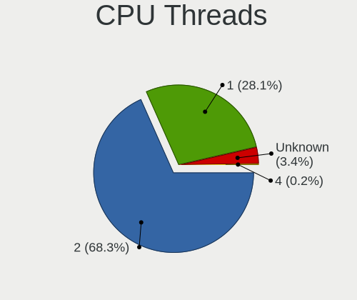
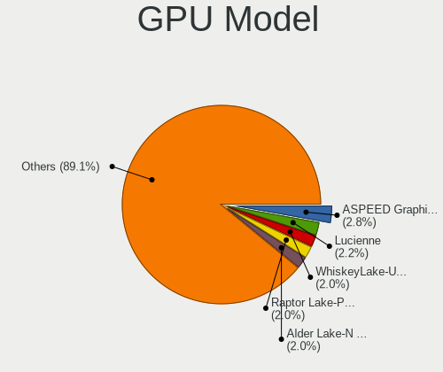
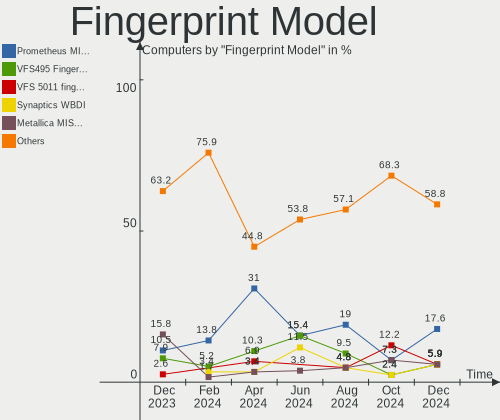

Debian Hardware Trends
----------------------

A project to identify most popular hardware characteristics and track their change
over time based on data collected by Debian users at https://Linux-Hardware.org.

Anyone can contribute to the study by uploading probes of their computers by
the [hw-probe](https://github.com/linuxhw/hw-probe) tool:

    sudo -E hw-probe -all -upload

This is a report for all computer types. See also reports for [desktops](/Dist/Debian/Desktop/README.md) and [notebooks](/Dist/Debian/Notebook/README.md).

Full-feature report is available here: https://linux-hardware.org/?view=trends

Period: May, 2021.

Contents
--------

- [ OS                       ](#os)
- [ OS Family                ](#os-family)
- [ Kernel                   ](#kernel)
- [ Kernel Family            ](#kernel-family)
- [ Kernel Major Ver.        ](#kernel-major-ver)
- [ Arch                     ](#arch)
- [ DE                       ](#de)
- [ Display Server           ](#display-server)
- [ Display Manager          ](#display-manager)
- [ OS Lang                  ](#os-lang)
- [ Boot Mode                ](#boot-mode)
- [ Filesystem               ](#filesystem)
- [ Part. scheme             ](#part-scheme)
- [ Dual Boot with Linux/BSD ](#dual-boot-with-linux/bsd)
- [ Dual Boot (Win)          ](#dual-boot-win)
- [ Country                  ](#country)
- [ City                     ](#city)
- [ Vendor                   ](#vendor)
- [ Model                    ](#model)
- [ Model Family             ](#model-family)
- [ MFG Year                 ](#mfg-year)
- [ Form Factor              ](#form-factor)
- [ Secure Boot              ](#secure-boot)
- [ Coreboot                 ](#coreboot)
- [ RAM Size                 ](#ram-size)
- [ RAM Used                 ](#ram-used)
- [ Has CD-ROM               ](#has-cd-rom)
- [ Total Drives             ](#total-drives)
- [ Has Ethernet             ](#has-ethernet)
- [ Has WiFi                 ](#has-wifi)
- [ Has Bluetooth            ](#has-bluetooth)
- [ Drive Vendor             ](#drive-vendor)
- [ Drive Model              ](#drive-model)
- [ HDD Vendor               ](#hdd-vendor)
- [ SSD Vendor               ](#ssd-vendor)
- [ Drive Kind               ](#drive-kind)
- [ Drive Connector          ](#drive-connector)
- [ Drive Size               ](#drive-size)
- [ Space Total              ](#space-total)
- [ Space Used               ](#space-used)
- [ Malfunc. Drives          ](#malfunc-drives)
- [ Malfunc. Drive Vendor    ](#malfunc-drive-vendor)
- [ Malfunc. HDD Vendor      ](#malfunc-hdd-vendor)
- [ Malfunc. Drive Kind      ](#malfunc-drive-kind)
- [ Failed Drives            ](#failed-drives)
- [ Failed Drive Vendor      ](#failed-drive-vendor)
- [ Drive Status             ](#drive-status)
- [ Storage Vendor           ](#storage-vendor)
- [ Storage Model            ](#storage-model)
- [ Storage Kind             ](#storage-kind)
- [ CPU Vendor               ](#cpu-vendor)
- [ CPU Model                ](#cpu-model)
- [ CPU Model Family         ](#cpu-model-family)
- [ CPU Cores                ](#cpu-cores)
- [ CPU Sockets              ](#cpu-sockets)
- [ CPU Threads              ](#cpu-threads)
- [ CPU Op-Modes             ](#cpu-op-modes)
- [ CPU Microcode            ](#cpu-microcode)
- [ CPU Microarch            ](#cpu-microarch)
- [ GPU Vendor               ](#gpu-vendor)
- [ GPU Model                ](#gpu-model)
- [ GPU Combo                ](#gpu-combo)
- [ GPU Driver               ](#gpu-driver)
- [ GPU Memory               ](#gpu-memory)
- [ Monitor Vendor           ](#monitor-vendor)
- [ Monitor Model            ](#monitor-model)
- [ Monitor Resolution       ](#monitor-resolution)
- [ Monitor Diagonal         ](#monitor-diagonal)
- [ Monitor Width            ](#monitor-width)
- [ Aspect Ratio             ](#aspect-ratio)
- [ Monitor Area             ](#monitor-area)
- [ Pixel Density            ](#pixel-density)
- [ Multiple Monitors        ](#multiple-monitors)
- [ Net Controller Vendor    ](#net-controller-vendor)
- [ Net Controller Model     ](#net-controller-model)
- [ Wireless Vendor          ](#wireless-vendor)
- [ Wireless Model           ](#wireless-model)
- [ Ethernet Vendor          ](#ethernet-vendor)
- [ Ethernet Model           ](#ethernet-model)
- [ Net Controller Kind      ](#net-controller-kind)
- [ Used Controller          ](#used-controller)
- [ NICs                     ](#nics)
- [ IPv6                     ](#ipv6)
- [ Memory Vendor            ](#memory-vendor)
- [ Memory Model             ](#memory-model)
- [ Memory Kind              ](#memory-kind)
- [ Memory Form Factor       ](#memory-form-factor)
- [ Memory Size              ](#memory-size)
- [ Memory Speed             ](#memory-speed)
- [ Sound Vendor             ](#sound-vendor)
- [ Sound Model              ](#sound-model)
- [ Camera Vendor            ](#camera-vendor)
- [ Camera Model             ](#camera-model)
- [ Fingerprint Vendor       ](#fingerprint-vendor)
- [ Fingerprint Model        ](#fingerprint-model)
- [ Chipcard Vendor          ](#chipcard-vendor)
- [ Chipcard Model           ](#chipcard-model)
- [ Printer Vendor           ](#printer-vendor)
- [ Printer Model            ](#printer-model)
- [ Scanner Vendor           ](#scanner-vendor)
- [ Scanner Model            ](#scanner-model)
- [ Bluetooth Vendor         ](#bluetooth-vendor)
- [ Bluetooth Model          ](#bluetooth-model)
- [ Unsupported Devices      ](#unsupported-devices)
- [ Unsupported Device Types ](#unsupported-device-types)

OS
--

Installed operating systems

| Name                    | Computers | Percent |
|-------------------------|-----------|---------|
| Debian 10               | 69        | 44.81%  |
| Debian                  | 32        | 20.78%  |
| Debian 11               | 30        | 19.48%  |
| Debian Testing          | 14        | 9.09%   |
| Debian 9                | 4         | 2.6%    |
| Debian Sid              | 2         | 1.3%    |
| Debian Unstable         | 1         | 0.65%   |
| Debian Testing/unstable | 1         | 0.65%   |
| Debian 8.9              | 1         | 0.65%   |

OS Family
---------

OS without a version

| Name   | Computers | Percent |
|--------|-----------|---------|
| Debian | 154       | 100%    |

Kernel
------

Version of the Linux kernel

| Version                        | Computers | Percent |
|--------------------------------|-----------|---------|
| 5.10.0-6-amd64                 | 33        | 21.43%  |
| 4.19.0-16-amd64                | 33        | 21.43%  |
| 5.10.0-2-amd64                 | 27        | 17.53%  |
| 5.10.0-0.bpo.5-amd64           | 7         | 4.55%   |
| 5.10.0-7-amd64                 | 5         | 3.25%   |
| 4.19.0-6-amd64                 | 4         | 2.6%    |
| 5.4.106-1-pve                  | 3         | 1.95%   |
| 4.19.0-16-686-pae              | 3         | 1.95%   |
| 5.7.0-0.bpo.2-amd64            | 2         | 1.3%    |
| 5.4.114-1-pve                  | 2         | 1.3%    |
| 5.12.5                         | 2         | 1.3%    |
| 5.10.0-5mx-amd64               | 2         | 1.3%    |
| 5.10.0-0.bpo.3-amd64           | 2         | 1.3%    |
| 4.19.0-13-amd64                | 2         | 1.3%    |
| 5.8.2                          | 1         | 0.65%   |
| 5.8.0-3-amd64                  | 1         | 0.65%   |
| 5.8.0-17.2-liquorix-amd64      | 1         | 0.65%   |
| 5.7.0-1-amd64                  | 1         | 0.65%   |
| 5.6.0-0.bpo.2-amd64            | 1         | 0.65%   |
| 5.4.98-1-pve                   | 1         | 0.65%   |
| 5.4.78-2-pve                   | 1         | 0.65%   |
| 5.4.103-1-pve                  | 1         | 0.65%   |
| 5.3.0-0.bpo.2-686-pae          | 1         | 0.65%   |
| 5.12.6                         | 1         | 0.65%   |
| 5.12.4                         | 1         | 0.65%   |
| 5.12.1                         | 1         | 0.65%   |
| 5.12.0-5.1-liquorix-amd64      | 1         | 0.65%   |
| 5.11.8                         | 1         | 0.65%   |
| 5.11.17-1-pve                  | 1         | 0.65%   |
| 5.11.0-051100-generic          | 1         | 0.65%   |
| 5.10.17-v8+                    | 1         | 0.65%   |
| 5.10.10                        | 1         | 0.65%   |
| 5.10.0-io7-amd64               | 1         | 0.65%   |
| 5.10.0-6-686                   | 1         | 0.65%   |
| 5.10.0-5-amd64                 | 1         | 0.65%   |
| 5.10-sunxi64                   | 1         | 0.65%   |
| 4.9.0-15-amd64                 | 1         | 0.65%   |
| 4.19.84-mod-std-ipv6-64-rescue | 1         | 0.65%   |
| 4.19.0-9-amd64                 | 1         | 0.65%   |
| 4.19.0-10-amd64                | 1         | 0.65%   |
| 3.2.27+                        | 1         | 0.65%   |

Kernel Family
-------------

Linux kernel without a distro release

| Version | Computers | Percent |
|---------|-----------|---------|
| 5.10.0  | 79        | 51.3%   |
| 4.19.0  | 44        | 28.57%  |
| 5.7.0   | 3         | 1.95%   |
| 5.4.106 | 3         | 1.95%   |
| 5.8.0   | 2         | 1.3%    |
| 5.4.114 | 2         | 1.3%    |
| 5.12.5  | 2         | 1.3%    |
| 5.8.2   | 1         | 0.65%   |
| 5.6.0   | 1         | 0.65%   |
| 5.4.98  | 1         | 0.65%   |
| 5.4.78  | 1         | 0.65%   |
| 5.4.103 | 1         | 0.65%   |
| 5.3.0   | 1         | 0.65%   |
| 5.12.6  | 1         | 0.65%   |
| 5.12.4  | 1         | 0.65%   |
| 5.12.1  | 1         | 0.65%   |
| 5.12.0  | 1         | 0.65%   |
| 5.11.8  | 1         | 0.65%   |
| 5.11.17 | 1         | 0.65%   |
| 5.11.0  | 1         | 0.65%   |
| 5.10.17 | 1         | 0.65%   |
| 5.10.10 | 1         | 0.65%   |
| 5.10    | 1         | 0.65%   |
| 4.9.0   | 1         | 0.65%   |
| 4.19.84 | 1         | 0.65%   |
| 3.2.27  | 1         | 0.65%   |

Kernel Major Ver.
-----------------

Linux kernel major version

| Version | Computers | Percent |
|---------|-----------|---------|
| 5.10    | 81        | 52.6%   |
| 4.19    | 45        | 29.22%  |
| 5.4     | 8         | 5.19%   |
| 5.12    | 6         | 3.9%    |
| 5.8     | 3         | 1.95%   |
| 5.7     | 3         | 1.95%   |
| 5.11    | 3         | 1.95%   |
| 5.6     | 1         | 0.65%   |
| 5.3     | 1         | 0.65%   |
| 5       | 1         | 0.65%   |
| 4.9     | 1         | 0.65%   |
| 3.2     | 1         | 0.65%   |

Arch
----

OS architecture (x86_64, i586, etc.)

| Name    | Computers | Percent |
|---------|-----------|---------|
| x86_64  | 145       | 94.16%  |
| i686    | 6         | 3.9%    |
| aarch64 | 2         | 1.3%    |
| armv6l  | 1         | 0.65%   |

DE
--

Desktop Environment

| Name             | Computers | Percent |
|------------------|-----------|---------|
| Unknown          | 51        | 33.12%  |
| GNOME            | 24        | 15.58%  |
| XFCE             | 17        | 11.04%  |
| KDE5             | 17        | 11.04%  |
| KDE              | 13        | 8.44%   |
| X-Cinnamon       | 10        | 6.49%   |
| MATE             | 8         | 5.19%   |
| LXDE             | 6         | 3.9%    |
| lightdm-xsession | 2         | 1.3%    |
| i3               | 2         | 1.3%    |
| GNUstep          | 1         | 0.65%   |
| default          | 1         | 0.65%   |
| Cinnamon         | 1         | 0.65%   |
| awesome          | 1         | 0.65%   |

Display Server
--------------

X11 or Wayland

| Name    | Computers | Percent |
|---------|-----------|---------|
| X11     | 86        | 55.84%  |
| Unknown | 33        | 21.43%  |
| Wayland | 20        | 12.99%  |
| Tty     | 15        | 9.74%   |

Display Manager
---------------

SDDM, LightDM, etc.

| Name    | Computers | Percent |
|---------|-----------|---------|
| Unknown | 91        | 59.09%  |
| TDM     | 21        | 13.64%  |
| GDM     | 21        | 13.64%  |
| SDDM    | 19        | 12.34%  |
| NODM    | 1         | 0.65%   |
| LightDM | 1         | 0.65%   |

OS Lang
-------

Language

| Lang    | Computers | Percent |
|---------|-----------|---------|
| en_US   | 53        | 34.42%  |
| ru_RU   | 35        | 22.73%  |
| en_GB   | 11        | 7.14%   |
| pt_BR   | 7         | 4.55%   |
| Unknown | 7         | 4.55%   |
| fr_FR   | 5         | 3.25%   |
| en_IE   | 5         | 3.25%   |
| de_DE   | 5         | 3.25%   |
| es_ES   | 4         | 2.6%    |
| de_CH   | 4         | 2.6%    |
| pl_PL   | 2         | 1.3%    |
| lt_LT   | 2         | 1.3%    |
| C       | 2         | 1.3%    |
| zh_CN   | 1         | 0.65%   |
| sv_SE   | 1         | 0.65%   |
| ja_JP   | 1         | 0.65%   |
| it_IT   | 1         | 0.65%   |
| fi_FI   | 1         | 0.65%   |
| es_VE   | 1         | 0.65%   |
| es_CR   | 1         | 0.65%   |
| es_CL   | 1         | 0.65%   |
| en_HK   | 1         | 0.65%   |
| en_AU   | 1         | 0.65%   |
| de_AT   | 1         | 0.65%   |
| da_DK   | 1         | 0.65%   |

Boot Mode
---------

EFI or BIOS

| Mode | Computers | Percent |
|------|-----------|---------|
| BIOS | 85        | 55.19%  |
| EFI  | 69        | 44.81%  |

Filesystem
----------

Type of filesystem

| Type    | Computers | Percent |
|---------|-----------|---------|
| Ext4    | 104       | 67.53%  |
| Overlay | 30        | 19.48%  |
| Btrfs   | 7         | 4.55%   |
| Zfs     | 6         | 3.9%    |
| Xfs     | 2         | 1.3%    |
| Rootfs  | 2         | 1.3%    |
| Ext3    | 1         | 0.65%   |
| Aufs    | 1         | 0.65%   |
| Unknown | 1         | 0.65%   |

Part. scheme
------------

Scheme of partitioning

| Type    | Computers | Percent |
|---------|-----------|---------|
| GPT     | 78        | 50.65%  |
| Unknown | 44        | 28.57%  |
| MBR     | 32        | 20.78%  |

Dual Boot with Linux/BSD
------------------------

Hosting more than one Linux/BSD

| Dual boot | Computers | Percent |
|-----------|-----------|---------|
| No        | 131       | 85.06%  |
| Yes       | 23        | 14.94%  |

Dual Boot (Win)
---------------

Hosting Linux and Windows

| Dual boot | Computers | Percent |
|-----------|-----------|---------|
| No        | 93        | 60.39%  |
| Yes       | 61        | 39.61%  |

Country
-------

Geographic location (country)

| Country                | Computers | Percent |
|------------------------|-----------|---------|
| Russia                 | 41        | 26.62%  |
| USA                    | 18        | 11.69%  |
| Brazil                 | 9         | 5.84%   |
| France                 | 8         | 5.19%   |
| UK                     | 6         | 3.9%    |
| Spain                  | 6         | 3.9%    |
| Germany                | 6         | 3.9%    |
| Austria                | 6         | 3.9%    |
| Switzerland            | 5         | 3.25%   |
| Italy                  | 5         | 3.25%   |
| Poland                 | 4         | 2.6%    |
| Norway                 | 4         | 2.6%    |
| Thailand               | 3         | 1.95%   |
| Hungary                | 3         | 1.95%   |
| Canada                 | 3         | 1.95%   |
| Venezuela              | 2         | 1.3%    |
| Slovakia               | 2         | 1.3%    |
| Lithuania              | 2         | 1.3%    |
| China                  | 2         | 1.3%    |
| Australia              | 2         | 1.3%    |
| UAE                    | 1         | 0.65%   |
| Sweden                 | 1         | 0.65%   |
| Singapore              | 1         | 0.65%   |
| Saudi Arabia           | 1         | 0.65%   |
| Netherlands            | 1         | 0.65%   |
| Luxembourg             | 1         | 0.65%   |
| Japan                  | 1         | 0.65%   |
| Iran                   | 1         | 0.65%   |
| Greece                 | 1         | 0.65%   |
| Finland                | 1         | 0.65%   |
| Denmark                | 1         | 0.65%   |
| Costa Rica             | 1         | 0.65%   |
| Chile                  | 1         | 0.65%   |
| Bosnia and Herzegovina | 1         | 0.65%   |
| Belgium                | 1         | 0.65%   |
| Belarus                | 1         | 0.65%   |
| Argentina              | 1         | 0.65%   |

City
----

Geographic location (city)

| City                   | Computers | Percent |
|------------------------|-----------|---------|
| Voronezh               | 27        | 17.53%  |
| Vienna                 | 5         | 3.25%   |
| St Petersburg          | 4         | 2.6%    |
| Moscow                 | 4         | 2.6%    |
| Danville               | 3         | 1.95%   |
| Perm                   | 2         | 1.3%    |
| Othmarsingen           | 2         | 1.3%    |
| Narvik                 | 2         | 1.3%    |
| Košice                | 2         | 1.3%    |
| Kaunas                 | 2         | 1.3%    |
| Chiang Mai             | 2         | 1.3%    |
| Belo Horizonte         | 2         | 1.3%    |
| Zurich                 | 1         | 0.65%   |
| Vladivostok            | 1         | 0.65%   |
| Vitória               | 1         | 0.65%   |
| Vineyard               | 1         | 0.65%   |
| Villingen-Schwenningen | 1         | 0.65%   |
| Vigra                  | 1         | 0.65%   |
| Vaux-sur-Seine         | 1         | 0.65%   |
| Valencia               | 1         | 0.65%   |
| Valdivia               | 1         | 0.65%   |
| Unai                   | 1         | 0.65%   |
| Udine                  | 1         | 0.65%   |
| Toronto                | 1         | 0.65%   |
| Thionville             | 1         | 0.65%   |
| Tehran                 | 1         | 0.65%   |
| São Paulo             | 1         | 0.65%   |
| Székesfehérvár      | 1         | 0.65%   |
| Sunbury                | 1         | 0.65%   |
| Strasbourg             | 1         | 0.65%   |
| Stavanger              | 1         | 0.65%   |
| Srednyaya Akhtuba      | 1         | 0.65%   |
| Sjoebo                 | 1         | 0.65%   |
| Silver Spring          | 1         | 0.65%   |
| Shizuoka               | 1         | 0.65%   |
| Seville                | 1         | 0.65%   |
| San José              | 1         | 0.65%   |
| Salamanca              | 1         | 0.65%   |
| Saint Neots            | 1         | 0.65%   |
| Rome                   | 1         | 0.65%   |
| Rochester              | 1         | 0.65%   |
| Queenstown Estate      | 1         | 0.65%   |
| Queens                 | 1         | 0.65%   |
| Pécs                  | 1         | 0.65%   |
| Perth                  | 1         | 0.65%   |
| Paris                  | 1         | 0.65%   |
| Osasco                 | 1         | 0.65%   |
| Nobleton               | 1         | 0.65%   |
| New York               | 1         | 0.65%   |
| New Westminster        | 1         | 0.65%   |
| Nanjing                | 1         | 0.65%   |
| Murcia                 | 1         | 0.65%   |
| Montalto Pavese        | 1         | 0.65%   |
| Minsk                  | 1         | 0.65%   |
| Mesa                   | 1         | 0.65%   |
| Marenla                | 1         | 0.65%   |
| Madrid                 | 1         | 0.65%   |
| Luxembourg             | 1         | 0.65%   |
| Lublin                 | 1         | 0.65%   |
| Loziska                | 1         | 0.65%   |

Vendor
------

Motherboard manufacturer

| Name                    | Computers | Percent |
|-------------------------|-----------|---------|
| ASUSTek Computer        | 30        | 19.48%  |
| Hewlett-Packard         | 19        | 12.34%  |
| Lenovo                  | 18        | 11.69%  |
| Gigabyte Technology     | 15        | 9.74%   |
| ASRock                  | 12        | 7.79%   |
| Acer                    | 11        | 7.14%   |
| Dell                    | 9         | 5.84%   |
| MSI                     | 7         | 4.55%   |
| Intel                   | 7         | 4.55%   |
| Supermicro              | 4         | 2.6%    |
| Apple                   | 4         | 2.6%    |
| Toshiba                 | 2         | 1.3%    |
| IBM                     | 2         | 1.3%    |
| Aquarius                | 2         | 1.3%    |
| sunxi                   | 1         | 0.65%   |
| Samsung Electronics     | 1         | 0.65%   |
| Raspberry Pi Foundation | 1         | 0.65%   |
| Medion                  | 1         | 0.65%   |
| Huanan                  | 1         | 0.65%   |
| Google                  | 1         | 0.65%   |
| Fujitsu                 | 1         | 0.65%   |
| faytech                 | 1         | 0.65%   |
| ECS                     | 1         | 0.65%   |
| Centrium                | 1         | 0.65%   |
| AZW                     | 1         | 0.65%   |
| Unknown                 | 1         | 0.65%   |

Model
-----

Motherboard model

| Name                                     | Computers | Percent |
|------------------------------------------|-----------|---------|
| Acer Aspire A315-23                      | 8         | 5.19%   |
| ASRock H61M-VG4                          | 6         | 3.9%    |
| ASUS M5A78L-M LX/BR                      | 3         | 1.95%   |
| HP 250 G7 Notebook PC                    | 2         | 1.3%    |
| Gigabyte H81M-S2V                        | 2         | 1.3%    |
| ASUS X450LN                              | 2         | 1.3%    |
| ASUS M5A97 R2.0                          | 2         | 1.3%    |
| ASUS H110M-PLUS                          | 2         | 1.3%    |
| ASUS All Series                          | 2         | 1.3%    |
| Aquarius NS585                           | 2         | 1.3%    |
| Apple MacPro3,1                          | 2         | 1.3%    |
| Unknown                                  | 2         | 1.3%    |
| Toshiba Satellite U800W                  | 1         | 0.65%   |
| Toshiba Satellite C660                   | 1         | 0.65%   |
| Supermicro X8DT3                         | 1         | 0.65%   |
| Supermicro X10SLL-F                      | 1         | 0.65%   |
| Supermicro SYS-5039MC-H12TRF             | 1         | 0.65%   |
| Supermicro Super Server                  | 1         | 0.65%   |
| Samsung 370E4K                           | 1         | 0.65%   |
| RPi Raspberry Pi 4 Model B Rev 1.1       | 1         | 0.65%   |
| MSI U90/U100                             | 1         | 0.65%   |
| MSI MS-7C37                              | 1         | 0.65%   |
| MSI MS-7C02                              | 1         | 0.65%   |
| MSI MS-7A70                              | 1         | 0.65%   |
| MSI MS-7A40                              | 1         | 0.65%   |
| MSI MS-7758                              | 1         | 0.65%   |
| MSI CX700                                | 1         | 0.65%   |
| Medion MS-7616                           | 1         | 0.65%   |
| Lenovo Z710 20250                        | 1         | 0.65%   |
| Lenovo ThinkPad Yoga 260 20FEA02WJP      | 1         | 0.65%   |
| Lenovo ThinkPad X1 Tablet 20GGS02600     | 1         | 0.65%   |
| Lenovo ThinkPad X1 Carbon 6th 20KH006JRT | 1         | 0.65%   |
| Lenovo ThinkPad T530 24296HG             | 1         | 0.65%   |
| Lenovo ThinkPad T470s 20HGS45C00         | 1         | 0.65%   |
| Lenovo ThinkPad T440p 20AWS4PN00         | 1         | 0.65%   |
| Lenovo ThinkPad T430s 2356GBG            | 1         | 0.65%   |
| Lenovo ThinkPad T430s 2356A89            | 1         | 0.65%   |
| Lenovo ThinkPad T14 Gen 1 20UDCTO1WW     | 1         | 0.65%   |
| Lenovo ThinkPad P15v Gen 1 20TQCTO1WW    | 1         | 0.65%   |
| Lenovo ThinkPad P14s Gen 1 20S4003UUS    | 1         | 0.65%   |
| Lenovo ThinkPad E14 20RA001HRT           | 1         | 0.65%   |
| Lenovo ThinkCentre M92p 3209EK4          | 1         | 0.65%   |
| Lenovo IdeaPad S340-15API 81NC           | 1         | 0.65%   |
| Lenovo IdeaPad Gaming 3 15IMH05 81Y4     | 1         | 0.65%   |
| Lenovo G570 4334                         | 1         | 0.65%   |
| Lenovo G50-80 80E5                       | 1         | 0.65%   |
| Intel S3210SH                            | 1         | 0.65%   |
| Intel NUC8i5BEH                          | 1         | 0.65%   |
| Intel NUC10i7FNH                         | 1         | 0.65%   |
| Intel DN2800MT AAG81515-900              | 1         | 0.65%   |
| Intel DH87RL AAG74240-402                | 1         | 0.65%   |
| Intel DH67BL AAG10189-209                | 1         | 0.65%   |
| Intel DG965SS AAD41678-308               | 1         | 0.65%   |
| IBM System x3250 M3 -[4252PAW]-          | 1         | 0.65%   |
| IBM System x3250 M3 -[4252K4G]-          | 1         | 0.65%   |
| Huanan X99-F8                            | 1         | 0.65%   |
| HP Split 13 x2 PC                        | 1         | 0.65%   |
| HP ProLiant MicroServer                  | 1         | 0.65%   |
| HP ProBook 6460b                         | 1         | 0.65%   |
| HP OMEN by HP Laptop 15-dc1xxx           | 1         | 0.65%   |

Model Family
------------

Motherboard model prefix

| Name                         | Computers | Percent |
|------------------------------|-----------|---------|
| Lenovo ThinkPad              | 12        | 7.79%   |
| Acer Aspire                  | 10        | 6.49%   |
| ASRock H61M-VG4              | 6         | 3.9%    |
| ASUS ROG                     | 4         | 2.6%    |
| HP Compaq                    | 3         | 1.95%   |
| HP 250                       | 3         | 1.95%   |
| ASUS M5A78L-M                | 3         | 1.95%   |
| Toshiba Satellite            | 2         | 1.3%    |
| Lenovo IdeaPad               | 2         | 1.3%    |
| IBM System                   | 2         | 1.3%    |
| HP Laptop                    | 2         | 1.3%    |
| HP EliteDesk                 | 2         | 1.3%    |
| HP EliteBook                 | 2         | 1.3%    |
| Gigabyte H81M-S2V            | 2         | 1.3%    |
| Gigabyte B450                | 2         | 1.3%    |
| Dell OptiPlex                | 2         | 1.3%    |
| Dell Latitude                | 2         | 1.3%    |
| Dell Inspiron                | 2         | 1.3%    |
| ASUS X450LN                  | 2         | 1.3%    |
| ASUS M5A97                   | 2         | 1.3%    |
| ASUS H110M-PLUS              | 2         | 1.3%    |
| ASUS All                     | 2         | 1.3%    |
| Aquarius NS585               | 2         | 1.3%    |
| Apple MacPro3                | 2         | 1.3%    |
| Unknown                      | 2         | 1.3%    |
| Supermicro X8DT3             | 1         | 0.65%   |
| Supermicro X10SLL-F          | 1         | 0.65%   |
| Supermicro SYS-5039MC-H12TRF | 1         | 0.65%   |
| Supermicro Super             | 1         | 0.65%   |
| Samsung 370E4K               | 1         | 0.65%   |
| RPi Raspberry                | 1         | 0.65%   |
| MSI U90                      | 1         | 0.65%   |
| MSI MS-7C37                  | 1         | 0.65%   |
| MSI MS-7C02                  | 1         | 0.65%   |
| MSI MS-7A70                  | 1         | 0.65%   |
| MSI MS-7A40                  | 1         | 0.65%   |
| MSI MS-7758                  | 1         | 0.65%   |
| MSI CX700                    | 1         | 0.65%   |
| Medion MS-7616               | 1         | 0.65%   |
| Lenovo Z710                  | 1         | 0.65%   |
| Lenovo ThinkCentre           | 1         | 0.65%   |
| Lenovo G570                  | 1         | 0.65%   |
| Lenovo G50-80                | 1         | 0.65%   |
| Intel S3210SH                | 1         | 0.65%   |
| Intel NUC8i5BEH              | 1         | 0.65%   |
| Intel NUC10i7FNH             | 1         | 0.65%   |
| Intel DN2800MT               | 1         | 0.65%   |
| Intel DH87RL                 | 1         | 0.65%   |
| Intel DH67BL                 | 1         | 0.65%   |
| Intel DG965SS                | 1         | 0.65%   |
| Huanan X99-F8                | 1         | 0.65%   |
| HP Split                     | 1         | 0.65%   |
| HP ProLiant                  | 1         | 0.65%   |
| HP ProBook                   | 1         | 0.65%   |
| HP OMEN                      | 1         | 0.65%   |
| HP ENVY                      | 1         | 0.65%   |
| HP 23-q018a                  | 1         | 0.65%   |
| HP 2133                      | 1         | 0.65%   |
| Google Guado                 | 1         | 0.65%   |
| Gigabyte Z77-D3H             | 1         | 0.65%   |

MFG Year
--------

Motherboard manufacture year

| Year    | Computers | Percent |
|---------|-----------|---------|
| 2020    | 42        | 27.27%  |
| 2019    | 21        | 13.64%  |
| 2018    | 11        | 7.14%   |
| 2013    | 11        | 7.14%   |
| 2012    | 11        | 7.14%   |
| 2015    | 9         | 5.84%   |
| 2011    | 8         | 5.19%   |
| 2021    | 7         | 4.55%   |
| 2014    | 7         | 4.55%   |
| 2009    | 6         | 3.9%    |
| 2017    | 5         | 3.25%   |
| 2010    | 4         | 2.6%    |
| 2008    | 4         | 2.6%    |
| 2007    | 3         | 1.95%   |
| Unknown | 3         | 1.95%   |
| 2016    | 2         | 1.3%    |

Form Factor
-----------

Physical design of the computer

| Name           | Computers | Percent |
|----------------|-----------|---------|
| Desktop        | 78        | 50.65%  |
| Notebook       | 58        | 37.66%  |
| Server         | 8         | 5.19%   |
| Convertible    | 3         | 1.95%   |
| System on chip | 2         | 1.3%    |
| Tablet         | 2         | 1.3%    |
| Mini pc        | 2         | 1.3%    |
| All in one     | 1         | 0.65%   |

Secure Boot
-----------

Enabled or disabled

| State    | Computers | Percent |
|----------|-----------|---------|
| Disabled | 145       | 94.16%  |
| Enabled  | 9         | 5.84%   |

Coreboot
--------

Have coreboot on board

| Used | Computers | Percent |
|------|-----------|---------|
| No   | 153       | 99.35%  |
| Yes  | 1         | 0.65%   |

RAM Size
--------

Total RAM memory

| Size in GB  | Computers | Percent |
|-------------|-----------|---------|
| 4.01-8.0    | 35        | 22.73%  |
| 8.01-16.0   | 35        | 22.73%  |
| 16.01-24.0  | 27        | 17.53%  |
| 3.01-4.0    | 23        | 14.94%  |
| 32.01-64.0  | 17        | 11.04%  |
| 64.01-256.0 | 8         | 5.19%   |
| 1.01-2.0    | 5         | 3.25%   |
| 2.01-3.0    | 2         | 1.3%    |
| 0.51-1.0    | 1         | 0.65%   |
| 0.01-0.5    | 1         | 0.65%   |

RAM Used
--------

Used RAM memory

| Used GB     | Computers | Percent |
|-------------|-----------|---------|
| 0.51-1.0    | 35        | 22.73%  |
| 2.01-3.0    | 27        | 17.53%  |
| 1.01-2.0    | 27        | 17.53%  |
| 4.01-8.0    | 26        | 16.88%  |
| 3.01-4.0    | 15        | 9.74%   |
| 8.01-16.0   | 10        | 6.49%   |
| 0.01-0.5    | 6         | 3.9%    |
| 32.01-64.0  | 3         | 1.95%   |
| 16.01-24.0  | 3         | 1.95%   |
| 64.01-256.0 | 1         | 0.65%   |
| Unknown     | 1         | 0.65%   |

Has CD-ROM
----------

Has CD-ROM on board

| Presented | Computers | Percent |
|-----------|-----------|---------|
| No        | 109       | 70.78%  |
| Yes       | 45        | 29.22%  |

Total Drives
------------

Number of drives on board

| Drives | Computers | Percent |
|--------|-----------|---------|
| 1      | 85        | 55.19%  |
| 2      | 32        | 20.78%  |
| 3      | 14        | 9.09%   |
| 4      | 9         | 5.84%   |
| 5      | 7         | 4.55%   |
| 7      | 3         | 1.95%   |
| 6      | 3         | 1.95%   |
| 0      | 1         | 0.65%   |

Has Ethernet
------------

Has Ethernet on board

| Presented | Computers | Percent |
|-----------|-----------|---------|
| Yes       | 144       | 93.51%  |
| No        | 10        | 6.49%   |

Has WiFi
--------

Has WiFi module

| Presented | Computers | Percent |
|-----------|-----------|---------|
| Yes       | 87        | 56.49%  |
| No        | 67        | 43.51%  |

Has Bluetooth
-------------

Has Bluetooth module

| Presented | Computers | Percent |
|-----------|-----------|---------|
| No        | 83        | 53.9%   |
| Yes       | 71        | 46.1%   |

Drive Vendor
------------

Hard drive vendors

| Vendor                    | Computers | Drives | Percent |
|---------------------------|-----------|--------|---------|
| Seagate                   | 45        | 57     | 19.07%  |
| WDC                       | 41        | 61     | 17.37%  |
| Samsung Electronics       | 31        | 38     | 13.14%  |
| Toshiba                   | 30        | 37     | 12.71%  |
| Crucial                   | 13        | 14     | 5.51%   |
| Kingston                  | 12        | 14     | 5.08%   |
| Hitachi                   | 8         | 12     | 3.39%   |
| SanDisk                   | 6         | 6      | 2.54%   |
| Unknown                   | 5         | 7      | 2.12%   |
| Intel                     | 5         | 7      | 2.12%   |
| HGST                      | 5         | 5      | 2.12%   |
| A-DATA Technology         | 5         | 6      | 2.12%   |
| China                     | 3         | 3      | 1.27%   |
| SPCC                      | 2         | 2      | 0.85%   |
| Silicon Motion            | 2         | 2      | 0.85%   |
| Patriot                   | 2         | 2      | 0.85%   |
| LITEONIT                  | 2         | 2      | 0.85%   |
| KIOXIA                    | 2         | 2      | 0.85%   |
| JMicron                   | 2         | 2      | 0.85%   |
| XPG                       | 1         | 1      | 0.42%   |
| Union Memory              | 1         | 1      | 0.42%   |
| Transcend                 | 1         | 1      | 0.42%   |
| SK Hynix                  | 1         | 1      | 0.42%   |
| PNY                       | 1         | 1      | 0.42%   |
| Pioneer                   | 1         | 1      | 0.42%   |
| Phison Electronics        | 1         | 1      | 0.42%   |
| Phison                    | 1         | 1      | 0.42%   |
| OCZ                       | 1         | 1      | 0.42%   |
| Micron/Crucial Technology | 1         | 1      | 0.42%   |
| Lenovo                    | 1         | 1      | 0.42%   |
| Intenso                   | 1         | 1      | 0.42%   |
| DREVO                     | 1         | 1      | 0.42%   |
| ASMT                      | 1         | 2      | 0.42%   |
| Apple                     | 1         | 1      | 0.42%   |

Drive Model
-----------

Hard drive models

| Model                              | Computers | Percent |
|------------------------------------|-----------|---------|
| Toshiba DT01ACA100 1TB             | 6         | 2.27%   |
| Seagate ST1000LM035-1RK172 1TB     | 6         | 2.27%   |
| Seagate ST4000VN008-2DR166 4TB     | 4         | 1.52%   |
| Seagate ST1000LM024 HN-M101MBB 1TB | 4         | 1.52%   |
| Samsung SSD 860 EVO 500GB          | 4         | 1.52%   |
| WDC WDS240G2G0A-00JH30 240GB SSD   | 3         | 1.14%   |
| Unknown MMC Card  32GB             | 3         | 1.14%   |
| Toshiba MQ04ABF100 1TB             | 3         | 1.14%   |
| Toshiba MQ01ABD100 1TB             | 3         | 1.14%   |
| Kingston SV300S37A120G 120GB SSD   | 3         | 1.14%   |
| Crucial CT250MX500SSD1 250GB       | 3         | 1.14%   |
| WDC WD5000AAKX-22ERMA0 500GB       | 2         | 0.76%   |
| WDC WD5000AAKX-00ERMA0 500GB       | 2         | 0.76%   |
| WDC WD20EZRZ-00Z5HB0 2TB           | 2         | 0.76%   |
| WDC WD20EFRX-68EUZN0 2TB           | 2         | 0.76%   |
| Unknown MMC Card  64GB             | 2         | 0.76%   |
| Toshiba MQ01ACF032 320GB           | 2         | 0.76%   |
| Toshiba HDWE150 5TB                | 2         | 0.76%   |
| Toshiba DT01ACA050 500GB           | 2         | 0.76%   |
| Seagate ST31000524AS 1TB           | 2         | 0.76%   |
| Seagate ST2000DM006-2DM164 2TB     | 2         | 0.76%   |
| Seagate ST2000DL003-9VT166 2TB     | 2         | 0.76%   |
| Seagate ST1000DM003-1ER162 1TB     | 2         | 0.76%   |
| Samsung SSD 970 EVO Plus 1TB       | 2         | 0.76%   |
| Samsung SSD 970 EVO 500GB          | 2         | 0.76%   |
| Samsung SSD 970 EVO 1TB            | 2         | 0.76%   |
| Samsung SSD 860 EVO 1TB            | 2         | 0.76%   |
| Samsung MZVLQ512HALU-000H1 512GB   | 2         | 0.76%   |
| Kingston SV300S37A240G 240GB SSD   | 2         | 0.76%   |
| Kingston SUV400S37240G 240GB SSD   | 2         | 0.76%   |
| Kingston SA2000M8250G 250GB        | 2         | 0.76%   |
| JMicron Generic 120GB              | 2         | 0.76%   |
| Hitachi HDS721010CLA332 1TB        | 2         | 0.76%   |
| HGST HTS721010A9E630 1TB           | 2         | 0.76%   |
| A-DATA SU800 512GB SSD             | 2         | 0.76%   |
| XPG NVMe SSD Drive 1024GB          | 1         | 0.38%   |
| WDC WDS250G2B0A-00SM50 250GB SSD   | 1         | 0.38%   |
| WDC WDS100T2B0A-00SM50 1TB SSD     | 1         | 0.38%   |
| WDC WDBRPG5000ANC-WRSN 500GB       | 1         | 0.38%   |
| WDC WDBNCE5000PNC 500GB SSD        | 1         | 0.38%   |
| WDC WD60EFRX-68L0BN1 6TB           | 1         | 0.38%   |
| WDC WD5000AAKX-60U6AA0 500GB       | 1         | 0.38%   |
| WDC WD40EZRZ-00GXCB0 4TB           | 1         | 0.38%   |
| WDC WD40EFRX-68N32N0 4TB           | 1         | 0.38%   |
| WDC WD40EFAX-68JH4N0 4TB           | 1         | 0.38%   |
| WDC WD4003FRYZ-01F0DB0 4TB         | 1         | 0.38%   |
| WDC WD3200BEVT-22ZCT0 320GB        | 1         | 0.38%   |
| WDC WD3200BEKT-75PVMT1 320GB       | 1         | 0.38%   |
| WDC WD30EZRX-00D8PB0 3TB           | 1         | 0.38%   |
| WDC WD2500AAJS-75M0A0 249GB        | 1         | 0.38%   |
| WDC WD20SPZX-08UA7 2TB             | 1         | 0.38%   |
| WDC WD20EZRX-00D8PB0 2TB           | 1         | 0.38%   |
| WDC WD20EFAX-68FB5N0 2TB           | 1         | 0.38%   |
| WDC WD2005FBYZ-01YCBB2 2TB         | 1         | 0.38%   |
| WDC WD2003FYYS-02W0B1 2TB          | 1         | 0.38%   |
| WDC WD1600BEVT-22ZCT0 160GB        | 1         | 0.38%   |
| WDC WD1200BEVS-60UST0 120GB        | 1         | 0.38%   |
| WDC WD10SPZX-21Z10T0 1TB           | 1         | 0.38%   |
| WDC WD10JPVX-80JC3T0 1TB           | 1         | 0.38%   |
| WDC WD10EZEX-21WN4A0 1TB           | 1         | 0.38%   |

HDD Vendor
----------

Hard disk drive vendors

| Vendor              | Computers | Drives | Percent |
|---------------------|-----------|--------|---------|
| Seagate             | 43        | 55     | 35.83%  |
| WDC                 | 34        | 50     | 28.33%  |
| Toshiba             | 25        | 32     | 20.83%  |
| Hitachi             | 8         | 12     | 6.67%   |
| HGST                | 5         | 5      | 4.17%   |
| Samsung Electronics | 4         | 5      | 3.33%   |
| ASMT                | 1         | 2      | 0.83%   |

SSD Vendor
----------

Solid state drive vendors

| Vendor              | Computers | Drives | Percent |
|---------------------|-----------|--------|---------|
| Samsung Electronics | 17        | 18     | 22.08%  |
| Crucial             | 13        | 13     | 16.88%  |
| Kingston            | 10        | 11     | 12.99%  |
| WDC                 | 6         | 6      | 7.79%   |
| SanDisk             | 4         | 4      | 5.19%   |
| A-DATA Technology   | 4         | 5      | 5.19%   |
| Intel               | 3         | 5      | 3.9%    |
| China               | 3         | 3      | 3.9%    |
| Toshiba             | 2         | 2      | 2.6%    |
| SPCC                | 2         | 2      | 2.6%    |
| Patriot             | 2         | 2      | 2.6%    |
| LITEONIT            | 2         | 2      | 2.6%    |
| JMicron             | 2         | 2      | 2.6%    |
| Transcend           | 1         | 1      | 1.3%    |
| Seagate             | 1         | 1      | 1.3%    |
| PNY                 | 1         | 1      | 1.3%    |
| Pioneer             | 1         | 1      | 1.3%    |
| OCZ                 | 1         | 1      | 1.3%    |
| Intenso             | 1         | 1      | 1.3%    |
| DREVO               | 1         | 1      | 1.3%    |

Drive Kind
----------

HDD or SSD

| Kind    | Computers | Drives | Percent |
|---------|-----------|--------|---------|
| HDD     | 99        | 161    | 46.92%  |
| SSD     | 66        | 82     | 31.28%  |
| NVMe    | 39        | 43     | 18.48%  |
| MMC     | 6         | 8      | 2.84%   |
| Unknown | 1         | 1      | 0.47%   |

Drive Connector
---------------

SATA, SAS, NVMe, etc.

| Type | Computers | Drives | Percent |
|------|-----------|--------|---------|
| SATA | 126       | 235    | 70.79%  |
| NVMe | 39        | 43     | 21.91%  |
| SAS  | 7         | 9      | 3.93%   |
| MMC  | 6         | 8      | 3.37%   |

Drive Size
----------

Size of hard drive

| Size in TB | Computers | Drives | Percent |
|------------|-----------|--------|---------|
| 0.01-0.5   | 80        | 101    | 44.2%   |
| 0.51-1.0   | 63        | 76     | 34.81%  |
| 1.01-2.0   | 20        | 32     | 11.05%  |
| 3.01-4.0   | 11        | 20     | 6.08%   |
| 4.01-10.0  | 4         | 10     | 2.21%   |
| 2.01-3.0   | 3         | 4      | 1.66%   |

Space Total
-----------

Amount of disk space available on the file system

| Size in GB     | Computers | Percent |
|----------------|-----------|---------|
| Unknown        | 40        | 25.97%  |
| 101-250        | 27        | 17.53%  |
| 501-1000       | 20        | 12.99%  |
| 251-500        | 19        | 12.34%  |
| More than 3000 | 11        | 7.14%   |
| 1001-2000      | 11        | 7.14%   |
| 51-100         | 9         | 5.84%   |
| 21-50          | 7         | 4.55%   |
| 1-20           | 7         | 4.55%   |
| 2001-3000      | 3         | 1.95%   |

Space Used
----------

Amount of used disk space

| Used GB        | Computers | Percent |
|----------------|-----------|---------|
| Unknown        | 40        | 25.97%  |
| 1-20           | 34        | 22.08%  |
| 101-250        | 17        | 11.04%  |
| 21-50          | 15        | 9.74%   |
| 51-100         | 15        | 9.74%   |
| 251-500        | 11        | 7.14%   |
| 501-1000       | 9         | 5.84%   |
| 1001-2000      | 7         | 4.55%   |
| More than 3000 | 5         | 3.25%   |
| 2001-3000      | 1         | 0.65%   |

Malfunc. Drives
---------------

Drive models with a malfunction

| Model                                        | Computers | Drives | Percent |
|----------------------------------------------|-----------|--------|---------|
| WDC WD5000AAKX-22ERMA0 500GB                 | 1         | 2      | 3.85%   |
| WDC WD5000AAKX-00ERMA0 500GB                 | 1         | 1      | 3.85%   |
| WDC WD3200BEKT-75PVMT1 320GB                 | 1         | 1      | 3.85%   |
| WDC WD1003FBYX-01Y7B1 1TB                    | 1         | 1      | 3.85%   |
| WDC WD1001FALS-75J7B0 1TB                    | 1         | 1      | 3.85%   |
| Seagate ST9250827AS 250GB                    | 1         | 1      | 3.85%   |
| Seagate ST500LM000-SSHD-8GB                  | 1         | 1      | 3.85%   |
| Seagate ST3500418AS 500GB                    | 1         | 1      | 3.85%   |
| Seagate ST32000644NS 2TB                     | 1         | 2      | 3.85%   |
| Seagate ST31500341AS 1TB                     | 1         | 1      | 3.85%   |
| Seagate ST31000524AS 1TB                     | 1         | 1      | 3.85%   |
| Seagate ST3000DM008-2DM166 3TB               | 1         | 1      | 3.85%   |
| Seagate ST1000LM035-1RK172 1TB               | 1         | 1      | 3.85%   |
| Seagate ST1000LM024 HN-M101MBB 1TB           | 1         | 1      | 3.85%   |
| Seagate ST1000DM003-9YN162 1TB               | 1         | 1      | 3.85%   |
| Samsung Electronics SSD 850 EVO 1TB          | 1         | 1      | 3.85%   |
| Samsung Electronics SSD 840 PRO Series 256GB | 1         | 1      | 3.85%   |
| Samsung Electronics HD321KJ 320GB            | 1         | 1      | 3.85%   |
| LITEONIT LMT-64M6M-HP 64GB SSD               | 1         | 1      | 3.85%   |
| Kingston SV300S37A120G 120GB SSD             | 1         | 1      | 3.85%   |
| Kingston SUV400S37240G 240GB SSD             | 1         | 1      | 3.85%   |
| Intel SSDSC2KW120H6 120GB                    | 1         | 2      | 3.85%   |
| Hitachi HTS545050A7E380 500GB                | 1         | 1      | 3.85%   |
| Hitachi HDS721050CLA362 500GB                | 1         | 1      | 3.85%   |
| Hitachi HDS721010CLA632 1TB                  | 1         | 1      | 3.85%   |
| HGST HTS725050A7E630 500GB                   | 1         | 1      | 3.85%   |

Malfunc. Drive Vendor
---------------------

Vendors of faulty drives

| Vendor              | Computers | Drives | Percent |
|---------------------|-----------|--------|---------|
| Seagate             | 9         | 11     | 36%     |
| WDC                 | 5         | 6      | 20%     |
| Samsung Electronics | 3         | 3      | 12%     |
| Hitachi             | 3         | 3      | 12%     |
| Kingston            | 2         | 2      | 8%      |
| LITEONIT            | 1         | 1      | 4%      |
| Intel               | 1         | 2      | 4%      |
| HGST                | 1         | 1      | 4%      |

Malfunc. HDD Vendor
-------------------

Vendors of faulty HDD drives

| Vendor              | Computers | Drives | Percent |
|---------------------|-----------|--------|---------|
| Seagate             | 9         | 11     | 47.37%  |
| WDC                 | 5         | 6      | 26.32%  |
| Hitachi             | 3         | 3      | 15.79%  |
| Samsung Electronics | 1         | 1      | 5.26%   |
| HGST                | 1         | 1      | 5.26%   |

Malfunc. Drive Kind
-------------------

Kinds of faulty drives

| Kind | Computers | Drives | Percent |
|------|-----------|--------|---------|
| HDD  | 17        | 22     | 73.91%  |
| SSD  | 6         | 7      | 26.09%  |

Failed Drives
-------------

Failed drive models

Zero info for selected period =(

Failed Drive Vendor
-------------------

Failed drive vendors

Zero info for selected period =(

Drive Status
------------

Number of failed and malfunc. drives

| Status   | Computers | Drives | Percent |
|----------|-----------|--------|---------|
| Works    | 99        | 170    | 57.56%  |
| Detected | 51        | 96     | 29.65%  |
| Malfunc  | 22        | 29     | 12.79%  |

Storage Vendor
--------------

Storage controller vendors

| Vendor                       | Computers | Percent |
|------------------------------|-----------|---------|
| Intel                        | 104       | 52.53%  |
| AMD                          | 34        | 17.17%  |
| Samsung Electronics          | 15        | 7.58%   |
| Sandisk                      | 5         | 2.53%   |
| LSI Logic / Symbios Logic    | 5         | 2.53%   |
| Marvell Technology Group     | 4         | 2.02%   |
| ASMedia Technology           | 4         | 2.02%   |
| Toshiba America Info Systems | 3         | 1.52%   |
| Kingston Technology Company  | 3         | 1.52%   |
| VIA Technologies             | 2         | 1.01%   |
| Silicon Motion               | 2         | 1.01%   |
| Phison Electronics           | 2         | 1.01%   |
| Micron/Crucial Technology    | 2         | 1.01%   |
| KIOXIA                       | 2         | 1.01%   |
| ADATA Technology             | 2         | 1.01%   |
| Adaptec                      | 2         | 1.01%   |
| Union Memory (Shenzhen)      | 1         | 0.51%   |
| SK Hynix                     | 1         | 0.51%   |
| Silicon Image                | 1         | 0.51%   |
| Seagate Technology           | 1         | 0.51%   |
| Nvidia                       | 1         | 0.51%   |
| Lenovo                       | 1         | 0.51%   |
| JMicron Technology           | 1         | 0.51%   |

Storage Model
-------------

Storage controller models

| Model                                                                                   | Computers | Percent |
|-----------------------------------------------------------------------------------------|-----------|---------|
| AMD FCH SATA Controller [AHCI mode]                                                     | 24        | 10.17%  |
| Intel 8 Series/C220 Series Chipset Family 6-port SATA Controller 1 [AHCI mode]          | 10        | 4.24%   |
| AMD 400 Series Chipset SATA Controller                                                  | 9         | 3.81%   |
| Samsung NVMe SSD Controller SM981/PM981/PM983                                           | 8         | 3.39%   |
| Intel 6 Series/C200 Series Chipset Family 6 port Desktop SATA AHCI Controller           | 8         | 3.39%   |
| Intel Cannon Lake PCH SATA AHCI Controller                                              | 7         | 2.97%   |
| AMD SB7x0/SB8x0/SB9x0 SATA Controller [AHCI mode]                                       | 6         | 2.54%   |
| AMD SB7x0/SB8x0/SB9x0 IDE Controller                                                    | 6         | 2.54%   |
| Intel 7 Series/C210 Series Chipset Family 6-port SATA Controller [AHCI mode]            | 5         | 2.12%   |
| Intel 6 Series/C200 Series Chipset Family 6 port Mobile SATA AHCI Controller            | 5         | 2.12%   |
| Intel Wildcat Point-LP SATA Controller [AHCI Mode]                                      | 4         | 1.69%   |
| Intel 82801 Mobile SATA Controller [RAID mode]                                          | 4         | 1.69%   |
| Intel 8 Series SATA Controller 1 [AHCI mode]                                            | 4         | 1.69%   |
| Intel 7 Series Chipset Family 6-port SATA Controller [AHCI mode]                        | 4         | 1.69%   |
| Intel 200 Series PCH SATA controller [AHCI mode]                                        | 4         | 1.69%   |
| ASMedia ASM1062 Serial ATA Controller                                                   | 4         | 1.69%   |
| Samsung NVMe Controller                                                                 | 3         | 1.27%   |
| Kingston Company A2000 NVMe SSD                                                         | 3         | 1.27%   |
| Intel Volume Management Device NVMe RAID Controller                                     | 3         | 1.27%   |
| Intel Sunrise Point-LP SATA Controller [AHCI mode]                                      | 3         | 1.27%   |
| Intel Q170/Q150/B150/H170/H110/Z170/CM236 Chipset SATA Controller [AHCI Mode]           | 3         | 1.27%   |
| Intel Comet Lake SATA AHCI Controller                                                   | 3         | 1.27%   |
| Intel 82801HR/HO/HH (ICH8R/DO/DH) 2 port SATA Controller [IDE mode]                     | 3         | 1.27%   |
| Intel 82801H (ICH8 Family) 4 port SATA Controller [IDE mode]                            | 3         | 1.27%   |
| Intel 5 Series/3400 Series Chipset 6 port SATA AHCI Controller                          | 3         | 1.27%   |
| AMD SB7x0/SB8x0/SB9x0 SATA Controller [IDE mode]                                        | 3         | 1.27%   |
| Toshiba America Info Systems XG6 NVMe SSD Controller                                    | 2         | 0.85%   |
| Silicon Motion SM2263EN/SM2263XT SSD Controller                                         | 2         | 0.85%   |
| Sandisk WD Blue SN550 NVMe SSD                                                          | 2         | 0.85%   |
| Samsung NVMe SSD Controller SM961/PM961/SM963                                           | 2         | 0.85%   |
| Micron/Crucial P1 NVMe PCIe SSD                                                         | 2         | 0.85%   |
| Marvell Group 88SE9215 PCIe 2.0 x1 4-port SATA 6 Gb/s Controller                        | 2         | 0.85%   |
| LSI Logic / Symbios Logic SAS2008 PCI-Express Fusion-MPT SAS-2 [Falcon]                 | 2         | 0.85%   |
| LSI Logic / Symbios Logic SAS1064ET PCI-Express Fusion-MPT SAS                          | 2         | 0.85%   |
| KIOXIA Non-Volatile memory controller                                                   | 2         | 0.85%   |
| Intel NM10/ICH7 Family SATA Controller [IDE mode]                                       | 2         | 0.85%   |
| Intel Celeron N3350/Pentium N4200/Atom E3900 Series SATA AHCI Controller                | 2         | 0.85%   |
| Intel C610/X99 series chipset 6-Port SATA Controller [AHCI mode]                        | 2         | 0.85%   |
| Intel Atom Processor E3800 Series SATA AHCI Controller                                  | 2         | 0.85%   |
| Intel 82801G (ICH7 Family) IDE Controller                                               | 2         | 0.85%   |
| Intel 631xESB/632xESB SATA AHCI Controller                                              | 2         | 0.85%   |
| Intel 631xESB/632xESB IDE Controller                                                    | 2         | 0.85%   |
| Intel 6 Series/C200 Series Chipset Family Desktop SATA Controller (IDE mode, ports 4-5) | 2         | 0.85%   |
| Intel 6 Series/C200 Series Chipset Family Desktop SATA Controller (IDE mode, ports 0-3) | 2         | 0.85%   |
| Intel 5 Series/3400 Series Chipset 4 port SATA IDE Controller                           | 2         | 0.85%   |
| Intel 5 Series/3400 Series Chipset 4 port SATA AHCI Controller                          | 2         | 0.85%   |
| Intel 5 Series/3400 Series Chipset 2 port SATA IDE Controller                           | 2         | 0.85%   |
| AMD FCH SATA Controller D                                                               | 2         | 0.85%   |
| VIA VT8237/8251 Serial ATA Controller                                                   | 1         | 0.42%   |
| VIA VT6415 PATA IDE Host Controller                                                     | 1         | 0.42%   |
| Union Memory (Shenzhen) Non-Volatile memory controller                                  | 1         | 0.42%   |
| Toshiba America Info Systems Toshiba America Info Non-Volatile memory controller        | 1         | 0.42%   |
| SK Hynix NVMe SSD Controller                                                            | 1         | 0.42%   |
| Silicon Image SiI 3531 [SATALink/SATARaid] Serial ATA Controller                        | 1         | 0.42%   |
| Seagate FireCuda 510 SSD                                                                | 1         | 0.42%   |
| Sandisk WD Black SN750 / PC SN730 NVMe SSD                                              | 1         | 0.42%   |
| Sandisk WD Black 2018/SN750 / PC SN720 NVMe SSD                                         | 1         | 0.42%   |
| Sandisk Non-Volatile memory controller                                                  | 1         | 0.42%   |
| Samsung NVMe SSD Controller SM951/PM951                                                 | 1         | 0.42%   |
| Samsung NVMe SSD Controller PM9A1/PM9A3/980PRO                                          | 1         | 0.42%   |

Storage Kind
------------

Kind of storage controller (IDE, SATA, NVMe, SAS, ...)

| Kind | Computers | Percent |
|------|-----------|---------|
| SATA | 120       | 60.3%   |
| NVMe | 40        | 20.1%   |
| IDE  | 23        | 11.56%  |
| RAID | 10        | 5.03%   |
| SCSI | 4         | 2.01%   |
| SAS  | 2         | 1.01%   |

CPU Vendor
----------

Processor vendors

| Vendor       | Computers | Percent |
|--------------|-----------|---------|
| Intel        | 114       | 74.03%  |
| AMD          | 36        | 23.38%  |
| ARM          | 2         | 1.3%    |
| CentaurHauls | 1         | 0.65%   |
| Unknown      | 1         | 0.65%   |

CPU Model
---------

Processor models

| Model                                         | Computers | Percent |
|-----------------------------------------------|-----------|---------|
| AMD Ryzen 5 3500U with Radeon Vega Mobile Gfx | 9         | 5.84%   |
| Intel Core i3-3210 CPU @ 3.20GHz              | 6         | 3.9%    |
| Intel Core i3-9100 CPU @ 3.60GHz              | 3         | 1.95%   |
| AMD Ryzen 5 3600 6-Core Processor             | 3         | 1.95%   |
| Intel Xeon CPU X3470 @ 2.93GHz                | 2         | 1.3%    |
| Intel Core i7-5500U CPU @ 2.40GHz             | 2         | 1.3%    |
| Intel Core i7-4500U CPU @ 1.80GHz             | 2         | 1.3%    |
| Intel Core i7-3610QM CPU @ 2.30GHz            | 2         | 1.3%    |
| Intel Core i7-10610U CPU @ 1.80GHz            | 2         | 1.3%    |
| Intel Core i5-7200U CPU @ 2.50GHz             | 2         | 1.3%    |
| Intel Core i5-5200U CPU @ 2.20GHz             | 2         | 1.3%    |
| Intel Core i5-3570 CPU @ 3.40GHz              | 2         | 1.3%    |
| Intel Core i5-3470 CPU @ 3.20GHz              | 2         | 1.3%    |
| Intel Core i5-3320M CPU @ 2.60GHz             | 2         | 1.3%    |
| Intel Core i5-2520M CPU @ 2.50GHz             | 2         | 1.3%    |
| Intel Core i3-4130 CPU @ 3.40GHz              | 2         | 1.3%    |
| Intel Celeron CPU J1900 @ 1.99GHz             | 2         | 1.3%    |
| Intel 11th Gen Core i7-1165G7 @ 2.80GHz       | 2         | 1.3%    |
| ARM Processor                                 | 2         | 1.3%    |
| AMD Ryzen 7 3700X 8-Core Processor            | 2         | 1.3%    |
| AMD Ryzen 3 2200G with Radeon Vega Graphics   | 2         | 1.3%    |
| AMD FX-6300 Six-Core Processor                | 2         | 1.3%    |
| Intel Xeon E-2278G CPU @ 3.40GHz              | 1         | 0.65%   |
| Intel Xeon E-2276G CPU @ 3.80GHz              | 1         | 0.65%   |
| Intel Xeon CPU X5650 @ 2.67GHz                | 1         | 0.65%   |
| Intel Xeon CPU X5482 @ 3.20GHz                | 1         | 0.65%   |
| Intel Xeon CPU E5620 @ 2.40GHz                | 1         | 0.65%   |
| Intel Xeon CPU E5462 @ 2.80GHz                | 1         | 0.65%   |
| Intel Xeon CPU E5-2678 v3 @ 2.50GHz           | 1         | 0.65%   |
| Intel Xeon CPU E3-1220 v3 @ 3.10GHz           | 1         | 0.65%   |
| Intel Pentium Silver N5030 CPU @ 1.10GHz      | 1         | 0.65%   |
| Intel Pentium Gold G5400 CPU @ 3.70GHz        | 1         | 0.65%   |
| Intel Pentium Dual-Core CPU E5400 @ 2.70GHz   | 1         | 0.65%   |
| Intel Pentium CPU G640 @ 2.80GHz              | 1         | 0.65%   |
| Intel Pentium CPU G620 @ 2.60GHz              | 1         | 0.65%   |
| Intel Pentium CPU G4560 @ 3.50GHz             | 1         | 0.65%   |
| Intel Pentium CPU G3220 @ 3.00GHz             | 1         | 0.65%   |
| Intel Core m7-6Y75 CPU @ 1.20GHz              | 1         | 0.65%   |
| Intel Core i9-10900K CPU @ 3.70GHz            | 1         | 0.65%   |
| Intel Core i7-9750H CPU @ 2.60GHz             | 1         | 0.65%   |
| Intel Core i7-9700K CPU @ 3.60GHz             | 1         | 0.65%   |
| Intel Core i7-8700 CPU @ 3.20GHz              | 1         | 0.65%   |
| Intel Core i7-8550U CPU @ 1.80GHz             | 1         | 0.65%   |
| Intel Core i7-7700 CPU @ 3.60GHz              | 1         | 0.65%   |
| Intel Core i7-7600U CPU @ 2.80GHz             | 1         | 0.65%   |
| Intel Core i7-7500U CPU @ 2.70GHz             | 1         | 0.65%   |
| Intel Core i7-5820K CPU @ 3.30GHz             | 1         | 0.65%   |
| Intel Core i7-4810MQ CPU @ 2.80GHz            | 1         | 0.65%   |
| Intel Core i7-4770K CPU @ 3.50GHz             | 1         | 0.65%   |
| Intel Core i7-3630QM CPU @ 2.40GHz            | 1         | 0.65%   |
| Intel Core i7-10850H CPU @ 2.70GHz            | 1         | 0.65%   |
| Intel Core i7-10710U CPU @ 1.10GHz            | 1         | 0.65%   |
| Intel Core i7-10510U CPU @ 1.80GHz            | 1         | 0.65%   |
| Intel Core i5-9500T CPU @ 2.20GHz             | 1         | 0.65%   |
| Intel Core i5-8259U CPU @ 2.30GHz             | 1         | 0.65%   |
| Intel Core i5-7400 CPU @ 3.00GHz              | 1         | 0.65%   |
| Intel Core i5-6500 CPU @ 3.20GHz              | 1         | 0.65%   |
| Intel Core i5-6200U CPU @ 2.30GHz             | 1         | 0.65%   |
| Intel Core i5-4590 CPU @ 3.30GHz              | 1         | 0.65%   |
| Intel Core i5-4460T CPU @ 1.90GHz             | 1         | 0.65%   |

CPU Model Family
----------------

Processor model prefix

| Model                   | Computers | Percent |
|-------------------------|-----------|---------|
| Intel Core i5           | 32        | 20.78%  |
| Intel Core i7           | 22        | 14.29%  |
| Intel Core i3           | 20        | 12.99%  |
| AMD Ryzen 5             | 15        | 9.74%   |
| Intel Xeon              | 10        | 6.49%   |
| AMD FX                  | 7         | 4.55%   |
| Other                   | 6         | 3.9%    |
| Intel Celeron           | 6         | 3.9%    |
| AMD Ryzen 7             | 6         | 3.9%    |
| Intel Pentium           | 4         | 2.6%    |
| Intel Core 2 Duo        | 4         | 2.6%    |
| Intel Atom              | 4         | 2.6%    |
| Intel Core 2            | 3         | 1.95%   |
| AMD Ryzen 3             | 3         | 1.95%   |
| Intel Pentium Silver    | 1         | 0.65%   |
| Intel Pentium Gold      | 1         | 0.65%   |
| Intel Pentium Dual-Core | 1         | 0.65%   |
| Intel Core m7           | 1         | 0.65%   |
| Intel Core i9           | 1         | 0.65%   |
| Intel Core 2 Quad       | 1         | 0.65%   |
| CentaurHauls VIA C7     | 1         | 0.65%   |
| AMD Turion II Neo       | 1         | 0.65%   |
| AMD Ryzen 7 PRO         | 1         | 0.65%   |
| AMD Phenom              | 1         | 0.65%   |
| AMD Athlon              | 1         | 0.65%   |
| AMD A8                  | 1         | 0.65%   |

CPU Cores
---------

Number of processor cores

| Number  | Computers | Percent |
|---------|-----------|---------|
| 4       | 65        | 42.21%  |
| 2       | 58        | 37.66%  |
| 8       | 11        | 7.14%   |
| 6       | 11        | 7.14%   |
| 1       | 3         | 1.95%   |
| 12      | 2         | 1.3%    |
| 3       | 2         | 1.3%    |
| 10      | 1         | 0.65%   |
| Unknown | 1         | 0.65%   |

CPU Sockets
-----------

Number of sockets

| Number  | Computers | Percent |
|---------|-----------|---------|
| 1       | 149       | 96.75%  |
| 2       | 4         | 2.6%    |
| Unknown | 1         | 0.65%   |

CPU Threads
-----------

Threads per core (Hyper-Threading)

| Number  | Computers | Percent |
|---------|-----------|---------|
| 2       | 101       | 65.58%  |
| 1       | 52        | 33.77%  |
| Unknown | 1         | 0.65%   |

CPU Op-Modes
------------

CPU Operation Modes (32-bit, 64-bit)

| Op mode        | Computers | Percent |
|----------------|-----------|---------|
| 32-bit, 64-bit | 149       | 96.75%  |
| 32-bit         | 2         | 1.3%    |
| Unknown        | 2         | 1.3%    |
| 64-bit         | 1         | 0.65%   |

CPU Microcode
-------------

Microcode number

| Number     | Computers | Percent |
|------------|-----------|---------|
| Unknown    | 39        | 25.32%  |
| 0x306a9    | 16        | 10.39%  |
| 0x08108109 | 11        | 7.14%   |
| 0x306c3    | 9         | 5.84%   |
| 0x206a7    | 6         | 3.9%    |
| 0x806ec    | 5         | 3.25%   |
| 0x906ea    | 4         | 2.6%    |
| 0x806e9    | 3         | 1.95%   |
| 0x806c1    | 3         | 1.95%   |
| 0x306d4    | 3         | 1.95%   |
| 0x1067a    | 3         | 1.95%   |
| 0x0800820d | 3         | 1.95%   |
| 0x906eb    | 2         | 1.3%    |
| 0x906e9    | 2         | 1.3%    |
| 0x706e5    | 2         | 1.3%    |
| 0x406e3    | 2         | 1.3%    |
| 0x40651    | 2         | 1.3%    |
| 0x206c2    | 2         | 1.3%    |
| 0x10676    | 2         | 1.3%    |
| 0x08701021 | 2         | 1.3%    |
| 0x08701013 | 2         | 1.3%    |
| 0x08001138 | 2         | 1.3%    |
| 0x06000852 | 2         | 1.3%    |
| 0xa0660    | 1         | 0.65%   |
| 0xa0655    | 1         | 0.65%   |
| 0x906ed    | 1         | 0.65%   |
| 0x806ea    | 1         | 0.65%   |
| 0x706a8    | 1         | 0.65%   |
| 0x6f6      | 1         | 0.65%   |
| 0x6f2      | 1         | 0.65%   |
| 0x506e3    | 1         | 0.65%   |
| 0x506c9    | 1         | 0.65%   |
| 0x406c4    | 1         | 0.65%   |
| 0x406c3    | 1         | 0.65%   |
| 0x30678    | 1         | 0.65%   |
| 0x30661    | 1         | 0.65%   |
| 0x20655    | 1         | 0.65%   |
| 0x20652    | 1         | 0.65%   |
| 0x106e5    | 1         | 0.65%   |
| 0x106c2    | 1         | 0.65%   |
| 0x10661    | 1         | 0.65%   |
| 0x0a201009 | 1         | 0.65%   |
| 0x08600104 | 1         | 0.65%   |
| 0x08101016 | 1         | 0.65%   |
| 0x0810100b | 1         | 0.65%   |
| 0x06001119 | 1         | 0.65%   |
| 0x0600081c | 1         | 0.65%   |
| 0x0600063e | 1         | 0.65%   |
| 0x010000c8 | 1         | 0.65%   |
| 0x01000095 | 1         | 0.65%   |

CPU Microarch
-------------

Microarchitecture

| Name          | Computers | Percent |
|---------------|-----------|---------|
| KabyLake      | 25        | 16.23%  |
| IvyBridge     | 18        | 11.69%  |
| Haswell       | 17        | 11.04%  |
| Zen+          | 14        | 9.09%   |
| SandyBridge   | 8         | 5.19%   |
| Zen 2         | 7         | 4.55%   |
| Piledriver    | 7         | 4.55%   |
| Penryn        | 7         | 4.55%   |
| Westmere      | 6         | 3.9%    |
| Silvermont    | 5         | 3.25%   |
| Core          | 5         | 3.25%   |
| Zen           | 4         | 2.6%    |
| CometLake     | 4         | 2.6%    |
| Broadwell     | 4         | 2.6%    |
| Unknown       | 4         | 2.6%    |
| TigerLake     | 3         | 1.95%   |
| Skylake       | 3         | 1.95%   |
| Nehalem       | 2         | 1.3%    |
| K10           | 2         | 1.3%    |
| IceLake       | 2         | 1.3%    |
| Goldmont      | 2         | 1.3%    |
| Bonnell       | 2         | 1.3%    |
| Zen 3         | 1         | 0.65%   |
| Goldmont plus | 1         | 0.65%   |
| Bulldozer     | 1         | 0.65%   |

GPU Vendor
----------

Vendors of graphics cards

| Vendor                     | Computers | Percent |
|----------------------------|-----------|---------|
| Intel                      | 81        | 46.82%  |
| Nvidia                     | 45        | 26.01%  |
| AMD                        | 38        | 21.97%  |
| Matrox Electronics Systems | 5         | 2.89%   |
| ASPEED Technology          | 3         | 1.73%   |
| VIA Technologies           | 1         | 0.58%   |

GPU Model
---------

Graphics card models

| Model                                                                                    | Computers | Percent |
|------------------------------------------------------------------------------------------|-----------|---------|
| AMD Picasso                                                                              | 11        | 6.18%   |
| Nvidia GF108 [GeForce GT 730]                                                            | 9         | 5.06%   |
| Intel Xeon E3-1200 v2/3rd Gen Core processor Graphics Controller                         | 7         | 3.93%   |
| Intel 2nd Generation Core Processor Family Integrated Graphics Controller                | 7         | 3.93%   |
| AMD Ellesmere [Radeon RX 470/480/570/570X/580/580X/590]                                  | 7         | 3.93%   |
| Intel Xeon E3-1200 v3/4th Gen Core Processor Integrated Graphics Controller              | 6         | 3.37%   |
| Intel 3rd Gen Core processor Graphics Controller                                         | 6         | 3.37%   |
| Intel CometLake-U GT2 [UHD Graphics]                                                     | 5         | 2.81%   |
| Intel HD Graphics 620                                                                    | 4         | 2.25%   |
| Intel HD Graphics 5500                                                                   | 4         | 2.25%   |
| Nvidia TU116 [GeForce GTX 1650 SUPER]                                                    | 3         | 1.69%   |
| Nvidia GK208B [GeForce GT 710]                                                           | 3         | 1.69%   |
| Intel TigerLake-LP GT2 [Iris Xe Graphics]                                                | 3         | 1.69%   |
| Intel Haswell-ULT Integrated Graphics Controller                                         | 3         | 1.69%   |
| Intel Atom Processor Z36xxx/Z37xxx Series Graphics & Display                             | 3         | 1.69%   |
| ASPEED Technology ASPEED Graphics Family                                                 | 3         | 1.69%   |
| AMD Topaz XT [Radeon R7 M260/M265 / M340/M360 / M440/M445 / 530/535 / 620/625 Mobile]    | 3         | 1.69%   |
| Nvidia GP108 [GeForce GT 1030]                                                           | 2         | 1.12%   |
| Nvidia GM108M [GeForce 840M]                                                             | 2         | 1.12%   |
| Nvidia GM107 [GeForce GTX 750 Ti]                                                        | 2         | 1.12%   |
| Nvidia G92 [GeForce 9800 GT]                                                             | 2         | 1.12%   |
| Matrox Electronics Systems MGA G200eW WPCM450                                            | 2         | 1.12%   |
| Matrox Electronics Systems MGA G200EV                                                    | 2         | 1.12%   |
| Intel Iris Plus Graphics G1 (Ice Lake)                                                   | 2         | 1.12%   |
| Intel HD Graphics 500                                                                    | 2         | 1.12%   |
| Intel Core Processor Integrated Graphics Controller                                      | 2         | 1.12%   |
| Intel CometLake-H GT2 [UHD Graphics]                                                     | 2         | 1.12%   |
| Intel CoffeeLake-S GT2 [UHD Graphics 630]                                                | 2         | 1.12%   |
| Intel Atom/Celeron/Pentium Processor x5-E8000/J3xxx/N3xxx Integrated Graphics Controller | 2         | 1.12%   |
| Intel 82G965 Integrated Graphics Controller                                              | 2         | 1.12%   |
| Intel 4th Generation Core Processor Family Integrated Graphics Controller                | 2         | 1.12%   |
| Intel 4th Gen Core Processor Integrated Graphics Controller                              | 2         | 1.12%   |
| AMD Renoir                                                                               | 2         | 1.12%   |
| AMD Raven Ridge [Radeon Vega Series / Radeon Vega Mobile Series]                         | 2         | 1.12%   |
| AMD Lexa PRO [Radeon 540/540X/550/550X / RX 540X/550/550X]                               | 2         | 1.12%   |
| AMD Cedar [Radeon HD 5000/6000/7350/8350 Series]                                         | 2         | 1.12%   |
| VIA Technologies CN896/VN896/P4M900 [Chrome 9 HC]                                        | 1         | 0.56%   |
| Nvidia TU117M                                                                            | 1         | 0.56%   |
| Nvidia TU106M [GeForce RTX 2060 Mobile]                                                  | 1         | 0.56%   |
| Nvidia TU104 [GeForce RTX 2060]                                                          | 1         | 0.56%   |
| Nvidia GT218 [GeForce 210]                                                               | 1         | 0.56%   |
| Nvidia GT216 [GeForce GT 220]                                                            | 1         | 0.56%   |
| Nvidia GP108GLM [Quadro P520]                                                            | 1         | 0.56%   |
| Nvidia GP107GLM [Quadro P620]                                                            | 1         | 0.56%   |
| Nvidia GP107 [GeForce GTX 1050 Ti]                                                       | 1         | 0.56%   |
| Nvidia GP106 [GeForce GTX 1060 6GB]                                                      | 1         | 0.56%   |
| Nvidia GP104 [GeForce GTX 1080]                                                          | 1         | 0.56%   |
| Nvidia GM204 [GeForce GTX 980]                                                           | 1         | 0.56%   |
| Nvidia GM108M [GeForce MX110]                                                            | 1         | 0.56%   |
| Nvidia GM108M [GeForce 940MX]                                                            | 1         | 0.56%   |
| Nvidia GK208BM [GeForce 920M]                                                            | 1         | 0.56%   |
| Nvidia GK107M [GeForce GT 745M]                                                          | 1         | 0.56%   |
| Nvidia GK107M [GeForce GT 640M]                                                          | 1         | 0.56%   |
| Nvidia GF119M [GeForce 410M]                                                             | 1         | 0.56%   |
| Nvidia GF119 [GeForce GT 610]                                                            | 1         | 0.56%   |
| Nvidia GF108M [GeForce GT 620M/630M/635M/640M LE]                                        | 1         | 0.56%   |
| Nvidia GF108M [GeForce GT 520M]                                                          | 1         | 0.56%   |
| Nvidia GF100GL [Quadro 4000]                                                             | 1         | 0.56%   |
| Nvidia G92 [GeForce GT 330]                                                              | 1         | 0.56%   |
| Nvidia G80GL [Quadro FX 5600]                                                            | 1         | 0.56%   |

GPU Combo
---------

Combinations of graphics cards

| Name               | Computers | Percent |
|--------------------|-----------|---------|
| 1 x Intel          | 58        | 37.66%  |
| 1 x AMD            | 34        | 22.08%  |
| 1 x Nvidia         | 30        | 19.48%  |
| Intel + Nvidia     | 13        | 8.44%   |
| 1 x Matrox         | 5         | 3.25%   |
| Other              | 4         | 2.6%    |
| Intel + AMD        | 3         | 1.95%   |
| 1 x ASPEED         | 3         | 1.95%   |
| Intel + 2 x Nvidia | 2         | 1.3%    |
| 2 x AMD            | 1         | 0.65%   |
| 1 x VIA            | 1         | 0.65%   |

GPU Driver
----------

Free vs proprietary

| Driver      | Computers | Percent |
|-------------|-----------|---------|
| Free        | 103       | 66.88%  |
| Unknown     | 36        | 23.38%  |
| Proprietary | 15        | 9.74%   |

GPU Memory
----------

Total video memory

| Size in GB | Computers | Percent |
|------------|-----------|---------|
| Unknown    | 122       | 79.22%  |
| 1.01-2.0   | 9         | 5.84%   |
| 7.01-8.0   | 6         | 3.9%    |
| 3.01-4.0   | 6         | 3.9%    |
| 0.51-1.0   | 5         | 3.25%   |
| 0.01-0.5   | 5         | 3.25%   |
| 5.01-6.0   | 1         | 0.65%   |

Monitor Vendor
--------------

Monitor vendors

| Vendor                  | Computers | Percent |
|-------------------------|-----------|---------|
| Samsung Electronics     | 20        | 15.38%  |
| AU Optronics            | 10        | 7.69%   |
| Dell                    | 9         | 6.92%   |
| AOC                     | 9         | 6.92%   |
| LG Display              | 8         | 6.15%   |
| Goldstar                | 8         | 6.15%   |
| Chimei Innolux          | 8         | 6.15%   |
| BOE                     | 8         | 6.15%   |
| Hewlett-Packard         | 6         | 4.62%   |
| Lenovo                  | 5         | 3.85%   |
| Acer                    | 5         | 3.85%   |
| Philips                 | 4         | 3.08%   |
| Apple                   | 4         | 3.08%   |
| NEC Computers           | 3         | 2.31%   |
| Unknown                 | 2         | 1.54%   |
| Sharp                   | 2         | 1.54%   |
| Iiyama                  | 2         | 1.54%   |
| Ancor Communications    | 2         | 1.54%   |
| ___                     | 1         | 0.77%   |
| ViewSonic               | 1         | 0.77%   |
| Unknown (AAA)           | 1         | 0.77%   |
| Sony                    | 1         | 0.77%   |
| Panasonic               | 1         | 0.77%   |
| JXG                     | 1         | 0.77%   |
| JVC                     | 1         | 0.77%   |
| InnoLux Display         | 1         | 0.77%   |
| Hitachi                 | 1         | 0.77%   |
| Fujitsu Siemens         | 1         | 0.77%   |
| CSO                     | 1         | 0.77%   |
| CPT                     | 1         | 0.77%   |
| Chi Mei Optoelectronics | 1         | 0.77%   |
| BenQ                    | 1         | 0.77%   |
| Belinea                 | 1         | 0.77%   |

Monitor Model
-------------

Monitor models

| Model                                                                  | Computers | Percent |
|------------------------------------------------------------------------|-----------|---------|
| Samsung Electronics LCD Monitor SEC5541 1366x768 344x193mm 15.5-inch   | 2         | 1.45%   |
| Chimei Innolux LCD Monitor CMN1526 1920x1080 344x193mm 15.5-inch       | 2         | 1.45%   |
| BOE LCD Monitor BOE0687 1920x1080 344x193mm 15.5-inch                  | 2         | 1.45%   |
| AU Optronics LCD Monitor AUO363C 1366x768 309x173mm 13.9-inch          | 2         | 1.45%   |
| AOC 2270W AOC2270 1920x1080 477x268mm 21.5-inch                        | 2         | 1.45%   |
| ___ LCDTV16 ___0101 1600x1200 1600x900mm 72.3-inch                     | 1         | 0.72%   |
| ViewSonic VX2453 Series VSC0C28 1920x1080 520x290mm 23.4-inch          | 1         | 0.72%   |
| Unknown LCDTV16 0101 1920x1080 1600x900mm 72.3-inch                    | 1         | 0.72%   |
| Unknown LCD Monitor VIE E195 1600x900                                  | 1         | 0.72%   |
| Unknown (AAA) 1920x1080_48b AAA0012 1920x1080 519x324mm 24.1-inch      | 1         | 0.72%   |
| Sony LG TV SNY045B 1920x540                                            | 1         | 0.72%   |
| Sharp LCD Monitor SHP14F9 1920x1200 288x180mm 13.4-inch                | 1         | 0.72%   |
| Sharp LCD Monitor SHP14E2 1920x1080 309x174mm 14.0-inch                | 1         | 0.72%   |
| Samsung Electronics SyncMaster SAM0587 1920x1200 518x324mm 24.1-inch   | 1         | 0.72%   |
| Samsung Electronics SyncMaster SAM0274 1440x900 410x257mm 19.1-inch    | 1         | 0.72%   |
| Samsung Electronics SMS24A450 SAM083A 1920x1200 518x324mm 24.1-inch    | 1         | 0.72%   |
| Samsung Electronics SMB1940W SAM0694 1440x900 408x255mm 18.9-inch      | 1         | 0.72%   |
| Samsung Electronics S22D300 SAM0B3F 1920x1080 477x268mm 21.5-inch      | 1         | 0.72%   |
| Samsung Electronics S22C450 SAM09C5 1920x1080 477x268mm 21.5-inch      | 1         | 0.72%   |
| Samsung Electronics S22B300 SAM08A9 1440x900 440x250mm 19.9-inch       | 1         | 0.72%   |
| Samsung Electronics S19D300 SAM0B36 1366x768 410x230mm 18.5-inch       | 1         | 0.72%   |
| Samsung Electronics S19B300 SAM08A6 1366x768 410x230mm 18.5-inch       | 1         | 0.72%   |
| Samsung Electronics LU28R55 SAM1016 3840x2160 632x360mm 28.6-inch      | 1         | 0.72%   |
| Samsung Electronics LCD Monitor U28E590 1600x900                       | 1         | 0.72%   |
| Samsung Electronics LCD Monitor T24E390 3200x1080                      | 1         | 0.72%   |
| Samsung Electronics LCD Monitor SyncMaster                             | 1         | 0.72%   |
| Samsung Electronics LCD Monitor SEC4D45 1280x800 331x207mm 15.4-inch   | 1         | 0.72%   |
| Samsung Electronics LCD Monitor SEC324C 1366x768 353x198mm 15.9-inch   | 1         | 0.72%   |
| Samsung Electronics LCD Monitor SDC4852 3840x2160 340x190mm 15.3-inch  | 1         | 0.72%   |
| Samsung Electronics LCD Monitor SDC4752 1366x768 340x190mm 15.3-inch   | 1         | 0.72%   |
| Samsung Electronics LCD Monitor SDC4244 2160x1440 254x169mm 12.0-inch  | 1         | 0.72%   |
| Samsung Electronics LCD Monitor SAM0C39 1920x1080 1050x590mm 47.4-inch | 1         | 0.72%   |
| Samsung Electronics LCD Monitor SA300/SA350                            | 1         | 0.72%   |
| Samsung Electronics LCD Monitor S24E450                                | 1         | 0.72%   |
| Samsung Electronics C24FG70 SAM0D58 1920x1080 532x304mm 24.1-inch      | 1         | 0.72%   |
| Philips LCD Monitor PHL 246V5 1920x1080                                | 1         | 0.72%   |
| Philips 273PLPH PHL08A8 1920x1080 598x336mm 27.0-inch                  | 1         | 0.72%   |
| Philips 241BLPY PHL08B3 1920x1080 531x299mm 24.0-inch                  | 1         | 0.72%   |
| Philips 234CL PHLC066 1920x1080 509x286mm 23.0-inch                    | 1         | 0.72%   |
| Panasonic TV MEIA296 1920x1080 1280x720mm 57.8-inch                    | 1         | 0.72%   |
| NEC Computers LCD Monitor LCD2690WUXi 1920x1200                        | 1         | 0.72%   |
| NEC Computers EA244WMi NEC68D6 1920x1200 519x324mm 24.1-inch           | 1         | 0.72%   |
| NEC Computers EA244WMi NEC68D5 1920x1200 519x324mm 24.1-inch           | 1         | 0.72%   |
| NEC Computers EA244WMi NEC68D4 1920x1200 519x324mm 24.1-inch           | 1         | 0.72%   |
| LG Display LCD Monitor LGD0608 1920x1080 309x174mm 14.0-inch           | 1         | 0.72%   |
| LG Display LCD Monitor LGD05C0 1920x1080 344x194mm 15.5-inch           | 1         | 0.72%   |
| LG Display LCD Monitor LGD0543 2560x1440 310x174mm 14.0-inch           | 1         | 0.72%   |
| LG Display LCD Monitor LGD053C 1920x1080 309x174mm 14.0-inch           | 1         | 0.72%   |
| LG Display LCD Monitor LGD04E1 1366x768 340x190mm 15.3-inch            | 1         | 0.72%   |
| LG Display LCD Monitor LGD04A3 1366x768 277x156mm 12.5-inch            | 1         | 0.72%   |
| LG Display LCD Monitor LGD040B 1366x768 293x165mm 13.2-inch            | 1         | 0.72%   |
| LG Display LCD Monitor LGD02DC 1366x768 344x194mm 15.5-inch            | 1         | 0.72%   |
| Lenovo T24v-10 LEN61BC 1920x1080 527x296mm 23.8-inch                   | 1         | 0.72%   |
| Lenovo LEN T2324pA LEN60C7 1920x1080 509x286mm 23.0-inch               | 1         | 0.72%   |
| Lenovo LEN P24q-20 LEN61F5 2560x1440 527x296mm 23.8-inch               | 1         | 0.72%   |
| Lenovo LEN L24e-20 LEN65DF 1920x1080 527x296mm 23.8-inch               | 1         | 0.72%   |
| Lenovo LCD Monitor LEN40B2 1920x1080 344x193mm 15.5-inch               | 1         | 0.72%   |
| Lenovo L24q-20 LEN65D2 2560x1440 527x296mm 23.8-inch                   | 1         | 0.72%   |
| JXG NV156 JXG3840 3840x2160 880x510mm 40.0-inch                        | 1         | 0.72%   |
| JVC EM32FL AMR1007 1920x1080 700x390mm 31.5-inch                       | 1         | 0.72%   |

Monitor Resolution
------------------

Monitor screen resolution

| Resolution         | Computers | Percent |
|--------------------|-----------|---------|
| 1920x1080 (FHD)    | 46        | 36.22%  |
| 1366x768 (WXGA)    | 21        | 16.54%  |
| 1600x900 (HD+)     | 11        | 8.66%   |
| 1920x1200 (WUXGA)  | 10        | 7.87%   |
| 2560x1440 (QHD)    | 9         | 7.09%   |
| 3840x2160 (4K)     | 7         | 5.51%   |
| 1680x1050 (WSXGA+) | 4         | 3.15%   |
| 1440x900 (WXGA+)   | 3         | 2.36%   |
| 2560x1080          | 2         | 1.57%   |
| 1920x540           | 2         | 1.57%   |
| 1280x800 (WXGA)    | 2         | 1.57%   |
| 1024x600           | 2         | 1.57%   |
| Unknown            | 2         | 1.57%   |
| 3200x1080          | 1         | 0.79%   |
| 2560x1600          | 1         | 0.79%   |
| 2160x1440          | 1         | 0.79%   |
| 1792x768           | 1         | 0.79%   |
| 1280x1024 (SXGA)   | 1         | 0.79%   |
| 1024x768 (XGA)     | 1         | 0.79%   |

Monitor Diagonal
----------------

Diagonal size in inches

| Inches  | Computers | Percent |
|---------|-----------|---------|
| 15      | 24        | 18.46%  |
| 24      | 16        | 12.31%  |
| 21      | 11        | 8.46%   |
| 14      | 11        | 8.46%   |
| 13      | 11        | 8.46%   |
| 23      | 9         | 6.92%   |
| 27      | 8         | 6.15%   |
| 20      | 6         | 4.62%   |
| Unknown | 6         | 4.62%   |
| 19      | 5         | 3.85%   |
| 18      | 5         | 3.85%   |
| 29      | 2         | 1.54%   |
| 22      | 2         | 1.54%   |
| 12      | 2         | 1.54%   |
| 84      | 1         | 0.77%   |
| 72      | 1         | 0.77%   |
| 65      | 1         | 0.77%   |
| 48      | 1         | 0.77%   |
| 47      | 1         | 0.77%   |
| 40      | 1         | 0.77%   |
| 34      | 1         | 0.77%   |
| 31      | 1         | 0.77%   |
| 28      | 1         | 0.77%   |
| 25      | 1         | 0.77%   |
| 10      | 1         | 0.77%   |
| 9       | 1         | 0.77%   |

Monitor Width
-------------

Physical width

| Width in mm | Computers | Percent |
|-------------|-----------|---------|
| 301-350     | 41        | 32.28%  |
| 501-600     | 32        | 25.2%   |
| 401-500     | 27        | 21.26%  |
| 201-300     | 7         | 5.51%   |
| Unknown     | 6         | 4.72%   |
| 601-700     | 4         | 3.15%   |
| 1001-1500   | 3         | 2.36%   |
| 351-400     | 2         | 1.57%   |
| 1501-2000   | 2         | 1.57%   |
| 801-900     | 1         | 0.79%   |
| 701-800     | 1         | 0.79%   |
| 101-200     | 1         | 0.79%   |

Aspect Ratio
------------

Proportional relationship between the width and the height

| Ratio   | Computers | Percent |
|---------|-----------|---------|
| 16/9    | 84        | 71.19%  |
| 16/10   | 21        | 17.8%   |
| Unknown | 6         | 5.08%   |
| 21/9    | 3         | 2.54%   |
| 5/4     | 1         | 0.85%   |
| 4/3     | 1         | 0.85%   |
| 3/2     | 1         | 0.85%   |
| 1.96    | 1         | 0.85%   |

Monitor Area
------------

Area in inch²

| Area in inch² | Computers | Percent |
|----------------|-----------|---------|
| 101-110        | 24        | 18.6%   |
| 201-250        | 22        | 17.05%  |
| 81-90          | 18        | 13.95%  |
| 151-200        | 17        | 13.18%  |
| 251-300        | 12        | 9.3%    |
| 301-350        | 9         | 6.98%   |
| Unknown        | 6         | 4.65%   |
| 71-80          | 4         | 3.1%    |
| 351-500        | 4         | 3.1%    |
| More than 1000 | 3         | 2.33%   |
| 141-150        | 3         | 2.33%   |
| 501-1000       | 3         | 2.33%   |
| 61-70          | 2         | 1.55%   |
| 41-50          | 1         | 0.78%   |
| 1-40           | 1         | 0.78%   |

Pixel Density
-------------

Pixels per inch

| Density       | Computers | Percent |
|---------------|-----------|---------|
| 51-100        | 48        | 38.4%   |
| 101-120       | 34        | 27.2%   |
| 121-160       | 26        | 20.8%   |
| 161-240       | 6         | 4.8%    |
| Unknown       | 6         | 4.8%    |
| 1-50          | 4         | 3.2%    |
| More than 240 | 1         | 0.8%    |

Multiple Monitors
-----------------

Total monitors connected

| Total | Computers | Percent |
|-------|-----------|---------|
| 1     | 76        | 49.35%  |
| 0     | 48        | 31.17%  |
| 2     | 26        | 16.88%  |
| 3     | 4         | 2.6%    |

Net Controller Vendor
---------------------

Controller vendors

| Vendor                            | Computers | Percent |
|-----------------------------------|-----------|---------|
| Realtek Semiconductor             | 87        | 38.84%  |
| Intel                             | 67        | 29.91%  |
| Qualcomm Atheros                  | 31        | 13.84%  |
| Broadcom                          | 9         | 4.02%   |
| Ralink                            | 3         | 1.34%   |
| Sierra Wireless                   | 2         | 0.89%   |
| Ralink Technology                 | 2         | 0.89%   |
| Marvell Technology Group          | 2         | 0.89%   |
| IBM                               | 2         | 0.89%   |
| ZEPHYR                            | 1         | 0.45%   |
| Xiaomi                            | 1         | 0.45%   |
| Wilocity                          | 1         | 0.45%   |
| Standard Microsystems             | 1         | 0.45%   |
| SEGGER                            | 1         | 0.45%   |
| Qualcomm                          | 1         | 0.45%   |
| Nvidia                            | 1         | 0.45%   |
| Motorola                          | 1         | 0.45%   |
| Lenovo                            | 1         | 0.45%   |
| JMicron Technology                | 1         | 0.45%   |
| IMC Networks                      | 1         | 0.45%   |
| HTC (High Tech Computer)          | 1         | 0.45%   |
| Ericsson Business Mobile Networks | 1         | 0.45%   |
| Emulex                            | 1         | 0.45%   |
| Edimax Technology                 | 1         | 0.45%   |
| Cypress Semiconductor             | 1         | 0.45%   |
| Broadcom Limited                  | 1         | 0.45%   |
| ASUSTek Computer                  | 1         | 0.45%   |
| ASIX Electronics                  | 1         | 0.45%   |

Net Controller Model
--------------------

Controller models

| Model                                                                   | Computers | Percent |
|-------------------------------------------------------------------------|-----------|---------|
| Realtek RTL8111/8168/8411 PCI Express Gigabit Ethernet Controller       | 72        | 27.59%  |
| Qualcomm Atheros QCA9377 802.11ac Wireless Network Adapter              | 12        | 4.6%    |
| Realtek RTL810xE PCI Express Fast Ethernet controller                   | 7         | 2.68%   |
| Intel Wireless 7260                                                     | 6         | 2.3%    |
| Intel Wi-Fi 6 AX200                                                     | 5         | 1.92%   |
| Intel I211 Gigabit Network Connection                                   | 5         | 1.92%   |
| Intel Comet Lake PCH-LP CNVi WiFi                                       | 5         | 1.92%   |
| Intel 82579LM Gigabit Network Connection (Lewisville)                   | 5         | 1.92%   |
| Intel Dual Band Wireless-AC 3168NGW [Stone Peak]                        | 4         | 1.53%   |
| Realtek RTL8822CE 802.11ac PCIe Wireless Network Adapter                | 3         | 1.15%   |
| Realtek RTL8153 Gigabit Ethernet Adapter                                | 3         | 1.15%   |
| Qualcomm Atheros QCA8171 Gigabit Ethernet                               | 3         | 1.15%   |
| Qualcomm Atheros AR9285 Wireless Network Adapter (PCI-Express)          | 3         | 1.15%   |
| Intel Wireless 8265 / 8275                                              | 3         | 1.15%   |
| Intel Wireless 8260                                                     | 3         | 1.15%   |
| Intel I350 Gigabit Network Connection                                   | 3         | 1.15%   |
| Intel I210 Gigabit Network Connection                                   | 3         | 1.15%   |
| Intel Ethernet Connection I217-LM                                       | 3         | 1.15%   |
| Intel Centrino Advanced-N 6205 [Taylor Peak]                            | 3         | 1.15%   |
| Intel Cannon Lake PCH CNVi WiFi                                         | 3         | 1.15%   |
| Intel 82574L Gigabit Network Connection                                 | 3         | 1.15%   |
| Sierra Wireless EM7455                                                  | 2         | 0.77%   |
| Realtek RTL8192EE PCIe Wireless Network Adapter                         | 2         | 0.77%   |
| Qualcomm Atheros QCA9565 / AR9565 Wireless Network Adapter              | 2         | 0.77%   |
| Qualcomm Atheros QCA6174 802.11ac Wireless Network Adapter              | 2         | 0.77%   |
| Qualcomm Atheros AR93xx Wireless Network Adapter                        | 2         | 0.77%   |
| Qualcomm Atheros AR8152 v2.0 Fast Ethernet                              | 2         | 0.77%   |
| Marvell Group 88E8056 PCI-E Gigabit Ethernet Controller                 | 2         | 0.77%   |
| Intel Wireless-AC 9260                                                  | 2         | 0.77%   |
| Intel Ethernet Connection (4) I219-V                                    | 2         | 0.77%   |
| Intel Ethernet Connection (2) I219-V                                    | 2         | 0.77%   |
| Intel Comet Lake PCH CNVi WiFi                                          | 2         | 0.77%   |
| Intel 82579V Gigabit Network Connection                                 | 2         | 0.77%   |
| Intel 80003ES2LAN Gigabit Ethernet Controller (Copper)                  | 2         | 0.77%   |
| IBM RNDIS/CDC ETHER                                                     | 2         | 0.77%   |
| Broadcom BCM4360 802.11ac Wireless Network Adapter                      | 2         | 0.77%   |
| ZEPHYR CBTL Debug USB UART                                              | 1         | 0.38%   |
| Xiaomi Mi/Redmi series (RNDIS)                                          | 1         | 0.38%   |
| Wilocity Wil6200 802.11ad Wireless Network Adapter                      | 1         | 0.38%   |
| Standard Microsystems Ethernet controller                               | 1         | 0.38%   |
| SEGGER J-Link                                                           | 1         | 0.38%   |
| Realtek RTL8821CE 802.11ac PCIe Wireless Network Adapter                | 1         | 0.38%   |
| Realtek RTL8812AU 802.11a/b/g/n/ac 2T2R DB WLAN Adapter                 | 1         | 0.38%   |
| Realtek RTL8723BE PCIe Wireless Network Adapter                         | 1         | 0.38%   |
| Realtek RTL8191SU 802.11n WLAN Adapter                                  | 1         | 0.38%   |
| Realtek RTL8188EUS 802.11n Wireless Network Adapter                     | 1         | 0.38%   |
| Realtek RTL8169 PCI Gigabit Ethernet Controller                         | 1         | 0.38%   |
| Realtek RTL-8100/8101L/8139 PCI Fast Ethernet Adapter                   | 1         | 0.38%   |
| Ralink RT5372 Wireless Adapter                                          | 1         | 0.38%   |
| Ralink RT5370 Wireless Adapter                                          | 1         | 0.38%   |
| Ralink RT3290 Wireless 802.11n 1T/1R PCIe                               | 1         | 0.38%   |
| Ralink RT2790 Wireless 802.11n 1T/2R PCIe                               | 1         | 0.38%   |
| Ralink RT2561/RT61 802.11g PCI                                          | 1         | 0.38%   |
| Qualcomm QCA6390 Wireless Network Adapter [AX500-DBS (2x2)]             | 1         | 0.38%   |
| Qualcomm Atheros Killer E2400 Gigabit Ethernet Controller               | 1         | 0.38%   |
| Qualcomm Atheros AR9462 Wireless Network Adapter                        | 1         | 0.38%   |
| Qualcomm Atheros AR9287 Wireless Network Adapter (PCI-Express)          | 1         | 0.38%   |
| Qualcomm Atheros AR8161 Gigabit Ethernet                                | 1         | 0.38%   |
| Qualcomm Atheros AR8151 v2.0 Gigabit Ethernet                           | 1         | 0.38%   |
| Qualcomm Atheros AR242x / AR542x Wireless Network Adapter (PCI-Express) | 1         | 0.38%   |

Wireless Vendor
---------------

Wireless vendors

| Vendor                | Computers | Percent |
|-----------------------|-----------|---------|
| Intel                 | 42        | 44.21%  |
| Qualcomm Atheros      | 24        | 25.26%  |
| Realtek Semiconductor | 10        | 10.53%  |
| Broadcom              | 7         | 7.37%   |
| Ralink                | 3         | 3.16%   |
| Sierra Wireless       | 2         | 2.11%   |
| Ralink Technology     | 2         | 2.11%   |
| Wilocity              | 1         | 1.05%   |
| Qualcomm              | 1         | 1.05%   |
| IMC Networks          | 1         | 1.05%   |
| Edimax Technology     | 1         | 1.05%   |
| ASUSTek Computer      | 1         | 1.05%   |

Wireless Model
--------------

Wireless models

| Model                                                                   | Computers | Percent |
|-------------------------------------------------------------------------|-----------|---------|
| Qualcomm Atheros QCA9377 802.11ac Wireless Network Adapter              | 12        | 12.63%  |
| Intel Wireless 7260                                                     | 6         | 6.32%   |
| Intel Wi-Fi 6 AX200                                                     | 5         | 5.26%   |
| Intel Comet Lake PCH-LP CNVi WiFi                                       | 5         | 5.26%   |
| Intel Dual Band Wireless-AC 3168NGW [Stone Peak]                        | 4         | 4.21%   |
| Realtek RTL8822CE 802.11ac PCIe Wireless Network Adapter                | 3         | 3.16%   |
| Qualcomm Atheros AR9285 Wireless Network Adapter (PCI-Express)          | 3         | 3.16%   |
| Intel Wireless 8265 / 8275                                              | 3         | 3.16%   |
| Intel Wireless 8260                                                     | 3         | 3.16%   |
| Intel Centrino Advanced-N 6205 [Taylor Peak]                            | 3         | 3.16%   |
| Intel Cannon Lake PCH CNVi WiFi                                         | 3         | 3.16%   |
| Sierra Wireless EM7455                                                  | 2         | 2.11%   |
| Realtek RTL8192EE PCIe Wireless Network Adapter                         | 2         | 2.11%   |
| Qualcomm Atheros QCA9565 / AR9565 Wireless Network Adapter              | 2         | 2.11%   |
| Qualcomm Atheros QCA6174 802.11ac Wireless Network Adapter              | 2         | 2.11%   |
| Qualcomm Atheros AR93xx Wireless Network Adapter                        | 2         | 2.11%   |
| Intel Wireless-AC 9260                                                  | 2         | 2.11%   |
| Intel Comet Lake PCH CNVi WiFi                                          | 2         | 2.11%   |
| Broadcom BCM4360 802.11ac Wireless Network Adapter                      | 2         | 2.11%   |
| Wilocity Wil6200 802.11ad Wireless Network Adapter                      | 1         | 1.05%   |
| Realtek RTL8821CE 802.11ac PCIe Wireless Network Adapter                | 1         | 1.05%   |
| Realtek RTL8812AU 802.11a/b/g/n/ac 2T2R DB WLAN Adapter                 | 1         | 1.05%   |
| Realtek RTL8723BE PCIe Wireless Network Adapter                         | 1         | 1.05%   |
| Realtek RTL8191SU 802.11n WLAN Adapter                                  | 1         | 1.05%   |
| Realtek RTL8188EUS 802.11n Wireless Network Adapter                     | 1         | 1.05%   |
| Ralink RT5372 Wireless Adapter                                          | 1         | 1.05%   |
| Ralink RT5370 Wireless Adapter                                          | 1         | 1.05%   |
| Ralink RT3290 Wireless 802.11n 1T/1R PCIe                               | 1         | 1.05%   |
| Ralink RT2790 Wireless 802.11n 1T/2R PCIe                               | 1         | 1.05%   |
| Ralink RT2561/RT61 802.11g PCI                                          | 1         | 1.05%   |
| Qualcomm QCA6390 Wireless Network Adapter [AX500-DBS (2x2)]             | 1         | 1.05%   |
| Qualcomm Atheros AR9462 Wireless Network Adapter                        | 1         | 1.05%   |
| Qualcomm Atheros AR9287 Wireless Network Adapter (PCI-Express)          | 1         | 1.05%   |
| Qualcomm Atheros AR242x / AR542x Wireless Network Adapter (PCI-Express) | 1         | 1.05%   |
| Intel Wireless 3165                                                     | 1         | 1.05%   |
| Intel Wi-Fi 6 AX201                                                     | 1         | 1.05%   |
| Intel Ultimate N WiFi Link 5300                                         | 1         | 1.05%   |
| Intel Centrino Wireless-N 2230                                          | 1         | 1.05%   |
| Intel Centrino Ultimate-N 6300                                          | 1         | 1.05%   |
| Intel Cannon Point-LP CNVi [Wireless-AC]                                | 1         | 1.05%   |
| IMC Networks Mediao 802.11n WLAN [Realtek RTL8191SU]                    | 1         | 1.05%   |
| Edimax EW-7811Un 802.11n Wireless Adapter [Realtek RTL8188CUS]          | 1         | 1.05%   |
| Broadcom BCM4364 802.11ac Wireless Network Adapter                      | 1         | 1.05%   |
| Broadcom BCM4322 802.11a/b/g/n Wireless LAN Controller                  | 1         | 1.05%   |
| Broadcom BCM43142 802.11b/g/n                                           | 1         | 1.05%   |
| Broadcom BCM4313 802.11bgn Wireless Network Adapter                     | 1         | 1.05%   |
| Broadcom BCM4312 802.11b/g LP-PHY                                       | 1         | 1.05%   |
| ASUS USB-AC56 802.11a/b/g/n/ac Wireless Adapter [Realtek RTL8812AU]     | 1         | 1.05%   |

Ethernet Vendor
---------------

Ethernet vendors

| Vendor                   | Computers | Percent |
|--------------------------|-----------|---------|
| Realtek Semiconductor    | 84        | 54.19%  |
| Intel                    | 46        | 29.68%  |
| Qualcomm Atheros         | 8         | 5.16%   |
| Broadcom                 | 3         | 1.94%   |
| Marvell Technology Group | 2         | 1.29%   |
| IBM                      | 2         | 1.29%   |
| Xiaomi                   | 1         | 0.65%   |
| Standard Microsystems    | 1         | 0.65%   |
| Nvidia                   | 1         | 0.65%   |
| Lenovo                   | 1         | 0.65%   |
| JMicron Technology       | 1         | 0.65%   |
| HTC (High Tech Computer) | 1         | 0.65%   |
| Emulex                   | 1         | 0.65%   |
| Cypress Semiconductor    | 1         | 0.65%   |
| Broadcom Limited         | 1         | 0.65%   |
| ASIX Electronics         | 1         | 0.65%   |

Ethernet Model
--------------

Ethernet models

| Model                                                             | Computers | Percent |
|-------------------------------------------------------------------|-----------|---------|
| Realtek RTL8111/8168/8411 PCI Express Gigabit Ethernet Controller | 72        | 44.44%  |
| Realtek RTL810xE PCI Express Fast Ethernet controller             | 7         | 4.32%   |
| Intel I211 Gigabit Network Connection                             | 5         | 3.09%   |
| Intel 82579LM Gigabit Network Connection (Lewisville)             | 5         | 3.09%   |
| Realtek RTL8153 Gigabit Ethernet Adapter                          | 3         | 1.85%   |
| Qualcomm Atheros QCA8171 Gigabit Ethernet                         | 3         | 1.85%   |
| Intel I350 Gigabit Network Connection                             | 3         | 1.85%   |
| Intel I210 Gigabit Network Connection                             | 3         | 1.85%   |
| Intel Ethernet Connection I217-LM                                 | 3         | 1.85%   |
| Intel 82574L Gigabit Network Connection                           | 3         | 1.85%   |
| Qualcomm Atheros AR8152 v2.0 Fast Ethernet                        | 2         | 1.23%   |
| Marvell Group 88E8056 PCI-E Gigabit Ethernet Controller           | 2         | 1.23%   |
| Intel Ethernet Connection (4) I219-V                              | 2         | 1.23%   |
| Intel Ethernet Connection (2) I219-V                              | 2         | 1.23%   |
| Intel 82579V Gigabit Network Connection                           | 2         | 1.23%   |
| Intel 80003ES2LAN Gigabit Ethernet Controller (Copper)            | 2         | 1.23%   |
| IBM RNDIS/CDC ETHER                                               | 2         | 1.23%   |
| Xiaomi Mi/Redmi series (RNDIS)                                    | 1         | 0.62%   |
| Standard Microsystems Ethernet controller                         | 1         | 0.62%   |
| Realtek RTL8169 PCI Gigabit Ethernet Controller                   | 1         | 0.62%   |
| Realtek RTL-8100/8101L/8139 PCI Fast Ethernet Adapter             | 1         | 0.62%   |
| Qualcomm Atheros Killer E2400 Gigabit Ethernet Controller         | 1         | 0.62%   |
| Qualcomm Atheros AR8161 Gigabit Ethernet                          | 1         | 0.62%   |
| Qualcomm Atheros AR8151 v2.0 Gigabit Ethernet                     | 1         | 0.62%   |
| Nvidia MCP79 Ethernet                                             | 1         | 0.62%   |
| Marvell Group 88E8001 Gigabit Ethernet Controller                 | 1         | 0.62%   |
| Lenovo ThinkPad Lan                                               | 1         | 0.62%   |
| JMicron JMC250 PCI Express Gigabit Ethernet Controller            | 1         | 0.62%   |
| Intel I350 Ethernet Controller Virtual Function                   | 1         | 0.62%   |
| Intel Ethernet Controller I225-V                                  | 1         | 0.62%   |
| Intel Ethernet Connection I219-V                                  | 1         | 0.62%   |
| Intel Ethernet Connection I218-LM                                 | 1         | 0.62%   |
| Intel Ethernet Connection I217-V                                  | 1         | 0.62%   |
| Intel Ethernet Connection (7) I219-V                              | 1         | 0.62%   |
| Intel Ethernet Connection (7) I219-LM                             | 1         | 0.62%   |
| Intel Ethernet Connection (6) I219-V                              | 1         | 0.62%   |
| Intel Ethernet Connection (4) I219-LM                             | 1         | 0.62%   |
| Intel Ethernet Connection (2) I218-V                              | 1         | 0.62%   |
| Intel Ethernet Connection (11) I219-LM                            | 1         | 0.62%   |
| Intel Ethernet Connection (10) I219-V                             | 1         | 0.62%   |
| Intel Ethernet Connection (10) I219-LM                            | 1         | 0.62%   |
| Intel 82599ES 10-Gigabit SFI/SFP+ Network Connection              | 1         | 0.62%   |
| Intel 82578DM Gigabit Network Connection                          | 1         | 0.62%   |
| Intel 82576 Gigabit Network Connection                            | 1         | 0.62%   |
| Intel 82571EB/82571GB Gigabit Ethernet Controller (Copper)        | 1         | 0.62%   |
| Intel 82567LM-3 Gigabit Network Connection                        | 1         | 0.62%   |
| Intel 82566DM-2 Gigabit Network Connection                        | 1         | 0.62%   |
| Intel 82566DC Gigabit Network Connection                          | 1         | 0.62%   |
| Intel 82562V 10/100 Network Connection                            | 1         | 0.62%   |
| Intel 82541GI Gigabit Ethernet Controller                         | 1         | 0.62%   |
| HTC (High Tech Computer) Desire HD (modem mode)                   | 1         | 0.62%   |
| Emulex OneConnect OCe10100/OCe10102 Series 10 GbE                 | 1         | 0.62%   |
| Cypress K38231_03                                                 | 1         | 0.62%   |
| Broadcom NetXtreme BCM57766 Gigabit Ethernet PCIe                 | 1         | 0.62%   |
| Broadcom NetXtreme BCM5723 Gigabit Ethernet PCIe                  | 1         | 0.62%   |
| Broadcom NetLink BCM57785 Gigabit Ethernet PCIe                   | 1         | 0.62%   |
| Broadcom Limited NetXtreme BCM5788 Gigabit Ethernet               | 1         | 0.62%   |
| ASIX AX88772B                                                     | 1         | 0.62%   |

Net Controller Kind
-------------------

Ethernet, WiFi or modem

| Kind     | Computers | Percent |
|----------|-----------|---------|
| Ethernet | 144       | 61.54%  |
| WiFi     | 87        | 37.18%  |
| Modem    | 3         | 1.28%   |

Used Controller
---------------

Currently used network controller

| Kind     | Computers | Percent |
|----------|-----------|---------|
| Ethernet | 129       | 70.11%  |
| WiFi     | 54        | 29.35%  |
| Modem    | 1         | 0.54%   |

NICs
----

Total network controllers on board

| Total | Computers | Percent |
|-------|-----------|---------|
| 2     | 76        | 49.35%  |
| 1     | 62        | 40.26%  |
| 3     | 8         | 5.19%   |
| 0     | 4         | 2.6%    |
| 4     | 2         | 1.3%    |
| 21    | 1         | 0.65%   |
| 5     | 1         | 0.65%   |

IPv6
----

IPv6 vs IPv4

| Used | Computers | Percent |
|------|-----------|---------|
| No   | 119       | 77.27%  |
| Yes  | 35        | 22.73%  |

Memory Vendor
-------------

Memory module vendors

| Vendor              | Computers | Percent |
|---------------------|-----------|---------|
| Unknown             | 20        | 15.75%  |
| Samsung Electronics | 20        | 15.75%  |
| SK Hynix            | 19        | 14.96%  |
| Micron Technology   | 16        | 12.6%   |
| Kingston            | 14        | 11.02%  |
| Crucial             | 14        | 11.02%  |
| Corsair             | 10        | 7.87%   |
| G.Skill             | 8         | 6.3%    |
| Elpida              | 3         | 2.36%   |
| V-Color             | 1         | 0.79%   |
| Smart               | 1         | 0.79%   |
| A-DATA Technology   | 1         | 0.79%   |

Memory Model
------------

Memory module models

| Model                                                        | Computers | Percent |
|--------------------------------------------------------------|-----------|---------|
| Micron RAM 4ATF51264HZ-3G2J1 4096MB SODIMM DDR4 3200MT/s     | 8         | 5.88%   |
| SK Hynix RAM 4GBPC1600PB N0 4096MB DIMM DDR3 1067MT/s        | 3         | 2.21%   |
| Unknown RAM Module 2048MB DIMM DDR3 1066MT/s                 | 2         | 1.47%   |
| Unknown RAM Module 2048MB DIMM DDR2 800MT/s                  | 2         | 1.47%   |
| SK Hynix RAM HMA81GS6CJR8N-XN 8192MB SODIMM DDR4 3200MT/s    | 2         | 1.47%   |
| Samsung RAM M471B5273DH0-CK0 4GB SODIMM DDR3 1600MT/s        | 2         | 1.47%   |
| Crucial RAM CT8G4SFRA266.C8FD1 8192MB SODIMM DDR4 2667MT/s   | 2         | 1.47%   |
| Crucial RAM CT51264BA160BJ.C8 4096MB DIMM DDR3 1600MT/s      | 2         | 1.47%   |
| Crucial RAM CT102464BA160B.C16 8192MB DIMM DDR3 1600MT/s     | 2         | 1.47%   |
| Corsair RAM CMK16GX4M2B3000C15 8GB DIMM DDR4 3466MT/s        | 2         | 1.47%   |
| V-Color RAM TD4G16C11-H11 4GB DIMM DDR3 1333MT/s             | 1         | 0.74%   |
| Unknown RAM V02D4LF8GB5285282400 8192MB DIMM DDR4 2400MT/s   | 1         | 0.74%   |
| Unknown RAM Module 8GB SODIMM DDR4 2133MT/s                  | 1         | 0.74%   |
| Unknown RAM Module 8GB SODIMM DDR3 1600MT/s                  | 1         | 0.74%   |
| Unknown RAM Module 8GB DIMM 667MT/s                          | 1         | 0.74%   |
| Unknown RAM Module 8GB DIMM 1333MT/s                         | 1         | 0.74%   |
| Unknown RAM Module 8192MB DIMM DDR4 2667MT/s                 | 1         | 0.74%   |
| Unknown RAM Module 4GB SODIMM DDR3 1600MT/s                  | 1         | 0.74%   |
| Unknown RAM Module 4GB SODIMM DDR3 1333MT/s                  | 1         | 0.74%   |
| Unknown RAM Module 4GB DIMM 1333MT/s                         | 1         | 0.74%   |
| Unknown RAM Module 4096MB Row Of Chips LPDDR4 4267MT/s       | 1         | 0.74%   |
| Unknown RAM Module 4096MB DIMM 1066MT/s                      | 1         | 0.74%   |
| Unknown RAM Module 2GB SODIMM DDR2                           | 1         | 0.74%   |
| Unknown RAM Module 2GB DIMM SDRAM                            | 1         | 0.74%   |
| Unknown RAM Module 2GB DIMM DDR3 1066MT/s                    | 1         | 0.74%   |
| Unknown RAM Module 2048MB DIMM SDRAM                         | 1         | 0.74%   |
| Unknown RAM Module 2048MB DIMM DDR 1333MT/s                  | 1         | 0.74%   |
| Unknown RAM Module 1024MB SODIMM DDR2                        | 1         | 0.74%   |
| Smart RAM SH5641G8FJ8NWRNSQR 8GB SODIMM DDR3 1600MT/s        | 1         | 0.74%   |
| SK Hynix RAM S949A4UUH-ITR 16GB DIMM DDR4 2400MT/s           | 1         | 0.74%   |
| SK Hynix RAM Module 16384MB SODIMM DDR4 3200MT/s             | 1         | 0.74%   |
| SK Hynix RAM HMT425S6CFR6A-PB 2048MB DDR3 1600MT/s           | 1         | 0.74%   |
| SK Hynix RAM HMT41GV7CMR8A-G7 8192MB DIMM 800MT/s            | 1         | 0.74%   |
| SK Hynix RAM HMT41GS6BFR8A-PB 8GB SODIMM DDR3 1600MT/s       | 1         | 0.74%   |
| SK Hynix RAM HMT351S6CFR8C-H9 4GB SODIMM 1334MT/s            | 1         | 0.74%   |
| SK Hynix RAM HMT325U6CFR8C-PB 2GB DIMM DDR3 1600MT/s         | 1         | 0.74%   |
| SK Hynix RAM HMAA1GS6CMR8N-VK 8GB Row Of Chips DDR4 2667MT/s | 1         | 0.74%   |
| SK Hynix RAM HMA81GS6JJR8N-VK 8GB SODIMM DDR4 2667MT/s       | 1         | 0.74%   |
| SK Hynix RAM HMA81GS6DJR8N-XN 8GB SODIMM DDR4 3200MT/s       | 1         | 0.74%   |
| SK Hynix RAM HMA81GS6DJR8N-VK 8GB SODIMM DDR4 2667MT/s       | 1         | 0.74%   |
| SK Hynix RAM HMA81GS6CJR8N-VK 8GB SODIMM DDR4 2667MT/s       | 1         | 0.74%   |
| SK Hynix RAM H9CCNNNCLTMLAR 8192MB SODIMM LPDDR3 1867MT/s    | 1         | 0.74%   |
| SK Hynix RAM H9CCNNNCLTMLAR 8192MB Chip LPDDR3 1867MT/s      | 1         | 0.74%   |
| SK Hynix RAM 4GBPC1333512*8 N0 4096MB DIMM DDR3 1600MT/s     | 1         | 0.74%   |
| Samsung RAM Module 2048MB SODIMM LPDDR4 2400MT/s             | 1         | 0.74%   |
| Samsung RAM Module 2048MB SODIMM DDR2 667MT/s                | 1         | 0.74%   |
| Samsung RAM Module 1GB SODIMM DDR2 533MT/s                   | 1         | 0.74%   |
| Samsung RAM Module 16384MB SODIMM DDR4 2667MT/s              | 1         | 0.74%   |
| Samsung RAM M471B5273CH0-CH9 4GB SODIMM DDR3 1334MT/s        | 1         | 0.74%   |
| Samsung RAM M471B5173QH0-YK0 4GB SODIMM DDR3 1600MT/s        | 1         | 0.74%   |
| Samsung RAM M471B1G73EB0-YK0 8192MB SODIMM DDR3 1600MT/s     | 1         | 0.74%   |
| Samsung RAM M471A5244BB0-CRC 4096MB SODIMM DDR4 2400MT/s     | 1         | 0.74%   |
| Samsung RAM M471A4G43MB1-CTD 32GB SODIMM DDR4 2667MT/s       | 1         | 0.74%   |
| Samsung RAM M471A4G43AB1-CWE 32GB SODIMM DDR4 3200MT/s       | 1         | 0.74%   |
| Samsung RAM M471A1K43CB1-CTD 8192MB SODIMM DDR4 2667MT/s     | 1         | 0.74%   |
| Samsung RAM M471A1G43DB0-CPB 8GB Chip DDR4 2133MT/s          | 1         | 0.74%   |
| Samsung RAM M393B5170FH0-YH9 4096MB DIMM DDR3 1333MT/s       | 1         | 0.74%   |
| Samsung RAM M393B5170EH1-CH9 4096MB DIMM DDR3 1333MT/s       | 1         | 0.74%   |
| Samsung RAM M393B1K73CHD-YF8 8192MB DIMM 800MT/s             | 1         | 0.74%   |
| Samsung RAM M392B1K73CM0-YF8 8192MB DIMM 800MT/s             | 1         | 0.74%   |

Memory Kind
-----------

Memory module kinds

| Kind    | Computers | Percent |
|---------|-----------|---------|
| DDR4    | 56        | 48.7%   |
| DDR3    | 38        | 33.04%  |
| DDR2    | 8         | 6.96%   |
| Unknown | 6         | 5.22%   |
| SDRAM   | 2         | 1.74%   |
| LPDDR4  | 2         | 1.74%   |
| LPDDR3  | 2         | 1.74%   |
| DDR     | 1         | 0.87%   |

Memory Form Factor
------------------

Physical design of the memory module

| Name         | Computers | Percent |
|--------------|-----------|---------|
| DIMM         | 57        | 49.57%  |
| SODIMM       | 51        | 44.35%  |
| Row Of Chips | 4         | 3.48%   |
| Chip         | 2         | 1.74%   |
| Unknown      | 1         | 0.87%   |

Memory Size
-----------

Memory module size

| Size  | Computers | Percent |
|-------|-----------|---------|
| 8192  | 47        | 37.9%   |
| 4096  | 39        | 31.45%  |
| 2048  | 17        | 13.71%  |
| 16384 | 14        | 11.29%  |
| 32768 | 5         | 4.03%   |
| 1024  | 2         | 1.61%   |

Memory Speed
------------

Memory module speed

| Speed   | Computers | Percent |
|---------|-----------|---------|
| 1600    | 25        | 20.33%  |
| 3200    | 22        | 17.89%  |
| 2667    | 17        | 13.82%  |
| 2400    | 11        | 8.94%   |
| 1333    | 9         | 7.32%   |
| 800     | 6         | 4.88%   |
| 1066    | 4         | 3.25%   |
| Unknown | 4         | 3.25%   |
| 2133    | 3         | 2.44%   |
| 1334    | 3         | 2.44%   |
| 1067    | 3         | 2.44%   |
| 3600    | 2         | 1.63%   |
| 3466    | 2         | 1.63%   |
| 667     | 2         | 1.63%   |
| 4267    | 1         | 0.81%   |
| 3800    | 1         | 0.81%   |
| 3500    | 1         | 0.81%   |
| 3400    | 1         | 0.81%   |
| 3000    | 1         | 0.81%   |
| 2933    | 1         | 0.81%   |
| 2666    | 1         | 0.81%   |
| 1867    | 1         | 0.81%   |
| 1866    | 1         | 0.81%   |
| 533     | 1         | 0.81%   |

Sound Vendor
------------

Sound card vendors

| Vendor                 | Computers | Percent |
|------------------------|-----------|---------|
| Intel                  | 100       | 50.51%  |
| AMD                    | 42        | 21.21%  |
| Nvidia                 | 34        | 17.17%  |
| C-Media Electronics    | 5         | 2.53%   |
| Texas Instruments      | 2         | 1.01%   |
| Kingston Technology    | 2         | 1.01%   |
| Generalplus Technology | 2         | 1.01%   |
| Focusrite-Novation     | 2         | 1.01%   |
| Creative Labs          | 2         | 1.01%   |
| VIA Technologies       | 1         | 0.51%   |
| Studiologic            | 1         | 0.51%   |
| RODE Microphones       | 1         | 0.51%   |
| Razer USA              | 1         | 0.51%   |
| Logitech               | 1         | 0.51%   |
| Lenovo                 | 1         | 0.51%   |
| Hewlett-Packard        | 1         | 0.51%   |

Sound Model
-----------

Sound card models

| Model                                                                      | Computers | Percent |
|----------------------------------------------------------------------------|-----------|---------|
| Intel 6 Series/C200 Series Chipset Family High Definition Audio Controller | 15        | 6.17%   |
| AMD Family 17h (Models 10h-1fh) HD Audio Controller                        | 15        | 6.17%   |
| AMD Raven/Raven2/Fenghuang HDMI/DP Audio Controller                        | 13        | 5.35%   |
| Nvidia GF108 High Definition Audio Controller                              | 11        | 4.53%   |
| Intel 7 Series/C216 Chipset Family High Definition Audio Controller        | 11        | 4.53%   |
| Intel Xeon E3-1200 v3/4th Gen Core Processor HD Audio Controller           | 10        | 4.12%   |
| Intel 8 Series/C220 Series Chipset High Definition Audio Controller        | 9         | 3.7%    |
| AMD SBx00 Azalia (Intel HDA)                                               | 8         | 3.29%   |
| Intel Sunrise Point-LP HD Audio                                            | 7         | 2.88%   |
| AMD Ellesmere HDMI Audio [Radeon RX 470/480 / 570/580/590]                 | 7         | 2.88%   |
| Intel Comet Lake PCH-LP cAVS                                               | 6         | 2.47%   |
| Intel Cannon Lake PCH cAVS                                                 | 6         | 2.47%   |
| AMD Starship/Matisse HD Audio Controller                                   | 6         | 2.47%   |
| Intel 82801H (ICH8 Family) HD Audio Controller                             | 5         | 2.06%   |
| AMD Family 17h (Models 00h-0fh) HD Audio Controller                        | 5         | 2.06%   |
| Nvidia GK208 HDMI/DP Audio Controller                                      | 4         | 1.65%   |
| Intel Wildcat Point-LP High Definition Audio Controller                    | 4         | 1.65%   |
| Intel Haswell-ULT HD Audio Controller                                      | 4         | 1.65%   |
| Intel Broadwell-U Audio Controller                                         | 4         | 1.65%   |
| Intel 8 Series HD Audio Controller                                         | 4         | 1.65%   |
| Intel 5 Series/3400 Series Chipset High Definition Audio                   | 4         | 1.65%   |
| Nvidia TU116 High Definition Audio Controller                              | 3         | 1.23%   |
| Intel Tiger Lake-LP Smart Sound Technology Audio Controller                | 3         | 1.23%   |
| Intel NM10/ICH7 Family High Definition Audio Controller                    | 3         | 1.23%   |
| Intel Comet Lake PCH cAVS                                                  | 3         | 1.23%   |
| Intel 200 Series PCH HD Audio                                              | 3         | 1.23%   |
| Intel 100 Series/C230 Series Chipset Family HD Audio Controller            | 3         | 1.23%   |
| Nvidia GP108 High Definition Audio Controller                              | 2         | 0.82%   |
| Nvidia GM107 High Definition Audio Controller [GeForce 940MX]              | 2         | 0.82%   |
| Kingston Technology HyperX 7.1 Audio                                       | 2         | 0.82%   |
| Intel Ice Lake-LP Smart Sound Technology Audio Controller                  | 2         | 0.82%   |
| Intel Celeron N3350/Pentium N4200/Atom E3900 Series Audio Cluster          | 2         | 0.82%   |
| Intel C610/X99 series chipset HD Audio Controller                          | 2         | 0.82%   |
| Intel 631xESB/632xESB High Definition Audio Controller                     | 2         | 0.82%   |
| Generalplus Technology USB Audio Device                                    | 2         | 0.82%   |
| AMD Renoir Radeon High Definition Audio Controller                         | 2         | 0.82%   |
| AMD Oland/Hainan/Cape Verde/Pitcairn HDMI Audio [Radeon HD 7000 Series]    | 2         | 0.82%   |
| AMD Cedar HDMI Audio [Radeon HD 5400/6300/7300 Series]                     | 2         | 0.82%   |
| AMD Baffin HDMI/DP Audio [Radeon RX 550 640SP / RX 560/560X]               | 2         | 0.82%   |
| VIA Technologies VX900/VT8xxx High Definition Audio Controller             | 1         | 0.41%   |
| Texas Instruments PCM2912A Audio Codec                                     | 1         | 0.41%   |
| Texas Instruments PCM2902 Audio Codec                                      | 1         | 0.41%   |
| Studiologic USB                                                            | 1         | 0.41%   |
| RODE Microphones RODE VideoMic NTG                                         | 1         | 0.41%   |
| Razer USA RZ04-0318 Gaming Headset [Kraken Ultimate]                       | 1         | 0.41%   |
| Nvidia TU107 GeForce GTX 1650 High Definition Audio Controller             | 1         | 0.41%   |
| Nvidia TU106 High Definition Audio Controller                              | 1         | 0.41%   |
| Nvidia TU104 HD Audio Controller                                           | 1         | 0.41%   |
| Nvidia MCP79 High Definition Audio                                         | 1         | 0.41%   |
| Nvidia High Definition Audio Controller                                    | 1         | 0.41%   |
| Nvidia GT216 HDMI Audio Controller                                         | 1         | 0.41%   |
| Nvidia GP107GL High Definition Audio Controller                            | 1         | 0.41%   |
| Nvidia GP106 High Definition Audio Controller                              | 1         | 0.41%   |
| Nvidia GP104 High Definition Audio Controller                              | 1         | 0.41%   |
| Nvidia GM204 High Definition Audio Controller                              | 1         | 0.41%   |
| Nvidia GF119 HDMI Audio Controller                                         | 1         | 0.41%   |
| Nvidia GF100 High Definition Audio Controller                              | 1         | 0.41%   |
| Logitech G430 Surround Sound Gaming Headset                                | 1         | 0.41%   |
| Lenovo ThinkVision T24v Wide Monitor for USB-Audio                         | 1         | 0.41%   |
| Intel Celeron/Pentium Silver Processor High Definition Audio               | 1         | 0.41%   |

Camera Vendor
-------------

Camera device vendors

| Vendor                                 | Computers | Percent |
|----------------------------------------|-----------|---------|
| Quanta                                 | 12        | 17.65%  |
| Chicony Electronics                    | 12        | 17.65%  |
| Microdia                               | 7         | 10.29%  |
| Logitech                               | 7         | 10.29%  |
| IMC Networks                           | 7         | 10.29%  |
| Syntek                                 | 4         | 5.88%   |
| Realtek Semiconductor                  | 4         | 5.88%   |
| Acer                                   | 4         | 5.88%   |
| Sunplus Innovation Technology          | 2         | 2.94%   |
| Cheng Uei Precision Industry (Foxlink) | 2         | 2.94%   |
| Apple                                  | 2         | 2.94%   |
| Xiongmai                               | 1         | 1.47%   |
| Suyin                                  | 1         | 1.47%   |
| Luxvisions Innotech Limited            | 1         | 1.47%   |
| Generalplus Technology                 | 1         | 1.47%   |
| eMPIA Technology                       | 1         | 1.47%   |

Camera Model
------------

Camera device models

| Model                                                                | Computers | Percent |
|----------------------------------------------------------------------|-----------|---------|
| Quanta VGA WebCam                                                    | 9         | 13.24%  |
| IMC Networks Integrated Camera                                       | 7         | 10.29%  |
| Microdia Integrated_Webcam_HD                                        | 4         | 5.88%   |
| Realtek USB2.0 HD UVC WebCam                                         | 2         | 2.94%   |
| Quanta HP TrueVision HD Camera                                       | 2         | 2.94%   |
| Microdia AQIRYS PHASE 1080p Webcam                                   | 2         | 2.94%   |
| Logitech Webcam C270                                                 | 2         | 2.94%   |
| Chicony Integrated Camera                                            | 2         | 2.94%   |
| Chicony HP TrueVision HD Camera                                      | 2         | 2.94%   |
| Acer BisonCam, NB Pro                                                | 2         | 2.94%   |
| Xiongmai web camera                                                  | 1         | 1.47%   |
| Syntek USB 2.0 UVC PC Camera                                         | 1         | 1.47%   |
| Syntek Lenovo EasyCamera                                             | 1         | 1.47%   |
| Syntek Integrated RGB Camera                                         | 1         | 1.47%   |
| Syntek Integrated Camera                                             | 1         | 1.47%   |
| Suyin HP TrueVision Full HD                                          | 1         | 1.47%   |
| Sunplus ASUS USB2.0 Webcam                                           | 1         | 1.47%   |
| Sunplus 1.3M HD WebCam                                               | 1         | 1.47%   |
| Realtek USB2.0 VGA UVC WebCam                                        | 1         | 1.47%   |
| Realtek Integrated_Webcam_HD                                         | 1         | 1.47%   |
| Quanta HP HD Camera                                                  | 1         | 1.47%   |
| Microdia USB camera                                                  | 1         | 1.47%   |
| Luxvisions Innotech Limited HP TrueVision HD Camera                  | 1         | 1.47%   |
| Logitech Webcam C170                                                 | 1         | 1.47%   |
| Logitech HD Webcam C615                                              | 1         | 1.47%   |
| Logitech CrystalCam                                                  | 1         | 1.47%   |
| Logitech C922 Pro Stream Webcam                                      | 1         | 1.47%   |
| Logitech C505 HD Webcam                                              | 1         | 1.47%   |
| Generalplus GENERAL WEBCAM                                           | 1         | 1.47%   |
| eMPIA M035 Compact Web Cam                                           | 1         | 1.47%   |
| Chicony USB2.0 VGA UVC WebCam                                        | 1         | 1.47%   |
| Chicony USB2.0 0.3M UVC WebCam                                       | 1         | 1.47%   |
| Chicony thinkpad t430s camera                                        | 1         | 1.47%   |
| Chicony Lenovo EasyCamera                                            | 1         | 1.47%   |
| Chicony HP HD Webcam                                                 | 1         | 1.47%   |
| Chicony HD User Facing                                               | 1         | 1.47%   |
| Chicony CNF9055 Toshiba Webcam                                       | 1         | 1.47%   |
| Chicony CNF7070 Webcam                                               | 1         | 1.47%   |
| Cheng Uei Precision Industry (Foxlink) HP Wide Vision HD Camera      | 1         | 1.47%   |
| Cheng Uei Precision Industry (Foxlink) HP High Definition 1MP Webcam | 1         | 1.47%   |
| Apple FaceTime HD Camera (Built-in)                                  | 1         | 1.47%   |
| Apple Built-in iSight [Micron]                                       | 1         | 1.47%   |
| Acer Lenovo EasyCamera                                               | 1         | 1.47%   |
| Acer Integrated Camera                                               | 1         | 1.47%   |

Fingerprint Vendor
------------------

Fingerprint sensor vendors

| Vendor                     | Computers | Percent |
|----------------------------|-----------|---------|
| Synaptics                  | 4         | 44.44%  |
| Validity Sensors           | 3         | 33.33%  |
| Shenzhen Goodix Technology | 1         | 11.11%  |
| Elan Microelectronics      | 1         | 11.11%  |

Fingerprint Model
-----------------

Fingerprint sensor models

| Model                                             | Computers | Percent |
|---------------------------------------------------|-----------|---------|
| Synaptics Prometheus MIS Touch Fingerprint Reader | 2         | 22.22%  |
| Validity Sensors VFS495 Fingerprint Reader        | 1         | 11.11%  |
| Validity Sensors VFS471 Fingerprint Reader        | 1         | 11.11%  |
| Validity Sensors VFS 5011 fingerprint sensor      | 1         | 11.11%  |
| Synaptics Metallica MIS Touch Fingerprint Reader  | 1         | 11.11%  |
| Shenzhen Goodix FingerPrint                       | 1         | 11.11%  |
| Elan ELAN:Fingerprint                             | 1         | 11.11%  |
| Unknown                                           | 1         | 11.11%  |

Chipcard Vendor
---------------

Chipcard module vendors

| Vendor      | Computers | Percent |
|-------------|-----------|---------|
| Upek        | 2         | 22.22%  |
| Lenovo      | 2         | 22.22%  |
| Broadcom    | 2         | 22.22%  |
| Alcor Micro | 2         | 22.22%  |
| Clay Logic  | 1         | 11.11%  |

Chipcard Model
--------------

Chipcard module models

| Model                                                      | Computers | Percent |
|------------------------------------------------------------|-----------|---------|
| Upek TouchChip Fingerprint Coprocessor (WBF advanced mode) | 2         | 22.22%  |
| Lenovo Integrated Smart Card Reader                        | 2         | 22.22%  |
| Alcor Micro AU9540 Smartcard Reader                        | 2         | 22.22%  |
| Clay Logic Nitrokey Start                                  | 1         | 11.11%  |
| Broadcom 5880                                              | 1         | 11.11%  |
| Broadcom 58200                                             | 1         | 11.11%  |

Printer Vendor
--------------

Printer device vendors

| Vendor              | Computers | Percent |
|---------------------|-----------|---------|
| Samsung Electronics | 1         | 33.33%  |
| Hewlett-Packard     | 1         | 33.33%  |
| Brother Industries  | 1         | 33.33%  |

Printer Model
-------------

Printer device models

| Model                  | Computers | Percent |
|------------------------|-----------|---------|
| Samsung ML-1660 Series | 1         | 33.33%  |
| HP EWS UPD             | 1         | 33.33%  |
| Brother HL-2220 series | 1         | 33.33%  |

Scanner Vendor
--------------

Scanner device vendors

| Vendor | Computers | Percent |
|--------|-----------|---------|
| Canon  | 2         | 100%    |

Scanner Model
-------------

Scanner device models

| Model                              | Computers | Percent |
|------------------------------------|-----------|---------|
| Canon CanoScan N670U/N676U/LiDE 20 | 1         | 50%     |
| Canon CanoScan LiDE 210            | 1         | 50%     |

Bluetooth Vendor
----------------

Controller vendors

| Vendor                          | Computers | Percent |
|---------------------------------|-----------|---------|
| Intel                           | 35        | 47.95%  |
| Lite-On Technology              | 9         | 12.33%  |
| Qualcomm Atheros Communications | 8         | 10.96%  |
| Realtek Semiconductor           | 5         | 6.85%   |
| Cambridge Silicon Radio         | 4         | 5.48%   |
| Broadcom                        | 4         | 5.48%   |
| Apple                           | 3         | 4.11%   |
| Ralink                          | 1         | 1.37%   |
| IMC Networks                    | 1         | 1.37%   |
| Hewlett-Packard                 | 1         | 1.37%   |
| ASUSTek Computer                | 1         | 1.37%   |
| Askey Computer                  | 1         | 1.37%   |

Bluetooth Model
---------------

Controller models

| Model                                               | Computers | Percent |
|-----------------------------------------------------|-----------|---------|
| Intel Bluetooth wireless interface                  | 11        | 15.07%  |
| Lite-On Qualcomm Atheros QCA9377 Bluetooth          | 9         | 12.33%  |
| Intel Bluetooth Device                              | 8         | 10.96%  |
| Realtek Bluetooth Radio                             | 5         | 6.85%   |
| Qualcomm Atheros  Bluetooth Device                  | 5         | 6.85%   |
| Intel AX200 Bluetooth                               | 5         | 6.85%   |
| Intel Wireless-AC 3168 Bluetooth                    | 4         | 5.48%   |
| Intel Bluetooth 9460/9560 Jefferson Peak (JfP)      | 4         | 5.48%   |
| Cambridge Silicon Radio Bluetooth Dongle (HCI mode) | 4         | 5.48%   |
| Qualcomm Atheros AR3012 Bluetooth 4.0               | 2         | 2.74%   |
| Intel Wireless-AC 9260 Bluetooth Adapter            | 2         | 2.74%   |
| Broadcom BCM20702 Bluetooth 4.0 [ThinkPad]          | 2         | 2.74%   |
| Apple Bluetooth HCI                                 | 2         | 2.74%   |
| Ralink RT3290 Bluetooth                             | 1         | 1.37%   |
| Qualcomm Atheros AR3011 Bluetooth                   | 1         | 1.37%   |
| Intel Centrino Bluetooth Wireless Transceiver       | 1         | 1.37%   |
| IMC Networks Bluetooth Device                       | 1         | 1.37%   |
| HP Broadcom 2070 Bluetooth Combo                    | 1         | 1.37%   |
| Broadcom BCM43142A0 Bluetooth 4.0                   | 1         | 1.37%   |
| Broadcom BCM20702A0 Bluetooth 4.0                   | 1         | 1.37%   |
| ASUS Broadcom BCM20702A0 Bluetooth                  | 1         | 1.37%   |
| Askey Bluetooth Device                              | 1         | 1.37%   |
| Apple Built-in Bluetooth 2.0+EDR HCI                | 1         | 1.37%   |

Unsupported Devices
-------------------

Total unsupported devices on board

| Total | Computers | Percent |
|-------|-----------|---------|
| 0     | 94        | 61.04%  |
| 1     | 41        | 26.62%  |
| 2     | 18        | 11.69%  |
| 4     | 1         | 0.65%   |

Unsupported Device Types
------------------------

Types of unsupported devices

| Type                     | Computers | Percent |
|--------------------------|-----------|---------|
| Graphics card            | 37        | 52.86%  |
| Fingerprint reader       | 9         | 12.86%  |
| Net/wireless             | 8         | 11.43%  |
| Chipcard                 | 5         | 7.14%   |
| Unassigned class         | 2         | 2.86%   |
| Multimedia controller    | 2         | 2.86%   |
| Card reader              | 2         | 2.86%   |
| Sound                    | 1         | 1.43%   |
| Modem                    | 1         | 1.43%   |
| Communication controller | 1         | 1.43%   |
| Camera                   | 1         | 1.43%   |
| Bluetooth                | 1         | 1.43%   |

