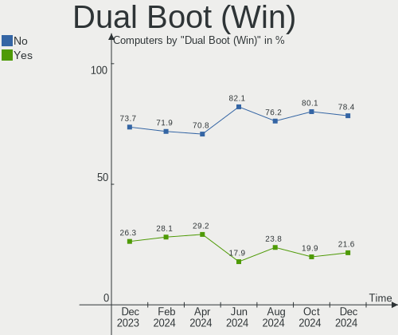

Debian - Hardware Trends
------------------------

A project to identify most popular hardware characteristics and track their change
over time based on data collected by Linux users at https://Linux-Hardware.org.

Anyone can contribute to this report by the [hw-probe](https://github.com/linuxhw/hw-probe) tool:

    sudo -E hw-probe -all -upload

This is a report for all computer types. See also reports for [desktops](/Dist/Debian/Desktop/README.md) and [notebooks](/Dist/Debian/Notebook/README.md).

This report is for one last month. Overall report since the beginning of time: [TestCoverage](https://github.com/linuxhw/TestCoverage)

Period: Nov, 2022.

Contents
--------

* [ System ](#system)
  - [ OS                       ](#os)
  - [ OS Family                ](#os-family)
  - [ Kernel                   ](#kernel)
  - [ Kernel Family            ](#kernel-family)
  - [ Kernel Major Ver.        ](#kernel-major-ver)
  - [ Arch                     ](#arch)
  - [ DE                       ](#de)
  - [ Display Server           ](#display-server)
  - [ Display Manager          ](#display-manager)
  - [ OS Lang                  ](#os-lang)
  - [ Boot Mode                ](#boot-mode)
  - [ Filesystem               ](#filesystem)
  - [ Part. scheme             ](#part-scheme)
  - [ Dual Boot with Linux/BSD ](#dual-boot-with-linuxbsd)
  - [ Dual Boot (Win)          ](#dual-boot-win)

* [ Board ](#board)
  - [ Vendor                   ](#vendor)
  - [ Model                    ](#model)
  - [ Model Family             ](#model-family)
  - [ MFG Year                 ](#mfg-year)
  - [ Form Factor              ](#form-factor)
  - [ Secure Boot              ](#secure-boot)
  - [ Coreboot                 ](#coreboot)
  - [ RAM Size                 ](#ram-size)
  - [ RAM Used                 ](#ram-used)
  - [ Total Drives             ](#total-drives)
  - [ Has CD-ROM               ](#has-cd-rom)
  - [ Has Ethernet             ](#has-ethernet)
  - [ Has WiFi                 ](#has-wifi)
  - [ Has Bluetooth            ](#has-bluetooth)

* [ Location ](#location)
  - [ Country                  ](#country)
  - [ City                     ](#city)

* [ Drives ](#drives)
  - [ Drive Vendor             ](#drive-vendor)
  - [ Drive Model              ](#drive-model)
  - [ HDD Vendor               ](#hdd-vendor)
  - [ SSD Vendor               ](#ssd-vendor)
  - [ Drive Kind               ](#drive-kind)
  - [ Drive Connector          ](#drive-connector)
  - [ Drive Size               ](#drive-size)
  - [ Space Total              ](#space-total)
  - [ Space Used               ](#space-used)
  - [ Malfunc. Drives          ](#malfunc-drives)
  - [ Malfunc. Drive Vendor    ](#malfunc-drive-vendor)
  - [ Malfunc. HDD Vendor      ](#malfunc-hdd-vendor)
  - [ Malfunc. Drive Kind      ](#malfunc-drive-kind)
  - [ Failed Drives            ](#failed-drives)
  - [ Failed Drive Vendor      ](#failed-drive-vendor)
  - [ Drive Status             ](#drive-status)

* [ Storage controller ](#storage-controller)
  - [ Storage Vendor           ](#storage-vendor)
  - [ Storage Model            ](#storage-model)
  - [ Storage Kind             ](#storage-kind)

* [ Processor ](#processor)
  - [ CPU Vendor               ](#cpu-vendor)
  - [ CPU Model                ](#cpu-model)
  - [ CPU Model Family         ](#cpu-model-family)
  - [ CPU Cores                ](#cpu-cores)
  - [ CPU Sockets              ](#cpu-sockets)
  - [ CPU Threads              ](#cpu-threads)
  - [ CPU Op-Modes             ](#cpu-op-modes)
  - [ CPU Microcode            ](#cpu-microcode)
  - [ CPU Microarch            ](#cpu-microarch)

* [ Graphics ](#graphics)
  - [ GPU Vendor               ](#gpu-vendor)
  - [ GPU Model                ](#gpu-model)
  - [ GPU Combo                ](#gpu-combo)
  - [ GPU Driver               ](#gpu-driver)
  - [ GPU Memory               ](#gpu-memory)

* [ Monitor ](#monitor)
  - [ Monitor Vendor           ](#monitor-vendor)
  - [ Monitor Model            ](#monitor-model)
  - [ Monitor Resolution       ](#monitor-resolution)
  - [ Monitor Diagonal         ](#monitor-diagonal)
  - [ Monitor Width            ](#monitor-width)
  - [ Aspect Ratio             ](#aspect-ratio)
  - [ Monitor Area             ](#monitor-area)
  - [ Pixel Density            ](#pixel-density)
  - [ Multiple Monitors        ](#multiple-monitors)

* [ Network ](#network)
  - [ Net Controller Vendor    ](#net-controller-vendor)
  - [ Net Controller Model     ](#net-controller-model)
  - [ Wireless Vendor          ](#wireless-vendor)
  - [ Wireless Model           ](#wireless-model)
  - [ Ethernet Vendor          ](#ethernet-vendor)
  - [ Ethernet Model           ](#ethernet-model)
  - [ Net Controller Kind      ](#net-controller-kind)
  - [ Used Controller          ](#used-controller)
  - [ NICs                     ](#nics)
  - [ IPv6                     ](#ipv6)

* [ Bluetooth ](#bluetooth)
  - [ Bluetooth Vendor         ](#bluetooth-vendor)
  - [ Bluetooth Model          ](#bluetooth-model)

* [ Sound ](#sound)
  - [ Sound Vendor             ](#sound-vendor)
  - [ Sound Model              ](#sound-model)

* [ Memory ](#memory)
  - [ Memory Vendor            ](#memory-vendor)
  - [ Memory Model             ](#memory-model)
  - [ Memory Kind              ](#memory-kind)
  - [ Memory Form Factor       ](#memory-form-factor)
  - [ Memory Size              ](#memory-size)
  - [ Memory Speed             ](#memory-speed)

* [ Printers & scanners ](#printers--scanners)
  - [ Printer Vendor           ](#printer-vendor)
  - [ Printer Model            ](#printer-model)
  - [ Scanner Vendor           ](#scanner-vendor)
  - [ Scanner Model            ](#scanner-model)

* [ Camera ](#camera)
  - [ Camera Vendor            ](#camera-vendor)
  - [ Camera Model             ](#camera-model)

* [ Security ](#security)
  - [ Fingerprint Vendor       ](#fingerprint-vendor)
  - [ Fingerprint Model        ](#fingerprint-model)
  - [ Chipcard Vendor          ](#chipcard-vendor)
  - [ Chipcard Model           ](#chipcard-model)

* [ Unsupported ](#unsupported)
  - [ Unsupported Devices      ](#unsupported-devices)
  - [ Unsupported Device Types ](#unsupported-device-types)

System
------

OS
--

Installed operating systems

| Name              | Computers | Percent |
|-------------------|-----------|---------|
| Debian 11         | 294       | 79.25%  |
| Debian            | 55        | 14.82%  |
| Debian 10         | 10        | 2.7%    |
| Debian 8          | 4         | 1.08%   |
| Debian Testing    | 3         | 0.81%   |
| Debian Unstable   | 2         | 0.54%   |
| Debian Sid        | 1         | 0.27%   |
| Debian 7          | 1         | 0.27%   |
| Debian 11-updates | 1         | 0.27%   |

OS Family
---------

OS without a version

| Name   | Computers | Percent |
|--------|-----------|---------|
| Debian | 371       | 100%    |

Kernel
------

Version of the Linux kernel

| Version                            | Computers | Percent |
|------------------------------------|-----------|---------|
| 5.10.0-19-amd64                    | 129       | 34.77%  |
| 5.10.0-18-amd64                    | 43        | 11.59%  |
| 5.10.0-7-amd64                     | 37        | 9.97%   |
| 6.0.0-4-amd64                      | 23        | 6.2%    |
| 6.0.0-2-amd64                      | 19        | 5.12%   |
| 5.19.0-0.deb11.2-amd64             | 16        | 4.31%   |
| 6.0.0-3-amd64                      | 8         | 2.16%   |
| 5.15.76-v8+                        | 5         | 1.35%   |
| 5.10.0-16-amd64                    | 5         | 1.35%   |
| 6.0.0-0.deb11.2-amd64              | 4         | 1.08%   |
| 5.15.64-1-pve                      | 4         | 1.08%   |
| 5.10.0-19-686-pae                  | 4         | 1.08%   |
| 6.0.8-edge                         | 3         | 0.81%   |
| 5.10.0-19-686                      | 3         | 0.81%   |
| 5.10.0-10-amd64                    | 3         | 0.81%   |
| 4.19.147-rivoreo-amd64             | 3         | 0.81%   |
| 4.19.0-22-amd64                    | 3         | 0.81%   |
| 4.1.42-rivoreo-powerpc64-largepage | 3         | 0.81%   |
| 6.0.0-9.1-liquorix-amd64           | 2         | 0.54%   |
| 5.19.0-1-amd64                     | 2         | 0.54%   |
| 5.18.0-0.deb11.4-amd64             | 2         | 0.54%   |
| 5.17.0-1-amd64                     | 2         | 0.54%   |
| 5.15.60-1-pve                      | 2         | 0.54%   |
| 5.15.30-2-pve                      | 2         | 0.54%   |
| 5.10.0-17-amd64                    | 2         | 0.54%   |
| 5.10.0-15-amd64                    | 2         | 0.54%   |
| 5.10.0-13-amd64                    | 2         | 0.54%   |
| 6.1.0-rc1+                         | 1         | 0.27%   |
| 6.1.0-0-amd64                      | 1         | 0.27%   |
| 6.0.9-tereszkiewicz                | 1         | 0.27%   |
| 6.0.8-amd64                        | 1         | 0.27%   |
| 6.0.7-wrkd                         | 1         | 0.27%   |
| 6.0.7                              | 1         | 0.27%   |
| 6.0.3                              | 1         | 0.27%   |
| 6.0.2-titanide                     | 1         | 0.27%   |
| 6.0.0-5-amd64                      | 1         | 0.27%   |
| 6.0.0-3.1mx-amd64                  | 1         | 0.27%   |
| 5.9.0-0.bpo.2-amd64                | 1         | 0.27%   |
| 5.19.0-2-amd64                     | 1         | 0.27%   |
| 5.18.16-1rodete4-amd64             | 1         | 0.27%   |

Kernel Family
-------------

Linux kernel without a distro release

| Version  | Computers | Percent |
|----------|-----------|---------|
| 5.10.0   | 234       | 63.07%  |
| 6.0.0    | 58        | 15.63%  |
| 5.19.0   | 19        | 5.12%   |
| 4.19.0   | 6         | 1.62%   |
| 5.15.76  | 5         | 1.35%   |
| 6.0.8    | 4         | 1.08%   |
| 5.15.74  | 4         | 1.08%   |
| 5.15.64  | 4         | 1.08%   |
| 4.1.42   | 4         | 1.08%   |
| 5.18.0   | 3         | 0.81%   |
| 4.19.147 | 3         | 0.81%   |
| 6.1.0    | 2         | 0.54%   |
| 6.0.7    | 2         | 0.54%   |
| 5.17.0   | 2         | 0.54%   |
| 5.15.60  | 2         | 0.54%   |
| 5.15.30  | 2         | 0.54%   |
| 6.0.9    | 1         | 0.27%   |
| 6.0.3    | 1         | 0.27%   |
| 6.0.2    | 1         | 0.27%   |
| 5.9.0    | 1         | 0.27%   |
| 5.18.16  | 1         | 0.27%   |
| 5.18.10  | 1         | 0.27%   |
| 5.16.12  | 1         | 0.27%   |
| 5.15.75  | 1         | 0.27%   |
| 5.15.54  | 1         | 0.27%   |
| 5.15.39  | 1         | 0.27%   |
| 5.14.14  | 1         | 0.27%   |
| 5.14.0   | 1         | 0.27%   |
| 5.11.18  | 1         | 0.27%   |
| 5.10.35  | 1         | 0.27%   |
| 5.10.142 | 1         | 0.27%   |
| 5.10.105 | 1         | 0.27%   |
| 3.4.11   | 1         | 0.27%   |

Kernel Major Ver.
-----------------

Linux kernel major version

| Version | Computers | Percent |
|---------|-----------|---------|
| 5.10    | 237       | 63.88%  |
| 6.0     | 67        | 18.06%  |
| 5.15    | 20        | 5.39%   |
| 5.19    | 19        | 5.12%   |
| 4.19    | 9         | 2.43%   |
| 5.18    | 5         | 1.35%   |
| 4.1     | 4         | 1.08%   |
| 6.1     | 2         | 0.54%   |
| 5.17    | 2         | 0.54%   |
| 5.14    | 2         | 0.54%   |
| 5.9     | 1         | 0.27%   |
| 5.16    | 1         | 0.27%   |
| 5.11    | 1         | 0.27%   |
| 3.4     | 1         | 0.27%   |

Arch
----

OS architecture (x86_64, i586, etc.)

| Name    | Computers | Percent |
|---------|-----------|---------|
| x86_64  | 344       | 92.72%  |
| i686    | 11        | 2.96%   |
| aarch64 | 7         | 1.89%   |
| ppc64   | 4         | 1.08%   |
| armv7l  | 4         | 1.08%   |
| sh4a    | 1         | 0.27%   |

DE
--

Desktop Environment

| Name             | Computers | Percent |
|------------------|-----------|---------|
| Unknown          | 103       | 27.76%  |
| GNOME            | 94        | 25.34%  |
| XFCE             | 52        | 14.02%  |
| KDE5             | 48        | 12.94%  |
| MATE             | 15        | 4.04%   |
| LXDE             | 12        | 3.23%   |
| X-Cinnamon       | 11        | 2.96%   |
| Cinnamon         | 10        | 2.7%    |
| i3               | 7         | 1.89%   |
| LXQt             | 6         | 1.62%   |
| KDE              | 3         | 0.81%   |
| trinity          | 2         | 0.54%   |
| Openbox          | 2         | 0.54%   |
| lightdm-xsession | 2         | 0.54%   |
| GNOME Flashback  | 1         | 0.27%   |
| GNOME Classic    | 1         | 0.27%   |
| fluxbox          | 1         | 0.27%   |
| e16-session      | 1         | 0.27%   |

Display Server
--------------

X11 or Wayland

| Name    | Computers | Percent |
|---------|-----------|---------|
| X11     | 200       | 53.91%  |
| Unknown | 71        | 19.14%  |
| Wayland | 59        | 15.9%   |
| Tty     | 41        | 11.05%  |

Display Manager
---------------

SDDM, LightDM, etc.

| Name    | Computers | Percent |
|---------|-----------|---------|
| Unknown | 144       | 38.81%  |
| LightDM | 97        | 26.15%  |
| GDM     | 59        | 15.9%   |
| SDDM    | 51        | 13.75%  |
| GDM3    | 20        | 5.39%   |

OS Lang
-------

Language

| Lang    | Computers | Percent |
|---------|-----------|---------|
| en_US   | 125       | 33.69%  |
| ru_RU   | 55        | 14.82%  |
| Unknown | 25        | 6.74%   |
| de_DE   | 20        | 5.39%   |
| it_IT   | 18        | 4.85%   |
| fr_FR   | 18        | 4.85%   |
| en_GB   | 14        | 3.77%   |
| C       | 12        | 3.23%   |
| es_ES   | 11        | 2.96%   |
| en_CA   | 9         | 2.43%   |
| pl_PL   | 7         | 1.89%   |
| en_AU   | 7         | 1.89%   |
| pt_BR   | 5         | 1.35%   |
| zh_CN   | 4         | 1.08%   |
| hu_HU   | 4         | 1.08%   |
| es_MX   | 4         | 1.08%   |
| es_AR   | 3         | 0.81%   |
| pt_PT   | 2         | 0.54%   |
| es_VE   | 2         | 0.54%   |
| es_CL   | 2         | 0.54%   |
| en_NZ   | 2         | 0.54%   |
| en_IN   | 2         | 0.54%   |
| en_IE   | 2         | 0.54%   |
| en_HK   | 2         | 0.54%   |
| de_CH   | 2         | 0.54%   |
| zh_TW   | 1         | 0.27%   |
| uk_UA   | 1         | 0.27%   |
| tr_TR   | 1         | 0.27%   |
| nl_NL   | 1         | 0.27%   |
| nl_BE   | 1         | 0.27%   |
| ja_JP   | 1         | 0.27%   |
| es_PY   | 1         | 0.27%   |
| en_ZW   | 1         | 0.27%   |
| en_ZA   | 1         | 0.27%   |
| en_SG   | 1         | 0.27%   |
| en_PH   | 1         | 0.27%   |
| en_EN   | 1         | 0.27%   |
| cs_CZ   | 1         | 0.27%   |
| be_BY   | 1         | 0.27%   |

Boot Mode
---------

EFI or BIOS

| Mode | Computers | Percent |
|------|-----------|---------|
| EFI  | 224       | 60.38%  |
| BIOS | 147       | 39.62%  |

Filesystem
----------

Type of filesystem

| Type    | Computers | Percent |
|---------|-----------|---------|
| Ext4    | 274       | 73.85%  |
| Overlay | 69        | 18.6%   |
| Btrfs   | 18        | 4.85%   |
| Zfs     | 8         | 2.16%   |
| Xfs     | 1         | 0.27%   |
| Rootfs  | 1         | 0.27%   |

Part. scheme
------------

Scheme of partitioning

| Type    | Computers | Percent |
|---------|-----------|---------|
| GPT     | 236       | 63.61%  |
| MBR     | 90        | 24.26%  |
| Unknown | 45        | 12.13%  |

Dual Boot with Linux/BSD
------------------------

Hosting more than one Linux/BSD

| Dual boot | Computers | Percent |
|-----------|-----------|---------|
| No        | 325       | 87.6%   |
| Yes       | 46        | 12.4%   |

Dual Boot (Win)
---------------

Hosting Linux and Windows

| Dual boot | Computers | Percent |
|-----------|-----------|---------|
| No        | 240       | 64.69%  |
| Yes       | 131       | 35.31%  |

Board
-----

Vendor
------

Motherboard manufacturer

| Name                      | Computers | Percent |
|---------------------------|-----------|---------|
| Lenovo                    | 62        | 16.71%  |
| ASUSTek Computer          | 60        | 16.17%  |
| Hewlett-Packard           | 40        | 10.78%  |
| Dell                      | 40        | 10.78%  |
| Gigabyte Technology       | 30        | 8.09%   |
| MSI                       | 17        | 4.58%   |
| ECS                       | 12        | 3.23%   |
| Unknown                   | 11        | 2.96%   |
| Intel                     | 10        | 2.7%    |
| Apple                     | 10        | 2.7%    |
| ASRock                    | 9         | 2.43%   |
| Acer                      | 7         | 1.89%   |
| Raspberry Pi Foundation   | 6         | 1.62%   |
| Google                    | 6         | 1.62%   |
| Aquarius                  | 4         | 1.08%   |
| HUAWEI                    | 3         | 0.81%   |
| Foxconn                   | 3         | 0.81%   |
| Toshiba                   | 2         | 0.54%   |
| Samsung Electronics       | 2         | 0.54%   |
| MPMAN                     | 2         | 0.54%   |
| IP3 Tech                  | 2         | 0.54%   |
| IBM                       | 2         | 0.54%   |
| GPU Company               | 2         | 0.54%   |
| Fujitsu                   | 2         | 0.54%   |
| Chuwi                     | 2         | 0.54%   |
| BESSTAR Tech              | 2         | 0.54%   |
| Xunlong                   | 1         | 0.27%   |
| VIT                       | 1         | 0.27%   |
| TMAX                      | 1         | 0.27%   |
| Tactus                    | 1         | 0.27%   |
| sunxi                     | 1         | 0.27%   |
| SK hynix                  | 1         | 0.27%   |
| Shenzhen aopoo technology | 1         | 0.27%   |
| SAGER                     | 1         | 0.27%   |
| Razer                     | 1         | 0.27%   |
| Positivo Bahia - VAIO     | 1         | 0.27%   |
| Phoenix                   | 1         | 0.27%   |
| Pegatron                  | 1         | 0.27%   |
| Olimex                    | 1         | 0.27%   |
| Notebook                  | 1         | 0.27%   |

Model
-----

Motherboard model

| Name                                      | Computers | Percent |
|-------------------------------------------|-----------|---------|
| ECS H61H2-M13                             | 12        | 3.23%   |
| Unknown                                   | 11        | 2.96%   |
| Lenovo ThinkPad E475 20H40006US           | 8         | 2.16%   |
| Google Terra                              | 6         | 1.62%   |
| Lenovo ThinkPad L13 Yoga Gen 2 20VK0019US | 5         | 1.35%   |
| Lenovo ThinkPad 13 2nd Gen 20J10046US     | 5         | 1.35%   |
| ASUS All Series                           | 5         | 1.35%   |
| Aquarius NS585                            | 4         | 1.08%   |
| RPi Raspberry Pi 4 Model B Rev 1.4        | 3         | 0.81%   |
| Gigabyte GA-78LMT-USB3                    | 3         | 0.81%   |
| Apple Macmini7,1                          | 3         | 0.81%   |
| RPi Raspberry Pi 3 Model B Rev 1.2        | 2         | 0.54%   |
| IP3 Tech HeroBox                          | 2         | 0.54%   |
| Intel Jasper Lake Client Platform         | 2         | 0.54%   |
| HUAWEI BOHK-WAX9X                         | 2         | 0.54%   |
| HP Laptop 15-db0xxx                       | 2         | 0.54%   |
| HP 255 G7 Notebook PC                     | 2         | 0.54%   |
| Gigabyte G31M-ES2L                        | 2         | 0.54%   |
| Gigabyte A320M-S2H                        | 2         | 0.54%   |
| Dell XPS 15 9500                          | 2         | 0.54%   |
| Dell Latitude E6530                       | 2         | 0.54%   |
| Dell Latitude 5310                        | 2         | 0.54%   |
| Dell Latitude 3320                        | 2         | 0.54%   |
| ASUS PRO B460M-C                          | 2         | 0.54%   |
| ASUS M4A89GTD-PRO/USB3                    | 2         | 0.54%   |
| ASUS M4A78T-E                             | 2         | 0.54%   |
| ASUS K53SD                                | 2         | 0.54%   |
| ASUS GL752VW                              | 2         | 0.54%   |
| Xunlong Orange Pi Zero                    | 1         | 0.27%   |
| VIT M2400-01                              | 1         | 0.27%   |
| Toshiba Satellite P50-B-10Q               | 1         | 0.27%   |
| Toshiba Satellite L755                    | 1         | 0.27%   |
| TMAX TM101W638L                           | 1         | 0.27%   |
| Tactus GeoBook 140                        | 1         | 0.27%   |
| sunxi FriendlyARM NanoPi NEO 2            | 1         | 0.27%   |
| SK hynix HyBook                           | 1         | 0.27%   |
| Shenzhen aopoo technology AC1-DP          | 1         | 0.27%   |
| Samsung 300E4C/300E5C/300E7C              | 1         | 0.27%   |
| Samsung 300E4A/300E5A/300E7A              | 1         | 0.27%   |
| SAGER D900F                               | 1         | 0.27%   |

Model Family
------------

Motherboard model prefix

| Name                   | Computers | Percent |
|------------------------|-----------|---------|
| Lenovo ThinkPad        | 44        | 11.86%  |
| Dell Latitude          | 15        | 4.04%   |
| ECS H61H2-M13          | 12        | 3.23%   |
| Unknown                | 11        | 2.96%   |
| ASUS VivoBook          | 8         | 2.16%   |
| Dell Inspiron          | 7         | 1.89%   |
| RPi Raspberry          | 6         | 1.62%   |
| HP Laptop              | 6         | 1.62%   |
| Google Terra           | 6         | 1.62%   |
| Dell OptiPlex          | 6         | 1.62%   |
| ASUS PRIME             | 6         | 1.62%   |
| HP EliteBook           | 5         | 1.35%   |
| Dell XPS               | 5         | 1.35%   |
| ASUS All               | 5         | 1.35%   |
| Lenovo ThinkCentre     | 4         | 1.08%   |
| Lenovo IdeaPad         | 4         | 1.08%   |
| HP Pavilion            | 4         | 1.08%   |
| ASUS ROG               | 4         | 1.08%   |
| Aquarius NS585         | 4         | 1.08%   |
| Acer Aspire            | 4         | 1.08%   |
| HP ProBook             | 3         | 0.81%   |
| HP ENVY                | 3         | 0.81%   |
| HP 255                 | 3         | 0.81%   |
| Gigabyte GA-78LMT-USB3 | 3         | 0.81%   |
| Dell PowerEdge         | 3         | 0.81%   |
| ASUS Pro               | 3         | 0.81%   |
| Apple Macmini7         | 3         | 0.81%   |
| Toshiba Satellite      | 2         | 0.54%   |
| Lenovo Legion          | 2         | 0.54%   |
| IP3 Tech HeroBox       | 2         | 0.54%   |
| Intel Jasper           | 2         | 0.54%   |
| HUAWEI BOHK-WAX9X      | 2         | 0.54%   |
| HP ProDesk             | 2         | 0.54%   |
| HP Compaq              | 2         | 0.54%   |
| Gigabyte G31M-ES2L     | 2         | 0.54%   |
| Gigabyte B450          | 2         | 0.54%   |
| Gigabyte A320M-S2H     | 2         | 0.54%   |
| Dell Precision         | 2         | 0.54%   |
| ASUS ZenBook           | 2         | 0.54%   |
| ASUS MINIPC            | 2         | 0.54%   |

MFG Year
--------

Motherboard manufacture year

| Year    | Computers | Percent |
|---------|-----------|---------|
| 2021    | 46        | 12.4%   |
| 2020    | 46        | 12.4%   |
| 2019    | 43        | 11.59%  |
| 2011    | 34        | 9.16%   |
| 2022    | 29        | 7.82%   |
| 2018    | 26        | 7.01%   |
| 2012    | 18        | 4.85%   |
| 2015    | 17        | 4.58%   |
| 2013    | 17        | 4.58%   |
| 2017    | 16        | 4.31%   |
| 2016    | 16        | 4.31%   |
| Unknown | 15        | 4.04%   |
| 2009    | 12        | 3.23%   |
| 2010    | 10        | 2.7%    |
| 2008    | 10        | 2.7%    |
| 2014    | 8         | 2.16%   |
| 2007    | 3         | 0.81%   |
| 2006    | 2         | 0.54%   |
| 2004    | 2         | 0.54%   |
| 2005    | 1         | 0.27%   |

Form Factor
-----------

Physical design of the computer

| Name           | Computers | Percent |
|----------------|-----------|---------|
| Notebook       | 191       | 51.48%  |
| Desktop        | 132       | 35.58%  |
| Mini pc        | 18        | 4.85%   |
| System on chip | 10        | 2.7%    |
| Convertible    | 8         | 2.16%   |
| All in one     | 5         | 1.35%   |
| Tablet         | 4         | 1.08%   |
| Server         | 3         | 0.81%   |

Secure Boot
-----------

Enabled or disabled

| State    | Computers | Percent |
|----------|-----------|---------|
| Disabled | 341       | 91.91%  |
| Enabled  | 30        | 8.09%   |

Coreboot
--------

Have coreboot on board

| Used | Computers | Percent |
|------|-----------|---------|
| No   | 365       | 98.38%  |
| Yes  | 6         | 1.62%   |

RAM Size
--------

Total RAM memory

| Size in GB      | Computers | Percent |
|-----------------|-----------|---------|
| 4.01-8.0        | 94        | 25.34%  |
| 16.01-24.0      | 76        | 20.49%  |
| 3.01-4.0        | 60        | 16.17%  |
| 8.01-16.0       | 45        | 12.13%  |
| 32.01-64.0      | 34        | 9.16%   |
| 64.01-256.0     | 18        | 4.85%   |
| 1.01-2.0        | 13        | 3.5%    |
| 0.51-1.0        | 7         | 1.89%   |
| Unknown         | 7         | 1.89%   |
| 24.01-32.0      | 6         | 1.62%   |
| 2.01-3.0        | 5         | 1.35%   |
| 0.01-0.5        | 4         | 1.08%   |
| More than 256.0 | 2         | 0.54%   |

RAM Used
--------

Used RAM memory

| Used GB    | Computers | Percent |
|------------|-----------|---------|
| 1.01-2.0   | 97        | 26.15%  |
| 2.01-3.0   | 75        | 20.22%  |
| 0.51-1.0   | 63        | 16.98%  |
| 4.01-8.0   | 42        | 11.32%  |
| 3.01-4.0   | 35        | 9.43%   |
| 8.01-16.0  | 26        | 7.01%   |
| 0.01-0.5   | 16        | 4.31%   |
| Unknown    | 8         | 2.16%   |
| 32.01-64.0 | 6         | 1.62%   |
| 16.01-24.0 | 3         | 0.81%   |

Total Drives
------------

Number of drives on board

| Drives | Computers | Percent |
|--------|-----------|---------|
| 1      | 234       | 63.07%  |
| 2      | 73        | 19.68%  |
| 3      | 26        | 7.01%   |
| 4      | 18        | 4.85%   |
| 5      | 6         | 1.62%   |
| 0      | 6         | 1.62%   |
| 10     | 2         | 0.54%   |
| 7      | 2         | 0.54%   |
| 14     | 1         | 0.27%   |
| 9      | 1         | 0.27%   |
| 8      | 1         | 0.27%   |
| 6      | 1         | 0.27%   |

Has CD-ROM
----------

Has CD-ROM on board

| Presented | Computers | Percent |
|-----------|-----------|---------|
| No        | 280       | 75.47%  |
| Yes       | 91        | 24.53%  |

Has Ethernet
------------

Has Ethernet on board

| Presented | Computers | Percent |
|-----------|-----------|---------|
| Yes       | 313       | 84.37%  |
| No        | 58        | 15.63%  |

Has WiFi
--------

Has WiFi module

| Presented | Computers | Percent |
|-----------|-----------|---------|
| Yes       | 258       | 69.54%  |
| No        | 113       | 30.46%  |

Has Bluetooth
-------------

Has Bluetooth module

| Presented | Computers | Percent |
|-----------|-----------|---------|
| Yes       | 217       | 58.49%  |
| No        | 154       | 41.51%  |

Location
--------

Country
-------

Geographic location (country)

| Country      | Computers | Percent |
|--------------|-----------|---------|
| USA          | 68        | 18.33%  |
| Russia       | 62        | 16.71%  |
| Germany      | 30        | 8.09%   |
| France       | 22        | 5.93%   |
| Italy        | 21        | 5.66%   |
| China        | 16        | 4.31%   |
| Spain        | 14        | 3.77%   |
| Canada       | 13        | 3.5%    |
| UK           | 10        | 2.7%    |
| Poland       | 10        | 2.7%    |
| Mexico       | 9         | 2.43%   |
| Australia    | 8         | 2.16%   |
| Switzerland  | 7         | 1.89%   |
| Brazil       | 6         | 1.62%   |
| Portugal     | 5         | 1.35%   |
| Netherlands  | 5         | 1.35%   |
| Argentina    | 5         | 1.35%   |
| Romania      | 4         | 1.08%   |
| Hungary      | 4         | 1.08%   |
| Venezuela    | 3         | 0.81%   |
| Finland      | 3         | 0.81%   |
| Czechia      | 3         | 0.81%   |
| Chile        | 3         | 0.81%   |
| Austria      | 3         | 0.81%   |
| Turkey       | 2         | 0.54%   |
| Taiwan       | 2         | 0.54%   |
| Sweden       | 2         | 0.54%   |
| Norway       | 2         | 0.54%   |
| Malaysia     | 2         | 0.54%   |
| Kazakhstan   | 2         | 0.54%   |
| Iran         | 2         | 0.54%   |
| India        | 2         | 0.54%   |
| Belgium      | 2         | 0.54%   |
| Zimbabwe     | 1         | 0.27%   |
| Ukraine      | 1         | 0.27%   |
| South Korea  | 1         | 0.27%   |
| South Africa | 1         | 0.27%   |
| Philippines  | 1         | 0.27%   |
| Peru         | 1         | 0.27%   |
| Paraguay     | 1         | 0.27%   |

City
----

Geographic location (city)

| City              | Computers | Percent |
|-------------------|-----------|---------|
| Voronezh          | 37        | 9.97%   |
| Bangor            | 25        | 6.74%   |
| Nanhao            | 7         | 1.89%   |
| Moscow            | 6         | 1.62%   |
| St Petersburg     | 5         | 1.35%   |
| Frankfurt am Main | 4         | 1.08%   |
| Warsaw            | 3         | 0.81%   |
| Sydney            | 3         | 0.81%   |
| Seville           | 3         | 0.81%   |
| Perm              | 3         | 0.81%   |
| Milan             | 3         | 0.81%   |
| Laval             | 3         | 0.81%   |
| Budapest          | 3         | 0.81%   |
| Zurich            | 2         | 0.54%   |
| Vienna            | 2         | 0.54%   |
| Toronto           | 2         | 0.54%   |
| Timișoara        | 2         | 0.54%   |
| Tijuana           | 2         | 0.54%   |
| Tehran            | 2         | 0.54%   |
| Suhr              | 2         | 0.54%   |
| Shenzhen          | 2         | 0.54%   |
| Rome              | 2         | 0.54%   |
| Paris             | 2         | 0.54%   |
| Naperville        | 2         | 0.54%   |
| Mülheim          | 2         | 0.54%   |
| Montreal          | 2         | 0.54%   |
| Monterrey         | 2         | 0.54%   |
| Mexico City       | 2         | 0.54%   |
| Manchester        | 2         | 0.54%   |
| Ludwigsburg       | 2         | 0.54%   |
| Kaufbeuren        | 2         | 0.54%   |
| Janikowo          | 2         | 0.54%   |
| Helsinki          | 2         | 0.54%   |
| Cologne           | 2         | 0.54%   |
| Caracas           | 2         | 0.54%   |
| Brisbane          | 2         | 0.54%   |
| Beijing           | 2         | 0.54%   |
| Aubervilliers     | 2         | 0.54%   |
| Amsterdam         | 2         | 0.54%   |
| Almaty            | 2         | 0.54%   |

Drives
------

Drive Vendor
------------

Hard drive vendors

| Vendor              | Computers | Drives | Percent |
|---------------------|-----------|--------|---------|
| Samsung Electronics | 69        | 78     | 12.83%  |
| WDC                 | 67        | 93     | 12.45%  |
| Seagate             | 64        | 85     | 11.9%   |
| Kingston            | 43        | 44     | 7.99%   |
| Unknown             | 34        | 37     | 6.32%   |
| Toshiba             | 25        | 28     | 4.65%   |
| SanDisk             | 22        | 25     | 4.09%   |
| Crucial             | 22        | 23     | 4.09%   |
| Hitachi             | 19        | 20     | 3.53%   |
| SK hynix            | 17        | 18     | 3.16%   |
| Intel               | 17        | 19     | 3.16%   |
| A-DATA Technology   | 14        | 18     | 2.6%    |
| Micron Technology   | 10        | 11     | 1.86%   |
| HGST                | 8         | 8      | 1.49%   |
| Unknown             | 8         | 8      | 1.49%   |
| Apple               | 7         | 9      | 1.3%    |
| China               | 6         | 6      | 1.12%   |
| JMicron Technology  | 5         | 5      | 0.93%   |
| SPCC                | 4         | 4      | 0.74%   |
| KIOXIA              | 4         | 4      | 0.74%   |
| Transcend           | 3         | 3      | 0.56%   |
| KIOXIA-EXCERIA      | 3         | 4      | 0.56%   |
| Corsair             | 3         | 4      | 0.56%   |
| Team                | 2         | 2      | 0.37%   |
| SSSTC               | 2         | 2      | 0.37%   |
| Phison Electronics  | 2         | 2      | 0.37%   |
| Netac               | 2         | 2      | 0.37%   |
| Maxtor              | 2         | 2      | 0.37%   |
| LITEONIT            | 2         | 2      | 0.37%   |
| LITEON              | 2         | 2      | 0.37%   |
| Kingchuxing         | 2         | 2      | 0.37%   |
| Intenso             | 2         | 2      | 0.37%   |
| Hewlett-Packard     | 2         | 3      | 0.37%   |
| GOODRAM             | 2         | 2      | 0.37%   |
| Gigabyte Technology | 2         | 2      | 0.37%   |
| ASMT                | 2         | 2      | 0.37%   |
| ZHITAI              | 1         | 1      | 0.19%   |
| Zheino              | 1         | 1      | 0.19%   |
| XPG                 | 1         | 2      | 0.19%   |
| Vaseky              | 1         | 1      | 0.19%   |

Drive Model
-----------

Hard drive models

| Model                                             | Computers | Percent |
|---------------------------------------------------|-----------|---------|
| Kingston SA400S37120G 120GB SSD                   | 13        | 2.22%   |
| Kingston SA400S37240G 240GB SSD                   | 12        | 2.05%   |
| Hitachi HDS721050DLE630 500GB                     | 9         | 1.54%   |
| Unknown                                           | 8         | 1.37%   |
| Unknown SDW16G  16GB                              | 5         | 0.85%   |
| Seagate ST500DM002-1BD142 500GB                   | 5         | 0.85%   |
| Samsung SSD 850 EVO 500GB                         | 5         | 0.85%   |
| Samsung MZVLB512HBJQ-000L7 512GB                  | 5         | 0.85%   |
| Crucial CT1000MX500SSD1 1TB                       | 5         | 0.85%   |
| A-DATA SU800 512GB SSD                            | 5         | 0.85%   |
| Toshiba DT01ACA100 1TB                            | 4         | 0.68%   |
| Intel SSDPEKNW512G8 512GB                         | 4         | 0.68%   |
| Crucial CT500MX500SSD1 500GB                      | 4         | 0.68%   |
| WDC WD10JPCX-24UE4T0 1TB                          | 3         | 0.51%   |
| Unknown MMC Card  64GB                            | 3         | 0.51%   |
| Toshiba MQ01ABF050 500GB                          | 3         | 0.51%   |
| Toshiba DT01ACA050 500GB                          | 3         | 0.51%   |
| Seagate ST300MM0008 304GB                         | 3         | 0.51%   |
| Seagate ST300MM0006 304GB                         | 3         | 0.51%   |
| Seagate ST1000DM010-2EP102 1TB                    | 3         | 0.51%   |
| Seagate ST1000DM003-1CH162 1TB                    | 3         | 0.51%   |
| SanDisk SD8SN8U128G1001 128GB SSD                 | 3         | 0.51%   |
| Samsung SSD 860 EVO 250GB                         | 3         | 0.51%   |
| Samsung SSD 850 EVO 120GB                         | 3         | 0.51%   |
| Samsung NVMe SSD Controller SM981/PM981/PM983 1TB | 3         | 0.51%   |
| Kingston SA400S37480G 480GB SSD                   | 3         | 0.51%   |
| HGST HTS721010A9E630 1TB                          | 3         | 0.51%   |
| HGST HTS541010A9E680 1TB                          | 3         | 0.51%   |
| Crucial CT250MX500SSD1 250GB                      | 3         | 0.51%   |
| Crucial CT240BX500SSD1 240GB                      | 3         | 0.51%   |
| WDC WDS500G2B0B-00YS70 500GB SSD                  | 2         | 0.34%   |
| WDC WDS500G2B0A-00SM50 500GB SSD                  | 2         | 0.34%   |
| WDC WD20EARX-00PASB0 2TB                          | 2         | 0.34%   |
| WDC WD1600AAJS-00B4A0 160GB                       | 2         | 0.34%   |
| WDC WD10EZEX-08WN4A0 1TB                          | 2         | 0.34%   |
| WDC PC SN530 NVMe 256GB                           | 2         | 0.34%   |
| Unknown MMC64G  64GB                              | 2         | 0.34%   |
| Unknown MMC Card  32GB                            | 2         | 0.34%   |
| Unknown Biwin  64GB                               | 2         | 0.34%   |
| Transcend TS240GSSD220S 240GB                     | 2         | 0.34%   |

HDD Vendor
----------

Hard disk drive vendors

| Vendor              | Computers | Drives | Percent |
|---------------------|-----------|--------|---------|
| Seagate             | 61        | 78     | 36.31%  |
| WDC                 | 44        | 67     | 26.19%  |
| Hitachi             | 19        | 20     | 11.31%  |
| Toshiba             | 18        | 20     | 10.71%  |
| HGST                | 8         | 8      | 4.76%   |
| Apple               | 5         | 5      | 2.98%   |
| Samsung Electronics | 4         | 5      | 2.38%   |
| Maxtor              | 2         | 2      | 1.19%   |
| ASMT                | 2         | 2      | 1.19%   |
| SAGE                | 1         | 1      | 0.6%    |
| HPE                 | 1         | 2      | 0.6%    |
| Fujitsu             | 1         | 1      | 0.6%    |
| ASMedia             | 1         | 1      | 0.6%    |
| Advantech           | 1         | 1      | 0.6%    |

SSD Vendor
----------

Solid state drive vendors

| Vendor              | Computers | Drives | Percent |
|---------------------|-----------|--------|---------|
| Kingston            | 36        | 36     | 18.46%  |
| Samsung Electronics | 30        | 34     | 15.38%  |
| Crucial             | 19        | 20     | 9.74%   |
| SanDisk             | 17        | 18     | 8.72%   |
| A-DATA Technology   | 12        | 16     | 6.15%   |
| Intel               | 9         | 11     | 4.62%   |
| WDC                 | 6         | 6      | 3.08%   |
| China               | 6         | 6      | 3.08%   |
| Toshiba             | 4         | 4      | 2.05%   |
| SPCC                | 4         | 4      | 2.05%   |
| Apple               | 4         | 4      | 2.05%   |
| Transcend           | 3         | 3      | 1.54%   |
| Micron Technology   | 3         | 3      | 1.54%   |
| Unknown             | 3         | 3      | 1.54%   |
| Netac               | 2         | 2      | 1.03%   |
| LITEONIT            | 2         | 2      | 1.03%   |
| Kingchuxing         | 2         | 2      | 1.03%   |
| JMicron Technology  | 2         | 2      | 1.03%   |
| Intenso             | 2         | 2      | 1.03%   |
| Hewlett-Packard     | 2         | 3      | 1.03%   |
| ZHITAI              | 1         | 1      | 0.51%   |
| Zheino              | 1         | 1      | 0.51%   |
| Vaseky              | 1         | 1      | 0.51%   |
| TO Exter            | 1         | 1      | 0.51%   |
| Team                | 1         | 1      | 0.51%   |
| T-FORCE             | 1         | 1      | 0.51%   |
| SUNEAST             | 1         | 1      | 0.51%   |
| Smartbuy            | 1         | 1      | 0.51%   |
| SK hynix            | 1         | 2      | 0.51%   |
| Seagate             | 1         | 2      | 0.51%   |
| S3+                 | 1         | 1      | 0.51%   |
| PNY                 | 1         | 1      | 0.51%   |
| Patriot             | 1         | 1      | 0.51%   |
| NVME                | 1         | 2      | 0.51%   |
| LITEON              | 1         | 1      | 0.51%   |
| KingDian            | 1         | 1      | 0.51%   |
| KEEPDATA            | 1         | 1      | 0.51%   |
| J.ZAO               | 1         | 1      | 0.51%   |
| HS-SSD-J100N        | 1         | 1      | 0.51%   |
| Hoodisk             | 1         | 1      | 0.51%   |

Drive Kind
----------

HDD or SSD

| Kind    | Computers | Drives | Percent |
|---------|-----------|--------|---------|
| SSD     | 169       | 211    | 34.92%  |
| HDD     | 142       | 213    | 29.34%  |
| NVMe    | 124       | 144    | 25.62%  |
| MMC     | 38        | 40     | 7.85%   |
| Unknown | 11        | 14     | 2.27%   |

Drive Connector
---------------

SATA, SAS, NVMe, etc.

| Type | Computers | Drives | Percent |
|------|-----------|--------|---------|
| SATA | 241       | 394    | 55.79%  |
| NVMe | 123       | 142    | 28.47%  |
| MMC  | 38        | 40     | 8.8%    |
| SAS  | 30        | 46     | 6.94%   |

Drive Size
----------

Size of hard drive

| Size in TB | Computers | Drives | Percent |
|------------|-----------|--------|---------|
| 0.01-0.5   | 191       | 250    | 59.69%  |
| 0.51-1.0   | 79        | 98     | 24.69%  |
| 1.01-2.0   | 21        | 26     | 6.56%   |
| 3.01-4.0   | 10        | 17     | 3.13%   |
| 4.01-10.0  | 9         | 14     | 2.81%   |
| 2.01-3.0   | 6         | 6      | 1.88%   |
| 10.01-20.0 | 4         | 13     | 1.25%   |

Space Total
-----------

Amount of disk space available on the file system

| Size in GB     | Computers | Percent |
|----------------|-----------|---------|
| 101-250        | 80        | 21.56%  |
| 251-500        | 74        | 19.95%  |
| Unknown        | 64        | 17.25%  |
| 501-1000       | 48        | 12.94%  |
| 1001-2000      | 27        | 7.28%   |
| 51-100         | 24        | 6.47%   |
| More than 3000 | 15        | 4.04%   |
| 21-50          | 13        | 3.5%    |
| 2001-3000      | 13        | 3.5%    |
| 1-20           | 13        | 3.5%    |

Space Used
----------

Amount of used disk space

| Used GB        | Computers | Percent |
|----------------|-----------|---------|
| 1-20           | 120       | 32.35%  |
| Unknown        | 64        | 17.25%  |
| 101-250        | 46        | 12.4%   |
| 21-50          | 41        | 11.05%  |
| 51-100         | 36        | 9.7%    |
| 501-1000       | 23        | 6.2%    |
| 251-500        | 21        | 5.66%   |
| 1001-2000      | 8         | 2.16%   |
| More than 3000 | 6         | 1.62%   |
| 2001-3000      | 5         | 1.35%   |
| 0              | 1         | 0.27%   |

Malfunc. Drives
---------------

Drive models with a malfunction

| Model                                        | Computers | Drives | Percent |
|----------------------------------------------|-----------|--------|---------|
| Hitachi HDS721050DLE630 500GB                | 5         | 5      | 7.81%   |
| WDC WD20EARX-00PASB0 2TB                     | 2         | 2      | 3.13%   |
| WDC WD1600AAJS-00B4A0 160GB                  | 2         | 2      | 3.13%   |
| Seagate ST320LT007-9ZV142 320GB              | 2         | 2      | 3.13%   |
| WDC WD7500BPKT-75PK4T0 752GB                 | 1         | 1      | 1.56%   |
| WDC WD600UE-22HCT0 64GB                      | 1         | 1      | 1.56%   |
| WDC WD6000HLHX-75JJPV0 600GB                 | 1         | 4      | 1.56%   |
| WDC WD5000LPVX-22V0TT0 500GB                 | 1         | 1      | 1.56%   |
| WDC WD5000BPVT-24HXZT3 500GB                 | 1         | 1      | 1.56%   |
| WDC WD5000AAKX-22ERMA0 500GB                 | 1         | 1      | 1.56%   |
| WDC WD3200BEKT-60KA9T0 320GB                 | 1         | 1      | 1.56%   |
| WDC WD3200AAKX-753CA1 320GB                  | 1         | 1      | 1.56%   |
| WDC WD3200AAKS-75L9A0 320GB                  | 1         | 1      | 1.56%   |
| WDC WD2002FYPS-02W3B0 2TB                    | 1         | 1      | 1.56%   |
| WDC WD10JPLX-00MBPT1 1TB                     | 1         | 1      | 1.56%   |
| WDC WD10JPCX-24UE4T0 1TB                     | 1         | 1      | 1.56%   |
| Toshiba MQ01ABD075 752GB                     | 1         | 1      | 1.56%   |
| Toshiba DT01ACA300 3TB                       | 1         | 1      | 1.56%   |
| SK hynix PC711 HFS512GDE9X073N 512GB         | 1         | 1      | 1.56%   |
| Seagate ST9320325AS 320GB                    | 1         | 1      | 1.56%   |
| Seagate ST500NM0011 500GB                    | 1         | 1      | 1.56%   |
| Seagate ST500LM021-1KJ152 500GB              | 1         | 1      | 1.56%   |
| Seagate ST500DM005 HD502HJ 500GB             | 1         | 1      | 1.56%   |
| Seagate ST4000DM004-2CV104 4TB               | 1         | 1      | 1.56%   |
| Seagate ST380817AS 80GB                      | 1         | 1      | 1.56%   |
| Seagate ST3500413AS 500GB                    | 1         | 1      | 1.56%   |
| Seagate ST3320620NS 320GB                    | 1         | 1      | 1.56%   |
| Seagate ST320LT012-9WS14C 320GB              | 1         | 1      | 1.56%   |
| Seagate ST3200822AS 200GB                    | 1         | 1      | 1.56%   |
| Seagate ST31000528AS 1TB                     | 1         | 1      | 1.56%   |
| Seagate ST3000DM001-9YN166 3TB               | 1         | 1      | 1.56%   |
| Seagate ST250LT012-9WS141 250GB              | 1         | 1      | 1.56%   |
| Seagate ST2000LM003 HN-M201RAD 2TB           | 1         | 1      | 1.56%   |
| Seagate ST2000DM001-1ER164 2TB               | 1         | 1      | 1.56%   |
| Seagate ST1000LM024 HN-M101MBB 1TB           | 1         | 1      | 1.56%   |
| Seagate ST1000LM014-1EJ164 1TB               | 1         | 1      | 1.56%   |
| Seagate ST1000DM010-2EP102 1TB               | 1         | 1      | 1.56%   |
| Samsung Electronics SSD 850 PRO 256GB        | 1         | 1      | 1.56%   |
| Samsung Electronics MZVLB512HAJQ-000H1 512GB | 1         | 1      | 1.56%   |
| Samsung Electronics HM100JC 100GB            | 1         | 1      | 1.56%   |

Malfunc. Drive Vendor
---------------------

Vendors of faulty drives

| Vendor              | Computers | Drives | Percent |
|---------------------|-----------|--------|---------|
| Seagate             | 19        | 20     | 30.16%  |
| WDC                 | 16        | 19     | 25.4%   |
| Hitachi             | 9         | 10     | 14.29%  |
| Intel               | 4         | 4      | 6.35%   |
| Samsung Electronics | 3         | 3      | 4.76%   |
| Kingston            | 3         | 3      | 4.76%   |
| Toshiba             | 2         | 2      | 3.17%   |
| SK hynix            | 1         | 1      | 1.59%   |
| Maxtor              | 1         | 1      | 1.59%   |
| LITEONIT            | 1         | 1      | 1.59%   |
| HGST                | 1         | 1      | 1.59%   |
| Apple               | 1         | 1      | 1.59%   |
| A-DATA Technology   | 1         | 2      | 1.59%   |
| Unknown             | 1         | 1      | 1.59%   |

Malfunc. HDD Vendor
-------------------

Vendors of faulty HDD drives

| Vendor              | Computers | Drives | Percent |
|---------------------|-----------|--------|---------|
| Seagate             | 19        | 20     | 38%     |
| WDC                 | 16        | 19     | 32%     |
| Hitachi             | 9         | 10     | 18%     |
| Toshiba             | 2         | 2      | 4%      |
| Samsung Electronics | 1         | 1      | 2%      |
| Maxtor              | 1         | 1      | 2%      |
| HGST                | 1         | 1      | 2%      |
| Apple               | 1         | 1      | 2%      |

Malfunc. Drive Kind
-------------------

Kinds of faulty drives

| Kind | Computers | Drives | Percent |
|------|-----------|--------|---------|
| HDD  | 49        | 55     | 79.03%  |
| SSD  | 11        | 12     | 17.74%  |
| NVMe | 2         | 2      | 3.23%   |

Failed Drives
-------------

Failed drive models

| Model                                           | Computers | Drives | Percent |
|-------------------------------------------------|-----------|--------|---------|
| Seagate ST500DM002-1BD142 500GB                 | 1         | 1      | 20%     |
| Samsung Electronics MZMPC032HBCD-000H1 32GB SSD | 1         | 1      | 20%     |
| Samsung Electronics HD253GJ 250GB               | 1         | 1      | 20%     |
| Hitachi HTS545050A7E380 500GB                   | 1         | 1      | 20%     |
| Hewlett-Packard SSD S700 500GB                  | 1         | 2      | 20%     |

Failed Drive Vendor
-------------------

Failed drive vendors

| Vendor              | Computers | Drives | Percent |
|---------------------|-----------|--------|---------|
| Samsung Electronics | 2         | 2      | 40%     |
| Seagate             | 1         | 1      | 20%     |
| Hitachi             | 1         | 1      | 20%     |
| Hewlett-Packard     | 1         | 2      | 20%     |

Drive Status
------------

Number of failed and malfunc. drives

| Status   | Computers | Drives | Percent |
|----------|-----------|--------|---------|
| Works    | 246       | 380    | 58.99%  |
| Detected | 104       | 167    | 24.94%  |
| Malfunc  | 62        | 69     | 14.87%  |
| Failed   | 5         | 6      | 1.2%    |

Storage controller
------------------

Storage Vendor
--------------

Storage controller vendors

| Vendor                         | Computers | Percent |
|--------------------------------|-----------|---------|
| Intel                          | 219       | 49.1%   |
| AMD                            | 68        | 15.25%  |
| Samsung Electronics            | 39        | 8.74%   |
| SanDisk                        | 24        | 5.38%   |
| SK hynix                       | 15        | 3.36%   |
| ASMedia Technology             | 11        | 2.47%   |
| KIOXIA                         | 8         | 1.79%   |
| Phison Electronics             | 7         | 1.57%   |
| Micron Technology              | 7         | 1.57%   |
| Kingston Technology Company    | 7         | 1.57%   |
| LSI Logic / Symbios Logic      | 5         | 1.12%   |
| Micron/Crucial Technology      | 4         | 0.9%    |
| Marvell Technology Group       | 4         | 0.9%    |
| Toshiba America Info Systems   | 3         | 0.67%   |
| JMicron Technology             | 3         | 0.67%   |
| IBM                            | 3         | 0.67%   |
| ADATA Technology               | 3         | 0.67%   |
| Solid State Storage Technology | 2         | 0.45%   |
| Silicon Motion                 | 2         | 0.45%   |
| Seagate Technology             | 2         | 0.45%   |
| Nvidia                         | 2         | 0.45%   |
| Broadcom / LSI                 | 2         | 0.45%   |
| Union Memory (Shenzhen)        | 1         | 0.22%   |
| Silicon Image                  | 1         | 0.22%   |
| Realtek Semiconductor          | 1         | 0.22%   |
| Mylex                          | 1         | 0.22%   |
| Lite-On Technology             | 1         | 0.22%   |
| Adaptec                        | 1         | 0.22%   |

Storage Model
-------------

Storage controller models

| Model                                                                          | Computers | Percent |
|--------------------------------------------------------------------------------|-----------|---------|
| AMD FCH SATA Controller [AHCI mode]                                            | 44        | 8.78%   |
| Samsung NVMe SSD Controller SM981/PM981/PM983                                  | 18        | 3.59%   |
| Intel 6 Series/C200 Series Chipset Family 6 port Desktop SATA AHCI Controller  | 16        | 3.19%   |
| Intel Sunrise Point-LP SATA Controller [AHCI mode]                             | 15        | 2.99%   |
| Intel Celeron/Pentium Silver Processor SATA Controller                         | 13        | 2.59%   |
| Intel 82801 Mobile SATA Controller [RAID mode]                                 | 13        | 2.59%   |
| Intel 7 Series Chipset Family 6-port SATA Controller [AHCI mode]               | 10        | 2%      |
| Intel 6 Series/C200 Series Chipset Family 6 port Mobile SATA AHCI Controller   | 10        | 2%      |
| ASMedia ASM1062 Serial ATA Controller                                          | 9         | 1.8%    |
| AMD SB7x0/SB8x0/SB9x0 IDE Controller                                           | 9         | 1.8%    |
| SanDisk Non-Volatile memory controller                                         | 8         | 1.6%    |
| Intel Volume Management Device NVMe RAID Controller                            | 8         | 1.6%    |
| Intel Comet Lake SATA AHCI Controller                                          | 8         | 1.6%    |
| Intel Cannon Lake PCH SATA AHCI Controller                                     | 8         | 1.6%    |
| Intel 8 Series/C220 Series Chipset Family 6-port SATA Controller 1 [AHCI mode] | 8         | 1.6%    |
| Intel 500 Series Chipset Family SATA AHCI Controller                           | 8         | 1.6%    |
| AMD SB7x0/SB8x0/SB9x0 SATA Controller [IDE mode]                               | 8         | 1.6%    |
| SK hynix Gold P31/PC711 NVMe Solid State Drive                                 | 7         | 1.4%    |
| Samsung NVMe SSD Controller PM9A1/PM9A3/980PRO                                 | 7         | 1.4%    |
| Samsung NVMe SSD Controller 980                                                | 7         | 1.4%    |
| Intel 8 Series SATA Controller 1 [AHCI mode]                                   | 7         | 1.4%    |
| AMD 500 Series Chipset SATA Controller                                         | 7         | 1.4%    |
| AMD 400 Series Chipset SATA Controller                                         | 7         | 1.4%    |
| SanDisk WD Black SN750 / PC SN730 NVMe SSD                                     | 6         | 1.2%    |
| Micron Non-Volatile memory controller                                          | 6         | 1.2%    |
| Intel SSD 660P Series                                                          | 6         | 1.2%    |
| Intel NM10/ICH7 Family SATA Controller [IDE mode]                              | 6         | 1.2%    |
| Intel HM170/QM170 Chipset SATA Controller [AHCI Mode]                          | 6         | 1.2%    |
| Intel 400 Series Chipset Family SATA AHCI Controller                           | 6         | 1.2%    |
| SanDisk WD Blue SN550 NVMe SSD                                                 | 5         | 1%      |
| Samsung NVMe SSD Controller SM961/PM961/SM963                                  | 5         | 1%      |
| Intel Celeron N3350/Pentium N4200/Atom E3900 Series SATA AHCI Controller       | 5         | 1%      |
| Intel 7 Series/C210 Series Chipset Family 6-port SATA Controller [AHCI mode]   | 5         | 1%      |
| Intel 200 Series PCH SATA controller [AHCI mode]                               | 5         | 1%      |
| Phison E12 NVMe Controller                                                     | 4         | 0.8%    |
| Kingston Company Company Non-Volatile memory controller                        | 4         | 0.8%    |
| Intel Wildcat Point-LP SATA Controller [AHCI Mode]                             | 4         | 0.8%    |
| Intel Tiger Lake-LP SATA Controller                                            | 4         | 0.8%    |
| Intel Alder Lake-S PCH SATA Controller [AHCI Mode]                             | 4         | 0.8%    |
| Intel 82801JI (ICH10 Family) SATA AHCI Controller                              | 4         | 0.8%    |

Storage Kind
------------

Kind of storage controller (IDE, SATA, NVMe, SAS, ...)

| Kind | Computers | Percent |
|------|-----------|---------|
| SATA | 249       | 55.33%  |
| NVMe | 123       | 27.33%  |
| IDE  | 41        | 9.11%   |
| RAID | 32        | 7.11%   |
| SAS  | 4         | 0.89%   |
| SCSI | 1         | 0.22%   |

Processor
---------

CPU Vendor
----------

Processor vendors

| Vendor            | Computers | Percent |
|-------------------|-----------|---------|
| Intel             | 271       | 73.05%  |
| AMD               | 84        | 22.64%  |
| ARM               | 11        | 2.96%   |
| CHRP IBM,8233-E8B | 3         | 0.81%   |
| CHRP IBM,9131-52A | 1         | 0.27%   |
| Unknown           | 1         | 0.27%   |

CPU Model
---------

Processor models

| Model                                                     | Computers | Percent |
|-----------------------------------------------------------|-----------|---------|
| Intel Pentium CPU G630 @ 2.70GHz                          | 12        | 3.23%   |
| Intel 11th Gen Core i7-1165G7 @ 2.80GHz                   | 10        | 2.7%    |
| AMD PRO A6-9500B R5, 6 COMPUTE CORES 2C+4G                | 8         | 2.16%   |
| Intel Celeron CPU N3060 @ 1.60GHz                         | 7         | 1.89%   |
| ARM Processor                                             | 7         | 1.89%   |
| Intel Celeron N4020 CPU @ 1.10GHz                         | 6         | 1.62%   |
| Intel Core i7-10750H CPU @ 2.60GHz                        | 5         | 1.35%   |
| Intel Celeron CPU 3865U @ 1.80GHz                         | 5         | 1.35%   |
| AMD Ryzen 5 3500U with Radeon Vega Mobile Gfx             | 5         | 1.35%   |
| Intel Core i3-9100 CPU @ 3.60GHz                          | 4         | 1.08%   |
| Intel Core i7-9750H CPU @ 2.60GHz                         | 3         | 0.81%   |
| Intel Core i7-8700 CPU @ 3.20GHz                          | 3         | 0.81%   |
| Intel Core i7-8550U CPU @ 1.80GHz                         | 3         | 0.81%   |
| Intel Core i7-7700HQ CPU @ 2.80GHz                        | 3         | 0.81%   |
| Intel Core i7-6700HQ CPU @ 2.60GHz                        | 3         | 0.81%   |
| Intel Core i7-2670QM CPU @ 2.20GHz                        | 3         | 0.81%   |
| Intel Core i7-10510U CPU @ 1.80GHz                        | 3         | 0.81%   |
| Intel Core i5-7200U CPU @ 2.50GHz                         | 3         | 0.81%   |
| Intel Core i5-1035G1 CPU @ 1.00GHz                        | 3         | 0.81%   |
| Intel Core i5-10210U CPU @ 1.60GHz                        | 3         | 0.81%   |
| Intel Celeron J4125 CPU @ 2.00GHz                         | 3         | 0.81%   |
| Intel Celeron CPU N3450 @ 1.10GHz                         | 3         | 0.81%   |
| Intel 11th Gen Core i5-1135G7 @ 2.40GHz                   | 3         | 0.81%   |
| CHRP IBM,8233-E8B POWER7 (architected), altivec supported | 3         | 0.81%   |
| AMD Ryzen 5 5500U with Radeon Graphics                    | 3         | 0.81%   |
| Intel Core i7-8565U CPU @ 1.80GHz                         | 2         | 0.54%   |
| Intel Core i7-7500U CPU @ 2.70GHz                         | 2         | 0.54%   |
| Intel Core i7-10700T CPU @ 2.00GHz                        | 2         | 0.54%   |
| Intel Core i5-6200U CPU @ 2.30GHz                         | 2         | 0.54%   |
| Intel Core i5-5300U CPU @ 2.30GHz                         | 2         | 0.54%   |
| Intel Core i5-4210U CPU @ 1.70GHz                         | 2         | 0.54%   |
| Intel Core i5-3450 CPU @ 3.10GHz                          | 2         | 0.54%   |
| Intel Core i5-3317U CPU @ 1.70GHz                         | 2         | 0.54%   |
| Intel Core i5-2520M CPU @ 2.50GHz                         | 2         | 0.54%   |
| Intel Core i5-10310U CPU @ 1.70GHz                        | 2         | 0.54%   |
| Intel Core i3-6100 CPU @ 3.70GHz                          | 2         | 0.54%   |
| Intel Core i3-2350M CPU @ 2.30GHz                         | 2         | 0.54%   |
| Intel Core i3-10100 CPU @ 3.60GHz                         | 2         | 0.54%   |
| Intel Core 2 Duo CPU T9600 @ 2.80GHz                      | 2         | 0.54%   |
| Intel Celeron N5105 @ 2.00GHz                             | 2         | 0.54%   |

CPU Model Family
----------------

Processor model prefix

| Model                   | Computers | Percent |
|-------------------------|-----------|---------|
| Intel Core i7           | 61        | 16.44%  |
| Other                   | 57        | 15.36%  |
| Intel Core i5           | 53        | 14.29%  |
| Intel Celeron           | 38        | 10.24%  |
| Intel Core i3           | 23        | 6.2%    |
| AMD Ryzen 5             | 20        | 5.39%   |
| Intel Pentium           | 15        | 4.04%   |
| AMD Ryzen 7             | 14        | 3.77%   |
| Intel Core 2 Duo        | 12        | 3.23%   |
| Intel Xeon              | 10        | 2.7%    |
| Intel Atom              | 9         | 2.43%   |
| AMD Ryzen 9             | 6         | 1.62%   |
| AMD Ryzen 7 PRO         | 6         | 1.62%   |
| AMD FX                  | 4         | 1.08%   |
| Intel Pentium Gold      | 3         | 0.81%   |
| ARM Allwinner           | 3         | 0.81%   |
| AMD Ryzen 5 PRO         | 3         | 0.81%   |
| AMD Athlon              | 3         | 0.81%   |
| AMD A10                 | 3         | 0.81%   |
| Intel Pentium M         | 2         | 0.54%   |
| Intel Core 2 Quad       | 2         | 0.54%   |
| AMD Ryzen Threadripper  | 2         | 0.54%   |
| AMD Phenom II X6        | 2         | 0.54%   |
| AMD Phenom II X4        | 2         | 0.54%   |
| AMD E2                  | 2         | 0.54%   |
| AMD Athlon II X4        | 2         | 0.54%   |
| AMD A4                  | 2         | 0.54%   |
| Intel Xeon Silver       | 1         | 0.27%   |
| Intel Pentium Silver    | 1         | 0.27%   |
| Intel Pentium Dual-Core | 1         | 0.27%   |
| Intel Pentium 4         | 1         | 0.27%   |
| Intel Genuine           | 1         | 0.27%   |
| Intel Core m3           | 1         | 0.27%   |
| Intel Core M            | 1         | 0.27%   |
| Intel Core i9           | 1         | 0.27%   |
| Intel Core Duo          | 1         | 0.27%   |
| Intel Celeron M         | 1         | 0.27%   |
| AMD Ryzen 3 PRO         | 1         | 0.27%   |
| AMD Athlon II X2        | 1         | 0.27%   |

CPU Cores
---------

Number of processor cores

| Number  | Computers | Percent |
|---------|-----------|---------|
| 4       | 137       | 36.93%  |
| 2       | 124       | 33.42%  |
| 6       | 40        | 10.78%  |
| 8       | 28        | 7.55%   |
| 1       | 20        | 5.39%   |
| 12      | 8         | 2.16%   |
| 16      | 4         | 1.08%   |
| 32      | 3         | 0.81%   |
| 10      | 3         | 0.81%   |
| 3       | 2         | 0.54%   |
| 14      | 1         | 0.27%   |
| Unknown | 1         | 0.27%   |

CPU Sockets
-----------

Number of sockets

| Number  | Computers | Percent |
|---------|-----------|---------|
| 1       | 365       | 98.38%  |
| 2       | 5         | 1.35%   |
| Unknown | 1         | 0.27%   |

CPU Threads
-----------

Threads per core (Hyper-Threading)

| Number  | Computers | Percent |
|---------|-----------|---------|
| 2       | 229       | 61.73%  |
| 1       | 138       | 37.2%   |
| 4       | 3         | 0.81%   |
| Unknown | 1         | 0.27%   |

CPU Op-Modes
------------

CPU Operation Modes (32-bit, 64-bit)

| Op mode        | Computers | Percent |
|----------------|-----------|---------|
| 32-bit, 64-bit | 357       | 96.23%  |
| 32-bit         | 8         | 2.16%   |
| Unknown        | 5         | 1.35%   |
| 64-bit         | 1         | 0.27%   |

CPU Microcode
-------------

Microcode number

| Number     | Computers | Percent |
|------------|-----------|---------|
| Unknown    | 78        | 21.02%  |
| 0x206a7    | 26        | 7.01%   |
| 0x806c1    | 17        | 4.58%   |
| 0x306a9    | 15        | 4.04%   |
| 0x806e9    | 9         | 2.43%   |
| 0x406c4    | 9         | 2.43%   |
| 0x906ea    | 8         | 2.16%   |
| 0x806ec    | 8         | 2.16%   |
| 0x706a8    | 8         | 2.16%   |
| 0x08108109 | 8         | 2.16%   |
| 0x0600611a | 8         | 2.16%   |
| 0x506e3    | 7         | 1.89%   |
| 0x306c3    | 7         | 1.89%   |
| 0x0a50000c | 7         | 1.89%   |
| 0xa0652    | 6         | 1.62%   |
| 0x806ea    | 6         | 1.62%   |
| 0x1067a    | 6         | 1.62%   |
| 0x906e9    | 5         | 1.35%   |
| 0x40651    | 5         | 1.35%   |
| 0x08600106 | 5         | 1.35%   |
| 0xa0671    | 4         | 1.08%   |
| 0xa0655    | 4         | 1.08%   |
| 0x906eb    | 4         | 1.08%   |
| 0x906a3    | 4         | 1.08%   |
| 0x406e3    | 4         | 1.08%   |
| 0x08701021 | 4         | 1.08%   |
| 0xa0653    | 3         | 0.81%   |
| 0x906c0    | 3         | 0.81%   |
| 0x706e5    | 3         | 0.81%   |
| 0x506c9    | 3         | 0.81%   |
| 0x306d4    | 3         | 0.81%   |
| 0x30678    | 3         | 0.81%   |
| 0x106a5    | 3         | 0.81%   |
| 0x10676    | 3         | 0.81%   |
| 0x0a20120a | 3         | 0.81%   |
| 0x08608103 | 3         | 0.81%   |
| 0x0800820d | 3         | 0.81%   |
| 0x06006705 | 3         | 0.81%   |
| 0x90672    | 2         | 0.54%   |
| 0x706a1    | 2         | 0.54%   |

CPU Microarch
-------------

Microarchitecture

| Name             | Computers | Percent |
|------------------|-----------|---------|
| KabyLake         | 53        | 14.29%  |
| SandyBridge      | 31        | 8.36%   |
| Unknown          | 31        | 8.36%   |
| IvyBridge        | 20        | 5.39%   |
| CometLake        | 20        | 5.39%   |
| Haswell          | 19        | 5.12%   |
| TigerLake        | 18        | 4.85%   |
| Zen+             | 15        | 4.04%   |
| Zen 2            | 15        | 4.04%   |
| Silvermont       | 14        | 3.77%   |
| Penryn           | 14        | 3.77%   |
| Zen 3            | 13        | 3.5%    |
| Goldmont plus    | 13        | 3.5%    |
| Skylake          | 12        | 3.23%   |
| Excavator        | 12        | 3.23%   |
| K10              | 8         | 2.16%   |
| Alderlake Hybrid | 7         | 1.89%   |
| Core             | 6         | 1.62%   |
| Broadwell        | 6         | 1.62%   |
| Zen              | 5         | 1.35%   |
| P6               | 5         | 1.35%   |
| IceLake          | 5         | 1.35%   |
| Goldmont         | 5         | 1.35%   |
| Westmere         | 4         | 1.08%   |
| Nehalem          | 4         | 1.08%   |
| Tremont          | 3         | 0.81%   |
| Piledriver       | 3         | 0.81%   |
| Bulldozer        | 3         | 0.81%   |
| Bonnell          | 3         | 0.81%   |
| K10 Llano        | 2         | 0.54%   |
| Steamroller      | 1         | 0.27%   |
| NetBurst         | 1         | 0.27%   |

Graphics
--------

GPU Vendor
----------

Vendors of graphics cards

| Vendor                     | Computers | Percent |
|----------------------------|-----------|---------|
| Intel                      | 210       | 51.47%  |
| Nvidia                     | 103       | 25.25%  |
| AMD                        | 89        | 21.81%  |
| Matrox Electronics Systems | 5         | 1.23%   |
| ASPEED Technology          | 1         | 0.25%   |

GPU Model
---------

Graphics card models

| Model                                                                                    | Computers | Percent |
|------------------------------------------------------------------------------------------|-----------|---------|
| Intel TigerLake-LP GT2 [Iris Xe Graphics]                                                | 16        | 3.83%   |
| Intel 2nd Generation Core Processor Family Integrated Graphics Controller                | 16        | 3.83%   |
| Nvidia GF108 [GeForce GT 630]                                                            | 12        | 2.87%   |
| Intel GeminiLake [UHD Graphics 600]                                                      | 12        | 2.87%   |
| AMD Picasso/Raven 2 [Radeon Vega Series / Radeon Vega Mobile Series]                     | 12        | 2.87%   |
| Intel 3rd Gen Core processor Graphics Controller                                         | 10        | 2.39%   |
| Intel CometLake-U GT2 [UHD Graphics]                                                     | 9         | 2.15%   |
| Intel Atom/Celeron/Pentium Processor x5-E8000/J3xxx/N3xxx Integrated Graphics Controller | 9         | 2.15%   |
| Intel Haswell-ULT Integrated Graphics Controller                                         | 8         | 1.91%   |
| AMD Wani [Radeon R5/R6/R7 Graphics]                                                      | 8         | 1.91%   |
| AMD Cezanne [Radeon Vega Series / Radeon Vega Mobile Series]                             | 8         | 1.91%   |
| Intel HD Graphics 530                                                                    | 7         | 1.67%   |
| Intel CometLake-S GT2 [UHD Graphics 630]                                                 | 7         | 1.67%   |
| Intel UHD Graphics 620                                                                   | 6         | 1.44%   |
| Intel HD Graphics 620                                                                    | 6         | 1.44%   |
| Intel CoffeeLake-S GT2 [UHD Graphics 630]                                                | 6         | 1.44%   |
| Intel HD Graphics 630                                                                    | 5         | 1.2%    |
| Intel HD Graphics 610                                                                    | 5         | 1.2%    |
| Intel CometLake-H GT2 [UHD Graphics]                                                     | 5         | 1.2%    |
| Intel Atom Processor Z36xxx/Z37xxx Series Graphics & Display                             | 5         | 1.2%    |
| AMD Renoir                                                                               | 5         | 1.2%    |
| Nvidia GP107 [GeForce GTX 1050 Ti]                                                       | 4         | 0.96%   |
| Intel WhiskeyLake-U GT2 [UHD Graphics 620]                                               | 4         | 0.96%   |
| Intel HD Graphics 500                                                                    | 4         | 0.96%   |
| Intel Alder Lake-P Integrated Graphics Controller                                        | 4         | 0.96%   |
| AMD Stoney [Radeon R2/R3/R4/R5 Graphics]                                                 | 4         | 0.96%   |
| AMD Raven Ridge [Radeon Vega Series / Radeon Vega Mobile Series]                         | 4         | 0.96%   |
| AMD Lucienne                                                                             | 4         | 0.96%   |
| Nvidia TU106M [GeForce RTX 2060 Mobile]                                                  | 3         | 0.72%   |
| Nvidia GP108 [GeForce GT 1030]                                                           | 3         | 0.72%   |
| Nvidia GM206 [GeForce GTX 960]                                                           | 3         | 0.72%   |
| Nvidia GM107M [GeForce GTX 960M]                                                         | 3         | 0.72%   |
| Nvidia GK208B [GeForce GT 730]                                                           | 3         | 0.72%   |
| Nvidia GK107 [GeForce GT 740]                                                            | 3         | 0.72%   |
| Matrox Electronics Systems Millennium G550                                               | 3         | 0.72%   |
| Intel Xeon E3-1200 v2/3rd Gen Core processor Graphics Controller                         | 3         | 0.72%   |
| Intel Skylake GT2 [HD Graphics 520]                                                      | 3         | 0.72%   |
| Intel Mobile 4 Series Chipset Integrated Graphics Controller                             | 3         | 0.72%   |
| Intel JasperLake [UHD Graphics]                                                          | 3         | 0.72%   |
| Intel Iris Plus Graphics G1 (Ice Lake)                                                   | 3         | 0.72%   |

GPU Combo
---------

Combinations of graphics cards

| Name                    | Computers | Percent |
|-------------------------|-----------|---------|
| 1 x Intel               | 165       | 44.47%  |
| 1 x AMD                 | 72        | 19.41%  |
| 1 x Nvidia              | 58        | 15.63%  |
| Intel + Nvidia          | 36        | 9.7%    |
| Other                   | 15        | 4.04%   |
| Intel + AMD             | 6         | 1.62%   |
| AMD + Nvidia            | 6         | 1.62%   |
| 2 x AMD                 | 5         | 1.35%   |
| 1 x Matrox              | 5         | 1.35%   |
| 2 x Nvidia              | 2         | 0.54%   |
| 2 x Nvidia + 1 x ASPEED | 1         | 0.27%   |

GPU Driver
----------

Free vs proprietary

| Driver      | Computers | Percent |
|-------------|-----------|---------|
| Free        | 259       | 69.81%  |
| Unknown     | 76        | 20.49%  |
| Proprietary | 36        | 9.7%    |

GPU Memory
----------

Total video memory

| Size in GB     | Computers | Percent |
|----------------|-----------|---------|
| Unknown        | 262       | 70.62%  |
| 0.01-0.5       | 35        | 9.43%   |
| 1.01-2.0       | 22        | 5.93%   |
| 0.51-1.0       | 14        | 3.77%   |
| 3.01-4.0       | 13        | 3.5%    |
| 7.01-8.0       | 8         | 2.16%   |
| 5.01-6.0       | 8         | 2.16%   |
| 16.01-24.0     | 3         | 0.81%   |
| 2.01-3.0       | 2         | 0.54%   |
| 8.01-16.0      | 2         | 0.54%   |
| More than 64.0 | 1         | 0.27%   |
| 4.01-5.0       | 1         | 0.27%   |

Monitor
-------

Monitor Vendor
--------------

Monitor vendors

| Vendor                  | Computers | Percent |
|-------------------------|-----------|---------|
| AU Optronics            | 50        | 15.06%  |
| BOE                     | 39        | 11.75%  |
| Samsung Electronics     | 32        | 9.64%   |
| LG Display              | 25        | 7.53%   |
| Chimei Innolux          | 25        | 7.53%   |
| Dell                    | 22        | 6.63%   |
| Goldstar                | 15        | 4.52%   |
| Hewlett-Packard         | 11        | 3.31%   |
| AOC                     | 10        | 3.01%   |
| Acer                    | 10        | 3.01%   |
| ViewSonic               | 7         | 2.11%   |
| Philips                 | 7         | 2.11%   |
| Lenovo                  | 6         | 1.81%   |
| InfoVision              | 6         | 1.81%   |
| Apple                   | 6         | 1.81%   |
| BenQ                    | 5         | 1.51%   |
| Sharp                   | 4         | 1.2%    |
| Iiyama                  | 4         | 1.2%    |
| Eizo                    | 4         | 1.2%    |
| Ancor Communications    | 4         | 1.2%    |
| PANDA                   | 3         | 0.9%    |
| Chi Mei Optoelectronics | 3         | 0.9%    |
| ASUSTek Computer        | 3         | 0.9%    |
| NEC Computers           | 2         | 0.6%    |
| CPT                     | 2         | 0.6%    |
| Yamaha                  | 1         | 0.3%    |
| WYT                     | 1         | 0.3%    |
| Vita                    | 1         | 0.3%    |
| Viotek                  | 1         | 0.3%    |
| Videoseven              | 1         | 0.3%    |
| Unknown (XXX)           | 1         | 0.3%    |
| Unknown                 | 1         | 0.3%    |
| Toshiba                 | 1         | 0.3%    |
| Sony                    | 1         | 0.3%    |
| SLD                     | 1         | 0.3%    |
| SKY                     | 1         | 0.3%    |
| SGT                     | 1         | 0.3%    |
| PVT                     | 1         | 0.3%    |
| Pixio                   | 1         | 0.3%    |
| Panasonic               | 1         | 0.3%    |

Monitor Model
-------------

Monitor models

| Model                                                            | Computers | Percent |
|------------------------------------------------------------------|-----------|---------|
| BOE LCD Monitor BOE06B3 1920x1080 310x170mm 13.9-inch            | 8         | 2.37%   |
| AU Optronics LCD Monitor AUO235C 1366x768 256x144mm 11.6-inch    | 6         | 1.78%   |
| AU Optronics LCD Monitor AUO592D 1920x1080 293x165mm 13.2-inch   | 4         | 1.18%   |
| InfoVision LCD Monitor IVO0533 1366x768 293x165mm 13.2-inch      | 3         | 0.89%   |
| Dell U2412M DELA07A 1920x1200 518x324mm 24.1-inch                | 3         | 0.89%   |
| Chimei Innolux LCD Monitor CMN15DC 1366x768 344x193mm 15.5-inch  | 3         | 0.89%   |
| ViewSonic VG730m VSC951E 1280x1024 338x270mm 17.0-inch           | 2         | 0.59%   |
| Sharp LCD Monitor SHP14D1 1920x1200 336x210mm 15.6-inch          | 2         | 0.59%   |
| PANDA LCD Monitor NCP0046 1920x1080 344x194mm 15.5-inch          | 2         | 0.59%   |
| LG Display LCD Monitor LGD02E3 1366x768 344x194mm 15.5-inch      | 2         | 0.59%   |
| Lenovo LCD Monitor LEN40A0 1366x768 309x174mm 14.0-inch          | 2         | 0.59%   |
| InfoVision LCD Monitor IVO0489 1366x768 256x144mm 11.6-inch      | 2         | 0.59%   |
| Iiyama PL2740HS IVM6663 1920x1080 598x336mm 27.0-inch            | 2         | 0.59%   |
| Iiyama PL2740HS IVM6662 1920x1080 598x336mm 27.0-inch            | 2         | 0.59%   |
| Goldstar LG ULTRAWIDE GSM59F1 2560x1080 670x280mm 28.6-inch      | 2         | 0.59%   |
| Chimei Innolux LCD Monitor CMN1735 1920x1080 382x215mm 17.3-inch | 2         | 0.59%   |
| Chimei Innolux LCD Monitor CMN15F5 1920x1080 344x193mm 15.5-inch | 2         | 0.59%   |
| Chimei Innolux LCD Monitor CMN14D6 1366x768 309x173mm 13.9-inch  | 2         | 0.59%   |
| Chimei Innolux LCD Monitor CMN14C9 1920x1080 309x173mm 13.9-inch | 2         | 0.59%   |
| BOE LCD Monitor BOE0A5D 1366x768 256x144mm 11.6-inch             | 2         | 0.59%   |
| BOE LCD Monitor BOE07BD 1920x1080 309x174mm 14.0-inch            | 2         | 0.59%   |
| BOE LCD Monitor BOE06CF 1366x768 277x156mm 12.5-inch             | 2         | 0.59%   |
| BenQ GW2470 BNQ78E4 1920x1080 527x296mm 23.8-inch                | 2         | 0.59%   |
| AU Optronics LCD Monitor AUO71EC 1366x768 344x193mm 15.5-inch    | 2         | 0.59%   |
| AU Optronics LCD Monitor AUO573D 1920x1080 309x174mm 14.0-inch   | 2         | 0.59%   |
| AU Optronics LCD Monitor AUO2B99 1920x1080 293x165mm 13.2-inch   | 2         | 0.59%   |
| Apple Color LCD APP9CF0 1440x900 290x180mm 13.4-inch             | 2         | 0.59%   |
| AOC AG241QG4 AOC2410 2560x1440 527x396mm 26.0-inch               | 2         | 0.59%   |
| Yamaha RX-V477 YMH31A8 1920x540 708x398mm 32.0-inch              | 1         | 0.3%    |
| WYT MNT-ANALOG19W WYT1113 1440x900 410x256mm 19.0-inch           | 1         | 0.3%    |
| Vita V195EW-W VIT1950 1600x900 432x240mm 19.5-inch               | 1         | 0.3%    |
| Viotek VIOTEKNB32C VTK3200 1920x1080 698x393mm 31.5-inch         | 1         | 0.3%    |
| ViewSonic VX2457 VSCB931 1920x1080 521x293mm 23.5-inch           | 1         | 0.3%    |
| ViewSonic VA2407 Series VSC8C31 1920x1080 521x293mm 23.5-inch    | 1         | 0.3%    |
| ViewSonic VA2248 SERIES VSC0E28 1920x1080 477x268mm 21.5-inch    | 1         | 0.3%    |
| ViewSonic VA2014 SERIES VSC6026 1600x900 443x249mm 20.0-inch     | 1         | 0.3%    |
| ViewSonic LCD Monitor VSCBB31 1920x1080 530x300mm 24.0-inch      | 1         | 0.3%    |
| Videoseven L17GM IGM0508 1280x1024 338x270mm 17.0-inch           | 1         | 0.3%    |
| Unknown LCD Monitor FFFF 2288x1287 2550x2550mm 142.0-inch        | 1         | 0.3%    |
| Unknown (XXX) Beyond TV XXX2851 3840x2160 1209x680mm 54.6-inch   | 1         | 0.3%    |

Monitor Resolution
------------------

Monitor screen resolution

| Resolution         | Computers | Percent |
|--------------------|-----------|---------|
| 1920x1080 (FHD)    | 140       | 43.75%  |
| 1366x768 (WXGA)    | 56        | 17.5%   |
| 2560x1440 (QHD)    | 21        | 6.56%   |
| 1920x1200 (WUXGA)  | 18        | 5.63%   |
| 3840x2160 (4K)     | 13        | 4.06%   |
| 1600x900 (HD+)     | 13        | 4.06%   |
| 1280x1024 (SXGA)   | 10        | 3.13%   |
| 1440x900 (WXGA+)   | 8         | 2.5%    |
| 2560x1080          | 5         | 1.56%   |
| 3840x1080          | 4         | 1.25%   |
| 3440x1440          | 4         | 1.25%   |
| 1360x768           | 4         | 1.25%   |
| 1280x800 (WXGA)    | 4         | 1.25%   |
| 1024x768 (XGA)     | 4         | 1.25%   |
| Unknown            | 4         | 1.25%   |
| 1920x1280          | 3         | 0.94%   |
| 1680x1050 (WSXGA+) | 3         | 0.94%   |
| 1600x1200          | 2         | 0.63%   |
| 2288x1287          | 1         | 0.31%   |
| 1920x540           | 1         | 0.31%   |
| 1360x765           | 1         | 0.31%   |
| 1024x600           | 1         | 0.31%   |

Monitor Diagonal
----------------

Diagonal size in inches

| Inches  | Computers | Percent |
|---------|-----------|---------|
| 15      | 76        | 23.17%  |
| 13      | 48        | 14.63%  |
| 24      | 27        | 8.23%   |
| 27      | 24        | 7.32%   |
| 14      | 23        | 7.01%   |
| 23      | 22        | 6.71%   |
| 17      | 18        | 5.49%   |
| 21      | 13        | 3.96%   |
| 11      | 10        | 3.05%   |
| 19      | 9         | 2.74%   |
| Unknown | 9         | 2.74%   |
| 12      | 8         | 2.44%   |
| 34      | 6         | 1.83%   |
| 31      | 6         | 1.83%   |
| 20      | 6         | 1.83%   |
| 18      | 4         | 1.22%   |
| 22      | 3         | 0.91%   |
| 32      | 2         | 0.61%   |
| 29      | 2         | 0.61%   |
| 26      | 2         | 0.61%   |
| 16      | 2         | 0.61%   |
| 142     | 1         | 0.3%    |
| 84      | 1         | 0.3%    |
| 58      | 1         | 0.3%    |
| 55      | 1         | 0.3%    |
| 54      | 1         | 0.3%    |
| 35      | 1         | 0.3%    |
| 33      | 1         | 0.3%    |
| 10      | 1         | 0.3%    |

Monitor Width
-------------

Physical width

| Width in mm    | Computers | Percent |
|----------------|-----------|---------|
| 301-350        | 128       | 39.38%  |
| 501-600        | 68        | 20.92%  |
| 201-300        | 43        | 13.23%  |
| 401-500        | 34        | 10.46%  |
| 351-400        | 17        | 5.23%   |
| 601-700        | 11        | 3.38%   |
| 701-800        | 9         | 2.77%   |
| Unknown        | 9         | 2.77%   |
| 1001-1500      | 3         | 0.92%   |
| More than 2000 | 1         | 0.31%   |
| 801-900        | 1         | 0.31%   |
| 1501-2000      | 1         | 0.31%   |

Aspect Ratio
------------

Proportional relationship between the width and the height

| Ratio   | Computers | Percent |
|---------|-----------|---------|
| 16/9    | 223       | 74.83%  |
| 16/10   | 35        | 11.74%  |
| 5/4     | 9         | 3.02%   |
| 4/3     | 9         | 3.02%   |
| 21/9    | 8         | 2.68%   |
| Unknown | 7         | 2.35%   |
| 3/2     | 3         | 1.01%   |
| 6/5     | 2         | 0.67%   |
| 2.65    | 1         | 0.34%   |
| 1.00    | 1         | 0.34%   |

Monitor Area
------------

Area in inch²

| Area in inch² | Computers | Percent |
|----------------|-----------|---------|
| 101-110        | 75        | 22.94%  |
| 201-250        | 51        | 15.6%   |
| 81-90          | 50        | 15.29%  |
| 301-350        | 27        | 8.26%   |
| 71-80          | 21        | 6.42%   |
| 151-200        | 17        | 5.2%    |
| 351-500        | 16        | 4.89%   |
| 251-300        | 12        | 3.67%   |
| 51-60          | 10        | 3.06%   |
| 141-150        | 10        | 3.06%   |
| 121-130        | 9         | 2.75%   |
| Unknown        | 9         | 2.75%   |
| 61-70          | 8         | 2.45%   |
| More than 1000 | 5         | 1.53%   |
| 131-140        | 5         | 1.53%   |
| 41-50          | 1         | 0.31%   |
| 111-120        | 1         | 0.31%   |

Pixel Density
-------------

Pixels per inch

| Density       | Computers | Percent |
|---------------|-----------|---------|
| 51-100        | 101       | 31.96%  |
| 121-160       | 94        | 29.75%  |
| 101-120       | 81        | 25.63%  |
| 161-240       | 25        | 7.91%   |
| Unknown       | 9         | 2.85%   |
| More than 240 | 3         | 0.95%   |
| 1-50          | 3         | 0.95%   |

Multiple Monitors
-----------------

Total monitors connected

| Total | Computers | Percent |
|-------|-----------|---------|
| 1     | 252       | 67.92%  |
| 0     | 74        | 19.95%  |
| 2     | 36        | 9.7%    |
| 3     | 9         | 2.43%   |

Network
-------

Net Controller Vendor
---------------------

Controller vendors

| Vendor                            | Computers | Percent |
|-----------------------------------|-----------|---------|
| Realtek Semiconductor             | 210       | 39.92%  |
| Intel                             | 177       | 33.65%  |
| Qualcomm Atheros                  | 46        | 8.75%   |
| Broadcom                          | 20        | 3.8%    |
| Broadcom Limited                  | 10        | 1.9%    |
| MediaTek                          | 9         | 1.71%   |
| ASIX Electronics                  | 5         | 0.95%   |
| Ralink Technology                 | 4         | 0.76%   |
| Ralink                            | 3         | 0.57%   |
| Mellanox Technologies             | 3         | 0.57%   |
| IBM                               | 3         | 0.57%   |
| Huawei Technologies               | 3         | 0.57%   |
| Dresden Elektronik                | 3         | 0.57%   |
| TP-Link                           | 2         | 0.38%   |
| Samsung Electronics               | 2         | 0.38%   |
| Qualcomm                          | 2         | 0.38%   |
| Microchip Technology              | 2         | 0.38%   |
| Marvell Technology Group          | 2         | 0.38%   |
| DisplayLink                       | 2         | 0.38%   |
| Dell                              | 2         | 0.38%   |
| Xiaomi                            | 1         | 0.19%   |
| Tehuti Networks                   | 1         | 0.19%   |
| Sierra Wireless                   | 1         | 0.19%   |
| Qualcomm Atheros Communications   | 1         | 0.19%   |
| QinHeng Electronics               | 1         | 0.19%   |
| OPPO Electronics                  | 1         | 0.19%   |
| Nvidia                            | 1         | 0.19%   |
| NetGear                           | 1         | 0.19%   |
| Linksys                           | 1         | 0.19%   |
| Lakeview Research                 | 1         | 0.19%   |
| Hewlett-Packard                   | 1         | 0.19%   |
| Gemtek                            | 1         | 0.19%   |
| Ericsson Business Mobile Networks | 1         | 0.19%   |
| Aquantia                          | 1         | 0.19%   |
| AMD                               | 1         | 0.19%   |
| 3Com                              | 1         | 0.19%   |

Net Controller Model
--------------------

Controller models

| Model                                                             | Computers | Percent |
|-------------------------------------------------------------------|-----------|---------|
| Realtek RTL8111/8168/8411 PCI Express Gigabit Ethernet Controller | 134       | 21.41%  |
| Realtek RTL810xE PCI Express Fast Ethernet controller             | 25        | 3.99%   |
| Intel Wireless 8265 / 8275                                        | 15        | 2.4%    |
| Intel Wi-Fi 6 AX201                                               | 15        | 2.4%    |
| Realtek RTL8153 Gigabit Ethernet Adapter                          | 13        | 2.08%   |
| Qualcomm Atheros QCA9377 802.11ac Wireless Network Adapter        | 13        | 2.08%   |
| Intel Wireless 7265                                               | 13        | 2.08%   |
| Realtek RTL8125 2.5GbE Controller                                 | 12        | 1.92%   |
| Intel Comet Lake PCH-LP CNVi WiFi                                 | 11        | 1.76%   |
| Intel Wireless-AC 9260                                            | 10        | 1.6%    |
| Intel Wi-Fi 6 AX200                                               | 10        | 1.6%    |
| Realtek RTL8822CE 802.11ac PCIe Wireless Network Adapter          | 9         | 1.44%   |
| Realtek RTL8821CE 802.11ac PCIe Wireless Network Adapter          | 9         | 1.44%   |
| Intel Comet Lake PCH CNVi WiFi                                    | 9         | 1.44%   |
| Intel Cannon Lake PCH CNVi WiFi                                   | 9         | 1.44%   |
| Intel 82579LM Gigabit Network Connection (Lewisville)             | 9         | 1.44%   |
| Intel Ethernet Controller I225-V                                  | 8         | 1.28%   |
| Intel Ethernet Connection (13) I219-V                             | 8         | 1.28%   |
| Intel Ethernet Connection (4) I219-V                              | 6         | 0.96%   |
| Realtek 802.11n WLAN Adapter                                      | 5         | 0.8%    |
| Qualcomm Atheros AR9285 Wireless Network Adapter (PCI-Express)    | 5         | 0.8%    |
| Qualcomm Atheros AR8151 v2.0 Gigabit Ethernet                     | 5         | 0.8%    |
| Broadcom NetXtreme BCM57766 Gigabit Ethernet PCIe                 | 5         | 0.8%    |
| Broadcom Limited BCM4360 802.11ac Wireless Network Adapter        | 5         | 0.8%    |
| ASIX AX88179 Gigabit Ethernet                                     | 5         | 0.8%    |
| Realtek RTL8852AE 802.11ax PCIe Wireless Network Adapter          | 4         | 0.64%   |
| Qualcomm Atheros QCA9565 / AR9565 Wireless Network Adapter        | 4         | 0.64%   |
| MediaTek MT7921 802.11ax PCI Express Wireless Network Adapter     | 4         | 0.64%   |
| Intel Wireless 8260                                               | 4         | 0.64%   |
| Intel Ethernet Connection (7) I219-V                              | 4         | 0.64%   |
| Intel Dual Band Wireless-AC 3168NGW [Stone Peak]                  | 4         | 0.64%   |
| Intel Alder Lake-P PCH CNVi WiFi                                  | 4         | 0.64%   |
| Realtek RTL8188CE 802.11b/g/n WiFi Adapter                        | 3         | 0.48%   |
| Realtek RTL-8100/8101L/8139 PCI Fast Ethernet Adapter             | 3         | 0.48%   |
| Qualcomm Atheros QCA8171 Gigabit Ethernet                         | 3         | 0.48%   |
| Qualcomm Atheros AR9485 Wireless Network Adapter                  | 3         | 0.48%   |
| Qualcomm Atheros AR8131 Gigabit Ethernet                          | 3         | 0.48%   |
| Qualcomm Atheros AR8121/AR8113/AR8114 Gigabit or Fast Ethernet    | 3         | 0.48%   |
| MediaTek MT7921K (RZ608) Wi-Fi 6E 80MHz                           | 3         | 0.48%   |
| Intel Wireless 3165                                               | 3         | 0.48%   |

Wireless Vendor
---------------

Wireless vendors

| Vendor                          | Computers | Percent |
|---------------------------------|-----------|---------|
| Intel                           | 143       | 53.76%  |
| Realtek Semiconductor           | 47        | 17.67%  |
| Qualcomm Atheros                | 33        | 12.41%  |
| MediaTek                        | 9         | 3.38%   |
| Broadcom Limited                | 9         | 3.38%   |
| Broadcom                        | 8         | 3.01%   |
| Ralink Technology               | 4         | 1.5%    |
| Ralink                          | 3         | 1.13%   |
| TP-Link                         | 2         | 0.75%   |
| Dell                            | 2         | 0.75%   |
| Sierra Wireless                 | 1         | 0.38%   |
| Qualcomm Atheros Communications | 1         | 0.38%   |
| Qualcomm                        | 1         | 0.38%   |
| NetGear                         | 1         | 0.38%   |
| Marvell Technology Group        | 1         | 0.38%   |
| Gemtek                          | 1         | 0.38%   |

Wireless Model
--------------

Wireless models

| Model                                                          | Computers | Percent |
|----------------------------------------------------------------|-----------|---------|
| Intel Wireless 8265 / 8275                                     | 15        | 5.62%   |
| Intel Wi-Fi 6 AX201                                            | 15        | 5.62%   |
| Qualcomm Atheros QCA9377 802.11ac Wireless Network Adapter     | 13        | 4.87%   |
| Intel Wireless 7265                                            | 13        | 4.87%   |
| Intel Comet Lake PCH-LP CNVi WiFi                              | 11        | 4.12%   |
| Intel Wireless-AC 9260                                         | 10        | 3.75%   |
| Intel Wi-Fi 6 AX200                                            | 10        | 3.75%   |
| Realtek RTL8822CE 802.11ac PCIe Wireless Network Adapter       | 9         | 3.37%   |
| Realtek RTL8821CE 802.11ac PCIe Wireless Network Adapter       | 9         | 3.37%   |
| Intel Comet Lake PCH CNVi WiFi                                 | 9         | 3.37%   |
| Intel Cannon Lake PCH CNVi WiFi                                | 9         | 3.37%   |
| Realtek 802.11n WLAN Adapter                                   | 5         | 1.87%   |
| Qualcomm Atheros AR9285 Wireless Network Adapter (PCI-Express) | 5         | 1.87%   |
| Broadcom Limited BCM4360 802.11ac Wireless Network Adapter     | 5         | 1.87%   |
| Realtek RTL8852AE 802.11ax PCIe Wireless Network Adapter       | 4         | 1.5%    |
| Qualcomm Atheros QCA9565 / AR9565 Wireless Network Adapter     | 4         | 1.5%    |
| MediaTek MT7921 802.11ax PCI Express Wireless Network Adapter  | 4         | 1.5%    |
| Intel Wireless 8260                                            | 4         | 1.5%    |
| Intel Dual Band Wireless-AC 3168NGW [Stone Peak]               | 4         | 1.5%    |
| Intel Alder Lake-P PCH CNVi WiFi                               | 4         | 1.5%    |
| Realtek RTL8188CE 802.11b/g/n WiFi Adapter                     | 3         | 1.12%   |
| Qualcomm Atheros AR9485 Wireless Network Adapter               | 3         | 1.12%   |
| MediaTek MT7921K (RZ608) Wi-Fi 6E 80MHz                        | 3         | 1.12%   |
| Intel Wireless 3165                                            | 3         | 1.12%   |
| Intel Ultimate N WiFi Link 5300                                | 3         | 1.12%   |
| Intel Tiger Lake PCH CNVi WiFi                                 | 3         | 1.12%   |
| Intel PRO/Wireless 3945ABG [Golan] Network Connection          | 3         | 1.12%   |
| Intel Centrino Wireless-N 1000 [Condor Peak]                   | 3         | 1.12%   |
| Intel Centrino Advanced-N 6205 [Taylor Peak]                   | 3         | 1.12%   |
| Intel Cannon Point-LP CNVi [Wireless-AC]                       | 3         | 1.12%   |
| Broadcom BCM4313 802.11bgn Wireless Network Adapter            | 3         | 1.12%   |
| TP-Link 802.11ac WLAN Adapter                                  | 2         | 0.75%   |
| Realtek RTL8821AE 802.11ac PCIe Wireless Network Adapter       | 2         | 0.75%   |
| Realtek RTL8723DE Wireless Network Adapter                     | 2         | 0.75%   |
| Realtek RTL8723BU 802.11b/g/n WLAN Adapter                     | 2         | 0.75%   |
| Realtek RTL8723BE PCIe Wireless Network Adapter                | 2         | 0.75%   |
| Realtek 802.11ac NIC                                           | 2         | 0.75%   |
| Ralink RT3090 Wireless 802.11n 1T/1R PCIe                      | 2         | 0.75%   |
| Qualcomm Atheros QCA6174 802.11ac Wireless Network Adapter     | 2         | 0.75%   |
| Qualcomm Atheros AR9462 Wireless Network Adapter               | 2         | 0.75%   |

Ethernet Vendor
---------------

Ethernet vendors

| Vendor                   | Computers | Percent |
|--------------------------|-----------|---------|
| Realtek Semiconductor    | 188       | 55.62%  |
| Intel                    | 89        | 26.33%  |
| Qualcomm Atheros         | 16        | 4.73%   |
| Broadcom                 | 13        | 3.85%   |
| ASIX Electronics         | 5         | 1.48%   |
| Mellanox Technologies    | 3         | 0.89%   |
| IBM                      | 3         | 0.89%   |
| Huawei Technologies      | 3         | 0.89%   |
| Samsung Electronics      | 2         | 0.59%   |
| Microchip Technology     | 2         | 0.59%   |
| DisplayLink              | 2         | 0.59%   |
| Broadcom Limited         | 2         | 0.59%   |
| Xiaomi                   | 1         | 0.3%    |
| Tehuti Networks          | 1         | 0.3%    |
| Qualcomm                 | 1         | 0.3%    |
| OPPO Electronics         | 1         | 0.3%    |
| Nvidia                   | 1         | 0.3%    |
| Marvell Technology Group | 1         | 0.3%    |
| Linksys                  | 1         | 0.3%    |
| Hewlett-Packard          | 1         | 0.3%    |
| Aquantia                 | 1         | 0.3%    |
| 3Com                     | 1         | 0.3%    |

Ethernet Model
--------------

Ethernet models

| Model                                                             | Computers | Percent |
|-------------------------------------------------------------------|-----------|---------|
| Realtek RTL8111/8168/8411 PCI Express Gigabit Ethernet Controller | 134       | 38.29%  |
| Realtek RTL810xE PCI Express Fast Ethernet controller             | 25        | 7.14%   |
| Realtek RTL8153 Gigabit Ethernet Adapter                          | 13        | 3.71%   |
| Realtek RTL8125 2.5GbE Controller                                 | 12        | 3.43%   |
| Intel 82579LM Gigabit Network Connection (Lewisville)             | 9         | 2.57%   |
| Intel Ethernet Controller I225-V                                  | 8         | 2.29%   |
| Intel Ethernet Connection (13) I219-V                             | 8         | 2.29%   |
| Intel Ethernet Connection (4) I219-V                              | 6         | 1.71%   |
| Qualcomm Atheros AR8151 v2.0 Gigabit Ethernet                     | 5         | 1.43%   |
| Broadcom NetXtreme BCM57766 Gigabit Ethernet PCIe                 | 5         | 1.43%   |
| ASIX AX88179 Gigabit Ethernet                                     | 5         | 1.43%   |
| Intel Ethernet Connection (7) I219-V                              | 4         | 1.14%   |
| Realtek RTL-8100/8101L/8139 PCI Fast Ethernet Adapter             | 3         | 0.86%   |
| Qualcomm Atheros QCA8171 Gigabit Ethernet                         | 3         | 0.86%   |
| Qualcomm Atheros AR8131 Gigabit Ethernet                          | 3         | 0.86%   |
| Qualcomm Atheros AR8121/AR8113/AR8114 Gigabit or Fast Ethernet    | 3         | 0.86%   |
| Intel I211 Gigabit Network Connection                             | 3         | 0.86%   |
| Intel Ethernet Connection (12) I219-V                             | 3         | 0.86%   |
| Intel Ethernet Connection (10) I219-V                             | 3         | 0.86%   |
| Intel 82567LM Gigabit Network Connection                          | 3         | 0.86%   |
| IBM IBM                                                           | 3         | 0.86%   |
| Samsung Galaxy series, misc. (tethering mode)                     | 2         | 0.57%   |
| Realtek Killer E2600 Gigabit Ethernet Controller                  | 2         | 0.57%   |
| Microchip SMSC9512/9514 Fast Ethernet Adapter                     | 2         | 0.57%   |
| Mellanox MT27500 Family [ConnectX-3]                              | 2         | 0.57%   |
| Intel Ethernet Connection I219-V                                  | 2         | 0.57%   |
| Intel Ethernet Connection I217-LM                                 | 2         | 0.57%   |
| Intel Ethernet Connection (7) I219-LM                             | 2         | 0.57%   |
| Intel Ethernet Connection (4) I219-LM                             | 2         | 0.57%   |
| Intel Ethernet Connection (3) I218-LM                             | 2         | 0.57%   |
| Intel Ethernet Connection (2) I218-V                              | 2         | 0.57%   |
| Intel Ethernet Connection (2) I218-LM                             | 2         | 0.57%   |
| Intel Ethernet Connection (10) I219-LM                            | 2         | 0.57%   |
| Intel 82599ES 10-Gigabit SFI/SFP+ Network Connection              | 2         | 0.57%   |
| Intel 82580 Gigabit Network Connection                            | 2         | 0.57%   |
| Intel 82579V Gigabit Network Connection                           | 2         | 0.57%   |
| Intel 82567LM-3 Gigabit Network Connection                        | 2         | 0.57%   |
| Huawei E353/E3131                                                 | 2         | 0.57%   |
| Xiaomi Mi/Redmi series (RNDIS)                                    | 1         | 0.29%   |
| Tehuti Networks TN9310 10GbE SFP+ Ethernet Adapter                | 1         | 0.29%   |

Net Controller Kind
-------------------

Ethernet, WiFi or modem

| Kind     | Computers | Percent |
|----------|-----------|---------|
| Ethernet | 312       | 53.89%  |
| WiFi     | 258       | 44.56%  |
| Modem    | 9         | 1.55%   |

Used Controller
---------------

Currently used network controller

| Kind     | Computers | Percent |
|----------|-----------|---------|
| Ethernet | 197       | 53.39%  |
| WiFi     | 172       | 46.61%  |

NICs
----

Total network controllers on board

| Total | Computers | Percent |
|-------|-----------|---------|
| 2     | 184       | 49.6%   |
| 1     | 137       | 36.93%  |
| 0     | 23        | 6.2%    |
| 3     | 16        | 4.31%   |
| 5     | 4         | 1.08%   |
| 4     | 4         | 1.08%   |
| 6     | 2         | 0.54%   |
| 7     | 1         | 0.27%   |

IPv6
----

IPv6 vs IPv4

| Used | Computers | Percent |
|------|-----------|---------|
| No   | 295       | 79.51%  |
| Yes  | 76        | 20.49%  |

Bluetooth
---------

Bluetooth Vendor
----------------

Controller vendors

| Vendor                          | Computers | Percent |
|---------------------------------|-----------|---------|
| Intel                           | 120       | 55.3%   |
| Realtek Semiconductor           | 22        | 10.14%  |
| Qualcomm Atheros Communications | 16        | 7.37%   |
| Apple                           | 10        | 4.61%   |
| IMC Networks                    | 9         | 4.15%   |
| Cambridge Silicon Radio         | 8         | 3.69%   |
| Broadcom                        | 8         | 3.69%   |
| Foxconn / Hon Hai               | 7         | 3.23%   |
| Realtek                         | 4         | 1.84%   |
| MediaTek                        | 3         | 1.38%   |
| Hewlett-Packard                 | 2         | 0.92%   |
| Dell                            | 2         | 0.92%   |
| Toshiba                         | 1         | 0.46%   |
| Lite-On Technology              | 1         | 0.46%   |
| Fujitsu                         | 1         | 0.46%   |
| Foxconn International           | 1         | 0.46%   |
| Edimax Technology               | 1         | 0.46%   |
| ASUSTek Computer                | 1         | 0.46%   |

Bluetooth Model
---------------

Controller models

| Model                                                  | Computers | Percent |
|--------------------------------------------------------|-----------|---------|
| Intel Bluetooth wireless interface                     | 38        | 17.51%  |
| Intel AX201 Bluetooth                                  | 36        | 16.59%  |
| Intel Bluetooth 9460/9560 Jefferson Peak (JfP)         | 20        | 9.22%   |
| Realtek Bluetooth Radio                                | 17        | 7.83%   |
| Qualcomm Atheros  Bluetooth Device                     | 12        | 5.53%   |
| Intel Wireless-AC 9260 Bluetooth Adapter               | 8         | 3.69%   |
| Intel AX200 Bluetooth                                  | 8         | 3.69%   |
| Cambridge Silicon Radio Bluetooth Dongle (HCI mode)    | 8         | 3.69%   |
| Apple Bluetooth USB Host Controller                    | 5         | 2.3%    |
| Realtek  Bluetooth 4.2 Adapter                         | 4         | 1.84%   |
| Realtek Bluetooth Radio                                | 4         | 1.84%   |
| Intel Wireless-AC 3168 Bluetooth                       | 4         | 1.84%   |
| IMC Networks Bluetooth Radio                           | 4         | 1.84%   |
| Foxconn / Hon Hai Wireless_Device                      | 4         | 1.84%   |
| MediaTek Wireless_Device                               | 3         | 1.38%   |
| Intel Bluetooth Device                                 | 3         | 1.38%   |
| Foxconn / Hon Hai Bluetooth Device                     | 3         | 1.38%   |
| Apple Bluetooth Host Controller                        | 3         | 1.38%   |
| Intel Centrino Bluetooth Wireless Transceiver          | 2         | 0.92%   |
| IMC Networks Wireless_Device                           | 2         | 0.92%   |
| IMC Networks Bluetooth Device                          | 2         | 0.92%   |
| Broadcom BCM2045B (BDC-2.1) [Bluetooth Controller]     | 2         | 0.92%   |
| Apple Built-in Bluetooth 2.0+EDR HCI                   | 2         | 0.92%   |
| Toshiba Bluetooth Device                               | 1         | 0.46%   |
| Realtek RTL8723B Bluetooth                             | 1         | 0.46%   |
| Qualcomm Atheros QCA61x4 Bluetooth 4.0                 | 1         | 0.46%   |
| Qualcomm Atheros AR9462 Bluetooth                      | 1         | 0.46%   |
| Qualcomm Atheros AR3012 Bluetooth 4.0                  | 1         | 0.46%   |
| Qualcomm Atheros AR3012 Bluetooth                      | 1         | 0.46%   |
| Lite-On Qualcomm Atheros QCA9377 Bluetooth             | 1         | 0.46%   |
| Intel Centrino Advanced-N 6230 Bluetooth adapter       | 1         | 0.46%   |
| IMC Networks Asus Integrated Bluetooth module [AR3011] | 1         | 0.46%   |
| HP Broadcom 2070 Bluetooth Combo                       | 1         | 0.46%   |
| HP Atheros AR9285 Malbec Bluetooth Adapter             | 1         | 0.46%   |
| Fujitsu Bluetooth Device                               | 1         | 0.46%   |
| Foxconn International BCM43142A0 Bluetooth module      | 1         | 0.46%   |
| Edimax Bluetooth Adapter                               | 1         | 0.46%   |
| Dell DW375 Bluetooth Module                            | 1         | 0.46%   |
| Dell BCM20702A0 Bluetooth Module                       | 1         | 0.46%   |
| Broadcom BCM43142 Bluetooth 4.0                        | 1         | 0.46%   |

Sound
-----

Sound Vendor
------------

Sound card vendors

| Vendor                        | Computers | Percent |
|-------------------------------|-----------|---------|
| Intel                         | 252       | 54.66%  |
| AMD                           | 94        | 20.39%  |
| Nvidia                        | 72        | 15.62%  |
| C-Media Electronics           | 6         | 1.3%    |
| Creative Labs                 | 5         | 1.08%   |
| ASUSTek Computer              | 5         | 1.08%   |
| Plantronics                   | 3         | 0.65%   |
| Sennheiser Communications     | 2         | 0.43%   |
| Kingston Technology           | 2         | 0.43%   |
| JMTek                         | 2         | 0.43%   |
| GN Netcom                     | 2         | 0.43%   |
| Texas Instruments             | 1         | 0.22%   |
| SAVITECH                      | 1         | 0.22%   |
| RODE Microphones              | 1         | 0.22%   |
| Realtek Semiconductor         | 1         | 0.22%   |
| Quanta                        | 1         | 0.22%   |
| OnePlus Technology (Shenzhen) | 1         | 0.22%   |
| M-Audio                       | 1         | 0.22%   |
| Logitech                      | 1         | 0.22%   |
| Huawei Technologies           | 1         | 0.22%   |
| GYROCOM C&C                   | 1         | 0.22%   |
| Generalplus Technology        | 1         | 0.22%   |
| Dell                          | 1         | 0.22%   |
| Beyerdynamic                  | 1         | 0.22%   |
| BEHRINGER International       | 1         | 0.22%   |
| AXELVOX                       | 1         | 0.22%   |
| AudioQuest                    | 1         | 0.22%   |

Sound Model
-----------

Sound card models

| Model                                                                                             | Computers | Percent |
|---------------------------------------------------------------------------------------------------|-----------|---------|
| AMD Family 17h/19h HD Audio Controller                                                            | 38        | 6.88%   |
| Intel 6 Series/C200 Series Chipset Family High Definition Audio Controller                        | 29        | 5.25%   |
| Intel Sunrise Point-LP HD Audio                                                                   | 22        | 3.99%   |
| Intel 7 Series/C216 Chipset Family High Definition Audio Controller                               | 19        | 3.44%   |
| AMD Renoir Radeon High Definition Audio Controller                                                | 19        | 3.44%   |
| Intel Tiger Lake-LP Smart Sound Technology Audio Controller                                       | 18        | 3.26%   |
| Nvidia GF108 High Definition Audio Controller                                                     | 17        | 3.08%   |
| AMD Raven/Raven2/Fenghuang HDMI/DP Audio Controller                                               | 16        | 2.9%    |
| Intel Celeron/Pentium Silver Processor High Definition Audio                                      | 13        | 2.36%   |
| Intel Cannon Lake PCH cAVS                                                                        | 13        | 2.36%   |
| AMD Starship/Matisse HD Audio Controller                                                          | 12        | 2.17%   |
| AMD SBx00 Azalia (Intel HDA)                                                                      | 12        | 2.17%   |
| AMD Family 15h (Models 60h-6fh) Audio Controller                                                  | 12        | 2.17%   |
| Intel Comet Lake PCH-LP cAVS                                                                      | 11        | 1.99%   |
| Intel Comet Lake PCH cAVS                                                                         | 10        | 1.81%   |
| Intel NM10/ICH7 Family High Definition Audio Controller                                           | 9         | 1.63%   |
| Intel Haswell-ULT HD Audio Controller                                                             | 8         | 1.45%   |
| Intel 8 Series HD Audio Controller                                                                | 8         | 1.45%   |
| Intel 100 Series/C230 Series Chipset Family HD Audio Controller                                   | 8         | 1.45%   |
| AMD Kabini HDMI/DP Audio                                                                          | 8         | 1.45%   |
| Nvidia GP107GL High Definition Audio Controller                                                   | 7         | 1.27%   |
| Intel Atom/Celeron/Pentium Processor x5-E8000/J3xxx/N3xxx Series High Definition Audio Controller | 7         | 1.27%   |
| Intel 8 Series/C220 Series Chipset High Definition Audio Controller                               | 7         | 1.27%   |
| Intel Xeon E3-1200 v3/4th Gen Core Processor HD Audio Controller                                  | 6         | 1.09%   |
| Intel Audio device                                                                                | 6         | 1.09%   |
| Intel 82801I (ICH9 Family) HD Audio Controller                                                    | 6         | 1.09%   |
| Nvidia GP106 High Definition Audio Controller                                                     | 5         | 0.91%   |
| Nvidia GK208 HDMI/DP Audio Controller                                                             | 5         | 0.91%   |
| Nvidia GK107 HDMI Audio Controller                                                                | 5         | 0.91%   |
| Intel Celeron N3350/Pentium N4200/Atom E3900 Series Audio Cluster                                 | 5         | 0.91%   |
| Intel Cannon Point-LP High Definition Audio Controller                                            | 5         | 0.91%   |
| Intel Broadwell-U Audio Controller                                                                | 5         | 0.91%   |
| Intel Alder Lake PCH-P High Definition Audio Controller                                           | 5         | 0.91%   |
| Intel 82801JI (ICH10 Family) HD Audio Controller                                                  | 5         | 0.91%   |
| Intel 200 Series PCH HD Audio                                                                     | 5         | 0.91%   |
| AMD FCH Azalia Controller                                                                         | 5         | 0.91%   |
| Nvidia TU106 High Definition Audio Controller                                                     | 4         | 0.72%   |
| Intel Wildcat Point-LP High Definition Audio Controller                                           | 4         | 0.72%   |
| Intel Tiger Lake-H HD Audio Controller                                                            | 4         | 0.72%   |
| Intel Ice Lake-LP Smart Sound Technology Audio Controller                                         | 4         | 0.72%   |

Memory
------

Memory Vendor
-------------

Memory module vendors

| Vendor                     | Computers | Percent |
|----------------------------|-----------|---------|
| Samsung Electronics        | 73        | 20.74%  |
| Kingston                   | 49        | 13.92%  |
| SK hynix                   | 43        | 12.22%  |
| Unknown                    | 32        | 9.09%   |
| Micron Technology          | 27        | 7.67%   |
| Crucial                    | 26        | 7.39%   |
| Patriot                    | 14        | 3.98%   |
| Corsair                    | 13        | 3.69%   |
| A-DATA Technology          | 13        | 3.69%   |
| Unknown                    | 13        | 3.69%   |
| Unknown (ABCD)             | 12        | 3.41%   |
| Elpida                     | 7         | 1.99%   |
| G.Skill                    | 6         | 1.7%    |
| Ramaxel Technology         | 4         | 1.14%   |
| Team                       | 3         | 0.85%   |
| AMD                        | 3         | 0.85%   |
| Qimonda                    | 2         | 0.57%   |
| Nanya Technology           | 2         | 0.57%   |
| Hikvision                  | 2         | 0.57%   |
| Unknown (7F7F7F7F7F7F7F25) | 1         | 0.28%   |
| Transcend                  | 1         | 0.28%   |
| Timetec                    | 1         | 0.28%   |
| TEXTORM                    | 1         | 0.28%   |
| Silicon Power              | 1         | 0.28%   |
| Micron/Elpida              | 1         | 0.28%   |
| Kingmax                    | 1         | 0.28%   |
| Juhor                      | 1         | 0.28%   |

Memory Model
------------

Memory module models

| Model                                                            | Computers | Percent |
|------------------------------------------------------------------|-----------|---------|
| Unknown                                                          | 13        | 3.51%   |
| Samsung RAM M471A1G44AB0-CWE 8GB SODIMM DDR4 3200MT/s            | 12        | 3.24%   |
| Crucial RAM CT8G4SFS824A.M8FE 8GB SODIMM DDR4 2667MT/s           | 9         | 2.43%   |
| Patriot RAM PSD32G13332 2GB DIMM DDR3 1333MT/s                   | 8         | 2.16%   |
| Unknown (ABCD) RAM 123456789012345678 4GB DIMM DDR4 2400MT/s     | 6         | 1.62%   |
| Unknown (ABCD) RAM 123456789012345678 2GB SODIMM LPDDR4 2400MT/s | 6         | 1.62%   |
| Unknown RAM Module 512MB SODIMM DDR                              | 4         | 1.08%   |
| Samsung RAM M471A5143SB1-CRC 4GB SODIMM DDR4 2400MT/s            | 4         | 1.08%   |
| Patriot RAM PSD32G133381 2GB DIMM DDR3 1333MT/s                  | 4         | 1.08%   |
| Crucial RAM CT8G4SFRA266.C8FD1 8GB SODIMM DDR4 2667MT/s          | 4         | 1.08%   |
| Unknown RAM Module 4GB DIMM 1066MT/s                             | 3         | 0.81%   |
| Unknown RAM Module 2GB DIMM 800MT/s                              | 3         | 0.81%   |
| SK hynix RAM HMA81GS6DJR8N-XN 8GB SODIMM DDR4 3200MT/s           | 3         | 0.81%   |
| Samsung RAM Module 4GB SODIMM DDR3 1600MT/s                      | 3         | 0.81%   |
| Samsung RAM Module 16GB SODIMM DDR4 3200MT/s                     | 3         | 0.81%   |
| Samsung RAM M471A2K43DB1-CWE 16GB SODIMM DDR4 3200MT/s           | 3         | 0.81%   |
| Kingston RAM KHX1600C9D3/4GX 4GB DIMM DDR3 2400MT/s              | 3         | 0.81%   |
| Unknown RAM Module 4GB Row Of Chips LPDDR4 4267MT/s              | 2         | 0.54%   |
| Unknown RAM Module 4GB DIMM 1333MT/s                             | 2         | 0.54%   |
| Unknown RAM Module 2GB DIMM DDR 1333MT/s                         | 2         | 0.54%   |
| Unknown RAM Module 1GB SODIMM DDR                                | 2         | 0.54%   |
| Unknown RAM Module 1GB DIMM 800MT/s                              | 2         | 0.54%   |
| SK hynix RAM Module 16GB SODIMM DDR4 2667MT/s                    | 2         | 0.54%   |
| SK hynix RAM HMT451S6BFR8A-PB 4GB SODIMM DDR3 1600MT/s           | 2         | 0.54%   |
| SK hynix RAM HMAA1GS6CJR6N-XN 8GB SODIMM DDR4 3200MT/s           | 2         | 0.54%   |
| SK hynix RAM HMA851S6CJR6N-VK 4GB Row Of Chips DDR4 2667MT/s     | 2         | 0.54%   |
| SK hynix RAM HMA81GS6CJR8N-VK 8GB SODIMM DDR4 2667MT/s           | 2         | 0.54%   |
| SK hynix RAM HMA81GS6AFR8N-UH 8GB SODIMM DDR4 2667MT/s           | 2         | 0.54%   |
| Samsung RAM M471B5273CH0-CH9 4GB SODIMM DDR3 1334MT/s            | 2         | 0.54%   |
| Samsung RAM M471B5173DB0-YK0 4096MB SODIMM DDR3 1600MT/s         | 2         | 0.54%   |
| Samsung RAM M471A5244CB0-CWE 4096MB SODIMM DDR4 3200MT/s         | 2         | 0.54%   |
| Samsung RAM M471A5244BB0-CRC 4096MB SODIMM DDR4 2667MT/s         | 2         | 0.54%   |
| Samsung RAM M471A2K43CB1-CTD 16GB SODIMM DDR4 8400MT/s           | 2         | 0.54%   |
| Samsung RAM M471A1K43EB1-CWE 8GB SODIMM DDR4 3200MT/s            | 2         | 0.54%   |
| Samsung RAM M471A1K43DB1-CWE 8192MB SODIMM DDR4 3200MT/s         | 2         | 0.54%   |
| Samsung RAM M471A1K43CB1-CTD 8GB SODIMM DDR4 2667MT/s            | 2         | 0.54%   |
| Samsung RAM M471A1K43CB1-CRC 8GB SODIMM DDR4 2667MT/s            | 2         | 0.54%   |
| Patriot RAM 3200 C16 Series 16GB DIMM DDR4 3200MT/s              | 2         | 0.54%   |
| Micron RAM 4ATF51264HZ-2G6E1 4GB SODIMM DDR4 2667MT/s            | 2         | 0.54%   |
| Micron RAM 4ATF1G64HZ-3G2E2 8GB SODIMM DDR4 3200MT/s             | 2         | 0.54%   |

Memory Kind
-----------

Memory module kinds

| Kind    | Computers | Percent |
|---------|-----------|---------|
| DDR4    | 156       | 50%     |
| DDR3    | 83        | 26.6%   |
| LPDDR4  | 20        | 6.41%   |
| LPDDR3  | 13        | 4.17%   |
| Unknown | 13        | 4.17%   |
| DDR2    | 10        | 3.21%   |
| DDR     | 7         | 2.24%   |
| DDR5    | 4         | 1.28%   |
| SDRAM   | 3         | 0.96%   |
| LPDDR5  | 2         | 0.64%   |
| DRAM    | 1         | 0.32%   |

Memory Form Factor
------------------

Physical design of the memory module

| Name         | Computers | Percent |
|--------------|-----------|---------|
| SODIMM       | 173       | 55.63%  |
| DIMM         | 109       | 35.05%  |
| Row Of Chips | 21        | 6.75%   |
| Unknown      | 6         | 1.93%   |
| FB-DIMM      | 2         | 0.64%   |

Memory Size
-----------

Memory module size

| Size  | Computers | Percent |
|-------|-----------|---------|
| 8192  | 109       | 32.44%  |
| 4096  | 96        | 28.57%  |
| 16384 | 54        | 16.07%  |
| 2048  | 38        | 11.31%  |
| 32768 | 22        | 6.55%   |
| 1024  | 10        | 2.98%   |
| 512   | 5         | 1.49%   |
| 256   | 2         | 0.6%    |

Memory Speed
------------

Memory module speed

| Speed   | Computers | Percent |
|---------|-----------|---------|
| 3200    | 64        | 19.1%   |
| 2667    | 57        | 17.01%  |
| 1600    | 46        | 13.73%  |
| 2400    | 33        | 9.85%   |
| 1333    | 31        | 9.25%   |
| 2133    | 12        | 3.58%   |
| 1334    | 10        | 2.99%   |
| Unknown | 8         | 2.39%   |
| 1066    | 7         | 2.09%   |
| 800     | 7         | 2.09%   |
| 4267    | 6         | 1.79%   |
| 3600    | 6         | 1.79%   |
| 667     | 6         | 1.79%   |
| 1867    | 5         | 1.49%   |
| 3000    | 4         | 1.19%   |
| 6400    | 3         | 0.9%    |
| 4800    | 3         | 0.9%    |
| 1067    | 3         | 0.9%    |
| 8400    | 2         | 0.6%    |
| 3800    | 2         | 0.6%    |
| 3733    | 2         | 0.6%    |
| 3466    | 2         | 0.6%    |
| 2666    | 2         | 0.6%    |
| 6000    | 1         | 0.3%    |
| 5200    | 1         | 0.3%    |
| 4333    | 1         | 0.3%    |
| 4266    | 1         | 0.3%    |
| 4199    | 1         | 0.3%    |
| 3866    | 1         | 0.3%    |
| 3400    | 1         | 0.3%    |
| 2933    | 1         | 0.3%    |
| 2134    | 1         | 0.3%    |
| 2048    | 1         | 0.3%    |
| 1866    | 1         | 0.3%    |
| 1800    | 1         | 0.3%    |
| 533     | 1         | 0.3%    |
| 133     | 1         | 0.3%    |

Printers & scanners
-------------------

Printer Vendor
--------------

Printer device vendors

| Vendor             | Computers | Percent |
|--------------------|-----------|---------|
| Brother Industries | 2         | 28.57%  |
| Seiko Epson        | 1         | 14.29%  |
| Pantum             | 1         | 14.29%  |
| Hewlett-Packard    | 1         | 14.29%  |
| Canon              | 1         | 14.29%  |
| Apple              | 1         | 14.29%  |

Printer Model
-------------

Printer device models

| Model                     | Computers | Percent |
|---------------------------|-----------|---------|
| Seiko Epson XP-200 Series | 1         | 14.29%  |
| Pantum M6500-series       | 1         | 14.29%  |
| HP Laserjet P1505         | 1         | 14.29%  |
| Canon imageCLASS D300     | 1         | 14.29%  |
| Brother HL-5470DW series  | 1         | 14.29%  |
| Brother HL-1110 series    | 1         | 14.29%  |
| Apple Gamesir-G3s 2.15    | 1         | 14.29%  |

Scanner Vendor
--------------

Scanner device vendors

Zero info for selected period =(

Scanner Model
-------------

Scanner device models

Zero info for selected period =(

Camera
------

Camera Vendor
-------------

Camera device vendors

| Vendor                                 | Computers | Percent |
|----------------------------------------|-----------|---------|
| Chicony Electronics                    | 57        | 28.93%  |
| IMC Networks                           | 22        | 11.17%  |
| Acer                                   | 18        | 9.14%   |
| Realtek Semiconductor                  | 16        | 8.12%   |
| Microdia                               | 11        | 5.58%   |
| Logitech                               | 11        | 5.58%   |
| Quanta                                 | 9         | 4.57%   |
| Alcor Micro                            | 7         | 3.55%   |
| Apple                                  | 5         | 2.54%   |
| Syntek                                 | 4         | 2.03%   |
| SunplusIT                              | 4         | 2.03%   |
| Sunplus Innovation Technology          | 3         | 1.52%   |
| Sonix Technology                       | 3         | 1.52%   |
| Lite-On Technology                     | 3         | 1.52%   |
| Lenovo                                 | 3         | 1.52%   |
| Cheng Uei Precision Industry (Foxlink) | 3         | 1.52%   |
| Suyin                                  | 2         | 1.02%   |
| Primax Electronics                     | 2         | 1.02%   |
| Luxvisions Innotech Limited            | 2         | 1.02%   |
| Z-Star Microelectronics                | 1         | 0.51%   |
| Y Media                                | 1         | 0.51%   |
| USB Camera CS                          | 1         | 0.51%   |
| USB Camera                             | 1         | 0.51%   |
| Silicon Motion                         | 1         | 0.51%   |
| Samsung Electronics                    | 1         | 0.51%   |
| Ricoh                                  | 1         | 0.51%   |
| Leap Motion                            | 1         | 0.51%   |
| Intel                                  | 1         | 0.51%   |
| Generalplus Technology                 | 1         | 0.51%   |
| AVerMedia Technologies                 | 1         | 0.51%   |
| 8SSC21D67456V1SR27F6050                | 1         | 0.51%   |

Camera Model
------------

Camera device models

| Model                                   | Computers | Percent |
|-----------------------------------------|-----------|---------|
| Chicony Integrated Camera               | 20        | 9.9%    |
| Realtek Integrated_Webcam_HD            | 7         | 3.47%   |
| IMC Networks USB2.0 HD UVC WebCam       | 7         | 3.47%   |
| IMC Networks Integrated Camera          | 7         | 3.47%   |
| Chicony USB2.0 HD UVC WebCam            | 7         | 3.47%   |
| Acer Integrated Camera                  | 6         | 2.97%   |
| Microdia Integrated_Webcam_HD           | 5         | 2.48%   |
| Logitech Webcam C270                    | 5         | 2.48%   |
| Acer BisonCam, NB Pro                   | 5         | 2.48%   |
| Chicony HP TrueVision HD Camera         | 4         | 1.98%   |
| Chicony HP HD Camera                    | 4         | 1.98%   |
| Sunplus Integrated_Webcam_HD            | 3         | 1.49%   |
| Lite-On HP Webcam                       | 3         | 1.49%   |
| IMC Networks ov9734_azurewave_camera    | 3         | 1.49%   |
| Chicony Integrated 5M Camera            | 3         | 1.49%   |
| Chicony HP Truevision HD                | 3         | 1.49%   |
| Apple FaceTime HD Camera (Built-in)     | 3         | 1.49%   |
| Alcor Micro USB 2.0 Camera              | 3         | 1.49%   |
| Syntek Integrated Camera                | 2         | 0.99%   |
| SunplusIT USB camera                    | 2         | 0.99%   |
| Sonix USB2.0 HD UVC WebCam              | 2         | 0.99%   |
| Realtek USB2.0 VGA UVC WebCam           | 2         | 0.99%   |
| Quanta USB2.0 HD UVC WebCam             | 2         | 0.99%   |
| Quanta HP Wide Vision HD Camera         | 2         | 0.99%   |
| Quanta HP TrueVision HD Camera          | 2         | 0.99%   |
| Microdia Integrated Webcam              | 2         | 0.99%   |
| Logitech HD Webcam C525                 | 2         | 0.99%   |
| Chicony ThinkPad T490 Webcam            | 2         | 0.99%   |
| Chicony Integrated Camera (1280x720@30) | 2         | 0.99%   |
| Chicony HD Webcam                       | 2         | 0.99%   |
| Alcor Micro Asus Integrated Webcam      | 2         | 0.99%   |
| Acer Integrated RGB Camera              | 2         | 0.99%   |
| Acer Integrated 5M Camera               | 2         | 0.99%   |
| Z-Star WebCam SC-03FFL11739P            | 1         | 0.5%    |
| Y Media USB Camera                      | 1         | 0.5%    |
| USB Camera USB Camera                   | 1         | 0.5%    |
| USB Camera CS USB Camera CS             | 1         | 0.5%    |
| Syntek USB Video Device                 | 1         | 0.5%    |
| Syntek Lenovo EasyCamera                | 1         | 0.5%    |
| Suyin Integrated_Webcam_HD              | 1         | 0.5%    |

Security
--------

Fingerprint Vendor
------------------

Fingerprint sensor vendors

| Vendor                             | Computers | Percent |
|------------------------------------|-----------|---------|
| Synaptics                          | 17        | 36.17%  |
| Validity Sensors                   | 15        | 31.91%  |
| Shenzhen Goodix Technology         | 9         | 19.15%  |
| Elan Microelectronics              | 2         | 4.26%   |
| AuthenTec                          | 2         | 4.26%   |
| Realtek USB2.0 Finger Print Bridge | 1         | 2.13%   |
| LighTuning Technology              | 1         | 2.13%   |

Fingerprint Model
-----------------

Fingerprint sensor models

| Model                                                                      | Computers | Percent |
|----------------------------------------------------------------------------|-----------|---------|
| Synaptics Prometheus MIS Touch Fingerprint Reader                          | 12        | 25.53%  |
| Validity Sensors VFS5011 Fingerprint Reader                                | 7         | 14.89%  |
| Shenzhen Goodix  Fingerprint Device                                        | 5         | 10.64%  |
| Validity Sensors Swipe Fingerprint Sensor                                  | 2         | 4.26%   |
| Shenzhen Goodix Fingerprint Reader                                         | 2         | 4.26%   |
| Shenzhen Goodix FingerPrint                                                | 2         | 4.26%   |
| Elan ELAN:ARM-M4                                                           | 2         | 4.26%   |
| AuthenTec AES2810                                                          | 2         | 4.26%   |
| Unknown                                                                    | 2         | 4.26%   |
| Validity Sensors VFS495 Fingerprint Reader                                 | 1         | 2.13%   |
| Validity Sensors VFS471 Fingerprint Reader                                 | 1         | 2.13%   |
| Validity Sensors VFS451 Fingerprint Reader                                 | 1         | 2.13%   |
| Validity Sensors VFS 5011 fingerprint sensor                               | 1         | 2.13%   |
| Validity Sensors Synaptics WBDI                                            | 1         | 2.13%   |
| Validity Sensors Synaptics VFS7552 Touch Fingerprint Sensor with PurePrint | 1         | 2.13%   |
| Synaptics  WBDI                                                            | 1         | 2.13%   |
| Synaptics  FS7604 Touch Fingerprint Sensor with PurePrint                  | 1         | 2.13%   |
| Synaptics Metallica MOH Touch Fingerprint Reader                           | 1         | 2.13%   |
| Realtek USB2.0 Finger Print Bridge FocalTech Fingerprint Device            | 1         | 2.13%   |
| LighTuning ES603 Swipe Fingerprint Sensor                                  | 1         | 2.13%   |

Chipcard Vendor
---------------

Chipcard module vendors

| Vendor      | Computers | Percent |
|-------------|-----------|---------|
| Broadcom    | 5         | 41.67%  |
| Alcor Micro | 4         | 33.33%  |
| Lenovo      | 2         | 16.67%  |
| O2 Micro    | 1         | 8.33%   |

Chipcard Model
--------------

Chipcard module models

| Model                                                                        | Computers | Percent |
|------------------------------------------------------------------------------|-----------|---------|
| Alcor Micro AU9540 Smartcard Reader                                          | 4         | 33.33%  |
| Lenovo Integrated Smart Card Reader                                          | 2         | 16.67%  |
| Broadcom 58200                                                               | 2         | 16.67%  |
| O2 Micro OZ776 CCID Smartcard Reader                                         | 1         | 8.33%   |
| Broadcom BCM5880 Secure Applications Processor with fingerprint swipe sensor | 1         | 8.33%   |
| Broadcom BCM5880 Secure Applications Processor                               | 1         | 8.33%   |
| Broadcom 5880                                                                | 1         | 8.33%   |

Unsupported
-----------

Unsupported Devices
-------------------

Total unsupported devices on board

| Total | Computers | Percent |
|-------|-----------|---------|
| 0     | 217       | 58.49%  |
| 1     | 121       | 32.61%  |
| 2     | 29        | 7.82%   |
| 3     | 3         | 0.81%   |
| 5     | 1         | 0.27%   |

Unsupported Device Types
------------------------

Types of unsupported devices

| Type                     | Computers | Percent |
|--------------------------|-----------|---------|
| Graphics card            | 74        | 40.66%  |
| Fingerprint reader       | 47        | 25.82%  |
| Net/wireless             | 17        | 9.34%   |
| Chipcard                 | 12        | 6.59%   |
| Multimedia controller    | 9         | 4.95%   |
| Unassigned class         | 5         | 2.75%   |
| Net/ethernet             | 5         | 2.75%   |
| Communication controller | 4         | 2.2%    |
| Camera                   | 4         | 2.2%    |
| Bluetooth                | 2         | 1.1%    |
| Storage                  | 1         | 0.55%   |
| Network                  | 1         | 0.55%   |
| Card reader              | 1         | 0.55%   |

