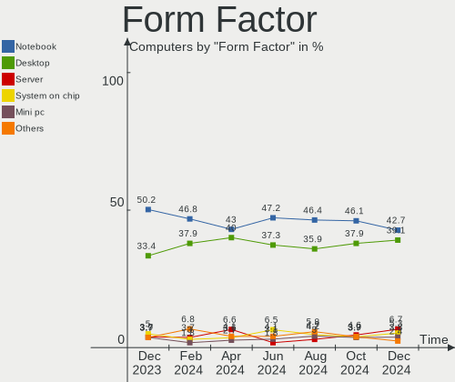
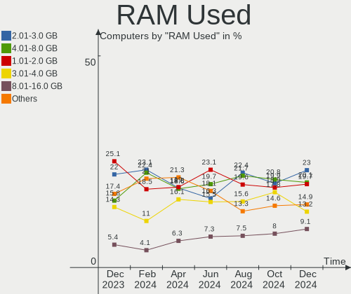
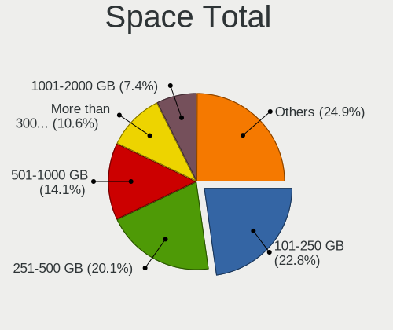
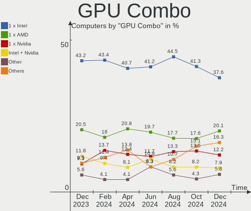
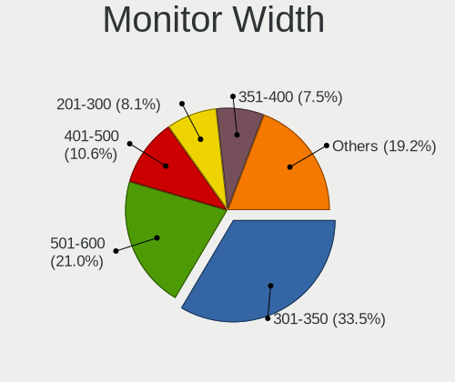
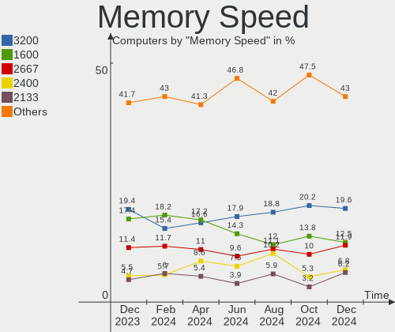

Debian - Hardware Trends
------------------------

A project to identify most popular hardware characteristics and track their change
over time based on data collected by Linux users at https://Linux-Hardware.org.

Anyone can contribute to this report by the [hw-probe](https://github.com/linuxhw/hw-probe) tool:

    sudo -E hw-probe -all -upload

This is a report for all computer types. See also reports for [desktops](/Dist/Debian/Desktop/README.md) and [notebooks](/Dist/Debian/Notebook/README.md).

This report is for one last month. Overall report since the beginning of time: [TestCoverage](https://github.com/linuxhw/TestCoverage)

Period: Oct, 2022.

Contents
--------

* [ System ](#system)
  - [ OS                       ](#os)
  - [ OS Family                ](#os-family)
  - [ Kernel                   ](#kernel)
  - [ Kernel Family            ](#kernel-family)
  - [ Kernel Major Ver.        ](#kernel-major-ver)
  - [ Arch                     ](#arch)
  - [ DE                       ](#de)
  - [ Display Server           ](#display-server)
  - [ Display Manager          ](#display-manager)
  - [ OS Lang                  ](#os-lang)
  - [ Boot Mode                ](#boot-mode)
  - [ Filesystem               ](#filesystem)
  - [ Part. scheme             ](#part-scheme)
  - [ Dual Boot with Linux/BSD ](#dual-boot-with-linuxbsd)
  - [ Dual Boot (Win)          ](#dual-boot-win)

* [ Board ](#board)
  - [ Vendor                   ](#vendor)
  - [ Model                    ](#model)
  - [ Model Family             ](#model-family)
  - [ MFG Year                 ](#mfg-year)
  - [ Form Factor              ](#form-factor)
  - [ Secure Boot              ](#secure-boot)
  - [ Coreboot                 ](#coreboot)
  - [ RAM Size                 ](#ram-size)
  - [ RAM Used                 ](#ram-used)
  - [ Total Drives             ](#total-drives)
  - [ Has CD-ROM               ](#has-cd-rom)
  - [ Has Ethernet             ](#has-ethernet)
  - [ Has WiFi                 ](#has-wifi)
  - [ Has Bluetooth            ](#has-bluetooth)

* [ Location ](#location)
  - [ Country                  ](#country)
  - [ City                     ](#city)

* [ Drives ](#drives)
  - [ Drive Vendor             ](#drive-vendor)
  - [ Drive Model              ](#drive-model)
  - [ HDD Vendor               ](#hdd-vendor)
  - [ SSD Vendor               ](#ssd-vendor)
  - [ Drive Kind               ](#drive-kind)
  - [ Drive Connector          ](#drive-connector)
  - [ Drive Size               ](#drive-size)
  - [ Space Total              ](#space-total)
  - [ Space Used               ](#space-used)
  - [ Malfunc. Drives          ](#malfunc-drives)
  - [ Malfunc. Drive Vendor    ](#malfunc-drive-vendor)
  - [ Malfunc. HDD Vendor      ](#malfunc-hdd-vendor)
  - [ Malfunc. Drive Kind      ](#malfunc-drive-kind)
  - [ Failed Drives            ](#failed-drives)
  - [ Failed Drive Vendor      ](#failed-drive-vendor)
  - [ Drive Status             ](#drive-status)

* [ Storage controller ](#storage-controller)
  - [ Storage Vendor           ](#storage-vendor)
  - [ Storage Model            ](#storage-model)
  - [ Storage Kind             ](#storage-kind)

* [ Processor ](#processor)
  - [ CPU Vendor               ](#cpu-vendor)
  - [ CPU Model                ](#cpu-model)
  - [ CPU Model Family         ](#cpu-model-family)
  - [ CPU Cores                ](#cpu-cores)
  - [ CPU Sockets              ](#cpu-sockets)
  - [ CPU Threads              ](#cpu-threads)
  - [ CPU Op-Modes             ](#cpu-op-modes)
  - [ CPU Microcode            ](#cpu-microcode)
  - [ CPU Microarch            ](#cpu-microarch)

* [ Graphics ](#graphics)
  - [ GPU Vendor               ](#gpu-vendor)
  - [ GPU Model                ](#gpu-model)
  - [ GPU Combo                ](#gpu-combo)
  - [ GPU Driver               ](#gpu-driver)
  - [ GPU Memory               ](#gpu-memory)

* [ Monitor ](#monitor)
  - [ Monitor Vendor           ](#monitor-vendor)
  - [ Monitor Model            ](#monitor-model)
  - [ Monitor Resolution       ](#monitor-resolution)
  - [ Monitor Diagonal         ](#monitor-diagonal)
  - [ Monitor Width            ](#monitor-width)
  - [ Aspect Ratio             ](#aspect-ratio)
  - [ Monitor Area             ](#monitor-area)
  - [ Pixel Density            ](#pixel-density)
  - [ Multiple Monitors        ](#multiple-monitors)

* [ Network ](#network)
  - [ Net Controller Vendor    ](#net-controller-vendor)
  - [ Net Controller Model     ](#net-controller-model)
  - [ Wireless Vendor          ](#wireless-vendor)
  - [ Wireless Model           ](#wireless-model)
  - [ Ethernet Vendor          ](#ethernet-vendor)
  - [ Ethernet Model           ](#ethernet-model)
  - [ Net Controller Kind      ](#net-controller-kind)
  - [ Used Controller          ](#used-controller)
  - [ NICs                     ](#nics)
  - [ IPv6                     ](#ipv6)

* [ Bluetooth ](#bluetooth)
  - [ Bluetooth Vendor         ](#bluetooth-vendor)
  - [ Bluetooth Model          ](#bluetooth-model)

* [ Sound ](#sound)
  - [ Sound Vendor             ](#sound-vendor)
  - [ Sound Model              ](#sound-model)

* [ Memory ](#memory)
  - [ Memory Vendor            ](#memory-vendor)
  - [ Memory Model             ](#memory-model)
  - [ Memory Kind              ](#memory-kind)
  - [ Memory Form Factor       ](#memory-form-factor)
  - [ Memory Size              ](#memory-size)
  - [ Memory Speed             ](#memory-speed)

* [ Printers & scanners ](#printers--scanners)
  - [ Printer Vendor           ](#printer-vendor)
  - [ Printer Model            ](#printer-model)
  - [ Scanner Vendor           ](#scanner-vendor)
  - [ Scanner Model            ](#scanner-model)

* [ Camera ](#camera)
  - [ Camera Vendor            ](#camera-vendor)
  - [ Camera Model             ](#camera-model)

* [ Security ](#security)
  - [ Fingerprint Vendor       ](#fingerprint-vendor)
  - [ Fingerprint Model        ](#fingerprint-model)
  - [ Chipcard Vendor          ](#chipcard-vendor)
  - [ Chipcard Model           ](#chipcard-model)

* [ Unsupported ](#unsupported)
  - [ Unsupported Devices      ](#unsupported-devices)
  - [ Unsupported Device Types ](#unsupported-device-types)

System
------

OS
--

Installed operating systems

| Name              | Computers | Percent |
|-------------------|-----------|---------|
| Debian 11         | 302       | 83.66%  |
| Debian Testing    | 30        | 8.31%   |
| Debian            | 18        | 4.99%   |
| Debian 10         | 6         | 1.66%   |
| Debian Sid        | 1         | 0.28%   |
| Debian 9          | 1         | 0.28%   |
| Debian 8          | 1         | 0.28%   |
| Debian 6          | 1         | 0.28%   |
| Debian 11-updates | 1         | 0.28%   |

OS Family
---------

OS without a version

| Name   | Computers | Percent |
|--------|-----------|---------|
| Debian | 361       | 100%    |

Kernel
------

Version of the Linux kernel

| Version                     | Computers | Percent |
|-----------------------------|-----------|---------|
| 5.10.0-18-amd64             | 119       | 32.96%  |
| 5.10.0-19-amd64             | 62        | 17.17%  |
| 5.19.0-2-amd64              | 38        | 10.53%  |
| 5.18.0-0.deb11.4-amd64      | 18        | 4.99%   |
| 5.10.0-16-amd64             | 17        | 4.71%   |
| 5.10.0-7-amd64              | 16        | 4.43%   |
| 6.0.0-2-amd64               | 12        | 3.32%   |
| 5.15.61-v8+                 | 6         | 1.66%   |
| 6.0.0-1-amd64               | 5         | 1.39%   |
| 5.19.0-1-amd64              | 5         | 1.39%   |
| 5.10.0-18-686-pae           | 5         | 1.39%   |
| 5.15.53-1-pve               | 4         | 1.11%   |
| 5.10.0-17-amd64             | 3         | 0.83%   |
| 5.10.0-13-amd64             | 3         | 0.83%   |
| 4.19.0-22-amd64             | 3         | 0.83%   |
| 6.0.1                       | 2         | 0.55%   |
| 5.19.11                     | 2         | 0.55%   |
| 5.15.60-2-pve               | 2         | 0.55%   |
| 5.10.142+truenas            | 2         | 0.55%   |
| 5.10.0-19-686               | 2         | 0.55%   |
| 6.0.3-x64v1-xanmod1         | 1         | 0.28%   |
| 6.0.2                       | 1         | 0.28%   |
| 6.0.0-amd64                 | 1         | 0.28%   |
| 6.0.0-0.slh.1-aptosid-686   | 1         | 0.28%   |
| 6.0.0                       | 1         | 0.28%   |
| 5.7.0-0.bpo.2-amd64         | 1         | 0.28%   |
| 5.5.0-0.bpo.2-amd64         | 1         | 0.28%   |
| 5.19.15-04011-g49dca1c53e48 | 1         | 0.28%   |
| 5.19.12-xanmod1             | 1         | 0.28%   |
| 5.19.10-titanide            | 1         | 0.28%   |
| 5.19.0-17.1-liquorix-amd64  | 1         | 0.28%   |
| 5.19.0-0.deb11.2-rt-amd64   | 1         | 0.28%   |
| 5.19.0-0.deb11.2-amd64      | 1         | 0.28%   |
| 5.18.16-i7                  | 1         | 0.28%   |
| 5.18.0-4mx-amd64            | 1         | 0.28%   |
| 5.18.0-3-arm64              | 1         | 0.28%   |
| 5.17.0-rc8-amd64            | 1         | 0.28%   |
| 5.15.30-2-pve               | 1         | 0.28%   |
| 5.13.19-6-pve               | 1         | 0.28%   |
| 5.10.68-station             | 1         | 0.28%   |

Kernel Family
-------------

Linux kernel without a distro release

| Version  | Computers | Percent |
|----------|-----------|---------|
| 5.10.0   | 238       | 65.93%  |
| 5.19.0   | 46        | 12.74%  |
| 6.0.0    | 20        | 5.54%   |
| 5.18.0   | 20        | 5.54%   |
| 5.15.61  | 6         | 1.66%   |
| 5.15.53  | 4         | 1.11%   |
| 4.19.0   | 3         | 0.83%   |
| 6.0.1    | 2         | 0.55%   |
| 5.19.11  | 2         | 0.55%   |
| 5.15.60  | 2         | 0.55%   |
| 5.10.142 | 2         | 0.55%   |
| 6.0.3    | 1         | 0.28%   |
| 6.0.2    | 1         | 0.28%   |
| 5.7.0    | 1         | 0.28%   |
| 5.5.0    | 1         | 0.28%   |
| 5.19.15  | 1         | 0.28%   |
| 5.19.12  | 1         | 0.28%   |
| 5.19.10  | 1         | 0.28%   |
| 5.18.16  | 1         | 0.28%   |
| 5.17.0   | 1         | 0.28%   |
| 5.15.30  | 1         | 0.28%   |
| 5.13.19  | 1         | 0.28%   |
| 5.10.68  | 1         | 0.28%   |
| 5.10.46  | 1         | 0.28%   |
| 5.10.43  | 1         | 0.28%   |
| 4.1.42   | 1         | 0.28%   |
| 2.6.26   | 1         | 0.28%   |

Kernel Major Ver.
-----------------

Linux kernel major version

| Version | Computers | Percent |
|---------|-----------|---------|
| 5.10    | 243       | 67.31%  |
| 5.19    | 51        | 14.13%  |
| 6.0     | 24        | 6.65%   |
| 5.18    | 21        | 5.82%   |
| 5.15    | 13        | 3.6%    |
| 4.19    | 3         | 0.83%   |
| 5.7     | 1         | 0.28%   |
| 5.5     | 1         | 0.28%   |
| 5.17    | 1         | 0.28%   |
| 5.13    | 1         | 0.28%   |
| 4.1     | 1         | 0.28%   |
| 2.6     | 1         | 0.28%   |

Arch
----

OS architecture (x86_64, i586, etc.)

| Name    | Computers | Percent |
|---------|-----------|---------|
| x86_64  | 337       | 93.35%  |
| i686    | 11        | 3.05%   |
| aarch64 | 10        | 2.77%   |
| ppc64   | 1         | 0.28%   |
| i586    | 1         | 0.28%   |
| armv7l  | 1         | 0.28%   |

DE
--

Desktop Environment

| Name             | Computers | Percent |
|------------------|-----------|---------|
| GNOME            | 108       | 29.92%  |
| Unknown          | 82        | 22.71%  |
| KDE5             | 51        | 14.13%  |
| XFCE             | 45        | 12.47%  |
| X-Cinnamon       | 14        | 3.88%   |
| MATE             | 11        | 3.05%   |
| LXDE             | 11        | 3.05%   |
| Cinnamon         | 8         | 2.22%   |
| LXQt             | 7         | 1.94%   |
| i3               | 7         | 1.94%   |
| GNOME Flashback  | 6         | 1.66%   |
| trinity          | 5         | 1.39%   |
| openbox          | 2         | 0.55%   |
| lightdm-xsession | 1         | 0.28%   |
| KDE              | 1         | 0.28%   |
| GNOME Classic    | 1         | 0.28%   |
| Budgie           | 1         | 0.28%   |

Display Server
--------------

X11 or Wayland

| Name    | Computers | Percent |
|---------|-----------|---------|
| X11     | 204       | 56.51%  |
| Wayland | 65        | 18.01%  |
| Unknown | 58        | 16.07%  |
| Tty     | 33        | 9.14%   |
| Web     | 1         | 0.28%   |

Display Manager
---------------

SDDM, LightDM, etc.

| Name    | Computers | Percent |
|---------|-----------|---------|
| Unknown | 129       | 35.73%  |
| LightDM | 85        | 23.55%  |
| GDM     | 66        | 18.28%  |
| SDDM    | 44        | 12.19%  |
| GDM3    | 32        | 8.86%   |
| XDM     | 3         | 0.83%   |
| SLiM    | 1         | 0.28%   |
| NODM    | 1         | 0.28%   |

OS Lang
-------

Language

| Lang       | Computers | Percent |
|------------|-----------|---------|
| en_US      | 118       | 32.69%  |
| Unknown    | 31        | 8.59%   |
| ru_RU      | 29        | 8.03%   |
| fr_FR      | 28        | 7.76%   |
| it_IT      | 27        | 7.48%   |
| de_DE      | 22        | 6.09%   |
| en_GB      | 19        | 5.26%   |
| es_ES      | 12        | 3.32%   |
| pt_BR      | 9         | 2.49%   |
| C          | 8         | 2.22%   |
| pl_PL      | 5         | 1.39%   |
| es_MX      | 4         | 1.11%   |
| nl_BE      | 3         | 0.83%   |
| es_VE      | 3         | 0.83%   |
| en_PH      | 3         | 0.83%   |
| de_AT      | 3         | 0.83%   |
| zh_TW      | 2         | 0.55%   |
| nb_NO      | 2         | 0.55%   |
| es_PE      | 2         | 0.55%   |
| es_CL      | 2         | 0.55%   |
| es_AR      | 2         | 0.55%   |
| en_US.UTF8 | 2         | 0.55%   |
| en_SG      | 2         | 0.55%   |
| en_IE      | 2         | 0.55%   |
| en_DE      | 2         | 0.55%   |
| en_CA      | 2         | 0.55%   |
| en_AU      | 2         | 0.55%   |
| de_CH      | 2         | 0.55%   |
| zh_CN      | 1         | 0.28%   |
| sv_SE      | 1         | 0.28%   |
| pt_PT      | 1         | 0.28%   |
| nl_NL      | 1         | 0.28%   |
| it_CH      | 1         | 0.28%   |
| hu_HU      | 1         | 0.28%   |
| es_CO      | 1         | 0.28%   |
| es_BO      | 1         | 0.28%   |
| en_NZ      | 1         | 0.28%   |
| en_DK      | 1         | 0.28%   |
| de_DE@euro | 1         | 0.28%   |
| ca_ES      | 1         | 0.28%   |

Boot Mode
---------

EFI or BIOS

| Mode | Computers | Percent |
|------|-----------|---------|
| EFI  | 215       | 59.56%  |
| BIOS | 146       | 40.44%  |

Filesystem
----------

Type of filesystem

| Type    | Computers | Percent |
|---------|-----------|---------|
| Ext4    | 274       | 75.9%   |
| Overlay | 54        | 14.96%  |
| Btrfs   | 18        | 4.99%   |
| Xfs     | 6         | 1.66%   |
| Zfs     | 4         | 1.11%   |
| Tmpfs   | 3         | 0.83%   |
| Rootfs  | 1         | 0.28%   |
| Ext3    | 1         | 0.28%   |

Part. scheme
------------

Scheme of partitioning

| Type    | Computers | Percent |
|---------|-----------|---------|
| GPT     | 237       | 65.65%  |
| MBR     | 69        | 19.11%  |
| Unknown | 55        | 15.24%  |

Dual Boot with Linux/BSD
------------------------

Hosting more than one Linux/BSD

| Dual boot | Computers | Percent |
|-----------|-----------|---------|
| No        | 305       | 84.49%  |
| Yes       | 56        | 15.51%  |

Dual Boot (Win)
---------------

Hosting Linux and Windows

| Dual boot | Computers | Percent |
|-----------|-----------|---------|
| No        | 237       | 65.65%  |
| Yes       | 124       | 34.35%  |

Board
-----

Vendor
------

Motherboard manufacturer

| Name                           | Computers | Percent |
|--------------------------------|-----------|---------|
| Lenovo                         | 63        | 17.45%  |
| ASUSTek Computer               | 56        | 15.51%  |
| Dell                           | 50        | 13.85%  |
| Hewlett-Packard                | 38        | 10.53%  |
| MSI                            | 24        | 6.65%   |
| ASRock                         | 17        | 4.71%   |
| Gigabyte Technology            | 16        | 4.43%   |
| Acer                           | 13        | 3.6%    |
| Toshiba                        | 9         | 2.49%   |
| Apple                          | 9         | 2.49%   |
| Raspberry Pi Foundation        | 8         | 2.22%   |
| Unknown                        | 7         | 1.94%   |
| Fujitsu                        | 5         | 1.39%   |
| Intel                          | 4         | 1.11%   |
| Google                         | 4         | 1.11%   |
| Supermicro                     | 3         | 0.83%   |
| Aquarius                       | 3         | 0.83%   |
| Shanghai Zhaoxin Semiconductor | 2         | 0.55%   |
| Pegatron                       | 2         | 0.55%   |
| Packard Bell                   | 2         | 0.55%   |
| Inventec                       | 2         | 0.55%   |
| HUAWEI                         | 2         | 0.55%   |
| Chuwi                          | 2         | 0.55%   |
| TrekStor                       | 1         | 0.28%   |
| Thomson                        | 1         | 0.28%   |
| Techvision                     | 1         | 0.28%   |
| Sony                           | 1         | 0.28%   |
| SLIMBOOK                       | 1         | 0.28%   |
| Shuttle                        | 1         | 0.28%   |
| SANTECH                        | 1         | 0.28%   |
| Samsung Electronics            | 1         | 0.28%   |
| Panasonic                      | 1         | 0.28%   |
| Notebook                       | 1         | 0.28%   |
| libre-computer                 | 1         | 0.28%   |
| Insyde                         | 1         | 0.28%   |
| IBM                            | 1         | 0.28%   |
| Huanan                         | 1         | 0.28%   |
| Giga-Byte Technology           | 1         | 0.28%   |
| Foxconn                        | 1         | 0.28%   |
| Biostar                        | 1         | 0.28%   |

Model
-----

Motherboard model

| Name                                      | Computers | Percent |
|-------------------------------------------|-----------|---------|
| Lenovo ThinkPad E475 20H40006US           | 14        | 3.88%   |
| Unknown                                   | 7         | 1.94%   |
| MSI MS-7C02                               | 3         | 0.83%   |
| MSI MS-7817                               | 3         | 0.83%   |
| Lenovo ThinkPad 13 2nd Gen 20J10046US     | 3         | 0.83%   |
| HP EliteBook 8460p                        | 3         | 0.83%   |
| ASUS All Series                           | 3         | 0.83%   |
| ASRock B450M Pro4                         | 3         | 0.83%   |
| Aquarius NS585                            | 3         | 0.83%   |
| Shanghai Zhaoxin ZXE CRB                  | 2         | 0.55%   |
| RPi Raspberry Pi 4 Model B Rev 1.4        | 2         | 0.55%   |
| MSI MS-7996                               | 2         | 0.55%   |
| Lenovo ThinkPad L14 Gen 1 20U50001GE      | 2         | 0.55%   |
| Lenovo ThinkPad L13 Yoga Gen 2 20VK0019US | 2         | 0.55%   |
| Lenovo ThinkBook 15 G2 ITL 20VE           | 2         | 0.55%   |
| HUAWEI NBLB-WAX9N                         | 2         | 0.55%   |
| HP EliteBook 745 G3                       | 2         | 0.55%   |
| HP Compaq 6005 Pro MT PC                  | 2         | 0.55%   |
| Gigabyte B450M DS3H                       | 2         | 0.55%   |
| Gigabyte 970A-DS3P                        | 2         | 0.55%   |
| Fujitsu ESPRIMO P720                      | 2         | 0.55%   |
| Dell Precision 7520                       | 2         | 0.55%   |
| Dell Precision 3640 Tower                 | 2         | 0.55%   |
| Dell Latitude 3320                        | 2         | 0.55%   |
| ASUS PRIME Z690-P WIFI D4                 | 2         | 0.55%   |
| ASUS G75VW                                | 2         | 0.55%   |
| Apple MacBookAir7,2                       | 2         | 0.55%   |
| Apple MacBook5,2                          | 2         | 0.55%   |
| TrekStor Primebook C13                    | 1         | 0.28%   |
| Toshiba Satellite P50-B-103               | 1         | 0.28%   |
| Toshiba Satellite L855                    | 1         | 0.28%   |
| Toshiba Satellite L755                    | 1         | 0.28%   |
| Toshiba Satellite L45                     | 1         | 0.28%   |
| Toshiba Satellite L40                     | 1         | 0.28%   |
| Toshiba Satellite C650D                   | 1         | 0.28%   |
| Toshiba Satellite A100                    | 1         | 0.28%   |
| Toshiba NB505                             | 1         | 0.28%   |
| Toshiba dynabook MX/33KBL                 | 1         | 0.28%   |
| Thomson N14C4WH64                         | 1         | 0.28%   |
| Techvision TVI7309X                       | 1         | 0.28%   |

Model Family
------------

Motherboard model prefix

| Name                 | Computers | Percent |
|----------------------|-----------|---------|
| Lenovo ThinkPad      | 43        | 11.91%  |
| HP EliteBook         | 12        | 3.32%   |
| Dell Latitude        | 12        | 3.32%   |
| Dell Precision       | 10        | 2.77%   |
| Acer Aspire          | 10        | 2.77%   |
| ASUS PRIME           | 9         | 2.49%   |
| RPi Raspberry        | 8         | 2.22%   |
| Lenovo IdeaPad       | 8         | 2.22%   |
| Dell OptiPlex        | 8         | 2.22%   |
| Toshiba Satellite    | 7         | 1.94%   |
| HP Pavilion          | 7         | 1.94%   |
| Dell Inspiron        | 7         | 1.94%   |
| Unknown              | 7         | 1.94%   |
| HP Compaq            | 6         | 1.66%   |
| Dell Vostro          | 5         | 1.39%   |
| Dell XPS             | 4         | 1.11%   |
| MSI MS-7C02          | 3         | 0.83%   |
| MSI MS-7817          | 3         | 0.83%   |
| Lenovo ThinkBook     | 3         | 0.83%   |
| Dell PowerEdge       | 3         | 0.83%   |
| ASUS ZenBook         | 3         | 0.83%   |
| ASUS TUF             | 3         | 0.83%   |
| ASUS ROG             | 3         | 0.83%   |
| ASUS All             | 3         | 0.83%   |
| ASRock B450M         | 3         | 0.83%   |
| Aquarius NS585       | 3         | 0.83%   |
| Shanghai Zhaoxin ZXE | 2         | 0.55%   |
| MSI MS-7996          | 2         | 0.55%   |
| HUAWEI NBLB-WAX9N    | 2         | 0.55%   |
| Gigabyte B450M       | 2         | 0.55%   |
| Gigabyte 970A-DS3P   | 2         | 0.55%   |
| Fujitsu ESPRIMO      | 2         | 0.55%   |
| ASUS VivoBook        | 2         | 0.55%   |
| ASUS G75VW           | 2         | 0.55%   |
| ASUS ASUS            | 2         | 0.55%   |
| ASRock Z97           | 2         | 0.55%   |
| Apple MacBookAir7    | 2         | 0.55%   |
| Apple MacBook5       | 2         | 0.55%   |
| Acer Swift           | 2         | 0.55%   |
| TrekStor Primebook   | 1         | 0.28%   |

MFG Year
--------

Motherboard manufacture year

| Year    | Computers | Percent |
|---------|-----------|---------|
| 2020    | 44        | 12.19%  |
| 2019    | 43        | 11.91%  |
| 2012    | 31        | 8.59%   |
| 2021    | 28        | 7.76%   |
| 2022    | 24        | 6.65%   |
| 2013    | 22        | 6.09%   |
| 2018    | 20        | 5.54%   |
| 2011    | 20        | 5.54%   |
| 2016    | 19        | 5.26%   |
| 2015    | 19        | 5.26%   |
| 2017    | 17        | 4.71%   |
| 2010    | 17        | 4.71%   |
| 2009    | 15        | 4.16%   |
| 2014    | 13        | 3.6%    |
| Unknown | 11        | 3.05%   |
| 2008    | 7         | 1.94%   |
| 2006    | 6         | 1.66%   |
| 2007    | 3         | 0.83%   |
| 2005    | 1         | 0.28%   |
| 2000    | 1         | 0.28%   |

Form Factor
-----------

Physical design of the computer

| Name           | Computers | Percent |
|----------------|-----------|---------|
| Notebook       | 188       | 52.08%  |
| Desktop        | 136       | 37.67%  |
| System on chip | 10        | 2.77%   |
| Convertible    | 9         | 2.49%   |
| Server         | 8         | 2.22%   |
| Mini pc        | 7         | 1.94%   |
| All in one     | 3         | 0.83%   |

Secure Boot
-----------

Enabled or disabled

| State    | Computers | Percent |
|----------|-----------|---------|
| Disabled | 330       | 91.41%  |
| Enabled  | 31        | 8.59%   |

Coreboot
--------

Have coreboot on board

| Used | Computers | Percent |
|------|-----------|---------|
| No   | 357       | 98.89%  |
| Yes  | 4         | 1.11%   |

RAM Size
--------

Total RAM memory

| Size in GB      | Computers | Percent |
|-----------------|-----------|---------|
| 4.01-8.0        | 97        | 26.87%  |
| 16.01-24.0      | 72        | 19.94%  |
| 3.01-4.0        | 53        | 14.68%  |
| 8.01-16.0       | 45        | 12.47%  |
| 32.01-64.0      | 39        | 10.8%   |
| 64.01-256.0     | 19        | 5.26%   |
| 1.01-2.0        | 13        | 3.6%    |
| 2.01-3.0        | 8         | 2.22%   |
| 24.01-32.0      | 6         | 1.66%   |
| 0.51-1.0        | 4         | 1.11%   |
| 0.01-0.5        | 2         | 0.55%   |
| More than 256.0 | 1         | 0.28%   |
| 0               | 1         | 0.28%   |
| Unknown         | 1         | 0.28%   |

RAM Used
--------

Used RAM memory

| Used GB    | Computers | Percent |
|------------|-----------|---------|
| 1.01-2.0   | 103       | 28.53%  |
| 2.01-3.0   | 73        | 20.22%  |
| 4.01-8.0   | 60        | 16.62%  |
| 3.01-4.0   | 44        | 12.19%  |
| 0.51-1.0   | 38        | 10.53%  |
| 0.01-0.5   | 18        | 4.99%   |
| 8.01-16.0  | 14        | 3.88%   |
| 16.01-24.0 | 6         | 1.66%   |
| 32.01-64.0 | 3         | 0.83%   |
| Unknown    | 2         | 0.55%   |

Total Drives
------------

Number of drives on board

| Drives | Computers | Percent |
|--------|-----------|---------|
| 1      | 223       | 61.77%  |
| 2      | 73        | 20.22%  |
| 3      | 26        | 7.2%    |
| 4      | 13        | 3.6%    |
| 5      | 9         | 2.49%   |
| 6      | 5         | 1.39%   |
| 7      | 4         | 1.11%   |
| 0      | 4         | 1.11%   |
| 8      | 2         | 0.55%   |
| 14     | 1         | 0.28%   |
| 9      | 1         | 0.28%   |

Has CD-ROM
----------

Has CD-ROM on board

| Presented | Computers | Percent |
|-----------|-----------|---------|
| No        | 256       | 70.91%  |
| Yes       | 105       | 29.09%  |

Has Ethernet
------------

Has Ethernet on board

| Presented | Computers | Percent |
|-----------|-----------|---------|
| Yes       | 320       | 88.64%  |
| No        | 41        | 11.36%  |

Has WiFi
--------

Has WiFi module

| Presented | Computers | Percent |
|-----------|-----------|---------|
| Yes       | 252       | 69.81%  |
| No        | 109       | 30.19%  |

Has Bluetooth
-------------

Has Bluetooth module

| Presented | Computers | Percent |
|-----------|-----------|---------|
| Yes       | 199       | 55.12%  |
| No        | 162       | 44.88%  |

Location
--------

Country
-------

Geographic location (country)

| Country      | Computers | Percent |
|--------------|-----------|---------|
| USA          | 77        | 21.33%  |
| Germany      | 41        | 11.36%  |
| Italy        | 40        | 11.08%  |
| Russia       | 33        | 9.14%   |
| France       | 33        | 9.14%   |
| Spain        | 14        | 3.88%   |
| Brazil       | 14        | 3.88%   |
| Poland       | 9         | 2.49%   |
| Netherlands  | 7         | 1.94%   |
| Mexico       | 7         | 1.94%   |
| UK           | 6         | 1.66%   |
| Switzerland  | 5         | 1.39%   |
| Belgium      | 5         | 1.39%   |
| China        | 4         | 1.11%   |
| Austria      | 4         | 1.11%   |
| Australia    | 4         | 1.11%   |
| Venezuela    | 3         | 0.83%   |
| Denmark      | 3         | 0.83%   |
| Canada       | 3         | 0.83%   |
| Argentina    | 3         | 0.83%   |
| Vietnam      | 2         | 0.55%   |
| Taiwan       | 2         | 0.55%   |
| Sweden       | 2         | 0.55%   |
| Slovenia     | 2         | 0.55%   |
| Singapore    | 2         | 0.55%   |
| Portugal     | 2         | 0.55%   |
| Peru         | 2         | 0.55%   |
| Norway       | 2         | 0.55%   |
| New Zealand  | 2         | 0.55%   |
| Hungary      | 2         | 0.55%   |
| Chile        | 2         | 0.55%   |
| Bulgaria     | 2         | 0.55%   |
| Slovakia     | 1         | 0.28%   |
| Saudi Arabia | 1         | 0.28%   |
| Romania      | 1         | 0.28%   |
| Qatar        | 1         | 0.28%   |
| Puerto Rico  | 1         | 0.28%   |
| Philippines  | 1         | 0.28%   |
| Morocco      | 1         | 0.28%   |
| Malaysia     | 1         | 0.28%   |

City
----

Geographic location (city)

| City                    | Computers | Percent |
|-------------------------|-----------|---------|
| Bangor                  | 30        | 8.31%   |
| Voronezh                | 16        | 4.43%   |
| Milan                   | 6         | 1.66%   |
| Turin                   | 5         | 1.39%   |
| Seville                 | 4         | 1.11%   |
| Moscow                  | 4         | 1.11%   |
| Zurich                  | 3         | 0.83%   |
| St Petersburg           | 3         | 0.83%   |
| Sao Paulo               | 3         | 0.83%   |
| Marseille               | 3         | 0.83%   |
| Frankfurt am Main       | 3         | 0.83%   |
| Barcelona               | 3         | 0.83%   |
| Waregem                 | 2         | 0.55%   |
| Vienna                  | 2         | 0.55%   |
| Sydney                  | 2         | 0.55%   |
| Singapore               | 2         | 0.55%   |
| Santa Maria             | 2         | 0.55%   |
| San Diego               | 2         | 0.55%   |
| Poljane nad Skofjo Loko | 2         | 0.55%   |
| Phoenix                 | 2         | 0.55%   |
| Natal                   | 2         | 0.55%   |
| Nantes                  | 2         | 0.55%   |
| Miami                   | 2         | 0.55%   |
| Leipzig                 | 2         | 0.55%   |
| Kirchhundem             | 2         | 0.55%   |
| Kaufbeuren              | 2         | 0.55%   |
| Hanau                   | 2         | 0.55%   |
| Guadalajara             | 2         | 0.55%   |
| Gainesville             | 2         | 0.55%   |
| Dunedin                 | 2         | 0.55%   |
| Copenhagen              | 2         | 0.55%   |
| Cologne                 | 2         | 0.55%   |
| Caracas                 | 2         | 0.55%   |
| Bologna                 | 2         | 0.55%   |
| Bad Hall                | 2         | 0.55%   |
| Arlington               | 2         | 0.55%   |
| Amsterdam               | 2         | 0.55%   |
| Zuidland                | 1         | 0.28%   |
| Zanevka                 | 1         | 0.28%   |
| Yuma                    | 1         | 0.28%   |

Drives
------

Drive Vendor
------------

Hard drive vendors

| Vendor              | Computers | Drives | Percent |
|---------------------|-----------|--------|---------|
| Samsung Electronics | 91        | 106    | 16.73%  |
| Seagate             | 71        | 101    | 13.05%  |
| WDC                 | 69        | 94     | 12.68%  |
| Kingston            | 46        | 51     | 8.46%   |
| SanDisk             | 31        | 33     | 5.7%    |
| Toshiba             | 27        | 35     | 4.96%   |
| Crucial             | 26        | 28     | 4.78%   |
| Unknown             | 24        | 27     | 4.41%   |
| Hitachi             | 15        | 17     | 2.76%   |
| Micron Technology   | 13        | 13     | 2.39%   |
| SK hynix            | 11        | 12     | 2.02%   |
| Intel               | 11        | 11     | 2.02%   |
| HGST                | 11        | 15     | 2.02%   |
| A-DATA Technology   | 10        | 13     | 1.84%   |
| SPCC                | 9         | 9      | 1.65%   |
| China               | 6         | 6      | 1.1%    |
| Phison              | 5         | 5      | 0.92%   |
| PNY                 | 3         | 4      | 0.55%   |
| Phison Electronics  | 3         | 3      | 0.55%   |
| LITEON              | 3         | 3      | 0.55%   |
| ASMT                | 3         | 3      | 0.55%   |
| XPG                 | 2         | 3      | 0.37%   |
| Transcend           | 2         | 2      | 0.37%   |
| Team                | 2         | 2      | 0.37%   |
| SSSTC               | 2         | 2      | 0.37%   |
| Netac               | 2         | 2      | 0.37%   |
| Maxtor              | 2         | 2      | 0.37%   |
| Hewlett-Packard     | 2         | 1      | 0.37%   |
| GOODRAM             | 2         | 2      | 0.37%   |
| Fujitsu             | 2         | 2      | 0.37%   |
| Apple               | 2         | 2      | 0.37%   |
| Unknown             | 2         | 2      | 0.37%   |
| XrayDisk            | 1         | 1      | 0.18%   |
| VNYEZ               | 1         | 1      | 0.18%   |
| UMIS                | 1         | 1      | 0.18%   |
| Synology            | 1         | 1      | 0.18%   |
| Supermicro          | 1         | 1      | 0.18%   |
| Solid State Storage | 1         | 1      | 0.18%   |
| sobetter            | 1         | 1      | 0.18%   |
| QNAP                | 1         | 1      | 0.18%   |

Drive Model
-----------

Hard drive models

| Model                                               | Computers | Percent |
|-----------------------------------------------------|-----------|---------|
| Kingston SA400S37120G 120GB SSD                     | 16        | 2.71%   |
| Kingston SA400S37240G 240GB SSD                     | 7         | 1.19%   |
| Kingston SV300S37A120G 120GB SSD                    | 6         | 1.02%   |
| Seagate ST3500418AS 500GB                           | 5         | 0.85%   |
| Samsung SSD 860 EVO 250GB                           | 5         | 0.85%   |
| Samsung MZVLB512HBJQ-000L7 512GB                    | 5         | 0.85%   |
| Seagate ST1000DM003-1CH162 1TB                      | 4         | 0.68%   |
| Samsung SSD 970 EVO 1TB                             | 4         | 0.68%   |
| Samsung SSD 860 EVO 1TB                             | 4         | 0.68%   |
| Kingston SA400S37480G 480GB SSD                     | 4         | 0.68%   |
| HGST HTS721010A9E630 1TB                            | 4         | 0.68%   |
| Crucial CT500MX500SSD1 500GB                        | 4         | 0.68%   |
| Crucial CT1000MX500SSD1 1TB                         | 4         | 0.68%   |
| WDC WD5000AAKX-60U6AA0 500GB                        | 3         | 0.51%   |
| WDC WD20EARX-00PASB0 2TB                            | 3         | 0.51%   |
| WDC WD10EZEX-08WN4A0 1TB                            | 3         | 0.51%   |
| Unknown MMC Card  32GB                              | 3         | 0.51%   |
| Seagate ST500DM002-1BD142 500GB                     | 3         | 0.51%   |
| Seagate ST4000VN008-2DR166 4TB                      | 3         | 0.51%   |
| Seagate ST1000LM024 HN-M101MBB 1TB                  | 3         | 0.51%   |
| Seagate Backup+ Hub BK 4TB                          | 3         | 0.51%   |
| SanDisk SDSSDA120G 120GB                            | 3         | 0.51%   |
| Samsung SSD 970 EVO Plus 1TB                        | 3         | 0.51%   |
| Samsung SSD 870 QVO 1TB                             | 3         | 0.51%   |
| Samsung SSD 860 QVO 1TB                             | 3         | 0.51%   |
| Samsung NVMe SSD Controller SM981/PM981/PM983 500GB | 3         | 0.51%   |
| Crucial CT120BX500SSD1 120GB                        | 3         | 0.51%   |
| A-DATA SU800 512GB SSD                              | 3         | 0.51%   |
| XPG GAMMIX S11 Pro 1TB                              | 2         | 0.34%   |
| WDC WDS240G2G0A-00JH30 240GB SSD                    | 2         | 0.34%   |
| WDC WD3200BEKT-75PVMT1 320GB                        | 2         | 0.34%   |
| WDC WD30EZRX-00MMMB0 3TB                            | 2         | 0.34%   |
| WDC WD10JPCX-24UE4T0 1TB                            | 2         | 0.34%   |
| WDC WD10EZEX-00WN4A0 1TB                            | 2         | 0.34%   |
| WDC WD1003FZEX-00MK2A0 1TB                          | 2         | 0.34%   |
| Unknown SD16G  16GB                                 | 2         | 0.34%   |
| Unknown SD/MMC 2GB                                  | 2         | 0.34%   |
| Unknown NVMe SSD Drive 512GB                        | 2         | 0.34%   |
| Unknown MMC Card  16GB                              | 2         | 0.34%   |
| Unknown M.S./M.S.Pro/HG 16GB                        | 2         | 0.34%   |

HDD Vendor
----------

Hard disk drive vendors

| Vendor              | Computers | Drives | Percent |
|---------------------|-----------|--------|---------|
| Seagate             | 68        | 97     | 36.36%  |
| WDC                 | 55        | 76     | 29.41%  |
| Toshiba             | 21        | 29     | 11.23%  |
| Hitachi             | 15        | 17     | 8.02%   |
| HGST                | 11        | 15     | 5.88%   |
| Samsung Electronics | 5         | 5      | 2.67%   |
| Maxtor              | 2         | 2      | 1.07%   |
| Fujitsu             | 2         | 2      | 1.07%   |
| ASMT                | 2         | 2      | 1.07%   |
| Synology            | 1         | 1      | 0.53%   |
| QNAP                | 1         | 1      | 0.53%   |
| Intenso             | 1         | 1      | 0.53%   |
| IBM/Hitachi         | 1         | 1      | 0.53%   |
| IBM-ESXS            | 1         | 2      | 0.53%   |
| HPE                 | 1         | 2      | 0.53%   |

SSD Vendor
----------

Solid state drive vendors

| Vendor              | Computers | Drives | Percent |
|---------------------|-----------|--------|---------|
| Samsung Electronics | 48        | 57     | 24.37%  |
| Kingston            | 42        | 46     | 21.32%  |
| Crucial             | 21        | 22     | 10.66%  |
| SanDisk             | 19        | 20     | 9.64%   |
| SPCC                | 7         | 7      | 3.55%   |
| China               | 6         | 6      | 3.05%   |
| WDC                 | 5         | 5      | 2.54%   |
| Micron Technology   | 4         | 4      | 2.03%   |
| SK hynix            | 3         | 4      | 1.52%   |
| PNY                 | 3         | 4      | 1.52%   |
| Intel               | 3         | 3      | 1.52%   |
| A-DATA Technology   | 3         | 3      | 1.52%   |
| Toshiba             | 2         | 2      | 1.02%   |
| Team                | 2         | 2      | 1.02%   |
| Netac               | 2         | 2      | 1.02%   |
| LITEON              | 2         | 2      | 1.02%   |
| GOODRAM             | 2         | 2      | 1.02%   |
| XrayDisk            | 1         | 1      | 0.51%   |
| VNYEZ               | 1         | 1      | 0.51%   |
| Unknown             | 1         | 1      | 0.51%   |
| Transcend           | 1         | 1      | 0.51%   |
| Supermicro          | 1         | 1      | 0.51%   |
| Seagate             | 1         | 1      | 0.51%   |
| Plextor             | 1         | 1      | 0.51%   |
| Patriot             | 1         | 1      | 0.51%   |
| OWC                 | 1         | 1      | 0.51%   |
| OCZ                 | 1         | 1      | 0.51%   |
| LITEONIT            | 1         | 1      | 0.51%   |
| Linux               | 1         | 1      | 0.51%   |
| Leven               | 1         | 1      | 0.51%   |
| Kingchuxing         | 1         | 1      | 0.51%   |
| HS-SSD-C100         | 1         | 1      | 0.51%   |
| Hewlett-Packard     | 1         | 1      | 0.51%   |
| Hajaan              | 1         | 1      | 0.51%   |
| Fanxiang            | 1         | 1      | 0.51%   |
| Dogfish             | 1         | 1      | 0.51%   |
| ASMT                | 1         | 1      | 0.51%   |
| Argon               | 1         | 1      | 0.51%   |
| Apple               | 1         | 1      | 0.51%   |
| Apacer              | 1         | 1      | 0.51%   |

Drive Kind
----------

HDD or SSD

| Kind    | Computers | Drives | Percent |
|---------|-----------|--------|---------|
| SSD     | 169       | 214    | 35.81%  |
| HDD     | 146       | 253    | 30.93%  |
| NVMe    | 125       | 145    | 26.48%  |
| MMC     | 23        | 24     | 4.87%   |
| Unknown | 9         | 12     | 1.91%   |

Drive Connector
---------------

SATA, SAS, NVMe, etc.

| Type | Computers | Drives | Percent |
|------|-----------|--------|---------|
| SATA | 257       | 438    | 59.22%  |
| NVMe | 124       | 143    | 28.57%  |
| SAS  | 30        | 43     | 6.91%   |
| MMC  | 23        | 24     | 5.3%    |

Drive Size
----------

Size of hard drive

| Size in TB | Computers | Drives | Percent |
|------------|-----------|--------|---------|
| 0.01-0.5   | 190       | 252    | 56.21%  |
| 0.51-1.0   | 84        | 107    | 24.85%  |
| 1.01-2.0   | 20        | 25     | 5.92%   |
| 3.01-4.0   | 19        | 38     | 5.62%   |
| 4.01-10.0  | 10        | 17     | 2.96%   |
| 2.01-3.0   | 9         | 13     | 2.66%   |
| 10.01-20.0 | 5         | 13     | 1.48%   |
| 20.01-50.0 | 1         | 2      | 0.3%    |

Space Total
-----------

Amount of disk space available on the file system

| Size in GB     | Computers | Percent |
|----------------|-----------|---------|
| 101-250        | 79        | 21.88%  |
| 251-500        | 76        | 21.05%  |
| 501-1000       | 51        | 14.13%  |
| Unknown        | 49        | 13.57%  |
| More than 3000 | 27        | 7.48%   |
| 51-100         | 27        | 7.48%   |
| 1001-2000      | 15        | 4.16%   |
| 1-20           | 15        | 4.16%   |
| 2001-3000      | 13        | 3.6%    |
| 21-50          | 9         | 2.49%   |

Space Used
----------

Amount of used disk space

| Used GB        | Computers | Percent |
|----------------|-----------|---------|
| 1-20           | 123       | 34.07%  |
| Unknown        | 49        | 13.57%  |
| 101-250        | 43        | 11.91%  |
| 21-50          | 37        | 10.25%  |
| 51-100         | 31        | 8.59%   |
| 251-500        | 30        | 8.31%   |
| 501-1000       | 19        | 5.26%   |
| More than 3000 | 10        | 2.77%   |
| 1001-2000      | 10        | 2.77%   |
| 2001-3000      | 7         | 1.94%   |
| 0              | 2         | 0.55%   |

Malfunc. Drives
---------------

Drive models with a malfunction

| Model                                        | Computers | Drives | Percent |
|----------------------------------------------|-----------|--------|---------|
| Kingston SV300S37A120G 120GB SSD             | 4         | 4      | 6.78%   |
| WDC WD5000AAKX-60U6AA0 500GB                 | 3         | 3      | 5.08%   |
| WDC WD10JPCX-24UE4T0 1TB                     | 2         | 2      | 3.39%   |
| Seagate ST500DM002-1BD142 500GB              | 2         | 2      | 3.39%   |
| Seagate ST3320620AS 320GB                    | 2         | 3      | 3.39%   |
| Seagate ST31500341AS 1TB                     | 2         | 2      | 3.39%   |
| WDC WDS240G2G0A-00JH30 240GB SSD             | 1         | 1      | 1.69%   |
| WDC WD60EFRX-68L0BN1 6TB                     | 1         | 1      | 1.69%   |
| WDC WD5000AAKX-221CA1 500GB                  | 1         | 1      | 1.69%   |
| WDC WD5000AAKS-00UU3A0 500GB                 | 1         | 1      | 1.69%   |
| WDC WD3200BEKT-75PVMT1 320GB                 | 1         | 1      | 1.69%   |
| WDC WD3200AAJS-00L7A0 320GB                  | 1         | 1      | 1.69%   |
| WDC WD20EFRX-68EUZN0 2TB                     | 1         | 1      | 1.69%   |
| WDC PC SN730 SDBQNTY-512G-1001 512GB         | 1         | 1      | 1.69%   |
| Toshiba MQ01ABF050 500GB                     | 1         | 1      | 1.69%   |
| Toshiba MK3265GSXN 320GB                     | 1         | 1      | 1.69%   |
| SK hynix HFS256G39MND-2300A 256GB SSD        | 1         | 1      | 1.69%   |
| Seagate ST9500325AS 500GB                    | 1         | 1      | 1.69%   |
| Seagate ST500LT012-1DG142 500GB              | 1         | 1      | 1.69%   |
| Seagate ST5000NM0024-1HT170 5TB              | 1         | 2      | 1.69%   |
| Seagate ST380021A 80GB                       | 1         | 1      | 1.69%   |
| Seagate ST3500418AS 500GB                    | 1         | 1      | 1.69%   |
| Seagate ST3320613AS 320GB                    | 1         | 1      | 1.69%   |
| Seagate ST3160812A 160GB                     | 1         | 1      | 1.69%   |
| Seagate ST3000DM001-1ER166 3TB               | 1         | 1      | 1.69%   |
| Seagate ST1000LM049-2GH172 1TB               | 1         | 1      | 1.69%   |
| Seagate ST1000LM035-1RK172 1TB               | 1         | 1      | 1.69%   |
| Seagate ST1000DM010-2EP102 1TB               | 1         | 1      | 1.69%   |
| Seagate ST1000DM003-1SB102 1TB               | 1         | 1      | 1.69%   |
| Seagate ST1000DM003-1CH162 1TB               | 1         | 1      | 1.69%   |
| Seagate ST10000NE0004-1ZF101 10TB            | 1         | 1      | 1.69%   |
| SanDisk SSD U110 16GB                        | 1         | 1      | 1.69%   |
| SanDisk SSD PLUS 120 GB                      | 1         | 1      | 1.69%   |
| SanDisk SDSSDH3250G 250GB                    | 1         | 1      | 1.69%   |
| Samsung Electronics SSD 970 EVO 1TB          | 1         | 1      | 1.69%   |
| Samsung Electronics SSD 870 EVO 500GB        | 1         | 1      | 1.69%   |
| Samsung Electronics SSD 840 PRO Series 128GB | 1         | 1      | 1.69%   |
| Samsung Electronics SSD 840 EVO 500GB        | 1         | 1      | 1.69%   |
| Samsung Electronics PM9A1 NVMe 2048GB        | 1         | 1      | 1.69%   |
| Samsung Electronics HM321HI 320GB            | 1         | 1      | 1.69%   |

Malfunc. Drive Vendor
---------------------

Vendors of faulty drives

| Vendor              | Computers | Drives | Percent |
|---------------------|-----------|--------|---------|
| Seagate             | 20        | 22     | 33.9%   |
| WDC                 | 13        | 13     | 22.03%  |
| Samsung Electronics | 8         | 8      | 13.56%  |
| Kingston            | 5         | 6      | 8.47%   |
| SanDisk             | 3         | 3      | 5.08%   |
| Hitachi             | 3         | 3      | 5.08%   |
| Toshiba             | 2         | 2      | 3.39%   |
| SK hynix            | 1         | 1      | 1.69%   |
| Maxtor              | 1         | 1      | 1.69%   |
| LITEONIT            | 1         | 1      | 1.69%   |
| HGST                | 1         | 1      | 1.69%   |
| Crucial             | 1         | 1      | 1.69%   |

Malfunc. HDD Vendor
-------------------

Vendors of faulty HDD drives

| Vendor              | Computers | Drives | Percent |
|---------------------|-----------|--------|---------|
| Seagate             | 20        | 22     | 48.78%  |
| WDC                 | 11        | 11     | 26.83%  |
| Samsung Electronics | 3         | 3      | 7.32%   |
| Hitachi             | 3         | 3      | 7.32%   |
| Toshiba             | 2         | 2      | 4.88%   |
| Maxtor              | 1         | 1      | 2.44%   |
| HGST                | 1         | 1      | 2.44%   |

Malfunc. Drive Kind
-------------------

Kinds of faulty drives

| Kind | Computers | Drives | Percent |
|------|-----------|--------|---------|
| HDD  | 39        | 43     | 68.42%  |
| SSD  | 15        | 16     | 26.32%  |
| NVMe | 3         | 3      | 5.26%   |

Failed Drives
-------------

Failed drive models

| Model                           | Computers | Drives | Percent |
|---------------------------------|-----------|--------|---------|
| Seagate ST500DM002-1BD142 500GB | 1         | 1      | 33.33%  |
| Seagate ST3500630A 500GB        | 1         | 1      | 33.33%  |
| HGST HUH728080ALN600 8TB        | 1         | 1      | 33.33%  |

Failed Drive Vendor
-------------------

Failed drive vendors

| Vendor  | Computers | Drives | Percent |
|---------|-----------|--------|---------|
| Seagate | 2         | 2      | 66.67%  |
| HGST    | 1         | 1      | 33.33%  |

Drive Status
------------

Number of failed and malfunc. drives

| Status   | Computers | Drives | Percent |
|----------|-----------|--------|---------|
| Works    | 265       | 440    | 64.01%  |
| Detected | 92        | 143    | 22.22%  |
| Malfunc  | 54        | 62     | 13.04%  |
| Failed   | 3         | 3      | 0.72%   |

Storage controller
------------------

Storage Vendor
--------------

Storage controller vendors

| Vendor                         | Computers | Percent |
|--------------------------------|-----------|---------|
| Intel                          | 217       | 47.07%  |
| AMD                            | 80        | 17.35%  |
| Samsung Electronics            | 43        | 9.33%   |
| SanDisk                        | 21        | 4.56%   |
| ASMedia Technology             | 13        | 2.82%   |
| Phison Electronics             | 11        | 2.39%   |
| Micron Technology              | 9         | 1.95%   |
| ADATA Technology               | 8         | 1.74%   |
| SK hynix                       | 7         | 1.52%   |
| Nvidia                         | 6         | 1.3%    |
| Micron/Crucial Technology      | 6         | 1.3%    |
| Kingston Technology Company    | 5         | 1.08%   |
| Toshiba America Info Systems   | 4         | 0.87%   |
| Marvell Technology Group       | 4         | 0.87%   |
| JMicron Technology             | 4         | 0.87%   |
| Broadcom / LSI                 | 4         | 0.87%   |
| Solid State Storage Technology | 3         | 0.65%   |
| LSI Logic / Symbios Logic      | 3         | 0.65%   |
| VIA Technologies               | 2         | 0.43%   |
| Realtek Semiconductor          | 2         | 0.43%   |
| Unknown                        | 2         | 0.43%   |
| Union Memory (Shenzhen)        | 1         | 0.22%   |
| Silicon Motion                 | 1         | 0.22%   |
| Silicon Image                  | 1         | 0.22%   |
| Seagate Technology             | 1         | 0.22%   |
| Lite-On Technology             | 1         | 0.22%   |
| KIOXIA                         | 1         | 0.22%   |
| IBM                            | 1         | 0.22%   |

Storage Model
-------------

Storage controller models

| Model                                                                          | Computers | Percent |
|--------------------------------------------------------------------------------|-----------|---------|
| AMD FCH SATA Controller [AHCI mode]                                            | 46        | 8.76%   |
| Samsung NVMe SSD Controller SM981/PM981/PM983                                  | 24        | 4.57%   |
| Intel 8 Series/C220 Series Chipset Family 6-port SATA Controller 1 [AHCI mode] | 17        | 3.24%   |
| AMD 400 Series Chipset SATA Controller                                         | 16        | 3.05%   |
| Intel Volume Management Device NVMe RAID Controller                            | 15        | 2.86%   |
| Intel 7 Series Chipset Family 6-port SATA Controller [AHCI mode]               | 15        | 2.86%   |
| AMD SB7x0/SB8x0/SB9x0 SATA Controller [AHCI mode]                              | 14        | 2.67%   |
| Intel Q170/Q150/B150/H170/H110/Z170/CM236 Chipset SATA Controller [AHCI Mode]  | 13        | 2.48%   |
| Intel Sunrise Point-LP SATA Controller [AHCI mode]                             | 11        | 2.1%    |
| Intel 82801 Mobile SATA Controller [RAID mode]                                 | 10        | 1.9%    |
| ASMedia ASM1062 Serial ATA Controller                                          | 10        | 1.9%    |
| Samsung NVMe SSD Controller 980                                                | 9         | 1.71%   |
| Intel 6 Series/C200 Series Chipset Family 6 port Mobile SATA AHCI Controller   | 9         | 1.71%   |
| AMD SB7x0/SB8x0/SB9x0 IDE Controller                                           | 9         | 1.71%   |
| Micron Non-Volatile memory controller                                          | 8         | 1.52%   |
| Samsung NVMe SSD Controller PM9A1/PM9A3/980PRO                                 | 7         | 1.33%   |
| SanDisk WD Black SN750 / PC SN730 NVMe SSD                                     | 6         | 1.14%   |
| Intel NM10/ICH7 Family SATA Controller [IDE mode]                              | 6         | 1.14%   |
| Intel Comet Lake SATA AHCI Controller                                          | 6         | 1.14%   |
| Intel Cannon Lake PCH SATA AHCI Controller                                     | 6         | 1.14%   |
| Intel C600/X79 series chipset 6-Port SATA AHCI Controller                      | 6         | 1.14%   |
| SK hynix Gold P31 SSD                                                          | 5         | 0.95%   |
| SanDisk WD Blue SN550 NVMe SSD                                                 | 5         | 0.95%   |
| SanDisk Non-Volatile memory controller                                         | 5         | 0.95%   |
| Intel Tiger Lake-LP SATA Controller                                            | 5         | 0.95%   |
| Intel SSD 660P Series                                                          | 5         | 0.95%   |
| Intel SATA Controller [RAID mode]                                              | 5         | 0.95%   |
| Intel Cannon Lake Mobile PCH SATA AHCI Controller                              | 5         | 0.95%   |
| Intel 82801G (ICH7 Family) IDE Controller                                      | 5         | 0.95%   |
| Intel 8 Series SATA Controller 1 [AHCI mode]                                   | 5         | 0.95%   |
| Intel 6 Series/C200 Series Chipset Family 6 port Desktop SATA AHCI Controller  | 5         | 0.95%   |
| AMD SB7x0/SB8x0/SB9x0 SATA Controller [IDE mode]                               | 5         | 0.95%   |
| Phison E16 PCIe4 NVMe Controller                                               | 4         | 0.76%   |
| Intel NM10/ICH7 Family SATA Controller [AHCI mode]                             | 4         | 0.76%   |
| Intel Celeron N3350/Pentium N4200/Atom E3900 Series SATA AHCI Controller       | 4         | 0.76%   |
| Intel C602 chipset 4-Port SATA Storage Control Unit                            | 4         | 0.76%   |
| Intel C600/X79 series chipset IDE-r Controller                                 | 4         | 0.76%   |
| Intel 82801IBM/IEM (ICH9M/ICH9M-E) 4 port SATA Controller [AHCI mode]          | 4         | 0.76%   |
| Intel 500 Series Chipset Family SATA AHCI Controller                           | 4         | 0.76%   |
| Intel 400 Series Chipset Family SATA AHCI Controller                           | 4         | 0.76%   |

Storage Kind
------------

Kind of storage controller (IDE, SATA, NVMe, SAS, ...)

| Kind | Computers | Percent |
|------|-----------|---------|
| SATA | 254       | 54.27%  |
| NVMe | 124       | 26.5%   |
| IDE  | 42        | 8.97%   |
| RAID | 41        | 8.76%   |
| SAS  | 6         | 1.28%   |
| SCSI | 1         | 0.21%   |

Processor
---------

CPU Vendor
----------

Processor vendors

| Vendor                | Computers | Percent |
|-----------------------|-----------|---------|
| Intel                 | 253       | 70.08%  |
| AMD                   | 94        | 26.04%  |
| ARM                   | 10        | 2.77%   |
| CentaurHauls          | 2         | 0.55%   |
| Marvell Semiconductor | 1         | 0.28%   |
| CHRP IBM,8233-E8B     | 1         | 0.28%   |

CPU Model
---------

Processor models

| Model                                      | Computers | Percent |
|--------------------------------------------|-----------|---------|
| AMD PRO A6-9500B R5, 6 COMPUTE CORES 2C+4G | 14        | 3.88%   |
| ARM Processor                              | 10        | 2.77%   |
| Intel 11th Gen Core i5-1135G7 @ 2.40GHz    | 8         | 2.22%   |
| Intel 11th Gen Core i7-1165G7 @ 2.80GHz    | 7         | 1.94%   |
| Intel Core i7-10510U CPU @ 1.80GHz         | 6         | 1.66%   |
| Intel Core i7-7500U CPU @ 2.70GHz          | 5         | 1.39%   |
| Intel Core i7-6820HQ CPU @ 2.70GHz         | 4         | 1.11%   |
| Intel Core i7-3770 CPU @ 3.40GHz           | 4         | 1.11%   |
| Intel Core i5-3320M CPU @ 2.60GHz          | 4         | 1.11%   |
| AMD Ryzen 5 5600X 6-Core Processor         | 4         | 1.11%   |
| Intel Core i7-4790 CPU @ 3.60GHz           | 3         | 0.83%   |
| Intel Core i7-3610QM CPU @ 2.30GHz         | 3         | 0.83%   |
| Intel Core i7-10750H CPU @ 2.60GHz         | 3         | 0.83%   |
| Intel Core i5-4590 CPU @ 3.30GHz           | 3         | 0.83%   |
| Intel Core i5-2520M CPU @ 2.50GHz          | 3         | 0.83%   |
| Intel Core i5-1035G1 CPU @ 1.00GHz         | 3         | 0.83%   |
| Intel Core i3-9100 CPU @ 3.60GHz           | 3         | 0.83%   |
| Intel Core i3-6100 CPU @ 3.70GHz           | 3         | 0.83%   |
| Intel Core 2 Duo CPU P7450 @ 2.13GHz       | 3         | 0.83%   |
| Intel Celeron CPU N3350 @ 1.10GHz          | 3         | 0.83%   |
| Intel Celeron CPU 3865U @ 1.80GHz          | 3         | 0.83%   |
| AMD Ryzen 7 PRO 4750U with Radeon Graphics | 3         | 0.83%   |
| AMD Ryzen 7 5700U with Radeon Graphics     | 3         | 0.83%   |
| AMD Ryzen 5 3600 6-Core Processor          | 3         | 0.83%   |
| AMD FX-8350 Eight-Core Processor           | 3         | 0.83%   |
| Intel Xeon CPU X5675 @ 3.07GHz             | 2         | 0.55%   |
| Intel Pentium CPU N4200 @ 1.10GHz          | 2         | 0.55%   |
| Intel Pentium CPU G3420 @ 3.20GHz          | 2         | 0.55%   |
| Intel Core i7-9750H CPU @ 2.60GHz          | 2         | 0.55%   |
| Intel Core i7-7700K CPU @ 4.20GHz          | 2         | 0.55%   |
| Intel Core i7-7700 CPU @ 3.60GHz           | 2         | 0.55%   |
| Intel Core i5-7300U CPU @ 2.60GHz          | 2         | 0.55%   |
| Intel Core i5-6200U CPU @ 2.30GHz          | 2         | 0.55%   |
| Intel Core i5-5350U CPU @ 1.80GHz          | 2         | 0.55%   |
| Intel Core i5-2400S CPU @ 2.50GHz          | 2         | 0.55%   |
| Intel Core i3-2370M CPU @ 2.40GHz          | 2         | 0.55%   |
| Intel Core 2 Duo CPU E8400 @ 3.00GHz       | 2         | 0.55%   |
| Intel Core 2 Duo CPU E7400 @ 2.80GHz       | 2         | 0.55%   |
| Intel Celeron CPU N3060 @ 1.60GHz          | 2         | 0.55%   |
| Intel Atom CPU N455 @ 1.66GHz              | 2         | 0.55%   |

CPU Model Family
----------------

Processor model prefix

| Model                   | Computers | Percent |
|-------------------------|-----------|---------|
| Intel Core i7           | 68        | 18.84%  |
| Other                   | 61        | 16.9%   |
| Intel Core i5           | 43        | 11.91%  |
| AMD Ryzen 5             | 21        | 5.82%   |
| Intel Xeon              | 20        | 5.54%   |
| Intel Celeron           | 20        | 5.54%   |
| Intel Core i3           | 19        | 5.26%   |
| AMD Ryzen 7             | 13        | 3.6%    |
| Intel Core 2 Duo        | 10        | 2.77%   |
| Intel Atom              | 10        | 2.77%   |
| Intel Pentium           | 7         | 1.94%   |
| Intel Genuine           | 5         | 1.39%   |
| AMD Ryzen 9             | 5         | 1.39%   |
| AMD Ryzen 7 PRO         | 5         | 1.39%   |
| AMD FX                  | 5         | 1.39%   |
| Intel Core i9           | 3         | 0.83%   |
| AMD Phenom II X6        | 3         | 0.83%   |
| Intel Pentium Dual-Core | 2         | 0.55%   |
| Intel Pentium Dual      | 2         | 0.55%   |
| Intel Pentium 4         | 2         | 0.55%   |
| Intel Core 2 Quad       | 2         | 0.55%   |
| AMD Ryzen Threadripper  | 2         | 0.55%   |
| AMD Ryzen 3             | 2         | 0.55%   |
| AMD PRO A10             | 2         | 0.55%   |
| AMD Phenom II X4        | 2         | 0.55%   |
| AMD Phenom II X3        | 2         | 0.55%   |
| AMD E                   | 2         | 0.55%   |
| AMD Athlon              | 2         | 0.55%   |
| AMD A4                  | 2         | 0.55%   |
| Intel Xeon Silver       | 1         | 0.28%   |
| Intel Xeon Gold         | 1         | 0.28%   |
| Intel Pentium Silver    | 1         | 0.28%   |
| Intel Pentium D         | 1         | 0.28%   |
| Intel Core m5           | 1         | 0.28%   |
| Intel Core m3           | 1         | 0.28%   |
| Intel Core 2            | 1         | 0.28%   |
| Intel Celeron M         | 1         | 0.28%   |
| AMD Turion II Neo       | 1         | 0.28%   |
| AMD Ryzen 5 PRO         | 1         | 0.28%   |
| AMD GX                  | 1         | 0.28%   |

CPU Cores
---------

Number of processor cores

| Number  | Computers | Percent |
|---------|-----------|---------|
| 4       | 131       | 36.29%  |
| 2       | 107       | 29.64%  |
| 6       | 37        | 10.25%  |
| 1       | 29        | 8.03%   |
| 8       | 25        | 6.93%   |
| 12      | 9         | 2.49%   |
| 10      | 5         | 1.39%   |
| 16      | 4         | 1.11%   |
| 3       | 4         | 1.11%   |
| Unknown | 4         | 1.11%   |
| 20      | 2         | 0.55%   |
| 14      | 2         | 0.55%   |
| 56      | 1         | 0.28%   |
| 32      | 1         | 0.28%   |

CPU Sockets
-----------

Number of sockets

| Number  | Computers | Percent |
|---------|-----------|---------|
| 1       | 351       | 97.23%  |
| 2       | 6         | 1.66%   |
| Unknown | 4         | 1.11%   |

CPU Threads
-----------

Threads per core (Hyper-Threading)

| Number  | Computers | Percent |
|---------|-----------|---------|
| 2       | 247       | 68.42%  |
| 1       | 109       | 30.19%  |
| Unknown | 4         | 1.11%   |
| 4       | 1         | 0.28%   |

CPU Op-Modes
------------

CPU Operation Modes (32-bit, 64-bit)

| Op mode        | Computers | Percent |
|----------------|-----------|---------|
| 32-bit, 64-bit | 350       | 96.95%  |
| 32-bit         | 7         | 1.94%   |
| 64-bit         | 2         | 0.55%   |
| Unknown        | 2         | 0.55%   |

CPU Microcode
-------------

Microcode number

| Number     | Computers | Percent |
|------------|-----------|---------|
| Unknown    | 65        | 18.01%  |
| 0x306a9    | 17        | 4.71%   |
| 0x806c1    | 16        | 4.43%   |
| 0x0600611a | 16        | 4.43%   |
| 0x306c3    | 15        | 4.16%   |
| 0x206a7    | 14        | 3.88%   |
| 0x806e9    | 11        | 3.05%   |
| 0x506e3    | 11        | 3.05%   |
| 0x1067a    | 11        | 3.05%   |
| 0x806ec    | 8         | 2.22%   |
| 0x906ea    | 7         | 1.94%   |
| 0x08701021 | 7         | 1.94%   |
| 0x08108109 | 7         | 1.94%   |
| 0x0a50000c | 6         | 1.66%   |
| 0x08600106 | 6         | 1.66%   |
| 0xa0652    | 4         | 1.11%   |
| 0x906a3    | 4         | 1.11%   |
| 0x506c9    | 4         | 1.11%   |
| 0x40651    | 4         | 1.11%   |
| 0x206d7    | 4         | 1.11%   |
| 0x20655    | 4         | 1.11%   |
| 0x106ca    | 4         | 1.11%   |
| 0x010000c8 | 4         | 1.11%   |
| 0xa0671    | 3         | 0.83%   |
| 0xa0653    | 3         | 0.83%   |
| 0x906ed    | 3         | 0.83%   |
| 0x906eb    | 3         | 0.83%   |
| 0x906e9    | 3         | 0.83%   |
| 0x706e5    | 3         | 0.83%   |
| 0x406c4    | 3         | 0.83%   |
| 0x306d4    | 3         | 0.83%   |
| 0x106c2    | 3         | 0.83%   |
| 0x08608103 | 3         | 0.83%   |
| 0x05000101 | 3         | 0.83%   |
| 0x010000dc | 3         | 0.83%   |
| 0x010000b6 | 3         | 0.83%   |
| 0x906c0    | 2         | 0.55%   |
| 0x906a4    | 2         | 0.55%   |
| 0x806ea    | 2         | 0.55%   |
| 0x806c2    | 2         | 0.55%   |

CPU Microarch
-------------

Microarchitecture

| Name             | Computers | Percent |
|------------------|-----------|---------|
| KabyLake         | 44        | 12.19%  |
| Haswell          | 28        | 7.76%   |
| Unknown          | 28        | 7.76%   |
| IvyBridge        | 25        | 6.93%   |
| SandyBridge      | 22        | 6.09%   |
| TigerLake        | 19        | 5.26%   |
| Excavator        | 18        | 4.99%   |
| Penryn           | 17        | 4.71%   |
| Skylake          | 16        | 4.43%   |
| Zen 2            | 15        | 4.16%   |
| Zen 3            | 14        | 3.88%   |
| CometLake        | 12        | 3.32%   |
| Zen+             | 11        | 3.05%   |
| K10              | 10        | 2.77%   |
| Westmere         | 8         | 2.22%   |
| Silvermont       | 8         | 2.22%   |
| Bonnell          | 8         | 2.22%   |
| Zen              | 6         | 1.66%   |
| Icelake          | 6         | 1.66%   |
| Broadwell        | 6         | 1.66%   |
| Piledriver       | 5         | 1.39%   |
| Goldmont         | 5         | 1.39%   |
| Alderlake Hybrid | 5         | 1.39%   |
| P6               | 4         | 1.11%   |
| Bobcat           | 4         | 1.11%   |
| NetBurst         | 3         | 0.83%   |
| Goldmont plus    | 3         | 0.83%   |
| Core             | 3         | 0.83%   |
| Tremont          | 2         | 0.55%   |
| Jaguar           | 2         | 0.55%   |
| Steamroller      | 1         | 0.28%   |
| Nehalem          | 1         | 0.28%   |
| K8 Hammer        | 1         | 0.28%   |
| K10 Llano        | 1         | 0.28%   |

Graphics
--------

GPU Vendor
----------

Vendors of graphics cards

| Vendor                     | Computers | Percent |
|----------------------------|-----------|---------|
| Intel                      | 197       | 47.58%  |
| Nvidia                     | 106       | 25.6%   |
| AMD                        | 97        | 23.43%  |
| Matrox Electronics Systems | 6         | 1.45%   |
| ASPEED Technology          | 5         | 1.21%   |
| Zhaoxin                    | 2         | 0.48%   |
| Cirrus Logic               | 1         | 0.24%   |

GPU Model
---------

Graphics card models

| Model                                                                                    | Computers | Percent |
|------------------------------------------------------------------------------------------|-----------|---------|
| Intel TigerLake-LP GT2 [Iris Xe Graphics]                                                | 19        | 4.47%   |
| AMD Wani [Radeon R5/R6/R7 Graphics]                                                      | 18        | 4.24%   |
| Intel Xeon E3-1200 v3/4th Gen Core Processor Integrated Graphics Controller              | 12        | 2.82%   |
| Intel 2nd Generation Core Processor Family Integrated Graphics Controller                | 12        | 2.82%   |
| Intel 3rd Gen Core processor Graphics Controller                                         | 11        | 2.59%   |
| AMD Picasso/Raven 2 [Radeon Vega Series / Radeon Vega Mobile Series]                     | 10        | 2.35%   |
| Intel HD Graphics 620                                                                    | 9         | 2.12%   |
| Intel HD Graphics 530                                                                    | 8         | 1.88%   |
| Intel CometLake-U GT2 [UHD Graphics]                                                     | 8         | 1.88%   |
| AMD Renoir                                                                               | 7         | 1.65%   |
| Nvidia GK208B [GeForce GT 710]                                                           | 6         | 1.41%   |
| Intel CoffeeLake-H GT2 [UHD Graphics 630]                                                | 6         | 1.41%   |
| AMD Cezanne                                                                              | 6         | 1.41%   |
| Intel Mobile 945GM/GMS/GME, 943/940GML Express Integrated Graphics Controller            | 5         | 1.18%   |
| Intel Haswell-ULT Integrated Graphics Controller                                         | 5         | 1.18%   |
| Intel CoffeeLake-S GT2 [UHD Graphics 630]                                                | 5         | 1.18%   |
| Intel Atom/Celeron/Pentium Processor x5-E8000/J3xxx/N3xxx Integrated Graphics Controller | 5         | 1.18%   |
| Intel Alder Lake-P Integrated Graphics Controller                                        | 5         | 1.18%   |
| ASPEED Technology ASPEED Graphics Family                                                 | 5         | 1.18%   |
| Nvidia GA107M [GeForce RTX 3050 Mobile]                                                  | 4         | 0.94%   |
| Intel Mobile 4 Series Chipset Integrated Graphics Controller                             | 4         | 0.94%   |
| Intel Core Processor Integrated Graphics Controller                                      | 4         | 0.94%   |
| Intel CometLake-S GT2 [UHD Graphics 630]                                                 | 4         | 0.94%   |
| Intel CometLake-H GT2 [UHD Graphics]                                                     | 4         | 0.94%   |
| Intel Atom Processor D4xx/D5xx/N4xx/N5xx Integrated Graphics Controller                  | 4         | 0.94%   |
| Intel 4th Gen Core Processor Integrated Graphics Controller                              | 4         | 0.94%   |
| Intel 4 Series Chipset Integrated Graphics Controller                                    | 4         | 0.94%   |
| AMD Lucienne                                                                             | 4         | 0.94%   |
| AMD Ellesmere [Radeon RX 470/480/570/570X/580/580X/590]                                  | 4         | 0.94%   |
| Nvidia GP107 [GeForce GTX 1050 Ti]                                                       | 3         | 0.71%   |
| Intel Mobile 945GM/GMS, 943/940GML Express Integrated Graphics Controller                | 3         | 0.71%   |
| Intel Kaby Lake-U GT1 Integrated Graphics Controller                                     | 3         | 0.71%   |
| Intel IvyBridge GT2 [HD Graphics 4000]                                                   | 3         | 0.71%   |
| Intel Iris Plus Graphics G1 (Ice Lake)                                                   | 3         | 0.71%   |
| Intel HD Graphics 630                                                                    | 3         | 0.71%   |
| Intel HD Graphics 6000                                                                   | 3         | 0.71%   |
| Intel HD Graphics 500                                                                    | 3         | 0.71%   |
| Intel Atom Processor Z36xxx/Z37xxx Series Graphics & Display                             | 3         | 0.71%   |
| AMD Seymour [Radeon HD 6400M/7400M Series]                                               | 3         | 0.71%   |
| AMD Raven Ridge [Radeon Vega Series / Radeon Vega Mobile Series]                         | 3         | 0.71%   |

GPU Combo
---------

Combinations of graphics cards

| Name             | Computers | Percent |
|------------------|-----------|---------|
| 1 x Intel        | 140       | 38.78%  |
| 1 x AMD          | 80        | 22.16%  |
| 1 x Nvidia       | 52        | 14.4%   |
| Intel + Nvidia   | 44        | 12.19%  |
| Other            | 13        | 3.6%    |
| Intel + AMD      | 6         | 1.66%   |
| AMD + Nvidia     | 6         | 1.66%   |
| 2 x AMD          | 5         | 1.39%   |
| 1 x Matrox       | 5         | 1.39%   |
| 1 x ASPEED       | 4         | 1.11%   |
| 1 x Zhaoxin      | 2         | 0.55%   |
| 2 x Intel        | 1         | 0.28%   |
| Nvidia + Matrox  | 1         | 0.28%   |
| Nvidia + ASPEED  | 1         | 0.28%   |
| 1 x Cirrus Logic | 1         | 0.28%   |

GPU Driver
----------

Free vs proprietary

| Driver      | Computers | Percent |
|-------------|-----------|---------|
| Free        | 258       | 71.47%  |
| Unknown     | 57        | 15.79%  |
| Proprietary | 46        | 12.74%  |

GPU Memory
----------

Total video memory

| Size in GB | Computers | Percent |
|------------|-----------|---------|
| Unknown    | 231       | 63.99%  |
| 0.01-0.5   | 44        | 12.19%  |
| 1.01-2.0   | 26        | 7.2%    |
| 0.51-1.0   | 18        | 4.99%   |
| 3.01-4.0   | 16        | 4.43%   |
| 7.01-8.0   | 10        | 2.77%   |
| 5.01-6.0   | 7         | 1.94%   |
| 2.01-3.0   | 4         | 1.11%   |
| 8.01-16.0  | 3         | 0.83%   |
| 4.01-5.0   | 1         | 0.28%   |
| 16.01-24.0 | 1         | 0.28%   |

Monitor
-------

Monitor Vendor
--------------

Monitor vendors

| Vendor                  | Computers | Percent |
|-------------------------|-----------|---------|
| BOE                     | 44        | 12.72%  |
| AU Optronics            | 38        | 10.98%  |
| Samsung Electronics     | 36        | 10.4%   |
| LG Display              | 31        | 8.96%   |
| Chimei Innolux          | 21        | 6.07%   |
| Goldstar                | 17        | 4.91%   |
| Hewlett-Packard         | 15        | 4.34%   |
| Dell                    | 15        | 4.34%   |
| Philips                 | 12        | 3.47%   |
| BenQ                    | 12        | 3.47%   |
| Acer                    | 11        | 3.18%   |
| InfoVision              | 8         | 2.31%   |
| Iiyama                  | 8         | 2.31%   |
| AOC                     | 7         | 2.02%   |
| Ancor Communications    | 6         | 1.73%   |
| Apple                   | 5         | 1.45%   |
| ViewSonic               | 4         | 1.16%   |
| Sharp                   | 4         | 1.16%   |
| PANDA                   | 4         | 1.16%   |
| Chi Mei Optoelectronics | 4         | 1.16%   |
| ASUSTek Computer        | 4         | 1.16%   |
| LG Philips              | 3         | 0.87%   |
| Lenovo                  | 3         | 0.87%   |
| Unknown                 | 2         | 0.58%   |
| Sony                    | 2         | 0.58%   |
| RTK                     | 2         | 0.58%   |
| NEC Computers           | 2         | 0.58%   |
| Medion                  | 2         | 0.58%   |
| LG Electronics          | 2         | 0.58%   |
| Lenovo Group Limited    | 2         | 0.58%   |
| HannStar                | 2         | 0.58%   |
| CSO                     | 2         | 0.58%   |
| WYT                     | 1         | 0.29%   |
| Vestel Elektronik       | 1         | 0.29%   |
| Unknown (ADA)           | 1         | 0.29%   |
| Toshiba                 | 1         | 0.29%   |
| Targa Visionary         | 1         | 0.29%   |
| KTC                     | 1         | 0.29%   |
| ITE                     | 1         | 0.29%   |
| IPS                     | 1         | 0.29%   |

Monitor Model
-------------

Monitor models

| Model                                                                    | Computers | Percent |
|--------------------------------------------------------------------------|-----------|---------|
| BOE LCD Monitor BOE06B3 1366x768 309x173mm 13.9-inch                     | 14        | 3.97%   |
| AU Optronics LCD Monitor AUO2E3C 1366x768 309x173mm 13.9-inch            | 4         | 1.13%   |
| ViewSonic VG730m VSC951E 1280x1024 338x270mm 17.0-inch                   | 3         | 0.85%   |
| Chimei Innolux LCD Monitor CMN15F5 1920x1080 344x193mm 15.5-inch         | 3         | 0.85%   |
| Samsung Electronics C27F390 SAM0D32 1920x1080 598x336mm 27.0-inch        | 2         | 0.57%   |
| Samsung Electronics C24F390 SAM0D2C 1920x1080 520x290mm 23.4-inch        | 2         | 0.57%   |
| Philips PHL 221B8L PHL091D 1920x1080 477x268mm 21.5-inch                 | 2         | 0.57%   |
| PANDA LCD Monitor NCP0035 1920x1080 309x174mm 14.0-inch                  | 2         | 0.57%   |
| LG Display LCD Monitor LGD065A 1920x1080 344x194mm 15.5-inch             | 2         | 0.57%   |
| InfoVision LCD Monitor IVO8C78 1920x1080 309x174mm 14.0-inch             | 2         | 0.57%   |
| InfoVision LCD Monitor IVO0533 1366x768 293x165mm 13.2-inch              | 2         | 0.57%   |
| Hewlett-Packard vs17 HWP2647 1280x1024 330x270mm 16.8-inch               | 2         | 0.57%   |
| HannStar LCD Monitor HSD03E9 1024x600 220x129mm 10.0-inch                | 2         | 0.57%   |
| Goldstar ULTRAWIDE GSM59F1 2560x1080 798x334mm 34.1-inch                 | 2         | 0.57%   |
| Goldstar L1942 GSM4B85 1280x1024 376x301mm 19.0-inch                     | 2         | 0.57%   |
| Chimei Innolux LCD Monitor CMN1521 1920x1080 344x193mm 15.5-inch         | 2         | 0.57%   |
| Chimei Innolux LCD Monitor CMN14D4 1920x1080 309x173mm 13.9-inch         | 2         | 0.57%   |
| Chi Mei Optoelectronics LCD Monitor CMO1467 1366x768 309x174mm 14.0-inch | 2         | 0.57%   |
| BOE LCD Monitor BOE08D5 1920x1080 344x194mm 15.5-inch                    | 2         | 0.57%   |
| BOE LCD Monitor BOE08C7 1920x1080 309x174mm 14.0-inch                    | 2         | 0.57%   |
| BOE LCD Monitor BOE06D3 1366x768 344x194mm 15.5-inch                     | 2         | 0.57%   |
| BOE LCD Monitor BOE06A4 1366x768 344x194mm 15.5-inch                     | 2         | 0.57%   |
| BenQ GW2480 BNQ78E7 1920x1080 527x296mm 23.8-inch                        | 2         | 0.57%   |
| BenQ GL2460 BNQ78CE 1920x1080 531x299mm 24.0-inch                        | 2         | 0.57%   |
| AU Optronics LCD Monitor AUO30D2 1024x600 223x125mm 10.1-inch            | 2         | 0.57%   |
| AU Optronics LCD Monitor AUO303E 1600x900 309x174mm 14.0-inch            | 2         | 0.57%   |
| AU Optronics LCD Monitor AUO2B99 1920x1080 293x165mm 13.2-inch           | 2         | 0.57%   |
| Apple Color LCD APPA01B 1440x900 286x179mm 13.3-inch                     | 2         | 0.57%   |
| WYT MNT-ANALOG19W WYT1113 1440x900 410x256mm 19.0-inch                   | 1         | 0.28%   |
| ViewSonic VA1931 Series VSC5826 1366x768 410x230mm 18.5-inch             | 1         | 0.28%   |
| Vestel Elektronik 50UHD_LCD_TV VES3700 3840x2160 1872x1053mm 84.6-inch   | 1         | 0.28%   |
| Unknown LCD Monitor SAMSUNG                                              | 1         | 0.28%   |
| Unknown LCD Monitor FFFF 2288x1287 2550x2550mm 142.0-inch                | 1         | 0.28%   |
| Unknown (ADA) LCD Monitor ADA0004 1024x600 150x100mm 7.1-inch            | 1         | 0.28%   |
| Toshiba LCD Monitor TV 1920x1080                                         | 1         | 0.28%   |
| Targa Visionary LCD Monitor TARA240 1920x1080 520x300mm 23.6-inch        | 1         | 0.28%   |
| Sony TV SNY8102 1360x768                                                 | 1         | 0.28%   |
| Sony TV SNY1802 1920x1080                                                | 1         | 0.28%   |
| Sharp LQ173M1JW08 SHP1544 1920x1080 382x215mm 17.3-inch                  | 1         | 0.28%   |
| Sharp LCD Monitor SHP1518 1920x1200 366x229mm 17.0-inch                  | 1         | 0.28%   |

Monitor Resolution
------------------

Monitor screen resolution

| Resolution         | Computers | Percent |
|--------------------|-----------|---------|
| 1920x1080 (FHD)    | 172       | 52.44%  |
| 1366x768 (WXGA)    | 46        | 14.02%  |
| 3840x2160 (4K)     | 15        | 4.57%   |
| 1280x1024 (SXGA)   | 14        | 4.27%   |
| 2560x1440 (QHD)    | 13        | 3.96%   |
| 1600x900 (HD+)     | 9         | 2.74%   |
| 1920x1200 (WUXGA)  | 8         | 2.44%   |
| 1440x900 (WXGA+)   | 8         | 2.44%   |
| 1024x600           | 6         | 1.83%   |
| 1680x1050 (WSXGA+) | 5         | 1.52%   |
| 1280x800 (WXGA)    | 5         | 1.52%   |
| Unknown            | 5         | 1.52%   |
| 3840x1080          | 3         | 0.91%   |
| 2560x1080          | 3         | 0.91%   |
| 3840x2400          | 2         | 0.61%   |
| 1400x1050          | 2         | 0.61%   |
| 1360x768           | 2         | 0.61%   |
| 5760x1080          | 1         | 0.3%    |
| 3840x2560          | 1         | 0.3%    |
| 3840x1200          | 1         | 0.3%    |
| 3840x1100          | 1         | 0.3%    |
| 3440x1440          | 1         | 0.3%    |
| 2960x1050          | 1         | 0.3%    |
| 2288x1287          | 1         | 0.3%    |
| 1600x1200          | 1         | 0.3%    |
| 1280x720 (HD)      | 1         | 0.3%    |
| 1024x768 (XGA)     | 1         | 0.3%    |

Monitor Diagonal
----------------

Diagonal size in inches

| Inches  | Computers | Percent |
|---------|-----------|---------|
| 15      | 70        | 20.59%  |
| 13      | 48        | 14.12%  |
| 14      | 27        | 7.94%   |
| 24      | 26        | 7.65%   |
| 27      | 25        | 7.35%   |
| 17      | 24        | 7.06%   |
| 23      | 20        | 5.88%   |
| 21      | 16        | 4.71%   |
| Unknown | 12        | 3.53%   |
| 18      | 9         | 2.65%   |
| 12      | 7         | 2.06%   |
| 10      | 7         | 2.06%   |
| 19      | 6         | 1.76%   |
| 11      | 6         | 1.76%   |
| 22      | 5         | 1.47%   |
| 34      | 4         | 1.18%   |
| 31      | 4         | 1.18%   |
| 20      | 4         | 1.18%   |
| 25      | 3         | 0.88%   |
| 84      | 2         | 0.59%   |
| 72      | 2         | 0.59%   |
| 32      | 2         | 0.59%   |
| 16      | 2         | 0.59%   |
| 142     | 1         | 0.29%   |
| 54      | 1         | 0.29%   |
| 52      | 1         | 0.29%   |
| 47      | 1         | 0.29%   |
| 46      | 1         | 0.29%   |
| 43      | 1         | 0.29%   |
| 30      | 1         | 0.29%   |
| 28      | 1         | 0.29%   |
| 7       | 1         | 0.29%   |

Monitor Width
-------------

Physical width

| Width in mm    | Computers | Percent |
|----------------|-----------|---------|
| 301-350        | 134       | 39.76%  |
| 501-600        | 71        | 21.07%  |
| 201-300        | 39        | 11.57%  |
| 401-500        | 36        | 10.68%  |
| 351-400        | 20        | 5.93%   |
| Unknown        | 12        | 3.56%   |
| 601-700        | 8         | 2.37%   |
| 701-800        | 6         | 1.78%   |
| 1001-1500      | 5         | 1.48%   |
| 1501-2000      | 4         | 1.19%   |
| More than 2000 | 1         | 0.3%    |
| 101-200        | 1         | 0.3%    |

Aspect Ratio
------------

Proportional relationship between the width and the height

| Ratio   | Computers | Percent |
|---------|-----------|---------|
| 16/9    | 243       | 77.88%  |
| 16/10   | 30        | 9.62%   |
| 5/4     | 12        | 3.85%   |
| Unknown | 11        | 3.53%   |
| 4/3     | 5         | 1.6%    |
| 21/9    | 4         | 1.28%   |
| 6/5     | 2         | 0.64%   |
| 3/2     | 2         | 0.64%   |
| 3.40    | 1         | 0.32%   |
| 3.20    | 1         | 0.32%   |
| 1.00    | 1         | 0.32%   |

Monitor Area
------------

Area in inch

| Area in inch | Computers | Percent |
|----------------|-----------|---------|
| 101-110        | 68        | 20.36%  |
| 81-90          | 58        | 17.37%  |
| 201-250        | 51        | 15.27%  |
| 301-350        | 25        | 7.49%   |
| 71-80          | 16        | 4.79%   |
| 141-150        | 16        | 4.79%   |
| 151-200        | 15        | 4.49%   |
| 121-130        | 13        | 3.89%   |
| 351-500        | 12        | 3.59%   |
| Unknown        | 12        | 3.59%   |
| 251-300        | 10        | 2.99%   |
| More than 1000 | 7         | 2.1%    |
| 61-70          | 7         | 2.1%    |
| 51-60          | 7         | 2.1%    |
| 41-50          | 7         | 2.1%    |
| 131-140        | 4         | 1.2%    |
| 501-1000       | 3         | 0.9%    |
| 91-100         | 2         | 0.6%    |
| 1-40           | 1         | 0.3%    |

Pixel Density
-------------

Pixels per inch

| Density       | Computers | Percent |
|---------------|-----------|---------|
| 51-100        | 111       | 33.33%  |
| 121-160       | 100       | 30.03%  |
| 101-120       | 76        | 22.82%  |
| 161-240       | 23        | 6.91%   |
| Unknown       | 12        | 3.6%    |
| 1-50          | 6         | 1.8%    |
| More than 240 | 5         | 1.5%    |

Multiple Monitors
-----------------

Total monitors connected

| Total | Computers | Percent |
|-------|-----------|---------|
| 1     | 245       | 67.87%  |
| 0     | 59        | 16.34%  |
| 2     | 50        | 13.85%  |
| 3     | 7         | 1.94%   |

Network
-------

Net Controller Vendor
---------------------

Controller vendors

| Vendor                          | Computers | Percent |
|---------------------------------|-----------|---------|
| Realtek Semiconductor           | 185       | 34.2%   |
| Intel                           | 175       | 32.35%  |
| Qualcomm Atheros                | 67        | 12.38%  |
| Broadcom                        | 24        | 4.44%   |
| Broadcom Limited                | 11        | 2.03%   |
| MediaTek                        | 10        | 1.85%   |
| ASIX Electronics                | 10        | 1.85%   |
| Ralink                          | 7         | 1.29%   |
| TP-Link                         | 6         | 1.11%   |
| Ralink Technology               | 6         | 1.11%   |
| Nvidia                          | 5         | 0.92%   |
| Xiaomi                          | 3         | 0.55%   |
| Samsung Electronics             | 3         | 0.55%   |
| Qualcomm Atheros Communications | 3         | 0.55%   |
| IBM                             | 2         | 0.37%   |
| Dell                            | 2         | 0.37%   |
| D-Link System                   | 2         | 0.37%   |
| VIA Technologies                | 1         | 0.18%   |
| Standard Microsystems           | 1         | 0.18%   |
| Sierra Wireless                 | 1         | 0.18%   |
| Qualcomm                        | 1         | 0.18%   |
| OPPO Electronics                | 1         | 0.18%   |
| Motorola                        | 1         | 0.18%   |
| MosChip Semiconductor           | 1         | 0.18%   |
| Microchip Technology            | 1         | 0.18%   |
| Mellanox Technologies           | 1         | 0.18%   |
| MCS                             | 1         | 0.18%   |
| Marvell Technology Group        | 1         | 0.18%   |
| Lenovo                          | 1         | 0.18%   |
| Lakeview Research               | 1         | 0.18%   |
| Insyde Software                 | 1         | 0.18%   |
| Huawei Technologies             | 1         | 0.18%   |
| Gemtek                          | 1         | 0.18%   |
| Fibocom                         | 1         | 0.18%   |
| Dresden Elektronik              | 1         | 0.18%   |
| ASUSTek Computer                | 1         | 0.18%   |
| Aquantia                        | 1         | 0.18%   |

Net Controller Model
--------------------

Controller models

| Model                                                             | Computers | Percent |
|-------------------------------------------------------------------|-----------|---------|
| Realtek RTL8111/8168/8411 PCI Express Gigabit Ethernet Controller | 131       | 20.93%  |
| Qualcomm Atheros QCA9377 802.11ac Wireless Network Adapter        | 23        | 3.67%   |
| Intel 82579LM Gigabit Network Connection (Lewisville)             | 20        | 3.19%   |
| Intel Wi-Fi 6 AX201                                               | 17        | 2.72%   |
| Intel Wi-Fi 6 AX200                                               | 16        | 2.56%   |
| Realtek RTL8153 Gigabit Ethernet Adapter                          | 14        | 2.24%   |
| Realtek RTL810xE PCI Express Fast Ethernet controller             | 13        | 2.08%   |
| Realtek RTL8125 2.5GbE Controller                                 | 10        | 1.6%    |
| Intel Wireless 8265 / 8275                                        | 10        | 1.6%    |
| Intel Comet Lake PCH-LP CNVi WiFi                                 | 9         | 1.44%   |
| ASIX AX88179 Gigabit Ethernet                                     | 9         | 1.44%   |
| MediaTek MT7921 802.11ax PCI Express Wireless Network Adapter     | 8         | 1.28%   |
| Intel Wireless 7265                                               | 8         | 1.28%   |
| Qualcomm Atheros AR9285 Wireless Network Adapter (PCI-Express)    | 7         | 1.12%   |
| Intel Alder Lake-P PCH CNVi WiFi                                  | 7         | 1.12%   |
| Qualcomm Atheros AR8151 v2.0 Gigabit Ethernet                     | 6         | 0.96%   |
| Intel Wireless 8260                                               | 6         | 0.96%   |
| Intel Centrino Advanced-N 6205 [Taylor Peak]                      | 6         | 0.96%   |
| Intel Cannon Lake PCH CNVi WiFi                                   | 6         | 0.96%   |
| Realtek RTL-8100/8101L/8139 PCI Fast Ethernet Adapter             | 5         | 0.8%    |
| Qualcomm Atheros QCA9565 / AR9565 Wireless Network Adapter        | 5         | 0.8%    |
| Intel I211 Gigabit Network Connection                             | 5         | 0.8%    |
| Intel Ethernet Controller I225-V                                  | 5         | 0.8%    |
| Intel Ethernet Connection I217-LM                                 | 5         | 0.8%    |
| Intel 82574L Gigabit Network Connection                           | 5         | 0.8%    |
| Realtek RTL8821CE 802.11ac PCIe Wireless Network Adapter          | 4         | 0.64%   |
| Ralink RT5370 Wireless Adapter                                    | 4         | 0.64%   |
| Qualcomm Atheros QCA6174 802.11ac Wireless Network Adapter        | 4         | 0.64%   |
| Qualcomm Atheros AR9485 Wireless Network Adapter                  | 4         | 0.64%   |
| Nvidia MCP79 Ethernet                                             | 4         | 0.64%   |
| Intel Wireless 7260                                               | 4         | 0.64%   |
| Intel I210 Gigabit Network Connection                             | 4         | 0.64%   |
| Intel Ethernet Connection (4) I219-V                              | 4         | 0.64%   |
| Intel Ethernet Connection (2) I219-V                              | 4         | 0.64%   |
| Intel Ethernet Connection (13) I219-V                             | 4         | 0.64%   |
| Intel Comet Lake PCH CNVi WiFi                                    | 4         | 0.64%   |
| Broadcom BCM4322 802.11a/b/g/n Wireless LAN Controller            | 4         | 0.64%   |
| Xiaomi Mi/Redmi series (RNDIS)                                    | 3         | 0.48%   |
| Samsung Galaxy series, misc. (tethering mode)                     | 3         | 0.48%   |
| Realtek RTL88x2bu [AC1200 Techkey]                                | 3         | 0.48%   |

Wireless Vendor
---------------

Wireless vendors

| Vendor                          | Computers | Percent |
|---------------------------------|-----------|---------|
| Intel                           | 120       | 45.28%  |
| Qualcomm Atheros                | 57        | 21.51%  |
| Realtek Semiconductor           | 28        | 10.57%  |
| Broadcom                        | 12        | 4.53%   |
| Broadcom Limited                | 11        | 4.15%   |
| MediaTek                        | 10        | 3.77%   |
| Ralink                          | 7         | 2.64%   |
| Ralink Technology               | 6         | 2.26%   |
| TP-Link                         | 4         | 1.51%   |
| Qualcomm Atheros Communications | 3         | 1.13%   |
| D-Link System                   | 2         | 0.75%   |
| Sierra Wireless                 | 1         | 0.38%   |
| Gemtek                          | 1         | 0.38%   |
| Fibocom                         | 1         | 0.38%   |
| Dell                            | 1         | 0.38%   |
| ASUSTek Computer                | 1         | 0.38%   |

Wireless Model
--------------

Wireless models

| Model                                                                   | Computers | Percent |
|-------------------------------------------------------------------------|-----------|---------|
| Qualcomm Atheros QCA9377 802.11ac Wireless Network Adapter              | 23        | 8.65%   |
| Intel Wi-Fi 6 AX201                                                     | 17        | 6.39%   |
| Intel Wi-Fi 6 AX200                                                     | 16        | 6.02%   |
| Intel Wireless 8265 / 8275                                              | 10        | 3.76%   |
| Intel Comet Lake PCH-LP CNVi WiFi                                       | 9         | 3.38%   |
| MediaTek MT7921 802.11ax PCI Express Wireless Network Adapter           | 8         | 3.01%   |
| Intel Wireless 7265                                                     | 8         | 3.01%   |
| Qualcomm Atheros AR9285 Wireless Network Adapter (PCI-Express)          | 7         | 2.63%   |
| Intel Alder Lake-P PCH CNVi WiFi                                        | 7         | 2.63%   |
| Intel Wireless 8260                                                     | 6         | 2.26%   |
| Intel Centrino Advanced-N 6205 [Taylor Peak]                            | 6         | 2.26%   |
| Intel Cannon Lake PCH CNVi WiFi                                         | 6         | 2.26%   |
| Qualcomm Atheros QCA9565 / AR9565 Wireless Network Adapter              | 5         | 1.88%   |
| Realtek RTL8821CE 802.11ac PCIe Wireless Network Adapter                | 4         | 1.5%    |
| Ralink RT5370 Wireless Adapter                                          | 4         | 1.5%    |
| Qualcomm Atheros QCA6174 802.11ac Wireless Network Adapter              | 4         | 1.5%    |
| Qualcomm Atheros AR9485 Wireless Network Adapter                        | 4         | 1.5%    |
| Intel Wireless 7260                                                     | 4         | 1.5%    |
| Intel Comet Lake PCH CNVi WiFi                                          | 4         | 1.5%    |
| Broadcom BCM4322 802.11a/b/g/n Wireless LAN Controller                  | 4         | 1.5%    |
| Realtek RTL88x2bu [AC1200 Techkey]                                      | 3         | 1.13%   |
| Realtek RTL8188CUS 802.11n WLAN Adapter                                 | 3         | 1.13%   |
| Realtek RTL8188CE 802.11b/g/n WiFi Adapter                              | 3         | 1.13%   |
| Qualcomm Atheros AR9271 802.11n                                         | 3         | 1.13%   |
| Qualcomm Atheros AR93xx Wireless Network Adapter                        | 3         | 1.13%   |
| Qualcomm Atheros AR242x / AR542x Wireless Network Adapter (PCI-Express) | 3         | 1.13%   |
| Intel Wireless-AC 9260                                                  | 3         | 1.13%   |
| Intel Dual Band Wireless-AC 3168NGW [Stone Peak]                        | 3         | 1.13%   |
| Broadcom Limited BCM43224 802.11a/b/g/n                                 | 3         | 1.13%   |
| Broadcom BCM4313 802.11bgn Wireless Network Adapter                     | 3         | 1.13%   |
| Realtek RTL8822CE 802.11ac PCIe Wireless Network Adapter                | 2         | 0.75%   |
| Realtek RTL8822BE 802.11a/b/g/n/ac WiFi adapter                         | 2         | 0.75%   |
| Realtek RTL8723BE PCIe Wireless Network Adapter                         | 2         | 0.75%   |
| Realtek RTL8192EE PCIe Wireless Network Adapter                         | 2         | 0.75%   |
| Realtek RTL8191SEvB Wireless LAN Controller                             | 2         | 0.75%   |
| Ralink MT7601U Wireless Adapter                                         | 2         | 0.75%   |
| Ralink RT5390 Wireless 802.11n 1T/1R PCIe                               | 2         | 0.75%   |
| Ralink RT3290 Wireless 802.11n 1T/1R PCIe                               | 2         | 0.75%   |
| Qualcomm Atheros AR928X Wireless Network Adapter (PCI-Express)          | 2         | 0.75%   |
| Qualcomm Atheros AR9227 Wireless Network Adapter                        | 2         | 0.75%   |

Ethernet Vendor
---------------

Ethernet vendors

| Vendor                   | Computers | Percent |
|--------------------------|-----------|---------|
| Realtek Semiconductor    | 174       | 50.73%  |
| Intel                    | 97        | 28.28%  |
| Qualcomm Atheros         | 18        | 5.25%   |
| Broadcom                 | 16        | 4.66%   |
| ASIX Electronics         | 10        | 2.92%   |
| Nvidia                   | 5         | 1.46%   |
| Xiaomi                   | 3         | 0.87%   |
| Samsung Electronics      | 3         | 0.87%   |
| TP-Link                  | 2         | 0.58%   |
| IBM                      | 2         | 0.58%   |
| VIA Technologies         | 1         | 0.29%   |
| Standard Microsystems    | 1         | 0.29%   |
| Qualcomm                 | 1         | 0.29%   |
| OPPO Electronics         | 1         | 0.29%   |
| MosChip Semiconductor    | 1         | 0.29%   |
| Microchip Technology     | 1         | 0.29%   |
| Mellanox Technologies    | 1         | 0.29%   |
| Marvell Technology Group | 1         | 0.29%   |
| Lenovo                   | 1         | 0.29%   |
| Insyde Software          | 1         | 0.29%   |
| Huawei Technologies      | 1         | 0.29%   |
| Broadcom Limited         | 1         | 0.29%   |
| Aquantia                 | 1         | 0.29%   |

Ethernet Model
--------------

Ethernet models

| Model                                                             | Computers | Percent |
|-------------------------------------------------------------------|-----------|---------|
| Realtek RTL8111/8168/8411 PCI Express Gigabit Ethernet Controller | 131       | 36.9%   |
| Intel 82579LM Gigabit Network Connection (Lewisville)             | 20        | 5.63%   |
| Realtek RTL8153 Gigabit Ethernet Adapter                          | 14        | 3.94%   |
| Realtek RTL810xE PCI Express Fast Ethernet controller             | 13        | 3.66%   |
| Realtek RTL8125 2.5GbE Controller                                 | 10        | 2.82%   |
| ASIX AX88179 Gigabit Ethernet                                     | 9         | 2.54%   |
| Qualcomm Atheros AR8151 v2.0 Gigabit Ethernet                     | 6         | 1.69%   |
| Realtek RTL-8100/8101L/8139 PCI Fast Ethernet Adapter             | 5         | 1.41%   |
| Intel I211 Gigabit Network Connection                             | 5         | 1.41%   |
| Intel Ethernet Controller I225-V                                  | 5         | 1.41%   |
| Intel Ethernet Connection I217-LM                                 | 5         | 1.41%   |
| Intel 82574L Gigabit Network Connection                           | 5         | 1.41%   |
| Nvidia MCP79 Ethernet                                             | 4         | 1.13%   |
| Intel I210 Gigabit Network Connection                             | 4         | 1.13%   |
| Intel Ethernet Connection (4) I219-V                              | 4         | 1.13%   |
| Intel Ethernet Connection (2) I219-V                              | 4         | 1.13%   |
| Intel Ethernet Connection (13) I219-V                             | 4         | 1.13%   |
| Xiaomi Mi/Redmi series (RNDIS)                                    | 3         | 0.85%   |
| Samsung Galaxy series, misc. (tethering mode)                     | 3         | 0.85%   |
| Realtek RTL8152 Fast Ethernet Adapter                             | 3         | 0.85%   |
| Qualcomm Atheros AR8161 Gigabit Ethernet                          | 3         | 0.85%   |
| Qualcomm Atheros AR8132 Fast Ethernet                             | 3         | 0.85%   |
| Intel Ethernet Connection I218-LM                                 | 3         | 0.85%   |
| Intel Ethernet Connection (7) I219-LM                             | 3         | 0.85%   |
| Intel Ethernet Connection (5) I219-LM                             | 3         | 0.85%   |
| Intel Ethernet Connection (4) I219-LM                             | 3         | 0.85%   |
| Intel Ethernet Connection (2) I219-LM                             | 3         | 0.85%   |
| Intel Ethernet Connection (14) I219-V                             | 3         | 0.85%   |
| Broadcom NetXtreme BCM5761 Gigabit Ethernet PCIe                  | 3         | 0.85%   |
| TP-Link UE300 10/100/1000 LAN (ethernet mode) [Realtek RTL8153]   | 2         | 0.56%   |
| Intel Ethernet Controller X550                                    | 2         | 0.56%   |
| Intel Ethernet Connection I217-V                                  | 2         | 0.56%   |
| Intel Ethernet Connection (7) I219-V                              | 2         | 0.56%   |
| Intel Ethernet Connection (2) I218-V                              | 2         | 0.56%   |
| Intel Ethernet Connection (11) I219-LM                            | 2         | 0.56%   |
| Intel 82567LM-3 Gigabit Network Connection                        | 2         | 0.56%   |
| Broadcom NetXtreme BCM57765 Gigabit Ethernet PCIe                 | 2         | 0.56%   |
| Broadcom NetXtreme BCM5762 Gigabit Ethernet PCIe                  | 2         | 0.56%   |
| Broadcom NetXtreme BCM5720 Gigabit Ethernet PCIe                  | 2         | 0.56%   |
| VIA VT6102/VT6103 [Rhine-II]                                      | 1         | 0.28%   |

Net Controller Kind
-------------------

Ethernet, WiFi or modem

| Kind     | Computers | Percent |
|----------|-----------|---------|
| Ethernet | 320       | 55.46%  |
| WiFi     | 252       | 43.67%  |
| Modem    | 5         | 0.87%   |

Used Controller
---------------

Currently used network controller

| Kind     | Computers | Percent |
|----------|-----------|---------|
| Ethernet | 189       | 53.09%  |
| WiFi     | 167       | 46.91%  |

NICs
----

Total network controllers on board

| Total | Computers | Percent |
|-------|-----------|---------|
| 2     | 191       | 52.91%  |
| 1     | 132       | 36.57%  |
| 0     | 19        | 5.26%   |
| 3     | 12        | 3.32%   |
| 4     | 5         | 1.39%   |
| 6     | 1         | 0.28%   |
| 5     | 1         | 0.28%   |

IPv6
----

IPv6 vs IPv4

| Used | Computers | Percent |
|------|-----------|---------|
| No   | 262       | 72.58%  |
| Yes  | 99        | 27.42%  |

Bluetooth
---------

Bluetooth Vendor
----------------

Controller vendors

| Vendor                          | Computers | Percent |
|---------------------------------|-----------|---------|
| Intel                           | 99        | 49.01%  |
| Qualcomm Atheros Communications | 25        | 12.38%  |
| Realtek Semiconductor           | 13        | 6.44%   |
| Cambridge Silicon Radio         | 12        | 5.94%   |
| IMC Networks                    | 9         | 4.46%   |
| Apple                           | 9         | 4.46%   |
| Lite-On Technology              | 8         | 3.96%   |
| Broadcom                        | 7         | 3.47%   |
| Foxconn / Hon Hai               | 5         | 2.48%   |
| Dell                            | 5         | 2.48%   |
| Ralink                          | 2         | 0.99%   |
| ASUSTek Computer                | 2         | 0.99%   |
| Toshiba                         | 1         | 0.5%    |
| Ralink Technology               | 1         | 0.5%    |
| Microsoft                       | 1         | 0.5%    |
| MediaTek                        | 1         | 0.5%    |
| Integrated System Solution      | 1         | 0.5%    |
| Hewlett-Packard                 | 1         | 0.5%    |

Bluetooth Model
---------------

Controller models

| Model                                                 | Computers | Percent |
|-------------------------------------------------------|-----------|---------|
| Intel Bluetooth wireless interface                    | 31        | 15.35%  |
| Intel AX201 Bluetooth                                 | 24        | 11.88%  |
| Qualcomm Atheros  Bluetooth Device                    | 20        | 9.9%    |
| Intel Bluetooth 9460/9560 Jefferson Peak (JfP)        | 16        | 7.92%   |
| Intel AX200 Bluetooth                                 | 12        | 5.94%   |
| Cambridge Silicon Radio Bluetooth Dongle (HCI mode)   | 12        | 5.94%   |
| Realtek Bluetooth Radio                               | 8         | 3.96%   |
| Realtek  Bluetooth 4.2 Adapter                        | 4         | 1.98%   |
| Intel Bluetooth Device                                | 4         | 1.98%   |
| Foxconn / Hon Hai Wireless_Device                     | 4         | 1.98%   |
| Apple Built-in Bluetooth 2.0+EDR HCI                  | 4         | 1.98%   |
| Lite-On Qualcomm Atheros QCA9377 Bluetooth            | 3         | 1.49%   |
| Lite-On Bluetooth Device                              | 3         | 1.49%   |
| Intel Wireless-AC 9260 Bluetooth Adapter              | 3         | 1.49%   |
| Intel Wireless-AC 3168 Bluetooth                      | 3         | 1.49%   |
| Intel Centrino Bluetooth Wireless Transceiver         | 3         | 1.49%   |
| IMC Networks Wireless_Device                          | 3         | 1.49%   |
| IMC Networks Bluetooth Device                         | 3         | 1.49%   |
| Dell BCM20702A0 Bluetooth Module                      | 3         | 1.49%   |
| Apple Bluetooth USB Host Controller                   | 3         | 1.49%   |
| Ralink RT3290 Bluetooth                               | 2         | 0.99%   |
| Qualcomm Atheros QCA61x4 Bluetooth 4.0                | 2         | 0.99%   |
| Qualcomm Atheros AR3011 Bluetooth                     | 2         | 0.99%   |
| Intel AX210 Bluetooth                                 | 2         | 0.99%   |
| IMC Networks Bluetooth Radio                          | 2         | 0.99%   |
| Broadcom HP Portable SoftSailing                      | 2         | 0.99%   |
| Broadcom BCM20702 Bluetooth 4.0 [ThinkPad]            | 2         | 0.99%   |
| Apple Bluetooth Host Controller                       | 2         | 0.99%   |
| Toshiba Bluetooth Device                              | 1         | 0.5%    |
| Realtek RTL8723B Bluetooth                            | 1         | 0.5%    |
| Ralink CSR BS8510                                     | 1         | 0.5%    |
| Qualcomm Atheros Bluetooth USB Host Controller        | 1         | 0.5%    |
| Microsoft Wireless Transceiver for Bluetooth          | 1         | 0.5%    |
| MediaTek Wireless_Device                              | 1         | 0.5%    |
| Lite-On Wireless_Device                               | 1         | 0.5%    |
| Lite-On Qualcomm Atheros Bluetooth                    | 1         | 0.5%    |
| Intel Centrino Advanced-N 6230 Bluetooth adapter      | 1         | 0.5%    |
| Integrated System Solution KY-BT100 Bluetooth Adapter | 1         | 0.5%    |
| IMC Networks Atheros AR3012 Bluetooth 4.0 Adapter     | 1         | 0.5%    |
| HP Broadcom 2070 Bluetooth Combo                      | 1         | 0.5%    |

Sound
-----

Sound Vendor
------------

Sound card vendors

| Vendor                   | Computers | Percent |
|--------------------------|-----------|---------|
| Intel                    | 228       | 47.8%   |
| AMD                      | 112       | 23.48%  |
| Nvidia                   | 79        | 16.56%  |
| C-Media Electronics      | 7         | 1.47%   |
| Logitech                 | 5         | 1.05%   |
| Realtek Semiconductor    | 4         | 0.84%   |
| JMTek                    | 4         | 0.84%   |
| Focusrite-Novation       | 4         | 0.84%   |
| Kingston Technology      | 3         | 0.63%   |
| Zhaoxin                  | 2         | 0.42%   |
| VIA Technologies         | 2         | 0.42%   |
| Tenx Technology          | 2         | 0.42%   |
| Plantronics              | 2         | 0.42%   |
| Micro Star International | 2         | 0.42%   |
| GN Netcom                | 2         | 0.42%   |
| Creative Labs            | 2         | 0.42%   |
| Turtle Beach             | 1         | 0.21%   |
| TerraTec Electronic      | 1         | 0.21%   |
| Syntek                   | 1         | 0.21%   |
| SteelSeries ApS          | 1         | 0.21%   |
| Lenovo                   | 1         | 0.21%   |
| Huawei Technologies      | 1         | 0.21%   |
| Harman                   | 1         | 0.21%   |
| GS3                      | 1         | 0.21%   |
| Generalplus Technology   | 1         | 0.21%   |
| Dell                     | 1         | 0.21%   |
| CMX Systems              | 1         | 0.21%   |
| Cirrus Logic             | 1         | 0.21%   |
| Cambridge Silicon Radio  | 1         | 0.21%   |
| BEHRINGER International  | 1         | 0.21%   |
| AudioQuest               | 1         | 0.21%   |
| Audio-Technica           | 1         | 0.21%   |
| ASUSTek Computer         | 1         | 0.21%   |

Sound Model
-----------

Sound card models

| Model                                                                      | Computers | Percent |
|----------------------------------------------------------------------------|-----------|---------|
| AMD Family 17h/19h HD Audio Controller                                     | 32        | 5.6%    |
| Intel 7 Series/C216 Chipset Family High Definition Audio Controller        | 24        | 4.2%    |
| AMD Kabini HDMI/DP Audio                                                   | 20        | 3.5%    |
| Intel Tiger Lake-LP Smart Sound Technology Audio Controller                | 18        | 3.15%   |
| Intel Sunrise Point-LP HD Audio                                            | 18        | 3.15%   |
| AMD SBx00 Azalia (Intel HDA)                                               | 18        | 3.15%   |
| AMD Renoir Radeon High Definition Audio Controller                         | 18        | 3.15%   |
| AMD Family 15h (Models 60h-6fh) Audio Controller                           | 18        | 3.15%   |
| Intel 8 Series/C220 Series Chipset High Definition Audio Controller        | 17        | 2.98%   |
| Intel Xeon E3-1200 v3/4th Gen Core Processor HD Audio Controller           | 16        | 2.8%    |
| Intel 6 Series/C200 Series Chipset Family High Definition Audio Controller | 16        | 2.8%    |
| AMD Starship/Matisse HD Audio Controller                                   | 15        | 2.63%   |
| Intel NM10/ICH7 Family High Definition Audio Controller                    | 14        | 2.45%   |
| AMD Raven/Raven2/Fenghuang HDMI/DP Audio Controller                        | 13        | 2.28%   |
| Intel Cannon Lake PCH cAVS                                                 | 12        | 2.1%    |
| Intel 100 Series/C230 Series Chipset Family HD Audio Controller            | 10        | 1.75%   |
| Intel Comet Lake PCH-LP cAVS                                               | 9         | 1.58%   |
| Intel Comet Lake PCH cAVS                                                  | 8         | 1.4%    |
| Nvidia GK208 HDMI/DP Audio Controller                                      | 7         | 1.23%   |
| Nvidia GF108 High Definition Audio Controller                              | 7         | 1.23%   |
| Intel Alder Lake PCH-P High Definition Audio Controller                    | 7         | 1.23%   |
| Nvidia TU106 High Definition Audio Controller                              | 6         | 1.05%   |
| Nvidia GM107 High Definition Audio Controller [GeForce 940MX]              | 6         | 1.05%   |
| Intel Haswell-ULT HD Audio Controller                                      | 5         | 0.88%   |
| Intel Celeron N3350/Pentium N4200/Atom E3900 Series Audio Cluster          | 5         | 0.88%   |
| Intel C600/X79 series chipset High Definition Audio Controller             | 5         | 0.88%   |
| Intel Broadwell-U Audio Controller                                         | 5         | 0.88%   |
| Intel 82801I (ICH9 Family) HD Audio Controller                             | 5         | 0.88%   |
| Intel 8 Series HD Audio Controller                                         | 5         | 0.88%   |
| Intel 5 Series/3400 Series Chipset High Definition Audio                   | 5         | 0.88%   |
| Intel 200 Series PCH HD Audio                                              | 5         | 0.88%   |
| AMD Turks HDMI Audio [Radeon HD 6500/6600 / 6700M Series]                  | 5         | 0.88%   |
| AMD Navi 21/23 HDMI/DP Audio Controller                                    | 5         | 0.88%   |
| Nvidia TU116 High Definition Audio Controller                              | 4         | 0.7%    |
| Nvidia MCP79 High Definition Audio                                         | 4         | 0.7%    |
| Nvidia GP106 High Definition Audio Controller                              | 4         | 0.7%    |
| Nvidia GF119 HDMI Audio Controller                                         | 4         | 0.7%    |
| JMTek USB PnP Audio Device                                                 | 4         | 0.7%    |
| Intel Wildcat Point-LP High Definition Audio Controller                    | 4         | 0.7%    |
| Intel Tiger Lake-H HD Audio Controller                                     | 4         | 0.7%    |

Memory
------

Memory Vendor
-------------

Memory module vendors

| Vendor              | Computers | Percent |
|---------------------|-----------|---------|
| Samsung Electronics | 81        | 23.41%  |
| SK hynix            | 64        | 18.5%   |
| Kingston            | 40        | 11.56%  |
| Unknown             | 35        | 10.12%  |
| Micron Technology   | 27        | 7.8%    |
| Crucial             | 25        | 7.23%   |
| G.Skill             | 13        | 3.76%   |
| Corsair             | 11        | 3.18%   |
| A-DATA Technology   | 10        | 2.89%   |
| Elpida              | 6         | 1.73%   |
| Unknown             | 4         | 1.16%   |
| Transcend           | 3         | 0.87%   |
| Ramaxel Technology  | 3         | 0.87%   |
| Nanya Technology    | 3         | 0.87%   |
| Unknown (ABCD)      | 2         | 0.58%   |
| Smart               | 2         | 0.58%   |
| Shenzhen WODPOSIT   | 2         | 0.58%   |
| Unifosa             | 1         | 0.29%   |
| Timetec             | 1         | 0.29%   |
| Thermaltake         | 1         | 0.29%   |
| Team                | 1         | 0.29%   |
| Smart Brazil        | 1         | 0.29%   |
| Qimonda             | 1         | 0.29%   |
| PUSKILL             | 1         | 0.29%   |
| PNY                 | 1         | 0.29%   |
| Patriot Memory      | 1         | 0.29%   |
| Patriot             | 1         | 0.29%   |
| Mushkin             | 1         | 0.29%   |
| Kingmax             | 1         | 0.29%   |
| GOODRAM             | 1         | 0.29%   |
| fef5                | 1         | 0.29%   |
| Aeneon              | 1         | 0.29%   |

Memory Model
------------

Memory module models

| Model                                                            | Computers | Percent |
|------------------------------------------------------------------|-----------|---------|
| Samsung RAM M471A5143SB1-CRC 4GB SODIMM DDR4 2400MT/s            | 8         | 2.2%    |
| Samsung RAM M471A5244BB0-CRC 4GB SODIMM DDR4 2667MT/s            | 6         | 1.65%   |
| Samsung RAM M471A1G44AB0-CWE 8GB SODIMM DDR4 3200MT/s            | 5         | 1.37%   |
| SK hynix RAM HMT351S6CFR8C-PB 4GB SODIMM DDR3 1600MT/s           | 4         | 1.1%    |
| SK hynix RAM HMAA1GS6CJR6N-XN 8GB SODIMM DDR4 3200MT/s           | 4         | 1.1%    |
| SK hynix RAM HMA81GS6AFR8N-UH 8GB SODIMM DDR4 2667MT/s           | 4         | 1.1%    |
| Unknown                                                          | 4         | 1.1%    |
| Unknown RAM Module 2GB DIMM SDRAM                                | 3         | 0.82%   |
| Samsung RAM M471B5273CH0-CH9 4GB SODIMM DDR3 1334MT/s            | 3         | 0.82%   |
| Kingston RAM 99U5584-010.A00LF 4GB DIMM DDR3 1866MT/s            | 3         | 0.82%   |
| Crucial RAM CT8G4SFS824A.M8FE 8GB SODIMM DDR4 2667MT/s           | 3         | 0.82%   |
| Crucial RAM CT8G4SFRA266.C8FD1 8GB SODIMM DDR4 2667MT/s          | 3         | 0.82%   |
| Unknown RAM Module 8GB DIMM 1333MT/s                             | 2         | 0.55%   |
| Unknown RAM Module 4GB SODIMM DDR4 2667MT/s                      | 2         | 0.55%   |
| Unknown RAM Module 4GB Row Of Chips LPDDR4 4267MT/s              | 2         | 0.55%   |
| Unknown RAM Module 4GB DIMM 1333MT/s                             | 2         | 0.55%   |
| Unknown RAM Module 2GB SODIMM DDR3 1600MT/s                      | 2         | 0.55%   |
| Unknown RAM Module 1GB DIMM SDRAM                                | 2         | 0.55%   |
| Unknown RAM Module 1GB DIMM DDR2 667MT/s                         | 2         | 0.55%   |
| Unknown (ABCD) RAM 123456789012345678 2GB SODIMM LPDDR4 2400MT/s | 2         | 0.55%   |
| Smart RAM SF4642G8CK8IEHLSBG 16GB SODIMM DDR4 2667MT/s           | 2         | 0.55%   |
| SK hynix RAM HMT351U6CFR8C-PB 4096MB DIMM DDR3 1800MT/s          | 2         | 0.55%   |
| SK hynix RAM HMAA1GS6CMR6N-XN 8GB Row Of Chips DDR4 3200MT/s     | 2         | 0.55%   |
| SK hynix RAM HMAA1GS6CJR6N-XN 8192MB SODIMM DDR4 3200MT/s        | 2         | 0.55%   |
| SK hynix RAM HMA81GS6DJR8N-VK 8GB SODIMM DDR4 2667MT/s           | 2         | 0.55%   |
| Shenzhen WODPOSIT RAM Module 8GB SODIMM DDR4 2666MT/s            | 2         | 0.55%   |
| Samsung RAM Module 8GB SODIMM DDR3 1600MT/s                      | 2         | 0.55%   |
| Samsung RAM M471B5173QH0-YK0 4GB SODIMM DDR3 1600MT/s            | 2         | 0.55%   |
| Samsung RAM M471B1G73DB0-YK0 8GB SODIMM DDR3 1600MT/s            | 2         | 0.55%   |
| Samsung RAM M471A5244CB0-CTD 4GB SODIMM DDR4 3266MT/s            | 2         | 0.55%   |
| Samsung RAM M471A5244CB0-CRC 4GB SODIMM DDR4 2667MT/s            | 2         | 0.55%   |
| Samsung RAM M471A2K43EB1-CWE 16GB SODIMM DDR4 3200MT/s           | 2         | 0.55%   |
| Samsung RAM M471A2K43DB1-CWE 16GB SODIMM DDR4 3200MT/s           | 2         | 0.55%   |
| Samsung RAM M471A2G44AM0-CWE 16384MB SODIMM DDR4 3200MT/s        | 2         | 0.55%   |
| Samsung RAM M471A1K43DB1-CTD 8GB SODIMM DDR4 2667MT/s            | 2         | 0.55%   |
| Samsung RAM M378B5773DH0-CH9 2GB DIMM DDR3 1333MT/s              | 2         | 0.55%   |
| Samsung RAM M378B5673FH0-CH9 2GB DIMM DDR3 1600MT/s              | 2         | 0.55%   |
| Kingston RAM KF3200C16D4/8GX 8GB DIMM DDR4 3600MT/s              | 2         | 0.55%   |
| Crucial RAM CT8G4DFD8213.C16FAR2 8GB DIMM DDR4 2133MT/s          | 2         | 0.55%   |
| Crucial RAM CT102464BF160B.C16 8GB SODIMM DDR3 1600MT/s          | 2         | 0.55%   |

Memory Kind
-----------

Memory module kinds

| Kind    | Computers | Percent |
|---------|-----------|---------|
| DDR4    | 146       | 48.83%  |
| DDR3    | 92        | 30.77%  |
| SDRAM   | 13        | 4.35%   |
| Unknown | 13        | 4.35%   |
| DDR2    | 12        | 4.01%   |
| LPDDR4  | 11        | 3.68%   |
| LPDDR3  | 7         | 2.34%   |
| LPDDR5  | 3         | 1%      |
| DDR5    | 1         | 0.33%   |
| DDR     | 1         | 0.33%   |

Memory Form Factor
------------------

Physical design of the memory module

| Name         | Computers | Percent |
|--------------|-----------|---------|
| SODIMM       | 160       | 52.98%  |
| DIMM         | 115       | 38.08%  |
| Row Of Chips | 20        | 6.62%   |
| Chip         | 3         | 0.99%   |
| Unknown      | 3         | 0.99%   |
| RIMM         | 1         | 0.33%   |

Memory Size
-----------

Memory module size

| Size  | Computers | Percent |
|-------|-----------|---------|
| 8192  | 112       | 35.11%  |
| 4096  | 96        | 30.09%  |
| 16384 | 44        | 13.79%  |
| 2048  | 38        | 11.91%  |
| 32768 | 13        | 4.08%   |
| 1024  | 13        | 4.08%   |
| 65536 | 2         | 0.63%   |
| 512   | 1         | 0.31%   |

Memory Speed
------------

Memory module speed

| Speed   | Computers | Percent |
|---------|-----------|---------|
| 1600    | 57        | 17.59%  |
| 3200    | 53        | 16.36%  |
| 2667    | 48        | 14.81%  |
| 2400    | 27        | 8.33%   |
| 1333    | 23        | 7.1%    |
| 2133    | 12        | 3.7%    |
| 3600    | 11        | 3.4%    |
| Unknown | 9         | 2.78%   |
| 1334    | 8         | 2.47%   |
| 800     | 8         | 2.47%   |
| 667     | 7         | 2.16%   |
| 1867    | 6         | 1.85%   |
| 4267    | 5         | 1.54%   |
| 1866    | 5         | 1.54%   |
| 533     | 5         | 1.54%   |
| 2666    | 4         | 1.23%   |
| 1067    | 4         | 1.23%   |
| 6400    | 3         | 0.93%   |
| 3733    | 3         | 0.93%   |
| 2933    | 3         | 0.93%   |
| 4800    | 2         | 0.62%   |
| 3266    | 2         | 0.62%   |
| 2048    | 2         | 0.62%   |
| 1800    | 2         | 0.62%   |
| 4199    | 1         | 0.31%   |
| 3666    | 1         | 0.31%   |
| 3500    | 1         | 0.31%   |
| 3400    | 1         | 0.31%   |
| 3151    | 1         | 0.31%   |
| 3000    | 1         | 0.31%   |
| 2866    | 1         | 0.31%   |
| 2800    | 1         | 0.31%   |
| 2747    | 1         | 0.31%   |
| 2733    | 1         | 0.31%   |
| 2000    | 1         | 0.31%   |
| 1400    | 1         | 0.31%   |
| 1066    | 1         | 0.31%   |
| 975     | 1         | 0.31%   |
| 400     | 1         | 0.31%   |

Printers & scanners
-------------------

Printer Vendor
--------------

Printer device vendors

| Vendor                 | Computers | Percent |
|------------------------|-----------|---------|
| Panasonic (Matsushita) | 1         | 25%     |
| Lexmark International  | 1         | 25%     |
| Hewlett-Packard        | 1         | 25%     |
| Canon                  | 1         | 25%     |

Printer Model
-------------

Printer device models

| Model                             | Computers | Percent |
|-----------------------------------|-----------|---------|
| Panasonic (Matsushita) KX-MB1520G | 1         | 25%     |
| Lexmark International CS417dn     | 1         | 25%     |
| HP LaserJet Pro M148-M149         | 1         | 25%     |
| Canon G3010 series                | 1         | 25%     |

Scanner Vendor
--------------

Scanner device vendors

| Vendor | Computers | Percent |
|--------|-----------|---------|
| Canon  | 1         | 100%    |

Scanner Model
-------------

Scanner device models

| Model                   | Computers | Percent |
|-------------------------|-----------|---------|
| Canon CanoScan LiDE 220 | 1         | 100%    |

Camera
------

Camera Vendor
-------------

Camera device vendors

| Vendor                                 | Computers | Percent |
|----------------------------------------|-----------|---------|
| Chicony Electronics                    | 54        | 26.87%  |
| IMC Networks                           | 26        | 12.94%  |
| Acer                                   | 22        | 10.95%  |
| Microdia                               | 20        | 9.95%   |
| Realtek Semiconductor                  | 13        | 6.47%   |
| Sunplus Innovation Technology          | 10        | 4.98%   |
| Quanta                                 | 10        | 4.98%   |
| Logitech                               | 7         | 3.48%   |
| Lite-On Technology                     | 4         | 1.99%   |
| Suyin                                  | 3         | 1.49%   |
| Primax Electronics                     | 3         | 1.49%   |
| Apple                                  | 3         | 1.49%   |
| Syntek                                 | 2         | 1%      |
| Importek                               | 2         | 1%      |
| GEMBIRD                                | 2         | 1%      |
| Cheng Uei Precision Industry (Foxlink) | 2         | 1%      |
| Alcor Micro                            | 2         | 1%      |
| Z-Star Microelectronics                | 1         | 0.5%    |
| Y Media                                | 1         | 0.5%    |
| WaveRider Communications               | 1         | 0.5%    |
| Sunplus IT                             | 1         | 0.5%    |
| Samsung Electronics                    | 1         | 0.5%    |
| Novatek Microelectronics               | 1         | 0.5%    |
| Nebraska Furniture Mart                | 1         | 0.5%    |
| MacroSilicon                           | 1         | 0.5%    |
| Luxvisions Innotech Limited            | 1         | 0.5%    |
| lihappe8                               | 1         | 0.5%    |
| Lenovo                                 | 1         | 0.5%    |
| GenesysLogic Technology                | 1         | 0.5%    |
| EVGA                                   | 1         | 0.5%    |
| Cubeternet                             | 1         | 0.5%    |
| AVerMedia Technologies                 | 1         | 0.5%    |
| ALi                                    | 1         | 0.5%    |

Camera Model
------------

Camera device models

| Model                                   | Computers | Percent |
|-----------------------------------------|-----------|---------|
| Chicony Integrated Camera               | 29        | 14.29%  |
| IMC Networks Integrated Camera          | 9         | 4.43%   |
| Microdia Integrated_Webcam_HD           | 8         | 3.94%   |
| Acer Integrated Camera                  | 8         | 3.94%   |
| Realtek Integrated_Webcam_HD            | 6         | 2.96%   |
| IMC Networks USB2.0 VGA UVC WebCam      | 5         | 2.46%   |
| Quanta HD User Facing                   | 4         | 1.97%   |
| IMC Networks USB2.0 HD UVC WebCam       | 4         | 1.97%   |
| Acer BisonCam, NB Pro                   | 4         | 1.97%   |
| Sunplus Integrated_Webcam_HD            | 3         | 1.48%   |
| Chicony EasyCamera                      | 3         | 1.48%   |
| Syntek Integrated Camera                | 2         | 0.99%   |
| Sunplus ASUS Webcam                     | 2         | 0.99%   |
| Quanta VGA WebCam                       | 2         | 0.99%   |
| Microdia Laptop_Integrated_Webcam_2M    | 2         | 0.99%   |
| Microdia Integrated_Webcam_FHD          | 2         | 0.99%   |
| Microdia Integrated Webcam              | 2         | 0.99%   |
| IMC Networks XHC Camera                 | 2         | 0.99%   |
| Chicony Integrated HP HD Webcam         | 2         | 0.99%   |
| Chicony Integrated Camera [ThinkPad]    | 2         | 0.99%   |
| Chicony HP HD Camera                    | 2         | 0.99%   |
| Chicony HD WebCam (Asus N-series)       | 2         | 0.99%   |
| Chicony HD Webcam                       | 2         | 0.99%   |
| Apple FaceTime HD Camera (Built-in)     | 2         | 0.99%   |
| Acer Integrated RGB Camera              | 2         | 0.99%   |
| Acer Integrated 5M Camera               | 2         | 0.99%   |
| Acer HD Webcam                          | 2         | 0.99%   |
| Z-Star Lenovo IdeaCentre Web Camera     | 1         | 0.49%   |
| Y Media USB Camera                      | 1         | 0.49%   |
| WaveRider USB Live camera               | 1         | 0.49%   |
| Suyin USB 2.0 Camera                    | 1         | 0.49%   |
| Suyin HP Truevision HD                  | 1         | 0.49%   |
| Suyin HP TrueVision FHD RGB-IR          | 1         | 0.49%   |
| Sunplus IT AUKEY PC-LM1 USB Camera      | 1         | 0.49%   |
| Sunplus HP Universal Camera             | 1         | 0.49%   |
| Sunplus HD WebCam                       | 1         | 0.49%   |
| Sunplus Full HD webcam                  | 1         | 0.49%   |
| Sunplus FHD Camera Microphone           | 1         | 0.49%   |
| Sunplus Feeltek Full HD Webcam 1080P    | 1         | 0.49%   |
| Samsung Galaxy series, misc. (MTP mode) | 1         | 0.49%   |

Security
--------

Fingerprint Vendor
------------------

Fingerprint sensor vendors

| Vendor                     | Computers | Percent |
|----------------------------|-----------|---------|
| Validity Sensors           | 20        | 50%     |
| Synaptics                  | 10        | 25%     |
| Shenzhen Goodix Technology | 7         | 17.5%   |
| Upek                       | 1         | 2.5%    |
| LighTuning Technology      | 1         | 2.5%    |
| AuthenTec                  | 1         | 2.5%    |

Fingerprint Model
-----------------

Fingerprint sensor models

| Model                                                       | Computers | Percent |
|-------------------------------------------------------------|-----------|---------|
| Synaptics Prometheus MIS Touch Fingerprint Reader           | 6         | 15%     |
| Validity Sensors VFS5011 Fingerprint Reader                 | 5         | 12.5%   |
| Shenzhen Goodix  FingerPrint Device                         | 4         | 10%     |
| Validity Sensors VFS495 Fingerprint Reader                  | 3         | 7.5%    |
| Validity Sensors VFS471 Fingerprint Reader                  | 3         | 7.5%    |
| Validity Sensors VFS7500 Touch Fingerprint Sensor           | 2         | 5%      |
| Validity Sensors VFS491                                     | 2         | 5%      |
| Validity Sensors VFS 5011 fingerprint sensor                | 2         | 5%      |
| Shenzhen Goodix Fingerprint Reader                          | 2         | 5%      |
| Unknown                                                     | 2         | 5%      |
| Validity Sensors VFS Fingerprint sensor                     | 1         | 2.5%    |
| Validity Sensors Synaptics VFS7552 Touch Fingerprint Sensor | 1         | 2.5%    |
| Validity Sensors Fingerprint scanner                        | 1         | 2.5%    |
| Upek TCS5B Fingerprint sensor                               | 1         | 2.5%    |
| Synaptics  VFS7552 Touch Fingerprint Sensor with PurePrint  | 1         | 2.5%    |
| Synaptics Metallica MOH Touch Fingerprint Reader            | 1         | 2.5%    |
| Shenzhen Goodix FingerPrint                                 | 1         | 2.5%    |
| LighTuning EgisTec Touch Fingerprint Sensor                 | 1         | 2.5%    |
| AuthenTec AES2501 Fingerprint Sensor                        | 1         | 2.5%    |

Chipcard Vendor
---------------

Chipcard module vendors

| Vendor                   | Computers | Percent |
|--------------------------|-----------|---------|
| Alcor Micro              | 11        | 42.31%  |
| Broadcom                 | 10        | 38.46%  |
| Upek                     | 2         | 7.69%   |
| Reiner SCT Kartensysteme | 1         | 3.85%   |
| Lenovo                   | 1         | 3.85%   |
| Gemalto (was Gemplus)    | 1         | 3.85%   |

Chipcard Model
--------------

Chipcard module models

| Model                                                                        | Computers | Percent |
|------------------------------------------------------------------------------|-----------|---------|
| Alcor Micro AU9540 Smartcard Reader                                          | 11        | 42.31%  |
| Broadcom 5880                                                                | 4         | 15.38%  |
| Upek TouchChip Fingerprint Coprocessor (WBF advanced mode)                   | 2         | 7.69%   |
| Broadcom BCM5880 Secure Applications Processor with fingerprint swipe sensor | 2         | 7.69%   |
| Broadcom BCM5880 Secure Applications Processor                               | 2         | 7.69%   |
| Broadcom 58200                                                               | 2         | 7.69%   |
| Reiner SCT Kartensysteme cyberJack RFID basis contactless smartcard reader   | 1         | 3.85%   |
| Lenovo Integrated Smart Card Reader                                          | 1         | 3.85%   |
| Gemalto (was Gemplus) Compact Smart Card Reader Writer                       | 1         | 3.85%   |

Unsupported
-----------

Unsupported Devices
-------------------

Total unsupported devices on board

| Total | Computers | Percent |
|-------|-----------|---------|
| 0     | 231       | 63.99%  |
| 1     | 99        | 27.42%  |
| 2     | 24        | 6.65%   |
| 3     | 6         | 1.66%   |
| 4     | 1         | 0.28%   |

Unsupported Device Types
------------------------

Types of unsupported devices

| Type                     | Computers | Percent |
|--------------------------|-----------|---------|
| Graphics card            | 55        | 33.54%  |
| Fingerprint reader       | 40        | 24.39%  |
| Chipcard                 | 22        | 13.41%  |
| Net/wireless             | 19        | 11.59%  |
| Communication controller | 8         | 4.88%   |
| Bluetooth                | 5         | 3.05%   |
| Unassigned class         | 3         | 1.83%   |
| Sound                    | 3         | 1.83%   |
| Card reader              | 3         | 1.83%   |
| Camera                   | 3         | 1.83%   |
| Modem                    | 2         | 1.22%   |
| Storage                  | 1         | 0.61%   |

