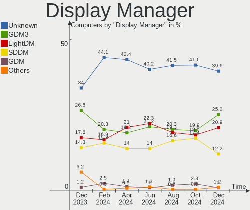
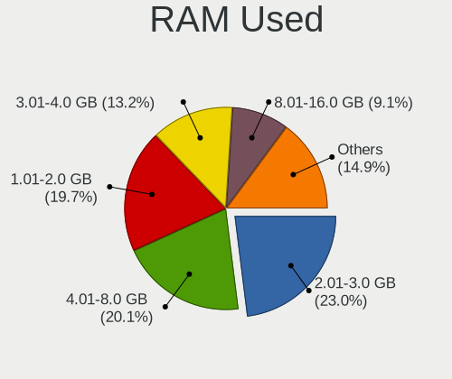
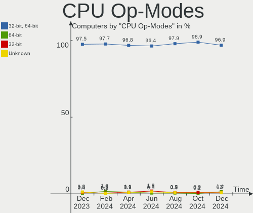

Debian Hardware Trends
----------------------

A project to identify most popular hardware characteristics and track their change
over time based on data collected by Debian users at https://Linux-Hardware.org.

Anyone can contribute to the study by uploading probes of their computers by
the [hw-probe](https://github.com/linuxhw/hw-probe) tool:

    sudo -E hw-probe -all -upload

This is a report for all computer types. See also reports for [desktops](/Dist/Debian/Desktop/README.md) and [notebooks](/Dist/Debian/Notebook/README.md).

Full-feature report is available here: https://linux-hardware.org/?view=trends

Period: May, 2020.

Contents
--------

- [ OS                       ](#os)
- [ OS Family                ](#os-family)
- [ Kernel                   ](#kernel)
- [ Kernel Family            ](#kernel-family)
- [ Kernel Major Ver.        ](#kernel-major-ver)
- [ Arch                     ](#arch)
- [ DE                       ](#de)
- [ Display Server           ](#display-server)
- [ Display Manager          ](#display-manager)
- [ OS Lang                  ](#os-lang)
- [ Boot Mode                ](#boot-mode)
- [ Filesystem               ](#filesystem)
- [ Part. scheme             ](#part-scheme)
- [ Dual Boot with Linux/BSD ](#dual-boot-with-linux/bsd)
- [ Dual Boot (Win)          ](#dual-boot-win)
- [ Country                  ](#country)
- [ City                     ](#city)
- [ Vendor                   ](#vendor)
- [ Model                    ](#model)
- [ Model Family             ](#model-family)
- [ MFG Year                 ](#mfg-year)
- [ Form Factor              ](#form-factor)
- [ Secure Boot              ](#secure-boot)
- [ Coreboot                 ](#coreboot)
- [ RAM Size                 ](#ram-size)
- [ RAM Used                 ](#ram-used)
- [ Drive Vendor             ](#drive-vendor)
- [ Drive Model              ](#drive-model)
- [ Drive Kind               ](#drive-kind)
- [ Drive Connector          ](#drive-connector)
- [ Drive Size               ](#drive-size)
- [ Space Total              ](#space-total)
- [ Space Used               ](#space-used)
- [ Malfunc. Drives          ](#malfunc-drives)
- [ Malfunc. Drive Vendor    ](#malfunc-drive-vendor)
- [ Malfunc. Drive Kind      ](#malfunc-drive-kind)
- [ Failed Drives            ](#failed-drives)
- [ Failed Drive Vendor      ](#failed-drive-vendor)
- [ Drive Status             ](#drive-status)
- [ Storage Vendor           ](#storage-vendor)
- [ Storage Model            ](#storage-model)
- [ Storage Kind             ](#storage-kind)
- [ CPU Vendor               ](#cpu-vendor)
- [ CPU Model                ](#cpu-model)
- [ CPU Model Family         ](#cpu-model-family)
- [ CPU Cores                ](#cpu-cores)
- [ CPU Sockets              ](#cpu-sockets)
- [ CPU Threads              ](#cpu-threads)
- [ CPU Op-Modes             ](#cpu-op-modes)
- [ CPU Microcode            ](#cpu-microcode)
- [ CPU Microarch            ](#cpu-microarch)
- [ GPU Vendor               ](#gpu-vendor)
- [ GPU Model                ](#gpu-model)
- [ GPU Combo                ](#gpu-combo)
- [ GPU Driver               ](#gpu-driver)
- [ GPU Memory               ](#gpu-memory)
- [ Monitor Vendor           ](#monitor-vendor)
- [ Monitor Model            ](#monitor-model)
- [ Monitor Resolution       ](#monitor-resolution)
- [ Monitor Diagonal         ](#monitor-diagonal)
- [ Monitor Width            ](#monitor-width)
- [ Aspect Ratio             ](#aspect-ratio)
- [ Monitor Area             ](#monitor-area)
- [ Pixel Density            ](#pixel-density)
- [ Multiple Monitors        ](#multiple-monitors)
- [ Net Controller Vendor    ](#net-controller-vendor)
- [ Net Controller Model     ](#net-controller-model)
- [ Net Controller Kind      ](#net-controller-kind)
- [ Used Controller          ](#used-controller)
- [ NICs                     ](#nics)
- [ Unsupported Devices      ](#unsupported-devices)
- [ Unsupported Device Types ](#unsupported-device-types)

OS
--

Installed operating systems

| Name            | Computers | Percent |
|-----------------|-----------|---------|
| Debian 10       | 71        | 62.28%  |
| Debian Testing  | 18        | 15.79%  |
| Debian          | 13        | 11.4%   |
| Debian Unstable | 7         | 6.14%   |
| Debian 9.12     | 2         | 1.75%   |
| Debian 9        | 2         | 1.75%   |
| Debian 3        | 1         | 0.88%   |

OS Family
---------

OS without a version

| Name   | Computers | Percent |
|--------|-----------|---------|
| Debian | 115       | 100%    |

Kernel
------

Version of the Linux kernel

| Version                       | Computers | Percent |
|-------------------------------|-----------|---------|
| 4.19.0-9-amd64                | 33        | 28.7%   |
| 5.6.0-1-amd64                 | 24        | 20.87%  |
| 4.19.0-8-amd64                | 14        | 12.17%  |
| 4.19.0-6-amd64                | 5         | 4.35%   |
| 5.5.0-2-amd64                 | 4         | 3.48%   |
| 5.5.0-0.bpo.2-amd64           | 3         | 2.61%   |
| 4.9.0-12-amd64                | 3         | 2.61%   |
| 4.19.0-9-686                  | 3         | 2.61%   |
| 5.4.0-0.bpo.4-amd64           | 2         | 1.74%   |
| 5.4.0-0.bpo.2-amd64           | 2         | 1.74%   |
| 4.19.0-0.bpo.8-amd64          | 2         | 1.74%   |
| 5.6.8.yoda                    | 1         | 0.87%   |
| 5.6.8                         | 1         | 0.87%   |
| 5.6.0-trunk-amd64             | 1         | 0.87%   |
| 5.6.0-2-amd64                 | 1         | 0.87%   |
| 5.6.0-13.1-liquorix-amd64     | 1         | 0.87%   |
| 5.5.0-rc5-amd64               | 1         | 0.87%   |
| 5.4.41-1-pve                  | 1         | 0.87%   |
| 5.4.38-1.fc28.lemote.mips64el | 1         | 0.87%   |
| 5.4.34-1-pve                  | 1         | 0.87%   |
| 5.4.28avl2-lowlatency         | 1         | 0.87%   |
| 5.4.0-3-amd64                 | 1         | 0.87%   |
| 5.4.0-0.bpo.4-686-pae         | 1         | 0.87%   |
| 5.4.0-0.bpo.2-lzk-bl-amd64    | 1         | 0.87%   |
| 5.3.0-2-amd64                 | 1         | 0.87%   |
| 5.3.0-0.bpo.2-amd64           | 1         | 0.87%   |
| 5.2.17-1rodete3-amd64         | 1         | 0.87%   |
| 4.19.0-9-rt-amd64             | 1         | 0.87%   |
| 4.19.0-8-arm64                | 1         | 0.87%   |
| 4.19.0-5-amd64                | 1         | 0.87%   |
| 4.15.18-28-pve                | 1         | 0.87%   |

Kernel Family
-------------

Linux kernel without a distro release

| Version | Computers | Percent |
|---------|-----------|---------|
| 4.19.0  | 60        | 52.17%  |
| 5.6.0   | 27        | 23.48%  |
| 5.5.0   | 8         | 6.96%   |
| 5.4.0   | 7         | 6.09%   |
| 4.9.0   | 3         | 2.61%   |
| 5.6.8   | 2         | 1.74%   |
| 5.3.0   | 2         | 1.74%   |
| 5.4.41  | 1         | 0.87%   |
| 5.4.38  | 1         | 0.87%   |
| 5.4.34  | 1         | 0.87%   |
| 5.4.28  | 1         | 0.87%   |
| 5.2.17  | 1         | 0.87%   |
| 4.15.18 | 1         | 0.87%   |

Kernel Major Ver.
-----------------

Linux kernel major version

| Version | Computers | Percent |
|---------|-----------|---------|
| 4.19    | 60        | 52.17%  |
| 5.6     | 29        | 25.22%  |
| 5.4     | 11        | 9.57%   |
| 5.5     | 8         | 6.96%   |
| 4.9     | 3         | 2.61%   |
| 5.3     | 2         | 1.74%   |
| 5.2     | 1         | 0.87%   |
| 4.15    | 1         | 0.87%   |

Arch
----

OS architecture (x86_64, i586, etc.)

| Name    | Computers | Percent |
|---------|-----------|---------|
| x86_64  | 109       | 94.78%  |
| i686    | 4         | 3.48%   |
| mips64  | 1         | 0.87%   |
| aarch64 | 1         | 0.87%   |

DE
--

Desktop Environment

| Name             | Computers | Percent |
|------------------|-----------|---------|
| GNOME            | 24        | 20.87%  |
| XFCE             | 19        | 16.52%  |
| MATE             | 15        | 13.04%  |
| KDE5             | 13        | 11.3%   |
| Unknown          | 12        | 10.43%  |
| KDE              | 10        | 8.7%    |
| X-Cinnamon       | 6         | 5.22%   |
| LXQt             | 4         | 3.48%   |
| Cinnamon         | 4         | 3.48%   |
| Budgie           | 3         | 2.61%   |
| LXDE             | 2         | 1.74%   |
| Openbox          | 1         | 0.87%   |
| lightdm-xsession | 1         | 0.87%   |
| i3               | 1         | 0.87%   |

Display Server
--------------

X11 or Wayland

| Name    | Computers | Percent |
|---------|-----------|---------|
| X11     | 94        | 81.74%  |
| Wayland | 12        | 10.43%  |
| Tty     | 6         | 5.22%   |
| Unknown | 3         | 2.61%   |

Display Manager
---------------

SDDM, LightDM, etc.

| Name    | Computers | Percent |
|---------|-----------|---------|
| Unknown | 52        | 45.22%  |
| LightDM | 24        | 20.87%  |
| GDM     | 19        | 16.52%  |
| SDDM    | 17        | 14.78%  |
| XDM     | 1         | 0.87%   |
| WDM     | 1         | 0.87%   |
| SLiM    | 1         | 0.87%   |

OS Lang
-------

Language

| Lang       | Computers | Percent |
|------------|-----------|---------|
| en_US      | 35        | 30.43%  |
| de_DE      | 11        | 9.57%   |
| fr_FR      | 7         | 6.09%   |
| en_GB      | 7         | 6.09%   |
| it_IT      | 6         | 5.22%   |
| Unknown    | 6         | 5.22%   |
| ru_RU      | 5         | 4.35%   |
| en_US.utf8 | 5         | 4.35%   |
| pt_BR      | 4         | 3.48%   |
| en_IE      | 4         | 3.48%   |
| en_CA      | 4         | 3.48%   |
| es_AR      | 3         | 2.61%   |
| es_ES      | 2         | 1.74%   |
| es_CL      | 2         | 1.74%   |
| zh_CN      | 1         | 0.87%   |
| uk_UA      | 1         | 0.87%   |
| sr_RS      | 1         | 0.87%   |
| pt_PT      | 1         | 0.87%   |
| pl_PL.utf8 | 1         | 0.87%   |
| pl_PL      | 1         | 0.87%   |
| hu_HU      | 1         | 0.87%   |
| fr_CH      | 1         | 0.87%   |
| es_MX      | 1         | 0.87%   |
| en_PH      | 1         | 0.87%   |
| en_IN      | 1         | 0.87%   |
| da_DK      | 1         | 0.87%   |
| cs_CZ      | 1         | 0.87%   |
| C          | 1         | 0.87%   |

Boot Mode
---------

EFI or BIOS

| Mode | Computers | Percent |
|------|-----------|---------|
| BIOS | 74        | 64.35%  |
| EFI  | 41        | 35.65%  |

Filesystem
----------

Type of filesystem

| Type  | Computers | Percent |
|-------|-----------|---------|
| Ext4  | 105       | 91.3%   |
| Btrfs | 5         | 4.35%   |
| Xfs   | 4         | 3.48%   |
| Tmpfs | 1         | 0.87%   |

Part. scheme
------------

Scheme of partitioning

| Type    | Computers | Percent |
|---------|-----------|---------|
| Unknown | 77        | 66.96%  |
| GPT     | 26        | 22.61%  |
| MBR     | 12        | 10.43%  |

Dual Boot with Linux/BSD
------------------------

Hosting more than one Linux/BSD

| Dual boot | Computers | Percent |
|-----------|-----------|---------|
| No        | 100       | 86.96%  |
| Yes       | 15        | 13.04%  |

Dual Boot (Win)
---------------

Hosting Linux and Windows

| Dual boot | Computers | Percent |
|-----------|-----------|---------|
| No        | 94        | 81.74%  |
| Yes       | 21        | 18.26%  |

Country
-------

Geographic location (country)

| Country            | Computers | Percent |
|--------------------|-----------|---------|
| USA                | 23        | 20%     |
| Germany            | 15        | 13.04%  |
| Russia             | 11        | 9.57%   |
| France             | 8         | 6.96%   |
| Italy              | 7         | 6.09%   |
| Ireland            | 4         | 3.48%   |
| Brazil             | 4         | 3.48%   |
| Argentina          | 4         | 3.48%   |
| UK                 | 3         | 2.61%   |
| Spain              | 3         | 2.61%   |
| Poland             | 3         | 2.61%   |
| Chile              | 3         | 2.61%   |
| Canada             | 3         | 2.61%   |
| Ukraine            | 2         | 1.74%   |
| Slovenia           | 2         | 1.74%   |
| Netherlands        | 2         | 1.74%   |
| Czech Republic     | 2         | 1.74%   |
| Turkey             | 1         | 0.87%   |
| Switzerland        | 1         | 0.87%   |
| Romania            | 1         | 0.87%   |
| Portugal           | 1         | 0.87%   |
| Philippines        | 1         | 0.87%   |
| Peru               | 1         | 0.87%   |
| Norway             | 1         | 0.87%   |
| Mexico             | 1         | 0.87%   |
| Hungary            | 1         | 0.87%   |
| Dominican Republic | 1         | 0.87%   |
| Denmark            | 1         | 0.87%   |
| Cyprus             | 1         | 0.87%   |
| China              | 1         | 0.87%   |
| Bangladesh         | 1         | 0.87%   |
| Australia          | 1         | 0.87%   |
| Algeria            | 1         | 0.87%   |

City
----

Geographic location (city)

| City                | Computers | Percent |
|---------------------|-----------|---------|
| Santiago            | 3         | 2.61%   |
| Moscow              | 3         | 2.61%   |
| Voronezh            | 2         | 1.74%   |
| Vologda             | 2         | 1.74%   |
| St Petersburg       | 2         | 1.74%   |
| Seattle             | 2         | 1.74%   |
| Rancho Palos Verdes | 2         | 1.74%   |
| Paris               | 2         | 1.74%   |
| Maribor             | 2         | 1.74%   |
| Gladbeck            | 2         | 1.74%   |
| Eppelheim           | 2         | 1.74%   |
| Dublin              | 2         | 1.74%   |
| Blanchardstown      | 2         | 1.74%   |
| Łódź             | 1         | 0.87%   |
| Wilderness Rim      | 1         | 0.87%   |
| Warsaw              | 1         | 0.87%   |
| Warren              | 1         | 0.87%   |
| Valladolid          | 1         | 0.87%   |
| Turin               | 1         | 0.87%   |
| Tournefeuille       | 1         | 0.87%   |
| Tassin-la-Demi-Lune | 1         | 0.87%   |
| Tandil              | 1         | 0.87%   |
| Sykesville          | 1         | 0.87%   |
| Sydney              | 1         | 0.87%   |
| Swindon             | 1         | 0.87%   |
| Sun Prairie         | 1         | 0.87%   |
| Sucy-en-Brie        | 1         | 0.87%   |
| Stuttgart           | 1         | 0.87%   |
| Springfield         | 1         | 0.87%   |
| Spello              | 1         | 0.87%   |
| Santo Domingo       | 1         | 0.87%   |
| San Mateo           | 1         | 0.87%   |
| San Jose            | 1         | 0.87%   |
| Rochester           | 1         | 0.87%   |
| Remscheid           | 1         | 0.87%   |
| Redgranite          | 1         | 0.87%   |
| Prangins            | 1         | 0.87%   |
| Prague              | 1         | 0.87%   |
| Porto Alegre        | 1         | 0.87%   |
| Porto               | 1         | 0.87%   |
| Pembroke            | 1         | 0.87%   |
| Paphos              | 1         | 0.87%   |
| Ottawa              | 1         | 0.87%   |
| Ostrava             | 1         | 0.87%   |
| North Royalton      | 1         | 0.87%   |
| Nizhniy Novgorod    | 1         | 0.87%   |
| Newburyport         | 1         | 0.87%   |
| New York            | 1         | 0.87%   |
| Modena              | 1         | 0.87%   |
| Meximieux           | 1         | 0.87%   |
| Mexico City         | 1         | 0.87%   |
| Maua                | 1         | 0.87%   |
| Madrid              | 1         | 0.87%   |
| London              | 1         | 0.87%   |
| Livron-sur-Drome    | 1         | 0.87%   |
| Lima                | 1         | 0.87%   |
| Leipzig             | 1         | 0.87%   |
| Leimen              | 1         | 0.87%   |
| Laval               | 1         | 0.87%   |
| Kyiv                | 1         | 0.87%   |

Vendor
------

Motherboard manufacturer

| Name                       | Computers | Percent |
|----------------------------|-----------|---------|
| Lenovo                     | 21        | 18.26%  |
| Dell                       | 19        | 16.52%  |
| ASUSTek Computer           | 18        | 15.65%  |
| Hewlett-Packard            | 12        | 10.43%  |
| Gigabyte Technology        | 11        | 9.57%   |
| ASRock                     | 5         | 4.35%   |
| Acer                       | 5         | 4.35%   |
| Apple                      | 4         | 3.48%   |
| Samsung Electronics        | 3         | 2.61%   |
| MSI                        | 3         | 2.61%   |
| Supermicro                 | 2         | 1.74%   |
| AZW                        | 2         | 1.74%   |
| Unknown                    | 2         | 1.74%   |
| Toshiba                    | 1         | 0.87%   |
| Sony UK                    | 1         | 0.87%   |
| Onda technology            | 1         | 0.87%   |
| Notebook                   | 1         | 0.87%   |
| Intel                      | 1         | 0.87%   |
| Huanan                     | 1         | 0.87%   |
| HDC High Designed Computer | 1         | 0.87%   |
| ECS                        | 1         | 0.87%   |

Model
-----

Motherboard model

| Name                                     | Computers | Percent |
|------------------------------------------|-----------|---------|
| Dell Latitude E7450                      | 2         | 1.74%   |
| Dell Inspiron 7559                       | 2         | 1.74%   |
| AZW AP35                                 | 2         | 1.74%   |
| ASUS Pro WS X570-ACE                     | 2         | 1.74%   |
| Unknown                                  | 2         | 1.74%   |
| Toshiba Satellite S55-B                  | 1         | 0.87%   |
| Supermicro Super Server                  | 1         | 0.87%   |
| Supermicro H8DGU                         | 1         | 0.87%   |
| Sony UK Raspberry Pi 3 Model B           | 1         | 0.87%   |
| Samsung Electronics RF510/RF410/RF710    | 1         | 0.87%   |
| Samsung Electronics R430/R480/R440       | 1         | 0.87%   |
| Samsung Electronics N150P/N210P/N220P    | 1         | 0.87%   |
| Onda technology A68V+                    | 1         | 0.87%   |
| Notebook N130BU                          | 1         | 0.87%   |
| MSI MS-7992                              | 1         | 0.87%   |
| MSI GS73 Stealth 8RD                     | 1         | 0.87%   |
| MSI GL75 9SDK                            | 1         | 0.87%   |
| Lenovo V340-17IWL 81RG                   | 1         | 0.87%   |
| Lenovo ThinkPad X240 20AMS3AE04          | 1         | 0.87%   |
| Lenovo ThinkPad X230 2306CTO             | 1         | 0.87%   |
| Lenovo ThinkPad X220 4290LE6             | 1         | 0.87%   |
| Lenovo ThinkPad X200 74598Y7             | 1         | 0.87%   |
| Lenovo ThinkPad X1 Yoga 3rd 20LD002JIX   | 1         | 0.87%   |
| Lenovo ThinkPad X1 Carbon 7th 20QES0410J | 1         | 0.87%   |
| Lenovo ThinkPad X1 Carbon 7th 20QES01L00 | 1         | 0.87%   |
| Lenovo ThinkPad T520 424329U             | 1         | 0.87%   |
| Lenovo ThinkPad T495s 20QKS01E00         | 1         | 0.87%   |
| Lenovo ThinkPad T400 6475VYS             | 1         | 0.87%   |
| Lenovo ThinkPad E480 20KN003WUS          | 1         | 0.87%   |
| Lenovo ThinkPad E470 20H1A029SG          | 1         | 0.87%   |
| Lenovo ThinkCentre E73 10DS000TUK        | 1         | 0.87%   |
| Lenovo Legion Y9000X 2020 81TH           | 1         | 0.87%   |
| Lenovo IdeaPad Z585 20152                | 1         | 0.87%   |
| Lenovo IdeaPad U430p 20269               | 1         | 0.87%   |
| Lenovo IdeaPad S340-15API 81NC           | 1         | 0.87%   |
| Lenovo IdeaPad 330S-15IKB 81F5           | 1         | 0.87%   |
| Lenovo IdeaCentre 510A-15ARR 90J0008EPB  | 1         | 0.87%   |
| Lenovo G580                              | 1         | 0.87%   |
| Intel DG31PR AAE58249-302                | 1         | 0.87%   |
| Huanan X79 V6.11                         | 1         | 0.87%   |
| HP Stream Notebook PC 13                 | 1         | 0.87%   |
| HP ProLiant MicroServer Gen8             | 1         | 0.87%   |
| HP ProLiant MicroServer                  | 1         | 0.87%   |
| HP Pavilion g6                           | 1         | 0.87%   |
| HP Laptop 17-ca1xxx                      | 1         | 0.87%   |
| HP Laptop 17-ca0xxx                      | 1         | 0.87%   |
| HP ENVY x360 Convertible 15-cn0xxx       | 1         | 0.87%   |
| HP EliteBook 850 G1                      | 1         | 0.87%   |
| HP EliteBook 8470p                       | 1         | 0.87%   |
| HP EliteBook 830 G5                      | 1         | 0.87%   |
| HP EliteBook 1050 G1                     | 1         | 0.87%   |
| HP 15                                    | 1         | 0.87%   |
| HDC High Designed Computer CB14T332      | 1         | 0.87%   |
| Gigabyte Z390 AORUS ELITE                | 1         | 0.87%   |
| Gigabyte X470 AORUS ULTRA GAMING         | 1         | 0.87%   |
| Gigabyte M61SME-S2                       | 1         | 0.87%   |
| Gigabyte GB-BACE-3150                    | 1         | 0.87%   |
| Gigabyte GA-MA78GM-S2H                   | 1         | 0.87%   |
| Gigabyte GA-78LMT-USB3                   | 1         | 0.87%   |
| Gigabyte F2A88XM-D3H                     | 1         | 0.87%   |

Model Family
------------

Motherboard model prefix

| Name                                | Computers | Percent |
|-------------------------------------|-----------|---------|
| Lenovo ThinkPad                     | 12        | 10.43%  |
| Dell Latitude                       | 7         | 6.09%   |
| Dell Inspiron                       | 7         | 6.09%   |
| Lenovo IdeaPad                      | 4         | 3.48%   |
| HP EliteBook                        | 4         | 3.48%   |
| Dell Precision                      | 3         | 2.61%   |
| ASUS ROG                            | 3         | 2.61%   |
| HP ProLiant                         | 2         | 1.74%   |
| HP Laptop                           | 2         | 1.74%   |
| AZW AP35                            | 2         | 1.74%   |
| ASUS Pro                            | 2         | 1.74%   |
| Apple MacBookPro11                  | 2         | 1.74%   |
| Acer Aspire                         | 2         | 1.74%   |
| Unknown                             | 2         | 1.74%   |
| Toshiba Satellite                   | 1         | 0.87%   |
| Supermicro Super                    | 1         | 0.87%   |
| Supermicro H8DGU                    | 1         | 0.87%   |
| Sony UK Raspberry                   | 1         | 0.87%   |
| Samsung Electronics RF510           | 1         | 0.87%   |
| Samsung Electronics R430            | 1         | 0.87%   |
| Samsung Electronics N150P           | 1         | 0.87%   |
| Onda technology A68V+               | 1         | 0.87%   |
| Notebook N130BU                     | 1         | 0.87%   |
| MSI MS-7992                         | 1         | 0.87%   |
| MSI GS73                            | 1         | 0.87%   |
| MSI GL75                            | 1         | 0.87%   |
| Lenovo V340-17IWL                   | 1         | 0.87%   |
| Lenovo ThinkCentre                  | 1         | 0.87%   |
| Lenovo Legion                       | 1         | 0.87%   |
| Lenovo IdeaCentre                   | 1         | 0.87%   |
| Lenovo G580                         | 1         | 0.87%   |
| Intel DG31PR                        | 1         | 0.87%   |
| Huanan X79                          | 1         | 0.87%   |
| HP Stream                           | 1         | 0.87%   |
| HP Pavilion                         | 1         | 0.87%   |
| HP ENVY                             | 1         | 0.87%   |
| HP 15                               | 1         | 0.87%   |
| HDC High Designed Computer CB14T332 | 1         | 0.87%   |
| Gigabyte Z390                       | 1         | 0.87%   |
| Gigabyte X470                       | 1         | 0.87%   |
| Gigabyte M61SME-S2                  | 1         | 0.87%   |
| Gigabyte GB-BACE-3150               | 1         | 0.87%   |
| Gigabyte GA-MA78GM-S2H              | 1         | 0.87%   |
| Gigabyte GA-78LMT-USB3              | 1         | 0.87%   |
| Gigabyte F2A88XM-D3H                | 1         | 0.87%   |
| Gigabyte F2A78M-HD2                 | 1         | 0.87%   |
| Gigabyte EX58-UD4P                  | 1         | 0.87%   |
| Gigabyte C1037UN-EU                 | 1         | 0.87%   |
| Gigabyte 945GCM-S2L                 | 1         | 0.87%   |
| ECS G41T-M7                         | 1         | 0.87%   |
| Dell XPS                            | 1         | 0.87%   |
| Dell Vostro                         | 1         | 0.87%   |
| ASUS X540YA                         | 1         | 0.87%   |
| ASUS VivoBook                       | 1         | 0.87%   |
| ASUS V-P8H67E                       | 1         | 0.87%   |
| ASUS UX550VE                        | 1         | 0.87%   |
| ASUS UL80VT                         | 1         | 0.87%   |
| ASUS U47A                           | 1         | 0.87%   |
| ASUS SABERTOOTH                     | 1         | 0.87%   |
| ASUS P9X79                          | 1         | 0.87%   |

MFG Year
--------

Motherboard manufacture year

| Year    | Computers | Percent |
|---------|-----------|---------|
| 2019    | 33        | 28.7%   |
| 2018    | 18        | 15.65%  |
| 2020    | 9         | 7.83%   |
| 2011    | 9         | 7.83%   |
| 2012    | 8         | 6.96%   |
| 2017    | 7         | 6.09%   |
| 2016    | 6         | 5.22%   |
| 2014    | 5         | 4.35%   |
| 2013    | 5         | 4.35%   |
| 2015    | 4         | 3.48%   |
| 2010    | 3         | 2.61%   |
| 2009    | 3         | 2.61%   |
| 2008    | 2         | 1.74%   |
| 2007    | 2         | 1.74%   |
| Unknown | 1         | 0.87%   |

Form Factor
-----------

Physical design of the computer

| Name        | Computers | Percent |
|-------------|-----------|---------|
| Notebook    | 66        | 57.39%  |
| Desktop     | 43        | 37.39%  |
| Other       | 2         | 1.74%   |
| Convertible | 2         | 1.74%   |
| Server      | 2         | 1.74%   |

Secure Boot
-----------

Enabled or disabled

| State    | Computers | Percent |
|----------|-----------|---------|
| Disabled | 114       | 99.13%  |
| Enabled  | 1         | 0.87%   |

Coreboot
--------

Have coreboot on board

| Used | Computers | Percent |
|------|-----------|---------|
| No   | 114       | 99.13%  |
| Yes  | 1         | 0.87%   |

RAM Size
--------

Total RAM memory

| Size in GB  | Computers | Percent |
|-------------|-----------|---------|
| 8.01-16.0   | 28        | 24.35%  |
| 16.01-24.0  | 26        | 22.61%  |
| 4.01-8.0    | 20        | 17.39%  |
| 3.01-4.0    | 15        | 13.04%  |
| 32.01-64.0  | 9         | 7.83%   |
| 1.01-2.0    | 5         | 4.35%   |
| 2.01-3.0    | 4         | 3.48%   |
| 64.01-256.0 | 4         | 3.48%   |
| 24.01-32.0  | 2         | 1.74%   |
| 0.01-1.0    | 2         | 1.74%   |

RAM Used
--------

Used RAM memory

| Used GB    | Computers | Percent |
|------------|-----------|---------|
| 1.01-2.0   | 37        | 32.17%  |
| 4.01-8.0   | 24        | 20.87%  |
| 2.01-3.0   | 21        | 18.26%  |
| 0.01-1.0   | 17        | 14.78%  |
| 3.01-4.0   | 10        | 8.7%    |
| 8.01-16.0  | 4         | 3.48%   |
| 32.01-64.0 | 1         | 0.87%   |
| 24.01-32.0 | 1         | 0.87%   |

Drive Vendor
------------

Hard drive vendors

| Vendor              | Computers | Drives | Percent |
|---------------------|-----------|--------|---------|
| Seagate             | 34        | 37     | 19.21%  |
| WDC                 | 28        | 38     | 15.82%  |
| Samsung Electronics | 26        | 28     | 14.69%  |
| Kingston            | 10        | 10     | 5.65%   |
| Crucial             | 10        | 10     | 5.65%   |
| Unknown             | 9         | 12     | 5.08%   |
| Toshiba             | 9         | 9      | 5.08%   |
| SanDisk             | 8         | 8      | 4.52%   |
| Hitachi             | 5         | 5      | 2.82%   |
| SK Hynix            | 4         | 4      | 2.26%   |
| Intel               | 4         | 4      | 2.26%   |
| HGST                | 4         | 4      | 2.26%   |
| Micron Technology   | 2         | 2      | 1.13%   |
| MAXTOR              | 2         | 3      | 1.13%   |
| LDLC                | 2         | 3      | 1.13%   |
| Intenso             | 2         | 2      | 1.13%   |
| ASMT                | 2         | 2      | 1.13%   |
| A-DATA Technology   | 2         | 2      | 1.13%   |
| Zheino              | 1         | 1      | 0.56%   |
| Transcend           | 1         | 1      | 0.56%   |
| SABRENT             | 1         | 1      | 0.56%   |
| Patriot             | 1         | 1      | 0.56%   |
| OCZ                 | 1         | 1      | 0.56%   |
| NVMe                | 1         | 1      | 0.56%   |
| Magnetic Data       | 1         | 1      | 0.56%   |
| KingSpec            | 1         | 1      | 0.56%   |
| KingDian            | 1         | 1      | 0.56%   |
| HGST HDS            | 1         | 1      | 0.56%   |
| Hewlett-Packard     | 1         | 1      | 0.56%   |
| Gigabyte Technology | 1         | 1      | 0.56%   |
| China               | 1         | 1      | 0.56%   |
| Apple               | 1         | 1      | 0.56%   |

Drive Model
-----------

Hard drive models

| Model                            | Computers | Percent |
|----------------------------------|-----------|---------|
| MMC Card  64GB                   | 4         | 2.07%   |
| SV300S37A120G 120GB SSD          | 3         | 1.55%   |
| ST1000DM010-2EP102 1TB           | 3         | 1.55%   |
| CT120BX500SSD1 120GB             | 3         | 1.55%   |
| WD10SPZX-24Z10 1TB               | 2         | 1.04%   |
| TL100 240GB SSD                  | 2         | 1.04%   |
| ST500LM012 HN-M500MBB 500GB      | 2         | 1.04%   |
| ST500DM002-1BD142 500GB          | 2         | 1.04%   |
| ST31000524AS 1TB                 | 2         | 1.04%   |
| ST1000LM049-2GH172 1TB           | 2         | 1.04%   |
| ST1000LM035-1RK172 1TB           | 2         | 1.04%   |
| ST1000LM024 HN-M101MBB 1TB       | 2         | 1.04%   |
| SSD 970 EVO Plus 1TB             | 2         | 1.04%   |
| SSD 860 EVO 250GB                | 2         | 1.04%   |
| SSD 850 EVO 250GB                | 2         | 1.04%   |
| SSD 840 Series 250GB             | 2         | 1.04%   |
| SA400S37120G 120GB SSD           | 2         | 1.04%   |
| PC SN520 SDAPMUW-512G-1101 512GB | 2         | 1.04%   |
| HTS547575A9E384 752GB            | 2         | 1.04%   |
| X300 MSATA 128GB SSD             | 1         | 0.52%   |
| WDS250G2X0C-00L350 250GB         | 1         | 0.52%   |
| WDS240G2G0A-00JH30 240GB SSD     | 1         | 0.52%   |
| WDS120G1G0B-00RC30 120GB SSD     | 1         | 0.52%   |
| WD60EFRX-68L0BN1 6TB             | 1         | 0.52%   |
| WD5000BPVT-22HXZT3 500GB         | 1         | 0.52%   |
| WD5000BPVT-11HXZT1 500GB         | 1         | 0.52%   |
| WD5000BEKT-75KA9T0 500GB         | 1         | 0.52%   |
| WD5000AAKS-22A7B0 500GB          | 1         | 0.52%   |
| WD40EZRZ-00GXCB0 4TB             | 1         | 0.52%   |
| WD40EFRX-68WT0N0 4TB             | 1         | 0.52%   |
| WD30EZRZ-00Z5HB0 3TB             | 1         | 0.52%   |
| WD30EZRX-00DC0B0 3TB             | 1         | 0.52%   |
| WD20EZRZ-00Z5HB0 2TB             | 1         | 0.52%   |
| WD20EFRX-68E                     | 1         | 0.52%   |
| WD1600JD-00HBB0 160GB            | 1         | 0.52%   |
| WD1600BEVT-22ZCT0 160GB          | 1         | 0.52%   |
| WD1600BEVT-00ZCT0 160GB          | 1         | 0.52%   |
| WD15EARS-00Z5B1 1TB              | 1         | 0.52%   |
| WD10SPZX-60Z10T0 1TB             | 1         | 0.52%   |
| WD10SPZX-21Z10T0 1TB             | 1         | 0.52%   |
| WD10JPVX-00JC3T0 1TB             | 1         | 0.52%   |
| WD10EZRX-00L4HB0 1TB             | 1         | 0.52%   |
| WD10EZEX-08WN4A0 1TB             | 1         | 0.52%   |
| WD10EZEX-00BN5A0 1TB             | 1         | 0.52%   |
| WD10EFRX-68PJCN0 1TB             | 1         | 0.52%   |
| WD10EARX-00N0YB0 1TB             | 1         | 0.52%   |
| WD1003FZEX-00MK2A0 1TB           | 1         | 0.52%   |
| WD1002FAEX-00Z3A0 1TB            | 1         | 0.52%   |
| WD1001FALS-41Y6A0 1TB            | 1         | 0.52%   |
| TS128GMTE110S 128GB              | 1         | 0.52%   |
| SX6000LNP 1TB                    | 1         | 0.52%   |
| SV300S37A 240G SSD               | 1         | 0.52%   |
| SUV400S37240G 240GB SSD          | 1         | 0.52%   |
| SU02G  2GB                       | 1         | 0.52%   |
| STM3250310AS 250GB               | 1         | 0.52%   |
| ST95005620AS 500GB               | 1         | 0.52%   |
| ST9500325AS 500GB                | 1         | 0.52%   |
| ST9250315AS 250GB                | 1         | 0.52%   |
| ST500LT012-9WS142 500GB          | 1         | 0.52%   |
| ST500LM000-SSHD-8GB              | 1         | 0.52%   |

Drive Kind
----------

HDD or SSD

| Kind    | Computers | Drives | Percent |
|---------|-----------|--------|---------|
| HDD     | 61        | 93     | 40.4%   |
| SSD     | 55        | 63     | 36.42%  |
| NVMe    | 22        | 25     | 14.57%  |
| MMC     | 8         | 11     | 5.3%    |
| Unknown | 5         | 5      | 3.31%   |

Drive Connector
---------------

SATA, SAS, NVMe, etc.

| Type | Computers | Drives | Percent |
|------|-----------|--------|---------|
| SATA | 90        | 154    | 72%     |
| NVMe | 22        | 25     | 17.6%   |
| MMC  | 8         | 11     | 6.4%    |
| SAS  | 5         | 7      | 4%      |

Drive Size
----------

Size of hard drive

| Size in TB | Computers | Drives | Percent |
|------------|-----------|--------|---------|
| 0.01-0.5   | 81        | 114    | 54%     |
| 0.51-1.0   | 46        | 52     | 30.67%  |
| 1.01-2.0   | 12        | 19     | 8%      |
| 3.01-4.0   | 6         | 6      | 4%      |
| 2.01-3.0   | 3         | 4      | 2%      |
| 4.01-10.0  | 2         | 2      | 1.33%   |

Space Total
-----------

Amount of disk space available on the file system

| Size in GB     | Computers | Percent |
|----------------|-----------|---------|
| 101-250        | 31        | 26.96%  |
| 251-500        | 26        | 22.61%  |
| 501-1000       | 15        | 13.04%  |
| 1001-2000      | 11        | 9.57%   |
| 51-100         | 11        | 9.57%   |
| 21-50          | 7         | 6.09%   |
| More than 3000 | 5         | 4.35%   |
| 2001-3000      | 4         | 3.48%   |
| Unknown        | 4         | 3.48%   |
| 1-20           | 1         | 0.87%   |

Space Used
----------

Amount of used disk space

| Used GB        | Computers | Percent |
|----------------|-----------|---------|
| 1-20           | 34        | 29.57%  |
| 101-250        | 24        | 20.87%  |
| 21-50          | 16        | 13.91%  |
| 51-100         | 14        | 12.17%  |
| 251-500        | 13        | 11.3%   |
| 501-1000       | 5         | 4.35%   |
| Unknown        | 4         | 3.48%   |
| More than 3000 | 2         | 1.74%   |
| 2001-3000      | 2         | 1.74%   |
| 1001-2000      | 1         | 0.87%   |

Malfunc. Drives
---------------

Drive models with a malfunction

| Model                   | Computers | Drives | Percent |
|-------------------------|-----------|--------|---------|
| WD60EFRX-68L0BN1 6TB    | 1         | 1      | 5.56%   |
| WD1600BEVT-22ZCT0 160GB | 1         | 1      | 5.56%   |
| SV300S37A120G 120GB SSD | 1         | 1      | 5.56%   |
| ST500LT012-9WS142 500GB | 1         | 1      | 5.56%   |
| ST320LT020-9YG142 320GB | 1         | 1      | 5.56%   |
| ST3200822AS 200GB       | 1         | 1      | 5.56%   |
| ST2000DM001-9YN1 2TB    | 1         | 1      | 5.56%   |
| ST1000LM035-1RK172 1TB  | 1         | 1      | 5.56%   |
| ST1000DM010-2EP102 1TB  | 1         | 1      | 5.56%   |
| SSD 860 EVO 500GB       | 1         | 1      | 5.56%   |
| MTFDDAV256TBN 256GB SSD | 1         | 1      | 5.56%   |
| MQ01ABD032 320GB        | 1         | 1      | 5.56%   |
| HTS545050A7E680 500GB   | 1         | 1      | 5.56%   |
| HTS543225L9A300 250GB   | 1         | 1      | 5.56%   |
| HTS543216L9SA00 160GB   | 1         | 1      | 5.56%   |
| DT01ACA100 1TB          | 1         | 1      | 5.56%   |
| AGILITY3 64GB SSD       | 1         | 1      | 5.56%   |
| 6L200M0 208GB           | 1         | 1      | 5.56%   |

Malfunc. Drive Vendor
---------------------

Vendors of faulty drives

| Vendor              | Computers | Drives | Percent |
|---------------------|-----------|--------|---------|
| Seagate             | 6         | 6      | 33.33%  |
| WDC                 | 2         | 2      | 11.11%  |
| Toshiba             | 2         | 2      | 11.11%  |
| Hitachi             | 2         | 2      | 11.11%  |
| Samsung Electronics | 1         | 1      | 5.56%   |
| OCZ                 | 1         | 1      | 5.56%   |
| Micron Technology   | 1         | 1      | 5.56%   |
| Maxtor              | 1         | 1      | 5.56%   |
| Kingston            | 1         | 1      | 5.56%   |
| HGST                | 1         | 1      | 5.56%   |

Malfunc. Drive Kind
-------------------

Kinds of faulty drives

| Kind | Computers | Drives | Percent |
|------|-----------|--------|---------|
| HDD  | 12        | 14     | 75%     |
| SSD  | 4         | 4      | 25%     |

Failed Drives
-------------

Failed drive models

Zero info for selected period =(

Failed Drive Vendor
-------------------

Failed drive vendors

Zero info for selected period =(

Drive Status
------------

Number of failed and malfunc. drives

| Status   | Computers | Drives | Percent |
|----------|-----------|--------|---------|
| Works    | 56        | 87     | 45.53%  |
| Detected | 52        | 92     | 42.28%  |
| Malfunc  | 15        | 18     | 12.2%   |

Storage Vendor
--------------

Storage controller vendors

| Vendor                       | Computers | Percent |
|------------------------------|-----------|---------|
| Intel                        | 72        | 51.43%  |
| AMD                          | 23        | 16.43%  |
| Samsung Electronics          | 11        | 7.86%   |
| Sandisk                      | 6         | 4.29%   |
| ASMedia Technology           | 4         | 2.86%   |
| Toshiba America Info Systems | 3         | 2.14%   |
| Silicon Motion               | 3         | 2.14%   |
| Marvell Technology Group     | 3         | 2.14%   |
| LSI Logic / Symbios Logic    | 3         | 2.14%   |
| SK Hynix                     | 2         | 1.43%   |
| Phison Electronics           | 2         | 1.43%   |
| Kingston Technology Company  | 2         | 1.43%   |
| Realtek Semiconductor        | 1         | 0.71%   |
| Nvidia                       | 1         | 0.71%   |
| Micron/Crucial Technology    | 1         | 0.71%   |
| Loongson Technology          | 1         | 0.71%   |
| JMicron Technology           | 1         | 0.71%   |
| Apple                        | 1         | 0.71%   |

Storage Model
-------------

Storage controller models

| Model                                                                             | Computers | Percent |
|-----------------------------------------------------------------------------------|-----------|---------|
| FCH SATA Controller [AHCI mode]                                                   | 17        | 10.43%  |
| Non-Volatile memory controller                                                    | 10        | 6.13%   |
| NVMe SSD Controller SM981/PM981/PM983                                             | 9         | 5.52%   |
| 82801 Mobile SATA Controller [RAID mode]                                          | 8         | 4.91%   |
| 7 Series Chipset Family 6-port SATA Controller [AHCI mode]                        | 7         | 4.29%   |
| Sunrise Point-LP SATA Controller [AHCI mode]                                      | 6         | 3.68%   |
| SB7x0/SB8x0/SB9x0 SATA Controller [AHCI mode]                                     | 6         | 3.68%   |
| Cannon Lake Mobile PCH SATA AHCI Controller                                       | 5         | 3.07%   |
| ASM1062 Serial ATA Controller                                                     | 4         | 2.45%   |
| 82801IBM/IEM (ICH9M/ICH9M-E) 4 port SATA Controller [AHCI mode]                   | 4         | 2.45%   |
| 8 Series SATA Controller 1 [AHCI mode]                                            | 4         | 2.45%   |
| 400 Series Chipset SATA Controller                                                | 4         | 2.45%   |
| Toshiba America Info Non-Volatile memory controller                               | 3         | 1.84%   |
| NM10/ICH7 Family SATA Controller [IDE mode]                                       | 3         | 1.84%   |
| HM170/QM170 Chipset SATA Controller [AHCI Mode]                                   | 3         | 1.84%   |
| Celeron N3350/Pentium N4200/Atom E3900 Series SATA AHCI Controller                | 3         | 1.84%   |
| 82801G (ICH7 Family) IDE Controller                                               | 3         | 1.84%   |
| 6 Series/C200 Series Chipset Family 6 port Mobile SATA AHCI Controller            | 3         | 1.84%   |
| Wildcat Point-LP SATA Controller [AHCI Mode]                                      | 2         | 1.23%   |
| WD Black 2018/PC SN720 NVMe SSD                                                   | 2         | 1.23%   |
| SB7x0/SB8x0/SB9x0 IDE Controller                                                  | 2         | 1.23%   |
| SAS2008 PCI-Express Fusion-MPT SAS-2 [Falcon]                                     | 2         | 1.23%   |
| FCH IDE Controller                                                                | 2         | 1.23%   |
| Cannon Point-LP SATA Controller [AHCI Mode]                                       | 2         | 1.23%   |
| Cannon Lake PCH SATA AHCI Controller                                              | 2         | 1.23%   |
| C600/X79 series chipset 6-Port SATA AHCI Controller                               | 2         | 1.23%   |
| 88SE9128 PCIe SATA 6 Gb/s RAID controller with HyperDuo                           | 2         | 1.23%   |
| 82801JI (ICH10 Family) 4 port SATA IDE Controller #1                              | 2         | 1.23%   |
| 82801JI (ICH10 Family) 2 port SATA IDE Controller #2                              | 2         | 1.23%   |
| 6 Series/C200 Series Chipset Family Desktop SATA Controller (IDE mode, ports 4-5) | 2         | 1.23%   |
| 6 Series/C200 Series Chipset Family Desktop SATA Controller (IDE mode, ports 0-3) | 2         | 1.23%   |
| 5 Series/3400 Series Chipset 4 port SATA AHCI Controller                          | 2         | 1.23%   |
| X370 Series Chipset SATA Controller                                               | 1         | 0.61%   |
| WD Black 2018/PC SN520 NVMe SSD                                                   | 1         | 0.61%   |
| SSD Pro 7600p/760p/E 6100p Series                                                 | 1         | 0.61%   |
| SSD 660P Series                                                                   | 1         | 0.61%   |
| SATA AHCI Controller                                                              | 1         | 0.61%   |
| S3X NVMe Controller                                                               | 1         | 0.61%   |
| Realtek Non-Volatile memory controller                                            | 1         | 0.61%   |
| Q170/Q150/B150/H170/H110/Z170/CM236 Chipset SATA Controller [AHCI Mode]           | 1         | 0.61%   |
| P1 NVMe PCIe SSD                                                                  | 1         | 0.61%   |
| NVMe Storage Controller                                                           | 1         | 0.61%   |
| NVMe SSD Controller SM961/PM961                                                   | 1         | 0.61%   |
| NVMe Datacenter SSD [3DNAND, Beta Rock Controller]                                | 1         | 0.61%   |
| NM10/ICH7 Family SATA Controller [AHCI mode]                                      | 1         | 0.61%   |
| MegaRAID SAS-3 3108 [Invader]                                                     | 1         | 0.61%   |
| MCP61 SATA Controller                                                             | 1         | 0.61%   |
| MCP61 IDE                                                                         | 1         | 0.61%   |
| JMB363 SATA/IDE Controller                                                        | 1         | 0.61%   |
| E12 NVMe Controller                                                               | 1         | 0.61%   |
| C620 Series Chipset Family SSATA Controller [AHCI mode]                           | 1         | 0.61%   |
| C620 Series Chipset Family SATA Controller [AHCI mode]                            | 1         | 0.61%   |
| C600/X79 series chipset SATA RAID Controller                                      | 1         | 0.61%   |
| Atom/Celeron/Pentium Processor x5-E8000/J3xxx/N3xxx Series SATA Controller        | 1         | 0.61%   |
| Atom Processor E3800 Series SATA AHCI Controller                                  | 1         | 0.61%   |
| Apple PCIe SSD                                                                    | 1         | 0.61%   |
| 88SE6101/6102 single-port PATA133 interface                                       | 1         | 0.61%   |
| 82801JI (ICH10 Family) SATA AHCI Controller                                       | 1         | 0.61%   |
| 82801GBM/GHM (ICH7-M Family) SATA Controller [AHCI mode]                          | 1         | 0.61%   |
| 82801EB/ER (ICH5/ICH5R) IDE Controller                                            | 1         | 0.61%   |

Storage Kind
------------

Kind of storage controller (IDE, SATA, NVMe, SAS, ...)

| Kind | Computers | Percent |
|------|-----------|---------|
| SATA | 81        | 59.12%  |
| NVMe | 30        | 21.9%   |
| IDE  | 14        | 10.22%  |
| RAID | 10        | 7.3%    |
| SAS  | 2         | 1.46%   |

CPU Vendor
----------

Processor vendors

| Vendor  | Computers | Percent |
|---------|-----------|---------|
| Intel   | 86        | 74.78%  |
| AMD     | 27        | 23.48%  |
| ARM     | 1         | 0.87%   |
| Unknown | 1         | 0.87%   |

CPU Model
---------

Processor models

| Model                                       | Computers | Percent |
|---------------------------------------------|-----------|---------|
| Intel Core i7-8550U CPU @ 1.80GHz           | 8         | 6.96%   |
| Intel Core i7-8750H CPU @ 2.20GHz           | 3         | 2.61%   |
| Intel Pentium CPU B960 @ 2.20GHz            | 2         | 1.74%   |
| Intel Core i7-8565U CPU @ 1.80GHz           | 2         | 1.74%   |
| Intel Core i5-9300H CPU @ 2.40GHz           | 2         | 1.74%   |
| Intel Core i5-5300U CPU @ 2.30GHz           | 2         | 1.74%   |
| Intel Core i5 CPU M 560 @ 2.67GHz           | 2         | 1.74%   |
| Intel Celeron CPU J3355 @ 2.00GHz           | 2         | 1.74%   |
| AMD Ryzen 7 3700X 8-Core Processor          | 2         | 1.74%   |
| AMD Ryzen 7 2700X Eight-Core Processor      | 2         | 1.74%   |
| AMD Ryzen 5 3400G with Radeon Vega Graphics | 2         | 1.74%   |
| AMD A8-4500M APU with Radeon HD Graphics    | 2         | 1.74%   |
| Intel Xeon Silver 4112 CPU @ 2.60GHz        | 1         | 0.87%   |
| Intel Xeon CPU W3565 @ 3.20GHz              | 1         | 0.87%   |
| Intel Xeon CPU L5410 @ 2.33GHz              | 1         | 0.87%   |
| Intel Xeon CPU E5-2689 0 @ 2.60GHz          | 1         | 0.87%   |
| Intel Pentium CPU 5405U @ 2.30GHz           | 1         | 0.87%   |
| Intel Genuine CPU U7300 @ 1.30GHz           | 1         | 0.87%   |
| Intel Core m3-7Y32 CPU @ 1.10GHz            | 1         | 0.87%   |
| Intel Core i7-9750H CPU @ 2.60GHz           | 1         | 0.87%   |
| Intel Core i7-8665U CPU @ 1.90GHz           | 1         | 0.87%   |
| Intel Core i7-7700HQ CPU @ 2.80GHz          | 1         | 0.87%   |
| Intel Core i7-7500U CPU @ 2.70GHz           | 1         | 0.87%   |
| Intel Core i7-6700HQ CPU @ 2.60GHz          | 1         | 0.87%   |
| Intel Core i7-5500U CPU @ 2.40GHz           | 1         | 0.87%   |
| Intel Core i7-4850HQ CPU @ 2.30GHz          | 1         | 0.87%   |
| Intel Core i7-4600U CPU @ 2.10GHz           | 1         | 0.87%   |
| Intel Core i7-3940XM CPU @ 3.00GHz          | 1         | 0.87%   |
| Intel Core i7-3930K CPU @ 3.20GHz           | 1         | 0.87%   |
| Intel Core i7-3820 CPU @ 3.60GHz            | 1         | 0.87%   |
| Intel Core i7-2860QM CPU @ 2.50GHz          | 1         | 0.87%   |
| Intel Core i7-2640M CPU @ 2.80GHz           | 1         | 0.87%   |
| Intel Core i7 CPU Q 720 @ 1.60GHz           | 1         | 0.87%   |
| Intel Core i7 CPU 920 @ 2.67GHz             | 1         | 0.87%   |
| Intel Core i5-9600K CPU @ 3.70GHz           | 1         | 0.87%   |
| Intel Core i5-8400 CPU @ 2.80GHz            | 1         | 0.87%   |
| Intel Core i5-8265U CPU @ 1.60GHz           | 1         | 0.87%   |
| Intel Core i5-8250U CPU @ 1.60GHz           | 1         | 0.87%   |
| Intel Core i5-7400 CPU @ 3.00GHz            | 1         | 0.87%   |
| Intel Core i5-7200U CPU @ 2.50GHz           | 1         | 0.87%   |
| Intel Core i5-6300HQ CPU @ 2.30GHz          | 1         | 0.87%   |
| Intel Core i5-4460S CPU @ 2.90GHz           | 1         | 0.87%   |
| Intel Core i5-4460 CPU @ 3.20GHz            | 1         | 0.87%   |
| Intel Core i5-4310U CPU @ 2.00GHz           | 1         | 0.87%   |
| Intel Core i5-4300U CPU @ 1.90GHz           | 1         | 0.87%   |
| Intel Core i5-4278U CPU @ 2.60GHz           | 1         | 0.87%   |
| Intel Core i5-4210U CPU @ 1.70GHz           | 1         | 0.87%   |
| Intel Core i5-3450 CPU @ 3.10GHz            | 1         | 0.87%   |
| Intel Core i5-3320M CPU @ 2.60GHz           | 1         | 0.87%   |
| Intel Core i5-3210M CPU @ 2.50GHz           | 1         | 0.87%   |
| Intel Core i5-2520M CPU @ 2.50GHz           | 1         | 0.87%   |
| Intel Core i5-2320 CPU @ 3.00GHz            | 1         | 0.87%   |
| Intel Core i5 CPU M 520 @ 2.40GHz           | 1         | 0.87%   |
| Intel Core i3-9100 CPU @ 3.60GHz            | 1         | 0.87%   |
| Intel Core i3-4005U CPU @ 1.70GHz           | 1         | 0.87%   |
| Intel Core i3-2370M CPU @ 2.40GHz           | 1         | 0.87%   |
| Intel Core i3-2350M CPU @ 2.30GHz           | 1         | 0.87%   |
| Intel Core i3-2100 CPU @ 3.10GHz            | 1         | 0.87%   |
| Intel Core i3 CPU M 330 @ 2.13GHz           | 1         | 0.87%   |
| Intel Core 2 Quad CPU Q6600 @ 2.40GHz       | 1         | 0.87%   |

CPU Model Family
----------------

Processor model prefix

| Model             | Computers | Percent |
|-------------------|-----------|---------|
| Intel Core i7     | 28        | 24.35%  |
| Intel Core i5     | 25        | 21.74%  |
| Intel Celeron     | 8         | 6.96%   |
| Intel Core i3     | 6         | 5.22%   |
| AMD Ryzen 7       | 5         | 4.35%   |
| Intel Core 2 Duo  | 4         | 3.48%   |
| AMD Ryzen 5       | 4         | 3.48%   |
| Intel Xeon        | 3         | 2.61%   |
| Intel Pentium     | 3         | 2.61%   |
| Intel Atom        | 3         | 2.61%   |
| AMD Ryzen 3       | 3         | 2.61%   |
| Other             | 2         | 1.74%   |
| Intel Core 2      | 2         | 1.74%   |
| AMD FX            | 2         | 1.74%   |
| AMD A8            | 2         | 1.74%   |
| AMD A10           | 2         | 1.74%   |
| Intel Xeon Silver | 1         | 0.87%   |
| Intel Genuine     | 1         | 0.87%   |
| Intel Core m3     | 1         | 0.87%   |
| Intel Core 2 Quad | 1         | 0.87%   |
| AMD Turion II Neo | 1         | 0.87%   |
| AMD Ryzen 7 PRO   | 1         | 0.87%   |
| AMD Phenom II X6  | 1         | 0.87%   |
| AMD Opteron       | 1         | 0.87%   |
| AMD E2            | 1         | 0.87%   |
| AMD E1            | 1         | 0.87%   |
| AMD Athlon X4     | 1         | 0.87%   |
| AMD Athlon II X2  | 1         | 0.87%   |
| AMD Athlon 64     | 1         | 0.87%   |

CPU Cores
---------

Number of processor cores

| Number | Computers | Percent |
|--------|-----------|---------|
| 2      | 50        | 43.48%  |
| 4      | 43        | 37.39%  |
| 6      | 10        | 8.7%    |
| 8      | 6         | 5.22%   |
| 1      | 4         | 3.48%   |
| 24     | 1         | 0.87%   |
| 3      | 1         | 0.87%   |

CPU Sockets
-----------

Number of sockets

| Number | Computers | Percent |
|--------|-----------|---------|
| 1      | 113       | 98.26%  |
| 2      | 2         | 1.74%   |

CPU Threads
-----------

Threads per core (Hyper-Threading)

| Number | Computers | Percent |
|--------|-----------|---------|
| 2      | 74        | 64.35%  |
| 1      | 41        | 35.65%  |

CPU Op-Modes
------------

CPU Operation Modes (32-bit, 64-bit)

| Op mode        | Computers | Percent |
|----------------|-----------|---------|
| 32-bit, 64-bit | 112       | 97.39%  |
| Unknown        | 2         | 1.74%   |
| 32-bit         | 1         | 0.87%   |

CPU Microcode
-------------

Microcode number

| Number     | Computers | Percent |
|------------|-----------|---------|
| Unknown    | 44        | 38.26%  |
| 0x206a7    | 7         | 6.09%   |
| 0x906ea    | 6         | 5.22%   |
| 0x806ea    | 5         | 4.35%   |
| 0x1067a    | 5         | 4.35%   |
| 0x306a9    | 4         | 3.48%   |
| 0x806ec    | 3         | 2.61%   |
| 0x40651    | 3         | 2.61%   |
| 0x306d4    | 3         | 2.61%   |
| 0x206d7    | 3         | 2.61%   |
| 0x08108109 | 3         | 2.61%   |
| 0x906e9    | 2         | 1.74%   |
| 0x806e9    | 2         | 1.74%   |
| 0x08701013 | 2         | 1.74%   |
| 0x0800820d | 2         | 1.74%   |
| 0x06000852 | 2         | 1.74%   |
| 0x906ed    | 1         | 0.87%   |
| 0x906eb    | 1         | 0.87%   |
| 0x806eb    | 1         | 0.87%   |
| 0x50654    | 1         | 0.87%   |
| 0x406c3    | 1         | 0.87%   |
| 0x20652    | 1         | 0.87%   |
| 0x106e5    | 1         | 0.87%   |
| 0x106c2    | 1         | 0.87%   |
| 0x106a5    | 1         | 0.87%   |
| 0x106a4    | 1         | 0.87%   |
| 0x08108102 | 1         | 0.87%   |
| 0x0810100b | 1         | 0.87%   |
| 0x07030106 | 1         | 0.87%   |
| 0x0700010f | 1         | 0.87%   |
| 0x06003106 | 1         | 0.87%   |
| 0x06001119 | 1         | 0.87%   |
| 0x06001116 | 1         | 0.87%   |
| 0x010000d9 | 1         | 0.87%   |
| 0x010000c8 | 1         | 0.87%   |

CPU Microarch
-------------

Microarchitecture

| Name        | Computers | Percent |
|-------------|-----------|---------|
| Skylake     | 18        | 15.65%  |
| KabyLake    | 13        | 11.3%   |
| SandyBridge | 12        | 10.43%  |
| Zen+        | 9         | 7.83%   |
| Haswell     | 9         | 7.83%   |
| Piledriver  | 6         | 5.22%   |
| IvyBridge   | 6         | 5.22%   |
| Core        | 6         | 5.22%   |
| Westmere    | 4         | 3.48%   |
| Silvermont  | 4         | 3.48%   |
| K10         | 4         | 3.48%   |
| Zen 2       | 3         | 2.61%   |
| Penryn      | 3         | 2.61%   |
| Nehalem     | 3         | 2.61%   |
| Goldmont    | 3         | 2.61%   |
| Broadwell   | 3         | 2.61%   |
| Bonnell     | 2         | 1.74%   |
| Unknown     | 2         | 1.74%   |
| Zen         | 1         | 0.87%   |
| Steamroller | 1         | 0.87%   |
| Puma        | 1         | 0.87%   |
| K8 Hammer   | 1         | 0.87%   |
| Jaguar      | 1         | 0.87%   |

GPU Vendor
----------

Vendors of graphics cards

| Vendor                     | Computers | Percent |
|----------------------------|-----------|---------|
| Intel                      | 64        | 49.61%  |
| Nvidia                     | 34        | 26.36%  |
| AMD                        | 28        | 21.71%  |
| Matrox Electronics Systems | 2         | 1.55%   |
| Loongson Technology        | 1         | 0.78%   |

GPU Model
---------

Graphics card models

| Model                                                                              | Computers | Percent |
|------------------------------------------------------------------------------------|-----------|---------|
| UHD Graphics 620                                                                   | 9         | 6.67%   |
| 2nd Generation Core Processor Family Integrated Graphics Controller                | 7         | 5.19%   |
| Picasso                                                                            | 6         | 4.44%   |
| Haswell-ULT Integrated Graphics Controller                                         | 6         | 4.44%   |
| UHD Graphics 630 (Mobile)                                                          | 5         | 3.7%    |
| Mobile 4 Series Chipset Integrated Graphics Controller                             | 4         | 2.96%   |
| Ellesmere [Radeon RX 470/480/570/570X/580/580X/590]                                | 4         | 2.96%   |
| 3rd Gen Core processor Graphics Controller                                         | 4         | 2.96%   |
| UHD Graphics 620 (Whiskey Lake)                                                    | 3         | 2.22%   |
| HD Graphics 5500                                                                   | 3         | 2.22%   |
| HD Graphics 500                                                                    | 3         | 2.22%   |
| Core Processor Integrated Graphics Controller                                      | 3         | 2.22%   |
| Atom/Celeron/Pentium Processor x5-E8000/J3xxx/N3xxx Integrated Graphics Controller | 3         | 2.22%   |
| TU106 [GeForce RTX 2060 SUPER]                                                     | 2         | 1.48%   |
| Trinity [Radeon HD 7640G]                                                          | 2         | 1.48%   |
| Topaz XT [Radeon R7 M260/M265 / M340/M360 / M440/M445 / 530/535 / 620/625 Mobile]  | 2         | 1.48%   |
| Thames [Radeon HD 7500M/7600M Series]                                              | 2         | 1.48%   |
| HD Graphics 620                                                                    | 2         | 1.48%   |
| HD Graphics 530                                                                    | 2         | 1.48%   |
| GT218 [GeForce 210]                                                                | 2         | 1.48%   |
| GP107M [GeForce GTX 1050 Ti Mobile]                                                | 2         | 1.48%   |
| GP106 [GeForce GTX 1060 3GB]                                                       | 2         | 1.48%   |
| GM107M [GeForce GTX 960M]                                                          | 2         | 1.48%   |
| GM107 [GeForce GTX 750 Ti]                                                         | 2         | 1.48%   |
| Xeon E3-1200 v3/4th Gen Core Processor Integrated Graphics Controller              | 1         | 0.74%   |
| Xeon E3-1200 v2/3rd Gen Core processor Graphics Controller                         | 1         | 0.74%   |
| Vivante GPU (Graphics Processing Unit)                                             | 1         | 0.74%   |
| UHD Graphics 630 (Desktop)                                                         | 1         | 0.74%   |
| TU117M [GeForce GTX 1650 Mobile / Max-Q]                                           | 1         | 0.74%   |
| TU117 [GeForce GTX 1650]                                                           | 1         | 0.74%   |
| TU116M [GeForce GTX 1660 Ti Mobile]                                                | 1         | 0.74%   |
| TU116 [GeForce GTX 1650 SUPER]                                                     | 1         | 0.74%   |
| Tonga PRO [Radeon R9 285/380]                                                      | 1         | 0.74%   |
| Tahiti PRO [Radeon HD 7950/8950 OEM / R9 280]                                      | 1         | 0.74%   |
| RS880M [Mobility Radeon HD 4225/4250]                                              | 1         | 0.74%   |
| Richland [Radeon HD 8670D]                                                         | 1         | 0.74%   |
| Raven Ridge [Radeon Vega Series / Radeon Vega Mobile Series]                       | 1         | 0.74%   |
| R350 [Radeon 9800 Series]                                                          | 1         | 0.74%   |
| R350 [Radeon 9800 PRO] (Secondary)                                                 | 1         | 0.74%   |
| Pitcairn PRO [Radeon HD 7850 / R7 265 / R9 270 1024SP]                             | 1         | 0.74%   |
| Mullins [Radeon R2 Graphics]                                                       | 1         | 0.74%   |
| Mobile 945GSE Express Integrated Graphics Controller                               | 1         | 0.74%   |
| Mobile 945GM/GMS/GME, 943/940GML Express Integrated Graphics Controller            | 1         | 0.74%   |
| MGA G200eW WPCM450                                                                 | 1         | 0.74%   |
| MGA G200EH                                                                         | 1         | 0.74%   |
| Mars [Radeon HD 8730M]                                                             | 1         | 0.74%   |
| Lexa XT [Radeon PRO WX 3100]                                                       | 1         | 0.74%   |
| Lexa PRO [Radeon 540/540X/550/550X / RX 540X/550/550X]                             | 1         | 0.74%   |
| Kaveri [Radeon R7 Graphics]                                                        | 1         | 0.74%   |
| Kabini [Radeon HD 8210]                                                            | 1         | 0.74%   |
| HD Graphics 630                                                                    | 1         | 0.74%   |
| HD Graphics 615                                                                    | 1         | 0.74%   |
| GT218M [NVS 3100M]                                                                 | 1         | 0.74%   |
| GT218M [GeForce G210M]                                                             | 1         | 0.74%   |
| GT218 [GeForce G210]                                                               | 1         | 0.74%   |
| GP108M [GeForce MX150]                                                             | 1         | 0.74%   |
| GP107 [GeForce GTX 1050 Ti]                                                        | 1         | 0.74%   |
| GP106M [GeForce GTX 1060 Mobile]                                                   | 1         | 0.74%   |
| GP106 [GeForce GTX 1060 6GB]                                                       | 1         | 0.74%   |
| GP104 [GeForce GTX 1070 Ti]                                                        | 1         | 0.74%   |

GPU Combo
---------

Combinations of graphics cards

| Name                    | Computers | Percent |
|-------------------------|-----------|---------|
| 1 x Intel               | 47        | 40.87%  |
| 1 x Nvidia              | 23        | 20%     |
| 1 x AMD                 | 17        | 14.78%  |
| Intel + Nvidia          | 12        | 10.43%  |
| Intel + AMD             | 6         | 5.22%   |
| 2 x AMD                 | 5         | 4.35%   |
| 1 x Matrox              | 2         | 1.74%   |
| Other                   | 1         | 0.87%   |
| 2 x Loongson Technology | 1         | 0.87%   |
| 1 x ASPEED              | 1         | 0.87%   |

GPU Driver
----------

Free vs proprietary

| Driver      | Computers | Percent |
|-------------|-----------|---------|
| Free        | 92        | 80%     |
| Proprietary | 18        | 15.65%  |
| Unknown     | 5         | 4.35%   |

GPU Memory
----------

Total video memory

| Size in GB | Computers | Percent |
|------------|-----------|---------|
| Unknown    | 80        | 69.57%  |
| 1.01-2.0   | 9         | 7.83%   |
| 0.51-1.0   | 8         | 6.96%   |
| 3.01-4.0   | 5         | 4.35%   |
| 0.01-0.5   | 5         | 4.35%   |
| 7.01-8.0   | 4         | 3.48%   |
| 2.01-3.0   | 4         | 3.48%   |

Monitor Vendor
--------------

Monitor vendors

| Vendor                  | Computers | Percent |
|-------------------------|-----------|---------|
| Samsung Electronics     | 21        | 16.8%   |
| AU Optronics            | 15        | 12%     |
| BOE                     | 12        | 9.6%    |
| LG Display              | 11        | 8.8%    |
| Chimei Innolux          | 9         | 7.2%    |
| Goldstar                | 7         | 5.6%    |
| AOC                     | 6         | 4.8%    |
| Dell                    | 5         | 4%      |
| BenQ                    | 4         | 3.2%    |
| Hewlett-Packard         | 3         | 2.4%    |
| Apple                   | 3         | 2.4%    |
| Ancor Communications    | 3         | 2.4%    |
| Philips                 | 2         | 1.6%    |
| InfoVision              | 2         | 1.6%    |
| Fujitsu Siemens         | 2         | 1.6%    |
| Vizio                   | 1         | 0.8%    |
| ViewSonic               | 1         | 0.8%    |
| UTV                     | 1         | 0.8%    |
| Sun                     | 1         | 0.8%    |
| SLT                     | 1         | 0.8%    |
| SKY                     | 1         | 0.8%    |
| Sharp                   | 1         | 0.8%    |
| Seiko/Epson             | 1         | 0.8%    |
| Packard Bell            | 1         | 0.8%    |
| MStar                   | 1         | 0.8%    |
| MP_                     | 1         | 0.8%    |
| LGD                     | 1         | 0.8%    |
| Lenovo                  | 1         | 0.8%    |
| Iiyama                  | 1         | 0.8%    |
| HannStar                | 1         | 0.8%    |
| Hannspree               | 1         | 0.8%    |
| CPT                     | 1         | 0.8%    |
| Chi Mei Optoelectronics | 1         | 0.8%    |
| AUS                     | 1         | 0.8%    |
| Acer                    | 1         | 0.8%    |

Monitor Model
-------------

Monitor models

| Model                                               | Computers | Percent |
|-----------------------------------------------------|-----------|---------|
| LCD Monitor SEC5441 1366x768 344x194mm 15.5-inch    | 3         | 2.36%   |
| LL 3190TS FUS07A3 1366x768 430x255mm 19.7-inch      | 2         | 1.57%   |
| LCD Monitor BOE0700 1920x1080 344x194mm 15.5-inch   | 2         | 1.57%   |
| LCD Monitor AUO21ED 1920x1080 344x194mm 15.5-inch   | 2         | 1.57%   |
| 32 FHD GSM7701 1920x1080 600x340mm 27.2-inch        | 2         | 1.57%   |
| 2350 AOC2350 1920x1080 509x286mm 23.0-inch          | 2         | 1.57%   |
| W1943 GSM4BAD 1024x768 410x230mm 18.5-inch          | 1         | 0.79%   |
| VA2231 Series VSCBB25 1920x1080 477x268mm 21.5-inch | 1         | 0.79%   |
| U28E590 SAM0C4D 3840x2160 607x345mm 27.5-inch       | 1         | 0.79%   |
| U28E590 SAM0C4C 3840x2160 608x345mm 27.5-inch       | 1         | 0.79%   |
| U2518D DEL413A 2560x1440 553x311mm 25.0-inch        | 1         | 0.79%   |
| U2417H DEL40E8 1920x1080 527x296mm 23.8-inch        | 1         | 0.79%   |
| TV-monitor SKY0001 1920x1080 697x392mm 31.5-inch    | 1         | 0.79%   |
| SyncMaster SAM0590 1600x900 443x249mm 20.0-inch     | 1         | 0.79%   |
| SyncMaster SAM0425 1920x1200 518x324mm 24.1-inch    | 1         | 0.79%   |
| SyncMaster SAM0304 1680x1050 494x320mm 23.2-inch    | 1         | 0.79%   |
| SyncMaster SAM02AD 1440x900 410x257mm 19.1-inch     | 1         | 0.79%   |
| SyncMaster SAM027F 1680x1050 474x296mm 22.0-inch    | 1         | 0.79%   |
| Sunray 270 SUN0001 1280x1024 330x270mm 16.8-inch    | 1         | 0.79%   |
| S24D330 SAM0D93 1920x1080 530x300mm 24.0-inch       | 1         | 0.79%   |
| S22D300 SAM0B3F 1920x1080 477x268mm 21.5-inch       | 1         | 0.79%   |
| PL2283H IVM562E 1920x1080 496x292mm 22.7-inch       | 1         | 0.79%   |
| PKB VIS222WS PKB5068 1680x1050 460x290mm 21.4-inch  | 1         | 0.79%   |
| PHL 243V5 PHLC0D1 1920x1080 521x293mm 23.5-inch     | 1         | 0.79%   |
| PD2700U BNQ802E 3840x2160 600x340mm 27.2-inch       | 1         | 0.79%   |
| PA248 ACI24B1 1920x1080 550x350mm 25.7-inch         | 1         | 0.79%   |
| P502ui-B1E VIZ1013 3840x2160 1095x616mm 49.5-inch   | 1         | 0.79%   |
| P2214H DELA099 1920x1080 477x268mm 21.5-inch        | 1         | 0.79%   |
| MP-28UHDSS MP_2800 3840x2160 650x370mm 29.4-inch    | 1         | 0.79%   |
| MONITOR UTV0030 3840x2160 1872x1053mm 84.6-inch     | 1         | 0.79%   |
| LP1965 HWP2693 1280x1024 380x300mm 19.1-inch        | 1         | 0.79%   |
| LG ULTRAWIDE GSM59F1 1920x1080 580x240mm 24.7-inch  | 1         | 0.79%   |
| LCD Monitor VP249 1920x1080                         | 1         | 0.79%   |
| LCD Monitor T954we 1360x768                         | 1         | 0.79%   |
| LCD Monitor SyncMaster 1680x1050                    | 1         | 0.79%   |
| LCD Monitor SyncMaster                              | 1         | 0.79%   |
| LCD Monitor SHP1449 1920x1080 294x165mm 13.3-inch   | 1         | 0.79%   |
| LCD Monitor SEC4542 1280x800 303x190mm 14.1-inch    | 1         | 0.79%   |
| LCD Monitor SEC3047 1366x768 277x156mm 12.5-inch    | 1         | 0.79%   |
| LCD Monitor SEC3030 1024x600 223x125mm 10.1-inch    | 1         | 0.79%   |
| LCD Monitor SDC4146 1366x768 344x194mm 15.5-inch    | 1         | 0.79%   |
| LCD Monitor SDC314D 1366x768 309x174mm 14.0-inch    | 1         | 0.79%   |
| LCD Monitor SAM07C0 1920x1080 700x390mm 31.5-inch   | 1         | 0.79%   |
| LCD Monitor LGD05A7 2560x1440 309x174mm 14.0-inch   | 1         | 0.79%   |
| LCD Monitor LGD056D 1920x1080 380x210mm 17.1-inch   | 1         | 0.79%   |
| LCD Monitor LGD04B9 1920x1080 344x194mm 15.5-inch   | 1         | 0.79%   |
| LCD Monitor LGD046D 1920x1080 309x174mm 14.0-inch   | 1         | 0.79%   |
| LCD Monitor LGD03DC 1366x768 277x156mm 12.5-inch    | 1         | 0.79%   |
| LCD Monitor LGD033A 1366x768 340x190mm 15.3-inch    | 1         | 0.79%   |
| LCD Monitor LGD02E3 1366x768 344x194mm 15.5-inch    | 1         | 0.79%   |
| LCD Monitor LGD02DA 1920x1080 380x220mm 17.3-inch   | 1         | 0.79%   |
| LCD Monitor LGD02D8 1366x768 277x156mm 12.5-inch    | 1         | 0.79%   |
| LCD Monitor LGD024D 1366x768 294x166mm 13.3-inch    | 1         | 0.79%   |
| LCD Monitor LGD024B 1366x768 344x194mm 15.5-inch    | 1         | 0.79%   |
| LCD Monitor LGD01CA 1600x900 382x215mm 17.3-inch    | 1         | 0.79%   |
| LCD Monitor LEN4031 1280x800 303x190mm 14.1-inch    | 1         | 0.79%   |
| LCD Monitor IVO061C 1920x1080 344x194mm 15.5-inch   | 1         | 0.79%   |
| LCD Monitor IVO03F4 1920x1200 263x164mm 12.2-inch   | 1         | 0.79%   |
| LCD Monitor E2414H 1920x1080                        | 1         | 0.79%   |
| LCD Monitor Demo 1920x1080                          | 1         | 0.79%   |

Monitor Resolution
------------------

Monitor screen resolution

| Resolution         | Computers | Percent |
|--------------------|-----------|---------|
| 1920x1080 (FHD)    | 57        | 46.72%  |
| 1366x768 (WXGA)    | 25        | 20.49%  |
| 1600x900 (HD+)     | 7         | 5.74%   |
| 3840x2160 (4K)     | 6         | 4.92%   |
| 1680x1050 (WSXGA+) | 5         | 4.1%    |
| 2560x1440 (QHD)    | 3         | 2.46%   |
| 1360x768           | 3         | 2.46%   |
| 1280x1024 (SXGA)   | 3         | 2.46%   |
| 1920x1200 (WUXGA)  | 2         | 1.64%   |
| 1024x600           | 2         | 1.64%   |
| Unknown            | 2         | 1.64%   |
| 2880x1800          | 1         | 0.82%   |
| 2560x1600          | 1         | 0.82%   |
| 2560x1080          | 1         | 0.82%   |
| 2304x1440          | 1         | 0.82%   |
| 1440x900 (WXGA+)   | 1         | 0.82%   |
| 1280x800 (WXGA)    | 1         | 0.82%   |
| 1024x768 (XGA)     | 1         | 0.82%   |

Monitor Diagonal
----------------

Diagonal size in inches

| Inches  | Computers | Percent |
|---------|-----------|---------|
| 15      | 27        | 21.6%   |
| 14      | 13        | 10.4%   |
| 13      | 11        | 8.8%    |
| 17      | 10        | 8%      |
| 23      | 9         | 7.2%    |
| Unknown | 9         | 7.2%    |
| 21      | 8         | 6.4%    |
| 27      | 7         | 5.6%    |
| 12      | 5         | 4%      |
| 19      | 4         | 3.2%    |
| 24      | 3         | 2.4%    |
| 22      | 3         | 2.4%    |
| 32      | 2         | 1.6%    |
| 25      | 2         | 1.6%    |
| 20      | 2         | 1.6%    |
| 10      | 2         | 1.6%    |
| 40      | 1         | 0.8%    |
| 37      | 1         | 0.8%    |
| 34      | 1         | 0.8%    |
| 29      | 1         | 0.8%    |
| 26      | 1         | 0.8%    |
| 18      | 1         | 0.8%    |
| 16      | 1         | 0.8%    |
| 11      | 1         | 0.8%    |

Monitor Width
-------------

Physical width

| Width in mm | Computers | Percent |
|-------------|-----------|---------|
| 301-350     | 46        | 37.7%   |
| 501-600     | 19        | 15.57%  |
| 401-500     | 16        | 13.11%  |
| 201-300     | 15        | 12.3%   |
| 351-400     | 9         | 7.38%   |
| Unknown     | 9         | 7.38%   |
| 701-800     | 3         | 2.46%   |
| 601-700     | 3         | 2.46%   |
| 801-900     | 2         | 1.64%   |

Aspect Ratio
------------

Proportional relationship between the width and the height

| Ratio   | Computers | Percent |
|---------|-----------|---------|
| 16/9    | 84        | 75.68%  |
| 16/10   | 10        | 9.01%   |
| Unknown | 9         | 8.11%   |
| 5/4     | 3         | 2.7%    |
| 3/2     | 2         | 1.8%    |
| 6/5     | 1         | 0.9%    |
| 4/3     | 1         | 0.9%    |
| 21/9    | 1         | 0.9%    |

Monitor Area
------------

Area in inch²

| Area in inch² | Computers | Percent |
|----------------|-----------|---------|
| 101-110        | 27        | 22.13%  |
| 81-90          | 17        | 13.93%  |
| 201-250        | 14        | 11.48%  |
| 151-200        | 12        | 9.84%   |
| Unknown        | 9         | 7.38%   |
| 121-130        | 8         | 6.56%   |
| 301-350        | 7         | 5.74%   |
| 71-80          | 6         | 4.92%   |
| 61-70          | 5         | 4.1%    |
| 251-300        | 4         | 3.28%   |
| 351-500        | 3         | 2.46%   |
| 141-150        | 3         | 2.46%   |
| 41-50          | 2         | 1.64%   |
| 501-1000       | 2         | 1.64%   |
| 51-60          | 1         | 0.82%   |
| 131-140        | 1         | 0.82%   |
| 91-100         | 1         | 0.82%   |

Pixel Density
-------------

Pixels per inch

| Density       | Computers | Percent |
|---------------|-----------|---------|
| 101-120       | 34        | 28.57%  |
| 51-100        | 31        | 26.05%  |
| 121-160       | 30        | 25.21%  |
| 161-240       | 12        | 10.08%  |
| Unknown       | 9         | 7.56%   |
| More than 240 | 2         | 1.68%   |
| 1-50          | 1         | 0.84%   |

Multiple Monitors
-----------------

Total monitors connected

| Total | Computers | Percent |
|-------|-----------|---------|
| 1     | 87        | 75.65%  |
| 2     | 20        | 17.39%  |
| 0     | 6         | 5.22%   |
| 3     | 2         | 1.74%   |

Net Controller Vendor
---------------------

Controller vendors

| Vendor                | Computers | Percent |
|-----------------------|-----------|---------|
| Intel                 | 29        | 74.36%  |
| Realtek Semiconductor | 5         | 12.82%  |
| YiHiEcigar            | 1         | 2.56%   |
| Standard Microsystems | 1         | 2.56%   |
| Nvidia                | 1         | 2.56%   |
| LG Electronics        | 1         | 2.56%   |
| ASIX Electronics      | 1         | 2.56%   |

Net Controller Model
--------------------

Controller models

| Model                                                     | Computers | Percent |
|-----------------------------------------------------------|-----------|---------|
| I211 Gigabit Network Connection                           | 8         | 17.02%  |
| 82579LM Gigabit Network Connection (Lewisville)           | 6         | 12.77%  |
| Wireless 8265 / 8275                                      | 3         | 6.38%   |
| Wi-Fi 6 AX200                                             | 3         | 6.38%   |
| 82577LM Gigabit Network Connection                        | 3         | 6.38%   |
| RTL8723DE Wireless Network Adapter                        | 2         | 4.26%   |
| Centrino Ultimate-N 6300                                  | 2         | 4.26%   |
| Centrino Advanced-N 6205 [Taylor Peak]                    | 2         | 4.26%   |
| Centrino Advanced-N 6200                                  | 2         | 4.26%   |
| 82579V Gigabit Network Connection                         | 2         | 4.26%   |
| 82574L Gigabit Network Connection                         | 2         | 4.26%   |
| 82567LM Gigabit Network Connection                        | 2         | 4.26%   |
| SX550J-B                                                  | 1         | 2.13%   |
| SMSC9512/9514 Fast Ethernet Adapter                       | 1         | 2.13%   |
| RTL8153 Gigabit Ethernet Adapter                          | 1         | 2.13%   |
| RTL8152 Fast Ethernet Adapter                             | 1         | 2.13%   |
| RTL8111/8168/8411 PCI Express Gigabit Ethernet Controller | 1         | 2.13%   |
| MCP61 Ethernet                                            | 1         | 2.13%   |
| G2 Android Phone [tethering mode]                         | 1         | 2.13%   |
| AX88772B                                                  | 1         | 2.13%   |
| 82576 Gigabit Network Connection                          | 1         | 2.13%   |
| 802.11n WLAN Adapter                                      | 1         | 2.13%   |

Net Controller Kind
-------------------

Ethernet, WiFi or modem

| Kind     | Computers | Percent |
|----------|-----------|---------|
| Ethernet | 31        | 65.96%  |
| WiFi     | 15        | 31.91%  |
| Modem    | 1         | 2.13%   |

Used Controller
---------------

Currently used network controller

| Kind     | Computers | Percent |
|----------|-----------|---------|
| Ethernet | 16        | 61.54%  |
| WiFi     | 10        | 38.46%  |

NICs
----

Total network controllers on board

| Total | Computers | Percent |
|-------|-----------|---------|
| 2     | 72        | 62.61%  |
| 1     | 36        | 31.3%   |
| 0     | 3         | 2.61%   |
| 4     | 2         | 1.74%   |
| 6     | 1         | 0.87%   |
| 3     | 1         | 0.87%   |

Unsupported Devices
-------------------

Total unsupported devices on board

| Total | Computers | Percent |
|-------|-----------|---------|
| 0     | 62        | 53.91%  |
| 1     | 43        | 37.39%  |
| 2     | 10        | 8.7%    |

Unsupported Device Types
------------------------

Types of unsupported devices

| Type                  | Computers | Percent |
|-----------------------|-----------|---------|
| Fingerprint reader    | 16        | 25.4%   |
| Chipcard              | 12        | 19.05%  |
| Graphics card         | 11        | 17.46%  |
| Multimedia controller | 10        | 15.87%  |
| Card reader           | 3         | 4.76%   |
| Unassigned class      | 2         | 3.17%   |
| Network               | 2         | 3.17%   |
| Net/wireless          | 2         | 3.17%   |
| Net/ethernet          | 2         | 3.17%   |
| Storage               | 1         | 1.59%   |
| Camera                | 1         | 1.59%   |
| Bluetooth             | 1         | 1.59%   |

