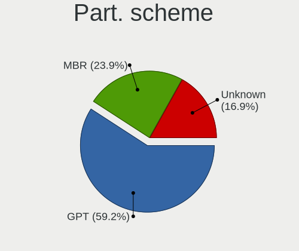
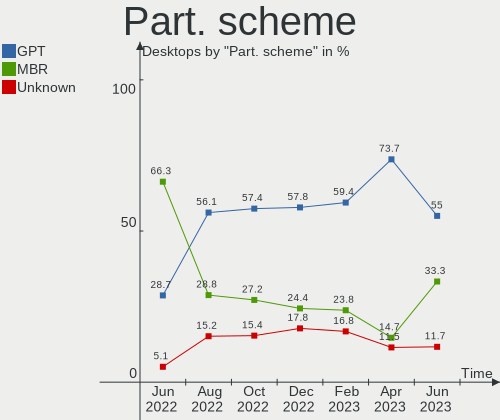
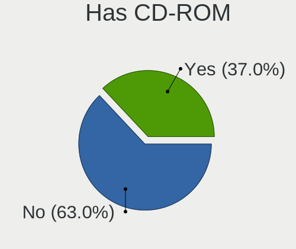
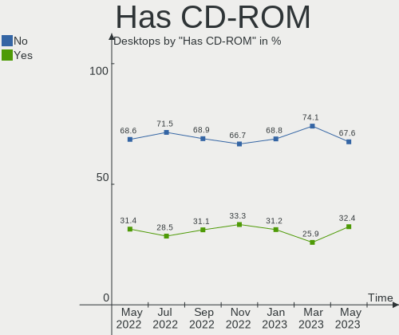

Debian Hardware Trends (Desktop)
--------------------------------

A project to identify most popular hardware characteristics and track their change
over time based on data collected by Debian users at https://Linux-Hardware.org.

Anyone can contribute to the study by uploading probes of their computers by
the [hw-probe](https://github.com/linuxhw/hw-probe) tool:

    sudo -E hw-probe -all -upload

Full-feature report is available here: https://linux-hardware.org/?view=trends&formfactor=desktop

Period: May, 2021.

Contents
--------

- [ OS                       ](#os)
- [ OS Family                ](#os-family)
- [ Kernel                   ](#kernel)
- [ Kernel Family            ](#kernel-family)
- [ Kernel Major Ver.        ](#kernel-major-ver)
- [ Arch                     ](#arch)
- [ DE                       ](#de)
- [ Display Server           ](#display-server)
- [ Display Manager          ](#display-manager)
- [ OS Lang                  ](#os-lang)
- [ Boot Mode                ](#boot-mode)
- [ Filesystem               ](#filesystem)
- [ Part. scheme             ](#part-scheme)
- [ Dual Boot with Linux/BSD ](#dual-boot-with-linux/bsd)
- [ Dual Boot (Win)          ](#dual-boot-win)
- [ Country                  ](#country)
- [ City                     ](#city)
- [ Vendor                   ](#vendor)
- [ Model                    ](#model)
- [ Model Family             ](#model-family)
- [ MFG Year                 ](#mfg-year)
- [ Form Factor              ](#form-factor)
- [ Secure Boot              ](#secure-boot)
- [ Coreboot                 ](#coreboot)
- [ RAM Size                 ](#ram-size)
- [ RAM Used                 ](#ram-used)
- [ Has CD-ROM               ](#has-cd-rom)
- [ Total Drives             ](#total-drives)
- [ Has Ethernet             ](#has-ethernet)
- [ Has WiFi                 ](#has-wifi)
- [ Has Bluetooth            ](#has-bluetooth)
- [ Drive Vendor             ](#drive-vendor)
- [ Drive Model              ](#drive-model)
- [ HDD Vendor               ](#hdd-vendor)
- [ SSD Vendor               ](#ssd-vendor)
- [ Drive Kind               ](#drive-kind)
- [ Drive Connector          ](#drive-connector)
- [ Drive Size               ](#drive-size)
- [ Space Total              ](#space-total)
- [ Space Used               ](#space-used)
- [ Malfunc. Drives          ](#malfunc-drives)
- [ Malfunc. Drive Vendor    ](#malfunc-drive-vendor)
- [ Malfunc. HDD Vendor      ](#malfunc-hdd-vendor)
- [ Malfunc. Drive Kind      ](#malfunc-drive-kind)
- [ Failed Drives            ](#failed-drives)
- [ Failed Drive Vendor      ](#failed-drive-vendor)
- [ Drive Status             ](#drive-status)
- [ Storage Vendor           ](#storage-vendor)
- [ Storage Model            ](#storage-model)
- [ Storage Kind             ](#storage-kind)
- [ CPU Vendor               ](#cpu-vendor)
- [ CPU Model                ](#cpu-model)
- [ CPU Model Family         ](#cpu-model-family)
- [ CPU Cores                ](#cpu-cores)
- [ CPU Sockets              ](#cpu-sockets)
- [ CPU Threads              ](#cpu-threads)
- [ CPU Op-Modes             ](#cpu-op-modes)
- [ CPU Microcode            ](#cpu-microcode)
- [ CPU Microarch            ](#cpu-microarch)
- [ GPU Vendor               ](#gpu-vendor)
- [ GPU Model                ](#gpu-model)
- [ GPU Combo                ](#gpu-combo)
- [ GPU Driver               ](#gpu-driver)
- [ GPU Memory               ](#gpu-memory)
- [ Monitor Vendor           ](#monitor-vendor)
- [ Monitor Model            ](#monitor-model)
- [ Monitor Resolution       ](#monitor-resolution)
- [ Monitor Diagonal         ](#monitor-diagonal)
- [ Monitor Width            ](#monitor-width)
- [ Aspect Ratio             ](#aspect-ratio)
- [ Monitor Area             ](#monitor-area)
- [ Pixel Density            ](#pixel-density)
- [ Multiple Monitors        ](#multiple-monitors)
- [ Net Controller Vendor    ](#net-controller-vendor)
- [ Net Controller Model     ](#net-controller-model)
- [ Wireless Vendor          ](#wireless-vendor)
- [ Wireless Model           ](#wireless-model)
- [ Ethernet Vendor          ](#ethernet-vendor)
- [ Ethernet Model           ](#ethernet-model)
- [ Net Controller Kind      ](#net-controller-kind)
- [ Used Controller          ](#used-controller)
- [ NICs                     ](#nics)
- [ IPv6                     ](#ipv6)
- [ Memory Vendor            ](#memory-vendor)
- [ Memory Model             ](#memory-model)
- [ Memory Kind              ](#memory-kind)
- [ Memory Form Factor       ](#memory-form-factor)
- [ Memory Size              ](#memory-size)
- [ Memory Speed             ](#memory-speed)
- [ Sound Vendor             ](#sound-vendor)
- [ Sound Model              ](#sound-model)
- [ Camera Vendor            ](#camera-vendor)
- [ Camera Model             ](#camera-model)
- [ Fingerprint Vendor       ](#fingerprint-vendor)
- [ Fingerprint Model        ](#fingerprint-model)
- [ Chipcard Vendor          ](#chipcard-vendor)
- [ Chipcard Model           ](#chipcard-model)
- [ Printer Vendor           ](#printer-vendor)
- [ Printer Model            ](#printer-model)
- [ Scanner Vendor           ](#scanner-vendor)
- [ Scanner Model            ](#scanner-model)
- [ Bluetooth Vendor         ](#bluetooth-vendor)
- [ Bluetooth Model          ](#bluetooth-model)
- [ Unsupported Devices      ](#unsupported-devices)
- [ Unsupported Device Types ](#unsupported-device-types)

OS
--

Installed operating systems

| Name            | Desktops | Percent |
|-----------------|----------|---------|
| Debian 10       | 38       | 48.72%  |
| Debian          | 20       | 25.64%  |
| Debian 11       | 8        | 10.26%  |
| Debian Testing  | 5        | 6.41%   |
| Debian 9        | 4        | 5.13%   |
| Debian Unstable | 1        | 1.28%   |
| Debian Sid      | 1        | 1.28%   |
| Debian 8.9      | 1        | 1.28%   |

OS Family
---------

OS without a version

| Name   | Desktops | Percent |
|--------|----------|---------|
| Debian | 78       | 100%    |

Kernel
------

Version of the Linux kernel

| Version                        | Desktops | Percent |
|--------------------------------|----------|---------|
| 4.19.0-16-amd64                | 22       | 28.21%  |
| 5.10.0-2-amd64                 | 16       | 20.51%  |
| 5.10.0-6-amd64                 | 11       | 14.1%   |
| 5.10.0-0.bpo.5-amd64           | 4        | 5.13%   |
| 5.10.0-7-amd64                 | 3        | 3.85%   |
| 4.19.0-6-amd64                 | 3        | 3.85%   |
| 5.4.106-1-pve                  | 2        | 2.56%   |
| 5.8.0-17.2-liquorix-amd64      | 1        | 1.28%   |
| 5.7.0-1-amd64                  | 1        | 1.28%   |
| 5.7.0-0.bpo.2-amd64            | 1        | 1.28%   |
| 5.6.0-0.bpo.2-amd64            | 1        | 1.28%   |
| 5.4.114-1-pve                  | 1        | 1.28%   |
| 5.3.0-0.bpo.2-686-pae          | 1        | 1.28%   |
| 5.12.6                         | 1        | 1.28%   |
| 5.12.5                         | 1        | 1.28%   |
| 5.11.8                         | 1        | 1.28%   |
| 5.11.17-1-pve                  | 1        | 1.28%   |
| 5.10.10                        | 1        | 1.28%   |
| 5.10.0-0.bpo.3-amd64           | 1        | 1.28%   |
| 4.9.0-15-amd64                 | 1        | 1.28%   |
| 4.19.84-mod-std-ipv6-64-rescue | 1        | 1.28%   |
| 4.19.0-13-amd64                | 1        | 1.28%   |
| 4.19.0-10-amd64                | 1        | 1.28%   |
| 3.2.27+                        | 1        | 1.28%   |

Kernel Family
-------------

Linux kernel without a distro release

| Version | Desktops | Percent |
|---------|----------|---------|
| 5.10.0  | 35       | 44.87%  |
| 4.19.0  | 27       | 34.62%  |
| 5.7.0   | 2        | 2.56%   |
| 5.4.106 | 2        | 2.56%   |
| 5.8.0   | 1        | 1.28%   |
| 5.6.0   | 1        | 1.28%   |
| 5.4.114 | 1        | 1.28%   |
| 5.3.0   | 1        | 1.28%   |
| 5.12.6  | 1        | 1.28%   |
| 5.12.5  | 1        | 1.28%   |
| 5.11.8  | 1        | 1.28%   |
| 5.11.17 | 1        | 1.28%   |
| 5.10.10 | 1        | 1.28%   |
| 4.9.0   | 1        | 1.28%   |
| 4.19.84 | 1        | 1.28%   |
| 3.2.27  | 1        | 1.28%   |

Kernel Major Ver.
-----------------

Linux kernel major version

| Version | Desktops | Percent |
|---------|----------|---------|
| 5.10    | 36       | 46.15%  |
| 4.19    | 28       | 35.9%   |
| 5.4     | 3        | 3.85%   |
| 5.7     | 2        | 2.56%   |
| 5.12    | 2        | 2.56%   |
| 5.11    | 2        | 2.56%   |
| 5.8     | 1        | 1.28%   |
| 5.6     | 1        | 1.28%   |
| 5.3     | 1        | 1.28%   |
| 4.9     | 1        | 1.28%   |
| 3.2     | 1        | 1.28%   |

Arch
----

OS architecture (x86_64, i586, etc.)

| Name   | Desktops | Percent |
|--------|----------|---------|
| x86_64 | 75       | 96.15%  |
| i686   | 2        | 2.56%   |
| armv6l | 1        | 1.28%   |

DE
--

Desktop Environment

| Name       | Desktops | Percent |
|------------|----------|---------|
| Unknown    | 31       | 39.74%  |
| XFCE       | 10       | 12.82%  |
| KDE5       | 9        | 11.54%  |
| KDE        | 8        | 10.26%  |
| GNOME      | 7        | 8.97%   |
| X-Cinnamon | 6        | 7.69%   |
| MATE       | 3        | 3.85%   |
| LXDE       | 2        | 2.56%   |
| i3         | 1        | 1.28%   |
| GNUstep    | 1        | 1.28%   |

Display Server
--------------

X11 or Wayland

| Name    | Desktops | Percent |
|---------|----------|---------|
| X11     | 46       | 58.97%  |
| Unknown | 20       | 25.64%  |
| Tty     | 7        | 8.97%   |
| Wayland | 5        | 6.41%   |

Display Manager
---------------

SDDM, LightDM, etc.

| Name    | Desktops | Percent |
|---------|----------|---------|
| Unknown | 56       | 71.79%  |
| SDDM    | 9        | 11.54%  |
| TDM     | 6        | 7.69%   |
| GDM     | 5        | 6.41%   |
| NODM    | 1        | 1.28%   |
| LightDM | 1        | 1.28%   |

OS Lang
-------

Language

| Lang    | Desktops | Percent |
|---------|----------|---------|
| en_US   | 27       | 34.62%  |
| ru_RU   | 18       | 23.08%  |
| en_GB   | 7        | 8.97%   |
| Unknown | 5        | 6.41%   |
| pt_BR   | 4        | 5.13%   |
| en_IE   | 4        | 5.13%   |
| de_DE   | 3        | 3.85%   |
| fr_FR   | 2        | 2.56%   |
| sv_SE   | 1        | 1.28%   |
| pl_PL   | 1        | 1.28%   |
| lt_LT   | 1        | 1.28%   |
| it_IT   | 1        | 1.28%   |
| es_VE   | 1        | 1.28%   |
| es_ES   | 1        | 1.28%   |
| en_AU   | 1        | 1.28%   |
| de_AT   | 1        | 1.28%   |

Boot Mode
---------

EFI or BIOS

| Mode | Desktops | Percent |
|------|----------|---------|
| BIOS | 58       | 74.36%  |
| EFI  | 20       | 25.64%  |

Filesystem
----------

Type of filesystem

| Type    | Desktops | Percent |
|---------|----------|---------|
| Ext4    | 48       | 61.54%  |
| Overlay | 17       | 21.79%  |
| Btrfs   | 6        | 7.69%   |
| Zfs     | 2        | 2.56%   |
| Rootfs  | 2        | 2.56%   |
| Xfs     | 1        | 1.28%   |
| Ext3    | 1        | 1.28%   |
| Aufs    | 1        | 1.28%   |

Part. scheme
------------

Scheme of partitioning

| Type    | Desktops | Percent |
|---------|----------|---------|
| GPT     | 29       | 37.18%  |
| Unknown | 27       | 34.62%  |
| MBR     | 22       | 28.21%  |

Dual Boot with Linux/BSD
------------------------

Hosting more than one Linux/BSD

| Dual boot | Desktops | Percent |
|-----------|----------|---------|
| No        | 65       | 83.33%  |
| Yes       | 13       | 16.67%  |

Dual Boot (Win)
---------------

Hosting Linux and Windows

| Dual boot | Desktops | Percent |
|-----------|----------|---------|
| No        | 48       | 61.54%  |
| Yes       | 30       | 38.46%  |

Country
-------

Geographic location (country)

| Country      | Desktops | Percent |
|--------------|----------|---------|
| Russia       | 18       | 23.08%  |
| USA          | 12       | 15.38%  |
| France       | 5        | 6.41%   |
| Austria      | 5        | 6.41%   |
| UK           | 4        | 5.13%   |
| Brazil       | 4        | 5.13%   |
| Italy        | 3        | 3.85%   |
| Germany      | 3        | 3.85%   |
| Spain        | 2        | 2.56%   |
| Slovakia     | 2        | 2.56%   |
| Norway       | 2        | 2.56%   |
| Hungary      | 2        | 2.56%   |
| Canada       | 2        | 2.56%   |
| Australia    | 2        | 2.56%   |
| Venezuela    | 1        | 1.28%   |
| UAE          | 1        | 1.28%   |
| Switzerland  | 1        | 1.28%   |
| Sweden       | 1        | 1.28%   |
| Singapore    | 1        | 1.28%   |
| Saudi Arabia | 1        | 1.28%   |
| Poland       | 1        | 1.28%   |
| Netherlands  | 1        | 1.28%   |
| Luxembourg   | 1        | 1.28%   |
| Lithuania    | 1        | 1.28%   |
| Belgium      | 1        | 1.28%   |
| Argentina    | 1        | 1.28%   |

City
----

Geographic location (city)

| City                   | Desktops | Percent |
|------------------------|----------|---------|
| Voronezh               | 16       | 20.51%  |
| Vienna                 | 4        | 5.13%   |
| Danville               | 3        | 3.85%   |
| Košice                | 2        | 2.56%   |
| Belo Horizonte         | 2        | 2.56%   |
| Zurich                 | 1        | 1.28%   |
| Vineyard               | 1        | 1.28%   |
| Villingen-Schwenningen | 1        | 1.28%   |
| Vigra                  | 1        | 1.28%   |
| Vaux-sur-Seine         | 1        | 1.28%   |
| Unai                   | 1        | 1.28%   |
| Udine                  | 1        | 1.28%   |
| Toronto                | 1        | 1.28%   |
| Thionville             | 1        | 1.28%   |
| Székesfehérvár      | 1        | 1.28%   |
| Stavanger              | 1        | 1.28%   |
| Srednyaya Akhtuba      | 1        | 1.28%   |
| Sjoebo                 | 1        | 1.28%   |
| Silver Spring          | 1        | 1.28%   |
| Saint Neots            | 1        | 1.28%   |
| Rome                   | 1        | 1.28%   |
| Rochester              | 1        | 1.28%   |
| Queenstown Estate      | 1        | 1.28%   |
| Queens                 | 1        | 1.28%   |
| Pécs                  | 1        | 1.28%   |
| Perth                  | 1        | 1.28%   |
| Paris                  | 1        | 1.28%   |
| Nobleton               | 1        | 1.28%   |
| New York               | 1        | 1.28%   |
| Murcia                 | 1        | 1.28%   |
| Moscow                 | 1        | 1.28%   |
| Montalto Pavese        | 1        | 1.28%   |
| Marenla                | 1        | 1.28%   |
| Luxembourg             | 1        | 1.28%   |
| Lublin                 | 1        | 1.28%   |
| Kaunas                 | 1        | 1.28%   |
| Karlsruhe              | 1        | 1.28%   |
| Islington              | 1        | 1.28%   |
| Hamburg                | 1        | 1.28%   |
| Great Malvern          | 1        | 1.28%   |
| Graz                   | 1        | 1.28%   |
| Freeport               | 1        | 1.28%   |
| Eindhoven              | 1        | 1.28%   |
| East Orange            | 1        | 1.28%   |
| De Pere                | 1        | 1.28%   |
| Dammam                 | 1        | 1.28%   |
| Córdoba               | 1        | 1.28%   |
| Cumaná                | 1        | 1.28%   |
| Clichy-sous-Bois       | 1        | 1.28%   |
| Campinas               | 1        | 1.28%   |
| Bridgend               | 1        | 1.28%   |
| Boom                   | 1        | 1.28%   |
| Bloomfield             | 1        | 1.28%   |
| Barcelona              | 1        | 1.28%   |
| Atwater                | 1        | 1.28%   |
| Abu Dhabi              | 1        | 1.28%   |

Vendor
------

Motherboard manufacturer

| Name                | Desktops | Percent |
|---------------------|----------|---------|
| ASUSTek Computer    | 22       | 28.21%  |
| Gigabyte Technology | 15       | 19.23%  |
| ASRock              | 12       | 15.38%  |
| Hewlett-Packard     | 6        | 7.69%   |
| MSI                 | 5        | 6.41%   |
| Intel               | 4        | 5.13%   |
| Dell                | 3        | 3.85%   |
| Apple               | 2        | 2.56%   |
| Medion              | 1        | 1.28%   |
| Lenovo              | 1        | 1.28%   |
| Huanan              | 1        | 1.28%   |
| Google              | 1        | 1.28%   |
| faytech             | 1        | 1.28%   |
| ECS                 | 1        | 1.28%   |
| Centrium            | 1        | 1.28%   |
| AZW                 | 1        | 1.28%   |
| Unknown             | 1        | 1.28%   |

Model
-----

Motherboard model

| Name                             | Desktops | Percent |
|----------------------------------|----------|---------|
| ASRock H61M-VG4                  | 6        | 7.69%   |
| ASUS M5A78L-M LX/BR              | 3        | 3.85%   |
| Gigabyte H81M-S2V                | 2        | 2.56%   |
| ASUS M5A97 R2.0                  | 2        | 2.56%   |
| ASUS H110M-PLUS                  | 2        | 2.56%   |
| ASUS All Series                  | 2        | 2.56%   |
| Apple MacPro3,1                  | 2        | 2.56%   |
| MSI MS-7C37                      | 1        | 1.28%   |
| MSI MS-7C02                      | 1        | 1.28%   |
| MSI MS-7A70                      | 1        | 1.28%   |
| MSI MS-7A40                      | 1        | 1.28%   |
| MSI MS-7758                      | 1        | 1.28%   |
| Medion MS-7616                   | 1        | 1.28%   |
| Lenovo ThinkCentre M92p 3209EK4  | 1        | 1.28%   |
| Intel DN2800MT AAG81515-900      | 1        | 1.28%   |
| Intel DH87RL AAG74240-402        | 1        | 1.28%   |
| Intel DH67BL AAG10189-209        | 1        | 1.28%   |
| Intel DG965SS AAD41678-308       | 1        | 1.28%   |
| Huanan X99-F8                    | 1        | 1.28%   |
| HP ProLiant MicroServer          | 1        | 1.28%   |
| HP EliteDesk 800 G5 Desktop Mini | 1        | 1.28%   |
| HP EliteDesk 800 G1 SFF          | 1        | 1.28%   |
| HP Compaq Elite 8300 SFF         | 1        | 1.28%   |
| HP Compaq 6000 Pro SFF PC        | 1        | 1.28%   |
| HP 23-q018a                      | 1        | 1.28%   |
| Google Guado                     | 1        | 1.28%   |
| Gigabyte Z77-D3H                 | 1        | 1.28%   |
| Gigabyte Z390 AORUS PRO WIFI     | 1        | 1.28%   |
| Gigabyte Z170X-GamingG1          | 1        | 1.28%   |
| Gigabyte X99-UD5 WIFI-CF         | 1        | 1.28%   |
| Gigabyte H81M-S1                 | 1        | 1.28%   |
| Gigabyte H81M-DS2                | 1        | 1.28%   |
| Gigabyte H61M-DS2 REV 1.2        | 1        | 1.28%   |
| Gigabyte GB-BPCE-3455            | 1        | 1.28%   |
| Gigabyte GA-970A-UD3             | 1        | 1.28%   |
| Gigabyte B450 I AORUS PRO WIFI   | 1        | 1.28%   |
| Gigabyte B450 AORUS PRO WIFI     | 1        | 1.28%   |
| Gigabyte AB350M-D3H              | 1        | 1.28%   |
| Gigabyte A320M-S2H               | 1        | 1.28%   |
| faytech FTJ1900-1920*1080-48bit  | 1        | 1.28%   |
| ECS H61H2-CM                     | 1        | 1.28%   |
| Dell OptiPlex 980                | 1        | 1.28%   |
| Dell OptiPlex 3010               | 1        | 1.28%   |
| Dell DM061                       | 1        | 1.28%   |
| Centrium C2018-H310CH5-M2        | 1        | 1.28%   |
| AZW AP35                         | 1        | 1.28%   |
| ASUS TUF B450-PLUS GAMING        | 1        | 1.28%   |
| ASUS ROG STRIX Z490-F GAMING     | 1        | 1.28%   |
| ASUS ROG STRIX B450-E GAMING     | 1        | 1.28%   |
| ASUS ROG STRIX B365-G GAMING     | 1        | 1.28%   |
| ASUS ROG CROSSHAIR VII HERO      | 1        | 1.28%   |
| ASUS PRIME X370-PRO              | 1        | 1.28%   |
| ASUS P7H55                       | 1        | 1.28%   |
| ASUS P5KPL-AM IN/ROEM/SI         | 1        | 1.28%   |
| ASUS P5B-Deluxe                  | 1        | 1.28%   |
| ASUS P5B                         | 1        | 1.28%   |
| ASUS M5A88-M                     | 1        | 1.28%   |
| ASUS M3A79-T DELUXE              | 1        | 1.28%   |
| ASUS F2A85-M PRO                 | 1        | 1.28%   |
| ASRock H77M                      | 1        | 1.28%   |

Model Family
------------

Motherboard model prefix

| Name                            | Desktops | Percent |
|---------------------------------|----------|---------|
| ASRock H61M-VG4                 | 6        | 7.69%   |
| ASUS ROG                        | 4        | 5.13%   |
| ASUS M5A78L-M                   | 3        | 3.85%   |
| HP EliteDesk                    | 2        | 2.56%   |
| HP Compaq                       | 2        | 2.56%   |
| Gigabyte H81M-S2V               | 2        | 2.56%   |
| Gigabyte B450                   | 2        | 2.56%   |
| Dell OptiPlex                   | 2        | 2.56%   |
| ASUS M5A97                      | 2        | 2.56%   |
| ASUS H110M-PLUS                 | 2        | 2.56%   |
| ASUS All                        | 2        | 2.56%   |
| Apple MacPro3                   | 2        | 2.56%   |
| MSI MS-7C37                     | 1        | 1.28%   |
| MSI MS-7C02                     | 1        | 1.28%   |
| MSI MS-7A70                     | 1        | 1.28%   |
| MSI MS-7A40                     | 1        | 1.28%   |
| MSI MS-7758                     | 1        | 1.28%   |
| Medion MS-7616                  | 1        | 1.28%   |
| Lenovo ThinkCentre              | 1        | 1.28%   |
| Intel DN2800MT                  | 1        | 1.28%   |
| Intel DH87RL                    | 1        | 1.28%   |
| Intel DH67BL                    | 1        | 1.28%   |
| Intel DG965SS                   | 1        | 1.28%   |
| Huanan X99-F8                   | 1        | 1.28%   |
| HP ProLiant                     | 1        | 1.28%   |
| HP 23-q018a                     | 1        | 1.28%   |
| Google Guado                    | 1        | 1.28%   |
| Gigabyte Z77-D3H                | 1        | 1.28%   |
| Gigabyte Z390                   | 1        | 1.28%   |
| Gigabyte Z170X-GamingG1         | 1        | 1.28%   |
| Gigabyte X99-UD5                | 1        | 1.28%   |
| Gigabyte H81M-S1                | 1        | 1.28%   |
| Gigabyte H81M-DS2               | 1        | 1.28%   |
| Gigabyte H61M-DS2               | 1        | 1.28%   |
| Gigabyte GB-BPCE-3455           | 1        | 1.28%   |
| Gigabyte GA-970A-UD3            | 1        | 1.28%   |
| Gigabyte AB350M-D3H             | 1        | 1.28%   |
| Gigabyte A320M-S2H              | 1        | 1.28%   |
| faytech FTJ1900-1920*1080-48bit | 1        | 1.28%   |
| ECS H61H2-CM                    | 1        | 1.28%   |
| Dell DM061                      | 1        | 1.28%   |
| Centrium C2018-H310CH5-M2       | 1        | 1.28%   |
| AZW AP35                        | 1        | 1.28%   |
| ASUS TUF                        | 1        | 1.28%   |
| ASUS PRIME                      | 1        | 1.28%   |
| ASUS P7H55                      | 1        | 1.28%   |
| ASUS P5KPL-AM                   | 1        | 1.28%   |
| ASUS P5B-Deluxe                 | 1        | 1.28%   |
| ASUS P5B                        | 1        | 1.28%   |
| ASUS M5A88-M                    | 1        | 1.28%   |
| ASUS M3A79-T                    | 1        | 1.28%   |
| ASUS F2A85-M                    | 1        | 1.28%   |
| ASRock H77M                     | 1        | 1.28%   |
| ASRock G31M-VS2                 | 1        | 1.28%   |
| ASRock B450M                    | 1        | 1.28%   |
| ASRock B450                     | 1        | 1.28%   |
| ASRock B365M                    | 1        | 1.28%   |
| ASRock A320M-HDV                | 1        | 1.28%   |
| Unknown                         | 1        | 1.28%   |

MFG Year
--------

Motherboard manufacture year

| Year    | Desktops | Percent |
|---------|----------|---------|
| 2019    | 12       | 15.38%  |
| 2013    | 11       | 14.1%   |
| 2020    | 10       | 12.82%  |
| 2018    | 7        | 8.97%   |
| 2015    | 5        | 6.41%   |
| 2014    | 5        | 6.41%   |
| 2012    | 5        | 6.41%   |
| 2011    | 5        | 6.41%   |
| 2017    | 4        | 5.13%   |
| 2010    | 3        | 3.85%   |
| 2009    | 3        | 3.85%   |
| 2007    | 3        | 3.85%   |
| 2021    | 2        | 2.56%   |
| 2008    | 2        | 2.56%   |
| Unknown | 1        | 1.28%   |

Form Factor
-----------

Physical design of the computer

| Name    | Desktops | Percent |
|---------|----------|---------|
| Desktop | 78       | 100%    |

Secure Boot
-----------

Enabled or disabled

| State    | Desktops | Percent |
|----------|----------|---------|
| Disabled | 77       | 98.72%  |
| Enabled  | 1        | 1.28%   |

Coreboot
--------

Have coreboot on board

| Used | Desktops | Percent |
|------|----------|---------|
| No   | 77       | 98.72%  |
| Yes  | 1        | 1.28%   |

RAM Size
--------

Total RAM memory

| Size in GB  | Desktops | Percent |
|-------------|----------|---------|
| 8.01-16.0   | 18       | 23.08%  |
| 3.01-4.0    | 15       | 19.23%  |
| 4.01-8.0    | 13       | 16.67%  |
| 16.01-24.0  | 13       | 16.67%  |
| 32.01-64.0  | 12       | 15.38%  |
| 64.01-256.0 | 4        | 5.13%   |
| 1.01-2.0    | 2        | 2.56%   |
| 0.01-0.5    | 1        | 1.28%   |

RAM Used
--------

Used RAM memory

| Used GB    | Desktops | Percent |
|------------|----------|---------|
| 0.51-1.0   | 18       | 23.08%  |
| 4.01-8.0   | 15       | 19.23%  |
| 2.01-3.0   | 12       | 15.38%  |
| 1.01-2.0   | 12       | 15.38%  |
| 3.01-4.0   | 8        | 10.26%  |
| 8.01-16.0  | 7        | 8.97%   |
| 32.01-64.0 | 2        | 2.56%   |
| 0.01-0.5   | 2        | 2.56%   |
| 16.01-24.0 | 1        | 1.28%   |
| Unknown    | 1        | 1.28%   |

Has CD-ROM
----------

Has CD-ROM on board

| Presented | Desktops | Percent |
|-----------|----------|---------|
| No        | 49       | 62.82%  |
| Yes       | 29       | 37.18%  |

