Debian - Hardware Trends (Desktops)
-----------------------------------

A project to identify most popular hardware characteristics and track their change
over time based on data collected by Linux users at https://Linux-Hardware.org.

Anyone can contribute to this report by the [hw-probe](https://github.com/linuxhw/hw-probe) tool:

    sudo -E hw-probe -all -upload

This report is for one last month. Overall report since the beginning of time: [TestDays](https://github.com/linuxhw/TestDays)

Period: Dec, 2025.

Contents
--------

* [ System ](#system)
  - [ OS                       ](#os)
  - [ OS Family                ](#os-family)
  - [ Kernel                   ](#kernel)
  - [ Kernel Family            ](#kernel-family)
  - [ Kernel Major Ver.        ](#kernel-major-ver)
  - [ Arch                     ](#arch)
  - [ DE                       ](#de)
  - [ Display Server           ](#display-server)
  - [ Display Manager          ](#display-manager)
  - [ OS Lang                  ](#os-lang)
  - [ Boot Mode                ](#boot-mode)
  - [ Filesystem               ](#filesystem)
  - [ Part. scheme             ](#part-scheme)
  - [ Dual Boot with Linux/BSD ](#dual-boot-with-linuxbsd)
  - [ Dual Boot (Win)          ](#dual-boot-win)

* [ Board ](#board)
  - [ Vendor                   ](#vendor)
  - [ Model                    ](#model)
  - [ Model Family             ](#model-family)
  - [ MFG Year                 ](#mfg-year)
  - [ Form Factor              ](#form-factor)
  - [ Secure Boot              ](#secure-boot)
  - [ Coreboot                 ](#coreboot)
  - [ RAM Size                 ](#ram-size)
  - [ RAM Used                 ](#ram-used)
  - [ Total Drives             ](#total-drives)
  - [ Has CD-ROM               ](#has-cd-rom)
  - [ Has Ethernet             ](#has-ethernet)
  - [ Has WiFi                 ](#has-wifi)
  - [ Has Bluetooth            ](#has-bluetooth)

* [ Location ](#location)
  - [ Country                  ](#country)
  - [ City                     ](#city)

* [ Drives ](#drives)
  - [ Drive Vendor             ](#drive-vendor)
  - [ Drive Model              ](#drive-model)
  - [ HDD Vendor               ](#hdd-vendor)
  - [ SSD Vendor               ](#ssd-vendor)
  - [ Drive Kind               ](#drive-kind)
  - [ Drive Connector          ](#drive-connector)
  - [ Drive Size               ](#drive-size)
  - [ Space Total              ](#space-total)
  - [ Space Used               ](#space-used)
  - [ Malfunc. Drives          ](#malfunc-drives)
  - [ Malfunc. Drive Vendor    ](#malfunc-drive-vendor)
  - [ Malfunc. HDD Vendor      ](#malfunc-hdd-vendor)
  - [ Malfunc. Drive Kind      ](#malfunc-drive-kind)
  - [ Failed Drives            ](#failed-drives)
  - [ Failed Drive Vendor      ](#failed-drive-vendor)
  - [ Drive Status             ](#drive-status)

* [ Storage controller ](#storage-controller)
  - [ Storage Vendor           ](#storage-vendor)
  - [ Storage Model            ](#storage-model)
  - [ Storage Kind             ](#storage-kind)

* [ Processor ](#processor)
  - [ CPU Vendor               ](#cpu-vendor)
  - [ CPU Model                ](#cpu-model)
  - [ CPU Model Family         ](#cpu-model-family)
  - [ CPU Cores                ](#cpu-cores)
  - [ CPU Sockets              ](#cpu-sockets)
  - [ CPU Threads              ](#cpu-threads)
  - [ CPU Op-Modes             ](#cpu-op-modes)
  - [ CPU Microcode            ](#cpu-microcode)
  - [ CPU Microarch            ](#cpu-microarch)

* [ Graphics ](#graphics)
  - [ GPU Vendor               ](#gpu-vendor)
  - [ GPU Model                ](#gpu-model)
  - [ GPU Combo                ](#gpu-combo)
  - [ GPU Driver               ](#gpu-driver)
  - [ GPU Memory               ](#gpu-memory)

* [ Monitor ](#monitor)
  - [ Monitor Vendor           ](#monitor-vendor)
  - [ Monitor Model            ](#monitor-model)
  - [ Monitor Resolution       ](#monitor-resolution)
  - [ Monitor Diagonal         ](#monitor-diagonal)
  - [ Monitor Width            ](#monitor-width)
  - [ Aspect Ratio             ](#aspect-ratio)
  - [ Monitor Area             ](#monitor-area)
  - [ Pixel Density            ](#pixel-density)
  - [ Multiple Monitors        ](#multiple-monitors)

* [ Network ](#network)
  - [ Net Controller Vendor    ](#net-controller-vendor)
  - [ Net Controller Model     ](#net-controller-model)
  - [ Wireless Vendor          ](#wireless-vendor)
  - [ Wireless Model           ](#wireless-model)
  - [ Ethernet Vendor          ](#ethernet-vendor)
  - [ Ethernet Model           ](#ethernet-model)
  - [ Net Controller Kind      ](#net-controller-kind)
  - [ Used Controller          ](#used-controller)
  - [ NICs                     ](#nics)
  - [ IPv6                     ](#ipv6)

* [ Bluetooth ](#bluetooth)
  - [ Bluetooth Vendor         ](#bluetooth-vendor)
  - [ Bluetooth Model          ](#bluetooth-model)

* [ Sound ](#sound)
  - [ Sound Vendor             ](#sound-vendor)
  - [ Sound Model              ](#sound-model)

* [ Memory ](#memory)
  - [ Memory Vendor            ](#memory-vendor)
  - [ Memory Model             ](#memory-model)
  - [ Memory Kind              ](#memory-kind)
  - [ Memory Form Factor       ](#memory-form-factor)
  - [ Memory Size              ](#memory-size)
  - [ Memory Speed             ](#memory-speed)

* [ Printers & scanners ](#printers--scanners)
  - [ Printer Vendor           ](#printer-vendor)
  - [ Printer Model            ](#printer-model)
  - [ Scanner Vendor           ](#scanner-vendor)
  - [ Scanner Model            ](#scanner-model)

* [ Camera ](#camera)
  - [ Camera Vendor            ](#camera-vendor)
  - [ Camera Model             ](#camera-model)

* [ Security ](#security)
  - [ Fingerprint Vendor       ](#fingerprint-vendor)
  - [ Fingerprint Model        ](#fingerprint-model)
  - [ Chipcard Vendor          ](#chipcard-vendor)
  - [ Chipcard Model           ](#chipcard-model)

* [ Unsupported ](#unsupported)
  - [ Unsupported Devices      ](#unsupported-devices)
  - [ Unsupported Device Types ](#unsupported-device-types)

System
------

OS
--

Installed operating systems

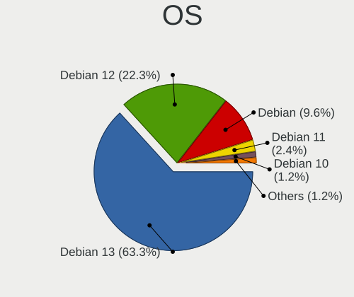

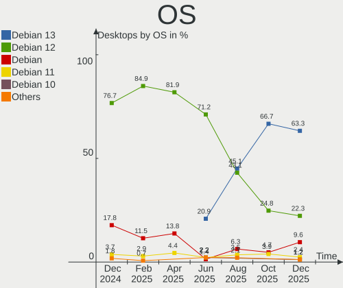

| Name        | Desktops | Percent |
|-------------|----------|---------|
| Debian 13   | 105      | 63.25%  |
| Debian 12   | 37       | 22.29%  |
| Debian      | 16       | 9.64%   |
| Debian 11   | 4        | 2.41%   |
| Debian 10   | 2        | 1.2%    |
| Debian 9    | 1        | 0.6%    |
| Debian 2025 | 1        | 0.6%    |

OS Family
---------

OS without a version

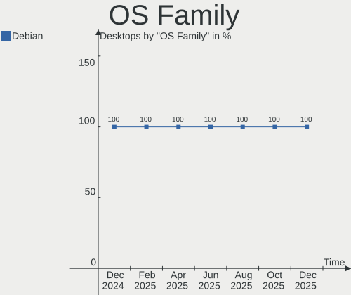

| Name   | Desktops | Percent |
|--------|----------|---------|
| Debian | 166      | 100%    |

Kernel
------

Version of the Linux kernel

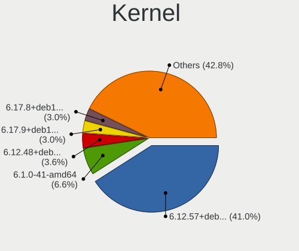

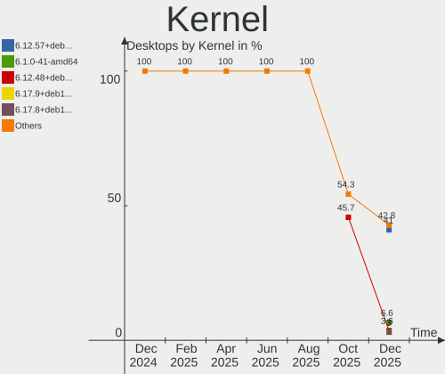

| Version                  | Desktops | Percent |
|--------------------------|----------|---------|
| 6.12.57+deb13-amd64      | 68       | 40.96%  |
| 6.1.0-41-amd64           | 11       | 6.63%   |
| 6.12.48+deb13-amd64      | 6        | 3.61%   |
| 6.17.9+deb14-amd64       | 5        | 3.01%   |
| 6.17.8+deb13-amd64       | 5        | 3.01%   |
| 6.17.2-2-pve             | 4        | 2.41%   |
| 6.8.12-17-pve            | 3        | 1.81%   |
| 6.8.12-15-pve            | 3        | 1.81%   |
| 6.18.0                   | 3        | 1.81%   |
| 6.12.57+deb12-amd64      | 3        | 1.81%   |
| 6.8.12-16-pve            | 2        | 1.2%    |
| 6.8.12-11-pve            | 2        | 1.2%    |
| 6.17.8+deb14-amd64       | 2        | 1.2%    |
| 6.17.4-1-pve             | 2        | 1.2%    |
| 6.17.2-1-pve             | 2        | 1.2%    |
| 6.12.43+deb13-amd64      | 2        | 1.2%    |
| 6.12.41+deb13-amd64      | 2        | 1.2%    |
| 6.1.0-37-amd64           | 2        | 1.2%    |
| 5.10.0-37-amd64          | 2        | 1.2%    |
| 5.10.0-36-amd64          | 2        | 1.2%    |
| 6.8.8-2-pve              | 1        | 0.6%    |
| 6.8.4-2-pve              | 1        | 0.6%    |
| 6.8.12-9-pve             | 1        | 0.6%    |
| 6.8.12-1-pve             | 1        | 0.6%    |
| 6.18.2-x64v3-xanmod1     | 1        | 0.6%    |
| 6.18.2-1-t2-trixie       | 1        | 0.6%    |
| 6.18.1-toeirei           | 1        | 0.6%    |
| 6.18.0-rc7               | 1        | 0.6%    |
| 6.18.0+                  | 1        | 0.6%    |
| 6.17.8+deb13-rt-amd64    | 1        | 0.6%    |
| 6.17.5-1-liquorix-amd64  | 1        | 0.6%    |
| 6.17.4-2-pve             | 1        | 0.6%    |
| 6.17.13+deb14-amd64      | 1        | 0.6%    |
| 6.17.12+deb14-loong64    | 1        | 0.6%    |
| 6.17.12+deb14-amd64      | 1        | 0.6%    |
| 6.17.10-x64v3-xanmod1    | 1        | 0.6%    |
| 6.16.3+deb13-amd64       | 1        | 0.6%    |
| 6.16.12-1-liquorix-amd64 | 1        | 0.6%    |
| 6.16.12+deb14+1-amd64    | 1        | 0.6%    |
| 6.14.11-4-pve            | 1        | 0.6%    |

Kernel Family
-------------

Linux kernel without a distro release

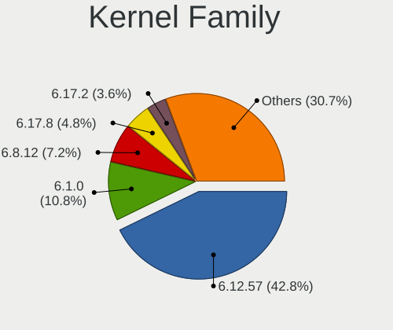

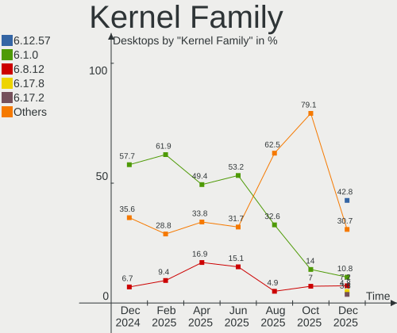

| Version | Desktops | Percent |
|---------|----------|---------|
| 6.12.57 | 71       | 42.77%  |
| 6.1.0   | 18       | 10.84%  |
| 6.8.12  | 12       | 7.23%   |
| 6.17.8  | 8        | 4.82%   |
| 6.17.2  | 6        | 3.61%   |
| 6.12.48 | 6        | 3.61%   |
| 6.18.0  | 5        | 3.01%   |
| 6.17.9  | 5        | 3.01%   |
| 5.10.0  | 4        | 2.41%   |
| 6.17.4  | 3        | 1.81%   |
| 6.14.11 | 3        | 1.81%   |
| 6.18.2  | 2        | 1.2%    |
| 6.17.12 | 2        | 1.2%    |
| 6.16.12 | 2        | 1.2%    |
| 6.12.43 | 2        | 1.2%    |
| 6.12.41 | 2        | 1.2%    |
| 6.8.8   | 1        | 0.6%    |
| 6.8.4   | 1        | 0.6%    |
| 6.18.1  | 1        | 0.6%    |
| 6.17.5  | 1        | 0.6%    |
| 6.17.13 | 1        | 0.6%    |
| 6.17.10 | 1        | 0.6%    |
| 6.16.3  | 1        | 0.6%    |
| 6.12.58 | 1        | 0.6%    |
| 6.12.33 | 1        | 0.6%    |
| 6.12.30 | 1        | 0.6%    |
| 6.10.11 | 1        | 0.6%    |
| 6.1.27  | 1        | 0.6%    |
| 6.1.148 | 1        | 0.6%    |
| 4.19.0  | 1        | 0.6%    |
| 4.16.0  | 1        | 0.6%    |

Kernel Major Ver.
-----------------

Linux kernel major version

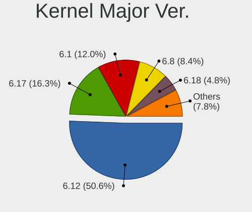

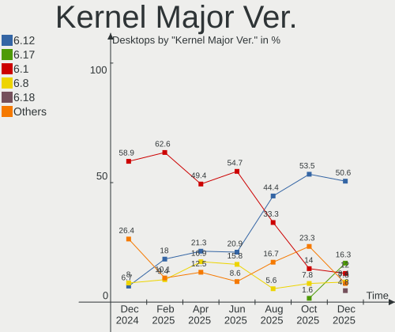

| Version | Desktops | Percent |
|---------|----------|---------|
| 6.12    | 84       | 50.6%   |
| 6.17    | 27       | 16.27%  |
| 6.1     | 20       | 12.05%  |
| 6.8     | 14       | 8.43%   |
| 6.18    | 8        | 4.82%   |
| 5.10    | 4        | 2.41%   |
| 6.16    | 3        | 1.81%   |
| 6.14    | 3        | 1.81%   |
| 6.10    | 1        | 0.6%    |
| 4.19    | 1        | 0.6%    |
| 4.16    | 1        | 0.6%    |

Arch
----

OS architecture (x86_64, i586, etc.)

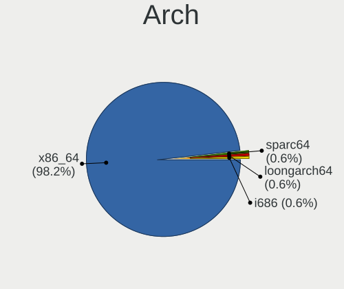

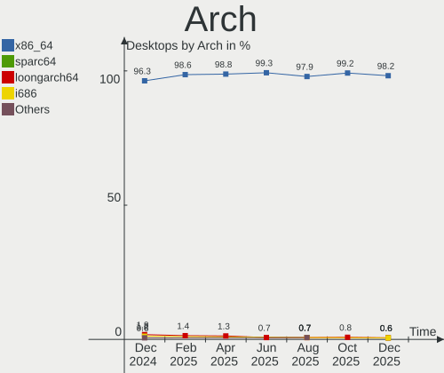

| Name        | Desktops | Percent |
|-------------|----------|---------|
| x86_64      | 163      | 98.19%  |
| sparc64     | 1        | 0.6%    |
| loongarch64 | 1        | 0.6%    |
| i686        | 1        | 0.6%    |

DE
--

Desktop Environment

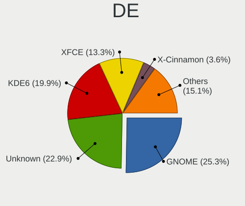

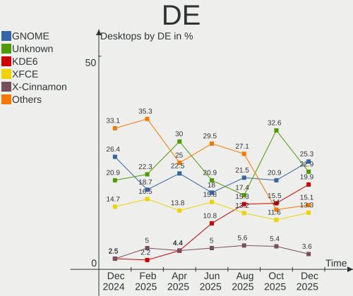

| Name            | Desktops | Percent |
|-----------------|----------|---------|
| GNOME           | 42       | 25.3%   |
| Unknown         | 38       | 22.89%  |
| KDE6            | 33       | 19.88%  |
| XFCE            | 22       | 13.25%  |
| X-Cinnamon      | 6        | 3.61%   |
| KDE5            | 5        | 3.01%   |
| MATE            | 4        | 2.41%   |
| LXDE            | 4        | 2.41%   |
| Cinnamon        | 4        | 2.41%   |
| LXQt            | 3        | 1.81%   |
| Openbox         | 1        | 0.6%    |
| niri            | 1        | 0.6%    |
| labwc:wlroots   | 1        | 0.6%    |
| KDE             | 1        | 0.6%    |
| GNOME Flashback | 1        | 0.6%    |

Display Server
--------------

X11 or Wayland

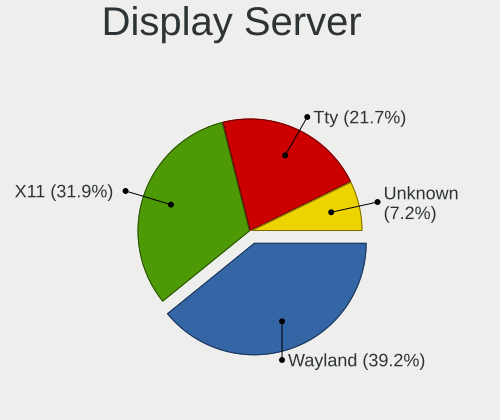

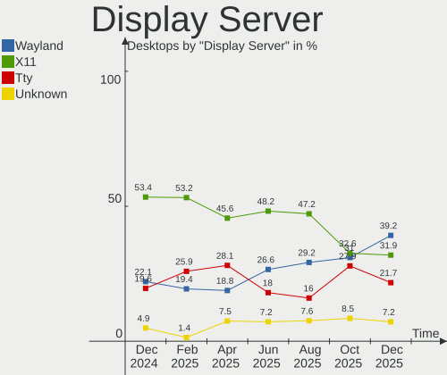

| Name    | Desktops | Percent |
|---------|----------|---------|
| Wayland | 65       | 39.16%  |
| X11     | 53       | 31.93%  |
| Tty     | 36       | 21.69%  |
| Unknown | 12       | 7.23%   |

Display Manager
---------------

SDDM, LightDM, etc.

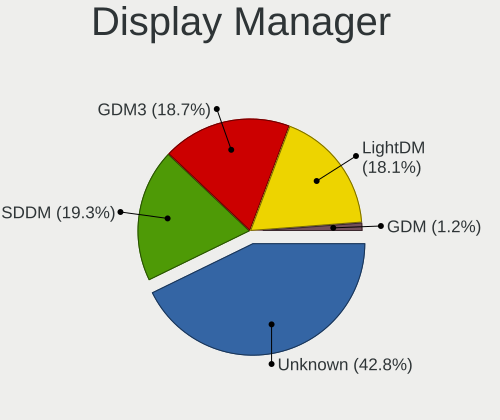

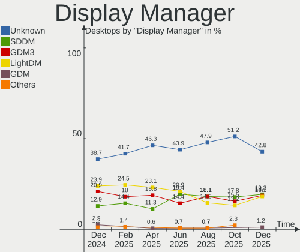

| Name    | Desktops | Percent |
|---------|----------|---------|
| Unknown | 71       | 42.77%  |
| SDDM    | 32       | 19.28%  |
| GDM3    | 31       | 18.67%  |
| LightDM | 30       | 18.07%  |
| GDM     | 2        | 1.2%    |

OS Lang
-------

Language

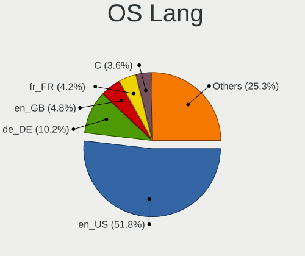

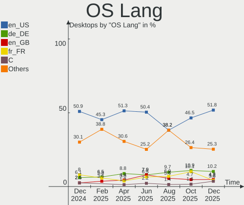

| Lang    | Desktops | Percent |
|---------|----------|---------|
| en_US   | 86       | 51.81%  |
| de_DE   | 17       | 10.24%  |
| en_GB   | 8        | 4.82%   |
| fr_FR   | 7        | 4.22%   |
| C       | 6        | 3.61%   |
| ru_RU   | 5        | 3.01%   |
| pt_BR   | 5        | 3.01%   |
| it_IT   | 4        | 2.41%   |
| en_CA   | 4        | 2.41%   |
| es_MX   | 3        | 1.81%   |
| pl_PL   | 2        | 1.2%    |
| hu_HU   | 2        | 1.2%    |
| es_ES   | 2        | 1.2%    |
| es_AR   | 2        | 1.2%    |
| en_IE   | 2        | 1.2%    |
| zh_TW   | 1        | 0.6%    |
| sr_RS   | 1        | 0.6%    |
| sk_SK   | 1        | 0.6%    |
| nl_NL   | 1        | 0.6%    |
| en_ZA   | 1        | 0.6%    |
| en_IN   | 1        | 0.6%    |
| en_IL   | 1        | 0.6%    |
| en_AU   | 1        | 0.6%    |
| de_AT   | 1        | 0.6%    |
| cs_CZ   | 1        | 0.6%    |
| Unknown | 1        | 0.6%    |

Boot Mode
---------

EFI or BIOS

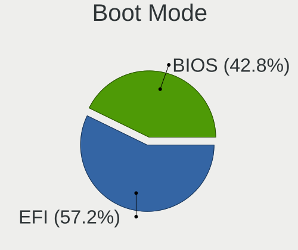

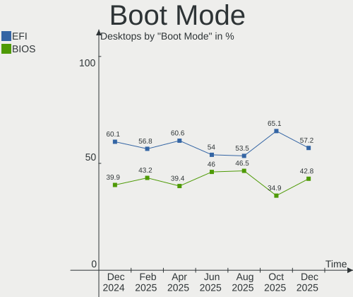

| Mode | Desktops | Percent |
|------|----------|---------|
| EFI  | 95       | 57.23%  |
| BIOS | 71       | 42.77%  |

Filesystem
----------

Type of filesystem

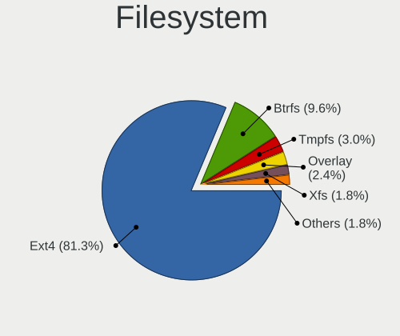

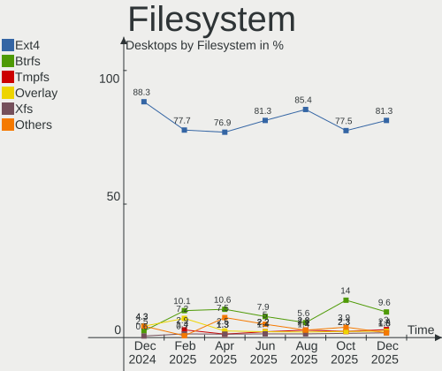

| Type    | Desktops | Percent |
|---------|----------|---------|
| Ext4    | 135      | 81.33%  |
| Btrfs   | 16       | 9.64%   |
| Tmpfs   | 5        | 3.01%   |
| Overlay | 4        | 2.41%   |
| Xfs     | 3        | 1.81%   |
| Zfs     | 2        | 1.2%    |
| F2fs    | 1        | 0.6%    |

Part. scheme
------------

Scheme of partitioning

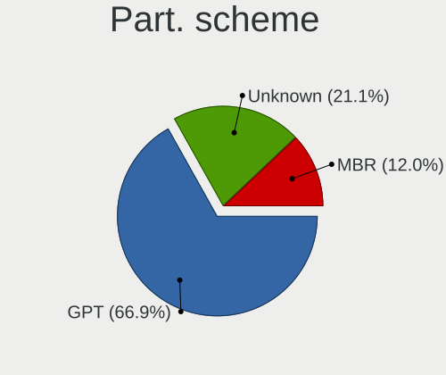

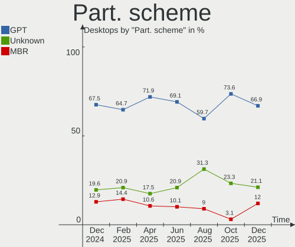

| Type    | Desktops | Percent |
|---------|----------|---------|
| GPT     | 111      | 66.87%  |
| Unknown | 35       | 21.08%  |
| MBR     | 20       | 12.05%  |

Dual Boot with Linux/BSD
------------------------

Hosting more than one Linux/BSD

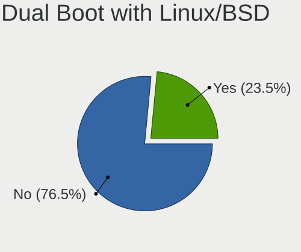

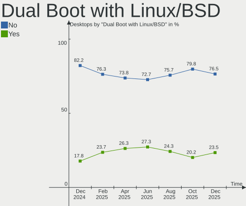

| Dual boot | Desktops | Percent |
|-----------|----------|---------|
| No        | 127      | 76.51%  |
| Yes       | 39       | 23.49%  |

Dual Boot (Win)
---------------

Hosting Linux and Windows

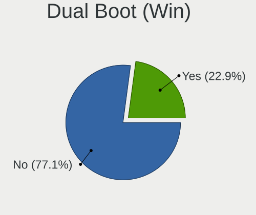

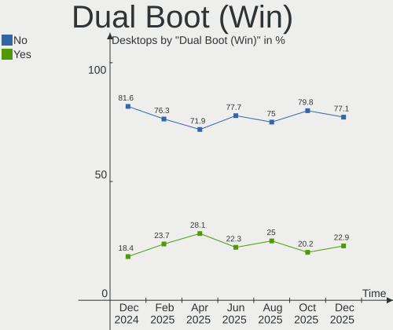

| Dual boot | Desktops | Percent |
|-----------|----------|---------|
| No        | 128      | 77.11%  |
| Yes       | 38       | 22.89%  |

Board
-----

Vendor
------

Motherboard manufacturer

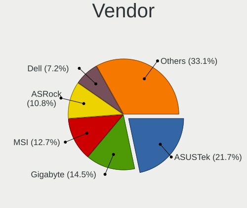

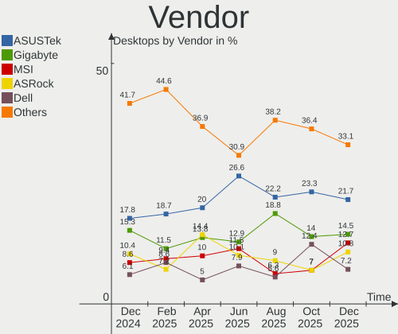

| Name                            | Desktops | Percent |
|---------------------------------|----------|---------|
| ASUSTek Computer                | 36       | 21.69%  |
| Gigabyte Technology             | 24       | 14.46%  |
| MSI                             | 21       | 12.65%  |
| ASRock                          | 18       | 10.84%  |
| Dell                            | 12       | 7.23%   |
| Hewlett-Packard                 | 10       | 6.02%   |
| Lenovo                          | 9        | 5.42%   |
| Unknown                         | 6        | 3.61%   |
| Supermicro                      | 4        | 2.41%   |
| Intel                           | 4        | 2.41%   |
| AZW                             | 3        | 1.81%   |
| GMKtec                          | 2        | 1.2%    |
| Apple                           | 2        | 1.2%    |
| WeiBu                           | 1        | 0.6%    |
| Shenzhen Anxin Taihe Technology | 1        | 0.6%    |
| Sapphire                        | 1        | 0.6%    |
| Medion                          | 1        | 0.6%    |
| Loongson                        | 1        | 0.6%    |
| LinuxContainers                 | 1        | 0.6%    |
| Kontron                         | 1        | 0.6%    |
| JINGSHA                         | 1        | 0.6%    |
| IP3 Tech                        | 1        | 0.6%    |
| Haier                           | 1        | 0.6%    |
| Fujitsu Siemens                 | 1        | 0.6%    |
| Fujitsu                         | 1        | 0.6%    |
| ERYING                          | 1        | 0.6%    |
| AMD                             | 1        | 0.6%    |
| Acer                            | 1        | 0.6%    |

Model
-----

Motherboard model

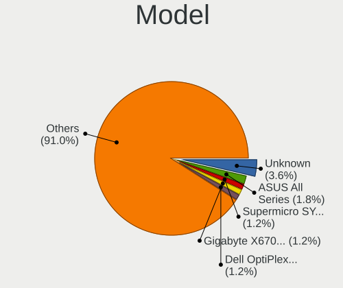

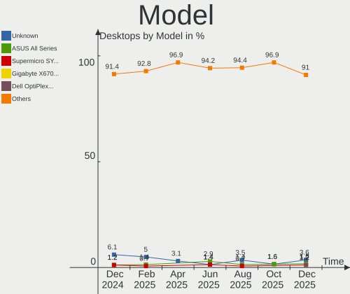

| Name                                           | Desktops | Percent |
|------------------------------------------------|----------|---------|
| Unknown                                        | 6        | 3.61%   |
| ASUS All Series                                | 3        | 1.81%   |
| Supermicro SYS-6018U-TR4+                      | 2        | 1.2%    |
| Gigabyte X670E AORUS XTREME                    | 2        | 1.2%    |
| Dell OptiPlex 7080                             | 2        | 1.2%    |
| AZW LZX                                        | 2        | 1.2%    |
| ASUS ROG STRIX B550-F GAMING                   | 2        | 1.2%    |
| WeiBu ADL-N                                    | 1        | 0.6%    |
| Supermicro X9SCL/X9SCM                         | 1        | 0.6%    |
| Supermicro SYS-5039D-I                         | 1        | 0.6%    |
| Shenzhen Anxin Taihe KSM1                      | 1        | 0.6%    |
| Sapphire PI-AM3RS760G2                         | 1        | 0.6%    |
| MSI PRO ADL-N Cubi N (MS-B0A9)                 | 1        | 0.6%    |
| MSI MS-7E70                                    | 1        | 0.6%    |
| MSI MS-7E51                                    | 1        | 0.6%    |
| MSI MS-7E01                                    | 1        | 0.6%    |
| MSI MS-7D25                                    | 1        | 0.6%    |
| MSI MS-7C94                                    | 1        | 0.6%    |
| MSI MS-7C83                                    | 1        | 0.6%    |
| MSI MS-7C52                                    | 1        | 0.6%    |
| MSI MS-7C37                                    | 1        | 0.6%    |
| MSI MS-7C35                                    | 1        | 0.6%    |
| MSI MS-7B89                                    | 1        | 0.6%    |
| MSI MS-7B12                                    | 1        | 0.6%    |
| MSI MS-7A38                                    | 1        | 0.6%    |
| MSI MS-7A33                                    | 1        | 0.6%    |
| MSI MS-7977                                    | 1        | 0.6%    |
| MSI MS-7971                                    | 1        | 0.6%    |
| MSI MS-7898                                    | 1        | 0.6%    |
| MSI MS-7721                                    | 1        | 0.6%    |
| MSI MS-7599                                    | 1        | 0.6%    |
| MSI MS-7309                                    | 1        | 0.6%    |
| MSI Hyrican PC                                 | 1        | 0.6%    |
| Medion MS-7848                                 | 1        | 0.6%    |
| Loongson CTCI02LS3A6000C-K                     | 1        | 0.6%    |
| LinuxContainers Standard PC (Q35 + ICH9, 2009) | 1        | 0.6%    |
| Lenovo V530S-07ICB 10TX001QRI                  | 1        | 0.6%    |
| Lenovo ThinkStation D30 43531N5                | 1        | 0.6%    |
| Lenovo ThinkCentre M93p 10AAS4EN00             | 1        | 0.6%    |
| Lenovo ThinkCentre M92p 3209A85                | 1        | 0.6%    |

Model Family
------------

Motherboard model prefix

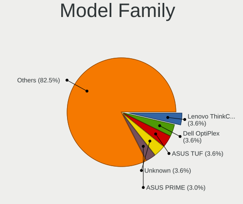

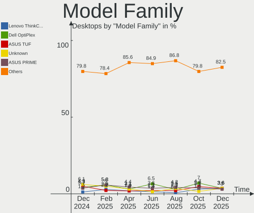

| Name                      | Desktops | Percent |
|---------------------------|----------|---------|
| Lenovo ThinkCentre        | 6        | 3.61%   |
| Dell OptiPlex             | 6        | 3.61%   |
| ASUS TUF                  | 6        | 3.61%   |
| Unknown                   | 6        | 3.61%   |
| ASUS PRIME                | 5        | 3.01%   |
| ASUS ROG                  | 4        | 2.41%   |
| HP EliteDesk              | 3        | 1.81%   |
| Dell Precision            | 3        | 1.81%   |
| ASUS Pro                  | 3        | 1.81%   |
| ASUS All                  | 3        | 1.81%   |
| Supermicro SYS-6018U-TR4+ | 2        | 1.2%    |
| HP Compaq                 | 2        | 1.2%    |
| GMKtec NucBox             | 2        | 1.2%    |
| Gigabyte X870E            | 2        | 1.2%    |
| Gigabyte X670E            | 2        | 1.2%    |
| Gigabyte X570             | 2        | 1.2%    |
| AZW LZX                   | 2        | 1.2%    |
| ASUS BUSINESSline         | 2        | 1.2%    |
| ASRock B650M              | 2        | 1.2%    |
| WeiBu ADL-N               | 1        | 0.6%    |
| Supermicro X9SCL          | 1        | 0.6%    |
| Supermicro SYS-5039D-I    | 1        | 0.6%    |
| Shenzhen Anxin Taihe KSM1 | 1        | 0.6%    |
| Sapphire PI-AM3RS760G2    | 1        | 0.6%    |
| MSI PRO                   | 1        | 0.6%    |
| MSI MS-7E70               | 1        | 0.6%    |
| MSI MS-7E51               | 1        | 0.6%    |
| MSI MS-7E01               | 1        | 0.6%    |
| MSI MS-7D25               | 1        | 0.6%    |
| MSI MS-7C94               | 1        | 0.6%    |
| MSI MS-7C83               | 1        | 0.6%    |
| MSI MS-7C52               | 1        | 0.6%    |
| MSI MS-7C37               | 1        | 0.6%    |
| MSI MS-7C35               | 1        | 0.6%    |
| MSI MS-7B89               | 1        | 0.6%    |
| MSI MS-7B12               | 1        | 0.6%    |
| MSI MS-7A38               | 1        | 0.6%    |
| MSI MS-7A33               | 1        | 0.6%    |
| MSI MS-7977               | 1        | 0.6%    |
| MSI MS-7971               | 1        | 0.6%    |

MFG Year
--------

Motherboard manufacture year

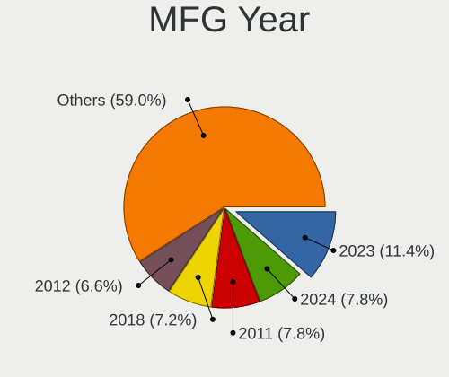

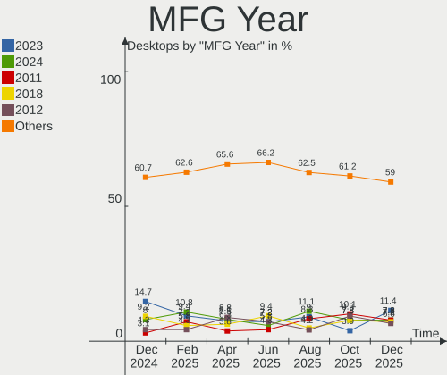

| Year    | Desktops | Percent |
|---------|----------|---------|
| 2023    | 19       | 11.45%  |
| 2024    | 13       | 7.83%   |
| 2011    | 13       | 7.83%   |
| 2018    | 12       | 7.23%   |
| 2012    | 11       | 6.63%   |
| 2020    | 10       | 6.02%   |
| 2019    | 10       | 6.02%   |
| 2015    | 10       | 6.02%   |
| 2025    | 9        | 5.42%   |
| 2021    | 9        | 5.42%   |
| 2014    | 9        | 5.42%   |
| 2017    | 8        | 4.82%   |
| 2022    | 6        | 3.61%   |
| 2016    | 6        | 3.61%   |
| 2013    | 5        | 3.01%   |
| 2010    | 5        | 3.01%   |
| 2009    | 3        | 1.81%   |
| 2008    | 2        | 1.2%    |
| 2007    | 2        | 1.2%    |
| Unknown | 2        | 1.2%    |
| 2006    | 1        | 0.6%    |
| 2003    | 1        | 0.6%    |

Form Factor
-----------

Physical design of the computer

| Name    | Desktops | Percent |
|---------|----------|---------|
| Desktop | 166      | 100%    |

Secure Boot
-----------

Enabled or disabled

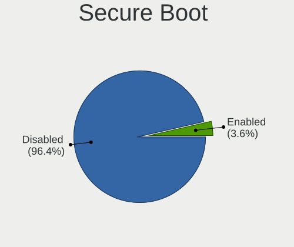

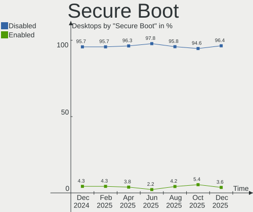

| State    | Desktops | Percent |
|----------|----------|---------|
| Disabled | 160      | 96.39%  |
| Enabled  | 6        | 3.61%   |

Coreboot
--------

Have coreboot on board

| Used | Desktops | Percent |
|------|----------|---------|
| No   | 166      | 100%    |

RAM Size
--------

Total RAM memory

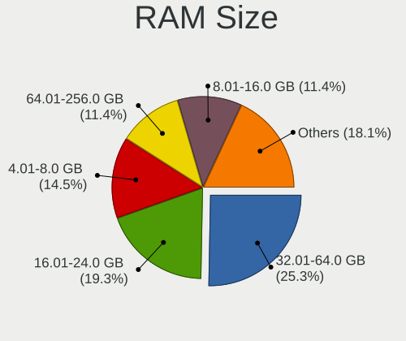

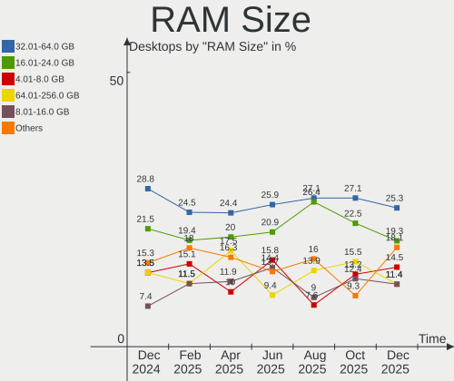

| Size in GB      | Desktops | Percent |
|-----------------|----------|---------|
| 32.01-64.0      | 42       | 25.3%   |
| 16.01-24.0      | 32       | 19.28%  |
| 4.01-8.0        | 24       | 14.46%  |
| 64.01-256.0     | 19       | 11.45%  |
| 8.01-16.0       | 19       | 11.45%  |
| 24.01-32.0      | 14       | 8.43%   |
| 3.01-4.0        | 7        | 4.22%   |
| More than 256.0 | 4        | 2.41%   |
| 1.01-2.0        | 3        | 1.81%   |
| 2.01-3.0        | 2        | 1.2%    |

RAM Used
--------

Used RAM memory

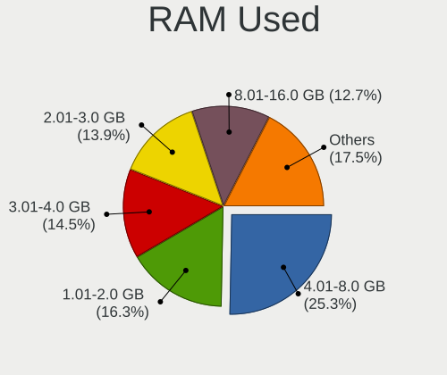

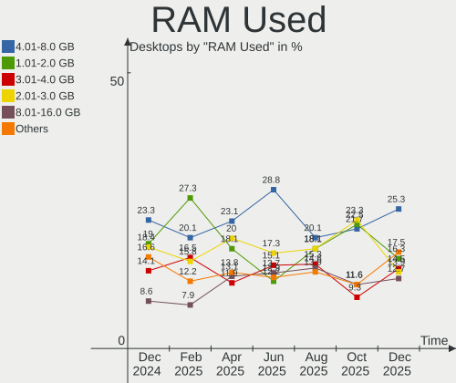

| Used GB     | Desktops | Percent |
|-------------|----------|---------|
| 4.01-8.0    | 42       | 25.3%   |
| 1.01-2.0    | 27       | 16.27%  |
| 3.01-4.0    | 24       | 14.46%  |
| 2.01-3.0    | 23       | 13.86%  |
| 8.01-16.0   | 21       | 12.65%  |
| 0.51-1.0    | 13       | 7.83%   |
| 16.01-24.0  | 5        | 3.01%   |
| 24.01-32.0  | 4        | 2.41%   |
| 32.01-64.0  | 3        | 1.81%   |
| 64.01-256.0 | 2        | 1.2%    |
| 0.01-0.5    | 2        | 1.2%    |

Total Drives
------------

Number of drives on board

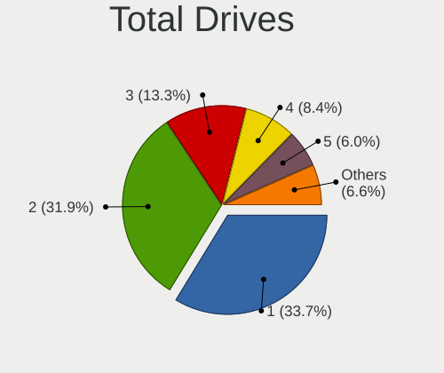

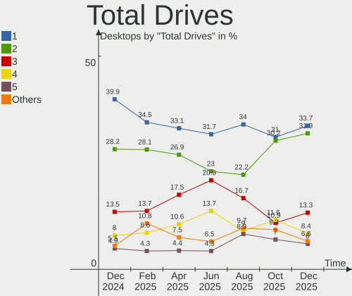

| Drives | Desktops | Percent |
|--------|----------|---------|
| 1      | 56       | 33.73%  |
| 2      | 53       | 31.93%  |
| 3      | 22       | 13.25%  |
| 4      | 14       | 8.43%   |
| 5      | 10       | 6.02%   |
| 6      | 5        | 3.01%   |
| 7      | 2        | 1.2%    |
| 33     | 1        | 0.6%    |
| 14     | 1        | 0.6%    |
| 13     | 1        | 0.6%    |
| 0      | 1        | 0.6%    |

Has CD-ROM
----------

Has CD-ROM on board

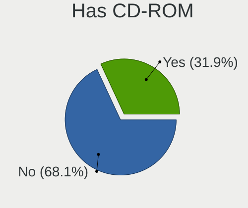

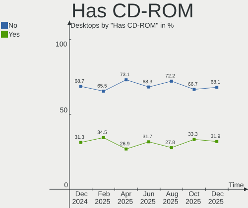

| Presented | Desktops | Percent |
|-----------|----------|---------|
| No        | 113      | 68.07%  |
| Yes       | 53       | 31.93%  |

Has Ethernet
------------

Has Ethernet on board

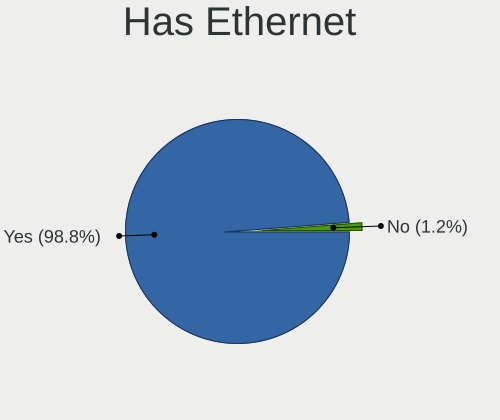

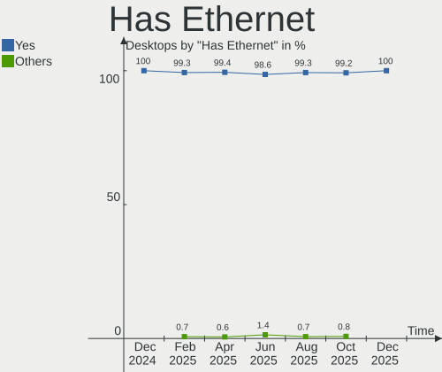

| Presented | Desktops | Percent |
|-----------|----------|---------|
| Yes       | 166      | 100%    |

Has WiFi
--------

Has WiFi module

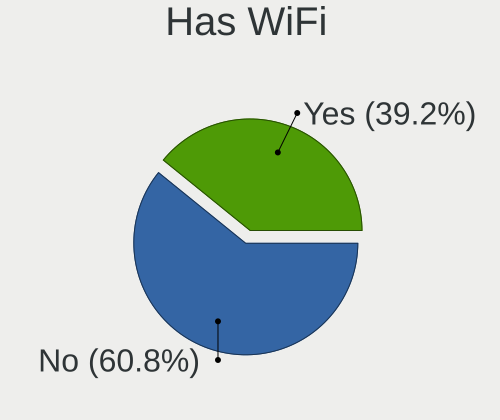

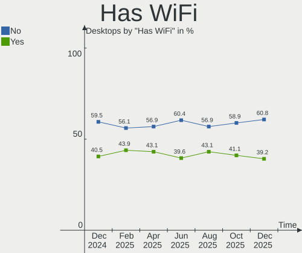

| Presented | Desktops | Percent |
|-----------|----------|---------|
| No        | 101      | 60.84%  |
| Yes       | 65       | 39.16%  |

Has Bluetooth
-------------

Has Bluetooth module

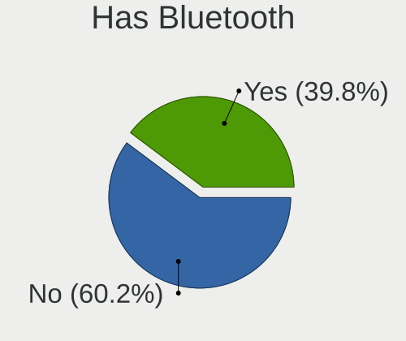

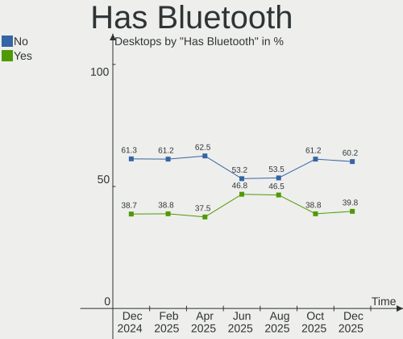

| Presented | Desktops | Percent |
|-----------|----------|---------|
| No        | 100      | 60.24%  |
| Yes       | 66       | 39.76%  |

Location
--------

Country
-------

Geographic location (country)

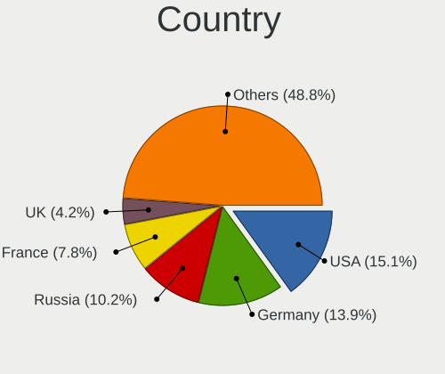

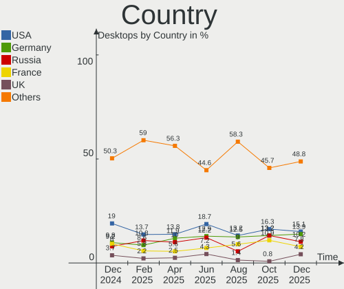

| Country         | Desktops | Percent |
|-----------------|----------|---------|
| USA             | 25       | 15.06%  |
| Germany         | 23       | 13.86%  |
| Russia          | 17       | 10.24%  |
| France          | 13       | 7.83%   |
| UK              | 7        | 4.22%   |
| China           | 7        | 4.22%   |
| Canada          | 7        | 4.22%   |
| Italy           | 6        | 3.61%   |
| Brazil          | 6        | 3.61%   |
| Romania         | 4        | 2.41%   |
| Poland          | 4        | 2.41%   |
| Austria         | 4        | 2.41%   |
| Spain           | 3        | 1.81%   |
| Netherlands     | 3        | 1.81%   |
| Mexico          | 3        | 1.81%   |
| Hungary         | 3        | 1.81%   |
| The Netherlands | 2        | 1.2%    |
| Switzerland     | 2        | 1.2%    |
| Kazakhstan      | 2        | 1.2%    |
| India           | 2        | 1.2%    |
| Finland         | 2        | 1.2%    |
| Belarus         | 2        | 1.2%    |
| Argentina       | 2        | 1.2%    |
| Taiwan          | 1        | 0.6%    |
| South Korea     | 1        | 0.6%    |
| South Africa    | 1        | 0.6%    |
| Slovakia        | 1        | 0.6%    |
| Serbia          | 1        | 0.6%    |
| Portugal        | 1        | 0.6%    |
| Norway          | 1        | 0.6%    |
| Kosovo          | 1        | 0.6%    |
| Japan           | 1        | 0.6%    |
| Israel          | 1        | 0.6%    |
| Indonesia       | 1        | 0.6%    |
| Ecuador         | 1        | 0.6%    |
| Czechia         | 1        | 0.6%    |
| Bulgaria        | 1        | 0.6%    |
| Bolivia         | 1        | 0.6%    |
| Bangladesh      | 1        | 0.6%    |
| Australia       | 1        | 0.6%    |

City
----

Geographic location (city)

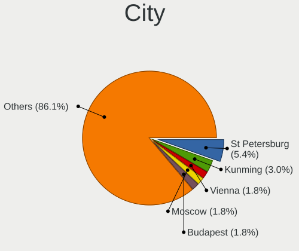

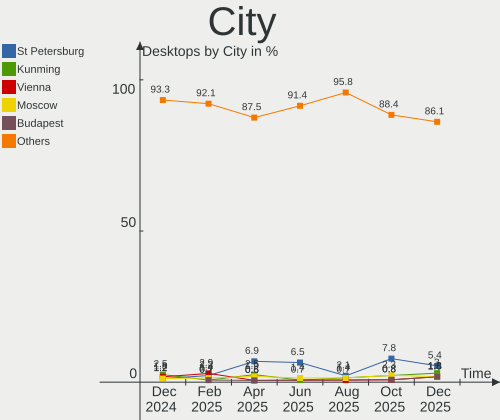

| City                   | Desktops | Percent |
|------------------------|----------|---------|
| St Petersburg          | 9        | 5.42%   |
| Kunming                | 5        | 3.01%   |
| Vienna                 | 3        | 1.81%   |
| Moscow                 | 3        | 1.81%   |
| Budapest               | 3        | 1.81%   |
| Paris                  | 2        | 1.2%    |
| Neuwied                | 2        | 1.2%    |
| Minsk                  | 2        | 1.2%    |
| Madrid                 | 2        | 1.2%    |
| Landau                 | 2        | 1.2%    |
| Helsinki               | 2        | 1.2%    |
| Bologna                | 2        | 1.2%    |
| Bad Hersfeld           | 2        | 1.2%    |
| Yekaterinburg          | 1        | 0.6%    |
| Wroclaw                | 1        | 0.6%    |
| Wołomin               | 1        | 0.6%    |
| Walthamstow            | 1        | 0.6%    |
| Vitrolles              | 1        | 0.6%    |
| Visakhapatnam          | 1        | 0.6%    |
| Vila Velha             | 1        | 0.6%    |
| Vicenza                | 1        | 0.6%    |
| Verkhnyaya Pyshma      | 1        | 0.6%    |
| Toronto                | 1        | 0.6%    |
| Tlalnepantla           | 1        | 0.6%    |
| Timișoara             | 1        | 0.6%    |
| Teius                  | 1        | 0.6%    |
| Taipei                 | 1        | 0.6%    |
| Sydney                 | 1        | 0.6%    |
| Stevensville           | 1        | 0.6%    |
| Steinach               | 1        | 0.6%    |
| Stade                  | 1        | 0.6%    |
| Spring Hill            | 1        | 0.6%    |
| Sofia                  | 1        | 0.6%    |
| Seversk                | 1        | 0.6%    |
| Seongnam-si            | 1        | 0.6%    |
| Sao Goncalo            | 1        | 0.6%    |
| Santander              | 1        | 0.6%    |
| San Miguel de Tucumán | 1        | 0.6%    |
| San Antonio            | 1        | 0.6%    |
| Ruban                  | 1        | 0.6%    |

Drives
------

Drive Vendor
------------

Hard drive vendors

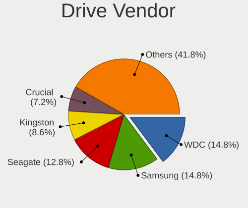

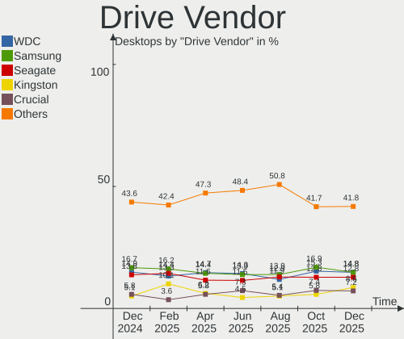

| Vendor                      | Desktops | Drives | Percent |
|-----------------------------|----------|--------|---------|
| WDC                         | 45       | 68     | 14.8%   |
| Samsung Electronics         | 45       | 74     | 14.8%   |
| Seagate                     | 39       | 62     | 12.83%  |
| Kingston                    | 26       | 32     | 8.55%   |
| Crucial                     | 22       | 30     | 7.24%   |
| Toshiba                     | 11       | 17     | 3.62%   |
| SK hynix                    | 9        | 9      | 2.96%   |
| SanDisk                     | 9        | 14     | 2.96%   |
| China                       | 7        | 7      | 2.3%    |
| A-DATA Technology           | 7        | 9      | 2.3%    |
| Kingston Technology Company | 6        | 6      | 1.97%   |
| Unknown                     | 4        | 9      | 1.32%   |
| Transcend                   | 4        | 4      | 1.32%   |
| HGST                        | 4        | 13     | 1.32%   |
| PNY                         | 3        | 3      | 0.99%   |
| Patriot                     | 3        | 3      | 0.99%   |
| Hitachi                     | 3        | 3      | 0.99%   |
| Hewlett-Packard             | 3        | 3      | 0.99%   |
| GOODRAM                     | 3        | 4      | 0.99%   |
| ADATA Technology            | 3        | 3      | 0.99%   |
| Realtek                     | 2        | 2      | 0.66%   |
| Phison Electronics          | 2        | 2      | 0.66%   |
| Phison                      | 2        | 2      | 0.66%   |
| KIOXIA-EXCERIA              | 2        | 3      | 0.66%   |
| Gigabyte Technology         | 2        | 2      | 0.66%   |
| Apacer                      | 2        | 2      | 0.66%   |
| ZHITAI                      | 1        | 1      | 0.33%   |
| ZETTASTONE                  | 1        | 1      | 0.33%   |
| YMTC                        | 1        | 1      | 0.33%   |
| Wicgtyp                     | 1        | 1      | 0.33%   |
| Viper                       | 1        | 1      | 0.33%   |
| VERICO                      | 1        | 1      | 0.33%   |
| USB                         | 1        | 1      | 0.33%   |
| SOLIDIGM                    | 1        | 3      | 0.33%   |
| sobetter                    | 1        | 1      | 0.33%   |
| SMI                         | 1        | 1      | 0.33%   |
| Silicon Motion              | 1        | 1      | 0.33%   |
| SABRENT                     | 1        | 1      | 0.33%   |
| Red Hat                     | 1        | 1      | 0.33%   |
| Realtek Semiconductor       | 1        | 1      | 0.33%   |

Drive Model
-----------

Hard drive models

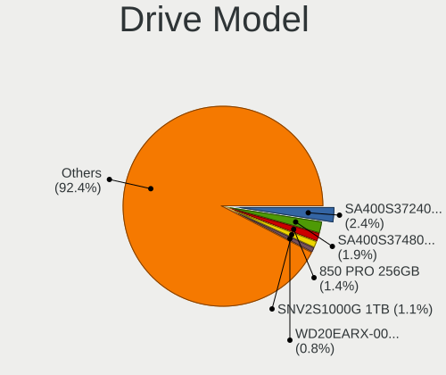

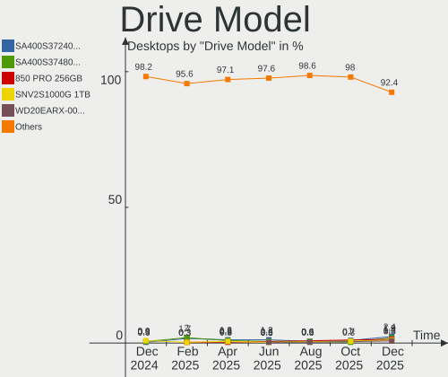

| Model                                 | Desktops | Percent |
|---------------------------------------|----------|---------|
| Kingston SA400S37240G 240GB SSD       | 9        | 2.44%   |
| Kingston SA400S37480G 480GB SSD       | 7        | 1.9%    |
| Samsung SSD 850 PRO 256GB             | 5        | 1.36%   |
| Kingston Company SNV2S1000G 1TB       | 4        | 1.08%   |
| WDC WD20EARX-00PASB0 2TB              | 3        | 0.81%   |
| WDC WD10EZEX-08WN4A0 1TB              | 3        | 0.81%   |
| Seagate ST1000DM010-2EP102 1TB        | 3        | 0.81%   |
| Samsung SSD 990 PRO 1TB               | 3        | 0.81%   |
| WDC WD60EZAZ-00SF3B0 6TB              | 2        | 0.54%   |
| Unknown SD/MMC 16GB                   | 2        | 0.54%   |
| Unknown M.S./M.S.Pro/HG 16GB          | 2        | 0.54%   |
| Unknown Compact Flash 977MB           | 2        | 0.54%   |
| Toshiba HDWD130 3TB                   | 2        | 0.54%   |
| SK hynix HFS256G3AMNB-2200A 256GB SSD | 2        | 0.54%   |
| Seagate ST3250410AS 250GB             | 2        | 0.54%   |
| Seagate ST1000LM024 HN-M101MBB 1TB    | 2        | 0.54%   |
| Seagate ST1000DM003-1ER162 1TB        | 2        | 0.54%   |
| Seagate Expansion HDD 4TB             | 2        | 0.54%   |
| SanDisk NVMe SSD Drive 2TB            | 2        | 0.54%   |
| Samsung SSD 990 PRO 4TB               | 2        | 0.54%   |
| Samsung SSD 980 PRO with Heatsink 2TB | 2        | 0.54%   |
| Samsung SSD 980 PRO 1TB               | 2        | 0.54%   |
| Samsung SSD 970 EVO Plus 2TB          | 2        | 0.54%   |
| Samsung HD103UJ 1TB                   | 2        | 0.54%   |
| Kingston SUV400S37120G 120GB SSD      | 2        | 0.54%   |
| Crucial CT240BX500SSD1 240GB          | 2        | 0.54%   |
| Crucial CT2000T705SSD3 2TB            | 2        | 0.54%   |
| Crucial CT1000T500SSD8 1TB            | 2        | 0.54%   |
| Crucial CT1000P3PSSD8 1TB             | 2        | 0.54%   |
| Crucial CT1000MX500SSD1 1TB           | 2        | 0.54%   |
| Crucial CT1000BX500SSD1 1TB           | 2        | 0.54%   |
| A-DATA SU800 1TB SSD                  | 2        | 0.54%   |
| ZHITAI SC001 Active 512GB SSD         | 1        | 0.27%   |
| ZETTASTONE CP200 1024GB               | 1        | 0.27%   |
| YMTC PC005 512GB                      | 1        | 0.27%   |
| Wicgtyp N900-512 512GB SSD            | 1        | 0.27%   |
| WDC WDS100T3X0C-00SJG0 1TB            | 1        | 0.27%   |
| WDC WDS100T2B0C-00PXH0 1TB            | 1        | 0.27%   |
| WDC WD800JD-55JRA0 80GB               | 1        | 0.27%   |
| WDC WD5000LPCX-08VHA 500GB            | 1        | 0.27%   |

HDD Vendor
----------

Hard disk drive vendors

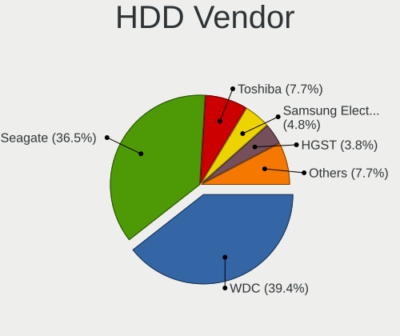

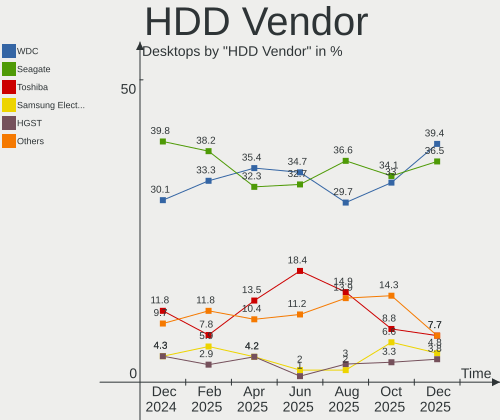

| Vendor              | Desktops | Drives | Percent |
|---------------------|----------|--------|---------|
| WDC                 | 41       | 63     | 39.42%  |
| Seagate             | 38       | 61     | 36.54%  |
| Toshiba             | 8        | 14     | 7.69%   |
| Samsung Electronics | 5        | 6      | 4.81%   |
| HGST                | 4        | 13     | 3.85%   |
| Hitachi             | 3        | 3      | 2.88%   |
| Unknown             | 2        | 3      | 1.92%   |
| HPE                 | 1        | 11     | 0.96%   |
| Fujitsu             | 1        | 1      | 0.96%   |
| Elite               | 1        | 2      | 0.96%   |

SSD Vendor
----------

Solid state drive vendors

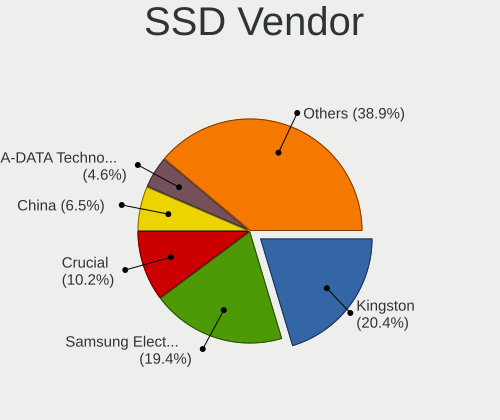

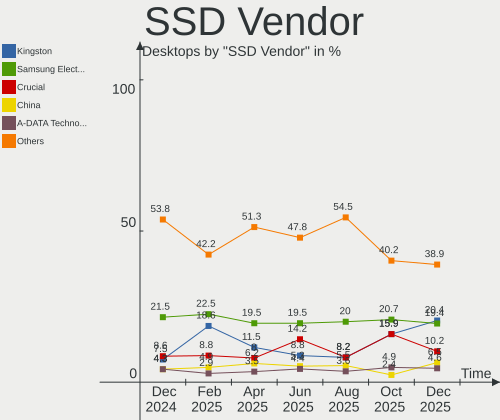

| Vendor              | Desktops | Drives | Percent |
|---------------------|----------|--------|---------|
| Kingston            | 22       | 26     | 20.37%  |
| Samsung Electronics | 21       | 26     | 19.44%  |
| Crucial             | 11       | 12     | 10.19%  |
| China               | 7        | 7      | 6.48%   |
| A-DATA Technology   | 5        | 7      | 4.63%   |
| SanDisk             | 4        | 5      | 3.7%    |
| Transcend           | 3        | 3      | 2.78%   |
| Toshiba             | 3        | 3      | 2.78%   |
| Hewlett-Packard     | 3        | 3      | 2.78%   |
| GOODRAM             | 3        | 4      | 2.78%   |
| SK hynix            | 2        | 2      | 1.85%   |
| PNY                 | 2        | 2      | 1.85%   |
| Patriot             | 2        | 2      | 1.85%   |
| Apacer              | 2        | 2      | 1.85%   |
| ZHITAI              | 1        | 1      | 0.93%   |
| Wicgtyp             | 1        | 1      | 0.93%   |
| WDC                 | 1        | 1      | 0.93%   |
| VERICO              | 1        | 1      | 0.93%   |
| sobetter            | 1        | 1      | 0.93%   |
| SMI                 | 1        | 1      | 0.93%   |
| SABRENT             | 1        | 1      | 0.93%   |
| PELADN              | 1        | 1      | 0.93%   |
| MSI                 | 1        | 1      | 0.93%   |
| LITEON L            | 1        | 1      | 0.93%   |
| KIOXIA-EXCERIA      | 1        | 1      | 0.93%   |
| Intel               | 1        | 1      | 0.93%   |
| Great               | 1        | 1      | 0.93%   |
| EDILOCA             | 1        | 1      | 0.93%   |
| Colorful            | 1        | 1      | 0.93%   |
| BHT                 | 1        | 1      | 0.93%   |
| Apple               | 1        | 1      | 0.93%   |
| AMD                 | 1        | 2      | 0.93%   |

Drive Kind
----------

HDD or SSD

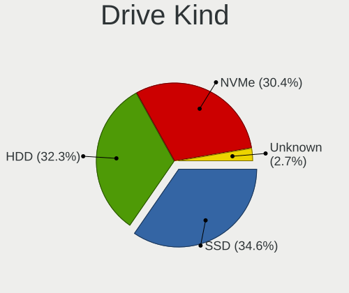

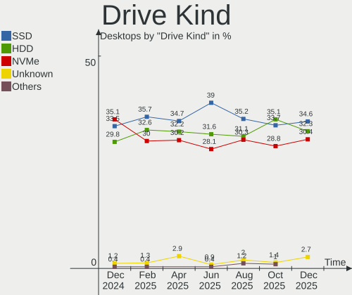

| Kind    | Desktops | Drives | Percent |
|---------|----------|--------|---------|
| SSD     | 90       | 123    | 34.62%  |
| HDD     | 84       | 177    | 32.31%  |
| NVMe    | 79       | 127    | 30.38%  |
| Unknown | 7        | 13     | 2.69%   |

Drive Connector
---------------

SATA, SAS, NVMe, etc.

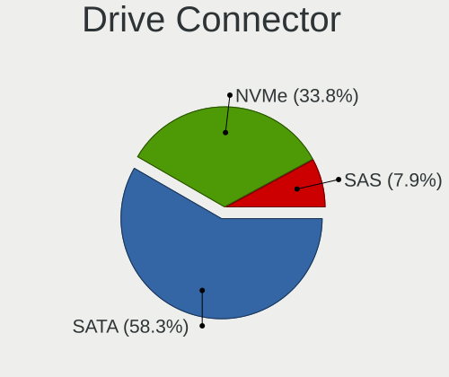

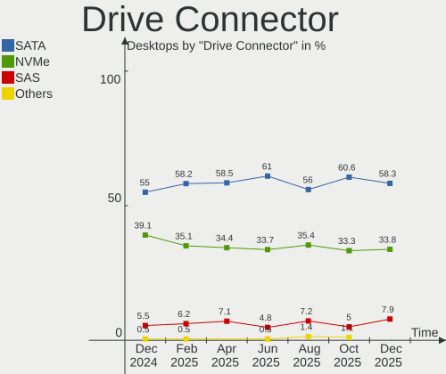

| Type | Desktops | Drives | Percent |
|------|----------|--------|---------|
| SATA | 133      | 289    | 58.33%  |
| NVMe | 77       | 124    | 33.77%  |
| SAS  | 18       | 27     | 7.89%   |

Drive Size
----------

Size of hard drive

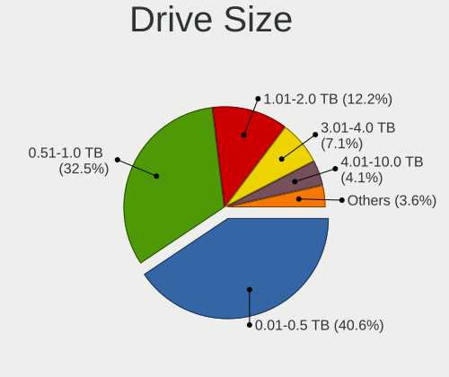

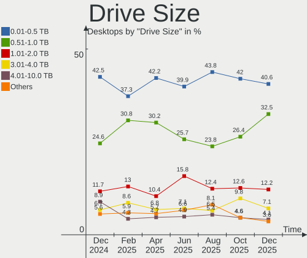

| Size in TB | Desktops | Drives | Percent |
|------------|----------|--------|---------|
| 0.01-0.5   | 80       | 105    | 40.61%  |
| 0.51-1.0   | 64       | 83     | 32.49%  |
| 1.01-2.0   | 24       | 34     | 12.18%  |
| 3.01-4.0   | 14       | 41     | 7.11%   |
| 4.01-10.0  | 8        | 15     | 4.06%   |
| 2.01-3.0   | 5        | 7      | 2.54%   |
| 20.01-50.0 | 1        | 1      | 0.51%   |
| 10.01-20.0 | 1        | 14     | 0.51%   |

Space Total
-----------

Amount of disk space available on the file system

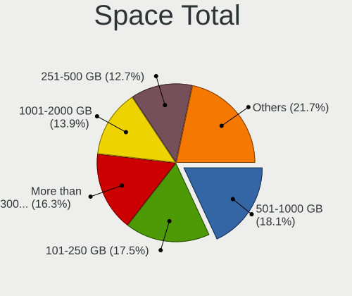

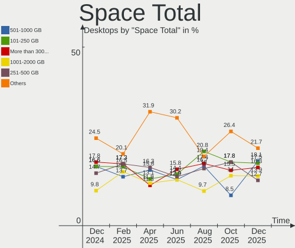

| Size in GB     | Desktops | Percent |
|----------------|----------|---------|
| 501-1000       | 30       | 18.07%  |
| 101-250        | 29       | 17.47%  |
| More than 3000 | 27       | 16.27%  |
| 1001-2000      | 23       | 13.86%  |
| 251-500        | 21       | 12.65%  |
| 21-50          | 13       | 7.83%   |
| 51-100         | 10       | 6.02%   |
| 1-20           | 6        | 3.61%   |
| Unknown        | 4        | 2.41%   |
| 2001-3000      | 3        | 1.81%   |

Space Used
----------

Amount of used disk space

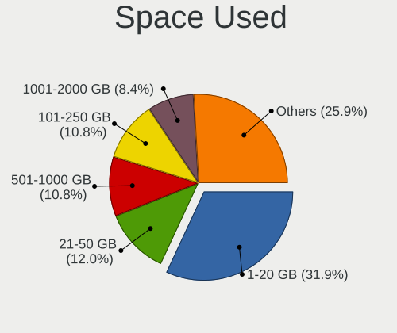

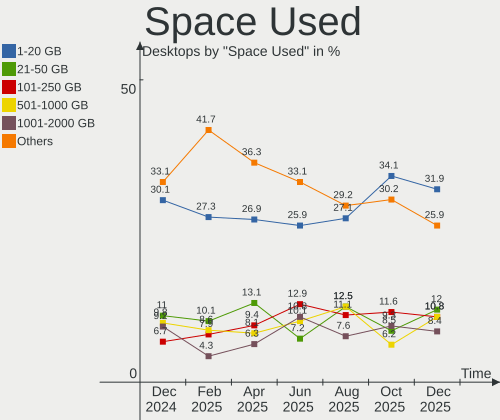

| Used GB        | Desktops | Percent |
|----------------|----------|---------|
| 1-20           | 53       | 31.93%  |
| 21-50          | 20       | 12.05%  |
| 101-250        | 18       | 10.84%  |
| 501-1000       | 18       | 10.84%  |
| 1001-2000      | 14       | 8.43%   |
| More than 3000 | 12       | 7.23%   |
| 51-100         | 11       | 6.63%   |
| 251-500        | 10       | 6.02%   |
| 2001-3000      | 6        | 3.61%   |
| Unknown        | 4        | 2.41%   |

Malfunc. Drives
---------------

Drive models with a malfunction

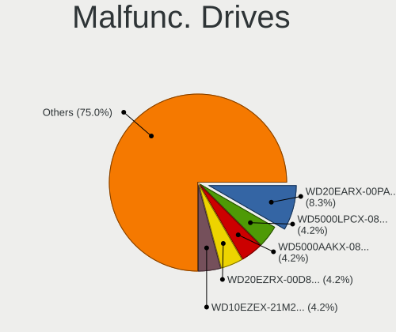

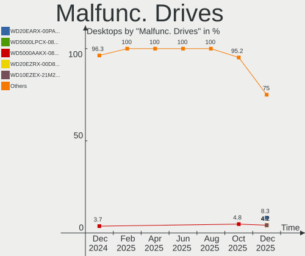

| Model                                 | Desktops | Drives | Percent |
|---------------------------------------|----------|--------|---------|
| WDC WD20EARX-00PASB0 2TB              | 2        | 2      | 8.33%   |
| WDC WD5000LPCX-08VHA 500GB            | 1        | 1      | 4.17%   |
| WDC WD5000AAKX-08U6AA0 500GB          | 1        | 1      | 4.17%   |
| WDC WD20EZRX-00D8PB0 2TB              | 1        | 1      | 4.17%   |
| WDC WD10EZEX-21M2NA0 1TB              | 1        | 1      | 4.17%   |
| WDC WD10EALX-009BA0 1TB               | 1        | 1      | 4.17%   |
| WDC WD Blue SA510 2.5 1000GB SSD      | 1        | 1      | 4.17%   |
| Toshiba DT01ACA200 2TB                | 1        | 1      | 4.17%   |
| Toshiba DT01ACA050 500GB              | 1        | 1      | 4.17%   |
| SK hynix HFS256G3AMNB-2200A 256GB SSD | 1        | 1      | 4.17%   |
| Seagate ST500LM012 HN-M500MBB 500GB   | 1        | 1      | 4.17%   |
| Seagate ST3500418AS 500GB             | 1        | 1      | 4.17%   |
| Seagate ST3250410AS 250GB             | 1        | 1      | 4.17%   |
| Seagate ST31500541AS 1TB              | 1        | 1      | 4.17%   |
| Seagate ST31000524AS 1TB              | 1        | 1      | 4.17%   |
| Seagate ST2000DM006-2DM164 2TB        | 1        | 1      | 4.17%   |
| Seagate ST1000LX015-1U7172 1TB        | 1        | 1      | 4.17%   |
| Seagate ST1000LM024 HN-M101MBB 1TB    | 1        | 1      | 4.17%   |
| Seagate ST1000DM003-9YN162 1TB        | 1        | 1      | 4.17%   |
| Seagate ST1000DM003-1CH162 1TB        | 1        | 1      | 4.17%   |
| Hitachi HDP725050GLA360 500GB         | 1        | 1      | 4.17%   |
| Crucial CT500MX500SSD4 500GB          | 1        | 1      | 4.17%   |
| A-DATA Technology SX8100NP 2TB        | 1        | 1      | 4.17%   |

Malfunc. Drive Vendor
---------------------

Vendors of faulty drives

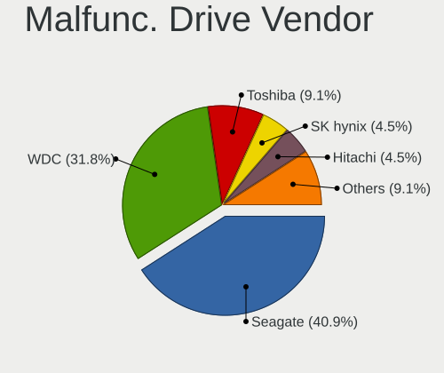

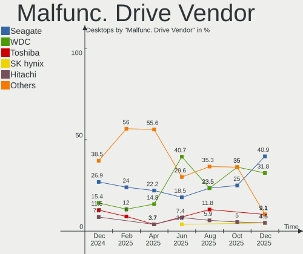

| Vendor            | Desktops | Drives | Percent |
|-------------------|----------|--------|---------|
| Seagate           | 9        | 10     | 40.91%  |
| WDC               | 7        | 8      | 31.82%  |
| Toshiba           | 2        | 2      | 9.09%   |
| SK hynix          | 1        | 1      | 4.55%   |
| Hitachi           | 1        | 1      | 4.55%   |
| Crucial           | 1        | 1      | 4.55%   |
| A-DATA Technology | 1        | 1      | 4.55%   |

Malfunc. HDD Vendor
-------------------

Vendors of faulty HDD drives

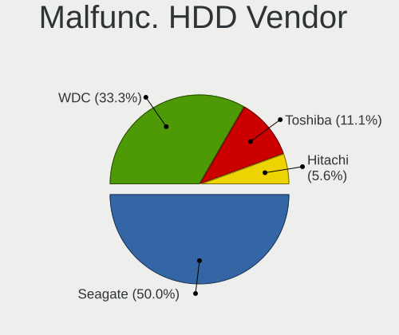

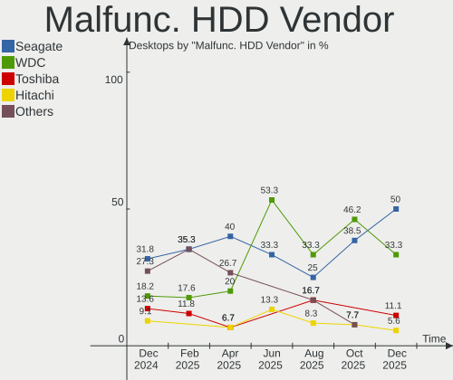

| Vendor  | Desktops | Drives | Percent |
|---------|----------|--------|---------|
| Seagate | 9        | 10     | 50%     |
| WDC     | 6        | 7      | 33.33%  |
| Toshiba | 2        | 2      | 11.11%  |
| Hitachi | 1        | 1      | 5.56%   |

Malfunc. Drive Kind
-------------------

Kinds of faulty drives

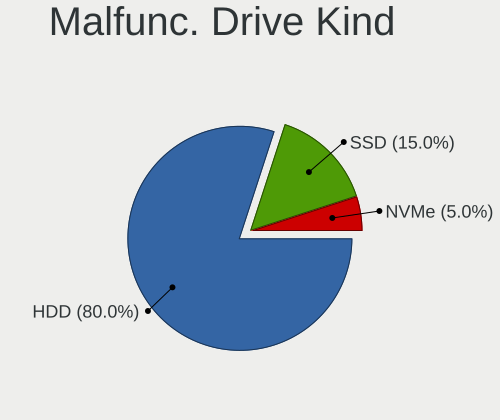

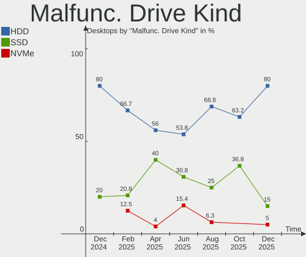

| Kind | Desktops | Drives | Percent |
|------|----------|--------|---------|
| HDD  | 16       | 20     | 80%     |
| SSD  | 3        | 3      | 15%     |
| NVMe | 1        | 1      | 5%      |

Failed Drives
-------------

Failed drive models

Zero info for selected period =(

Failed Drive Vendor
-------------------

Failed drive vendors

Zero info for selected period =(

Drive Status
------------

Number of failed and malfunc. drives

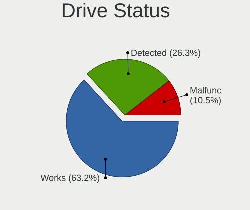

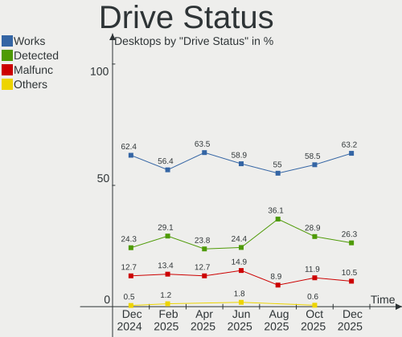

| Status   | Desktops | Drives | Percent |
|----------|----------|--------|---------|
| Works    | 120      | 285    | 63.16%  |
| Detected | 50       | 131    | 26.32%  |
| Malfunc  | 20       | 24     | 10.53%  |

Storage controller
------------------

Storage Vendor
--------------

Storage controller vendors

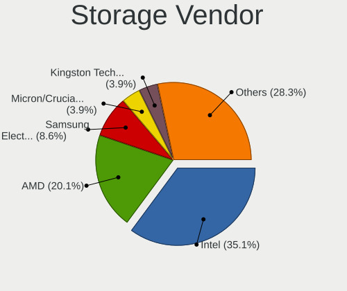

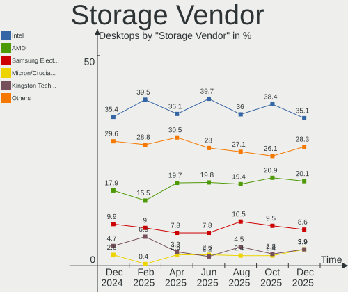

| Vendor                      | Desktops | Percent |
|-----------------------------|----------|---------|
| Intel                       | 98       | 35.13%  |
| AMD                         | 56       | 20.07%  |
| Samsung Electronics         | 24       | 8.6%    |
| Micron/Crucial Technology   | 11       | 3.94%   |
| Kingston Technology Company | 11       | 3.94%   |
| SanDisk                     | 9        | 3.23%   |
| SK hynix                    | 7        | 2.51%   |
| Phison Electronics          | 7        | 2.51%   |
| ASMedia Technology          | 7        | 2.51%   |
| JMicron Technology          | 5        | 1.79%   |
| Broadcom / LSI              | 5        | 1.79%   |
| Zhaoxin                     | 4        | 1.43%   |
| Micron Technology           | 4        | 1.43%   |
| MAXIO Technology (Hangzhou) | 4        | 1.43%   |
| Marvell Technology Group    | 4        | 1.43%   |
| ADATA Technology            | 4        | 1.43%   |
| Realtek Semiconductor       | 3        | 1.08%   |
| Silicon Motion              | 2        | 0.72%   |
| Yangtze Memory Technologies | 1        | 0.36%   |
| VIA Technologies            | 1        | 0.36%   |
| ULi Electronics             | 1        | 0.36%   |
| Transcend                   | 1        | 0.36%   |
| Solidigm                    | 1        | 0.36%   |
| Seagate Technology          | 1        | 0.36%   |
| Red Hat                     | 1        | 0.36%   |
| Nvidia                      | 1        | 0.36%   |
| LSI Logic / Symbios Logic   | 1        | 0.36%   |
| Loongson Technology         | 1        | 0.36%   |
| KIOXIA                      | 1        | 0.36%   |
| INNOGRIT                    | 1        | 0.36%   |
| Hosin Global Electronics    | 1        | 0.36%   |
| Advanced System Products    | 1        | 0.36%   |

Storage Model
-------------

Storage controller models

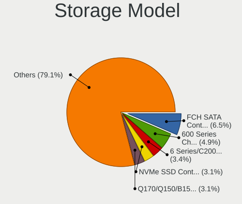

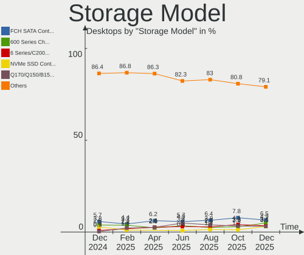

| Model                                                                          | Desktops | Percent |
|--------------------------------------------------------------------------------|----------|---------|
| AMD FCH SATA Controller [AHCI mode]                                            | 21       | 6.46%   |
| AMD 600 Series Chipset SATA Controller                                         | 16       | 4.92%   |
| Intel 6 Series/C200 Series Chipset Family 6 port Desktop SATA AHCI Controller  | 11       | 3.38%   |
| Samsung NVMe SSD Controller S4LV008[Pascal]                                    | 10       | 3.08%   |
| Intel Q170/Q150/B150/H170/H110/Z170/CM236 Chipset SATA Controller [AHCI Mode]  | 10       | 3.08%   |
| AMD SB7x0/SB8x0/SB9x0 IDE Controller                                           | 9        | 2.77%   |
| Samsung NVMe SSD Controller SM981/PM981/PM983                                  | 8        | 2.46%   |
| Intel Cannon Lake PCH SATA AHCI Controller                                     | 8        | 2.46%   |
| Intel 8 Series/C220 Series Chipset Family 6-port SATA Controller 1 [AHCI mode] | 7        | 2.15%   |
| AMD 500 Series Chipset SATA Controller                                         | 7        | 2.15%   |
| AMD 400 Series Chipset SATA Controller                                         | 7        | 2.15%   |
| Intel 200 Series PCH SATA controller [AHCI mode]                               | 6        | 1.85%   |
| Samsung NVMe SSD Controller PM9A1/PM9A3/980PRO                                 | 5        | 1.54%   |
| Intel Volume Management Device NVMe RAID Controller                            | 5        | 1.54%   |
| Intel 7 Series/C210 Series Chipset Family 6-port SATA Controller [AHCI mode]   | 5        | 1.54%   |
| ASMedia ASM1061/ASM1062 Serial ATA Controller                                  | 5        | 1.54%   |
| AMD SB7x0/SB8x0/SB9x0 SATA Controller [IDE mode]                               | 5        | 1.54%   |
| Zhaoxin ZX-100/ZX-200/KX-6000/KX-6000G/KH-40000/KX-7000 StorX AHCI Controller  | 4        | 1.23%   |
| Micron 2550 NVMe SSD (DRAM-less)                                               | 4        | 1.23%   |
| MAXIO (Hangzhou) NVMe SSD Controller MAP1202 (DRAM-less)                       | 4        | 1.23%   |
| Intel Comet Lake SATA AHCI Controller                                          | 4        | 1.23%   |
| Intel Alder Lake-S PCH SATA Controller [AHCI Mode]                             | 4        | 1.23%   |
| Intel Alder Lake-N SATA AHCI Controller                                        | 4        | 1.23%   |
| Intel 9 Series Chipset Family SATA Controller [AHCI Mode]                      | 4        | 1.23%   |
| Intel 82801JI (ICH10 Family) SATA AHCI Controller                              | 4        | 1.23%   |
| AMD SB7x0/SB8x0/SB9x0 SATA Controller [AHCI mode]                              | 4        | 1.23%   |
| SK hynix Gold P31/BC711/PC711 NVMe Solid State Drive                           | 3        | 0.92%   |
| Samsung NVMe SSD Controller PM9C1a (DRAM-less)                                 | 3        | 0.92%   |
| Realtek RTS5762 NVMe SSD Controller                                            | 3        | 0.92%   |
| Phison E12 NVMe Controller                                                     | 3        | 0.92%   |
| Micron/Crucial T705 NVMe PCIe SSD                                              | 3        | 0.92%   |
| Micron/Crucial T500 NVMe PCIe SSD                                              | 3        | 0.92%   |
| Micron/Crucial P2 [Nick P2] / P3 / P3 Plus NVMe PCIe SSD (DRAM-less)           | 3        | 0.92%   |
| Kingston Company NV2 NVMe SSD [SM2267XT] (DRAM-less)                           | 3        | 0.92%   |
| JMicron JMB363 SATA/IDE Controller                                             | 3        | 0.92%   |
| Intel SATA Controller [RAID mode]                                              | 3        | 0.92%   |
| Intel Raptor Lake SATA AHCI Controller                                         | 3        | 0.92%   |
| Intel C610/X99 series chipset sSATA Controller [AHCI mode]                     | 3        | 0.92%   |
| AMD A320 Chipset SATA Controller [AHCI mode]                                   | 3        | 0.92%   |
| AMD 300 Series Chipset SATA Controller                                         | 3        | 0.92%   |

Storage Kind
------------

Kind of storage controller (IDE, SATA, NVMe, SAS, ...)

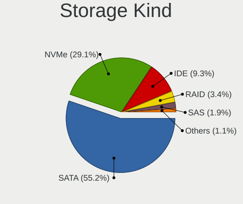

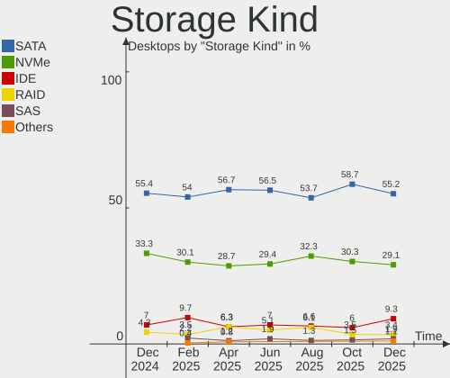

| Kind | Desktops | Percent |
|------|----------|---------|
| SATA | 148      | 55.22%  |
| NVMe | 78       | 29.1%   |
| IDE  | 25       | 9.33%   |
| RAID | 9        | 3.36%   |
| SAS  | 5        | 1.87%   |
| SCSI | 3        | 1.12%   |

Processor
---------

CPU Vendor
----------

Processor vendors

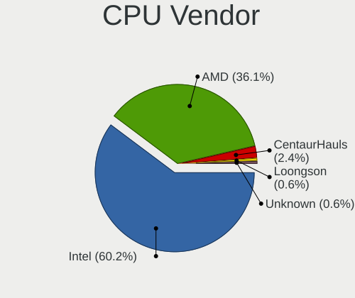

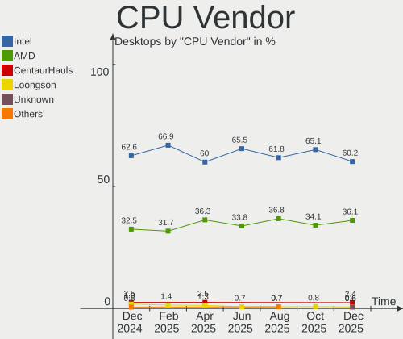

| Vendor       | Desktops | Percent |
|--------------|----------|---------|
| Intel        | 100      | 60.24%  |
| AMD          | 60       | 36.14%  |
| CentaurHauls | 4        | 2.41%   |
| Loongson     | 1        | 0.6%    |
| Unknown      | 1        | 0.6%    |

CPU Model
---------

Processor models

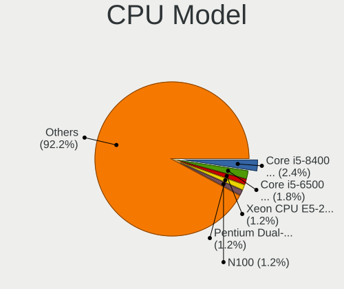

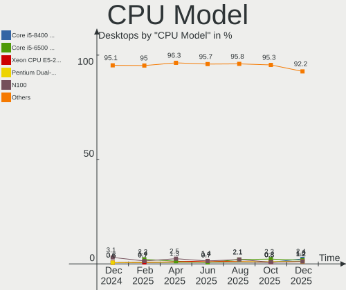

| Model                                          | Desktops | Percent |
|------------------------------------------------|----------|---------|
| Intel Core i5-8400 CPU @ 2.80GHz               | 4        | 2.41%   |
| Intel Core i5-6500 CPU @ 3.20GHz               | 3        | 1.81%   |
| Intel Xeon CPU E5-2697A v4 @ 2.60GHz           | 2        | 1.2%    |
| Intel Pentium Dual-Core CPU E5700 @ 3.00GHz    | 2        | 1.2%    |
| Intel N100                                     | 2        | 1.2%    |
| Intel Core i7-4790 CPU @ 3.60GHz               | 2        | 1.2%    |
| Intel Core i7-2600 CPU @ 3.40GHz               | 2        | 1.2%    |
| Intel Core i7 CPU 920 @ 2.67GHz                | 2        | 1.2%    |
| Intel Core i5-8500 CPU @ 3.00GHz               | 2        | 1.2%    |
| Intel Core i5-7500 CPU @ 3.40GHz               | 2        | 1.2%    |
| Intel Core i5-6600K CPU @ 3.50GHz              | 2        | 1.2%    |
| Intel Core i5-4570 CPU @ 3.20GHz               | 2        | 1.2%    |
| Intel Core i5-2400 CPU @ 3.10GHz               | 2        | 1.2%    |
| Intel Core i3-2120 CPU @ 3.30GHz               | 2        | 1.2%    |
| Intel 13th Gen Core i5-13500                   | 2        | 1.2%    |
| CentaurHauls ZHAOXIN KaiXian KX-6640MA@2.2+GHz | 2        | 1.2%    |
| AMD Ryzen 9 9950X 16-Core Processor            | 2        | 1.2%    |
| AMD Ryzen 9 7900 12-Core Processor             | 2        | 1.2%    |
| AMD Ryzen 9 5900X 12-Core Processor            | 2        | 1.2%    |
| AMD Ryzen 7 9800X3D 8-Core Processor           | 2        | 1.2%    |
| AMD Ryzen 7 9700X 8-Core Processor             | 2        | 1.2%    |
| AMD Ryzen 7 8700G w/ Radeon 780M Graphics      | 2        | 1.2%    |
| AMD Ryzen 7 5800X3D 8-Core Processor           | 2        | 1.2%    |
| AMD Ryzen 5 5500                               | 2        | 1.2%    |
| AMD Ryzen 5 3600 6-Core Processor              | 2        | 1.2%    |
| AMD FX-6300 Six-Core Processor                 | 2        | 1.2%    |
| Loongson Loongson 3A                           | 1        | 0.6%    |
| Intel Xeon w5-3423                             | 1        | 0.6%    |
| Intel Xeon CPU X5687 @ 3.60GHz                 | 1        | 0.6%    |
| Intel Xeon CPU X5670 @ 2.93GHz                 | 1        | 0.6%    |
| Intel Xeon CPU X5650 @ 2.67GHz                 | 1        | 0.6%    |
| Intel Xeon CPU E5-2697 v3 @ 2.60GHz            | 1        | 0.6%    |
| Intel Xeon CPU E5-2687W v3 @ 3.10GHz           | 1        | 0.6%    |
| Intel Xeon CPU E5-2620 v2 @ 2.10GHz            | 1        | 0.6%    |
| Intel Xeon CPU E5-1650 v2 @ 3.50GHz            | 1        | 0.6%    |
| Intel Xeon CPU E3-1285L v4 @ 3.40GHz           | 1        | 0.6%    |
| Intel Xeon CPU E3-1245 v3 @ 3.40GHz            | 1        | 0.6%    |
| Intel Xeon CPU E3-1240 V2 @ 3.40GHz            | 1        | 0.6%    |
| Intel Xeon CPU E3-1220 v6 @ 3.00GHz            | 1        | 0.6%    |
| Intel Xeon CPU E3-1220 v3 @ 3.10GHz            | 1        | 0.6%    |

CPU Model Family
----------------

Processor model prefix

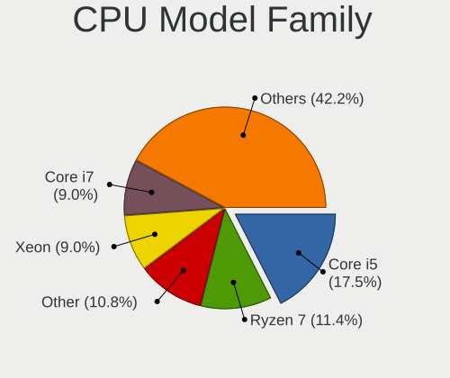

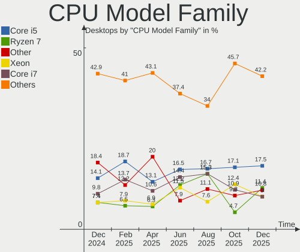

| Model                   | Desktops | Percent |
|-------------------------|----------|---------|
| Intel Core i5           | 29       | 17.47%  |
| AMD Ryzen 7             | 19       | 11.45%  |
| Other                   | 18       | 10.84%  |
| Intel Xeon              | 15       | 9.04%   |
| Intel Core i7           | 15       | 9.04%   |
| AMD Ryzen 5             | 11       | 6.63%   |
| Intel Core i3           | 10       | 6.02%   |
| AMD Ryzen 9             | 10       | 6.02%   |
| AMD FX                  | 6        | 3.61%   |
| Intel Celeron           | 4        | 2.41%   |
| Intel Core i9           | 3        | 1.81%   |
| Intel Pentium Dual-Core | 2        | 1.2%    |
| Intel Pentium           | 2        | 1.2%    |
| Intel Core 2 Quad       | 2        | 1.2%    |
| Intel Core              | 2        | 1.2%    |
| AMD Ryzen 5 PRO         | 2        | 1.2%    |
| AMD GX                  | 2        | 1.2%    |
| Intel Pentium Gold      | 1        | 0.6%    |
| Intel Pentium 4         | 1        | 0.6%    |
| Intel Core 2            | 1        | 0.6%    |
| Intel Atom              | 1        | 0.6%    |
| AMD Sempron             | 1        | 0.6%    |
| AMD Ryzen Threadripper  | 1        | 0.6%    |
| AMD Ryzen 3             | 1        | 0.6%    |
| AMD Phenom II X6        | 1        | 0.6%    |
| AMD Phenom II X4        | 1        | 0.6%    |
| AMD Athlon II X2        | 1        | 0.6%    |
| AMD Athlon 64 X2        | 1        | 0.6%    |
| AMD A6                  | 1        | 0.6%    |
| AMD A12                 | 1        | 0.6%    |
| AMD A10                 | 1        | 0.6%    |

CPU Cores
---------

Number of processor cores

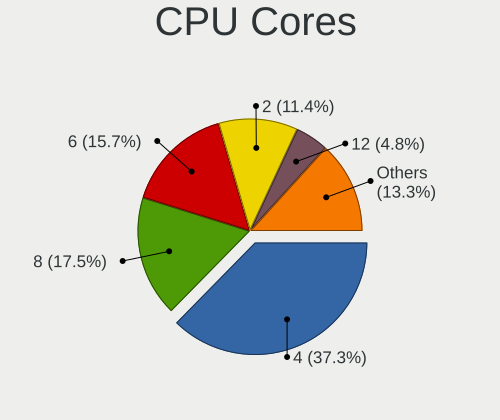

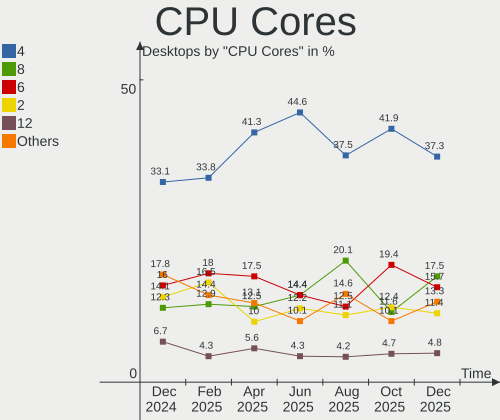

| Number | Desktops | Percent |
|--------|----------|---------|
| 4      | 62       | 37.35%  |
| 8      | 29       | 17.47%  |
| 6      | 26       | 15.66%  |
| 2      | 19       | 11.45%  |
| 12     | 8        | 4.82%   |
| 20     | 4        | 2.41%   |
| 16     | 4        | 2.41%   |
| 14     | 4        | 2.41%   |
| 10     | 4        | 2.41%   |
| 32     | 3        | 1.81%   |
| 1      | 2        | 1.2%    |
| 3      | 1        | 0.6%    |

CPU Sockets
-----------

Number of sockets

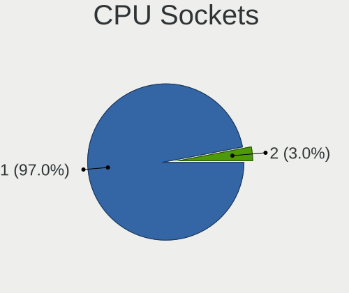

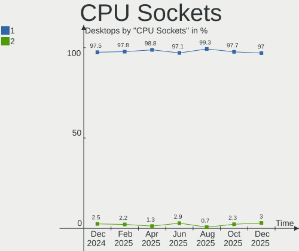

| Number | Desktops | Percent |
|--------|----------|---------|
| 1      | 161      | 96.99%  |
| 2      | 5        | 3.01%   |

CPU Threads
-----------

Threads per core (Hyper-Threading)

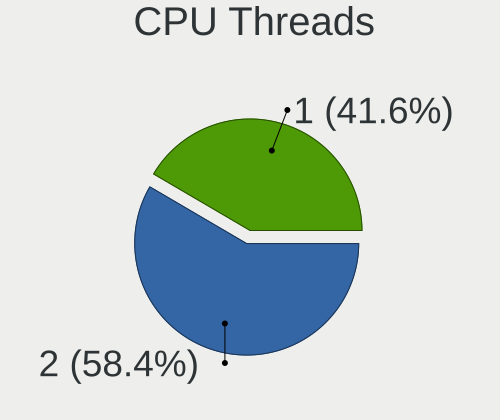

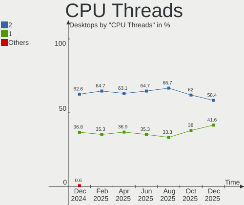

| Number | Desktops | Percent |
|--------|----------|---------|
| 2      | 97       | 58.43%  |
| 1      | 69       | 41.57%  |

CPU Op-Modes
------------

CPU Operation Modes (32-bit, 64-bit)

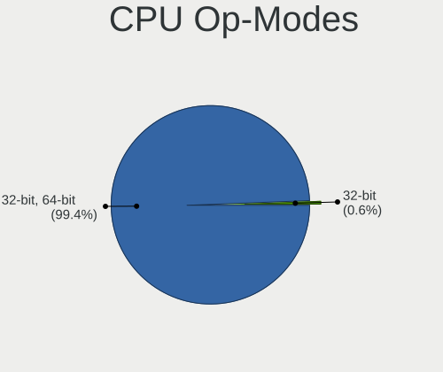

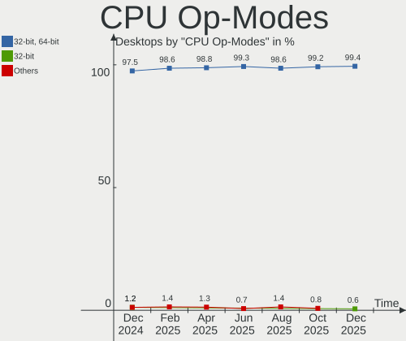

| Op mode        | Desktops | Percent |
|----------------|----------|---------|
| 32-bit, 64-bit | 165      | 99.4%   |
| 32-bit         | 1        | 0.6%    |

CPU Microcode
-------------

Microcode number

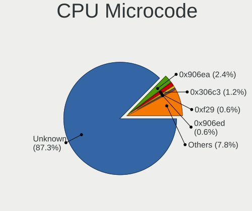

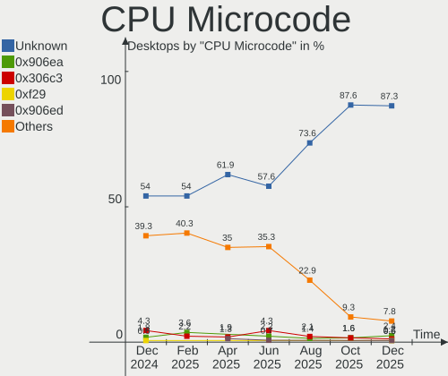

| Number     | Desktops | Percent |
|------------|----------|---------|
| Unknown    | 145      | 87.35%  |
| 0x906ea    | 4        | 2.41%   |
| 0x306c3    | 2        | 1.2%    |
| 0xf29      | 1        | 0.6%    |
| 0x906ed    | 1        | 0.6%    |
| 0x906ec    | 1        | 0.6%    |
| 0x90675    | 1        | 0.6%    |
| 0x806c1    | 1        | 0.6%    |
| 0x506e3    | 1        | 0.6%    |
| 0x40671    | 1        | 0.6%    |
| 0x306a9    | 1        | 0.6%    |
| 0x20655    | 1        | 0.6%    |
| 0x106a5    | 1        | 0.6%    |
| 0x0a601209 | 1        | 0.6%    |
| 0x0a601206 | 1        | 0.6%    |
| 0x0a50000f | 1        | 0.6%    |
| 0x08701021 | 1        | 0.6%    |
| 0x0600063e | 1        | 0.6%    |

CPU Microarch
-------------

Microarchitecture

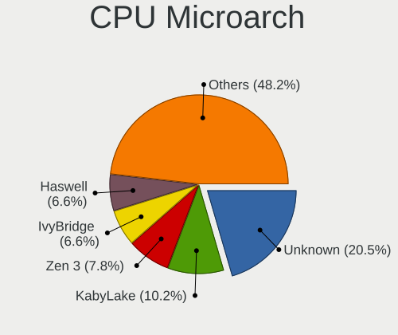

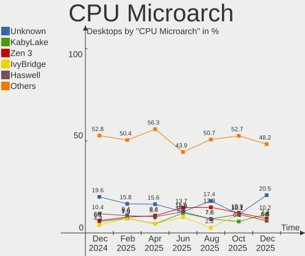

| Name             | Desktops | Percent |
|------------------|----------|---------|
| Unknown          | 34       | 20.48%  |
| KabyLake         | 17       | 10.24%  |
| Zen 3            | 13       | 7.83%   |
| IvyBridge        | 11       | 6.63%   |
| Haswell          | 11       | 6.63%   |
| Skylake          | 8        | 4.82%   |
| SandyBridge      | 8        | 4.82%   |
| Zen 2            | 7        | 4.22%   |
| CometLake        | 5        | 3.01%   |
| Westmere         | 4        | 2.41%   |
| Piledriver       | 4        | 2.41%   |
| Broadwell        | 4        | 2.41%   |
| Zen+             | 3        | 1.81%   |
| Penryn           | 3        | 1.81%   |
| Nehalem          | 3        | 1.81%   |
| K10              | 3        | 1.81%   |
| Gracemont        | 3        | 1.81%   |
| Bulldozer        | 3        | 1.81%   |
| Alderlake Hybrid | 3        | 1.81%   |
| Zen              | 2        | 1.2%    |
| TigerLake        | 2        | 1.2%    |
| Jaguar           | 2        | 1.2%    |
| Core             | 2        | 1.2%    |
| Silvermont       | 1        | 0.6%    |
| Sapphire Rapids  | 1        | 0.6%    |
| Puma             | 1        | 0.6%    |
| NetBurst         | 1        | 0.6%    |
| Lunarlake Hybrid | 1        | 0.6%    |
| K8 Hammer        | 1        | 0.6%    |
| K10 Llano        | 1        | 0.6%    |
| Icelake          | 1        | 0.6%    |
| Goldmont plus    | 1        | 0.6%    |
| Excavator        | 1        | 0.6%    |
| Bonnell          | 1        | 0.6%    |

Graphics
--------

GPU Vendor
----------

Vendors of graphics cards

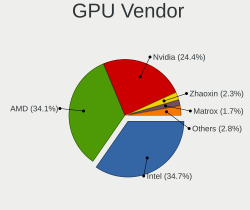

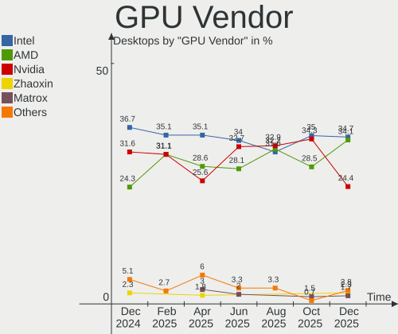

| Vendor                     | Desktops | Percent |
|----------------------------|----------|---------|
| Intel                      | 61       | 34.66%  |
| AMD                        | 60       | 34.09%  |
| Nvidia                     | 43       | 24.43%  |
| Zhaoxin                    | 4        | 2.27%   |
| Matrox Electronics Systems | 3        | 1.7%    |
| ASPEED Technology          | 3        | 1.7%    |
| Red Hat                    | 1        | 0.57%   |
| Loongson Technology        | 1        | 0.57%   |

GPU Model
---------

Graphics card models

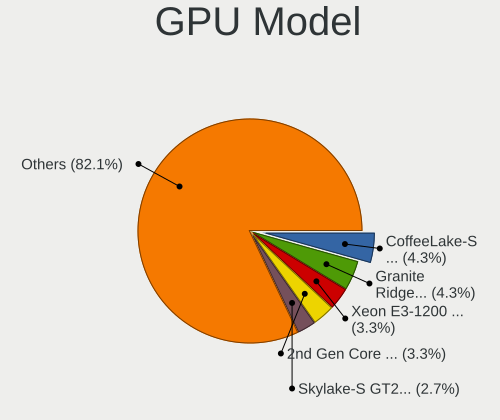

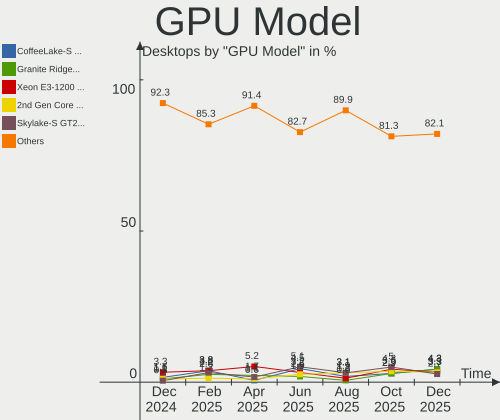

| Model                                                                       | Desktops | Percent |
|-----------------------------------------------------------------------------|----------|---------|
| Intel CoffeeLake-S GT2 [UHD Graphics 630]                                   | 8        | 4.35%   |
| AMD Granite Ridge [Radeon Graphics]                                         | 8        | 4.35%   |
| Intel Xeon E3-1200 v3/4th Gen Core Processor Integrated Graphics Controller | 6        | 3.26%   |
| Intel 2nd Generation Core Processor Family Integrated Graphics Controller   | 6        | 3.26%   |
| Intel Skylake-S GT2 [HD Graphics 530]                                       | 5        | 2.72%   |
| Zhaoxin KX-6000 C-960 GPU                                                   | 4        | 2.17%   |
| Intel Xeon E3-1200 v2/3rd Gen Core processor Graphics Controller            | 4        | 2.17%   |
| Intel Alder Lake-N [UHD Graphics]                                           | 4        | 2.17%   |
| AMD Raphael                                                                 | 4        | 2.17%   |
| AMD Navi 32 [Radeon RX 7700 XT / 7800 XT]                                   | 4        | 2.17%   |
| AMD Navi 22 [Radeon RX 6700/6700 XT/6750 XT / 6800M/6850M XT]               | 4        | 2.17%   |
| AMD Cezanne [Radeon Vega Series / Radeon Vega Mobile Series]                | 4        | 2.17%   |
| Nvidia GP107 [GeForce GTX 1050 Ti]                                          | 3        | 1.63%   |
| Nvidia AD103 [GeForce RTX 4080 SUPER]                                       | 3        | 1.63%   |
| Intel IvyBridge GT2 [HD Graphics 4000]                                      | 3        | 1.63%   |
| ASPEED Technology ASPEED Graphics Family                                    | 3        | 1.63%   |
| AMD Navi 23 [Radeon RX 6600/6600 XT/6600M]                                  | 3        | 1.63%   |
| Nvidia GP107 [GeForce GTX 1050 3GB]                                         | 2        | 1.09%   |
| Nvidia GP104 [GeForce GTX 1070]                                             | 2        | 1.09%   |
| Nvidia GK208B [GeForce GT 730]                                              | 2        | 1.09%   |
| Nvidia GK208B [GeForce GT 710]                                              | 2        | 1.09%   |
| Nvidia GA107 [GeForce RTX 3050 6GB]                                         | 2        | 1.09%   |
| Intel CometLake-S GT2 [UHD Graphics 630]                                    | 2        | 1.09%   |
| Intel Alder Lake-S GT1 [UHD Graphics 770]                                   | 2        | 1.09%   |
| Intel Alder Lake-S GT1 [UHD Graphics 730]                                   | 2        | 1.09%   |
| AMD Polaris 20 XL [Radeon RX 580 2048SP]                                    | 2        | 1.09%   |
| AMD Oland [Radeon HD 8570 / R5 430 OEM / R7 240/340 / Radeon 520 OEM]       | 2        | 1.09%   |
| AMD Navi 48 [Radeon RX 9070/9070 XT/9070 GRE]                               | 2        | 1.09%   |
| AMD Navi 33 [Radeon RX 7600/7600 XT/7600M XT/7600S/7700S / PRO W7600]       | 2        | 1.09%   |
| AMD HawkPoint1                                                              | 2        | 1.09%   |
| AMD Ellesmere [Radeon RX 470/480/570/570X/580/580X/590]                     | 2        | 1.09%   |
| AMD Baffin [Radeon RX 460/560D / Pro 450/455/460/555/555X/560/560X]         | 2        | 1.09%   |
| Red Hat Virtio 1.0 GPU                                                      | 1        | 0.54%   |
| Nvidia TU117 [GeForce GTX 1650]                                             | 1        | 0.54%   |
| Nvidia TU116 [GeForce GTX 1660 SUPER]                                       | 1        | 0.54%   |
| Nvidia TU116 [GeForce GTX 1650]                                             | 1        | 0.54%   |
| Nvidia TU106 [GeForce RTX 2060 SUPER]                                       | 1        | 0.54%   |
| Nvidia TU104 [GeForce RTX 2060]                                             | 1        | 0.54%   |
| Nvidia TU102 [GeForce RTX 2080 Ti Rev. A]                                   | 1        | 0.54%   |
| Nvidia GT218 [GeForce 405]                                                  | 1        | 0.54%   |

GPU Combo
---------

Combinations of graphics cards

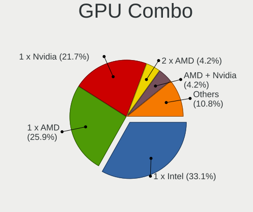

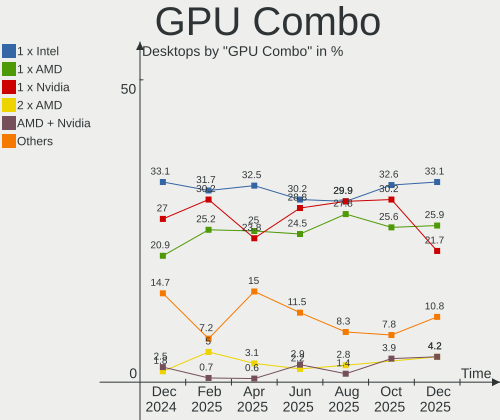

| Name                    | Desktops | Percent |
|-------------------------|----------|---------|
| 1 x Intel               | 55       | 33.13%  |
| 1 x AMD                 | 43       | 25.9%   |
| 1 x Nvidia              | 36       | 21.69%  |
| 2 x AMD                 | 7        | 4.22%   |
| AMD + Nvidia            | 7        | 4.22%   |
| 1 x Zhaoxin             | 4        | 2.41%   |
| 1 x Matrox              | 3        | 1.81%   |
| 1 x ASPEED              | 3        | 1.81%   |
| 2 x Intel               | 2        | 1.2%    |
| Intel + AMD             | 2        | 1.2%    |
| Other                   | 1        | 0.6%    |
| 3 x AMD                 | 1        | 0.6%    |
| 1 x Red Hat             | 1        | 0.6%    |
| 1 x Loongson Technology | 1        | 0.6%    |

GPU Driver
----------

Free vs proprietary

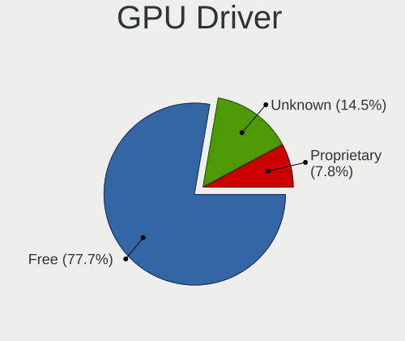

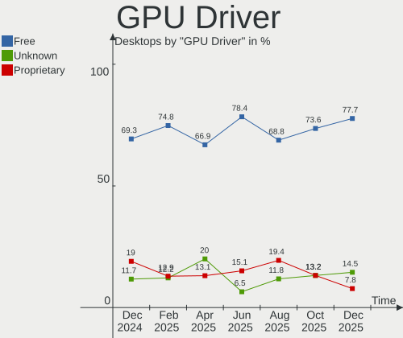

| Driver      | Desktops | Percent |
|-------------|----------|---------|
| Free        | 129      | 77.71%  |
| Unknown     | 24       | 14.46%  |
| Proprietary | 13       | 7.83%   |

GPU Memory
----------

Total video memory

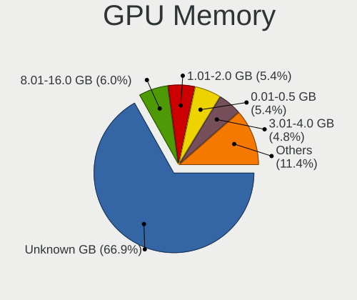

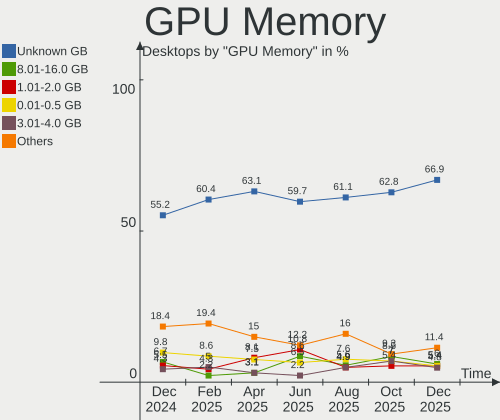

| Size in GB | Desktops | Percent |
|------------|----------|---------|
| Unknown    | 111      | 66.87%  |
| 8.01-16.0  | 10       | 6.02%   |
| 1.01-2.0   | 9        | 5.42%   |
| 0.01-0.5   | 9        | 5.42%   |
| 3.01-4.0   | 8        | 4.82%   |
| 7.01-8.0   | 6        | 3.61%   |
| 5.01-6.0   | 4        | 2.41%   |
| 2.01-3.0   | 4        | 2.41%   |
| 0.51-1.0   | 4        | 2.41%   |
| 16.01-24.0 | 1        | 0.6%    |

Monitor
-------

Monitor Vendor
--------------

Monitor vendors

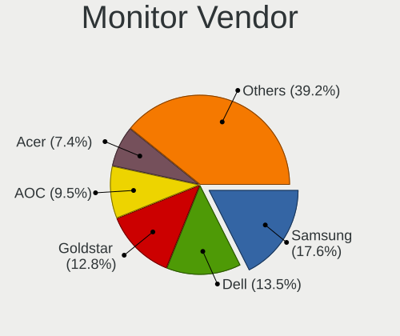

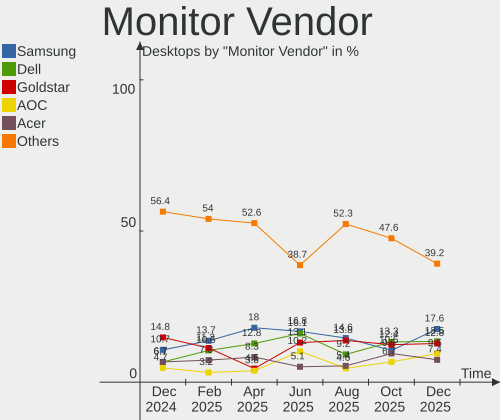

| Vendor               | Desktops | Percent |
|----------------------|----------|---------|
| Samsung Electronics  | 26       | 17.57%  |
| Dell                 | 20       | 13.51%  |
| Goldstar             | 19       | 12.84%  |
| AOC                  | 14       | 9.46%   |
| Acer                 | 11       | 7.43%   |
| Philips              | 7        | 4.73%   |
| Hewlett-Packard      | 7        | 4.73%   |
| MSI                  | 5        | 3.38%   |
| Iiyama               | 4        | 2.7%    |
| BenQ                 | 3        | 2.03%   |
| Sceptre Tech         | 2        | 1.35%   |
| Idek Iiyama          | 2        | 1.35%   |
| Huion                | 2        | 1.35%   |
| BOE                  | 2        | 1.35%   |
| Wacom                | 1        | 0.68%   |
| Vizio                | 1        | 0.68%   |
| ViewSonic            | 1        | 0.68%   |
| Vestel Elektronik    | 1        | 0.68%   |
| Toshiba              | 1        | 0.68%   |
| STA                  | 1        | 0.68%   |
| RTK                  | 1        | 0.68%   |
| RHT                  | 1        | 0.68%   |
| Prestigio            | 1        | 0.68%   |
| Planar               | 1        | 0.68%   |
| Panasonic            | 1        | 0.68%   |
| ONN                  | 1        | 0.68%   |
| Microstep            | 1        | 0.68%   |
| Medion               | 1        | 0.68%   |
| Lenovo               | 1        | 0.68%   |
| Intehill             | 1        | 0.68%   |
| HKC                  | 1        | 0.68%   |
| HJW                  | 1        | 0.68%   |
| Gigabyte Technology  | 1        | 0.68%   |
| FUN                  | 1        | 0.68%   |
| DENON                | 1        | 0.68%   |
| CTV                  | 1        | 0.68%   |
| Ancor Communications | 1        | 0.68%   |
| Unknown              | 1        | 0.68%   |

Monitor Model
-------------

Monitor models

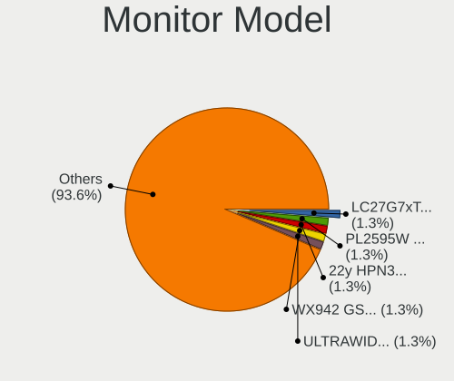

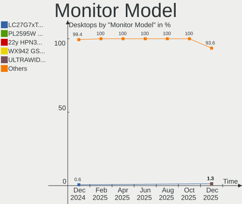

| Model                                                                   | Desktops | Percent |
|-------------------------------------------------------------------------|----------|---------|
| Samsung Electronics LC27G7xT SAM105C 2560x1440 597x336mm 27.0-inch      | 2        | 1.28%   |
| Iiyama PL2595W IVM6144 1920x1200 535x339mm 24.9-inch                    | 2        | 1.28%   |
| Hewlett-Packard 22y HPN3503 1920x1080 477x268mm 21.5-inch               | 2        | 1.28%   |
| Goldstar WX942 GSM4B80 1440x900 410x260mm 19.1-inch                     | 2        | 1.28%   |
| Goldstar ULTRAWIDE GSM5BF8 2560x1080 673x284mm 28.8-inch                | 2        | 1.28%   |
| AOC 27G2G4 AOC2702 1920x1080 598x336mm 27.0-inch                        | 2        | 1.28%   |
| AOC 2778X AOC2778 2560x1440 597x336mm 27.0-inch                         | 2        | 1.28%   |
| AOC 24G2W1G3 AOC2402 1920x1080 527x296mm 23.8-inch                      | 2        | 1.28%   |
| Acer S242HL ACR0216 1920x1080 531x299mm 24.0-inch                       | 2        | 1.28%   |
| Wacom One 13 WAC1070 1920x1080 294x166mm 13.3-inch                      | 1        | 0.64%   |
| Vizio E220VA VIZ0070 1920x1080 476x268mm 21.5-inch                      | 1        | 0.64%   |
| Vizio D24f-J09 VIZ1044 1920x1080 521x293mm 23.5-inch                    | 1        | 0.64%   |
| ViewSonic VX2363 Series VSC6B2F 1920x1080 509x286mm 23.0-inch           | 1        | 0.64%   |
| Vestel Elektronik 40UHD_LCD_TV VES3700 3840x2160 880x500mm 39.8-inch    | 1        | 0.64%   |
| Toshiba 43UHD_LCD_TV TSB3700 3840x2160 940x540mm 42.7-inch              | 1        | 0.64%   |
| STA SEMP LEDTV STA0030 1360x850 708x398mm 32.0-inch                     | 1        | 0.64%   |
| Sceptre Tech Sceptre J20 SPT080D 1600x900 435x237mm 19.5-inch           | 1        | 0.64%   |
| Sceptre Tech Sceptre F24 SPT09AB 1920x1080 530x290mm 23.8-inch          | 1        | 0.64%   |
| Samsung Electronics T27C350 SAM0AC5 1920x1080 598x336mm 27.0-inch       | 1        | 0.64%   |
| Samsung Electronics SyncMaster SAM0587 1920x1200 518x324mm 24.1-inch    | 1        | 0.64%   |
| Samsung Electronics SyncMaster SAM056E 1920x1200 518x324mm 24.1-inch    | 1        | 0.64%   |
| Samsung Electronics SyncMaster SAM037C 1680x1050 474x296mm 22.0-inch    | 1        | 0.64%   |
| Samsung Electronics SyncMaster SAM027F 1680x1050 474x296mm 22.0-inch    | 1        | 0.64%   |
| Samsung Electronics SyncMaster SAM0248 1280x1024 376x301mm 19.0-inch    | 1        | 0.64%   |
| Samsung Electronics SyncMaster SAM01AD 1600x1200 408x306mm 20.1-inch    | 1        | 0.64%   |
| Samsung Electronics SMT27A750 SAM0809 1920x1080 598x336mm 27.0-inch     | 1        | 0.64%   |
| Samsung Electronics SMB2230W SAM0640 1680x1050 474x296mm 22.0-inch      | 1        | 0.64%   |
| Samsung Electronics SA300/SA350 SAM07D2 1920x1080 477x268mm 21.5-inch   | 1        | 0.64%   |
| Samsung Electronics S90D SAM75B3 3840x2160 1872x1053mm 84.6-inch        | 1        | 0.64%   |
| Samsung Electronics S27D590 SAM0BE9 1920x1080 598x336mm 27.0-inch       | 1        | 0.64%   |
| Samsung Electronics S24F350 SAM0D21 1920x1080 521x293mm 23.5-inch       | 1        | 0.64%   |
| Samsung Electronics S24F350 SAM0D20 1920x1080 521x293mm 23.5-inch       | 1        | 0.64%   |
| Samsung Electronics S24E650 SAM0C85 1920x1200 518x324mm 24.1-inch       | 1        | 0.64%   |
| Samsung Electronics S22D300 SAM0B3E 1920x1080 477x268mm 21.5-inch       | 1        | 0.64%   |
| Samsung Electronics Odyssey G5 SAM748A 2560x1440 698x393mm 31.5-inch    | 1        | 0.64%   |
| Samsung Electronics LF22T35 SAM707B 1920x1080 477x268mm 21.5-inch       | 1        | 0.64%   |
| Samsung Electronics LCD Monitor SAM7017 3840x2160 1872x1053mm 84.6-inch | 1        | 0.64%   |
| Samsung Electronics LCD Monitor SAM0FA8 3840x2160 1872x1053mm 84.6-inch | 1        | 0.64%   |
| Samsung Electronics LCD Monitor SAM0E33 1920x1080 1210x680mm 54.6-inch  | 1        | 0.64%   |
| Samsung Electronics LCD Monitor SAM0D43 3840x2160 1020x570mm 46.0-inch  | 1        | 0.64%   |

Monitor Resolution
------------------

Monitor screen resolution

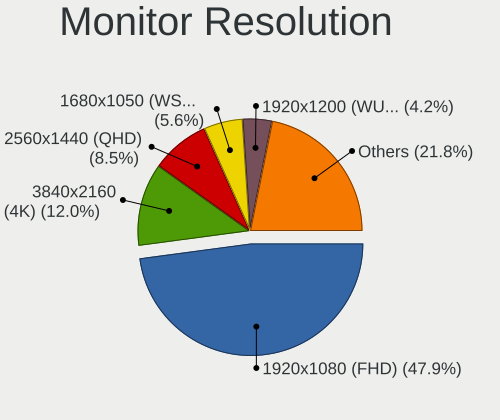

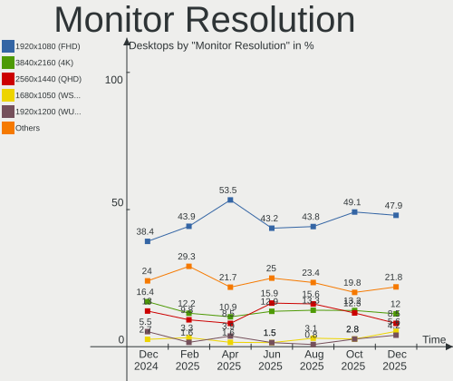

| Resolution         | Desktops | Percent |
|--------------------|----------|---------|
| 1920x1080 (FHD)    | 68       | 47.89%  |
| 3840x2160 (4K)     | 17       | 11.97%  |
| 2560x1440 (QHD)    | 12       | 8.45%   |
| 1680x1050 (WSXGA+) | 8        | 5.63%   |
| 1920x1200 (WUXGA)  | 6        | 4.23%   |
| 3440x1440          | 5        | 3.52%   |
| 1600x900 (HD+)     | 4        | 2.82%   |
| 2560x1080          | 3        | 2.11%   |
| 1440x900 (WXGA+)   | 3        | 2.11%   |
| 1280x1024 (SXGA)   | 3        | 2.11%   |
| 1920x540           | 2        | 1.41%   |
| 1600x1200          | 2        | 1.41%   |
| 1400x1050          | 2        | 1.41%   |
| 1366x768 (WXGA)    | 2        | 1.41%   |
| 2560x2880          | 1        | 0.7%    |
| 2560x1600          | 1        | 0.7%    |
| 2560x1397          | 1        | 0.7%    |
| 2160x1440          | 1        | 0.7%    |
| 1280x720 (HD)      | 1        | 0.7%    |

Monitor Diagonal
----------------

Diagonal size in inches

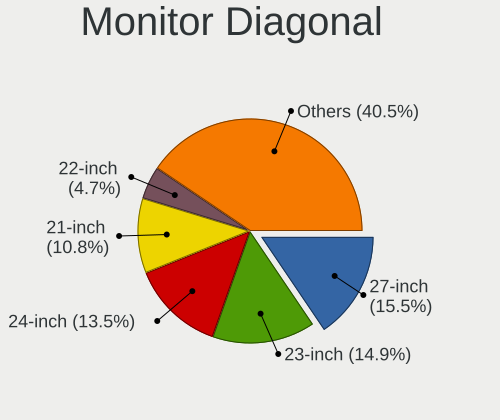

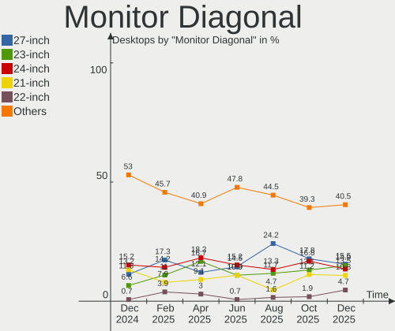

| Inches  | Desktops | Percent |
|---------|----------|---------|
| 27      | 23       | 15.54%  |
| 23      | 22       | 14.86%  |
| 24      | 20       | 13.51%  |
| 21      | 16       | 10.81%  |
| 22      | 7        | 4.73%   |
| Unknown | 7        | 4.73%   |
| 84      | 6        | 4.05%   |
| 19      | 6        | 4.05%   |
| 31      | 5        | 3.38%   |
| 32      | 4        | 2.7%    |
| 20      | 4        | 2.7%    |
| 18      | 3        | 2.03%   |
| 15      | 3        | 2.03%   |
| 54      | 2        | 1.35%   |
| 42      | 2        | 1.35%   |
| 40      | 2        | 1.35%   |
| 34      | 2        | 1.35%   |
| 29      | 2        | 1.35%   |
| 28      | 2        | 1.35%   |
| 25      | 2        | 1.35%   |
| 17      | 2        | 1.35%   |
| 13      | 2        | 1.35%   |
| 72      | 1        | 0.68%   |
| 63      | 1        | 0.68%   |
| 37      | 1        | 0.68%   |
| 35      | 1        | 0.68%   |

Monitor Width
-------------

Physical width

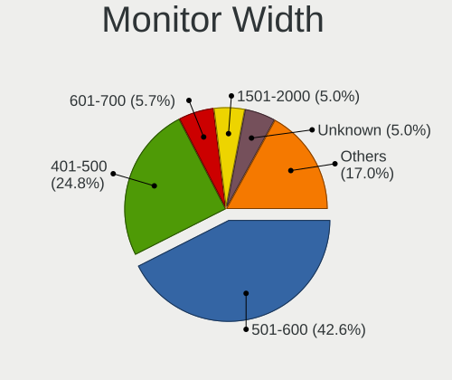

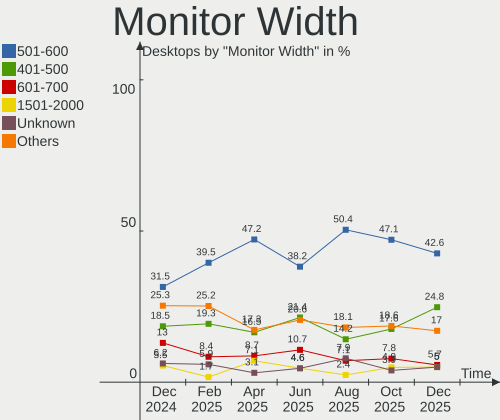

| Width in mm | Desktops | Percent |
|-------------|----------|---------|
| 501-600     | 60       | 42.55%  |
| 401-500     | 35       | 24.82%  |
| 601-700     | 8        | 5.67%   |
| 1501-2000   | 7        | 4.96%   |
| Unknown     | 7        | 4.96%   |
| 701-800     | 6        | 4.26%   |
| 301-350     | 4        | 2.84%   |
| 801-900     | 3        | 2.13%   |
| 351-400     | 3        | 2.13%   |
| 1001-1500   | 3        | 2.13%   |
| 901-1000    | 3        | 2.13%   |
| 201-300     | 2        | 1.42%   |

Aspect Ratio
------------

Proportional relationship between the width and the height

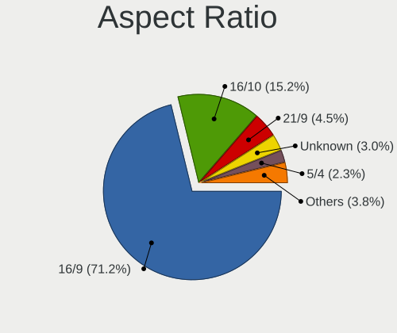

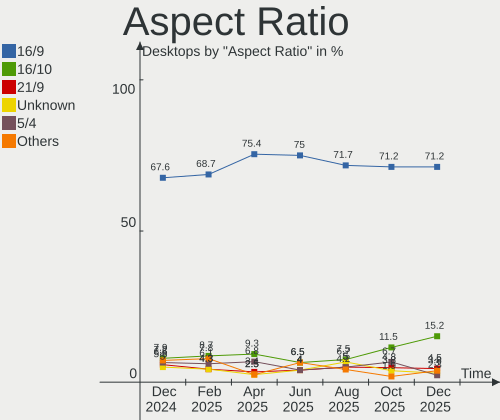

| Ratio   | Desktops | Percent |
|---------|----------|---------|
| 16/9    | 94       | 71.21%  |
| 16/10   | 20       | 15.15%  |
| 21/9    | 6        | 4.55%   |
| Unknown | 4        | 3.03%   |
| 5/4     | 3        | 2.27%   |
| 4/3     | 3        | 2.27%   |
| 32/9    | 1        | 0.76%   |
| 0.89    | 1        | 0.76%   |

Monitor Area
------------

Area in inch²

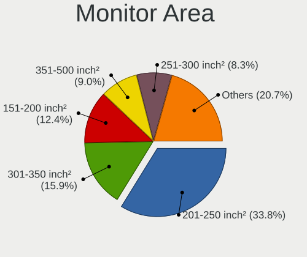

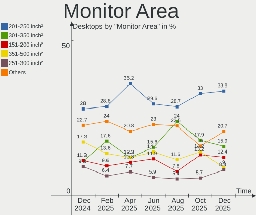

| Area in inch² | Desktops | Percent |
|----------------|----------|---------|
| 201-250        | 49       | 33.79%  |
| 301-350        | 23       | 15.86%  |
| 151-200        | 18       | 12.41%  |
| 351-500        | 13       | 8.97%   |
| 251-300        | 12       | 8.28%   |
| More than 1000 | 10       | 6.9%    |
| Unknown        | 7        | 4.83%   |
| 501-1000       | 4        | 2.76%   |
| 141-150        | 3        | 2.07%   |
| 71-80          | 2        | 1.38%   |
| 101-110        | 2        | 1.38%   |
| 121-130        | 1        | 0.69%   |
| 91-100         | 1        | 0.69%   |

Pixel Density
-------------

Pixels per inch

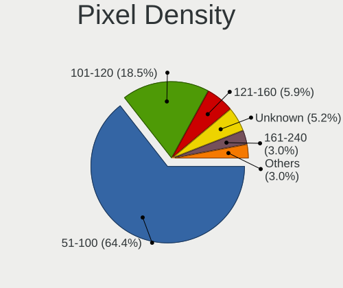

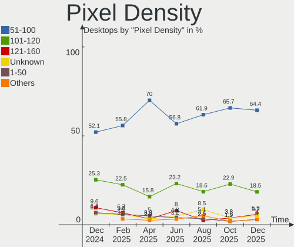

| Density | Desktops | Percent |
|---------|----------|---------|
| 51-100  | 87       | 64.44%  |
| 101-120 | 25       | 18.52%  |
| 121-160 | 8        | 5.93%   |
| Unknown | 7        | 5.19%   |
| 1-50    | 4        | 2.96%   |
| 161-240 | 4        | 2.96%   |

Multiple Monitors
-----------------

Total monitors connected

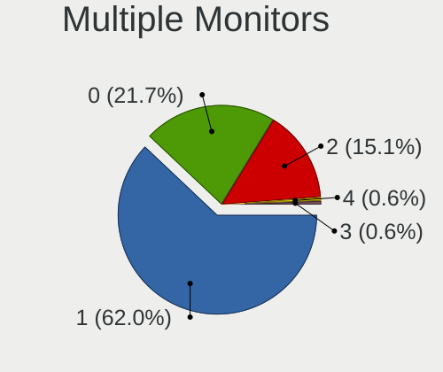

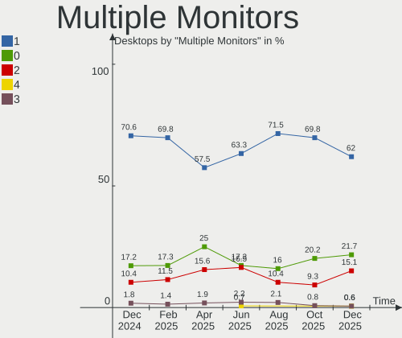

| Total | Desktops | Percent |
|-------|----------|---------|
| 1     | 103      | 62.05%  |
| 0     | 36       | 21.69%  |
| 2     | 25       | 15.06%  |
| 4     | 1        | 0.6%    |
| 3     | 1        | 0.6%    |

Network
-------

Net Controller Vendor
---------------------

Controller vendors

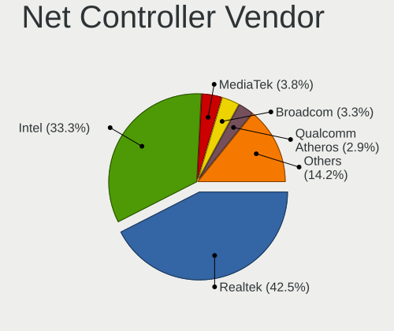

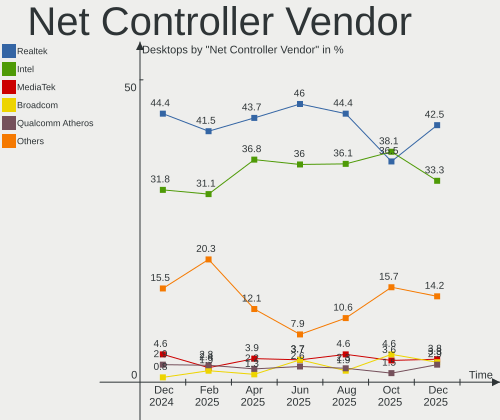

| Vendor                                 | Desktops | Percent |
|----------------------------------------|----------|---------|
| Realtek Semiconductor                  | 102      | 42.5%   |
| Intel                                  | 80       | 33.33%  |
| MediaTek                               | 9        | 3.75%   |
| Broadcom                               | 8        | 3.33%   |
| Qualcomm Atheros                       | 7        | 2.92%   |
| Qualcomm Technologies                  | 4        | 1.67%   |
| Aquantia                               | 4        | 1.67%   |
| VIA Technologies                       | 2        | 0.83%   |
| TP-Link                                | 2        | 0.83%   |
| Xiaomi                                 | 1        | 0.42%   |
| Suzhou Motorcomm Electronic Technology | 1        | 0.42%   |
| Sigma Designs                          | 1        | 0.42%   |
| Samsung Electronics                    | 1        | 0.42%   |
| Ralink                                 | 1        | 0.42%   |
| QLogic                                 | 1        | 0.42%   |
| QinHeng Electronics                    | 1        | 0.42%   |
| Nvidia                                 | 1        | 0.42%   |
| Netchip Technology                     | 1        | 0.42%   |
| Microsoft                              | 1        | 0.42%   |
| Mercucys                               | 1        | 0.42%   |
| Mellanox Technologies                  | 1        | 0.42%   |
| Marvell Technology Group               | 1        | 0.42%   |
| Loongson Technology                    | 1        | 0.42%   |
| Gemtek                                 | 1        | 0.42%   |
| Edimax Technology                      | 1        | 0.42%   |
| D-Link System                          | 1        | 0.42%   |
| Compex                                 | 1        | 0.42%   |
| Broadcom Limited                       | 1        | 0.42%   |
| Belkin Components                      | 1        | 0.42%   |
| ASIX Electronics                       | 1        | 0.42%   |
| American Megatrends                    | 1        | 0.42%   |

Net Controller Model
--------------------

Controller models

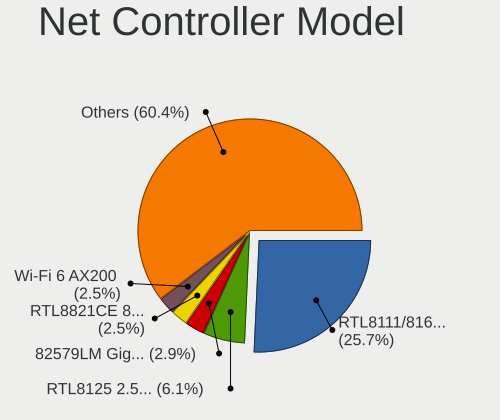

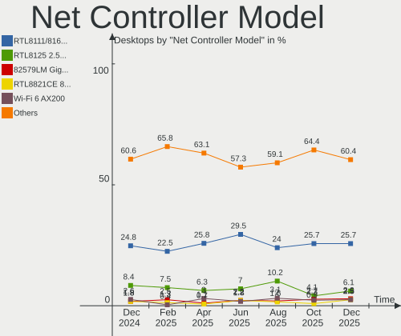

| Model                                                                             | Desktops | Percent |
|-----------------------------------------------------------------------------------|----------|---------|
| Realtek RTL8111/8168/8211/8411 PCI Express Gigabit Ethernet Controller            | 72       | 25.71%  |
| Realtek RTL8125 2.5GbE Controller                                                 | 17       | 6.07%   |
| Intel 82579LM Gigabit Network Connection (Lewisville)                             | 8        | 2.86%   |
| Realtek RTL8821CE 802.11ac PCIe Wireless Network Adapter                          | 7        | 2.5%    |
| Intel Wi-Fi 6 AX200                                                               | 7        | 2.5%    |
| Intel Ethernet Controller I226-V                                                  | 7        | 2.5%    |
| MediaTek MT7922 802.11ax PCI Express Wireless Network Adapter                     | 5        | 1.79%   |
| Intel Wi-Fi 6E(802.11ax) AX210/AX1675* 2x2 [Typhoon Peak]                         | 5        | 1.79%   |
| Intel I211 Gigabit Network Connection                                             | 5        | 1.79%   |
| Intel Ethernet Controller I225-V                                                  | 5        | 1.79%   |
| Intel Ethernet Connection I217-LM                                                 | 4        | 1.43%   |
| Intel Ethernet Connection (2) I219-V                                              | 4        | 1.43%   |
| Intel 82574L Gigabit Network Connection                                           | 4        | 1.43%   |
| Realtek RTL8126 5GbE Controller                                                   | 3        | 1.07%   |
| Qualcomm WCN785x Wi-Fi 7(802.11be) 320MHz 2x2 [FastConnect 7800]                  | 3        | 1.07%   |
| Intel Ethernet Connection (7) I219-V                                              | 3        | 1.07%   |
| Intel Ethernet Connection (7) I219-LM                                             | 3        | 1.07%   |
| Intel Ethernet Connection (17) I219-LM                                            | 3        | 1.07%   |
| Intel Dual Band Wireless-AC 3168NGW [Stone Peak]                                  | 3        | 1.07%   |
| Realtek RTL88x2bu [AC1200 Techkey]                                                | 2        | 0.71%   |
| Realtek RTL8822CE 802.11ac PCIe Wireless Network Adapter                          | 2        | 0.71%   |
| Realtek RTL8188EUS 802.11n Wireless Network Adapter                               | 2        | 0.71%   |
| Realtek RTL8153 Gigabit Ethernet Adapter                                          | 2        | 0.71%   |
| Realtek RTL-8100/8101L/8139 PCI Fast Ethernet Adapter                             | 2        | 0.71%   |
| Realtek 802.11ac NIC                                                              | 2        | 0.71%   |
| Qualcomm Atheros AR9485 Wireless Network Adapter                                  | 2        | 0.71%   |
| MediaTek MT7925 802.11be 160MHz 2x2 PCIe Wireless Network Adapter [Filogic 360]   | 2        | 0.71%   |
| Intel Wireless 7260                                                               | 2        | 0.71%   |
| Intel Wi-Fi 7(802.11be) AX1775*/AX1790*/BE20*/BE401/BE1750* 2x2                   | 2        | 0.71%   |
| Intel I350 Gigabit Network Connection                                             | 2        | 0.71%   |
| Intel Ethernet Connection (2) I218-V                                              | 2        | 0.71%   |
| Intel Ethernet Connection (13) I219-V                                             | 2        | 0.71%   |
| Intel Ethernet Connection (11) I219-V                                             | 2        | 0.71%   |
| Intel Ethernet Connection (11) I219-LM                                            | 2        | 0.71%   |
| Intel Comet Lake PCH CNVi WiFi                                                    | 2        | 0.71%   |
| Intel 82579V Gigabit Network Connection                                           | 2        | 0.71%   |
| Aquantia AQC113C NBase-T/IEEE 802.3an Ethernet Controller [Marvell Scalable mGig] | 2        | 0.71%   |
| Xiaomi Mi/Redmi series (RNDIS)                                                    | 1        | 0.36%   |
| VIA VT86C100A [Rhine]                                                             | 1        | 0.36%   |
| VIA VT6105/VT6106S [Rhine-III]                                                    | 1        | 0.36%   |

Wireless Vendor
---------------

Wireless vendors

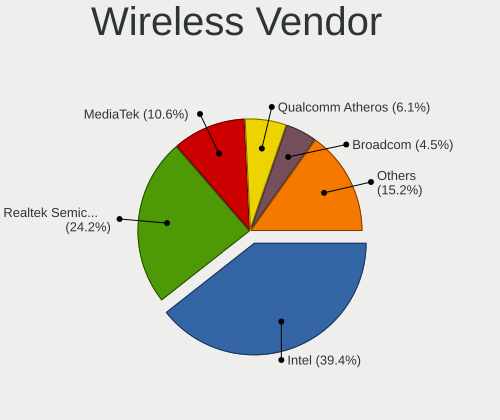

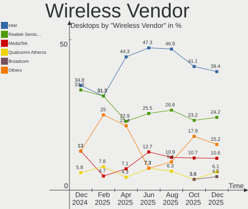

| Vendor                | Desktops | Percent |
|-----------------------|----------|---------|
| Intel                 | 26       | 39.39%  |
| Realtek Semiconductor | 16       | 24.24%  |
| MediaTek              | 7        | 10.61%  |
| Qualcomm Atheros      | 4        | 6.06%   |
| Broadcom              | 3        | 4.55%   |
| TP-Link               | 2        | 3.03%   |
| Qualcomm Technologies | 2        | 3.03%   |
| Ralink                | 1        | 1.52%   |
| Microsoft             | 1        | 1.52%   |
| Mercucys              | 1        | 1.52%   |
| Gemtek                | 1        | 1.52%   |
| Edimax Technology     | 1        | 1.52%   |
| Belkin Components     | 1        | 1.52%   |

Wireless Model
--------------

Wireless models

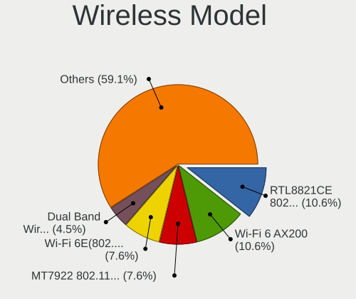

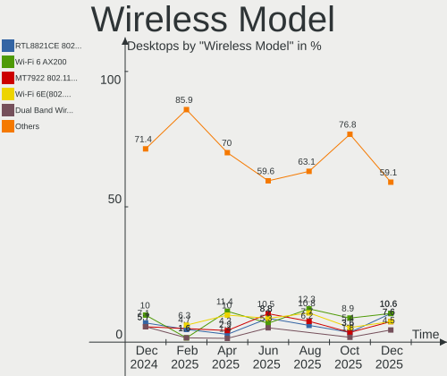

| Model                                                                                     | Desktops | Percent |
|-------------------------------------------------------------------------------------------|----------|---------|
| Realtek RTL8821CE 802.11ac PCIe Wireless Network Adapter                                  | 7        | 10.61%  |
| Intel Wi-Fi 6 AX200                                                                       | 7        | 10.61%  |
| MediaTek MT7922 802.11ax PCI Express Wireless Network Adapter                             | 5        | 7.58%   |
| Intel Wi-Fi 6E(802.11ax) AX210/AX1675* 2x2 [Typhoon Peak]                                 | 5        | 7.58%   |
| Intel Dual Band Wireless-AC 3168NGW [Stone Peak]                                          | 3        | 4.55%   |
| Realtek RTL88x2bu [AC1200 Techkey]                                                        | 2        | 3.03%   |
| Realtek RTL8822CE 802.11ac PCIe Wireless Network Adapter                                  | 2        | 3.03%   |
| Realtek RTL8188EUS 802.11n Wireless Network Adapter                                       | 2        | 3.03%   |
| Realtek 802.11ac NIC                                                                      | 2        | 3.03%   |
| Qualcomm Atheros AR9485 Wireless Network Adapter                                          | 2        | 3.03%   |
| Intel Wireless 7260                                                                       | 2        | 3.03%   |
| Intel Comet Lake PCH CNVi WiFi                                                            | 2        | 3.03%   |
| TP-Link TL-WN822N Version 4 RTL8192EU                                                     | 1        | 1.52%   |
| TP-Link 802.11ac NIC                                                                      | 1        | 1.52%   |
| Realtek RTL8188GU 802.11n WLAN Adapter (After Modeswitch)                                 | 1        | 1.52%   |
| Ralink RT5392 PCIe Wireless Network Adapter                                               | 1        | 1.52%   |
| Qualcomm WCN785x Wi-Fi 7(802.11be) 320MHz 2x2 [FastConnect 7800]                          | 1        | 1.52%   |
| Qualcomm QCNFA765 Wireless Network Adapter                                                | 1        | 1.52%   |
| Qualcomm Atheros AR928X Wireless Network Adapter (PCI-Express)                            | 1        | 1.52%   |
| Qualcomm Atheros AR9287 Wireless Network Adapter (PCI-Express)                            | 1        | 1.52%   |
| Microsoft Xbox Wireless Adapter for Windows                                               | 1        | 1.52%   |
| Mercucys 802.11n NIC                                                                      | 1        | 1.52%   |
| MediaTek MT7925 802.11be 160MHz 2x2 PCIe Wireless Network Adapter [Filogic 360]           | 1        | 1.52%   |
| MediaTek MT7902 802.11ax PCIe Wireless Network Adapter [Filogic 310]                      | 1        | 1.52%   |
| Intel Wireless 7265                                                                       | 1        | 1.52%   |
| Intel Wi-Fi 7(802.11be) AX1775*/AX1790*/BE20*/BE401/BE1750* 2x2                           | 1        | 1.52%   |
| Intel Wi-Fi 6 AX201                                                                       | 1        | 1.52%   |
| Intel Centrino Wireless-N 2230                                                            | 1        | 1.52%   |
| Intel Cannon Lake PCH CNVi WiFi                                                           | 1        | 1.52%   |
| Intel Alder Lake-N PCH CNVi WiFi                                                          | 1        | 1.52%   |
| Intel 700 Series Chipset CNVi WiFi                                                        | 1        | 1.52%   |
| Gemtek WUBR-177G [Ralink RT2571W]                                                         | 1        | 1.52%   |
| Edimax EW-7811Un 802.11n Wireless Adapter [Realtek RTL8188CUS]                            | 1        | 1.52%   |
| Broadcom Network controller                                                               | 1        | 1.52%   |
| Broadcom BCM4360 802.11ac Dual Band Wireless Network Adapter                              | 1        | 1.52%   |
| Broadcom BCM4352 802.11ac Dual Band Wireless Network Adapter                              | 1        | 1.52%   |
| Belkin Components F7D2101 802.11n Surf & Share Wireless Adapter v1000 [Realtek RTL8192SU] | 1        | 1.52%   |

Ethernet Vendor
---------------

Ethernet vendors

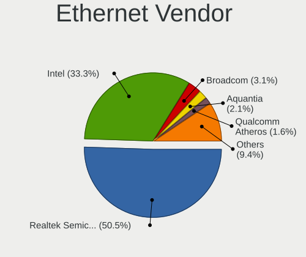

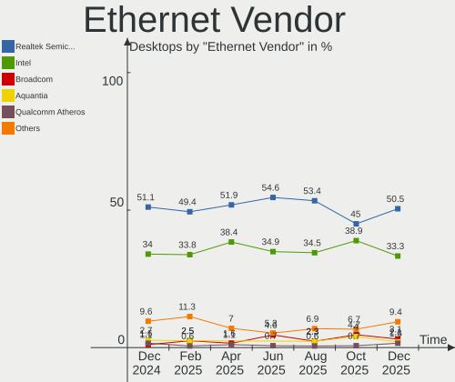

| Vendor                                 | Desktops | Percent |
|----------------------------------------|----------|---------|
| Realtek Semiconductor                  | 97       | 50.52%  |
| Intel                                  | 64       | 33.33%  |
| Broadcom                               | 6        | 3.13%   |
| Aquantia                               | 4        | 2.08%   |
| Qualcomm Atheros                       | 3        | 1.56%   |
| VIA Technologies                       | 2        | 1.04%   |
| Qualcomm Technologies                  | 2        | 1.04%   |
| Xiaomi                                 | 1        | 0.52%   |
| Suzhou Motorcomm Electronic Technology | 1        | 0.52%   |
| Samsung Electronics                    | 1        | 0.52%   |
| QLogic                                 | 1        | 0.52%   |
| Nvidia                                 | 1        | 0.52%   |
| Mellanox Technologies                  | 1        | 0.52%   |
| MediaTek                               | 1        | 0.52%   |
| Marvell Technology Group               | 1        | 0.52%   |
| Loongson Technology                    | 1        | 0.52%   |
| D-Link System                          | 1        | 0.52%   |
| Compex                                 | 1        | 0.52%   |
| Broadcom Limited                       | 1        | 0.52%   |
| ASIX Electronics                       | 1        | 0.52%   |
| American Megatrends                    | 1        | 0.52%   |

Ethernet Model
--------------

Ethernet models

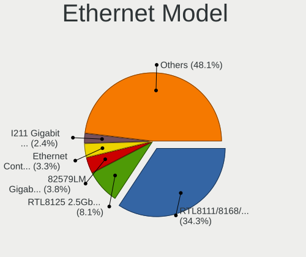

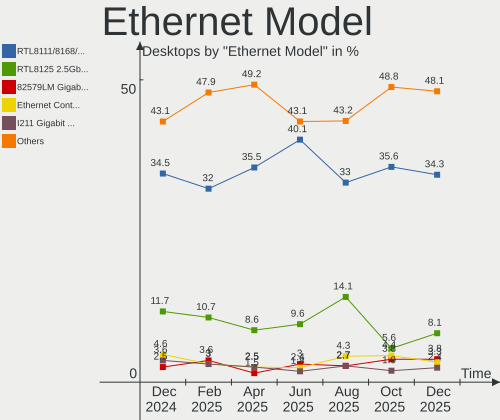

| Model                                                                             | Desktops | Percent |
|-----------------------------------------------------------------------------------|----------|---------|
| Realtek RTL8111/8168/8211/8411 PCI Express Gigabit Ethernet Controller            | 72       | 34.29%  |
| Realtek RTL8125 2.5GbE Controller                                                 | 17       | 8.1%    |
| Intel 82579LM Gigabit Network Connection (Lewisville)                             | 8        | 3.81%   |
| Intel Ethernet Controller I226-V                                                  | 7        | 3.33%   |
| Intel I211 Gigabit Network Connection                                             | 5        | 2.38%   |
| Intel Ethernet Controller I225-V                                                  | 5        | 2.38%   |
| Intel Ethernet Connection I217-LM                                                 | 4        | 1.9%    |
| Intel Ethernet Connection (2) I219-V                                              | 4        | 1.9%    |
| Intel 82574L Gigabit Network Connection                                           | 4        | 1.9%    |
| Realtek RTL8126 5GbE Controller                                                   | 3        | 1.43%   |
| Intel Ethernet Connection (7) I219-V                                              | 3        | 1.43%   |
| Intel Ethernet Connection (7) I219-LM                                             | 3        | 1.43%   |
| Intel Ethernet Connection (17) I219-LM                                            | 3        | 1.43%   |
| Realtek RTL8153 Gigabit Ethernet Adapter                                          | 2        | 0.95%   |
| Realtek RTL-8100/8101L/8139 PCI Fast Ethernet Adapter                             | 2        | 0.95%   |
| Qualcomm WCN785x Wi-Fi 7(802.11be) 320MHz 2x2 [FastConnect 7800]                  | 2        | 0.95%   |
| Intel I350 Gigabit Network Connection                                             | 2        | 0.95%   |
| Intel Ethernet Connection (2) I218-V                                              | 2        | 0.95%   |
| Intel Ethernet Connection (13) I219-V                                             | 2        | 0.95%   |
| Intel Ethernet Connection (11) I219-V                                             | 2        | 0.95%   |
| Intel Ethernet Connection (11) I219-LM                                            | 2        | 0.95%   |
| Intel 82579V Gigabit Network Connection                                           | 2        | 0.95%   |
| Aquantia AQC113C NBase-T/IEEE 802.3an Ethernet Controller [Marvell Scalable mGig] | 2        | 0.95%   |
| Xiaomi Mi/Redmi series (RNDIS)                                                    | 1        | 0.48%   |
| VIA VT86C100A [Rhine]                                                             | 1        | 0.48%   |
| VIA VT6105/VT6106S [Rhine-III]                                                    | 1        | 0.48%   |
| VIA VT6102/VT6103 [Rhine-II]                                                      | 1        | 0.48%   |
| Suzhou Motorcomm Electronic YT6801 Gigabit Ethernet Controller                    | 1        | 0.48%   |
| Samsung Galaxy series, misc. (tethering mode)                                     | 1        | 0.48%   |
| Realtek RTL8852BE PCIe 802.11ax Wireless Network Controller                       | 1        | 0.48%   |
| Realtek RTL8169 PCI Gigabit Ethernet Controller                                   | 1        | 0.48%   |
| Realtek RTL8127 10GbE Controller                                                  | 1        | 0.48%   |
| Realtek RTL810xE PCI Express Fast Ethernet controller                             | 1        | 0.48%   |
| Realtek Killer E3000 2.5GbE Controller                                            | 1        | 0.48%   |
| Qualcomm Atheros Killer E2500 Gigabit Ethernet Controller                         | 1        | 0.48%   |
| Qualcomm Atheros Killer E2400 Gigabit Ethernet Controller                         | 1        | 0.48%   |
| Qualcomm Atheros Ethernet controller                                              | 1        | 0.48%   |
| QLogic cLOM8214 1/10GbE Controller                                                | 1        | 0.48%   |
| Nvidia MCP61 Ethernet                                                             | 1        | 0.48%   |
| Mellanox MT2892 Family [ConnectX-6 Dx]                                            | 1        | 0.48%   |

Net Controller Kind
-------------------

Ethernet, WiFi or modem

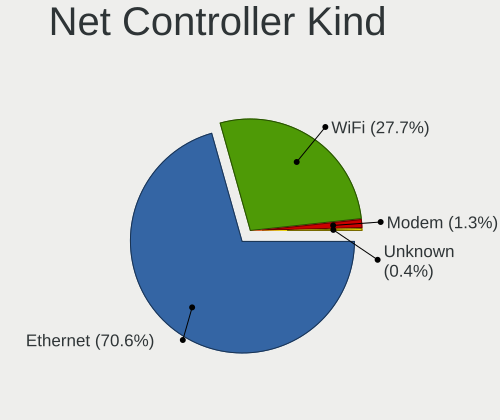

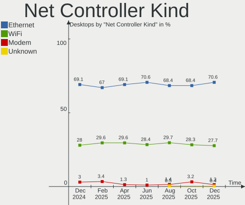

| Kind     | Desktops | Percent |
|----------|----------|---------|
| Ethernet | 166      | 70.64%  |
| WiFi     | 65       | 27.66%  |
| Modem    | 3        | 1.28%   |
| Unknown  | 1        | 0.43%   |

Used Controller
---------------

Currently used network controller

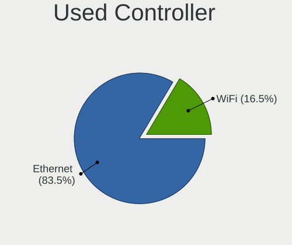

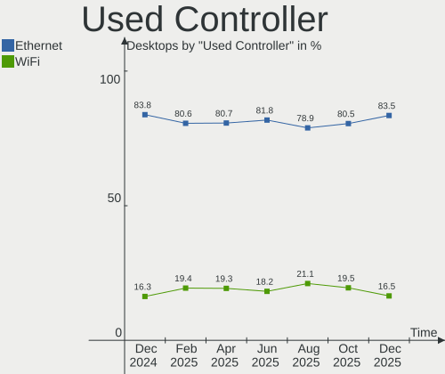

| Kind     | Desktops | Percent |
|----------|----------|---------|
| Ethernet | 137      | 83.54%  |
| WiFi     | 27       | 16.46%  |

NICs
----

Total network controllers on board

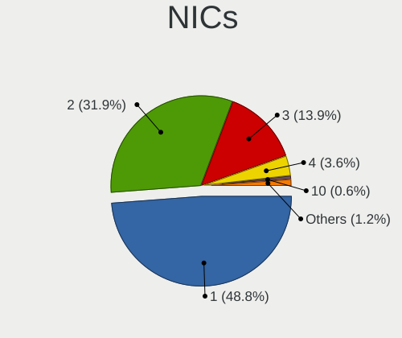

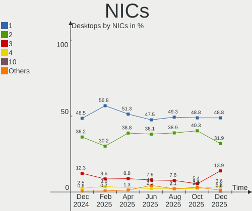

| Total | Desktops | Percent |
|-------|----------|---------|
| 1     | 81       | 48.8%   |
| 2     | 53       | 31.93%  |
| 3     | 23       | 13.86%  |
| 4     | 6        | 3.61%   |
| 10    | 1        | 0.6%    |
| 9     | 1        | 0.6%    |
| 0     | 1        | 0.6%    |

IPv6
----

IPv6 vs IPv4

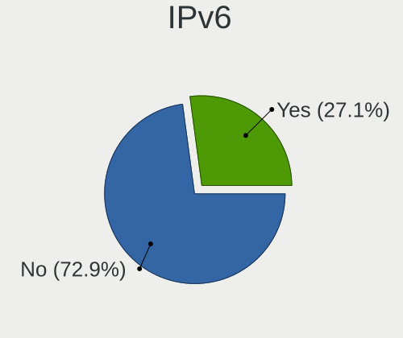

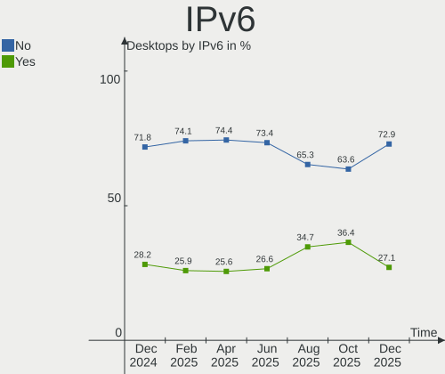

| Used | Desktops | Percent |
|------|----------|---------|
| No   | 121      | 72.89%  |
| Yes  | 45       | 27.11%  |

Bluetooth
---------

Bluetooth Vendor
----------------

Controller vendors

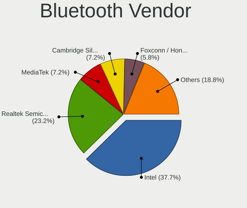

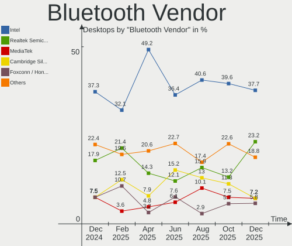

| Vendor                          | Desktops | Percent |
|---------------------------------|----------|---------|
| Intel                           | 26       | 37.68%  |
| Realtek Semiconductor           | 16       | 23.19%  |
| MediaTek                        | 5        | 7.25%   |
| Cambridge Silicon Radio         | 5        | 7.25%   |
| Foxconn / Hon Hai               | 4        | 5.8%    |
| ASUSTek Computer                | 3        | 4.35%   |
| IMC Networks                    | 2        | 2.9%    |
| Apple                           | 2        | 2.9%    |
| TP-Link                         | 1        | 1.45%   |
| Quectel Wireless Solutions      | 1        | 1.45%   |
| Qualcomm Atheros Communications | 1        | 1.45%   |
| Integrated System Solution      | 1        | 1.45%   |
| Edimax Technology               | 1        | 1.45%   |
| Unknown                         | 1        | 1.45%   |

Bluetooth Model
---------------

Controller models

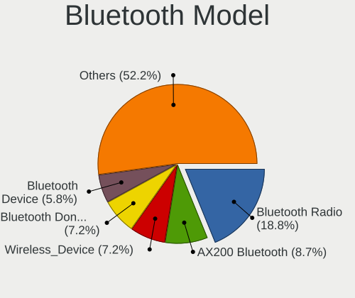

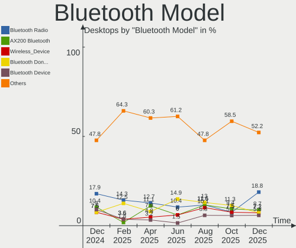

| Model                                                        | Desktops | Percent |
|--------------------------------------------------------------|----------|---------|
| Realtek Bluetooth Radio                                      | 13       | 18.84%  |
| Intel AX200 Bluetooth                                        | 6        | 8.7%    |
| MediaTek Wireless_Device                                     | 5        | 7.25%   |
| Cambridge Silicon Radio Bluetooth Dongle (HCI mode)          | 5        | 7.25%   |
| Intel Bluetooth Device                                       | 4        | 5.8%    |
| Intel AX210 Bluetooth                                        | 4        | 5.8%    |
| Intel Wireless-AC 3168 Bluetooth                             | 3        | 4.35%   |
| Intel Bluetooth wireless interface                           | 3        | 4.35%   |
| Intel AX201 Bluetooth                                        | 3        | 4.35%   |
| Realtek Bluetooth 5.4 Radio                                  | 2        | 2.9%    |
| Intel Bluetooth 9460/9560 Jefferson Peak (JfP)               | 2        | 2.9%    |
| IMC Networks Wireless_Device                                 | 2        | 2.9%    |
| Foxconn / Hon Hai Wireless_Device                            | 2        | 2.9%    |
| Foxconn / Hon Hai Bluetooth Device                           | 2        | 2.9%    |
| ASUS ASUS USB-BT500                                          | 2        | 2.9%    |
| TP-Link TP-T@- UB500 Adapter                                 | 1        | 1.45%   |
| Realtek Bluetooth 5.3 Radio                                  | 1        | 1.45%   |
| Quectel Wireless Solutions Quectel Wireless Bluetooth Device | 1        | 1.45%   |
| Qualcomm Atheros AR3011 Bluetooth                            | 1        | 1.45%   |
| Intel Centrino Bluetooth Wireless Transceiver                | 1        | 1.45%   |
| Integrated System Solution Bluetooth Device                  | 1        | 1.45%   |
| Edimax Bluetooth Device                                      | 1        | 1.45%   |
| ASUS BCM20702A0                                              | 1        | 1.45%   |
| Apple Built-in Bluetooth 2.0+EDR HCI                         | 1        | 1.45%   |
| Apple Bluetooth Host Controller                              | 1        | 1.45%   |
| Unknown                                                      | 1        | 1.45%   |

Sound
-----

Sound Vendor
------------

Sound card vendors

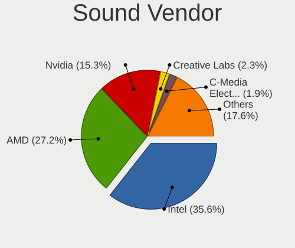

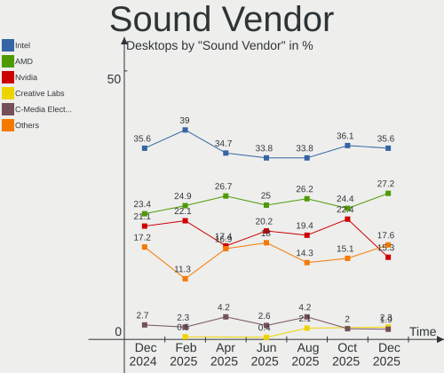

| Vendor                                       | Desktops | Percent |
|----------------------------------------------|----------|---------|
| Intel                                        | 93       | 35.63%  |
| AMD                                          | 71       | 27.2%   |
| Nvidia                                       | 40       | 15.33%  |
| Creative Labs                                | 6        | 2.3%    |
| C-Media Electronics                          | 5        | 1.92%   |
| Zhaoxin                                      | 4        | 1.53%   |
| SteelSeries ApS                              | 3        | 1.15%   |
| BEHRINGER International                      | 3        | 1.15%   |
| Texas Instruments                            | 2        | 0.77%   |
| JMTek                                        | 2        | 0.77%   |
| Dell                                         | 2        | 0.77%   |
| Creative Technology                          | 2        | 0.77%   |
| Zoran Co. Personal Media Division (Nogatech) | 1        | 0.38%   |
| ULi Electronics                              | 1        | 0.38%   |
| Trust                                        | 1        | 0.38%   |
| Thesycon Systemsoftware & Consulting         | 1        | 0.38%   |
| TEAC                                         | 1        | 0.38%   |
| Sony                                         | 1        | 0.38%   |
| Solum Voice S Onyx White                     | 1        | 0.38%   |
| Roland                                       | 1        | 0.38%   |
| RODE Microphones                             | 1        | 0.38%   |
| Razer USA                                    | 1        | 0.38%   |
| PreSonus Audio Electronics                   | 1        | 0.38%   |
| Plantronics                                  | 1        | 0.38%   |
| Micro Star International                     | 1        | 0.38%   |
| M-Audio                                      | 1        | 0.38%   |
| Loongson Technology                          | 1        | 0.38%   |
| Logitech                                     | 1        | 0.38%   |
| Logic3                                       | 1        | 0.38%   |
| KORG                                         | 1        | 0.38%   |
| Hewlett-Packard                              | 1        | 0.38%   |
| GYROCOM C&C                                  | 1        | 0.38%   |
| Generalplus Technology                       | 1        | 0.38%   |
| Focusrite-Novation                           | 1        | 0.38%   |
| FiiO Electronics Technology                  | 1        | 0.38%   |
| DSEA A/S                                     | 1        | 0.38%   |
| ASUSTek Computer                             | 1        | 0.38%   |
| Astro Gaming                                 | 1        | 0.38%   |
| ASRock                                       | 1        | 0.38%   |
| Antlion Audio                                | 1        | 0.38%   |

Sound Model
-----------

Sound card models

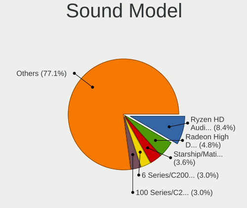

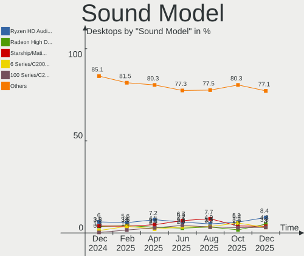

| Model                                                                                     | Desktops | Percent |
|-------------------------------------------------------------------------------------------|----------|---------|
| AMD Ryzen HD Audio Controller                                                             | 28       | 8.43%   |
| AMD Radeon High Definition Audio Controller                                               | 16       | 4.82%   |
| AMD Starship/Matisse HD Audio Controller                                                  | 12       | 3.61%   |
| Intel 6 Series/C200 Series Chipset Family High Definition Audio Controller                | 10       | 3.01%   |
| Intel 100 Series/C230 Series Chipset Family HD Audio Controller                           | 10       | 3.01%   |
| AMD SBx00 Azalia (Intel HDA)                                                              | 9        | 2.71%   |
| AMD Navi 21/23 HDMI/DP Audio Controller                                                   | 9        | 2.71%   |
| Intel Cannon Lake PCH cAVS                                                                | 8        | 2.41%   |
| AMD Renoir/Cezanne HDMI/DP Audio Controller                                               | 8        | 2.41%   |
| Intel Xeon E3-1200 v3/4th Gen Core Processor HD Audio Controller                          | 7        | 2.11%   |
| AMD Navi 31 HDMI/DP Audio                                                                 | 7        | 2.11%   |
| Intel Alder Lake-S HD Audio Controller                                                    | 6        | 1.81%   |
| Intel 8 Series/C220 Series Chipset High Definition Audio Controller                       | 6        | 1.81%   |
| Intel 7 Series/C216 Chipset Family High Definition Audio Controller                       | 6        | 1.81%   |
| Intel 200 Series PCH HD Audio                                                             | 6        | 1.81%   |
| Nvidia GP107GL High Definition Audio Controller                                           | 5        | 1.51%   |
| Zhaoxin ZX-E High Definition Audio Controller                                             | 4        | 1.2%    |
| Zhaoxin ZX-100/KX-5000/KX-6000/KX-6000G/KH-40000/KX-7000 High Definition Audio Controller | 4        | 1.2%    |
| Nvidia GK208 HDMI/DP Audio Controller                                                     | 4        | 1.2%    |
| Nvidia AD103 High Definition Audio Controller                                             | 4        | 1.2%    |
| Intel Raptor Lake High Definition Audio Controller                                        | 4        | 1.2%    |
| Intel Comet Lake PCH cAVS                                                                 | 4        | 1.2%    |
| Intel Alder Lake-N PCH High Definition Audio Controller                                   | 4        | 1.2%    |
| Intel 9 Series Chipset Family HD Audio Controller                                         | 4        | 1.2%    |
| Intel 82801JI (ICH10 Family) HD Audio Controller                                          | 4        | 1.2%    |
| AMD Navi 48 HDMI/DP Audio Controller                                                      | 4        | 1.2%    |
| AMD FCH Azalia Controller                                                                 | 4        | 1.2%    |
| AMD Ellesmere HDMI Audio [Radeon RX 470/480 / 570/580/590]                                | 4        | 1.2%    |
| C-Media Electronics Audio Adapter (Unitek Y-247A)                                         | 3        | 0.9%    |
| BEHRINGER International UMC202HD 192k                                                     | 3        | 0.9%    |
| AMD Oland/Hainan/Cape Verde/Pitcairn HDMI Audio [Radeon HD 7000 Series]                   | 3        | 0.9%    |
| AMD Kabini HDMI/DP Audio                                                                  | 3        | 0.9%    |
| AMD Family 17h (Models 00h-0fh) HD Audio Controller                                       | 3        | 0.9%    |
| Nvidia TU116 High Definition Audio Controller                                             | 2        | 0.6%    |
| Nvidia High Definition Audio Controller                                                   | 2        | 0.6%    |
| Nvidia GP106 High Definition Audio Controller                                             | 2        | 0.6%    |
| Nvidia GP104 High Definition Audio Controller                                             | 2        | 0.6%    |
| Nvidia GK104 HDMI Audio Controller                                                        | 2        | 0.6%    |
| Nvidia GA107 High Definition Audio Controller                                             | 2        | 0.6%    |
| Nvidia GA106 High Definition Audio Controller                                             | 2        | 0.6%    |

Memory
------

Memory Vendor
-------------

Memory module vendors

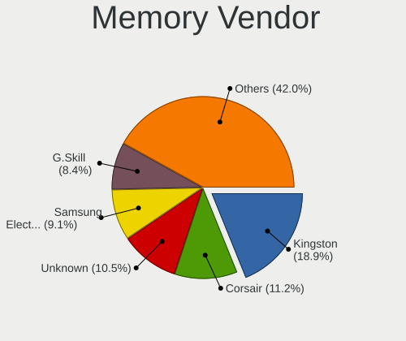

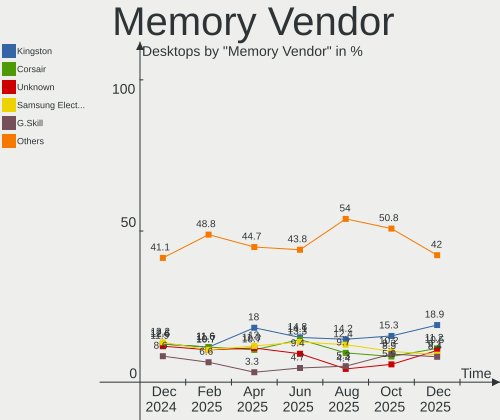

| Vendor                               | Desktops | Percent |
|--------------------------------------|----------|---------|
| Kingston                             | 27       | 18.88%  |
| Corsair                              | 16       | 11.19%  |
| Unknown                              | 15       | 10.49%  |
| Samsung Electronics                  | 13       | 9.09%   |
| G.Skill                              | 12       | 8.39%   |
| SK hynix                             | 10       | 6.99%   |
| Micron Technology                    | 9        | 6.29%   |
| Crucial                              | 8        | 5.59%   |
| A-DATA Technology                    | 5        | 3.5%    |
| Unknown                              | 4        | 2.8%    |
| Patriot                              | 3        | 2.1%    |
| Nanya Technology                     | 2        | 1.4%    |
| GeIL                                 | 2        | 1.4%    |
| Zentel                               | 1        | 0.7%    |
| V-Color                              | 1        | 0.7%    |
| Unknown (ABCD)                       | 1        | 0.7%    |
| Unknown (0x7FFF)                     | 1        | 0.7%    |
| Timetec                              | 1        | 0.7%    |
| TeamGroup                            | 1        | 0.7%    |
| TakeMS                               | 1        | 0.7%    |
| Shenzhen Techwinsemi Technology Twsc | 1        | 0.7%    |
| Ramaxel Technology                   | 1        | 0.7%    |
| QEMU                                 | 1        | 0.7%    |
| PNY                                  | 1        | 0.7%    |
| King Tiger                           | 1        | 0.7%    |
| GOODRAM                              | 1        | 0.7%    |
| CSX                                  | 1        | 0.7%    |
| Avant                                | 1        | 0.7%    |
| Atermiter                            | 1        | 0.7%    |
| ASint Technology                     | 1        | 0.7%    |

Memory Model
------------

Memory module models

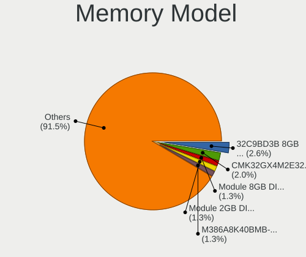

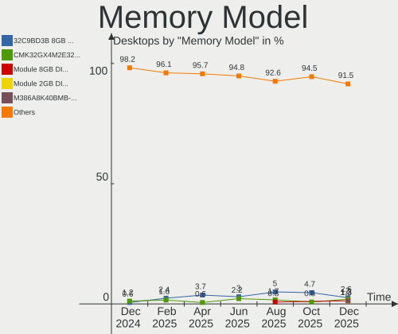

| Model                                                             | Desktops | Percent |
|-------------------------------------------------------------------|----------|---------|
| Unknown                                                           | 4        | 2.61%   |
| Corsair RAM CMK32GX4M2E3200C16 16GB DIMM DDR4 3600MT/s            | 3        | 1.96%   |
| Unknown RAM Module 8GB DIMM 1333MT/s                              | 2        | 1.31%   |
| Unknown RAM Module 2GB DIMM DDR2 800MT/s                          | 2        | 1.31%   |
| Samsung RAM M386A8K40BMB-CRC 64GB DIMM DDR4 2400MT/s              | 2        | 1.31%   |
| Samsung RAM M378B5773DH0-CH9 2GB DIMM DDR3 1333MT/s               | 2        | 1.31%   |
| Micron RAM Module 16GB DIMM DDR4 3200MT/s                         | 2        | 1.31%   |
| G.Skill RAM F5-6000J3636F16G 16GB DIMM DDR5 6400MT/s              | 2        | 1.31%   |
| G.Skill RAM F4-3200C16-16GVK 16GB DIMM DDR4 3600MT/s              | 2        | 1.31%   |
| Corsair RAM CMK32GX4M2D3600C16 16GB DIMM DDR4 3600MT/s            | 2        | 1.31%   |
| Zentel RAM Z6FAGH3SBCA-MC 16GB DIMM DDR4 3200MT/s                 | 1        | 0.65%   |
| V-Color RAM TE564G64D852K 64GB DIMM DDR5 6400MT/s                 | 1        | 0.65%   |
| Unknown RAM Module 8GB DIMM DDR3 1866MT/s                         | 1        | 0.65%   |
| Unknown RAM Module 8GB DIMM DDR3 1600MT/s                         | 1        | 0.65%   |
| Unknown RAM Module 4GB DIMM 1333MT/s                              | 1        | 0.65%   |
| Unknown RAM Module 2GB SODIMM DDR3 800MT/s                        | 1        | 0.65%   |
| Unknown RAM Module 2GB DIMM DDR2 333MT/s                          | 1        | 0.65%   |
| Unknown RAM Module 2GB DIMM 400MT/s                               | 1        | 0.65%   |
| Unknown RAM Module 2GB DIMM 1066MT/s                              | 1        | 0.65%   |
| Unknown RAM Module 2048MB DIMM SDRAM                              | 1        | 0.65%   |
| Unknown RAM Module 1GB DIMM DDR2 333MT/s                          | 1        | 0.65%   |
| Unknown RAM Module 16MB DIMM 667MT/s                              | 1        | 0.65%   |
| Unknown RAM Module 16GB DIMM DDR4 2133MT/s                        | 1        | 0.65%   |
| Unknown RAM 6 6 6 8GB DIMM DDR4 2667MT/s                          | 1        | 0.65%   |
| Unknown RAM 1866 CL10 Series 8192MB DIMM DDR3 933MT/s             | 1        | 0.65%   |
| Unknown (ABCD) RAM 123456789012345678 2GB DIMM LPDDR4 2133MT/s    | 1        | 0.65%   |
| Unknown (0x7FFF) RAM GRAVITON 8G4-USDM01 8GB SODIMM DDR4 3200MT/s | 1        | 0.65%   |
| Timetec RAM U16G-2666 16GB DIMM DDR4 2667MT/s                     | 1        | 0.65%   |
| TeamGroup RAM UD5-6400 16GB DIMM DDR5 6400MT/s                    | 1        | 0.65%   |
| TakeMS RAM TMS2GB364E082139CM 2GB DIMM DDR3 1333MT/s              | 1        | 0.65%   |
| SK hynix RAM HMT451U6AFR8C-PB 4GB DIMM DDR3 1600MT/s              | 1        | 0.65%   |
| SK hynix RAM HMT451S6BFR8A-PB 4GB SODIMM DDR3 1600MT/s            | 1        | 0.65%   |
| SK hynix RAM HMT41GU7MFR8C 8GB DIMM DDR3 1600MT/s                 | 1        | 0.65%   |
| SK hynix RAM HMT41GU7AFR8A 8GB DIMM DDR3 1600MT/s                 | 1        | 0.65%   |
| SK hynix RAM HMT41GS6BFR8A-PB 8GB SODIMM DDR3 2667MT/s            | 1        | 0.65%   |
| SK hynix RAM HMT351U7CFR8A-PB 4GB DIMM 667MT/s                    | 1        | 0.65%   |
| SK hynix RAM HMT325U6CFR8C-PB 2GB DIMM DDR3 1600MT/s              | 1        | 0.65%   |
| SK hynix RAM HMCG88AGBRA190N 32GB DIMM DDR5 5600MT/s              | 1        | 0.65%   |
| SK hynix RAM HMA81GU6CJR8N-XN 8GB DIMM DDR4 3200MT/s              | 1        | 0.65%   |
| SK hynix RAM HMA81GU6AFR8N-UH 8GB DIMM DDR4 2400MT/s              | 1        | 0.65%   |

Memory Kind
-----------

Memory module kinds

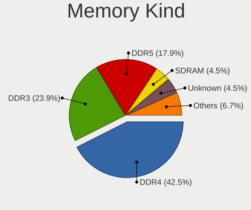

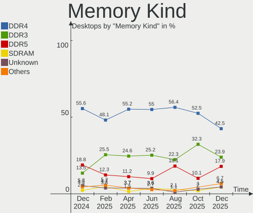

| Kind    | Desktops | Percent |
|---------|----------|---------|
| DDR4    | 57       | 42.54%  |
| DDR3    | 32       | 23.88%  |
| DDR5    | 24       | 17.91%  |
| SDRAM   | 6        | 4.48%   |
| Unknown | 6        | 4.48%   |
| DDR2    | 4        | 2.99%   |
| LPDDR5  | 2        | 1.49%   |
| RAM     | 1        | 0.75%   |
| LPDDR4  | 1        | 0.75%   |
| DDR     | 1        | 0.75%   |

Memory Form Factor
------------------

Physical design of the memory module

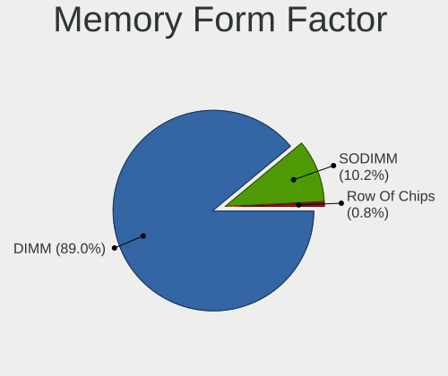

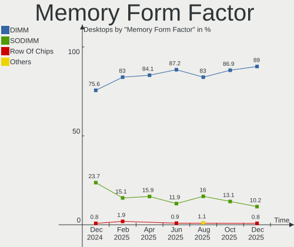

| Name         | Desktops | Percent |
|--------------|----------|---------|
| DIMM         | 113      | 88.98%  |
| SODIMM       | 13       | 10.24%  |
| Row Of Chips | 1        | 0.79%   |

Memory Size
-----------

Memory module size

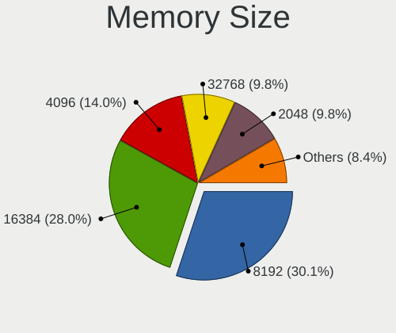

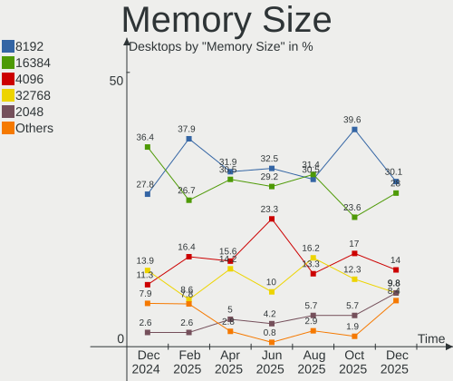

| Size  | Desktops | Percent |
|-------|----------|---------|
| 8192  | 43       | 30.07%  |
| 16384 | 40       | 27.97%  |
| 4096  | 20       | 13.99%  |
| 32768 | 14       | 9.79%   |
| 2048  | 14       | 9.79%   |
| 65536 | 4        | 2.8%    |
| 1024  | 4        | 2.8%    |
| 49152 | 1        | 0.7%    |
| 24576 | 1        | 0.7%    |
| 512   | 1        | 0.7%    |
| 16    | 1        | 0.7%    |

Memory Speed
------------

Memory module speed

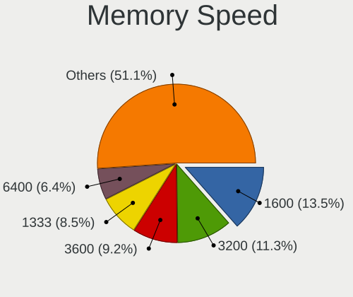

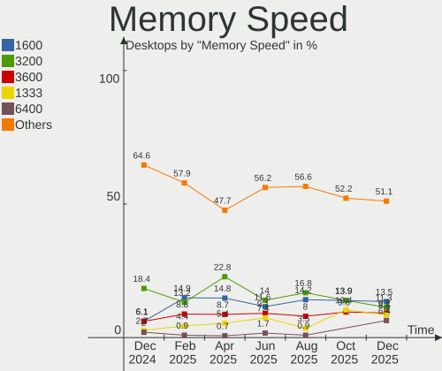

| Speed   | Desktops | Percent |
|---------|----------|---------|
| 1600    | 19       | 13.48%  |
| 3200    | 16       | 11.35%  |
| 3600    | 13       | 9.22%   |
| 1333    | 12       | 8.51%   |
| 6400    | 9        | 6.38%   |
| 2667    | 8        | 5.67%   |
| 2400    | 7        | 4.96%   |
| 5600    | 6        | 4.26%   |
| 2133    | 6        | 4.26%   |
| 6000    | 5        | 3.55%   |
| 2666    | 5        | 3.55%   |
| 5200    | 3        | 2.13%   |
| 1866    | 3        | 2.13%   |
| 800     | 3        | 2.13%   |
| 667     | 3        | 2.13%   |
| 4800    | 2        | 1.42%   |
| 3000    | 2        | 1.42%   |
| 1867    | 2        | 1.42%   |
| Unknown | 2        | 1.42%   |
| 7200    | 1        | 0.71%   |
| 4000    | 1        | 0.71%   |
| 3933    | 1        | 0.71%   |
| 3866    | 1        | 0.71%   |
| 3733    | 1        | 0.71%   |
| 3666    | 1        | 0.71%   |
| 3500    | 1        | 0.71%   |
| 3400    | 1        | 0.71%   |
| 2933    | 1        | 0.71%   |
| 1800    | 1        | 0.71%   |
| 1331    | 1        | 0.71%   |
| 1066    | 1        | 0.71%   |
| 400     | 1        | 0.71%   |
| 333     | 1        | 0.71%   |
| 266     | 1        | 0.71%   |

Printers & scanners
-------------------

Printer Vendor
--------------

Printer device vendors

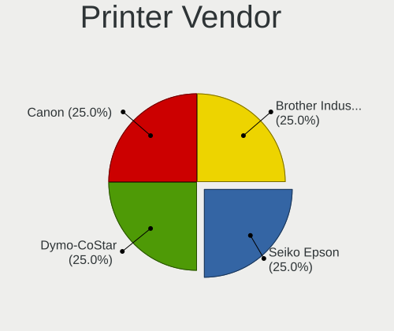

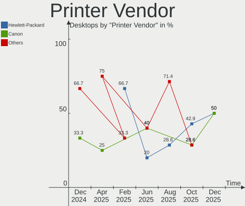

| Vendor          | Desktops | Percent |
|-----------------|----------|---------|
| Hewlett-Packard | 2        | 50%     |
| Canon           | 2        | 50%     |

Printer Model
-------------

Printer device models

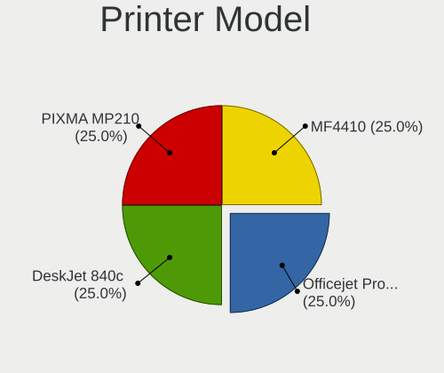

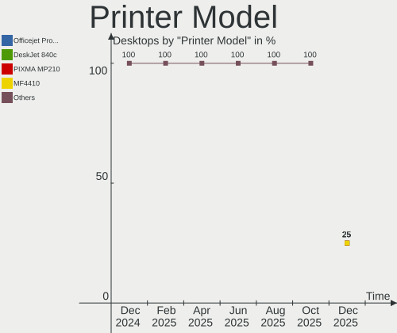

| Model                                  | Desktops | Percent |
|----------------------------------------|----------|---------|
| HP Officejet Pro 8000 Enterprise A811a | 1        | 25%     |
| HP DeskJet 840c                        | 1        | 25%     |
| Canon PIXMA MP210                      | 1        | 25%     |
| Canon MF4410                           | 1        | 25%     |

Scanner Vendor
--------------

Scanner device vendors

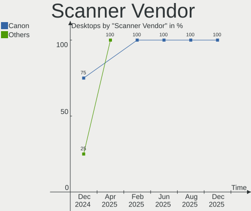

| Vendor | Desktops | Percent |
|--------|----------|---------|
| Canon  | 1        | 100%    |

Scanner Model
-------------

Scanner device models

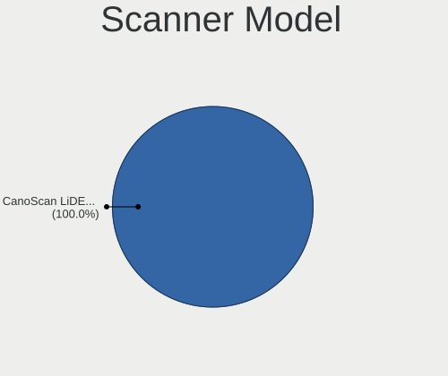

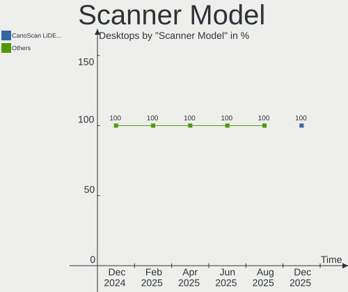

| Model                    | Desktops | Percent |
|--------------------------|----------|---------|
| Canon CanoScan LiDE 700F | 1        | 100%    |

Camera
------

Camera Vendor
-------------

Camera device vendors

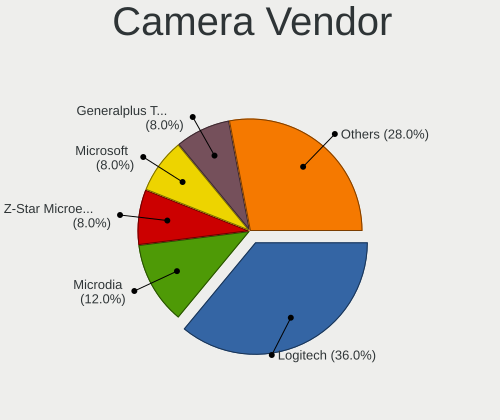

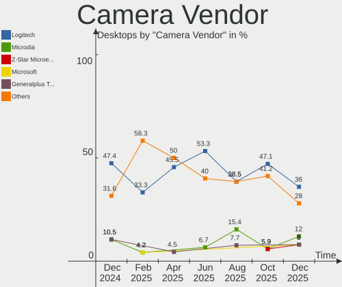

| Vendor                      | Desktops | Percent |
|-----------------------------|----------|---------|
| Logitech                    | 9        | 36%     |
| Microdia                    | 3        | 12%     |
| Z-Star Microelectronics     | 2        | 8%      |
| Microsoft                   | 2        | 8%      |
| Generalplus Technology      | 2        | 8%      |
| Trust                       | 1        | 4%      |
| Realtek Semiconductor       | 1        | 4%      |
| KYE Systems (Mouse Systems) | 1        | 4%      |
| IMC Networks                | 1        | 4%      |
| AVerMedia Technologies      | 1        | 4%      |
| ARC International           | 1        | 4%      |
| Anker Innovations Limited   | 1        | 4%      |

Camera Model
------------

Camera device models

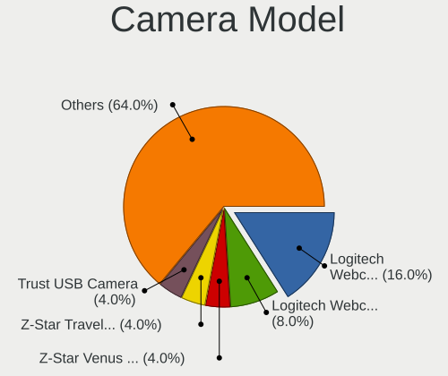

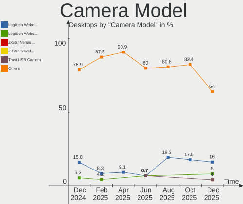

| Model                                           | Desktops | Percent |
|-------------------------------------------------|----------|---------|
| Logitech Webcam C270                            | 4        | 16%     |
| Logitech Webcam C310                            | 2        | 8%      |
| Z-Star Venus USB2.0 Camera                      | 1        | 4%      |
| Z-Star Traveler TV 6500 SF Dia-scanner          | 1        | 4%      |
| Trust USB Camera                                | 1        | 4%      |
| Realtek FULL HD 1080P Webcam                    | 1        | 4%      |
| Microsoft LifeCam HD-5000                       | 1        | 4%      |
| Microsoft LifeCam HD-3000                       | 1        | 4%      |
| Microdia Webcam Vitade AF                       | 1        | 4%      |
| Microdia USB 2.0 Camera                         | 1        | 4%      |
| Microdia CyberTrack H7                          | 1        | 4%      |
| Logitech Webcam C200                            | 1        | 4%      |
| Logitech QuickCam Vision Pro                    | 1        | 4%      |
| Logitech HD Webcam C525                         | 1        | 4%      |
| KYE Systems (Mouse Systems) Genius Look 1320 V2 | 1        | 4%      |
| IMC Networks XHC Camera                         | 1        | 4%      |
| Generalplus WEB CAM                             | 1        | 4%      |
| Generalplus GENERAL WEBCAM                      | 1        | 4%      |
| AVerMedia USB Device                            | 1        | 4%      |
| ARC International Camera                        | 1        | 4%      |
| Anker Innovations Limited AnkerWork C310 Webcam | 1        | 4%      |

Security
--------

Fingerprint Vendor
------------------

Fingerprint sensor vendors

Zero info for selected period =(

Fingerprint Model
-----------------

Fingerprint sensor models

Zero info for selected period =(

Chipcard Vendor
---------------

Chipcard module vendors

Zero info for selected period =(

Chipcard Model
--------------

Chipcard module models

Zero info for selected period =(

Unsupported
-----------

Unsupported Devices
-------------------

Total unsupported devices on board

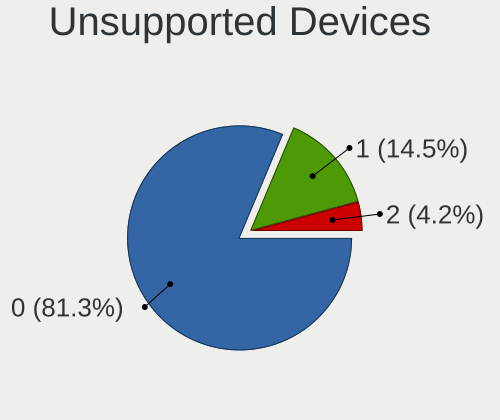

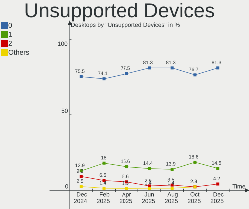

| Total | Desktops | Percent |
|-------|----------|---------|
| 0     | 135      | 81.33%  |
| 1     | 24       | 14.46%  |
| 2     | 7        | 4.22%   |

Unsupported Device Types
------------------------

Types of unsupported devices

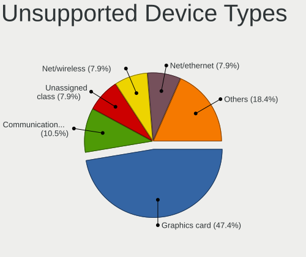

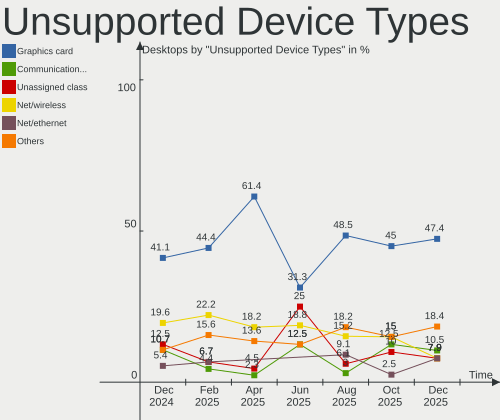

| Type                     | Desktops | Percent |
|--------------------------|----------|---------|
| Graphics card            | 18       | 47.37%  |
| Communication controller | 4        | 10.53%  |
| Unassigned class         | 3        | 7.89%   |
| Net/wireless             | 3        | 7.89%   |
| Net/ethernet             | 3        | 7.89%   |
| Bluetooth                | 3        | 7.89%   |
| Storage/nvme             | 1        | 2.63%   |
| Sound                    | 1        | 2.63%   |
| Network                  | 1        | 2.63%   |
| Multimedia controller    | 1        | 2.63%   |

