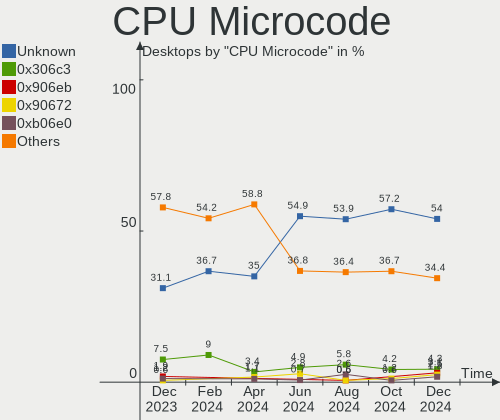
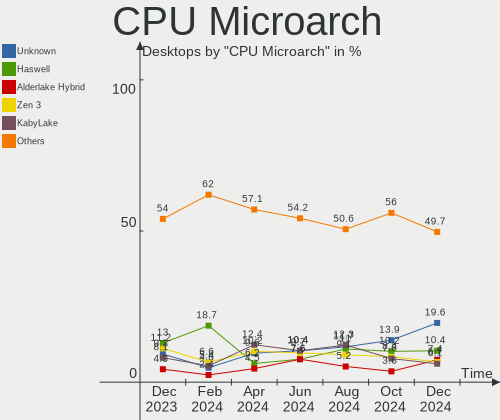

Debian - Hardware Trends (Desktops)
-----------------------------------

A project to identify most popular hardware characteristics and track their change
over time based on data collected by Linux users at https://Linux-Hardware.org.

Anyone can contribute to this report by the [hw-probe](https://github.com/linuxhw/hw-probe) tool:

    sudo -E hw-probe -all -upload

This report is for one last month. Overall report since the beginning of time: [TestCoverage](https://github.com/linuxhw/TestCoverage)

Period: Oct, 2022.

Contents
--------

* [ System ](#system)
  - [ OS                       ](#os)
  - [ OS Family                ](#os-family)
  - [ Kernel                   ](#kernel)
  - [ Kernel Family            ](#kernel-family)
  - [ Kernel Major Ver.        ](#kernel-major-ver)
  - [ Arch                     ](#arch)
  - [ DE                       ](#de)
  - [ Display Server           ](#display-server)
  - [ Display Manager          ](#display-manager)
  - [ OS Lang                  ](#os-lang)
  - [ Boot Mode                ](#boot-mode)
  - [ Filesystem               ](#filesystem)
  - [ Part. scheme             ](#part-scheme)
  - [ Dual Boot with Linux/BSD ](#dual-boot-with-linuxbsd)
  - [ Dual Boot (Win)          ](#dual-boot-win)

* [ Board ](#board)
  - [ Vendor                   ](#vendor)
  - [ Model                    ](#model)
  - [ Model Family             ](#model-family)
  - [ MFG Year                 ](#mfg-year)
  - [ Form Factor              ](#form-factor)
  - [ Secure Boot              ](#secure-boot)
  - [ Coreboot                 ](#coreboot)
  - [ RAM Size                 ](#ram-size)
  - [ RAM Used                 ](#ram-used)
  - [ Total Drives             ](#total-drives)
  - [ Has CD-ROM               ](#has-cd-rom)
  - [ Has Ethernet             ](#has-ethernet)
  - [ Has WiFi                 ](#has-wifi)
  - [ Has Bluetooth            ](#has-bluetooth)

* [ Location ](#location)
  - [ Country                  ](#country)
  - [ City                     ](#city)

* [ Drives ](#drives)
  - [ Drive Vendor             ](#drive-vendor)
  - [ Drive Model              ](#drive-model)
  - [ HDD Vendor               ](#hdd-vendor)
  - [ SSD Vendor               ](#ssd-vendor)
  - [ Drive Kind               ](#drive-kind)
  - [ Drive Connector          ](#drive-connector)
  - [ Drive Size               ](#drive-size)
  - [ Space Total              ](#space-total)
  - [ Space Used               ](#space-used)
  - [ Malfunc. Drives          ](#malfunc-drives)
  - [ Malfunc. Drive Vendor    ](#malfunc-drive-vendor)
  - [ Malfunc. HDD Vendor      ](#malfunc-hdd-vendor)
  - [ Malfunc. Drive Kind      ](#malfunc-drive-kind)
  - [ Failed Drives            ](#failed-drives)
  - [ Failed Drive Vendor      ](#failed-drive-vendor)
  - [ Drive Status             ](#drive-status)

* [ Storage controller ](#storage-controller)
  - [ Storage Vendor           ](#storage-vendor)
  - [ Storage Model            ](#storage-model)
  - [ Storage Kind             ](#storage-kind)

* [ Processor ](#processor)
  - [ CPU Vendor               ](#cpu-vendor)
  - [ CPU Model                ](#cpu-model)
  - [ CPU Model Family         ](#cpu-model-family)
  - [ CPU Cores                ](#cpu-cores)
  - [ CPU Sockets              ](#cpu-sockets)
  - [ CPU Threads              ](#cpu-threads)
  - [ CPU Op-Modes             ](#cpu-op-modes)
  - [ CPU Microcode            ](#cpu-microcode)
  - [ CPU Microarch            ](#cpu-microarch)

* [ Graphics ](#graphics)
  - [ GPU Vendor               ](#gpu-vendor)
  - [ GPU Model                ](#gpu-model)
  - [ GPU Combo                ](#gpu-combo)
  - [ GPU Driver               ](#gpu-driver)
  - [ GPU Memory               ](#gpu-memory)

* [ Monitor ](#monitor)
  - [ Monitor Vendor           ](#monitor-vendor)
  - [ Monitor Model            ](#monitor-model)
  - [ Monitor Resolution       ](#monitor-resolution)
  - [ Monitor Diagonal         ](#monitor-diagonal)
  - [ Monitor Width            ](#monitor-width)
  - [ Aspect Ratio             ](#aspect-ratio)
  - [ Monitor Area             ](#monitor-area)
  - [ Pixel Density            ](#pixel-density)
  - [ Multiple Monitors        ](#multiple-monitors)

* [ Network ](#network)
  - [ Net Controller Vendor    ](#net-controller-vendor)
  - [ Net Controller Model     ](#net-controller-model)
  - [ Wireless Vendor          ](#wireless-vendor)
  - [ Wireless Model           ](#wireless-model)
  - [ Ethernet Vendor          ](#ethernet-vendor)
  - [ Ethernet Model           ](#ethernet-model)
  - [ Net Controller Kind      ](#net-controller-kind)
  - [ Used Controller          ](#used-controller)
  - [ NICs                     ](#nics)
  - [ IPv6                     ](#ipv6)

* [ Bluetooth ](#bluetooth)
  - [ Bluetooth Vendor         ](#bluetooth-vendor)
  - [ Bluetooth Model          ](#bluetooth-model)

* [ Sound ](#sound)
  - [ Sound Vendor             ](#sound-vendor)
  - [ Sound Model              ](#sound-model)

* [ Memory ](#memory)
  - [ Memory Vendor            ](#memory-vendor)
  - [ Memory Model             ](#memory-model)
  - [ Memory Kind              ](#memory-kind)
  - [ Memory Form Factor       ](#memory-form-factor)
  - [ Memory Size              ](#memory-size)
  - [ Memory Speed             ](#memory-speed)

* [ Printers & scanners ](#printers--scanners)
  - [ Printer Vendor           ](#printer-vendor)
  - [ Printer Model            ](#printer-model)
  - [ Scanner Vendor           ](#scanner-vendor)
  - [ Scanner Model            ](#scanner-model)

* [ Camera ](#camera)
  - [ Camera Vendor            ](#camera-vendor)
  - [ Camera Model             ](#camera-model)

* [ Security ](#security)
  - [ Fingerprint Vendor       ](#fingerprint-vendor)
  - [ Fingerprint Model        ](#fingerprint-model)
  - [ Chipcard Vendor          ](#chipcard-vendor)
  - [ Chipcard Model           ](#chipcard-model)

* [ Unsupported ](#unsupported)
  - [ Unsupported Devices      ](#unsupported-devices)
  - [ Unsupported Device Types ](#unsupported-device-types)

System
------

OS
--

Installed operating systems

| Name           | Desktops | Percent |
|----------------|----------|---------|
| Debian 11      | 113      | 83.09%  |
| Debian Testing | 11       | 8.09%   |
| Debian         | 6        | 4.41%   |
| Debian 10      | 4        | 2.94%   |
| Debian 8       | 1        | 0.74%   |
| Debian 6       | 1        | 0.74%   |

OS Family
---------

OS without a version

| Name   | Desktops | Percent |
|--------|----------|---------|
| Debian | 136      | 100%    |

Kernel
------

Version of the Linux kernel

| Version                    | Desktops | Percent |
|----------------------------|----------|---------|
| 5.10.0-18-amd64            | 40       | 29.41%  |
| 5.10.0-19-amd64            | 22       | 16.18%  |
| 5.19.0-2-amd64             | 14       | 10.29%  |
| 5.10.0-7-amd64             | 12       | 8.82%   |
| 5.18.0-0.deb11.4-amd64     | 7        | 5.15%   |
| 6.0.0-2-amd64              | 4        | 2.94%   |
| 5.15.53-1-pve              | 4        | 2.94%   |
| 5.10.0-16-amd64            | 3        | 2.21%   |
| 5.19.0-1-amd64             | 2        | 1.47%   |
| 5.10.0-17-amd64            | 2        | 1.47%   |
| 6.0.3-x64v1-xanmod1        | 1        | 0.74%   |
| 6.0.1                      | 1        | 0.74%   |
| 6.0.0-amd64                | 1        | 0.74%   |
| 6.0.0-1-amd64              | 1        | 0.74%   |
| 6.0.0-0.slh.1-aptosid-686  | 1        | 0.74%   |
| 5.7.0-0.bpo.2-amd64        | 1        | 0.74%   |
| 5.5.0-0.bpo.2-amd64        | 1        | 0.74%   |
| 5.19.11                    | 1        | 0.74%   |
| 5.19.0-17.1-liquorix-amd64 | 1        | 0.74%   |
| 5.19.0-0.deb11.2-amd64     | 1        | 0.74%   |
| 5.18.16-i7                 | 1        | 0.74%   |
| 5.18.0-4mx-amd64           | 1        | 0.74%   |
| 5.17.0-rc8-amd64           | 1        | 0.74%   |
| 5.15.60-2-pve              | 1        | 0.74%   |
| 5.10.46-logicube.01        | 1        | 0.74%   |
| 5.10.0-18-armmp            | 1        | 0.74%   |
| 5.10.0-18-686-pae          | 1        | 0.74%   |
| 5.10.0-18-686              | 1        | 0.74%   |
| 5.10.0-15-amd64            | 1        | 0.74%   |
| 5.10.0-13-amd64            | 1        | 0.74%   |
| 5.10.0-12-amd64            | 1        | 0.74%   |
| 5.10.0-0.deb10.17-amd64    | 1        | 0.74%   |
| 5.10.0-0.deb10.16-amd64    | 1        | 0.74%   |
| 4.19.0-22-amd64            | 1        | 0.74%   |
| 4.1.42-rivoreo-powerpc64   | 1        | 0.74%   |
| 2.6.26-tinycore            | 1        | 0.74%   |

Kernel Family
-------------

Linux kernel without a distro release

| Version | Desktops | Percent |
|---------|----------|---------|
| 5.10.0  | 87       | 63.97%  |
| 5.19.0  | 18       | 13.24%  |
| 5.18.0  | 8        | 5.88%   |
| 6.0.0   | 7        | 5.15%   |
| 5.15.53 | 4        | 2.94%   |
| 6.0.3   | 1        | 0.74%   |
| 6.0.1   | 1        | 0.74%   |
| 5.7.0   | 1        | 0.74%   |
| 5.5.0   | 1        | 0.74%   |
| 5.19.11 | 1        | 0.74%   |
| 5.18.16 | 1        | 0.74%   |
| 5.17.0  | 1        | 0.74%   |
| 5.15.60 | 1        | 0.74%   |
| 5.10.46 | 1        | 0.74%   |
| 4.19.0  | 1        | 0.74%   |
| 4.1.42  | 1        | 0.74%   |
| 2.6.26  | 1        | 0.74%   |

Kernel Major Ver.
-----------------

Linux kernel major version

| Version | Desktops | Percent |
|---------|----------|---------|
| 5.10    | 88       | 64.71%  |
| 5.19    | 19       | 13.97%  |
| 6.0     | 9        | 6.62%   |
| 5.18    | 9        | 6.62%   |
| 5.15    | 5        | 3.68%   |
| 5.7     | 1        | 0.74%   |
| 5.5     | 1        | 0.74%   |
| 5.17    | 1        | 0.74%   |
| 4.19    | 1        | 0.74%   |
| 4.1     | 1        | 0.74%   |
| 2.6     | 1        | 0.74%   |

Arch
----

OS architecture (x86_64, i586, etc.)

| Name   | Desktops | Percent |
|--------|----------|---------|
| x86_64 | 130      | 95.59%  |
| i686   | 3        | 2.21%   |
| ppc64  | 1        | 0.74%   |
| i586   | 1        | 0.74%   |
| armv7l | 1        | 0.74%   |

DE
--

Desktop Environment

| Name             | Desktops | Percent |
|------------------|----------|---------|
| Unknown          | 36       | 26.47%  |
| GNOME            | 32       | 23.53%  |
| KDE5             | 23       | 16.91%  |
| XFCE             | 15       | 11.03%  |
| Cinnamon         | 6        | 4.41%   |
| X-Cinnamon       | 5        | 3.68%   |
| MATE             | 5        | 3.68%   |
| trinity          | 3        | 2.21%   |
| LXDE             | 3        | 2.21%   |
| LXQt             | 2        | 1.47%   |
| openbox          | 1        | 0.74%   |
| lightdm-xsession | 1        | 0.74%   |
| i3               | 1        | 0.74%   |
| GNOME Flashback  | 1        | 0.74%   |
| GNOME Classic    | 1        | 0.74%   |
| Budgie           | 1        | 0.74%   |

Display Server
--------------

X11 or Wayland

| Name    | Desktops | Percent |
|---------|----------|---------|
| X11     | 78       | 57.35%  |
| Unknown | 24       | 17.65%  |
| Wayland | 17       | 12.5%   |
| Tty     | 16       | 11.76%  |
| Web     | 1        | 0.74%   |

Display Manager
---------------

SDDM, LightDM, etc.

| Name    | Desktops | Percent |
|---------|----------|---------|
| Unknown | 52       | 38.24%  |
| LightDM | 34       | 25%     |
| SDDM    | 18       | 13.24%  |
| GDM     | 17       | 12.5%   |
| GDM3    | 11       | 8.09%   |
| XDM     | 2        | 1.47%   |
| SLiM    | 1        | 0.74%   |
| NODM    | 1        | 0.74%   |

OS Lang
-------

Language

| Lang       | Desktops | Percent |
|------------|----------|---------|
| en_US      | 40       | 29.41%  |
| ru_RU      | 18       | 13.24%  |
| de_DE      | 12       | 8.82%   |
| it_IT      | 11       | 8.09%   |
| fr_FR      | 9        | 6.62%   |
| Unknown    | 7        | 5.15%   |
| C          | 6        | 4.41%   |
| pt_BR      | 5        | 3.68%   |
| en_GB      | 5        | 3.68%   |
| es_ES      | 3        | 2.21%   |
| de_AT      | 3        | 2.21%   |
| nl_BE      | 2        | 1.47%   |
| zh_TW      | 1        | 0.74%   |
| it_CH      | 1        | 0.74%   |
| hu_HU      | 1        | 0.74%   |
| es_PE      | 1        | 0.74%   |
| es_MX      | 1        | 0.74%   |
| es_CL      | 1        | 0.74%   |
| es_BO      | 1        | 0.74%   |
| es_AR      | 1        | 0.74%   |
| en_US.UTF8 | 1        | 0.74%   |
| en_NZ      | 1        | 0.74%   |
| en_DE      | 1        | 0.74%   |
| en_CA      | 1        | 0.74%   |
| en_AU      | 1        | 0.74%   |
| de_CH      | 1        | 0.74%   |
| bg_BG      | 1        | 0.74%   |

Boot Mode
---------

EFI or BIOS

| Mode | Desktops | Percent |
|------|----------|---------|
| BIOS | 81       | 59.56%  |
| EFI  | 55       | 40.44%  |

Filesystem
----------

Type of filesystem

| Type    | Desktops | Percent |
|---------|----------|---------|
| Ext4    | 105      | 77.21%  |
| Overlay | 17       | 12.5%   |
| Btrfs   | 8        | 5.88%   |
| Xfs     | 2        | 1.47%   |
| Zfs     | 1        | 0.74%   |
| Tmpfs   | 1        | 0.74%   |
| Rootfs  | 1        | 0.74%   |
| Ext3    | 1        | 0.74%   |

Part. scheme
------------

Scheme of partitioning

| Type    | Desktops | Percent |
|---------|----------|---------|
| GPT     | 78       | 57.35%  |
| MBR     | 37       | 27.21%  |
| Unknown | 21       | 15.44%  |

Dual Boot with Linux/BSD
------------------------

Hosting more than one Linux/BSD

| Dual boot | Desktops | Percent |
|-----------|----------|---------|
| No        | 101      | 74.26%  |
| Yes       | 35       | 25.74%  |

Dual Boot (Win)
---------------

Hosting Linux and Windows

| Dual boot | Desktops | Percent |
|-----------|----------|---------|
| No        | 90       | 66.18%  |
| Yes       | 46       | 33.82%  |

Board
-----

Vendor
------

Motherboard manufacturer

| Name                 | Desktops | Percent |
|----------------------|----------|---------|
| ASUSTek Computer     | 31       | 22.79%  |
| MSI                  | 18       | 13.24%  |
| ASRock               | 17       | 12.5%   |
| Gigabyte Technology  | 16       | 11.76%  |
| Dell                 | 15       | 11.03%  |
| Hewlett-Packard      | 13       | 9.56%   |
| Unknown              | 5        | 3.68%   |
| Fujitsu              | 4        | 2.94%   |
| Lenovo               | 3        | 2.21%   |
| Pegatron             | 2        | 1.47%   |
| Inventec             | 2        | 1.47%   |
| Techvision           | 1        | 0.74%   |
| Shuttle              | 1        | 0.74%   |
| Intel                | 1        | 0.74%   |
| Huanan               | 1        | 0.74%   |
| Giga-Byte Technology | 1        | 0.74%   |
| Foxconn              | 1        | 0.74%   |
| Biostar              | 1        | 0.74%   |
| ASRockRack           | 1        | 0.74%   |
| Apple                | 1        | 0.74%   |
| Acer                 | 1        | 0.74%   |

Model
-----

Motherboard model

| Name                                       | Desktops | Percent |
|--------------------------------------------|----------|---------|
| Unknown                                    | 5        | 3.68%   |
| MSI MS-7C02                                | 3        | 2.21%   |
| MSI MS-7817                                | 3        | 2.21%   |
| ASUS All Series                            | 3        | 2.21%   |
| ASRock B450M Pro4                          | 3        | 2.21%   |
| MSI MS-7996                                | 2        | 1.47%   |
| HP Compaq 6005 Pro MT PC                   | 2        | 1.47%   |
| Gigabyte B450M DS3H                        | 2        | 1.47%   |
| Gigabyte 970A-DS3P                         | 2        | 1.47%   |
| Fujitsu ESPRIMO P720                       | 2        | 1.47%   |
| Dell Precision 3640 Tower                  | 2        | 1.47%   |
| ASUS PRIME Z690-P WIFI D4                  | 2        | 1.47%   |
| Techvision TVI7309X                        | 1        | 0.74%   |
| Shuttle DS81D                              | 1        | 0.74%   |
| Pegatron TouchSmart 7320 Lavaca-B EU L6 PC | 1        | 0.74%   |
| Pegatron KX637AA-ABZ m9390.it              | 1        | 0.74%   |
| MSI p6620ch-m                              | 1        | 0.74%   |
| MSI MS-7D53                                | 1        | 0.74%   |
| MSI MS-7D04                                | 1        | 0.74%   |
| MSI MS-7C95                                | 1        | 0.74%   |
| MSI MS-7C80                                | 1        | 0.74%   |
| MSI MS-7C56                                | 1        | 0.74%   |
| MSI MS-7B79                                | 1        | 0.74%   |
| MSI MS-7B09                                | 1        | 0.74%   |
| MSI MS-7977                                | 1        | 0.74%   |
| MSI MS-7529                                | 1        | 0.74%   |
| Lenovo ThinkStation S30 0569BE3            | 1        | 0.74%   |
| Lenovo IdeaCentre 510S-08ISH 90FN0059MB    | 1        | 0.74%   |
| Lenovo 70AQ000JGE ThinkServer TS440        | 1        | 0.74%   |
| Inventec DQ Class                          | 1        | 0.74%   |
| Inventec D CLASS                           | 1        | 0.74%   |
| Intel GEG                                  | 1        | 0.74%   |
| Huanan X99-QD4 V1.0                        | 1        | 0.74%   |
| HP Z820 Workstation                        | 1        | 0.74%   |
| HP Z620 Workstation                        | 1        | 0.74%   |
| HP Z420 Workstation                        | 1        | 0.74%   |
| HP Z230 SFF Workstation                    | 1        | 0.74%   |
| HP Slim Desktop S01-aF0xxx                 | 1        | 0.74%   |
| HP ProLiant MicroServer                    | 1        | 0.74%   |
| HP ProDesk 400 G3 MT                       | 1        | 0.74%   |

Model Family
------------

Motherboard model prefix

| Name                 | Desktops | Percent |
|----------------------|----------|---------|
| ASUS PRIME           | 9        | 6.62%   |
| Dell OptiPlex        | 8        | 5.88%   |
| HP Compaq            | 5        | 3.68%   |
| Unknown              | 5        | 3.68%   |
| MSI MS-7C02          | 3        | 2.21%   |
| MSI MS-7817          | 3        | 2.21%   |
| Dell Precision       | 3        | 2.21%   |
| ASUS ROG             | 3        | 2.21%   |
| ASUS All             | 3        | 2.21%   |
| ASRock B450M         | 3        | 2.21%   |
| MSI MS-7996          | 2        | 1.47%   |
| Gigabyte B450M       | 2        | 1.47%   |
| Gigabyte 970A-DS3P   | 2        | 1.47%   |
| Fujitsu ESPRIMO      | 2        | 1.47%   |
| Dell Vostro          | 2        | 1.47%   |
| ASUS TUF             | 2        | 1.47%   |
| ASRock Z97           | 2        | 1.47%   |
| Techvision TVI7309X  | 1        | 0.74%   |
| Shuttle DS81D        | 1        | 0.74%   |
| Pegatron TouchSmart  | 1        | 0.74%   |
| Pegatron KX637AA-ABZ | 1        | 0.74%   |
| MSI p6620ch-m        | 1        | 0.74%   |
| MSI MS-7D53          | 1        | 0.74%   |
| MSI MS-7D04          | 1        | 0.74%   |
| MSI MS-7C95          | 1        | 0.74%   |
| MSI MS-7C80          | 1        | 0.74%   |
| MSI MS-7C56          | 1        | 0.74%   |
| MSI MS-7B79          | 1        | 0.74%   |
| MSI MS-7B09          | 1        | 0.74%   |
| MSI MS-7977          | 1        | 0.74%   |
| MSI MS-7529          | 1        | 0.74%   |
| Lenovo ThinkStation  | 1        | 0.74%   |
| Lenovo IdeaCentre    | 1        | 0.74%   |
| Lenovo 70AQ000JGE    | 1        | 0.74%   |
| Inventec DQ          | 1        | 0.74%   |
| Inventec D           | 1        | 0.74%   |
| Intel GEG            | 1        | 0.74%   |
| Huanan X99-QD4       | 1        | 0.74%   |
| HP Z820              | 1        | 0.74%   |
| HP Z620              | 1        | 0.74%   |

MFG Year
--------

Motherboard manufacture year

| Year    | Desktops | Percent |
|---------|----------|---------|
| 2012    | 17       | 12.5%   |
| 2018    | 13       | 9.56%   |
| 2013    | 13       | 9.56%   |
| 2020    | 12       | 8.82%   |
| 2021    | 9        | 6.62%   |
| 2010    | 9        | 6.62%   |
| 2009    | 9        | 6.62%   |
| 2019    | 8        | 5.88%   |
| 2014    | 8        | 5.88%   |
| 2016    | 7        | 5.15%   |
| 2015    | 7        | 5.15%   |
| 2022    | 4        | 2.94%   |
| 2017    | 4        | 2.94%   |
| 2008    | 4        | 2.94%   |
| 2006    | 4        | 2.94%   |
| 2011    | 3        | 2.21%   |
| Unknown | 3        | 2.21%   |
| 2005    | 1        | 0.74%   |
| 2000    | 1        | 0.74%   |

Form Factor
-----------

Physical design of the computer

| Name    | Desktops | Percent |
|---------|----------|---------|
| Desktop | 136      | 100%    |

Secure Boot
-----------

Enabled or disabled

| State    | Desktops | Percent |
|----------|----------|---------|
| Disabled | 134      | 98.53%  |
| Enabled  | 2        | 1.47%   |

Coreboot
--------

Have coreboot on board

| Used | Desktops | Percent |
|------|----------|---------|
| No   | 136      | 100%    |

RAM Size
--------

Total RAM memory

| Size in GB  | Desktops | Percent |
|-------------|----------|---------|
| 16.01-24.0  | 26       | 19.12%  |
| 4.01-8.0    | 22       | 16.18%  |
| 32.01-64.0  | 22       | 16.18%  |
| 3.01-4.0    | 22       | 16.18%  |
| 8.01-16.0   | 18       | 13.24%  |
| 64.01-256.0 | 11       | 8.09%   |
| 24.01-32.0  | 5        | 3.68%   |
| 1.01-2.0    | 4        | 2.94%   |
| 2.01-3.0    | 2        | 1.47%   |
| 0.01-0.5    | 2        | 1.47%   |
| 0           | 1        | 0.74%   |
| Unknown     | 1        | 0.74%   |

RAM Used
--------

Used RAM memory

| Used GB    | Desktops | Percent |
|------------|----------|---------|
| 4.01-8.0   | 30       | 22.06%  |
| 1.01-2.0   | 27       | 19.85%  |
| 2.01-3.0   | 25       | 18.38%  |
| 0.51-1.0   | 22       | 16.18%  |
| 3.01-4.0   | 16       | 11.76%  |
| 0.01-0.5   | 7        | 5.15%   |
| 16.01-24.0 | 4        | 2.94%   |
| 8.01-16.0  | 3        | 2.21%   |
| Unknown    | 2        | 1.47%   |

Total Drives
------------

Number of drives on board

| Drives | Desktops | Percent |
|--------|----------|---------|
| 1      | 59       | 43.38%  |
| 2      | 26       | 19.12%  |
| 3      | 19       | 13.97%  |
| 4      | 12       | 8.82%   |
| 5      | 8        | 5.88%   |
| 6      | 5        | 3.68%   |
| 7      | 3        | 2.21%   |
| 8      | 2        | 1.47%   |
| 9      | 1        | 0.74%   |
| 0      | 1        | 0.74%   |

Has CD-ROM
----------

Has CD-ROM on board

| Presented | Desktops | Percent |
|-----------|----------|---------|
| No        | 76       | 55.88%  |
| Yes       | 60       | 44.12%  |

Has Ethernet
------------

Has Ethernet on board

| Presented | Desktops | Percent |
|-----------|----------|---------|
| Yes       | 133      | 97.79%  |
| No        | 3        | 2.21%   |

Has WiFi
--------

Has WiFi module

| Presented | Desktops | Percent |
|-----------|----------|---------|
| No        | 88       | 64.71%  |
| Yes       | 48       | 35.29%  |

Has Bluetooth
-------------

Has Bluetooth module

| Presented | Desktops | Percent |
|-----------|----------|---------|
| No        | 102      | 75%     |
| Yes       | 34       | 25%     |

Location
--------

Country
-------

Geographic location (country)

| Country      | Desktops | Percent |
|--------------|----------|---------|
| Russia       | 21       | 15.44%  |
| USA          | 20       | 14.71%  |
| Germany      | 16       | 11.76%  |
| Italy        | 15       | 11.03%  |
| France       | 12       | 8.82%   |
| Brazil       | 5        | 3.68%   |
| Belgium      | 4        | 2.94%   |
| Switzerland  | 3        | 2.21%   |
| Spain        | 3        | 2.21%   |
| Netherlands  | 3        | 2.21%   |
| Mexico       | 3        | 2.21%   |
| China        | 3        | 2.21%   |
| Austria      | 3        | 2.21%   |
| Australia    | 3        | 2.21%   |
| Hungary      | 2        | 1.47%   |
| Argentina    | 2        | 1.47%   |
| Vietnam      | 1        | 0.74%   |
| UK           | 1        | 0.74%   |
| Taiwan       | 1        | 0.74%   |
| Slovakia     | 1        | 0.74%   |
| Saudi Arabia | 1        | 0.74%   |
| Romania      | 1        | 0.74%   |
| Poland       | 1        | 0.74%   |
| Peru         | 1        | 0.74%   |
| New Zealand  | 1        | 0.74%   |
| Jordan       | 1        | 0.74%   |
| Japan        | 1        | 0.74%   |
| Israel       | 1        | 0.74%   |
| Estonia      | 1        | 0.74%   |
| Denmark      | 1        | 0.74%   |
| Chile        | 1        | 0.74%   |
| Canada       | 1        | 0.74%   |
| Bulgaria     | 1        | 0.74%   |
| Bolivia      | 1        | 0.74%   |

City
----

Geographic location (city)

| City                   | Desktops | Percent |
|------------------------|----------|---------|
| Voronezh               | 12       | 8.82%   |
| Moscow                 | 3        | 2.21%   |
| Turin                  | 2        | 1.47%   |
| Miami                  | 2        | 1.47%   |
| Marseille              | 2        | 1.47%   |
| Kirchhundem            | 2        | 1.47%   |
| Kaufbeuren             | 2        | 1.47%   |
| Cologne                | 2        | 1.47%   |
| Bangor                 | 2        | 1.47%   |
| Bad Hall               | 2        | 1.47%   |
| Zurich                 | 1        | 0.74%   |
| Yuma                   | 1        | 0.74%   |
| Yekaterinburg          | 1        | 0.74%   |
| Wroclaw                | 1        | 0.74%   |
| Winterthur             | 1        | 0.74%   |
| Wellington             | 1        | 0.74%   |
| Waregem                | 1        | 0.74%   |
| Voysil                 | 1        | 0.74%   |
| Volgograd              | 1        | 0.74%   |
| Vladimir               | 1        | 0.74%   |
| Vittoria               | 1        | 0.74%   |
| Vinci                  | 1        | 0.74%   |
| Vilvoorde              | 1        | 0.74%   |
| Vigonza                | 1        | 0.74%   |
| Vienna                 | 1        | 0.74%   |
| Toronto                | 1        | 0.74%   |
| Timișoara             | 1        | 0.74%   |
| Tijuana                | 1        | 0.74%   |
| Tallinn                | 1        | 0.74%   |
| Taipei                 | 1        | 0.74%   |
| Szombathely            | 1        | 0.74%   |
| Sylmar                 | 1        | 0.74%   |
| Sydney                 | 1        | 0.74%   |
| Stuttgart              | 1        | 0.74%   |
| St Petersburg          | 1        | 0.74%   |
| Sin-le-Noble           | 1        | 0.74%   |
| Shinjuku               | 1        | 0.74%   |
| Seattle                | 1        | 0.74%   |
| Savignano sul Rubicone | 1        | 0.74%   |
| Santa Maria            | 1        | 0.74%   |

Drives
------

Drive Vendor
------------

Hard drive vendors

| Vendor                    | Desktops | Drives | Percent |
|---------------------------|----------|--------|---------|
| Samsung Electronics       | 46       | 59     | 17.42%  |
| Seagate                   | 45       | 64     | 17.05%  |
| WDC                       | 42       | 62     | 15.91%  |
| Kingston                  | 20       | 25     | 7.58%   |
| Toshiba                   | 18       | 26     | 6.82%   |
| Crucial                   | 13       | 13     | 4.92%   |
| Hitachi                   | 11       | 13     | 4.17%   |
| SanDisk                   | 10       | 12     | 3.79%   |
| SPCC                      | 6        | 6      | 2.27%   |
| HGST                      | 5        | 8      | 1.89%   |
| China                     | 4        | 4      | 1.52%   |
| Unknown                   | 3        | 6      | 1.14%   |
| Phison                    | 3        | 3      | 1.14%   |
| Intel                     | 3        | 3      | 1.14%   |
| XPG                       | 2        | 3      | 0.76%   |
| PNY                       | 2        | 3      | 0.76%   |
| Micron Technology         | 2        | 2      | 0.76%   |
| Maxtor                    | 2        | 2      | 0.76%   |
| GOODRAM                   | 2        | 2      | 0.76%   |
| Synology                  | 1        | 1      | 0.38%   |
| Supermicro                | 1        | 1      | 0.38%   |
| sobetter                  | 1        | 1      | 0.38%   |
| SK hynix                  | 1        | 1      | 0.38%   |
| QNAP                      | 1        | 1      | 0.38%   |
| Plextor                   | 1        | 1      | 0.38%   |
| Phison Electronics        | 1        | 1      | 0.38%   |
| Patriot                   | 1        | 1      | 0.38%   |
| OWC                       | 1        | 1      | 0.38%   |
| OCZ                       | 1        | 1      | 0.38%   |
| Micron/Crucial Technology | 1        | 1      | 0.38%   |
| LITEON                    | 1        | 1      | 0.38%   |
| Linux                     | 1        | 1      | 0.38%   |
| Leven                     | 1        | 1      | 0.38%   |
| JMicron Technology        | 1        | 1      | 0.38%   |
| Intenso                   | 1        | 1      | 0.38%   |
| IBM/Hitachi               | 1        | 1      | 0.38%   |
| IBM-D050                  | 1        | 2      | 0.38%   |
| HUAWEI                    | 1        | 1      | 0.38%   |
| HPE                       | 1        | 2      | 0.38%   |
| Hewlett-Packard           | 1        | 1      | 0.38%   |

Drive Model
-----------

Hard drive models

| Model                                               | Desktops | Percent |
|-----------------------------------------------------|----------|---------|
| Seagate ST3500418AS 500GB                           | 4        | 1.29%   |
| Samsung SSD 860 EVO 250GB                           | 4        | 1.29%   |
| Kingston SA400S37240G 240GB SSD                     | 4        | 1.29%   |
| WDC WD5000AAKX-60U6AA0 500GB                        | 3        | 0.97%   |
| WDC WD20EARX-00PASB0 2TB                            | 3        | 0.97%   |
| WDC WD10EZEX-08WN4A0 1TB                            | 3        | 0.97%   |
| Seagate ST500DM002-1BD142 500GB                     | 3        | 0.97%   |
| Seagate ST1000DM003-1CH162 1TB                      | 3        | 0.97%   |
| Samsung SSD 870 QVO 1TB                             | 3        | 0.97%   |
| Samsung SSD 860 QVO 1TB                             | 3        | 0.97%   |
| Samsung SSD 860 EVO 1TB                             | 3        | 0.97%   |
| Kingston SV300S37A120G 120GB SSD                    | 3        | 0.97%   |
| Kingston SA400S37480G 480GB SSD                     | 3        | 0.97%   |
| XPG GAMMIX S11 Pro 1TB                              | 2        | 0.65%   |
| WDC WD30EZRX-00MMMB0 3TB                            | 2        | 0.65%   |
| WDC WD10EZEX-00WN4A0 1TB                            | 2        | 0.65%   |
| WDC WD1003FZEX-00MK2A0 1TB                          | 2        | 0.65%   |
| Unknown SD/MMC 2GB                                  | 2        | 0.65%   |
| Unknown M.S./M.S.Pro/HG 16GB                        | 2        | 0.65%   |
| Toshiba HDWD130 3TB                                 | 2        | 0.65%   |
| Toshiba DT01ACA100 1TB                              | 2        | 0.65%   |
| Toshiba DT01ACA050 500GB                            | 2        | 0.65%   |
| SPCC Solid State Disk 256GB                         | 2        | 0.65%   |
| SPCC Solid State Disk 120GB                         | 2        | 0.65%   |
| Seagate ST4000DM004-2CV104 4TB                      | 2        | 0.65%   |
| Seagate ST3320620AS 320GB                           | 2        | 0.65%   |
| Seagate ST31500341AS 1TB                            | 2        | 0.65%   |
| Seagate ST2000DM008-2FR102 2TB                      | 2        | 0.65%   |
| Seagate ST1000DM003-1SB102 1TB                      | 2        | 0.65%   |
| Seagate Backup+ Hub BK 4TB                          | 2        | 0.65%   |
| SanDisk SDSSDA120G 120GB                            | 2        | 0.65%   |
| Samsung SSD 970 EVO Plus 2TB                        | 2        | 0.65%   |
| Samsung SSD 970 EVO 1TB                             | 2        | 0.65%   |
| Samsung SSD 860 PRO 1TB                             | 2        | 0.65%   |
| Samsung SSD 850 PRO 256GB                           | 2        | 0.65%   |
| Samsung SSD 850 PRO 128GB                           | 2        | 0.65%   |
| Samsung SSD 840 EVO 120GB                           | 2        | 0.65%   |
| Samsung NVMe SSD Controller SM981/PM981/PM983 500GB | 2        | 0.65%   |
| Kingston SV300S37A240G 240GB SSD                    | 2        | 0.65%   |
| Kingston SNVS500G 500GB                             | 2        | 0.65%   |

HDD Vendor
----------

Hard disk drive vendors

| Vendor              | Desktops | Drives | Percent |
|---------------------|----------|--------|---------|
| Seagate             | 43       | 61     | 33.86%  |
| WDC                 | 41       | 57     | 32.28%  |
| Toshiba             | 15       | 23     | 11.81%  |
| Hitachi             | 11       | 13     | 8.66%   |
| HGST                | 5        | 8      | 3.94%   |
| Samsung Electronics | 4        | 4      | 3.15%   |
| Maxtor              | 2        | 2      | 1.57%   |
| Synology            | 1        | 1      | 0.79%   |
| QNAP                | 1        | 1      | 0.79%   |
| Intenso             | 1        | 1      | 0.79%   |
| IBM/Hitachi         | 1        | 1      | 0.79%   |
| HPE                 | 1        | 2      | 0.79%   |
| ASMT                | 1        | 1      | 0.79%   |

SSD Vendor
----------

Solid state drive vendors

| Vendor              | Desktops | Drives | Percent |
|---------------------|----------|--------|---------|
| Samsung Electronics | 31       | 40     | 32.29%  |
| Kingston            | 17       | 21     | 17.71%  |
| Crucial             | 10       | 10     | 10.42%  |
| SanDisk             | 6        | 7      | 6.25%   |
| SPCC                | 5        | 5      | 5.21%   |
| China               | 4        | 4      | 4.17%   |
| WDC                 | 2        | 2      | 2.08%   |
| Toshiba             | 2        | 2      | 2.08%   |
| PNY                 | 2        | 3      | 2.08%   |
| Micron Technology   | 2        | 2      | 2.08%   |
| Intel               | 2        | 2      | 2.08%   |
| GOODRAM             | 2        | 2      | 2.08%   |
| Unknown             | 1        | 1      | 1.04%   |
| Supermicro          | 1        | 1      | 1.04%   |
| Seagate             | 1        | 1      | 1.04%   |
| Plextor             | 1        | 1      | 1.04%   |
| Patriot             | 1        | 1      | 1.04%   |
| OWC                 | 1        | 1      | 1.04%   |
| OCZ                 | 1        | 1      | 1.04%   |
| Linux               | 1        | 1      | 1.04%   |
| Leven               | 1        | 1      | 1.04%   |
| Hewlett-Packard     | 1        | 1      | 1.04%   |
| Hajaan              | 1        | 1      | 1.04%   |

Drive Kind
----------

HDD or SSD

| Kind    | Desktops | Drives | Percent |
|---------|----------|--------|---------|
| HDD     | 88       | 175    | 42.93%  |
| SSD     | 74       | 111    | 36.1%   |
| NVMe    | 37       | 47     | 18.05%  |
| Unknown | 6        | 10     | 2.93%   |

Drive Connector
---------------

SATA, SAS, NVMe, etc.

| Type | Desktops | Drives | Percent |
|------|----------|--------|---------|
| SATA | 122      | 266    | 68.93%  |
| NVMe | 36       | 45     | 20.34%  |
| SAS  | 19       | 32     | 10.73%  |

Drive Size
----------

Size of hard drive

| Size in TB | Desktops | Drives | Percent |
|------------|----------|--------|---------|
| 0.01-0.5   | 91       | 143    | 48.66%  |
| 0.51-1.0   | 43       | 61     | 22.99%  |
| 3.01-4.0   | 15       | 25     | 8.02%   |
| 1.01-2.0   | 15       | 20     | 8.02%   |
| 4.01-10.0  | 10       | 17     | 5.35%   |
| 2.01-3.0   | 8        | 11     | 4.28%   |
| 10.01-20.0 | 4        | 7      | 2.14%   |
| 20.01-50.0 | 1        | 2      | 0.53%   |

Space Total
-----------

Amount of disk space available on the file system

| Size in GB     | Desktops | Percent |
|----------------|----------|---------|
| 101-250        | 26       | 19.12%  |
| More than 3000 | 23       | 16.91%  |
| 251-500        | 23       | 16.91%  |
| 501-1000       | 19       | 13.97%  |
| Unknown        | 18       | 13.24%  |
| 1001-2000      | 8        | 5.88%   |
| 2001-3000      | 6        | 4.41%   |
| 21-50          | 5        | 3.68%   |
| 1-20           | 4        | 2.94%   |
| 51-100         | 4        | 2.94%   |

Space Used
----------

Amount of used disk space

| Used GB        | Desktops | Percent |
|----------------|----------|---------|
| 1-20           | 39       | 28.68%  |
| 101-250        | 18       | 13.24%  |
| Unknown        | 18       | 13.24%  |
| More than 3000 | 10       | 7.35%   |
| 21-50          | 10       | 7.35%   |
| 501-1000       | 9        | 6.62%   |
| 51-100         | 9        | 6.62%   |
| 251-500        | 8        | 5.88%   |
| 2001-3000      | 7        | 5.15%   |
| 1001-2000      | 7        | 5.15%   |
| 0              | 1        | 0.74%   |

Malfunc. Drives
---------------

Drive models with a malfunction

| Model                                        | Desktops | Drives | Percent |
|----------------------------------------------|----------|--------|---------|
| WDC WD5000AAKX-60U6AA0 500GB                 | 3        | 3      | 7.14%   |
| Kingston SV300S37A120G 120GB SSD             | 3        | 3      | 7.14%   |
| Seagate ST500DM002-1BD142 500GB              | 2        | 2      | 4.76%   |
| Seagate ST3320620AS 320GB                    | 2        | 3      | 4.76%   |
| Seagate ST31500341AS 1TB                     | 2        | 2      | 4.76%   |
| WDC WDS240G2G0A-00JH30 240GB SSD             | 1        | 1      | 2.38%   |
| WDC WD60EFRX-68L0BN1 6TB                     | 1        | 1      | 2.38%   |
| WDC WD5000AAKX-221CA1 500GB                  | 1        | 1      | 2.38%   |
| WDC WD5000AAKS-00UU3A0 500GB                 | 1        | 1      | 2.38%   |
| WDC WD3200BEKT-75PVMT1 320GB                 | 1        | 1      | 2.38%   |
| WDC WD3200AAJS-00L7A0 320GB                  | 1        | 1      | 2.38%   |
| WDC WD20EFRX-68EUZN0 2TB                     | 1        | 1      | 2.38%   |
| Seagate ST5000NM0024-1HT170 5TB              | 1        | 2      | 2.38%   |
| Seagate ST380021A 80GB                       | 1        | 1      | 2.38%   |
| Seagate ST3500418AS 500GB                    | 1        | 1      | 2.38%   |
| Seagate ST3320613AS 320GB                    | 1        | 1      | 2.38%   |
| Seagate ST3160812A 160GB                     | 1        | 1      | 2.38%   |
| Seagate ST3000DM001-1ER166 3TB               | 1        | 1      | 2.38%   |
| Seagate ST1000DM010-2EP102 1TB               | 1        | 1      | 2.38%   |
| Seagate ST1000DM003-1SB102 1TB               | 1        | 1      | 2.38%   |
| Seagate ST1000DM003-1CH162 1TB               | 1        | 1      | 2.38%   |
| Seagate ST10000NE0004-1ZF101 10TB            | 1        | 1      | 2.38%   |
| SanDisk SSD PLUS 120 GB                      | 1        | 1      | 2.38%   |
| SanDisk SDSSDH3250G 250GB                    | 1        | 1      | 2.38%   |
| Samsung Electronics SSD 970 EVO 1TB          | 1        | 1      | 2.38%   |
| Samsung Electronics SSD 840 PRO Series 128GB | 1        | 1      | 2.38%   |
| Samsung Electronics PM9A1 NVMe 2048GB        | 1        | 1      | 2.38%   |
| Samsung Electronics HM321HI 320GB            | 1        | 1      | 2.38%   |
| Samsung Electronics HD502HJ 500GB            | 1        | 1      | 2.38%   |
| Samsung Electronics HD103UJ 1TB              | 1        | 1      | 2.38%   |
| Maxtor STM3160613AS 160GB                    | 1        | 1      | 2.38%   |
| Kingston SV300S37A240G 240GB SSD             | 1        | 2      | 2.38%   |
| Hitachi HTS547564A9E384 640GB                | 1        | 1      | 2.38%   |
| Hitachi HDT725032VLA380 320GB                | 1        | 1      | 2.38%   |
| Crucial CT525MX300SSD1 528GB                 | 1        | 1      | 2.38%   |

Malfunc. Drive Vendor
---------------------

Vendors of faulty drives

| Vendor              | Desktops | Drives | Percent |
|---------------------|----------|--------|---------|
| Seagate             | 16       | 18     | 38.1%   |
| WDC                 | 10       | 10     | 23.81%  |
| Samsung Electronics | 6        | 6      | 14.29%  |
| Kingston            | 4        | 5      | 9.52%   |
| SanDisk             | 2        | 2      | 4.76%   |
| Hitachi             | 2        | 2      | 4.76%   |
| Maxtor              | 1        | 1      | 2.38%   |
| Crucial             | 1        | 1      | 2.38%   |

Malfunc. HDD Vendor
-------------------

Vendors of faulty HDD drives

| Vendor              | Desktops | Drives | Percent |
|---------------------|----------|--------|---------|
| Seagate             | 16       | 18     | 51.61%  |
| WDC                 | 9        | 9      | 29.03%  |
| Samsung Electronics | 3        | 3      | 9.68%   |
| Hitachi             | 2        | 2      | 6.45%   |
| Maxtor              | 1        | 1      | 3.23%   |

Malfunc. Drive Kind
-------------------

Kinds of faulty drives

| Kind | Desktops | Drives | Percent |
|------|----------|--------|---------|
| HDD  | 29       | 33     | 72.5%   |
| SSD  | 9        | 10     | 22.5%   |
| NVMe | 2        | 2      | 5%      |

Failed Drives
-------------

Failed drive models

| Model                           | Desktops | Drives | Percent |
|---------------------------------|----------|--------|---------|
| Seagate ST500DM002-1BD142 500GB | 1        | 1      | 33.33%  |
| Seagate ST3500630A 500GB        | 1        | 1      | 33.33%  |
| HGST HUH728080ALN600 8TB        | 1        | 1      | 33.33%  |

Failed Drive Vendor
-------------------

Failed drive vendors

| Vendor  | Desktops | Drives | Percent |
|---------|----------|--------|---------|
| Seagate | 2        | 2      | 66.67%  |
| HGST    | 1        | 1      | 33.33%  |

Drive Status
------------

Number of failed and malfunc. drives

| Status   | Desktops | Drives | Percent |
|----------|----------|--------|---------|
| Works    | 102      | 226    | 57.95%  |
| Malfunc  | 38       | 45     | 21.59%  |
| Detected | 33       | 69     | 18.75%  |
| Failed   | 3        | 3      | 1.7%    |

Storage controller
------------------

Storage Vendor
--------------

Storage controller vendors

| Vendor                       | Desktops | Percent |
|------------------------------|----------|---------|
| Intel                        | 83       | 41.29%  |
| AMD                          | 47       | 23.38%  |
| Samsung Electronics          | 13       | 6.47%   |
| ASMedia Technology           | 12       | 5.97%   |
| SanDisk                      | 7        | 3.48%   |
| Phison Electronics           | 6        | 2.99%   |
| Micron/Crucial Technology    | 4        | 1.99%   |
| Marvell Technology Group     | 4        | 1.99%   |
| Kingston Technology Company  | 4        | 1.99%   |
| JMicron Technology           | 4        | 1.99%   |
| VIA Technologies             | 2        | 1%      |
| Nvidia                       | 2        | 1%      |
| LSI Logic / Symbios Logic    | 2        | 1%      |
| Broadcom / LSI               | 2        | 1%      |
| ADATA Technology             | 2        | 1%      |
| Toshiba America Info Systems | 1        | 0.5%    |
| SK hynix                     | 1        | 0.5%    |
| Silicon Image                | 1        | 0.5%    |
| Seagate Technology           | 1        | 0.5%    |
| Realtek Semiconductor        | 1        | 0.5%    |
| Lite-On Technology           | 1        | 0.5%    |
| IBM                          | 1        | 0.5%    |

Storage Model
-------------

Storage controller models

| Model                                                                          | Desktops | Percent |
|--------------------------------------------------------------------------------|----------|---------|
| AMD FCH SATA Controller [AHCI mode]                                            | 16       | 6.45%   |
| AMD 400 Series Chipset SATA Controller                                         | 16       | 6.45%   |
| Intel 8 Series/C220 Series Chipset Family 6-port SATA Controller 1 [AHCI mode] | 12       | 4.84%   |
| AMD SB7x0/SB8x0/SB9x0 SATA Controller [AHCI mode]                              | 12       | 4.84%   |
| ASMedia ASM1062 Serial ATA Controller                                          | 10       | 4.03%   |
| Samsung NVMe SSD Controller SM981/PM981/PM983                                  | 9        | 3.63%   |
| AMD SB7x0/SB8x0/SB9x0 IDE Controller                                           | 8        | 3.23%   |
| Intel Q170/Q150/B150/H170/H110/Z170/CM236 Chipset SATA Controller [AHCI Mode]  | 7        | 2.82%   |
| Intel SATA Controller [RAID mode]                                              | 5        | 2.02%   |
| Intel NM10/ICH7 Family SATA Controller [IDE mode]                              | 5        | 2.02%   |
| Intel C602 chipset 4-Port SATA Storage Control Unit                            | 4        | 1.61%   |
| Intel C600/X79 series chipset IDE-r Controller                                 | 4        | 1.61%   |
| Intel C600/X79 series chipset 6-Port SATA AHCI Controller                      | 4        | 1.61%   |
| Intel 82801G (ICH7 Family) IDE Controller                                      | 4        | 1.61%   |
| Intel 6 Series/C200 Series Chipset Family 6 port Desktop SATA AHCI Controller  | 4        | 1.61%   |
| Intel 500 Series Chipset Family SATA AHCI Controller                           | 4        | 1.61%   |
| Intel 200 Series PCH SATA controller [AHCI mode]                               | 4        | 1.61%   |
| AMD SB7x0/SB8x0/SB9x0 SATA Controller [IDE mode]                               | 4        | 1.61%   |
| AMD 500 Series Chipset SATA Controller                                         | 4        | 1.61%   |
| Samsung NVMe SSD Controller PM9A1/PM9A3/980PRO                                 | 3        | 1.21%   |
| Phison E16 PCIe4 NVMe Controller                                               | 3        | 1.21%   |
| Kingston Company Company Non-Volatile memory controller                        | 3        | 1.21%   |
| Intel 7 Series/C210 Series Chipset Family 6-port SATA Controller [AHCI mode]   | 3        | 1.21%   |
| SanDisk WD Blue SN550 NVMe SSD                                                 | 2        | 0.81%   |
| Samsung NVMe SSD Controller 980                                                | 2        | 0.81%   |
| Phison E12 NVMe Controller                                                     | 2        | 0.81%   |
| Micron/Crucial P2 NVMe PCIe SSD                                                | 2        | 0.81%   |
| LSI Logic / Symbios Logic SAS2008 PCI-Express Fusion-MPT SAS-2 [Falcon]        | 2        | 0.81%   |
| Intel Volume Management Device NVMe RAID Controller                            | 2        | 0.81%   |
| Intel Comet Lake SATA AHCI Controller                                          | 2        | 0.81%   |
| Intel Cannon Lake PCH SATA AHCI Controller                                     | 2        | 0.81%   |
| Intel Alder Lake-S PCH SATA Controller [AHCI Mode]                             | 2        | 0.81%   |
| Intel 9 Series Chipset Family SATA Controller [AHCI Mode]                      | 2        | 0.81%   |
| Intel 82801JI (ICH10 Family) SATA AHCI Controller                              | 2        | 0.81%   |
| Intel 82801JD/DO (ICH10 Family) SATA AHCI Controller                           | 2        | 0.81%   |
| Intel 82801H (ICH8 Family) 4 port SATA Controller [IDE mode]                   | 2        | 0.81%   |
| Intel 8 Series/C220 Series Chipset Family 4-port SATA Controller 1 [IDE mode]  | 2        | 0.81%   |
| Intel 7 Series/C210 Series Chipset Family 4-port SATA Controller [IDE mode]    | 2        | 0.81%   |
| Intel 7 Series/C210 Series Chipset Family 2-port SATA Controller [IDE mode]    | 2        | 0.81%   |
| Intel 400 Series Chipset Family SATA AHCI Controller                           | 2        | 0.81%   |

Storage Kind
------------

Kind of storage controller (IDE, SATA, NVMe, SAS, ...)

| Kind | Desktops | Percent |
|------|----------|---------|
| SATA | 110      | 55%     |
| NVMe | 36       | 18%     |
| IDE  | 33       | 16.5%   |
| RAID | 14       | 7%      |
| SAS  | 6        | 3%      |
| SCSI | 1        | 0.5%    |

Processor
---------

CPU Vendor
----------

Processor vendors

| Vendor                | Desktops | Percent |
|-----------------------|----------|---------|
| Intel                 | 85       | 62.5%   |
| AMD                   | 49       | 36.03%  |
| Marvell Semiconductor | 1        | 0.74%   |
| CHRP IBM,8233-E8B     | 1        | 0.74%   |

CPU Model
---------

Processor models

| Model                                                               | Desktops | Percent |
|---------------------------------------------------------------------|----------|---------|
| Intel Core i7-3770 CPU @ 3.40GHz                                    | 4        | 2.94%   |
| AMD Ryzen 5 5600X 6-Core Processor                                  | 4        | 2.94%   |
| Intel Core i7-4790 CPU @ 3.60GHz                                    | 3        | 2.21%   |
| Intel Core i5-4590 CPU @ 3.30GHz                                    | 3        | 2.21%   |
| Intel Core i3-6100 CPU @ 3.70GHz                                    | 3        | 2.21%   |
| AMD Ryzen 5 3600 6-Core Processor                                   | 3        | 2.21%   |
| AMD FX-8350 Eight-Core Processor                                    | 3        | 2.21%   |
| Intel Xeon CPU X5675 @ 3.07GHz                                      | 2        | 1.47%   |
| Intel Pentium CPU G3420 @ 3.20GHz                                   | 2        | 1.47%   |
| Intel Core i7-7700 CPU @ 3.60GHz                                    | 2        | 1.47%   |
| Intel Core 2 Duo CPU E8400 @ 3.00GHz                                | 2        | 1.47%   |
| Intel Core 2 Duo CPU E7400 @ 2.80GHz                                | 2        | 1.47%   |
| Intel 11th Gen Core i5-11400 @ 2.60GHz                              | 2        | 1.47%   |
| AMD Ryzen 5 5600G with Radeon Graphics                              | 2        | 1.47%   |
| AMD Ryzen 5 2400G with Radeon Vega Graphics                         | 2        | 1.47%   |
| AMD Phenom II X3 B75 Processor                                      | 2        | 1.47%   |
| Marvell Semiconductor Marvell Armada 370/XP (Device Tree) Processor | 1        | 0.74%   |
| Intel Xeon W-1250 CPU @ 3.30GHz                                     | 1        | 0.74%   |
| Intel Xeon CPU X5450 @ 3.00GHz                                      | 1        | 0.74%   |
| Intel Xeon CPU E5-2680 0 @ 2.70GHz                                  | 1        | 0.74%   |
| Intel Xeon CPU E5-2673 v3 @ 2.40GHz                                 | 1        | 0.74%   |
| Intel Xeon CPU E5-2667 v2 @ 3.30GHz                                 | 1        | 0.74%   |
| Intel Xeon CPU E5-2650 v3 @ 2.30GHz                                 | 1        | 0.74%   |
| Intel Xeon CPU E5-1650 0 @ 3.20GHz                                  | 1        | 0.74%   |
| Intel Xeon CPU E5-1603 0 @ 2.80GHz                                  | 1        | 0.74%   |
| Intel Xeon CPU E3-1275 v5 @ 3.60GHz                                 | 1        | 0.74%   |
| Intel Xeon CPU E3-1245 v3 @ 3.40GHz                                 | 1        | 0.74%   |
| Intel Xeon CPU E3-1245 V2 @ 3.40GHz                                 | 1        | 0.74%   |
| Intel Xeon CPU E3-1225 v3 @ 3.20GHz                                 | 1        | 0.74%   |
| Intel Pentium Silver J5040 CPU @ 2.00GHz                            | 1        | 0.74%   |
| Intel Pentium Dual-Core CPU E6500 @ 2.93GHz                         | 1        | 0.74%   |
| Intel Pentium Dual-Core CPU E5400 @ 2.70GHz                         | 1        | 0.74%   |
| Intel Pentium D CPU 3.00GHz                                         | 1        | 0.74%   |
| Intel Pentium CPU G640 @ 2.80GHz                                    | 1        | 0.74%   |
| Intel Pentium CPU G3430 @ 3.30GHz                                   | 1        | 0.74%   |
| Intel Pentium 75 - 200                                              | 1        | 0.74%   |
| Intel Pentium 4 CPU 3.40GHz                                         | 1        | 0.74%   |
| Intel Pentium 4 CPU 3.20GHz                                         | 1        | 0.74%   |
| Intel Genuine CPU @ 2.20GHz                                         | 1        | 0.74%   |
| Intel Genuine CPU 0000 @ 3.30GHz                                    | 1        | 0.74%   |

CPU Model Family
----------------

Processor model prefix

| Model                   | Desktops | Percent |
|-------------------------|----------|---------|
| Intel Core i7           | 16       | 11.76%  |
| Intel Xeon              | 14       | 10.29%  |
| AMD Ryzen 5             | 14       | 10.29%  |
| Intel Core i5           | 11       | 8.09%   |
| Intel Core i3           | 9        | 6.62%   |
| Other                   | 7        | 5.15%   |
| Intel Pentium           | 5        | 3.68%   |
| Intel Core 2 Duo        | 5        | 3.68%   |
| Intel Celeron           | 5        | 3.68%   |
| AMD Ryzen 7             | 5        | 3.68%   |
| AMD FX                  | 5        | 3.68%   |
| AMD Ryzen 9             | 4        | 2.94%   |
| Intel Genuine           | 3        | 2.21%   |
| AMD Phenom II X6        | 3        | 2.21%   |
| Intel Pentium Dual-Core | 2        | 1.47%   |
| Intel Pentium 4         | 2        | 1.47%   |
| Intel Core 2 Quad       | 2        | 1.47%   |
| Intel Atom              | 2        | 1.47%   |
| AMD Ryzen Threadripper  | 2        | 1.47%   |
| AMD Ryzen 3             | 2        | 1.47%   |
| AMD Phenom II X4        | 2        | 1.47%   |
| AMD Phenom II X3        | 2        | 1.47%   |
| AMD Athlon              | 2        | 1.47%   |
| Intel Pentium Silver    | 1        | 0.74%   |
| Intel Pentium D         | 1        | 0.74%   |
| Intel Core i9           | 1        | 0.74%   |
| Intel Core 2            | 1        | 0.74%   |
| AMD Turion II Neo       | 1        | 0.74%   |
| AMD Ryzen 5 PRO         | 1        | 0.74%   |
| AMD GX                  | 1        | 0.74%   |
| AMD G                   | 1        | 0.74%   |
| AMD E                   | 1        | 0.74%   |
| AMD Athlon II X3        | 1        | 0.74%   |
| AMD Athlon 64           | 1        | 0.74%   |
| AMD A10                 | 1        | 0.74%   |

CPU Cores
---------

Number of processor cores

| Number  | Desktops | Percent |
|---------|----------|---------|
| 4       | 48       | 35.29%  |
| 2       | 30       | 22.06%  |
| 6       | 24       | 17.65%  |
| 8       | 9        | 6.62%   |
| 1       | 7        | 5.15%   |
| 16      | 4        | 2.94%   |
| 12      | 4        | 2.94%   |
| 3       | 4        | 2.94%   |
| 10      | 3        | 2.21%   |
| 32      | 1        | 0.74%   |
| 20      | 1        | 0.74%   |
| Unknown | 1        | 0.74%   |

CPU Sockets
-----------

Number of sockets

| Number  | Desktops | Percent |
|---------|----------|---------|
| 1       | 132      | 97.06%  |
| 2       | 3        | 2.21%   |
| Unknown | 1        | 0.74%   |

CPU Threads
-----------

Threads per core (Hyper-Threading)

| Number  | Desktops | Percent |
|---------|----------|---------|
| 2       | 83       | 61.03%  |
| 1       | 51       | 37.5%   |
| 4       | 1        | 0.74%   |
| Unknown | 1        | 0.74%   |

CPU Op-Modes
------------

CPU Operation Modes (32-bit, 64-bit)

| Op mode        | Desktops | Percent |
|----------------|----------|---------|
| 32-bit, 64-bit | 132      | 97.06%  |
| 32-bit         | 2        | 1.47%   |
| Unknown        | 2        | 1.47%   |

CPU Microcode
-------------

Microcode number

| Number     | Desktops | Percent |
|------------|----------|---------|
| Unknown    | 24       | 17.65%  |
| 0x306c3    | 13       | 9.56%   |
| 0x506e3    | 7        | 5.15%   |
| 0x1067a    | 7        | 5.15%   |
| 0x08701021 | 7        | 5.15%   |
| 0x306a9    | 4        | 2.94%   |
| 0x010000c8 | 4        | 2.94%   |
| 0xa0671    | 3        | 2.21%   |
| 0xa0653    | 3        | 2.21%   |
| 0x206d7    | 3        | 2.21%   |
| 0x206a7    | 3        | 2.21%   |
| 0x010000dc | 3        | 2.21%   |
| 0x906ea    | 2        | 1.47%   |
| 0x306e4    | 2        | 1.47%   |
| 0x0a201009 | 2        | 1.47%   |
| 0x08108109 | 2        | 1.47%   |
| 0x08101016 | 2        | 1.47%   |
| 0x0800820d | 2        | 1.47%   |
| 0x08001137 | 2        | 1.47%   |
| 0x06000852 | 2        | 1.47%   |
| 0x06000822 | 2        | 1.47%   |
| 0x010000b6 | 2        | 1.47%   |
| 0xf65      | 1        | 0.74%   |
| 0xf43      | 1        | 0.74%   |
| 0xf41      | 1        | 0.74%   |
| 0xa0655    | 1        | 0.74%   |
| 0x906ec    | 1        | 0.74%   |
| 0x906e9    | 1        | 0.74%   |
| 0x906c0    | 1        | 0.74%   |
| 0x90672    | 1        | 0.74%   |
| 0x706a8    | 1        | 0.74%   |
| 0x6f2      | 1        | 0.74%   |
| 0x686      | 1        | 0.74%   |
| 0x406c4    | 1        | 0.74%   |
| 0x306f2    | 1        | 0.74%   |
| 0x306a4    | 1        | 0.74%   |
| 0x30673    | 1        | 0.74%   |
| 0x206c2    | 1        | 0.74%   |
| 0x20655    | 1        | 0.74%   |
| 0x106ca    | 1        | 0.74%   |

CPU Microarch
-------------

Microarchitecture

| Name             | Desktops | Percent |
|------------------|----------|---------|
| Haswell          | 19       | 13.97%  |
| Penryn           | 10       | 7.35%   |
| Zen 3            | 9        | 6.62%   |
| Zen 2            | 9        | 6.62%   |
| K10              | 9        | 6.62%   |
| IvyBridge        | 9        | 6.62%   |
| Skylake          | 8        | 5.88%   |
| Unknown          | 7        | 5.15%   |
| SandyBridge      | 6        | 4.41%   |
| KabyLake         | 6        | 4.41%   |
| CometLake        | 6        | 4.41%   |
| Zen+             | 5        | 3.68%   |
| Zen              | 5        | 3.68%   |
| Piledriver       | 5        | 3.68%   |
| Westmere         | 4        | 2.94%   |
| NetBurst         | 3        | 2.21%   |
| Silvermont       | 2        | 1.47%   |
| Icelake          | 2        | 1.47%   |
| Bonnell          | 2        | 1.47%   |
| Bobcat           | 2        | 1.47%   |
| Tremont          | 1        | 0.74%   |
| Steamroller      | 1        | 0.74%   |
| P6               | 1        | 0.74%   |
| K8 Hammer        | 1        | 0.74%   |
| Jaguar           | 1        | 0.74%   |
| Goldmont plus    | 1        | 0.74%   |
| Core             | 1        | 0.74%   |
| Alderlake Hybrid | 1        | 0.74%   |

Graphics
--------

GPU Vendor
----------

Vendors of graphics cards

| Vendor                     | Desktops | Percent |
|----------------------------|----------|---------|
| Intel                      | 54       | 36.24%  |
| Nvidia                     | 47       | 31.54%  |
| AMD                        | 43       | 28.86%  |
| ASPEED Technology          | 3        | 2.01%   |
| Matrox Electronics Systems | 1        | 0.67%   |
| Cirrus Logic               | 1        | 0.67%   |

GPU Model
---------

Graphics card models

| Model                                                                       | Desktops | Percent |
|-----------------------------------------------------------------------------|----------|---------|
| Intel Xeon E3-1200 v3/4th Gen Core Processor Integrated Graphics Controller | 12       | 7.95%   |
| Nvidia GK208B [GeForce GT 710]                                              | 6        | 3.97%   |
| Intel HD Graphics 530                                                       | 4        | 2.65%   |
| Intel CometLake-S GT2 [UHD Graphics 630]                                    | 4        | 2.65%   |
| Intel 4 Series Chipset Integrated Graphics Controller                       | 4        | 2.65%   |
| Nvidia GP107 [GeForce GTX 1050 Ti]                                          | 3        | 1.99%   |
| Intel IvyBridge GT2 [HD Graphics 4000]                                      | 3        | 1.99%   |
| Intel 2nd Generation Core Processor Family Integrated Graphics Controller   | 3        | 1.99%   |
| ASPEED Technology ASPEED Graphics Family                                    | 3        | 1.99%   |
| AMD Raven Ridge [Radeon Vega Series / Radeon Vega Mobile Series]            | 3        | 1.99%   |
| AMD Picasso/Raven 2 [Radeon Vega Series / Radeon Vega Mobile Series]        | 3        | 1.99%   |
| AMD Ellesmere [Radeon RX 470/480/570/570X/580/580X/590]                     | 3        | 1.99%   |
| AMD Cezanne                                                                 | 3        | 1.99%   |
| Nvidia GK104 [GeForce GTX 770]                                              | 2        | 1.32%   |
| Intel Xeon E3-1200 v2/3rd Gen Core processor Graphics Controller            | 2        | 1.32%   |
| Intel HD Graphics 630                                                       | 2        | 1.32%   |
| Intel CoffeeLake-S GT2 [UHD Graphics 630]                                   | 2        | 1.32%   |
| Intel AlderLake-S GT1                                                       | 2        | 1.32%   |
| Intel 4th Generation Core Processor Family Integrated Graphics Controller   | 2        | 1.32%   |
| AMD Turks XT [Radeon HD 6670/7670]                                          | 2        | 1.32%   |
| AMD RS880 [Radeon HD 4200]                                                  | 2        | 1.32%   |
| AMD Oland XT [Radeon HD 8670 / R5 340X OEM / R7 250/350/350X OEM]           | 2        | 1.32%   |
| AMD Navi 23 [Radeon RX 6600/6600 XT/6600M]                                  | 2        | 1.32%   |
| AMD Navi 22 [Radeon RX 6700/6700 XT/6750 XT / 6800M]                        | 2        | 1.32%   |
| Nvidia TU116 [GeForce GTX 1660 SUPER]                                       | 1        | 0.66%   |
| Nvidia TU116 [GeForce GTX 1650 SUPER]                                       | 1        | 0.66%   |
| Nvidia TU106 [GeForce RTX 2070 Rev. A]                                      | 1        | 0.66%   |
| Nvidia TU106 [GeForce RTX 2060 Rev. A]                                      | 1        | 0.66%   |
| Nvidia TU106 [GeForce GTX 1650]                                             | 1        | 0.66%   |
| Nvidia TU104 [GeForce RTX 2080 Rev. A]                                      | 1        | 0.66%   |
| Nvidia TU104 [GeForce RTX 2070 SUPER]                                       | 1        | 0.66%   |
| Nvidia NV11 [GeForce2 MX/MX 400]                                            | 1        | 0.66%   |
| Nvidia GT218 [GeForce G210]                                                 | 1        | 0.66%   |
| Nvidia GP108 [GeForce GT 1030]                                              | 1        | 0.66%   |
| Nvidia GP106GL [Quadro P2200]                                               | 1        | 0.66%   |
| Nvidia GP106 [GeForce GTX 1060 6GB]                                         | 1        | 0.66%   |
| Nvidia GP106 [GeForce GTX 1060 3GB]                                         | 1        | 0.66%   |
| Nvidia GP104 [GeForce GTX 1070]                                             | 1        | 0.66%   |
| Nvidia GP104 [GeForce GTX 1070 Ti]                                          | 1        | 0.66%   |
| Nvidia GP102 [GeForce GTX 1080 Ti]                                          | 1        | 0.66%   |

GPU Combo
---------

Combinations of graphics cards

| Name             | Desktops | Percent |
|------------------|----------|---------|
| 1 x Intel        | 44       | 32.35%  |
| 1 x Nvidia       | 40       | 29.41%  |
| 1 x AMD          | 36       | 26.47%  |
| Intel + AMD      | 3        | 2.21%   |
| 2 x AMD          | 2        | 1.47%   |
| Intel + Nvidia   | 2        | 1.47%   |
| 1 x ASPEED       | 2        | 1.47%   |
| AMD + Nvidia     | 2        | 1.47%   |
| Other            | 1        | 0.74%   |
| 2 x Intel        | 1        | 0.74%   |
| Nvidia + ASPEED  | 1        | 0.74%   |
| 1 x Matrox       | 1        | 0.74%   |
| 1 x Cirrus Logic | 1        | 0.74%   |

GPU Driver
----------

Free vs proprietary

| Driver      | Desktops | Percent |
|-------------|----------|---------|
| Free        | 82       | 60.29%  |
| Proprietary | 27       | 19.85%  |
| Unknown     | 27       | 19.85%  |

GPU Memory
----------

Total video memory

| Size in GB | Desktops | Percent |
|------------|----------|---------|
| Unknown    | 70       | 51.47%  |
| 1.01-2.0   | 14       | 10.29%  |
| 0.01-0.5   | 13       | 9.56%   |
| 0.51-1.0   | 11       | 8.09%   |
| 7.01-8.0   | 9        | 6.62%   |
| 3.01-4.0   | 8        | 5.88%   |
| 5.01-6.0   | 4        | 2.94%   |
| 8.01-16.0  | 3        | 2.21%   |
| 2.01-3.0   | 2        | 1.47%   |
| 4.01-5.0   | 1        | 0.74%   |
| 16.01-24.0 | 1        | 0.74%   |

Monitor
-------

Monitor Vendor
--------------

Monitor vendors

| Vendor               | Desktops | Percent |
|----------------------|----------|---------|
| Samsung Electronics  | 17       | 14.66%  |
| Goldstar             | 11       | 9.48%   |
| Hewlett-Packard      | 10       | 8.62%   |
| Philips              | 9        | 7.76%   |
| Dell                 | 9        | 7.76%   |
| BenQ                 | 9        | 7.76%   |
| Acer                 | 8        | 6.9%    |
| Iiyama               | 6        | 5.17%   |
| AOC                  | 5        | 4.31%   |
| ASUSTek Computer     | 4        | 3.45%   |
| Ancor Communications | 3        | 2.59%   |
| ViewSonic            | 2        | 1.72%   |
| NEC Computers        | 2        | 1.72%   |
| Medion               | 2        | 1.72%   |
| LG Electronics       | 2        | 1.72%   |
| Lenovo Group Limited | 2        | 1.72%   |
| WYT                  | 1        | 0.86%   |
| Vestel Elektronik    | 1        | 0.86%   |
| Unknown (ADA)        | 1        | 0.86%   |
| Unknown              | 1        | 0.86%   |
| Toshiba              | 1        | 0.86%   |
| Targa Visionary      | 1        | 0.86%   |
| Sony                 | 1        | 0.86%   |
| RTK                  | 1        | 0.86%   |
| Lenovo               | 1        | 0.86%   |
| KTC                  | 1        | 0.86%   |
| HUAWEI               | 1        | 0.86%   |
| HPN                  | 1        | 0.86%   |
| HJW                  | 1        | 0.86%   |
| Grundig              | 1        | 0.86%   |
| EXP                  | 1        | 0.86%   |

Monitor Model
-------------

Monitor models

| Model                                                                  | Desktops | Percent |
|------------------------------------------------------------------------|----------|---------|
| Samsung Electronics C24F390 SAM0D2C 1920x1080 520x290mm 23.4-inch      | 2        | 1.65%   |
| Philips PHL 221B8L PHL091D 1920x1080 477x268mm 21.5-inch               | 2        | 1.65%   |
| Hewlett-Packard vs17 HWP2647 1280x1024 330x270mm 16.8-inch             | 2        | 1.65%   |
| BenQ GL2460 BNQ78CE 1920x1080 531x299mm 24.0-inch                      | 2        | 1.65%   |
| WYT MNT-ANALOG19W WYT1113 1440x900 410x256mm 19.0-inch                 | 1        | 0.83%   |
| ViewSonic VG730m VSC951E 1280x1024 338x270mm 17.0-inch                 | 1        | 0.83%   |
| ViewSonic VA1931 Series VSC5826 1366x768 410x230mm 18.5-inch           | 1        | 0.83%   |
| Vestel Elektronik 50UHD_LCD_TV VES3700 3840x2160 1872x1053mm 84.6-inch | 1        | 0.83%   |
| Unknown LCD Monitor SAMSUNG                                            | 1        | 0.83%   |
| Unknown (ADA) LCD Monitor ADA0004 1024x600 150x100mm 7.1-inch          | 1        | 0.83%   |
| Toshiba LCD Monitor TV 1920x1080                                       | 1        | 0.83%   |
| Targa Visionary LCD Monitor TARA240 1920x1080 520x300mm 23.6-inch      | 1        | 0.83%   |
| Sony TV SNY8102 1360x768                                               | 1        | 0.83%   |
| Samsung Electronics U28E570 SAM0D70 3840x2160 610x350mm 27.7-inch      | 1        | 0.83%   |
| Samsung Electronics T27C370 SAM0ADE 1920x1080 598x336mm 27.0-inch      | 1        | 0.83%   |
| Samsung Electronics T27C350 SAM0AC5 1920x1080 598x336mm 27.0-inch      | 1        | 0.83%   |
| Samsung Electronics SyncMaster SAM03EC 1680x1050 430x270mm 20.0-inch   | 1        | 0.83%   |
| Samsung Electronics SME1920N SAM06A3 1366x768 410x230mm 18.5-inch      | 1        | 0.83%   |
| Samsung Electronics S27B370 SAM08E0 1920x1080 598x336mm 27.0-inch      | 1        | 0.83%   |
| Samsung Electronics S24D330 SAM0D92 1920x1080 531x299mm 24.0-inch      | 1        | 0.83%   |
| Samsung Electronics S24C300 SAM0A28 1920x1080 531x299mm 24.0-inch      | 1        | 0.83%   |
| Samsung Electronics S22F350 SAM0D1A 1920x1080 480x270mm 21.7-inch      | 1        | 0.83%   |
| Samsung Electronics S22B300 SAM08AC 1920x1080 477x268mm 21.5-inch      | 1        | 0.83%   |
| Samsung Electronics LF27T450F SAM7098 1920x1080 597x336mm 27.0-inch    | 1        | 0.83%   |
| Samsung Electronics LCD Monitor SyncMaster                             | 1        | 0.83%   |
| Samsung Electronics LCD Monitor SMS22A200/460                          | 1        | 0.83%   |
| Samsung Electronics LCD Monitor SAM0C39 1920x1080 885x498mm 40.0-inch  | 1        | 0.83%   |
| Samsung Electronics LCD Monitor LF27T450F 1920x1080                    | 1        | 0.83%   |
| Samsung Electronics LC32G7xT SAM7058 2560x1440 698x393mm 31.5-inch     | 1        | 0.83%   |
| Samsung Electronics C27F390 SAM0D32 1920x1080 598x336mm 27.0-inch      | 1        | 0.83%   |
| RTK FHD HDR RTK3B3A 1920x1080 344x195mm 15.6-inch                      | 1        | 0.83%   |
| Philips PHL 328P6V PHL090B 3840x2160 698x398mm 31.6-inch               | 1        | 0.83%   |
| Philips PHL 275E1 PHLC20C 2560x1440 600x340mm 27.2-inch                | 1        | 0.83%   |
| Philips PHL 242V8 PHLC219 1920x1080 527x296mm 23.8-inch                | 1        | 0.83%   |
| Philips PHL 223V5LH PHLC114 1920x1080 477x268mm 21.5-inch              | 1        | 0.83%   |
| Philips LCD Monitor PHL 243V5 1920x1080                                | 1        | 0.83%   |
| Philips 241BLPY PHL08B3 1920x1080 531x299mm 24.0-inch                  | 1        | 0.83%   |
| Philips 236V4 PHLC0B3 1920x1080 510x287mm 23.0-inch                    | 1        | 0.83%   |
| NEC Computers LCD2190UXp NEC66BC 1600x1200 432x324mm 21.3-inch         | 1        | 0.83%   |
| NEC Computers EA241WM NEC674F 1920x1200 518x324mm 24.1-inch            | 1        | 0.83%   |

Monitor Resolution
------------------

Monitor screen resolution

| Resolution         | Desktops | Percent |
|--------------------|----------|---------|
| 1920x1080 (FHD)    | 57       | 50.89%  |
| 1280x1024 (SXGA)   | 9        | 8.04%   |
| 3840x2160 (4K)     | 8        | 7.14%   |
| 2560x1440 (QHD)    | 7        | 6.25%   |
| Unknown            | 5        | 4.46%   |
| 3840x1080          | 3        | 2.68%   |
| 1680x1050 (WSXGA+) | 3        | 2.68%   |
| 1600x900 (HD+)     | 3        | 2.68%   |
| 1366x768 (WXGA)    | 3        | 2.68%   |
| 1920x1200 (WUXGA)  | 2        | 1.79%   |
| 5760x1080          | 1        | 0.89%   |
| 3840x2560          | 1        | 0.89%   |
| 3440x1440          | 1        | 0.89%   |
| 2960x1050          | 1        | 0.89%   |
| 2560x1080          | 1        | 0.89%   |
| 1600x1200          | 1        | 0.89%   |
| 1440x900 (WXGA+)   | 1        | 0.89%   |
| 1400x1050          | 1        | 0.89%   |
| 1360x768           | 1        | 0.89%   |
| 1280x800 (WXGA)    | 1        | 0.89%   |
| 1280x720 (HD)      | 1        | 0.89%   |
| 1024x768 (XGA)     | 1        | 0.89%   |

Monitor Diagonal
----------------

Diagonal size in inches

| Inches  | Desktops | Percent |
|---------|----------|---------|
| 27      | 18       | 16.36%  |
| 24      | 16       | 14.55%  |
| 23      | 13       | 11.82%  |
| Unknown | 12       | 10.91%  |
| 21      | 10       | 9.09%   |
| 17      | 5        | 4.55%   |
| 31      | 4        | 3.64%   |
| 20      | 4        | 3.64%   |
| 18      | 4        | 3.64%   |
| 15      | 4        | 3.64%   |
| 22      | 3        | 2.73%   |
| 19      | 3        | 2.73%   |
| 34      | 2        | 1.82%   |
| 25      | 2        | 1.82%   |
| 84      | 1        | 0.91%   |
| 72      | 1        | 0.91%   |
| 54      | 1        | 0.91%   |
| 52      | 1        | 0.91%   |
| 47      | 1        | 0.91%   |
| 32      | 1        | 0.91%   |
| 30      | 1        | 0.91%   |
| 28      | 1        | 0.91%   |
| 16      | 1        | 0.91%   |
| 7       | 1        | 0.91%   |

Monitor Width
-------------

Physical width

| Width in mm | Desktops | Percent |
|-------------|----------|---------|
| 501-600     | 47       | 43.12%  |
| 401-500     | 21       | 19.27%  |
| Unknown     | 12       | 11.01%  |
| 301-350     | 10       | 9.17%   |
| 601-700     | 7        | 6.42%   |
| 701-800     | 3        | 2.75%   |
| 351-400     | 3        | 2.75%   |
| 1001-1500   | 3        | 2.75%   |
| 1501-2000   | 2        | 1.83%   |
| 101-200     | 1        | 0.92%   |

Aspect Ratio
------------

Proportional relationship between the width and the height

| Ratio   | Desktops | Percent |
|---------|----------|---------|
| 16/9    | 70       | 67.31%  |
| Unknown | 11       | 10.58%  |
| 5/4     | 7        | 6.73%   |
| 16/10   | 7        | 6.73%   |
| 4/3     | 3        | 2.88%   |
| 6/5     | 2        | 1.92%   |
| 3/2     | 2        | 1.92%   |
| 21/9    | 2        | 1.92%   |

Monitor Area
------------

Area in inch²

| Area in inch² | Desktops | Percent |
|----------------|----------|---------|
| 201-250        | 33       | 31.13%  |
| 301-350        | 18       | 16.98%  |
| Unknown        | 12       | 11.32%  |
| 151-200        | 10       | 9.43%   |
| 351-500        | 9        | 8.49%   |
| 141-150        | 8        | 7.55%   |
| 251-300        | 5        | 4.72%   |
| More than 1000 | 4        | 3.77%   |
| 101-110        | 3        | 2.83%   |
| 1-40           | 1        | 0.94%   |
| 131-140        | 1        | 0.94%   |
| 501-1000       | 1        | 0.94%   |
| 91-100         | 1        | 0.94%   |

Pixel Density
-------------

Pixels per inch

| Density | Desktops | Percent |
|---------|----------|---------|
| 51-100  | 68       | 64.76%  |
| 101-120 | 14       | 13.33%  |
| Unknown | 12       | 11.43%  |
| 121-160 | 6        | 5.71%   |
| 1-50    | 3        | 2.86%   |
| 161-240 | 2        | 1.9%    |

Multiple Monitors
-----------------

Total monitors connected

| Total | Desktops | Percent |
|-------|----------|---------|
| 1     | 81       | 59.56%  |
| 0     | 33       | 24.26%  |
| 2     | 19       | 13.97%  |
| 3     | 3        | 2.21%   |

Network
-------

Net Controller Vendor
---------------------

Controller vendors

| Vendor                          | Desktops | Percent |
|---------------------------------|----------|---------|
| Realtek Semiconductor           | 79       | 43.17%  |
| Intel                           | 55       | 30.05%  |
| Qualcomm Atheros                | 16       | 8.74%   |
| Broadcom                        | 5        | 2.73%   |
| Ralink Technology               | 4        | 2.19%   |
| Ralink                          | 3        | 1.64%   |
| Qualcomm Atheros Communications | 3        | 1.64%   |
| TP-Link                         | 2        | 1.09%   |
| Nvidia                          | 2        | 1.09%   |
| ASIX Electronics                | 2        | 1.09%   |
| VIA Technologies                | 1        | 0.55%   |
| Samsung Electronics             | 1        | 0.55%   |
| Qualcomm                        | 1        | 0.55%   |
| Motorola                        | 1        | 0.55%   |
| Mellanox Technologies           | 1        | 0.55%   |
| MCS                             | 1        | 0.55%   |
| IBM                             | 1        | 0.55%   |
| Huawei Technologies             | 1        | 0.55%   |
| Gemtek                          | 1        | 0.55%   |
| D-Link System                   | 1        | 0.55%   |
| Broadcom Limited                | 1        | 0.55%   |
| Aquantia                        | 1        | 0.55%   |

Net Controller Model
--------------------

Controller models

| Model                                                             | Desktops | Percent |
|-------------------------------------------------------------------|----------|---------|
| Realtek RTL8111/8168/8411 PCI Express Gigabit Ethernet Controller | 64       | 30.77%  |
| Realtek RTL8125 2.5GbE Controller                                 | 8        | 3.85%   |
| Intel 82579LM Gigabit Network Connection (Lewisville)             | 7        | 3.37%   |
| Intel Wi-Fi 6 AX200                                               | 5        | 2.4%    |
| Intel I211 Gigabit Network Connection                             | 5        | 2.4%    |
| Intel 82574L Gigabit Network Connection                           | 5        | 2.4%    |
| Intel Ethernet Controller I225-V                                  | 4        | 1.92%   |
| Intel Ethernet Connection I217-LM                                 | 4        | 1.92%   |
| Intel Ethernet Connection (2) I219-V                              | 4        | 1.92%   |
| Realtek RTL-8100/8101L/8139 PCI Fast Ethernet Adapter             | 3        | 1.44%   |
| Qualcomm Atheros AR9271 802.11n                                   | 3        | 1.44%   |
| Intel Wireless-AC 9260                                            | 3        | 1.44%   |
| Intel Ethernet Connection (14) I219-V                             | 3        | 1.44%   |
| Intel Dual Band Wireless-AC 3168NGW [Stone Peak]                  | 3        | 1.44%   |
| Realtek RTL88x2bu [AC1200 Techkey]                                | 2        | 0.96%   |
| Realtek RTL8188CUS 802.11n WLAN Adapter                           | 2        | 0.96%   |
| Realtek RTL810xE PCI Express Fast Ethernet controller             | 2        | 0.96%   |
| Ralink RT5370 Wireless Adapter                                    | 2        | 0.96%   |
| Ralink MT7601U Wireless Adapter                                   | 2        | 0.96%   |
| Qualcomm Atheros AR9485 Wireless Network Adapter                  | 2        | 0.96%   |
| Qualcomm Atheros AR9227 Wireless Network Adapter                  | 2        | 0.96%   |
| Qualcomm Atheros AR8151 v2.0 Gigabit Ethernet                     | 2        | 0.96%   |
| Qualcomm Atheros AR5212/5213/2414 Wireless Network Adapter        | 2        | 0.96%   |
| Intel Wi-Fi 6 AX210/AX211/AX411 160MHz                            | 2        | 0.96%   |
| Intel I210 Gigabit Network Connection                             | 2        | 0.96%   |
| Intel Ethernet Controller X550                                    | 2        | 0.96%   |
| Intel Ethernet Connection I217-V                                  | 2        | 0.96%   |
| Intel Ethernet Connection (7) I219-V                              | 2        | 0.96%   |
| Intel Ethernet Connection (2) I218-V                              | 2        | 0.96%   |
| Intel Alder Lake-S PCH CNVi WiFi                                  | 2        | 0.96%   |
| Intel 82567LM-3 Gigabit Network Connection                        | 2        | 0.96%   |
| Broadcom NetXtreme BCM5761 Gigabit Ethernet PCIe                  | 2        | 0.96%   |
| VIA VT6102/VT6103 [Rhine-II]                                      | 1        | 0.48%   |
| TP-Link TL-WN823N v2/v3 [Realtek RTL8192EU]                       | 1        | 0.48%   |
| TP-Link Archer T9UH v1 [Realtek RTL8814AU]                        | 1        | 0.48%   |
| Samsung Galaxy series, misc. (tethering mode)                     | 1        | 0.48%   |
| Realtek RTL8822CE 802.11ac PCIe Wireless Network Adapter          | 1        | 0.48%   |
| Realtek RTL8821CE 802.11ac PCIe Wireless Network Adapter          | 1        | 0.48%   |
| Realtek RTL8192EE PCIe Wireless Network Adapter                   | 1        | 0.48%   |
| Realtek RTL8188EUS 802.11n Wireless Network Adapter               | 1        | 0.48%   |

Wireless Vendor
---------------

Wireless vendors

| Vendor                          | Desktops | Percent |
|---------------------------------|----------|---------|
| Intel                           | 17       | 32.08%  |
| Qualcomm Atheros                | 11       | 20.75%  |
| Realtek Semiconductor           | 8        | 15.09%  |
| Ralink Technology               | 4        | 7.55%   |
| Ralink                          | 3        | 5.66%   |
| Qualcomm Atheros Communications | 3        | 5.66%   |
| TP-Link                         | 2        | 3.77%   |
| Broadcom                        | 2        | 3.77%   |
| Gemtek                          | 1        | 1.89%   |
| D-Link System                   | 1        | 1.89%   |
| Broadcom Limited                | 1        | 1.89%   |

Wireless Model
--------------

Wireless models

| Model                                                                       | Desktops | Percent |
|-----------------------------------------------------------------------------|----------|---------|
| Intel Wi-Fi 6 AX200                                                         | 5        | 9.43%   |
| Qualcomm Atheros AR9271 802.11n                                             | 3        | 5.66%   |
| Intel Wireless-AC 9260                                                      | 3        | 5.66%   |
| Intel Dual Band Wireless-AC 3168NGW [Stone Peak]                            | 3        | 5.66%   |
| Realtek RTL88x2bu [AC1200 Techkey]                                          | 2        | 3.77%   |
| Realtek RTL8188CUS 802.11n WLAN Adapter                                     | 2        | 3.77%   |
| Ralink RT5370 Wireless Adapter                                              | 2        | 3.77%   |
| Ralink MT7601U Wireless Adapter                                             | 2        | 3.77%   |
| Qualcomm Atheros AR9485 Wireless Network Adapter                            | 2        | 3.77%   |
| Qualcomm Atheros AR9227 Wireless Network Adapter                            | 2        | 3.77%   |
| Qualcomm Atheros AR5212/5213/2414 Wireless Network Adapter                  | 2        | 3.77%   |
| Intel Wi-Fi 6 AX210/AX211/AX411 160MHz                                      | 2        | 3.77%   |
| Intel Alder Lake-S PCH CNVi WiFi                                            | 2        | 3.77%   |
| TP-Link TL-WN823N v2/v3 [Realtek RTL8192EU]                                 | 1        | 1.89%   |
| TP-Link Archer T9UH v1 [Realtek RTL8814AU]                                  | 1        | 1.89%   |
| Realtek RTL8822CE 802.11ac PCIe Wireless Network Adapter                    | 1        | 1.89%   |
| Realtek RTL8821CE 802.11ac PCIe Wireless Network Adapter                    | 1        | 1.89%   |
| Realtek RTL8192EE PCIe Wireless Network Adapter                             | 1        | 1.89%   |
| Realtek RTL8188EUS 802.11n Wireless Network Adapter                         | 1        | 1.89%   |
| Ralink RT5390 Wireless 802.11n 1T/1R PCIe                                   | 1        | 1.89%   |
| Ralink RT3090 Wireless 802.11n 1T/1R PCIe                                   | 1        | 1.89%   |
| Ralink RT2790 Wireless 802.11n 1T/2R PCIe                                   | 1        | 1.89%   |
| Qualcomm Atheros QCA9565 / AR9565 Wireless Network Adapter                  | 1        | 1.89%   |
| Qualcomm Atheros AR93xx Wireless Network Adapter                            | 1        | 1.89%   |
| Qualcomm Atheros AR9287 Wireless Network Adapter (PCI-Express)              | 1        | 1.89%   |
| Qualcomm Atheros AR5416 Wireless Network Adapter [AR5008 802.11(a)bgn]      | 1        | 1.89%   |
| Qualcomm Atheros AR242x / AR542x Wireless Network Adapter (PCI-Express)     | 1        | 1.89%   |
| Intel Wireless 8260                                                         | 1        | 1.89%   |
| Intel Dual Band Wireless-AC 3165 Plus Bluetooth                             | 1        | 1.89%   |
| Gemtek WUBR-177G [Ralink RT2571W]                                           | 1        | 1.89%   |
| D-Link System DWA-110 Wireless G Adapter(rev.A1) [Ralink RT2571W]           | 1        | 1.89%   |
| Broadcom Network controller                                                 | 1        | 1.89%   |
| Broadcom Limited BCM4318 [AirForce One 54g] 802.11g Wireless LAN Controller | 1        | 1.89%   |
| Broadcom BCM4322 802.11a/b/g/n Wireless LAN Controller                      | 1        | 1.89%   |

Ethernet Vendor
---------------

Ethernet vendors

| Vendor                | Desktops | Percent |
|-----------------------|----------|---------|
| Realtek Semiconductor | 76       | 52.78%  |
| Intel                 | 48       | 33.33%  |
| Qualcomm Atheros      | 6        | 4.17%   |
| Broadcom              | 3        | 2.08%   |
| Nvidia                | 2        | 1.39%   |
| ASIX Electronics      | 2        | 1.39%   |
| VIA Technologies      | 1        | 0.69%   |
| Samsung Electronics   | 1        | 0.69%   |
| Qualcomm              | 1        | 0.69%   |
| Mellanox Technologies | 1        | 0.69%   |
| IBM                   | 1        | 0.69%   |
| Huawei Technologies   | 1        | 0.69%   |
| Aquantia              | 1        | 0.69%   |

Ethernet Model
--------------

Ethernet models

| Model                                                             | Desktops | Percent |
|-------------------------------------------------------------------|----------|---------|
| Realtek RTL8111/8168/8411 PCI Express Gigabit Ethernet Controller | 64       | 41.83%  |
| Realtek RTL8125 2.5GbE Controller                                 | 8        | 5.23%   |
| Intel 82579LM Gigabit Network Connection (Lewisville)             | 7        | 4.58%   |
| Intel I211 Gigabit Network Connection                             | 5        | 3.27%   |
| Intel 82574L Gigabit Network Connection                           | 5        | 3.27%   |
| Intel Ethernet Controller I225-V                                  | 4        | 2.61%   |
| Intel Ethernet Connection I217-LM                                 | 4        | 2.61%   |
| Intel Ethernet Connection (2) I219-V                              | 4        | 2.61%   |
| Realtek RTL-8100/8101L/8139 PCI Fast Ethernet Adapter             | 3        | 1.96%   |
| Intel Ethernet Connection (14) I219-V                             | 3        | 1.96%   |
| Realtek RTL810xE PCI Express Fast Ethernet controller             | 2        | 1.31%   |
| Qualcomm Atheros AR8151 v2.0 Gigabit Ethernet                     | 2        | 1.31%   |
| Intel I210 Gigabit Network Connection                             | 2        | 1.31%   |
| Intel Ethernet Controller X550                                    | 2        | 1.31%   |
| Intel Ethernet Connection I217-V                                  | 2        | 1.31%   |
| Intel Ethernet Connection (7) I219-V                              | 2        | 1.31%   |
| Intel Ethernet Connection (2) I218-V                              | 2        | 1.31%   |
| Intel 82567LM-3 Gigabit Network Connection                        | 2        | 1.31%   |
| Broadcom NetXtreme BCM5761 Gigabit Ethernet PCIe                  | 2        | 1.31%   |
| VIA VT6102/VT6103 [Rhine-II]                                      | 1        | 0.65%   |
| Samsung Galaxy series, misc. (tethering mode)                     | 1        | 0.65%   |
| Realtek RTL8153 Gigabit Ethernet Adapter                          | 1        | 0.65%   |
| Qualcomm MDM9207-MTP _SN:C3431E7E                                 | 1        | 0.65%   |
| Qualcomm Atheros Killer E2400 Gigabit Ethernet Controller         | 1        | 0.65%   |
| Qualcomm Atheros AR8161 Gigabit Ethernet                          | 1        | 0.65%   |
| Qualcomm Atheros AR8151 v1.0 Gigabit Ethernet                     | 1        | 0.65%   |
| Qualcomm Atheros AR8121/AR8113/AR8114 Gigabit or Fast Ethernet    | 1        | 0.65%   |
| Nvidia MCP79 Ethernet                                             | 1        | 0.65%   |
| Nvidia MCP61 Ethernet                                             | 1        | 0.65%   |
| Mellanox MT27520 Family [ConnectX-3 Pro]                          | 1        | 0.65%   |
| Intel Ethernet Controller 10-Gigabit X540-AT2                     | 1        | 0.65%   |
| Intel Ethernet Connection (7) I219-LM                             | 1        | 0.65%   |
| Intel Ethernet Connection (5) I219-V                              | 1        | 0.65%   |
| Intel Ethernet Connection (2) I219-LM                             | 1        | 0.65%   |
| Intel Ethernet Connection (11) I219-LM                            | 1        | 0.65%   |
| Intel 82579V Gigabit Network Connection                           | 1        | 0.65%   |
| Intel 82575EB Gigabit Network Connection                          | 1        | 0.65%   |
| Intel 82572EI Gigabit Ethernet Controller (Copper)                | 1        | 0.65%   |
| Intel 82566DM-2 Gigabit Network Connection                        | 1        | 0.65%   |
| Intel 82566DM Gigabit Network Connection                          | 1        | 0.65%   |

Net Controller Kind
-------------------

Ethernet, WiFi or modem

| Kind     | Desktops | Percent |
|----------|----------|---------|
| Ethernet | 133      | 72.68%  |
| WiFi     | 48       | 26.23%  |
| Modem    | 2        | 1.09%   |

Used Controller
---------------

Currently used network controller

| Kind     | Desktops | Percent |
|----------|----------|---------|
| Ethernet | 114      | 85.07%  |
| WiFi     | 20       | 14.93%  |

NICs
----

Total network controllers on board

| Total | Desktops | Percent |
|-------|----------|---------|
| 1     | 76       | 55.88%  |
| 2     | 43       | 31.62%  |
| 3     | 8        | 5.88%   |
| 0     | 5        | 3.68%   |
| 4     | 3        | 2.21%   |
| 5     | 1        | 0.74%   |

IPv6
----

IPv6 vs IPv4

| Used | Desktops | Percent |
|------|----------|---------|
| No   | 96       | 70.59%  |
| Yes  | 40       | 29.41%  |

Bluetooth
---------

Bluetooth Vendor
----------------

Controller vendors

| Vendor                          | Desktops | Percent |
|---------------------------------|----------|---------|
| Intel                           | 14       | 40%     |
| Cambridge Silicon Radio         | 11       | 31.43%  |
| Realtek Semiconductor           | 5        | 14.29%  |
| Qualcomm Atheros Communications | 2        | 5.71%   |
| Microsoft                       | 1        | 2.86%   |
| Integrated System Solution      | 1        | 2.86%   |
| Apple                           | 1        | 2.86%   |

Bluetooth Model
---------------

Controller models

| Model                                                 | Desktops | Percent |
|-------------------------------------------------------|----------|---------|
| Cambridge Silicon Radio Bluetooth Dongle (HCI mode)   | 11       | 31.43%  |
| Realtek Bluetooth Radio                               | 4        | 11.43%  |
| Intel Wireless-AC 9260 Bluetooth Adapter              | 3        | 8.57%   |
| Intel Wireless-AC 3168 Bluetooth                      | 3        | 8.57%   |
| Intel Bluetooth wireless interface                    | 2        | 5.71%   |
| Intel AX210 Bluetooth                                 | 2        | 5.71%   |
| Intel AX201 Bluetooth                                 | 2        | 5.71%   |
| Intel AX200 Bluetooth                                 | 2        | 5.71%   |
| Realtek  Bluetooth 4.2 Adapter                        | 1        | 2.86%   |
| Qualcomm Atheros  Bluetooth Device                    | 1        | 2.86%   |
| Qualcomm Atheros Bluetooth USB Host Controller        | 1        | 2.86%   |
| Microsoft Wireless Transceiver for Bluetooth          | 1        | 2.86%   |
| Integrated System Solution KY-BT100 Bluetooth Adapter | 1        | 2.86%   |
| Apple Built-in Bluetooth 2.0+EDR HCI                  | 1        | 2.86%   |

Sound
-----

Sound Vendor
------------

Sound card vendors

| Vendor                   | Desktops | Percent |
|--------------------------|----------|---------|
| Intel                    | 75       | 34.88%  |
| AMD                      | 59       | 27.44%  |
| Nvidia                   | 44       | 20.47%  |
| JMTek                    | 4        | 1.86%   |
| Logitech                 | 3        | 1.4%    |
| Focusrite-Novation       | 3        | 1.4%    |
| C-Media Electronics      | 3        | 1.4%    |
| VIA Technologies         | 2        | 0.93%   |
| Realtek Semiconductor    | 2        | 0.93%   |
| Micro Star International | 2        | 0.93%   |
| Kingston Technology      | 2        | 0.93%   |
| Creative Labs            | 2        | 0.93%   |
| TerraTec Electronic      | 1        | 0.47%   |
| Tenx Technology          | 1        | 0.47%   |
| SteelSeries ApS          | 1        | 0.47%   |
| Huawei Technologies      | 1        | 0.47%   |
| Harman                   | 1        | 0.47%   |
| GS3                      | 1        | 0.47%   |
| GN Netcom                | 1        | 0.47%   |
| Dell                     | 1        | 0.47%   |
| CMX Systems              | 1        | 0.47%   |
| Cirrus Logic             | 1        | 0.47%   |
| Cambridge Silicon Radio  | 1        | 0.47%   |
| BEHRINGER International  | 1        | 0.47%   |
| Audio-Technica           | 1        | 0.47%   |
| ASUSTek Computer         | 1        | 0.47%   |

Sound Model
-----------

Sound card models

| Model                                                                      | Desktops | Percent |
|----------------------------------------------------------------------------|----------|---------|
| AMD Starship/Matisse HD Audio Controller                                   | 15       | 6.02%   |
| AMD SBx00 Azalia (Intel HDA)                                               | 15       | 6.02%   |
| Intel Xeon E3-1200 v3/4th Gen Core Processor HD Audio Controller           | 12       | 4.82%   |
| Intel 8 Series/C220 Series Chipset High Definition Audio Controller        | 12       | 4.82%   |
| AMD Family 17h/19h HD Audio Controller                                     | 10       | 4.02%   |
| Nvidia GK208 HDMI/DP Audio Controller                                      | 7        | 2.81%   |
| Intel 100 Series/C230 Series Chipset Family HD Audio Controller            | 6        | 2.41%   |
| AMD Raven/Raven2/Fenghuang HDMI/DP Audio Controller                        | 6        | 2.41%   |
| Intel NM10/ICH7 Family High Definition Audio Controller                    | 5        | 2.01%   |
| Intel C600/X79 series chipset High Definition Audio Controller             | 5        | 2.01%   |
| Intel 7 Series/C216 Chipset Family High Definition Audio Controller        | 5        | 2.01%   |
| Intel 6 Series/C200 Series Chipset Family High Definition Audio Controller | 5        | 2.01%   |
| Intel 200 Series PCH HD Audio                                              | 5        | 2.01%   |
| AMD Navi 21/23 HDMI/DP Audio Controller                                    | 5        | 2.01%   |
| JMTek USB PnP Audio Device                                                 | 4        | 1.61%   |
| AMD Renoir Radeon High Definition Audio Controller                         | 4        | 1.61%   |
| AMD Family 17h (Models 00h-0fh) HD Audio Controller                        | 4        | 1.61%   |
| Nvidia TU106 High Definition Audio Controller                              | 3        | 1.2%    |
| Nvidia GP107GL High Definition Audio Controller                            | 3        | 1.2%    |
| Nvidia GP106 High Definition Audio Controller                              | 3        | 1.2%    |
| Nvidia GM204 High Definition Audio Controller                              | 3        | 1.2%    |
| Intel Tiger Lake-H HD Audio Controller                                     | 3        | 1.2%    |
| Intel Comet Lake PCH cAVS                                                  | 3        | 1.2%    |
| C-Media Electronics CM108 Audio Controller                                 | 3        | 1.2%    |
| AMD Oland/Hainan/Cape Verde/Pitcairn HDMI Audio [Radeon HD 7000 Series]    | 3        | 1.2%    |
| AMD Ellesmere HDMI Audio [Radeon RX 470/480 / 570/580/590]                 | 3        | 1.2%    |
| Nvidia TU116 High Definition Audio Controller                              | 2        | 0.8%    |
| Nvidia TU104 HD Audio Controller                                           | 2        | 0.8%    |
| Nvidia GP104 High Definition Audio Controller                              | 2        | 0.8%    |
| Nvidia GM107 High Definition Audio Controller [GeForce 940MX]              | 2        | 0.8%    |
| Nvidia GK107 HDMI Audio Controller                                         | 2        | 0.8%    |
| Nvidia GK104 HDMI Audio Controller                                         | 2        | 0.8%    |
| Nvidia GF119 HDMI Audio Controller                                         | 2        | 0.8%    |
| Nvidia GA102 High Definition Audio Controller                              | 2        | 0.8%    |
| Micro Star International USB Audio                                         | 2        | 0.8%    |
| Intel Comet Lake PCH-V cAVS                                                | 2        | 0.8%    |
| Intel Cannon Lake PCH cAVS                                                 | 2        | 0.8%    |
| Intel Alder Lake-S HD Audio Controller                                     | 2        | 0.8%    |
| Intel 9 Series Chipset Family HD Audio Controller                          | 2        | 0.8%    |
| Intel 82801JI (ICH10 Family) HD Audio Controller                           | 2        | 0.8%    |

Memory
------

Memory Vendor
-------------

Memory module vendors

| Vendor              | Desktops | Percent |
|---------------------|----------|---------|
| Kingston            | 27       | 20.61%  |
| Unknown             | 18       | 13.74%  |
| SK hynix            | 18       | 13.74%  |
| Samsung Electronics | 13       | 9.92%   |
| G.Skill             | 13       | 9.92%   |
| Crucial             | 10       | 7.63%   |
| Corsair             | 10       | 7.63%   |
| Micron Technology   | 7        | 5.34%   |
| A-DATA Technology   | 3        | 2.29%   |
| Unknown             | 2        | 1.53%   |
| Transcend           | 1        | 0.76%   |
| Timetec             | 1        | 0.76%   |
| Thermaltake         | 1        | 0.76%   |
| Ramaxel Technology  | 1        | 0.76%   |
| Patriot Memory      | 1        | 0.76%   |
| Patriot             | 1        | 0.76%   |
| Mushkin             | 1        | 0.76%   |
| Kingmax             | 1        | 0.76%   |
| Elpida              | 1        | 0.76%   |
| Aeneon              | 1        | 0.76%   |

Memory Model
------------

Memory module models

| Model                                                        | Desktops | Percent |
|--------------------------------------------------------------|----------|---------|
| Unknown RAM Module 2GB DIMM SDRAM                            | 3        | 2.14%   |
| Kingston RAM 99U5584-010.A00LF 4GB DIMM DDR3 1866MT/s        | 3        | 2.14%   |
| Unknown RAM Module 8GB DIMM 1333MT/s                         | 2        | 1.43%   |
| Unknown RAM Module 4GB DIMM 1333MT/s                         | 2        | 1.43%   |
| Unknown RAM Module 1GB DIMM SDRAM                            | 2        | 1.43%   |
| Unknown RAM Module 1GB DIMM DDR2 667MT/s                     | 2        | 1.43%   |
| SK hynix RAM HMT351U6CFR8C-PB 4096MB DIMM DDR3 1800MT/s      | 2        | 1.43%   |
| Samsung RAM M378B5773DH0-CH9 2GB DIMM DDR3 1333MT/s          | 2        | 1.43%   |
| Samsung RAM M378B5673FH0-CH9 2GB DIMM DDR3 1600MT/s          | 2        | 1.43%   |
| Kingston RAM KF3200C16D4/8GX 8GB DIMM DDR4 3600MT/s          | 2        | 1.43%   |
| Crucial RAM CT8G4DFD8213.C16FAR2 8GB DIMM DDR4 2133MT/s      | 2        | 1.43%   |
| Corsair RAM CMK16GX4M2B3200C16 8192MB DIMM DDR4 3600MT/s     | 2        | 1.43%   |
| Unknown                                                      | 2        | 1.43%   |
| Unknown RAM Module 8GB DIMM DDR3 800MT/s                     | 1        | 0.71%   |
| Unknown RAM Module 4GB DIMM DDR 1333MT/s                     | 1        | 0.71%   |
| Unknown RAM Module 2GB DIMM DDR2 800MT/s                     | 1        | 0.71%   |
| Unknown RAM Module 2GB DIMM DDR2 533MT/s                     | 1        | 0.71%   |
| Unknown RAM Module 2GB DIMM 800MT/s                          | 1        | 0.71%   |
| Unknown RAM Module 2GB DIMM 400MT/s                          | 1        | 0.71%   |
| Unknown RAM Module 2GB DIMM 1333MT/s                         | 1        | 0.71%   |
| Unknown RAM Module 2GB DIMM                                  | 1        | 0.71%   |
| Unknown RAM 3733 C17 Series 8192MB DIMM DDR4 2133MT/s        | 1        | 0.71%   |
| Transcend RAM JM1333KLN-4G 4GB DIMM DDR3 1600MT/s            | 1        | 0.71%   |
| Timetec RAM UD3-1600 8GB DIMM DDR3 1600MT/s                  | 1        | 0.71%   |
| Thermaltake RAM R009R432GX2-3600C18A 32GB DIMM DDR4 3600MT/s | 1        | 0.71%   |
| SK hynix RAM MPPU4GBPC1600 00 4GB DIMM 533MT/s               | 1        | 0.71%   |
| SK hynix RAM Module 4GB DIMM DDR4 2133MT/s                   | 1        | 0.71%   |
| SK hynix RAM HYMP512U64CP8-Y5 1GB DIMM DDR 667MT/s           | 1        | 0.71%   |
| SK hynix RAM HYMP512S64CP8-Y5 1GB DIMM DDR2 667MT/s          | 1        | 0.71%   |
| SK hynix RAM HYMP112U64CP8-S6 1GB DIMM DDR2 800MT/s          | 1        | 0.71%   |
| SK hynix RAM HMT451U7AFR8A-PB 4GB DIMM DDR3 1600MT/s         | 1        | 0.71%   |
| SK hynix RAM HMT425U6AFR6C-PB 2GB DIMM DDR3 1600MT/s         | 1        | 0.71%   |
| SK hynix RAM HMT41GU6BFR8A-PB 8GB DIMM DDR3 2000MT/s         | 1        | 0.71%   |
| SK hynix RAM HMT41GU6AFR8A-PB 8GB DIMM DDR3 1600MT/s         | 1        | 0.71%   |
| SK hynix RAM HMT41GS6BFR8A-PB 8GB SODIMM DDR3 1600MT/s       | 1        | 0.71%   |
| SK hynix RAM HMT41GR7AFR4C-RD 8GB DIMM DDR3 1867MT/s         | 1        | 0.71%   |
| SK hynix RAM HMT351S6CFR8C-PB 4GB DIMM DDR3 1333MT/s         | 1        | 0.71%   |
| SK hynix RAM HMT325U7CFR8C-PB 2GB DIMM DDR3 1600MT/s         | 1        | 0.71%   |
| SK hynix RAM HMT325U6CFR8C-PB 2GB DIMM DDR3 1600MT/s         | 1        | 0.71%   |
| SK hynix RAM HMA81GU6DJR8N-XN 8GB DIMM DDR4 3200MT/s         | 1        | 0.71%   |

Memory Kind
-----------

Memory module kinds

| Kind    | Desktops | Percent |
|---------|----------|---------|
| DDR4    | 46       | 40.71%  |
| DDR3    | 40       | 35.4%   |
| Unknown | 10       | 8.85%   |
| SDRAM   | 9        | 7.96%   |
| DDR2    | 7        | 6.19%   |
| DDR     | 1        | 0.88%   |

Memory Form Factor
------------------

Physical design of the memory module

| Name   | Desktops | Percent |
|--------|----------|---------|
| DIMM   | 105      | 93.75%  |
| SODIMM | 6        | 5.36%   |
| RIMM   | 1        | 0.89%   |

Memory Size
-----------

Memory module size

| Size  | Desktops | Percent |
|-------|----------|---------|
| 8192  | 43       | 35.54%  |
| 4096  | 26       | 21.49%  |
| 2048  | 20       | 16.53%  |
| 16384 | 18       | 14.88%  |
| 32768 | 7        | 5.79%   |
| 1024  | 6        | 4.96%   |
| 65536 | 1        | 0.83%   |

Memory Speed
------------

Memory module speed

| Speed   | Desktops | Percent |
|---------|----------|---------|
| 1600    | 24       | 19.35%  |
| 1333    | 14       | 11.29%  |
| 3200    | 12       | 9.68%   |
| 3600    | 11       | 8.87%   |
| 2400    | 7        | 5.65%   |
| 2133    | 6        | 4.84%   |
| 800     | 6        | 4.84%   |
| 1866    | 5        | 4.03%   |
| Unknown | 5        | 4.03%   |
| 667     | 4        | 3.23%   |
| 2667    | 3        | 2.42%   |
| 533     | 3        | 2.42%   |
| 3733    | 2        | 1.61%   |
| 2666    | 2        | 1.61%   |
| 1867    | 2        | 1.61%   |
| 1800    | 2        | 1.61%   |
| 4800    | 1        | 0.81%   |
| 3666    | 1        | 0.81%   |
| 3500    | 1        | 0.81%   |
| 3400    | 1        | 0.81%   |
| 3151    | 1        | 0.81%   |
| 3000    | 1        | 0.81%   |
| 2933    | 1        | 0.81%   |
| 2866    | 1        | 0.81%   |
| 2800    | 1        | 0.81%   |
| 2747    | 1        | 0.81%   |
| 2733    | 1        | 0.81%   |
| 2048    | 1        | 0.81%   |
| 2000    | 1        | 0.81%   |
| 1400    | 1        | 0.81%   |
| 1067    | 1        | 0.81%   |
| 400     | 1        | 0.81%   |

Printers & scanners
-------------------

Printer Vendor
--------------

Printer device vendors

| Vendor                | Desktops | Percent |
|-----------------------|----------|---------|
| Lexmark International | 1        | 50%     |
| Hewlett-Packard       | 1        | 50%     |

Printer Model
-------------

Printer device models

| Model                         | Desktops | Percent |
|-------------------------------|----------|---------|
| Lexmark International CS417dn | 1        | 50%     |
| HP LaserJet Pro M148-M149     | 1        | 50%     |

Scanner Vendor
--------------

Scanner device vendors

| Vendor | Desktops | Percent |
|--------|----------|---------|
| Canon  | 1        | 100%    |

Scanner Model
-------------

Scanner device models

| Model                   | Desktops | Percent |
|-------------------------|----------|---------|
| Canon CanoScan LiDE 220 | 1        | 100%    |

Camera
------

Camera Vendor
-------------

Camera device vendors

| Vendor                        | Desktops | Percent |
|-------------------------------|----------|---------|
| Logitech                      | 6        | 30%     |
| Sunplus Innovation Technology | 3        | 15%     |
| WaveRider Communications      | 1        | 5%      |
| Sunplus IT                    | 1        | 5%      |
| Novatek Microelectronics      | 1        | 5%      |
| Microdia                      | 1        | 5%      |
| MacroSilicon                  | 1        | 5%      |
| lihappe8                      | 1        | 5%      |
| GenesysLogic Technology       | 1        | 5%      |
| GEMBIRD                       | 1        | 5%      |
| EVGA                          | 1        | 5%      |
| Cubeternet                    | 1        | 5%      |
| AVerMedia Technologies        | 1        | 5%      |

Camera Model
------------

Camera device models

| Model                                  | Desktops | Percent |
|----------------------------------------|----------|---------|
| WaveRider USB Live camera              | 1        | 5%      |
| Sunplus IT AUKEY PC-LM1 USB Camera     | 1        | 5%      |
| Sunplus Full HD webcam                 | 1        | 5%      |
| Sunplus FHD Camera Microphone          | 1        | 5%      |
| Sunplus Feeltek Full HD Webcam 1080P   | 1        | 5%      |
| Novatek HP High Definition 2MP Webcam  | 1        | 5%      |
| Microdia Sonix USB 2.0 Camera          | 1        | 5%      |
| MacroSilicon USB Video                 | 1        | 5%      |
| Logitech Webcam C270                   | 1        | 5%      |
| Logitech Webcam C170                   | 1        | 5%      |
| Logitech QuickCam Communicate MP/S5500 | 1        | 5%      |
| Logitech Logi Webcam C920e             | 1        | 5%      |
| Logitech HD Webcam C510                | 1        | 5%      |
| Logitech C922 Pro Stream Webcam        | 1        | 5%      |
| lihappe8 USB 2.0 Camera                | 1        | 5%      |
| GenesysLogic USB2.0 UVC PC Camera      | 1        | 5%      |
| GEMBIRD USB2.0 PC CAMERA               | 1        | 5%      |
| EVGA XR1 Capture Box                   | 1        | 5%      |
| Cubeternet GL-UPC822 UVC WebCam        | 1        | 5%      |
| AVerMedia Live Streamer CAM 313        | 1        | 5%      |

Security
--------

Fingerprint Vendor
------------------

Fingerprint sensor vendors

Zero info for selected period =(

Fingerprint Model
-----------------

Fingerprint sensor models

Zero info for selected period =(

Chipcard Vendor
---------------

Chipcard module vendors

| Vendor      | Desktops | Percent |
|-------------|----------|---------|
| Alcor Micro | 1        | 100%    |

Chipcard Model
--------------

Chipcard module models

| Model                               | Desktops | Percent |
|-------------------------------------|----------|---------|
| Alcor Micro AU9540 Smartcard Reader | 1        | 100%    |

Unsupported
-----------

Unsupported Devices
-------------------

Total unsupported devices on board

| Total | Desktops | Percent |
|-------|----------|---------|
| 0     | 100      | 73.53%  |
| 1     | 32       | 23.53%  |
| 2     | 4        | 2.94%   |

Unsupported Device Types
------------------------

Types of unsupported devices

| Type                     | Desktops | Percent |
|--------------------------|----------|---------|
| Graphics card            | 28       | 70%     |
| Net/wireless             | 5        | 12.5%   |
| Modem                    | 2        | 5%      |
| Communication controller | 2        | 5%      |
| Unassigned class         | 1        | 2.5%    |
| Camera                   | 1        | 2.5%    |
| Bluetooth                | 1        | 2.5%    |

