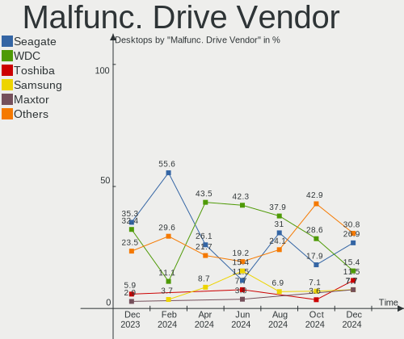
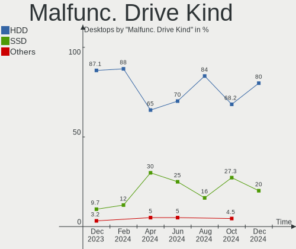
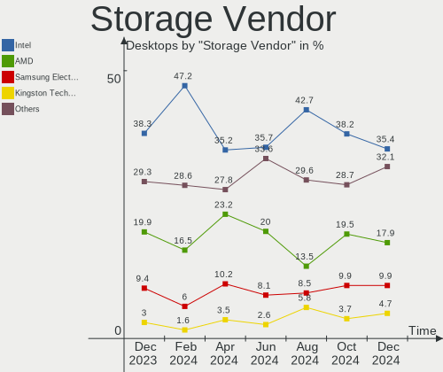
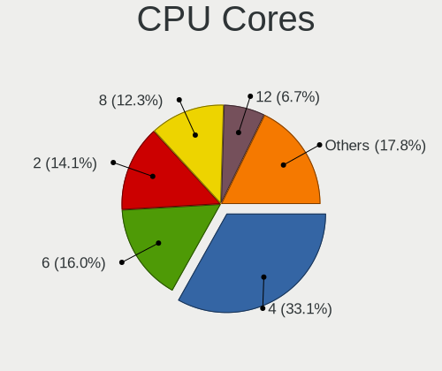
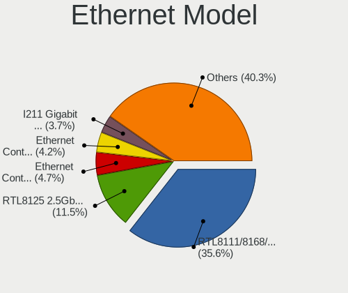
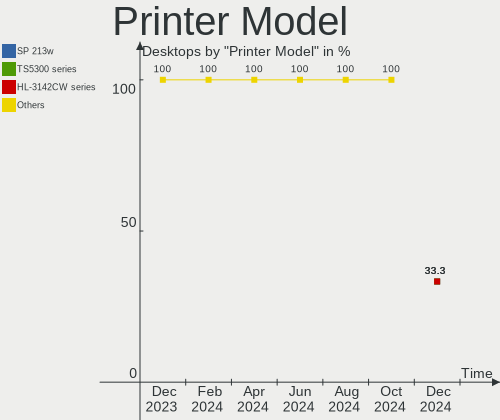

Debian Hardware Trends (Desktops)
---------------------------------

A project to identify most popular hardware characteristics and track their change
over time based on data collected by Debian users at https://Linux-Hardware.org.

Anyone can contribute to this report by the [hw-probe](https://github.com/linuxhw/hw-probe) tool:

    sudo -E hw-probe -all -upload

Full-feature report is available here: https://linux-hardware.org/?view=trends

Period: Dec, 2021.

Contents
--------

* [ System ](#system)
  - [ OS                       ](#os)
  - [ OS Family                ](#os-family)
  - [ Kernel                   ](#kernel)
  - [ Kernel Family            ](#kernel-family)
  - [ Kernel Major Ver.        ](#kernel-major-ver)
  - [ Arch                     ](#arch)
  - [ DE                       ](#de)
  - [ Display Server           ](#display-server)
  - [ Display Manager          ](#display-manager)
  - [ OS Lang                  ](#os-lang)
  - [ Boot Mode                ](#boot-mode)
  - [ Filesystem               ](#filesystem)
  - [ Part. scheme             ](#part-scheme)
  - [ Dual Boot with Linux/BSD ](#dual-boot-with-linuxbsd)
  - [ Dual Boot (Win)          ](#dual-boot-win)

* [ Board ](#board)
  - [ Vendor                   ](#vendor)
  - [ Model                    ](#model)
  - [ Model Family             ](#model-family)
  - [ MFG Year                 ](#mfg-year)
  - [ Form Factor              ](#form-factor)
  - [ Secure Boot              ](#secure-boot)
  - [ Coreboot                 ](#coreboot)
  - [ RAM Size                 ](#ram-size)
  - [ RAM Used                 ](#ram-used)
  - [ Total Drives             ](#total-drives)
  - [ Has CD-ROM               ](#has-cd-rom)
  - [ Has Ethernet             ](#has-ethernet)
  - [ Has WiFi                 ](#has-wifi)
  - [ Has Bluetooth            ](#has-bluetooth)

* [ Location ](#location)
  - [ Country                  ](#country)
  - [ City                     ](#city)

* [ Drives ](#drives)
  - [ Drive Vendor             ](#drive-vendor)
  - [ Drive Model              ](#drive-model)
  - [ HDD Vendor               ](#hdd-vendor)
  - [ SSD Vendor               ](#ssd-vendor)
  - [ Drive Kind               ](#drive-kind)
  - [ Drive Connector          ](#drive-connector)
  - [ Drive Size               ](#drive-size)
  - [ Space Total              ](#space-total)
  - [ Space Used               ](#space-used)
  - [ Malfunc. Drives          ](#malfunc-drives)
  - [ Malfunc. Drive Vendor    ](#malfunc-drive-vendor)
  - [ Malfunc. HDD Vendor      ](#malfunc-hdd-vendor)
  - [ Malfunc. Drive Kind      ](#malfunc-drive-kind)
  - [ Failed Drives            ](#failed-drives)
  - [ Failed Drive Vendor      ](#failed-drive-vendor)
  - [ Drive Status             ](#drive-status)

* [ Storage controller ](#storage-controller)
  - [ Storage Vendor           ](#storage-vendor)
  - [ Storage Model            ](#storage-model)
  - [ Storage Kind             ](#storage-kind)

* [ Processor ](#processor)
  - [ CPU Vendor               ](#cpu-vendor)
  - [ CPU Model                ](#cpu-model)
  - [ CPU Model Family         ](#cpu-model-family)
  - [ CPU Cores                ](#cpu-cores)
  - [ CPU Sockets              ](#cpu-sockets)
  - [ CPU Threads              ](#cpu-threads)
  - [ CPU Op-Modes             ](#cpu-op-modes)
  - [ CPU Microcode            ](#cpu-microcode)
  - [ CPU Microarch            ](#cpu-microarch)

* [ Graphics ](#graphics)
  - [ GPU Vendor               ](#gpu-vendor)
  - [ GPU Model                ](#gpu-model)
  - [ GPU Combo                ](#gpu-combo)
  - [ GPU Driver               ](#gpu-driver)
  - [ GPU Memory               ](#gpu-memory)

* [ Monitor ](#monitor)
  - [ Monitor Vendor           ](#monitor-vendor)
  - [ Monitor Model            ](#monitor-model)
  - [ Monitor Resolution       ](#monitor-resolution)
  - [ Monitor Diagonal         ](#monitor-diagonal)
  - [ Monitor Width            ](#monitor-width)
  - [ Aspect Ratio             ](#aspect-ratio)
  - [ Monitor Area             ](#monitor-area)
  - [ Pixel Density            ](#pixel-density)
  - [ Multiple Monitors        ](#multiple-monitors)

* [ Network ](#network)
  - [ Net Controller Vendor    ](#net-controller-vendor)
  - [ Net Controller Model     ](#net-controller-model)
  - [ Wireless Vendor          ](#wireless-vendor)
  - [ Wireless Model           ](#wireless-model)
  - [ Ethernet Vendor          ](#ethernet-vendor)
  - [ Ethernet Model           ](#ethernet-model)
  - [ Net Controller Kind      ](#net-controller-kind)
  - [ Used Controller          ](#used-controller)
  - [ NICs                     ](#nics)
  - [ IPv6                     ](#ipv6)

* [ Bluetooth ](#bluetooth)
  - [ Bluetooth Vendor         ](#bluetooth-vendor)
  - [ Bluetooth Model          ](#bluetooth-model)

* [ Sound ](#sound)
  - [ Sound Vendor             ](#sound-vendor)
  - [ Sound Model              ](#sound-model)

* [ Memory ](#memory)
  - [ Memory Vendor            ](#memory-vendor)
  - [ Memory Model             ](#memory-model)
  - [ Memory Kind              ](#memory-kind)
  - [ Memory Form Factor       ](#memory-form-factor)
  - [ Memory Size              ](#memory-size)
  - [ Memory Speed             ](#memory-speed)

* [ Printers & scanners ](#printers--scanners)
  - [ Printer Vendor           ](#printer-vendor)
  - [ Printer Model            ](#printer-model)
  - [ Scanner Vendor           ](#scanner-vendor)
  - [ Scanner Model            ](#scanner-model)

* [ Camera ](#camera)
  - [ Camera Vendor            ](#camera-vendor)
  - [ Camera Model             ](#camera-model)

* [ Security ](#security)
  - [ Fingerprint Vendor       ](#fingerprint-vendor)
  - [ Fingerprint Model        ](#fingerprint-model)
  - [ Chipcard Vendor          ](#chipcard-vendor)
  - [ Chipcard Model           ](#chipcard-model)

* [ Unsupported ](#unsupported)
  - [ Unsupported Devices      ](#unsupported-devices)
  - [ Unsupported Device Types ](#unsupported-device-types)

System
------

OS
--

Installed operating systems

| Name              | Desktops | Percent |
|-------------------|----------|---------|
| Debian 11         | 105      | 87.5%   |
| Debian Unstable   | 5        | 4.17%   |
| Debian Testing    | 4        | 3.33%   |
| Debian 10         | 3        | 2.5%    |
| Debian 11-updates | 2        | 1.67%   |
| Debian 21         | 1        | 0.83%   |

OS Family
---------

OS without a version

| Name   | Desktops | Percent |
|--------|----------|---------|
| Debian | 120      | 100%    |

Kernel
------

Version of the Linux kernel

| Version                    | Desktops | Percent |
|----------------------------|----------|---------|
| 5.10.0-7-amd64             | 35       | 29.17%  |
| 5.10.0-9-amd64             | 31       | 25.83%  |
| 5.10.0-10-amd64            | 20       | 16.67%  |
| 5.15.0-2-amd64             | 13       | 10.83%  |
| 5.13.19-2-pve              | 4        | 3.33%   |
| 5.13.19-1-pve              | 3        | 2.5%    |
| 5.14.0-0.bpo.2-amd64       | 2        | 1.67%   |
| 5.4.143-1-pve              | 1        | 0.83%   |
| 5.15.7-wrkd                | 1        | 0.83%   |
| 5.15.0-11.1-liquorix-amd64 | 1        | 0.83%   |
| 5.14.0-4mx-amd64           | 1        | 0.83%   |
| 5.14.0-3mx-amd64           | 1        | 0.83%   |
| 5.10.81+truenas            | 1        | 0.83%   |
| 5.10.10-64                 | 1        | 0.83%   |
| 5.10.0-9-686-pae           | 1        | 0.83%   |
| 5.10.0-9-686               | 1        | 0.83%   |
| 5.10.0-8-amd64             | 1        | 0.83%   |
| 5.10.0-0.bpo.9-amd64       | 1        | 0.83%   |
| 4.19.0-18-amd64            | 1        | 0.83%   |

Kernel Family
-------------

Linux kernel without a distro release

| Version | Desktops | Percent |
|---------|----------|---------|
| 5.10.0  | 90       | 75%     |
| 5.15.0  | 14       | 11.67%  |
| 5.13.19 | 7        | 5.83%   |
| 5.14.0  | 4        | 3.33%   |
| 5.4.143 | 1        | 0.83%   |
| 5.15.7  | 1        | 0.83%   |
| 5.10.81 | 1        | 0.83%   |
| 5.10.10 | 1        | 0.83%   |
| 4.19.0  | 1        | 0.83%   |

Kernel Major Ver.
-----------------

Linux kernel major version

| Version | Desktops | Percent |
|---------|----------|---------|
| 5.10    | 92       | 76.67%  |
| 5.15    | 15       | 12.5%   |
| 5.13    | 7        | 5.83%   |
| 5.14    | 4        | 3.33%   |
| 5.4     | 1        | 0.83%   |
| 4.19    | 1        | 0.83%   |

Arch
----

OS architecture (x86_64, i586, etc.)

| Name   | Desktops | Percent |
|--------|----------|---------|
| x86_64 | 118      | 98.33%  |
| i686   | 2        | 1.67%   |

DE
--

Desktop Environment

| Name             | Desktops | Percent |
|------------------|----------|---------|
| Unknown          | 52       | 43.33%  |
| GNOME            | 18       | 15%     |
| KDE5             | 17       | 14.17%  |
| XFCE             | 11       | 9.17%   |
| Cinnamon         | 6        | 5%      |
| MATE             | 3        | 2.5%    |
| lightdm-xsession | 3        | 2.5%    |
| X-Cinnamon       | 2        | 1.67%   |
| LXQt             | 2        | 1.67%   |
| LXDE             | 2        | 1.67%   |
| UKUI             | 1        | 0.83%   |
| trinity          | 1        | 0.83%   |
| Openbox          | 1        | 0.83%   |
| Budgie           | 1        | 0.83%   |

Display Server
--------------

X11 or Wayland

| Name    | Desktops | Percent |
|---------|----------|---------|
| X11     | 58       | 48.33%  |
| Unknown | 38       | 31.67%  |
| Tty     | 17       | 14.17%  |
| Wayland | 7        | 5.83%   |

Display Manager
---------------

SDDM, LightDM, etc.

| Name    | Desktops | Percent |
|---------|----------|---------|
| Unknown | 74       | 61.67%  |
| LightDM | 17       | 14.17%  |
| SDDM    | 13       | 10.83%  |
| GDM     | 12       | 10%     |
| GDM3    | 3        | 2.5%    |
| NODM    | 1        | 0.83%   |

OS Lang
-------

Language

| Lang        | Desktops | Percent |
|-------------|----------|---------|
| ru_RU       | 43       | 35.83%  |
| en_US       | 31       | 25.83%  |
| en_GB       | 8        | 6.67%   |
| de_DE       | 8        | 6.67%   |
| fr_FR       | 5        | 4.17%   |
| pl_PL       | 4        | 3.33%   |
| it_IT       | 3        | 2.5%    |
| Unknown     | 3        | 2.5%    |
| es_AR       | 2        | 1.67%   |
| en_CA       | 2        | 1.67%   |
| uk_UA       | 1        | 0.83%   |
| ru_UA       | 1        | 0.83%   |
| pt_BR       | 1        | 0.83%   |
| nl_NL       | 1        | 0.83%   |
| ja_JP.utf-8 | 1        | 0.83%   |
| es_US       | 1        | 0.83%   |
| es_MX       | 1        | 0.83%   |
| en_SE       | 1        | 0.83%   |
| en_IN       | 1        | 0.83%   |
| de_AT       | 1        | 0.83%   |
| C           | 1        | 0.83%   |

Boot Mode
---------

EFI or BIOS

| Mode | Desktops | Percent |
|------|----------|---------|
| BIOS | 83       | 69.17%  |
| EFI  | 37       | 30.83%  |

Filesystem
----------

Type of filesystem

| Type    | Desktops | Percent |
|---------|----------|---------|
| Ext4    | 75       | 62.5%   |
| Overlay | 37       | 30.83%  |
| Zfs     | 3        | 2.5%    |
| Btrfs   | 3        | 2.5%    |
| Xfs     | 1        | 0.83%   |
| Rootfs  | 1        | 0.83%   |

Part. scheme
------------

Scheme of partitioning

| Type    | Desktops | Percent |
|---------|----------|---------|
| MBR     | 49       | 40.83%  |
| GPT     | 47       | 39.17%  |
| Unknown | 24       | 20%     |

Dual Boot with Linux/BSD
------------------------

Hosting more than one Linux/BSD

| Dual boot | Desktops | Percent |
|-----------|----------|---------|
| No        | 105      | 87.5%   |
| Yes       | 15       | 12.5%   |

Dual Boot (Win)
---------------

Hosting Linux and Windows

| Dual boot | Desktops | Percent |
|-----------|----------|---------|
| No        | 65       | 54.17%  |
| Yes       | 55       | 45.83%  |

Board
-----

Vendor
------

Motherboard manufacturer

| Name                | Desktops | Percent |
|---------------------|----------|---------|
| ASUSTek Computer    | 25       | 20.83%  |
| Gigabyte Technology | 19       | 15.83%  |
| ASRock              | 19       | 15.83%  |
| MSI                 | 14       | 11.67%  |
| Dell                | 9        | 7.5%    |
| Hewlett-Packard     | 6        | 5%      |
| Lenovo              | 4        | 3.33%   |
| Fujitsu             | 4        | 3.33%   |
| Intel               | 3        | 2.5%    |
| Huanan              | 3        | 2.5%    |
| Foxconn             | 2        | 1.67%   |
| Unknown             | 2        | 1.67%   |
| Supermicro          | 1        | 0.83%   |
| SeeedStudio         | 1        | 0.83%   |
| Pegatron            | 1        | 0.83%   |
| JGINYUE             | 1        | 0.83%   |
| Fujitsu Siemens     | 1        | 0.83%   |
| ECS                 | 1        | 0.83%   |
| DFI                 | 1        | 0.83%   |
| AZW                 | 1        | 0.83%   |
| ASRockRack          | 1        | 0.83%   |
| Acer                | 1        | 0.83%   |

Model
-----

Motherboard model

| Name                                 | Desktops | Percent |
|--------------------------------------|----------|---------|
| ASRock H470M-HVS                     | 6        | 5%      |
| ASUS All Series                      | 5        | 4.17%   |
| Gigabyte H81M-S2V                    | 3        | 2.5%    |
| Fujitsu ESPRIMO P720                 | 3        | 2.5%    |
| ASUS Pro H510M-C                     | 3        | 2.5%    |
| MSI MS-7C75                          | 2        | 1.67%   |
| Gigabyte X570 GAMING X               | 2        | 1.67%   |
| Foxconn GEG                          | 2        | 1.67%   |
| Dell PowerEdge T30                   | 2        | 1.67%   |
| ASUS H61M-K                          | 2        | 1.67%   |
| ASRock B450M Pro4-F                  | 2        | 1.67%   |
| Unknown                              | 2        | 1.67%   |
| Supermicro X9SCL/X9SCM               | 1        | 0.83%   |
| SeeedStudio ODYSSEY-X86J4125         | 1        | 0.83%   |
| Pegatron Compaq dx2400 Microtower    | 1        | 0.83%   |
| MSI W200                             | 1        | 0.83%   |
| MSI p6620ch-m                        | 1        | 0.83%   |
| MSI MS-7C88                          | 1        | 0.83%   |
| MSI MS-7C84                          | 1        | 0.83%   |
| MSI MS-7C67                          | 1        | 0.83%   |
| MSI MS-7C56                          | 1        | 0.83%   |
| MSI MS-7B86                          | 1        | 0.83%   |
| MSI MS-7B79                          | 1        | 0.83%   |
| MSI MS-7A94                          | 1        | 0.83%   |
| MSI MS-7A70                          | 1        | 0.83%   |
| MSI MS-7715                          | 1        | 0.83%   |
| MSI MS-7593                          | 1        | 0.83%   |
| Lenovo ThinkStation D30 4223CC9      | 1        | 0.83%   |
| Lenovo ThinkCentre M92z 3311B8G      | 1        | 0.83%   |
| Lenovo ThinkCentre A58e 0841A2U      | 1        | 0.83%   |
| Lenovo H50-50 90B60069IX             | 1        | 0.83%   |
| JGINYUE X99-D8 Server                | 1        | 0.83%   |
| Intel GEG                            | 1        | 0.83%   |
| Intel DZ77SL-50K AAG55115-300        | 1        | 0.83%   |
| Intel DH67BL AAG10189-213            | 1        | 0.83%   |
| Huanan X99-F8                        | 1        | 0.83%   |
| Huanan X99-8M-F V1.1                 | 1        | 0.83%   |
| Huanan X58                           | 1        | 0.83%   |
| HP Z620 Workstation                  | 1        | 0.83%   |
| HP Z400 Workstation                  | 1        | 0.83%   |
| HP ProDesk 600 G1 SFF                | 1        | 0.83%   |
| HP Pavilion Gaming Desktop TG01-2xxx | 1        | 0.83%   |
| HP Compaq dc7600 Small Form Factor   | 1        | 0.83%   |
| HP Compaq 6000 Pro MT PC             | 1        | 0.83%   |
| Gigabyte Z77X-D3H                    | 1        | 0.83%   |
| Gigabyte Z490 AORUS PRO AX           | 1        | 0.83%   |
| Gigabyte Z390 GAMING X               | 1        | 0.83%   |
| Gigabyte P55-USB3                    | 1        | 0.83%   |
| Gigabyte H410M S2H V3                | 1        | 0.83%   |
| Gigabyte G31M-S2L                    | 1        | 0.83%   |
| Gigabyte F2A88XM-DS2                 | 1        | 0.83%   |
| Gigabyte B85M-D3H                    | 1        | 0.83%   |
| Gigabyte B75M-D2V                    | 1        | 0.83%   |
| Gigabyte B550I AORUS PRO AX          | 1        | 0.83%   |
| Gigabyte B550 AORUS PRO AC           | 1        | 0.83%   |
| Gigabyte B450M S2H                   | 1        | 0.83%   |
| Gigabyte A520M S2H                   | 1        | 0.83%   |
| Gigabyte 970A-DS3P                   | 1        | 0.83%   |
| Fujitsu Siemens ESPRIMO P5925        | 1        | 0.83%   |
| Fujitsu D3446-S1                     | 1        | 0.83%   |

Model Family
------------

Motherboard model prefix

| Name                         | Desktops | Percent |
|------------------------------|----------|---------|
| ASRock H470M-HVS             | 6        | 5%      |
| ASUS PRIME                   | 5        | 4.17%   |
| ASUS All                     | 5        | 4.17%   |
| Gigabyte H81M-S2V            | 3        | 2.5%    |
| Fujitsu ESPRIMO              | 3        | 2.5%    |
| Dell OptiPlex                | 3        | 2.5%    |
| ASUS Pro                     | 3        | 2.5%    |
| MSI MS-7C75                  | 2        | 1.67%   |
| Lenovo ThinkCentre           | 2        | 1.67%   |
| HP Compaq                    | 2        | 1.67%   |
| Gigabyte X570                | 2        | 1.67%   |
| Foxconn GEG                  | 2        | 1.67%   |
| Dell Precision               | 2        | 1.67%   |
| Dell PowerEdge               | 2        | 1.67%   |
| ASUS ROG                     | 2        | 1.67%   |
| ASUS P5G41T-M                | 2        | 1.67%   |
| ASUS H61M-K                  | 2        | 1.67%   |
| ASRock B450M                 | 2        | 1.67%   |
| Unknown                      | 2        | 1.67%   |
| Supermicro X9SCL             | 1        | 0.83%   |
| SeeedStudio ODYSSEY-X86J4125 | 1        | 0.83%   |
| Pegatron Compaq              | 1        | 0.83%   |
| MSI W200                     | 1        | 0.83%   |
| MSI p6620ch-m                | 1        | 0.83%   |
| MSI MS-7C88                  | 1        | 0.83%   |
| MSI MS-7C84                  | 1        | 0.83%   |
| MSI MS-7C67                  | 1        | 0.83%   |
| MSI MS-7C56                  | 1        | 0.83%   |
| MSI MS-7B86                  | 1        | 0.83%   |
| MSI MS-7B79                  | 1        | 0.83%   |
| MSI MS-7A94                  | 1        | 0.83%   |
| MSI MS-7A70                  | 1        | 0.83%   |
| MSI MS-7715                  | 1        | 0.83%   |
| MSI MS-7593                  | 1        | 0.83%   |
| Lenovo ThinkStation          | 1        | 0.83%   |
| Lenovo H50-50                | 1        | 0.83%   |
| JGINYUE X99-D8               | 1        | 0.83%   |
| Intel GEG                    | 1        | 0.83%   |
| Intel DZ77SL-50K             | 1        | 0.83%   |
| Intel DH67BL                 | 1        | 0.83%   |
| Huanan X99-F8                | 1        | 0.83%   |
| Huanan X99-8M-F              | 1        | 0.83%   |
| Huanan X58                   | 1        | 0.83%   |
| HP Z620                      | 1        | 0.83%   |
| HP Z400                      | 1        | 0.83%   |
| HP ProDesk                   | 1        | 0.83%   |
| HP Pavilion                  | 1        | 0.83%   |
| Gigabyte Z77X-D3H            | 1        | 0.83%   |
| Gigabyte Z490                | 1        | 0.83%   |
| Gigabyte Z390                | 1        | 0.83%   |
| Gigabyte P55-USB3            | 1        | 0.83%   |
| Gigabyte H410M               | 1        | 0.83%   |
| Gigabyte G31M-S2L            | 1        | 0.83%   |
| Gigabyte F2A88XM-DS2         | 1        | 0.83%   |
| Gigabyte B85M-D3H            | 1        | 0.83%   |
| Gigabyte B75M-D2V            | 1        | 0.83%   |
| Gigabyte B550I               | 1        | 0.83%   |
| Gigabyte B550                | 1        | 0.83%   |
| Gigabyte B450M               | 1        | 0.83%   |
| Gigabyte A520M               | 1        | 0.83%   |

MFG Year
--------

Motherboard manufacture year

| Year | Desktops | Percent |
|------|----------|---------|
| 2021 | 32       | 26.67%  |
| 2020 | 12       | 10%     |
| 2018 | 12       | 10%     |
| 2014 | 10       | 8.33%   |
| 2013 | 9        | 7.5%    |
| 2019 | 8        | 6.67%   |
| 2009 | 7        | 5.83%   |
| 2011 | 6        | 5%      |
| 2016 | 5        | 4.17%   |
| 2012 | 5        | 4.17%   |
| 2015 | 4        | 3.33%   |
| 2010 | 4        | 3.33%   |
| 2008 | 3        | 2.5%    |
| 2017 | 2        | 1.67%   |
| 2007 | 1        | 0.83%   |

Form Factor
-----------

Physical design of the computer

| Name    | Desktops | Percent |
|---------|----------|---------|
| Desktop | 120      | 100%    |

Secure Boot
-----------

Enabled or disabled

| State    | Desktops | Percent |
|----------|----------|---------|
| Disabled | 120      | 100%    |

Coreboot
--------

Have coreboot on board

| Used | Desktops | Percent |
|------|----------|---------|
| No   | 120      | 100%    |

RAM Size
--------

Total RAM memory

| Size in GB      | Desktops | Percent |
|-----------------|----------|---------|
| 3.01-4.0        | 22       | 18.33%  |
| 16.01-24.0      | 22       | 18.33%  |
| 4.01-8.0        | 18       | 15%     |
| 32.01-64.0      | 18       | 15%     |
| 8.01-16.0       | 15       | 12.5%   |
| 64.01-256.0     | 11       | 9.17%   |
| 24.01-32.0      | 6        | 5%      |
| 2.01-3.0        | 3        | 2.5%    |
| 1.01-2.0        | 3        | 2.5%    |
| More than 256.0 | 1        | 0.83%   |
| 0.51-1.0        | 1        | 0.83%   |

RAM Used
--------

Used RAM memory

| Used GB    | Desktops | Percent |
|------------|----------|---------|
| 0.51-1.0   | 39       | 32.5%   |
| 1.01-2.0   | 21       | 17.5%   |
| 2.01-3.0   | 18       | 15%     |
| 3.01-4.0   | 12       | 10%     |
| 4.01-8.0   | 10       | 8.33%   |
| 8.01-16.0  | 10       | 8.33%   |
| 0.01-0.5   | 5        | 4.17%   |
| 16.01-24.0 | 3        | 2.5%    |
| 32.01-64.0 | 2        | 1.67%   |

Total Drives
------------

Number of drives on board

| Drives | Desktops | Percent |
|--------|----------|---------|
| 1      | 54       | 45%     |
| 2      | 27       | 22.5%   |
| 3      | 14       | 11.67%  |
| 4      | 12       | 10%     |
| 5      | 7        | 5.83%   |
| 7      | 2        | 1.67%   |
| 11     | 1        | 0.83%   |
| 9      | 1        | 0.83%   |
| 8      | 1        | 0.83%   |
| 6      | 1        | 0.83%   |

Has CD-ROM
----------

Has CD-ROM on board

| Presented | Desktops | Percent |
|-----------|----------|---------|
| No        | 76       | 63.33%  |
| Yes       | 44       | 36.67%  |

Has Ethernet
------------

Has Ethernet on board

| Presented | Desktops | Percent |
|-----------|----------|---------|
| Yes       | 120      | 100%    |

Has WiFi
--------

Has WiFi module

| Presented | Desktops | Percent |
|-----------|----------|---------|
| No        | 89       | 74.17%  |
| Yes       | 31       | 25.83%  |

Has Bluetooth
-------------

Has Bluetooth module

| Presented | Desktops | Percent |
|-----------|----------|---------|
| No        | 99       | 82.5%   |
| Yes       | 21       | 17.5%   |

Location
--------

Country
-------

Geographic location (country)

| Country      | Desktops | Percent |
|--------------|----------|---------|
| Russia       | 43       | 35.83%  |
| USA          | 13       | 10.83%  |
| Germany      | 11       | 9.17%   |
| France       | 8        | 6.67%   |
| UK           | 4        | 3.33%   |
| Poland       | 4        | 3.33%   |
| Mexico       | 4        | 3.33%   |
| Switzerland  | 3        | 2.5%    |
| Austria      | 3        | 2.5%    |
| Ukraine      | 2        | 1.67%   |
| Sweden       | 2        | 1.67%   |
| Spain        | 2        | 1.67%   |
| Pakistan     | 2        | 1.67%   |
| Italy        | 2        | 1.67%   |
| Canada       | 2        | 1.67%   |
| Argentina    | 2        | 1.67%   |
| Vietnam      | 1        | 0.83%   |
| South Korea  | 1        | 0.83%   |
| Saudi Arabia | 1        | 0.83%   |
| Netherlands  | 1        | 0.83%   |
| Japan        | 1        | 0.83%   |
| India        | 1        | 0.83%   |
| Hungary      | 1        | 0.83%   |
| Greece       | 1        | 0.83%   |
| Finland      | 1        | 0.83%   |
| Bulgaria     | 1        | 0.83%   |
| Brazil       | 1        | 0.83%   |
| Belarus      | 1        | 0.83%   |
| Bangladesh   | 1        | 0.83%   |

City
----

Geographic location (city)

| City                  | Desktops | Percent |
|-----------------------|----------|---------|
| Voronezh              | 35       | 29.17%  |
| Moscow                | 4        | 3.33%   |
| Warsaw                | 3        | 2.5%    |
| Vienna                | 2        | 1.67%   |
| Lahore                | 2        | 1.67%   |
| Cambridge             | 2        | 1.67%   |
| Barcelona             | 2        | 1.67%   |
| Zurich                | 1        | 0.83%   |
| Zolochiv              | 1        | 0.83%   |
| Wo?‚omin              | 1        | 0.83%   |
| Viedma                | 1        | 0.83%   |
| Troy                  | 1        | 0.83%   |
| Tijuana               | 1        | 0.83%   |
| Thessaloniki          | 1        | 0.83%   |
| Tatab??nya            | 1        | 0.83%   |
| Syktyvkar             | 1        | 0.83%   |
| Stockholm             | 1        | 0.83%   |
| Stockelsdorf          | 1        | 0.83%   |
| Stains                | 1        | 0.83%   |
| St Petersburg         | 1        | 0.83%   |
| Sofia                 | 1        | 0.83%   |
| Shibuya               | 1        | 0.83%   |
| Sharon                | 1        | 0.83%   |
| Santa Fe              | 1        | 0.83%   |
| San Pedro             | 1        | 0.83%   |
| Saint-Herblain        | 1        | 0.83%   |
| Rodez                 | 1        | 0.83%   |
| Rochester             | 1        | 0.83%   |
| Riyadh                | 1        | 0.83%   |
| Reutlingen            | 1        | 0.83%   |
| Rathenow              | 1        | 0.83%   |
| Radeburg              | 1        | 0.83%   |
| Raahe                 | 1        | 0.83%   |
| Pourrieres            | 1        | 0.83%   |
| Plano                 | 1        | 0.83%   |
| Plainfield            | 1        | 0.83%   |
| Pino Torinese         | 1        | 0.83%   |
| Oz?«rsk               | 1        | 0.83%   |
| Nidderau              | 1        | 0.83%   |
| New Lenox             | 1        | 0.83%   |
| Morlaix               | 1        | 0.83%   |
| Milan                 | 1        | 0.83%   |
| Mexicali Municipality | 1        | 0.83%   |
| Ludwigshafen am Rhein | 1        | 0.83%   |
| Lompoc                | 1        | 0.83%   |
| Llanelli              | 1        | 0.83%   |
| Linz                  | 1        | 0.83%   |
| Leipzig               | 1        | 0.83%   |
| Leiden                | 1        | 0.83%   |
| L??beck               | 1        | 0.83%   |
| Kryvyi Rih            | 1        | 0.83%   |
| Khabarovsk            | 1        | 0.83%   |
| Jupiter               | 1        | 0.83%   |
| Irapuato              | 1        | 0.83%   |
| Hurricane             | 1        | 0.83%   |
| Hrodna                | 1        | 0.83%   |
| Houston               | 1        | 0.83%   |
| Hohen Neuendorf       | 1        | 0.83%   |
| Harnes                | 1        | 0.83%   |
| Hamilton              | 1        | 0.83%   |

Drives
------

Drive Vendor
------------

Hard drive vendors

| Vendor              | Desktops | Drives | Percent |
|---------------------|----------|--------|---------|
| WDC                 | 40       | 57     | 18.87%  |
| Seagate             | 36       | 57     | 16.98%  |
| Samsung Electronics | 29       | 35     | 13.68%  |
| Toshiba             | 21       | 27     | 9.91%   |
| Kingston            | 9        | 10     | 4.25%   |
| Crucial             | 9        | 11     | 4.25%   |
| Hitachi             | 7        | 10     | 3.3%    |
| Netac               | 6        | 6      | 2.83%   |
| SanDisk             | 5        | 6      | 2.36%   |
| A-DATA Technology   | 4        | 5      | 1.89%   |
| Xinhaike            | 3        | 3      | 1.42%   |
| Intenso             | 3        | 4      | 1.42%   |
| Intel               | 3        | 4      | 1.42%   |
| Hewlett-Packard     | 3        | 4      | 1.42%   |
| GOODRAM             | 3        | 7      | 1.42%   |
| FOXLINE             | 3        | 3      | 1.42%   |
| Phison              | 2        | 3      | 0.94%   |
| OCZ                 | 2        | 2      | 0.94%   |
| HGST                | 2        | 4      | 0.94%   |
| Gigabyte Technology | 2        | 2      | 0.94%   |
| Corsair             | 2        | 3      | 0.94%   |
| walram              | 1        | 1      | 0.47%   |
| Unknown             | 1        | 1      | 0.47%   |
| SPCC                | 1        | 1      | 0.47%   |
| QGeeM               | 1        | 1      | 0.47%   |
| PNY                 | 1        | 1      | 0.47%   |
| Pioneer             | 1        | 1      | 0.47%   |
| Phison Electronics  | 1        | 1      | 0.47%   |
| Patriot             | 1        | 1      | 0.47%   |
| LITEONIT            | 1        | 1      | 0.47%   |
| Lexar               | 1        | 1      | 0.47%   |
| KIOXIA              | 1        | 1      | 0.47%   |
| JMicron             | 1        | 1      | 0.47%   |
| IBM-ESXS            | 1        | 1      | 0.47%   |
| Hajaan              | 1        | 1      | 0.47%   |
| H/W                 | 1        | 3      | 0.47%   |
| China               | 1        | 1      | 0.47%   |
| Apacer              | 1        | 1      | 0.47%   |
| Unknown             | 1        | 1      | 0.47%   |

Drive Model
-----------

Hard drive models

| Model                            | Desktops | Percent |
|----------------------------------|----------|---------|
| Toshiba HDWD110 1TB              | 7        | 2.78%   |
| Netac SSD 240GB                  | 6        | 2.38%   |
| Samsung SSD 860 EVO 1TB          | 5        | 1.98%   |
| Seagate ST1000DM003-1ER162 1TB   | 4        | 1.59%   |
| Xinhaike SSD 120GB               | 3        | 1.19%   |
| WDC WD40EFRX-68N32N0 4TB         | 3        | 1.19%   |
| Toshiba DT01ACA200 2TB           | 3        | 1.19%   |
| Toshiba DT01ACA050 500GB         | 3        | 1.19%   |
| Seagate ST500DM002-1BD142 500GB  | 3        | 1.19%   |
| Seagate ST2000DM008-2FR102 2TB   | 3        | 1.19%   |
| Samsung SSD 860 EVO 500GB        | 3        | 1.19%   |
| Samsung SSD 860 EVO 250GB        | 3        | 1.19%   |
| Kingston SA400S37240G 240GB SSD  | 3        | 1.19%   |
| Kingston SA400S37120G 120GB SSD  | 3        | 1.19%   |
| FOXLINE FLSSD480X5SE 480GB       | 3        | 1.19%   |
| WDC WD20EZRX-00D8PB0 2TB         | 2        | 0.79%   |
| Seagate ST380815AS 80GB          | 2        | 0.79%   |
| Seagate ST3500413AS 500GB        | 2        | 0.79%   |
| Seagate ST3160815AS 160GB        | 2        | 0.79%   |
| Seagate ST31500341AS 1TB         | 2        | 0.79%   |
| Seagate ST31000524AS 1TB         | 2        | 0.79%   |
| Seagate ST3000NXCLAR3000 3TB     | 2        | 0.79%   |
| Seagate ST1000DM010-2EP102 1TB   | 2        | 0.79%   |
| Seagate ST1000DM003-1CH162 1TB   | 2        | 0.79%   |
| Samsung SSD 970 EVO 1TB          | 2        | 0.79%   |
| Samsung SSD 960 EVO 250GB        | 2        | 0.79%   |
| OCZ AGILITY3 240GB SSD           | 2        | 0.79%   |
| Hitachi HUS724040ALE641 4TB      | 2        | 0.79%   |
| Hitachi HDS721050CLA362 500GB    | 2        | 0.79%   |
| HP MB2000EBZQC 2TB               | 2        | 0.79%   |
| GOODRAM IRP-SSDPR-S25C-256 256GB | 2        | 0.79%   |
| GOODRAM IR-SSDPR-P34B-02T-80 2TB | 2        | 0.79%   |
| Crucial CT1000MX500SSD1 1TB      | 2        | 0.79%   |
| WDC WDS512G1X0C-00ENX0 512GB     | 1        | 0.4%    |
| WDC WDS500G2B0A-00SM50 500GB SSD | 1        | 0.4%    |
| WDC WDS250G1B0A-00H9H0 250GB SSD | 1        | 0.4%    |
| WDC WDS240G2G0B-00EPW0 240GB SSD | 1        | 0.4%    |
| WDC WDS120G2G0B-00EPWP 120GB SSD | 1        | 0.4%    |
| WDC WDS100T2B0C 1TB              | 1        | 0.4%    |
| WDC WD7501AALS-00E8B0 752GB      | 1        | 0.4%    |
| WDC WD6003FZBX-00K5WB0 6TB       | 1        | 0.4%    |
| WDC WD5003ABYX-18WERA0 500GB     | 1        | 0.4%    |
| WDC WD5000AAKX-60U6AA0 500GB     | 1        | 0.4%    |
| WDC WD5000AAKX-08ERMA0 500GB     | 1        | 0.4%    |
| WDC WD5000AAKX-001CA0 500GB      | 1        | 0.4%    |
| WDC WD40EZRZ-75GXCB0 4TB         | 1        | 0.4%    |
| WDC WD40EZRZ-00GXCB0 4TB         | 1        | 0.4%    |
| WDC WD40EZRX-00SPEB0 4TB         | 1        | 0.4%    |
| WDC WD40EZAZ-00SF3B0 4TB         | 1        | 0.4%    |
| WDC WD40EFRX-68WT0N0 4TB         | 1        | 0.4%    |
| WDC WD40EFAX-68JH4N1 4TB         | 1        | 0.4%    |
| WDC WD4003FFBX-68MU3N0 4TB       | 1        | 0.4%    |
| WDC WD3200AAJS-60M0A0 320GB      | 1        | 0.4%    |
| WDC WD3200AAJS-08L7A0 320GB      | 1        | 0.4%    |
| WDC WD30EZRZ-00GXCB0 3TB         | 1        | 0.4%    |
| WDC WD30EZRX-22D8PB0 3TB         | 1        | 0.4%    |
| WDC WD30EZRX-00MMMB0 3TB         | 1        | 0.4%    |
| WDC WD30EFRX-68EUZN0 3TB         | 1        | 0.4%    |
| WDC WD2500AAKX-08ERMA0 250GB     | 1        | 0.4%    |
| WDC WD2500AAKX-00ERMA0 250GB     | 1        | 0.4%    |

HDD Vendor
----------

Hard disk drive vendors

| Vendor              | Desktops | Drives | Percent |
|---------------------|----------|--------|---------|
| Seagate             | 36       | 57     | 34.29%  |
| WDC                 | 35       | 51     | 33.33%  |
| Toshiba             | 21       | 27     | 20%     |
| Hitachi             | 7        | 10     | 6.67%   |
| Samsung Electronics | 2        | 2      | 1.9%    |
| HGST                | 2        | 4      | 1.9%    |
| Hewlett-Packard     | 2        | 3      | 1.9%    |

SSD Vendor
----------

Solid state drive vendors

| Vendor              | Desktops | Drives | Percent |
|---------------------|----------|--------|---------|
| Samsung Electronics | 17       | 19     | 21.25%  |
| Kingston            | 9        | 10     | 11.25%  |
| Crucial             | 9        | 11     | 11.25%  |
| Netac               | 6        | 6      | 7.5%    |
| WDC                 | 4        | 4      | 5%      |
| SanDisk             | 4        | 5      | 5%      |
| Xinhaike            | 3        | 3      | 3.75%   |
| FOXLINE             | 3        | 3      | 3.75%   |
| A-DATA Technology   | 3        | 4      | 3.75%   |
| OCZ                 | 2        | 2      | 2.5%    |
| Intel               | 2        | 3      | 2.5%    |
| GOODRAM             | 2        | 2      | 2.5%    |
| walram              | 1        | 1      | 1.25%   |
| Unknown             | 1        | 1      | 1.25%   |
| SPCC                | 1        | 1      | 1.25%   |
| PNY                 | 1        | 1      | 1.25%   |
| Pioneer             | 1        | 1      | 1.25%   |
| Patriot             | 1        | 1      | 1.25%   |
| LITEONIT            | 1        | 1      | 1.25%   |
| Lexar               | 1        | 1      | 1.25%   |
| JMicron             | 1        | 1      | 1.25%   |
| Intenso             | 1        | 2      | 1.25%   |
| Hewlett-Packard     | 1        | 1      | 1.25%   |
| Hajaan              | 1        | 1      | 1.25%   |
| Gigabyte Technology | 1        | 1      | 1.25%   |
| Corsair             | 1        | 2      | 1.25%   |
| China               | 1        | 1      | 1.25%   |
| Apacer              | 1        | 1      | 1.25%   |

Drive Kind
----------

HDD or SSD

| Kind    | Desktops | Drives | Percent |
|---------|----------|--------|---------|
| HDD     | 85       | 154    | 46.2%   |
| SSD     | 68       | 90     | 36.96%  |
| NVMe    | 25       | 31     | 13.59%  |
| Unknown | 5        | 7      | 2.72%   |
| MMC     | 1        | 1      | 0.54%   |

Drive Connector
---------------

SATA, SAS, NVMe, etc.

| Type | Desktops | Drives | Percent |
|------|----------|--------|---------|
| SATA | 114      | 241    | 77.03%  |
| NVMe | 25       | 31     | 16.89%  |
| SAS  | 8        | 10     | 5.41%   |
| MMC  | 1        | 1      | 0.68%   |

Drive Size
----------

Size of hard drive

| Size in TB | Desktops | Drives | Percent |
|------------|----------|--------|---------|
| 0.01-0.5   | 84       | 112    | 48.84%  |
| 0.51-1.0   | 44       | 58     | 25.58%  |
| 1.01-2.0   | 22       | 28     | 12.79%  |
| 3.01-4.0   | 12       | 24     | 6.98%   |
| 2.01-3.0   | 6        | 12     | 3.49%   |
| 4.01-10.0  | 4        | 10     | 2.33%   |

Space Total
-----------

Amount of disk space available on the file system

| Size in GB     | Desktops | Percent |
|----------------|----------|---------|
| Unknown        | 42       | 35%     |
| 1001-2000      | 15       | 12.5%   |
| More than 3000 | 13       | 10.83%  |
| 251-500        | 12       | 10%     |
| 101-250        | 11       | 9.17%   |
| 501-1000       | 11       | 9.17%   |
| 51-100         | 7        | 5.83%   |
| 2001-3000      | 4        | 3.33%   |
| 1-20           | 3        | 2.5%    |
| 21-50          | 2        | 1.67%   |

Space Used
----------

Amount of used disk space

| Used GB        | Desktops | Percent |
|----------------|----------|---------|
| Unknown        | 42       | 35%     |
| 1-20           | 25       | 20.83%  |
| 251-500        | 10       | 8.33%   |
| 501-1000       | 8        | 6.67%   |
| 51-100         | 8        | 6.67%   |
| More than 3000 | 7        | 5.83%   |
| 21-50          | 7        | 5.83%   |
| 101-250        | 6        | 5%      |
| 1001-2000      | 6        | 5%      |
| 2001-3000      | 1        | 0.83%   |

Malfunc. Drives
---------------

Drive models with a malfunction

| Model                             | Desktops | Drives | Percent |
|-----------------------------------|----------|--------|---------|
| Seagate ST31500341AS 1TB          | 2        | 2      | 7.41%   |
| Hitachi HDS721050CLA362 500GB     | 2        | 2      | 7.41%   |
| WDC WD5003ABYX-18WERA0 500GB      | 1        | 2      | 3.7%    |
| WDC WD5000AAKX-60U6AA0 500GB      | 1        | 1      | 3.7%    |
| WDC WD5000AAKX-001CA0 500GB       | 1        | 1      | 3.7%    |
| WDC WD3200AAJS-60M0A0 320GB       | 1        | 1      | 3.7%    |
| WDC WD3200AAJS-08L7A0 320GB       | 1        | 1      | 3.7%    |
| WDC WD10EZEX-60WN4A0 1TB          | 1        | 1      | 3.7%    |
| WDC WD10EALX-009BA0 1TB           | 1        | 1      | 3.7%    |
| WDC WD10EADS-65M2B1 1TB           | 1        | 1      | 3.7%    |
| WDC WD1001FALS-75J7B0 1TB         | 1        | 1      | 3.7%    |
| Seagate ST500DM002-1SB10A 500GB   | 1        | 1      | 3.7%    |
| Seagate ST4000DM000-1F2168 4TB    | 1        | 1      | 3.7%    |
| Seagate ST380815AS 80GB           | 1        | 1      | 3.7%    |
| Seagate ST3250620AS 250GB         | 1        | 1      | 3.7%    |
| Seagate ST3160815AS 160GB         | 1        | 1      | 3.7%    |
| Seagate ST31000524AS 1TB          | 1        | 1      | 3.7%    |
| Seagate ST250DM000-1BD141 250GB   | 1        | 1      | 3.7%    |
| Seagate ST2000DM008-2FR102 2TB    | 1        | 1      | 3.7%    |
| Seagate ST1000LM035-1RK172 1TB    | 1        | 1      | 3.7%    |
| Samsung Electronics HD103SJ 1TB   | 1        | 1      | 3.7%    |
| Intel SSDSCKKW010X6 1TB           | 1        | 1      | 3.7%    |
| Hitachi HUA723020ALA640 2TB       | 1        | 1      | 3.7%    |
| Hewlett-Packard MB2000EBZQC 2TB   | 1        | 1      | 3.7%    |
| A-DATA Technology SX900 256GB SSD | 1        | 1      | 3.7%    |

Malfunc. Drive Vendor
---------------------

Vendors of faulty drives

| Vendor              | Desktops | Drives | Percent |
|---------------------|----------|--------|---------|
| Seagate             | 11       | 11     | 40.74%  |
| WDC                 | 9        | 10     | 33.33%  |
| Hitachi             | 3        | 3      | 11.11%  |
| Samsung Electronics | 1        | 1      | 3.7%    |
| Intel               | 1        | 1      | 3.7%    |
| Hewlett-Packard     | 1        | 1      | 3.7%    |
| A-DATA Technology   | 1        | 1      | 3.7%    |

Malfunc. HDD Vendor
-------------------

Vendors of faulty HDD drives

| Vendor              | Desktops | Drives | Percent |
|---------------------|----------|--------|---------|
| Seagate             | 11       | 11     | 44%     |
| WDC                 | 9        | 10     | 36%     |
| Hitachi             | 3        | 3      | 12%     |
| Samsung Electronics | 1        | 1      | 4%      |
| Hewlett-Packard     | 1        | 1      | 4%      |

Malfunc. Drive Kind
-------------------

Kinds of faulty drives

| Kind | Desktops | Drives | Percent |
|------|----------|--------|---------|
| HDD  | 22       | 26     | 91.67%  |
| SSD  | 2        | 2      | 8.33%   |

Failed Drives
-------------

Failed drive models

Zero info for selected period =(

Failed Drive Vendor
-------------------

Failed drive vendors

Zero info for selected period =(

Drive Status
------------

Number of failed and malfunc. drives

| Status   | Desktops | Drives | Percent |
|----------|----------|--------|---------|
| Works    | 85       | 186    | 61.15%  |
| Detected | 30       | 69     | 21.58%  |
| Malfunc  | 24       | 28     | 17.27%  |

Storage controller
------------------

Storage Vendor
--------------

Storage controller vendors

| Vendor                    | Desktops | Percent |
|---------------------------|----------|---------|
| Intel                     | 88       | 55.35%  |
| AMD                       | 30       | 18.87%  |
| Samsung Electronics       | 12       | 7.55%   |
| Phison Electronics        | 8        | 5.03%   |
| ASMedia Technology        | 6        | 3.77%   |
| Sandisk                   | 3        | 1.89%   |
| Marvell Technology Group  | 3        | 1.89%   |
| JMicron Technology        | 3        | 1.89%   |
| LSI Logic / Symbios Logic | 2        | 1.26%   |
| VIA Technologies          | 1        | 0.63%   |
| KIOXIA                    | 1        | 0.63%   |
| ADATA Technology          | 1        | 0.63%   |
| Adaptec                   | 1        | 0.63%   |

Storage Model
-------------

Storage controller models

| Model                                                                                   | Desktops | Percent |
|-----------------------------------------------------------------------------------------|----------|---------|
| AMD FCH SATA Controller [AHCI mode]                                                     | 14       | 7.04%   |
| Intel 8 Series/C220 Series Chipset Family 6-port SATA Controller 1 [AHCI mode]          | 10       | 5.03%   |
| Intel Comet Lake SATA AHCI Controller                                                   | 9        | 4.52%   |
| Samsung NVMe SSD Controller SM981/PM981/PM983                                           | 8        | 4.02%   |
| Intel SATA Controller [RAID mode]                                                       | 8        | 4.02%   |
| Intel NM10/ICH7 Family SATA Controller [IDE mode]                                       | 7        | 3.52%   |
| AMD 400 Series Chipset SATA Controller                                                  | 7        | 3.52%   |
| Intel 82801G (ICH7 Family) IDE Controller                                               | 6        | 3.02%   |
| Intel 6 Series/C200 Series Chipset Family 6 port Desktop SATA AHCI Controller           | 6        | 3.02%   |
| AMD Starship/Matisse Chipset SATA Controller [AHCI mode]                                | 6        | 3.02%   |
| Intel 500 Series Chipset Family SATA AHCI Controller                                    | 5        | 2.51%   |
| Intel 200 Series PCH SATA controller [AHCI mode]                                        | 5        | 2.51%   |
| AMD SB7x0/SB8x0/SB9x0 IDE Controller                                                    | 5        | 2.51%   |
| Phison E12 NVMe Controller                                                              | 4        | 2.01%   |
| Intel Q170/Q150/B150/H170/H110/Z170/CM236 Chipset SATA Controller [AHCI Mode]           | 4        | 2.01%   |
| Intel Celeron/Pentium Silver Processor SATA Controller                                  | 4        | 2.01%   |
| Intel 8 Series/C220 Series Chipset Family 4-port SATA Controller 1 [IDE mode]           | 4        | 2.01%   |
| Intel 7 Series/C210 Series Chipset Family 6-port SATA Controller [AHCI mode]            | 4        | 2.01%   |
| ASMedia ASM1062 Serial ATA Controller                                                   | 4        | 2.01%   |
| AMD SB7x0/SB8x0/SB9x0 SATA Controller [IDE mode]                                        | 4        | 2.01%   |
| Samsung NVMe SSD Controller SM961/PM961/SM963                                           | 3        | 1.51%   |
| Intel C610/X99 series chipset sSATA Controller [AHCI mode]                              | 3        | 1.51%   |
| Intel C610/X99 series chipset 6-Port SATA Controller [AHCI mode]                        | 3        | 1.51%   |
| Intel 82801JI (ICH10 Family) SATA AHCI Controller                                       | 3        | 1.51%   |
| Intel 6 Series/C200 Series Chipset Family Desktop SATA Controller (IDE mode, ports 4-5) | 3        | 1.51%   |
| Intel 6 Series/C200 Series Chipset Family Desktop SATA Controller (IDE mode, ports 0-3) | 3        | 1.51%   |
| AMD SB7x0/SB8x0/SB9x0 SATA Controller [AHCI mode]                                       | 3        | 1.51%   |
| Samsung NVMe SSD Controller 980                                                         | 2        | 1.01%   |
| Phison PS5013 E13 NVMe Controller                                                       | 2        | 1.01%   |
| Marvell Group 88SE9172 SATA 6Gb/s Controller                                            | 2        | 1.01%   |
| JMicron JMB363 SATA/IDE Controller                                                      | 2        | 1.01%   |
| Intel Cannon Lake PCH SATA AHCI Controller                                              | 2        | 1.01%   |
| Intel C602 chipset 4-Port SATA Storage Control Unit                                     | 2        | 1.01%   |
| Intel C600/X79 series chipset 6-Port SATA AHCI Controller                               | 2        | 1.01%   |
| Intel 82801IR/IO/IH (ICH9R/DO/DH) 4 port SATA Controller [IDE mode]                     | 2        | 1.01%   |
| Intel 82801I (ICH9 Family) 2 port SATA Controller [IDE mode]                            | 2        | 1.01%   |
| VIA VT82C586A/B/VT82C686/A/B/VT823x/A/C PIPC Bus Master IDE                             | 1        | 0.5%    |
| VIA VIA VT6420 SATA RAID Controller                                                     | 1        | 0.5%    |
| Sandisk WD Blue SN550 NVMe SSD                                                          | 1        | 0.5%    |
| Sandisk WD Black NVMe SSD                                                               | 1        | 0.5%    |
| Sandisk Non-Volatile memory controller                                                  | 1        | 0.5%    |
| Phison E7 NVMe Controller                                                               | 1        | 0.5%    |
| Phison E18 PCIe4 NVMe Controller                                                        | 1        | 0.5%    |
| Marvell Group 88SX7042 PCI-e 4-port SATA-II                                             | 1        | 0.5%    |
| LSI Logic / Symbios Logic SAS2008 PCI-Express Fusion-MPT SAS-2 [Falcon]                 | 1        | 0.5%    |
| LSI Logic / Symbios Logic SAS1068E PCI-Express Fusion-MPT SAS                           | 1        | 0.5%    |
| KIOXIA Non-Volatile memory controller                                                   | 1        | 0.5%    |
| JMicron JMB362 SATA Controller                                                          | 1        | 0.5%    |
| Intel SSD 660P Series                                                                   | 1        | 0.5%    |
| Intel C600/X79 series chipset SATA RAID Controller                                      | 1        | 0.5%    |
| Intel C600/X79 series chipset IDE-r Controller                                          | 1        | 0.5%    |
| Intel C600/X79 series chipset Dual 4-Port SATA Storage Control Unit                     | 1        | 0.5%    |
| Intel Atom Processor C3000 Series SATA Controller 1                                     | 1        | 0.5%    |
| Intel Atom Processor C3000 Series SATA Controller 0                                     | 1        | 0.5%    |
| Intel 9 Series Chipset Family SATA Controller [AHCI Mode]                               | 1        | 0.5%    |
| Intel 82Q35 Express PT IDER Controller                                                  | 1        | 0.5%    |
| Intel 82801JD/DO (ICH10 Family) SATA AHCI Controller                                    | 1        | 0.5%    |
| Intel 8 Series/C220 Series Chipset Family 2-port SATA Controller 2 [IDE mode]           | 1        | 0.5%    |
| Intel 631xESB/632xESB SATA AHCI Controller                                              | 1        | 0.5%    |
| Intel 631xESB/632xESB IDE Controller                                                    | 1        | 0.5%    |

Storage Kind
------------

Kind of storage controller (IDE, SATA, NVMe, SAS, ...)

| Kind | Desktops | Percent |
|------|----------|---------|
| SATA | 95       | 58.28%  |
| IDE  | 28       | 17.18%  |
| NVMe | 25       | 15.34%  |
| RAID | 10       | 6.13%   |
| SAS  | 3        | 1.84%   |
| SCSI | 2        | 1.23%   |

Processor
---------

CPU Vendor
----------

Processor vendors

| Vendor       | Desktops | Percent |
|--------------|----------|---------|
| Intel        | 88       | 73.33%  |
| AMD          | 31       | 25.83%  |
| CentaurHauls | 1        | 0.83%   |

CPU Model
---------

Processor models

| Model                                       | Desktops | Percent |
|---------------------------------------------|----------|---------|
| Intel Core i7-10700 CPU @ 2.90GHz           | 6        | 5%      |
| Intel Core i3-4130 CPU @ 3.40GHz            | 5        | 4.17%   |
| Intel Core i5-10400 CPU @ 2.90GHz           | 4        | 3.33%   |
| Intel Xeon CPU E3-1225 v5 @ 3.30GHz         | 3        | 2.5%    |
| AMD Ryzen 7 5800X 8-Core Processor          | 3        | 2.5%    |
| AMD Ryzen 5 5600X 6-Core Processor          | 3        | 2.5%    |
| AMD Ryzen 3 3200G with Radeon Vega Graphics | 3        | 2.5%    |
| Intel Pentium Dual-Core CPU E6500 @ 2.93GHz | 2        | 1.67%   |
| Intel Pentium CPU G3420 @ 3.20GHz           | 2        | 1.67%   |
| Intel Pentium CPU G3240 @ 3.10GHz           | 2        | 1.67%   |
| Intel Core i7-6700 CPU @ 3.40GHz            | 2        | 1.67%   |
| Intel Core i7-10700K CPU @ 3.80GHz          | 2        | 1.67%   |
| Intel Core 2 Quad CPU Q8300 @ 2.50GHz       | 2        | 1.67%   |
| Intel Celeron J4125 CPU @ 2.00GHz           | 2        | 1.67%   |
| Intel Celeron J4105 CPU @ 1.50GHz           | 2        | 1.67%   |
| Intel 11th Gen Core i5-11400 @ 2.60GHz      | 2        | 1.67%   |
| AMD FX-4300 Quad-Core Processor             | 2        | 1.67%   |
| Intel Xeon CPU X5675 @ 3.07GHz              | 1        | 0.83%   |
| Intel Xeon CPU X5460 @ 3.16GHz              | 1        | 0.83%   |
| Intel Xeon CPU X3450 @ 2.67GHz              | 1        | 0.83%   |
| Intel Xeon CPU W3550 @ 3.07GHz              | 1        | 0.83%   |
| Intel Xeon CPU E5-2683 v4 @ 2.10GHz         | 1        | 0.83%   |
| Intel Xeon CPU E5-2678 v3 @ 2.50GHz         | 1        | 0.83%   |
| Intel Xeon CPU E5-2660 0 @ 2.20GHz          | 1        | 0.83%   |
| Intel Xeon CPU E5-2650 0 @ 2.00GHz          | 1        | 0.83%   |
| Intel Xeon CPU E5-2640 v3 @ 2.60GHz         | 1        | 0.83%   |
| Intel Xeon CPU E5-2609 0 @ 2.40GHz          | 1        | 0.83%   |
| Intel Xeon CPU E31240 @ 3.30GHz             | 1        | 0.83%   |
| Intel Xeon CPU E3-1245 V2 @ 3.40GHz         | 1        | 0.83%   |
| Intel Pentium Dual-Core CPU E5800 @ 3.20GHz | 1        | 0.83%   |
| Intel Pentium Dual-Core CPU E5300 @ 2.60GHz | 1        | 0.83%   |
| Intel Pentium Dual CPU E2180 @ 2.00GHz      | 1        | 0.83%   |
| Intel Pentium D CPU 2.80GHz                 | 1        | 0.83%   |
| Intel Pentium CPU G860 @ 3.00GHz            | 1        | 0.83%   |
| Intel Core i9-9900K CPU @ 3.60GHz           | 1        | 0.83%   |
| Intel Core i7-7700 CPU @ 3.60GHz            | 1        | 0.83%   |
| Intel Core i7-5820K CPU @ 3.30GHz           | 1        | 0.83%   |
| Intel Core i7-4770 CPU @ 3.40GHz            | 1        | 0.83%   |
| Intel Core i7-3770K CPU @ 3.50GHz           | 1        | 0.83%   |
| Intel Core i7-10700KF CPU @ 3.80GHz         | 1        | 0.83%   |
| Intel Core i7 CPU 920 @ 2.67GHz             | 1        | 0.83%   |
| Intel Core i5-9600K CPU @ 3.70GHz           | 1        | 0.83%   |
| Intel Core i5-9400 CPU @ 2.90GHz            | 1        | 0.83%   |
| Intel Core i5-7640X CPU @ 4.00GHz           | 1        | 0.83%   |
| Intel Core i5-6500 CPU @ 3.20GHz            | 1        | 0.83%   |
| Intel Core i5-4670 CPU @ 3.40GHz            | 1        | 0.83%   |
| Intel Core i5-4590S CPU @ 3.00GHz           | 1        | 0.83%   |
| Intel Core i5-4460 CPU @ 3.20GHz            | 1        | 0.83%   |
| Intel Core i5-3470S CPU @ 2.90GHz           | 1        | 0.83%   |
| Intel Core i5-3470 CPU @ 3.20GHz            | 1        | 0.83%   |
| Intel Core i5-2500S CPU @ 2.70GHz           | 1        | 0.83%   |
| Intel Core i5-2500 CPU @ 3.30GHz            | 1        | 0.83%   |
| Intel Core i5-2320 CPU @ 3.00GHz            | 1        | 0.83%   |
| Intel Core i5-10400F CPU @ 2.90GHz          | 1        | 0.83%   |
| Intel Core i3-8100 CPU @ 3.60GHz            | 1        | 0.83%   |
| Intel Core i3-7100 CPU @ 3.90GHz            | 1        | 0.83%   |
| Intel Core i3-4160 CPU @ 3.60GHz            | 1        | 0.83%   |
| Intel Core i3-3240 CPU @ 3.40GHz            | 1        | 0.83%   |
| Intel Core i3-3220 CPU @ 3.30GHz            | 1        | 0.83%   |
| Intel Core i3-2120 CPU @ 3.30GHz            | 1        | 0.83%   |

CPU Model Family
----------------

Processor model prefix

| Model                   | Desktops | Percent |
|-------------------------|----------|---------|
| Intel Core i5           | 17       | 14.17%  |
| Intel Core i7           | 16       | 13.33%  |
| Intel Xeon              | 15       | 12.5%   |
| Intel Core i3           | 13       | 10.83%  |
| AMD Ryzen 5             | 7        | 5.83%   |
| AMD Ryzen 7             | 6        | 5%      |
| Intel Pentium           | 5        | 4.17%   |
| Intel Celeron           | 5        | 4.17%   |
| AMD FX                  | 5        | 4.17%   |
| Intel Pentium Dual-Core | 4        | 3.33%   |
| Intel Core 2 Quad       | 3        | 2.5%    |
| Intel Core 2 Duo        | 3        | 2.5%    |
| AMD Ryzen 3             | 3        | 2.5%    |
| Other                   | 2        | 1.67%   |
| AMD Athlon              | 2        | 1.67%   |
| AMD A6                  | 2        | 1.67%   |
| Intel Pentium Dual      | 1        | 0.83%   |
| Intel Pentium D         | 1        | 0.83%   |
| Intel Core i9           | 1        | 0.83%   |
| Intel Core 2            | 1        | 0.83%   |
| Intel Atom              | 1        | 0.83%   |
| CentaurHauls VIA C7     | 1        | 0.83%   |
| AMD Ryzen Threadripper  | 1        | 0.83%   |
| AMD Ryzen 9             | 1        | 0.83%   |
| AMD Ryzen 5 PRO         | 1        | 0.83%   |
| AMD Phenom II X4        | 1        | 0.83%   |
| AMD Athlon II X4        | 1        | 0.83%   |
| AMD A8                  | 1        | 0.83%   |

CPU Cores
---------

Number of processor cores

| Number | Desktops | Percent |
|--------|----------|---------|
| 4      | 41       | 34.17%  |
| 2      | 33       | 27.5%   |
| 8      | 19       | 15.83%  |
| 6      | 17       | 14.17%  |
| 16     | 5        | 4.17%   |
| 1      | 3        | 2.5%    |
| 12     | 1        | 0.83%   |
| 3      | 1        | 0.83%   |

CPU Sockets
-----------

Number of sockets

| Number | Desktops | Percent |
|--------|----------|---------|
| 1      | 116      | 96.67%  |
| 2      | 4        | 3.33%   |

CPU Threads
-----------

Threads per core (Hyper-Threading)

| Number | Desktops | Percent |
|--------|----------|---------|
| 2      | 71       | 59.17%  |
| 1      | 49       | 40.83%  |

CPU Op-Modes
------------

CPU Operation Modes (32-bit, 64-bit)

| Op mode        | Desktops | Percent |
|----------------|----------|---------|
| 32-bit, 64-bit | 119      | 99.17%  |
| 32-bit         | 1        | 0.83%   |

CPU Microcode
-------------

Microcode number

| Number     | Desktops | Percent |
|------------|----------|---------|
| Unknown    | 25       | 20.83%  |
| 0x306c3    | 13       | 10.83%  |
| 0xa0655    | 9        | 7.5%    |
| 0x206a7    | 6        | 5%      |
| 0x1067a    | 5        | 4.17%   |
| 0x08108109 | 5        | 4.17%   |
| 0xa0653    | 4        | 3.33%   |
| 0x506e3    | 4        | 3.33%   |
| 0x306a9    | 4        | 3.33%   |
| 0x306f2    | 3        | 2.5%    |
| 0x206d7    | 3        | 2.5%    |
| 0xa0671    | 2        | 1.67%   |
| 0x906eb    | 2        | 1.67%   |
| 0x906e9    | 2        | 1.67%   |
| 0x706a8    | 2        | 1.67%   |
| 0x6fd      | 2        | 1.67%   |
| 0x0a201016 | 2        | 1.67%   |
| 0x0a201009 | 2        | 1.67%   |
| 0x08701021 | 2        | 1.67%   |
| 0x06000852 | 2        | 1.67%   |
| 0x06000822 | 2        | 1.67%   |
| 0xf44      | 1        | 0.83%   |
| 0x906ec    | 1        | 0.83%   |
| 0x906ea    | 1        | 0.83%   |
| 0x706a1    | 1        | 0.83%   |
| 0x6fb      | 1        | 0.83%   |
| 0x6f2      | 1        | 0.83%   |
| 0x506f1    | 1        | 0.83%   |
| 0x406f1    | 1        | 0.83%   |
| 0x20655    | 1        | 0.83%   |
| 0x106a5    | 1        | 0.83%   |
| 0x08600106 | 1        | 0.83%   |
| 0x08108102 | 1        | 0.83%   |
| 0x08101016 | 1        | 0.83%   |
| 0x0800820d | 1        | 0.83%   |
| 0x08001138 | 1        | 0.83%   |
| 0x06006118 | 1        | 0.83%   |
| 0x06001119 | 1        | 0.83%   |
| 0x010000c8 | 1        | 0.83%   |
| 0x01000086 | 1        | 0.83%   |

CPU Microarch
-------------

Microarchitecture

| Name          | Desktops | Percent |
|---------------|----------|---------|
| Haswell       | 17       | 14.17%  |
| CometLake     | 14       | 11.67%  |
| SandyBridge   | 10       | 8.33%   |
| Penryn        | 9        | 7.5%    |
| Zen 3         | 8        | 6.67%   |
| KabyLake      | 8        | 6.67%   |
| Zen+          | 7        | 5.83%   |
| Skylake       | 6        | 5%      |
| Piledriver    | 6        | 5%      |
| IvyBridge     | 6        | 5%      |
| Goldmont plus | 4        | 3.33%   |
| Core          | 4        | 3.33%   |
| Zen 2         | 3        | 2.5%    |
| Zen           | 3        | 2.5%    |
| Nehalem       | 3        | 2.5%    |
| Unknown       | 3        | 2.5%    |
| Westmere      | 2        | 1.67%   |
| K10           | 2        | 1.67%   |
| Steamroller   | 1        | 0.83%   |
| NetBurst      | 1        | 0.83%   |
| Goldmont      | 1        | 0.83%   |
| Excavator     | 1        | 0.83%   |
| Broadwell     | 1        | 0.83%   |

Graphics
--------

GPU Vendor
----------

Vendors of graphics cards

| Vendor                     | Desktops | Percent |
|----------------------------|----------|---------|
| Nvidia                     | 50       | 39.37%  |
| Intel                      | 45       | 35.43%  |
| AMD                        | 28       | 22.05%  |
| VIA Technologies           | 1        | 0.79%   |
| Matrox Electronics Systems | 1        | 0.79%   |
| ATI Technologies           | 1        | 0.79%   |
| ASPEED Technology          | 1        | 0.79%   |

GPU Model
---------

Graphics card models

| Model                                                                         | Desktops | Percent |
|-------------------------------------------------------------------------------|----------|---------|
| Nvidia TU106 [GeForce RTX 2060 Rev. A]                                        | 8        | 6.15%   |
| Intel Xeon E3-1200 v3/4th Gen Core Processor Integrated Graphics Controller   | 7        | 5.38%   |
| Intel 4th Generation Core Processor Family Integrated Graphics Controller     | 6        | 4.62%   |
| AMD Picasso/Raven 2 [Radeon Vega Series / Radeon Vega Mobile Series]          | 6        | 4.62%   |
| Intel CometLake-S GT2 [UHD Graphics 630]                                      | 5        | 3.85%   |
| Nvidia GP108 [GeForce GT 1030]                                                | 4        | 3.08%   |
| Intel Xeon E3-1200 v2/3rd Gen Core processor Graphics Controller              | 4        | 3.08%   |
| Intel GeminiLake [UHD Graphics 600]                                           | 4        | 3.08%   |
| Intel 4 Series Chipset Integrated Graphics Controller                         | 4        | 3.08%   |
| Intel 2nd Generation Core Processor Family Integrated Graphics Controller     | 4        | 3.08%   |
| Nvidia GT218 [GeForce 210]                                                    | 3        | 2.31%   |
| Nvidia GP107 [GeForce GTX 1050 Ti]                                            | 3        | 2.31%   |
| Nvidia GP106 [GeForce GTX 1060 6GB]                                           | 3        | 2.31%   |
| Intel 82G33/G31 Express Integrated Graphics Controller                        | 3        | 2.31%   |
| AMD Ellesmere [Radeon RX 470/480/570/570X/580/580X/590]                       | 3        | 2.31%   |
| Nvidia TU116 [GeForce GTX 1650 SUPER]                                         | 2        | 1.54%   |
| Nvidia GP104 [GeForce GTX 1080]                                               | 2        | 1.54%   |
| Nvidia GF108 [GeForce GT 730]                                                 | 2        | 1.54%   |
| Intel RocketLake-S GT1 [UHD Graphics 730]                                     | 2        | 1.54%   |
| Intel HD Graphics P530                                                        | 2        | 1.54%   |
| AMD Navi 10 [Radeon RX 5600 OEM/5600 XT / 5700/5700 XT]                       | 2        | 1.54%   |
| VIA Technologies CN700/P4M800 Pro/P4M800 CE/VN800 Graphics [S3 UniChrome Pro] | 1        | 0.77%   |
| Nvidia TU116 [GeForce GTX 1650]                                               | 1        | 0.77%   |
| Nvidia GT218 [GeForce G210]                                                   | 1        | 0.77%   |
| Nvidia GT218 [GeForce 310]                                                    | 1        | 0.77%   |
| Nvidia GT215 [GeForce GT 240]                                                 | 1        | 0.77%   |
| Nvidia GP107GL [Quadro P400]                                                  | 1        | 0.77%   |
| Nvidia GP107 [GeForce GTX 1050]                                               | 1        | 0.77%   |
| Nvidia GP104 [GeForce GTX 1070]                                               | 1        | 0.77%   |
| Nvidia GM206 [GeForce GTX 960]                                                | 1        | 0.77%   |
| Nvidia GM204 [GeForce GTX 970]                                                | 1        | 0.77%   |
| Nvidia GK208B [GeForce GT 720]                                                | 1        | 0.77%   |
| Nvidia GK208B [GeForce GT 710]                                                | 1        | 0.77%   |
| Nvidia GK110 [GeForce GTX 780]                                                | 1        | 0.77%   |
| Nvidia GK107GL [Quadro K2000]                                                 | 1        | 0.77%   |
| Nvidia GK104 [GeForce GTX 670]                                                | 1        | 0.77%   |
| Nvidia GF119 [GeForce 605]                                                    | 1        | 0.77%   |
| Nvidia GF116 [GeForce GTX 550 Ti]                                             | 1        | 0.77%   |
| Nvidia GF106GL [Quadro 2000]                                                  | 1        | 0.77%   |
| Nvidia GA104 [GeForce RTX 3070]                                               | 1        | 0.77%   |
| Nvidia G98 [GeForce 9300 GE]                                                  | 1        | 0.77%   |
| Nvidia G96GL [Quadro FX 380]                                                  | 1        | 0.77%   |
| Nvidia G96C [GeForce 9500 GT]                                                 | 1        | 0.77%   |
| Nvidia G92 [GeForce GTS 250]                                                  | 1        | 0.77%   |
| Nvidia G72 [GeForce 7300 LE]                                                  | 1        | 0.77%   |
| Matrox Electronics Systems MGA G200eW WPCM450                                 | 1        | 0.77%   |
| Intel HD Graphics 530                                                         | 1        | 0.77%   |
| Intel CoffeeLake-S GT2 [UHD Graphics 630]                                     | 1        | 0.77%   |
| Intel 82Q35 Express Integrated Graphics Controller                            | 1        | 0.77%   |
| Intel 82945G/GZ Integrated Graphics Controller                                | 1        | 0.77%   |
| ATI Technologies Wani [Radeon R5/R6/R7 Graphics]                              | 1        | 0.77%   |
| ASPEED Technology ASPEED Graphics Family                                      | 1        | 0.77%   |
| AMD RV730 XT [Radeon HD 4670]                                                 | 1        | 0.77%   |
| AMD RV515 [Radeon X1550 64-bit] (Secondary)                                   | 1        | 0.77%   |
| AMD RV515 [Radeon X1300/X1550]                                                | 1        | 0.77%   |
| AMD RV515 [Radeon X1300/X1550 Series] (Secondary)                             | 1        | 0.77%   |
| AMD RV505 [Radeon X1550 64-bit]                                               | 1        | 0.77%   |
| AMD RS780L [Radeon 3000]                                                      | 1        | 0.77%   |
| AMD Richland [Radeon HD 8470D]                                                | 1        | 0.77%   |
| AMD Renoir                                                                    | 1        | 0.77%   |

GPU Combo
---------

Combinations of graphics cards

| Name           | Desktops | Percent |
|----------------|----------|---------|
| 1 x Nvidia     | 45       | 37.5%   |
| 1 x Intel      | 41       | 34.17%  |
| 1 x AMD        | 24       | 20%     |
| Intel + Nvidia | 3        | 2.5%    |
| 2 x AMD        | 2        | 1.67%   |
| AMD + Nvidia   | 2        | 1.67%   |
| 1 x VIA        | 1        | 0.83%   |
| 1 x Matrox     | 1        | 0.83%   |
| 1 x ASPEED     | 1        | 0.83%   |

GPU Driver
----------

Free vs proprietary

| Driver      | Desktops | Percent |
|-------------|----------|---------|
| Free        | 56       | 46.67%  |
| Unknown     | 45       | 37.5%   |
| Proprietary | 19       | 15.83%  |

GPU Memory
----------

Total video memory

| Size in GB | Desktops | Percent |
|------------|----------|---------|
| Unknown    | 78       | 65%     |
| 1.01-2.0   | 11       | 9.17%   |
| 0.51-1.0   | 8        | 6.67%   |
| 3.01-4.0   | 7        | 5.83%   |
| 0.01-0.5   | 7        | 5.83%   |
| 7.01-8.0   | 5        | 4.17%   |
| 5.01-6.0   | 3        | 2.5%    |
| 2.01-3.0   | 1        | 0.83%   |

Monitor
-------

Monitor Vendor
--------------

Monitor vendors

| Vendor               | Desktops | Percent |
|----------------------|----------|---------|
| Dell                 | 16       | 19.75%  |
| Samsung Electronics  | 13       | 16.05%  |
| Hewlett-Packard      | 7        | 8.64%   |
| Goldstar             | 6        | 7.41%   |
| AOC                  | 4        | 4.94%   |
| Iiyama               | 3        | 3.7%    |
| BenQ                 | 3        | 3.7%    |
| Ancor Communications | 3        | 3.7%    |
| Acer                 | 3        | 3.7%    |
| Unknown              | 2        | 2.47%   |
| NEC Computers        | 2        | 2.47%   |
| Idek Iiyama          | 2        | 2.47%   |
| Eizo                 | 2        | 2.47%   |
| ViewSonic            | 1        | 1.23%   |
| Toshiba              | 1        | 1.23%   |
| Sony                 | 1        | 1.23%   |
| Philips              | 1        | 1.23%   |
| PER                  | 1        | 1.23%   |
| Microstep            | 1        | 1.23%   |
| Lenovo               | 1        | 1.23%   |
| JVC                  | 1        | 1.23%   |
| IOD                  | 1        | 1.23%   |
| Fujitsu Siemens      | 1        | 1.23%   |
| EXP                  | 1        | 1.23%   |
| Denver               | 1        | 1.23%   |
| Belinea              | 1        | 1.23%   |
| ASUSTek Computer     | 1        | 1.23%   |
| Unknown              | 1        | 1.23%   |

Monitor Model
-------------

Monitor models

| Model                                                                 | Desktops | Percent |
|-----------------------------------------------------------------------|----------|---------|
| ViewSonic VP2768-4k VSC9636 3840x2160 597x336mm 27.0-inch             | 1        | 1.11%   |
| Unknown LCD Monitor SAMSUNG 3840x2160                                 | 1        | 1.11%   |
| Unknown LCD Monitor FFFF 2288x1287 2550x2550mm 142.0-inch             | 1        | 1.11%   |
| Toshiba ScreenXpert TSB8888 1080x2160                                 | 1        | 1.11%   |
| Sony TV *02 SNYC403 1920x1080 1218x685mm 55.0-inch                    | 1        | 1.11%   |
| Samsung Electronics U32J59x SAM0F35 3840x2160 697x392mm 31.5-inch     | 1        | 1.11%   |
| Samsung Electronics SyncMaster SAM0572 1280x1024 376x301mm 19.0-inch  | 1        | 1.11%   |
| Samsung Electronics SyncMaster SAM04DD 1920x1080 477x268mm 21.5-inch  | 1        | 1.11%   |
| Samsung Electronics SyncMaster SAM04D4 1920x1080 531x298mm 24.0-inch  | 1        | 1.11%   |
| Samsung Electronics SyncMaster SAM022F 1280x1024 312x234mm 15.4-inch  | 1        | 1.11%   |
| Samsung Electronics SMB2430L SAM0645 1920x1080 521x293mm 23.5-inch    | 1        | 1.11%   |
| Samsung Electronics SMB1940 SAM06BA 1280x1024 376x301mm 19.0-inch     | 1        | 1.11%   |
| Samsung Electronics S27E650 SAM0CC8 1920x1080 600x340mm 27.2-inch     | 1        | 1.11%   |
| Samsung Electronics S27D390 SAM0B67 1920x1080 600x340mm 27.2-inch     | 1        | 1.11%   |
| Samsung Electronics S22F350 SAM0D1A 1920x1080 480x270mm 21.7-inch     | 1        | 1.11%   |
| Samsung Electronics S19C200 SAM09B3 1440x900 408x255mm 18.9-inch      | 1        | 1.11%   |
| Samsung Electronics LCD Monitor SyncMaster 5760x1080                  | 1        | 1.11%   |
| Samsung Electronics LCD Monitor SMB2430L                              | 1        | 1.11%   |
| Samsung Electronics LCD Monitor SMB2430H 4480x1440                    | 1        | 1.11%   |
| Samsung Electronics LCD Monitor SAM0FEE 3840x2160 950x540mm 43.0-inch | 1        | 1.11%   |
| Samsung Electronics C32JG5x SAM0F55 2560x1440 697x392mm 31.5-inch     | 1        | 1.11%   |
| Samsung Electronics C27F390 SAM0D32 1920x1080 600x340mm 27.2-inch     | 1        | 1.11%   |
| Philips PHL 276E8V PHLC18F 3840x2160 597x336mm 27.0-inch              | 1        | 1.11%   |
| PER TX215 ELM PER2105 1920x1080 480x270mm 21.7-inch                   | 1        | 1.11%   |
| NEC Computers LCD1970V NEC6663 1280x1024 376x301mm 19.0-inch          | 1        | 1.11%   |
| NEC Computers LCD Monitor 70GX2 5120x2160                             | 1        | 1.11%   |
| NEC Computers 70GX2 NEC6691 1280x1024 340x270mm 17.1-inch             | 1        | 1.11%   |
| Microstep LCD Monitor MSI MAG322CQR                                   | 1        | 1.11%   |
| Lenovo LEN-M92z-B LEN0092 1920x1080 509x286mm 23.0-inch               | 1        | 1.11%   |
| JVC EM32FL AMR1007 1920x1080 700x390mm 31.5-inch                      | 1        | 1.11%   |
| IOD EX-LD4K271D IOD1B23 3840x2160 600x340mm 27.2-inch                 | 1        | 1.11%   |
| IOD EX-LD4K271D IOD1B21 3840x2160 600x340mm 27.2-inch                 | 1        | 1.11%   |
| Iiyama PL2773HD IVM6606 1920x1080 598x336mm 27.0-inch                 | 1        | 1.11%   |
| Iiyama PL2492H IVM612F 1920x1080 530x300mm 24.0-inch                  | 1        | 1.11%   |
| Iiyama PL2409HD IVM560C 1920x1080 521x293mm 23.5-inch                 | 1        | 1.11%   |
| Idek Iiyama LCD Monitor PL2492H                                       | 1        | 1.11%   |
| Idek Iiyama LCD Monitor PL2474H                                       | 1        | 1.11%   |
| Hewlett-Packard w1907 HWP26A2 1440x900 408x255mm 18.9-inch            | 1        | 1.11%   |
| Hewlett-Packard V20 HPN36B3 1600x900 440x240mm 19.7-inch              | 1        | 1.11%   |
| Hewlett-Packard LE2202x HWP2967 1920x1080 476x268mm 21.5-inch         | 1        | 1.11%   |
| Hewlett-Packard LCD Monitor 22er 1920x1080                            | 1        | 1.11%   |
| Hewlett-Packard L1706 HWP265C 1280x1024 340x270mm 17.1-inch           | 1        | 1.11%   |
| Hewlett-Packard Compaq WF1907 HWP26A5 1440x900 408x255mm 18.9-inch    | 1        | 1.11%   |
| Hewlett-Packard 23cw HWP3187 1920x1080 509x286mm 23.0-inch            | 1        | 1.11%   |
| Goldstar Ultra HD GSM5B09 3840x2160 600x340mm 27.2-inch               | 1        | 1.11%   |
| Goldstar MP59G GSM5B34 1920x1080 480x270mm 21.7-inch                  | 1        | 1.11%   |
| Goldstar L1960TR GSM4B20 1280x1024 376x301mm 19.0-inch                | 1        | 1.11%   |
| Goldstar L194W GSM4B6A 1440x900 410x260mm 19.1-inch                   | 1        | 1.11%   |
| Goldstar L1730S GSM438D 1280x1024 338x270mm 17.0-inch                 | 1        | 1.11%   |
| Goldstar FULL HD GSM5B55 1920x1080 480x270mm 21.7-inch                | 1        | 1.11%   |
| Goldstar 24EN33 GSM59D6 1920x1080 521x293mm 23.5-inch                 | 1        | 1.11%   |
| Fujitsu Siemens E19-9 ECO FUS07CD 1280x1024 376x301mm 19.0-inch       | 1        | 1.11%   |
| EXP EP-HDMI-RX EXP0901 1280x720 1150x650mm 52.0-inch                  | 1        | 1.11%   |
| Eizo S2433W ENC2111 1920x1200 519x324mm 24.1-inch                     | 1        | 1.11%   |
| Eizo EV2736W ENC2382 1920x1080 600x340mm 27.2-inch                    | 1        | 1.11%   |
| Denver N27QW LHC2700 2560x1440 597x336mm 27.0-inch                    | 1        | 1.11%   |
| Dell U3417W DELA0DF 3440x1440 800x335mm 34.1-inch                     | 1        | 1.11%   |
| Dell U2713HM DEL407D 1920x1200 600x340mm 27.2-inch                    | 1        | 1.11%   |
| Dell U2518D DEL413A 2560x1440 553x311mm 25.0-inch                     | 1        | 1.11%   |
| Dell U2415 DELA0BA 1920x1080 518x324mm 24.1-inch                      | 1        | 1.11%   |

Monitor Resolution
------------------

Monitor screen resolution

| Resolution         | Desktops | Percent |
|--------------------|----------|---------|
| 1920x1080 (FHD)    | 28       | 33.73%  |
| 3840x2160 (4K)     | 13       | 15.66%  |
| 1280x1024 (SXGA)   | 11       | 13.25%  |
| 2560x1440 (QHD)    | 7        | 8.43%   |
| 1440x900 (WXGA+)   | 5        | 6.02%   |
| Unknown            | 5        | 6.02%   |
| 1920x1200 (WUXGA)  | 3        | 3.61%   |
| 1600x900 (HD+)     | 2        | 2.41%   |
| 5760x1080          | 1        | 1.2%    |
| 5120x2160          | 1        | 1.2%    |
| 4480x1440          | 1        | 1.2%    |
| 3840x1080          | 1        | 1.2%    |
| 3440x1440          | 1        | 1.2%    |
| 2288x1287          | 1        | 1.2%    |
| 2048x1152          | 1        | 1.2%    |
| 1680x1050 (WSXGA+) | 1        | 1.2%    |
| 1366x768 (WXGA)    | 1        | 1.2%    |

Monitor Diagonal
----------------

Diagonal size in inches

| Inches  | Desktops | Percent |
|---------|----------|---------|
| 27      | 16       | 20.78%  |
| 24      | 11       | 14.29%  |
| 19      | 9        | 11.69%  |
| Unknown | 8        | 10.39%  |
| 23      | 7        | 9.09%   |
| 21      | 5        | 6.49%   |
| 17      | 4        | 5.19%   |
| 31      | 3        | 3.9%    |
| 18      | 3        | 3.9%    |
| 25      | 2        | 2.6%    |
| 142     | 1        | 1.3%    |
| 84      | 1        | 1.3%    |
| 55      | 1        | 1.3%    |
| 52      | 1        | 1.3%    |
| 34      | 1        | 1.3%    |
| 26      | 1        | 1.3%    |
| 22      | 1        | 1.3%    |
| 20      | 1        | 1.3%    |
| 15      | 1        | 1.3%    |

Monitor Width
-------------

Physical width

| Width in mm    | Desktops | Percent |
|----------------|----------|---------|
| 501-600        | 32       | 43.24%  |
| 401-500        | 13       | 17.57%  |
| Unknown        | 8        | 10.81%  |
| 351-400        | 6        | 8.11%   |
| 601-700        | 5        | 6.76%   |
| 301-350        | 5        | 6.76%   |
| 1001-1500      | 2        | 2.7%    |
| More than 2000 | 1        | 1.35%   |
| 701-800        | 1        | 1.35%   |
| 1501-2000      | 1        | 1.35%   |

Aspect Ratio
------------

Proportional relationship between the width and the height

| Ratio   | Desktops | Percent |
|---------|----------|---------|
| 16/9    | 40       | 56.34%  |
| 5/4     | 10       | 14.08%  |
| 16/10   | 9        | 12.68%  |
| Unknown | 8        | 11.27%  |
| 4/3     | 2        | 2.82%   |
| 21/9    | 1        | 1.41%   |
| 1.00    | 1        | 1.41%   |

Monitor Area
------------

Area in inch²

| Area in inch² | Desktops | Percent |
|----------------|----------|---------|
| 301-350        | 17       | 23.29%  |
| 201-250        | 16       | 21.92%  |
| 151-200        | 13       | 17.81%  |
| Unknown        | 8        | 10.96%  |
| 251-300        | 5        | 6.85%   |
| 141-150        | 5        | 6.85%   |
| More than 1000 | 4        | 5.48%   |
| 351-500        | 4        | 5.48%   |
| 111-120        | 1        | 1.37%   |

Pixel Density
-------------

Pixels per inch

| Density | Desktops | Percent |
|---------|----------|---------|
| 51-100  | 41       | 56.16%  |
| 101-120 | 12       | 16.44%  |
| Unknown | 8        | 10.96%  |
| 161-240 | 5        | 6.85%   |
| 121-160 | 4        | 5.48%   |
| 1-50    | 3        | 4.11%   |

Multiple Monitors
-----------------

Total monitors connected

| Total | Desktops | Percent |
|-------|----------|---------|
| 0     | 52       | 43.33%  |
| 1     | 49       | 40.83%  |
| 2     | 15       | 12.5%   |
| 3     | 4        | 3.33%   |

Network
-------

Net Controller Vendor
---------------------

Controller vendors

| Vendor                            | Desktops | Percent |
|-----------------------------------|----------|---------|
| Realtek Semiconductor             | 79       | 49.69%  |
| Intel                             | 49       | 30.82%  |
| Broadcom Limited                  | 5        | 3.14%   |
| Qualcomm Atheros                  | 3        | 1.89%   |
| Ralink Technology                 | 2        | 1.26%   |
| Ralink                            | 2        | 1.26%   |
| Microsoft                         | 2        | 1.26%   |
| Marvell Technology Group          | 2        | 1.26%   |
| Broadcom                          | 2        | 1.26%   |
| TP-Link                           | 1        | 0.63%   |
| Sundance Technology Inc / IC Plus | 1        | 0.63%   |
| Sitecom Europe                    | 1        | 0.63%   |
| Seeed Technology                  | 1        | 0.63%   |
| Qualcomm Atheros Communications   | 1        | 0.63%   |
| MediaTek                          | 1        | 0.63%   |
| Gemtek                            | 1        | 0.63%   |
| Fiberline                         | 1        | 0.63%   |
| Dresden Elektronik                | 1        | 0.63%   |
| D-Link System                     | 1        | 0.63%   |
| D-Link                            | 1        | 0.63%   |
| AVM                               | 1        | 0.63%   |
| 3Com                              | 1        | 0.63%   |

Net Controller Model
--------------------

Controller models

| Model                                                                                         | Desktops | Percent |
|-----------------------------------------------------------------------------------------------|----------|---------|
| Realtek RTL8111/8168/8411 PCI Express Gigabit Ethernet Controller                             | 68       | 38.2%   |
| Realtek RTL8125 2.5GbE Controller                                                             | 5        | 2.81%   |
| Intel 82579LM Gigabit Network Connection (Lewisville)                                         | 5        | 2.81%   |
| Intel Ethernet Connection (2) I219-LM                                                         | 4        | 2.25%   |
| Intel Ethernet Connection (14) I219-V                                                         | 4        | 2.25%   |
| Intel 82574L Gigabit Network Connection                                                       | 4        | 2.25%   |
| Broadcom Limited NetXtreme BCM5751 Gigabit Ethernet PCI Express                               | 4        | 2.25%   |
| Intel I210 Gigabit Network Connection                                                         | 3        | 1.69%   |
| Intel Ethernet Controller I225-V                                                              | 3        | 1.69%   |
| Intel Ethernet Connection I217-V                                                              | 3        | 1.69%   |
| Intel Ethernet Connection (7) I219-V                                                          | 3        | 1.69%   |
| Intel Ethernet Connection (2) I219-V                                                          | 3        | 1.69%   |
| Intel 82579V Gigabit Network Connection                                                       | 3        | 1.69%   |
| Realtek RTL88x2bu [AC1200 Techkey]                                                            | 2        | 1.12%   |
| Realtek RTL810xE PCI Express Fast Ethernet controller                                         | 2        | 1.12%   |
| Realtek RTL-8100/8101L/8139 PCI Fast Ethernet Adapter                                         | 2        | 1.12%   |
| Intel Wireless-AC 9260                                                                        | 2        | 1.12%   |
| Intel Wi-Fi 6 AX200                                                                           | 2        | 1.12%   |
| Intel I211 Gigabit Network Connection                                                         | 2        | 1.12%   |
| Intel Gemini Lake PCH CNVi WiFi                                                               | 2        | 1.12%   |
| Intel Ethernet Connection I217-LM                                                             | 2        | 1.12%   |
| Intel Ethernet Connection (2) I218-V                                                          | 2        | 1.12%   |
| Intel Comet Lake PCH CNVi WiFi                                                                | 2        | 1.12%   |
| Intel 82599ES 10-Gigabit SFI/SFP+ Network Connection                                          | 2        | 1.12%   |
| Intel 82567V-2 Gigabit Network Connection                                                     | 2        | 1.12%   |
| TP-Link TL-WN821N v5/v6 [RTL8192EU]                                                           | 1        | 0.56%   |
| Sundance Inc / IC Plus IC Plus IP100A Integrated 10/100 Ethernet MAC + PHY                    | 1        | 0.56%   |
| Sitecom Europe 802.11n WLAN Adapter                                                           | 1        | 0.56%   |
| Seeed Seeeduino_Cortex_M0+                                                                    | 1        | 0.56%   |
| Realtek RTL8822CE 802.11ac PCIe Wireless Network Adapter                                      | 1        | 0.56%   |
| Realtek RTL8822BE 802.11a/b/g/n/ac WiFi adapter                                               | 1        | 0.56%   |
| Realtek RTL8188FTV 802.11b/g/n 1T1R 2.4G WLAN Adapter                                         | 1        | 0.56%   |
| Realtek Realtek 8812AU/8821AU 802.11ac WLAN Adapter [USB Wireless Dual-Band Adapter 2.4/5Ghz] | 1        | 0.56%   |
| Realtek Killer E2600 Gigabit Ethernet Controller                                              | 1        | 0.56%   |
| Ralink RT5370 Wireless Adapter                                                                | 1        | 0.56%   |
| Ralink MT7601U Wireless Adapter                                                               | 1        | 0.56%   |
| Ralink RT3090 Wireless 802.11n 1T/1R PCIe                                                     | 1        | 0.56%   |
| Ralink RT2800 802.11n PCI                                                                     | 1        | 0.56%   |
| Qualcomm Atheros AR9271 802.11n                                                               | 1        | 0.56%   |
| Qualcomm Atheros AR8161 Gigabit Ethernet                                                      | 1        | 0.56%   |
| Qualcomm Atheros AR8131 Gigabit Ethernet                                                      | 1        | 0.56%   |
| Qualcomm Atheros AR2413/AR2414 Wireless Network Adapter [AR5005G(S) 802.11bg]                 | 1        | 0.56%   |
| Microsoft XBOX ACC                                                                            | 1        | 0.56%   |
| Microsoft Xbox 360 Wireless Adapter                                                           | 1        | 0.56%   |
| MediaTek MT6227 phone                                                                         | 1        | 0.56%   |
| Marvell Group 88E8057 PCI-E Gigabit Ethernet Controller                                       | 1        | 0.56%   |
| Marvell Group 88E8053 PCI-E Gigabit Ethernet Controller                                       | 1        | 0.56%   |
| Intel Wireless 8260                                                                           | 1        | 0.56%   |
| Intel Wireless 3165                                                                           | 1        | 0.56%   |
| Intel Ethernet Connection X553 1GbE                                                           | 1        | 0.56%   |
| Intel Dual Band Wireless-AC 3168NGW [Stone Peak]                                              | 1        | 0.56%   |
| Intel Centrino Wireless-N 2230                                                                | 1        | 0.56%   |
| Intel 82572EI Gigabit Ethernet Controller (Copper)                                            | 1        | 0.56%   |
| Intel 82571EB/82571GB Gigabit Ethernet Controller (Copper)                                    | 1        | 0.56%   |
| Intel 82567LM-3 Gigabit Network Connection                                                    | 1        | 0.56%   |
| Intel 82566DM-2 Gigabit Network Connection                                                    | 1        | 0.56%   |
| Intel 82562V 10/100 Network Connection                                                        | 1        | 0.56%   |
| Gemtek WLTUBA-107 [Yota 4G LTE]                                                               | 1        | 0.56%   |
| Fiberline WL-430U 802.11bg                                                                    | 1        | 0.56%   |
| Dresden Elektronik ZigBee gateway [ConBee II]                                                 | 1        | 0.56%   |

Wireless Vendor
---------------

Wireless vendors

| Vendor                          | Desktops | Percent |
|---------------------------------|----------|---------|
| Intel                           | 12       | 37.5%   |
| Realtek Semiconductor           | 6        | 18.75%  |
| Ralink Technology               | 2        | 6.25%   |
| Ralink                          | 2        | 6.25%   |
| Microsoft                       | 2        | 6.25%   |
| TP-Link                         | 1        | 3.13%   |
| Sitecom Europe                  | 1        | 3.13%   |
| Qualcomm Atheros Communications | 1        | 3.13%   |
| Qualcomm Atheros                | 1        | 3.13%   |
| Fiberline                       | 1        | 3.13%   |
| D-Link System                   | 1        | 3.13%   |
| D-Link                          | 1        | 3.13%   |
| AVM                             | 1        | 3.13%   |

Wireless Model
--------------

Wireless models

| Model                                                                                         | Desktops | Percent |
|-----------------------------------------------------------------------------------------------|----------|---------|
| Realtek RTL88x2bu [AC1200 Techkey]                                                            | 2        | 6.25%   |
| Intel Wireless-AC 9260                                                                        | 2        | 6.25%   |
| Intel Wi-Fi 6 AX200                                                                           | 2        | 6.25%   |
| Intel Gemini Lake PCH CNVi WiFi                                                               | 2        | 6.25%   |
| Intel Comet Lake PCH CNVi WiFi                                                                | 2        | 6.25%   |
| TP-Link TL-WN821N v5/v6 [RTL8192EU]                                                           | 1        | 3.13%   |
| Sitecom Europe 802.11n WLAN Adapter                                                           | 1        | 3.13%   |
| Realtek RTL8822CE 802.11ac PCIe Wireless Network Adapter                                      | 1        | 3.13%   |
| Realtek RTL8822BE 802.11a/b/g/n/ac WiFi adapter                                               | 1        | 3.13%   |
| Realtek RTL8188FTV 802.11b/g/n 1T1R 2.4G WLAN Adapter                                         | 1        | 3.13%   |
| Realtek Realtek 8812AU/8821AU 802.11ac WLAN Adapter [USB Wireless Dual-Band Adapter 2.4/5Ghz] | 1        | 3.13%   |
| Ralink RT5370 Wireless Adapter                                                                | 1        | 3.13%   |
| Ralink MT7601U Wireless Adapter                                                               | 1        | 3.13%   |
| Ralink RT3090 Wireless 802.11n 1T/1R PCIe                                                     | 1        | 3.13%   |
| Ralink RT2800 802.11n PCI                                                                     | 1        | 3.13%   |
| Qualcomm Atheros AR9271 802.11n                                                               | 1        | 3.13%   |
| Qualcomm Atheros AR2413/AR2414 Wireless Network Adapter [AR5005G(S) 802.11bg]                 | 1        | 3.13%   |
| Microsoft XBOX ACC                                                                            | 1        | 3.13%   |
| Microsoft Xbox 360 Wireless Adapter                                                           | 1        | 3.13%   |
| Intel Wireless 8260                                                                           | 1        | 3.13%   |
| Intel Wireless 3165                                                                           | 1        | 3.13%   |
| Intel Dual Band Wireless-AC 3168NGW [Stone Peak]                                              | 1        | 3.13%   |
| Intel Centrino Wireless-N 2230                                                                | 1        | 3.13%   |
| Fiberline WL-430U 802.11bg                                                                    | 1        | 3.13%   |
| D-Link System DWA-140 RangeBooster N Adapter(rev.B2) [Ralink RT3072]                          | 1        | 3.13%   |
| D-Link DWA-131 Wireless N Nano Adapter (Rev. E1) [Realtek RTL8192EU]                          | 1        | 3.13%   |
| AVM FRITZ!WLAN AC 860                                                                         | 1        | 3.13%   |

Ethernet Vendor
---------------

Ethernet vendors

| Vendor                            | Desktops | Percent |
|-----------------------------------|----------|---------|
| Realtek Semiconductor             | 78       | 58.21%  |
| Intel                             | 42       | 31.34%  |
| Broadcom Limited                  | 5        | 3.73%   |
| Qualcomm Atheros                  | 2        | 1.49%   |
| Marvell Technology Group          | 2        | 1.49%   |
| Broadcom                          | 2        | 1.49%   |
| Sundance Technology Inc / IC Plus | 1        | 0.75%   |
| Gemtek                            | 1        | 0.75%   |
| 3Com                              | 1        | 0.75%   |

Ethernet Model
--------------

Ethernet models

| Model                                                                      | Desktops | Percent |
|----------------------------------------------------------------------------|----------|---------|
| Realtek RTL8111/8168/8411 PCI Express Gigabit Ethernet Controller          | 68       | 47.55%  |
| Realtek RTL8125 2.5GbE Controller                                          | 5        | 3.5%    |
| Intel 82579LM Gigabit Network Connection (Lewisville)                      | 5        | 3.5%    |
| Intel Ethernet Connection (2) I219-LM                                      | 4        | 2.8%    |
| Intel Ethernet Connection (14) I219-V                                      | 4        | 2.8%    |
| Intel 82574L Gigabit Network Connection                                    | 4        | 2.8%    |
| Broadcom Limited NetXtreme BCM5751 Gigabit Ethernet PCI Express            | 4        | 2.8%    |
| Intel I210 Gigabit Network Connection                                      | 3        | 2.1%    |
| Intel Ethernet Controller I225-V                                           | 3        | 2.1%    |
| Intel Ethernet Connection I217-V                                           | 3        | 2.1%    |
| Intel Ethernet Connection (7) I219-V                                       | 3        | 2.1%    |
| Intel Ethernet Connection (2) I219-V                                       | 3        | 2.1%    |
| Intel 82579V Gigabit Network Connection                                    | 3        | 2.1%    |
| Realtek RTL810xE PCI Express Fast Ethernet controller                      | 2        | 1.4%    |
| Realtek RTL-8100/8101L/8139 PCI Fast Ethernet Adapter                      | 2        | 1.4%    |
| Intel I211 Gigabit Network Connection                                      | 2        | 1.4%    |
| Intel Ethernet Connection I217-LM                                          | 2        | 1.4%    |
| Intel Ethernet Connection (2) I218-V                                       | 2        | 1.4%    |
| Intel 82599ES 10-Gigabit SFI/SFP+ Network Connection                       | 2        | 1.4%    |
| Intel 82567V-2 Gigabit Network Connection                                  | 2        | 1.4%    |
| Sundance Inc / IC Plus IC Plus IP100A Integrated 10/100 Ethernet MAC + PHY | 1        | 0.7%    |
| Realtek Killer E2600 Gigabit Ethernet Controller                           | 1        | 0.7%    |
| Qualcomm Atheros AR8161 Gigabit Ethernet                                   | 1        | 0.7%    |
| Qualcomm Atheros AR8131 Gigabit Ethernet                                   | 1        | 0.7%    |
| Marvell Group 88E8057 PCI-E Gigabit Ethernet Controller                    | 1        | 0.7%    |
| Marvell Group 88E8053 PCI-E Gigabit Ethernet Controller                    | 1        | 0.7%    |
| Intel Ethernet Connection X553 1GbE                                        | 1        | 0.7%    |
| Intel 82572EI Gigabit Ethernet Controller (Copper)                         | 1        | 0.7%    |
| Intel 82571EB/82571GB Gigabit Ethernet Controller (Copper)                 | 1        | 0.7%    |
| Intel 82567LM-3 Gigabit Network Connection                                 | 1        | 0.7%    |
| Intel 82566DM-2 Gigabit Network Connection                                 | 1        | 0.7%    |
| Intel 82562V 10/100 Network Connection                                     | 1        | 0.7%    |
| Gemtek WLTUBA-107 [Yota 4G LTE]                                            | 1        | 0.7%    |
| Broadcom NetXtreme BCM5764M Gigabit Ethernet PCIe                          | 1        | 0.7%    |
| Broadcom NetXtreme BCM5754 Gigabit Ethernet PCI Express                    | 1        | 0.7%    |
| Broadcom Limited NetXtreme BCM5752 Gigabit Ethernet PCI Express            | 1        | 0.7%    |
| 3Com 3c905C-TX/TX-M [Tornado]                                              | 1        | 0.7%    |

Net Controller Kind
-------------------

Ethernet, WiFi or modem

| Kind     | Desktops | Percent |
|----------|----------|---------|
| Ethernet | 120      | 78.43%  |
| WiFi     | 30       | 19.61%  |
| Modem    | 3        | 1.96%   |

Used Controller
---------------

Currently used network controller

| Kind     | Desktops | Percent |
|----------|----------|---------|
| Ethernet | 118      | 85.51%  |
| WiFi     | 20       | 14.49%  |

NICs
----

Total network controllers on board

| Total | Desktops | Percent |
|-------|----------|---------|
| 1     | 81       | 67.5%   |
| 2     | 26       | 21.67%  |
| 4     | 6        | 5%      |
| 3     | 4        | 3.33%   |
| 6     | 2        | 1.67%   |
| 5     | 1        | 0.83%   |

IPv6
----

IPv6 vs IPv4

| Used | Desktops | Percent |
|------|----------|---------|
| No   | 98       | 81.67%  |
| Yes  | 22       | 18.33%  |

Bluetooth
---------

Bluetooth Vendor
----------------

Controller vendors

| Vendor                  | Desktops | Percent |
|-------------------------|----------|---------|
| Intel                   | 12       | 54.55%  |
| Cambridge Silicon Radio | 5        | 22.73%  |
| Realtek Semiconductor   | 3        | 13.64%  |
| Broadcom                | 2        | 9.09%   |

Bluetooth Model
---------------

Controller models

| Model                                               | Desktops | Percent |
|-----------------------------------------------------|----------|---------|
| Intel Bluetooth Device                              | 5        | 22.73%  |
| Cambridge Silicon Radio Bluetooth Dongle (HCI mode) | 5        | 22.73%  |
| Realtek Bluetooth Radio                             | 3        | 13.64%  |
| Intel Wireless-AC 9260 Bluetooth Adapter            | 2        | 9.09%   |
| Intel AX200 Bluetooth                               | 2        | 9.09%   |
| Broadcom BCM20702A0 Bluetooth 4.0                   | 2        | 9.09%   |
| Intel Wireless-AC 3168 Bluetooth                    | 1        | 4.55%   |
| Intel Centrino Bluetooth Wireless Transceiver       | 1        | 4.55%   |
| Intel Bluetooth wireless interface                  | 1        | 4.55%   |

Sound
-----

Sound Vendor
------------

Sound card vendors

| Vendor                 | Desktops | Percent |
|------------------------|----------|---------|
| Intel                  | 85       | 47.49%  |
| Nvidia                 | 45       | 25.14%  |
| AMD                    | 35       | 19.55%  |
| Generalplus Technology | 2        | 1.12%   |
| VIA Technologies       | 1        | 0.56%   |
| Texas Instruments      | 1        | 0.56%   |
| SteelSeries ApS        | 1        | 0.56%   |
| Plantronics            | 1        | 0.56%   |
| Logitech               | 1        | 0.56%   |
| Kingston Technology    | 1        | 0.56%   |
| GYROCOM C&C            | 1        | 0.56%   |
| GN Netcom              | 1        | 0.56%   |
| Focusrite-Novation     | 1        | 0.56%   |
| C-Media Electronics    | 1        | 0.56%   |
| Audioengine            | 1        | 0.56%   |
| ATI Technologies       | 1        | 0.56%   |

Sound Model
-----------

Sound card models

| Model                                                                      | Desktops | Percent |
|----------------------------------------------------------------------------|----------|---------|
| Intel 8 Series/C220 Series Chipset High Definition Audio Controller        | 13       | 6.16%   |
| Intel Xeon E3-1200 v3/4th Gen Core Processor HD Audio Controller           | 11       | 5.21%   |
| Intel Comet Lake PCH cAVS                                                  | 9        | 4.27%   |
| AMD Family 17h (Models 10h-1fh) HD Audio Controller                        | 9        | 4.27%   |
| Nvidia TU106 High Definition Audio Controller                              | 8        | 3.79%   |
| Intel 6 Series/C200 Series Chipset Family High Definition Audio Controller | 8        | 3.79%   |
| AMD Starship/Matisse HD Audio Controller                                   | 8        | 3.79%   |
| Intel NM10/ICH7 Family High Definition Audio Controller                    | 7        | 3.32%   |
| AMD SBx00 Azalia (Intel HDA)                                               | 7        | 3.32%   |
| Nvidia High Definition Audio Controller                                    | 6        | 2.84%   |
| Intel 100 Series/C230 Series Chipset Family HD Audio Controller            | 6        | 2.84%   |
| AMD Raven/Raven2/Fenghuang HDMI/DP Audio Controller                        | 6        | 2.84%   |
| Nvidia GP107GL High Definition Audio Controller                            | 5        | 2.37%   |
| Intel Audio device                                                         | 5        | 2.37%   |
| Intel 82801JI (ICH10 Family) HD Audio Controller                           | 5        | 2.37%   |
| Intel 200 Series PCH HD Audio                                              | 5        | 2.37%   |
| Nvidia GP108 High Definition Audio Controller                              | 4        | 1.9%    |
| Intel Celeron/Pentium Silver Processor High Definition Audio               | 4        | 1.9%    |
| Intel 7 Series/C216 Chipset Family High Definition Audio Controller        | 4        | 1.9%    |
| Nvidia TU116 High Definition Audio Controller                              | 3        | 1.42%   |
| Nvidia GP106 High Definition Audio Controller                              | 3        | 1.42%   |
| Nvidia GP104 High Definition Audio Controller                              | 3        | 1.42%   |
| Intel Cannon Lake PCH cAVS                                                 | 3        | 1.42%   |
| Intel C610/X99 series chipset HD Audio Controller                          | 3        | 1.42%   |
| Intel C600/X79 series chipset High Definition Audio Controller             | 3        | 1.42%   |
| AMD Oland/Hainan/Cape Verde/Pitcairn HDMI Audio [Radeon HD 7000 Series]    | 3        | 1.42%   |
| AMD Family 17h (Models 00h-0fh) HD Audio Controller                        | 3        | 1.42%   |
| AMD Ellesmere HDMI Audio [Radeon RX 470/480 / 570/580/590]                 | 3        | 1.42%   |
| Nvidia GK208 HDMI/DP Audio Controller                                      | 2        | 0.95%   |
| Nvidia GF108 High Definition Audio Controller                              | 2        | 0.95%   |
| Intel 82801I (ICH9 Family) HD Audio Controller                             | 2        | 0.95%   |
| Intel 5 Series/3400 Series Chipset High Definition Audio                   | 2        | 0.95%   |
| Generalplus Technology USB Audio Device                                    | 2        | 0.95%   |
| AMD Renoir Radeon High Definition Audio Controller                         | 2        | 0.95%   |
| AMD Navi 10 HDMI Audio                                                     | 2        | 0.95%   |
| AMD Juniper HDMI Audio [Radeon HD 5700 Series]                             | 2        | 0.95%   |
| AMD FCH Azalia Controller                                                  | 2        | 0.95%   |
| VIA Technologies VT8233/A/8235/8237 AC97 Audio Controller                  | 1        | 0.47%   |
| Texas Instruments PCM2902 Audio Codec                                      | 1        | 0.47%   |
| SteelSeries ApS SteelSeries Arctis 9                                       | 1        | 0.47%   |
| Plantronics Savi 8200 Office Series                                        | 1        | 0.47%   |
| Nvidia GM206 High Definition Audio Controller                              | 1        | 0.47%   |
| Nvidia GM204 High Definition Audio Controller                              | 1        | 0.47%   |
| Nvidia GK110 High Definition Audio Controller                              | 1        | 0.47%   |
| Nvidia GK107 HDMI Audio Controller                                         | 1        | 0.47%   |
| Nvidia GK104 HDMI Audio Controller                                         | 1        | 0.47%   |
| Nvidia GF119 HDMI Audio Controller                                         | 1        | 0.47%   |
| Nvidia GF116 High Definition Audio Controller                              | 1        | 0.47%   |
| Nvidia GF106 High Definition Audio Controller                              | 1        | 0.47%   |
| Nvidia GA104 High Definition Audio Controller                              | 1        | 0.47%   |
| Logitech G935 Gaming Headset                                               | 1        | 0.47%   |
| Kingston Technology HyperX Cloud Alpha S                                   | 1        | 0.47%   |
| Intel Tiger Lake-H HD Audio Controller                                     | 1        | 0.47%   |
| Intel Comet Lake PCH-V cAVS                                                | 1        | 0.47%   |
| Intel 9 Series Chipset Family HD Audio Controller                          | 1        | 0.47%   |
| Intel 82801JD/DO (ICH10 Family) HD Audio Controller                        | 1        | 0.47%   |
| Intel 82801H (ICH8 Family) HD Audio Controller                             | 1        | 0.47%   |
| Intel 631xESB/632xESB High Definition Audio Controller                     | 1        | 0.47%   |
| GYROCOM C&C Fiio E10                                                       | 1        | 0.47%   |
| GN Netcom USB2 Jabra Engage 75                                             | 1        | 0.47%   |

Memory
------

Memory Vendor
-------------

Memory module vendors

| Vendor              | Desktops | Percent |
|---------------------|----------|---------|
| SK Hynix            | 13       | 11.71%  |
| Samsung Electronics | 13       | 11.71%  |
| Kingston            | 12       | 10.81%  |
| Unknown             | 10       | 9.01%   |
| G.Skill             | 10       | 9.01%   |
| Crucial             | 8        | 7.21%   |
| Corsair             | 8        | 7.21%   |
| Patriot             | 6        | 5.41%   |
| Hikvision           | 6        | 5.41%   |
| Transcend           | 3        | 2.7%    |
| Team                | 3        | 2.7%    |
| Micron Technology   | 3        | 2.7%    |
| AMD                 | 3        | 2.7%    |
| A-DATA Technology   | 3        | 2.7%    |
| Wilk Elektronik     | 1        | 0.9%    |
| Wilk                | 1        | 0.9%    |
| Unknown (ABCD)      | 1        | 0.9%    |
| Toshiba             | 1        | 0.9%    |
| TIMETEC             | 1        | 0.9%    |
| GEIL                | 1        | 0.9%    |
| Elpida              | 1        | 0.9%    |
| ATP                 | 1        | 0.9%    |
| 48spaces            | 1        | 0.9%    |
| Unknown             | 1        | 0.9%    |

Memory Model
------------

Memory module models

| Model                                                           | Desktops | Percent |
|-----------------------------------------------------------------|----------|---------|
| Hikvision RAM HKED4161DAA1D0MA1 16GB DIMM DDR4 2667MT/s         | 6        | 4.84%   |
| Samsung RAM M378B5773QB0-CK0 2GB DIMM DDR3 1600MT/s             | 3        | 2.42%   |
| Patriot RAM PSD38G13332 8GB DIMM DDR3 1333MT/s                  | 3        | 2.42%   |
| G.Skill RAM F4-3600C18-32GVK 32GB DIMM DDR4 3600MT/s            | 3        | 2.42%   |
| AMD RAM R748G2606U2S-U 8GB DIMM DDR4 3066MT/s                   | 3        | 2.42%   |
| Unknown RAM Module 2GB DIMM SDRAM                               | 2        | 1.61%   |
| Patriot RAM PSD34G160081 4GB DIMM DDR3 1600MT/s                 | 2        | 1.61%   |
| Kingston RAM KHX3000C15D4/8GX 8GB DIMM DDR4 3400MT/s            | 2        | 1.61%   |
| Corsair RAM CMK8GX4M1A2666C16 8GB DIMM DDR4 3000MT/s            | 2        | 1.61%   |
| Wilk RAM GR2666D464L19/16G 16GB DIMM DDR4 2666MT/s              | 1        | 0.81%   |
| Wilk Elektronik RAM IRP3600D4V64L17/16G 16GB DIMM DDR4 3600MT/s | 1        | 0.81%   |
| Unknown RAM V02D4LF8GB5285282400 8192MB DIMM DDR4 2400MT/s      | 1        | 0.81%   |
| Unknown RAM Module 8GB DIMM 667MT/s                             | 1        | 0.81%   |
| Unknown RAM Module 4GB DIMM 667MT/s                             | 1        | 0.81%   |
| Unknown RAM Module 4GB DIMM                                     | 1        | 0.81%   |
| Unknown RAM Module 2GB DIMM                                     | 1        | 0.81%   |
| Unknown RAM Module 1GB DIMM SDRAM                               | 1        | 0.81%   |
| Unknown RAM Module 1GB DIMM 667MT/s                             | 1        | 0.81%   |
| Unknown RAM Module 1GB DIMM                                     | 1        | 0.81%   |
| Unknown RAM Module 16GB DIMM DDR4 2667MT/s                      | 1        | 0.81%   |
| Unknown RAM Module 16GB DIMM DDR4 2400MT/s                      | 1        | 0.81%   |
| Unknown (ABCD) RAM 123456789012345678 4GB DIMM DDR4 2400MT/s    | 1        | 0.81%   |
| Transcend RAM TS512MLK72V3N 4096MB DIMM DDR3 1333MT/s           | 1        | 0.81%   |
| Transcend RAM TS1GLH64V1H 8GB DIMM DDR4 2133MT/s                | 1        | 0.81%   |
| Transcend RAM JM2666HSB-16G 16GB SODIMM DDR4 2667MT/s           | 1        | 0.81%   |
| Toshiba RAM 9905702-137.A00G 8GB DIMM DDR4 2400MT/s             | 1        | 0.81%   |
| TIMETEC RAM UD4-2400 16GB DIMM DDR4 2400MT/s                    | 1        | 0.81%   |
| Team RAM TEAMGROUP-UD4-3200 16GB DIMM DDR4 3200MT/s             | 1        | 0.81%   |
| Team RAM TEAMGROUP-UD4-2666 8192MB DIMM DDR4 2667MT/s           | 1        | 0.81%   |
| Team RAM TEAMGROUP-UD4-2133 8GB DIMM DDR4 2666MT/s              | 1        | 0.81%   |
| Team RAM Elite-16 8GB DIMM DDR3 1600MT/s                        | 1        | 0.81%   |
| SK Hynix RAM S949A4UUH-ITR 16GB DIMM DDR4 2400MT/s              | 1        | 0.81%   |
| SK Hynix RAM MPPU4GBPC1333 N0. 4GB DIMM DDR3 1333MT/s           | 1        | 0.81%   |
| SK Hynix RAM HYMP512U64CP8-Y5 1GB DIMM DDR 667MT/s              | 1        | 0.81%   |
| SK Hynix RAM HYMP125U64CP8-S6 2GB DIMM DDR2 49926MT/s           | 1        | 0.81%   |
| SK Hynix RAM HYMP112U64CP8-S6 1GB DIMM DDR 800MT/s              | 1        | 0.81%   |
| SK Hynix RAM HMT42GR7AFR4A-PB 16GB DIMM DDR3 1067MT/s           | 1        | 0.81%   |
| SK Hynix RAM HMT42GR7AFR4A 16GB DIMM DDR3 1600MT/s              | 1        | 0.81%   |
| SK Hynix RAM HMT351U6EFR8C-PB 4GB DIMM DDR3 1800MT/s            | 1        | 0.81%   |
| SK Hynix RAM HMT351U6CFR8C-PB 4GB DIMM DDR3 1800MT/s            | 1        | 0.81%   |
| SK Hynix RAM HMT351S6CFR8C-PB 4GB SODIMM DDR3 1600MT/s          | 1        | 0.81%   |
| SK Hynix RAM HMT325U6CFR8C-PB 2GB DIMM DDR3 1600MT/s            | 1        | 0.81%   |
| SK Hynix RAM HMT31GR7BFR4A-H9 8GB DIMM DDR3 1333MT/s            | 1        | 0.81%   |
| SK Hynix RAM HMAA1GU6CJR6N-XN 8GB DIMM DDR4 3200MT/s            | 1        | 0.81%   |
| SK Hynix RAM HMA81GU7AFR8N-UH 8GB DIMM DDR4 2400MT/s            | 1        | 0.81%   |
| Samsung RAM M471B5273DH0-CK0 4096MB SODIMM DDR3 1600MT/s        | 1        | 0.81%   |
| Samsung RAM M393B2G70BH0-CK0 16GB DIMM DDR3 1067MT/s            | 1        | 0.81%   |
| Samsung RAM M393A2G40EB2-CTD 16GB DIMM DDR4 2667MT/s            | 1        | 0.81%   |
| Samsung RAM M391B5673FH0-CH9 2GB DIMM DDR3 1333MT/s             | 1        | 0.81%   |
| Samsung RAM M391A2K43BB1-CTD 16GB DIMM DDR4 2667MT/s            | 1        | 0.81%   |
| Samsung RAM M378B5773CH0-CH9 2048MB DIMM DDR3 1867MT/s          | 1        | 0.81%   |
| Samsung RAM M378B5673GB0-CH9 2GB DIMM 1333MT/s                  | 1        | 0.81%   |
| Samsung RAM M378B5673FH0-CH9 2GB DIMM DDR3 1600MT/s             | 1        | 0.81%   |
| Samsung RAM M378B2873EH1-CH9 1GB DIMM DDR3 1334MT/s             | 1        | 0.81%   |
| Samsung RAM M378B1G73EB0-CK0 8192MB DIMM DDR3 1600MT/s          | 1        | 0.81%   |
| Samsung RAM M378A1K43DB2-CTD 8GB DIMM DDR4 4333MT/s             | 1        | 0.81%   |
| Patriot RAM 3200 C16 Series 8GB DIMM DDR4 3200MT/s              | 1        | 0.81%   |
| Micron RAM 8KTF51264AZ-1G6E1 4096MB DIMM DDR3 1600MT/s          | 1        | 0.81%   |
| Micron RAM 36HTF51272F667H1N8 4GB FB-DIMM DDR2 667MT/s          | 1        | 0.81%   |
| Micron RAM 36HTF51272F667G1D6 4GB FB-DIMM DDR2 667MT/s          | 1        | 0.81%   |

Memory Kind
-----------

Memory module kinds

| Kind    | Desktops | Percent |
|---------|----------|---------|
| DDR4    | 49       | 49.49%  |
| DDR3    | 33       | 33.33%  |
| DDR2    | 6        | 6.06%   |
| SDRAM   | 5        | 5.05%   |
| Unknown | 5        | 5.05%   |
| LPDDR4  | 1        | 1.01%   |

Memory Form Factor
------------------

Physical design of the memory module

| Name    | Desktops | Percent |
|---------|----------|---------|
| DIMM    | 93       | 95.88%  |
| SODIMM  | 3        | 3.09%   |
| FB-DIMM | 1        | 1.03%   |

Memory Size
-----------

Memory module size

| Size  | Desktops | Percent |
|-------|----------|---------|
| 8192  | 36       | 33.03%  |
| 16384 | 23       | 21.1%   |
| 4096  | 18       | 16.51%  |
| 2048  | 18       | 16.51%  |
| 32768 | 7        | 6.42%   |
| 1024  | 7        | 6.42%   |

Memory Speed
------------

Memory module speed

| Speed   | Desktops | Percent |
|---------|----------|---------|
| 1600    | 20       | 18.69%  |
| 2667    | 14       | 13.08%  |
| 1333    | 11       | 10.28%  |
| 2400    | 10       | 9.35%   |
| 3600    | 9        | 8.41%   |
| 3200    | 7        | 6.54%   |
| 667     | 5        | 4.67%   |
| Unknown | 5        | 4.67%   |
| 2133    | 4        | 3.74%   |
| 3066    | 3        | 2.8%    |
| 800     | 3        | 2.8%    |
| 3400    | 2        | 1.87%   |
| 3000    | 2        | 1.87%   |
| 2666    | 2        | 1.87%   |
| 1800    | 2        | 1.87%   |
| 49926   | 1        | 0.93%   |
| 4333    | 1        | 0.93%   |
| 3733    | 1        | 0.93%   |
| 1867    | 1        | 0.93%   |
| 1639    | 1        | 0.93%   |
| 1334    | 1        | 0.93%   |
| 1067    | 1        | 0.93%   |
| 1033    | 1        | 0.93%   |

Printers & scanners
-------------------

Printer Vendor
--------------

Printer device vendors

| Vendor              | Desktops | Percent |
|---------------------|----------|---------|
| Zebra               | 1        | 50%     |
| Samsung Electronics | 1        | 50%     |

Printer Model
-------------

Printer device models

| Model                   | Desktops | Percent |
|-------------------------|----------|---------|
| Zebra ZTC ZP 500 (ZPL)  | 1        | 50%     |
| Samsung SCX-3200 Series | 1        | 50%     |

Scanner Vendor
--------------

Scanner device vendors

Zero info for selected period =(

Scanner Model
-------------

Scanner device models

Zero info for selected period =(

Camera
------

Camera Vendor
-------------

Camera device vendors

| Vendor                        | Desktops | Percent |
|-------------------------------|----------|---------|
| Logitech                      | 6        | 46.15%  |
| Apple                         | 2        | 15.38%  |
| Z-Star Microelectronics       | 1        | 7.69%   |
| Xiongmai                      | 1        | 7.69%   |
| Xiaomi                        | 1        | 7.69%   |
| Sunplus Innovation Technology | 1        | 7.69%   |
| Generalplus Technology        | 1        | 7.69%   |

Camera Model
------------

Camera device models

| Model                                | Desktops | Percent |
|--------------------------------------|----------|---------|
| Logitech HD Pro Webcam C920          | 2        | 15.38%  |
| Logitech C922 Pro Stream Webcam      | 2        | 15.38%  |
| Apple iPhone 5/5C/5S/6/SE            | 2        | 15.38%  |
| Z-Star Integrated Camera             | 1        | 7.69%   |
| Xiongmai web camera                  | 1        | 7.69%   |
| Xiaomi Mi Note 10 Lite               | 1        | 7.69%   |
| Sunplus Feeltek Full HD Webcam 1080P | 1        | 7.69%   |
| Logitech Webcam C310                 | 1        | 7.69%   |
| Logitech Webcam C270                 | 1        | 7.69%   |
| Generalplus GENERAL WEBCAM           | 1        | 7.69%   |

Security
--------

Fingerprint Vendor
------------------

Fingerprint sensor vendors

Zero info for selected period =(

Fingerprint Model
-----------------

Fingerprint sensor models

Zero info for selected period =(

Chipcard Vendor
---------------

Chipcard module vendors

Zero info for selected period =(

Chipcard Model
--------------

Chipcard module models

Zero info for selected period =(

Unsupported
-----------

Unsupported Devices
-------------------

Total unsupported devices on board

| Total | Desktops | Percent |
|-------|----------|---------|
| 0     | 65       | 54.17%  |
| 1     | 51       | 42.5%   |
| 2     | 3        | 2.5%    |
| 4     | 1        | 0.83%   |

Unsupported Device Types
------------------------

Types of unsupported devices

| Type                     | Desktops | Percent |
|--------------------------|----------|---------|
| Graphics card            | 48       | 85.71%  |
| Unassigned class         | 3        | 5.36%   |
| Net/wireless             | 2        | 3.57%   |
| Communication controller | 2        | 3.57%   |
| Sound                    | 1        | 1.79%   |

