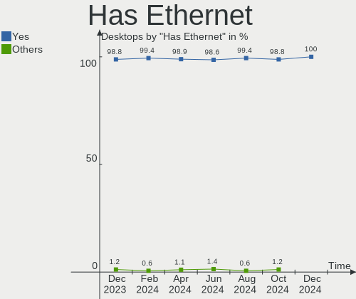
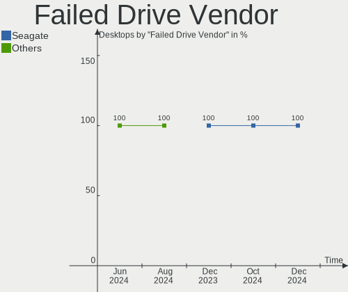
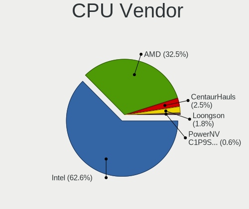
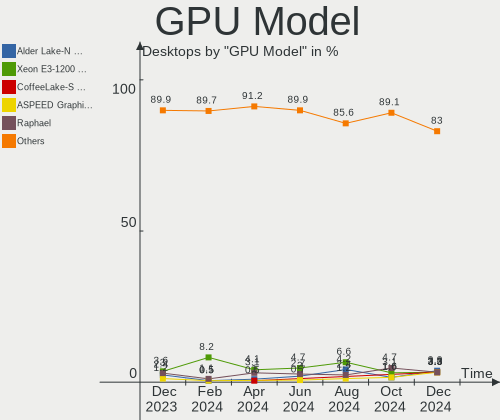
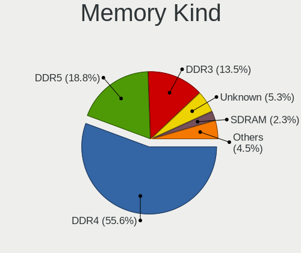

Debian - Hardware Trends (Desktops)
-----------------------------------

A project to identify most popular hardware characteristics and track their change
over time based on data collected by Linux users at https://Linux-Hardware.org.

Anyone can contribute to this report by the [hw-probe](https://github.com/linuxhw/hw-probe) tool:

    sudo -E hw-probe -all -upload

This report is for one last month. Overall report since the beginning of time: [TestCoverage](https://github.com/linuxhw/TestCoverage)

Period: Nov, 2022.

Contents
--------

* [ System ](#system)
  - [ OS                       ](#os)
  - [ OS Family                ](#os-family)
  - [ Kernel                   ](#kernel)
  - [ Kernel Family            ](#kernel-family)
  - [ Kernel Major Ver.        ](#kernel-major-ver)
  - [ Arch                     ](#arch)
  - [ DE                       ](#de)
  - [ Display Server           ](#display-server)
  - [ Display Manager          ](#display-manager)
  - [ OS Lang                  ](#os-lang)
  - [ Boot Mode                ](#boot-mode)
  - [ Filesystem               ](#filesystem)
  - [ Part. scheme             ](#part-scheme)
  - [ Dual Boot with Linux/BSD ](#dual-boot-with-linuxbsd)
  - [ Dual Boot (Win)          ](#dual-boot-win)

* [ Board ](#board)
  - [ Vendor                   ](#vendor)
  - [ Model                    ](#model)
  - [ Model Family             ](#model-family)
  - [ MFG Year                 ](#mfg-year)
  - [ Form Factor              ](#form-factor)
  - [ Secure Boot              ](#secure-boot)
  - [ Coreboot                 ](#coreboot)
  - [ RAM Size                 ](#ram-size)
  - [ RAM Used                 ](#ram-used)
  - [ Total Drives             ](#total-drives)
  - [ Has CD-ROM               ](#has-cd-rom)
  - [ Has Ethernet             ](#has-ethernet)
  - [ Has WiFi                 ](#has-wifi)
  - [ Has Bluetooth            ](#has-bluetooth)

* [ Location ](#location)
  - [ Country                  ](#country)
  - [ City                     ](#city)

* [ Drives ](#drives)
  - [ Drive Vendor             ](#drive-vendor)
  - [ Drive Model              ](#drive-model)
  - [ HDD Vendor               ](#hdd-vendor)
  - [ SSD Vendor               ](#ssd-vendor)
  - [ Drive Kind               ](#drive-kind)
  - [ Drive Connector          ](#drive-connector)
  - [ Drive Size               ](#drive-size)
  - [ Space Total              ](#space-total)
  - [ Space Used               ](#space-used)
  - [ Malfunc. Drives          ](#malfunc-drives)
  - [ Malfunc. Drive Vendor    ](#malfunc-drive-vendor)
  - [ Malfunc. HDD Vendor      ](#malfunc-hdd-vendor)
  - [ Malfunc. Drive Kind      ](#malfunc-drive-kind)
  - [ Failed Drives            ](#failed-drives)
  - [ Failed Drive Vendor      ](#failed-drive-vendor)
  - [ Drive Status             ](#drive-status)

* [ Storage controller ](#storage-controller)
  - [ Storage Vendor           ](#storage-vendor)
  - [ Storage Model            ](#storage-model)
  - [ Storage Kind             ](#storage-kind)

* [ Processor ](#processor)
  - [ CPU Vendor               ](#cpu-vendor)
  - [ CPU Model                ](#cpu-model)
  - [ CPU Model Family         ](#cpu-model-family)
  - [ CPU Cores                ](#cpu-cores)
  - [ CPU Sockets              ](#cpu-sockets)
  - [ CPU Threads              ](#cpu-threads)
  - [ CPU Op-Modes             ](#cpu-op-modes)
  - [ CPU Microcode            ](#cpu-microcode)
  - [ CPU Microarch            ](#cpu-microarch)

* [ Graphics ](#graphics)
  - [ GPU Vendor               ](#gpu-vendor)
  - [ GPU Model                ](#gpu-model)
  - [ GPU Combo                ](#gpu-combo)
  - [ GPU Driver               ](#gpu-driver)
  - [ GPU Memory               ](#gpu-memory)

* [ Monitor ](#monitor)
  - [ Monitor Vendor           ](#monitor-vendor)
  - [ Monitor Model            ](#monitor-model)
  - [ Monitor Resolution       ](#monitor-resolution)
  - [ Monitor Diagonal         ](#monitor-diagonal)
  - [ Monitor Width            ](#monitor-width)
  - [ Aspect Ratio             ](#aspect-ratio)
  - [ Monitor Area             ](#monitor-area)
  - [ Pixel Density            ](#pixel-density)
  - [ Multiple Monitors        ](#multiple-monitors)

* [ Network ](#network)
  - [ Net Controller Vendor    ](#net-controller-vendor)
  - [ Net Controller Model     ](#net-controller-model)
  - [ Wireless Vendor          ](#wireless-vendor)
  - [ Wireless Model           ](#wireless-model)
  - [ Ethernet Vendor          ](#ethernet-vendor)
  - [ Ethernet Model           ](#ethernet-model)
  - [ Net Controller Kind      ](#net-controller-kind)
  - [ Used Controller          ](#used-controller)
  - [ NICs                     ](#nics)
  - [ IPv6                     ](#ipv6)

* [ Bluetooth ](#bluetooth)
  - [ Bluetooth Vendor         ](#bluetooth-vendor)
  - [ Bluetooth Model          ](#bluetooth-model)

* [ Sound ](#sound)
  - [ Sound Vendor             ](#sound-vendor)
  - [ Sound Model              ](#sound-model)

* [ Memory ](#memory)
  - [ Memory Vendor            ](#memory-vendor)
  - [ Memory Model             ](#memory-model)
  - [ Memory Kind              ](#memory-kind)
  - [ Memory Form Factor       ](#memory-form-factor)
  - [ Memory Size              ](#memory-size)
  - [ Memory Speed             ](#memory-speed)

* [ Printers & scanners ](#printers--scanners)
  - [ Printer Vendor           ](#printer-vendor)
  - [ Printer Model            ](#printer-model)
  - [ Scanner Vendor           ](#scanner-vendor)
  - [ Scanner Model            ](#scanner-model)

* [ Camera ](#camera)
  - [ Camera Vendor            ](#camera-vendor)
  - [ Camera Model             ](#camera-model)

* [ Security ](#security)
  - [ Fingerprint Vendor       ](#fingerprint-vendor)
  - [ Fingerprint Model        ](#fingerprint-model)
  - [ Chipcard Vendor          ](#chipcard-vendor)
  - [ Chipcard Model           ](#chipcard-model)

* [ Unsupported ](#unsupported)
  - [ Unsupported Devices      ](#unsupported-devices)
  - [ Unsupported Device Types ](#unsupported-device-types)

System
------

OS
--

Installed operating systems

| Name            | Desktops | Percent |
|-----------------|----------|---------|
| Debian 11       | 102      | 77.27%  |
| Debian          | 17       | 12.88%  |
| Debian 10       | 5        | 3.79%   |
| Debian 8        | 4        | 3.03%   |
| Debian Testing  | 2        | 1.52%   |
| Debian Unstable | 1        | 0.76%   |
| Debian 7        | 1        | 0.76%   |

OS Family
---------

OS without a version

| Name   | Desktops | Percent |
|--------|----------|---------|
| Debian | 132      | 100%    |

Kernel
------

Version of the Linux kernel

| Version                            | Desktops | Percent |
|------------------------------------|----------|---------|
| 5.10.0-19-amd64                    | 38       | 28.79%  |
| 5.10.0-7-amd64                     | 28       | 21.21%  |
| 6.0.0-4-amd64                      | 7        | 5.3%    |
| 6.0.0-2-amd64                      | 6        | 4.55%   |
| 5.10.0-18-amd64                    | 6        | 4.55%   |
| 5.19.0-0.deb11.2-amd64             | 5        | 3.79%   |
| 6.0.8-edge                         | 3        | 2.27%   |
| 5.10.0-10-amd64                    | 3        | 2.27%   |
| 4.19.147-rivoreo-amd64             | 3        | 2.27%   |
| 4.1.42-rivoreo-powerpc64-largepage | 3        | 2.27%   |
| 5.19.0-1-amd64                     | 2        | 1.52%   |
| 5.15.64-1-pve                      | 2        | 1.52%   |
| 5.15.60-1-pve                      | 2        | 1.52%   |
| 5.15.30-2-pve                      | 2        | 1.52%   |
| 4.19.0-22-amd64                    | 2        | 1.52%   |
| 6.1.0-0-amd64                      | 1        | 0.76%   |
| 6.0.8-amd64                        | 1        | 0.76%   |
| 6.0.7-wrkd                         | 1        | 0.76%   |
| 6.0.3                              | 1        | 0.76%   |
| 6.0.0-9.1-liquorix-amd64           | 1        | 0.76%   |
| 6.0.0-5-amd64                      | 1        | 0.76%   |
| 6.0.0-3.1mx-amd64                  | 1        | 0.76%   |
| 6.0.0-3-amd64                      | 1        | 0.76%   |
| 6.0.0-0.deb11.2-amd64              | 1        | 0.76%   |
| 5.18.0-0.bpo.1-amd64               | 1        | 0.76%   |
| 5.16.12                            | 1        | 0.76%   |
| 5.15.74-1-pve                      | 1        | 0.76%   |
| 5.11.18-21.05.03.amdgpu            | 1        | 0.76%   |
| 5.10.0-9-686                       | 1        | 0.76%   |
| 5.10.0-19-686-pae                  | 1        | 0.76%   |
| 5.10.0-18-686-pae                  | 1        | 0.76%   |
| 5.10.0-17-amd64                    | 1        | 0.76%   |
| 5.10.0-13-amd64                    | 1        | 0.76%   |
| 4.1.42-rivoreo-powerpc64           | 1        | 0.76%   |
| 3.4.11                             | 1        | 0.76%   |

Kernel Family
-------------

Linux kernel without a distro release

| Version  | Desktops | Percent |
|----------|----------|---------|
| 5.10.0   | 80       | 60.61%  |
| 6.0.0    | 18       | 13.64%  |
| 5.19.0   | 7        | 5.3%    |
| 6.0.8    | 4        | 3.03%   |
| 4.1.42   | 4        | 3.03%   |
| 4.19.147 | 3        | 2.27%   |
| 5.15.64  | 2        | 1.52%   |
| 5.15.60  | 2        | 1.52%   |
| 5.15.30  | 2        | 1.52%   |
| 4.19.0   | 2        | 1.52%   |
| 6.1.0    | 1        | 0.76%   |
| 6.0.7    | 1        | 0.76%   |
| 6.0.3    | 1        | 0.76%   |
| 5.18.0   | 1        | 0.76%   |
| 5.16.12  | 1        | 0.76%   |
| 5.15.74  | 1        | 0.76%   |
| 5.11.18  | 1        | 0.76%   |
| 3.4.11   | 1        | 0.76%   |

Kernel Major Ver.
-----------------

Linux kernel major version

| Version | Desktops | Percent |
|---------|----------|---------|
| 5.10    | 80       | 60.61%  |
| 6.0     | 24       | 18.18%  |
| 5.19    | 7        | 5.3%    |
| 5.15    | 7        | 5.3%    |
| 4.19    | 5        | 3.79%   |
| 4.1     | 4        | 3.03%   |
| 6.1     | 1        | 0.76%   |
| 5.18    | 1        | 0.76%   |
| 5.16    | 1        | 0.76%   |
| 5.11    | 1        | 0.76%   |
| 3.4     | 1        | 0.76%   |

Arch
----

OS architecture (x86_64, i586, etc.)

| Name   | Desktops | Percent |
|--------|----------|---------|
| x86_64 | 124      | 93.94%  |
| ppc64  | 4        | 3.03%   |
| i686   | 3        | 2.27%   |
| sh4a   | 1        | 0.76%   |

DE
--

Desktop Environment

| Name             | Desktops | Percent |
|------------------|----------|---------|
| Unknown          | 52       | 39.39%  |
| GNOME            | 20       | 15.15%  |
| XFCE             | 19       | 14.39%  |
| KDE5             | 15       | 11.36%  |
| MATE             | 8        | 6.06%   |
| Cinnamon         | 4        | 3.03%   |
| X-Cinnamon       | 3        | 2.27%   |
| LXQt             | 3        | 2.27%   |
| LXDE             | 2        | 1.52%   |
| trinity          | 1        | 0.76%   |
| Openbox          | 1        | 0.76%   |
| lightdm-xsession | 1        | 0.76%   |
| i3               | 1        | 0.76%   |
| GNOME Classic    | 1        | 0.76%   |
| e16-session      | 1        | 0.76%   |

Display Server
--------------

X11 or Wayland

| Name    | Desktops | Percent |
|---------|----------|---------|
| X11     | 66       | 50%     |
| Unknown | 35       | 26.52%  |
| Tty     | 18       | 13.64%  |
| Wayland | 13       | 9.85%   |

Display Manager
---------------

SDDM, LightDM, etc.

| Name    | Desktops | Percent |
|---------|----------|---------|
| Unknown | 71       | 53.79%  |
| LightDM | 26       | 19.7%   |
| SDDM    | 20       | 15.15%  |
| GDM     | 12       | 9.09%   |
| GDM3    | 3        | 2.27%   |

OS Lang
-------

Language

| Lang    | Desktops | Percent |
|---------|----------|---------|
| en_US   | 44       | 33.33%  |
| ru_RU   | 39       | 29.55%  |
| C       | 9        | 6.82%   |
| fr_FR   | 5        | 3.79%   |
| de_DE   | 5        | 3.79%   |
| en_CA   | 4        | 3.03%   |
| it_IT   | 3        | 2.27%   |
| es_ES   | 3        | 2.27%   |
| en_GB   | 3        | 2.27%   |
| en_AU   | 3        | 2.27%   |
| zh_CN   | 2        | 1.52%   |
| uk_UA   | 1        | 0.76%   |
| pt_BR   | 1        | 0.76%   |
| pl_PL   | 1        | 0.76%   |
| nl_BE   | 1        | 0.76%   |
| hu_HU   | 1        | 0.76%   |
| es_VE   | 1        | 0.76%   |
| es_MX   | 1        | 0.76%   |
| es_CL   | 1        | 0.76%   |
| en_ZA   | 1        | 0.76%   |
| en_IE   | 1        | 0.76%   |
| en_HK   | 1        | 0.76%   |
| Unknown | 1        | 0.76%   |

Boot Mode
---------

EFI or BIOS

| Mode | Desktops | Percent |
|------|----------|---------|
| BIOS | 78       | 59.09%  |
| EFI  | 54       | 40.91%  |

Filesystem
----------

Type of filesystem

| Type    | Desktops | Percent |
|---------|----------|---------|
| Ext4    | 88       | 66.67%  |
| Overlay | 30       | 22.73%  |
| Btrfs   | 8        | 6.06%   |
| Zfs     | 5        | 3.79%   |
| Rootfs  | 1        | 0.76%   |

Part. scheme
------------

Scheme of partitioning

| Type    | Desktops | Percent |
|---------|----------|---------|
| GPT     | 63       | 47.73%  |
| MBR     | 50       | 37.88%  |
| Unknown | 19       | 14.39%  |

Dual Boot with Linux/BSD
------------------------

Hosting more than one Linux/BSD

| Dual boot | Desktops | Percent |
|-----------|----------|---------|
| No        | 107      | 81.06%  |
| Yes       | 25       | 18.94%  |

Dual Boot (Win)
---------------

Hosting Linux and Windows

| Dual boot | Desktops | Percent |
|-----------|----------|---------|
| No        | 70       | 53.03%  |
| Yes       | 62       | 46.97%  |

Board
-----

Vendor
------

Motherboard manufacturer

| Name                      | Desktops | Percent |
|---------------------------|----------|---------|
| ASUSTek Computer          | 31       | 23.48%  |
| Gigabyte Technology       | 29       | 21.97%  |
| MSI                       | 12       | 9.09%   |
| ECS                       | 12       | 9.09%   |
| Dell                      | 11       | 8.33%   |
| ASRock                    | 9        | 6.82%   |
| Intel                     | 6        | 4.55%   |
| Unknown                   | 6        | 4.55%   |
| Lenovo                    | 4        | 3.03%   |
| Foxconn                   | 3        | 2.27%   |
| Shenzhen aopoo technology | 1        | 0.76%   |
| Phoenix                   | 1        | 0.76%   |
| Pegatron                  | 1        | 0.76%   |
| IBM                       | 1        | 0.76%   |
| Hewlett-Packard           | 1        | 0.76%   |
| GuoGuang                  | 1        | 0.76%   |
| BESSTAR Tech              | 1        | 0.76%   |
| Apple                     | 1        | 0.76%   |
| Acer                      | 1        | 0.76%   |

Model
-----

Motherboard model

| Name                                | Desktops | Percent |
|-------------------------------------|----------|---------|
| ECS H61H2-M13                       | 12       | 9.09%   |
| Unknown                             | 6        | 4.55%   |
| ASUS All Series                     | 5        | 3.79%   |
| Gigabyte GA-78LMT-USB3              | 3        | 2.27%   |
| Intel Jasper Lake Client Platform   | 2        | 1.52%   |
| Gigabyte G31M-ES2L                  | 2        | 1.52%   |
| Gigabyte A320M-S2H                  | 2        | 1.52%   |
| ASUS PRO B460M-C                    | 2        | 1.52%   |
| ASUS M4A89GTD-PRO/USB3              | 2        | 1.52%   |
| ASUS M4A78T-E                       | 2        | 1.52%   |
| Shenzhen aopoo technology AC1-DP    | 1        | 0.76%   |
| Phoenix POULSBO                     | 1        | 0.76%   |
| Pegatron BYT-X1                     | 1        | 0.76%   |
| MSI MS-7D23                         | 1        | 0.76%   |
| MSI MS-7D22                         | 1        | 0.76%   |
| MSI MS-7D20                         | 1        | 0.76%   |
| MSI MS-7C95                         | 1        | 0.76%   |
| MSI MS-7C94                         | 1        | 0.76%   |
| MSI MS-7C91                         | 1        | 0.76%   |
| MSI MS-7C84                         | 1        | 0.76%   |
| MSI MS-7C02                         | 1        | 0.76%   |
| MSI MS-7B98                         | 1        | 0.76%   |
| MSI MS-7B93                         | 1        | 0.76%   |
| MSI MS-7996                         | 1        | 0.76%   |
| MSI MS-7788                         | 1        | 0.76%   |
| Lenovo ThinkCentre M920t 10SFCTO1WW | 1        | 0.76%   |
| Lenovo ThinkCentre M83 10AGA03JLS   | 1        | 0.76%   |
| Lenovo ThinkCentre M720s 10STS02300 | 1        | 0.76%   |
| Lenovo 70AQ000JGE ThinkServer TS440 | 1        | 0.76%   |
| Intel Mecer_X102                    | 1        | 0.76%   |
| Intel DQ67SW AAG12527-310           | 1        | 0.76%   |
| Intel DH77KC AAG39641-400           | 1        | 0.76%   |
| Intel ChiefRiver                    | 1        | 0.76%   |
| IBM eServer x3500-[7977I11]-        | 1        | 0.76%   |
| HP Z440 Workstation                 | 1        | 0.76%   |
| GuoGuang IC2M1028N-3                | 1        | 0.76%   |
| Gigabyte Z590 UD AC                 | 1        | 0.76%   |
| Gigabyte Z390 M GAMING              | 1        | 0.76%   |
| Gigabyte X570S AERO G               | 1        | 0.76%   |
| Gigabyte X570 UD                    | 1        | 0.76%   |

Model Family
------------

Motherboard model prefix

| Name                             | Desktops | Percent |
|----------------------------------|----------|---------|
| ECS H61H2-M13                    | 12       | 9.09%   |
| Dell OptiPlex                    | 6        | 4.55%   |
| ASUS PRIME                       | 6        | 4.55%   |
| Unknown                          | 6        | 4.55%   |
| ASUS All                         | 5        | 3.79%   |
| ASUS ROG                         | 4        | 3.03%   |
| Lenovo ThinkCentre               | 3        | 2.27%   |
| Gigabyte GA-78LMT-USB3           | 3        | 2.27%   |
| ASUS Pro                         | 3        | 2.27%   |
| Intel Jasper                     | 2        | 1.52%   |
| Gigabyte G31M-ES2L               | 2        | 1.52%   |
| Gigabyte B450                    | 2        | 1.52%   |
| Gigabyte A320M-S2H               | 2        | 1.52%   |
| Dell XPS                         | 2        | 1.52%   |
| ASUS M4A89GTD-PRO                | 2        | 1.52%   |
| ASUS M4A78T-E                    | 2        | 1.52%   |
| Shenzhen aopoo technology AC1-DP | 1        | 0.76%   |
| Phoenix POULSBO                  | 1        | 0.76%   |
| Pegatron BYT-X1                  | 1        | 0.76%   |
| MSI MS-7D23                      | 1        | 0.76%   |
| MSI MS-7D22                      | 1        | 0.76%   |
| MSI MS-7D20                      | 1        | 0.76%   |
| MSI MS-7C95                      | 1        | 0.76%   |
| MSI MS-7C94                      | 1        | 0.76%   |
| MSI MS-7C91                      | 1        | 0.76%   |
| MSI MS-7C84                      | 1        | 0.76%   |
| MSI MS-7C02                      | 1        | 0.76%   |
| MSI MS-7B98                      | 1        | 0.76%   |
| MSI MS-7B93                      | 1        | 0.76%   |
| MSI MS-7996                      | 1        | 0.76%   |
| MSI MS-7788                      | 1        | 0.76%   |
| Lenovo 70AQ000JGE                | 1        | 0.76%   |
| Intel Mecer                      | 1        | 0.76%   |
| Intel DQ67SW                     | 1        | 0.76%   |
| Intel DH77KC                     | 1        | 0.76%   |
| Intel ChiefRiver                 | 1        | 0.76%   |
| IBM eServer                      | 1        | 0.76%   |
| HP Z440                          | 1        | 0.76%   |
| GuoGuang IC2M1028N-3             | 1        | 0.76%   |
| Gigabyte Z590                    | 1        | 0.76%   |

MFG Year
--------

Motherboard manufacture year

| Year    | Desktops | Percent |
|---------|----------|---------|
| 2011    | 21       | 15.91%  |
| 2021    | 15       | 11.36%  |
| 2020    | 13       | 9.85%   |
| 2018    | 11       | 8.33%   |
| 2022    | 9        | 6.82%   |
| 2012    | 9        | 6.82%   |
| 2019    | 7        | 5.3%    |
| 2013    | 7        | 5.3%    |
| 2010    | 6        | 4.55%   |
| 2009    | 6        | 4.55%   |
| 2008    | 6        | 4.55%   |
| 2014    | 5        | 3.79%   |
| Unknown | 5        | 3.79%   |
| 2017    | 4        | 3.03%   |
| 2016    | 4        | 3.03%   |
| 2015    | 3        | 2.27%   |
| 2007    | 1        | 0.76%   |

Form Factor
-----------

Physical design of the computer

| Name    | Desktops | Percent |
|---------|----------|---------|
| Desktop | 132      | 100%    |

Secure Boot
-----------

Enabled or disabled

| State    | Desktops | Percent |
|----------|----------|---------|
| Disabled | 130      | 98.48%  |
| Enabled  | 2        | 1.52%   |

Coreboot
--------

Have coreboot on board

| Used | Desktops | Percent |
|------|----------|---------|
| No   | 132      | 100%    |

RAM Size
--------

Total RAM memory

| Size in GB      | Desktops | Percent |
|-----------------|----------|---------|
| 16.01-24.0      | 27       | 20.45%  |
| 3.01-4.0        | 22       | 16.67%  |
| 4.01-8.0        | 19       | 14.39%  |
| 32.01-64.0      | 16       | 12.12%  |
| 64.01-256.0     | 14       | 10.61%  |
| 8.01-16.0       | 13       | 9.85%   |
| Unknown         | 7        | 5.3%    |
| 1.01-2.0        | 5        | 3.79%   |
| 24.01-32.0      | 3        | 2.27%   |
| More than 256.0 | 2        | 1.52%   |
| 2.01-3.0        | 2        | 1.52%   |
| 0.51-1.0        | 1        | 0.76%   |
| 0.01-0.5        | 1        | 0.76%   |

RAM Used
--------

Used RAM memory

| Used GB    | Desktops | Percent |
|------------|----------|---------|
| 0.51-1.0   | 33       | 25%     |
| 2.01-3.0   | 25       | 18.94%  |
| 1.01-2.0   | 19       | 14.39%  |
| 4.01-8.0   | 18       | 13.64%  |
| 3.01-4.0   | 9        | 6.82%   |
| 8.01-16.0  | 8        | 6.06%   |
| Unknown    | 8        | 6.06%   |
| 32.01-64.0 | 6        | 4.55%   |
| 16.01-24.0 | 3        | 2.27%   |
| 0.01-0.5   | 3        | 2.27%   |

Total Drives
------------

Number of drives on board

| Drives | Desktops | Percent |
|--------|----------|---------|
| 1      | 54       | 40.91%  |
| 2      | 25       | 18.94%  |
| 3      | 20       | 15.15%  |
| 4      | 17       | 12.88%  |
| 5      | 5        | 3.79%   |
| 0      | 3        | 2.27%   |
| 10     | 2        | 1.52%   |
| 7      | 2        | 1.52%   |
| 14     | 1        | 0.76%   |
| 9      | 1        | 0.76%   |
| 8      | 1        | 0.76%   |
| 6      | 1        | 0.76%   |

Has CD-ROM
----------

Has CD-ROM on board

| Presented | Desktops | Percent |
|-----------|----------|---------|
| No        | 87       | 65.91%  |
| Yes       | 45       | 34.09%  |

Has Ethernet
------------

Has Ethernet on board

| Presented | Desktops | Percent |
|-----------|----------|---------|
| Yes       | 129      | 97.73%  |
| No        | 3        | 2.27%   |

Has WiFi
--------

Has WiFi module

| Presented | Desktops | Percent |
|-----------|----------|---------|
| No        | 91       | 68.94%  |
| Yes       | 41       | 31.06%  |

Has Bluetooth
-------------

Has Bluetooth module

| Presented | Desktops | Percent |
|-----------|----------|---------|
| No        | 96       | 72.73%  |
| Yes       | 36       | 27.27%  |

Location
--------

Country
-------

Geographic location (country)

| Country      | Desktops | Percent |
|--------------|----------|---------|
| Russia       | 40       | 30.3%   |
| USA          | 19       | 14.39%  |
| China        | 12       | 9.09%   |
| Canada       | 8        | 6.06%   |
| Germany      | 7        | 5.3%    |
| France       | 5        | 3.79%   |
| Spain        | 4        | 3.03%   |
| Italy        | 4        | 3.03%   |
| UK           | 3        | 2.27%   |
| Poland       | 3        | 2.27%   |
| Mexico       | 3        | 2.27%   |
| Australia    | 3        | 2.27%   |
| Venezuela    | 2        | 1.52%   |
| Romania      | 2        | 1.52%   |
| Finland      | 2        | 1.52%   |
| Ukraine      | 1        | 0.76%   |
| Turkey       | 1        | 0.76%   |
| Switzerland  | 1        | 0.76%   |
| Sweden       | 1        | 0.76%   |
| South Africa | 1        | 0.76%   |
| Netherlands  | 1        | 0.76%   |
| Malaysia     | 1        | 0.76%   |
| Kazakhstan   | 1        | 0.76%   |
| Ireland      | 1        | 0.76%   |
| Hungary      | 1        | 0.76%   |
| Chile        | 1        | 0.76%   |
| Bulgaria     | 1        | 0.76%   |
| Brazil       | 1        | 0.76%   |
| Belgium      | 1        | 0.76%   |
| Argentina    | 1        | 0.76%   |

City
----

Geographic location (city)

| City                   | Desktops | Percent |
|------------------------|----------|---------|
| Voronezh               | 28       | 21.21%  |
| Nanhao                 | 7        | 5.3%    |
| St Petersburg          | 3        | 2.27%   |
| Moscow                 | 3        | 2.27%   |
| Laval                  | 3        | 2.27%   |
| Naperville             | 2        | 1.52%   |
| Ludwigsburg            | 2        | 1.52%   |
| Caracas                | 2        | 1.52%   |
| Beijing                | 2        | 1.52%   |
| Adelaide               | 2        | 1.52%   |
| Zurich                 | 1        | 0.76%   |
| Yutz                   | 1        | 0.76%   |
| Washington             | 1        | 0.76%   |
| Warsaw                 | 1        | 0.76%   |
| Waregem                | 1        | 0.76%   |
| Volgograd              | 1        | 0.76%   |
| Vancouver              | 1        | 0.76%   |
| Tulare                 | 1        | 0.76%   |
| Toronto                | 1        | 0.76%   |
| Timișoara             | 1        | 0.76%   |
| Tillsonburg            | 1        | 0.76%   |
| Tijuana                | 1        | 0.76%   |
| Tiedong                | 1        | 0.76%   |
| Thousand Oaks          | 1        | 0.76%   |
| Terrossa               | 1        | 0.76%   |
| Teignmouth             | 1        | 0.76%   |
| Szombathely            | 1        | 0.76%   |
| Sydney                 | 1        | 0.76%   |
| Suresnes               | 1        | 0.76%   |
| St Louis               | 1        | 0.76%   |
| Sofia                  | 1        | 0.76%   |
| Serra Dourada          | 1        | 0.76%   |
| Satu Mare              | 1        | 0.76%   |
| Santa Cruz de Tenerife | 1        | 0.76%   |
| San Rafael             | 1        | 0.76%   |
| Saltillo               | 1        | 0.76%   |
| Rzeszów               | 1        | 0.76%   |
| Royal Tunbridge Wells  | 1        | 0.76%   |
| Reutov                 | 1        | 0.76%   |
| Reinosa                | 1        | 0.76%   |

Drives
------

Drive Vendor
------------

Hard drive vendors

| Vendor              | Desktops | Drives | Percent |
|---------------------|----------|--------|---------|
| Seagate             | 43       | 61     | 17.06%  |
| WDC                 | 40       | 65     | 15.87%  |
| Samsung Electronics | 24       | 32     | 9.52%   |
| Kingston            | 22       | 23     | 8.73%   |
| Hitachi             | 15       | 16     | 5.95%   |
| Crucial             | 14       | 15     | 5.56%   |
| Toshiba             | 13       | 16     | 5.16%   |
| Sandisk             | 8        | 11     | 3.17%   |
| A-DATA Technology   | 6        | 8      | 2.38%   |
| Intel               | 5        | 7      | 1.98%   |
| China               | 5        | 5      | 1.98%   |
| Micron Technology   | 3        | 4      | 1.19%   |
| KIOXIA-EXCERIA      | 3        | 4      | 1.19%   |
| HGST                | 3        | 3      | 1.19%   |
| Corsair             | 3        | 4      | 1.19%   |
| Unknown             | 2        | 4      | 0.79%   |
| SPCC                | 2        | 2      | 0.79%   |
| Maxtor              | 2        | 2      | 0.79%   |
| KIOXIA              | 2        | 2      | 0.79%   |
| Kingchuxing         | 2        | 2      | 0.79%   |
| JMicron Technology  | 2        | 2      | 0.79%   |
| Hewlett-Packard     | 2        | 3      | 0.79%   |
| Gigabyte Technology | 2        | 2      | 0.79%   |
| Unknown             | 2        | 2      | 0.79%   |
| ZHITAI              | 1        | 1      | 0.4%    |
| Zheino              | 1        | 1      | 0.4%    |
| XPG                 | 1        | 2      | 0.4%    |
| Vaseky              | 1        | 1      | 0.4%    |
| Transcend           | 1        | 1      | 0.4%    |
| Team                | 1        | 1      | 0.4%    |
| T-FORCE             | 1        | 1      | 0.4%    |
| Smartbuy            | 1        | 1      | 0.4%    |
| SK hynix            | 1        | 1      | 0.4%    |
| Silicon Motion      | 1        | 1      | 0.4%    |
| PNY                 | 1        | 1      | 0.4%    |
| Patriot             | 1        | 1      | 0.4%    |
| NVME                | 1        | 2      | 0.4%    |
| Netac               | 1        | 1      | 0.4%    |
| LITEON              | 1        | 1      | 0.4%    |
| LENOVO-X            | 1        | 1      | 0.4%    |

Drive Model
-----------

Hard drive models

| Model                               | Desktops | Percent |
|-------------------------------------|----------|---------|
| Hitachi HDS721050DLE630 500GB       | 9        | 3.05%   |
| Kingston SA400S37240G 240GB SSD     | 6        | 2.03%   |
| Seagate ST500DM002-1BD142 500GB     | 5        | 1.69%   |
| Kingston SA400S37120G 120GB SSD     | 5        | 1.69%   |
| Toshiba DT01ACA100 1TB              | 4        | 1.36%   |
| Crucial CT1000MX500SSD1 1TB         | 4        | 1.36%   |
| Toshiba DT01ACA050 500GB            | 3        | 1.02%   |
| Seagate ST300MM0008 304GB           | 3        | 1.02%   |
| Seagate ST300MM0006 304GB           | 3        | 1.02%   |
| Seagate ST1000DM010-2EP102 1TB      | 3        | 1.02%   |
| Seagate ST1000DM003-1CH162 1TB      | 3        | 1.02%   |
| Samsung SSD 850 EVO 500GB           | 3        | 1.02%   |
| Crucial CT500MX500SSD1 500GB        | 3        | 1.02%   |
| WDC WDS500G2B0A-00SM50 500GB SSD    | 2        | 0.68%   |
| WDC WD20EARX-00PASB0 2TB            | 2        | 0.68%   |
| WDC WD1600AAJS-00B4A0 160GB         | 2        | 0.68%   |
| WDC WD10EZEX-08WN4A0 1TB            | 2        | 0.68%   |
| Seagate ST8000DM004-2CX188 8TB      | 2        | 0.68%   |
| Seagate ST500LM012 HN-M500MBB 500GB | 2        | 0.68%   |
| Seagate ST4000DM004-2CV104 4TB      | 2        | 0.68%   |
| Seagate ST2000DM001-1ER164 2TB      | 2        | 0.68%   |
| Seagate ST2000DM001-1CH164 2TB      | 2        | 0.68%   |
| Samsung SSD 970 EVO Plus 500GB      | 2        | 0.68%   |
| Samsung SSD 860 EVO 500GB           | 2        | 0.68%   |
| Samsung SSD 850 PRO 256GB           | 2        | 0.68%   |
| Kingston SA400S37480G 480GB SSD     | 2        | 0.68%   |
| Intel SSDSC2BB080G4 80GB            | 2        | 0.68%   |
| HGST HTS541010A9E680 1TB            | 2        | 0.68%   |
| Crucial CT240BX500SSD1 240GB        | 2        | 0.68%   |
| Corsair Force MP510 240GB           | 2        | 0.68%   |
| China SATA SSD 480GB                | 2        | 0.68%   |
| A-DATA SU800 1TB SSD                | 2        | 0.68%   |
| Unknown                             | 2        | 0.68%   |
| ZHITAI SC001 Active 512GB SSD       | 1        | 0.34%   |
| Zheino CHN-25SATAC3-120 120GB       | 1        | 0.34%   |
| XPG SPECTRIX S40G 512GB             | 1        | 0.34%   |
| XPG GAMMIX S11 Pro 1TB              | 1        | 0.34%   |
| WDC WUH721818AL 18TB                | 1        | 0.34%   |
| WDC WDS500G3X0C-00SJG0 500GB        | 1        | 0.34%   |
| WDC WDS500G2B0C-00PXH0 500GB        | 1        | 0.34%   |

HDD Vendor
----------

Hard disk drive vendors

| Vendor              | Desktops | Drives | Percent |
|---------------------|----------|--------|---------|
| Seagate             | 42       | 56     | 37.17%  |
| WDC                 | 33       | 56     | 29.2%   |
| Hitachi             | 15       | 16     | 13.27%  |
| Toshiba             | 12       | 14     | 10.62%  |
| Samsung Electronics | 3        | 4      | 2.65%   |
| HGST                | 3        | 3      | 2.65%   |
| Maxtor              | 2        | 2      | 1.77%   |
| HPE                 | 1        | 2      | 0.88%   |
| ASMT                | 1        | 1      | 0.88%   |
| Advantech           | 1        | 1      | 0.88%   |

SSD Vendor
----------

Solid state drive vendors

| Vendor              | Desktops | Drives | Percent |
|---------------------|----------|--------|---------|
| Kingston            | 17       | 17     | 17.71%  |
| Samsung Electronics | 15       | 19     | 15.63%  |
| Crucial             | 12       | 13     | 12.5%   |
| SanDisk             | 5        | 6      | 5.21%   |
| Intel               | 5        | 7      | 5.21%   |
| China               | 5        | 5      | 5.21%   |
| A-DATA Technology   | 5        | 7      | 5.21%   |
| WDC                 | 3        | 3      | 3.13%   |
| Toshiba             | 2        | 2      | 2.08%   |
| SPCC                | 2        | 2      | 2.08%   |
| Kingchuxing         | 2        | 2      | 2.08%   |
| Hewlett-Packard     | 2        | 3      | 2.08%   |
| ZHITAI              | 1        | 1      | 1.04%   |
| Zheino              | 1        | 1      | 1.04%   |
| Vaseky              | 1        | 1      | 1.04%   |
| Transcend           | 1        | 1      | 1.04%   |
| T-FORCE             | 1        | 1      | 1.04%   |
| Smartbuy            | 1        | 1      | 1.04%   |
| Seagate             | 1        | 2      | 1.04%   |
| PNY                 | 1        | 1      | 1.04%   |
| Patriot             | 1        | 1      | 1.04%   |
| NVME                | 1        | 2      | 1.04%   |
| Netac               | 1        | 1      | 1.04%   |
| Micron Technology   | 1        | 1      | 1.04%   |
| LITEON              | 1        | 1      | 1.04%   |
| JMicron Technology  | 1        | 1      | 1.04%   |
| J.ZAO               | 1        | 1      | 1.04%   |
| Hoodisk             | 1        | 1      | 1.04%   |
| GOODRAM             | 1        | 1      | 1.04%   |
| Gigabyte Technology | 1        | 1      | 1.04%   |
| FORESEE             | 1        | 1      | 1.04%   |
| Corsair             | 1        | 1      | 1.04%   |
| Unknown             | 1        | 1      | 1.04%   |

Drive Kind
----------

HDD or SSD

| Kind    | Desktops | Drives | Percent |
|---------|----------|--------|---------|
| HDD     | 87       | 155    | 42.86%  |
| SSD     | 74       | 109    | 36.45%  |
| NVMe    | 35       | 51     | 17.24%  |
| Unknown | 6        | 9      | 2.96%   |
| MMC     | 1        | 1      | 0.49%   |

Drive Connector
---------------

SATA, SAS, NVMe, etc.

| Type | Desktops | Drives | Percent |
|------|----------|--------|---------|
| SATA | 115      | 244    | 70.12%  |
| NVMe | 34       | 50     | 20.73%  |
| SAS  | 14       | 30     | 8.54%   |
| MMC  | 1        | 1      | 0.61%   |

Drive Size
----------

Size of hard drive

| Size in TB | Desktops | Drives | Percent |
|------------|----------|--------|---------|
| 0.01-0.5   | 97       | 145    | 54.49%  |
| 0.51-1.0   | 40       | 55     | 22.47%  |
| 1.01-2.0   | 16       | 21     | 8.99%   |
| 3.01-4.0   | 9        | 13     | 5.06%   |
| 4.01-10.0  | 7        | 12     | 3.93%   |
| 2.01-3.0   | 5        | 5      | 2.81%   |
| 10.01-20.0 | 4        | 13     | 2.25%   |

Space Total
-----------

Amount of disk space available on the file system

| Size in GB     | Desktops | Percent |
|----------------|----------|---------|
| Unknown        | 34       | 25.76%  |
| 501-1000       | 19       | 14.39%  |
| 251-500        | 18       | 13.64%  |
| 1001-2000      | 17       | 12.88%  |
| 101-250        | 15       | 11.36%  |
| More than 3000 | 9        | 6.82%   |
| 2001-3000      | 7        | 5.3%    |
| 1-20           | 5        | 3.79%   |
| 21-50          | 4        | 3.03%   |
| 51-100         | 4        | 3.03%   |

Space Used
----------

Amount of used disk space

| Used GB        | Desktops | Percent |
|----------------|----------|---------|
| Unknown        | 34       | 25.76%  |
| 1-20           | 26       | 19.7%   |
| 101-250        | 17       | 12.88%  |
| 51-100         | 13       | 9.85%   |
| 21-50          | 12       | 9.09%   |
| 501-1000       | 12       | 9.09%   |
| More than 3000 | 6        | 4.55%   |
| 251-500        | 6        | 4.55%   |
| 1001-2000      | 4        | 3.03%   |
| 2001-3000      | 2        | 1.52%   |

Malfunc. Drives
---------------

Drive models with a malfunction

| Model                                 | Desktops | Drives | Percent |
|---------------------------------------|----------|--------|---------|
| Hitachi HDS721050DLE630 500GB         | 5        | 5      | 14.71%  |
| WDC WD20EARX-00PASB0 2TB              | 2        | 2      | 5.88%   |
| WDC WD1600AAJS-00B4A0 160GB           | 2        | 2      | 5.88%   |
| WDC WD7500BPKT-75PK4T0 752GB          | 1        | 1      | 2.94%   |
| WDC WD6000HLHX-75JJPV0 600GB          | 1        | 4      | 2.94%   |
| WDC WD5000LPVX-22V0TT0 500GB          | 1        | 1      | 2.94%   |
| WDC WD5000AAKX-22ERMA0 500GB          | 1        | 1      | 2.94%   |
| WDC WD3200AAKX-753CA1 320GB           | 1        | 1      | 2.94%   |
| WDC WD3200AAKS-75L9A0 320GB           | 1        | 1      | 2.94%   |
| WDC WD2002FYPS-02W3B0 2TB             | 1        | 1      | 2.94%   |
| Toshiba DT01ACA300 3TB                | 1        | 1      | 2.94%   |
| Seagate ST500DM005 HD502HJ 500GB      | 1        | 1      | 2.94%   |
| Seagate ST4000DM004-2CV104 4TB        | 1        | 1      | 2.94%   |
| Seagate ST380817AS 80GB               | 1        | 1      | 2.94%   |
| Seagate ST3500413AS 500GB             | 1        | 1      | 2.94%   |
| Seagate ST3320620NS 320GB             | 1        | 1      | 2.94%   |
| Seagate ST3200822AS 200GB             | 1        | 1      | 2.94%   |
| Seagate ST31000528AS 1TB              | 1        | 1      | 2.94%   |
| Seagate ST3000DM001-9YN166 3TB        | 1        | 1      | 2.94%   |
| Seagate ST2000DM001-1ER164 2TB        | 1        | 1      | 2.94%   |
| Seagate ST1000DM010-2EP102 1TB        | 1        | 1      | 2.94%   |
| Samsung Electronics SSD 850 PRO 256GB | 1        | 1      | 2.94%   |
| Maxtor STM3160815AS 160GB             | 1        | 1      | 2.94%   |
| Kingston SV300S37A120G 120GB SSD      | 1        | 1      | 2.94%   |
| Kingston SA400S37960G 960GB SSD       | 1        | 1      | 2.94%   |
| Intel SSDSC2KW256G8 256GB             | 1        | 1      | 2.94%   |
| Hitachi HDS725050KLA360 500GB         | 1        | 2      | 2.94%   |
| A-DATA Technology SU800 1TB SSD       | 1        | 2      | 2.94%   |

Malfunc. Drive Vendor
---------------------

Vendors of faulty drives

| Vendor              | Desktops | Drives | Percent |
|---------------------|----------|--------|---------|
| WDC                 | 11       | 14     | 33.33%  |
| Seagate             | 9        | 10     | 27.27%  |
| Hitachi             | 6        | 7      | 18.18%  |
| Kingston            | 2        | 2      | 6.06%   |
| Toshiba             | 1        | 1      | 3.03%   |
| Samsung Electronics | 1        | 1      | 3.03%   |
| Maxtor              | 1        | 1      | 3.03%   |
| Intel               | 1        | 1      | 3.03%   |
| A-DATA Technology   | 1        | 2      | 3.03%   |

Malfunc. HDD Vendor
-------------------

Vendors of faulty HDD drives

| Vendor  | Desktops | Drives | Percent |
|---------|----------|--------|---------|
| WDC     | 11       | 14     | 39.29%  |
| Seagate | 9        | 10     | 32.14%  |
| Hitachi | 6        | 7      | 21.43%  |
| Toshiba | 1        | 1      | 3.57%   |
| Maxtor  | 1        | 1      | 3.57%   |

Malfunc. Drive Kind
-------------------

Kinds of faulty drives

| Kind | Desktops | Drives | Percent |
|------|----------|--------|---------|
| HDD  | 27       | 33     | 84.38%  |
| SSD  | 5        | 6      | 15.63%  |

Failed Drives
-------------

Failed drive models

| Model                             | Desktops | Drives | Percent |
|-----------------------------------|----------|--------|---------|
| Seagate ST500DM002-1BD142 500GB   | 1        | 1      | 33.33%  |
| Samsung Electronics HD253GJ 250GB | 1        | 1      | 33.33%  |
| Hewlett-Packard SSD S700 500GB    | 1        | 2      | 33.33%  |

Failed Drive Vendor
-------------------

Failed drive vendors

| Vendor              | Desktops | Drives | Percent |
|---------------------|----------|--------|---------|
| Seagate             | 1        | 1      | 33.33%  |
| Samsung Electronics | 1        | 1      | 33.33%  |
| Hewlett-Packard     | 1        | 2      | 33.33%  |

Drive Status
------------

Number of failed and malfunc. drives

| Status   | Desktops | Drives | Percent |
|----------|----------|--------|---------|
| Works    | 93       | 204    | 57.76%  |
| Detected | 33       | 78     | 20.5%   |
| Malfunc  | 32       | 39     | 19.88%  |
| Failed   | 3        | 4      | 1.86%   |

Storage controller
------------------

Storage Vendor
--------------

Storage controller vendors

| Vendor                      | Desktops | Percent |
|-----------------------------|----------|---------|
| Intel                       | 86       | 44.1%   |
| AMD                         | 39       | 20%     |
| ASMedia Technology          | 11       | 5.64%   |
| SanDisk                     | 9        | 4.62%   |
| Samsung Electronics         | 8        | 4.1%    |
| LSI Logic / Symbios Logic   | 5        | 2.56%   |
| KIOXIA                      | 5        | 2.56%   |
| Kingston Technology Company | 5        | 2.56%   |
| Phison Electronics          | 4        | 2.05%   |
| Marvell Technology Group    | 3        | 1.54%   |
| JMicron Technology          | 3        | 1.54%   |
| IBM                         | 3        | 1.54%   |
| Micron/Crucial Technology   | 2        | 1.03%   |
| Micron Technology           | 2        | 1.03%   |
| ADATA Technology            | 2        | 1.03%   |
| SK hynix                    | 1        | 0.51%   |
| Silicon Motion              | 1        | 0.51%   |
| Silicon Image               | 1        | 0.51%   |
| Seagate Technology          | 1        | 0.51%   |
| Realtek Semiconductor       | 1        | 0.51%   |
| Mylex                       | 1        | 0.51%   |
| Broadcom / LSI              | 1        | 0.51%   |
| Adaptec                     | 1        | 0.51%   |

Storage Model
-------------

Storage controller models

| Model                                                                                   | Desktops | Percent |
|-----------------------------------------------------------------------------------------|----------|---------|
| AMD FCH SATA Controller [AHCI mode]                                                     | 18       | 7.63%   |
| Intel 6 Series/C200 Series Chipset Family 6 port Desktop SATA AHCI Controller           | 15       | 6.36%   |
| ASMedia ASM1062 Serial ATA Controller                                                   | 9        | 3.81%   |
| AMD SB7x0/SB8x0/SB9x0 IDE Controller                                                    | 9        | 3.81%   |
| Intel 500 Series Chipset Family SATA AHCI Controller                                    | 8        | 3.39%   |
| AMD SB7x0/SB8x0/SB9x0 SATA Controller [IDE mode]                                        | 8        | 3.39%   |
| AMD 400 Series Chipset SATA Controller                                                  | 7        | 2.97%   |
| Intel NM10/ICH7 Family SATA Controller [IDE mode]                                       | 6        | 2.54%   |
| AMD 500 Series Chipset SATA Controller                                                  | 6        | 2.54%   |
| Intel 8 Series/C220 Series Chipset Family 6-port SATA Controller 1 [AHCI mode]          | 5        | 2.12%   |
| Intel 200 Series PCH SATA controller [AHCI mode]                                        | 5        | 2.12%   |
| Sandisk Non-Volatile memory controller                                                  | 4        | 1.69%   |
| Intel Cannon Lake PCH SATA AHCI Controller                                              | 4        | 1.69%   |
| Intel Alder Lake-S PCH SATA Controller [AHCI Mode]                                      | 4        | 1.69%   |
| Intel 6 Series/C200 Series Chipset Family Desktop SATA Controller (IDE mode, ports 4-5) | 4        | 1.69%   |
| Intel 6 Series/C200 Series Chipset Family Desktop SATA Controller (IDE mode, ports 0-3) | 4        | 1.69%   |
| Samsung NVMe SSD Controller SM981/PM981/PM983                                           | 3        | 1.27%   |
| Samsung NVMe SSD Controller PM9A1/PM9A3/980PRO                                          | 3        | 1.27%   |
| KIOXIA NVMe SSD                                                                         | 3        | 1.27%   |
| Kingston Company Company Non-Volatile memory controller                                 | 3        | 1.27%   |
| Intel Volume Management Device NVMe RAID Controller                                     | 3        | 1.27%   |
| Intel Q170/Q150/B150/H170/H110/Z170/CM236 Chipset SATA Controller [AHCI Mode]           | 3        | 1.27%   |
| Intel Comet Lake SATA AHCI Controller                                                   | 3        | 1.27%   |
| Intel C610/X99 series chipset sSATA Controller [AHCI mode]                              | 3        | 1.27%   |
| Intel C610/X99 series chipset 6-Port SATA Controller [AHCI mode]                        | 3        | 1.27%   |
| Intel 82801JI (ICH10 Family) SATA AHCI Controller                                       | 3        | 1.27%   |
| Intel 7 Series/C210 Series Chipset Family 6-port SATA Controller [AHCI mode]            | 3        | 1.27%   |
| Intel 400 Series Chipset Family SATA AHCI Controller                                    | 3        | 1.27%   |
| IBM Obsidian chipset SCSI controller                                                    | 3        | 1.27%   |
| AMD SB7x0/SB8x0/SB9x0 SATA Controller [AHCI mode]                                       | 3        | 1.27%   |
| AMD FCH SATA Controller D                                                               | 3        | 1.27%   |
| SanDisk WD Blue SN550 NVMe SSD                                                          | 2        | 0.85%   |
| SanDisk WD Black SN750 / PC SN730 NVMe SSD                                              | 2        | 0.85%   |
| Samsung NVMe SSD Controller SM961/PM961/SM963                                           | 2        | 0.85%   |
| Phison E12 NVMe Controller                                                              | 2        | 0.85%   |
| Marvell Group 88SE9230 PCIe 2.0 x2 4-port SATA 6 Gb/s RAID Controller                   | 2        | 0.85%   |
| LSI Logic / Symbios Logic SAS2008 PCI-Express Fusion-MPT SAS-2 [Falcon]                 | 2        | 0.85%   |
| JMicron JMB361 AHCI/IDE                                                                 | 2        | 0.85%   |
| Intel Jasper Lake SATA AHCI Controller                                                  | 2        | 0.85%   |
| Intel Celeron/Pentium Silver Processor SATA Controller                                  | 2        | 0.85%   |

Storage Kind
------------

Kind of storage controller (IDE, SATA, NVMe, SAS, ...)

| Kind | Desktops | Percent |
|------|----------|---------|
| SATA | 111      | 58.12%  |
| NVMe | 34       | 17.8%   |
| IDE  | 30       | 15.71%  |
| RAID | 11       | 5.76%   |
| SAS  | 4        | 2.09%   |
| SCSI | 1        | 0.52%   |

Processor
---------

CPU Vendor
----------

Processor vendors

| Vendor            | Desktops | Percent |
|-------------------|----------|---------|
| Intel             | 87       | 65.91%  |
| AMD               | 40       | 30.3%   |
| CHRP IBM,8233-E8B | 3        | 2.27%   |
| CHRP IBM,9131-52A | 1        | 0.76%   |
| Unknown           | 1        | 0.76%   |

CPU Model
---------

Processor models

| Model                                                     | Desktops | Percent |
|-----------------------------------------------------------|----------|---------|
| Intel Pentium CPU G630 @ 2.70GHz                          | 12       | 9.09%   |
| CHRP IBM,8233-E8B POWER7 (architected), altivec supported | 3        | 2.27%   |
| Intel Core i7-8700 CPU @ 3.20GHz                          | 2        | 1.52%   |
| Intel Core i5-3450 CPU @ 3.10GHz                          | 2        | 1.52%   |
| Intel Core i3-6100 CPU @ 3.70GHz                          | 2        | 1.52%   |
| Intel Core i3-10100 CPU @ 3.60GHz                         | 2        | 1.52%   |
| Intel Celeron J4125 CPU @ 2.00GHz                         | 2        | 1.52%   |
| Intel 11th Gen Core i5-11400F @ 2.60GHz                   | 2        | 1.52%   |
| AMD Ryzen 7 5700G with Radeon Graphics                    | 2        | 1.52%   |
| AMD Ryzen 7 2700X Eight-Core Processor                    | 2        | 1.52%   |
| AMD Ryzen 5 5600G with Radeon Graphics                    | 2        | 1.52%   |
| AMD Ryzen 5 3600 6-Core Processor                         | 2        | 1.52%   |
| AMD FX-4150 Quad-Core Processor                           | 2        | 1.52%   |
| AMD Athlon 3000G with Radeon Vega Graphics                | 2        | 1.52%   |
| AMD A10-6800K APU with Radeon HD Graphics                 | 2        | 1.52%   |
| Intel Xeon CPU X5650 @ 2.67GHz                            | 1        | 0.76%   |
| Intel Xeon CPU E5405 @ 2.00GHz                            | 1        | 0.76%   |
| Intel Xeon CPU E5-2678 v3 @ 2.50GHz                       | 1        | 0.76%   |
| Intel Xeon CPU E5-2620 v3 @ 2.40GHz                       | 1        | 0.76%   |
| Intel Xeon CPU E31220 @ 3.10GHz                           | 1        | 0.76%   |
| Intel Xeon CPU E3-1245 v3 @ 3.40GHz                       | 1        | 0.76%   |
| Intel Xeon CPU E3-1230 V2 @ 3.30GHz                       | 1        | 0.76%   |
| Intel Xeon CPU 5130 @ 2.00GHz                             | 1        | 0.76%   |
| Intel Pentium Gold G5420 CPU @ 3.80GHz                    | 1        | 0.76%   |
| Intel Pentium Gold G5400 CPU @ 3.70GHz                    | 1        | 0.76%   |
| Intel Pentium CPU G620 @ 2.60GHz                          | 1        | 0.76%   |
| Intel Core i9-10900K CPU @ 3.70GHz                        | 1        | 0.76%   |
| Intel Core i7-8700K CPU @ 3.70GHz                         | 1        | 0.76%   |
| Intel Core i7-7700 CPU @ 3.60GHz                          | 1        | 0.76%   |
| Intel Core i7-6850K CPU @ 3.60GHz                         | 1        | 0.76%   |
| Intel Core i7-4930K CPU @ 3.40GHz                         | 1        | 0.76%   |
| Intel Core i7-4770 CPU @ 3.40GHz                          | 1        | 0.76%   |
| Intel Core i7-3770T CPU @ 2.50GHz                         | 1        | 0.76%   |
| Intel Core i7-10700T CPU @ 2.00GHz                        | 1        | 0.76%   |
| Intel Core i7-10700 CPU @ 2.90GHz                         | 1        | 0.76%   |
| Intel Core i7 CPU 960 @ 3.20GHz                           | 1        | 0.76%   |
| Intel Core i7 CPU 920 @ 2.67GHz                           | 1        | 0.76%   |
| Intel Core i5-9600K CPU @ 3.70GHz                         | 1        | 0.76%   |
| Intel Core i5-7500T CPU @ 2.70GHz                         | 1        | 0.76%   |
| Intel Core i5-6400 CPU @ 2.70GHz                          | 1        | 0.76%   |

CPU Model Family
----------------

Processor model prefix

| Model                  | Desktops | Percent |
|------------------------|----------|---------|
| Other                  | 15       | 11.36%  |
| Intel Pentium          | 13       | 9.85%   |
| Intel Core i7          | 12       | 9.09%   |
| Intel Core i3          | 12       | 9.09%   |
| Intel Core i5          | 11       | 8.33%   |
| Intel Celeron          | 10       | 7.58%   |
| Intel Xeon             | 8        | 6.06%   |
| AMD Ryzen 7            | 8        | 6.06%   |
| AMD Ryzen 5            | 8        | 6.06%   |
| Intel Core 2 Duo       | 5        | 3.79%   |
| AMD Ryzen 9            | 4        | 3.03%   |
| AMD FX                 | 4        | 3.03%   |
| AMD Athlon             | 3        | 2.27%   |
| AMD A10                | 3        | 2.27%   |
| Intel Pentium Gold     | 2        | 1.52%   |
| Intel Atom             | 2        | 1.52%   |
| AMD Ryzen Threadripper | 2        | 1.52%   |
| AMD Phenom II X6       | 2        | 1.52%   |
| AMD Phenom II X4       | 2        | 1.52%   |
| AMD Athlon II X4       | 2        | 1.52%   |
| Intel Core i9          | 1        | 0.76%   |
| Intel Core 2 Quad      | 1        | 0.76%   |
| AMD Ryzen 7 PRO        | 1        | 0.76%   |
| AMD Athlon II X2       | 1        | 0.76%   |

CPU Cores
---------

Number of processor cores

| Number | Desktops | Percent |
|--------|----------|---------|
| 2      | 42       | 31.82%  |
| 4      | 33       | 25%     |
| 6      | 22       | 16.67%  |
| 8      | 14       | 10.61%  |
| 1      | 7        | 5.3%    |
| 16     | 4        | 3.03%   |
| 12     | 4        | 3.03%   |
| 32     | 2        | 1.52%   |
| 10     | 2        | 1.52%   |
| 3      | 2        | 1.52%   |

CPU Sockets
-----------

Number of sockets

| Number | Desktops | Percent |
|--------|----------|---------|
| 1      | 130      | 98.48%  |
| 2      | 2        | 1.52%   |

CPU Threads
-----------

Threads per core (Hyper-Threading)

| Number | Desktops | Percent |
|--------|----------|---------|
| 2      | 74       | 56.06%  |
| 1      | 55       | 41.67%  |
| 4      | 3        | 2.27%   |

CPU Op-Modes
------------

CPU Operation Modes (32-bit, 64-bit)

| Op mode        | Desktops | Percent |
|----------------|----------|---------|
| 32-bit, 64-bit | 130      | 98.48%  |
| 32-bit         | 1        | 0.76%   |
| Unknown        | 1        | 0.76%   |

CPU Microcode
-------------

Microcode number

| Number     | Desktops | Percent |
|------------|----------|---------|
| Unknown    | 26       | 19.7%   |
| 0x206a7    | 15       | 11.36%  |
| 0x306c3    | 5        | 3.79%   |
| 0x306a9    | 5        | 3.79%   |
| 0xa0671    | 4        | 3.03%   |
| 0x906ea    | 4        | 3.03%   |
| 0x506e3    | 4        | 3.03%   |
| 0x1067a    | 4        | 3.03%   |
| 0x08701021 | 4        | 3.03%   |
| 0xa0655    | 3        | 2.27%   |
| 0x906e9    | 3        | 2.27%   |
| 0x0a20120a | 3        | 2.27%   |
| 0x0800820d | 3        | 2.27%   |
| 0xa0653    | 2        | 1.52%   |
| 0x906c0    | 2        | 1.52%   |
| 0x90672    | 2        | 1.52%   |
| 0x706a8    | 2        | 1.52%   |
| 0x106a5    | 2        | 1.52%   |
| 0x0a50000d | 2        | 1.52%   |
| 0x0a50000c | 2        | 1.52%   |
| 0x08701013 | 2        | 1.52%   |
| 0x08108109 | 2        | 1.52%   |
| 0x06001119 | 2        | 1.52%   |
| 0x0600063e | 2        | 1.52%   |
| 0x010000dc | 2        | 1.52%   |
| 0xb0671    | 1        | 0.76%   |
| 0x906ec    | 1        | 0.76%   |
| 0x90675    | 1        | 0.76%   |
| 0x6fb      | 1        | 0.76%   |
| 0x6f6      | 1        | 0.76%   |
| 0x506c9    | 1        | 0.76%   |
| 0x306f2    | 1        | 0.76%   |
| 0x306e4    | 1        | 0.76%   |
| 0x30678    | 1        | 0.76%   |
| 0x30661    | 1        | 0.76%   |
| 0x206c2    | 1        | 0.76%   |
| 0x106c2    | 1        | 0.76%   |
| 0x10677    | 1        | 0.76%   |
| 0x10661    | 1        | 0.76%   |
| 0x0a601203 | 1        | 0.76%   |

CPU Microarch
-------------

Microarchitecture

| Name             | Desktops | Percent |
|------------------|----------|---------|
| SandyBridge      | 17       | 12.88%  |
| Unknown          | 14       | 10.61%  |
| Zen 2            | 10       | 7.58%   |
| KabyLake         | 9        | 6.82%   |
| CometLake        | 9        | 6.82%   |
| K10              | 8        | 6.06%   |
| IvyBridge        | 8        | 6.06%   |
| Haswell          | 8        | 6.06%   |
| Zen 3            | 7        | 5.3%    |
| Penryn           | 7        | 5.3%    |
| Zen+             | 6        | 4.55%   |
| Skylake          | 4        | 3.03%   |
| Piledriver       | 3        | 2.27%   |
| Core             | 3        | 2.27%   |
| Bulldozer        | 3        | 2.27%   |
| Tremont          | 2        | 1.52%   |
| Nehalem          | 2        | 1.52%   |
| Goldmont plus    | 2        | 1.52%   |
| Bonnell          | 2        | 1.52%   |
| Alderlake Hybrid | 2        | 1.52%   |
| Zen              | 1        | 0.76%   |
| Westmere         | 1        | 0.76%   |
| Steamroller      | 1        | 0.76%   |
| Silvermont       | 1        | 0.76%   |
| Goldmont         | 1        | 0.76%   |
| Broadwell        | 1        | 0.76%   |

Graphics
--------

GPU Vendor
----------

Vendors of graphics cards

| Vendor                     | Desktops | Percent |
|----------------------------|----------|---------|
| Nvidia                     | 51       | 37.78%  |
| Intel                      | 48       | 35.56%  |
| AMD                        | 32       | 23.7%   |
| Matrox Electronics Systems | 3        | 2.22%   |
| ASPEED Technology          | 1        | 0.74%   |

GPU Model
---------

Graphics card models

| Model                                                                       | Desktops | Percent |
|-----------------------------------------------------------------------------|----------|---------|
| Nvidia GF108 [GeForce GT 630]                                               | 12       | 8.51%   |
| Intel CometLake-S GT2 [UHD Graphics 630]                                    | 6        | 4.26%   |
| Nvidia GP107 [GeForce GTX 1050 Ti]                                          | 4        | 2.84%   |
| Intel HD Graphics 530                                                       | 4        | 2.84%   |
| Nvidia GP108 [GeForce GT 1030]                                              | 3        | 2.13%   |
| Nvidia GM206 [GeForce GTX 960]                                              | 3        | 2.13%   |
| Nvidia GK208B [GeForce GT 730]                                              | 3        | 2.13%   |
| Nvidia GK107 [GeForce GT 740]                                               | 3        | 2.13%   |
| Matrox Electronics Systems Millennium G550                                  | 3        | 2.13%   |
| Intel Xeon E3-1200 v2/3rd Gen Core processor Graphics Controller            | 3        | 2.13%   |
| Intel 82G33/G31 Express Integrated Graphics Controller                      | 3        | 2.13%   |
| Intel 4 Series Chipset Integrated Graphics Controller                       | 3        | 2.13%   |
| Intel 2nd Generation Core Processor Family Integrated Graphics Controller   | 3        | 2.13%   |
| AMD Cezanne [Radeon Vega Series / Radeon Vega Mobile Series]                | 3        | 2.13%   |
| Nvidia GP106 [GeForce GTX 1060 6GB]                                         | 2        | 1.42%   |
| Nvidia GP106 [GeForce GTX 1060 3GB]                                         | 2        | 1.42%   |
| Intel Xeon E3-1200 v3/4th Gen Core Processor Integrated Graphics Controller | 2        | 1.42%   |
| Intel RocketLake-S GT1 [UHD Graphics 750]                                   | 2        | 1.42%   |
| Intel JasperLake [UHD Graphics]                                             | 2        | 1.42%   |
| Intel HD Graphics 630                                                       | 2        | 1.42%   |
| Intel GeminiLake [UHD Graphics 600]                                         | 2        | 1.42%   |
| Intel CoffeeLake-S GT2 [UHD Graphics 630]                                   | 2        | 1.42%   |
| Intel CoffeeLake-S GT1 [UHD Graphics 610]                                   | 2        | 1.42%   |
| Intel AlderLake-S GT1                                                       | 2        | 1.42%   |
| AMD RS780L [Radeon 3000]                                                    | 2        | 1.42%   |
| AMD Richland [Radeon HD 8670D]                                              | 2        | 1.42%   |
| AMD Picasso/Raven 2 [Radeon Vega Series / Radeon Vega Mobile Series]        | 2        | 1.42%   |
| AMD Navi 23 [Radeon RX 6600/6600 XT/6600M]                                  | 2        | 1.42%   |
| AMD Navi 22 [Radeon RX 6700/6700 XT/6750 XT / 6800M]                        | 2        | 1.42%   |
| AMD Lexa PRO [Radeon 540/540X/550/550X / RX 540X/550/550X]                  | 2        | 1.42%   |
| AMD Ellesmere [Radeon RX 470/480/570/570X/580/580X/590]                     | 2        | 1.42%   |
| Nvidia TU117GL [T600]                                                       | 1        | 0.71%   |
| Nvidia TU117 [GeForce GTX 1650]                                             | 1        | 0.71%   |
| Nvidia TU116 [GeForce GTX 1660]                                             | 1        | 0.71%   |
| Nvidia TU106 [GeForce RTX 2060 Rev. A]                                      | 1        | 0.71%   |
| Nvidia TU102 [TITAN RTX]                                                    | 1        | 0.71%   |
| Nvidia NV43 [GeForce 6600]                                                  | 1        | 0.71%   |
| Nvidia GP107 [GeForce GTX 1050]                                             | 1        | 0.71%   |
| Nvidia GP106GL [Quadro P2200]                                               | 1        | 0.71%   |
| Nvidia GP104GL [Quadro P4000]                                               | 1        | 0.71%   |

GPU Combo
---------

Combinations of graphics cards

| Name                    | Desktops | Percent |
|-------------------------|----------|---------|
| 1 x Nvidia              | 44       | 33.33%  |
| 1 x Intel               | 44       | 33.33%  |
| 1 x AMD                 | 28       | 21.21%  |
| Other                   | 3        | 2.27%   |
| 2 x AMD                 | 3        | 2.27%   |
| 1 x Matrox              | 3        | 2.27%   |
| Intel + Nvidia          | 3        | 2.27%   |
| 2 x Nvidia              | 2        | 1.52%   |
| 2 x Nvidia + 1 x ASPEED | 1        | 0.76%   |
| AMD + Nvidia            | 1        | 0.76%   |

GPU Driver
----------

Free vs proprietary

| Driver      | Desktops | Percent |
|-------------|----------|---------|
| Free        | 67       | 50.76%  |
| Unknown     | 48       | 36.36%  |
| Proprietary | 17       | 12.88%  |

GPU Memory
----------

Total video memory

| Size in GB | Desktops | Percent |
|------------|----------|---------|
| Unknown    | 82       | 62.12%  |
| 1.01-2.0   | 12       | 9.09%   |
| 0.51-1.0   | 9        | 6.82%   |
| 3.01-4.0   | 7        | 5.3%    |
| 7.01-8.0   | 6        | 4.55%   |
| 0.01-0.5   | 5        | 3.79%   |
| 5.01-6.0   | 3        | 2.27%   |
| 16.01-24.0 | 3        | 2.27%   |
| 2.01-3.0   | 2        | 1.52%   |
| 8.01-16.0  | 2        | 1.52%   |
| 4.01-5.0   | 1        | 0.76%   |

Monitor
-------

Monitor Vendor
--------------

Monitor vendors

| Vendor                  | Desktops | Percent |
|-------------------------|----------|---------|
| Samsung Electronics     | 17       | 17.35%  |
| Dell                    | 13       | 13.27%  |
| Goldstar                | 10       | 10.2%   |
| Acer                    | 8        | 8.16%   |
| AOC                     | 7        | 7.14%   |
| Philips                 | 5        | 5.1%    |
| Hewlett-Packard         | 5        | 5.1%    |
| BenQ                    | 4        | 4.08%   |
| ViewSonic               | 3        | 3.06%   |
| ASUSTek Computer        | 3        | 3.06%   |
| Ancor Communications    | 3        | 3.06%   |
| Iiyama                  | 2        | 2.04%   |
| Yamaha                  | 1        | 1.02%   |
| WYT                     | 1        | 1.02%   |
| Viotek                  | 1        | 1.02%   |
| Videoseven              | 1        | 1.02%   |
| Toshiba                 | 1        | 1.02%   |
| SKY                     | 1        | 1.02%   |
| PVT                     | 1        | 1.02%   |
| Pixio                   | 1        | 1.02%   |
| NEC Computers           | 1        | 1.02%   |
| Microstep               | 1        | 1.02%   |
| Medion                  | 1        | 1.02%   |
| LG Electronics          | 1        | 1.02%   |
| Lenovo                  | 1        | 1.02%   |
| Eizo                    | 1        | 1.02%   |
| DENON                   | 1        | 1.02%   |
| Chi Mei Optoelectronics | 1        | 1.02%   |
| Apple                   | 1        | 1.02%   |
| AMW                     | 1        | 1.02%   |

Monitor Model
-------------

Monitor models

| Model                                                                 | Desktops | Percent |
|-----------------------------------------------------------------------|----------|---------|
| Goldstar LG ULTRAWIDE GSM59F1 2560x1080 670x280mm 28.6-inch           | 2        | 1.96%   |
| Dell U2412M DELA07A 1920x1200 518x324mm 24.1-inch                     | 2        | 1.96%   |
| AOC AG241QG4 AOC2410 2560x1440 527x396mm 26.0-inch                    | 2        | 1.96%   |
| Yamaha RX-V477 YMH31A8 1920x540 708x398mm 32.0-inch                   | 1        | 0.98%   |
| WYT MNT-ANALOG19W WYT1113 1440x900 410x256mm 19.0-inch                | 1        | 0.98%   |
| Viotek VIOTEKNB32C VTK3200 1920x1080 698x393mm 31.5-inch              | 1        | 0.98%   |
| ViewSonic VA2248 SERIES VSC0E28 1920x1080 477x268mm 21.5-inch         | 1        | 0.98%   |
| ViewSonic VA2014 SERIES VSC6026 1600x900 443x249mm 20.0-inch          | 1        | 0.98%   |
| ViewSonic LCD Monitor VSCBB31 1920x1080 530x300mm 24.0-inch           | 1        | 0.98%   |
| Videoseven L17GM IGM0508 1280x1024 338x270mm 17.0-inch                | 1        | 0.98%   |
| Toshiba LCD Monitor TOS508F 1920x1080 477x268mm 21.5-inch             | 1        | 0.98%   |
| SKY Skyworth TV SKY1402 3840x2160 708x398mm 32.0-inch                 | 1        | 0.98%   |
| Samsung Electronics T24C300 SAM0A9B 1920x1080 530x300mm 24.0-inch     | 1        | 0.98%   |
| Samsung Electronics SyncMaster SAM036F 1440x900 428x255mm 19.6-inch   | 1        | 0.98%   |
| Samsung Electronics SyncMaster SAM02F6 1280x1024 340x270mm 17.1-inch  | 1        | 0.98%   |
| Samsung Electronics SMXL2370HD SAM072B 1920x1080 510x287mm 23.0-inch  | 1        | 0.98%   |
| Samsung Electronics SMT24A350 SAM07AD 1920x1080 531x299mm 24.0-inch   | 1        | 0.98%   |
| Samsung Electronics SME1920N SAM06A3 1366x768 410x230mm 18.5-inch     | 1        | 0.98%   |
| Samsung Electronics S24D300 SAM0B43 1920x1080 531x299mm 24.0-inch     | 1        | 0.98%   |
| Samsung Electronics S24C650 SAM0B15 1920x1200 520x320mm 24.0-inch     | 1        | 0.98%   |
| Samsung Electronics S24C350 SAM0A38 1920x1080 521x293mm 23.5-inch     | 1        | 0.98%   |
| Samsung Electronics S22E310 SAM0C2D 1920x1080 480x270mm 21.7-inch     | 1        | 0.98%   |
| Samsung Electronics LF27T450F SAM7099 1920x1080 597x336mm 27.0-inch   | 1        | 0.98%   |
| Samsung Electronics LCD Monitor SAM0FF0 3840x2160 950x540mm 43.0-inch | 1        | 0.98%   |
| Samsung Electronics LCD Monitor SAM0399 1360x768                      | 1        | 0.98%   |
| Samsung Electronics LCD Monitor S24R65x 3840x1080                     | 1        | 0.98%   |
| Samsung Electronics LCD Monitor S24R65x                               | 1        | 0.98%   |
| Samsung Electronics LCD Monitor S24F350                               | 1        | 0.98%   |
| Samsung Electronics LC32G7xT SAM7058 2560x1440 698x393mm 31.5-inch    | 1        | 0.98%   |
| Samsung Electronics C27F390 SAM0D32 1920x1080 598x336mm 27.0-inch     | 1        | 0.98%   |
| PVT HDMI Splitter PVTF01D 1920x1080 510x287mm 23.0-inch               | 1        | 0.98%   |
| Pixio LCD Monitor WAM2900 2560x1080 690x260mm 29.0-inch               | 1        | 0.98%   |
| Philips PHL 328E8Q PHLC164 1920x1080 698x393mm 31.5-inch              | 1        | 0.98%   |
| Philips PHL 275E1 PHLC20C 2560x1440 600x340mm 27.2-inch               | 1        | 0.98%   |
| Philips PHL 221V8 PHLC211 1920x1080 477x268mm 21.5-inch               | 1        | 0.98%   |
| Philips LCD Monitor PHL 329P1 3840x2160                               | 1        | 0.98%   |
| Philips LCD Monitor PHL 243V7 3840x1080                               | 1        | 0.98%   |
| Philips LCD Monitor PHL 243V7                                         | 1        | 0.98%   |
| NEC Computers EA232WMi NEC6816 1920x1080 510x290mm 23.1-inch          | 1        | 0.98%   |
| Microstep LCD Monitor MSI G273                                        | 1        | 0.98%   |

Monitor Resolution
------------------

Monitor screen resolution

| Resolution         | Desktops | Percent |
|--------------------|----------|---------|
| 1920x1080 (FHD)    | 39       | 39.8%   |
| 2560x1440 (QHD)    | 13       | 13.27%  |
| 1280x1024 (SXGA)   | 8        | 8.16%   |
| 1920x1200 (WUXGA)  | 6        | 6.12%   |
| 1600x900 (HD+)     | 5        | 5.1%    |
| 3840x2160 (4K)     | 4        | 4.08%   |
| 3840x1080          | 4        | 4.08%   |
| 2560x1080          | 4        | 4.08%   |
| Unknown            | 4        | 4.08%   |
| 1440x900 (WXGA+)   | 3        | 3.06%   |
| 1360x768           | 2        | 2.04%   |
| 3440x1440          | 1        | 1.02%   |
| 1920x540           | 1        | 1.02%   |
| 1680x1050 (WSXGA+) | 1        | 1.02%   |
| 1600x1200          | 1        | 1.02%   |
| 1366x768 (WXGA)    | 1        | 1.02%   |
| 1024x768 (XGA)     | 1        | 1.02%   |

Monitor Diagonal
----------------

Diagonal size in inches

| Inches  | Desktops | Percent |
|---------|----------|---------|
| 24      | 17       | 17.89%  |
| 23      | 15       | 15.79%  |
| 21      | 10       | 10.53%  |
| 27      | 9        | 9.47%   |
| Unknown | 9        | 9.47%   |
| 19      | 7        | 7.37%   |
| 31      | 5        | 5.26%   |
| 17      | 4        | 4.21%   |
| 34      | 3        | 3.16%   |
| 20      | 3        | 3.16%   |
| 32      | 2        | 2.11%   |
| 26      | 2        | 2.11%   |
| 18      | 2        | 2.11%   |
| 84      | 1        | 1.05%   |
| 35      | 1        | 1.05%   |
| 33      | 1        | 1.05%   |
| 29      | 1        | 1.05%   |
| 22      | 1        | 1.05%   |
| 16      | 1        | 1.05%   |
| 15      | 1        | 1.05%   |

Monitor Width
-------------

Physical width

| Width in mm | Desktops | Percent |
|-------------|----------|---------|
| 501-600     | 38       | 41.3%   |
| 401-500     | 22       | 23.91%  |
| Unknown     | 9        | 9.78%   |
| 601-700     | 7        | 7.61%   |
| 701-800     | 6        | 6.52%   |
| 301-350     | 6        | 6.52%   |
| 351-400     | 2        | 2.17%   |
| 801-900     | 1        | 1.09%   |
| 1501-2000   | 1        | 1.09%   |

Aspect Ratio
------------

Proportional relationship between the width and the height

| Ratio   | Desktops | Percent |
|---------|----------|---------|
| 16/9    | 56       | 62.92%  |
| 16/10   | 9        | 10.11%  |
| 5/4     | 7        | 7.87%   |
| Unknown | 7        | 7.87%   |
| 4/3     | 4        | 4.49%   |
| 21/9    | 4        | 4.49%   |
| 6/5     | 1        | 1.12%   |
| 2.65    | 1        | 1.12%   |

Monitor Area
------------

Area in inch²

| Area in inch² | Desktops | Percent |
|----------------|----------|---------|
| 201-250        | 35       | 37.23%  |
| 351-500        | 12       | 12.77%  |
| 151-200        | 12       | 12.77%  |
| 301-350        | 11       | 11.7%   |
| Unknown        | 9        | 9.57%   |
| 251-300        | 6        | 6.38%   |
| 141-150        | 6        | 6.38%   |
| More than 1000 | 1        | 1.06%   |
| 131-140        | 1        | 1.06%   |
| 101-110        | 1        | 1.06%   |

Pixel Density
-------------

Pixels per inch

| Density | Desktops | Percent |
|---------|----------|---------|
| 51-100  | 58       | 65.91%  |
| 101-120 | 17       | 19.32%  |
| Unknown | 9        | 10.23%  |
| 121-160 | 4        | 4.55%   |

Multiple Monitors
-----------------

Total monitors connected

| Total | Desktops | Percent |
|-------|----------|---------|
| 1     | 70       | 53.03%  |
| 0     | 46       | 34.85%  |
| 2     | 13       | 9.85%   |
| 3     | 3        | 2.27%   |

Network
-------

Net Controller Vendor
---------------------

Controller vendors

| Vendor                          | Desktops | Percent |
|---------------------------------|----------|---------|
| Realtek Semiconductor           | 86       | 48.86%  |
| Intel                           | 50       | 28.41%  |
| Qualcomm Atheros                | 11       | 6.25%   |
| Broadcom                        | 4        | 2.27%   |
| Mellanox Technologies           | 3        | 1.7%    |
| IBM                             | 3        | 1.7%    |
| Samsung Electronics             | 2        | 1.14%   |
| Ralink Technology               | 2        | 1.14%   |
| Ralink                          | 2        | 1.14%   |
| MediaTek                        | 2        | 1.14%   |
| Xiaomi                          | 1        | 0.57%   |
| TP-Link                         | 1        | 0.57%   |
| Tehuti Networks                 | 1        | 0.57%   |
| Qualcomm Atheros Communications | 1        | 0.57%   |
| QinHeng Electronics             | 1        | 0.57%   |
| Marvell Technology Group        | 1        | 0.57%   |
| Huawei Technologies             | 1        | 0.57%   |
| Gemtek                          | 1        | 0.57%   |
| Dresden Elektronik              | 1        | 0.57%   |
| Aquantia                        | 1        | 0.57%   |
| 3Com                            | 1        | 0.57%   |

Net Controller Model
--------------------

Controller models

| Model                                                             | Desktops | Percent |
|-------------------------------------------------------------------|----------|---------|
| Realtek RTL8111/8168/8411 PCI Express Gigabit Ethernet Controller | 60       | 30.3%   |
| Realtek RTL810xE PCI Express Fast Ethernet controller             | 13       | 6.57%   |
| Realtek RTL8125 2.5GbE Controller                                 | 10       | 5.05%   |
| Intel Wi-Fi 6 AX200                                               | 7        | 3.54%   |
| Intel Ethernet Controller I225-V                                  | 6        | 3.03%   |
| Intel Wireless-AC 9260                                            | 4        | 2.02%   |
| Realtek RTL8821CE 802.11ac PCIe Wireless Network Adapter          | 3        | 1.52%   |
| Qualcomm Atheros AR8121/AR8113/AR8114 Gigabit or Fast Ethernet    | 3        | 1.52%   |
| Intel Tiger Lake PCH CNVi WiFi                                    | 3        | 1.52%   |
| Intel I211 Gigabit Network Connection                             | 3        | 1.52%   |
| Intel Ethernet Connection (7) I219-V                              | 3        | 1.52%   |
| Intel Ethernet Connection (12) I219-V                             | 3        | 1.52%   |
| IBM IBM                                                           | 3        | 1.52%   |
| Samsung Galaxy series, misc. (tethering mode)                     | 2        | 1.01%   |
| Qualcomm Atheros AR8151 v2.0 Gigabit Ethernet                     | 2        | 1.01%   |
| Qualcomm Atheros AR8131 Gigabit Ethernet                          | 2        | 1.01%   |
| Mellanox MT27500 Family [ConnectX-3]                              | 2        | 1.01%   |
| MediaTek MT7921K (RZ608) Wi-Fi 6E 80MHz                           | 2        | 1.01%   |
| Intel Ethernet Connection I217-LM                                 | 2        | 1.01%   |
| Intel Ethernet Connection (2) I218-V                              | 2        | 1.01%   |
| Intel Ethernet Connection (2) I218-LM                             | 2        | 1.01%   |
| Intel 82599ES 10-Gigabit SFI/SFP+ Network Connection              | 2        | 1.01%   |
| Intel 82580 Gigabit Network Connection                            | 2        | 1.01%   |
| Intel 82579V Gigabit Network Connection                           | 2        | 1.01%   |
| Intel 82579LM Gigabit Network Connection (Lewisville)             | 2        | 1.01%   |
| Intel 82567LM-3 Gigabit Network Connection                        | 2        | 1.01%   |
| Xiaomi Mi/Redmi series (RNDIS)                                    | 1        | 0.51%   |
| TP-Link 802.11ac WLAN Adapter                                     | 1        | 0.51%   |
| Tehuti Networks TN9310 10GbE SFP+ Ethernet Adapter                | 1        | 0.51%   |
| Realtek RTL88x2bu [AC1200 Techkey]                                | 1        | 0.51%   |
| Realtek RTL8192EE PCIe Wireless Network Adapter                   | 1        | 0.51%   |
| Realtek RTL8188EUS 802.11n Wireless Network Adapter               | 1        | 0.51%   |
| Realtek RTL8169 PCI Gigabit Ethernet Controller                   | 1        | 0.51%   |
| Realtek RTL8153 Gigabit Ethernet Adapter                          | 1        | 0.51%   |
| Realtek Killer E3000 2.5GbE Controller                            | 1        | 0.51%   |
| Realtek Killer E2600 Gigabit Ethernet Controller                  | 1        | 0.51%   |
| Realtek 802.11n                                                   | 1        | 0.51%   |
| Realtek 802.11ac NIC                                              | 1        | 0.51%   |
| Ralink RT5370 Wireless Adapter                                    | 1        | 0.51%   |
| Ralink RT2870/RT3070 Wireless Adapter                             | 1        | 0.51%   |

Wireless Vendor
---------------

Wireless vendors

| Vendor                          | Desktops | Percent |
|---------------------------------|----------|---------|
| Intel                           | 21       | 50%     |
| Realtek Semiconductor           | 8        | 19.05%  |
| Qualcomm Atheros                | 3        | 7.14%   |
| Ralink Technology               | 2        | 4.76%   |
| Ralink                          | 2        | 4.76%   |
| MediaTek                        | 2        | 4.76%   |
| TP-Link                         | 1        | 2.38%   |
| Qualcomm Atheros Communications | 1        | 2.38%   |
| Gemtek                          | 1        | 2.38%   |
| Broadcom                        | 1        | 2.38%   |

Wireless Model
--------------

Wireless models

| Model                                                                         | Desktops | Percent |
|-------------------------------------------------------------------------------|----------|---------|
| Intel Wi-Fi 6 AX200                                                           | 7        | 16.67%  |
| Intel Wireless-AC 9260                                                        | 4        | 9.52%   |
| Realtek RTL8821CE 802.11ac PCIe Wireless Network Adapter                      | 3        | 7.14%   |
| Intel Tiger Lake PCH CNVi WiFi                                                | 3        | 7.14%   |
| MediaTek MT7921K (RZ608) Wi-Fi 6E 80MHz                                       | 2        | 4.76%   |
| TP-Link 802.11ac WLAN Adapter                                                 | 1        | 2.38%   |
| Realtek RTL88x2bu [AC1200 Techkey]                                            | 1        | 2.38%   |
| Realtek RTL8192EE PCIe Wireless Network Adapter                               | 1        | 2.38%   |
| Realtek RTL8188EUS 802.11n Wireless Network Adapter                           | 1        | 2.38%   |
| Realtek 802.11n                                                               | 1        | 2.38%   |
| Realtek 802.11ac NIC                                                          | 1        | 2.38%   |
| Ralink RT5370 Wireless Adapter                                                | 1        | 2.38%   |
| Ralink RT2870/RT3070 Wireless Adapter                                         | 1        | 2.38%   |
| Ralink RT5392 PCIe Wireless Network Adapter                                   | 1        | 2.38%   |
| Ralink RT3090 Wireless 802.11n 1T/1R PCIe                                     | 1        | 2.38%   |
| Qualcomm Atheros QCA9565 / AR9565 Wireless Network Adapter                    | 1        | 2.38%   |
| Qualcomm Atheros TP-Link TL-WN821N v2 / TL-WN822N v1 802.11n [Atheros AR9170] | 1        | 2.38%   |
| Qualcomm Atheros AR928X Wireless Network Adapter (PCI-Express)                | 1        | 2.38%   |
| Qualcomm Atheros AR5212/5213/2414 Wireless Network Adapter                    | 1        | 2.38%   |
| Intel Wireless 8265 / 8275                                                    | 1        | 2.38%   |
| Intel Wireless 7265                                                           | 1        | 2.38%   |
| Intel Wireless 3165                                                           | 1        | 2.38%   |
| Intel Dual Band Wireless-AC 3168NGW [Stone Peak]                              | 1        | 2.38%   |
| Intel Comet Lake PCH CNVi WiFi                                                | 1        | 2.38%   |
| Intel Cannon Lake PCH CNVi WiFi                                               | 1        | 2.38%   |
| Intel Alder Lake-S PCH CNVi WiFi                                              | 1        | 2.38%   |
| Gemtek WUBR-177G [Ralink RT2571W]                                             | 1        | 2.38%   |
| Broadcom BCM4360 802.11ac Wireless Network Adapter                            | 1        | 2.38%   |

Ethernet Vendor
---------------

Ethernet vendors

| Vendor                   | Desktops | Percent |
|--------------------------|----------|---------|
| Realtek Semiconductor    | 84       | 57.53%  |
| Intel                    | 37       | 25.34%  |
| Qualcomm Atheros         | 8        | 5.48%   |
| Mellanox Technologies    | 3        | 2.05%   |
| IBM                      | 3        | 2.05%   |
| Broadcom                 | 3        | 2.05%   |
| Samsung Electronics      | 2        | 1.37%   |
| Xiaomi                   | 1        | 0.68%   |
| Tehuti Networks          | 1        | 0.68%   |
| Marvell Technology Group | 1        | 0.68%   |
| Huawei Technologies      | 1        | 0.68%   |
| Aquantia                 | 1        | 0.68%   |
| 3Com                     | 1        | 0.68%   |

Ethernet Model
--------------

Ethernet models

| Model                                                                         | Desktops | Percent |
|-------------------------------------------------------------------------------|----------|---------|
| Realtek RTL8111/8168/8411 PCI Express Gigabit Ethernet Controller             | 60       | 38.96%  |
| Realtek RTL810xE PCI Express Fast Ethernet controller                         | 13       | 8.44%   |
| Realtek RTL8125 2.5GbE Controller                                             | 10       | 6.49%   |
| Intel Ethernet Controller I225-V                                              | 6        | 3.9%    |
| Qualcomm Atheros AR8121/AR8113/AR8114 Gigabit or Fast Ethernet                | 3        | 1.95%   |
| Intel I211 Gigabit Network Connection                                         | 3        | 1.95%   |
| Intel Ethernet Connection (7) I219-V                                          | 3        | 1.95%   |
| Intel Ethernet Connection (12) I219-V                                         | 3        | 1.95%   |
| IBM IBM                                                                       | 3        | 1.95%   |
| Samsung Galaxy series, misc. (tethering mode)                                 | 2        | 1.3%    |
| Qualcomm Atheros AR8151 v2.0 Gigabit Ethernet                                 | 2        | 1.3%    |
| Qualcomm Atheros AR8131 Gigabit Ethernet                                      | 2        | 1.3%    |
| Mellanox MT27500 Family [ConnectX-3]                                          | 2        | 1.3%    |
| Intel Ethernet Connection I217-LM                                             | 2        | 1.3%    |
| Intel Ethernet Connection (2) I218-V                                          | 2        | 1.3%    |
| Intel Ethernet Connection (2) I218-LM                                         | 2        | 1.3%    |
| Intel 82599ES 10-Gigabit SFI/SFP+ Network Connection                          | 2        | 1.3%    |
| Intel 82580 Gigabit Network Connection                                        | 2        | 1.3%    |
| Intel 82579V Gigabit Network Connection                                       | 2        | 1.3%    |
| Intel 82579LM Gigabit Network Connection (Lewisville)                         | 2        | 1.3%    |
| Intel 82567LM-3 Gigabit Network Connection                                    | 2        | 1.3%    |
| Xiaomi Mi/Redmi series (RNDIS)                                                | 1        | 0.65%   |
| Tehuti Networks TN9310 10GbE SFP+ Ethernet Adapter                            | 1        | 0.65%   |
| Realtek RTL8169 PCI Gigabit Ethernet Controller                               | 1        | 0.65%   |
| Realtek RTL8153 Gigabit Ethernet Adapter                                      | 1        | 0.65%   |
| Realtek Killer E3000 2.5GbE Controller                                        | 1        | 0.65%   |
| Realtek Killer E2600 Gigabit Ethernet Controller                              | 1        | 0.65%   |
| Qualcomm Atheros QCA8171 Gigabit Ethernet                                     | 1        | 0.65%   |
| Mellanox MT27710 Family [ConnectX-4 Lx]                                       | 1        | 0.65%   |
| Marvell Group 88E8056 PCI-E Gigabit Ethernet Controller                       | 1        | 0.65%   |
| Intel I350 Gigabit Network Connection                                         | 1        | 0.65%   |
| Intel I210 Gigabit Network Connection                                         | 1        | 0.65%   |
| Intel Ethernet Controller X550                                                | 1        | 0.65%   |
| Intel Ethernet Connection (7) I219-LM                                         | 1        | 0.65%   |
| Intel Ethernet Connection (5) I219-LM                                         | 1        | 0.65%   |
| Intel Ethernet Connection (14) I219-LM                                        | 1        | 0.65%   |
| Intel Ethernet Connection (10) I219-V                                         | 1        | 0.65%   |
| Intel 82571EB/82571GB Gigabit Ethernet Controller D0/D1 (copper applications) | 1        | 0.65%   |
| Intel 82571EB Gigabit Ethernet Controller                                     | 1        | 0.65%   |
| Intel 82546GB Gigabit Ethernet Controller                                     | 1        | 0.65%   |

Net Controller Kind
-------------------

Ethernet, WiFi or modem

| Kind     | Desktops | Percent |
|----------|----------|---------|
| Ethernet | 129      | 75%     |
| WiFi     | 41       | 23.84%  |
| Modem    | 2        | 1.16%   |

Used Controller
---------------

Currently used network controller

| Kind     | Desktops | Percent |
|----------|----------|---------|
| Ethernet | 118      | 86.13%  |
| WiFi     | 19       | 13.87%  |

NICs
----

Total network controllers on board

| Total | Desktops | Percent |
|-------|----------|---------|
| 1     | 80       | 60.61%  |
| 2     | 32       | 24.24%  |
| 3     | 10       | 7.58%   |
| 5     | 4        | 3.03%   |
| 4     | 3        | 2.27%   |
| 7     | 1        | 0.76%   |
| 6     | 1        | 0.76%   |
| 0     | 1        | 0.76%   |

IPv6
----

IPv6 vs IPv4

| Used | Desktops | Percent |
|------|----------|---------|
| No   | 114      | 86.36%  |
| Yes  | 18       | 13.64%  |

Bluetooth
---------

Bluetooth Vendor
----------------

Controller vendors

| Vendor                          | Desktops | Percent |
|---------------------------------|----------|---------|
| Intel                           | 20       | 55.56%  |
| Cambridge Silicon Radio         | 7        | 19.44%  |
| Realtek Semiconductor           | 3        | 8.33%   |
| MediaTek                        | 2        | 5.56%   |
| Qualcomm Atheros Communications | 1        | 2.78%   |
| Broadcom                        | 1        | 2.78%   |
| ASUSTek Computer                | 1        | 2.78%   |
| Apple                           | 1        | 2.78%   |

Bluetooth Model
---------------

Controller models

| Model                                                 | Desktops | Percent |
|-------------------------------------------------------|----------|---------|
| Intel AX200 Bluetooth                                 | 7        | 19.44%  |
| Cambridge Silicon Radio Bluetooth Dongle (HCI mode)   | 7        | 19.44%  |
| Intel AX201 Bluetooth                                 | 4        | 11.11%  |
| Realtek Bluetooth Radio                               | 3        | 8.33%   |
| Intel Wireless-AC 9260 Bluetooth Adapter              | 3        | 8.33%   |
| Intel Bluetooth wireless interface                    | 3        | 8.33%   |
| MediaTek Wireless_Device                              | 2        | 5.56%   |
| Intel Bluetooth 9460/9560 Jefferson Peak (JfP)        | 2        | 5.56%   |
| Qualcomm Atheros AR9462 Bluetooth                     | 1        | 2.78%   |
| Intel Wireless-AC 3168 Bluetooth                      | 1        | 2.78%   |
| Broadcom BCM20702A0 Bluetooth 4.0                     | 1        | 2.78%   |
| ASUS Broadcom BCM20702 Single-Chip Bluetooth 4.0 + LE | 1        | 2.78%   |
| Apple Bluetooth USB Host Controller                   | 1        | 2.78%   |

Sound
-----

Sound Vendor
------------

Sound card vendors

| Vendor                    | Desktops | Percent |
|---------------------------|----------|---------|
| Intel                     | 81       | 40.3%   |
| Nvidia                    | 48       | 23.88%  |
| AMD                       | 47       | 23.38%  |
| Creative Labs             | 4        | 1.99%   |
| C-Media Electronics       | 4        | 1.99%   |
| ASUSTek Computer          | 3        | 1.49%   |
| Kingston Technology       | 2        | 1%      |
| GN Netcom                 | 2        | 1%      |
| Texas Instruments         | 1        | 0.5%    |
| Sennheiser Communications | 1        | 0.5%    |
| M-Audio                   | 1        | 0.5%    |
| Huawei Technologies       | 1        | 0.5%    |
| GYROCOM C&C               | 1        | 0.5%    |
| Generalplus Technology    | 1        | 0.5%    |
| Dell                      | 1        | 0.5%    |
| BEHRINGER International   | 1        | 0.5%    |
| AXELVOX                   | 1        | 0.5%    |
| AudioQuest                | 1        | 0.5%    |

Sound Model
-----------

Sound card models

| Model                                                                      | Desktops | Percent |
|----------------------------------------------------------------------------|----------|---------|
| Intel 6 Series/C200 Series Chipset Family High Definition Audio Controller | 18       | 7.73%   |
| Nvidia GF108 High Definition Audio Controller                              | 14       | 6.01%   |
| AMD Starship/Matisse HD Audio Controller                                   | 12       | 5.15%   |
| AMD SBx00 Azalia (Intel HDA)                                               | 12       | 5.15%   |
| AMD Family 17h/19h HD Audio Controller                                     | 9        | 3.86%   |
| Intel NM10/ICH7 Family High Definition Audio Controller                    | 6        | 2.58%   |
| Intel Audio device                                                         | 6        | 2.58%   |
| Nvidia GP107GL High Definition Audio Controller                            | 5        | 2.15%   |
| Nvidia GP106 High Definition Audio Controller                              | 5        | 2.15%   |
| Intel 200 Series PCH HD Audio                                              | 5        | 2.15%   |
| AMD Renoir Radeon High Definition Audio Controller                         | 5        | 2.15%   |
| Nvidia GK208 HDMI/DP Audio Controller                                      | 4        | 1.72%   |
| Intel Tiger Lake-H HD Audio Controller                                     | 4        | 1.72%   |
| Intel Cannon Lake PCH cAVS                                                 | 4        | 1.72%   |
| Intel Alder Lake-S HD Audio Controller                                     | 4        | 1.72%   |
| Intel 82801JI (ICH10 Family) HD Audio Controller                           | 4        | 1.72%   |
| Intel 8 Series/C220 Series Chipset High Definition Audio Controller        | 4        | 1.72%   |
| Intel 7 Series/C216 Chipset Family High Definition Audio Controller        | 4        | 1.72%   |
| Intel 100 Series/C230 Series Chipset Family HD Audio Controller            | 4        | 1.72%   |
| AMD Navi 21/23 HDMI/DP Audio Controller                                    | 4        | 1.72%   |
| AMD Baffin HDMI/DP Audio [Radeon RX 550 640SP / RX 560/560X]               | 4        | 1.72%   |
| Nvidia GP108 High Definition Audio Controller                              | 3        | 1.29%   |
| Nvidia GM206 High Definition Audio Controller                              | 3        | 1.29%   |
| Nvidia GK107 HDMI Audio Controller                                         | 3        | 1.29%   |
| Intel Xeon E3-1200 v3/4th Gen Core Processor HD Audio Controller           | 3        | 1.29%   |
| Intel C610/X99 series chipset HD Audio Controller                          | 3        | 1.29%   |
| AMD RS780 HDMI Audio [Radeon 3000/3100 / HD 3200/3300]                     | 3        | 1.29%   |
| AMD Raven/Raven2/Fenghuang HDMI/DP Audio Controller                        | 3        | 1.29%   |
| AMD Oland/Hainan/Cape Verde/Pitcairn HDMI Audio [Radeon HD 7000 Series]    | 3        | 1.29%   |
| AMD FCH Azalia Controller                                                  | 3        | 1.29%   |
| AMD Family 17h (Models 00h-0fh) HD Audio Controller                        | 3        | 1.29%   |
| Nvidia TU107 GeForce GTX 1650 High Definition Audio Controller             | 2        | 0.86%   |
| Nvidia GP104 High Definition Audio Controller                              | 2        | 0.86%   |
| Nvidia GA102 High Definition Audio Controller                              | 2        | 0.86%   |
| Kingston Technology HyperX 7.1 Audio                                       | 2        | 0.86%   |
| Intel Jasper Lake HD Audio                                                 | 2        | 0.86%   |
| Intel Comet Lake PCH cAVS                                                  | 2        | 0.86%   |
| Intel Celeron/Pentium Silver Processor High Definition Audio               | 2        | 0.86%   |
| Intel 82801JD/DO (ICH10 Family) HD Audio Controller                        | 2        | 0.86%   |
| Creative Labs CA0108/CA10300 [Sound Blaster Audigy Series]                 | 2        | 0.86%   |

Memory
------

Memory Vendor
-------------

Memory module vendors

| Vendor              | Desktops | Percent |
|---------------------|----------|---------|
| Kingston            | 27       | 23.48%  |
| Unknown             | 16       | 13.91%  |
| Patriot             | 14       | 12.17%  |
| Corsair             | 12       | 10.43%  |
| Micron Technology   | 6        | 5.22%   |
| Samsung Electronics | 5        | 4.35%   |
| G.Skill             | 5        | 4.35%   |
| A-DATA Technology   | 4        | 3.48%   |
| Unknown             | 4        | 3.48%   |
| Team                | 3        | 2.61%   |
| SK hynix            | 3        | 2.61%   |
| Ramaxel Technology  | 3        | 2.61%   |
| Crucial             | 3        | 2.61%   |
| Unknown (ABCD)      | 2        | 1.74%   |
| Hikvision           | 2        | 1.74%   |
| AMD                 | 2        | 1.74%   |
| TEXTORM             | 1        | 0.87%   |
| Nanya Technology    | 1        | 0.87%   |
| Kingmax             | 1        | 0.87%   |
| Juhor               | 1        | 0.87%   |

Memory Model
------------

Memory module models

| Model                                                           | Desktops | Percent |
|-----------------------------------------------------------------|----------|---------|
| Patriot RAM PSD32G13332 2GB DIMM DDR3 1333MT/s                  | 8        | 6.5%    |
| Patriot RAM PSD32G133381 2GB DIMM DDR3 1333MT/s                 | 4        | 3.25%   |
| Unknown                                                         | 4        | 3.25%   |
| Unknown RAM Module 4GB DIMM 1066MT/s                            | 3        | 2.44%   |
| Unknown RAM Module 2GB DIMM 800MT/s                             | 3        | 2.44%   |
| Kingston RAM KHX1600C9D3/4GX 4GB DIMM DDR3 2400MT/s             | 3        | 2.44%   |
| Unknown RAM Module 4GB DIMM 1333MT/s                            | 2        | 1.63%   |
| Unknown RAM Module 2GB DIMM DDR 1333MT/s                        | 2        | 1.63%   |
| Unknown RAM Module 1GB DIMM 800MT/s                             | 2        | 1.63%   |
| Unknown (ABCD) RAM 123456789012345678 4GB DIMM DDR4 2400MT/s    | 2        | 1.63%   |
| Patriot RAM 3200 C16 Series 16GB DIMM DDR4 3200MT/s             | 2        | 1.63%   |
| Unknown RAM Module 8GB DIMM DDR3 1333MT/s                       | 1        | 0.81%   |
| Unknown RAM Module 2GB DIMM 1066MT/s                            | 1        | 0.81%   |
| Unknown RAM Module 256MB DIMM DDR2                              | 1        | 0.81%   |
| Unknown RAM Module 2048MB DIMM DDR2                             | 1        | 0.81%   |
| Unknown RAM Module 1GB DIMM DDR2 800MT/s                        | 1        | 0.81%   |
| Unknown RAM CL18-22-22 D4-3600 16384MB DIMM DDR4 3600MT/s       | 1        | 0.81%   |
| TEXTORM RAM TXU16G2M3200C16X 16GB DIMM DDR4 2667MT/s            | 1        | 0.81%   |
| Team RAM TEAMGROUP-UD4-3200 16GB DIMM DDR4 3800MT/s             | 1        | 0.81%   |
| Team RAM TEAMGROUP-UD4-3200 16GB DIMM DDR4 3733MT/s             | 1        | 0.81%   |
| Team RAM TEAMGROUP-UD4-2666 32GB DIMM DDR4 3000MT/s             | 1        | 0.81%   |
| SK hynix RAM HMT451U7AFR8A-PB 4GB DIMM DDR3 1600MT/s            | 1        | 0.81%   |
| SK hynix RAM HMT425U6AFR6A-PB 2GB DIMM DDR3 1067MT/s            | 1        | 0.81%   |
| SK hynix RAM 53D512M64D4RQ-046 4GB Row Of Chips LPDDR4 4267MT/s | 1        | 0.81%   |
| Samsung RAM M471B5273CH0-YK0 4GB DIMM DDR3 1333MT/s             | 1        | 0.81%   |
| Samsung RAM M378B5173QH0-CK0 4096MB DIMM DDR3 1600MT/s          | 1        | 0.81%   |
| Samsung RAM M378A4G43MB1-CTD 32GB DIMM DDR4 3466MT/s            | 1        | 0.81%   |
| Samsung RAM M378A1K43DB2-CTD 8GB DIMM DDR4 4333MT/s             | 1        | 0.81%   |
| Samsung RAM 53D512M64D4RQ-046 4GB Row Of Chips LPDDR4 3200MT/s  | 1        | 0.81%   |
| Ramaxel RAM RMUA5110MD78HAF-2666 8GB DIMM DDR4 2667MT/s         | 1        | 0.81%   |
| Ramaxel RAM RMUA5090KE68H9F2133 4GB DIMM DDR4 2133MT/s          | 1        | 0.81%   |
| Ramaxel RAM RMR5030ME68F9F1600 4GB DIMM DDR3 1600MT/s           | 1        | 0.81%   |
| Patriot RAM 3600 C18 Series 32GB DIMM DDR4 3600MT/s             | 1        | 0.81%   |
| Nanya RAM NT2GC64B8HA0NF-BE 2GB DIMM DDR3 1066MT/s              | 1        | 0.81%   |
| Micron RAM 8ATF51264AZ-2G1B1 4GB DIMM DDR4 2133MT/s             | 1        | 0.81%   |
| Micron RAM 8ATF2G64HZ-3G2E2 16GB SODIMM DDR4 3200MT/s           | 1        | 0.81%   |
| Micron RAM 8ATF1G64HZ-2G3B1 8192MB SODIMM DDR4 2400MT/s         | 1        | 0.81%   |
| Micron RAM 16KTF51264AZ-1G4M1 4GB DIMM 1333MT/s                 | 1        | 0.81%   |
| Micron RAM 16KTF1G64AZ-1G6E1 8GB DIMM DDR3 1600MT/s             | 1        | 0.81%   |
| Micron RAM 16ATF2G64AZ-3G2E1 16GB DIMM DDR4 3200MT/s            | 1        | 0.81%   |

Memory Kind
-----------

Memory module kinds

| Kind    | Desktops | Percent |
|---------|----------|---------|
| DDR4    | 47       | 43.52%  |
| DDR3    | 37       | 34.26%  |
| Unknown | 11       | 10.19%  |
| LPDDR4  | 4        | 3.7%    |
| DDR2    | 4        | 3.7%    |
| DDR     | 3        | 2.78%   |
| DDR5    | 2        | 1.85%   |

Memory Form Factor
------------------

Physical design of the memory module

| Name         | Desktops | Percent |
|--------------|----------|---------|
| DIMM         | 101      | 93.52%  |
| SODIMM       | 4        | 3.7%    |
| Row Of Chips | 2        | 1.85%   |
| FB-DIMM      | 1        | 0.93%   |

Memory Size
-----------

Memory module size

| Size  | Desktops | Percent |
|-------|----------|---------|
| 4096  | 35       | 30.17%  |
| 8192  | 26       | 22.41%  |
| 16384 | 20       | 17.24%  |
| 2048  | 16       | 13.79%  |
| 32768 | 14       | 12.07%  |
| 1024  | 3        | 2.59%   |
| 512   | 1        | 0.86%   |
| 256   | 1        | 0.86%   |

Memory Speed
------------

Memory module speed

| Speed   | Desktops | Percent |
|---------|----------|---------|
| 1333    | 24       | 20.87%  |
| 3200    | 13       | 11.3%   |
| 1600    | 13       | 11.3%   |
| 2667    | 8        | 6.96%   |
| 2400    | 8        | 6.96%   |
| 3600    | 6        | 5.22%   |
| 2133    | 5        | 4.35%   |
| 800     | 5        | 4.35%   |
| 3000    | 4        | 3.48%   |
| 1066    | 4        | 3.48%   |
| 3800    | 2        | 1.74%   |
| 3733    | 2        | 1.74%   |
| 3466    | 2        | 1.74%   |
| 2666    | 2        | 1.74%   |
| 1067    | 2        | 1.74%   |
| Unknown | 2        | 1.74%   |
| 6000    | 1        | 0.87%   |
| 5200    | 1        | 0.87%   |
| 4800    | 1        | 0.87%   |
| 4333    | 1        | 0.87%   |
| 4267    | 1        | 0.87%   |
| 3866    | 1        | 0.87%   |
| 3400    | 1        | 0.87%   |
| 2933    | 1        | 0.87%   |
| 1867    | 1        | 0.87%   |
| 1866    | 1        | 0.87%   |
| 1800    | 1        | 0.87%   |
| 667     | 1        | 0.87%   |
| 533     | 1        | 0.87%   |

Printers & scanners
-------------------

Printer Vendor
--------------

Printer device vendors

| Vendor             | Desktops | Percent |
|--------------------|----------|---------|
| Brother Industries | 2        | 28.57%  |
| Seiko Epson        | 1        | 14.29%  |
| Pantum             | 1        | 14.29%  |
| Hewlett-Packard    | 1        | 14.29%  |
| Canon              | 1        | 14.29%  |
| Apple              | 1        | 14.29%  |

Printer Model
-------------

Printer device models

| Model                     | Desktops | Percent |
|---------------------------|----------|---------|
| Seiko Epson XP-200 Series | 1        | 14.29%  |
| Pantum M6500-series       | 1        | 14.29%  |
| HP Laserjet P1505         | 1        | 14.29%  |
| Canon imageCLASS D300     | 1        | 14.29%  |
| Brother HL-5470DW series  | 1        | 14.29%  |
| Brother HL-1110 series    | 1        | 14.29%  |
| Apple Gamesir-G3s 2.15    | 1        | 14.29%  |

Scanner Vendor
--------------

Scanner device vendors

Zero info for selected period =(

Scanner Model
-------------

Scanner device models

Zero info for selected period =(

Camera
------

Camera Vendor
-------------

Camera device vendors

| Vendor                 | Desktops | Percent |
|------------------------|----------|---------|
| Logitech               | 8        | 57.14%  |
| Microdia               | 2        | 14.29%  |
| SunplusIT              | 1        | 7.14%   |
| Samsung Electronics    | 1        | 7.14%   |
| Generalplus Technology | 1        | 7.14%   |
| AVerMedia Technologies | 1        | 7.14%   |

Camera Model
------------

Camera device models

| Model                                   | Desktops | Percent |
|-----------------------------------------|----------|---------|
| Logitech Webcam C270                    | 3        | 21.43%  |
| Logitech HD Webcam C525                 | 2        | 14.29%  |
| SunplusIT AUKEY PC—LM4             | 1        | 7.14%   |
| Samsung Galaxy series, misc. (MTP mode) | 1        | 7.14%   |
| Microdia Webcam Vitade AF               | 1        | 7.14%   |
| Microdia Sonix USB 2.0 Camera           | 1        | 7.14%   |
| Logitech Webcam C170                    | 1        | 7.14%   |
| Logitech Webcam B500                    | 1        | 7.14%   |
| Logitech C922 Pro Stream Webcam         | 1        | 7.14%   |
| Generalplus GENERAL WEBCAM              | 1        | 7.14%   |
| AVerMedia Live Streamer CAM 313         | 1        | 7.14%   |

Security
--------

Fingerprint Vendor
------------------

Fingerprint sensor vendors

Zero info for selected period =(

Fingerprint Model
-----------------

Fingerprint sensor models

Zero info for selected period =(

Chipcard Vendor
---------------

Chipcard module vendors

Zero info for selected period =(

Chipcard Model
--------------

Chipcard module models

Zero info for selected period =(

Unsupported
-----------

Unsupported Devices
-------------------

Total unsupported devices on board

| Total | Desktops | Percent |
|-------|----------|---------|
| 0     | 79       | 59.85%  |
| 1     | 49       | 37.12%  |
| 2     | 4        | 3.03%   |

Unsupported Device Types
------------------------

Types of unsupported devices

| Type                     | Desktops | Percent |
|--------------------------|----------|---------|
| Graphics card            | 43       | 79.63%  |
| Unassigned class         | 3        | 5.56%   |
| Net/wireless             | 3        | 5.56%   |
| Net/ethernet             | 2        | 3.7%    |
| Communication controller | 2        | 3.7%    |
| Multimedia controller    | 1        | 1.85%   |

