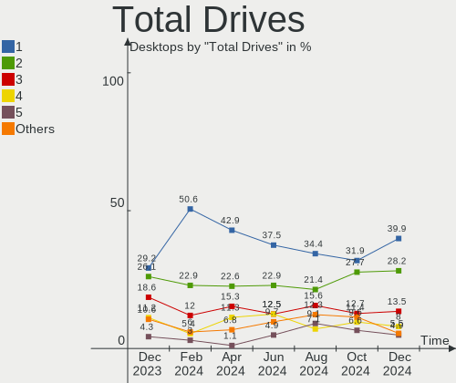
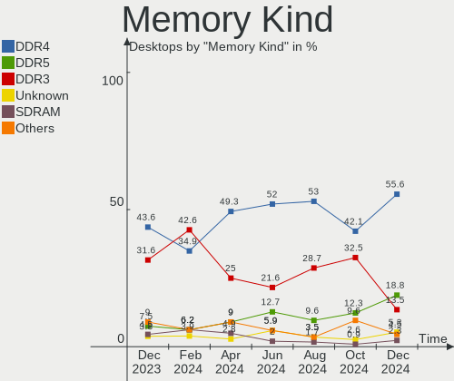
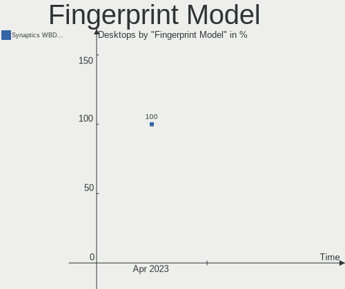

Debian - Hardware Trends (Desktops)
-----------------------------------

A project to identify most popular hardware characteristics and track their change
over time based on data collected by Linux users at https://Linux-Hardware.org.

Anyone can contribute to this report by the [hw-probe](https://github.com/linuxhw/hw-probe) tool:

    sudo -E hw-probe -all -upload

This report is for one last month. Overall report since the beginning of time: [TestDays](https://github.com/linuxhw/TestDays)

Period: Apr, 2023.

Contents
--------

* [ System ](#system)
  - [ OS                       ](#os)
  - [ OS Family                ](#os-family)
  - [ Kernel                   ](#kernel)
  - [ Kernel Family            ](#kernel-family)
  - [ Kernel Major Ver.        ](#kernel-major-ver)
  - [ Arch                     ](#arch)
  - [ DE                       ](#de)
  - [ Display Server           ](#display-server)
  - [ Display Manager          ](#display-manager)
  - [ OS Lang                  ](#os-lang)
  - [ Boot Mode                ](#boot-mode)
  - [ Filesystem               ](#filesystem)
  - [ Part. scheme             ](#part-scheme)
  - [ Dual Boot with Linux/BSD ](#dual-boot-with-linuxbsd)
  - [ Dual Boot (Win)          ](#dual-boot-win)

* [ Board ](#board)
  - [ Vendor                   ](#vendor)
  - [ Model                    ](#model)
  - [ Model Family             ](#model-family)
  - [ MFG Year                 ](#mfg-year)
  - [ Form Factor              ](#form-factor)
  - [ Secure Boot              ](#secure-boot)
  - [ Coreboot                 ](#coreboot)
  - [ RAM Size                 ](#ram-size)
  - [ RAM Used                 ](#ram-used)
  - [ Total Drives             ](#total-drives)
  - [ Has CD-ROM               ](#has-cd-rom)
  - [ Has Ethernet             ](#has-ethernet)
  - [ Has WiFi                 ](#has-wifi)
  - [ Has Bluetooth            ](#has-bluetooth)

* [ Location ](#location)
  - [ Country                  ](#country)
  - [ City                     ](#city)

* [ Drives ](#drives)
  - [ Drive Vendor             ](#drive-vendor)
  - [ Drive Model              ](#drive-model)
  - [ HDD Vendor               ](#hdd-vendor)
  - [ SSD Vendor               ](#ssd-vendor)
  - [ Drive Kind               ](#drive-kind)
  - [ Drive Connector          ](#drive-connector)
  - [ Drive Size               ](#drive-size)
  - [ Space Total              ](#space-total)
  - [ Space Used               ](#space-used)
  - [ Malfunc. Drives          ](#malfunc-drives)
  - [ Malfunc. Drive Vendor    ](#malfunc-drive-vendor)
  - [ Malfunc. HDD Vendor      ](#malfunc-hdd-vendor)
  - [ Malfunc. Drive Kind      ](#malfunc-drive-kind)
  - [ Failed Drives            ](#failed-drives)
  - [ Failed Drive Vendor      ](#failed-drive-vendor)
  - [ Drive Status             ](#drive-status)

* [ Storage controller ](#storage-controller)
  - [ Storage Vendor           ](#storage-vendor)
  - [ Storage Model            ](#storage-model)
  - [ Storage Kind             ](#storage-kind)

* [ Processor ](#processor)
  - [ CPU Vendor               ](#cpu-vendor)
  - [ CPU Model                ](#cpu-model)
  - [ CPU Model Family         ](#cpu-model-family)
  - [ CPU Cores                ](#cpu-cores)
  - [ CPU Sockets              ](#cpu-sockets)
  - [ CPU Threads              ](#cpu-threads)
  - [ CPU Op-Modes             ](#cpu-op-modes)
  - [ CPU Microcode            ](#cpu-microcode)
  - [ CPU Microarch            ](#cpu-microarch)

* [ Graphics ](#graphics)
  - [ GPU Vendor               ](#gpu-vendor)
  - [ GPU Model                ](#gpu-model)
  - [ GPU Combo                ](#gpu-combo)
  - [ GPU Driver               ](#gpu-driver)
  - [ GPU Memory               ](#gpu-memory)

* [ Monitor ](#monitor)
  - [ Monitor Vendor           ](#monitor-vendor)
  - [ Monitor Model            ](#monitor-model)
  - [ Monitor Resolution       ](#monitor-resolution)
  - [ Monitor Diagonal         ](#monitor-diagonal)
  - [ Monitor Width            ](#monitor-width)
  - [ Aspect Ratio             ](#aspect-ratio)
  - [ Monitor Area             ](#monitor-area)
  - [ Pixel Density            ](#pixel-density)
  - [ Multiple Monitors        ](#multiple-monitors)

* [ Network ](#network)
  - [ Net Controller Vendor    ](#net-controller-vendor)
  - [ Net Controller Model     ](#net-controller-model)
  - [ Wireless Vendor          ](#wireless-vendor)
  - [ Wireless Model           ](#wireless-model)
  - [ Ethernet Vendor          ](#ethernet-vendor)
  - [ Ethernet Model           ](#ethernet-model)
  - [ Net Controller Kind      ](#net-controller-kind)
  - [ Used Controller          ](#used-controller)
  - [ NICs                     ](#nics)
  - [ IPv6                     ](#ipv6)

* [ Bluetooth ](#bluetooth)
  - [ Bluetooth Vendor         ](#bluetooth-vendor)
  - [ Bluetooth Model          ](#bluetooth-model)

* [ Sound ](#sound)
  - [ Sound Vendor             ](#sound-vendor)
  - [ Sound Model              ](#sound-model)

* [ Memory ](#memory)
  - [ Memory Vendor            ](#memory-vendor)
  - [ Memory Model             ](#memory-model)
  - [ Memory Kind              ](#memory-kind)
  - [ Memory Form Factor       ](#memory-form-factor)
  - [ Memory Size              ](#memory-size)
  - [ Memory Speed             ](#memory-speed)

* [ Printers & scanners ](#printers--scanners)
  - [ Printer Vendor           ](#printer-vendor)
  - [ Printer Model            ](#printer-model)
  - [ Scanner Vendor           ](#scanner-vendor)
  - [ Scanner Model            ](#scanner-model)

* [ Camera ](#camera)
  - [ Camera Vendor            ](#camera-vendor)
  - [ Camera Model             ](#camera-model)

* [ Security ](#security)
  - [ Fingerprint Vendor       ](#fingerprint-vendor)
  - [ Fingerprint Model        ](#fingerprint-model)
  - [ Chipcard Vendor          ](#chipcard-vendor)
  - [ Chipcard Model           ](#chipcard-model)

* [ Unsupported ](#unsupported)
  - [ Unsupported Devices      ](#unsupported-devices)
  - [ Unsupported Device Types ](#unsupported-device-types)

System
------

OS
--

Installed operating systems

| Name      | Desktops | Percent |
|-----------|----------|---------|
| Debian 11 | 111      | 71.15%  |
| Debian 12 | 36       | 23.08%  |
| Debian 10 | 6        | 3.85%   |
| Debian 8  | 2        | 1.28%   |
| Debian 7  | 1        | 0.64%   |

OS Family
---------

OS without a version

| Name   | Desktops | Percent |
|--------|----------|---------|
| Debian | 156      | 100%    |

Kernel
------

Version of the Linux kernel

| Version                              | Desktops | Percent |
|--------------------------------------|----------|---------|
| 5.10.0-21-amd64                      | 62       | 39.74%  |
| 6.1.0-7-amd64                        | 21       | 13.46%  |
| 5.10.0-20-amd64                      | 9        | 5.77%   |
| 5.15.104-1-pve                       | 7        | 4.49%   |
| 5.15.102-1-pve                       | 6        | 3.85%   |
| 6.1.0-4-amd64                        | 5        | 3.21%   |
| 6.2.9-1-pve                          | 3        | 1.92%   |
| 6.1.0-6-amd64                        | 3        | 1.92%   |
| 6.1.0-5-amd64                        | 3        | 1.92%   |
| 6.1.0-0.deb11.5-amd64                | 3        | 1.92%   |
| 4.19.0-23-amd64                      | 3        | 1.92%   |
| 6.2.6-1-pve                          | 2        | 1.28%   |
| 5.15.62-yocto-standard               | 2        | 1.28%   |
| 5.15.107-1-pve                       | 2        | 1.28%   |
| 6.2.9-4-liquorix-amd64               | 1        | 0.64%   |
| 6.2.11-3-liquorix-amd64              | 1        | 0.64%   |
| 6.2.11-1-pve                         | 1        | 0.64%   |
| 6.1.25-x64v3-xanmod1                 | 1        | 0.64%   |
| 6.1.2-1-pve                          | 1        | 0.64%   |
| 6.1.15-bootes0-p-1000                | 1        | 0.64%   |
| 6.1.15-1-pve                         | 1        | 0.64%   |
| 6.1.0-8-amd64                        | 1        | 0.64%   |
| 6.1.0-6-rt-amd64                     | 1        | 0.64%   |
| 6.1.0-0.deb11.6-rt-amd64             | 1        | 0.64%   |
| 6.1.0-0.deb11.6-amd64                | 1        | 0.64%   |
| 6.0.19-edge                          | 1        | 0.64%   |
| 6.0.12                               | 1        | 0.64%   |
| 6.0.0-6-amd64                        | 1        | 0.64%   |
| 5.3.5-64                             | 1        | 0.64%   |
| 5.19.17-2-pve                        | 1        | 0.64%   |
| 5.15.83-1-pve                        | 1        | 0.64%   |
| 5.15.79+truenas                      | 1        | 0.64%   |
| 5.15.74-1-pve                        | 1        | 0.64%   |
| 5.14.0-4mx-amd64                     | 1        | 0.64%   |
| 5.10.0-9-amd64                       | 1        | 0.64%   |
| 5.10.0-21-686-pae                    | 1        | 0.64%   |
| 4.19.271-rivoreo-sparc64             | 1        | 0.64%   |
| 4.19.271-rivoreo-powerpc64-largepage | 1        | 0.64%   |
| 2.6.32-openvz-powerpc64              | 1        | 0.64%   |

Kernel Family
-------------

Linux kernel without a distro release

| Version  | Desktops | Percent |
|----------|----------|---------|
| 5.10.0   | 73       | 46.79%  |
| 6.1.0    | 39       | 25%     |
| 5.15.104 | 7        | 4.49%   |
| 5.15.102 | 6        | 3.85%   |
| 6.2.9    | 4        | 2.56%   |
| 4.19.0   | 3        | 1.92%   |
| 6.2.6    | 2        | 1.28%   |
| 6.2.11   | 2        | 1.28%   |
| 6.1.15   | 2        | 1.28%   |
| 5.15.62  | 2        | 1.28%   |
| 5.15.107 | 2        | 1.28%   |
| 4.19.271 | 2        | 1.28%   |
| 6.1.25   | 1        | 0.64%   |
| 6.1.2    | 1        | 0.64%   |
| 6.0.19   | 1        | 0.64%   |
| 6.0.12   | 1        | 0.64%   |
| 6.0.0    | 1        | 0.64%   |
| 5.3.5    | 1        | 0.64%   |
| 5.19.17  | 1        | 0.64%   |
| 5.15.83  | 1        | 0.64%   |
| 5.15.79  | 1        | 0.64%   |
| 5.15.74  | 1        | 0.64%   |
| 5.14.0   | 1        | 0.64%   |
| 2.6.32   | 1        | 0.64%   |

Kernel Major Ver.
-----------------

Linux kernel major version

| Version | Desktops | Percent |
|---------|----------|---------|
| 5.10    | 73       | 46.79%  |
| 6.1     | 43       | 27.56%  |
| 5.15    | 20       | 12.82%  |
| 6.2     | 8        | 5.13%   |
| 4.19    | 5        | 3.21%   |
| 6.0     | 3        | 1.92%   |
| 5.3     | 1        | 0.64%   |
| 5.19    | 1        | 0.64%   |
| 5.14    | 1        | 0.64%   |
| 2.6     | 1        | 0.64%   |

Arch
----

OS architecture (x86_64, i586, etc.)

| Name    | Desktops | Percent |
|---------|----------|---------|
| x86_64  | 152      | 97.44%  |
| ppc64   | 2        | 1.28%   |
| sparc64 | 1        | 0.64%   |
| i686    | 1        | 0.64%   |

DE
--

Desktop Environment

| Name            | Desktops | Percent |
|-----------------|----------|---------|
| Unknown         | 48       | 30.77%  |
| GNOME           | 35       | 22.44%  |
| XFCE            | 22       | 14.1%   |
| KDE5            | 21       | 13.46%  |
| X-Cinnamon      | 7        | 4.49%   |
| MATE            | 7        | 4.49%   |
| LXQt            | 5        | 3.21%   |
| Cinnamon        | 4        | 2.56%   |
| Openbox         | 3        | 1.92%   |
| LXDE            | 3        | 1.92%   |
| GNOME Flashback | 1        | 0.64%   |

Display Server
--------------

X11 or Wayland

| Name        | Desktops | Percent |
|-------------|----------|---------|
| X11         | 83       | 53.21%  |
| Tty         | 43       | 27.56%  |
| Wayland     | 15       | 9.62%   |
| Unknown     | 13       | 8.33%   |
| Web         | 1        | 0.64%   |
| Unspecified | 1        | 0.64%   |

Display Manager
---------------

SDDM, LightDM, etc.

| Name    | Desktops | Percent |
|---------|----------|---------|
| Unknown | 69       | 44.23%  |
| LightDM | 37       | 23.72%  |
| SDDM    | 21       | 13.46%  |
| GDM     | 18       | 11.54%  |
| GDM3    | 7        | 4.49%   |
| SLiM    | 2        | 1.28%   |
| SU      | 1        | 0.64%   |
| NODM    | 1        | 0.64%   |

OS Lang
-------

Language

| Lang    | Desktops | Percent |
|---------|----------|---------|
| en_US   | 70       | 44.87%  |
| de_DE   | 18       | 11.54%  |
| ru_RU   | 11       | 7.05%   |
| fr_FR   | 9        | 5.77%   |
| es_ES   | 6        | 3.85%   |
| Unknown | 6        | 3.85%   |
| en_GB   | 5        | 3.21%   |
| en_CA   | 4        | 2.56%   |
| pt_BR   | 3        | 1.92%   |
| en_AU   | 3        | 1.92%   |
| C       | 3        | 1.92%   |
| nl_NL   | 2        | 1.28%   |
| it_IT   | 2        | 1.28%   |
| en_IN   | 2        | 1.28%   |
| zh_CN   | 1        | 0.64%   |
| tr_TR   | 1        | 0.64%   |
| sr_RS   | 1        | 0.64%   |
| pt_PT   | 1        | 0.64%   |
| ja_JP   | 1        | 0.64%   |
| hu_HU   | 1        | 0.64%   |
| fr_CA   | 1        | 0.64%   |
| es_UY   | 1        | 0.64%   |
| es_MX   | 1        | 0.64%   |
| en_NZ   | 1        | 0.64%   |
| en_DK   | 1        | 0.64%   |
| de_CH   | 1        | 0.64%   |

Boot Mode
---------

EFI or BIOS

| Mode | Desktops | Percent |
|------|----------|---------|
| EFI  | 101      | 64.74%  |
| BIOS | 55       | 35.26%  |

Filesystem
----------

Type of filesystem

| Type    | Desktops | Percent |
|---------|----------|---------|
| Ext4    | 122      | 78.21%  |
| Overlay | 12       | 7.69%   |
| Zfs     | 10       | 6.41%   |
| Xfs     | 5        | 3.21%   |
| Btrfs   | 3        | 1.92%   |
| Tmpfs   | 1        | 0.64%   |
| Rootfs  | 1        | 0.64%   |
| Ext3    | 1        | 0.64%   |
| Aufs    | 1        | 0.64%   |

Part. scheme
------------

Scheme of partitioning

| Type    | Desktops | Percent |
|---------|----------|---------|
| GPT     | 115      | 73.72%  |
| MBR     | 23       | 14.74%  |
| Unknown | 18       | 11.54%  |

Dual Boot with Linux/BSD
------------------------

Hosting more than one Linux/BSD

| Dual boot | Desktops | Percent |
|-----------|----------|---------|
| No        | 118      | 75.64%  |
| Yes       | 38       | 24.36%  |

Dual Boot (Win)
---------------

Hosting Linux and Windows

| Dual boot | Desktops | Percent |
|-----------|----------|---------|
| No        | 108      | 69.23%  |
| Yes       | 48       | 30.77%  |

Board
-----

Vendor
------

Motherboard manufacturer

| Name                                 | Desktops | Percent |
|--------------------------------------|----------|---------|
| ASUSTek Computer                     | 38       | 24.36%  |
| Gigabyte Technology                  | 19       | 12.18%  |
| MSI                                  | 17       | 10.9%   |
| Hewlett-Packard                      | 15       | 9.62%   |
| ASRock                               | 12       | 7.69%   |
| Dell                                 | 10       | 6.41%   |
| Unknown                              | 10       | 6.41%   |
| Shuttle                              | 3        | 1.92%   |
| Inventec                             | 3        | 1.92%   |
| Intel                                | 3        | 1.92%   |
| Fujitsu                              | 3        | 1.92%   |
| Techvision                           | 2        | 1.28%   |
| Shenzhen Meigao Electronic Equipment | 2        | 1.28%   |
| Lenovo                               | 2        | 1.28%   |
| Biostar                              | 2        | 1.28%   |
| BESSTAR Tech                         | 2        | 1.28%   |
| AZW                                  | 2        | 1.28%   |
| QTQD                                 | 1        | 0.64%   |
| Pegatron                             | 1        | 0.64%   |
| MW                                   | 1        | 0.64%   |
| Medion                               | 1        | 0.64%   |
| IceWhale Technology                  | 1        | 0.64%   |
| Huanan                               | 1        | 0.64%   |
| Hardkernel                           | 1        | 0.64%   |
| Google                               | 1        | 0.64%   |
| Foxconn                              | 1        | 0.64%   |
| AMI                                  | 1        | 0.64%   |
| Acer                                 | 1        | 0.64%   |

Model
-----

Motherboard model

| Name                                              | Desktops | Percent |
|---------------------------------------------------|----------|---------|
| Unknown                                           | 11       | 7.05%   |
| ASUS All Series                                   | 3        | 1.92%   |
| Techvision TVI7309X                               | 2        | 1.28%   |
| Inventec D CLASS                                  | 2        | 1.28%   |
| HP Z420 Workstation                               | 2        | 1.28%   |
| HP EliteDesk 705 G4 DM 65W                        | 2        | 1.28%   |
| Gigabyte B550 VISION D-P                          | 2        | 1.28%   |
| Dell OptiPlex 5000                                | 2        | 1.28%   |
| ASUS ProArt X670E-CREATOR WIFI                    | 2        | 1.28%   |
| ASUS PRIME B450M-A                                | 2        | 1.28%   |
| ASUS PRIME B450-PLUS                              | 2        | 1.28%   |
| ASUS PRIME A320M-K                                | 2        | 1.28%   |
| Shuttle SH370                                     | 1        | 0.64%   |
| Shuttle DS81D                                     | 1        | 0.64%   |
| Shuttle DS20U                                     | 1        | 0.64%   |
| Shenzhen Meigao Electronic Equipment UM773 Lite   | 1        | 0.64%   |
| Shenzhen Meigao Electronic Equipment UM580 Series | 1        | 0.64%   |
| Pegatron KQ497AA-A2L m9340f                       | 1        | 0.64%   |
| MW GMLK-2_5G4L                                    | 1        | 0.64%   |
| MSI W200                                          | 1        | 0.64%   |
| MSI PRO B300 DP20ZA (MS-B0A2)                     | 1        | 0.64%   |
| MSI MS-7D73                                       | 1        | 0.64%   |
| MSI MS-7D52                                       | 1        | 0.64%   |
| MSI MS-7D07                                       | 1        | 0.64%   |
| MSI MS-7C81                                       | 1        | 0.64%   |
| MSI MS-7C00                                       | 1        | 0.64%   |
| MSI MS-7B85                                       | 1        | 0.64%   |
| MSI MS-7B49                                       | 1        | 0.64%   |
| MSI MS-7A33                                       | 1        | 0.64%   |
| MSI MS-7996                                       | 1        | 0.64%   |
| MSI MS-7816                                       | 1        | 0.64%   |
| MSI MS-7681                                       | 1        | 0.64%   |
| MSI MS-7318                                       | 1        | 0.64%   |
| MSI MS-7253                                       | 1        | 0.64%   |
| MSI MS-7060                                       | 1        | 0.64%   |
| MSI CML-U PRO Cubi 5 (MS-B183)                    | 1        | 0.64%   |
| Medion MS-7708                                    | 1        | 0.64%   |
| Lenovo ThinkStation D30 42234T7                   | 1        | 0.64%   |
| Lenovo ThinkCentre neo 50s Gen 3 11SX002VUK       | 1        | 0.64%   |
| Inventec VXC Class                                | 1        | 0.64%   |

Model Family
------------

Motherboard model prefix

| Name                                       | Desktops | Percent |
|--------------------------------------------|----------|---------|
| ASUS PRIME                                 | 13       | 8.33%   |
| Unknown                                    | 11       | 7.05%   |
| Gigabyte B550                              | 6        | 3.85%   |
| ASUS ROG                                   | 5        | 3.21%   |
| HP EliteDesk                               | 4        | 2.56%   |
| Dell OptiPlex                              | 4        | 2.56%   |
| Dell Precision                             | 3        | 1.92%   |
| ASUS TUF                                   | 3        | 1.92%   |
| ASUS All                                   | 3        | 1.92%   |
| Techvision TVI7309X                        | 2        | 1.28%   |
| Inventec D                                 | 2        | 1.28%   |
| HP Z420                                    | 2        | 1.28%   |
| Gigabyte B450                              | 2        | 1.28%   |
| Dell Vostro                                | 2        | 1.28%   |
| ASUS ProArt                                | 2        | 1.28%   |
| ASRock X470                                | 2        | 1.28%   |
| Shuttle SH370                              | 1        | 0.64%   |
| Shuttle DS81D                              | 1        | 0.64%   |
| Shuttle DS20U                              | 1        | 0.64%   |
| Shenzhen Meigao Electronic Equipment UM773 | 1        | 0.64%   |
| Shenzhen Meigao Electronic Equipment UM580 | 1        | 0.64%   |
| Pegatron KQ497AA-A2L                       | 1        | 0.64%   |
| MW GMLK-2                                  | 1        | 0.64%   |
| MSI W200                                   | 1        | 0.64%   |
| MSI PRO                                    | 1        | 0.64%   |
| MSI MS-7D73                                | 1        | 0.64%   |
| MSI MS-7D52                                | 1        | 0.64%   |
| MSI MS-7D07                                | 1        | 0.64%   |
| MSI MS-7C81                                | 1        | 0.64%   |
| MSI MS-7C00                                | 1        | 0.64%   |
| MSI MS-7B85                                | 1        | 0.64%   |
| MSI MS-7B49                                | 1        | 0.64%   |
| MSI MS-7A33                                | 1        | 0.64%   |
| MSI MS-7996                                | 1        | 0.64%   |
| MSI MS-7816                                | 1        | 0.64%   |
| MSI MS-7681                                | 1        | 0.64%   |
| MSI MS-7318                                | 1        | 0.64%   |
| MSI MS-7253                                | 1        | 0.64%   |
| MSI MS-7060                                | 1        | 0.64%   |
| MSI CML-U                                  | 1        | 0.64%   |

MFG Year
--------

Motherboard manufacture year

| Year    | Desktops | Percent |
|---------|----------|---------|
| 2022    | 29       | 18.59%  |
| 2018    | 19       | 12.18%  |
| 2021    | 14       | 8.97%   |
| 2020    | 13       | 8.33%   |
| 2012    | 13       | 8.33%   |
| 2014    | 10       | 6.41%   |
| 2019    | 9        | 5.77%   |
| 2013    | 8        | 5.13%   |
| 2017    | 6        | 3.85%   |
| 2015    | 6        | 3.85%   |
| 2010    | 6        | 3.85%   |
| 2016    | 5        | 3.21%   |
| 2011    | 4        | 2.56%   |
| 2007    | 4        | 2.56%   |
| 2023    | 3        | 1.92%   |
| Unknown | 3        | 1.92%   |
| 2009    | 2        | 1.28%   |
| 2005    | 2        | 1.28%   |

Form Factor
-----------

Physical design of the computer

| Name    | Desktops | Percent |
|---------|----------|---------|
| Desktop | 156      | 100%    |

Secure Boot
-----------

Enabled or disabled

| State    | Desktops | Percent |
|----------|----------|---------|
| Disabled | 143      | 91.67%  |
| Enabled  | 13       | 8.33%   |

Coreboot
--------

Have coreboot on board

| Used | Desktops | Percent |
|------|----------|---------|
| No   | 155      | 99.36%  |
| Yes  | 1        | 0.64%   |

RAM Size
--------

Total RAM memory

| Size in GB  | Desktops | Percent |
|-------------|----------|---------|
| 16.01-24.0  | 36       | 23.08%  |
| 32.01-64.0  | 35       | 22.44%  |
| 4.01-8.0    | 22       | 14.1%   |
| 64.01-256.0 | 20       | 12.82%  |
| 8.01-16.0   | 16       | 10.26%  |
| 3.01-4.0    | 8        | 5.13%   |
| 24.01-32.0  | 8        | 5.13%   |
| 1.01-2.0    | 8        | 5.13%   |
| Unknown     | 2        | 1.28%   |
| 2.01-3.0    | 1        | 0.64%   |

RAM Used
--------

Used RAM memory

| Used GB     | Desktops | Percent |
|-------------|----------|---------|
| 1.01-2.0    | 39       | 25%     |
| 4.01-8.0    | 29       | 18.59%  |
| 2.01-3.0    | 22       | 14.1%   |
| 3.01-4.0    | 16       | 10.26%  |
| 0.51-1.0    | 16       | 10.26%  |
| 8.01-16.0   | 12       | 7.69%   |
| 0.01-0.5    | 8        | 5.13%   |
| 24.01-32.0  | 7        | 4.49%   |
| Unknown     | 3        | 1.92%   |
| 32.01-64.0  | 2        | 1.28%   |
| 64.01-256.0 | 1        | 0.64%   |
| 16.01-24.0  | 1        | 0.64%   |

Total Drives
------------

Number of drives on board

| Drives | Desktops | Percent |
|--------|----------|---------|
| 1      | 66       | 42.31%  |
| 2      | 37       | 23.72%  |
| 3      | 22       | 14.1%   |
| 5      | 10       | 6.41%   |
| 4      | 10       | 6.41%   |
| 6      | 5        | 3.21%   |
| 9      | 2        | 1.28%   |
| 7      | 2        | 1.28%   |
| 8      | 1        | 0.64%   |
| 0      | 1        | 0.64%   |

Has CD-ROM
----------

Has CD-ROM on board

| Presented | Desktops | Percent |
|-----------|----------|---------|
| No        | 108      | 69.23%  |
| Yes       | 48       | 30.77%  |

Has Ethernet
------------

Has Ethernet on board

| Presented | Desktops | Percent |
|-----------|----------|---------|
| Yes       | 156      | 100%    |

Has WiFi
--------

Has WiFi module

| Presented | Desktops | Percent |
|-----------|----------|---------|
| No        | 86       | 55.13%  |
| Yes       | 70       | 44.87%  |

Has Bluetooth
-------------

Has Bluetooth module

| Presented | Desktops | Percent |
|-----------|----------|---------|
| No        | 95       | 60.9%   |
| Yes       | 61       | 39.1%   |

Location
--------

Country
-------

Geographic location (country)

| Country       | Desktops | Percent |
|---------------|----------|---------|
| USA           | 25       | 16.03%  |
| Germany       | 24       | 15.38%  |
| Russia        | 17       | 10.9%   |
| France        | 12       | 7.69%   |
| Spain         | 9        | 5.77%   |
| Canada        | 7        | 4.49%   |
| Australia     | 6        | 3.85%   |
| China         | 5        | 3.21%   |
| Brazil        | 5        | 3.21%   |
| Netherlands   | 4        | 2.56%   |
| UK            | 3        | 1.92%   |
| Norway        | 3        | 1.92%   |
| Slovakia      | 2        | 1.28%   |
| Poland        | 2        | 1.28%   |
| Mexico        | 2        | 1.28%   |
| Malaysia      | 2        | 1.28%   |
| Italy         | 2        | 1.28%   |
| India         | 2        | 1.28%   |
| Bulgaria      | 2        | 1.28%   |
| Vietnam       | 1        | 0.64%   |
| Uruguay       | 1        | 0.64%   |
| Ukraine       | 1        | 0.64%   |
| Turkey        | 1        | 0.64%   |
| Switzerland   | 1        | 0.64%   |
| Serbia        | 1        | 0.64%   |
| Romania       | 1        | 0.64%   |
| Portugal      | 1        | 0.64%   |
| New Zealand   | 1        | 0.64%   |
| New Caledonia | 1        | 0.64%   |
| Morocco       | 1        | 0.64%   |
| Latvia        | 1        | 0.64%   |
| Kenya         | 1        | 0.64%   |
| Japan         | 1        | 0.64%   |
| Ireland       | 1        | 0.64%   |
| Hungary       | 1        | 0.64%   |
| Hong Kong     | 1        | 0.64%   |
| Finland       | 1        | 0.64%   |
| Denmark       | 1        | 0.64%   |
| Cyprus        | 1        | 0.64%   |
| Bolivia       | 1        | 0.64%   |

City
----

Geographic location (city)

| City          | Desktops | Percent |
|---------------|----------|---------|
| Voronezh      | 5        | 3.21%   |
| Paris         | 5        | 3.21%   |
| Moscow        | 4        | 2.56%   |
| Traunstein    | 3        | 1.92%   |
| Melbourne     | 3        | 1.92%   |
| Bieligutai    | 3        | 1.92%   |
| Yekaterinburg | 2        | 1.28%   |
| Trondheim     | 2        | 1.28%   |
| Toronto       | 2        | 1.28%   |
| St Petersburg | 2        | 1.28%   |
| Mannheim      | 2        | 1.28%   |
| Kuala Lumpur  | 2        | 1.28%   |
| Košice       | 2        | 1.28%   |
| Hamburg       | 2        | 1.28%   |
| Fuenlabrada   | 2        | 1.28%   |
| Eugene        | 2        | 1.28%   |
| Columbus      | 2        | 1.28%   |
| Barcelona     | 2        | 1.28%   |
| Adelaide      | 2        | 1.28%   |
| Woodinville   | 1        | 0.64%   |
| Weimar        | 1        | 0.64%   |
| Weaver        | 1        | 0.64%   |
| Vila Velha    | 1        | 0.64%   |
| Vanves        | 1        | 0.64%   |
| Valencia      | 1        | 0.64%   |
| Tsukuba       | 1        | 0.64%   |
| Troon         | 1        | 0.64%   |
| Toulouse      | 1        | 0.64%   |
| Thu Duc       | 1        | 0.64%   |
| The Hague     | 1        | 0.64%   |
| Taganrog      | 1        | 0.64%   |
| Sydney        | 1        | 0.64%   |
| Southlake     | 1        | 0.64%   |
| Slavgorod     | 1        | 0.64%   |
| Sindelfingen  | 1        | 0.64%   |
| Sierra Vista  | 1        | 0.64%   |
| Seattle       | 1        | 0.64%   |
| Santa Cruz    | 1        | 0.64%   |
| San Rafael    | 1        | 0.64%   |
| San Francisco | 1        | 0.64%   |

Drives
------

Drive Vendor
------------

Hard drive vendors

| Vendor                      | Desktops | Drives | Percent |
|-----------------------------|----------|--------|---------|
| Samsung Electronics         | 51       | 69     | 17.89%  |
| WDC                         | 47       | 76     | 16.49%  |
| Seagate                     | 43       | 68     | 15.09%  |
| Kingston                    | 20       | 21     | 7.02%   |
| Toshiba                     | 14       | 16     | 4.91%   |
| SanDisk                     | 14       | 15     | 4.91%   |
| Crucial                     | 11       | 12     | 3.86%   |
| A-DATA Technology           | 7        | 8      | 2.46%   |
| PNY                         | 6        | 8      | 2.11%   |
| Hitachi                     | 6        | 7      | 2.11%   |
| HGST                        | 6        | 6      | 2.11%   |
| China                       | 6        | 6      | 2.11%   |
| Intel                       | 5        | 5      | 1.75%   |
| SK hynix                    | 4        | 4      | 1.4%    |
| Phison                      | 3        | 3      | 1.05%   |
| Micron Technology           | 3        | 3      | 1.05%   |
| Hewlett-Packard             | 3        | 4      | 1.05%   |
| Corsair                     | 3        | 3      | 1.05%   |
| XPG                         | 2        | 2      | 0.7%    |
| Unknown                     | 2        | 2      | 0.7%    |
| LITEON                      | 2        | 2      | 0.7%    |
| JMicron Technology          | 2        | 2      | 0.7%    |
| Apacer                      | 2        | 2      | 0.7%    |
| Unknown                     | 2        | 2      | 0.7%    |
| Verbatim                    | 1        | 1      | 0.35%   |
| Vaseky                      | 1        | 1      | 0.35%   |
| Transcend                   | 1        | 1      | 0.35%   |
| Team                        | 1        | 2      | 0.35%   |
| SPCC                        | 1        | 1      | 0.35%   |
| ShiJi                       | 1        | 1      | 0.35%   |
| Realtek Semiconductor       | 1        | 1      | 0.35%   |
| Patriot                     | 1        | 1      | 0.35%   |
| NGFF                        | 1        | 1      | 0.35%   |
| Netac                       | 1        | 1      | 0.35%   |
| Micron/Crucial Technology   | 1        | 1      | 0.35%   |
| MAXIO Technology (Hangzhou) | 1        | 1      | 0.35%   |
| LITEONIT                    | 1        | 1      | 0.35%   |
| Kllisre                     | 1        | 2      | 0.35%   |
| Kingston Technology Company | 1        | 1      | 0.35%   |
| Kingchuxing                 | 1        | 1      | 0.35%   |

Drive Model
-----------

Hard drive models

| Model                                             | Desktops | Percent |
|---------------------------------------------------|----------|---------|
| Kingston SA400S37240G 240GB SSD                   | 7        | 2.13%   |
| Samsung SSD 860 EVO 250GB                         | 6        | 1.83%   |
| Samsung SSD 860 EVO 500GB                         | 5        | 1.52%   |
| WDC WD20EZRZ-00Z5HB0 2TB                          | 3        | 0.91%   |
| Seagate ST1000DM010-2EP102 1TB                    | 3        | 0.91%   |
| Samsung SSD 980 PRO 1TB                           | 3        | 0.91%   |
| Samsung SSD 980 1TB                               | 3        | 0.91%   |
| Samsung SSD 870 QVO 1TB                           | 3        | 0.91%   |
| Samsung SSD 850 EVO 500GB                         | 3        | 0.91%   |
| Samsung NVMe SSD Controller SM981/PM981/PM983 1TB | 3        | 0.91%   |
| Kingston SV300S37A120G 120GB SSD                  | 3        | 0.91%   |
| Kingston SA400S37480G 480GB SSD                   | 3        | 0.91%   |
| XPG GAMMIX S11 Pro 1TB                            | 2        | 0.61%   |
| WDC WD40EFZX-68AWUN0 4TB                          | 2        | 0.61%   |
| WDC WD40EFRX-68N32N0 4TB                          | 2        | 0.61%   |
| WDC WD30EFRX-68EUZN0 3TB                          | 2        | 0.61%   |
| WDC WD10EZEX-08WN4A0 1TB                          | 2        | 0.61%   |
| WDC WD10EZEX-00BN5A0 1TB                          | 2        | 0.61%   |
| WDC WD Green M.2 2280 480GB                       | 2        | 0.61%   |
| Toshiba MQ01ACF032 320GB                          | 2        | 0.61%   |
| Toshiba HDWD130 3TB                               | 2        | 0.61%   |
| Toshiba DT01ACA200 2TB                            | 2        | 0.61%   |
| Toshiba DT01ACA050 500GB                          | 2        | 0.61%   |
| Seagate ST8000VN004-2M2101 8TB                    | 2        | 0.61%   |
| Seagate ST500DM002-1BD142 500GB                   | 2        | 0.61%   |
| Seagate ST3500413AS 500GB                         | 2        | 0.61%   |
| Seagate ST31000528AS 1TB                          | 2        | 0.61%   |
| Seagate ST300MM0008 304GB                         | 2        | 0.61%   |
| Seagate ST300MM0006 304GB                         | 2        | 0.61%   |
| Seagate ST2000DM008-2UB102 2TB                    | 2        | 0.61%   |
| Seagate ST2000DM008-2FR102 2TB                    | 2        | 0.61%   |
| Seagate ST2000DM006-2DM164 2TB                    | 2        | 0.61%   |
| Seagate ST2000DL003-9VT166 2TB                    | 2        | 0.61%   |
| Seagate Backup+ Desk 5TB                          | 2        | 0.61%   |
| SanDisk SSD PLUS 240GB                            | 2        | 0.61%   |
| SanDisk SDSSDH3 500G                              | 2        | 0.61%   |
| Samsung SSD 980 PRO 2TB                           | 2        | 0.61%   |
| Samsung SSD 980 500GB                             | 2        | 0.61%   |
| Samsung SSD 970 EVO 500GB                         | 2        | 0.61%   |
| Samsung SSD 970 EVO 1TB                           | 2        | 0.61%   |

HDD Vendor
----------

Hard disk drive vendors

| Vendor              | Desktops | Drives | Percent |
|---------------------|----------|--------|---------|
| Seagate             | 40       | 65     | 38.1%   |
| WDC                 | 36       | 62     | 34.29%  |
| Toshiba             | 12       | 13     | 11.43%  |
| Hitachi             | 6        | 7      | 5.71%   |
| HGST                | 6        | 6      | 5.71%   |
| JMicron Technology  | 2        | 2      | 1.9%    |
| Unknown             | 1        | 1      | 0.95%   |
| Samsung Electronics | 1        | 1      | 0.95%   |
| Hewlett-Packard     | 1        | 2      | 0.95%   |

SSD Vendor
----------

Solid state drive vendors

| Vendor              | Desktops | Drives | Percent |
|---------------------|----------|--------|---------|
| Samsung Electronics | 35       | 40     | 29.66%  |
| Kingston            | 20       | 21     | 16.95%  |
| SanDisk             | 9        | 10     | 7.63%   |
| WDC                 | 6        | 6      | 5.08%   |
| China               | 6        | 6      | 5.08%   |
| PNY                 | 5        | 7      | 4.24%   |
| Crucial             | 5        | 6      | 4.24%   |
| A-DATA Technology   | 5        | 5      | 4.24%   |
| Toshiba             | 2        | 2      | 1.69%   |
| LITEON              | 2        | 2      | 1.69%   |
| Intel               | 2        | 2      | 1.69%   |
| Apacer              | 2        | 2      | 1.69%   |
| Verbatim            | 1        | 1      | 0.85%   |
| Transcend           | 1        | 1      | 0.85%   |
| Team                | 1        | 2      | 0.85%   |
| SPCC                | 1        | 1      | 0.85%   |
| SK hynix            | 1        | 1      | 0.85%   |
| ShiJi               | 1        | 1      | 0.85%   |
| Seagate             | 1        | 1      | 0.85%   |
| Patriot             | 1        | 1      | 0.85%   |
| NGFF                | 1        | 1      | 0.85%   |
| Micron Technology   | 1        | 1      | 0.85%   |
| LITEONIT            | 1        | 1      | 0.85%   |
| Kingchuxing         | 1        | 1      | 0.85%   |
| Innodisk            | 1        | 1      | 0.85%   |
| Inland              | 1        | 1      | 0.85%   |
| Hewlett-Packard     | 1        | 1      | 0.85%   |
| Fanxiang            | 1        | 1      | 0.85%   |
| External            | 1        | 1      | 0.85%   |
| Corsair             | 1        | 1      | 0.85%   |
| Unknown             | 1        | 1      | 0.85%   |

Drive Kind
----------

HDD or SSD

| Kind    | Desktops | Drives | Percent |
|---------|----------|--------|---------|
| SSD     | 89       | 129    | 37.39%  |
| HDD     | 84       | 159    | 35.29%  |
| NVMe    | 61       | 77     | 25.63%  |
| MMC     | 2        | 2      | 0.84%   |
| Unknown | 2        | 2      | 0.84%   |

Drive Connector
---------------

SATA, SAS, NVMe, etc.

| Type | Desktops | Drives | Percent |
|------|----------|--------|---------|
| SATA | 127      | 275    | 63.5%   |
| NVMe | 61       | 77     | 30.5%   |
| SAS  | 10       | 15     | 5%      |
| MMC  | 2        | 2      | 1%      |

Drive Size
----------

Size of hard drive

| Size in TB | Desktops | Drives | Percent |
|------------|----------|--------|---------|
| 0.01-0.5   | 88       | 132    | 44%     |
| 0.51-1.0   | 52       | 67     | 26%     |
| 1.01-2.0   | 31       | 47     | 15.5%   |
| 3.01-4.0   | 11       | 14     | 5.5%    |
| 2.01-3.0   | 10       | 13     | 5%      |
| 4.01-10.0  | 7        | 12     | 3.5%    |
| 10.01-20.0 | 1        | 3      | 0.5%    |

Space Total
-----------

Amount of disk space available on the file system

| Size in GB     | Desktops | Percent |
|----------------|----------|---------|
| 251-500        | 24       | 15.38%  |
| 101-250        | 23       | 14.74%  |
| 501-1000       | 23       | 14.74%  |
| More than 3000 | 22       | 14.1%   |
| Unknown        | 19       | 12.18%  |
| 1001-2000      | 14       | 8.97%   |
| 51-100         | 11       | 7.05%   |
| 21-50          | 8        | 5.13%   |
| 1-20           | 8        | 5.13%   |
| 2001-3000      | 4        | 2.56%   |

Space Used
----------

Amount of used disk space

| Used GB        | Desktops | Percent |
|----------------|----------|---------|
| 1-20           | 60       | 38.46%  |
| Unknown        | 19       | 12.18%  |
| 21-50          | 16       | 10.26%  |
| 101-250        | 13       | 8.33%   |
| 1001-2000      | 11       | 7.05%   |
| 51-100         | 10       | 6.41%   |
| 251-500        | 9        | 5.77%   |
| 501-1000       | 9        | 5.77%   |
| More than 3000 | 6        | 3.85%   |
| 2001-3000      | 3        | 1.92%   |

Malfunc. Drives
---------------

Drive models with a malfunction

| Model                                 | Desktops | Drives | Percent |
|---------------------------------------|----------|--------|---------|
| Seagate ST31000528AS 1TB              | 2        | 3      | 6.25%   |
| Seagate ST2000DL003-9VT166 2TB        | 2        | 2      | 6.25%   |
| WDC WD60PURX-64T0ZY0 6TB              | 1        | 1      | 3.13%   |
| WDC WD40EZRZ-00WN9B0 4TB              | 1        | 1      | 3.13%   |
| WDC WD3200BEKT-75PVMT1 320GB          | 1        | 1      | 3.13%   |
| WDC WD3200AAKS-22L6A0 320GB           | 1        | 1      | 3.13%   |
| WDC WD30PURX-64P6ZY0 3TB              | 1        | 2      | 3.13%   |
| WDC WD20PURZ-85GU6Y0 2TB              | 1        | 1      | 3.13%   |
| WDC WD10EFRX-68JCSN0 1TB              | 1        | 2      | 3.13%   |
| WDC WD10EARS-00MVWB0 1TB              | 1        | 1      | 3.13%   |
| WDC WD10EALX-009BA0 1TB               | 1        | 1      | 3.13%   |
| Toshiba DT01ACA200 2TB                | 1        | 1      | 3.13%   |
| SK hynix SHGS31-500GS-2 500GB SSD     | 1        | 1      | 3.13%   |
| ShiJi SSD 128GB                       | 1        | 1      | 3.13%   |
| Seagate ST9500325AS 500GB             | 1        | 1      | 3.13%   |
| Seagate ST9160314AS 160GB             | 1        | 1      | 3.13%   |
| Seagate ST9100821AS 100GB             | 1        | 1      | 3.13%   |
| Seagate ST500DM002-1BD142 500GB       | 1        | 3      | 3.13%   |
| Seagate ST3500418AS 500GB             | 1        | 1      | 3.13%   |
| Seagate ST3000DM001-1ER166 3TB        | 1        | 1      | 3.13%   |
| Seagate ST2000DX001-1CM164 2TB        | 1        | 1      | 3.13%   |
| Samsung Electronics SSD 970 EVO 500GB | 1        | 1      | 3.13%   |
| Samsung Electronics SSD 970 EVO 1TB   | 1        | 1      | 3.13%   |
| Intel SSDSC2BW180A4 180GB             | 1        | 1      | 3.13%   |
| Hitachi HDS721050CLA362 500GB         | 1        | 1      | 3.13%   |
| Hitachi HDS721010CLA630 1TB           | 1        | 1      | 3.13%   |
| HGST HTS545050A7E680 500GB            | 1        | 1      | 3.13%   |
| Crucial CT525MX300SSD1 528GB          | 1        | 1      | 3.13%   |
| China SSD08G 8GB                      | 1        | 1      | 3.13%   |
| A-DATA Technology SP900 64GB SSD      | 1        | 1      | 3.13%   |

Malfunc. Drive Vendor
---------------------

Vendors of faulty drives

| Vendor              | Desktops | Drives | Percent |
|---------------------|----------|--------|---------|
| Seagate             | 10       | 14     | 34.48%  |
| WDC                 | 7        | 11     | 24.14%  |
| Samsung Electronics | 2        | 2      | 6.9%    |
| Hitachi             | 2        | 2      | 6.9%    |
| Toshiba             | 1        | 1      | 3.45%   |
| SK hynix            | 1        | 1      | 3.45%   |
| ShiJi               | 1        | 1      | 3.45%   |
| Intel               | 1        | 1      | 3.45%   |
| HGST                | 1        | 1      | 3.45%   |
| Crucial             | 1        | 1      | 3.45%   |
| China               | 1        | 1      | 3.45%   |
| A-DATA Technology   | 1        | 1      | 3.45%   |

Malfunc. HDD Vendor
-------------------

Vendors of faulty HDD drives

| Vendor  | Desktops | Drives | Percent |
|---------|----------|--------|---------|
| Seagate | 10       | 14     | 47.62%  |
| WDC     | 7        | 11     | 33.33%  |
| Hitachi | 2        | 2      | 9.52%   |
| Toshiba | 1        | 1      | 4.76%   |
| HGST    | 1        | 1      | 4.76%   |

Malfunc. Drive Kind
-------------------

Kinds of faulty drives

| Kind | Desktops | Drives | Percent |
|------|----------|--------|---------|
| HDD  | 17       | 29     | 70.83%  |
| SSD  | 5        | 6      | 20.83%  |
| NVMe | 2        | 2      | 8.33%   |

Failed Drives
-------------

Failed drive models

| Model                 | Desktops | Drives | Percent |
|-----------------------|----------|--------|---------|
| Inland SATA SSD 128GB | 1        | 1      | 100%    |

Failed Drive Vendor
-------------------

Failed drive vendors

| Vendor | Desktops | Drives | Percent |
|--------|----------|--------|---------|
| Inland | 1        | 1      | 100%    |

Drive Status
------------

Number of failed and malfunc. drives

| Status   | Desktops | Drives | Percent |
|----------|----------|--------|---------|
| Works    | 125      | 261    | 67.93%  |
| Detected | 36       | 70     | 19.57%  |
| Malfunc  | 22       | 37     | 11.96%  |
| Failed   | 1        | 1      | 0.54%   |

Storage controller
------------------

Storage Vendor
--------------

Storage controller vendors

| Vendor                           | Desktops | Percent |
|----------------------------------|----------|---------|
| Intel                            | 92       | 38.82%  |
| AMD                              | 55       | 23.21%  |
| Samsung Electronics              | 22       | 9.28%   |
| SanDisk                          | 12       | 5.06%   |
| ASMedia Technology               | 9        | 3.8%    |
| Phison Electronics               | 6        | 2.53%   |
| Micron/Crucial Technology        | 6        | 2.53%   |
| ADATA Technology                 | 4        | 1.69%   |
| SK hynix                         | 3        | 1.27%   |
| Marvell Technology Group         | 3        | 1.27%   |
| JMicron Technology               | 3        | 1.27%   |
| VIA Technologies                 | 2        | 0.84%   |
| Realtek Semiconductor            | 2        | 0.84%   |
| Micron Technology                | 2        | 0.84%   |
| MAXIO Technology (Hangzhou)      | 2        | 0.84%   |
| LSI Logic / Symbios Logic        | 2        | 0.84%   |
| IBM                              | 2        | 0.84%   |
| ULi Electronics                  | 1        | 0.42%   |
| Toshiba America Info Systems     | 1        | 0.42%   |
| Silicon Motion                   | 1        | 0.42%   |
| Silicon Integrated Systems [SiS] | 1        | 0.42%   |
| Nvidia                           | 1        | 0.42%   |
| Netac Technology                 | 1        | 0.42%   |
| Kingston Technology Company      | 1        | 0.42%   |
| Hewlett-Packard                  | 1        | 0.42%   |
| Broadcom / LSI                   | 1        | 0.42%   |
| Artop Electronic                 | 1        | 0.42%   |

Storage Model
-------------

Storage controller models

| Model                                                                          | Desktops | Percent |
|--------------------------------------------------------------------------------|----------|---------|
| AMD FCH SATA Controller [AHCI mode]                                            | 34       | 12.23%  |
| AMD 400 Series Chipset SATA Controller                                         | 11       | 3.96%   |
| Samsung NVMe SSD Controller SM981/PM981/PM983                                  | 10       | 3.6%    |
| Intel Alder Lake-S PCH SATA Controller [AHCI Mode]                             | 9        | 3.24%   |
| AMD 500 Series Chipset SATA Controller                                         | 9        | 3.24%   |
| Intel Jasper Lake SATA AHCI Controller                                         | 8        | 2.88%   |
| Intel 8 Series/C220 Series Chipset Family 6-port SATA Controller 1 [AHCI mode] | 8        | 2.88%   |
| Samsung NVMe SSD Controller PM9A1/PM9A3/980PRO                                 | 7        | 2.52%   |
| Intel Cannon Lake PCH SATA AHCI Controller                                     | 7        | 2.52%   |
| ASMedia ASM1062 Serial ATA Controller                                          | 7        | 2.52%   |
| Samsung NVMe SSD Controller 980                                                | 6        | 2.16%   |
| Intel Q170/Q150/B150/H170/H110/Z170/CM236 Chipset SATA Controller [AHCI Mode]  | 6        | 2.16%   |
| AMD SB7x0/SB8x0/SB9x0 SATA Controller [AHCI mode]                              | 6        | 2.16%   |
| Micron/Crucial P2 NVMe PCIe SSD                                                | 5        | 1.8%    |
| SanDisk Non-Volatile memory controller                                         | 4        | 1.44%   |
| Intel C602 chipset 4-Port SATA Storage Control Unit                            | 4        | 1.44%   |
| Intel 7 Series/C210 Series Chipset Family 6-port SATA Controller [AHCI mode]   | 4        | 1.44%   |
| Intel 400 Series Chipset Family SATA AHCI Controller                           | 4        | 1.44%   |
| AMD FCH SATA Controller D                                                      | 4        | 1.44%   |
| AMD 300 Series Chipset SATA Controller                                         | 4        | 1.44%   |
| ADATA XPG SX8200 Pro PCIe Gen3x4 M.2 2280 Solid State Drive                    | 4        | 1.44%   |
| SanDisk WD Black SN750 / PC SN730 NVMe SSD                                     | 3        | 1.08%   |
| Phison E12 NVMe Controller                                                     | 3        | 1.08%   |
| JMicron JMB58x AHCI SATA controller                                            | 3        | 1.08%   |
| Intel Volume Management Device NVMe RAID Controller                            | 3        | 1.08%   |
| Intel Celeron N3350/Pentium N4200/Atom E3900 Series SATA AHCI Controller       | 3        | 1.08%   |
| Intel C600/X79 series chipset 6-Port SATA AHCI Controller                      | 3        | 1.08%   |
| Intel 6 Series/C200 Series Chipset Family 6 port Desktop SATA AHCI Controller  | 3        | 1.08%   |
| Intel 500 Series Chipset Family SATA AHCI Controller                           | 3        | 1.08%   |
| Intel 200 Series PCH SATA controller [AHCI mode]                               | 3        | 1.08%   |
| VIA VT82C586A/B/VT82C686/A/B/VT823x/A/C PIPC Bus Master IDE                    | 2        | 0.72%   |
| SanDisk WD PC SN810 / Black SN850 NVMe SSD                                     | 2        | 0.72%   |
| SanDisk WD Blue SN500 / PC SN520 NVMe SSD                                      | 2        | 0.72%   |
| Realtek NVMe Controller                                                        | 2        | 0.72%   |
| Phison PS5013 E13 NVMe Controller                                              | 2        | 0.72%   |
| Micron NVMe Storage Controller                                                 | 2        | 0.72%   |
| MAXIO (Hangzhou) NVMe SSD Controller MAP1202                                   | 2        | 0.72%   |
| LSI Logic / Symbios Logic SAS1068E PCI-Express Fusion-MPT SAS                  | 2        | 0.72%   |
| Intel Tiger Lake-LP SATA Controller                                            | 2        | 0.72%   |
| Intel SSD 660P Series                                                          | 2        | 0.72%   |

Storage Kind
------------

Kind of storage controller (IDE, SATA, NVMe, SAS, ...)

| Kind | Desktops | Percent |
|------|----------|---------|
| SATA | 133      | 57.58%  |
| NVMe | 61       | 26.41%  |
| IDE  | 18       | 7.79%   |
| RAID | 11       | 4.76%   |
| SAS  | 4        | 1.73%   |
| SCSI | 4        | 1.73%   |

Processor
---------

CPU Vendor
----------

Processor vendors

| Vendor            | Desktops | Percent |
|-------------------|----------|---------|
| Intel             | 95       | 60.9%   |
| AMD               | 58       | 37.18%  |
| CHRP IBM,8233-E8B | 2        | 1.28%   |
| Unknown           | 1        | 0.64%   |

CPU Model
---------

Processor models

| Model                                                     | Desktops | Percent |
|-----------------------------------------------------------|----------|---------|
| Intel Celeron N5105 @ 2.00GHz                             | 6        | 3.85%   |
| Intel Core i7-3770 CPU @ 3.40GHz                          | 4        | 2.56%   |
| AMD Ryzen 9 5950X 16-Core Processor                       | 4        | 2.56%   |
| Intel 11th Gen Core i5-11400 @ 2.60GHz                    | 3        | 1.92%   |
| AMD Ryzen 9 7950X 16-Core Processor                       | 3        | 1.92%   |
| AMD Ryzen 5 3600 6-Core Processor                         | 3        | 1.92%   |
| Intel Pentium Silver N6005 @ 2.00GHz                      | 2        | 1.28%   |
| Intel Core i5-9600K CPU @ 3.70GHz                         | 2        | 1.28%   |
| Intel Core i5-10400F CPU @ 2.90GHz                        | 2        | 1.28%   |
| Intel Core i5-10400 CPU @ 2.90GHz                         | 2        | 1.28%   |
| Intel Core i3-4130 CPU @ 3.40GHz                          | 2        | 1.28%   |
| Intel 12th Gen Core i7-12700T                             | 2        | 1.28%   |
| Intel 12th Gen Core i7-12700K                             | 2        | 1.28%   |
| CHRP IBM,8233-E8B POWER7 (architected), altivec supported | 2        | 1.28%   |
| AMD Ryzen 7 5800X 8-Core Processor                        | 2        | 1.28%   |
| AMD Ryzen 7 5700X 8-Core Processor                        | 2        | 1.28%   |
| AMD Ryzen 7 5700G with Radeon Graphics                    | 2        | 1.28%   |
| AMD Ryzen 5 PRO 2400G with Radeon Vega Graphics           | 2        | 1.28%   |
| AMD Ryzen 5 5600X 6-Core Processor                        | 2        | 1.28%   |
| AMD Ryzen 5 3400G with Radeon Vega Graphics               | 2        | 1.28%   |
| AMD Ryzen 5 2600X Six-Core Processor                      | 2        | 1.28%   |
| AMD Ryzen 5 2600 Six-Core Processor                       | 2        | 1.28%   |
| AMD Ryzen 5 1400 Quad-Core Processor                      | 2        | 1.28%   |
| AMD Ryzen 3 2200G with Radeon Vega Graphics               | 2        | 1.28%   |
| AMD G-T48E Processor                                      | 2        | 1.28%   |
| Intel Xeon E-2224 CPU @ 3.40GHz                           | 1        | 0.64%   |
| Intel Xeon CPU X3370 @ 3.00GHz                            | 1        | 0.64%   |
| Intel Xeon CPU E5640 @ 2.67GHz                            | 1        | 0.64%   |
| Intel Xeon CPU E5520 @ 2.27GHz                            | 1        | 0.64%   |
| Intel Xeon CPU E5-2699 v3 @ 2.30GHz                       | 1        | 0.64%   |
| Intel Xeon CPU E5-2670 0 @ 2.60GHz                        | 1        | 0.64%   |
| Intel Xeon CPU E5-1680 v2 @ 3.00GHz                       | 1        | 0.64%   |
| Intel Xeon CPU E5-1650 v3 @ 3.50GHz                       | 1        | 0.64%   |
| Intel Xeon CPU E5-1650 0 @ 3.20GHz                        | 1        | 0.64%   |
| Intel Xeon CPU E5-1603 0 @ 2.80GHz                        | 1        | 0.64%   |
| Intel Xeon CPU 2.80GHz                                    | 1        | 0.64%   |
| Intel Pentium Dual-Core CPU E6700 @ 3.20GHz               | 1        | 0.64%   |
| Intel Pentium Dual-Core CPU E5800 @ 3.20GHz               | 1        | 0.64%   |
| Intel Pentium CPU G6950 @ 2.80GHz                         | 1        | 0.64%   |
| Intel Pentium CPU G620 @ 2.60GHz                          | 1        | 0.64%   |

CPU Model Family
----------------

Processor model prefix

| Model                   | Desktops | Percent |
|-------------------------|----------|---------|
| Intel Core i5           | 22       | 14.1%   |
| Other                   | 18       | 11.54%  |
| Intel Celeron           | 17       | 10.9%   |
| AMD Ryzen 5             | 15       | 9.62%   |
| AMD Ryzen 7             | 14       | 8.97%   |
| Intel Core i7           | 13       | 8.33%   |
| Intel Xeon              | 11       | 7.05%   |
| AMD Ryzen 9             | 10       | 6.41%   |
| Intel Pentium           | 5        | 3.21%   |
| AMD FX                  | 4        | 2.56%   |
| Intel Core i3           | 3        | 1.92%   |
| AMD Ryzen 3             | 3        | 1.92%   |
| AMD G                   | 3        | 1.92%   |
| Intel Pentium Silver    | 2        | 1.28%   |
| Intel Pentium Dual-Core | 2        | 1.28%   |
| Intel Core 2 Quad       | 2        | 1.28%   |
| AMD Ryzen 5 PRO         | 2        | 1.28%   |
| AMD GX                  | 2        | 1.28%   |
| Intel Pentium 4         | 1        | 0.64%   |
| Intel Core i9           | 1        | 0.64%   |
| Intel Core 2 Duo        | 1        | 0.64%   |
| AMD Sempron             | 1        | 0.64%   |
| AMD Phenom II X6        | 1        | 0.64%   |
| AMD A8                  | 1        | 0.64%   |
| AMD A6                  | 1        | 0.64%   |
| AMD A10                 | 1        | 0.64%   |

CPU Cores
---------

Number of processor cores

| Number | Desktops | Percent |
|--------|----------|---------|
| 4      | 54       | 34.62%  |
| 6      | 29       | 18.59%  |
| 2      | 27       | 17.31%  |
| 8      | 20       | 12.82%  |
| 16     | 9        | 5.77%   |
| 12     | 7        | 4.49%   |
| 1      | 5        | 3.21%   |
| 10     | 2        | 1.28%   |
| 36     | 1        | 0.64%   |
| 24     | 1        | 0.64%   |
| 3      | 1        | 0.64%   |

CPU Sockets
-----------

Number of sockets

| Number | Desktops | Percent |
|--------|----------|---------|
| 1      | 151      | 96.79%  |
| 2      | 5        | 3.21%   |

CPU Threads
-----------

Threads per core (Hyper-Threading)

| Number | Desktops | Percent |
|--------|----------|---------|
| 2      | 79       | 50.64%  |
| 1      | 75       | 48.08%  |
| 4      | 2        | 1.28%   |

CPU Op-Modes
------------

CPU Operation Modes (32-bit, 64-bit)

| Op mode        | Desktops | Percent |
|----------------|----------|---------|
| 32-bit, 64-bit | 155      | 99.36%  |
| 32-bit         | 1        | 0.64%   |

CPU Microcode
-------------

Microcode number

| Number     | Desktops | Percent |
|------------|----------|---------|
| Unknown    | 32       | 20.51%  |
| 0x906c0    | 8        | 5.13%   |
| 0x90672    | 6        | 3.85%   |
| 0x506e3    | 6        | 3.85%   |
| 0x306c3    | 6        | 3.85%   |
| 0x306a9    | 6        | 3.85%   |
| 0x0a20120a | 5        | 3.21%   |
| 0x906ea    | 4        | 2.56%   |
| 0x0a601203 | 4        | 2.56%   |
| 0xa0671    | 3        | 1.92%   |
| 0xa0653    | 3        | 1.92%   |
| 0x506c9    | 3        | 1.92%   |
| 0x206a7    | 3        | 1.92%   |
| 0x0a201016 | 3        | 1.92%   |
| 0x08701021 | 3        | 1.92%   |
| 0x0800820d | 3        | 1.92%   |
| 0x906ec    | 2        | 1.28%   |
| 0x90675    | 2        | 1.28%   |
| 0x806ec    | 2        | 1.28%   |
| 0x306f2    | 2        | 1.28%   |
| 0x206d7    | 2        | 1.28%   |
| 0x1067a    | 2        | 1.28%   |
| 0x0a201009 | 2        | 1.28%   |
| 0x08600106 | 2        | 1.28%   |
| 0x08101016 | 2        | 1.28%   |
| 0x08001138 | 2        | 1.28%   |
| 0x08001137 | 2        | 1.28%   |
| 0xf43      | 1        | 0.64%   |
| 0xf34      | 1        | 0.64%   |
| 0xb0671    | 1        | 0.64%   |
| 0x906ed    | 1        | 0.64%   |
| 0x906e9    | 1        | 0.64%   |
| 0x906a3    | 1        | 0.64%   |
| 0x90661    | 1        | 0.64%   |
| 0x806c2    | 1        | 0.64%   |
| 0x806c1    | 1        | 0.64%   |
| 0x706a8    | 1        | 0.64%   |
| 0x6fd      | 1        | 0.64%   |
| 0x50654    | 1        | 0.64%   |
| 0x40651    | 1        | 0.64%   |

CPU Microarch
-------------

Microarchitecture

| Name             | Desktops | Percent |
|------------------|----------|---------|
| Zen 3            | 16       | 10.26%  |
| Unknown          | 16       | 10.26%  |
| Haswell          | 14       | 8.97%   |
| KabyLake         | 13       | 8.33%   |
| IvyBridge        | 10       | 6.41%   |
| Tremont          | 9        | 5.77%   |
| Zen+             | 8        | 5.13%   |
| Zen              | 8        | 5.13%   |
| Skylake          | 7        | 4.49%   |
| Zen 2            | 6        | 3.85%   |
| SandyBridge      | 6        | 3.85%   |
| Alderlake Hybrid | 6        | 3.85%   |
| Piledriver       | 4        | 2.56%   |
| Penryn           | 4        | 2.56%   |
| CometLake        | 4        | 2.56%   |
| Puma             | 3        | 1.92%   |
| Goldmont         | 3        | 1.92%   |
| Bobcat           | 3        | 1.92%   |
| Westmere         | 2        | 1.28%   |
| TigerLake        | 2        | 1.28%   |
| NetBurst         | 2        | 1.28%   |
| Nehalem          | 2        | 1.28%   |
| Core             | 2        | 1.28%   |
| Steamroller      | 1        | 0.64%   |
| K8 Hammer        | 1        | 0.64%   |
| K10              | 1        | 0.64%   |
| Icelake          | 1        | 0.64%   |
| Goldmont plus    | 1        | 0.64%   |
| Excavator        | 1        | 0.64%   |

Graphics
--------

GPU Vendor
----------

Vendors of graphics cards

| Vendor                     | Desktops | Percent |
|----------------------------|----------|---------|
| Intel                      | 61       | 36.09%  |
| Nvidia                     | 51       | 30.18%  |
| AMD                        | 51       | 30.18%  |
| Matrox Electronics Systems | 3        | 1.78%   |
| VIA Technologies           | 1        | 0.59%   |
| ASPEED Technology          | 1        | 0.59%   |
| 3DLabs                     | 1        | 0.59%   |

GPU Model
---------

Graphics card models

| Model                                                                       | Desktops | Percent |
|-----------------------------------------------------------------------------|----------|---------|
| Intel JasperLake [UHD Graphics]                                             | 9        | 5.26%   |
| Intel Xeon E3-1200 v3/4th Gen Core Processor Integrated Graphics Controller | 6        | 3.51%   |
| Intel CoffeeLake-S GT2 [UHD Graphics 630]                                   | 6        | 3.51%   |
| Intel AlderLake-S GT1                                                       | 6        | 3.51%   |
| AMD Ellesmere [Radeon RX 470/480/570/570X/580/580X/590]                     | 5        | 2.92%   |
| Nvidia GK208B [GeForce GT 710]                                              | 4        | 2.34%   |
| AMD Raven Ridge [Radeon Vega Series / Radeon Vega Mobile Series]            | 4        | 2.34%   |
| AMD Cezanne [Radeon Vega Series / Radeon Vega Mobile Series]                | 4        | 2.34%   |
| Nvidia GM107 [GeForce GTX 750 Ti]                                           | 3        | 1.75%   |
| Nvidia GA106 [GeForce RTX 3060 Lite Hash Rate]                              | 3        | 1.75%   |
| Intel Xeon E3-1200 v2/3rd Gen Core processor Graphics Controller            | 3        | 1.75%   |
| Intel IvyBridge GT2 [HD Graphics 4000]                                      | 3        | 1.75%   |
| Intel HD Graphics 530                                                       | 3        | 1.75%   |
| Intel HD Graphics 500                                                       | 3        | 1.75%   |
| AMD Picasso/Raven 2 [Radeon Vega Series / Radeon Vega Mobile Series]        | 3        | 1.75%   |
| AMD Lexa PRO [Radeon 540/540X/550/550X / RX 540X/550/550X]                  | 3        | 1.75%   |
| AMD Cape Verde XT [Radeon HD 7770/8760 / R7 250X]                           | 3        | 1.75%   |
| Nvidia TU117 [GeForce GTX 1650]                                             | 2        | 1.17%   |
| Nvidia TU116 [GeForce GTX 1660 SUPER]                                       | 2        | 1.17%   |
| Nvidia GP108 [GeForce GT 1030]                                              | 2        | 1.17%   |
| Nvidia GP107 [GeForce GTX 1050 Ti]                                          | 2        | 1.17%   |
| Nvidia GP106GL [Quadro P2000]                                               | 2        | 1.17%   |
| Nvidia GP106 [GeForce GTX 1060 6GB]                                         | 2        | 1.17%   |
| Nvidia GP106 [GeForce GTX 1060 3GB]                                         | 2        | 1.17%   |
| Nvidia GF108 [GeForce GT 630]                                               | 2        | 1.17%   |
| Nvidia GA104 [GeForce RTX 3070 Lite Hash Rate]                              | 2        | 1.17%   |
| Nvidia G96C [GeForce 9500 GT]                                               | 2        | 1.17%   |
| Matrox Electronics Systems Millennium G550                                  | 2        | 1.17%   |
| Intel TigerLake-LP GT2 [Iris Xe Graphics]                                   | 2        | 1.17%   |
| Intel RocketLake-S GT1 [UHD Graphics 730]                                   | 2        | 1.17%   |
| Intel Haswell-ULT Integrated Graphics Controller                            | 2        | 1.17%   |
| Intel CometLake-U GT2 [UHD Graphics]                                        | 2        | 1.17%   |
| Intel CometLake-S GT2 [UHD Graphics 630]                                    | 2        | 1.17%   |
| Intel 4th Generation Core Processor Family Integrated Graphics Controller   | 2        | 1.17%   |
| AMD Wrestler [Radeon HD 6250]                                               | 2        | 1.17%   |
| AMD RV730 PRO [Radeon HD 4650]                                              | 2        | 1.17%   |
| AMD RV620 LE [Radeon HD 3450]                                               | 2        | 1.17%   |
| AMD Renoir                                                                  | 2        | 1.17%   |
| AMD Raphael                                                                 | 2        | 1.17%   |
| AMD Navi 21 [Radeon RX 6800/6800 XT / 6900 XT]                              | 2        | 1.17%   |

GPU Combo
---------

Combinations of graphics cards

| Name           | Desktops | Percent |
|----------------|----------|---------|
| 1 x Intel      | 52       | 33.33%  |
| 1 x AMD        | 45       | 28.85%  |
| 1 x Nvidia     | 44       | 28.21%  |
| Intel + Nvidia | 4        | 2.56%   |
| 1 x Matrox     | 2        | 1.28%   |
| AMD + Nvidia   | 2        | 1.28%   |
| 2 x Nvidia     | 1        | 0.64%   |
| 2 x AMD        | 1        | 0.64%   |
| 1 x VIA        | 1        | 0.64%   |
| Intel + AMD    | 1        | 0.64%   |
| 1 x ASPEED     | 1        | 0.64%   |
| AMD + Matrox   | 1        | 0.64%   |
| AMD + 3DLabs   | 1        | 0.64%   |

GPU Driver
----------

Free vs proprietary

| Driver      | Desktops | Percent |
|-------------|----------|---------|
| Free        | 96       | 61.54%  |
| Unknown     | 36       | 23.08%  |
| Proprietary | 24       | 15.38%  |

GPU Memory
----------

Total video memory

| Size in GB | Desktops | Percent |
|------------|----------|---------|
| Unknown    | 93       | 59.62%  |
| 1.01-2.0   | 13       | 8.33%   |
| 0.01-0.5   | 10       | 6.41%   |
| 3.01-4.0   | 9        | 5.77%   |
| 7.01-8.0   | 8        | 5.13%   |
| 0.51-1.0   | 7        | 4.49%   |
| 5.01-6.0   | 6        | 3.85%   |
| 8.01-16.0  | 4        | 2.56%   |
| 4.01-5.0   | 2        | 1.28%   |
| 2.01-3.0   | 2        | 1.28%   |
| 16.01-24.0 | 2        | 1.28%   |

Monitor
-------

Monitor Vendor
--------------

Monitor vendors

| Vendor               | Desktops | Percent |
|----------------------|----------|---------|
| Samsung Electronics  | 21       | 16.8%   |
| Goldstar             | 14       | 11.2%   |
| Dell                 | 13       | 10.4%   |
| BenQ                 | 9        | 7.2%    |
| Philips              | 8        | 6.4%    |
| Acer                 | 7        | 5.6%    |
| Hewlett-Packard      | 6        | 4.8%    |
| LG Electronics       | 5        | 4%      |
| Unknown              | 4        | 3.2%    |
| Unknown              | 4        | 3.2%    |
| AOC                  | 3        | 2.4%    |
| Ancor Communications | 3        | 2.4%    |
| ViewSonic            | 2        | 1.6%    |
| Sony                 | 2        | 1.6%    |
| NEC Computers        | 2        | 1.6%    |
| Lenovo Group Limited | 2        | 1.6%    |
| Lenovo               | 2        | 1.6%    |
| Iiyama               | 2        | 1.6%    |
| HPN                  | 2        | 1.6%    |
| Xiaomi               | 1        | 0.8%    |
| Vizio                | 1        | 0.8%    |
| Sceptre Tech         | 1        | 0.8%    |
| Packard Bell         | 1        | 0.8%    |
| Mitsubishi           | 1        | 0.8%    |
| MiTAC                | 1        | 0.8%    |
| Medion               | 1        | 0.8%    |
| KTC                  | 1        | 0.8%    |
| HUAWEI               | 1        | 0.8%    |
| Gigabyte Technology  | 1        | 0.8%    |
| Fujitsu Siemens      | 1        | 0.8%    |
| Eizo                 | 1        | 0.8%    |
| DZX                  | 1        | 0.8%    |
| ASUSTek Computer     | 1        | 0.8%    |

Monitor Model
-------------

Monitor models

| Model                                                                   | Desktops | Percent |
|-------------------------------------------------------------------------|----------|---------|
| Unknown                                                                 | 4        | 2.94%   |
| Unknown LCD Monitor FFFF 2288x1287 2550x2550mm 142.0-inch               | 3        | 2.21%   |
| Goldstar Ultra HD GSM5B09 3840x2160 600x340mm 27.2-inch                 | 2        | 1.47%   |
| Goldstar FULL HD GSM5ABB 1920x1080 480x270mm 21.7-inch                  | 2        | 1.47%   |
| BenQ GW2283 BNQ78E9 1920x1080 476x268mm 21.5-inch                       | 2        | 1.47%   |
| BenQ GW2270 BNQ78DB 1920x1080 476x268mm 21.5-inch                       | 2        | 1.47%   |
| Xiaomi Mi TV XMD009A 3440x1440 480x270mm 21.7-inch                      | 1        | 0.74%   |
| Vizio D24f4-J01 VIZ1044 1920x1080 527x296mm 23.8-inch                   | 1        | 0.74%   |
| ViewSonic VX2457 VSCB931 1920x1080 521x293mm 23.5-inch                  | 1        | 0.74%   |
| ViewSonic VG175 VSCDD00 1280x1024 345x276mm 17.4-inch                   | 1        | 0.74%   |
| Unknown LCD Monitor SAMSUNG 1920x1080                                   | 1        | 0.74%   |
| Sony TV *30 SNYB105 3840x2160 1439x809mm 65.0-inch                      | 1        | 0.74%   |
| Sony LCD Monitor TV  *30 3840x2160                                      | 1        | 0.74%   |
| Sceptre Tech Sceptre X24WG SPT2401 1920x1080 518x324mm 24.1-inch        | 1        | 0.74%   |
| Samsung Electronics U32J59x SAM0F35 3840x2160 697x392mm 31.5-inch       | 1        | 0.74%   |
| Samsung Electronics U28E850 SAM0CCD 3840x2160 608x345mm 27.5-inch       | 1        | 0.74%   |
| Samsung Electronics U28E850 SAM0CCB 3840x2160 607x345mm 27.5-inch       | 1        | 0.74%   |
| Samsung Electronics SyncMaster SAM0598 1360x768 410x230mm 18.5-inch     | 1        | 0.74%   |
| Samsung Electronics SyncMaster SAM049B 1920x1080 477x268mm 21.5-inch    | 1        | 0.74%   |
| Samsung Electronics SyncMaster SAM047D 1360x768 410x230mm 18.5-inch     | 1        | 0.74%   |
| Samsung Electronics SyncMaster SAM02AD 1440x900 410x257mm 19.1-inch     | 1        | 0.74%   |
| Samsung Electronics SyncMaster SAM027F 1680x1050 474x296mm 22.0-inch    | 1        | 0.74%   |
| Samsung Electronics SyncMaster SAM027E 1680x1050 474x296mm 22.0-inch    | 1        | 0.74%   |
| Samsung Electronics SMEX2220 SAM0686 1920x1080 477x268mm 21.5-inch      | 1        | 0.74%   |
| Samsung Electronics S34J55x SAM0F72 3440x1440 797x333mm 34.0-inch       | 1        | 0.74%   |
| Samsung Electronics S24D330 SAM0D92 1920x1080 531x299mm 24.0-inch       | 1        | 0.74%   |
| Samsung Electronics S24B300 SAM08CC 1920x1080 521x293mm 23.5-inch       | 1        | 0.74%   |
| Samsung Electronics S22B300 SAM08AB 1920x1080 477x268mm 21.5-inch       | 1        | 0.74%   |
| Samsung Electronics S20B350 SAM0917 1600x900 443x249mm 20.0-inch        | 1        | 0.74%   |
| Samsung Electronics S20B350 SAM0916 1600x900 443x249mm 20.0-inch        | 1        | 0.74%   |
| Samsung Electronics LF32TU87 SAM706B 3840x2160 698x393mm 31.5-inch      | 1        | 0.74%   |
| Samsung Electronics LF24T450F SAM7094 1920x1080 527x296mm 23.8-inch     | 1        | 0.74%   |
| Samsung Electronics LCD Monitor SyncMaster                              | 1        | 0.74%   |
| Samsung Electronics LCD Monitor SAM720D 3840x2160 1872x1053mm 84.6-inch | 1        | 0.74%   |
| Samsung Electronics LCD Monitor SAM0669 1920x1080                       | 1        | 0.74%   |
| Samsung Electronics LCD Monitor S22C300 3840x1080                       | 1        | 0.74%   |
| Philips PHL 276E8V PHLC18F 3840x2160 597x336mm 27.0-inch                | 1        | 0.74%   |
| Philips PHL 243V7 PHLC155 1920x1080 527x296mm 23.8-inch                 | 1        | 0.74%   |
| Philips PHL 243V5 PHLC0D1 1920x1080 521x293mm 23.5-inch                 | 1        | 0.74%   |
| Philips PHL 242V8 PHLC219 1920x1080 527x296mm 23.8-inch                 | 1        | 0.74%   |

Monitor Resolution
------------------

Monitor screen resolution

| Resolution         | Desktops | Percent |
|--------------------|----------|---------|
| 1920x1080 (FHD)    | 52       | 41.94%  |
| 3840x2160 (4K)     | 19       | 15.32%  |
| Unknown            | 9        | 7.26%   |
| 1280x1024 (SXGA)   | 7        | 5.65%   |
| 2560x1440 (QHD)    | 5        | 4.03%   |
| 3440x1440          | 4        | 3.23%   |
| 1680x1050 (WSXGA+) | 4        | 3.23%   |
| 1600x900 (HD+)     | 4        | 3.23%   |
| 2288x1287          | 3        | 2.42%   |
| 1920x1200 (WUXGA)  | 3        | 2.42%   |
| 1360x768           | 3        | 2.42%   |
| 3840x1200          | 2        | 1.61%   |
| 1440x900 (WXGA+)   | 2        | 1.61%   |
| 6400x2160          | 1        | 0.81%   |
| 6400x1440          | 1        | 0.81%   |
| 3840x1080          | 1        | 0.81%   |
| 3200x1080          | 1        | 0.81%   |
| 3000x1920          | 1        | 0.81%   |
| 1366x768 (WXGA)    | 1        | 0.81%   |
| 1024x768 (XGA)     | 1        | 0.81%   |

Monitor Diagonal
----------------

Diagonal size in inches

| Inches  | Desktops | Percent |
|---------|----------|---------|
| Unknown | 21       | 17.8%   |
| 21      | 19       | 16.1%   |
| 27      | 14       | 11.86%  |
| 24      | 13       | 11.02%  |
| 23      | 13       | 11.02%  |
| 19      | 6        | 5.08%   |
| 31      | 5        | 4.24%   |
| 20      | 4        | 3.39%   |
| 18      | 4        | 3.39%   |
| 142     | 3        | 2.54%   |
| 34      | 3        | 2.54%   |
| 15      | 3        | 2.54%   |
| 32      | 2        | 1.69%   |
| 22      | 2        | 1.69%   |
| 84      | 1        | 0.85%   |
| 75      | 1        | 0.85%   |
| 26      | 1        | 0.85%   |
| 25      | 1        | 0.85%   |
| 17      | 1        | 0.85%   |
| 16      | 1        | 0.85%   |

Monitor Width
-------------

Physical width

| Width in mm    | Desktops | Percent |
|----------------|----------|---------|
| 501-600        | 37       | 33.04%  |
| 401-500        | 29       | 25.89%  |
| Unknown        | 21       | 18.75%  |
| 701-800        | 5        | 4.46%   |
| 601-700        | 5        | 4.46%   |
| 351-400        | 5        | 4.46%   |
| 301-350        | 5        | 4.46%   |
| More than 2000 | 3        | 2.68%   |
| 1501-2000      | 2        | 1.79%   |

Aspect Ratio
------------

Proportional relationship between the width and the height

| Ratio   | Desktops | Percent |
|---------|----------|---------|
| 16/9    | 65       | 58.04%  |
| Unknown | 20       | 17.86%  |
| 16/10   | 10       | 8.93%   |
| 5/4     | 5        | 4.46%   |
| 3/2     | 3        | 2.68%   |
| 21/9    | 3        | 2.68%   |
| 1.00    | 3        | 2.68%   |
| 6/5     | 2        | 1.79%   |
| 4/3     | 1        | 0.89%   |

Monitor Area
------------

Area in inch²

| Area in inch² | Desktops | Percent |
|----------------|----------|---------|
| 201-250        | 37       | 31.62%  |
| Unknown        | 21       | 17.95%  |
| 151-200        | 15       | 12.82%  |
| 301-350        | 14       | 11.97%  |
| 351-500        | 10       | 8.55%   |
| 251-300        | 7        | 5.98%   |
| More than 1000 | 5        | 4.27%   |
| 141-150        | 4        | 3.42%   |
| 101-110        | 3        | 2.56%   |
| 131-140        | 1        | 0.85%   |

Pixel Density
-------------

Pixels per inch

| Density | Desktops | Percent |
|---------|----------|---------|
| 51-100  | 56       | 48.7%   |
| 101-120 | 24       | 20.87%  |
| Unknown | 21       | 18.26%  |
| 121-160 | 8        | 6.96%   |
| 1-50    | 3        | 2.61%   |
| 161-240 | 3        | 2.61%   |

Multiple Monitors
-----------------

Total monitors connected

| Total | Desktops | Percent |
|-------|----------|---------|
| 1     | 83       | 53.21%  |
| 0     | 46       | 29.49%  |
| 2     | 24       | 15.38%  |
| 3     | 3        | 1.92%   |

Network
-------

Net Controller Vendor
---------------------

Controller vendors

| Vendor                           | Desktops | Percent |
|----------------------------------|----------|---------|
| Realtek Semiconductor            | 92       | 38.33%  |
| Intel                            | 82       | 34.17%  |
| MediaTek                         | 10       | 4.17%   |
| TP-Link                          | 8        | 3.33%   |
| Qualcomm Atheros                 | 7        | 2.92%   |
| Broadcom                         | 4        | 1.67%   |
| ASIX Electronics                 | 4        | 1.67%   |
| Aquantia                         | 4        | 1.67%   |
| VIA Technologies                 | 2        | 0.83%   |
| Ralink Technology                | 2        | 0.83%   |
| Qualcomm Atheros Communications  | 2        | 0.83%   |
| IBM                              | 2        | 0.83%   |
| Arduino SA                       | 2        | 0.83%   |
| Xiaomi                           | 1        | 0.42%   |
| T & A Mobile Phones              | 1        | 0.42%   |
| Silicon Integrated Systems [SiS] | 1        | 0.42%   |
| Sigma Designs                    | 1        | 0.42%   |
| Samsung Electronics              | 1        | 0.42%   |
| Raspberry Pi                     | 1        | 0.42%   |
| Ralink                           | 1        | 0.42%   |
| OpenMoko                         | 1        | 0.42%   |
| Nvidia                           | 1        | 0.42%   |
| NetGear                          | 1        | 0.42%   |
| MCS                              | 1        | 0.42%   |
| Marvell Technology Group         | 1        | 0.42%   |
| Lenovo                           | 1        | 0.42%   |
| Emulex                           | 1        | 0.42%   |
| Edimax Technology                | 1        | 0.42%   |
| D-Link System                    | 1        | 0.42%   |
| D-Link                           | 1        | 0.42%   |
| ASUSTek Computer                 | 1        | 0.42%   |
| 3Com                             | 1        | 0.42%   |

Net Controller Model
--------------------

Controller models

| Model                                                               | Desktops | Percent |
|---------------------------------------------------------------------|----------|---------|
| Realtek RTL8111/8168/8411 PCI Express Gigabit Ethernet Controller   | 67       | 23.76%  |
| Realtek RTL8125 2.5GbE Controller                                   | 19       | 6.74%   |
| Intel Ethernet Controller I225-V                                    | 17       | 6.03%   |
| Intel I211 Gigabit Network Connection                               | 9        | 3.19%   |
| Intel Wi-Fi 6 AX200                                                 | 6        | 2.13%   |
| Intel 82579LM Gigabit Network Connection (Lewisville)               | 6        | 2.13%   |
| MediaTek MT7921K (RZ608) Wi-Fi 6E 80MHz                             | 5        | 1.77%   |
| Intel Ethernet Connection (2) I219-V                                | 5        | 1.77%   |
| Intel Alder Lake-S PCH CNVi WiFi                                    | 5        | 1.77%   |
| Realtek RTL8153 Gigabit Ethernet Adapter                            | 4        | 1.42%   |
| Intel Wireless-AC 9260                                              | 4        | 1.42%   |
| Intel Wi-Fi 6 AX210/AX211/AX411 160MHz                              | 4        | 1.42%   |
| Intel Ethernet Controller I226-V                                    | 4        | 1.42%   |
| Intel Ethernet Connection (7) I219-V                                | 4        | 1.42%   |
| Intel Ethernet Connection (17) I219-LM                              | 4        | 1.42%   |
| Intel 82574L Gigabit Network Connection                             | 4        | 1.42%   |
| ASIX AX88179 Gigabit Ethernet                                       | 4        | 1.42%   |
| TP-Link 802.11ac WLAN Adapter                                       | 3        | 1.06%   |
| Realtek RTL8821CE 802.11ac PCIe Wireless Network Adapter            | 3        | 1.06%   |
| MediaTek MT7922 802.11ax PCI Express Wireless Network Adapter       | 3        | 1.06%   |
| VIA VT6102/VT6103 [Rhine-II]                                        | 2        | 0.71%   |
| Realtek RTL8852BE PCIe 802.11ax Wireless Network Controller         | 2        | 0.71%   |
| Realtek RTL8812AU 802.11a/b/g/n/ac 2T2R DB WLAN Adapter             | 2        | 0.71%   |
| Realtek RTL810xE PCI Express Fast Ethernet controller               | 2        | 0.71%   |
| Qualcomm Atheros AR9271 802.11n                                     | 2        | 0.71%   |
| Qualcomm Atheros AR9227 Wireless Network Adapter                    | 2        | 0.71%   |
| Intel Wireless 7265                                                 | 2        | 0.71%   |
| Intel Wireless 3165                                                 | 2        | 0.71%   |
| Intel I350 Gigabit Network Connection                               | 2        | 0.71%   |
| Intel Ethernet Connection I217-V                                    | 2        | 0.71%   |
| Intel Ethernet Connection I217-LM                                   | 2        | 0.71%   |
| Intel Ethernet Connection (7) I219-LM                               | 2        | 0.71%   |
| Intel Ethernet Connection (12) I219-V                               | 2        | 0.71%   |
| Intel Dual Band Wireless-AC 3168NGW [Stone Peak]                    | 2        | 0.71%   |
| Intel 82599ES 10-Gigabit SFI/SFP+ Network Connection                | 2        | 0.71%   |
| IBM IBM                                                             | 2        | 0.71%   |
| Aquantia AQC113CS NBase-T/IEEE 802.3bz Ethernet Controller [AQtion] | 2        | 0.71%   |
| Aquantia AQC107 NBase-T/IEEE 802.3bz Ethernet Controller [AQtion]   | 2        | 0.71%   |
| Xiaomi Mi/Redmi series (RNDIS)                                      | 1        | 0.35%   |
| TP-Link TL-WN823N v2/v3 [Realtek RTL8192EU]                         | 1        | 0.35%   |

Wireless Vendor
---------------

Wireless vendors

| Vendor                          | Desktops | Percent |
|---------------------------------|----------|---------|
| Intel                           | 29       | 37.66%  |
| Realtek Semiconductor           | 15       | 19.48%  |
| MediaTek                        | 10       | 12.99%  |
| TP-Link                         | 8        | 10.39%  |
| Qualcomm Atheros                | 6        | 7.79%   |
| Ralink Technology               | 2        | 2.6%    |
| Qualcomm Atheros Communications | 2        | 2.6%    |
| Ralink                          | 1        | 1.3%    |
| NetGear                         | 1        | 1.3%    |
| Edimax Technology               | 1        | 1.3%    |
| D-Link                          | 1        | 1.3%    |
| ASUSTek Computer                | 1        | 1.3%    |

Wireless Model
--------------

Wireless models

| Model                                                                         | Desktops | Percent |
|-------------------------------------------------------------------------------|----------|---------|
| Intel Wi-Fi 6 AX200                                                           | 6        | 7.69%   |
| MediaTek MT7921K (RZ608) Wi-Fi 6E 80MHz                                       | 5        | 6.41%   |
| Intel Alder Lake-S PCH CNVi WiFi                                              | 5        | 6.41%   |
| Intel Wireless-AC 9260                                                        | 4        | 5.13%   |
| Intel Wi-Fi 6 AX210/AX211/AX411 160MHz                                        | 4        | 5.13%   |
| TP-Link 802.11ac WLAN Adapter                                                 | 3        | 3.85%   |
| Realtek RTL8821CE 802.11ac PCIe Wireless Network Adapter                      | 3        | 3.85%   |
| MediaTek MT7922 802.11ax PCI Express Wireless Network Adapter                 | 3        | 3.85%   |
| Realtek RTL8852BE PCIe 802.11ax Wireless Network Controller                   | 2        | 2.56%   |
| Realtek RTL8812AU 802.11a/b/g/n/ac 2T2R DB WLAN Adapter                       | 2        | 2.56%   |
| Qualcomm Atheros AR9271 802.11n                                               | 2        | 2.56%   |
| Qualcomm Atheros AR9227 Wireless Network Adapter                              | 2        | 2.56%   |
| Intel Wireless 7265                                                           | 2        | 2.56%   |
| Intel Wireless 3165                                                           | 2        | 2.56%   |
| Intel Dual Band Wireless-AC 3168NGW [Stone Peak]                              | 2        | 2.56%   |
| TP-Link TL-WN823N v2/v3 [Realtek RTL8192EU]                                   | 1        | 1.28%   |
| TP-Link TL-WN722N v2/v3 [Realtek RTL8188EUS]                                  | 1        | 1.28%   |
| TP-Link Archer T9UH v1 [Realtek RTL8814AU]                                    | 1        | 1.28%   |
| TP-Link Archer T3U [Realtek RTL8812BU]                                        | 1        | 1.28%   |
| TP-Link AC600 wireless Realtek RTL8811AU [Archer T2U Nano]                    | 1        | 1.28%   |
| TP-Link 802.11ac NIC                                                          | 1        | 1.28%   |
| Realtek RTL88x2bu [AC1200 Techkey]                                            | 1        | 1.28%   |
| Realtek RTL8822BE 802.11a/b/g/n/ac WiFi adapter                               | 1        | 1.28%   |
| Realtek RTL8821AE 802.11ac PCIe Wireless Network Adapter                      | 1        | 1.28%   |
| Realtek RTL8192CU 802.11n WLAN Adapter                                        | 1        | 1.28%   |
| Realtek RTL8191SU 802.11n WLAN Adapter                                        | 1        | 1.28%   |
| Realtek RTL8188EE Wireless Network Adapter                                    | 1        | 1.28%   |
| Realtek RTL-8185 IEEE 802.11a/b/g Wireless LAN Controller                     | 1        | 1.28%   |
| Realtek 802.11ac NIC                                                          | 1        | 1.28%   |
| Ralink RT5370 Wireless Adapter                                                | 1        | 1.28%   |
| Ralink MT7601U Wireless Adapter                                               | 1        | 1.28%   |
| Ralink RT2790 Wireless 802.11n 1T/2R PCIe                                     | 1        | 1.28%   |
| Qualcomm Atheros AR9462 Wireless Network Adapter                              | 1        | 1.28%   |
| Qualcomm Atheros AR922X Wireless Network Adapter                              | 1        | 1.28%   |
| Qualcomm Atheros AR5416 Wireless Network Adapter [AR5008 802.11(a)bgn]        | 1        | 1.28%   |
| Qualcomm Atheros AR2413/AR2414 Wireless Network Adapter [AR5005G(S) 802.11bg] | 1        | 1.28%   |
| NetGear A6210                                                                 | 1        | 1.28%   |
| MediaTek WiFi                                                                 | 1        | 1.28%   |
| MediaTek MT7612U 802.11a/b/g/n/ac Wireless Adapter                            | 1        | 1.28%   |
| Intel Wireless 8260                                                           | 1        | 1.28%   |

Ethernet Vendor
---------------

Ethernet vendors

| Vendor                           | Desktops | Percent |
|----------------------------------|----------|---------|
| Realtek Semiconductor            | 88       | 47.31%  |
| Intel                            | 72       | 38.71%  |
| Broadcom                         | 4        | 2.15%   |
| ASIX Electronics                 | 4        | 2.15%   |
| Aquantia                         | 4        | 2.15%   |
| VIA Technologies                 | 2        | 1.08%   |
| IBM                              | 2        | 1.08%   |
| Xiaomi                           | 1        | 0.54%   |
| Silicon Integrated Systems [SiS] | 1        | 0.54%   |
| Samsung Electronics              | 1        | 0.54%   |
| Qualcomm Atheros                 | 1        | 0.54%   |
| Nvidia                           | 1        | 0.54%   |
| Marvell Technology Group         | 1        | 0.54%   |
| Lenovo                           | 1        | 0.54%   |
| Emulex                           | 1        | 0.54%   |
| D-Link System                    | 1        | 0.54%   |
| 3Com                             | 1        | 0.54%   |

Ethernet Model
--------------

Ethernet models

| Model                                                               | Desktops | Percent |
|---------------------------------------------------------------------|----------|---------|
| Realtek RTL8111/8168/8411 PCI Express Gigabit Ethernet Controller   | 67       | 34.01%  |
| Realtek RTL8125 2.5GbE Controller                                   | 19       | 9.64%   |
| Intel Ethernet Controller I225-V                                    | 17       | 8.63%   |
| Intel I211 Gigabit Network Connection                               | 9        | 4.57%   |
| Intel 82579LM Gigabit Network Connection (Lewisville)               | 6        | 3.05%   |
| Intel Ethernet Connection (2) I219-V                                | 5        | 2.54%   |
| Realtek RTL8153 Gigabit Ethernet Adapter                            | 4        | 2.03%   |
| Intel Ethernet Controller I226-V                                    | 4        | 2.03%   |
| Intel Ethernet Connection (7) I219-V                                | 4        | 2.03%   |
| Intel Ethernet Connection (17) I219-LM                              | 4        | 2.03%   |
| Intel 82574L Gigabit Network Connection                             | 4        | 2.03%   |
| ASIX AX88179 Gigabit Ethernet                                       | 4        | 2.03%   |
| VIA VT6102/VT6103 [Rhine-II]                                        | 2        | 1.02%   |
| Realtek RTL810xE PCI Express Fast Ethernet controller               | 2        | 1.02%   |
| Intel I350 Gigabit Network Connection                               | 2        | 1.02%   |
| Intel Ethernet Connection I217-V                                    | 2        | 1.02%   |
| Intel Ethernet Connection I217-LM                                   | 2        | 1.02%   |
| Intel Ethernet Connection (7) I219-LM                               | 2        | 1.02%   |
| Intel Ethernet Connection (12) I219-V                               | 2        | 1.02%   |
| Intel 82599ES 10-Gigabit SFI/SFP+ Network Connection                | 2        | 1.02%   |
| IBM IBM                                                             | 2        | 1.02%   |
| Aquantia AQC113CS NBase-T/IEEE 802.3bz Ethernet Controller [AQtion] | 2        | 1.02%   |
| Aquantia AQC107 NBase-T/IEEE 802.3bz Ethernet Controller [AQtion]   | 2        | 1.02%   |
| Xiaomi Mi/Redmi series (RNDIS)                                      | 1        | 0.51%   |
| Silicon Integrated Systems [SiS] SiS900 PCI Fast Ethernet           | 1        | 0.51%   |
| Samsung Galaxy series, misc. (tethering mode)                       | 1        | 0.51%   |
| Realtek USB 10/100/1G/2.5G LAN                                      | 1        | 0.51%   |
| Realtek Killer E3000 2.5GbE Controller                              | 1        | 0.51%   |
| Qualcomm Atheros AR8151 v2.0 Gigabit Ethernet                       | 1        | 0.51%   |
| Nvidia MCP51 Ethernet Controller                                    | 1        | 0.51%   |
| Marvell Group 88E8050 PCI-E ASF Gigabit Ethernet Controller         | 1        | 0.51%   |
| Lenovo ThinkPad TBT 3 Dock                                          | 1        | 0.51%   |
| Intel I210 Gigabit Network Connection                               | 1        | 0.51%   |
| Intel Ethernet Controller I225-LM                                   | 1        | 0.51%   |
| Intel Ethernet Connection (6) I219-V                                | 1        | 0.51%   |
| Intel Ethernet Connection (2) I219-LM                               | 1        | 0.51%   |
| Intel Ethernet Connection (2) I218-V                                | 1        | 0.51%   |
| Intel Ethernet Connection (14) I219-V                               | 1        | 0.51%   |
| Intel Ethernet Connection (10) I219-LM                              | 1        | 0.51%   |
| Intel 82576 Virtual Function                                        | 1        | 0.51%   |

Net Controller Kind
-------------------

Ethernet, WiFi or modem

| Kind     | Desktops | Percent |
|----------|----------|---------|
| Ethernet | 156      | 67.24%  |
| WiFi     | 70       | 30.17%  |
| Modem    | 6        | 2.59%   |

Used Controller
---------------

Currently used network controller

| Kind     | Desktops | Percent |
|----------|----------|---------|
| Ethernet | 125      | 83.33%  |
| WiFi     | 25       | 16.67%  |

NICs
----

Total network controllers on board

| Total | Desktops | Percent |
|-------|----------|---------|
| 1     | 73       | 46.79%  |
| 2     | 54       | 34.62%  |
| 3     | 15       | 9.62%   |
| 4     | 8        | 5.13%   |
| 6     | 3        | 1.92%   |
| 17    | 1        | 0.64%   |
| 8     | 1        | 0.64%   |
| 5     | 1        | 0.64%   |

IPv6
----

IPv6 vs IPv4

| Used | Desktops | Percent |
|------|----------|---------|
| No   | 117      | 75%     |
| Yes  | 39       | 25%     |

Bluetooth
---------

Bluetooth Vendor
----------------

Controller vendors

| Vendor                  | Desktops | Percent |
|-------------------------|----------|---------|
| Intel                   | 27       | 43.55%  |
| Cambridge Silicon Radio | 11       | 17.74%  |
| Realtek Semiconductor   | 6        | 9.68%   |
| MediaTek                | 6        | 9.68%   |
| IMC Networks            | 4        | 6.45%   |
| ASUSTek Computer        | 3        | 4.84%   |
| TP-Link                 | 2        | 3.23%   |
| Lite-On Technology      | 1        | 1.61%   |
| Foxconn / Hon Hai       | 1        | 1.61%   |
| Broadcom                | 1        | 1.61%   |

Bluetooth Model
---------------

Controller models

| Model                                               | Desktops | Percent |
|-----------------------------------------------------|----------|---------|
| Cambridge Silicon Radio Bluetooth Dongle (HCI mode) | 11       | 17.74%  |
| MediaTek Wireless_Device                            | 6        | 9.68%   |
| Intel AX200 Bluetooth                               | 6        | 9.68%   |
| Realtek Bluetooth Radio                             | 5        | 8.06%   |
| Intel Bluetooth wireless interface                  | 5        | 8.06%   |
| Intel Wireless-AC 9260 Bluetooth Adapter            | 4        | 6.45%   |
| Intel Bluetooth Device                              | 4        | 6.45%   |
| IMC Networks Bluetooth Radio                        | 4        | 6.45%   |
| Intel AX210 Bluetooth                               | 3        | 4.84%   |
| TP-Link UB500 Adapter                               | 2        | 3.23%   |
| Intel Wireless-AC 3168 Bluetooth                    | 2        | 3.23%   |
| Intel AX201 Bluetooth                               | 2        | 3.23%   |
| ASUS ASUS USB-BT500                                 | 2        | 3.23%   |
| Realtek  Bluetooth 4.2 Adapter                      | 1        | 1.61%   |
| Lite-On Bluetooth Device                            | 1        | 1.61%   |
| Intel Bluetooth 9460/9560 Jefferson Peak (JfP)      | 1        | 1.61%   |
| Foxconn / Hon Hai Wireless_Device                   | 1        | 1.61%   |
| Broadcom BCM2045 Bluetooth                          | 1        | 1.61%   |
| ASUS Bluetooth Radio                                | 1        | 1.61%   |

Sound
-----

Sound Vendor
------------

Sound card vendors

| Vendor                                       | Desktops | Percent |
|----------------------------------------------|----------|---------|
| Intel                                        | 89       | 35.89%  |
| AMD                                          | 66       | 26.61%  |
| Nvidia                                       | 49       | 19.76%  |
| C-Media Electronics                          | 8        | 3.23%   |
| Logitech                                     | 4        | 1.61%   |
| Creative Labs                                | 4        | 1.61%   |
| Micro Star International                     | 3        | 1.21%   |
| Kingston Technology                          | 3        | 1.21%   |
| VIA Technologies                             | 2        | 0.81%   |
| Realtek Semiconductor                        | 2        | 0.81%   |
| KTMicro                                      | 2        | 0.81%   |
| GN Netcom                                    | 2        | 0.81%   |
| Zoran Co. Personal Media Division (Nogatech) | 1        | 0.4%    |
| ULi Electronics                              | 1        | 0.4%    |
| Texas Instruments                            | 1        | 0.4%    |
| Silicon Integrated Systems [SiS]             | 1        | 0.4%    |
| Quanta                                       | 1        | 0.4%    |
| OPPO Electronics                             | 1        | 0.4%    |
| NanosIC                                      | 1        | 0.4%    |
| Lenovo                                       | 1        | 0.4%    |
| Giga-Byte Technology                         | 1        | 0.4%    |
| Generalplus Technology                       | 1        | 0.4%    |
| Focusrite-Novation                           | 1        | 0.4%    |
| Earth Computer Technologies                  | 1        | 0.4%    |
| Dell                                         | 1        | 0.4%    |
| Creative Technology                          | 1        | 0.4%    |

Sound Model
-----------

Sound card models

| Model                                                                                           | Desktops | Percent |
|-------------------------------------------------------------------------------------------------|----------|---------|
| AMD Family 17h/19h HD Audio Controller                                                          | 19       | 6.46%   |
| AMD Starship/Matisse HD Audio Controller                                                        | 16       | 5.44%   |
| Intel Jasper Lake HD Audio                                                                      | 9        | 3.06%   |
| Intel Alder Lake-S HD Audio Controller                                                          | 9        | 3.06%   |
| Intel Cannon Lake PCH cAVS                                                                      | 8        | 2.72%   |
| Intel 8 Series/C220 Series Chipset High Definition Audio Controller                             | 8        | 2.72%   |
| AMD Family 17h (Models 00h-0fh) HD Audio Controller                                             | 8        | 2.72%   |
| Intel Xeon E3-1200 v3/4th Gen Core Processor HD Audio Controller                                | 7        | 2.38%   |
| Intel 7 Series/C216 Chipset Family High Definition Audio Controller                             | 7        | 2.38%   |
| AMD Raven/Raven2/Fenghuang HDMI/DP Audio Controller                                             | 7        | 2.38%   |
| Nvidia GP106 High Definition Audio Controller                                                   | 6        | 2.04%   |
| C-Media Electronics Audio Adapter (Unitek Y-247A)                                               | 6        | 2.04%   |
| AMD SBx00 Azalia (Intel HDA)                                                                    | 6        | 2.04%   |
| AMD Renoir Radeon High Definition Audio Controller                                              | 6        | 2.04%   |
| Nvidia GK208 HDMI/DP Audio Controller                                                           | 5        | 1.7%    |
| Intel 6 Series/C200 Series Chipset Family High Definition Audio Controller                      | 5        | 1.7%    |
| Intel 100 Series/C230 Series Chipset Family HD Audio Controller                                 | 5        | 1.7%    |
| AMD FCH Azalia Controller                                                                       | 5        | 1.7%    |
| AMD Ellesmere HDMI Audio [Radeon RX 470/480 / 570/580/590]                                      | 5        | 1.7%    |
| Nvidia TU107 GeForce GTX 1650 High Definition Audio Controller                                  | 4        | 1.36%   |
| Nvidia GM107 High Definition Audio Controller [GeForce 940MX]                                   | 4        | 1.36%   |
| Nvidia GA106 High Definition Audio Controller                                                   | 4        | 1.36%   |
| Intel Comet Lake PCH-V cAVS                                                                     | 4        | 1.36%   |
| Intel C600/X79 series chipset High Definition Audio Controller                                  | 4        | 1.36%   |
| Intel 200 Series PCH HD Audio                                                                   | 4        | 1.36%   |
| AMD Oland/Hainan/Cape Verde/Pitcairn HDMI Audio [Radeon HD 7000 Series]                         | 4        | 1.36%   |
| AMD Kabini HDMI/DP Audio                                                                        | 4        | 1.36%   |
| Nvidia GP107GL High Definition Audio Controller                                                 | 3        | 1.02%   |
| Nvidia GF108 High Definition Audio Controller                                                   | 3        | 1.02%   |
| Nvidia GA104 High Definition Audio Controller                                                   | 3        | 1.02%   |
| Micro Star International USB Audio                                                              | 3        | 1.02%   |
| Intel Tiger Lake-H HD Audio Controller                                                          | 3        | 1.02%   |
| Intel Celeron N3350/Pentium N4200/Atom E3900 Series Audio Cluster                               | 3        | 1.02%   |
| Creative Labs CA0132 Sound Core3D [Sound Blaster Recon3D / Z-Series / Sound BlasterX AE-5 Plus] | 3        | 1.02%   |
| AMD Wrestler HDMI Audio                                                                         | 3        | 1.02%   |
| AMD Rembrandt Radeon High Definition Audio Controller                                           | 3        | 1.02%   |
| AMD Navi 21/23 HDMI/DP Audio Controller                                                         | 3        | 1.02%   |
| AMD Baffin HDMI/DP Audio [Radeon RX 550 640SP / RX 560/560X]                                    | 3        | 1.02%   |
| VIA Technologies VX900/VT8xxx High Definition Audio Controller                                  | 2        | 0.68%   |
| Nvidia TU116 High Definition Audio Controller                                                   | 2        | 0.68%   |

Memory
------

Memory Vendor
-------------

Memory module vendors

| Vendor                       | Desktops | Percent |
|------------------------------|----------|---------|
| Kingston                     | 32       | 21.33%  |
| SK hynix                     | 25       | 16.67%  |
| Corsair                      | 16       | 10.67%  |
| Samsung Electronics          | 15       | 10%     |
| G.Skill                      | 15       | 10%     |
| Unknown                      | 13       | 8.67%   |
| Crucial                      | 12       | 8%      |
| Unknown                      | 5        | 3.33%   |
| Micron Technology            | 3        | 2%      |
| Unknown (ABCD)               | 2        | 1.33%   |
| Team                         | 2        | 1.33%   |
| Unknown (AB)                 | 1        | 0.67%   |
| Unifosa                      | 1        | 0.67%   |
| Transcend                    | 1        | 0.67%   |
| Ramaxel Technology           | 1        | 0.67%   |
| Patriot Memory (PDP Systems) | 1        | 0.67%   |
| Patriot                      | 1        | 0.67%   |
| Elpida                       | 1        | 0.67%   |
| Avant                        | 1        | 0.67%   |
| AMD                          | 1        | 0.67%   |
| A-DATA Technology            | 1        | 0.67%   |

Memory Model
------------

Memory module models

| Model                                                          | Desktops | Percent |
|----------------------------------------------------------------|----------|---------|
| Unknown                                                        | 5        | 3.07%   |
| G.Skill RAM F4-3200C16-16GVK 16GB DIMM DDR4 3600MT/s           | 4        | 2.45%   |
| Kingston RAM KF3200C16D4/32GX 32GB DIMM DDR4 3933MT/s          | 3        | 1.84%   |
| Unknown RAM Module 4GB DIMM 1066MT/s                           | 2        | 1.23%   |
| Unknown RAM Module 1GB DIMM                                    | 2        | 1.23%   |
| Unknown RAM DDR4 NB 8G 2666 8GB SODIMM DDR4 2667MT/s           | 2        | 1.23%   |
| Unknown (ABCD) RAM 123456789012345678 2GB DIMM LPDDR4 2400MT/s | 2        | 1.23%   |
| SK hynix RAM HMT125U6TFR8C-H9 2GB DIMM DDR3 1333MT/s           | 2        | 1.23%   |
| SK hynix RAM 484D543432355336 2GB SODIMM DDR3 1600MT/s         | 2        | 1.23%   |
| Kingston RAM KHX2400C15/8G 8GB DIMM DDR4 3400MT/s              | 2        | 1.23%   |
| Kingston RAM KF2666C15S4/8G 8GB SODIMM DDR4 2667MT/s           | 2        | 1.23%   |
| G.Skill RAM F5-6000J3040G32G 32GB DIMM DDR5 6000MT/s           | 2        | 1.23%   |
| G.Skill RAM F4-3600C16-16GTZNC 16GB DIMM DDR4 3600MT/s         | 2        | 1.23%   |
| G.Skill RAM F3-12800CL9-4GBXL 4GB DIMM DDR3 1867MT/s           | 2        | 1.23%   |
| Crucial RAM CT16G4SFD824A.M16FR 16GB SODIMM DDR4 2400MT/s      | 2        | 1.23%   |
| Corsair RAM CMK32GX4M2A2666C16 16GB DIMM DDR4 3100MT/s         | 2        | 1.23%   |
| Corsair RAM CMK16GX4M2B3200C16 8GB DIMM DDR4 3600MT/s          | 2        | 1.23%   |
| Corsair RAM CMK16GX4M2B3000C15 8192MB DIMM DDR4 3200MT/s       | 2        | 1.23%   |
| Unknown RAM Module 8GB DIMM DDR3 1066MT/s                      | 1        | 0.61%   |
| Unknown RAM Module 8GB DIMM 1600MT/s                           | 1        | 0.61%   |
| Unknown RAM Module 4GB DIMM DDR 1066MT/s                       | 1        | 0.61%   |
| Unknown RAM Module 4GB DIMM 1333MT/s                           | 1        | 0.61%   |
| Unknown RAM Module 2GB SODIMM DDR3 1600MT/s                    | 1        | 0.61%   |
| Unknown RAM Module 2GB DIMM 1333MT/s                           | 1        | 0.61%   |
| Unknown RAM Module 2GB DIMM                                    | 1        | 0.61%   |
| Unknown RAM Module 1GB DIMM SDRAM                              | 1        | 0.61%   |
| Unknown RAM Module 1GB DIMM DDR 400MT/s                        | 1        | 0.61%   |
| Unknown (AB) RAM Module 1GB DIMM LPDDR4 1600MT/s               | 1        | 0.61%   |
| Unifosa RAM GU512303EP0202 2GB DIMM DDR3 1333MT/s              | 1        | 0.61%   |
| Transcend RAM TS1GLK64W6H 8GB DIMM DDR3 1600MT/s               | 1        | 0.61%   |
| Team RAM TEAMGROUP-UD4-3200 8GB DIMM DDR4 3800MT/s             | 1        | 0.61%   |
| Team RAM TEAMGROUP-UD4-3200 8GB DIMM DDR4 3733MT/s             | 1        | 0.61%   |
| SK hynix RAM Module 8GB SODIMM DDR4 2667MT/s                   | 1        | 0.61%   |
| SK hynix RAM Module 8GB SODIMM DDR4 2400MT/s                   | 1        | 0.61%   |
| SK hynix RAM Module 8GB SODIMM DDR4 2133MT/s                   | 1        | 0.61%   |
| SK hynix RAM Module 16GB SODIMM DDR4 2400MT/s                  | 1        | 0.61%   |
| SK hynix RAM Module 16GB DIMM 4800MT/s                         | 1        | 0.61%   |
| SK hynix RAM HMT451U6BFR8A-PB 4GB DIMM DDR3 1648MT/s           | 1        | 0.61%   |
| SK hynix RAM HMT42GR7AFR4A 16GB DIMM DDR3 1600MT/s             | 1        | 0.61%   |
| SK hynix RAM HMT41GS6BFR8A-PB 8GB SODIMM DDR3 1600MT/s         | 1        | 0.61%   |

Memory Kind
-----------

Memory module kinds

| Kind    | Desktops | Percent |
|---------|----------|---------|
| DDR4    | 75       | 55.56%  |
| DDR3    | 32       | 23.7%   |
| Unknown | 11       | 8.15%   |
| DDR5    | 5        | 3.7%    |
| SDRAM   | 4        | 2.96%   |
| LPDDR4  | 4        | 2.96%   |
| DDR2    | 2        | 1.48%   |
| DDR     | 2        | 1.48%   |

Memory Form Factor
------------------

Physical design of the memory module

| Name         | Desktops | Percent |
|--------------|----------|---------|
| DIMM         | 91       | 69.47%  |
| SODIMM       | 37       | 28.24%  |
| Row Of Chips | 2        | 1.53%   |
| RIMM         | 1        | 0.76%   |

Memory Size
-----------

Memory module size

| Size  | Desktops | Percent |
|-------|----------|---------|
| 8192  | 52       | 36.36%  |
| 16384 | 34       | 23.78%  |
| 4096  | 21       | 14.69%  |
| 32768 | 15       | 10.49%  |
| 2048  | 15       | 10.49%  |
| 1024  | 5        | 3.5%    |
| 64    | 1        | 0.7%    |

Memory Speed
------------

Memory module speed

| Speed   | Desktops | Percent |
|---------|----------|---------|
| 1600    | 22       | 15.17%  |
| 3200    | 19       | 13.1%   |
| 2667    | 14       | 9.66%   |
| 3600    | 10       | 6.9%    |
| 1333    | 10       | 6.9%    |
| 2400    | 9        | 6.21%   |
| 2133    | 9        | 6.21%   |
| 4800    | 6        | 4.14%   |
| 1066    | 4        | 2.76%   |
| 6000    | 3        | 2.07%   |
| 3933    | 3        | 2.07%   |
| 3733    | 3        | 2.07%   |
| 3400    | 3        | 2.07%   |
| Unknown | 3        | 2.07%   |
| 3800    | 2        | 1.38%   |
| 3466    | 2        | 1.38%   |
| 3266    | 2        | 1.38%   |
| 3100    | 2        | 1.38%   |
| 3000    | 2        | 1.38%   |
| 1867    | 2        | 1.38%   |
| 1866    | 2        | 1.38%   |
| 5200    | 1        | 0.69%   |
| 3534    | 1        | 0.69%   |
| 3500    | 1        | 0.69%   |
| 2933    | 1        | 0.69%   |
| 2800    | 1        | 0.69%   |
| 2733    | 1        | 0.69%   |
| 2666    | 1        | 0.69%   |
| 2473    | 1        | 0.69%   |
| 1800    | 1        | 0.69%   |
| 1648    | 1        | 0.69%   |
| 800     | 1        | 0.69%   |
| 667     | 1        | 0.69%   |
| 400     | 1        | 0.69%   |

Printers & scanners
-------------------

Printer Vendor
--------------

Printer device vendors

| Vendor             | Desktops | Percent |
|--------------------|----------|---------|
| Canon              | 3        | 60%     |
| Hewlett-Packard    | 1        | 20%     |
| Brother Industries | 1        | 20%     |

Printer Model
-------------

Printer device models

| Model                      | Desktops | Percent |
|----------------------------|----------|---------|
| HP ENVY 5540 series        | 1        | 20%     |
| Canon PIXMA MG3600 Series  | 1        | 20%     |
| Canon PIXMA iP4300 Printer | 1        | 20%     |
| Canon LBP6020              | 1        | 20%     |
| Brother HL-1110 series     | 1        | 20%     |

Scanner Vendor
--------------

Scanner device vendors

| Vendor          | Desktops | Percent |
|-----------------|----------|---------|
| Canon           | 2        | 50%     |
| Seiko Epson     | 1        | 25%     |
| Hewlett-Packard | 1        | 25%     |

Scanner Model
-------------

Scanner device models

| Model                                 | Desktops | Percent |
|---------------------------------------|----------|---------|
| Seiko Epson GT-6600U [Perfection 610] | 1        | 25%     |
| HP ScanJet 82x0C                      | 1        | 25%     |
| Canon CanoScan N670U/N676U/LiDE 20    | 1        | 25%     |
| Canon CanoScan LiDE 210               | 1        | 25%     |

Camera
------

Camera Vendor
-------------

Camera device vendors

| Vendor                 | Desktops | Percent |
|------------------------|----------|---------|
| Logitech               | 13       | 43.33%  |
| Samsung Electronics    | 2        | 6.67%   |
| Microsoft              | 2        | 6.67%   |
| GEMBIRD                | 2        | 6.67%   |
| ValueHD                | 1        | 3.33%   |
| Tobii Technology AB    | 1        | 3.33%   |
| Quanta                 | 1        | 3.33%   |
| Microdia               | 1        | 3.33%   |
| LG Electronics         | 1        | 3.33%   |
| Jieli Technology       | 1        | 3.33%   |
| Huawei Technologies    | 1        | 3.33%   |
| Guillemot              | 1        | 3.33%   |
| Google                 | 1        | 3.33%   |
| Generalplus Technology | 1        | 3.33%   |
| EVGA                   | 1        | 3.33%   |

Camera Model
------------

Camera device models

| Model                                                 | Desktops | Percent |
|-------------------------------------------------------|----------|---------|
| Logitech Webcam C270                                  | 7        | 23.33%  |
| Samsung Galaxy series, misc. (MTP mode)               | 2        | 6.67%   |
| GEMBIRD USB2.0 PC CAMERA                              | 2        | 6.67%   |
| ValueHD PTZOptics                                     | 1        | 3.33%   |
| Tobii AB EyeChip                                      | 1        | 3.33%   |
| Quanta HD Camera                                      | 1        | 3.33%   |
| Microsoft Modern Webcam                               | 1        | 3.33%   |
| Microsoft LifeCam VX-800                              | 1        | 3.33%   |
| Microdia USB camera                                   | 1        | 3.33%   |
| Logitech Webcam C930e                                 | 1        | 3.33%   |
| Logitech HD Webcam C525                               | 1        | 3.33%   |
| Logitech C922 Pro Stream Webcam                       | 1        | 3.33%   |
| Logitech C920 PRO HD Webcam                           | 1        | 3.33%   |
| Logitech BRIO Ultra HD Webcam                         | 1        | 3.33%   |
| Logitech Brio 500                                     | 1        | 3.33%   |
| LG LM-X420xxx/G2/G3 Android Phone (MTP/download mode) | 1        | 3.33%   |
| Jieli USB PHY 2.0                                     | 1        | 3.33%   |
| Huawei HiCamera                                       | 1        | 3.33%   |
| Guillemot Hercules Dualpix Exchange                   | 1        | 3.33%   |
| Google Nexus/Pixel Device (MTP + debug)               | 1        | 3.33%   |
| Generalplus GENERAL WEBCAM                            | 1        | 3.33%   |
| EVGA XR1 Capture Box                                  | 1        | 3.33%   |

Security
--------

Fingerprint Vendor
------------------

Fingerprint sensor vendors

| Vendor    | Desktops | Percent |
|-----------|----------|---------|
| Synaptics | 1        | 100%    |

Fingerprint Model
-----------------

Fingerprint sensor models

| Model                                        | Desktops | Percent |
|----------------------------------------------|----------|---------|
| Synaptics  WBDI Fingerprint Reader - USB 052 | 1        | 100%    |

Chipcard Vendor
---------------

Chipcard module vendors

Zero info for selected period =(

Chipcard Model
--------------

Chipcard module models

Zero info for selected period =(

Unsupported
-----------

Unsupported Devices
-------------------

Total unsupported devices on board

| Total | Desktops | Percent |
|-------|----------|---------|
| 0     | 102      | 65.38%  |
| 1     | 45       | 28.85%  |
| 2     | 6        | 3.85%   |
| 3     | 3        | 1.92%   |

Unsupported Device Types
------------------------

Types of unsupported devices

| Type                     | Desktops | Percent |
|--------------------------|----------|---------|
| Graphics card            | 39       | 62.9%   |
| Net/wireless             | 11       | 17.74%  |
| Communication controller | 4        | 6.45%   |
| Unassigned class         | 3        | 4.84%   |
| Sound                    | 1        | 1.61%   |
| Fingerprint reader       | 1        | 1.61%   |
| Card reader              | 1        | 1.61%   |
| Camera                   | 1        | 1.61%   |
| Bluetooth                | 1        | 1.61%   |

