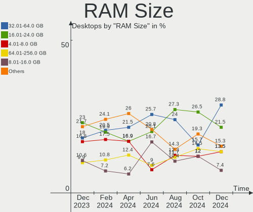
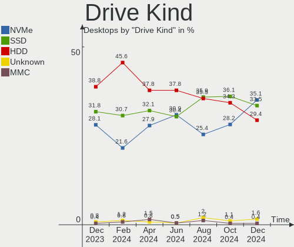
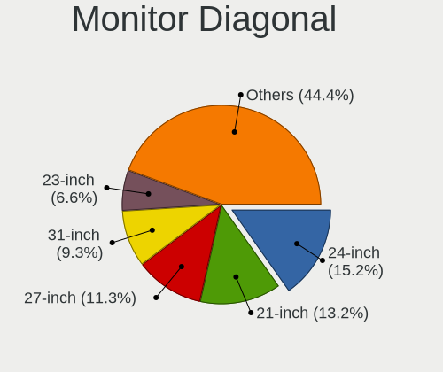

Debian Hardware Trends (Desktop)
--------------------------------

A project to identify most popular hardware characteristics and track their change
over time based on data collected by Debian users at https://Linux-Hardware.org.

Anyone can contribute to the study by uploading probes of their computers by
the [hw-probe](https://github.com/linuxhw/hw-probe) tool:

    sudo -E hw-probe -all -upload

Full-feature report is available here: https://linux-hardware.org/?view=trends&formfactor=desktop

Period: Oct, 2020.

Contents
--------

- [ OS                       ](#os)
- [ OS Family                ](#os-family)
- [ Kernel                   ](#kernel)
- [ Kernel Family            ](#kernel-family)
- [ Kernel Major Ver.        ](#kernel-major-ver)
- [ Arch                     ](#arch)
- [ DE                       ](#de)
- [ Display Server           ](#display-server)
- [ Display Manager          ](#display-manager)
- [ OS Lang                  ](#os-lang)
- [ Boot Mode                ](#boot-mode)
- [ Filesystem               ](#filesystem)
- [ Part. scheme             ](#part-scheme)
- [ Dual Boot with Linux/BSD ](#dual-boot-with-linux/bsd)
- [ Dual Boot (Win)          ](#dual-boot-win)
- [ Country                  ](#country)
- [ City                     ](#city)
- [ Vendor                   ](#vendor)
- [ Model                    ](#model)
- [ Model Family             ](#model-family)
- [ MFG Year                 ](#mfg-year)
- [ Form Factor              ](#form-factor)
- [ Secure Boot              ](#secure-boot)
- [ Coreboot                 ](#coreboot)
- [ RAM Size                 ](#ram-size)
- [ RAM Used                 ](#ram-used)
- [ Has CD-ROM               ](#has-cd-rom)
- [ Total Drives             ](#total-drives)
- [ Has Ethernet             ](#has-ethernet)
- [ Drive Vendor             ](#drive-vendor)
- [ HDD Vendor               ](#hdd-vendor)
- [ SSD Vendor               ](#ssd-vendor)
- [ Drive Model              ](#drive-model)
- [ Drive Kind               ](#drive-kind)
- [ Drive Connector          ](#drive-connector)
- [ Drive Size               ](#drive-size)
- [ Space Total              ](#space-total)
- [ Space Used               ](#space-used)
- [ Malfunc. Drives          ](#malfunc-drives)
- [ Malfunc. Drive Vendor    ](#malfunc-drive-vendor)
- [ Malfunc. HDD Vendor      ](#malfunc-hdd-vendor)
- [ Malfunc. Drive Kind      ](#malfunc-drive-kind)
- [ Failed Drives            ](#failed-drives)
- [ Failed Drive Vendor      ](#failed-drive-vendor)
- [ Drive Status             ](#drive-status)
- [ Storage Vendor           ](#storage-vendor)
- [ Storage Model            ](#storage-model)
- [ Storage Kind             ](#storage-kind)
- [ CPU Vendor               ](#cpu-vendor)
- [ CPU Model                ](#cpu-model)
- [ CPU Model Family         ](#cpu-model-family)
- [ CPU Cores                ](#cpu-cores)
- [ CPU Sockets              ](#cpu-sockets)
- [ CPU Threads              ](#cpu-threads)
- [ CPU Op-Modes             ](#cpu-op-modes)
- [ CPU Microcode            ](#cpu-microcode)
- [ CPU Microarch            ](#cpu-microarch)
- [ GPU Vendor               ](#gpu-vendor)
- [ GPU Model                ](#gpu-model)
- [ GPU Combo                ](#gpu-combo)
- [ GPU Driver               ](#gpu-driver)
- [ GPU Memory               ](#gpu-memory)
- [ Monitor Vendor           ](#monitor-vendor)
- [ Monitor Model            ](#monitor-model)
- [ Monitor Resolution       ](#monitor-resolution)
- [ Monitor Diagonal         ](#monitor-diagonal)
- [ Monitor Width            ](#monitor-width)
- [ Aspect Ratio             ](#aspect-ratio)
- [ Monitor Area             ](#monitor-area)
- [ Pixel Density            ](#pixel-density)
- [ Multiple Monitors        ](#multiple-monitors)
- [ Net Controller Vendor    ](#net-controller-vendor)
- [ Net Controller Model     ](#net-controller-model)
- [ Wireless Vendor          ](#wireless-vendor)
- [ Wireless Model           ](#wireless-model)
- [ Ethernet Vendor          ](#ethernet-vendor)
- [ Ethernet Model           ](#ethernet-model)
- [ Net Controller Kind      ](#net-controller-kind)
- [ Used Controller          ](#used-controller)
- [ NICs                     ](#nics)
- [ Memory Vendor            ](#memory-vendor)
- [ Memory Model             ](#memory-model)
- [ Memory Kind              ](#memory-kind)
- [ Memory Form Factor       ](#memory-form-factor)
- [ Memory Size              ](#memory-size)
- [ Memory Speed             ](#memory-speed)
- [ Sound Vendor             ](#sound-vendor)
- [ Sound Model              ](#sound-model)
- [ Camera Vendor            ](#camera-vendor)
- [ Camera Model             ](#camera-model)
- [ Fingerprint Vendor       ](#fingerprint-vendor)
- [ Fingerprint Model        ](#fingerprint-model)
- [ Chipcard Vendor          ](#chipcard-vendor)
- [ Chipcard Model           ](#chipcard-model)
- [ Printer Vendor           ](#printer-vendor)
- [ Printer Model            ](#printer-model)
- [ Scanner Vendor           ](#scanner-vendor)
- [ Scanner Model            ](#scanner-model)
- [ Bluetooth Vendor         ](#bluetooth-vendor)
- [ Bluetooth Model          ](#bluetooth-model)
- [ Unsupported Devices      ](#unsupported-devices)
- [ Unsupported Device Types ](#unsupported-device-types)

OS
--

Installed operating systems

| Name            | Desktops | Percent |
|-----------------|----------|---------|
| Debian 10       | 42       | 58.33%  |
| Debian Testing  | 14       | 19.44%  |
| Debian          | 8        | 11.11%  |
| Debian Unstable | 5        | 6.94%   |
| Debian 9.13     | 2        | 2.78%   |
| Debian 9.12     | 1        | 1.39%   |

OS Family
---------

OS without a version

| Name   | Desktops | Percent |
|--------|----------|---------|
| Debian | 72       | 100%    |

Kernel
------

Version of the Linux kernel

| Version                                                   | Desktops | Percent |
|-----------------------------------------------------------|----------|---------|
| 5.8.0-2-amd64                                             | 14       | 19.44%  |
| 4.19.0-11-amd64                                           | 12       | 16.67%  |
| 5.8.0-0.bpo.2-amd64                                       | 7        | 9.72%   |
| 4.19.0-12-amd64                                           | 7        | 9.72%   |
| 5.8.0-3-amd64                                             | 4        | 5.56%   |
| 5.6.0-2-amd64                                             | 3        | 4.17%   |
| 5.9.0-1-amd64                                             | 2        | 2.78%   |
| 5.8.0-1-amd64                                             | 2        | 2.78%   |
| 4.19.0-10-amd64                                           | 2        | 2.78%   |
| 5.8.16-xanmod1                                            | 1        | 1.39%   |
| 5.8.16-qcmm                                               | 1        | 1.39%   |
| 5.8.0-pf4                                                 | 1        | 1.39%   |
| 5.8.0-2-686-pae                                           | 1        | 1.39%   |
| 5.8.0-14.1-liquorix-amd64                                 | 1        | 1.39%   |
| 5.8.0-1-armmp-lpae                                        | 1        | 1.39%   |
| 5.7.0-xanmod1+pfksm+kill-guess-ldt-guest-latencytop-sandy | 1        | 1.39%   |
| 5.7.0-0.bpo.2-amd64                                       | 1        | 1.39%   |
| 5.6.0-1-amd64                                             | 1        | 1.39%   |
| 5.4.65-1-pve                                              | 1        | 1.39%   |
| 5.4.60-1-pve                                              | 1        | 1.39%   |
| 5.4.44-2-pve                                              | 1        | 1.39%   |
| 4.9.0-13-amd64                                            | 1        | 1.39%   |
| 4.9.0-12-amd64                                            | 1        | 1.39%   |
| 4.20.14+zstd-debug-gigalamp                               | 1        | 1.39%   |
| 4.19.0-8-amd64                                            | 1        | 1.39%   |
| 4.19.0-6-amd64                                            | 1        | 1.39%   |
| 4.19.0-11-armmp                                           | 1        | 1.39%   |
| 4.19.0-0.bpo.5-amd64                                      | 1        | 1.39%   |

Kernel Family
-------------

Linux kernel without a distro release

| Version | Desktops | Percent |
|---------|----------|---------|
| 5.8.0   | 31       | 43.06%  |
| 4.19.0  | 25       | 34.72%  |
| 5.6.0   | 4        | 5.56%   |
| 5.9.0   | 2        | 2.78%   |
| 5.8.16  | 2        | 2.78%   |
| 5.7.0   | 2        | 2.78%   |
| 4.9.0   | 2        | 2.78%   |
| 5.4.65  | 1        | 1.39%   |
| 5.4.60  | 1        | 1.39%   |
| 5.4.44  | 1        | 1.39%   |
| 4.20.14 | 1        | 1.39%   |

Kernel Major Ver.
-----------------

Linux kernel major version

| Version | Desktops | Percent |
|---------|----------|---------|
| 5.8     | 33       | 45.83%  |
| 4.19    | 25       | 34.72%  |
| 5.6     | 4        | 5.56%   |
| 5.4     | 3        | 4.17%   |
| 5.9     | 2        | 2.78%   |
| 5.7     | 2        | 2.78%   |
| 4.9     | 2        | 2.78%   |
| 4.20    | 1        | 1.39%   |

Arch
----

OS architecture (x86_64, i586, etc.)

| Name   | Desktops | Percent |
|--------|----------|---------|
| x86_64 | 69       | 95.83%  |
| armv7l | 2        | 2.78%   |
| i686   | 1        | 1.39%   |

DE
--

Desktop Environment

| Name             | Desktops | Percent |
|------------------|----------|---------|
| GNOME            | 14       | 19.44%  |
| Unknown          | 12       | 16.67%  |
| MATE             | 10       | 13.89%  |
| KDE5             | 9        | 12.5%   |
| XFCE             | 8        | 11.11%  |
| KDE              | 7        | 9.72%   |
| Cinnamon         | 4        | 5.56%   |
| X-Cinnamon       | 2        | 2.78%   |
| Openbox          | 2        | 2.78%   |
| LXQt             | 2        | 2.78%   |
| lightdm-xsession | 1        | 1.39%   |
| GNOME Flashback  | 1        | 1.39%   |

Display Server
--------------

X11 or Wayland

| Name    | Desktops | Percent |
|---------|----------|---------|
| X11     | 53       | 73.61%  |
| Tty     | 10       | 13.89%  |
| Unknown | 5        | 6.94%   |
| Wayland | 4        | 5.56%   |

Display Manager
---------------

SDDM, LightDM, etc.

| Name    | Desktops | Percent |
|---------|----------|---------|
| Unknown | 36       | 50%     |
| TDM     | 15       | 20.83%  |
| GDM     | 11       | 15.28%  |
| SDDM    | 9        | 12.5%   |
| SLiM    | 1        | 1.39%   |

OS Lang
-------

Language

| Lang       | Desktops | Percent |
|------------|----------|---------|
| en_US      | 30       | 41.67%  |
| pt_BR      | 5        | 6.94%   |
| fr_FR      | 5        | 6.94%   |
| it_IT      | 4        | 5.56%   |
| de_DE      | 4        | 5.56%   |
| ru_UA      | 2        | 2.78%   |
| ru_RU      | 2        | 2.78%   |
| es_AR      | 2        | 2.78%   |
| en_US.utf8 | 2        | 2.78%   |
| en_GB      | 2        | 2.78%   |
| Unknown    | 2        | 2.78%   |
| pt_BR.utf8 | 1        | 1.39%   |
| ja_JP      | 1        | 1.39%   |
| hu_HU      | 1        | 1.39%   |
| fr_FR.utf8 | 1        | 1.39%   |
| en_IN      | 1        | 1.39%   |
| en_IL      | 1        | 1.39%   |
| en_IE      | 1        | 1.39%   |
| en_GB.utf8 | 1        | 1.39%   |
| en_AU      | 1        | 1.39%   |
| de_BE      | 1        | 1.39%   |
| cs_CZ      | 1        | 1.39%   |
| C          | 1        | 1.39%   |

Boot Mode
---------

EFI or BIOS

| Mode | Desktops | Percent |
|------|----------|---------|
| BIOS | 51       | 70.83%  |
| EFI  | 21       | 29.17%  |

Filesystem
----------

Type of filesystem

| Type  | Desktops | Percent |
|-------|----------|---------|
| Ext4  | 67       | 93.06%  |
| Zfs   | 2        | 2.78%   |
| Ext2  | 2        | 2.78%   |
| Btrfs | 1        | 1.39%   |

Part. scheme
------------

Scheme of partitioning

| Type    | Desktops | Percent |
|---------|----------|---------|
| GPT     | 27       | 37.5%   |
| Unknown | 24       | 33.33%  |
| MBR     | 21       | 29.17%  |

Dual Boot with Linux/BSD
------------------------

Hosting more than one Linux/BSD

| Dual boot | Desktops | Percent |
|-----------|----------|---------|
| No        | 56       | 77.78%  |
| Yes       | 16       | 22.22%  |

Dual Boot (Win)
---------------

Hosting Linux and Windows

| Dual boot | Desktops | Percent |
|-----------|----------|---------|
| No        | 47       | 65.28%  |
| Yes       | 25       | 34.72%  |

Country
-------

Geographic location (country)

| Country        | Desktops | Percent |
|----------------|----------|---------|
| USA            | 9        | 12.5%   |
| Germany        | 9        | 12.5%   |
| Russia         | 6        | 8.33%   |
| Italy          | 6        | 8.33%   |
| France         | 6        | 8.33%   |
| Brazil         | 6        | 8.33%   |
| Hungary        | 4        | 5.56%   |
| Ukraine        | 3        | 4.17%   |
| UK             | 3        | 4.17%   |
| Poland         | 2        | 2.78%   |
| Finland        | 2        | 2.78%   |
| Argentina      | 2        | 2.78%   |
| Venezuela      | 1        | 1.39%   |
| UAE            | 1        | 1.39%   |
| Turkey         | 1        | 1.39%   |
| Taiwan         | 1        | 1.39%   |
| Switzerland    | 1        | 1.39%   |
| Sweden         | 1        | 1.39%   |
| Peru           | 1        | 1.39%   |
| Netherlands    | 1        | 1.39%   |
| Japan          | 1        | 1.39%   |
| Israel         | 1        | 1.39%   |
| Ireland        | 1        | 1.39%   |
| India          | 1        | 1.39%   |
| Czech Republic | 1        | 1.39%   |
| Australia      | 1        | 1.39%   |

City
----

Geographic location (city)

| City                  | Desktops | Percent |
|-----------------------|----------|---------|
| Budapest              | 3        | 4.17%   |
| Vasylkiv              | 2        | 2.78%   |
| St Petersburg         | 2        | 2.78%   |
| San Giorgio a Cremano | 2        | 2.78%   |
| Moscow                | 2        | 2.78%   |
| Leverkusen            | 2        | 2.78%   |
| Andernos-les-Bains    | 2        | 2.78%   |
| Wohlen                | 1        | 1.39%   |
| West Jordan           | 1        | 1.39%   |
| Verucchio             | 1        | 1.39%   |
| Troy                  | 1        | 1.39%   |
| Toulouse              | 1        | 1.39%   |
| Tel Aviv              | 1        | 1.39%   |
| Taipei                | 1        | 1.39%   |
| São Miguel do Oeste  | 1        | 1.39%   |
| Stuttgart             | 1        | 1.39%   |
| Spello                | 1        | 1.39%   |
| Shankill              | 1        | 1.39%   |
| Savannah              | 1        | 1.39%   |
| Salvador              | 1        | 1.39%   |
| Resolven              | 1        | 1.39%   |
| Praszka               | 1        | 1.39%   |
| Prague                | 1        | 1.39%   |
| Porto Alegre          | 1        | 1.39%   |
| Paris                 | 1        | 1.39%   |
| Oconomowoc            | 1        | 1.39%   |
| Novocherkassk         | 1        | 1.39%   |
| Nivala                | 1        | 1.39%   |
| New Orleans           | 1        | 1.39%   |
| Miyazaki              | 1        | 1.39%   |
| Mesa                  | 1        | 1.39%   |
| Lviv                  | 1        | 1.39%   |
| Longmont              | 1        | 1.39%   |
| London                | 1        | 1.39%   |
| Little Rock           | 1        | 1.39%   |
| Lima                  | 1        | 1.39%   |
| Labatlan              | 1        | 1.39%   |
| Kielce                | 1        | 1.39%   |
| Kerava                | 1        | 1.39%   |
| Jönköping           | 1        | 1.39%   |
| Indio                 | 1        | 1.39%   |
| Goiânia              | 1        | 1.39%   |
| Geelong               | 1        | 1.39%   |
| Frankfurt am Main     | 1        | 1.39%   |
| Falkenstein           | 1        | 1.39%   |
| Essen                 | 1        | 1.39%   |
| Embu                  | 1        | 1.39%   |
| Ekaterinburg          | 1        | 1.39%   |
| Eindhoven             | 1        | 1.39%   |
| Dubai                 | 1        | 1.39%   |
| Curitiba              | 1        | 1.39%   |
| Colomiers             | 1        | 1.39%   |
| Cologne               | 1        | 1.39%   |
| Chennai               | 1        | 1.39%   |
| Chelsea               | 1        | 1.39%   |
| Chauny                | 1        | 1.39%   |
| Buena Vista           | 1        | 1.39%   |
| Braunschweig          | 1        | 1.39%   |
| Bonn                  | 1        | 1.39%   |
| Biella                | 1        | 1.39%   |

Vendor
------

Motherboard manufacturer

| Name                | Desktops | Percent |
|---------------------|----------|---------|
| ASUSTek Computer    | 20       | 27.78%  |
| Gigabyte Technology | 13       | 18.06%  |
| ASRock              | 8        | 11.11%  |
| Intel               | 5        | 6.94%   |
| MSI                 | 4        | 5.56%   |
| Foxconn             | 4        | 5.56%   |
| Hewlett-Packard     | 3        | 4.17%   |
| Dell                | 3        | 4.17%   |
| Unknown             | 3        | 4.17%   |
| ASRockRack          | 2        | 2.78%   |
| Acer                | 2        | 2.78%   |
| Positivo            | 1        | 1.39%   |
| Pegatron            | 1        | 1.39%   |
| Medion              | 1        | 1.39%   |
| Fujitsu Siemens     | 1        | 1.39%   |
| Fujitsu             | 1        | 1.39%   |

Model
-----

Motherboard model

| Name                               | Desktops | Percent |
|------------------------------------|----------|---------|
| Unknown                            | 3        | 4.17%   |
| Gigabyte X570 AORUS ELITE          | 2        | 2.78%   |
| Positivo C6200                     | 1        | 1.39%   |
| Pegatron IPMIP-GS                  | 1        | 1.39%   |
| MSI MS-7C71                        | 1        | 1.39%   |
| MSI MS-7C56                        | 1        | 1.39%   |
| MSI MS-7926                        | 1        | 1.39%   |
| MSI MS-7641                        | 1        | 1.39%   |
| Medion MS-7848                     | 1        | 1.39%   |
| Intel MINISERVER                   | 1        | 1.39%   |
| Intel DH67CL AAG10212-207          | 1        | 1.39%   |
| Intel DH55TC AAE70932-206          | 1        | 1.39%   |
| Intel DG31PR AAE58249-302          | 1        | 1.39%   |
| Intel D945GCNL AAD97184-102        | 1        | 1.39%   |
| HP Compaq Pro 6300 SFF             | 1        | 1.39%   |
| HP Compaq Elite 8300 SFF           | 1        | 1.39%   |
| HP Compaq dc5800 Small Form Factor | 1        | 1.39%   |
| Gigabyte Z77X-UD3H                 | 1        | 1.39%   |
| Gigabyte P35-DS3R                  | 1        | 1.39%   |
| Gigabyte H87N-WIFI                 | 1        | 1.39%   |
| Gigabyte H87M-HD3                  | 1        | 1.39%   |
| Gigabyte GB-BACE-3000              | 1        | 1.39%   |
| Gigabyte GA-MA74GM-S2              | 1        | 1.39%   |
| Gigabyte B550 AORUS ELITE          | 1        | 1.39%   |
| Gigabyte B450M S2H                 | 1        | 1.39%   |
| Gigabyte B250M-D3H                 | 1        | 1.39%   |
| Gigabyte 970A-DS3P                 | 1        | 1.39%   |
| Gigabyte 945GCM-S2L                | 1        | 1.39%   |
| Fujitsu Siemens CELSIUS W360       | 1        | 1.39%   |
| Fujitsu D3417-B1                   | 1        | 1.39%   |
| Foxconn Pro 3400 Series MT         | 1        | 1.39%   |
| Foxconn p6-2185ef                  | 1        | 1.39%   |
| Foxconn MCP61M05                   | 1        | 1.39%   |
| Foxconn 2A8C                       | 1        | 1.39%   |
| Dell OptiPlex 990                  | 1        | 1.39%   |
| Dell OptiPlex 755                  | 1        | 1.39%   |
| Dell OptiPlex 3050                 | 1        | 1.39%   |
| ASUS Z170 PRO GAMING/AURA          | 1        | 1.39%   |
| ASUS Z170 PRO GAMING               | 1        | 1.39%   |
| ASUS TUF GAMING B550-PLUS          | 1        | 1.39%   |
| ASUS ROG ZENITH II EXTREME ALPHA   | 1        | 1.39%   |
| ASUS ROG STRIX H370-I GAMING       | 1        | 1.39%   |
| ASUS PRIME X470-PRO                | 1        | 1.39%   |
| ASUS PRIME B460M-A                 | 1        | 1.39%   |
| ASUS PRIME B450-PLUS               | 1        | 1.39%   |
| ASUS P8P67 LE                      | 1        | 1.39%   |
| ASUS P8H61-M LE                    | 1        | 1.39%   |
| ASUS P6T DELUXE V2                 | 1        | 1.39%   |
| ASUS P5QL-E                        | 1        | 1.39%   |
| ASUS P5Q3                          | 1        | 1.39%   |
| ASUS P5Q-EM                        | 1        | 1.39%   |
| ASUS M5A78L-M/USB3                 | 1        | 1.39%   |
| ASUS M2N-SLI DELUXE                | 1        | 1.39%   |
| ASUS M2N                           | 1        | 1.39%   |
| ASUS M2A-VM                        | 1        | 1.39%   |
| ASUS H170M-PLUS                    | 1        | 1.39%   |
| ASUS All Series                    | 1        | 1.39%   |
| ASRockRack X399D8A-2T              | 1        | 1.39%   |
| ASRockRack ROMED8-2T               | 1        | 1.39%   |
| ASRock X570 Steel Legend WiFi ax   | 1        | 1.39%   |

Model Family
------------

Motherboard model prefix

| Name                    | Desktops | Percent |
|-------------------------|----------|---------|
| HP Compaq               | 3        | 4.17%   |
| Dell OptiPlex           | 3        | 4.17%   |
| ASUS PRIME              | 3        | 4.17%   |
| Unknown                 | 3        | 4.17%   |
| Gigabyte X570           | 2        | 2.78%   |
| ASUS Z170               | 2        | 2.78%   |
| ASUS ROG                | 2        | 2.78%   |
| Acer Aspire             | 2        | 2.78%   |
| Positivo C6200          | 1        | 1.39%   |
| Pegatron IPMIP-GS       | 1        | 1.39%   |
| MSI MS-7C71             | 1        | 1.39%   |
| MSI MS-7C56             | 1        | 1.39%   |
| MSI MS-7926             | 1        | 1.39%   |
| MSI MS-7641             | 1        | 1.39%   |
| Medion MS-7848          | 1        | 1.39%   |
| Intel MINISERVER        | 1        | 1.39%   |
| Intel DH67CL            | 1        | 1.39%   |
| Intel DH55TC            | 1        | 1.39%   |
| Intel DG31PR            | 1        | 1.39%   |
| Intel D945GCNL          | 1        | 1.39%   |
| Gigabyte Z77X-UD3H      | 1        | 1.39%   |
| Gigabyte P35-DS3R       | 1        | 1.39%   |
| Gigabyte H87N-WIFI      | 1        | 1.39%   |
| Gigabyte H87M-HD3       | 1        | 1.39%   |
| Gigabyte GB-BACE-3000   | 1        | 1.39%   |
| Gigabyte GA-MA74GM-S2   | 1        | 1.39%   |
| Gigabyte B550           | 1        | 1.39%   |
| Gigabyte B450M          | 1        | 1.39%   |
| Gigabyte B250M-D3H      | 1        | 1.39%   |
| Gigabyte 970A-DS3P      | 1        | 1.39%   |
| Gigabyte 945GCM-S2L     | 1        | 1.39%   |
| Fujitsu Siemens CELSIUS | 1        | 1.39%   |
| Fujitsu D3417-B1        | 1        | 1.39%   |
| Foxconn Pro             | 1        | 1.39%   |
| Foxconn p6-2185ef       | 1        | 1.39%   |
| Foxconn MCP61M05        | 1        | 1.39%   |
| Foxconn 2A8C            | 1        | 1.39%   |
| ASUS TUF                | 1        | 1.39%   |
| ASUS P8P67              | 1        | 1.39%   |
| ASUS P8H61-M            | 1        | 1.39%   |
| ASUS P6T                | 1        | 1.39%   |
| ASUS P5QL-E             | 1        | 1.39%   |
| ASUS P5Q3               | 1        | 1.39%   |
| ASUS P5Q-EM             | 1        | 1.39%   |
| ASUS M5A78L-M           | 1        | 1.39%   |
| ASUS M2N-SLI            | 1        | 1.39%   |
| ASUS M2N                | 1        | 1.39%   |
| ASUS M2A-VM             | 1        | 1.39%   |
| ASUS H170M-PLUS         | 1        | 1.39%   |
| ASUS All                | 1        | 1.39%   |
| ASRockRack X399D8A-2T   | 1        | 1.39%   |
| ASRockRack ROMED8-2T    | 1        | 1.39%   |
| ASRock X570             | 1        | 1.39%   |
| ASRock X399             | 1        | 1.39%   |
| ASRock FM2A88M-HD+      | 1        | 1.39%   |
| ASRock B450M            | 1        | 1.39%   |
| ASRock B450             | 1        | 1.39%   |
| ASRock A320M-HDV        | 1        | 1.39%   |
| ASRock 970              | 1        | 1.39%   |
| ASRock 939A785GMH       | 1        | 1.39%   |

MFG Year
--------

Motherboard manufacture year

| Year    | Desktops | Percent |
|---------|----------|---------|
| 2020    | 14       | 19.44%  |
| 2018    | 7        | 9.72%   |
| 2009    | 7        | 9.72%   |
| 2019    | 6        | 8.33%   |
| 2007    | 5        | 6.94%   |
| 2016    | 4        | 5.56%   |
| 2014    | 4        | 5.56%   |
| 2012    | 4        | 5.56%   |
| 2011    | 4        | 5.56%   |
| 2008    | 4        | 5.56%   |
| 2017    | 3        | 4.17%   |
| 2015    | 3        | 4.17%   |
| 2013    | 3        | 4.17%   |
| 2010    | 3        | 4.17%   |
| Unknown | 1        | 1.39%   |

Form Factor
-----------

Physical design of the computer

| Name    | Desktops | Percent |
|---------|----------|---------|
| Desktop | 72       | 100%    |

Secure Boot
-----------

Enabled or disabled

| State    | Desktops | Percent |
|----------|----------|---------|
| Disabled | 70       | 97.22%  |
| Enabled  | 2        | 2.78%   |

Coreboot
--------

Have coreboot on board

| Used | Desktops | Percent |
|------|----------|---------|
| No   | 72       | 100%    |

RAM Size
--------

Total RAM memory

| Size in GB      | Desktops | Percent |
|-----------------|----------|---------|
| 8.01-16.0       | 14       | 19.44%  |
| 16.01-24.0      | 13       | 18.06%  |
| 32.01-64.0      | 11       | 15.28%  |
| 3.01-4.0        | 10       | 13.89%  |
| 4.01-8.0        | 9        | 12.5%   |
| 64.01-256.0     | 7        | 9.72%   |
| 2.01-3.0        | 3        | 4.17%   |
| 1.01-2.0        | 2        | 2.78%   |
| More than 256.0 | 1        | 1.39%   |
| 24.01-32.0      | 1        | 1.39%   |
| 0.01-1.0        | 1        | 1.39%   |

RAM Used
--------

Used RAM memory

| Used GB    | Desktops | Percent |
|------------|----------|---------|
| 1.01-2.0   | 17       | 23.61%  |
| 4.01-8.0   | 14       | 19.44%  |
| 2.01-3.0   | 12       | 16.67%  |
| 8.01-16.0  | 9        | 12.5%   |
| 0.01-1.0   | 9        | 12.5%   |
| 16.01-24.0 | 7        | 9.72%   |
| 3.01-4.0   | 3        | 4.17%   |
| 32.01-64.0 | 1        | 1.39%   |

Has CD-ROM
----------

Has CD-ROM on board

| Presented | Desktops | Percent |
|-----------|----------|---------|
| No        | 43       | 59.72%  |
| Yes       | 29       | 40.28%  |

Total Drives
------------

Number of drives on board

| Drives | Desktops | Percent |
|--------|----------|---------|
| 2      | 23       | 31.94%  |
| 1      | 19       | 26.39%  |
| 3      | 17       | 23.61%  |
| 4      | 8        | 11.11%  |
| 6      | 2        | 2.78%   |
| 5      | 2        | 2.78%   |
| 10     | 1        | 1.39%   |

Has Ethernet
------------

Has Ethernet on board

| Presented | Desktops | Percent |
|-----------|----------|---------|
| Yes       | 69       | 95.83%  |
| No        | 3        | 4.17%   |

Drive Vendor
------------

Hard drive vendors

| Vendor              | Desktops | Drives | Percent |
|---------------------|----------|--------|---------|
| Seagate             | 28       | 36     | 21.21%  |
| WDC                 | 27       | 46     | 20.45%  |
| Samsung Electronics | 20       | 32     | 15.15%  |
| Kingston            | 9        | 10     | 6.82%   |
| A-DATA Technology   | 7        | 7      | 5.3%    |
| Hitachi             | 6        | 6      | 4.55%   |
| Toshiba             | 5        | 9      | 3.79%   |
| Crucial             | 5        | 5      | 3.79%   |
| Unknown             | 4        | 4      | 3.03%   |
| Intel               | 3        | 3      | 2.27%   |
| SanDisk             | 2        | 2      | 1.52%   |
| Phison              | 2        | 4      | 1.52%   |
| Corsair             | 2        | 3      | 1.52%   |
| USB 3.0             | 1        | 2      | 0.76%   |
| Transcend           | 1        | 1      | 0.76%   |
| Mushkin             | 1        | 1      | 0.76%   |
| Maxtor              | 1        | 1      | 0.76%   |
| Lexar               | 1        | 1      | 0.76%   |
| Kston               | 1        | 1      | 0.76%   |
| Intenso             | 1        | 1      | 0.76%   |
| HGST                | 1        | 1      | 0.76%   |
| Gigabyte Technology | 1        | 1      | 0.76%   |
| Fujitsu             | 1        | 1      | 0.76%   |
| ExcelStor           | 1        | 1      | 0.76%   |
| Apacer              | 1        | 1      | 0.76%   |

HDD Vendor
----------

Hard disk drive vendors

| Vendor              | Desktops | Drives | Percent |
|---------------------|----------|--------|---------|
| Seagate             | 27       | 35     | 37.5%   |
| WDC                 | 26       | 42     | 36.11%  |
| Hitachi             | 6        | 6      | 8.33%   |
| Samsung Electronics | 5        | 5      | 6.94%   |
| Toshiba             | 3        | 6      | 4.17%   |
| Maxtor              | 1        | 1      | 1.39%   |
| Intenso             | 1        | 1      | 1.39%   |
| HGST                | 1        | 1      | 1.39%   |
| Fujitsu             | 1        | 1      | 1.39%   |
| ExcelStor           | 1        | 1      | 1.39%   |

SSD Vendor
----------

Solid state drive vendors

| Vendor              | Desktops | Drives | Percent |
|---------------------|----------|--------|---------|
| Samsung Electronics | 11       | 15     | 26.83%  |
| Kingston            | 9        | 10     | 21.95%  |
| A-DATA Technology   | 5        | 5      | 12.2%   |
| Crucial             | 4        | 4      | 9.76%   |
| WDC                 | 2        | 2      | 4.88%   |
| Toshiba             | 2        | 2      | 4.88%   |
| Transcend           | 1        | 1      | 2.44%   |
| SanDisk             | 1        | 1      | 2.44%   |
| Mushkin             | 1        | 1      | 2.44%   |
| Kston               | 1        | 1      | 2.44%   |
| Intel               | 1        | 1      | 2.44%   |
| Gigabyte Technology | 1        | 1      | 2.44%   |
| Corsair             | 1        | 1      | 2.44%   |
| Apacer              | 1        | 1      | 2.44%   |

Drive Model
-----------

Hard drive models

| Model                        | Desktops | Percent |
|------------------------------|----------|---------|
| SV300S37A120G 120GB SSD      | 3        | 1.84%   |
| WD20EZRX-00D8PB0 2TB         | 2        | 1.23%   |
| WD10EAVS-00D7B1 1TB          | 2        | 1.23%   |
| SU800 256GB SSD              | 2        | 1.23%   |
| ST31000528AS 1TB             | 2        | 1.23%   |
| ST2000DM006-2DM164 2TB       | 2        | 1.23%   |
| ST2000DM001-1ER164 2TB       | 2        | 1.23%   |
| ST2000DM001-1CH164 2TB       | 2        | 1.23%   |
| ST1000DM010-2EP102 1TB       | 2        | 1.23%   |
| SSD 970 PRO 512GB            | 2        | 1.23%   |
| SSD 850 PRO 512GB            | 2        | 1.23%   |
| SSD 840 PRO Series 256GB     | 2        | 1.23%   |
| SSD 840 PRO Series 128GB     | 2        | 1.23%   |
| SA400S37480G 480GB SSD       | 2        | 1.23%   |
| SA400S37240G 240GB SSD       | 2        | 1.23%   |
| NVMe SSD Drive 512GB         | 2        | 1.23%   |
| Expansion Desk 3TB           | 2        | 1.23%   |
| CT240BX500SSD1 240GB         | 2        | 1.23%   |
| WDS512G1X0C-00ENX0 512GB     | 1        | 0.61%   |
| WDS500G2B0A-00SM50 500GB SSD | 1        | 0.61%   |
| WDS250G2B0A 250GB SSD        | 1        | 0.61%   |
| WD800AAJS-60B4A0 80GB        | 1        | 0.61%   |
| WD7500AARS-00Y5B1 752GB      | 1        | 0.61%   |
| WD6400AAKS-22A7B2 640GB      | 1        | 0.61%   |
| WD5002ABYS-02B1B0 500GB      | 1        | 0.61%   |
| WD5000AVCS-632DY1 500GB      | 1        | 0.61%   |
| WD5000AAKX-001CA0 500GB      | 1        | 0.61%   |
| WD5000AAKS-00A7B2 500GB      | 1        | 0.61%   |
| WD4005FZBX-00K5WB0 4TB       | 1        | 0.61%   |
| WD4000F9YZ-09N20L1 4TB       | 1        | 0.61%   |
| WD3200AAJS-07B4A0 320GB      | 1        | 0.61%   |
| WD30EURS-73TLHY0 3TB         | 1        | 0.61%   |
| WD30EURS-63SPKY0 3TB         | 1        | 0.61%   |
| WD2500KS-00MJB0 250GB        | 1        | 0.61%   |
| WD2500BEVT-75ZCT2 250GB      | 1        | 0.61%   |
| WD2500AAKS-00UU3A0 250GB     | 1        | 0.61%   |
| WD20EZRZ-00Z5HB0 2TB         | 1        | 0.61%   |
| WD20EARX-00PASB0 2TB         | 1        | 0.61%   |
| WD20EARS-00S8B1 2TB          | 1        | 0.61%   |
| WD2003FZEX-00SRLA0 2TB       | 1        | 0.61%   |
| WD2000FYYZ-05UL1B0 2TB       | 1        | 0.61%   |
| WD2000F9YZ-09N20L1 2TB       | 1        | 0.61%   |
| WD1600YS-01SHB1 164GB        | 1        | 0.61%   |
| WD15EADS-00P8B0 1TB          | 1        | 0.61%   |
| WD10EZEX-35WN4A0 1TB         | 1        | 0.61%   |
| WD10EZEX-21M2NA0 1TB         | 1        | 0.61%   |
| WD10EZEX-08M2NA0 1TB         | 1        | 0.61%   |
| WD10EZEX-00BN5A0 1TB         | 1        | 0.61%   |
| WD10EALX-759BA1 1TB          | 1        | 0.61%   |
| WD101EMAZ-11G7DA0 10TB       | 1        | 0.61%   |
| WD100EZAZ-11TDBA0 10TB       | 1        | 0.61%   |
| WD1002FAEX-00Z3A0 1TB        | 1        | 0.61%   |
| TS32GSSD25S-M 32GB           | 1        | 0.61%   |
| TR150 960GB SSD              | 1        | 0.61%   |
| THNSFC128GBSJ SSD            | 1        | 0.61%   |
| Technology J880S 82GB        | 1        | 0.61%   |
| SX8200PNP 512GB              | 1        | 0.61%   |
| SX8200PNP 1TB                | 1        | 0.61%   |
| SV300S37A60G 64GB SSD        | 1        | 0.61%   |
| SUV400S37240G 240GB SSD      | 1        | 0.61%   |

Drive Kind
----------

HDD or SSD

| Kind    | Desktops | Drives | Percent |
|---------|----------|--------|---------|
| HDD     | 55       | 99     | 47.41%  |
| SSD     | 39       | 46     | 33.62%  |
| NVMe    | 16       | 28     | 13.79%  |
| MMC     | 3        | 3      | 2.59%   |
| Unknown | 3        | 4      | 2.59%   |

Drive Connector
---------------

SATA, SAS, NVMe, etc.

| Type | Desktops | Drives | Percent |
|------|----------|--------|---------|
| SATA | 65       | 141    | 71.43%  |
| NVMe | 16       | 28     | 17.58%  |
| SAS  | 7        | 8      | 7.69%   |
| MMC  | 3        | 3      | 3.3%    |

Drive Size
----------

Size of hard drive

| Size in TB | Desktops | Drives | Percent |
|------------|----------|--------|---------|
| 0.01-0.5   | 53       | 73     | 50.96%  |
| 0.51-1.0   | 26       | 29     | 25%     |
| 1.01-2.0   | 16       | 21     | 15.38%  |
| 3.01-4.0   | 3        | 4      | 2.88%   |
| 2.01-3.0   | 3        | 6      | 2.88%   |
| 4.01-10.0  | 3        | 12     | 2.88%   |

Space Total
-----------

Amount of disk space available on the file system

| Size in GB     | Desktops | Percent |
|----------------|----------|---------|
| 251-500        | 15       | 20.83%  |
| 101-250        | 11       | 15.28%  |
| More than 3000 | 10       | 13.89%  |
| 1001-2000      | 10       | 13.89%  |
| 501-1000       | 7        | 9.72%   |
| 51-100         | 6        | 8.33%   |
| 2001-3000      | 4        | 5.56%   |
| Unknown        | 4        | 5.56%   |
| 21-50          | 3        | 4.17%   |
| 1-20           | 2        | 2.78%   |

Space Used
----------

Amount of used disk space

| Used GB        | Desktops | Percent |
|----------------|----------|---------|
| 101-250        | 14       | 19.44%  |
| 251-500        | 13       | 18.06%  |
| 1-20           | 11       | 15.28%  |
| 501-1000       | 8        | 11.11%  |
| 21-50          | 7        | 9.72%   |
| 51-100         | 7        | 9.72%   |
| More than 3000 | 4        | 5.56%   |
| Unknown        | 4        | 5.56%   |
| 1001-2000      | 3        | 4.17%   |
| 2001-3000      | 1        | 1.39%   |

Malfunc. Drives
---------------

Drive models with a malfunction

| Model                      | Desktops | Drives | Percent |
|----------------------------|----------|--------|---------|
| SU800 256GB SSD            | 2        | 2      | 11.76%  |
| WD5002ABYS-02B1B0 500GB    | 1        | 1      | 5.88%   |
| WD15EADS-00P8B0 1TB        | 1        | 1      | 5.88%   |
| SUV400S37240G 240GB SSD    | 1        | 1      | 5.88%   |
| SU800NS38 256GB SSD        | 1        | 1      | 5.88%   |
| ST9500325AS 500GB          | 1        | 1      | 5.88%   |
| ST3250318AS 250GB          | 1        | 1      | 5.88%   |
| ST320DM000-1BD14C 320GB    | 1        | 1      | 5.88%   |
| ST2000LM003 HN-M201RAD 2TB | 1        | 1      | 5.88%   |
| ST1000LM049-2GH172 1TB     | 1        | 1      | 5.88%   |
| SP2514N 250GB              | 1        | 1      | 5.88%   |
| SMS200S330G 32GB SSD       | 1        | 1      | 5.88%   |
| HTS545032B9A300 320GB      | 1        | 1      | 5.88%   |
| HDS721032CLA362 320GB      | 1        | 1      | 5.88%   |
| CSSD-F12 120GB             | 1        | 1      | 5.88%   |
| 7H500F0 500GB              | 1        | 1      | 5.88%   |

Malfunc. Drive Vendor
---------------------

Vendors of faulty drives

| Vendor              | Desktops | Drives | Percent |
|---------------------|----------|--------|---------|
| Seagate             | 4        | 5      | 25%     |
| A-DATA Technology   | 3        | 3      | 18.75%  |
| WDC                 | 2        | 2      | 12.5%   |
| Kingston            | 2        | 2      | 12.5%   |
| Hitachi             | 2        | 2      | 12.5%   |
| Samsung Electronics | 1        | 1      | 6.25%   |
| Maxtor              | 1        | 1      | 6.25%   |
| Corsair             | 1        | 1      | 6.25%   |

Malfunc. HDD Vendor
-------------------

Vendors of faulty HDD drives

| Vendor              | Desktops | Drives | Percent |
|---------------------|----------|--------|---------|
| Seagate             | 4        | 5      | 40%     |
| WDC                 | 2        | 2      | 20%     |
| Hitachi             | 2        | 2      | 20%     |
| Samsung Electronics | 1        | 1      | 10%     |
| Maxtor              | 1        | 1      | 10%     |

Malfunc. Drive Kind
-------------------

Kinds of faulty drives

| Kind | Desktops | Drives | Percent |
|------|----------|--------|---------|
| HDD  | 9        | 11     | 60%     |
| SSD  | 6        | 6      | 40%     |

Failed Drives
-------------

Failed drive models

Zero info for selected period =(

Failed Drive Vendor
-------------------

Failed drive vendors

Zero info for selected period =(

Drive Status
------------

Number of failed and malfunc. drives

| Status   | Desktops | Drives | Percent |
|----------|----------|--------|---------|
| Works    | 42       | 105    | 47.73%  |
| Detected | 32       | 58     | 36.36%  |
| Malfunc  | 14       | 17     | 15.91%  |

Storage Vendor
--------------

Storage controller vendors

| Vendor                       | Desktops | Percent |
|------------------------------|----------|---------|
| Intel                        | 42       | 41.58%  |
| AMD                          | 24       | 23.76%  |
| Samsung Electronics          | 8        | 7.92%   |
| ASMedia Technology           | 5        | 4.95%   |
| Nvidia                       | 4        | 3.96%   |
| Phison Electronics           | 3        | 2.97%   |
| Marvell Technology Group     | 3        | 2.97%   |
| JMicron Technology           | 3        | 2.97%   |
| ADATA Technology             | 3        | 2.97%   |
| Toshiba America Info Systems | 1        | 0.99%   |
| Silicon Motion               | 1        | 0.99%   |
| Sandisk                      | 1        | 0.99%   |
| Micron/Crucial Technology    | 1        | 0.99%   |
| LSI Logic / Symbios Logic    | 1        | 0.99%   |
| Broadcom / LSI               | 1        | 0.99%   |

Storage Model
-------------

Storage controller models

| Model                                                                             | Desktops | Percent |
|-----------------------------------------------------------------------------------|----------|---------|
| FCH SATA Controller [AHCI mode]                                                   | 14       | 10.29%  |
| SB7x0/SB8x0/SB9x0 IDE Controller                                                  | 6        | 4.41%   |
| NVMe SSD Controller SM981/PM981/PM983                                             | 5        | 3.68%   |
| ASM1062 Serial ATA Controller                                                     | 5        | 3.68%   |
| 6 Series/C200 Series Chipset Family 6 port Desktop SATA AHCI Controller           | 5        | 3.68%   |
| 400 Series Chipset SATA Controller                                                | 5        | 3.68%   |
| SB7x0/SB8x0/SB9x0 SATA Controller [AHCI mode]                                     | 4        | 2.94%   |
| Q170/Q150/B150/H170/H110/Z170/CM236 Chipset SATA Controller [AHCI Mode]           | 4        | 2.94%   |
| NM10/ICH7 Family SATA Controller [IDE mode]                                       | 4        | 2.94%   |
| XPG SX8200 Pro PCIe Gen3x4 M.2 2280 Solid State Drive                             | 3        | 2.21%   |
| SATA controller                                                                   | 3        | 2.21%   |
| NVMe SSD Controller SM961/PM961                                                   | 3        | 2.21%   |
| JMB363 SATA/IDE Controller                                                        | 3        | 2.21%   |
| 82801I (ICH9 Family) 2 port SATA Controller [IDE mode]                            | 3        | 2.21%   |
| 82801G (ICH7 Family) IDE Controller                                               | 3        | 2.21%   |
| 8 Series/C220 Series Chipset Family 6-port SATA Controller 1 [AHCI mode]          | 3        | 2.21%   |
| 7 Series/C210 Series Chipset Family 6-port SATA Controller [AHCI mode]            | 3        | 2.21%   |
| X399 Series Chipset SATA Controller                                               | 2        | 1.47%   |
| SB7x0/SB8x0/SB9x0 SATA Controller [IDE mode]                                      | 2        | 1.47%   |
| SATA Controller [RAID mode]                                                       | 2        | 1.47%   |
| SAS2008 PCI-Express Fusion-MPT SAS-2 [Falcon]                                     | 2        | 1.47%   |
| Non-Volatile memory controller                                                    | 2        | 1.47%   |
| MCP61 SATA Controller                                                             | 2        | 1.47%   |
| MCP61 IDE                                                                         | 2        | 1.47%   |
| E16 PCIe4 NVMe Controller                                                         | 2        | 1.47%   |
| Cannon Lake PCH SATA AHCI Controller                                              | 2        | 1.47%   |
| 9 Series Chipset Family SATA Controller [AHCI Mode]                               | 2        | 1.47%   |
| 82Q35 Express PT IDER Controller                                                  | 2        | 1.47%   |
| 82801JI (ICH10 Family) SATA AHCI Controller                                       | 2        | 1.47%   |
| 82801JI (ICH10 Family) 4 port SATA IDE Controller #1                              | 2        | 1.47%   |
| 82801JI (ICH10 Family) 2 port SATA IDE Controller #2                              | 2        | 1.47%   |
| 82801IR/IO/IH (ICH9R/DO/DH) 4 port SATA Controller [IDE mode]                     | 2        | 1.47%   |
| 400 Series Chipset Family SATA AHCI Controller                                    | 2        | 1.47%   |
| XG4 NVMe SSD Controller                                                           | 1        | 0.74%   |
| WD Black NVMe SSD                                                                 | 1        | 0.74%   |
| Sunrise Point-LP SATA Controller [AHCI mode]                                      | 1        | 0.74%   |
| SSD 660P Series                                                                   | 1        | 0.74%   |
| SSD 600P Series                                                                   | 1        | 0.74%   |
| SB600 IDE                                                                         | 1        | 0.74%   |
| NVMe SSD Controller SM951/PM951                                                   | 1        | 0.74%   |
| MCP78S [GeForce 8200] AHCI Controller                                             | 1        | 0.74%   |
| MCP55 SATA Controller                                                             | 1        | 0.74%   |
| MCP55 IDE                                                                         | 1        | 0.74%   |
| FCH SATA Controller D                                                             | 1        | 0.74%   |
| FCH IDE Controller                                                                | 1        | 0.74%   |
| E12 NVMe Controller                                                               | 1        | 0.74%   |
| 88SE9172 SATA 6Gb/s Controller                                                    | 1        | 0.74%   |
| 88SE912x SATA 6Gb/s Controller [IDE mode]                                         | 1        | 0.74%   |
| 88SE912x IDE Controller                                                           | 1        | 0.74%   |
| 88SE6111/6121 SATA II / PATA Controller                                           | 1        | 0.74%   |
| 82801IR/IO/IH (ICH9R/DO/DH) 6 port SATA Controller [AHCI mode]                    | 1        | 0.74%   |
| 82801IBM/IEM (ICH9M/ICH9M-E) 2 port SATA Controller [IDE mode]                    | 1        | 0.74%   |
| 82801IB (ICH9) 2 port SATA Controller [IDE mode]                                  | 1        | 0.74%   |
| 6 Series/C200 Series Chipset Family IDE-r Controller                              | 1        | 0.74%   |
| 6 Series/C200 Series Chipset Family Desktop SATA Controller (IDE mode, ports 4-5) | 1        | 0.74%   |
| 6 Series/C200 Series Chipset Family Desktop SATA Controller (IDE mode, ports 0-3) | 1        | 0.74%   |
| 5 Series/3400 Series Chipset PT IDER Controller                                   | 1        | 0.74%   |
| 5 Series/3400 Series Chipset 6 port SATA AHCI Controller                          | 1        | 0.74%   |
| 5 Series/3400 Series Chipset 4 port SATA IDE Controller                           | 1        | 0.74%   |
| 5 Series/3400 Series Chipset 2 port SATA IDE Controller                           | 1        | 0.74%   |

Storage Kind
------------

Kind of storage controller (IDE, SATA, NVMe, SAS, ...)

| Kind | Desktops | Percent |
|------|----------|---------|
| SATA | 51       | 51.52%  |
| IDE  | 27       | 27.27%  |
| NVMe | 17       | 17.17%  |
| RAID | 3        | 3.03%   |
| SAS  | 1        | 1.01%   |

CPU Vendor
----------

Processor vendors

| Vendor | Desktops | Percent |
|--------|----------|---------|
| Intel  | 42       | 58.33%  |
| AMD    | 28       | 38.89%  |
| ARM    | 2        | 2.78%   |

CPU Model
---------

Processor models

| Model                                                     | Desktops | Percent |
|-----------------------------------------------------------|----------|---------|
| AMD Ryzen 9 3900X 12-Core Processor                       | 4        | 5.56%   |
| Intel Core 2 Quad CPU Q9300 @ 2.50GHz                     | 3        | 4.17%   |
| Intel Core i7-3770 CPU @ 3.40GHz                          | 2        | 2.78%   |
| Intel Core i5-4570 CPU @ 3.20GHz                          | 2        | 2.78%   |
| Intel Core i5-2400 CPU @ 3.10GHz                          | 2        | 2.78%   |
| Intel Core 2 Duo CPU E8400 @ 3.00GHz                      | 2        | 2.78%   |
| AMD Ryzen 7 3700X 8-Core Processor                        | 2        | 2.78%   |
| Intel Xeon CPU E3-1275 v5 @ 3.60GHz                       | 1        | 1.39%   |
| Intel Pentium Dual-Core CPU E6600 @ 3.06GHz               | 1        | 1.39%   |
| Intel Pentium Dual CPU E2200 @ 2.20GHz                    | 1        | 1.39%   |
| Intel Core i7-9700 CPU @ 3.00GHz                          | 1        | 1.39%   |
| Intel Core i7-6700K CPU @ 4.00GHz                         | 1        | 1.39%   |
| Intel Core i7-4790K CPU @ 4.00GHz                         | 1        | 1.39%   |
| Intel Core i7-4770 CPU @ 3.40GHz                          | 1        | 1.39%   |
| Intel Core i7-2600 CPU @ 3.40GHz                          | 1        | 1.39%   |
| Intel Core i7-10700KF CPU @ 3.80GHz                       | 1        | 1.39%   |
| Intel Core i7-10700 CPU @ 2.90GHz                         | 1        | 1.39%   |
| Intel Core i7 CPU 920 @ 2.67GHz                           | 1        | 1.39%   |
| Intel Core i5-8400T CPU @ 1.70GHz                         | 1        | 1.39%   |
| Intel Core i5-7500 CPU @ 3.40GHz                          | 1        | 1.39%   |
| Intel Core i5-7400 CPU @ 3.00GHz                          | 1        | 1.39%   |
| Intel Core i5-6600K CPU @ 3.50GHz                         | 1        | 1.39%   |
| Intel Core i5-4460 CPU @ 3.20GHz                          | 1        | 1.39%   |
| Intel Core i5-3470 CPU @ 3.20GHz                          | 1        | 1.39%   |
| Intel Core i5-2390T CPU @ 2.70GHz                         | 1        | 1.39%   |
| Intel Core i5-2320 CPU @ 3.00GHz                          | 1        | 1.39%   |
| Intel Core i5-2300 CPU @ 2.80GHz                          | 1        | 1.39%   |
| Intel Core i5 CPU 650 @ 3.20GHz                           | 1        | 1.39%   |
| Intel Core i3-7100U CPU @ 2.40GHz                         | 1        | 1.39%   |
| Intel Core i3-7100 CPU @ 3.90GHz                          | 1        | 1.39%   |
| Intel Core i3-2100 CPU @ 3.10GHz                          | 1        | 1.39%   |
| Intel Core i3 CPU 540 @ 3.07GHz                           | 1        | 1.39%   |
| Intel Core 2 Quad CPU Q8200 @ 2.33GHz                     | 1        | 1.39%   |
| Intel Core 2 Duo CPU E7200 @ 2.53GHz                      | 1        | 1.39%   |
| Intel Core 2 CPU E7400 @ 2.80GHz                          | 1        | 1.39%   |
| Intel Core 2 CPU 6300 @ 1.86GHz                           | 1        | 1.39%   |
| Intel Celeron CPU N3000 @ 1.04GHz                         | 1        | 1.39%   |
| Intel Celeron CPU 743 @ 1.30GHz                           | 1        | 1.39%   |
| ARM Freescale i.MX6 Quad/DualLite (Device Tree) Processor | 1        | 1.39%   |
| ARM Allwinner sun8i Family Processor                      | 1        | 1.39%   |
| AMD Ryzen Threadripper 3990X 64-Core Processor            | 1        | 1.39%   |
| AMD Ryzen Threadripper 2970WX 24-Core Processor           | 1        | 1.39%   |
| AMD Ryzen Threadripper 1950X 16-Core Processor            | 1        | 1.39%   |
| AMD Ryzen 7 2700X Eight-Core Processor                    | 1        | 1.39%   |
| AMD Ryzen 7 2700 Eight-Core Processor                     | 1        | 1.39%   |
| AMD Ryzen 5 3600X 6-Core Processor                        | 1        | 1.39%   |
| AMD Ryzen 5 3600 6-Core Processor                         | 1        | 1.39%   |
| AMD Ryzen 3 2200G with Radeon Vega Graphics               | 1        | 1.39%   |
| AMD Phenom II X4 905e Processor                           | 1        | 1.39%   |
| AMD FX-8350 Eight-Core Processor                          | 1        | 1.39%   |
| AMD FX-8300 Eight-Core Processor                          | 1        | 1.39%   |
| AMD EPYC 7302P 16-Core Processor                          | 1        | 1.39%   |
| AMD Athlon X4 740 Quad Core Processor                     | 1        | 1.39%   |
| AMD Athlon II X2 280 Processor                            | 1        | 1.39%   |
| AMD Athlon II X2 250 Processor                            | 1        | 1.39%   |
| AMD Athlon II X2 220 Processor                            | 1        | 1.39%   |
| AMD Athlon 64 X2 Dual Core Processor 5200+                | 1        | 1.39%   |
| AMD Athlon 64 X2 Dual Core Processor 5000+                | 1        | 1.39%   |
| AMD Athlon 64 X2 Dual Core Processor 4200+                | 1        | 1.39%   |
| AMD Athlon 64 X2 Dual Core Processor 4000+                | 1        | 1.39%   |

CPU Model Family
----------------

Processor model prefix

| Model                   | Desktops | Percent |
|-------------------------|----------|---------|
| Intel Core i5           | 14       | 19.44%  |
| Intel Core i7           | 10       | 13.89%  |
| Intel Core i3           | 4        | 5.56%   |
| Intel Core 2 Quad       | 4        | 5.56%   |
| AMD Ryzen 9             | 4        | 5.56%   |
| AMD Ryzen 7             | 4        | 5.56%   |
| AMD Athlon 64 X2        | 4        | 5.56%   |
| Intel Core 2 Duo        | 3        | 4.17%   |
| AMD Ryzen Threadripper  | 3        | 4.17%   |
| AMD Athlon II X2        | 3        | 4.17%   |
| Intel Core 2            | 2        | 2.78%   |
| Intel Celeron           | 2        | 2.78%   |
| AMD Ryzen 5             | 2        | 2.78%   |
| AMD FX                  | 2        | 2.78%   |
| Other                   | 1        | 1.39%   |
| Intel Xeon              | 1        | 1.39%   |
| Intel Pentium Dual-Core | 1        | 1.39%   |
| Intel Pentium Dual      | 1        | 1.39%   |
| ARM Allwinner           | 1        | 1.39%   |
| AMD Ryzen 3             | 1        | 1.39%   |
| AMD Phenom II X4        | 1        | 1.39%   |
| AMD EPYC                | 1        | 1.39%   |
| AMD Athlon X4           | 1        | 1.39%   |
| AMD Athlon 64           | 1        | 1.39%   |
| AMD Athlon              | 1        | 1.39%   |

CPU Cores
---------

Number of processor cores

| Number | Desktops | Percent |
|--------|----------|---------|
| 4      | 29       | 40.28%  |
| 2      | 23       | 31.94%  |
| 8      | 7        | 9.72%   |
| 12     | 4        | 5.56%   |
| 6      | 3        | 4.17%   |
| 16     | 2        | 2.78%   |
| 1      | 2        | 2.78%   |
| 64     | 1        | 1.39%   |
| 24     | 1        | 1.39%   |

CPU Sockets
-----------

Number of sockets

| Number | Desktops | Percent |
|--------|----------|---------|
| 1      | 72       | 100%    |

CPU Threads
-----------

Threads per core (Hyper-Threading)

| Number | Desktops | Percent |
|--------|----------|---------|
| 1      | 38       | 52.78%  |
| 2      | 34       | 47.22%  |

CPU Op-Modes
------------

CPU Operation Modes (32-bit, 64-bit)

| Op mode        | Desktops | Percent |
|----------------|----------|---------|
| 32-bit, 64-bit | 70       | 97.22%  |
| Unknown        | 2        | 2.78%   |

CPU Microcode
-------------

Microcode number

| Number     | Desktops | Percent |
|------------|----------|---------|
| Unknown    | 24       | 33.33%  |
| 0x08701021 | 6        | 8.33%   |
| 0x306c3    | 4        | 5.56%   |
| 0x206a7    | 4        | 5.56%   |
| 0x10677    | 4        | 5.56%   |
| 0x906e9    | 3        | 4.17%   |
| 0xa0655    | 2        | 2.78%   |
| 0x506e3    | 2        | 2.78%   |
| 0x1067a    | 2        | 2.78%   |
| 0x10676    | 2        | 2.78%   |
| 0x010000c8 | 2        | 2.78%   |
| 0x906ea    | 1        | 1.39%   |
| 0x806e9    | 1        | 1.39%   |
| 0x6f6      | 1        | 1.39%   |
| 0x406c3    | 1        | 1.39%   |
| 0x306a9    | 1        | 1.39%   |
| 0x20655    | 1        | 1.39%   |
| 0x20652    | 1        | 1.39%   |
| 0x106a5    | 1        | 1.39%   |
| 0x08301039 | 1        | 1.39%   |
| 0x08301034 | 1        | 1.39%   |
| 0x08101016 | 1        | 1.39%   |
| 0x0800820d | 1        | 1.39%   |
| 0x0800820b | 1        | 1.39%   |
| 0x08001129 | 1        | 1.39%   |
| 0x06001119 | 1        | 1.39%   |
| 0x06000852 | 1        | 1.39%   |
| 0x010000c6 | 1        | 1.39%   |

CPU Microarch
-------------

Microarchitecture

| Name        | Desktops | Percent |
|-------------|----------|---------|
| Zen 2       | 10       | 13.89%  |
| Penryn      | 10       | 13.89%  |
| SandyBridge | 7        | 9.72%   |
| KabyLake    | 6        | 8.33%   |
| K8 Hammer   | 5        | 6.94%   |
| Haswell     | 5        | 6.94%   |
| K10         | 4        | 5.56%   |
| Zen+        | 3        | 4.17%   |
| Zen         | 3        | 4.17%   |
| Skylake     | 3        | 4.17%   |
| Piledriver  | 3        | 4.17%   |
| IvyBridge   | 3        | 4.17%   |
| Westmere    | 2        | 2.78%   |
| Core        | 2        | 2.78%   |
| CometLake   | 2        | 2.78%   |
| Unknown     | 2        | 2.78%   |
| Silvermont  | 1        | 1.39%   |
| Nehalem     | 1        | 1.39%   |

GPU Vendor
----------

Vendors of graphics cards

| Vendor            | Desktops | Percent |
|-------------------|----------|---------|
| Nvidia            | 30       | 39.47%  |
| Intel             | 27       | 35.53%  |
| AMD               | 18       | 23.68%  |
| ASPEED Technology | 1        | 1.32%   |

GPU Model
---------

Graphics card models

| Model                                                                              | Desktops | Percent |
|------------------------------------------------------------------------------------|----------|---------|
| Xeon E3-1200 v3/4th Gen Core Processor Integrated Graphics Controller              | 4        | 4.94%   |
| 2nd Generation Core Processor Family Integrated Graphics Controller                | 4        | 4.94%   |
| HD Graphics 630                                                                    | 3        | 3.7%    |
| GT218 [GeForce 210]                                                                | 3        | 3.7%    |
| GK104 [GeForce GTX 760]                                                            | 3        | 3.7%    |
| Ellesmere [Radeon RX 470/480/570/570X/580/580X/590]                                | 3        | 3.7%    |
| Xeon E3-1200 v2/3rd Gen Core processor Graphics Controller                         | 2        | 2.47%   |
| Navi 10 [Radeon RX 5600 OEM/5600 XT / 5700/5700 XT]                                | 2        | 2.47%   |
| GP108 [GeForce GT 1030]                                                            | 2        | 2.47%   |
| GM206 [GeForce GTX 960]                                                            | 2        | 2.47%   |
| GM204 [GeForce GTX 980]                                                            | 2        | 2.47%   |
| Core Processor Integrated Graphics Controller                                      | 2        | 2.47%   |
| 4 Series Chipset Integrated Graphics Controller                                    | 2        | 2.47%   |
| UHD Graphics 630 (Desktop)                                                         | 1        | 1.23%   |
| UHD Graphics 630 (Desktop 9 Series)                                                | 1        | 1.23%   |
| UHD Graphics                                                                       | 1        | 1.23%   |
| TU116 [GeForce GTX 1660 SUPER]                                                     | 1        | 1.23%   |
| TU104 [GeForce RTX 2080 Rev. A]                                                    | 1        | 1.23%   |
| Tahiti PRO [Radeon HD 7950/8950 OEM / R9 280]                                      | 1        | 1.23%   |
| RV730 XT [Radeon HD 4670]                                                          | 1        | 1.23%   |
| RV630 XT [Radeon HD 2600 XT]                                                       | 1        | 1.23%   |
| RV620 LE [Radeon HD 3450]                                                          | 1        | 1.23%   |
| RV570 [Radeon X1950 GT] (Secondary)                                                | 1        | 1.23%   |
| RV570 [Radeon X1950 GT]                                                            | 1        | 1.23%   |
| RV535 PRO [Radeon X1300 Series] (Secondary)                                        | 1        | 1.23%   |
| RV535 PRO [Radeon X1300 Series]                                                    | 1        | 1.23%   |
| RV370 [Radeon X300/X550/X1050 Series] (Secondary)                                  | 1        | 1.23%   |
| RV370 [Radeon X300/X550/X1050 Series]                                              | 1        | 1.23%   |
| Redwood XT [Radeon HD 5670/5690/5730]                                              | 1        | 1.23%   |
| Raven Ridge [Radeon Vega Series / Radeon Vega Mobile Series]                       | 1        | 1.23%   |
| Oland PRO [Radeon R7 240/340]                                                      | 1        | 1.23%   |
| Navi 10 [Radeon Pro W5700]                                                         | 1        | 1.23%   |
| Mobile 4 Series Chipset Integrated Graphics Controller                             | 1        | 1.23%   |
| Lexa PRO [Radeon 540/540X/550/550X / RX 540X/550/550X]                             | 1        | 1.23%   |
| HD Graphics P530                                                                   | 1        | 1.23%   |
| HD Graphics 620                                                                    | 1        | 1.23%   |
| HD Graphics 530                                                                    | 1        | 1.23%   |
| GV100 [TITAN V]                                                                    | 1        | 1.23%   |
| GP106 [GeForce GTX 1060 6GB]                                                       | 1        | 1.23%   |
| GP106 [GeForce GTX 1060 6GB Rev. 2]                                                | 1        | 1.23%   |
| GP102 [GeForce GTX 1080 Ti]                                                        | 1        | 1.23%   |
| GM204 [GeForce GTX 970]                                                            | 1        | 1.23%   |
| GK208B [GeForce GT 710]                                                            | 1        | 1.23%   |
| GK107GL [Quadro K420]                                                              | 1        | 1.23%   |
| GK107 [GeForce GT 640]                                                             | 1        | 1.23%   |
| GK104 [GeForce GTX 760 OEM]                                                        | 1        | 1.23%   |
| GF119 [NVS 315]                                                                    | 1        | 1.23%   |
| GF116 [GeForce GTX 550 Ti]                                                         | 1        | 1.23%   |
| GF116 [GeForce GTS 450 Rev. 2]                                                     | 1        | 1.23%   |
| GF108 [GeForce GT 730]                                                             | 1        | 1.23%   |
| G96C [GeForce 9500 GT]                                                             | 1        | 1.23%   |
| G96C [GeForce 9400 GT]                                                             | 1        | 1.23%   |
| G92 [GeForce GTS 250]                                                              | 1        | 1.23%   |
| Cape Verde XT [Radeon HD 7770/8760 / R7 250X]                                      | 1        | 1.23%   |
| Caicos PRO [Radeon HD 7450]                                                        | 1        | 1.23%   |
| C77 [GeForce 8200]                                                                 | 1        | 1.23%   |
| Atom/Celeron/Pentium Processor x5-E8000/J3xxx/N3xxx Integrated Graphics Controller | 1        | 1.23%   |
| ASPEED Graphics Family                                                             | 1        | 1.23%   |
| 82Q33 Express Integrated Graphics Controller                                       | 1        | 1.23%   |
| 82945G/GZ Integrated Graphics Controller                                           | 1        | 1.23%   |

GPU Combo
---------

Combinations of graphics cards

| Name            | Desktops | Percent |
|-----------------|----------|---------|
| 1 x Nvidia      | 24       | 33.33%  |
| 1 x Intel       | 23       | 31.94%  |
| 1 x AMD         | 14       | 19.44%  |
| 2 x AMD         | 3        | 4.17%   |
| Intel + Nvidia  | 3        | 4.17%   |
| Other           | 2        | 2.78%   |
| 2 x Nvidia      | 1        | 1.39%   |
| Nvidia + ASPEED | 1        | 1.39%   |
| AMD + Nvidia    | 1        | 1.39%   |

GPU Driver
----------

Free vs proprietary

| Driver      | Desktops | Percent |
|-------------|----------|---------|
| Free        | 46       | 63.89%  |
| Proprietary | 22       | 30.56%  |
| Unknown     | 4        | 5.56%   |

GPU Memory
----------

Total video memory

| Size in GB | Desktops | Percent |
|------------|----------|---------|
| Unknown    | 33       | 45.83%  |
| 1.01-2.0   | 13       | 18.06%  |
| 0.51-1.0   | 9        | 12.5%   |
| 0.01-0.5   | 8        | 11.11%  |
| 3.01-4.0   | 3        | 4.17%   |
| 7.01-8.0   | 2        | 2.78%   |
| 8.01-16.0  | 2        | 2.78%   |
| 5.01-6.0   | 1        | 1.39%   |
| 2.01-3.0   | 1        | 1.39%   |

Monitor Vendor
--------------

Monitor vendors

| Vendor               | Desktops | Percent |
|----------------------|----------|---------|
| Samsung Electronics  | 14       | 19.18%  |
| Dell                 | 10       | 13.7%   |
| Goldstar             | 7        | 9.59%   |
| Hewlett-Packard      | 6        | 8.22%   |
| AOC                  | 6        | 8.22%   |
| Acer                 | 6        | 8.22%   |
| ViewSonic            | 4        | 5.48%   |
| Philips              | 3        | 4.11%   |
| Iiyama               | 3        | 4.11%   |
| BenQ                 | 2        | 2.74%   |
| Belinea              | 2        | 2.74%   |
| Ancor Communications | 2        | 2.74%   |
| Vizio                | 1        | 1.37%   |
| Panasonic            | 1        | 1.37%   |
| Medion               | 1        | 1.37%   |
| LG Electronics       | 1        | 1.37%   |
| Lenovo               | 1        | 1.37%   |
| HPN                  | 1        | 1.37%   |
| BOE                  | 1        | 1.37%   |
| Arnos Instruments    | 1        | 1.37%   |

Monitor Model
-------------

Monitor models

| Model                                             | Desktops | Percent |
|---------------------------------------------------|----------|---------|
| T24D391 SAM0DAF 1920x1080 520x290mm 23.4-inch     | 2        | 2.53%   |
| Bel101728 MAX06E0 1280x1024 376x301mm 19.0-inch   | 2        | 2.53%   |
| 912Vwa AOC1912 1440x900 408x255mm 18.9-inch       | 2        | 2.53%   |
| Z27n G2 HPN348B 2560x1440 597x336mm 27.0-inch     | 1        | 1.27%   |
| XB271HU A ACR052F 2560x1440 598x336mm 27.0-inch   | 1        | 1.27%   |
| X233H ACR0093 1920x1080 510x287mm 23.0-inch       | 1        | 1.27%   |
| W2234 GSM56B8 1680x1050 474x296mm 22.0-inch       | 1        | 1.27%   |
| w2007 HWP26A6 1680x1050 433x271mm 20.1-inch       | 1        | 1.27%   |
| w185e HWP292F 1366x768 410x230mm 18.5-inch        | 1        | 1.27%   |
| W1642C GSM3E89 1366x768 344x194mm 15.5-inch       | 1        | 1.27%   |
| VX900-2 VSC9011 1280x1024 376x301mm 19.0-inch     | 1        | 1.27%   |
| VG3448 VSC0D38 3440x1440 800x330mm 34.1-inch      | 1        | 1.27%   |
| VG2021wm-2 VSCD91E 1680x1050 433x270mm 20.1-inch  | 1        | 1.27%   |
| UP3216Q DEL40C1 3840x2160 698x393mm 31.5-inch     | 1        | 1.27%   |
| UP2516D DEL40E1 2560x1440 550x310mm 24.9-inch     | 1        | 1.27%   |
| U28E590 SAM0C4E 3840x2160 608x345mm 27.5-inch     | 1        | 1.27%   |
| U2419H DEL4148 1920x1080 527x296mm 23.8-inch      | 1        | 1.27%   |
| U2415 DELA0B9 1920x1080 518x324mm 24.1-inch       | 1        | 1.27%   |
| U2311H DELA060 1920x1080 509x286mm 23.0-inch      | 1        | 1.27%   |
| TV MEIA296 1920x1080 1280x720mm 57.8-inch         | 1        | 1.27%   |
| T24C350 SAM0ABF 1920x1080 530x300mm 24.0-inch     | 1        | 1.27%   |
| SyncMaster SAM0522 1600x900 443x249mm 20.0-inch   | 1        | 1.27%   |
| SyncMaster SAM04D4 1920x1080 531x298mm 24.0-inch  | 1        | 1.27%   |
| SyncMaster SAM036E 1280x1024 376x301mm 19.0-inch  | 1        | 1.27%   |
| SyncMaster SAM01E1 1280x1024 376x301mm 19.0-inch  | 1        | 1.27%   |
| SMS19A450 SAM0834 1440x900 408x255mm 18.9-inch    | 1        | 1.27%   |
| SMB2430H SAM064D 1920x1080 531x299mm 24.0-inch    | 1        | 1.27%   |
| S2719DGF DELD0E6 2560x1440 597x336mm 27.0-inch    | 1        | 1.27%   |
| S2218H DELD0B8 1920x1080 476x268mm 21.5-inch      | 1        | 1.27%   |
| PLE2483H-DP IVM611E 1920x1080 531x299mm 24.0-inch | 1        | 1.27%   |
| PL2792Q IVM6637 2560x1440 597x336mm 27.0-inch     | 1        | 1.27%   |
| PL2209HD IVM560B 1920x1080 478x269mm 21.6-inch    | 1        | 1.27%   |
| P243W ACRADAF 1920x1200 518x324mm 24.1-inch       | 1        | 1.27%   |
| P2414H DELA09A 1920x1080 527x297mm 23.8-inch      | 1        | 1.27%   |
| P2317H DEL40F3 1920x1080 509x286mm 23.0-inch      | 1        | 1.27%   |
| P2314H DEL4098 1920x1080 509x286mm 23.0-inch      | 1        | 1.27%   |
| P223 HPN3392 1920x1080 477x268mm 21.5-inch        | 1        | 1.27%   |
| P2217H DELA0D8 1920x1080 476x267mm 21.5-inch      | 1        | 1.27%   |
| LV1911 HWP3005 1366x768 410x230mm 18.5-inch       | 1        | 1.27%   |
| LEN T2324pA LEN60C7 1920x1080 509x286mm 23.0-inch | 1        | 1.27%   |
| LCD Monitor XB271HU A 2560x1440                   | 1        | 1.27%   |
| LCD Monitor VSC5E1E 1440x900 410x260mm 19.1-inch  | 1        | 1.27%   |
| LCD Monitor VG270U 4480x1440                      | 1        | 1.27%   |
| LCD Monitor U2412M 5760x1200                      | 1        | 1.27%   |
| LCD Monitor U2412M                                | 1        | 1.27%   |
| LCD Monitor SyncMaster 1280x1024                  | 1        | 1.27%   |
| LCD Monitor SE790C 3440x1440                      | 1        | 1.27%   |
| LCD Monitor S27B350                               | 1        | 1.27%   |
| LCD Monitor S24D390                               | 1        | 1.27%   |
| LCD Monitor PHL BDM4350 3840x2160                 | 1        | 1.27%   |
| LCD Monitor PHL 273V7 3840x1080                   | 1        | 1.27%   |
| LCD Monitor MD20246 1600x900                      | 1        | 1.27%   |
| LCD Monitor LG HDR WFHD 2560x1080                 | 1        | 1.27%   |
| LCD Monitor HP E243i 1920x1200                    | 1        | 1.27%   |
| LCD Monitor FP91GP 1280x1024                      | 1        | 1.27%   |
| LCD Monitor BOE08E4 1600x900 380x210mm 17.1-inch  | 1        | 1.27%   |
| L177W GSM448B 1280x720 373x209mm 16.8-inch        | 1        | 1.27%   |
| L1740 HWP2649 1280x1024 330x270mm 16.8-inch       | 1        | 1.27%   |
| K222HQL ACR040D 1920x1080 480x270mm 21.7-inch     | 1        | 1.27%   |
| K-B17 AIC06F4 1280x1024 338x270mm 17.0-inch       | 1        | 1.27%   |

Monitor Resolution
------------------

Monitor screen resolution

| Resolution         | Desktops | Percent |
|--------------------|----------|---------|
| 1920x1080 (FHD)    | 26       | 36.11%  |
| 1280x1024 (SXGA)   | 10       | 13.89%  |
| 2560x1440 (QHD)    | 5        | 6.94%   |
| 3840x2160 (4K)     | 4        | 5.56%   |
| 1680x1050 (WSXGA+) | 4        | 5.56%   |
| 1600x900 (HD+)     | 4        | 5.56%   |
| 1440x900 (WXGA+)   | 4        | 5.56%   |
| 1366x768 (WXGA)    | 3        | 4.17%   |
| Unknown            | 3        | 4.17%   |
| 3440x1440          | 2        | 2.78%   |
| 1920x1200 (WUXGA)  | 2        | 2.78%   |
| 5760x1200          | 1        | 1.39%   |
| 4480x1440          | 1        | 1.39%   |
| 3840x1080          | 1        | 1.39%   |
| 2560x1080          | 1        | 1.39%   |
| 1280x720 (HD)      | 1        | 1.39%   |

Monitor Diagonal
----------------

Diagonal size in inches

| Inches  | Desktops | Percent |
|---------|----------|---------|
| Unknown | 11       | 15.49%  |
| 24      | 9        | 12.68%  |
| 23      | 9        | 12.68%  |
| 27      | 7        | 9.86%   |
| 21      | 7        | 9.86%   |
| 19      | 6        | 8.45%   |
| 18      | 5        | 7.04%   |
| 20      | 4        | 5.63%   |
| 17      | 3        | 4.23%   |
| 22      | 2        | 2.82%   |
| 15      | 2        | 2.82%   |
| 84      | 1        | 1.41%   |
| 38      | 1        | 1.41%   |
| 34      | 1        | 1.41%   |
| 31      | 1        | 1.41%   |
| 25      | 1        | 1.41%   |
| 16      | 1        | 1.41%   |

Monitor Width
-------------

Physical width

| Width in mm | Desktops | Percent |
|-------------|----------|---------|
| 501-600     | 23       | 33.33%  |
| 401-500     | 19       | 27.54%  |
| Unknown     | 11       | 15.94%  |
| 351-400     | 7        | 10.14%  |
| 301-350     | 4        | 5.8%    |
| 601-700     | 2        | 2.9%    |
| 801-900     | 1        | 1.45%   |
| 701-800     | 1        | 1.45%   |
| 1501-2000   | 1        | 1.45%   |

Aspect Ratio
------------

Proportional relationship between the width and the height

| Ratio   | Desktops | Percent |
|---------|----------|---------|
| 16/9    | 39       | 55.71%  |
| 16/10   | 11       | 15.71%  |
| Unknown | 11       | 15.71%  |
| 5/4     | 7        | 10%     |
| 4/3     | 1        | 1.43%   |
| 21/9    | 1        | 1.43%   |

Monitor Area
------------

Area in inch²

| Area in inch² | Desktops | Percent |
|----------------|----------|---------|
| 201-250        | 22       | 30.99%  |
| 151-200        | 15       | 21.13%  |
| Unknown        | 11       | 15.49%  |
| 301-350        | 7        | 9.86%   |
| 251-300        | 4        | 5.63%   |
| 141-150        | 4        | 5.63%   |
| 351-500        | 2        | 2.82%   |
| 121-130        | 2        | 2.82%   |
| More than 1000 | 1        | 1.41%   |
| 111-120        | 1        | 1.41%   |
| 101-110        | 1        | 1.41%   |
| 501-1000       | 1        | 1.41%   |

Pixel Density
-------------

Pixels per inch

| Density | Desktops | Percent |
|---------|----------|---------|
| 51-100  | 41       | 59.42%  |
| 101-120 | 15       | 21.74%  |
| Unknown | 11       | 15.94%  |
| 121-160 | 2        | 2.9%    |

Multiple Monitors
-----------------

Total monitors connected

| Total | Desktops | Percent |
|-------|----------|---------|
| 1     | 53       | 73.61%  |
| 2     | 11       | 15.28%  |
| 0     | 7        | 9.72%   |
| 3     | 1        | 1.39%   |

Net Controller Vendor
---------------------

Controller vendors

| Vendor                   | Desktops | Percent |
|--------------------------|----------|---------|
| Realtek Semiconductor    | 39       | 41.05%  |
| Intel                    | 31       | 32.63%  |
| Qualcomm Atheros         | 9        | 9.47%   |
| Nvidia                   | 4        | 4.21%   |
| TP-Link                  | 2        | 2.11%   |
| Ralink Technology        | 2        | 2.11%   |
| Microsoft                | 2        | 2.11%   |
| VIA Technologies         | 1        | 1.05%   |
| Motorola PCS             | 1        | 1.05%   |
| Marvell Technology Group | 1        | 1.05%   |
| Belkin Components        | 1        | 1.05%   |
| Aquantia                 | 1        | 1.05%   |
| 3Com                     | 1        | 1.05%   |

Net Controller Model
--------------------

Controller models

| Model                                                               | Desktops | Percent |
|---------------------------------------------------------------------|----------|---------|
| RTL8111/8168/8411 PCI Express Gigabit Ethernet Controller           | 33       | 31.13%  |
| I211 Gigabit Network Connection                                     | 6        | 5.66%   |
| Wi-Fi 6 AX200                                                       | 4        | 3.77%   |
| Ethernet Connection (2) I219-V                                      | 4        | 3.77%   |
| 82579LM Gigabit Network Connection (Lewisville)                     | 4        | 3.77%   |
| RTL8125 2.5GbE Controller                                           | 3        | 2.83%   |
| RTL8188EUS 802.11n Wireless Network Adapter                         | 2        | 1.89%   |
| RTL8169 PCI Gigabit Ethernet Controller                             | 2        | 1.89%   |
| MCP61 Ethernet                                                      | 2        | 1.89%   |
| Ethernet Controller 10G X550T                                       | 2        | 1.89%   |
| AR9485 Wireless Network Adapter                                     | 2        | 1.89%   |
| AR8161 Gigabit Ethernet                                             | 2        | 1.89%   |
| 82578DC Gigabit Network Connection                                  | 2        | 1.89%   |
| 82566DM-2 Gigabit Network Connection                                | 2        | 1.89%   |
| Xbox 360 Wireless Adapter                                           | 1        | 0.94%   |
| Wireless-AC 9560 [Jefferson Peak]                                   | 1        | 0.94%   |
| Wireless-AC 9260                                                    | 1        | 0.94%   |
| Wireless XBox Controller Dongle                                     | 1        | 0.94%   |
| Wireless 3160                                                       | 1        | 0.94%   |
| VT6105/VT6106S [Rhine-III]                                          | 1        | 0.94%   |
| TL-WN823N v2/v3 [Realtek RTL8192EU]                                 | 1        | 0.94%   |
| TL-WN821N v5/v6 [RTL8192EU]                                         | 1        | 0.94%   |
| RTL8192EE PCIe Wireless Network Adapter                             | 1        | 0.94%   |
| RTL8188FTV 802.11b/g/n 1T1R 2.4G WLAN Adapter                       | 1        | 0.94%   |
| RTL810xE PCI Express Fast Ethernet controller                       | 1        | 0.94%   |
| RTL-8100/8101L/8139 PCI Fast Ethernet Adapter                       | 1        | 0.94%   |
| RT2870/RT3070 Wireless Adapter                                      | 1        | 0.94%   |
| QCA6174 802.11ac Wireless Network Adapter                           | 1        | 0.94%   |
| MT7601U Wireless Adapter                                            | 1        | 0.94%   |
| moto g(7)                                                           | 1        | 0.94%   |
| MCP77 Ethernet                                                      | 1        | 0.94%   |
| MCP55 Ethernet                                                      | 1        | 0.94%   |
| Killer E220x Gigabit Ethernet Controller                            | 1        | 0.94%   |
| F7D1102 N150/Surf Micro Wireless Adapter v1000 [Realtek RTL8188CUS] | 1        | 0.94%   |
| Ethernet Connection I217-V                                          | 1        | 0.94%   |
| Ethernet Connection (7) I219-V                                      | 1        | 0.94%   |
| Ethernet Connection (2) I219-LM                                     | 1        | 0.94%   |
| Ethernet Connection (2) I218-V                                      | 1        | 0.94%   |
| Dual Band Wireless-AC 3168NGW [Stone Peak]                          | 1        | 0.94%   |
| Comet Lake PCH CNVi WiFi                                            | 1        | 0.94%   |
| Centrino Wireless-N 1000 [Condor Peak]                              | 1        | 0.94%   |
| AR93xx Wireless Network Adapter                                     | 1        | 0.94%   |
| AR8131 Gigabit Ethernet                                             | 1        | 0.94%   |
| AR8121/AR8113/AR8114 Gigabit or Fast Ethernet                       | 1        | 0.94%   |
| AR5212/5213/2414 Wireless Network Adapter                           | 1        | 0.94%   |
| AQC107 NBase-T/IEEE 802.3bz Ethernet Controller [AQtion]            | 1        | 0.94%   |
| 88E8056 PCI-E Gigabit Ethernet Controller                           | 1        | 0.94%   |
| 82579V Gigabit Network Connection                                   | 1        | 0.94%   |
| 802.11ac NIC                                                        | 1        | 0.94%   |
| 3c905B 100BaseTX [Cyclone]                                          | 1        | 0.94%   |

Wireless Vendor
---------------

Wireless vendors

| Vendor                | Desktops | Percent |
|-----------------------|----------|---------|
| Intel                 | 10       | 38.46%  |
| Qualcomm Atheros      | 5        | 19.23%  |
| Realtek Semiconductor | 4        | 15.38%  |
| TP-Link               | 2        | 7.69%   |
| Ralink Technology     | 2        | 7.69%   |
| Microsoft             | 2        | 7.69%   |
| Belkin Components     | 1        | 3.85%   |

Wireless Model
--------------

Wireless models

| Model                                                               | Desktops | Percent |
|---------------------------------------------------------------------|----------|---------|
| Wi-Fi 6 AX200                                                       | 4        | 14.81%  |
| RTL8188EUS 802.11n Wireless Network Adapter                         | 2        | 7.41%   |
| AR9485 Wireless Network Adapter                                     | 2        | 7.41%   |
| Xbox 360 Wireless Adapter                                           | 1        | 3.7%    |
| Wireless-AC 9560 [Jefferson Peak]                                   | 1        | 3.7%    |
| Wireless-AC 9260                                                    | 1        | 3.7%    |
| Wireless XBox Controller Dongle                                     | 1        | 3.7%    |
| Wireless 3160                                                       | 1        | 3.7%    |
| TL-WN823N v2/v3 [Realtek RTL8192EU]                                 | 1        | 3.7%    |
| TL-WN821N v5/v6 [RTL8192EU]                                         | 1        | 3.7%    |
| RTL8192EE PCIe Wireless Network Adapter                             | 1        | 3.7%    |
| RTL8188FTV 802.11b/g/n 1T1R 2.4G WLAN Adapter                       | 1        | 3.7%    |
| RT2870/RT3070 Wireless Adapter                                      | 1        | 3.7%    |
| QCA6174 802.11ac Wireless Network Adapter                           | 1        | 3.7%    |
| MT7601U Wireless Adapter                                            | 1        | 3.7%    |
| F7D1102 N150/Surf Micro Wireless Adapter v1000 [Realtek RTL8188CUS] | 1        | 3.7%    |
| Dual Band Wireless-AC 3168NGW [Stone Peak]                          | 1        | 3.7%    |
| Comet Lake PCH CNVi WiFi                                            | 1        | 3.7%    |
| Centrino Wireless-N 1000 [Condor Peak]                              | 1        | 3.7%    |
| AR93xx Wireless Network Adapter                                     | 1        | 3.7%    |
| AR5212/5213/2414 Wireless Network Adapter                           | 1        | 3.7%    |
| 802.11ac NIC                                                        | 1        | 3.7%    |

Ethernet Vendor
---------------

Ethernet vendors

| Vendor                   | Desktops | Percent |
|--------------------------|----------|---------|
| Realtek Semiconductor    | 39       | 50%     |
| Intel                    | 25       | 32.05%  |
| Qualcomm Atheros         | 5        | 6.41%   |
| Nvidia                   | 4        | 5.13%   |
| VIA Technologies         | 1        | 1.28%   |
| Motorola PCS             | 1        | 1.28%   |
| Marvell Technology Group | 1        | 1.28%   |
| Aquantia                 | 1        | 1.28%   |
| 3Com                     | 1        | 1.28%   |

Ethernet Model
--------------

Ethernet models

| Model                                                     | Desktops | Percent |
|-----------------------------------------------------------|----------|---------|
| RTL8111/8168/8411 PCI Express Gigabit Ethernet Controller | 33       | 41.77%  |
| I211 Gigabit Network Connection                           | 6        | 7.59%   |
| Ethernet Connection (2) I219-V                            | 4        | 5.06%   |
| 82579LM Gigabit Network Connection (Lewisville)           | 4        | 5.06%   |
| RTL8125 2.5GbE Controller                                 | 3        | 3.8%    |
| RTL8169 PCI Gigabit Ethernet Controller                   | 2        | 2.53%   |
| MCP61 Ethernet                                            | 2        | 2.53%   |
| Ethernet Controller 10G X550T                             | 2        | 2.53%   |
| AR8161 Gigabit Ethernet                                   | 2        | 2.53%   |
| 82578DC Gigabit Network Connection                        | 2        | 2.53%   |
| 82566DM-2 Gigabit Network Connection                      | 2        | 2.53%   |
| VT6105/VT6106S [Rhine-III]                                | 1        | 1.27%   |
| RTL810xE PCI Express Fast Ethernet controller             | 1        | 1.27%   |
| RTL-8100/8101L/8139 PCI Fast Ethernet Adapter             | 1        | 1.27%   |
| moto g(7)                                                 | 1        | 1.27%   |
| MCP77 Ethernet                                            | 1        | 1.27%   |
| MCP55 Ethernet                                            | 1        | 1.27%   |
| Killer E220x Gigabit Ethernet Controller                  | 1        | 1.27%   |
| Ethernet Connection I217-V                                | 1        | 1.27%   |
| Ethernet Connection (7) I219-V                            | 1        | 1.27%   |
| Ethernet Connection (2) I219-LM                           | 1        | 1.27%   |
| Ethernet Connection (2) I218-V                            | 1        | 1.27%   |
| AR8131 Gigabit Ethernet                                   | 1        | 1.27%   |
| AR8121/AR8113/AR8114 Gigabit or Fast Ethernet             | 1        | 1.27%   |
| AQC107 NBase-T/IEEE 802.3bz Ethernet Controller [AQtion]  | 1        | 1.27%   |
| 88E8056 PCI-E Gigabit Ethernet Controller                 | 1        | 1.27%   |
| 82579V Gigabit Network Connection                         | 1        | 1.27%   |
| 3c905B 100BaseTX [Cyclone]                                | 1        | 1.27%   |

Net Controller Kind
-------------------

Ethernet, WiFi or modem

| Kind     | Desktops | Percent |
|----------|----------|---------|
| Ethernet | 69       | 73.4%   |
| WiFi     | 25       | 26.6%   |

Used Controller
---------------

Currently used network controller

| Kind     | Desktops | Percent |
|----------|----------|---------|
| Ethernet | 66       | 76.74%  |
| WiFi     | 20       | 23.26%  |

NICs
----

Total network controllers on board

| Total | Desktops | Percent |
|-------|----------|---------|
| 1     | 43       | 59.72%  |
| 2     | 21       | 29.17%  |
| 3     | 5        | 6.94%   |
| 0     | 3        | 4.17%   |

Memory Vendor
-------------

Memory module vendors

| Vendor              | Desktops | Percent |
|---------------------|----------|---------|
| Kingston            | 13       | 21.31%  |
| Unknown             | 12       | 19.67%  |
| G.Skill             | 7        | 11.48%  |
| Samsung Electronics | 5        | 8.2%    |
| SK Hynix            | 4        | 6.56%   |
| Crucial             | 4        | 6.56%   |
| Corsair             | 3        | 4.92%   |
| Qimonda             | 2        | 3.28%   |
| Patriot             | 2        | 3.28%   |
| Micron Technology   | 2        | 3.28%   |
| Teikon              | 1        | 1.64%   |
| Qumo                | 1        | 1.64%   |
| Positivo            | 1        | 1.64%   |
| Nanya Technology    | 1        | 1.64%   |
| Elpida              | 1        | 1.64%   |
| AMD                 | 1        | 1.64%   |
| 48spaces            | 1        | 1.64%   |

Memory Model
------------

Memory module models

| Model                                                | Desktops | Percent |
|------------------------------------------------------|----------|---------|
| RAM Module 2048MB DIMM DDR2 800MT/s                  | 2        | 2.86%   |
| RAM Module 2048MB DIMM DDR2 667MT/s                  | 2        | 2.86%   |
| RAM Module 2048MB DIMM 667MT/s                       | 2        | 2.86%   |
| RAM F4-3200C14-8GFX 8192MB DIMM DDR4 3733MT/s        | 2        | 2.86%   |
| RAM TMA81GU6AFR8N-UHSC 8192MB DIMM DDR4 2400MT/s     | 1        | 1.43%   |
| RAM R538G1601U2S000000 8192MB DIMM 1333MT/s          | 1        | 1.43%   |
| RAM QUM4U-8G2133P15 8192MB DIMM DDR4 2133MT/s        | 1        | 1.43%   |
| RAM QUM4U-8G2133M15 8192MB DIMM DDR4 2133MT/s        | 1        | 1.43%   |
| RAM NT4GC64B8HG0NF-CG 4096MB DIMM DDR3 1333MT/s      | 1        | 1.43%   |
| RAM Module 8192MB DIMM DDR3 1600MT/s                 | 1        | 1.43%   |
| RAM Module 8192MB DIMM 1600MT/s                      | 1        | 1.43%   |
| RAM Module 4096MB DIMM DDR3 1066MT/s                 | 1        | 1.43%   |
| RAM Module 4096MB DIMM DDR2 667MT/s                  | 1        | 1.43%   |
| RAM Module 4096MB DIMM DDR 1333MT/s                  | 1        | 1.43%   |
| RAM Module 2048MB DIMM DDR3 1067MT/s                 | 1        | 1.43%   |
| RAM Module 2048MB DIMM DDR3 1066MT/s                 | 1        | 1.43%   |
| RAM Module 2048MB DIMM DDR2 1639MT/s                 | 1        | 1.43%   |
| RAM Module 2048MB DIMM DDR 1333MT/s                  | 1        | 1.43%   |
| RAM Module 2048MB DIMM 800MT/s                       | 1        | 1.43%   |
| RAM Module 2048MB DIMM 1066MT/s                      | 1        | 1.43%   |
| RAM Module 1024MB DIMM DDR3 1066MT/s                 | 1        | 1.43%   |
| RAM Module 1024MB DIMM DDR2 800MT/s                  | 1        | 1.43%   |
| RAM Module 1024MB DIMM DDR2 533MT/s                  | 1        | 1.43%   |
| RAM M393A4K40DB3-CWE 32GB DIMM DDR4 3200MT/s         | 1        | 1.43%   |
| RAM M391A2K43BB1-CPB 16384MB DIMM DDR4 2133MT/s      | 1        | 1.43%   |
| RAM M378B5673FH0-CH9 2048MB DIMM DDR3 1600MT/s       | 1        | 1.43%   |
| RAM M378B5673EH1-CH9 2048MB DIMM DDR3 1333MT/s       | 1        | 1.43%   |
| RAM KP223C-ELD 2048MB DIMM DDR3 1333MT/s             | 1        | 1.43%   |
| RAM KHX3200C16D4/32GX 32GB DIMM DDR4 3200MT/s        | 1        | 1.43%   |
| RAM KHX2933C17D4/16G 16384MB DIMM DDR4 2933MT/s      | 1        | 1.43%   |
| RAM KHX2933C15D4/8GX 8192MB DIMM DDR4 2933MT/s       | 1        | 1.43%   |
| RAM KHX2666C16D4/16GX 16384MB DIMM DDR4 2667MT/s     | 1        | 1.43%   |
| RAM KHX2400C15/16G 16384MB DIMM DDR4 2400MT/s        | 1        | 1.43%   |
| RAM KHX1600C9S3L/4G 4096MB DIMM DDR3 1600MT/s        | 1        | 1.43%   |
| RAM KHX1600C10D3/8G 8192MB DIMM 1867MT/s             | 1        | 1.43%   |
| RAM HMT41GU6MFR8C-PB 8192MB DIMM DDR3 1600MT/s       | 1        | 1.43%   |
| RAM HMT351U6CFR8C-H9 4096MB DIMM 1333MT/s            | 1        | 1.43%   |
| RAM HMT325U6CFR8C-H9 2048MB DIMM DDR3 1600MT/s       | 1        | 1.43%   |
| RAM GKE400SO51208-2400AH 4096MB SODIMM DDR4 2400MT/s | 1        | 1.43%   |
| RAM F4-3600C16-16GVKC 16GB DIMM DDR4 3600MT/s        | 1        | 1.43%   |
| RAM F4-3200C16-8GTZB 8192MB DIMM DDR4 3200MT/s       | 1        | 1.43%   |
| RAM F4-3200C16-32GVK 32GB DIMM DDR4 3200MT/s         | 1        | 1.43%   |
| RAM F4-3200C16-16GTZR 16384MB DIMM DDR4              | 1        | 1.43%   |
| RAM F3-14900CL10-8GBXL 8192MB DIMM DDR3 1867MT/s     | 1        | 1.43%   |
| RAM EBE21UE8AFSA-8G-F 2048MB SODIMM DDR2 2048MT/s    | 1        | 1.43%   |
| RAM CT8G4DFS824A.C8FE 8GB DIMM DDR4 2667MT/s         | 1        | 1.43%   |
| RAM CT16G4DFD824A.C16FBR 16384MB DIMM DDR4 2400MT/s  | 1        | 1.43%   |
| RAM CT102464BD160B.M16 8GB DIMM DDR3 1600MT/s        | 1        | 1.43%   |
| RAM CMZ32GX3M4A1600C9 8192MB DIMM DDR3 1600MT/s      | 1        | 1.43%   |
| RAM CMK16GX4M2B3200C16 8192MB DIMM DDR4 3266MT/s     | 1        | 1.43%   |
| RAM CMK16GX4M1A2400C16 16384MB DIMM DDR4 2133MT/s    | 1        | 1.43%   |
| RAM BLS8G3D1609DS1S00. 8GB DIMM DDR3 1600MT/s        | 1        | 1.43%   |
| RAM BLE8G3D1869DE1TX0. 8192MB DIMM DDR3 1866MT/s     | 1        | 1.43%   |
| RAM AU2G32-800P005-C 2048MB DIMM DDR2 667MT/s        | 1        | 1.43%   |
| RAM 99U5471-054.A00LF 8192MB DIMM DDR3 1600MT/s      | 1        | 1.43%   |
| RAM 9905471-006.A02LF 4096MB DIMM DDR3 1333MT/s      | 1        | 1.43%   |
| RAM 9905458-009.A00LF 2048MB DIMM DDR3 1333MT/s      | 1        | 1.43%   |
| RAM 64T64020HDL3SB 512MB SODIMM DDR2 667MT/s         | 1        | 1.43%   |
| RAM 64T256020EU2.5C2 2048MB DIMM DDR2 800MT/s        | 1        | 1.43%   |
| RAM 4000 C19 Series 8192MB DIMM DDR4 4200MT/s        | 1        | 1.43%   |

Memory Kind
-----------

Memory module kinds

| Kind    | Desktops | Percent |
|---------|----------|---------|
| DDR4    | 21       | 39.62%  |
| DDR3    | 16       | 30.19%  |
| DDR2    | 8        | 15.09%  |
| Unknown | 6        | 11.32%  |
| SDRAM   | 1        | 1.89%   |
| DDR     | 1        | 1.89%   |

Memory Form Factor
------------------

Physical design of the memory module

| Name   | Desktops | Percent |
|--------|----------|---------|
| DIMM   | 50       | 96.15%  |
| SODIMM | 2        | 3.85%   |

Memory Size
-----------

Memory module size

| Size  | Desktops | Percent |
|-------|----------|---------|
| 8192  | 18       | 30%     |
| 2048  | 17       | 28.33%  |
| 16384 | 9        | 15%     |
| 4096  | 9        | 15%     |
| 32768 | 3        | 5%      |
| 1024  | 3        | 5%      |
| 512   | 1        | 1.67%   |

Memory Speed
------------

Memory module speed

| Speed | Desktops | Percent |
|-------|----------|---------|
| 1600  | 10       | 17.24%  |
| 1333  | 7        | 12.07%  |
| 3200  | 6        | 10.34%  |
| 800   | 5        | 8.62%   |
| 667   | 5        | 8.62%   |
| 2400  | 4        | 6.9%    |
| 2133  | 3        | 5.17%   |
| 3733  | 2        | 3.45%   |
| 2933  | 2        | 3.45%   |
| 2667  | 2        | 3.45%   |
| 1867  | 2        | 3.45%   |
| 1066  | 2        | 3.45%   |
| 4200  | 1        | 1.72%   |
| 3600  | 1        | 1.72%   |
| 3266  | 1        | 1.72%   |
| 2048  | 1        | 1.72%   |
| 1866  | 1        | 1.72%   |
| 1639  | 1        | 1.72%   |
| 1067  | 1        | 1.72%   |
| 533   | 1        | 1.72%   |

Sound Vendor
------------

Sound card vendors

| Vendor                         | Desktops | Percent |
|--------------------------------|----------|---------|
| Intel                          | 42       | 38.18%  |
| Nvidia                         | 29       | 26.36%  |
| AMD                            | 26       | 23.64%  |
| Logitech                       | 2        | 1.82%   |
| Yamaha                         | 1        | 0.91%   |
| www.hirestech.com 2013 Rev 1.3 | 1        | 0.91%   |
| Microsoft                      | 1        | 0.91%   |
| GYROCOM C&C                    | 1        | 0.91%   |
| Generalplus Technology         | 1        | 0.91%   |
| Focusrite-Novation             | 1        | 0.91%   |
| Cambridge Silicon Radio        | 1        | 0.91%   |
| C-Media Electronics            | 1        | 0.91%   |
| BlackWeb                       | 1        | 0.91%   |
| ASUSTek Computer               | 1        | 0.91%   |
| AKAI Professional M.I.         | 1        | 0.91%   |

Sound Model
-----------

Sound card models

| Model                                                                         | Desktops | Percent |
|-------------------------------------------------------------------------------|----------|---------|
| Starship/Matisse HD Audio Controller                                          | 9        | 7.03%   |
| SBx00 Azalia (Intel HDA)                                                      | 7        | 5.47%   |
| 6 Series/C200 Series Chipset Family High Definition Audio Controller          | 7        | 5.47%   |
| 82801I (ICH9 Family) HD Audio Controller                                      | 5        | 3.91%   |
| Xeon E3-1200 v3/4th Gen Core Processor HD Audio Controller                    | 4        | 3.13%   |
| NM10/ICH7 Family High Definition Audio Controller                             | 4        | 3.13%   |
| GK104 HDMI Audio Controller                                                   | 4        | 3.13%   |
| Family 17h (Models 00h-0fh) HD Audio Controller                               | 4        | 3.13%   |
| Navi 10 HDMI Audio                                                            | 3        | 2.34%   |
| High Definition Audio Controller                                              | 3        | 2.34%   |
| GM204 High Definition Audio Controller                                        | 3        | 2.34%   |
| Ellesmere HDMI Audio [Radeon RX 470/480 / 570/580/590]                        | 3        | 2.34%   |
| 82801JI (ICH10 Family) HD Audio Controller                                    | 3        | 2.34%   |
| 8 Series/C220 Series Chipset High Definition Audio Controller                 | 3        | 2.34%   |
| 7 Series/C216 Chipset Family High Definition Audio Controller                 | 3        | 2.34%   |
| 100 Series/C230 Series Chipset Family HD Audio Controller                     | 3        | 2.34%   |
| Oland/Hainan/Cape Verde/Pitcairn HDMI Audio [Radeon HD 7000 Series]           | 2        | 1.56%   |
| MCP61 High Definition Audio                                                   | 2        | 1.56%   |
| GP108 High Definition Audio Controller                                        | 2        | 1.56%   |
| GP106 High Definition Audio Controller                                        | 2        | 1.56%   |
| GM206 High Definition Audio Controller                                        | 2        | 1.56%   |
| GK107 HDMI Audio Controller                                                   | 2        | 1.56%   |
| GF119 HDMI Audio Controller                                                   | 2        | 1.56%   |
| GF116 High Definition Audio Controller                                        | 2        | 1.56%   |
| Family 17h (Models 10h-1fh) HD Audio Controller                               | 2        | 1.56%   |
| Cannon Lake PCH cAVS                                                          | 2        | 1.56%   |
| Audio device                                                                  | 2        | 1.56%   |
| 9 Series Chipset Family HD Audio Controller                                   | 2        | 1.56%   |
| 5 Series/3400 Series Chipset High Definition Audio                            | 2        | 1.56%   |
| 200 Series PCH HD Audio                                                       | 2        | 1.56%   |
| USB PnP Sound Device                                                          | 1        | 0.78%   |
| USB Headset H540                                                              | 1        | 0.78%   |
| USB Audio Device                                                              | 1        | 0.78%   |
| USB Audio                                                                     | 1        | 0.78%   |
| TU116 High Definition Audio Controller                                        | 1        | 0.78%   |
| TU104 HD Audio Controller                                                     | 1        | 0.78%   |
| Tahiti HDMI Audio [Radeon HD 7870 XT / 7950/7970]                             | 1        | 0.78%   |
| Sunrise Point-LP HD Audio                                                     | 1        | 0.78%   |
| Scarlett 2i4 USB                                                              | 1        | 0.78%   |
| RV710/730 HDMI Audio [Radeon HD 4000 series]                                  | 1        | 0.78%   |
| RV630 HDMI Audio [Radeon HD 2600 PRO/XT / HD 3610]                            | 1        | 0.78%   |
| RV620 HDMI Audio [Radeon HD 3450/3470/3550/3570]                              | 1        | 0.78%   |
| Redwood HDMI Audio [Radeon HD 5000 Series]                                    | 1        | 0.78%   |
| Raven/Raven2/Fenghuang HDMI/DP Audio Controller                               | 1        | 0.78%   |
| MPK261                                                                        | 1        | 0.78%   |
| microStreamer                                                                 | 1        | 0.78%   |
| MCP72XE/MCP72P/MCP78U/MCP78S High Definition Audio                            | 1        | 0.78%   |
| MCP55 High Definition Audio                                                   | 1        | 0.78%   |
| LifeChat LX-3000 Headset                                                      | 1        | 0.78%   |
| GP102 HDMI Audio Controller                                                   | 1        | 0.78%   |
| GK208 HDMI/DP Audio Controller                                                | 1        | 0.78%   |
| G430 Surround Sound Gaming Headset                                            | 1        | 0.78%   |
| FiiO USB DAC-E17                                                              | 1        | 0.78%   |
| FCH Azalia Controller                                                         | 1        | 0.78%   |
| CSR8645                                                                       | 1        | 0.78%   |
| Comet Lake PCH cAVS                                                           | 1        | 0.78%   |
| CMI8788 [Oxygen HD Audio]                                                     | 1        | 0.78%   |
| Caicos HDMI Audio [Radeon HD 6450 / 7450/8450/8490 OEM / R5 230/235/235X OEM] | 1        | 0.78%   |
| BWA19HO011                                                                    | 1        | 0.78%   |
| Baffin HDMI/DP Audio [Radeon RX 550 640SP / RX 560/560X]                      | 1        | 0.78%   |

Camera Vendor
-------------

Camera device vendors

| Vendor              | Desktops | Percent |
|---------------------|----------|---------|
| Logitech            | 11       | 64.71%  |
| Microsoft           | 3        | 17.65%  |
| Jieli Technology    | 1        | 5.88%   |
| Huawei Technologies | 1        | 5.88%   |
| Hewlett-Packard     | 1        | 5.88%   |

Camera Model
------------

Camera device models

| Model                | Desktops | Percent |
|----------------------|----------|---------|
| LifeCam HD-3000      | 3        | 17.65%  |
| HD Pro Webcam C920   | 2        | 11.76%  |
| Webcam C270          | 1        | 5.88%   |
| Webcam C210          | 1        | 5.88%   |
| Webcam 3110          | 1        | 5.88%   |
| UVC Camera           | 1        | 5.88%   |
| USB PHY 2.0          | 1        | 5.88%   |
| QuickCam Home        | 1        | 5.88%   |
| QuickCam E 3500      | 1        | 5.88%   |
| Logitech Webcam C160 | 1        | 5.88%   |
| HD Webcam C615       | 1        | 5.88%   |
| HD Webcam C525       | 1        | 5.88%   |
| HD Webcam C510       | 1        | 5.88%   |
| BRIO                 | 1        | 5.88%   |

Fingerprint Vendor
------------------

Fingerprint sensor vendors

Zero info for selected period =(

Fingerprint Model
-----------------

Fingerprint sensor models

Zero info for selected period =(

Chipcard Vendor
---------------

Chipcard module vendors

Zero info for selected period =(

Chipcard Model
--------------

Chipcard module models

Zero info for selected period =(

Printer Vendor
--------------

Printer device vendors

| Vendor             | Desktops | Percent |
|--------------------|----------|---------|
| Seiko Epson        | 1        | 50%     |
| Brother Industries | 1        | 50%     |

Printer Model
-------------

Printer device models

| Model       | Desktops | Percent |
|-------------|----------|---------|
| Printer     | 1        | 50%     |
| L395 Series | 1        | 50%     |

Scanner Vendor
--------------

Scanner device vendors

| Vendor | Desktops | Percent |
|--------|----------|---------|
| Canon  | 1        | 100%    |

Scanner Model
-------------

Scanner device models

| Model                        | Desktops | Percent |
|------------------------------|----------|---------|
| CanoScan N670U/N676U/LiDE 20 | 1        | 100%    |

Bluetooth Vendor
----------------

Controller vendors

| Vendor                          | Desktops | Percent |
|---------------------------------|----------|---------|
| Intel                           | 9        | 50%     |
| Cambridge Silicon Radio         | 5        | 27.78%  |
| Broadcom                        | 2        | 11.11%  |
| Qualcomm Atheros Communications | 1        | 5.56%   |
| Foxconn / Hon Hai               | 1        | 5.56%   |

Bluetooth Model
---------------

Controller models

| Model                                    | Desktops | Percent |
|------------------------------------------|----------|---------|
| Bluetooth Dongle (HCI mode)              | 5        | 27.78%  |
| AX200 Bluetooth                          | 4        | 22.22%  |
| Bluetooth Device                         | 2        | 11.11%  |
| Wireless-AC 3168 Bluetooth               | 1        | 5.56%   |
| Bluetooth wireless interface             | 1        | 5.56%   |
| Bluetooth 9460/9560 Jefferson Peak (JfP) | 1        | 5.56%   |
| Bluetooth 3.0 Dongle                     | 1        | 5.56%   |
| BCM20702A0 Bluetooth 4.0                 | 1        | 5.56%   |
| AR3012 Bluetooth 4.0                     | 1        | 5.56%   |
| Acer Bluetooth module                    | 1        | 5.56%   |

Unsupported Devices
-------------------

Total unsupported devices on board

| Total | Desktops | Percent |
|-------|----------|---------|
| 0     | 59       | 81.94%  |
| 1     | 11       | 15.28%  |
| 2     | 2        | 2.78%   |

Unsupported Device Types
------------------------

Types of unsupported devices

| Type                     | Desktops | Percent |
|--------------------------|----------|---------|
| Graphics card            | 6        | 40%     |
| Multimedia controller    | 3        | 20%     |
| Communication controller | 2        | 13.33%  |
| Unassigned class         | 1        | 6.67%   |
| Storage/ata              | 1        | 6.67%   |
| Net/wireless             | 1        | 6.67%   |
| Camera                   | 1        | 6.67%   |

