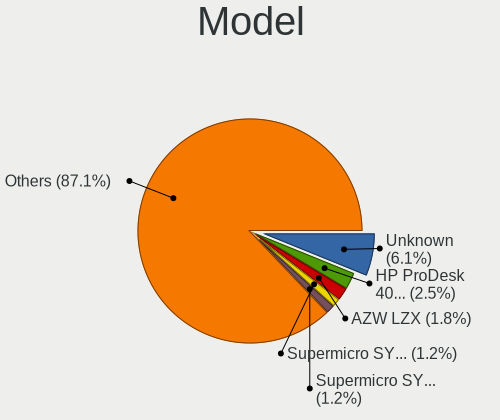
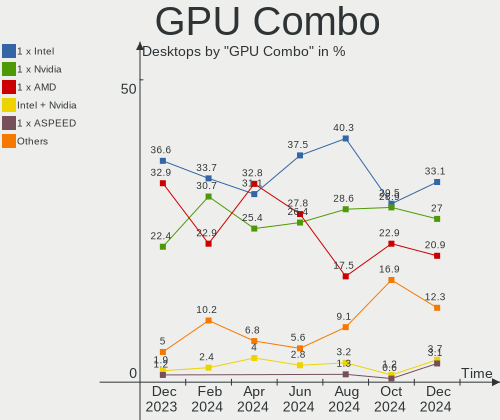

Debian - Hardware Trends (Desktops)
-----------------------------------

A project to identify most popular hardware characteristics and track their change
over time based on data collected by Linux users at https://Linux-Hardware.org.

Anyone can contribute to this report by the [hw-probe](https://github.com/linuxhw/hw-probe) tool:

    sudo -E hw-probe -all -upload

This report is for one last month. Overall report since the beginning of time: [TestCoverage](https://github.com/linuxhw/TestCoverage)

Period: Jun, 2022.

Contents
--------

* [ System ](#system)
  - [ OS                       ](#os)
  - [ OS Family                ](#os-family)
  - [ Kernel                   ](#kernel)
  - [ Kernel Family            ](#kernel-family)
  - [ Kernel Major Ver.        ](#kernel-major-ver)
  - [ Arch                     ](#arch)
  - [ DE                       ](#de)
  - [ Display Server           ](#display-server)
  - [ Display Manager          ](#display-manager)
  - [ OS Lang                  ](#os-lang)
  - [ Boot Mode                ](#boot-mode)
  - [ Filesystem               ](#filesystem)
  - [ Part. scheme             ](#part-scheme)
  - [ Dual Boot with Linux/BSD ](#dual-boot-with-linuxbsd)
  - [ Dual Boot (Win)          ](#dual-boot-win)

* [ Board ](#board)
  - [ Vendor                   ](#vendor)
  - [ Model                    ](#model)
  - [ Model Family             ](#model-family)
  - [ MFG Year                 ](#mfg-year)
  - [ Form Factor              ](#form-factor)
  - [ Secure Boot              ](#secure-boot)
  - [ Coreboot                 ](#coreboot)
  - [ RAM Size                 ](#ram-size)
  - [ RAM Used                 ](#ram-used)
  - [ Total Drives             ](#total-drives)
  - [ Has CD-ROM               ](#has-cd-rom)
  - [ Has Ethernet             ](#has-ethernet)
  - [ Has WiFi                 ](#has-wifi)
  - [ Has Bluetooth            ](#has-bluetooth)

* [ Location ](#location)
  - [ Country                  ](#country)
  - [ City                     ](#city)

* [ Drives ](#drives)
  - [ Drive Vendor             ](#drive-vendor)
  - [ Drive Model              ](#drive-model)
  - [ HDD Vendor               ](#hdd-vendor)
  - [ SSD Vendor               ](#ssd-vendor)
  - [ Drive Kind               ](#drive-kind)
  - [ Drive Connector          ](#drive-connector)
  - [ Drive Size               ](#drive-size)
  - [ Space Total              ](#space-total)
  - [ Space Used               ](#space-used)
  - [ Malfunc. Drives          ](#malfunc-drives)
  - [ Malfunc. Drive Vendor    ](#malfunc-drive-vendor)
  - [ Malfunc. HDD Vendor      ](#malfunc-hdd-vendor)
  - [ Malfunc. Drive Kind      ](#malfunc-drive-kind)
  - [ Failed Drives            ](#failed-drives)
  - [ Failed Drive Vendor      ](#failed-drive-vendor)
  - [ Drive Status             ](#drive-status)

* [ Storage controller ](#storage-controller)
  - [ Storage Vendor           ](#storage-vendor)
  - [ Storage Model            ](#storage-model)
  - [ Storage Kind             ](#storage-kind)

* [ Processor ](#processor)
  - [ CPU Vendor               ](#cpu-vendor)
  - [ CPU Model                ](#cpu-model)
  - [ CPU Model Family         ](#cpu-model-family)
  - [ CPU Cores                ](#cpu-cores)
  - [ CPU Sockets              ](#cpu-sockets)
  - [ CPU Threads              ](#cpu-threads)
  - [ CPU Op-Modes             ](#cpu-op-modes)
  - [ CPU Microcode            ](#cpu-microcode)
  - [ CPU Microarch            ](#cpu-microarch)

* [ Graphics ](#graphics)
  - [ GPU Vendor               ](#gpu-vendor)
  - [ GPU Model                ](#gpu-model)
  - [ GPU Combo                ](#gpu-combo)
  - [ GPU Driver               ](#gpu-driver)
  - [ GPU Memory               ](#gpu-memory)

* [ Monitor ](#monitor)
  - [ Monitor Vendor           ](#monitor-vendor)
  - [ Monitor Model            ](#monitor-model)
  - [ Monitor Resolution       ](#monitor-resolution)
  - [ Monitor Diagonal         ](#monitor-diagonal)
  - [ Monitor Width            ](#monitor-width)
  - [ Aspect Ratio             ](#aspect-ratio)
  - [ Monitor Area             ](#monitor-area)
  - [ Pixel Density            ](#pixel-density)
  - [ Multiple Monitors        ](#multiple-monitors)

* [ Network ](#network)
  - [ Net Controller Vendor    ](#net-controller-vendor)
  - [ Net Controller Model     ](#net-controller-model)
  - [ Wireless Vendor          ](#wireless-vendor)
  - [ Wireless Model           ](#wireless-model)
  - [ Ethernet Vendor          ](#ethernet-vendor)
  - [ Ethernet Model           ](#ethernet-model)
  - [ Net Controller Kind      ](#net-controller-kind)
  - [ Used Controller          ](#used-controller)
  - [ NICs                     ](#nics)
  - [ IPv6                     ](#ipv6)

* [ Bluetooth ](#bluetooth)
  - [ Bluetooth Vendor         ](#bluetooth-vendor)
  - [ Bluetooth Model          ](#bluetooth-model)

* [ Sound ](#sound)
  - [ Sound Vendor             ](#sound-vendor)
  - [ Sound Model              ](#sound-model)

* [ Memory ](#memory)
  - [ Memory Vendor            ](#memory-vendor)
  - [ Memory Model             ](#memory-model)
  - [ Memory Kind              ](#memory-kind)
  - [ Memory Form Factor       ](#memory-form-factor)
  - [ Memory Size              ](#memory-size)
  - [ Memory Speed             ](#memory-speed)

* [ Printers & scanners ](#printers--scanners)
  - [ Printer Vendor           ](#printer-vendor)
  - [ Printer Model            ](#printer-model)
  - [ Scanner Vendor           ](#scanner-vendor)
  - [ Scanner Model            ](#scanner-model)

* [ Camera ](#camera)
  - [ Camera Vendor            ](#camera-vendor)
  - [ Camera Model             ](#camera-model)

* [ Security ](#security)
  - [ Fingerprint Vendor       ](#fingerprint-vendor)
  - [ Fingerprint Model        ](#fingerprint-model)
  - [ Chipcard Vendor          ](#chipcard-vendor)
  - [ Chipcard Model           ](#chipcard-model)

* [ Unsupported ](#unsupported)
  - [ Unsupported Devices      ](#unsupported-devices)
  - [ Unsupported Device Types ](#unsupported-device-types)

System
------

OS
--

Installed operating systems

| Name              | Desktops | Percent |
|-------------------|----------|---------|
| Debian 11         | 164      | 90.11%  |
| Debian 10         | 8        | 4.4%    |
| Debian Testing    | 5        | 2.75%   |
| Debian Unstable   | 4        | 2.2%    |
| Debian 11-updates | 1        | 0.55%   |

OS Family
---------

OS without a version

| Name   | Desktops | Percent |
|--------|----------|---------|
| Debian | 182      | 100%    |

Kernel
------

Version of the Linux kernel

| Version              | Desktops | Percent |
|----------------------|----------|---------|
| 5.10.0-7-amd64       | 99       | 54.4%   |
| 5.10.0-14-amd64      | 16       | 8.79%   |
| 5.10.0-15-amd64      | 11       | 6.04%   |
| 5.10.0-13-amd64      | 6        | 3.3%    |
| 5.16.0-0.bpo.4-amd64 | 4        | 2.2%    |
| 5.15.35-1-pve        | 4        | 2.2%    |
| 5.10.0-10-amd64      | 4        | 2.2%    |
| 4.19.0-20-amd64      | 4        | 2.2%    |
| 5.17.0-1-amd64       | 3        | 1.65%   |
| 5.10.0-11-amd64      | 3        | 1.65%   |
| 5.18.0-2-amd64       | 2        | 1.1%    |
| 5.15.35-2-pve        | 2        | 1.1%    |
| 5.18.6-xanmod1       | 1        | 0.55%   |
| 5.18.5-amd64         | 1        | 0.55%   |
| 5.18.0-starfive-5.18 | 1        | 0.55%   |
| 5.18.0-1-rt-amd64    | 1        | 0.55%   |
| 5.18.0-1-amd64       | 1        | 0.55%   |
| 5.18.0-0.bpo.1-amd64 | 1        | 0.55%   |
| 5.17.0-trunk-amd64   | 1        | 0.55%   |
| 5.17.0-3-amd64       | 1        | 0.55%   |
| 5.17.0-1-riscv64     | 1        | 0.55%   |
| 5.17.0-1-686-pae     | 1        | 0.55%   |
| 5.16.0-5mx-amd64     | 1        | 0.55%   |
| 5.16.0-5-riscv64     | 1        | 0.55%   |
| 5.15.35-3-pve        | 1        | 0.55%   |
| 5.14.0-0.bpo.2-amd64 | 1        | 0.55%   |
| 5.13.19-2-pve        | 1        | 0.55%   |
| 5.13.19-1-pve        | 1        | 0.55%   |
| 5.10.57              | 1        | 0.55%   |
| 5.10.109+truenas     | 1        | 0.55%   |
| 5.10.0-8-amd64       | 1        | 0.55%   |
| 5.10.0-15-rt-amd64   | 1        | 0.55%   |
| 5.10.0-15-686-pae    | 1        | 0.55%   |
| 5.10.0-14-686-pae    | 1        | 0.55%   |
| 5.10.0-12-amd64      | 1        | 0.55%   |
| 4.19.0-20-686-pae    | 1        | 0.55%   |

Kernel Family
-------------

Linux kernel without a distro release

| Version  | Desktops | Percent |
|----------|----------|---------|
| 5.10.0   | 144      | 79.12%  |
| 5.17.0   | 7        | 3.85%   |
| 5.15.35  | 7        | 3.85%   |
| 5.18.0   | 6        | 3.3%    |
| 5.16.0   | 6        | 3.3%    |
| 4.19.0   | 5        | 2.75%   |
| 5.13.19  | 2        | 1.1%    |
| 5.18.6   | 1        | 0.55%   |
| 5.18.5   | 1        | 0.55%   |
| 5.14.0   | 1        | 0.55%   |
| 5.10.57  | 1        | 0.55%   |
| 5.10.109 | 1        | 0.55%   |

Kernel Major Ver.
-----------------

Linux kernel major version

| Version | Desktops | Percent |
|---------|----------|---------|
| 5.10    | 146      | 80.22%  |
| 5.18    | 8        | 4.4%    |
| 5.17    | 7        | 3.85%   |
| 5.15    | 7        | 3.85%   |
| 5.16    | 6        | 3.3%    |
| 4.19    | 5        | 2.75%   |
| 5.13    | 2        | 1.1%    |
| 5.14    | 1        | 0.55%   |

Arch
----

OS architecture (x86_64, i586, etc.)

| Name    | Desktops | Percent |
|---------|----------|---------|
| x86_64  | 175      | 96.15%  |
| i686    | 4        | 2.2%    |
| riscv64 | 3        | 1.65%   |

DE
--

Desktop Environment

| Name            | Desktops | Percent |
|-----------------|----------|---------|
| Unknown         | 126      | 69.23%  |
| GNOME           | 19       | 10.44%  |
| XFCE            | 12       | 6.59%   |
| MATE            | 8        | 4.4%    |
| KDE5            | 7        | 3.85%   |
| LXQt            | 3        | 1.65%   |
| Openbox         | 2        | 1.1%    |
| Cinnamon        | 2        | 1.1%    |
| GNOME Flashback | 1        | 0.55%   |
| GNOME Classic   | 1        | 0.55%   |
| Budgie          | 1        | 0.55%   |

Display Server
--------------

X11 or Wayland

| Name    | Desktops | Percent |
|---------|----------|---------|
| Unknown | 107      | 58.79%  |
| X11     | 44       | 24.18%  |
| Tty     | 21       | 11.54%  |
| Wayland | 10       | 5.49%   |

Display Manager
---------------

SDDM, LightDM, etc.

| Name    | Desktops | Percent |
|---------|----------|---------|
| Unknown | 132      | 72.53%  |
| LightDM | 23       | 12.64%  |
| GDM     | 13       | 7.14%   |
| SDDM    | 8        | 4.4%    |
| GDM3    | 5        | 2.75%   |
| WDM     | 1        | 0.55%   |

OS Lang
-------

Language

| Lang    | Desktops | Percent |
|---------|----------|---------|
| ru_RU   | 107      | 58.79%  |
| en_US   | 35       | 19.23%  |
| de_DE   | 10       | 5.49%   |
| en_GB   | 7        | 3.85%   |
| fr_FR   | 6        | 3.3%    |
| Unknown | 4        | 2.2%    |
| es_ES   | 3        | 1.65%   |
| zh_CN   | 1        | 0.55%   |
| sv_SE   | 1        | 0.55%   |
| pl_PL   | 1        | 0.55%   |
| fr_CH   | 1        | 0.55%   |
| fi_FI   | 1        | 0.55%   |
| eu_ES   | 1        | 0.55%   |
| en_IE   | 1        | 0.55%   |
| en_CA   | 1        | 0.55%   |
| en_AU   | 1        | 0.55%   |
| C       | 1        | 0.55%   |

Boot Mode
---------

EFI or BIOS

| Mode | Desktops | Percent |
|------|----------|---------|
| BIOS | 140      | 76.92%  |
| EFI  | 42       | 23.08%  |

Filesystem
----------

Type of filesystem

| Type    | Desktops | Percent |
|---------|----------|---------|
| Overlay | 101      | 55.49%  |
| Ext4    | 76       | 41.76%  |
| Zfs     | 2        | 1.1%    |
| Btrfs   | 2        | 1.1%    |
| Xfs     | 1        | 0.55%   |

Part. scheme
------------

Scheme of partitioning

| Type    | Desktops | Percent |
|---------|----------|---------|
| MBR     | 123      | 67.58%  |
| GPT     | 50       | 27.47%  |
| Unknown | 9        | 4.95%   |

Dual Boot with Linux/BSD
------------------------

Hosting more than one Linux/BSD

| Dual boot | Desktops | Percent |
|-----------|----------|---------|
| No        | 159      | 87.36%  |
| Yes       | 23       | 12.64%  |

Dual Boot (Win)
---------------

Hosting Linux and Windows

| Dual boot | Desktops | Percent |
|-----------|----------|---------|
| Yes       | 118      | 64.84%  |
| No        | 64       | 35.16%  |

Board
-----

Vendor
------

Motherboard manufacturer

| Name                | Desktops | Percent |
|---------------------|----------|---------|
| ASUSTek Computer    | 80       | 43.96%  |
| Gigabyte Technology | 38       | 20.88%  |
| MSI                 | 19       | 10.44%  |
| Dell                | 10       | 5.49%   |
| ASRock              | 9        | 4.95%   |
| Lenovo              | 4        | 2.2%    |
| Hewlett-Packard     | 4        | 2.2%    |
| Unknown             | 4        | 2.2%    |
| Intel               | 3        | 1.65%   |
| Foxconn             | 2        | 1.1%    |
| ECS                 | 2        | 1.1%    |
| Supermicro          | 1        | 0.55%   |
| PC Engines          | 1        | 0.55%   |
| Maxtang             | 1        | 0.55%   |
| Fujitsu             | 1        | 0.55%   |
| EVGA                | 1        | 0.55%   |
| BESSTAR Tech        | 1        | 0.55%   |
| ASRockRack          | 1        | 0.55%   |

Model
-----

Motherboard model

| Name                                | Desktops | Percent |
|-------------------------------------|----------|---------|
| ASUS S20 K29                        | 45       | 24.73%  |
| Gigabyte H410M S2H                  | 15       | 8.24%   |
| MSI MS-7996                         | 7        | 3.85%   |
| Unknown                             | 4        | 2.2%    |
| ASUS P5G41T-M LE                    | 3        | 1.65%   |
| ASUS H110M-R                        | 3        | 1.65%   |
| ASUS All Series                     | 3        | 1.65%   |
| MSI MS-7817                         | 2        | 1.1%    |
| Gigabyte H81M-S2V                   | 2        | 1.1%    |
| Gigabyte B360M H                    | 2        | 1.1%    |
| ASUS PRIME H310M-R R2.0             | 2        | 1.1%    |
| ASUS PRIME B450M-A                  | 2        | 1.1%    |
| ASRock B450 Gaming-ITX/ac           | 2        | 1.1%    |
| Supermicro X8STi                    | 1        | 0.55%   |
| PC Engines APU2                     | 1        | 0.55%   |
| MSI p6620ch-m                       | 1        | 0.55%   |
| MSI MS-7D53                         | 1        | 0.55%   |
| MSI MS-7C84                         | 1        | 0.55%   |
| MSI MS-7C56                         | 1        | 0.55%   |
| MSI MS-7A38                         | 1        | 0.55%   |
| MSI MS-7984                         | 1        | 0.55%   |
| MSI MS-7885                         | 1        | 0.55%   |
| MSI MS-7808                         | 1        | 0.55%   |
| MSI MS-7721                         | 1        | 0.55%   |
| MSI MS-7698                         | 1        | 0.55%   |
| Maxtang FP30                        | 1        | 0.55%   |
| Lenovo ThinkStation S20 4105J6G     | 1        | 0.55%   |
| Lenovo ThinkCentre M920t 10SFCTO1WW | 1        | 0.55%   |
| Lenovo ThinkCentre M700 10GT002MUS  | 1        | 0.55%   |
| Lenovo 70AQ000JGE ThinkServer TS440 | 1        | 0.55%   |
| Intel MAHOBAY                       | 1        | 0.55%   |
| Intel D945PLRN AAD32731-404         | 1        | 0.55%   |
| Intel CD952                         | 1        | 0.55%   |
| HP ProLiant ML350 G5                | 1        | 0.55%   |
| HP Pavilion Desktop PC              | 1        | 0.55%   |
| HP d530 CMT(DC577AV)                | 1        | 0.55%   |
| HP Compaq Elite 8300 SFF            | 1        | 0.55%   |
| Gigabyte X570 AORUS MASTER          | 1        | 0.55%   |
| Gigabyte M68MT-S2                   | 1        | 0.55%   |
| Gigabyte M61PME-S2P                 | 1        | 0.55%   |
| Gigabyte M52LT-D3                   | 1        | 0.55%   |
| Gigabyte H97M-D3H                   | 1        | 0.55%   |
| Gigabyte H81M-S2H                   | 1        | 0.55%   |
| Gigabyte H81M-DS2                   | 1        | 0.55%   |
| Gigabyte H61M-USB3H                 | 1        | 0.55%   |
| Gigabyte H57M-USB3                  | 1        | 0.55%   |
| Gigabyte H470M DS3H                 | 1        | 0.55%   |
| Gigabyte B75-D3V                    | 1        | 0.55%   |
| Gigabyte B660M GAMING X DDR4        | 1        | 0.55%   |
| Gigabyte B450M S2H                  | 1        | 0.55%   |
| Gigabyte B450M DS3H                 | 1        | 0.55%   |
| Gigabyte B450 AORUS PRO             | 1        | 0.55%   |
| Gigabyte B150-HD3P-CF               | 1        | 0.55%   |
| Gigabyte B150-HD3 DDR3              | 1        | 0.55%   |
| Gigabyte A320M-S2H                  | 1        | 0.55%   |
| Gigabyte 970A-DS3P                  | 1        | 0.55%   |
| Fujitsu ESPRIMO P720                | 1        | 0.55%   |
| Foxconn p6-2260ea                   | 1        | 0.55%   |
| Foxconn G33M03                      | 1        | 0.55%   |
| EVGA 151-HE-E999                    | 1        | 0.55%   |

Model Family
------------

Motherboard model prefix

| Name                  | Desktops | Percent |
|-----------------------|----------|---------|
| ASUS S20              | 45       | 24.73%  |
| Gigabyte H410M        | 15       | 8.24%   |
| ASUS PRIME            | 9        | 4.95%   |
| MSI MS-7996           | 7        | 3.85%   |
| Dell OptiPlex         | 6        | 3.3%    |
| Unknown               | 4        | 2.2%    |
| Dell Precision        | 3        | 1.65%   |
| ASUS P5G41T-M         | 3        | 1.65%   |
| ASUS H110M-R          | 3        | 1.65%   |
| ASUS All              | 3        | 1.65%   |
| MSI MS-7817           | 2        | 1.1%    |
| Lenovo ThinkCentre    | 2        | 1.1%    |
| Gigabyte H81M-S2V     | 2        | 1.1%    |
| Gigabyte B450M        | 2        | 1.1%    |
| Gigabyte B360M        | 2        | 1.1%    |
| ASRock B450           | 2        | 1.1%    |
| Supermicro X8STi      | 1        | 0.55%   |
| PC Engines APU2       | 1        | 0.55%   |
| MSI p6620ch-m         | 1        | 0.55%   |
| MSI MS-7D53           | 1        | 0.55%   |
| MSI MS-7C84           | 1        | 0.55%   |
| MSI MS-7C56           | 1        | 0.55%   |
| MSI MS-7A38           | 1        | 0.55%   |
| MSI MS-7984           | 1        | 0.55%   |
| MSI MS-7885           | 1        | 0.55%   |
| MSI MS-7808           | 1        | 0.55%   |
| MSI MS-7721           | 1        | 0.55%   |
| MSI MS-7698           | 1        | 0.55%   |
| Maxtang FP30          | 1        | 0.55%   |
| Lenovo ThinkStation   | 1        | 0.55%   |
| Lenovo 70AQ000JGE     | 1        | 0.55%   |
| Intel MAHOBAY         | 1        | 0.55%   |
| Intel D945PLRN        | 1        | 0.55%   |
| Intel CD952           | 1        | 0.55%   |
| HP ProLiant           | 1        | 0.55%   |
| HP Pavilion           | 1        | 0.55%   |
| HP d530               | 1        | 0.55%   |
| HP Compaq             | 1        | 0.55%   |
| Gigabyte X570         | 1        | 0.55%   |
| Gigabyte M68MT-S2     | 1        | 0.55%   |
| Gigabyte M61PME-S2P   | 1        | 0.55%   |
| Gigabyte M52LT-D3     | 1        | 0.55%   |
| Gigabyte H97M-D3H     | 1        | 0.55%   |
| Gigabyte H81M-S2H     | 1        | 0.55%   |
| Gigabyte H81M-DS2     | 1        | 0.55%   |
| Gigabyte H61M-USB3H   | 1        | 0.55%   |
| Gigabyte H57M-USB3    | 1        | 0.55%   |
| Gigabyte H470M        | 1        | 0.55%   |
| Gigabyte B75-D3V      | 1        | 0.55%   |
| Gigabyte B660M        | 1        | 0.55%   |
| Gigabyte B450         | 1        | 0.55%   |
| Gigabyte B150-HD3P-CF | 1        | 0.55%   |
| Gigabyte B150-HD3     | 1        | 0.55%   |
| Gigabyte A320M-S2H    | 1        | 0.55%   |
| Gigabyte 970A-DS3P    | 1        | 0.55%   |
| Fujitsu ESPRIMO       | 1        | 0.55%   |
| Foxconn p6-2260ea     | 1        | 0.55%   |
| Foxconn G33M03        | 1        | 0.55%   |
| EVGA 151-HE-E999      | 1        | 0.55%   |
| ECS G41T-M16          | 1        | 0.55%   |

MFG Year
--------

Motherboard manufacture year

| Year    | Desktops | Percent |
|---------|----------|---------|
| 2020    | 64       | 35.16%  |
| 2018    | 17       | 9.34%   |
| 2015    | 13       | 7.14%   |
| 2013    | 10       | 5.49%   |
| 2012    | 10       | 5.49%   |
| 2021    | 9        | 4.95%   |
| 2019    | 9        | 4.95%   |
| 2010    | 8        | 4.4%    |
| 2014    | 7        | 3.85%   |
| 2017    | 6        | 3.3%    |
| 2011    | 5        | 2.75%   |
| 2009    | 5        | 2.75%   |
| 2007    | 5        | 2.75%   |
| 2016    | 4        | 2.2%    |
| Unknown | 3        | 1.65%   |
| 2008    | 2        | 1.1%    |
| 2005    | 2        | 1.1%    |
| 2003    | 2        | 1.1%    |
| 2022    | 1        | 0.55%   |

Form Factor
-----------

Physical design of the computer

| Name    | Desktops | Percent |
|---------|----------|---------|
| Desktop | 182      | 100%    |

Secure Boot
-----------

Enabled or disabled

| State    | Desktops | Percent |
|----------|----------|---------|
| Disabled | 179      | 98.35%  |
| Enabled  | 3        | 1.65%   |

Coreboot
--------

Have coreboot on board

| Used | Desktops | Percent |
|------|----------|---------|
| No   | 180      | 98.9%   |
| Yes  | 2        | 1.1%    |

RAM Size
--------

Total RAM memory

| Size in GB  | Desktops | Percent |
|-------------|----------|---------|
| 4.01-8.0    | 70       | 38.46%  |
| 16.01-24.0  | 40       | 21.98%  |
| 3.01-4.0    | 26       | 14.29%  |
| 8.01-16.0   | 15       | 8.24%   |
| 32.01-64.0  | 13       | 7.14%   |
| 1.01-2.0    | 7        | 3.85%   |
| 64.01-256.0 | 5        | 2.75%   |
| 24.01-32.0  | 3        | 1.65%   |
| 2.01-3.0    | 2        | 1.1%    |
| 0.01-0.5    | 1        | 0.55%   |

RAM Used
--------

Used RAM memory

| Used GB   | Desktops | Percent |
|-----------|----------|---------|
| 0.51-1.0  | 108      | 59.34%  |
| 1.01-2.0  | 26       | 14.29%  |
| 2.01-3.0  | 14       | 7.69%   |
| 4.01-8.0  | 12       | 6.59%   |
| 8.01-16.0 | 9        | 4.95%   |
| 3.01-4.0  | 7        | 3.85%   |
| 0.01-0.5  | 6        | 3.3%    |

Total Drives
------------

Number of drives on board

| Drives | Desktops | Percent |
|--------|----------|---------|
| 1      | 133      | 73.08%  |
| 2      | 22       | 12.09%  |
| 4      | 9        | 4.95%   |
| 3      | 9        | 4.95%   |
| 8      | 3        | 1.65%   |
| 7      | 3        | 1.65%   |
| 5      | 3        | 1.65%   |

Has CD-ROM
----------

Has CD-ROM on board

| Presented | Desktops | Percent |
|-----------|----------|---------|
| No        | 135      | 74.18%  |
| Yes       | 47       | 25.82%  |

Has Ethernet
------------

Has Ethernet on board

| Presented | Desktops | Percent |
|-----------|----------|---------|
| Yes       | 179      | 98.35%  |
| No        | 3        | 1.65%   |

Has WiFi
--------

Has WiFi module

| Presented | Desktops | Percent |
|-----------|----------|---------|
| No        | 148      | 81.32%  |
| Yes       | 34       | 18.68%  |

Has Bluetooth
-------------

Has Bluetooth module

| Presented | Desktops | Percent |
|-----------|----------|---------|
| No        | 156      | 85.71%  |
| Yes       | 26       | 14.29%  |

Location
--------

Country
-------

Geographic location (country)

| Country      | Desktops | Percent |
|--------------|----------|---------|
| Russia       | 107      | 58.79%  |
| USA          | 17       | 9.34%   |
| Germany      | 12       | 6.59%   |
| France       | 6        | 3.3%    |
| Spain        | 5        | 2.75%   |
| UK           | 3        | 1.65%   |
| Switzerland  | 3        | 1.65%   |
| Poland       | 3        | 1.65%   |
| Hungary      | 2        | 1.1%    |
| China        | 2        | 1.1%    |
| Canada       | 2        | 1.1%    |
| Brazil       | 2        | 1.1%    |
| Belgium      | 2        | 1.1%    |
| Austria      | 2        | 1.1%    |
| Taiwan       | 1        | 0.55%   |
| Sweden       | 1        | 0.55%   |
| South Africa | 1        | 0.55%   |
| Netherlands  | 1        | 0.55%   |
| Malaysia     | 1        | 0.55%   |
| Latvia       | 1        | 0.55%   |
| Italy        | 1        | 0.55%   |
| Ireland      | 1        | 0.55%   |
| Finland      | 1        | 0.55%   |
| Denmark      | 1        | 0.55%   |
| Czechia      | 1        | 0.55%   |
| Bulgaria     | 1        | 0.55%   |
| Australia    | 1        | 0.55%   |
| Algeria      | 1        | 0.55%   |

City
----

Geographic location (city)

| City                   | Desktops | Percent |
|------------------------|----------|---------|
| Voronezh               | 99       | 54.4%   |
| Gladbeck               | 4        | 2.2%    |
| Paris                  | 3        | 1.65%   |
| Cheboksary             | 3        | 1.65%   |
| Zurich                 | 2        | 1.1%    |
| Wroclaw                | 2        | 1.1%    |
| Washington             | 2        | 1.1%    |
| Vienna                 | 2        | 1.1%    |
| Seville                | 2        | 1.1%    |
| Yilan                  | 1        | 0.55%   |
| Wielgie                | 1        | 0.55%   |
| Warner Robins          | 1        | 0.55%   |
| Vladivostok            | 1        | 0.55%   |
| Vitoria-Gasteiz        | 1        | 0.55%   |
| Villingen-Schwenningen | 1        | 0.55%   |
| Villeneuve-de-Riviere  | 1        | 0.55%   |
| Toronto                | 1        | 0.55%   |
| Thousand Oaks          | 1        | 0.55%   |
| Szombathely            | 1        | 0.55%   |
| St Petersburg          | 1        | 0.55%   |
| Solna                  | 1        | 0.55%   |
| Sofia                  | 1        | 0.55%   |
| Sao Paulo              | 1        | 0.55%   |
| San Diego              | 1        | 0.55%   |
| Samieira               | 1        | 0.55%   |
| Saint Neots            | 1        | 0.55%   |
| Rochester              | 1        | 0.55%   |
| Puerto del Rosario     | 1        | 0.55%   |
| Preverenges            | 1        | 0.55%   |
| Pinneberg              | 1        | 0.55%   |
| Phoenix                | 1        | 0.55%   |
| Penza                  | 1        | 0.55%   |
| Odense                 | 1        | 0.55%   |
| Nîmes                 | 1        | 0.55%   |
| Nettetal               | 1        | 0.55%   |
| Nanjing                | 1        | 0.55%   |
| Naas                   | 1        | 0.55%   |
| Munich                 | 1        | 0.55%   |
| Moscow                 | 1        | 0.55%   |
| Miami                  | 1        | 0.55%   |
| Marietta               | 1        | 0.55%   |
| Mantova                | 1        | 0.55%   |
| Lincoln                | 1        | 0.55%   |
| Lielvārde             | 1        | 0.55%   |
| Lawrence               | 1        | 0.55%   |
| Kuala Lumpur           | 1        | 0.55%   |
| Krasnoyarsk            | 1        | 0.55%   |
| Kanne                  | 1        | 0.55%   |
| Johannesburg           | 1        | 0.55%   |
| Jemgum                 | 1        | 0.55%   |
| Huntington Beach       | 1        | 0.55%   |
| Henrietta              | 1        | 0.55%   |
| Helsinki               | 1        | 0.55%   |
| Farmington             | 1        | 0.55%   |
| Eggington              | 1        | 0.55%   |
| Edmonton               | 1        | 0.55%   |
| Edinburgh              | 1        | 0.55%   |
| Crimmitschau           | 1        | 0.55%   |
| Cincinnati             | 1        | 0.55%   |
| Chicago                | 1        | 0.55%   |

Drives
------

Drive Vendor
------------

Hard drive vendors

| Vendor                | Desktops | Drives | Percent |
|-----------------------|----------|--------|---------|
| Crucial               | 56       | 58     | 21.88%  |
| WDC                   | 40       | 59     | 15.63%  |
| Kingston              | 36       | 38     | 14.06%  |
| Seagate               | 33       | 44     | 12.89%  |
| Samsung Electronics   | 31       | 34     | 12.11%  |
| Toshiba               | 14       | 16     | 5.47%   |
| SanDisk               | 7        | 11     | 2.73%   |
| Unknown               | 4        | 4      | 1.56%   |
| Patriot               | 3        | 3      | 1.17%   |
| OCZ                   | 3        | 3      | 1.17%   |
| Maxtor                | 3        | 3      | 1.17%   |
| HGST                  | 3        | 3      | 1.17%   |
| China                 | 3        | 3      | 1.17%   |
| SPCC                  | 2        | 2      | 0.78%   |
| Corsair               | 2        | 3      | 0.78%   |
| Verbatim              | 1        | 1      | 0.39%   |
| SK hynix              | 1        | 1      | 0.39%   |
| Realtek Semiconductor | 1        | 1      | 0.39%   |
| PNY                   | 1        | 1      | 0.39%   |
| Plextor               | 1        | 1      | 0.39%   |
| Phison                | 1        | 1      | 0.39%   |
| Micron Technology     | 1        | 1      | 0.39%   |
| LDLC                  | 1        | 1      | 0.39%   |
| KIOXIA                | 1        | 1      | 0.39%   |
| Intenso               | 1        | 1      | 0.39%   |
| IBM-D050              | 1        | 3      | 0.39%   |
| Hewlett-Packard       | 1        | 1      | 0.39%   |
| Colorful              | 1        | 1      | 0.39%   |
| AMP                   | 1        | 1      | 0.39%   |
| A-DATA Technology     | 1        | 1      | 0.39%   |
| Unknown               | 1        | 1      | 0.39%   |

Drive Model
-----------

Hard drive models

| Model                            | Desktops | Percent |
|----------------------------------|----------|---------|
| Crucial CT480BX500SSD1 480GB     | 45       | 16.13%  |
| Kingston SA400S37240G 240GB SSD  | 17       | 6.09%   |
| Kingston SV300S37A120G 120GB SSD | 7        | 2.51%   |
| Toshiba DT01ACA050 500GB         | 4        | 1.43%   |
| Seagate ST500DM002-1BD142 500GB  | 4        | 1.43%   |
| WDC WD10EZEX-08WN4A0 1TB         | 3        | 1.08%   |
| Seagate ST1000DM003-1ER162 1TB   | 3        | 1.08%   |
| Samsung SSD 860 EVO 250GB        | 3        | 1.08%   |
| Crucial CT250MX500SSD1 250GB     | 3        | 1.08%   |
| WDC WDS500G2B0B-00YS70 500GB SSD | 2        | 0.72%   |
| WDC WD6003FFBX-68MU3N0 6TB       | 2        | 0.72%   |
| WDC WD1003FZEX-00K3CA0 1TB       | 2        | 0.72%   |
| Unknown SD64G  64GB              | 2        | 0.72%   |
| Toshiba HDWD110 1TB              | 2        | 0.72%   |
| Seagate ST4000VN008-2DR166 4TB   | 2        | 0.72%   |
| Seagate ST3500830AS 500GB        | 2        | 0.72%   |
| Seagate ST3250318AS 250GB        | 2        | 0.72%   |
| Seagate ST2000DM006-2DM164 2TB   | 2        | 0.72%   |
| Seagate ST1000DM010-2EP102 1TB   | 2        | 0.72%   |
| Seagate ST1000DM003-1SB102 1TB   | 2        | 0.72%   |
| SanDisk SDSSDXPS240G 240GB       | 2        | 0.72%   |
| Samsung SSD 980 500GB            | 2        | 0.72%   |
| Samsung SSD 960 EVO 250GB        | 2        | 0.72%   |
| Samsung SSD 870 EVO 500GB        | 2        | 0.72%   |
| Samsung SSD 850 EVO 250GB        | 2        | 0.72%   |
| Samsung HD502HJ 500GB            | 2        | 0.72%   |
| Samsung HD103UJ 1TB              | 2        | 0.72%   |
| Maxtor STM3160815AS 160GB        | 2        | 0.72%   |
| Kingston SA400S37120G 120GB SSD  | 2        | 0.72%   |
| Crucial CT500MX500SSD1 500GB     | 2        | 0.72%   |
| Crucial CT240M500SSD1 240GB      | 2        | 0.72%   |
| WDC WUH721818ALE6L4 18TB         | 1        | 0.36%   |
| WDC WDS500G2B0C-00PXH0 500GB     | 1        | 0.36%   |
| WDC WDS250G3X0C-00SJG0 250GB     | 1        | 0.36%   |
| WDC WDS250G2B0A-00SM50 250GB SSD | 1        | 0.36%   |
| WDC WDS240G2G0A-00JH30 240GB SSD | 1        | 0.36%   |
| WDC WDS100T2B0C-00PXH0 1TB       | 1        | 0.36%   |
| WDC WD800JD-75MSA3 80GB          | 1        | 0.36%   |
| WDC WD60EFAX-68SHWN0 6TB         | 1        | 0.36%   |
| WDC WD5000AAKX-60U6AA0 500GB     | 1        | 0.36%   |
| WDC WD5000AAKX-603CA0 500GB      | 1        | 0.36%   |
| WDC WD5000AAKX-08U6AA0 500GB     | 1        | 0.36%   |
| WDC WD5000AAKS-00UU3A0 500GB     | 1        | 0.36%   |
| WDC WD5000AAKB-00H8A0 500GB      | 1        | 0.36%   |
| WDC WD5000AAJS-22YFA0 500GB      | 1        | 0.36%   |
| WDC WD40EFRX-68WT0N0 4TB         | 1        | 0.36%   |
| WDC WD400EB-00CPF0 40GB          | 1        | 0.36%   |
| WDC WD30EFRX-68N32N0 3TB         | 1        | 0.36%   |
| WDC WD30EFRX-68EUZN0 3TB         | 1        | 0.36%   |
| WDC WD2500AAKS-00VSA0 250GB      | 1        | 0.36%   |
| WDC WD2500AAJS-00YZCA0 250GB     | 1        | 0.36%   |
| WDC WD2500AAJS-00B4A0 250GB      | 1        | 0.36%   |
| WDC WD20EZRZ-00Z5HB0 2TB         | 1        | 0.36%   |
| WDC WD20EZRX-22D8PB0 2TB         | 1        | 0.36%   |
| WDC WD20EZRX-00DC0B0 2TB         | 1        | 0.36%   |
| WDC WD20EZRX-00D8PB0 2TB         | 1        | 0.36%   |
| WDC WD20EFRX-68EUZN0 2TB         | 1        | 0.36%   |
| WDC WD20EFRX-68AX9N0 2TB         | 1        | 0.36%   |
| WDC WD20EARX-00PASB0 2TB         | 1        | 0.36%   |
| WDC WD20EARX-008FB0 2TB          | 1        | 0.36%   |

HDD Vendor
----------

Hard disk drive vendors

| Vendor              | Desktops | Drives | Percent |
|---------------------|----------|--------|---------|
| WDC                 | 36       | 51     | 36.36%  |
| Seagate             | 33       | 44     | 33.33%  |
| Toshiba             | 14       | 16     | 14.14%  |
| Samsung Electronics | 8        | 8      | 8.08%   |
| Maxtor              | 3        | 3      | 3.03%   |
| HGST                | 3        | 3      | 3.03%   |
| Unknown             | 1        | 1      | 1.01%   |
| AMP                 | 1        | 1      | 1.01%   |

SSD Vendor
----------

Solid state drive vendors

| Vendor              | Desktops | Drives | Percent |
|---------------------|----------|--------|---------|
| Crucial             | 55       | 57     | 41.98%  |
| Kingston            | 33       | 33     | 25.19%  |
| Samsung Electronics | 14       | 15     | 10.69%  |
| SanDisk             | 6        | 10     | 4.58%   |
| WDC                 | 4        | 4      | 3.05%   |
| OCZ                 | 3        | 3      | 2.29%   |
| China               | 3        | 3      | 2.29%   |
| SPCC                | 2        | 2      | 1.53%   |
| Verbatim            | 1        | 1      | 0.76%   |
| Plextor             | 1        | 1      | 0.76%   |
| Phison              | 1        | 1      | 0.76%   |
| Patriot             | 1        | 1      | 0.76%   |
| Micron Technology   | 1        | 1      | 0.76%   |
| LDLC                | 1        | 1      | 0.76%   |
| Intenso             | 1        | 1      | 0.76%   |
| Hewlett-Packard     | 1        | 1      | 0.76%   |
| Corsair             | 1        | 2      | 0.76%   |
| A-DATA Technology   | 1        | 1      | 0.76%   |
| Unknown             | 1        | 1      | 0.76%   |

Drive Kind
----------

HDD or SSD

| Kind    | Desktops | Drives | Percent |
|---------|----------|--------|---------|
| SSD     | 121      | 139    | 52.38%  |
| HDD     | 81       | 127    | 35.06%  |
| NVMe    | 25       | 30     | 10.82%  |
| MMC     | 3        | 3      | 1.3%    |
| Unknown | 1        | 3      | 0.43%   |

Drive Connector
---------------

SATA, SAS, NVMe, etc.

| Type | Desktops | Drives | Percent |
|------|----------|--------|---------|
| SATA | 172      | 260    | 84.31%  |
| NVMe | 25       | 30     | 12.25%  |
| SAS  | 4        | 9      | 1.96%   |
| MMC  | 3        | 3      | 1.47%   |

Drive Size
----------

Size of hard drive

| Size in TB | Desktops | Drives | Percent |
|------------|----------|--------|---------|
| 0.01-0.5   | 150      | 178    | 70.09%  |
| 0.51-1.0   | 33       | 42     | 15.42%  |
| 1.01-2.0   | 12       | 16     | 5.61%   |
| 3.01-4.0   | 7        | 10     | 3.27%   |
| 2.01-3.0   | 5        | 6      | 2.34%   |
| 4.01-10.0  | 5        | 10     | 2.34%   |
| 10.01-20.0 | 2        | 4      | 0.93%   |

Space Total
-----------

Amount of disk space available on the file system

| Size in GB     | Desktops | Percent |
|----------------|----------|---------|
| Unknown        | 104      | 57.14%  |
| 101-250        | 21       | 11.54%  |
| 501-1000       | 15       | 8.24%   |
| More than 3000 | 11       | 6.04%   |
| 251-500        | 8        | 4.4%    |
| 1001-2000      | 6        | 3.3%    |
| 51-100         | 6        | 3.3%    |
| 21-50          | 5        | 2.75%   |
| 2001-3000      | 5        | 2.75%   |
| 1-20           | 1        | 0.55%   |

Space Used
----------

Amount of used disk space

| Used GB        | Desktops | Percent |
|----------------|----------|---------|
| Unknown        | 104      | 57.14%  |
| 1-20           | 28       | 15.38%  |
| 251-500        | 9        | 4.95%   |
| 101-250        | 8        | 4.4%    |
| 51-100         | 8        | 4.4%    |
| More than 3000 | 6        | 3.3%    |
| 21-50          | 6        | 3.3%    |
| 501-1000       | 6        | 3.3%    |
| 2001-3000      | 5        | 2.75%   |
| 1001-2000      | 2        | 1.1%    |

Malfunc. Drives
---------------

Drive models with a malfunction

| Model                                 | Desktops | Drives | Percent |
|---------------------------------------|----------|--------|---------|
| Kingston SV300S37A120G 120GB SSD      | 2        | 2      | 9.52%   |
| WDC WD6003FFBX-68MU3N0 6TB            | 1        | 2      | 4.76%   |
| WDC WD5000AAKX-08U6AA0 500GB          | 1        | 1      | 4.76%   |
| WDC WD5000AAKB-00H8A0 500GB           | 1        | 1      | 4.76%   |
| WDC WD400EB-00CPF0 40GB               | 1        | 1      | 4.76%   |
| WDC WD2500AAJS-00YZCA0 250GB          | 1        | 1      | 4.76%   |
| WDC WD2500AAJS-00B4A0 250GB           | 1        | 1      | 4.76%   |
| Seagate ST98823AS 80GB                | 1        | 1      | 4.76%   |
| Seagate ST3500830AS 500GB             | 1        | 1      | 4.76%   |
| Seagate ST3160815AS 160GB             | 1        | 1      | 4.76%   |
| Seagate ST31500341AS 1TB              | 1        | 1      | 4.76%   |
| Seagate ST3000DM001-1CH166 3TB        | 1        | 1      | 4.76%   |
| Seagate ST2000DM006-2DM164 2TB        | 1        | 1      | 4.76%   |
| SanDisk SDSSDXPS240G 240GB            | 1        | 4      | 4.76%   |
| Samsung Electronics SSD 970 PRO 1TB   | 1        | 1      | 4.76%   |
| Samsung Electronics SSD 870 EVO 500GB | 1        | 1      | 4.76%   |
| Samsung Electronics HE103UJ 1TB       | 1        | 1      | 4.76%   |
| Samsung Electronics HD103UJ 1TB       | 1        | 1      | 4.76%   |
| Maxtor STM3160815AS 160GB             | 1        | 1      | 4.76%   |
| China SSD 120GB                       | 1        | 1      | 4.76%   |

Malfunc. Drive Vendor
---------------------

Vendors of faulty drives

| Vendor              | Desktops | Drives | Percent |
|---------------------|----------|--------|---------|
| WDC                 | 6        | 7      | 28.57%  |
| Seagate             | 6        | 6      | 28.57%  |
| Samsung Electronics | 4        | 4      | 19.05%  |
| Kingston            | 2        | 2      | 9.52%   |
| SanDisk             | 1        | 4      | 4.76%   |
| Maxtor              | 1        | 1      | 4.76%   |
| China               | 1        | 1      | 4.76%   |

Malfunc. HDD Vendor
-------------------

Vendors of faulty HDD drives

| Vendor              | Desktops | Drives | Percent |
|---------------------|----------|--------|---------|
| WDC                 | 6        | 7      | 40%     |
| Seagate             | 6        | 6      | 40%     |
| Samsung Electronics | 2        | 2      | 13.33%  |
| Maxtor              | 1        | 1      | 6.67%   |

Malfunc. Drive Kind
-------------------

Kinds of faulty drives

| Kind | Desktops | Drives | Percent |
|------|----------|--------|---------|
| HDD  | 15       | 16     | 71.43%  |
| SSD  | 5        | 8      | 23.81%  |
| NVMe | 1        | 1      | 4.76%   |

Failed Drives
-------------

Failed drive models

Zero info for selected period =(

Failed Drive Vendor
-------------------

Failed drive vendors

Zero info for selected period =(

Drive Status
------------

Number of failed and malfunc. drives

| Status   | Desktops | Drives | Percent |
|----------|----------|--------|---------|
| Works    | 161      | 235    | 82.14%  |
| Malfunc  | 20       | 25     | 10.2%   |
| Detected | 15       | 42     | 7.65%   |

Storage controller
------------------

Storage Vendor
--------------

Storage controller vendors

| Vendor                       | Desktops | Percent |
|------------------------------|----------|---------|
| Intel                        | 143      | 65%     |
| AMD                          | 31       | 14.09%  |
| Samsung Electronics          | 10       | 4.55%   |
| SanDisk                      | 4        | 1.82%   |
| Nvidia                       | 4        | 1.82%   |
| JMicron Technology           | 4        | 1.82%   |
| ASMedia Technology           | 4        | 1.82%   |
| Phison Electronics           | 3        | 1.36%   |
| LSI Logic / Symbios Logic    | 3        | 1.36%   |
| Kingston Technology Company  | 3        | 1.36%   |
| Marvell Technology Group     | 2        | 0.91%   |
| Toshiba America Info Systems | 1        | 0.45%   |
| SK hynix                     | 1        | 0.45%   |
| Silicon Motion               | 1        | 0.45%   |
| Silicon Image                | 1        | 0.45%   |
| Realtek Semiconductor        | 1        | 0.45%   |
| Micron/Crucial Technology    | 1        | 0.45%   |
| MAXIO Technology (Hangzhou)  | 1        | 0.45%   |
| HighPoint Technologies       | 1        | 0.45%   |
| Hewlett-Packard              | 1        | 0.45%   |

Storage Model
-------------

Storage controller models

| Model                                                                          | Desktops | Percent |
|--------------------------------------------------------------------------------|----------|---------|
| Intel 200 Series PCH SATA controller [AHCI mode]                               | 51       | 19.54%  |
| AMD FCH SATA Controller [AHCI mode]                                            | 22       | 8.43%   |
| Intel Q170/Q150/B150/H170/H110/Z170/CM236 Chipset SATA Controller [AHCI Mode]  | 15       | 5.75%   |
| Intel 400 Series Chipset Family SATA AHCI Controller                           | 15       | 5.75%   |
| Intel NM10/ICH7 Family SATA Controller [IDE mode]                              | 11       | 4.21%   |
| Intel 82801G (ICH7 Family) IDE Controller                                      | 11       | 4.21%   |
| Intel 8 Series/C220 Series Chipset Family 6-port SATA Controller 1 [AHCI mode] | 10       | 3.83%   |
| AMD 400 Series Chipset SATA Controller                                         | 9        | 3.45%   |
| Intel SATA Controller [RAID mode]                                              | 7        | 2.68%   |
| Intel 7 Series/C210 Series Chipset Family 6-port SATA Controller [AHCI mode]   | 7        | 2.68%   |
| AMD SB7x0/SB8x0/SB9x0 SATA Controller [AHCI mode]                              | 5        | 1.92%   |
| Intel Cannon Lake PCH SATA AHCI Controller                                     | 4        | 1.53%   |
| Intel 6 Series/C200 Series Chipset Family 6 port Desktop SATA AHCI Controller  | 4        | 1.53%   |
| ASMedia ASM1062 Serial ATA Controller                                          | 4        | 1.53%   |
| AMD SB7x0/SB8x0/SB9x0 IDE Controller                                           | 4        | 1.53%   |
| AMD FCH SATA Controller D                                                      | 4        | 1.53%   |
| Samsung NVMe SSD Controller SM981/PM981/PM983                                  | 3        | 1.15%   |
| Samsung NVMe SSD Controller PM9A1/PM9A3/980PRO                                 | 3        | 1.15%   |
| Nvidia MCP61 SATA Controller                                                   | 3        | 1.15%   |
| SanDisk WD Black SN750 / PC SN730 NVMe SSD                                     | 2        | 0.77%   |
| Samsung NVMe SSD Controller SM961/PM961/SM963                                  | 2        | 0.77%   |
| Samsung NVMe SSD Controller 980                                                | 2        | 0.77%   |
| Nvidia MCP61 IDE                                                               | 2        | 0.77%   |
| Kingston Company A2000 NVMe SSD                                                | 2        | 0.77%   |
| JMicron JMB363 SATA/IDE Controller                                             | 2        | 0.77%   |
| Intel Comet Lake SATA AHCI Controller                                          | 2        | 0.77%   |
| Intel C610/X99 series chipset sSATA Controller [AHCI mode]                     | 2        | 0.77%   |
| Intel 82801JI (ICH10 Family) SATA AHCI Controller                              | 2        | 0.77%   |
| Intel 8 Series/C220 Series Chipset Family 4-port SATA Controller 1 [IDE mode]  | 2        | 0.77%   |
| AMD 500 Series Chipset SATA Controller                                         | 2        | 0.77%   |
| Toshiba America Info Systems XG6 NVMe SSD Controller                           | 1        | 0.38%   |
| SK hynix Gold P31 SSD                                                          | 1        | 0.38%   |
| Silicon Motion SM2263EN/SM2263XT SSD Controller                                | 1        | 0.38%   |
| Silicon Image SiI 3512 [SATALink/SATARaid] Serial ATA Controller               | 1        | 0.38%   |
| SanDisk WD Blue SN550 NVMe SSD                                                 | 1        | 0.38%   |
| SanDisk Non-Volatile memory controller                                         | 1        | 0.38%   |
| Realtek Realtek Non-Volatile memory controller                                 | 1        | 0.38%   |
| Phison NVMe Storage Controller                                                 | 1        | 0.38%   |
| Phison E7 NVMe Controller                                                      | 1        | 0.38%   |
| Phison E12 NVMe Controller                                                     | 1        | 0.38%   |
| Nvidia nForce2 IDE                                                             | 1        | 0.38%   |
| Micron/Crucial P1 NVMe PCIe SSD                                                | 1        | 0.38%   |
| MAXIO (Hangzhou) NVMe SSD Controller MAP1202                                   | 1        | 0.38%   |
| Marvell Group 88SE9172 SATA III 6Gb/s RAID Controller                          | 1        | 0.38%   |
| Marvell Group 88SE9128 PCIe SATA 6 Gb/s RAID controller with HyperDuo          | 1        | 0.38%   |
| LSI Logic / Symbios Logic SAS2008 PCI-Express Fusion-MPT SAS-2 [Falcon]        | 1        | 0.38%   |
| LSI Logic / Symbios Logic SAS1068E PCI-Express Fusion-MPT SAS                  | 1        | 0.38%   |
| LSI Logic / Symbios Logic 53c810                                               | 1        | 0.38%   |
| Kingston Company U-SNS8154P3 NVMe SSD                                          | 1        | 0.38%   |
| Kingston Company SNVS2000G [NV1 NVMe PCIe SSD 2TB]                             | 1        | 0.38%   |
| JMicron JMB368 IDE controller                                                  | 1        | 0.38%   |
| JMicron JMB362 SATA Controller                                                 | 1        | 0.38%   |
| Intel NM10/ICH7 Family SATA Controller [AHCI mode]                             | 1        | 0.38%   |
| Intel Celeron/Pentium Silver Processor SATA Controller                         | 1        | 0.38%   |
| Intel C600/X79 series chipset 6-Port SATA AHCI Controller                      | 1        | 0.38%   |
| Intel Alder Lake-S PCH SATA Controller [AHCI Mode]                             | 1        | 0.38%   |
| Intel 82801JD/DO (ICH10 Family) SATA AHCI Controller                           | 1        | 0.38%   |
| Intel 82801IR/IO/IH (ICH9R/DO/DH) 6 port SATA Controller [AHCI mode]           | 1        | 0.38%   |
| Intel 82801IB (ICH9) 2 port SATA Controller [IDE mode]                         | 1        | 0.38%   |
| Intel 82801I (ICH9 Family) 2 port SATA Controller [IDE mode]                   | 1        | 0.38%   |

Storage Kind
------------

Kind of storage controller (IDE, SATA, NVMe, SAS, ...)

| Kind | Desktops | Percent |
|------|----------|---------|
| SATA | 150      | 68.49%  |
| IDE  | 29       | 13.24%  |
| NVMe | 25       | 11.42%  |
| RAID | 12       | 5.48%   |
| SCSI | 2        | 0.91%   |
| SAS  | 1        | 0.46%   |

Processor
---------

CPU Vendor
----------

Processor vendors

| Vendor         | Desktops | Percent |
|----------------|----------|---------|
| Intel          | 144      | 79.12%  |
| AMD            | 35       | 19.23%  |
| sifive,bullet0 | 2        | 1.1%    |
| sifive,u74-mc  | 1        | 0.55%   |

CPU Model
---------

Processor models

| Model                                       | Desktops | Percent |
|---------------------------------------------|----------|---------|
| Intel Core i5-9400 CPU @ 2.90GHz            | 45       | 24.73%  |
| Intel Core i3-10100 CPU @ 3.60GHz           | 15       | 8.24%   |
| Intel Pentium CPU G4400 @ 3.30GHz           | 6        | 3.3%    |
| Intel Core i5-3570 CPU @ 3.40GHz            | 3        | 1.65%   |
| Intel Core i3-4130 CPU @ 3.40GHz            | 3        | 1.65%   |
| Intel Core 2 Duo CPU E7500 @ 2.93GHz        | 3        | 1.65%   |
| AMD Ryzen 7 5700G with Radeon Graphics      | 3        | 1.65%   |
| AMD Ryzen 5 3600 6-Core Processor           | 3        | 1.65%   |
| sifive,bullet0 rv64imafdc                   | 2        | 1.1%    |
| Intel Pentium Gold G5400 CPU @ 3.70GHz      | 2        | 1.1%    |
| Intel Core i7-10700 CPU @ 2.90GHz           | 2        | 1.1%    |
| Intel Core i5-4460 CPU @ 3.20GHz            | 2        | 1.1%    |
| Intel Core i5-3470 CPU @ 3.20GHz            | 2        | 1.1%    |
| Intel Core i3-2120 CPU @ 3.30GHz            | 2        | 1.1%    |
| Intel Core 2 Duo CPU E8400 @ 3.00GHz        | 2        | 1.1%    |
| AMD Ryzen 7 2700 Eight-Core Processor       | 2        | 1.1%    |
| AMD Ryzen 5 1600 Six-Core Processor         | 2        | 1.1%    |
| sifive,u74-mc rv64imafdc                    | 1        | 0.55%   |
| Intel Xeon CPU X3450 @ 2.67GHz              | 1        | 0.55%   |
| Intel Xeon CPU W3550 @ 3.07GHz              | 1        | 0.55%   |
| Intel Xeon CPU E5606 @ 2.13GHz              | 1        | 0.55%   |
| Intel Xeon CPU E5405 @ 2.00GHz              | 1        | 0.55%   |
| Intel Xeon CPU E5-1620 v4 @ 3.50GHz         | 1        | 0.55%   |
| Intel Xeon CPU E3-1246 v3 @ 3.50GHz         | 1        | 0.55%   |
| Intel Xeon CPU E3-1245 v3 @ 3.40GHz         | 1        | 0.55%   |
| Intel Xeon CPU E3-1230 v3 @ 3.30GHz         | 1        | 0.55%   |
| Intel Pentium Gold G5500 CPU @ 3.80GHz      | 1        | 0.55%   |
| Intel Pentium Dual-Core CPU E5700 @ 3.00GHz | 1        | 0.55%   |
| Intel Pentium Dual-Core CPU E5200 @ 2.50GHz | 1        | 0.55%   |
| Intel Pentium Dual CPU E2220 @ 2.40GHz      | 1        | 0.55%   |
| Intel Pentium Dual CPU E2180 @ 2.00GHz      | 1        | 0.55%   |
| Intel Pentium D CPU 3.40GHz                 | 1        | 0.55%   |
| Intel Pentium CPU G4600 @ 3.60GHz           | 1        | 0.55%   |
| Intel Pentium CPU G4560 @ 3.50GHz           | 1        | 0.55%   |
| Intel Pentium CPU G3430 @ 3.30GHz           | 1        | 0.55%   |
| Intel Pentium CPU G3420 @ 3.20GHz           | 1        | 0.55%   |
| Intel Pentium CPU G3240 @ 3.10GHz           | 1        | 0.55%   |
| Intel Pentium CPU G3220 @ 3.00GHz           | 1        | 0.55%   |
| Intel Pentium 4 CPU 3.00GHz                 | 1        | 0.55%   |
| Intel Pentium 4 CPU 2.66GHz                 | 1        | 0.55%   |
| Intel Core i9-10900X CPU @ 3.70GHz          | 1        | 0.55%   |
| Intel Core i7-8700 CPU @ 3.20GHz            | 1        | 0.55%   |
| Intel Core i7-7700K CPU @ 4.20GHz           | 1        | 0.55%   |
| Intel Core i7-7700 CPU @ 3.60GHz            | 1        | 0.55%   |
| Intel Core i7-6700 CPU @ 3.40GHz            | 1        | 0.55%   |
| Intel Core i7-5960X CPU @ 3.00GHz           | 1        | 0.55%   |
| Intel Core i7-4790 CPU @ 3.60GHz            | 1        | 0.55%   |
| Intel Core i7-3820 CPU @ 3.60GHz            | 1        | 0.55%   |
| Intel Core i7-3770K CPU @ 3.50GHz           | 1        | 0.55%   |
| Intel Core i7-2600K CPU @ 3.40GHz           | 1        | 0.55%   |
| Intel Core i5-9400F CPU @ 2.90GHz           | 1        | 0.55%   |
| Intel Core i5-8400 CPU @ 2.80GHz            | 1        | 0.55%   |
| Intel Core i5-7500 CPU @ 3.40GHz            | 1        | 0.55%   |
| Intel Core i5-6600K CPU @ 3.50GHz           | 1        | 0.55%   |
| Intel Core i5-6500 CPU @ 3.20GHz            | 1        | 0.55%   |
| Intel Core i5-6400 CPU @ 2.70GHz            | 1        | 0.55%   |
| Intel Core i5-4590 CPU @ 3.30GHz            | 1        | 0.55%   |
| Intel Core i5-3330 CPU @ 3.00GHz            | 1        | 0.55%   |
| Intel Core i5-2500K CPU @ 3.30GHz           | 1        | 0.55%   |
| Intel Core i5-10400 CPU @ 2.90GHz           | 1        | 0.55%   |

CPU Model Family
----------------

Processor model prefix

| Model                   | Desktops | Percent |
|-------------------------|----------|---------|
| Intel Core i5           | 63       | 34.62%  |
| Intel Core i3           | 26       | 14.29%  |
| Intel Pentium           | 12       | 6.59%   |
| Intel Core i7           | 11       | 6.04%   |
| Intel Xeon              | 8        | 4.4%    |
| AMD Ryzen 5             | 8        | 4.4%    |
| Intel Core 2 Duo        | 7        | 3.85%   |
| AMD Ryzen 7             | 6        | 3.3%    |
| Other                   | 5        | 2.75%   |
| AMD FX                  | 4        | 2.2%    |
| Intel Pentium Gold      | 3        | 1.65%   |
| AMD Ryzen 9             | 3        | 1.65%   |
| AMD Ryzen 3             | 3        | 1.65%   |
| Intel Pentium Dual-Core | 2        | 1.1%    |
| Intel Pentium Dual      | 2        | 1.1%    |
| Intel Pentium 4         | 2        | 1.1%    |
| Intel Celeron           | 2        | 1.1%    |
| AMD Athlon II X2        | 2        | 1.1%    |
| Intel Pentium D         | 1        | 0.55%   |
| Intel Core i9           | 1        | 0.55%   |
| Intel Core 2 Quad       | 1        | 0.55%   |
| Intel Atom              | 1        | 0.55%   |
| AMD Ryzen Embedded      | 1        | 0.55%   |
| AMD Ryzen 5 PRO         | 1        | 0.55%   |
| AMD Opteron             | 1        | 0.55%   |
| AMD GX                  | 1        | 0.55%   |
| AMD E                   | 1        | 0.55%   |
| AMD Athlon X4           | 1        | 0.55%   |
| AMD Athlon 64 X2        | 1        | 0.55%   |
| AMD Athlon              | 1        | 0.55%   |
| AMD A6                  | 1        | 0.55%   |

CPU Cores
---------

Number of processor cores

| Number  | Desktops | Percent |
|---------|----------|---------|
| 6       | 58       | 31.87%  |
| 4       | 54       | 29.67%  |
| 2       | 46       | 25.27%  |
| 8       | 11       | 6.04%   |
| 1       | 5        | 2.75%   |
| Unknown | 3        | 1.65%   |
| 12      | 2        | 1.1%    |
| 16      | 1        | 0.55%   |
| 10      | 1        | 0.55%   |
| 3       | 1        | 0.55%   |

CPU Sockets
-----------

Number of sockets

| Number  | Desktops | Percent |
|---------|----------|---------|
| 1       | 178      | 97.8%   |
| Unknown | 3        | 1.65%   |
| 2       | 1        | 0.55%   |

CPU Threads
-----------

Threads per core (Hyper-Threading)

| Number  | Desktops | Percent |
|---------|----------|---------|
| 1       | 100      | 54.95%  |
| 2       | 79       | 43.41%  |
| Unknown | 3        | 1.65%   |

CPU Op-Modes
------------

CPU Operation Modes (32-bit, 64-bit)

| Op mode        | Desktops | Percent |
|----------------|----------|---------|
| 32-bit, 64-bit | 177      | 97.25%  |
| Unknown        | 3        | 1.65%   |
| 32-bit         | 2        | 1.1%    |

CPU Microcode
-------------

Microcode number

| Number     | Desktops | Percent |
|------------|----------|---------|
| 0x906ea    | 50       | 27.47%  |
| Unknown    | 20       | 10.99%  |
| 0xa0653    | 16       | 8.79%   |
| 0x306c3    | 13       | 7.14%   |
| 0x506e3    | 8        | 4.4%    |
| 0x306a9    | 8        | 4.4%    |
| 0x1067a    | 7        | 3.85%   |
| 0x906e9    | 5        | 2.75%   |
| 0x0800820d | 5        | 2.75%   |
| 0x6fd      | 3        | 1.65%   |
| 0x206a7    | 3        | 1.65%   |
| 0x08600106 | 3        | 1.65%   |
| 0xa0655    | 2        | 1.1%    |
| 0x906eb    | 2        | 1.1%    |
| 0x10676    | 2        | 1.1%    |
| 0x0a50000c | 2        | 1.1%    |
| 0x08701021 | 2        | 1.1%    |
| 0x0810100b | 2        | 1.1%    |
| 0x06000822 | 2        | 1.1%    |
| 0x00000000 | 2        | 1.1%    |
| 0xf65      | 1        | 0.55%   |
| 0xf43      | 1        | 0.55%   |
| 0xf29      | 1        | 0.55%   |
| 0xa0671    | 1        | 0.55%   |
| 0x90675    | 1        | 0.55%   |
| 0x706a8    | 1        | 0.55%   |
| 0x6fb      | 1        | 0.55%   |
| 0x50657    | 1        | 0.55%   |
| 0x306f2    | 1        | 0.55%   |
| 0x30661    | 1        | 0.55%   |
| 0x206c2    | 1        | 0.55%   |
| 0x20655    | 1        | 0.55%   |
| 0x20652    | 1        | 0.55%   |
| 0x106e5    | 1        | 0.55%   |
| 0x106a5    | 1        | 0.55%   |
| 0x0a50000d | 1        | 0.55%   |
| 0x0a201016 | 1        | 0.55%   |
| 0x08108109 | 1        | 0.55%   |
| 0x0600611a | 1        | 0.55%   |
| 0x06003106 | 1        | 0.55%   |
| 0x0600063e | 1        | 0.55%   |
| 0x06000626 | 1        | 0.55%   |
| 0x05000029 | 1        | 0.55%   |
| 0x010000c8 | 1        | 0.55%   |
| 0x010000b6 | 1        | 0.55%   |

CPU Microarch
-------------

Microarchitecture

| Name          | Desktops | Percent |
|---------------|----------|---------|
| KabyLake      | 59       | 32.42%  |
| CometLake     | 18       | 9.89%   |
| Haswell       | 17       | 9.34%   |
| Skylake       | 11       | 6.04%   |
| Penryn        | 9        | 4.95%   |
| IvyBridge     | 8        | 4.4%    |
| Zen 2         | 7        | 3.85%   |
| Zen+          | 6        | 3.3%    |
| Zen 3         | 6        | 3.3%    |
| SandyBridge   | 5        | 2.75%   |
| Unknown       | 5        | 2.75%   |
| Core          | 4        | 2.2%    |
| Zen           | 3        | 1.65%   |
| Westmere      | 3        | 1.65%   |
| NetBurst      | 3        | 1.65%   |
| Bulldozer     | 3        | 1.65%   |
| Piledriver    | 2        | 1.1%    |
| Nehalem       | 2        | 1.1%    |
| K10           | 2        | 1.1%    |
| Steamroller   | 1        | 0.55%   |
| Puma          | 1        | 0.55%   |
| K8 Hammer     | 1        | 0.55%   |
| K6            | 1        | 0.55%   |
| Goldmont plus | 1        | 0.55%   |
| Excavator     | 1        | 0.55%   |
| Broadwell     | 1        | 0.55%   |
| Bonnell       | 1        | 0.55%   |
| Bobcat        | 1        | 0.55%   |

Graphics
--------

GPU Vendor
----------

Vendors of graphics cards

| Vendor                     | Desktops | Percent |
|----------------------------|----------|---------|
| Intel                      | 118      | 62.77%  |
| Nvidia                     | 40       | 21.28%  |
| AMD                        | 27       | 14.36%  |
| ASPEED Technology          | 2        | 1.06%   |
| Matrox Electronics Systems | 1        | 0.53%   |

GPU Model
---------

Graphics card models

| Model                                                                       | Desktops | Percent |
|-----------------------------------------------------------------------------|----------|---------|
| Intel CoffeeLake-S GT2 [UHD Graphics 630]                                   | 48       | 24.87%  |
| Intel CometLake-S GT2 [UHD Graphics 630]                                    | 16       | 8.29%   |
| Intel Xeon E3-1200 v3/4th Gen Core Processor Integrated Graphics Controller | 8        | 4.15%   |
| Intel HD Graphics 510                                                       | 6        | 3.11%   |
| Intel Xeon E3-1200 v2/3rd Gen Core processor Graphics Controller            | 5        | 2.59%   |
| Intel 4th Generation Core Processor Family Integrated Graphics Controller   | 5        | 2.59%   |
| Intel 4 Series Chipset Integrated Graphics Controller                       | 5        | 2.59%   |
| Intel HD Graphics 630                                                       | 4        | 2.07%   |
| Intel 82G33/G31 Express Integrated Graphics Controller                      | 4        | 2.07%   |
| Nvidia GP104 [GeForce GTX 1070]                                             | 3        | 1.55%   |
| Intel CoffeeLake-S GT1 [UHD Graphics 610]                                   | 3        | 1.55%   |
| AMD Renoir                                                                  | 3        | 1.55%   |
| AMD Cezanne                                                                 | 3        | 1.55%   |
| AMD Cedar [Radeon HD 5000/6000/7350/8350 Series]                            | 3        | 1.55%   |
| Nvidia GT218 [GeForce 210]                                                  | 2        | 1.04%   |
| Nvidia GP107 [GeForce GTX 1050 Ti]                                          | 2        | 1.04%   |
| Nvidia GP106 [GeForce GTX 1060 3GB]                                         | 2        | 1.04%   |
| Nvidia GM204 [GeForce GTX 970]                                              | 2        | 1.04%   |
| Nvidia GM107 [GeForce GTX 750 Ti]                                           | 2        | 1.04%   |
| Nvidia GK208B [GeForce GT 710]                                              | 2        | 1.04%   |
| Nvidia GK104 [GeForce GTX 760]                                              | 2        | 1.04%   |
| Nvidia GF108 [GeForce GT 730]                                               | 2        | 1.04%   |
| Intel Xeon E3-1200 v3 Processor Integrated Graphics Controller              | 2        | 1.04%   |
| Intel HD Graphics 530                                                       | 2        | 1.04%   |
| Intel 82945G/GZ Integrated Graphics Controller                              | 2        | 1.04%   |
| Intel 2nd Generation Core Processor Family Integrated Graphics Controller   | 2        | 1.04%   |
| ASPEED Technology ASPEED Graphics Family                                    | 2        | 1.04%   |
| AMD RV370 [Radeon X300/X550/X1050 Series] (Secondary)                       | 2        | 1.04%   |
| AMD RV370 [Radeon X300/X550/X1050 Series]                                   | 2        | 1.04%   |
| AMD Raven Ridge [Radeon Vega Series / Radeon Vega Mobile Series]            | 2        | 1.04%   |
| AMD Curacao PRO [Radeon R7 370 / R9 270/370 OEM]                            | 2        | 1.04%   |
| Nvidia TU116 [GeForce GTX 1650 SUPER]                                       | 1        | 0.52%   |
| Nvidia TU106 [GeForce RTX 2060 Rev. A]                                      | 1        | 0.52%   |
| Nvidia TU102 [GeForce RTX 2080 Ti Rev. A]                                   | 1        | 0.52%   |
| Nvidia NV43 [GeForce 6600]                                                  | 1        | 0.52%   |
| Nvidia GT218 [GeForce G210]                                                 | 1        | 0.52%   |
| Nvidia GP107GL [Quadro P400]                                                | 1        | 0.52%   |
| Nvidia GP107 [GeForce GTX 1050]                                             | 1        | 0.52%   |
| Nvidia GM206 [GeForce GTX 950]                                              | 1        | 0.52%   |
| Nvidia GK208B [GeForce GT 730]                                              | 1        | 0.52%   |
| Nvidia GK106 [GeForce GTX 660]                                              | 1        | 0.52%   |
| Nvidia GK104 [GeForce GTX 670]                                              | 1        | 0.52%   |
| Nvidia GK104 [GeForce GTX 660 Ti]                                           | 1        | 0.52%   |
| Nvidia GF110 [GeForce GTX 580]                                              | 1        | 0.52%   |
| Nvidia GF108 [GeForce GT 630]                                               | 1        | 0.52%   |
| Nvidia GA104 [GeForce RTX 3070]                                             | 1        | 0.52%   |
| Nvidia GA104 [GeForce RTX 3060 Ti Lite Hash Rate]                           | 1        | 0.52%   |
| Nvidia GA102 [GeForce RTX 3080]                                             | 1        | 0.52%   |
| Nvidia G98 [Quadro NVS 295]                                                 | 1        | 0.52%   |
| Nvidia G86 [GeForce 8500 GT]                                                | 1        | 0.52%   |
| Nvidia G84GL [Quadro FX 570]                                                | 1        | 0.52%   |
| Nvidia G84 [GeForce 8600 GT]                                                | 1        | 0.52%   |
| Nvidia C61 [GeForce 6150SE nForce 430]                                      | 1        | 0.52%   |
| Matrox Electronics Systems MGA G200eW WPCM450                               | 1        | 0.52%   |
| Intel RocketLake-S GT1 [UHD Graphics 750]                                   | 1        | 0.52%   |
| Intel IvyBridge GT2 [HD Graphics 4000]                                      | 1        | 0.52%   |
| Intel HD Graphics 610                                                       | 1        | 0.52%   |
| Intel GeminiLake [UHD Graphics 600]                                         | 1        | 0.52%   |
| Intel Atom Processor D2xxx/N2xxx Integrated Graphics Controller             | 1        | 0.52%   |
| Intel 82865G Integrated Graphics Controller                                 | 1        | 0.52%   |

GPU Combo
---------

Combinations of graphics cards

| Name               | Desktops | Percent |
|--------------------|----------|---------|
| 1 x Intel          | 111      | 60.99%  |
| 1 x Nvidia         | 34       | 18.68%  |
| 1 x AMD            | 23       | 12.64%  |
| Intel + Nvidia     | 4        | 2.2%    |
| Other              | 3        | 1.65%   |
| 2 x AMD            | 3        | 1.65%   |
| Nvidia + ASPEED    | 1        | 0.55%   |
| 1 x Matrox         | 1        | 0.55%   |
| Intel + 2 x Nvidia | 1        | 0.55%   |
| 1 x ASPEED         | 1        | 0.55%   |

GPU Driver
----------

Free vs proprietary

| Driver      | Desktops | Percent |
|-------------|----------|---------|
| Unknown     | 108      | 59.34%  |
| Free        | 57       | 31.32%  |
| Proprietary | 17       | 9.34%   |

GPU Memory
----------

Total video memory

| Size in GB | Desktops | Percent |
|------------|----------|---------|
| Unknown    | 137      | 75.27%  |
| 0.01-0.5   | 14       | 7.69%   |
| 1.01-2.0   | 11       | 6.04%   |
| 0.51-1.0   | 6        | 3.3%    |
| 7.01-8.0   | 5        | 2.75%   |
| 3.01-4.0   | 4        | 2.2%    |
| 2.01-3.0   | 2        | 1.1%    |
| 8.01-16.0  | 2        | 1.1%    |
| 5.01-6.0   | 1        | 0.55%   |

Monitor
-------

Monitor Vendor
--------------

Monitor vendors

| Vendor               | Desktops | Percent |
|----------------------|----------|---------|
| Samsung Electronics  | 13       | 16.05%  |
| Goldstar             | 10       | 12.35%  |
| Hewlett-Packard      | 8        | 9.88%   |
| Dell                 | 7        | 8.64%   |
| BenQ                 | 7        | 8.64%   |
| Acer                 | 4        | 4.94%   |
| Philips              | 3        | 3.7%    |
| ViewSonic            | 2        | 2.47%   |
| Unknown              | 2        | 2.47%   |
| Sony                 | 2        | 2.47%   |
| SGT                  | 2        | 2.47%   |
| Medion               | 2        | 2.47%   |
| Daewoo               | 2        | 2.47%   |
| AOC                  | 2        | 2.47%   |
| ___                  | 1        | 1.23%   |
| VIE                  | 1        | 1.23%   |
| Vestel               | 1        | 1.23%   |
| Targa Visionary      | 1        | 1.23%   |
| SIL                  | 1        | 1.23%   |
| Plain Tree Systems   | 1        | 1.23%   |
| Microstep            | 1        | 1.23%   |
| LG Electronics       | 1        | 1.23%   |
| Iiyama               | 1        | 1.23%   |
| HJW                  | 1        | 1.23%   |
| FHD                  | 1        | 1.23%   |
| Eizo                 | 1        | 1.23%   |
| Belinea              | 1        | 1.23%   |
| Ancor Communications | 1        | 1.23%   |
| AGO                  | 1        | 1.23%   |

Monitor Model
-------------

Monitor models

| Model                                                                  | Desktops | Percent |
|------------------------------------------------------------------------|----------|---------|
| Samsung Electronics U28D590 SAM0B80 3840x2160 607x345mm 27.5-inch      | 2        | 2.27%   |
| Dell S2440L DELA08B 1920x1080 531x299mm 24.0-inch                      | 2        | 2.27%   |
| Dell E172FP DELA00A 1280x1024 338x270mm 17.0-inch                      | 2        | 2.27%   |
| Daewoo HDMI DWE2100 1280x1024 476x268mm 21.5-inch                      | 2        | 2.27%   |
| ___ LCD TV ___0101 1360x768                                            | 1        | 1.14%   |
| ViewSonic VX2776-4K-mhd VSC7137 3840x2160 608x355mm 27.7-inch          | 1        | 1.14%   |
| ViewSonic LCD Monitor VSCCB25 1920x1080 480x270mm 21.7-inch            | 1        | 1.14%   |
| VIE A/G2256 VIE2150 1920x1080 473x296mm 22.0-inch                      | 1        | 1.14%   |
| Vestel LCD Monitor 49UHD_LCD_TV                                        | 1        | 1.14%   |
| Unknown LCD TV 0101 1920x1080 1600x900mm 72.3-inch                     | 1        | 1.14%   |
| Unknown LCD Monitor SAMSUNG 1920x1080                                  | 1        | 1.14%   |
| Targa Visionary LCD17-6 TAR0C49 1280x1024 338x270mm 17.0-inch          | 1        | 1.14%   |
| Sony TV SNYE903 1920x1080                                              | 1        | 1.14%   |
| Sony TV SNY00DE 1400x1050 880x490mm 39.7-inch                          | 1        | 1.14%   |
| SIL J226 SIL01C6 1680x1050 480x270mm 21.7-inch                         | 1        | 1.14%   |
| SGT Monitor SGT2700 2560x1440 601x329mm 27.0-inch                      | 1        | 1.14%   |
| SGT HS133PC SGTB720 1920x1080 294x166mm 13.3-inch                      | 1        | 1.14%   |
| Samsung Electronics U28E590 SAM0C4D 3840x2160 607x345mm 27.5-inch      | 1        | 1.14%   |
| Samsung Electronics T22B300 SAM092D 1920x1080 480x270mm 21.7-inch      | 1        | 1.14%   |
| Samsung Electronics SyncMaster SAM043F 1920x1200 520x320mm 24.0-inch   | 1        | 1.14%   |
| Samsung Electronics SyncMaster SAM01B7 1280x1024 338x270mm 17.0-inch   | 1        | 1.14%   |
| Samsung Electronics SMXL2370HD SAM072B 1920x1080 510x287mm 23.0-inch   | 1        | 1.14%   |
| Samsung Electronics SMXL2370HD SAM0729 1920x1080 510x287mm 23.0-inch   | 1        | 1.14%   |
| Samsung Electronics S27B350 SAM08DC 1920x1080 598x336mm 27.0-inch      | 1        | 1.14%   |
| Samsung Electronics S24F350 SAM0D20 1920x1080 521x293mm 23.5-inch      | 1        | 1.14%   |
| Samsung Electronics LF24T35 SAM707D 1920x1080 528x297mm 23.9-inch      | 1        | 1.14%   |
| Samsung Electronics LCD Monitor SAM0F0B 3840x2160 1210x680mm 54.6-inch | 1        | 1.14%   |
| Samsung Electronics LCD Monitor SAM0D4D 1366x768 609x347mm 27.6-inch   | 1        | 1.14%   |
| Samsung Electronics LCD Monitor SAM03D4 1360x768                       | 1        | 1.14%   |
| Samsung Electronics LCD Monitor SAM0390 1920x1080                      | 1        | 1.14%   |
| Plain Tree Systems Monitor PTS0839 1680x1050 474x296mm 22.0-inch       | 1        | 1.14%   |
| Philips PHL 288E2 PHLC231 3840x2160 621x341mm 27.9-inch                | 1        | 1.14%   |
| Philips PHL 243V7 PHLC155 1920x1080 527x296mm 23.8-inch                | 1        | 1.14%   |
| Philips 244E PHLC036 1920x1080 521x293mm 23.5-inch                     | 1        | 1.14%   |
| Microstep LCD Monitor MSI MAG274R 3840x1080                            | 1        | 1.14%   |
| Medion MD30699PU MED89ED 1280x1024 376x301mm 19.0-inch                 | 1        | 1.14%   |
| Medion MD20444 MED3661 1920x1080 510x290mm 23.1-inch                   | 1        | 1.14%   |
| Medion MD 20144 MED3634 1920x1080 521x293mm 23.5-inch                  | 1        | 1.14%   |
| LG Electronics LCD Monitor 24MP56                                      | 1        | 1.14%   |
| Iiyama PL4071UH IVM000A 3840x2160 880x490mm 39.7-inch                  | 1        | 1.14%   |
| HJW VGA TO HDMI HJW0110 1920x1200 509x286mm 23.0-inch                  | 1        | 1.14%   |
| Hewlett-Packard w1707 HWP2800 1440x900 370x230mm 17.2-inch             | 1        | 1.14%   |
| Hewlett-Packard LCD Monitor 2011 1600x900                              | 1        | 1.14%   |
| Hewlett-Packard E272q HWP326A 2560x1440 597x336mm 27.0-inch            | 1        | 1.14%   |
| Hewlett-Packard 27xw HWP3197 1920x1080 598x336mm 27.0-inch             | 1        | 1.14%   |
| Hewlett-Packard 27q HPN3564 2560x1440 597x336mm 27.0-inch              | 1        | 1.14%   |
| Hewlett-Packard 23cw HWP3187 1920x1080 509x286mm 23.0-inch             | 1        | 1.14%   |
| Hewlett-Packard 2311 HWP2939 1920x1080 509x286mm 23.0-inch             | 1        | 1.14%   |
| Hewlett-Packard 22w HPN342E 1920x1080 476x268mm 21.5-inch              | 1        | 1.14%   |
| Goldstar ULTRAGEAR GSM5BD3 2560x1440 697x392mm 31.5-inch               | 1        | 1.14%   |
| Goldstar MP59G GSM5B35 1920x1080 480x270mm 21.7-inch                   | 1        | 1.14%   |
| Goldstar MP59G GSM5B34 1920x1080 480x270mm 21.7-inch                   | 1        | 1.14%   |
| Goldstar M237WA GSM5725 1920x1080 510x280mm 22.9-inch                  | 1        | 1.14%   |
| Goldstar L1953S GSM4B3E 1280x1024 376x301mm 19.0-inch                  | 1        | 1.14%   |
| Goldstar L192WS GSM4B32 1440x900 410x256mm 19.0-inch                   | 1        | 1.14%   |
| Goldstar HDR 4K GSM7706 3840x2160 600x340mm 27.2-inch                  | 1        | 1.14%   |
| Goldstar FULL HD GSM5ABB 1920x1080 480x270mm 21.7-inch                 | 1        | 1.14%   |
| Goldstar E2411 GSM583B 1920x1080 477x268mm 21.5-inch                   | 1        | 1.14%   |
| Goldstar 27GL850 GSM5B80 2560x1440 697x392mm 31.5-inch                 | 1        | 1.14%   |
| Goldstar 22MP65 GSM5A3C 1920x1080 477x268mm 21.5-inch                  | 1        | 1.14%   |

Monitor Resolution
------------------

Monitor screen resolution

| Resolution         | Desktops | Percent |
|--------------------|----------|---------|
| 1920x1080 (FHD)    | 37       | 46.84%  |
| 3840x2160 (4K)     | 12       | 15.19%  |
| 1280x1024 (SXGA)   | 9        | 11.39%  |
| 2560x1440 (QHD)    | 7        | 8.86%   |
| 1440x900 (WXGA+)   | 3        | 3.8%    |
| 1680x1050 (WSXGA+) | 2        | 2.53%   |
| Unknown            | 2        | 2.53%   |
| 3840x1080          | 1        | 1.27%   |
| 2288x1287          | 1        | 1.27%   |
| 1920x1200 (WUXGA)  | 1        | 1.27%   |
| 1600x900 (HD+)     | 1        | 1.27%   |
| 1400x1050          | 1        | 1.27%   |
| 1366x768 (WXGA)    | 1        | 1.27%   |
| 1360x768           | 1        | 1.27%   |

Monitor Diagonal
----------------

Diagonal size in inches

| Inches  | Desktops | Percent |
|---------|----------|---------|
| 27      | 15       | 18.07%  |
| 21      | 13       | 15.66%  |
| 24      | 11       | 13.25%  |
| 23      | 10       | 12.05%  |
| 19      | 8        | 9.64%   |
| Unknown | 8        | 9.64%   |
| 31      | 5        | 6.02%   |
| 17      | 5        | 6.02%   |
| 72      | 2        | 2.41%   |
| 39      | 2        | 2.41%   |
| 22      | 2        | 2.41%   |
| 84      | 1        | 1.2%    |
| 13      | 1        | 1.2%    |

Monitor Width
-------------

Physical width

| Width in mm | Desktops | Percent |
|-------------|----------|---------|
| 501-600     | 29       | 36.25%  |
| 401-500     | 16       | 20%     |
| 601-700     | 10       | 12.5%   |
| Unknown     | 8        | 10%     |
| 351-400     | 7        | 8.75%   |
| 301-350     | 4        | 5%      |
| 1501-2000   | 3        | 3.75%   |
| 801-900     | 2        | 2.5%    |
| 201-300     | 1        | 1.25%   |

Aspect Ratio
------------

Proportional relationship between the width and the height

| Ratio   | Desktops | Percent |
|---------|----------|---------|
| 16/9    | 50       | 69.44%  |
| 5/4     | 10       | 13.89%  |
| 16/10   | 6        | 8.33%   |
| Unknown | 6        | 8.33%   |

Monitor Area
------------

Area in inch²

| Area in inch² | Desktops | Percent |
|----------------|----------|---------|
| 201-250        | 29       | 35.8%   |
| 301-350        | 15       | 18.52%  |
| 151-200        | 12       | 14.81%  |
| Unknown        | 8        | 9.88%   |
| 351-500        | 5        | 6.17%   |
| 141-150        | 4        | 4.94%   |
| More than 1000 | 3        | 3.7%    |
| 501-1000       | 2        | 2.47%   |
| 71-80          | 1        | 1.23%   |
| 251-300        | 1        | 1.23%   |
| 131-140        | 1        | 1.23%   |

Pixel Density
-------------

Pixels per inch

| Density | Desktops | Percent |
|---------|----------|---------|
| 51-100  | 38       | 50%     |
| 101-120 | 17       | 22.37%  |
| Unknown | 8        | 10.53%  |
| 1-50    | 5        | 6.58%   |
| 121-160 | 5        | 6.58%   |
| 161-240 | 3        | 3.95%   |

Multiple Monitors
-----------------

Total monitors connected

| Total | Desktops | Percent |
|-------|----------|---------|
| 0     | 116      | 63.74%  |
| 1     | 46       | 25.27%  |
| 2     | 19       | 10.44%  |
| 3     | 1        | 0.55%   |

Network
-------

Net Controller Vendor
---------------------

Controller vendors

| Vendor                          | Desktops | Percent |
|---------------------------------|----------|---------|
| Realtek Semiconductor           | 132      | 60.83%  |
| Intel                           | 48       | 22.12%  |
| Qualcomm Atheros                | 10       | 4.61%   |
| Nvidia                          | 4        | 1.84%   |
| D-Link System                   | 3        | 1.38%   |
| Broadcom Limited                | 3        | 1.38%   |
| Broadcom                        | 3        | 1.38%   |
| Ralink                          | 2        | 0.92%   |
| MediaTek                        | 2        | 0.92%   |
| Aquantia                        | 2        | 0.92%   |
| TP-Link                         | 1        | 0.46%   |
| Ralink Technology               | 1        | 0.46%   |
| Qualcomm Atheros Communications | 1        | 0.46%   |
| Mellanox Technologies           | 1        | 0.46%   |
| Google                          | 1        | 0.46%   |
| Dresden Elektronik              | 1        | 0.46%   |
| ASUSTek Computer                | 1        | 0.46%   |
| ASIX Electronics                | 1        | 0.46%   |

Net Controller Model
--------------------

Controller models

| Model                                                               | Desktops | Percent |
|---------------------------------------------------------------------|----------|---------|
| Realtek RTL8111/8168/8411 PCI Express Gigabit Ethernet Controller   | 119      | 50.85%  |
| Intel Wi-Fi 6 AX200                                                 | 6        | 2.56%   |
| Realtek RTL8125 2.5GbE Controller                                   | 5        | 2.14%   |
| Intel I211 Gigabit Network Connection                               | 5        | 2.14%   |
| Intel Ethernet Connection (2) I219-V                                | 5        | 2.14%   |
| Realtek RTL810xE PCI Express Fast Ethernet controller               | 4        | 1.71%   |
| Intel Wi-Fi 6 AX210/AX211/AX411 160MHz                              | 4        | 1.71%   |
| Intel Ethernet Controller I225-V                                    | 4        | 1.71%   |
| Intel Ethernet Connection I217-LM                                   | 4        | 1.71%   |
| Qualcomm Atheros AR8131 Gigabit Ethernet                            | 3        | 1.28%   |
| Nvidia MCP61 Ethernet                                               | 3        | 1.28%   |
| Intel I210 Gigabit Network Connection                               | 3        | 1.28%   |
| Intel 82579V Gigabit Network Connection                             | 3        | 1.28%   |
| Intel 82574L Gigabit Network Connection                             | 3        | 1.28%   |
| Qualcomm Atheros Attansic L1 Gigabit Ethernet                       | 2        | 0.85%   |
| Intel NM10/ICH7 Family LAN Controller                               | 2        | 0.85%   |
| Intel Ethernet Connection (14) I219-LM                              | 2        | 0.85%   |
| Intel 82579LM Gigabit Network Connection (Lewisville)               | 2        | 0.85%   |
| Intel 82576 Gigabit Network Connection                              | 2        | 0.85%   |
| Broadcom BCM4360 802.11ac Wireless Network Adapter                  | 2        | 0.85%   |
| TP-Link Archer T1U 802.11a/n/ac Wireless Adapter [MediaTek MT7610U] | 1        | 0.43%   |
| Realtek RTL88x2bu [AC1200 Techkey]                                  | 1        | 0.43%   |
| Realtek RTL8821CE 802.11ac PCIe Wireless Network Adapter            | 1        | 0.43%   |
| Realtek RTL8812AU 802.11a/b/g/n/ac 2T2R DB WLAN Adapter             | 1        | 0.43%   |
| Realtek RTL8812AE 802.11ac PCIe Wireless Network Adapter            | 1        | 0.43%   |
| Realtek RTL8192EU 802.11b/g/n WLAN Adapter                          | 1        | 0.43%   |
| Realtek RTL8192CU 802.11n WLAN Adapter                              | 1        | 0.43%   |
| Realtek RTL8190 802.11n PCI Wireless Network Adapter                | 1        | 0.43%   |
| Realtek RTL8188FTV 802.11b/g/n 1T1R 2.4G WLAN Adapter               | 1        | 0.43%   |
| Realtek RTL-8110SC/8169SC Gigabit Ethernet                          | 1        | 0.43%   |
| Realtek 802.11ac NIC                                                | 1        | 0.43%   |
| Ralink RT5370 Wireless Adapter                                      | 1        | 0.43%   |
| Ralink RT5390 Wireless 802.11n 1T/1R PCIe                           | 1        | 0.43%   |
| Ralink RT3090 Wireless 802.11n 1T/1R PCIe                           | 1        | 0.43%   |
| Qualcomm Atheros Killer E220x Gigabit Ethernet Controller           | 1        | 0.43%   |
| Qualcomm Atheros AR9271 802.11n                                     | 1        | 0.43%   |
| Qualcomm Atheros Attansic L2 Fast Ethernet                          | 1        | 0.43%   |
| Qualcomm Atheros AR9485 Wireless Network Adapter                    | 1        | 0.43%   |
| Qualcomm Atheros AR9285 Wireless Network Adapter (PCI-Express)      | 1        | 0.43%   |
| Qualcomm Atheros AR8161 Gigabit Ethernet                            | 1        | 0.43%   |
| Nvidia nForce2 Ethernet Controller                                  | 1        | 0.43%   |
| Mellanox MT27500 Family [ConnectX-3]                                | 1        | 0.43%   |
| MediaTek TECNO SPARK 6 Go                                           | 1        | 0.43%   |
| MediaTek MT7921K (RZ608) Wi-Fi 6E 80MHz                             | 1        | 0.43%   |
| Intel Wireless 8260                                                 | 1        | 0.43%   |
| Intel Wireless 3165                                                 | 1        | 0.43%   |
| Intel I350 Gigabit Fiber Network Connection                         | 1        | 0.43%   |
| Intel Ethernet Controller 10-Gigabit X540-AT2                       | 1        | 0.43%   |
| Intel Ethernet Connection I217-V                                    | 1        | 0.43%   |
| Intel Ethernet Connection (7) I219-V                                | 1        | 0.43%   |
| Intel Ethernet Connection (7) I219-LM                               | 1        | 0.43%   |
| Intel Ethernet Connection (5) I219-LM                               | 1        | 0.43%   |
| Intel Ethernet Connection (2) I218-V                                | 1        | 0.43%   |
| Intel Ethernet Connection (11) I219-V                               | 1        | 0.43%   |
| Intel Cannon Lake PCH CNVi WiFi                                     | 1        | 0.43%   |
| Intel 82583V Gigabit Network Connection                             | 1        | 0.43%   |
| Intel 82578DM Gigabit Network Connection                            | 1        | 0.43%   |
| Intel 82567LM-3 Gigabit Network Connection                          | 1        | 0.43%   |
| Google Pixel 6                                                      | 1        | 0.43%   |
| Dresden Elektronik ZigBee gateway [ConBee II]                       | 1        | 0.43%   |

Wireless Vendor
---------------

Wireless vendors

| Vendor                          | Desktops | Percent |
|---------------------------------|----------|---------|
| Intel                           | 13       | 36.11%  |
| Realtek Semiconductor           | 9        | 25%     |
| Ralink                          | 2        | 5.56%   |
| Qualcomm Atheros                | 2        | 5.56%   |
| D-Link System                   | 2        | 5.56%   |
| Broadcom                        | 2        | 5.56%   |
| TP-Link                         | 1        | 2.78%   |
| Ralink Technology               | 1        | 2.78%   |
| Qualcomm Atheros Communications | 1        | 2.78%   |
| MediaTek                        | 1        | 2.78%   |
| Broadcom Limited                | 1        | 2.78%   |
| ASUSTek Computer                | 1        | 2.78%   |

Wireless Model
--------------

Wireless models

| Model                                                                                       | Desktops | Percent |
|---------------------------------------------------------------------------------------------|----------|---------|
| Intel Wi-Fi 6 AX200                                                                         | 6        | 16.67%  |
| Intel Wi-Fi 6 AX210/AX211/AX411 160MHz                                                      | 4        | 11.11%  |
| Broadcom BCM4360 802.11ac Wireless Network Adapter                                          | 2        | 5.56%   |
| TP-Link Archer T1U 802.11a/n/ac Wireless Adapter [MediaTek MT7610U]                         | 1        | 2.78%   |
| Realtek RTL88x2bu [AC1200 Techkey]                                                          | 1        | 2.78%   |
| Realtek RTL8821CE 802.11ac PCIe Wireless Network Adapter                                    | 1        | 2.78%   |
| Realtek RTL8812AU 802.11a/b/g/n/ac 2T2R DB WLAN Adapter                                     | 1        | 2.78%   |
| Realtek RTL8812AE 802.11ac PCIe Wireless Network Adapter                                    | 1        | 2.78%   |
| Realtek RTL8192EU 802.11b/g/n WLAN Adapter                                                  | 1        | 2.78%   |
| Realtek RTL8192CU 802.11n WLAN Adapter                                                      | 1        | 2.78%   |
| Realtek RTL8190 802.11n PCI Wireless Network Adapter                                        | 1        | 2.78%   |
| Realtek RTL8188FTV 802.11b/g/n 1T1R 2.4G WLAN Adapter                                       | 1        | 2.78%   |
| Realtek 802.11ac NIC                                                                        | 1        | 2.78%   |
| Ralink RT5370 Wireless Adapter                                                              | 1        | 2.78%   |
| Ralink RT5390 Wireless 802.11n 1T/1R PCIe                                                   | 1        | 2.78%   |
| Ralink RT3090 Wireless 802.11n 1T/1R PCIe                                                   | 1        | 2.78%   |
| Qualcomm Atheros AR9271 802.11n                                                             | 1        | 2.78%   |
| Qualcomm Atheros AR9485 Wireless Network Adapter                                            | 1        | 2.78%   |
| Qualcomm Atheros AR9285 Wireless Network Adapter (PCI-Express)                              | 1        | 2.78%   |
| MediaTek MT7921K (RZ608) Wi-Fi 6E 80MHz                                                     | 1        | 2.78%   |
| Intel Wireless 8260                                                                         | 1        | 2.78%   |
| Intel Wireless 3165                                                                         | 1        | 2.78%   |
| Intel Cannon Lake PCH CNVi WiFi                                                             | 1        | 2.78%   |
| D-Link System DWA-160 802.11abgn Xtreme N Dual Band Adapter(rev.A2) [Atheros AR9170+AR9104] | 1        | 2.78%   |
| D-Link System DWA-140 RangeBooster N Adapter(rev.B2) [Ralink RT3072]                        | 1        | 2.78%   |
| Broadcom Limited BCM4312 802.11b/g LP-PHY                                                   | 1        | 2.78%   |
| ASUS AC51 802.11a/b/g/n/ac Wireless Adapter [Mediatek MT7610U]                              | 1        | 2.78%   |

Ethernet Vendor
---------------

Ethernet vendors

| Vendor                | Desktops | Percent |
|-----------------------|----------|---------|
| Realtek Semiconductor | 128      | 66.32%  |
| Intel                 | 43       | 22.28%  |
| Qualcomm Atheros      | 8        | 4.15%   |
| Nvidia                | 4        | 2.07%   |
| Broadcom Limited      | 2        | 1.04%   |
| Aquantia              | 2        | 1.04%   |
| Mellanox Technologies | 1        | 0.52%   |
| MediaTek              | 1        | 0.52%   |
| Google                | 1        | 0.52%   |
| D-Link System         | 1        | 0.52%   |
| Broadcom              | 1        | 0.52%   |
| ASIX Electronics      | 1        | 0.52%   |

Ethernet Model
--------------

Ethernet models

| Model                                                               | Desktops | Percent |
|---------------------------------------------------------------------|----------|---------|
| Realtek RTL8111/8168/8411 PCI Express Gigabit Ethernet Controller   | 119      | 60.41%  |
| Realtek RTL8125 2.5GbE Controller                                   | 5        | 2.54%   |
| Intel I211 Gigabit Network Connection                               | 5        | 2.54%   |
| Intel Ethernet Connection (2) I219-V                                | 5        | 2.54%   |
| Realtek RTL810xE PCI Express Fast Ethernet controller               | 4        | 2.03%   |
| Intel Ethernet Controller I225-V                                    | 4        | 2.03%   |
| Intel Ethernet Connection I217-LM                                   | 4        | 2.03%   |
| Qualcomm Atheros AR8131 Gigabit Ethernet                            | 3        | 1.52%   |
| Nvidia MCP61 Ethernet                                               | 3        | 1.52%   |
| Intel I210 Gigabit Network Connection                               | 3        | 1.52%   |
| Intel 82579V Gigabit Network Connection                             | 3        | 1.52%   |
| Intel 82574L Gigabit Network Connection                             | 3        | 1.52%   |
| Qualcomm Atheros Attansic L1 Gigabit Ethernet                       | 2        | 1.02%   |
| Intel NM10/ICH7 Family LAN Controller                               | 2        | 1.02%   |
| Intel Ethernet Connection (14) I219-LM                              | 2        | 1.02%   |
| Intel 82579LM Gigabit Network Connection (Lewisville)               | 2        | 1.02%   |
| Intel 82576 Gigabit Network Connection                              | 2        | 1.02%   |
| Realtek RTL-8110SC/8169SC Gigabit Ethernet                          | 1        | 0.51%   |
| Qualcomm Atheros Killer E220x Gigabit Ethernet Controller           | 1        | 0.51%   |
| Qualcomm Atheros Attansic L2 Fast Ethernet                          | 1        | 0.51%   |
| Qualcomm Atheros AR8161 Gigabit Ethernet                            | 1        | 0.51%   |
| Nvidia nForce2 Ethernet Controller                                  | 1        | 0.51%   |
| Mellanox MT27500 Family [ConnectX-3]                                | 1        | 0.51%   |
| MediaTek TECNO SPARK 6 Go                                           | 1        | 0.51%   |
| Intel I350 Gigabit Fiber Network Connection                         | 1        | 0.51%   |
| Intel Ethernet Controller 10-Gigabit X540-AT2                       | 1        | 0.51%   |
| Intel Ethernet Connection I217-V                                    | 1        | 0.51%   |
| Intel Ethernet Connection (7) I219-V                                | 1        | 0.51%   |
| Intel Ethernet Connection (7) I219-LM                               | 1        | 0.51%   |
| Intel Ethernet Connection (5) I219-LM                               | 1        | 0.51%   |
| Intel Ethernet Connection (2) I218-V                                | 1        | 0.51%   |
| Intel Ethernet Connection (11) I219-V                               | 1        | 0.51%   |
| Intel 82583V Gigabit Network Connection                             | 1        | 0.51%   |
| Intel 82578DM Gigabit Network Connection                            | 1        | 0.51%   |
| Intel 82567LM-3 Gigabit Network Connection                          | 1        | 0.51%   |
| Google Pixel 6                                                      | 1        | 0.51%   |
| D-Link System DGE-528T Gigabit Ethernet Adapter                     | 1        | 0.51%   |
| Broadcom NetXtreme BCM5755 Gigabit Ethernet PCI Express             | 1        | 0.51%   |
| Broadcom Limited NetXtreme II BCM5708 Gigabit Ethernet              | 1        | 0.51%   |
| Broadcom Limited NetXtreme BCM5782 Gigabit Ethernet                 | 1        | 0.51%   |
| ASIX AX88179 Gigabit Ethernet                                       | 1        | 0.51%   |
| Aquantia AQC113CS NBase-T/IEEE 802.3bz Ethernet Controller [AQtion] | 1        | 0.51%   |
| Aquantia AQC107 NBase-T/IEEE 802.3bz Ethernet Controller [AQtion]   | 1        | 0.51%   |

Net Controller Kind
-------------------

Ethernet, WiFi or modem

| Kind     | Desktops | Percent |
|----------|----------|---------|
| Ethernet | 179      | 83.64%  |
| WiFi     | 34       | 15.89%  |
| Modem    | 1        | 0.47%   |

Used Controller
---------------

Currently used network controller

| Kind     | Desktops | Percent |
|----------|----------|---------|
| Ethernet | 165      | 94.29%  |
| WiFi     | 10       | 5.71%   |

NICs
----

Total network controllers on board

| Total | Desktops | Percent |
|-------|----------|---------|
| 1     | 146      | 80.22%  |
| 2     | 18       | 9.89%   |
| 3     | 11       | 6.04%   |
| 0     | 3        | 1.65%   |
| 4     | 2        | 1.1%    |
| 9     | 1        | 0.55%   |
| 6     | 1        | 0.55%   |

IPv6
----

IPv6 vs IPv4

| Used | Desktops | Percent |
|------|----------|---------|
| No   | 166      | 91.21%  |
| Yes  | 16       | 8.79%   |

Bluetooth
---------

Bluetooth Vendor
----------------

Controller vendors

| Vendor                          | Desktops | Percent |
|---------------------------------|----------|---------|
| Intel                           | 12       | 46.15%  |
| Cambridge Silicon Radio         | 6        | 23.08%  |
| Realtek Semiconductor           | 2        | 7.69%   |
| Broadcom                        | 2        | 7.69%   |
| Qualcomm Atheros Communications | 1        | 3.85%   |
| MediaTek                        | 1        | 3.85%   |
| Foxconn / Hon Hai               | 1        | 3.85%   |
| ASUSTek Computer                | 1        | 3.85%   |

Bluetooth Model
---------------

Controller models

| Model                                               | Desktops | Percent |
|-----------------------------------------------------|----------|---------|
| Cambridge Silicon Radio Bluetooth Dongle (HCI mode) | 6        | 23.08%  |
| Intel AX200 Bluetooth                               | 5        | 19.23%  |
| Intel AX210 Bluetooth                               | 3        | 11.54%  |
| Intel Bluetooth wireless interface                  | 2        | 7.69%   |
| Realtek Bluetooth Radio                             | 1        | 3.85%   |
| Realtek Bluetooth 5.1 Radio                         | 1        | 3.85%   |
| Qualcomm Atheros AR3011 Bluetooth                   | 1        | 3.85%   |
| MediaTek Wireless_Device                            | 1        | 3.85%   |
| Intel Wireless-AC 3168 Bluetooth                    | 1        | 3.85%   |
| Intel Bluetooth 9460/9560 Jefferson Peak (JfP)      | 1        | 3.85%   |
| Foxconn / Hon Hai Bluetooth USB Host Controller     | 1        | 3.85%   |
| Broadcom Bluetooth 3.0 Dongle                       | 1        | 3.85%   |
| Broadcom BCM20702A0 Bluetooth 4.0                   | 1        | 3.85%   |
| ASUS Bluetooth Adapter                              | 1        | 3.85%   |

Sound
-----

Sound Vendor
------------

Sound card vendors

| Vendor                   | Desktops | Percent |
|--------------------------|----------|---------|
| Intel                    | 136      | 62.39%  |
| Nvidia                   | 37       | 16.97%  |
| AMD                      | 35       | 16.06%  |
| C-Media Electronics      | 3        | 1.38%   |
| Micro Star International | 1        | 0.46%   |
| Logitech                 | 1        | 0.46%   |
| Generalplus Technology   | 1        | 0.46%   |
| Creative Labs            | 1        | 0.46%   |
| Blue Microphones         | 1        | 0.46%   |
| BEHRINGER International  | 1        | 0.46%   |
| AlfaPlus Semiconductor   | 1        | 0.46%   |

Sound Model
-----------

Sound card models

| Model                                                                      | Desktops | Percent |
|----------------------------------------------------------------------------|----------|---------|
| Intel 200 Series PCH HD Audio                                              | 50       | 20%     |
| Intel Comet Lake PCH-V cAVS                                                | 15       | 6%      |
| Intel Xeon E3-1200 v3/4th Gen Core Processor HD Audio Controller           | 14       | 5.6%    |
| Intel 8 Series/C220 Series Chipset High Definition Audio Controller        | 14       | 5.6%    |
| Intel 100 Series/C230 Series Chipset Family HD Audio Controller            | 13       | 5.2%    |
| Intel NM10/ICH7 Family High Definition Audio Controller                    | 12       | 4.8%    |
| AMD Family 17h/19h HD Audio Controller                                     | 9        | 3.6%    |
| Intel 7 Series/C216 Chipset Family High Definition Audio Controller        | 7        | 2.8%    |
| AMD Renoir Radeon High Definition Audio Controller                         | 7        | 2.8%    |
| AMD Starship/Matisse HD Audio Controller                                   | 6        | 2.4%    |
| AMD SBx00 Azalia (Intel HDA)                                               | 6        | 2.4%    |
| AMD Family 17h (Models 00h-0fh) HD Audio Controller                        | 6        | 2.4%    |
| Nvidia GP107GL High Definition Audio Controller                            | 4        | 1.6%    |
| Nvidia GK104 HDMI Audio Controller                                         | 4        | 1.6%    |
| Intel Cannon Lake PCH cAVS                                                 | 4        | 1.6%    |
| Intel 6 Series/C200 Series Chipset Family High Definition Audio Controller | 4        | 1.6%    |
| Nvidia MCP61 High Definition Audio                                         | 3        | 1.2%    |
| Nvidia High Definition Audio Controller                                    | 3        | 1.2%    |
| Nvidia GP104 High Definition Audio Controller                              | 3        | 1.2%    |
| Nvidia GK208 HDMI/DP Audio Controller                                      | 3        | 1.2%    |
| Nvidia GF108 High Definition Audio Controller                              | 3        | 1.2%    |
| C-Media Electronics Audio Adapter (Unitek Y-247A)                          | 3        | 1.2%    |
| AMD Raven/Raven2/Fenghuang HDMI/DP Audio Controller                        | 3        | 1.2%    |
| AMD Oland/Hainan/Cape Verde/Pitcairn HDMI Audio [Radeon HD 7000 Series]    | 3        | 1.2%    |
| Nvidia GP106 High Definition Audio Controller                              | 2        | 0.8%    |
| Nvidia GM204 High Definition Audio Controller                              | 2        | 0.8%    |
| Nvidia GM107 High Definition Audio Controller [GeForce 940MX]              | 2        | 0.8%    |
| Nvidia GA104 High Definition Audio Controller                              | 2        | 0.8%    |
| Intel Comet Lake PCH cAVS                                                  | 2        | 0.8%    |
| Intel C610/X99 series chipset HD Audio Controller                          | 2        | 0.8%    |
| Intel 82801I (ICH9 Family) HD Audio Controller                             | 2        | 0.8%    |
| Intel 5 Series/3400 Series Chipset High Definition Audio                   | 2        | 0.8%    |
| AMD Cedar HDMI Audio [Radeon HD 5400/6300/7300 Series]                     | 2        | 0.8%    |
| Nvidia TU116 High Definition Audio Controller                              | 1        | 0.4%    |
| Nvidia TU106 High Definition Audio Controller                              | 1        | 0.4%    |
| Nvidia TU102 High Definition Audio Controller                              | 1        | 0.4%    |
| Nvidia nForce2 AC97 Audio Controler (MCP)                                  | 1        | 0.4%    |
| Nvidia GM206 High Definition Audio Controller                              | 1        | 0.4%    |
| Nvidia GK106 HDMI Audio Controller                                         | 1        | 0.4%    |
| Nvidia GF110 High Definition Audio Controller                              | 1        | 0.4%    |
| Nvidia GA102 High Definition Audio Controller                              | 1        | 0.4%    |
| Micro Star International USB Audio                                         | 1        | 0.4%    |
| Logitech BCC950 ConferenceCam                                              | 1        | 0.4%    |
| Intel Tiger Lake-H HD Audio Controller                                     | 1        | 0.4%    |
| Intel Celeron/Pentium Silver Processor High Definition Audio               | 1        | 0.4%    |
| Intel C600/X79 series chipset High Definition Audio Controller             | 1        | 0.4%    |
| Intel Audio device                                                         | 1        | 0.4%    |
| Intel Alder Lake-S HD Audio Controller                                     | 1        | 0.4%    |
| Intel 9 Series Chipset Family HD Audio Controller                          | 1        | 0.4%    |
| Intel 82801JI (ICH10 Family) HD Audio Controller                           | 1        | 0.4%    |
| Intel 82801JD/DO (ICH10 Family) HD Audio Controller                        | 1        | 0.4%    |
| Intel 82801EB/ER (ICH5/ICH5R) AC'97 Audio Controller                       | 1        | 0.4%    |
| Generalplus Technology USB Audio Device                                    | 1        | 0.4%    |
| Creative Labs CA0106/CA0111 [SB Live!/Audigy/X-Fi Series]                  | 1        | 0.4%    |
| Blue Microphones Yeti Nano                                                 | 1        | 0.4%    |
| BEHRINGER International UMC202HD 192k                                      | 1        | 0.4%    |
| AMD Wrestler HDMI Audio                                                    | 1        | 0.4%    |
| AMD Vega 10 HDMI Audio [Radeon Vega 56/64]                                 | 1        | 0.4%    |
| AMD RS780 HDMI Audio [Radeon 3000/3100 / HD 3200/3300]                     | 1        | 0.4%    |
| AMD Navi 10 HDMI Audio                                                     | 1        | 0.4%    |

Memory
------

Memory Vendor
-------------

Memory module vendors

| Vendor              | Desktops | Percent |
|---------------------|----------|---------|
| Crucial             | 66       | 35.48%  |
| SK hynix            | 26       | 13.98%  |
| Unknown             | 23       | 12.37%  |
| Kingston            | 18       | 9.68%   |
| Samsung Electronics | 12       | 6.45%   |
| G.Skill             | 8        | 4.3%    |
| Corsair             | 8        | 4.3%    |
| Micron Technology   | 7        | 3.76%   |
| Patriot             | 3        | 1.61%   |
| Unknown             | 3        | 1.61%   |
| Nanya Technology    | 2        | 1.08%   |
| GeIL                | 2        | 1.08%   |
| Unknown (ABCD)      | 1        | 0.54%   |
| Timetec             | 1        | 0.54%   |
| Smart               | 1        | 0.54%   |
| Kimtigo             | 1        | 0.54%   |
| KETECH              | 1        | 0.54%   |
| HBS                 | 1        | 0.54%   |
| Goodram             | 1        | 0.54%   |
| AMD                 | 1        | 0.54%   |

Memory Model
------------

Memory module models

| Model                                                          | Desktops | Percent |
|----------------------------------------------------------------|----------|---------|
| Crucial RAM CT8G4DFRA266.M16FG 8GB DIMM DDR4 2666MT/s          | 23       | 11.68%  |
| Crucial RAM CT8G4DFRA266.C8FN 8GB DIMM DDR4 2866MT/s           | 22       | 11.17%  |
| SK hynix RAM HMA82GU6JJR8N-VK 16GB DIMM DDR4 2667MT/s          | 16       | 8.12%   |
| Crucial RAM CT4G4DFS8213.C8FAR2 4GB DIMM DDR4 2133MT/s         | 7        | 3.55%   |
| Unknown RAM Module 2GB DIMM SDRAM                              | 3        | 1.52%   |
| Unknown RAM Module 2GB DIMM 800MT/s                            | 3        | 1.52%   |
| Unknown                                                        | 3        | 1.52%   |
| Unknown RAM Module 2GB DIMM DDR2 800MT/s                       | 2        | 1.02%   |
| Unknown RAM Module 2GB DIMM 1333MT/s                           | 2        | 1.02%   |
| Unknown RAM Module 2GB DIMM 1066MT/s                           | 2        | 1.02%   |
| Unknown RAM Module 2GB DIMM                                    | 2        | 1.02%   |
| Unknown RAM Module 1GB DIMM SDRAM                              | 2        | 1.02%   |
| Samsung RAM M378B5673FH0-CH9 2GB DIMM DDR3 1600MT/s            | 2        | 1.02%   |
| Micron RAM 8ATF1G64AZ-2G3E1 8GB DIMM DDR4 2400MT/s             | 2        | 1.02%   |
| Corsair RAM CMK8GX4M1D3000C16 8GB DIMM DDR4 3200MT/s           | 2        | 1.02%   |
| Corsair RAM CM2X2048-6400C5 2GB DIMM DDR2 800MT/s              | 2        | 1.02%   |
| Unknown RAM Module 8GB DIMM DDR3 1333MT/s                      | 1        | 0.51%   |
| Unknown RAM Module 8GB DIMM 1333MT/s                           | 1        | 0.51%   |
| Unknown RAM Module 512MB DIMM DDR2 667MT/s                     | 1        | 0.51%   |
| Unknown RAM Module 4GB DIMM 1600MT/s                           | 1        | 0.51%   |
| Unknown RAM Module 4GB DIMM 1333MT/s                           | 1        | 0.51%   |
| Unknown RAM Module 2GB DIMM DDR 533MT/s                        | 1        | 0.51%   |
| Unknown RAM Module 1GB FB-DIMM DDR2 667MT/s                    | 1        | 0.51%   |
| Unknown RAM Module 1GB DIMM DRAM                               | 1        | 0.51%   |
| Unknown RAM Module 1GB DIMM DDR2 533MT/s                       | 1        | 0.51%   |
| Unknown RAM Module 1GB DIMM DDR2 333MT/s                       | 1        | 0.51%   |
| Unknown RAM Module 1GB DIMM 800MT/s                            | 1        | 0.51%   |
| Unknown RAM Module 1GB DIMM 1066MT/s                           | 1        | 0.51%   |
| Unknown (ABCD) RAM 123456789012345678 2GB DIMM LPDDR4 2400MT/s | 1        | 0.51%   |
| Timetec RAM UD4-3600 16GB DIMM DDR4 3600MT/s                   | 1        | 0.51%   |
| Smart RAM SH564568FH8N6PHSFG 2GB DIMM DDR3 1333MT/s            | 1        | 0.51%   |
| SK hynix RAM MMXIV 8GB DIMM DDR3 1600MT/s                      | 1        | 0.51%   |
| SK hynix RAM HMT451U7AFR8A-PB 4GB DIMM DDR3 1600MT/s           | 1        | 0.51%   |
| SK hynix RAM HMT451U6AFR8A-PB 4GB DIMM DDR3 1600MT/s           | 1        | 0.51%   |
| SK hynix RAM HMT41GU6DFR8A-PB 8GB DIMM DDR3 1600MT/s           | 1        | 0.51%   |
| SK hynix RAM HMT351U6CFR8C-PB 4GB DIMM DDR3 1800MT/s           | 1        | 0.51%   |
| SK hynix RAM HMT351U6CFR8C-H9 4GB DIMM DDR3 1600MT/s           | 1        | 0.51%   |
| SK hynix RAM HMT351U6CFR8C-H9 4GB DIMM DDR3 1333MT/s           | 1        | 0.51%   |
| SK hynix RAM HMT325U6EFR8C-PB 2GB DIMM DDR3 1600MT/s           | 1        | 0.51%   |
| SK hynix RAM HMT325U6CFR8C-PB 2GB DIMM DDR3 1600MT/s           | 1        | 0.51%   |
| SK hynix RAM HMT125U7BFR8C-H9 2GB DIMM DDR3 1333MT/s           | 1        | 0.51%   |
| SK hynix RAM DMT451E6AFR8C-PB 4GB DIMM DDR3 1600MT/s           | 1        | 0.51%   |
| Samsung RAM M378B5773QB0-CK0 2GB DIMM DDR3 1600MT/s            | 1        | 0.51%   |
| Samsung RAM M378B5773CH0-CH9 2GB DIMM DDR3 1867MT/s            | 1        | 0.51%   |
| Samsung RAM M378B5673EH1-CH9 2GB DIMM DDR3 1333MT/s            | 1        | 0.51%   |
| Samsung RAM M378B5173QH0-CK0 4096MB DIMM DDR3 1866MT/s         | 1        | 0.51%   |
| Samsung RAM M378B1G73AH0-K0 8GB DIMM DDR3 1600MT/s             | 1        | 0.51%   |
| Samsung RAM M378A4G43AB2-CWE 32GB DIMM DDR4 3200MT/s           | 1        | 0.51%   |
| Samsung RAM M378A2G43AB3-CWE 16GB DIMM DDR4 3200MT/s           | 1        | 0.51%   |
| Samsung RAM M378A1K43DB2-CTD 8GB DIMM DDR4 4333MT/s            | 1        | 0.51%   |
| Samsung RAM M378A1K43CB2-CTD 8192MB DIMM DDR4 3200MT/s         | 1        | 0.51%   |
| Samsung RAM M3 78T5663RZ3-CF7 2GB DIMM DDR2 800MT/s            | 1        | 0.51%   |
| Samsung RAM M3 68L3223ETN-CB3 256MB DIMM DDR 333MT/s           | 1        | 0.51%   |
| Patriot RAM PSD48G240082 8GB DIMM DDR4 2400MT/s                | 1        | 0.51%   |
| Patriot RAM PSD38G13332 8GB DIMM DDR3 1333MT/s                 | 1        | 0.51%   |
| Patriot RAM PSD32G13332 2GB DIMM DDR3 1333MT/s                 | 1        | 0.51%   |
| Nanya RAM NT4GC64B88B1NF-DI 4GB DIMM DDR3 1600MT/s             | 1        | 0.51%   |
| Nanya RAM M2X8G64CB8HB5N-DG 8GB DIMM DDR3 1600MT/s             | 1        | 0.51%   |
| Micron RAM 8JTF25664AZ-1G6M1 2GB DIMM DDR3 1600MT/s            | 1        | 0.51%   |
| Micron RAM 8ATF2G64AZ-3G2B1 16GB DIMM DDR4 3200MT/s            | 1        | 0.51%   |

Memory Kind
-----------

Memory module kinds

| Kind    | Desktops | Percent |
|---------|----------|---------|
| DDR4    | 108      | 63.16%  |
| DDR3    | 32       | 18.71%  |
| Unknown | 11       | 6.43%   |
| SDRAM   | 9        | 5.26%   |
| DDR2    | 7        | 4.09%   |
| DDR     | 2        | 1.17%   |
| LPDDR4  | 1        | 0.58%   |
| DRAM    | 1        | 0.58%   |

Memory Form Factor
------------------

Physical design of the memory module

| Name    | Desktops | Percent |
|---------|----------|---------|
| DIMM    | 165      | 97.63%  |
| SODIMM  | 3        | 1.78%   |
| FB-DIMM | 1        | 0.59%   |

Memory Size
-----------

Memory module size

| Size  | Desktops | Percent |
|-------|----------|---------|
| 8192  | 89       | 49.44%  |
| 4096  | 29       | 16.11%  |
| 16384 | 26       | 14.44%  |
| 2048  | 23       | 12.78%  |
| 1024  | 8        | 4.44%   |
| 32768 | 3        | 1.67%   |
| 512   | 1        | 0.56%   |
| 256   | 1        | 0.56%   |

Memory Speed
------------

Memory module speed

| Speed   | Desktops | Percent |
|---------|----------|---------|
| 1600    | 27       | 14.92%  |
| 2666    | 25       | 13.81%  |
| 2866    | 22       | 12.15%  |
| 2667    | 22       | 12.15%  |
| 1333    | 14       | 7.73%   |
| 3200    | 11       | 6.08%   |
| 2133    | 11       | 6.08%   |
| 2400    | 10       | 5.52%   |
| 800     | 8        | 4.42%   |
| Unknown | 6        | 3.31%   |
| 3600    | 4        | 2.21%   |
| 1866    | 3        | 1.66%   |
| 3000    | 2        | 1.1%    |
| 1066    | 2        | 1.1%    |
| 667     | 2        | 1.1%    |
| 533     | 2        | 1.1%    |
| 333     | 2        | 1.1%    |
| 4400    | 1        | 0.55%   |
| 4333    | 1        | 0.55%   |
| 3800    | 1        | 0.55%   |
| 3466    | 1        | 0.55%   |
| 2933    | 1        | 0.55%   |
| 1867    | 1        | 0.55%   |
| 1800    | 1        | 0.55%   |
| 1400    | 1        | 0.55%   |

Printers & scanners
-------------------

Printer Vendor
--------------

Printer device vendors

| Vendor             | Desktops | Percent |
|--------------------|----------|---------|
| Xerox              | 3        | 37.5%   |
| Hewlett-Packard    | 3        | 37.5%   |
| STMicroelectronics | 1        | 12.5%   |
| Pantum             | 1        | 12.5%   |

Printer Model
-------------

Printer device models

| Model                                                     | Desktops | Percent |
|-----------------------------------------------------------|----------|---------|
| Xerox B205                                                | 3        | 37.5%   |
| HP LaserJet P1005                                         | 2        | 25%     |
| STMicroelectronics LED badge -- mini LED display -- 11x44 | 1        | 12.5%   |
| Pantum P2500W series                                      | 1        | 12.5%   |
| HP LaserJet 1200                                          | 1        | 12.5%   |

Scanner Vendor
--------------

Scanner device vendors

| Vendor          | Desktops | Percent |
|-----------------|----------|---------|
| Canon           | 3        | 75%     |
| AGFA-Gevaert NV | 1        | 25%     |

Scanner Model
-------------

Scanner device models

| Model                              | Desktops | Percent |
|------------------------------------|----------|---------|
| Canon CanoScan LiDE 220            | 1        | 25%     |
| Canon CanoScan LiDE 210            | 1        | 25%     |
| Canon CanoScan 8800F               | 1        | 25%     |
| AGFA-Gevaert NV SnapScan 1212U (?) | 1        | 25%     |

Camera
------

Camera Vendor
-------------

Camera device vendors

| Vendor                        | Desktops | Percent |
|-------------------------------|----------|---------|
| Logitech                      | 6        | 46.15%  |
| Trust                         | 1        | 7.69%   |
| Sunplus Innovation Technology | 1        | 7.69%   |
| Realtek Semiconductor         | 1        | 7.69%   |
| Microdia                      | 1        | 7.69%   |
| KYE Systems (Mouse Systems)   | 1        | 7.69%   |
| Generalplus Technology        | 1        | 7.69%   |
| ARC International             | 1        | 7.69%   |

Camera Model
------------

Camera device models

| Model                                     | Desktops | Percent |
|-------------------------------------------|----------|---------|
| Trust Full HD Webcam                      | 1        | 7.14%   |
| Sunplus Full HD webcam                    | 1        | 7.14%   |
| Realtek Thronmax Webcam Mic               | 1        | 7.14%   |
| Realtek A2L USB Camera                    | 1        | 7.14%   |
| Microdia USB 2.0 Camera                   | 1        | 7.14%   |
| Logitech Webcam C930e                     | 1        | 7.14%   |
| Logitech Webcam C925e                     | 1        | 7.14%   |
| Logitech Webcam C310                      | 1        | 7.14%   |
| Logitech Webcam C270                      | 1        | 7.14%   |
| Logitech C920 PRO HD Webcam               | 1        | 7.14%   |
| Logitech BCC950 ConferenceCam             | 1        | 7.14%   |
| KYE Systems (Mouse Systems) Genius Webcam | 1        | 7.14%   |
| Generalplus 808 Camera                    | 1        | 7.14%   |
| ARC International Camera - 1080p          | 1        | 7.14%   |

Security
--------

Fingerprint Vendor
------------------

Fingerprint sensor vendors

Zero info for selected period =(

Fingerprint Model
-----------------

Fingerprint sensor models

Zero info for selected period =(

Chipcard Vendor
---------------

Chipcard module vendors

| Vendor           | Desktops | Percent |
|------------------|----------|---------|
| SCM Microsystems | 1        | 100%    |

Chipcard Model
--------------

Chipcard module models

| Model                                                  | Desktops | Percent |
|--------------------------------------------------------|----------|---------|
| SCM Microsystems SCR331-LC1 / SCR3310 SmartCard Reader | 1        | 100%    |

Unsupported
-----------

Unsupported Devices
-------------------

Total unsupported devices on board

| Total | Desktops | Percent |
|-------|----------|---------|
| 1     | 95       | 52.2%   |
| 0     | 83       | 45.6%   |
| 2     | 4        | 2.2%    |

Unsupported Device Types
------------------------

Types of unsupported devices

| Type             | Desktops | Percent |
|------------------|----------|---------|
| Graphics card    | 92       | 92%     |
| Net/wireless     | 5        | 5%      |
| Unassigned class | 2        | 2%      |
| Sound            | 1        | 1%      |

