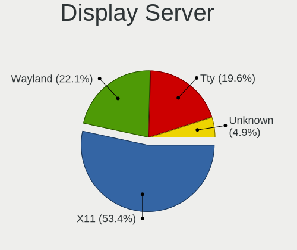
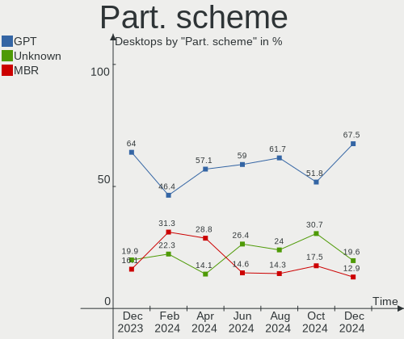
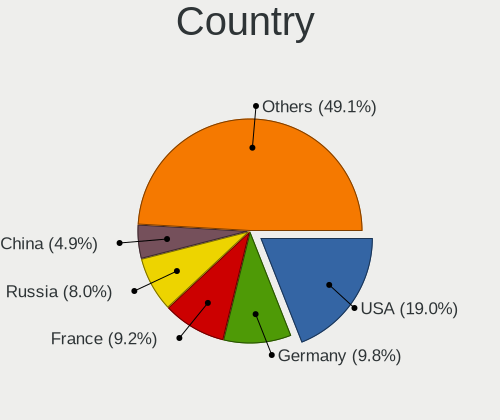
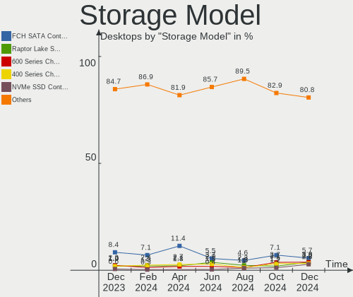
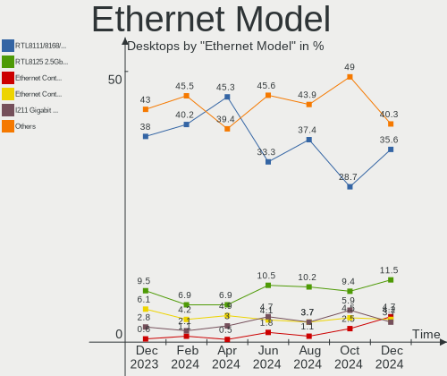

Debian Hardware Trends (Desktops)
---------------------------------

A project to identify most popular hardware characteristics and track their change
over time based on data collected by Debian users at https://Linux-Hardware.org.

Anyone can contribute to this report by the [hw-probe](https://github.com/linuxhw/hw-probe) tool:

    sudo -E hw-probe -all -upload

Full-feature report is available here: https://linux-hardware.org/?view=trends&formfactor=desktop

Period: Aug, 2021.

Contents
--------

* [ System ](#system)
  - [ OS                       ](#os)
  - [ OS Family                ](#os-family)
  - [ Kernel                   ](#kernel)
  - [ Kernel Family            ](#kernel-family)
  - [ Kernel Major Ver.        ](#kernel-major-ver)
  - [ Arch                     ](#arch)
  - [ DE                       ](#de)
  - [ Display Server           ](#display-server)
  - [ Display Manager          ](#display-manager)
  - [ OS Lang                  ](#os-lang)
  - [ Boot Mode                ](#boot-mode)
  - [ Filesystem               ](#filesystem)
  - [ Part. scheme             ](#part-scheme)
  - [ Dual Boot with Linux/BSD ](#dual-boot-with-linuxbsd)
  - [ Dual Boot (Win)          ](#dual-boot-win)

* [ Board ](#board)
  - [ Vendor                   ](#vendor)
  - [ Model                    ](#model)
  - [ Model Family             ](#model-family)
  - [ MFG Year                 ](#mfg-year)
  - [ Form Factor              ](#form-factor)
  - [ Secure Boot              ](#secure-boot)
  - [ Coreboot                 ](#coreboot)
  - [ RAM Size                 ](#ram-size)
  - [ RAM Used                 ](#ram-used)
  - [ Total Drives             ](#total-drives)
  - [ Has CD-ROM               ](#has-cd-rom)
  - [ Has Ethernet             ](#has-ethernet)
  - [ Has WiFi                 ](#has-wifi)
  - [ Has Bluetooth            ](#has-bluetooth)

* [ Location ](#location)
  - [ Country                  ](#country)
  - [ City                     ](#city)

* [ Drives ](#drives)
  - [ Drive Vendor             ](#drive-vendor)
  - [ Drive Model              ](#drive-model)
  - [ HDD Vendor               ](#hdd-vendor)
  - [ SSD Vendor               ](#ssd-vendor)
  - [ Drive Kind               ](#drive-kind)
  - [ Drive Connector          ](#drive-connector)
  - [ Drive Size               ](#drive-size)
  - [ Space Total              ](#space-total)
  - [ Space Used               ](#space-used)
  - [ Malfunc. Drives          ](#malfunc-drives)
  - [ Malfunc. Drive Vendor    ](#malfunc-drive-vendor)
  - [ Malfunc. HDD Vendor      ](#malfunc-hdd-vendor)
  - [ Malfunc. Drive Kind      ](#malfunc-drive-kind)
  - [ Failed Drives            ](#failed-drives)
  - [ Failed Drive Vendor      ](#failed-drive-vendor)
  - [ Drive Status             ](#drive-status)

* [ Storage controller ](#storage-controller)
  - [ Storage Vendor           ](#storage-vendor)
  - [ Storage Model            ](#storage-model)
  - [ Storage Kind             ](#storage-kind)

* [ Processor ](#processor)
  - [ CPU Vendor               ](#cpu-vendor)
  - [ CPU Model                ](#cpu-model)
  - [ CPU Model Family         ](#cpu-model-family)
  - [ CPU Cores                ](#cpu-cores)
  - [ CPU Sockets              ](#cpu-sockets)
  - [ CPU Threads              ](#cpu-threads)
  - [ CPU Op-Modes             ](#cpu-op-modes)
  - [ CPU Microcode            ](#cpu-microcode)
  - [ CPU Microarch            ](#cpu-microarch)

* [ Graphics ](#graphics)
  - [ GPU Vendor               ](#gpu-vendor)
  - [ GPU Model                ](#gpu-model)
  - [ GPU Combo                ](#gpu-combo)
  - [ GPU Driver               ](#gpu-driver)
  - [ GPU Memory               ](#gpu-memory)

* [ Monitor ](#monitor)
  - [ Monitor Vendor           ](#monitor-vendor)
  - [ Monitor Model            ](#monitor-model)
  - [ Monitor Resolution       ](#monitor-resolution)
  - [ Monitor Diagonal         ](#monitor-diagonal)
  - [ Monitor Width            ](#monitor-width)
  - [ Aspect Ratio             ](#aspect-ratio)
  - [ Monitor Area             ](#monitor-area)
  - [ Pixel Density            ](#pixel-density)
  - [ Multiple Monitors        ](#multiple-monitors)

* [ Network ](#network)
  - [ Net Controller Vendor    ](#net-controller-vendor)
  - [ Net Controller Model     ](#net-controller-model)
  - [ Wireless Vendor          ](#wireless-vendor)
  - [ Wireless Model           ](#wireless-model)
  - [ Ethernet Vendor          ](#ethernet-vendor)
  - [ Ethernet Model           ](#ethernet-model)
  - [ Net Controller Kind      ](#net-controller-kind)
  - [ Used Controller          ](#used-controller)
  - [ NICs                     ](#nics)
  - [ IPv6                     ](#ipv6)

* [ Bluetooth ](#bluetooth)
  - [ Bluetooth Vendor         ](#bluetooth-vendor)
  - [ Bluetooth Model          ](#bluetooth-model)

* [ Sound ](#sound)
  - [ Sound Vendor             ](#sound-vendor)
  - [ Sound Model              ](#sound-model)

* [ Memory ](#memory)
  - [ Memory Vendor            ](#memory-vendor)
  - [ Memory Model             ](#memory-model)
  - [ Memory Kind              ](#memory-kind)
  - [ Memory Form Factor       ](#memory-form-factor)
  - [ Memory Size              ](#memory-size)
  - [ Memory Speed             ](#memory-speed)

* [ Printers & scanners ](#printers--scanners)
  - [ Printer Vendor           ](#printer-vendor)
  - [ Printer Model            ](#printer-model)
  - [ Scanner Vendor           ](#scanner-vendor)
  - [ Scanner Model            ](#scanner-model)

* [ Camera ](#camera)
  - [ Camera Vendor            ](#camera-vendor)
  - [ Camera Model             ](#camera-model)

* [ Security ](#security)
  - [ Fingerprint Vendor       ](#fingerprint-vendor)
  - [ Fingerprint Model        ](#fingerprint-model)
  - [ Chipcard Vendor          ](#chipcard-vendor)
  - [ Chipcard Model           ](#chipcard-model)

* [ Unsupported ](#unsupported)
  - [ Unsupported Devices      ](#unsupported-devices)
  - [ Unsupported Device Types ](#unsupported-device-types)

System
------

OS
--

Installed operating systems

| Name           | Desktops | Percent |
|----------------|----------|---------|
| Debian 11      | 122      | 73.05%  |
| Debian 10      | 32       | 19.16%  |
| Debian         | 7        | 4.19%   |
| Debian 9       | 2        | 1.2%    |
| Debian Testing | 1        | 0.6%    |
| Debian 9.9     | 1        | 0.6%    |
| Debian 9.13    | 1        | 0.6%    |
| Debian 8       | 1        | 0.6%    |

OS Family
---------

OS without a version

| Name   | Desktops | Percent |
|--------|----------|---------|
| Debian | 167      | 100%    |

Kernel
------

Version of the Linux kernel

| Version                  | Desktops | Percent |
|--------------------------|----------|---------|
| 5.10.0-8-amd64           | 78       | 46.71%  |
| 5.10.0-7-amd64           | 33       | 19.76%  |
| 4.19.0-17-amd64          | 13       | 7.78%   |
| 5.10.0-2-amd64           | 6        | 3.59%   |
| 4.19.0-16-amd64          | 6        | 3.59%   |
| 5.10.0-0.bpo.8-amd64     | 3        | 1.8%    |
| 5.10.0-8-686-pae         | 2        | 1.2%    |
| 5.10.0-0.bpo.7-amd64     | 2        | 1.2%    |
| 5.8.16-antix.1-amd64-smp | 1        | 0.6%    |
| 5.8.0-3-amd64            | 1        | 0.6%    |
| 5.4.70                   | 1        | 0.6%    |
| 5.4.103-1-pve            | 1        | 0.6%    |
| 5.13.8-gnu               | 1        | 0.6%    |
| 5.12.18-amd64-desktop    | 1        | 0.6%    |
| 5.11.22-3-pve            | 1        | 0.6%    |
| 5.11.22-2-pve            | 1        | 0.6%    |
| 5.11.22-1-pve            | 1        | 0.6%    |
| 5.10.42+truenas          | 1        | 0.6%    |
| 5.10.0-8-rt-amd64        | 1        | 0.6%    |
| 5.10.0-8-686             | 1        | 0.6%    |
| 5.10.0-5-amd64           | 1        | 0.6%    |
| 5.10.0-3-amd64           | 1        | 0.6%    |
| 4.9.0-13-amd64           | 1        | 0.6%    |
| 4.19.0-9-686-pae         | 1        | 0.6%    |
| 4.19.0-6-amd64           | 1        | 0.6%    |
| 4.19.0-17-rt-amd64       | 1        | 0.6%    |
| 4.19.0-14-686-pae        | 1        | 0.6%    |
| 4.19.0-13-amd64          | 1        | 0.6%    |
| 4.19.0-12-amd64          | 1        | 0.6%    |
| 4.19.0-0.bpo.9-amd64     | 1        | 0.6%    |
| 4.15.18-16-pve           | 1        | 0.6%    |
| 4.1.42-rivoreo-powerpc64 | 1        | 0.6%    |

Kernel Family
-------------

Linux kernel without a distro release

| Version | Desktops | Percent |
|---------|----------|---------|
| 5.10.0  | 128      | 76.65%  |
| 4.19.0  | 26       | 15.57%  |
| 5.11.22 | 3        | 1.8%    |
| 5.8.16  | 1        | 0.6%    |
| 5.8.0   | 1        | 0.6%    |
| 5.4.70  | 1        | 0.6%    |
| 5.4.103 | 1        | 0.6%    |
| 5.13.8  | 1        | 0.6%    |
| 5.12.18 | 1        | 0.6%    |
| 5.10.42 | 1        | 0.6%    |
| 4.9.0   | 1        | 0.6%    |
| 4.15.18 | 1        | 0.6%    |
| 4.1.42  | 1        | 0.6%    |

Kernel Major Ver.
-----------------

Linux kernel major version

| Version | Desktops | Percent |
|---------|----------|---------|
| 5.10    | 129      | 77.25%  |
| 4.19    | 26       | 15.57%  |
| 5.11    | 3        | 1.8%    |
| 5.8     | 2        | 1.2%    |
| 5.4     | 2        | 1.2%    |
| 5.13    | 1        | 0.6%    |
| 5.12    | 1        | 0.6%    |
| 4.9     | 1        | 0.6%    |
| 4.15    | 1        | 0.6%    |
| 4.1     | 1        | 0.6%    |

Arch
----

OS architecture (x86_64, i586, etc.)

| Name   | Desktops | Percent |
|--------|----------|---------|
| x86_64 | 160      | 95.81%  |
| i686   | 5        | 2.99%   |
| ppc64  | 1        | 0.6%    |
| armv7l | 1        | 0.6%    |

DE
--

Desktop Environment

| Name             | Desktops | Percent |
|------------------|----------|---------|
| Unknown          | 72       | 43.11%  |
| GNOME            | 30       | 17.96%  |
| KDE5             | 24       | 14.37%  |
| XFCE             | 16       | 9.58%   |
| X-Cinnamon       | 6        | 3.59%   |
| MATE             | 5        | 2.99%   |
| KDE              | 3        | 1.8%    |
| Cinnamon         | 3        | 1.8%    |
| Trinity          | 2        | 1.2%    |
| LXQt             | 2        | 1.2%    |
| openbox          | 1        | 0.6%    |
| LXDE             | 1        | 0.6%    |
| lightdm-xsession | 1        | 0.6%    |
| i3               | 1        | 0.6%    |

Display Server
--------------

X11 or Wayland

| Name    | Desktops | Percent |
|---------|----------|---------|
| X11     | 82       | 49.1%   |
| Unknown | 53       | 31.74%  |
| Tty     | 21       | 12.57%  |
| Wayland | 11       | 6.59%   |

Display Manager
---------------

SDDM, LightDM, etc.

| Name    | Desktops | Percent |
|---------|----------|---------|
| Unknown | 88       | 52.69%  |
| TDM     | 25       | 14.97%  |
| SDDM    | 22       | 13.17%  |
| GDM     | 21       | 12.57%  |
| LightDM | 8        | 4.79%   |
| GDM3    | 2        | 1.2%    |
| SLiM    | 1        | 0.6%    |

OS Lang
-------

Language

| Lang    | Desktops | Percent |
|---------|----------|---------|
| en_US   | 54       | 32.34%  |
| ru_RU   | 49       | 29.34%  |
| en_GB   | 10       | 5.99%   |
| es_ES   | 7        | 4.19%   |
| Unknown | 7        | 4.19%   |
| pt_BR   | 5        | 2.99%   |
| de_DE   | 5        | 2.99%   |
| fr_FR   | 4        | 2.4%    |
| pl_PL   | 3        | 1.8%    |
| C       | 3        | 1.8%    |
| nl_NL   | 2        | 1.2%    |
| ja_JP   | 2        | 1.2%    |
| en_AU   | 2        | 1.2%    |
| tr_TR   | 1        | 0.6%    |
| nl_BE   | 1        | 0.6%    |
| lt_LT   | 1        | 0.6%    |
| it_IT   | 1        | 0.6%    |
| hu_HU   | 1        | 0.6%    |
| hr_HR   | 1        | 0.6%    |
| es_VE   | 1        | 0.6%    |
| es_PA   | 1        | 0.6%    |
| es_MX   | 1        | 0.6%    |
| en_PH   | 1        | 0.6%    |
| en_NZ   | 1        | 0.6%    |
| de_CH   | 1        | 0.6%    |
| cs_CZ   | 1        | 0.6%    |
| bg_BG   | 1        | 0.6%    |

Boot Mode
---------

EFI or BIOS

| Mode | Desktops | Percent |
|------|----------|---------|
| BIOS | 92       | 55.09%  |
| EFI  | 75       | 44.91%  |

Filesystem
----------

Type of filesystem

| Type    | Desktops | Percent |
|---------|----------|---------|
| Ext4    | 97       | 58.08%  |
| Overlay | 52       | 31.14%  |
| Btrfs   | 10       | 5.99%   |
| Zfs     | 3        | 1.8%    |
| Xfs     | 3        | 1.8%    |
| XXXXXXX | 1        | 0.6%    |
| Ext2    | 1        | 0.6%    |

Part. scheme
------------

Scheme of partitioning

| Type    | Desktops | Percent |
|---------|----------|---------|
| GPT     | 95       | 56.89%  |
| MBR     | 50       | 29.94%  |
| Unknown | 22       | 13.17%  |

Dual Boot with Linux/BSD
------------------------

Hosting more than one Linux/BSD

| Dual boot | Desktops | Percent |
|-----------|----------|---------|
| No        | 140      | 83.83%  |
| Yes       | 27       | 16.17%  |

Dual Boot (Win)
---------------

Hosting Linux and Windows

| Dual boot | Desktops | Percent |
|-----------|----------|---------|
| No        | 95       | 56.89%  |
| Yes       | 72       | 43.11%  |

Board
-----

Vendor
------

Motherboard manufacturer

| Name                | Desktops | Percent |
|---------------------|----------|---------|
| ASUSTek Computer    | 44       | 26.35%  |
| ASRock              | 38       | 22.75%  |
| Gigabyte Technology | 20       | 11.98%  |
| Hewlett-Packard     | 12       | 7.19%   |
| MSI                 | 11       | 6.59%   |
| Dell                | 11       | 6.59%   |
| Intel               | 7        | 4.19%   |
| Lenovo              | 4        | 2.4%    |
| Unknown             | 4        | 2.4%    |
| Supermicro          | 3        | 1.8%    |
| Semp Toshiba        | 2        | 1.2%    |
| ECS                 | 2        | 1.2%    |
| YANYU               | 1        | 0.6%    |
| NC9VL               | 1        | 0.6%    |
| Google              | 1        | 0.6%    |
| Fujitsu Siemens     | 1        | 0.6%    |
| Fujitsu             | 1        | 0.6%    |
| Biostar             | 1        | 0.6%    |
| ASRockRack          | 1        | 0.6%    |
| AOpen               | 1        | 0.6%    |
| AAEON               | 1        | 0.6%    |

Model
-----

Motherboard model

| Name                                   | Desktops | Percent |
|----------------------------------------|----------|---------|
| ASRock H470M-HVS                       | 20       | 11.98%  |
| Unknown                                | 4        | 2.4%    |
| ASUS P5KPL-CM                          | 3        | 1.8%    |
| ASUS All Series                        | 3        | 1.8%    |
| Semp Toshiba STI                       | 2        | 1.2%    |
| MSI MS-7A71                            | 2        | 1.2%    |
| Intel Pro, Std, Elt Series             | 2        | 1.2%    |
| Intel DN2820FYK H24582-201             | 2        | 1.2%    |
| Gigabyte Z77-D3H                       | 2        | 1.2%    |
| Gigabyte 970A-DS3P                     | 2        | 1.2%    |
| Dell OptiPlex 7010                     | 2        | 1.2%    |
| ASUS TUF GAMING X570-PRO               | 2        | 1.2%    |
| ASRock H61M-VG4                        | 2        | 1.2%    |
| YANYU M9F baytrail                     | 1        | 0.6%    |
| Supermicro X9SCL/X9SCM                 | 1        | 0.6%    |
| Supermicro SYS-5019S-MR                | 1        | 0.6%    |
| Supermicro SYS-5018R-WR                | 1        | 0.6%    |
| NC9VL 1.0                              | 1        | 0.6%    |
| MSI MS-7C75                            | 1        | 0.6%    |
| MSI MS-7C02                            | 1        | 0.6%    |
| MSI MS-7B92                            | 1        | 0.6%    |
| MSI MS-7B84                            | 1        | 0.6%    |
| MSI MS-7B79                            | 1        | 0.6%    |
| MSI MS-7A70                            | 1        | 0.6%    |
| MSI MS-7978                            | 1        | 0.6%    |
| MSI MS-7721                            | 1        | 0.6%    |
| MSI MS-7641                            | 1        | 0.6%    |
| Lenovo ThinkCentre M92p 3209EK4        | 1        | 0.6%    |
| Lenovo ThinkCentre M73 10AXS51D00      | 1        | 0.6%    |
| Lenovo ThinkCentre M55p 8808D8U        | 1        | 0.6%    |
| Lenovo H330                            | 1        | 0.6%    |
| Intel DH87RL AAG74240-403              | 1        | 0.6%    |
| Intel DH77KC AAG39641-400              | 1        | 0.6%    |
| Intel DG33BU AAD79951-407              | 1        | 0.6%    |
| HP Z220 SFF Workstation                | 1        | 0.6%    |
| HP Z210 Workstation                    | 1        | 0.6%    |
| HP t620 Dual Core TC                   | 1        | 0.6%    |
| HP t5540                               | 1        | 0.6%    |
| HP EliteDesk 800 G1 SFF                | 1        | 0.6%    |
| HP d530 CMT(DQ500C)                    | 1        | 0.6%    |
| HP Compaq Pro 6300 SFF                 | 1        | 0.6%    |
| HP Compaq Elite 8300 SFF               | 1        | 0.6%    |
| HP Compaq dc7700 Convertible Minitower | 1        | 0.6%    |
| HP Compaq 6005 Pro MT PC               | 1        | 0.6%    |
| HP Compaq 6000 Pro SFF PC              | 1        | 0.6%    |
| HP 500-402nr                           | 1        | 0.6%    |
| Google Zako                            | 1        | 0.6%    |
| Gigabyte Z97N-WIFI                     | 1        | 0.6%    |
| Gigabyte Z390 AORUS PRO WIFI           | 1        | 0.6%    |
| Gigabyte X570 I AORUS PRO WIFI         | 1        | 0.6%    |
| Gigabyte X399 AORUS XTREME             | 1        | 0.6%    |
| Gigabyte H97M-HD3                      | 1        | 0.6%    |
| Gigabyte H81M-S2V                      | 1        | 0.6%    |
| Gigabyte H61M-S2PV                     | 1        | 0.6%    |
| Gigabyte H470M DS3H                    | 1        | 0.6%    |
| Gigabyte H170-HD3                      | 1        | 0.6%    |
| Gigabyte GA-990FXA-D3                  | 1        | 0.6%    |
| Gigabyte GA-78LMT-USB3                 | 1        | 0.6%    |
| Gigabyte BRi7(H)-10710                 | 1        | 0.6%    |
| Gigabyte B560M DS3H                    | 1        | 0.6%    |

Model Family
------------

Motherboard model prefix

| Name                    | Desktops | Percent |
|-------------------------|----------|---------|
| ASRock H470M-HVS        | 20       | 11.98%  |
| Dell OptiPlex           | 7        | 4.19%   |
| ASUS ROG                | 7        | 4.19%   |
| ASUS PRIME              | 7        | 4.19%   |
| HP Compaq               | 5        | 2.99%   |
| Unknown                 | 4        | 2.4%    |
| Lenovo ThinkCentre      | 3        | 1.8%    |
| Dell Precision          | 3        | 1.8%    |
| ASUS TUF                | 3        | 1.8%    |
| ASUS P5KPL-CM           | 3        | 1.8%    |
| ASUS All                | 3        | 1.8%    |
| Semp Toshiba STI        | 2        | 1.2%    |
| MSI MS-7A71             | 2        | 1.2%    |
| Intel Pro               | 2        | 1.2%    |
| Intel DN2820FYK         | 2        | 1.2%    |
| Gigabyte Z77-D3H        | 2        | 1.2%    |
| Gigabyte A320M-S2H      | 2        | 1.2%    |
| Gigabyte 970A-DS3P      | 2        | 1.2%    |
| ASUS P7H55-M            | 2        | 1.2%    |
| ASRock Z97              | 2        | 1.2%    |
| ASRock H61M-VG4         | 2        | 1.2%    |
| YANYU M9F               | 1        | 0.6%    |
| Supermicro X9SCL        | 1        | 0.6%    |
| Supermicro SYS-5019S-MR | 1        | 0.6%    |
| Supermicro SYS-5018R-WR | 1        | 0.6%    |
| NC9VL 1.0               | 1        | 0.6%    |
| MSI MS-7C75             | 1        | 0.6%    |
| MSI MS-7C02             | 1        | 0.6%    |
| MSI MS-7B92             | 1        | 0.6%    |
| MSI MS-7B84             | 1        | 0.6%    |
| MSI MS-7B79             | 1        | 0.6%    |
| MSI MS-7A70             | 1        | 0.6%    |
| MSI MS-7978             | 1        | 0.6%    |
| MSI MS-7721             | 1        | 0.6%    |
| MSI MS-7641             | 1        | 0.6%    |
| Lenovo H330             | 1        | 0.6%    |
| Intel DH87RL            | 1        | 0.6%    |
| Intel DH77KC            | 1        | 0.6%    |
| Intel DG33BU            | 1        | 0.6%    |
| HP Z220                 | 1        | 0.6%    |
| HP Z210                 | 1        | 0.6%    |
| HP t620                 | 1        | 0.6%    |
| HP t5540                | 1        | 0.6%    |
| HP EliteDesk            | 1        | 0.6%    |
| HP d530                 | 1        | 0.6%    |
| HP 500-402nr            | 1        | 0.6%    |
| Google Zako             | 1        | 0.6%    |
| Gigabyte Z97N-WIFI      | 1        | 0.6%    |
| Gigabyte Z390           | 1        | 0.6%    |
| Gigabyte X570           | 1        | 0.6%    |
| Gigabyte X399           | 1        | 0.6%    |
| Gigabyte H97M-HD3       | 1        | 0.6%    |
| Gigabyte H81M-S2V       | 1        | 0.6%    |
| Gigabyte H61M-S2PV      | 1        | 0.6%    |
| Gigabyte H470M          | 1        | 0.6%    |
| Gigabyte H170-HD3       | 1        | 0.6%    |
| Gigabyte GA-990FXA-D3   | 1        | 0.6%    |
| Gigabyte GA-78LMT-USB3  | 1        | 0.6%    |
| Gigabyte BRi7(H)-10710  | 1        | 0.6%    |
| Gigabyte B560M          | 1        | 0.6%    |

MFG Year
--------

Motherboard manufacture year

| Year    | Desktops | Percent |
|---------|----------|---------|
| 2021    | 35       | 20.96%  |
| 2018    | 21       | 12.57%  |
| 2019    | 20       | 11.98%  |
| 2020    | 14       | 8.38%   |
| 2015    | 12       | 7.19%   |
| 2013    | 9        | 5.39%   |
| 2014    | 8        | 4.79%   |
| 2011    | 8        | 4.79%   |
| 2009    | 7        | 4.19%   |
| 2017    | 6        | 3.59%   |
| 2012    | 6        | 3.59%   |
| 2016    | 5        | 2.99%   |
| 2010    | 5        | 2.99%   |
| 2008    | 5        | 2.99%   |
| 2007    | 2        | 1.2%    |
| Unknown | 2        | 1.2%    |
| 2006    | 1        | 0.6%    |
| 2004    | 1        | 0.6%    |

Form Factor
-----------

Physical design of the computer

| Name    | Desktops | Percent |
|---------|----------|---------|
| Desktop | 167      | 100%    |

Secure Boot
-----------

Enabled or disabled

| State    | Desktops | Percent |
|----------|----------|---------|
| Disabled | 167      | 100%    |

Coreboot
--------

Have coreboot on board

| Used | Desktops | Percent |
|------|----------|---------|
| No   | 166      | 99.4%   |
| Yes  | 1        | 0.6%    |

RAM Size
--------

Total RAM memory

| Size in GB  | Desktops | Percent |
|-------------|----------|---------|
| 32.01-64.0  | 39       | 23.35%  |
| 16.01-24.0  | 38       | 22.75%  |
| 8.01-16.0   | 25       | 14.97%  |
| 4.01-8.0    | 18       | 10.78%  |
| 3.01-4.0    | 15       | 8.98%   |
| 64.01-256.0 | 11       | 6.59%   |
| 1.01-2.0    | 8        | 4.79%   |
| 24.01-32.0  | 5        | 2.99%   |
| 2.01-3.0    | 4        | 2.4%    |
| 0.51-1.0    | 2        | 1.2%    |
| 0.01-0.5    | 1        | 0.6%    |
| Unknown     | 1        | 0.6%    |

RAM Used
--------

Used RAM memory

| Used GB     | Desktops | Percent |
|-------------|----------|---------|
| 0.51-1.0    | 50       | 29.94%  |
| 1.01-2.0    | 31       | 18.56%  |
| 2.01-3.0    | 28       | 16.77%  |
| 3.01-4.0    | 20       | 11.98%  |
| 4.01-8.0    | 18       | 10.78%  |
| 0.01-0.5    | 8        | 4.79%   |
| 16.01-24.0  | 5        | 2.99%   |
| 8.01-16.0   | 3        | 1.8%    |
| 64.01-256.0 | 2        | 1.2%    |
| 32.01-64.0  | 1        | 0.6%    |
| Unknown     | 1        | 0.6%    |

Total Drives
------------

Number of drives on board

| Drives | Desktops | Percent |
|--------|----------|---------|
| 2      | 61       | 36.53%  |
| 1      | 57       | 34.13%  |
| 3      | 16       | 9.58%   |
| 4      | 14       | 8.38%   |
| 5      | 7        | 4.19%   |
| 6      | 3        | 1.8%    |
| 8      | 2        | 1.2%    |
| 7      | 2        | 1.2%    |
| 0      | 2        | 1.2%    |
| 13     | 1        | 0.6%    |
| 12     | 1        | 0.6%    |
| 10     | 1        | 0.6%    |

Has CD-ROM
----------

Has CD-ROM on board

| Presented | Desktops | Percent |
|-----------|----------|---------|
| No        | 105      | 62.87%  |
| Yes       | 62       | 37.13%  |

Has Ethernet
------------

Has Ethernet on board

| Presented | Desktops | Percent |
|-----------|----------|---------|
| Yes       | 166      | 99.4%   |
| No        | 1        | 0.6%    |

Has WiFi
--------

Has WiFi module

| Presented | Desktops | Percent |
|-----------|----------|---------|
| No        | 122      | 73.05%  |
| Yes       | 45       | 26.95%  |

Has Bluetooth
-------------

Has Bluetooth module

| Presented | Desktops | Percent |
|-----------|----------|---------|
| No        | 128      | 76.65%  |
| Yes       | 39       | 23.35%  |

Location
--------

Country
-------

Geographic location (country)

| Country     | Desktops | Percent |
|-------------|----------|---------|
| Russia      | 52       | 31.14%  |
| USA         | 32       | 19.16%  |
| UK          | 10       | 5.99%   |
| Spain       | 9        | 5.39%   |
| Germany     | 8        | 4.79%   |
| Ukraine     | 5        | 2.99%   |
| Brazil      | 5        | 2.99%   |
| Poland      | 4        | 2.4%    |
| Netherlands | 4        | 2.4%    |
| France      | 4        | 2.4%    |
| Belgium     | 3        | 1.8%    |
| Switzerland | 2        | 1.2%    |
| Romania     | 2        | 1.2%    |
| Philippines | 2        | 1.2%    |
| Mexico      | 2        | 1.2%    |
| Japan       | 2        | 1.2%    |
| Czechia     | 2        | 1.2%    |
| Australia   | 2        | 1.2%    |
| Venezuela   | 1        | 0.6%    |
| Turkey      | 1        | 0.6%    |
| Sweden      | 1        | 0.6%    |
| Serbia      | 1        | 0.6%    |
| Portugal    | 1        | 0.6%    |
| Panama      | 1        | 0.6%    |
| New Zealand | 1        | 0.6%    |
| Lithuania   | 1        | 0.6%    |
| Italy       | 1        | 0.6%    |
| Ireland     | 1        | 0.6%    |
| Iran        | 1        | 0.6%    |
| Hungary     | 1        | 0.6%    |
| Croatia     | 1        | 0.6%    |
| China       | 1        | 0.6%    |
| Bulgaria    | 1        | 0.6%    |
| Austria     | 1        | 0.6%    |
| Argentina   | 1        | 0.6%    |

City
----

Geographic location (city)

| City                 | Desktops | Percent |
|----------------------|----------|---------|
| Voronezh             | 36       | 21.56%  |
| Portland             | 6        | 3.59%   |
| Moscow               | 6        | 3.59%   |
| London               | 4        | 2.4%    |
| Kyiv                 | 4        | 2.4%    |
| Herndon              | 3        | 1.8%    |
| Frankfort            | 3        | 1.8%    |
| St Petersburg        | 2        | 1.2%    |
| S??o Paulo           | 2        | 1.2%    |
| Pontevedra           | 2        | 1.2%    |
| Perm                 | 2        | 1.2%    |
| Ocala                | 2        | 1.2%    |
| Iasi                 | 2        | 1.2%    |
| Hellevoetsluis       | 2        | 1.2%    |
| Clitheroe            | 2        | 1.2%    |
| Berlin               | 2        | 1.2%    |
| Amsterdam            | 2        | 1.2%    |
| Zastavka             | 1        | 0.6%    |
| Zagreb               | 1        | 0.6%    |
| Yuncos               | 1        | 0.6%    |
| Ypres                | 1        | 0.6%    |
| Yekaterinburg        | 1        | 0.6%    |
| Wysokie Mazowieckie  | 1        | 0.6%    |
| Wroclaw              | 1        | 0.6%    |
| Wheaton              | 1        | 0.6%    |
| Vladivostok          | 1        | 0.6%    |
| Vienna               | 1        | 0.6%    |
| V?©nissieux          | 1        | 0.6%    |
| Vandoeuvre-les-Nancy | 1        | 0.6%    |
| Valladolid           | 1        | 0.6%    |
| Valera               | 1        | 0.6%    |
| Torrox Costa         | 1        | 0.6%    |
| Tehran               | 1        | 0.6%    |
| Szeged               | 1        | 0.6%    |
| Swansea              | 1        | 0.6%    |
| Stockholm            | 1        | 0.6%    |
| Srednyaya Akhtuba    | 1        | 0.6%    |
| Springfield          | 1        | 0.6%    |
| Sofia                | 1        | 0.6%    |
| Sevastopol           | 1        | 0.6%    |
| Schoten              | 1        | 0.6%    |
| Saratov              | 1        | 0.6%    |
| Santar?©m            | 1        | 0.6%    |
| Santa Rosa           | 1        | 0.6%    |
| Santa Brigida        | 1        | 0.6%    |
| San Jose             | 1        | 0.6%    |
| San Francisco        | 1        | 0.6%    |
| Saku                 | 1        | 0.6%    |
| Rio de Janeiro       | 1        | 0.6%    |
| Reedsburg            | 1        | 0.6%    |
| Pskov                | 1        | 0.6%    |
| Piszczac             | 1        | 0.6%    |
| Paris                | 1        | 0.6%    |
| Panama City          | 1        | 0.6%    |
| Pabianice            | 1        | 0.6%    |
| Oxnard               | 1        | 0.6%    |
| Ostrava              | 1        | 0.6%    |
| Osaka                | 1        | 0.6%    |
| Oloron-Sainte-Marie  | 1        | 0.6%    |
| Novi Sad             | 1        | 0.6%    |

Drives
------

Drive Vendor
------------

Hard drive vendors

| Vendor              | Desktops | Drives | Percent |
|---------------------|----------|--------|---------|
| Seagate             | 55       | 83     | 17.97%  |
| WDC                 | 46       | 75     | 15.03%  |
| Samsung Electronics | 42       | 57     | 13.73%  |
| Toshiba             | 33       | 39     | 10.78%  |
| Kingston            | 24       | 28     | 7.84%   |
| Netac               | 21       | 21     | 6.86%   |
| Crucial             | 15       | 17     | 4.9%    |
| Hitachi             | 10       | 10     | 3.27%   |
| SanDisk             | 8        | 8      | 2.61%   |
| HGST                | 6        | 9      | 1.96%   |
| Unknown             | 3        | 3      | 0.98%   |
| PNY                 | 3        | 3      | 0.98%   |
| Maxtor              | 3        | 3      | 0.98%   |
| Intenso             | 3        | 3      | 0.98%   |
| Intel               | 3        | 4      | 0.98%   |
| Transcend           | 2        | 2      | 0.65%   |
| SPCC                | 2        | 2      | 0.65%   |
| SK Hynix            | 2        | 3      | 0.65%   |
| SABRENT             | 2        | 2      | 0.65%   |
| OCZ                 | 2        | 2      | 0.65%   |
| Micron Technology   | 2        | 2      | 0.65%   |
| Hewlett-Packard     | 2        | 3      | 0.65%   |
| GOODRAM             | 2        | 2      | 0.65%   |
| A-DATA Technology   | 2        | 3      | 0.65%   |
| THU                 | 1        | 1      | 0.33%   |
| Team                | 1        | 1      | 0.33%   |
| T-FORCE             | 1        | 1      | 0.33%   |
| PNY USB             | 1        | 1      | 0.33%   |
| PLEXTOR             | 1        | 2      | 0.33%   |
| Patriot             | 1        | 1      | 0.33%   |
| NAS                 | 1        | 5      | 0.33%   |
| Mushkin             | 1        | 1      | 0.33%   |
| LITEONIT            | 1        | 1      | 0.33%   |
| LITEON              | 1        | 1      | 0.33%   |
| China               | 1        | 1      | 0.33%   |
| Apacer              | 1        | 1      | 0.33%   |
| 128MB               | 1        | 1      | 0.33%   |

Drive Model
-----------

Hard drive models

| Model                             | Desktops | Percent |
|-----------------------------------|----------|---------|
| Toshiba HDWD110 1TB               | 20       | 5.7%    |
| Netac SSD 240GB                   | 20       | 5.7%    |
| Kingston SA400S37240G 240GB SSD   | 7        | 1.99%   |
| Seagate ST500DM002-1BD142 500GB   | 5        | 1.42%   |
| Seagate ST2000DM008-2FR102 2TB    | 5        | 1.42%   |
| Kingston SA400S37120G 120GB SSD   | 5        | 1.42%   |
| Seagate ST2000DM001-1ER164 2TB    | 4        | 1.14%   |
| Seagate ST1000DM010-2EP102 1TB    | 4        | 1.14%   |
| Samsung SSD 850 EVO 250GB         | 4        | 1.14%   |
| Toshiba MQ01ABD100 1TB            | 3        | 0.85%   |
| Seagate ST4000VN008-2DR166 4TB    | 3        | 0.85%   |
| SanDisk SD8SBAT128G1122 128GB SSD | 3        | 0.85%   |
| Samsung SSD 980 PRO 1TB           | 3        | 0.85%   |
| Samsung SSD 970 EVO Plus 1TB      | 3        | 0.85%   |
| Samsung SSD 970 EVO 500GB         | 3        | 0.85%   |
| Samsung SSD 860 EVO 1TB           | 3        | 0.85%   |
| Kingston SV300S37A120G 120GB SSD  | 3        | 0.85%   |
| Crucial CT250MX500SSD1 250GB      | 3        | 0.85%   |
| WDC WDS500G3X0C-00SJG0 500GB      | 2        | 0.57%   |
| WDC WDS240G2G0A-00JH30 240GB SSD  | 2        | 0.57%   |
| WDC WD60PURX-64T0ZY0 6TB          | 2        | 0.57%   |
| WDC WD40EFRX-68N32N0 4TB          | 2        | 0.57%   |
| WDC WD20EZRZ-00Z5HB0 2TB          | 2        | 0.57%   |
| WDC WD20EFRX-68EUZN0 2TB          | 2        | 0.57%   |
| WDC WD10EZEX-22MFCA0 1TB          | 2        | 0.57%   |
| WDC WD10EZEX-00BN5A0 1TB          | 2        | 0.57%   |
| Toshiba DT01ACA300 3TB            | 2        | 0.57%   |
| Toshiba DT01ACA100 1TB            | 2        | 0.57%   |
| Seagate ST3802110A 80GB           | 2        | 0.57%   |
| Seagate ST3320620A 320GB          | 2        | 0.57%   |
| Seagate ST3160813AS 160GB         | 2        | 0.57%   |
| Seagate ST3120811AS 120GB         | 2        | 0.57%   |
| Seagate Expansion 2TB             | 2        | 0.57%   |
| Samsung SSD 860 EVO 500GB         | 2        | 0.57%   |
| Samsung SSD 860 EVO 250GB         | 2        | 0.57%   |
| Samsung SSD 850 EVO 500GB         | 2        | 0.57%   |
| SABRENT Disk 1TB                  | 2        | 0.57%   |
| PNY CS900 120GB SSD               | 2        | 0.57%   |
| Hitachi HDS721050CLA362 500GB     | 2        | 0.57%   |
| Crucial CT500MX500SSD1 500GB      | 2        | 0.57%   |
| Crucial CT240BX500SSD1 240GB      | 2        | 0.57%   |
| Crucial CT1000MX500SSD1 1TB       | 2        | 0.57%   |
| WDC WDS500G2B0A-00SM50 500GB SSD  | 1        | 0.28%   |
| WDC WDS480G2G0B-00EPW0 480GB SSD  | 1        | 0.28%   |
| WDC WDS250G2B0A-00SM50 250GB SSD  | 1        | 0.28%   |
| WDC WDS100T1R0A-68A4W0 1TB SSD    | 1        | 0.28%   |
| WDC WD800JD-00LSA5 80GB           | 1        | 0.28%   |
| WDC WD800JB-00FMA0 80GB           | 1        | 0.28%   |
| WDC WD8002FRYZ-01FF2B0 8TB        | 1        | 0.28%   |
| WDC WD8001FZBX-00ASYA0 8TB        | 1        | 0.28%   |
| WDC WD6400AAKS-22A7B0 640GB       | 1        | 0.28%   |
| WDC WD60EFRX-68L0BN1 6TB          | 1        | 0.28%   |
| WDC WD5000AZRX-00L4HB0 500GB      | 1        | 0.28%   |
| WDC WD5000AAKX-60U6AA0 500GB      | 1        | 0.28%   |
| WDC WD5000AAKX-083CA1 500GB       | 1        | 0.28%   |
| WDC WD5000AAKX-00U6AA0 500GB      | 1        | 0.28%   |
| WDC WD5000AAKX-0 500GB            | 1        | 0.28%   |
| WDC WD5000AADS-00S9B0 500GB       | 1        | 0.28%   |
| WDC WD40EZRZ-00GXCB0 4TB          | 1        | 0.28%   |
| WDC WD40EMAZ-11LW3B0 4TB          | 1        | 0.28%   |

HDD Vendor
----------

Hard disk drive vendors

| Vendor              | Desktops | Drives | Percent |
|---------------------|----------|--------|---------|
| Seagate             | 53       | 79     | 34.64%  |
| WDC                 | 40       | 67     | 26.14%  |
| Toshiba             | 32       | 38     | 20.92%  |
| Hitachi             | 10       | 10     | 6.54%   |
| Samsung Electronics | 7        | 8      | 4.58%   |
| HGST                | 6        | 9      | 3.92%   |
| Maxtor              | 3        | 3      | 1.96%   |
| NAS                 | 1        | 5      | 0.65%   |
| 128MB               | 1        | 1      | 0.65%   |

SSD Vendor
----------

Solid state drive vendors

| Vendor              | Desktops | Drives | Percent |
|---------------------|----------|--------|---------|
| Kingston            | 23       | 26     | 18.7%   |
| Samsung Electronics | 21       | 28     | 17.07%  |
| Netac               | 21       | 21     | 17.07%  |
| Crucial             | 12       | 13     | 9.76%   |
| SanDisk             | 8        | 8      | 6.5%    |
| WDC                 | 6        | 6      | 4.88%   |
| Transcend           | 2        | 2      | 1.63%   |
| SPCC                | 2        | 2      | 1.63%   |
| SABRENT             | 2        | 2      | 1.63%   |
| PNY                 | 2        | 2      | 1.63%   |
| OCZ                 | 2        | 2      | 1.63%   |
| Intenso             | 2        | 2      | 1.63%   |
| Intel               | 2        | 3      | 1.63%   |
| GOODRAM             | 2        | 2      | 1.63%   |
| A-DATA Technology   | 2        | 3      | 1.63%   |
| Unknown             | 1        | 1      | 0.81%   |
| Toshiba             | 1        | 1      | 0.81%   |
| THU                 | 1        | 1      | 0.81%   |
| T-FORCE             | 1        | 1      | 0.81%   |
| SK Hynix            | 1        | 1      | 0.81%   |
| Seagate             | 1        | 1      | 0.81%   |
| PNY USB             | 1        | 1      | 0.81%   |
| PLEXTOR             | 1        | 2      | 0.81%   |
| Patriot             | 1        | 1      | 0.81%   |
| Mushkin             | 1        | 1      | 0.81%   |
| Micron Technology   | 1        | 1      | 0.81%   |
| LITEONIT            | 1        | 1      | 0.81%   |
| China               | 1        | 1      | 0.81%   |
| Apacer              | 1        | 1      | 0.81%   |

Drive Kind
----------

HDD or SSD

| Kind    | Desktops | Drives | Percent |
|---------|----------|--------|---------|
| HDD     | 118      | 220    | 45.91%  |
| SSD     | 104      | 137    | 40.47%  |
| NVMe    | 30       | 39     | 11.67%  |
| Unknown | 3        | 4      | 1.17%   |
| MMC     | 2        | 2      | 0.78%   |

Drive Connector
---------------

SATA, SAS, NVMe, etc.

| Type | Desktops | Drives | Percent |
|------|----------|--------|---------|
| SATA | 156      | 352    | 80%     |
| NVMe | 30       | 39     | 15.38%  |
| SAS  | 7        | 9      | 3.59%   |
| MMC  | 2        | 2      | 1.03%   |

Drive Size
----------

Size of hard drive

| Size in TB | Desktops | Drives | Percent |
|------------|----------|--------|---------|
| 0.01-0.5   | 120      | 169    | 48.78%  |
| 0.51-1.0   | 68       | 83     | 27.64%  |
| 1.01-2.0   | 25       | 38     | 10.16%  |
| 4.01-10.0  | 13       | 21     | 5.28%   |
| 3.01-4.0   | 12       | 26     | 4.88%   |
| 2.01-3.0   | 5        | 7      | 2.03%   |
| 10.01-20.0 | 3        | 13     | 1.22%   |

Space Total
-----------

Amount of disk space available on the file system

| Size in GB     | Desktops | Percent |
|----------------|----------|---------|
| Unknown        | 46       | 27.54%  |
| 101-250        | 22       | 13.17%  |
| More than 3000 | 18       | 10.78%  |
| 501-1000       | 17       | 10.18%  |
| 251-500        | 16       | 9.58%   |
| 1-20           | 15       | 8.98%   |
| 2001-3000      | 10       | 5.99%   |
| 1001-2000      | 10       | 5.99%   |
| 51-100         | 9        | 5.39%   |
| 21-50          | 4        | 2.4%    |

Space Used
----------

Amount of used disk space

| Used GB        | Desktops | Percent |
|----------------|----------|---------|
| Unknown        | 46       | 27.54%  |
| 1-20           | 39       | 23.35%  |
| 21-50          | 14       | 8.38%   |
| 501-1000       | 14       | 8.38%   |
| 101-250        | 12       | 7.19%   |
| 51-100         | 12       | 7.19%   |
| 1001-2000      | 10       | 5.99%   |
| More than 3000 | 9        | 5.39%   |
| 251-500        | 9        | 5.39%   |
| 2001-3000      | 2        | 1.2%    |

Malfunc. Drives
---------------

Drive models with a malfunction

| Model                             | Desktops | Drives | Percent |
|-----------------------------------|----------|--------|---------|
| Seagate ST3160813AS 160GB         | 2        | 2      | 5.88%   |
| Seagate ST2000DM001-1ER164 2TB    | 2        | 2      | 5.88%   |
| WDC WDS240G2G0A-00JH30 240GB SSD  | 1        | 1      | 2.94%   |
| WDC WD6400AAKS-22A7B0 640GB       | 1        | 1      | 2.94%   |
| WDC WD5000AAKX-00U6AA0 500GB      | 1        | 1      | 2.94%   |
| WDC WD5000AAKX-0 500GB            | 1        | 1      | 2.94%   |
| WDC WD30EZRX-00AZ6B0 3TB          | 1        | 1      | 2.94%   |
| WDC WD20EFRX-68EUZN0 2TB          | 1        | 2      | 2.94%   |
| WDC WD20EARS-00MVWB0 2TB          | 1        | 1      | 2.94%   |
| WDC WD2002FAEX-007BA0 2TB         | 1        | 1      | 2.94%   |
| WDC WD10EALX-009BA0 1TB           | 1        | 1      | 2.94%   |
| SK Hynix PC401 NVMe 512GB         | 1        | 2      | 2.94%   |
| Seagate ST9500325AS 500GB         | 1        | 2      | 2.94%   |
| Seagate ST340014A 40GB            | 1        | 1      | 2.94%   |
| Seagate ST3320620A 320GB          | 1        | 1      | 2.94%   |
| Seagate ST3200827AS 200GB         | 1        | 1      | 2.94%   |
| Seagate ST3120827AS 120GB         | 1        | 1      | 2.94%   |
| Seagate ST3120811AS 120GB         | 1        | 1      | 2.94%   |
| Seagate ST1000VM002-1CT162 1TB    | 1        | 1      | 2.94%   |
| Seagate ST1000DM003-9YN162 1TB    | 1        | 1      | 2.94%   |
| Seagate ST10000NE0004-1ZF101 10TB | 1        | 1      | 2.94%   |
| Samsung Electronics SP0842N 80GB  | 1        | 1      | 2.94%   |
| Samsung Electronics HD103SI 1TB   | 1        | 1      | 2.94%   |
| Maxtor 6B300S0 304GB              | 1        | 1      | 2.94%   |
| LITEONIT LSS-16L6G-HP 16GB SSD    | 1        | 1      | 2.94%   |
| Kingston SE100S3100G 100GB SSD    | 1        | 1      | 2.94%   |
| Hitachi HUA722020ALA331 2TB       | 1        | 1      | 2.94%   |
| Hitachi HUA722010ALA330 1TB       | 1        | 1      | 2.94%   |
| Hitachi HTS547575A9E384 752GB     | 1        | 1      | 2.94%   |
| Crucial CT128MX100SSD1 128GB      | 1        | 1      | 2.94%   |
| China SATA SSD 120GB              | 1        | 1      | 2.94%   |
| A-DATA Technology SU650 480GB SSD | 1        | 1      | 2.94%   |

Malfunc. Drive Vendor
---------------------

Vendors of faulty drives

| Vendor              | Desktops | Drives | Percent |
|---------------------|----------|--------|---------|
| Seagate             | 11       | 14     | 35.48%  |
| WDC                 | 8        | 10     | 25.81%  |
| Hitachi             | 3        | 3      | 9.68%   |
| Samsung Electronics | 2        | 2      | 6.45%   |
| SK Hynix            | 1        | 2      | 3.23%   |
| Maxtor              | 1        | 1      | 3.23%   |
| LITEONIT            | 1        | 1      | 3.23%   |
| Kingston            | 1        | 1      | 3.23%   |
| Crucial             | 1        | 1      | 3.23%   |
| China               | 1        | 1      | 3.23%   |
| A-DATA Technology   | 1        | 1      | 3.23%   |

Malfunc. HDD Vendor
-------------------

Vendors of faulty HDD drives

| Vendor              | Desktops | Drives | Percent |
|---------------------|----------|--------|---------|
| Seagate             | 11       | 14     | 45.83%  |
| WDC                 | 7        | 9      | 29.17%  |
| Hitachi             | 3        | 3      | 12.5%   |
| Samsung Electronics | 2        | 2      | 8.33%   |
| Maxtor              | 1        | 1      | 4.17%   |

Malfunc. Drive Kind
-------------------

Kinds of faulty drives

| Kind | Desktops | Drives | Percent |
|------|----------|--------|---------|
| HDD  | 20       | 29     | 74.07%  |
| SSD  | 6        | 6      | 22.22%  |
| NVMe | 1        | 2      | 3.7%    |

Failed Drives
-------------

Failed drive models

| Model                            | Desktops | Drives | Percent |
|----------------------------------|----------|--------|---------|
| Seagate ST500DM005 HD502HJ 500GB | 1        | 1      | 100%    |

Failed Drive Vendor
-------------------

Failed drive vendors

| Vendor  | Desktops | Drives | Percent |
|---------|----------|--------|---------|
| Seagate | 1        | 1      | 100%    |

Drive Status
------------

Number of failed and malfunc. drives

| Status   | Desktops | Drives | Percent |
|----------|----------|--------|---------|
| Works    | 134      | 305    | 70.9%   |
| Detected | 29       | 59     | 15.34%  |
| Malfunc  | 25       | 37     | 13.23%  |
| Failed   | 1        | 1      | 0.53%   |

Storage controller
------------------

Storage Vendor
--------------

Storage controller vendors

| Vendor                      | Desktops | Percent |
|-----------------------------|----------|---------|
| Intel                       | 115      | 52.75%  |
| AMD                         | 43       | 19.72%  |
| Samsung Electronics         | 18       | 8.26%   |
| Marvell Technology Group    | 9        | 4.13%   |
| JMicron Technology          | 6        | 2.75%   |
| ASMedia Technology          | 6        | 2.75%   |
| Micron/Crucial Technology   | 3        | 1.38%   |
| VIA Technologies            | 2        | 0.92%   |
| Silicon Motion              | 2        | 0.92%   |
| Sandisk                     | 2        | 0.92%   |
| Phison Electronics          | 2        | 0.92%   |
| Nvidia                      | 2        | 0.92%   |
| Broadcom / LSI              | 2        | 0.92%   |
| SK Hynix                    | 1        | 0.46%   |
| Realtek Semiconductor       | 1        | 0.46%   |
| Mylex                       | 1        | 0.46%   |
| Micron Technology           | 1        | 0.46%   |
| Lite-On Technology          | 1        | 0.46%   |
| Kingston Technology Company | 1        | 0.46%   |

Storage Model
-------------

Storage controller models

| Model                                                                          | Desktops | Percent |
|--------------------------------------------------------------------------------|----------|---------|
| AMD FCH SATA Controller [AHCI mode]                                            | 27       | 10.27%  |
| Intel Comet Lake SATA AHCI Controller                                          | 23       | 8.75%   |
| Samsung NVMe SSD Controller SM981/PM981/PM983                                  | 12       | 4.56%   |
| Intel 8 Series/C220 Series Chipset Family 6-port SATA Controller 1 [AHCI mode] | 12       | 4.56%   |
| Intel 6 Series/C200 Series Chipset Family 6 port Desktop SATA AHCI Controller  | 10       | 3.8%    |
| Intel 7 Series/C210 Series Chipset Family 6-port SATA Controller [AHCI mode]   | 9        | 3.42%   |
| AMD SB7x0/SB8x0/SB9x0 SATA Controller [AHCI mode]                              | 9        | 3.42%   |
| AMD 400 Series Chipset SATA Controller                                         | 9        | 3.42%   |
| Intel SATA Controller [RAID mode]                                              | 7        | 2.66%   |
| Intel 200 Series PCH SATA controller [AHCI mode]                               | 7        | 2.66%   |
| Intel NM10/ICH7 Family SATA Controller [IDE mode]                              | 6        | 2.28%   |
| ASMedia ASM1062 Serial ATA Controller                                          | 6        | 2.28%   |
| Intel Q170/Q150/B150/H170/H110/Z170/CM236 Chipset SATA Controller [AHCI Mode]  | 5        | 1.9%    |
| Intel 82801G (ICH7 Family) IDE Controller                                      | 5        | 1.9%    |
| Samsung NVMe SSD Controller PM9A1/PM9A3/980PRO                                 | 4        | 1.52%   |
| JMicron JMB363 SATA/IDE Controller                                             | 4        | 1.52%   |
| Intel Atom Processor E3800 Series SATA AHCI Controller                         | 4        | 1.52%   |
| Intel 9 Series Chipset Family SATA Controller [AHCI Mode]                      | 4        | 1.52%   |
| AMD SB7x0/SB8x0/SB9x0 IDE Controller                                           | 4        | 1.52%   |
| Marvell Group 88SE9230 PCIe 2.0 x2 4-port SATA 6 Gb/s RAID Controller          | 3        | 1.14%   |
| Marvell Group 88SE9215 PCIe 2.0 x1 4-port SATA 6 Gb/s Controller               | 3        | 1.14%   |
| Intel Cannon Lake PCH SATA AHCI Controller                                     | 3        | 1.14%   |
| AMD 300 Series Chipset SATA Controller                                         | 3        | 1.14%   |
| Silicon Motion SM2262/SM2262EN SSD Controller                                  | 2        | 0.76%   |
| Samsung NVMe SSD Controller SM961/PM961/SM963                                  | 2        | 0.76%   |
| Nvidia MCP61 SATA Controller                                                   | 2        | 0.76%   |
| Nvidia MCP61 IDE                                                               | 2        | 0.76%   |
| Micron/Crucial P1 NVMe PCIe SSD                                                | 2        | 0.76%   |
| Intel 82801JD/DO (ICH10 Family) 2-port SATA IDE Controller                     | 2        | 0.76%   |
| Intel 82801H (ICH8 Family) 4 port SATA Controller [IDE mode]                   | 2        | 0.76%   |
| Intel 82801EB/ER (ICH5/ICH5R) IDE Controller                                   | 2        | 0.76%   |
| Intel 5 Series/3400 Series Chipset 4 port SATA IDE Controller                  | 2        | 0.76%   |
| Intel 5 Series/3400 Series Chipset 2 port SATA IDE Controller                  | 2        | 0.76%   |
| Intel 400 Series Chipset Family SATA AHCI Controller                           | 2        | 0.76%   |
| AMD X399 Series Chipset SATA Controller                                        | 2        | 0.76%   |
| AMD Starship/Matisse Chipset SATA Controller [AHCI mode]                       | 2        | 0.76%   |
| AMD SB7x0/SB8x0/SB9x0 SATA Controller [IDE mode]                               | 2        | 0.76%   |
| AMD FCH SATA Controller D                                                      | 2        | 0.76%   |
| VIA VT82C586A/B/VT82C686/A/B/VT823x/A/C PIPC Bus Master IDE                    | 1        | 0.38%   |
| VIA VIA VT6420 SATA RAID Controller                                            | 1        | 0.38%   |
| VIA CX700M2/VX700/VX800/820-Series Serial ATA & EIDE-Controller                | 1        | 0.38%   |
| SK Hynix PC401 NVMe Solid State Drive 256GB                                    | 1        | 0.38%   |
| Silicon Motion SM2263EN/SM2263XT SSD Controller                                | 1        | 0.38%   |
| Sandisk WD Black SN750 / PC SN730 NVMe SSD                                     | 1        | 0.38%   |
| Sandisk WD Black 2018/SN750 / PC SN720 NVMe SSD                                | 1        | 0.38%   |
| Realtek Realtek Non-Volatile memory controller                                 | 1        | 0.38%   |
| Phison E7 NVMe Controller                                                      | 1        | 0.38%   |
| Phison E16 PCIe4 NVMe Controller                                               | 1        | 0.38%   |
| Mylex AcceleRAID 600/500/400/Sapphire support Device                           | 1        | 0.38%   |
| Micron/Crucial P2 NVMe PCIe SSD                                                | 1        | 0.38%   |
| Micron Non-Volatile memory controller                                          | 1        | 0.38%   |
| Marvell Group 88SE9172 SATA 6Gb/s Controller                                   | 1        | 0.38%   |
| Marvell Group 88SE912x SATA 6Gb/s Controller [IDE mode]                        | 1        | 0.38%   |
| Marvell Group 88SE9120 SATA 6Gb/s Controller                                   | 1        | 0.38%   |
| Marvell Group 88SE6101/6102 single-port PATA133 interface                      | 1        | 0.38%   |
| Lite-On Non-Volatile memory controller                                         | 1        | 0.38%   |
| Kingston Company A2000 NVMe SSD                                                | 1        | 0.38%   |
| JMicron JMB368 IDE controller                                                  | 1        | 0.38%   |
| JMicron JMB362 SATA Controller                                                 | 1        | 0.38%   |
| Intel Volume Management Device NVMe RAID Controller                            | 1        | 0.38%   |

Storage Kind
------------

Kind of storage controller (IDE, SATA, NVMe, SAS, ...)

| Kind | Desktops | Percent |
|------|----------|---------|
| SATA | 138      | 66.35%  |
| NVMe | 30       | 14.42%  |
| IDE  | 29       | 13.94%  |
| RAID | 9        | 4.33%   |
| SAS  | 1        | 0.48%   |
| SCSI | 1        | 0.48%   |

Processor
---------

CPU Vendor
----------

Processor vendors

| Vendor            | Desktops | Percent |
|-------------------|----------|---------|
| Intel             | 118      | 70.66%  |
| AMD               | 46       | 27.54%  |
| CHRP IBM,9131-52A | 1        | 0.6%    |
| CentaurHauls      | 1        | 0.6%    |
| ARM               | 1        | 0.6%    |

CPU Model
---------

Processor models

| Model                                          | Desktops | Percent |
|------------------------------------------------|----------|---------|
| Intel Core i7-10700 CPU @ 2.90GHz              | 21       | 12.57%  |
| Intel Core 2 Duo CPU E7500 @ 2.93GHz           | 3        | 1.8%    |
| AMD Ryzen 5 1600 Six-Core Processor            | 3        | 1.8%    |
| Intel Pentium CPU G3220 @ 3.00GHz              | 2        | 1.2%    |
| Intel Core i7-9700K CPU @ 3.60GHz              | 2        | 1.2%    |
| Intel Core i7-4790 CPU @ 3.60GHz               | 2        | 1.2%    |
| Intel Core i7-3770 CPU @ 3.40GHz               | 2        | 1.2%    |
| Intel Core i7-2600 CPU @ 3.40GHz               | 2        | 1.2%    |
| Intel Core i5-7500 CPU @ 3.40GHz               | 2        | 1.2%    |
| Intel Core i5-6400 CPU @ 2.70GHz               | 2        | 1.2%    |
| Intel Core i5-4590 CPU @ 3.30GHz               | 2        | 1.2%    |
| Intel Core i5-3570K CPU @ 3.40GHz              | 2        | 1.2%    |
| Intel Core i5-3470 CPU @ 3.20GHz               | 2        | 1.2%    |
| Intel Core i3-3210 CPU @ 3.20GHz               | 2        | 1.2%    |
| Intel Core 2 Duo CPU E8400 @ 3.00GHz           | 2        | 1.2%    |
| Intel Core 2 Duo CPU E7300 @ 2.66GHz           | 2        | 1.2%    |
| Intel Celeron CPU N2820 @ 2.13GHz              | 2        | 1.2%    |
| Intel Celeron CPU J1900 @ 1.99GHz              | 2        | 1.2%    |
| AMD Ryzen Threadripper 2950X 16-Core Processor | 2        | 1.2%    |
| AMD Ryzen 7 3700X 8-Core Processor             | 2        | 1.2%    |
| AMD Ryzen 5 3400G with Radeon Vega Graphics    | 2        | 1.2%    |
| AMD FX-8350 Eight-Core Processor               | 2        | 1.2%    |
| AMD FX-4300 Quad-Core Processor                | 2        | 1.2%    |
| Intel Xeon W-2145 CPU @ 3.70GHz                | 1        | 0.6%    |
| Intel Xeon CPU E5-2699 v4 @ 2.20GHz            | 1        | 0.6%    |
| Intel Xeon CPU E5-2689 0 @ 2.60GHz             | 1        | 0.6%    |
| Intel Xeon CPU E31240 @ 3.30GHz                | 1        | 0.6%    |
| Intel Xeon CPU E3-1230 v6 @ 3.50GHz            | 1        | 0.6%    |
| Intel Xeon CPU E3-1225 v3 @ 3.20GHz            | 1        | 0.6%    |
| Intel Xeon CPU E3-1225 V2 @ 3.20GHz            | 1        | 0.6%    |
| Intel Pentium Dual-Core CPU E6700 @ 3.20GHz    | 1        | 0.6%    |
| Intel Pentium Dual-Core CPU E5300 @ 2.60GHz    | 1        | 0.6%    |
| Intel Pentium Dual-Core CPU E5200 @ 2.50GHz    | 1        | 0.6%    |
| Intel Pentium CPU J4205 @ 1.50GHz              | 1        | 0.6%    |
| Intel Pentium CPU G630 @ 2.70GHz               | 1        | 0.6%    |
| Intel Pentium CPU G3420 @ 3.20GHz              | 1        | 0.6%    |
| Intel Pentium CPU G3258 @ 3.20GHz              | 1        | 0.6%    |
| Intel Pentium CPU G3240 @ 3.10GHz              | 1        | 0.6%    |
| Intel Pentium 4 CPU 3.06GHz                    | 1        | 0.6%    |
| Intel Pentium 4 CPU 2.66GHz                    | 1        | 0.6%    |
| Intel Pentium 4 CPU 2.40GHz                    | 1        | 0.6%    |
| Intel Core i9-9900 CPU @ 3.10GHz               | 1        | 0.6%    |
| Intel Core i9-7940X CPU @ 3.10GHz              | 1        | 0.6%    |
| Intel Core i7-9700F CPU @ 3.00GHz              | 1        | 0.6%    |
| Intel Core i7-8086K CPU @ 4.00GHz              | 1        | 0.6%    |
| Intel Core i7-6700K CPU @ 4.00GHz              | 1        | 0.6%    |
| Intel Core i7-6700 CPU @ 3.40GHz               | 1        | 0.6%    |
| Intel Core i7-5930K CPU @ 3.50GHz              | 1        | 0.6%    |
| Intel Core i7-2600K CPU @ 3.40GHz              | 1        | 0.6%    |
| Intel Core i7-10710U CPU @ 1.10GHz             | 1        | 0.6%    |
| Intel Core i7-10700K CPU @ 3.80GHz             | 1        | 0.6%    |
| Intel Core i5-9600K CPU @ 3.70GHz              | 1        | 0.6%    |
| Intel Core i5-8500T CPU @ 2.10GHz              | 1        | 0.6%    |
| Intel Core i5-7400 CPU @ 3.00GHz               | 1        | 0.6%    |
| Intel Core i5-6600 CPU @ 3.30GHz               | 1        | 0.6%    |
| Intel Core i5-4570 CPU @ 3.20GHz               | 1        | 0.6%    |
| Intel Core i5-4440 CPU @ 3.10GHz               | 1        | 0.6%    |
| Intel Core i5-3550 CPU @ 3.30GHz               | 1        | 0.6%    |
| Intel Core i5-3470T CPU @ 2.90GHz              | 1        | 0.6%    |
| Intel Core i5-2400 CPU @ 3.10GHz               | 1        | 0.6%    |

CPU Model Family
----------------

Processor model prefix

| Model                   | Desktops | Percent |
|-------------------------|----------|---------|
| Intel Core i7           | 37       | 22.16%  |
| Intel Core i5           | 24       | 14.37%  |
| Intel Core i3           | 14       | 8.38%   |
| Intel Core 2 Duo        | 9        | 5.39%   |
| AMD Ryzen 5             | 9        | 5.39%   |
| Intel Xeon              | 7        | 4.19%   |
| Intel Pentium           | 7        | 4.19%   |
| Intel Celeron           | 7        | 4.19%   |
| AMD Ryzen 7             | 7        | 4.19%   |
| AMD FX                  | 7        | 4.19%   |
| AMD Ryzen 3             | 4        | 2.4%    |
| Other                   | 3        | 1.8%    |
| Intel Pentium Dual-Core | 3        | 1.8%    |
| Intel Pentium 4         | 3        | 1.8%    |
| AMD Ryzen Threadripper  | 3        | 1.8%    |
| Intel Core i9           | 2        | 1.2%    |
| Intel Core 2            | 2        | 1.2%    |
| Intel Atom              | 2        | 1.2%    |
| AMD Ryzen 9             | 2        | 1.2%    |
| AMD Phenom II X4        | 2        | 1.2%    |
| AMD A10                 | 2        | 1.2%    |
| CentaurHauls VIA Eden   | 1        | 0.6%    |
| AMD Sempron             | 1        | 0.6%    |
| AMD Ryzen 5 PRO         | 1        | 0.6%    |
| AMD Phenom II X6        | 1        | 0.6%    |
| AMD Phenom II X3        | 1        | 0.6%    |
| AMD GX                  | 1        | 0.6%    |
| AMD E1                  | 1        | 0.6%    |
| AMD E                   | 1        | 0.6%    |
| AMD A8                  | 1        | 0.6%    |
| AMD A6                  | 1        | 0.6%    |
| AMD A4                  | 1        | 0.6%    |

CPU Cores
---------

Number of processor cores

| Number | Desktops | Percent |
|--------|----------|---------|
| 4      | 53       | 31.74%  |
| 2      | 47       | 28.14%  |
| 8      | 37       | 22.16%  |
| 6      | 14       | 8.38%   |
| 1      | 8        | 4.79%   |
| 16     | 3        | 1.8%    |
| 24     | 1        | 0.6%    |
| 22     | 1        | 0.6%    |
| 14     | 1        | 0.6%    |
| 12     | 1        | 0.6%    |
| 3      | 1        | 0.6%    |

CPU Sockets
-----------

Number of sockets

| Number | Desktops | Percent |
|--------|----------|---------|
| 1      | 167      | 100%    |

CPU Threads
-----------

Threads per core (Hyper-Threading)

| Number | Desktops | Percent |
|--------|----------|---------|
| 2      | 95       | 56.89%  |
| 1      | 72       | 43.11%  |

CPU Op-Modes
------------

CPU Operation Modes (32-bit, 64-bit)

| Op mode        | Desktops | Percent |
|----------------|----------|---------|
| 32-bit, 64-bit | 163      | 97.6%   |
| 32-bit         | 3        | 1.8%    |
| Unknown        | 1        | 0.6%    |

CPU Microcode
-------------

Microcode number

| Number     | Desktops | Percent |
|------------|----------|---------|
| Unknown    | 25       | 14.97%  |
| 0xa0655    | 23       | 13.77%  |
| 0x306c3    | 11       | 6.59%   |
| 0x306a9    | 10       | 5.99%   |
| 0x206a7    | 9        | 5.39%   |
| 0x1067a    | 9        | 5.39%   |
| 0x0800820d | 6        | 3.59%   |
| 0x506e3    | 5        | 2.99%   |
| 0x08701021 | 5        | 2.99%   |
| 0x906ed    | 4        | 2.4%    |
| 0x906e9    | 4        | 2.4%    |
| 0x06000852 | 4        | 2.4%    |
| 0x0a201016 | 3        | 1.8%    |
| 0x08108109 | 3        | 1.8%    |
| 0xf29      | 2        | 1.2%    |
| 0x6f2      | 2        | 1.2%    |
| 0x50654    | 2        | 1.2%    |
| 0x406c4    | 2        | 1.2%    |
| 0x30678    | 2        | 1.2%    |
| 0x30673    | 2        | 1.2%    |
| 0x20655    | 2        | 1.2%    |
| 0x08101016 | 2        | 1.2%    |
| 0x0700010f | 2        | 1.2%    |
| 0x06001119 | 2        | 1.2%    |
| 0x010000c8 | 2        | 1.2%    |
| 0xf49      | 1        | 0.6%    |
| 0xa0671    | 1        | 0.6%    |
| 0xa0660    | 1        | 0.6%    |
| 0xa0653    | 1        | 0.6%    |
| 0x906eb    | 1        | 0.6%    |
| 0x906ea    | 1        | 0.6%    |
| 0x6fd      | 1        | 0.6%    |
| 0x506c9    | 1        | 0.6%    |
| 0x406f1    | 1        | 0.6%    |
| 0x406e3    | 1        | 0.6%    |
| 0x40651    | 1        | 0.6%    |
| 0x206d7    | 1        | 0.6%    |
| 0x10676    | 1        | 0.6%    |
| 0x0a201009 | 1        | 0.6%    |
| 0x08301039 | 1        | 0.6%    |
| 0x08001137 | 1        | 0.6%    |
| 0x08001129 | 1        | 0.6%    |
| 0x0600611a | 1        | 0.6%    |
| 0x06003106 | 1        | 0.6%    |
| 0x0600081c | 1        | 0.6%    |
| 0x0600063e | 1        | 0.6%    |
| 0x05000101 | 1        | 0.6%    |
| 0x010000db | 1        | 0.6%    |
| 0x010000b6 | 1        | 0.6%    |

CPU Microarch
-------------

Microarchitecture

| Name        | Desktops | Percent |
|-------------|----------|---------|
| CometLake   | 25       | 14.97%  |
| Haswell     | 18       | 10.78%  |
| Penryn      | 12       | 7.19%   |
| KabyLake    | 12       | 7.19%   |
| IvyBridge   | 12       | 7.19%   |
| Zen+        | 11       | 6.59%   |
| SandyBridge | 11       | 6.59%   |
| Skylake     | 9        | 5.39%   |
| Piledriver  | 8        | 4.79%   |
| Zen 2       | 7        | 4.19%   |
| Silvermont  | 7        | 4.19%   |
| K10         | 5        | 2.99%   |
| Zen 3       | 4        | 2.4%    |
| Zen         | 4        | 2.4%    |
| Unknown     | 4        | 2.4%    |
| NetBurst    | 3        | 1.8%    |
| Core        | 3        | 1.8%    |
| Westmere    | 2        | 1.2%    |
| Steamroller | 2        | 1.2%    |
| Jaguar      | 2        | 1.2%    |
| Nehalem     | 1        | 0.6%    |
| Goldmont    | 1        | 0.6%    |
| Excavator   | 1        | 0.6%    |
| Bulldozer   | 1        | 0.6%    |
| Broadwell   | 1        | 0.6%    |
| Bobcat      | 1        | 0.6%    |

Graphics
--------

GPU Vendor
----------

Vendors of graphics cards

| Vendor                     | Desktops | Percent |
|----------------------------|----------|---------|
| Nvidia                     | 73       | 41.01%  |
| Intel                      | 60       | 33.71%  |
| AMD                        | 37       | 20.79%  |
| ASPEED Technology          | 5        | 2.81%   |
| VIA Technologies           | 2        | 1.12%   |
| Matrox Electronics Systems | 1        | 0.56%   |

GPU Model
---------

Graphics card models

| Model                                                                                    | Desktops | Percent |
|------------------------------------------------------------------------------------------|----------|---------|
| Nvidia TU106 [GeForce RTX 2060 Rev. A]                                                   | 19       | 10.56%  |
| Intel Xeon E3-1200 v3/4th Gen Core Processor Integrated Graphics Controller              | 8        | 4.44%   |
| AMD Ellesmere [Radeon RX 470/480/570/570X/580/580X/590]                                  | 7        | 3.89%   |
| Intel Xeon E3-1200 v2/3rd Gen Core processor Graphics Controller                         | 6        | 3.33%   |
| Nvidia GK208B [GeForce GT 710]                                                           | 5        | 2.78%   |
| ASPEED Technology ASPEED Graphics Family                                                 | 5        | 2.78%   |
| Nvidia GP107 [GeForce GTX 1050 Ti]                                                       | 4        | 2.22%   |
| Nvidia GF108 [GeForce GT 730]                                                            | 4        | 2.22%   |
| Intel HD Graphics 530                                                                    | 4        | 2.22%   |
| Intel CometLake-S GT2 [UHD Graphics 630]                                                 | 4        | 2.22%   |
| Intel CoffeeLake-S GT2 [UHD Graphics 630]                                                | 4        | 2.22%   |
| Intel Atom Processor Z36xxx/Z37xxx Series Graphics & Display                             | 4        | 2.22%   |
| Intel 82G33/G31 Express Integrated Graphics Controller                                   | 4        | 2.22%   |
| Intel 4th Generation Core Processor Family Integrated Graphics Controller                | 4        | 2.22%   |
| Intel 2nd Generation Core Processor Family Integrated Graphics Controller                | 4        | 2.22%   |
| AMD Navi 10 [Radeon RX 5600 OEM/5600 XT / 5700/5700 XT]                                  | 4        | 2.22%   |
| Nvidia GP108 [GeForce GT 1030]                                                           | 3        | 1.67%   |
| Nvidia GA102 [GeForce RTX 3090]                                                          | 3        | 1.67%   |
| Intel 4 Series Chipset Integrated Graphics Controller                                    | 3        | 1.67%   |
| AMD Picasso                                                                              | 3        | 1.67%   |
| Nvidia GT218 [GeForce 210]                                                               | 2        | 1.11%   |
| Nvidia GP107 [GeForce GTX 1050]                                                          | 2        | 1.11%   |
| Nvidia GP106 [GeForce GTX 1060 6GB]                                                      | 2        | 1.11%   |
| Nvidia GM204 [GeForce GTX 970]                                                           | 2        | 1.11%   |
| Nvidia GF119 [NVS 310]                                                                   | 2        | 1.11%   |
| Nvidia GF106 [GeForce GTS 450]                                                           | 2        | 1.11%   |
| Nvidia GA102 [GeForce RTX 3080]                                                          | 2        | 1.11%   |
| Nvidia G96C [GeForce 9500 GT]                                                            | 2        | 1.11%   |
| Intel HD Graphics 630                                                                    | 2        | 1.11%   |
| Intel Atom/Celeron/Pentium Processor x5-E8000/J3xxx/N3xxx Integrated Graphics Controller | 2        | 1.11%   |
| Intel 82Q963/Q965 Integrated Graphics Controller                                         | 2        | 1.11%   |
| Intel 82865G Integrated Graphics Controller                                              | 2        | 1.11%   |
| AMD Baffin [Radeon RX 550 640SP / RX 560/560X]                                           | 2        | 1.11%   |
| VIA Technologies VX800/VX820 Chrome 9 HC3 Integrated Graphics                            | 1        | 0.56%   |
| VIA Technologies CN700/P4M800 Pro/P4M800 CE/VN800 Graphics [S3 UniChrome Pro]            | 1        | 0.56%   |
| Nvidia TU116 [GeForce GTX 1660 Ti]                                                       | 1        | 0.56%   |
| Nvidia NV44 [GeForce 6200 LE]                                                            | 1        | 0.56%   |
| Nvidia NV43 [GeForce 6600]                                                               | 1        | 0.56%   |
| Nvidia GT218 [GeForce 8400 GS Rev. 3]                                                    | 1        | 0.56%   |
| Nvidia GT215 [GeForce GT 240]                                                            | 1        | 0.56%   |
| Nvidia GP107GL [Quadro P400]                                                             | 1        | 0.56%   |
| Nvidia GP106 [GeForce GTX 1060 3GB]                                                      | 1        | 0.56%   |
| Nvidia GP104 [GeForce GTX 1070]                                                          | 1        | 0.56%   |
| Nvidia GP102 [GeForce GTX 1080 Ti]                                                       | 1        | 0.56%   |
| Nvidia GM206 [GeForce GTX 950]                                                           | 1        | 0.56%   |
| Nvidia GM204 [GeForce GTX 980]                                                           | 1        | 0.56%   |
| Nvidia GM107 [GeForce GTX 750 Ti]                                                        | 1        | 0.56%   |
| Nvidia GK208B [GeForce GT 730]                                                           | 1        | 0.56%   |
| Nvidia GK104 [GeForce GTX 680]                                                           | 1        | 0.56%   |
| Nvidia GF119 [GeForce GT 520]                                                            | 1        | 0.56%   |
| Nvidia GF116 [GeForce GTS 450 Rev. 2]                                                    | 1        | 0.56%   |
| Nvidia GF108 [GeForce GT 630]                                                            | 1        | 0.56%   |
| Nvidia GF108 [GeForce GT 430]                                                            | 1        | 0.56%   |
| Nvidia GF104 [GeForce GTX 460]                                                           | 1        | 0.56%   |
| Nvidia GA104 [GeForce RTX 3060 Ti]                                                       | 1        | 0.56%   |
| Nvidia G86 [GeForce 8400 GS]                                                             | 1        | 0.56%   |
| Matrox Electronics Systems MGA G200eW WPCM450                                            | 1        | 0.56%   |
| Intel Xeon E3-1200 v3 Processor Integrated Graphics Controller                           | 1        | 0.56%   |
| Intel Skylake GT2 [HD Graphics 520]                                                      | 1        | 0.56%   |
| Intel RocketLake-S GT1 [UHD Graphics 750]                                                | 1        | 0.56%   |

GPU Combo
---------

Combinations of graphics cards

| Name               | Desktops | Percent |
|--------------------|----------|---------|
| 1 x Nvidia         | 66       | 39.52%  |
| 1 x Intel          | 47       | 28.14%  |
| 1 x AMD            | 36       | 21.56%  |
| Intel + Nvidia     | 5        | 2.99%   |
| 1 x ASPEED         | 5        | 2.99%   |
| Other              | 2        | 1.2%    |
| 1 x VIA            | 2        | 1.2%    |
| Intel + 2 x Nvidia | 2        | 1.2%    |
| 1 x Matrox         | 1        | 0.6%    |
| Intel + AMD        | 1        | 0.6%    |

GPU Driver
----------

Free vs proprietary

| Driver      | Desktops | Percent |
|-------------|----------|---------|
| Free        | 92       | 55.09%  |
| Unknown     | 49       | 29.34%  |
| Proprietary | 26       | 15.57%  |

GPU Memory
----------

Total video memory

| Size in GB | Desktops | Percent |
|------------|----------|---------|
| Unknown    | 108      | 64.67%  |
| 0.51-1.0   | 14       | 8.38%   |
| 7.01-8.0   | 10       | 5.99%   |
| 3.01-4.0   | 10       | 5.99%   |
| 1.01-2.0   | 10       | 5.99%   |
| 0.01-0.5   | 10       | 5.99%   |
| 5.01-6.0   | 3        | 1.8%    |
| 16.01-24.0 | 1        | 0.6%    |
| 8.01-16.0  | 1        | 0.6%    |

Monitor
-------

Monitor Vendor
--------------

Monitor vendors

| Vendor                  | Desktops | Percent |
|-------------------------|----------|---------|
| Samsung Electronics     | 18       | 14.52%  |
| Goldstar                | 13       | 10.48%  |
| Dell                    | 12       | 9.68%   |
| BenQ                    | 12       | 9.68%   |
| Philips                 | 6        | 4.84%   |
| Hewlett-Packard         | 6        | 4.84%   |
| Ancor Communications    | 6        | 4.84%   |
| Acer                    | 6        | 4.84%   |
| ViewSonic               | 5        | 4.03%   |
| Eizo                    | 5        | 4.03%   |
| AOC                     | 4        | 3.23%   |
| Unknown                 | 3        | 2.42%   |
| NEC Computers           | 3        | 2.42%   |
| Iiyama                  | 3        | 2.42%   |
| Vizio                   | 2        | 1.61%   |
| Sony                    | 2        | 1.61%   |
| MSI                     | 2        | 1.61%   |
| Chi Mei Optoelectronics | 2        | 1.61%   |
| WTC                     | 1        | 0.81%   |
| VMO                     | 1        | 0.81%   |
| SGT                     | 1        | 0.81%   |
| Mitsubishi              | 1        | 0.81%   |
| Lenovo                  | 1        | 0.81%   |
| Insignia                | 1        | 0.81%   |
| Hyundai ImageQuest      | 1        | 0.81%   |
| HKC                     | 1        | 0.81%   |
| HannStar Display        | 1        | 0.81%   |
| HannStar                | 1        | 0.81%   |
| Fujitsu Siemens         | 1        | 0.81%   |
| FOX                     | 1        | 0.81%   |
| Belinea                 | 1        | 0.81%   |
| ASUSTek Computer        | 1        | 0.81%   |

Monitor Model
-------------

Monitor models

| Model                                                                 | Desktops | Percent |
|-----------------------------------------------------------------------|----------|---------|
| Philips 220WS PHL0851 1680x1050 474x296mm 22.0-inch                   | 3        | 2.33%   |
| Goldstar LG ULTRAWIDE GSM59F1 1920x1080 580x240mm 24.7-inch           | 3        | 2.33%   |
| ViewSonic VG730m VSC951E 1280x1024 338x270mm 17.0-inch                | 2        | 1.55%   |
| ViewSonic VG2860 SERIES VSC1F30 3840x2160 621x341mm 27.9-inch         | 2        | 1.55%   |
| Sony TV *00 SNY8004 3840x2160 1085x610mm 49.0-inch                    | 2        | 1.55%   |
| Dell P2213 DELF042 1680x1050 473x296mm 22.0-inch                      | 2        | 1.55%   |
| BenQ GW2760 BNQ78C6 1920x1080 598x336mm 27.0-inch                     | 2        | 1.55%   |
| WTC FW1420S WTC1400 1024x768 304x228mm 15.0-inch                      | 1        | 0.78%   |
| VMO WQX DP VMO1507 2560x1600 1600x1000mm 74.3-inch                    | 1        | 0.78%   |
| Vizio D32h-D1 VIZ1002 1360x768 697x392mm 31.5-inch                    | 1        | 0.78%   |
| Vizio D32f-F1 VIZ1027 1920x1080 698x392mm 31.5-inch                   | 1        | 0.78%   |
| ViewSonic VA2719-2K VSC6B34 2560x1440 597x336mm 27.0-inch             | 1        | 0.78%   |
| Unknown LCD Monitor TCT DP1080P60 1920x1080                           | 1        | 0.78%   |
| Unknown LCD Monitor RTK VGA 1280x1024                                 | 1        | 0.78%   |
| Unknown LCD Monitor FFFF 2288x1287 2550x2550mm 142.0-inch             | 1        | 0.78%   |
| SGT LCD Monitor SGT1900 1440x900 400x270mm 19.0-inch                  | 1        | 0.78%   |
| Samsung Electronics U32J59x SAM0F52 3840x2160 697x392mm 31.5-inch     | 1        | 0.78%   |
| Samsung Electronics U24E850 SAM0CCF 3840x2160 521x293mm 23.5-inch     | 1        | 0.78%   |
| Samsung Electronics SyncMaster SAM03E6 1920x1200 550x340mm 25.5-inch  | 1        | 0.78%   |
| Samsung Electronics SyncMaster SAM027F 1680x1050 474x296mm 22.0-inch  | 1        | 0.78%   |
| Samsung Electronics SyncMaster SAM0193 1280x1024 376x301mm 19.0-inch  | 1        | 0.78%   |
| Samsung Electronics SyncMaster SAM0115 1280x1024 376x301mm 19.0-inch  | 1        | 0.78%   |
| Samsung Electronics SME1920NR SAM06A4 1280x1024 376x301mm 19.0-inch   | 1        | 0.78%   |
| Samsung Electronics SMB2430H SAM064D 1920x1080 531x299mm 24.0-inch    | 1        | 0.78%   |
| Samsung Electronics S27D590 SAM0B49 1920x1080 598x336mm 27.0-inch     | 1        | 0.78%   |
| Samsung Electronics S27D390 SAM0B67 1920x1080 600x340mm 27.2-inch     | 1        | 0.78%   |
| Samsung Electronics S24F350 SAM0D20 1920x1080 521x293mm 23.5-inch     | 1        | 0.78%   |
| Samsung Electronics S22D390 SAM0B63 1920x1080 477x268mm 21.5-inch     | 1        | 0.78%   |
| Samsung Electronics Monitor SAM1057 1280x1024 306x230mm 15.1-inch     | 1        | 0.78%   |
| Samsung Electronics LCD Monitor T24E390 3200x1080                     | 1        | 0.78%   |
| Samsung Electronics LCD Monitor SyncMaster                            | 1        | 0.78%   |
| Samsung Electronics LCD Monitor SEC4351 1366x768 344x194mm 15.5-inch  | 1        | 0.78%   |
| Samsung Electronics LCD Monitor SAM0FEE 3840x2160 950x540mm 43.0-inch | 1        | 0.78%   |
| Samsung Electronics LC32G7xT SAM7058 2560x1440 698x393mm 31.5-inch    | 1        | 0.78%   |
| Samsung Electronics C27F390 SAM0D32 1920x1080 600x340mm 27.2-inch     | 1        | 0.78%   |
| Philips PHL 241E1 PHLC207 1920x1080 530x300mm 24.0-inch               | 1        | 0.78%   |
| Philips PHL 223V5 PHLC0CF 1920x1080 480x270mm 21.7-inch               | 1        | 0.78%   |
| Philips LCD Monitor PHL 243V7 3840x1080                               | 1        | 0.78%   |
| Philips LCD Monitor PHL 243V7                                         | 1        | 0.78%   |
| NEC Computers LCD1550V NEC65C6 1024x768 304x228mm 15.0-inch           | 1        | 0.78%   |
| NEC Computers EA244WMi NEC68D6 1920x1200 519x324mm 24.1-inch          | 1        | 0.78%   |
| NEC Computers EA243WM NEC6865 1920x1200 519x324mm 24.1-inch           | 1        | 0.78%   |
| MSI Optix AG32C MSI1462 1920x1080 700x390mm 31.5-inch                 | 1        | 0.78%   |
| MSI MAG241C MSI3EA2 1920x1080 521x293mm 23.5-inch                     | 1        | 0.78%   |
| Mitsubishi RDT158V MEL4665 1024x768 304x228mm 15.0-inch               | 1        | 0.78%   |
| Lenovo LEN L220xwC LEN1151 1920x1200 474x296mm 22.0-inch              | 1        | 0.78%   |
| Insignia NS19D220NA16A BBY0019 1680x1050 640x384mm 29.4-inch          | 1        | 0.78%   |
| Iiyama PLE2483H-DP IVM611E 1920x1080 531x299mm 24.0-inch              | 1        | 0.78%   |
| Iiyama PLE2208HDD IVM5616 1920x1080 477x268mm 21.5-inch               | 1        | 0.78%   |
| Iiyama PLE2003WS IVM5398 1680x1050 434x270mm 20.1-inch                | 1        | 0.78%   |
| Hyundai ImageQuest L90D+ D-SUB HIQ91DA 1280x1024 376x301mm 19.0-inch  | 1        | 0.78%   |
| HKC LCD Monitor 1680x1050                                             | 1        | 0.78%   |
| Hewlett-Packard Z23i HWP3090 1920x1080 509x286mm 23.0-inch            | 1        | 0.78%   |
| Hewlett-Packard vx74 HWP2629 1280x1024 312x234mm 15.4-inch            | 1        | 0.78%   |
| Hewlett-Packard VH240a HPN3499 1920x1080 527x296mm 23.8-inch          | 1        | 0.78%   |
| Hewlett-Packard L1908w HWP26F0 1440x900 410x256mm 19.0-inch           | 1        | 0.78%   |
| Hewlett-Packard E241i HWP3123 1920x1080 518x324mm 24.1-inch           | 1        | 0.78%   |
| Hewlett-Packard 24mh HPN366E 1920x1080 527x296mm 23.8-inch            | 1        | 0.78%   |
| HannStar Hanns.G HX191 HSD0013 1280x1024 376x301mm 19.0-inch          | 1        | 0.78%   |
| HannStar Display LCD Monitor HE225DPB 1920x1080                       | 1        | 0.78%   |

Monitor Resolution
------------------

Monitor screen resolution

| Resolution         | Desktops | Percent |
|--------------------|----------|---------|
| 1920x1080 (FHD)    | 44       | 34.92%  |
| 1280x1024 (SXGA)   | 16       | 12.7%   |
| 1680x1050 (WSXGA+) | 13       | 10.32%  |
| 2560x1440 (QHD)    | 8        | 6.35%   |
| 3840x2160 (4K)     | 7        | 5.56%   |
| 1920x1200 (WUXGA)  | 6        | 4.76%   |
| 1366x768 (WXGA)    | 5        | 3.97%   |
| 2560x1080          | 4        | 3.17%   |
| Unknown            | 4        | 3.17%   |
| 3840x1080          | 3        | 2.38%   |
| 1600x900 (HD+)     | 3        | 2.38%   |
| 1440x900 (WXGA+)   | 3        | 2.38%   |
| 1024x768 (XGA)     | 3        | 2.38%   |
| 3440x1440          | 1        | 0.79%   |
| 3200x1080          | 1        | 0.79%   |
| 2560x1600          | 1        | 0.79%   |
| 2288x1287          | 1        | 0.79%   |
| 1600x1200          | 1        | 0.79%   |
| 1360x768           | 1        | 0.79%   |
| 1024x600           | 1        | 0.79%   |

Monitor Diagonal
----------------

Diagonal size in inches

| Inches  | Desktops | Percent |
|---------|----------|---------|
| 27      | 15       | 12.4%   |
| 23      | 13       | 10.74%  |
| 24      | 12       | 9.92%   |
| 22      | 11       | 9.09%   |
| 21      | 9        | 7.44%   |
| 19      | 9        | 7.44%   |
| Unknown | 9        | 7.44%   |
| 15      | 7        | 5.79%   |
| 20      | 6        | 4.96%   |
| 17      | 6        | 4.96%   |
| 31      | 5        | 4.13%   |
| 34      | 4        | 3.31%   |
| 65      | 2        | 1.65%   |
| 26      | 2        | 1.65%   |
| 25      | 2        | 1.65%   |
| 142     | 1        | 0.83%   |
| 84      | 1        | 0.83%   |
| 74      | 1        | 0.83%   |
| 49      | 1        | 0.83%   |
| 38      | 1        | 0.83%   |
| 32      | 1        | 0.83%   |
| 29      | 1        | 0.83%   |
| 28      | 1        | 0.83%   |
| 10      | 1        | 0.83%   |

Monitor Width
-------------

Physical width

| Width in mm    | Desktops | Percent |
|----------------|----------|---------|
| 501-600        | 41       | 34.17%  |
| 401-500        | 28       | 23.33%  |
| 301-350        | 13       | 10.83%  |
| Unknown        | 9        | 7.5%    |
| 601-700        | 8        | 6.67%   |
| 351-400        | 8        | 6.67%   |
| 701-800        | 5        | 4.17%   |
| 1001-1500      | 3        | 2.5%    |
| 1501-2000      | 2        | 1.67%   |
| More than 2000 | 1        | 0.83%   |
| 801-900        | 1        | 0.83%   |
| 201-300        | 1        | 0.83%   |

Aspect Ratio
------------

Proportional relationship between the width and the height

| Ratio   | Desktops | Percent |
|---------|----------|---------|
| 16/9    | 60       | 50.42%  |
| 16/10   | 23       | 19.33%  |
| 5/4     | 13       | 10.92%  |
| Unknown | 9        | 7.56%   |
| 4/3     | 6        | 5.04%   |
| 21/9    | 5        | 4.2%    |
| 1.00    | 2        | 1.68%   |
| 3/2     | 1        | 0.84%   |

Monitor Area
------------

Area in inch²

| Area in inch² | Desktops | Percent |
|----------------|----------|---------|
| 201-250        | 37       | 31.09%  |
| 151-200        | 18       | 15.13%  |
| 301-350        | 15       | 12.61%  |
| 351-500        | 11       | 9.24%   |
| 251-300        | 9        | 7.56%   |
| Unknown        | 9        | 7.56%   |
| 141-150        | 6        | 5.04%   |
| 101-110        | 6        | 5.04%   |
| More than 1000 | 5        | 4.2%    |
| 41-50          | 1        | 0.84%   |
| 111-120        | 1        | 0.84%   |
| 501-1000       | 1        | 0.84%   |

Pixel Density
-------------

Pixels per inch

| Density | Desktops | Percent |
|---------|----------|---------|
| 51-100  | 81       | 67.5%   |
| 101-120 | 21       | 17.5%   |
| Unknown | 9        | 7.5%    |
| 1-50    | 5        | 4.17%   |
| 121-160 | 3        | 2.5%    |
| 161-240 | 1        | 0.83%   |

Multiple Monitors
-----------------

Total monitors connected

| Total | Desktops | Percent |
|-------|----------|---------|
| 1     | 97       | 58.08%  |
| 0     | 54       | 32.34%  |
| 2     | 15       | 8.98%   |
| 3     | 1        | 0.6%    |

Network
-------

Net Controller Vendor
---------------------

Controller vendors

| Vendor                                | Desktops | Percent |
|---------------------------------------|----------|---------|
| Realtek Semiconductor                 | 94       | 45.19%  |
| Intel                                 | 70       | 33.65%  |
| Qualcomm Atheros                      | 15       | 7.21%   |
| Ralink Technology                     | 5        | 2.4%    |
| Ralink                                | 3        | 1.44%   |
| Broadcom                              | 3        | 1.44%   |
| VIA Technologies                      | 2        | 0.96%   |
| Nvidia                                | 2        | 0.96%   |
| Microsoft                             | 2        | 0.96%   |
| Xiaomi                                | 1        | 0.48%   |
| TP-Link                               | 1        | 0.48%   |
| Sundance Technology Inc / IC Plus     | 1        | 0.48%   |
| Samsung Electronics                   | 1        | 0.48%   |
| Qualcomm Atheros Communications       | 1        | 0.48%   |
| NetGear                               | 1        | 0.48%   |
| Mellanox Technologies                 | 1        | 0.48%   |
| Broadcom Limited                      | 1        | 0.48%   |
| ASIX Electronics                      | 1        | 0.48%   |
| Aquantia                              | 1        | 0.48%   |
| American Megatrends                   | 1        | 0.48%   |
| 802.11g Adapter [Linksys WUSB54GC v3] | 1        | 0.48%   |

Net Controller Model
--------------------

Controller models

| Model                                                                      | Desktops | Percent |
|----------------------------------------------------------------------------|----------|---------|
| Realtek RTL8111/8168/8411 PCI Express Gigabit Ethernet Controller          | 82       | 35.81%  |
| Intel I211 Gigabit Network Connection                                      | 10       | 4.37%   |
| Intel 82579LM Gigabit Network Connection (Lewisville)                      | 10       | 4.37%   |
| Intel Wi-Fi 6 AX200                                                        | 9        | 3.93%   |
| Intel I210 Gigabit Network Connection                                      | 8        | 3.49%   |
| Intel Ethernet Connection (2) I219-V                                       | 5        | 2.18%   |
| Ralink MT7601U Wireless Adapter                                            | 4        | 1.75%   |
| Qualcomm Atheros AR8121/AR8113/AR8114 Gigabit or Fast Ethernet             | 4        | 1.75%   |
| Intel Ethernet Connection I217-LM                                          | 4        | 1.75%   |
| Realtek RTL8125 2.5GbE Controller                                          | 3        | 1.31%   |
| Realtek RTL-8100/8101L/8139 PCI Fast Ethernet Adapter                      | 3        | 1.31%   |
| Intel Wireless 7260                                                        | 3        | 1.31%   |
| Intel Ethernet Controller I225-V                                           | 3        | 1.31%   |
| Intel Ethernet Connection I217-V                                           | 3        | 1.31%   |
| Intel Ethernet Connection (2) I218-V                                       | 3        | 1.31%   |
| Intel Cannon Lake PCH CNVi WiFi                                            | 3        | 1.31%   |
| Intel 82579V Gigabit Network Connection                                    | 3        | 1.31%   |
| Realtek RTL8192EE PCIe Wireless Network Adapter                            | 2        | 0.87%   |
| Realtek RTL8188EUS 802.11n Wireless Network Adapter                        | 2        | 0.87%   |
| Qualcomm Atheros Attansic L2 Fast Ethernet                                 | 2        | 0.87%   |
| Qualcomm Atheros Attansic L1 Gigabit Ethernet                              | 2        | 0.87%   |
| Qualcomm Atheros AR9462 Wireless Network Adapter                           | 2        | 0.87%   |
| Qualcomm Atheros AR8161 Gigabit Ethernet                                   | 2        | 0.87%   |
| Nvidia MCP61 Ethernet                                                      | 2        | 0.87%   |
| Intel Ethernet Connection I219-LM                                          | 2        | 0.87%   |
| Intel Ethernet Connection (7) I219-V                                       | 2        | 0.87%   |
| Intel Ethernet Connection (7) I219-LM                                      | 2        | 0.87%   |
| Intel 82567LM-3 Gigabit Network Connection                                 | 2        | 0.87%   |
| Intel 82566DM Gigabit Network Connection                                   | 2        | 0.87%   |
| Xiaomi Mi/Redmi series (RNDIS)                                             | 1        | 0.44%   |
| VIA VT6120/VT6121/VT6122 Gigabit Ethernet Adapter                          | 1        | 0.44%   |
| VIA VT6102/VT6103 [Rhine-II]                                               | 1        | 0.44%   |
| TP-Link TL-WN821N Version 5 RTL8192EU                                      | 1        | 0.44%   |
| Sundance Inc / IC Plus IC Plus IP100A Integrated 10/100 Ethernet MAC + PHY | 1        | 0.44%   |
| Samsung Galaxy series, misc. (tethering mode)                              | 1        | 0.44%   |
| Realtek USB 10/100/1G/2.5G LAN                                             | 1        | 0.44%   |
| Realtek RTL8822CE 802.11ac PCIe Wireless Network Adapter                   | 1        | 0.44%   |
| Realtek RTL8822BE 802.11a/b/g/n/ac WiFi adapter                            | 1        | 0.44%   |
| Realtek RTL8812AU 802.11a/b/g/n/ac 2T2R DB WLAN Adapter                    | 1        | 0.44%   |
| Realtek RTL8723BE PCIe Wireless Network Adapter                            | 1        | 0.44%   |
| Realtek 802.11ac NIC                                                       | 1        | 0.44%   |
| Ralink RT5572 Wireless Adapter                                             | 1        | 0.44%   |
| Ralink RT3090 Wireless 802.11n 1T/1R PCIe                                  | 1        | 0.44%   |
| Ralink RT3060 Wireless 802.11n 1T/1R                                       | 1        | 0.44%   |
| Ralink RT2800 802.11n PCI                                                  | 1        | 0.44%   |
| Qualcomm Atheros AR9271 802.11n                                            | 1        | 0.44%   |
| Qualcomm Atheros AR928X Wireless Network Adapter (PCI-Express)             | 1        | 0.44%   |
| Qualcomm Atheros AR9285 Wireless Network Adapter (PCI-Express)             | 1        | 0.44%   |
| Qualcomm Atheros AR8151 v2.0 Gigabit Ethernet                              | 1        | 0.44%   |
| NetGear WNA3100M(v1) Wireless-N 300 [Realtek RTL8192CU]                    | 1        | 0.44%   |
| Microsoft Xbox 360 Wireless Adapter                                        | 1        | 0.44%   |
| Microsoft Wireless XBox Controller Dongle                                  | 1        | 0.44%   |
| Mellanox MT27500 Family [ConnectX-3]                                       | 1        | 0.44%   |
| Intel Wireless 8265 / 8275                                                 | 1        | 0.44%   |
| Intel Wireless 8260                                                        | 1        | 0.44%   |
| Intel I350 Gigabit Network Connection                                      | 1        | 0.44%   |
| Intel Ethernet Connection (6) I219-V                                       | 1        | 0.44%   |
| Intel Ethernet Connection (5) I219-LM                                      | 1        | 0.44%   |
| Intel Ethernet Connection (2) I219-LM                                      | 1        | 0.44%   |
| Intel Ethernet Connection (11) I219-V                                      | 1        | 0.44%   |

Wireless Vendor
---------------

Wireless vendors

| Vendor                                | Desktops | Percent |
|---------------------------------------|----------|---------|
| Intel                                 | 18       | 40%     |
| Realtek Semiconductor                 | 8        | 17.78%  |
| Ralink Technology                     | 5        | 11.11%  |
| Qualcomm Atheros                      | 4        | 8.89%   |
| Ralink                                | 3        | 6.67%   |
| Microsoft                             | 2        | 4.44%   |
| TP-Link                               | 1        | 2.22%   |
| Qualcomm Atheros Communications       | 1        | 2.22%   |
| NetGear                               | 1        | 2.22%   |
| Broadcom                              | 1        | 2.22%   |
| 802.11g Adapter [Linksys WUSB54GC v3] | 1        | 2.22%   |

Wireless Model
--------------

Wireless models

| Model                                                                                               | Desktops | Percent |
|-----------------------------------------------------------------------------------------------------|----------|---------|
| Intel Wi-Fi 6 AX200                                                                                 | 9        | 19.57%  |
| Ralink MT7601U Wireless Adapter                                                                     | 4        | 8.7%    |
| Intel Wireless 7260                                                                                 | 3        | 6.52%   |
| Intel Cannon Lake PCH CNVi WiFi                                                                     | 3        | 6.52%   |
| Realtek RTL8192EE PCIe Wireless Network Adapter                                                     | 2        | 4.35%   |
| Realtek RTL8188EUS 802.11n Wireless Network Adapter                                                 | 2        | 4.35%   |
| Qualcomm Atheros AR9462 Wireless Network Adapter                                                    | 2        | 4.35%   |
| TP-Link TL-WN821N Version 5 RTL8192EU                                                               | 1        | 2.17%   |
| Realtek RTL8822CE 802.11ac PCIe Wireless Network Adapter                                            | 1        | 2.17%   |
| Realtek RTL8822BE 802.11a/b/g/n/ac WiFi adapter                                                     | 1        | 2.17%   |
| Realtek RTL8812AU 802.11a/b/g/n/ac 2T2R DB WLAN Adapter                                             | 1        | 2.17%   |
| Realtek RTL8723BE PCIe Wireless Network Adapter                                                     | 1        | 2.17%   |
| Realtek 802.11ac NIC                                                                                | 1        | 2.17%   |
| Ralink RT5572 Wireless Adapter                                                                      | 1        | 2.17%   |
| Ralink RT3090 Wireless 802.11n 1T/1R PCIe                                                           | 1        | 2.17%   |
| Ralink RT3060 Wireless 802.11n 1T/1R                                                                | 1        | 2.17%   |
| Ralink RT2800 802.11n PCI                                                                           | 1        | 2.17%   |
| Qualcomm Atheros AR9271 802.11n                                                                     | 1        | 2.17%   |
| Qualcomm Atheros AR928X Wireless Network Adapter (PCI-Express)                                      | 1        | 2.17%   |
| Qualcomm Atheros AR9285 Wireless Network Adapter (PCI-Express)                                      | 1        | 2.17%   |
| NetGear WNA3100M(v1) Wireless-N 300 [Realtek RTL8192CU]                                             | 1        | 2.17%   |
| Microsoft Xbox 360 Wireless Adapter                                                                 | 1        | 2.17%   |
| Microsoft Wireless XBox Controller Dongle                                                           | 1        | 2.17%   |
| Intel Wireless 8265 / 8275                                                                          | 1        | 2.17%   |
| Intel Wireless 8260                                                                                 | 1        | 2.17%   |
| Intel Dual Band Wireless-AC 3168NGW [Stone Peak]                                                    | 1        | 2.17%   |
| Broadcom BCM4360 802.11ac Wireless Network Adapter                                                  | 1        | 2.17%   |
| 802.11g Adapter [Linksys WUSB54GC v3] WUSB100 v2 RangePlus Wireless Network Adapter [Ralink RT3070] | 1        | 2.17%   |

Ethernet Vendor
---------------

Ethernet vendors

| Vendor                            | Desktops | Percent |
|-----------------------------------|----------|---------|
| Realtek Semiconductor             | 89       | 50%     |
| Intel                             | 64       | 35.96%  |
| Qualcomm Atheros                  | 11       | 6.18%   |
| VIA Technologies                  | 2        | 1.12%   |
| Nvidia                            | 2        | 1.12%   |
| Broadcom                          | 2        | 1.12%   |
| Xiaomi                            | 1        | 0.56%   |
| Sundance Technology Inc / IC Plus | 1        | 0.56%   |
| Samsung Electronics               | 1        | 0.56%   |
| Mellanox Technologies             | 1        | 0.56%   |
| Broadcom Limited                  | 1        | 0.56%   |
| ASIX Electronics                  | 1        | 0.56%   |
| Aquantia                          | 1        | 0.56%   |
| American Megatrends               | 1        | 0.56%   |

Ethernet Model
--------------

Ethernet models

| Model                                                                      | Desktops | Percent |
|----------------------------------------------------------------------------|----------|---------|
| Realtek RTL8111/8168/8411 PCI Express Gigabit Ethernet Controller          | 82       | 44.81%  |
| Intel I211 Gigabit Network Connection                                      | 10       | 5.46%   |
| Intel 82579LM Gigabit Network Connection (Lewisville)                      | 10       | 5.46%   |
| Intel I210 Gigabit Network Connection                                      | 8        | 4.37%   |
| Intel Ethernet Connection (2) I219-V                                       | 5        | 2.73%   |
| Qualcomm Atheros AR8121/AR8113/AR8114 Gigabit or Fast Ethernet             | 4        | 2.19%   |
| Intel Ethernet Connection I217-LM                                          | 4        | 2.19%   |
| Realtek RTL8125 2.5GbE Controller                                          | 3        | 1.64%   |
| Realtek RTL-8100/8101L/8139 PCI Fast Ethernet Adapter                      | 3        | 1.64%   |
| Intel Ethernet Controller I225-V                                           | 3        | 1.64%   |
| Intel Ethernet Connection I217-V                                           | 3        | 1.64%   |
| Intel Ethernet Connection (2) I218-V                                       | 3        | 1.64%   |
| Intel 82579V Gigabit Network Connection                                    | 3        | 1.64%   |
| Qualcomm Atheros Attansic L2 Fast Ethernet                                 | 2        | 1.09%   |
| Qualcomm Atheros Attansic L1 Gigabit Ethernet                              | 2        | 1.09%   |
| Qualcomm Atheros AR8161 Gigabit Ethernet                                   | 2        | 1.09%   |
| Nvidia MCP61 Ethernet                                                      | 2        | 1.09%   |
| Intel Ethernet Connection I219-LM                                          | 2        | 1.09%   |
| Intel Ethernet Connection (7) I219-V                                       | 2        | 1.09%   |
| Intel Ethernet Connection (7) I219-LM                                      | 2        | 1.09%   |
| Intel 82567LM-3 Gigabit Network Connection                                 | 2        | 1.09%   |
| Intel 82566DM Gigabit Network Connection                                   | 2        | 1.09%   |
| Xiaomi Mi/Redmi series (RNDIS)                                             | 1        | 0.55%   |
| VIA VT6120/VT6121/VT6122 Gigabit Ethernet Adapter                          | 1        | 0.55%   |
| VIA VT6102/VT6103 [Rhine-II]                                               | 1        | 0.55%   |
| Sundance Inc / IC Plus IC Plus IP100A Integrated 10/100 Ethernet MAC + PHY | 1        | 0.55%   |
| Samsung Galaxy series, misc. (tethering mode)                              | 1        | 0.55%   |
| Realtek USB 10/100/1G/2.5G LAN                                             | 1        | 0.55%   |
| Qualcomm Atheros AR8151 v2.0 Gigabit Ethernet                              | 1        | 0.55%   |
| Mellanox MT27500 Family [ConnectX-3]                                       | 1        | 0.55%   |
| Intel I350 Gigabit Network Connection                                      | 1        | 0.55%   |
| Intel Ethernet Connection (6) I219-V                                       | 1        | 0.55%   |
| Intel Ethernet Connection (5) I219-LM                                      | 1        | 0.55%   |
| Intel Ethernet Connection (2) I219-LM                                      | 1        | 0.55%   |
| Intel Ethernet Connection (11) I219-V                                      | 1        | 0.55%   |
| Intel 82583V Gigabit Network Connection                                    | 1        | 0.55%   |
| Intel 82574L Gigabit Network Connection                                    | 1        | 0.55%   |
| Intel 82567LF Gigabit Network Connection                                   | 1        | 0.55%   |
| Intel 82566DC-2 Gigabit Network Connection                                 | 1        | 0.55%   |
| Intel 82546GB Gigabit Ethernet Controller                                  | 1        | 0.55%   |
| Broadcom NetXtreme BCM5761 Gigabit Ethernet PCIe                           | 1        | 0.55%   |
| Broadcom NetLink BCM5784M Gigabit Ethernet PCIe                            | 1        | 0.55%   |
| Broadcom Limited NetXtreme BCM5782 Gigabit Ethernet                        | 1        | 0.55%   |
| ASIX AX88179 Gigabit Ethernet                                              | 1        | 0.55%   |
| Aquantia AQC107 NBase-T/IEEE 802.3bz Ethernet Controller [AQtion]          | 1        | 0.55%   |
| American Megatrends Virtual Ethernet                                       | 1        | 0.55%   |

Net Controller Kind
-------------------

Ethernet, WiFi or modem

| Kind     | Desktops | Percent |
|----------|----------|---------|
| Ethernet | 166      | 78.67%  |
| WiFi     | 45       | 21.33%  |

Used Controller
---------------

Currently used network controller

| Kind     | Desktops | Percent |
|----------|----------|---------|
| Ethernet | 155      | 81.58%  |
| WiFi     | 35       | 18.42%  |

NICs
----

Total network controllers on board

| Total | Desktops | Percent |
|-------|----------|---------|
| 1     | 121      | 72.46%  |
| 2     | 39       | 23.35%  |
| 3     | 5        | 2.99%   |
| 4     | 2        | 1.2%    |

IPv6
----

IPv6 vs IPv4

| Used | Desktops | Percent |
|------|----------|---------|
| No   | 146      | 87.43%  |
| Yes  | 21       | 12.57%  |

Bluetooth
---------

Bluetooth Vendor
----------------

Controller vendors

| Vendor                          | Desktops | Percent |
|---------------------------------|----------|---------|
| Intel                           | 19       | 48.72%  |
| Cambridge Silicon Radio         | 6        | 15.38%  |
| Broadcom                        | 5        | 12.82%  |
| Realtek Semiconductor           | 2        | 5.13%   |
| Qualcomm Atheros Communications | 2        | 5.13%   |
| ASUSTek Computer                | 2        | 5.13%   |
| Sitecom Europe                  | 1        | 2.56%   |
| IMC Networks                    | 1        | 2.56%   |
| Belkin Components               | 1        | 2.56%   |

Bluetooth Model
---------------

Controller models

| Model                                                     | Desktops | Percent |
|-----------------------------------------------------------|----------|---------|
| Intel AX200 Bluetooth                                     | 9        | 23.08%  |
| Cambridge Silicon Radio Bluetooth Dongle (HCI mode)       | 6        | 15.38%  |
| Intel Bluetooth wireless interface                        | 5        | 12.82%  |
| Broadcom BCM20702A0 Bluetooth 4.0                         | 4        | 10.26%  |
| Intel Bluetooth 9460/9560 Jefferson Peak (JfP)            | 3        | 7.69%   |
| Realtek Bluetooth Radio                                   | 2        | 5.13%   |
| Sitecom Europe Sitecom bluetooth2.0 class 1 dongle CN-521 | 1        | 2.56%   |
| Qualcomm Atheros  Bluetooth Device                        | 1        | 2.56%   |
| Qualcomm Atheros AR3012 Bluetooth 4.0                     | 1        | 2.56%   |
| Intel Wireless-AC 3168 Bluetooth                          | 1        | 2.56%   |
| Intel Bluetooth Device                                    | 1        | 2.56%   |
| IMC Networks Bluetooth Radio                              | 1        | 2.56%   |
| Broadcom BCM2045 Bluetooth                                | 1        | 2.56%   |
| Belkin Components F8T065BF Mini Bluetooth 4.0 Adapter     | 1        | 2.56%   |
| ASUS Broadcom BCM20702 Single-Chip Bluetooth 4.0 + LE     | 1        | 2.56%   |
| ASUS Bluetooth Device                                     | 1        | 2.56%   |

Sound
-----

Sound Vendor
------------

Sound card vendors

| Vendor                  | Desktops | Percent |
|-------------------------|----------|---------|
| Intel                   | 105      | 41.34%  |
| Nvidia                  | 69       | 27.17%  |
| AMD                     | 52       | 20.47%  |
| VIA Technologies        | 3        | 1.18%   |
| Logitech                | 2        | 0.79%   |
| Kingston Technology     | 2        | 0.79%   |
| Focusrite-Novation      | 2        | 0.79%   |
| Creative Labs           | 2        | 0.79%   |
| Cambridge Silicon Radio | 2        | 0.79%   |
| C-Media Electronics     | 2        | 0.79%   |
| Yamaha                  | 1        | 0.39%   |
| XMOS                    | 1        | 0.39%   |
| Unknown                 | 1        | 0.39%   |
| TerraTec Electronic     | 1        | 0.39%   |
| Shure                   | 1        | 0.39%   |
| RODE Microphones        | 1        | 0.39%   |
| Native Instruments      | 1        | 0.39%   |
| Micronas                | 1        | 0.39%   |
| M-Audio                 | 1        | 0.39%   |
| JMTek                   | 1        | 0.39%   |
| Creative Technology     | 1        | 0.39%   |
| Audioengine             | 1        | 0.39%   |
| ASUSTek Computer        | 1        | 0.39%   |

Sound Model
-----------

Sound card models

| Model                                                                             | Desktops | Percent |
|-----------------------------------------------------------------------------------|----------|---------|
| Intel Comet Lake PCH cAVS                                                         | 22       | 7.53%   |
| Nvidia TU106 High Definition Audio Controller                                     | 19       | 6.51%   |
| Intel Xeon E3-1200 v3/4th Gen Core Processor HD Audio Controller                  | 11       | 3.77%   |
| AMD Starship/Matisse HD Audio Controller                                          | 11       | 3.77%   |
| AMD SBx00 Azalia (Intel HDA)                                                      | 11       | 3.77%   |
| Intel 8 Series/C220 Series Chipset High Definition Audio Controller               | 10       | 3.42%   |
| Intel 7 Series/C216 Chipset Family High Definition Audio Controller               | 10       | 3.42%   |
| Intel 6 Series/C200 Series Chipset Family High Definition Audio Controller        | 9        | 3.08%   |
| AMD Family 17h (Models 00h-0fh) HD Audio Controller                               | 9        | 3.08%   |
| Nvidia GP107GL High Definition Audio Controller                                   | 7        | 2.4%    |
| Intel 200 Series PCH HD Audio                                                     | 7        | 2.4%    |
| AMD FCH Azalia Controller                                                         | 7        | 2.4%    |
| AMD Ellesmere HDMI Audio [Radeon RX 470/480 / 570/580/590]                        | 7        | 2.4%    |
| Nvidia GK208 HDMI/DP Audio Controller                                             | 6        | 2.05%   |
| Nvidia GF108 High Definition Audio Controller                                     | 6        | 2.05%   |
| Intel NM10/ICH7 Family High Definition Audio Controller                           | 6        | 2.05%   |
| Intel Cannon Lake PCH cAVS                                                        | 5        | 1.71%   |
| Intel 100 Series/C230 Series Chipset Family HD Audio Controller                   | 5        | 1.71%   |
| AMD Navi 10 HDMI Audio                                                            | 5        | 1.71%   |
| AMD Family 17h (Models 10h-1fh) HD Audio Controller                               | 5        | 1.71%   |
| Nvidia High Definition Audio Controller                                           | 4        | 1.37%   |
| Intel Atom Processor Z36xxx/Z37xxx Series High Definition Audio Controller        | 4        | 1.37%   |
| Intel 9 Series Chipset Family HD Audio Controller                                 | 4        | 1.37%   |
| AMD Raven/Raven2/Fenghuang HDMI/DP Audio Controller                               | 4        | 1.37%   |
| Nvidia GP108 High Definition Audio Controller                                     | 3        | 1.03%   |
| Nvidia GP106 High Definition Audio Controller                                     | 3        | 1.03%   |
| Nvidia GM204 High Definition Audio Controller                                     | 3        | 1.03%   |
| Nvidia GF119 HDMI Audio Controller                                                | 3        | 1.03%   |
| Nvidia GA102 High Definition Audio Controller                                     | 3        | 1.03%   |
| Intel 82801I (ICH9 Family) HD Audio Controller                                    | 3        | 1.03%   |
| Intel 82801H (ICH8 Family) HD Audio Controller                                    | 3        | 1.03%   |
| Intel 5 Series/3400 Series Chipset High Definition Audio                          | 3        | 1.03%   |
| AMD Kabini HDMI/DP Audio                                                          | 3        | 1.03%   |
| AMD Baffin HDMI/DP Audio [Radeon RX 550 640SP / RX 560/560X]                      | 3        | 1.03%   |
| Nvidia MCP61 High Definition Audio                                                | 2        | 0.68%   |
| Nvidia GF106 High Definition Audio Controller                                     | 2        | 0.68%   |
| Intel Comet Lake PCH-V Smart Sound Technology Audio Controller                    | 2        | 0.68%   |
| Intel 82801JD/DO (ICH10 Family) HD Audio Controller                               | 2        | 0.68%   |
| Intel 82801EB/ER (ICH5/ICH5R) AC'97 Audio Controller                              | 2        | 0.68%   |
| Focusrite-Novation Focusrite Scarlett 2i2 2nd Gen                                 | 2        | 0.68%   |
| Cambridge Silicon Radio CSR8645                                                   | 2        | 0.68%   |
| AMD Trinity HDMI Audio Controller                                                 | 2        | 0.68%   |
| AMD Oland/Hainan/Cape Verde/Pitcairn HDMI Audio [Radeon HD 7000 Series]           | 2        | 0.68%   |
| AMD Kaveri HDMI/DP Audio Controller                                               | 2        | 0.68%   |
| AMD Caicos HDMI Audio [Radeon HD 6450 / 7450/8450/8490 OEM / R5 230/235/235X OEM] | 2        | 0.68%   |
| Yamaha Steinberg UR12                                                             | 1        | 0.34%   |
| XMOS MIYO USB Audio 2.0                                                           | 1        | 0.34%   |
| VIA Technologies VX900/VT8xxx High Definition Audio Controller                    | 1        | 0.34%   |
| VIA Technologies VT8233/A/8235/8237 AC97 Audio Controller                         | 1        | 0.34%   |
| VIA Technologies VT1720/24 [Envy24PT/HT] PCI Multi-Channel Audio Controller       | 1        | 0.34%   |
| Unknown USB MIDI Interface                                                        | 1        | 0.34%   |
| TerraTec Electronic Aureon 5.1 MkII                                               | 1        | 0.34%   |
| Shure MV5                                                                         | 1        | 0.34%   |
| RODE Microphones RODE NT-USB                                                      | 1        | 0.34%   |
| Nvidia TU116 High Definition Audio Controller                                     | 1        | 0.34%   |
| Nvidia GP104 High Definition Audio Controller                                     | 1        | 0.34%   |
| Nvidia GP102 HDMI Audio Controller                                                | 1        | 0.34%   |
| Nvidia GM206 High Definition Audio Controller                                     | 1        | 0.34%   |
| Nvidia GM107 High Definition Audio Controller [GeForce 940MX]                     | 1        | 0.34%   |
| Nvidia GK104 HDMI Audio Controller                                                | 1        | 0.34%   |

Memory
------

Memory Vendor
-------------

Memory module vendors

| Vendor              | Desktops | Percent |
|---------------------|----------|---------|
| Kingston            | 31       | 18.67%  |
| Unknown             | 21       | 12.65%  |
| Corsair             | 21       | 12.65%  |
| Hikvision           | 20       | 12.05%  |
| SK Hynix            | 16       | 9.64%   |
| Samsung Electronics | 15       | 9.04%   |
| G.Skill             | 10       | 6.02%   |
| Crucial             | 10       | 6.02%   |
| Patriot             | 5        | 3.01%   |
| Micron Technology   | 4        | 2.41%   |
| AMD                 | 3        | 1.81%   |
| Ramaxel Technology  | 2        | 1.2%    |
| V-Color             | 1        | 0.6%    |
| Transcend           | 1        | 0.6%    |
| Smart               | 1        | 0.6%    |
| OCZ                 | 1        | 0.6%    |
| Nanya Technology    | 1        | 0.6%    |
| KETECH              | 1        | 0.6%    |
| Infineon            | 1        | 0.6%    |
| Apacer              | 1        | 0.6%    |

Memory Model
------------

Memory module models

| Model                                                      | Desktops | Percent |
|------------------------------------------------------------|----------|---------|
| Hikvision RAM HKED4161DAA1D0MA1 16384MB DIMM DDR4 2667MT/s | 20       | 10.87%  |
| Corsair RAM CMK16GX4M2B3200C16 8GB DIMM DDR4 3600MT/s      | 3        | 1.63%   |
| Unknown RAM Module 4GB DIMM DDR3 1600MT/s                  | 2        | 1.09%   |
| Unknown RAM Module 4GB DIMM 1333MT/s                       | 2        | 1.09%   |
| Unknown RAM Module 4096MB DIMM 1333MT/s                    | 2        | 1.09%   |
| Unknown RAM Module 2048MB DIMM DDR 1333MT/s                | 2        | 1.09%   |
| Unknown RAM Module 1024MB DIMM DDR2 800MT/s                | 2        | 1.09%   |
| SK Hynix RAM HMAA2GU6AJR8N-XN 16GB DIMM DDR4 3200MT/s      | 2        | 1.09%   |
| Samsung RAM M471B5173QH0-YK0 4GB SODIMM DDR3 1600MT/s      | 2        | 1.09%   |
| Kingston RAM KHX3200C16D4/8GX 8GB DIMM DDR4 3533MT/s       | 2        | 1.09%   |
| Kingston RAM KHX2133C14D4/8G 8192MB DIMM DDR4 2667MT/s     | 2        | 1.09%   |
| Kingston RAM 99U5584-010.A00LF 4096MB DIMM DDR3 1600MT/s   | 2        | 1.09%   |
| Kingston RAM 99U5474-010.A00LF 2048MB DIMM DDR3 1333MT/s   | 2        | 1.09%   |
| Kingston RAM 99U5471-052.A00LF 8GB DIMM DDR3 1333MT/s      | 2        | 1.09%   |
| G.Skill RAM F4-3600C16-16GVKC 16384MB DIMM DDR4 3866MT/s   | 2        | 1.09%   |
| Corsair RAM CMK16GX4M2B3000C15 8GB DIMM DDR4 3466MT/s      | 2        | 1.09%   |
| Corsair RAM CMK16GX4M2A2666C16 8GB DIMM DDR4 3200MT/s      | 2        | 1.09%   |
| AMD RAM R748G2400U2S 8GB DIMM DDR4 2400MT/s                | 2        | 1.09%   |
| V-Color RAM TD4G16C11-H11 4GB DIMM DDR3 1333MT/s           | 1        | 0.54%   |
| Unknown RAM Module 8GB DIMM DDR3 1333MT/s                  | 1        | 0.54%   |
| Unknown RAM Module 8GB DIMM 1333MT/s                       | 1        | 0.54%   |
| Unknown RAM Module 8192MB DIMM 1333MT/s                    | 1        | 0.54%   |
| Unknown RAM Module 4GB DIMM 400MT/s                        | 1        | 0.54%   |
| Unknown RAM Module 2GB DIMM SDRAM 800MT/s                  | 1        | 0.54%   |
| Unknown RAM Module 2GB DIMM SDRAM                          | 1        | 0.54%   |
| Unknown RAM Module 2GB DIMM DDR2 800MT/s                   | 1        | 0.54%   |
| Unknown RAM Module 2GB DIMM 800MT/s                        | 1        | 0.54%   |
| Unknown RAM Module 2GB DIMM 400MT/s                        | 1        | 0.54%   |
| Unknown RAM Module 2GB DIMM 1333MT/s                       | 1        | 0.54%   |
| Unknown RAM Module 256MB DIMM                              | 1        | 0.54%   |
| Unknown RAM Module 2048MB SODIMM DDR3 1600MT/s             | 1        | 0.54%   |
| Unknown RAM Module 2048MB DIMM DDR2 333MT/s                | 1        | 0.54%   |
| Unknown RAM Module 2048MB DIMM 1333MT/s                    | 1        | 0.54%   |
| Unknown RAM Module 1GB DIMM DDR2 800MT/s                   | 1        | 0.54%   |
| Unknown RAM Module 1GB DIMM                                | 1        | 0.54%   |
| Unknown RAM Module 16GB DIMM DDR4 2667MT/s                 | 1        | 0.54%   |
| Unknown RAM Module 1024MB DIMM DDR 1333MT/s                | 1        | 0.54%   |
| Unknown RAM 99[2/7/4]164(F/R) 4GB DIMM DDR3 1600MT/s       | 1        | 0.54%   |
| Unknown RAM 8GBPC1600 PB N0 8192MB DIMM DDR3 1600MT/s      | 1        | 0.54%   |
| Transcend RAM TS512MLK72V3N 4096MB DIMM DDR3 1333MT/s      | 1        | 0.54%   |
| Smart RAM Module 2GB DIMM DDR2 800MT/s                     | 1        | 0.54%   |
| SK Hynix RAM Module 4GB DIMM DDR3 1600MT/s                 | 1        | 0.54%   |
| SK Hynix RAM Module 2GB DIMM DDR3 1600MT/s                 | 1        | 0.54%   |
| SK Hynix RAM HYMP564U 512MB DIMM DDR2 800MT/s              | 1        | 0.54%   |
| SK Hynix RAM HYMP125S64CP8-S6 2GB SODIMM DDR2              | 1        | 0.54%   |
| SK Hynix RAM HYMP112U 1024MB DIMM DDR2 800MT/s             | 1        | 0.54%   |
| SK Hynix RAM HMT451S6BFR8A-PB 4096MB SODIMM DDR3 1600MT/s  | 1        | 0.54%   |
| SK Hynix RAM HMT451S6AFR8A-PB 4GB SODIMM DDR3 1600MT/s     | 1        | 0.54%   |
| SK Hynix RAM HMT41GU7BFR8A-PB 8GB DIMM DDR3 1600MT/s       | 1        | 0.54%   |
| SK Hynix RAM HMT41GU6MFR8C-PB 8GB DIMM DDR3 1600MT/s       | 1        | 0.54%   |
| SK Hynix RAM HMT41GU6AFR8A-PB 8GB DIMM DDR3 1600MT/s       | 1        | 0.54%   |
| SK Hynix RAM HMT351U6EFR8C-PB 4096MB DIMM DDR3 1600MT/s    | 1        | 0.54%   |
| SK Hynix RAM HMT351U6CFR8C-PB 4096MB DIMM DDR3 1800MT/s    | 1        | 0.54%   |
| SK Hynix RAM HMA82GU6JJR8N-VK 16GB DIMM DDR4 2666MT/s      | 1        | 0.54%   |
| SK Hynix RAM HMA81GR7AFR8N-VK 8GB DIMM DDR4 2666MT/s       | 1        | 0.54%   |
| SK Hynix RAM 4GBPC1333512*8 N0 4096MB DIMM DDR3 1600MT/s   | 1        | 0.54%   |
| Samsung RAM Module 4GB DIMM DDR3 1600MT/s                  | 1        | 0.54%   |
| Samsung RAM M471B5173EB0-YK0 4096MB SODIMM DDR3 1600MT/s   | 1        | 0.54%   |
| Samsung RAM M471A2K43CB1-CTD 16384MB SODIMM DDR4 2667MT/s  | 1        | 0.54%   |
| Samsung RAM M393B1K70DH0 8GB DIMM DDR3 1866MT/s            | 1        | 0.54%   |

Memory Kind
-----------

Memory module kinds

| Kind    | Desktops | Percent |
|---------|----------|---------|
| DDR4    | 72       | 48.32%  |
| DDR3    | 54       | 36.24%  |
| DDR2    | 8        | 5.37%   |
| Unknown | 8        | 5.37%   |
| SDRAM   | 4        | 2.68%   |
| DDR     | 3        | 2.01%   |

Memory Form Factor
------------------

Physical design of the memory module

| Name   | Desktops | Percent |
|--------|----------|---------|
| DIMM   | 139      | 93.29%  |
| SODIMM | 10       | 6.71%   |

Memory Size
-----------

Memory module size

| Size  | Desktops | Percent |
|-------|----------|---------|
| 8192  | 51       | 31.1%   |
| 16384 | 41       | 25%     |
| 4096  | 35       | 21.34%  |
| 2048  | 22       | 13.41%  |
| 1024  | 7        | 4.27%   |
| 32768 | 4        | 2.44%   |
| 512   | 2        | 1.22%   |
| 256   | 2        | 1.22%   |

Memory Speed
------------

Memory module speed

| Speed   | Desktops | Percent |
|---------|----------|---------|
| 1600    | 42       | 25.45%  |
| 2667    | 29       | 17.58%  |
| 1333    | 19       | 11.52%  |
| 2400    | 10       | 6.06%   |
| 3200    | 8        | 4.85%   |
| 3600    | 7        | 4.24%   |
| 800     | 7        | 4.24%   |
| 2666    | 6        | 3.64%   |
| 1866    | 4        | 2.42%   |
| 3000    | 3        | 1.82%   |
| 2133    | 3        | 1.82%   |
| 667     | 3        | 1.82%   |
| 3866    | 2        | 1.21%   |
| 3533    | 2        | 1.21%   |
| 3466    | 2        | 1.21%   |
| 2933    | 2        | 1.21%   |
| 1867    | 2        | 1.21%   |
| 333     | 2        | 1.21%   |
| Unknown | 2        | 1.21%   |
| 3733    | 1        | 0.61%   |
| 3500    | 1        | 0.61%   |
| 3100    | 1        | 0.61%   |
| 2866    | 1        | 0.61%   |
| 2048    | 1        | 0.61%   |
| 2000    | 1        | 0.61%   |
| 1800    | 1        | 0.61%   |
| 1400    | 1        | 0.61%   |
| 1367    | 1        | 0.61%   |
| 400     | 1        | 0.61%   |

Printers & scanners
-------------------

Printer Vendor
--------------

Printer device vendors

| Vendor          | Desktops | Percent |
|-----------------|----------|---------|
| Hewlett-Packard | 4        | 57.14%  |
| Konica Minolta  | 1        | 14.29%  |
| Datamax-O'Neil  | 1        | 14.29%  |
| Canon           | 1        | 14.29%  |

Printer Model
-------------

Printer device models

| Model                         | Desktops | Percent |
|-------------------------------|----------|---------|
| Konica Minolta bizhub 4402P   | 1        | 14.29%  |
| HP LaserJet M14-M17           | 1        | 14.29%  |
| HP LaserJet 1200              | 1        | 14.29%  |
| HP LaserJet 1150              | 1        | 14.29%  |
| HP ENVY 5000 series           | 1        | 14.29%  |
| Datamax-O'Neil Datamax E-4304 | 1        | 14.29%  |
| Canon TS6400 series           | 1        | 14.29%  |

Scanner Vendor
--------------

Scanner device vendors

| Vendor      | Desktops | Percent |
|-------------|----------|---------|
| Canon       | 2        | 66.67%  |
| Seiko Epson | 1        | 33.33%  |

Scanner Model
-------------

Scanner device models

| Model                                                    | Desktops | Percent |
|----------------------------------------------------------|----------|---------|
| Seiko Epson GT-F500/GT-F550 [Perfection 2480/2580 PHOTO] | 1        | 33.33%  |
| Canon CanoScan LiDE 210                                  | 1        | 33.33%  |
| Canon CanoScan LiDE 110                                  | 1        | 33.33%  |

Camera
------

Camera Vendor
-------------

Camera device vendors

| Vendor                        | Desktops | Percent |
|-------------------------------|----------|---------|
| Logitech                      | 9        | 37.5%   |
| Microdia                      | 4        | 16.67%  |
| Sunplus Innovation Technology | 2        | 8.33%   |
| Creative Technology           | 2        | 8.33%   |
| Unknown                       | 1        | 4.17%   |
| Microsoft                     | 1        | 4.17%   |
| Lenovo                        | 1        | 4.17%   |
| Genesys Logic                 | 1        | 4.17%   |
| Generalplus Technology        | 1        | 4.17%   |
| eMPIA Technology              | 1        | 4.17%   |
| Apple                         | 1        | 4.17%   |

Camera Model
------------

Camera device models

| Model                               | Desktops | Percent |
|-------------------------------------|----------|---------|
| Logitech HD Pro Webcam C920         | 3        | 12.5%   |
| Microdia HDP Webcam USB             | 2        | 8.33%   |
| Logitech Webcam C270                | 2        | 8.33%   |
| Logitech Webcam C170                | 2        | 8.33%   |
| Creative Live! Cam Chat HD [VF0700] | 2        | 8.33%   |
| Unknown Konftel Cam20               | 1        | 4.17%   |
| Sunplus HD 720P webcam              | 1        | 4.17%   |
| Sunplus Full HD webcam              | 1        | 4.17%   |
| Microsoft LifeCam HD-3000           | 1        | 4.17%   |
| Microdia Webcam Vitade AF           | 1        | 4.17%   |
| Microdia Camera                     | 1        | 4.17%   |
| Logitech Webcam C925e               | 1        | 4.17%   |
| Logitech HD Webcam C615             | 1        | 4.17%   |
| Lenovo FHD Webcam                   | 1        | 4.17%   |
| Genesys Logic USB2.0 Digital Camera | 1        | 4.17%   |
| Generalplus GENERAL WEBCAM          | 1        | 4.17%   |
| eMPIA M035 Compact Web Cam          | 1        | 4.17%   |
| Apple iPhone 5/5C/5S/6/SE           | 1        | 4.17%   |

Security
--------

Fingerprint Vendor
------------------

Fingerprint sensor vendors

Zero info for selected period =(

Fingerprint Model
-----------------

Fingerprint sensor models

Zero info for selected period =(

Chipcard Vendor
---------------

Chipcard module vendors

Zero info for selected period =(

Chipcard Model
--------------

Chipcard module models

Zero info for selected period =(

Unsupported
-----------

Unsupported Devices
-------------------

Total unsupported devices on board

| Total | Desktops | Percent |
|-------|----------|---------|
| 0     | 108      | 64.67%  |
| 1     | 54       | 32.34%  |
| 2     | 3        | 1.8%    |
| 6     | 1        | 0.6%    |
| 3     | 1        | 0.6%    |

Unsupported Device Types
------------------------

Types of unsupported devices

| Type                     | Desktops | Percent |
|--------------------------|----------|---------|
| Graphics card            | 52       | 83.87%  |
| Communication controller | 4        | 6.45%   |
| Unassigned class         | 2        | 3.23%   |
| Storage/raid             | 1        | 1.61%   |
| Sound                    | 1        | 1.61%   |
| Net/wireless             | 1        | 1.61%   |
| Bluetooth                | 1        | 1.61%   |

