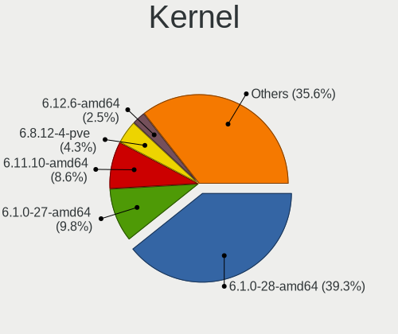
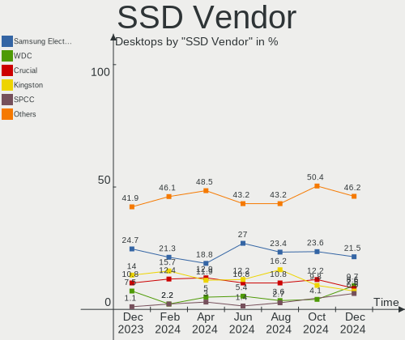
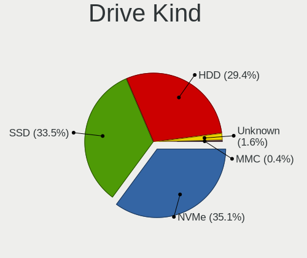
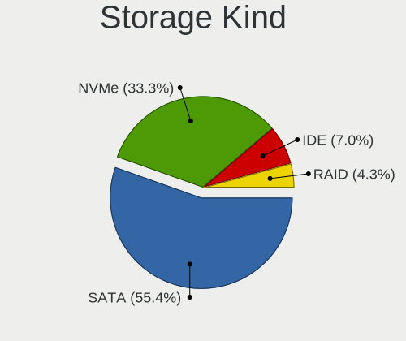
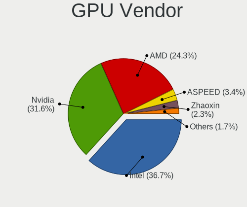

Debian - Hardware Trends (Desktops)
-----------------------------------

A project to identify most popular hardware characteristics and track their change
over time based on data collected by Linux users at https://Linux-Hardware.org.

Anyone can contribute to this report by the [hw-probe](https://github.com/linuxhw/hw-probe) tool:

    sudo -E hw-probe -all -upload

This report is for one last month. Overall report since the beginning of time: [TestCoverage](https://github.com/linuxhw/TestCoverage)

Period: May, 2022.

Contents
--------

* [ System ](#system)
  - [ OS                       ](#os)
  - [ OS Family                ](#os-family)
  - [ Kernel                   ](#kernel)
  - [ Kernel Family            ](#kernel-family)
  - [ Kernel Major Ver.        ](#kernel-major-ver)
  - [ Arch                     ](#arch)
  - [ DE                       ](#de)
  - [ Display Server           ](#display-server)
  - [ Display Manager          ](#display-manager)
  - [ OS Lang                  ](#os-lang)
  - [ Boot Mode                ](#boot-mode)
  - [ Filesystem               ](#filesystem)
  - [ Part. scheme             ](#part-scheme)
  - [ Dual Boot with Linux/BSD ](#dual-boot-with-linuxbsd)
  - [ Dual Boot (Win)          ](#dual-boot-win)

* [ Board ](#board)
  - [ Vendor                   ](#vendor)
  - [ Model                    ](#model)
  - [ Model Family             ](#model-family)
  - [ MFG Year                 ](#mfg-year)
  - [ Form Factor              ](#form-factor)
  - [ Secure Boot              ](#secure-boot)
  - [ Coreboot                 ](#coreboot)
  - [ RAM Size                 ](#ram-size)
  - [ RAM Used                 ](#ram-used)
  - [ Total Drives             ](#total-drives)
  - [ Has CD-ROM               ](#has-cd-rom)
  - [ Has Ethernet             ](#has-ethernet)
  - [ Has WiFi                 ](#has-wifi)
  - [ Has Bluetooth            ](#has-bluetooth)

* [ Location ](#location)
  - [ Country                  ](#country)
  - [ City                     ](#city)

* [ Drives ](#drives)
  - [ Drive Vendor             ](#drive-vendor)
  - [ Drive Model              ](#drive-model)
  - [ HDD Vendor               ](#hdd-vendor)
  - [ SSD Vendor               ](#ssd-vendor)
  - [ Drive Kind               ](#drive-kind)
  - [ Drive Connector          ](#drive-connector)
  - [ Drive Size               ](#drive-size)
  - [ Space Total              ](#space-total)
  - [ Space Used               ](#space-used)
  - [ Malfunc. Drives          ](#malfunc-drives)
  - [ Malfunc. Drive Vendor    ](#malfunc-drive-vendor)
  - [ Malfunc. HDD Vendor      ](#malfunc-hdd-vendor)
  - [ Malfunc. Drive Kind      ](#malfunc-drive-kind)
  - [ Failed Drives            ](#failed-drives)
  - [ Failed Drive Vendor      ](#failed-drive-vendor)
  - [ Drive Status             ](#drive-status)

* [ Storage controller ](#storage-controller)
  - [ Storage Vendor           ](#storage-vendor)
  - [ Storage Model            ](#storage-model)
  - [ Storage Kind             ](#storage-kind)

* [ Processor ](#processor)
  - [ CPU Vendor               ](#cpu-vendor)
  - [ CPU Model                ](#cpu-model)
  - [ CPU Model Family         ](#cpu-model-family)
  - [ CPU Cores                ](#cpu-cores)
  - [ CPU Sockets              ](#cpu-sockets)
  - [ CPU Threads              ](#cpu-threads)
  - [ CPU Op-Modes             ](#cpu-op-modes)
  - [ CPU Microcode            ](#cpu-microcode)
  - [ CPU Microarch            ](#cpu-microarch)

* [ Graphics ](#graphics)
  - [ GPU Vendor               ](#gpu-vendor)
  - [ GPU Model                ](#gpu-model)
  - [ GPU Combo                ](#gpu-combo)
  - [ GPU Driver               ](#gpu-driver)
  - [ GPU Memory               ](#gpu-memory)

* [ Monitor ](#monitor)
  - [ Monitor Vendor           ](#monitor-vendor)
  - [ Monitor Model            ](#monitor-model)
  - [ Monitor Resolution       ](#monitor-resolution)
  - [ Monitor Diagonal         ](#monitor-diagonal)
  - [ Monitor Width            ](#monitor-width)
  - [ Aspect Ratio             ](#aspect-ratio)
  - [ Monitor Area             ](#monitor-area)
  - [ Pixel Density            ](#pixel-density)
  - [ Multiple Monitors        ](#multiple-monitors)

* [ Network ](#network)
  - [ Net Controller Vendor    ](#net-controller-vendor)
  - [ Net Controller Model     ](#net-controller-model)
  - [ Wireless Vendor          ](#wireless-vendor)
  - [ Wireless Model           ](#wireless-model)
  - [ Ethernet Vendor          ](#ethernet-vendor)
  - [ Ethernet Model           ](#ethernet-model)
  - [ Net Controller Kind      ](#net-controller-kind)
  - [ Used Controller          ](#used-controller)
  - [ NICs                     ](#nics)
  - [ IPv6                     ](#ipv6)

* [ Bluetooth ](#bluetooth)
  - [ Bluetooth Vendor         ](#bluetooth-vendor)
  - [ Bluetooth Model          ](#bluetooth-model)

* [ Sound ](#sound)
  - [ Sound Vendor             ](#sound-vendor)
  - [ Sound Model              ](#sound-model)

* [ Memory ](#memory)
  - [ Memory Vendor            ](#memory-vendor)
  - [ Memory Model             ](#memory-model)
  - [ Memory Kind              ](#memory-kind)
  - [ Memory Form Factor       ](#memory-form-factor)
  - [ Memory Size              ](#memory-size)
  - [ Memory Speed             ](#memory-speed)

* [ Printers & scanners ](#printers--scanners)
  - [ Printer Vendor           ](#printer-vendor)
  - [ Printer Model            ](#printer-model)
  - [ Scanner Vendor           ](#scanner-vendor)
  - [ Scanner Model            ](#scanner-model)

* [ Camera ](#camera)
  - [ Camera Vendor            ](#camera-vendor)
  - [ Camera Model             ](#camera-model)

* [ Security ](#security)
  - [ Fingerprint Vendor       ](#fingerprint-vendor)
  - [ Fingerprint Model        ](#fingerprint-model)
  - [ Chipcard Vendor          ](#chipcard-vendor)
  - [ Chipcard Model           ](#chipcard-model)

* [ Unsupported ](#unsupported)
  - [ Unsupported Devices      ](#unsupported-devices)
  - [ Unsupported Device Types ](#unsupported-device-types)

System
------

OS
--

Installed operating systems

| Name              | Desktops | Percent |
|-------------------|----------|---------|
| Debian 11         | 124      | 88.57%  |
| Debian Testing    | 5        | 3.57%   |
| Debian Unstable   | 4        | 2.86%   |
| Debian 10         | 3        | 2.14%   |
| Debian 9          | 2        | 1.43%   |
| Debian 11-updates | 2        | 1.43%   |

OS Family
---------

OS without a version

| Name   | Desktops | Percent |
|--------|----------|---------|
| Debian | 140      | 100%    |

Kernel
------

Version of the Linux kernel

| Version                | Desktops | Percent |
|------------------------|----------|---------|
| 5.10.0-7-amd64         | 45       | 32.14%  |
| 5.10.0-14-amd64        | 30       | 21.43%  |
| 5.10.0-13-amd64        | 16       | 11.43%  |
| 5.17.0-1-amd64         | 10       | 7.14%   |
| 5.16.0-0.bpo.4-amd64   | 5        | 3.57%   |
| 5.15.35-1-pve          | 5        | 3.57%   |
| 5.17.0-2-amd64         | 3        | 2.14%   |
| 5.13.19-6-pve          | 3        | 2.14%   |
| 5.10.0-10-amd64        | 3        | 2.14%   |
| 5.16.0-6-amd64         | 2        | 1.43%   |
| 5.18.0                 | 1        | 0.71%   |
| 5.17.6-wrkd            | 1        | 0.71%   |
| 5.17.6-amd64           | 1        | 0.71%   |
| 5.17.5                 | 1        | 0.71%   |
| 5.17.0-rc8-amd64       | 1        | 0.71%   |
| 5.17.0-rc5             | 1        | 0.71%   |
| 5.17.0-2-rt-amd64      | 1        | 0.71%   |
| 5.16.0-6mx-amd64       | 1        | 0.71%   |
| 5.14.0-0.bpo.2-686     | 1        | 0.71%   |
| 5.10.92-051092-generic | 1        | 0.71%   |
| 5.10.0-9-amd64         | 1        | 0.71%   |
| 5.10.0-14-686-pae      | 1        | 0.71%   |
| 5.10.0-13-686-pae      | 1        | 0.71%   |
| 5.10.0-12-amd64        | 1        | 0.71%   |
| 4.9.0-18-686-pae       | 1        | 0.71%   |
| 4.19.0-20-amd64        | 1        | 0.71%   |
| 4.19.0-18-amd64        | 1        | 0.71%   |
| 4.19.0-13-amd64        | 1        | 0.71%   |

Kernel Family
-------------

Linux kernel without a distro release

| Version | Desktops | Percent |
|---------|----------|---------|
| 5.10.0  | 98       | 70%     |
| 5.17.0  | 16       | 11.43%  |
| 5.16.0  | 8        | 5.71%   |
| 5.15.35 | 5        | 3.57%   |
| 5.13.19 | 3        | 2.14%   |
| 4.19.0  | 3        | 2.14%   |
| 5.17.6  | 2        | 1.43%   |
| 5.18.0  | 1        | 0.71%   |
| 5.17.5  | 1        | 0.71%   |
| 5.14.0  | 1        | 0.71%   |
| 5.10.92 | 1        | 0.71%   |
| 4.9.0   | 1        | 0.71%   |

Kernel Major Ver.
-----------------

Linux kernel major version

| Version | Desktops | Percent |
|---------|----------|---------|
| 5.10    | 99       | 70.71%  |
| 5.17    | 19       | 13.57%  |
| 5.16    | 8        | 5.71%   |
| 5.15    | 5        | 3.57%   |
| 5.13    | 3        | 2.14%   |
| 4.19    | 3        | 2.14%   |
| 5.18    | 1        | 0.71%   |
| 5.14    | 1        | 0.71%   |
| 4.9     | 1        | 0.71%   |

Arch
----

OS architecture (x86_64, i586, etc.)

| Name   | Desktops | Percent |
|--------|----------|---------|
| x86_64 | 136      | 97.14%  |
| i686   | 4        | 2.86%   |

DE
--

Desktop Environment

| Name             | Desktops | Percent |
|------------------|----------|---------|
| Unknown          | 62       | 44.29%  |
| KDE5             | 19       | 13.57%  |
| GNOME            | 18       | 12.86%  |
| XFCE             | 17       | 12.14%  |
| MATE             | 10       | 7.14%   |
| X-Cinnamon       | 3        | 2.14%   |
| LXQt             | 3        | 2.14%   |
| Cinnamon         | 2        | 1.43%   |
| LXDE             | 1        | 0.71%   |
| lightdm-xsession | 1        | 0.71%   |
| KDE              | 1        | 0.71%   |
| GNOME Classic    | 1        | 0.71%   |
| DWM              | 1        | 0.71%   |
| Budgie           | 1        | 0.71%   |

Display Server
--------------

X11 or Wayland

| Name    | Desktops | Percent |
|---------|----------|---------|
| X11     | 63       | 45%     |
| Unknown | 52       | 37.14%  |
| Tty     | 15       | 10.71%  |
| Wayland | 10       | 7.14%   |

Display Manager
---------------

SDDM, LightDM, etc.

| Name    | Desktops | Percent |
|---------|----------|---------|
| Unknown | 90       | 64.29%  |
| LightDM | 21       | 15%     |
| SDDM    | 14       | 10%     |
| GDM3    | 8        | 5.71%   |
| GDM     | 6        | 4.29%   |
| SLiM    | 1        | 0.71%   |

OS Lang
-------

Language

| Lang    | Desktops | Percent |
|---------|----------|---------|
| ru_RU   | 52       | 37.14%  |
| en_US   | 47       | 33.57%  |
| Unknown | 6        | 4.29%   |
| en_GB   | 5        | 3.57%   |
| en_AU   | 5        | 3.57%   |
| de_DE   | 5        | 3.57%   |
| fr_FR   | 3        | 2.14%   |
| pt_BR   | 2        | 1.43%   |
| es_VE   | 2        | 1.43%   |
| es_ES   | 2        | 1.43%   |
| pt_PT   | 1        | 0.71%   |
| pl_PL   | 1        | 0.71%   |
| ja_JP   | 1        | 0.71%   |
| fr_LU   | 1        | 0.71%   |
| es_AR   | 1        | 0.71%   |
| en_IE   | 1        | 0.71%   |
| en_DK   | 1        | 0.71%   |
| en_CA   | 1        | 0.71%   |
| de_AT   | 1        | 0.71%   |
| cs_CZ   | 1        | 0.71%   |
| ca_ES   | 1        | 0.71%   |

Boot Mode
---------

EFI or BIOS

| Mode | Desktops | Percent |
|------|----------|---------|
| BIOS | 91       | 65%     |
| EFI  | 49       | 35%     |

Filesystem
----------

Type of filesystem

| Type    | Desktops | Percent |
|---------|----------|---------|
| Ext4    | 82       | 58.57%  |
| Overlay | 46       | 32.86%  |
| Btrfs   | 7        | 5%      |
| Xfs     | 2        | 1.43%   |
| Zfs     | 1        | 0.71%   |
| Ext3    | 1        | 0.71%   |
| Unknown | 1        | 0.71%   |

Part. scheme
------------

Scheme of partitioning

| Type    | Desktops | Percent |
|---------|----------|---------|
| MBR     | 58       | 41.43%  |
| GPT     | 49       | 35%     |
| Unknown | 33       | 23.57%  |

Dual Boot with Linux/BSD
------------------------

Hosting more than one Linux/BSD

| Dual boot | Desktops | Percent |
|-----------|----------|---------|
| No        | 120      | 85.71%  |
| Yes       | 20       | 14.29%  |

Dual Boot (Win)
---------------

Hosting Linux and Windows

| Dual boot | Desktops | Percent |
|-----------|----------|---------|
| No        | 78       | 55.71%  |
| Yes       | 62       | 44.29%  |

Board
-----

Vendor
------

Motherboard manufacturer

| Name                | Desktops | Percent |
|---------------------|----------|---------|
| Gigabyte Technology | 27       | 19.29%  |
| ASUSTek Computer    | 26       | 18.57%  |
| ASRock              | 21       | 15%     |
| MSI                 | 16       | 11.43%  |
| Dell                | 11       | 7.86%   |
| Hewlett-Packard     | 10       | 7.14%   |
| Intel               | 4        | 2.86%   |
| ECS                 | 3        | 2.14%   |
| Packard Bell        | 2        | 1.43%   |
| Foxconn             | 2        | 1.43%   |
| Apple               | 2        | 1.43%   |
| Positivo            | 1        | 0.71%   |
| MouseComputer       | 1        | 0.71%   |
| Medion              | 1        | 0.71%   |
| MACHINIST           | 1        | 0.71%   |
| Lenovo              | 1        | 0.71%   |
| KLLISRE             | 1        | 0.71%   |
| IP3 Tech            | 1        | 0.71%   |
| Fujitsu             | 1        | 0.71%   |
| Clientron           | 1        | 0.71%   |
| Biostar             | 1        | 0.71%   |
| BESSTAR Tech        | 1        | 0.71%   |
| ASRockRack          | 1        | 0.71%   |
| American Megatrends | 1        | 0.71%   |
| Alienware           | 1        | 0.71%   |
| AAEON               | 1        | 0.71%   |
| Unknown             | 1        | 0.71%   |

Model
-----

Motherboard model

| Name                                    | Desktops | Percent |
|-----------------------------------------|----------|---------|
| ASRock H470M-HVS                        | 12       | 8.57%   |
| ASUS S20 K29                            | 6        | 4.29%   |
| ASUS All Series                         | 5        | 3.57%   |
| MSI MS-7996                             | 4        | 2.86%   |
| HP Z620 Workstation                     | 3        | 2.14%   |
| Dell OptiPlex 990                       | 2        | 1.43%   |
| Positivo I541TB                         | 1        | 0.71%   |
| Packard Bell LES ESSENTIELS IMEDIA 8100 | 1        | 0.71%   |
| Packard Bell IMEDIA S3840               | 1        | 0.71%   |
| MSI MS-7D54                             | 1        | 0.71%   |
| MSI MS-7D53                             | 1        | 0.71%   |
| MSI MS-7C95                             | 1        | 0.71%   |
| MSI MS-7C56                             | 1        | 0.71%   |
| MSI MS-7998                             | 1        | 0.71%   |
| MSI MS-7846                             | 1        | 0.71%   |
| MSI MS-7817                             | 1        | 0.71%   |
| MSI MS-7721                             | 1        | 0.71%   |
| MSI MS-7715                             | 1        | 0.71%   |
| MSI MS-7529                             | 1        | 0.71%   |
| MSI MS-7053                             | 1        | 0.71%   |
| MSI A320M-HDV R4.0                      | 1        | 0.71%   |
| MouseComputer MPro-S200                 | 1        | 0.71%   |
| Medion MD34189/C731                     | 1        | 0.71%   |
| MACHINIST X99-RS9 V2.0                  | 1        | 0.71%   |
| Lenovo 70AQ000JGE ThinkServer TS440     | 1        | 0.71%   |
| KLLISRE X99-B5 V1.1                     | 1        | 0.71%   |
| IP3 Tech TB20                           | 1        | 0.71%   |
| Intel DZ77SL-50K AAG55115-300           | 1        | 0.71%   |
| Intel DX79SR AAG57199-200               | 1        | 0.71%   |
| Intel DH61BF AAG81311-101               | 1        | 0.71%   |
| Intel CM-iAM/SBC-FITPC2i                | 1        | 0.71%   |
| HP Z840 Workstation                     | 1        | 0.71%   |
| HP Z230 Tower Workstation               | 1        | 0.71%   |
| HP t620 PLUS Quad Core TC               | 1        | 0.71%   |
| HP ProLiant ML110 Gen9                  | 1        | 0.71%   |
| HP ProLiant MicroServer Gen8            | 1        | 0.71%   |
| HP EliteDesk 800 G6 Tower PC            | 1        | 0.71%   |
| HP EliteDesk 800 G3 TWR                 | 1        | 0.71%   |
| Gigabyte Z77-DS3H                       | 1        | 0.71%   |
| Gigabyte Z590 AORUS ULTRA               | 1        | 0.71%   |
| Gigabyte Z170X-Gaming 3                 | 1        | 0.71%   |
| Gigabyte X570S AORUS MASTER             | 1        | 0.71%   |
| Gigabyte M61PME-S2P                     | 1        | 0.71%   |
| Gigabyte M52L-S3                        | 1        | 0.71%   |
| Gigabyte H81M-S2V                       | 1        | 0.71%   |
| Gigabyte H61M-S2PV                      | 1        | 0.71%   |
| Gigabyte H61M-S2-B3                     | 1        | 0.71%   |
| Gigabyte H61M-DS2                       | 1        | 0.71%   |
| Gigabyte H510M H                        | 1        | 0.71%   |
| Gigabyte H410M S2H                      | 1        | 0.71%   |
| Gigabyte H370M-D3H                      | 1        | 0.71%   |
| Gigabyte H110M-S2H-CF                   | 1        | 0.71%   |
| Gigabyte H110M-DS2-CF                   | 1        | 0.71%   |
| Gigabyte GA-78LMT-USB3                  | 1        | 0.71%   |
| Gigabyte G41MT-S2                       | 1        | 0.71%   |
| Gigabyte G31M-ES2L                      | 1        | 0.71%   |
| Gigabyte B85M-D3H                       | 1        | 0.71%   |
| Gigabyte B75M-D2V                       | 1        | 0.71%   |
| Gigabyte B75-D3V                        | 1        | 0.71%   |
| Gigabyte B560M D3H                      | 1        | 0.71%   |

Model Family
------------

Motherboard model prefix

| Name                    | Desktops | Percent |
|-------------------------|----------|---------|
| ASRock H470M-HVS        | 12       | 8.57%   |
| Dell OptiPlex           | 8        | 5.71%   |
| ASUS S20                | 6        | 4.29%   |
| ASUS All                | 5        | 3.57%   |
| MSI MS-7996             | 4        | 2.86%   |
| HP Z620                 | 3        | 2.14%   |
| ASUS ROG                | 3        | 2.14%   |
| ASUS PRIME              | 3        | 2.14%   |
| HP ProLiant             | 2        | 1.43%   |
| HP EliteDesk            | 2        | 1.43%   |
| Gigabyte B550           | 2        | 1.43%   |
| Gigabyte B450M          | 2        | 1.43%   |
| ASRock B450             | 2        | 1.43%   |
| Positivo I541TB         | 1        | 0.71%   |
| Packard Bell LES        | 1        | 0.71%   |
| Packard Bell IMEDIA     | 1        | 0.71%   |
| MSI MS-7D54             | 1        | 0.71%   |
| MSI MS-7D53             | 1        | 0.71%   |
| MSI MS-7C95             | 1        | 0.71%   |
| MSI MS-7C56             | 1        | 0.71%   |
| MSI MS-7998             | 1        | 0.71%   |
| MSI MS-7846             | 1        | 0.71%   |
| MSI MS-7817             | 1        | 0.71%   |
| MSI MS-7721             | 1        | 0.71%   |
| MSI MS-7715             | 1        | 0.71%   |
| MSI MS-7529             | 1        | 0.71%   |
| MSI MS-7053             | 1        | 0.71%   |
| MSI A320M-HDV           | 1        | 0.71%   |
| MouseComputer MPro-S200 | 1        | 0.71%   |
| Medion MD34189          | 1        | 0.71%   |
| MACHINIST X99-RS9       | 1        | 0.71%   |
| Lenovo 70AQ000JGE       | 1        | 0.71%   |
| KLLISRE X99-B5          | 1        | 0.71%   |
| IP3 Tech TB20           | 1        | 0.71%   |
| Intel DZ77SL-50K        | 1        | 0.71%   |
| Intel DX79SR            | 1        | 0.71%   |
| Intel DH61BF            | 1        | 0.71%   |
| Intel CM-iAM            | 1        | 0.71%   |
| HP Z840                 | 1        | 0.71%   |
| HP Z230                 | 1        | 0.71%   |
| HP t620                 | 1        | 0.71%   |
| Gigabyte Z77-DS3H       | 1        | 0.71%   |
| Gigabyte Z590           | 1        | 0.71%   |
| Gigabyte Z170X-Gaming   | 1        | 0.71%   |
| Gigabyte X570S          | 1        | 0.71%   |
| Gigabyte M61PME-S2P     | 1        | 0.71%   |
| Gigabyte M52L-S3        | 1        | 0.71%   |
| Gigabyte H81M-S2V       | 1        | 0.71%   |
| Gigabyte H61M-S2PV      | 1        | 0.71%   |
| Gigabyte H61M-S2-B3     | 1        | 0.71%   |
| Gigabyte H61M-DS2       | 1        | 0.71%   |
| Gigabyte H510M          | 1        | 0.71%   |
| Gigabyte H410M          | 1        | 0.71%   |
| Gigabyte H370M-D3H      | 1        | 0.71%   |
| Gigabyte H110M-S2H-CF   | 1        | 0.71%   |
| Gigabyte H110M-DS2-CF   | 1        | 0.71%   |
| Gigabyte GA-78LMT-USB3  | 1        | 0.71%   |
| Gigabyte G41MT-S2       | 1        | 0.71%   |
| Gigabyte G31M-ES2L      | 1        | 0.71%   |
| Gigabyte B85M-D3H       | 1        | 0.71%   |

MFG Year
--------

Motherboard manufacture year

| Year | Desktops | Percent |
|------|----------|---------|
| 2021 | 29       | 20.71%  |
| 2020 | 20       | 14.29%  |
| 2012 | 15       | 10.71%  |
| 2015 | 14       | 10%     |
| 2011 | 9        | 6.43%   |
| 2019 | 8        | 5.71%   |
| 2018 | 7        | 5%      |
| 2014 | 7        | 5%      |
| 2013 | 6        | 4.29%   |
| 2010 | 4        | 2.86%   |
| 2009 | 4        | 2.86%   |
| 2017 | 3        | 2.14%   |
| 2008 | 3        | 2.14%   |
| 2007 | 3        | 2.14%   |
| 2022 | 2        | 1.43%   |
| 2016 | 2        | 1.43%   |
| 2006 | 2        | 1.43%   |
| 2005 | 1        | 0.71%   |
| 2004 | 1        | 0.71%   |

Form Factor
-----------

Physical design of the computer

| Name    | Desktops | Percent |
|---------|----------|---------|
| Desktop | 140      | 100%    |

Secure Boot
-----------

Enabled or disabled

| State    | Desktops | Percent |
|----------|----------|---------|
| Disabled | 136      | 97.14%  |
| Enabled  | 4        | 2.86%   |

Coreboot
--------

Have coreboot on board

| Used | Desktops | Percent |
|------|----------|---------|
| No   | 140      | 100%    |

RAM Size
--------

Total RAM memory

| Size in GB  | Desktops | Percent |
|-------------|----------|---------|
| 32.01-64.0  | 34       | 24.29%  |
| 16.01-24.0  | 25       | 17.86%  |
| 3.01-4.0    | 24       | 17.14%  |
| 4.01-8.0    | 19       | 13.57%  |
| 64.01-256.0 | 15       | 10.71%  |
| 8.01-16.0   | 9        | 6.43%   |
| 1.01-2.0    | 8        | 5.71%   |
| 2.01-3.0    | 5        | 3.57%   |
| 24.01-32.0  | 1        | 0.71%   |

RAM Used
--------

Used RAM memory

| Used GB    | Desktops | Percent |
|------------|----------|---------|
| 0.51-1.0   | 50       | 35.71%  |
| 1.01-2.0   | 21       | 15%     |
| 2.01-3.0   | 20       | 14.29%  |
| 4.01-8.0   | 14       | 10%     |
| 3.01-4.0   | 14       | 10%     |
| 8.01-16.0  | 7        | 5%      |
| 32.01-64.0 | 5        | 3.57%   |
| 0.01-0.5   | 5        | 3.57%   |
| 16.01-24.0 | 3        | 2.14%   |
| 24.01-32.0 | 1        | 0.71%   |

Total Drives
------------

Number of drives on board

| Drives | Desktops | Percent |
|--------|----------|---------|
| 1      | 67       | 47.86%  |
| 2      | 32       | 22.86%  |
| 3      | 18       | 12.86%  |
| 4      | 11       | 7.86%   |
| 5      | 7        | 5%      |
| 6      | 2        | 1.43%   |
| 9      | 1        | 0.71%   |
| 8      | 1        | 0.71%   |
| 7      | 1        | 0.71%   |

Has CD-ROM
----------

Has CD-ROM on board

| Presented | Desktops | Percent |
|-----------|----------|---------|
| No        | 96       | 68.57%  |
| Yes       | 44       | 31.43%  |

Has Ethernet
------------

Has Ethernet on board

| Presented | Desktops | Percent |
|-----------|----------|---------|
| Yes       | 140      | 100%    |

Has WiFi
--------

Has WiFi module

| Presented | Desktops | Percent |
|-----------|----------|---------|
| No        | 101      | 72.14%  |
| Yes       | 39       | 27.86%  |

Has Bluetooth
-------------

Has Bluetooth module

| Presented | Desktops | Percent |
|-----------|----------|---------|
| No        | 107      | 76.43%  |
| Yes       | 33       | 23.57%  |

Location
--------

Country
-------

Geographic location (country)

| Country       | Desktops | Percent |
|---------------|----------|---------|
| Russia        | 54       | 38.57%  |
| USA           | 23       | 16.43%  |
| Germany       | 8        | 5.71%   |
| Spain         | 5        | 3.57%   |
| Australia     | 5        | 3.57%   |
| France        | 4        | 2.86%   |
| Austria       | 4        | 2.86%   |
| UK            | 3        | 2.14%   |
| Portugal      | 3        | 2.14%   |
| Mexico        | 3        | 2.14%   |
| Croatia       | 3        | 2.14%   |
| Canada        | 3        | 2.14%   |
| Venezuela     | 2        | 1.43%   |
| Netherlands   | 2        | 1.43%   |
| Hungary       | 2        | 1.43%   |
| Finland       | 2        | 1.43%   |
| Brazil        | 2        | 1.43%   |
| Turkey        | 1        | 0.71%   |
| Slovenia      | 1        | 0.71%   |
| Poland        | 1        | 0.71%   |
| Norway        | 1        | 0.71%   |
| Liechtenstein | 1        | 0.71%   |
| Japan         | 1        | 0.71%   |
| Israel        | 1        | 0.71%   |
| Denmark       | 1        | 0.71%   |
| Czechia       | 1        | 0.71%   |
| Chile         | 1        | 0.71%   |
| Belgium       | 1        | 0.71%   |
| Argentina     | 1        | 0.71%   |

City
----

Geographic location (city)

| City                | Desktops | Percent |
|---------------------|----------|---------|
| Voronezh            | 45       | 32.14%  |
| St Petersburg       | 4        | 2.86%   |
| Orlando             | 4        | 2.86%   |
| Brisbane            | 4        | 2.86%   |
| Vienna              | 3        | 2.14%   |
| Vicente Guerrero    | 2        | 1.43%   |
| Sheerness           | 2        | 1.43%   |
| Seville             | 2        | 1.43%   |
| Zaprešić          | 1        | 0.71%   |
| Zagreb              | 1        | 0.71%   |
| Yepes               | 1        | 0.71%   |
| Winnipeg            | 1        | 0.71%   |
| Vladivostok         | 1        | 0.71%   |
| Velserbroek         | 1        | 0.71%   |
| Vaduz               | 1        | 0.71%   |
| Toronto             | 1        | 0.71%   |
| Topeka              | 1        | 0.71%   |
| Toms River          | 1        | 0.71%   |
| Tilburg             | 1        | 0.71%   |
| Tel Aviv            | 1        | 0.71%   |
| Tata                | 1        | 0.71%   |
| Szombathely         | 1        | 0.71%   |
| Springfield         | 1        | 0.71%   |
| Split               | 1        | 0.71%   |
| Severna Park        | 1        | 0.71%   |
| Sao Paulo           | 1        | 0.71%   |
| Santiago            | 1        | 0.71%   |
| San Jose            | 1        | 0.71%   |
| Roztoky             | 1        | 0.71%   |
| Roseburg            | 1        | 0.71%   |
| Rochetaillee        | 1        | 0.71%   |
| Reedsport           | 1        | 0.71%   |
| Raunheim            | 1        | 0.71%   |
| Randers             | 1        | 0.71%   |
| Raahe               | 1        | 0.71%   |
| Porto               | 1        | 0.71%   |
| Peterborough        | 1        | 0.71%   |
| Perm                | 1        | 0.71%   |
| Pegomas             | 1        | 0.71%   |
| Palmela             | 1        | 0.71%   |
| Pabianice           | 1        | 0.71%   |
| Oslo                | 1        | 0.71%   |
| Oryol               | 1        | 0.71%   |
| Omaha               | 1        | 0.71%   |
| Munich              | 1        | 0.71%   |
| Melbourne           | 1        | 0.71%   |
| Lytkarino           | 1        | 0.71%   |
| Limburg an der Lahn | 1        | 0.71%   |
| Leopoldsburg        | 1        | 0.71%   |
| León               | 1        | 0.71%   |
| La Plata            | 1        | 0.71%   |
| Krasnodar           | 1        | 0.71%   |
| Istanbul            | 1        | 0.71%   |
| Honcho              | 1        | 0.71%   |
| Helsinki            | 1        | 0.71%   |
| Heilbronn           | 1        | 0.71%   |
| Hastings            | 1        | 0.71%   |
| Hamburg             | 1        | 0.71%   |
| Guildford           | 1        | 0.71%   |
| Graz                | 1        | 0.71%   |

Drives
------

Drive Vendor
------------

Hard drive vendors

| Vendor                    | Desktops | Drives | Percent |
|---------------------------|----------|--------|---------|
| Seagate                   | 46       | 64     | 19.49%  |
| WDC                       | 31       | 51     | 13.14%  |
| Samsung Electronics       | 26       | 33     | 11.02%  |
| Toshiba                   | 25       | 26     | 10.59%  |
| Kingston                  | 19       | 20     | 8.05%   |
| Crucial                   | 15       | 18     | 6.36%   |
| Hitachi                   | 14       | 15     | 5.93%   |
| Netac                     | 12       | 12     | 5.08%   |
| Sandisk                   | 6        | 8      | 2.54%   |
| Intel                     | 4        | 4      | 1.69%   |
| A-DATA Technology         | 4        | 5      | 1.69%   |
| Unknown                   | 3        | 6      | 1.27%   |
| SPCC                      | 3        | 3      | 1.27%   |
| SK Hynix                  | 3        | 3      | 1.27%   |
| Micron Technology         | 2        | 3      | 0.85%   |
| MAXTOR                    | 2        | 2      | 0.85%   |
| Intenso                   | 2        | 2      | 0.85%   |
| HGST                      | 2        | 3      | 0.85%   |
| China                     | 2        | 2      | 0.85%   |
| T-FORCE                   | 1        | 2      | 0.42%   |
| Silicon Motion            | 1        | 1      | 0.42%   |
| SABRENT                   | 1        | 1      | 0.42%   |
| pqi                       | 1        | 1      | 0.42%   |
| PNY                       | 1        | 2      | 0.42%   |
| Patriot                   | 1        | 1      | 0.42%   |
| Micron/Crucial Technology | 1        | 1      | 0.42%   |
| MaxDigital                | 1        | 2      | 0.42%   |
| KIOXIA                    | 1        | 1      | 0.42%   |
| HPE                       | 1        | 2      | 0.42%   |
| GOODRAM                   | 1        | 2      | 0.42%   |
| CFast                     | 1        | 1      | 0.42%   |
| Aura                      | 1        | 1      | 0.42%   |
| AMD                       | 1        | 1      | 0.42%   |
| Unknown                   | 1        | 2      | 0.42%   |

Drive Model
-----------

Hard drive models

| Model                              | Desktops | Percent |
|------------------------------------|----------|---------|
| Toshiba HDWD110 1TB                | 12       | 4.49%   |
| Netac SSD 240GB                    | 12       | 4.49%   |
| Seagate ST500DM002-1BD142 500GB    | 8        | 3%      |
| Crucial CT480BX500SSD1 480GB       | 7        | 2.62%   |
| Seagate ST1000DM010-2EP102 1TB     | 4        | 1.5%    |
| Samsung SSD 860 EVO 1TB            | 4        | 1.5%    |
| Kingston SV300S37A120G 120GB SSD   | 4        | 1.5%    |
| Hitachi HDS721050CLA362 500GB      | 4        | 1.5%    |
| WDC WD10EZEX-08WN4A0 1TB           | 3        | 1.12%   |
| Toshiba DT01ACA050 500GB           | 3        | 1.12%   |
| Seagate ST1000DM003-1CH162 1TB     | 3        | 1.12%   |
| Samsung SSD 860 EVO 500GB          | 3        | 1.12%   |
| Kingston SUV400S37120G 120GB SSD   | 3        | 1.12%   |
| Kingston SA400S37240G 240GB SSD    | 3        | 1.12%   |
| Hitachi HUS724040ALE641 4TB        | 3        | 1.12%   |
| WDC WDS100T2B0A-00SM50 1TB SSD     | 2        | 0.75%   |
| WDC WD5000AAKX-08U6AA0 500GB       | 2        | 0.75%   |
| WDC WD10EZEX-00BBHA0 1TB           | 2        | 0.75%   |
| SPCC Solid State Disk 512GB        | 2        | 0.75%   |
| Seagate ST3500418AS 500GB          | 2        | 0.75%   |
| Seagate ST3500413AS 500GB          | 2        | 0.75%   |
| Seagate ST3250318AS 250GB          | 2        | 0.75%   |
| Seagate ST3160318AS 160GB          | 2        | 0.75%   |
| Seagate ST31000524AS 1TB           | 2        | 0.75%   |
| Seagate ST1000LM024 HN-M101MBB 1TB | 2        | 0.75%   |
| Sandisk NVMe SSD Drive 1TB         | 2        | 0.75%   |
| Samsung SSD 970 EVO Plus 250GB     | 2        | 0.75%   |
| Samsung SSD 860 QVO 1TB            | 2        | 0.75%   |
| Samsung NVMe SSD Drive 1TB         | 2        | 0.75%   |
| Kingston SA400S37480G 480GB SSD    | 2        | 0.75%   |
| Crucial CT500MX500SSD1 500GB       | 2        | 0.75%   |
| Crucial CT240BX500SSD1 240GB       | 2        | 0.75%   |
| WDC WDS500G2B0C-00PXH0 500GB       | 1        | 0.37%   |
| WDC WDS250G1B0A-00H9H0 250GB SSD   | 1        | 0.37%   |
| WDC WDS200T2B0A-00SM50 2TB SSD     | 1        | 0.37%   |
| WDC WD80EZAZ-11TDBA0 8TB           | 1        | 0.37%   |
| WDC WD80EFAX-68KNBN0 8TB           | 1        | 0.37%   |
| WDC WD7500AAKS-00RBA0 752GB        | 1        | 0.37%   |
| WDC WD50EZRX-00MVLB1 5TB           | 1        | 0.37%   |
| WDC WD5000AZRZ-00HTKB0 500GB       | 1        | 0.37%   |
| WDC WD5000AZRX-00L4HB0 500GB       | 1        | 0.37%   |
| WDC WD5000AAKX-001CA0 500GB        | 1        | 0.37%   |
| WDC WD5000AAKS-00A7B2 500GB        | 1        | 0.37%   |
| WDC WD5000AADS-00S9B0 500GB        | 1        | 0.37%   |
| WDC WD40EZRZ-00GXCB0 4TB           | 1        | 0.37%   |
| WDC WD40EFZX-68AWUN0 4TB           | 1        | 0.37%   |
| WDC WD2500AAJS-00YZCA0 250GB       | 1        | 0.37%   |
| WDC WD20EZAZ-00L 2TB               | 1        | 0.37%   |
| WDC WD1600BEVT-22A23T0 160GB       | 1        | 0.37%   |
| WDC WD1600AAJS-61M0A0 160GB        | 1        | 0.37%   |
| WDC WD140EDGZ-11B1PA0 14TB         | 1        | 0.37%   |
| WDC WD121KRYZ-01W0RB0 12TB         | 1        | 0.37%   |
| WDC WD10SPZX-24Z10T0 1TB           | 1        | 0.37%   |
| WDC WD10SPZX-08Z10 1TB             | 1        | 0.37%   |
| WDC WD10JPVX-22JC3T0 1TB           | 1        | 0.37%   |
| WDC WD10EADX-00TDHB0 1TB           | 1        | 0.37%   |
| WDC WD10EADS-00L5B1 1TB            | 1        | 0.37%   |
| WDC WD10EACS-00D6B0 1TB            | 1        | 0.37%   |
| WDC WD1003FBYZ-010FB0 1TB          | 1        | 0.37%   |
| WDC WD1002FAEX-00Z3A0 1TB          | 1        | 0.37%   |

HDD Vendor
----------

Hard disk drive vendors

| Vendor     | Desktops | Drives | Percent |
|------------|----------|--------|---------|
| Seagate    | 45       | 62     | 37.82%  |
| WDC        | 28       | 46     | 23.53%  |
| Toshiba    | 22       | 23     | 18.49%  |
| Hitachi    | 14       | 15     | 11.76%  |
| Unknown    | 2        | 5      | 1.68%   |
| MAXTOR     | 2        | 2      | 1.68%   |
| HGST       | 2        | 3      | 1.68%   |
| SABRENT    | 1        | 1      | 0.84%   |
| pqi        | 1        | 1      | 0.84%   |
| MaxDigital | 1        | 2      | 0.84%   |
| HPE        | 1        | 2      | 0.84%   |

SSD Vendor
----------

Solid state drive vendors

| Vendor              | Desktops | Drives | Percent |
|---------------------|----------|--------|---------|
| Samsung Electronics | 19       | 21     | 21.59%  |
| Kingston            | 16       | 17     | 18.18%  |
| Crucial             | 14       | 16     | 15.91%  |
| Netac               | 12       | 12     | 13.64%  |
| WDC                 | 4        | 4      | 4.55%   |
| SanDisk             | 4        | 5      | 4.55%   |
| Intel               | 3        | 3      | 3.41%   |
| Toshiba             | 2        | 2      | 2.27%   |
| SPCC                | 2        | 2      | 2.27%   |
| Micron Technology   | 2        | 2      | 2.27%   |
| Intenso             | 2        | 2      | 2.27%   |
| China               | 2        | 2      | 2.27%   |
| A-DATA Technology   | 2        | 2      | 2.27%   |
| SK Hynix            | 1        | 1      | 1.14%   |
| Seagate             | 1        | 1      | 1.14%   |
| GOODRAM             | 1        | 2      | 1.14%   |
| Unknown             | 1        | 2      | 1.14%   |

Drive Kind
----------

HDD or SSD

| Kind    | Desktops | Drives | Percent |
|---------|----------|--------|---------|
| HDD     | 96       | 162    | 46.6%   |
| SSD     | 75       | 96     | 36.41%  |
| NVMe    | 34       | 42     | 16.5%   |
| Unknown | 1        | 1      | 0.49%   |

Drive Connector
---------------

SATA, SAS, NVMe, etc.

| Type | Desktops | Drives | Percent |
|------|----------|--------|---------|
| SATA | 128      | 252    | 77.11%  |
| NVMe | 34       | 42     | 20.48%  |
| SAS  | 4        | 7      | 2.41%   |

Drive Size
----------

Size of hard drive

| Size in TB | Desktops | Drives | Percent |
|------------|----------|--------|---------|
| 0.01-0.5   | 98       | 137    | 53.26%  |
| 0.51-1.0   | 54       | 67     | 29.35%  |
| 1.01-2.0   | 13       | 15     | 7.07%   |
| 3.01-4.0   | 8        | 20     | 4.35%   |
| 4.01-10.0  | 6        | 8      | 3.26%   |
| 10.01-20.0 | 4        | 10     | 2.17%   |
| 2.01-3.0   | 1        | 1      | 0.54%   |

Space Total
-----------

Amount of disk space available on the file system

| Size in GB     | Desktops | Percent |
|----------------|----------|---------|
| Unknown        | 49       | 35%     |
| 501-1000       | 27       | 19.29%  |
| 101-250        | 16       | 11.43%  |
| 51-100         | 11       | 7.86%   |
| More than 3000 | 10       | 7.14%   |
| 251-500        | 10       | 7.14%   |
| 2001-3000      | 6        | 4.29%   |
| 1001-2000      | 6        | 4.29%   |
| 21-50          | 4        | 2.86%   |
| 1-20           | 1        | 0.71%   |

Space Used
----------

Amount of used disk space

| Used GB        | Desktops | Percent |
|----------------|----------|---------|
| Unknown        | 49       | 35%     |
| 1-20           | 23       | 16.43%  |
| 51-100         | 14       | 10%     |
| 21-50          | 13       | 9.29%   |
| 101-250        | 11       | 7.86%   |
| 251-500        | 9        | 6.43%   |
| 501-1000       | 8        | 5.71%   |
| 1001-2000      | 6        | 4.29%   |
| More than 3000 | 5        | 3.57%   |
| 2001-3000      | 2        | 1.43%   |

Malfunc. Drives
---------------

Drive models with a malfunction

| Model                               | Desktops | Drives | Percent |
|-------------------------------------|----------|--------|---------|
| Seagate ST500DM002-1BD142 500GB     | 2        | 2      | 8.33%   |
| Kingston SV300S37A120G 120GB SSD    | 2        | 2      | 8.33%   |
| WDC WD5000AAKX-001CA0 500GB         | 1        | 2      | 4.17%   |
| WDC WD2500AAJS-00YZCA0 250GB        | 1        | 1      | 4.17%   |
| WDC WD1002FAEX-00Y9A0 1TB           | 1        | 1      | 4.17%   |
| Unknown MM0500EANCR 500GB           | 1        | 1      | 4.17%   |
| Toshiba MK3275GSX 320GB             | 1        | 1      | 4.17%   |
| Toshiba DT01ACA050 500GB            | 1        | 1      | 4.17%   |
| SK Hynix SC308 SATA 128GB SSD       | 1        | 1      | 4.17%   |
| Seagate ST3500830AS 500GB           | 1        | 1      | 4.17%   |
| Seagate ST3500413AS 500GB           | 1        | 1      | 4.17%   |
| Seagate ST3250318AS 250GB           | 1        | 1      | 4.17%   |
| Seagate ST32000542AS 2TB            | 1        | 1      | 4.17%   |
| Seagate ST3160812AS 160GB           | 1        | 1      | 4.17%   |
| Seagate ST2000DM001-1CH164 2TB      | 1        | 1      | 4.17%   |
| Seagate ST1000NC000-1CX162 1TB      | 1        | 2      | 4.17%   |
| Samsung Electronics SSD 970 EVO 1TB | 1        | 1      | 4.17%   |
| Kingston SA2000M81000G 1TB          | 1        | 1      | 4.17%   |
| Intel SSDSA2M160G2GC 160GB          | 1        | 1      | 4.17%   |
| Hitachi HDS728080PLAT20 82GB        | 1        | 1      | 4.17%   |
| Hitachi HDS721050CLA362 500GB       | 1        | 1      | 4.17%   |
| HGST HTS725050A7E630 500GB          | 1        | 1      | 4.17%   |

Malfunc. Drive Vendor
---------------------

Vendors of faulty drives

| Vendor              | Desktops | Drives | Percent |
|---------------------|----------|--------|---------|
| Seagate             | 8        | 10     | 34.78%  |
| WDC                 | 3        | 4      | 13.04%  |
| Kingston            | 3        | 3      | 13.04%  |
| Toshiba             | 2        | 2      | 8.7%    |
| Hitachi             | 2        | 2      | 8.7%    |
| Unknown             | 1        | 1      | 4.35%   |
| SK Hynix            | 1        | 1      | 4.35%   |
| Samsung Electronics | 1        | 1      | 4.35%   |
| Intel               | 1        | 1      | 4.35%   |
| HGST                | 1        | 1      | 4.35%   |

Malfunc. HDD Vendor
-------------------

Vendors of faulty HDD drives

| Vendor  | Desktops | Drives | Percent |
|---------|----------|--------|---------|
| Seagate | 8        | 10     | 47.06%  |
| WDC     | 3        | 4      | 17.65%  |
| Toshiba | 2        | 2      | 11.76%  |
| Hitachi | 2        | 2      | 11.76%  |
| Unknown | 1        | 1      | 5.88%   |
| HGST    | 1        | 1      | 5.88%   |

Malfunc. Drive Kind
-------------------

Kinds of faulty drives

| Kind | Desktops | Drives | Percent |
|------|----------|--------|---------|
| HDD  | 16       | 20     | 72.73%  |
| SSD  | 4        | 4      | 18.18%  |
| NVMe | 2        | 2      | 9.09%   |

Failed Drives
-------------

Failed drive models

Zero info for selected period =(

Failed Drive Vendor
-------------------

Failed drive vendors

Zero info for selected period =(

Drive Status
------------

Number of failed and malfunc. drives

| Status   | Desktops | Drives | Percent |
|----------|----------|--------|---------|
| Works    | 93       | 186    | 61.59%  |
| Detected | 37       | 89     | 24.5%   |
| Malfunc  | 21       | 26     | 13.91%  |

Storage controller
------------------

Storage Vendor
--------------

Storage controller vendors

| Vendor                           | Desktops | Percent |
|----------------------------------|----------|---------|
| Intel                            | 105      | 55.85%  |
| AMD                              | 29       | 15.43%  |
| Samsung Electronics              | 11       | 5.85%   |
| ASMedia Technology               | 5        | 2.66%   |
| Nvidia                           | 4        | 2.13%   |
| Silicon Motion                   | 3        | 1.6%    |
| Sandisk                          | 3        | 1.6%    |
| Phison Electronics               | 3        | 1.6%    |
| Micron/Crucial Technology        | 3        | 1.6%    |
| Kingston Technology Company      | 3        | 1.6%    |
| JMicron Technology               | 3        | 1.6%    |
| Toshiba America Info Systems     | 2        | 1.06%   |
| SK Hynix                         | 2        | 1.06%   |
| Marvell Technology Group         | 2        | 1.06%   |
| LSI Logic / Symbios Logic        | 2        | 1.06%   |
| VIA Technologies                 | 1        | 0.53%   |
| Silicon Integrated Systems [SiS] | 1        | 0.53%   |
| Seagate Technology               | 1        | 0.53%   |
| Realtek Semiconductor            | 1        | 0.53%   |
| Micron Technology                | 1        | 0.53%   |
| Broadcom / LSI                   | 1        | 0.53%   |
| ADATA Technology                 | 1        | 0.53%   |
| Unknown                          | 1        | 0.53%   |

Storage Model
-------------

Storage controller models

| Model                                                                                   | Desktops | Percent |
|-----------------------------------------------------------------------------------------|----------|---------|
| Intel Comet Lake SATA AHCI Controller                                                   | 17       | 7.69%   |
| AMD FCH SATA Controller [AHCI mode]                                                     | 17       | 7.69%   |
| Intel 6 Series/C200 Series Chipset Family 6 port Desktop SATA AHCI Controller           | 12       | 5.43%   |
| Intel Q170/Q150/B150/H170/H110/Z170/CM236 Chipset SATA Controller [AHCI Mode]           | 10       | 4.52%   |
| Samsung NVMe SSD Controller SM981/PM981/PM983                                           | 9        | 4.07%   |
| Intel 8 Series/C220 Series Chipset Family 6-port SATA Controller 1 [AHCI mode]          | 9        | 4.07%   |
| Intel 200 Series PCH SATA controller [AHCI mode]                                        | 9        | 4.07%   |
| Intel 500 Series Chipset Family SATA AHCI Controller                                    | 8        | 3.62%   |
| AMD 500 Series Chipset SATA Controller                                                  | 7        | 3.17%   |
| Intel NM10/ICH7 Family SATA Controller [IDE mode]                                       | 6        | 2.71%   |
| ASMedia ASM1062 Serial ATA Controller                                                   | 5        | 2.26%   |
| AMD 400 Series Chipset SATA Controller                                                  | 5        | 2.26%   |
| Nvidia MCP61 SATA Controller                                                            | 4        | 1.81%   |
| Nvidia MCP61 IDE                                                                        | 4        | 1.81%   |
| Intel 9 Series Chipset Family SATA Controller [AHCI Mode]                               | 4        | 1.81%   |
| Phison E12 NVMe Controller                                                              | 3        | 1.36%   |
| Intel Cannon Lake PCH SATA AHCI Controller                                              | 3        | 1.36%   |
| Intel C602 chipset 4-Port SATA Storage Control Unit                                     | 3        | 1.36%   |
| Intel C600/X79 series chipset SATA RAID Controller                                      | 3        | 1.36%   |
| Intel C600/X79 series chipset IDE-r Controller                                          | 3        | 1.36%   |
| Intel 82801G (ICH7 Family) IDE Controller                                               | 3        | 1.36%   |
| Intel 7 Series/C210 Series Chipset Family 6-port SATA Controller [AHCI mode]            | 3        | 1.36%   |
| AMD SB7x0/SB8x0/SB9x0 SATA Controller [AHCI mode]                                       | 3        | 1.36%   |
| Toshiba America Info Systems XG6 NVMe SSD Controller                                    | 2        | 0.9%    |
| SK Hynix Gold P31 SSD                                                                   | 2        | 0.9%    |
| Silicon Motion SM2263EN/SM2263XT SSD Controller                                         | 2        | 0.9%    |
| Sandisk WD Blue SN570 NVMe SSD                                                          | 2        | 0.9%    |
| Micron/Crucial Non-Volatile memory controller                                           | 2        | 0.9%    |
| LSI Logic / Symbios Logic SAS2008 PCI-Express Fusion-MPT SAS-2 [Falcon]                 | 2        | 0.9%    |
| Kingston Company Company Non-Volatile memory controller                                 | 2        | 0.9%    |
| Intel SATA Controller [RAID mode]                                                       | 2        | 0.9%    |
| Intel C610/X99 series chipset sSATA Controller [RAID mode]                              | 2        | 0.9%    |
| Intel C600/X79 series chipset 6-Port SATA AHCI Controller                               | 2        | 0.9%    |
| Intel 6 Series/C200 Series Chipset Family Desktop SATA Controller (IDE mode, ports 4-5) | 2        | 0.9%    |
| Intel 6 Series/C200 Series Chipset Family Desktop SATA Controller (IDE mode, ports 0-3) | 2        | 0.9%    |
| AMD SB7x0/SB8x0/SB9x0 SATA Controller [IDE mode]                                        | 2        | 0.9%    |
| AMD SB7x0/SB8x0/SB9x0 IDE Controller                                                    | 2        | 0.9%    |
| VIA VT6410 ATA133 RAID controller                                                       | 1        | 0.45%   |
| Silicon Motion SM2262/SM2262EN SSD Controller                                           | 1        | 0.45%   |
| Silicon Integrated Systems [SiS] 5513 IDE Controller                                    | 1        | 0.45%   |
| Seagate FireCuda 520 SSD                                                                | 1        | 0.45%   |
| Sandisk WD PC SN810 / Black SN850 NVMe SSD                                              | 1        | 0.45%   |
| Sandisk WD Blue SN550 NVMe SSD                                                          | 1        | 0.45%   |
| Samsung NVMe SSD Controller PM9A1/PM9A3/980PRO                                          | 1        | 0.45%   |
| Samsung NVMe SSD Controller 172Xa/172Xb                                                 | 1        | 0.45%   |
| Realtek Realtek Non-Volatile memory controller                                          | 1        | 0.45%   |
| Micron/Crucial NVMe Controller                                                          | 1        | 0.45%   |
| Micron Non-Volatile memory controller                                                   | 1        | 0.45%   |
| Marvell Group 88SE9215 PCIe 2.0 x1 4-port SATA 6 Gb/s Controller                        | 1        | 0.45%   |
| Marvell Group 88SE9128 PCIe SATA 6 Gb/s RAID controller with HyperDuo                   | 1        | 0.45%   |
| Kingston Company A2000 NVMe SSD                                                         | 1        | 0.45%   |
| JMicron JMB368 IDE controller                                                           | 1        | 0.45%   |
| JMicron JMB363 SATA/IDE Controller                                                      | 1        | 0.45%   |
| JMicron JMB362 SATA Controller                                                          | 1        | 0.45%   |
| Intel US15W/US15X/US15L/UL11L SCH [Poulsbo] IDE Controller                              | 1        | 0.45%   |
| Intel Tiger Lake-LP SATA Controller [AHCI mode]                                         | 1        | 0.45%   |
| Intel SSD 660P Series                                                                   | 1        | 0.45%   |
| Intel Comet Lake PCH-H RAID                                                             | 1        | 0.45%   |
| Intel C610/X99 series chipset SATA Controller [RAID mode]                               | 1        | 0.45%   |
| Intel Atom Processor E3800 Series SATA AHCI Controller                                  | 1        | 0.45%   |

Storage Kind
------------

Kind of storage controller (IDE, SATA, NVMe, SAS, ...)

| Kind | Desktops | Percent |
|------|----------|---------|
| SATA | 115      | 60.85%  |
| NVMe | 34       | 17.99%  |
| IDE  | 26       | 13.76%  |
| RAID | 8        | 4.23%   |
| SAS  | 6        | 3.17%   |

Processor
---------

CPU Vendor
----------

Processor vendors

| Vendor | Desktops | Percent |
|--------|----------|---------|
| Intel  | 106      | 75.71%  |
| AMD    | 34       | 24.29%  |

CPU Model
---------

Processor models

| Model                                       | Desktops | Percent |
|---------------------------------------------|----------|---------|
| Intel Core i7-10700 CPU @ 2.90GHz           | 13       | 9.29%   |
| Intel Core i5-9400 CPU @ 2.90GHz            | 6        | 4.29%   |
| Intel Pentium CPU G4400 @ 3.30GHz           | 5        | 3.57%   |
| Intel Core i7-8700 CPU @ 3.20GHz            | 3        | 2.14%   |
| Intel Core i5-2400 CPU @ 3.10GHz            | 3        | 2.14%   |
| AMD Ryzen 9 5950X 16-Core Processor         | 3        | 2.14%   |
| Intel Pentium Dual-Core CPU E6500 @ 2.93GHz | 2        | 1.43%   |
| Intel Pentium CPU G620 @ 2.60GHz            | 2        | 1.43%   |
| Intel Core i7-10700T CPU @ 2.00GHz          | 2        | 1.43%   |
| AMD Ryzen 9 3900X 12-Core Processor         | 2        | 1.43%   |
| AMD Ryzen 7 5800X 8-Core Processor          | 2        | 1.43%   |
| AMD Ryzen 7 5700G with Radeon Graphics      | 2        | 1.43%   |
| AMD Ryzen 5 5600X 6-Core Processor          | 2        | 1.43%   |
| AMD Ryzen 5 3600 6-Core Processor           | 2        | 1.43%   |
| AMD Ryzen 5 1600 Six-Core Processor         | 2        | 1.43%   |
| Intel Xeon CPU E5-2697 v3 @ 2.60GHz         | 1        | 0.71%   |
| Intel Xeon CPU E5-2666 v3 @ 2.90GHz         | 1        | 0.71%   |
| Intel Xeon CPU E5-2660 v3 @ 2.60GHz         | 1        | 0.71%   |
| Intel Xeon CPU E5-2660 0 @ 2.20GHz          | 1        | 0.71%   |
| Intel Xeon CPU E5-2630 0 @ 2.30GHz          | 1        | 0.71%   |
| Intel Xeon CPU E5-2620 v4 @ 2.10GHz         | 1        | 0.71%   |
| Intel Xeon CPU E5-1680 v2 @ 3.00GHz         | 1        | 0.71%   |
| Intel Xeon CPU E5-1650 0 @ 3.20GHz          | 1        | 0.71%   |
| Intel Xeon CPU E5-1620 v2 @ 3.70GHz         | 1        | 0.71%   |
| Intel Xeon CPU E31220L @ 2.20GHz            | 1        | 0.71%   |
| Intel Xeon CPU E3-1245 v5 @ 3.50GHz         | 1        | 0.71%   |
| Intel Xeon CPU E3-1245 v3 @ 3.40GHz         | 1        | 0.71%   |
| Intel Xeon CPU E3-1230 v3 @ 3.30GHz         | 1        | 0.71%   |
| Intel Xeon CPU E3-1225 v3 @ 3.20GHz         | 1        | 0.71%   |
| Intel Xeon CPU 5130 @ 2.00GHz               | 1        | 0.71%   |
| Intel Pentium CPU G860 @ 3.00GHz            | 1        | 0.71%   |
| Intel Pentium CPU G630 @ 2.70GHz            | 1        | 0.71%   |
| Intel Pentium CPU G4500 @ 3.50GHz           | 1        | 0.71%   |
| Intel Pentium CPU G3420 @ 3.20GHz           | 1        | 0.71%   |
| Intel Pentium CPU G3260 @ 3.30GHz           | 1        | 0.71%   |
| Intel Pentium CPU G3220 @ 3.00GHz           | 1        | 0.71%   |
| Intel Pentium CPU G2030 @ 3.00GHz           | 1        | 0.71%   |
| Intel Pentium 4 CPU 3.60GHz                 | 1        | 0.71%   |
| Intel Core i9-10900K CPU @ 3.70GHz          | 1        | 0.71%   |
| Intel Core i9-10900 CPU @ 2.80GHz           | 1        | 0.71%   |
| Intel Core i7-8086K CPU @ 4.00GHz           | 1        | 0.71%   |
| Intel Core i7-7700 CPU @ 3.60GHz            | 1        | 0.71%   |
| Intel Core i7-4790K CPU @ 4.00GHz           | 1        | 0.71%   |
| Intel Core i7-4790 CPU @ 3.60GHz            | 1        | 0.71%   |
| Intel Core i7-4771 CPU @ 3.50GHz            | 1        | 0.71%   |
| Intel Core i7-4770 CPU @ 3.40GHz            | 1        | 0.71%   |
| Intel Core i7-3770K CPU @ 3.50GHz           | 1        | 0.71%   |
| Intel Core i7-2600 CPU @ 3.40GHz            | 1        | 0.71%   |
| Intel Core i7-10510U CPU @ 1.80GHz          | 1        | 0.71%   |
| Intel Core i5-8500 CPU @ 3.00GHz            | 1        | 0.71%   |
| Intel Core i5-6600K CPU @ 3.50GHz           | 1        | 0.71%   |
| Intel Core i5-6500 CPU @ 3.20GHz            | 1        | 0.71%   |
| Intel Core i5-3570K CPU @ 3.40GHz           | 1        | 0.71%   |
| Intel Core i5-3470 CPU @ 3.20GHz            | 1        | 0.71%   |
| Intel Core i5-3450 CPU @ 3.10GHz            | 1        | 0.71%   |
| Intel Core i5-3330 CPU @ 3.00GHz            | 1        | 0.71%   |
| Intel Core i5-10400F CPU @ 2.90GHz          | 1        | 0.71%   |
| Intel Core i5-10400 CPU @ 2.90GHz           | 1        | 0.71%   |
| Intel Core i3-9100F CPU @ 3.60GHz           | 1        | 0.71%   |
| Intel Core i3-7100 CPU @ 3.90GHz            | 1        | 0.71%   |

CPU Model Family
----------------

Processor model prefix

| Model                   | Desktops | Percent |
|-------------------------|----------|---------|
| Intel Core i7           | 27       | 19.29%  |
| Intel Core i5           | 18       | 12.86%  |
| Intel Xeon              | 15       | 10.71%  |
| Intel Pentium           | 14       | 10%     |
| Intel Core i3           | 9        | 6.43%   |
| Other                   | 6        | 4.29%   |
| AMD Ryzen 7             | 6        | 4.29%   |
| AMD Ryzen 5             | 6        | 4.29%   |
| Intel Celeron           | 5        | 3.57%   |
| AMD Ryzen 9             | 5        | 3.57%   |
| Intel Core 2 Duo        | 3        | 2.14%   |
| AMD Ryzen 3             | 3        | 2.14%   |
| AMD FX                  | 3        | 2.14%   |
| AMD Athlon 64 X2        | 3        | 2.14%   |
| Intel Pentium Dual-Core | 2        | 1.43%   |
| Intel Core i9           | 2        | 1.43%   |
| Intel Core 2 Quad       | 2        | 1.43%   |
| Intel Atom              | 2        | 1.43%   |
| AMD Sempron             | 2        | 1.43%   |
| AMD Ryzen Threadripper  | 2        | 1.43%   |
| Intel Pentium 4         | 1        | 0.71%   |
| AMD Phenom II X6        | 1        | 0.71%   |
| AMD GX                  | 1        | 0.71%   |
| AMD Athlon II X2        | 1        | 0.71%   |
| AMD A4                  | 1        | 0.71%   |

CPU Cores
---------

Number of processor cores

| Number | Desktops | Percent |
|--------|----------|---------|
| 4      | 36       | 25.71%  |
| 2      | 34       | 24.29%  |
| 8      | 26       | 18.57%  |
| 6      | 24       | 17.14%  |
| 1      | 7        | 5%      |
| 16     | 4        | 2.86%   |
| 10     | 4        | 2.86%   |
| 12     | 3        | 2.14%   |
| 28     | 1        | 0.71%   |
| 24     | 1        | 0.71%   |

CPU Sockets
-----------

Number of sockets

| Number | Desktops | Percent |
|--------|----------|---------|
| 1      | 137      | 97.86%  |
| 2      | 3        | 2.14%   |

CPU Threads
-----------

Threads per core (Hyper-Threading)

| Number | Desktops | Percent |
|--------|----------|---------|
| 2      | 84       | 60%     |
| 1      | 56       | 40%     |

CPU Op-Modes
------------

CPU Operation Modes (32-bit, 64-bit)

| Op mode        | Desktops | Percent |
|----------------|----------|---------|
| 32-bit, 64-bit | 137      | 97.86%  |
| 32-bit         | 3        | 2.14%   |

CPU Microcode
-------------

Microcode number

| Number     | Desktops | Percent |
|------------|----------|---------|
| Unknown    | 27       | 19.29%  |
| 0xa0655    | 17       | 12.14%  |
| 0x206a7    | 11       | 7.86%   |
| 0x906ea    | 10       | 7.14%   |
| 0x306c3    | 10       | 7.14%   |
| 0x506e3    | 9        | 6.43%   |
| 0x1067a    | 6        | 4.29%   |
| 0xa0671    | 5        | 3.57%   |
| 0x306a9    | 5        | 3.57%   |
| 0x08701021 | 5        | 3.57%   |
| 0x206d7    | 3        | 2.14%   |
| 0x0a201016 | 3        | 2.14%   |
| 0xa0653    | 2        | 1.43%   |
| 0x306f2    | 2        | 1.43%   |
| 0x306e4    | 2        | 1.43%   |
| 0x106c2    | 2        | 1.43%   |
| 0x0a50000c | 2        | 1.43%   |
| 0x0800820d | 2        | 1.43%   |
| 0xf4a      | 1        | 0.71%   |
| 0x906e9    | 1        | 0.71%   |
| 0x806ec    | 1        | 0.71%   |
| 0x806c1    | 1        | 0.71%   |
| 0x6fb      | 1        | 0.71%   |
| 0x6f6      | 1        | 0.71%   |
| 0x406f1    | 1        | 0.71%   |
| 0x40651    | 1        | 0.71%   |
| 0x30678    | 1        | 0.71%   |
| 0x20655    | 1        | 0.71%   |
| 0x10661    | 1        | 0.71%   |
| 0x0a201205 | 1        | 0.71%   |
| 0x0a201204 | 1        | 0.71%   |
| 0x08600106 | 1        | 0.71%   |
| 0x0800820b | 1        | 0.71%   |
| 0x0700010b | 1        | 0.71%   |
| 0x06000626 | 1        | 0.71%   |

CPU Microarch
-------------

Microarchitecture

| Name        | Desktops | Percent |
|-------------|----------|---------|
| CometLake   | 21       | 15%     |
| Haswell     | 17       | 12.14%  |
| SandyBridge | 15       | 10.71%  |
| KabyLake    | 15       | 10.71%  |
| Zen 3       | 9        | 6.43%   |
| Zen 2       | 9        | 6.43%   |
| Skylake     | 9        | 6.43%   |
| IvyBridge   | 8        | 5.71%   |
| Penryn      | 6        | 4.29%   |
| Zen+        | 4        | 2.86%   |
| K8 Hammer   | 4        | 2.86%   |
| Unknown     | 4        | 2.86%   |
| Piledriver  | 3        | 2.14%   |
| Core        | 3        | 2.14%   |
| K10         | 2        | 1.43%   |
| Bonnell     | 2        | 1.43%   |
| Westmere    | 1        | 0.71%   |
| TigerLake   | 1        | 0.71%   |
| Silvermont  | 1        | 0.71%   |
| NetBurst    | 1        | 0.71%   |
| K6          | 1        | 0.71%   |
| Jaguar      | 1        | 0.71%   |
| Icelake     | 1        | 0.71%   |
| Bulldozer   | 1        | 0.71%   |
| Broadwell   | 1        | 0.71%   |

Graphics
--------

GPU Vendor
----------

Vendors of graphics cards

| Vendor                     | Desktops | Percent |
|----------------------------|----------|---------|
| Intel                      | 60       | 41.96%  |
| Nvidia                     | 51       | 35.66%  |
| AMD                        | 29       | 20.28%  |
| Matrox Electronics Systems | 2        | 1.4%    |
| ASPEED Technology          | 1        | 0.7%    |

GPU Model
---------

Graphics card models

| Model                                                                         | Desktops | Percent |
|-------------------------------------------------------------------------------|----------|---------|
| Nvidia TU106 [GeForce RTX 2060 Rev. A]                                        | 12       | 8.22%   |
| Intel CoffeeLake-S GT2 [UHD Graphics 630]                                     | 10       | 6.85%   |
| Intel 2nd Generation Core Processor Family Integrated Graphics Controller     | 8        | 5.48%   |
| Intel Xeon E3-1200 v3/4th Gen Core Processor Integrated Graphics Controller   | 6        | 4.11%   |
| Intel CometLake-S GT2 [UHD Graphics 630]                                      | 6        | 4.11%   |
| Intel HD Graphics 510                                                         | 5        | 3.42%   |
| Intel Xeon E3-1200 v2/3rd Gen Core processor Graphics Controller              | 4        | 2.74%   |
| Intel 82G33/G31 Express Integrated Graphics Controller                        | 4        | 2.74%   |
| AMD Ellesmere [Radeon RX 470/480/570/570X/580/580X/590]                       | 4        | 2.74%   |
| Nvidia GK208B [GeForce GT 710]                                                | 3        | 2.05%   |
| Intel 4 Series Chipset Integrated Graphics Controller                         | 3        | 2.05%   |
| AMD Cedar [Radeon HD 5000/6000/7350/8350 Series]                              | 3        | 2.05%   |
| Nvidia TU116 [GeForce GTX 1660 Ti]                                            | 2        | 1.37%   |
| Nvidia GT218 [GeForce 210]                                                    | 2        | 1.37%   |
| Matrox Electronics Systems MGA G200EH                                         | 2        | 1.37%   |
| Intel Xeon E3-1200 v3 Processor Integrated Graphics Controller                | 2        | 1.37%   |
| Intel 4th Generation Core Processor Family Integrated Graphics Controller     | 2        | 1.37%   |
| AMD Renoir                                                                    | 2        | 1.37%   |
| AMD Oland XT [Radeon HD 8670 / R5 340X OEM / R7 250/350/350X OEM]             | 2        | 1.37%   |
| AMD Navi 22 [Radeon RX 6700/6700 XT/6750 XT / 6800M]                          | 2        | 1.37%   |
| AMD Navi 14 [Radeon RX 5500/5500M / Pro 5500M]                                | 2        | 1.37%   |
| AMD Cezanne                                                                   | 2        | 1.37%   |
| Nvidia TU117 [GeForce GTX 1650]                                               | 1        | 0.68%   |
| Nvidia TU116 [GeForce GTX 1660]                                               | 1        | 0.68%   |
| Nvidia TU116 [GeForce GTX 1650 SUPER]                                         | 1        | 0.68%   |
| Nvidia TU104 [GeForce RTX 2080 SUPER]                                         | 1        | 0.68%   |
| Nvidia NV44A [GeForce 6200]                                                   | 1        | 0.68%   |
| Nvidia GP107GL [Quadro P620]                                                  | 1        | 0.68%   |
| Nvidia GP107GL [Quadro P400]                                                  | 1        | 0.68%   |
| Nvidia GP107 [GeForce GTX 1050 Ti]                                            | 1        | 0.68%   |
| Nvidia GP104 [GeForce GTX 1080]                                               | 1        | 0.68%   |
| Nvidia GM206 [GeForce GTX 960]                                                | 1        | 0.68%   |
| Nvidia GM107 [GeForce GTX 750]                                                | 1        | 0.68%   |
| Nvidia GK208B [GeForce GT 730]                                                | 1        | 0.68%   |
| Nvidia GK107GL [Quadro K600]                                                  | 1        | 0.68%   |
| Nvidia GK107GL [Quadro K2000]                                                 | 1        | 0.68%   |
| Nvidia GK106GL [Quadro K4000]                                                 | 1        | 0.68%   |
| Nvidia GK106 [GeForce GTX 650 Ti]                                             | 1        | 0.68%   |
| Nvidia GK104 [GeForce GTX 760]                                                | 1        | 0.68%   |
| Nvidia GF119 [NVS 310]                                                        | 1        | 0.68%   |
| Nvidia GF116 [GeForce GTX 550 Ti]                                             | 1        | 0.68%   |
| Nvidia GF108 [GeForce GT 730]                                                 | 1        | 0.68%   |
| Nvidia GF108 [GeForce GT 630]                                                 | 1        | 0.68%   |
| Nvidia GF106GL [Quadro 2000]                                                  | 1        | 0.68%   |
| Nvidia GF104 [GeForce GTX 460]                                                | 1        | 0.68%   |
| Nvidia GA106 [GeForce RTX 3060]                                               | 1        | 0.68%   |
| Nvidia GA106 [GeForce RTX 3060 Lite Hash Rate]                                | 1        | 0.68%   |
| Nvidia GA106 [Geforce RTX 3050]                                               | 1        | 0.68%   |
| Nvidia GA104 [GeForce RTX 3070]                                               | 1        | 0.68%   |
| Nvidia G98 [GeForce 8400 GS Rev. 2]                                           | 1        | 0.68%   |
| Nvidia G96C [GeForce 9500 GT]                                                 | 1        | 0.68%   |
| Nvidia G73 [GeForce 7300 GT]                                                  | 1        | 0.68%   |
| Nvidia G70 [GeForce 7800 GTX]                                                 | 1        | 0.68%   |
| Nvidia C61 [GeForce 6150SE nForce 430]                                        | 1        | 0.68%   |
| Intel US15W/US15X SCH [Poulsbo] Graphics Controller                           | 1        | 0.68%   |
| Intel TigerLake-LP GT2 [Iris Xe Graphics]                                     | 1        | 0.68%   |
| Intel RocketLake-S GT1 [UHD Graphics 750]                                     | 1        | 0.68%   |
| Intel RocketLake-S GT1 [UHD Graphics 730]                                     | 1        | 0.68%   |
| Intel Mobile 945GSE Express Integrated Graphics Controller                    | 1        | 0.68%   |
| Intel Mobile 945GM/GMS/GME, 943/940GML Express Integrated Graphics Controller | 1        | 0.68%   |

GPU Combo
---------

Combinations of graphics cards

| Name            | Desktops | Percent |
|-----------------|----------|---------|
| 1 x Intel       | 58       | 41.43%  |
| 1 x Nvidia      | 48       | 34.29%  |
| 1 x AMD         | 25       | 17.86%  |
| 2 x AMD         | 3        | 2.14%   |
| 1 x Matrox      | 2        | 1.43%   |
| Other           | 1        | 0.71%   |
| Nvidia + ASPEED | 1        | 0.71%   |
| Intel + Nvidia  | 1        | 0.71%   |
| AMD + Nvidia    | 1        | 0.71%   |

GPU Driver
----------

Free vs proprietary

| Driver      | Desktops | Percent |
|-------------|----------|---------|
| Free        | 75       | 53.57%  |
| Unknown     | 48       | 34.29%  |
| Proprietary | 17       | 12.14%  |

GPU Memory
----------

Total video memory

| Size in GB | Desktops | Percent |
|------------|----------|---------|
| Unknown    | 95       | 67.86%  |
| 1.01-2.0   | 11       | 7.86%   |
| 7.01-8.0   | 9        | 6.43%   |
| 0.01-0.5   | 8        | 5.71%   |
| 0.51-1.0   | 6        | 4.29%   |
| 3.01-4.0   | 5        | 3.57%   |
| 8.01-16.0  | 3        | 2.14%   |
| 5.01-6.0   | 2        | 1.43%   |
| 2.01-3.0   | 1        | 0.71%   |

Monitor
-------

Monitor Vendor
--------------

Monitor vendors

| Vendor                  | Desktops | Percent |
|-------------------------|----------|---------|
| Goldstar                | 13       | 14.61%  |
| Samsung Electronics     | 9        | 10.11%  |
| Dell                    | 8        | 8.99%   |
| ASUSTek Computer        | 6        | 6.74%   |
| AOC                     | 6        | 6.74%   |
| Acer                    | 6        | 6.74%   |
| Ancor Communications    | 5        | 5.62%   |
| Philips                 | 4        | 4.49%   |
| Hewlett-Packard         | 4        | 4.49%   |
| BenQ                    | 4        | 4.49%   |
| ViewSonic               | 3        | 3.37%   |
| Iiyama                  | 3        | 3.37%   |
| Sony                    | 2        | 2.25%   |
| Lenovo                  | 2        | 2.25%   |
| Eizo                    | 2        | 2.25%   |
| Vizio                   | 1        | 1.12%   |
| Vestel Elektronik       | 1        | 1.12%   |
| Unknown                 | 1        | 1.12%   |
| STD                     | 1        | 1.12%   |
| Sceptre Tech            | 1        | 1.12%   |
| Plain Tree Systems      | 1        | 1.12%   |
| NEC Computers           | 1        | 1.12%   |
| Denver                  | 1        | 1.12%   |
| CHR                     | 1        | 1.12%   |
| Chi Mei Optoelectronics | 1        | 1.12%   |
| Apple                   | 1        | 1.12%   |
| Unknown                 | 1        | 1.12%   |

Monitor Model
-------------

Monitor models

| Model                                                                   | Desktops | Percent |
|-------------------------------------------------------------------------|----------|---------|
| ASUSTek Computer MZ279 AUS27CA 1920x1080 598x336mm 27.0-inch            | 3        | 3.3%    |
| Goldstar LG HDR 4K GSM7707 3840x2160 600x340mm 27.2-inch                | 2        | 2.2%    |
| Dell U2715H DELD065 2560x1440 597x336mm 27.0-inch                       | 2        | 2.2%    |
| AOC 2481W AOC2481 1920x1080 527x296mm 23.8-inch                         | 2        | 2.2%    |
| Vizio E390-A1 VIZ0098 1920x1080 853x480mm 38.5-inch                     | 1        | 1.1%    |
| ViewSonic VX3276-QHD VSCE635 2560x1440 698x393mm 31.5-inch              | 1        | 1.1%    |
| ViewSonic VX2452 Series VSCDE2E 1920x1080 521x293mm 23.5-inch           | 1        | 1.1%    |
| ViewSonic VA2037 SERIES VSCCC2C 1600x900 432x240mm 19.5-inch            | 1        | 1.1%    |
| Vestel Elektronik 22W_LCD_TV VES3700 1920x540                           | 1        | 1.1%    |
| Unknown LCD Monitor STD HDMI TV 1920x1080                               | 1        | 1.1%    |
| STD HDMI TV STD00C7 1680x1050 698x392mm 31.5-inch                       | 1        | 1.1%    |
| Sony TV SNYE903 1920x1080                                               | 1        | 1.1%    |
| Sony TV SNY2801 1920x1080                                               | 1        | 1.1%    |
| Sceptre Tech E24 SPT099D 1920x1080 521x293mm 23.5-inch                  | 1        | 1.1%    |
| Samsung Electronics SyncMaster SAM027F 1680x1050 474x296mm 22.0-inch    | 1        | 1.1%    |
| Samsung Electronics SyncMaster SAM021E 1680x1050 430x270mm 20.0-inch    | 1        | 1.1%    |
| Samsung Electronics SMT24A550 SAM07B3 1920x1080 530x300mm 24.0-inch     | 1        | 1.1%    |
| Samsung Electronics SMB1940 SAM06BA 1280x1024 376x301mm 19.0-inch       | 1        | 1.1%    |
| Samsung Electronics LCD Monitor SyncMaster 1680x1050                    | 1        | 1.1%    |
| Samsung Electronics LCD Monitor SyncMaster                              | 1        | 1.1%    |
| Samsung Electronics LCD Monitor SAM7103 3840x2160 700x390mm 31.5-inch   | 1        | 1.1%    |
| Samsung Electronics LCD Monitor SAM0F13 3840x2160 1872x1053mm 84.6-inch | 1        | 1.1%    |
| Samsung Electronics LCD Monitor C49HG9x 3840x1080                       | 1        | 1.1%    |
| Plain Tree Systems Monitor PTS05DD 1024x768 304x228mm 15.0-inch         | 1        | 1.1%    |
| Philips PHL 273V5 PHLC0D2 1920x1080 598x336mm 27.0-inch                 | 1        | 1.1%    |
| Philips LCD Monitor PHL 243V5 1920x1080                                 | 1        | 1.1%    |
| Philips FTV PHL01EA 1920x1080 1440x810mm 65.0-inch                      | 1        | 1.1%    |
| Philips 247EL PHLC084 1920x1080 521x293mm 23.5-inch                     | 1        | 1.1%    |
| NEC Computers LCD1970V NEC6663 1280x1024 376x301mm 19.0-inch            | 1        | 1.1%    |
| Lenovo LEN T2454pA LEN60C9 1920x1200 518x324mm 24.1-inch                | 1        | 1.1%    |
| Lenovo LEN L174 LEN240B 1280x1024 340x270mm 17.1-inch                   | 1        | 1.1%    |
| Iiyama PLX2483H IVM6114 1920x1080 531x299mm 24.0-inch                   | 1        | 1.1%    |
| Iiyama PLE2283H IVM562E 1920x1080 477x268mm 21.5-inch                   | 1        | 1.1%    |
| Iiyama PL2080H IVM539F 1600x900 443x249mm 20.0-inch                     | 1        | 1.1%    |
| Hewlett-Packard E27q G4 HPN3695 2560x1440 600x340mm 27.2-inch           | 1        | 1.1%    |
| Hewlett-Packard E232 HWP3279 1920x1080 509x286mm 23.0-inch              | 1        | 1.1%    |
| Hewlett-Packard 27fw HPN354A 1920x1080 598x336mm 27.0-inch              | 1        | 1.1%    |
| Hewlett-Packard 24mh HPN366B 1920x1080 527x296mm 23.8-inch              | 1        | 1.1%    |
| Goldstar W2253 GSM56DD 1920x1080 510x290mm 23.1-inch                    | 1        | 1.1%    |
| Goldstar ULTRAGEAR GSM5B80 2560x1440 597x336mm 27.0-inch                | 1        | 1.1%    |
| Goldstar LG ULTRAGEAR GSM774B 3440x1440 800x330mm 34.1-inch             | 1        | 1.1%    |
| Goldstar LG 32 FHD GSM7701 1920x1080 600x340mm 27.2-inch                | 1        | 1.1%    |
| Goldstar L227W GSM566F 1680x1050 474x296mm 22.0-inch                    | 1        | 1.1%    |
| Goldstar L1952TQ GSM4B16 1280x1024 376x301mm 19.0-inch                  | 1        | 1.1%    |
| Goldstar L192WS GSM4B32 1440x900 410x256mm 19.0-inch                    | 1        | 1.1%    |
| Goldstar L1752T GSM4433 1280x1024 338x270mm 17.0-inch                   | 1        | 1.1%    |
| Goldstar FHD GSM5BC9 1920x1080 480x270mm 21.7-inch                      | 1        | 1.1%    |
| Goldstar 24MB35 GSM5A4A 1920x1080 600x340mm 27.2-inch                   | 1        | 1.1%    |
| Goldstar 23MP55 GSM5A23 1920x1080 510x290mm 23.1-inch                   | 1        | 1.1%    |
| Eizo S2243W ENC2139 1920x1200 474x297mm 22.0-inch                       | 1        | 1.1%    |
| Eizo EV2456 ENC2796 1920x1200 519x324mm 24.1-inch                       | 1        | 1.1%    |
| Denver 35C601 LHC3500 3440x1440 819x346mm 35.0-inch                     | 1        | 1.1%    |
| Dell U2312HM DEL4072 1920x1080 510x287mm 23.0-inch                      | 1        | 1.1%    |
| Dell P2421D DELD0FF 2560x1440 527x296mm 23.8-inch                       | 1        | 1.1%    |
| Dell IN1910N DELA04C 1366x768 410x230mm 18.5-inch                       | 1        | 1.1%    |
| Dell D2015H DELF063 1920x1080 435x239mm 19.5-inch                       | 1        | 1.1%    |
| Dell AW2521HF DELA160 1920x1080 544x303mm 24.5-inch                     | 1        | 1.1%    |
| Dell 2001FP DELA007 1600x1200 367x275mm 18.1-inch                       | 1        | 1.1%    |
| CHR M190PW01 V7 CHR7511 1440x900 518x333mm 24.2-inch                    | 1        | 1.1%    |
| Chi Mei Optoelectronics CMC 19AW CMO2198 1440x900 408x255mm 18.9-inch   | 1        | 1.1%    |

Monitor Resolution
------------------

Monitor screen resolution

| Resolution         | Desktops | Percent |
|--------------------|----------|---------|
| 1920x1080 (FHD)    | 45       | 50%     |
| 2560x1440 (QHD)    | 8        | 8.89%   |
| 3840x2160 (4K)     | 7        | 7.78%   |
| 1280x1024 (SXGA)   | 6        | 6.67%   |
| 1680x1050 (WSXGA+) | 5        | 5.56%   |
| 1366x768 (WXGA)    | 4        | 4.44%   |
| 3440x1440          | 3        | 3.33%   |
| 1920x1200 (WUXGA)  | 3        | 3.33%   |
| 1600x900 (HD+)     | 2        | 2.22%   |
| 1440x900 (WXGA+)   | 2        | 2.22%   |
| 3840x1080          | 1        | 1.11%   |
| 2960x1050          | 1        | 1.11%   |
| 1600x1200          | 1        | 1.11%   |
| 1024x768 (XGA)     | 1        | 1.11%   |
| Unknown            | 1        | 1.11%   |

Monitor Diagonal
----------------

Diagonal size in inches

| Inches  | Desktops | Percent |
|---------|----------|---------|
| 27      | 16       | 17.98%  |
| 24      | 13       | 14.61%  |
| 23      | 13       | 14.61%  |
| 19      | 7        | 7.87%   |
| Unknown | 7        | 7.87%   |
| 21      | 5        | 5.62%   |
| 22      | 4        | 4.49%   |
| 18      | 4        | 4.49%   |
| 31      | 3        | 3.37%   |
| 20      | 3        | 3.37%   |
| 17      | 3        | 3.37%   |
| 84      | 2        | 2.25%   |
| 72      | 2        | 2.25%   |
| 35      | 2        | 2.25%   |
| 65      | 1        | 1.12%   |
| 43      | 1        | 1.12%   |
| 42      | 1        | 1.12%   |
| 34      | 1        | 1.12%   |
| 15      | 1        | 1.12%   |

Monitor Width
-------------

Physical width

| Width in mm | Desktops | Percent |
|-------------|----------|---------|
| 501-600     | 38       | 44.19%  |
| 401-500     | 21       | 24.42%  |
| Unknown     | 7        | 8.14%   |
| 301-350     | 4        | 4.65%   |
| 1501-2000   | 4        | 4.65%   |
| 601-700     | 3        | 3.49%   |
| 351-400     | 3        | 3.49%   |
| 801-900     | 2        | 2.33%   |
| 901-1000    | 2        | 2.33%   |
| 701-800     | 1        | 1.16%   |
| 1001-1500   | 1        | 1.16%   |

Aspect Ratio
------------

Proportional relationship between the width and the height

| Ratio   | Desktops | Percent |
|---------|----------|---------|
| 16/9    | 52       | 63.41%  |
| 16/10   | 11       | 13.41%  |
| Unknown | 7        | 8.54%   |
| 5/4     | 6        | 7.32%   |
| 21/9    | 3        | 3.66%   |
| 4/3     | 2        | 2.44%   |
| 3/2     | 1        | 1.22%   |

Monitor Area
------------

Area in inch²

| Area in inch² | Desktops | Percent |
|----------------|----------|---------|
| 201-250        | 28       | 32.18%  |
| 301-350        | 16       | 18.39%  |
| 151-200        | 10       | 11.49%  |
| 141-150        | 7        | 8.05%   |
| Unknown        | 7        | 8.05%   |
| 351-500        | 6        | 6.9%    |
| More than 1000 | 5        | 5.75%   |
| 251-300        | 5        | 5.75%   |
| 501-1000       | 2        | 2.3%    |
| 101-110        | 1        | 1.15%   |

Pixel Density
-------------

Pixels per inch

| Density | Desktops | Percent |
|---------|----------|---------|
| 51-100  | 53       | 65.43%  |
| 101-120 | 14       | 17.28%  |
| Unknown | 7        | 8.64%   |
| 1-50    | 3        | 3.7%    |
| 161-240 | 3        | 3.7%    |
| 121-160 | 1        | 1.23%   |

Multiple Monitors
-----------------

Total monitors connected

| Total | Desktops | Percent |
|-------|----------|---------|
| 1     | 69       | 49.29%  |
| 0     | 58       | 41.43%  |
| 2     | 12       | 8.57%   |
| 3     | 1        | 0.71%   |

Network
-------

Net Controller Vendor
---------------------

Controller vendors

| Vendor                           | Desktops | Percent |
|----------------------------------|----------|---------|
| Realtek Semiconductor            | 84       | 46.41%  |
| Intel                            | 60       | 33.15%  |
| Qualcomm Atheros                 | 11       | 6.08%   |
| Broadcom                         | 6        | 3.31%   |
| Ralink Technology                | 5        | 2.76%   |
| Nvidia                           | 4        | 2.21%   |
| D-Link                           | 2        | 1.1%    |
| TP-Link                          | 1        | 0.55%   |
| Silicon Integrated Systems [SiS] | 1        | 0.55%   |
| Qualcomm Atheros Communications  | 1        | 0.55%   |
| Qualcomm                         | 1        | 0.55%   |
| NetGear                          | 1        | 0.55%   |
| MEDIATEK                         | 1        | 0.55%   |
| Marvell Technology Group         | 1        | 0.55%   |
| Aquantia                         | 1        | 0.55%   |
| 3Com                             | 1        | 0.55%   |

Net Controller Model
--------------------

Controller models

| Model                                                                     | Desktops | Percent |
|---------------------------------------------------------------------------|----------|---------|
| Realtek RTL8111/8168/8411 PCI Express Gigabit Ethernet Controller         | 68       | 33.01%  |
| Intel Wi-Fi 6 AX200                                                       | 10       | 4.85%   |
| Intel 82579LM Gigabit Network Connection (Lewisville)                     | 7        | 3.4%    |
| Realtek RTL8125 2.5GbE Controller                                         | 6        | 2.91%   |
| Intel I211 Gigabit Network Connection                                     | 5        | 2.43%   |
| Intel 82574L Gigabit Network Connection                                   | 5        | 2.43%   |
| Realtek RTL810xE PCI Express Fast Ethernet controller                     | 4        | 1.94%   |
| Nvidia MCP61 Ethernet                                                     | 4        | 1.94%   |
| Intel Ethernet Connection (2) I219-V                                      | 4        | 1.94%   |
| Intel Ethernet Connection (14) I219-V                                     | 4        | 1.94%   |
| Qualcomm Atheros AR8151 v2.0 Gigabit Ethernet                             | 3        | 1.46%   |
| Intel Wi-Fi 6 AX210/AX211/AX411 160MHz                                    | 3        | 1.46%   |
| Intel Ethernet Controller I225-V                                          | 3        | 1.46%   |
| Intel Ethernet Connection (7) I219-V                                      | 3        | 1.46%   |
| Intel Ethernet Connection (2) I218-V                                      | 3        | 1.46%   |
| Intel 82579V Gigabit Network Connection                                   | 3        | 1.46%   |
| Realtek RTL8812AE 802.11ac PCIe Wireless Network Adapter                  | 2        | 0.97%   |
| Realtek RTL-8100/8101L/8139 PCI Fast Ethernet Adapter                     | 2        | 0.97%   |
| Ralink MT7601U Wireless Adapter                                           | 2        | 0.97%   |
| Qualcomm Atheros AR9462 Wireless Network Adapter                          | 2        | 0.97%   |
| Intel Wireless-AC 9260                                                    | 2        | 0.97%   |
| Intel I350 Gigabit Network Connection                                     | 2        | 0.97%   |
| Intel I210 Gigabit Network Connection                                     | 2        | 0.97%   |
| Intel Ethernet Connection I217-V                                          | 2        | 0.97%   |
| Intel Ethernet Connection I217-LM                                         | 2        | 0.97%   |
| Intel Ethernet Connection (14) I219-LM                                    | 2        | 0.97%   |
| Intel Ethernet Connection (11) I219-LM                                    | 2        | 0.97%   |
| Intel Comet Lake PCH CNVi WiFi                                            | 2        | 0.97%   |
| TP-Link 802.11ac NIC                                                      | 1        | 0.49%   |
| Silicon Integrated Systems [SiS] SiS900 PCI Fast Ethernet                 | 1        | 0.49%   |
| Silicon Integrated Systems [SiS] AC'97 Modem Controller                   | 1        | 0.49%   |
| Realtek RTL88x2bu [AC1200 Techkey]                                        | 1        | 0.49%   |
| Realtek RTL8723BU 802.11b/g/n WLAN Adapter                                | 1        | 0.49%   |
| Realtek RTL8188FTV 802.11b/g/n 1T1R 2.4G WLAN Adapter                     | 1        | 0.49%   |
| Realtek Killer E3000 2.5GbE Controller                                    | 1        | 0.49%   |
| Realtek Killer E2600 Gigabit Ethernet Controller                          | 1        | 0.49%   |
| Realtek 802.11ac NIC                                                      | 1        | 0.49%   |
| Ralink RT5372 Wireless Adapter                                            | 1        | 0.49%   |
| Ralink RT5370 Wireless Adapter                                            | 1        | 0.49%   |
| Ralink RT2870/RT3070 Wireless Adapter                                     | 1        | 0.49%   |
| Qualcomm M2012K11AG                                                       | 1        | 0.49%   |
| Qualcomm Atheros QCA9377 802.11ac Wireless Network Adapter                | 1        | 0.49%   |
| Qualcomm Atheros Killer E220x Gigabit Ethernet Controller                 | 1        | 0.49%   |
| Qualcomm Atheros AR9271 802.11n                                           | 1        | 0.49%   |
| Qualcomm Atheros Attansic L1 Gigabit Ethernet                             | 1        | 0.49%   |
| Qualcomm Atheros AR8161 Gigabit Ethernet                                  | 1        | 0.49%   |
| Qualcomm Atheros AR8151 v1.0 Gigabit Ethernet                             | 1        | 0.49%   |
| Qualcomm Atheros AR8131 Gigabit Ethernet                                  | 1        | 0.49%   |
| NetGear Nighthawk A7000 802.11ac Wireless Adapter AC1900 [Realtek 8814AU] | 1        | 0.49%   |
| MEDIATEK MT7921K (RZ608) Wi-Fi 6E 80MHz                                   | 1        | 0.49%   |
| Marvell Group 88E8075 PCI-E Gigabit Ethernet Controller                   | 1        | 0.49%   |
| Intel Wireless 3165                                                       | 1        | 0.49%   |
| Intel Tiger Lake PCH CNVi WiFi                                            | 1        | 0.49%   |
| Intel Ethernet Controller X550                                            | 1        | 0.49%   |
| Intel Ethernet Connection (5) I219-LM                                     | 1        | 0.49%   |
| Intel Ethernet Connection (2) I218-LM                                     | 1        | 0.49%   |
| Intel Ethernet 10G 2P X520 Adapter                                        | 1        | 0.49%   |
| Intel Dual Band Wireless-AC 3168NGW [Stone Peak]                          | 1        | 0.49%   |
| Intel 82583V Gigabit Network Connection                                   | 1        | 0.49%   |
| Intel 82580 Gigabit Network Connection                                    | 1        | 0.49%   |

Wireless Vendor
---------------

Wireless vendors

| Vendor                          | Desktops | Percent |
|---------------------------------|----------|---------|
| Intel                           | 20       | 50%     |
| Realtek Semiconductor           | 5        | 12.5%   |
| Ralink Technology               | 5        | 12.5%   |
| Qualcomm Atheros                | 3        | 7.5%    |
| D-Link                          | 2        | 5%      |
| TP-Link                         | 1        | 2.5%    |
| Qualcomm Atheros Communications | 1        | 2.5%    |
| NetGear                         | 1        | 2.5%    |
| MEDIATEK                        | 1        | 2.5%    |
| Broadcom                        | 1        | 2.5%    |

Wireless Model
--------------

Wireless models

| Model                                                                     | Desktops | Percent |
|---------------------------------------------------------------------------|----------|---------|
| Intel Wi-Fi 6 AX200                                                       | 10       | 24.39%  |
| Intel Wi-Fi 6 AX210/AX211/AX411 160MHz                                    | 3        | 7.32%   |
| Realtek RTL8812AE 802.11ac PCIe Wireless Network Adapter                  | 2        | 4.88%   |
| Ralink MT7601U Wireless Adapter                                           | 2        | 4.88%   |
| Qualcomm Atheros AR9462 Wireless Network Adapter                          | 2        | 4.88%   |
| Intel Wireless-AC 9260                                                    | 2        | 4.88%   |
| Intel Comet Lake PCH CNVi WiFi                                            | 2        | 4.88%   |
| TP-Link 802.11ac NIC                                                      | 1        | 2.44%   |
| Realtek RTL88x2bu [AC1200 Techkey]                                        | 1        | 2.44%   |
| Realtek RTL8723BU 802.11b/g/n WLAN Adapter                                | 1        | 2.44%   |
| Realtek RTL8188FTV 802.11b/g/n 1T1R 2.4G WLAN Adapter                     | 1        | 2.44%   |
| Realtek 802.11ac NIC                                                      | 1        | 2.44%   |
| Ralink RT5372 Wireless Adapter                                            | 1        | 2.44%   |
| Ralink RT5370 Wireless Adapter                                            | 1        | 2.44%   |
| Ralink RT2870/RT3070 Wireless Adapter                                     | 1        | 2.44%   |
| Qualcomm Atheros QCA9377 802.11ac Wireless Network Adapter                | 1        | 2.44%   |
| Qualcomm Atheros AR9271 802.11n                                           | 1        | 2.44%   |
| NetGear Nighthawk A7000 802.11ac Wireless Adapter AC1900 [Realtek 8814AU] | 1        | 2.44%   |
| MEDIATEK MT7921K (RZ608) Wi-Fi 6E 80MHz                                   | 1        | 2.44%   |
| Intel Wireless 3165                                                       | 1        | 2.44%   |
| Intel Tiger Lake PCH CNVi WiFi                                            | 1        | 2.44%   |
| Intel Dual Band Wireless-AC 3168NGW [Stone Peak]                          | 1        | 2.44%   |
| D-Link DWA-131 Wireless N Nano Adapter (Rev. E1) [Realtek RTL8192EU]      | 1        | 2.44%   |
| D-Link 802.11ac NIC                                                       | 1        | 2.44%   |
| Broadcom BCM4360 802.11ac Wireless Network Adapter                        | 1        | 2.44%   |

Ethernet Vendor
---------------

Ethernet vendors

| Vendor                           | Desktops | Percent |
|----------------------------------|----------|---------|
| Realtek Semiconductor            | 81       | 52.6%   |
| Intel                            | 50       | 32.47%  |
| Qualcomm Atheros                 | 8        | 5.19%   |
| Broadcom                         | 6        | 3.9%    |
| Nvidia                           | 4        | 2.6%    |
| Silicon Integrated Systems [SiS] | 1        | 0.65%   |
| Qualcomm                         | 1        | 0.65%   |
| Marvell Technology Group         | 1        | 0.65%   |
| Aquantia                         | 1        | 0.65%   |
| 3Com                             | 1        | 0.65%   |

Ethernet Model
--------------

Ethernet models

| Model                                                             | Desktops | Percent |
|-------------------------------------------------------------------|----------|---------|
| Realtek RTL8111/8168/8411 PCI Express Gigabit Ethernet Controller | 68       | 41.46%  |
| Intel 82579LM Gigabit Network Connection (Lewisville)             | 7        | 4.27%   |
| Realtek RTL8125 2.5GbE Controller                                 | 6        | 3.66%   |
| Intel I211 Gigabit Network Connection                             | 5        | 3.05%   |
| Intel 82574L Gigabit Network Connection                           | 5        | 3.05%   |
| Realtek RTL810xE PCI Express Fast Ethernet controller             | 4        | 2.44%   |
| Nvidia MCP61 Ethernet                                             | 4        | 2.44%   |
| Intel Ethernet Connection (2) I219-V                              | 4        | 2.44%   |
| Intel Ethernet Connection (14) I219-V                             | 4        | 2.44%   |
| Qualcomm Atheros AR8151 v2.0 Gigabit Ethernet                     | 3        | 1.83%   |
| Intel Ethernet Controller I225-V                                  | 3        | 1.83%   |
| Intel Ethernet Connection (7) I219-V                              | 3        | 1.83%   |
| Intel Ethernet Connection (2) I218-V                              | 3        | 1.83%   |
| Intel 82579V Gigabit Network Connection                           | 3        | 1.83%   |
| Realtek RTL-8100/8101L/8139 PCI Fast Ethernet Adapter             | 2        | 1.22%   |
| Intel I350 Gigabit Network Connection                             | 2        | 1.22%   |
| Intel I210 Gigabit Network Connection                             | 2        | 1.22%   |
| Intel Ethernet Connection I217-V                                  | 2        | 1.22%   |
| Intel Ethernet Connection I217-LM                                 | 2        | 1.22%   |
| Intel Ethernet Connection (14) I219-LM                            | 2        | 1.22%   |
| Intel Ethernet Connection (11) I219-LM                            | 2        | 1.22%   |
| Silicon Integrated Systems [SiS] SiS900 PCI Fast Ethernet         | 1        | 0.61%   |
| Realtek Killer E3000 2.5GbE Controller                            | 1        | 0.61%   |
| Realtek Killer E2600 Gigabit Ethernet Controller                  | 1        | 0.61%   |
| Qualcomm M2012K11AG                                               | 1        | 0.61%   |
| Qualcomm Atheros Killer E220x Gigabit Ethernet Controller         | 1        | 0.61%   |
| Qualcomm Atheros Attansic L1 Gigabit Ethernet                     | 1        | 0.61%   |
| Qualcomm Atheros AR8161 Gigabit Ethernet                          | 1        | 0.61%   |
| Qualcomm Atheros AR8151 v1.0 Gigabit Ethernet                     | 1        | 0.61%   |
| Qualcomm Atheros AR8131 Gigabit Ethernet                          | 1        | 0.61%   |
| Marvell Group 88E8075 PCI-E Gigabit Ethernet Controller           | 1        | 0.61%   |
| Intel Ethernet Controller X550                                    | 1        | 0.61%   |
| Intel Ethernet Connection (5) I219-LM                             | 1        | 0.61%   |
| Intel Ethernet Connection (2) I218-LM                             | 1        | 0.61%   |
| Intel Ethernet 10G 2P X520 Adapter                                | 1        | 0.61%   |
| Intel 82583V Gigabit Network Connection                           | 1        | 0.61%   |
| Intel 82580 Gigabit Network Connection                            | 1        | 0.61%   |
| Intel 82576 Gigabit Network Connection                            | 1        | 0.61%   |
| Intel 82567LM-3 Gigabit Network Connection                        | 1        | 0.61%   |
| Intel 82562ET/EZ/GT/GZ - PRO/100 VE (LOM) Ethernet Controller     | 1        | 0.61%   |
| Intel 80003ES2LAN Gigabit Ethernet Controller (Copper)            | 1        | 0.61%   |
| Broadcom NetXtreme II BCM5706 Gigabit Ethernet                    | 1        | 0.61%   |
| Broadcom NetXtreme BCM57762 Gigabit Ethernet PCIe                 | 1        | 0.61%   |
| Broadcom NetXtreme BCM5751 Gigabit Ethernet PCI Express           | 1        | 0.61%   |
| Broadcom NetXtreme BCM5720 Gigabit Ethernet PCIe                  | 1        | 0.61%   |
| Broadcom NetXtreme BCM5717 Gigabit Ethernet PCIe                  | 1        | 0.61%   |
| Broadcom NetLink BCM57788 Gigabit Ethernet PCIe                   | 1        | 0.61%   |
| Aquantia AQC107 NBase-T/IEEE 802.3bz Ethernet Controller [AQtion] | 1        | 0.61%   |
| 3Com 3c905C-TX/TX-M [Tornado]                                     | 1        | 0.61%   |

Net Controller Kind
-------------------

Ethernet, WiFi or modem

| Kind     | Desktops | Percent |
|----------|----------|---------|
| Ethernet | 140      | 77.78%  |
| WiFi     | 39       | 21.67%  |
| Modem    | 1        | 0.56%   |

Used Controller
---------------

Currently used network controller

| Kind     | Desktops | Percent |
|----------|----------|---------|
| Ethernet | 125      | 89.29%  |
| WiFi     | 15       | 10.71%  |

NICs
----

Total network controllers on board

| Total | Desktops | Percent |
|-------|----------|---------|
| 1     | 91       | 65%     |
| 2     | 39       | 27.86%  |
| 3     | 7        | 5%      |
| 8     | 1        | 0.71%   |
| 6     | 1        | 0.71%   |
| 5     | 1        | 0.71%   |

IPv6
----

IPv6 vs IPv4

| Used | Desktops | Percent |
|------|----------|---------|
| No   | 112      | 80%     |
| Yes  | 28       | 20%     |

Bluetooth
---------

Bluetooth Vendor
----------------

Controller vendors

| Vendor                          | Desktops | Percent |
|---------------------------------|----------|---------|
| Intel                           | 18       | 51.43%  |
| Cambridge Silicon Radio         | 7        | 20%     |
| Qualcomm Atheros Communications | 2        | 5.71%   |
| Broadcom                        | 2        | 5.71%   |
| ASUSTek Computer                | 2        | 5.71%   |
| MediaTek                        | 1        | 2.86%   |
| IMC Networks                    | 1        | 2.86%   |
| Dynex                           | 1        | 2.86%   |
| Apple                           | 1        | 2.86%   |

Bluetooth Model
---------------

Controller models

| Model                                                    | Desktops | Percent |
|----------------------------------------------------------|----------|---------|
| Intel AX200 Bluetooth                                    | 10       | 28.57%  |
| Cambridge Silicon Radio Bluetooth Dongle (HCI mode)      | 7        | 20%     |
| Intel AX210 Bluetooth                                    | 3        | 8.57%   |
| Intel AX201 Bluetooth                                    | 3        | 8.57%   |
| Qualcomm Atheros  Bluetooth Device                       | 2        | 5.71%   |
| Broadcom BCM20702A0 Bluetooth 4.0                        | 2        | 5.71%   |
| MediaTek Wireless_Device                                 | 1        | 2.86%   |
| Intel Wireless-AC 3168 Bluetooth                         | 1        | 2.86%   |
| Intel Bluetooth wireless interface                       | 1        | 2.86%   |
| IMC Networks Bluetooth Device                            | 1        | 2.86%   |
| Dynex Bluetooth 4.0 Adapter [Broadcom, 1.12, BCM20702A0] | 1        | 2.86%   |
| ASUS Broadcom BCM20702A0 Bluetooth                       | 1        | 2.86%   |
| ASUS Bluetooth Radio                                     | 1        | 2.86%   |
| Apple Bluetooth USB Host Controller                      | 1        | 2.86%   |

Sound
-----

Sound Vendor
------------

Sound card vendors

| Vendor                           | Desktops | Percent |
|----------------------------------|----------|---------|
| Intel                            | 98       | 47.34%  |
| Nvidia                           | 48       | 23.19%  |
| AMD                              | 37       | 17.87%  |
| Kingston Technology              | 3        | 1.45%   |
| Logitech                         | 2        | 0.97%   |
| JMTek                            | 2        | 0.97%   |
| BEHRINGER International          | 2        | 0.97%   |
| ASUSTek Computer                 | 2        | 0.97%   |
| SteelSeries ApS                  | 1        | 0.48%   |
| Silicon Integrated Systems [SiS] | 1        | 0.48%   |
| ROCCAT                           | 1        | 0.48%   |
| Razer USA                        | 1        | 0.48%   |
| Nordic Semiconductor ASA         | 1        | 0.48%   |
| Microsoft                        | 1        | 0.48%   |
| Micro Star International         | 1        | 0.48%   |
| Giga-Byte Technology             | 1        | 0.48%   |
| Focusrite-Novation               | 1        | 0.48%   |
| Ensoniq                          | 1        | 0.48%   |
| Creative Labs                    | 1        | 0.48%   |
| C-Media Electronics              | 1        | 0.48%   |
| Asahi Kasei Microsystems         | 1        | 0.48%   |

Sound Model
-----------

Sound card models

| Model                                                                      | Desktops | Percent |
|----------------------------------------------------------------------------|----------|---------|
| Intel Comet Lake PCH cAVS                                                  | 17       | 7.26%   |
| AMD Starship/Matisse HD Audio Controller                                   | 13       | 5.56%   |
| Nvidia TU106 High Definition Audio Controller                              | 12       | 5.13%   |
| Intel 6 Series/C200 Series Chipset Family High Definition Audio Controller | 11       | 4.7%    |
| Intel 8 Series/C220 Series Chipset High Definition Audio Controller        | 10       | 4.27%   |
| Intel 100 Series/C230 Series Chipset Family HD Audio Controller            | 10       | 4.27%   |
| Intel 200 Series PCH HD Audio                                              | 9        | 3.85%   |
| Intel Xeon E3-1200 v3/4th Gen Core Processor HD Audio Controller           | 7        | 2.99%   |
| Intel NM10/ICH7 Family High Definition Audio Controller                    | 6        | 2.56%   |
| Intel Tiger Lake-H HD Audio Controller                                     | 5        | 2.14%   |
| AMD SBx00 Azalia (Intel HDA)                                               | 5        | 2.14%   |
| Nvidia TU116 High Definition Audio Controller                              | 4        | 1.71%   |
| Nvidia GK208 HDMI/DP Audio Controller                                      | 4        | 1.71%   |
| Intel C600/X79 series chipset High Definition Audio Controller             | 4        | 1.71%   |
| Intel 9 Series Chipset Family HD Audio Controller                          | 4        | 1.71%   |
| Intel 7 Series/C216 Chipset Family High Definition Audio Controller        | 4        | 1.71%   |
| AMD Renoir Radeon High Definition Audio Controller                         | 4        | 1.71%   |
| AMD Oland/Hainan/Cape Verde/Pitcairn HDMI Audio [Radeon HD 7000 Series]    | 4        | 1.71%   |
| AMD Navi 21/23 HDMI/DP Audio Controller                                    | 4        | 1.71%   |
| AMD Family 17h/19h HD Audio Controller                                     | 4        | 1.71%   |
| AMD Family 17h (Models 00h-0fh) HD Audio Controller                        | 4        | 1.71%   |
| AMD Ellesmere HDMI Audio [Radeon RX 470/480 / 570/580/590]                 | 4        | 1.71%   |
| Nvidia MCP61 High Definition Audio                                         | 3        | 1.28%   |
| Nvidia GP107GL High Definition Audio Controller                            | 3        | 1.28%   |
| Nvidia Audio device                                                        | 3        | 1.28%   |
| Intel Cannon Lake PCH cAVS                                                 | 3        | 1.28%   |
| Intel Audio device                                                         | 3        | 1.28%   |
| AMD Navi 10 HDMI Audio                                                     | 3        | 1.28%   |
| Nvidia High Definition Audio Controller                                    | 2        | 0.85%   |
| Nvidia GK107 HDMI Audio Controller                                         | 2        | 0.85%   |
| Nvidia GK106 HDMI Audio Controller                                         | 2        | 0.85%   |
| Nvidia GF108 High Definition Audio Controller                              | 2        | 0.85%   |
| Kingston Technology HyperX 7.1 Audio                                       | 2        | 0.85%   |
| JMTek USB PnP Audio Device                                                 | 2        | 0.85%   |
| AMD FCH Azalia Controller                                                  | 2        | 0.85%   |
| AMD Cedar HDMI Audio [Radeon HD 5400/6300/7300 Series]                     | 2        | 0.85%   |
| SteelSeries ApS SteelSeries Arctis 7                                       | 1        | 0.43%   |
| Silicon Integrated Systems [SiS] SiS7012 AC'97 Sound Controller            | 1        | 0.43%   |
| ROCCAT Elo 7.1 Air                                                         | 1        | 0.43%   |
| Razer USA Nommo Chroma                                                     | 1        | 0.43%   |
| Nvidia TU107 GeForce GTX 1650 High Definition Audio Controller             | 1        | 0.43%   |
| Nvidia TU104 HD Audio Controller                                           | 1        | 0.43%   |
| Nvidia GP104 High Definition Audio Controller                              | 1        | 0.43%   |
| Nvidia GM206 High Definition Audio Controller                              | 1        | 0.43%   |
| Nvidia GM107 High Definition Audio Controller [GeForce 940MX]              | 1        | 0.43%   |
| Nvidia GK104 HDMI Audio Controller                                         | 1        | 0.43%   |
| Nvidia GF119 HDMI Audio Controller                                         | 1        | 0.43%   |
| Nvidia GF116 High Definition Audio Controller                              | 1        | 0.43%   |
| Nvidia GF106 High Definition Audio Controller                              | 1        | 0.43%   |
| Nvidia GF104 High Definition Audio Controller                              | 1        | 0.43%   |
| Nvidia GA104 High Definition Audio Controller                              | 1        | 0.43%   |
| Nordic Semiconductor ASA SG Control Mic                                    | 1        | 0.43%   |
| Microsoft LifeChat LX-6000 Headset                                         | 1        | 0.43%   |
| Micro Star International USB Audio                                         | 1        | 0.43%   |
| Logitech PRO X                                                             | 1        | 0.43%   |
| Logitech H390 headset with microphone                                      | 1        | 0.43%   |
| Kingston Technology HyperX Cloud Flight Wireless Headset                   | 1        | 0.43%   |
| Intel US15W/US15X/US15L/UL11L SCH [Poulsbo] HD Audio Controller            | 1        | 0.43%   |
| Intel Tiger Lake-LP Smart Sound Technology Audio Controller                | 1        | 0.43%   |
| Intel Haswell-ULT HD Audio Controller                                      | 1        | 0.43%   |

Memory
------

Memory Vendor
-------------

Memory module vendors

| Vendor              | Desktops | Percent |
|---------------------|----------|---------|
| Kingston            | 22       | 18.03%  |
| Crucial             | 19       | 15.57%  |
| SK Hynix            | 16       | 13.11%  |
| Unknown             | 15       | 12.3%   |
| Hikvision           | 10       | 8.2%    |
| Corsair             | 8        | 6.56%   |
| Samsung Electronics | 7        | 5.74%   |
| G.Skill             | 5        | 4.1%    |
| Micron Technology   | 4        | 3.28%   |
| Patriot             | 3        | 2.46%   |
| Team                | 2        | 1.64%   |
| Unknown             | 2        | 1.64%   |
| Unknown (0x9801)    | 1        | 0.82%   |
| Unknown (0x2503)    | 1        | 0.82%   |
| Unknown (0x0CBA)    | 1        | 0.82%   |
| Unknown (0x0100)    | 1        | 0.82%   |
| Super Talent        | 1        | 0.82%   |
| Nanya Technology    | 1        | 0.82%   |
| Hewlett-Packard     | 1        | 0.82%   |
| Elpida              | 1        | 0.82%   |
| A-DATA Technology   | 1        | 0.82%   |

Memory Model
------------

Memory module models

| Model                                                       | Desktops | Percent |
|-------------------------------------------------------------|----------|---------|
| Hikvision RAM HKED4161DAA1D0MA1 16GB DIMM DDR4 2667MT/s     | 10       | 7.81%   |
| Crucial RAM CT4G4DFS8213.C8FAR2 4GB DIMM DDR4 2133MT/s      | 4        | 3.13%   |
| Crucial RAM CT8G4DFRA266.M16FG 8GB DIMM DDR4 2666MT/s       | 3        | 2.34%   |
| Crucial RAM CT8G4DFRA266.C8FN 8GB DIMM DDR4 2667MT/s        | 3        | 2.34%   |
| Unknown RAM Module 2GB DIMM 800MT/s                         | 2        | 1.56%   |
| SK Hynix RAM HMA82GU6JJR8N-VK 16GB DIMM DDR4 2667MT/s       | 2        | 1.56%   |
| Patriot RAM PSD32G133381 2GB DIMM DDR3 1333MT/s             | 2        | 1.56%   |
| Corsair RAM CMK32GX4M2A2666C16 16GB DIMM DDR4 3100MT/s      | 2        | 1.56%   |
| Corsair RAM CMK16GX4M2B3200C16 8GB DIMM DDR4 3600MT/s       | 2        | 1.56%   |
| Unknown                                                     | 2        | 1.56%   |
| Unknown RAM Module 8GB DIMM DDR4 2667MT/s                   | 1        | 0.78%   |
| Unknown RAM Module 8GB DIMM DDR3 1600MT/s                   | 1        | 0.78%   |
| Unknown RAM Module 4GB DIMM DDR3 1600MT/s                   | 1        | 0.78%   |
| Unknown RAM Module 32GB DIMM DDR4 2400MT/s                  | 1        | 0.78%   |
| Unknown RAM Module 2GB SODIMM DDR2                          | 1        | 0.78%   |
| Unknown RAM Module 2GB DIMM SDRAM                           | 1        | 0.78%   |
| Unknown RAM Module 2GB DIMM DDR2 800MT/s                    | 1        | 0.78%   |
| Unknown RAM Module 2GB DIMM DDR 1333MT/s                    | 1        | 0.78%   |
| Unknown RAM Module 2GB DIMM 400MT/s                         | 1        | 0.78%   |
| Unknown RAM Module 2GB DIMM 1333MT/s                        | 1        | 0.78%   |
| Unknown RAM Module 1GB DIMM SDRAM                           | 1        | 0.78%   |
| Unknown RAM Module 1GB DIMM 800MT/s                         | 1        | 0.78%   |
| Unknown RAM 3600 C18 Series 16GB DIMM DDR4 2933MT/s         | 1        | 0.78%   |
| Unknown (0x9801) RAM Module 8GB DIMM DDR3 1334MT/s          | 1        | 0.78%   |
| Unknown (0x9801) RAM Module 4GB DIMM DDR3 1334MT/s          | 1        | 0.78%   |
| Unknown (0x2503) RAM Module 1GB DIMM DDR3 1334MT/s          | 1        | 0.78%   |
| Unknown (0x0CBA) RAM JC4S8GB26C03D 8GB SODIMM DDR4 2667MT/s | 1        | 0.78%   |
| Unknown (0x0100) RAM Module 4GB DIMM DDR3 1334MT/s          | 1        | 0.78%   |
| Team RAM TEAMGROUP-UD4-3200 16GB DIMM DDR4 3733MT/s         | 1        | 0.78%   |
| Team RAM Module 2GB DIMM DDR3 1334MT/s                      | 1        | 0.78%   |
| Super Talent RAM SUPERTALENT02 4GB DIMM DDR3 1600MT/s       | 1        | 0.78%   |
| SK Hynix RAM Module 8GB DIMM DDR3 1866MT/s                  | 1        | 0.78%   |
| SK Hynix RAM Module 8GB DIMM DDR3 1334MT/s                  | 1        | 0.78%   |
| SK Hynix RAM HMT451U7AFR8A-PB 4GB DIMM DDR3 1600MT/s        | 1        | 0.78%   |
| SK Hynix RAM HMT451U6DFR8A-PB 4GB DIMM DDR3 1600MT/s        | 1        | 0.78%   |
| SK Hynix RAM HMT451S6BFR8A-PB 4GB SODIMM DDR3 1600MT/s      | 1        | 0.78%   |
| SK Hynix RAM HMT351U6EFR8C-PB 4GB DIMM DDR3 1800MT/s        | 1        | 0.78%   |
| SK Hynix RAM HMT351U6CFR8C-PB 4096MB DIMM DDR3 1800MT/s     | 1        | 0.78%   |
| SK Hynix RAM HMT351U6CFR8C-H9 4GB DIMM DDR3 1600MT/s        | 1        | 0.78%   |
| SK Hynix RAM HMT351U6CFR8C-H9 4GB DIMM 1600MT/s             | 1        | 0.78%   |
| SK Hynix RAM HMT325U6CFR8C-H9 2GB DIMM DDR3 1600MT/s        | 1        | 0.78%   |
| SK Hynix RAM HMT31GR7BFR4A-H9 8GB DIMM DDR3 1333MT/s        | 1        | 0.78%   |
| SK Hynix RAM HMAA2GS6CJR8N-XN 16384MB SODIMM DDR4 3200MT/s  | 1        | 0.78%   |
| SK Hynix RAM HMA82GU6DJR8N-XN 16GB DIMM DDR4 3200MT/s       | 1        | 0.78%   |
| SK Hynix RAM HMA41GR7AFR4N-TF 8GB DIMM DDR4 2133MT/s        | 1        | 0.78%   |
| Samsung RAM M471B5173QH0-YK0 4GB SODIMM DDR3 1600MT/s       | 1        | 0.78%   |
| Samsung RAM M393B5270DH0-CK0 4GB DIMM DDR3 1600MT/s         | 1        | 0.78%   |
| Samsung RAM M393B1K73CHD-CF8 8192MB DIMM DDR3 1066MT/s      | 1        | 0.78%   |
| Samsung RAM M378B5273TB0-CK0 4GB DIMM DDR3 1600MT/s         | 1        | 0.78%   |
| Samsung RAM M378B5273DH0-CH9 4GB DIMM DDR3 2133MT/s         | 1        | 0.78%   |
| Samsung RAM M378A5143EB1-CPB 4GB DIMM DDR4 2400MT/s         | 1        | 0.78%   |
| Samsung RAM M3 78T5663EH3-CF7 2GB DIMM DDR2 800MT/s         | 1        | 0.78%   |
| Patriot RAM PSD32G13332 2GB DIMM DDR3 1333MT/s              | 1        | 0.78%   |
| Nanya RAM Module 4GB DIMM DDR3 1067MT/s                     | 1        | 0.78%   |
| Nanya RAM Module 2GB DIMM DDR3 1067MT/s                     | 1        | 0.78%   |
| Micron RAM 8ATF2G64HZ-3G2E2 16GB SODIMM DDR4 3200MT/s       | 1        | 0.78%   |
| Micron RAM 8ATF2G64HZ-3G2E1 16GB SODIMM DDR4 3200MT/s       | 1        | 0.78%   |
| Micron RAM 8ATF2G64AZ-3G2B1 16GB DIMM DDR4 3200MT/s         | 1        | 0.78%   |
| Micron RAM 8ATF1G64AZ-2G6E1 8GB DIMM DDR4 2667MT/s          | 1        | 0.78%   |
| Kingston RAM Module 512MB FB-DIMM DDR2 667MT/s              | 1        | 0.78%   |

Memory Kind
-----------

Memory module kinds

| Kind    | Desktops | Percent |
|---------|----------|---------|
| DDR4    | 63       | 57.8%   |
| DDR3    | 32       | 29.36%  |
| Unknown | 6        | 5.5%    |
| DDR2    | 4        | 3.67%   |
| SDRAM   | 3        | 2.75%   |
| DDR     | 1        | 0.92%   |

Memory Form Factor
------------------

Physical design of the memory module

| Name    | Desktops | Percent |
|---------|----------|---------|
| DIMM    | 99       | 91.67%  |
| SODIMM  | 8        | 7.41%   |
| FB-DIMM | 1        | 0.93%   |

Memory Size
-----------

Memory module size

| Size  | Desktops | Percent |
|-------|----------|---------|
| 8192  | 31       | 27.43%  |
| 16384 | 27       | 23.89%  |
| 4096  | 25       | 22.12%  |
| 2048  | 15       | 13.27%  |
| 32768 | 10       | 8.85%   |
| 1024  | 4        | 3.54%   |
| 512   | 1        | 0.88%   |

Memory Speed
------------

Memory module speed

| Speed   | Desktops | Percent |
|---------|----------|---------|
| 2667    | 23       | 20.54%  |
| 1600    | 17       | 15.18%  |
| 3200    | 11       | 9.82%   |
| 2133    | 9        | 8.04%   |
| 1333    | 8        | 7.14%   |
| 3600    | 7        | 6.25%   |
| 2400    | 5        | 4.46%   |
| 800     | 5        | 4.46%   |
| 2666    | 4        | 3.57%   |
| Unknown | 3        | 2.68%   |
| 3100    | 2        | 1.79%   |
| 3000    | 2        | 1.79%   |
| 2933    | 2        | 1.79%   |
| 1866    | 2        | 1.79%   |
| 1800    | 2        | 1.79%   |
| 5354    | 1        | 0.89%   |
| 3800    | 1        | 0.89%   |
| 3733    | 1        | 0.89%   |
| 3466    | 1        | 0.89%   |
| 2048    | 1        | 0.89%   |
| 1334    | 1        | 0.89%   |
| 1067    | 1        | 0.89%   |
| 1066    | 1        | 0.89%   |
| 667     | 1        | 0.89%   |
| 400     | 1        | 0.89%   |

Printers & scanners
-------------------

Printer Vendor
--------------

Printer device vendors

| Vendor              | Desktops | Percent |
|---------------------|----------|---------|
| Samsung Electronics | 2        | 33.33%  |
| Brother Industries  | 2        | 33.33%  |
| Kyocera             | 1        | 16.67%  |
| Hewlett-Packard     | 1        | 16.67%  |

Printer Model
-------------

Printer device models

| Model                       | Desktops | Percent |
|-----------------------------|----------|---------|
| Samsung SCX-3200 Series     | 1        | 16.67%  |
| Samsung ML-1660 Series      | 1        | 16.67%  |
| Kyocera ECOSYS M5521cdn     | 1        | 16.67%  |
| HP LaserJet 1020            | 1        | 16.67%  |
| Brother MFC-L3770CDW series | 1        | 16.67%  |
| Brother MFC-L2690DW         | 1        | 16.67%  |

Scanner Vendor
--------------

Scanner device vendors

Zero info for selected period =(

Scanner Model
-------------

Scanner device models

Zero info for selected period =(

Camera
------

Camera Vendor
-------------

Camera device vendors

| Vendor                        | Desktops | Percent |
|-------------------------------|----------|---------|
| Logitech                      | 9        | 56.25%  |
| Sunplus Innovation Technology | 2        | 12.5%   |
| Microsoft                     | 1        | 6.25%   |
| Microdia                      | 1        | 6.25%   |
| Google                        | 1        | 6.25%   |
| GEMBIRD                       | 1        | 6.25%   |
| Apple                         | 1        | 6.25%   |

Camera Model
------------

Camera device models

| Model                                             | Desktops | Percent |
|---------------------------------------------------|----------|---------|
| Logitech Webcam C270                              | 4        | 25%     |
| Logitech StreamCam                                | 2        | 12.5%   |
| Sunplus HK 1080P K20Pro                           | 1        | 6.25%   |
| Sunplus Canyon CNS-CWC5 Webcam                    | 1        | 6.25%   |
| Microsoft LifeCam VX-2000                         | 1        | 6.25%   |
| Microdia Sonix USB 2.0 Camera                     | 1        | 6.25%   |
| Logitech Webcam Pro 9000                          | 1        | 6.25%   |
| Logitech HD Webcam C525                           | 1        | 6.25%   |
| Logitech HD Pro Webcam C920                       | 1        | 6.25%   |
| Google HD USB Camera                              | 1        | 6.25%   |
| GEMBIRD Generic UVC 1.00 camera [AppoTech AX2311] | 1        | 6.25%   |
| Apple iPhone 5/5C/5S/6/SE                         | 1        | 6.25%   |

Security
--------

Fingerprint Vendor
------------------

Fingerprint sensor vendors

Zero info for selected period =(

Fingerprint Model
-----------------

Fingerprint sensor models

Zero info for selected period =(

Chipcard Vendor
---------------

Chipcard module vendors

| Vendor           | Desktops | Percent |
|------------------|----------|---------|
| SCM Microsystems | 1        | 50%     |
| Cherry           | 1        | 50%     |

Chipcard Model
--------------

Chipcard module models

| Model                                       | Desktops | Percent |
|---------------------------------------------|----------|---------|
| SCM Microsystems uTrust 3512 SAM slot Token | 1        | 50%     |
| Cherry SmartTerminal XX1X                   | 1        | 50%     |

Unsupported
-----------

Unsupported Devices
-------------------

Total unsupported devices on board

| Total | Desktops | Percent |
|-------|----------|---------|
| 0     | 76       | 54.29%  |
| 1     | 62       | 44.29%  |
| 2     | 2        | 1.43%   |

Unsupported Device Types
------------------------

Types of unsupported devices

| Type                     | Desktops | Percent |
|--------------------------|----------|---------|
| Graphics card            | 51       | 77.27%  |
| Net/wireless             | 6        | 9.09%   |
| Unassigned class         | 3        | 4.55%   |
| Chipcard                 | 2        | 3.03%   |
| Storage/raid             | 1        | 1.52%   |
| Sound                    | 1        | 1.52%   |
| Multimedia controller    | 1        | 1.52%   |
| Communication controller | 1        | 1.52%   |

