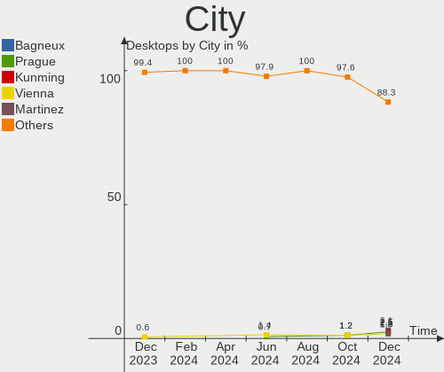
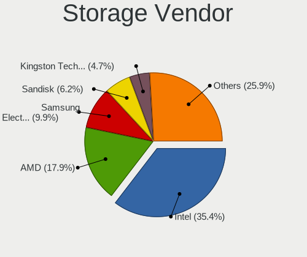
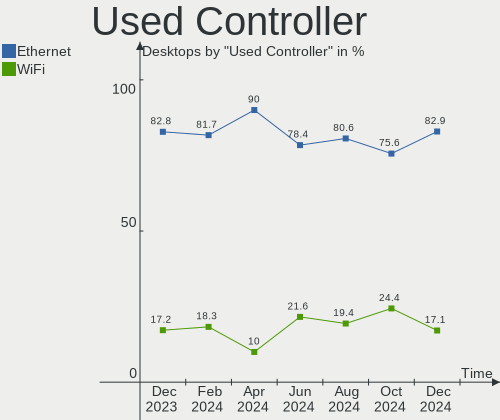
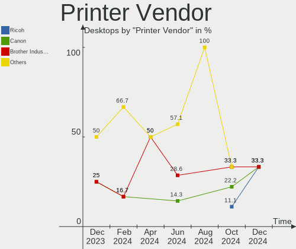

Debian - Hardware Trends (Desktops)
-----------------------------------

A project to identify most popular hardware characteristics and track their change
over time based on data collected by Linux users at https://Linux-Hardware.org.

Anyone can contribute to this report by the [hw-probe](https://github.com/linuxhw/hw-probe) tool:

    sudo -E hw-probe -all -upload

This report is for one last month. Overall report since the beginning of time: [TestDays](https://github.com/linuxhw/TestDays)

Period: Dec, 2023.

Contents
--------

* [ System ](#system)
  - [ OS                       ](#os)
  - [ OS Family                ](#os-family)
  - [ Kernel                   ](#kernel)
  - [ Kernel Family            ](#kernel-family)
  - [ Kernel Major Ver.        ](#kernel-major-ver)
  - [ Arch                     ](#arch)
  - [ DE                       ](#de)
  - [ Display Server           ](#display-server)
  - [ Display Manager          ](#display-manager)
  - [ OS Lang                  ](#os-lang)
  - [ Boot Mode                ](#boot-mode)
  - [ Filesystem               ](#filesystem)
  - [ Part. scheme             ](#part-scheme)
  - [ Dual Boot with Linux/BSD ](#dual-boot-with-linuxbsd)
  - [ Dual Boot (Win)          ](#dual-boot-win)

* [ Board ](#board)
  - [ Vendor                   ](#vendor)
  - [ Model                    ](#model)
  - [ Model Family             ](#model-family)
  - [ MFG Year                 ](#mfg-year)
  - [ Form Factor              ](#form-factor)
  - [ Secure Boot              ](#secure-boot)
  - [ Coreboot                 ](#coreboot)
  - [ RAM Size                 ](#ram-size)
  - [ RAM Used                 ](#ram-used)
  - [ Total Drives             ](#total-drives)
  - [ Has CD-ROM               ](#has-cd-rom)
  - [ Has Ethernet             ](#has-ethernet)
  - [ Has WiFi                 ](#has-wifi)
  - [ Has Bluetooth            ](#has-bluetooth)

* [ Location ](#location)
  - [ Country                  ](#country)
  - [ City                     ](#city)

* [ Drives ](#drives)
  - [ Drive Vendor             ](#drive-vendor)
  - [ Drive Model              ](#drive-model)
  - [ HDD Vendor               ](#hdd-vendor)
  - [ SSD Vendor               ](#ssd-vendor)
  - [ Drive Kind               ](#drive-kind)
  - [ Drive Connector          ](#drive-connector)
  - [ Drive Size               ](#drive-size)
  - [ Space Total              ](#space-total)
  - [ Space Used               ](#space-used)
  - [ Malfunc. Drives          ](#malfunc-drives)
  - [ Malfunc. Drive Vendor    ](#malfunc-drive-vendor)
  - [ Malfunc. HDD Vendor      ](#malfunc-hdd-vendor)
  - [ Malfunc. Drive Kind      ](#malfunc-drive-kind)
  - [ Failed Drives            ](#failed-drives)
  - [ Failed Drive Vendor      ](#failed-drive-vendor)
  - [ Drive Status             ](#drive-status)

* [ Storage controller ](#storage-controller)
  - [ Storage Vendor           ](#storage-vendor)
  - [ Storage Model            ](#storage-model)
  - [ Storage Kind             ](#storage-kind)

* [ Processor ](#processor)
  - [ CPU Vendor               ](#cpu-vendor)
  - [ CPU Model                ](#cpu-model)
  - [ CPU Model Family         ](#cpu-model-family)
  - [ CPU Cores                ](#cpu-cores)
  - [ CPU Sockets              ](#cpu-sockets)
  - [ CPU Threads              ](#cpu-threads)
  - [ CPU Op-Modes             ](#cpu-op-modes)
  - [ CPU Microcode            ](#cpu-microcode)
  - [ CPU Microarch            ](#cpu-microarch)

* [ Graphics ](#graphics)
  - [ GPU Vendor               ](#gpu-vendor)
  - [ GPU Model                ](#gpu-model)
  - [ GPU Combo                ](#gpu-combo)
  - [ GPU Driver               ](#gpu-driver)
  - [ GPU Memory               ](#gpu-memory)

* [ Monitor ](#monitor)
  - [ Monitor Vendor           ](#monitor-vendor)
  - [ Monitor Model            ](#monitor-model)
  - [ Monitor Resolution       ](#monitor-resolution)
  - [ Monitor Diagonal         ](#monitor-diagonal)
  - [ Monitor Width            ](#monitor-width)
  - [ Aspect Ratio             ](#aspect-ratio)
  - [ Monitor Area             ](#monitor-area)
  - [ Pixel Density            ](#pixel-density)
  - [ Multiple Monitors        ](#multiple-monitors)

* [ Network ](#network)
  - [ Net Controller Vendor    ](#net-controller-vendor)
  - [ Net Controller Model     ](#net-controller-model)
  - [ Wireless Vendor          ](#wireless-vendor)
  - [ Wireless Model           ](#wireless-model)
  - [ Ethernet Vendor          ](#ethernet-vendor)
  - [ Ethernet Model           ](#ethernet-model)
  - [ Net Controller Kind      ](#net-controller-kind)
  - [ Used Controller          ](#used-controller)
  - [ NICs                     ](#nics)
  - [ IPv6                     ](#ipv6)

* [ Bluetooth ](#bluetooth)
  - [ Bluetooth Vendor         ](#bluetooth-vendor)
  - [ Bluetooth Model          ](#bluetooth-model)

* [ Sound ](#sound)
  - [ Sound Vendor             ](#sound-vendor)
  - [ Sound Model              ](#sound-model)

* [ Memory ](#memory)
  - [ Memory Vendor            ](#memory-vendor)
  - [ Memory Model             ](#memory-model)
  - [ Memory Kind              ](#memory-kind)
  - [ Memory Form Factor       ](#memory-form-factor)
  - [ Memory Size              ](#memory-size)
  - [ Memory Speed             ](#memory-speed)

* [ Printers & scanners ](#printers--scanners)
  - [ Printer Vendor           ](#printer-vendor)
  - [ Printer Model            ](#printer-model)
  - [ Scanner Vendor           ](#scanner-vendor)
  - [ Scanner Model            ](#scanner-model)

* [ Camera ](#camera)
  - [ Camera Vendor            ](#camera-vendor)
  - [ Camera Model             ](#camera-model)

* [ Security ](#security)
  - [ Fingerprint Vendor       ](#fingerprint-vendor)
  - [ Fingerprint Model        ](#fingerprint-model)
  - [ Chipcard Vendor          ](#chipcard-vendor)
  - [ Chipcard Model           ](#chipcard-model)

* [ Unsupported ](#unsupported)
  - [ Unsupported Devices      ](#unsupported-devices)
  - [ Unsupported Device Types ](#unsupported-device-types)

System
------

OS
--

Installed operating systems

| Name                    | Desktops | Percent |
|-------------------------|----------|---------|
| Debian 12               | 124      | 77.02%  |
| Debian 11               | 17       | 10.56%  |
| Debian                  | 11       | 6.83%   |
| Debian 10               | 3        | 1.86%   |
| Debian Testing/unstable | 2        | 1.24%   |
| Debian 9                | 1        | 0.62%   |
| Debian 6                | 1        | 0.62%   |
| Debian 23100609         | 1        | 0.62%   |
| Debian 12-updates       | 1        | 0.62%   |

OS Family
---------

OS without a version

| Name   | Desktops | Percent |
|--------|----------|---------|
| Debian | 161      | 100%    |

Kernel
------

Version of the Linux kernel

| Version                   | Desktops | Percent |
|---------------------------|----------|---------|
| 6.1.0-16-amd64            | 44       | 27.33%  |
| 6.1.0-13-amd64            | 31       | 19.25%  |
| 6.1.0-15-amd64            | 16       | 9.94%   |
| 6.5.0-5-amd64             | 7        | 4.35%   |
| 6.5.11-7-pve              | 6        | 3.73%   |
| 5.10.0-26-amd64           | 5        | 3.11%   |
| 6.1.0-4-amd64             | 4        | 2.48%   |
| 6.1.0-10-amd64            | 4        | 2.48%   |
| 6.1.0-14-amd64            | 3        | 1.86%   |
| 6.1.0-0.deb11.13-amd64    | 3        | 1.86%   |
| 5.10.10-64                | 3        | 1.86%   |
| 6.6.4-1-liquorix-amd64    | 2        | 1.24%   |
| 6.5.11-6-pve              | 2        | 1.24%   |
| 6.5.11-4-pve              | 2        | 1.24%   |
| 6.7.0-rc4                 | 1        | 0.62%   |
| 6.6.7-1-liquorix-amd64    | 1        | 0.62%   |
| 6.6.0-02                  | 1        | 0.62%   |
| 6.5.0-5mx-ahs-amd64       | 1        | 0.62%   |
| 6.5.0-4-amd64             | 1        | 0.62%   |
| 6.5.0-0.deb12.4-amd64     | 1        | 0.62%   |
| 6.5.0-0.deb12.1-amd64     | 1        | 0.62%   |
| 6.2.16-19-pve             | 1        | 0.62%   |
| 6.2.16-15-pve             | 1        | 0.62%   |
| 6.1.63-production+truenas | 1        | 0.62%   |
| 6.1.0-16-rt-amd64         | 1        | 0.62%   |
| 6.1.0-16-686-pae          | 1        | 0.62%   |
| 6.1.0-15-686              | 1        | 0.62%   |
| 6.1.0-14-686-pae          | 1        | 0.62%   |
| 6.1.0-11-amd64            | 1        | 0.62%   |
| 6.1.0-1-amd64             | 1        | 0.62%   |
| 6.1.0-0.deb11.13-rt-amd64 | 1        | 0.62%   |
| 6.0.0-6mx-amd64           | 1        | 0.62%   |
| 5.4.106-1-pve             | 1        | 0.62%   |
| 5.15.145                  | 1        | 0.62%   |
| 5.11.22-5-pve             | 1        | 0.62%   |
| 5.10.0-25-amd64           | 1        | 0.62%   |
| 5.10.0-23-686-pae         | 1        | 0.62%   |
| 5.10.0-21-amd64           | 1        | 0.62%   |
| 5.10.0-20-amd64           | 1        | 0.62%   |
| 5.10.0-19-amd64           | 1        | 0.62%   |

Kernel Family
-------------

Linux kernel without a distro release

| Version  | Desktops | Percent |
|----------|----------|---------|
| 6.1.0    | 112      | 69.57%  |
| 6.5.0    | 11       | 6.83%   |
| 5.10.0   | 11       | 6.83%   |
| 6.5.11   | 10       | 6.21%   |
| 5.10.10  | 3        | 1.86%   |
| 6.6.4    | 2        | 1.24%   |
| 6.2.16   | 2        | 1.24%   |
| 6.7.0    | 1        | 0.62%   |
| 6.6.7    | 1        | 0.62%   |
| 6.6.0    | 1        | 0.62%   |
| 6.1.63   | 1        | 0.62%   |
| 6.0.0    | 1        | 0.62%   |
| 5.4.106  | 1        | 0.62%   |
| 5.15.145 | 1        | 0.62%   |
| 5.11.22  | 1        | 0.62%   |
| 4.19.0   | 1        | 0.62%   |
| 2.6.26   | 1        | 0.62%   |

Kernel Major Ver.
-----------------

Linux kernel major version

| Version | Desktops | Percent |
|---------|----------|---------|
| 6.1     | 113      | 70.19%  |
| 6.5     | 21       | 13.04%  |
| 5.10    | 14       | 8.7%    |
| 6.6     | 4        | 2.48%   |
| 6.2     | 2        | 1.24%   |
| 6.7     | 1        | 0.62%   |
| 6.0     | 1        | 0.62%   |
| 5.4     | 1        | 0.62%   |
| 5.15    | 1        | 0.62%   |
| 5.11    | 1        | 0.62%   |
| 4.19    | 1        | 0.62%   |
| 2.6     | 1        | 0.62%   |

Arch
----

OS architecture (x86_64, i586, etc.)

| Name   | Desktops | Percent |
|--------|----------|---------|
| x86_64 | 156      | 96.89%  |
| i686   | 4        | 2.48%   |
| i486   | 1        | 0.62%   |

DE
--

Desktop Environment

| Name            | Desktops | Percent |
|-----------------|----------|---------|
| GNOME           | 42       | 26.09%  |
| KDE5            | 37       | 22.98%  |
| Unknown         | 35       | 21.74%  |
| XFCE            | 11       | 6.83%   |
| X-Cinnamon      | 7        | 4.35%   |
| MATE            | 7        | 4.35%   |
| LXDE            | 7        | 4.35%   |
| Cinnamon        | 6        | 3.73%   |
| i3              | 3        | 1.86%   |
| LXQt            | 2        | 1.24%   |
| sway            | 1        | 0.62%   |
| Openbox         | 1        | 0.62%   |
| GNOME Flashback | 1        | 0.62%   |
| GNOME Classic   | 1        | 0.62%   |

Display Server
--------------

X11 or Wayland

| Name    | Desktops | Percent |
|---------|----------|---------|
| X11     | 72       | 44.72%  |
| Wayland | 48       | 29.81%  |
| Tty     | 23       | 14.29%  |
| Unknown | 18       | 11.18%  |

Display Manager
---------------

SDDM, LightDM, etc.

| Name    | Desktops | Percent |
|---------|----------|---------|
| Unknown | 64       | 39.75%  |
| GDM3    | 34       | 21.12%  |
| LightDM | 31       | 19.25%  |
| SDDM    | 24       | 14.91%  |
| NODM    | 3        | 1.86%   |
| GDM     | 2        | 1.24%   |
| XDM     | 1        | 0.62%   |
| LXDM    | 1        | 0.62%   |
| KDM     | 1        | 0.62%   |

OS Lang
-------

Language

| Lang    | Desktops | Percent |
|---------|----------|---------|
| en_US   | 75       | 46.58%  |
| fr_FR   | 18       | 11.18%  |
| de_DE   | 10       | 6.21%   |
| ru_RU   | 9        | 5.59%   |
| en_GB   | 9        | 5.59%   |
| es_ES   | 6        | 3.73%   |
| pl_PL   | 4        | 2.48%   |
| it_IT   | 4        | 2.48%   |
| Unknown | 4        | 2.48%   |
| pt_BR   | 3        | 1.86%   |
| pt_PT   | 2        | 1.24%   |
| es_CL   | 2        | 1.24%   |
| en_ZA   | 2        | 1.24%   |
| en_AU   | 2        | 1.24%   |
| C       | 2        | 1.24%   |
| zh_TW   | 1        | 0.62%   |
| nl_BE   | 1        | 0.62%   |
| ko_KR   | 1        | 0.62%   |
| it_CH   | 1        | 0.62%   |
| es_NI   | 1        | 0.62%   |
| en_IN   | 1        | 0.62%   |
| en_IE   | 1        | 0.62%   |
| en_DK   | 1        | 0.62%   |
| de_CH   | 1        | 0.62%   |

Boot Mode
---------

EFI or BIOS

| Mode | Desktops | Percent |
|------|----------|---------|
| EFI  | 91       | 56.52%  |
| BIOS | 70       | 43.48%  |

Filesystem
----------

Type of filesystem

| Type    | Desktops | Percent |
|---------|----------|---------|
| Ext4    | 128      | 79.5%   |
| Overlay | 9        | 5.59%   |
| Btrfs   | 6        | 3.73%   |
| Zfs     | 5        | 3.11%   |
| Rootfs  | 4        | 2.48%   |
| Tmpfs   | 3        | 1.86%   |
| Xfs     | 2        | 1.24%   |
| Ext3    | 2        | 1.24%   |
| Unknown | 2        | 1.24%   |

Part. scheme
------------

Scheme of partitioning

| Type    | Desktops | Percent |
|---------|----------|---------|
| GPT     | 103      | 63.98%  |
| Unknown | 32       | 19.88%  |
| MBR     | 26       | 16.15%  |

Dual Boot with Linux/BSD
------------------------

Hosting more than one Linux/BSD

| Dual boot | Desktops | Percent |
|-----------|----------|---------|
| No        | 129      | 80.12%  |
| Yes       | 32       | 19.88%  |

Dual Boot (Win)
---------------

Hosting Linux and Windows

| Dual boot | Desktops | Percent |
|-----------|----------|---------|
| No        | 123      | 76.4%   |
| Yes       | 38       | 23.6%   |

Board
-----

Vendor
------

Motherboard manufacturer

| Name                                 | Desktops | Percent |
|--------------------------------------|----------|---------|
| ASUSTek Computer                     | 41       | 25.47%  |
| Gigabyte Technology                  | 27       | 16.77%  |
| MSI                                  | 18       | 11.18%  |
| Dell                                 | 15       | 9.32%   |
| Hewlett-Packard                      | 11       | 6.83%   |
| Lenovo                               | 10       | 6.21%   |
| ASRock                               | 9        | 5.59%   |
| Intel                                | 5        | 3.11%   |
| Unknown                              | 4        | 2.48%   |
| Fujitsu                              | 3        | 1.86%   |
| Biostar                              | 3        | 1.86%   |
| AZW                                  | 3        | 1.86%   |
| T-bao TianBei                        | 1        | 0.62%   |
| Shenzhen Meigao Electronic Equipment | 1        | 0.62%   |
| Seeed Studio                         | 1        | 0.62%   |
| Packard Bell                         | 1        | 0.62%   |
| MACHINIST                            | 1        | 0.62%   |
| iRU                                  | 1        | 0.62%   |
| Inventec                             | 1        | 0.62%   |
| IceWhale Technology                  | 1        | 0.62%   |
| HPE                                  | 1        | 0.62%   |
| eMachines                            | 1        | 0.62%   |
| Apple                                | 1        | 0.62%   |
| Acer                                 | 1        | 0.62%   |

Model
-----

Motherboard model

| Name                                       | Desktops | Percent |
|--------------------------------------------|----------|---------|
| Lenovo ThinkCentre M800 10FXS0PS00         | 4        | 2.48%   |
| Unknown                                    | 4        | 2.48%   |
| ASUS All Series                            | 3        | 1.86%   |
| MSI MS-7D91                                | 2        | 1.24%   |
| Gigabyte B650 AORUS ELITE AX               | 2        | 1.24%   |
| Gigabyte B550 AORUS ELITE V2               | 2        | 1.24%   |
| Dell OptiPlex 790                          | 2        | 1.24%   |
| ASUS H110M-R                               | 2        | 1.24%   |
| T-bao TianBei GOD78                        | 1        | 0.62%   |
| Shenzhen Meigao Electronic Equipment UM560 | 1        | 0.62%   |
| Seeed Studio ODYSSEY-X86J4125              | 1        | 0.62%   |
| Packard Bell IMEDIA S3720                  | 1        | 0.62%   |
| MSI MS-7E28                                | 1        | 0.62%   |
| MSI MS-7D98                                | 1        | 0.62%   |
| MSI MS-7D78                                | 1        | 0.62%   |
| MSI MS-7D52                                | 1        | 0.62%   |
| MSI MS-7D40                                | 1        | 0.62%   |
| MSI MS-7D18                                | 1        | 0.62%   |
| MSI MS-7B92                                | 1        | 0.62%   |
| MSI MS-7B79                                | 1        | 0.62%   |
| MSI MS-7A62                                | 1        | 0.62%   |
| MSI MS-7A38                                | 1        | 0.62%   |
| MSI MS-7A34                                | 1        | 0.62%   |
| MSI MS-7A15                                | 1        | 0.62%   |
| MSI MS-7922                                | 1        | 0.62%   |
| MSI MS-7758                                | 1        | 0.62%   |
| MSI MS-7696                                | 1        | 0.62%   |
| MSI MS-7529                                | 1        | 0.62%   |
| MACHINIST X99 RS9                          | 1        | 0.62%   |
| Lenovo V530S-07ICB 10TX0013FR              | 1        | 0.62%   |
| Lenovo ThinkStation P500 30A6S2YK00        | 1        | 0.62%   |
| Lenovo ThinkCentre M83 10AHS1T000          | 1        | 0.62%   |
| Lenovo ThinkCentre M83 10AHA0EPFR          | 1        | 0.62%   |
| Lenovo ThinkCentre M72e 32674Z0            | 1        | 0.62%   |
| Lenovo ThinkCentre E73 10DS000TUK          | 1        | 0.62%   |
| iRU 517                                    | 1        | 0.62%   |
| Inventec DQ Class                          | 1        | 0.62%   |
| Intel X109                                 | 1        | 0.62%   |
| Intel Jasper Lake Client Platform          | 1        | 0.62%   |
| Intel H61                                  | 1        | 0.62%   |

Model Family
------------

Motherboard model prefix

| Name                                       | Desktops | Percent |
|--------------------------------------------|----------|---------|
| Dell OptiPlex                              | 10       | 6.21%   |
| Lenovo ThinkCentre                         | 8        | 4.97%   |
| ASUS TUF                                   | 8        | 4.97%   |
| ASUS PRIME                                 | 6        | 3.73%   |
| ASUS ROG                                   | 5        | 3.11%   |
| HP Compaq                                  | 4        | 2.48%   |
| Unknown                                    | 4        | 2.48%   |
| HP EliteDesk                               | 3        | 1.86%   |
| Gigabyte X570                              | 3        | 1.86%   |
| ASUS All                                   | 3        | 1.86%   |
| MSI MS-7D91                                | 2        | 1.24%   |
| HP ProLiant                                | 2        | 1.24%   |
| Gigabyte B650                              | 2        | 1.24%   |
| Gigabyte B550                              | 2        | 1.24%   |
| Fujitsu ESPRIMO                            | 2        | 1.24%   |
| Dell Vostro                                | 2        | 1.24%   |
| ASUS Pro                                   | 2        | 1.24%   |
| ASUS H110M-R                               | 2        | 1.24%   |
| T-bao TianBei GOD78                        | 1        | 0.62%   |
| Shenzhen Meigao Electronic Equipment UM560 | 1        | 0.62%   |
| Seeed Studio ODYSSEY-X86J4125              | 1        | 0.62%   |
| Packard Bell IMEDIA                        | 1        | 0.62%   |
| MSI MS-7E28                                | 1        | 0.62%   |
| MSI MS-7D98                                | 1        | 0.62%   |
| MSI MS-7D78                                | 1        | 0.62%   |
| MSI MS-7D52                                | 1        | 0.62%   |
| MSI MS-7D40                                | 1        | 0.62%   |
| MSI MS-7D18                                | 1        | 0.62%   |
| MSI MS-7B92                                | 1        | 0.62%   |
| MSI MS-7B79                                | 1        | 0.62%   |
| MSI MS-7A62                                | 1        | 0.62%   |
| MSI MS-7A38                                | 1        | 0.62%   |
| MSI MS-7A34                                | 1        | 0.62%   |
| MSI MS-7A15                                | 1        | 0.62%   |
| MSI MS-7922                                | 1        | 0.62%   |
| MSI MS-7758                                | 1        | 0.62%   |
| MSI MS-7696                                | 1        | 0.62%   |
| MSI MS-7529                                | 1        | 0.62%   |
| MACHINIST X99                              | 1        | 0.62%   |
| Lenovo V530S-07ICB                         | 1        | 0.62%   |

MFG Year
--------

Motherboard manufacture year

| Year    | Desktops | Percent |
|---------|----------|---------|
| 2022    | 16       | 9.94%   |
| 2023    | 15       | 9.32%   |
| 2020    | 15       | 9.32%   |
| 2021    | 13       | 8.07%   |
| 2012    | 13       | 8.07%   |
| 2013    | 12       | 7.45%   |
| 2019    | 11       | 6.83%   |
| 2016    | 10       | 6.21%   |
| 2014    | 10       | 6.21%   |
| 2011    | 10       | 6.21%   |
| 2018    | 8        | 4.97%   |
| 2009    | 7        | 4.35%   |
| 2017    | 6        | 3.73%   |
| 2015    | 4        | 2.48%   |
| 2007    | 4        | 2.48%   |
| 2010    | 3        | 1.86%   |
| 2004    | 3        | 1.86%   |
| Unknown | 1        | 0.62%   |

Form Factor
-----------

Physical design of the computer

| Name    | Desktops | Percent |
|---------|----------|---------|
| Desktop | 161      | 100%    |

Secure Boot
-----------

Enabled or disabled

| State    | Desktops | Percent |
|----------|----------|---------|
| Disabled | 154      | 95.65%  |
| Enabled  | 7        | 4.35%   |

Coreboot
--------

Have coreboot on board

| Used | Desktops | Percent |
|------|----------|---------|
| No   | 161      | 100%    |

RAM Size
--------

Total RAM memory

| Size in GB      | Desktops | Percent |
|-----------------|----------|---------|
| 16.01-24.0      | 37       | 22.98%  |
| 32.01-64.0      | 29       | 18.01%  |
| 4.01-8.0        | 27       | 16.77%  |
| 3.01-4.0        | 18       | 11.18%  |
| 8.01-16.0       | 17       | 10.56%  |
| 64.01-256.0     | 16       | 9.94%   |
| 24.01-32.0      | 10       | 6.21%   |
| 1.01-2.0        | 3        | 1.86%   |
| More than 256.0 | 1        | 0.62%   |
| 2.01-3.0        | 1        | 0.62%   |
| 0               | 1        | 0.62%   |
| Unknown         | 1        | 0.62%   |

RAM Used
--------

Used RAM memory

| Used GB     | Desktops | Percent |
|-------------|----------|---------|
| 2.01-3.0    | 35       | 21.74%  |
| 4.01-8.0    | 33       | 20.5%   |
| 1.01-2.0    | 31       | 19.25%  |
| 3.01-4.0    | 22       | 13.66%  |
| 8.01-16.0   | 15       | 9.32%   |
| 0.51-1.0    | 10       | 6.21%   |
| 0.01-0.5    | 8        | 4.97%   |
| 64.01-256.0 | 2        | 1.24%   |
| Unknown     | 2        | 1.24%   |
| 32.01-64.0  | 1        | 0.62%   |
| 24.01-32.0  | 1        | 0.62%   |
| 16.01-24.0  | 1        | 0.62%   |

Total Drives
------------

Number of drives on board

| Drives | Desktops | Percent |
|--------|----------|---------|
| 1      | 47       | 29.19%  |
| 2      | 42       | 26.09%  |
| 3      | 30       | 18.63%  |
| 4      | 18       | 11.18%  |
| 6      | 7        | 4.35%   |
| 5      | 7        | 4.35%   |
| 0      | 3        | 1.86%   |
| 13     | 2        | 1.24%   |
| 21     | 1        | 0.62%   |
| 15     | 1        | 0.62%   |
| 10     | 1        | 0.62%   |
| 9      | 1        | 0.62%   |
| 7      | 1        | 0.62%   |

Has CD-ROM
----------

Has CD-ROM on board

| Presented | Desktops | Percent |
|-----------|----------|---------|
| No        | 108      | 67.08%  |
| Yes       | 53       | 32.92%  |

Has Ethernet
------------

Has Ethernet on board

| Presented | Desktops | Percent |
|-----------|----------|---------|
| Yes       | 159      | 98.76%  |
| No        | 2        | 1.24%   |

Has WiFi
--------

Has WiFi module

| Presented | Desktops | Percent |
|-----------|----------|---------|
| No        | 100      | 62.11%  |
| Yes       | 61       | 37.89%  |

Has Bluetooth
-------------

Has Bluetooth module

| Presented | Desktops | Percent |
|-----------|----------|---------|
| No        | 100      | 62.11%  |
| Yes       | 61       | 37.89%  |

Location
--------

Country
-------

Geographic location (country)

| Country      | Desktops | Percent |
|--------------|----------|---------|
| USA          | 34       | 21.12%  |
| France       | 19       | 11.8%   |
| Germany      | 15       | 9.32%   |
| Russia       | 13       | 8.07%   |
| Spain        | 9        | 5.59%   |
| Italy        | 8        | 4.97%   |
| Poland       | 6        | 3.73%   |
| Brazil       | 6        | 3.73%   |
| Canada       | 5        | 3.11%   |
| UK           | 3        | 1.86%   |
| Switzerland  | 3        | 1.86%   |
| Netherlands  | 3        | 1.86%   |
| Denmark      | 3        | 1.86%   |
| Australia    | 3        | 1.86%   |
| South Africa | 2        | 1.24%   |
| Mexico       | 2        | 1.24%   |
| Japan        | 2        | 1.24%   |
| Hungary      | 2        | 1.24%   |
| Chile        | 2        | 1.24%   |
| Belgium      | 2        | 1.24%   |
| Taiwan       | 1        | 0.62%   |
| South Korea  | 1        | 0.62%   |
| Serbia       | 1        | 0.62%   |
| Portugal     | 1        | 0.62%   |
| Philippines  | 1        | 0.62%   |
| Peru         | 1        | 0.62%   |
| Norway       | 1        | 0.62%   |
| Nicaragua    | 1        | 0.62%   |
| Kenya        | 1        | 0.62%   |
| Kazakhstan   | 1        | 0.62%   |
| Jersey       | 1        | 0.62%   |
| Ireland      | 1        | 0.62%   |
| Iran         | 1        | 0.62%   |
| India        | 1        | 0.62%   |
| Estonia      | 1        | 0.62%   |
| Croatia      | 1        | 0.62%   |
| China        | 1        | 0.62%   |
| Bolivia      | 1        | 0.62%   |
| Argentina    | 1        | 0.62%   |

City
----

Geographic location (city)

| City              | Desktops | Percent |
|-------------------|----------|---------|
| Roubaix           | 8        | 4.97%   |
| Voronezh          | 4        | 2.48%   |
| St Petersburg     | 3        | 1.86%   |
| Madrid            | 3        | 1.86%   |
| Sydney            | 2        | 1.24%   |
| Seville           | 2        | 1.24%   |
| Sao Paulo         | 2        | 1.24%   |
| Santiago          | 2        | 1.24%   |
| Quimper           | 2        | 1.24%   |
| Perm              | 2        | 1.24%   |
| Moscow            | 2        | 1.24%   |
| Levis             | 2        | 1.24%   |
| Iowa City         | 2        | 1.24%   |
| Frankfurt am Main | 2        | 1.24%   |
| Fortaleza         | 2        | 1.24%   |
| Zurich            | 1        | 0.62%   |
| Waukegan          | 1        | 0.62%   |
| Watertown         | 1        | 0.62%   |
| Warwick           | 1        | 0.62%   |
| Wandsworth        | 1        | 0.62%   |
| Volgograd         | 1        | 0.62%   |
| Vigo              | 1        | 0.62%   |
| Vienna            | 1        | 0.62%   |
| Vernon Hills      | 1        | 0.62%   |
| Vác              | 1        | 0.62%   |
| Utica             | 1        | 0.62%   |
| Upington          | 1        | 0.62%   |
| Trappeto          | 1        | 0.62%   |
| Tortosa           | 1        | 0.62%   |
| Toronto           | 1        | 0.62%   |
| Tokyo             | 1        | 0.62%   |
| Tijuana           | 1        | 0.62%   |
| Thermopolis       | 1        | 0.62%   |
| Tehran            | 1        | 0.62%   |
| Tallinn           | 1        | 0.62%   |
| Taipei            | 1        | 0.62%   |
| Sumter            | 1        | 0.62%   |
| Steinbach         | 1        | 0.62%   |
| Spanaway          | 1        | 0.62%   |
| Smederevo         | 1        | 0.62%   |

Drives
------

Drive Vendor
------------

Hard drive vendors

| Vendor                      | Desktops | Drives | Percent |
|-----------------------------|----------|--------|---------|
| WDC                         | 63       | 106    | 20.93%  |
| Seagate                     | 48       | 74     | 15.95%  |
| Samsung Electronics         | 45       | 62     | 14.95%  |
| Kingston                    | 19       | 24     | 6.31%   |
| Crucial                     | 17       | 38     | 5.65%   |
| Sandisk                     | 16       | 24     | 5.32%   |
| Toshiba                     | 13       | 22     | 4.32%   |
| Hitachi                     | 7        | 9      | 2.33%   |
| HGST                        | 5        | 5      | 1.66%   |
| A-DATA Technology           | 5        | 5      | 1.66%   |
| Unknown                     | 4        | 6      | 1.33%   |
| China                       | 4        | 4      | 1.33%   |
| Silicon Motion              | 3        | 3      | 1%      |
| Phison Electronics          | 3        | 3      | 1%      |
| Micron/Crucial Technology   | 3        | 3      | 1%      |
| Transcend                   | 2        | 2      | 0.66%   |
| SPCC                        | 2        | 2      | 0.66%   |
| SK hynix                    | 2        | 2      | 0.66%   |
| PNY                         | 2        | 2      | 0.66%   |
| Netac                       | 2        | 2      | 0.66%   |
| Maxtor                      | 2        | 2      | 0.66%   |
| Intenso                     | 2        | 2      | 0.66%   |
| GOODRAM                     | 2        | 5      | 0.66%   |
| XPG                         | 1        | 2      | 0.33%   |
| WALRAM                      | 1        | 1      | 0.33%   |
| UMIS                        | 1        | 1      | 0.33%   |
| Team                        | 1        | 1      | 0.33%   |
| sobetter                    | 1        | 1      | 0.33%   |
| SABRENT                     | 1        | 1      | 0.33%   |
| Reeinno                     | 1        | 2      | 0.33%   |
| Phison                      | 1        | 1      | 0.33%   |
| Patriot                     | 1        | 1      | 0.33%   |
| OCZ                         | 1        | 1      | 0.33%   |
| NGFF                        | 1        | 1      | 0.33%   |
| Mushkin                     | 1        | 1      | 0.33%   |
| MAXIO Technology (Hangzhou) | 1        | 1      | 0.33%   |
| LITEONIT                    | 1        | 1      | 0.33%   |
| Lexar                       | 1        | 1      | 0.33%   |
| KIOXIA-EXCERIA              | 1        | 2      | 0.33%   |
| Kingston Technology Company | 1        | 1      | 0.33%   |

Drive Model
-----------

Hard drive models

| Model                                               | Desktops | Percent |
|-----------------------------------------------------|----------|---------|
| Seagate ST500DM002-1BD142 500GB                     | 7        | 1.88%   |
| Seagate ST2000DM008-2FR102 2TB                      | 5        | 1.34%   |
| WDC WD10EZEX-08WN4A0 1TB                            | 4        | 1.08%   |
| WDC WD10EZEX-00BN5A0 1TB                            | 4        | 1.08%   |
| Seagate ST1000DM010-2EP102 1TB                      | 4        | 1.08%   |
| Samsung SSD 970 EVO Plus 1TB                        | 4        | 1.08%   |
| Kingston SA400S37240G 240GB SSD                     | 4        | 1.08%   |
| WDC WD20EARX-00PASB0 2TB                            | 3        | 0.81%   |
| Toshiba HDWD130 3TB                                 | 3        | 0.81%   |
| Seagate ST3500418AS 500GB                           | 3        | 0.81%   |
| SanDisk NVMe SSD Drive 1TB                          | 3        | 0.81%   |
| Samsung SSD 980 PRO 1TB                             | 3        | 0.81%   |
| Samsung SSD 860 EVO 500GB                           | 3        | 0.81%   |
| Samsung NVMe SSD Controller PM9A1/PM9A3/980PRO 2TB  | 3        | 0.81%   |
| Kingston SA400S37480G 480GB SSD                     | 3        | 0.81%   |
| Crucial CT500MX500SSD1 500GB                        | 3        | 0.81%   |
| WDC WDS500G2B0A-00SM50 500GB SSD                    | 2        | 0.54%   |
| WDC WD5000AAKX-001CA0 500GB                         | 2        | 0.54%   |
| WDC WD30EZRX-00MMMB0 3TB                            | 2        | 0.54%   |
| WDC WD20EZRX-00D8PB0 2TB                            | 2        | 0.54%   |
| WDC WD20EZAZ-00GGJB0 2TB                            | 2        | 0.54%   |
| WDC WD20EFRX-68EUZN0 2TB                            | 2        | 0.54%   |
| WDC WD10EZEX-08M2NA0 1TB                            | 2        | 0.54%   |
| Toshiba DT01ACA200 2TB                              | 2        | 0.54%   |
| Seagate ST4000DM004-2CV104 4TB                      | 2        | 0.54%   |
| Seagate ST31000528AS 1TB                            | 2        | 0.54%   |
| Seagate ST2000DM001-1ER164 2TB                      | 2        | 0.54%   |
| Sandisk WD_BLACK SN850X 4000GB                      | 2        | 0.54%   |
| SanDisk SD8SB8U1T001122 1TB SSD                     | 2        | 0.54%   |
| SanDisk NVMe SSD Drive 2TB                          | 2        | 0.54%   |
| Samsung SSD 980 500GB                               | 2        | 0.54%   |
| Samsung SSD 970 EVO Plus 500GB                      | 2        | 0.54%   |
| Samsung SSD 870 QVO 2TB                             | 2        | 0.54%   |
| Samsung SSD 870 EVO 500GB                           | 2        | 0.54%   |
| Samsung SSD 870 EVO 2TB                             | 2        | 0.54%   |
| Samsung SSD 850 EVO 500GB                           | 2        | 0.54%   |
| Samsung SSD 850 EVO 250GB                           | 2        | 0.54%   |
| Samsung SSD 840 EVO 250GB                           | 2        | 0.54%   |
| Samsung NVMe SSD Controller SM981/PM981/PM983 512GB | 2        | 0.54%   |
| PNY CS900 120GB SSD                                 | 2        | 0.54%   |

HDD Vendor
----------

Hard disk drive vendors

| Vendor              | Desktops | Drives | Percent |
|---------------------|----------|--------|---------|
| WDC                 | 54       | 93     | 40.6%   |
| Seagate             | 47       | 73     | 35.34%  |
| Toshiba             | 12       | 20     | 9.02%   |
| Hitachi             | 7        | 9      | 5.26%   |
| HGST                | 4        | 4      | 3.01%   |
| Samsung Electronics | 3        | 3      | 2.26%   |
| Maxtor              | 2        | 2      | 1.5%    |
| SABRENT             | 1        | 1      | 0.75%   |
| H/W                 | 1        | 7      | 0.75%   |
| Elite               | 1        | 1      | 0.75%   |
| ASMT                | 1        | 10     | 0.75%   |

SSD Vendor
----------

Solid state drive vendors

| Vendor              | Desktops | Drives | Percent |
|---------------------|----------|--------|---------|
| Samsung Electronics | 23       | 27     | 25%     |
| Kingston            | 13       | 17     | 14.13%  |
| Crucial             | 10       | 30     | 10.87%  |
| SanDisk             | 8        | 9      | 8.7%    |
| WDC                 | 7        | 7      | 7.61%   |
| China               | 4        | 4      | 4.35%   |
| Transcend           | 2        | 2      | 2.17%   |
| PNY                 | 2        | 2      | 2.17%   |
| Netac               | 2        | 2      | 2.17%   |
| Intenso             | 2        | 2      | 2.17%   |
| GOODRAM             | 2        | 3      | 2.17%   |
| A-DATA Technology   | 2        | 2      | 2.17%   |
| Toshiba             | 1        | 1      | 1.09%   |
| SPCC                | 1        | 1      | 1.09%   |
| SK hynix            | 1        | 1      | 1.09%   |
| Seagate             | 1        | 1      | 1.09%   |
| Reeinno             | 1        | 2      | 1.09%   |
| Patriot             | 1        | 1      | 1.09%   |
| OCZ                 | 1        | 1      | 1.09%   |
| NGFF                | 1        | 1      | 1.09%   |
| Mushkin             | 1        | 1      | 1.09%   |
| LITEONIT            | 1        | 1      | 1.09%   |
| Lexar               | 1        | 1      | 1.09%   |
| Intel               | 1        | 1      | 1.09%   |
| FORESEE             | 1        | 1      | 1.09%   |
| Fanxiang            | 1        | 2      | 1.09%   |
| 2.5                 | 1        | 1      | 1.09%   |

Drive Kind
----------

HDD or SSD

| Kind    | Desktops | Drives | Percent |
|---------|----------|--------|---------|
| HDD     | 94       | 223    | 38.84%  |
| SSD     | 76       | 124    | 31.4%   |
| NVMe    | 68       | 104    | 28.1%   |
| Unknown | 3        | 6      | 1.24%   |
| MMC     | 1        | 1      | 0.41%   |

Drive Connector
---------------

SATA, SAS, NVMe, etc.

| Type | Desktops | Drives | Percent |
|------|----------|--------|---------|
| SATA | 132      | 323    | 61.97%  |
| NVMe | 68       | 103    | 31.92%  |
| SAS  | 12       | 31     | 5.63%   |
| MMC  | 1        | 1      | 0.47%   |

Drive Size
----------

Size of hard drive

| Size in TB | Desktops | Drives | Percent |
|------------|----------|--------|---------|
| 0.01-0.5   | 92       | 124    | 43.81%  |
| 0.51-1.0   | 52       | 94     | 24.76%  |
| 1.01-2.0   | 28       | 48     | 13.33%  |
| 2.01-3.0   | 14       | 28     | 6.67%   |
| 3.01-4.0   | 12       | 25     | 5.71%   |
| 4.01-10.0  | 9        | 19     | 4.29%   |
| 10.01-20.0 | 3        | 9      | 1.43%   |

Space Total
-----------

Amount of disk space available on the file system

| Size in GB     | Desktops | Percent |
|----------------|----------|---------|
| More than 3000 | 28       | 17.39%  |
| 501-1000       | 27       | 16.77%  |
| 251-500        | 26       | 16.15%  |
| 101-250        | 25       | 15.53%  |
| 1001-2000      | 16       | 9.94%   |
| Unknown        | 11       | 6.83%   |
| 2001-3000      | 10       | 6.21%   |
| 51-100         | 9        | 5.59%   |
| 1-20           | 7        | 4.35%   |
| 21-50          | 2        | 1.24%   |

Space Used
----------

Amount of used disk space

| Used GB        | Desktops | Percent |
|----------------|----------|---------|
| 1-20           | 47       | 29.19%  |
| 21-50          | 24       | 14.91%  |
| 251-500        | 16       | 9.94%   |
| More than 3000 | 15       | 9.32%   |
| 101-250        | 14       | 8.7%    |
| 501-1000       | 12       | 7.45%   |
| Unknown        | 11       | 6.83%   |
| 51-100         | 10       | 6.21%   |
| 1001-2000      | 7        | 4.35%   |
| 2001-3000      | 5        | 3.11%   |

Malfunc. Drives
---------------

Drive models with a malfunction

| Model                           | Desktops | Drives | Percent |
|---------------------------------|----------|--------|---------|
| WDC WD20EARX-00PASB0 2TB        | 2        | 2      | 5.13%   |
| Toshiba HDWD130 3TB             | 2        | 5      | 5.13%   |
| Seagate ST3500418AS 500GB       | 2        | 2      | 5.13%   |
| XPG SPECTRIX S40G 1TB           | 1        | 1      | 2.56%   |
| WDC WD5000LPLX-60ZNTT1 500GB    | 1        | 1      | 2.56%   |
| WDC WD5000AURX-63UY4Y0 500GB    | 1        | 1      | 2.56%   |
| WDC WD40PURX-64GVNY0 4TB        | 1        | 1      | 2.56%   |
| WDC WD30EZRX-00MMMB0 3TB        | 1        | 1      | 2.56%   |
| WDC WD30EURS-63R8UY0 3TB        | 1        | 1      | 2.56%   |
| WDC WD20PURX-64P6ZY0 2TB        | 1        | 1      | 2.56%   |
| WDC WD20EZRZ-00Z5HB0 2TB        | 1        | 1      | 2.56%   |
| WDC WD20EARS-00MVWB0 2TB        | 1        | 1      | 2.56%   |
| WDC WD10EZEX-60ZF5A0 1TB        | 1        | 1      | 2.56%   |
| WDC WD10EZEX-00BN5A0 1TB        | 1        | 1      | 2.56%   |
| WDC WD10EADS-65M2B0 1TB         | 1        | 1      | 2.56%   |
| Toshiba DT01ACA200 2TB          | 1        | 1      | 2.56%   |
| Seagate ST8000DM004-2CX188 8TB  | 1        | 1      | 2.56%   |
| Seagate ST500LT012-1DG142 500GB | 1        | 1      | 2.56%   |
| Seagate ST500DM002-1BD142 500GB | 1        | 1      | 2.56%   |
| Seagate ST3500630NS 500GB       | 1        | 1      | 2.56%   |
| Seagate ST3500412AS 500GB       | 1        | 1      | 2.56%   |
| Seagate ST3320613AS 320GB       | 1        | 1      | 2.56%   |
| Seagate ST3320418AS 320GB       | 1        | 1      | 2.56%   |
| Seagate ST3160811AS 160GB       | 1        | 1      | 2.56%   |
| Seagate ST31000528AS 1TB        | 1        | 1      | 2.56%   |
| Seagate ST2000DM008-2FR102 2TB  | 1        | 1      | 2.56%   |
| Seagate ST2000DM006-2DM164 2TB  | 1        | 1      | 2.56%   |
| Seagate ST2000DM001-1CH164 2TB  | 1        | 1      | 2.56%   |
| Netac NS512GSSD340 512GB        | 1        | 1      | 2.56%   |
| Maxtor STM380215AS 80GB         | 1        | 1      | 2.56%   |
| Hitachi HUS724030ALE641 3TB     | 1        | 1      | 2.56%   |
| Hitachi HTS543232A7A384 320GB   | 1        | 1      | 2.56%   |
| Hitachi HTS542580K9SA00 80GB    | 1        | 1      | 2.56%   |
| HGST HUS726040ALE614 4TB        | 1        | 1      | 2.56%   |
| Crucial CT275MX300SSD1 275GB    | 1        | 1      | 2.56%   |
| China SSD 240GB                 | 1        | 1      | 2.56%   |

Malfunc. Drive Vendor
---------------------

Vendors of faulty drives

| Vendor  | Desktops | Drives | Percent |
|---------|----------|--------|---------|
| Seagate | 12       | 14     | 34.29%  |
| WDC     | 11       | 13     | 31.43%  |
| Toshiba | 3        | 6      | 8.57%   |
| Hitachi | 3        | 3      | 8.57%   |
| XPG     | 1        | 1      | 2.86%   |
| Netac   | 1        | 1      | 2.86%   |
| Maxtor  | 1        | 1      | 2.86%   |
| HGST    | 1        | 1      | 2.86%   |
| Crucial | 1        | 1      | 2.86%   |
| China   | 1        | 1      | 2.86%   |

Malfunc. HDD Vendor
-------------------

Vendors of faulty HDD drives

| Vendor  | Desktops | Drives | Percent |
|---------|----------|--------|---------|
| Seagate | 12       | 14     | 38.71%  |
| WDC     | 11       | 13     | 35.48%  |
| Toshiba | 3        | 6      | 9.68%   |
| Hitachi | 3        | 3      | 9.68%   |
| Maxtor  | 1        | 1      | 3.23%   |
| HGST    | 1        | 1      | 3.23%   |

Malfunc. Drive Kind
-------------------

Kinds of faulty drives

| Kind | Desktops | Drives | Percent |
|------|----------|--------|---------|
| HDD  | 28       | 38     | 87.5%   |
| SSD  | 3        | 3      | 9.38%   |
| NVMe | 1        | 1      | 3.13%   |

Failed Drives
-------------

Failed drive models

| Model                    | Desktops | Drives | Percent |
|--------------------------|----------|--------|---------|
| Seagate ST2000NM0011 2TB | 1        | 1      | 100%    |

Failed Drive Vendor
-------------------

Failed drive vendors

| Vendor  | Desktops | Drives | Percent |
|---------|----------|--------|---------|
| Seagate | 1        | 1      | 100%    |

Drive Status
------------

Number of failed and malfunc. drives

| Status   | Desktops | Drives | Percent |
|----------|----------|--------|---------|
| Works    | 114      | 292    | 58.16%  |
| Detected | 49       | 123    | 25%     |
| Malfunc  | 32       | 42     | 16.33%  |
| Failed   | 1        | 1      | 0.51%   |

Storage controller
------------------

Storage Vendor
--------------

Storage controller vendors

| Vendor                       | Desktops | Percent |
|------------------------------|----------|---------|
| Intel                        | 102      | 38.35%  |
| AMD                          | 53       | 19.92%  |
| Samsung Electronics          | 25       | 9.4%    |
| Sandisk                      | 12       | 4.51%   |
| Micron/Crucial Technology    | 10       | 3.76%   |
| ASMedia Technology           | 10       | 3.76%   |
| Kingston Technology Company  | 8        | 3.01%   |
| Phison Electronics           | 6        | 2.26%   |
| Silicon Motion               | 5        | 1.88%   |
| Marvell Technology Group     | 5        | 1.88%   |
| Nvidia                       | 4        | 1.5%    |
| JMicron Technology           | 4        | 1.5%    |
| ADATA Technology             | 4        | 1.5%    |
| Realtek Semiconductor        | 3        | 1.13%   |
| MAXIO Technology (Hangzhou)  | 2        | 0.75%   |
| INNOGRIT                     | 2        | 0.75%   |
| Adaptec                      | 2        | 0.75%   |
| VIA Technologies             | 1        | 0.38%   |
| Union Memory (Shenzhen)      | 1        | 0.38%   |
| Toshiba America Info Systems | 1        | 0.38%   |
| Solidigm                     | 1        | 0.38%   |
| SK hynix                     | 1        | 0.38%   |
| LSI Logic / Symbios Logic    | 1        | 0.38%   |
| KIOXIA                       | 1        | 0.38%   |
| Broadcom / LSI               | 1        | 0.38%   |
| ATTO Technology              | 1        | 0.38%   |

Storage Model
-------------

Storage controller models

| Model                                                                          | Desktops | Percent |
|--------------------------------------------------------------------------------|----------|---------|
| AMD FCH SATA Controller [AHCI mode]                                            | 33       | 10.71%  |
| Samsung NVMe SSD Controller SM981/PM981/PM983                                  | 13       | 4.22%   |
| Intel 8 Series/C220 Series Chipset Family 6-port SATA Controller 1 [AHCI mode] | 12       | 3.9%    |
| Intel Q170/Q150/B150/H170/H110/Z170/CM236 Chipset SATA Controller [AHCI Mode]  | 10       | 3.25%   |
| Micron/Crucial P2 [Nick P2] / P3 / P3 Plus NVMe PCIe SSD (DRAM-less)           | 9        | 2.92%   |
| Intel 6 Series/C200 Series Chipset Family 6 port Desktop SATA AHCI Controller  | 9        | 2.92%   |
| AMD 500 Series Chipset SATA Controller                                         | 9        | 2.92%   |
| Samsung NVMe SSD Controller PM9A1/PM9A3/980PRO                                 | 8        | 2.6%    |
| Intel 7 Series/C210 Series Chipset Family 6-port SATA Controller [AHCI mode]   | 7        | 2.27%   |
| Intel 700 Series Chipset Family SATA AHCI Controller                           | 6        | 1.95%   |
| Intel 500 Series Chipset Family SATA AHCI Controller                           | 6        | 1.95%   |
| ASMedia ASM1062 Serial ATA Controller                                          | 6        | 1.95%   |
| AMD SB7x0/SB8x0/SB9x0 SATA Controller [AHCI mode]                              | 6        | 1.95%   |
| AMD 400 Series Chipset SATA Controller                                         | 6        | 1.95%   |
| Samsung NVMe SSD Controller 980 (DRAM-less)                                    | 5        | 1.62%   |
| Intel Alder Lake-S PCH SATA Controller [AHCI Mode]                             | 5        | 1.62%   |
| Intel 9 Series Chipset Family SATA Controller [AHCI Mode]                      | 5        | 1.62%   |
| Intel 82801G (ICH7 Family) IDE Controller                                      | 5        | 1.62%   |
| Intel 200 Series PCH SATA controller [AHCI mode]                               | 5        | 1.62%   |
| Silicon Motion SM2263EN/SM2263XT (DRAM-less) NVMe SSD Controllers              | 4        | 1.3%    |
| Phison E12 NVMe Controller                                                     | 4        | 1.3%    |
| Intel SATA controller                                                          | 4        | 1.3%    |
| Intel NM10/ICH7 Family SATA Controller [IDE mode]                              | 4        | 1.3%    |
| Intel Cannon Lake PCH SATA AHCI Controller                                     | 4        | 1.3%    |
| SanDisk Ultra 3D / WD Blue SN550 NVMe SSD                                      | 3        | 0.97%   |
| Kingston Company NV1 NVMe SSD SM2263XT                                         | 3        | 0.97%   |
| Kingston Company KC3000/FURY Renegade NVMe SSD E18                             | 3        | 0.97%   |
| JMicron JMB363 SATA/IDE Controller                                             | 3        | 0.97%   |
| Intel SATA Controller [RAID mode]                                              | 3        | 0.97%   |
| Intel Comet Lake SATA AHCI Controller                                          | 3        | 0.97%   |
| ASMedia 1064 SATA Controller                                                   | 3        | 0.97%   |
| AMD SB7x0/SB8x0/SB9x0 IDE Controller                                           | 3        | 0.97%   |
| Sandisk WD Black SN850X NVMe SSD                                               | 2        | 0.65%   |
| SanDisk WD Black SN770 / PC SN740 256GB / PC SN560 (DRAM-less) NVMe SSD        | 2        | 0.65%   |
| SanDisk Ultra 3D / WD Blue SN570 NVMe SSD (DRAM-less)                          | 2        | 0.65%   |
| Samsung NVMe SSD Controller S4LV008[Pascal]                                    | 2        | 0.65%   |
| Realtek RTS5765DL NVMe SSD Controller (DRAM-less)                              | 2        | 0.65%   |
| Nvidia MCP61 SATA Controller                                                   | 2        | 0.65%   |
| MAXIO (Hangzhou) NVMe SSD Controller MAP1202                                   | 2        | 0.65%   |
| Marvell Group 88SE9230 PCIe 2.0 x2 4-port SATA 6 Gb/s RAID Controller          | 2        | 0.65%   |

Storage Kind
------------

Kind of storage controller (IDE, SATA, NVMe, SAS, ...)

| Kind | Desktops | Percent |
|------|----------|---------|
| SATA | 141      | 57.79%  |
| NVMe | 67       | 27.46%  |
| IDE  | 25       | 10.25%  |
| RAID | 8        | 3.28%   |
| SCSI | 2        | 0.82%   |
| SAS  | 1        | 0.41%   |

Processor
---------

CPU Vendor
----------

Processor vendors

| Vendor | Desktops | Percent |
|--------|----------|---------|
| Intel  | 104      | 64.6%   |
| AMD    | 57       | 35.4%   |

CPU Model
---------

Processor models

| Model                                  | Desktops | Percent |
|----------------------------------------|----------|---------|
| AMD Ryzen 7 5700G with Radeon Graphics | 7        | 4.35%   |
| Intel Core i3-6100 CPU @ 3.70GHz       | 4        | 2.48%   |
| Intel N95                              | 3        | 1.86%   |
| Intel Core i5-3470 CPU @ 3.20GHz       | 3        | 1.86%   |
| Intel Core i5-2400 CPU @ 3.10GHz       | 3        | 1.86%   |
| Intel Core i3-8100 CPU @ 3.60GHz       | 3        | 1.86%   |
| Intel Core i3-7100 CPU @ 3.90GHz       | 3        | 1.86%   |
| AMD Ryzen 7 5700X 8-Core Processor     | 3        | 1.86%   |
| Intel Pentium 4 CPU 3.00GHz            | 2        | 1.24%   |
| Intel Core i7-4790 CPU @ 3.60GHz       | 2        | 1.24%   |
| Intel Core i7-3770 CPU @ 3.40GHz       | 2        | 1.24%   |
| Intel Core i5-4690K CPU @ 3.50GHz      | 2        | 1.24%   |
| Intel Core i5-4460S CPU @ 2.90GHz      | 2        | 1.24%   |
| Intel Core i5-2500 CPU @ 3.30GHz       | 2        | 1.24%   |
| Intel Core 2 Duo CPU E6750 @ 2.66GHz   | 2        | 1.24%   |
| Intel 13th Gen Core i9-13900K          | 2        | 1.24%   |
| Intel 12th Gen Core i3-12100           | 2        | 1.24%   |
| Intel 11th Gen Core i5-11400 @ 2.60GHz | 2        | 1.24%   |
| AMD Ryzen 9 5950X 16-Core Processor    | 2        | 1.24%   |
| AMD Ryzen 9 3900X 12-Core Processor    | 2        | 1.24%   |
| AMD Ryzen 7 3700X 8-Core Processor     | 2        | 1.24%   |
| AMD Ryzen 5 5600G with Radeon Graphics | 2        | 1.24%   |
| AMD Ryzen 5 2600 Six-Core Processor    | 2        | 1.24%   |
| AMD FX-8320 Eight-Core Processor       | 2        | 1.24%   |
| Intel Xeon E-2286G CPU @ 4.00GHz       | 1        | 0.62%   |
| Intel Xeon CPU E5420 @ 2.50GHz         | 1        | 0.62%   |
| Intel Xeon CPU E5-2699 v3 @ 2.30GHz    | 1        | 0.62%   |
| Intel Xeon CPU E5-1630 v3 @ 3.70GHz    | 1        | 0.62%   |
| Intel Xeon CPU E5-1603 v3 @ 2.80GHz    | 1        | 0.62%   |
| Intel Xeon CPU E31270 @ 3.40GHz        | 1        | 0.62%   |
| Intel Xeon CPU E3-1245 v3 @ 3.40GHz    | 1        | 0.62%   |
| Intel Xeon CPU E3-1225 v3 @ 3.20GHz    | 1        | 0.62%   |
| Intel Xeon CPU 5130 @ 2.00GHz          | 1        | 0.62%   |
| Intel Pentium CPU G850 @ 2.90GHz       | 1        | 0.62%   |
| Intel Pentium CPU G4560 @ 3.50GHz      | 1        | 0.62%   |
| Intel Pentium CPU G3220 @ 3.00GHz      | 1        | 0.62%   |
| Intel N100                             | 1        | 0.62%   |
| Intel Core i9-10900 CPU @ 2.80GHz      | 1        | 0.62%   |
| Intel Core i7-8700 CPU @ 3.20GHz       | 1        | 0.62%   |
| Intel Core i7-6700K CPU @ 4.00GHz      | 1        | 0.62%   |

CPU Model Family
----------------

Processor model prefix

| Model                  | Desktops | Percent |
|------------------------|----------|---------|
| Intel Core i5          | 27       | 16.77%  |
| Other                  | 20       | 12.42%  |
| Intel Core i3          | 17       | 10.56%  |
| AMD Ryzen 7            | 17       | 10.56%  |
| Intel Core i7          | 12       | 7.45%   |
| AMD Ryzen 5            | 12       | 7.45%   |
| Intel Xeon             | 9        | 5.59%   |
| AMD Ryzen 9            | 8        | 4.97%   |
| Intel Celeron          | 7        | 4.35%   |
| AMD FX                 | 5        | 3.11%   |
| Intel Pentium          | 3        | 1.86%   |
| Intel Core 2 Quad      | 3        | 1.86%   |
| Intel Core 2 Duo       | 3        | 1.86%   |
| Intel Pentium 4        | 2        | 1.24%   |
| AMD A8                 | 2        | 1.24%   |
| Intel Core i9          | 1        | 0.62%   |
| AMD Ryzen Threadripper | 1        | 0.62%   |
| AMD Ryzen 3 PRO        | 1        | 0.62%   |
| AMD PRO A10            | 1        | 0.62%   |
| AMD Phenom II X6       | 1        | 0.62%   |
| AMD Opteron            | 1        | 0.62%   |
| AMD GX                 | 1        | 0.62%   |
| AMD Athlon II X4       | 1        | 0.62%   |
| AMD Athlon II Neo      | 1        | 0.62%   |
| AMD Athlon 64          | 1        | 0.62%   |
| AMD Athlon             | 1        | 0.62%   |
| AMD A6                 | 1        | 0.62%   |
| AMD A4                 | 1        | 0.62%   |
| AMD A10                | 1        | 0.62%   |

CPU Cores
---------

Number of processor cores

| Number  | Desktops | Percent |
|---------|----------|---------|
| 4       | 65       | 40.37%  |
| 2       | 28       | 17.39%  |
| 6       | 22       | 13.66%  |
| 8       | 19       | 11.8%   |
| 12      | 6        | 3.73%   |
| 16      | 5        | 3.11%   |
| 24      | 4        | 2.48%   |
| 1       | 4        | 2.48%   |
| 14      | 2        | 1.24%   |
| 10      | 2        | 1.24%   |
| Unknown | 2        | 1.24%   |
| 18      | 1        | 0.62%   |
| 3       | 1        | 0.62%   |

CPU Sockets
-----------

Number of sockets

| Number  | Desktops | Percent |
|---------|----------|---------|
| 1       | 159      | 98.76%  |
| 2       | 1        | 0.62%   |
| Unknown | 1        | 0.62%   |

CPU Threads
-----------

Threads per core (Hyper-Threading)

| Number  | Desktops | Percent |
|---------|----------|---------|
| 2       | 99       | 61.49%  |
| 1       | 60       | 37.27%  |
| Unknown | 2        | 1.24%   |

CPU Op-Modes
------------

CPU Operation Modes (32-bit, 64-bit)

| Op mode        | Desktops | Percent |
|----------------|----------|---------|
| 32-bit, 64-bit | 158      | 98.14%  |
| Unknown        | 2        | 1.24%   |
| 32-bit         | 1        | 0.62%   |

CPU Microcode
-------------

Microcode number

| Number     | Desktops | Percent |
|------------|----------|---------|
| Unknown    | 50       | 31.06%  |
| 0x306c3    | 12       | 7.45%   |
| 0xb0671    | 7        | 4.35%   |
| 0x906e9    | 7        | 4.35%   |
| 0x306a9    | 7        | 4.35%   |
| 0x506e3    | 6        | 3.73%   |
| 0x206a7    | 6        | 3.73%   |
| 0x0a50000d | 5        | 3.11%   |
| 0xa0671    | 3        | 1.86%   |
| 0x906eb    | 3        | 1.86%   |
| 0x1067a    | 3        | 1.86%   |
| 0x0a50000c | 3        | 1.86%   |
| 0xb06e0    | 2        | 1.24%   |
| 0xa0655    | 2        | 1.24%   |
| 0x906c0    | 2        | 1.24%   |
| 0x6fb      | 2        | 1.24%   |
| 0x106e5    | 2        | 1.24%   |
| 0x0a601206 | 2        | 1.24%   |
| 0x0a601203 | 2        | 1.24%   |
| 0x0a20120e | 2        | 1.24%   |
| 0x0800820d | 2        | 1.24%   |
| 0x0700010f | 2        | 1.24%   |
| 0x0600063e | 2        | 1.24%   |
| 0xf41      | 1        | 0.62%   |
| 0xf29      | 1        | 0.62%   |
| 0x90675    | 1        | 0.62%   |
| 0x90672    | 1        | 0.62%   |
| 0x706a8    | 1        | 0.62%   |
| 0x6f6      | 1        | 0.62%   |
| 0x506c9    | 1        | 0.62%   |
| 0x40651    | 1        | 0.62%   |
| 0x306f2    | 1        | 0.62%   |
| 0x10677    | 1        | 0.62%   |
| 0x10676    | 1        | 0.62%   |
| 0x0a704104 | 1        | 0.62%   |
| 0x0a20120a | 1        | 0.62%   |
| 0x0a20102b | 1        | 0.62%   |
| 0x0a201016 | 1        | 0.62%   |
| 0x08701021 | 1        | 0.62%   |
| 0x08701013 | 1        | 0.62%   |

CPU Microarch
-------------

Microarchitecture

| Name             | Desktops | Percent |
|------------------|----------|---------|
| Haswell          | 21       | 13.04%  |
| Zen 3            | 18       | 11.18%  |
| Unknown          | 15       | 9.32%   |
| KabyLake         | 13       | 8.07%   |
| SandyBridge      | 10       | 6.21%   |
| IvyBridge        | 10       | 6.21%   |
| Skylake          | 7        | 4.35%   |
| Alderlake Hybrid | 7        | 4.35%   |
| Zen+             | 6        | 3.73%   |
| Penryn           | 6        | 3.73%   |
| Zen 2            | 5        | 3.11%   |
| Icelake          | 5        | 3.11%   |
| CometLake        | 5        | 3.11%   |
| Piledriver       | 3        | 1.86%   |
| K10              | 3        | 1.86%   |
| Core             | 3        | 1.86%   |
| Zen              | 2        | 1.24%   |
| Tremont          | 2        | 1.24%   |
| Steamroller      | 2        | 1.24%   |
| NetBurst         | 2        | 1.24%   |
| Nehalem          | 2        | 1.24%   |
| K8 Hammer        | 2        | 1.24%   |
| K10 Llano        | 2        | 1.24%   |
| Jaguar           | 2        | 1.24%   |
| Gracemont        | 2        | 1.24%   |
| Excavator        | 2        | 1.24%   |
| Bulldozer        | 2        | 1.24%   |
| Goldmont plus    | 1        | 0.62%   |
| Goldmont         | 1        | 0.62%   |

Graphics
--------

GPU Vendor
----------

Vendors of graphics cards

| Vendor            | Desktops | Percent |
|-------------------|----------|---------|
| Intel             | 65       | 38.92%  |
| AMD               | 57       | 34.13%  |
| Nvidia            | 43       | 25.75%  |
| ASPEED Technology | 2        | 1.2%    |

GPU Model
---------

Graphics card models

| Model                                                                       | Desktops | Percent |
|-----------------------------------------------------------------------------|----------|---------|
| Intel 2nd Generation Core Processor Family Integrated Graphics Controller   | 8        | 4.76%   |
| AMD Cezanne [Radeon Vega Series / Radeon Vega Mobile Series]                | 7        | 4.17%   |
| Intel Xeon E3-1200 v3/4th Gen Core Processor Integrated Graphics Controller | 6        | 3.57%   |
| Intel Xeon E3-1200 v2/3rd Gen Core processor Graphics Controller            | 6        | 3.57%   |
| Intel HD Graphics 630                                                       | 5        | 2.98%   |
| Intel HD Graphics 530                                                       | 5        | 2.98%   |
| AMD Raphael                                                                 | 5        | 2.98%   |
| Intel Raptor Lake-S GT1 [UHD Graphics 770]                                  | 4        | 2.38%   |
| Intel Alder Lake-N [UHD Graphics]                                           | 4        | 2.38%   |
| AMD Navi 22 [Radeon RX 6700/6700 XT/6750 XT / 6800M/6850M XT]               | 4        | 2.38%   |
| Nvidia GK208B [GeForce GT 710]                                              | 3        | 1.79%   |
| Intel CoffeeLake-S GT2 [UHD Graphics 630]                                   | 3        | 1.79%   |
| Intel 82G33/G31 Express Integrated Graphics Controller                      | 3        | 1.79%   |
| AMD Navi 10 [Radeon RX 5600 OEM/5600 XT / 5700/5700 XT]                     | 3        | 1.79%   |
| Nvidia GP108 [GeForce GT 1030]                                              | 2        | 1.19%   |
| Nvidia GP106 [GeForce GTX 1060 6GB]                                         | 2        | 1.19%   |
| Nvidia GM107 [GeForce GTX 750 Ti]                                           | 2        | 1.19%   |
| Nvidia GK104 [GeForce GTX 660 OEM]                                          | 2        | 1.19%   |
| Nvidia GA106 [GeForce RTX 3060 Lite Hash Rate]                              | 2        | 1.19%   |
| Intel Xeon E3-1200 v3 Processor Integrated Graphics Controller              | 2        | 1.19%   |
| Intel RocketLake-S GT1 [UHD Graphics 730]                                   | 2        | 1.19%   |
| Intel JasperLake [UHD Graphics]                                             | 2        | 1.19%   |
| Intel Alder Lake-S GT1 [UHD Graphics 730]                                   | 2        | 1.19%   |
| Intel 4th Generation Core Processor Family Integrated Graphics Controller   | 2        | 1.19%   |
| Intel 4 Series Chipset Integrated Graphics Controller                       | 2        | 1.19%   |
| ASPEED Technology ASPEED Graphics Family                                    | 2        | 1.19%   |
| AMD Wani [Radeon R5/R6/R7 Graphics]                                         | 2        | 1.19%   |
| AMD Turks XT [Radeon HD 6670/7670]                                          | 2        | 1.19%   |
| AMD Picasso/Raven 2 [Radeon Vega Series / Radeon Vega Mobile Series]        | 2        | 1.19%   |
| AMD Navi 23 [Radeon RX 6600/6600 XT/6600M]                                  | 2        | 1.19%   |
| AMD Kaveri [Radeon R7 Graphics]                                             | 2        | 1.19%   |
| AMD Cape Verde XT [Radeon HD 7770/8760 / R7 250X]                           | 2        | 1.19%   |
| Nvidia TU116 [GeForce GTX 1660]                                             | 1        | 0.6%    |
| Nvidia TU116 [GeForce GTX 1660 Ti]                                          | 1        | 0.6%    |
| Nvidia TU116 [GeForce GTX 1660 SUPER]                                       | 1        | 0.6%    |
| Nvidia TU116 [GeForce GTX 1650]                                             | 1        | 0.6%    |
| Nvidia TU106 [GeForce RTX 2070]                                             | 1        | 0.6%    |
| Nvidia TU104 [GeForce RTX 2080 Rev. A]                                      | 1        | 0.6%    |
| Nvidia TU104 [GeForce RTX 2070 SUPER]                                       | 1        | 0.6%    |
| Nvidia TU104 [GeForce RTX 2060]                                             | 1        | 0.6%    |

GPU Combo
---------

Combinations of graphics cards

| Name           | Desktops | Percent |
|----------------|----------|---------|
| 1 x Intel      | 59       | 36.65%  |
| 1 x AMD        | 53       | 32.92%  |
| 1 x Nvidia     | 36       | 22.36%  |
| Intel + Nvidia | 3        | 1.86%   |
| AMD + Nvidia   | 3        | 1.86%   |
| Other          | 2        | 1.24%   |
| 1 x ASPEED     | 2        | 1.24%   |
| 2 x Nvidia     | 1        | 0.62%   |
| 2 x Intel      | 1        | 0.62%   |
| Intel + AMD    | 1        | 0.62%   |

GPU Driver
----------

Free vs proprietary

| Driver      | Desktops | Percent |
|-------------|----------|---------|
| Free        | 120      | 74.53%  |
| Proprietary | 22       | 13.66%  |
| Unknown     | 19       | 11.8%   |

GPU Memory
----------

Total video memory

| Size in GB | Desktops | Percent |
|------------|----------|---------|
| Unknown    | 97       | 60.25%  |
| 1.01-2.0   | 16       | 9.94%   |
| 0.01-0.5   | 13       | 8.07%   |
| 0.51-1.0   | 9        | 5.59%   |
| 7.01-8.0   | 8        | 4.97%   |
| 3.01-4.0   | 7        | 4.35%   |
| 5.01-6.0   | 6        | 3.73%   |
| 8.01-16.0  | 5        | 3.11%   |

Monitor
-------

Monitor Vendor
--------------

Monitor vendors

| Vendor               | Desktops | Percent |
|----------------------|----------|---------|
| Dell                 | 21       | 15.67%  |
| Samsung Electronics  | 16       | 11.94%  |
| Philips              | 15       | 11.19%  |
| Goldstar             | 12       | 8.96%   |
| AOC                  | 9        | 6.72%   |
| ASUSTek Computer     | 7        | 5.22%   |
| Acer                 | 7        | 5.22%   |
| BenQ                 | 6        | 4.48%   |
| Lenovo               | 5        | 3.73%   |
| Iiyama               | 5        | 3.73%   |
| Hewlett-Packard      | 4        | 2.99%   |
| Ancor Communications | 4        | 2.99%   |
| ViewSonic            | 3        | 2.24%   |
| NEC Computers        | 3        | 2.24%   |
| Unknown              | 2        | 1.49%   |
| Sceptre Tech         | 2        | 1.49%   |
| Unknown              | 2        | 1.49%   |
| Unknown (AAA)        | 1        | 0.75%   |
| TCT                  | 1        | 0.75%   |
| RTK                  | 1        | 0.75%   |
| PFS                  | 1        | 0.75%   |
| Medion               | 1        | 0.75%   |
| INNOCN               | 1        | 0.75%   |
| Huion                | 1        | 0.75%   |
| Hitachi              | 1        | 0.75%   |
| Denver               | 1        | 0.75%   |
| Compaq Computer      | 1        | 0.75%   |
| AU Optronics         | 1        | 0.75%   |

Monitor Model
-------------

Monitor models

| Model                                                                 | Desktops | Percent |
|-----------------------------------------------------------------------|----------|---------|
| Philips 197EL PHLC08B 1366x768 410x230mm 18.5-inch                    | 7        | 4.96%   |
| Philips PHL 221V8 PHLC211 1920x1080 477x268mm 21.5-inch               | 2        | 1.42%   |
| Philips 220E PHLC02E 1920x1080 476x268mm 21.5-inch                    | 2        | 1.42%   |
| Iiyama PLE2483H IVM6113 1920x1080 531x299mm 24.0-inch                 | 2        | 1.42%   |
| AOC Q3279WG5B AOC3279 2560x1440 725x428mm 33.1-inch                   | 2        | 1.42%   |
| AOC G2460 AOC2460 1920x1080 531x299mm 24.0-inch                       | 2        | 1.42%   |
| Unknown                                                               | 2        | 1.42%   |
| ViewSonic VX2000 VSC4208 1600x1200 408x306mm 20.1-inch                | 1        | 0.71%   |
| ViewSonic VA2261 Series VSC0F30 1920x1080 477x268mm 21.5-inch         | 1        | 0.71%   |
| ViewSonic LCD Monitor VX3276-QHD 2560x1440                            | 1        | 0.71%   |
| Unknown SMART TV 0563 1920x1080 1209x680mm 54.6-inch                  | 1        | 0.71%   |
| Unknown LCD Monitor FFFF 2288x1287 2550x2550mm 142.0-inch             | 1        | 0.71%   |
| Unknown (AAA) LCDTV AAA3393 1360x768 890x500mm 40.2-inch              | 1        | 0.71%   |
| TCT IF1080D TCT0236 2560x1600 480x270mm 21.7-inch                     | 1        | 0.71%   |
| Sceptre Tech Sceptre X24WG SPT2401 1920x1080 518x324mm 24.1-inch      | 1        | 0.71%   |
| Sceptre Tech Sceptre C24 SPT09AB 1920x1080 530x300mm 24.0-inch        | 1        | 0.71%   |
| Samsung Electronics SyncMaster SAM05C5 1920x1080                      | 1        | 0.71%   |
| Samsung Electronics SyncMaster SAM0564 1360x768 410x230mm 18.5-inch   | 1        | 0.71%   |
| Samsung Electronics SyncMaster SAM04EA 1680x1050 478x300mm 22.2-inch  | 1        | 0.71%   |
| Samsung Electronics SyncMaster SAM036F 1440x900 428x255mm 19.6-inch   | 1        | 0.71%   |
| Samsung Electronics SyncMaster SAM030C 1680x1050 474x296mm 22.0-inch  | 1        | 0.71%   |
| Samsung Electronics SyncMaster SAM0248 1280x1024 376x301mm 19.0-inch  | 1        | 0.71%   |
| Samsung Electronics SyncMaster SAM0088 1024x768 300x230mm 14.9-inch   | 1        | 0.71%   |
| Samsung Electronics SyncMaster SAM0017 1024x768 304x228mm 15.0-inch   | 1        | 0.71%   |
| Samsung Electronics SME1920NR SAM06A4 1280x1024 376x301mm 19.0-inch   | 1        | 0.71%   |
| Samsung Electronics LS32AG55x SAM71E4 2560x1440 698x393mm 31.5-inch   | 1        | 0.71%   |
| Samsung Electronics LCD Monitor SyncMaster                            | 1        | 0.71%   |
| Samsung Electronics LCD Monitor SAM7268 3840x1600 700x390mm 31.5-inch | 1        | 0.71%   |
| Samsung Electronics LCD Monitor SAM0B30 1920x1080 885x498mm 40.0-inch | 1        | 0.71%   |
| Samsung Electronics LCD Monitor S34J55x 7280x1440                     | 1        | 0.71%   |
| Samsung Electronics LCD Monitor S34J55x 3440x1440                     | 1        | 0.71%   |
| Samsung Electronics LC32G7xT SAM7058 2560x1440 700x400mm 31.7-inch    | 1        | 0.71%   |
| Samsung Electronics C27FG7x SAM0E42 1920x1080 598x337mm 27.0-inch     | 1        | 0.71%   |
| RTK '' RTK2555 1920x1080 344x195mm 15.6-inch                          | 1        | 0.71%   |
| Philips PHL 278E1 PHLC217 3840x2160 597x336mm 27.0-inch               | 1        | 0.71%   |
| Philips PHL 276E7 PHLC108 1920x1080 598x336mm 27.0-inch               | 1        | 0.71%   |
| Philips PHI32PFL3404 PHLD067 1360x768 698x392mm 31.5-inch             | 1        | 0.71%   |
| Philips 227E4QH PHLC0AA 1920x1080 477x268mm 21.5-inch                 | 1        | 0.71%   |
| PFS 43PFS4001/12 PFS4001 1920x1080 575x323mm 26.0-inch                | 1        | 0.71%   |
| NEC Computers EA244WMi NEC68D7 1920x1200 520x320mm 24.0-inch          | 1        | 0.71%   |

Monitor Resolution
------------------

Monitor screen resolution

| Resolution         | Desktops | Percent |
|--------------------|----------|---------|
| 1920x1080 (FHD)    | 62       | 46.27%  |
| 2560x1440 (QHD)    | 18       | 13.43%  |
| 3840x2160 (4K)     | 11       | 8.21%   |
| 1366x768 (WXGA)    | 8        | 5.97%   |
| 1680x1050 (WSXGA+) | 6        | 4.48%   |
| 1280x1024 (SXGA)   | 5        | 3.73%   |
| 1920x1200 (WUXGA)  | 4        | 2.99%   |
| 1024x768 (XGA)     | 4        | 2.99%   |
| 3440x1440          | 2        | 1.49%   |
| 2560x1080          | 2        | 1.49%   |
| 1440x900 (WXGA+)   | 2        | 1.49%   |
| 1360x768           | 2        | 1.49%   |
| 7280x1440          | 1        | 0.75%   |
| 3840x1600          | 1        | 0.75%   |
| 2288x1287          | 1        | 0.75%   |
| 2048x1152          | 1        | 0.75%   |
| 1600x900 (HD+)     | 1        | 0.75%   |
| 1600x1200          | 1        | 0.75%   |
| 1280x720 (HD)      | 1        | 0.75%   |
| Unknown            | 1        | 0.75%   |

Monitor Diagonal
----------------

Diagonal size in inches

| Inches  | Desktops | Percent |
|---------|----------|---------|
| 24      | 25       | 18.52%  |
| 27      | 24       | 17.78%  |
| 21      | 16       | 11.85%  |
| 31      | 9        | 6.67%   |
| 23      | 9        | 6.67%   |
| 18      | 9        | 6.67%   |
| Unknown | 8        | 5.93%   |
| 19      | 7        | 5.19%   |
| 15      | 6        | 4.44%   |
| 22      | 5        | 3.7%    |
| 54      | 2        | 1.48%   |
| 34      | 2        | 1.48%   |
| 33      | 2        | 1.48%   |
| 20      | 2        | 1.48%   |
| 142     | 1        | 0.74%   |
| 84      | 1        | 0.74%   |
| 72      | 1        | 0.74%   |
| 40      | 1        | 0.74%   |
| 39      | 1        | 0.74%   |
| 32      | 1        | 0.74%   |
| 29      | 1        | 0.74%   |
| 26      | 1        | 0.74%   |
| 25      | 1        | 0.74%   |

Monitor Width
-------------

Physical width

| Width in mm    | Desktops | Percent |
|----------------|----------|---------|
| 501-600        | 56       | 42.42%  |
| 401-500        | 34       | 25.76%  |
| 601-700        | 11       | 8.33%   |
| Unknown        | 8        | 6.06%   |
| 301-350        | 6        | 4.55%   |
| 701-800        | 5        | 3.79%   |
| 351-400        | 5        | 3.79%   |
| 1501-2000      | 2        | 1.52%   |
| 1001-1500      | 2        | 1.52%   |
| More than 2000 | 1        | 0.76%   |
| 801-900        | 1        | 0.76%   |
| 901-1000       | 1        | 0.76%   |

Aspect Ratio
------------

Proportional relationship between the width and the height

| Ratio   | Desktops | Percent |
|---------|----------|---------|
| 16/9    | 90       | 69.77%  |
| 16/10   | 17       | 13.18%  |
| Unknown | 7        | 5.43%   |
| 5/4     | 5        | 3.88%   |
| 4/3     | 5        | 3.88%   |
| 21/9    | 4        | 3.1%    |
| 1.00    | 1        | 0.78%   |

Monitor Area
------------

Area in inch²

| Area in inch² | Desktops | Percent |
|----------------|----------|---------|
| 201-250        | 37       | 27.21%  |
| 301-350        | 25       | 18.38%  |
| 251-300        | 15       | 11.03%  |
| 151-200        | 15       | 11.03%  |
| 351-500        | 14       | 10.29%  |
| 141-150        | 9        | 6.62%   |
| Unknown        | 8        | 5.88%   |
| More than 1000 | 5        | 3.68%   |
| 101-110        | 5        | 3.68%   |
| 501-1000       | 2        | 1.47%   |
| 91-100         | 1        | 0.74%   |

Pixel Density
-------------

Pixels per inch

| Density | Desktops | Percent |
|---------|----------|---------|
| 51-100  | 78       | 60.47%  |
| 101-120 | 28       | 21.71%  |
| Unknown | 8        | 6.2%    |
| 121-160 | 7        | 5.43%   |
| 1-50    | 5        | 3.88%   |
| 161-240 | 3        | 2.33%   |

Multiple Monitors
-----------------

Total monitors connected

| Total | Desktops | Percent |
|-------|----------|---------|
| 1     | 112      | 69.57%  |
| 0     | 33       | 20.5%   |
| 2     | 11       | 6.83%   |
| 3     | 5        | 3.11%   |

Network
-------

Net Controller Vendor
---------------------

Controller vendors

| Vendor                | Desktops | Percent |
|-----------------------|----------|---------|
| Realtek Semiconductor | 94       | 43.32%  |
| Intel                 | 75       | 34.56%  |
| Qualcomm Atheros      | 9        | 4.15%   |
| MediaTek              | 9        | 4.15%   |
| Broadcom              | 8        | 3.69%   |
| Nvidia                | 3        | 1.38%   |
| TP-Link               | 2        | 0.92%   |
| Sigma Designs         | 2        | 0.92%   |
| Ralink Technology     | 2        | 0.92%   |
| Broadcom Limited      | 2        | 0.92%   |
| Xiaomi                | 1        | 0.46%   |
| U-Blox                | 1        | 0.46%   |
| Seeed Technology      | 1        | 0.46%   |
| Ralink                | 1        | 0.46%   |
| Microsoft             | 1        | 0.46%   |
| Mellanox Technologies | 1        | 0.46%   |
| Google                | 1        | 0.46%   |
| Dresden Elektronik    | 1        | 0.46%   |
| AVM                   | 1        | 0.46%   |
| American Megatrends   | 1        | 0.46%   |
| 3Com                  | 1        | 0.46%   |

Net Controller Model
--------------------

Controller models

| Model                                                             | Desktops | Percent |
|-------------------------------------------------------------------|----------|---------|
| Realtek RTL8111/8168/8411 PCI Express Gigabit Ethernet Controller | 69       | 27.6%   |
| Realtek RTL8125 2.5GbE Controller                                 | 17       | 6.8%    |
| Intel Ethernet Controller I225-V                                  | 11       | 4.4%    |
| Intel Wi-Fi 6 AX210/AX211/AX411 160MHz                            | 7        | 2.8%    |
| Intel 82579LM Gigabit Network Connection (Lewisville)             | 7        | 2.8%    |
| Intel Wi-Fi 6 AX200                                               | 6        | 2.4%    |
| Intel Ethernet Connection I217-LM                                 | 6        | 2.4%    |
| Intel I211 Gigabit Network Connection                             | 5        | 2%      |
| Intel Ethernet Connection (2) I219-LM                             | 5        | 2%      |
| Intel 700 Series Chipset Family Wi-Fi                             | 5        | 2%      |
| Realtek RTL8821CE 802.11ac PCIe Wireless Network Adapter          | 4        | 1.6%    |
| Qualcomm Atheros AR9287 Wireless Network Adapter (PCI-Express)    | 3        | 1.2%    |
| MediaTek MT7922 802.11ax PCI Express Wireless Network Adapter     | 3        | 1.2%    |
| Intel Ethernet Connection (2) I219-V                              | 3        | 1.2%    |
| Intel Ethernet Connection (14) I219-V                             | 3        | 1.2%    |
| Sigma Designs Aeotec Z-Stick Gen5 (ZW090) - UZB                   | 2        | 0.8%    |
| Realtek RTL88x2bu [AC1200 Techkey]                                | 2        | 0.8%    |
| Realtek RTL8852BE PCIe 802.11ax Wireless Network Controller       | 2        | 0.8%    |
| Realtek Killer E3000 2.5GbE Controller                            | 2        | 0.8%    |
| MediaTek MT7921K (RZ608) Wi-Fi 6E 80MHz                           | 2        | 0.8%    |
| MediaTek MT7921 802.11ax PCI Express Wireless Network Adapter     | 2        | 0.8%    |
| Intel Wireless 8260                                               | 2        | 0.8%    |
| Intel Ethernet Connection (7) I219-V                              | 2        | 0.8%    |
| Intel Ethernet Connection (2) I218-LM                             | 2        | 0.8%    |
| Intel Ethernet Connection (11) I219-V                             | 2        | 0.8%    |
| Intel Dual Band Wireless-AC 3168NGW [Stone Peak]                  | 2        | 0.8%    |
| Intel 82579V Gigabit Network Connection                           | 2        | 0.8%    |
| Broadcom NetXtreme BCM5720 Gigabit Ethernet PCIe                  | 2        | 0.8%    |
| Xiaomi Mi/Redmi series (RNDIS + ADB)                              | 1        | 0.4%    |
| U-Blox [u-blox 7]                                                 | 1        | 0.4%    |
| TP-Link AC600 wireless Realtek RTL8811AU [Archer T2U Nano]        | 1        | 0.4%    |
| TP-Link 802.11ac NIC                                              | 1        | 0.4%    |
| Seeed Seeeduino_Cortex_M0+                                        | 1        | 0.4%    |
| Realtek USB 10/100/1G/2.5G LAN                                    | 1        | 0.4%    |
| Realtek RTL8822CE 802.11ac PCIe Wireless Network Adapter          | 1        | 0.4%    |
| Realtek RTL8192CU 802.11n WLAN Adapter                            | 1        | 0.4%    |
| Realtek RTL8188EUS 802.11n Wireless Network Adapter               | 1        | 0.4%    |
| Realtek RTL8188CUS 802.11n WLAN Adapter                           | 1        | 0.4%    |
| Realtek RTL8187 Wireless Adapter                                  | 1        | 0.4%    |
| Realtek RTL8169 PCI Gigabit Ethernet Controller                   | 1        | 0.4%    |

Wireless Vendor
---------------

Wireless vendors

| Vendor                | Desktops | Percent |
|-----------------------|----------|---------|
| Intel                 | 31       | 47.69%  |
| Realtek Semiconductor | 14       | 21.54%  |
| MediaTek              | 7        | 10.77%  |
| Qualcomm Atheros      | 4        | 6.15%   |
| TP-Link               | 2        | 3.08%   |
| Ralink Technology     | 2        | 3.08%   |
| Broadcom              | 2        | 3.08%   |
| Ralink                | 1        | 1.54%   |
| Microsoft             | 1        | 1.54%   |
| AVM                   | 1        | 1.54%   |

Wireless Model
--------------

Wireless models

| Model                                                          | Desktops | Percent |
|----------------------------------------------------------------|----------|---------|
| Intel Wi-Fi 6 AX210/AX211/AX411 160MHz                         | 7        | 10.61%  |
| Intel Wi-Fi 6 AX200                                            | 6        | 9.09%   |
| Intel 700 Series Chipset Family Wi-Fi                          | 5        | 7.58%   |
| Realtek RTL8821CE 802.11ac PCIe Wireless Network Adapter       | 4        | 6.06%   |
| Qualcomm Atheros AR9287 Wireless Network Adapter (PCI-Express) | 3        | 4.55%   |
| MediaTek MT7922 802.11ax PCI Express Wireless Network Adapter  | 3        | 4.55%   |
| Realtek RTL88x2bu [AC1200 Techkey]                             | 2        | 3.03%   |
| Realtek RTL8852BE PCIe 802.11ax Wireless Network Controller    | 2        | 3.03%   |
| MediaTek MT7921K (RZ608) Wi-Fi 6E 80MHz                        | 2        | 3.03%   |
| MediaTek MT7921 802.11ax PCI Express Wireless Network Adapter  | 2        | 3.03%   |
| Intel Wireless 8260                                            | 2        | 3.03%   |
| Intel Dual Band Wireless-AC 3168NGW [Stone Peak]               | 2        | 3.03%   |
| TP-Link AC600 wireless Realtek RTL8811AU [Archer T2U Nano]     | 1        | 1.52%   |
| TP-Link 802.11ac NIC                                           | 1        | 1.52%   |
| Realtek RTL8822CE 802.11ac PCIe Wireless Network Adapter       | 1        | 1.52%   |
| Realtek RTL8192CU 802.11n WLAN Adapter                         | 1        | 1.52%   |
| Realtek RTL8188EUS 802.11n Wireless Network Adapter            | 1        | 1.52%   |
| Realtek RTL8188CUS 802.11n WLAN Adapter                        | 1        | 1.52%   |
| Realtek RTL8187 Wireless Adapter                               | 1        | 1.52%   |
| Realtek Realtek WLAN controller                                | 1        | 1.52%   |
| Realtek 802.11ac NIC                                           | 1        | 1.52%   |
| Ralink RT5370 Wireless Adapter                                 | 1        | 1.52%   |
| Ralink RT2870/RT3070 Wireless Adapter                          | 1        | 1.52%   |
| Ralink RT3090 Wireless 802.11n 1T/1R PCIe                      | 1        | 1.52%   |
| Qualcomm Atheros QCA9565 / AR9565 Wireless Network Adapter     | 1        | 1.52%   |
| Microsoft Xbox 360 Wireless Adapter                            | 1        | 1.52%   |
| Intel Wireless-AC 9260                                         | 1        | 1.52%   |
| Intel Wireless 7260                                            | 1        | 1.52%   |
| Intel Wireless 3165                                            | 1        | 1.52%   |
| Intel Gemini Lake PCH CNVi WiFi                                | 1        | 1.52%   |
| Intel Comet Lake PCH CNVi WiFi                                 | 1        | 1.52%   |
| Intel CNVi: Wi-Fi                                              | 1        | 1.52%   |
| Intel Centrino Advanced-N 6235                                 | 1        | 1.52%   |
| Intel Centrino Advanced-N 6200                                 | 1        | 1.52%   |
| Intel Alder Lake-S PCH CNVi WiFi                               | 1        | 1.52%   |
| Broadcom BCM4360 802.11ac Dual Band Wireless Network Adapter   | 1        | 1.52%   |
| Broadcom BCM4306 802.11b/g Wireless LAN Controller             | 1        | 1.52%   |
| AVM FRITZ WLAN N v2 [RT5572/rt2870.bin]                        | 1        | 1.52%   |

Ethernet Vendor
---------------

Ethernet vendors

| Vendor                | Desktops | Percent |
|-----------------------|----------|---------|
| Realtek Semiconductor | 89       | 51.45%  |
| Intel                 | 60       | 34.68%  |
| Broadcom              | 7        | 4.05%   |
| Qualcomm Atheros      | 6        | 3.47%   |
| Nvidia                | 2        | 1.16%   |
| MediaTek              | 2        | 1.16%   |
| Broadcom Limited      | 2        | 1.16%   |
| Xiaomi                | 1        | 0.58%   |
| Mellanox Technologies | 1        | 0.58%   |
| Google                | 1        | 0.58%   |
| American Megatrends   | 1        | 0.58%   |
| 3Com                  | 1        | 0.58%   |

Ethernet Model
--------------

Ethernet models

| Model                                                             | Desktops | Percent |
|-------------------------------------------------------------------|----------|---------|
| Realtek RTL8111/8168/8411 PCI Express Gigabit Ethernet Controller | 69       | 38.76%  |
| Realtek RTL8125 2.5GbE Controller                                 | 17       | 9.55%   |
| Intel Ethernet Controller I225-V                                  | 11       | 6.18%   |
| Intel 82579LM Gigabit Network Connection (Lewisville)             | 7        | 3.93%   |
| Intel Ethernet Connection I217-LM                                 | 6        | 3.37%   |
| Intel I211 Gigabit Network Connection                             | 5        | 2.81%   |
| Intel Ethernet Connection (2) I219-LM                             | 5        | 2.81%   |
| Intel Ethernet Connection (2) I219-V                              | 3        | 1.69%   |
| Intel Ethernet Connection (14) I219-V                             | 3        | 1.69%   |
| Realtek Killer E3000 2.5GbE Controller                            | 2        | 1.12%   |
| Intel Ethernet Connection (7) I219-V                              | 2        | 1.12%   |
| Intel Ethernet Connection (2) I218-LM                             | 2        | 1.12%   |
| Intel Ethernet Connection (11) I219-V                             | 2        | 1.12%   |
| Intel 82579V Gigabit Network Connection                           | 2        | 1.12%   |
| Broadcom NetXtreme BCM5720 Gigabit Ethernet PCIe                  | 2        | 1.12%   |
| Xiaomi Mi/Redmi series (RNDIS + ADB)                              | 1        | 0.56%   |
| Realtek USB 10/100/1G/2.5G LAN                                    | 1        | 0.56%   |
| Realtek RTL8169 PCI Gigabit Ethernet Controller                   | 1        | 0.56%   |
| Realtek RTL8153 Gigabit Ethernet Adapter                          | 1        | 0.56%   |
| Realtek RTL-8100/8101L/8139 PCI Fast Ethernet Adapter             | 1        | 0.56%   |
| Qualcomm Atheros Killer E2500 Gigabit Ethernet Controller         | 1        | 0.56%   |
| Qualcomm Atheros AR8161 Gigabit Ethernet                          | 1        | 0.56%   |
| Qualcomm Atheros AR8152 v2.0 Fast Ethernet                        | 1        | 0.56%   |
| Qualcomm Atheros AR8151 v2.0 Gigabit Ethernet                     | 1        | 0.56%   |
| Qualcomm Atheros AR8131 Gigabit Ethernet                          | 1        | 0.56%   |
| Qualcomm Atheros AR8121/AR8113/AR8114 Gigabit or Fast Ethernet    | 1        | 0.56%   |
| Nvidia MCP73 Ethernet                                             | 1        | 0.56%   |
| Nvidia MCP61 Ethernet                                             | 1        | 0.56%   |
| Mellanox MT27500 Family [ConnectX-3]                              | 1        | 0.56%   |
| MediaTek moto e22                                                 | 1        | 0.56%   |
| MediaTek M40Air_EEA                                               | 1        | 0.56%   |
| Intel I210 Gigabit Network Connection                             | 1        | 0.56%   |
| Intel Ethernet Controller XL710 for 40GbE QSFP+                   | 1        | 0.56%   |
| Intel Ethernet Controller I226-V                                  | 1        | 0.56%   |
| Intel Ethernet Controller I226-LM                                 | 1        | 0.56%   |
| Intel Ethernet Controller I225-LM                                 | 1        | 0.56%   |
| Intel Ethernet Connection I218-V                                  | 1        | 0.56%   |
| Intel Ethernet Connection (5) I219-V                              | 1        | 0.56%   |
| Intel Ethernet Connection (2) I218-V                              | 1        | 0.56%   |
| Intel Ethernet Connection (17) I219-V                             | 1        | 0.56%   |

Net Controller Kind
-------------------

Ethernet, WiFi or modem

| Kind     | Desktops | Percent |
|----------|----------|---------|
| Ethernet | 160      | 70.8%   |
| WiFi     | 61       | 26.99%  |
| Modem    | 5        | 2.21%   |

Used Controller
---------------

Currently used network controller

| Kind     | Desktops | Percent |
|----------|----------|---------|
| Ethernet | 135      | 82.82%  |
| WiFi     | 28       | 17.18%  |

NICs
----

Total network controllers on board

| Total | Desktops | Percent |
|-------|----------|---------|
| 1     | 87       | 54.04%  |
| 2     | 59       | 36.65%  |
| 3     | 10       | 6.21%   |
| 0     | 4        | 2.48%   |
| 4     | 1        | 0.62%   |

IPv6
----

IPv6 vs IPv4

| Used | Desktops | Percent |
|------|----------|---------|
| No   | 112      | 69.57%  |
| Yes  | 49       | 30.43%  |

Bluetooth
---------

Bluetooth Vendor
----------------

Controller vendors

| Vendor                          | Desktops | Percent |
|---------------------------------|----------|---------|
| Intel                           | 31       | 49.21%  |
| Realtek Semiconductor           | 11       | 17.46%  |
| Cambridge Silicon Radio         | 10       | 15.87%  |
| MediaTek                        | 5        | 7.94%   |
| ASUSTek Computer                | 3        | 4.76%   |
| Realtek                         | 1        | 1.59%   |
| Qualcomm Atheros Communications | 1        | 1.59%   |
| IMC Networks                    | 1        | 1.59%   |

Bluetooth Model
---------------

Controller models

| Model                                               | Desktops | Percent |
|-----------------------------------------------------|----------|---------|
| Realtek Bluetooth Radio                             | 11       | 17.46%  |
| Cambridge Silicon Radio Bluetooth Dongle (HCI mode) | 10       | 15.87%  |
| Intel Bluetooth Device                              | 8        | 12.7%   |
| Intel AX210 Bluetooth                               | 7        | 11.11%  |
| Intel AX200 Bluetooth                               | 6        | 9.52%   |
| MediaTek Wireless_Device                            | 5        | 7.94%   |
| Intel Bluetooth wireless interface                  | 4        | 6.35%   |
| Intel Wireless-AC 9260 Bluetooth Adapter            | 2        | 3.17%   |
| Intel Wireless-AC 3168 Bluetooth                    | 2        | 3.17%   |
| ASUS Bluetooth Device                               | 2        | 3.17%   |
| Realtek Bluetooth Radio                             | 1        | 1.59%   |
| Qualcomm Atheros AR9462 Bluetooth                   | 1        | 1.59%   |
| Intel Centrino Bluetooth Wireless Transceiver       | 1        | 1.59%   |
| Intel Bluetooth 9460/9560 Jefferson Peak (JfP)      | 1        | 1.59%   |
| IMC Networks Wireless_Device                        | 1        | 1.59%   |
| ASUS Broadcom BCM20702A0 Bluetooth                  | 1        | 1.59%   |

Sound
-----

Sound Vendor
------------

Sound card vendors

| Vendor                                       | Desktops | Percent |
|----------------------------------------------|----------|---------|
| Intel                                        | 98       | 39.52%  |
| AMD                                          | 68       | 27.42%  |
| Nvidia                                       | 43       | 17.34%  |
| C-Media Electronics                          | 7        | 2.82%   |
| Zoran Co. Personal Media Division (Nogatech) | 3        | 1.21%   |
| Micro Star International                     | 3        | 1.21%   |
| ASUSTek Computer                             | 3        | 1.21%   |
| M-Audio                                      | 2        | 0.81%   |
| Kingston Technology                          | 2        | 0.81%   |
| JMTek                                        | 2        | 0.81%   |
| Creative Labs                                | 2        | 0.81%   |
| XMOS                                         | 1        | 0.4%    |
| Texas Instruments                            | 1        | 0.4%    |
| Tenx Technology                              | 1        | 0.4%    |
| SteelSeries ApS                              | 1        | 0.4%    |
| Logitech                                     | 1        | 0.4%    |
| Logic3                                       | 1        | 0.4%    |
| Lenovo                                       | 1        | 0.4%    |
| KTMicro                                      | 1        | 0.4%    |
| GN Netcom                                    | 1        | 0.4%    |
| Generalplus Technology                       | 1        | 0.4%    |
| EGO SYStems                                  | 1        | 0.4%    |
| Creative Technology                          | 1        | 0.4%    |
| Conexant Systems                             | 1        | 0.4%    |
| BEHRINGER International                      | 1        | 0.4%    |
| Arturia                                      | 1        | 0.4%    |

Sound Model
-----------

Sound card models

| Model                                                                      | Desktops | Percent |
|----------------------------------------------------------------------------|----------|---------|
| AMD Family 17h/19h HD Audio Controller                                     | 20       | 6.76%   |
| Intel 8 Series/C220 Series Chipset High Definition Audio Controller        | 13       | 4.39%   |
| AMD Starship/Matisse HD Audio Controller                                   | 12       | 4.05%   |
| Intel 6 Series/C200 Series Chipset Family High Definition Audio Controller | 10       | 3.38%   |
| Intel 100 Series/C230 Series Chipset Family HD Audio Controller            | 10       | 3.38%   |
| AMD Renoir Radeon High Definition Audio Controller                         | 10       | 3.38%   |
| Intel Xeon E3-1200 v3/4th Gen Core Processor HD Audio Controller           | 9        | 3.04%   |
| Intel 7 Series/C216 Chipset Family High Definition Audio Controller        | 8        | 2.7%    |
| AMD Navi 21/23 HDMI/DP Audio Controller                                    | 8        | 2.7%    |
| AMD Rembrandt Radeon High Definition Audio Controller                      | 7        | 2.36%   |
| Intel 700 Series Chipset Family Precise Touch and Stylus Port #1           | 6        | 2.03%   |
| Intel 200 Series PCH HD Audio                                              | 6        | 2.03%   |
| AMD SBx00 Azalia (Intel HDA)                                               | 6        | 2.03%   |
| AMD FCH Azalia Controller                                                  | 6        | 2.03%   |
| Intel NM10/ICH7 Family High Definition Audio Controller                    | 5        | 1.69%   |
| Intel 9 Series Chipset Family HD Audio Controller                          | 5        | 1.69%   |
| AMD Family 17h (Models 00h-0fh) HD Audio Controller                        | 5        | 1.69%   |
| Nvidia TU116 High Definition Audio Controller                              | 4        | 1.35%   |
| Nvidia GA106 High Definition Audio Controller                              | 4        | 1.35%   |
| Intel Tiger Lake-H HD Audio Controller                                     | 4        | 1.35%   |
| Intel Alder Lake-S HD Audio Controller                                     | 4        | 1.35%   |
| Intel Alder Lake-N HD Graphics SGPC                                        | 4        | 1.35%   |
| C-Media Electronics Audio Adapter (Unitek Y-247A)                          | 4        | 1.35%   |
| AMD Oland/Hainan/Cape Verde/Pitcairn HDMI Audio [Radeon HD 7000 Series]    | 4        | 1.35%   |
| AMD Navi 10 HDMI Audio                                                     | 4        | 1.35%   |
| Zoran Co. Personal Media Division (Nogatech) USB Audio and HID             | 3        | 1.01%   |
| Nvidia TU104 HD Audio Controller                                           | 3        | 1.01%   |
| Nvidia GP107GL High Definition Audio Controller                            | 3        | 1.01%   |
| Nvidia GK208 HDMI/DP Audio Controller                                      | 3        | 1.01%   |
| Nvidia GA104 High Definition Audio Controller                              | 3        | 1.01%   |
| Micro Star International USB Audio                                         | 3        | 1.01%   |
| Intel Cannon Lake PCH cAVS                                                 | 3        | 1.01%   |
| ASUSTek Computer USB Audio                                                 | 3        | 1.01%   |
| AMD Turks HDMI Audio [Radeon HD 6500/6600 / 6700M Series]                  | 3        | 1.01%   |
| AMD Kabini HDMI/DP Audio                                                   | 3        | 1.01%   |
| Nvidia MCP61 High Definition Audio                                         | 2        | 0.68%   |
| Nvidia GP108 High Definition Audio Controller                              | 2        | 0.68%   |
| Nvidia GP106 High Definition Audio Controller                              | 2        | 0.68%   |
| Nvidia GM107 High Definition Audio Controller [GeForce 940MX]              | 2        | 0.68%   |
| Nvidia GK107 HDMI Audio Controller                                         | 2        | 0.68%   |

Memory
------

Memory Vendor
-------------

Memory module vendors

| Vendor                                  | Desktops | Percent |
|-----------------------------------------|----------|---------|
| Kingston                                | 27       | 17.88%  |
| Corsair                                 | 22       | 14.57%  |
| Unknown                                 | 19       | 12.58%  |
| Samsung Electronics                     | 19       | 12.58%  |
| SK hynix                                | 13       | 8.61%   |
| G.Skill                                 | 9        | 5.96%   |
| Crucial                                 | 9        | 5.96%   |
| Micron Technology                       | 8        | 5.3%    |
| Unknown                                 | 4        | 2.65%   |
| Ramaxel Technology                      | 3        | 1.99%   |
| A-DATA Technology                       | 3        | 1.99%   |
| Unknown (ABCD)                          | 2        | 1.32%   |
| Team                                    | 2        | 1.32%   |
| ASint Technology                        | 2        | 1.32%   |
| Unknown (0x5846)                        | 1        | 0.66%   |
| Unknown (0x0E9D)                        | 1        | 0.66%   |
| Unknown (0x0B85)                        | 1        | 0.66%   |
| Silicon Power Computer & Communications | 1        | 0.66%   |
| PNY                                     | 1        | 0.66%   |
| Patriot                                 | 1        | 0.66%   |
| Nanya Technology                        | 1        | 0.66%   |
| Hewlett-Packard                         | 1        | 0.66%   |
| Avant                                   | 1        | 0.66%   |

Memory Model
------------

Memory module models

| Model                                                              | Desktops | Percent |
|--------------------------------------------------------------------|----------|---------|
| Samsung RAM M378A5143EB1-CPB 4GB DIMM DDR4 2400MT/s                | 4        | 2.48%   |
| Unknown                                                            | 4        | 2.48%   |
| Kingston RAM KHX1600C10D3/4G 4GB DIMM DDR3 1600MT/s                | 3        | 1.86%   |
| Corsair RAM CMK32GX4M2E3200C16 16GB DIMM DDR4 3534MT/s             | 3        | 1.86%   |
| Corsair RAM CMK16GX4M2E3200C16 8GB DIMM DDR4 3200MT/s              | 3        | 1.86%   |
| Unknown RAM Module 4GB DIMM 1333MT/s                               | 2        | 1.24%   |
| Unknown RAM Module 2GB DIMM DDR2 800MT/s                           | 2        | 1.24%   |
| Unknown (ABCD) RAM 123456789012345678 2GB DIMM LPDDR4 2400MT/s     | 2        | 1.24%   |
| Samsung RAM Module 2GB Row Of Chips LPDDR5 6400MT/s                | 2        | 1.24%   |
| Kingston RAM KF3200C16D4/8GX 8192MB DIMM DDR4 3600MT/s             | 2        | 1.24%   |
| G.Skill RAM F3-12800CL9-4GBXL 4GB DIMM DDR3 1867MT/s               | 2        | 1.24%   |
| Corsair RAM CMK16GX4M2B3200C16 8GB DIMM DDR4 3600MT/s              | 2        | 1.24%   |
| Unknown RAM Module 8GB DIMM DDR4 2667MT/s                          | 1        | 0.62%   |
| Unknown RAM Module 8GB DIMM DDR3 1866MT/s                          | 1        | 0.62%   |
| Unknown RAM Module 8GB DIMM DDR3 1333MT/s                          | 1        | 0.62%   |
| Unknown RAM Module 8GB DIMM DDR3                                   | 1        | 0.62%   |
| Unknown RAM Module 8GB DIMM 1600MT/s                               | 1        | 0.62%   |
| Unknown RAM Module 512MB DIMM SDRAM                                | 1        | 0.62%   |
| Unknown RAM Module 4GB FB-DIMM DDR2 667MT/s                        | 1        | 0.62%   |
| Unknown RAM Module 2GB DIMM DDR2 400MT/s                           | 1        | 0.62%   |
| Unknown RAM Module 256MB DIMM DRAM                                 | 1        | 0.62%   |
| Unknown RAM Module 1GB DIMM SDRAM                                  | 1        | 0.62%   |
| Unknown RAM Module 1GB DIMM DRAM                                   | 1        | 0.62%   |
| Unknown RAM Module 1GB DIMM DDR 333MT/s                            | 1        | 0.62%   |
| Unknown RAM Module 1GB DIMM 800MT/s                                | 1        | 0.62%   |
| Unknown RAM Module 1GB DIMM 667MT/s                                | 1        | 0.62%   |
| Unknown RAM Module 1GB DIMM                                        | 1        | 0.62%   |
| Unknown RAM 8GBPC1600 PB N0 8192MB DIMM DDR3 1600MT/s              | 1        | 0.62%   |
| Unknown RAM 1866 CL10 Series 8192MB DIMM DDR3 933MT/s              | 1        | 0.62%   |
| Unknown (0x5846) RAM DDR4 NB 8G 2666 8GB SODIMM DDR4 2667MT/s      | 1        | 0.62%   |
| Unknown (0x0E9D) RAM KINSOTIN16GB2666MHZ 16GB SODIMM DDR4 2667MT/s | 1        | 0.62%   |
| Unknown (0x0B85) RAM Module 8GB DIMM DDR4 3200MT/s                 | 1        | 0.62%   |
| Team RAM TEAMGROUP-UD4-3200 32GB DIMM DDR4 3800MT/s                | 1        | 0.62%   |
| Team RAM TEAMGROUP-UD4-3000 8GB DIMM DDR4 3200MT/s                 | 1        | 0.62%   |
| SK hynix RAM Module 8GB DIMM DDR4 2133MT/s                         | 1        | 0.62%   |
| SK hynix RAM HYMP512U64CP8-Y5 1GB DIMM DDR2 1331MT/s               | 1        | 0.62%   |
| SK hynix RAM HMT451S6DFR8C-PB 4GB SODIMM DDR3 1600MT/s             | 1        | 0.62%   |
| SK hynix RAM HMT451S6BFR8C-PB 4GB SODIMM DDR3 1600MT/s             | 1        | 0.62%   |
| SK hynix RAM HMT451S6BFR8A-PB 4GB SODIMM DDR3 1600MT/s             | 1        | 0.62%   |
| SK hynix RAM HMT425U6AFR6C-PB 2GB DIMM DDR3 1600MT/s               | 1        | 0.62%   |

Memory Kind
-----------

Memory module kinds

| Kind    | Desktops | Percent |
|---------|----------|---------|
| DDR4    | 58       | 43.61%  |
| DDR3    | 42       | 31.58%  |
| DDR5    | 10       | 7.52%   |
| SDRAM   | 6        | 4.51%   |
| DDR2    | 5        | 3.76%   |
| Unknown | 5        | 3.76%   |
| LPDDR4  | 3        | 2.26%   |
| LPDDR5  | 2        | 1.5%    |
| DRAM    | 1        | 0.75%   |
| DDR     | 1        | 0.75%   |

Memory Form Factor
------------------

Physical design of the memory module

| Name         | Desktops | Percent |
|--------------|----------|---------|
| DIMM         | 114      | 87.02%  |
| SODIMM       | 14       | 10.69%  |
| Row Of Chips | 2        | 1.53%   |
| FB-DIMM      | 1        | 0.76%   |

Memory Size
-----------

Memory module size

| Size  | Desktops | Percent |
|-------|----------|---------|
| 8192  | 45       | 31.47%  |
| 4096  | 36       | 25.17%  |
| 16384 | 25       | 17.48%  |
| 32768 | 17       | 11.89%  |
| 2048  | 12       | 8.39%   |
| 1024  | 6        | 4.2%    |
| 512   | 1        | 0.7%    |
| 256   | 1        | 0.7%    |

Memory Speed
------------

Memory module speed

| Speed   | Desktops | Percent |
|---------|----------|---------|
| 1600    | 24       | 16.55%  |
| 3200    | 17       | 11.72%  |
| 2400    | 11       | 7.59%   |
| 3600    | 9        | 6.21%   |
| 2667    | 9        | 6.21%   |
| 1333    | 8        | 5.52%   |
| 1867    | 7        | 4.83%   |
| 1866    | 7        | 4.83%   |
| 3800    | 5        | 3.45%   |
| 800     | 5        | 3.45%   |
| Unknown | 5        | 3.45%   |
| 4800    | 4        | 2.76%   |
| 667     | 4        | 2.76%   |
| 6400    | 3        | 2.07%   |
| 5600    | 3        | 2.07%   |
| 3534    | 3        | 2.07%   |
| 2133    | 3        | 2.07%   |
| 3400    | 2        | 1.38%   |
| 1800    | 2        | 1.38%   |
| 400     | 2        | 1.38%   |
| 7200    | 1        | 0.69%   |
| 6000    | 1        | 0.69%   |
| 3866    | 1        | 0.69%   |
| 3733    | 1        | 0.69%   |
| 3666    | 1        | 0.69%   |
| 3500    | 1        | 0.69%   |
| 3466    | 1        | 0.69%   |
| 3100    | 1        | 0.69%   |
| 2933    | 1        | 0.69%   |
| 2200    | 1        | 0.69%   |
| 1331    | 1        | 0.69%   |
| 333     | 1        | 0.69%   |

Printers & scanners
-------------------

Printer Vendor
--------------

Printer device vendors

| Vendor             | Desktops | Percent |
|--------------------|----------|---------|
| Hewlett-Packard    | 2        | 50%     |
| Canon              | 1        | 25%     |
| Brother Industries | 1        | 25%     |

Printer Model
-------------

Printer device models

| Model                    | Desktops | Percent |
|--------------------------|----------|---------|
| HP OfficeJet 5200 series | 1        | 25%     |
| HP LaserJet 1018         | 1        | 25%     |
| Canon LiDE 400           | 1        | 25%     |
| Brother DCP-T420W        | 1        | 25%     |

Scanner Vendor
--------------

Scanner device vendors

| Vendor | Desktops | Percent |
|--------|----------|---------|
| Canon  | 3        | 100%    |

Scanner Model
-------------

Scanner device models

| Model                   | Desktops | Percent |
|-------------------------|----------|---------|
| Canon CanoScan LiDE 210 | 3        | 100%    |

Camera
------

Camera Vendor
-------------

Camera device vendors

| Vendor                        | Desktops | Percent |
|-------------------------------|----------|---------|
| Logitech                      | 8        | 32%     |
| Microdia                      | 5        | 20%     |
| Sunplus Innovation Technology | 2        | 8%      |
| Samsung Electronics           | 2        | 8%      |
| Sonix Technology              | 1        | 4%      |
| Realtek Semiconductor         | 1        | 4%      |
| MacroSilicon                  | 1        | 4%      |
| Hopewin Electronic Material   | 1        | 4%      |
| eMeet                         | 1        | 4%      |
| Aveo Technology               | 1        | 4%      |
| Apple                         | 1        | 4%      |
| Anker                         | 1        | 4%      |

Camera Model
------------

Camera device models

| Model                                             | Desktops | Percent |
|---------------------------------------------------|----------|---------|
| Microdia USB Camera                               | 3        | 11.54%  |
| Logitech Webcam C270                              | 3        | 11.54%  |
| Sunplus Integrated_Webcam_HD                      | 2        | 7.69%   |
| Samsung Galaxy series, misc. (MTP mode)           | 2        | 7.69%   |
| Logitech HD Pro Webcam C920                       | 2        | 7.69%   |
| Sonix Foscam Webcam W41 Audio                     | 1        | 3.85%   |
| Realtek Dell_Monitor_IR_Webcam                    | 1        | 3.85%   |
| Microdia Webcam Vitade AF                         | 1        | 3.85%   |
| Microdia Lumina Camera - Raw                      | 1        | 3.85%   |
| MacroSilicon USB3.0 UHD                           | 1        | 3.85%   |
| Logitech Webcam C925e                             | 1        | 3.85%   |
| Logitech Webcam C300                              | 1        | 3.85%   |
| Logitech C505e HD Webcam                          | 1        | 3.85%   |
| Logitech BRIO Ultra HD Webcam                     | 1        | 3.85%   |
| Hopewin Electronic Material Integrated RGB Camera | 1        | 3.85%   |
| eMeet HD Webcam C960                              | 1        | 3.85%   |
| Aveo USB2.0 Camera                                | 1        | 3.85%   |
| Apple iPhone 5/5C/5S/6/SE                         | 1        | 3.85%   |
| Anker PowerConf C300                              | 1        | 3.85%   |

Security
--------

Fingerprint Vendor
------------------

Fingerprint sensor vendors

Zero info for selected period =(

Fingerprint Model
-----------------

Fingerprint sensor models

Zero info for selected period =(

Chipcard Vendor
---------------

Chipcard module vendors

| Vendor                | Desktops | Percent |
|-----------------------|----------|---------|
| Advanced Card Systems | 2        | 50%     |
| Gemalto (was Gemplus) | 1        | 25%     |
| Chicony Electronics   | 1        | 25%     |

Chipcard Model
--------------

Chipcard module models

| Model                                                | Desktops | Percent |
|------------------------------------------------------|----------|---------|
| Advanced Card Systems ACR122U                        | 2        | 50%     |
| Gemalto (was Gemplus) GemPC Twin SmartCard Reader    | 1        | 25%     |
| Chicony Electronics HP Skylab USB Smartcard Keyboard | 1        | 25%     |

Unsupported
-----------

Unsupported Devices
-------------------

Total unsupported devices on board

| Total | Desktops | Percent |
|-------|----------|---------|
| 0     | 128      | 79.5%   |
| 1     | 26       | 16.15%  |
| 2     | 5        | 3.11%   |
| 4     | 1        | 0.62%   |
| 3     | 1        | 0.62%   |

Unsupported Device Types
------------------------

Types of unsupported devices

| Type                     | Desktops | Percent |
|--------------------------|----------|---------|
| Graphics card            | 21       | 51.22%  |
| Net/wireless             | 7        | 17.07%  |
| Sound                    | 3        | 7.32%   |
| Unassigned class         | 2        | 4.88%   |
| Camera                   | 2        | 4.88%   |
| Storage/ide              | 1        | 2.44%   |
| Net/ethernet             | 1        | 2.44%   |
| Multimedia controller    | 1        | 2.44%   |
| Communication controller | 1        | 2.44%   |
| Chipcard                 | 1        | 2.44%   |
| Bluetooth                | 1        | 2.44%   |

