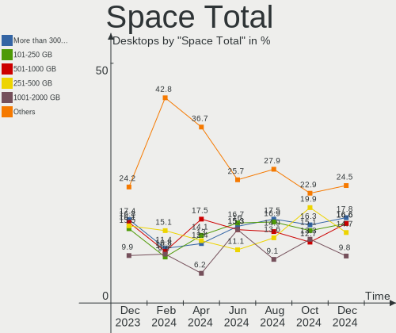
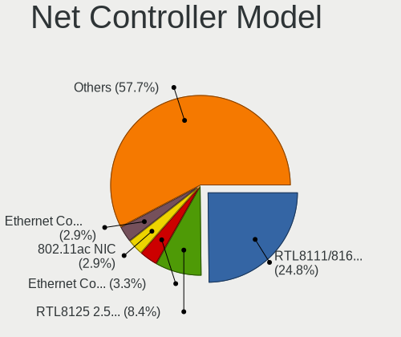
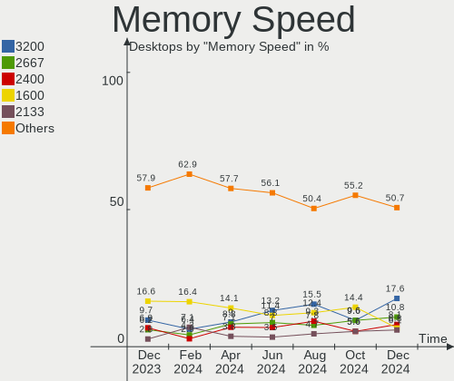
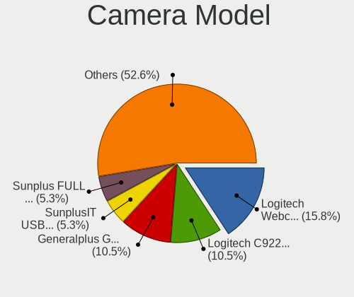

Debian - Hardware Trends (Desktops)
-----------------------------------

A project to identify most popular hardware characteristics and track their change
over time based on data collected by Linux users at https://Linux-Hardware.org.

Anyone can contribute to this report by the [hw-probe](https://github.com/linuxhw/hw-probe) tool:

    sudo -E hw-probe -all -upload

This report is for one last month. Overall report since the beginning of time: [TestCoverage](https://github.com/linuxhw/TestCoverage)

Period: Sep, 2022.

Contents
--------

* [ System ](#system)
  - [ OS                       ](#os)
  - [ OS Family                ](#os-family)
  - [ Kernel                   ](#kernel)
  - [ Kernel Family            ](#kernel-family)
  - [ Kernel Major Ver.        ](#kernel-major-ver)
  - [ Arch                     ](#arch)
  - [ DE                       ](#de)
  - [ Display Server           ](#display-server)
  - [ Display Manager          ](#display-manager)
  - [ OS Lang                  ](#os-lang)
  - [ Boot Mode                ](#boot-mode)
  - [ Filesystem               ](#filesystem)
  - [ Part. scheme             ](#part-scheme)
  - [ Dual Boot with Linux/BSD ](#dual-boot-with-linuxbsd)
  - [ Dual Boot (Win)          ](#dual-boot-win)

* [ Board ](#board)
  - [ Vendor                   ](#vendor)
  - [ Model                    ](#model)
  - [ Model Family             ](#model-family)
  - [ MFG Year                 ](#mfg-year)
  - [ Form Factor              ](#form-factor)
  - [ Secure Boot              ](#secure-boot)
  - [ Coreboot                 ](#coreboot)
  - [ RAM Size                 ](#ram-size)
  - [ RAM Used                 ](#ram-used)
  - [ Total Drives             ](#total-drives)
  - [ Has CD-ROM               ](#has-cd-rom)
  - [ Has Ethernet             ](#has-ethernet)
  - [ Has WiFi                 ](#has-wifi)
  - [ Has Bluetooth            ](#has-bluetooth)

* [ Location ](#location)
  - [ Country                  ](#country)
  - [ City                     ](#city)

* [ Drives ](#drives)
  - [ Drive Vendor             ](#drive-vendor)
  - [ Drive Model              ](#drive-model)
  - [ HDD Vendor               ](#hdd-vendor)
  - [ SSD Vendor               ](#ssd-vendor)
  - [ Drive Kind               ](#drive-kind)
  - [ Drive Connector          ](#drive-connector)
  - [ Drive Size               ](#drive-size)
  - [ Space Total              ](#space-total)
  - [ Space Used               ](#space-used)
  - [ Malfunc. Drives          ](#malfunc-drives)
  - [ Malfunc. Drive Vendor    ](#malfunc-drive-vendor)
  - [ Malfunc. HDD Vendor      ](#malfunc-hdd-vendor)
  - [ Malfunc. Drive Kind      ](#malfunc-drive-kind)
  - [ Failed Drives            ](#failed-drives)
  - [ Failed Drive Vendor      ](#failed-drive-vendor)
  - [ Drive Status             ](#drive-status)

* [ Storage controller ](#storage-controller)
  - [ Storage Vendor           ](#storage-vendor)
  - [ Storage Model            ](#storage-model)
  - [ Storage Kind             ](#storage-kind)

* [ Processor ](#processor)
  - [ CPU Vendor               ](#cpu-vendor)
  - [ CPU Model                ](#cpu-model)
  - [ CPU Model Family         ](#cpu-model-family)
  - [ CPU Cores                ](#cpu-cores)
  - [ CPU Sockets              ](#cpu-sockets)
  - [ CPU Threads              ](#cpu-threads)
  - [ CPU Op-Modes             ](#cpu-op-modes)
  - [ CPU Microcode            ](#cpu-microcode)
  - [ CPU Microarch            ](#cpu-microarch)

* [ Graphics ](#graphics)
  - [ GPU Vendor               ](#gpu-vendor)
  - [ GPU Model                ](#gpu-model)
  - [ GPU Combo                ](#gpu-combo)
  - [ GPU Driver               ](#gpu-driver)
  - [ GPU Memory               ](#gpu-memory)

* [ Monitor ](#monitor)
  - [ Monitor Vendor           ](#monitor-vendor)
  - [ Monitor Model            ](#monitor-model)
  - [ Monitor Resolution       ](#monitor-resolution)
  - [ Monitor Diagonal         ](#monitor-diagonal)
  - [ Monitor Width            ](#monitor-width)
  - [ Aspect Ratio             ](#aspect-ratio)
  - [ Monitor Area             ](#monitor-area)
  - [ Pixel Density            ](#pixel-density)
  - [ Multiple Monitors        ](#multiple-monitors)

* [ Network ](#network)
  - [ Net Controller Vendor    ](#net-controller-vendor)
  - [ Net Controller Model     ](#net-controller-model)
  - [ Wireless Vendor          ](#wireless-vendor)
  - [ Wireless Model           ](#wireless-model)
  - [ Ethernet Vendor          ](#ethernet-vendor)
  - [ Ethernet Model           ](#ethernet-model)
  - [ Net Controller Kind      ](#net-controller-kind)
  - [ Used Controller          ](#used-controller)
  - [ NICs                     ](#nics)
  - [ IPv6                     ](#ipv6)

* [ Bluetooth ](#bluetooth)
  - [ Bluetooth Vendor         ](#bluetooth-vendor)
  - [ Bluetooth Model          ](#bluetooth-model)

* [ Sound ](#sound)
  - [ Sound Vendor             ](#sound-vendor)
  - [ Sound Model              ](#sound-model)

* [ Memory ](#memory)
  - [ Memory Vendor            ](#memory-vendor)
  - [ Memory Model             ](#memory-model)
  - [ Memory Kind              ](#memory-kind)
  - [ Memory Form Factor       ](#memory-form-factor)
  - [ Memory Size              ](#memory-size)
  - [ Memory Speed             ](#memory-speed)

* [ Printers & scanners ](#printers--scanners)
  - [ Printer Vendor           ](#printer-vendor)
  - [ Printer Model            ](#printer-model)
  - [ Scanner Vendor           ](#scanner-vendor)
  - [ Scanner Model            ](#scanner-model)

* [ Camera ](#camera)
  - [ Camera Vendor            ](#camera-vendor)
  - [ Camera Model             ](#camera-model)

* [ Security ](#security)
  - [ Fingerprint Vendor       ](#fingerprint-vendor)
  - [ Fingerprint Model        ](#fingerprint-model)
  - [ Chipcard Vendor          ](#chipcard-vendor)
  - [ Chipcard Model           ](#chipcard-model)

* [ Unsupported ](#unsupported)
  - [ Unsupported Devices      ](#unsupported-devices)
  - [ Unsupported Device Types ](#unsupported-device-types)

System
------

OS
--

Installed operating systems

| Name              | Desktops | Percent |
|-------------------|----------|---------|
| Debian 11         | 136      | 89.47%  |
| Debian Testing    | 5        | 3.29%   |
| Debian Unstable   | 4        | 2.63%   |
| Debian 11-updates | 3        | 1.97%   |
| Debian 10         | 3        | 1.97%   |
| Debian 21         | 1        | 0.66%   |

OS Family
---------

OS without a version

| Name   | Desktops | Percent |
|--------|----------|---------|
| Debian | 152      | 100%    |

Kernel
------

Version of the Linux kernel

| Version                    | Desktops | Percent |
|----------------------------|----------|---------|
| 5.10.0-7-amd64             | 48       | 31.58%  |
| 5.10.0-18-amd64            | 27       | 17.76%  |
| 5.10.0-17-amd64            | 20       | 13.16%  |
| 5.19.0-1-amd64             | 9        | 5.92%   |
| 5.15.53-1-pve              | 7        | 4.61%   |
| 5.18.0-0.deb11.4-amd64     | 6        | 3.95%   |
| 5.18.0-4-amd64             | 4        | 2.63%   |
| 5.15.39-4-pve              | 4        | 2.63%   |
| 5.15.30-2-pve              | 3        | 1.97%   |
| 5.18.0-0.bpo.1-amd64       | 2        | 1.32%   |
| 5.10.0-9-amd64             | 2        | 1.32%   |
| 5.10.0-16-amd64            | 2        | 1.32%   |
| 5.10.0-15-amd64            | 2        | 1.32%   |
| 6.0.0-rc7-rt-amd64         | 1        | 0.66%   |
| 5.5.0-0.bpo.2-amd64        | 1        | 0.66%   |
| 5.4.0-113-generic          | 1        | 0.66%   |
| 5.19.8-amd64               | 1        | 0.66%   |
| 5.19.7-1-pve               | 1        | 0.66%   |
| 5.19.0-4.2-liquorix-amd64  | 1        | 0.66%   |
| 5.18.0-0.deb11.3-rt-amd64  | 1        | 0.66%   |
| 5.16.0-5mx-amd64           | 1        | 0.66%   |
| 5.13.19-1-pve              | 1        | 0.66%   |
| 5.10.0-18-686-pae          | 1        | 0.66%   |
| 5.10.0-17-rt-amd64         | 1        | 0.66%   |
| 5.10.0-14-amd64            | 1        | 0.66%   |
| 5.10.0-12-amd64            | 1        | 0.66%   |
| 5.10.0-0.deb10.17-rt-amd64 | 1        | 0.66%   |
| 4.19.0-21-rt-amd64         | 1        | 0.66%   |
| 4.19.0-21-amd64            | 1        | 0.66%   |

Kernel Family
-------------

Linux kernel without a distro release

| Version | Desktops | Percent |
|---------|----------|---------|
| 5.10.0  | 106      | 69.74%  |
| 5.18.0  | 13       | 8.55%   |
| 5.19.0  | 10       | 6.58%   |
| 5.15.53 | 7        | 4.61%   |
| 5.15.39 | 4        | 2.63%   |
| 5.15.30 | 3        | 1.97%   |
| 4.19.0  | 2        | 1.32%   |
| 6.0.0   | 1        | 0.66%   |
| 5.5.0   | 1        | 0.66%   |
| 5.4.0   | 1        | 0.66%   |
| 5.19.8  | 1        | 0.66%   |
| 5.19.7  | 1        | 0.66%   |
| 5.16.0  | 1        | 0.66%   |
| 5.13.19 | 1        | 0.66%   |

Kernel Major Ver.
-----------------

Linux kernel major version

| Version | Desktops | Percent |
|---------|----------|---------|
| 5.10    | 106      | 69.74%  |
| 5.15    | 14       | 9.21%   |
| 5.18    | 13       | 8.55%   |
| 5.19    | 12       | 7.89%   |
| 4.19    | 2        | 1.32%   |
| 6.0     | 1        | 0.66%   |
| 5.5     | 1        | 0.66%   |
| 5.4     | 1        | 0.66%   |
| 5.16    | 1        | 0.66%   |
| 5.13    | 1        | 0.66%   |

Arch
----

OS architecture (x86_64, i586, etc.)

| Name    | Desktops | Percent |
|---------|----------|---------|
| x86_64  | 150      | 98.68%  |
| ppc64le | 1        | 0.66%   |
| i686    | 1        | 0.66%   |

DE
--

Desktop Environment

| Name             | Desktops | Percent |
|------------------|----------|---------|
| Unknown          | 74       | 48.68%  |
| GNOME            | 21       | 13.82%  |
| XFCE             | 19       | 12.5%   |
| KDE5             | 18       | 11.84%  |
| X-Cinnamon       | 8        | 5.26%   |
| MATE             | 2        | 1.32%   |
| lightdm-xsession | 2        | 1.32%   |
| trinity          | 1        | 0.66%   |
| sway             | 1        | 0.66%   |
| LXQt             | 1        | 0.66%   |
| LXDE             | 1        | 0.66%   |
| KDE              | 1        | 0.66%   |
| i3               | 1        | 0.66%   |
| GNOME Flashback  | 1        | 0.66%   |
| Cinnamon         | 1        | 0.66%   |

Display Server
--------------

X11 or Wayland

| Name    | Desktops | Percent |
|---------|----------|---------|
| X11     | 67       | 44.08%  |
| Unknown | 51       | 33.55%  |
| Tty     | 22       | 14.47%  |
| Wayland | 12       | 7.89%   |

Display Manager
---------------

SDDM, LightDM, etc.

| Name    | Desktops | Percent |
|---------|----------|---------|
| Unknown | 93       | 61.18%  |
| LightDM | 29       | 19.08%  |
| GDM     | 15       | 9.87%   |
| SDDM    | 10       | 6.58%   |
| GDM3    | 4        | 2.63%   |
| XDM     | 1        | 0.66%   |

OS Lang
-------

Language

| Lang    | Desktops | Percent |
|---------|----------|---------|
| ru_RU   | 51       | 33.55%  |
| en_US   | 44       | 28.95%  |
| de_DE   | 10       | 6.58%   |
| es_ES   | 8        | 5.26%   |
| it_IT   | 7        | 4.61%   |
| fr_FR   | 7        | 4.61%   |
| pt_BR   | 4        | 2.63%   |
| en_GB   | 3        | 1.97%   |
| zh_CN   | 2        | 1.32%   |
| en_IN   | 2        | 1.32%   |
| en_IE   | 2        | 1.32%   |
| en_AU   | 2        | 1.32%   |
| Unknown | 2        | 1.32%   |
| zh_HK   | 1        | 0.66%   |
| lt_LT   | 1        | 0.66%   |
| hu_HU   | 1        | 0.66%   |
| fr_BE   | 1        | 0.66%   |
| es_VE   | 1        | 0.66%   |
| es_UY   | 1        | 0.66%   |
| es_AR   | 1        | 0.66%   |
| C       | 1        | 0.66%   |

Boot Mode
---------

EFI or BIOS

| Mode | Desktops | Percent |
|------|----------|---------|
| BIOS | 103      | 67.76%  |
| EFI  | 49       | 32.24%  |

Filesystem
----------

Type of filesystem

| Type    | Desktops | Percent |
|---------|----------|---------|
| Ext4    | 90       | 59.21%  |
| Overlay | 49       | 32.24%  |
| Zfs     | 6        | 3.95%   |
| Btrfs   | 3        | 1.97%   |
| Xfs     | 2        | 1.32%   |
| Ext3    | 1        | 0.66%   |
| Unknown | 1        | 0.66%   |

Part. scheme
------------

Scheme of partitioning

| Type    | Desktops | Percent |
|---------|----------|---------|
| MBR     | 72       | 47.37%  |
| GPT     | 59       | 38.82%  |
| Unknown | 21       | 13.82%  |

Dual Boot with Linux/BSD
------------------------

Hosting more than one Linux/BSD

| Dual boot | Desktops | Percent |
|-----------|----------|---------|
| No        | 127      | 83.55%  |
| Yes       | 25       | 16.45%  |

Dual Boot (Win)
---------------

Hosting Linux and Windows

| Dual boot | Desktops | Percent |
|-----------|----------|---------|
| Yes       | 77       | 50.66%  |
| No        | 75       | 49.34%  |

Board
-----

Vendor
------

Motherboard manufacturer

| Name                | Desktops | Percent |
|---------------------|----------|---------|
| ASUSTek Computer    | 37       | 24.34%  |
| Gigabyte Technology | 26       | 17.11%  |
| ASRock              | 24       | 15.79%  |
| MSI                 | 13       | 8.55%   |
| Hewlett-Packard     | 11       | 7.24%   |
| Lenovo              | 9        | 5.92%   |
| Dell                | 6        | 3.95%   |
| ECS                 | 5        | 3.29%   |
| Unknown             | 3        | 1.97%   |
| Supermicro          | 2        | 1.32%   |
| Foxconn             | 2        | 1.32%   |
| Biostar             | 2        | 1.32%   |
| AZW                 | 2        | 1.32%   |
| ASRockRack          | 2        | 1.32%   |
| Thecus              | 1        | 0.66%   |
| Shuttle             | 1        | 0.66%   |
| Positivo            | 1        | 0.66%   |
| Pegatron            | 1        | 0.66%   |
| Medion              | 1        | 0.66%   |
| Inventec            | 1        | 0.66%   |
| Google              | 1        | 0.66%   |
| BESSTAR Tech        | 1        | 0.66%   |

Model
-----

Motherboard model

| Name                                    | Desktops | Percent |
|-----------------------------------------|----------|---------|
| ASRock H470M-HVS                        | 17       | 11.18%  |
| ECS G31T-M9                             | 4        | 2.63%   |
| ASUS All Series                         | 4        | 2.63%   |
| Gigabyte M56S-S3                        | 3        | 1.97%   |
| ASUS S20 K29                            | 3        | 1.97%   |
| Unknown                                 | 3        | 1.97%   |
| MSI MS-7996                             | 2        | 1.32%   |
| MSI MS-7817                             | 2        | 1.32%   |
| HP EliteDesk 800 G1 SFF                 | 2        | 1.32%   |
| HP Compaq Pro 6300 MT                   | 2        | 1.32%   |
| Gigabyte H81M-S2V                       | 2        | 1.32%   |
| Gigabyte A320M-S2H                      | 2        | 1.32%   |
| ASUS Pro WS 565-ACE                     | 2        | 1.32%   |
| ASUS M3N78-VM                           | 2        | 1.32%   |
| ASRock Q1900M                           | 2        | 1.32%   |
| Thecus N2810                            | 1        | 0.66%   |
| Supermicro X9DR3-F                      | 1        | 0.66%   |
| Supermicro SSG-6048R-E1CR36N            | 1        | 0.66%   |
| Shuttle DS81D                           | 1        | 0.66%   |
| Positivo POS-EINM10CB                   | 1        | 0.66%   |
| Pegatron p7-1148p                       | 1        | 0.66%   |
| MSI MS-7D22                             | 1        | 0.66%   |
| MSI MS-7C39                             | 1        | 0.66%   |
| MSI MS-7C37                             | 1        | 0.66%   |
| MSI MS-7C02                             | 1        | 0.66%   |
| MSI MS-7B86                             | 1        | 0.66%   |
| MSI MS-7B49                             | 1        | 0.66%   |
| MSI MS-7A38                             | 1        | 0.66%   |
| MSI MS-7998                             | 1        | 0.66%   |
| MSI MS-7877                             | 1        | 0.66%   |
| Medion MS-7728                          | 1        | 0.66%   |
| Lenovo ThinkCentre M900 10FGS0FT05      | 1        | 0.66%   |
| Lenovo ThinkCentre M57 6072WMD          | 1        | 0.66%   |
| Lenovo ThinkCentre E73 10DS000TUK       | 1        | 0.66%   |
| Lenovo ThinkCentre A70z 0401R6U         | 1        | 0.66%   |
| Lenovo ThinkCentre A70 7099A5G          | 1        | 0.66%   |
| Lenovo SHARKBAY 0C48431 WIN             | 1        | 0.66%   |
| Lenovo IdeaCentre 510A-15ICB 90HV001MUS | 1        | 0.66%   |
| Lenovo IdeaCentre 510-15ABR 90G7002RGE  | 1        | 0.66%   |
| Lenovo 70AQ000JGE ThinkServer TS440     | 1        | 0.66%   |

Model Family
------------

Motherboard model prefix

| Name                         | Desktops | Percent |
|------------------------------|----------|---------|
| ASRock H470M-HVS             | 17       | 11.18%  |
| ASUS PRIME                   | 6        | 3.95%   |
| Lenovo ThinkCentre           | 5        | 3.29%   |
| ECS G31T-M9                  | 4        | 2.63%   |
| ASUS All                     | 4        | 2.63%   |
| Gigabyte M56S-S3             | 3        | 1.97%   |
| ASUS S20                     | 3        | 1.97%   |
| Unknown                      | 3        | 1.97%   |
| MSI MS-7996                  | 2        | 1.32%   |
| MSI MS-7817                  | 2        | 1.32%   |
| Lenovo IdeaCentre            | 2        | 1.32%   |
| HP ProDesk                   | 2        | 1.32%   |
| HP EliteDesk                 | 2        | 1.32%   |
| HP Compaq                    | 2        | 1.32%   |
| Gigabyte H81M-S2V            | 2        | 1.32%   |
| Gigabyte A320M-S2H           | 2        | 1.32%   |
| Dell OptiPlex                | 2        | 1.32%   |
| ASUS TUF                     | 2        | 1.32%   |
| ASUS ROG                     | 2        | 1.32%   |
| ASUS Pro                     | 2        | 1.32%   |
| ASUS M5A97                   | 2        | 1.32%   |
| ASUS M3N78-VM                | 2        | 1.32%   |
| ASRock Q1900M                | 2        | 1.32%   |
| Thecus N2810                 | 1        | 0.66%   |
| Supermicro X9DR3-F           | 1        | 0.66%   |
| Supermicro SSG-6048R-E1CR36N | 1        | 0.66%   |
| Shuttle DS81D                | 1        | 0.66%   |
| Positivo POS-EINM10CB        | 1        | 0.66%   |
| Pegatron p7-1148p            | 1        | 0.66%   |
| MSI MS-7D22                  | 1        | 0.66%   |
| MSI MS-7C39                  | 1        | 0.66%   |
| MSI MS-7C37                  | 1        | 0.66%   |
| MSI MS-7C02                  | 1        | 0.66%   |
| MSI MS-7B86                  | 1        | 0.66%   |
| MSI MS-7B49                  | 1        | 0.66%   |
| MSI MS-7A38                  | 1        | 0.66%   |
| MSI MS-7998                  | 1        | 0.66%   |
| MSI MS-7877                  | 1        | 0.66%   |
| Medion MS-7728               | 1        | 0.66%   |
| Lenovo SHARKBAY              | 1        | 0.66%   |

MFG Year
--------

Motherboard manufacture year

| Year    | Desktops | Percent |
|---------|----------|---------|
| 2021    | 30       | 19.74%  |
| 2020    | 15       | 9.87%   |
| 2012    | 14       | 9.21%   |
| 2019    | 12       | 7.89%   |
| 2014    | 10       | 6.58%   |
| 2013    | 10       | 6.58%   |
| 2011    | 9        | 5.92%   |
| 2009    | 9        | 5.92%   |
| 2017    | 8        | 5.26%   |
| 2015    | 7        | 4.61%   |
| 2016    | 6        | 3.95%   |
| 2007    | 6        | 3.95%   |
| 2010    | 4        | 2.63%   |
| 2008    | 4        | 2.63%   |
| 2022    | 3        | 1.97%   |
| 2018    | 3        | 1.97%   |
| 2005    | 1        | 0.66%   |
| Unknown | 1        | 0.66%   |

Form Factor
-----------

Physical design of the computer

| Name    | Desktops | Percent |
|---------|----------|---------|
| Desktop | 152      | 100%    |

Secure Boot
-----------

Enabled or disabled

| State    | Desktops | Percent |
|----------|----------|---------|
| Disabled | 151      | 99.34%  |
| Enabled  | 1        | 0.66%   |

Coreboot
--------

Have coreboot on board

| Used | Desktops | Percent |
|------|----------|---------|
| No   | 150      | 98.68%  |
| Yes  | 2        | 1.32%   |

RAM Size
--------

Total RAM memory

| Size in GB      | Desktops | Percent |
|-----------------|----------|---------|
| 4.01-8.0        | 33       | 21.71%  |
| 32.01-64.0      | 33       | 21.71%  |
| 16.01-24.0      | 23       | 15.13%  |
| 3.01-4.0        | 20       | 13.16%  |
| 8.01-16.0       | 17       | 11.18%  |
| 64.01-256.0     | 12       | 7.89%   |
| 1.01-2.0        | 7        | 4.61%   |
| More than 256.0 | 3        | 1.97%   |
| 24.01-32.0      | 2        | 1.32%   |
| 0.51-1.0        | 2        | 1.32%   |

RAM Used
--------

Used RAM memory

| Used GB     | Desktops | Percent |
|-------------|----------|---------|
| 0.51-1.0    | 57       | 37.5%   |
| 1.01-2.0    | 31       | 20.39%  |
| 4.01-8.0    | 19       | 12.5%   |
| 2.01-3.0    | 18       | 11.84%  |
| 3.01-4.0    | 11       | 7.24%   |
| 8.01-16.0   | 9        | 5.92%   |
| 64.01-256.0 | 4        | 2.63%   |
| 32.01-64.0  | 1        | 0.66%   |
| 16.01-24.0  | 1        | 0.66%   |
| 0.01-0.5    | 1        | 0.66%   |

Total Drives
------------

Number of drives on board

| Drives | Desktops | Percent |
|--------|----------|---------|
| 1      | 66       | 43.42%  |
| 2      | 41       | 26.97%  |
| 3      | 21       | 13.82%  |
| 4      | 14       | 9.21%   |
| 5      | 4        | 2.63%   |
| 6      | 2        | 1.32%   |
| 46     | 1        | 0.66%   |
| 10     | 1        | 0.66%   |
| 8      | 1        | 0.66%   |
| 7      | 1        | 0.66%   |

Has CD-ROM
----------

Has CD-ROM on board

| Presented | Desktops | Percent |
|-----------|----------|---------|
| No        | 105      | 69.08%  |
| Yes       | 47       | 30.92%  |

Has Ethernet
------------

Has Ethernet on board

| Presented | Desktops | Percent |
|-----------|----------|---------|
| Yes       | 152      | 100%    |

Has WiFi
--------

Has WiFi module

| Presented | Desktops | Percent |
|-----------|----------|---------|
| No        | 104      | 68.42%  |
| Yes       | 48       | 31.58%  |

Has Bluetooth
-------------

Has Bluetooth module

| Presented | Desktops | Percent |
|-----------|----------|---------|
| No        | 123      | 80.92%  |
| Yes       | 29       | 19.08%  |

Location
--------

Country
-------

Geographic location (country)

| Country     | Desktops | Percent |
|-------------|----------|---------|
| Russia      | 54       | 35.53%  |
| USA         | 17       | 11.18%  |
| Germany     | 15       | 9.87%   |
| Italy       | 9        | 5.92%   |
| Spain       | 8        | 5.26%   |
| France      | 7        | 4.61%   |
| UK          | 5        | 3.29%   |
| Brazil      | 5        | 3.29%   |
| Australia   | 4        | 2.63%   |
| China       | 3        | 1.97%   |
| Canada      | 3        | 1.97%   |
| Ireland     | 2        | 1.32%   |
| India       | 2        | 1.32%   |
| Hungary     | 2        | 1.32%   |
| Vietnam     | 1        | 0.66%   |
| Venezuela   | 1        | 0.66%   |
| Uruguay     | 1        | 0.66%   |
| Turkey      | 1        | 0.66%   |
| Switzerland | 1        | 0.66%   |
| Romania     | 1        | 0.66%   |
| Réunion    | 1        | 0.66%   |
| Netherlands | 1        | 0.66%   |
| Morocco     | 1        | 0.66%   |
| Mexico      | 1        | 0.66%   |
| Lithuania   | 1        | 0.66%   |
| Hong Kong   | 1        | 0.66%   |
| Finland     | 1        | 0.66%   |
| Bulgaria    | 1        | 0.66%   |
| Belgium     | 1        | 0.66%   |
| Argentina   | 1        | 0.66%   |

City
----

Geographic location (city)

| City                       | Desktops | Percent |
|----------------------------|----------|---------|
| Voronezh                   | 48       | 31.58%  |
| Seville                    | 4        | 2.63%   |
| Rio de Janeiro             | 2        | 1.32%   |
| Naples                     | 2        | 1.32%   |
| Moscow                     | 2        | 1.32%   |
| Las Palmas de Gran Canaria | 2        | 1.32%   |
| Frankfurt am Main          | 2        | 1.32%   |
| Brighton                   | 2        | 1.32%   |
| Yelets                     | 1        | 0.66%   |
| Yantai                     | 1        | 0.66%   |
| Worcester Park             | 1        | 0.66%   |
| Wilmington                 | 1        | 0.66%   |
| Willisau                   | 1        | 0.66%   |
| Wilhelmshaven              | 1        | 0.66%   |
| Vitória                   | 1        | 0.66%   |
| Vancouver                  | 1        | 0.66%   |
| Tuusula                    | 1        | 0.66%   |
| Tucupita                   | 1        | 0.66%   |
| Troisdorf                  | 1        | 0.66%   |
| Tijuana                    | 1        | 0.66%   |
| Szombathely                | 1        | 0.66%   |
| Surrey                     | 1        | 0.66%   |
| Strasbourg                 | 1        | 0.66%   |
| St Petersburg              | 1        | 0.66%   |
| St Louis                   | 1        | 0.66%   |
| Spruce Grove               | 1        | 0.66%   |
| Sibiu                      | 1        | 0.66%   |
| Shenzhen                   | 1        | 0.66%   |
| Seelow                     | 1        | 0.66%   |
| Scandicci                  | 1        | 0.66%   |
| Sao Paulo do Potengi       | 1        | 0.66%   |
| Sao Paulo                  | 1        | 0.66%   |
| San Diego                  | 1        | 0.66%   |
| Salt Lake City             | 1        | 0.66%   |
| Saint-Denis                | 1        | 0.66%   |
| Racine                     | 1        | 0.66%   |
| Quemado                    | 1        | 0.66%   |
| Puyallup                   | 1        | 0.66%   |
| Plano                      | 1        | 0.66%   |
| Pharr                      | 1        | 0.66%   |

Drives
------

Drive Vendor
------------

Hard drive vendors

| Vendor                      | Desktops | Drives | Percent |
|-----------------------------|----------|--------|---------|
| WDC                         | 45       | 65     | 16.92%  |
| Seagate                     | 41       | 86     | 15.41%  |
| Samsung Electronics         | 39       | 60     | 14.66%  |
| Toshiba                     | 31       | 32     | 11.65%  |
| Netac                       | 17       | 17     | 6.39%   |
| Kingston                    | 17       | 23     | 6.39%   |
| Crucial                     | 13       | 14     | 4.89%   |
| China                       | 8        | 9      | 3.01%   |
| Sandisk                     | 7        | 8      | 2.63%   |
| Hitachi                     | 7        | 7      | 2.63%   |
| A-DATA Technology           | 4        | 4      | 1.5%    |
| Unknown                     | 3        | 3      | 1.13%   |
| Gigabyte Technology         | 3        | 3      | 1.13%   |
| TEXTORM                     | 2        | 2      | 0.75%   |
| Supermicro                  | 2        | 3      | 0.75%   |
| SK hynix                    | 2        | 2      | 0.75%   |
| Maxtor                      | 2        | 2      | 0.75%   |
| Intenso                     | 2        | 3      | 0.75%   |
| Intel                       | 2        | 4      | 0.75%   |
| HGST                        | 2        | 3      | 0.75%   |
| Transcend                   | 1        | 1      | 0.38%   |
| Team                        | 1        | 1      | 0.38%   |
| SPCC                        | 1        | 1      | 0.38%   |
| Silicon Motion              | 1        | 1      | 0.38%   |
| Plextor                     | 1        | 1      | 0.38%   |
| Phison                      | 1        | 4      | 0.38%   |
| Pear                        | 1        | 1      | 0.38%   |
| Patriot                     | 1        | 1      | 0.38%   |
| Micron/Crucial Technology   | 1        | 1      | 0.38%   |
| KIOXIA-EXCERIA              | 1        | 1      | 0.38%   |
| Kingston Technology Company | 1        | 1      | 0.38%   |
| JEYI                        | 1        | 1      | 0.38%   |
| IBM-D050                    | 1        | 3      | 0.38%   |
| Hewlett-Packard             | 1        | 1      | 0.38%   |
| Hajaan                      | 1        | 2      | 0.38%   |
| External                    | 1        | 1      | 0.38%   |
| Unknown                     | 1        | 1      | 0.38%   |

Drive Model
-----------

Hard drive models

| Model                            | Desktops | Percent |
|----------------------------------|----------|---------|
| Toshiba HDWD110 1TB              | 17       | 5.84%   |
| Netac SSD 240GB                  | 17       | 5.84%   |
| Toshiba DT01ACA050 500GB         | 5        | 1.72%   |
| Seagate ST1000DM010-2EP102 1TB   | 5        | 1.72%   |
| Toshiba DT01ACA100 1TB           | 4        | 1.37%   |
| Samsung SSD 860 EVO 250GB        | 4        | 1.37%   |
| Kingston SA400S37120G 120GB SSD  | 4        | 1.37%   |
| Crucial CT480BX500SSD1 480GB     | 4        | 1.37%   |
| Seagate ST500DM002-1BD142 500GB  | 3        | 1.03%   |
| Seagate ST1000DM003-1ER162 1TB   | 3        | 1.03%   |
| Samsung SSD 860 EVO 500GB        | 3        | 1.03%   |
| WDC WD60EFZX-68B3FN0 6TB         | 2        | 0.69%   |
| WDC WD5000AAKX-60U6AA0 500GB     | 2        | 0.69%   |
| Seagate ST8000DM004-2CX188 8TB   | 2        | 0.69%   |
| Seagate ST4000DM004-2CV104 4TB   | 2        | 0.69%   |
| Seagate ST3500418AS 500GB        | 2        | 0.69%   |
| Seagate ST2000DM008-2FR102 2TB   | 2        | 0.69%   |
| Seagate ST1000LM048-2E7172 1TB   | 2        | 0.69%   |
| Samsung SSD 970 EVO Plus 2TB     | 2        | 0.69%   |
| Samsung SSD 860 PRO 1TB          | 2        | 0.69%   |
| Samsung SSD 860 EVO 1TB          | 2        | 0.69%   |
| Samsung SSD 850 EVO 250GB        | 2        | 0.69%   |
| Samsung SSD 840 PRO Series 128GB | 2        | 0.69%   |
| Samsung Portable SSD T5 2TB      | 2        | 0.69%   |
| Samsung MZQLB3T8HALS-00007 3.8TB | 2        | 0.69%   |
| Samsung HD103SI 1TB              | 2        | 0.69%   |
| Kingston SV300S37A240G 240GB SSD | 2        | 0.69%   |
| Kingston SV300S37A120G 120GB SSD | 2        | 0.69%   |
| Kingston SUV500120G 120GB SSD    | 2        | 0.69%   |
| Intenso SSD Sata III 120GB       | 2        | 0.69%   |
| Hitachi HDS721050CLA362 500GB    | 2        | 0.69%   |
| Gigabyte GP-GSTFS31240GNTD 240GB | 2        | 0.69%   |
| Crucial CT250MX500SSD1 250GB     | 2        | 0.69%   |
| Crucial CT240BX500SSD1 240GB     | 2        | 0.69%   |
| Crucial CT1000MX500SSD1 1TB      | 2        | 0.69%   |
| China SSD 256GB                  | 2        | 0.69%   |
| WDC WDS500G3X0C-00SJG0 500GB     | 1        | 0.34%   |
| WDC WDS500G2B0A-00SM50 500GB SSD | 1        | 0.34%   |
| WDC WDS240G2G0A-00JH30 240GB SSD | 1        | 0.34%   |
| WDC WDS200T2B0A-00SM50 2TB SSD   | 1        | 0.34%   |

HDD Vendor
----------

Hard disk drive vendors

| Vendor              | Desktops | Drives | Percent |
|---------------------|----------|--------|---------|
| Seagate             | 40       | 85     | 31.75%  |
| WDC                 | 38       | 55     | 30.16%  |
| Toshiba             | 31       | 32     | 24.6%   |
| Hitachi             | 7        | 7      | 5.56%   |
| Samsung Electronics | 3        | 5      | 2.38%   |
| Unknown             | 2        | 2      | 1.59%   |
| Maxtor              | 2        | 2      | 1.59%   |
| HGST                | 2        | 3      | 1.59%   |
| Hajaan              | 1        | 1      | 0.79%   |

SSD Vendor
----------

Solid state drive vendors

| Vendor              | Desktops | Drives | Percent |
|---------------------|----------|--------|---------|
| Samsung Electronics | 23       | 28     | 21.7%   |
| Netac               | 17       | 17     | 16.04%  |
| Kingston            | 15       | 20     | 14.15%  |
| Crucial             | 12       | 13     | 11.32%  |
| China               | 8        | 9      | 7.55%   |
| WDC                 | 5        | 5      | 4.72%   |
| A-DATA Technology   | 4        | 4      | 3.77%   |
| SanDisk             | 3        | 3      | 2.83%   |
| TEXTORM             | 2        | 2      | 1.89%   |
| Supermicro          | 2        | 3      | 1.89%   |
| Intenso             | 2        | 3      | 1.89%   |
| Gigabyte Technology | 2        | 2      | 1.89%   |
| Transcend           | 1        | 1      | 0.94%   |
| Team                | 1        | 1      | 0.94%   |
| SPCC                | 1        | 1      | 0.94%   |
| Plextor             | 1        | 1      | 0.94%   |
| Pear                | 1        | 1      | 0.94%   |
| Patriot             | 1        | 1      | 0.94%   |
| KIOXIA-EXCERIA      | 1        | 1      | 0.94%   |
| Intel               | 1        | 3      | 0.94%   |
| Hewlett-Packard     | 1        | 1      | 0.94%   |
| Hajaan              | 1        | 1      | 0.94%   |
| Unknown             | 1        | 1      | 0.94%   |

Drive Kind
----------

HDD or SSD

| Kind    | Desktops | Drives | Percent |
|---------|----------|--------|---------|
| HDD     | 108      | 192    | 45.57%  |
| SSD     | 94       | 122    | 39.66%  |
| NVMe    | 31       | 53     | 13.08%  |
| Unknown | 3        | 5      | 1.27%   |
| MMC     | 1        | 1      | 0.42%   |

Drive Connector
---------------

SATA, SAS, NVMe, etc.

| Type | Desktops | Drives | Percent |
|------|----------|--------|---------|
| SATA | 143      | 308    | 78.57%  |
| NVMe | 31       | 51     | 17.03%  |
| SAS  | 7        | 13     | 3.85%   |
| MMC  | 1        | 1      | 0.55%   |

Drive Size
----------

Size of hard drive

| Size in TB | Desktops | Drives | Percent |
|------------|----------|--------|---------|
| 0.01-0.5   | 117      | 151    | 55.98%  |
| 0.51-1.0   | 55       | 71     | 26.32%  |
| 1.01-2.0   | 15       | 17     | 7.18%   |
| 3.01-4.0   | 11       | 20     | 5.26%   |
| 4.01-10.0  | 8        | 51     | 3.83%   |
| 2.01-3.0   | 3        | 4      | 1.44%   |

Space Total
-----------

Amount of disk space available on the file system

| Size in GB     | Desktops | Percent |
|----------------|----------|---------|
| Unknown        | 54       | 35.53%  |
| 251-500        | 23       | 15.13%  |
| 101-250        | 21       | 13.82%  |
| 1001-2000      | 15       | 9.87%   |
| More than 3000 | 13       | 8.55%   |
| 501-1000       | 10       | 6.58%   |
| 2001-3000      | 5        | 3.29%   |
| 51-100         | 5        | 3.29%   |
| 21-50          | 4        | 2.63%   |
| 1-20           | 2        | 1.32%   |

Space Used
----------

Amount of used disk space

| Used GB        | Desktops | Percent |
|----------------|----------|---------|
| Unknown        | 54       | 35.53%  |
| 1-20           | 35       | 23.03%  |
| 21-50          | 13       | 8.55%   |
| 101-250        | 12       | 7.89%   |
| 501-1000       | 11       | 7.24%   |
| 251-500        | 10       | 6.58%   |
| More than 3000 | 7        | 4.61%   |
| 51-100         | 6        | 3.95%   |
| 2001-3000      | 2        | 1.32%   |
| 1001-2000      | 2        | 1.32%   |

Malfunc. Drives
---------------

Drive models with a malfunction

| Model                                            | Desktops | Drives | Percent |
|--------------------------------------------------|----------|--------|---------|
| WDC WD800JD-60LSA5 80GB                          | 1        | 1      | 3.85%   |
| WDC WD5000AAKX-60U6AA0 500GB                     | 1        | 1      | 3.85%   |
| WDC WD40PURZ-85AKKY0 4TB                         | 1        | 1      | 3.85%   |
| WDC WD3200AAJS-08L7A0 320GB                      | 1        | 1      | 3.85%   |
| WDC WD2500AAKS-00VSA0 250GB                      | 1        | 1      | 3.85%   |
| WDC WD2500AAKS-00B3A0 250GB                      | 1        | 1      | 3.85%   |
| WDC WD2500AAJS-00L7A0 250GB                      | 1        | 1      | 3.85%   |
| WDC WD10EARS-00Y5B1 1TB                          | 1        | 1      | 3.85%   |
| WDC WD10EADS-00P8B0 1TB                          | 1        | 1      | 3.85%   |
| Toshiba MK5059GSXP 500GB                         | 1        | 1      | 3.85%   |
| Toshiba DT01ACA100 1TB                           | 1        | 1      | 3.85%   |
| Toshiba DT01ACA050 500GB                         | 1        | 1      | 3.85%   |
| Seagate ST3500418AS 500GB                        | 1        | 1      | 3.85%   |
| Seagate ST3250318AS 250GB                        | 1        | 1      | 3.85%   |
| Seagate ST3120811AS 120GB                        | 1        | 1      | 3.85%   |
| Seagate ST2000DM008-2FR102 2TB                   | 1        | 1      | 3.85%   |
| Seagate ST1000DM003-1ER162 1TB                   | 1        | 1      | 3.85%   |
| Samsung Electronics SSD 870 EVO 500GB            | 1        | 1      | 3.85%   |
| Samsung Electronics MZHPV256HDGL-00000 256GB SSD | 1        | 1      | 3.85%   |
| Maxtor STM3250310AS 250GB                        | 1        | 1      | 3.85%   |
| Kingston SV300S37A240G 240GB SSD                 | 1        | 2      | 3.85%   |
| Kingston SA400S37120G 120GB SSD                  | 1        | 1      | 3.85%   |
| Hitachi HUA721010KLA330 1TB                      | 1        | 1      | 3.85%   |
| Hitachi HDT725032VLA380 320GB                    | 1        | 1      | 3.85%   |
| Crucial CT525MX300SSD1 528GB                     | 1        | 1      | 3.85%   |
| A-DATA Technology SU800 128GB SSD                | 1        | 1      | 3.85%   |

Malfunc. Drive Vendor
---------------------

Vendors of faulty drives

| Vendor              | Desktops | Drives | Percent |
|---------------------|----------|--------|---------|
| WDC                 | 8        | 9      | 32%     |
| Seagate             | 5        | 5      | 20%     |
| Toshiba             | 3        | 3      | 12%     |
| Samsung Electronics | 2        | 2      | 8%      |
| Kingston            | 2        | 3      | 8%      |
| Hitachi             | 2        | 2      | 8%      |
| Maxtor              | 1        | 1      | 4%      |
| Crucial             | 1        | 1      | 4%      |
| A-DATA Technology   | 1        | 1      | 4%      |

Malfunc. HDD Vendor
-------------------

Vendors of faulty HDD drives

| Vendor  | Desktops | Drives | Percent |
|---------|----------|--------|---------|
| WDC     | 8        | 9      | 42.11%  |
| Seagate | 5        | 5      | 26.32%  |
| Toshiba | 3        | 3      | 15.79%  |
| Hitachi | 2        | 2      | 10.53%  |
| Maxtor  | 1        | 1      | 5.26%   |

Malfunc. Drive Kind
-------------------

Kinds of faulty drives

| Kind | Desktops | Drives | Percent |
|------|----------|--------|---------|
| HDD  | 18       | 20     | 75%     |
| SSD  | 6        | 7      | 25%     |

Failed Drives
-------------

Failed drive models

Zero info for selected period =(

Failed Drive Vendor
-------------------

Failed drive vendors

Zero info for selected period =(

Drive Status
------------

Number of failed and malfunc. drives

| Status   | Desktops | Drives | Percent |
|----------|----------|--------|---------|
| Works    | 122      | 287    | 70.93%  |
| Detected | 26       | 59     | 15.12%  |
| Malfunc  | 24       | 27     | 13.95%  |

Storage controller
------------------

Storage Vendor
--------------

Storage controller vendors

| Vendor                      | Desktops | Percent |
|-----------------------------|----------|---------|
| Intel                       | 110      | 54.46%  |
| AMD                         | 31       | 15.35%  |
| Samsung Electronics         | 15       | 7.43%   |
| SanDisk                     | 8        | 3.96%   |
| Nvidia                      | 7        | 3.47%   |
| ASMedia Technology          | 7        | 3.47%   |
| LSI Logic / Symbios Logic   | 4        | 1.98%   |
| Marvell Technology Group    | 3        | 1.49%   |
| Kingston Technology Company | 3        | 1.49%   |
| VIA Technologies            | 2        | 0.99%   |
| SK hynix                    | 2        | 0.99%   |
| Phison Electronics          | 2        | 0.99%   |
| Micron/Crucial Technology   | 2        | 0.99%   |
| JMicron Technology          | 2        | 0.99%   |
| Broadcom / LSI              | 2        | 0.99%   |
| Silicon Motion              | 1        | 0.5%    |
| Silicon Image               | 1        | 0.5%    |

Storage Model
-------------

Storage controller models

| Model                                                                                   | Desktops | Percent |
|-----------------------------------------------------------------------------------------|----------|---------|
| Intel Comet Lake SATA AHCI Controller                                                   | 18       | 7.38%   |
| AMD FCH SATA Controller [AHCI mode]                                                     | 15       | 6.15%   |
| Intel 8 Series/C220 Series Chipset Family 6-port SATA Controller 1 [AHCI mode]          | 14       | 5.74%   |
| Intel NM10/ICH7 Family SATA Controller [IDE mode]                                       | 10       | 4.1%    |
| Samsung NVMe SSD Controller SM981/PM981/PM983                                           | 9        | 3.69%   |
| Intel 200 Series PCH SATA controller [AHCI mode]                                        | 8        | 3.28%   |
| Intel Q170/Q150/B150/H170/H110/Z170/CM236 Chipset SATA Controller [AHCI Mode]           | 7        | 2.87%   |
| Intel 82801G (ICH7 Family) IDE Controller                                               | 7        | 2.87%   |
| Intel 6 Series/C200 Series Chipset Family 6 port Desktop SATA AHCI Controller           | 7        | 2.87%   |
| ASMedia ASM1062 Serial ATA Controller                                                   | 7        | 2.87%   |
| AMD 500 Series Chipset SATA Controller                                                  | 6        | 2.46%   |
| Intel SATA Controller [RAID mode]                                                       | 5        | 2.05%   |
| Intel 7 Series/C210 Series Chipset Family 6-port SATA Controller [AHCI mode]            | 5        | 2.05%   |
| AMD 400 Series Chipset SATA Controller                                                  | 5        | 2.05%   |
| Nvidia MCP65 SATA Controller                                                            | 4        | 1.64%   |
| Nvidia MCP65 IDE                                                                        | 4        | 1.64%   |
| Intel 500 Series Chipset Family SATA AHCI Controller                                    | 4        | 1.64%   |
| SanDisk WD Blue SN550 NVMe SSD                                                          | 3        | 1.23%   |
| Intel Celeron N3350/Pentium N4200/Atom E3900 Series SATA AHCI Controller                | 3        | 1.23%   |
| Intel Cannon Lake PCH SATA AHCI Controller                                              | 3        | 1.23%   |
| Intel Atom Processor E3800 Series SATA AHCI Controller                                  | 3        | 1.23%   |
| Intel Alder Lake-S PCH SATA Controller [AHCI Mode]                                      | 3        | 1.23%   |
| Intel 82801JI (ICH10 Family) SATA AHCI Controller                                       | 3        | 1.23%   |
| Intel 8 Series/C220 Series Chipset Family 4-port SATA Controller 1 [IDE mode]           | 3        | 1.23%   |
| AMD SB7x0/SB8x0/SB9x0 SATA Controller [IDE mode]                                        | 3        | 1.23%   |
| AMD SB7x0/SB8x0/SB9x0 SATA Controller [AHCI mode]                                       | 3        | 1.23%   |
| AMD SB7x0/SB8x0/SB9x0 IDE Controller                                                    | 3        | 1.23%   |
| AMD FCH SATA Controller D                                                               | 3        | 1.23%   |
| SanDisk WD Blue SN570 NVMe SSD                                                          | 2        | 0.82%   |
| SanDisk WD Black SN750 / PC SN730 NVMe SSD                                              | 2        | 0.82%   |
| Samsung NVMe SSD Controller PM9A1/PM9A3/980PRO                                          | 2        | 0.82%   |
| Nvidia MCP78S [GeForce 8200] SATA Controller (non-AHCI mode)                            | 2        | 0.82%   |
| Nvidia MCP78S [GeForce 8200] IDE                                                        | 2        | 0.82%   |
| Intel Volume Management Device NVMe RAID Controller                                     | 2        | 0.82%   |
| Intel C602 chipset 4-Port SATA Storage Control Unit                                     | 2        | 0.82%   |
| Intel C600/X79 series chipset 6-Port SATA AHCI Controller                               | 2        | 0.82%   |
| Intel 6 Series/C200 Series Chipset Family Desktop SATA Controller (IDE mode, ports 4-5) | 2        | 0.82%   |
| Intel 6 Series/C200 Series Chipset Family Desktop SATA Controller (IDE mode, ports 0-3) | 2        | 0.82%   |
| VIA VX855/VX875 EIDE Controller                                                         | 1        | 0.41%   |
| VIA VT6415 PATA IDE Host Controller                                                     | 1        | 0.41%   |

Storage Kind
------------

Kind of storage controller (IDE, SATA, NVMe, SAS, ...)

| Kind | Desktops | Percent |
|------|----------|---------|
| SATA | 123      | 60.59%  |
| IDE  | 33       | 16.26%  |
| NVMe | 31       | 15.27%  |
| RAID | 9        | 4.43%   |
| SAS  | 5        | 2.46%   |
| SCSI | 2        | 0.99%   |

Processor
---------

CPU Vendor
----------

Processor vendors

| Vendor           | Desktops | Percent |
|------------------|----------|---------|
| Intel            | 113      | 74.34%  |
| AMD              | 37       | 24.34%  |
| PowerNV FP5466G2 | 1        | 0.66%   |
| CentaurHauls     | 1        | 0.66%   |

CPU Model
---------

Processor models

| Model                                       | Desktops | Percent |
|---------------------------------------------|----------|---------|
| Intel Core i7-10700 CPU @ 2.90GHz           | 17       | 11.18%  |
| AMD Ryzen 5 3600 6-Core Processor           | 6        | 3.95%   |
| Intel Pentium Dual-Core CPU E6500 @ 2.93GHz | 3        | 1.97%   |
| Intel Core i5-9400 CPU @ 2.90GHz            | 3        | 1.97%   |
| Intel Core i3-3240 CPU @ 3.40GHz            | 3        | 1.97%   |
| AMD Ryzen 9 5950X 16-Core Processor         | 3        | 1.97%   |
| AMD Athlon 64 X2 Dual Core Processor 5000+  | 3        | 1.97%   |
| Intel Pentium CPU G4400 @ 3.30GHz           | 2        | 1.32%   |
| Intel Pentium CPU G3220 @ 3.00GHz           | 2        | 1.32%   |
| Intel Core i5-4590 CPU @ 3.30GHz            | 2        | 1.32%   |
| Intel Core i5-4460S CPU @ 2.90GHz           | 2        | 1.32%   |
| Intel Core i3-4130 CPU @ 3.40GHz            | 2        | 1.32%   |
| Intel Core 2 Duo CPU E8400 @ 3.00GHz        | 2        | 1.32%   |
| Intel Core 2 Duo CPU E7500 @ 2.93GHz        | 2        | 1.32%   |
| Intel Celeron CPU J3455 @ 1.50GHz           | 2        | 1.32%   |
| Intel Celeron CPU J1900 @ 1.99GHz           | 2        | 1.32%   |
| AMD FX-8350 Eight-Core Processor            | 2        | 1.32%   |
| AMD Athlon 64 X2 Dual Core Processor 5200+  | 2        | 1.32%   |
| PowerNV FP5466G2 POWER9, altivec supported  | 1        | 0.66%   |
| Intel Xeon CPU E5645 @ 2.40GHz              | 1        | 0.66%   |
| Intel Xeon CPU E5-2696 v4 @ 2.20GHz         | 1        | 0.66%   |
| Intel Xeon CPU E5-2680 0 @ 2.70GHz          | 1        | 0.66%   |
| Intel Xeon CPU E5-2650 v2 @ 2.60GHz         | 1        | 0.66%   |
| Intel Xeon CPU E5-1650 v3 @ 3.50GHz         | 1        | 0.66%   |
| Intel Xeon CPU E3-1245 v5 @ 3.50GHz         | 1        | 0.66%   |
| Intel Xeon CPU E3-1245 v3 @ 3.40GHz         | 1        | 0.66%   |
| Intel Pentium Dual-Core CPU E6700 @ 3.20GHz | 1        | 0.66%   |
| Intel Pentium Dual-Core CPU E6300 @ 2.80GHz | 1        | 0.66%   |
| Intel Pentium Dual-Core CPU E5700 @ 3.00GHz | 1        | 0.66%   |
| Intel Pentium D CPU 3.00GHz                 | 1        | 0.66%   |
| Intel Pentium CPU G620 @ 2.60GHz            | 1        | 0.66%   |
| Intel Pentium CPU G4560 @ 3.50GHz           | 1        | 0.66%   |
| Intel Pentium CPU G3420 @ 3.20GHz           | 1        | 0.66%   |
| Intel Pentium CPU G3250 @ 3.20GHz           | 1        | 0.66%   |
| Intel Core i9-9900 CPU @ 3.10GHz            | 1        | 0.66%   |
| Intel Core i7-9700F CPU @ 3.00GHz           | 1        | 0.66%   |
| Intel Core i7-9700 CPU @ 3.00GHz            | 1        | 0.66%   |
| Intel Core i7-8700 CPU @ 3.20GHz            | 1        | 0.66%   |
| Intel Core i7-7700 CPU @ 3.60GHz            | 1        | 0.66%   |
| Intel Core i7-6700 CPU @ 3.40GHz            | 1        | 0.66%   |

CPU Model Family
----------------

Processor model prefix

| Model                   | Desktops | Percent |
|-------------------------|----------|---------|
| Intel Core i7           | 25       | 16.45%  |
| Intel Core i5           | 24       | 15.79%  |
| Intel Core i3           | 15       | 9.87%   |
| Intel Celeron           | 12       | 7.89%   |
| AMD Ryzen 5             | 9        | 5.92%   |
| Intel Pentium           | 8        | 5.26%   |
| Other                   | 7        | 4.61%   |
| Intel Xeon              | 7        | 4.61%   |
| AMD Athlon 64 X2        | 7        | 4.61%   |
| Intel Pentium Dual-Core | 6        | 3.95%   |
| Intel Core 2 Duo        | 6        | 3.95%   |
| AMD Ryzen 9             | 4        | 2.63%   |
| AMD FX                  | 4        | 2.63%   |
| AMD Ryzen 7             | 3        | 1.97%   |
| AMD Ryzen 5 PRO         | 2        | 1.32%   |
| AMD Athlon              | 2        | 1.32%   |
| Intel Pentium D         | 1        | 0.66%   |
| Intel Core i9           | 1        | 0.66%   |
| Intel Core 2 Quad       | 1        | 0.66%   |
| Intel Atom              | 1        | 0.66%   |
| CentaurHauls VIA Eden   | 1        | 0.66%   |
| AMD Ryzen 7 PRO         | 1        | 0.66%   |
| AMD Phenom II X4        | 1        | 0.66%   |
| AMD Opteron             | 1        | 0.66%   |
| AMD A8                  | 1        | 0.66%   |
| AMD A6                  | 1        | 0.66%   |
| AMD A10                 | 1        | 0.66%   |

CPU Cores
---------

Number of processor cores

| Number | Desktops | Percent |
|--------|----------|---------|
| 2      | 49       | 32.24%  |
| 4      | 44       | 28.95%  |
| 8      | 27       | 17.76%  |
| 6      | 20       | 13.16%  |
| 16     | 6        | 3.95%   |
| 3      | 2        | 1.32%   |
| 44     | 1        | 0.66%   |
| 32     | 1        | 0.66%   |
| 12     | 1        | 0.66%   |
| 1      | 1        | 0.66%   |

CPU Sockets
-----------

Number of sockets

| Number | Desktops | Percent |
|--------|----------|---------|
| 1      | 149      | 98.03%  |
| 2      | 3        | 1.97%   |

CPU Threads
-----------

Threads per core (Hyper-Threading)

| Number | Desktops | Percent |
|--------|----------|---------|
| 2      | 76       | 50%     |
| 1      | 75       | 49.34%  |
| 4      | 1        | 0.66%   |

CPU Op-Modes
------------

CPU Operation Modes (32-bit, 64-bit)

| Op mode        | Desktops | Percent |
|----------------|----------|---------|
| 32-bit, 64-bit | 150      | 98.68%  |
| 32-bit         | 1        | 0.66%   |
| Unknown        | 1        | 0.66%   |

CPU Microcode
-------------

Microcode number

| Number     | Desktops | Percent |
|------------|----------|---------|
| Unknown    | 27       | 17.76%  |
| 0xa0655    | 18       | 11.84%  |
| 0x306c3    | 17       | 11.18%  |
| 0x1067a    | 11       | 7.24%   |
| 0x306a9    | 8        | 5.26%   |
| 0x506e3    | 6        | 3.95%   |
| 0x08701021 | 6        | 3.95%   |
| 0x906ea    | 5        | 3.29%   |
| 0xa0653    | 4        | 2.63%   |
| 0x206a7    | 4        | 2.63%   |
| 0x0a201016 | 4        | 2.63%   |
| 0x906eb    | 3        | 1.97%   |
| 0xa0671    | 2        | 1.32%   |
| 0x90672    | 2        | 1.32%   |
| 0x506c9    | 2        | 1.32%   |
| 0x20655    | 2        | 1.32%   |
| 0x08108109 | 2        | 1.32%   |
| 0x08101016 | 2        | 1.32%   |
| 0xf44      | 1        | 0.66%   |
| 0x906ed    | 1        | 0.66%   |
| 0x906e9    | 1        | 0.66%   |
| 0x806ea    | 1        | 0.66%   |
| 0x806c2    | 1        | 0.66%   |
| 0x706a8    | 1        | 0.66%   |
| 0x6fd      | 1        | 0.66%   |
| 0x6fb      | 1        | 0.66%   |
| 0x406c4    | 1        | 0.66%   |
| 0x306f2    | 1        | 0.66%   |
| 0x306e4    | 1        | 0.66%   |
| 0x30679    | 1        | 0.66%   |
| 0x30678    | 1        | 0.66%   |
| 0x30673    | 1        | 0.66%   |
| 0x206d7    | 1        | 0.66%   |
| 0x0a50000c | 1        | 0.66%   |
| 0x0a201204 | 1        | 0.66%   |
| 0x08701013 | 1        | 0.66%   |
| 0x08600106 | 1        | 0.66%   |
| 0x08008206 | 1        | 0.66%   |
| 0x06006118 | 1        | 0.66%   |
| 0x06003106 | 1        | 0.66%   |

CPU Microarch
-------------

Microarchitecture

| Name          | Desktops | Percent |
|---------------|----------|---------|
| CometLake     | 22       | 14.47%  |
| Haswell       | 19       | 12.5%   |
| KabyLake      | 15       | 9.87%   |
| Penryn        | 11       | 7.24%   |
| Zen 2         | 10       | 6.58%   |
| IvyBridge     | 9        | 5.92%   |
| Skylake       | 7        | 4.61%   |
| SandyBridge   | 7        | 4.61%   |
| K8 Hammer     | 7        | 4.61%   |
| Zen 3         | 6        | 3.95%   |
| Unknown       | 6        | 3.95%   |
| Silvermont    | 4        | 2.63%   |
| Piledriver    | 4        | 2.63%   |
| Zen+          | 3        | 1.97%   |
| Westmere      | 3        | 1.97%   |
| Goldmont      | 3        | 1.97%   |
| Core          | 3        | 1.97%   |
| Zen           | 2        | 1.32%   |
| TigerLake     | 1        | 0.66%   |
| Steamroller   | 1        | 0.66%   |
| NetBurst      | 1        | 0.66%   |
| K10 Llano     | 1        | 0.66%   |
| K10           | 1        | 0.66%   |
| Icelake       | 1        | 0.66%   |
| Goldmont plus | 1        | 0.66%   |
| Excavator     | 1        | 0.66%   |
| Bulldozer     | 1        | 0.66%   |
| Broadwell     | 1        | 0.66%   |
| Bonnell       | 1        | 0.66%   |

Graphics
--------

GPU Vendor
----------

Vendors of graphics cards

| Vendor                     | Desktops | Percent |
|----------------------------|----------|---------|
| Intel                      | 62       | 39.24%  |
| Nvidia                     | 61       | 38.61%  |
| AMD                        | 27       | 17.09%  |
| ASPEED Technology          | 6        | 3.8%    |
| VIA Technologies           | 1        | 0.63%   |
| Matrox Electronics Systems | 1        | 0.63%   |

GPU Model
---------

Graphics card models

| Model                                                                       | Desktops | Percent |
|-----------------------------------------------------------------------------|----------|---------|
| Nvidia TU106 [GeForce RTX 2060 Rev. A]                                      | 18       | 11.18%  |
| Intel Xeon E3-1200 v3/4th Gen Core Processor Integrated Graphics Controller | 12       | 7.45%   |
| Intel CoffeeLake-S GT2 [UHD Graphics 630]                                   | 9        | 5.59%   |
| ASPEED Technology ASPEED Graphics Family                                    | 6        | 3.73%   |
| Intel 4 Series Chipset Integrated Graphics Controller                       | 5        | 3.11%   |
| AMD Ellesmere [Radeon RX 470/480/570/570X/580/580X/590]                     | 5        | 3.11%   |
| Nvidia GF108 [GeForce GT 730]                                               | 4        | 2.48%   |
| Nvidia GP107GL [Quadro P400]                                                | 3        | 1.86%   |
| Intel Xeon E3-1200 v2/3rd Gen Core processor Graphics Controller            | 3        | 1.86%   |
| Intel HD Graphics 530                                                       | 3        | 1.86%   |
| Intel HD Graphics 500                                                       | 3        | 1.86%   |
| Intel CometLake-S GT2 [UHD Graphics 630]                                    | 3        | 1.86%   |
| Intel 4th Generation Core Processor Family Integrated Graphics Controller   | 3        | 1.86%   |
| Nvidia TU104 [GeForce RTX 2080 SUPER]                                       | 2        | 1.24%   |
| Nvidia GP108 [GeForce GT 1030]                                              | 2        | 1.24%   |
| Nvidia GP107 [GeForce GTX 1050 Ti]                                          | 2        | 1.24%   |
| Nvidia GM107 [GeForce GTX 750 Ti]                                           | 2        | 1.24%   |
| Nvidia GK208B [GeForce GT 710]                                              | 2        | 1.24%   |
| Nvidia C77 [GeForce 8200]                                                   | 2        | 1.24%   |
| Intel HD Graphics 510                                                       | 2        | 1.24%   |
| Intel Core Processor Integrated Graphics Controller                         | 2        | 1.24%   |
| Intel Atom Processor Z36xxx/Z37xxx Series Graphics & Display                | 2        | 1.24%   |
| Intel 2nd Generation Core Processor Family Integrated Graphics Controller   | 2        | 1.24%   |
| AMD Turks XT [Radeon HD 6670/7670]                                          | 2        | 1.24%   |
| AMD Raven Ridge [Radeon Vega Series / Radeon Vega Mobile Series]            | 2        | 1.24%   |
| AMD Caicos PRO [Radeon HD 7450]                                             | 2        | 1.24%   |
| VIA Technologies VX855/VX875 Chrome 9 HCM Integrated Graphics               | 1        | 0.62%   |
| Nvidia TU116 [GeForce GTX 1660 SUPER]                                       | 1        | 0.62%   |
| Nvidia TU104 [GeForce RTX 2060]                                             | 1        | 0.62%   |
| Nvidia GT218 [GeForce 405]                                                  | 1        | 0.62%   |
| Nvidia GT218 [GeForce 210]                                                  | 1        | 0.62%   |
| Nvidia GT216 [GeForce GT 220]                                               | 1        | 0.62%   |
| Nvidia GP106 [GeForce GTX 1060 6GB]                                         | 1        | 0.62%   |
| Nvidia GP104 [GeForce GTX 1070]                                             | 1        | 0.62%   |
| Nvidia GM206 [GeForce GTX 960]                                              | 1        | 0.62%   |
| Nvidia GM206 [GeForce GTX 950]                                              | 1        | 0.62%   |
| Nvidia GM204 [GeForce GTX 980]                                              | 1        | 0.62%   |
| Nvidia GM204 [GeForce GTX 970]                                              | 1        | 0.62%   |
| Nvidia GK208B [GeForce GT 730]                                              | 1        | 0.62%   |
| Nvidia GK107GL [Quadro K600]                                                | 1        | 0.62%   |

GPU Combo
---------

Combinations of graphics cards

| Name            | Desktops | Percent |
|-----------------|----------|---------|
| 1 x Nvidia      | 60       | 39.47%  |
| 1 x Intel       | 59       | 38.82%  |
| 1 x AMD         | 22       | 14.47%  |
| 1 x ASPEED      | 4        | 2.63%   |
| 2 x AMD         | 3        | 1.97%   |
| 1 x VIA         | 1        | 0.66%   |
| Nvidia + ASPEED | 1        | 0.66%   |
| AMD + Matrox    | 1        | 0.66%   |
| AMD + ASPEED    | 1        | 0.66%   |

GPU Driver
----------

Free vs proprietary

| Driver      | Desktops | Percent |
|-------------|----------|---------|
| Free        | 78       | 51.32%  |
| Unknown     | 56       | 36.84%  |
| Proprietary | 18       | 11.84%  |

GPU Memory
----------

Total video memory

| Size in GB | Desktops | Percent |
|------------|----------|---------|
| Unknown    | 109      | 71.71%  |
| 1.01-2.0   | 13       | 8.55%   |
| 3.01-4.0   | 7        | 4.61%   |
| 0.51-1.0   | 7        | 4.61%   |
| 7.01-8.0   | 6        | 3.95%   |
| 5.01-6.0   | 4        | 2.63%   |
| 0.01-0.5   | 4        | 2.63%   |
| 8.01-16.0  | 2        | 1.32%   |

Monitor
-------

Monitor Vendor
--------------

Monitor vendors

| Vendor              | Desktops | Percent |
|---------------------|----------|---------|
| Samsung Electronics | 17       | 19.32%  |
| Goldstar            | 11       | 12.5%   |
| Acer                | 9        | 10.23%  |
| AOC                 | 7        | 7.95%   |
| Dell                | 6        | 6.82%   |
| BenQ                | 6        | 6.82%   |
| Philips             | 4        | 4.55%   |
| Hewlett-Packard     | 4        | 4.55%   |
| Eizo                | 3        | 3.41%   |
| ViewSonic           | 2        | 2.27%   |
| Toshiba             | 2        | 2.27%   |
| MSI                 | 2        | 2.27%   |
| Iiyama              | 2        | 2.27%   |
| Vizio               | 1        | 1.14%   |
| PZG                 | 1        | 1.14%   |
| Positivo            | 1        | 1.14%   |
| Optoma              | 1        | 1.14%   |
| ONN                 | 1        | 1.14%   |
| OEM                 | 1        | 1.14%   |
| Lenovo              | 1        | 1.14%   |
| HKC                 | 1        | 1.14%   |
| HJW                 | 1        | 1.14%   |
| Hitachi             | 1        | 1.14%   |
| Fujitsu Siemens     | 1        | 1.14%   |
| DENON               | 1        | 1.14%   |
| ASUSTek Computer    | 1        | 1.14%   |

Monitor Model
-------------

Monitor models

| Model                                                                 | Desktops | Percent |
|-----------------------------------------------------------------------|----------|---------|
| AOC 2218 AOC2218 1680x1050 526x296mm 23.8-inch                        | 2        | 2.17%   |
| AOC 1950W AOC1950 1366x768 410x230mm 18.5-inch                        | 2        | 2.17%   |
| Vizio M322i-B1 VIZ1005 1920x1080 698x392mm 31.5-inch                  | 1        | 1.09%   |
| ViewSonic VX2757 VSCF931 1920x1080 598x336mm 27.0-inch                | 1        | 1.09%   |
| ViewSonic VX2240w VSC6B20 1680x1050 495x291mm 22.6-inch               | 1        | 1.09%   |
| Toshiba LCD-MONITOR LCDE980 1440x900 408x255mm 18.9-inch              | 1        | 1.09%   |
| Toshiba LCD Monitor TOS508F 1920x1080 477x268mm 21.5-inch             | 1        | 1.09%   |
| Samsung Electronics SyncMaster SAM043F 1920x1200 518x324mm 24.1-inch  | 1        | 1.09%   |
| Samsung Electronics SyncMaster SAM036E 1280x1024 380x300mm 19.1-inch  | 1        | 1.09%   |
| Samsung Electronics SyncMaster SAM022F 1280x1024 312x234mm 15.4-inch  | 1        | 1.09%   |
| Samsung Electronics SMT24A350 SAM07AD 1920x1080 531x299mm 24.0-inch   | 1        | 1.09%   |
| Samsung Electronics SMEX2220 SAM0686 1920x1080 480x270mm 21.7-inch    | 1        | 1.09%   |
| Samsung Electronics S24F350 SAM0D20 1920x1080 521x293mm 23.5-inch     | 1        | 1.09%   |
| Samsung Electronics S24D330 SAM0D92 1920x1080 531x299mm 24.0-inch     | 1        | 1.09%   |
| Samsung Electronics S22C200 SAM09B7 1920x1080 477x268mm 21.5-inch     | 1        | 1.09%   |
| Samsung Electronics S22B150 SAM08A3 1920x1080 480x270mm 21.7-inch     | 1        | 1.09%   |
| Samsung Electronics LU28R55 SAM1017 3840x2160 632x360mm 28.6-inch     | 1        | 1.09%   |
| Samsung Electronics LCD Monitor T24E390 3200x1080                     | 1        | 1.09%   |
| Samsung Electronics LCD Monitor SyncMaster                            | 1        | 1.09%   |
| Samsung Electronics LCD Monitor SAM7103 3840x2160 700x390mm 31.5-inch | 1        | 1.09%   |
| Samsung Electronics LCD Monitor SAM0C39 1920x1080 885x498mm 40.0-inch | 1        | 1.09%   |
| Samsung Electronics LC27G5xT SAM7079 2560x1440 597x336mm 27.0-inch    | 1        | 1.09%   |
| Samsung Electronics C27JG5x SAM0F56 2560x1440 597x336mm 27.0-inch     | 1        | 1.09%   |
| Samsung Electronics C27F591 SAM0D36 1920x1080 598x336mm 27.0-inch     | 1        | 1.09%   |
| Samsung Electronics C27F390 SAM0D32 1920x1080 600x340mm 27.2-inch     | 1        | 1.09%   |
| PZG HDMI PZG2380 1920x1080 520x310mm 23.8-inch                        | 1        | 1.09%   |
| Positivo FIT85X NON1801 1360x768 344x194mm 15.5-inch                  | 1        | 1.09%   |
| Philips PHL 242V8 PHLC219 1920x1080 527x296mm 23.8-inch               | 1        | 1.09%   |
| Philips 247ELH PHLC085 1920x1080 521x293mm 23.5-inch                  | 1        | 1.09%   |
| Philips 190SW PHL086D 1440x900 408x255mm 18.9-inch                    | 1        | 1.09%   |
| Philips 190S PHL083F 1280x1024 380x300mm 19.1-inch                    | 1        | 1.09%   |
| Optoma WXGA OTM0381 1280x1024                                         | 1        | 1.09%   |
| ONN onn. TV ONN0C94 1920x1080 698x392mm 31.5-inch                     | 1        | 1.09%   |
| OEM 19W_LCD_TV OEM3700 1920x540                                       | 1        | 1.09%   |
| MSI MAG342CQ MSI3DB6 3440x1440 790x330mm 33.7-inch                    | 1        | 1.09%   |
| MSI LCD Monitor MSI3CB4 2560x1080 700x300mm 30.0-inch                 | 1        | 1.09%   |
| Lenovo LEN LT2452pwC LEN1144 1920x1200 518x324mm 24.1-inch            | 1        | 1.09%   |
| Iiyama PL2792Q IVM6630 2560x1440 597x336mm 27.0-inch                  | 1        | 1.09%   |
| Iiyama PL2791Q IVM6647 2560x1440 600x340mm 27.2-inch                  | 1        | 1.09%   |
| Iiyama PL2783Q IVM661F 2560x1440 600x340mm 27.2-inch                  | 1        | 1.09%   |

Monitor Resolution
------------------

Monitor screen resolution

| Resolution         | Desktops | Percent |
|--------------------|----------|---------|
| 1920x1080 (FHD)    | 37       | 42.05%  |
| 3840x2160 (4K)     | 8        | 9.09%   |
| 2560x1440 (QHD)    | 8        | 9.09%   |
| 1280x1024 (SXGA)   | 6        | 6.82%   |
| 1680x1050 (WSXGA+) | 5        | 5.68%   |
| 1440x900 (WXGA+)   | 5        | 5.68%   |
| 1366x768 (WXGA)    | 4        | 4.55%   |
| 1920x1200 (WUXGA)  | 3        | 3.41%   |
| 2560x1080          | 2        | 2.27%   |
| Unknown            | 2        | 2.27%   |
| 3840x1080          | 1        | 1.14%   |
| 3440x1440          | 1        | 1.14%   |
| 3200x1080          | 1        | 1.14%   |
| 1920x540           | 1        | 1.14%   |
| 1600x900 (HD+)     | 1        | 1.14%   |
| 1600x1200          | 1        | 1.14%   |
| 1360x768           | 1        | 1.14%   |
| 1024x768 (XGA)     | 1        | 1.14%   |

Monitor Diagonal
----------------

Diagonal size in inches

| Inches  | Desktops | Percent |
|---------|----------|---------|
| 24      | 15       | 17.24%  |
| 27      | 14       | 16.09%  |
| 23      | 11       | 12.64%  |
| 21      | 8        | 9.2%    |
| 18      | 7        | 8.05%   |
| 19      | 6        | 6.9%    |
| Unknown | 5        | 5.75%   |
| 31      | 4        | 4.6%    |
| 22      | 3        | 3.45%   |
| 15      | 3        | 3.45%   |
| 20      | 2        | 2.3%    |
| 72      | 1        | 1.15%   |
| 47      | 1        | 1.15%   |
| 43      | 1        | 1.15%   |
| 34      | 1        | 1.15%   |
| 33      | 1        | 1.15%   |
| 32      | 1        | 1.15%   |
| 30      | 1        | 1.15%   |
| 28      | 1        | 1.15%   |
| 26      | 1        | 1.15%   |

Monitor Width
-------------

Physical width

| Width in mm | Desktops | Percent |
|-------------|----------|---------|
| 501-600     | 35       | 41.18%  |
| 401-500     | 25       | 29.41%  |
| 601-700     | 8        | 9.41%   |
| Unknown     | 5        | 5.88%   |
| 351-400     | 4        | 4.71%   |
| 301-350     | 3        | 3.53%   |
| 701-800     | 2        | 2.35%   |
| 1501-2000   | 1        | 1.18%   |
| 1001-1500   | 1        | 1.18%   |
| 901-1000    | 1        | 1.18%   |

Aspect Ratio
------------

Proportional relationship between the width and the height

| Ratio   | Desktops | Percent |
|---------|----------|---------|
| 16/9    | 57       | 68.67%  |
| 16/10   | 12       | 14.46%  |
| 5/4     | 5        | 6.02%   |
| Unknown | 3        | 3.61%   |
| 4/3     | 2        | 2.41%   |
| 21/9    | 2        | 2.41%   |
| 3/2     | 1        | 1.2%    |
| 1.00    | 1        | 1.2%    |

Monitor Area
------------

Area in inch²

| Area in inch² | Desktops | Percent |
|----------------|----------|---------|
| 201-250        | 28       | 32.56%  |
| 301-350        | 15       | 17.44%  |
| 151-200        | 15       | 17.44%  |
| 351-500        | 8        | 9.3%    |
| 251-300        | 5        | 5.81%   |
| Unknown        | 5        | 5.81%   |
| 141-150        | 4        | 4.65%   |
| 101-110        | 2        | 2.33%   |
| 501-1000       | 2        | 2.33%   |
| More than 1000 | 1        | 1.16%   |
| 111-120        | 1        | 1.16%   |

Pixel Density
-------------

Pixels per inch

| Density | Desktops | Percent |
|---------|----------|---------|
| 51-100  | 57       | 67.06%  |
| 101-120 | 16       | 18.82%  |
| Unknown | 5        | 5.88%   |
| 121-160 | 3        | 3.53%   |
| 1-50    | 2        | 2.35%   |
| 161-240 | 2        | 2.35%   |

Multiple Monitors
-----------------

Total monitors connected

| Total | Desktops | Percent |
|-------|----------|---------|
| 1     | 75       | 49.34%  |
| 0     | 65       | 42.76%  |
| 2     | 12       | 7.89%   |

Network
-------

Net Controller Vendor
---------------------

Controller vendors

| Vendor                          | Desktops | Percent |
|---------------------------------|----------|---------|
| Realtek Semiconductor           | 100      | 49.5%   |
| Intel                           | 54       | 26.73%  |
| Qualcomm Atheros                | 11       | 5.45%   |
| Nvidia                          | 6        | 2.97%   |
| Ralink Technology               | 5        | 2.48%   |
| TP-Link                         | 3        | 1.49%   |
| Qualcomm Atheros Communications | 2        | 0.99%   |
| MediaTek                        | 2        | 0.99%   |
| Broadcom Limited                | 2        | 0.99%   |
| ASUSTek Computer                | 2        | 0.99%   |
| American Megatrends             | 2        | 0.99%   |
| VIA Technologies                | 1        | 0.5%    |
| U-Blox                          | 1        | 0.5%    |
| Texas Instruments               | 1        | 0.5%    |
| Razer USA                       | 1        | 0.5%    |
| Ralink                          | 1        | 0.5%    |
| Prolific Technology             | 1        | 0.5%    |
| Mellanox Technologies           | 1        | 0.5%    |
| Marvell Technology Group        | 1        | 0.5%    |
| IMC Networks                    | 1        | 0.5%    |
| Gemtek                          | 1        | 0.5%    |
| Edimax Technology               | 1        | 0.5%    |
| Broadcom                        | 1        | 0.5%    |
| Aquantia                        | 1        | 0.5%    |

Net Controller Model
--------------------

Controller models

| Model                                                             | Desktops | Percent |
|-------------------------------------------------------------------|----------|---------|
| Realtek RTL8111/8168/8411 PCI Express Gigabit Ethernet Controller | 85       | 38.12%  |
| Intel I210 Gigabit Network Connection                             | 6        | 2.69%   |
| Intel Ethernet Connection (2) I219-V                              | 6        | 2.69%   |
| Realtek RTL8125 2.5GbE Controller                                 | 5        | 2.24%   |
| Realtek RTL810xE PCI Express Fast Ethernet controller             | 5        | 2.24%   |
| Intel Ethernet Controller I225-V                                  | 5        | 2.24%   |
| Realtek 802.11ac NIC                                              | 4        | 1.79%   |
| Intel Ethernet Connection I217-LM                                 | 4        | 1.79%   |
| Nvidia MCP65 Ethernet                                             | 3        | 1.35%   |
| Intel Wi-Fi 6 AX200                                               | 3        | 1.35%   |
| Intel I350 Gigabit Network Connection                             | 3        | 1.35%   |
| Intel 82579LM Gigabit Network Connection (Lewisville)             | 3        | 1.35%   |
| Realtek RTL8192EE PCIe Wireless Network Adapter                   | 2        | 0.9%    |
| Ralink RT5370 Wireless Adapter                                    | 2        | 0.9%    |
| Ralink MT7601U Wireless Adapter                                   | 2        | 0.9%    |
| Qualcomm Atheros QCA9377 802.11ac Wireless Network Adapter        | 2        | 0.9%    |
| Nvidia MCP77 Ethernet                                             | 2        | 0.9%    |
| MediaTek MT7921K (RZ608) Wi-Fi 6E 80MHz                           | 2        | 0.9%    |
| Intel Wireless-AC 9260                                            | 2        | 0.9%    |
| Intel Wireless 7265                                               | 2        | 0.9%    |
| Intel Wireless 3165                                               | 2        | 0.9%    |
| Intel Wi-Fi 6 AX210/AX211/AX411 160MHz                            | 2        | 0.9%    |
| Intel I211 Gigabit Network Connection                             | 2        | 0.9%    |
| Intel Ethernet Connection I217-V                                  | 2        | 0.9%    |
| Intel Ethernet Connection (7) I219-V                              | 2        | 0.9%    |
| Intel Ethernet Connection (2) I219-LM                             | 2        | 0.9%    |
| Intel 82574L Gigabit Network Connection                           | 2        | 0.9%    |
| American Megatrends Virtual Ethernet                              | 2        | 0.9%    |
| VIA VT6120/VT6121/VT6122 Gigabit Ethernet Adapter                 | 1        | 0.45%   |
| U-Blox [u-blox 7]                                                 | 1        | 0.45%   |
| TP-Link TL-WN822N Version 4 RTL8192EU                             | 1        | 0.45%   |
| TP-Link Archer T3U [Realtek RTL8812BU]                            | 1        | 0.45%   |
| TP-Link AC600 wireless Realtek RTL8811AU [Archer T2U Nano]        | 1        | 0.45%   |
| Texas Instruments CC2531 ZigBee                                   | 1        | 0.45%   |
| Realtek RTL8821CE 802.11ac PCIe Wireless Network Adapter          | 1        | 0.45%   |
| Realtek RTL8821AE 802.11ac PCIe Wireless Network Adapter          | 1        | 0.45%   |
| Realtek RTL8812AE 802.11ac PCIe Wireless Network Adapter          | 1        | 0.45%   |
| Realtek RTL8192CE PCIe Wireless Network Adapter                   | 1        | 0.45%   |
| Realtek RTL8188EUS 802.11n Wireless Network Adapter               | 1        | 0.45%   |
| Realtek RTL8187 Wireless Adapter                                  | 1        | 0.45%   |

Wireless Vendor
---------------

Wireless vendors

| Vendor                          | Desktops | Percent |
|---------------------------------|----------|---------|
| Intel                           | 14       | 27.45%  |
| Realtek Semiconductor           | 12       | 23.53%  |
| Qualcomm Atheros                | 6        | 11.76%  |
| Ralink Technology               | 5        | 9.8%    |
| TP-Link                         | 3        | 5.88%   |
| Qualcomm Atheros Communications | 2        | 3.92%   |
| MediaTek                        | 2        | 3.92%   |
| ASUSTek Computer                | 2        | 3.92%   |
| Ralink                          | 1        | 1.96%   |
| IMC Networks                    | 1        | 1.96%   |
| Gemtek                          | 1        | 1.96%   |
| Edimax Technology               | 1        | 1.96%   |
| Broadcom Limited                | 1        | 1.96%   |

Wireless Model
--------------

Wireless models

| Model                                                                         | Desktops | Percent |
|-------------------------------------------------------------------------------|----------|---------|
| Realtek 802.11ac NIC                                                          | 4        | 7.84%   |
| Intel Wi-Fi 6 AX200                                                           | 3        | 5.88%   |
| Realtek RTL8192EE PCIe Wireless Network Adapter                               | 2        | 3.92%   |
| Ralink RT5370 Wireless Adapter                                                | 2        | 3.92%   |
| Ralink MT7601U Wireless Adapter                                               | 2        | 3.92%   |
| Qualcomm Atheros QCA9377 802.11ac Wireless Network Adapter                    | 2        | 3.92%   |
| MediaTek MT7921K (RZ608) Wi-Fi 6E 80MHz                                       | 2        | 3.92%   |
| Intel Wireless-AC 9260                                                        | 2        | 3.92%   |
| Intel Wireless 7265                                                           | 2        | 3.92%   |
| Intel Wireless 3165                                                           | 2        | 3.92%   |
| Intel Wi-Fi 6 AX210/AX211/AX411 160MHz                                        | 2        | 3.92%   |
| TP-Link TL-WN822N Version 4 RTL8192EU                                         | 1        | 1.96%   |
| TP-Link Archer T3U [Realtek RTL8812BU]                                        | 1        | 1.96%   |
| TP-Link AC600 wireless Realtek RTL8811AU [Archer T2U Nano]                    | 1        | 1.96%   |
| Realtek RTL8821CE 802.11ac PCIe Wireless Network Adapter                      | 1        | 1.96%   |
| Realtek RTL8821AE 802.11ac PCIe Wireless Network Adapter                      | 1        | 1.96%   |
| Realtek RTL8812AE 802.11ac PCIe Wireless Network Adapter                      | 1        | 1.96%   |
| Realtek RTL8192CE PCIe Wireless Network Adapter                               | 1        | 1.96%   |
| Realtek RTL8188EUS 802.11n Wireless Network Adapter                           | 1        | 1.96%   |
| Realtek RTL8187 Wireless Adapter                                              | 1        | 1.96%   |
| Ralink RT2870/RT3070 Wireless Adapter                                         | 1        | 1.96%   |
| Ralink RT5390 Wireless 802.11n 1T/1R PCIe                                     | 1        | 1.96%   |
| Qualcomm Atheros QCA9565 / AR9565 Wireless Network Adapter                    | 1        | 1.96%   |
| Qualcomm Atheros TP-Link TL-WN821N v2 / TL-WN822N v1 802.11n [Atheros AR9170] | 1        | 1.96%   |
| Qualcomm Atheros AR9271 802.11n                                               | 1        | 1.96%   |
| Qualcomm Atheros AR9485 Wireless Network Adapter                              | 1        | 1.96%   |
| Qualcomm Atheros AR9287 Wireless Network Adapter (PCI-Express)                | 1        | 1.96%   |
| Qualcomm Atheros AR9285 Wireless Network Adapter (PCI-Express)                | 1        | 1.96%   |
| Intel Tiger Lake PCH CNVi WiFi                                                | 1        | 1.96%   |
| Intel Dual Band Wireless-AC 3165 Plus Bluetooth                               | 1        | 1.96%   |
| Intel Alder Lake-S PCH CNVi WiFi                                              | 1        | 1.96%   |
| IMC Networks Mediao 802.11n WLAN [Realtek RTL8191SU]                          | 1        | 1.96%   |
| Gemtek WUBR-177G [Ralink RT2571W]                                             | 1        | 1.96%   |
| Edimax EW-7711UTn nLite Wireless Adapter [Ralink RT3070]                      | 1        | 1.96%   |
| Broadcom Limited BCM43225 802.11b/g/n                                         | 1        | 1.96%   |
| ASUS USB-N53 802.11abgn Network Adapter [Ralink RT3572]                       | 1        | 1.96%   |
| ASUS USB-N10 802.11n Network Adapter [Realtek RTL8188SU]                      | 1        | 1.96%   |

Ethernet Vendor
---------------

Ethernet vendors

| Vendor                   | Desktops | Percent |
|--------------------------|----------|---------|
| Realtek Semiconductor    | 95       | 59.38%  |
| Intel                    | 45       | 28.13%  |
| Qualcomm Atheros         | 6        | 3.75%   |
| Nvidia                   | 6        | 3.75%   |
| American Megatrends      | 2        | 1.25%   |
| VIA Technologies         | 1        | 0.63%   |
| Mellanox Technologies    | 1        | 0.63%   |
| Marvell Technology Group | 1        | 0.63%   |
| Broadcom Limited         | 1        | 0.63%   |
| Broadcom                 | 1        | 0.63%   |
| Aquantia                 | 1        | 0.63%   |

Ethernet Model
--------------

Ethernet models

| Model                                                             | Desktops | Percent |
|-------------------------------------------------------------------|----------|---------|
| Realtek RTL8111/8168/8411 PCI Express Gigabit Ethernet Controller | 85       | 50.9%   |
| Intel I210 Gigabit Network Connection                             | 6        | 3.59%   |
| Intel Ethernet Connection (2) I219-V                              | 6        | 3.59%   |
| Realtek RTL8125 2.5GbE Controller                                 | 5        | 2.99%   |
| Realtek RTL810xE PCI Express Fast Ethernet controller             | 5        | 2.99%   |
| Intel Ethernet Controller I225-V                                  | 5        | 2.99%   |
| Intel Ethernet Connection I217-LM                                 | 4        | 2.4%    |
| Nvidia MCP65 Ethernet                                             | 3        | 1.8%    |
| Intel I350 Gigabit Network Connection                             | 3        | 1.8%    |
| Intel 82579LM Gigabit Network Connection (Lewisville)             | 3        | 1.8%    |
| Nvidia MCP77 Ethernet                                             | 2        | 1.2%    |
| Intel I211 Gigabit Network Connection                             | 2        | 1.2%    |
| Intel Ethernet Connection I217-V                                  | 2        | 1.2%    |
| Intel Ethernet Connection (7) I219-V                              | 2        | 1.2%    |
| Intel Ethernet Connection (2) I219-LM                             | 2        | 1.2%    |
| Intel 82574L Gigabit Network Connection                           | 2        | 1.2%    |
| American Megatrends Virtual Ethernet                              | 2        | 1.2%    |
| VIA VT6120/VT6121/VT6122 Gigabit Ethernet Adapter                 | 1        | 0.6%    |
| Realtek RTL8169 PCI Gigabit Ethernet Controller                   | 1        | 0.6%    |
| Qualcomm Atheros Killer E2500 Gigabit Ethernet Controller         | 1        | 0.6%    |
| Qualcomm Atheros Killer E2400 Gigabit Ethernet Controller         | 1        | 0.6%    |
| Qualcomm Atheros AR8161 Gigabit Ethernet                          | 1        | 0.6%    |
| Qualcomm Atheros AR8151 v2.0 Gigabit Ethernet                     | 1        | 0.6%    |
| Qualcomm Atheros AR8131 Gigabit Ethernet                          | 1        | 0.6%    |
| Qualcomm Atheros AR8121/AR8113/AR8114 Gigabit or Fast Ethernet    | 1        | 0.6%    |
| Nvidia MCP61 Ethernet                                             | 1        | 0.6%    |
| Mellanox MT27500 Family [ConnectX-3]                              | 1        | 0.6%    |
| Marvell Group 88E8056 PCI-E Gigabit Ethernet Controller           | 1        | 0.6%    |
| Intel NM10/ICH7 Family LAN Controller                             | 1        | 0.6%    |
| Intel Ethernet Controller X550                                    | 1        | 0.6%    |
| Intel Ethernet Controller 10-Gigabit X540-AT2                     | 1        | 0.6%    |
| Intel Ethernet Connection (2) I218-V                              | 1        | 0.6%    |
| Intel Ethernet Connection (2) I218-LM                             | 1        | 0.6%    |
| Intel Ethernet Connection (17) I219-V                             | 1        | 0.6%    |
| Intel Ethernet Connection (14) I219-V                             | 1        | 0.6%    |
| Intel Ethernet Connection (10) I219-V                             | 1        | 0.6%    |
| Intel 82599ES 10-Gigabit SFI/SFP+ Network Connection              | 1        | 0.6%    |
| Intel 82599 Ethernet Controller Virtual Function                  | 1        | 0.6%    |
| Intel 82579V Gigabit Network Connection                           | 1        | 0.6%    |
| Intel 82578DM Gigabit Network Connection                          | 1        | 0.6%    |

Net Controller Kind
-------------------

Ethernet, WiFi or modem

| Kind     | Desktops | Percent |
|----------|----------|---------|
| Ethernet | 152      | 74.15%  |
| WiFi     | 48       | 23.41%  |
| Modem    | 4        | 1.95%   |
| Unknown  | 1        | 0.49%   |

Used Controller
---------------

Currently used network controller

| Kind     | Desktops | Percent |
|----------|----------|---------|
| Ethernet | 129      | 85.43%  |
| WiFi     | 22       | 14.57%  |

NICs
----

Total network controllers on board

| Total | Desktops | Percent |
|-------|----------|---------|
| 1     | 107      | 70.39%  |
| 2     | 34       | 22.37%  |
| 3     | 9        | 5.92%   |
| 12    | 1        | 0.66%   |
| 8     | 1        | 0.66%   |

IPv6
----

IPv6 vs IPv4

| Used | Desktops | Percent |
|------|----------|---------|
| No   | 125      | 82.24%  |
| Yes  | 27       | 17.76%  |

Bluetooth
---------

Bluetooth Vendor
----------------

Controller vendors

| Vendor                          | Desktops | Percent |
|---------------------------------|----------|---------|
| Intel                           | 12       | 41.38%  |
| Cambridge Silicon Radio         | 5        | 17.24%  |
| Realtek Semiconductor           | 3        | 10.34%  |
| Qualcomm Atheros Communications | 3        | 10.34%  |
| MediaTek                        | 2        | 6.9%    |
| Integrated System Solution      | 1        | 3.45%   |
| IMC Networks                    | 1        | 3.45%   |
| Broadcom                        | 1        | 3.45%   |
| Unknown                         | 1        | 3.45%   |

Bluetooth Model
---------------

Controller models

| Model                                                 | Desktops | Percent |
|-------------------------------------------------------|----------|---------|
| Intel Bluetooth wireless interface                    | 5        | 17.24%  |
| Cambridge Silicon Radio Bluetooth Dongle (HCI mode)   | 5        | 17.24%  |
| Intel AX200 Bluetooth                                 | 3        | 10.34%  |
| Realtek Bluetooth Radio                               | 2        | 6.9%    |
| Qualcomm Atheros  Bluetooth Device                    | 2        | 6.9%    |
| MediaTek Wireless_Device                              | 2        | 6.9%    |
| Intel Wireless-AC 9260 Bluetooth Adapter              | 2        | 6.9%    |
| Realtek  Bluetooth 4.2 Adapter                        | 1        | 3.45%   |
| Qualcomm Atheros AR9462 Bluetooth                     | 1        | 3.45%   |
| Intel Bluetooth 9460/9560 Jefferson Peak (JfP)        | 1        | 3.45%   |
| Intel AX210 Bluetooth                                 | 1        | 3.45%   |
| Integrated System Solution KY-BT100 Bluetooth Adapter | 1        | 3.45%   |
| IMC Networks Bluetooth Radio                          | 1        | 3.45%   |
| Broadcom BCM20702A0 Bluetooth 4.0                     | 1        | 3.45%   |
| Unknown                                               | 1        | 3.45%   |

Sound
-----

Sound Vendor
------------

Sound card vendors

| Vendor              | Desktops | Percent |
|---------------------|----------|---------|
| Intel               | 106      | 48.4%   |
| Nvidia              | 60       | 27.4%   |
| AMD                 | 36       | 16.44%  |
| C-Media Electronics | 4        | 1.83%   |
| Texas Instruments   | 2        | 0.91%   |
| Creative Technology | 2        | 0.91%   |
| VIA Technologies    | 1        | 0.46%   |
| Tenx Technology     | 1        | 0.46%   |
| Razer USA           | 1        | 0.46%   |
| Plantronics         | 1        | 0.46%   |
| Logitech            | 1        | 0.46%   |
| JMTek               | 1        | 0.46%   |
| Dell                | 1        | 0.46%   |
| Corsair             | 1        | 0.46%   |
| ASUSTek Computer    | 1        | 0.46%   |

Sound Model
-----------

Sound card models

| Model                                                                             | Desktops | Percent |
|-----------------------------------------------------------------------------------|----------|---------|
| Intel Comet Lake PCH cAVS                                                         | 19       | 7.69%   |
| Nvidia TU106 High Definition Audio Controller                                     | 18       | 7.29%   |
| Intel 8 Series/C220 Series Chipset High Definition Audio Controller               | 14       | 5.67%   |
| Intel Xeon E3-1200 v3/4th Gen Core Processor HD Audio Controller                  | 13       | 5.26%   |
| Intel NM10/ICH7 Family High Definition Audio Controller                           | 11       | 4.45%   |
| AMD Starship/Matisse HD Audio Controller                                          | 11       | 4.45%   |
| Intel 200 Series PCH HD Audio                                                     | 10       | 4.05%   |
| Intel 6 Series/C200 Series Chipset Family High Definition Audio Controller        | 9        | 3.64%   |
| Intel 100 Series/C230 Series Chipset Family HD Audio Controller                   | 8        | 3.24%   |
| Nvidia GF108 High Definition Audio Controller                                     | 7        | 2.83%   |
| AMD SBx00 Azalia (Intel HDA)                                                      | 7        | 2.83%   |
| AMD Family 17h/19h HD Audio Controller                                            | 6        | 2.43%   |
| Nvidia GP107GL High Definition Audio Controller                                   | 5        | 2.02%   |
| Intel 7 Series/C216 Chipset Family High Definition Audio Controller               | 5        | 2.02%   |
| AMD Ellesmere HDMI Audio [Radeon RX 470/480 / 570/580/590]                        | 5        | 2.02%   |
| Nvidia MCP65 High Definition Audio                                                | 4        | 1.62%   |
| Nvidia TU104 HD Audio Controller                                                  | 3        | 1.21%   |
| Nvidia GK208 HDMI/DP Audio Controller                                             | 3        | 1.21%   |
| Intel Celeron N3350/Pentium N4200/Atom E3900 Series Audio Cluster                 | 3        | 1.21%   |
| Intel Cannon Lake PCH cAVS                                                        | 3        | 1.21%   |
| Intel Atom Processor Z36xxx/Z37xxx Series High Definition Audio Controller        | 3        | 1.21%   |
| AMD Turks HDMI Audio [Radeon HD 6500/6600 / 6700M Series]                         | 3        | 1.21%   |
| AMD Raven/Raven2/Fenghuang HDMI/DP Audio Controller                               | 3        | 1.21%   |
| Nvidia MCP72XE/MCP72P/MCP78U/MCP78S High Definition Audio                         | 2        | 0.81%   |
| Nvidia GP108 High Definition Audio Controller                                     | 2        | 0.81%   |
| Nvidia GM206 High Definition Audio Controller                                     | 2        | 0.81%   |
| Nvidia GM204 High Definition Audio Controller                                     | 2        | 0.81%   |
| Nvidia GM107 High Definition Audio Controller [GeForce 940MX]                     | 2        | 0.81%   |
| Intel Tiger Lake-H HD Audio Controller                                            | 2        | 0.81%   |
| Intel Audio device                                                                | 2        | 0.81%   |
| Intel Alder Lake-S HD Audio Controller                                            | 2        | 0.81%   |
| Intel 82801JI (ICH10 Family) HD Audio Controller                                  | 2        | 0.81%   |
| Intel 5 Series/3400 Series Chipset High Definition Audio                          | 2        | 0.81%   |
| AMD Renoir Radeon High Definition Audio Controller                                | 2        | 0.81%   |
| AMD FCH Azalia Controller                                                         | 2        | 0.81%   |
| AMD Caicos HDMI Audio [Radeon HD 6450 / 7450/8450/8490 OEM / R5 230/235/235X OEM] | 2        | 0.81%   |
| AMD Baffin HDMI/DP Audio [Radeon RX 550 640SP / RX 560/560X]                      | 2        | 0.81%   |
| VIA Technologies VX900/VT8xxx High Definition Audio Controller                    | 1        | 0.4%    |
| Texas Instruments PCM2902 Audio Codec                                             | 1        | 0.4%    |
| Texas Instruments PCM2901 Audio Codec                                             | 1        | 0.4%    |

Memory
------

Memory Vendor
-------------

Memory module vendors

| Vendor                 | Desktops | Percent |
|------------------------|----------|---------|
| Unknown                | 24       | 16.55%  |
| Kingston               | 19       | 13.1%   |
| Crucial                | 18       | 12.41%  |
| Samsung Electronics    | 17       | 11.72%  |
| Hikvision              | 17       | 11.72%  |
| SK hynix               | 14       | 9.66%   |
| Corsair                | 13       | 8.97%   |
| Micron Technology      | 5        | 3.45%   |
| Unknown (ABCD)         | 3        | 2.07%   |
| A-DATA Technology      | 3        | 2.07%   |
| Team                   | 2        | 1.38%   |
| G.Skill                | 2        | 1.38%   |
| Unknown (0x0C97)       | 1        | 0.69%   |
| Unknown (0000EF0010C8) | 1        | 0.69%   |
| Smart                  | 1        | 0.69%   |
| Ramaxel Technology     | 1        | 0.69%   |
| Patriot                | 1        | 0.69%   |
| Kembona                | 1        | 0.69%   |
| AMD                    | 1        | 0.69%   |
| Unknown                | 1        | 0.69%   |

Memory Model
------------

Memory module models

| Model                                                                 | Desktops | Percent |
|-----------------------------------------------------------------------|----------|---------|
| Hikvision RAM HKED4161DAA1D0MA1 16GB DIMM DDR4 2667MT/s               | 17       | 10.63%  |
| Unknown RAM Module 2GB DIMM SDRAM                                     | 4        | 2.5%    |
| Unknown RAM Module 1GB DIMM 800MT/s                                   | 4        | 2.5%    |
| Unknown RAM Module 2GB DIMM 800MT/s                                   | 3        | 1.88%   |
| Unknown (ABCD) RAM 123456789012345678 2048MB DIMM DDR3 2133MT/s       | 3        | 1.88%   |
| Crucial RAM CT4G4DFS8213.C8FAR2 4GB DIMM DDR4 2133MT/s                | 3        | 1.88%   |
| Unknown RAM Module 2GB DIMM DDR2 667MT/s                              | 2        | 1.25%   |
| Team RAM TEAMGROUP-UD3-1600 8GB DIMM DDR3 1600MT/s                    | 2        | 1.25%   |
| Samsung RAM M391A4G43AB1-CWE 32GB DIMM DDR4 3200MT/s                  | 2        | 1.25%   |
| Samsung RAM M378B5173QH0-CK0 4GB DIMM DDR3 1866MT/s                   | 2        | 1.25%   |
| Kingston RAM 99U5474-010.A00LF 2GB DIMM DDR3 1333MT/s                 | 2        | 1.25%   |
| Crucial RAM CT8G4DFRA266.M16FG 8GB DIMM DDR4 2666MT/s                 | 2        | 1.25%   |
| Crucial RAM CT102464BA160B.C16 8GB DIMM DDR3 1600MT/s                 | 2        | 1.25%   |
| Corsair RAM CML16GX3M2A1600C10 8GB DIMM DDR3 1600MT/s                 | 2        | 1.25%   |
| Corsair RAM CMK32GX4M2A2666C16 16GB DIMM DDR4 3100MT/s                | 2        | 1.25%   |
| Corsair RAM CMK16GX4M2B3200C16 8GB DIMM DDR4 3600MT/s                 | 2        | 1.25%   |
| Unknown RAM Module 8GB DIMM DDR4 2400MT/s                             | 1        | 0.63%   |
| Unknown RAM Module 512MB DIMM DDR2 533MT/s                            | 1        | 0.63%   |
| Unknown RAM Module 4GB DIMM DDR3 1600MT/s                             | 1        | 0.63%   |
| Unknown RAM Module 4GB DIMM DDR3 1333MT/s                             | 1        | 0.63%   |
| Unknown RAM Module 4GB DIMM 1333MT/s                                  | 1        | 0.63%   |
| Unknown RAM Module 4GB DIMM 1066MT/s                                  | 1        | 0.63%   |
| Unknown RAM Module 2GB DIMM SDRAM 1066MT/s                            | 1        | 0.63%   |
| Unknown RAM Module 2GB DIMM DRAM                                      | 1        | 0.63%   |
| Unknown RAM Module 2GB DIMM DDR3 800MT/s                              | 1        | 0.63%   |
| Unknown RAM Module 2GB DIMM DDR2 800MT/s                              | 1        | 0.63%   |
| Unknown RAM Module 1GB DIMM SDRAM                                     | 1        | 0.63%   |
| Unknown RAM Module 1GB DIMM DDR2 800MT/s                              | 1        | 0.63%   |
| Unknown RAM Module 1GB DIMM                                           | 1        | 0.63%   |
| Unknown (0x0C97) RAM TXU8G1M2666C19 8GB DIMM DDR4 2667MT/s            | 1        | 0.63%   |
| Unknown (0000EF0010C8) RAM TEAMGROUP-UD4-3200 16GB DIMM DDR4 2400MT/s | 1        | 0.63%   |
| Smart RAM SH564128FJ8NWRNSQR 4GB DIMM DDR3 1333MT/s                   | 1        | 0.63%   |
| SK hynix RAM MPPU4GBPC1333 0 4GB DIMM DDR3 1333MT/s                   | 1        | 0.63%   |
| SK hynix RAM Module 8GB DIMM DDR4 2133MT/s                            | 1        | 0.63%   |
| SK hynix RAM HMT451U7AFR8A-PB 4GB DIMM DDR3 1600MT/s                  | 1        | 0.63%   |
| SK hynix RAM HMT451U6AFR8C-PB 4GB DIMM DDR3 1600MT/s                  | 1        | 0.63%   |
| SK hynix RAM HMT425U6AFR6C-PB 2GB DIMM DDR3 1600MT/s                  | 1        | 0.63%   |
| SK hynix RAM HMT41GS6BFR8A-PB 8GB SODIMM DDR3 1600MT/s                | 1        | 0.63%   |
| SK hynix RAM HMT325U6CFR8C-PB 2GB DIMM DDR3 1600MT/s                  | 1        | 0.63%   |
| SK hynix RAM HMT325U6BFR8C-H9 2GB DIMM DDR3 1333MT/s                  | 1        | 0.63%   |

Memory Kind
-----------

Memory module kinds

| Kind    | Desktops | Percent |
|---------|----------|---------|
| DDR4    | 59       | 45.04%  |
| DDR3    | 43       | 32.82%  |
| Unknown | 11       | 8.4%    |
| SDRAM   | 6        | 4.58%   |
| DDR2    | 6        | 4.58%   |
| LPDDR4  | 4        | 3.05%   |
| DRAM    | 1        | 0.76%   |
| DDR     | 1        | 0.76%   |

Memory Form Factor
------------------

Physical design of the memory module

| Name         | Desktops | Percent |
|--------------|----------|---------|
| DIMM         | 125      | 95.42%  |
| SODIMM       | 5        | 3.82%   |
| Row Of Chips | 1        | 0.76%   |

Memory Size
-----------

Memory module size

| Size  | Desktops | Percent |
|-------|----------|---------|
| 8192  | 38       | 26.95%  |
| 16384 | 33       | 23.4%   |
| 4096  | 27       | 19.15%  |
| 2048  | 25       | 17.73%  |
| 1024  | 8        | 5.67%   |
| 32768 | 7        | 4.96%   |
| 65536 | 1        | 0.71%   |
| 1536  | 1        | 0.71%   |
| 512   | 1        | 0.71%   |

Memory Speed
------------

Memory module speed

| Speed   | Desktops | Percent |
|---------|----------|---------|
| 1600    | 22       | 15.6%   |
| 2667    | 21       | 14.89%  |
| 1333    | 13       | 9.22%   |
| 2400    | 11       | 7.8%    |
| 3200    | 10       | 7.09%   |
| 2133    | 10       | 7.09%   |
| 800     | 9        | 6.38%   |
| Unknown | 6        | 4.26%   |
| 3600    | 4        | 2.84%   |
| 1066    | 4        | 2.84%   |
| 667     | 4        | 2.84%   |
| 1867    | 3        | 2.13%   |
| 1866    | 3        | 2.13%   |
| 3466    | 2        | 1.42%   |
| 3400    | 2        | 1.42%   |
| 3100    | 2        | 1.42%   |
| 2666    | 2        | 1.42%   |
| 1800    | 2        | 1.42%   |
| 1067    | 2        | 1.42%   |
| 533     | 2        | 1.42%   |
| 4333    | 1        | 0.71%   |
| 3866    | 1        | 0.71%   |
| 3500    | 1        | 0.71%   |
| 3333    | 1        | 0.71%   |
| 2866    | 1        | 0.71%   |
| 2733    | 1        | 0.71%   |
| 1334    | 1        | 0.71%   |

Printers & scanners
-------------------

Printer Vendor
--------------

Printer device vendors

| Vendor             | Desktops | Percent |
|--------------------|----------|---------|
| Brother Industries | 3        | 60%     |
| Dymo-CoStar        | 1        | 20%     |
| Canon              | 1        | 20%     |

Printer Model
-------------

Printer device models

| Model                                | Desktops | Percent |
|--------------------------------------|----------|---------|
| Dymo-CoStar DYMO LabelWriter 450 DUO | 1        | 20%     |
| Canon LiDE 400                       | 1        | 20%     |
| Brother HL-L2360D series             | 1        | 20%     |
| Brother HL-4040CN                    | 1        | 20%     |
| Brother HL-1200 series               | 1        | 20%     |

Scanner Vendor
--------------

Scanner device vendors

| Vendor | Desktops | Percent |
|--------|----------|---------|
| Canon  | 2        | 100%    |

Scanner Model
-------------

Scanner device models

| Model                              | Desktops | Percent |
|------------------------------------|----------|---------|
| Canon CanoScan N670U/N676U/LiDE 20 | 2        | 100%    |

Camera
------

Camera Vendor
-------------

Camera device vendors

| Vendor                 | Desktops | Percent |
|------------------------|----------|---------|
| Logitech               | 4        | 28.57%  |
| Microdia               | 2        | 14.29%  |
| Samsung Electronics    | 1        | 7.14%   |
| Philips (or NXP)       | 1        | 7.14%   |
| Microsoft              | 1        | 7.14%   |
| Jieli Technology       | 1        | 7.14%   |
| Chicony Electronics    | 1        | 7.14%   |
| AVerMedia Technologies | 1        | 7.14%   |
| ARC International      | 1        | 7.14%   |
| A4Tech                 | 1        | 7.14%   |

Camera Model
------------

Camera device models

| Model                            | Desktops | Percent |
|----------------------------------|----------|---------|
| Samsung Galaxy A5 (MTP)          | 1        | 7.14%   |
| Philips (or NXP) Webcam SPC530NC | 1        | 7.14%   |
| Microsoft LifeCam HD-3000        | 1        | 7.14%   |
| Microdia Webcam Vitade AF        | 1        | 7.14%   |
| Microdia CyberTrack H6           | 1        | 7.14%   |
| Logitech Webcam C310             | 1        | 7.14%   |
| Logitech QuickCam Express        | 1        | 7.14%   |
| Logitech Logitech Webcam C100    | 1        | 7.14%   |
| Logitech Logi Webcam C920e       | 1        | 7.14%   |
| Jieli USB PHY 2.0                | 1        | 7.14%   |
| Chicony USB 2.0 Camera           | 1        | 7.14%   |
| AVerMedia Live Streamer CAM 313  | 1        | 7.14%   |
| ARC International Camera         | 1        | 7.14%   |
| A4Tech Full HD 720P PC Camera    | 1        | 7.14%   |

Security
--------

Fingerprint Vendor
------------------

Fingerprint sensor vendors

Zero info for selected period =(

Fingerprint Model
-----------------

Fingerprint sensor models

Zero info for selected period =(

Chipcard Vendor
---------------

Chipcard module vendors

| Vendor     | Desktops | Percent |
|------------|----------|---------|
| Clay Logic | 1        | 100%    |

Chipcard Model
--------------

Chipcard module models

| Model                   | Desktops | Percent |
|-------------------------|----------|---------|
| Clay Logic Nitrokey Pro | 1        | 100%    |

Unsupported
-----------

Unsupported Devices
-------------------

Total unsupported devices on board

| Total | Desktops | Percent |
|-------|----------|---------|
| 0     | 88       | 57.89%  |
| 1     | 58       | 38.16%  |
| 2     | 5        | 3.29%   |
| 7     | 1        | 0.66%   |

Unsupported Device Types
------------------------

Types of unsupported devices

| Type                     | Desktops | Percent |
|--------------------------|----------|---------|
| Graphics card            | 68       | 86.08%  |
| Net/wireless             | 5        | 6.33%   |
| Communication controller | 3        | 3.8%    |
| Unassigned class         | 2        | 2.53%   |
| Sound                    | 1        | 1.27%   |

