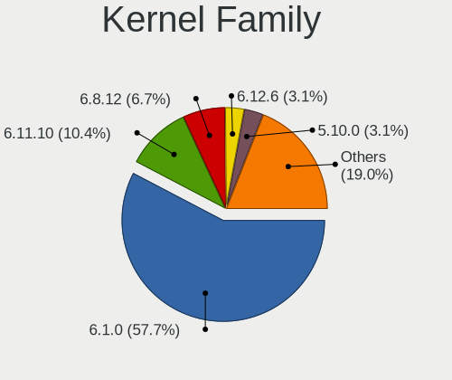
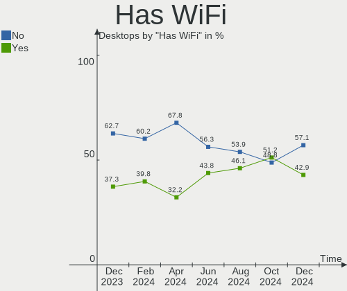
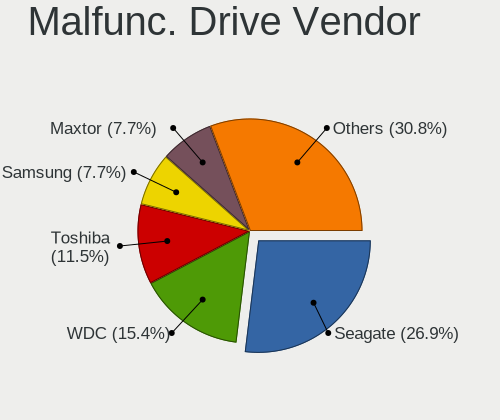
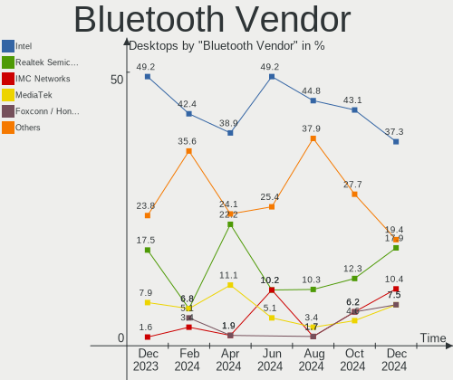
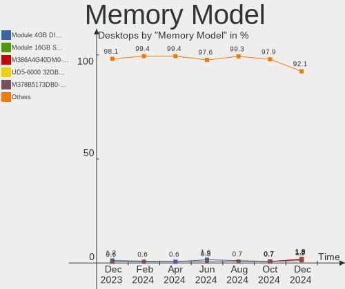
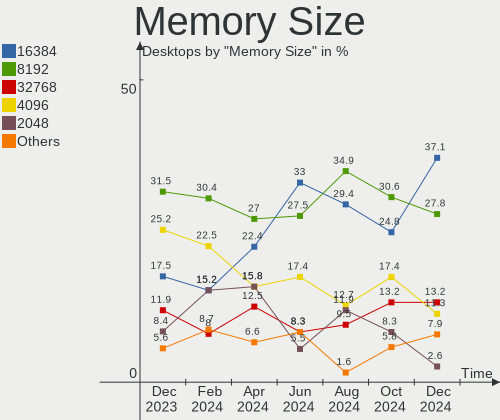

Debian - Hardware Trends (Desktops)
-----------------------------------

A project to identify most popular hardware characteristics and track their change
over time based on data collected by Linux users at https://Linux-Hardware.org.

Anyone can contribute to this report by the [hw-probe](https://github.com/linuxhw/hw-probe) tool:

    sudo -E hw-probe -all -upload

This report is for one last month. Overall report since the beginning of time: [TestCoverage](https://github.com/linuxhw/TestCoverage)

Period: Jul, 2022.

Contents
--------

* [ System ](#system)
  - [ OS                       ](#os)
  - [ OS Family                ](#os-family)
  - [ Kernel                   ](#kernel)
  - [ Kernel Family            ](#kernel-family)
  - [ Kernel Major Ver.        ](#kernel-major-ver)
  - [ Arch                     ](#arch)
  - [ DE                       ](#de)
  - [ Display Server           ](#display-server)
  - [ Display Manager          ](#display-manager)
  - [ OS Lang                  ](#os-lang)
  - [ Boot Mode                ](#boot-mode)
  - [ Filesystem               ](#filesystem)
  - [ Part. scheme             ](#part-scheme)
  - [ Dual Boot with Linux/BSD ](#dual-boot-with-linuxbsd)
  - [ Dual Boot (Win)          ](#dual-boot-win)

* [ Board ](#board)
  - [ Vendor                   ](#vendor)
  - [ Model                    ](#model)
  - [ Model Family             ](#model-family)
  - [ MFG Year                 ](#mfg-year)
  - [ Form Factor              ](#form-factor)
  - [ Secure Boot              ](#secure-boot)
  - [ Coreboot                 ](#coreboot)
  - [ RAM Size                 ](#ram-size)
  - [ RAM Used                 ](#ram-used)
  - [ Total Drives             ](#total-drives)
  - [ Has CD-ROM               ](#has-cd-rom)
  - [ Has Ethernet             ](#has-ethernet)
  - [ Has WiFi                 ](#has-wifi)
  - [ Has Bluetooth            ](#has-bluetooth)

* [ Location ](#location)
  - [ Country                  ](#country)
  - [ City                     ](#city)

* [ Drives ](#drives)
  - [ Drive Vendor             ](#drive-vendor)
  - [ Drive Model              ](#drive-model)
  - [ HDD Vendor               ](#hdd-vendor)
  - [ SSD Vendor               ](#ssd-vendor)
  - [ Drive Kind               ](#drive-kind)
  - [ Drive Connector          ](#drive-connector)
  - [ Drive Size               ](#drive-size)
  - [ Space Total              ](#space-total)
  - [ Space Used               ](#space-used)
  - [ Malfunc. Drives          ](#malfunc-drives)
  - [ Malfunc. Drive Vendor    ](#malfunc-drive-vendor)
  - [ Malfunc. HDD Vendor      ](#malfunc-hdd-vendor)
  - [ Malfunc. Drive Kind      ](#malfunc-drive-kind)
  - [ Failed Drives            ](#failed-drives)
  - [ Failed Drive Vendor      ](#failed-drive-vendor)
  - [ Drive Status             ](#drive-status)

* [ Storage controller ](#storage-controller)
  - [ Storage Vendor           ](#storage-vendor)
  - [ Storage Model            ](#storage-model)
  - [ Storage Kind             ](#storage-kind)

* [ Processor ](#processor)
  - [ CPU Vendor               ](#cpu-vendor)
  - [ CPU Model                ](#cpu-model)
  - [ CPU Model Family         ](#cpu-model-family)
  - [ CPU Cores                ](#cpu-cores)
  - [ CPU Sockets              ](#cpu-sockets)
  - [ CPU Threads              ](#cpu-threads)
  - [ CPU Op-Modes             ](#cpu-op-modes)
  - [ CPU Microcode            ](#cpu-microcode)
  - [ CPU Microarch            ](#cpu-microarch)

* [ Graphics ](#graphics)
  - [ GPU Vendor               ](#gpu-vendor)
  - [ GPU Model                ](#gpu-model)
  - [ GPU Combo                ](#gpu-combo)
  - [ GPU Driver               ](#gpu-driver)
  - [ GPU Memory               ](#gpu-memory)

* [ Monitor ](#monitor)
  - [ Monitor Vendor           ](#monitor-vendor)
  - [ Monitor Model            ](#monitor-model)
  - [ Monitor Resolution       ](#monitor-resolution)
  - [ Monitor Diagonal         ](#monitor-diagonal)
  - [ Monitor Width            ](#monitor-width)
  - [ Aspect Ratio             ](#aspect-ratio)
  - [ Monitor Area             ](#monitor-area)
  - [ Pixel Density            ](#pixel-density)
  - [ Multiple Monitors        ](#multiple-monitors)

* [ Network ](#network)
  - [ Net Controller Vendor    ](#net-controller-vendor)
  - [ Net Controller Model     ](#net-controller-model)
  - [ Wireless Vendor          ](#wireless-vendor)
  - [ Wireless Model           ](#wireless-model)
  - [ Ethernet Vendor          ](#ethernet-vendor)
  - [ Ethernet Model           ](#ethernet-model)
  - [ Net Controller Kind      ](#net-controller-kind)
  - [ Used Controller          ](#used-controller)
  - [ NICs                     ](#nics)
  - [ IPv6                     ](#ipv6)

* [ Bluetooth ](#bluetooth)
  - [ Bluetooth Vendor         ](#bluetooth-vendor)
  - [ Bluetooth Model          ](#bluetooth-model)

* [ Sound ](#sound)
  - [ Sound Vendor             ](#sound-vendor)
  - [ Sound Model              ](#sound-model)

* [ Memory ](#memory)
  - [ Memory Vendor            ](#memory-vendor)
  - [ Memory Model             ](#memory-model)
  - [ Memory Kind              ](#memory-kind)
  - [ Memory Form Factor       ](#memory-form-factor)
  - [ Memory Size              ](#memory-size)
  - [ Memory Speed             ](#memory-speed)

* [ Printers & scanners ](#printers--scanners)
  - [ Printer Vendor           ](#printer-vendor)
  - [ Printer Model            ](#printer-model)
  - [ Scanner Vendor           ](#scanner-vendor)
  - [ Scanner Model            ](#scanner-model)

* [ Camera ](#camera)
  - [ Camera Vendor            ](#camera-vendor)
  - [ Camera Model             ](#camera-model)

* [ Security ](#security)
  - [ Fingerprint Vendor       ](#fingerprint-vendor)
  - [ Fingerprint Model        ](#fingerprint-model)
  - [ Chipcard Vendor          ](#chipcard-vendor)
  - [ Chipcard Model           ](#chipcard-model)

* [ Unsupported ](#unsupported)
  - [ Unsupported Devices      ](#unsupported-devices)
  - [ Unsupported Device Types ](#unsupported-device-types)

System
------

OS
--

Installed operating systems

| Name            | Desktops | Percent |
|-----------------|----------|---------|
| Debian 11       | 119      | 85%     |
| Debian Testing  | 11       | 7.86%   |
| Debian Unstable | 6        | 4.29%   |
| Debian 10       | 4        | 2.86%   |

OS Family
---------

OS without a version

| Name   | Desktops | Percent |
|--------|----------|---------|
| Debian | 140      | 100%    |

Kernel
------

Version of the Linux kernel

| Version                    | Desktops | Percent |
|----------------------------|----------|---------|
| 5.10.0-7-amd64             | 45       | 32.14%  |
| 5.10.0-16-amd64            | 27       | 19.29%  |
| 5.18.0-2-amd64             | 16       | 11.43%  |
| 5.10.0-15-amd64            | 15       | 10.71%  |
| 5.18.0-0.bpo.1-amd64       | 6        | 4.29%   |
| 5.15.39-1-pve              | 4        | 2.86%   |
| 5.18.0-3-amd64             | 2        | 1.43%   |
| 5.10.0-13-amd64            | 2        | 1.43%   |
| 5.10.0-10-amd64            | 2        | 1.43%   |
| 5.5.0-0.bpo.2-amd64        | 1        | 0.71%   |
| 5.4.166-1-pve              | 1        | 0.71%   |
| 5.18.0-2-rt-amd64          | 1        | 0.71%   |
| 5.18.0-14.1-liquorix-amd64 | 1        | 0.71%   |
| 5.18.0-12.2-liquorix-amd64 | 1        | 0.71%   |
| 5.16.5                     | 1        | 0.71%   |
| 5.16.0-5-riscv64           | 1        | 0.71%   |
| 5.16.0-3-amd64             | 1        | 0.71%   |
| 5.16.0-0.bpo.4-amd64       | 1        | 0.71%   |
| 5.15.35-3-pve              | 1        | 0.71%   |
| 5.15.30-2-pve              | 1        | 0.71%   |
| 5.15.0-0.bpo.2-amd64       | 1        | 0.71%   |
| 5.13.19-2-pve              | 1        | 0.71%   |
| 5.11.22-5-pve              | 1        | 0.71%   |
| 5.10.120                   | 1        | 0.71%   |
| 5.10.0-9-amd64             | 1        | 0.71%   |
| 5.10.0-16-rt-amd64         | 1        | 0.71%   |
| 5.10.0-16-686-pae          | 1        | 0.71%   |
| 5.10.0-13-686-pae          | 1        | 0.71%   |
| 4.19.0-6-amd64             | 1        | 0.71%   |
| 4.19.0-12-amd64            | 1        | 0.71%   |

Kernel Family
-------------

Linux kernel without a distro release

| Version  | Desktops | Percent |
|----------|----------|---------|
| 5.10.0   | 95       | 67.86%  |
| 5.18.0   | 27       | 19.29%  |
| 5.15.39  | 4        | 2.86%   |
| 5.16.0   | 3        | 2.14%   |
| 4.19.0   | 2        | 1.43%   |
| 5.5.0    | 1        | 0.71%   |
| 5.4.166  | 1        | 0.71%   |
| 5.16.5   | 1        | 0.71%   |
| 5.15.35  | 1        | 0.71%   |
| 5.15.30  | 1        | 0.71%   |
| 5.15.0   | 1        | 0.71%   |
| 5.13.19  | 1        | 0.71%   |
| 5.11.22  | 1        | 0.71%   |
| 5.10.120 | 1        | 0.71%   |

Kernel Major Ver.
-----------------

Linux kernel major version

| Version | Desktops | Percent |
|---------|----------|---------|
| 5.10    | 96       | 68.57%  |
| 5.18    | 27       | 19.29%  |
| 5.15    | 7        | 5%      |
| 5.16    | 4        | 2.86%   |
| 4.19    | 2        | 1.43%   |
| 5.5     | 1        | 0.71%   |
| 5.4     | 1        | 0.71%   |
| 5.13    | 1        | 0.71%   |
| 5.11    | 1        | 0.71%   |

Arch
----

OS architecture (x86_64, i586, etc.)

| Name    | Desktops | Percent |
|---------|----------|---------|
| x86_64  | 137      | 97.86%  |
| i686    | 2        | 1.43%   |
| riscv64 | 1        | 0.71%   |

DE
--

Desktop Environment

| Name       | Desktops | Percent |
|------------|----------|---------|
| Unknown    | 76       | 54.29%  |
| GNOME      | 17       | 12.14%  |
| KDE5       | 16       | 11.43%  |
| XFCE       | 12       | 8.57%   |
| X-Cinnamon | 5        | 3.57%   |
| MATE       | 4        | 2.86%   |
| LXDE       | 4        | 2.86%   |
| Cinnamon   | 3        | 2.14%   |
| Openbox    | 1        | 0.71%   |
| i3         | 1        | 0.71%   |
| awesome    | 1        | 0.71%   |

Display Server
--------------

X11 or Wayland

| Name    | Desktops | Percent |
|---------|----------|---------|
| Unknown | 52       | 37.14%  |
| X11     | 49       | 35%     |
| Tty     | 27       | 19.29%  |
| Wayland | 12       | 8.57%   |

Display Manager
---------------

SDDM, LightDM, etc.

| Name    | Desktops | Percent |
|---------|----------|---------|
| Unknown | 85       | 60.71%  |
| LightDM | 25       | 17.86%  |
| GDM3    | 10       | 7.14%   |
| GDM     | 10       | 7.14%   |
| SDDM    | 9        | 6.43%   |
| XDM     | 1        | 0.71%   |

OS Lang
-------

Language

| Lang        | Desktops | Percent |
|-------------|----------|---------|
| ru_RU       | 51       | 36.43%  |
| en_US       | 44       | 31.43%  |
| fr_FR       | 12       | 8.57%   |
| ja_JP       | 5        | 3.57%   |
| de_DE       | 5        | 3.57%   |
| en_AU       | 4        | 2.86%   |
| es_ES       | 3        | 2.14%   |
| en_ZA       | 2        | 1.43%   |
| en_GB       | 2        | 1.43%   |
| Unknown     | 2        | 1.43%   |
| zh_CN       | 1        | 0.71%   |
| pt_BR       | 1        | 0.71%   |
| pl_PL       | 1        | 0.71%   |
| it_IT       | 1        | 0.71%   |
| hr_HR       | 1        | 0.71%   |
| es_PE       | 1        | 0.71%   |
| es_MX       | 1        | 0.71%   |
| es_ES.utf-8 | 1        | 0.71%   |
| en_DE       | 1        | 0.71%   |
| de_AT       | 1        | 0.71%   |

Boot Mode
---------

EFI or BIOS

| Mode | Desktops | Percent |
|------|----------|---------|
| BIOS | 95       | 67.86%  |
| EFI  | 45       | 32.14%  |

Filesystem
----------

Type of filesystem

| Type    | Desktops | Percent |
|---------|----------|---------|
| Ext4    | 79       | 56.43%  |
| Overlay | 49       | 35%     |
| Xfs     | 5        | 3.57%   |
| Btrfs   | 5        | 3.57%   |
| Zfs     | 1        | 0.71%   |
| Ext3    | 1        | 0.71%   |

Part. scheme
------------

Scheme of partitioning

| Type    | Desktops | Percent |
|---------|----------|---------|
| MBR     | 65       | 46.43%  |
| GPT     | 56       | 40%     |
| Unknown | 19       | 13.57%  |

Dual Boot with Linux/BSD
------------------------

Hosting more than one Linux/BSD

| Dual boot | Desktops | Percent |
|-----------|----------|---------|
| No        | 115      | 82.14%  |
| Yes       | 25       | 17.86%  |

Dual Boot (Win)
---------------

Hosting Linux and Windows

| Dual boot | Desktops | Percent |
|-----------|----------|---------|
| No        | 79       | 56.43%  |
| Yes       | 61       | 43.57%  |

Board
-----

Vendor
------

Motherboard manufacturer

| Name                | Desktops | Percent |
|---------------------|----------|---------|
| ASUSTek Computer    | 29       | 20.71%  |
| Gigabyte Technology | 25       | 17.86%  |
| MSI                 | 24       | 17.14%  |
| ASRock              | 20       | 14.29%  |
| Intel               | 7        | 5%      |
| Dell                | 6        | 4.29%   |
| Hewlett-Packard     | 5        | 3.57%   |
| ECS                 | 4        | 2.86%   |
| Supermicro          | 2        | 1.43%   |
| Lenovo              | 2        | 1.43%   |
| AZW                 | 2        | 1.43%   |
| ASRockRack          | 2        | 1.43%   |
| Unknown             | 2        | 1.43%   |
| Thecus              | 1        | 0.71%   |
| Medion              | 1        | 0.71%   |
| Inventec            | 1        | 0.71%   |
| IceWhale Technology | 1        | 0.71%   |
| Gateway             | 1        | 0.71%   |
| Fujitsu             | 1        | 0.71%   |
| congatec            | 1        | 0.71%   |
| Compaq              | 1        | 0.71%   |
| BESSTAR Tech        | 1        | 0.71%   |
| Acer                | 1        | 0.71%   |

Model
-----

Motherboard model

| Name                                    | Desktops | Percent |
|-----------------------------------------|----------|---------|
| MSI MS-7996                             | 10       | 7.14%   |
| ASRock H470M-HVS                        | 10       | 7.14%   |
| ECS G31T-M9                             | 4        | 2.86%   |
| Intel Pro, Std, Elt Series              | 2        | 1.43%   |
| Gigabyte B450M S2H                      | 2        | 1.43%   |
| Gigabyte B450M DS3H                     | 2        | 1.43%   |
| Gigabyte B365M DS3H                     | 2        | 1.43%   |
| ASUS PRIME Z690M-HZ                     | 2        | 1.43%   |
| ASUS All Series                         | 2        | 1.43%   |
| ASRockRack B565D4-V1L                   | 2        | 1.43%   |
| Unknown                                 | 2        | 1.43%   |
| Thecus N2810                            | 1        | 0.71%   |
| Supermicro X9SCL/X9SCM                  | 1        | 0.71%   |
| Supermicro SYS-5018R-WR                 | 1        | 0.71%   |
| MSI MS-7D53                             | 1        | 0.71%   |
| MSI MS-7D25                             | 1        | 0.71%   |
| MSI MS-7D22                             | 1        | 0.71%   |
| MSI MS-7C59                             | 1        | 0.71%   |
| MSI MS-7B79                             | 1        | 0.71%   |
| MSI MS-7B58                             | 1        | 0.71%   |
| MSI MS-7A34                             | 1        | 0.71%   |
| MSI MS-7995                             | 1        | 0.71%   |
| MSI MS-7982                             | 1        | 0.71%   |
| MSI MS-7788                             | 1        | 0.71%   |
| MSI MS-7641                             | 1        | 0.71%   |
| MSI MS-7529                             | 1        | 0.71%   |
| MSI MS-7418                             | 1        | 0.71%   |
| MSI MS-7236                             | 1        | 0.71%   |
| Medion MS-7728                          | 1        | 0.71%   |
| Lenovo ThinkCentre M920t 10SFCTO1WW     | 1        | 0.71%   |
| Lenovo ThinkCentre M910t 10MNS0F41S     | 1        | 0.71%   |
| Inventec D CLASS                        | 1        | 0.71%   |
| Intel TR440BXA                          | 1        | 0.71%   |
| Intel MAHOBAY                           | 1        | 0.71%   |
| Intel DH61CR AAG14064-204               | 1        | 0.71%   |
| Intel DH61AG AAG23736-505               | 1        | 0.71%   |
| Intel D946GZIS AAD66165-301             | 1        | 0.71%   |
| IceWhale ZimaBoard 832 ZMB              | 1        | 0.71%   |
| HP Z400 Workstation                     | 1        | 0.71%   |
| HP ProLiant MicroServer                 | 1        | 0.71%   |
| HP Pavilion Desktop 590-p0xxx           | 1        | 0.71%   |
| HP Compaq dc7800p Convertible Minitower | 1        | 0.71%   |
| HP Compaq 6000 Pro MT PC                | 1        | 0.71%   |
| Gigabyte Z590 UD AC                     | 1        | 0.71%   |
| Gigabyte X570 AORUS MASTER              | 1        | 0.71%   |
| Gigabyte X570 AORUS ELITE               | 1        | 0.71%   |
| Gigabyte M68MT-S2                       | 1        | 0.71%   |
| Gigabyte H81M-DS2V                      | 1        | 0.71%   |
| Gigabyte H61M-S2PV                      | 1        | 0.71%   |
| Gigabyte H61M-S1                        | 1        | 0.71%   |
| Gigabyte H61M-DS2 REV 1.2               | 1        | 0.71%   |
| Gigabyte H470M DS3H                     | 1        | 0.71%   |
| Gigabyte GA-880GM-UD2H                  | 1        | 0.71%   |
| Gigabyte F2A78M-DS2                     | 1        | 0.71%   |
| Gigabyte B85M-D3H                       | 1        | 0.71%   |
| Gigabyte B660M GAMING DDR4              | 1        | 0.71%   |
| Gigabyte B550M AORUS PRO-P              | 1        | 0.71%   |
| Gigabyte B450M S2H V2                   | 1        | 0.71%   |
| Gigabyte B250M-DS3H                     | 1        | 0.71%   |
| Gigabyte A520M DS3H                     | 1        | 0.71%   |

Model Family
------------

Motherboard model prefix

| Name                    | Desktops | Percent |
|-------------------------|----------|---------|
| MSI MS-7996             | 10       | 7.14%   |
| ASRock H470M-HVS        | 10       | 7.14%   |
| ASUS PRIME              | 6        | 4.29%   |
| Gigabyte B450M          | 5        | 3.57%   |
| ECS G31T-M9             | 4        | 2.86%   |
| Dell OptiPlex           | 4        | 2.86%   |
| ASUS TUF                | 4        | 2.86%   |
| Lenovo ThinkCentre      | 2        | 1.43%   |
| Intel Pro               | 2        | 1.43%   |
| HP Compaq               | 2        | 1.43%   |
| Gigabyte X570           | 2        | 1.43%   |
| Gigabyte B365M          | 2        | 1.43%   |
| ASUS P8H61-M            | 2        | 1.43%   |
| ASUS P5K                | 2        | 1.43%   |
| ASUS All                | 2        | 1.43%   |
| ASRockRack B565D4-V1L   | 2        | 1.43%   |
| Unknown                 | 2        | 1.43%   |
| Thecus N2810            | 1        | 0.71%   |
| Supermicro X9SCL        | 1        | 0.71%   |
| Supermicro SYS-5018R-WR | 1        | 0.71%   |
| MSI MS-7D53             | 1        | 0.71%   |
| MSI MS-7D25             | 1        | 0.71%   |
| MSI MS-7D22             | 1        | 0.71%   |
| MSI MS-7C59             | 1        | 0.71%   |
| MSI MS-7B79             | 1        | 0.71%   |
| MSI MS-7B58             | 1        | 0.71%   |
| MSI MS-7A34             | 1        | 0.71%   |
| MSI MS-7995             | 1        | 0.71%   |
| MSI MS-7982             | 1        | 0.71%   |
| MSI MS-7788             | 1        | 0.71%   |
| MSI MS-7641             | 1        | 0.71%   |
| MSI MS-7529             | 1        | 0.71%   |
| MSI MS-7418             | 1        | 0.71%   |
| MSI MS-7236             | 1        | 0.71%   |
| Medion MS-7728          | 1        | 0.71%   |
| Inventec D              | 1        | 0.71%   |
| Intel TR440BXA          | 1        | 0.71%   |
| Intel MAHOBAY           | 1        | 0.71%   |
| Intel DH61CR            | 1        | 0.71%   |
| Intel DH61AG            | 1        | 0.71%   |
| Intel D946GZIS          | 1        | 0.71%   |
| IceWhale ZimaBoard      | 1        | 0.71%   |
| HP Z400                 | 1        | 0.71%   |
| HP ProLiant             | 1        | 0.71%   |
| HP Pavilion             | 1        | 0.71%   |
| Gigabyte Z590           | 1        | 0.71%   |
| Gigabyte M68MT-S2       | 1        | 0.71%   |
| Gigabyte H81M-DS2V      | 1        | 0.71%   |
| Gigabyte H61M-S2PV      | 1        | 0.71%   |
| Gigabyte H61M-S1        | 1        | 0.71%   |
| Gigabyte H61M-DS2       | 1        | 0.71%   |
| Gigabyte H470M          | 1        | 0.71%   |
| Gigabyte GA-880GM-UD2H  | 1        | 0.71%   |
| Gigabyte F2A78M-DS2     | 1        | 0.71%   |
| Gigabyte B85M-D3H       | 1        | 0.71%   |
| Gigabyte B660M          | 1        | 0.71%   |
| Gigabyte B550M          | 1        | 0.71%   |
| Gigabyte B250M-DS3H     | 1        | 0.71%   |
| Gigabyte A520M          | 1        | 0.71%   |
| Gigabyte A320M-H        | 1        | 0.71%   |

MFG Year
--------

Motherboard manufacture year

| Year    | Desktops | Percent |
|---------|----------|---------|
| 2021    | 23       | 16.43%  |
| 2018    | 18       | 12.86%  |
| 2015    | 14       | 10%     |
| 2012    | 10       | 7.14%   |
| 2019    | 9        | 6.43%   |
| 2022    | 8        | 5.71%   |
| 2011    | 8        | 5.71%   |
| 2010    | 8        | 5.71%   |
| 2009    | 8        | 5.71%   |
| 2020    | 7        | 5%      |
| 2013    | 6        | 4.29%   |
| 2017    | 4        | 2.86%   |
| 2016    | 4        | 2.86%   |
| 2014    | 3        | 2.14%   |
| 2007    | 3        | 2.14%   |
| 2008    | 2        | 1.43%   |
| 2006    | 2        | 1.43%   |
| 2001    | 2        | 1.43%   |
| Unknown | 1        | 0.71%   |

Form Factor
-----------

Physical design of the computer

| Name    | Desktops | Percent |
|---------|----------|---------|
| Desktop | 140      | 100%    |

Secure Boot
-----------

Enabled or disabled

| State    | Desktops | Percent |
|----------|----------|---------|
| Disabled | 135      | 96.43%  |
| Enabled  | 5        | 3.57%   |

Coreboot
--------

Have coreboot on board

| Used | Desktops | Percent |
|------|----------|---------|
| No   | 140      | 100%    |

RAM Size
--------

Total RAM memory

| Size in GB  | Desktops | Percent |
|-------------|----------|---------|
| 4.01-8.0    | 26       | 18.57%  |
| 32.01-64.0  | 25       | 17.86%  |
| 8.01-16.0   | 23       | 16.43%  |
| 3.01-4.0    | 20       | 14.29%  |
| 16.01-24.0  | 19       | 13.57%  |
| 64.01-256.0 | 11       | 7.86%   |
| 1.01-2.0    | 7        | 5%      |
| 24.01-32.0  | 5        | 3.57%   |
| 0.51-1.0    | 2        | 1.43%   |
| 0.01-0.5    | 2        | 1.43%   |

RAM Used
--------

Used RAM memory

| Used GB     | Desktops | Percent |
|-------------|----------|---------|
| 0.51-1.0    | 51       | 36.43%  |
| 1.01-2.0    | 31       | 22.14%  |
| 4.01-8.0    | 19       | 13.57%  |
| 2.01-3.0    | 17       | 12.14%  |
| 0.01-0.5    | 7        | 5%      |
| 3.01-4.0    | 5        | 3.57%   |
| 8.01-16.0   | 4        | 2.86%   |
| 16.01-24.0  | 3        | 2.14%   |
| 32.01-64.0  | 1        | 0.71%   |
| 24.01-32.0  | 1        | 0.71%   |
| 64.01-256.0 | 1        | 0.71%   |

Total Drives
------------

Number of drives on board

| Drives | Desktops | Percent |
|--------|----------|---------|
| 1      | 69       | 49.29%  |
| 2      | 32       | 22.86%  |
| 3      | 19       | 13.57%  |
| 4      | 13       | 9.29%   |
| 5      | 3        | 2.14%   |
| 11     | 1        | 0.71%   |
| 8      | 1        | 0.71%   |
| 7      | 1        | 0.71%   |
| 6      | 1        | 0.71%   |

Has CD-ROM
----------

Has CD-ROM on board

| Presented | Desktops | Percent |
|-----------|----------|---------|
| No        | 100      | 71.43%  |
| Yes       | 40       | 28.57%  |

Has Ethernet
------------

Has Ethernet on board

| Presented | Desktops | Percent |
|-----------|----------|---------|
| Yes       | 138      | 98.57%  |
| No        | 2        | 1.43%   |

Has WiFi
--------

Has WiFi module

| Presented | Desktops | Percent |
|-----------|----------|---------|
| No        | 113      | 80.71%  |
| Yes       | 27       | 19.29%  |

Has Bluetooth
-------------

Has Bluetooth module

| Presented | Desktops | Percent |
|-----------|----------|---------|
| No        | 118      | 84.29%  |
| Yes       | 22       | 15.71%  |

Location
--------

Country
-------

Geographic location (country)

| Country      | Desktops | Percent |
|--------------|----------|---------|
| Russia       | 52       | 37.14%  |
| USA          | 16       | 11.43%  |
| France       | 15       | 10.71%  |
| Germany      | 14       | 10%     |
| Spain        | 5        | 3.57%   |
| Japan        | 5        | 3.57%   |
| Australia    | 4        | 2.86%   |
| Malaysia     | 3        | 2.14%   |
| UK           | 2        | 1.43%   |
| South Africa | 2        | 1.43%   |
| Poland       | 2        | 1.43%   |
| Peru         | 2        | 1.43%   |
| Finland      | 2        | 1.43%   |
| Brazil       | 2        | 1.43%   |
| Austria      | 2        | 1.43%   |
| Serbia       | 1        | 0.71%   |
| Portugal     | 1        | 0.71%   |
| Norway       | 1        | 0.71%   |
| Mexico       | 1        | 0.71%   |
| Lithuania    | 1        | 0.71%   |
| Italy        | 1        | 0.71%   |
| Czechia      | 1        | 0.71%   |
| Croatia      | 1        | 0.71%   |
| China        | 1        | 0.71%   |
| Canada       | 1        | 0.71%   |
| Bulgaria     | 1        | 0.71%   |
| Argentina    | 1        | 0.71%   |

City
----

Geographic location (city)

| City                   | Desktops | Percent |
|------------------------|----------|---------|
| Voronezh               | 45       | 32.14%  |
| Tsukuba                | 4        | 2.86%   |
| Falkenstein            | 3        | 2.14%   |
| Perm                   | 2        | 1.43%   |
| Paris                  | 2        | 1.43%   |
| Lincoln                | 2        | 1.43%   |
| Durban                 | 2        | 1.43%   |
| Wołomin               | 1        | 0.71%   |
| Warsaw                 | 1        | 0.71%   |
| Waltham                | 1        | 0.71%   |
| Villingen-Schwenningen | 1        | 0.71%   |
| Vienna                 | 1        | 0.71%   |
| Vallauris              | 1        | 0.71%   |
| Valencia               | 1        | 0.71%   |
| Tuusula                | 1        | 0.71%   |
| Trets                  | 1        | 0.71%   |
| Thousand Oaks          | 1        | 0.71%   |
| Teruel                 | 1        | 0.71%   |
| Tampere                | 1        | 0.71%   |
| Sydney                 | 1        | 0.71%   |
| St Petersburg          | 1        | 0.71%   |
| Sintra                 | 1        | 0.71%   |
| Seclin                 | 1        | 0.71%   |
| Sao Paulo              | 1        | 0.71%   |
| Sao José dos Campos   | 1        | 0.71%   |
| Salt Lake City         | 1        | 0.71%   |
| Rousse                 | 1        | 0.71%   |
| Rouen                  | 1        | 0.71%   |
| Roubaix                | 1        | 0.71%   |
| Rijeka                 | 1        | 0.71%   |
| Racine                 | 1        | 0.71%   |
| Ostrava                | 1        | 0.71%   |
| Nuremberg              | 1        | 0.71%   |
| Novosibirsk            | 1        | 0.71%   |
| North Charleston       | 1        | 0.71%   |
| Nanjing                | 1        | 0.71%   |
| Munich                 | 1        | 0.71%   |
| Monreale               | 1        | 0.71%   |
| Mieuxce                | 1        | 0.71%   |
| Mexico City            | 1        | 0.71%   |
| Meaux                  | 1        | 0.71%   |
| Marseille              | 1        | 0.71%   |
| Marijampolė           | 1        | 0.71%   |
| Madrid                 | 1        | 0.71%   |
| London                 | 1        | 0.71%   |
| Livermore              | 1        | 0.71%   |
| Lima                   | 1        | 0.71%   |
| Leicester              | 1        | 0.71%   |
| La Rochelle            | 1        | 0.71%   |
| La Rioja               | 1        | 0.71%   |
| Kuala Lumpur           | 1        | 0.71%   |
| Krasnodar              | 1        | 0.71%   |
| Kota Bharu             | 1        | 0.71%   |
| Kobe                   | 1        | 0.71%   |
| Junin                  | 1        | 0.71%   |
| Hemhofen               | 1        | 0.71%   |
| Guilherand-Granges     | 1        | 0.71%   |
| Gross-Umstadt          | 1        | 0.71%   |
| Gatchina               | 1        | 0.71%   |
| Frankfurt am Main      | 1        | 0.71%   |

Drives
------

Drive Vendor
------------

Hard drive vendors

| Vendor                    | Desktops | Drives | Percent |
|---------------------------|----------|--------|---------|
| Seagate                   | 40       | 53     | 17.78%  |
| WDC                       | 32       | 67     | 14.22%  |
| Samsung Electronics       | 30       | 42     | 13.33%  |
| Toshiba                   | 26       | 32     | 11.56%  |
| Kingston                  | 15       | 18     | 6.67%   |
| SanDisk                   | 11       | 11     | 4.89%   |
| Netac                     | 10       | 10     | 4.44%   |
| Hitachi                   | 9        | 9      | 4%      |
| SPCC                      | 7        | 7      | 3.11%   |
| Crucial                   | 6        | 6      | 2.67%   |
| Intel                     | 4        | 5      | 1.78%   |
| Unknown                   | 3        | 3      | 1.33%   |
| Corsair                   | 3        | 4      | 1.33%   |
| A-DATA Technology         | 3        | 4      | 1.33%   |
| PNY                       | 2        | 2      | 0.89%   |
| NGFF                      | 2        | 2      | 0.89%   |
| Micron Technology         | 2        | 2      | 0.89%   |
| HGST                      | 2        | 3      | 0.89%   |
| Apacer                    | 2        | 2      | 0.89%   |
| Unknown                   | 2        | 2      | 0.89%   |
| Transcend                 | 1        | 1      | 0.44%   |
| TCSUNB0W                  | 1        | 1      | 0.44%   |
| Smartbuy                  | 1        | 1      | 0.44%   |
| RSH-319                   | 1        | 1      | 0.44%   |
| Patriot                   | 1        | 1      | 0.44%   |
| OCZ                       | 1        | 1      | 0.44%   |
| Mushkin                   | 1        | 2      | 0.44%   |
| Micron/Crucial Technology | 1        | 1      | 0.44%   |
| LITEON                    | 1        | 1      | 0.44%   |
| KIOXIA-EXCERIA            | 1        | 1      | 0.44%   |
| Innodisk                  | 1        | 1      | 0.44%   |
| GOODRAM                   | 1        | 1      | 0.44%   |
| Gigabyte Technology       | 1        | 1      | 0.44%   |
| China                     | 1        | 1      | 0.44%   |

Drive Model
-----------

Hard drive models

| Model                             | Desktops | Percent |
|-----------------------------------|----------|---------|
| Toshiba HDWD110 1TB               | 11       | 4.31%   |
| Netac SSD 240GB                   | 10       | 3.92%   |
| Seagate ST1000DM010-2EP102 1TB    | 8        | 3.14%   |
| SPCC Solid State Disk 120GB       | 7        | 2.75%   |
| Toshiba DT01ACA050 500GB          | 5        | 1.96%   |
| Hitachi HDS721050CLA362 500GB     | 5        | 1.96%   |
| Samsung SSD 860 EVO 500GB         | 4        | 1.57%   |
| Kingston SA400S37480G 480GB SSD   | 4        | 1.57%   |
| WDC WDS500G2B0A-00SM50 500GB SSD  | 3        | 1.18%   |
| WDC WD10EZEX-08WN4A0 1TB          | 3        | 1.18%   |
| Seagate ST8000VN004-2M2101 8TB    | 3        | 1.18%   |
| Kingston SA400S37240G 240GB SSD   | 3        | 1.18%   |
| WDC WD5000AAKX-08U6AA0 500GB      | 2        | 0.78%   |
| WDC WD120EMFZ-11A6JA0 12TB        | 2        | 0.78%   |
| WDC WD120EDAZ-11F3RA0 12TB        | 2        | 0.78%   |
| WDC WD100EMAZ-00WJTA0 10TB        | 2        | 0.78%   |
| Toshiba HDWD130 3TB               | 2        | 0.78%   |
| Toshiba DT01ACA300 3TB            | 2        | 0.78%   |
| Seagate ST500DM002-1BD142 500GB   | 2        | 0.78%   |
| Seagate ST5000LM000-2AN170 5TB    | 2        | 0.78%   |
| Seagate ST380215AS 80GB           | 2        | 0.78%   |
| Seagate ST3500418AS 500GB         | 2        | 0.78%   |
| Seagate ST3250318AS 250GB         | 2        | 0.78%   |
| Seagate ST2000DM001-1ER164 2TB    | 2        | 0.78%   |
| Seagate ST12000VN0007-2GS116 12TB | 2        | 0.78%   |
| Seagate ST1000DM003-1ER162 1TB    | 2        | 0.78%   |
| SanDisk SDSSDP064G 64GB           | 2        | 0.78%   |
| SanDisk NVMe SSD Drive 1TB        | 2        | 0.78%   |
| Samsung SSD 850 PRO 512GB         | 2        | 0.78%   |
| Samsung NVMe SSD Drive 500GB      | 2        | 0.78%   |
| Samsung MZQL21T9HCJR-00A07 1.9TB  | 2        | 0.78%   |
| Intel SSDSC2BW180A4 180GB         | 2        | 0.78%   |
| A-DATA SX930 480GB SSD            | 2        | 0.78%   |
| Unknown                           | 2        | 0.78%   |
| WDC WDS120G1G0A-00SS50 120GB SSD  | 1        | 0.39%   |
| WDC WDS100T2B0C-00PXH0 1TB        | 1        | 0.39%   |
| WDC WD80EAZZ-00BKLB0 8TB          | 1        | 0.39%   |
| WDC WD800JB-00CRA1 80GB           | 1        | 0.39%   |
| WDC WD800BB-00CAA1 80GB           | 1        | 0.39%   |
| WDC WD7500BPVX-08JC3T5 752GB      | 1        | 0.39%   |
| WDC WD7500BPKX-22HPJT0 752GB      | 1        | 0.39%   |
| WDC WD740GD-00FLA0 74GB           | 1        | 0.39%   |
| WDC WD60EZAZ-00SF3B0 6TB          | 1        | 0.39%   |
| WDC WD5003ABYX-88 LEN 500GB       | 1        | 0.39%   |
| WDC WD5000AZLX-00K2TA0 500GB      | 1        | 0.39%   |
| WDC WD5000AVDS-61U7B1 500GB       | 1        | 0.39%   |
| WDC WD5000AAKX-001CA0 500GB       | 1        | 0.39%   |
| WDC WD5000AAKS-00D2B0 500GB       | 1        | 0.39%   |
| WDC WD5000AAKS-00A7B0 500GB       | 1        | 0.39%   |
| WDC WD50 00BPKX-00HPJT0 500GB     | 1        | 0.39%   |
| WDC WD40PURZ-85TTDY0 4TB          | 1        | 0.39%   |
| WDC WD40EFRX-68N32N0 4TB          | 1        | 0.39%   |
| WDC WD4005FZBX-00K5WB0 4TB        | 1        | 0.39%   |
| WDC WD4001FFSX-68JNUN0 4TB        | 1        | 0.39%   |
| WDC WD3200AAKS-75VYA0 320GB       | 1        | 0.39%   |
| WDC WD30EZRX-00MMMB0 3TB          | 1        | 0.39%   |
| WDC WD2500AVJS-63WDA0 250GB       | 1        | 0.39%   |
| WDC WD20EFZX-68AWUN0 2TB          | 1        | 0.39%   |
| WDC WD20EFRX-68EUZN0 2TB          | 1        | 0.39%   |
| WDC WD1200JS-00MHB0 120GB         | 1        | 0.39%   |

HDD Vendor
----------

Hard disk drive vendors

| Vendor              | Desktops | Drives | Percent |
|---------------------|----------|--------|---------|
| Seagate             | 39       | 52     | 37.5%   |
| WDC                 | 27       | 62     | 25.96%  |
| Toshiba             | 24       | 30     | 23.08%  |
| Hitachi             | 9        | 9      | 8.65%   |
| HGST                | 2        | 3      | 1.92%   |
| Unknown             | 1        | 1      | 0.96%   |
| Samsung Electronics | 1        | 1      | 0.96%   |
| RSH-319             | 1        | 1      | 0.96%   |

SSD Vendor
----------

Solid state drive vendors

| Vendor              | Desktops | Drives | Percent |
|---------------------|----------|--------|---------|
| Samsung Electronics | 15       | 20     | 17.24%  |
| Kingston            | 11       | 12     | 12.64%  |
| Netac               | 10       | 10     | 11.49%  |
| SanDisk             | 8        | 8      | 9.2%    |
| SPCC                | 7        | 7      | 8.05%   |
| Crucial             | 6        | 6      | 6.9%    |
| WDC                 | 4        | 4      | 4.6%    |
| Intel               | 3        | 4      | 3.45%   |
| A-DATA Technology   | 3        | 4      | 3.45%   |
| Toshiba             | 2        | 2      | 2.3%    |
| NGFF                | 2        | 2      | 2.3%    |
| Corsair             | 2        | 3      | 2.3%    |
| Transcend           | 1        | 1      | 1.15%   |
| TCSUNB0W            | 1        | 1      | 1.15%   |
| Smartbuy            | 1        | 1      | 1.15%   |
| PNY                 | 1        | 1      | 1.15%   |
| Patriot             | 1        | 1      | 1.15%   |
| OCZ                 | 1        | 1      | 1.15%   |
| Mushkin             | 1        | 2      | 1.15%   |
| LITEON              | 1        | 1      | 1.15%   |
| KIOXIA-EXCERIA      | 1        | 1      | 1.15%   |
| Innodisk            | 1        | 1      | 1.15%   |
| GOODRAM             | 1        | 1      | 1.15%   |
| China               | 1        | 1      | 1.15%   |
| Apacer              | 1        | 1      | 1.15%   |
| Unknown             | 1        | 1      | 1.15%   |

Drive Kind
----------

HDD or SSD

| Kind | Desktops | Drives | Percent |
|------|----------|--------|---------|
| HDD  | 89       | 159    | 44.5%   |
| SSD  | 76       | 97     | 38%     |
| NVMe | 32       | 40     | 16%     |
| MMC  | 3        | 3      | 1.5%    |

Drive Connector
---------------

SATA, SAS, NVMe, etc.

| Type | Desktops | Drives | Percent |
|------|----------|--------|---------|
| SATA | 122      | 250    | 74.85%  |
| NVMe | 32       | 40     | 19.63%  |
| SAS  | 6        | 6      | 3.68%   |
| MMC  | 3        | 3      | 1.84%   |

Drive Size
----------

Size of hard drive

| Size in TB | Desktops | Drives | Percent |
|------------|----------|--------|---------|
| 0.01-0.5   | 105      | 137    | 57.69%  |
| 0.51-1.0   | 43       | 54     | 23.63%  |
| 4.01-10.0  | 12       | 18     | 6.59%   |
| 1.01-2.0   | 10       | 12     | 5.49%   |
| 2.01-3.0   | 5        | 12     | 2.75%   |
| 3.01-4.0   | 4        | 6      | 2.2%    |
| 10.01-20.0 | 3        | 17     | 1.65%   |

Space Total
-----------

Amount of disk space available on the file system

| Size in GB     | Desktops | Percent |
|----------------|----------|---------|
| Unknown        | 52       | 37.14%  |
| More than 3000 | 19       | 13.57%  |
| 251-500        | 14       | 10%     |
| 501-1000       | 13       | 9.29%   |
| 101-250        | 12       | 8.57%   |
| 1001-2000      | 11       | 7.86%   |
| 21-50          | 5        | 3.57%   |
| 2001-3000      | 5        | 3.57%   |
| 51-100         | 5        | 3.57%   |
| 1-20           | 4        | 2.86%   |

Space Used
----------

Amount of used disk space

| Used GB        | Desktops | Percent |
|----------------|----------|---------|
| Unknown        | 52       | 37.14%  |
| 1-20           | 25       | 17.86%  |
| 21-50          | 11       | 7.86%   |
| 101-250        | 11       | 7.86%   |
| 51-100         | 11       | 7.86%   |
| More than 3000 | 9        | 6.43%   |
| 251-500        | 6        | 4.29%   |
| 1001-2000      | 6        | 4.29%   |
| 2001-3000      | 5        | 3.57%   |
| 501-1000       | 4        | 2.86%   |

Malfunc. Drives
---------------

Drive models with a malfunction

| Model                                 | Desktops | Drives | Percent |
|---------------------------------------|----------|--------|---------|
| WDC WD800JB-00CRA1 80GB               | 1        | 1      | 4.55%   |
| WDC WD800BB-00CAA1 80GB               | 1        | 1      | 4.55%   |
| WDC WD5000AVDS-61U7B1 500GB           | 1        | 1      | 4.55%   |
| WDC WD5000AAKX-08U6AA0 500GB          | 1        | 1      | 4.55%   |
| WDC WD30EZRX-00MMMB0 3TB              | 1        | 3      | 4.55%   |
| WDC WD20EFRX-68EUZN0 2TB              | 1        | 3      | 4.55%   |
| WDC WD10EZEX-21M2NA0 1TB              | 1        | 1      | 4.55%   |
| WDC WD1003FBYX-01Y7B1 752GB           | 1        | 1      | 4.55%   |
| Toshiba HDWD130 3TB                   | 1        | 6      | 4.55%   |
| Seagate ST500DM002-1BD142 500GB       | 1        | 1      | 4.55%   |
| Seagate ST380811AS 80GB               | 1        | 1      | 4.55%   |
| Seagate ST3500418AS 500GB             | 1        | 1      | 4.55%   |
| Seagate ST340810A 40GB                | 1        | 1      | 4.55%   |
| Seagate ST3320418AS 320GB             | 1        | 1      | 4.55%   |
| Seagate ST2000DM001-1ER164 2TB        | 1        | 1      | 4.55%   |
| Seagate ST1000LM024 HN-M101MBB 1TB    | 1        | 1      | 4.55%   |
| Samsung Electronics SSD 850 PRO 512GB | 1        | 1      | 4.55%   |
| Kingston SV300S37A240G 240GB SSD      | 1        | 2      | 4.55%   |
| Hitachi HDS721050CLA660 500GB         | 1        | 1      | 4.55%   |
| Hitachi HDS721050CLA362 500GB         | 1        | 1      | 4.55%   |
| Corsair Force LS SSD 120GB            | 1        | 1      | 4.55%   |
| A-DATA Technology SU800 128GB SSD     | 1        | 1      | 4.55%   |

Malfunc. Drive Vendor
---------------------

Vendors of faulty drives

| Vendor              | Desktops | Drives | Percent |
|---------------------|----------|--------|---------|
| Seagate             | 7        | 7      | 35%     |
| WDC                 | 6        | 12     | 30%     |
| Hitachi             | 2        | 2      | 10%     |
| Toshiba             | 1        | 6      | 5%      |
| Samsung Electronics | 1        | 1      | 5%      |
| Kingston            | 1        | 2      | 5%      |
| Corsair             | 1        | 1      | 5%      |
| A-DATA Technology   | 1        | 1      | 5%      |

Malfunc. HDD Vendor
-------------------

Vendors of faulty HDD drives

| Vendor  | Desktops | Drives | Percent |
|---------|----------|--------|---------|
| Seagate | 7        | 7      | 43.75%  |
| WDC     | 6        | 12     | 37.5%   |
| Hitachi | 2        | 2      | 12.5%   |
| Toshiba | 1        | 6      | 6.25%   |

Malfunc. Drive Kind
-------------------

Kinds of faulty drives

| Kind | Desktops | Drives | Percent |
|------|----------|--------|---------|
| HDD  | 15       | 27     | 78.95%  |
| SSD  | 4        | 5      | 21.05%  |

Failed Drives
-------------

Failed drive models

| Model                      | Desktops | Drives | Percent |
|----------------------------|----------|--------|---------|
| WDC WD4001FFSX-68JNUN0 4TB | 1        | 1      | 100%    |

Failed Drive Vendor
-------------------

Failed drive vendors

| Vendor | Desktops | Drives | Percent |
|--------|----------|--------|---------|
| WDC    | 1        | 1      | 100%    |

Drive Status
------------

Number of failed and malfunc. drives

| Status   | Desktops | Drives | Percent |
|----------|----------|--------|---------|
| Works    | 108      | 210    | 69.23%  |
| Detected | 28       | 56     | 17.95%  |
| Malfunc  | 19       | 32     | 12.18%  |
| Failed   | 1        | 1      | 0.64%   |

Storage controller
------------------

Storage Vendor
--------------

Storage controller vendors

| Vendor                       | Desktops | Percent |
|------------------------------|----------|---------|
| Intel                        | 104      | 55.32%  |
| AMD                          | 33       | 17.55%  |
| Samsung Electronics          | 16       | 8.51%   |
| ASMedia Technology           | 6        | 3.19%   |
| Kingston Technology Company  | 5        | 2.66%   |
| SanDisk                      | 4        | 2.13%   |
| Marvell Technology Group     | 4        | 2.13%   |
| JMicron Technology           | 4        | 2.13%   |
| Phison Electronics           | 3        | 1.6%    |
| Nvidia                       | 2        | 1.06%   |
| Micron Technology            | 2        | 1.06%   |
| Silicon Image                | 1        | 0.53%   |
| Shenzhen Longsys Electronics | 1        | 0.53%   |
| Seagate Technology           | 1        | 0.53%   |
| Micron/Crucial Technology    | 1        | 0.53%   |
| Adaptec                      | 1        | 0.53%   |

Storage Model
-------------

Storage controller models

| Model                                                                                   | Desktops | Percent |
|-----------------------------------------------------------------------------------------|----------|---------|
| AMD FCH SATA Controller [AHCI mode]                                                     | 19       | 8.48%   |
| Intel Q170/Q150/B150/H170/H110/Z170/CM236 Chipset SATA Controller [AHCI Mode]           | 15       | 6.7%    |
| Intel Comet Lake SATA AHCI Controller                                                   | 12       | 5.36%   |
| Intel NM10/ICH7 Family SATA Controller [IDE mode]                                       | 9        | 4.02%   |
| Intel 6 Series/C200 Series Chipset Family 6 port Desktop SATA AHCI Controller           | 9        | 4.02%   |
| Samsung NVMe SSD Controller SM981/PM981/PM983                                           | 8        | 3.57%   |
| Intel 82801G (ICH7 Family) IDE Controller                                               | 8        | 3.57%   |
| AMD 400 Series Chipset SATA Controller                                                  | 8        | 3.57%   |
| Intel 200 Series PCH SATA controller [AHCI mode]                                        | 7        | 3.13%   |
| Samsung NVMe SSD Controller PM9A1/PM9A3/980PRO                                          | 6        | 2.68%   |
| Intel 500 Series Chipset Family SATA AHCI Controller                                    | 6        | 2.68%   |
| ASMedia ASM1062 Serial ATA Controller                                                   | 6        | 2.68%   |
| AMD 500 Series Chipset SATA Controller                                                  | 6        | 2.68%   |
| Intel Alder Lake-S PCH SATA Controller [AHCI Mode]                                      | 5        | 2.23%   |
| Intel SATA Controller [RAID mode]                                                       | 4        | 1.79%   |
| Intel 8 Series/C220 Series Chipset Family 6-port SATA Controller 1 [AHCI mode]          | 4        | 1.79%   |
| Intel 7 Series/C210 Series Chipset Family 6-port SATA Controller [AHCI mode]            | 4        | 1.79%   |
| AMD SB7x0/SB8x0/SB9x0 SATA Controller [AHCI mode]                                       | 4        | 1.79%   |
| AMD SB7x0/SB8x0/SB9x0 IDE Controller                                                    | 4        | 1.79%   |
| Intel Cannon Lake PCH SATA AHCI Controller                                              | 3        | 1.34%   |
| Intel 82801I (ICH9 Family) 2 port SATA Controller [IDE mode]                            | 3        | 1.34%   |
| Intel 6 Series/C200 Series Chipset Family Desktop SATA Controller (IDE mode, ports 4-5) | 3        | 1.34%   |
| Intel 6 Series/C200 Series Chipset Family Desktop SATA Controller (IDE mode, ports 0-3) | 3        | 1.34%   |
| SanDisk WD Blue SN550 NVMe SSD                                                          | 2        | 0.89%   |
| SanDisk Non-Volatile memory controller                                                  | 2        | 0.89%   |
| Micron Non-Volatile memory controller                                                   | 2        | 0.89%   |
| Marvell Group 88SE9235 PCIe 2.0 x2 4-port SATA 6 Gb/s Controller                        | 2        | 0.89%   |
| Kingston Company Company Non-Volatile memory controller                                 | 2        | 0.89%   |
| JMicron JMB363 SATA/IDE Controller                                                      | 2        | 0.89%   |
| Intel Volume Management Device NVMe RAID Controller                                     | 2        | 0.89%   |
| Intel Jasper Lake SATA AHCI Controller                                                  | 2        | 0.89%   |
| Intel 9 Series Chipset Family SATA Controller [AHCI Mode]                               | 2        | 0.89%   |
| Intel 82801JD/DO (ICH10 Family) SATA AHCI Controller                                    | 2        | 0.89%   |
| Intel 82801IB (ICH9) 2 port SATA Controller [IDE mode]                                  | 2        | 0.89%   |
| Intel 4 Series Chipset PT IDER Controller                                               | 2        | 0.89%   |
| AMD SB7x0/SB8x0/SB9x0 SATA Controller [IDE mode]                                        | 2        | 0.89%   |
| AMD 300 Series Chipset SATA Controller                                                  | 2        | 0.89%   |
| Silicon Image SiI 3512 [SATALink/SATARaid] Serial ATA Controller                        | 1        | 0.45%   |
| Shenzhen Longsys Electronics Non-Volatile memory controller                             | 1        | 0.45%   |
| Seagate FireCuda 530 SSD                                                                | 1        | 0.45%   |
| Samsung NVMe SSD Controller SM961/PM961/SM963                                           | 1        | 0.45%   |
| Samsung NVMe SSD Controller 980                                                         | 1        | 0.45%   |
| Phison E7 NVMe Controller                                                               | 1        | 0.45%   |
| Phison E18 PCIe4 NVMe Controller                                                        | 1        | 0.45%   |
| Phison E16 PCIe4 NVMe Controller                                                        | 1        | 0.45%   |
| Nvidia MCP78S [GeForce 8200] SATA Controller (non-AHCI mode)                            | 1        | 0.45%   |
| Nvidia MCP78S [GeForce 8200] IDE                                                        | 1        | 0.45%   |
| Nvidia MCP61 SATA Controller                                                            | 1        | 0.45%   |
| Micron/Crucial P1 NVMe PCIe SSD                                                         | 1        | 0.45%   |
| Marvell Group 88SE6111/6121 SATA II / PATA Controller                                   | 1        | 0.45%   |
| Marvell Group 88SE6101/6102 single-port PATA133 interface                               | 1        | 0.45%   |
| Kingston Company U-SNS8154P3 NVMe SSD                                                   | 1        | 0.45%   |
| Kingston Company OM3PDP3 NVMe SSD                                                       | 1        | 0.45%   |
| Kingston Company A2000 NVMe SSD                                                         | 1        | 0.45%   |
| JMicron JMB362 SATA Controller                                                          | 1        | 0.45%   |
| JMicron JMB361 AHCI/IDE                                                                 | 1        | 0.45%   |
| Intel Sunrise Point-LP SATA Controller [AHCI mode]                                      | 1        | 0.45%   |
| Intel SSD 600P Series                                                                   | 1        | 0.45%   |
| Intel NM10/ICH7 Family SATA Controller [AHCI mode]                                      | 1        | 0.45%   |
| Intel HM170/QM170 Chipset SATA Controller [AHCI Mode]                                   | 1        | 0.45%   |

Storage Kind
------------

Kind of storage controller (IDE, SATA, NVMe, SAS, ...)

| Kind | Desktops | Percent |
|------|----------|---------|
| SATA | 115      | 62.84%  |
| NVMe | 32       | 17.49%  |
| IDE  | 28       | 15.3%   |
| RAID | 8        | 4.37%   |

Processor
---------

CPU Vendor
----------

Processor vendors

| Vendor         | Desktops | Percent |
|----------------|----------|---------|
| Intel          | 103      | 73.57%  |
| AMD            | 36       | 25.71%  |
| sifive,bullet0 | 1        | 0.71%   |

CPU Model
---------

Processor models

| Model                                       | Desktops | Percent |
|---------------------------------------------|----------|---------|
| Intel Core i7-10700 CPU @ 2.90GHz           | 10       | 7.14%   |
| Intel Core i3-6100 CPU @ 3.70GHz            | 8        | 5.71%   |
| Intel Pentium Dual-Core CPU E6500 @ 2.93GHz | 4        | 2.86%   |
| Intel Core i5-6500 CPU @ 3.20GHz            | 4        | 2.86%   |
| AMD Ryzen 9 5950X 16-Core Processor         | 3        | 2.14%   |
| Intel Pentium Gold G6400 CPU @ 4.00GHz      | 2        | 1.43%   |
| Intel Pentium CPU G620 @ 2.60GHz            | 2        | 1.43%   |
| Intel Pentium CPU G4400 @ 3.30GHz           | 2        | 1.43%   |
| Intel Core i5-2320 CPU @ 3.00GHz            | 2        | 1.43%   |
| Intel Core i3-2130 CPU @ 3.40GHz            | 2        | 1.43%   |
| Intel Core 2 Duo CPU E7500 @ 2.93GHz        | 2        | 1.43%   |
| Intel Celeron N5095 @ 2.00GHz               | 2        | 1.43%   |
| Intel Celeron G5905 CPU @ 3.50GHz           | 2        | 1.43%   |
| Intel 12th Gen Core i9-12900K               | 2        | 1.43%   |
| Intel 12th Gen Core i7-12700                | 2        | 1.43%   |
| AMD Ryzen 7 3700X 8-Core Processor          | 2        | 1.43%   |
| AMD Ryzen 5 PRO 4650G with Radeon Graphics  | 2        | 1.43%   |
| AMD Ryzen 5 3400G with Radeon Vega Graphics | 2        | 1.43%   |
| AMD Ryzen 5 1600 Six-Core Processor         | 2        | 1.43%   |
| AMD Ryzen 3 2200G with Radeon Vega Graphics | 2        | 1.43%   |
| sifive,bullet0 rv64imafdc                   | 1        | 0.71%   |
| Intel Xeon CPU W3670 @ 3.20GHz              | 1        | 0.71%   |
| Intel Xeon CPU E5-2699 v4 @ 2.20GHz         | 1        | 0.71%   |
| Intel Xeon CPU E31240 @ 3.30GHz             | 1        | 0.71%   |
| Intel Xeon CPU E3110 @ 3.00GHz              | 1        | 0.71%   |
| Intel Xeon CPU E3-1231 v3 @ 3.40GHz         | 1        | 0.71%   |
| Intel Xeon CPU E3-1225 v5 @ 3.30GHz         | 1        | 0.71%   |
| Intel Pentium Silver J5005 CPU @ 1.50GHz    | 1        | 0.71%   |
| Intel Pentium III (Coppermine)              | 1        | 0.71%   |
| Intel Pentium Gold G6405 CPU @ 4.10GHz      | 1        | 0.71%   |
| Intel Pentium Gold G5500 CPU @ 3.80GHz      | 1        | 0.71%   |
| Intel Pentium Dual-Core CPU E6700 @ 3.20GHz | 1        | 0.71%   |
| Intel Pentium D CPU 3.40GHz                 | 1        | 0.71%   |
| Intel Pentium CPU G630 @ 2.70GHz            | 1        | 0.71%   |
| Intel Pentium CPU G4600 @ 3.60GHz           | 1        | 0.71%   |
| Intel Pentium CPU G4560 @ 3.50GHz           | 1        | 0.71%   |
| Intel Pentium CPU G3420 @ 3.20GHz           | 1        | 0.71%   |
| Intel Pentium CPU G3220 @ 3.00GHz           | 1        | 0.71%   |
| Intel Genuine CPU 230 @ 1.60GHz             | 1        | 0.71%   |
| Intel Core i7-9700 CPU @ 3.00GHz            | 1        | 0.71%   |
| Intel Core i7-8700 CPU @ 3.20GHz            | 1        | 0.71%   |
| Intel Core i7-8086K CPU @ 4.00GHz           | 1        | 0.71%   |
| Intel Core i7-7700K CPU @ 4.20GHz           | 1        | 0.71%   |
| Intel Core i7-6820EQ CPU @ 2.80GHz          | 1        | 0.71%   |
| Intel Core i7-4820K CPU @ 3.70GHz           | 1        | 0.71%   |
| Intel Core i7-4790 CPU @ 3.60GHz            | 1        | 0.71%   |
| Intel Core i7-3770K CPU @ 3.50GHz           | 1        | 0.71%   |
| Intel Core i7-3770 CPU @ 3.40GHz            | 1        | 0.71%   |
| Intel Core i7-2600 CPU @ 3.40GHz            | 1        | 0.71%   |
| Intel Core i7 CPU 860 @ 2.80GHz             | 1        | 0.71%   |
| Intel Core i5-9600K CPU @ 3.70GHz           | 1        | 0.71%   |
| Intel Core i5-9400F CPU @ 2.90GHz           | 1        | 0.71%   |
| Intel Core i5-9400 CPU @ 2.90GHz            | 1        | 0.71%   |
| Intel Core i5-8400 CPU @ 2.80GHz            | 1        | 0.71%   |
| Intel Core i5-4690 CPU @ 3.50GHz            | 1        | 0.71%   |
| Intel Core i5-4460 CPU @ 3.20GHz            | 1        | 0.71%   |
| Intel Core i5-3470 CPU @ 3.20GHz            | 1        | 0.71%   |
| Intel Core i5-2400S CPU @ 2.50GHz           | 1        | 0.71%   |
| Intel Core i5-2400 CPU @ 3.10GHz            | 1        | 0.71%   |
| Intel Core i5-10400 CPU @ 2.90GHz           | 1        | 0.71%   |

CPU Model Family
----------------

Processor model prefix

| Model                   | Desktops | Percent |
|-------------------------|----------|---------|
| Intel Core i7           | 21       | 15%     |
| Intel Core i5           | 16       | 11.43%  |
| Intel Core i3           | 13       | 9.29%   |
| Intel Celeron           | 12       | 8.57%   |
| Intel Pentium           | 9        | 6.43%   |
| AMD Ryzen 5             | 9        | 6.43%   |
| Other                   | 8        | 5.71%   |
| Intel Xeon              | 6        | 4.29%   |
| Intel Pentium Dual-Core | 5        | 3.57%   |
| AMD Ryzen 7             | 5        | 3.57%   |
| Intel Pentium Gold      | 4        | 2.86%   |
| Intel Core 2 Duo        | 4        | 2.86%   |
| AMD Ryzen 9             | 4        | 2.86%   |
| AMD Ryzen 3             | 3        | 2.14%   |
| AMD Ryzen 5 PRO         | 2        | 1.43%   |
| AMD FX                  | 2        | 1.43%   |
| Intel Pentium Silver    | 1        | 0.71%   |
| Intel Pentium III       | 1        | 0.71%   |
| Intel Pentium D         | 1        | 0.71%   |
| Intel Genuine           | 1        | 0.71%   |
| Intel Core 2 Quad       | 1        | 0.71%   |
| Intel Atom              | 1        | 0.71%   |
| AMD Turion II Neo       | 1        | 0.71%   |
| AMD Ryzen Threadripper  | 1        | 0.71%   |
| AMD Phenom II X6        | 1        | 0.71%   |
| AMD Phenom II X4        | 1        | 0.71%   |
| AMD Phenom              | 1        | 0.71%   |
| AMD GX                  | 1        | 0.71%   |
| AMD G                   | 1        | 0.71%   |
| AMD Athlon II X3        | 1        | 0.71%   |
| AMD Athlon II X2        | 1        | 0.71%   |
| AMD A4                  | 1        | 0.71%   |
| AMD A10                 | 1        | 0.71%   |

CPU Cores
---------

Number of processor cores

| Number  | Desktops | Percent |
|---------|----------|---------|
| 2       | 49       | 35%     |
| 4       | 37       | 26.43%  |
| 6       | 19       | 13.57%  |
| 8       | 18       | 12.86%  |
| 16      | 5        | 3.57%   |
| 1       | 5        | 3.57%   |
| 12      | 2        | 1.43%   |
| 3       | 2        | 1.43%   |
| 32      | 1        | 0.71%   |
| 22      | 1        | 0.71%   |
| Unknown | 1        | 0.71%   |

CPU Sockets
-----------

Number of sockets

| Number  | Desktops | Percent |
|---------|----------|---------|
| 1       | 139      | 99.29%  |
| Unknown | 1        | 0.71%   |

CPU Threads
-----------

Threads per core (Hyper-Threading)

| Number  | Desktops | Percent |
|---------|----------|---------|
| 2       | 74       | 52.86%  |
| 1       | 65       | 46.43%  |
| Unknown | 1        | 0.71%   |

CPU Op-Modes
------------

CPU Operation Modes (32-bit, 64-bit)

| Op mode        | Desktops | Percent |
|----------------|----------|---------|
| 32-bit, 64-bit | 137      | 97.86%  |
| 32-bit         | 2        | 1.43%   |
| Unknown        | 1        | 0.71%   |

CPU Microcode
-------------

Microcode number

| Number     | Desktops | Percent |
|------------|----------|---------|
| Unknown    | 20       | 14.29%  |
| 0x506e3    | 15       | 10.71%  |
| 0x1067a    | 11       | 7.86%   |
| 0xa0655    | 10       | 7.14%   |
| 0x206a7    | 10       | 7.14%   |
| 0xa0653    | 5        | 3.57%   |
| 0x306a9    | 5        | 3.57%   |
| 0x906ea    | 4        | 2.86%   |
| 0x90672    | 4        | 2.86%   |
| 0x306c3    | 3        | 2.14%   |
| 0x0a201016 | 3        | 2.14%   |
| 0xa0671    | 2        | 1.43%   |
| 0x906e9    | 2        | 1.43%   |
| 0x906c0    | 2        | 1.43%   |
| 0x08701021 | 2        | 1.43%   |
| 0x08600106 | 2        | 1.43%   |
| 0x08108109 | 2        | 1.43%   |
| 0x0800820d | 2        | 1.43%   |
| 0x010000b6 | 2        | 1.43%   |
| 0xf64      | 1        | 0.71%   |
| 0x906eb    | 1        | 0.71%   |
| 0x90675    | 1        | 0.71%   |
| 0x806e9    | 1        | 0.71%   |
| 0x706a1    | 1        | 0.71%   |
| 0x6fd      | 1        | 0.71%   |
| 0x6fb      | 1        | 0.71%   |
| 0x6b1      | 1        | 0.71%   |
| 0x68a      | 1        | 0.71%   |
| 0x506c9    | 1        | 0.71%   |
| 0x406f1    | 1        | 0.71%   |
| 0x406c3    | 1        | 0.71%   |
| 0x306e4    | 1        | 0.71%   |
| 0x206c2    | 1        | 0.71%   |
| 0x106c2    | 1        | 0.71%   |
| 0x10661    | 1        | 0.71%   |
| 0x0a50000c | 1        | 0.71%   |
| 0x0a20120a | 1        | 0.71%   |
| 0x0a201205 | 1        | 0.71%   |
| 0x08701013 | 1        | 0.71%   |
| 0x08301039 | 1        | 0.71%   |
| 0x08108102 | 1        | 0.71%   |
| 0x08101016 | 1        | 0.71%   |
| 0x0810100b | 1        | 0.71%   |
| 0x08001138 | 1        | 0.71%   |
| 0x07000110 | 1        | 0.71%   |
| 0x06003106 | 1        | 0.71%   |
| 0x06001119 | 1        | 0.71%   |
| 0x06000852 | 1        | 0.71%   |
| 0x06000817 | 1        | 0.71%   |
| 0x05000101 | 1        | 0.71%   |
| 0x010000c8 | 1        | 0.71%   |
| 0x010000c6 | 1        | 0.71%   |
| 0x010000bf | 1        | 0.71%   |

CPU Microarch
-------------

Microarchitecture

| Name             | Desktops | Percent |
|------------------|----------|---------|
| Skylake          | 18       | 12.86%  |
| CometLake        | 16       | 11.43%  |
| KabyLake         | 12       | 8.57%   |
| SandyBridge      | 11       | 7.86%   |
| Penryn           | 11       | 7.86%   |
| Zen 2            | 9        | 6.43%   |
| Zen+             | 6        | 4.29%   |
| Zen 3            | 6        | 4.29%   |
| K10              | 6        | 4.29%   |
| IvyBridge        | 6        | 4.29%   |
| Haswell          | 6        | 4.29%   |
| Unknown          | 5        | 3.57%   |
| Zen              | 3        | 2.14%   |
| Piledriver       | 3        | 2.14%   |
| Core             | 3        | 2.14%   |
| Alderlake Hybrid | 3        | 2.14%   |
| Tremont          | 2        | 1.43%   |
| P6               | 2        | 1.43%   |
| Bonnell          | 2        | 1.43%   |
| Westmere         | 1        | 0.71%   |
| Steamroller      | 1        | 0.71%   |
| Silvermont       | 1        | 0.71%   |
| NetBurst         | 1        | 0.71%   |
| Nehalem          | 1        | 0.71%   |
| Jaguar           | 1        | 0.71%   |
| Goldmont plus    | 1        | 0.71%   |
| Goldmont         | 1        | 0.71%   |
| Broadwell        | 1        | 0.71%   |
| Bobcat           | 1        | 0.71%   |

Graphics
--------

GPU Vendor
----------

Vendors of graphics cards

| Vendor                     | Desktops | Percent |
|----------------------------|----------|---------|
| Intel                      | 63       | 43.75%  |
| Nvidia                     | 41       | 28.47%  |
| AMD                        | 35       | 24.31%  |
| ASPEED Technology          | 4        | 2.78%   |
| Matrox Electronics Systems | 1        | 0.69%   |

GPU Model
---------

Graphics card models

| Model                                                                                    | Desktops | Percent |
|------------------------------------------------------------------------------------------|----------|---------|
| Nvidia TU106 [GeForce RTX 2060 Rev. A]                                                   | 10       | 6.9%    |
| Intel HD Graphics 530                                                                    | 7        | 4.83%   |
| Intel CoffeeLake-S GT2 [UHD Graphics 630]                                                | 7        | 4.83%   |
| Intel 2nd Generation Core Processor Family Integrated Graphics Controller                | 7        | 4.83%   |
| Intel CometLake-S GT1 [UHD Graphics 610]                                                 | 5        | 3.45%   |
| Nvidia G86 [GeForce 8500 GT]                                                             | 4        | 2.76%   |
| Intel Xeon E3-1200 v3/4th Gen Core Processor Integrated Graphics Controller              | 4        | 2.76%   |
| Intel 82G33/G31 Express Integrated Graphics Controller                                   | 4        | 2.76%   |
| ASPEED Technology ASPEED Graphics Family                                                 | 4        | 2.76%   |
| AMD Ellesmere [Radeon RX 470/480/570/570X/580/580X/590]                                  | 4        | 2.76%   |
| Intel AlderLake-S GT1                                                                    | 3        | 2.07%   |
| Intel 4 Series Chipset Integrated Graphics Controller                                    | 3        | 2.07%   |
| AMD Renoir                                                                               | 3        | 2.07%   |
| AMD Picasso/Raven 2 [Radeon Vega Series / Radeon Vega Mobile Series]                     | 3        | 2.07%   |
| AMD Lexa PRO [Radeon 540/540X/550/550X / RX 540X/550/550X]                               | 3        | 2.07%   |
| Nvidia TU117 [GeForce GTX 1650]                                                          | 2        | 1.38%   |
| Nvidia GP107 [GeForce GTX 1050 Ti]                                                       | 2        | 1.38%   |
| Nvidia GK208B [GeForce GT 730]                                                           | 2        | 1.38%   |
| Nvidia GK208B [GeForce GT 710]                                                           | 2        | 1.38%   |
| Intel Xeon E3-1200 v2/3rd Gen Core processor Graphics Controller                         | 2        | 1.38%   |
| Intel JasperLake [UHD Graphics]                                                          | 2        | 1.38%   |
| Intel IvyBridge GT2 [HD Graphics 4000]                                                   | 2        | 1.38%   |
| Intel HD Graphics 510                                                                    | 2        | 1.38%   |
| Intel 82945G/GZ Integrated Graphics Controller                                           | 2        | 1.38%   |
| AMD Turks XT [Radeon HD 6670/7670]                                                       | 2        | 1.38%   |
| AMD Raven Ridge [Radeon Vega Series / Radeon Vega Mobile Series]                         | 2        | 1.38%   |
| AMD Cedar [Radeon HD 5000/6000/7350/8350 Series]                                         | 2        | 1.38%   |
| AMD Baffin [Radeon RX 550 640SP / RX 560/560X]                                           | 2        | 1.38%   |
| Nvidia TU116 [GeForce GTX 1650 SUPER]                                                    | 1        | 0.69%   |
| Nvidia TU106 [GeForce RTX 2070 Rev. A]                                                   | 1        | 0.69%   |
| Nvidia NV43 [GeForce 6600]                                                               | 1        | 0.69%   |
| Nvidia GT216 [GeForce GT 220]                                                            | 1        | 0.69%   |
| Nvidia GP108 [GeForce GT 1030]                                                           | 1        | 0.69%   |
| Nvidia GP104 [GeForce GTX 1080]                                                          | 1        | 0.69%   |
| Nvidia GP104 [GeForce GTX 1070 Ti]                                                       | 1        | 0.69%   |
| Nvidia GM204 [GeForce GTX 970]                                                           | 1        | 0.69%   |
| Nvidia GK107 [GeForce GTX 650]                                                           | 1        | 0.69%   |
| Nvidia GK107 [GeForce GT 640]                                                            | 1        | 0.69%   |
| Nvidia GF119 [NVS 310]                                                                   | 1        | 0.69%   |
| Nvidia GF108 [GeForce GT 730]                                                            | 1        | 0.69%   |
| Nvidia GF108 [GeForce GT 530]                                                            | 1        | 0.69%   |
| Nvidia GA106 [GeForce RTX 3060]                                                          | 1        | 0.69%   |
| Nvidia GA106 [Geforce RTX 3050]                                                          | 1        | 0.69%   |
| Nvidia GA104 [GeForce RTX 3060 Ti Lite Hash Rate]                                        | 1        | 0.69%   |
| Nvidia G96C [GeForce 9500 GT]                                                            | 1        | 0.69%   |
| Nvidia G96C [GeForce 9400 GT]                                                            | 1        | 0.69%   |
| Nvidia G84 [GeForce 8600 GT]                                                             | 1        | 0.69%   |
| Nvidia G71 [GeForce 7900 GS]                                                             | 1        | 0.69%   |
| Matrox Electronics Systems MGA G200eW WPCM450                                            | 1        | 0.69%   |
| Intel RocketLake-S GT1 [UHD Graphics 750]                                                | 1        | 0.69%   |
| Intel Kaby Lake-U GT1 Integrated Graphics Controller                                     | 1        | 0.69%   |
| Intel HD Graphics P530                                                                   | 1        | 0.69%   |
| Intel HD Graphics 630                                                                    | 1        | 0.69%   |
| Intel HD Graphics 610                                                                    | 1        | 0.69%   |
| Intel HD Graphics 500                                                                    | 1        | 0.69%   |
| Intel GeminiLake [UHD Graphics 605]                                                      | 1        | 0.69%   |
| Intel CometLake-S GT2 [UHD Graphics 630]                                                 | 1        | 0.69%   |
| Intel Atom/Celeron/Pentium Processor x5-E8000/J3xxx/N3xxx Integrated Graphics Controller | 1        | 0.69%   |
| Intel Atom Processor D4xx/D5xx/N4xx/N5xx Integrated Graphics Controller                  | 1        | 0.69%   |
| Intel 82Q35 Express Integrated Graphics Controller                                       | 1        | 0.69%   |

GPU Combo
---------

Combinations of graphics cards

| Name        | Desktops | Percent |
|-------------|----------|---------|
| 1 x Intel   | 58       | 41.43%  |
| 1 x Nvidia  | 39       | 27.86%  |
| 1 x AMD     | 33       | 23.57%  |
| 1 x ASPEED  | 4        | 2.86%   |
| Intel + AMD | 2        | 1.43%   |
| Other       | 1        | 0.71%   |
| 2 x Nvidia  | 1        | 0.71%   |
| 2 x Intel   | 1        | 0.71%   |
| 1 x Matrox  | 1        | 0.71%   |

GPU Driver
----------

Free vs proprietary

| Driver      | Desktops | Percent |
|-------------|----------|---------|
| Free        | 69       | 49.29%  |
| Unknown     | 60       | 42.86%  |
| Proprietary | 11       | 7.86%   |

GPU Memory
----------

Total video memory

| Size in GB | Desktops | Percent |
|------------|----------|---------|
| Unknown    | 105      | 75%     |
| 1.01-2.0   | 9        | 6.43%   |
| 7.01-8.0   | 8        | 5.71%   |
| 3.01-4.0   | 6        | 4.29%   |
| 0.51-1.0   | 6        | 4.29%   |
| 0.01-0.5   | 5        | 3.57%   |
| 8.01-16.0  | 1        | 0.71%   |

Monitor
-------

Monitor Vendor
--------------

Monitor vendors

| Vendor               | Desktops | Percent |
|----------------------|----------|---------|
| Samsung Electronics  | 14       | 17.28%  |
| Goldstar             | 11       | 13.58%  |
| BenQ                 | 8        | 9.88%   |
| Dell                 | 6        | 7.41%   |
| Acer                 | 6        | 7.41%   |
| Hewlett-Packard      | 4        | 4.94%   |
| AOC                  | 4        | 4.94%   |
| Lenovo               | 3        | 3.7%    |
| Iiyama               | 3        | 3.7%    |
| ASUSTek Computer     | 3        | 3.7%    |
| Ancor Communications | 3        | 3.7%    |
| ViewSonic            | 2        | 2.47%   |
| Toshiba              | 2        | 2.47%   |
| Panasonic            | 2        | 2.47%   |
| Vestel               | 1        | 1.23%   |
| Unknown              | 1        | 1.23%   |
| ODL                  | 1        | 1.23%   |
| NEC Computers        | 1        | 1.23%   |
| MSI                  | 1        | 1.23%   |
| Mitsubishi           | 1        | 1.23%   |
| LG Electronics       | 1        | 1.23%   |
| Lenovo Group Limited | 1        | 1.23%   |
| Idek Iiyama          | 1        | 1.23%   |
| Eizo                 | 1        | 1.23%   |

Monitor Model
-------------

Monitor models

| Model                                                                  | Desktops | Percent |
|------------------------------------------------------------------------|----------|---------|
| Samsung Electronics C24F390 SAM0D2C 1920x1080 521x293mm 23.5-inch      | 2        | 2.22%   |
| Goldstar L227W GSM566F 1680x1050 474x296mm 22.0-inch                   | 2        | 2.22%   |
| Goldstar FULL HD GSM5B55 1920x1080 480x270mm 21.7-inch                 | 2        | 2.22%   |
| Acer K242HL ACR03E3 1920x1080 531x299mm 24.0-inch                      | 2        | 2.22%   |
| ViewSonic VX2770 SERIES VSC3A2C 1920x1080 597x336mm 27.0-inch          | 1        | 1.11%   |
| ViewSonic VA2446 Series VSC732E 1920x1080 521x293mm 23.5-inch          | 1        | 1.11%   |
| Vestel LCD Monitor 24W_LCD_TV 1920x1080                                | 1        | 1.11%   |
| Unknown LCD Monitor FFFF 2288x1287 2550x2550mm 142.0-inch              | 1        | 1.11%   |
| Toshiba TV TSB0108 1920x1080 1594x900mm 72.1-inch                      | 1        | 1.11%   |
| Toshiba LCD Monitor TOS508F 1920x1080 476x268mm 21.5-inch              | 1        | 1.11%   |
| Samsung Electronics U28E590 SAM0C4D 3840x2160 607x345mm 27.5-inch      | 1        | 1.11%   |
| Samsung Electronics U28E570 SAM0D6F 3840x2160 607x345mm 27.5-inch      | 1        | 1.11%   |
| Samsung Electronics SyncMaster SAM0611 1920x1080 604x342mm 27.3-inch   | 1        | 1.11%   |
| Samsung Electronics SyncMaster SAM0453 1280x1024 376x301mm 19.0-inch   | 1        | 1.11%   |
| Samsung Electronics SyncMaster SAM0422 1920x1200 518x324mm 24.1-inch   | 1        | 1.11%   |
| Samsung Electronics SA300/SA350 SAM078A 1366x768 410x230mm 18.5-inch   | 1        | 1.11%   |
| Samsung Electronics S27D590 SAM0BE9 1920x1080 598x336mm 27.0-inch      | 1        | 1.11%   |
| Samsung Electronics S24R65x SAM1027 1920x1080 527x296mm 23.8-inch      | 1        | 1.11%   |
| Samsung Electronics S24R65x SAM1023 1920x1080 527x296mm 23.8-inch      | 1        | 1.11%   |
| Samsung Electronics S24F350 SAM0D20 1920x1080 521x293mm 23.5-inch      | 1        | 1.11%   |
| Samsung Electronics LCD Monitor SMS22A200/460                          | 1        | 1.11%   |
| Samsung Electronics LCD Monitor SAM0DF6 3840x2160 1020x570mm 46.0-inch | 1        | 1.11%   |
| Samsung Electronics C49RG9x SAM0F9C 3840x1080 1193x336mm 48.8-inch     | 1        | 1.11%   |
| Samsung Electronics C32F391 SAM0D34 1920x1080 698x393mm 31.5-inch      | 1        | 1.11%   |
| Panasonic TV MEIA296 1280x1024 698x392mm 31.5-inch                     | 1        | 1.11%   |
| Panasonic TV MEIA09B 1280x720 698x392mm 31.5-inch                      | 1        | 1.11%   |
| ODL ODLF QHD ODL6410 2560x1440 293x165mm 13.2-inch                     | 1        | 1.11%   |
| NEC Computers 70GX2 NEC6691 1280x1024 338x270mm 17.0-inch              | 1        | 1.11%   |
| MSI LCD Monitor MSI3CA8 2560x1440 600x340mm 27.2-inch                  | 1        | 1.11%   |
| Mitsubishi RDT195V MEL4698 1280x1024 376x301mm 19.0-inch               | 1        | 1.11%   |
| LG Electronics LCD Monitor LG HDR 4K 3840x2160                         | 1        | 1.11%   |
| Lenovo Pro2840m LEN60B4 3840x2160 621x341mm 27.9-inch                  | 1        | 1.11%   |
| Lenovo LEN L24e-20 LEN65DF 1920x1080 527x296mm 23.8-inch               | 1        | 1.11%   |
| Lenovo L193 Wide LEN085E 1440x900 408x255mm 18.9-inch                  | 1        | 1.11%   |
| Lenovo Group Limited LCD Monitor LEN D24-10 5760x1080                  | 1        | 1.11%   |
| Iiyama PL2595W IVM6144 1920x1200 540x340mm 25.1-inch                   | 1        | 1.11%   |
| Iiyama PL2474H IVM6137 1920x1080 520x290mm 23.4-inch                   | 1        | 1.11%   |
| Iiyama PL2290 IVM562C 1920x1080 476x268mm 21.5-inch                    | 1        | 1.11%   |
| Iiyama PL2083H IVM53A1 1600x900 434x236mm 19.4-inch                    | 1        | 1.11%   |
| Idek Iiyama LCD Monitor PL3466WQ 3440x1440                             | 1        | 1.11%   |
| Hewlett-Packard S2231 HWP2906 1920x1080 477x268mm 21.5-inch            | 1        | 1.11%   |
| Hewlett-Packard M24fwa FHD HPN372F 1920x1080 527x296mm 23.8-inch       | 1        | 1.11%   |
| Hewlett-Packard E231i HWP3151 1920x1080 509x286mm 23.0-inch            | 1        | 1.11%   |
| Hewlett-Packard 27mx HPN359C 1920x1080 598x336mm 27.0-inch             | 1        | 1.11%   |
| Goldstar W2243 GSM56FF 1920x1080 480x270mm 21.7-inch                   | 1        | 1.11%   |
| Goldstar W2243 GSM56FE 1920x1080 477x268mm 21.5-inch                   | 1        | 1.11%   |
| Goldstar ULTRAWIDE GSM7770 2560x1080 798x334mm 34.1-inch               | 1        | 1.11%   |
| Goldstar ULTRAGEAR GSM775C 1920x1080 698x393mm 31.5-inch               | 1        | 1.11%   |
| Goldstar L1920P GSM4A7C 1280x1024 376x301mm 19.0-inch                  | 1        | 1.11%   |
| Goldstar HDR 4K GSM7707 3840x2160 600x340mm 27.2-inch                  | 1        | 1.11%   |
| Goldstar HDR 4K GSM7706 3840x2160 600x340mm 27.2-inch                  | 1        | 1.11%   |
| Goldstar 2D HD TV GSM59CA 1366x768 509x286mm 23.0-inch                 | 1        | 1.11%   |
| Goldstar 23MP55 GSM5A21 1920x1080 510x290mm 23.1-inch                  | 1        | 1.11%   |
| Eizo L997 ENC1749 1600x1200 432x324mm 21.3-inch                        | 1        | 1.11%   |
| Dell S3222HN DELD11D 1920x1080 698x393mm 31.5-inch                     | 1        | 1.11%   |
| Dell IN2030M DELF03C 1600x900 443x249mm 20.0-inch                      | 1        | 1.11%   |
| Dell E2421HN DELF128 1920x1080 527x296mm 23.8-inch                     | 1        | 1.11%   |
| Dell 2208WFP DEL403C 1680x1050 473x296mm 22.0-inch                     | 1        | 1.11%   |
| Dell 2007FP DELA020 1600x1200 367x275mm 18.1-inch                      | 1        | 1.11%   |
| Dell 2001FP DELA007 1600x1200 367x275mm 18.1-inch                      | 1        | 1.11%   |

Monitor Resolution
------------------

Monitor screen resolution

| Resolution         | Desktops | Percent |
|--------------------|----------|---------|
| 1920x1080 (FHD)    | 38       | 46.34%  |
| 3840x2160 (4K)     | 11       | 13.41%  |
| 1280x1024 (SXGA)   | 5        | 6.1%    |
| 1680x1050 (WSXGA+) | 4        | 4.88%   |
| 2560x1440 (QHD)    | 3        | 3.66%   |
| 1920x1200 (WUXGA)  | 3        | 3.66%   |
| 1600x1200          | 3        | 3.66%   |
| 3840x1080          | 2        | 2.44%   |
| 1600x900 (HD+)     | 2        | 2.44%   |
| 1366x768 (WXGA)    | 2        | 2.44%   |
| Unknown            | 2        | 2.44%   |
| 5760x1080          | 1        | 1.22%   |
| 3440x1440          | 1        | 1.22%   |
| 2560x1080          | 1        | 1.22%   |
| 2288x1287          | 1        | 1.22%   |
| 1920x540           | 1        | 1.22%   |
| 1440x900 (WXGA+)   | 1        | 1.22%   |
| 1280x720 (HD)      | 1        | 1.22%   |

Monitor Diagonal
----------------

Diagonal size in inches

| Inches  | Desktops | Percent |
|---------|----------|---------|
| 23      | 15       | 18.29%  |
| 24      | 13       | 15.85%  |
| 27      | 12       | 14.63%  |
| 21      | 10       | 12.2%   |
| 31      | 5        | 6.1%    |
| 19      | 5        | 6.1%    |
| Unknown | 5        | 6.1%    |
| 20      | 3        | 3.66%   |
| 84      | 2        | 2.44%   |
| 22      | 2        | 2.44%   |
| 18      | 2        | 2.44%   |
| 142     | 1        | 1.22%   |
| 72      | 1        | 1.22%   |
| 48      | 1        | 1.22%   |
| 34      | 1        | 1.22%   |
| 25      | 1        | 1.22%   |
| 17      | 1        | 1.22%   |
| 15      | 1        | 1.22%   |
| 13      | 1        | 1.22%   |

Monitor Width
-------------

Physical width

| Width in mm    | Desktops | Percent |
|----------------|----------|---------|
| 501-600        | 33       | 41.25%  |
| 401-500        | 19       | 23.75%  |
| 601-700        | 10       | 12.5%   |
| Unknown        | 5        | 6.25%   |
| 351-400        | 4        | 5%      |
| 1501-2000      | 3        | 3.75%   |
| 301-350        | 2        | 2.5%    |
| More than 2000 | 1        | 1.25%   |
| 701-800        | 1        | 1.25%   |
| 201-300        | 1        | 1.25%   |
| 1001-1500      | 1        | 1.25%   |

Aspect Ratio
------------

Proportional relationship between the width and the height

| Ratio   | Desktops | Percent |
|---------|----------|---------|
| 16/9    | 52       | 68.42%  |
| 16/10   | 6        | 7.89%   |
| Unknown | 5        | 6.58%   |
| 5/4     | 4        | 5.26%   |
| 4/3     | 3        | 3.95%   |
| 3/2     | 2        | 2.63%   |
| 6/5     | 1        | 1.32%   |
| 32/9    | 1        | 1.32%   |
| 21/9    | 1        | 1.32%   |
| 1.00    | 1        | 1.32%   |

Monitor Area
------------

Area in inch²

| Area in inch² | Desktops | Percent |
|----------------|----------|---------|
| 201-250        | 34       | 42.5%   |
| 301-350        | 12       | 15%     |
| 151-200        | 10       | 12.5%   |
| 351-500        | 6        | 7.5%    |
| Unknown        | 5        | 6.25%   |
| More than 1000 | 4        | 5%      |
| 251-300        | 4        | 5%      |
| 141-150        | 2        | 2.5%    |
| 71-80          | 1        | 1.25%   |
| 101-110        | 1        | 1.25%   |
| 501-1000       | 1        | 1.25%   |

Pixel Density
-------------

Pixels per inch

| Density | Desktops | Percent |
|---------|----------|---------|
| 51-100  | 53       | 67.09%  |
| 101-120 | 11       | 13.92%  |
| 121-160 | 5        | 6.33%   |
| Unknown | 5        | 6.33%   |
| 1-50    | 3        | 3.8%    |
| 161-240 | 2        | 2.53%   |

Multiple Monitors
-----------------

Total monitors connected

| Total | Desktops | Percent |
|-------|----------|---------|
| 0     | 68       | 48.57%  |
| 1     | 55       | 39.29%  |
| 2     | 14       | 10%     |
| 3     | 3        | 2.14%   |

Network
-------

Net Controller Vendor
---------------------

Controller vendors

| Vendor                | Desktops | Percent |
|-----------------------|----------|---------|
| Realtek Semiconductor | 89       | 50.28%  |
| Intel                 | 55       | 31.07%  |
| Qualcomm Atheros      | 8        | 4.52%   |
| Broadcom              | 3        | 1.69%   |
| Ralink Technology     | 2        | 1.13%   |
| Ralink                | 2        | 1.13%   |
| Nvidia                | 2        | 1.13%   |
| ASIX Electronics      | 2        | 1.13%   |
| TP-Link               | 1        | 0.56%   |
| Sealevel Systems      | 1        | 0.56%   |
| Samsung Electronics   | 1        | 0.56%   |
| PCTel                 | 1        | 0.56%   |
| Motorola PCS          | 1        | 0.56%   |
| MediaTek              | 1        | 0.56%   |
| InterBiometrics       | 1        | 0.56%   |
| IMC Networks          | 1        | 0.56%   |
| ICS Advent            | 1        | 0.56%   |
| AVM                   | 1        | 0.56%   |
| ATEN International    | 1        | 0.56%   |
| ASUSTek Computer      | 1        | 0.56%   |
| Aquantia              | 1        | 0.56%   |
| Accton Technology     | 1        | 0.56%   |

Net Controller Model
--------------------

Controller models

| Model                                                             | Desktops | Percent |
|-------------------------------------------------------------------|----------|---------|
| Realtek RTL8111/8168/8411 PCI Express Gigabit Ethernet Controller | 72       | 37.7%   |
| Realtek RTL8125 2.5GbE Controller                                 | 7        | 3.66%   |
| Realtek RTL810xE PCI Express Fast Ethernet controller             | 5        | 2.62%   |
| Intel I210 Gigabit Network Connection                             | 5        | 2.62%   |
| Intel 82579V Gigabit Network Connection                           | 5        | 2.62%   |
| Intel I211 Gigabit Network Connection                             | 4        | 2.09%   |
| Intel Ethernet Connection (2) I219-LM                             | 4        | 2.09%   |
| Intel Wi-Fi 6 AX210/AX211/AX411 160MHz                            | 3        | 1.57%   |
| Intel Wi-Fi 6 AX200                                               | 3        | 1.57%   |
| Intel Ethernet Connection (2) I219-V                              | 3        | 1.57%   |
| Intel 82574L Gigabit Network Connection                           | 3        | 1.57%   |
| Realtek RTL8169 PCI Gigabit Ethernet Controller                   | 2        | 1.05%   |
| Qualcomm Atheros Attansic L1 Gigabit Ethernet                     | 2        | 1.05%   |
| Qualcomm Atheros AR93xx Wireless Network Adapter                  | 2        | 1.05%   |
| Intel Wireless 3165                                               | 2        | 1.05%   |
| Intel Tiger Lake PCH CNVi WiFi                                    | 2        | 1.05%   |
| Intel Ethernet Controller I225-V                                  | 2        | 1.05%   |
| Intel Ethernet Connection (7) I219-V                              | 2        | 1.05%   |
| Intel Ethernet Connection (17) I219-V                             | 2        | 1.05%   |
| Intel Ethernet Connection (14) I219-V                             | 2        | 1.05%   |
| Intel Ethernet Connection (11) I219-V                             | 2        | 1.05%   |
| Intel 82567LM-3 Gigabit Network Connection                        | 2        | 1.05%   |
| Intel 82566DM-2 Gigabit Network Connection                        | 2        | 1.05%   |
| ASIX AX88772                                                      | 2        | 1.05%   |
| TP-Link UE300 10/100/1000 LAN (ethernet mode) [Realtek RTL8153]   | 1        | 0.52%   |
| Sealevel Systems 9443 Power Management                            | 1        | 0.52%   |
| Sealevel Systems 9443 GPIO Management                             | 1        | 0.52%   |
| Samsung Galaxy series, misc. (tethering mode)                     | 1        | 0.52%   |
| Realtek RTL88x2bu [AC1200 Techkey]                                | 1        | 0.52%   |
| Realtek RTL8821CE 802.11ac PCIe Wireless Network Adapter          | 1        | 0.52%   |
| Realtek RTL8814AU 802.11a/b/g/n/ac Wireless Adapter               | 1        | 0.52%   |
| Realtek RTL8812AE 802.11ac PCIe Wireless Network Adapter          | 1        | 0.52%   |
| Realtek RTL8811AU 802.11a/b/g/n/ac WLAN Adapter                   | 1        | 0.52%   |
| Realtek RTL8192EE PCIe Wireless Network Adapter                   | 1        | 0.52%   |
| Realtek RTL-8110SC/8169SC Gigabit Ethernet                        | 1        | 0.52%   |
| Realtek Killer E3000 2.5GbE Controller                            | 1        | 0.52%   |
| Ralink RT5372 Wireless Adapter                                    | 1        | 0.52%   |
| Ralink RT2870/RT3070 Wireless Adapter                             | 1        | 0.52%   |
| Ralink RT3090 Wireless 802.11n 1T/1R PCIe                         | 1        | 0.52%   |
| Ralink RT2561/RT61 802.11g PCI                                    | 1        | 0.52%   |
| Qualcomm Atheros QCA9565 / AR9565 Wireless Network Adapter        | 1        | 0.52%   |
| Qualcomm Atheros Killer E2500 Gigabit Ethernet Controller         | 1        | 0.52%   |
| Qualcomm Atheros Killer E220x Gigabit Ethernet Controller         | 1        | 0.52%   |
| Qualcomm Atheros AR9485 Wireless Network Adapter                  | 1        | 0.52%   |
| Qualcomm Atheros AR8151 v2.0 Gigabit Ethernet                     | 1        | 0.52%   |
| PCTel HSP MicroModem 56                                           | 1        | 0.52%   |
| Nvidia MCP77 Ethernet                                             | 1        | 0.52%   |
| Nvidia MCP61 Ethernet                                             | 1        | 0.52%   |
| Motorola PCS moto g(9) play                                       | 1        | 0.52%   |
| MediaTek MT7921K (RZ608) Wi-Fi 6E 80MHz                           | 1        | 0.52%   |
| InterBiometrics Dygma Shortcut Keyboard                           | 1        | 0.52%   |
| Intel Wireless-AC 9260                                            | 1        | 0.52%   |
| Intel PRO/100 VE Network Connection                               | 1        | 0.52%   |
| Intel I350 Gigabit Network Connection                             | 1        | 0.52%   |
| Intel I350 Gigabit Fiber Network Connection                       | 1        | 0.52%   |
| Intel Ethernet Connection I217-LM                                 | 1        | 0.52%   |
| Intel Ethernet Connection (7) I219-LM                             | 1        | 0.52%   |
| Intel Ethernet Connection (2) I218-V                              | 1        | 0.52%   |
| Intel Ethernet Connection (10) I219-V                             | 1        | 0.52%   |
| Intel Cannon Lake PCH CNVi WiFi                                   | 1        | 0.52%   |

Wireless Vendor
---------------

Wireless vendors

| Vendor                | Desktops | Percent |
|-----------------------|----------|---------|
| Intel                 | 12       | 40%     |
| Realtek Semiconductor | 6        | 20%     |
| Qualcomm Atheros      | 4        | 13.33%  |
| Ralink Technology     | 2        | 6.67%   |
| Ralink                | 2        | 6.67%   |
| MediaTek              | 1        | 3.33%   |
| IMC Networks          | 1        | 3.33%   |
| AVM                   | 1        | 3.33%   |
| ASUSTek Computer      | 1        | 3.33%   |

Wireless Model
--------------

Wireless models

| Model                                                           | Desktops | Percent |
|-----------------------------------------------------------------|----------|---------|
| Intel Wi-Fi 6 AX210/AX211/AX411 160MHz                          | 3        | 10%     |
| Intel Wi-Fi 6 AX200                                             | 3        | 10%     |
| Qualcomm Atheros AR93xx Wireless Network Adapter                | 2        | 6.67%   |
| Intel Wireless 3165                                             | 2        | 6.67%   |
| Intel Tiger Lake PCH CNVi WiFi                                  | 2        | 6.67%   |
| Realtek RTL88x2bu [AC1200 Techkey]                              | 1        | 3.33%   |
| Realtek RTL8821CE 802.11ac PCIe Wireless Network Adapter        | 1        | 3.33%   |
| Realtek RTL8814AU 802.11a/b/g/n/ac Wireless Adapter             | 1        | 3.33%   |
| Realtek RTL8812AE 802.11ac PCIe Wireless Network Adapter        | 1        | 3.33%   |
| Realtek RTL8811AU 802.11a/b/g/n/ac WLAN Adapter                 | 1        | 3.33%   |
| Realtek RTL8192EE PCIe Wireless Network Adapter                 | 1        | 3.33%   |
| Ralink RT5372 Wireless Adapter                                  | 1        | 3.33%   |
| Ralink RT2870/RT3070 Wireless Adapter                           | 1        | 3.33%   |
| Ralink RT3090 Wireless 802.11n 1T/1R PCIe                       | 1        | 3.33%   |
| Ralink RT2561/RT61 802.11g PCI                                  | 1        | 3.33%   |
| Qualcomm Atheros QCA9565 / AR9565 Wireless Network Adapter      | 1        | 3.33%   |
| Qualcomm Atheros AR9485 Wireless Network Adapter                | 1        | 3.33%   |
| MediaTek MT7921K (RZ608) Wi-Fi 6E 80MHz                         | 1        | 3.33%   |
| Intel Wireless-AC 9260                                          | 1        | 3.33%   |
| Intel Cannon Lake PCH CNVi WiFi                                 | 1        | 3.33%   |
| IMC Networks Mediao 802.11n WLAN [Realtek RTL8191SU]            | 1        | 3.33%   |
| AVM Fritz!WLAN N v2 [Atheros AR9271]                            | 1        | 3.33%   |
| ASUS USB-N14 802.11b/g/n (2x2) Wireless Adapter [Ralink RT5372] | 1        | 3.33%   |

Ethernet Vendor
---------------

Ethernet vendors

| Vendor                | Desktops | Percent |
|-----------------------|----------|---------|
| Realtek Semiconductor | 87       | 57.24%  |
| Intel                 | 46       | 30.26%  |
| Qualcomm Atheros      | 5        | 3.29%   |
| Broadcom              | 3        | 1.97%   |
| Nvidia                | 2        | 1.32%   |
| ASIX Electronics      | 2        | 1.32%   |
| TP-Link               | 1        | 0.66%   |
| Samsung Electronics   | 1        | 0.66%   |
| Motorola PCS          | 1        | 0.66%   |
| ICS Advent            | 1        | 0.66%   |
| ATEN International    | 1        | 0.66%   |
| Aquantia              | 1        | 0.66%   |
| Accton Technology     | 1        | 0.66%   |

Ethernet Model
--------------

Ethernet models

| Model                                                             | Desktops | Percent |
|-------------------------------------------------------------------|----------|---------|
| Realtek RTL8111/8168/8411 PCI Express Gigabit Ethernet Controller | 72       | 45.86%  |
| Realtek RTL8125 2.5GbE Controller                                 | 7        | 4.46%   |
| Realtek RTL810xE PCI Express Fast Ethernet controller             | 5        | 3.18%   |
| Intel I210 Gigabit Network Connection                             | 5        | 3.18%   |
| Intel 82579V Gigabit Network Connection                           | 5        | 3.18%   |
| Intel I211 Gigabit Network Connection                             | 4        | 2.55%   |
| Intel Ethernet Connection (2) I219-LM                             | 4        | 2.55%   |
| Intel Ethernet Connection (2) I219-V                              | 3        | 1.91%   |
| Intel 82574L Gigabit Network Connection                           | 3        | 1.91%   |
| Realtek RTL8169 PCI Gigabit Ethernet Controller                   | 2        | 1.27%   |
| Qualcomm Atheros Attansic L1 Gigabit Ethernet                     | 2        | 1.27%   |
| Intel Ethernet Controller I225-V                                  | 2        | 1.27%   |
| Intel Ethernet Connection (7) I219-V                              | 2        | 1.27%   |
| Intel Ethernet Connection (17) I219-V                             | 2        | 1.27%   |
| Intel Ethernet Connection (14) I219-V                             | 2        | 1.27%   |
| Intel Ethernet Connection (11) I219-V                             | 2        | 1.27%   |
| Intel 82567LM-3 Gigabit Network Connection                        | 2        | 1.27%   |
| Intel 82566DM-2 Gigabit Network Connection                        | 2        | 1.27%   |
| ASIX AX88772                                                      | 2        | 1.27%   |
| TP-Link UE300 10/100/1000 LAN (ethernet mode) [Realtek RTL8153]   | 1        | 0.64%   |
| Samsung Galaxy series, misc. (tethering mode)                     | 1        | 0.64%   |
| Realtek RTL-8110SC/8169SC Gigabit Ethernet                        | 1        | 0.64%   |
| Realtek Killer E3000 2.5GbE Controller                            | 1        | 0.64%   |
| Qualcomm Atheros Killer E2500 Gigabit Ethernet Controller         | 1        | 0.64%   |
| Qualcomm Atheros Killer E220x Gigabit Ethernet Controller         | 1        | 0.64%   |
| Qualcomm Atheros AR8151 v2.0 Gigabit Ethernet                     | 1        | 0.64%   |
| Nvidia MCP77 Ethernet                                             | 1        | 0.64%   |
| Nvidia MCP61 Ethernet                                             | 1        | 0.64%   |
| Motorola PCS moto g(9) play                                       | 1        | 0.64%   |
| Intel PRO/100 VE Network Connection                               | 1        | 0.64%   |
| Intel I350 Gigabit Network Connection                             | 1        | 0.64%   |
| Intel I350 Gigabit Fiber Network Connection                       | 1        | 0.64%   |
| Intel Ethernet Connection I217-LM                                 | 1        | 0.64%   |
| Intel Ethernet Connection (7) I219-LM                             | 1        | 0.64%   |
| Intel Ethernet Connection (2) I218-V                              | 1        | 0.64%   |
| Intel Ethernet Connection (10) I219-V                             | 1        | 0.64%   |
| Intel 82583V Gigabit Network Connection                           | 1        | 0.64%   |
| Intel 82579LM Gigabit Network Connection (Lewisville)             | 1        | 0.64%   |
| Intel 82571EB/82571GB Gigabit Ethernet Controller (Copper)        | 1        | 0.64%   |
| Intel 82567V-2 Gigabit Network Connection                         | 1        | 0.64%   |
| Intel 82557/8/9/0/1 Ethernet Pro 100                              | 1        | 0.64%   |
| ICS Advent DM9601 Fast Ethernet Adapter                           | 1        | 0.64%   |
| Broadcom NetXtreme BCM5764M Gigabit Ethernet PCIe                 | 1        | 0.64%   |
| Broadcom NetXtreme BCM5723 Gigabit Ethernet PCIe                  | 1        | 0.64%   |
| Broadcom NetLink BCM57781 Gigabit Ethernet PCIe                   | 1        | 0.64%   |
| ATEN International 10Mbps Ethernet [klsi]                         | 1        | 0.64%   |
| Aquantia AQC107 NBase-T/IEEE 802.3bz Ethernet Controller [AQtion] | 1        | 0.64%   |
| Accton SMC2-1211TX                                                | 1        | 0.64%   |

Net Controller Kind
-------------------

Ethernet, WiFi or modem

| Kind     | Desktops | Percent |
|----------|----------|---------|
| Ethernet | 138      | 82.14%  |
| WiFi     | 27       | 16.07%  |
| Modem    | 3        | 1.79%   |

Used Controller
---------------

Currently used network controller

| Kind     | Desktops | Percent |
|----------|----------|---------|
| Ethernet | 124      | 89.86%  |
| WiFi     | 14       | 10.14%  |

NICs
----

Total network controllers on board

| Total | Desktops | Percent |
|-------|----------|---------|
| 1     | 105      | 75%     |
| 2     | 27       | 19.29%  |
| 3     | 4        | 2.86%   |
| 8     | 1        | 0.71%   |
| 7     | 1        | 0.71%   |
| 5     | 1        | 0.71%   |
| 0     | 1        | 0.71%   |

IPv6
----

IPv6 vs IPv4

| Used | Desktops | Percent |
|------|----------|---------|
| No   | 109      | 77.86%  |
| Yes  | 31       | 22.14%  |

Bluetooth
---------

Bluetooth Vendor
----------------

Controller vendors

| Vendor                  | Desktops | Percent |
|-------------------------|----------|---------|
| Intel                   | 12       | 54.55%  |
| Cambridge Silicon Radio | 5        | 22.73%  |
| Realtek Semiconductor   | 2        | 9.09%   |
| TP-Link                 | 1        | 4.55%   |
| Lite-On Technology      | 1        | 4.55%   |
| ASUSTek Computer        | 1        | 4.55%   |

Bluetooth Model
---------------

Controller models

| Model                                               | Desktops | Percent |
|-----------------------------------------------------|----------|---------|
| Cambridge Silicon Radio Bluetooth Dongle (HCI mode) | 5        | 22.73%  |
| Intel Bluetooth 9460/9560 Jefferson Peak (JfP)      | 3        | 13.64%  |
| Intel AX210 Bluetooth                               | 3        | 13.64%  |
| Intel AX200 Bluetooth                               | 3        | 13.64%  |
| Intel Bluetooth wireless interface                  | 2        | 9.09%   |
| TP-Link TP-hink UB500 Adapter                       | 1        | 4.55%   |
| Realtek  Bluetooth 4.2 Adapter                      | 1        | 4.55%   |
| Realtek Bluetooth Radio                             | 1        | 4.55%   |
| Lite-On Atheros AR3012 Bluetooth                    | 1        | 4.55%   |
| Intel Bluetooth Device                              | 1        | 4.55%   |
| ASUS Broadcom BCM20702A0 Bluetooth                  | 1        | 4.55%   |

Sound
-----

Sound Vendor
------------

Sound card vendors

| Vendor                   | Desktops | Percent |
|--------------------------|----------|---------|
| Intel                    | 92       | 47.42%  |
| AMD                      | 42       | 21.65%  |
| Nvidia                   | 34       | 17.53%  |
| C-Media Electronics      | 6        | 3.09%   |
| Texas Instruments        | 3        | 1.55%   |
| Micro Star International | 2        | 1.03%   |
| Creative Labs            | 2        | 1.03%   |
| Yamaha                   | 1        | 0.52%   |
| RODE Microphones         | 1        | 0.52%   |
| Razer USA                | 1        | 0.52%   |
| Rasteme                  | 1        | 0.52%   |
| Plantronics              | 1        | 0.52%   |
| OLKB                     | 1        | 0.52%   |
| Logitech                 | 1        | 0.52%   |
| KTMicro                  | 1        | 0.52%   |
| JMTek                    | 1        | 0.52%   |
| Generalplus Technology   | 1        | 0.52%   |
| eMeet                    | 1        | 0.52%   |
| DSEA A/S                 | 1        | 0.52%   |
| Cambridge Silicon Radio  | 1        | 0.52%   |

Sound Model
-----------

Sound card models

| Model                                                                      | Desktops | Percent |
|----------------------------------------------------------------------------|----------|---------|
| Intel 100 Series/C230 Series Chipset Family HD Audio Controller            | 18       | 8.07%   |
| Intel Comet Lake PCH cAVS                                                  | 12       | 5.38%   |
| Nvidia TU106 High Definition Audio Controller                              | 11       | 4.93%   |
| Intel 6 Series/C200 Series Chipset Family High Definition Audio Controller | 10       | 4.48%   |
| AMD Starship/Matisse HD Audio Controller                                   | 9        | 4.04%   |
| AMD Family 17h/19h HD Audio Controller                                     | 9        | 4.04%   |
| Intel NM10/ICH7 Family High Definition Audio Controller                    | 8        | 3.59%   |
| Intel 200 Series PCH HD Audio                                              | 7        | 3.14%   |
| AMD SBx00 Azalia (Intel HDA)                                               | 6        | 2.69%   |
| AMD Raven/Raven2/Fenghuang HDMI/DP Audio Controller                        | 5        | 2.24%   |
| AMD Baffin HDMI/DP Audio [Radeon RX 550 640SP / RX 560/560X]               | 5        | 2.24%   |
| Nvidia GK208 HDMI/DP Audio Controller                                      | 4        | 1.79%   |
| Intel Xeon E3-1200 v3/4th Gen Core Processor HD Audio Controller           | 4        | 1.79%   |
| Intel 8 Series/C220 Series Chipset High Definition Audio Controller        | 4        | 1.79%   |
| AMD Renoir Radeon High Definition Audio Controller                         | 4        | 1.79%   |
| AMD Family 17h (Models 00h-0fh) HD Audio Controller                        | 4        | 1.79%   |
| AMD Ellesmere HDMI Audio [Radeon RX 470/480 / 570/580/590]                 | 4        | 1.79%   |
| Intel Cannon Lake PCH cAVS                                                 | 3        | 1.35%   |
| Intel Audio device                                                         | 3        | 1.35%   |
| Intel Alder Lake-S HD Audio Controller                                     | 3        | 1.35%   |
| Intel 82801I (ICH9 Family) HD Audio Controller                             | 3        | 1.35%   |
| Intel 7 Series/C216 Chipset Family High Definition Audio Controller        | 3        | 1.35%   |
| AMD FCH Azalia Controller                                                  | 3        | 1.35%   |
| Nvidia TU107 GeForce GTX 1650 High Definition Audio Controller             | 2        | 0.9%    |
| Nvidia GP107GL High Definition Audio Controller                            | 2        | 0.9%    |
| Nvidia GP104 High Definition Audio Controller                              | 2        | 0.9%    |
| Nvidia GK107 HDMI Audio Controller                                         | 2        | 0.9%    |
| Nvidia GF108 High Definition Audio Controller                              | 2        | 0.9%    |
| Nvidia GA106 High Definition Audio Controller                              | 2        | 0.9%    |
| Micro Star International USB Audio                                         | 2        | 0.9%    |
| Intel Tiger Lake-H HD Audio Controller                                     | 2        | 0.9%    |
| Intel Jasper Lake HD Audio                                                 | 2        | 0.9%    |
| Intel 9 Series Chipset Family HD Audio Controller                          | 2        | 0.9%    |
| Intel 82801JI (ICH10 Family) HD Audio Controller                           | 2        | 0.9%    |
| Intel 82801JD/DO (ICH10 Family) HD Audio Controller                        | 2        | 0.9%    |
| C-Media Electronics USB Audio Device                                       | 2        | 0.9%    |
| C-Media Electronics Blue Snowball                                          | 2        | 0.9%    |
| C-Media Electronics Audio Adapter (Unitek Y-247A)                          | 2        | 0.9%    |
| AMD Turks HDMI Audio [Radeon HD 6500/6600 / 6700M Series]                  | 2        | 0.9%    |
| AMD RV710/730 HDMI Audio [Radeon HD 4000 series]                           | 2        | 0.9%    |
| AMD Oland/Hainan/Cape Verde/Pitcairn HDMI Audio [Radeon HD 7000 Series]    | 2        | 0.9%    |
| AMD Navi 10 HDMI Audio                                                     | 2        | 0.9%    |
| AMD Cedar HDMI Audio [Radeon HD 5400/6300/7300 Series]                     | 2        | 0.9%    |
| Yamaha Steinberg UR12                                                      | 1        | 0.45%   |
| Texas Instruments PCM2912A Audio Codec                                     | 1        | 0.45%   |
| Texas Instruments PCM2902 Audio Codec                                      | 1        | 0.45%   |
| Texas Instruments PCM2704 16-bit stereo audio DAC                          | 1        | 0.45%   |
| RODE Microphones RODE NT-USB Mini                                          | 1        | 0.45%   |
| Razer USA Kraken Tournament Edition                                        | 1        | 0.45%   |
| Rasteme RUA220 USB HD Audio                                                | 1        | 0.45%   |
| Plantronics BT600                                                          | 1        | 0.45%   |
| OLKB Planck                                                                | 1        | 0.45%   |
| Nvidia TU116 High Definition Audio Controller                              | 1        | 0.45%   |
| Nvidia MCP72XE/MCP72P/MCP78U/MCP78S High Definition Audio                  | 1        | 0.45%   |
| Nvidia MCP61 High Definition Audio                                         | 1        | 0.45%   |
| Nvidia GT216 HDMI Audio Controller                                         | 1        | 0.45%   |
| Nvidia GP108 High Definition Audio Controller                              | 1        | 0.45%   |
| Nvidia GM204 High Definition Audio Controller                              | 1        | 0.45%   |
| Nvidia GF119 HDMI Audio Controller                                         | 1        | 0.45%   |
| Nvidia GA104 High Definition Audio Controller                              | 1        | 0.45%   |

Memory
------

Memory Vendor
-------------

Memory module vendors

| Vendor                     | Desktops | Percent |
|----------------------------|----------|---------|
| Kingston                   | 23       | 16.31%  |
| Unknown                    | 20       | 14.18%  |
| Crucial                    | 18       | 12.77%  |
| Samsung Electronics        | 12       | 8.51%   |
| SK hynix                   | 11       | 7.8%    |
| Hikvision                  | 10       | 7.09%   |
| Corsair                    | 8        | 5.67%   |
| G.Skill                    | 6        | 4.26%   |
| Unknown                    | 5        | 3.55%   |
| A-DATA Technology          | 4        | 2.84%   |
| Transcend                  | 2        | 1.42%   |
| Nanya Technology           | 2        | 1.42%   |
| Wilk Elektronik            | 1        | 0.71%   |
| Unknown (ABCD)             | 1        | 0.71%   |
| Unknown (0x5846)           | 1        | 0.71%   |
| Unknown (0B38)             | 1        | 0.71%   |
| UMAX                       | 1        | 0.71%   |
| Timetec                    | 1        | 0.71%   |
| Ramaxel Technology         | 1        | 0.71%   |
| Qimonda                    | 1        | 0.71%   |
| Patriot                    | 1        | 0.71%   |
| Micron Technology          | 1        | 0.71%   |
| KLEVV                      | 1        | 0.71%   |
| Kimtigo                    | 1        | 0.71%   |
| Innodisk                   | 1        | 0.71%   |
| Infineon                   | 1        | 0.71%   |
| Goldkey                    | 1        | 0.71%   |
| Elpida                     | 1        | 0.71%   |
| CSX                        | 1        | 0.71%   |
| Anucell Technology Holding | 1        | 0.71%   |
| AMD                        | 1        | 0.71%   |
| 7F40FFFFFFFFFFFF           | 1        | 0.71%   |

Memory Model
------------

Memory module models

| Model                                                           | Desktops | Percent |
|-----------------------------------------------------------------|----------|---------|
| Hikvision RAM HKED4161DAA1D0MA1 16GB DIMM DDR4 2667MT/s         | 10       | 6.8%    |
| Crucial RAM CT8G4DFD8213.C16FAR2 8GB DIMM DDR4 2133MT/s         | 7        | 4.76%   |
| Unknown                                                         | 5        | 3.4%    |
| Unknown RAM Module 2GB DIMM SDRAM                               | 4        | 2.72%   |
| Samsung RAM M378B5773DH0-CH9 2GB DIMM DDR3 1333MT/s             | 3        | 2.04%   |
| Crucial RAM CT4G4DFS8213.C8FAR2 4GB DIMM DDR4 2133MT/s          | 3        | 2.04%   |
| Unknown RAM Module 512MB DIMM SDRAM                             | 2        | 1.36%   |
| Unknown RAM Module 2GB DIMM 667MT/s                             | 2        | 1.36%   |
| Unknown RAM Module 2GB DIMM 1333MT/s                            | 2        | 1.36%   |
| G.Skill RAM F3-2400C10-8GTX 8GB DIMM DDR3 2400MT/s              | 2        | 1.36%   |
| Corsair RAM CMK32GX4M4A2666C16 8GB DIMM DDR4 2667MT/s           | 2        | 1.36%   |
| Wilk Elektronik RAM IRP3600D4V64L17/16G 16GB DIMM DDR4 3600MT/s | 1        | 0.68%   |
| Unknown RAM Module 8GB DIMM DDR3 1333MT/s                       | 1        | 0.68%   |
| Unknown RAM Module 4GB SODIMM DDR3 800MT/s                      | 1        | 0.68%   |
| Unknown RAM Module 4GB DIMM 1333MT/s                            | 1        | 0.68%   |
| Unknown RAM Module 4GB DIMM 1066MT/s                            | 1        | 0.68%   |
| Unknown RAM Module 2GB DIMM DDR3 1333MT/s                       | 1        | 0.68%   |
| Unknown RAM Module 2GB DIMM DDR2 800MT/s                        | 1        | 0.68%   |
| Unknown RAM Module 2GB DIMM DDR2 667MT/s                        | 1        | 0.68%   |
| Unknown RAM Module 2GB DIMM DDR2                                | 1        | 0.68%   |
| Unknown RAM Module 2GB DIMM DDR 1066MT/s                        | 1        | 0.68%   |
| Unknown RAM Module 2048MB DIMM DDR2 800MT/s                     | 1        | 0.68%   |
| Unknown RAM Module 1GB DIMM DDR2 800MT/s                        | 1        | 0.68%   |
| Unknown (ABCD) RAM 123456789012345678 4GB DIMM LPDDR4 2400MT/s  | 1        | 0.68%   |
| Unknown (0x5846) RAM DDR4 NB 8G 2666 8GB SODIMM DDR4 2667MT/s   | 1        | 0.68%   |
| Unknown (0B38) RAM GHA8G04SCL196P-26 8GB SODIMM DDR4 2667MT/s   | 1        | 0.68%   |
| UMAX RAM D4-2400-16G-1024X8-L 16GB DIMM DDR4 2400MT/s           | 1        | 0.68%   |
| Transcend RAM TS512MLK72V3N 4096MB DIMM DDR3 1333MT/s           | 1        | 0.68%   |
| Transcend RAM Module 2GB DIMM DDR2 667MT/s                      | 1        | 0.68%   |
| Timetec RAM UD3-1600 8GB DIMM DDR3 1600MT/s                     | 1        | 0.68%   |
| SK hynix RAM Module 4GB DIMM 1600MT/s                           | 1        | 0.68%   |
| SK hynix RAM HYMP564U64CP8-Y5 512MB DIMM DDR2 667MT/s           | 1        | 0.68%   |
| SK hynix RAM HMT451U6BFR8A-PB 4GB DIMM DDR3 1600MT/s            | 1        | 0.68%   |
| SK hynix RAM HMT451U6AFR8C-PB 4GB DIMM DDR3 1600MT/s            | 1        | 0.68%   |
| SK hynix RAM HMT41GU6MFR8C-PB 8GB DIMM DDR3 1600MT/s            | 1        | 0.68%   |
| SK hynix RAM HMT325U6CFR8C-H9 2GB DIMM DDR3 1600MT/s            | 1        | 0.68%   |
| SK hynix RAM HMT325U6CFR8C-H9 2GB DIMM DDR3 1333MT/s            | 1        | 0.68%   |
| SK hynix RAM HMA81GU7AFR8N-UH 8GB DIMM DDR4 2400MT/s            | 1        | 0.68%   |
| SK hynix RAM HMA81GU6CJR8N-VK 8GB DIMM DDR4 2666MT/s            | 1        | 0.68%   |
| SK hynix RAM HMA81GU6AFR8N-UH 8GB DIMM DDR4 2400MT/s            | 1        | 0.68%   |
| SK hynix RAM 484D543435315336 4GB SODIMM DDR3 1600MT/s          | 1        | 0.68%   |
| Samsung RAM M471B5173QH0-YK0 4GB SODIMM DDR3 1600MT/s           | 1        | 0.68%   |
| Samsung RAM M471B5173EB0-YK0 4GB SODIMM DDR3 1600MT/s           | 1        | 0.68%   |
| Samsung RAM M471B1G73DB0-YK0 8GB DIMM DDR3 1600MT/s             | 1        | 0.68%   |
| Samsung RAM M391A4G43BB1-CWE 32GB DIMM DDR4 3200MT/s            | 1        | 0.68%   |
| Samsung RAM M391A4G43AB1-CWE 32GB DIMM DDR4 3200MT/s            | 1        | 0.68%   |
| Samsung RAM M391A4G43AB1-CVF 32GB DIMM DDR4 2933MT/s            | 1        | 0.68%   |
| Samsung RAM M378B5773CH0-CH9 2GB DIMM DDR3 1867MT/s             | 1        | 0.68%   |
| Samsung RAM M378B5673FH0-CH9 2GB DIMM DDR3 1600MT/s             | 1        | 0.68%   |
| Samsung RAM M378B5673EH1-CH9 2GB DIMM 1333MT/s                  | 1        | 0.68%   |
| Samsung RAM M378A4G43AB2-CWE 32GB DIMM DDR4 3200MT/s            | 1        | 0.68%   |
| Samsung RAM M378A1K43DB2-CTD 8GB DIMM DDR4 4333MT/s             | 1        | 0.68%   |
| Samsung RAM M378A1K43CB2-CTD 8GB DIMM DDR4 3200MT/s             | 1        | 0.68%   |
| Ramaxel RAM RMUA5110MH78HAF-2666 8GB DIMM DDR4 2667MT/s         | 1        | 0.68%   |
| Ramaxel RAM RMUA5110ME78HAF-2666 8GB DIMM DDR4 2667MT/s         | 1        | 0.68%   |
| Qimonda RAM 64T64000HU3SA 512MB DIMM DDR2 667MT/s               | 1        | 0.68%   |
| Patriot RAM PSD432G32002 32GB DIMM DDR4 3200MT/s                | 1        | 0.68%   |
| Nanya RAM M2F8G64CB8HD5N-DI 8GB DIMM DDR3 1600MT/s              | 1        | 0.68%   |
| Nanya RAM M2F8G64CB8HB5N-DI 8GB DIMM DDR3 1600MT/s              | 1        | 0.68%   |
| Micron RAM 16ATF4G64AZ-3G2F1 32GB DIMM DDR4 3200MT/s            | 1        | 0.68%   |

Memory Kind
-----------

Memory module kinds

| Kind    | Desktops | Percent |
|---------|----------|---------|
| DDR4    | 71       | 54.62%  |
| DDR3    | 29       | 22.31%  |
| SDRAM   | 13       | 10%     |
| Unknown | 9        | 6.92%   |
| DDR2    | 6        | 4.62%   |
| LPDDR4  | 1        | 0.77%   |
| DDR     | 1        | 0.77%   |

Memory Form Factor
------------------

Physical design of the memory module

| Name   | Desktops | Percent |
|--------|----------|---------|
| DIMM   | 115      | 91.27%  |
| SODIMM | 11       | 8.73%   |

Memory Size
-----------

Memory module size

| Size  | Desktops | Percent |
|-------|----------|---------|
| 8192  | 49       | 36.84%  |
| 16384 | 23       | 17.29%  |
| 4096  | 22       | 16.54%  |
| 2048  | 22       | 16.54%  |
| 32768 | 11       | 8.27%   |
| 512   | 3        | 2.26%   |
| 1024  | 1        | 0.75%   |
| 256   | 1        | 0.75%   |
| 128   | 1        | 0.75%   |

Memory Speed
------------

Memory module speed

| Speed   | Desktops | Percent |
|---------|----------|---------|
| 2667    | 24       | 17.91%  |
| 1600    | 18       | 13.43%  |
| 1333    | 15       | 11.19%  |
| 3200    | 12       | 8.96%   |
| 2400    | 12       | 8.96%   |
| 2133    | 12       | 8.96%   |
| Unknown | 7        | 5.22%   |
| 3600    | 6        | 4.48%   |
| 667     | 5        | 3.73%   |
| 800     | 4        | 2.99%   |
| 2933    | 3        | 2.24%   |
| 2666    | 3        | 2.24%   |
| 3466    | 2        | 1.49%   |
| 1066    | 2        | 1.49%   |
| 4800    | 1        | 0.75%   |
| 4333    | 1        | 0.75%   |
| 3400    | 1        | 0.75%   |
| 3334    | 1        | 0.75%   |
| 3000    | 1        | 0.75%   |
| 1867    | 1        | 0.75%   |
| 533     | 1        | 0.75%   |
| 133     | 1        | 0.75%   |
| 100     | 1        | 0.75%   |

Printers & scanners
-------------------

Printer Vendor
--------------

Printer device vendors

| Vendor          | Desktops | Percent |
|-----------------|----------|---------|
| Hewlett-Packard | 1        | 50%     |
| Dymo-CoStar     | 1        | 50%     |

Printer Model
-------------

Printer device models

| Model                                  | Desktops | Percent |
|----------------------------------------|----------|---------|
| HP LaserJet 400 M401dne                | 1        | 50%     |
| Dymo-CoStar DYMO LabelWriter 450 Turbo | 1        | 50%     |

Scanner Vendor
--------------

Scanner device vendors

| Vendor | Desktops | Percent |
|--------|----------|---------|
| Canon  | 2        | 100%    |

Scanner Model
-------------

Scanner device models

| Model                  | Desktops | Percent |
|------------------------|----------|---------|
| Canon CanoScan LIDE 25 | 1        | 50%     |
| Canon CanoScan 5600F   | 1        | 50%     |

Camera
------

Camera Vendor
-------------

Camera device vendors

| Vendor                      | Desktops | Percent |
|-----------------------------|----------|---------|
| Logitech                    | 9        | 52.94%  |
| KYE Systems (Mouse Systems) | 2        | 11.76%  |
| Nintendo                    | 1        | 5.88%   |
| Linux Foundation            | 1        | 5.88%   |
| Jieli Technology            | 1        | 5.88%   |
| Generalplus Technology      | 1        | 5.88%   |
| Creative Technology         | 1        | 5.88%   |
| AVerMedia Technologies      | 1        | 5.88%   |

Camera Model
------------

Camera device models

| Model                                     | Desktops | Percent |
|-------------------------------------------|----------|---------|
| Logitech Webcam C270                      | 4        | 23.53%  |
| Logitech HD Pro Webcam C920               | 2        | 11.76%  |
| Nintendo USB Camera                       | 1        | 5.88%   |
| Logitech Webcam C210                      | 1        | 5.88%   |
| Logitech HD Webcam C510                   | 1        | 5.88%   |
| Logitech C920 PRO HD Webcam               | 1        | 5.88%   |
| Linux Foundation EEM Gadget               | 1        | 5.88%   |
| KYE Systems (Mouse Systems) Genius Webcam | 1        | 5.88%   |
| KYE Systems (Mouse Systems) FaceCam 310   | 1        | 5.88%   |
| Jieli USB PHY 2.0                         | 1        | 5.88%   |
| Generalplus WEB CAM                       | 1        | 5.88%   |
| Creative Live! Cam Optia AF               | 1        | 5.88%   |
| AVerMedia Live Streamer CAM 313           | 1        | 5.88%   |

Security
--------

Fingerprint Vendor
------------------

Fingerprint sensor vendors

Zero info for selected period =(

Fingerprint Model
-----------------

Fingerprint sensor models

Zero info for selected period =(

Chipcard Vendor
---------------

Chipcard module vendors

| Vendor                | Desktops | Percent |
|-----------------------|----------|---------|
| Gemalto (was Gemplus) | 1        | 100%    |

Chipcard Model
--------------

Chipcard module models

| Model                                             | Desktops | Percent |
|---------------------------------------------------|----------|---------|
| Gemalto (was Gemplus) GemPC Twin SmartCard Reader | 1        | 100%    |

Unsupported
-----------

Unsupported Devices
-------------------

Total unsupported devices on board

| Total | Desktops | Percent |
|-------|----------|---------|
| 0     | 73       | 52.14%  |
| 1     | 60       | 42.86%  |
| 2     | 6        | 4.29%   |
| 6     | 1        | 0.71%   |

Unsupported Device Types
------------------------

Types of unsupported devices

| Type                     | Desktops | Percent |
|--------------------------|----------|---------|
| Graphics card            | 61       | 84.72%  |
| Multimedia controller    | 3        | 4.17%   |
| Net/wireless             | 2        | 2.78%   |
| Communication controller | 2        | 2.78%   |
| Unassigned class         | 1        | 1.39%   |
| Sound                    | 1        | 1.39%   |
| Net/ethernet             | 1        | 1.39%   |
| Chipcard                 | 1        | 1.39%   |

