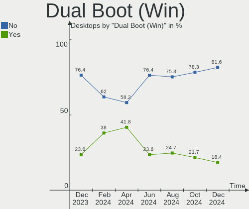
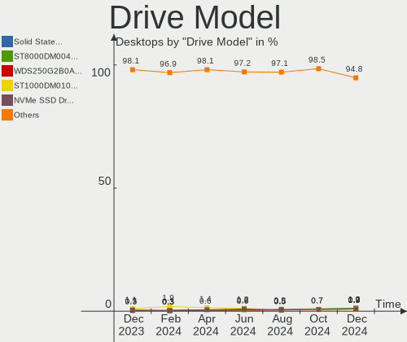
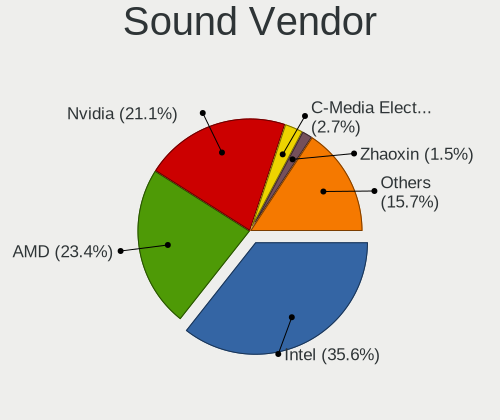
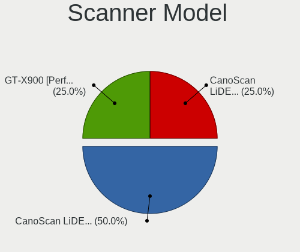

Debian Hardware Trends (Desktop)
--------------------------------

A project to identify most popular hardware characteristics and track their change
over time based on data collected by Debian users at https://Linux-Hardware.org.

Anyone can contribute to the study by uploading probes of their computers by
the [hw-probe](https://github.com/linuxhw/hw-probe) tool:

    sudo -E hw-probe -all -upload

Full-feature report is available here: https://linux-hardware.org/?view=trends&formfactor=desktop

Period: Apr, 2021.

Contents
--------

- [ OS                       ](#os)
- [ OS Family                ](#os-family)
- [ Kernel                   ](#kernel)
- [ Kernel Family            ](#kernel-family)
- [ Kernel Major Ver.        ](#kernel-major-ver)
- [ Arch                     ](#arch)
- [ DE                       ](#de)
- [ Display Server           ](#display-server)
- [ Display Manager          ](#display-manager)
- [ OS Lang                  ](#os-lang)
- [ Boot Mode                ](#boot-mode)
- [ Filesystem               ](#filesystem)
- [ Part. scheme             ](#part-scheme)
- [ Dual Boot with Linux/BSD ](#dual-boot-with-linux/bsd)
- [ Dual Boot (Win)          ](#dual-boot-win)
- [ Country                  ](#country)
- [ City                     ](#city)
- [ Vendor                   ](#vendor)
- [ Model                    ](#model)
- [ Model Family             ](#model-family)
- [ MFG Year                 ](#mfg-year)
- [ Form Factor              ](#form-factor)
- [ Secure Boot              ](#secure-boot)
- [ Coreboot                 ](#coreboot)
- [ RAM Size                 ](#ram-size)
- [ RAM Used                 ](#ram-used)
- [ Has CD-ROM               ](#has-cd-rom)
- [ Total Drives             ](#total-drives)
- [ Has Ethernet             ](#has-ethernet)
- [ Has WiFi                 ](#has-wifi)
- [ Has Bluetooth            ](#has-bluetooth)
- [ Drive Vendor             ](#drive-vendor)
- [ Drive Model              ](#drive-model)
- [ HDD Vendor               ](#hdd-vendor)
- [ SSD Vendor               ](#ssd-vendor)
- [ Drive Kind               ](#drive-kind)
- [ Drive Connector          ](#drive-connector)
- [ Drive Size               ](#drive-size)
- [ Space Total              ](#space-total)
- [ Space Used               ](#space-used)
- [ Malfunc. Drives          ](#malfunc-drives)
- [ Malfunc. Drive Vendor    ](#malfunc-drive-vendor)
- [ Malfunc. HDD Vendor      ](#malfunc-hdd-vendor)
- [ Malfunc. Drive Kind      ](#malfunc-drive-kind)
- [ Failed Drives            ](#failed-drives)
- [ Failed Drive Vendor      ](#failed-drive-vendor)
- [ Drive Status             ](#drive-status)
- [ Storage Vendor           ](#storage-vendor)
- [ Storage Model            ](#storage-model)
- [ Storage Kind             ](#storage-kind)
- [ CPU Vendor               ](#cpu-vendor)
- [ CPU Model                ](#cpu-model)
- [ CPU Model Family         ](#cpu-model-family)
- [ CPU Cores                ](#cpu-cores)
- [ CPU Sockets              ](#cpu-sockets)
- [ CPU Threads              ](#cpu-threads)
- [ CPU Op-Modes             ](#cpu-op-modes)
- [ CPU Microcode            ](#cpu-microcode)
- [ CPU Microarch            ](#cpu-microarch)
- [ GPU Vendor               ](#gpu-vendor)
- [ GPU Model                ](#gpu-model)
- [ GPU Combo                ](#gpu-combo)
- [ GPU Driver               ](#gpu-driver)
- [ GPU Memory               ](#gpu-memory)
- [ Monitor Vendor           ](#monitor-vendor)
- [ Monitor Model            ](#monitor-model)
- [ Monitor Resolution       ](#monitor-resolution)
- [ Monitor Diagonal         ](#monitor-diagonal)
- [ Monitor Width            ](#monitor-width)
- [ Aspect Ratio             ](#aspect-ratio)
- [ Monitor Area             ](#monitor-area)
- [ Pixel Density            ](#pixel-density)
- [ Multiple Monitors        ](#multiple-monitors)
- [ Net Controller Vendor    ](#net-controller-vendor)
- [ Net Controller Model     ](#net-controller-model)
- [ Wireless Vendor          ](#wireless-vendor)
- [ Wireless Model           ](#wireless-model)
- [ Ethernet Vendor          ](#ethernet-vendor)
- [ Ethernet Model           ](#ethernet-model)
- [ Net Controller Kind      ](#net-controller-kind)
- [ Used Controller          ](#used-controller)
- [ NICs                     ](#nics)
- [ IPv6                     ](#ipv6)
- [ Memory Vendor            ](#memory-vendor)
- [ Memory Model             ](#memory-model)
- [ Memory Kind              ](#memory-kind)
- [ Memory Form Factor       ](#memory-form-factor)
- [ Memory Size              ](#memory-size)
- [ Memory Speed             ](#memory-speed)
- [ Sound Vendor             ](#sound-vendor)
- [ Sound Model              ](#sound-model)
- [ Camera Vendor            ](#camera-vendor)
- [ Camera Model             ](#camera-model)
- [ Fingerprint Vendor       ](#fingerprint-vendor)
- [ Fingerprint Model        ](#fingerprint-model)
- [ Chipcard Vendor          ](#chipcard-vendor)
- [ Chipcard Model           ](#chipcard-model)
- [ Printer Vendor           ](#printer-vendor)
- [ Printer Model            ](#printer-model)
- [ Scanner Vendor           ](#scanner-vendor)
- [ Scanner Model            ](#scanner-model)
- [ Bluetooth Vendor         ](#bluetooth-vendor)
- [ Bluetooth Model          ](#bluetooth-model)
- [ Unsupported Devices      ](#unsupported-devices)
- [ Unsupported Device Types ](#unsupported-device-types)

OS
--

Installed operating systems

| Name                    | Desktops | Percent |
|-------------------------|----------|---------|
| Debian 10               | 39       | 49.37%  |
| Debian                  | 21       | 26.58%  |
| Debian Testing          | 7        | 8.86%   |
| Debian Unstable         | 3        | 3.8%    |
| Debian 9                | 3        | 3.8%    |
| Debian 11               | 2        | 2.53%   |
| Debian Testing/unstable | 1        | 1.27%   |
| Debian Sid              | 1        | 1.27%   |
| Debian 9.9              | 1        | 1.27%   |
| Debian 9.13             | 1        | 1.27%   |

OS Family
---------

OS without a version

| Name   | Desktops | Percent |
|--------|----------|---------|
| Debian | 79       | 100%    |

Kernel
------

Version of the Linux kernel

| Version                    | Desktops | Percent |
|----------------------------|----------|---------|
| 5.10.0-2-amd64             | 16       | 20.25%  |
| 4.19.0-16-amd64            | 14       | 17.72%  |
| 5.10.0-5-amd64             | 9        | 11.39%  |
| 5.4.106-1-pve              | 5        | 6.33%   |
| 5.10.0-6-amd64             | 5        | 6.33%   |
| 4.19.0-14-amd64            | 4        | 5.06%   |
| 5.9.0-0.bpo.5-amd64        | 2        | 2.53%   |
| 5.8.0-3-amd64              | 2        | 2.53%   |
| 5.10.0-0.bpo.5-amd64       | 2        | 2.53%   |
| 5.10.0-0.bpo.3-amd64       | 2        | 2.53%   |
| 4.9.0-15-amd64             | 2        | 2.53%   |
| 4.19.0-13-amd64            | 2        | 2.53%   |
| 5.4.0-0.bpo.4-amd64        | 1        | 1.27%   |
| 5.11.8                     | 1        | 1.27%   |
| 5.11.14                    | 1        | 1.27%   |
| 5.11.11                    | 1        | 1.27%   |
| 5.11.0-16.1-liquorix-amd64 | 1        | 1.27%   |
| 5.10.0-5mx-amd64           | 1        | 1.27%   |
| 5.10.0-4-amd64             | 1        | 1.27%   |
| 4.9.0-6-amd64              | 1        | 1.27%   |
| 4.9.0-13-686-pae           | 1        | 1.27%   |
| 4.9.0-1-amd64              | 1        | 1.27%   |
| 4.19.0-16-686-pae          | 1        | 1.27%   |
| 4.19.0-14-686              | 1        | 1.27%   |
| 4.19.0-12-amd64            | 1        | 1.27%   |
| 4.15.18-16-pve             | 1        | 1.27%   |

Kernel Family
-------------

Linux kernel without a distro release

| Version | Desktops | Percent |
|---------|----------|---------|
| 5.10.0  | 36       | 45.57%  |
| 4.19.0  | 23       | 29.11%  |
| 5.4.106 | 5        | 6.33%   |
| 4.9.0   | 5        | 6.33%   |
| 5.9.0   | 2        | 2.53%   |
| 5.8.0   | 2        | 2.53%   |
| 5.4.0   | 1        | 1.27%   |
| 5.11.8  | 1        | 1.27%   |
| 5.11.14 | 1        | 1.27%   |
| 5.11.11 | 1        | 1.27%   |
| 5.11.0  | 1        | 1.27%   |
| 4.15.18 | 1        | 1.27%   |

Kernel Major Ver.
-----------------

Linux kernel major version

| Version | Desktops | Percent |
|---------|----------|---------|
| 5.10    | 36       | 45.57%  |
| 4.19    | 23       | 29.11%  |
| 5.4     | 6        | 7.59%   |
| 4.9     | 5        | 6.33%   |
| 5.11    | 4        | 5.06%   |
| 5.9     | 2        | 2.53%   |
| 5.8     | 2        | 2.53%   |
| 4.15    | 1        | 1.27%   |

Arch
----

OS architecture (x86_64, i586, etc.)

| Name   | Desktops | Percent |
|--------|----------|---------|
| x86_64 | 76       | 96.2%   |
| i686   | 3        | 3.8%    |

DE
--

Desktop Environment

| Name             | Desktops | Percent |
|------------------|----------|---------|
| Unknown          | 34       | 43.04%  |
| GNOME            | 9        | 11.39%  |
| KDE5             | 8        | 10.13%  |
| XFCE             | 6        | 7.59%   |
| MATE             | 5        | 6.33%   |
| X-Cinnamon       | 4        | 5.06%   |
| KDE              | 4        | 5.06%   |
| LXDE             | 2        | 2.53%   |
| Budgie           | 2        | 2.53%   |
| lightdm-xsession | 1        | 1.27%   |
| i3-with-shmlog   | 1        | 1.27%   |
| GNOME Classic    | 1        | 1.27%   |
| fluxbox          | 1        | 1.27%   |
| default          | 1        | 1.27%   |

Display Server
--------------

X11 or Wayland

| Name    | Desktops | Percent |
|---------|----------|---------|
| X11     | 44       | 55.7%   |
| Unknown | 23       | 29.11%  |
| Tty     | 8        | 10.13%  |
| Wayland | 4        | 5.06%   |

Display Manager
---------------

SDDM, LightDM, etc.

| Name    | Desktops | Percent |
|---------|----------|---------|
| Unknown | 53       | 67.09%  |
| TDM     | 12       | 15.19%  |
| GDM     | 6        | 7.59%   |
| SDDM    | 5        | 6.33%   |
| XDM     | 2        | 2.53%   |
| GDM3    | 1        | 1.27%   |

OS Lang
-------

Language

| Lang    | Desktops | Percent |
|---------|----------|---------|
| en_US   | 25       | 31.65%  |
| ru_RU   | 22       | 27.85%  |
| fr_FR   | 6        | 7.59%   |
| pt_BR   | 4        | 5.06%   |
| en_GB   | 4        | 5.06%   |
| es_ES   | 3        | 3.8%    |
| de_DE   | 3        | 3.8%    |
| ro_RO   | 2        | 2.53%   |
| nl_BE   | 2        | 2.53%   |
| en_IE   | 2        | 2.53%   |
| en_CA   | 2        | 2.53%   |
| ko_KR   | 1        | 1.27%   |
| hu_HU   | 1        | 1.27%   |
| C       | 1        | 1.27%   |
| Unknown | 1        | 1.27%   |

Boot Mode
---------

EFI or BIOS

| Mode | Desktops | Percent |
|------|----------|---------|
| BIOS | 55       | 69.62%  |
| EFI  | 24       | 30.38%  |

Filesystem
----------

Type of filesystem

| Type    | Desktops | Percent |
|---------|----------|---------|
| Ext4    | 54       | 68.35%  |
| Overlay | 17       | 21.52%  |
| Btrfs   | 6        | 7.59%   |
| XXXXXXX | 1        | 1.27%   |
| Ext3    | 1        | 1.27%   |

Part. scheme
------------

Scheme of partitioning

| Type    | Desktops | Percent |
|---------|----------|---------|
| MBR     | 31       | 39.24%  |
| GPT     | 28       | 35.44%  |
| Unknown | 20       | 25.32%  |

Dual Boot with Linux/BSD
------------------------

Hosting more than one Linux/BSD

| Dual boot | Desktops | Percent |
|-----------|----------|---------|
| No        | 67       | 84.81%  |
| Yes       | 12       | 15.19%  |

Dual Boot (Win)
---------------

Hosting Linux and Windows

| Dual boot | Desktops | Percent |
|-----------|----------|---------|
| No        | 46       | 58.23%  |
| Yes       | 33       | 41.77%  |

Country
-------

Geographic location (country)

| Country     | Desktops | Percent |
|-------------|----------|---------|
| Russia      | 26       | 32.91%  |
| USA         | 9        | 11.39%  |
| Germany     | 6        | 7.59%   |
| France      | 6        | 7.59%   |
| Brazil      | 6        | 7.59%   |
| Spain       | 5        | 6.33%   |
| Pakistan    | 5        | 6.33%   |
| Ukraine     | 2        | 2.53%   |
| UK          | 2        | 2.53%   |
| Belgium     | 2        | 2.53%   |
| Austria     | 2        | 2.53%   |
| Vietnam     | 1        | 1.27%   |
| Turkey      | 1        | 1.27%   |
| South Korea | 1        | 1.27%   |
| Serbia      | 1        | 1.27%   |
| Romania     | 1        | 1.27%   |
| Norway      | 1        | 1.27%   |
| Denmark     | 1        | 1.27%   |
| Canada      | 1        | 1.27%   |

City
----

Geographic location (city)

| City               | Desktops | Percent |
|--------------------|----------|---------|
| Voronezh           | 16       | 20.25%  |
| Moscow             | 5        | 6.33%   |
| Lahore             | 5        | 6.33%   |
| Vienna             | 2        | 2.53%   |
| Perm               | 2        | 2.53%   |
| Hamburg            | 2        | 2.53%   |
| Yangsan            | 1        | 1.27%   |
| Wuppertal          | 1        | 1.27%   |
| Wooster            | 1        | 1.27%   |
| Vojens             | 1        | 1.27%   |
| Vila-real          | 1        | 1.27%   |
| Ver-sur-Launette   | 1        | 1.27%   |
| Troy               | 1        | 1.27%   |
| São Paulo         | 1        | 1.27%   |
| St Petersburg      | 1        | 1.27%   |
| St Louis           | 1        | 1.27%   |
| Sint-Michiels      | 1        | 1.27%   |
| Sevastopol         | 1        | 1.27%   |
| Sao Vicente        | 1        | 1.27%   |
| Pskov              | 1        | 1.27%   |
| Porto Alegre       | 1        | 1.27%   |
| Pontarddulais      | 1        | 1.27%   |
| Ponta Grossa       | 1        | 1.27%   |
| Pinto              | 1        | 1.27%   |
| Paris              | 1        | 1.27%   |
| Ostend             | 1        | 1.27%   |
| Oslo               | 1        | 1.27%   |
| Onaway             | 1        | 1.27%   |
| Olching            | 1        | 1.27%   |
| Novosibirsk        | 1        | 1.27%   |
| Nanterre           | 1        | 1.27%   |
| Málaga            | 1        | 1.27%   |
| Munich             | 1        | 1.27%   |
| Mississippi Mills  | 1        | 1.27%   |
| Madrid             | 1        | 1.27%   |
| Lille              | 1        | 1.27%   |
| Kyiv               | 1        | 1.27%   |
| Izmir              | 1        | 1.27%   |
| Hutchinson         | 1        | 1.27%   |
| Ho Chi Minh City   | 1        | 1.27%   |
| Guer               | 1        | 1.27%   |
| Greenwich          | 1        | 1.27%   |
| Fairmont           | 1        | 1.27%   |
| Estes Park         | 1        | 1.27%   |
| Dolgesheim         | 1        | 1.27%   |
| Dammartin-en-Goele | 1        | 1.27%   |
| Curitiba           | 1        | 1.27%   |
| Cuiabá            | 1        | 1.27%   |
| Chapel Hill        | 1        | 1.27%   |
| Brooklyn           | 1        | 1.27%   |
| Brasov             | 1        | 1.27%   |
| Bilbao             | 1        | 1.27%   |
| Belo Blato         | 1        | 1.27%   |

Vendor
------

Motherboard manufacturer

| Name                | Desktops | Percent |
|---------------------|----------|---------|
| ASUSTek Computer    | 20       | 25.32%  |
| Gigabyte Technology | 11       | 13.92%  |
| MSI                 | 10       | 12.66%  |
| Dell                | 8        | 10.13%  |
| ASRock              | 8        | 10.13%  |
| Lenovo              | 4        | 5.06%   |
| Hewlett-Packard     | 3        | 3.8%    |
| ECS                 | 3        | 3.8%    |
| Positivo            | 2        | 2.53%   |
| Acer                | 2        | 2.53%   |
| Supermicro          | 1        | 1.27%   |
| Shuttle             | 1        | 1.27%   |
| Pegatron            | 1        | 1.27%   |
| PC Engines          | 1        | 1.27%   |
| Inventec            | 1        | 1.27%   |
| Intel               | 1        | 1.27%   |
| Foxconn             | 1        | 1.27%   |
| Biostar             | 1        | 1.27%   |

Model
-----

Motherboard model

| Name                                    | Desktops | Percent |
|-----------------------------------------|----------|---------|
| ASUS TUF GAMING X570-PLUS               | 3        | 3.8%    |
| MSI MS-7996                             | 2        | 2.53%   |
| Dell Precision WorkStation T7500        | 2        | 2.53%   |
| ASUS All Series                         | 2        | 2.53%   |
| Supermicro X9SCL/X9SCM                  | 1        | 1.27%   |
| Shuttle DS81D                           | 1        | 1.27%   |
| Positivo POS-VVCN896BD                  | 1        | 1.27%   |
| Positivo MOBILE                         | 1        | 1.27%   |
| Pegatron C15B                           | 1        | 1.27%   |
| PC Engines apu2                         | 1        | 1.27%   |
| MSI P35 Platinum(MS-7345)               | 1        | 1.27%   |
| MSI MS-7C37                             | 1        | 1.27%   |
| MSI MS-7C06                             | 1        | 1.27%   |
| MSI MS-7A34                             | 1        | 1.27%   |
| MSI MS-7982                             | 1        | 1.27%   |
| MSI MS-7917                             | 1        | 1.27%   |
| MSI MS-7592                             | 1        | 1.27%   |
| MSI EC507AA-ABF SR1507FR FR530          | 1        | 1.27%   |
| Lenovo ThinkStation D30 4223CC9         | 1        | 1.27%   |
| Lenovo ThinkCentre M58 7359A59          | 1        | 1.27%   |
| Lenovo ThinkCentre M57p 9196AP8         | 1        | 1.27%   |
| Lenovo IdeaCentre 510A-15ARR 90J00019FR | 1        | 1.27%   |
| Inventec R CLASS                        | 1        | 1.27%   |
| Intel Pro, Std, Elt Series              | 1        | 1.27%   |
| HP t620 Dual Core TC                    | 1        | 1.27%   |
| HP Compaq Elite 8300 All-in-One PC      | 1        | 1.27%   |
| HP Compaq 6000 Pro SFF PC               | 1        | 1.27%   |
| Gigabyte Z390 AORUS PRO WIFI            | 1        | 1.27%   |
| Gigabyte Z170M-D3H DDR3                 | 1        | 1.27%   |
| Gigabyte H97M-HD3                       | 1        | 1.27%   |
| Gigabyte H81M-S2V                       | 1        | 1.27%   |
| Gigabyte H410M S2H                      | 1        | 1.27%   |
| Gigabyte GB-BXBT-2807                   | 1        | 1.27%   |
| Gigabyte G41M-ES2L                      | 1        | 1.27%   |
| Gigabyte EG41MF-US2H                    | 1        | 1.27%   |
| Gigabyte B450M DS3H                     | 1        | 1.27%   |
| Gigabyte A320M-S2H                      | 1        | 1.27%   |
| Gigabyte A320M-H                        | 1        | 1.27%   |
| Foxconn H61MXL/H61MXL-K                 | 1        | 1.27%   |
| ECS X79R-AX                             | 1        | 1.27%   |
| ECS G31T-M9                             | 1        | 1.27%   |
| ECS G31T-M7                             | 1        | 1.27%   |
| Dell Precision T7600                    | 1        | 1.27%   |
| Dell OptiPlex 760                       | 1        | 1.27%   |
| Dell OptiPlex 7010                      | 1        | 1.27%   |
| Dell OptiPlex 3070                      | 1        | 1.27%   |
| Dell OptiPlex 3020                      | 1        | 1.27%   |
| Dell OptiPlex 3010                      | 1        | 1.27%   |
| Biostar B450MH                          | 1        | 1.27%   |
| ASUS Z170M-PLUS                         | 1        | 1.27%   |
| ASUS ROG STRIX B460-F GAMING            | 1        | 1.27%   |
| ASUS ROG CROSSHAIR VIII HERO            | 1        | 1.27%   |
| ASUS ROG CROSSHAIR VI HERO              | 1        | 1.27%   |
| ASUS Rampage Formula                    | 1        | 1.27%   |
| ASUS PRIME B450M-K                      | 1        | 1.27%   |
| ASUS PRIME B450M-GAMING/BR              | 1        | 1.27%   |
| ASUS PRIME A320M-K                      | 1        | 1.27%   |
| ASUS P9X79 PRO                          | 1        | 1.27%   |
| ASUS P8Z77-M                            | 1        | 1.27%   |
| ASUS P8H61-M LX3 R2.0                   | 1        | 1.27%   |

Model Family
------------

Motherboard model prefix

| Name                   | Desktops | Percent |
|------------------------|----------|---------|
| Dell OptiPlex          | 5        | 6.33%   |
| Dell Precision         | 3        | 3.8%    |
| ASUS TUF               | 3        | 3.8%    |
| ASUS ROG               | 3        | 3.8%    |
| ASUS PRIME             | 3        | 3.8%    |
| MSI MS-7996            | 2        | 2.53%   |
| Lenovo ThinkCentre     | 2        | 2.53%   |
| HP Compaq              | 2        | 2.53%   |
| ASUS All               | 2        | 2.53%   |
| Acer Aspire            | 2        | 2.53%   |
| Supermicro X9SCL       | 1        | 1.27%   |
| Shuttle DS81D          | 1        | 1.27%   |
| Positivo POS-VVCN896BD | 1        | 1.27%   |
| Positivo MOBILE        | 1        | 1.27%   |
| Pegatron C15B          | 1        | 1.27%   |
| PC Engines apu2        | 1        | 1.27%   |
| MSI P35                | 1        | 1.27%   |
| MSI MS-7C37            | 1        | 1.27%   |
| MSI MS-7C06            | 1        | 1.27%   |
| MSI MS-7A34            | 1        | 1.27%   |
| MSI MS-7982            | 1        | 1.27%   |
| MSI MS-7917            | 1        | 1.27%   |
| MSI MS-7592            | 1        | 1.27%   |
| MSI EC507AA-ABF        | 1        | 1.27%   |
| Lenovo ThinkStation    | 1        | 1.27%   |
| Lenovo IdeaCentre      | 1        | 1.27%   |
| Inventec R             | 1        | 1.27%   |
| Intel Pro              | 1        | 1.27%   |
| HP t620                | 1        | 1.27%   |
| Gigabyte Z390          | 1        | 1.27%   |
| Gigabyte Z170M-D3H     | 1        | 1.27%   |
| Gigabyte H97M-HD3      | 1        | 1.27%   |
| Gigabyte H81M-S2V      | 1        | 1.27%   |
| Gigabyte H410M         | 1        | 1.27%   |
| Gigabyte GB-BXBT-2807  | 1        | 1.27%   |
| Gigabyte G41M-ES2L     | 1        | 1.27%   |
| Gigabyte EG41MF-US2H   | 1        | 1.27%   |
| Gigabyte B450M         | 1        | 1.27%   |
| Gigabyte A320M-S2H     | 1        | 1.27%   |
| Gigabyte A320M-H       | 1        | 1.27%   |
| Foxconn H61MXL         | 1        | 1.27%   |
| ECS X79R-AX            | 1        | 1.27%   |
| ECS G31T-M9            | 1        | 1.27%   |
| ECS G31T-M7            | 1        | 1.27%   |
| Biostar B450MH         | 1        | 1.27%   |
| ASUS Z170M-PLUS        | 1        | 1.27%   |
| ASUS Rampage           | 1        | 1.27%   |
| ASUS P9X79             | 1        | 1.27%   |
| ASUS P8Z77-M           | 1        | 1.27%   |
| ASUS P8H61-M           | 1        | 1.27%   |
| ASUS P5VD2-MX          | 1        | 1.27%   |
| ASUS P5B               | 1        | 1.27%   |
| ASUS M2N68-VM          | 1        | 1.27%   |
| ASUS E45M1-I           | 1        | 1.27%   |
| ASRock Z270            | 1        | 1.27%   |
| ASRock X470            | 1        | 1.27%   |
| ASRock J3160M          | 1        | 1.27%   |
| ASRock FM2A88M-HD+     | 1        | 1.27%   |
| ASRock B550            | 1        | 1.27%   |
| ASRock A300M-STX       | 1        | 1.27%   |

MFG Year
--------

Motherboard manufacture year

| Year    | Desktops | Percent |
|---------|----------|---------|
| 2020    | 12       | 15.19%  |
| 2019    | 7        | 8.86%   |
| 2016    | 7        | 8.86%   |
| 2009    | 7        | 8.86%   |
| 2018    | 6        | 7.59%   |
| 2014    | 6        | 7.59%   |
| 2011    | 6        | 7.59%   |
| 2013    | 5        | 6.33%   |
| 2010    | 5        | 6.33%   |
| 2021    | 3        | 3.8%    |
| 2017    | 3        | 3.8%    |
| 2015    | 3        | 3.8%    |
| 2012    | 3        | 3.8%    |
| 2008    | 3        | 3.8%    |
| 2006    | 2        | 2.53%   |
| Unknown | 1        | 1.27%   |

Form Factor
-----------

Physical design of the computer

| Name    | Desktops | Percent |
|---------|----------|---------|
| Desktop | 79       | 100%    |

Secure Boot
-----------

Enabled or disabled

| State    | Desktops | Percent |
|----------|----------|---------|
| Disabled | 79       | 100%    |

Coreboot
--------

Have coreboot on board

| Used | Desktops | Percent |
|------|----------|---------|
| No   | 78       | 98.73%  |
| Yes  | 1        | 1.27%   |

RAM Size
--------

Total RAM memory

| Size in GB  | Desktops | Percent |
|-------------|----------|---------|
| 3.01-4.0    | 17       | 21.52%  |
| 8.01-16.0   | 16       | 20.25%  |
| 32.01-64.0  | 10       | 12.66%  |
| 16.01-24.0  | 10       | 12.66%  |
| 4.01-8.0    | 8        | 10.13%  |
| 64.01-256.0 | 6        | 7.59%   |
| 1.01-2.0    | 6        | 7.59%   |
| 24.01-32.0  | 3        | 3.8%    |
| 2.01-3.0    | 1        | 1.27%   |
| 0.51-1.0    | 1        | 1.27%   |
| 0.01-0.5    | 1        | 1.27%   |

RAM Used
--------

Used RAM memory

| Used GB     | Desktops | Percent |
|-------------|----------|---------|
| 0.51-1.0    | 24       | 30.38%  |
| 2.01-3.0    | 16       | 20.25%  |
| 1.01-2.0    | 13       | 16.46%  |
| 3.01-4.0    | 9        | 11.39%  |
| 4.01-8.0    | 8        | 10.13%  |
| 8.01-16.0   | 4        | 5.06%   |
| 0.01-0.5    | 2        | 2.53%   |
| 32.01-64.0  | 1        | 1.27%   |
| 64.01-256.0 | 1        | 1.27%   |
| 16.01-24.0  | 1        | 1.27%   |

Has CD-ROM
----------

Has CD-ROM on board

| Presented | Desktops | Percent |
|-----------|----------|---------|
| No        | 55       | 69.62%  |
| Yes       | 24       | 30.38%  |

Total Drives
------------

Number of drives on board

| Drives | Desktops | Percent |
|--------|----------|---------|
| 1      | 35       | 44.3%   |
| 2      | 15       | 18.99%  |
| 5      | 8        | 10.13%  |
| 3      | 6        | 7.59%   |
| 6      | 5        | 6.33%   |
| 7      | 4        | 5.06%   |
| 4      | 4        | 5.06%   |
| 9      | 2        | 2.53%   |

Has Ethernet
------------

Has Ethernet on board

| Presented | Desktops | Percent |
|-----------|----------|---------|
| Yes       | 79       | 100%    |

Has WiFi
--------

Has WiFi module

| Presented | Desktops | Percent |
|-----------|----------|---------|
| No        | 46       | 58.23%  |
| Yes       | 33       | 41.77%  |

Has Bluetooth
-------------

Has Bluetooth module

| Presented | Desktops | Percent |
|-----------|----------|---------|
| No        | 54       | 68.35%  |
| Yes       | 25       | 31.65%  |

Drive Vendor
------------

Hard drive vendors

| Vendor              | Desktops | Drives | Percent |
|---------------------|----------|--------|---------|
| WDC                 | 25       | 41     | 16.03%  |
| Seagate             | 25       | 39     | 16.03%  |
| Samsung Electronics | 22       | 31     | 14.1%   |
| Kingston            | 13       | 16     | 8.33%   |
| Hitachi             | 8        | 8      | 5.13%   |
| Crucial             | 8        | 9      | 5.13%   |
| Toshiba             | 6        | 10     | 3.85%   |
| Unknown             | 4        | 4      | 2.56%   |
| SanDisk             | 4        | 5      | 2.56%   |
| Intel               | 3        | 4      | 1.92%   |
| HGST                | 3        | 3      | 1.92%   |
| Phison              | 2        | 3      | 1.28%   |
| OCZ                 | 2        | 2      | 1.28%   |
| LITEONIT            | 2        | 2      | 1.28%   |
| Lexar               | 2        | 2      | 1.28%   |
| LaCie               | 2        | 2      | 1.28%   |
| KingDian            | 2        | 2      | 1.28%   |
| Hewlett-Packard     | 2        | 3      | 1.28%   |
| Hajaan              | 2        | 2      | 1.28%   |
| Corsair             | 2        | 2      | 1.28%   |
| A-DATA Technology   | 2        | 2      | 1.28%   |
| Transcend           | 1        | 1      | 0.64%   |
| THU                 | 1        | 1      | 0.64%   |
| SK Hynix            | 1        | 1      | 0.64%   |
| Silicon Motion      | 1        | 1      | 0.64%   |
| Sabrent             | 1        | 2      | 0.64%   |
| PNY                 | 1        | 1      | 0.64%   |
| PLEXTOR             | 1        | 1      | 0.64%   |
| NETAPP              | 1        | 1      | 0.64%   |
| LITEON              | 1        | 1      | 0.64%   |
| HUAWEI              | 1        | 1      | 0.64%   |
| Hoodisk             | 1        | 1      | 0.64%   |
| Gigabyte Technology | 1        | 2      | 0.64%   |
| China               | 1        | 1      | 0.64%   |
| Apple               | 1        | 1      | 0.64%   |
| Apacer              | 1        | 1      | 0.64%   |

Drive Model
-----------

Hard drive models

| Model                                   | Desktops | Percent |
|-----------------------------------------|----------|---------|
| Samsung SSD 860 EVO 500GB               | 3        | 1.65%   |
| Kingston SUV400S37240G 240GB SSD        | 3        | 1.65%   |
| WDC WD10EZEX-60WN4A0 1TB                | 2        | 1.1%    |
| Toshiba DT01ACA100 1TB                  | 2        | 1.1%    |
| Seagate ST2000DM008-2FR102 2TB          | 2        | 1.1%    |
| Seagate ST2000DM008-2FR1                | 2        | 1.1%    |
| Seagate ST1000DM010-2EP102 1TB          | 2        | 1.1%    |
| Samsung SSD 870 EVO 500GB               | 2        | 1.1%    |
| Samsung SSD 850 EVO 500GB               | 2        | 1.1%    |
| Samsung SSD 850 EVO 250GB               | 2        | 1.1%    |
| Samsung HD250HJ 250GB                   | 2        | 1.1%    |
| LaCie Rugged USB-C 4TB                  | 2        | 1.1%    |
| Kingston SA400S37240G 240GB SSD         | 2        | 1.1%    |
| Kingston SA400S37120G 120GB SSD         | 2        | 1.1%    |
| Hitachi HUA723020ALA640 2TB             | 2        | 1.1%    |
| Hitachi HDS721050CLA362 500GB           | 2        | 1.1%    |
| HP MB2000EBZQC 2TB                      | 2        | 1.1%    |
| Hajaan SSD 256G                         | 2        | 1.1%    |
| WDC WUH721414ALE6L4 14TB                | 1        | 0.55%   |
| WDC WDS500G2B0A-00SM50 500GB SSD        | 1        | 0.55%   |
| WDC WDS120G1G0B-00RC30 120GB SSD        | 1        | 0.55%   |
| WDC WDS100T3XHC-00SJG0 1TB              | 1        | 0.55%   |
| WDC WDS100T2B0A-00SM50 1TB SSD          | 1        | 0.55%   |
| WDC WDS100T1X0E-00AFY0 1TB              | 1        | 0.55%   |
| WDC WD800JD-75JNA0 80GB                 | 1        | 0.55%   |
| WDC WD5002AALX-00J37A0 500GB            | 1        | 0.55%   |
| WDC WD5000LPVX-00V0TT0 500GB            | 1        | 0.55%   |
| WDC WD5000AZRX-00A8LB0 500GB            | 1        | 0.55%   |
| WDC WD5000AAKS-55A7B2 500GB             | 1        | 0.55%   |
| WDC WD5000AAKS-00UU3A0 500GB            | 1        | 0.55%   |
| WDC WD40EFRX-68N32N0 4TB                | 1        | 0.55%   |
| WDC WD40EFAX-68JH4N1 4TB                | 1        | 0.55%   |
| WDC WD3200KS-75PFB0 320GB               | 1        | 0.55%   |
| WDC WD3200BEVT-22ZCT0 320GB             | 1        | 0.55%   |
| WDC WD3200AAKS-00L9A0 320GB             | 1        | 0.55%   |
| WDC WD2500BEVT-75A23T0 250GB            | 1        | 0.55%   |
| WDC WD20EFRX-68EUZN0 2TB                | 1        | 0.55%   |
| WDC WD20EARX-00PASB0 2TB                | 1        | 0.55%   |
| WDC WD20EADS-00S2B0 2TB                 | 1        | 0.55%   |
| WDC WD1600AAJS-75M0A0 160GB             | 1        | 0.55%   |
| WDC WD1600AAJS-22WAA0 160GB             | 1        | 0.55%   |
| WDC WD10EZEX-60ZF5A0 1TB                | 1        | 0.55%   |
| WDC WD10EZEX-22MFCA0 1TB                | 1        | 0.55%   |
| WDC WD10EZEX-08WN4A0 1TB                | 1        | 0.55%   |
| WDC WD10EZEX-00BN5A0 1TB                | 1        | 0.55%   |
| WDC WD10EARS-00MVWB0 1TB                | 1        | 0.55%   |
| WDC WD1003FBYX-01Y7B0 1TB               | 1        | 0.55%   |
| WDC WD1002FBYS-05A6B0 1TB               | 1        | 0.55%   |
| WDC WD1002FAEX-00Y9A0 1TB               | 1        | 0.55%   |
| WDC WD1001FALS-00J7B0 1TB               | 1        | 0.55%   |
| WDC WD1000DHTZ-04N21V1 1TB              | 1        | 0.55%   |
| Unknown UGBA1TPH32H0S2-PNN-CTF 32GB SSD | 1        | 0.55%   |
| Unknown SSV4 512GB                      | 1        | 0.55%   |
| Unknown SD/MMC/MS PRO 32GB              | 1        | 0.55%   |
| Unknown MMC Card  8GB                   | 1        | 0.55%   |
| Transcend TS128GSSD360S 128GB           | 1        | 0.55%   |
| Toshiba HDWQ140 4TB                     | 1        | 0.55%   |
| Toshiba HDWL110 1TB                     | 1        | 0.55%   |
| Toshiba HDWG180 8TB                     | 1        | 0.55%   |
| Toshiba DT01ACA300 3TB                  | 1        | 0.55%   |

HDD Vendor
----------

Hard disk drive vendors

| Vendor              | Desktops | Drives | Percent |
|---------------------|----------|--------|---------|
| Seagate             | 25       | 39     | 35.71%  |
| WDC                 | 21       | 36     | 30%     |
| Hitachi             | 8        | 8      | 11.43%  |
| Toshiba             | 6        | 10     | 8.57%   |
| Samsung Electronics | 3        | 3      | 4.29%   |
| HGST                | 3        | 3      | 4.29%   |
| Hewlett-Packard     | 2        | 3      | 2.86%   |
| Sabrent             | 1        | 2      | 1.43%   |
| Apple               | 1        | 1      | 1.43%   |

SSD Vendor
----------

Solid state drive vendors

| Vendor              | Desktops | Drives | Percent |
|---------------------|----------|--------|---------|
| Samsung Electronics | 17       | 24     | 26.15%  |
| Kingston            | 12       | 13     | 18.46%  |
| Crucial             | 8        | 8      | 12.31%  |
| WDC                 | 3        | 3      | 4.62%   |
| SanDisk             | 3        | 4      | 4.62%   |
| OCZ                 | 2        | 2      | 3.08%   |
| LITEONIT            | 2        | 2      | 3.08%   |
| Lexar               | 2        | 2      | 3.08%   |
| KingDian            | 2        | 2      | 3.08%   |
| Intel               | 2        | 2      | 3.08%   |
| Hajaan              | 2        | 2      | 3.08%   |
| A-DATA Technology   | 2        | 2      | 3.08%   |
| Unknown             | 1        | 1      | 1.54%   |
| Transcend           | 1        | 1      | 1.54%   |
| THU                 | 1        | 1      | 1.54%   |
| SK Hynix            | 1        | 1      | 1.54%   |
| PNY                 | 1        | 1      | 1.54%   |
| PLEXTOR             | 1        | 1      | 1.54%   |
| Hoodisk             | 1        | 1      | 1.54%   |
| Corsair             | 1        | 1      | 1.54%   |

Drive Kind
----------

HDD or SSD

| Kind    | Desktops | Drives | Percent |
|---------|----------|--------|---------|
| HDD     | 52       | 105    | 41.94%  |
| SSD     | 48       | 74     | 38.71%  |
| NVMe    | 16       | 22     | 12.9%   |
| Unknown | 7        | 7      | 5.65%   |
| MMC     | 1        | 1      | 0.81%   |

Drive Connector
---------------

SATA, SAS, NVMe, etc.

| Type | Desktops | Drives | Percent |
|------|----------|--------|---------|
| SATA | 74       | 178    | 76.29%  |
| NVMe | 16       | 22     | 16.49%  |
| SAS  | 6        | 8      | 6.19%   |
| MMC  | 1        | 1      | 1.03%   |

Drive Size
----------

Size of hard drive

| Size in TB | Desktops | Drives | Percent |
|------------|----------|--------|---------|
| 0.01-0.5   | 61       | 99     | 54.46%  |
| 0.51-1.0   | 24       | 34     | 21.43%  |
| 1.01-2.0   | 15       | 27     | 13.39%  |
| 3.01-4.0   | 6        | 13     | 5.36%   |
| 2.01-3.0   | 3        | 3      | 2.68%   |
| 4.01-10.0  | 2        | 2      | 1.79%   |
| 10.01-20.0 | 1        | 1      | 0.89%   |

Space Total
-----------

Amount of disk space available on the file system

| Size in GB     | Desktops | Percent |
|----------------|----------|---------|
| Unknown        | 19       | 24.05%  |
| 501-1000       | 13       | 16.46%  |
| 251-500        | 11       | 13.92%  |
| 1001-2000      | 9        | 11.39%  |
| 101-250        | 8        | 10.13%  |
| More than 3000 | 6        | 7.59%   |
| 51-100         | 6        | 7.59%   |
| 2001-3000      | 5        | 6.33%   |
| 21-50          | 1        | 1.27%   |
| 1-20           | 1        | 1.27%   |

Space Used
----------

Amount of used disk space

| Used GB        | Desktops | Percent |
|----------------|----------|---------|
| Unknown        | 19       | 24.05%  |
| 1-20           | 15       | 18.99%  |
| 251-500        | 12       | 15.19%  |
| 501-1000       | 8        | 10.13%  |
| 21-50          | 6        | 7.59%   |
| 101-250        | 6        | 7.59%   |
| 1001-2000      | 5        | 6.33%   |
| 51-100         | 4        | 5.06%   |
| More than 3000 | 3        | 3.8%    |
| 2001-3000      | 1        | 1.27%   |

Malfunc. Drives
---------------

Drive models with a malfunction

| Model                              | Desktops | Drives | Percent |
|------------------------------------|----------|--------|---------|
| Seagate ST2000DM008-2FR1           | 2        | 2      | 10%     |
| WDC WD5002AALX-00J37A0 500GB       | 1        | 1      | 5%      |
| WDC WD3200AAKS-00L9A0 320GB        | 1        | 1      | 5%      |
| WDC WD20EARX-00PASB0 2TB           | 1        | 1      | 5%      |
| WDC WD10EZEX-60ZF5A0 1TB           | 1        | 1      | 5%      |
| WDC WD10EZEX-00BN5A0 1TB           | 1        | 1      | 5%      |
| WDC WD10EARS-00MVWB0 1TB           | 1        | 1      | 5%      |
| Toshiba DT01ACA300 3TB             | 1        | 1      | 5%      |
| Seagate ST380215A 80GB             | 1        | 1      | 5%      |
| Seagate ST3320613AS 320GB          | 1        | 1      | 5%      |
| Seagate ST2000VX000-1CU164 2TB     | 1        | 1      | 5%      |
| Seagate ST2000LM003 HN-M201RAD 2TB | 1        | 1      | 5%      |
| Seagate ST1000NM0011 1TB           | 1        | 1      | 5%      |
| Seagate ST1000LM014-SSHD-8GB       | 1        | 1      | 5%      |
| Samsung Electronics HD501LJ 500GB  | 1        | 1      | 5%      |
| KingDian S280-240GB SSD            | 1        | 1      | 5%      |
| Intel SSDSA2M080G2GN 73GB          | 1        | 1      | 5%      |
| Hitachi HTS543225A7A384 250GB      | 1        | 1      | 5%      |
| Crucial CT525MX300SSD1 528GB       | 1        | 1      | 5%      |

Malfunc. Drive Vendor
---------------------

Vendors of faulty drives

| Vendor              | Desktops | Drives | Percent |
|---------------------|----------|--------|---------|
| Seagate             | 7        | 8      | 38.89%  |
| WDC                 | 5        | 6      | 27.78%  |
| Toshiba             | 1        | 1      | 5.56%   |
| Samsung Electronics | 1        | 1      | 5.56%   |
| KingDian            | 1        | 1      | 5.56%   |
| Intel               | 1        | 1      | 5.56%   |
| Hitachi             | 1        | 1      | 5.56%   |
| Crucial             | 1        | 1      | 5.56%   |

Malfunc. HDD Vendor
-------------------

Vendors of faulty HDD drives

| Vendor              | Desktops | Drives | Percent |
|---------------------|----------|--------|---------|
| Seagate             | 7        | 8      | 46.67%  |
| WDC                 | 5        | 6      | 33.33%  |
| Toshiba             | 1        | 1      | 6.67%   |
| Samsung Electronics | 1        | 1      | 6.67%   |
| Hitachi             | 1        | 1      | 6.67%   |

Malfunc. Drive Kind
-------------------

Kinds of faulty drives

| Kind | Desktops | Drives | Percent |
|------|----------|--------|---------|
| HDD  | 14       | 17     | 82.35%  |
| SSD  | 3        | 3      | 17.65%  |

Failed Drives
-------------

Failed drive models

| Model                     | Desktops | Drives | Percent |
|---------------------------|----------|--------|---------|
| Seagate ST3500830AS 500GB | 1        | 1      | 100%    |

Failed Drive Vendor
-------------------

Failed drive vendors

| Vendor  | Desktops | Drives | Percent |
|---------|----------|--------|---------|
| Seagate | 1        | 1      | 100%    |

Drive Status
------------

Number of failed and malfunc. drives

| Status   | Desktops | Drives | Percent |
|----------|----------|--------|---------|
| Works    | 56       | 134    | 57.73%  |
| Detected | 25       | 54     | 25.77%  |
| Malfunc  | 15       | 20     | 15.46%  |
| Failed   | 1        | 1      | 1.03%   |

Storage Vendor
--------------

Storage controller vendors

| Vendor                      | Desktops | Percent |
|-----------------------------|----------|---------|
| Intel                       | 50       | 43.86%  |
| AMD                         | 26       | 22.81%  |
| Marvell Technology Group    | 5        | 4.39%   |
| Samsung Electronics         | 4        | 3.51%   |
| Phison Electronics          | 4        | 3.51%   |
| LSI Logic / Symbios Logic   | 4        | 3.51%   |
| ASMedia Technology          | 4        | 3.51%   |
| Sandisk                     | 3        | 2.63%   |
| JMicron Technology          | 3        | 2.63%   |
| VIA Technologies            | 2        | 1.75%   |
| Silicon Image               | 2        | 1.75%   |
| Kingston Technology Company | 2        | 1.75%   |
| Silicon Motion              | 1        | 0.88%   |
| Nvidia                      | 1        | 0.88%   |
| Micron/Crucial Technology   | 1        | 0.88%   |
| Lite-On Technology          | 1        | 0.88%   |
| Broadcom / LSI              | 1        | 0.88%   |

Storage Model
-------------

Storage controller models

| Model                                                                          | Desktops | Percent |
|--------------------------------------------------------------------------------|----------|---------|
| AMD FCH SATA Controller [AHCI mode]                                            | 19       | 12.34%  |
| Intel Q170/Q150/B150/H170/H110/Z170/CM236 Chipset SATA Controller [AHCI Mode]  | 5        | 3.25%   |
| Intel NM10/ICH7 Family SATA Controller [IDE mode]                              | 5        | 3.25%   |
| Intel 8 Series/C220 Series Chipset Family 6-port SATA Controller 1 [AHCI mode] | 5        | 3.25%   |
| AMD 400 Series Chipset SATA Controller                                         | 5        | 3.25%   |
| Intel 6 Series/C200 Series Chipset Family 6 port Desktop SATA AHCI Controller  | 4        | 2.6%    |
| Intel 4 Series Chipset PT IDER Controller                                      | 4        | 2.6%    |
| ASMedia ASM1062 Serial ATA Controller                                          | 4        | 2.6%    |
| Samsung NVMe SSD Controller SM981/PM981/PM983                                  | 3        | 1.95%   |
| Phison E12 NVMe Controller                                                     | 3        | 1.95%   |
| LSI Logic / Symbios Logic SAS1068E PCI-Express Fusion-MPT SAS                  | 3        | 1.95%   |
| Intel C600/X79 series chipset 6-Port SATA AHCI Controller                      | 3        | 1.95%   |
| Intel 82801JD/DO (ICH10 Family) SATA AHCI Controller                           | 3        | 1.95%   |
| Intel 82801G (ICH7 Family) IDE Controller                                      | 3        | 1.95%   |
| Intel 400 Series Chipset Family SATA AHCI Controller                           | 3        | 1.95%   |
| AMD SB7x0/SB8x0/SB9x0 SATA Controller [AHCI mode]                              | 3        | 1.95%   |
| AMD FCH SATA Controller D                                                      | 3        | 1.95%   |
| VIA VT82C586A/B/VT82C686/A/B/VT823x/A/C PIPC Bus Master IDE                    | 2        | 1.3%    |
| Marvell Group 88SE9215 PCIe 2.0 x1 4-port SATA 6 Gb/s Controller               | 2        | 1.3%    |
| JMicron JMB363 SATA/IDE Controller                                             | 2        | 1.3%    |
| Intel SATA Controller [RAID mode]                                              | 2        | 1.3%    |
| Intel Cannon Lake PCH SATA AHCI Controller                                     | 2        | 1.3%    |
| Intel Atom Processor E3800 Series SATA AHCI Controller                         | 2        | 1.3%    |
| Intel 9 Series Chipset Family SATA Controller [AHCI Mode]                      | 2        | 1.3%    |
| Intel 82801JI (ICH10 Family) SATA AHCI Controller                              | 2        | 1.3%    |
| Intel 82801JD/DO (ICH10 Family) 2-port SATA IDE Controller                     | 2        | 1.3%    |
| Intel 82801IR/IO/IH (ICH9R/DO/DH) 4 port SATA Controller [IDE mode]            | 2        | 1.3%    |
| Intel 82801I (ICH9 Family) 2 port SATA Controller [IDE mode]                   | 2        | 1.3%    |
| Intel 7 Series/C210 Series Chipset Family 6-port SATA Controller [AHCI mode]   | 2        | 1.3%    |
| AMD SB7x0/SB8x0/SB9x0 IDE Controller                                           | 2        | 1.3%    |
| VIA VT8237A SATA 2-Port Controller                                             | 1        | 0.65%   |
| VIA VT8237/8251 Serial ATA Controller                                          | 1        | 0.65%   |
| Silicon Motion SM2263EN/SM2263XT SSD Controller                                | 1        | 0.65%   |
| Silicon Image SiI 3531 [SATALink/SATARaid] Serial ATA Controller               | 1        | 0.65%   |
| Silicon Image SiI 3512 [SATALink/SATARaid] Serial ATA Controller               | 1        | 0.65%   |
| Sandisk WD Black SN850                                                         | 1        | 0.65%   |
| Sandisk WD Black SN750 / PC SN730 NVMe SSD                                     | 1        | 0.65%   |
| Sandisk WD Black 2018/SN750 / PC SN720 NVMe SSD                                | 1        | 0.65%   |
| Samsung NVMe Controller                                                        | 1        | 0.65%   |
| Phison PS5013 E13 NVMe Controller                                              | 1        | 0.65%   |
| Nvidia MCP67 IDE Controller                                                    | 1        | 0.65%   |
| Nvidia MCP67 AHCI Controller                                                   | 1        | 0.65%   |
| Micron/Crucial P1 NVMe PCIe SSD                                                | 1        | 0.65%   |
| Marvell Group 88SE912x IDE Controller                                          | 1        | 0.65%   |
| Marvell Group 88SE9128 PCIe SATA 6 Gb/s RAID controller with HyperDuo          | 1        | 0.65%   |
| Marvell Group 88SE9120 SATA 6Gb/s Controller                                   | 1        | 0.65%   |
| Marvell Group 88SE6111/6121 SATA II / PATA Controller                          | 1        | 0.65%   |
| LSI Logic / Symbios Logic SAS2008 PCI-Express Fusion-MPT SAS-2 [Falcon]        | 1        | 0.65%   |
| LSI Logic / Symbios Logic SAS1064ET PCI-Express Fusion-MPT SAS                 | 1        | 0.65%   |
| Lite-On NVMe Controller                                                        | 1        | 0.65%   |
| Kingston Company KC2000 NVMe SSD                                               | 1        | 0.65%   |
| Kingston Company A2000 NVMe SSD                                                | 1        | 0.65%   |
| JMicron JMB368 IDE controller                                                  | 1        | 0.65%   |
| Intel Volume Management Device NVMe RAID Controller                            | 1        | 0.65%   |
| Intel SSD 660P Series                                                          | 1        | 0.65%   |
| Intel C604/X79 series chipset 4-Port SATA/SAS Storage Control Unit             | 1        | 0.65%   |
| Intel C602 chipset 4-Port SATA Storage Control Unit                            | 1        | 0.65%   |
| Intel C600/X79 series chipset IDE-r Controller                                 | 1        | 0.65%   |
| Intel C600/X79 series chipset Dual 4-Port SATA Storage Control Unit            | 1        | 0.65%   |
| Intel C600/X79 series chipset 4-Port SATA IDE Controller                       | 1        | 0.65%   |

Storage Kind
------------

Kind of storage controller (IDE, SATA, NVMe, SAS, ...)

| Kind | Desktops | Percent |
|------|----------|---------|
| SATA | 64       | 55.17%  |
| IDE  | 25       | 21.55%  |
| NVMe | 16       | 13.79%  |
| RAID | 5        | 4.31%   |
| SAS  | 3        | 2.59%   |
| SCSI | 3        | 2.59%   |

CPU Vendor
----------

Processor vendors

| Vendor       | Desktops | Percent |
|--------------|----------|---------|
| Intel        | 51       | 64.56%  |
| AMD          | 27       | 34.18%  |
| CentaurHauls | 1        | 1.27%   |

CPU Model
---------

Processor models

| Model                                       | Desktops | Percent |
|---------------------------------------------|----------|---------|
| AMD Ryzen 5 3600 6-Core Processor           | 4        | 5.06%   |
| Intel Xeon CPU X5650 @ 2.67GHz              | 2        | 2.53%   |
| Intel Pentium CPU G4400 @ 3.30GHz           | 2        | 2.53%   |
| Intel Core i5-3470 CPU @ 3.20GHz            | 2        | 2.53%   |
| Intel Core 2 Quad CPU Q6600 @ 2.40GHz       | 2        | 2.53%   |
| Intel Core 2 Duo CPU E7400 @ 2.80GHz        | 2        | 2.53%   |
| AMD Ryzen 5 3400G with Radeon Vega Graphics | 2        | 2.53%   |
| Intel Xeon CPU E5-2667 0 @ 2.90GHz          | 1        | 1.27%   |
| Intel Xeon CPU E5-2650 0 @ 2.00GHz          | 1        | 1.27%   |
| Intel Xeon CPU E5-2609 0 @ 2.40GHz          | 1        | 1.27%   |
| Intel Xeon CPU E31240 @ 3.30GHz             | 1        | 1.27%   |
| Intel Pentium Dual-Core CPU E6500 @ 2.93GHz | 1        | 1.27%   |
| Intel Pentium Dual-Core CPU E5200 @ 2.50GHz | 1        | 1.27%   |
| Intel Pentium CPU G620 @ 2.60GHz            | 1        | 1.27%   |
| Intel Pentium 4 CPU 3.20GHz                 | 1        | 1.27%   |
| Intel Core i9-9980XE CPU @ 3.00GHz          | 1        | 1.27%   |
| Intel Core i9-10900 CPU @ 2.80GHz           | 1        | 1.27%   |
| Intel Core i7-9700K CPU @ 3.60GHz           | 1        | 1.27%   |
| Intel Core i7-6700K CPU @ 4.00GHz           | 1        | 1.27%   |
| Intel Core i7-4930K CPU @ 3.40GHz           | 1        | 1.27%   |
| Intel Core i7-4790 CPU @ 3.60GHz            | 1        | 1.27%   |
| Intel Core i7-4770K CPU @ 3.50GHz           | 1        | 1.27%   |
| Intel Core i7-3770K CPU @ 3.50GHz           | 1        | 1.27%   |
| Intel Core i7 CPU 870 @ 2.93GHz             | 1        | 1.27%   |
| Intel Core i5-6500 CPU @ 3.20GHz            | 1        | 1.27%   |
| Intel Core i5-4200M CPU @ 2.50GHz           | 1        | 1.27%   |
| Intel Core i5-10400 CPU @ 2.90GHz           | 1        | 1.27%   |
| Intel Core i3-9100T CPU @ 3.10GHz           | 1        | 1.27%   |
| Intel Core i3-6300 CPU @ 3.80GHz            | 1        | 1.27%   |
| Intel Core i3-6100 CPU @ 3.70GHz            | 1        | 1.27%   |
| Intel Core i3-4160 CPU @ 3.60GHz            | 1        | 1.27%   |
| Intel Core i3-4150 CPU @ 3.50GHz            | 1        | 1.27%   |
| Intel Core i3-4130 CPU @ 3.40GHz            | 1        | 1.27%   |
| Intel Core i3-3220 CPU @ 3.30GHz            | 1        | 1.27%   |
| Intel Core i3-2130 CPU @ 3.40GHz            | 1        | 1.27%   |
| Intel Core i3-10100 CPU @ 3.60GHz           | 1        | 1.27%   |
| Intel Core 2 Quad CPU Q9500 @ 2.83GHz       | 1        | 1.27%   |
| Intel Core 2 Quad CPU Q9450 @ 2.66GHz       | 1        | 1.27%   |
| Intel Core 2 Quad CPU Q8400 @ 2.66GHz       | 1        | 1.27%   |
| Intel Core 2 Duo CPU T6600 @ 2.20GHz        | 1        | 1.27%   |
| Intel Core 2 Duo CPU E7300 @ 2.66GHz        | 1        | 1.27%   |
| Intel Core 2 Duo CPU E6750 @ 2.66GHz        | 1        | 1.27%   |
| Intel Core 2 CPU 4300 @ 1.80GHz             | 1        | 1.27%   |
| Intel Celeron CPU N2807 @ 1.58GHz           | 1        | 1.27%   |
| Intel Celeron CPU J3160 @ 1.60GHz           | 1        | 1.27%   |
| Intel Celeron CPU J1900 @ 1.99GHz           | 1        | 1.27%   |
| Intel Celeron CPU G1850 @ 2.90GHz           | 1        | 1.27%   |
| Intel Celeron CPU E3400 @ 2.60GHz           | 1        | 1.27%   |
| CentaurHauls VIA C7-D Processor 1800MHz     | 1        | 1.27%   |
| AMD Sempron Processor 3000+                 | 1        | 1.27%   |
| AMD Sempron Processor 210U                  | 1        | 1.27%   |
| AMD Ryzen 9 5950X 16-Core Processor         | 1        | 1.27%   |
| AMD Ryzen 9 3950X 16-Core Processor         | 1        | 1.27%   |
| AMD Ryzen 7 5800X 8-Core Processor          | 1        | 1.27%   |
| AMD Ryzen 7 1700X Eight-Core Processor      | 1        | 1.27%   |
| AMD Ryzen 5 5600X 6-Core Processor          | 1        | 1.27%   |
| AMD Ryzen 5 3350G with Radeon Vega Graphics | 1        | 1.27%   |
| AMD Ryzen 5 2600 Six-Core Processor         | 1        | 1.27%   |
| AMD Ryzen 5 2400G with Radeon Vega Graphics | 1        | 1.27%   |
| AMD Ryzen 5 1600 Six-Core Processor         | 1        | 1.27%   |

CPU Model Family
----------------

Processor model prefix

| Model                   | Desktops | Percent |
|-------------------------|----------|---------|
| AMD Ryzen 5             | 11       | 13.92%  |
| Intel Core i3           | 9        | 11.39%  |
| Intel Core i7           | 7        | 8.86%   |
| Intel Xeon              | 6        | 7.59%   |
| Intel Core i5           | 5        | 6.33%   |
| Intel Core 2 Quad       | 5        | 6.33%   |
| Intel Core 2 Duo        | 5        | 6.33%   |
| Intel Celeron           | 5        | 6.33%   |
| Intel Pentium           | 3        | 3.8%    |
| Intel Pentium Dual-Core | 2        | 2.53%   |
| Intel Core i9           | 2        | 2.53%   |
| AMD Sempron             | 2        | 2.53%   |
| AMD Ryzen 9             | 2        | 2.53%   |
| AMD Ryzen 7             | 2        | 2.53%   |
| AMD Ryzen 3             | 2        | 2.53%   |
| AMD GX                  | 2        | 2.53%   |
| AMD FX                  | 2        | 2.53%   |
| Intel Pentium 4         | 1        | 1.27%   |
| Intel Core 2            | 1        | 1.27%   |
| CentaurHauls VIA C7     | 1        | 1.27%   |
| AMD E                   | 1        | 1.27%   |
| AMD Athlon 64 X2        | 1        | 1.27%   |
| AMD Athlon              | 1        | 1.27%   |
| AMD A10                 | 1        | 1.27%   |

CPU Cores
---------

Number of processor cores

| Number | Desktops | Percent |
|--------|----------|---------|
| 4      | 27       | 34.18%  |
| 2      | 27       | 34.18%  |
| 6      | 11       | 13.92%  |
| 8      | 4        | 5.06%   |
| 1      | 4        | 5.06%   |
| 16     | 3        | 3.8%    |
| 18     | 1        | 1.27%   |
| 12     | 1        | 1.27%   |
| 10     | 1        | 1.27%   |

CPU Sockets
-----------

Number of sockets

| Number | Desktops | Percent |
|--------|----------|---------|
| 1      | 76       | 96.2%   |
| 2      | 3        | 3.8%    |

CPU Threads
-----------

Threads per core (Hyper-Threading)

| Number | Desktops | Percent |
|--------|----------|---------|
| 2      | 43       | 54.43%  |
| 1      | 36       | 45.57%  |

CPU Op-Modes
------------

CPU Operation Modes (32-bit, 64-bit)

| Op mode        | Desktops | Percent |
|----------------|----------|---------|
| 32-bit, 64-bit | 78       | 98.73%  |
| 32-bit         | 1        | 1.27%   |

CPU Microcode
-------------

Microcode number

| Number     | Desktops | Percent |
|------------|----------|---------|
| Unknown    | 22       | 27.85%  |
| 0x1067a    | 7        | 8.86%   |
| 0x506e3    | 6        | 7.59%   |
| 0x306c3    | 5        | 6.33%   |
| 0x08701021 | 4        | 5.06%   |
| 0x306a9    | 3        | 3.8%    |
| 0x206a7    | 3        | 3.8%    |
| 0xa0653    | 2        | 2.53%   |
| 0x6fb      | 2        | 2.53%   |
| 0x30678    | 2        | 2.53%   |
| 0x0a201009 | 2        | 2.53%   |
| 0x08108109 | 2        | 2.53%   |
| 0xf49      | 1        | 1.27%   |
| 0xa0655    | 1        | 1.27%   |
| 0x906eb    | 1        | 1.27%   |
| 0x6f2      | 1        | 1.27%   |
| 0x50654    | 1        | 1.27%   |
| 0x406c4    | 1        | 1.27%   |
| 0x306e4    | 1        | 1.27%   |
| 0x206d7    | 1        | 1.27%   |
| 0x206c2    | 1        | 1.27%   |
| 0x10677    | 1        | 1.27%   |
| 0x0a201005 | 1        | 1.27%   |
| 0x08701013 | 1        | 1.27%   |
| 0x08101016 | 1        | 1.27%   |
| 0x0810100b | 1        | 1.27%   |
| 0x08001138 | 1        | 1.27%   |
| 0x07030105 | 1        | 1.27%   |
| 0x0700010f | 1        | 1.27%   |
| 0x06000852 | 1        | 1.27%   |
| 0x05000101 | 1        | 1.27%   |

CPU Microarch
-------------

Microarchitecture

| Name        | Desktops | Percent |
|-------------|----------|---------|
| Penryn      | 10       | 12.66%  |
| Skylake     | 7        | 8.86%   |
| Haswell     | 7        | 8.86%   |
| SandyBridge | 6        | 7.59%   |
| Zen+        | 5        | 6.33%   |
| Zen 2       | 5        | 6.33%   |
| Zen         | 5        | 6.33%   |
| IvyBridge   | 5        | 6.33%   |
| Core        | 4        | 5.06%   |
| Zen 3       | 3        | 3.8%    |
| Silvermont  | 3        | 3.8%    |
| K8 Hammer   | 3        | 3.8%    |
| CometLake   | 3        | 3.8%    |
| Westmere    | 2        | 2.53%   |
| Piledriver  | 2        | 2.53%   |
| KabyLake    | 2        | 2.53%   |
| Steamroller | 1        | 1.27%   |
| Puma        | 1        | 1.27%   |
| NetBurst    | 1        | 1.27%   |
| Nehalem     | 1        | 1.27%   |
| Jaguar      | 1        | 1.27%   |
| Bobcat      | 1        | 1.27%   |
| Unknown     | 1        | 1.27%   |

GPU Vendor
----------

Vendors of graphics cards

| Vendor                     | Desktops | Percent |
|----------------------------|----------|---------|
| Nvidia                     | 32       | 38.55%  |
| Intel                      | 29       | 34.94%  |
| AMD                        | 20       | 24.1%   |
| VIA Technologies           | 1        | 1.2%    |
| Matrox Electronics Systems | 1        | 1.2%    |

GPU Model
---------

Graphics card models

| Model                                                                                    | Desktops | Percent |
|------------------------------------------------------------------------------------------|----------|---------|
| Intel 4 Series Chipset Integrated Graphics Controller                                    | 6        | 7.14%   |
| AMD Picasso                                                                              | 4        | 4.76%   |
| Intel Xeon E3-1200 v2/3rd Gen Core processor Graphics Controller                         | 3        | 3.57%   |
| Intel CometLake-S GT2 [UHD Graphics 630]                                                 | 3        | 3.57%   |
| Intel 4th Generation Core Processor Family Integrated Graphics Controller                | 3        | 3.57%   |
| Nvidia TU116 [GeForce GTX 1660 Ti]                                                       | 2        | 2.38%   |
| Nvidia GT218 [GeForce 210]                                                               | 2        | 2.38%   |
| Nvidia GP104 [GeForce GTX 1080]                                                          | 2        | 2.38%   |
| Nvidia GM204 [GeForce GTX 970]                                                           | 2        | 2.38%   |
| Nvidia GM107 [GeForce GTX 750 Ti]                                                        | 2        | 2.38%   |
| Intel HD Graphics 510                                                                    | 2        | 2.38%   |
| Intel Atom Processor Z36xxx/Z37xxx Series Graphics & Display                             | 2        | 2.38%   |
| Intel 2nd Generation Core Processor Family Integrated Graphics Controller                | 2        | 2.38%   |
| AMD Raven Ridge [Radeon Vega Series / Radeon Vega Mobile Series]                         | 2        | 2.38%   |
| AMD Ellesmere [Radeon RX 470/480/570/570X/580/580X/590]                                  | 2        | 2.38%   |
| VIA Technologies CN896/VN896/P4M900 [Chrome 9 HC]                                        | 1        | 1.19%   |
| Nvidia TU117 [GeForce GTX 1650]                                                          | 1        | 1.19%   |
| Nvidia TU116 [GeForce GTX 1660]                                                          | 1        | 1.19%   |
| Nvidia TU116 [GeForce GTX 1660 SUPER]                                                    | 1        | 1.19%   |
| Nvidia TU104 [GeForce RTX 2080 SUPER]                                                    | 1        | 1.19%   |
| Nvidia TU102 [GeForce RTX 2080 Ti Rev. A]                                                | 1        | 1.19%   |
| Nvidia NV44 [GeForce 6200 LE]                                                            | 1        | 1.19%   |
| Nvidia GT218 [GeForce 310]                                                               | 1        | 1.19%   |
| Nvidia GP102 [GeForce GTX 1080 Ti]                                                       | 1        | 1.19%   |
| Nvidia GM206 [GeForce GTX 960]                                                           | 1        | 1.19%   |
| Nvidia GM200 [GeForce GTX 980 Ti]                                                        | 1        | 1.19%   |
| Nvidia GM108M [GeForce 840M]                                                             | 1        | 1.19%   |
| Nvidia GK208B [GeForce GT 710]                                                           | 1        | 1.19%   |
| Nvidia GK110 [GeForce GTX 780]                                                           | 1        | 1.19%   |
| Nvidia GK104 [GeForce GTX 760]                                                           | 1        | 1.19%   |
| Nvidia GF108 [GeForce GT 730]                                                            | 1        | 1.19%   |
| Nvidia GF108 [GeForce GT 620]                                                            | 1        | 1.19%   |
| Nvidia GF108 [GeForce GT 440]                                                            | 1        | 1.19%   |
| Nvidia G98 [GeForce 8400 GS Rev. 2]                                                      | 1        | 1.19%   |
| Nvidia G96C [GeForce 9500 GT]                                                            | 1        | 1.19%   |
| Nvidia G92 [GeForce GTS 250]                                                             | 1        | 1.19%   |
| Nvidia G86 [GeForce 8300 GS]                                                             | 1        | 1.19%   |
| Nvidia C68 [GeForce 7050 PV / nForce 630a]                                               | 1        | 1.19%   |
| Matrox Electronics Systems MGA G200eW WPCM450                                            | 1        | 1.19%   |
| Intel Xeon E3-1200 v3/4th Gen Core Processor Integrated Graphics Controller              | 1        | 1.19%   |
| Intel Mobile 4 Series Chipset Integrated Graphics Controller                             | 1        | 1.19%   |
| Intel HD Graphics 530                                                                    | 1        | 1.19%   |
| Intel CoffeeLake-S GT2 [UHD Graphics 630]                                                | 1        | 1.19%   |
| Intel Atom/Celeron/Pentium Processor x5-E8000/J3xxx/N3xxx Integrated Graphics Controller | 1        | 1.19%   |
| Intel 82Q35 Express Integrated Graphics Controller                                       | 1        | 1.19%   |
| Intel 82G33/G31 Express Integrated Graphics Controller                                   | 1        | 1.19%   |
| Intel 4th Gen Core Processor Integrated Graphics Controller                              | 1        | 1.19%   |
| AMD Wrestler [Radeon HD 6320]                                                            | 1        | 1.19%   |
| AMD Vega 10 XL/XT [Radeon RX Vega 56/64]                                                 | 1        | 1.19%   |
| AMD RV370 [Radeon X300]                                                                  | 1        | 1.19%   |
| AMD RV370 [Radeon X300 SE]                                                               | 1        | 1.19%   |
| AMD RS690M [Radeon Xpress 1200/1250/1270]                                                | 1        | 1.19%   |
| AMD Oland PRO [Radeon R7 240/340]                                                        | 1        | 1.19%   |
| AMD Kaveri [Radeon R7 Graphics]                                                          | 1        | 1.19%   |
| AMD Kabini [Radeon HD 8280E]                                                             | 1        | 1.19%   |
| AMD Juniper PRO [Radeon HD 5750]                                                         | 1        | 1.19%   |
| AMD Cypress XT [Radeon HD 5870]                                                          | 1        | 1.19%   |
| AMD Cypress PRO [Radeon HD 5850]                                                         | 1        | 1.19%   |
| AMD Caicos [Radeon HD 6450/7450/8450 / R5 230 OEM]                                       | 1        | 1.19%   |
| AMD Caicos XT [Radeon HD 7470/8470 / R5 235/310 OEM]                                     | 1        | 1.19%   |

GPU Combo
---------

Combinations of graphics cards

| Name           | Desktops | Percent |
|----------------|----------|---------|
| 1 x Nvidia     | 28       | 35.44%  |
| 1 x Intel      | 24       | 30.38%  |
| 1 x AMD        | 18       | 22.78%  |
| Intel + Nvidia | 3        | 3.8%    |
| Other          | 1        | 1.27%   |
| 2 x Nvidia     | 1        | 1.27%   |
| 2 x AMD        | 1        | 1.27%   |
| 1 x VIA        | 1        | 1.27%   |
| 1 x Matrox     | 1        | 1.27%   |
| Intel + AMD    | 1        | 1.27%   |

GPU Driver
----------

Free vs proprietary

| Driver      | Desktops | Percent |
|-------------|----------|---------|
| Free        | 39       | 49.37%  |
| Unknown     | 23       | 29.11%  |
| Proprietary | 17       | 21.52%  |

GPU Memory
----------

Total video memory

| Size in GB | Desktops | Percent |
|------------|----------|---------|
| Unknown    | 50       | 63.29%  |
| 1.01-2.0   | 6        | 7.59%   |
| 5.01-6.0   | 5        | 6.33%   |
| 3.01-4.0   | 5        | 6.33%   |
| 7.01-8.0   | 4        | 5.06%   |
| 0.51-1.0   | 4        | 5.06%   |
| 8.01-16.0  | 2        | 2.53%   |
| 0.01-0.5   | 2        | 2.53%   |
| 2.01-3.0   | 1        | 1.27%   |

Monitor Vendor
--------------

Monitor vendors

| Vendor               | Desktops | Percent |
|----------------------|----------|---------|
| Samsung Electronics  | 13       | 22.81%  |
| BenQ                 | 6        | 10.53%  |
| Philips              | 4        | 7.02%   |
| Hewlett-Packard      | 4        | 7.02%   |
| AOC                  | 4        | 7.02%   |
| ViewSonic            | 3        | 5.26%   |
| Goldstar             | 3        | 5.26%   |
| Dell                 | 3        | 5.26%   |
| Ancor Communications | 3        | 5.26%   |
| Iiyama               | 2        | 3.51%   |
| Acer                 | 2        | 3.51%   |
| YEPX063261           | 1        | 1.75%   |
| Unknown              | 1        | 1.75%   |
| NEC Computers        | 1        | 1.75%   |
| Medion               | 1        | 1.75%   |
| LG Electronics       | 1        | 1.75%   |
| HannStar             | 1        | 1.75%   |
| Gateway              | 1        | 1.75%   |
| Envision             | 1        | 1.75%   |
| CND                  | 1        | 1.75%   |
| AU Optronics         | 1        | 1.75%   |

Monitor Model
-------------

Monitor models

| Model                                                                   | Desktops | Percent |
|-------------------------------------------------------------------------|----------|---------|
| YEPX063261 Monitor BMM0238 1024x768 300x240mm 15.1-inch                 | 1        | 1.69%   |
| ViewSonic VX2210 SERIES VSC172B 1920x1080 476x268mm 21.5-inch           | 1        | 1.69%   |
| ViewSonic VP2250wb VSC5320 1680x1050 465x291mm 21.6-inch                | 1        | 1.69%   |
| ViewSonic LCD Monitor VX3276-QHD 4480x1440                              | 1        | 1.69%   |
| Unknown LCD Monitor Dell SE2717H/HX 1920x1080                           | 1        | 1.69%   |
| Samsung Electronics SyncMaster SAM0524 1920x1080 477x268mm 21.5-inch    | 1        | 1.69%   |
| Samsung Electronics SMS27A850 SAM083D 1280x1024 520x320mm 24.0-inch     | 1        | 1.69%   |
| Samsung Electronics SME1920NR SAM06A4 1280x1024 376x301mm 19.0-inch     | 1        | 1.69%   |
| Samsung Electronics SE790C SAM0BFD 3440x1440 800x330mm 34.1-inch        | 1        | 1.69%   |
| Samsung Electronics S24F350 SAM0D20 1920x1080 521x293mm 23.5-inch       | 1        | 1.69%   |
| Samsung Electronics S24E650 SAM0CBE 1920x1200 520x320mm 24.0-inch       | 1        | 1.69%   |
| Samsung Electronics S24D300 SAM0B43 1920x1080 531x299mm 24.0-inch       | 1        | 1.69%   |
| Samsung Electronics S24B350 SAM08DA 1920x1080 531x299mm 24.0-inch       | 1        | 1.69%   |
| Samsung Electronics S22F350 SAM0D1A 1920x1080 480x270mm 21.7-inch       | 1        | 1.69%   |
| Samsung Electronics S22E390 SAM0C17 1920x1080 477x268mm 21.5-inch       | 1        | 1.69%   |
| Samsung Electronics LCD Monitor SAM0FA2 3840x2160 1872x1053mm 84.6-inch | 1        | 1.69%   |
| Samsung Electronics LCD Monitor SAM0E8C 1920x1080 885x498mm 40.0-inch   | 1        | 1.69%   |
| Samsung Electronics LCD Monitor SAM0C3C 1920x1080 700x390mm 31.5-inch   | 1        | 1.69%   |
| Philips PHL 276E8V PHLC18F 3840x2160 597x336mm 27.0-inch                | 1        | 1.69%   |
| Philips PHL 271E1 PHLC208 1920x1080 598x336mm 27.0-inch                 | 1        | 1.69%   |
| Philips PHL 244E5 PHLC0C0 1920x1080 530x300mm 24.0-inch                 | 1        | 1.69%   |
| Philips LCD Monitor PHL 272B7QPJ 7680x1440                              | 1        | 1.69%   |
| NEC Computers LCD1970V NEC6663 1280x1024 376x301mm 19.0-inch            | 1        | 1.69%   |
| Medion MD7212AW MED493C 1280x1024 359x287mm 18.1-inch                   | 1        | 1.69%   |
| LG Electronics LCD Monitor 27GL850 2560x1440                            | 1        | 1.69%   |
| Iiyama PLE2208HDD IVM5616 1920x1080 477x268mm 21.5-inch                 | 1        | 1.69%   |
| Iiyama PL2409HD IVM560C 1920x1080 521x293mm 23.5-inch                   | 1        | 1.69%   |
| Hewlett-Packard LCD Monitor w2007 1680x1050                             | 1        | 1.69%   |
| Hewlett-Packard LCD Monitor HWP4211 1920x1080 510x290mm 23.1-inch       | 1        | 1.69%   |
| Hewlett-Packard LA2306 HWP294B 1920x1080 510x290mm 23.1-inch            | 1        | 1.69%   |
| Hewlett-Packard E231 HWP3064 1920x1080 510x287mm 23.0-inch              | 1        | 1.69%   |
| HannStar Hanns.G HX191 HSD0013 1280x1024 376x301mm 19.0-inch            | 1        | 1.69%   |
| Goldstar W1643 GSM3E88 1360x768 406x229mm 18.4-inch                     | 1        | 1.69%   |
| Goldstar M2452D GSM58DF 1920x1080 530x300mm 24.0-inch                   | 1        | 1.69%   |
| Goldstar IPS FULLHD GSM5AB8 1920x1080 480x270mm 21.7-inch               | 1        | 1.69%   |
| Gateway HD2201 GWY08AD 1680x1050 473x296mm 22.0-inch                    | 1        | 1.69%   |
| Envision EN9110 EPIE980 1280x1024 380x305mm 19.2-inch                   | 1        | 1.69%   |
| Dell LCD Monitor U2518D                                                 | 1        | 1.69%   |
| Dell LCD Monitor U2515H                                                 | 1        | 1.69%   |
| Dell E178FP DELA027 1280x1024 338x270mm 17.0-inch                       | 1        | 1.69%   |
| Dell 2208WFP DEL403B 1680x1050 473x296mm 22.0-inch                      | 1        | 1.69%   |
| CND HDMI1 CND2700 3840x2160 600x330mm 27.0-inch                         | 1        | 1.69%   |
| BenQ LCD Monitor ZOWIE RL LCD 5760x1080                                 | 1        | 1.69%   |
| BenQ LCD Monitor ZOWIE RL LCD                                           | 1        | 1.69%   |
| BenQ LCD Monitor GL2460                                                 | 1        | 1.69%   |
| BenQ GW2480 BNQ78E7 1920x1080 527x296mm 23.8-inch                       | 1        | 1.69%   |
| BenQ GL2706PQ BNQ78E0 2560x1440 597x336mm 27.0-inch                     | 1        | 1.69%   |
| BenQ G925HDA BNQ7843 1152x720 410x230mm 18.5-inch                       | 1        | 1.69%   |
| BenQ FP767-12 BNQ766E 1280x1024 338x270mm 17.0-inch                     | 1        | 1.69%   |
| AU Optronics LCD Monitor AUO183C 1366x768 309x173mm 13.9-inch           | 1        | 1.69%   |
| AOC D2769 AOC2769 1920x1080 600x340mm 27.2-inch                         | 1        | 1.69%   |
| AOC 2770 AOC2770 1920x1080 598x336mm 27.0-inch                          | 1        | 1.69%   |
| AOC 2460 AOC2460 1920x1080 531x299mm 24.0-inch                          | 1        | 1.69%   |
| AOC 2269WM AOC2269 1920x1080 480x270mm 21.7-inch                        | 1        | 1.69%   |
| Ancor Communications VW222 ACI22A2 1680x1050 473x296mm 22.0-inch        | 1        | 1.69%   |
| Ancor Communications VW195 ACI19AB 1440x900 410x260mm 19.1-inch         | 1        | 1.69%   |
| Ancor Communications ASUS VE278 ACI27F6 1920x1080 598x336mm 27.0-inch   | 1        | 1.69%   |
| Acer X223W ACR0009 1680x1050 473x296mm 22.0-inch                        | 1        | 1.69%   |
| Acer AL1717 A ACRAD46 1280x1024 338x270mm 17.0-inch                     | 1        | 1.69%   |

Monitor Resolution
------------------

Monitor screen resolution

| Resolution         | Desktops | Percent |
|--------------------|----------|---------|
| 1920x1080 (FHD)    | 22       | 39.29%  |
| 1280x1024 (SXGA)   | 7        | 12.5%   |
| 1680x1050 (WSXGA+) | 5        | 8.93%   |
| 2560x1440 (QHD)    | 4        | 7.14%   |
| 3840x2160 (4K)     | 3        | 5.36%   |
| 1366x768 (WXGA)    | 3        | 5.36%   |
| Unknown            | 3        | 5.36%   |
| 1440x900 (WXGA+)   | 2        | 3.57%   |
| 7680x1440          | 1        | 1.79%   |
| 5760x1080          | 1        | 1.79%   |
| 4480x1440          | 1        | 1.79%   |
| 3440x1440          | 1        | 1.79%   |
| 1920x1200 (WUXGA)  | 1        | 1.79%   |
| 1360x768           | 1        | 1.79%   |
| 1024x768 (XGA)     | 1        | 1.79%   |

Monitor Diagonal
----------------

Diagonal size in inches

| Inches  | Desktops | Percent |
|---------|----------|---------|
| 21      | 8        | 15.09%  |
| 27      | 7        | 13.21%  |
| 24      | 7        | 13.21%  |
| Unknown | 6        | 11.32%  |
| 23      | 5        | 9.43%   |
| 19      | 5        | 9.43%   |
| 22      | 3        | 5.66%   |
| 18      | 3        | 5.66%   |
| 17      | 3        | 5.66%   |
| 84      | 1        | 1.89%   |
| 43      | 1        | 1.89%   |
| 34      | 1        | 1.89%   |
| 31      | 1        | 1.89%   |
| 15      | 1        | 1.89%   |
| 13      | 1        | 1.89%   |

Monitor Width
-------------

Physical width

| Width in mm | Desktops | Percent |
|-------------|----------|---------|
| 501-600     | 19       | 35.85%  |
| 401-500     | 14       | 26.42%  |
| Unknown     | 6        | 11.32%  |
| 351-400     | 5        | 9.43%   |
| 301-350     | 4        | 7.55%   |
| 701-800     | 1        | 1.89%   |
| 601-700     | 1        | 1.89%   |
| 201-300     | 1        | 1.89%   |
| 1501-2000   | 1        | 1.89%   |
| 901-1000    | 1        | 1.89%   |

Aspect Ratio
------------

Proportional relationship between the width and the height

| Ratio   | Desktops | Percent |
|---------|----------|---------|
| 16/9    | 28       | 53.85%  |
| 5/4     | 9        | 17.31%  |
| 16/10   | 8        | 15.38%  |
| Unknown | 6        | 11.54%  |
| 21/9    | 1        | 1.92%   |

Monitor Area
------------

Area in inch²

| Area in inch² | Desktops | Percent |
|----------------|----------|---------|
| 201-250        | 18       | 33.96%  |
| 151-200        | 8        | 15.09%  |
| 301-350        | 7        | 13.21%  |
| Unknown        | 6        | 11.32%  |
| 141-150        | 5        | 9.43%   |
| 251-300        | 3        | 5.66%   |
| 351-500        | 2        | 3.77%   |
| More than 1000 | 1        | 1.89%   |
| 81-90          | 1        | 1.89%   |
| 111-120        | 1        | 1.89%   |
| 501-1000       | 1        | 1.89%   |

Pixel Density
-------------

Pixels per inch

| Density | Desktops | Percent |
|---------|----------|---------|
| 51-100  | 32       | 62.75%  |
| 101-120 | 10       | 19.61%  |
| Unknown | 6        | 11.76%  |
| 161-240 | 2        | 3.92%   |
| 1-50    | 1        | 1.96%   |

Multiple Monitors
-----------------

Total monitors connected

| Total | Desktops | Percent |
|-------|----------|---------|
| 1     | 40       | 50.63%  |
| 0     | 29       | 36.71%  |
| 2     | 9        | 11.39%  |
| 3     | 1        | 1.27%   |

Net Controller Vendor
---------------------

Controller vendors

| Vendor                                | Desktops | Percent |
|---------------------------------------|----------|---------|
| Realtek Semiconductor                 | 54       | 46.96%  |
| Intel                                 | 28       | 24.35%  |
| Qualcomm Atheros                      | 9        | 7.83%   |
| Broadcom                              | 6        | 5.22%   |
| IMC Networks                          | 2        | 1.74%   |
| ASIX Electronics                      | 2        | 1.74%   |
| VIA Technologies                      | 1        | 0.87%   |
| TP-Link                               | 1        | 0.87%   |
| Samsung Electronics                   | 1        | 0.87%   |
| Nvidia                                | 1        | 0.87%   |
| Microsoft                             | 1        | 0.87%   |
| Marvell Technology Group              | 1        | 0.87%   |
| JMicron Technology                    | 1        | 0.87%   |
| Huawei Technologies                   | 1        | 0.87%   |
| Gemtek                                | 1        | 0.87%   |
| GCT Semiconductor                     | 1        | 0.87%   |
| D-Link System                         | 1        | 0.87%   |
| D-Link                                | 1        | 0.87%   |
| Aquantia                              | 1        | 0.87%   |
| 802.11g Adapter [Linksys WUSB54GC v3] | 1        | 0.87%   |

Net Controller Model
--------------------

Controller models

| Model                                                                  | Desktops | Percent |
|------------------------------------------------------------------------|----------|---------|
| Realtek RTL8111/8168/8411 PCI Express Gigabit Ethernet Controller      | 43       | 31.62%  |
| Intel 82579LM Gigabit Network Connection (Lewisville)                  | 5        | 3.68%   |
| Intel Ethernet Connection (2) I219-V                                   | 4        | 2.94%   |
| Intel 82599ES 10-Gigabit SFI/SFP+ Network Connection                   | 4        | 2.94%   |
| Intel 82574L Gigabit Network Connection                                | 4        | 2.94%   |
| Intel 82567LM-3 Gigabit Network Connection                             | 4        | 2.94%   |
| Realtek RTL-8100/8101L/8139 PCI Fast Ethernet Adapter                  | 3        | 2.21%   |
| Intel I211 Gigabit Network Connection                                  | 3        | 2.21%   |
| Realtek RTL88x2bu [AC1200 Techkey]                                     | 2        | 1.47%   |
| Realtek RTL8188FTV 802.11b/g/n 1T1R 2.4G WLAN Adapter                  | 2        | 1.47%   |
| Realtek RTL8188EUS 802.11n Wireless Network Adapter                    | 2        | 1.47%   |
| Realtek RTL8125 2.5GbE Controller                                      | 2        | 1.47%   |
| Realtek RTL810xE PCI Express Fast Ethernet controller                  | 2        | 1.47%   |
| Qualcomm Atheros Killer E220x Gigabit Ethernet Controller              | 2        | 1.47%   |
| Intel Wireless-AC 9260                                                 | 2        | 1.47%   |
| Intel Wi-Fi 6 AX200                                                    | 2        | 1.47%   |
| Intel Dual Band Wireless-AC 3168NGW [Stone Peak]                       | 2        | 1.47%   |
| Broadcom NetXtreme BCM5761 Gigabit Ethernet PCIe                       | 2        | 1.47%   |
| VIA VT6102/VT6103 [Rhine-II]                                           | 1        | 0.74%   |
| TP-Link 802.11n NIC                                                    | 1        | 0.74%   |
| Samsung Galaxy series, misc. (tethering mode)                          | 1        | 0.74%   |
| Realtek RTL8821CE 802.11ac PCIe Wireless Network Adapter               | 1        | 0.74%   |
| Realtek RTL8812AE 802.11ac PCIe Wireless Network Adapter               | 1        | 0.74%   |
| Realtek RTL8723AE PCIe Wireless Network Adapter                        | 1        | 0.74%   |
| Realtek RTL8192CE PCIe Wireless Network Adapter                        | 1        | 0.74%   |
| Realtek RTL8188CE 802.11b/g/n WiFi Adapter                             | 1        | 0.74%   |
| Realtek RTL8169 PCI Gigabit Ethernet Controller                        | 1        | 0.74%   |
| Realtek RTL-8185 IEEE 802.11a/b/g Wireless LAN Controller              | 1        | 0.74%   |
| Realtek RTL-8110SC/8169SC Gigabit Ethernet                             | 1        | 0.74%   |
| Qualcomm Atheros QCA6174 802.11ac Wireless Network Adapter             | 1        | 0.74%   |
| Qualcomm Atheros Attansic L2 Fast Ethernet                             | 1        | 0.74%   |
| Qualcomm Atheros AR9462 Wireless Network Adapter                       | 1        | 0.74%   |
| Qualcomm Atheros AR93xx Wireless Network Adapter                       | 1        | 0.74%   |
| Qualcomm Atheros AR9285 Wireless Network Adapter (PCI-Express)         | 1        | 0.74%   |
| Qualcomm Atheros AR8151 v2.0 Gigabit Ethernet                          | 1        | 0.74%   |
| Qualcomm Atheros AR8131 Gigabit Ethernet                               | 1        | 0.74%   |
| Qualcomm Atheros AR2417 Wireless Network Adapter [AR5007G 802.11bg]    | 1        | 0.74%   |
| Nvidia MCP67 Ethernet                                                  | 1        | 0.74%   |
| Microsoft Wireless XBox Controller Dongle                              | 1        | 0.74%   |
| Marvell Group 88E8056 PCI-E Gigabit Ethernet Controller                | 1        | 0.74%   |
| JMicron JMC260 PCI Express Fast Ethernet Controller                    | 1        | 0.74%   |
| Intel Wireless-AC 9560 [Jefferson Peak]                                | 1        | 0.74%   |
| Intel Wireless 7260                                                    | 1        | 0.74%   |
| Intel I210 Gigabit Network Connection                                  | 1        | 0.74%   |
| Intel Ethernet Connection I217-V                                       | 1        | 0.74%   |
| Intel Ethernet Connection (7) I219-V                                   | 1        | 0.74%   |
| Intel Ethernet Connection (12) I219-V                                  | 1        | 0.74%   |
| Intel 82579V Gigabit Network Connection                                | 1        | 0.74%   |
| Intel 82566DM-2 Gigabit Network Connection                             | 1        | 0.74%   |
| IMC Networks UB93                                                      | 1        | 0.74%   |
| IMC Networks AW-NU222 802.11bgn Wireless Module [Ralink RT2770+RT2720] | 1        | 0.74%   |
| Huawei Mass Storage                                                    | 1        | 0.74%   |
| Gemtek WLTUBA-107 [Yota 4G LTE]                                        | 1        | 0.74%   |
| GCT LU150 LTE Modem [Yota LU150]                                       | 1        | 0.74%   |
| D-Link Wireless N Nano USB Adapter                                     | 1        | 0.74%   |
| D-Link System DGE-528T Gigabit Ethernet Adapter                        | 1        | 0.74%   |
| Broadcom BCM4360 802.11ac Wireless Network Adapter                     | 1        | 0.74%   |
| Broadcom BCM4352 802.11ac Wireless Network Adapter                     | 1        | 0.74%   |
| Broadcom BCM43228 802.11a/b/g/n                                        | 1        | 0.74%   |
| Broadcom BCM43227 802.11b/g/n                                          | 1        | 0.74%   |

Wireless Vendor
---------------

Wireless vendors

| Vendor                                | Desktops | Percent |
|---------------------------------------|----------|---------|
| Realtek Semiconductor                 | 12       | 35.29%  |
| Intel                                 | 8        | 23.53%  |
| Qualcomm Atheros                      | 4        | 11.76%  |
| Broadcom                              | 4        | 11.76%  |
| IMC Networks                          | 2        | 5.88%   |
| TP-Link                               | 1        | 2.94%   |
| Microsoft                             | 1        | 2.94%   |
| D-Link                                | 1        | 2.94%   |
| 802.11g Adapter [Linksys WUSB54GC v3] | 1        | 2.94%   |

Wireless Model
--------------

Wireless models

| Model                                                                                               | Desktops | Percent |
|-----------------------------------------------------------------------------------------------------|----------|---------|
| Realtek RTL88x2bu [AC1200 Techkey]                                                                  | 2        | 5.71%   |
| Realtek RTL8188FTV 802.11b/g/n 1T1R 2.4G WLAN Adapter                                               | 2        | 5.71%   |
| Realtek RTL8188EUS 802.11n Wireless Network Adapter                                                 | 2        | 5.71%   |
| Intel Wireless-AC 9260                                                                              | 2        | 5.71%   |
| Intel Wi-Fi 6 AX200                                                                                 | 2        | 5.71%   |
| Intel Dual Band Wireless-AC 3168NGW [Stone Peak]                                                    | 2        | 5.71%   |
| TP-Link 802.11n NIC                                                                                 | 1        | 2.86%   |
| Realtek RTL8821CE 802.11ac PCIe Wireless Network Adapter                                            | 1        | 2.86%   |
| Realtek RTL8812AE 802.11ac PCIe Wireless Network Adapter                                            | 1        | 2.86%   |
| Realtek RTL8723AE PCIe Wireless Network Adapter                                                     | 1        | 2.86%   |
| Realtek RTL8192CE PCIe Wireless Network Adapter                                                     | 1        | 2.86%   |
| Realtek RTL8188CE 802.11b/g/n WiFi Adapter                                                          | 1        | 2.86%   |
| Realtek RTL-8185 IEEE 802.11a/b/g Wireless LAN Controller                                           | 1        | 2.86%   |
| Qualcomm Atheros QCA6174 802.11ac Wireless Network Adapter                                          | 1        | 2.86%   |
| Qualcomm Atheros AR9462 Wireless Network Adapter                                                    | 1        | 2.86%   |
| Qualcomm Atheros AR93xx Wireless Network Adapter                                                    | 1        | 2.86%   |
| Qualcomm Atheros AR9285 Wireless Network Adapter (PCI-Express)                                      | 1        | 2.86%   |
| Qualcomm Atheros AR2417 Wireless Network Adapter [AR5007G 802.11bg]                                 | 1        | 2.86%   |
| Microsoft Wireless XBox Controller Dongle                                                           | 1        | 2.86%   |
| Intel Wireless-AC 9560 [Jefferson Peak]                                                             | 1        | 2.86%   |
| Intel Wireless 7260                                                                                 | 1        | 2.86%   |
| IMC Networks UB93                                                                                   | 1        | 2.86%   |
| IMC Networks AW-NU222 802.11bgn Wireless Module [Ralink RT2770+RT2720]                              | 1        | 2.86%   |
| D-Link Wireless N Nano USB Adapter                                                                  | 1        | 2.86%   |
| Broadcom BCM4360 802.11ac Wireless Network Adapter                                                  | 1        | 2.86%   |
| Broadcom BCM4352 802.11ac Wireless Network Adapter                                                  | 1        | 2.86%   |
| Broadcom BCM43228 802.11a/b/g/n                                                                     | 1        | 2.86%   |
| Broadcom BCM43227 802.11b/g/n                                                                       | 1        | 2.86%   |
| 802.11g Adapter [Linksys WUSB54GC v3] WUSB100 v2 RangePlus Wireless Network Adapter [Ralink RT3070] | 1        | 2.86%   |

Ethernet Vendor
---------------

Ethernet vendors

| Vendor                   | Desktops | Percent |
|--------------------------|----------|---------|
| Realtek Semiconductor    | 49       | 53.26%  |
| Intel                    | 25       | 27.17%  |
| Qualcomm Atheros         | 5        | 5.43%   |
| Broadcom                 | 2        | 2.17%   |
| ASIX Electronics         | 2        | 2.17%   |
| VIA Technologies         | 1        | 1.09%   |
| Samsung Electronics      | 1        | 1.09%   |
| Nvidia                   | 1        | 1.09%   |
| Marvell Technology Group | 1        | 1.09%   |
| JMicron Technology       | 1        | 1.09%   |
| Gemtek                   | 1        | 1.09%   |
| GCT Semiconductor        | 1        | 1.09%   |
| D-Link System            | 1        | 1.09%   |
| Aquantia                 | 1        | 1.09%   |

Ethernet Model
--------------

Ethernet models

| Model                                                             | Desktops | Percent |
|-------------------------------------------------------------------|----------|---------|
| Realtek RTL8111/8168/8411 PCI Express Gigabit Ethernet Controller | 43       | 43%     |
| Intel 82579LM Gigabit Network Connection (Lewisville)             | 5        | 5%      |
| Intel Ethernet Connection (2) I219-V                              | 4        | 4%      |
| Intel 82599ES 10-Gigabit SFI/SFP+ Network Connection              | 4        | 4%      |
| Intel 82574L Gigabit Network Connection                           | 4        | 4%      |
| Intel 82567LM-3 Gigabit Network Connection                        | 4        | 4%      |
| Realtek RTL-8100/8101L/8139 PCI Fast Ethernet Adapter             | 3        | 3%      |
| Intel I211 Gigabit Network Connection                             | 3        | 3%      |
| Realtek RTL8125 2.5GbE Controller                                 | 2        | 2%      |
| Realtek RTL810xE PCI Express Fast Ethernet controller             | 2        | 2%      |
| Qualcomm Atheros Killer E220x Gigabit Ethernet Controller         | 2        | 2%      |
| Broadcom NetXtreme BCM5761 Gigabit Ethernet PCIe                  | 2        | 2%      |
| VIA VT6102/VT6103 [Rhine-II]                                      | 1        | 1%      |
| Samsung Galaxy series, misc. (tethering mode)                     | 1        | 1%      |
| Realtek RTL8169 PCI Gigabit Ethernet Controller                   | 1        | 1%      |
| Realtek RTL-8110SC/8169SC Gigabit Ethernet                        | 1        | 1%      |
| Qualcomm Atheros Attansic L2 Fast Ethernet                        | 1        | 1%      |
| Qualcomm Atheros AR8151 v2.0 Gigabit Ethernet                     | 1        | 1%      |
| Qualcomm Atheros AR8131 Gigabit Ethernet                          | 1        | 1%      |
| Nvidia MCP67 Ethernet                                             | 1        | 1%      |
| Marvell Group 88E8056 PCI-E Gigabit Ethernet Controller           | 1        | 1%      |
| JMicron JMC260 PCI Express Fast Ethernet Controller               | 1        | 1%      |
| Intel I210 Gigabit Network Connection                             | 1        | 1%      |
| Intel Ethernet Connection I217-V                                  | 1        | 1%      |
| Intel Ethernet Connection (7) I219-V                              | 1        | 1%      |
| Intel Ethernet Connection (12) I219-V                             | 1        | 1%      |
| Intel 82579V Gigabit Network Connection                           | 1        | 1%      |
| Intel 82566DM-2 Gigabit Network Connection                        | 1        | 1%      |
| Gemtek WLTUBA-107 [Yota 4G LTE]                                   | 1        | 1%      |
| GCT LU150 LTE Modem [Yota LU150]                                  | 1        | 1%      |
| D-Link System DGE-528T Gigabit Ethernet Adapter                   | 1        | 1%      |
| ASIX AX88772A Fast Ethernet                                       | 1        | 1%      |
| ASIX AX88179 Gigabit Ethernet                                     | 1        | 1%      |
| Aquantia AQC107 NBase-T/IEEE 802.3bz Ethernet Controller [AQtion] | 1        | 1%      |

Net Controller Kind
-------------------

Ethernet, WiFi or modem

| Kind     | Desktops | Percent |
|----------|----------|---------|
| Ethernet | 79       | 69.91%  |
| WiFi     | 33       | 29.2%   |
| Modem    | 1        | 0.88%   |

Used Controller
---------------

Currently used network controller

| Kind     | Desktops | Percent |
|----------|----------|---------|
| Ethernet | 72       | 84.71%  |
| WiFi     | 13       | 15.29%  |

NICs
----

Total network controllers on board

| Total | Desktops | Percent |
|-------|----------|---------|
| 1     | 46       | 58.23%  |
| 2     | 21       | 26.58%  |
| 3     | 9        | 11.39%  |
| 4     | 2        | 2.53%   |
| 6     | 1        | 1.27%   |

IPv6
----

IPv6 vs IPv4

| Used | Desktops | Percent |
|------|----------|---------|
| No   | 63       | 79.75%  |
| Yes  | 16       | 20.25%  |

Memory Vendor
-------------

Memory module vendors

| Vendor              | Desktops | Percent |
|---------------------|----------|---------|
| Kingston            | 18       | 23.38%  |
| Unknown             | 16       | 20.78%  |
| Samsung Electronics | 11       | 14.29%  |
| SK Hynix            | 6        | 7.79%   |
| Corsair             | 6        | 7.79%   |
| Crucial             | 5        | 6.49%   |
| Micron Technology   | 3        | 3.9%    |
| Transcend           | 2        | 2.6%    |
| G.Skill             | 2        | 2.6%    |
| AMD                 | 2        | 2.6%    |
| Toshiba-0098        | 1        | 1.3%    |
| Patriot             | 1        | 1.3%    |
| Nanya Technology    | 1        | 1.3%    |
| GOODRAM             | 1        | 1.3%    |
| Goldkey             | 1        | 1.3%    |
| Apacer              | 1        | 1.3%    |

Memory Model
------------

Memory module models

| Model                                                        | Desktops | Percent |
|--------------------------------------------------------------|----------|---------|
| Unknown RAM Module 2048MB DIMM SDRAM                         | 2        | 2.41%   |
| SK Hynix RAM HMT42GR7AFR4A-PB 16384MB DIMM DDR3 1600MT/s     | 2        | 2.41%   |
| Kingston RAM KHX3200C16D4/8GX 8GB DIMM DDR4 3533MT/s         | 2        | 2.41%   |
| Kingston RAM KHX3200C16D4/32GX 32GB DIMM DDR4 3200MT/s       | 2        | 2.41%   |
| Unknown RAM Module 8GB DIMM DDR4 3200MT/s                    | 1        | 1.2%    |
| Unknown RAM Module 512MB DIMM DDR2 667MT/s                   | 1        | 1.2%    |
| Unknown RAM Module 4GB DIMM 800MT/s                          | 1        | 1.2%    |
| Unknown RAM Module 4096MB DIMM SDRAM 1066MT/s                | 1        | 1.2%    |
| Unknown RAM Module 2GB DIMM DDR2 800MT/s                     | 1        | 1.2%    |
| Unknown RAM Module 2GB DIMM DDR2                             | 1        | 1.2%    |
| Unknown RAM Module 2048MB DIMM 800MT/s                       | 1        | 1.2%    |
| Unknown RAM Module 1GB DIMM SDRAM                            | 1        | 1.2%    |
| Unknown RAM Module 1GB DIMM DDR2 667MT/s                     | 1        | 1.2%    |
| Unknown RAM Module 1024MB DIMM SDRAM 667MT/s                 | 1        | 1.2%    |
| Unknown RAM Module 1024MB DIMM DDR2 533MT/s                  | 1        | 1.2%    |
| Unknown RAM 8GBPC1600 PB N0 8192MB DIMM DDR3 1600MT/s        | 1        | 1.2%    |
| Unknown RAM 7EH64AA# 8GB DIMM DDR4 2667MT/s                  | 1        | 1.2%    |
| Unknown RAM 1866 CL10 Ser 8192MB DIMM DDR3 800MT/s           | 1        | 1.2%    |
| Transcend RAM TS512MLK72V3N 4096MB DIMM DDR3 1333MT/s        | 1        | 1.2%    |
| Transcend RAM JM1333KLH-8G 8GB DIMM DDR3 1333MT/s            | 1        | 1.2%    |
| Toshiba-0098 RAM 9965516-069.A00LF 8192MB DIMM DDR3 1067MT/s | 1        | 1.2%    |
| Toshiba-0098 RAM 9965516-057.A00LF 8192MB DIMM DDR3 1067MT/s | 1        | 1.2%    |
| SK Hynix RAM HMT42GR7AFR4A 16384MB DIMM DDR3 1333MT/s        | 1        | 1.2%    |
| SK Hynix RAM HMT41GS6BFR8A-PB 8GB SODIMM DDR3 1600MT/s       | 1        | 1.2%    |
| SK Hynix RAM HMT351U6BFR8C-H9 4096MB DIMM DDR3 1333MT/s      | 1        | 1.2%    |
| SK Hynix RAM HMA82GU6JJR8N-VK 16384MB DIMM DDR4 2666MT/s     | 1        | 1.2%    |
| Samsung RAM M471B5173EB0-YK0 4GB SODIMM DDR3 1600MT/s        | 1        | 1.2%    |
| Samsung RAM M471A1K43CB1-CTD 8192MB SODIMM DDR4 2667MT/s     | 1        | 1.2%    |
| Samsung RAM M393B2G70QH0-YK0 16384MB DIMM DDR3 1600MT/s      | 1        | 1.2%    |
| Samsung RAM M393B2G70QH0-YH9 16384MB DIMM DDR3 1333MT/s      | 1        | 1.2%    |
| Samsung RAM M393B2G70BH0 16384MB DIMM DDR3 1600MT/s          | 1        | 1.2%    |
| Samsung RAM M393B1G70QH0-YK0 8192MB DIMM DDR3 1067MT/s       | 1        | 1.2%    |
| Samsung RAM M378B5273DH0-CH9 4GB DIMM DDR3 2133MT/s          | 1        | 1.2%    |
| Samsung RAM M378B5173EB0-CK0 4096MB DIMM DDR3 1600MT/s       | 1        | 1.2%    |
| Samsung RAM M378B1G73DB0-CK0 8GB DIMM DDR3 2133MT/s          | 1        | 1.2%    |
| Samsung RAM M378A5244CB0-CTD 4096MB DIMM DDR4 3334MT/s       | 1        | 1.2%    |
| Samsung RAM M378A1K43DB2-CTD 8192MB DIMM DDR4 4333MT/s       | 1        | 1.2%    |
| Patriot RAM PSD32G133381 2048MB DIMM DDR3 1333MT/s           | 1        | 1.2%    |
| Nanya RAM M2F1G64CBH4B5P-CG 1024MB DIMM DDR3 1333MT/s        | 1        | 1.2%    |
| Micron RAM 8ATF51264AZ-2G1A2 4GB DIMM DDR4 2133MT/s          | 1        | 1.2%    |
| Micron RAM 36KSF2G72PZ-1G4E1 16GB DIMM DDR3 1333MT/s         | 1        | 1.2%    |
| Micron RAM 36JSF2G72PZ-1G6E1 16384MB DIMM DDR3 1600MT/s      | 1        | 1.2%    |
| Micron RAM 16JTF1G64AZ-1G6E1 8GB DIMM DDR3 1600MT/s          | 1        | 1.2%    |
| Kingston RAM Module 8192MB DIMM DDR4 2667MT/s                | 1        | 1.2%    |
| Kingston RAM Module 4096MB DIMM DDR4 2667MT/s                | 1        | 1.2%    |
| Kingston RAM KHX2400C15D4/4G 4GB DIMM DDR4 2400MT/s          | 1        | 1.2%    |
| Kingston RAM KHX2133C14D4/8G 8GB DIMM DDR4 2667MT/s          | 1        | 1.2%    |
| Kingston RAM KHX2133C11D3/8GX 8192MB DIMM DDR3 2133MT/s      | 1        | 1.2%    |
| Kingston RAM KHX1866C10D3/8G 8GB DIMM DDR3 2133MT/s          | 1        | 1.2%    |
| Kingston RAM KHX1600C10D3/8GX 8192MB DIMM DDR3 1600MT/s      | 1        | 1.2%    |
| Kingston RAM CL16-18-18 D4-3000 8GB DIMM DDR4 3000MT/s       | 1        | 1.2%    |
| Kingston RAM 99U5702-095.A00G 8192MB DIMM DDR4 2666MT/s      | 1        | 1.2%    |
| Kingston RAM 99U5474-010.A00LF 2048MB DIMM DDR3 1333MT/s     | 1        | 1.2%    |
| Kingston RAM 99U5471-054.A 8GB DIMM DDR3 1600MT/s            | 1        | 1.2%    |
| Kingston RAM 99U5471-030.A00LF 8GB DIMM DDR3 1333MT/s        | 1        | 1.2%    |
| Kingston RAM 99U5471-012.A00LF 4GB DIMM DDR3 1600MT/s        | 1        | 1.2%    |
| Kingston RAM 9905702-137.A00G 8GB DIMM DDR4 2400MT/s         | 1        | 1.2%    |
| Kingston RAM 9905702-120.A00G 8192MB DIMM DDR4 2667MT/s      | 1        | 1.2%    |
| Kingston RAM 9905625-062.A00G 8192MB DIMM DDR4 2133MT/s      | 1        | 1.2%    |
| Kingston RAM 9905471-011.A00LF 4096MB DIMM DDR3 1600MT/s     | 1        | 1.2%    |

Memory Kind
-----------

Memory module kinds

| Kind    | Desktops | Percent |
|---------|----------|---------|
| DDR4    | 25       | 40.32%  |
| DDR3    | 24       | 38.71%  |
| DDR2    | 6        | 9.68%   |
| SDRAM   | 5        | 8.06%   |
| Unknown | 2        | 3.23%   |

Memory Form Factor
------------------

Physical design of the memory module

| Name   | Desktops | Percent |
|--------|----------|---------|
| DIMM   | 56       | 90.32%  |
| SODIMM | 6        | 9.68%   |

Memory Size
-----------

Memory module size

| Size  | Desktops | Percent |
|-------|----------|---------|
| 8192  | 27       | 39.13%  |
| 4096  | 17       | 24.64%  |
| 2048  | 9        | 13.04%  |
| 16384 | 8        | 11.59%  |
| 1024  | 5        | 7.25%   |
| 32768 | 2        | 2.9%    |
| 512   | 1        | 1.45%   |

Memory Speed
------------

Memory module speed

| Speed   | Desktops | Percent |
|---------|----------|---------|
| 1600    | 14       | 20%     |
| 1333    | 9        | 12.86%  |
| 2133    | 7        | 10%     |
| 3200    | 5        | 7.14%   |
| 2667    | 5        | 7.14%   |
| Unknown | 5        | 7.14%   |
| 2400    | 4        | 5.71%   |
| 800     | 3        | 4.29%   |
| 667     | 3        | 4.29%   |
| 3533    | 2        | 2.86%   |
| 3000    | 2        | 2.86%   |
| 2666    | 2        | 2.86%   |
| 4333    | 1        | 1.43%   |
| 4000    | 1        | 1.43%   |
| 3666    | 1        | 1.43%   |
| 3600    | 1        | 1.43%   |
| 3334    | 1        | 1.43%   |
| 2933    | 1        | 1.43%   |
| 1067    | 1        | 1.43%   |
| 1066    | 1        | 1.43%   |
| 533     | 1        | 1.43%   |

Sound Vendor
------------

Sound card vendors

| Vendor                    | Desktops | Percent |
|---------------------------|----------|---------|
| Intel                     | 46       | 40%     |
| AMD                       | 30       | 26.09%  |
| Nvidia                    | 26       | 22.61%  |
| C-Media Electronics       | 4        | 3.48%   |
| Logitech                  | 3        | 2.61%   |
| VIA Technologies          | 1        | 0.87%   |
| Sennheiser Communications | 1        | 0.87%   |
| Plantronics               | 1        | 0.87%   |
| JMTek                     | 1        | 0.87%   |
| Focusrite-Novation        | 1        | 0.87%   |
| Creative Labs             | 1        | 0.87%   |

Sound Model
-----------

Sound card models

| Model                                                                                             | Desktops | Percent |
|---------------------------------------------------------------------------------------------------|----------|---------|
| AMD Starship/Matisse HD Audio Controller                                                          | 8        | 6.02%   |
| AMD Raven/Raven2/Fenghuang HDMI/DP Audio Controller                                               | 6        | 4.51%   |
| AMD Family 17h (Models 10h-1fh) HD Audio Controller                                               | 6        | 4.51%   |
| Intel Xeon E3-1200 v3/4th Gen Core Processor HD Audio Controller                                  | 5        | 3.76%   |
| Intel NM10/ICH7 Family High Definition Audio Controller                                           | 5        | 3.76%   |
| Intel 8 Series/C220 Series Chipset High Definition Audio Controller                               | 5        | 3.76%   |
| Intel 100 Series/C230 Series Chipset Family HD Audio Controller                                   | 5        | 3.76%   |
| Nvidia TU116 High Definition Audio Controller                                                     | 4        | 3.01%   |
| Intel C600/X79 series chipset High Definition Audio Controller                                    | 4        | 3.01%   |
| Intel 82801JD/DO (ICH10 Family) HD Audio Controller                                               | 4        | 3.01%   |
| Intel 82801I (ICH9 Family) HD Audio Controller                                                    | 4        | 3.01%   |
| AMD SBx00 Azalia (Intel HDA)                                                                      | 4        | 3.01%   |
| AMD Family 17h (Models 00h-0fh) HD Audio Controller                                               | 4        | 3.01%   |
| Nvidia High Definition Audio Controller                                                           | 3        | 2.26%   |
| Nvidia GF108 High Definition Audio Controller                                                     | 3        | 2.26%   |
| Intel Comet Lake PCH-V Smart Sound Technology Audio Controller                                    | 3        | 2.26%   |
| Intel 7 Series/C216 Chipset Family High Definition Audio Controller                               | 3        | 2.26%   |
| Intel 6 Series/C200 Series Chipset Family High Definition Audio Controller                        | 3        | 2.26%   |
| Nvidia GP104 High Definition Audio Controller                                                     | 2        | 1.5%    |
| Nvidia GM204 High Definition Audio Controller                                                     | 2        | 1.5%    |
| Nvidia GM107 High Definition Audio Controller [GeForce 940MX]                                     | 2        | 1.5%    |
| Intel Cannon Lake PCH cAVS                                                                        | 2        | 1.5%    |
| Intel 200 Series PCH HD Audio                                                                     | 2        | 1.5%    |
| AMD FCH Azalia Controller                                                                         | 2        | 1.5%    |
| AMD Ellesmere HDMI Audio [Radeon RX 470/480 / 570/580/590]                                        | 2        | 1.5%    |
| AMD Cypress HDMI Audio [Radeon HD 5830/5850/5870 / 6850/6870 Rebrand]                             | 2        | 1.5%    |
| AMD Caicos HDMI Audio [Radeon HD 6450 / 7450/8450/8490 OEM / R5 230/235/235X OEM]                 | 2        | 1.5%    |
| VIA Technologies VX900/VT8xxx High Definition Audio Controller                                    | 1        | 0.75%   |
| Sennheiser Communications GSP 370                                                                 | 1        | 0.75%   |
| Plantronics Blackwire 3220 Series                                                                 | 1        | 0.75%   |
| Nvidia TU107 GeForce GTX 1650 High Definition Audio Controller                                    | 1        | 0.75%   |
| Nvidia TU104 HD Audio Controller                                                                  | 1        | 0.75%   |
| Nvidia TU102 High Definition Audio Controller                                                     | 1        | 0.75%   |
| Nvidia MCP67 High Definition Audio                                                                | 1        | 0.75%   |
| Nvidia GP102 HDMI Audio Controller                                                                | 1        | 0.75%   |
| Nvidia GM206 High Definition Audio Controller                                                     | 1        | 0.75%   |
| Nvidia GM200 High Definition Audio                                                                | 1        | 0.75%   |
| Nvidia GK208 HDMI/DP Audio Controller                                                             | 1        | 0.75%   |
| Nvidia GK110 High Definition Audio Controller                                                     | 1        | 0.75%   |
| Nvidia GK104 HDMI Audio Controller                                                                | 1        | 0.75%   |
| Logitech QuickCam Fusion                                                                          | 1        | 0.75%   |
| Logitech Headset H340                                                                             | 1        | 0.75%   |
| Logitech 960 Headset                                                                              | 1        | 0.75%   |
| JMTek USB PnP Audio Device                                                                        | 1        | 0.75%   |
| Intel Atom/Celeron/Pentium Processor x5-E8000/J3xxx/N3xxx Series High Definition Audio Controller | 1        | 0.75%   |
| Intel Atom Processor Z36xxx/Z37xxx Series High Definition Audio Controller                        | 1        | 0.75%   |
| Intel 9 Series Chipset Family HD Audio Controller                                                 | 1        | 0.75%   |
| Intel 82801JI (ICH10 Family) HD Audio Controller                                                  | 1        | 0.75%   |
| Intel 82801H (ICH8 Family) HD Audio Controller                                                    | 1        | 0.75%   |
| Intel 5 Series/3400 Series Chipset High Definition Audio                                          | 1        | 0.75%   |
| Focusrite-Novation Focusrite Scarlett 2i2 2nd Gen                                                 | 1        | 0.75%   |
| Creative Labs EMU20k2 [Sound Blaster X-Fi Titanium Series]                                        | 1        | 0.75%   |
| C-Media Electronics USB PnP Audio Device                                                          | 1        | 0.75%   |
| C-Media Electronics CMI8788 [Oxygen HD Audio]                                                     | 1        | 0.75%   |
| C-Media Electronics CM106 Like Sound Device                                                       | 1        | 0.75%   |
| C-Media Electronics Audio Adapter (Unitek Y-247A)                                                 | 1        | 0.75%   |
| AMD Wrestler HDMI Audio                                                                           | 1        | 0.75%   |
| AMD Vega 10 HDMI Audio [Radeon Vega 56/64]                                                        | 1        | 0.75%   |
| AMD Oland/Hainan/Cape Verde/Pitcairn HDMI Audio [Radeon HD 7000 Series]                           | 1        | 0.75%   |
| AMD Kaveri HDMI/DP Audio Controller                                                               | 1        | 0.75%   |

Camera Vendor
-------------

Camera device vendors

| Vendor                      | Desktops | Percent |
|-----------------------------|----------|---------|
| Logitech                    | 8        | 47.06%  |
| Z-Star Microelectronics     | 1        | 5.88%   |
| Novatek Microelectronics    | 1        | 5.88%   |
| Microdia                    | 1        | 5.88%   |
| MacroSilicon                | 1        | 5.88%   |
| KYE Systems (Mouse Systems) | 1        | 5.88%   |
| Jieli Technology            | 1        | 5.88%   |
| Chicony Electronics         | 1        | 5.88%   |
| ARC International           | 1        | 5.88%   |
| Apple                       | 1        | 5.88%   |

Camera Model
------------

Camera device models

| Model                                     | Desktops | Percent |
|-------------------------------------------|----------|---------|
| Logitech Webcam C270                      | 3        | 17.65%  |
| Logitech Webcam C310                      | 2        | 11.76%  |
| Z-Star A4 TECH USB2.0 PC Camera J         | 1        | 5.88%   |
| Novatek HP High Definition 2MP Webcam     | 1        | 5.88%   |
| Microdia USB Camera                       | 1        | 5.88%   |
| MacroSilicon USB Video                    | 1        | 5.88%   |
| Logitech HD Pro Webcam C920               | 1        | 5.88%   |
| Logitech C922 Pro Stream Webcam           | 1        | 5.88%   |
| Logitech BRIO                             | 1        | 5.88%   |
| KYE Systems (Mouse Systems) Genius Webcam | 1        | 5.88%   |
| Jieli USB PHY 2.0                         | 1        | 5.88%   |
| Chicony USB2.0 HD UVC WebCam              | 1        | 5.88%   |
| ARC International Camera                  | 1        | 5.88%   |
| Apple iPhone 5/5C/5S/6/SE                 | 1        | 5.88%   |

Fingerprint Vendor
------------------

Fingerprint sensor vendors

Zero info for selected period =(

Fingerprint Model
-----------------

Fingerprint sensor models

Zero info for selected period =(

Chipcard Vendor
---------------

Chipcard module vendors

Zero info for selected period =(

Chipcard Model
--------------

Chipcard module models

Zero info for selected period =(

Printer Vendor
--------------

Printer device vendors

| Vendor                | Desktops | Percent |
|-----------------------|----------|---------|
| Prolific Technology   | 1        | 50%     |
| Lexmark International | 1        | 50%     |

Printer Model
-------------

Printer device models

| Model                                 | Desktops | Percent |
|---------------------------------------|----------|---------|
| Prolific PL2305 Parallel Port         | 1        | 50%     |
| Lexmark International Lexmark CS410dn | 1        | 50%     |

Scanner Vendor
--------------

Scanner device vendors

| Vendor | Desktops | Percent |
|--------|----------|---------|
| Canon  | 1        | 100%    |

Scanner Model
-------------

Scanner device models

| Model                   | Desktops | Percent |
|-------------------------|----------|---------|
| Canon CanoScan LiDE 110 | 1        | 100%    |

Bluetooth Vendor
----------------

Controller vendors

| Vendor                          | Desktops | Percent |
|---------------------------------|----------|---------|
| Intel                           | 7        | 26.92%  |
| Cambridge Silicon Radio         | 6        | 23.08%  |
| ASUSTek Computer                | 4        | 15.38%  |
| Realtek Semiconductor           | 3        | 11.54%  |
| Broadcom                        | 3        | 11.54%  |
| Qualcomm Atheros Communications | 2        | 7.69%   |
| IMC Networks                    | 1        | 3.85%   |

Bluetooth Model
---------------

Controller models

| Model                                               | Desktops | Percent |
|-----------------------------------------------------|----------|---------|
| Cambridge Silicon Radio Bluetooth Dongle (HCI mode) | 6        | 23.08%  |
| Realtek Bluetooth Radio                             | 3        | 11.54%  |
| Intel Bluetooth Device                              | 3        | 11.54%  |
| Intel Wireless-AC 9260 Bluetooth Adapter            | 2        | 7.69%   |
| ASUS Bluetooth Adapter                              | 2        | 7.69%   |
| Qualcomm Atheros AR3012 Bluetooth 4.0               | 1        | 3.85%   |
| Qualcomm Atheros AR3011 Bluetooth                   | 1        | 3.85%   |
| Intel Wireless-AC 3168 Bluetooth                    | 1        | 3.85%   |
| Intel Bluetooth 9460/9560 Jefferson Peak (JfP)      | 1        | 3.85%   |
| IMC Networks Bluetooth                              | 1        | 3.85%   |
| Broadcom HP Portable Bumble Bee                     | 1        | 3.85%   |
| Broadcom BCM20702A0 Bluetooth 4.0                   | 1        | 3.85%   |
| Broadcom BCM2035 Bluetooth dongle                   | 1        | 3.85%   |
| ASUS Qualcomm Bluetooth 4.1                         | 1        | 3.85%   |
| ASUS BCM20702A0                                     | 1        | 3.85%   |

Unsupported Devices
-------------------

Total unsupported devices on board

| Total | Desktops | Percent |
|-------|----------|---------|
| 0     | 47       | 59.49%  |
| 1     | 26       | 32.91%  |
| 2     | 5        | 6.33%   |
| 3     | 1        | 1.27%   |

Unsupported Device Types
------------------------

Types of unsupported devices

| Type                  | Desktops | Percent |
|-----------------------|----------|---------|
| Graphics card         | 24       | 66.67%  |
| Net/wireless          | 6        | 16.67%  |
| Storage/ide           | 2        | 5.56%   |
| Sound                 | 2        | 5.56%   |
| Multimedia controller | 2        | 5.56%   |

