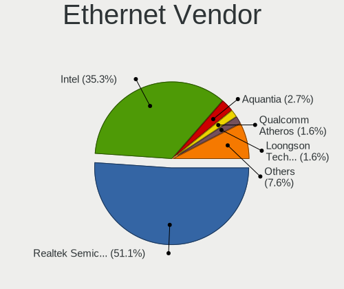
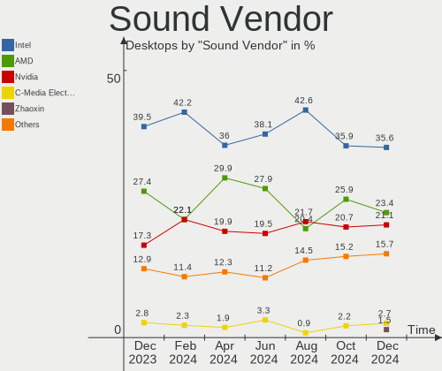
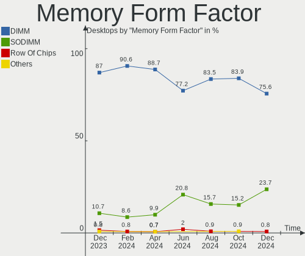
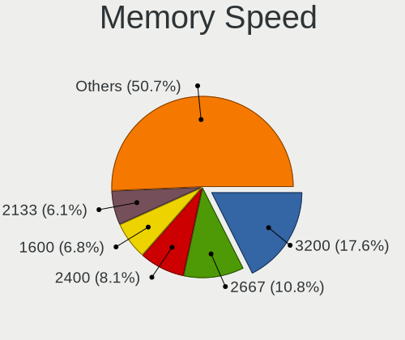
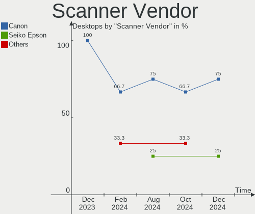

Debian - Hardware Trends (Desktops)
-----------------------------------

A project to identify most popular hardware characteristics and track their change
over time based on data collected by Linux users at https://Linux-Hardware.org.

Anyone can contribute to this report by the [hw-probe](https://github.com/linuxhw/hw-probe) tool:

    sudo -E hw-probe -all -upload

This report is for one last month. Overall report since the beginning of time: [TestCoverage](https://github.com/linuxhw/TestCoverage)

Period: Aug, 2022.

Contents
--------

* [ System ](#system)
  - [ OS                       ](#os)
  - [ OS Family                ](#os-family)
  - [ Kernel                   ](#kernel)
  - [ Kernel Family            ](#kernel-family)
  - [ Kernel Major Ver.        ](#kernel-major-ver)
  - [ Arch                     ](#arch)
  - [ DE                       ](#de)
  - [ Display Server           ](#display-server)
  - [ Display Manager          ](#display-manager)
  - [ OS Lang                  ](#os-lang)
  - [ Boot Mode                ](#boot-mode)
  - [ Filesystem               ](#filesystem)
  - [ Part. scheme             ](#part-scheme)
  - [ Dual Boot with Linux/BSD ](#dual-boot-with-linuxbsd)
  - [ Dual Boot (Win)          ](#dual-boot-win)

* [ Board ](#board)
  - [ Vendor                   ](#vendor)
  - [ Model                    ](#model)
  - [ Model Family             ](#model-family)
  - [ MFG Year                 ](#mfg-year)
  - [ Form Factor              ](#form-factor)
  - [ Secure Boot              ](#secure-boot)
  - [ Coreboot                 ](#coreboot)
  - [ RAM Size                 ](#ram-size)
  - [ RAM Used                 ](#ram-used)
  - [ Total Drives             ](#total-drives)
  - [ Has CD-ROM               ](#has-cd-rom)
  - [ Has Ethernet             ](#has-ethernet)
  - [ Has WiFi                 ](#has-wifi)
  - [ Has Bluetooth            ](#has-bluetooth)

* [ Location ](#location)
  - [ Country                  ](#country)
  - [ City                     ](#city)

* [ Drives ](#drives)
  - [ Drive Vendor             ](#drive-vendor)
  - [ Drive Model              ](#drive-model)
  - [ HDD Vendor               ](#hdd-vendor)
  - [ SSD Vendor               ](#ssd-vendor)
  - [ Drive Kind               ](#drive-kind)
  - [ Drive Connector          ](#drive-connector)
  - [ Drive Size               ](#drive-size)
  - [ Space Total              ](#space-total)
  - [ Space Used               ](#space-used)
  - [ Malfunc. Drives          ](#malfunc-drives)
  - [ Malfunc. Drive Vendor    ](#malfunc-drive-vendor)
  - [ Malfunc. HDD Vendor      ](#malfunc-hdd-vendor)
  - [ Malfunc. Drive Kind      ](#malfunc-drive-kind)
  - [ Failed Drives            ](#failed-drives)
  - [ Failed Drive Vendor      ](#failed-drive-vendor)
  - [ Drive Status             ](#drive-status)

* [ Storage controller ](#storage-controller)
  - [ Storage Vendor           ](#storage-vendor)
  - [ Storage Model            ](#storage-model)
  - [ Storage Kind             ](#storage-kind)

* [ Processor ](#processor)
  - [ CPU Vendor               ](#cpu-vendor)
  - [ CPU Model                ](#cpu-model)
  - [ CPU Model Family         ](#cpu-model-family)
  - [ CPU Cores                ](#cpu-cores)
  - [ CPU Sockets              ](#cpu-sockets)
  - [ CPU Threads              ](#cpu-threads)
  - [ CPU Op-Modes             ](#cpu-op-modes)
  - [ CPU Microcode            ](#cpu-microcode)
  - [ CPU Microarch            ](#cpu-microarch)

* [ Graphics ](#graphics)
  - [ GPU Vendor               ](#gpu-vendor)
  - [ GPU Model                ](#gpu-model)
  - [ GPU Combo                ](#gpu-combo)
  - [ GPU Driver               ](#gpu-driver)
  - [ GPU Memory               ](#gpu-memory)

* [ Monitor ](#monitor)
  - [ Monitor Vendor           ](#monitor-vendor)
  - [ Monitor Model            ](#monitor-model)
  - [ Monitor Resolution       ](#monitor-resolution)
  - [ Monitor Diagonal         ](#monitor-diagonal)
  - [ Monitor Width            ](#monitor-width)
  - [ Aspect Ratio             ](#aspect-ratio)
  - [ Monitor Area             ](#monitor-area)
  - [ Pixel Density            ](#pixel-density)
  - [ Multiple Monitors        ](#multiple-monitors)

* [ Network ](#network)
  - [ Net Controller Vendor    ](#net-controller-vendor)
  - [ Net Controller Model     ](#net-controller-model)
  - [ Wireless Vendor          ](#wireless-vendor)
  - [ Wireless Model           ](#wireless-model)
  - [ Ethernet Vendor          ](#ethernet-vendor)
  - [ Ethernet Model           ](#ethernet-model)
  - [ Net Controller Kind      ](#net-controller-kind)
  - [ Used Controller          ](#used-controller)
  - [ NICs                     ](#nics)
  - [ IPv6                     ](#ipv6)

* [ Bluetooth ](#bluetooth)
  - [ Bluetooth Vendor         ](#bluetooth-vendor)
  - [ Bluetooth Model          ](#bluetooth-model)

* [ Sound ](#sound)
  - [ Sound Vendor             ](#sound-vendor)
  - [ Sound Model              ](#sound-model)

* [ Memory ](#memory)
  - [ Memory Vendor            ](#memory-vendor)
  - [ Memory Model             ](#memory-model)
  - [ Memory Kind              ](#memory-kind)
  - [ Memory Form Factor       ](#memory-form-factor)
  - [ Memory Size              ](#memory-size)
  - [ Memory Speed             ](#memory-speed)

* [ Printers & scanners ](#printers--scanners)
  - [ Printer Vendor           ](#printer-vendor)
  - [ Printer Model            ](#printer-model)
  - [ Scanner Vendor           ](#scanner-vendor)
  - [ Scanner Model            ](#scanner-model)

* [ Camera ](#camera)
  - [ Camera Vendor            ](#camera-vendor)
  - [ Camera Model             ](#camera-model)

* [ Security ](#security)
  - [ Fingerprint Vendor       ](#fingerprint-vendor)
  - [ Fingerprint Model        ](#fingerprint-model)
  - [ Chipcard Vendor          ](#chipcard-vendor)
  - [ Chipcard Model           ](#chipcard-model)

* [ Unsupported ](#unsupported)
  - [ Unsupported Devices      ](#unsupported-devices)
  - [ Unsupported Device Types ](#unsupported-device-types)

System
------

OS
--

Installed operating systems

| Name              | Desktops | Percent |
|-------------------|----------|---------|
| Debian 11         | 107      | 81.06%  |
| Debian Unstable   | 8        | 6.06%   |
| Debian Testing    | 8        | 6.06%   |
| Debian 10         | 6        | 4.55%   |
| Debian 9          | 1        | 0.76%   |
| Debian 7          | 1        | 0.76%   |
| Debian 11-updates | 1        | 0.76%   |

OS Family
---------

OS without a version

| Name   | Desktops | Percent |
|--------|----------|---------|
| Debian | 132      | 100%    |

Kernel
------

Version of the Linux kernel

| Version                    | Desktops | Percent |
|----------------------------|----------|---------|
| 5.10.0-16-amd64            | 36       | 27.27%  |
| 5.10.0-7-amd64             | 25       | 18.94%  |
| 5.10.0-17-amd64            | 19       | 14.39%  |
| 5.18.0-0.bpo.1-amd64       | 7        | 5.3%    |
| 5.18.0-3-amd64             | 6        | 4.55%   |
| 5.18.0-4-amd64             | 5        | 3.79%   |
| 4.19.0-21-amd64            | 3        | 2.27%   |
| 5.18.0-2-amd64             | 2        | 1.52%   |
| 5.18.0-16.1-liquorix-amd64 | 2        | 1.52%   |
| 5.15.39-4-pve              | 2        | 1.52%   |
| 5.15.30-2-pve              | 2        | 1.52%   |
| 5.19.0-4.2-liquorix-amd64  | 1        | 0.76%   |
| 5.18.19-qcmm               | 1        | 0.76%   |
| 5.18.15-edge               | 1        | 0.76%   |
| 5.18.0-0.deb11.3-amd64     | 1        | 0.76%   |
| 5.16.5                     | 1        | 0.76%   |
| 5.16.0-5-riscv64           | 1        | 0.76%   |
| 5.15.39-3-pve              | 1        | 0.76%   |
| 5.15.39-2-pve              | 1        | 0.76%   |
| 5.15.39-1-pve              | 1        | 0.76%   |
| 5.15.0-0.bpo.2-amd64       | 1        | 0.76%   |
| 5.13.19-6-pve              | 1        | 0.76%   |
| 5.10.4                     | 1        | 0.76%   |
| 5.10.0-17-686-pae          | 1        | 0.76%   |
| 5.10.0-16-686-pae          | 1        | 0.76%   |
| 5.10.0-15-amd64            | 1        | 0.76%   |
| 5.10.0-13-amd64            | 1        | 0.76%   |
| 5.10.0-12-amd64            | 1        | 0.76%   |
| 5.10.0-11-amd64            | 1        | 0.76%   |
| 4.19.147-rivoreo-amd64     | 1        | 0.76%   |
| 4.19.0-6-amd64             | 1        | 0.76%   |
| 4.19.0-21-rt-amd64         | 1        | 0.76%   |
| 4.19.0-21-686-pae          | 1        | 0.76%   |
| 3.4.11                     | 1        | 0.76%   |

Kernel Family
-------------

Linux kernel without a distro release

| Version  | Desktops | Percent |
|----------|----------|---------|
| 5.10.0   | 86       | 65.15%  |
| 5.18.0   | 23       | 17.42%  |
| 4.19.0   | 6        | 4.55%   |
| 5.15.39  | 5        | 3.79%   |
| 5.15.30  | 2        | 1.52%   |
| 5.19.0   | 1        | 0.76%   |
| 5.18.19  | 1        | 0.76%   |
| 5.18.15  | 1        | 0.76%   |
| 5.16.5   | 1        | 0.76%   |
| 5.16.0   | 1        | 0.76%   |
| 5.15.0   | 1        | 0.76%   |
| 5.13.19  | 1        | 0.76%   |
| 5.10.4   | 1        | 0.76%   |
| 4.19.147 | 1        | 0.76%   |
| 3.4.11   | 1        | 0.76%   |

Kernel Major Ver.
-----------------

Linux kernel major version

| Version | Desktops | Percent |
|---------|----------|---------|
| 5.10    | 87       | 65.91%  |
| 5.18    | 25       | 18.94%  |
| 5.15    | 8        | 6.06%   |
| 4.19    | 7        | 5.3%    |
| 5.16    | 2        | 1.52%   |
| 5.19    | 1        | 0.76%   |
| 5.13    | 1        | 0.76%   |
| 3.4     | 1        | 0.76%   |

Arch
----

OS architecture (x86_64, i586, etc.)

| Name    | Desktops | Percent |
|---------|----------|---------|
| x86_64  | 126      | 95.45%  |
| i686    | 3        | 2.27%   |
| riscv64 | 2        | 1.52%   |
| sh4a    | 1        | 0.76%   |

DE
--

Desktop Environment

| Name             | Desktops | Percent |
|------------------|----------|---------|
| Unknown          | 50       | 37.88%  |
| GNOME            | 25       | 18.94%  |
| KDE5             | 20       | 15.15%  |
| XFCE             | 14       | 10.61%  |
| MATE             | 6        | 4.55%   |
| X-Cinnamon       | 4        | 3.03%   |
| LXDE             | 3        | 2.27%   |
| Cinnamon         | 3        | 2.27%   |
| LXQt             | 1        | 0.76%   |
| lightdm-xsession | 1        | 0.76%   |
| i3               | 1        | 0.76%   |
| GNOME Flashback  | 1        | 0.76%   |
| Enlightenment    | 1        | 0.76%   |
| Budgie           | 1        | 0.76%   |
| awesome          | 1        | 0.76%   |

Display Server
--------------

X11 or Wayland

| Name    | Desktops | Percent |
|---------|----------|---------|
| X11     | 63       | 47.73%  |
| Unknown | 30       | 22.73%  |
| Tty     | 25       | 18.94%  |
| Wayland | 14       | 10.61%  |

Display Manager
---------------

SDDM, LightDM, etc.

| Name    | Desktops | Percent |
|---------|----------|---------|
| Unknown | 63       | 47.73%  |
| LightDM | 29       | 21.97%  |
| SDDM    | 18       | 13.64%  |
| GDM     | 17       | 12.88%  |
| GDM3    | 5        | 3.79%   |

OS Lang
-------

Language

| Lang    | Desktops | Percent |
|---------|----------|---------|
| en_US   | 44       | 33.33%  |
| ru_RU   | 32       | 24.24%  |
| fr_FR   | 11       | 8.33%   |
| en_GB   | 7        | 5.3%    |
| C       | 4        | 3.03%   |
| zh_CN   | 3        | 2.27%   |
| pt_BR   | 3        | 2.27%   |
| es_ES   | 3        | 2.27%   |
| en_AU   | 3        | 2.27%   |
| de_DE   | 3        | 2.27%   |
| pt_PT   | 2        | 1.52%   |
| es_VE   | 2        | 1.52%   |
| es_CL   | 2        | 1.52%   |
| ro_RO   | 1        | 0.76%   |
| pl_PL   | 1        | 0.76%   |
| fr_BE   | 1        | 0.76%   |
| en_ZA   | 1        | 0.76%   |
| en_NZ   | 1        | 0.76%   |
| en_IN   | 1        | 0.76%   |
| en_IE   | 1        | 0.76%   |
| en_CA   | 1        | 0.76%   |
| el_GR   | 1        | 0.76%   |
| de_CH   | 1        | 0.76%   |
| da_DK   | 1        | 0.76%   |
| ca_ES   | 1        | 0.76%   |
| Unknown | 1        | 0.76%   |

Boot Mode
---------

EFI or BIOS

| Mode | Desktops | Percent |
|------|----------|---------|
| BIOS | 76       | 57.58%  |
| EFI  | 56       | 42.42%  |

Filesystem
----------

Type of filesystem

| Type    | Desktops | Percent |
|---------|----------|---------|
| Ext4    | 86       | 65.15%  |
| Overlay | 32       | 24.24%  |
| Btrfs   | 11       | 8.33%   |
| Zfs     | 1        | 0.76%   |
| Xfs     | 1        | 0.76%   |
| Rootfs  | 1        | 0.76%   |

Part. scheme
------------

Scheme of partitioning

| Type    | Desktops | Percent |
|---------|----------|---------|
| GPT     | 74       | 56.06%  |
| MBR     | 38       | 28.79%  |
| Unknown | 20       | 15.15%  |

Dual Boot with Linux/BSD
------------------------

Hosting more than one Linux/BSD

| Dual boot | Desktops | Percent |
|-----------|----------|---------|
| No        | 99       | 75%     |
| Yes       | 33       | 25%     |

Dual Boot (Win)
---------------

Hosting Linux and Windows

| Dual boot | Desktops | Percent |
|-----------|----------|---------|
| No        | 77       | 58.33%  |
| Yes       | 55       | 41.67%  |

Board
-----

Vendor
------

Motherboard manufacturer

| Name                | Desktops | Percent |
|---------------------|----------|---------|
| ASUSTek Computer    | 31       | 23.48%  |
| Gigabyte Technology | 23       | 17.42%  |
| MSI                 | 20       | 15.15%  |
| ASRock              | 11       | 8.33%   |
| Dell                | 8        | 6.06%   |
| Hewlett-Packard     | 6        | 4.55%   |
| Intel               | 5        | 3.79%   |
| Unknown             | 5        | 3.79%   |
| Lenovo              | 4        | 3.03%   |
| ECS                 | 4        | 3.03%   |
| Foxconn             | 3        | 2.27%   |
| Fujitsu             | 2        | 1.52%   |
| Biostar             | 2        | 1.52%   |
| SZMZ                | 1        | 0.76%   |
| System76            | 1        | 0.76%   |
| retsamarret         | 1        | 0.76%   |
| Pegatron            | 1        | 0.76%   |
| Huanan              | 1        | 0.76%   |
| Google              | 1        | 0.76%   |
| Gateway             | 1        | 0.76%   |
| Aquarius            | 1        | 0.76%   |

Model
-----

Motherboard model

| Name                                | Desktops | Percent |
|-------------------------------------|----------|---------|
| Unknown                             | 6        | 4.55%   |
| MSI MS-7C91                         | 3        | 2.27%   |
| MSI MS-7996                         | 3        | 2.27%   |
| MSI MS-7817                         | 3        | 2.27%   |
| ECS G31T-M9                         | 3        | 2.27%   |
| ASUS All Series                     | 3        | 2.27%   |
| Gigabyte B360M-HD3                  | 2        | 1.52%   |
| ASUS Pro WS 565-ACE                 | 2        | 1.52%   |
| ASUS P8H61-M LX3                    | 2        | 1.52%   |
| ASRock B450M-HDV R4.0               | 2        | 1.52%   |
| SZMZ X99M-G2                        | 1        | 0.76%   |
| System76 Thelio                     | 1        | 0.76%   |
| Pegatron VG238AA-ABU s5229uk        | 1        | 0.76%   |
| MSI VIG610M                         | 1        | 0.76%   |
| MSI MS-7D53                         | 1        | 0.76%   |
| MSI MS-7C56                         | 1        | 0.76%   |
| MSI MS-7C09                         | 1        | 0.76%   |
| MSI MS-7B79                         | 1        | 0.76%   |
| MSI MS-7B49                         | 1        | 0.76%   |
| MSI MS-7A38                         | 1        | 0.76%   |
| MSI MS-7A20                         | 1        | 0.76%   |
| MSI MS-7917                         | 1        | 0.76%   |
| MSI MS-7698                         | 1        | 0.76%   |
| MSI MS-7592                         | 1        | 0.76%   |
| Lenovo ThinkStation P500 30A6S24K00 | 1        | 0.76%   |
| Lenovo ThinkStation P500 30A6A1KACN | 1        | 0.76%   |
| Lenovo ThinkStation D30 4223CC9     | 1        | 0.76%   |
| Lenovo 7033EW4                      | 1        | 0.76%   |
| Intel X99                           | 1        | 0.76%   |
| Intel X79                           | 1        | 0.76%   |
| Intel DP35DP AAD81073-207           | 1        | 0.76%   |
| Intel DN2820FYK H24582-201          | 1        | 0.76%   |
| Intel DH87RL AAG74240-402           | 1        | 0.76%   |
| Huanan X99-F8D V2.4                 | 1        | 0.76%   |
| HP t620 PLUS Quad Core TC           | 1        | 0.76%   |
| HP OMEN 30L Desktop GT13-1xxx       | 1        | 0.76%   |
| HP EliteDesk 800 G1 USDT            | 1        | 0.76%   |
| HP EliteDesk 800 G1 SFF             | 1        | 0.76%   |
| HP Compaq Pro 6300 SFF              | 1        | 0.76%   |
| HP Compaq 6005 Pro MT PC            | 1        | 0.76%   |
| Google Teemo                        | 1        | 0.76%   |
| Gigabyte Z270-Gaming K3             | 1        | 0.76%   |
| Gigabyte X399 AORUS PRO             | 1        | 0.76%   |
| Gigabyte MZGLKAP-00                 | 1        | 0.76%   |
| Gigabyte M68MT-S2                   | 1        | 0.76%   |
| Gigabyte M61SME-S2                  | 1        | 0.76%   |
| Gigabyte H81M-S2V                   | 1        | 0.76%   |
| Gigabyte H61M-DS2 REV 1.2           | 1        | 0.76%   |
| Gigabyte H270-Gaming 3              | 1        | 0.76%   |
| Gigabyte H110M-S2                   | 1        | 0.76%   |
| Gigabyte H110M-Gaming 3             | 1        | 0.76%   |
| Gigabyte GA-970A-UD3                | 1        | 0.76%   |
| Gigabyte G41MT-S2                   | 1        | 0.76%   |
| Gigabyte D525TUD                    | 1        | 0.76%   |
| Gigabyte B560M DS3H AC              | 1        | 0.76%   |
| Gigabyte B550 GAMING X V2           | 1        | 0.76%   |
| Gigabyte B550 AORUS ELITE V2        | 1        | 0.76%   |
| Gigabyte B460MDS3HV2                | 1        | 0.76%   |
| Gigabyte B450M DS3H V2              | 1        | 0.76%   |
| Gigabyte B450 AORUS ELITE           | 1        | 0.76%   |

Model Family
------------

Motherboard model prefix

| Name                  | Desktops | Percent |
|-----------------------|----------|---------|
| Unknown               | 6        | 4.55%   |
| ASUS ROG              | 5        | 3.79%   |
| ASUS PRIME            | 4        | 3.03%   |
| MSI MS-7C91           | 3        | 2.27%   |
| MSI MS-7996           | 3        | 2.27%   |
| MSI MS-7817           | 3        | 2.27%   |
| Lenovo ThinkStation   | 3        | 2.27%   |
| ECS G31T-M9           | 3        | 2.27%   |
| Dell Precision        | 3        | 2.27%   |
| ASUS Pro              | 3        | 2.27%   |
| ASUS All              | 3        | 2.27%   |
| HP EliteDesk          | 2        | 1.52%   |
| HP Compaq             | 2        | 1.52%   |
| Gigabyte B550         | 2        | 1.52%   |
| Gigabyte B360M-HD3    | 2        | 1.52%   |
| Dell OptiPlex         | 2        | 1.52%   |
| ASUS P8H61-M          | 2        | 1.52%   |
| ASUS P5G41T-M         | 2        | 1.52%   |
| ASRock B450M-HDV      | 2        | 1.52%   |
| SZMZ X99M-G2          | 1        | 0.76%   |
| System76 Thelio       | 1        | 0.76%   |
| Pegatron VG238AA-ABU  | 1        | 0.76%   |
| MSI VIG610M           | 1        | 0.76%   |
| MSI MS-7D53           | 1        | 0.76%   |
| MSI MS-7C56           | 1        | 0.76%   |
| MSI MS-7C09           | 1        | 0.76%   |
| MSI MS-7B79           | 1        | 0.76%   |
| MSI MS-7B49           | 1        | 0.76%   |
| MSI MS-7A38           | 1        | 0.76%   |
| MSI MS-7A20           | 1        | 0.76%   |
| MSI MS-7917           | 1        | 0.76%   |
| MSI MS-7698           | 1        | 0.76%   |
| MSI MS-7592           | 1        | 0.76%   |
| Lenovo 7033EW4        | 1        | 0.76%   |
| Intel X99             | 1        | 0.76%   |
| Intel X79             | 1        | 0.76%   |
| Intel DP35DP          | 1        | 0.76%   |
| Intel DN2820FYK       | 1        | 0.76%   |
| Intel DH87RL          | 1        | 0.76%   |
| Huanan X99-F8D        | 1        | 0.76%   |
| HP t620               | 1        | 0.76%   |
| HP OMEN               | 1        | 0.76%   |
| Google Teemo          | 1        | 0.76%   |
| Gigabyte Z270-Gaming  | 1        | 0.76%   |
| Gigabyte X399         | 1        | 0.76%   |
| Gigabyte MZGLKAP-00   | 1        | 0.76%   |
| Gigabyte M68MT-S2     | 1        | 0.76%   |
| Gigabyte M61SME-S2    | 1        | 0.76%   |
| Gigabyte H81M-S2V     | 1        | 0.76%   |
| Gigabyte H61M-DS2     | 1        | 0.76%   |
| Gigabyte H270-Gaming  | 1        | 0.76%   |
| Gigabyte H110M-S2     | 1        | 0.76%   |
| Gigabyte H110M-Gaming | 1        | 0.76%   |
| Gigabyte GA-970A-UD3  | 1        | 0.76%   |
| Gigabyte G41MT-S2     | 1        | 0.76%   |
| Gigabyte D525TUD      | 1        | 0.76%   |
| Gigabyte B560M        | 1        | 0.76%   |
| Gigabyte B460MDS3HV2  | 1        | 0.76%   |
| Gigabyte B450M        | 1        | 0.76%   |
| Gigabyte B450         | 1        | 0.76%   |

MFG Year
--------

Motherboard manufacture year

| Year    | Desktops | Percent |
|---------|----------|---------|
| 2020    | 15       | 11.36%  |
| 2018    | 13       | 9.85%   |
| 2021    | 12       | 9.09%   |
| 2010    | 12       | 9.09%   |
| 2011    | 11       | 8.33%   |
| 2013    | 10       | 7.58%   |
| 2016    | 8        | 6.06%   |
| 2019    | 7        | 5.3%    |
| 2017    | 6        | 4.55%   |
| 2015    | 6        | 4.55%   |
| 2014    | 6        | 4.55%   |
| 2012    | 6        | 4.55%   |
| 2009    | 6        | 4.55%   |
| 2022    | 5        | 3.79%   |
| Unknown | 3        | 2.27%   |
| 2008    | 2        | 1.52%   |
| 2007    | 2        | 1.52%   |
| 2006    | 1        | 0.76%   |
| 2003    | 1        | 0.76%   |

Form Factor
-----------

Physical design of the computer

| Name    | Desktops | Percent |
|---------|----------|---------|
| Desktop | 132      | 100%    |

Secure Boot
-----------

Enabled or disabled

| State    | Desktops | Percent |
|----------|----------|---------|
| Disabled | 132      | 100%    |

Coreboot
--------

Have coreboot on board

| Used | Desktops | Percent |
|------|----------|---------|
| No   | 131      | 99.24%  |
| Yes  | 1        | 0.76%   |

RAM Size
--------

Total RAM memory

| Size in GB      | Desktops | Percent |
|-----------------|----------|---------|
| 16.01-24.0      | 27       | 20.45%  |
| 4.01-8.0        | 21       | 15.91%  |
| 8.01-16.0       | 19       | 14.39%  |
| 3.01-4.0        | 18       | 13.64%  |
| 64.01-256.0     | 16       | 12.12%  |
| 32.01-64.0      | 15       | 11.36%  |
| 1.01-2.0        | 6        | 4.55%   |
| 24.01-32.0      | 3        | 2.27%   |
| 2.01-3.0        | 3        | 2.27%   |
| More than 256.0 | 1        | 0.76%   |
| 0.51-1.0        | 1        | 0.76%   |
| 0.01-0.5        | 1        | 0.76%   |
| Unknown         | 1        | 0.76%   |

RAM Used
--------

Used RAM memory

| Used GB    | Desktops | Percent |
|------------|----------|---------|
| 0.51-1.0   | 38       | 28.79%  |
| 2.01-3.0   | 22       | 16.67%  |
| 1.01-2.0   | 21       | 15.91%  |
| 4.01-8.0   | 17       | 12.88%  |
| 3.01-4.0   | 17       | 12.88%  |
| 8.01-16.0  | 9        | 6.82%   |
| 16.01-24.0 | 3        | 2.27%   |
| 0.01-0.5   | 3        | 2.27%   |
| Unknown    | 2        | 1.52%   |

Total Drives
------------

Number of drives on board

| Drives | Desktops | Percent |
|--------|----------|---------|
| 1      | 60       | 45.45%  |
| 2      | 29       | 21.97%  |
| 3      | 23       | 17.42%  |
| 4      | 7        | 5.3%    |
| 6      | 5        | 3.79%   |
| 5      | 5        | 3.79%   |
| 12     | 1        | 0.76%   |
| 7      | 1        | 0.76%   |
| 0      | 1        | 0.76%   |

Has CD-ROM
----------

Has CD-ROM on board

| Presented | Desktops | Percent |
|-----------|----------|---------|
| No        | 102      | 77.27%  |
| Yes       | 30       | 22.73%  |

Has Ethernet
------------

Has Ethernet on board

| Presented | Desktops | Percent |
|-----------|----------|---------|
| Yes       | 129      | 97.73%  |
| No        | 3        | 2.27%   |

Has WiFi
--------

Has WiFi module

| Presented | Desktops | Percent |
|-----------|----------|---------|
| No        | 90       | 68.18%  |
| Yes       | 42       | 31.82%  |

Has Bluetooth
-------------

Has Bluetooth module

| Presented | Desktops | Percent |
|-----------|----------|---------|
| No        | 95       | 71.97%  |
| Yes       | 37       | 28.03%  |

Location
--------

Country
-------

Geographic location (country)

| Country      | Desktops | Percent |
|--------------|----------|---------|
| Russia       | 33       | 25%     |
| USA          | 18       | 13.64%  |
| France       | 14       | 10.61%  |
| Germany      | 8        | 6.06%   |
| China        | 5        | 3.79%   |
| Australia    | 5        | 3.79%   |
| Spain        | 4        | 3.03%   |
| Portugal     | 4        | 3.03%   |
| Brazil       | 4        | 3.03%   |
| UK           | 3        | 2.27%   |
| Mexico       | 3        | 2.27%   |
| Finland      | 3        | 2.27%   |
| Venezuela    | 2        | 1.52%   |
| Switzerland  | 2        | 1.52%   |
| South Africa | 2        | 1.52%   |
| Romania      | 2        | 1.52%   |
| Poland       | 2        | 1.52%   |
| Chile        | 2        | 1.52%   |
| Belarus      | 2        | 1.52%   |
| Pakistan     | 1        | 0.76%   |
| New Zealand  | 1        | 0.76%   |
| Mauritius    | 1        | 0.76%   |
| Kazakhstan   | 1        | 0.76%   |
| Italy        | 1        | 0.76%   |
| India        | 1        | 0.76%   |
| Hungary      | 1        | 0.76%   |
| Hong Kong    | 1        | 0.76%   |
| Greece       | 1        | 0.76%   |
| Denmark      | 1        | 0.76%   |
| Canada       | 1        | 0.76%   |
| Belgium      | 1        | 0.76%   |
| Austria      | 1        | 0.76%   |
| Argentina    | 1        | 0.76%   |

City
----

Geographic location (city)

| City                     | Desktops | Percent |
|--------------------------|----------|---------|
| Voronezh                 | 25       | 18.94%  |
| Monistrol-sur-Loire      | 4        | 3.03%   |
| Moscow                   | 3        | 2.27%   |
| Central                  | 3        | 2.27%   |
| Tuusula                  | 2        | 1.52%   |
| Tijuana                  | 2        | 1.52%   |
| St. Gallen               | 2        | 1.52%   |
| St Petersburg            | 2        | 1.52%   |
| Nanhao                   | 2        | 1.52%   |
| Falkenstein              | 2        | 1.52%   |
| Caracas                  | 2        | 1.52%   |
| Brisbane                 | 2        | 1.52%   |
| Beijing                  | 2        | 1.52%   |
| Bangor                   | 2        | 1.52%   |
| Żory                    | 1        | 0.76%   |
| Yekaterinburg            | 1        | 0.76%   |
| Winterport               | 1        | 0.76%   |
| Whittier                 | 1        | 0.76%   |
| Wellington               | 1        | 0.76%   |
| Washington               | 1        | 0.76%   |
| Warsaw                   | 1        | 0.76%   |
| Vitória                 | 1        | 0.76%   |
| Vienna                   | 1        | 0.76%   |
| Viby J                   | 1        | 0.76%   |
| Ulyanovsk                | 1        | 0.76%   |
| Tomelloso                | 1        | 0.76%   |
| Sydney                   | 1        | 0.76%   |
| St Louis                 | 1        | 0.76%   |
| Sintra                   | 1        | 0.76%   |
| Sheerness                | 1        | 0.76%   |
| Sao Sebastiao do Paraiso | 1        | 0.76%   |
| Sao Paulo                | 1        | 0.76%   |
| Sao Domingos de Rana     | 1        | 0.76%   |
| Saint-Jeures             | 1        | 0.76%   |
| Riverton                 | 1        | 0.76%   |
| Raahe                    | 1        | 0.76%   |
| Pretoria                 | 1        | 0.76%   |
| Pittsburgh               | 1        | 0.76%   |
| Parker                   | 1        | 0.76%   |
| Paderborn                | 1        | 0.76%   |
| Ottawa                   | 1        | 0.76%   |
| Nuremberg                | 1        | 0.76%   |
| Northampton              | 1        | 0.76%   |
| Nizhniy Novgorod         | 1        | 0.76%   |
| Nanjing                  | 1        | 0.76%   |
| Mumbai                   | 1        | 0.76%   |
| Mulhouse                 | 1        | 0.76%   |
| Motril                   | 1        | 0.76%   |
| Montijo                  | 1        | 0.76%   |
| Minsk                    | 1        | 0.76%   |
| Melbourne                | 1        | 0.76%   |
| Marseille                | 1        | 0.76%   |
| Maropati                 | 1        | 0.76%   |
| Lyon                     | 1        | 0.76%   |
| Leipzig                  | 1        | 0.76%   |
| Lancaster                | 1        | 0.76%   |
| Lahore                   | 1        | 0.76%   |
| Kanne                    | 1        | 0.76%   |
| Janesville               | 1        | 0.76%   |
| Immenhausen              | 1        | 0.76%   |

Drives
------

Drive Vendor
------------

Hard drive vendors

| Vendor              | Desktops | Drives | Percent |
|---------------------|----------|--------|---------|
| WDC                 | 42       | 67     | 19.63%  |
| Seagate             | 36       | 52     | 16.82%  |
| Samsung Electronics | 34       | 49     | 15.89%  |
| Toshiba             | 17       | 27     | 7.94%   |
| Kingston            | 12       | 12     | 5.61%   |
| Crucial             | 9        | 11     | 4.21%   |
| SanDisk             | 8        | 8      | 3.74%   |
| Hitachi             | 8        | 10     | 3.74%   |
| Unknown             | 4        | 4      | 1.87%   |
| China               | 4        | 5      | 1.87%   |
| XPG                 | 2        | 3      | 0.93%   |
| SPCC                | 2        | 2      | 0.93%   |
| PNY                 | 2        | 2      | 0.93%   |
| Patriot             | 2        | 2      | 0.93%   |
| Intenso             | 2        | 2      | 0.93%   |
| Intel               | 2        | 2      | 0.93%   |
| HGST                | 2        | 5      | 0.93%   |
| Hewlett-Packard     | 2        | 3      | 0.93%   |
| Gigabyte Technology | 2        | 2      | 0.93%   |
| A-DATA Technology   | 2        | 2      | 0.93%   |
| Unknown             | 2        | 2      | 0.93%   |
| Verbatim            | 1        | 1      | 0.47%   |
| Team                | 1        | 1      | 0.47%   |
| T-FORCE             | 1        | 1      | 0.47%   |
| SK hynix            | 1        | 1      | 0.47%   |
| Silicon Motion      | 1        | 1      | 0.47%   |
| SABRENT             | 1        | 1      | 0.47%   |
| Netac               | 1        | 1      | 0.47%   |
| Londisk             | 1        | 1      | 0.47%   |
| LITEONIT            | 1        | 1      | 0.47%   |
| KIOXIA              | 1        | 1      | 0.47%   |
| KingSpec            | 1        | 1      | 0.47%   |
| Kingchuxing         | 1        | 1      | 0.47%   |
| HP Phison           | 1        | 1      | 0.47%   |
| Hajaan              | 1        | 1      | 0.47%   |
| GOODRAM             | 1        | 1      | 0.47%   |
| Corsair             | 1        | 1      | 0.47%   |
| Apple               | 1        | 1      | 0.47%   |
| AMD                 | 1        | 1      | 0.47%   |

Drive Model
-----------

Hard drive models

| Model                                          | Desktops | Percent |
|------------------------------------------------|----------|---------|
| WDC WD10EZEX-08WN4A0 1TB                       | 6        | 2.34%   |
| Seagate ST500DM002-1BD142 500GB                | 6        | 2.34%   |
| Toshiba DT01ACA050 500GB                       | 4        | 1.56%   |
| Seagate ST1000DM010-2EP102 1TB                 | 4        | 1.56%   |
| Crucial CT480BX500SSD1 480GB                   | 4        | 1.56%   |
| WDC WDS500G2B0A-00SM50 500GB SSD               | 3        | 1.17%   |
| WDC WD1002FAEX-00Z3A0 1TB                      | 3        | 1.17%   |
| Toshiba HDWD110 1TB                            | 3        | 1.17%   |
| Seagate ST3250318AS 250GB                      | 3        | 1.17%   |
| SanDisk NVMe SSD Drive 1TB                     | 3        | 1.17%   |
| Samsung SSD 860 EVO 500GB                      | 3        | 1.17%   |
| Kingston SV300S37A120G 120GB SSD               | 3        | 1.17%   |
| Hitachi HDS721050CLA362 500GB                  | 3        | 1.17%   |
| XPG GAMMIX S11 Pro 1TB                         | 2        | 0.78%   |
| WDC WD60EZAZ-00SF3B0 6TB                       | 2        | 0.78%   |
| WDC WD5000AAKX-001CA0 500GB                    | 2        | 0.78%   |
| WDC WD40EZRZ-00GXCB0 4TB                       | 2        | 0.78%   |
| WDC WD4005FZBX-00K5WB0 4TB                     | 2        | 0.78%   |
| WDC WD1001FALS-00J7B0 1TB                      | 2        | 0.78%   |
| Toshiba DT01ACA300 3TB                         | 2        | 0.78%   |
| Toshiba DT01ACA100 1TB                         | 2        | 0.78%   |
| Seagate ST31000524AS 1TB                       | 2        | 0.78%   |
| Seagate ST2000DM008-2FR102 2TB                 | 2        | 0.78%   |
| SanDisk SD8SBAT128G1122 128GB SSD              | 2        | 0.78%   |
| Samsung SSD 980 1TB                            | 2        | 0.78%   |
| Samsung SSD 970 EVO Plus 500GB                 | 2        | 0.78%   |
| Samsung SSD 970 EVO Plus 1TB                   | 2        | 0.78%   |
| Samsung SSD 860 EVO 1TB                        | 2        | 0.78%   |
| Samsung SSD 850 EVO 250GB                      | 2        | 0.78%   |
| Samsung NVMe SSD Drive 500GB                   | 2        | 0.78%   |
| Kingston SA400S37240G 240GB SSD                | 2        | 0.78%   |
| Crucial CT500P2SSD8 500GB                      | 2        | 0.78%   |
| Crucial CT1000MX500SSD1 1TB                    | 2        | 0.78%   |
| Unknown                                        | 2        | 0.78%   |
| XPG SPECTRIX S40G 256GB                        | 1        | 0.39%   |
| WDC WDS500G2B0C-00PXH0 500GB                   | 1        | 0.39%   |
| WDC WDS500G2B0C 500GB                          | 1        | 0.39%   |
| WDC WDS480G2G0C-00AJM0 480GB                   | 1        | 0.39%   |
| WDC WDS250G2B0A-00SM50 250GB SSD               | 1        | 0.39%   |
| WDC WDS250G2B0A 250GB SSD                      | 1        | 0.39%   |
| WDC WDS120G2G0A-00JH30 120GB SSD               | 1        | 0.39%   |
| WDC WDS120G1G0A-00SS50 120GB SSD               | 1        | 0.39%   |
| WDC WDS100T2B0C-00PXH0 1TB                     | 1        | 0.39%   |
| WDC WDS100T1X0E-00AFY0 1TB                     | 1        | 0.39%   |
| WDC WD6400AAKS-65Z7B0 640GB                    | 1        | 0.39%   |
| WDC WD60EZAZ-00ZGHB0 6TB                       | 1        | 0.39%   |
| WDC WD6003FRYZ-01F0DB0 6TB                     | 1        | 0.39%   |
| WDC WD5003AZEX-00MK2A0 500GB                   | 1        | 0.39%   |
| WDC WD5000AUDX-61WNHY0 500GB                   | 1        | 0.39%   |
| WDC WD5000AAKX-08U6AA0 500GB                   | 1        | 0.39%   |
| WDC WD5000AAKS-22V1A0 500GB                    | 1        | 0.39%   |
| WDC WD5000AAKS-00A7B0 500GB                    | 1        | 0.39%   |
| WDC WD5000AAKB-00H8A0 500GB                    | 1        | 0.39%   |
| WDC WD5000AAJS-22A8B0 500GB                    | 1        | 0.39%   |
| WDC WD40EZAZ-19SF3B0 4TB                       | 1        | 0.39%   |
| WDC WD40EFZX-68AWUN0 4TB                       | 1        | 0.39%   |
| WDC WD3200AAKX-083CA1 320GB                    | 1        | 0.39%   |
| WDC WD3200AAKS-75VYA0 320GB                    | 1        | 0.39%   |
| WDC WD3200AAJS-60M0A0 320GB                    | 1        | 0.39%   |
| WDC WD2502ABYS-23B7A0 39M4511 42C0463IBM 250GB | 1        | 0.39%   |

HDD Vendor
----------

Hard disk drive vendors

| Vendor              | Desktops | Drives | Percent |
|---------------------|----------|--------|---------|
| Seagate             | 35       | 51     | 33.98%  |
| WDC                 | 34       | 54     | 33.01%  |
| Toshiba             | 16       | 26     | 15.53%  |
| Hitachi             | 8        | 10     | 7.77%   |
| Samsung Electronics | 6        | 10     | 5.83%   |
| HGST                | 2        | 5      | 1.94%   |
| SABRENT             | 1        | 1      | 0.97%   |
| Hewlett-Packard     | 1        | 2      | 0.97%   |

SSD Vendor
----------

Solid state drive vendors

| Vendor              | Desktops | Drives | Percent |
|---------------------|----------|--------|---------|
| Samsung Electronics | 14       | 18     | 20%     |
| Kingston            | 12       | 12     | 17.14%  |
| Crucial             | 8        | 9      | 11.43%  |
| WDC                 | 7        | 7      | 10%     |
| SanDisk             | 5        | 5      | 7.14%   |
| China               | 4        | 5      | 5.71%   |
| SPCC                | 2        | 2      | 2.86%   |
| PNY                 | 2        | 2      | 2.86%   |
| Intenso             | 2        | 2      | 2.86%   |
| Verbatim            | 1        | 1      | 1.43%   |
| T-FORCE             | 1        | 1      | 1.43%   |
| Netac               | 1        | 1      | 1.43%   |
| Londisk             | 1        | 1      | 1.43%   |
| LITEONIT            | 1        | 1      | 1.43%   |
| KingSpec            | 1        | 1      | 1.43%   |
| Kingchuxing         | 1        | 1      | 1.43%   |
| Intel               | 1        | 1      | 1.43%   |
| HP Phison           | 1        | 1      | 1.43%   |
| Hajaan              | 1        | 1      | 1.43%   |
| GOODRAM             | 1        | 1      | 1.43%   |
| Apple               | 1        | 1      | 1.43%   |
| A-DATA Technology   | 1        | 1      | 1.43%   |
| Unknown             | 1        | 1      | 1.43%   |

Drive Kind
----------

HDD or SSD

| Kind    | Desktops | Drives | Percent |
|---------|----------|--------|---------|
| HDD     | 80       | 159    | 43.01%  |
| SSD     | 61       | 76     | 32.8%   |
| NVMe    | 40       | 50     | 21.51%  |
| MMC     | 4        | 4      | 2.15%   |
| Unknown | 1        | 1      | 0.54%   |

Drive Connector
---------------

SATA, SAS, NVMe, etc.

| Type | Desktops | Drives | Percent |
|------|----------|--------|---------|
| SATA | 113      | 231    | 69.33%  |
| NVMe | 40       | 49     | 24.54%  |
| SAS  | 6        | 6      | 3.68%   |
| MMC  | 4        | 4      | 2.45%   |

Drive Size
----------

Size of hard drive

| Size in TB | Desktops | Drives | Percent |
|------------|----------|--------|---------|
| 0.01-0.5   | 89       | 123    | 55.63%  |
| 0.51-1.0   | 41       | 56     | 25.63%  |
| 1.01-2.0   | 11       | 20     | 6.88%   |
| 3.01-4.0   | 10       | 11     | 6.25%   |
| 4.01-10.0  | 4        | 8      | 2.5%    |
| 2.01-3.0   | 3        | 3      | 1.88%   |
| 10.01-20.0 | 2        | 14     | 1.25%   |

Space Total
-----------

Amount of disk space available on the file system

| Size in GB     | Desktops | Percent |
|----------------|----------|---------|
| Unknown        | 32       | 24.24%  |
| 251-500        | 20       | 15.15%  |
| 501-1000       | 18       | 13.64%  |
| 101-250        | 16       | 12.12%  |
| 1001-2000      | 12       | 9.09%   |
| More than 3000 | 10       | 7.58%   |
| 1-20           | 7        | 5.3%    |
| 21-50          | 6        | 4.55%   |
| 51-100         | 6        | 4.55%   |
| 2001-3000      | 5        | 3.79%   |

Space Used
----------

Amount of used disk space

| Used GB        | Desktops | Percent |
|----------------|----------|---------|
| 1-20           | 35       | 26.52%  |
| Unknown        | 32       | 24.24%  |
| 251-500        | 15       | 11.36%  |
| 51-100         | 11       | 8.33%   |
| 21-50          | 10       | 7.58%   |
| 101-250        | 8        | 6.06%   |
| 1001-2000      | 8        | 6.06%   |
| 501-1000       | 6        | 4.55%   |
| 2001-3000      | 4        | 3.03%   |
| More than 3000 | 3        | 2.27%   |

Malfunc. Drives
---------------

Drive models with a malfunction

| Model                                 | Desktops | Drives | Percent |
|---------------------------------------|----------|--------|---------|
| WDC WD5000AAKX-001CA0 500GB           | 2        | 2      | 5.88%   |
| WDC WD6400AAKS-65Z7B0 640GB           | 1        | 1      | 2.94%   |
| WDC WD5000AAKX-08U6AA0 500GB          | 1        | 1      | 2.94%   |
| WDC WD5000AAKB-00H8A0 500GB           | 1        | 1      | 2.94%   |
| WDC WD3200AAJS-60M0A0 320GB           | 1        | 1      | 2.94%   |
| WDC WD2500AAKX-001CA0 250GB           | 1        | 1      | 2.94%   |
| WDC WD1600AAJS-08L7A0 160GB           | 1        | 1      | 2.94%   |
| WDC WD15EARS-00Z5B1 1TB               | 1        | 2      | 2.94%   |
| WDC WD10EZEX-08WN4A0 1TB              | 1        | 1      | 2.94%   |
| WDC WD10EADS-11M2B1 1TB               | 1        | 1      | 2.94%   |
| WDC WD1003FBYX-01Y7B1 1TB             | 1        | 1      | 2.94%   |
| WDC WD1002FAEX-00Z3A0 1TB             | 1        | 1      | 2.94%   |
| Toshiba DT01ACA100 1TB                | 1        | 1      | 2.94%   |
| Toshiba DT01ACA050 500GB              | 1        | 1      | 2.94%   |
| Seagate ST9750423AS 752GB             | 1        | 1      | 2.94%   |
| Seagate ST9160821AS 160GB             | 1        | 1      | 2.94%   |
| Seagate ST500DM002-1BD142 500GB       | 1        | 1      | 2.94%   |
| Seagate ST3500320AS 500GB             | 1        | 1      | 2.94%   |
| Seagate ST3320620AS 320GB             | 1        | 1      | 2.94%   |
| Seagate ST3320418AS 320GB             | 1        | 1      | 2.94%   |
| Seagate ST3250312AS 250GB             | 1        | 2      | 2.94%   |
| Seagate ST31000524AS 1TB              | 1        | 1      | 2.94%   |
| Samsung Electronics SSD 850 PRO 512GB | 1        | 1      | 2.94%   |
| Samsung Electronics SSD 850 EVO 250GB | 1        | 1      | 2.94%   |
| Samsung Electronics HM251JI 250GB     | 1        | 1      | 2.94%   |
| Samsung Electronics HD642JJ 640GB     | 1        | 1      | 2.94%   |
| Kingston SV300S37A120G 120GB SSD      | 1        | 1      | 2.94%   |
| Intel SSDMAEMC040G2 40GB              | 1        | 1      | 2.94%   |
| HP Phison PSSBN016GA27MC0 16GB SSD    | 1        | 1      | 2.94%   |
| Hitachi HUA722010CLA331 1TB           | 1        | 1      | 2.94%   |
| Hitachi HDS721050CLA362 500GB         | 1        | 1      | 2.94%   |
| Hewlett-Packard MB2000EBZQC 2TB       | 1        | 1      | 2.94%   |
| China SSD 240GB                       | 1        | 1      | 2.94%   |

Malfunc. Drive Vendor
---------------------

Vendors of faulty drives

| Vendor              | Desktops | Drives | Percent |
|---------------------|----------|--------|---------|
| WDC                 | 13       | 14     | 39.39%  |
| Seagate             | 7        | 9      | 21.21%  |
| Samsung Electronics | 4        | 4      | 12.12%  |
| Toshiba             | 2        | 2      | 6.06%   |
| Hitachi             | 2        | 2      | 6.06%   |
| Kingston            | 1        | 1      | 3.03%   |
| Intel               | 1        | 1      | 3.03%   |
| HP Phison           | 1        | 1      | 3.03%   |
| Hewlett-Packard     | 1        | 1      | 3.03%   |
| China               | 1        | 1      | 3.03%   |

Malfunc. HDD Vendor
-------------------

Vendors of faulty HDD drives

| Vendor              | Desktops | Drives | Percent |
|---------------------|----------|--------|---------|
| WDC                 | 13       | 14     | 48.15%  |
| Seagate             | 7        | 9      | 25.93%  |
| Toshiba             | 2        | 2      | 7.41%   |
| Samsung Electronics | 2        | 2      | 7.41%   |
| Hitachi             | 2        | 2      | 7.41%   |
| Hewlett-Packard     | 1        | 1      | 3.7%    |

Malfunc. Drive Kind
-------------------

Kinds of faulty drives

| Kind | Desktops | Drives | Percent |
|------|----------|--------|---------|
| HDD  | 22       | 30     | 78.57%  |
| SSD  | 6        | 6      | 21.43%  |

Failed Drives
-------------

Failed drive models

| Model                           | Desktops | Drives | Percent |
|---------------------------------|----------|--------|---------|
| Samsung Electronics HD103SJ 1TB | 1        | 1      | 100%    |

Failed Drive Vendor
-------------------

Failed drive vendors

| Vendor              | Desktops | Drives | Percent |
|---------------------|----------|--------|---------|
| Samsung Electronics | 1        | 1      | 100%    |

Drive Status
------------

Number of failed and malfunc. drives

| Status   | Desktops | Drives | Percent |
|----------|----------|--------|---------|
| Works    | 96       | 199    | 64%     |
| Detected | 27       | 54     | 18%     |
| Malfunc  | 26       | 36     | 17.33%  |
| Failed   | 1        | 1      | 0.67%   |

Storage controller
------------------

Storage Vendor
--------------

Storage controller vendors

| Vendor                       | Desktops | Percent |
|------------------------------|----------|---------|
| Intel                        | 84       | 45.16%  |
| AMD                          | 36       | 19.35%  |
| Samsung Electronics          | 16       | 8.6%    |
| ASMedia Technology           | 10       | 5.38%   |
| SanDisk                      | 9        | 4.84%   |
| Nvidia                       | 6        | 3.23%   |
| Phison Electronics           | 4        | 2.15%   |
| Silicon Motion               | 3        | 1.61%   |
| Micron/Crucial Technology    | 2        | 1.08%   |
| Marvell Technology Group     | 2        | 1.08%   |
| JMicron Technology           | 2        | 1.08%   |
| ADATA Technology             | 2        | 1.08%   |
| Adaptec                      | 2        | 1.08%   |
| VIA Technologies             | 1        | 0.54%   |
| Toshiba America Info Systems | 1        | 0.54%   |
| SK hynix                     | 1        | 0.54%   |
| Seagate Technology           | 1        | 0.54%   |
| Realtek Semiconductor        | 1        | 0.54%   |
| MAXIO Technology (Hangzhou)  | 1        | 0.54%   |
| LSI Logic / Symbios Logic    | 1        | 0.54%   |
| KIOXIA                       | 1        | 0.54%   |

Storage Model
-------------

Storage controller models

| Model                                                                                   | Desktops | Percent |
|-----------------------------------------------------------------------------------------|----------|---------|
| AMD FCH SATA Controller [AHCI mode]                                                     | 17       | 7.3%    |
| Samsung NVMe SSD Controller SM981/PM981/PM983                                           | 10       | 4.29%   |
| Intel NM10/ICH7 Family SATA Controller [IDE mode]                                       | 10       | 4.29%   |
| AMD 500 Series Chipset SATA Controller                                                  | 10       | 4.29%   |
| Intel Q170/Q150/B150/H170/H110/Z170/CM236 Chipset SATA Controller [AHCI Mode]           | 9        | 3.86%   |
| Intel 8 Series/C220 Series Chipset Family 6-port SATA Controller 1 [AHCI mode]          | 9        | 3.86%   |
| Intel 200 Series PCH SATA controller [AHCI mode]                                        | 9        | 3.86%   |
| Intel 82801G (ICH7 Family) IDE Controller                                               | 8        | 3.43%   |
| ASMedia ASM1062 Serial ATA Controller                                                   | 8        | 3.43%   |
| AMD 400 Series Chipset SATA Controller                                                  | 7        | 3%      |
| Intel C610/X99 series chipset sSATA Controller [AHCI mode]                              | 5        | 2.15%   |
| Intel C610/X99 series chipset 6-Port SATA Controller [AHCI mode]                        | 5        | 2.15%   |
| Intel 6 Series/C200 Series Chipset Family 6 port Desktop SATA AHCI Controller           | 5        | 2.15%   |
| AMD SB7x0/SB8x0/SB9x0 SATA Controller [AHCI mode]                                       | 5        | 2.15%   |
| Intel 6 Series/C200 Series Chipset Family Desktop SATA Controller (IDE mode, ports 4-5) | 4        | 1.72%   |
| Intel 6 Series/C200 Series Chipset Family Desktop SATA Controller (IDE mode, ports 0-3) | 4        | 1.72%   |
| AMD SB7x0/SB8x0/SB9x0 IDE Controller                                                    | 4        | 1.72%   |
| SanDisk WD Blue SN550 NVMe SSD                                                          | 3        | 1.29%   |
| SanDisk Non-Volatile memory controller                                                  | 3        | 1.29%   |
| Samsung NVMe SSD Controller 980                                                         | 3        | 1.29%   |
| Nvidia MCP61 SATA Controller                                                            | 3        | 1.29%   |
| Intel Comet Lake SATA AHCI Controller                                                   | 3        | 1.29%   |
| Intel Celeron/Pentium Silver Processor SATA Controller                                  | 3        | 1.29%   |
| Intel 9 Series Chipset Family SATA Controller [AHCI Mode]                               | 3        | 1.29%   |
| AMD SB7x0/SB8x0/SB9x0 SATA Controller [IDE mode]                                        | 3        | 1.29%   |
| Silicon Motion SM2263EN/SM2263XT SSD Controller                                         | 2        | 0.86%   |
| SanDisk WD Blue SN570 NVMe SSD                                                          | 2        | 0.86%   |
| Samsung NVMe SSD Controller PM9A1/PM9A3/980PRO                                          | 2        | 0.86%   |
| Phison PS5013 E13 NVMe Controller                                                       | 2        | 0.86%   |
| Nvidia MCP61 IDE                                                                        | 2        | 0.86%   |
| Micron/Crucial P2 NVMe PCIe SSD                                                         | 2        | 0.86%   |
| Intel Volume Management Device NVMe RAID Controller                                     | 2        | 0.86%   |
| Intel SATA Controller [RAID mode]                                                       | 2        | 0.86%   |
| Intel Cannon Lake PCH SATA AHCI Controller                                              | 2        | 0.86%   |
| Intel C610/X99 series chipset IDE-r Controller                                          | 2        | 0.86%   |
| Intel C600/X79 series chipset 6-Port SATA AHCI Controller                               | 2        | 0.86%   |
| Intel Alder Lake-S PCH SATA Controller [AHCI Mode]                                      | 2        | 0.86%   |
| Intel 7 Series/C210 Series Chipset Family 6-port SATA Controller [AHCI mode]            | 2        | 0.86%   |
| AMD 300 Series Chipset SATA Controller                                                  | 2        | 0.86%   |
| ADATA XPG SX8200 Pro PCIe Gen3x4 M.2 2280 Solid State Drive                             | 2        | 0.86%   |
| VIA VT6415 PATA IDE Host Controller                                                     | 1        | 0.43%   |
| Toshiba America Info Systems Toshiba America Info Non-Volatile memory controller        | 1        | 0.43%   |
| SK hynix BC511                                                                          | 1        | 0.43%   |
| Silicon Motion Non-Volatile memory controller                                           | 1        | 0.43%   |
| Seagate FireCuda 530 SSD                                                                | 1        | 0.43%   |
| SanDisk WD PC SN810 / Black SN850 NVMe SSD                                              | 1        | 0.43%   |
| Samsung Electronics SATA controller                                                     | 1        | 0.43%   |
| Realtek RTS5763DL NVMe SSD Controller                                                   | 1        | 0.43%   |
| Phison E7 NVMe Controller                                                               | 1        | 0.43%   |
| Phison E16 PCIe4 NVMe Controller                                                        | 1        | 0.43%   |
| Phison E12 NVMe Controller                                                              | 1        | 0.43%   |
| Nvidia nForce2 IDE                                                                      | 1        | 0.43%   |
| Nvidia MCP78S [GeForce 8200] SATA Controller (non-AHCI mode)                            | 1        | 0.43%   |
| Nvidia MCP73 SATA Controller (IDE mode)                                                 | 1        | 0.43%   |
| Nvidia MCP73 IDE Controller                                                             | 1        | 0.43%   |
| MAXIO (Hangzhou) NVMe SSD Controller MAP1202                                            | 1        | 0.43%   |
| Marvell Group 88SE6440 SAS/SATA PCIe controller                                         | 1        | 0.43%   |
| Marvell Group 88SE6111/6121 SATA II / PATA Controller                                   | 1        | 0.43%   |
| Marvell Group 88SE6101/6102 single-port PATA133 interface                               | 1        | 0.43%   |
| LSI Logic / Symbios Logic SAS1068E PCI-Express Fusion-MPT SAS                           | 1        | 0.43%   |

Storage Kind
------------

Kind of storage controller (IDE, SATA, NVMe, SAS, ...)

| Kind | Desktops | Percent |
|------|----------|---------|
| SATA | 100      | 54.35%  |
| NVMe | 40       | 21.74%  |
| IDE  | 33       | 17.93%  |
| RAID | 9        | 4.89%   |
| SAS  | 1        | 0.54%   |
| SCSI | 1        | 0.54%   |

Processor
---------

CPU Vendor
----------

Processor vendors

| Vendor         | Desktops | Percent |
|----------------|----------|---------|
| Intel          | 88       | 66.67%  |
| AMD            | 41       | 31.06%  |
| Unknown        | 2        | 1.52%   |
| sifive,bullet0 | 1        | 0.76%   |

CPU Model
---------

Processor models

| Model                                       | Desktops | Percent |
|---------------------------------------------|----------|---------|
| AMD Ryzen 9 5950X 16-Core Processor         | 6        | 4.55%   |
| Intel Pentium CPU G630 @ 2.70GHz            | 3        | 2.27%   |
| Intel Core i5-9400 CPU @ 2.90GHz            | 3        | 2.27%   |
| AMD Ryzen 7 5800X 8-Core Processor          | 3        | 2.27%   |
| AMD Ryzen 7 5700G with Radeon Graphics      | 3        | 2.27%   |
| Intel Xeon CPU E5-2670 v3 @ 2.30GHz         | 2        | 1.52%   |
| Intel Xeon CPU E5-1650 v3 @ 3.50GHz         | 2        | 1.52%   |
| Intel Pentium Dual-Core CPU E6500 @ 2.93GHz | 2        | 1.52%   |
| Intel Pentium CPU G4400 @ 3.30GHz           | 2        | 1.52%   |
| Intel Pentium CPU G3430 @ 3.30GHz           | 2        | 1.52%   |
| Intel Core i7-7700K CPU @ 4.20GHz           | 2        | 1.52%   |
| Intel Core i7-3770 CPU @ 3.40GHz            | 2        | 1.52%   |
| Intel Core i5-8400 CPU @ 2.80GHz            | 2        | 1.52%   |
| Intel Core i5-7500 CPU @ 3.40GHz            | 2        | 1.52%   |
| Intel Core i3-8100 CPU @ 3.60GHz            | 2        | 1.52%   |
| Intel Core i3-6100 CPU @ 3.70GHz            | 2        | 1.52%   |
| Intel Celeron J4125 CPU @ 2.00GHz           | 2        | 1.52%   |
| Intel Celeron CPU E3300 @ 2.50GHz           | 2        | 1.52%   |
| AMD Ryzen 5 3400G with Radeon Vega Graphics | 2        | 1.52%   |
| AMD Ryzen 5 2600 Six-Core Processor         | 2        | 1.52%   |
|                                             | 2        | 1.52%   |
| sifive,bullet0 rv64imafdc                   | 1        | 0.76%   |
| Intel Xeon W-2245 CPU @ 3.90GHz             | 1        | 0.76%   |
| Intel Xeon CPU X5690 @ 3.47GHz              | 1        | 0.76%   |
| Intel Xeon CPU X5680 @ 3.33GHz              | 1        | 0.76%   |
| Intel Xeon CPU E5-2698 v3 @ 2.30GHz         | 1        | 0.76%   |
| Intel Xeon CPU E5-2683 v4 @ 2.10GHz         | 1        | 0.76%   |
| Intel Xeon CPU E5-2667 v3 @ 3.20GHz         | 1        | 0.76%   |
| Intel Xeon CPU E5-2650 0 @ 2.00GHz          | 1        | 0.76%   |
| Intel Xeon CPU E5-2620 0 @ 2.00GHz          | 1        | 0.76%   |
| Intel Xeon CPU E3-1230 v3 @ 3.30GHz         | 1        | 0.76%   |
| Intel Pentium Dual-Core CPU E5800 @ 3.20GHz | 1        | 0.76%   |
| Intel Pentium Dual-Core CPU E5700 @ 3.00GHz | 1        | 0.76%   |
| Intel Pentium Dual-Core CPU E5200 @ 2.50GHz | 1        | 0.76%   |
| Intel Pentium Dual CPU E2200 @ 2.20GHz      | 1        | 0.76%   |
| Intel Pentium Dual CPU E2160 @ 1.80GHz      | 1        | 0.76%   |
| Intel Pentium CPU G850 @ 2.90GHz            | 1        | 0.76%   |
| Intel Pentium CPU G620 @ 2.60GHz            | 1        | 0.76%   |
| Intel Pentium CPU G4600 @ 3.60GHz           | 1        | 0.76%   |
| Intel Pentium CPU G3220 @ 3.00GHz           | 1        | 0.76%   |
| Intel Core i9-9980HK CPU @ 2.40GHz          | 1        | 0.76%   |
| Intel Core i9-10900KF CPU @ 3.70GHz         | 1        | 0.76%   |
| Intel Core i9-10900K CPU @ 3.70GHz          | 1        | 0.76%   |
| Intel Core i9-10900F CPU @ 2.80GHz          | 1        | 0.76%   |
| Intel Core i7-6800K CPU @ 3.40GHz           | 1        | 0.76%   |
| Intel Core i7-6700K CPU @ 4.00GHz           | 1        | 0.76%   |
| Intel Core i7-4770 CPU @ 3.40GHz            | 1        | 0.76%   |
| Intel Core i7-3770K CPU @ 3.50GHz           | 1        | 0.76%   |
| Intel Core i7-10700 CPU @ 2.90GHz           | 1        | 0.76%   |
| Intel Core i5-6600K CPU @ 3.50GHz           | 1        | 0.76%   |
| Intel Core i5-6400 CPU @ 2.70GHz            | 1        | 0.76%   |
| Intel Core i5-4690K CPU @ 3.50GHz           | 1        | 0.76%   |
| Intel Core i5-4590 CPU @ 3.30GHz            | 1        | 0.76%   |
| Intel Core i5-4570S CPU @ 2.90GHz           | 1        | 0.76%   |
| Intel Core i5-4570 CPU @ 3.20GHz            | 1        | 0.76%   |
| Intel Core i5-4460S CPU @ 2.90GHz           | 1        | 0.76%   |
| Intel Core i5-3570 CPU @ 3.40GHz            | 1        | 0.76%   |
| Intel Core i5-2400 CPU @ 3.10GHz            | 1        | 0.76%   |
| Intel Core i5-10400F CPU @ 2.90GHz          | 1        | 0.76%   |
| Intel Core i5-10400 CPU @ 2.90GHz           | 1        | 0.76%   |

CPU Model Family
----------------

Processor model prefix

| Model                   | Desktops | Percent |
|-------------------------|----------|---------|
| Intel Core i5           | 19       | 14.39%  |
| Intel Xeon              | 13       | 9.85%   |
| Intel Pentium           | 11       | 8.33%   |
| Intel Core i3           | 11       | 8.33%   |
| Intel Core i7           | 9        | 6.82%   |
| AMD Ryzen 9             | 8        | 6.06%   |
| Intel Celeron           | 7        | 5.3%    |
| AMD Ryzen 7             | 7        | 5.3%    |
| AMD Ryzen 5             | 7        | 5.3%    |
| Other                   | 5        | 3.79%   |
| Intel Pentium Dual-Core | 5        | 3.79%   |
| Intel Core i9           | 4        | 3.03%   |
| AMD FX                  | 4        | 3.03%   |
| Intel Pentium Dual      | 2        | 1.52%   |
| Intel Core 2 Duo        | 2        | 1.52%   |
| AMD Athlon II X2        | 2        | 1.52%   |
| AMD Athlon              | 2        | 1.52%   |
| Intel Core 2 Quad       | 1        | 0.76%   |
| Intel Core 2            | 1        | 0.76%   |
| Intel Atom              | 1        | 0.76%   |
| AMD Ryzen Threadripper  | 1        | 0.76%   |
| AMD Ryzen 5 PRO         | 1        | 0.76%   |
| AMD Ryzen 3             | 1        | 0.76%   |
| AMD Phenom II X6        | 1        | 0.76%   |
| AMD Phenom II X3        | 1        | 0.76%   |
| AMD GX                  | 1        | 0.76%   |
| AMD E                   | 1        | 0.76%   |
| AMD Athlon II X4        | 1        | 0.76%   |
| AMD Athlon II X3        | 1        | 0.76%   |
| AMD Athlon 64           | 1        | 0.76%   |
| AMD A4                  | 1        | 0.76%   |

CPU Cores
---------

Number of processor cores

| Number  | Desktops | Percent |
|---------|----------|---------|
| 2       | 38       | 28.79%  |
| 4       | 36       | 27.27%  |
| 6       | 19       | 14.39%  |
| 8       | 11       | 8.33%   |
| 16      | 8        | 6.06%   |
| 12      | 4        | 3.03%   |
| 3       | 4        | 3.03%   |
| 1       | 4        | 3.03%   |
| 32      | 3        | 2.27%   |
| 10      | 3        | 2.27%   |
| Unknown | 2        | 1.52%   |

CPU Sockets
-----------

Number of sockets

| Number  | Desktops | Percent |
|---------|----------|---------|
| 1       | 127      | 96.21%  |
| 2       | 3        | 2.27%   |
| Unknown | 2        | 1.52%   |

CPU Threads
-----------

Threads per core (Hyper-Threading)

| Number  | Desktops | Percent |
|---------|----------|---------|
| 2       | 69       | 52.27%  |
| 1       | 61       | 46.21%  |
| Unknown | 2        | 1.52%   |

CPU Op-Modes
------------

CPU Operation Modes (32-bit, 64-bit)

| Op mode        | Desktops | Percent |
|----------------|----------|---------|
| 32-bit, 64-bit | 128      | 96.97%  |
| Unknown        | 3        | 2.27%   |
| 32-bit         | 1        | 0.76%   |

CPU Microcode
-------------

Microcode number

| Number     | Desktops | Percent |
|------------|----------|---------|
| Unknown    | 20       | 15.15%  |
| 0x306c3    | 10       | 7.58%   |
| 0x206a7    | 8        | 6.06%   |
| 0x506e3    | 7        | 5.3%    |
| 0x306f2    | 6        | 4.55%   |
| 0x1067a    | 6        | 4.55%   |
| 0x0a201016 | 6        | 4.55%   |
| 0xa0655    | 4        | 3.03%   |
| 0x906e9    | 4        | 3.03%   |
| 0x306a9    | 4        | 3.03%   |
| 0xa0653    | 3        | 2.27%   |
| 0x906ea    | 3        | 2.27%   |
| 0x08701021 | 3        | 2.27%   |
| 0x08108109 | 3        | 2.27%   |
| 0x0800820d | 3        | 2.27%   |
| 0x010000b6 | 3        | 2.27%   |
| 0x906ed    | 2        | 1.52%   |
| 0x906eb    | 2        | 1.52%   |
| 0x6fd      | 2        | 1.52%   |
| 0x406f1    | 2        | 1.52%   |
| 0x206c2    | 2        | 1.52%   |
| 0x90675    | 1        | 0.76%   |
| 0x90672    | 1        | 0.76%   |
| 0x806e9    | 1        | 0.76%   |
| 0x706a8    | 1        | 0.76%   |
| 0x706a1    | 1        | 0.76%   |
| 0x6fb      | 1        | 0.76%   |
| 0x6f2      | 1        | 0.76%   |
| 0x50657    | 1        | 0.76%   |
| 0x30673    | 1        | 0.76%   |
| 0x206d7    | 1        | 0.76%   |
| 0x20655    | 1        | 0.76%   |
| 0x106ca    | 1        | 0.76%   |
| 0x0a50000d | 1        | 0.76%   |
| 0x0a50000c | 1        | 0.76%   |
| 0x0a50000b | 1        | 0.76%   |
| 0x0a20120a | 1        | 0.76%   |
| 0x0a201204 | 1        | 0.76%   |
| 0x08701013 | 1        | 0.76%   |
| 0x08101016 | 1        | 0.76%   |
| 0x0800820b | 1        | 0.76%   |
| 0x08008206 | 1        | 0.76%   |
| 0x07000110 | 1        | 0.76%   |
| 0x0700010f | 1        | 0.76%   |
| 0x0600063e | 1        | 0.76%   |
| 0x06000626 | 1        | 0.76%   |
| 0x05000029 | 1        | 0.76%   |
| 0x010000c6 | 1        | 0.76%   |
| 0x010000bf | 1        | 0.76%   |
| 0x01000086 | 1        | 0.76%   |

CPU Microarch
-------------

Microarchitecture

| Name             | Desktops | Percent |
|------------------|----------|---------|
| Haswell          | 19       | 14.39%  |
| KabyLake         | 14       | 10.61%  |
| Zen 3            | 13       | 9.85%   |
| SandyBridge      | 10       | 7.58%   |
| Zen+             | 8        | 6.06%   |
| Skylake          | 8        | 6.06%   |
| Penryn           | 7        | 5.3%    |
| CometLake        | 7        | 5.3%    |
| K10              | 6        | 4.55%   |
| Core             | 6        | 4.55%   |
| Zen 2            | 4        | 3.03%   |
| IvyBridge        | 4        | 3.03%   |
| Westmere         | 3        | 2.27%   |
| Goldmont plus    | 3        | 2.27%   |
| Bulldozer        | 3        | 2.27%   |
| Unknown          | 3        | 2.27%   |
| Jaguar           | 2        | 1.52%   |
| Broadwell        | 2        | 1.52%   |
| Alderlake Hybrid | 2        | 1.52%   |
| Zen              | 1        | 0.76%   |
| Silvermont       | 1        | 0.76%   |
| Piledriver       | 1        | 0.76%   |
| K8 Hammer        | 1        | 0.76%   |
| K6               | 1        | 0.76%   |
| Goldmont         | 1        | 0.76%   |
| Bonnell          | 1        | 0.76%   |
| Bobcat           | 1        | 0.76%   |

Graphics
--------

GPU Vendor
----------

Vendors of graphics cards

| Vendor            | Desktops | Percent |
|-------------------|----------|---------|
| Intel             | 53       | 39.85%  |
| Nvidia            | 47       | 35.34%  |
| AMD               | 29       | 21.8%   |
| ASPEED Technology | 4        | 3.01%   |

GPU Model
---------

Graphics card models

| Model                                                                       | Desktops | Percent |
|-----------------------------------------------------------------------------|----------|---------|
| Intel Xeon E3-1200 v3/4th Gen Core Processor Integrated Graphics Controller | 9        | 6.62%   |
| Intel 2nd Generation Core Processor Family Integrated Graphics Controller   | 6        | 4.41%   |
| Intel 4 Series Chipset Integrated Graphics Controller                       | 5        | 3.68%   |
| Nvidia GP108 [GeForce GT 1030]                                              | 4        | 2.94%   |
| Nvidia GF108 [GeForce GT 730]                                               | 4        | 2.94%   |
| Intel HD Graphics 630                                                       | 4        | 2.94%   |
| Intel CoffeeLake-S GT2 [UHD Graphics 630]                                   | 4        | 2.94%   |
| Intel 82G33/G31 Express Integrated Graphics Controller                      | 4        | 2.94%   |
| ASPEED Technology ASPEED Graphics Family                                    | 4        | 2.94%   |
| Intel IvyBridge GT2 [HD Graphics 4000]                                      | 3        | 2.21%   |
| Intel GeminiLake [UHD Graphics 600]                                         | 3        | 2.21%   |
| Intel CometLake-S GT2 [UHD Graphics 630]                                    | 3        | 2.21%   |
| Nvidia TU116 [GeForce GTX 1660 Ti]                                          | 2        | 1.47%   |
| Nvidia GK208B [GeForce GT 710]                                              | 2        | 1.47%   |
| Nvidia GK106 [GeForce GTX 660]                                              | 2        | 1.47%   |
| Nvidia GA104 [GeForce RTX 3060 Ti]                                          | 2        | 1.47%   |
| Intel HD Graphics 530                                                       | 2        | 1.47%   |
| Intel HD Graphics 510                                                       | 2        | 1.47%   |
| Intel 4th Generation Core Processor Family Integrated Graphics Controller   | 2        | 1.47%   |
| AMD Turks PRO [Radeon HD 6570/7570/8550 / R5 230]                           | 2        | 1.47%   |
| AMD Picasso/Raven 2 [Radeon Vega Series / Radeon Vega Mobile Series]        | 2        | 1.47%   |
| AMD Navi 23 [Radeon RX 6600/6600 XT/6600M]                                  | 2        | 1.47%   |
| AMD Navi 21 [Radeon RX 6800/6800 XT / 6900 XT]                              | 2        | 1.47%   |
| AMD Ellesmere [Radeon RX 470/480/570/570X/580/580X/590]                     | 2        | 1.47%   |
| AMD Cedar [Radeon HD 5000/6000/7350/8350 Series]                            | 2        | 1.47%   |
| AMD Caicos [Radeon HD 6450/7450/8450 / R5 230 OEM]                          | 2        | 1.47%   |
| Nvidia TU116 [GeForce GTX 1660]                                             | 1        | 0.74%   |
| Nvidia TU116 [GeForce GTX 1650]                                             | 1        | 0.74%   |
| Nvidia TU106 [GeForce RTX 2060 Rev. A]                                      | 1        | 0.74%   |
| Nvidia TU104 [GeForce RTX 2060]                                             | 1        | 0.74%   |
| Nvidia GT218 [GeForce G210]                                                 | 1        | 0.74%   |
| Nvidia GT218 [GeForce 310]                                                  | 1        | 0.74%   |
| Nvidia GT218 [GeForce 210]                                                  | 1        | 0.74%   |
| Nvidia GT216 [GeForce GT 220]                                               | 1        | 0.74%   |
| Nvidia GT216 [GeForce 405]                                                  | 1        | 0.74%   |
| Nvidia GP107 [GeForce GTX 1050]                                             | 1        | 0.74%   |
| Nvidia GP107 [GeForce GTX 1050 Ti]                                          | 1        | 0.74%   |
| Nvidia GP106 [GeForce GTX 1060 6GB]                                         | 1        | 0.74%   |
| Nvidia GP106 [GeForce GTX 1060 3GB]                                         | 1        | 0.74%   |
| Nvidia GP104 [GeForce GTX 1070]                                             | 1        | 0.74%   |
| Nvidia GP104 [GeForce GTX 1070 Ti]                                          | 1        | 0.74%   |
| Nvidia GP104 [GeForce GTX 1060 3GB]                                         | 1        | 0.74%   |
| Nvidia GM206 [GeForce GTX 960]                                              | 1        | 0.74%   |
| Nvidia GM206 [GeForce GTX 950]                                              | 1        | 0.74%   |
| Nvidia GM204 [GeForce GTX 970]                                              | 1        | 0.74%   |
| Nvidia GM107 [GeForce GTX 750]                                              | 1        | 0.74%   |
| Nvidia GK208B [GeForce GT 730]                                              | 1        | 0.74%   |
| Nvidia GF119 [GeForce GT 610]                                               | 1        | 0.74%   |
| Nvidia GF116 [GeForce GTX 550 Ti]                                           | 1        | 0.74%   |
| Nvidia GF114 [GeForce GTX 560 Ti]                                           | 1        | 0.74%   |
| Nvidia GA106 [GeForce RTX 3060]                                             | 1        | 0.74%   |
| Nvidia GA102 [GeForce RTX 3090 Ti]                                          | 1        | 0.74%   |
| Nvidia G98 [GeForce 8400 GS Rev. 2]                                         | 1        | 0.74%   |
| Nvidia G92 [GeForce GTS 250]                                                | 1        | 0.74%   |
| Nvidia G86 [GeForce 8500 GT]                                                | 1        | 0.74%   |
| Nvidia G73 [GeForce 7600 GS]                                                | 1        | 0.74%   |
| Nvidia G72 [GeForce 7300 LE]                                                | 1        | 0.74%   |
| Nvidia C61 [GeForce 6100 nForce 405]                                        | 1        | 0.74%   |
| Intel VGA compatible controller                                             | 1        | 0.74%   |
| Intel HD Graphics 620                                                       | 1        | 0.74%   |

GPU Combo
---------

Combinations of graphics cards

| Name         | Desktops | Percent |
|--------------|----------|---------|
| 1 x Intel    | 50       | 37.88%  |
| 1 x Nvidia   | 46       | 34.85%  |
| 1 x AMD      | 24       | 18.18%  |
| Other        | 4        | 3.03%   |
| 1 x ASPEED   | 4        | 3.03%   |
| 2 x AMD      | 2        | 1.52%   |
| Intel + AMD  | 1        | 0.76%   |
| AMD + Nvidia | 1        | 0.76%   |

GPU Driver
----------

Free vs proprietary

| Driver      | Desktops | Percent |
|-------------|----------|---------|
| Free        | 68       | 51.52%  |
| Unknown     | 44       | 33.33%  |
| Proprietary | 20       | 15.15%  |

GPU Memory
----------

Total video memory

| Size in GB | Desktops | Percent |
|------------|----------|---------|
| Unknown    | 81       | 61.36%  |
| 1.01-2.0   | 11       | 8.33%   |
| 3.01-4.0   | 10       | 7.58%   |
| 0.01-0.5   | 10       | 7.58%   |
| 7.01-8.0   | 8        | 6.06%   |
| 0.51-1.0   | 7        | 5.3%    |
| 5.01-6.0   | 3        | 2.27%   |
| 2.01-3.0   | 1        | 0.76%   |
| 16.01-24.0 | 1        | 0.76%   |

Monitor
-------

Monitor Vendor
--------------

Monitor vendors

| Vendor               | Desktops | Percent |
|----------------------|----------|---------|
| Dell                 | 17       | 16.5%   |
| Samsung Electronics  | 16       | 15.53%  |
| Goldstar             | 10       | 9.71%   |
| Hewlett-Packard      | 8        | 7.77%   |
| AOC                  | 6        | 5.83%   |
| BenQ                 | 5        | 4.85%   |
| Acer                 | 5        | 4.85%   |
| Iiyama               | 4        | 3.88%   |
| ASUSTek Computer     | 4        | 3.88%   |
| Ancor Communications | 4        | 3.88%   |
| Philips              | 3        | 2.91%   |
| Vestel Elektronik    | 2        | 1.94%   |
| RTK                  | 2        | 1.94%   |
| Eizo                 | 2        | 1.94%   |
| WCS                  | 1        | 0.97%   |
| VIZ                  | 1        | 0.97%   |
| Viotek               | 1        | 0.97%   |
| ViewSonic            | 1        | 0.97%   |
| TEO                  | 1        | 0.97%   |
| OEM                  | 1        | 0.97%   |
| NEC Computers        | 1        | 0.97%   |
| Mi                   | 1        | 0.97%   |
| Lenovo               | 1        | 0.97%   |
| HPN                  | 1        | 0.97%   |
| Hitachi              | 1        | 0.97%   |
| Gigabyte Technology  | 1        | 0.97%   |
| DTV                  | 1        | 0.97%   |
| Belinea              | 1        | 0.97%   |
| Apple                | 1        | 0.97%   |

Monitor Model
-------------

Monitor models

| Model                                                                  | Desktops | Percent |
|------------------------------------------------------------------------|----------|---------|
| Goldstar ULTRAWIDE GSM59F1 2560x1080 673x284mm 28.8-inch               | 3        | 2.8%    |
| Vestel Elektronik 50UHD_LCD_TV VES3700 3840x2160 1872x1053mm 84.6-inch | 2        | 1.87%   |
| WCS HDMI WCS2556 1920x1080 345x194mm 15.6-inch                         | 1        | 0.93%   |
| VIZ LCD Monitor E600i-B3                                               | 1        | 0.93%   |
| Viotek VIOTEKNB32C VTK3200 1920x1080 698x393mm 31.5-inch               | 1        | 0.93%   |
| ViewSonic VP2768-4k VSC9636 3840x2160 597x336mm 27.0-inch              | 1        | 0.93%   |
| TEO TL560 TEO5580 1024x768 304x228mm 15.0-inch                         | 1        | 0.93%   |
| Samsung Electronics U28E570 SAM0D71 3840x2160 608x345mm 27.5-inch      | 1        | 0.93%   |
| Samsung Electronics U28E570 SAM0D6F 3840x2160 607x345mm 27.5-inch      | 1        | 0.93%   |
| Samsung Electronics SyncMaster SAM03EE 1680x1050                       | 1        | 0.93%   |
| Samsung Electronics SyncMaster SAM01DB 1280x1024 376x301mm 19.0-inch   | 1        | 0.93%   |
| Samsung Electronics SyncMaster SAM01B7 1280x1024 338x270mm 17.0-inch   | 1        | 0.93%   |
| Samsung Electronics SyncMaster SAM0198 1280x1024 380x300mm 19.1-inch   | 1        | 0.93%   |
| Samsung Electronics SMXL2370HD SAM072B 1920x1080 510x287mm 23.0-inch   | 1        | 0.93%   |
| Samsung Electronics SMXL2370HD SAM0729 1920x1080 510x287mm 23.0-inch   | 1        | 0.93%   |
| Samsung Electronics SMB2330H SAM0649 1920x1080 509x286mm 23.0-inch     | 1        | 0.93%   |
| Samsung Electronics S22E200 SAM0C6E 1920x1080 477x268mm 21.5-inch      | 1        | 0.93%   |
| Samsung Electronics LCD Monitor SAM0D3F 3840x2160 1020x570mm 46.0-inch | 1        | 0.93%   |
| Samsung Electronics LCD Monitor SAM0A7A 1920x1080 1060x626mm 48.5-inch | 1        | 0.93%   |
| Samsung Electronics LCD Monitor S24F350 1920x1080                      | 1        | 0.93%   |
| Samsung Electronics LCD Monitor S22C150                                | 1        | 0.93%   |
| Samsung Electronics C32F391 SAM0D34 1920x1080 698x393mm 31.5-inch      | 1        | 0.93%   |
| Samsung Electronics C27F390 SAM0D32 1920x1080 600x340mm 27.2-inch      | 1        | 0.93%   |
| Samsung Electronics C24F390 SAM0D2C 1920x1080 520x290mm 23.4-inch      | 1        | 0.93%   |
| RTK FHD HDR RTKBC32 1920x1080 332x186mm 15.0-inch                      | 1        | 0.93%   |
| RTK 32V3H-H6A RTK4C54 1440x900 697x392mm 31.5-inch                     | 1        | 0.93%   |
| Philips PHL 284E5 PHLC0DE 1920x1080 620x340mm 27.8-inch                | 1        | 0.93%   |
| Philips 236V4 PHLC0B3 1920x1080 510x287mm 23.0-inch                    | 1        | 0.93%   |
| Philips 196VL PHLC07F 1366x768 409x230mm 18.5-inch                     | 1        | 0.93%   |
| OEM 32_LCD_TV OEM3700 1920x540                                         | 1        | 0.93%   |
| NEC Computers EA244WMi NEC68D6 1920x1200 519x324mm 24.1-inch           | 1        | 0.93%   |
| Mi Monitor XMI23C3 1920x1080 530x290mm 23.8-inch                       | 1        | 0.93%   |
| Lenovo LEN L1711pC LEN13B7 1280x1024 360x300mm 18.4-inch               | 1        | 0.93%   |
| Iiyama PL2788H IVM6628 1920x1080 600x340mm 27.2-inch                   | 1        | 0.93%   |
| Iiyama PL2783Q IVM661E 2560x1440 597x336mm 27.0-inch                   | 1        | 0.93%   |
| Iiyama PL2595W IVM6144 1920x1200 535x339mm 24.9-inch                   | 1        | 0.93%   |
| Iiyama PL2470H IVM615C 1920x1080 527x296mm 23.8-inch                   | 1        | 0.93%   |
| HPN LCD Monitor HP 27f 3840x1080                                       | 1        | 0.93%   |
| Hitachi 32FPDEUDA1 HTC222E 1920x1080                                   | 1        | 0.93%   |
| Hewlett-Packard ZR24w HWP286A 1920x1200 540x350mm 25.3-inch            | 1        | 0.93%   |
| Hewlett-Packard S2231 HWP2905 1920x1080 477x268mm 21.5-inch            | 1        | 0.93%   |
| Hewlett-Packard LCD Monitor w2408                                      | 1        | 0.93%   |
| Hewlett-Packard L2105tm HWP2864 1920x1080 477x268mm 21.5-inch          | 1        | 0.93%   |
| Hewlett-Packard E201 HWP305E 1600x900 440x250mm 19.9-inch              | 1        | 0.93%   |
| Hewlett-Packard 24o HPN337C 1920x1080 530x300mm 24.0-inch              | 1        | 0.93%   |
| Hewlett-Packard 24mh HPN366E 1920x1080 527x296mm 23.8-inch             | 1        | 0.93%   |
| Hewlett-Packard 22f HPN3541 1920x1080 476x268mm 21.5-inch              | 1        | 0.93%   |
| Goldstar W1943 GSM4BAD 1360x768 406x229mm 18.4-inch                    | 1        | 0.93%   |
| Goldstar ULTRAWIDE GSM5AE2 1920x1080 800x335mm 34.1-inch               | 1        | 0.93%   |
| Goldstar IPS234 GSM58D9 1920x1080 510x290mm 23.1-inch                  | 1        | 0.93%   |
| Goldstar IPS WSXGA GSM5B01 1440x900 419x262mm 19.5-inch                | 1        | 0.93%   |
| Goldstar HDR 4K GSM7707 3840x2160 600x340mm 27.2-inch                  | 1        | 0.93%   |
| Goldstar 2D HD TV GSM59CA 1366x768 509x286mm 23.0-inch                 | 1        | 0.93%   |
| Goldstar 23MP55 GSM5A23 1920x1080 510x290mm 23.1-inch                  | 1        | 0.93%   |
| Gigabyte Technology AORUS FV43U GBT4300 3840x2160 697x392mm 31.5-inch  | 1        | 0.93%   |
| Eizo EV2456 ENC2797 1920x1200 520x330mm 24.2-inch                      | 1        | 0.93%   |
| Eizo EV2456 ENC2796 1920x1200 519x324mm 24.1-inch                      | 1        | 0.93%   |
| DTV DTV DTV0030 1600x1200 708x398mm 32.0-inch                          | 1        | 0.93%   |
| Dell UP2516D DEL40E1 2560x1440 553x311mm 25.0-inch                     | 1        | 0.93%   |
| Dell U2713HM DEL407D 2048x1152 597x336mm 27.0-inch                     | 1        | 0.93%   |

Monitor Resolution
------------------

Monitor screen resolution

| Resolution         | Desktops | Percent |
|--------------------|----------|---------|
| 1920x1080 (FHD)    | 40       | 40.82%  |
| 3840x2160 (4K)     | 12       | 12.24%  |
| 1280x1024 (SXGA)   | 10       | 10.2%   |
| 2560x1440 (QHD)    | 6        | 6.12%   |
| 1920x1200 (WUXGA)  | 4        | 4.08%   |
| 1440x900 (WXGA+)   | 4        | 4.08%   |
| 2560x1080          | 3        | 3.06%   |
| Unknown            | 3        | 3.06%   |
| 1680x1050 (WSXGA+) | 2        | 2.04%   |
| 1600x900 (HD+)     | 2        | 2.04%   |
| 1360x768           | 2        | 2.04%   |
| 4480x1600          | 1        | 1.02%   |
| 3840x1080          | 1        | 1.02%   |
| 3440x1440          | 1        | 1.02%   |
| 3200x1080          | 1        | 1.02%   |
| 2048x1152          | 1        | 1.02%   |
| 1920x540           | 1        | 1.02%   |
| 1600x1200          | 1        | 1.02%   |
| 1400x1050          | 1        | 1.02%   |
| 1366x768 (WXGA)    | 1        | 1.02%   |
| 1024x768 (XGA)     | 1        | 1.02%   |

Monitor Diagonal
----------------

Diagonal size in inches

| Inches  | Desktops | Percent |
|---------|----------|---------|
| 24      | 16       | 16.84%  |
| 27      | 15       | 15.79%  |
| 23      | 13       | 13.68%  |
| Unknown | 8        | 8.42%   |
| 19      | 7        | 7.37%   |
| 21      | 6        | 6.32%   |
| 34      | 4        | 4.21%   |
| 31      | 4        | 4.21%   |
| 20      | 4        | 4.21%   |
| 17      | 4        | 4.21%   |
| 84      | 3        | 3.16%   |
| 25      | 3        | 3.16%   |
| 18      | 3        | 3.16%   |
| 15      | 2        | 2.11%   |
| 48      | 1        | 1.05%   |
| 42      | 1        | 1.05%   |
| 32      | 1        | 1.05%   |

Monitor Width
-------------

Physical width

| Width in mm | Desktops | Percent |
|-------------|----------|---------|
| 501-600     | 40       | 43.01%  |
| 401-500     | 16       | 17.2%   |
| 601-700     | 9        | 9.68%   |
| Unknown     | 8        | 8.6%    |
| 301-350     | 6        | 6.45%   |
| 701-800     | 5        | 5.38%   |
| 351-400     | 4        | 4.3%    |
| 1501-2000   | 3        | 3.23%   |
| 1001-1500   | 1        | 1.08%   |
| 901-1000    | 1        | 1.08%   |

Aspect Ratio
------------

Proportional relationship between the width and the height

| Ratio   | Desktops | Percent |
|---------|----------|---------|
| 16/9    | 57       | 64.04%  |
| 16/10   | 12       | 13.48%  |
| 5/4     | 7        | 7.87%   |
| Unknown | 5        | 5.62%   |
| 21/9    | 4        | 4.49%   |
| 4/3     | 3        | 3.37%   |
| 6/5     | 1        | 1.12%   |

Monitor Area
------------

Area in inch²

| Area in inch² | Desktops | Percent |
|----------------|----------|---------|
| 201-250        | 27       | 29.03%  |
| 301-350        | 15       | 16.13%  |
| 151-200        | 14       | 15.05%  |
| 351-500        | 9        | 9.68%   |
| Unknown        | 8        | 8.6%    |
| 251-300        | 7        | 7.53%   |
| 141-150        | 6        | 6.45%   |
| More than 1000 | 4        | 4.3%    |
| 101-110        | 2        | 2.15%   |
| 501-1000       | 1        | 1.08%   |

Pixel Density
-------------

Pixels per inch

| Density | Desktops | Percent |
|---------|----------|---------|
| 51-100  | 63       | 67.74%  |
| 101-120 | 11       | 11.83%  |
| Unknown | 8        | 8.6%    |
| 121-160 | 6        | 6.45%   |
| 161-240 | 3        | 3.23%   |
| 1-50    | 2        | 2.15%   |

Multiple Monitors
-----------------

Total monitors connected

| Total | Desktops | Percent |
|-------|----------|---------|
| 1     | 63       | 47.73%  |
| 0     | 48       | 36.36%  |
| 2     | 20       | 15.15%  |
| 3     | 1        | 0.76%   |

Network
-------

Net Controller Vendor
---------------------

Controller vendors

| Vendor                | Desktops | Percent |
|-----------------------|----------|---------|
| Realtek Semiconductor | 77       | 44.25%  |
| Intel                 | 53       | 30.46%  |
| Qualcomm Atheros      | 10       | 5.75%   |
| Nvidia                | 6        | 3.45%   |
| Ralink Technology     | 4        | 2.3%    |
| Broadcom              | 4        | 2.3%    |
| MediaTek              | 3        | 1.72%   |
| TP-Link               | 2        | 1.15%   |
| Samsung Electronics   | 2        | 1.15%   |
| InterBiometrics       | 2        | 1.15%   |
| Huawei Technologies   | 2        | 1.15%   |
| VIA Technologies      | 1        | 0.57%   |
| Ralink                | 1        | 0.57%   |
| OpenMoko              | 1        | 0.57%   |
| NetGear               | 1        | 0.57%   |
| Gemtek                | 1        | 0.57%   |
| Edimax Technology     | 1        | 0.57%   |
| D-Link System         | 1        | 0.57%   |
| ASIX Electronics      | 1        | 0.57%   |
| Aquantia              | 1        | 0.57%   |

Net Controller Model
--------------------

Controller models

| Model                                                             | Desktops | Percent |
|-------------------------------------------------------------------|----------|---------|
| Realtek RTL8111/8168/8411 PCI Express Gigabit Ethernet Controller | 61       | 31.12%  |
| Realtek RTL810xE PCI Express Fast Ethernet controller             | 8        | 4.08%   |
| Realtek RTL8125 2.5GbE Controller                                 | 6        | 3.06%   |
| Intel I211 Gigabit Network Connection                             | 6        | 3.06%   |
| Intel Wi-Fi 6 AX200                                               | 5        | 2.55%   |
| Intel I210 Gigabit Network Connection                             | 5        | 2.55%   |
| Intel Ethernet Controller I225-V                                  | 5        | 2.55%   |
| Intel Ethernet Connection (2) I219-V                              | 5        | 2.55%   |
| Qualcomm Atheros AR8131 Gigabit Ethernet                          | 3        | 1.53%   |
| Nvidia MCP61 Ethernet                                             | 3        | 1.53%   |
| Intel Wireless-AC 9260                                            | 3        | 1.53%   |
| Intel Wi-Fi 6 AX210/AX211/AX411 160MHz                            | 3        | 1.53%   |
| Intel Ethernet Connection I217-LM                                 | 3        | 1.53%   |
| Intel Ethernet Connection (2) I218-V                              | 3        | 1.53%   |
| Intel 82579LM Gigabit Network Connection (Lewisville)             | 3        | 1.53%   |
| Ralink MT7601U Wireless Adapter                                   | 2        | 1.02%   |
| Qualcomm Atheros Killer E2500 Gigabit Ethernet Controller         | 2        | 1.02%   |
| MediaTek MT7921K (RZ608) Wi-Fi 6E 80MHz                           | 2        | 1.02%   |
| Intel Wireless 7265                                               | 2        | 1.02%   |
| Intel Ethernet Connection I217-V                                  | 2        | 1.02%   |
| Intel Ethernet Connection (2) I218-LM                             | 2        | 1.02%   |
| Intel 82574L Gigabit Network Connection                           | 2        | 1.02%   |
| Broadcom NetXtreme BCM5761 Gigabit Ethernet PCIe                  | 2        | 1.02%   |
| VIA VT6105/VT6106S [Rhine-III]                                    | 1        | 0.51%   |
| TP-Link UE300 10/100/1000 LAN (ethernet mode) [Realtek RTL8153]   | 1        | 0.51%   |
| TP-Link Archer T4U ver.3                                          | 1        | 0.51%   |
| Samsung GT-I9070 (network tethering, USB debugging enabled)       | 1        | 0.51%   |
| Samsung Galaxy series, misc. (tethering mode)                     | 1        | 0.51%   |
| Realtek RTL88x2bu [AC1200 Techkey]                                | 1        | 0.51%   |
| Realtek RTL8822CE 802.11ac PCIe Wireless Network Adapter          | 1        | 0.51%   |
| Realtek RTL8821CE 802.11ac PCIe Wireless Network Adapter          | 1        | 0.51%   |
| Realtek RTL8812AE 802.11ac PCIe Wireless Network Adapter          | 1        | 0.51%   |
| Realtek RTL8192CU 802.11n WLAN Adapter                            | 1        | 0.51%   |
| Realtek RTL8188EUS 802.11n Wireless Network Adapter               | 1        | 0.51%   |
| Realtek RTL8188EE Wireless Network Adapter                        | 1        | 0.51%   |
| Realtek RTL8188CUS 802.11n WLAN Adapter                           | 1        | 0.51%   |
| Realtek RTL8153 Gigabit Ethernet Adapter                          | 1        | 0.51%   |
| Realtek RTL-8100/8101L/8139 PCI Fast Ethernet Adapter             | 1        | 0.51%   |
| Realtek 802.11ac NIC                                              | 1        | 0.51%   |
| Ralink RT5572 Wireless Adapter                                    | 1        | 0.51%   |
| Ralink RT5370 Wireless Adapter                                    | 1        | 0.51%   |
| Ralink RT5390 Wireless 802.11n 1T/1R PCIe                         | 1        | 0.51%   |
| Qualcomm Atheros QCA9565 / AR9565 Wireless Network Adapter        | 1        | 0.51%   |
| Qualcomm Atheros Killer E220x Gigabit Ethernet Controller         | 1        | 0.51%   |
| Qualcomm Atheros AR8151 v2.0 Gigabit Ethernet                     | 1        | 0.51%   |
| Qualcomm Atheros AR8151 v1.0 Gigabit Ethernet                     | 1        | 0.51%   |
| Qualcomm Atheros AR5212/5213/2414 Wireless Network Adapter        | 1        | 0.51%   |
| OpenMoko stm32f446xx                                              | 1        | 0.51%   |
| Nvidia nForce2 Ethernet Controller                                | 1        | 0.51%   |
| Nvidia MCP77 Ethernet                                             | 1        | 0.51%   |
| Nvidia MCP73 Ethernet                                             | 1        | 0.51%   |
| NetGear A6210                                                     | 1        | 0.51%   |
| MediaTek MT7612U 802.11a/b/g/n/ac Wireless Adapter                | 1        | 0.51%   |
| InterBiometrics Io                                                | 1        | 0.51%   |
| InterBiometrics Dygma Shortcut Keyboard                           | 1        | 0.51%   |
| Intel Wireless 7260                                               | 1        | 0.51%   |
| Intel Ethernet Controller 10-Gigabit X540-AT2                     | 1        | 0.51%   |
| Intel Ethernet Connection (5) I219-V                              | 1        | 0.51%   |
| Intel Ethernet Connection (2) I219-LM                             | 1        | 0.51%   |
| Intel Ethernet Connection (17) I219-V                             | 1        | 0.51%   |

Wireless Vendor
---------------

Wireless vendors

| Vendor                | Desktops | Percent |
|-----------------------|----------|---------|
| Intel                 | 19       | 43.18%  |
| Realtek Semiconductor | 9        | 20.45%  |
| Ralink Technology     | 4        | 9.09%   |
| MediaTek              | 3        | 6.82%   |
| Qualcomm Atheros      | 2        | 4.55%   |
| TP-Link               | 1        | 2.27%   |
| Ralink                | 1        | 2.27%   |
| NetGear               | 1        | 2.27%   |
| Gemtek                | 1        | 2.27%   |
| Edimax Technology     | 1        | 2.27%   |
| D-Link System         | 1        | 2.27%   |
| Broadcom              | 1        | 2.27%   |

Wireless Model
--------------

Wireless models

| Model                                                             | Desktops | Percent |
|-------------------------------------------------------------------|----------|---------|
| Intel Wi-Fi 6 AX200                                               | 5        | 11.36%  |
| Intel Wireless-AC 9260                                            | 3        | 6.82%   |
| Intel Wi-Fi 6 AX210/AX211/AX411 160MHz                            | 3        | 6.82%   |
| Ralink MT7601U Wireless Adapter                                   | 2        | 4.55%   |
| MediaTek MT7921K (RZ608) Wi-Fi 6E 80MHz                           | 2        | 4.55%   |
| Intel Wireless 7265                                               | 2        | 4.55%   |
| TP-Link Archer T4U ver.3                                          | 1        | 2.27%   |
| Realtek RTL88x2bu [AC1200 Techkey]                                | 1        | 2.27%   |
| Realtek RTL8822CE 802.11ac PCIe Wireless Network Adapter          | 1        | 2.27%   |
| Realtek RTL8821CE 802.11ac PCIe Wireless Network Adapter          | 1        | 2.27%   |
| Realtek RTL8812AE 802.11ac PCIe Wireless Network Adapter          | 1        | 2.27%   |
| Realtek RTL8192CU 802.11n WLAN Adapter                            | 1        | 2.27%   |
| Realtek RTL8188EUS 802.11n Wireless Network Adapter               | 1        | 2.27%   |
| Realtek RTL8188EE Wireless Network Adapter                        | 1        | 2.27%   |
| Realtek RTL8188CUS 802.11n WLAN Adapter                           | 1        | 2.27%   |
| Realtek 802.11ac NIC                                              | 1        | 2.27%   |
| Ralink RT5572 Wireless Adapter                                    | 1        | 2.27%   |
| Ralink RT5370 Wireless Adapter                                    | 1        | 2.27%   |
| Ralink RT5390 Wireless 802.11n 1T/1R PCIe                         | 1        | 2.27%   |
| Qualcomm Atheros QCA9565 / AR9565 Wireless Network Adapter        | 1        | 2.27%   |
| Qualcomm Atheros AR5212/5213/2414 Wireless Network Adapter        | 1        | 2.27%   |
| NetGear A6210                                                     | 1        | 2.27%   |
| MediaTek MT7612U 802.11a/b/g/n/ac Wireless Adapter                | 1        | 2.27%   |
| Intel Wireless 7260                                               | 1        | 2.27%   |
| Intel Dual Band Wireless-AC 3168NGW [Stone Peak]                  | 1        | 2.27%   |
| Intel Comet Lake PCH CNVi WiFi                                    | 1        | 2.27%   |
| Intel Centrino Advanced-N 6235                                    | 1        | 2.27%   |
| Intel Centrino Advanced-N 6205 [Taylor Peak]                      | 1        | 2.27%   |
| Intel Alder Lake-S PCH CNVi WiFi                                  | 1        | 2.27%   |
| Gemtek WUBR-177G [Ralink RT2571W]                                 | 1        | 2.27%   |
| Edimax EW-7711UTn nLite Wireless Adapter [Ralink RT3070]          | 1        | 2.27%   |
| D-Link System DWA-110 Wireless G Adapter(rev.A1) [Ralink RT2571W] | 1        | 2.27%   |
| Broadcom BCM4360 802.11ac Wireless Network Adapter                | 1        | 2.27%   |

Ethernet Vendor
---------------

Ethernet vendors

| Vendor                | Desktops | Percent |
|-----------------------|----------|---------|
| Realtek Semiconductor | 74       | 52.48%  |
| Intel                 | 43       | 30.5%   |
| Qualcomm Atheros      | 8        | 5.67%   |
| Nvidia                | 6        | 4.26%   |
| Broadcom              | 3        | 2.13%   |
| Samsung Electronics   | 2        | 1.42%   |
| VIA Technologies      | 1        | 0.71%   |
| TP-Link               | 1        | 0.71%   |
| Huawei Technologies   | 1        | 0.71%   |
| ASIX Electronics      | 1        | 0.71%   |
| Aquantia              | 1        | 0.71%   |

Ethernet Model
--------------

Ethernet models

| Model                                                             | Desktops | Percent |
|-------------------------------------------------------------------|----------|---------|
| Realtek RTL8111/8168/8411 PCI Express Gigabit Ethernet Controller | 61       | 41.22%  |
| Realtek RTL810xE PCI Express Fast Ethernet controller             | 8        | 5.41%   |
| Realtek RTL8125 2.5GbE Controller                                 | 6        | 4.05%   |
| Intel I211 Gigabit Network Connection                             | 6        | 4.05%   |
| Intel I210 Gigabit Network Connection                             | 5        | 3.38%   |
| Intel Ethernet Controller I225-V                                  | 5        | 3.38%   |
| Intel Ethernet Connection (2) I219-V                              | 5        | 3.38%   |
| Qualcomm Atheros AR8131 Gigabit Ethernet                          | 3        | 2.03%   |
| Nvidia MCP61 Ethernet                                             | 3        | 2.03%   |
| Intel Ethernet Connection I217-LM                                 | 3        | 2.03%   |
| Intel Ethernet Connection (2) I218-V                              | 3        | 2.03%   |
| Intel 82579LM Gigabit Network Connection (Lewisville)             | 3        | 2.03%   |
| Qualcomm Atheros Killer E2500 Gigabit Ethernet Controller         | 2        | 1.35%   |
| Intel Ethernet Connection I217-V                                  | 2        | 1.35%   |
| Intel Ethernet Connection (2) I218-LM                             | 2        | 1.35%   |
| Intel 82574L Gigabit Network Connection                           | 2        | 1.35%   |
| Broadcom NetXtreme BCM5761 Gigabit Ethernet PCIe                  | 2        | 1.35%   |
| VIA VT6105/VT6106S [Rhine-III]                                    | 1        | 0.68%   |
| TP-Link UE300 10/100/1000 LAN (ethernet mode) [Realtek RTL8153]   | 1        | 0.68%   |
| Samsung GT-I9070 (network tethering, USB debugging enabled)       | 1        | 0.68%   |
| Samsung Galaxy series, misc. (tethering mode)                     | 1        | 0.68%   |
| Realtek RTL8153 Gigabit Ethernet Adapter                          | 1        | 0.68%   |
| Realtek RTL-8100/8101L/8139 PCI Fast Ethernet Adapter             | 1        | 0.68%   |
| Qualcomm Atheros Killer E220x Gigabit Ethernet Controller         | 1        | 0.68%   |
| Qualcomm Atheros AR8151 v2.0 Gigabit Ethernet                     | 1        | 0.68%   |
| Qualcomm Atheros AR8151 v1.0 Gigabit Ethernet                     | 1        | 0.68%   |
| Nvidia nForce2 Ethernet Controller                                | 1        | 0.68%   |
| Nvidia MCP77 Ethernet                                             | 1        | 0.68%   |
| Nvidia MCP73 Ethernet                                             | 1        | 0.68%   |
| Intel Ethernet Controller 10-Gigabit X540-AT2                     | 1        | 0.68%   |
| Intel Ethernet Connection (5) I219-V                              | 1        | 0.68%   |
| Intel Ethernet Connection (2) I219-LM                             | 1        | 0.68%   |
| Intel Ethernet Connection (17) I219-V                             | 1        | 0.68%   |
| Intel Ethernet Connection (14) I219-V                             | 1        | 0.68%   |
| Intel Ethernet Connection (11) I219-V                             | 1        | 0.68%   |
| Intel Ethernet Connection (11) I219-LM                            | 1        | 0.68%   |
| Intel 82583V Gigabit Network Connection                           | 1        | 0.68%   |
| Intel 82579V Gigabit Network Connection                           | 1        | 0.68%   |
| Intel 82578DC Gigabit Network Connection                          | 1        | 0.68%   |
| Intel 82562V 10/100 Network Connection                            | 1        | 0.68%   |
| Huawei JNY-LX1                                                    | 1        | 0.68%   |
| Broadcom NetLink BCM57781 Gigabit Ethernet PCIe                   | 1        | 0.68%   |
| ASIX AX88179 Gigabit Ethernet                                     | 1        | 0.68%   |
| Aquantia AQC107 NBase-T/IEEE 802.3bz Ethernet Controller [AQtion] | 1        | 0.68%   |

Net Controller Kind
-------------------

Ethernet, WiFi or modem

| Kind     | Desktops | Percent |
|----------|----------|---------|
| Ethernet | 129      | 73.71%  |
| WiFi     | 42       | 24%     |
| Modem    | 4        | 2.29%   |

Used Controller
---------------

Currently used network controller

| Kind     | Desktops | Percent |
|----------|----------|---------|
| Ethernet | 117      | 86.03%  |
| WiFi     | 19       | 13.97%  |

NICs
----

Total network controllers on board

| Total | Desktops | Percent |
|-------|----------|---------|
| 1     | 87       | 65.91%  |
| 2     | 36       | 27.27%  |
| 3     | 5        | 3.79%   |
| 0     | 3        | 2.27%   |
| 4     | 1        | 0.76%   |

IPv6
----

IPv6 vs IPv4

| Used | Desktops | Percent |
|------|----------|---------|
| No   | 108      | 81.82%  |
| Yes  | 24       | 18.18%  |

Bluetooth
---------

Bluetooth Vendor
----------------

Controller vendors

| Vendor                          | Desktops | Percent |
|---------------------------------|----------|---------|
| Intel                           | 17       | 44.74%  |
| Cambridge Silicon Radio         | 11       | 28.95%  |
| Realtek Semiconductor           | 2        | 5.26%   |
| MediaTek                        | 2        | 5.26%   |
| Broadcom                        | 2        | 5.26%   |
| ASUSTek Computer                | 2        | 5.26%   |
| Qualcomm Atheros Communications | 1        | 2.63%   |
| IMC Networks                    | 1        | 2.63%   |

Bluetooth Model
---------------

Controller models

| Model                                               | Desktops | Percent |
|-----------------------------------------------------|----------|---------|
| Cambridge Silicon Radio Bluetooth Dongle (HCI mode) | 11       | 28.95%  |
| Intel AX210 Bluetooth                               | 4        | 10.53%  |
| Intel AX200 Bluetooth                               | 4        | 10.53%  |
| Intel Wireless-AC 9260 Bluetooth Adapter            | 3        | 7.89%   |
| Realtek Bluetooth Radio                             | 2        | 5.26%   |
| MediaTek Wireless_Device                            | 2        | 5.26%   |
| Intel Bluetooth wireless interface                  | 2        | 5.26%   |
| Intel AX201 Bluetooth                               | 2        | 5.26%   |
| ASUS ASUS USB-BT500                                 | 2        | 5.26%   |
| Qualcomm Atheros AR9462 Bluetooth                   | 1        | 2.63%   |
| Intel Wireless-AC 3168 Bluetooth                    | 1        | 2.63%   |
| Intel Centrino Bluetooth Wireless Transceiver       | 1        | 2.63%   |
| IMC Networks Bluetooth Radio                        | 1        | 2.63%   |
| Broadcom BCM920702 Bluetooth 4.0 Zero Touch Dongle  | 1        | 2.63%   |
| Broadcom BCM20702A0 Bluetooth 4.0                   | 1        | 2.63%   |

Sound
-----

Sound Vendor
------------

Sound card vendors

| Vendor                                       | Desktops | Percent |
|----------------------------------------------|----------|---------|
| Intel                                        | 81       | 42.86%  |
| Nvidia                                       | 45       | 23.81%  |
| AMD                                          | 40       | 21.16%  |
| GN Netcom                                    | 3        | 1.59%   |
| Creative Labs                                | 3        | 1.59%   |
| Kingston Technology                          | 2        | 1.06%   |
| C-Media Electronics                          | 2        | 1.06%   |
| Zoran Co. Personal Media Division (Nogatech) | 1        | 0.53%   |
| Texas Instruments                            | 1        | 0.53%   |
| SAVITECH                                     | 1        | 0.53%   |
| Micro Star International                     | 1        | 0.53%   |
| Logitech                                     | 1        | 0.53%   |
| Generalplus Technology                       | 1        | 0.53%   |
| Focusrite-Novation                           | 1        | 0.53%   |
| Dell                                         | 1        | 0.53%   |
| Creative Technology                          | 1        | 0.53%   |
| Cooler Master                                | 1        | 0.53%   |
| Blue Microphones                             | 1        | 0.53%   |
| ASUSTek Computer                             | 1        | 0.53%   |
| Asahi Kasei Microsystems                     | 1        | 0.53%   |

Sound Model
-----------

Sound card models

| Model                                                                             | Desktops | Percent |
|-----------------------------------------------------------------------------------|----------|---------|
| Intel NM10/ICH7 Family High Definition Audio Controller                           | 11       | 4.98%   |
| Intel 8 Series/C220 Series Chipset High Definition Audio Controller               | 11       | 4.98%   |
| AMD Starship/Matisse HD Audio Controller                                          | 11       | 4.98%   |
| Intel 200 Series PCH HD Audio                                                     | 9        | 4.07%   |
| Intel Xeon E3-1200 v3/4th Gen Core Processor HD Audio Controller                  | 8        | 3.62%   |
| Intel 6 Series/C200 Series Chipset Family High Definition Audio Controller        | 8        | 3.62%   |
| Intel 100 Series/C230 Series Chipset Family HD Audio Controller                   | 8        | 3.62%   |
| AMD SBx00 Azalia (Intel HDA)                                                      | 8        | 3.62%   |
| AMD Family 17h/19h HD Audio Controller                                            | 7        | 3.17%   |
| Intel C610/X99 series chipset HD Audio Controller                                 | 6        | 2.71%   |
| AMD Navi 21/23 HDMI/DP Audio Controller                                           | 6        | 2.71%   |
| AMD Family 17h (Models 00h-0fh) HD Audio Controller                               | 5        | 2.26%   |
| Nvidia TU116 High Definition Audio Controller                                     | 4        | 1.81%   |
| Nvidia GP108 High Definition Audio Controller                                     | 4        | 1.81%   |
| Nvidia GF108 High Definition Audio Controller                                     | 4        | 1.81%   |
| Intel Comet Lake PCH cAVS                                                         | 4        | 1.81%   |
| AMD Renoir Radeon High Definition Audio Controller                                | 4        | 1.81%   |
| Nvidia MCP61 High Definition Audio                                                | 3        | 1.36%   |
| Nvidia High Definition Audio Controller                                           | 3        | 1.36%   |
| Nvidia GP104 High Definition Audio Controller                                     | 3        | 1.36%   |
| Nvidia GK208 HDMI/DP Audio Controller                                             | 3        | 1.36%   |
| Intel Celeron/Pentium Silver Processor High Definition Audio                      | 3        | 1.36%   |
| Intel 9 Series Chipset Family HD Audio Controller                                 | 3        | 1.36%   |
| Intel 7 Series/C216 Chipset Family High Definition Audio Controller               | 3        | 1.36%   |
| AMD Raven/Raven2/Fenghuang HDMI/DP Audio Controller                               | 3        | 1.36%   |
| Nvidia GT216 HDMI Audio Controller                                                | 2        | 0.9%    |
| Nvidia GP106 High Definition Audio Controller                                     | 2        | 0.9%    |
| Nvidia GM206 High Definition Audio Controller                                     | 2        | 0.9%    |
| Nvidia GK106 HDMI Audio Controller                                                | 2        | 0.9%    |
| Nvidia GF116 High Definition Audio Controller                                     | 2        | 0.9%    |
| Nvidia GA104 High Definition Audio Controller                                     | 2        | 0.9%    |
| Intel Cannon Lake PCH cAVS                                                        | 2        | 0.9%    |
| Intel C600/X79 series chipset High Definition Audio Controller                    | 2        | 0.9%    |
| Intel Audio device                                                                | 2        | 0.9%    |
| Intel 82801JI (ICH10 Family) HD Audio Controller                                  | 2        | 0.9%    |
| AMD Turks HDMI Audio [Radeon HD 6500/6600 / 6700M Series]                         | 2        | 0.9%    |
| AMD FCH Azalia Controller                                                         | 2        | 0.9%    |
| AMD Ellesmere HDMI Audio [Radeon RX 470/480 / 570/580/590]                        | 2        | 0.9%    |
| AMD Cedar HDMI Audio [Radeon HD 5400/6300/7300 Series]                            | 2        | 0.9%    |
| AMD Caicos HDMI Audio [Radeon HD 6450 / 7450/8450/8490 OEM / R5 230/235/235X OEM] | 2        | 0.9%    |
| Zoran Co. Personal Media Division (Nogatech) USB Audio and HID                    | 1        | 0.45%   |
| Texas Instruments PCM2902 Audio Codec                                             | 1        | 0.45%   |
| SAVITECH SA9023 audio controller                                                  | 1        | 0.45%   |
| Nvidia TU106 High Definition Audio Controller                                     | 1        | 0.45%   |
| Nvidia TU104 HD Audio Controller                                                  | 1        | 0.45%   |
| Nvidia nForce2 AC97 Audio Controler (MCP)                                         | 1        | 0.45%   |
| Nvidia MCP73 High Definition Audio                                                | 1        | 0.45%   |
| Nvidia MCP72XE/MCP72P/MCP78U/MCP78S High Definition Audio                         | 1        | 0.45%   |
| Nvidia GP107GL High Definition Audio Controller                                   | 1        | 0.45%   |
| Nvidia GM204 High Definition Audio Controller                                     | 1        | 0.45%   |
| Nvidia GM107 High Definition Audio Controller [GeForce 940MX]                     | 1        | 0.45%   |
| Nvidia GF119 HDMI Audio Controller                                                | 1        | 0.45%   |
| Nvidia GF114 HDMI Audio Controller                                                | 1        | 0.45%   |
| Nvidia GA106 High Definition Audio Controller                                     | 1        | 0.45%   |
| Nvidia GA102 High Definition Audio Controller                                     | 1        | 0.45%   |
| Micro Star International USB Audio                                                | 1        | 0.45%   |
| Logitech USB Headset H540                                                         | 1        | 0.45%   |
| Kingston Technology HyperX QuadCast S                                             | 1        | 0.45%   |
| Kingston Technology HyperX 7.1 Audio                                              | 1        | 0.45%   |
| Intel Sunrise Point-LP HD Audio                                                   | 1        | 0.45%   |

Memory
------

Memory Vendor
-------------

Memory module vendors

| Vendor              | Desktops | Percent |
|---------------------|----------|---------|
| Kingston            | 23       | 18.85%  |
| Unknown             | 22       | 18.03%  |
| Crucial             | 18       | 14.75%  |
| Samsung Electronics | 17       | 13.93%  |
| G.Skill             | 9        | 7.38%   |
| Corsair             | 9        | 7.38%   |
| SK hynix            | 7        | 5.74%   |
| Micron Technology   | 5        | 4.1%    |
| A-DATA Technology   | 4        | 3.28%   |
| Toshiba             | 1        | 0.82%   |
| Team                | 1        | 0.82%   |
| Patriot             | 1        | 0.82%   |
| Hikvision           | 1        | 0.82%   |
| GOODRAM             | 1        | 0.82%   |
| GeIL                | 1        | 0.82%   |
| Elpida              | 1        | 0.82%   |
| Unknown             | 1        | 0.82%   |

Memory Model
------------

Memory module models

| Model                                                     | Desktops | Percent |
|-----------------------------------------------------------|----------|---------|
| Unknown RAM Module 2GB DIMM SDRAM                         | 5        | 3.82%   |
| Kingston RAM KHX2666C16/8G 8GB DIMM DDR4 3466MT/s         | 3        | 2.29%   |
| Unknown RAM Module 4GB DIMM 400MT/s                       | 2        | 1.53%   |
| Unknown RAM Module 1GB DIMM SDRAM                         | 2        | 1.53%   |
| Samsung RAM M391A4G43AB1-CWE 32GB DIMM DDR4 3200MT/s      | 2        | 1.53%   |
| Samsung RAM M378B5773DH0-CH9 2GB DIMM DDR3 1333MT/s       | 2        | 1.53%   |
| Samsung RAM M378B5173QH0-CK0 4GB DIMM DDR3 1866MT/s       | 2        | 1.53%   |
| G.Skill RAM F3-2400C10-8GTX 8GB DIMM DDR3 2400MT/s        | 2        | 1.53%   |
| Crucial RAM CT4G4DFS8213.C8FAR2 4GB DIMM DDR4 2133MT/s    | 2        | 1.53%   |
| Unknown RAM Module 512MB DIMM DRAM                        | 1        | 0.76%   |
| Unknown RAM Module 512MB DIMM 400MT/s                     | 1        | 0.76%   |
| Unknown RAM Module 4GB DIMM DDR3 1067MT/s                 | 1        | 0.76%   |
| Unknown RAM Module 4GB DIMM 1600MT/s                      | 1        | 0.76%   |
| Unknown RAM Module 4GB DIMM 1333MT/s                      | 1        | 0.76%   |
| Unknown RAM Module 4GB DIMM 1066MT/s                      | 1        | 0.76%   |
| Unknown RAM Module 2GB DIMM SDRAM 800MT/s                 | 1        | 0.76%   |
| Unknown RAM Module 2GB DIMM DDR3 1067MT/s                 | 1        | 0.76%   |
| Unknown RAM Module 2GB DIMM 533MT/s                       | 1        | 0.76%   |
| Unknown RAM Module 2GB DIMM 400MT/s                       | 1        | 0.76%   |
| Unknown RAM Module 2GB DIMM 1333MT/s                      | 1        | 0.76%   |
| Unknown RAM Module 2048MB SODIMM DDR3 1600MT/s            | 1        | 0.76%   |
| Unknown RAM Module 2048MB DIMM SDRAM                      | 1        | 0.76%   |
| Unknown RAM Module 1GB DIMM DRAM                          | 1        | 0.76%   |
| Unknown RAM Module 1GB DIMM 800MT/s                       | 1        | 0.76%   |
| Unknown RAM CL18-22-22 D4-3600 16384MB DIMM DDR4 3600MT/s | 1        | 0.76%   |
| Toshiba RAM 9905700-015.A00G 8GB SODIMM DDR4 2400MT/s     | 1        | 0.76%   |
| Team RAM TEAMGROUP-UD4-3200 16GB DIMM DDR4 3733MT/s       | 1        | 0.76%   |
| SK hynix RAM HYMP512U64CP8-Y5 1GB DIMM DDR 667MT/s        | 1        | 0.76%   |
| SK hynix RAM HYMP112U64CP8-S6 1GB DIMM DDR 800MT/s        | 1        | 0.76%   |
| SK hynix RAM HMT451U6BFR8C-PB 4GB DIMM DDR3 1600MT/s      | 1        | 0.76%   |
| SK hynix RAM HMT451U6BFR8A-PB 4GB DIMM DDR3 1600MT/s      | 1        | 0.76%   |
| SK hynix RAM HMT42GR7AFR4A 16GB DIMM DDR3 1600MT/s        | 1        | 0.76%   |
| SK hynix RAM HMT325U6CFR8C-H9 2GB DIMM DDR3 1333MT/s      | 1        | 0.76%   |
| SK hynix RAM HMA42GR7MFR4N-TF 16GB DIMM DDR4 2133MT/s     | 1        | 0.76%   |
| SK hynix RAM HMA41GR7MFR4N-TF 8GB DIMM 2133MT/s           | 1        | 0.76%   |
| Samsung RAM Module 32GB DIMM DDR4 2933MT/s                | 1        | 0.76%   |
| Samsung RAM Module 2GB DIMM DDR3 1334MT/s                 | 1        | 0.76%   |
| Samsung RAM M471B5273DH0-CK0 4GB SODIMM DDR3 1600MT/s     | 1        | 0.76%   |
| Samsung RAM M471B5173QH0-YK0 4GB SODIMM DDR3 1600MT/s     | 1        | 0.76%   |
| Samsung RAM M471A5244CB0-CRC 4GB SODIMM DDR4 2667MT/s     | 1        | 0.76%   |
| Samsung RAM M393B5170EH1 4GB DIMM DDR3 1333MT/s           | 1        | 0.76%   |
| Samsung RAM M393A4K40BB1-CRC 32GB DIMM DDR4 2400MT/s      | 1        | 0.76%   |
| Samsung RAM M393A1G40DB0-CPB 8GB DIMM 2133MT/s            | 1        | 0.76%   |
| Samsung RAM M391B5673FH0-CH9 2048MB DIMM DDR3 1333MT/s    | 1        | 0.76%   |
| Samsung RAM M391A4G43BB1-CWE 32GB DIMM DDR4 3200MT/s      | 1        | 0.76%   |
| Samsung RAM M378B5673EH1-CH9 2GB DIMM DDR3 1333MT/s       | 1        | 0.76%   |
| Samsung RAM M378A5244CB0-CRC 4GB DIMM DDR4 3066MT/s       | 1        | 0.76%   |
| Samsung RAM M378A4G43AB2-CWE 32GB DIMM DDR4 3200MT/s      | 1        | 0.76%   |
| Patriot RAM 3200 C16 Series 8GB DIMM DDR4 3200MT/s        | 1        | 0.76%   |
| Micron RAM 8JTF25664AZ-1G4D1 2GB DIMM DDR3 1333MT/s       | 1        | 0.76%   |
| Micron RAM 4ATF51264AZ-2G3B1 4GB DIMM DDR4 2800MT/s       | 1        | 0.76%   |
| Micron RAM 36ASF4G72PZ-2G3B1 32GB DIMM DDR4 2400MT/s      | 1        | 0.76%   |
| Micron RAM 36ASF2G72PZ-2G1A2 16GB DIMM DDR4 2133MT/s      | 1        | 0.76%   |
| Micron RAM 16ATF2G64AZ-2G3E1 16GB DIMM DDR4 2400MT/s      | 1        | 0.76%   |
| Kingston RAM KHX3200C16D4/8GX 8GB DIMM DDR4 3600MT/s      | 1        | 0.76%   |
| Kingston RAM KHX3200C16D4/16GX 16GB DIMM DDR4 3600MT/s    | 1        | 0.76%   |
| Kingston RAM KHX3000C15/16GX 16GB DIMM DDR4 3333MT/s      | 1        | 0.76%   |
| Kingston RAM KHX2400C15/8G 8GB DIMM DDR4 2933MT/s         | 1        | 0.76%   |
| Kingston RAM KHX2400C12D4/8GX 8GB DIMM DDR4 2400MT/s      | 1        | 0.76%   |
| Kingston RAM KHX2133C14D4/4G 4GB DIMM DDR4 2933MT/s       | 1        | 0.76%   |

Memory Kind
-----------

Memory module kinds

| Kind    | Desktops | Percent |
|---------|----------|---------|
| DDR4    | 60       | 52.17%  |
| DDR3    | 30       | 26.09%  |
| SDRAM   | 11       | 9.57%   |
| Unknown | 10       | 8.7%    |
| DRAM    | 2        | 1.74%   |
| DDR5    | 1        | 0.87%   |
| DDR2    | 1        | 0.87%   |

Memory Form Factor
------------------

Physical design of the memory module

| Name   | Desktops | Percent |
|--------|----------|---------|
| DIMM   | 105      | 92.92%  |
| SODIMM | 8        | 7.08%   |

Memory Size
-----------

Memory module size

| Size  | Desktops | Percent |
|-------|----------|---------|
| 8192  | 35       | 29.66%  |
| 4096  | 28       | 23.73%  |
| 16384 | 19       | 16.1%   |
| 2048  | 19       | 16.1%   |
| 32768 | 10       | 8.47%   |
| 1024  | 5        | 4.24%   |
| 512   | 2        | 1.69%   |

Memory Speed
------------

Memory module speed

| Speed   | Desktops | Percent |
|---------|----------|---------|
| 1600    | 15       | 12.61%  |
| 2400    | 14       | 11.76%  |
| 3200    | 13       | 10.92%  |
| 1333    | 12       | 10.08%  |
| 3600    | 9        | 7.56%   |
| 2133    | 8        | 6.72%   |
| Unknown | 7        | 5.88%   |
| 3466    | 5        | 4.2%    |
| 2667    | 5        | 4.2%    |
| 400     | 4        | 3.36%   |
| 2933    | 3        | 2.52%   |
| 1067    | 3        | 2.52%   |
| 800     | 3        | 2.52%   |
| 3733    | 2        | 1.68%   |
| 1866    | 2        | 1.68%   |
| 4800    | 1        | 0.84%   |
| 3800    | 1        | 0.84%   |
| 3333    | 1        | 0.84%   |
| 3266    | 1        | 0.84%   |
| 3066    | 1        | 0.84%   |
| 2866    | 1        | 0.84%   |
| 2800    | 1        | 0.84%   |
| 2666    | 1        | 0.84%   |
| 1867    | 1        | 0.84%   |
| 1800    | 1        | 0.84%   |
| 1334    | 1        | 0.84%   |
| 1066    | 1        | 0.84%   |
| 667     | 1        | 0.84%   |
| 533     | 1        | 0.84%   |

Printers & scanners
-------------------

Printer Vendor
--------------

Printer device vendors

| Vendor             | Desktops | Percent |
|--------------------|----------|---------|
| Canon              | 2        | 66.67%  |
| Brother Industries | 1        | 33.33%  |

Printer Model
-------------

Printer device models

| Model                   | Desktops | Percent |
|-------------------------|----------|---------|
| Canon LBP3000           | 1        | 33.33%  |
| Canon imageCLASS D300   | 1        | 33.33%  |
| Brother HL-2240D series | 1        | 33.33%  |

Scanner Vendor
--------------

Scanner device vendors

| Vendor      | Desktops | Percent |
|-------------|----------|---------|
| Canon       | 2        | 66.67%  |
| Seiko Epson | 1        | 33.33%  |

Scanner Model
-------------

Scanner device models

| Model                                                         | Desktops | Percent |
|---------------------------------------------------------------|----------|---------|
| Seiko Epson GT-8700/GT-8700F [Perfection 1640SU/1640SU PHOTO] | 1        | 33.33%  |
| Canon CanoScan N1240U/LiDE 30                                 | 1        | 33.33%  |
| Canon CanoScan LiDE 210                                       | 1        | 33.33%  |

Camera
------

Camera Vendor
-------------

Camera device vendors

| Vendor              | Desktops | Percent |
|---------------------|----------|---------|
| Logitech            | 8        | 66.67%  |
| Microdia            | 1        | 8.33%   |
| Hewlett-Packard     | 1        | 8.33%   |
| Creative Technology | 1        | 8.33%   |
| ARC International   | 1        | 8.33%   |

Camera Model
------------

Camera device models

| Model                           | Desktops | Percent |
|---------------------------------|----------|---------|
| Logitech Webcam C270            | 2        | 16.67%  |
| Logitech C922 Pro Stream Webcam | 2        | 16.67%  |
| Microdia Sonix USB 2.0 Camera   | 1        | 8.33%   |
| Logitech Logi Webcam C920e      | 1        | 8.33%   |
| Logitech HD Pro Webcam C920     | 1        | 8.33%   |
| Logitech CrystalCam             | 1        | 8.33%   |
| Logitech BRIO Ultra HD Webcam   | 1        | 8.33%   |
| HP Webcam HD-2200               | 1        | 8.33%   |
| Creative Live! Cam Optia AF     | 1        | 8.33%   |
| ARC International Camera        | 1        | 8.33%   |

Security
--------

Fingerprint Vendor
------------------

Fingerprint sensor vendors

Zero info for selected period =(

Fingerprint Model
-----------------

Fingerprint sensor models

Zero info for selected period =(

Chipcard Vendor
---------------

Chipcard module vendors

| Vendor | Desktops | Percent |
|--------|----------|---------|
| Cherry | 1        | 100%    |

Chipcard Model
--------------

Chipcard module models

| Model                                       | Desktops | Percent |
|---------------------------------------------|----------|---------|
| Cherry SmartCard Reader Keyboard KC 1000 SC | 1        | 100%    |

Unsupported
-----------

Unsupported Devices
-------------------

Total unsupported devices on board

| Total | Desktops | Percent |
|-------|----------|---------|
| 0     | 74       | 56.06%  |
| 1     | 49       | 37.12%  |
| 2     | 5        | 3.79%   |
| 4     | 2        | 1.52%   |
| 3     | 2        | 1.52%   |

Unsupported Device Types
------------------------

Types of unsupported devices

| Type                     | Desktops | Percent |
|--------------------------|----------|---------|
| Graphics card            | 44       | 61.97%  |
| Unassigned class         | 7        | 9.86%   |
| Communication controller | 7        | 9.86%   |
| Net/wireless             | 5        | 7.04%   |
| Sound                    | 3        | 4.23%   |
| Multimedia controller    | 2        | 2.82%   |
| Storage/raid             | 1        | 1.41%   |
| Modem                    | 1        | 1.41%   |
| Bluetooth                | 1        | 1.41%   |

