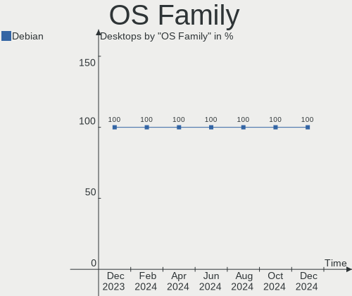
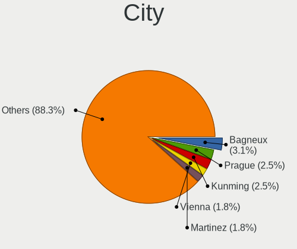
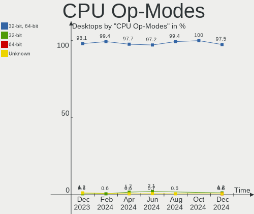
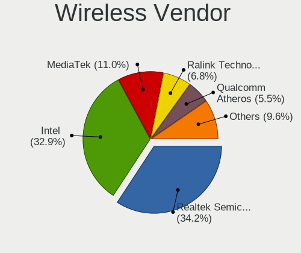
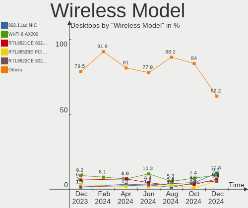

Debian Hardware Trends (Desktop)
--------------------------------

A project to identify most popular hardware characteristics and track their change
over time based on data collected by Debian users at https://Linux-Hardware.org.

Anyone can contribute to the study by uploading probes of their computers by
the [hw-probe](https://github.com/linuxhw/hw-probe) tool:

    sudo -E hw-probe -all -upload

Full-feature report is available here: https://linux-hardware.org/?view=trends&formfactor=desktop

Period: Feb, 2021.

Contents
--------

- [ OS                       ](#os)
- [ OS Family                ](#os-family)
- [ Kernel                   ](#kernel)
- [ Kernel Family            ](#kernel-family)
- [ Kernel Major Ver.        ](#kernel-major-ver)
- [ Arch                     ](#arch)
- [ DE                       ](#de)
- [ Display Server           ](#display-server)
- [ Display Manager          ](#display-manager)
- [ OS Lang                  ](#os-lang)
- [ Boot Mode                ](#boot-mode)
- [ Filesystem               ](#filesystem)
- [ Part. scheme             ](#part-scheme)
- [ Dual Boot with Linux/BSD ](#dual-boot-with-linux/bsd)
- [ Dual Boot (Win)          ](#dual-boot-win)
- [ Country                  ](#country)
- [ City                     ](#city)
- [ Vendor                   ](#vendor)
- [ Model                    ](#model)
- [ Model Family             ](#model-family)
- [ MFG Year                 ](#mfg-year)
- [ Form Factor              ](#form-factor)
- [ Secure Boot              ](#secure-boot)
- [ Coreboot                 ](#coreboot)
- [ RAM Size                 ](#ram-size)
- [ RAM Used                 ](#ram-used)
- [ Has CD-ROM               ](#has-cd-rom)
- [ Total Drives             ](#total-drives)
- [ Has Ethernet             ](#has-ethernet)
- [ Drive Vendor             ](#drive-vendor)
- [ Drive Model              ](#drive-model)
- [ HDD Vendor               ](#hdd-vendor)
- [ SSD Vendor               ](#ssd-vendor)
- [ Drive Kind               ](#drive-kind)
- [ Drive Connector          ](#drive-connector)
- [ Drive Size               ](#drive-size)
- [ Space Total              ](#space-total)
- [ Space Used               ](#space-used)
- [ Malfunc. Drives          ](#malfunc-drives)
- [ Malfunc. Drive Vendor    ](#malfunc-drive-vendor)
- [ Malfunc. HDD Vendor      ](#malfunc-hdd-vendor)
- [ Malfunc. Drive Kind      ](#malfunc-drive-kind)
- [ Failed Drives            ](#failed-drives)
- [ Failed Drive Vendor      ](#failed-drive-vendor)
- [ Drive Status             ](#drive-status)
- [ Storage Vendor           ](#storage-vendor)
- [ Storage Model            ](#storage-model)
- [ Storage Kind             ](#storage-kind)
- [ CPU Vendor               ](#cpu-vendor)
- [ CPU Model                ](#cpu-model)
- [ CPU Model Family         ](#cpu-model-family)
- [ CPU Cores                ](#cpu-cores)
- [ CPU Sockets              ](#cpu-sockets)
- [ CPU Threads              ](#cpu-threads)
- [ CPU Op-Modes             ](#cpu-op-modes)
- [ CPU Microcode            ](#cpu-microcode)
- [ CPU Microarch            ](#cpu-microarch)
- [ GPU Vendor               ](#gpu-vendor)
- [ GPU Model                ](#gpu-model)
- [ GPU Combo                ](#gpu-combo)
- [ GPU Driver               ](#gpu-driver)
- [ GPU Memory               ](#gpu-memory)
- [ Monitor Vendor           ](#monitor-vendor)
- [ Monitor Model            ](#monitor-model)
- [ Monitor Resolution       ](#monitor-resolution)
- [ Monitor Diagonal         ](#monitor-diagonal)
- [ Monitor Width            ](#monitor-width)
- [ Aspect Ratio             ](#aspect-ratio)
- [ Monitor Area             ](#monitor-area)
- [ Pixel Density            ](#pixel-density)
- [ Multiple Monitors        ](#multiple-monitors)
- [ Net Controller Vendor    ](#net-controller-vendor)
- [ Net Controller Model     ](#net-controller-model)
- [ Wireless Vendor          ](#wireless-vendor)
- [ Wireless Model           ](#wireless-model)
- [ Ethernet Vendor          ](#ethernet-vendor)
- [ Ethernet Model           ](#ethernet-model)
- [ Net Controller Kind      ](#net-controller-kind)
- [ Used Controller          ](#used-controller)
- [ NICs                     ](#nics)
- [ Memory Vendor            ](#memory-vendor)
- [ Memory Model             ](#memory-model)
- [ Memory Kind              ](#memory-kind)
- [ Memory Form Factor       ](#memory-form-factor)
- [ Memory Size              ](#memory-size)
- [ Memory Speed             ](#memory-speed)
- [ Sound Vendor             ](#sound-vendor)
- [ Sound Model              ](#sound-model)
- [ Camera Vendor            ](#camera-vendor)
- [ Camera Model             ](#camera-model)
- [ Fingerprint Vendor       ](#fingerprint-vendor)
- [ Fingerprint Model        ](#fingerprint-model)
- [ Chipcard Vendor          ](#chipcard-vendor)
- [ Chipcard Model           ](#chipcard-model)
- [ Printer Vendor           ](#printer-vendor)
- [ Printer Model            ](#printer-model)
- [ Scanner Vendor           ](#scanner-vendor)
- [ Scanner Model            ](#scanner-model)
- [ Bluetooth Vendor         ](#bluetooth-vendor)
- [ Bluetooth Model          ](#bluetooth-model)
- [ Unsupported Devices      ](#unsupported-devices)
- [ Unsupported Device Types ](#unsupported-device-types)

OS
--

Installed operating systems

| Name            | Desktops | Percent |
|-----------------|----------|---------|
| Debian 10       | 34       | 66.67%  |
| Debian Testing  | 13       | 25.49%  |
| Debian          | 2        | 3.92%   |
| Debian Unstable | 1        | 1.96%   |
| Debian 9.5      | 1        | 1.96%   |

OS Family
---------

OS without a version

| Name   | Desktops | Percent |
|--------|----------|---------|
| Debian | 51       | 100%    |

Kernel
------

Version of the Linux kernel

| Version             | Desktops | Percent |
|---------------------|----------|---------|
| 4.19.0-14-amd64     | 24       | 47.06%  |
| 5.10.0-3-amd64      | 6        | 11.76%  |
| 5.10.0-2-amd64      | 4        | 7.84%   |
| 4.19.0-13-amd64     | 4        | 7.84%   |
| 5.9.0-0.bpo.5-amd64 | 2        | 3.92%   |
| 5.6.0-2-amd64       | 2        | 3.92%   |
| 5.9.0-1-amd64       | 1        | 1.96%   |
| 5.8.0-3-amd64       | 1        | 1.96%   |
| 5.7.0-0.bpo.2-amd64 | 1        | 1.96%   |
| 5.10.18-wrkd        | 1        | 1.96%   |
| 5.10.17-wrkd        | 1        | 1.96%   |
| 5.10.16-qcmm-dirty  | 1        | 1.96%   |
| 4.9.0-8-686-pae     | 1        | 1.96%   |
| 4.19.0-6-amd64      | 1        | 1.96%   |
| 4.19.0-12-amd64     | 1        | 1.96%   |

Kernel Family
-------------

Linux kernel without a distro release

| Version | Desktops | Percent |
|---------|----------|---------|
| 4.19.0  | 30       | 58.82%  |
| 5.10.0  | 10       | 19.61%  |
| 5.9.0   | 3        | 5.88%   |
| 5.6.0   | 2        | 3.92%   |
| 5.8.0   | 1        | 1.96%   |
| 5.7.0   | 1        | 1.96%   |
| 5.10.18 | 1        | 1.96%   |
| 5.10.17 | 1        | 1.96%   |
| 5.10.16 | 1        | 1.96%   |
| 4.9.0   | 1        | 1.96%   |

Kernel Major Ver.
-----------------

Linux kernel major version

| Version | Desktops | Percent |
|---------|----------|---------|
| 4.19    | 30       | 58.82%  |
| 5.10    | 13       | 25.49%  |
| 5.9     | 3        | 5.88%   |
| 5.6     | 2        | 3.92%   |
| 5.8     | 1        | 1.96%   |
| 5.7     | 1        | 1.96%   |
| 4.9     | 1        | 1.96%   |

Arch
----

OS architecture (x86_64, i586, etc.)

| Name   | Desktops | Percent |
|--------|----------|---------|
| x86_64 | 50       | 98.04%  |
| i686   | 1        | 1.96%   |

DE
--

Desktop Environment

| Name             | Desktops | Percent |
|------------------|----------|---------|
| GNOME            | 11       | 21.57%  |
| XFCE             | 9        | 17.65%  |
| KDE5             | 9        | 17.65%  |
| Unknown          | 7        | 13.73%  |
| X-Cinnamon       | 3        | 5.88%   |
| lightdm-xsession | 3        | 5.88%   |
| LXQt             | 2        | 3.92%   |
| trinity          | 1        | 1.96%   |
| Openbox          | 1        | 1.96%   |
| MATE             | 1        | 1.96%   |
| KDE              | 1        | 1.96%   |
| i3               | 1        | 1.96%   |
| GNOME Classic    | 1        | 1.96%   |
| Budgie           | 1        | 1.96%   |

Display Server
--------------

X11 or Wayland

| Name    | Desktops | Percent |
|---------|----------|---------|
| X11     | 40       | 78.43%  |
| Tty     | 8        | 15.69%  |
| Wayland | 2        | 3.92%   |
| Unknown | 1        | 1.96%   |

Display Manager
---------------

SDDM, LightDM, etc.

| Name    | Desktops | Percent |
|---------|----------|---------|
| Unknown | 23       | 45.1%   |
| TDM     | 14       | 27.45%  |
| SDDM    | 10       | 19.61%  |
| GDM     | 4        | 7.84%   |

OS Lang
-------

Language

| Lang    | Desktops | Percent |
|---------|----------|---------|
| en_US   | 25       | 49.02%  |
| fr_FR   | 3        | 5.88%   |
| ru_RU   | 2        | 3.92%   |
| pt_BR   | 2        | 3.92%   |
| en_IN   | 2        | 3.92%   |
| de_DE   | 2        | 3.92%   |
| Unknown | 2        | 3.92%   |
| sk_SK   | 1        | 1.96%   |
| pt_PT   | 1        | 1.96%   |
| pl_PL   | 1        | 1.96%   |
| ja_JP   | 1        | 1.96%   |
| es_MX   | 1        | 1.96%   |
| es_AR   | 1        | 1.96%   |
| en_GB   | 1        | 1.96%   |
| en_CA   | 1        | 1.96%   |
| en_AU   | 1        | 1.96%   |
| el_GR   | 1        | 1.96%   |
| de_AT   | 1        | 1.96%   |
| da_DK   | 1        | 1.96%   |
| C       | 1        | 1.96%   |

Boot Mode
---------

EFI or BIOS

| Mode | Desktops | Percent |
|------|----------|---------|
| BIOS | 36       | 70.59%  |
| EFI  | 15       | 29.41%  |

Filesystem
----------

Type of filesystem

| Type    | Desktops | Percent |
|---------|----------|---------|
| Ext4    | 39       | 76.47%  |
| Overlay | 5        | 9.8%    |
| Btrfs   | 4        | 7.84%   |
| Xfs     | 2        | 3.92%   |
| Ext3    | 1        | 1.96%   |

Part. scheme
------------

Scheme of partitioning

| Type    | Desktops | Percent |
|---------|----------|---------|
| GPT     | 19       | 37.25%  |
| Unknown | 18       | 35.29%  |
| MBR     | 14       | 27.45%  |

Dual Boot with Linux/BSD
------------------------

Hosting more than one Linux/BSD

| Dual boot | Desktops | Percent |
|-----------|----------|---------|
| No        | 47       | 92.16%  |
| Yes       | 4        | 7.84%   |

Dual Boot (Win)
---------------

Hosting Linux and Windows

| Dual boot | Desktops | Percent |
|-----------|----------|---------|
| No        | 36       | 70.59%  |
| Yes       | 15       | 29.41%  |

Country
-------

Geographic location (country)

| Country                | Desktops | Percent |
|------------------------|----------|---------|
| USA                    | 13       | 25.49%  |
| France                 | 4        | 7.84%   |
| Brazil                 | 4        | 7.84%   |
| Russia                 | 3        | 5.88%   |
| Finland                | 3        | 5.88%   |
| Croatia                | 3        | 5.88%   |
| Slovakia               | 2        | 3.92%   |
| Poland                 | 2        | 3.92%   |
| India                  | 2        | 3.92%   |
| Germany                | 2        | 3.92%   |
| Switzerland            | 1        | 1.96%   |
| Portugal               | 1        | 1.96%   |
| Norway                 | 1        | 1.96%   |
| Mexico                 | 1        | 1.96%   |
| Japan                  | 1        | 1.96%   |
| Italy                  | 1        | 1.96%   |
| Greece                 | 1        | 1.96%   |
| Estonia                | 1        | 1.96%   |
| Denmark                | 1        | 1.96%   |
| Canada                 | 1        | 1.96%   |
| Bosnia and Herzegovina | 1        | 1.96%   |
| Austria                | 1        | 1.96%   |
| Argentina              | 1        | 1.96%   |

City
----

Geographic location (city)

| City                | Desktops | Percent |
|---------------------|----------|---------|
| Zagreb              | 3        | 5.88%   |
| Raahe               | 2        | 3.92%   |
| Porto Alegre        | 2        | 3.92%   |
| Minneapolis         | 2        | 3.92%   |
| Wrocław            | 1        | 1.96%   |
| Warsaw              | 1        | 1.96%   |
| Vienna              | 1        | 1.96%   |
| Ufa                 | 1        | 1.96%   |
| Tokorozawa          | 1        | 1.96%   |
| Timbo               | 1        | 1.96%   |
| Thessaloniki        | 1        | 1.96%   |
| The Bronx           | 1        | 1.96%   |
| Tallinn             | 1        | 1.96%   |
| Sunnyvale           | 1        | 1.96%   |
| Strasbourg          | 1        | 1.96%   |
| Stoughton           | 1        | 1.96%   |
| Steinbach           | 1        | 1.96%   |
| St Louis            | 1        | 1.96%   |
| Serra               | 1        | 1.96%   |
| Sarajevo            | 1        | 1.96%   |
| Santa Clara         | 1        | 1.96%   |
| San Jose            | 1        | 1.96%   |
| Rungis              | 1        | 1.96%   |
| Roubaix             | 1        | 1.96%   |
| Rajahmundry         | 1        | 1.96%   |
| Posadas             | 1        | 1.96%   |
| Perm                | 1        | 1.96%   |
| Nivala              | 1        | 1.96%   |
| New Haven           | 1        | 1.96%   |
| Moscow              | 1        | 1.96%   |
| Monistrol-sur-Loire | 1        | 1.96%   |
| Michalovce          | 1        | 1.96%   |
| Mexico City         | 1        | 1.96%   |
| Lompoc              | 1        | 1.96%   |
| Holmen              | 1        | 1.96%   |
| Emporia             | 1        | 1.96%   |
| East Orange         | 1        | 1.96%   |
| Dorn-Durkheim       | 1        | 1.96%   |
| Copenhagen          | 1        | 1.96%   |
| Castel San Giovanni | 1        | 1.96%   |
| Bratislava          | 1        | 1.96%   |
| Berlin              | 1        | 1.96%   |
| Bengaluru           | 1        | 1.96%   |
| Basel               | 1        | 1.96%   |
| Barcelos            | 1        | 1.96%   |
| Asker               | 1        | 1.96%   |

Vendor
------

Motherboard manufacturer

| Name                | Desktops | Percent |
|---------------------|----------|---------|
| ASUSTek Computer    | 13       | 25.49%  |
| ASRock              | 7        | 13.73%  |
| MSI                 | 6        | 11.76%  |
| Hewlett-Packard     | 6        | 11.76%  |
| Gigabyte Technology | 6        | 11.76%  |
| Intel               | 4        | 7.84%   |
| Dell                | 3        | 5.88%   |
| Intel X79           | 2        | 3.92%   |
| Pegatron            | 1        | 1.96%   |
| Medion              | 1        | 1.96%   |
| Lenovo              | 1        | 1.96%   |
| Alienware           | 1        | 1.96%   |

Model
-----

Motherboard model

| Name                            | Desktops | Percent |
|---------------------------------|----------|---------|
| ASUS All Series                 | 3        | 5.88%   |
| MSI MS-7C75                     | 2        | 3.92%   |
| Intel X79 Board                 | 2        | 3.92%   |
| Pegatron BK139AA-ABA 600-1120   | 1        | 1.96%   |
| MSI MS-7C95                     | 1        | 1.96%   |
| MSI MS-7C84                     | 1        | 1.96%   |
| MSI MS-7926                     | 1        | 1.96%   |
| MSI MS-7329                     | 1        | 1.96%   |
| Medion MS-7797                  | 1        | 1.96%   |
| Lenovo ThinkCentre M92p 3209EK4 | 1        | 1.96%   |
| Intel DN2800MT AAG23738-801     | 1        | 1.96%   |
| Intel DH87RL AAG74240-402       | 1        | 1.96%   |
| Intel DH61CR AAG14064-207       | 1        | 1.96%   |
| Intel B828                      | 1        | 1.96%   |
| HP t620 Quad Core TC            | 1        | 1.96%   |
| HP ProDesk 600 G1 DM            | 1        | 1.96%   |
| HP OMEN 30L Desktop GT13-0xxx   | 1        | 1.96%   |
| HP EliteDesk 800 G1 USDT        | 1        | 1.96%   |
| HP 870-210                      | 1        | 1.96%   |
| HP 550-171ng                    | 1        | 1.96%   |
| Gigabyte Z97X-SLI               | 1        | 1.96%   |
| Gigabyte Z370 AORUS Gaming 5    | 1        | 1.96%   |
| Gigabyte H97M-HD3               | 1        | 1.96%   |
| Gigabyte GA-78LMT-S2P           | 1        | 1.96%   |
| Gigabyte B75M-D3H               | 1        | 1.96%   |
| Gigabyte 8LD533                 | 1        | 1.96%   |
| Dell Vostro 3471                | 1        | 1.96%   |
| Dell OptiPlex GX620             | 1        | 1.96%   |
| Dell OptiPlex 7080              | 1        | 1.96%   |
| ASUS TUF Z270 MARK 1            | 1        | 1.96%   |
| ASUS TUF GAMING Z490-PLUS       | 1        | 1.96%   |
| ASUS SABERTOOTH X79             | 1        | 1.96%   |
| ASUS ROG CROSSHAIR VI HERO      | 1        | 1.96%   |
| ASUS PRO602617                  | 1        | 1.96%   |
| ASUS PRIME X370-PRO             | 1        | 1.96%   |
| ASUS PRIME B450-PLUS            | 1        | 1.96%   |
| ASUS P9X79 DELUXE               | 1        | 1.96%   |
| ASUS P5KPL-CM                   | 1        | 1.96%   |
| ASUS P5KPL-AM SE                | 1        | 1.96%   |
| ASRock Z87 Extreme4             | 1        | 1.96%   |
| ASRock X570 Taichi              | 1        | 1.96%   |
| ASRock X300M-STX                | 1        | 1.96%   |
| ASRock N68-S3 FX                | 1        | 1.96%   |
| ASRock G41M-VS3                 | 1        | 1.96%   |
| ASRock B450 Pro4                | 1        | 1.96%   |
| ASRock AB350M Pro4              | 1        | 1.96%   |
| Alienware Aurora-R4             | 1        | 1.96%   |

Model Family
------------

Motherboard model prefix

| Name                  | Desktops | Percent |
|-----------------------|----------|---------|
| ASUS All              | 3        | 5.88%   |
| MSI MS-7C75           | 2        | 3.92%   |
| Intel X79 Board       | 2        | 3.92%   |
| Dell OptiPlex         | 2        | 3.92%   |
| ASUS TUF              | 2        | 3.92%   |
| ASUS PRIME            | 2        | 3.92%   |
| Pegatron BK139AA-ABA  | 1        | 1.96%   |
| MSI MS-7C95           | 1        | 1.96%   |
| MSI MS-7C84           | 1        | 1.96%   |
| MSI MS-7926           | 1        | 1.96%   |
| MSI MS-7329           | 1        | 1.96%   |
| Medion MS-7797        | 1        | 1.96%   |
| Lenovo ThinkCentre    | 1        | 1.96%   |
| Intel DN2800MT        | 1        | 1.96%   |
| Intel DH87RL          | 1        | 1.96%   |
| Intel DH61CR          | 1        | 1.96%   |
| Intel B828            | 1        | 1.96%   |
| HP t620               | 1        | 1.96%   |
| HP ProDesk            | 1        | 1.96%   |
| HP OMEN               | 1        | 1.96%   |
| HP EliteDesk          | 1        | 1.96%   |
| HP 870-210            | 1        | 1.96%   |
| HP 550-171ng          | 1        | 1.96%   |
| Gigabyte Z97X-SLI     | 1        | 1.96%   |
| Gigabyte Z370         | 1        | 1.96%   |
| Gigabyte H97M-HD3     | 1        | 1.96%   |
| Gigabyte GA-78LMT-S2P | 1        | 1.96%   |
| Gigabyte B75M-D3H     | 1        | 1.96%   |
| Gigabyte 8LD533       | 1        | 1.96%   |
| Dell Vostro           | 1        | 1.96%   |
| ASUS SABERTOOTH       | 1        | 1.96%   |
| ASUS ROG              | 1        | 1.96%   |
| ASUS PRO602617        | 1        | 1.96%   |
| ASUS P9X79            | 1        | 1.96%   |
| ASUS P5KPL-CM         | 1        | 1.96%   |
| ASUS P5KPL-AM         | 1        | 1.96%   |
| ASRock Z87            | 1        | 1.96%   |
| ASRock X570           | 1        | 1.96%   |
| ASRock X300M-STX      | 1        | 1.96%   |
| ASRock N68-S3         | 1        | 1.96%   |
| ASRock G41M-VS3       | 1        | 1.96%   |
| ASRock B450           | 1        | 1.96%   |
| ASRock AB350M         | 1        | 1.96%   |
| Alienware Aurora-R4   | 1        | 1.96%   |

MFG Year
--------

Motherboard manufacture year

| Year | Desktops | Percent |
|------|----------|---------|
| 2020 | 10       | 19.61%  |
| 2019 | 6        | 11.76%  |
| 2013 | 6        | 11.76%  |
| 2016 | 5        | 9.8%    |
| 2018 | 3        | 5.88%   |
| 2015 | 3        | 5.88%   |
| 2014 | 3        | 5.88%   |
| 2011 | 3        | 5.88%   |
| 2021 | 2        | 3.92%   |
| 2017 | 2        | 3.92%   |
| 2012 | 2        | 3.92%   |
| 2010 | 2        | 3.92%   |
| 2009 | 1        | 1.96%   |
| 2008 | 1        | 1.96%   |
| 2006 | 1        | 1.96%   |
| 2002 | 1        | 1.96%   |

Form Factor
-----------

Physical design of the computer

| Name    | Desktops | Percent |
|---------|----------|---------|
| Desktop | 51       | 100%    |

Secure Boot
-----------

Enabled or disabled

| State    | Desktops | Percent |
|----------|----------|---------|
| Disabled | 50       | 98.04%  |
| Enabled  | 1        | 1.96%   |

Coreboot
--------

Have coreboot on board

| Used | Desktops | Percent |
|------|----------|---------|
| No   | 51       | 100%    |

RAM Size
--------

Total RAM memory

| Size in GB  | Desktops | Percent |
|-------------|----------|---------|
| 16.01-24.0  | 13       | 25.49%  |
| 3.01-4.0    | 10       | 19.61%  |
| 64.01-256.0 | 8        | 15.69%  |
| 32.01-64.0  | 7        | 13.73%  |
| 8.01-16.0   | 5        | 9.8%    |
| 4.01-8.0    | 4        | 7.84%   |
| 1.01-2.0    | 2        | 3.92%   |
| 24.01-32.0  | 1        | 1.96%   |
| 0.51-1.0    | 1        | 1.96%   |

RAM Used
--------

Used RAM memory

| Used GB    | Desktops | Percent |
|------------|----------|---------|
| 1.01-2.0   | 13       | 25.49%  |
| 2.01-3.0   | 9        | 17.65%  |
| 0.51-1.0   | 9        | 17.65%  |
| 4.01-8.0   | 7        | 13.73%  |
| 3.01-4.0   | 6        | 11.76%  |
| 8.01-16.0  | 3        | 5.88%   |
| 0.01-0.5   | 2        | 3.92%   |
| 24.01-32.0 | 1        | 1.96%   |
| 16.01-24.0 | 1        | 1.96%   |

Has CD-ROM
----------

Has CD-ROM on board

| Presented | Desktops | Percent |
|-----------|----------|---------|
| No        | 28       | 54.9%   |
| Yes       | 23       | 45.1%   |

Total Drives
------------

Number of drives on board

| Drives | Desktops | Percent |
|--------|----------|---------|
| 1      | 22       | 43.14%  |
| 3      | 11       | 21.57%  |
| 2      | 8        | 15.69%  |
| 4      | 7        | 13.73%  |
| 8      | 1        | 1.96%   |
| 6      | 1        | 1.96%   |
| 5      | 1        | 1.96%   |

Has Ethernet
------------

Has Ethernet on board

| Presented | Desktops | Percent |
|-----------|----------|---------|
| Yes       | 51       | 100%    |

Drive Vendor
------------

Hard drive vendors

| Vendor              | Desktops | Drives | Percent |
|---------------------|----------|--------|---------|
| WDC                 | 19       | 32     | 20.43%  |
| Seagate             | 18       | 21     | 19.35%  |
| Samsung Electronics | 14       | 20     | 15.05%  |
| Kingston            | 6        | 8      | 6.45%   |
| Toshiba             | 4        | 4      | 4.3%    |
| SanDisk             | 4        | 4      | 4.3%    |
| Crucial             | 4        | 4      | 4.3%    |
| Unknown             | 3        | 4      | 3.23%   |
| OCZ                 | 2        | 2      | 2.15%   |
| LITEON              | 2        | 2      | 2.15%   |
| Lite-On             | 2        | 2      | 2.15%   |
| Intel               | 2        | 3      | 2.15%   |
| Hitachi             | 2        | 2      | 2.15%   |
| Corsair             | 2        | 2      | 2.15%   |
| A-DATA Technology   | 2        | 3      | 2.15%   |
| ULTIMATE            | 1        | 1      | 1.08%   |
| TO Exter            | 1        | 1      | 1.08%   |
| Patriot             | 1        | 1      | 1.08%   |
| KingFast            | 1        | 1      | 1.08%   |
| Inateck             | 1        | 1      | 1.08%   |
| HGST                | 1        | 2      | 1.08%   |
| BAITITON            | 1        | 1      | 1.08%   |

Drive Model
-----------

Hard drive models

| Model                               | Desktops | Percent |
|-------------------------------------|----------|---------|
| Seagate ST1000DM010-2EP102 1TB      | 3        | 2.73%   |
| WDC WD40EZRZ-00GXCB0 4TB            | 2        | 1.82%   |
| WDC WD10SPZX-24Z10T0 1TB            | 2        | 1.82%   |
| WDC WD1002FAEX-00Z3A0 1TB           | 2        | 1.82%   |
| Unknown SD/MMC/MS PRO 64GB          | 2        | 1.82%   |
| Seagate ST500LM012 HN-M500MBB 500GB | 2        | 1.82%   |
| Seagate ST3500418AS 500GB           | 2        | 1.82%   |
| SanDisk SSD PLUS 480GB              | 2        | 1.82%   |
| SanDisk SDSSDA240G 240GB            | 2        | 1.82%   |
| Samsung SSD 860 EVO 500GB           | 2        | 1.82%   |
| Samsung SSD 860 EVO 250GB           | 2        | 1.82%   |
| Samsung SSD 850 EVO 250GB           | 2        | 1.82%   |
| Samsung HD103SJ 1TB                 | 2        | 1.82%   |
| OCZ AGILITY3 240GB SSD              | 2        | 1.82%   |
| Lite-On NVMe SSD Drive 256GB        | 2        | 1.82%   |
| Kingston SUV400S37240G 240GB SSD    | 2        | 1.82%   |
| Kingston SA400S37240G 240GB SSD     | 2        | 1.82%   |
| WDC WDS250G2B0A 250GB SSD           | 1        | 0.91%   |
| WDC WDS240G2G0A-00JH30 240GB SSD    | 1        | 0.91%   |
| WDC WD800AAJS-00PSA0 80GB           | 1        | 0.91%   |
| WDC WD60EZRZ-00GZ5B1 6TB            | 1        | 0.91%   |
| WDC WD60EZRX-00MVLB1 6TB            | 1        | 0.91%   |
| WDC WD6003FRYZ-01F0DB0 6TB          | 1        | 0.91%   |
| WDC WD5000AAKX-083CA1 500GB         | 1        | 0.91%   |
| WDC WD40EFRX-68N32N0 4TB            | 1        | 0.91%   |
| WDC WD4005FZBX-00K5WB0 4TB          | 1        | 0.91%   |
| WDC WD3200AAJS-00L7A0 320GB         | 1        | 0.91%   |
| WDC WD3200AAJB-00WGA0 320GB         | 1        | 0.91%   |
| WDC WD20EZAZ-00GGJB0 2TB            | 1        | 0.91%   |
| WDC WD1600AAJS-00L7A0 160GB         | 1        | 0.91%   |
| WDC WD10EZEX-60WN4A0 1TB            | 1        | 0.91%   |
| WDC WD10EZEX-00RKKA0 1TB            | 1        | 0.91%   |
| WDC WD10EFRX-68FYTN0 1TB            | 1        | 0.91%   |
| WDC WD10EADS-65M2B1 1TB             | 1        | 0.91%   |
| WDC WD100EMAZ-00WJTA0 10TB          | 1        | 0.91%   |
| WDC WD1001FALS-00J7B0 1TB           | 1        | 0.91%   |
| Unknown Sabrent Disk Dev 2TB        | 1        | 0.91%   |
| ULTIMATE CF CARD 16GB SSD           | 1        | 0.91%   |
| Toshiba MG06ACA600E 6TB             | 1        | 0.91%   |
| Toshiba External USB 3.0 512GB      | 1        | 0.91%   |
| Toshiba DT01ACA100 1TB              | 1        | 0.91%   |
| Toshiba DT01ACA050 500GB            | 1        | 0.91%   |
| TO Exter nal USB 3.0 1TB            | 1        | 0.91%   |
| Seagate ST500DM002-1BD142 500GB     | 1        | 0.91%   |
| Seagate ST4000VN008-2DR166 4TB      | 1        | 0.91%   |
| Seagate ST4000VN000-1H4168 4TB      | 1        | 0.91%   |
| Seagate ST4000NM0033-9ZM170 4TB     | 1        | 0.91%   |
| Seagate ST380011A 80GB              | 1        | 0.91%   |
| Seagate ST3500321CS 500GB           | 1        | 0.91%   |
| Seagate ST3160811AS 160GB           | 1        | 0.91%   |
| Seagate ST250LT021-1AF14C 250GB     | 1        | 0.91%   |
| Seagate ST2000DM008-2FR102 2TB      | 1        | 0.91%   |
| Seagate ST2000DM001-9YN164 2TB      | 1        | 0.91%   |
| Seagate ST1000LM014-1EJ164 1TB      | 1        | 0.91%   |
| Seagate ST1000DM003-1ER162 1TB      | 1        | 0.91%   |
| Seagate Expansion Desk 4TB          | 1        | 0.91%   |
| Samsung SSD 970 EVO Plus 500GB      | 1        | 0.91%   |
| Samsung SSD 970 EVO Plus 2TB        | 1        | 0.91%   |
| Samsung SSD 970 EVO Plus 250GB      | 1        | 0.91%   |
| Samsung SSD 970 EVO Plus 1TB        | 1        | 0.91%   |

HDD Vendor
----------

Hard disk drive vendors

| Vendor              | Desktops | Drives | Percent |
|---------------------|----------|--------|---------|
| WDC                 | 18       | 30     | 40%     |
| Seagate             | 18       | 21     | 40%     |
| Toshiba             | 3        | 3      | 6.67%   |
| Samsung Electronics | 2        | 2      | 4.44%   |
| Hitachi             | 2        | 2      | 4.44%   |
| TO Exter            | 1        | 1      | 2.22%   |
| HGST                | 1        | 2      | 2.22%   |

SSD Vendor
----------

Solid state drive vendors

| Vendor              | Desktops | Drives | Percent |
|---------------------|----------|--------|---------|
| Samsung Electronics | 8        | 10     | 25%     |
| Kingston            | 6        | 7      | 18.75%  |
| SanDisk             | 4        | 4      | 12.5%   |
| Crucial             | 4        | 4      | 12.5%   |
| WDC                 | 2        | 2      | 6.25%   |
| OCZ                 | 2        | 2      | 6.25%   |
| ULTIMATE            | 1        | 1      | 3.13%   |
| LITEON              | 1        | 1      | 3.13%   |
| KingFast            | 1        | 1      | 3.13%   |
| Corsair             | 1        | 1      | 3.13%   |
| BAITITON            | 1        | 1      | 3.13%   |
| A-DATA Technology   | 1        | 2      | 3.13%   |

Drive Kind
----------

HDD or SSD

| Kind    | Desktops | Drives | Percent |
|---------|----------|--------|---------|
| HDD     | 36       | 61     | 44.44%  |
| SSD     | 27       | 36     | 33.33%  |
| NVMe    | 13       | 18     | 16.05%  |
| Unknown | 5        | 6      | 6.17%   |

Drive Connector
---------------

SATA, SAS, NVMe, etc.

| Type | Desktops | Drives | Percent |
|------|----------|--------|---------|
| SATA | 46       | 95     | 69.7%   |
| NVMe | 13       | 18     | 19.7%   |
| SAS  | 7        | 8      | 10.61%  |

Drive Size
----------

Size of hard drive

| Size in TB | Desktops | Drives | Percent |
|------------|----------|--------|---------|
| 0.01-0.5   | 37       | 49     | 54.41%  |
| 0.51-1.0   | 16       | 26     | 23.53%  |
| 3.01-4.0   | 7        | 8      | 10.29%  |
| 1.01-2.0   | 5        | 5      | 7.35%   |
| 4.01-10.0  | 3        | 9      | 4.41%   |

Space Total
-----------

Amount of disk space available on the file system

| Size in GB     | Desktops | Percent |
|----------------|----------|---------|
| More than 3000 | 9        | 17.65%  |
| 251-500        | 9        | 17.65%  |
| 101-250        | 8        | 15.69%  |
| 1001-2000      | 6        | 11.76%  |
| 2001-3000      | 5        | 9.8%    |
| 21-50          | 4        | 7.84%   |
| 501-1000       | 4        | 7.84%   |
| 1-20           | 3        | 5.88%   |
| 51-100         | 2        | 3.92%   |
| Unknown        | 1        | 1.96%   |

Space Used
----------

Amount of used disk space

| Used GB        | Desktops | Percent |
|----------------|----------|---------|
| 1-20           | 14       | 27.45%  |
| 101-250        | 9        | 17.65%  |
| 501-1000       | 6        | 11.76%  |
| 1001-2000      | 5        | 9.8%    |
| 2001-3000      | 4        | 7.84%   |
| More than 3000 | 3        | 5.88%   |
| 251-500        | 3        | 5.88%   |
| 21-50          | 3        | 5.88%   |
| 51-100         | 3        | 5.88%   |
| Unknown        | 1        | 1.96%   |

Malfunc. Drives
---------------

Drive models with a malfunction

| Model                           | Desktops | Drives | Percent |
|---------------------------------|----------|--------|---------|
| WDC WD10EADS-65M2B1 1TB         | 1        | 1      | 16.67%  |
| Seagate ST4000NM0033-9ZM170 4TB | 1        | 1      | 16.67%  |
| Seagate ST380011A 80GB          | 1        | 1      | 16.67%  |
| Seagate ST3500418AS 500GB       | 1        | 1      | 16.67%  |
| Samsung Electronics HD103SJ 1TB | 1        | 1      | 16.67%  |
| Crucial CT1024MX200SSD1 1TB     | 1        | 1      | 16.67%  |

Malfunc. Drive Vendor
---------------------

Vendors of faulty drives

| Vendor              | Desktops | Drives | Percent |
|---------------------|----------|--------|---------|
| Seagate             | 3        | 3      | 50%     |
| WDC                 | 1        | 1      | 16.67%  |
| Samsung Electronics | 1        | 1      | 16.67%  |
| Crucial             | 1        | 1      | 16.67%  |

Malfunc. HDD Vendor
-------------------

Vendors of faulty HDD drives

| Vendor              | Desktops | Drives | Percent |
|---------------------|----------|--------|---------|
| Seagate             | 3        | 3      | 60%     |
| WDC                 | 1        | 1      | 20%     |
| Samsung Electronics | 1        | 1      | 20%     |

Malfunc. Drive Kind
-------------------

Kinds of faulty drives

| Kind | Desktops | Drives | Percent |
|------|----------|--------|---------|
| HDD  | 5        | 5      | 83.33%  |
| SSD  | 1        | 1      | 16.67%  |

Failed Drives
-------------

Failed drive models

Zero info for selected period =(

Failed Drive Vendor
-------------------

Failed drive vendors

Zero info for selected period =(

Drive Status
------------

Number of failed and malfunc. drives

| Status   | Desktops | Drives | Percent |
|----------|----------|--------|---------|
| Works    | 32       | 72     | 51.61%  |
| Detected | 24       | 43     | 38.71%  |
| Malfunc  | 6        | 6      | 9.68%   |

Storage Vendor
--------------

Storage controller vendors

| Vendor                      | Desktops | Percent |
|-----------------------------|----------|---------|
| Intel                       | 38       | 52.05%  |
| AMD                         | 11       | 15.07%  |
| Samsung Electronics         | 6        | 8.22%   |
| ASMedia Technology          | 6        | 8.22%   |
| Marvell Technology Group    | 3        | 4.11%   |
| Phison Electronics          | 2        | 2.74%   |
| Nvidia                      | 2        | 2.74%   |
| Lite-On Technology          | 2        | 2.74%   |
| LSI Logic / Symbios Logic   | 1        | 1.37%   |
| Kingston Technology Company | 1        | 1.37%   |
| ADATA Technology            | 1        | 1.37%   |

Storage Model
-------------

Storage controller models

| Model                                                                          | Desktops | Percent |
|--------------------------------------------------------------------------------|----------|---------|
| AMD FCH SATA Controller [AHCI mode]                                            | 9        | 10.23%  |
| Intel 9 Series Chipset Family SATA Controller [AHCI Mode]                      | 6        | 6.82%   |
| Intel 7 Series/C210 Series Chipset Family 6-port SATA Controller [AHCI mode]   | 6        | 6.82%   |
| Samsung NVMe SSD Controller SM981/PM981/PM983                                  | 5        | 5.68%   |
| ASMedia ASM1062 Serial ATA Controller                                          | 5        | 5.68%   |
| Intel NM10/ICH7 Family SATA Controller [IDE mode]                              | 4        | 4.55%   |
| Intel 82801G (ICH7 Family) IDE Controller                                      | 4        | 4.55%   |
| Intel 8 Series/C220 Series Chipset Family 6-port SATA Controller 1 [AHCI mode] | 4        | 4.55%   |
| Intel 400 Series Chipset Family SATA AHCI Controller                           | 3        | 3.41%   |
| Intel 200 Series PCH SATA controller [AHCI mode]                               | 3        | 3.41%   |
| Samsung NVMe SSD Controller SM961/PM961/SM963                                  | 2        | 2.27%   |
| Marvell Group 88SE9128 PCIe SATA 6 Gb/s RAID controller with HyperDuo          | 2        | 2.27%   |
| Lite-On Non-Volatile memory controller                                         | 2        | 2.27%   |
| Intel SATA Controller [RAID mode]                                              | 2        | 2.27%   |
| Intel Q170/Q150/B150/H170/H110/Z170/CM236 Chipset SATA Controller [AHCI Mode]  | 2        | 2.27%   |
| Intel C600/X79 series chipset 6-Port SATA AHCI Controller                      | 2        | 2.27%   |
| AMD X370 Series Chipset SATA Controller                                        | 2        | 2.27%   |
| AMD 400 Series Chipset SATA Controller                                         | 2        | 2.27%   |
| Samsung NVMe SSD Controller 172Xa/172Xb                                        | 1        | 1.14%   |
| Phison NVMe Storage Controller                                                 | 1        | 1.14%   |
| Phison E16 PCIe4 NVMe Controller                                               | 1        | 1.14%   |
| Nvidia MCP61 SATA Controller                                                   | 1        | 1.14%   |
| Nvidia MCP61 IDE                                                               | 1        | 1.14%   |
| Nvidia MCP51 Serial ATA Controller                                             | 1        | 1.14%   |
| Nvidia MCP51 IDE                                                               | 1        | 1.14%   |
| Marvell Group 88SE9230 PCIe 2.0 x2 4-port SATA 6 Gb/s RAID Controller          | 1        | 1.14%   |
| LSI Logic / Symbios Logic SAS2008 PCI-Express Fusion-MPT SAS-2 [Falcon]        | 1        | 1.14%   |
| Kingston Company A2000 NVMe SSD                                                | 1        | 1.14%   |
| Intel SSD 660P Series                                                          | 1        | 1.14%   |
| Intel Non-Volatile memory controller                                           | 1        | 1.14%   |
| Intel NM10/ICH7 Family SATA Controller [AHCI mode]                             | 1        | 1.14%   |
| Intel Chipset SATA RAID Controller                                             | 1        | 1.14%   |
| Intel 82801DB (ICH4) IDE Controller                                            | 1        | 1.14%   |
| Intel 6 Series/C200 Series Chipset Family 6 port Desktop SATA AHCI Controller  | 1        | 1.14%   |
| Intel 5 Series/3400 Series Chipset 6 port SATA AHCI Controller                 | 1        | 1.14%   |
| ASMedia 106x SATA/RAID Controller                                              | 1        | 1.14%   |
| AMD SB7x0/SB8x0/SB9x0 SATA Controller [IDE mode]                               | 1        | 1.14%   |
| AMD SB7x0/SB8x0/SB9x0 IDE Controller                                           | 1        | 1.14%   |
| AMD SATA controller                                                            | 1        | 1.14%   |
| AMD 300 Series Chipset SATA Controller                                         | 1        | 1.14%   |
| ADATA XPG SX8200 Pro PCIe Gen3x4 M.2 2280 Solid State Drive                    | 1        | 1.14%   |

Storage Kind
------------

Kind of storage controller (IDE, SATA, NVMe, SAS, ...)

| Kind | Desktops | Percent |
|------|----------|---------|
| SATA | 40       | 60.61%  |
| NVMe | 13       | 19.7%   |
| IDE  | 8        | 12.12%  |
| RAID | 4        | 6.06%   |
| SAS  | 1        | 1.52%   |

CPU Vendor
----------

Processor vendors

| Vendor | Desktops | Percent |
|--------|----------|---------|
| Intel  | 38       | 74.51%  |
| AMD    | 13       | 25.49%  |

CPU Model
---------

Processor models

| Model                                         | Desktops | Percent |
|-----------------------------------------------|----------|---------|
| Intel Xeon CPU E5-2650 v2 @ 2.60GHz           | 2        | 3.92%   |
| Intel Core i9-10900K CPU @ 3.70GHz            | 2        | 3.92%   |
| Intel Core i7-4790 CPU @ 3.60GHz              | 2        | 3.92%   |
| Intel Core i7-4770 CPU @ 3.40GHz              | 2        | 3.92%   |
| Intel Core i5-4570S CPU @ 2.90GHz             | 2        | 3.92%   |
| Intel Core i5-10400F CPU @ 2.90GHz            | 2        | 3.92%   |
| Intel Core i3-4150 CPU @ 3.50GHz              | 2        | 3.92%   |
| Intel Pentium Dual-Core CPU E5700 @ 3.00GHz   | 1        | 1.96%   |
| Intel Pentium 4 CPU 3.40GHz                   | 1        | 1.96%   |
| Intel Core i7-8700K CPU @ 3.70GHz             | 1        | 1.96%   |
| Intel Core i7-7700K CPU @ 4.20GHz             | 1        | 1.96%   |
| Intel Core i7-4820K CPU @ 3.70GHz             | 1        | 1.96%   |
| Intel Core i7-4790K CPU @ 4.00GHz             | 1        | 1.96%   |
| Intel Core i7-4771 CPU @ 3.50GHz              | 1        | 1.96%   |
| Intel Core i7-3930K CPU @ 3.20GHz             | 1        | 1.96%   |
| Intel Core i7-3820 CPU @ 3.60GHz              | 1        | 1.96%   |
| Intel Core i7-10700K CPU @ 3.80GHz            | 1        | 1.96%   |
| Intel Core i5-6400 CPU @ 2.70GHz              | 1        | 1.96%   |
| Intel Core i5-4440 CPU @ 3.10GHz              | 1        | 1.96%   |
| Intel Core i5-3570K CPU @ 3.40GHz             | 1        | 1.96%   |
| Intel Core i5-3570 CPU @ 3.40GHz              | 1        | 1.96%   |
| Intel Core i5-3470 CPU @ 3.20GHz              | 1        | 1.96%   |
| Intel Core i5-3350P CPU @ 3.10GHz             | 1        | 1.96%   |
| Intel Core i5-2400 CPU @ 3.10GHz              | 1        | 1.96%   |
| Intel Core i3-9100 CPU @ 3.60GHz              | 1        | 1.96%   |
| Intel Core i3-7100 CPU @ 3.90GHz              | 1        | 1.96%   |
| Intel Core i3 CPU M 330 @ 2.13GHz             | 1        | 1.96%   |
| Intel Core 2 Duo CPU E8400 @ 3.00GHz          | 1        | 1.96%   |
| Intel Celeron CPU 430 @ 1.80GHz               | 1        | 1.96%   |
| Intel Celeron CPU 1.70GHz                     | 1        | 1.96%   |
| Intel Atom CPU N2800 @ 1.86GHz                | 1        | 1.96%   |
| AMD Ryzen 9 3900X 12-Core Processor           | 1        | 1.96%   |
| AMD Ryzen 7 1800X Eight-Core Processor        | 1        | 1.96%   |
| AMD Ryzen 7 1700X Eight-Core Processor        | 1        | 1.96%   |
| AMD Ryzen 5 3600XT 6-Core Processor           | 1        | 1.96%   |
| AMD Ryzen 5 3600 6-Core Processor             | 1        | 1.96%   |
| AMD Ryzen 3 3200G with Radeon Vega Graphics   | 1        | 1.96%   |
| AMD Ryzen 3 2200G with Radeon Vega Graphics   | 1        | 1.96%   |
| AMD Ryzen 3 1200 Quad-Core Processor          | 1        | 1.96%   |
| AMD Phenom II X4 850 Processor                | 1        | 1.96%   |
| AMD GX-415GA SOC with Radeon HD Graphics      | 1        | 1.96%   |
| AMD FX-4100 Quad-Core Processor               | 1        | 1.96%   |
| AMD Athlon 64 X2 Dual Core Processor 5200+    | 1        | 1.96%   |
| AMD A8-9600 RADEON R7, 10 COMPUTE CORES 4C+6G | 1        | 1.96%   |

CPU Model Family
----------------

Processor model prefix

| Model                   | Desktops | Percent |
|-------------------------|----------|---------|
| Intel Core i7           | 12       | 23.53%  |
| Intel Core i5           | 11       | 21.57%  |
| Intel Core i3           | 5        | 9.8%    |
| AMD Ryzen 3             | 3        | 5.88%   |
| Intel Xeon              | 2        | 3.92%   |
| Intel Core i9           | 2        | 3.92%   |
| Intel Celeron           | 2        | 3.92%   |
| AMD Ryzen 7             | 2        | 3.92%   |
| AMD Ryzen 5             | 2        | 3.92%   |
| Intel Pentium Dual-Core | 1        | 1.96%   |
| Intel Pentium 4         | 1        | 1.96%   |
| Intel Core 2 Duo        | 1        | 1.96%   |
| Intel Atom              | 1        | 1.96%   |
| AMD Ryzen 9             | 1        | 1.96%   |
| AMD Phenom II X4        | 1        | 1.96%   |
| AMD GX                  | 1        | 1.96%   |
| AMD FX                  | 1        | 1.96%   |
| AMD Athlon 64 X2        | 1        | 1.96%   |
| AMD A8                  | 1        | 1.96%   |

CPU Cores
---------

Number of processor cores

| Number | Desktops | Percent |
|--------|----------|---------|
| 4      | 24       | 47.06%  |
| 2      | 10       | 19.61%  |
| 6      | 6        | 11.76%  |
| 8      | 5        | 9.8%    |
| 1      | 3        | 5.88%   |
| 10     | 2        | 3.92%   |
| 12     | 1        | 1.96%   |

CPU Sockets
-----------

Number of sockets

| Number | Desktops | Percent |
|--------|----------|---------|
| 1      | 51       | 100%    |

CPU Threads
-----------

Threads per core (Hyper-Threading)

| Number | Desktops | Percent |
|--------|----------|---------|
| 2      | 31       | 60.78%  |
| 1      | 20       | 39.22%  |

CPU Op-Modes
------------

CPU Operation Modes (32-bit, 64-bit)

| Op mode        | Desktops | Percent |
|----------------|----------|---------|
| 32-bit, 64-bit | 50       | 98.04%  |
| 32-bit         | 1        | 1.96%   |

CPU Microcode
-------------

Microcode number

| Number     | Desktops | Percent |
|------------|----------|---------|
| Unknown    | 15       | 29.41%  |
| 0x306c3    | 9        | 17.65%  |
| 0xa0655    | 3        | 5.88%   |
| 0x306e4    | 3        | 5.88%   |
| 0x08701021 | 3        | 5.88%   |
| 0xa0653    | 2        | 3.92%   |
| 0x906e9    | 2        | 3.92%   |
| 0x306a9    | 2        | 3.92%   |
| 0x1067a    | 2        | 3.92%   |
| 0xf4a      | 1        | 1.96%   |
| 0xf13      | 1        | 1.96%   |
| 0x906eb    | 1        | 1.96%   |
| 0x906ea    | 1        | 1.96%   |
| 0x206d7    | 1        | 1.96%   |
| 0x206d6    | 1        | 1.96%   |
| 0x20652    | 1        | 1.96%   |
| 0x08108109 | 1        | 1.96%   |
| 0x08101016 | 1        | 1.96%   |
| 0x07000110 | 1        | 1.96%   |

CPU Microarch
-------------

Microarchitecture

| Name        | Desktops | Percent |
|-------------|----------|---------|
| Haswell     | 11       | 21.57%  |
| IvyBridge   | 7        | 13.73%  |
| CometLake   | 5        | 9.8%    |
| Zen         | 4        | 7.84%   |
| KabyLake    | 4        | 7.84%   |
| Zen 2       | 3        | 5.88%   |
| SandyBridge | 3        | 5.88%   |
| Penryn      | 2        | 3.92%   |
| NetBurst    | 2        | 3.92%   |
| Zen+        | 1        | 1.96%   |
| Westmere    | 1        | 1.96%   |
| Skylake     | 1        | 1.96%   |
| K8 Hammer   | 1        | 1.96%   |
| K10         | 1        | 1.96%   |
| Jaguar      | 1        | 1.96%   |
| Excavator   | 1        | 1.96%   |
| Core        | 1        | 1.96%   |
| Bulldozer   | 1        | 1.96%   |
| Bonnell     | 1        | 1.96%   |

GPU Vendor
----------

Vendors of graphics cards

| Vendor | Desktops | Percent |
|--------|----------|---------|
| Nvidia | 22       | 41.51%  |
| Intel  | 21       | 39.62%  |
| AMD    | 10       | 18.87%  |

GPU Model
---------

Graphics card models

| Model                                                                       | Desktops | Percent |
|-----------------------------------------------------------------------------|----------|---------|
| Intel Xeon E3-1200 v3/4th Gen Core Processor Integrated Graphics Controller | 6        | 11.11%  |
| Intel CometLake-S GT2 [UHD Graphics 630]                                    | 3        | 5.56%   |
| Nvidia GT218 [GeForce 210]                                                  | 2        | 3.7%    |
| Nvidia GP107 [GeForce GTX 1050 Ti]                                          | 2        | 3.7%    |
| Nvidia GP102 [GeForce GTX 1080 Ti]                                          | 2        | 3.7%    |
| Nvidia GK110 [GeForce GTX 780]                                              | 2        | 3.7%    |
| Nvidia GK106 [GeForce GTX 660]                                              | 2        | 3.7%    |
| Intel Xeon E3-1200 v2/3rd Gen Core processor Graphics Controller            | 2        | 3.7%    |
| Intel 4th Generation Core Processor Family Integrated Graphics Controller   | 2        | 3.7%    |
| AMD Ellesmere [Radeon RX 470/480/570/570X/580/580X/590]                     | 2        | 3.7%    |
| Nvidia TU116 [GeForce GTX 1660]                                             | 1        | 1.85%   |
| Nvidia TU102 [GeForce RTX 2080 Ti]                                          | 1        | 1.85%   |
| Nvidia GP104 [GeForce GTX 1070]                                             | 1        | 1.85%   |
| Nvidia GM204 [GeForce GTX 970]                                              | 1        | 1.85%   |
| Nvidia GM107 [GeForce GTX 750 Ti]                                           | 1        | 1.85%   |
| Nvidia GK107 [GeForce GTX 650]                                              | 1        | 1.85%   |
| Nvidia GK106 [GeForce GTX 650 Ti]                                           | 1        | 1.85%   |
| Nvidia GF110 [GeForce GTX 570 Rev. 2]                                       | 1        | 1.85%   |
| Nvidia GF108 [GeForce GT 620]                                               | 1        | 1.85%   |
| Nvidia GF106 [GeForce GTS 450]                                              | 1        | 1.85%   |
| Nvidia GA104 [GeForce RTX 3070]                                             | 1        | 1.85%   |
| Nvidia C61 [GeForce 7025 / nForce 630a]                                     | 1        | 1.85%   |
| Nvidia C51 [GeForce 6150 LE]                                                | 1        | 1.85%   |
| Intel HD Graphics 630                                                       | 1        | 1.85%   |
| Intel Core Processor Integrated Graphics Controller                         | 1        | 1.85%   |
| Intel CoffeeLake-S GT2 [UHD Graphics 630]                                   | 1        | 1.85%   |
| Intel Atom Processor D2xxx/N2xxx Integrated Graphics Controller             | 1        | 1.85%   |
| Intel 82G33/G31 Express Integrated Graphics Controller                      | 1        | 1.85%   |
| Intel 82945G/GZ Integrated Graphics Controller                              | 1        | 1.85%   |
| Intel 82845G/GL[Brookdale-G]/GE Chipset Integrated Graphics Device          | 1        | 1.85%   |
| Intel 4 Series Chipset Integrated Graphics Controller                       | 1        | 1.85%   |
| AMD RS780L [Radeon 3000]                                                    | 1        | 1.85%   |
| AMD Raven Ridge [Radeon Vega Series / Radeon Vega Mobile Series]            | 1        | 1.85%   |
| AMD Picasso                                                                 | 1        | 1.85%   |
| AMD Kabini [Radeon HD 8330E]                                                | 1        | 1.85%   |
| AMD Ellesmere [Radeon Pro WX 5100]                                          | 1        | 1.85%   |
| AMD Curacao PRO [Radeon R7 370 / R9 270/370 OEM]                            | 1        | 1.85%   |
| AMD Caicos [Radeon HD 6450/7450/8450 / R5 230 OEM]                          | 1        | 1.85%   |
| AMD Baffin [Radeon RX 460/560D / Pro 450/455/460/555/555X/560/560X]         | 1        | 1.85%   |

GPU Combo
---------

Combinations of graphics cards

| Name           | Desktops | Percent |
|----------------|----------|---------|
| 1 x Nvidia     | 19       | 37.25%  |
| 1 x Intel      | 19       | 37.25%  |
| 1 x AMD        | 10       | 19.61%  |
| Intel + Nvidia | 2        | 3.92%   |
| 2 x Nvidia     | 1        | 1.96%   |

GPU Driver
----------

Free vs proprietary

| Driver      | Desktops | Percent |
|-------------|----------|---------|
| Free        | 34       | 66.67%  |
| Proprietary | 13       | 25.49%  |
| Unknown     | 4        | 7.84%   |

GPU Memory
----------

Total video memory

| Size in GB | Desktops | Percent |
|------------|----------|---------|
| Unknown    | 24       | 47.06%  |
| 0.51-1.0   | 8        | 15.69%  |
| 2.01-3.0   | 4        | 7.84%   |
| 1.01-2.0   | 4        | 7.84%   |
| 7.01-8.0   | 3        | 5.88%   |
| 8.01-16.0  | 3        | 5.88%   |
| 3.01-4.0   | 2        | 3.92%   |
| 0.01-0.5   | 2        | 3.92%   |
| 5.01-6.0   | 1        | 1.96%   |

Monitor Vendor
--------------

Monitor vendors

| Vendor               | Desktops | Percent |
|----------------------|----------|---------|
| Dell                 | 11       | 21.57%  |
| Samsung Electronics  | 8        | 15.69%  |
| BenQ                 | 7        | 13.73%  |
| Goldstar             | 4        | 7.84%   |
| AOC                  | 4        | 7.84%   |
| Philips              | 3        | 5.88%   |
| Hewlett-Packard      | 3        | 5.88%   |
| LG Electronics       | 2        | 3.92%   |
| Acer                 | 2        | 3.92%   |
| WCS                  | 1        | 1.96%   |
| Unknown              | 1        | 1.96%   |
| Lenovo Group Limited | 1        | 1.96%   |
| Lenovo               | 1        | 1.96%   |
| HannStar             | 1        | 1.96%   |
| BOE                  | 1        | 1.96%   |
| AUS                  | 1        | 1.96%   |

Monitor Model
-------------

Monitor models

| Model                                                                | Desktops | Percent |
|----------------------------------------------------------------------|----------|---------|
| Samsung Electronics SMB1940 SAM06BA 1280x1024 376x301mm 19.0-inch    | 2        | 3.77%   |
| Goldstar HDR WFHD GSM7714 2560x1080 798x334mm 34.1-inch              | 2        | 3.77%   |
| Goldstar 23MP55 GSM5A23 1920x1080 510x290mm 23.1-inch                | 2        | 3.77%   |
| Dell S2209W DELA043 1920x1080 480x270mm 21.7-inch                    | 2        | 3.77%   |
| Dell P2719H DEL4184 1920x1080 598x336mm 27.0-inch                    | 2        | 3.77%   |
| Dell LCD Monitor S2721QS                                             | 2        | 3.77%   |
| BenQ LCD Monitor GW2470 5760x2160                                    | 2        | 3.77%   |
| AOC 2481W AOC2481 1920x1080 527x296mm 23.8-inch                      | 2        | 3.77%   |
| WCS HDMI WCS2556 1920x1080 345x194mm 15.6-inch                       | 1        | 1.89%   |
| Unknown LCD Monitor Dell SE2717H/HX 1920x1080                        | 1        | 1.89%   |
| Samsung Electronics SyncMaster SAM0598 1360x768 410x230mm 18.5-inch  | 1        | 1.89%   |
| Samsung Electronics SyncMaster SAM0091 1600x1200 432x324mm 21.3-inch | 1        | 1.89%   |
| Samsung Electronics SME1920NR SAM06A4 1280x1024 376x301mm 19.0-inch  | 1        | 1.89%   |
| Samsung Electronics S23B550 SAM0919 1920x1080 510x287mm 23.0-inch    | 1        | 1.89%   |
| Samsung Electronics LCD Monitor U28E590 3840x2160                    | 1        | 1.89%   |
| Samsung Electronics LCD Monitor SyncMaster 1440x900                  | 1        | 1.89%   |
| Philips PHL 288E2 PHLC231 3840x2160 620x340mm 27.8-inch              | 1        | 1.89%   |
| Philips 241BLPY PHL08B3 1920x1080 531x299mm 24.0-inch                | 1        | 1.89%   |
| Philips 240BW PHL0867 1920x1200 519x324mm 24.1-inch                  | 1        | 1.89%   |
| LG Electronics LCD Monitor W2043                                     | 1        | 1.89%   |
| LG Electronics LCD Monitor LG TV SSCR 3840x2160                      | 1        | 1.89%   |
| Lenovo LEN L27q-10 LEN65CE 2560x1440 597x336mm 27.0-inch             | 1        | 1.89%   |
| Lenovo Group Limited LCD Monitor LEN G24-10                          | 1        | 1.89%   |
| Hewlett-Packard LCD Monitor W2072a 3200x900                          | 1        | 1.89%   |
| Hewlett-Packard 27sv HWP3289 1920x1080 598x336mm 27.0-inch           | 1        | 1.89%   |
| Hewlett-Packard 27f HPN354B 1920x1080 598x336mm 27.0-inch            | 1        | 1.89%   |
| HannStar HE247DPB HSD49B7 1920x1080 521x293mm 23.5-inch              | 1        | 1.89%   |
| Goldstar HDR 4K GSM7706 3840x2160 600x340mm 27.2-inch                | 1        | 1.89%   |
| Goldstar 24EN33 GSM59D6 1920x1080 521x293mm 23.5-inch                | 1        | 1.89%   |
| Dell UP2516D DEL40E1 2560x1440 550x310mm 24.9-inch                   | 1        | 1.89%   |
| Dell E2313H DELF045 1920x1080 509x286mm 23.0-inch                    | 1        | 1.89%   |
| Dell E228WFP DELD014 1680x1050 473x296mm 22.0-inch                   | 1        | 1.89%   |
| Dell E1916HV DELF06C 1366x768 409x230mm 18.5-inch                    | 1        | 1.89%   |
| Dell 2709W DELA032 1920x1200 582x364mm 27.0-inch                     | 1        | 1.89%   |
| BOE LCD Monitor BOE084E 1920x1080 380x210mm 17.1-inch                | 1        | 1.89%   |
| BenQ SW271 BNQ7F5F 3840x2160 597x336mm 27.0-inch                     | 1        | 1.89%   |
| BenQ GW2283 BNQ78E9 1920x1080 480x270mm 21.7-inch                    | 1        | 1.89%   |
| BenQ GL2706PQ BNQ78E0 2560x1440 597x336mm 27.0-inch                  | 1        | 1.89%   |
| BenQ GL2580 BNQ78E5 1920x1080 544x303mm 24.5-inch                    | 1        | 1.89%   |
| BenQ G2420HDBL BNQ785F 1920x1080 477x268mm 21.5-inch                 | 1        | 1.89%   |
| AUS LCD Monitor VP249 1920x1080                                      | 1        | 1.89%   |
| AOC 2481W AOC2481 1920x1080 530x300mm 24.0-inch                      | 1        | 1.89%   |
| AOC 2369M AOC2369 1920x1080 510x290mm 23.1-inch                      | 1        | 1.89%   |
| Acer S200HL ACR0294 1600x900 442x249mm 20.0-inch                     | 1        | 1.89%   |
| Acer LCD Monitor X34A 5360x1440                                      | 1        | 1.89%   |

Monitor Resolution
------------------

Monitor screen resolution

| Resolution         | Desktops | Percent |
|--------------------|----------|---------|
| 1920x1080 (FHD)    | 23       | 44.23%  |
| 3840x2160 (4K)     | 5        | 9.62%   |
| Unknown            | 4        | 7.69%   |
| 2560x1440 (QHD)    | 3        | 5.77%   |
| 1280x1024 (SXGA)   | 3        | 5.77%   |
| 5760x2160          | 2        | 3.85%   |
| 2560x1080          | 2        | 3.85%   |
| 1920x1200 (WUXGA)  | 2        | 3.85%   |
| 5360x1440          | 1        | 1.92%   |
| 3200x900           | 1        | 1.92%   |
| 1680x1050 (WSXGA+) | 1        | 1.92%   |
| 1600x900 (HD+)     | 1        | 1.92%   |
| 1600x1200          | 1        | 1.92%   |
| 1440x900 (WXGA+)   | 1        | 1.92%   |
| 1366x768 (WXGA)    | 1        | 1.92%   |
| 1360x768           | 1        | 1.92%   |

Monitor Diagonal
----------------

Diagonal size in inches

| Inches  | Desktops | Percent |
|---------|----------|---------|
| 27      | 10       | 20.41%  |
| 23      | 9        | 18.37%  |
| Unknown | 9        | 18.37%  |
| 24      | 5        | 10.2%   |
| 21      | 4        | 8.16%   |
| 19      | 3        | 6.12%   |
| 34      | 2        | 4.08%   |
| 18      | 2        | 4.08%   |
| 25      | 1        | 2.04%   |
| 22      | 1        | 2.04%   |
| 20      | 1        | 2.04%   |
| 17      | 1        | 2.04%   |
| 15      | 1        | 2.04%   |

Monitor Width
-------------

Physical width

| Width in mm | Desktops | Percent |
|-------------|----------|---------|
| 501-600     | 21       | 45.65%  |
| Unknown     | 9        | 19.57%  |
| 401-500     | 8        | 17.39%  |
| 351-400     | 4        | 8.7%    |
| 701-800     | 2        | 4.35%   |
| 601-700     | 1        | 2.17%   |
| 301-350     | 1        | 2.17%   |

Aspect Ratio
------------

Proportional relationship between the width and the height

| Ratio   | Desktops | Percent |
|---------|----------|---------|
| 16/9    | 28       | 60.87%  |
| Unknown | 9        | 19.57%  |
| 5/4     | 3        | 6.52%   |
| 16/10   | 3        | 6.52%   |
| 21/9    | 2        | 4.35%   |
| 4/3     | 1        | 2.17%   |

Monitor Area
------------

Area in inch²

| Area in inch² | Desktops | Percent |
|----------------|----------|---------|
| 201-250        | 16       | 33.33%  |
| 301-350        | 10       | 20.83%  |
| Unknown        | 9        | 18.75%  |
| 151-200        | 4        | 8.33%   |
| 251-300        | 3        | 6.25%   |
| 351-500        | 2        | 4.17%   |
| 141-150        | 2        | 4.17%   |
| 121-130        | 1        | 2.08%   |
| 101-110        | 1        | 2.08%   |

Pixel Density
-------------

Pixels per inch

| Density | Desktops | Percent |
|---------|----------|---------|
| 51-100  | 26       | 56.52%  |
| Unknown | 9        | 19.57%  |
| 101-120 | 6        | 13.04%  |
| 121-160 | 3        | 6.52%   |
| 161-240 | 2        | 4.35%   |

Multiple Monitors
-----------------

Total monitors connected

| Total | Desktops | Percent |
|-------|----------|---------|
| 1     | 37       | 72.55%  |
| 2     | 9        | 17.65%  |
| 0     | 5        | 9.8%    |

Net Controller Vendor
---------------------

Controller vendors

| Vendor                                 | Desktops | Percent |
|----------------------------------------|----------|---------|
| Intel                                  | 27       | 34.62%  |
| Realtek Semiconductor                  | 25       | 32.05%  |
| Qualcomm Atheros                       | 8        | 10.26%  |
| Ralink                                 | 2        | 2.56%   |
| Nvidia                                 | 2        | 2.56%   |
| Broadcom Inc. and subsidiaries         | 2        | 2.56%   |
| 3Com                                   | 2        | 2.56%   |
| TP-Link                                | 1        | 1.28%   |
| Texas Instruments                      | 1        | 1.28%   |
| Sony Ericsson Mobile Communications AB | 1        | 1.28%   |
| PLANEX                                 | 1        | 1.28%   |
| OnePlus                                | 1        | 1.28%   |
| Micro Star International               | 1        | 1.28%   |
| Linux 3.4.39 with sunxi_usb_udc        | 1        | 1.28%   |
| Huawei Technologies                    | 1        | 1.28%   |
| GreenWave Reality                      | 1        | 1.28%   |
| D-Link System                          | 1        | 1.28%   |

Net Controller Model
--------------------

Controller models

| Model                                                                         | Desktops | Percent |
|-------------------------------------------------------------------------------|----------|---------|
| Realtek RTL8111/8168/8411 PCI Express Gigabit Ethernet Controller             | 19       | 21.59%  |
| Intel I211 Gigabit Network Connection                                         | 4        | 4.55%   |
| Intel Ethernet Connection (2) I218-V                                          | 4        | 4.55%   |
| Intel 82579V Gigabit Network Connection                                       | 4        | 4.55%   |
| Realtek RTL8125 2.5GbE Controller                                             | 3        | 3.41%   |
| Intel Ethernet Connection I217-V                                              | 3        | 3.41%   |
| Realtek RTL8188CUS 802.11n WLAN Adapter                                       | 2        | 2.27%   |
| Realtek RTL-8100/8101L/8139 PCI Fast Ethernet Adapter                         | 2        | 2.27%   |
| Qualcomm Atheros AR2417 Wireless Network Adapter [AR5007G 802.11bg]           | 2        | 2.27%   |
| Intel Wi-Fi 6 AX200                                                           | 2        | 2.27%   |
| Intel Ethernet Connection I217-LM                                             | 2        | 2.27%   |
| Intel Ethernet Connection (2) I219-V                                          | 2        | 2.27%   |
| Intel Dual Band Wireless-AC 3168NGW [Stone Peak]                              | 2        | 2.27%   |
| 3Com 3c905C-TX/TX-M [Tornado]                                                 | 2        | 2.27%   |
| TP-Link UE300 10/100/1000 LAN (ethernet mode) [Realtek RTL8153]               | 1        | 1.14%   |
| Texas Instruments CC2531 ZigBee                                               | 1        | 1.14%   |
| Sony Ericsson Mobile AB D2005                                                 | 1        | 1.14%   |
| Realtek RTL88x2bu [AC1200 Techkey]                                            | 1        | 1.14%   |
| Realtek RTL8192EE PCIe Wireless Network Adapter                               | 1        | 1.14%   |
| Realtek RTL8192CU 802.11n WLAN Adapter                                        | 1        | 1.14%   |
| Ralink RT5592 PCIe Wireless Network Adapter                                   | 1        | 1.14%   |
| Ralink RT3092 Wireless 802.11n 2T/2R PCIe                                     | 1        | 1.14%   |
| Qualcomm Atheros QCA9565 / AR9565 Wireless Network Adapter                    | 1        | 1.14%   |
| Qualcomm Atheros QCA6174 802.11ac Wireless Network Adapter                    | 1        | 1.14%   |
| Qualcomm Atheros Killer E220x Gigabit Ethernet Controller                     | 1        | 1.14%   |
| Qualcomm Atheros AR93xx Wireless Network Adapter                              | 1        | 1.14%   |
| Qualcomm Atheros AR9285 Wireless Network Adapter (PCI-Express)                | 1        | 1.14%   |
| Qualcomm Atheros AR9227 Wireless Network Adapter                              | 1        | 1.14%   |
| Qualcomm Atheros AR8152 v2.0 Fast Ethernet                                    | 1        | 1.14%   |
| Qualcomm Atheros AR8121/AR8113/AR8114 Gigabit or Fast Ethernet                | 1        | 1.14%   |
| PLANEX GW-900D                                                                | 1        | 1.14%   |
| OnePlus AC2001                                                                | 1        | 1.14%   |
| Nvidia MCP61 Ethernet                                                         | 1        | 1.14%   |
| Nvidia MCP51 Ethernet Controller                                              | 1        | 1.14%   |
| Micro Star International RT2573                                               | 1        | 1.14%   |
| Linux 3.4.39 with sunxi_usb_udc RNDIS/Ethernet Gadget                         | 1        | 1.14%   |
| Intel Wireless-AC 9260                                                        | 1        | 1.14%   |
| Intel Wireless 3165                                                           | 1        | 1.14%   |
| Intel Ethernet Connection (11) I219-V                                         | 1        | 1.14%   |
| Intel Ethernet Connection (11) I219-LM                                        | 1        | 1.14%   |
| Intel Comet Lake PCH CNVi WiFi                                                | 1        | 1.14%   |
| Intel Centrino Advanced-N 6205 [Taylor Peak]                                  | 1        | 1.14%   |
| Intel 82579LM Gigabit Network Connection (Lewisville)                         | 1        | 1.14%   |
| Intel 82574L Gigabit Network Connection                                       | 1        | 1.14%   |
| Huawei JNY-LX1                                                                | 1        | 1.14%   |
| GreenWave Reality GWR868RF                                                    | 1        | 1.14%   |
| D-Link System DGE-530T Gigabit Ethernet Adapter (rev 11)                      | 1        | 1.14%   |
| Broadcom Inc. and subsidiaries NetXtreme BCM5751 Gigabit Ethernet PCI Express | 1        | 1.14%   |
| Broadcom Inc. and subsidiaries BCM43228 802.11a/b/g/n                         | 1        | 1.14%   |

Wireless Vendor
---------------

Wireless vendors

| Vendor                         | Desktops | Percent |
|--------------------------------|----------|---------|
| Intel                          | 8        | 33.33%  |
| Qualcomm Atheros               | 6        | 25%     |
| Realtek Semiconductor          | 5        | 20.83%  |
| Ralink                         | 2        | 8.33%   |
| PLANEX                         | 1        | 4.17%   |
| Micro Star International       | 1        | 4.17%   |
| Broadcom Inc. and subsidiaries | 1        | 4.17%   |

Wireless Model
--------------

Wireless models

| Model                                                               | Desktops | Percent |
|---------------------------------------------------------------------|----------|---------|
| Realtek RTL8188CUS 802.11n WLAN Adapter                             | 2        | 8%      |
| Qualcomm Atheros AR2417 Wireless Network Adapter [AR5007G 802.11bg] | 2        | 8%      |
| Intel Wi-Fi 6 AX200                                                 | 2        | 8%      |
| Intel Dual Band Wireless-AC 3168NGW [Stone Peak]                    | 2        | 8%      |
| Realtek RTL88x2bu [AC1200 Techkey]                                  | 1        | 4%      |
| Realtek RTL8192EE PCIe Wireless Network Adapter                     | 1        | 4%      |
| Realtek RTL8192CU 802.11n WLAN Adapter                              | 1        | 4%      |
| Ralink RT5592 PCIe Wireless Network Adapter                         | 1        | 4%      |
| Ralink RT3092 Wireless 802.11n 2T/2R PCIe                           | 1        | 4%      |
| Qualcomm Atheros QCA9565 / AR9565 Wireless Network Adapter          | 1        | 4%      |
| Qualcomm Atheros QCA6174 802.11ac Wireless Network Adapter          | 1        | 4%      |
| Qualcomm Atheros AR93xx Wireless Network Adapter                    | 1        | 4%      |
| Qualcomm Atheros AR9285 Wireless Network Adapter (PCI-Express)      | 1        | 4%      |
| Qualcomm Atheros AR9227 Wireless Network Adapter                    | 1        | 4%      |
| PLANEX GW-900D                                                      | 1        | 4%      |
| Micro Star International RT2573                                     | 1        | 4%      |
| Intel Wireless-AC 9260                                              | 1        | 4%      |
| Intel Wireless 3165                                                 | 1        | 4%      |
| Intel Comet Lake PCH CNVi WiFi                                      | 1        | 4%      |
| Intel Centrino Advanced-N 6205 [Taylor Peak]                        | 1        | 4%      |
| Broadcom Inc. and subsidiaries BCM43228 802.11a/b/g/n               | 1        | 4%      |

Ethernet Vendor
---------------

Ethernet vendors

| Vendor                                 | Desktops | Percent |
|----------------------------------------|----------|---------|
| Realtek Semiconductor                  | 23       | 38.98%  |
| Intel                                  | 22       | 37.29%  |
| Qualcomm Atheros                       | 3        | 5.08%   |
| Nvidia                                 | 2        | 3.39%   |
| 3Com                                   | 2        | 3.39%   |
| TP-Link                                | 1        | 1.69%   |
| Sony Ericsson Mobile Communications AB | 1        | 1.69%   |
| OnePlus                                | 1        | 1.69%   |
| Linux 3.4.39 with sunxi_usb_udc        | 1        | 1.69%   |
| Huawei Technologies                    | 1        | 1.69%   |
| D-Link System                          | 1        | 1.69%   |
| Broadcom Inc. and subsidiaries         | 1        | 1.69%   |

Ethernet Model
--------------

Ethernet models

| Model                                                                         | Desktops | Percent |
|-------------------------------------------------------------------------------|----------|---------|
| Realtek RTL8111/8168/8411 PCI Express Gigabit Ethernet Controller             | 19       | 31.15%  |
| Intel I211 Gigabit Network Connection                                         | 4        | 6.56%   |
| Intel Ethernet Connection (2) I218-V                                          | 4        | 6.56%   |
| Intel 82579V Gigabit Network Connection                                       | 4        | 6.56%   |
| Realtek RTL8125 2.5GbE Controller                                             | 3        | 4.92%   |
| Intel Ethernet Connection I217-V                                              | 3        | 4.92%   |
| Realtek RTL-8100/8101L/8139 PCI Fast Ethernet Adapter                         | 2        | 3.28%   |
| Intel Ethernet Connection I217-LM                                             | 2        | 3.28%   |
| Intel Ethernet Connection (2) I219-V                                          | 2        | 3.28%   |
| 3Com 3c905C-TX/TX-M [Tornado]                                                 | 2        | 3.28%   |
| TP-Link UE300 10/100/1000 LAN (ethernet mode) [Realtek RTL8153]               | 1        | 1.64%   |
| Sony Ericsson Mobile AB D2005                                                 | 1        | 1.64%   |
| Qualcomm Atheros Killer E220x Gigabit Ethernet Controller                     | 1        | 1.64%   |
| Qualcomm Atheros AR8152 v2.0 Fast Ethernet                                    | 1        | 1.64%   |
| Qualcomm Atheros AR8121/AR8113/AR8114 Gigabit or Fast Ethernet                | 1        | 1.64%   |
| OnePlus AC2001                                                                | 1        | 1.64%   |
| Nvidia MCP61 Ethernet                                                         | 1        | 1.64%   |
| Nvidia MCP51 Ethernet Controller                                              | 1        | 1.64%   |
| Linux 3.4.39 with sunxi_usb_udc RNDIS/Ethernet Gadget                         | 1        | 1.64%   |
| Intel Ethernet Connection (11) I219-V                                         | 1        | 1.64%   |
| Intel Ethernet Connection (11) I219-LM                                        | 1        | 1.64%   |
| Intel 82579LM Gigabit Network Connection (Lewisville)                         | 1        | 1.64%   |
| Intel 82574L Gigabit Network Connection                                       | 1        | 1.64%   |
| Huawei JNY-LX1                                                                | 1        | 1.64%   |
| D-Link System DGE-530T Gigabit Ethernet Adapter (rev 11)                      | 1        | 1.64%   |
| Broadcom Inc. and subsidiaries NetXtreme BCM5751 Gigabit Ethernet PCI Express | 1        | 1.64%   |

Net Controller Kind
-------------------

Ethernet, WiFi or modem

| Kind     | Desktops | Percent |
|----------|----------|---------|
| Ethernet | 51       | 67.11%  |
| WiFi     | 24       | 31.58%  |
| Modem    | 1        | 1.32%   |

Used Controller
---------------

Currently used network controller

| Kind     | Desktops | Percent |
|----------|----------|---------|
| Ethernet | 49       | 74.24%  |
| WiFi     | 17       | 25.76%  |

NICs
----

Total network controllers on board

| Total | Desktops | Percent |
|-------|----------|---------|
| 1     | 28       | 54.9%   |
| 2     | 18       | 35.29%  |
| 3     | 3        | 5.88%   |
| 4     | 1        | 1.96%   |
| 0     | 1        | 1.96%   |

Memory Vendor
-------------

Memory module vendors

| Vendor              | Desktops | Percent |
|---------------------|----------|---------|
| Kingston            | 8        | 21.05%  |
| Unknown             | 7        | 18.42%  |
| Samsung Electronics | 5        | 13.16%  |
| Crucial             | 4        | 10.53%  |
| Corsair             | 4        | 10.53%  |
| SK Hynix            | 3        | 7.89%   |
| G.Skill             | 3        | 7.89%   |
| Micron Technology   | 2        | 5.26%   |
| Transcend           | 1        | 2.63%   |
| Nanya Technology    | 1        | 2.63%   |

Memory Model
------------

Memory module models

| Model                                                       | Desktops | Percent |
|-------------------------------------------------------------|----------|---------|
| Crucial RAM BL8G36C16U4BL.M8FE1 8GB DIMM DDR4 3600MT/s      | 2        | 5.13%   |
| Unknown RAM Module 8192MB SODIMM DDR3 1600MT/s              | 1        | 2.56%   |
| Unknown RAM Module 4GB DIMM DDR3 1333MT/s                   | 1        | 2.56%   |
| Unknown RAM Module 2GB DIMM DDR2 800MT/s                    | 1        | 2.56%   |
| Unknown RAM Module 2048MB DIMM SDRAM                        | 1        | 2.56%   |
| Unknown RAM Module 2048MB DIMM DDR3 1066MT/s                | 1        | 2.56%   |
| Unknown RAM Module 1024MB DIMM 266MT/s                      | 1        | 2.56%   |
| Unknown RAM 8GBPC1600 PB N0 8192MB DIMM DDR3 1600MT/s       | 1        | 2.56%   |
| Transcend RAM TS1GLK64W6H 8192MB DIMM DDR3 1600MT/s         | 1        | 2.56%   |
| SK Hynix RAM HMT351S6CFR8C-PB 4096MB DIMM DDR3 1599MT/s     | 1        | 2.56%   |
| SK Hynix RAM HMA82GU6DJR8N-XN 16384MB DIMM DDR4 3200MT/s    | 1        | 2.56%   |
| SK Hynix RAM DMT351E6CFR8C-H9 4096MB DIMM DDR3 1333MT/s     | 1        | 2.56%   |
| Samsung RAM M471B5673EH1-CH9 2048MB DIMM DDR3 1066MT/s      | 1        | 2.56%   |
| Samsung RAM M471B5173QH0-YK0 4096MB SODIMM DDR3 1600MT/s    | 1        | 2.56%   |
| Samsung RAM M471B5173EB0-YK0 4096MB SODIMM DDR3 1600MT/s    | 1        | 2.56%   |
| Samsung RAM M393B2G70DB0 16GB DIMM DDR3 1866MT/s            | 1        | 2.56%   |
| Samsung RAM M378A5244CB0-CTD 4GB DIMM DDR4 2667MT/s         | 1        | 2.56%   |
| Nanya RAM M2X2G64CB88G7N-DG 2GB DIMM DDR3                   | 1        | 2.56%   |
| Micron RAM 8JTF51264AZ-1G6E1 4GB DIMM DDR3 1600MT/s         | 1        | 2.56%   |
| Micron RAM 8ATF1G64AZ-2G3B1 8GB DIMM DDR4 2400MT/s          | 1        | 2.56%   |
| Kingston RAM Module 16GB DIMM DDR4 3200MT/s                 | 1        | 2.56%   |
| Kingston RAM KTC1G-UDIMM 1024MB DIMM DDR 800MT/s            | 1        | 2.56%   |
| Kingston RAM KHX3200C20S4/8G 8192MB SODIMM DDR4 2933MT/s    | 1        | 2.56%   |
| Kingston RAM KHX2400C15/8G 8192MB DIMM DDR4 2933MT/s        | 1        | 2.56%   |
| Kingston RAM KHX2400C11D3/8GX 8192MB DIMM DDR3 2400MT/s     | 1        | 2.56%   |
| Kingston RAM KHX1866C10D3/8G 8GB DIMM DDR3 1600MT/s         | 1        | 2.56%   |
| Kingston RAM KHX1600C9D3/4GX 4GB DIMM DDR3 2400MT/s         | 1        | 2.56%   |
| Kingston RAM KHX1600C10D3/8G 8GB DIMM DDR3 1867MT/s         | 1        | 2.56%   |
| Kingston RAM 9905316-005.A04LF 1024MB DIMM DDR 667MT/s      | 1        | 2.56%   |
| G.Skill RAM F4-3600C17-16GTZR 16GB DIMM DDR4 3666MT/s       | 1        | 2.56%   |
| G.Skill RAM F4-3600C16-16GTZNC 16GB DIMM DDR4 3600MT/s      | 1        | 2.56%   |
| G.Skill RAM F4-3200C16-16GSXWB 16GB DIMM DDR4 2133MT/s      | 1        | 2.56%   |
| Crucial RAM BLS16G4D240FSE.16FBD 16384MB DIMM DDR4 2400MT/s | 1        | 2.56%   |
| Crucial RAM BL32G32C16U4B.M16FB1 32GB DIMM DDR4 3200MT/s    | 1        | 2.56%   |
| Corsair RAM CMZ8GX3M1A1600C10 8GB DIMM DDR3 1600MT/s        | 1        | 2.56%   |
| Corsair RAM CMU16GX4M2C3000C15 8192MB DIMM DDR4 3200MT/s    | 1        | 2.56%   |
| Corsair RAM CML16GX3M2A1600C9 8GB DIMM DDR3 2133MT/s        | 1        | 2.56%   |
| Corsair RAM CMK64GX4M2D3600C18 32GB DIMM DDR4 3600MT/s      | 1        | 2.56%   |

Memory Kind
-----------

Memory module kinds

| Kind    | Desktops | Percent |
|---------|----------|---------|
| DDR3    | 17       | 47.22%  |
| DDR4    | 15       | 41.67%  |
| DDR2    | 2        | 5.56%   |
| SDRAM   | 1        | 2.78%   |
| Unknown | 1        | 2.78%   |

Memory Form Factor
------------------

Physical design of the memory module

| Name   | Desktops | Percent |
|--------|----------|---------|
| DIMM   | 32       | 88.89%  |
| SODIMM | 4        | 11.11%  |

Memory Size
-----------

Memory module size

| Size  | Desktops | Percent |
|-------|----------|---------|
| 8192  | 14       | 36.84%  |
| 4096  | 9        | 23.68%  |
| 16384 | 7        | 18.42%  |
| 2048  | 4        | 10.53%  |
| 32768 | 2        | 5.26%   |
| 1024  | 2        | 5.26%   |

Memory Speed
------------

Memory module speed

| Speed   | Desktops | Percent |
|---------|----------|---------|
| 1600    | 8        | 20.51%  |
| 3600    | 4        | 10.26%  |
| 3200    | 4        | 10.26%  |
| 2400    | 4        | 10.26%  |
| 2133    | 3        | 7.69%   |
| 2933    | 2        | 5.13%   |
| 1333    | 2        | 5.13%   |
| 1066    | 2        | 5.13%   |
| 800     | 2        | 5.13%   |
| 3666    | 1        | 2.56%   |
| 2667    | 1        | 2.56%   |
| 1867    | 1        | 2.56%   |
| 1866    | 1        | 2.56%   |
| 1599    | 1        | 2.56%   |
| 667     | 1        | 2.56%   |
| 266     | 1        | 2.56%   |
| Unknown | 1        | 2.56%   |

Sound Vendor
------------

Sound card vendors

| Vendor                   | Desktops | Percent |
|--------------------------|----------|---------|
| Intel                    | 37       | 41.57%  |
| Nvidia                   | 22       | 24.72%  |
| AMD                      | 16       | 17.98%  |
| Logitech                 | 2        | 2.25%   |
| JMTek                    | 2        | 2.25%   |
| Dell                     | 2        | 2.25%   |
| Astro Gaming             | 2        | 2.25%   |
| VIA Technologies         | 1        | 1.12%   |
| RODE Microphones         | 1        | 1.12%   |
| Musical Fidelity         | 1        | 1.12%   |
| Microsoft                | 1        | 1.12%   |
| Micro Star International | 1        | 1.12%   |
| Creative Labs            | 1        | 1.12%   |

Sound Model
-----------

Sound card models

| Model                                                                             | Desktops | Percent |
|-----------------------------------------------------------------------------------|----------|---------|
| Intel Xeon E3-1200 v3/4th Gen Core Processor HD Audio Controller                  | 8        | 7.92%   |
| Intel 9 Series Chipset Family HD Audio Controller                                 | 7        | 6.93%   |
| Intel 7 Series/C216 Chipset Family High Definition Audio Controller               | 6        | 5.94%   |
| Intel Comet Lake PCH cAVS                                                         | 5        | 4.95%   |
| Nvidia GK106 HDMI Audio Controller                                                | 3        | 2.97%   |
| Intel NM10/ICH7 Family High Definition Audio Controller                           | 3        | 2.97%   |
| Intel C600/X79 series chipset High Definition Audio Controller                    | 3        | 2.97%   |
| Intel 8 Series/C220 Series Chipset High Definition Audio Controller               | 3        | 2.97%   |
| Intel 200 Series PCH HD Audio                                                     | 3        | 2.97%   |
| AMD Starship/Matisse HD Audio Controller                                          | 3        | 2.97%   |
| AMD Family 17h (Models 00h-0fh) HD Audio Controller                               | 3        | 2.97%   |
| AMD Ellesmere HDMI Audio [Radeon RX 470/480 / 570/580/590]                        | 3        | 2.97%   |
| Nvidia High Definition Audio Controller                                           | 2        | 1.98%   |
| Nvidia GP107GL High Definition Audio Controller                                   | 2        | 1.98%   |
| Nvidia GP102 HDMI Audio Controller                                                | 2        | 1.98%   |
| Nvidia GK110 High Definition Audio Controller                                     | 2        | 1.98%   |
| JMTek USB PnP Audio Device                                                        | 2        | 1.98%   |
| Intel 100 Series/C230 Series Chipset Family HD Audio Controller                   | 2        | 1.98%   |
| Dell AC511 Sound Bar                                                              | 2        | 1.98%   |
| Astro Gaming Astro MixAmp Pro                                                     | 2        | 1.98%   |
| AMD Raven/Raven2/Fenghuang HDMI/DP Audio Controller                               | 2        | 1.98%   |
| AMD Family 17h (Models 10h-1fh) HD Audio Controller                               | 2        | 1.98%   |
| VIA Technologies ICE1712 [Envy24] PCI Multi-Channel I/O Controller                | 1        | 0.99%   |
| RODE Microphones Podcaster                                                        | 1        | 0.99%   |
| Nvidia TU116 High Definition Audio Controller                                     | 1        | 0.99%   |
| Nvidia TU102 High Definition Audio Controller                                     | 1        | 0.99%   |
| Nvidia MCP61 High Definition Audio                                                | 1        | 0.99%   |
| Nvidia MCP51 High Definition Audio                                                | 1        | 0.99%   |
| Nvidia GP104 High Definition Audio Controller                                     | 1        | 0.99%   |
| Nvidia GM204 High Definition Audio Controller                                     | 1        | 0.99%   |
| Nvidia GM107 High Definition Audio Controller [GeForce 940MX]                     | 1        | 0.99%   |
| Nvidia GK107 HDMI Audio Controller                                                | 1        | 0.99%   |
| Nvidia GF110 High Definition Audio Controller                                     | 1        | 0.99%   |
| Nvidia GF108 High Definition Audio Controller                                     | 1        | 0.99%   |
| Nvidia GF106 High Definition Audio Controller                                     | 1        | 0.99%   |
| Nvidia GA104 High Definition Audio Controller                                     | 1        | 0.99%   |
| Musical Fidelity V90-HPA 24/96                                                    | 1        | 0.99%   |
| Microsoft LifeChat LX-3000 Headset                                                | 1        | 0.99%   |
| Micro Star International USB2.0 High-Speed True HD Audio                          | 1        | 0.99%   |
| Logitech Headset H340                                                             | 1        | 0.99%   |
| Logitech H570e Mono                                                               | 1        | 0.99%   |
| Intel USB PnP Sound Device                                                        | 1        | 0.99%   |
| Intel 82801G (ICH7 Family) AC'97 Audio Controller                                 | 1        | 0.99%   |
| Intel 6 Series/C200 Series Chipset Family High Definition Audio Controller        | 1        | 0.99%   |
| Intel 5 Series/3400 Series Chipset High Definition Audio                          | 1        | 0.99%   |
| Creative Labs CA0106/CA0111 [SB Live!/Audigy/X-Fi Series]                         | 1        | 0.99%   |
| AMD SBx00 Azalia (Intel HDA)                                                      | 1        | 0.99%   |
| AMD Oland/Hainan/Cape Verde/Pitcairn HDMI Audio [Radeon HD 7000 Series]           | 1        | 0.99%   |
| AMD Kabini HDMI/DP Audio                                                          | 1        | 0.99%   |
| AMD FCH Azalia Controller                                                         | 1        | 0.99%   |
| AMD Family 15h (Models 60h-6fh) Audio Controller                                  | 1        | 0.99%   |
| AMD Caicos HDMI Audio [Radeon HD 6450 / 7450/8450/8490 OEM / R5 230/235/235X OEM] | 1        | 0.99%   |
| AMD Baffin HDMI/DP Audio [Radeon RX 550 640SP / RX 560/560X]                      | 1        | 0.99%   |

Camera Vendor
-------------

Camera device vendors

| Vendor              | Desktops | Percent |
|---------------------|----------|---------|
| Logitech            | 8        | 66.67%  |
| Samsung Electronics | 1        | 8.33%   |
| Microdia            | 1        | 8.33%   |
| Cubeternet          | 1        | 8.33%   |
| Chicony Electronics | 1        | 8.33%   |

Camera Model
------------

Camera device models

| Model                           | Desktops | Percent |
|---------------------------------|----------|---------|
| Logitech HD Pro Webcam C920     | 4        | 33.33%  |
| Samsung Galaxy (PTP mode)       | 1        | 8.33%   |
| Microdia USB Camera             | 1        | 8.33%   |
| Logitech Webcam C310            | 1        | 8.33%   |
| Logitech Webcam C270            | 1        | 8.33%   |
| Logitech Webcam C170            | 1        | 8.33%   |
| Logitech HD Webcam C615         | 1        | 8.33%   |
| Cubeternet GL-UPC822 UVC WebCam | 1        | 8.33%   |
| Chicony CNF8050 Webcam          | 1        | 8.33%   |

Fingerprint Vendor
------------------

Fingerprint sensor vendors

Zero info for selected period =(

Fingerprint Model
-----------------

Fingerprint sensor models

Zero info for selected period =(

Chipcard Vendor
---------------

Chipcard module vendors

Zero info for selected period =(

Chipcard Model
--------------

Chipcard module models

Zero info for selected period =(

Printer Vendor
--------------

Printer device vendors

| Vendor              | Desktops | Percent |
|---------------------|----------|---------|
| QinHeng Electronics | 1        | 50%     |
| Brother Industries  | 1        | 50%     |

Printer Model
-------------

Printer device models

| Model                  | Desktops | Percent |
|------------------------|----------|---------|
| QinHeng CH340S         | 1        | 50%     |
| Brother HL-1110 series | 1        | 50%     |

Scanner Vendor
--------------

Scanner device vendors

Zero info for selected period =(

Scanner Model
-------------

Scanner device models

Zero info for selected period =(

Bluetooth Vendor
----------------

Controller vendors

| Vendor                          | Desktops | Percent |
|---------------------------------|----------|---------|
| Intel                           | 7        | 36.84%  |
| Cambridge Silicon Radio         | 5        | 26.32%  |
| Realtek Semiconductor           | 3        | 15.79%  |
| Qualcomm Atheros Communications | 2        | 10.53%  |
| Micro Star International        | 1        | 5.26%   |
| ASUSTek Computer                | 1        | 5.26%   |

Bluetooth Model
---------------

Controller models

| Model                                               | Desktops | Percent |
|-----------------------------------------------------|----------|---------|
| Cambridge Silicon Radio Bluetooth Dongle (HCI mode) | 5        | 26.32%  |
| Realtek Bluetooth Radio                             | 3        | 15.79%  |
| Intel Wireless-AC 3168 Bluetooth                    | 2        | 10.53%  |
| Intel AX200 Bluetooth                               | 2        | 10.53%  |
| Qualcomm Atheros  Bluetooth Device                  | 1        | 5.26%   |
| Qualcomm Atheros AR3011 Bluetooth                   | 1        | 5.26%   |
| Micro Star International Bluetooth EDR Device       | 1        | 5.26%   |
| Intel Wireless-AC 9260 Bluetooth Adapter            | 1        | 5.26%   |
| Intel Bluetooth wireless interface                  | 1        | 5.26%   |
| Intel Bluetooth Device                              | 1        | 5.26%   |
| ASUS Qualcomm Bluetooth 4.1                         | 1        | 5.26%   |

Unsupported Devices
-------------------

Total unsupported devices on board

| Total | Desktops | Percent |
|-------|----------|---------|
| 0     | 42       | 82.35%  |
| 1     | 8        | 15.69%  |
| 2     | 1        | 1.96%   |

Unsupported Device Types
------------------------

Types of unsupported devices

| Type                     | Desktops | Percent |
|--------------------------|----------|---------|
| Graphics card            | 6        | 60%     |
| Communication controller | 2        | 20%     |
| Storage/raid             | 1        | 10%     |
| Network                  | 1        | 10%     |

