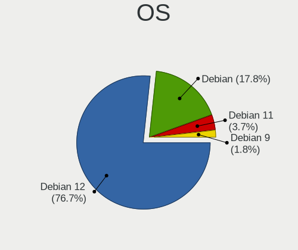
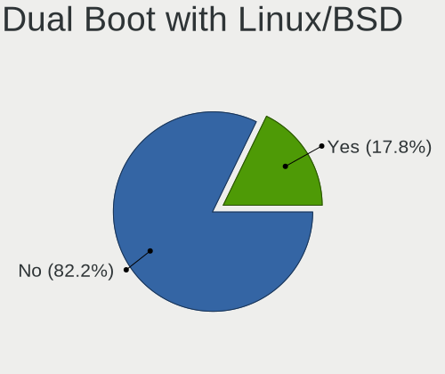
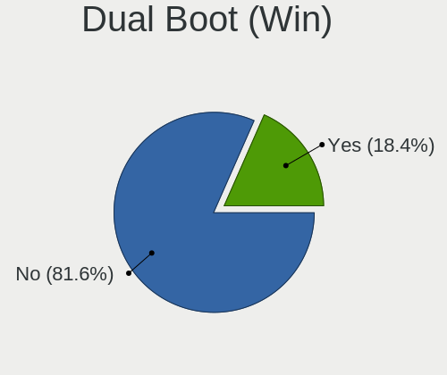
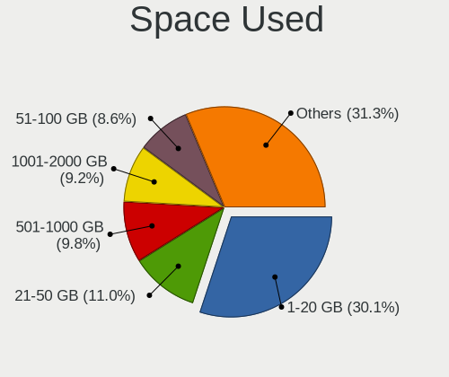
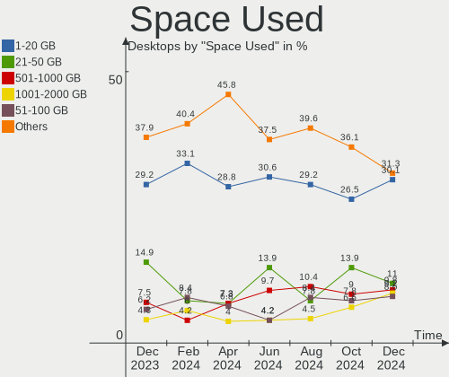
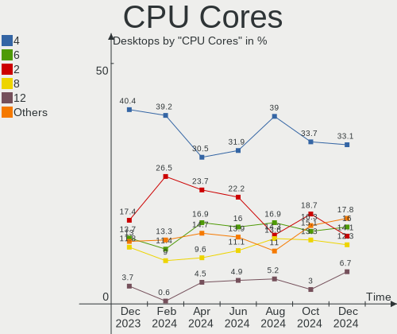

Debian Hardware Trends (Desktop)
--------------------------------

A project to identify most popular hardware characteristics and track their change
over time based on data collected by Debian users at https://Linux-Hardware.org.

Anyone can contribute to the study by uploading probes of their computers by
the [hw-probe](https://github.com/linuxhw/hw-probe) tool:

    sudo hw-probe -all -upload

Full-feature report is available here: https://linux-hardware.org/?view=trends&formfactor=desktop

Period: Mar, 2020.

Contents
--------

- [ OS                       ](#os)
- [ OS Family                ](#os-family)
- [ Kernel                   ](#kernel)
- [ Kernel Family            ](#kernel-family)
- [ Kernel Major Ver.        ](#kernel-major-ver)
- [ Arch                     ](#arch)
- [ DE                       ](#de)
- [ Display Server           ](#display-server)
- [ OS Lang                  ](#os-lang)
- [ Boot Mode                ](#boot-mode)
- [ Filesystem               ](#filesystem)
- [ Dual Boot with Linux     ](#dual-boot-with-linux)
- [ Dual Boot (Win)          ](#dual-boot-win)
- [ Country                  ](#country)
- [ City                     ](#city)
- [ Vendor                   ](#vendor)
- [ Model                    ](#model)
- [ Model Family             ](#model-family)
- [ MFG Year                 ](#mfg-year)
- [ Form Factor              ](#form-factor)
- [ Secure Boot              ](#secure-boot)
- [ Coreboot                 ](#coreboot)
- [ RAM Size                 ](#ram-size)
- [ RAM Used                 ](#ram-used)
- [ Drive Vendor             ](#drive-vendor)
- [ Drive Model              ](#drive-model)
- [ Drive Kind               ](#drive-kind)
- [ Drive Connector          ](#drive-connector)
- [ Drive Size               ](#drive-size)
- [ Space Total              ](#space-total)
- [ Space Used               ](#space-used)
- [ Malfunc. Drives          ](#malfunc-drives)
- [ Malfunc. Drive Vendor    ](#malfunc-drive-vendor)
- [ Malfunc. Drive Kind      ](#malfunc-drive-kind)
- [ Failed Drives            ](#failed-drives)
- [ Failed Drive Vendor      ](#failed-drive-vendor)
- [ Drive Status             ](#drive-status)
- [ Storage Vendor           ](#storage-vendor)
- [ Storage Model            ](#storage-model)
- [ Storage Kind             ](#storage-kind)
- [ CPU Vendor               ](#cpu-vendor)
- [ CPU Model                ](#cpu-model)
- [ CPU Model Family         ](#cpu-model-family)
- [ CPU Cores                ](#cpu-cores)
- [ CPU Sockets              ](#cpu-sockets)
- [ CPU Threads              ](#cpu-threads)
- [ CPU Op-Modes             ](#cpu-op-modes)
- [ CPU Microarch            ](#cpu-microarch)
- [ CPU Microcode            ](#cpu-microcode)
- [ GPU Vendor               ](#gpu-vendor)
- [ GPU Model                ](#gpu-model)
- [ GPU Combo                ](#gpu-combo)
- [ GPU Driver               ](#gpu-driver)
- [ GPU Memory               ](#gpu-memory)
- [ Monitor Vendor           ](#monitor-vendor)
- [ Monitor Model            ](#monitor-model)
- [ Monitor Resolution       ](#monitor-resolution)
- [ Monitor Diagonal         ](#monitor-diagonal)
- [ Monitor Width            ](#monitor-width)
- [ Aspect Ratio             ](#aspect-ratio)
- [ Monitor Area             ](#monitor-area)
- [ Pixel Density            ](#pixel-density)
- [ Multiple Monitors        ](#multiple-monitors)
- [ Net Controller Vendor    ](#net-controller-vendor)
- [ Net Controller Model     ](#net-controller-model)
- [ Net Controller Kind      ](#net-controller-kind)
- [ Used Controller          ](#used-controller)
- [ NICs                     ](#nics)
- [ Unsupported Devices      ](#unsupported-devices)
- [ Unsupported Device Types ](#unsupported-device-types)

OS
--

Installed operating systems

| Name                    | Computers | Percent |
|-------------------------|-----------|---------|
| Debian 10               | 18        | 60%     |
| Debian Testing          | 6         | 20%     |
| Debian Unstable         | 2         | 6.67%   |
| Debian                  | 2         | 6.67%   |
| Debian Testing/unstable | 1         | 3.33%   |
| Debian 9.12             | 1         | 3.33%   |

OS Family
---------

OS without a version

| Name   | Computers | Percent |
|--------|-----------|---------|
| Debian | 30        | 100%    |

Kernel
------

Version of the Linux kernel

| Version                  | Computers | Percent |
|--------------------------|-----------|---------|
| 4.19.0-8-amd64           | 11        | 36.67%  |
| 5.4.0-4-amd64            | 7         | 23.33%  |
| 4.9.0-12-amd64           | 2         | 6.67%   |
| 4.19.0-6-amd64           | 2         | 6.67%   |
| 5.5.0-5.1-liquorix-amd64 | 1         | 3.33%   |
| 5.4.0-0.bpo.3-amd64      | 1         | 3.33%   |
| 5.3.6-050306-generic     | 1         | 3.33%   |
| 5.3.18-3-pve             | 1         | 3.33%   |
| 5.3.18-2-pve             | 1         | 3.33%   |
| 5.0.7-rt5avl1            | 1         | 3.33%   |
| 4.9.0-8-amd64            | 1         | 3.33%   |
| 4.19.112                 | 1         | 3.33%   |

Kernel Family
-------------

Linux kernel without a distro release

| Version  | Computers | Percent |
|----------|-----------|---------|
| 4.19.0   | 13        | 43.33%  |
| 5.4.0    | 8         | 26.67%  |
| 4.9.0    | 3         | 10%     |
| 5.3.18   | 2         | 6.67%   |
| 5.5.0    | 1         | 3.33%   |
| 5.3.6    | 1         | 3.33%   |
| 5.0.7    | 1         | 3.33%   |
| 4.19.112 | 1         | 3.33%   |

Kernel Major Ver.
-----------------

Linux kernel major version

| Version | Computers | Percent |
|---------|-----------|---------|
| 4.19    | 14        | 46.67%  |
| 5.4     | 8         | 26.67%  |
| 5.3     | 3         | 10%     |
| 4.9     | 3         | 10%     |
| 5.5     | 1         | 3.33%   |
| 5.0     | 1         | 3.33%   |

Arch
----

OS architecture (x86_64, i586, etc.)

| Name   | Computers | Percent |
|--------|-----------|---------|
| x86_64 | 29        | 96.67%  |
| i686   | 1         | 3.33%   |

DE
--

Desktop Environment

| Name          | Computers | Percent |
|---------------|-----------|---------|
| XFCE          | 7         | 23.33%  |
| LXQt          | 6         | 20%     |
| KDE           | 5         | 16.67%  |
| Unknown       | 4         | 13.33%  |
| X-Cinnamon    | 2         | 6.67%   |
| GNOME         | 2         | 6.67%   |
| MATE          | 1         | 3.33%   |
| KDE5          | 1         | 3.33%   |
| GNOME Classic | 1         | 3.33%   |
| Cinnamon      | 1         | 3.33%   |

Display Server
--------------

X11 or Wayland

| Name    | Computers | Percent |
|---------|-----------|---------|
| X11     | 27        | 90%     |
| Tty     | 2         | 6.67%   |
| Wayland | 1         | 3.33%   |

OS Lang
-------

Language

| Lang       | Computers | Percent |
|------------|-----------|---------|
| en_US      | 10        | 33.33%  |
| Unknown    | 7         | 23.33%  |
| ru_RU      | 5         | 16.67%  |
| pt_BR      | 1         | 3.33%   |
| it_IT      | 1         | 3.33%   |
| fr_FR      | 1         | 3.33%   |
| es_ES      | 1         | 3.33%   |
| es_AR      | 1         | 3.33%   |
| en_GB      | 1         | 3.33%   |
| de_DE.utf8 | 1         | 3.33%   |
| ar_EG      | 1         | 3.33%   |

Boot Mode
---------

EFI or BIOS

| Mode | Computers | Percent |
|------|-----------|---------|
| BIOS | 25        | 83.33%  |
| EFI  | 5         | 16.67%  |

Filesystem
----------

Type of filesystem

| Type  | Computers | Percent |
|-------|-----------|---------|
| Ext4  | 29        | 96.67%  |
| Btrfs | 1         | 3.33%   |

Dual Boot with Linux
--------------------

Hosting more than one Linux

| Dual boot | Computers | Percent |
|-----------|-----------|---------|
| No        | 26        | 86.67%  |
| Yes       | 4         | 13.33%  |

Dual Boot (Win)
---------------

Hosting Linux and Windows

| Dual boot | Computers | Percent |
|-----------|-----------|---------|
| No        | 29        | 96.67%  |
| Yes       | 1         | 3.33%   |

Country
-------

Geographic location (country)

| Country     | Computers | Percent |
|-------------|-----------|---------|
| Russia      | 7         | 23.33%  |
| Italy       | 6         | 20%     |
| USA         | 5         | 16.67%  |
| Germany     | 4         | 13.33%  |
| Taiwan      | 1         | 3.33%   |
| Spain       | 1         | 3.33%   |
| Slovakia    | 1         | 3.33%   |
| Netherlands | 1         | 3.33%   |
| France      | 1         | 3.33%   |
| Egypt       | 1         | 3.33%   |
| Brazil      | 1         | 3.33%   |
| Argentina   | 1         | 3.33%   |

City
----

Geographic location (city)

| City             | Computers | Percent |
|------------------|-----------|---------|
| Chiusi           | 5         | 16.67%  |
| Vsevolozhsk      | 1         | 3.33%   |
| Voronezh         | 1         | 3.33%   |
| Taoyuan District | 1         | 3.33%   |
| Piove di Sacco   | 1         | 3.33%   |
| Onalaska         | 1         | 3.33%   |
| Nuremberg        | 1         | 3.33%   |
| Novosibirsk      | 1         | 3.33%   |
| Málaga          | 1         | 3.33%   |
| Moscow           | 1         | 3.33%   |
| Michalovce       | 1         | 3.33%   |
| Mesa             | 1         | 3.33%   |
| Maua             | 1         | 3.33%   |
| Kirov            | 1         | 3.33%   |
| Kaiserslautern   | 1         | 3.33%   |
| Izhevsk          | 1         | 3.33%   |
| Hurlingham       | 1         | 3.33%   |
| Halle            | 1         | 3.33%   |
| Chenoa           | 1         | 3.33%   |
| Cairo            | 1         | 3.33%   |
| Bowling Green    | 1         | 3.33%   |
| Berlin           | 1         | 3.33%   |
| Belovo           | 1         | 3.33%   |
| Assen            | 1         | 3.33%   |
| Ashburn          | 1         | 3.33%   |
| Alfortville      | 1         | 3.33%   |

Vendor
------

Motherboard manufacturer

| Name                | Computers | Percent |
|---------------------|-----------|---------|
| ASUSTek Computer    | 9         | 30%     |
| Gigabyte Technology | 4         | 13.33%  |
| Dell                | 4         | 13.33%  |
| ASRock              | 4         | 13.33%  |
| MSI                 | 3         | 10%     |
| Quanta              | 1         | 3.33%   |
| Onda technology     | 1         | 3.33%   |
| Intel               | 1         | 3.33%   |
| Huanan              | 1         | 3.33%   |
| Hewlett-Packard     | 1         | 3.33%   |
| Biostar             | 1         | 3.33%   |

Model
-----

Motherboard model

| Name                        | Computers | Percent |
|-----------------------------|-----------|---------|
| Dell OptiPlex 390           | 4         | 13.33%  |
| Quanta 120-1333w            | 1         | 3.33%   |
| Onda technology A68V+       | 1         | 3.33%   |
| MSI MS-7B89                 | 1         | 3.33%   |
| MSI MS-7A34                 | 1         | 3.33%   |
| MSI MS-7522                 | 1         | 3.33%   |
| Intel DH87RL AAG74240-402   | 1         | 3.33%   |
| Huanan X99-TF               | 1         | 3.33%   |
| HP Compaq 8100 Elite SFF PC | 1         | 3.33%   |
| Gigabyte C1037UN-EU         | 1         | 3.33%   |
| Gigabyte B360 HD3P-LM       | 1         | 3.33%   |
| Gigabyte AX370-Gaming 5     | 1         | 3.33%   |
| Gigabyte 945GCM-S2L         | 1         | 3.33%   |
| Biostar X370GTN             | 1         | 3.33%   |
| ASUS SABERTOOTH X79         | 1         | 3.33%   |
| ASUS PRIME B350-PLUS        | 1         | 3.33%   |
| ASUS P6X58D-E               | 1         | 3.33%   |
| ASUS P5KPL-C                | 1         | 3.33%   |
| ASUS M4A78 PRO              | 1         | 3.33%   |
| ASUS M2N68-AM Plus          | 1         | 3.33%   |
| ASUS GN573AA-ABA SR5223WM   | 1         | 3.33%   |
| ASUS F1A75-M LE             | 1         | 3.33%   |
| ASUS A55BM-A/USB3           | 1         | 3.33%   |
| ASRock H81M-HDS             | 1         | 3.33%   |
| ASRock H61M-DGS             | 1         | 3.33%   |
| ASRock FM2A88M Extreme4+    | 1         | 3.33%   |
| ASRock B450M Pro4           | 1         | 3.33%   |

Model Family
------------

Motherboard model prefix

| Name                  | Computers | Percent |
|-----------------------|-----------|---------|
| Dell OptiPlex         | 4         | 13.33%  |
| Quanta 120-1333w      | 1         | 3.33%   |
| Onda technology A68V+ | 1         | 3.33%   |
| MSI MS-7B89           | 1         | 3.33%   |
| MSI MS-7A34           | 1         | 3.33%   |
| MSI MS-7522           | 1         | 3.33%   |
| Intel DH87RL          | 1         | 3.33%   |
| Huanan X99-TF         | 1         | 3.33%   |
| HP Compaq             | 1         | 3.33%   |
| Gigabyte C1037UN-EU   | 1         | 3.33%   |
| Gigabyte B360         | 1         | 3.33%   |
| Gigabyte AX370-Gaming | 1         | 3.33%   |
| Gigabyte 945GCM-S2L   | 1         | 3.33%   |
| Biostar X370GTN       | 1         | 3.33%   |
| ASUS SABERTOOTH       | 1         | 3.33%   |
| ASUS PRIME            | 1         | 3.33%   |
| ASUS P6X58D-E         | 1         | 3.33%   |
| ASUS P5KPL-C          | 1         | 3.33%   |
| ASUS M4A78            | 1         | 3.33%   |
| ASUS M2N68-AM         | 1         | 3.33%   |
| ASUS GN573AA-ABA      | 1         | 3.33%   |
| ASUS F1A75-M          | 1         | 3.33%   |
| ASUS A55BM-A          | 1         | 3.33%   |
| ASRock H81M-HDS       | 1         | 3.33%   |
| ASRock H61M-DGS       | 1         | 3.33%   |
| ASRock FM2A88M        | 1         | 3.33%   |
| ASRock B450M          | 1         | 3.33%   |

MFG Year
--------

Motherboard manufacture year

| Year | Computers | Percent |
|------|-----------|---------|
| 2019 | 7         | 23.33%  |
| 2011 | 5         | 16.67%  |
| 2016 | 3         | 10%     |
| 2013 | 3         | 10%     |
| 2012 | 3         | 10%     |
| 2007 | 3         | 10%     |
| 2014 | 2         | 6.67%   |
| 2010 | 2         | 6.67%   |
| 2017 | 1         | 3.33%   |
| 2009 | 1         | 3.33%   |

Form Factor
-----------

Physical design of the computer

| Name    | Computers | Percent |
|---------|-----------|---------|
| Desktop | 30        | 100%    |

Secure Boot
-----------

Enabled or disabled

| State    | Computers | Percent |
|----------|-----------|---------|
| Disabled | 30        | 100%    |

Coreboot
--------

Have coreboot on board

| Used | Computers | Percent |
|------|-----------|---------|
| No   | 30        | 100%    |

RAM Size
--------

Total RAM memory

| Size in GB  | Computers | Percent |
|-------------|-----------|---------|
| 8.01-16.0   | 8         | 26.67%  |
| 3.01-4.0    | 7         | 23.33%  |
| 32.01-64.0  | 4         | 13.33%  |
| 16.01-24.0  | 4         | 13.33%  |
| 4.01-8.0    | 2         | 6.67%   |
| 2.01-3.0    | 2         | 6.67%   |
| 64.01-256.0 | 2         | 6.67%   |
| 24.01-32.0  | 1         | 3.33%   |

RAM Used
--------

Used RAM memory

| Used GB    | Computers | Percent |
|------------|-----------|---------|
| 1.01-2.0   | 11        | 36.67%  |
| 2.01-3.0   | 8         | 26.67%  |
| 4.01-8.0   | 6         | 20%     |
| 3.01-4.0   | 2         | 6.67%   |
| 16.01-24.0 | 2         | 6.67%   |
| 8.01-16.0  | 1         | 3.33%   |

Drive Vendor
------------

Hard drive vendors

| Vendor              | Computers | Drives  | Percent |
|---------------------|-----------|---------|---------|
| WDC                 | 13        | 15      | 24.07%  |
| Seagate             | 9         | 9       | 16.67%  |
| Kingston            | 5         | 5       | 9.26%   |
| Toshiba             | 4         | 4       | 7.41%   |
| Samsung Electronics | 4         | 5       | 7.41%   |
| Intel               | 3         | 3       | 5.56%   |
| A-DATA Technology   | 3         | 3       | 5.56%   |
| SanDisk             | 2         | 3       | 3.7%    |
| Zheino              | 1         | 1       | 1.85%   |
| SPCC                | 1         | 1       | 1.85%   |
| OCZ                 | 1         | 1       | 1.85%   |
| Netac               | 1         | 1       | 1.85%   |
| Micron Technology   | 1         | 1       | 1.85%   |
| MAXTOR              | 1         | 1       | 1.85%   |
| KingDian            | 1         | 1       | 1.85%   |
| Hitachi             | 1         | 1       | 1.85%   |
| Hewlett-Packard     | 1         | Unknown | 1.85%   |
| Crucial             | 1         | 1       | 1.85%   |
| Corsair             | 1         | 1       | 1.85%   |

Drive Model
-----------

Hard drive models

| Model                      | Computers | Percent |
|----------------------------|-----------|---------|
| ST3250312AS 250GB          | 4         | 7.02%   |
| SUV400S37240G 240GB SSD    | 2         | 3.51%   |
| WDS250G2X0C-00L350 250GB   | 1         | 1.75%   |
| WD5000ABYS-01TNA0 500GB    | 1         | 1.75%   |
| WD40EZRZ-00GXCB0 4TB       | 1         | 1.75%   |
| WD40EFRX-68N32N0 4TB       | 1         | 1.75%   |
| WD30EZRX-00D8PB0 3TB       | 1         | 1.75%   |
| WD2500AAKX-75U6AA0 250GB   | 1         | 1.75%   |
| WD20EFRX-68EUZN0 2TB       | 1         | 1.75%   |
| WD20EARX-00PASB0 2TB       | 1         | 1.75%   |
| WD1600AAJS-22WAA0 160GB    | 1         | 1.75%   |
| WD15EADS-00P8B0 1TB        | 1         | 1.75%   |
| WD10EZEX-00BN5A0 1TB       | 1         | 1.75%   |
| WD10EARX-00N0YB0 1TB       | 1         | 1.75%   |
| WD10EADS-00M2B0 1TB        | 1         | 1.75%   |
| WD1002FAEX-00Z3A0 1TB      | 1         | 1.75%   |
| WD1001FALS-00J7B0 1TB      | 1         | 1.75%   |
| VERTEX3 96GB SSD           | 1         | 1.75%   |
| Ultra II 960GB SSD         | 1         | 1.75%   |
| Ultra II 480GB SSD         | 1         | 1.75%   |
| TR150 960GB SSD            | 1         | 1.75%   |
| SX8200PNP 1TB              | 1         | 1.75%   |
| SV300S37A60G 64GB SSD      | 1         | 1.75%   |
| SV300S37A 240G SSD         | 1         | 1.75%   |
| SU800 256GB SSD            | 1         | 1.75%   |
| STM3250310AS 250GB         | 1         | 1.75%   |
| ST4000VN008-2DR166 4TB     | 1         | 1.75%   |
| ST3500418AS 500GB          | 1         | 1.75%   |
| ST3250410AS 250GB          | 1         | 1.75%   |
| ST1000DM010-2EP102 1TB     | 1         | 1.75%   |
| ST1000DM003-1CH162 1TB     | 1         | 1.75%   |
| SSDSC2BW240H6 240GB        | 1         | 1.75%   |
| SSDSC2BW120A4 120GB        | 1         | 1.75%   |
| SSDPEKKW128G8 128GB        | 1         | 1.75%   |
| SSD 850 EVO 500GB          | 1         | 1.75%   |
| SSD 720GB                  | 1         | 1.75%   |
| SP920SS 128GB SSD          | 1         | 1.75%   |
| SDSSDH31024G 1TB           | 1         | 1.75%   |
| SA400S37120G 120GB SSD     | 1         | 1.75%   |
| S400 480GB SSD             | 1         | 1.75%   |
| MZVLB1T0HALR-00000 1TB     | 1         | 1.75%   |
| M.2 PCIe SSD 512GB         | 1         | 1.75%   |
| HDS721050CLA660 500GB      | 1         | 1.75%   |
| HD204UI 2TB                | 1         | 1.75%   |
| HD103SJ 1TB                | 1         | 1.75%   |
| Force MP510 960GB          | 1         | 1.75%   |
| DVD RW AD-7251H5 1GB       | 1         | 1.75%   |
| DT01ACA200 2TB             | 1         | 1.75%   |
| DT01ACA050 500GB           | 1         | 1.75%   |
| DT01ABA300 3TB             | 1         | 1.75%   |
| CT120BX500SSD1 120GB       | 1         | 1.75%   |
| CHN 25SATAA3 120 120GB     | 1         | 1.75%   |
| 1100_MTFDDAK2T0TBN 2TB SSD | 1         | 1.75%   |

Drive Kind
----------

HDD or SSD

| Kind    | Computers | Drives | Percent |
|---------|-----------|--------|---------|
| HDD     | 22        | 30     | 51.16%  |
| SSD     | 13        | 19     | 30.23%  |
| NVMe    | 6         | 7      | 13.95%  |
| Unknown | 2         | 1      | 4.65%   |

Drive Connector
---------------

SATA, SAS, NVMe, etc.

| Type | Computers | Drives  | Percent |
|------|-----------|---------|---------|
| SATA | 27        | 50      | 79.41%  |
| NVMe | 6         | 7       | 17.65%  |
| SAS  | 1         | Unknown | 2.94%   |

Drive Size
----------

Size of hard drive

| Size in TB | Computers | Drives | Percent |
|------------|-----------|--------|---------|
| 0.01-0.5   | 22        | 29     | 50%     |
| 0.51-1.0   | 12        | 15     | 27.27%  |
| 1.01-2.0   | 6         | 8      | 13.64%  |
| 3.01-4.0   | 2         | 3      | 4.55%   |
| 2.01-3.0   | 2         | 2      | 4.55%   |

Space Total
-----------

Amount of disk space available on the file system

| Size in GB     | Computers | Percent |
|----------------|-----------|---------|
| 501-1000       | 6         | 20%     |
| 1-20           | 5         | 16.67%  |
| More than 3000 | 4         | 13.33%  |
| 251-500        | 3         | 10%     |
| 101-250        | 3         | 10%     |
| 51-100         | 3         | 10%     |
| Unknown        | 3         | 10%     |
| 1001-2000      | 2         | 6.67%   |
| 21-50          | 1         | 3.33%   |

Space Used
----------

Amount of used disk space

| Used GB        | Computers | Percent |
|----------------|-----------|---------|
| 1-20           | 11        | 36.67%  |
| 101-250        | 4         | 13.33%  |
| 21-50          | 3         | 10%     |
| Unknown        | 3         | 10%     |
| 1001-2000      | 2         | 6.67%   |
| 501-1000       | 2         | 6.67%   |
| 51-100         | 2         | 6.67%   |
| More than 3000 | 1         | 3.33%   |
| 251-500        | 1         | 3.33%   |
| 2001-3000      | 1         | 3.33%   |

Malfunc. Drives
---------------

Drive models with a malfunction

| Model               | Computers | Drives | Percent |
|---------------------|-----------|--------|---------|
| WD10EADS-00M2B0 1TB | 1         | 1      | 100%    |

Malfunc. Drive Vendor
---------------------

Vendors of faulty drives

| Vendor | Computers | Drives | Percent |
|--------|-----------|--------|---------|
| WDC    | 1         | 1      | 100%    |

Malfunc. Drive Kind
-------------------

Kinds of faulty drives

| Kind | Computers | Drives | Percent |
|------|-----------|--------|---------|
| HDD  | 1         | 1      | 100%    |

Failed Drives
-------------

Failed drive models

Zero info for selected period =(

Failed Drive Vendor
-------------------

Failed drive vendors

Zero info for selected period =(

Drive Status
------------

Number of failed and malfunc. drives

| Status   | Computers | Drives | Percent |
|----------|-----------|--------|---------|
| Works    | 16        | 33     | 51.61%  |
| Detected | 14        | 23     | 45.16%  |
| Malfunc  | 1         | 1      | 3.23%   |

Storage Vendor
--------------

Storage controller vendors

| Vendor                       | Computers | Percent |
|------------------------------|-----------|---------|
| Intel                        | 17        | 38.64%  |
| AMD                          | 12        | 27.27%  |
| Marvell Technology Group     | 4         | 9.09%   |
| Samsung Electronics          | 2         | 4.55%   |
| Phison Electronics           | 2         | 4.55%   |
| Nvidia                       | 2         | 4.55%   |
| Toshiba America Info Systems | 1         | 2.27%   |
| Sandisk                      | 1         | 2.27%   |
| JMicron Technology           | 1         | 2.27%   |
| ASMedia Technology           | 1         | 2.27%   |
| ADATA Technology             | 1         | 2.27%   |

Storage Model
-------------

Storage controller models

| Model                                                                             | Computers | Percent |
|-----------------------------------------------------------------------------------|-----------|---------|
| FCH SATA Controller [AHCI mode]                                                   | 9         | 14.75%  |
| 6 Series/C200 Series Chipset Family Desktop SATA Controller (IDE mode, ports 4-5) | 4         | 6.56%   |
| 6 Series/C200 Series Chipset Family Desktop SATA Controller (IDE mode, ports 0-3) | 4         | 6.56%   |
| FCH IDE Controller                                                                | 3         | 4.92%   |
| X370 Series Chipset SATA Controller                                               | 2         | 3.28%   |
| NVMe SSD Controller SM981/PM981/PM983                                             | 2         | 3.28%   |
| NM10/ICH7 Family SATA Controller [IDE mode]                                       | 2         | 3.28%   |
| MCP61 SATA Controller                                                             | 2         | 3.28%   |
| MCP61 IDE                                                                         | 2         | 3.28%   |
| E12 NVMe Controller                                                               | 2         | 3.28%   |
| 88SE9123 PCIe SATA 6.0 Gb/s controller                                            | 2         | 3.28%   |
| 82801JI (ICH10 Family) SATA AHCI Controller                                       | 2         | 3.28%   |
| 8 Series/C220 Series Chipset Family 6-port SATA Controller 1 [AHCI mode]          | 2         | 3.28%   |
| 400 Series Chipset SATA Controller                                                | 2         | 3.28%   |
| 300 Series Chipset SATA Controller                                                | 2         | 3.28%   |
| XPG SX8200 Pro PCIe Gen3x4 M.2 2280 Solid State Drive                             | 1         | 1.64%   |
| XG4 NVMe SSD Controller                                                           | 1         | 1.64%   |
| WD Black 2018/PC SN720 NVMe SSD                                                   | 1         | 1.64%   |
| SSD Pro 7600p/760p/E 6100p Series                                                 | 1         | 1.64%   |
| SB7x0/SB8x0/SB9x0 SATA Controller [IDE mode]                                      | 1         | 1.64%   |
| SB7x0/SB8x0/SB9x0 SATA Controller [AHCI mode]                                     | 1         | 1.64%   |
| SB7x0/SB8x0/SB9x0 IDE Controller                                                  | 1         | 1.64%   |
| JMB368 IDE controller                                                             | 1         | 1.64%   |
| FCH SATA Controller [IDE mode]                                                    | 1         | 1.64%   |
| Cannon Lake PCH SATA AHCI Controller                                              | 1         | 1.64%   |
| C610/X99 series chipset sSATA Controller [AHCI mode]                              | 1         | 1.64%   |
| C600/X79 series chipset 6-Port SATA AHCI Controller                               | 1         | 1.64%   |
| ASM1062 Serial ATA Controller                                                     | 1         | 1.64%   |
| 92xx SATA 6G Controller                                                           | 1         | 1.64%   |
| 88SE9128 PCIe SATA 6 Gb/s RAID controller with HyperDuo                           | 1         | 1.64%   |
| 82801G (ICH7 Family) IDE Controller                                               | 1         | 1.64%   |
| 7 Series Chipset Family 6-port SATA Controller [AHCI mode]                        | 1         | 1.64%   |
| 6 Series/C200 Series Chipset Family 6 port Desktop SATA AHCI Controller           | 1         | 1.64%   |
| 5 Series/3400 Series Chipset 6 port SATA AHCI Controller                          | 1         | 1.64%   |

Storage Kind
------------

Kind of storage controller (IDE, SATA, NVMe, SAS, ...)

| Kind | Computers | Percent |
|------|-----------|---------|
| SATA | 23        | 52.27%  |
| IDE  | 13        | 29.55%  |
| NVMe | 8         | 18.18%  |

CPU Vendor
----------

Processor vendors

| Vendor | Computers | Percent |
|--------|-----------|---------|
| Intel  | 16        | 53.33%  |
| AMD    | 14        | 46.67%  |

CPU Model
---------

Processor models

| Model                                         | Computers | Percent |
|-----------------------------------------------|-----------|---------|
| Intel Core i5-2400 CPU @ 3.10GHz              | 4         | 13.33%  |
| Intel Xeon CPU X5675 @ 3.07GHz                | 1         | 3.33%   |
| Intel Xeon CPU E5-2678 v3 @ 2.50GHz           | 1         | 3.33%   |
| Intel Core i7-8700 CPU @ 3.20GHz              | 1         | 3.33%   |
| Intel Core i7-3820 CPU @ 3.60GHz              | 1         | 3.33%   |
| Intel Core i7 CPU 950 @ 3.07GHz               | 1         | 3.33%   |
| Intel Core i5-4590 CPU @ 3.30GHz              | 1         | 3.33%   |
| Intel Core i5-4440 CPU @ 3.10GHz              | 1         | 3.33%   |
| Intel Core i5-2310 CPU @ 2.90GHz              | 1         | 3.33%   |
| Intel Core i5 CPU 650 @ 3.20GHz               | 1         | 3.33%   |
| Intel Core 2 Duo CPU E8500 @ 3.16GHz          | 1         | 3.33%   |
| Intel Core 2 Duo CPU E4600 @ 2.40GHz          | 1         | 3.33%   |
| Intel Celeron CPU 1037U @ 1.80GHz             | 1         | 3.33%   |
| AMD Sempron Processor 3600+                   | 1         | 3.33%   |
| AMD Ryzen 7 3700X 8-Core Processor            | 1         | 3.33%   |
| AMD Ryzen 7 2700 Eight-Core Processor         | 1         | 3.33%   |
| AMD Ryzen 7 1700X Eight-Core Processor        | 1         | 3.33%   |
| AMD Ryzen 5 2600X Six-Core Processor          | 1         | 3.33%   |
| AMD Ryzen 5 1600 Six-Core Processor           | 1         | 3.33%   |
| AMD Ryzen 5 1500X Quad-Core Processor         | 1         | 3.33%   |
| AMD E1-1200 APU with Radeon HD Graphics       | 1         | 3.33%   |
| AMD Athlon X4 750 Quad Core Processor         | 1         | 3.33%   |
| AMD Athlon II X2 250 Processor                | 1         | 3.33%   |
| AMD Athlon II X2 240 Processor                | 1         | 3.33%   |
| AMD A8-7600 Radeon R7, 10 Compute Cores 4C+6G | 1         | 3.33%   |
| AMD A4-6300 APU with Radeon HD Graphics       | 1         | 3.33%   |
| AMD A4-3300 APU with Radeon HD Graphics       | 1         | 3.33%   |

CPU Model Family
----------------

Processor model prefix

| Model            | Computers | Percent |
|------------------|-----------|---------|
| Intel Core i5    | 8         | 26.67%  |
| Intel Core i7    | 3         | 10%     |
| AMD Ryzen 7      | 3         | 10%     |
| AMD Ryzen 5      | 3         | 10%     |
| Intel Xeon       | 2         | 6.67%   |
| Intel Core 2 Duo | 2         | 6.67%   |
| AMD Athlon II X2 | 2         | 6.67%   |
| AMD A4           | 2         | 6.67%   |
| Intel Celeron    | 1         | 3.33%   |
| AMD Sempron      | 1         | 3.33%   |
| AMD E1           | 1         | 3.33%   |
| AMD Athlon X4    | 1         | 3.33%   |
| AMD A8           | 1         | 3.33%   |

CPU Cores
---------

Number of processor cores

| Number | Computers | Percent |
|--------|-----------|---------|
| 4      | 10        | 33.33%  |
| 2      | 10        | 33.33%  |
| 6      | 4         | 13.33%  |
| 8      | 3         | 10%     |
| 1      | 2         | 6.67%   |
| 12     | 1         | 3.33%   |

CPU Sockets
-----------

Number of sockets

| Number | Computers | Percent |
|--------|-----------|---------|
| 1      | 30        | 100%    |

CPU Threads
-----------

Threads per core (Hyper-Threading)

| Number | Computers | Percent |
|--------|-----------|---------|
| 2      | 15        | 50%     |
| 1      | 15        | 50%     |

CPU Op-Modes
------------

CPU Operation Modes (32-bit, 64-bit)

| Op mode        | Computers | Percent |
|----------------|-----------|---------|
| 32-bit, 64-bit | 30        | 100%    |

CPU Microarch
-------------

Microarchitecture

| Name        | Computers | Percent |
|-------------|-----------|---------|
| SandyBridge | 6         | 20%     |
| Zen         | 3         | 10%     |
| Haswell     | 3         | 10%     |
| Zen+        | 2         | 6.67%   |
| Westmere    | 2         | 6.67%   |
| Piledriver  | 2         | 6.67%   |
| K10         | 2         | 6.67%   |
| Zen 2       | 1         | 3.33%   |
| Steamroller | 1         | 3.33%   |
| Skylake     | 1         | 3.33%   |
| Penryn      | 1         | 3.33%   |
| Nehalem     | 1         | 3.33%   |
| K8 Hammer   | 1         | 3.33%   |
| K10 Llano   | 1         | 3.33%   |
| IvyBridge   | 1         | 3.33%   |
| Core        | 1         | 3.33%   |
| Bobcat      | 1         | 3.33%   |

CPU Microcode
-------------

Microcode number

| Number     | Computers | Percent |
|------------|-----------|---------|
| Unknown    | 11        | 36.67%  |
| 0x206a7    | 5         | 16.67%  |
| 0x08001138 | 2         | 6.67%   |
| 0x06001119 | 2         | 6.67%   |
| 0x906ea    | 1         | 3.33%   |
| 0x6fd      | 1         | 3.33%   |
| 0x306f2    | 1         | 3.33%   |
| 0x306c3    | 1         | 3.33%   |
| 0x206d7    | 1         | 3.33%   |
| 0x0800820d | 1         | 3.33%   |
| 0x08001129 | 1         | 3.33%   |
| 0x06003106 | 1         | 3.33%   |
| 0x05000119 | 1         | 3.33%   |
| 0x03000027 | 1         | 3.33%   |

GPU Vendor
----------

Vendors of graphics cards

| Vendor | Computers | Percent |
|--------|-----------|---------|
| AMD    | 12        | 38.71%  |
| Nvidia | 10        | 32.26%  |
| Intel  | 9         | 29.03%  |

GPU Model
---------

Graphics card models

| Model                                                                 | Computers | Percent |
|-----------------------------------------------------------------------|-----------|---------|
| 2nd Generation Core Processor Family Integrated Graphics Controller   | 5         | 16.13%  |
| GK208B [GeForce GT 710]                                               | 2         | 6.45%   |
| Ellesmere [Radeon RX 470/480/570/570X/580/580X/590]                   | 2         | 6.45%   |
| Xeon E3-1200 v3/4th Gen Core Processor Integrated Graphics Controller | 1         | 3.23%   |
| Wrestler [Radeon HD 7310]                                             | 1         | 3.23%   |
| UHD Graphics 630 (Desktop)                                            | 1         | 3.23%   |
| SuperSumo [Radeon HD 6410D]                                           | 1         | 3.23%   |
| Richland [Radeon HD 8370D]                                            | 1         | 3.23%   |
| Redwood LE [Radeon HD 5550/5570/5630/6390/6490/7570]                  | 1         | 3.23%   |
| Park [Mobility Radeon HD 5430]                                        | 1         | 3.23%   |
| Kaveri [Radeon R7 Graphics]                                           | 1         | 3.23%   |
| GT218 [GeForce G210]                                                  | 1         | 3.23%   |
| GP108 [GeForce GT 1030]                                               | 1         | 3.23%   |
| GM107 [GeForce GTX 750 Ti]                                            | 1         | 3.23%   |
| GK208B [GeForce GT 730]                                               | 1         | 3.23%   |
| GK106 [GeForce GTX 650 Ti Boost]                                      | 1         | 3.23%   |
| GK104 [GeForce GTX 660 Ti]                                            | 1         | 3.23%   |
| G92 [GeForce 9800 GT]                                                 | 1         | 3.23%   |
| Curacao XT / Trinidad XT [Radeon R7 370 / R9 270X/370X]               | 1         | 3.23%   |
| Core Processor Integrated Graphics Controller                         | 1         | 3.23%   |
| Caicos [Radeon HD 6450/7450/8450 / R5 230 OEM]                        | 1         | 3.23%   |
| Caicos PRO [Radeon HD 7450]                                           | 1         | 3.23%   |
| C61 [GeForce 6150SE nForce 430]                                       | 1         | 3.23%   |
| Baffin [Radeon RX 550 640SP / RX 560/560X]                            | 1         | 3.23%   |
| 3rd Gen Core processor Graphics Controller                            | 1         | 3.23%   |

GPU Combo
---------

Combinations of graphics cards

| Name       | Computers | Percent |
|------------|-----------|---------|
| 1 x AMD    | 12        | 40%     |
| 1 x Nvidia | 10        | 33.33%  |
| 1 x Intel  | 8         | 26.67%  |

GPU Driver
----------

Free vs proprietary

| Driver      | Computers | Percent |
|-------------|-----------|---------|
| Free        | 21        | 70%     |
| Proprietary | 7         | 23.33%  |
| Unknown     | 2         | 6.67%   |

GPU Memory
----------

Total video memory

| Size in GB | Computers | Percent |
|------------|-----------|---------|
| Unknown    | 14        | 46.67%  |
| 0.51-1.0   | 7         | 23.33%  |
| 1.01-2.0   | 5         | 16.67%  |
| 0.01-0.5   | 2         | 6.67%   |
| 7.01-8.0   | 1         | 3.33%   |
| 3.01-4.0   | 1         | 3.33%   |

Monitor Vendor
--------------

Monitor vendors

| Vendor              | Computers | Percent |
|---------------------|-----------|---------|
| Philips             | 6         | 18.18%  |
| Goldstar            | 6         | 18.18%  |
| Samsung Electronics | 4         | 12.12%  |
| Dell                | 3         | 9.09%   |
| Iiyama              | 2         | 6.06%   |
| Hewlett-Packard     | 2         | 6.06%   |
| Acer                | 2         | 6.06%   |
| Targa Visionary     | 1         | 3.03%   |
| MStar               | 1         | 3.03%   |
| Medion              | 1         | 3.03%   |
| LTM                 | 1         | 3.03%   |
| BenQ                | 1         | 3.03%   |
| AUS                 | 1         | 3.03%   |
| AOC                 | 1         | 3.03%   |
| AGO                 | 1         | 3.03%   |

Monitor Model
-------------

Monitor models

| Model                                              | Computers | Percent |
|----------------------------------------------------|-----------|---------|
| 190SW PHL086D 1440x900 408x255mm 18.9-inch         | 5         | 13.89%  |
| LCD Monitor SyncMaster                             | 2         | 5.56%   |
| X223W ACR0009 1680x1050 473x296mm 22.0-inch        | 1         | 2.78%   |
| Ultra HD GSM5B09 3840x2160 600x340mm 27.2-inch     | 1         | 2.78%   |
| SyncMaster SAM0587 1920x1200 518x324mm 24.1-inch   | 1         | 2.78%   |
| SyncMaster SAM0027 1280x1024 320x240mm 15.7-inch   | 1         | 2.78%   |
| SMB2430H SAM064D 1920x1080 531x299mm 24.0-inch     | 1         | 2.78%   |
| S22D300 SAM0B3E 1920x1080 477x268mm 21.5-inch      | 1         | 2.78%   |
| PL2730H IVM663B 1920x1080 598x336mm 27.0-inch      | 1         | 2.78%   |
| P2414H DELA09A 1920x1080 527x297mm 23.8-inch       | 1         | 2.78%   |
| P1914S DELF04A 1280x1024 376x301mm 19.0-inch       | 1         | 2.78%   |
| Monitor TAR0C35 1280x1024                          | 1         | 2.78%   |
| MD 20165 MED3623 1920x1080 478x269mm 21.6-inch     | 1         | 2.78%   |
| LG ULTRAWIDE GSM59F1 1920x1080 580x240mm 24.7-inch | 1         | 2.78%   |
| LCD_VGA LTM0659 1024x768 880x500mm 39.8-inch       | 1         | 2.78%   |
| LCD Monitor VP249 1920x1080                        | 1         | 2.78%   |
| LCD Monitor T954we 1360x768                        | 1         | 2.78%   |
| LCD Monitor E910 1280x1024                         | 1         | 2.78%   |
| LCD Monitor E178FP 2880x1200                       | 1         | 2.78%   |
| LCD Monitor Demo 1920x1080                         | 1         | 2.78%   |
| LCD Monitor AGO0001 1920x1080 300x230mm 14.9-inch  | 1         | 2.78%   |
| LCD Monitor 2560x1024                              | 1         | 2.78%   |
| KA220HQ ACR0467 1920x1080 477x268mm 21.5-inch      | 1         | 2.78%   |
| HM204DA/DTA IVM216A 2048x1536 395x295mm 19.4-inch  | 1         | 2.78%   |
| FULL HD GSM5B54 1920x1080 480x270mm 21.7-inch      | 1         | 2.78%   |
| All-in-One HWP4218 1600x900 443x249mm 20.0-inch    | 1         | 2.78%   |
| 27o HPN342B 1920x1080 600x340mm 27.2-inch          | 1         | 2.78%   |
| 24MP55 GSM5A20 1920x1080 510x290mm 23.1-inch       | 1         | 2.78%   |
| 241BLPY PHL08B3 1920x1080 531x299mm 24.0-inch      | 1         | 2.78%   |
| 23EA53 GSM59A8 1680x1050 510x290mm 23.1-inch       | 1         | 2.78%   |
| 22EN33 GSM597C 1920x1080 480x270mm 21.7-inch       | 1         | 2.78%   |

Monitor Resolution
------------------

Monitor screen resolution

| Resolution         | Computers | Percent |
|--------------------|-----------|---------|
| 1920x1080 (FHD)    | 13        | 38.24%  |
| 1440x900 (WXGA+)   | 5         | 14.71%  |
| 1280x1024 (SXGA)   | 3         | 8.82%   |
| 1024x768 (XGA)     | 2         | 5.88%   |
| Unknown            | 2         | 5.88%   |
| 3840x2160 (4K)     | 1         | 2.94%   |
| 2880x1200          | 1         | 2.94%   |
| 2560x1080          | 1         | 2.94%   |
| 2560x1024          | 1         | 2.94%   |
| 2048x1536          | 1         | 2.94%   |
| 1920x1200 (WUXGA)  | 1         | 2.94%   |
| 1680x1050 (WSXGA+) | 1         | 2.94%   |
| 1600x900 (HD+)     | 1         | 2.94%   |
| 1360x768           | 1         | 2.94%   |

Monitor Diagonal
----------------

Diagonal size in inches

| Inches  | Computers | Percent |
|---------|-----------|---------|
| Unknown | 7         | 20.59%  |
| 21      | 5         | 14.71%  |
| 18      | 5         | 14.71%  |
| 27      | 3         | 8.82%   |
| 24      | 3         | 8.82%   |
| 23      | 3         | 8.82%   |
| 19      | 2         | 5.88%   |
| 39      | 1         | 2.94%   |
| 28      | 1         | 2.94%   |
| 22      | 1         | 2.94%   |
| 20      | 1         | 2.94%   |
| 15      | 1         | 2.94%   |
| 14      | 1         | 2.94%   |

Monitor Width
-------------

Physical width

| Width in mm | Computers | Percent |
|-------------|-----------|---------|
| 401-500     | 12        | 36.36%  |
| 501-600     | 8         | 24.24%  |
| Unknown     | 7         | 21.21%  |
| 351-400     | 2         | 6.06%   |
| 801-900     | 1         | 3.03%   |
| 601-700     | 1         | 3.03%   |
| 301-350     | 1         | 3.03%   |
| 201-300     | 1         | 3.03%   |

Aspect Ratio
------------

Proportional relationship between the width and the height

| Ratio   | Computers | Percent |
|---------|-----------|---------|
| 16/9    | 12        | 40%     |
| 16/10   | 7         | 23.33%  |
| Unknown | 6         | 20%     |
| 5/4     | 2         | 6.67%   |
| 4/3     | 2         | 6.67%   |
| 21/9    | 1         | 3.33%   |

Monitor Area
------------

Area in inch²

| Area in inch² | Computers | Percent |
|----------------|-----------|---------|
| 151-200        | 11        | 34.38%  |
| Unknown        | 7         | 21.88%  |
| 201-250        | 6         | 18.75%  |
| 301-350        | 3         | 9.38%   |
| 251-300        | 2         | 6.25%   |
| 111-120        | 1         | 3.13%   |
| 101-110        | 1         | 3.13%   |
| 501-1000       | 1         | 3.13%   |

Pixel Density
-------------

Pixels per inch

| Density | Computers | Percent |
|---------|-----------|---------|
| 51-100  | 15        | 48.39%  |
| Unknown | 7         | 22.58%  |
| 101-120 | 5         | 16.13%  |
| 121-160 | 2         | 6.45%   |
| 1-50    | 1         | 3.23%   |
| 161-240 | 1         | 3.23%   |

Multiple Monitors
-----------------

Total monitors connected

| Total | Computers | Percent |
|-------|-----------|---------|
| 1     | 20        | 66.67%  |
| 2     | 8         | 26.67%  |
| 0     | 2         | 6.67%   |

Net Controller Vendor
---------------------

Controller vendors

| Vendor                   | Computers | Percent |
|--------------------------|-----------|---------|
| Intel                    | 3         | 42.86%  |
| Nvidia                   | 2         | 28.57%  |
| Sigma Designs            | 1         | 14.29%  |
| HTC (High Tech Computer) | 1         | 14.29%  |

Net Controller Model
--------------------

Controller models

| Model                              | Computers | Percent |
|------------------------------------|-----------|---------|
| MCP61 Ethernet                     | 2         | 28.57%  |
| I211 Gigabit Network Connection    | 1         | 14.29%  |
| Android Incorporated GSM Handset   | 1         | 14.29%  |
| Aeotec Z-Stick Gen5 (ZW090) - UZB  | 1         | 14.29%  |
| 82579V Gigabit Network Connection  | 1         | 14.29%  |
| 82578DM Gigabit Network Connection | 1         | 14.29%  |

Net Controller Kind
-------------------

Ethernet, WiFi or modem

| Kind     | Computers | Percent |
|----------|-----------|---------|
| Ethernet | 6         | 85.71%  |
| Modem    | 1         | 14.29%  |

Used Controller
---------------

Currently used network controller

| Kind     | Computers | Percent |
|----------|-----------|---------|
| Ethernet | 5         | 100%    |

NICs
----

Total network controllers on board

| Total | Computers | Percent |
|-------|-----------|---------|
| 1     | 19        | 63.33%  |
| 2     | 10        | 33.33%  |
| 0     | 1         | 3.33%   |

Unsupported Devices
-------------------

Total unsupported devices on board

| Total | Computers | Percent |
|-------|-----------|---------|
| 0     | 26        | 86.67%  |
| 1     | 3         | 10%     |
| 2     | 1         | 3.33%   |

Unsupported Device Types
------------------------

Types of unsupported devices

| Type                     | Computers | Percent |
|--------------------------|-----------|---------|
| Graphics card            | 2         | 40%     |
| Unassigned class         | 1         | 20%     |
| Communication controller | 1         | 20%     |
| Chipcard                 | 1         | 20%     |

