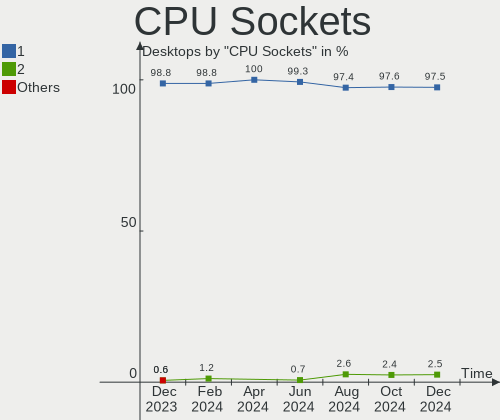
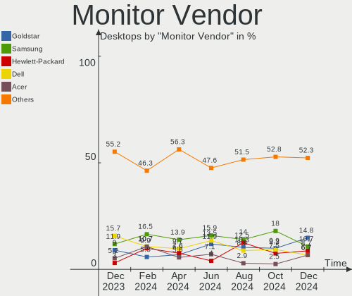

Debian - Hardware Trends (Desktops)
-----------------------------------

A project to identify most popular hardware characteristics and track their change
over time based on data collected by Linux users at https://Linux-Hardware.org.

Anyone can contribute to this report by the [hw-probe](https://github.com/linuxhw/hw-probe) tool:

    sudo -E hw-probe -all -upload

This report is for one last month. Overall report since the beginning of time: [TestDays](https://github.com/linuxhw/TestDays)

Period: Jul, 2023.

Contents
--------

* [ System ](#system)
  - [ OS                       ](#os)
  - [ OS Family                ](#os-family)
  - [ Kernel                   ](#kernel)
  - [ Kernel Family            ](#kernel-family)
  - [ Kernel Major Ver.        ](#kernel-major-ver)
  - [ Arch                     ](#arch)
  - [ DE                       ](#de)
  - [ Display Server           ](#display-server)
  - [ Display Manager          ](#display-manager)
  - [ OS Lang                  ](#os-lang)
  - [ Boot Mode                ](#boot-mode)
  - [ Filesystem               ](#filesystem)
  - [ Part. scheme             ](#part-scheme)
  - [ Dual Boot with Linux/BSD ](#dual-boot-with-linuxbsd)
  - [ Dual Boot (Win)          ](#dual-boot-win)

* [ Board ](#board)
  - [ Vendor                   ](#vendor)
  - [ Model                    ](#model)
  - [ Model Family             ](#model-family)
  - [ MFG Year                 ](#mfg-year)
  - [ Form Factor              ](#form-factor)
  - [ Secure Boot              ](#secure-boot)
  - [ Coreboot                 ](#coreboot)
  - [ RAM Size                 ](#ram-size)
  - [ RAM Used                 ](#ram-used)
  - [ Total Drives             ](#total-drives)
  - [ Has CD-ROM               ](#has-cd-rom)
  - [ Has Ethernet             ](#has-ethernet)
  - [ Has WiFi                 ](#has-wifi)
  - [ Has Bluetooth            ](#has-bluetooth)

* [ Location ](#location)
  - [ Country                  ](#country)
  - [ City                     ](#city)

* [ Drives ](#drives)
  - [ Drive Vendor             ](#drive-vendor)
  - [ Drive Model              ](#drive-model)
  - [ HDD Vendor               ](#hdd-vendor)
  - [ SSD Vendor               ](#ssd-vendor)
  - [ Drive Kind               ](#drive-kind)
  - [ Drive Connector          ](#drive-connector)
  - [ Drive Size               ](#drive-size)
  - [ Space Total              ](#space-total)
  - [ Space Used               ](#space-used)
  - [ Malfunc. Drives          ](#malfunc-drives)
  - [ Malfunc. Drive Vendor    ](#malfunc-drive-vendor)
  - [ Malfunc. HDD Vendor      ](#malfunc-hdd-vendor)
  - [ Malfunc. Drive Kind      ](#malfunc-drive-kind)
  - [ Failed Drives            ](#failed-drives)
  - [ Failed Drive Vendor      ](#failed-drive-vendor)
  - [ Drive Status             ](#drive-status)

* [ Storage controller ](#storage-controller)
  - [ Storage Vendor           ](#storage-vendor)
  - [ Storage Model            ](#storage-model)
  - [ Storage Kind             ](#storage-kind)

* [ Processor ](#processor)
  - [ CPU Vendor               ](#cpu-vendor)
  - [ CPU Model                ](#cpu-model)
  - [ CPU Model Family         ](#cpu-model-family)
  - [ CPU Cores                ](#cpu-cores)
  - [ CPU Sockets              ](#cpu-sockets)
  - [ CPU Threads              ](#cpu-threads)
  - [ CPU Op-Modes             ](#cpu-op-modes)
  - [ CPU Microcode            ](#cpu-microcode)
  - [ CPU Microarch            ](#cpu-microarch)

* [ Graphics ](#graphics)
  - [ GPU Vendor               ](#gpu-vendor)
  - [ GPU Model                ](#gpu-model)
  - [ GPU Combo                ](#gpu-combo)
  - [ GPU Driver               ](#gpu-driver)
  - [ GPU Memory               ](#gpu-memory)

* [ Monitor ](#monitor)
  - [ Monitor Vendor           ](#monitor-vendor)
  - [ Monitor Model            ](#monitor-model)
  - [ Monitor Resolution       ](#monitor-resolution)
  - [ Monitor Diagonal         ](#monitor-diagonal)
  - [ Monitor Width            ](#monitor-width)
  - [ Aspect Ratio             ](#aspect-ratio)
  - [ Monitor Area             ](#monitor-area)
  - [ Pixel Density            ](#pixel-density)
  - [ Multiple Monitors        ](#multiple-monitors)

* [ Network ](#network)
  - [ Net Controller Vendor    ](#net-controller-vendor)
  - [ Net Controller Model     ](#net-controller-model)
  - [ Wireless Vendor          ](#wireless-vendor)
  - [ Wireless Model           ](#wireless-model)
  - [ Ethernet Vendor          ](#ethernet-vendor)
  - [ Ethernet Model           ](#ethernet-model)
  - [ Net Controller Kind      ](#net-controller-kind)
  - [ Used Controller          ](#used-controller)
  - [ NICs                     ](#nics)
  - [ IPv6                     ](#ipv6)

* [ Bluetooth ](#bluetooth)
  - [ Bluetooth Vendor         ](#bluetooth-vendor)
  - [ Bluetooth Model          ](#bluetooth-model)

* [ Sound ](#sound)
  - [ Sound Vendor             ](#sound-vendor)
  - [ Sound Model              ](#sound-model)

* [ Memory ](#memory)
  - [ Memory Vendor            ](#memory-vendor)
  - [ Memory Model             ](#memory-model)
  - [ Memory Kind              ](#memory-kind)
  - [ Memory Form Factor       ](#memory-form-factor)
  - [ Memory Size              ](#memory-size)
  - [ Memory Speed             ](#memory-speed)

* [ Printers & scanners ](#printers--scanners)
  - [ Printer Vendor           ](#printer-vendor)
  - [ Printer Model            ](#printer-model)
  - [ Scanner Vendor           ](#scanner-vendor)
  - [ Scanner Model            ](#scanner-model)

* [ Camera ](#camera)
  - [ Camera Vendor            ](#camera-vendor)
  - [ Camera Model             ](#camera-model)

* [ Security ](#security)
  - [ Fingerprint Vendor       ](#fingerprint-vendor)
  - [ Fingerprint Model        ](#fingerprint-model)
  - [ Chipcard Vendor          ](#chipcard-vendor)
  - [ Chipcard Model           ](#chipcard-model)

* [ Unsupported ](#unsupported)
  - [ Unsupported Devices      ](#unsupported-devices)
  - [ Unsupported Device Types ](#unsupported-device-types)

System
------

OS
--

Installed operating systems

| Name      | Desktops | Percent |
|-----------|----------|---------|
| Debian 12 | 117      | 60.62%  |
| Debian 11 | 56       | 29.02%  |
| Debian    | 18       | 9.33%   |
| Debian 10 | 2        | 1.04%   |

OS Family
---------

OS without a version

| Name   | Desktops | Percent |
|--------|----------|---------|
| Debian | 193      | 100%    |

Kernel
------

Version of the Linux kernel

| Version                    | Desktops | Percent |
|----------------------------|----------|---------|
| 6.1.0-10-amd64             | 45       | 23.32%  |
| 6.1.0-4-amd64              | 41       | 21.24%  |
| 5.10.0-23-amd64            | 25       | 12.95%  |
| 6.1.0-9-amd64              | 20       | 10.36%  |
| 6.3.0-1-amd64              | 8        | 4.15%   |
| 6.1.0-0.deb11.7-amd64      | 4        | 2.07%   |
| 6.4.0-1-amd64              | 3        | 1.55%   |
| 6.3.0-2-amd64              | 3        | 1.55%   |
| 6.2.16-3-pve               | 3        | 1.55%   |
| 5.15.108-1-pve             | 3        | 1.55%   |
| 5.15.107-2-pve             | 3        | 1.55%   |
| 6.4.3-1-liquorix-amd64     | 2        | 1.04%   |
| 6.2.6-1-pve                | 2        | 1.04%   |
| 5.16.0-0.bpo.4-amd64       | 2        | 1.04%   |
| 5.15.102-1-pve             | 2        | 1.04%   |
| 5.10.0-23-686              | 2        | 1.04%   |
| 5.10.0-22-amd64            | 2        | 1.04%   |
| 6.4.7-wrkd                 | 1        | 0.52%   |
| 6.4.7-1-liquorix-amd64     | 1        | 0.52%   |
| 6.4.0-01280-g7116cae43716  | 1        | 0.52%   |
| 6.3.9-i7                   | 1        | 0.52%   |
| 6.3.9-1-liquorix-amd64     | 1        | 0.52%   |
| 6.3.0-1-rt-amd64           | 1        | 0.52%   |
| 6.2.16-4-pve               | 1        | 0.52%   |
| 6.1.38-i3                  | 1        | 0.52%   |
| 6.1.15-1-pve               | 1        | 0.52%   |
| 6.1.0-10-686-pae           | 1        | 0.52%   |
| 6.0.0-6mx-amd64            | 1        | 0.52%   |
| 5.19.0-0.deb11.2-amd64     | 1        | 0.52%   |
| 5.15.107+truenas           | 1        | 0.52%   |
| 5.14.0-4mx-amd64           | 1        | 0.52%   |
| 5.10.181-loc-os            | 1        | 0.52%   |
| 5.10.142-antix.2-amd64-smp | 1        | 0.52%   |
| 5.10.0-20-amd64            | 1        | 0.52%   |
| 5.10.0-18-amd64            | 1        | 0.52%   |
| 5.10.0-13-amd64            | 1        | 0.52%   |
| 5.10.0-10-amd64            | 1        | 0.52%   |
| 5.10.0-0.bpo.5-amd64       | 1        | 0.52%   |
| 4.19.0-24-rt-amd64         | 1        | 0.52%   |
| 4.19.0                     | 1        | 0.52%   |

Kernel Family
-------------

Linux kernel without a distro release

| Version  | Desktops | Percent |
|----------|----------|---------|
| 6.1.0    | 111      | 57.51%  |
| 5.10.0   | 34       | 17.62%  |
| 6.3.0    | 12       | 6.22%   |
| 6.4.0    | 4        | 2.07%   |
| 6.2.16   | 4        | 2.07%   |
| 5.15.107 | 4        | 2.07%   |
| 5.15.108 | 3        | 1.55%   |
| 6.4.7    | 2        | 1.04%   |
| 6.4.3    | 2        | 1.04%   |
| 6.3.9    | 2        | 1.04%   |
| 6.2.6    | 2        | 1.04%   |
| 5.16.0   | 2        | 1.04%   |
| 5.15.102 | 2        | 1.04%   |
| 4.19.0   | 2        | 1.04%   |
| 6.1.38   | 1        | 0.52%   |
| 6.1.15   | 1        | 0.52%   |
| 6.0.0    | 1        | 0.52%   |
| 5.19.0   | 1        | 0.52%   |
| 5.14.0   | 1        | 0.52%   |
| 5.10.181 | 1        | 0.52%   |
| 5.10.142 | 1        | 0.52%   |

Kernel Major Ver.
-----------------

Linux kernel major version

| Version | Desktops | Percent |
|---------|----------|---------|
| 6.1     | 113      | 58.55%  |
| 5.10    | 36       | 18.65%  |
| 6.3     | 14       | 7.25%   |
| 5.15    | 9        | 4.66%   |
| 6.4     | 8        | 4.15%   |
| 6.2     | 6        | 3.11%   |
| 5.16    | 2        | 1.04%   |
| 4.19    | 2        | 1.04%   |
| 6.0     | 1        | 0.52%   |
| 5.19    | 1        | 0.52%   |
| 5.14    | 1        | 0.52%   |

Arch
----

OS architecture (x86_64, i586, etc.)

| Name        | Desktops | Percent |
|-------------|----------|---------|
| x86_64      | 189      | 97.93%  |
| i686        | 3        | 1.55%   |
| loongarch64 | 1        | 0.52%   |

DE
--

Desktop Environment

| Name             | Desktops | Percent |
|------------------|----------|---------|
| Unknown          | 72       | 37.31%  |
| GNOME            | 46       | 23.83%  |
| KDE5             | 24       | 12.44%  |
| XFCE             | 18       | 9.33%   |
| MATE             | 9        | 4.66%   |
| X-Cinnamon       | 7        | 3.63%   |
| LXDE             | 5        | 2.59%   |
| LXQt             | 4        | 2.07%   |
| Cinnamon         | 2        | 1.04%   |
| lightdm-xsession | 1        | 0.52%   |
| i3               | 1        | 0.52%   |
| GNOME Classic    | 1        | 0.52%   |
| dwm              | 1        | 0.52%   |
| Cutefish         | 1        | 0.52%   |
| Budgie           | 1        | 0.52%   |

Display Server
--------------

X11 or Wayland

| Name    | Desktops | Percent |
|---------|----------|---------|
| X11     | 81       | 41.97%  |
| Unknown | 50       | 25.91%  |
| Wayland | 39       | 20.21%  |
| Tty     | 23       | 11.92%  |

Display Manager
---------------

SDDM, LightDM, etc.

| Name    | Desktops | Percent |
|---------|----------|---------|
| Unknown | 112      | 58.03%  |
| LightDM | 38       | 19.69%  |
| SDDM    | 18       | 9.33%   |
| GDM3    | 18       | 9.33%   |
| GDM     | 6        | 3.11%   |
| WDM     | 1        | 0.52%   |

OS Lang
-------

Language

| Lang    | Desktops | Percent |
|---------|----------|---------|
| en_US   | 72       | 37.31%  |
| ru_RU   | 45       | 23.32%  |
| de_DE   | 15       | 7.77%   |
| en_GB   | 12       | 6.22%   |
| fr_FR   | 9        | 4.66%   |
| pt_BR   | 7        | 3.63%   |
| es_MX   | 4        | 2.07%   |
| es_ES   | 3        | 1.55%   |
| es_AR   | 3        | 1.55%   |
| en_ZA   | 3        | 1.55%   |
| en_CA   | 3        | 1.55%   |
| Unknown | 3        | 1.55%   |
| fi_FI   | 2        | 1.04%   |
| zh_CN   | 1        | 0.52%   |
| sr_RS   | 1        | 0.52%   |
| pl_PL   | 1        | 0.52%   |
| it_IT   | 1        | 0.52%   |
| hu_HU   | 1        | 0.52%   |
| es_CU   | 1        | 0.52%   |
| es_CL   | 1        | 0.52%   |
| en_IL   | 1        | 0.52%   |
| en_IE   | 1        | 0.52%   |
| en_HK   | 1        | 0.52%   |
| en_DK   | 1        | 0.52%   |
| en_AU   | 1        | 0.52%   |

Boot Mode
---------

EFI or BIOS

| Mode | Desktops | Percent |
|------|----------|---------|
| BIOS | 122      | 63.21%  |
| EFI  | 71       | 36.79%  |

Filesystem
----------

Type of filesystem

| Type    | Desktops | Percent |
|---------|----------|---------|
| Ext4    | 131      | 67.88%  |
| Overlay | 44       | 22.8%   |
| Btrfs   | 11       | 5.7%    |
| Zfs     | 3        | 1.55%   |
| Xfs     | 3        | 1.55%   |
| Tmpfs   | 1        | 0.52%   |

Part. scheme
------------

Scheme of partitioning

| Type    | Desktops | Percent |
|---------|----------|---------|
| GPT     | 87       | 45.08%  |
| MBR     | 64       | 33.16%  |
| Unknown | 42       | 21.76%  |

Dual Boot with Linux/BSD
------------------------

Hosting more than one Linux/BSD

| Dual boot | Desktops | Percent |
|-----------|----------|---------|
| No        | 160      | 82.9%   |
| Yes       | 33       | 17.1%   |

Dual Boot (Win)
---------------

Hosting Linux and Windows

| Dual boot | Desktops | Percent |
|-----------|----------|---------|
| No        | 119      | 61.66%  |
| Yes       | 74       | 38.34%  |

Board
-----

Vendor
------

Motherboard manufacturer

| Name                                 | Desktops | Percent |
|--------------------------------------|----------|---------|
| ASUSTek Computer                     | 33       | 17.1%   |
| ASRock                               | 31       | 16.06%  |
| Gigabyte Technology                  | 28       | 14.51%  |
| Dell                                 | 21       | 10.88%  |
| MSI                                  | 20       | 10.36%  |
| Unknown                              | 10       | 5.18%   |
| Lenovo                               | 9        | 4.66%   |
| Hewlett-Packard                      | 8        | 4.15%   |
| Fujitsu                              | 4        | 2.07%   |
| Intel                                | 3        | 1.55%   |
| AZW                                  | 3        | 1.55%   |
| ASRockRack                           | 3        | 1.55%   |
| Supermicro                           | 2        | 1.04%   |
| IceWhale Technology                  | 2        | 1.04%   |
| Foxconn                              | 2        | 1.04%   |
| Biostar                              | 2        | 1.04%   |
| Shenzhen Meigao Electronic Equipment | 1        | 0.52%   |
| Phoenix Contact                      | 1        | 0.52%   |
| NetGear                              | 1        | 0.52%   |
| Loongson                             | 1        | 0.52%   |
| iEi                                  | 1        | 0.52%   |
| Huanan                               | 1        | 0.52%   |
| Google                               | 1        | 0.52%   |
| GEEKOM                               | 1        | 0.52%   |
| EPoX Computer                        | 1        | 0.52%   |
| Apple                                | 1        | 0.52%   |
| ABIT                                 | 1        | 0.52%   |
| AAEON                                | 1        | 0.52%   |

Model
-----

Motherboard model

| Name                                       | Desktops | Percent |
|--------------------------------------------|----------|---------|
| ASRock H470M-HVS                           | 20       | 10.36%  |
| Unknown                                    | 10       | 5.18%   |
| ASUS All Series                            | 9        | 4.66%   |
| Gigabyte A320M-S2H V2                      | 7        | 3.63%   |
| MSI MS-7996                                | 3        | 1.55%   |
| Supermicro X8ST3                           | 2        | 1.04%   |
| Dell XPS 8700                              | 2        | 1.04%   |
| Dell OptiPlex 7040                         | 2        | 1.04%   |
| AZW MINI S                                 | 2        | 1.04%   |
| ASUS Z170-A                                | 2        | 1.04%   |
| ASUS P6X58D PREMIUM                        | 2        | 1.04%   |
| ASRockRack X470D4U                         | 2        | 1.04%   |
| Shenzhen Meigao Electronic Equipment UM560 | 1        | 0.52%   |
| Phoenix Contact Valueline VL3 UPC          | 1        | 0.52%   |
| NetGear ReadyDATA 5200                     | 1        | 0.52%   |
| MSI MS-7D75                                | 1        | 0.52%   |
| MSI MS-7D43                                | 1        | 0.52%   |
| MSI MS-7D06                                | 1        | 0.52%   |
| MSI MS-7C94                                | 1        | 0.52%   |
| MSI MS-7C91                                | 1        | 0.52%   |
| MSI MS-7C75                                | 1        | 0.52%   |
| MSI MS-7B86                                | 1        | 0.52%   |
| MSI MS-7B85                                | 1        | 0.52%   |
| MSI MS-7B84                                | 1        | 0.52%   |
| MSI MS-7A72                                | 1        | 0.52%   |
| MSI MS-7A70                                | 1        | 0.52%   |
| MSI MS-7982                                | 1        | 0.52%   |
| MSI MS-7978                                | 1        | 0.52%   |
| MSI MS-7916                                | 1        | 0.52%   |
| MSI MS-7817                                | 1        | 0.52%   |
| MSI MS-7751                                | 1        | 0.52%   |
| MSI G5320fr                                | 1        | 0.52%   |
| Loongson 3A5000-HV-7A2000-1w-V0.1-EVB      | 1        | 0.52%   |
| Lenovo V55t-15API 11CC0009GE               | 1        | 0.52%   |
| Lenovo ThinkStation P520 30BFS44D00        | 1        | 0.52%   |
| Lenovo ThinkStation E31 25523W4            | 1        | 0.52%   |
| Lenovo ThinkCentre M93p 10AAA09USP         | 1        | 0.52%   |
| Lenovo ThinkCentre M93p 10A7000QUS         | 1        | 0.52%   |
| Lenovo ThinkCentre M83 10BE001APB          | 1        | 0.52%   |
| Lenovo ThinkCentre M800 10FW002NFR         | 1        | 0.52%   |

Model Family
------------

Motherboard model prefix

| Name                                       | Desktops | Percent |
|--------------------------------------------|----------|---------|
| ASRock H470M-HVS                           | 20       | 10.36%  |
| Dell OptiPlex                              | 11       | 5.7%    |
| Unknown                                    | 10       | 5.18%   |
| ASUS All                                   | 9        | 4.66%   |
| Gigabyte A320M-S2H                         | 7        | 3.63%   |
| ASUS PRIME                                 | 6        | 3.11%   |
| Lenovo ThinkCentre                         | 5        | 2.59%   |
| MSI MS-7996                                | 3        | 1.55%   |
| Gigabyte X570                              | 3        | 1.55%   |
| Fujitsu ESPRIMO                            | 3        | 1.55%   |
| Dell XPS                                   | 3        | 1.55%   |
| Dell Precision                             | 3        | 1.55%   |
| Supermicro X8ST3                           | 2        | 1.04%   |
| Lenovo ThinkStation                        | 2        | 1.04%   |
| IceWhale ZimaBoard                         | 2        | 1.04%   |
| Gigabyte B550M                             | 2        | 1.04%   |
| Dell Vostro                                | 2        | 1.04%   |
| AZW MINI                                   | 2        | 1.04%   |
| ASUS Z170-A                                | 2        | 1.04%   |
| ASUS TUF                                   | 2        | 1.04%   |
| ASUS ROG                                   | 2        | 1.04%   |
| ASUS P6X58D                                | 2        | 1.04%   |
| ASRockRack X470D4U                         | 2        | 1.04%   |
| Shenzhen Meigao Electronic Equipment UM560 | 1        | 0.52%   |
| Phoenix Contact Valueline                  | 1        | 0.52%   |
| NetGear ReadyDATA                          | 1        | 0.52%   |
| MSI MS-7D75                                | 1        | 0.52%   |
| MSI MS-7D43                                | 1        | 0.52%   |
| MSI MS-7D06                                | 1        | 0.52%   |
| MSI MS-7C94                                | 1        | 0.52%   |
| MSI MS-7C91                                | 1        | 0.52%   |
| MSI MS-7C75                                | 1        | 0.52%   |
| MSI MS-7B86                                | 1        | 0.52%   |
| MSI MS-7B85                                | 1        | 0.52%   |
| MSI MS-7B84                                | 1        | 0.52%   |
| MSI MS-7A72                                | 1        | 0.52%   |
| MSI MS-7A70                                | 1        | 0.52%   |
| MSI MS-7982                                | 1        | 0.52%   |
| MSI MS-7978                                | 1        | 0.52%   |
| MSI MS-7916                                | 1        | 0.52%   |

MFG Year
--------

Motherboard manufacture year

| Year    | Desktops | Percent |
|---------|----------|---------|
| 2021    | 39       | 20.21%  |
| 2022    | 20       | 10.36%  |
| 2013    | 16       | 8.29%   |
| 2018    | 14       | 7.25%   |
| 2020    | 12       | 6.22%   |
| 2023    | 11       | 5.7%    |
| 2015    | 11       | 5.7%    |
| 2014    | 9        | 4.66%   |
| 2011    | 9        | 4.66%   |
| 2016    | 8        | 4.15%   |
| 2012    | 8        | 4.15%   |
| 2019    | 7        | 3.63%   |
| 2010    | 6        | 3.11%   |
| 2017    | 5        | 2.59%   |
| 2009    | 5        | 2.59%   |
| 2008    | 5        | 2.59%   |
| 2007    | 2        | 1.04%   |
| 2004    | 2        | 1.04%   |
| Unknown | 2        | 1.04%   |
| 2006    | 1        | 0.52%   |
| 2002    | 1        | 0.52%   |

Form Factor
-----------

Physical design of the computer

| Name    | Desktops | Percent |
|---------|----------|---------|
| Desktop | 193      | 100%    |

Secure Boot
-----------

Enabled or disabled

| State    | Desktops | Percent |
|----------|----------|---------|
| Disabled | 187      | 96.89%  |
| Enabled  | 6        | 3.11%   |

Coreboot
--------

Have coreboot on board

| Used | Desktops | Percent |
|------|----------|---------|
| No   | 192      | 99.48%  |
| Yes  | 1        | 0.52%   |

RAM Size
--------

Total RAM memory

| Size in GB  | Desktops | Percent |
|-------------|----------|---------|
| 32.01-64.0  | 47       | 24.35%  |
| 4.01-8.0    | 35       | 18.13%  |
| 16.01-24.0  | 33       | 17.1%   |
| 8.01-16.0   | 30       | 15.54%  |
| 64.01-256.0 | 18       | 9.33%   |
| 3.01-4.0    | 15       | 7.77%   |
| 24.01-32.0  | 8        | 4.15%   |
| 0.51-1.0    | 4        | 2.07%   |
| 1.01-2.0    | 2        | 1.04%   |
| 2.01-3.0    | 1        | 0.52%   |

RAM Used
--------

Used RAM memory

| Used GB     | Desktops | Percent |
|-------------|----------|---------|
| 1.01-2.0    | 49       | 25.39%  |
| 4.01-8.0    | 36       | 18.65%  |
| 0.51-1.0    | 33       | 17.1%   |
| 2.01-3.0    | 30       | 15.54%  |
| 3.01-4.0    | 17       | 8.81%   |
| 8.01-16.0   | 11       | 5.7%    |
| 0.01-0.5    | 5        | 2.59%   |
| 24.01-32.0  | 4        | 2.07%   |
| 16.01-24.0  | 4        | 2.07%   |
| 32.01-64.0  | 3        | 1.55%   |
| 64.01-256.0 | 1        | 0.52%   |

Total Drives
------------

Number of drives on board

| Drives | Desktops | Percent |
|--------|----------|---------|
| 1      | 84       | 43.52%  |
| 2      | 53       | 27.46%  |
| 3      | 20       | 10.36%  |
| 4      | 13       | 6.74%   |
| 6      | 8        | 4.15%   |
| 7      | 4        | 2.07%   |
| 5      | 4        | 2.07%   |
| 12     | 2        | 1.04%   |
| 0      | 2        | 1.04%   |
| 27     | 1        | 0.52%   |
| 19     | 1        | 0.52%   |
| 11     | 1        | 0.52%   |

Has CD-ROM
----------

Has CD-ROM on board

| Presented | Desktops | Percent |
|-----------|----------|---------|
| No        | 137      | 70.98%  |
| Yes       | 56       | 29.02%  |

Has Ethernet
------------

Has Ethernet on board

| Presented | Desktops | Percent |
|-----------|----------|---------|
| Yes       | 189      | 97.93%  |
| No        | 4        | 2.07%   |

Has WiFi
--------

Has WiFi module

| Presented | Desktops | Percent |
|-----------|----------|---------|
| No        | 121      | 62.69%  |
| Yes       | 72       | 37.31%  |

Has Bluetooth
-------------

Has Bluetooth module

| Presented | Desktops | Percent |
|-----------|----------|---------|
| No        | 134      | 69.43%  |
| Yes       | 59       | 30.57%  |

Location
--------

Country
-------

Geographic location (country)

| Country      | Desktops | Percent |
|--------------|----------|---------|
| Russia       | 53       | 27.46%  |
| USA          | 29       | 15.03%  |
| Germany      | 20       | 10.36%  |
| France       | 11       | 5.7%    |
| Brazil       | 9        | 4.66%   |
| Canada       | 6        | 3.11%   |
| UK           | 5        | 2.59%   |
| Spain        | 5        | 2.59%   |
| Mexico       | 5        | 2.59%   |
| Italy        | 5        | 2.59%   |
| Finland      | 5        | 2.59%   |
| Argentina    | 4        | 2.07%   |
| South Africa | 3        | 1.55%   |
| Turkey       | 2        | 1.04%   |
| Taiwan       | 2        | 1.04%   |
| Switzerland  | 2        | 1.04%   |
| Netherlands  | 2        | 1.04%   |
| Ireland      | 2        | 1.04%   |
| China        | 2        | 1.04%   |
| Australia    | 2        | 1.04%   |
| UAE          | 1        | 0.52%   |
| Thailand     | 1        | 0.52%   |
| Sweden       | 1        | 0.52%   |
| Serbia       | 1        | 0.52%   |
| Romania      | 1        | 0.52%   |
| Poland       | 1        | 0.52%   |
| Morocco      | 1        | 0.52%   |
| Malaysia     | 1        | 0.52%   |
| Israel       | 1        | 0.52%   |
| Indonesia    | 1        | 0.52%   |
| Hungary      | 1        | 0.52%   |
| Hong Kong    | 1        | 0.52%   |
| Greece       | 1        | 0.52%   |
| Denmark      | 1        | 0.52%   |
| Czechia      | 1        | 0.52%   |
| Cuba         | 1        | 0.52%   |
| Chile        | 1        | 0.52%   |
| Austria      | 1        | 0.52%   |
| Algeria      | 1        | 0.52%   |

City
----

Geographic location (city)

| City                 | Desktops | Percent |
|----------------------|----------|---------|
| Voronezh             | 41       | 21.24%  |
| Moscow               | 3        | 1.55%   |
| Brive-la-Gaillarde   | 3        | 1.55%   |
| Berlin               | 3        | 1.55%   |
| Zurich               | 2        | 1.04%   |
| Ufa                  | 2        | 1.04%   |
| St Petersburg        | 2        | 1.04%   |
| Rio de Janeiro       | 2        | 1.04%   |
| Milano               | 2        | 1.04%   |
| Manchester           | 2        | 1.04%   |
| LaSalle              | 2        | 1.04%   |
| Johannesburg         | 2        | 1.04%   |
| Espoo                | 2        | 1.04%   |
| Cary                 | 2        | 1.04%   |
| Bedford              | 2        | 1.04%   |
| Zapopan              | 1        | 0.52%   |
| Yoshkar-Ola          | 1        | 0.52%   |
| Wolfsburg            | 1        | 0.52%   |
| Wiesbaden            | 1        | 0.52%   |
| Wieluń              | 1        | 0.52%   |
| Warminster           | 1        | 0.52%   |
| Virginia Beach       | 1        | 0.52%   |
| Vila Velha           | 1        | 0.52%   |
| Vienna               | 1        | 0.52%   |
| Vecindario           | 1        | 0.52%   |
| Tours                | 1        | 0.52%   |
| Tel Aviv             | 1        | 0.52%   |
| Szigetszentmiklos    | 1        | 0.52%   |
| Sydney               | 1        | 0.52%   |
| Sunnyvale            | 1        | 0.52%   |
| Stockholm            | 1        | 0.52%   |
| Stade                | 1        | 0.52%   |
| St. Thomas           | 1        | 0.52%   |
| St. George           | 1        | 0.52%   |
| Springfield          | 1        | 0.52%   |
| Soultz-sous-Forets   | 1        | 0.52%   |
| Siuntio              | 1        | 0.52%   |
| Shenzhen             | 1        | 0.52%   |
| Schuetzen am Gebirge | 1        | 0.52%   |
| Sao Carlos           | 1        | 0.52%   |

Drives
------

Drive Vendor
------------

Hard drive vendors

| Vendor                       | Desktops | Drives | Percent |
|------------------------------|----------|--------|---------|
| WDC                          | 54       | 145    | 15.74%  |
| Seagate                      | 44       | 66     | 12.83%  |
| Samsung Electronics          | 40       | 56     | 11.66%  |
| Toshiba                      | 26       | 33     | 7.58%   |
| Crucial                      | 24       | 26     | 7%      |
| Netac                        | 20       | 20     | 5.83%   |
| SanDisk                      | 19       | 21     | 5.54%   |
| Kingston                     | 19       | 20     | 5.54%   |
| Unknown                      | 8        | 13     | 2.33%   |
| Intel                        | 8        | 8      | 2.33%   |
| SPCC                         | 5        | 5      | 1.46%   |
| Kingston Technology Company  | 5        | 8      | 1.46%   |
| Transcend                    | 4        | 4      | 1.17%   |
| SK hynix                     | 4        | 4      | 1.17%   |
| PNY                          | 4        | 5      | 1.17%   |
| Phison Electronics           | 4        | 6      | 1.17%   |
| Micron Technology            | 4        | 4      | 1.17%   |
| Hitachi                      | 4        | 5      | 1.17%   |
| HGST                         | 4        | 8      | 1.17%   |
| China                        | 4        | 4      | 1.17%   |
| A-DATA Technology            | 4        | 4      | 1.17%   |
| Unknown                      | 4        | 4      | 1.17%   |
| Phison                       | 2        | 2      | 0.58%   |
| Maxtor                       | 2        | 2      | 0.58%   |
| JMicron Technology           | 2        | 2      | 0.58%   |
| Corsair                      | 2        | 2      | 0.58%   |
| ZHITAI                       | 1        | 1      | 0.29%   |
| XPG                          | 1        | 1      | 0.29%   |
| Unknown (CF)                 | 1        | 1      | 0.29%   |
| Timetec                      | 1        | 2      | 0.29%   |
| T-FORCE                      | 1        | 1      | 0.29%   |
| SSK                          | 1        | 1      | 0.29%   |
| Silicon Motion               | 1        | 1      | 0.29%   |
| Shenzhen Longsys Electronics | 1        | 1      | 0.29%   |
| Rogueware                    | 1        | 1      | 0.29%   |
| Radian Memory Systems        | 1        | 1      | 0.29%   |
| Plextor                      | 1        | 1      | 0.29%   |
| Patriot                      | 1        | 1      | 0.29%   |
| OCZ                          | 1        | 1      | 0.29%   |
| Micron/Crucial Technology    | 1        | 1      | 0.29%   |

Drive Model
-----------

Hard drive models

| Model                                               | Desktops | Percent |
|-----------------------------------------------------|----------|---------|
| Netac SSD 240GB                                     | 19       | 4.4%    |
| Toshiba HDWD110 1TB                                 | 12       | 2.78%   |
| Crucial CT240BX500SSD1 240GB                        | 10       | 2.31%   |
| Kingston SA400S37240G 240GB SSD                     | 6        | 1.39%   |
| Samsung SSD 870 EVO 500GB                           | 5        | 1.16%   |
| Seagate ST1000DM010-2EP102 1TB                      | 4        | 0.93%   |
| Seagate ST1000DM003-1SB102 1TB                      | 4        | 0.93%   |
| Unknown                                             | 4        | 0.93%   |
| WDC WD20EZBX-00AYRA0 2TB                            | 3        | 0.69%   |
| Unknown SD/MMC 2GB                                  | 3        | 0.69%   |
| Unknown M.S./M.S.Pro/HG 16GB                        | 3        | 0.69%   |
| Seagate ST500DM002-1BD142 500GB                     | 3        | 0.69%   |
| Seagate ST2000DM008-2FR102 2TB                      | 3        | 0.69%   |
| SanDisk NVMe SSD Drive 1TB                          | 3        | 0.69%   |
| Samsung SSD 860 EVO 1TB                             | 3        | 0.69%   |
| Samsung SSD 850 EVO 500GB                           | 3        | 0.69%   |
| Samsung NVMe SSD Controller SM981/PM981/PM983 500GB | 3        | 0.69%   |
| Kingston SA400S37480G 480GB SSD                     | 3        | 0.69%   |
| Crucial CT1000MX500SSD1 1TB                         | 3        | 0.69%   |
| WDC WDS500G2B0A-00SM50 500GB SSD                    | 2        | 0.46%   |
| WDC WD80EZZX-11CSGA0 8TB                            | 2        | 0.46%   |
| WDC WD80EMAZ-00WJTA0 8TB                            | 2        | 0.46%   |
| WDC WD42PURZ-85B4YY0 4TB                            | 2        | 0.46%   |
| WDC WD40EZRZ-00GXCB0 4TB                            | 2        | 0.46%   |
| WDC WD40EFRX-68N32N0 4TB                            | 2        | 0.46%   |
| WDC WD30PURX-64P6ZY0 3TB                            | 2        | 0.46%   |
| WDC WD20PURX-64P6ZY0 2TB                            | 2        | 0.46%   |
| WDC WD20EZRZ-00Z5HB0 2TB                            | 2        | 0.46%   |
| WDC WD140EDFZ-11A0VA0 14TB                          | 2        | 0.46%   |
| WDC WD10EZEX-75WN4A1 1TB                            | 2        | 0.46%   |
| WDC WD10EZEX-08WN4A0 1TB                            | 2        | 0.46%   |
| WDC WD10EZEX-00BN5A0 1TB                            | 2        | 0.46%   |
| WDC WD100EMAZ-00WJTA0 10TB                          | 2        | 0.46%   |
| Unknown SD/MMC/MS PRO 128GB                         | 2        | 0.46%   |
| Unknown SD/MMC/M.S.PRO 32GB                         | 2        | 0.46%   |
| Toshiba HDWD130 3TB                                 | 2        | 0.46%   |
| Toshiba DT01ACA300 3TB                              | 2        | 0.46%   |
| Toshiba DT01ACA100 1TB                              | 2        | 0.46%   |
| Toshiba DT01ACA050 500GB                            | 2        | 0.46%   |
| SPCC Solid State Disk 1TB                           | 2        | 0.46%   |

HDD Vendor
----------

Hard disk drive vendors

| Vendor              | Desktops | Drives | Percent |
|---------------------|----------|--------|---------|
| WDC                 | 48       | 134    | 35.29%  |
| Seagate             | 44       | 62     | 32.35%  |
| Toshiba             | 25       | 32     | 18.38%  |
| Hitachi             | 4        | 5      | 2.94%   |
| HGST                | 4        | 8      | 2.94%   |
| Unknown             | 2        | 2      | 1.47%   |
| Samsung Electronics | 2        | 2      | 1.47%   |
| Maxtor              | 2        | 2      | 1.47%   |
| SSK                 | 1        | 1      | 0.74%   |
| JMicron Technology  | 1        | 1      | 0.74%   |
| Inateck             | 1        | 1      | 0.74%   |
| IBM                 | 1        | 1      | 0.74%   |
| Hewlett-Packard     | 1        | 1      | 0.74%   |

SSD Vendor
----------

Solid state drive vendors

| Vendor              | Desktops | Drives | Percent |
|---------------------|----------|--------|---------|
| Samsung Electronics | 26       | 34     | 18.98%  |
| Crucial             | 24       | 26     | 17.52%  |
| Netac               | 20       | 20     | 14.6%   |
| Kingston            | 18       | 19     | 13.14%  |
| SanDisk             | 8        | 8      | 5.84%   |
| WDC                 | 6        | 7      | 4.38%   |
| Transcend           | 4        | 4      | 2.92%   |
| SPCC                | 4        | 4      | 2.92%   |
| PNY                 | 4        | 5      | 2.92%   |
| Intel               | 4        | 4      | 2.92%   |
| China               | 4        | 4      | 2.92%   |
| A-DATA Technology   | 2        | 2      | 1.46%   |
| Unknown (CF)        | 1        | 1      | 0.73%   |
| Timetec             | 1        | 2      | 0.73%   |
| T-FORCE             | 1        | 1      | 0.73%   |
| SK hynix            | 1        | 1      | 0.73%   |
| Rogueware           | 1        | 1      | 0.73%   |
| Plextor             | 1        | 1      | 0.73%   |
| Patriot             | 1        | 1      | 0.73%   |
| OCZ                 | 1        | 1      | 0.73%   |
| Micron Technology   | 1        | 1      | 0.73%   |
| KIOXIA-EXCERIA      | 1        | 1      | 0.73%   |
| KingSpec            | 1        | 1      | 0.73%   |
| Innodisk            | 1        | 1      | 0.73%   |
| ExeGate             | 1        | 1      | 0.73%   |

Drive Kind
----------

HDD or SSD

| Kind    | Desktops | Drives | Percent |
|---------|----------|--------|---------|
| SSD     | 118      | 151    | 40.41%  |
| HDD     | 105      | 252    | 35.96%  |
| NVMe    | 59       | 80     | 20.21%  |
| MMC     | 5        | 5      | 1.71%   |
| Unknown | 5        | 13     | 1.71%   |

Drive Connector
---------------

SATA, SAS, NVMe, etc.

| Type | Desktops | Drives | Percent |
|------|----------|--------|---------|
| SATA | 165      | 387    | 68.46%  |
| NVMe | 59       | 80     | 24.48%  |
| SAS  | 12       | 29     | 4.98%   |
| MMC  | 5        | 5      | 2.07%   |

Drive Size
----------

Size of hard drive

| Size in TB | Desktops | Drives | Percent |
|------------|----------|--------|---------|
| 0.01-0.5   | 117      | 153    | 46.61%  |
| 0.51-1.0   | 70       | 90     | 27.89%  |
| 1.01-2.0   | 22       | 50     | 8.76%   |
| 3.01-4.0   | 15       | 25     | 5.98%   |
| 2.01-3.0   | 12       | 27     | 4.78%   |
| 4.01-10.0  | 11       | 49     | 4.38%   |
| 10.01-20.0 | 4        | 9      | 1.59%   |

Space Total
-----------

Amount of disk space available on the file system

| Size in GB     | Desktops | Percent |
|----------------|----------|---------|
| Unknown        | 47       | 24.35%  |
| 101-250        | 37       | 19.17%  |
| 501-1000       | 25       | 12.95%  |
| 251-500        | 24       | 12.44%  |
| More than 3000 | 23       | 11.92%  |
| 2001-3000      | 11       | 5.7%    |
| 51-100         | 10       | 5.18%   |
| 1001-2000      | 9        | 4.66%   |
| 1-20           | 4        | 2.07%   |
| 21-50          | 3        | 1.55%   |

Space Used
----------

Amount of used disk space

| Used GB        | Desktops | Percent |
|----------------|----------|---------|
| 1-20           | 49       | 25.39%  |
| Unknown        | 47       | 24.35%  |
| 101-250        | 21       | 10.88%  |
| 21-50          | 18       | 9.33%   |
| 251-500        | 14       | 7.25%   |
| 1001-2000      | 14       | 7.25%   |
| More than 3000 | 11       | 5.7%    |
| 51-100         | 11       | 5.7%    |
| 2001-3000      | 4        | 2.07%   |
| 501-1000       | 4        | 2.07%   |

Malfunc. Drives
---------------

Drive models with a malfunction

| Model                               | Desktops | Drives | Percent |
|-------------------------------------|----------|--------|---------|
| WDC WD80EMAZ-00WJTA0 8TB            | 1        | 11     | 2.63%   |
| WDC WD800BB-55JKC0 80GB             | 1        | 1      | 2.63%   |
| WDC WD7500BPKX-80HPJT0 752GB        | 1        | 1      | 2.63%   |
| WDC WD5000LPLX-75ZNTT0 500GB        | 1        | 1      | 2.63%   |
| WDC WD5000AAKX-08U6AA0 500GB        | 1        | 1      | 2.63%   |
| WDC WD40EFRX-68N32N0 4TB            | 1        | 1      | 2.63%   |
| WDC WD400BB-75CAA0 40GB             | 1        | 1      | 2.63%   |
| WDC WD3200AAJS-56M0A0 320GB         | 1        | 1      | 2.63%   |
| WDC WD30PURX-64P6ZY0 3TB            | 1        | 1      | 2.63%   |
| WDC WD2500AAKX-001CA0 250GB         | 1        | 1      | 2.63%   |
| WDC WD10EZEX-00BN5A0 1TB            | 1        | 1      | 2.63%   |
| SPCC Solid State Disk 240GB         | 1        | 1      | 2.63%   |
| Seagate ST9250315AS 250GB           | 1        | 1      | 2.63%   |
| Seagate ST500DM002-1BD142 500GB     | 1        | 1      | 2.63%   |
| Seagate ST380815AS 80GB             | 1        | 1      | 2.63%   |
| Seagate ST3500418AS 500GB           | 1        | 1      | 2.63%   |
| Seagate ST3160812AS 160GB           | 1        | 1      | 2.63%   |
| Seagate ST31000340NS 1TB            | 1        | 1      | 2.63%   |
| Seagate ST2000DX001-1CM164 2TB      | 1        | 1      | 2.63%   |
| Seagate ST2000DM001-1CH164 2TB      | 1        | 1      | 2.63%   |
| Seagate ST1000LM035-1RK172 1TB      | 1        | 1      | 2.63%   |
| Seagate ST1000DX002-2DV162 1TB      | 1        | 1      | 2.63%   |
| Seagate ST1000DM003-1SB102 1TB      | 1        | 1      | 2.63%   |
| SanDisk SSD PLUS 1000GB             | 1        | 1      | 2.63%   |
| SanDisk SDSSDXPS240G 240GB          | 1        | 1      | 2.63%   |
| SanDisk SDSSDA120G 120GB            | 1        | 1      | 2.63%   |
| Samsung Electronics SSD 970 EVO 1TB | 1        | 1      | 2.63%   |
| Samsung Electronics HD502HJ 500GB   | 1        | 1      | 2.63%   |
| Maxtor STM3160815AS 160GB           | 1        | 1      | 2.63%   |
| Maxtor STM3160215A 160GB            | 1        | 1      | 2.63%   |
| Kingston SV300S37A240G 240GB SSD    | 1        | 1      | 2.63%   |
| KingSpec V-32 32GB SSD              | 1        | 1      | 2.63%   |
| Intel SSDSA2M160G2GC 160GB          | 1        | 1      | 2.63%   |
| Intel SSDPEKKW512G7 512GB           | 1        | 1      | 2.63%   |
| IBM DTLA-305040 41GB                | 1        | 1      | 2.63%   |
| Hitachi HDS721010CLA332 1TB         | 1        | 1      | 2.63%   |
| ExeGate EX280461RUS(128G 128GB SSD  | 1        | 1      | 2.63%   |
| Crucial CT1000MX500SSD1 1TB         | 1        | 1      | 2.63%   |

Malfunc. Drive Vendor
---------------------

Vendors of faulty drives

| Vendor              | Desktops | Drives | Percent |
|---------------------|----------|--------|---------|
| WDC                 | 11       | 21     | 29.73%  |
| Seagate             | 10       | 11     | 27.03%  |
| SanDisk             | 3        | 3      | 8.11%   |
| Samsung Electronics | 2        | 2      | 5.41%   |
| Maxtor              | 2        | 2      | 5.41%   |
| Intel               | 2        | 2      | 5.41%   |
| SPCC                | 1        | 1      | 2.7%    |
| Kingston            | 1        | 1      | 2.7%    |
| KingSpec            | 1        | 1      | 2.7%    |
| IBM                 | 1        | 1      | 2.7%    |
| Hitachi             | 1        | 1      | 2.7%    |
| ExeGate             | 1        | 1      | 2.7%    |
| Crucial             | 1        | 1      | 2.7%    |

Malfunc. HDD Vendor
-------------------

Vendors of faulty HDD drives

| Vendor              | Desktops | Drives | Percent |
|---------------------|----------|--------|---------|
| WDC                 | 11       | 21     | 42.31%  |
| Seagate             | 10       | 11     | 38.46%  |
| Maxtor              | 2        | 2      | 7.69%   |
| Samsung Electronics | 1        | 1      | 3.85%   |
| IBM                 | 1        | 1      | 3.85%   |
| Hitachi             | 1        | 1      | 3.85%   |

Malfunc. Drive Kind
-------------------

Kinds of faulty drives

| Kind | Desktops | Drives | Percent |
|------|----------|--------|---------|
| HDD  | 22       | 37     | 66.67%  |
| SSD  | 9        | 9      | 27.27%  |
| NVMe | 2        | 2      | 6.06%   |

Failed Drives
-------------

Failed drive models

| Model                    | Desktops | Drives | Percent |
|--------------------------|----------|--------|---------|
| Seagate ST31000528AS 1TB | 1        | 1      | 100%    |

Failed Drive Vendor
-------------------

Failed drive vendors

| Vendor  | Desktops | Drives | Percent |
|---------|----------|--------|---------|
| Seagate | 1        | 1      | 100%    |

Drive Status
------------

Number of failed and malfunc. drives

| Status   | Desktops | Drives | Percent |
|----------|----------|--------|---------|
| Works    | 125      | 301    | 56.05%  |
| Detected | 65       | 151    | 29.15%  |
| Malfunc  | 32       | 48     | 14.35%  |
| Failed   | 1        | 1      | 0.45%   |

Storage controller
------------------

Storage Vendor
--------------

Storage controller vendors

| Vendor                       | Desktops | Percent |
|------------------------------|----------|---------|
| Intel                        | 132      | 46.48%  |
| AMD                          | 52       | 18.31%  |
| Samsung Electronics          | 17       | 5.99%   |
| SanDisk                      | 15       | 5.28%   |
| ASMedia Technology           | 11       | 3.87%   |
| Phison Electronics           | 8        | 2.82%   |
| Kingston Technology Company  | 6        | 2.11%   |
| Marvell Technology Group     | 5        | 1.76%   |
| Broadcom / LSI               | 4        | 1.41%   |
| SK hynix                     | 3        | 1.06%   |
| Nvidia                       | 3        | 1.06%   |
| Micron Technology            | 3        | 1.06%   |
| ADATA Technology             | 3        | 1.06%   |
| VIA Technologies             | 2        | 0.7%    |
| LSI Logic / Symbios Logic    | 2        | 0.7%    |
| JMicron Technology           | 2        | 0.7%    |
| Adaptec                      | 2        | 0.7%    |
| Yangtze Memory Technologies  | 1        | 0.35%   |
| Toshiba America Info Systems | 1        | 0.35%   |
| Swissbit                     | 1        | 0.35%   |
| Silicon Motion               | 1        | 0.35%   |
| Silicon Image                | 1        | 0.35%   |
| Shenzhen Longsys Electronics | 1        | 0.35%   |
| Realtek Semiconductor        | 1        | 0.35%   |
| Radian Memory Systems        | 1        | 0.35%   |
| Micron/Crucial Technology    | 1        | 0.35%   |
| MAXIO Technology (Hangzhou)  | 1        | 0.35%   |
| Loongson Technology          | 1        | 0.35%   |
| Innodisk                     | 1        | 0.35%   |
| HighPoint Technologies       | 1        | 0.35%   |
| Biwin Storage Technology     | 1        | 0.35%   |

Storage Model
-------------

Storage controller models

| Model                                                                                   | Desktops | Percent |
|-----------------------------------------------------------------------------------------|----------|---------|
| AMD FCH SATA Controller [AHCI mode]                                                     | 31       | 9.72%   |
| Intel Comet Lake SATA AHCI Controller                                                   | 23       | 7.21%   |
| Intel 8 Series/C220 Series Chipset Family 6-port SATA Controller 1 [AHCI mode]          | 17       | 5.33%   |
| Intel Q170/Q150/B150/H170/H110/Z170/CM236 Chipset SATA Controller [AHCI Mode]           | 14       | 4.39%   |
| Samsung NVMe SSD Controller SM981/PM981/PM983                                           | 10       | 3.13%   |
| ASMedia ASM1062 Serial ATA Controller                                                   | 9        | 2.82%   |
| AMD 500 Series Chipset SATA Controller                                                  | 9        | 2.82%   |
| AMD 400 Series Chipset SATA Controller                                                  | 8        | 2.51%   |
| AMD 300 Series Chipset SATA Controller                                                  | 8        | 2.51%   |
| Samsung NVMe SSD Controller PM9A1/PM9A3/980PRO                                          | 6        | 1.88%   |
| Intel SATA Controller [RAID mode]                                                       | 6        | 1.88%   |
| Intel 7 Series/C210 Series Chipset Family 6-port SATA Controller [AHCI mode]            | 5        | 1.57%   |
| Intel 500 Series Chipset Family SATA AHCI Controller                                    | 5        | 1.57%   |
| SanDisk WD Blue SN550 NVMe SSD                                                          | 4        | 1.25%   |
| Kingston Company Company Non-Volatile memory controller                                 | 4        | 1.25%   |
| Intel Alder Lake-S PCH SATA Controller [AHCI Mode]                                      | 4        | 1.25%   |
| Intel 82801JI (ICH10 Family) SATA AHCI Controller                                       | 4        | 1.25%   |
| Sandisk Western Digital WD Black SN850X NVMe SSD                                        | 3        | 0.94%   |
| Phison E12 NVMe Controller                                                              | 3        | 0.94%   |
| Intel SATA controller                                                                   | 3        | 0.94%   |
| Intel NM10/ICH7 Family SATA Controller [IDE mode]                                       | 3        | 0.94%   |
| Intel Celeron N3350/Pentium N4200/Atom E3900 Series SATA AHCI Controller                | 3        | 0.94%   |
| Intel 82801JI (ICH10 Family) 4 port SATA IDE Controller #1                              | 3        | 0.94%   |
| Intel 82801JI (ICH10 Family) 2 port SATA IDE Controller #2                              | 3        | 0.94%   |
| Intel 82801G (ICH7 Family) IDE Controller                                               | 3        | 0.94%   |
| Intel 6 Series/C200 Series Chipset Family Desktop SATA Controller (IDE mode, ports 4-5) | 3        | 0.94%   |
| Intel 6 Series/C200 Series Chipset Family Desktop SATA Controller (IDE mode, ports 0-3) | 3        | 0.94%   |
| Intel 6 Series/C200 Series Chipset Family 6 port Desktop SATA AHCI Controller           | 3        | 0.94%   |
| Intel 5 Series/3400 Series Chipset 6 port SATA AHCI Controller                          | 3        | 0.94%   |
| Intel 200 Series PCH SATA controller [AHCI mode]                                        | 3        | 0.94%   |
| AMD SB7x0/SB8x0/SB9x0 SATA Controller [AHCI mode]                                       | 3        | 0.94%   |
| AMD SB7x0/SB8x0/SB9x0 IDE Controller                                                    | 3        | 0.94%   |
| AMD FCH SATA Controller D                                                               | 3        | 0.94%   |
| SK hynix Gold P31/BC711/PC711 NVMe Solid State Drive                                    | 2        | 0.63%   |
| SanDisk WD Black SN770 / PC SN740 256GB / PC SN560 (DRAM-less) NVMe SSD                 | 2        | 0.63%   |
| Phison E18 PCIe4 NVMe Controller                                                        | 2        | 0.63%   |
| Phison E16 PCIe4 NVMe Controller                                                        | 2        | 0.63%   |
| Marvell Group 88SE9215 PCIe 2.0 x1 4-port SATA 6 Gb/s Controller                        | 2        | 0.63%   |
| Marvell Group 88SE9172 SATA 6Gb/s Controller                                            | 2        | 0.63%   |
| Intel SSD 600P Series                                                                   | 2        | 0.63%   |

Storage Kind
------------

Kind of storage controller (IDE, SATA, NVMe, SAS, ...)

| Kind | Desktops | Percent |
|------|----------|---------|
| SATA | 166      | 61.71%  |
| NVMe | 59       | 21.93%  |
| IDE  | 25       | 9.29%   |
| RAID | 14       | 5.2%    |
| SAS  | 4        | 1.49%   |
| SCSI | 1        | 0.37%   |

Processor
---------

CPU Vendor
----------

Processor vendors

| Vendor   | Desktops | Percent |
|----------|----------|---------|
| Intel    | 133      | 68.91%  |
| AMD      | 59       | 30.57%  |
| Loongson | 1        | 0.52%   |

CPU Model
---------

Processor models

| Model                                       | Desktops | Percent |
|---------------------------------------------|----------|---------|
| Intel Core i7-10700 CPU @ 2.90GHz           | 20       | 10.36%  |
| AMD Ryzen 3 2200G with Radeon Vega Graphics | 8        | 4.15%   |
| Intel Core i7-4790 CPU @ 3.60GHz            | 4        | 2.07%   |
| Intel Pentium CPU G4400 @ 3.30GHz           | 3        | 1.55%   |
| Intel Core i5-6600K CPU @ 3.50GHz           | 3        | 1.55%   |
| Intel Core i5-10400 CPU @ 2.90GHz           | 3        | 1.55%   |
| AMD Ryzen 9 5900X 12-Core Processor         | 3        | 1.55%   |
| AMD Ryzen 7 3700X 8-Core Processor          | 3        | 1.55%   |
| Intel Xeon CPU E5520 @ 2.27GHz              | 2        | 1.04%   |
| Intel N100                                  | 2        | 1.04%   |
| Intel Core i7-6700K CPU @ 4.00GHz           | 2        | 1.04%   |
| Intel Core i7-4770 CPU @ 3.40GHz            | 2        | 1.04%   |
| Intel Core i7-3770 CPU @ 3.40GHz            | 2        | 1.04%   |
| Intel Core i7-2600 CPU @ 3.40GHz            | 2        | 1.04%   |
| Intel Core i5-6500 CPU @ 3.20GHz            | 2        | 1.04%   |
| Intel Core i3-4160 CPU @ 3.60GHz            | 2        | 1.04%   |
| Intel Core i3-4130 CPU @ 3.40GHz            | 2        | 1.04%   |
| Intel Celeron CPU N3450 @ 1.10GHz           | 2        | 1.04%   |
| Intel 11th Gen Core i7-11700K @ 3.60GHz     | 2        | 1.04%   |
| Intel 11th Gen Core i5-11400 @ 2.60GHz      | 2        | 1.04%   |
| AMD Ryzen 9 7900 12-Core Processor          | 2        | 1.04%   |
| AMD Ryzen 9 5950X 16-Core Processor         | 2        | 1.04%   |
| AMD Ryzen 9 3900X 12-Core Processor         | 2        | 1.04%   |
| AMD Ryzen 7 5700G with Radeon Graphics      | 2        | 1.04%   |
| AMD Ryzen 7 3800X 8-Core Processor          | 2        | 1.04%   |
| AMD Ryzen 5 5600X 6-Core Processor          | 2        | 1.04%   |
| AMD Ryzen 5 3400G with Radeon Vega Graphics | 2        | 1.04%   |
| AMD EPYC 7452 32-Core Processor             | 2        | 1.04%   |
| Loongson 3A5000-HV                          | 1        | 0.52%   |
| Intel Xeon W-2135 CPU @ 3.70GHz             | 1        | 0.52%   |
| Intel Xeon CPU X5680 @ 3.33GHz              | 1        | 0.52%   |
| Intel Xeon CPU X3450 @ 2.67GHz              | 1        | 0.52%   |
| Intel Xeon CPU W3530 @ 2.80GHz              | 1        | 0.52%   |
| Intel Xeon CPU E5645 @ 2.40GHz              | 1        | 0.52%   |
| Intel Xeon CPU E5640 @ 2.67GHz              | 1        | 0.52%   |
| Intel Xeon CPU E5-2699 v3 @ 2.30GHz         | 1        | 0.52%   |
| Intel Xeon CPU E5-2687W v4 @ 3.00GHz        | 1        | 0.52%   |
| Intel Xeon CPU E5-2680 v4 @ 2.40GHz         | 1        | 0.52%   |
| Intel Xeon CPU E3-1265L v3 @ 2.50GHz        | 1        | 0.52%   |
| Intel Xeon CPU E3-1265L V2 @ 2.50GHz        | 1        | 0.52%   |

CPU Model Family
----------------

Processor model prefix

| Model                   | Desktops | Percent |
|-------------------------|----------|---------|
| Intel Core i7           | 39       | 20.21%  |
| Intel Core i5           | 26       | 13.47%  |
| Other                   | 17       | 8.81%   |
| Intel Xeon              | 14       | 7.25%   |
| AMD Ryzen 7             | 14       | 7.25%   |
| Intel Celeron           | 11       | 5.7%    |
| AMD Ryzen 9             | 11       | 5.7%    |
| AMD Ryzen 3             | 10       | 5.18%   |
| Intel Pentium           | 9        | 4.66%   |
| Intel Core i3           | 9        | 4.66%   |
| AMD Ryzen 5             | 8        | 4.15%   |
| Intel Core 2 Duo        | 5        | 2.59%   |
| AMD FX                  | 2        | 1.04%   |
| AMD EPYC                | 2        | 1.04%   |
| AMD Athlon 64 X2        | 2        | 1.04%   |
| AMD Athlon              | 2        | 1.04%   |
| Intel Pentium Dual-Core | 1        | 0.52%   |
| Intel Pentium D         | 1        | 0.52%   |
| Intel Pentium 4         | 1        | 0.52%   |
| Intel Core 2 Quad       | 1        | 0.52%   |
| Intel Atom              | 1        | 0.52%   |
| AMD Ryzen 5 PRO         | 1        | 0.52%   |
| AMD Phenom II X6        | 1        | 0.52%   |
| AMD Phenom II X4        | 1        | 0.52%   |
| AMD GX                  | 1        | 0.52%   |
| AMD Athlon II X4        | 1        | 0.52%   |
| AMD A6                  | 1        | 0.52%   |
| AMD A4                  | 1        | 0.52%   |

CPU Cores
---------

Number of processor cores

| Number | Desktops | Percent |
|--------|----------|---------|
| 4      | 72       | 37.31%  |
| 8      | 40       | 20.73%  |
| 2      | 38       | 19.69%  |
| 6      | 19       | 9.84%   |
| 12     | 9        | 4.66%   |
| 1      | 7        | 3.63%   |
| 16     | 3        | 1.55%   |
| 32     | 1        | 0.52%   |
| 24     | 1        | 0.52%   |
| 18     | 1        | 0.52%   |
| 14     | 1        | 0.52%   |
| 10     | 1        | 0.52%   |

CPU Sockets
-----------

Number of sockets

| Number | Desktops | Percent |
|--------|----------|---------|
| 1      | 191      | 98.96%  |
| 2      | 2        | 1.04%   |

CPU Threads
-----------

Threads per core (Hyper-Threading)

| Number | Desktops | Percent |
|--------|----------|---------|
| 2      | 117      | 60.62%  |
| 1      | 76       | 39.38%  |

CPU Op-Modes
------------

CPU Operation Modes (32-bit, 64-bit)

| Op mode        | Desktops | Percent |
|----------------|----------|---------|
| 32-bit, 64-bit | 189      | 97.93%  |
| 32-bit         | 3        | 1.55%   |
| Unknown        | 1        | 0.52%   |

CPU Microcode
-------------

Microcode number

| Number     | Desktops | Percent |
|------------|----------|---------|
| Unknown    | 63       | 32.64%  |
| 0xa0655    | 20       | 10.36%  |
| 0x306c3    | 14       | 7.25%   |
| 0x506e3    | 10       | 5.18%   |
| 0x306a9    | 5        | 2.59%   |
| 0x08101016 | 5        | 2.59%   |
| 0x0a601203 | 4        | 2.07%   |
| 0x08701021 | 4        | 2.07%   |
| 0xa0671    | 3        | 1.55%   |
| 0x506c9    | 3        | 1.55%   |
| 0x0a50000d | 3        | 1.55%   |
| 0x0a20120a | 3        | 1.55%   |
| 0x0810100b | 3        | 1.55%   |
| 0xb06e0    | 2        | 1.04%   |
| 0x906c0    | 2        | 1.04%   |
| 0x90672    | 2        | 1.04%   |
| 0x90661    | 2        | 1.04%   |
| 0x806ea    | 2        | 1.04%   |
| 0x1067a    | 2        | 1.04%   |
| 0x0a201016 | 2        | 1.04%   |
| 0x08108109 | 2        | 1.04%   |
| 0x0800820d | 2        | 1.04%   |
| 0x08001138 | 2        | 1.04%   |
| 0x06001119 | 2        | 1.04%   |
| 0xf64      | 1        | 0.52%   |
| 0xf24      | 1        | 0.52%   |
| 0xb06f5    | 1        | 0.52%   |
| 0xb0671    | 1        | 0.52%   |
| 0xa0653    | 1        | 0.52%   |
| 0xa0650    | 1        | 0.52%   |
| 0x906eb    | 1        | 0.52%   |
| 0x906e9    | 1        | 0.52%   |
| 0x90675    | 1        | 0.52%   |
| 0x6fd      | 1        | 0.52%   |
| 0x6fb      | 1        | 0.52%   |
| 0x695      | 1        | 0.52%   |
| 0x406f1    | 1        | 0.52%   |
| 0x406c3    | 1        | 0.52%   |
| 0x40651    | 1        | 0.52%   |
| 0x306f2    | 1        | 0.52%   |

CPU Microarch
-------------

Microarchitecture

| Name             | Desktops | Percent |
|------------------|----------|---------|
| Haswell          | 25       | 12.95%  |
| CometLake        | 25       | 12.95%  |
| Zen 3            | 15       | 7.77%   |
| Skylake          | 15       | 7.77%   |
| Zen 2            | 11       | 5.7%    |
| Unknown          | 11       | 5.7%    |
| Zen              | 10       | 5.18%   |
| IvyBridge        | 8        | 4.15%   |
| KabyLake         | 7        | 3.63%   |
| Zen+             | 6        | 3.11%   |
| Nehalem          | 6        | 3.11%   |
| Westmere         | 5        | 2.59%   |
| SandyBridge      | 5        | 2.59%   |
| Tremont          | 4        | 2.07%   |
| Penryn           | 4        | 2.07%   |
| Icelake          | 4        | 2.07%   |
| Piledriver       | 3        | 1.55%   |
| K10              | 3        | 1.55%   |
| Goldmont         | 3        | 1.55%   |
| Core             | 3        | 1.55%   |
| Broadwell        | 3        | 1.55%   |
| Alderlake Hybrid | 3        | 1.55%   |
| NetBurst         | 2        | 1.04%   |
| K8 Hammer        | 2        | 1.04%   |
| Gracemont        | 2        | 1.04%   |
| Goldmont plus    | 2        | 1.04%   |
| Steamroller      | 1        | 0.52%   |
| Silvermont       | 1        | 0.52%   |
| P6               | 1        | 0.52%   |
| K6               | 1        | 0.52%   |
| Jaguar           | 1        | 0.52%   |
| Excavator        | 1        | 0.52%   |

Graphics
--------

GPU Vendor
----------

Vendors of graphics cards

| Vendor                     | Desktops | Percent |
|----------------------------|----------|---------|
| Nvidia                     | 72       | 35.12%  |
| Intel                      | 67       | 32.68%  |
| AMD                        | 57       | 27.8%   |
| Matrox Electronics Systems | 4        | 1.95%   |
| ASPEED Technology          | 4        | 1.95%   |
| Loongson Technology        | 1        | 0.49%   |

GPU Model
---------

Graphics card models

| Model                                                                       | Desktops | Percent |
|-----------------------------------------------------------------------------|----------|---------|
| Nvidia TU106 [GeForce RTX 2060 Rev. A]                                      | 22       | 10.58%  |
| Intel Xeon E3-1200 v3/4th Gen Core Processor Integrated Graphics Controller | 9        | 4.33%   |
| AMD Raven Ridge [Radeon Vega Series / Radeon Vega Mobile Series]            | 8        | 3.85%   |
| AMD Ellesmere [Radeon RX 470/480/570/570X/580/580X/590]                     | 7        | 3.37%   |
| Nvidia GP108 [GeForce GT 1030]                                              | 5        | 2.4%    |
| Intel HD Graphics 530                                                       | 5        | 2.4%    |
| AMD Raphael                                                                 | 5        | 2.4%    |
| Intel CometLake-S GT2 [UHD Graphics 630]                                    | 4        | 1.92%   |
| Intel 4th Generation Core Processor Family Integrated Graphics Controller   | 4        | 1.92%   |
| ASPEED Technology ASPEED Graphics Family                                    | 4        | 1.92%   |
| AMD Cezanne [Radeon Vega Series / Radeon Vega Mobile Series]                | 4        | 1.92%   |
| Matrox Electronics Systems MGA G200eW WPCM450                               | 3        | 1.44%   |
| Intel Xeon E3-1200 v2/3rd Gen Core processor Graphics Controller            | 3        | 1.44%   |
| Intel HD Graphics 510                                                       | 3        | 1.44%   |
| Intel HD Graphics 500                                                       | 3        | 1.44%   |
| Intel Alder Lake-N [UHD Graphics]                                           | 3        | 1.44%   |
| AMD Navi 23 [Radeon RX 6600/6600 XT/6600M]                                  | 3        | 1.44%   |
| AMD Caicos [Radeon HD 6450/7450/8450 / R5 230 OEM]                          | 3        | 1.44%   |
| Nvidia TU117 [GeForce GTX 1650]                                             | 2        | 0.96%   |
| Nvidia GT218 [GeForce 210]                                                  | 2        | 0.96%   |
| Nvidia GT215 [GeForce GT 240]                                               | 2        | 0.96%   |
| Nvidia GP107 [GeForce GTX 1050 Ti]                                          | 2        | 0.96%   |
| Nvidia GF108 [GeForce GT 730]                                               | 2        | 0.96%   |
| Nvidia GA106 [GeForce RTX 3060 Lite Hash Rate]                              | 2        | 0.96%   |
| Nvidia GA102 [GeForce RTX 3090]                                             | 2        | 0.96%   |
| Nvidia GA102 [GeForce RTX 3090 Ti]                                          | 2        | 0.96%   |
| Nvidia GA102 [GeForce RTX 3080]                                             | 2        | 0.96%   |
| Intel RocketLake-S GT1 [UHD Graphics 750]                                   | 2        | 0.96%   |
| Intel JasperLake [UHD Graphics]                                             | 2        | 0.96%   |
| Intel IvyBridge GT2 [HD Graphics 4000]                                      | 2        | 0.96%   |
| Intel Haswell-ULT Integrated Graphics Controller                            | 2        | 0.96%   |
| Intel GeminiLake [UHD Graphics 600]                                         | 2        | 0.96%   |
| Intel Elkhart Lake [UHD Graphics Gen11 16EU]                                | 2        | 0.96%   |
| Intel Core Processor Integrated Graphics Controller                         | 2        | 0.96%   |
| Intel CoffeeLake-U GT3e [Iris Plus Graphics 655]                            | 2        | 0.96%   |
| Intel CoffeeLake-S GT2 [UHD Graphics 630]                                   | 2        | 0.96%   |
| Intel 2nd Generation Core Processor Family Integrated Graphics Controller   | 2        | 0.96%   |
| AMD Picasso/Raven 2 [Radeon Vega Series / Radeon Vega Mobile Series]        | 2        | 0.96%   |
| AMD Navi 31 [Radeon RX 7900 XT/7900 XTX]                                    | 2        | 0.96%   |
| AMD Navi 21 [Radeon RX 6800/6800 XT / 6900 XT]                              | 2        | 0.96%   |

GPU Combo
---------

Combinations of graphics cards

| Name                    | Desktops | Percent |
|-------------------------|----------|---------|
| 1 x Nvidia              | 65       | 33.68%  |
| 1 x Intel               | 58       | 30.05%  |
| 1 x AMD                 | 50       | 25.91%  |
| 1 x Matrox              | 4        | 2.07%   |
| Other                   | 3        | 1.55%   |
| Intel + Nvidia          | 3        | 1.55%   |
| 2 x AMD                 | 2        | 1.04%   |
| Nvidia + ASPEED         | 2        | 1.04%   |
| 1 x ASPEED              | 2        | 1.04%   |
| AMD + Nvidia            | 2        | 1.04%   |
| 1 x Loongson Technology | 1        | 0.52%   |
| Intel + AMD             | 1        | 0.52%   |

GPU Driver
----------

Free vs proprietary

| Driver      | Desktops | Percent |
|-------------|----------|---------|
| Free        | 115      | 59.59%  |
| Unknown     | 49       | 25.39%  |
| Proprietary | 29       | 15.03%  |

GPU Memory
----------

Total video memory

| Size in GB | Desktops | Percent |
|------------|----------|---------|
| Unknown    | 132      | 68.39%  |
| 0.01-0.5   | 12       | 6.22%   |
| 3.01-4.0   | 11       | 5.7%    |
| 1.01-2.0   | 11       | 5.7%    |
| 7.01-8.0   | 7        | 3.63%   |
| 0.51-1.0   | 7        | 3.63%   |
| 16.01-24.0 | 4        | 2.07%   |
| 8.01-16.0  | 4        | 2.07%   |
| 5.01-6.0   | 3        | 1.55%   |
| 32.01-64.0 | 1        | 0.52%   |
| 4.01-5.0   | 1        | 0.52%   |

Monitor
-------

Monitor Vendor
--------------

Monitor vendors

| Vendor               | Desktops | Percent |
|----------------------|----------|---------|
| Samsung Electronics  | 20       | 13.25%  |
| Dell                 | 20       | 13.25%  |
| Goldstar             | 15       | 9.93%   |
| Acer                 | 13       | 8.61%   |
| Hewlett-Packard      | 9        | 5.96%   |
| Ancor Communications | 6        | 3.97%   |
| Unknown              | 5        | 3.31%   |
| Philips              | 5        | 3.31%   |
| Lenovo               | 5        | 3.31%   |
| BenQ                 | 5        | 3.31%   |
| AOC                  | 4        | 2.65%   |
| ViewSonic            | 3        | 1.99%   |
| Sceptre Tech         | 3        | 1.99%   |
| Iiyama               | 3        | 1.99%   |
| ASUSTek Computer     | 3        | 1.99%   |
| Sony                 | 2        | 1.32%   |
| RTK                  | 2        | 1.32%   |
| LG Electronics       | 2        | 1.32%   |
| HannStar             | 2        | 1.32%   |
| CHR                  | 2        | 1.32%   |
| Xiaomi               | 1        | 0.66%   |
| VIZ                  | 1        | 0.66%   |
| SAC                  | 1        | 0.66%   |
| Plain Tree Systems   | 1        | 0.66%   |
| Orion                | 1        | 0.66%   |
| NEC Computers        | 1        | 0.66%   |
| MStar                | 1        | 0.66%   |
| MSI                  | 1        | 0.66%   |
| Microstep            | 1        | 0.66%   |
| Mi                   | 1        | 0.66%   |
| Konka                | 1        | 0.66%   |
| Impression           | 1        | 0.66%   |
| HPN                  | 1        | 0.66%   |
| GVS                  | 1        | 0.66%   |
| Gigabyte Technology  | 1        | 0.66%   |
| Fujitsu Siemens      | 1        | 0.66%   |
| Eizo                 | 1        | 0.66%   |
| Dark Matter          | 1        | 0.66%   |
| BOE                  | 1        | 0.66%   |
| Apple                | 1        | 0.66%   |

Monitor Model
-------------

Monitor models

| Model                                                                  | Desktops | Percent |
|------------------------------------------------------------------------|----------|---------|
| Unknown LCD Monitor FFFF 2288x1287 2550x2550mm 142.0-inch              | 3        | 1.9%    |
| Sceptre Tech Sceptre Y32 SPT0CAD 2560x1440 697x392mm 31.5-inch         | 2        | 1.27%   |
| Samsung Electronics C27F390 SAM0D32 1920x1080 598x336mm 27.0-inch      | 2        | 1.27%   |
| Lenovo LEN P27u-10 LEN61B0 3840x2160 597x336mm 27.0-inch               | 2        | 1.27%   |
| Dell P2722H DEL4241 1920x1080 598x336mm 27.0-inch                      | 2        | 1.27%   |
| Xiaomi Mi TV XMD009A 3440x1440 480x270mm 21.7-inch                     | 1        | 0.63%   |
| VIZ LCD Monitor E600i-B3                                               | 1        | 0.63%   |
| ViewSonic VG2755-2K VSC4E37 2560x1440 597x336mm 27.0-inch              | 1        | 0.63%   |
| ViewSonic VA2248 SERIES VSC0E28 1920x1080 480x270mm 21.7-inch          | 1        | 0.63%   |
| ViewSonic VA2216w-4 VSC2029 1680x1050 495x291mm 22.6-inch              | 1        | 0.63%   |
| Unknown LCD Monitor SAMSUNG 3840x2160                                  | 1        | 0.63%   |
| Unknown LCD Monitor SAMSUNG 2720x768                                   | 1        | 0.63%   |
| Unknown LCD Monitor SAMSUNG                                            | 1        | 0.63%   |
| Sony TV SNYFF00 1360x768                                               | 1        | 0.63%   |
| Sony TV SNY1B02 1360x768                                               | 1        | 0.63%   |
| Sceptre Tech E248W-1920 SPT099D 1920x1080 443x249mm 20.0-inch          | 1        | 0.63%   |
| Samsung Electronics U32J59x SAM0F33 3840x2160 697x392mm 31.5-inch      | 1        | 0.63%   |
| Samsung Electronics SyncMaster SAM0585 2048x1152 510x287mm 23.0-inch   | 1        | 0.63%   |
| Samsung Electronics SyncMaster SAM0522 1600x900 443x249mm 20.0-inch    | 1        | 0.63%   |
| Samsung Electronics SyncMaster SAM02AD 1440x900 410x257mm 19.1-inch    | 1        | 0.63%   |
| Samsung Electronics SMS24A450 SAM0839 1920x1200 518x324mm 24.1-inch    | 1        | 0.63%   |
| Samsung Electronics SME1920NR SAM06A4 1280x1024 376x301mm 19.0-inch    | 1        | 0.63%   |
| Samsung Electronics SMBX2350 SAM071D 1920x1080 510x290mm 23.1-inch     | 1        | 0.63%   |
| Samsung Electronics SMB2240W SAM0699 1680x1050 459x296mm 21.5-inch     | 1        | 0.63%   |
| Samsung Electronics S24D332 SAM0F5E 1920x1080 531x299mm 24.0-inch      | 1        | 0.63%   |
| Samsung Electronics S22F350 SAM0D1B 1920x1080 477x268mm 21.5-inch      | 1        | 0.63%   |
| Samsung Electronics S22B370 SAM0899 1920x1080 477x268mm 21.5-inch      | 1        | 0.63%   |
| Samsung Electronics S19C300 SAM0A13 1366x768 410x230mm 18.5-inch       | 1        | 0.63%   |
| Samsung Electronics Odyssey G40B SAM727A 1920x1080 597x336mm 27.0-inch | 1        | 0.63%   |
| Samsung Electronics LCD Monitor SyncMaster 1680x1050                   | 1        | 0.63%   |
| Samsung Electronics LCD Monitor SAM7108 3840x1600 950x540mm 43.0-inch  | 1        | 0.63%   |
| Samsung Electronics LCD Monitor SAM7048 1366x768 522x293mm 23.6-inch   | 1        | 0.63%   |
| Samsung Electronics LCD Monitor SAM08FE 1920x1080                      | 1        | 0.63%   |
| Samsung Electronics LCD Monitor LC27G7xT 4480x1440                     | 1        | 0.63%   |
| Samsung Electronics LCD Monitor C24F390                                | 1        | 0.63%   |
| Samsung Electronics LC24RG50 SAM0F91 1920x1080 532x304mm 24.1-inch     | 1        | 0.63%   |
| SAC DM-MONB2205 SAC952D 1920x1080 450x270mm 20.7-inch                  | 1        | 0.63%   |
| RTK LCD Monitor RTK1D1A 1920x1080 1020x570mm 46.0-inch                 | 1        | 0.63%   |
| RTK FHD HDR RTK3B3A 1920x1080 344x195mm 15.6-inch                      | 1        | 0.63%   |
| Plain Tree Systems Monitor PTS0232 1024x768 270x200mm 13.2-inch        | 1        | 0.63%   |

Monitor Resolution
------------------

Monitor screen resolution

| Resolution         | Desktops | Percent |
|--------------------|----------|---------|
| 1920x1080 (FHD)    | 64       | 43.84%  |
| 2560x1440 (QHD)    | 13       | 8.9%    |
| 3840x2160 (4K)     | 11       | 7.53%   |
| 1600x900 (HD+)     | 7        | 4.79%   |
| Unknown            | 7        | 4.79%   |
| 1920x1200 (WUXGA)  | 6        | 4.11%   |
| 1440x900 (WXGA+)   | 5        | 3.42%   |
| 1680x1050 (WSXGA+) | 4        | 2.74%   |
| 1280x1024 (SXGA)   | 4        | 2.74%   |
| 4480x1440          | 3        | 2.05%   |
| 3440x1440          | 3        | 2.05%   |
| 2288x1287          | 3        | 2.05%   |
| 1366x768 (WXGA)    | 3        | 2.05%   |
| 1360x768           | 3        | 2.05%   |
| 7680x2160          | 1        | 0.68%   |
| 3840x1600          | 1        | 0.68%   |
| 3840x1080          | 1        | 0.68%   |
| 2720x768           | 1        | 0.68%   |
| 2560x1600          | 1        | 0.68%   |
| 2560x1080          | 1        | 0.68%   |
| 2048x1152          | 1        | 0.68%   |
| 1920x540           | 1        | 0.68%   |
| 1600x1200          | 1        | 0.68%   |
| 1024x768 (XGA)     | 1        | 0.68%   |

Monitor Diagonal
----------------

Diagonal size in inches

| Inches  | Desktops | Percent |
|---------|----------|---------|
| 27      | 24       | 16.44%  |
| 24      | 21       | 14.38%  |
| 23      | 18       | 12.33%  |
| 21      | 17       | 11.64%  |
| Unknown | 16       | 10.96%  |
| 20      | 8        | 5.48%   |
| 19      | 7        | 4.79%   |
| 31      | 4        | 2.74%   |
| 22      | 4        | 2.74%   |
| 18      | 4        | 2.74%   |
| 142     | 3        | 2.05%   |
| 72      | 2        | 1.37%   |
| 52      | 2        | 1.37%   |
| 40      | 2        | 1.37%   |
| 34      | 2        | 1.37%   |
| 32      | 2        | 1.37%   |
| 17      | 2        | 1.37%   |
| 46      | 1        | 0.68%   |
| 43      | 1        | 0.68%   |
| 39      | 1        | 0.68%   |
| 35      | 1        | 0.68%   |
| 30      | 1        | 0.68%   |
| 15      | 1        | 0.68%   |
| 13      | 1        | 0.68%   |
| 12      | 1        | 0.68%   |

Monitor Width
-------------

Physical width

| Width in mm    | Desktops | Percent |
|----------------|----------|---------|
| 501-600        | 59       | 41.26%  |
| 401-500        | 36       | 25.17%  |
| Unknown        | 16       | 11.19%  |
| 601-700        | 6        | 4.2%    |
| 351-400        | 6        | 4.2%    |
| 801-900        | 4        | 2.8%    |
| 701-800        | 4        | 2.8%    |
| More than 2000 | 3        | 2.1%    |
| 1001-1500      | 3        | 2.1%    |
| 201-300        | 2        | 1.4%    |
| 1501-2000      | 2        | 1.4%    |
| 301-350        | 1        | 0.7%    |
| 901-1000       | 1        | 0.7%    |

Aspect Ratio
------------

Proportional relationship between the width and the height

| Ratio   | Desktops | Percent |
|---------|----------|---------|
| 16/9    | 95       | 68.84%  |
| 16/10   | 14       | 10.14%  |
| Unknown | 14       | 10.14%  |
| 5/4     | 4        | 2.9%    |
| 4/3     | 3        | 2.17%   |
| 21/9    | 3        | 2.17%   |
| 1.00    | 3        | 2.17%   |
| 32/9    | 1        | 0.72%   |
| 3/2     | 1        | 0.72%   |

Monitor Area
------------

Area in inch²

| Area in inch² | Desktops | Percent |
|----------------|----------|---------|
| 201-250        | 49       | 33.56%  |
| 301-350        | 24       | 16.44%  |
| 151-200        | 18       | 12.33%  |
| Unknown        | 16       | 10.96%  |
| 351-500        | 10       | 6.85%   |
| 251-300        | 9        | 6.16%   |
| More than 1000 | 7        | 4.79%   |
| 501-1000       | 5        | 3.42%   |
| 141-150        | 3        | 2.05%   |
| 81-90          | 1        | 0.68%   |
| 71-80          | 1        | 0.68%   |
| 131-140        | 1        | 0.68%   |
| 121-130        | 1        | 0.68%   |
| 101-110        | 1        | 0.68%   |

Pixel Density
-------------

Pixels per inch

| Density | Desktops | Percent |
|---------|----------|---------|
| 51-100  | 77       | 54.61%  |
| 101-120 | 28       | 19.86%  |
| Unknown | 16       | 11.35%  |
| 1-50    | 8        | 5.67%   |
| 161-240 | 6        | 4.26%   |
| 121-160 | 6        | 4.26%   |

Multiple Monitors
-----------------

Total monitors connected

| Total | Desktops | Percent |
|-------|----------|---------|
| 1     | 110      | 56.99%  |
| 0     | 60       | 31.09%  |
| 2     | 21       | 10.88%  |
| 3     | 2        | 1.04%   |

Network
-------

Net Controller Vendor
---------------------

Controller vendors

| Vendor                          | Desktops | Percent |
|---------------------------------|----------|---------|
| Realtek Semiconductor           | 125      | 46.82%  |
| Intel                           | 81       | 30.34%  |
| Qualcomm Atheros                | 11       | 4.12%   |
| Broadcom                        | 9        | 3.37%   |
| MediaTek                        | 6        | 2.25%   |
| TP-Link                         | 4        | 1.5%    |
| Ralink Technology               | 4        | 1.5%    |
| Mellanox Technologies           | 3        | 1.12%   |
| Qualcomm Atheros Communications | 2        | 0.75%   |
| Aquantia                        | 2        | 0.75%   |
| American Megatrends             | 2        | 0.75%   |
| Texas Instruments               | 1        | 0.37%   |
| Samsung Electronics             | 1        | 0.37%   |
| Ralink                          | 1        | 0.37%   |
| QinHeng Electronics             | 1        | 0.37%   |
| Nvidia                          | 1        | 0.37%   |
| Motorola PCS                    | 1        | 0.37%   |
| Marvell Technology Group        | 1        | 0.37%   |
| Loongson Technology             | 1        | 0.37%   |
| ICS Advent                      | 1        | 0.37%   |
| Huawei Technologies             | 1        | 0.37%   |
| Emulex                          | 1        | 0.37%   |
| DisplayLink                     | 1        | 0.37%   |
| D-Link                          | 1        | 0.37%   |
| Broadcom Limited                | 1        | 0.37%   |
| AVM                             | 1        | 0.37%   |
| ASUSTek Computer                | 1        | 0.37%   |
| ASIX Electronics                | 1        | 0.37%   |
| 3Com                            | 1        | 0.37%   |

Net Controller Model
--------------------

Controller models

| Model                                                             | Desktops | Percent |
|-------------------------------------------------------------------|----------|---------|
| Realtek RTL8111/8168/8411 PCI Express Gigabit Ethernet Controller | 98       | 32.56%  |
| Realtek RTL8125 2.5GbE Controller                                 | 14       | 4.65%   |
| Intel Wi-Fi 6 AX200                                               | 12       | 3.99%   |
| Intel Ethernet Controller I225-V                                  | 7        | 2.33%   |
| Intel Ethernet Connection I217-LM                                 | 7        | 2.33%   |
| Intel Wi-Fi 6 AX210/AX211/AX411 160MHz                            | 6        | 1.99%   |
| Realtek RTL8153 Gigabit Ethernet Adapter                          | 5        | 1.66%   |
| MediaTek MT7922 802.11ax PCI Express Wireless Network Adapter     | 4        | 1.33%   |
| Intel I211 Gigabit Network Connection                             | 4        | 1.33%   |
| Intel Ethernet Connection (2) I219-LM                             | 4        | 1.33%   |
| Intel 82579LM Gigabit Network Connection (Lewisville)             | 4        | 1.33%   |
| Intel 82574L Gigabit Network Connection                           | 4        | 1.33%   |
| Realtek RTL8169 PCI Gigabit Ethernet Controller                   | 3        | 1%      |
| Realtek 802.11ac NIC                                              | 3        | 1%      |
| Qualcomm Atheros AR9485 Wireless Network Adapter                  | 3        | 1%      |
| Intel I210 Gigabit Network Connection                             | 3        | 1%      |
| Intel Ethernet Connection (2) I219-V                              | 3        | 1%      |
| Intel Alder Lake-S PCH CNVi WiFi                                  | 3        | 1%      |
| TP-Link Archer T4U ver.3                                          | 2        | 0.66%   |
| Realtek RTL8852BE PCIe 802.11ax Wireless Network Controller       | 2        | 0.66%   |
| Realtek RTL8821CE 802.11ac PCIe Wireless Network Adapter          | 2        | 0.66%   |
| Ralink MT7601U Wireless Adapter                                   | 2        | 0.66%   |
| Qualcomm Atheros Killer E220x Gigabit Ethernet Controller         | 2        | 0.66%   |
| Qualcomm Atheros AR9271 802.11n                                   | 2        | 0.66%   |
| Qualcomm Atheros AR9227 Wireless Network Adapter                  | 2        | 0.66%   |
| Intel Wireless-AC 9260                                            | 2        | 0.66%   |
| Intel Wireless 7265                                               | 2        | 0.66%   |
| Intel Wireless 7260                                               | 2        | 0.66%   |
| Intel Tiger Lake PCH CNVi WiFi                                    | 2        | 0.66%   |
| Intel Ethernet Controller I226-V                                  | 2        | 0.66%   |
| Intel Ethernet Connection I217-V                                  | 2        | 0.66%   |
| Intel Ethernet Connection (6) I219-V                              | 2        | 0.66%   |
| Intel Ethernet Connection (17) I219-LM                            | 2        | 0.66%   |
| Intel CNVi: Wi-Fi                                                 | 2        | 0.66%   |
| Intel 82579V Gigabit Network Connection                           | 2        | 0.66%   |
| Broadcom NetXtreme BCM5761 Gigabit Ethernet PCIe                  | 2        | 0.66%   |
| American Megatrends Virtual Ethernet.                             | 2        | 0.66%   |
| TP-Link UE300 10/100/1000 LAN (ethernet mode) [Realtek RTL8153]   | 1        | 0.33%   |
| TP-Link Archer T2U PLUS [RTL8821AU]                               | 1        | 0.33%   |
| Texas Instruments CC2531 ZigBee                                   | 1        | 0.33%   |

Wireless Vendor
---------------

Wireless vendors

| Vendor                          | Desktops | Percent |
|---------------------------------|----------|---------|
| Intel                           | 37       | 46.84%  |
| Realtek Semiconductor           | 13       | 16.46%  |
| Qualcomm Atheros                | 7        | 8.86%   |
| MediaTek                        | 5        | 6.33%   |
| Ralink Technology               | 4        | 5.06%   |
| TP-Link                         | 3        | 3.8%    |
| Broadcom                        | 3        | 3.8%    |
| Qualcomm Atheros Communications | 2        | 2.53%   |
| Ralink                          | 1        | 1.27%   |
| D-Link                          | 1        | 1.27%   |
| Broadcom Limited                | 1        | 1.27%   |
| AVM                             | 1        | 1.27%   |
| ASUSTek Computer                | 1        | 1.27%   |

Wireless Model
--------------

Wireless models

| Model                                                                   | Desktops | Percent |
|-------------------------------------------------------------------------|----------|---------|
| Intel Wi-Fi 6 AX200                                                     | 12       | 15.19%  |
| Intel Wi-Fi 6 AX210/AX211/AX411 160MHz                                  | 6        | 7.59%   |
| MediaTek MT7922 802.11ax PCI Express Wireless Network Adapter           | 4        | 5.06%   |
| Realtek 802.11ac NIC                                                    | 3        | 3.8%    |
| Qualcomm Atheros AR9485 Wireless Network Adapter                        | 3        | 3.8%    |
| Intel Alder Lake-S PCH CNVi WiFi                                        | 3        | 3.8%    |
| TP-Link Archer T4U ver.3                                                | 2        | 2.53%   |
| Realtek RTL8852BE PCIe 802.11ax Wireless Network Controller             | 2        | 2.53%   |
| Realtek RTL8821CE 802.11ac PCIe Wireless Network Adapter                | 2        | 2.53%   |
| Ralink MT7601U Wireless Adapter                                         | 2        | 2.53%   |
| Qualcomm Atheros AR9271 802.11n                                         | 2        | 2.53%   |
| Qualcomm Atheros AR9227 Wireless Network Adapter                        | 2        | 2.53%   |
| Intel Wireless-AC 9260                                                  | 2        | 2.53%   |
| Intel Wireless 7265                                                     | 2        | 2.53%   |
| Intel Wireless 7260                                                     | 2        | 2.53%   |
| Intel Tiger Lake PCH CNVi WiFi                                          | 2        | 2.53%   |
| Intel CNVi: Wi-Fi                                                       | 2        | 2.53%   |
| TP-Link Archer T2U PLUS [RTL8821AU]                                     | 1        | 1.27%   |
| Realtek RTL8814AU 802.11a/b/g/n/ac Wireless Adapter                     | 1        | 1.27%   |
| Realtek RTL8192CU 802.11n WLAN Adapter                                  | 1        | 1.27%   |
| Realtek RTL8188SU 802.11n WLAN Adapter                                  | 1        | 1.27%   |
| Realtek RTL8188EUS 802.11n Wireless Network Adapter                     | 1        | 1.27%   |
| Realtek RTL8188CUS 802.11n WLAN Adapter                                 | 1        | 1.27%   |
| Realtek RTL-8185 IEEE 802.11a/b/g Wireless LAN Controller               | 1        | 1.27%   |
| Ralink RT2870/RT3070 Wireless Adapter                                   | 1        | 1.27%   |
| Ralink MT7610U ("Archer T2U" 2.4G+5G WLAN Adapter                       | 1        | 1.27%   |
| Ralink RT2790 Wireless 802.11n 1T/2R PCIe                               | 1        | 1.27%   |
| Qualcomm Atheros AR9287 Wireless Network Adapter (PCI-Express)          | 1        | 1.27%   |
| Qualcomm Atheros AR5212/5213/2414 Wireless Network Adapter              | 1        | 1.27%   |
| MediaTek MT7921K (RZ608) Wi-Fi 6E 80MHz                                 | 1        | 1.27%   |
| Intel Wireless 8265 / 8275                                              | 1        | 1.27%   |
| Intel Wireless 3165                                                     | 1        | 1.27%   |
| Intel Wireless 3160                                                     | 1        | 1.27%   |
| Intel Wi-Fi 6 AX201 160MHz                                              | 1        | 1.27%   |
| Intel Dual Band Wireless-AC 3168NGW [Stone Peak]                        | 1        | 1.27%   |
| Intel Cannon Point-LP CNVi [Wireless-AC]                                | 1        | 1.27%   |
| D-Link DWA-121 802.11n Wireless N 150 Pico Adapter [Realtek RTL8188CUS] | 1        | 1.27%   |
| Broadcom Limited BCM4360 802.11ac Wireless Network Adapter              | 1        | 1.27%   |
| Broadcom BCM4352 802.11ac Wireless Network Adapter                      | 1        | 1.27%   |
| Broadcom BCM4322 802.11a/b/g/n Wireless LAN Controller                  | 1        | 1.27%   |

Ethernet Vendor
---------------

Ethernet vendors

| Vendor                   | Desktops | Percent |
|--------------------------|----------|---------|
| Realtek Semiconductor    | 122      | 57.28%  |
| Intel                    | 60       | 28.17%  |
| Broadcom                 | 6        | 2.82%   |
| Qualcomm Atheros         | 5        | 2.35%   |
| Mellanox Technologies    | 3        | 1.41%   |
| Aquantia                 | 2        | 0.94%   |
| American Megatrends      | 2        | 0.94%   |
| TP-Link                  | 1        | 0.47%   |
| Samsung Electronics      | 1        | 0.47%   |
| Nvidia                   | 1        | 0.47%   |
| Motorola PCS             | 1        | 0.47%   |
| MediaTek                 | 1        | 0.47%   |
| Marvell Technology Group | 1        | 0.47%   |
| Loongson Technology      | 1        | 0.47%   |
| ICS Advent               | 1        | 0.47%   |
| Huawei Technologies      | 1        | 0.47%   |
| Emulex                   | 1        | 0.47%   |
| DisplayLink              | 1        | 0.47%   |
| ASIX Electronics         | 1        | 0.47%   |
| 3Com                     | 1        | 0.47%   |

Ethernet Model
--------------

Ethernet models

| Model                                                             | Desktops | Percent |
|-------------------------------------------------------------------|----------|---------|
| Realtek RTL8111/8168/8411 PCI Express Gigabit Ethernet Controller | 98       | 44.55%  |
| Realtek RTL8125 2.5GbE Controller                                 | 14       | 6.36%   |
| Intel Ethernet Controller I225-V                                  | 7        | 3.18%   |
| Intel Ethernet Connection I217-LM                                 | 7        | 3.18%   |
| Realtek RTL8153 Gigabit Ethernet Adapter                          | 5        | 2.27%   |
| Intel I211 Gigabit Network Connection                             | 4        | 1.82%   |
| Intel Ethernet Connection (2) I219-LM                             | 4        | 1.82%   |
| Intel 82579LM Gigabit Network Connection (Lewisville)             | 4        | 1.82%   |
| Intel 82574L Gigabit Network Connection                           | 4        | 1.82%   |
| Realtek RTL8169 PCI Gigabit Ethernet Controller                   | 3        | 1.36%   |
| Intel I210 Gigabit Network Connection                             | 3        | 1.36%   |
| Intel Ethernet Connection (2) I219-V                              | 3        | 1.36%   |
| Qualcomm Atheros Killer E220x Gigabit Ethernet Controller         | 2        | 0.91%   |
| Intel Ethernet Controller I226-V                                  | 2        | 0.91%   |
| Intel Ethernet Connection I217-V                                  | 2        | 0.91%   |
| Intel Ethernet Connection (6) I219-V                              | 2        | 0.91%   |
| Intel Ethernet Connection (17) I219-LM                            | 2        | 0.91%   |
| Intel 82579V Gigabit Network Connection                           | 2        | 0.91%   |
| Broadcom NetXtreme BCM5761 Gigabit Ethernet PCIe                  | 2        | 0.91%   |
| American Megatrends Virtual Ethernet.                             | 2        | 0.91%   |
| TP-Link UE300 10/100/1000 LAN (ethernet mode) [Realtek RTL8153]   | 1        | 0.45%   |
| Samsung Galaxy series, misc. (tethering mode)                     | 1        | 0.45%   |
| Realtek RTL810xE PCI Express Fast Ethernet controller             | 1        | 0.45%   |
| Realtek RTL-8110SC/8169SC Gigabit Ethernet                        | 1        | 0.45%   |
| Realtek RTL-8100/8101L/8139 PCI Fast Ethernet Adapter             | 1        | 0.45%   |
| Realtek Killer E3000 2.5GbE Controller                            | 1        | 0.45%   |
| Qualcomm Atheros Killer E2400 Gigabit Ethernet Controller         | 1        | 0.45%   |
| Qualcomm Atheros AR8151 v2.0 Gigabit Ethernet                     | 1        | 0.45%   |
| Qualcomm Atheros AR8121/AR8113/AR8114 Gigabit or Fast Ethernet    | 1        | 0.45%   |
| Nvidia MCP77 Ethernet                                             | 1        | 0.45%   |
| Motorola PCS XT1032                                               | 1        | 0.45%   |
| Mellanox MT27710 Family [ConnectX-4 Lx]                           | 1        | 0.45%   |
| Mellanox MT27520 Family [ConnectX-3 Pro]                          | 1        | 0.45%   |
| Mellanox MT26448 [ConnectX EN 10GigE, PCIe 2.0 5GT/s]             | 1        | 0.45%   |
| MediaTek Titan pocket                                             | 1        | 0.45%   |
| Marvell Group 88E8056 PCI-E Gigabit Ethernet Controller           | 1        | 0.45%   |
| Loongson Ethernet controller                                      | 1        | 0.45%   |
| Intel X540 Ethernet Controller Virtual Function                   | 1        | 0.45%   |
| Intel Killer E3100X 2.5 Gigabit Ethernet Controller               | 1        | 0.45%   |
| Intel Ethernet Controller X550                                    | 1        | 0.45%   |

Net Controller Kind
-------------------

Ethernet, WiFi or modem

| Kind     | Desktops | Percent |
|----------|----------|---------|
| Ethernet | 189      | 71.86%  |
| WiFi     | 72       | 27.38%  |
| Modem    | 2        | 0.76%   |

Used Controller
---------------

Currently used network controller

| Kind     | Desktops | Percent |
|----------|----------|---------|
| Ethernet | 162      | 83.94%  |
| WiFi     | 31       | 16.06%  |

NICs
----

Total network controllers on board

| Total | Desktops | Percent |
|-------|----------|---------|
| 1     | 112      | 58.03%  |
| 2     | 65       | 33.68%  |
| 3     | 8        | 4.15%   |
| 0     | 3        | 1.55%   |
| 4     | 2        | 1.04%   |
| 12    | 1        | 0.52%   |
| 9     | 1        | 0.52%   |
| 5     | 1        | 0.52%   |

IPv6
----

IPv6 vs IPv4

| Used | Desktops | Percent |
|------|----------|---------|
| No   | 158      | 81.87%  |
| Yes  | 35       | 18.13%  |

Bluetooth
---------

Bluetooth Vendor
----------------

Controller vendors

| Vendor                          | Desktops | Percent |
|---------------------------------|----------|---------|
| Intel                           | 31       | 50.82%  |
| Realtek Semiconductor           | 8        | 13.11%  |
| Cambridge Silicon Radio         | 5        | 8.2%    |
| ASUSTek Computer                | 4        | 6.56%   |
| MediaTek                        | 3        | 4.92%   |
| Qualcomm Atheros Communications | 2        | 3.28%   |
| Broadcom                        | 2        | 3.28%   |
| Apple                           | 2        | 3.28%   |
| IMC Networks                    | 1        | 1.64%   |
| HTC (High Tech Computer)        | 1        | 1.64%   |
| Foxconn / Hon Hai               | 1        | 1.64%   |
| Dynex                           | 1        | 1.64%   |

Bluetooth Model
---------------

Controller models

| Model                                                                | Desktops | Percent |
|----------------------------------------------------------------------|----------|---------|
| Intel AX200 Bluetooth                                                | 9        | 14.75%  |
| Realtek Bluetooth Radio                                              | 7        | 11.48%  |
| Intel Bluetooth wireless interface                                   | 6        | 9.84%   |
| Intel AX201 Bluetooth                                                | 6        | 9.84%   |
| Cambridge Silicon Radio Bluetooth Dongle (HCI mode)                  | 5        | 8.2%    |
| Intel AX210 Bluetooth                                                | 4        | 6.56%   |
| MediaTek Wireless_Device                                             | 3        | 4.92%   |
| Qualcomm Atheros Bluetooth USB Host Controller                       | 2        | 3.28%   |
| Intel Wireless-AC 9260 Bluetooth Adapter                             | 2        | 3.28%   |
| Intel Bluetooth Device                                               | 2        | 3.28%   |
| ASUS Broadcom BCM20702A0 Bluetooth                                   | 2        | 3.28%   |
| Realtek  Bluetooth 4.2 Adapter                                       | 1        | 1.64%   |
| Intel Wireless-AC 3168 Bluetooth                                     | 1        | 1.64%   |
| Intel Bluetooth 9460/9560 Jefferson Peak (JfP)                       | 1        | 1.64%   |
| IMC Networks Bluetooth Radio                                         | 1        | 1.64%   |
| HTC (High Tech Computer) Vive Hub Bluetooth 4.1 (Broadcom BCM920703) | 1        | 1.64%   |
| Foxconn / Hon Hai Wireless_Device                                    | 1        | 1.64%   |
| Dynex Bluetooth 4.0 Adapter [Broadcom, 1.12, BCM20702A0]             | 1        | 1.64%   |
| Broadcom BCM43142A0 Bluetooth 4.0                                    | 1        | 1.64%   |
| Broadcom BCM20702A0 Bluetooth 4.0                                    | 1        | 1.64%   |
| ASUS BCM20702A0                                                      | 1        | 1.64%   |
| ASUS ASUS USB-BT500                                                  | 1        | 1.64%   |
| Apple Built-in Bluetooth 2.0+EDR HCI                                 | 1        | 1.64%   |
| Apple Bluetooth USB Host Controller                                  | 1        | 1.64%   |

Sound
-----

Sound Vendor
------------

Sound card vendors

| Vendor                                       | Desktops | Percent |
|----------------------------------------------|----------|---------|
| Intel                                        | 124      | 40.39%  |
| Nvidia                                       | 71       | 23.13%  |
| AMD                                          | 69       | 22.48%  |
| C-Media Electronics                          | 8        | 2.61%   |
| Zoran Co. Personal Media Division (Nogatech) | 4        | 1.3%    |
| Razer USA                                    | 3        | 0.98%   |
| Focusrite-Novation                           | 3        | 0.98%   |
| Micro Star International                     | 2        | 0.65%   |
| KTMicro                                      | 2        | 0.65%   |
| Creative Labs                                | 2        | 0.65%   |
| Texas Instruments                            | 1        | 0.33%   |
| Tdlasunnic                                   | 1        | 0.33%   |
| SteelSeries ApS                              | 1        | 0.33%   |
| Schiit Audio                                 | 1        | 0.33%   |
| Realtek Semiconductor                        | 1        | 0.33%   |
| Plantronics                                  | 1        | 0.33%   |
| Native Instruments                           | 1        | 0.33%   |
| Loongson Technology                          | 1        | 0.33%   |
| Logitech                                     | 1        | 0.33%   |
| Jieli Technology                             | 1        | 0.33%   |
| GN Netcom                                    | 1        | 0.33%   |
| Global Sun Technology                        | 1        | 0.33%   |
| Generalplus Technology                       | 1        | 0.33%   |
| FUXIN                                        | 1        | 0.33%   |
| Ensoniq                                      | 1        | 0.33%   |
| Dell                                         | 1        | 0.33%   |
| Creative Technology                          | 1        | 0.33%   |
| ASUSTek Computer                             | 1        | 0.33%   |
| Apple                                        | 1        | 0.33%   |

Sound Model
-----------

Sound card models

| Model                                                                             | Desktops | Percent |
|-----------------------------------------------------------------------------------|----------|---------|
| AMD Family 17h/19h HD Audio Controller                                            | 24       | 6.61%   |
| Intel Comet Lake PCH cAVS                                                         | 23       | 6.34%   |
| Nvidia TU106 High Definition Audio Controller                                     | 22       | 6.06%   |
| Intel 8 Series/C220 Series Chipset High Definition Audio Controller               | 20       | 5.51%   |
| AMD Starship/Matisse HD Audio Controller                                          | 16       | 4.41%   |
| Intel Xeon E3-1200 v3/4th Gen Core Processor HD Audio Controller                  | 11       | 3.03%   |
| Intel 100 Series/C230 Series Chipset Family HD Audio Controller                   | 11       | 3.03%   |
| AMD Raven/Raven2/Fenghuang HDMI/DP Audio Controller                               | 10       | 2.75%   |
| Nvidia GA102 High Definition Audio Controller                                     | 7        | 1.93%   |
| AMD Renoir Radeon High Definition Audio Controller                                | 7        | 1.93%   |
| AMD Ellesmere HDMI Audio [Radeon RX 470/480 / 570/580/590]                        | 7        | 1.93%   |
| Intel Tiger Lake-H HD Audio Controller                                            | 6        | 1.65%   |
| Intel 82801JI (ICH10 Family) HD Audio Controller                                  | 6        | 1.65%   |
| Intel 6 Series/C200 Series Chipset Family High Definition Audio Controller        | 6        | 1.65%   |
| Nvidia GP108 High Definition Audio Controller                                     | 5        | 1.38%   |
| AMD Rembrandt Radeon High Definition Audio Controller                             | 5        | 1.38%   |
| AMD Navi 21/23 HDMI/DP Audio Controller                                           | 5        | 1.38%   |
| Zoran Co. Personal Media Division (Nogatech) USB Audio and HID                    | 4        | 1.1%    |
| Nvidia High Definition Audio Controller                                           | 4        | 1.1%    |
| Intel Alder Lake-S HD Audio Controller                                            | 4        | 1.1%    |
| Intel 7 Series/C216 Chipset Family High Definition Audio Controller               | 4        | 1.1%    |
| Intel 200 Series PCH HD Audio                                                     | 4        | 1.1%    |
| AMD SBx00 Azalia (Intel HDA)                                                      | 4        | 1.1%    |
| AMD FCH Azalia Controller                                                         | 4        | 1.1%    |
| AMD Family 17h (Models 00h-0fh) HD Audio Controller                               | 4        | 1.1%    |
| AMD Caicos HDMI Audio [Radeon HD 6450 / 7450/8450/8490 OEM / R5 230/235/235X OEM] | 4        | 1.1%    |
| Nvidia TU107 GeForce GTX 1650 High Definition Audio Controller                    | 3        | 0.83%   |
| Nvidia GP107GL High Definition Audio Controller                                   | 3        | 0.83%   |
| Nvidia GM107 High Definition Audio Controller [GeForce 940MX]                     | 3        | 0.83%   |
| Nvidia GF108 High Definition Audio Controller                                     | 3        | 0.83%   |
| Intel Celeron N3350/Pentium N4200/Atom E3900 Series Audio Cluster                 | 3        | 0.83%   |
| Intel Alder Lake-N HD Graphics SGPC                                               | 3        | 0.83%   |
| Intel 82801I (ICH9 Family) HD Audio Controller                                    | 3        | 0.83%   |
| Intel 5 Series/3400 Series Chipset High Definition Audio                          | 3        | 0.83%   |
| AMD Navi 31 HDMI/DP Audio                                                         | 3        | 0.83%   |
| Nvidia TU116 High Definition Audio Controller                                     | 2        | 0.55%   |
| Nvidia GP106 High Definition Audio Controller                                     | 2        | 0.55%   |
| Nvidia GP104 High Definition Audio Controller                                     | 2        | 0.55%   |
| Nvidia GK208 HDMI/DP Audio Controller                                             | 2        | 0.55%   |
| Nvidia GA106 High Definition Audio Controller                                     | 2        | 0.55%   |

Memory
------

Memory Vendor
-------------

Memory module vendors

| Vendor              | Desktops | Percent |
|---------------------|----------|---------|
| Kingston            | 32       | 19.88%  |
| Unknown             | 19       | 11.8%   |
| Hikvision           | 18       | 11.18%  |
| Samsung Electronics | 15       | 9.32%   |
| SK hynix            | 12       | 7.45%   |
| Crucial             | 11       | 6.83%   |
| G.Skill             | 9        | 5.59%   |
| Corsair             | 9        | 5.59%   |
| Micron Technology   | 6        | 3.73%   |
| A-DATA Technology   | 5        | 3.11%   |
| Unknown (ABCD)      | 4        | 2.48%   |
| AMD                 | 3        | 1.86%   |
| Unknown             | 3        | 1.86%   |
| Transcend           | 2        | 1.24%   |
| Team                | 2        | 1.24%   |
| Patriot             | 2        | 1.24%   |
| Wodposit            | 1        | 0.62%   |
| Unknown (AB)        | 1        | 0.62%   |
| Unknown (0x5846)    | 1        | 0.62%   |
| Timetec             | 1        | 0.62%   |
| Smart               | 1        | 0.62%   |
| Shenzhen Mic        | 1        | 0.62%   |
| Kingmax             | 1        | 0.62%   |
| KingFast            | 1        | 0.62%   |
| Avant               | 1        | 0.62%   |

Memory Model
------------

Memory module models

| Model                                                             | Desktops | Percent |
|-------------------------------------------------------------------|----------|---------|
| Hikvision RAM HKED4161DAA1D0MA1 16GB DIMM DDR4 2667MT/s           | 18       | 10.34%  |
| Unknown (ABCD) RAM 123456789012345678 1536MB DIMM LPDDR4 2400MT/s | 4        | 2.3%    |
| Unknown RAM Module 4GB DIMM 1333MT/s                              | 3        | 1.72%   |
| Samsung RAM M378A1K43CB2-CTD 8GB DIMM DDR4 3266MT/s               | 3        | 1.72%   |
| Kingston RAM KHX1600C10D3/8G 8GB DIMM DDR3 1600MT/s               | 3        | 1.72%   |
| Kingston RAM 9905702-120.A00G 8GB DIMM DDR4 2667MT/s              | 3        | 1.72%   |
| Crucial RAM CT4G4DFS8213.C8FAR2 4GB DIMM DDR4 2133MT/s            | 3        | 1.72%   |
| Unknown                                                           | 3        | 1.72%   |
| Unknown RAM Module 512MB DIMM SDRAM                               | 2        | 1.15%   |
| Unknown RAM Module 1GB DIMM SDRAM                                 | 2        | 1.15%   |
| SK hynix RAM HMA82GU6JJR8N-VK 16GB DIMM DDR4 2667MT/s             | 2        | 1.15%   |
| SK hynix RAM HMA451U6AFR8N-TF 4GB DIMM DDR4 2133MT/s              | 2        | 1.15%   |
| Samsung RAM M378A1G43DB0-CPB 8GB DIMM DDR4 2133MT/s               | 2        | 1.15%   |
| Kingston RAM KF3200C16D4/32GX 32GB DIMM DDR4 3933MT/s             | 2        | 1.15%   |
| Kingston RAM CL16-20-20 D4-3200 16GB DIMM DDR4 3200MT/s           | 2        | 1.15%   |
| Kingston RAM 9965745-039.A00G 32GB DIMM DDR4 3200MT/s             | 2        | 1.15%   |
| G.Skill RAM F3-12800CL9-4GBXL 4GB DIMM DDR3 1867MT/s              | 2        | 1.15%   |
| Wodposit RAM WPBH26D416SXA-8G 8GB SODIMM DDR4 2667MT/s            | 1        | 0.57%   |
| Unknown RAM Module 8GB DIMM DDR3 1866MT/s                         | 1        | 0.57%   |
| Unknown RAM Module 8GB DIMM 1333MT/s                              | 1        | 0.57%   |
| Unknown RAM Module 512MB DIMM SDRAM 266MT/s                       | 1        | 0.57%   |
| Unknown RAM Module 4GB DIMM DDR3 1600MT/s                         | 1        | 0.57%   |
| Unknown RAM Module 4GB DIMM 1600MT/s                              | 1        | 0.57%   |
| Unknown RAM Module 4GB DIMM 1066MT/s                              | 1        | 0.57%   |
| Unknown RAM Module 2GB DIMM SDRAM                                 | 1        | 0.57%   |
| Unknown RAM Module 2GB DIMM DDR3 1067MT/s                         | 1        | 0.57%   |
| Unknown RAM Module 2GB DIMM DDR2 800MT/s                          | 1        | 0.57%   |
| Unknown RAM Module 2GB DIMM DDR2 1067MT/s                         | 1        | 0.57%   |
| Unknown RAM Module 2GB DIMM 1333MT/s                              | 1        | 0.57%   |
| Unknown RAM Module 1GB DIMM DDR2 800MT/s                          | 1        | 0.57%   |
| Unknown RAM Module 1GB DIMM DDR                                   | 1        | 0.57%   |
| Unknown RAM Module 1GB DIMM                                       | 1        | 0.57%   |
| Unknown RAM DDR4 NB 8G 2666 8GB SODIMM DDR4 2667MT/s              | 1        | 0.57%   |
| Unknown (AB) RAM Module 2GB DIMM LPDDR4 1600MT/s                  | 1        | 0.57%   |
| Unknown (0x5846) RAM DDR4 NB 8G 2666 8GB SODIMM DDR4 2667MT/s     | 1        | 0.57%   |
| Transcend RAM TS1GSH64V6B 8GB SODIMM DDR4 2667MT/s                | 1        | 0.57%   |
| Transcend RAM JM1600KLN-4G 4GB DIMM DDR3 1600MT/s                 | 1        | 0.57%   |
| Timetec RAM ED4-2400 16GB DIMM DDR4 2400MT/s                      | 1        | 0.57%   |
| Team RAM TEAMGROUP-UD4-3600 8GB DIMM DDR4 3733MT/s                | 1        | 0.57%   |
| Team RAM TEAMGROUP-UD4-3200 8GB DIMM DDR4 3800MT/s                | 1        | 0.57%   |

Memory Kind
-----------

Memory module kinds

| Kind    | Desktops | Percent |
|---------|----------|---------|
| DDR4    | 87       | 58.39%  |
| DDR3    | 31       | 20.81%  |
| Unknown | 9        | 6.04%   |
| SDRAM   | 7        | 4.7%    |
| LPDDR4  | 6        | 4.03%   |
| DDR5    | 4        | 2.68%   |
| DDR2    | 4        | 2.68%   |
| DDR     | 1        | 0.67%   |

Memory Form Factor
------------------

Physical design of the memory module

| Name         | Desktops | Percent |
|--------------|----------|---------|
| DIMM         | 128      | 86.49%  |
| SODIMM       | 17       | 11.49%  |
| Row Of Chips | 2        | 1.35%   |
| RIMM         | 1        | 0.68%   |

Memory Size
-----------

Memory module size

| Size  | Desktops | Percent |
|-------|----------|---------|
| 8192  | 46       | 27.54%  |
| 16384 | 44       | 26.35%  |
| 4096  | 36       | 21.56%  |
| 32768 | 16       | 9.58%   |
| 2048  | 14       | 8.38%   |
| 1024  | 8        | 4.79%   |
| 512   | 3        | 1.8%    |

Memory Speed
------------

Memory module speed

| Speed   | Desktops | Percent |
|---------|----------|---------|
| 2667    | 34       | 20.86%  |
| 3200    | 18       | 11.04%  |
| 1600    | 16       | 9.82%   |
| 2400    | 14       | 8.59%   |
| 1333    | 12       | 7.36%   |
| 2133    | 10       | 6.13%   |
| 3600    | 6        | 3.68%   |
| 1867    | 6        | 3.68%   |
| 800     | 6        | 3.68%   |
| Unknown | 5        | 3.07%   |
| 3800    | 4        | 2.45%   |
| 3733    | 3        | 1.84%   |
| 3266    | 3        | 1.84%   |
| 4800    | 2        | 1.23%   |
| 3933    | 2        | 1.23%   |
| 2800    | 2        | 1.23%   |
| 2666    | 2        | 1.23%   |
| 1866    | 2        | 1.23%   |
| 1334    | 2        | 1.23%   |
| 1067    | 2        | 1.23%   |
| 6400    | 1        | 0.61%   |
| 6000    | 1        | 0.61%   |
| 5600    | 1        | 0.61%   |
| 5200    | 1        | 0.61%   |
| 4199    | 1        | 0.61%   |
| 3500    | 1        | 0.61%   |
| 3000    | 1        | 0.61%   |
| 2933    | 1        | 0.61%   |
| 2197    | 1        | 0.61%   |
| 1800    | 1        | 0.61%   |
| 1066    | 1        | 0.61%   |
| 266     | 1        | 0.61%   |

Printers & scanners
-------------------

Printer Vendor
--------------

Printer device vendors

| Vendor              | Desktops | Percent |
|---------------------|----------|---------|
| Brother Industries  | 2        | 33.33%  |
| Xerox               | 1        | 16.67%  |
| Samsung Electronics | 1        | 16.67%  |
| Hewlett-Packard     | 1        | 16.67%  |
| Canon               | 1        | 16.67%  |

Printer Model
-------------

Printer device models

| Model                     | Desktops | Percent |
|---------------------------|----------|---------|
| Xerox Phaser 3260         | 1        | 16.67%  |
| Samsung M2070 Series      | 1        | 16.67%  |
| HP Officejet 4500 G510a-f | 1        | 16.67%  |
| Canon MF3010              | 1        | 16.67%  |
| Brother MFC-7460DN        | 1        | 16.67%  |
| Brother HL-L2390DW        | 1        | 16.67%  |

Scanner Vendor
--------------

Scanner device vendors

Zero info for selected period =(

Scanner Model
-------------

Scanner device models

Zero info for selected period =(

Camera
------

Camera Vendor
-------------

Camera device vendors

| Vendor                        | Desktops | Percent |
|-------------------------------|----------|---------|
| Logitech                      | 9        | 40.91%  |
| Microsoft                     | 3        | 13.64%  |
| Sunplus Innovation Technology | 2        | 9.09%   |
| Apple                         | 2        | 9.09%   |
| Tobii Technology AB           | 1        | 4.55%   |
| Ruision                       | 1        | 4.55%   |
| Microdia                      | 1        | 4.55%   |
| KYE Systems (Mouse Systems)   | 1        | 4.55%   |
| Jieli Technology              | 1        | 4.55%   |
| Huawei Technologies           | 1        | 4.55%   |

Camera Model
------------

Camera device models

| Model                                      | Desktops | Percent |
|--------------------------------------------|----------|---------|
| Logitech C922 Pro Stream Webcam            | 3        | 13.04%  |
| Microsoft LifeCam HD-3000                  | 2        | 8.7%    |
| Logitech Webcam C270                       | 2        | 8.7%    |
| Tobii AB EyeChip                           | 1        | 4.35%   |
| Sunplus USB 2.0 Camera                     | 1        | 4.35%   |
| Sunplus 1080P Webcam                       | 1        | 4.35%   |
| Ruision UVC Camera                         | 1        | 4.35%   |
| Microsoft Microsoft LifeCam Cinema       | 1        | 4.35%   |
| Microdia Front camera                      | 1        | 4.35%   |
| Logitech HD Webcam C910                    | 1        | 4.35%   |
| Logitech CrystalCam                        | 1        | 4.35%   |
| Logitech C930c                             | 1        | 4.35%   |
| Logitech C920 PRO HD Webcam                | 1        | 4.35%   |
| KYE Systems (Mouse Systems) PC-LM1E Camera | 1        | 4.35%   |
| Jieli USB PHY 2.0                          | 1        | 4.35%   |
| Huawei HiCamera                            | 1        | 4.35%   |
| Apple iSight in LED Cinema Display         | 1        | 4.35%   |
| Apple iPhone 5/5C/5S/6/SE/7/8/X            | 1        | 4.35%   |
| Apple iPhone 4                             | 1        | 4.35%   |

Security
--------

Fingerprint Vendor
------------------

Fingerprint sensor vendors

Zero info for selected period =(

Fingerprint Model
-----------------

Fingerprint sensor models

Zero info for selected period =(

Chipcard Vendor
---------------

Chipcard module vendors

Zero info for selected period =(

Chipcard Model
--------------

Chipcard module models

Zero info for selected period =(

Unsupported
-----------

Unsupported Devices
-------------------

Total unsupported devices on board

| Total | Desktops | Percent |
|-------|----------|---------|
| 0     | 119      | 61.66%  |
| 1     | 70       | 36.27%  |
| 2     | 4        | 2.07%   |

Unsupported Device Types
------------------------

Types of unsupported devices

| Type                     | Desktops | Percent |
|--------------------------|----------|---------|
| Graphics card            | 55       | 70.51%  |
| Net/wireless             | 9        | 11.54%  |
| Bluetooth                | 4        | 5.13%   |
| Communication controller | 3        | 3.85%   |
| Unassigned class         | 2        | 2.56%   |
| Sound                    | 2        | 2.56%   |
| Storage/raid             | 1        | 1.28%   |
| Network                  | 1        | 1.28%   |
| Net/ethernet             | 1        | 1.28%   |

