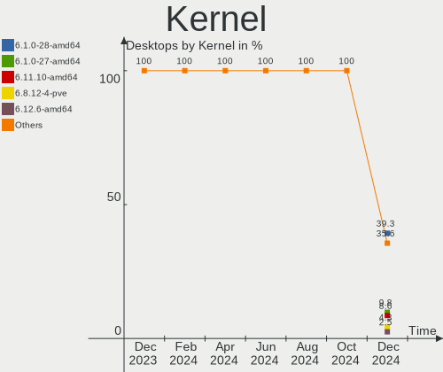
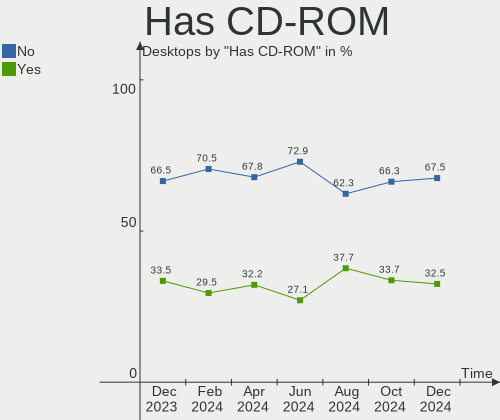
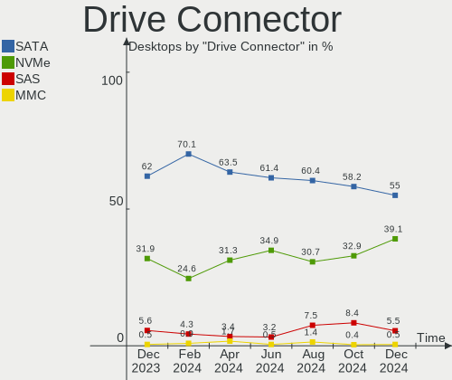
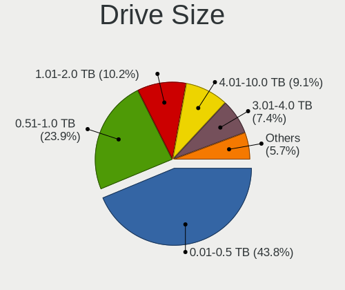
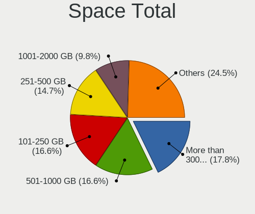
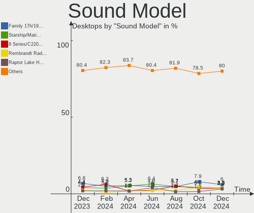
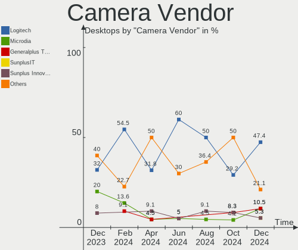

Debian Hardware Trends (Desktop)
--------------------------------

A project to identify most popular hardware characteristics and track their change
over time based on data collected by Debian users at https://Linux-Hardware.org.

Anyone can contribute to the study by uploading probes of their computers by
the [hw-probe](https://github.com/linuxhw/hw-probe) tool:

    sudo -E hw-probe -all -upload

Full-feature report is available here: https://linux-hardware.org/?view=trends&formfactor=desktop

Period: Dec, 2020.

Contents
--------

- [ OS                       ](#os)
- [ OS Family                ](#os-family)
- [ Kernel                   ](#kernel)
- [ Kernel Family            ](#kernel-family)
- [ Kernel Major Ver.        ](#kernel-major-ver)
- [ Arch                     ](#arch)
- [ DE                       ](#de)
- [ Display Server           ](#display-server)
- [ Display Manager          ](#display-manager)
- [ OS Lang                  ](#os-lang)
- [ Boot Mode                ](#boot-mode)
- [ Filesystem               ](#filesystem)
- [ Part. scheme             ](#part-scheme)
- [ Dual Boot with Linux/BSD ](#dual-boot-with-linux/bsd)
- [ Dual Boot (Win)          ](#dual-boot-win)
- [ Country                  ](#country)
- [ City                     ](#city)
- [ Vendor                   ](#vendor)
- [ Model                    ](#model)
- [ Model Family             ](#model-family)
- [ MFG Year                 ](#mfg-year)
- [ Form Factor              ](#form-factor)
- [ Secure Boot              ](#secure-boot)
- [ Coreboot                 ](#coreboot)
- [ RAM Size                 ](#ram-size)
- [ RAM Used                 ](#ram-used)
- [ Has CD-ROM               ](#has-cd-rom)
- [ Total Drives             ](#total-drives)
- [ Has Ethernet             ](#has-ethernet)
- [ Drive Vendor             ](#drive-vendor)
- [ Drive Model              ](#drive-model)
- [ HDD Vendor               ](#hdd-vendor)
- [ SSD Vendor               ](#ssd-vendor)
- [ Drive Kind               ](#drive-kind)
- [ Drive Connector          ](#drive-connector)
- [ Drive Size               ](#drive-size)
- [ Space Total              ](#space-total)
- [ Space Used               ](#space-used)
- [ Malfunc. Drives          ](#malfunc-drives)
- [ Malfunc. Drive Vendor    ](#malfunc-drive-vendor)
- [ Malfunc. HDD Vendor      ](#malfunc-hdd-vendor)
- [ Malfunc. Drive Kind      ](#malfunc-drive-kind)
- [ Failed Drives            ](#failed-drives)
- [ Failed Drive Vendor      ](#failed-drive-vendor)
- [ Drive Status             ](#drive-status)
- [ Storage Vendor           ](#storage-vendor)
- [ Storage Model            ](#storage-model)
- [ Storage Kind             ](#storage-kind)
- [ CPU Vendor               ](#cpu-vendor)
- [ CPU Model                ](#cpu-model)
- [ CPU Model Family         ](#cpu-model-family)
- [ CPU Cores                ](#cpu-cores)
- [ CPU Sockets              ](#cpu-sockets)
- [ CPU Threads              ](#cpu-threads)
- [ CPU Op-Modes             ](#cpu-op-modes)
- [ CPU Microcode            ](#cpu-microcode)
- [ CPU Microarch            ](#cpu-microarch)
- [ GPU Vendor               ](#gpu-vendor)
- [ GPU Model                ](#gpu-model)
- [ GPU Combo                ](#gpu-combo)
- [ GPU Driver               ](#gpu-driver)
- [ GPU Memory               ](#gpu-memory)
- [ Monitor Vendor           ](#monitor-vendor)
- [ Monitor Model            ](#monitor-model)
- [ Monitor Resolution       ](#monitor-resolution)
- [ Monitor Diagonal         ](#monitor-diagonal)
- [ Monitor Width            ](#monitor-width)
- [ Aspect Ratio             ](#aspect-ratio)
- [ Monitor Area             ](#monitor-area)
- [ Pixel Density            ](#pixel-density)
- [ Multiple Monitors        ](#multiple-monitors)
- [ Net Controller Vendor    ](#net-controller-vendor)
- [ Net Controller Model     ](#net-controller-model)
- [ Wireless Vendor          ](#wireless-vendor)
- [ Wireless Model           ](#wireless-model)
- [ Ethernet Vendor          ](#ethernet-vendor)
- [ Ethernet Model           ](#ethernet-model)
- [ Net Controller Kind      ](#net-controller-kind)
- [ Used Controller          ](#used-controller)
- [ NICs                     ](#nics)
- [ Memory Vendor            ](#memory-vendor)
- [ Memory Model             ](#memory-model)
- [ Memory Kind              ](#memory-kind)
- [ Memory Form Factor       ](#memory-form-factor)
- [ Memory Size              ](#memory-size)
- [ Memory Speed             ](#memory-speed)
- [ Sound Vendor             ](#sound-vendor)
- [ Sound Model              ](#sound-model)
- [ Camera Vendor            ](#camera-vendor)
- [ Camera Model             ](#camera-model)
- [ Fingerprint Vendor       ](#fingerprint-vendor)
- [ Fingerprint Model        ](#fingerprint-model)
- [ Chipcard Vendor          ](#chipcard-vendor)
- [ Chipcard Model           ](#chipcard-model)
- [ Printer Vendor           ](#printer-vendor)
- [ Printer Model            ](#printer-model)
- [ Scanner Vendor           ](#scanner-vendor)
- [ Scanner Model            ](#scanner-model)
- [ Bluetooth Vendor         ](#bluetooth-vendor)
- [ Bluetooth Model          ](#bluetooth-model)
- [ Unsupported Devices      ](#unsupported-devices)
- [ Unsupported Device Types ](#unsupported-device-types)

OS
--

Installed operating systems

| Name            | Desktops | Percent |
|-----------------|----------|---------|
| Debian 10       | 46       | 70.77%  |
| Debian Testing  | 10       | 15.38%  |
| Debian          | 5        | 7.69%   |
| Debian Unstable | 4        | 6.15%   |

OS Family
---------

OS without a version

| Name   | Desktops | Percent |
|--------|----------|---------|
| Debian | 65       | 100%    |

Kernel
------

Version of the Linux kernel

| Version                   | Desktops | Percent |
|---------------------------|----------|---------|
| 4.19.0-13-amd64           | 21       | 32.31%  |
| 5.9.0-4-amd64             | 9        | 13.85%  |
| 4.19.0-12-amd64           | 7        | 10.77%  |
| 5.9.0-5-amd64             | 4        | 6.15%   |
| 5.9.0-0.bpo.2-amd64       | 4        | 6.15%   |
| 4.19.0-6-amd64            | 4        | 6.15%   |
| 5.9.0-3-amd64             | 3        | 4.62%   |
| 5.8.0-3-amd64             | 2        | 3.08%   |
| 5.9.0-2-686-pae           | 1        | 1.54%   |
| 5.8.0-0.bpo.2-amd64       | 1        | 1.54%   |
| 5.7.0-19.1-liquorix-amd64 | 1        | 1.54%   |
| 5.7.0-0.bpo.2-amd64       | 1        | 1.54%   |
| 5.4.78-1-pve              | 1        | 1.54%   |
| 5.4.31                    | 1        | 1.54%   |
| 5.10.0-rc5-croessler4     | 1        | 1.54%   |
| 4.19.0-13-686-pae         | 1        | 1.54%   |
| 4.19.0-11-amd64           | 1        | 1.54%   |
| 4.19.0-11-686-pae         | 1        | 1.54%   |
| 4.19.0-10-686             | 1        | 1.54%   |

Kernel Family
-------------

Linux kernel without a distro release

| Version | Desktops | Percent |
|---------|----------|---------|
| 4.19.0  | 36       | 55.38%  |
| 5.9.0   | 21       | 32.31%  |
| 5.8.0   | 3        | 4.62%   |
| 5.7.0   | 2        | 3.08%   |
| 5.4.78  | 1        | 1.54%   |
| 5.4.31  | 1        | 1.54%   |
| 5.10.0  | 1        | 1.54%   |

Kernel Major Ver.
-----------------

Linux kernel major version

| Version | Desktops | Percent |
|---------|----------|---------|
| 4.19    | 36       | 55.38%  |
| 5.9     | 21       | 32.31%  |
| 5.8     | 3        | 4.62%   |
| 5.7     | 2        | 3.08%   |
| 5.4     | 2        | 3.08%   |
| 5.10    | 1        | 1.54%   |

Arch
----

OS architecture (x86_64, i586, etc.)

| Name   | Desktops | Percent |
|--------|----------|---------|
| x86_64 | 60       | 92.31%  |
| i686   | 4        | 6.15%   |
| armv7l | 1        | 1.54%   |

DE
--

Desktop Environment

| Name       | Desktops | Percent |
|------------|----------|---------|
| GNOME      | 13       | 20%     |
| XFCE       | 11       | 16.92%  |
| Unknown    | 10       | 15.38%  |
| KDE5       | 7        | 10.77%  |
| MATE       | 6        | 9.23%   |
| Cinnamon   | 6        | 9.23%   |
| KDE        | 5        | 7.69%   |
| X-Cinnamon | 3        | 4.62%   |
| fluxbox    | 3        | 4.62%   |
| LXDE       | 1        | 1.54%   |

Display Server
--------------

X11 or Wayland

| Name    | Desktops | Percent |
|---------|----------|---------|
| X11     | 47       | 72.31%  |
| Tty     | 10       | 15.38%  |
| Wayland | 6        | 9.23%   |
| Unknown | 2        | 3.08%   |

Display Manager
---------------

SDDM, LightDM, etc.

| Name    | Desktops | Percent |
|---------|----------|---------|
| Unknown | 34       | 52.31%  |
| TDM     | 18       | 27.69%  |
| SDDM    | 6        | 9.23%   |
| GDM     | 6        | 9.23%   |
| LightDM | 1        | 1.54%   |

OS Lang
-------

Language

| Lang    | Desktops | Percent |
|---------|----------|---------|
| en_US   | 22       | 33.85%  |
| de_DE   | 8        | 12.31%  |
| fr_FR   | 6        | 9.23%   |
| en_GB   | 5        | 7.69%   |
| es_ES   | 4        | 6.15%   |
| ru_RU   | 3        | 4.62%   |
| Unknown | 3        | 4.62%   |
| pt_BR   | 2        | 3.08%   |
| pl_PL   | 2        | 3.08%   |
| en_AU   | 2        | 3.08%   |
| pt_PT   | 1        | 1.54%   |
| hu_HU   | 1        | 1.54%   |
| en_IN   | 1        | 1.54%   |
| en_IE   | 1        | 1.54%   |
| en_CA   | 1        | 1.54%   |
| de_CH   | 1        | 1.54%   |
| da_DK   | 1        | 1.54%   |
| C       | 1        | 1.54%   |

Boot Mode
---------

EFI or BIOS

| Mode | Desktops | Percent |
|------|----------|---------|
| BIOS | 42       | 64.62%  |
| EFI  | 23       | 35.38%  |

Filesystem
----------

Type of filesystem

| Type  | Desktops | Percent |
|-------|----------|---------|
| Ext4  | 56       | 86.15%  |
| Btrfs | 6        | 9.23%   |
| Xfs   | 2        | 3.08%   |
| F2fs  | 1        | 1.54%   |

Part. scheme
------------

Scheme of partitioning

| Type    | Desktops | Percent |
|---------|----------|---------|
| GPT     | 30       | 46.15%  |
| Unknown | 25       | 38.46%  |
| MBR     | 10       | 15.38%  |

Dual Boot with Linux/BSD
------------------------

Hosting more than one Linux/BSD

| Dual boot | Desktops | Percent |
|-----------|----------|---------|
| No        | 56       | 86.15%  |
| Yes       | 9        | 13.85%  |

Dual Boot (Win)
---------------

Hosting Linux and Windows

| Dual boot | Desktops | Percent |
|-----------|----------|---------|
| No        | 53       | 81.54%  |
| Yes       | 12       | 18.46%  |

Country
-------

Geographic location (country)

| Country        | Desktops | Percent |
|----------------|----------|---------|
| USA            | 15       | 23.08%  |
| Germany        | 8        | 12.31%  |
| Spain          | 6        | 9.23%   |
| France         | 6        | 9.23%   |
| Russia         | 3        | 4.62%   |
| Poland         | 3        | 4.62%   |
| UK             | 2        | 3.08%   |
| Turkey         | 2        | 3.08%   |
| Switzerland    | 2        | 3.08%   |
| Hungary        | 2        | 3.08%   |
| Brazil         | 2        | 3.08%   |
| Australia      | 2        | 3.08%   |
| Ukraine        | 1        | 1.54%   |
| Slovakia       | 1        | 1.54%   |
| Saudi Arabia   | 1        | 1.54%   |
| Portugal       | 1        | 1.54%   |
| Norway         | 1        | 1.54%   |
| Netherlands    | 1        | 1.54%   |
| Mexico         | 1        | 1.54%   |
| Japan          | 1        | 1.54%   |
| India          | 1        | 1.54%   |
| Denmark        | 1        | 1.54%   |
| Czech Republic | 1        | 1.54%   |
| Belarus        | 1        | 1.54%   |

City
----

Geographic location (city)

| City                   | Desktops | Percent |
|------------------------|----------|---------|
| Springfield            | 2        | 3.08%   |
| Paris                  | 2        | 3.08%   |
| New York               | 2        | 3.08%   |
| Madrid                 | 2        | 3.08%   |
| Antalya                | 2        | 3.08%   |
| Yaya                   | 1        | 1.54%   |
| Williamstown           | 1        | 1.54%   |
| Westminster            | 1        | 1.54%   |
| West Fargo             | 1        | 1.54%   |
| Vitoria-Gasteiz        | 1        | 1.54%   |
| Utrecht                | 1        | 1.54%   |
| Trondheim              | 1        | 1.54%   |
| Sunnyvale              | 1        | 1.54%   |
| Sultanpur              | 1        | 1.54%   |
| Stoke Newington        | 1        | 1.54%   |
| Springe                | 1        | 1.54%   |
| Sonneberg              | 1        | 1.54%   |
| Roanoke                | 1        | 1.54%   |
| Riyadh                 | 1        | 1.54%   |
| Rancho Palos Verdes    | 1        | 1.54%   |
| Prague                 | 1        | 1.54%   |
| Pokhvistnevo           | 1        | 1.54%   |
| Perth                  | 1        | 1.54%   |
| Odintsovo              | 1        | 1.54%   |
| Oberwil                | 1        | 1.54%   |
| Nowe Miasto            | 1        | 1.54%   |
| Nice                   | 1        | 1.54%   |
| New Philadelphia       | 1        | 1.54%   |
| Munich                 | 1        | 1.54%   |
| Montijo                | 1        | 1.54%   |
| Minsk                  | 1        | 1.54%   |
| Michalovce             | 1        | 1.54%   |
| Lubbock                | 1        | 1.54%   |
| Kyiv                   | 1        | 1.54%   |
| Itajaí                | 1        | 1.54%   |
| Ingenio                | 1        | 1.54%   |
| Honcho                 | 1        | 1.54%   |
| Herzogenbuchsee        | 1        | 1.54%   |
| Hamburg                | 1        | 1.54%   |
| Haiterbach             | 1        | 1.54%   |
| Guadalupe              | 1        | 1.54%   |
| Gross-Zimmern          | 1        | 1.54%   |
| Gloucester             | 1        | 1.54%   |
| Gerena                 | 1        | 1.54%   |
| Fontenay-sous-Bois     | 1        | 1.54%   |
| Floresville            | 1        | 1.54%   |
| Einbeck                | 1        | 1.54%   |
| Eastleigh              | 1        | 1.54%   |
| East Orange            | 1        | 1.54%   |
| Dąbrowa Górnicza     | 1        | 1.54%   |
| Dorog                  | 1        | 1.54%   |
| Copenhagen             | 1        | 1.54%   |
| Colomiers              | 1        | 1.54%   |
| Charleville-Mézières | 1        | 1.54%   |
| Burgos                 | 1        | 1.54%   |
| Budapest               | 1        | 1.54%   |
| Botucatu               | 1        | 1.54%   |
| Bad Orb                | 1        | 1.54%   |
| Bachowice              | 1        | 1.54%   |
| Atlanta                | 1        | 1.54%   |

Vendor
------

Motherboard manufacturer

| Name                | Desktops | Percent |
|---------------------|----------|---------|
| ASUSTek Computer    | 22       | 33.85%  |
| Gigabyte Technology | 7        | 10.77%  |
| ASRock              | 7        | 10.77%  |
| MSI                 | 5        | 7.69%   |
| Lenovo              | 5        | 7.69%   |
| Dell                | 5        | 7.69%   |
| Hewlett-Packard     | 4        | 6.15%   |
| Fujitsu Siemens     | 3        | 4.62%   |
| Unknown             | 2        | 3.08%   |
| Intel               | 1        | 1.54%   |
| Huanan              | 1        | 1.54%   |
| Biostar             | 1        | 1.54%   |
| AZW                 | 1        | 1.54%   |
| AMI                 | 1        | 1.54%   |

Model
-----

Motherboard model

| Name                                    | Desktops | Percent |
|-----------------------------------------|----------|---------|
| ASUS All Series                         | 3        | 4.62%   |
| ASUS Rampage IV EXTREME                 | 2        | 3.08%   |
| Unknown                                 | 2        | 3.08%   |
| MSI MS-7C75                             | 1        | 1.54%   |
| MSI MS-7B79                             | 1        | 1.54%   |
| MSI MS-7817                             | 1        | 1.54%   |
| MSI MS-7751                             | 1        | 1.54%   |
| MSI MS-7693                             | 1        | 1.54%   |
| Lenovo ThinkStation D30 435479G         | 1        | 1.54%   |
| Lenovo ThinkCentre M92p 3209EK4         | 1        | 1.54%   |
| Lenovo IdeaCentre 510S-07ICB 90K800GHMW | 1        | 1.54%   |
| Lenovo IdeaCentre 200-01IBW 90FA0011GE  | 1        | 1.54%   |
| Lenovo 70LV003JEA ThinkServer TS150     | 1        | 1.54%   |
| Intel DH61WW AAG23116-204               | 1        | 1.54%   |
| Huanan X79 V2.47                        | 1        | 1.54%   |
| HP t620 Dual Core TC                    | 1        | 1.54%   |
| HP t5740                                | 1        | 1.54%   |
| HP ProDesk 600 G1 TWR                   | 1        | 1.54%   |
| HP ProDesk 400 G2 MT (TPM DP)           | 1        | 1.54%   |
| Gigabyte X99-Gaming 7 WIFI              | 1        | 1.54%   |
| Gigabyte X79-UP4                        | 1        | 1.54%   |
| Gigabyte H97N-WIFI                      | 1        | 1.54%   |
| Gigabyte H55-USB3                       | 1        | 1.54%   |
| Gigabyte H110M-S2H                      | 1        | 1.54%   |
| Gigabyte G41MT-S2PT                     | 1        | 1.54%   |
| Gigabyte B450 AORUS PRO WIFI            | 1        | 1.54%   |
| Fujitsu Siemens ESPRIMO P               | 1        | 1.54%   |
| Fujitsu Siemens ESPRIMO E5625           | 1        | 1.54%   |
| Fujitsu Siemens ESPRIMO E               | 1        | 1.54%   |
| Dell Precision WorkStation T7500        | 1        | 1.54%   |
| Dell OptiPlex 3020                      | 1        | 1.54%   |
| Dell OptiPlex 3010                      | 1        | 1.54%   |
| Dell Inspiron 560                       | 1        | 1.54%   |
| Dell DXP061                             | 1        | 1.54%   |
| Biostar TF570 SLI A2+                   | 1        | 1.54%   |
| AZW GK55                                | 1        | 1.54%   |
| ASUS Z170I PRO GAMING                   | 1        | 1.54%   |
| ASUS ROG ZENITH EXTREME                 | 1        | 1.54%   |
| ASUS ROG STRIX B450-E GAMING            | 1        | 1.54%   |
| ASUS ROG STRIX B360-I GAMING            | 1        | 1.54%   |
| ASUS Pro WS X570-ACE                    | 1        | 1.54%   |
| ASUS PRIME Z370-A                       | 1        | 1.54%   |
| ASUS PRIME B450-PLUS                    | 1        | 1.54%   |
| ASUS PRIME B360M-A                      | 1        | 1.54%   |
| ASUS P8Z77-I DELUXE                     | 1        | 1.54%   |
| ASUS P8Z68-V PRO                        | 1        | 1.54%   |
| ASUS P8Z68-V LE                         | 1        | 1.54%   |
| ASUS P6T SE                             | 1        | 1.54%   |
| ASUS P5G41T-M LX2/BR                    | 1        | 1.54%   |
| ASUS P3V4X                              | 1        | 1.54%   |
| ASUS Maximus VIII GENE                  | 1        | 1.54%   |
| ASUS M2N32-SLI DELUXE                   | 1        | 1.54%   |
| ASUS B202                               | 1        | 1.54%   |
| ASRock X470 Taichi                      | 1        | 1.54%   |
| ASRock X300M-STX                        | 1        | 1.54%   |
| ASRock J4105-ITX                        | 1        | 1.54%   |
| ASRock H110M-HDV R3.0                   | 1        | 1.54%   |
| ASRock ConRoe945G-DVI                   | 1        | 1.54%   |
| ASRock A780GMH/128M                     | 1        | 1.54%   |
| ASRock A320M-HDV R3.0                   | 1        | 1.54%   |

Model Family
------------

Motherboard model prefix

| Name                    | Desktops | Percent |
|-------------------------|----------|---------|
| Fujitsu Siemens ESPRIMO | 3        | 4.62%   |
| ASUS ROG                | 3        | 4.62%   |
| ASUS PRIME              | 3        | 4.62%   |
| ASUS All                | 3        | 4.62%   |
| Lenovo IdeaCentre       | 2        | 3.08%   |
| HP ProDesk              | 2        | 3.08%   |
| Dell OptiPlex           | 2        | 3.08%   |
| ASUS Rampage            | 2        | 3.08%   |
| ASUS P8Z68-V            | 2        | 3.08%   |
| Unknown                 | 2        | 3.08%   |
| MSI MS-7C75             | 1        | 1.54%   |
| MSI MS-7B79             | 1        | 1.54%   |
| MSI MS-7817             | 1        | 1.54%   |
| MSI MS-7751             | 1        | 1.54%   |
| MSI MS-7693             | 1        | 1.54%   |
| Lenovo ThinkStation     | 1        | 1.54%   |
| Lenovo ThinkCentre      | 1        | 1.54%   |
| Lenovo 70LV003JEA       | 1        | 1.54%   |
| Intel DH61WW            | 1        | 1.54%   |
| Huanan X79              | 1        | 1.54%   |
| HP t620                 | 1        | 1.54%   |
| HP t5740                | 1        | 1.54%   |
| Gigabyte X99-Gaming     | 1        | 1.54%   |
| Gigabyte X79-UP4        | 1        | 1.54%   |
| Gigabyte H97N-WIFI      | 1        | 1.54%   |
| Gigabyte H55-USB3       | 1        | 1.54%   |
| Gigabyte H110M-S2H      | 1        | 1.54%   |
| Gigabyte G41MT-S2PT     | 1        | 1.54%   |
| Gigabyte B450           | 1        | 1.54%   |
| Dell Precision          | 1        | 1.54%   |
| Dell Inspiron           | 1        | 1.54%   |
| Dell DXP061             | 1        | 1.54%   |
| Biostar TF570           | 1        | 1.54%   |
| AZW GK55                | 1        | 1.54%   |
| ASUS Z170I              | 1        | 1.54%   |
| ASUS Pro                | 1        | 1.54%   |
| ASUS P8Z77-I            | 1        | 1.54%   |
| ASUS P6T                | 1        | 1.54%   |
| ASUS P5G41T-M           | 1        | 1.54%   |
| ASUS P3V4X              | 1        | 1.54%   |
| ASUS Maximus            | 1        | 1.54%   |
| ASUS M2N32-SLI          | 1        | 1.54%   |
| ASUS B202               | 1        | 1.54%   |
| ASRock X470             | 1        | 1.54%   |
| ASRock X300M-STX        | 1        | 1.54%   |
| ASRock J4105-ITX        | 1        | 1.54%   |
| ASRock H110M-HDV        | 1        | 1.54%   |
| ASRock ConRoe945G-DVI   | 1        | 1.54%   |
| ASRock A780GMH          | 1        | 1.54%   |
| ASRock A320M-HDV        | 1        | 1.54%   |
| AMI Cherry              | 1        | 1.54%   |

MFG Year
--------

Motherboard manufacture year

| Year    | Desktops | Percent |
|---------|----------|---------|
| 2019    | 12       | 18.46%  |
| 2014    | 6        | 9.23%   |
| 2018    | 5        | 7.69%   |
| 2017    | 5        | 7.69%   |
| 2016    | 5        | 7.69%   |
| 2010    | 5        | 7.69%   |
| 2012    | 4        | 6.15%   |
| 2011    | 4        | 6.15%   |
| 2020    | 3        | 4.62%   |
| 2015    | 3        | 4.62%   |
| 2013    | 3        | 4.62%   |
| 2009    | 3        | 4.62%   |
| 2007    | 2        | 3.08%   |
| 2008    | 1        | 1.54%   |
| 2006    | 1        | 1.54%   |
| 2005    | 1        | 1.54%   |
| 2000    | 1        | 1.54%   |
| Unknown | 1        | 1.54%   |

Form Factor
-----------

Physical design of the computer

| Name    | Desktops | Percent |
|---------|----------|---------|
| Desktop | 65       | 100%    |

Secure Boot
-----------

Enabled or disabled

| State    | Desktops | Percent |
|----------|----------|---------|
| Disabled | 63       | 96.92%  |
| Enabled  | 2        | 3.08%   |

Coreboot
--------

Have coreboot on board

| Used | Desktops | Percent |
|------|----------|---------|
| No   | 65       | 100%    |

RAM Size
--------

Total RAM memory

| Size in GB      | Desktops | Percent |
|-----------------|----------|---------|
| 16.01-24.0      | 12       | 18.46%  |
| 8.01-16.0       | 12       | 18.46%  |
| 4.01-8.0        | 10       | 15.38%  |
| 32.01-64.0      | 10       | 15.38%  |
| 3.01-4.0        | 8        | 12.31%  |
| 64.01-256.0     | 4        | 6.15%   |
| 2.01-3.0        | 3        | 4.62%   |
| 24.01-32.0      | 2        | 3.08%   |
| 1.01-2.0        | 2        | 3.08%   |
| More than 256.0 | 1        | 1.54%   |
| 0.01-0.5        | 1        | 1.54%   |

RAM Used
--------

Used RAM memory

| Used GB    | Desktops | Percent |
|------------|----------|---------|
| 1.01-2.0   | 22       | 33.85%  |
| 4.01-8.0   | 14       | 21.54%  |
| 2.01-3.0   | 14       | 21.54%  |
| 0.51-1.0   | 5        | 7.69%   |
| 0.01-0.5   | 4        | 6.15%   |
| 3.01-4.0   | 3        | 4.62%   |
| 8.01-16.0  | 2        | 3.08%   |
| 32.01-64.0 | 1        | 1.54%   |

Has CD-ROM
----------

Has CD-ROM on board

| Presented | Desktops | Percent |
|-----------|----------|---------|
| No        | 36       | 55.38%  |
| Yes       | 29       | 44.62%  |

Total Drives
------------

Number of drives on board

| Drives | Desktops | Percent |
|--------|----------|---------|
| 1      | 26       | 40%     |
| 2      | 15       | 23.08%  |
| 3      | 11       | 16.92%  |
| 5      | 4        | 6.15%   |
| 4      | 4        | 6.15%   |
| 7      | 3        | 4.62%   |
| 13     | 1        | 1.54%   |
| 12     | 1        | 1.54%   |

Has Ethernet
------------

Has Ethernet on board

| Presented | Desktops | Percent |
|-----------|----------|---------|
| Yes       | 63       | 96.92%  |
| No        | 2        | 3.08%   |

Drive Vendor
------------

Hard drive vendors

| Vendor              | Desktops | Drives | Percent |
|---------------------|----------|--------|---------|
| WDC                 | 24       | 39     | 19.67%  |
| Seagate             | 21       | 34     | 17.21%  |
| Samsung Electronics | 17       | 19     | 13.93%  |
| Kingston            | 8        | 11     | 6.56%   |
| Toshiba             | 6        | 6      | 4.92%   |
| Crucial             | 6        | 7      | 4.92%   |
| Hitachi             | 5        | 5      | 4.1%    |
| Sandisk             | 4        | 4      | 3.28%   |
| HGST                | 4        | 5      | 3.28%   |
| Hewlett-Packard     | 4        | 7      | 3.28%   |
| Unknown             | 3        | 4      | 2.46%   |
| OCZ                 | 3        | 5      | 2.46%   |
| Phison              | 2        | 3      | 1.64%   |
| China               | 2        | 2      | 1.64%   |
| A-DATA Technology   | 2        | 2      | 1.64%   |
| VALK                | 1        | 1      | 0.82%   |
| SK Hynix            | 1        | 1      | 0.82%   |
| QUANTUM             | 1        | 1      | 0.82%   |
| Phison Electronics  | 1        | 1      | 0.82%   |
| Maxtor              | 1        | 2      | 0.82%   |
| KingDian            | 1        | 1      | 0.82%   |
| JMicron             | 1        | 1      | 0.82%   |
| Intel               | 1        | 1      | 0.82%   |
| HPE                 | 1        | 1      | 0.82%   |
| Gigabyte Technology | 1        | 1      | 0.82%   |
| Apple               | 1        | 1      | 0.82%   |

Drive Model
-----------

Hard drive models

| Model                            | Desktops | Percent |
|----------------------------------|----------|---------|
| WDC WD10EALX-009BA0 1TB          | 3        | 2.14%   |
| Seagate ST500DM002-1BD142 500GB  | 3        | 2.14%   |
| OCZ VERTEX4 256GB SSD            | 3        | 2.14%   |
| Kingston SUV400S37120G 120GB SSD | 3        | 2.14%   |
| WDC WD40EZRX-00SPEB0 4TB         | 2        | 1.43%   |
| WDC WD30EZRX-00DC0B0 3TB         | 2        | 1.43%   |
| WDC WD20EFRX-68EUZN0 2TB         | 2        | 1.43%   |
| Unknown SD/MMC 8GB               | 2        | 1.43%   |
| Seagate ST4000DM004-2CV104 4TB   | 2        | 1.43%   |
| Seagate ST4000DM000-1F2168 4TB   | 2        | 1.43%   |
| Samsung SSD 970 EVO Plus 1TB     | 2        | 1.43%   |
| Samsung SSD 860 EVO 500GB        | 2        | 1.43%   |
| Samsung NVMe SSD Drive 512GB     | 2        | 1.43%   |
| Kingston SA400S37480G 480GB SSD  | 2        | 1.43%   |
| Kingston SA400S37240G 240GB SSD  | 2        | 1.43%   |
| Crucial CT250MX500SSD1 250GB     | 2        | 1.43%   |
| WDC WDS500G2B0C-00PXH0 500GB     | 1        | 0.71%   |
| WDC WDS240G2G0A-00JH30 240GB SSD | 1        | 0.71%   |
| WDC WD7500AADS-00M2B0 752GB      | 1        | 0.71%   |
| WDC WD7500AACS-65D6B0 752GB      | 1        | 0.71%   |
| WDC WD5001FZWX-00ZHUA0 5TB       | 1        | 0.71%   |
| WDC WD5000AAKX-003CA0 500GB      | 1        | 0.71%   |
| WDC WD5000AAKX-001CA0 500GB      | 1        | 0.71%   |
| WDC WD5000AAKS-75YGA0 500GB      | 1        | 0.71%   |
| WDC WD5000AAKS-00UU3A0 500GB     | 1        | 0.71%   |
| WDC WD5000AADS-00S9B0 500GB      | 1        | 0.71%   |
| WDC WD2500AAKX-75U6AA0 250GB     | 1        | 0.71%   |
| WDC WD2500AAKX-60U6AA0 250GB     | 1        | 0.71%   |
| WDC WD20EARS-00J2GB0 2TB         | 1        | 0.71%   |
| WDC WD2003FZEX-00Z4SA0 2TB       | 1        | 0.71%   |
| WDC WD10EZRX-00L4HB0 1TB         | 1        | 0.71%   |
| WDC WD10EZRX-00D8PB0 1TB         | 1        | 0.71%   |
| WDC WD10EZEX-21M2NA0 1TB         | 1        | 0.71%   |
| WDC WD10EALS-00Z8A0 1TB          | 1        | 0.71%   |
| WDC WD10EACS-00ZJB0 1TB          | 1        | 0.71%   |
| WDC WD100EZAZ-11TDBA0 10TB       | 1        | 0.71%   |
| WDC WD1003FZEX-00MK2A0 1TB       | 1        | 0.71%   |
| WDC WD1002FBYS-02A6B0 1TB        | 1        | 0.71%   |
| VALK 1500 240GB SSD              | 1        | 0.71%   |
| Unknown SD/MMC/M.S.PRO 32GB      | 1        | 0.71%   |
| Unknown Q2J54A  4GB              | 1        | 0.71%   |
| Toshiba MQ01ABF050 500GB         | 1        | 0.71%   |
| Toshiba MK1665GSX H 160GB        | 1        | 0.71%   |
| Toshiba HDWE160 6TB              | 1        | 0.71%   |
| Toshiba HDWE150 5TB              | 1        | 0.71%   |
| Toshiba HDWD120 2TB              | 1        | 0.71%   |
| Toshiba DT01ACA300 3TB           | 1        | 0.71%   |
| SK Hynix HCG8e  64GB             | 1        | 0.71%   |
| Seagate ST9500325AS 500GB        | 1        | 0.71%   |
| Seagate ST8000DM0004-1ZC11G 8TB  | 1        | 0.71%   |
| Seagate ST3750528AS 752GB        | 1        | 0.71%   |
| Seagate ST3500413AS 500GB        | 1        | 0.71%   |
| Seagate ST3500320AS 500GB        | 1        | 0.71%   |
| Seagate ST3250318AS 249GB        | 1        | 0.71%   |
| Seagate ST3250310AS 250GB        | 1        | 0.71%   |
| Seagate ST320LT012-1DG14C 320GB  | 1        | 0.71%   |
| Seagate ST3160815AS 160GB        | 1        | 0.71%   |
| Seagate ST31500341AS 1TB         | 1        | 0.71%   |
| Seagate ST31000528AS 1TB         | 1        | 0.71%   |
| Seagate ST3000VX009-2AY10G 3TB   | 1        | 0.71%   |

HDD Vendor
----------

Hard disk drive vendors

| Vendor              | Desktops | Drives | Percent |
|---------------------|----------|--------|---------|
| WDC                 | 22       | 37     | 34.38%  |
| Seagate             | 20       | 33     | 31.25%  |
| Toshiba             | 6        | 6      | 9.38%   |
| Hitachi             | 5        | 5      | 7.81%   |
| HGST                | 4        | 5      | 6.25%   |
| Samsung Electronics | 2        | 3      | 3.13%   |
| QUANTUM             | 1        | 1      | 1.56%   |
| Maxtor              | 1        | 2      | 1.56%   |
| HPE                 | 1        | 1      | 1.56%   |
| Hewlett-Packard     | 1        | 1      | 1.56%   |
| Apple               | 1        | 1      | 1.56%   |

SSD Vendor
----------

Solid state drive vendors

| Vendor              | Desktops | Drives | Percent |
|---------------------|----------|--------|---------|
| Samsung Electronics | 9        | 9      | 25%     |
| Kingston            | 6        | 8      | 16.67%  |
| Crucial             | 6        | 6      | 16.67%  |
| SanDisk             | 3        | 3      | 8.33%   |
| OCZ                 | 3        | 5      | 8.33%   |
| China               | 2        | 2      | 5.56%   |
| WDC                 | 1        | 1      | 2.78%   |
| VALK                | 1        | 1      | 2.78%   |
| KingDian            | 1        | 1      | 2.78%   |
| JMicron             | 1        | 1      | 2.78%   |
| Hewlett-Packard     | 1        | 1      | 2.78%   |
| Gigabyte Technology | 1        | 1      | 2.78%   |
| A-DATA Technology   | 1        | 1      | 2.78%   |

Drive Kind
----------

HDD or SSD

| Kind    | Desktops | Drives | Percent |
|---------|----------|--------|---------|
| HDD     | 48       | 95     | 47.06%  |
| SSD     | 33       | 40     | 32.35%  |
| NVMe    | 16       | 24     | 15.69%  |
| Unknown | 3        | 4      | 2.94%   |
| MMC     | 2        | 2      | 1.96%   |

Drive Connector
---------------

SATA, SAS, NVMe, etc.

| Type | Desktops | Drives | Percent |
|------|----------|--------|---------|
| SATA | 57       | 130    | 70.37%  |
| NVMe | 16       | 24     | 19.75%  |
| SAS  | 6        | 9      | 7.41%   |
| MMC  | 2        | 2      | 2.47%   |

Drive Size
----------

Size of hard drive

| Size in TB | Desktops | Drives | Percent |
|------------|----------|--------|---------|
| 0.01-0.5   | 44       | 66     | 48.35%  |
| 0.51-1.0   | 22       | 27     | 24.18%  |
| 3.01-4.0   | 8        | 17     | 8.79%   |
| 1.01-2.0   | 6        | 7      | 6.59%   |
| 4.01-10.0  | 6        | 12     | 6.59%   |
| 2.01-3.0   | 5        | 6      | 5.49%   |

Space Total
-----------

Amount of disk space available on the file system

| Size in GB     | Desktops | Percent |
|----------------|----------|---------|
| More than 3000 | 16       | 24.62%  |
| 101-250        | 14       | 21.54%  |
| 251-500        | 13       | 20%     |
| 501-1000       | 6        | 9.23%   |
| 1001-2000      | 4        | 6.15%   |
| 2001-3000      | 3        | 4.62%   |
| 51-100         | 3        | 4.62%   |
| Unknown        | 3        | 4.62%   |
| 1-20           | 2        | 3.08%   |
| 21-50          | 1        | 1.54%   |

Space Used
----------

Amount of used disk space

| Used GB        | Desktops | Percent |
|----------------|----------|---------|
| 1-20           | 20       | 30.77%  |
| More than 3000 | 8        | 12.31%  |
| 1001-2000      | 7        | 10.77%  |
| 501-1000       | 7        | 10.77%  |
| 51-100         | 6        | 9.23%   |
| 251-500        | 5        | 7.69%   |
| 101-250        | 5        | 7.69%   |
| 21-50          | 4        | 6.15%   |
| Unknown        | 3        | 4.62%   |

Malfunc. Drives
---------------

Drive models with a malfunction

| Model                             | Desktops | Drives | Percent |
|-----------------------------------|----------|--------|---------|
| WDC WDS240G2G0A-00JH30 240GB SSD  | 1        | 1      | 6.67%   |
| WDC WD7500AACS-65D6B0 752GB       | 1        | 1      | 6.67%   |
| WDC WD5001FZWX-00ZHUA0 5TB        | 1        | 4      | 6.67%   |
| WDC WD5000AAKX-003CA0 500GB       | 1        | 1      | 6.67%   |
| WDC WD2500AAKX-60U6AA0 250GB      | 1        | 1      | 6.67%   |
| WDC WD1002FBYS-02A6B0 1TB         | 1        | 1      | 6.67%   |
| Seagate ST3500320AS 500GB         | 1        | 1      | 6.67%   |
| Samsung Electronics HD154UI 1TB   | 1        | 2      | 6.67%   |
| OCZ VERTEX4 256GB SSD             | 1        | 2      | 6.67%   |
| Maxtor 85400D5 5GB                | 1        | 1      | 6.67%   |
| Maxtor 4R120L0 128GB              | 1        | 1      | 6.67%   |
| Kingston SA400S37480G 480GB SSD   | 1        | 1      | 6.67%   |
| Hitachi HDS721010CLA332 1TB       | 1        | 1      | 6.67%   |
| Crucial CT480M500SSD3 480GB       | 1        | 1      | 6.67%   |
| A-DATA Technology SU630 240GB SSD | 1        | 1      | 6.67%   |

Malfunc. Drive Vendor
---------------------

Vendors of faulty drives

| Vendor              | Desktops | Drives | Percent |
|---------------------|----------|--------|---------|
| WDC                 | 6        | 9      | 42.86%  |
| Seagate             | 1        | 1      | 7.14%   |
| Samsung Electronics | 1        | 2      | 7.14%   |
| OCZ                 | 1        | 2      | 7.14%   |
| Maxtor              | 1        | 2      | 7.14%   |
| Kingston            | 1        | 1      | 7.14%   |
| Hitachi             | 1        | 1      | 7.14%   |
| Crucial             | 1        | 1      | 7.14%   |
| A-DATA Technology   | 1        | 1      | 7.14%   |

Malfunc. HDD Vendor
-------------------

Vendors of faulty HDD drives

| Vendor              | Desktops | Drives | Percent |
|---------------------|----------|--------|---------|
| WDC                 | 5        | 8      | 55.56%  |
| Seagate             | 1        | 1      | 11.11%  |
| Samsung Electronics | 1        | 2      | 11.11%  |
| Maxtor              | 1        | 2      | 11.11%  |
| Hitachi             | 1        | 1      | 11.11%  |

Malfunc. Drive Kind
-------------------

Kinds of faulty drives

| Kind | Desktops | Drives | Percent |
|------|----------|--------|---------|
| HDD  | 9        | 14     | 64.29%  |
| SSD  | 5        | 6      | 35.71%  |

Failed Drives
-------------

Failed drive models

Zero info for selected period =(

Failed Drive Vendor
-------------------

Failed drive vendors

Zero info for selected period =(

Drive Status
------------

Number of failed and malfunc. drives

| Status   | Desktops | Drives | Percent |
|----------|----------|--------|---------|
| Works    | 36       | 88     | 44.44%  |
| Detected | 31       | 57     | 38.27%  |
| Malfunc  | 14       | 20     | 17.28%  |

Storage Vendor
--------------

Storage controller vendors

| Vendor                      | Desktops | Percent |
|-----------------------------|----------|---------|
| Intel                       | 48       | 51.06%  |
| AMD                         | 11       | 11.7%   |
| Samsung Electronics         | 6        | 6.38%   |
| ASMedia Technology          | 6        | 6.38%   |
| Phison Electronics          | 3        | 3.19%   |
| Nvidia                      | 3        | 3.19%   |
| JMicron Technology          | 3        | 3.19%   |
| Silicon Motion              | 2        | 2.13%   |
| Sandisk                     | 2        | 2.13%   |
| Marvell Technology Group    | 2        | 2.13%   |
| LSI Logic / Symbios Logic   | 2        | 2.13%   |
| Kingston Technology Company | 2        | 2.13%   |
| VIA Technologies            | 1        | 1.06%   |
| Silicon Image               | 1        | 1.06%   |
| Micron/Crucial Technology   | 1        | 1.06%   |
| ADATA Technology            | 1        | 1.06%   |

Storage Model
-------------

Storage controller models

| Model                                                                          | Desktops | Percent |
|--------------------------------------------------------------------------------|----------|---------|
| AMD FCH SATA Controller [AHCI mode]                                            | 9        | 8.04%   |
| Samsung NVMe SSD Controller SM981/PM981/PM983                                  | 5        | 4.46%   |
| Intel NM10/ICH7 Family SATA Controller [IDE mode]                              | 5        | 4.46%   |
| Intel C600/X79 series chipset 6-Port SATA AHCI Controller                      | 5        | 4.46%   |
| Intel 8 Series/C220 Series Chipset Family 6-port SATA Controller 1 [AHCI mode] | 5        | 4.46%   |
| ASMedia ASM1062 Serial ATA Controller                                          | 5        | 4.46%   |
| AMD 400 Series Chipset SATA Controller                                         | 5        | 4.46%   |
| Intel Q170/Q150/B150/H170/H110/Z170/CM236 Chipset SATA Controller [AHCI Mode]  | 4        | 3.57%   |
| Intel 6 Series/C200 Series Chipset Family 6 port Desktop SATA AHCI Controller  | 4        | 3.57%   |
| Phison E12 NVMe Controller                                                     | 3        | 2.68%   |
| Intel Cannon Lake PCH SATA AHCI Controller                                     | 3        | 2.68%   |
| Intel 82801JI (ICH10 Family) SATA AHCI Controller                              | 3        | 2.68%   |
| Intel 82801G (ICH7 Family) IDE Controller                                      | 3        | 2.68%   |
| Intel 7 Series/C210 Series Chipset Family 6-port SATA Controller [AHCI mode]   | 3        | 2.68%   |
| Marvell Group 88SE9172 SATA 6Gb/s Controller                                   | 2        | 1.79%   |
| JMicron JMB363 SATA/IDE Controller                                             | 2        | 1.79%   |
| Intel SATA Controller [RAID mode]                                              | 2        | 1.79%   |
| Intel Celeron/Pentium Silver Processor SATA Controller                         | 2        | 1.79%   |
| Intel C610/X99 series chipset 6-Port SATA Controller [AHCI mode]               | 2        | 1.79%   |
| Intel 9 Series Chipset Family SATA Controller [AHCI Mode]                      | 2        | 1.79%   |
| AMD SB7x0/SB8x0/SB9x0 SATA Controller [AHCI mode]                              | 2        | 1.79%   |
| VIA VT82C586A/B/VT82C686/A/B/VT823x/A/C PIPC Bus Master IDE                    | 1        | 0.89%   |
| Silicon Motion SM2263EN/SM2263XT SSD Controller                                | 1        | 0.89%   |
| Silicon Motion SM2262/SM2262EN SSD Controller                                  | 1        | 0.89%   |
| Silicon Image SiI 3132 Serial ATA Raid II Controller                           | 1        | 0.89%   |
| Sandisk WD Blue SN550 NVMe SSD                                                 | 1        | 0.89%   |
| Sandisk WD Black SN750 / PC SN730 NVMe SSD                                     | 1        | 0.89%   |
| Samsung NVMe SSD Controller SM951/PM951                                        | 1        | 0.89%   |
| Nvidia MCP78S [GeForce 8200] SATA Controller (non-AHCI mode)                   | 1        | 0.89%   |
| Nvidia MCP65 IDE                                                               | 1        | 0.89%   |
| Nvidia MCP65 AHCI Controller                                                   | 1        | 0.89%   |
| Nvidia MCP55 SATA Controller                                                   | 1        | 0.89%   |
| Nvidia MCP55 IDE                                                               | 1        | 0.89%   |
| Micron/Crucial P1 NVMe PCIe SSD                                                | 1        | 0.89%   |
| LSI Logic / Symbios Logic SAS2008 PCI-Express Fusion-MPT SAS-2 [Falcon]        | 1        | 0.89%   |
| LSI Logic / Symbios Logic SAS1068E PCI-Express Fusion-MPT SAS                  | 1        | 0.89%   |
| Kingston Company U-SNS8154P3 NVMe SSD                                          | 1        | 0.89%   |
| Kingston Company A2000 NVMe SSD                                                | 1        | 0.89%   |
| JMicron JMB362 SATA Controller                                                 | 1        | 0.89%   |
| Intel Wildcat Point-LP SATA Controller [AHCI Mode]                             | 1        | 0.89%   |
| Intel SSD 660P Series                                                          | 1        | 0.89%   |
| Intel C610/X99 series chipset sSATA Controller [AHCI mode]                     | 1        | 0.89%   |
| Intel C600/X79 series chipset SATA RAID Controller                             | 1        | 0.89%   |
| Intel C600/X79 series chipset IDE-r Controller                                 | 1        | 0.89%   |
| Intel C600/X79 series chipset Dual 4-Port SATA Storage Control Unit            | 1        | 0.89%   |
| Intel 82Q963/Q965 PT IDER Controller                                           | 1        | 0.89%   |
| Intel 82801IBM/IEM (ICH9M/ICH9M-E) 2 port SATA Controller [IDE mode]           | 1        | 0.89%   |
| Intel 82801HR/HO/HH (ICH8R/DO/DH) 2 port SATA Controller [IDE mode]            | 1        | 0.89%   |
| Intel 82801H (ICH8 Family) 4 port SATA Controller [IDE mode]                   | 1        | 0.89%   |
| Intel 82801GBM/GHM (ICH7-M Family) SATA Controller [IDE mode]                  | 1        | 0.89%   |
| Intel 5 Series/3400 Series Chipset 6 port SATA AHCI Controller                 | 1        | 0.89%   |
| Intel 400 Series Chipset Family SATA AHCI Controller                           | 1        | 0.89%   |
| ASMedia ASM1061 SATA IDE Controller                                            | 1        | 0.89%   |
| AMD X399 Series Chipset SATA Controller                                        | 1        | 0.89%   |
| AMD SB7x0/SB8x0/SB9x0 IDE Controller                                           | 1        | 0.89%   |
| AMD FCH SATA Controller D                                                      | 1        | 0.89%   |
| ADATA XPG SX8200 Pro PCIe Gen3x4 M.2 2280 Solid State Drive                    | 1        | 0.89%   |

Storage Kind
------------

Kind of storage controller (IDE, SATA, NVMe, SAS, ...)

| Kind | Desktops | Percent |
|------|----------|---------|
| SATA | 48       | 54.55%  |
| IDE  | 17       | 19.32%  |
| NVMe | 16       | 18.18%  |
| RAID | 4        | 4.55%   |
| SAS  | 2        | 2.27%   |
| SCSI | 1        | 1.14%   |

CPU Vendor
----------

Processor vendors

| Vendor | Desktops | Percent |
|--------|----------|---------|
| Intel  | 49       | 75.38%  |
| AMD    | 15       | 23.08%  |
| ARM    | 1        | 1.54%   |

CPU Model
---------

Processor models

| Model                                          | Desktops | Percent |
|------------------------------------------------|----------|---------|
| Intel Core i7-3930K CPU @ 3.20GHz              | 2        | 3.08%   |
| Intel Core i5-9400 CPU @ 2.90GHz               | 2        | 3.08%   |
| Intel Core i5-4590 CPU @ 3.30GHz               | 2        | 3.08%   |
| Intel Core i5-3570K CPU @ 3.40GHz              | 2        | 3.08%   |
| Intel Core 2 Quad CPU Q6600 @ 2.40GHz          | 2        | 3.08%   |
| Intel Core 2 Duo CPU E7500 @ 2.93GHz           | 2        | 3.08%   |
| AMD Ryzen 7 2700X Eight-Core Processor         | 2        | 3.08%   |
| AMD Ryzen 5 3600 6-Core Processor              | 2        | 3.08%   |
| Intel Xeon CPU X5650 @ 2.67GHz                 | 1        | 1.54%   |
| Intel Xeon CPU E5-2690 0 @ 2.90GHz             | 1        | 1.54%   |
| Intel Xeon CPU E5-2650 0 @ 2.00GHz             | 1        | 1.54%   |
| Intel Xeon CPU E3-1245 v3 @ 3.40GHz            | 1        | 1.54%   |
| Intel Xeon CPU E3-1225 v5 @ 3.30GHz            | 1        | 1.54%   |
| Intel Pentium III (Coppermine)                 | 1        | 1.54%   |
| Intel Pentium D CPU 3.00GHz                    | 1        | 1.54%   |
| Intel Pentium CPU G4560 @ 3.50GHz              | 1        | 1.54%   |
| Intel Pentium CPU G3260 @ 3.30GHz              | 1        | 1.54%   |
| Intel Core i7-9700 CPU @ 3.00GHz               | 1        | 1.54%   |
| Intel Core i7-8700K CPU @ 3.70GHz              | 1        | 1.54%   |
| Intel Core i7-7700 CPU @ 3.60GHz               | 1        | 1.54%   |
| Intel Core i7-6700K CPU @ 4.00GHz              | 1        | 1.54%   |
| Intel Core i7-5930K CPU @ 3.50GHz              | 1        | 1.54%   |
| Intel Core i7-5820K CPU @ 3.30GHz              | 1        | 1.54%   |
| Intel Core i7-3820 CPU @ 3.60GHz               | 1        | 1.54%   |
| Intel Core i7-10700KF CPU @ 3.80GHz            | 1        | 1.54%   |
| Intel Core i7 CPU 920 @ 2.67GHz                | 1        | 1.54%   |
| Intel Core i5-6600K CPU @ 3.50GHz              | 1        | 1.54%   |
| Intel Core i5-4590S CPU @ 3.00GHz              | 1        | 1.54%   |
| Intel Core i5-4570 CPU @ 3.20GHz               | 1        | 1.54%   |
| Intel Core i5-3470 CPU @ 3.20GHz               | 1        | 1.54%   |
| Intel Core i5-2500K CPU @ 3.30GHz              | 1        | 1.54%   |
| Intel Core i5-2400 CPU @ 3.10GHz               | 1        | 1.54%   |
| Intel Core i5 CPU 650 @ 3.20GHz                | 1        | 1.54%   |
| Intel Core i3-5005U CPU @ 2.00GHz              | 1        | 1.54%   |
| Intel Core i3-4130 CPU @ 3.40GHz               | 1        | 1.54%   |
| Intel Core i3-3220 CPU @ 3.30GHz               | 1        | 1.54%   |
| Intel Core i3-2120 CPU @ 3.30GHz               | 1        | 1.54%   |
| Intel Core 2 Quad CPU Q9550 @ 2.83GHz          | 1        | 1.54%   |
| Intel Core 2 CPU 6300 @ 1.86GHz                | 1        | 1.54%   |
| Intel Celeron J4125 CPU @ 2.00GHz              | 1        | 1.54%   |
| Intel Celeron J4105 CPU @ 1.50GHz              | 1        | 1.54%   |
| Intel Celeron CPU 2.80GHz                      | 1        | 1.54%   |
| Intel Atom x5-Z8300 CPU @ 1.44GHz              | 1        | 1.54%   |
| Intel Atom CPU N280 @ 1.66GHz                  | 1        | 1.54%   |
| Intel Atom CPU N270 @ 1.60GHz                  | 1        | 1.54%   |
| ARM STM32 (Device Tree Support) Processor      | 1        | 1.54%   |
| AMD Sempron Processor LE-1300                  | 1        | 1.54%   |
| AMD Ryzen Threadripper 1950X 16-Core Processor | 1        | 1.54%   |
| AMD Ryzen 7 3700X 8-Core Processor             | 1        | 1.54%   |
| AMD Ryzen 3 PRO 4350G with Radeon Graphics     | 1        | 1.54%   |
| AMD Ryzen 3 1200 Quad-Core Processor           | 1        | 1.54%   |
| AMD Phenom II X4 945 Processor                 | 1        | 1.54%   |
| AMD Phenom 9650 Quad-Core Processor            | 1        | 1.54%   |
| AMD Phenom 8650 Triple-Core Processor          | 1        | 1.54%   |
| AMD GX-217GA SOC with Radeon HD Graphics       | 1        | 1.54%   |
| AMD FX-6300 Six-Core Processor                 | 1        | 1.54%   |
| AMD Athlon 200GE with Radeon Vega Graphics     | 1        | 1.54%   |

CPU Model Family
----------------

Processor model prefix

| Model                  | Desktops | Percent |
|------------------------|----------|---------|
| Intel Core i5          | 13       | 20%     |
| Intel Core i7          | 11       | 16.92%  |
| Intel Xeon             | 5        | 7.69%   |
| Intel Core i3          | 4        | 6.15%   |
| Intel Core 2 Quad      | 3        | 4.62%   |
| Intel Celeron          | 3        | 4.62%   |
| Intel Atom             | 3        | 4.62%   |
| AMD Ryzen 7            | 3        | 4.62%   |
| Intel Pentium          | 2        | 3.08%   |
| Intel Core 2 Duo       | 2        | 3.08%   |
| AMD Ryzen 5            | 2        | 3.08%   |
| AMD Phenom             | 2        | 3.08%   |
| Other                  | 1        | 1.54%   |
| Intel Pentium III      | 1        | 1.54%   |
| Intel Pentium D        | 1        | 1.54%   |
| Intel Core 2           | 1        | 1.54%   |
| AMD Sempron            | 1        | 1.54%   |
| AMD Ryzen Threadripper | 1        | 1.54%   |
| AMD Ryzen 3 PRO        | 1        | 1.54%   |
| AMD Ryzen 3            | 1        | 1.54%   |
| AMD Phenom II X4       | 1        | 1.54%   |
| AMD GX                 | 1        | 1.54%   |
| AMD FX                 | 1        | 1.54%   |
| AMD Athlon             | 1        | 1.54%   |

CPU Cores
---------

Number of processor cores

| Number | Desktops | Percent |
|--------|----------|---------|
| 4      | 26       | 40%     |
| 2      | 14       | 21.54%  |
| 6      | 9        | 13.85%  |
| 8      | 6        | 9.23%   |
| 1      | 5        | 7.69%   |
| 16     | 2        | 3.08%   |
| 3      | 2        | 3.08%   |
| 12     | 1        | 1.54%   |

CPU Sockets
-----------

Number of sockets

| Number | Desktops | Percent |
|--------|----------|---------|
| 1      | 63       | 96.92%  |
| 2      | 2        | 3.08%   |

CPU Threads
-----------

Threads per core (Hyper-Threading)

| Number | Desktops | Percent |
|--------|----------|---------|
| 1      | 35       | 53.85%  |
| 2      | 30       | 46.15%  |

CPU Op-Modes
------------

CPU Operation Modes (32-bit, 64-bit)

| Op mode        | Desktops | Percent |
|----------------|----------|---------|
| 32-bit, 64-bit | 61       | 93.85%  |
| 32-bit         | 3        | 4.62%   |
| Unknown        | 1        | 1.54%   |

CPU Microcode
-------------

Microcode number

| Number     | Desktops | Percent |
|------------|----------|---------|
| Unknown    | 21       | 32.31%  |
| 0x306c3    | 7        | 10.77%  |
| 0x206d7    | 4        | 6.15%   |
| 0x206a7    | 3        | 4.62%   |
| 0x906ed    | 2        | 3.08%   |
| 0x106c2    | 2        | 3.08%   |
| 0x01000083 | 2        | 3.08%   |
| 0xf65      | 1        | 1.54%   |
| 0xf41      | 1        | 1.54%   |
| 0xa0655    | 1        | 1.54%   |
| 0x906ea    | 1        | 1.54%   |
| 0x906e9    | 1        | 1.54%   |
| 0x706a8    | 1        | 1.54%   |
| 0x706a1    | 1        | 1.54%   |
| 0x681      | 1        | 1.54%   |
| 0x506e3    | 1        | 1.54%   |
| 0x406c3    | 1        | 1.54%   |
| 0x306d4    | 1        | 1.54%   |
| 0x306a9    | 1        | 1.54%   |
| 0x206c2    | 1        | 1.54%   |
| 0x20652    | 1        | 1.54%   |
| 0x106a5    | 1        | 1.54%   |
| 0x1067a    | 1        | 1.54%   |
| 0x08701013 | 1        | 1.54%   |
| 0x08600103 | 1        | 1.54%   |
| 0x0810100b | 1        | 1.54%   |
| 0x0800820d | 1        | 1.54%   |
| 0x08001137 | 1        | 1.54%   |
| 0x0700010b | 1        | 1.54%   |
| 0x06000822 | 1        | 1.54%   |
| 0x010000c8 | 1        | 1.54%   |

CPU Microarch
-------------

Microarchitecture

| Name          | Desktops | Percent |
|---------------|----------|---------|
| Haswell       | 9        | 13.85%  |
| SandyBridge   | 8        | 12.31%  |
| KabyLake      | 6        | 9.23%   |
| Zen 2         | 4        | 6.15%   |
| IvyBridge     | 4        | 6.15%   |
| Zen+          | 3        | 4.62%   |
| Skylake       | 3        | 4.62%   |
| Penryn        | 3        | 4.62%   |
| K10           | 3        | 4.62%   |
| Core          | 3        | 4.62%   |
| Zen           | 2        | 3.08%   |
| Westmere      | 2        | 3.08%   |
| NetBurst      | 2        | 3.08%   |
| Goldmont plus | 2        | 3.08%   |
| Bonnell       | 2        | 3.08%   |
| Silvermont    | 1        | 1.54%   |
| Piledriver    | 1        | 1.54%   |
| P6            | 1        | 1.54%   |
| Nehalem       | 1        | 1.54%   |
| K8 Hammer     | 1        | 1.54%   |
| Jaguar        | 1        | 1.54%   |
| CometLake     | 1        | 1.54%   |
| Broadwell     | 1        | 1.54%   |
| Unknown       | 1        | 1.54%   |

GPU Vendor
----------

Vendors of graphics cards

| Vendor | Desktops | Percent |
|--------|----------|---------|
| Intel  | 25       | 37.88%  |
| Nvidia | 23       | 34.85%  |
| AMD    | 18       | 27.27%  |

GPU Model
---------

Graphics card models

| Model                                                                                    | Desktops | Percent |
|------------------------------------------------------------------------------------------|----------|---------|
| Nvidia GK208B [GeForce GT 710]                                                           | 5        | 7.46%   |
| Intel Xeon E3-1200 v2/3rd Gen Core processor Graphics Controller                         | 4        | 5.97%   |
| Intel Xeon E3-1200 v3/4th Gen Core Processor Integrated Graphics Controller              | 3        | 4.48%   |
| AMD Ellesmere [Radeon RX 470/480/570/570X/580/580X/590]                                  | 3        | 4.48%   |
| Nvidia GP107 [GeForce GTX 1050 Ti]                                                       | 2        | 2.99%   |
| Nvidia GM107 [GeForce GTX 750 Ti]                                                        | 2        | 2.99%   |
| Intel UHD Graphics 630 (Desktop 9 Series)                                                | 2        | 2.99%   |
| Intel UHD Graphics 605                                                                   | 2        | 2.99%   |
| Intel 2nd Generation Core Processor Family Integrated Graphics Controller                | 2        | 2.99%   |
| AMD Turks PRO [Radeon HD 6570/7570/8550]                                                 | 2        | 2.99%   |
| AMD Lexa PRO [Radeon 540/540X/550/550X / RX 540X/550/550X]                               | 2        | 2.99%   |
| Nvidia TU116 [GeForce GTX 1660 Ti]                                                       | 1        | 1.49%   |
| Nvidia TU106 [GeForce RTX 2070]                                                          | 1        | 1.49%   |
| Nvidia TU106 [GeForce RTX 2060 SUPER]                                                    | 1        | 1.49%   |
| Nvidia GT218 [GeForce 8400 GS Rev. 3]                                                    | 1        | 1.49%   |
| Nvidia GT218 [GeForce 210]                                                               | 1        | 1.49%   |
| Nvidia GP106 [GeForce GTX 1060 6GB]                                                      | 1        | 1.49%   |
| Nvidia GK110B [GeForce GTX 780 Ti]                                                       | 1        | 1.49%   |
| Nvidia GK107 [GeForce GT 740]                                                            | 1        | 1.49%   |
| Nvidia GK106 [GeForce GTX 660]                                                           | 1        | 1.49%   |
| Nvidia GK104 [GeForce GTX 760]                                                           | 1        | 1.49%   |
| Nvidia GF119 [GeForce GT 610]                                                            | 1        | 1.49%   |
| Nvidia GF116 [GeForce GTX 550 Ti]                                                        | 1        | 1.49%   |
| Nvidia GF104 [GeForce GTX 460 SE]                                                        | 1        | 1.49%   |
| Nvidia C77 [GeForce 8200]                                                                | 1        | 1.49%   |
| Intel Xeon E3-1200 v3 Processor Integrated Graphics Controller                           | 1        | 1.49%   |
| Intel UHD Graphics 630 (Desktop)                                                         | 1        | 1.49%   |
| Intel Mobile 945GSE Express Integrated Graphics Controller                               | 1        | 1.49%   |
| Intel Mobile 945GM/GMS/GME, 943/940GML Express Integrated Graphics Controller            | 1        | 1.49%   |
| Intel Mobile 4 Series Chipset Integrated Graphics Controller                             | 1        | 1.49%   |
| Intel HD Graphics P530                                                                   | 1        | 1.49%   |
| Intel HD Graphics 5500                                                                   | 1        | 1.49%   |
| Intel HD Graphics 530                                                                    | 1        | 1.49%   |
| Intel Core Processor Integrated Graphics Controller                                      | 1        | 1.49%   |
| Intel Atom/Celeron/Pentium Processor x5-E8000/J3xxx/N3xxx Integrated Graphics Controller | 1        | 1.49%   |
| Intel 82Q963/Q965 Integrated Graphics Controller                                         | 1        | 1.49%   |
| Intel 82945G/GZ Integrated Graphics Controller                                           | 1        | 1.49%   |
| Intel 4th Generation Core Processor Family Integrated Graphics Controller                | 1        | 1.49%   |
| AMD Turks XT [Radeon HD 6670/7670]                                                       | 1        | 1.49%   |
| AMD RV730 GL [FirePro V5700]                                                             | 1        | 1.49%   |
| AMD RS780 [Radeon HD 3200]                                                               | 1        | 1.49%   |
| AMD Renoir                                                                               | 1        | 1.49%   |
| AMD Raven Ridge [Radeon Vega Series / Radeon Vega Mobile Series]                         | 1        | 1.49%   |
| AMD Rage 2 [3D Rage IIC PCI]                                                             | 1        | 1.49%   |
| AMD Oland PRO [Radeon R7 240/340]                                                        | 1        | 1.49%   |
| AMD Navi 10 [Radeon RX 5600 OEM/5600 XT / 5700/5700 XT]                                  | 1        | 1.49%   |
| AMD Kabini [Radeon HD 8280E]                                                             | 1        | 1.49%   |
| AMD Cedar [Radeon HD 5000/6000/7350/8350 Series]                                         | 1        | 1.49%   |
| AMD Cape Verde XT [Radeon HD 7770/8760 / R7 250X]                                        | 1        | 1.49%   |

GPU Combo
---------

Combinations of graphics cards

| Name           | Desktops | Percent |
|----------------|----------|---------|
| 1 x Intel      | 24       | 36.92%  |
| 1 x Nvidia     | 21       | 32.31%  |
| 1 x AMD        | 17       | 26.15%  |
| Other          | 1        | 1.54%   |
| Intel + Nvidia | 1        | 1.54%   |
| AMD + Nvidia   | 1        | 1.54%   |

GPU Driver
----------

Free vs proprietary

| Driver      | Desktops | Percent |
|-------------|----------|---------|
| Free        | 48       | 73.85%  |
| Proprietary | 14       | 21.54%  |
| Unknown     | 3        | 4.62%   |

GPU Memory
----------

Total video memory

| Size in GB | Desktops | Percent |
|------------|----------|---------|
| Unknown    | 39       | 60%     |
| 0.51-1.0   | 9        | 13.85%  |
| 1.01-2.0   | 5        | 7.69%   |
| 0.01-0.5   | 4        | 6.15%   |
| 3.01-4.0   | 3        | 4.62%   |
| 7.01-8.0   | 2        | 3.08%   |
| 5.01-6.0   | 2        | 3.08%   |
| 2.01-3.0   | 1        | 1.54%   |

Monitor Vendor
--------------

Monitor vendors

| Vendor               | Desktops | Percent |
|----------------------|----------|---------|
| Samsung Electronics  | 8        | 12.12%  |
| Dell                 | 7        | 10.61%  |
| Acer                 | 6        | 9.09%   |
| Goldstar             | 5        | 7.58%   |
| BenQ                 | 5        | 7.58%   |
| Ancor Communications | 5        | 7.58%   |
| Philips              | 4        | 6.06%   |
| Iiyama               | 3        | 4.55%   |
| Hewlett-Packard      | 3        | 4.55%   |
| Vizio                | 2        | 3.03%   |
| ViewSonic            | 2        | 3.03%   |
| Apple                | 2        | 3.03%   |
| AOC                  | 2        | 3.03%   |
| Vestel Elektronik    | 1        | 1.52%   |
| Unknown              | 1        | 1.52%   |
| STD                  | 1        | 1.52%   |
| NEC Computers        | 1        | 1.52%   |
| MiTAC                | 1        | 1.52%   |
| Medion               | 1        | 1.52%   |
| LG Electronics       | 1        | 1.52%   |
| Lenovo               | 1        | 1.52%   |
| ITE                  | 1        | 1.52%   |
| Idek Iiyama          | 1        | 1.52%   |
| GRM                  | 1        | 1.52%   |
| AUS                  | 1        | 1.52%   |

Monitor Model
-------------

Monitor models

| Model                                                                  | Desktops | Percent |
|------------------------------------------------------------------------|----------|---------|
| Vizio D32h-D1 VIZ1002 1360x768 697x392mm 31.5-inch                     | 2        | 2.86%   |
| BenQ G2220HD BNQ7821 1920x1080 477x268mm 21.5-inch                     | 2        | 2.86%   |
| Apple Cinema HD Display APP9220 2560x1600 641x401mm 29.8-inch          | 2        | 2.86%   |
| ViewSonic VA2465 SERIES VSCB730 1920x1080 521x293mm 23.5-inch          | 1        | 1.43%   |
| ViewSonic VA1931 Series VSCAC25 1366x768 410x230mm 18.5-inch           | 1        | 1.43%   |
| Vestel Elektronik 50UHD_LCD_TV VES3700 3840x2160 1872x1053mm 84.6-inch | 1        | 1.43%   |
| Unknown LCD Monitor HYO DUAL-DVI 2560x1440                             | 1        | 1.43%   |
| STD LED STD0001 1920x1080 480x260mm 21.5-inch                          | 1        | 1.43%   |
| STD LCD Monitor STD0001 1920x1080                                      | 1        | 1.43%   |
| Samsung Electronics U28E570 SAM0D70 3840x2160 608x345mm 27.5-inch      | 1        | 1.43%   |
| Samsung Electronics SyncMaster SAM03D0 1440x900 410x257mm 19.1-inch    | 1        | 1.43%   |
| Samsung Electronics SyncMaster SAM01DF 1280x1024 376x301mm 19.0-inch   | 1        | 1.43%   |
| Samsung Electronics LCD Monitor SyncMaster 1440x900                    | 1        | 1.43%   |
| Samsung Electronics LCD Monitor SDC434B 3840x2160 340x190mm 15.3-inch  | 1        | 1.43%   |
| Samsung Electronics LCD Monitor SAM0A7A 1920x1080 1060x626mm 48.5-inch | 1        | 1.43%   |
| Samsung Electronics LCD Monitor SAM0509 1920x1080                      | 1        | 1.43%   |
| Samsung Electronics LC24RG50 SAM0F90 1920x1080 532x304mm 24.1-inch     | 1        | 1.43%   |
| Philips PHL 276E8V PHLC18F 3840x2160 597x336mm 27.0-inch               | 1        | 1.43%   |
| Philips PHL 258B6QJEB PHL08E9 2560x1440 553x311mm 25.0-inch            | 1        | 1.43%   |
| Philips PHL 247E6 PHLC0E7 1920x1080 521x293mm 23.5-inch                | 1        | 1.43%   |
| Philips PH107C/F/H/T6 PHLE01C 1280x960 306x230mm 15.1-inch             | 1        | 1.43%   |
| NEC Computers EA221WM NEC673D 1680x1050 474x296mm 22.0-inch            | 1        | 1.43%   |
| MiTAC HDMI MTC2483 1920x1080 580x360mm 26.9-inch                       | 1        | 1.43%   |
| Medion MD 20122 MED3602 1680x1050 474x296mm 22.0-inch                  | 1        | 1.43%   |
| LG Electronics LCD Monitor LG IPS FULLHD 1920x1080                     | 1        | 1.43%   |
| Lenovo T24v-10 LEN61BC 1920x1080 527x296mm 23.8-inch                   | 1        | 1.43%   |
| Lenovo LEN L24e-20 LEN65DF 1920x1080 527x296mm 23.8-inch               | 1        | 1.43%   |
| ITE DP2VGA V207 ITE6516 1366x768 600x340mm 27.2-inch                   | 1        | 1.43%   |
| Iiyama PL2595W IVM6143 1920x1200 535x339mm 24.9-inch                   | 1        | 1.43%   |
| Iiyama PL2493H IVM6141 1920x1080 527x296mm 23.8-inch                   | 1        | 1.43%   |
| Iiyama PL2481H IVM610E 1920x1080 520x290mm 23.4-inch                   | 1        | 1.43%   |
| Idek Iiyama LCD Monitor PLE2483H 1920x1080                             | 1        | 1.43%   |
| Hewlett-Packard Z24i HWP309F 1920x1200 518x324mm 24.1-inch             | 1        | 1.43%   |
| Hewlett-Packard L1706 HWP265C 1280x1024 340x270mm 17.1-inch            | 1        | 1.43%   |
| Hewlett-Packard 23xi HWP3032 1920x1080 510x290mm 23.1-inch             | 1        | 1.43%   |
| GRM GPSMAP86XX GRM2198 1920x1080                                       | 1        | 1.43%   |
| Goldstar ULTRAWIDE GSM76FE 2560x1080 798x334mm 34.1-inch               | 1        | 1.43%   |
| Goldstar M227WDP GSM5775 1920x1080 598x336mm 27.0-inch                 | 1        | 1.43%   |
| Goldstar LG ULTRAWIDE GSM59F1 1920x1080 580x240mm 24.7-inch            | 1        | 1.43%   |
| Goldstar LCD Monitor GSM580D 1920x1080 510x290mm 23.1-inch             | 1        | 1.43%   |
| Goldstar HDR WQHD GSM7756 3440x1440 820x346mm 35.0-inch                | 1        | 1.43%   |
| Dell U2711 DELA057 2560x1440 597x336mm 27.0-inch                       | 1        | 1.43%   |
| Dell ST2010 DELF019 1600x900 443x249mm 20.0-inch                       | 1        | 1.43%   |
| Dell S2316M DELD07F 1920x1080 510x290mm 23.1-inch                      | 1        | 1.43%   |
| Dell P2414H DELA09C 1920x1080 530x300mm 24.0-inch                      | 1        | 1.43%   |
| Dell P2414H DELA09B 1920x1080 530x300mm 24.0-inch                      | 1        | 1.43%   |
| Dell E2216H DELF069 1920x1080 480x270mm 21.7-inch                      | 1        | 1.43%   |
| Dell E2216H DELF068 1920x1080 476x268mm 21.5-inch                      | 1        | 1.43%   |
| Dell E198WFP DELF005 1440x900 408x255mm 18.9-inch                      | 1        | 1.43%   |
| Dell 2007WFP DELA019 1280x1024 430x270mm 20.0-inch                     | 1        | 1.43%   |
| BenQ LCD Monitor GL955 1366x768                                        | 1        | 1.43%   |
| BenQ G2320HDBL BNQ78B3 1920x1080 510x287mm 23.0-inch                   | 1        | 1.43%   |
| BenQ BL2710 BNQ8012 2560x1440 597x336mm 27.0-inch                      | 1        | 1.43%   |
| AUS LCD Monitor VG278 1920x1080                                        | 1        | 1.43%   |
| AOC L19W931 AOC1993 1360x768 410x256mm 19.0-inch                       | 1        | 1.43%   |
| AOC 519W AOC1519 1280x720 340x270mm 17.1-inch                          | 1        | 1.43%   |
| Ancor Communications VE248 ACI2494 1920x1080 531x299mm 24.0-inch       | 1        | 1.43%   |
| Ancor Communications VE228 ACI22FA 1920x1080 477x268mm 21.5-inch       | 1        | 1.43%   |
| Ancor Communications ASUS VX239 ACI23E1 1920x1080 509x286mm 23.0-inch  | 1        | 1.43%   |
| Ancor Communications ASUS VS228 ACI22FD 1920x1080 476x268mm 21.5-inch  | 1        | 1.43%   |

Monitor Resolution
------------------

Monitor screen resolution

| Resolution         | Desktops | Percent |
|--------------------|----------|---------|
| 1920x1080 (FHD)    | 30       | 47.62%  |
| 3840x2160 (4K)     | 4        | 6.35%   |
| 2560x1440 (QHD)    | 4        | 6.35%   |
| 1366x768 (WXGA)    | 4        | 6.35%   |
| 1280x1024 (SXGA)   | 4        | 6.35%   |
| 1680x1050 (WSXGA+) | 3        | 4.76%   |
| 1440x900 (WXGA+)   | 3        | 4.76%   |
| 2560x1600          | 2        | 3.17%   |
| 2560x1080          | 2        | 3.17%   |
| 1920x1200 (WUXGA)  | 2        | 3.17%   |
| 1600x900 (HD+)     | 2        | 3.17%   |
| 3440x1440          | 1        | 1.59%   |
| 1360x768           | 1        | 1.59%   |
| 1280x720 (HD)      | 1        | 1.59%   |

Monitor Diagonal
----------------

Diagonal size in inches

| Inches  | Desktops | Percent |
|---------|----------|---------|
| 23      | 11       | 16.18%  |
| 24      | 8        | 11.76%  |
| Unknown | 8        | 11.76%  |
| 27      | 7        | 10.29%  |
| 21      | 5        | 7.35%   |
| 22      | 3        | 4.41%   |
| 20      | 3        | 4.41%   |
| 19      | 3        | 4.41%   |
| 17      | 3        | 4.41%   |
| 15      | 3        | 4.41%   |
| 38      | 2        | 2.94%   |
| 34      | 2        | 2.94%   |
| 29      | 2        | 2.94%   |
| 18      | 2        | 2.94%   |
| 84      | 1        | 1.47%   |
| 48      | 1        | 1.47%   |
| 35      | 1        | 1.47%   |
| 31      | 1        | 1.47%   |
| 26      | 1        | 1.47%   |
| 25      | 1        | 1.47%   |

Monitor Width
-------------

Physical width

| Width in mm | Desktops | Percent |
|-------------|----------|---------|
| 501-600     | 24       | 37.5%   |
| 401-500     | 14       | 21.88%  |
| Unknown     | 8        | 12.5%   |
| 301-350     | 6        | 9.38%   |
| 601-700     | 4        | 6.25%   |
| 801-900     | 3        | 4.69%   |
| 701-800     | 2        | 3.13%   |
| 351-400     | 1        | 1.56%   |
| 1501-2000   | 1        | 1.56%   |
| 1001-1500   | 1        | 1.56%   |

Aspect Ratio
------------

Proportional relationship between the width and the height

| Ratio   | Desktops | Percent |
|---------|----------|---------|
| 16/9    | 35       | 56.45%  |
| 16/10   | 13       | 20.97%  |
| Unknown | 6        | 9.68%   |
| 5/4     | 4        | 6.45%   |
| 21/9    | 3        | 4.84%   |
| 4/3     | 1        | 1.61%   |

Monitor Area
------------

Area in inch²

| Area in inch² | Desktops | Percent |
|----------------|----------|---------|
| 201-250        | 22       | 32.84%  |
| 301-350        | 8        | 11.94%  |
| Unknown        | 8        | 11.94%  |
| 151-200        | 7        | 10.45%  |
| 351-500        | 6        | 8.96%   |
| 251-300        | 5        | 7.46%   |
| 141-150        | 4        | 5.97%   |
| 101-110        | 3        | 4.48%   |
| More than 1000 | 2        | 2.99%   |
| 501-1000       | 2        | 2.99%   |

Pixel Density
-------------

Pixels per inch

| Density       | Desktops | Percent |
|---------------|----------|---------|
| 51-100        | 37       | 58.73%  |
| 101-120       | 12       | 19.05%  |
| Unknown       | 8        | 12.7%   |
| 1-50          | 3        | 4.76%   |
| 161-240       | 2        | 3.17%   |
| More than 240 | 1        | 1.59%   |

Multiple Monitors
-----------------

Total monitors connected

| Total | Desktops | Percent |
|-------|----------|---------|
| 1     | 50       | 76.92%  |
| 2     | 12       | 18.46%  |
| 0     | 3        | 4.62%   |

Net Controller Vendor
---------------------

Controller vendors

| Vendor                         | Desktops | Percent |
|--------------------------------|----------|---------|
| Realtek Semiconductor          | 37       | 37.76%  |
| Intel                          | 30       | 30.61%  |
| Qualcomm Atheros               | 10       | 10.2%   |
| Broadcom Inc. and subsidiaries | 5        | 5.1%    |
| ASUSTek Computer               | 3        | 3.06%   |
| Ralink Technology              | 2        | 2.04%   |
| Aquantia                       | 2        | 2.04%   |
| Wilocity                       | 1        | 1.02%   |
| Spreadtrum Communications      | 1        | 1.02%   |
| Garmin International           | 1        | 1.02%   |
| Edimax Technology              | 1        | 1.02%   |
| D-Link System                  | 1        | 1.02%   |
| D-Link                         | 1        | 1.02%   |
| Broadcom Limited               | 1        | 1.02%   |
| Apple                          | 1        | 1.02%   |
| ADMtek                         | 1        | 1.02%   |

Net Controller Model
--------------------

Controller models

| Model                                                                       | Desktops | Percent |
|-----------------------------------------------------------------------------|----------|---------|
| Realtek RTL8111/8168/8411 PCI Express Gigabit Ethernet Controller           | 31       | 27.19%  |
| Intel I211 Gigabit Network Connection                                       | 6        | 5.26%   |
| Intel 82579V Gigabit Network Connection                                     | 6        | 5.26%   |
| Intel Ethernet Connection (2) I219-V                                        | 3        | 2.63%   |
| Intel 82579LM Gigabit Network Connection (Lewisville)                       | 3        | 2.63%   |
| Intel 82574L Gigabit Network Connection                                     | 3        | 2.63%   |
| Realtek RTL8188EUS 802.11n Wireless Network Adapter                         | 2        | 1.75%   |
| Qualcomm Atheros QCA6174 802.11ac Wireless Network Adapter                  | 2        | 1.75%   |
| Qualcomm Atheros Killer E220x Gigabit Ethernet Controller                   | 2        | 1.75%   |
| Qualcomm Atheros AR928X Wireless Network Adapter (PCI-Express)              | 2        | 1.75%   |
| Intel Wireless 7260                                                         | 2        | 1.75%   |
| Intel Ethernet Connection (2) I218-V                                        | 2        | 1.75%   |
| Intel Dual Band Wireless-AC 3168NGW [Stone Peak]                            | 2        | 1.75%   |
| ASUS WL-167G v3 802.11n Adapter [Realtek RTL8188SU]                         | 2        | 1.75%   |
| Aquantia AQC107 NBase-T/IEEE 802.3bz Ethernet Controller [AQtion]           | 2        | 1.75%   |
| Wilocity Wil6200 802.11ad Wireless Network Adapter                          | 1        | 0.88%   |
| Spreadtrum RIO_BN                                                           | 1        | 0.88%   |
| Realtek RTL88x2bu [AC1200 Techkey]                                          | 1        | 0.88%   |
| Realtek RTL8188CUS 802.11n WLAN Adapter                                     | 1        | 0.88%   |
| Realtek RTL8187 Wireless Adapter                                            | 1        | 0.88%   |
| Realtek RTL8153 Gigabit Ethernet Adapter                                    | 1        | 0.88%   |
| Realtek RTL8152 Fast Ethernet Adapter                                       | 1        | 0.88%   |
| Realtek RTL8125 2.5GbE Controller                                           | 1        | 0.88%   |
| Realtek RTL810xE PCI Express Fast Ethernet controller                       | 1        | 0.88%   |
| Realtek RTL-8185 IEEE 802.11a/b/g Wireless LAN Controller                   | 1        | 0.88%   |
| Realtek RTL-8110SC/8169SC Gigabit Ethernet                                  | 1        | 0.88%   |
| Ralink RT2870/RT3070 Wireless Adapter                                       | 1        | 0.88%   |
| Ralink RT2501/RT2573 Wireless Adapter                                       | 1        | 0.88%   |
| Qualcomm Atheros AR93xx Wireless Network Adapter                            | 1        | 0.88%   |
| Qualcomm Atheros AR9287 Wireless Network Adapter (PCI-Express)              | 1        | 0.88%   |
| Qualcomm Atheros AR9285 Wireless Network Adapter (PCI-Express)              | 1        | 0.88%   |
| Qualcomm Atheros AR2417 Wireless Network Adapter [AR5007G 802.11bg]         | 1        | 0.88%   |
| Intel Wireless-AC 9560 [Jefferson Peak]                                     | 1        | 0.88%   |
| Intel Wireless-AC 9260                                                      | 1        | 0.88%   |
| Intel Wireless 7265                                                         | 1        | 0.88%   |
| Intel Wireless 3165                                                         | 1        | 0.88%   |
| Intel Wi-Fi 6 AX200                                                         | 1        | 0.88%   |
| Intel Ethernet Connection I217-V                                            | 1        | 0.88%   |
| Intel Ethernet Connection I217-LM                                           | 1        | 0.88%   |
| Intel Ethernet Connection (7) I219-V                                        | 1        | 0.88%   |
| Intel Ethernet Connection (2) I219-LM                                       | 1        | 0.88%   |
| Intel Dual Band Wireless-AC 3165 Plus Bluetooth                             | 1        | 0.88%   |
| Intel Centrino Advanced-N 6205 [Taylor Peak]                                | 1        | 0.88%   |
| Intel 82599ES 10-Gigabit SFI/SFP+ Network Connection                        | 1        | 0.88%   |
| Intel 82566DM Gigabit Network Connection                                    | 1        | 0.88%   |
| Intel 82566DC Gigabit Network Connection                                    | 1        | 0.88%   |
| Garmin International OSA Express Network card                               | 1        | 0.88%   |
| Edimax EW-7811Un 802.11n Wireless Adapter [Realtek RTL8188CUS]              | 1        | 0.88%   |
| D-Link Wireless Adapter                                                     | 1        | 0.88%   |
| D-Link System DWA-140 RangeBooster N Adapter(rev.B2) [Ralink RT3072]        | 1        | 0.88%   |
| Broadcom Limited NetXtreme BCM5751 Gigabit Ethernet PCI Express             | 1        | 0.88%   |
| Broadcom Inc. and subsidiaries NetXtreme BCM5761 Gigabit Ethernet PCIe      | 1        | 0.88%   |
| Broadcom Inc. and subsidiaries NetLink BCM5787 Gigabit Ethernet PCI Express | 1        | 0.88%   |
| Broadcom Inc. and subsidiaries NetLink BCM57780 Gigabit Ethernet PCIe       | 1        | 0.88%   |
| Broadcom Inc. and subsidiaries BCM4360 802.11ac Wireless Network Adapter    | 1        | 0.88%   |
| Broadcom Inc. and subsidiaries BCM43228 802.11a/b/g/n                       | 1        | 0.88%   |
| ASUS USB-N53 802.11abgn Network Adapter [Ralink RT3572]                     | 1        | 0.88%   |
| Apple iPad 4/Mini1                                                          | 1        | 0.88%   |
| ADMtek NC100 Network Everywhere Fast Ethernet 10/100                        | 1        | 0.88%   |

Wireless Vendor
---------------

Wireless vendors

| Vendor                         | Desktops | Percent |
|--------------------------------|----------|---------|
| Intel                          | 11       | 30.56%  |
| Qualcomm Atheros               | 8        | 22.22%  |
| Realtek Semiconductor          | 6        | 16.67%  |
| ASUSTek Computer               | 3        | 8.33%   |
| Ralink Technology              | 2        | 5.56%   |
| Broadcom Inc. and subsidiaries | 2        | 5.56%   |
| Wilocity                       | 1        | 2.78%   |
| Edimax Technology              | 1        | 2.78%   |
| D-Link System                  | 1        | 2.78%   |
| D-Link                         | 1        | 2.78%   |

Wireless Model
--------------

Wireless models

| Model                                                                    | Desktops | Percent |
|--------------------------------------------------------------------------|----------|---------|
| Realtek RTL8188EUS 802.11n Wireless Network Adapter                      | 2        | 5.56%   |
| Qualcomm Atheros QCA6174 802.11ac Wireless Network Adapter               | 2        | 5.56%   |
| Qualcomm Atheros AR928X Wireless Network Adapter (PCI-Express)           | 2        | 5.56%   |
| Intel Wireless 7260                                                      | 2        | 5.56%   |
| Intel Dual Band Wireless-AC 3168NGW [Stone Peak]                         | 2        | 5.56%   |
| ASUS WL-167G v3 802.11n Adapter [Realtek RTL8188SU]                      | 2        | 5.56%   |
| Wilocity Wil6200 802.11ad Wireless Network Adapter                       | 1        | 2.78%   |
| Realtek RTL88x2bu [AC1200 Techkey]                                       | 1        | 2.78%   |
| Realtek RTL8188CUS 802.11n WLAN Adapter                                  | 1        | 2.78%   |
| Realtek RTL8187 Wireless Adapter                                         | 1        | 2.78%   |
| Realtek RTL-8185 IEEE 802.11a/b/g Wireless LAN Controller                | 1        | 2.78%   |
| Ralink RT2870/RT3070 Wireless Adapter                                    | 1        | 2.78%   |
| Ralink RT2501/RT2573 Wireless Adapter                                    | 1        | 2.78%   |
| Qualcomm Atheros AR93xx Wireless Network Adapter                         | 1        | 2.78%   |
| Qualcomm Atheros AR9287 Wireless Network Adapter (PCI-Express)           | 1        | 2.78%   |
| Qualcomm Atheros AR9285 Wireless Network Adapter (PCI-Express)           | 1        | 2.78%   |
| Qualcomm Atheros AR2417 Wireless Network Adapter [AR5007G 802.11bg]      | 1        | 2.78%   |
| Intel Wireless-AC 9560 [Jefferson Peak]                                  | 1        | 2.78%   |
| Intel Wireless-AC 9260                                                   | 1        | 2.78%   |
| Intel Wireless 7265                                                      | 1        | 2.78%   |
| Intel Wireless 3165                                                      | 1        | 2.78%   |
| Intel Wi-Fi 6 AX200                                                      | 1        | 2.78%   |
| Intel Dual Band Wireless-AC 3165 Plus Bluetooth                          | 1        | 2.78%   |
| Intel Centrino Advanced-N 6205 [Taylor Peak]                             | 1        | 2.78%   |
| Edimax EW-7811Un 802.11n Wireless Adapter [Realtek RTL8188CUS]           | 1        | 2.78%   |
| D-Link Wireless Adapter                                                  | 1        | 2.78%   |
| D-Link System DWA-140 RangeBooster N Adapter(rev.B2) [Ralink RT3072]     | 1        | 2.78%   |
| Broadcom Inc. and subsidiaries BCM4360 802.11ac Wireless Network Adapter | 1        | 2.78%   |
| Broadcom Inc. and subsidiaries BCM43228 802.11a/b/g/n                    | 1        | 2.78%   |
| ASUS USB-N53 802.11abgn Network Adapter [Ralink RT3572]                  | 1        | 2.78%   |

Ethernet Vendor
---------------

Ethernet vendors

| Vendor                         | Desktops | Percent |
|--------------------------------|----------|---------|
| Realtek Semiconductor          | 35       | 49.3%   |
| Intel                          | 25       | 35.21%  |
| Broadcom Inc. and subsidiaries | 3        | 4.23%   |
| Qualcomm Atheros               | 2        | 2.82%   |
| Aquantia                       | 2        | 2.82%   |
| Spreadtrum Communications      | 1        | 1.41%   |
| Broadcom Limited               | 1        | 1.41%   |
| Apple                          | 1        | 1.41%   |
| ADMtek                         | 1        | 1.41%   |

Ethernet Model
--------------

Ethernet models

| Model                                                                       | Desktops | Percent |
|-----------------------------------------------------------------------------|----------|---------|
| Realtek RTL8111/8168/8411 PCI Express Gigabit Ethernet Controller           | 31       | 40.26%  |
| Intel I211 Gigabit Network Connection                                       | 6        | 7.79%   |
| Intel 82579V Gigabit Network Connection                                     | 6        | 7.79%   |
| Intel Ethernet Connection (2) I219-V                                        | 3        | 3.9%    |
| Intel 82579LM Gigabit Network Connection (Lewisville)                       | 3        | 3.9%    |
| Intel 82574L Gigabit Network Connection                                     | 3        | 3.9%    |
| Qualcomm Atheros Killer E220x Gigabit Ethernet Controller                   | 2        | 2.6%    |
| Intel Ethernet Connection (2) I218-V                                        | 2        | 2.6%    |
| Aquantia AQC107 NBase-T/IEEE 802.3bz Ethernet Controller [AQtion]           | 2        | 2.6%    |
| Spreadtrum RIO_BN                                                           | 1        | 1.3%    |
| Realtek RTL8153 Gigabit Ethernet Adapter                                    | 1        | 1.3%    |
| Realtek RTL8152 Fast Ethernet Adapter                                       | 1        | 1.3%    |
| Realtek RTL8125 2.5GbE Controller                                           | 1        | 1.3%    |
| Realtek RTL810xE PCI Express Fast Ethernet controller                       | 1        | 1.3%    |
| Realtek RTL-8110SC/8169SC Gigabit Ethernet                                  | 1        | 1.3%    |
| Intel Ethernet Connection I217-V                                            | 1        | 1.3%    |
| Intel Ethernet Connection I217-LM                                           | 1        | 1.3%    |
| Intel Ethernet Connection (7) I219-V                                        | 1        | 1.3%    |
| Intel Ethernet Connection (2) I219-LM                                       | 1        | 1.3%    |
| Intel 82599ES 10-Gigabit SFI/SFP+ Network Connection                        | 1        | 1.3%    |
| Intel 82566DM Gigabit Network Connection                                    | 1        | 1.3%    |
| Intel 82566DC Gigabit Network Connection                                    | 1        | 1.3%    |
| Broadcom Limited NetXtreme BCM5751 Gigabit Ethernet PCI Express             | 1        | 1.3%    |
| Broadcom Inc. and subsidiaries NetXtreme BCM5761 Gigabit Ethernet PCIe      | 1        | 1.3%    |
| Broadcom Inc. and subsidiaries NetLink BCM5787 Gigabit Ethernet PCI Express | 1        | 1.3%    |
| Broadcom Inc. and subsidiaries NetLink BCM57780 Gigabit Ethernet PCIe       | 1        | 1.3%    |
| Apple iPad 4/Mini1                                                          | 1        | 1.3%    |
| ADMtek NC100 Network Everywhere Fast Ethernet 10/100                        | 1        | 1.3%    |

Net Controller Kind
-------------------

Ethernet, WiFi or modem

| Kind     | Desktops | Percent |
|----------|----------|---------|
| Ethernet | 63       | 65.63%  |
| WiFi     | 32       | 33.33%  |
| Unknown  | 1        | 1.04%   |

Used Controller
---------------

Currently used network controller

| Kind     | Desktops | Percent |
|----------|----------|---------|
| Ethernet | 60       | 70.59%  |
| WiFi     | 25       | 29.41%  |

NICs
----

Total network controllers on board

| Total | Desktops | Percent |
|-------|----------|---------|
| 1     | 37       | 56.92%  |
| 2     | 20       | 30.77%  |
| 4     | 3        | 4.62%   |
| 3     | 3        | 4.62%   |
| 0     | 2        | 3.08%   |

Memory Vendor
-------------

Memory module vendors

| Vendor              | Desktops | Percent |
|---------------------|----------|---------|
| Kingston            | 10       | 22.22%  |
| Unknown             | 8        | 17.78%  |
| Corsair             | 8        | 17.78%  |
| G.Skill             | 6        | 13.33%  |
| Samsung Electronics | 4        | 8.89%   |
| SK Hynix            | 3        | 6.67%   |
| Patriot             | 2        | 4.44%   |
| Crucial             | 2        | 4.44%   |
| Unknown (ABCD)      | 1        | 2.22%   |
| Elpida              | 1        | 2.22%   |

Memory Model
------------

Memory module models

| Model                                                        | Desktops | Percent |
|--------------------------------------------------------------|----------|---------|
| Patriot RAM PSD34G1600L2S 4096MB SODIMM DDR2                 | 2        | 4%      |
| Unknown RAM Module 512MB DIMM DRAM                           | 1        | 2%      |
| Unknown RAM Module 4GB DIMM 400MT/s                          | 1        | 2%      |
| Unknown RAM Module 4096MB DIMM 1333MT/s                      | 1        | 2%      |
| Unknown RAM Module 2GB DIMM 1066MT/s                         | 1        | 2%      |
| Unknown RAM Module 2GB DIMM                                  | 1        | 2%      |
| Unknown RAM Module 2048MB DIMM DDR2 400MT/s                  | 1        | 2%      |
| Unknown RAM Module 2048MB DIMM 667MT/s                       | 1        | 2%      |
| Unknown RAM Module 2048MB DIMM 1333MT/s                      | 1        | 2%      |
| Unknown RAM Module 128MB DIMM DRAM                           | 1        | 2%      |
| Unknown RAM Module 1024MB DIMM SDRAM 533MT/s                 | 1        | 2%      |
| Unknown RAM Module 1024MB DIMM DDR2 400MT/s                  | 1        | 2%      |
| Unknown RAM Module 1024MB DIMM 667MT/s                       | 1        | 2%      |
| Unknown (ABCD) RAM 123456789012345678 8GB DIMM DDR4 2400MT/s | 1        | 2%      |
| SK Hynix RAM Module 4GB DIMM DDR3 1600MT/s                   | 1        | 2%      |
| SK Hynix RAM HMT451S6AFR8A-PB 4GB SODIMM DDR3 1600MT/s       | 1        | 2%      |
| SK Hynix RAM HMT31GR7BFR4A-H9 8GB DIMM DDR3 1333MT/s         | 1        | 2%      |
| Samsung RAM M471B5173EB0-YK0 4096MB SODIMM DDR3 1600MT/s     | 1        | 2%      |
| Samsung RAM M393B5170FH0 4GB DIMM DDR3 1333MT/s              | 1        | 2%      |
| Samsung RAM M393B1K70CH0 8GB DIMM DDR3 1866MT/s              | 1        | 2%      |
| Samsung RAM M391A2K43BB1-CPB 16384MB DIMM DDR4 2133MT/s      | 1        | 2%      |
| Samsung RAM M378B5173QH0-CK0 4096MB DIMM DDR3 1866MT/s       | 1        | 2%      |
| Kingston RAM KHX3000C15/16GX 16384MB DIMM DDR4 3200MT/s      | 1        | 2%      |
| Kingston RAM KHX2666C16/16G 16GB DIMM DDR4 3200MT/s          | 1        | 2%      |
| Kingston RAM KHX2133C14D4/8G 8192MB DIMM DDR4 2667MT/s       | 1        | 2%      |
| Kingston RAM 99U5584-005.A00LF 4096MB DIMM DDR3 1600MT/s     | 1        | 2%      |
| Kingston RAM 99U5458-002.A00LF 2GB DIMM DDR3 1333MT/s        | 1        | 2%      |
| Kingston RAM 9965745-002.A00G 16384MB DIMM DDR4 3600MT/s     | 1        | 2%      |
| Kingston RAM 9965516-115.A 16384MB DIMM DDR3 1600MT/s        | 1        | 2%      |
| Kingston RAM 9905678-023.A00G 8192MB DIMM DDR4 2134MT/s      | 1        | 2%      |
| Kingston RAM 9905471-011.A00LF 4GB DIMM DDR3 1600MT/s        | 1        | 2%      |
| Kingston RAM 9905403-181.A00LF 4096MB DIMM DDR3 2200MT/s     | 1        | 2%      |
| G.Skill RAM F4-3200C16-8GIS 8192MB DIMM DDR4 3200MT/s        | 1        | 2%      |
| G.Skill RAM F4-3000C16-8GISB 8GB DIMM DDR4 3200MT/s          | 1        | 2%      |
| G.Skill RAM F4-2800C15-8GVRB 8GB DIMM DDR4 2133MT/s          | 1        | 2%      |
| G.Skill RAM F4-2666C18-16GRS 16GB SODIMM DDR4 2667MT/s       | 1        | 2%      |
| G.Skill RAM F3-1600C9-8GXM 8192MB DIMM DDR3 1600MT/s         | 1        | 2%      |
| G.Skill RAM F3-12800CL9-4GBXL 4096MB DIMM DDR3 1600MT/s      | 1        | 2%      |
| Elpida RAM EBJ21UE8BDF0-DJ-F 2048MB DIMM DDR3 1333MT/s       | 1        | 2%      |
| Crucial RAM CT102464BA160B.C16 8192MB DIMM DDR3 1600MT/s     | 1        | 2%      |
| Crucial RAM BLS8G4D32AESBK.M8FE1 8GB DIMM DDR4 3600MT/s      | 1        | 2%      |
| Corsair RAM CMZ16GX3M2A1600C9 8GB DIMM DDR3 1600MT/s         | 1        | 2%      |
| Corsair RAM CMY16GX3M2A1600C9 8192MB DIMM DDR3 1600MT/s      | 1        | 2%      |
| Corsair RAM CMV8GX3M2A1333C9 4GB DIMM DDR3 1333MT/s          | 1        | 2%      |
| Corsair RAM CMV8GX3M1A1600C11 8192MB DIMM DDR3 1600MT/s      | 1        | 2%      |
| Corsair RAM CMSO8GX4M1A2133C15 8GB SODIMM DDR4 2133MT/s      | 1        | 2%      |
| Corsair RAM CMK32GX4M4Z2933C16 8GB DIMM DDR4 2933MT/s        | 1        | 2%      |
| Corsair RAM CMK32GX4M2B3200C16 16GB DIMM DDR4 3400MT/s       | 1        | 2%      |
| Corsair RAM CMK16GX4M2B3600C18 8GB DIMM DDR4 2133MT/s        | 1        | 2%      |

Memory Kind
-----------

Memory module kinds

| Kind    | Desktops | Percent |
|---------|----------|---------|
| DDR3    | 18       | 42.86%  |
| DDR4    | 15       | 35.71%  |
| Unknown | 5        | 11.9%   |
| SDRAM   | 1        | 2.38%   |
| LPDDR4  | 1        | 2.38%   |
| DRAM    | 1        | 2.38%   |
| DDR2    | 1        | 2.38%   |

Memory Form Factor
------------------

Physical design of the memory module

| Name   | Desktops | Percent |
|--------|----------|---------|
| DIMM   | 37       | 88.1%   |
| SODIMM | 5        | 11.9%   |

Memory Size
-----------

Memory module size

| Size  | Desktops | Percent |
|-------|----------|---------|
| 8192  | 16       | 32.65%  |
| 4096  | 13       | 26.53%  |
| 16384 | 8        | 16.33%  |
| 2048  | 7        | 14.29%  |
| 1024  | 3        | 6.12%   |
| 512   | 1        | 2.04%   |
| 128   | 1        | 2.04%   |

Memory Speed
------------

Memory module speed

| Speed   | Desktops | Percent |
|---------|----------|---------|
| 1600    | 13       | 29.55%  |
| 1333    | 5        | 11.36%  |
| 3200    | 4        | 9.09%   |
| 2133    | 4        | 9.09%   |
| 3600    | 2        | 4.55%   |
| 2667    | 2        | 4.55%   |
| 1866    | 2        | 4.55%   |
| 400     | 2        | 4.55%   |
| Unknown | 2        | 4.55%   |
| 3400    | 1        | 2.27%   |
| 2933    | 1        | 2.27%   |
| 2400    | 1        | 2.27%   |
| 2200    | 1        | 2.27%   |
| 2134    | 1        | 2.27%   |
| 1066    | 1        | 2.27%   |
| 667     | 1        | 2.27%   |
| 533     | 1        | 2.27%   |

Sound Vendor
------------

Sound card vendors

| Vendor                 | Desktops | Percent |
|------------------------|----------|---------|
| Intel                  | 47       | 43.93%  |
| Nvidia                 | 24       | 22.43%  |
| AMD                    | 22       | 20.56%  |
| Creative Labs          | 3        | 2.8%    |
| C-Media Electronics    | 3        | 2.8%    |
| SteelSeries ApS        | 1        | 0.93%   |
| Samsung Electronics    | 1        | 0.93%   |
| ROCCAT                 | 1        | 0.93%   |
| Plantronics            | 1        | 0.93%   |
| Lenovo                 | 1        | 0.93%   |
| GN Netcom              | 1        | 0.93%   |
| Generalplus Technology | 1        | 0.93%   |
| Creative Technology    | 1        | 0.93%   |

Sound Model
-----------

Sound card models

| Model                                                                      | Desktops | Percent |
|----------------------------------------------------------------------------|----------|---------|
| Intel NM10/ICH7 Family High Definition Audio Controller                    | 6        | 5.04%   |
| Nvidia GK208 HDMI/DP Audio Controller                                      | 5        | 4.2%    |
| Intel Xeon E3-1200 v3/4th Gen Core Processor HD Audio Controller           | 5        | 4.2%    |
| Intel C600/X79 series chipset High Definition Audio Controller             | 5        | 4.2%    |
| Intel 8 Series/C220 Series Chipset High Definition Audio Controller        | 5        | 4.2%    |
| Intel 6 Series/C200 Series Chipset Family High Definition Audio Controller | 4        | 3.36%   |
| Intel 100 Series/C230 Series Chipset Family HD Audio Controller            | 4        | 3.36%   |
| AMD Family 17h (Models 00h-0fh) HD Audio Controller                        | 4        | 3.36%   |
| Intel Cannon Lake PCH cAVS                                                 | 3        | 2.52%   |
| Intel 82801JI (ICH10 Family) HD Audio Controller                           | 3        | 2.52%   |
| Intel 7 Series/C216 Chipset Family High Definition Audio Controller        | 3        | 2.52%   |
| AMD Turks HDMI Audio [Radeon HD 6500/6600 / 6700M Series]                  | 3        | 2.52%   |
| AMD Starship/Matisse HD Audio Controller                                   | 3        | 2.52%   |
| AMD Ellesmere HDMI Audio [Radeon RX 470/480 / 570/580/590]                 | 3        | 2.52%   |
| Nvidia TU106 High Definition Audio Controller                              | 2        | 1.68%   |
| Nvidia High Definition Audio Controller                                    | 2        | 1.68%   |
| Nvidia GP107GL High Definition Audio Controller                            | 2        | 1.68%   |
| Nvidia GM107 High Definition Audio Controller [GeForce 940MX]              | 2        | 1.68%   |
| Intel Celeron/Pentium Silver Processor High Definition Audio               | 2        | 1.68%   |
| Intel C610/X99 series chipset HD Audio Controller                          | 2        | 1.68%   |
| Intel 9 Series Chipset Family HD Audio Controller                          | 2        | 1.68%   |
| Intel 82801H (ICH8 Family) HD Audio Controller                             | 2        | 1.68%   |
| C-Media Electronics CMI8788 [Oxygen HD Audio]                              | 2        | 1.68%   |
| AMD SBx00 Azalia (Intel HDA)                                               | 2        | 1.68%   |
| AMD Oland/Hainan/Cape Verde/Pitcairn HDMI Audio [Radeon HD 7000 Series]    | 2        | 1.68%   |
| AMD Family 17h (Models 10h-1fh) HD Audio Controller                        | 2        | 1.68%   |
| AMD Baffin HDMI/DP Audio [Radeon RX 550 640SP / RX 560/560X]               | 2        | 1.68%   |
| SteelSeries ApS Arctis 7 wireless adapter                                  | 1        | 0.84%   |
| Samsung Electronics USBC Headset                                           | 1        | 0.84%   |
| ROCCAT Khan AIMO                                                           | 1        | 0.84%   |
| Plantronics C510-M                                                         | 1        | 0.84%   |
| Nvidia TU116 High Definition Audio Controller                              | 1        | 0.84%   |
| Nvidia MCP72XE/MCP72P/MCP78U/MCP78S High Definition Audio                  | 1        | 0.84%   |
| Nvidia MCP65 High Definition Audio                                         | 1        | 0.84%   |
| Nvidia MCP55 High Definition Audio                                         | 1        | 0.84%   |
| Nvidia GP106 High Definition Audio Controller                              | 1        | 0.84%   |
| Nvidia GK110 High Definition Audio Controller                              | 1        | 0.84%   |
| Nvidia GK107 HDMI Audio Controller                                         | 1        | 0.84%   |
| Nvidia GK106 HDMI Audio Controller                                         | 1        | 0.84%   |
| Nvidia GK104 HDMI Audio Controller                                         | 1        | 0.84%   |
| Nvidia GF119 HDMI Audio Controller                                         | 1        | 0.84%   |
| Nvidia GF116 High Definition Audio Controller                              | 1        | 0.84%   |
| Nvidia GF104 High Definition Audio Controller                              | 1        | 0.84%   |
| Lenovo ThinkVision T24v Wide Monitor for USB-Audio                         | 1        | 0.84%   |
| Intel Wildcat Point-LP High Definition Audio Controller                    | 1        | 0.84%   |
| Intel USB PnP Sound Device                                                 | 1        | 0.84%   |
| Intel Comet Lake PCH cAVS                                                  | 1        | 0.84%   |
| Intel Broadwell-U Audio Controller                                         | 1        | 0.84%   |
| Intel 82801I (ICH9 Family) HD Audio Controller                             | 1        | 0.84%   |
| Intel 5 Series/3400 Series Chipset High Definition Audio                   | 1        | 0.84%   |
| Intel 200 Series PCH HD Audio                                              | 1        | 0.84%   |
| GN Netcom Jabra EVOLVE LINK                                                | 1        | 0.84%   |
| Generalplus Technology USB Audio Device                                    | 1        | 0.84%   |
| Creative Technology Sound Blaster Tactic(3D) Alpha                         | 1        | 0.84%   |
| Creative Labs EMU20k1 [Sound Blaster X-Fi Series]                          | 1        | 0.84%   |
| Creative Labs EMU10k2/CA0100/CA0102/CA10200 [Sound Blaster Audigy Series]  | 1        | 0.84%   |
| Creative Labs EMU10k1 [Sound Blaster Live! Series]                         | 1        | 0.84%   |
| C-Media Electronics CMI8738/CMI8768 PCI Audio                              | 1        | 0.84%   |
| AMD Renoir Radeon High Definition Audio Controller                         | 1        | 0.84%   |
| AMD Raven/Raven2/Fenghuang HDMI/DP Audio Controller                        | 1        | 0.84%   |

Camera Vendor
-------------

Camera device vendors

| Vendor           | Desktops | Percent |
|------------------|----------|---------|
| Logitech         | 9        | 69.23%  |
| Microdia         | 2        | 15.38%  |
| Syntek           | 1        | 7.69%   |
| Jieli Technology | 1        | 7.69%   |

Camera Model
------------

Camera device models

| Model                         | Desktops | Percent |
|-------------------------------|----------|---------|
| Logitech Webcam C270          | 2        | 15.38%  |
| Logitech HD Webcam C615       | 2        | 15.38%  |
| Syntek Integrated RGB Camera  | 1        | 7.69%   |
| Microdia USB 2.0 Camera       | 1        | 7.69%   |
| Microdia Integrated Camera    | 1        | 7.69%   |
| Logitech Webcam C600          | 1        | 7.69%   |
| Logitech QuickCam Express     | 1        | 7.69%   |
| Logitech Logitech Webcam C160 | 1        | 7.69%   |
| Logitech HD Webcam C910       | 1        | 7.69%   |
| Logitech HD Webcam C525       | 1        | 7.69%   |
| Jieli USB PHY 2.0             | 1        | 7.69%   |

Fingerprint Vendor
------------------

Fingerprint sensor vendors

Zero info for selected period =(

Fingerprint Model
-----------------

Fingerprint sensor models

Zero info for selected period =(

Chipcard Vendor
---------------

Chipcard module vendors

Zero info for selected period =(

Chipcard Model
--------------

Chipcard module models

Zero info for selected period =(

Printer Vendor
--------------

Printer device vendors

| Vendor          | Desktops | Percent |
|-----------------|----------|---------|
| Hewlett-Packard | 4        | 66.67%  |
| Dell            | 1        | 16.67%  |
| Canon           | 1        | 16.67%  |

Printer Model
-------------

Printer device models

| Model                          | Desktops | Percent |
|--------------------------------|----------|---------|
| HP PhotoSmart P1000            | 1        | 16.67%  |
| HP DeskJet 5850c               | 1        | 16.67%  |
| HP DeskJet 2700 series         | 1        | 16.67%  |
| HP Deskjet 1050 J410           | 1        | 16.67%  |
| Dell B1160w Mono Laser Printer | 1        | 16.67%  |
| Canon PIXMA MG2500 Series      | 1        | 16.67%  |

Scanner Vendor
--------------

Scanner device vendors

Zero info for selected period =(

Scanner Model
-------------

Scanner device models

Zero info for selected period =(

Bluetooth Vendor
----------------

Controller vendors

| Vendor                          | Desktops | Percent |
|---------------------------------|----------|---------|
| Intel                           | 10       | 41.67%  |
| ASUSTek Computer                | 7        | 29.17%  |
| Broadcom                        | 3        | 12.5%   |
| Cambridge Silicon Radio         | 2        | 8.33%   |
| Realtek Semiconductor           | 1        | 4.17%   |
| Qualcomm Atheros Communications | 1        | 4.17%   |

Bluetooth Model
---------------

Controller models

| Model                                                 | Desktops | Percent |
|-------------------------------------------------------|----------|---------|
| Intel Bluetooth wireless interface                    | 5        | 20.83%  |
| Intel Wireless-AC 3168 Bluetooth                      | 2        | 8.33%   |
| Cambridge Silicon Radio Bluetooth Dongle (HCI mode)   | 2        | 8.33%   |
| Broadcom BCM20702A0 Bluetooth 4.0                     | 2        | 8.33%   |
| ASUS Bluetooth Adapter                                | 2        | 8.33%   |
| Realtek Bluetooth Radio                               | 1        | 4.17%   |
| Qualcomm Atheros AR3011 Bluetooth (no firmware)       | 1        | 4.17%   |
| Intel Wireless-AC 9260 Bluetooth Adapter              | 1        | 4.17%   |
| Intel Bluetooth Device                                | 1        | 4.17%   |
| Intel Bluetooth 9460/9560 Jefferson Peak (JfP)        | 1        | 4.17%   |
| Broadcom BCM92046DG-CL1ROM Bluetooth 2.1 Adapter      | 1        | 4.17%   |
| ASUS Qualcomm Bluetooth 4.1                           | 1        | 4.17%   |
| ASUS Broadcom BCM20702A0 Bluetooth                    | 1        | 4.17%   |
| ASUS Broadcom BCM20702 Single-Chip Bluetooth 4.0 + LE | 1        | 4.17%   |
| ASUS Bluetooth Device                                 | 1        | 4.17%   |
| ASUS BCM20702A0                                       | 1        | 4.17%   |

Unsupported Devices
-------------------

Total unsupported devices on board

| Total | Desktops | Percent |
|-------|----------|---------|
| 0     | 54       | 83.08%  |
| 1     | 10       | 15.38%  |
| 2     | 1        | 1.54%   |

Unsupported Device Types
------------------------

Types of unsupported devices

| Type                     | Desktops | Percent |
|--------------------------|----------|---------|
| Graphics card            | 4        | 33.33%  |
| Unassigned class         | 3        | 25%     |
| Net/wireless             | 2        | 16.67%  |
| Communication controller | 2        | 16.67%  |
| Storage/ide              | 1        | 8.33%   |

