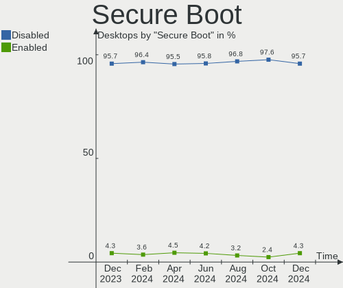
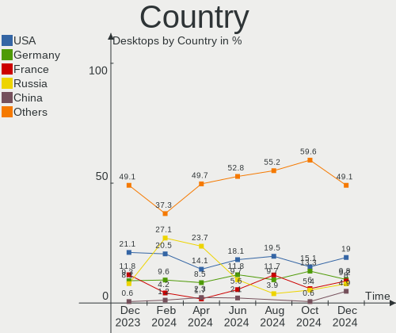

Debian - Hardware Trends (Desktops)
-----------------------------------

A project to identify most popular hardware characteristics and track their change
over time based on data collected by Linux users at https://Linux-Hardware.org.

Anyone can contribute to this report by the [hw-probe](https://github.com/linuxhw/hw-probe) tool:

    sudo -E hw-probe -all -upload

This report is for one last month. Overall report since the beginning of time: [TestDays](https://github.com/linuxhw/TestDays)

Period: Jan, 2024.

Contents
--------

* [ System ](#system)
  - [ OS                       ](#os)
  - [ OS Family                ](#os-family)
  - [ Kernel                   ](#kernel)
  - [ Kernel Family            ](#kernel-family)
  - [ Kernel Major Ver.        ](#kernel-major-ver)
  - [ Arch                     ](#arch)
  - [ DE                       ](#de)
  - [ Display Server           ](#display-server)
  - [ Display Manager          ](#display-manager)
  - [ OS Lang                  ](#os-lang)
  - [ Boot Mode                ](#boot-mode)
  - [ Filesystem               ](#filesystem)
  - [ Part. scheme             ](#part-scheme)
  - [ Dual Boot with Linux/BSD ](#dual-boot-with-linuxbsd)
  - [ Dual Boot (Win)          ](#dual-boot-win)

* [ Board ](#board)
  - [ Vendor                   ](#vendor)
  - [ Model                    ](#model)
  - [ Model Family             ](#model-family)
  - [ MFG Year                 ](#mfg-year)
  - [ Form Factor              ](#form-factor)
  - [ Secure Boot              ](#secure-boot)
  - [ Coreboot                 ](#coreboot)
  - [ RAM Size                 ](#ram-size)
  - [ RAM Used                 ](#ram-used)
  - [ Total Drives             ](#total-drives)
  - [ Has CD-ROM               ](#has-cd-rom)
  - [ Has Ethernet             ](#has-ethernet)
  - [ Has WiFi                 ](#has-wifi)
  - [ Has Bluetooth            ](#has-bluetooth)

* [ Location ](#location)
  - [ Country                  ](#country)
  - [ City                     ](#city)

* [ Drives ](#drives)
  - [ Drive Vendor             ](#drive-vendor)
  - [ Drive Model              ](#drive-model)
  - [ HDD Vendor               ](#hdd-vendor)
  - [ SSD Vendor               ](#ssd-vendor)
  - [ Drive Kind               ](#drive-kind)
  - [ Drive Connector          ](#drive-connector)
  - [ Drive Size               ](#drive-size)
  - [ Space Total              ](#space-total)
  - [ Space Used               ](#space-used)
  - [ Malfunc. Drives          ](#malfunc-drives)
  - [ Malfunc. Drive Vendor    ](#malfunc-drive-vendor)
  - [ Malfunc. HDD Vendor      ](#malfunc-hdd-vendor)
  - [ Malfunc. Drive Kind      ](#malfunc-drive-kind)
  - [ Failed Drives            ](#failed-drives)
  - [ Failed Drive Vendor      ](#failed-drive-vendor)
  - [ Drive Status             ](#drive-status)

* [ Storage controller ](#storage-controller)
  - [ Storage Vendor           ](#storage-vendor)
  - [ Storage Model            ](#storage-model)
  - [ Storage Kind             ](#storage-kind)

* [ Processor ](#processor)
  - [ CPU Vendor               ](#cpu-vendor)
  - [ CPU Model                ](#cpu-model)
  - [ CPU Model Family         ](#cpu-model-family)
  - [ CPU Cores                ](#cpu-cores)
  - [ CPU Sockets              ](#cpu-sockets)
  - [ CPU Threads              ](#cpu-threads)
  - [ CPU Op-Modes             ](#cpu-op-modes)
  - [ CPU Microcode            ](#cpu-microcode)
  - [ CPU Microarch            ](#cpu-microarch)

* [ Graphics ](#graphics)
  - [ GPU Vendor               ](#gpu-vendor)
  - [ GPU Model                ](#gpu-model)
  - [ GPU Combo                ](#gpu-combo)
  - [ GPU Driver               ](#gpu-driver)
  - [ GPU Memory               ](#gpu-memory)

* [ Monitor ](#monitor)
  - [ Monitor Vendor           ](#monitor-vendor)
  - [ Monitor Model            ](#monitor-model)
  - [ Monitor Resolution       ](#monitor-resolution)
  - [ Monitor Diagonal         ](#monitor-diagonal)
  - [ Monitor Width            ](#monitor-width)
  - [ Aspect Ratio             ](#aspect-ratio)
  - [ Monitor Area             ](#monitor-area)
  - [ Pixel Density            ](#pixel-density)
  - [ Multiple Monitors        ](#multiple-monitors)

* [ Network ](#network)
  - [ Net Controller Vendor    ](#net-controller-vendor)
  - [ Net Controller Model     ](#net-controller-model)
  - [ Wireless Vendor          ](#wireless-vendor)
  - [ Wireless Model           ](#wireless-model)
  - [ Ethernet Vendor          ](#ethernet-vendor)
  - [ Ethernet Model           ](#ethernet-model)
  - [ Net Controller Kind      ](#net-controller-kind)
  - [ Used Controller          ](#used-controller)
  - [ NICs                     ](#nics)
  - [ IPv6                     ](#ipv6)

* [ Bluetooth ](#bluetooth)
  - [ Bluetooth Vendor         ](#bluetooth-vendor)
  - [ Bluetooth Model          ](#bluetooth-model)

* [ Sound ](#sound)
  - [ Sound Vendor             ](#sound-vendor)
  - [ Sound Model              ](#sound-model)

* [ Memory ](#memory)
  - [ Memory Vendor            ](#memory-vendor)
  - [ Memory Model             ](#memory-model)
  - [ Memory Kind              ](#memory-kind)
  - [ Memory Form Factor       ](#memory-form-factor)
  - [ Memory Size              ](#memory-size)
  - [ Memory Speed             ](#memory-speed)

* [ Printers & scanners ](#printers--scanners)
  - [ Printer Vendor           ](#printer-vendor)
  - [ Printer Model            ](#printer-model)
  - [ Scanner Vendor           ](#scanner-vendor)
  - [ Scanner Model            ](#scanner-model)

* [ Camera ](#camera)
  - [ Camera Vendor            ](#camera-vendor)
  - [ Camera Model             ](#camera-model)

* [ Security ](#security)
  - [ Fingerprint Vendor       ](#fingerprint-vendor)
  - [ Fingerprint Model        ](#fingerprint-model)
  - [ Chipcard Vendor          ](#chipcard-vendor)
  - [ Chipcard Model           ](#chipcard-model)

* [ Unsupported ](#unsupported)
  - [ Unsupported Devices      ](#unsupported-devices)
  - [ Unsupported Device Types ](#unsupported-device-types)

System
------

OS
--

Installed operating systems

| Name       | Desktops | Percent |
|------------|----------|---------|
| Debian 12  | 185      | 81.5%   |
| Debian     | 21       | 9.25%   |
| Debian 11  | 19       | 8.37%   |
| Debian Sid | 1        | 0.44%   |
| Debian 10  | 1        | 0.44%   |

OS Family
---------

OS without a version

| Name   | Desktops | Percent |
|--------|----------|---------|
| Debian | 227      | 100%    |

Kernel
------

Version of the Linux kernel

| Version                    | Desktops | Percent |
|----------------------------|----------|---------|
| 6.1.0-17-amd64             | 63       | 27.75%  |
| 6.1.0-16-amd64             | 43       | 18.94%  |
| 6.1.0-4-amd64              | 37       | 16.3%   |
| 6.5.0-5-amd64              | 11       | 4.85%   |
| 6.5.11-7-pve               | 10       | 4.41%   |
| 6.1.0-15-amd64             | 8        | 3.52%   |
| 5.10.0-27-amd64            | 8        | 3.52%   |
| 6.1.0-0.deb11.13-amd64     | 4        | 1.76%   |
| 6.6.9-amd64                | 3        | 1.32%   |
| 6.5.0-0.deb12.4-amd64      | 3        | 1.32%   |
| 6.1.0-13-amd64             | 3        | 1.32%   |
| 5.10.0-23-amd64            | 3        | 1.32%   |
| 6.6.8-amd64                | 2        | 0.88%   |
| 6.2.16-19-pve              | 2        | 0.88%   |
| 6.7.1-x64v3-xanmod1        | 1        | 0.44%   |
| 6.7.0--2024.01.11-04h20    | 1        | 0.44%   |
| 6.7.0                      | 1        | 0.44%   |
| 6.6.13-rt-amd64            | 1        | 0.44%   |
| 6.6.13-amd64               | 1        | 0.44%   |
| 6.6.11-powerpc             | 1        | 0.44%   |
| 6.6.10                     | 1        | 0.44%   |
| 6.5.11-4-pve               | 1        | 0.44%   |
| 6.5.0-0.deb12.1-amd64      | 1        | 0.44%   |
| 6.4.0-3-amd64              | 1        | 0.44%   |
| 6.4.0-060400-generic       | 1        | 0.44%   |
| 6.2.16-3-pve               | 1        | 0.44%   |
| 6.2.16-15-pve              | 1        | 0.44%   |
| 6.1.63-production+truenas  | 1        | 0.44%   |
| 6.1.0-rc3-d1               | 1        | 0.44%   |
| 6.1.0-17-686-pae           | 1        | 0.44%   |
| 6.1.0-16-rt-amd64          | 1        | 0.44%   |
| 6.1.0-16-686-pae           | 1        | 0.44%   |
| 6.1.0-14-amd64             | 1        | 0.44%   |
| 6.1.0-12-amd64             | 1        | 0.44%   |
| 6.1.0-10-amd64             | 1        | 0.44%   |
| 5.4.203-1-pve              | 1        | 0.44%   |
| 5.15.131-2-pve             | 1        | 0.44%   |
| 5.10.142-antix.2-amd64-smp | 1        | 0.44%   |
| 5.10.0-26-amd64            | 1        | 0.44%   |
| 5.10.0-26-686              | 1        | 0.44%   |

Kernel Family
-------------

Linux kernel without a distro release

| Version  | Desktops | Percent |
|----------|----------|---------|
| 6.1.0    | 165      | 72.69%  |
| 6.5.0    | 15       | 6.61%   |
| 5.10.0   | 14       | 6.17%   |
| 6.5.11   | 11       | 4.85%   |
| 6.2.16   | 4        | 1.76%   |
| 6.6.9    | 3        | 1.32%   |
| 6.7.0    | 2        | 0.88%   |
| 6.6.8    | 2        | 0.88%   |
| 6.6.13   | 2        | 0.88%   |
| 6.4.0    | 2        | 0.88%   |
| 6.7.1    | 1        | 0.44%   |
| 6.6.11   | 1        | 0.44%   |
| 6.6.10   | 1        | 0.44%   |
| 6.1.63   | 1        | 0.44%   |
| 5.4.203  | 1        | 0.44%   |
| 5.15.131 | 1        | 0.44%   |
| 5.10.142 | 1        | 0.44%   |

Kernel Major Ver.
-----------------

Linux kernel major version

| Version | Desktops | Percent |
|---------|----------|---------|
| 6.1     | 166      | 73.13%  |
| 6.5     | 26       | 11.45%  |
| 5.10    | 15       | 6.61%   |
| 6.6     | 9        | 3.96%   |
| 6.2     | 4        | 1.76%   |
| 6.7     | 3        | 1.32%   |
| 6.4     | 2        | 0.88%   |
| 5.4     | 1        | 0.44%   |
| 5.15    | 1        | 0.44%   |

Arch
----

OS architecture (x86_64, i586, etc.)

| Name    | Desktops | Percent |
|---------|----------|---------|
| x86_64  | 222      | 97.8%   |
| i686    | 3        | 1.32%   |
| riscv64 | 1        | 0.44%   |
| ppc     | 1        | 0.44%   |

DE
--

Desktop Environment

| Name            | Desktops | Percent |
|-----------------|----------|---------|
| Unknown         | 77       | 33.92%  |
| GNOME           | 71       | 31.28%  |
| KDE5            | 30       | 13.22%  |
| XFCE            | 23       | 10.13%  |
| X-Cinnamon      | 6        | 2.64%   |
| MATE            | 6        | 2.64%   |
| GNOME Flashback | 3        | 1.32%   |
| LXQt            | 2        | 0.88%   |
| icewm           | 2        | 0.88%   |
| Cinnamon        | 2        | 0.88%   |
| sway:GNOME      | 1        | 0.44%   |
| sway            | 1        | 0.44%   |
| LXDE            | 1        | 0.44%   |
| KDE             | 1        | 0.44%   |
| GNOME Classic   | 1        | 0.44%   |

Display Server
--------------

X11 or Wayland

| Name    | Desktops | Percent |
|---------|----------|---------|
| X11     | 86       | 37.89%  |
| Wayland | 57       | 25.11%  |
| Unknown | 49       | 21.59%  |
| Tty     | 35       | 15.42%  |

Display Manager
---------------

SDDM, LightDM, etc.

| Name    | Desktops | Percent |
|---------|----------|---------|
| Unknown | 113      | 49.78%  |
| GDM3    | 59       | 25.99%  |
| LightDM | 32       | 14.1%   |
| SDDM    | 22       | 9.69%   |
| GDM     | 1        | 0.44%   |

OS Lang
-------

Language

| Lang    | Desktops | Percent |
|---------|----------|---------|
| en_US   | 68       | 29.96%  |
| fr_FR   | 50       | 22.03%  |
| ru_RU   | 45       | 19.82%  |
| de_DE   | 15       | 6.61%   |
| Unknown | 12       | 5.29%   |
| pt_BR   | 7        | 3.08%   |
| en_GB   | 3        | 1.32%   |
| zh_CN   | 2        | 0.88%   |
| it_IT   | 2        | 0.88%   |
| es_MX   | 2        | 0.88%   |
| en_IE   | 2        | 0.88%   |
| en_CA   | 2        | 0.88%   |
| de_CH   | 2        | 0.88%   |
| sv_FI   | 1        | 0.44%   |
| ro_RO   | 1        | 0.44%   |
| pl_PL   | 1        | 0.44%   |
| ja_JP   | 1        | 0.44%   |
| it_CH   | 1        | 0.44%   |
| fr_CA   | 1        | 0.44%   |
| fr_BE   | 1        | 0.44%   |
| eu_ES   | 1        | 0.44%   |
| es_ES   | 1        | 0.44%   |
| es_AR   | 1        | 0.44%   |
| en_NZ   | 1        | 0.44%   |
| en_IN   | 1        | 0.44%   |
| en_DK   | 1        | 0.44%   |
| en_AU   | 1        | 0.44%   |
| C       | 1        | 0.44%   |

Boot Mode
---------

EFI or BIOS

| Mode | Desktops | Percent |
|------|----------|---------|
| EFI  | 119      | 52.42%  |
| BIOS | 108      | 47.58%  |

Filesystem
----------

Type of filesystem

| Type    | Desktops | Percent |
|---------|----------|---------|
| Ext4    | 162      | 71.37%  |
| Overlay | 45       | 19.82%  |
| Zfs     | 7        | 3.08%   |
| Btrfs   | 7        | 3.08%   |
| Tmpfs   | 3        | 1.32%   |
| Xfs     | 2        | 0.88%   |
| Ext3    | 1        | 0.44%   |

Part. scheme
------------

Scheme of partitioning

| Type    | Desktops | Percent |
|---------|----------|---------|
| GPT     | 131      | 57.71%  |
| MBR     | 60       | 26.43%  |
| Unknown | 36       | 15.86%  |

Dual Boot with Linux/BSD
------------------------

Hosting more than one Linux/BSD

| Dual boot | Desktops | Percent |
|-----------|----------|---------|
| No        | 188      | 82.82%  |
| Yes       | 39       | 17.18%  |

Dual Boot (Win)
---------------

Hosting Linux and Windows

| Dual boot | Desktops | Percent |
|-----------|----------|---------|
| No        | 155      | 68.28%  |
| Yes       | 72       | 31.72%  |

Board
-----

Vendor
------

Motherboard manufacturer

| Name                                 | Desktops | Percent |
|--------------------------------------|----------|---------|
| ASUSTek Computer                     | 60       | 26.43%  |
| Hewlett-Packard                      | 40       | 17.62%  |
| Gigabyte Technology                  | 23       | 10.13%  |
| MSI                                  | 19       | 8.37%   |
| ASRock                               | 16       | 7.05%   |
| Lenovo                               | 14       | 6.17%   |
| Dell                                 | 13       | 5.73%   |
| Unknown                              | 6        | 2.64%   |
| Intel                                | 4        | 1.76%   |
| Shenzhen Meigao Electronic Equipment | 2        | 0.88%   |
| newplatforms                         | 2        | 0.88%   |
| Foxconn                              | 2        | 0.88%   |
| ECS                                  | 2        | 0.88%   |
| Biostar                              | 2        | 0.88%   |
| Acer                                 | 2        | 0.88%   |
| TYAN Computer                        | 1        | 0.44%   |
| T-bao TianBei                        | 1        | 0.44%   |
| SYWZ                                 | 1        | 0.44%   |
| Sapphire                             | 1        | 0.44%   |
| Phoenix Contact                      | 1        | 0.44%   |
| Phoenix                              | 1        | 0.44%   |
| OEM                                  | 1        | 0.44%   |
| Medion                               | 1        | 0.44%   |
| MACHINIST                            | 1        | 0.44%   |
| Inventec                             | 1        | 0.44%   |
| IceWhale Technology                  | 1        | 0.44%   |
| IBM                                  | 1        | 0.44%   |
| Huanan                               | 1        | 0.44%   |
| HC Technology.                       | 1        | 0.44%   |
| HC                                   | 1        | 0.44%   |
| Grandstream Networks                 | 1        | 0.44%   |
| Gowin Solution                       | 1        | 0.44%   |
| Gateway                              | 1        | 0.44%   |
| Fujitsu                              | 1        | 0.44%   |
| AZW                                  | 1        | 0.44%   |

Model
-----

Motherboard model

| Name                                          | Desktops | Percent |
|-----------------------------------------------|----------|---------|
| HP ProDesk 400 G2.5 SFF                       | 20       | 8.81%   |
| ASUS P5QL-CM                                  | 13       | 5.73%   |
| HP ProDesk 400 G3 SFF                         | 7        | 3.08%   |
| ASUS All Series                               | 7        | 3.08%   |
| Unknown                                       | 6        | 2.64%   |
| Lenovo ThinkCentre M83 10AHS1T000             | 4        | 1.76%   |
| Dell OptiPlex 390                             | 3        | 1.32%   |
| ASUS PRIME A320M-K                            | 3        | 1.32%   |
| MSI MS-7B79                                   | 2        | 0.88%   |
| MSI MS-7996                                   | 2        | 0.88%   |
| Lenovo ThinkCentre M800 10FXS0PS00            | 2        | 0.88%   |
| Lenovo ThinkCentre M55p 8808D8U               | 2        | 0.88%   |
| HP Compaq 8200 Elite SFF PC                   | 2        | 0.88%   |
| Foxconn G33M03                                | 2        | 0.88%   |
| ECS G31T-M9                                   | 2        | 0.88%   |
| ASUS ROG STRIX X670E-E GAMING WIFI            | 2        | 0.88%   |
| ASUS ROG STRIX B650E-F GAMING WIFI            | 2        | 0.88%   |
| ASUS PRIME X570-P                             | 2        | 0.88%   |
| ASUS PRIME B550M-K                            | 2        | 0.88%   |
| ASUS PRIME B350-PLUS                          | 2        | 0.88%   |
| ASRock J5040-ITX                              | 2        | 0.88%   |
| ASRock G31M-GS                                | 2        | 0.88%   |
| TYAN S8030GM2NE                               | 1        | 0.44%   |
| T-bao TianBei GOD78                           | 1        | 0.44%   |
| SYWZ S210H Series                             | 1        | 0.44%   |
| Shenzhen Meigao Electronic Equipment UM560 XT | 1        | 0.44%   |
| Shenzhen Meigao Electronic Equipment UM560    | 1        | 0.44%   |
| Sapphire PI-AM3RS760G2                        | 1        | 0.44%   |
| Phoenix Contact Valueline VL3 UPC             | 1        | 0.44%   |
| Phoenix 945GM                                 | 1        | 0.44%   |
| OEM X79G                                      | 1        | 0.44%   |
| newplatforms NP-1008i                         | 1        | 0.44%   |
| newplatforms NP-1004i                         | 1        | 0.44%   |
| MSI MS-7E12                                   | 1        | 0.44%   |
| MSI MS-7E07                                   | 1        | 0.44%   |
| MSI MS-7E02                                   | 1        | 0.44%   |
| MSI MS-7D91                                   | 1        | 0.44%   |
| MSI MS-7C86                                   | 1        | 0.44%   |
| MSI MS-7C56                                   | 1        | 0.44%   |
| MSI MS-7C35                                   | 1        | 0.44%   |

Model Family
------------

Motherboard model prefix

| Name                                       | Desktops | Percent |
|--------------------------------------------|----------|---------|
| HP ProDesk                                 | 30       | 13.22%  |
| ASUS PRIME                                 | 19       | 8.37%   |
| Lenovo ThinkCentre                         | 13       | 5.73%   |
| ASUS P5QL-CM                               | 13       | 5.73%   |
| Dell OptiPlex                              | 8        | 3.52%   |
| ASUS ROG                                   | 7        | 3.08%   |
| ASUS All                                   | 7        | 3.08%   |
| Unknown                                    | 6        | 2.64%   |
| HP Compaq                                  | 4        | 1.76%   |
| Shenzhen Meigao Electronic Equipment UM560 | 2        | 0.88%   |
| MSI MS-7B79                                | 2        | 0.88%   |
| MSI MS-7996                                | 2        | 0.88%   |
| Gigabyte X570                              | 2        | 0.88%   |
| Gigabyte B650                              | 2        | 0.88%   |
| Gigabyte B550M                             | 2        | 0.88%   |
| Gigabyte A520M                             | 2        | 0.88%   |
| Foxconn G33M03                             | 2        | 0.88%   |
| ECS G31T-M9                                | 2        | 0.88%   |
| Dell Precision                             | 2        | 0.88%   |
| Dell Inspiron                              | 2        | 0.88%   |
| ASUS TUF                                   | 2        | 0.88%   |
| ASUS Pro                                   | 2        | 0.88%   |
| ASRock J5040-ITX                           | 2        | 0.88%   |
| ASRock G31M-GS                             | 2        | 0.88%   |
| Acer Veriton                               | 2        | 0.88%   |
| TYAN S8030GM2NE                            | 1        | 0.44%   |
| T-bao TianBei GOD78                        | 1        | 0.44%   |
| SYWZ S210H                                 | 1        | 0.44%   |
| Sapphire PI-AM3RS760G2                     | 1        | 0.44%   |
| Phoenix Contact Valueline                  | 1        | 0.44%   |
| Phoenix 945GM                              | 1        | 0.44%   |
| OEM X79G                                   | 1        | 0.44%   |
| newplatforms NP-1008i                      | 1        | 0.44%   |
| newplatforms NP-1004i                      | 1        | 0.44%   |
| MSI MS-7E12                                | 1        | 0.44%   |
| MSI MS-7E07                                | 1        | 0.44%   |
| MSI MS-7E02                                | 1        | 0.44%   |
| MSI MS-7D91                                | 1        | 0.44%   |
| MSI MS-7C86                                | 1        | 0.44%   |
| MSI MS-7C56                                | 1        | 0.44%   |

MFG Year
--------

Motherboard manufacture year

| Year    | Desktops | Percent |
|---------|----------|---------|
| 2015    | 25       | 11.01%  |
| 2023    | 19       | 8.37%   |
| 2022    | 19       | 8.37%   |
| 2020    | 19       | 8.37%   |
| 2016    | 18       | 7.93%   |
| 2014    | 17       | 7.49%   |
| 2008    | 16       | 7.05%   |
| 2012    | 13       | 5.73%   |
| 2018    | 10       | 4.41%   |
| 2011    | 10       | 4.41%   |
| 2021    | 9        | 3.96%   |
| 2019    | 9        | 3.96%   |
| 2013    | 9        | 3.96%   |
| 2010    | 8        | 3.52%   |
| 2007    | 8        | 3.52%   |
| 2017    | 7        | 3.08%   |
| 2009    | 7        | 3.08%   |
| 2005    | 2        | 0.88%   |
| 2006    | 1        | 0.44%   |
| Unknown | 1        | 0.44%   |

Form Factor
-----------

Physical design of the computer

| Name    | Desktops | Percent |
|---------|----------|---------|
| Desktop | 227      | 100%    |

Secure Boot
-----------

Enabled or disabled

| State    | Desktops | Percent |
|----------|----------|---------|
| Disabled | 224      | 98.68%  |
| Enabled  | 3        | 1.32%   |

Coreboot
--------

Have coreboot on board

| Used | Desktops | Percent |
|------|----------|---------|
| No   | 225      | 99.12%  |
| Yes  | 2        | 0.88%   |

RAM Size
--------

Total RAM memory

| Size in GB      | Desktops | Percent |
|-----------------|----------|---------|
| 3.01-4.0        | 58       | 25.55%  |
| 16.01-24.0      | 35       | 15.42%  |
| 4.01-8.0        | 30       | 13.22%  |
| 32.01-64.0      | 29       | 12.78%  |
| 8.01-16.0       | 21       | 9.25%   |
| 1.01-2.0        | 20       | 8.81%   |
| 64.01-256.0     | 14       | 6.17%   |
| 24.01-32.0      | 8        | 3.52%   |
| 2.01-3.0        | 7        | 3.08%   |
| More than 256.0 | 3        | 1.32%   |
| 0.51-1.0        | 1        | 0.44%   |
| 0.01-0.5        | 1        | 0.44%   |

RAM Used
--------

Used RAM memory

| Used GB    | Desktops | Percent |
|------------|----------|---------|
| 1.01-2.0   | 68       | 29.96%  |
| 0.51-1.0   | 46       | 20.26%  |
| 2.01-3.0   | 39       | 17.18%  |
| 4.01-8.0   | 25       | 11.01%  |
| 3.01-4.0   | 21       | 9.25%   |
| 8.01-16.0  | 14       | 6.17%   |
| 0.01-0.5   | 6        | 2.64%   |
| 16.01-24.0 | 4        | 1.76%   |
| 32.01-64.0 | 2        | 0.88%   |
| 24.01-32.0 | 2        | 0.88%   |

Total Drives
------------

Number of drives on board

| Drives | Desktops | Percent |
|--------|----------|---------|
| 1      | 135      | 59.47%  |
| 2      | 39       | 17.18%  |
| 4      | 16       | 7.05%   |
| 3      | 16       | 7.05%   |
| 6      | 8        | 3.52%   |
| 5      | 7        | 3.08%   |
| 8      | 2        | 0.88%   |
| 7      | 2        | 0.88%   |
| 11     | 1        | 0.44%   |
| 9      | 1        | 0.44%   |

Has CD-ROM
----------

Has CD-ROM on board

| Presented | Desktops | Percent |
|-----------|----------|---------|
| No        | 129      | 56.83%  |
| Yes       | 98       | 43.17%  |

Has Ethernet
------------

Has Ethernet on board

| Presented | Desktops | Percent |
|-----------|----------|---------|
| Yes       | 227      | 100%    |

Has WiFi
--------

Has WiFi module

| Presented | Desktops | Percent |
|-----------|----------|---------|
| No        | 160      | 70.48%  |
| Yes       | 67       | 29.52%  |

Has Bluetooth
-------------

Has Bluetooth module

| Presented | Desktops | Percent |
|-----------|----------|---------|
| No        | 173      | 76.21%  |
| Yes       | 54       | 23.79%  |

Location
--------

Country
-------

Geographic location (country)

| Country     | Desktops | Percent |
|-------------|----------|---------|
| Russia      | 53       | 23.35%  |
| France      | 51       | 22.47%  |
| USA         | 27       | 11.89%  |
| Germany     | 27       | 11.89%  |
| Brazil      | 10       | 4.41%   |
| Italy       | 8        | 3.52%   |
| Canada      | 5        | 2.2%    |
| Romania     | 4        | 1.76%   |
| Netherlands | 4        | 1.76%   |
| UK          | 3        | 1.32%   |
| Switzerland | 3        | 1.32%   |
| Spain       | 3        | 1.32%   |
| Poland      | 3        | 1.32%   |
| Mexico      | 3        | 1.32%   |
| Sweden      | 2        | 0.88%   |
| Kazakhstan  | 2        | 0.88%   |
| India       | 2        | 0.88%   |
| China       | 2        | 0.88%   |
| Austria     | 2        | 0.88%   |
| Australia   | 2        | 0.88%   |
| New Zealand | 1        | 0.44%   |
| Morocco     | 1        | 0.44%   |
| Moldova     | 1        | 0.44%   |
| Japan       | 1        | 0.44%   |
| Hong Kong   | 1        | 0.44%   |
| Finland     | 1        | 0.44%   |
| Estonia     | 1        | 0.44%   |
| Denmark     | 1        | 0.44%   |
| Belgium     | 1        | 0.44%   |
| Belarus     | 1        | 0.44%   |
| Argentina   | 1        | 0.44%   |

City
----

Geographic location (city)

| City                  | Desktops | Percent |
|-----------------------|----------|---------|
| Voronezh              | 37       | 16.3%   |
| Roubaix               | 23       | 10.13%  |
| Bagneux               | 15       | 6.61%   |
| Turin                 | 6        | 2.64%   |
| St Petersburg         | 4        | 1.76%   |
| Moscow                | 4        | 1.76%   |
| Bonn                  | 4        | 1.76%   |
| Dresden               | 3        | 1.32%   |
| Vienna                | 2        | 0.88%   |
| Traunstein            | 2        | 0.88%   |
| Stockholm             | 2        | 0.88%   |
| Semey                 | 2        | 0.88%   |
| Paris                 | 2        | 0.88%   |
| Minneapolis           | 2        | 0.88%   |
| Harrisonburg          | 2        | 0.88%   |
| Bangor                | 2        | 0.88%   |
| Łomża               | 1        | 0.44%   |
| Zwolle                | 1        | 0.44%   |
| Wellington            | 1        | 0.44%   |
| Warsaw                | 1        | 0.44%   |
| Vollerup              | 1        | 0.44%   |
| Vila Velha            | 1        | 0.44%   |
| Verkhnyaya Salda      | 1        | 0.44%   |
| Vergennes             | 1        | 0.44%   |
| Valencia              | 1        | 0.44%   |
| Vaasa                 | 1        | 0.44%   |
| Utrecht               | 1        | 0.44%   |
| Uniontown             | 1        | 0.44%   |
| Uberherrn             | 1        | 0.44%   |
| Triberg               | 1        | 0.44%   |
| Tower Hamlets         | 1        | 0.44%   |
| Toronto               | 1        | 0.44%   |
| Tighina               | 1        | 0.44%   |
| Tallinn               | 1        | 0.44%   |
| Seattle               | 1        | 0.44%   |
| Scottsdale            | 1        | 0.44%   |
| Sao Paulo             | 1        | 0.44%   |
| San Miguel de Allende | 1        | 0.44%   |
| Salt Lake City        | 1        | 0.44%   |
| Saint-Prix            | 1        | 0.44%   |

Drives
------

Drive Vendor
------------

Hard drive vendors

| Vendor                       | Desktops | Drives | Percent |
|------------------------------|----------|--------|---------|
| WDC                          | 77       | 93     | 22.13%  |
| Seagate                      | 54       | 83     | 15.52%  |
| Samsung Electronics          | 45       | 80     | 12.93%  |
| Kingston                     | 29       | 40     | 8.33%   |
| Toshiba                      | 17       | 24     | 4.89%   |
| Crucial                      | 15       | 18     | 4.31%   |
| SanDisk                      | 10       | 10     | 2.87%   |
| Hitachi                      | 10       | 10     | 2.87%   |
| Unknown                      | 5        | 5      | 1.44%   |
| China                        | 5        | 5      | 1.44%   |
| Unknown                      | 5        | 5      | 1.44%   |
| Patriot                      | 4        | 4      | 1.15%   |
| Intel                        | 4        | 4      | 1.15%   |
| Gigabyte Technology          | 4        | 4      | 1.15%   |
| PNY                          | 3        | 3      | 0.86%   |
| Phison Electronics           | 3        | 4      | 0.86%   |
| Kingston Technology Company  | 3        | 3      | 0.86%   |
| Intenso                      | 3        | 4      | 0.86%   |
| Innodisk                     | 3        | 3      | 0.86%   |
| XrayDisk                     | 2        | 2      | 0.57%   |
| WALRAM                       | 2        | 2      | 0.57%   |
| SPCC                         | 2        | 2      | 0.57%   |
| SK hynix                     | 2        | 2      | 0.57%   |
| Silicon Motion               | 2        | 2      | 0.57%   |
| Plextor                      | 2        | 2      | 0.57%   |
| Phison                       | 2        | 3      | 0.57%   |
| OCZ                          | 2        | 2      | 0.57%   |
| Netac                        | 2        | 2      | 0.57%   |
| Micron/Crucial Technology    | 2        | 4      | 0.57%   |
| A-DATA Technology            | 2        | 3      | 0.57%   |
| ZHITAI                       | 1        | 1      | 0.29%   |
| Yangtze Memory Technologies  | 1        | 1      | 0.29%   |
| Verbatim                     | 1        | 1      | 0.29%   |
| Unknown (CF)                 | 1        | 1      | 0.29%   |
| Transcend                    | 1        | 1      | 0.29%   |
| TEXTORM                      | 1        | 1      | 0.29%   |
| Team                         | 1        | 2      | 0.29%   |
| SSSTC                        | 1        | 1      | 0.29%   |
| Solid                        | 1        | 1      | 0.29%   |
| Shenzhen Longsys Electronics | 1        | 1      | 0.29%   |

Drive Model
-----------

Hard drive models

| Model                                              | Desktops | Percent |
|----------------------------------------------------|----------|---------|
| WDC WD3200AAJS-00L7A0 320GB                        | 14       | 3.46%   |
| Seagate ST500DM002-1BD142 500GB                    | 14       | 3.46%   |
| Kingston SA400S37240G 240GB SSD                    | 12       | 2.96%   |
| Toshiba DT01ACA050 500GB                           | 5        | 1.23%   |
| Samsung NVMe SSD Controller SM981/PM981/PM983 1TB  | 5        | 1.23%   |
| Kingston SA400S37480G 480GB SSD                    | 5        | 1.23%   |
| Unknown                                            | 5        | 1.23%   |
| WDC WD10EZEX-08WN4A0 1TB                           | 4        | 0.99%   |
| WDC WD10EZEX-08M2NA0 1TB                           | 4        | 0.99%   |
| Samsung SSD 870 QVO 1TB                            | 4        | 0.99%   |
| Samsung SSD 860 EVO 500GB                          | 4        | 0.99%   |
| Samsung NVMe SSD Controller PM9A1/PM9A3/980PRO 2TB | 4        | 0.99%   |
| WDC WD5000AZLX-08K2TA0 500GB                       | 3        | 0.74%   |
| Seagate ST2000DM001-1CH164 2TB                     | 3        | 0.74%   |
| Seagate ST1000DM003-1CH162 1TB                     | 3        | 0.74%   |
| Samsung SSD 870 EVO 1TB                            | 3        | 0.74%   |
| Samsung SSD 850 EVO 250GB                          | 3        | 0.74%   |
| WDC WD5000AAKX-60U6AA0 500GB                       | 2        | 0.49%   |
| WDC WD5000AAKX-22ERMA0 500GB                       | 2        | 0.49%   |
| WDC WD5000AAKX-08U6AA0 500GB                       | 2        | 0.49%   |
| WDC WD5000AAKX-00ERMA0 500GB                       | 2        | 0.49%   |
| WDC WD40EFAX-68JH4N1 4TB                           | 2        | 0.49%   |
| WDC WD2500AAJS-00L7A0 250GB                        | 2        | 0.49%   |
| WDC WD20EFRX-68EUZN0 2TB                           | 2        | 0.49%   |
| WDC WD1602ABYS-23B7A0 39M4507 42C0462IBM 160GB     | 2        | 0.49%   |
| WDC WD10JPCX-24UE4T0 1TB                           | 2        | 0.49%   |
| WDC WD10EZEX-08Y20A0 1TB                           | 2        | 0.49%   |
| Toshiba DT01ACA200 2TB                             | 2        | 0.49%   |
| Toshiba DT01ACA100 1TB                             | 2        | 0.49%   |
| Seagate ST500LM012 HN-M500MBB 500GB                | 2        | 0.49%   |
| Seagate ST500DM002-1SB10A 500GB                    | 2        | 0.49%   |
| Seagate ST4000VN008-2DR166 4TB                     | 2        | 0.49%   |
| Seagate ST4000DM004-2CV104 4TB                     | 2        | 0.49%   |
| Seagate ST3500418AS 500GB                          | 2        | 0.49%   |
| Seagate ST2000VN000-1HJ164 2TB                     | 2        | 0.49%   |
| Seagate ST2000DM008-2FR102 2TB                     | 2        | 0.49%   |
| Seagate ST2000DM006-2DM164 2TB                     | 2        | 0.49%   |
| Seagate ST2000DL003-9VT166 2TB                     | 2        | 0.49%   |
| Seagate ST20000NM007D-3DJ103 20TB                  | 2        | 0.49%   |
| Seagate ST1000DM010-2EP102 1TB                     | 2        | 0.49%   |

HDD Vendor
----------

Hard disk drive vendors

| Vendor              | Desktops | Drives | Percent |
|---------------------|----------|--------|---------|
| WDC                 | 72       | 86     | 45.28%  |
| Seagate             | 54       | 83     | 33.96%  |
| Toshiba             | 15       | 22     | 9.43%   |
| Hitachi             | 10       | 10     | 6.29%   |
| Samsung Electronics | 3        | 3      | 1.89%   |
| Unknown (CF)        | 1        | 1      | 0.63%   |
| Unknown             | 1        | 1      | 0.63%   |
| Maxtor              | 1        | 1      | 0.63%   |
| HGST                | 1        | 2      | 0.63%   |
| Fujitsu             | 1        | 1      | 0.63%   |

SSD Vendor
----------

Solid state drive vendors

| Vendor              | Desktops | Drives | Percent |
|---------------------|----------|--------|---------|
| Samsung Electronics | 24       | 33     | 20.69%  |
| Kingston            | 24       | 29     | 20.69%  |
| Crucial             | 13       | 16     | 11.21%  |
| WDC                 | 6        | 6      | 5.17%   |
| China               | 5        | 5      | 4.31%   |
| SanDisk             | 3        | 3      | 2.59%   |
| PNY                 | 3        | 3      | 2.59%   |
| Patriot             | 3        | 3      | 2.59%   |
| Intenso             | 3        | 4      | 2.59%   |
| Innodisk            | 3        | 3      | 2.59%   |
| XrayDisk            | 2        | 2      | 1.72%   |
| SPCC                | 2        | 2      | 1.72%   |
| Plextor             | 2        | 2      | 1.72%   |
| OCZ                 | 2        | 2      | 1.72%   |
| Netac               | 2        | 2      | 1.72%   |
| Intel               | 2        | 2      | 1.72%   |
| Gigabyte Technology | 2        | 2      | 1.72%   |
| Unknown             | 2        | 2      | 1.72%   |
| WALRAM              | 1        | 1      | 0.86%   |
| Verbatim            | 1        | 1      | 0.86%   |
| Transcend           | 1        | 1      | 0.86%   |
| Solid               | 1        | 1      | 0.86%   |
| OCZ-VERTEX2         | 1        | 1      | 0.86%   |
| Lexar               | 1        | 1      | 0.86%   |
| Leven               | 1        | 2      | 0.86%   |
| Lenovo              | 1        | 1      | 0.86%   |
| KODAK               | 1        | 1      | 0.86%   |
| Fanxiang            | 1        | 1      | 0.86%   |
| DeTech              | 1        | 2      | 0.86%   |
| Corsair             | 1        | 1      | 0.86%   |
| ASMT                | 1        | 1      | 0.86%   |

Drive Kind
----------

HDD or SSD

| Kind    | Desktops | Drives | Percent |
|---------|----------|--------|---------|
| HDD     | 144      | 210    | 46.15%  |
| SSD     | 94       | 136    | 30.13%  |
| NVMe    | 67       | 106    | 21.47%  |
| MMC     | 5        | 5      | 1.6%    |
| Unknown | 2        | 2      | 0.64%   |

Drive Connector
---------------

SATA, SAS, NVMe, etc.

| Type | Desktops | Drives | Percent |
|------|----------|--------|---------|
| SATA | 194      | 339    | 70.55%  |
| NVMe | 67       | 105    | 24.36%  |
| SAS  | 9        | 10     | 3.27%   |
| MMC  | 5        | 5      | 1.82%   |

Drive Size
----------

Size of hard drive

| Size in TB | Desktops | Drives | Percent |
|------------|----------|--------|---------|
| 0.01-0.5   | 146      | 183    | 57.94%  |
| 0.51-1.0   | 61       | 75     | 24.21%  |
| 1.01-2.0   | 24       | 42     | 9.52%   |
| 3.01-4.0   | 12       | 30     | 4.76%   |
| 10.01-20.0 | 5        | 8      | 1.98%   |
| 4.01-10.0  | 3        | 6      | 1.19%   |
| 2.01-3.0   | 1        | 2      | 0.4%    |

Space Total
-----------

Amount of disk space available on the file system

| Size in GB     | Desktops | Percent |
|----------------|----------|---------|
| 251-500        | 53       | 23.35%  |
| Unknown        | 50       | 22.03%  |
| 501-1000       | 28       | 12.33%  |
| 101-250        | 25       | 11.01%  |
| 1001-2000      | 19       | 8.37%   |
| More than 3000 | 13       | 5.73%   |
| 1-20           | 13       | 5.73%   |
| 2001-3000      | 12       | 5.29%   |
| 51-100         | 11       | 4.85%   |
| 21-50          | 3        | 1.32%   |

Space Used
----------

Amount of used disk space

| Used GB        | Desktops | Percent |
|----------------|----------|---------|
| 1-20           | 87       | 38.33%  |
| Unknown        | 50       | 22.03%  |
| 501-1000       | 20       | 8.81%   |
| 21-50          | 17       | 7.49%   |
| 51-100         | 15       | 6.61%   |
| 251-500        | 11       | 4.85%   |
| 1001-2000      | 11       | 4.85%   |
| 101-250        | 10       | 4.41%   |
| More than 3000 | 5        | 2.2%    |
| 2001-3000      | 1        | 0.44%   |

Malfunc. Drives
---------------

Drive models with a malfunction

| Model                                                 | Desktops | Drives | Percent |
|-------------------------------------------------------|----------|--------|---------|
| WDC WD3200AAJS-00L7A0 320GB                           | 9        | 9      | 20.45%  |
| Seagate ST500DM002-1BD142 500GB                       | 3        | 3      | 6.82%   |
| WDC WD2500AAJS-00L7A0 250GB                           | 2        | 2      | 4.55%   |
| WDC WD1602ABYS-23B7A0 39M4507 42C0462IBM 160GB        | 2        | 2      | 4.55%   |
| WDC WD5000AAKX-08U6AA0 500GB                          | 1        | 1      | 2.27%   |
| WDC WD5000AADS-00S9B0 500GB                           | 1        | 1      | 2.27%   |
| WDC WD20EFRX-68EUZN0 2TB                              | 1        | 1      | 2.27%   |
| WDC WD10EZEX-08WN4A0 1TB                              | 1        | 1      | 2.27%   |
| WDC WD10EFRX-68PJCN0 1TB                              | 1        | 1      | 2.27%   |
| WDC WD10EARS-22Y5B1 1TB                               | 1        | 2      | 2.27%   |
| WDC WD Green 2.5 1000GB SSD                           | 1        | 1      | 2.27%   |
| Toshiba DT01ACA200 2TB                                | 1        | 1      | 2.27%   |
| Seagate ST500LM012 HN-M500MBB 500GB                   | 1        | 1      | 2.27%   |
| Seagate ST3160815AS 160GB                             | 1        | 1      | 2.27%   |
| Seagate ST3000VN007-2AH16M 3TB                        | 1        | 1      | 2.27%   |
| Seagate ST250DM000-1BD141 250GB                       | 1        | 1      | 2.27%   |
| Seagate ST2000DM006-2DM164 2TB                        | 1        | 1      | 2.27%   |
| Seagate ST2000DM001-1CH164 2TB                        | 1        | 1      | 2.27%   |
| Seagate ST1000LM024 HN-M101MBB 1TB                    | 1        | 1      | 2.27%   |
| Seagate ST1000DM003-9YN162 1TB                        | 1        | 1      | 2.27%   |
| Samsung Electronics SSD 980 PRO 500GB S5GYNG0NC10065Y | 1        | 1      | 2.27%   |
| Samsung Electronics SSD 980 PRO 2TB                   | 1        | 2      | 2.27%   |
| Samsung Electronics SSD 970 EVO Plus 1TB              | 1        | 1      | 2.27%   |
| Samsung Electronics HD321KJ 320GB                     | 1        | 1      | 2.27%   |
| Samsung Electronics HD161HJ 160GB                     | 1        | 1      | 2.27%   |
| Lenovo SSDSC2BB480G7N 00LF374 480GB                   | 1        | 1      | 2.27%   |
| Kingston SA400S37240G 240GB SSD                       | 1        | 1      | 2.27%   |
| Hitachi HDS721050CLA362 500GB                         | 1        | 1      | 2.27%   |
| Hitachi HDP725050GLA360 500GB                         | 1        | 1      | 2.27%   |
| Crucial CT1000MX500SSD1 1TB                           | 1        | 1      | 2.27%   |
| China SSD 240GB                                       | 1        | 1      | 2.27%   |
| ASMT 2235 500GB SSD                                   | 1        | 1      | 2.27%   |

Malfunc. Drive Vendor
---------------------

Vendors of faulty drives

| Vendor              | Desktops | Drives | Percent |
|---------------------|----------|--------|---------|
| WDC                 | 20       | 21     | 45.45%  |
| Seagate             | 11       | 11     | 25%     |
| Samsung Electronics | 5        | 6      | 11.36%  |
| Hitachi             | 2        | 2      | 4.55%   |
| Toshiba             | 1        | 1      | 2.27%   |
| Lenovo              | 1        | 1      | 2.27%   |
| Kingston            | 1        | 1      | 2.27%   |
| Crucial             | 1        | 1      | 2.27%   |
| China               | 1        | 1      | 2.27%   |
| ASMT                | 1        | 1      | 2.27%   |

Malfunc. HDD Vendor
-------------------

Vendors of faulty HDD drives

| Vendor              | Desktops | Drives | Percent |
|---------------------|----------|--------|---------|
| WDC                 | 19       | 20     | 54.29%  |
| Seagate             | 11       | 11     | 31.43%  |
| Samsung Electronics | 2        | 2      | 5.71%   |
| Hitachi             | 2        | 2      | 5.71%   |
| Toshiba             | 1        | 1      | 2.86%   |

Malfunc. Drive Kind
-------------------

Kinds of faulty drives

| Kind | Desktops | Drives | Percent |
|------|----------|--------|---------|
| HDD  | 33       | 36     | 78.57%  |
| SSD  | 6        | 6      | 14.29%  |
| NVMe | 3        | 4      | 7.14%   |

Failed Drives
-------------

Failed drive models

Zero info for selected period =(

Failed Drive Vendor
-------------------

Failed drive vendors

Zero info for selected period =(

Drive Status
------------

Number of failed and malfunc. drives

| Status   | Desktops | Drives | Percent |
|----------|----------|--------|---------|
| Works    | 155      | 309    | 62.5%   |
| Detected | 51       | 104    | 20.56%  |
| Malfunc  | 42       | 46     | 16.94%  |

Storage controller
------------------

Storage Vendor
--------------

Storage controller vendors

| Vendor                           | Desktops | Percent |
|----------------------------------|----------|---------|
| Intel                            | 162      | 48.5%   |
| AMD                              | 54       | 16.17%  |
| Samsung Electronics              | 27       | 8.08%   |
| JMicron Technology               | 18       | 5.39%   |
| Kingston Technology Company      | 9        | 2.69%   |
| ASMedia Technology               | 9        | 2.69%   |
| SanDisk                          | 7        | 2.1%    |
| Phison Electronics               | 6        | 1.8%    |
| Micron/Crucial Technology        | 5        | 1.5%    |
| Marvell Technology Group         | 5        | 1.5%    |
| Silicon Motion                   | 3        | 0.9%    |
| LSI Logic / Symbios Logic        | 3        | 0.9%    |
| Yangtze Memory Technologies      | 2        | 0.6%    |
| VIA Technologies                 | 2        | 0.6%    |
| Toshiba America Info Systems     | 2        | 0.6%    |
| SK hynix                         | 2        | 0.6%    |
| Shenzhen Longsys Electronics     | 2        | 0.6%    |
| Realtek Semiconductor            | 2        | 0.6%    |
| Nvidia                           | 2        | 0.6%    |
| MAXIO Technology (Hangzhou)      | 2        | 0.6%    |
| Broadcom / LSI                   | 2        | 0.6%    |
| ADATA Technology                 | 2        | 0.6%    |
| Swissbit                         | 1        | 0.3%    |
| Solid State Storage Technology   | 1        | 0.3%    |
| Silicon Integrated Systems [SiS] | 1        | 0.3%    |
| Silicon Image                    | 1        | 0.3%    |
| Micron Technology                | 1        | 0.3%    |
| Hewlett-Packard                  | 1        | 0.3%    |

Storage Model
-------------

Storage controller models

| Model                                                                                   | Desktops | Percent |
|-----------------------------------------------------------------------------------------|----------|---------|
| Intel 8 Series/C220 Series Chipset Family 6-port SATA Controller 1 [AHCI mode]          | 40       | 10%     |
| AMD FCH SATA Controller [AHCI mode]                                                     | 22       | 5.5%    |
| JMicron JMB368 IDE controller                                                           | 16       | 4%      |
| Intel Q170/Q150/B150/H170/H110/Z170/CM236 Chipset SATA Controller [AHCI Mode]           | 16       | 4%      |
| Intel 82801JI (ICH10 Family) 4 port SATA IDE Controller #1                              | 16       | 4%      |
| Intel 82801JI (ICH10 Family) 2 port SATA IDE Controller #2                              | 16       | 4%      |
| Samsung NVMe SSD Controller SM981/PM981/PM983                                           | 15       | 3.75%   |
| AMD 500 Series Chipset SATA Controller                                                  | 11       | 2.75%   |
| Samsung NVMe SSD Controller PM9A1/PM9A3/980PRO                                          | 9        | 2.25%   |
| AMD 600 Series Chipset SATA Controller                                                  | 9        | 2.25%   |
| Intel 6 Series/C200 Series Chipset Family Desktop SATA Controller (IDE mode, ports 4-5) | 8        | 2%      |
| Intel 6 Series/C200 Series Chipset Family Desktop SATA Controller (IDE mode, ports 0-3) | 8        | 2%      |
| ASMedia ASM1061/ASM1062 Serial ATA Controller                                           | 8        | 2%      |
| AMD 400 Series Chipset SATA Controller                                                  | 8        | 2%      |
| Intel SATA Controller [RAID mode]                                                       | 6        | 1.5%    |
| Intel NM10/ICH7 Family SATA Controller [IDE mode]                                       | 6        | 1.5%    |
| Intel 82801G (ICH7 Family) IDE Controller                                               | 6        | 1.5%    |
| Intel 200 Series PCH SATA controller [AHCI mode]                                        | 6        | 1.5%    |
| Micron/Crucial P2 [Nick P2] / P3 / P3 Plus NVMe PCIe SSD (DRAM-less)                    | 5        | 1.25%   |
| Intel SATA controller                                                                   | 5        | 1.25%   |
| Intel 7 Series/C210 Series Chipset Family 6-port SATA Controller [AHCI mode]            | 5        | 1.25%   |
| Intel 6 Series/C200 Series Chipset Family 6 port Desktop SATA AHCI Controller           | 5        | 1.25%   |
| AMD SB7x0/SB8x0/SB9x0 SATA Controller [AHCI mode]                                       | 5        | 1.25%   |
| Kingston Company KC3000/FURY Renegade NVMe SSD E18                                      | 4        | 1%      |
| Intel Raptor Lake SATA AHCI Controller                                                  | 4        | 1%      |
| AMD FCH SATA Controller D                                                               | 4        | 1%      |
| Samsung NVMe SSD Controller S4LV008[Pascal]                                             | 3        | 0.75%   |
| Kingston Company NV2 NVMe SSD SM2267XT (DRAM-less)                                      | 3        | 0.75%   |
| Intel Celeron/Pentium Silver Processor SATA Controller                                  | 3        | 0.75%   |
| Intel Cannon Lake PCH SATA AHCI Controller                                              | 3        | 0.75%   |
| Intel 9 Series Chipset Family SATA Controller [AHCI Mode]                               | 3        | 0.75%   |
| Intel 82801JI (ICH10 Family) SATA AHCI Controller                                       | 3        | 0.75%   |
| AMD SB7x0/SB8x0/SB9x0 IDE Controller                                                    | 3        | 0.75%   |
| AMD 300 Series Chipset SATA Controller                                                  | 3        | 0.75%   |
| Silicon Motion SM2263EN/SM2263XT (DRAM-less) NVMe SSD Controllers                       | 2        | 0.5%    |
| Shenzhen Longsys Lexar NM790 NVME SSD (DRAM-less)                                       | 2        | 0.5%    |
| SanDisk Ultra 3D / WD Blue SN570 NVMe SSD (DRAM-less)                                   | 2        | 0.5%    |
| SanDisk Ultra 3D / WD Blue SN550 NVMe SSD                                               | 2        | 0.5%    |
| Samsung NVMe SSD Controller SM961/PM961/SM963                                           | 2        | 0.5%    |
| Samsung NVMe SSD Controller 980 (DRAM-less)                                             | 2        | 0.5%    |

Storage Kind
------------

Kind of storage controller (IDE, SATA, NVMe, SAS, ...)

| Kind | Desktops | Percent |
|------|----------|---------|
| SATA | 172      | 56.39%  |
| NVMe | 68       | 22.3%   |
| IDE  | 48       | 15.74%  |
| RAID | 12       | 3.93%   |
| SAS  | 5        | 1.64%   |

Processor
---------

CPU Vendor
----------

Processor vendors

| Vendor       | Desktops | Percent |
|--------------|----------|---------|
| Intel        | 166      | 73.13%  |
| AMD          | 59       | 25.99%  |
| thead,c906   | 1        | 0.44%   |
| PowerBook3,5 | 1        | 0.44%   |

CPU Model
---------

Processor models

| Model                                    | Desktops | Percent |
|------------------------------------------|----------|---------|
| Intel Core 2 Duo CPU E7400 @ 2.80GHz     | 13       | 5.73%   |
| Intel Pentium CPU G3260 @ 3.30GHz        | 12       | 5.29%   |
| Intel Core i3-4170 CPU @ 3.70GHz         | 8        | 3.52%   |
| Intel Pentium CPU G4400 @ 3.30GHz        | 7        | 3.08%   |
| Intel Core i3-6100 CPU @ 3.70GHz         | 6        | 2.64%   |
| Intel N100                               | 5        | 2.2%    |
| Intel Core i5-2400 CPU @ 3.10GHz         | 4        | 1.76%   |
| Intel Core i3-4130 CPU @ 3.40GHz         | 4        | 1.76%   |
| AMD Ryzen 7 3700X 8-Core Processor       | 4        | 1.76%   |
| AMD Ryzen 5 5600G with Radeon Graphics   | 4        | 1.76%   |
| AMD Ryzen 5 7600X 6-Core Processor       | 3        | 1.32%   |
| AMD Ryzen 5 5600X 6-Core Processor       | 3        | 1.32%   |
| AMD Ryzen 5 3600 6-Core Processor        | 3        | 1.32%   |
| Intel Xeon CPU E5-2670 v2 @ 2.50GHz      | 2        | 0.88%   |
| Intel Pentium Silver J5040 CPU @ 2.00GHz | 2        | 0.88%   |
| Intel Pentium CPU G620 @ 2.60GHz         | 2        | 0.88%   |
| Intel Pentium CPU G4500 @ 3.50GHz        | 2        | 0.88%   |
| Intel Core i7-8700 CPU @ 3.20GHz         | 2        | 0.88%   |
| Intel Core i7-7700 CPU @ 3.60GHz         | 2        | 0.88%   |
| Intel Core i7-4770K CPU @ 3.50GHz        | 2        | 0.88%   |
| Intel Core i7-4770 CPU @ 3.40GHz         | 2        | 0.88%   |
| Intel Core i5-4690K CPU @ 3.50GHz        | 2        | 0.88%   |
| Intel Core i5-4590 CPU @ 3.30GHz         | 2        | 0.88%   |
| Intel Core i5-3570 CPU @ 3.40GHz         | 2        | 0.88%   |
| Intel Core i5-10400 CPU @ 2.90GHz        | 2        | 0.88%   |
| Intel Core i3-3220 CPU @ 3.30GHz         | 2        | 0.88%   |
| Intel Core i3 CPU 540 @ 3.07GHz          | 2        | 0.88%   |
| Intel Core 2 Duo CPU E8400 @ 3.00GHz     | 2        | 0.88%   |
| Intel Core 2 Duo CPU E7200 @ 2.53GHz     | 2        | 0.88%   |
| Intel Core 2 CPU 6400 @ 2.13GHz          | 2        | 0.88%   |
| Intel Celeron CPU E1400 @ 2.00GHz        | 2        | 0.88%   |
| Intel Atom x5-Z8350 CPU @ 1.44GHz        | 2        | 0.88%   |
| Intel 11th Gen Core i7-11700 @ 2.50GHz   | 2        | 0.88%   |
| AMD Ryzen 9 7900 12-Core Processor       | 2        | 0.88%   |
| AMD Ryzen 9 5950X 16-Core Processor      | 2        | 0.88%   |
| AMD Ryzen 7 7700X 8-Core Processor       | 2        | 0.88%   |
| AMD Ryzen 7 5700G with Radeon Graphics   | 2        | 0.88%   |
| AMD Ryzen 5 5500                         | 2        | 0.88%   |
| AMD Ryzen 5 4600G with Radeon Graphics   | 2        | 0.88%   |
| AMD Ryzen 5 3600X 6-Core Processor       | 2        | 0.88%   |

CPU Model Family
----------------

Processor model prefix

| Model                   | Desktops | Percent |
|-------------------------|----------|---------|
| Intel Pentium           | 29       | 12.78%  |
| Intel Core i3           | 28       | 12.33%  |
| AMD Ryzen 5             | 25       | 11.01%  |
| Intel Core 2 Duo        | 21       | 9.25%   |
| Intel Core i5           | 20       | 8.81%   |
| Intel Core i7           | 17       | 7.49%   |
| Other                   | 16       | 7.05%   |
| AMD Ryzen 7             | 13       | 5.73%   |
| Intel Xeon              | 10       | 4.41%   |
| Intel Celeron           | 7        | 3.08%   |
| Intel Atom              | 7        | 3.08%   |
| AMD Ryzen 9             | 6        | 2.64%   |
| AMD FX                  | 4        | 1.76%   |
| Intel Pentium Silver    | 3        | 1.32%   |
| Intel Pentium Dual-Core | 2        | 0.88%   |
| Intel Pentium 4         | 2        | 0.88%   |
| Intel Core i9           | 2        | 0.88%   |
| Intel Core 2            | 2        | 0.88%   |
| AMD GX                  | 2        | 0.88%   |
| AMD Athlon 64 X2        | 2        | 0.88%   |
| Intel Genuine           | 1        | 0.44%   |
| Intel Core 2 Quad       | 1        | 0.44%   |
| AMD Ryzen Threadripper  | 1        | 0.44%   |
| AMD Ryzen 5 PRO         | 1        | 0.44%   |
| AMD Ryzen 3             | 1        | 0.44%   |
| AMD G                   | 1        | 0.44%   |
| AMD EPYC                | 1        | 0.44%   |
| AMD Athlon II X4        | 1        | 0.44%   |
| AMD Athlon II X2        | 1        | 0.44%   |

CPU Cores
---------

Number of processor cores

| Number  | Desktops | Percent |
|---------|----------|---------|
| 2       | 95       | 41.85%  |
| 4       | 52       | 22.91%  |
| 6       | 36       | 15.86%  |
| 8       | 23       | 10.13%  |
| 12      | 7        | 3.08%   |
| 16      | 5        | 2.2%    |
| 1       | 4        | 1.76%   |
| 32      | 1        | 0.44%   |
| 20      | 1        | 0.44%   |
| 14      | 1        | 0.44%   |
| 10      | 1        | 0.44%   |
| Unknown | 1        | 0.44%   |

CPU Sockets
-----------

Number of sockets

| Number  | Desktops | Percent |
|---------|----------|---------|
| 1       | 225      | 99.12%  |
| 2       | 1        | 0.44%   |
| Unknown | 1        | 0.44%   |

CPU Threads
-----------

Threads per core (Hyper-Threading)

| Number  | Desktops | Percent |
|---------|----------|---------|
| 2       | 120      | 52.86%  |
| 1       | 106      | 46.7%   |
| Unknown | 1        | 0.44%   |

CPU Op-Modes
------------

CPU Operation Modes (32-bit, 64-bit)

| Op mode        | Desktops | Percent |
|----------------|----------|---------|
| 32-bit, 64-bit | 223      | 98.24%  |
| 32-bit         | 3        | 1.32%   |
| Unknown        | 1        | 0.44%   |

CPU Microcode
-------------

Microcode number

| Number     | Desktops | Percent |
|------------|----------|---------|
| Unknown    | 67       | 29.52%  |
| 0x306c3    | 36       | 15.86%  |
| 0x1067a    | 18       | 7.93%   |
| 0x506e3    | 14       | 6.17%   |
| 0x0a50000d | 7        | 3.08%   |
| 0x306a9    | 5        | 2.2%    |
| 0x0a601206 | 5        | 2.2%    |
| 0xa0671    | 4        | 1.76%   |
| 0x10676    | 4        | 1.76%   |
| 0x906ed    | 3        | 1.32%   |
| 0x906ea    | 3        | 1.32%   |
| 0x906e9    | 3        | 1.32%   |
| 0x6fd      | 3        | 1.32%   |
| 0x206a7    | 3        | 1.32%   |
| 0x08701021 | 3        | 1.32%   |
| 0xb06e0    | 2        | 0.88%   |
| 0x6f2      | 2        | 0.88%   |
| 0x506f1    | 2        | 0.88%   |
| 0x406c4    | 2        | 0.88%   |
| 0x20655    | 2        | 0.88%   |
| 0x0a601203 | 2        | 0.88%   |
| 0x0a50000f | 2        | 0.88%   |
| 0x08600106 | 2        | 0.88%   |
| 0xf34      | 1        | 0.44%   |
| 0xf29      | 1        | 0.44%   |
| 0xb06f5    | 1        | 0.44%   |
| 0xb0671    | 1        | 0.44%   |
| 0xa0655    | 1        | 0.44%   |
| 0xa0653    | 1        | 0.44%   |
| 0x90675    | 1        | 0.44%   |
| 0x90672    | 1        | 0.44%   |
| 0x90661    | 1        | 0.44%   |
| 0x706a8    | 1        | 0.44%   |
| 0x6fb      | 1        | 0.44%   |
| 0x506c9    | 1        | 0.44%   |
| 0x406f1    | 1        | 0.44%   |
| 0x306f2    | 1        | 0.44%   |
| 0x306e4    | 1        | 0.44%   |
| 0x30679    | 1        | 0.44%   |
| 0x206d7    | 1        | 0.44%   |

CPU Microarch
-------------

Microarchitecture

| Name             | Desktops | Percent |
|------------------|----------|---------|
| Haswell          | 44       | 19.38%  |
| Penryn           | 23       | 10.13%  |
| Skylake          | 17       | 7.49%   |
| Unknown          | 17       | 7.49%   |
| Zen 3            | 16       | 7.05%   |
| Zen 2            | 15       | 6.61%   |
| KabyLake         | 14       | 6.17%   |
| IvyBridge        | 11       | 4.85%   |
| SandyBridge      | 10       | 4.41%   |
| Core             | 7        | 3.08%   |
| Silvermont       | 4        | 1.76%   |
| Icelake          | 4        | 1.76%   |
| Gracemont        | 4        | 1.76%   |
| Zen              | 3        | 1.32%   |
| Westmere         | 3        | 1.32%   |
| Nehalem          | 3        | 1.32%   |
| Goldmont plus    | 3        | 1.32%   |
| Goldmont         | 3        | 1.32%   |
| CometLake        | 3        | 1.32%   |
| Broadwell        | 3        | 1.32%   |
| Alderlake Hybrid | 3        | 1.32%   |
| Zen+             | 2        | 0.88%   |
| Piledriver       | 2        | 0.88%   |
| NetBurst         | 2        | 0.88%   |
| K8 Hammer        | 2        | 0.88%   |
| K10              | 2        | 0.88%   |
| Tremont          | 1        | 0.44%   |
| Puma             | 1        | 0.44%   |
| Jaguar           | 1        | 0.44%   |
| Excavator        | 1        | 0.44%   |
| Bulldozer        | 1        | 0.44%   |
| Bonnell          | 1        | 0.44%   |
| Bobcat           | 1        | 0.44%   |

Graphics
--------

GPU Vendor
----------

Vendors of graphics cards

| Vendor                     | Desktops | Percent |
|----------------------------|----------|---------|
| Intel                      | 110      | 46.41%  |
| AMD                        | 72       | 30.38%  |
| Nvidia                     | 49       | 20.68%  |
| ASPEED Technology          | 5        | 2.11%   |
| Matrox Electronics Systems | 1        | 0.42%   |

GPU Model
---------

Graphics card models

| Model                                                                                    | Desktops | Percent |
|------------------------------------------------------------------------------------------|----------|---------|
| Intel Xeon E3-1200 v3/4th Gen Core Processor Integrated Graphics Controller              | 20       | 8.26%   |
| Intel 4th Generation Core Processor Family Integrated Graphics Controller                | 14       | 5.79%   |
| AMD RV730 XT [Radeon HD 4670]                                                            | 14       | 5.79%   |
| AMD Raphael                                                                              | 9        | 3.72%   |
| Intel HD Graphics 510                                                                    | 7        | 2.89%   |
| Intel 2nd Generation Core Processor Family Integrated Graphics Controller                | 7        | 2.89%   |
| Intel Xeon E3-1200 v2/3rd Gen Core processor Graphics Controller                         | 6        | 2.48%   |
| Intel HD Graphics 530                                                                    | 6        | 2.48%   |
| Intel Alder Lake-N [UHD Graphics]                                                        | 6        | 2.48%   |
| Intel 82G33/G31 Express Integrated Graphics Controller                                   | 6        | 2.48%   |
| AMD Cezanne [Radeon Vega Series / Radeon Vega Mobile Series]                             | 6        | 2.48%   |
| Intel CoffeeLake-S GT2 [UHD Graphics 630]                                                | 5        | 2.07%   |
| ASPEED Technology ASPEED Graphics Family                                                 | 5        | 2.07%   |
| Nvidia GK208B [GeForce GT 710]                                                           | 3        | 1.24%   |
| Nvidia GA106 [Geforce RTX 3050]                                                          | 3        | 1.24%   |
| Intel HD Graphics 630                                                                    | 3        | 1.24%   |
| Intel GeminiLake [UHD Graphics 605]                                                      | 3        | 1.24%   |
| Intel CometLake-S GT2 [UHD Graphics 630]                                                 | 3        | 1.24%   |
| AMD Renoir [Radeon RX Vega 6 (Ryzen 4000/5000 Mobile Series)]                            | 3        | 1.24%   |
| AMD Polaris 20 XL [Radeon RX 580 2048SP]                                                 | 3        | 1.24%   |
| AMD Navi 33 [Radeon RX 7700S/7600/7600S/7600M XT/PRO W7600]                              | 3        | 1.24%   |
| Nvidia TU117 [GeForce GTX 1650]                                                          | 2        | 0.83%   |
| Nvidia TU116 [GeForce GTX 1660 SUPER]                                                    | 2        | 0.83%   |
| Nvidia GP107GL [Quadro P620]                                                             | 2        | 0.83%   |
| Nvidia GP107 [GeForce GTX 1050]                                                          | 2        | 0.83%   |
| Nvidia GP106 [GeForce GTX 1060 6GB]                                                      | 2        | 0.83%   |
| Nvidia GM206 [GeForce GTX 960]                                                           | 2        | 0.83%   |
| Nvidia GF108 [GeForce GT 730]                                                            | 2        | 0.83%   |
| Intel RocketLake-S GT1 [UHD Graphics 750]                                                | 2        | 0.83%   |
| Intel IvyBridge GT2 [HD Graphics 4000]                                                   | 2        | 0.83%   |
| Intel Core Processor Integrated Graphics Controller                                      | 2        | 0.83%   |
| Intel Atom/Celeron/Pentium Processor x5-E8000/J3xxx/N3xxx Integrated Graphics Controller | 2        | 0.83%   |
| Intel 82Q963/Q965 Integrated Graphics Controller                                         | 2        | 0.83%   |
| AMD Navi 32 [Radeon RX 7700 XT / 7800 XT]                                                | 2        | 0.83%   |
| AMD Navi 14 [Radeon RX 5500/5500M / Pro 5500M]                                           | 2        | 0.83%   |
| AMD Navi 10 [Radeon RX 5600 OEM/5600 XT / 5700/5700 XT]                                  | 2        | 0.83%   |
| AMD Ellesmere [Radeon RX 470/480/570/570X/580/580X/590]                                  | 2        | 0.83%   |
| AMD Cedar [Radeon HD 5000/6000/7350/8350 Series]                                         | 2        | 0.83%   |
| AMD Caicos [Radeon HD 6450/7450/8450 / R5 230 OEM]                                       | 2        | 0.83%   |
| Nvidia TU117GLM [Quadro T1000 Mobile]                                                    | 1        | 0.41%   |

GPU Combo
---------

Combinations of graphics cards

| Name            | Desktops | Percent |
|-----------------|----------|---------|
| 1 x Intel       | 98       | 43.17%  |
| 1 x AMD         | 66       | 29.07%  |
| 1 x Nvidia      | 40       | 17.62%  |
| Intel + Nvidia  | 5        | 2.2%    |
| 2 x AMD         | 4        | 1.76%   |
| Other           | 3        | 1.32%   |
| 2 x Intel       | 3        | 1.32%   |
| 1 x ASPEED      | 3        | 1.32%   |
| Nvidia + ASPEED | 2        | 0.88%   |
| AMD + Nvidia    | 2        | 0.88%   |
| 1 x Matrox      | 1        | 0.44%   |

GPU Driver
----------

Free vs proprietary

| Driver      | Desktops | Percent |
|-------------|----------|---------|
| Free        | 150      | 66.08%  |
| Unknown     | 55       | 24.23%  |
| Proprietary | 22       | 9.69%   |

GPU Memory
----------

Total video memory

| Size in GB | Desktops | Percent |
|------------|----------|---------|
| Unknown    | 169      | 74.45%  |
| 0.01-0.5   | 15       | 6.61%   |
| 0.51-1.0   | 12       | 5.29%   |
| 7.01-8.0   | 11       | 4.85%   |
| 1.01-2.0   | 10       | 4.41%   |
| 3.01-4.0   | 5        | 2.2%    |
| 5.01-6.0   | 4        | 1.76%   |
| 2.01-3.0   | 1        | 0.44%   |

Monitor
-------

Monitor Vendor
--------------

Monitor vendors

| Vendor               | Desktops | Percent |
|----------------------|----------|---------|
| Philips              | 47       | 27.81%  |
| Goldstar             | 15       | 8.88%   |
| Dell                 | 15       | 8.88%   |
| Samsung Electronics  | 13       | 7.69%   |
| Hewlett-Packard      | 10       | 5.92%   |
| Acer                 | 10       | 5.92%   |
| Ancor Communications | 8        | 4.73%   |
| BenQ                 | 7        | 4.14%   |
| Lenovo               | 5        | 2.96%   |
| ASUSTek Computer     | 5        | 2.96%   |
| ViewSonic            | 3        | 1.78%   |
| AOC                  | 3        | 1.78%   |
| Unknown              | 2        | 1.18%   |
| Panasonic            | 2        | 1.18%   |
| Mi                   | 2        | 1.18%   |
| HUAWEI               | 2        | 1.18%   |
| SOY                  | 1        | 0.59%   |
| Sony                 | 1        | 0.59%   |
| Sharp                | 1        | 0.59%   |
| SGT                  | 1        | 0.59%   |
| Sceptre Tech         | 1        | 0.59%   |
| SAC                  | 1        | 0.59%   |
| PCT                  | 1        | 0.59%   |
| Onkyo                | 1        | 0.59%   |
| NEC Computers        | 1        | 0.59%   |
| MStar                | 1        | 0.59%   |
| MSI                  | 1        | 0.59%   |
| Medion               | 1        | 0.59%   |
| LG Electronics       | 1        | 0.59%   |
| JHD                  | 1        | 0.59%   |
| Gateway              | 1        | 0.59%   |
| Game Factor          | 1        | 0.59%   |
| CTV                  | 1        | 0.59%   |
| Apple                | 1        | 0.59%   |
| AOpen                | 1        | 0.59%   |
| Unknown              | 1        | 0.59%   |

Monitor Model
-------------

Monitor models

| Model                                                                 | Desktops | Percent |
|-----------------------------------------------------------------------|----------|---------|
| Philips 197EL PHLC08B 1366x768 410x230mm 18.5-inch                    | 38       | 21.71%  |
| Philips 190SW PHL086D 1440x900 408x255mm 18.9-inch                    | 4        | 2.29%   |
| Unknown LCD Monitor FFFF 2288x1287 2550x2550mm 142.0-inch             | 2        | 1.14%   |
| Samsung Electronics SyncMaster SAM01B7 1280x1024 338x270mm 17.0-inch  | 2        | 1.14%   |
| Mi Monitor XMI23C3 1920x1080 527x293mm 23.7-inch                      | 2        | 1.14%   |
| HUAWEI AD80HW HWV2402 1920x1080 527x296mm 23.8-inch                   | 2        | 1.14%   |
| Dell P2217 DELD098 1680x1050 474x296mm 22.0-inch                      | 2        | 1.14%   |
| Ancor Communications ASUS VS229 ACI22D3 1920x1080 475x267mm 21.5-inch | 2        | 1.14%   |
| ViewSonic VX2453 Series VSC0C28 1920x1080 520x290mm 23.4-inch         | 1        | 0.57%   |
| ViewSonic VG2455-2K VSC4D37 2560x1440 527x296mm 23.8-inch             | 1        | 0.57%   |
| ViewSonic LCD Monitor VX2252 Series 1920x1080                         | 1        | 0.57%   |
| SOY M5 MONITOR SOY0240 1920x1080 520x320mm 24.0-inch                  | 1        | 0.57%   |
| Sony TV SNY7F02 1360x768                                              | 1        | 0.57%   |
| Sharp HDMI SHP0FD0 1360x768                                           | 1        | 0.57%   |
| SGT HC-L240A SGT2400 1920x1080 531x299mm 24.0-inch                    | 1        | 0.57%   |
| Sceptre Tech X405BV-FHD SPT0FA3 1920x1080 698x392mm 31.5-inch         | 1        | 0.57%   |
| Samsung Electronics SyncMaster SAM036F 1440x900 428x255mm 19.6-inch   | 1        | 0.57%   |
| Samsung Electronics SyncMaster SAM0248 1280x1024 376x301mm 19.0-inch  | 1        | 0.57%   |
| Samsung Electronics SyncMaster SAM0247 1280x1024 376x301mm 19.0-inch  | 1        | 0.57%   |
| Samsung Electronics SyncMaster SAM01BB 1280x1024 376x301mm 19.0-inch  | 1        | 0.57%   |
| Samsung Electronics SMT27A550 SAM07B8 1920x1080 598x336mm 27.0-inch   | 1        | 0.57%   |
| Samsung Electronics S27F350 SAM0D22 1920x1080 598x336mm 27.0-inch     | 1        | 0.57%   |
| Samsung Electronics S27C590 SAM0AF8 1920x1080 598x336mm 27.0-inch     | 1        | 0.57%   |
| Samsung Electronics S24E390 SAM0C1A 1920x1080 521x293mm 23.5-inch     | 1        | 0.57%   |
| Samsung Electronics S24B350 SAM08DA 1920x1080 531x299mm 24.0-inch     | 1        | 0.57%   |
| Samsung Electronics S22F350 SAM0D1A 1920x1080 477x268mm 21.5-inch     | 1        | 0.57%   |
| Samsung Electronics LCD Monitor SAM0B30 1920x1080 885x498mm 40.0-inch | 1        | 0.57%   |
| Samsung Electronics LCD Monitor SAM0668 1920x1080 880x500mm 39.8-inch | 1        | 0.57%   |
| SAC LED MONITOR SAC952D 1920x1080 480x270mm 21.7-inch                 | 1        | 0.57%   |
| Philips PHL 242V8 PHLC219 1920x1080 527x296mm 23.8-inch               | 1        | 0.57%   |
| Philips 247EL PHLC084 1920x1080 521x293mm 23.5-inch                   | 1        | 0.57%   |
| Philips 220BLP PHL08BF 1680x1050 474x296mm 22.0-inch                  | 1        | 0.57%   |
| Philips 192E PHLC032 1366x768 413x234mm 18.7-inch                     | 1        | 0.57%   |
| Philips 190S PHL083F 1280x1024 380x300mm 19.1-inch                    | 1        | 0.57%   |
| PCT VGA TO HDMI PCTFB0E 1920x1200                                     | 1        | 0.57%   |
| Panasonic TV MEIA296 3840x2160 698x392mm 31.5-inch                    | 1        | 0.57%   |
| Panasonic LCD Monitor TV 3840x2160                                    | 1        | 0.57%   |
| Onkyo AV Receiver ONK1071 1920x1080                                   | 1        | 0.57%   |
| NEC Computers EA244WMi NEC68D6 1920x1200 520x320mm 24.0-inch          | 1        | 0.57%   |
| MStar HDMI MST1850 1280x960 368x207mm 16.6-inch                       | 1        | 0.57%   |

Monitor Resolution
------------------

Monitor screen resolution

| Resolution         | Desktops | Percent |
|--------------------|----------|---------|
| 1920x1080 (FHD)    | 62       | 37.13%  |
| 1366x768 (WXGA)    | 41       | 24.55%  |
| 2560x1440 (QHD)    | 10       | 5.99%   |
| 1280x1024 (SXGA)   | 9        | 5.39%   |
| 3840x2160 (4K)     | 8        | 4.79%   |
| 1440x900 (WXGA+)   | 8        | 4.79%   |
| 2560x1080          | 6        | 3.59%   |
| 1680x1050 (WSXGA+) | 5        | 2.99%   |
| 1600x900 (HD+)     | 4        | 2.4%    |
| 3440x1440          | 3        | 1.8%    |
| 2288x1287          | 2        | 1.2%    |
| 1920x1200 (WUXGA)  | 2        | 1.2%    |
| 1360x768           | 2        | 1.2%    |
| 5760x2160          | 1        | 0.6%    |
| 3840x1600          | 1        | 0.6%    |
| 1280x854           | 1        | 0.6%    |
| 1024x768 (XGA)     | 1        | 0.6%    |
| Unknown            | 1        | 0.6%    |

Monitor Diagonal
----------------

Diagonal size in inches

| Inches  | Desktops | Percent |
|---------|----------|---------|
| 18      | 45       | 26.63%  |
| 24      | 23       | 13.61%  |
| 27      | 16       | 9.47%   |
| 21      | 16       | 9.47%   |
| 23      | 11       | 6.51%   |
| 19      | 11       | 6.51%   |
| Unknown | 8        | 4.73%   |
| 34      | 6        | 3.55%   |
| 22      | 5        | 2.96%   |
| 25      | 3        | 1.78%   |
| 20      | 3        | 1.78%   |
| 15      | 3        | 1.78%   |
| 142     | 2        | 1.18%   |
| 72      | 2        | 1.18%   |
| 32      | 2        | 1.18%   |
| 31      | 2        | 1.18%   |
| 28      | 2        | 1.18%   |
| 17      | 2        | 1.18%   |
| 84      | 1        | 0.59%   |
| 54      | 1        | 0.59%   |
| 40      | 1        | 0.59%   |
| 37      | 1        | 0.59%   |
| 36      | 1        | 0.59%   |
| 33      | 1        | 0.59%   |
| 16      | 1        | 0.59%   |

Monitor Width
-------------

Physical width

| Width in mm    | Desktops | Percent |
|----------------|----------|---------|
| 401-500        | 73       | 44.24%  |
| 501-600        | 50       | 30.3%   |
| 701-800        | 9        | 5.45%   |
| Unknown        | 8        | 4.85%   |
| 351-400        | 6        | 3.64%   |
| 301-350        | 6        | 3.64%   |
| 601-700        | 5        | 3.03%   |
| 1501-2000      | 3        | 1.82%   |
| More than 2000 | 2        | 1.21%   |
| 801-900        | 2        | 1.21%   |
| 1001-1500      | 1        | 0.61%   |

Aspect Ratio
------------

Proportional relationship between the width and the height

| Ratio   | Desktops | Percent |
|---------|----------|---------|
| 16/9    | 115      | 70.99%  |
| 16/10   | 18       | 11.11%  |
| 21/9    | 9        | 5.56%   |
| 5/4     | 8        | 4.94%   |
| Unknown | 5        | 3.09%   |
| 3/2     | 2        | 1.23%   |
| 1.00    | 2        | 1.23%   |
| 6/5     | 1        | 0.62%   |
| 4/3     | 1        | 0.62%   |
| 2.65    | 1        | 0.62%   |

Monitor Area
------------

Area in inch²

| Area in inch² | Desktops | Percent |
|----------------|----------|---------|
| 201-250        | 47       | 28.14%  |
| 141-150        | 43       | 25.75%  |
| 151-200        | 19       | 11.38%  |
| 301-350        | 16       | 9.58%   |
| 251-300        | 11       | 6.59%   |
| 351-500        | 10       | 5.99%   |
| Unknown        | 8        | 4.79%   |
| More than 1000 | 6        | 3.59%   |
| 501-1000       | 3        | 1.8%    |
| 101-110        | 2        | 1.2%    |
| 131-140        | 1        | 0.6%    |
| 91-100         | 1        | 0.6%    |

Pixel Density
-------------

Pixels per inch

| Density | Desktops | Percent |
|---------|----------|---------|
| 51-100  | 117      | 70.91%  |
| 101-120 | 29       | 17.58%  |
| Unknown | 8        | 4.85%   |
| 121-160 | 6        | 3.64%   |
| 1-50    | 4        | 2.42%   |
| 161-240 | 1        | 0.61%   |

Multiple Monitors
-----------------

Total monitors connected

| Total | Desktops | Percent |
|-------|----------|---------|
| 1     | 140      | 61.67%  |
| 0     | 68       | 29.96%  |
| 2     | 16       | 7.05%   |
| 3     | 3        | 1.32%   |

Network
-------

Net Controller Vendor
---------------------

Controller vendors

| Vendor                           | Desktops | Percent |
|----------------------------------|----------|---------|
| Realtek Semiconductor            | 164      | 54.3%   |
| Intel                            | 84       | 27.81%  |
| Broadcom                         | 6        | 1.99%   |
| Ralink Technology                | 5        | 1.66%   |
| MediaTek                         | 5        | 1.66%   |
| Qualcomm Atheros                 | 4        | 1.32%   |
| TP-Link                          | 3        | 0.99%   |
| VIA Technologies                 | 2        | 0.66%   |
| Sigma Designs                    | 2        | 0.66%   |
| QinHeng Electronics              | 2        | 0.66%   |
| Nvidia                           | 2        | 0.66%   |
| ASIX Electronics                 | 2        | 0.66%   |
| Aquantia                         | 2        | 0.66%   |
| 3Com                             | 2        | 0.66%   |
| Silicon Integrated Systems [SiS] | 1        | 0.33%   |
| OnePlus Technology (Shenzhen)    | 1        | 0.33%   |
| NetGear                          | 1        | 0.33%   |
| Microsoft                        | 1        | 0.33%   |
| Mellanox Technologies            | 1        | 0.33%   |
| JMicron Technology               | 1        | 0.33%   |
| IMC Networks                     | 1        | 0.33%   |
| ICS Advent                       | 1        | 0.33%   |
| Google                           | 1        | 0.33%   |
| Espressif                        | 1        | 0.33%   |
| Dresden Elektronik               | 1        | 0.33%   |
| DisplayLink                      | 1        | 0.33%   |
| Dell                             | 1        | 0.33%   |
| D-Link System                    | 1        | 0.33%   |
| ASUSTek Computer                 | 1        | 0.33%   |
| Apple                            | 1        | 0.33%   |
| ADMtek                           | 1        | 0.33%   |

Net Controller Model
--------------------

Controller models

| Model                                                                  | Desktops | Percent |
|------------------------------------------------------------------------|----------|---------|
| Realtek RTL8111/8168/8211/8411 PCI Express Gigabit Ethernet Controller | 133      | 38.44%  |
| Realtek RTL8125 2.5GbE Controller                                      | 10       | 2.89%   |
| Intel Wi-Fi 6 AX200                                                    | 10       | 2.89%   |
| Intel Ethernet Connection I217-LM                                      | 10       | 2.89%   |
| Intel Ethernet Controller I225-V                                       | 9        | 2.6%    |
| Intel Wi-Fi 6E(802.11ax) AX210/AX1675* 2x2 [Typhoon Peak]              | 8        | 2.31%   |
| Intel I211 Gigabit Network Connection                                  | 7        | 2.02%   |
| Intel I210 Gigabit Network Connection                                  | 5        | 1.45%   |
| Intel 82579LM Gigabit Network Connection (Lewisville)                  | 5        | 1.45%   |
| Realtek RTL810xE PCI Express Fast Ethernet controller                  | 4        | 1.16%   |
| Intel Ethernet Controller I226-V                                       | 4        | 1.16%   |
| Intel Ethernet Connection (7) I219-V                                   | 4        | 1.16%   |
| Intel Dual Band Wireless-AC 3168NGW [Stone Peak]                       | 4        | 1.16%   |
| Intel 82579V Gigabit Network Connection                                | 4        | 1.16%   |
| Realtek RTL8852BE PCIe 802.11ax Wireless Network Controller            | 3        | 0.87%   |
| Realtek RTL8153 Gigabit Ethernet Adapter                               | 3        | 0.87%   |
| Realtek RTL8152 Fast Ethernet Adapter                                  | 3        | 0.87%   |
| Realtek RTL-8110SC/8169SC Gigabit Ethernet                             | 3        | 0.87%   |
| Realtek RTL-8100/8101L/8139 PCI Fast Ethernet Adapter                  | 3        | 0.87%   |
| Realtek 802.11ac NIC                                                   | 3        | 0.87%   |
| MediaTek MT7921K (RZ608) Wi-Fi 6E 80MHz                                | 3        | 0.87%   |
| Intel Ethernet Connection (2) I219-V                                   | 3        | 0.87%   |
| Sigma Designs Aeotec Z-Stick Gen5 (ZW090) - UZB                        | 2        | 0.58%   |
| Realtek RTL8192EE PCIe Wireless Network Adapter                        | 2        | 0.58%   |
| Realtek RTL8188EUS 802.11n Wireless Network Adapter                    | 2        | 0.58%   |
| Realtek RTL8111/8168/8411 PCI Express Gigabit Ethernet Controller      | 2        | 0.58%   |
| Ralink RT2870/RT3070 Wireless Adapter                                  | 2        | 0.58%   |
| Ralink MT7601U Wireless Adapter                                        | 2        | 0.58%   |
| QinHeng SONOFF Zigbee 3.0 USB Dongle Plus V2                           | 2        | 0.58%   |
| MediaTek MT7922 802.11ax PCI Express Wireless Network Adapter          | 2        | 0.58%   |
| Intel Wireless 7265                                                    | 2        | 0.58%   |
| Intel Raptor Lake-S PCH CNVi WiFi                                      | 2        | 0.58%   |
| Intel Ethernet Connection X553 10 GbE SFP+                             | 2        | 0.58%   |
| Intel Ethernet Connection (2) I219-LM                                  | 2        | 0.58%   |
| Intel Ethernet Connection (2) I218-V                                   | 2        | 0.58%   |
| Intel 82599ES 10-Gigabit SFI/SFP+ Network Connection                   | 2        | 0.58%   |
| Intel 82574L Gigabit Network Connection                                | 2        | 0.58%   |
| Intel 82566DM Gigabit Network Connection                               | 2        | 0.58%   |
| Broadcom NetXtreme BCM5764M Gigabit Ethernet PCIe                      | 2        | 0.58%   |
| ASIX AX88179 Gigabit Ethernet                                          | 2        | 0.58%   |

Wireless Vendor
---------------

Wireless vendors

| Vendor                | Desktops | Percent |
|-----------------------|----------|---------|
| Intel                 | 33       | 45.83%  |
| Realtek Semiconductor | 19       | 26.39%  |
| Ralink Technology     | 5        | 6.94%   |
| MediaTek              | 5        | 6.94%   |
| Qualcomm Atheros      | 3        | 4.17%   |
| TP-Link               | 2        | 2.78%   |
| NetGear               | 1        | 1.39%   |
| Microsoft             | 1        | 1.39%   |
| IMC Networks          | 1        | 1.39%   |
| Dell                  | 1        | 1.39%   |
| ASUSTek Computer      | 1        | 1.39%   |

Wireless Model
--------------

Wireless models

| Model                                                          | Desktops | Percent |
|----------------------------------------------------------------|----------|---------|
| Intel Wi-Fi 6 AX200                                            | 10       | 13.51%  |
| Intel Wi-Fi 6E(802.11ax) AX210/AX1675* 2x2 [Typhoon Peak]      | 8        | 10.81%  |
| Intel Dual Band Wireless-AC 3168NGW [Stone Peak]               | 4        | 5.41%   |
| Realtek RTL8852BE PCIe 802.11ax Wireless Network Controller    | 3        | 4.05%   |
| Realtek 802.11ac NIC                                           | 3        | 4.05%   |
| MediaTek MT7921K (RZ608) Wi-Fi 6E 80MHz                        | 3        | 4.05%   |
| Realtek RTL8192EE PCIe Wireless Network Adapter                | 2        | 2.7%    |
| Realtek RTL8188EUS 802.11n Wireless Network Adapter            | 2        | 2.7%    |
| Ralink RT2870/RT3070 Wireless Adapter                          | 2        | 2.7%    |
| Ralink MT7601U Wireless Adapter                                | 2        | 2.7%    |
| MediaTek MT7922 802.11ax PCI Express Wireless Network Adapter  | 2        | 2.7%    |
| Intel Wireless 7265                                            | 2        | 2.7%    |
| Intel Raptor Lake-S PCH CNVi WiFi                              | 2        | 2.7%    |
| TP-Link TL-WN822N Version 4 RTL8192EU                          | 1        | 1.35%   |
| TP-Link Archer T3U [Realtek RTL8812BU]                         | 1        | 1.35%   |
| Realtek RTL88x2bu [AC1200 Techkey]                             | 1        | 1.35%   |
| Realtek RTL8852CE PCIe 802.11ax Wireless Network Controller    | 1        | 1.35%   |
| Realtek RTL8821CE 802.11ac PCIe Wireless Network Adapter       | 1        | 1.35%   |
| Realtek RTL8812AU 802.11a/b/g/n/ac 2T2R DB WLAN Adapter        | 1        | 1.35%   |
| Realtek RTL8723BU 802.11b/g/n WLAN Adapter                     | 1        | 1.35%   |
| Realtek RTL8192CE PCIe Wireless Network Adapter                | 1        | 1.35%   |
| Realtek RTL8191SU 802.11n WLAN Adapter                         | 1        | 1.35%   |
| Realtek RTL8188ETV Wireless LAN 802.11n Network Adapter        | 1        | 1.35%   |
| Realtek RTL8188CE 802.11b/g/n WiFi Adapter                     | 1        | 1.35%   |
| Realtek RTL-8185 IEEE 802.11a/b/g Wireless LAN Controller      | 1        | 1.35%   |
| Realtek 802.11ax WLAN Adapter                                  | 1        | 1.35%   |
| Ralink MT7610U ("Archer T2U" 2.4G+5G WLAN Adapter              | 1        | 1.35%   |
| Qualcomm Atheros QCA9565 / AR9565 Wireless Network Adapter     | 1        | 1.35%   |
| Qualcomm Atheros AR9285 Wireless Network Adapter (PCI-Express) | 1        | 1.35%   |
| Qualcomm Atheros AR9227 Wireless Network Adapter               | 1        | 1.35%   |
| NetGear WNA1000Mv2 802.11bgn [Realtek RTL8188CUS?]             | 1        | 1.35%   |
| Microsoft Xbox Wireless Adapter for Windows                    | 1        | 1.35%   |
| Intel Wireless 3165                                            | 1        | 1.35%   |
| Intel Wireless 3160                                            | 1        | 1.35%   |
| Intel Wi-Fi 5(802.11ac) Wireless-AC 9x6x [Thunder Peak]        | 1        | 1.35%   |
| Intel Tiger Lake PCH CNVi WiFi                                 | 1        | 1.35%   |
| Intel Comet Lake PCH CNVi WiFi                                 | 1        | 1.35%   |
| Intel CNVi: Wi-Fi                                              | 1        | 1.35%   |
| Intel Centrino Wireless-N 2230                                 | 1        | 1.35%   |
| IMC Networks Mediao 802.11n WLAN [Realtek RTL8191SU]           | 1        | 1.35%   |

Ethernet Vendor
---------------

Ethernet vendors

| Vendor                           | Desktops | Percent |
|----------------------------------|----------|---------|
| Realtek Semiconductor            | 157      | 62.55%  |
| Intel                            | 67       | 26.69%  |
| Broadcom                         | 6        | 2.39%   |
| VIA Technologies                 | 2        | 0.8%    |
| Nvidia                           | 2        | 0.8%    |
| ASIX Electronics                 | 2        | 0.8%    |
| Aquantia                         | 2        | 0.8%    |
| 3Com                             | 2        | 0.8%    |
| TP-Link                          | 1        | 0.4%    |
| Silicon Integrated Systems [SiS] | 1        | 0.4%    |
| Qualcomm Atheros                 | 1        | 0.4%    |
| Mellanox Technologies            | 1        | 0.4%    |
| JMicron Technology               | 1        | 0.4%    |
| ICS Advent                       | 1        | 0.4%    |
| Google                           | 1        | 0.4%    |
| DisplayLink                      | 1        | 0.4%    |
| D-Link System                    | 1        | 0.4%    |
| Apple                            | 1        | 0.4%    |
| ADMtek                           | 1        | 0.4%    |

Ethernet Model
--------------

Ethernet models

| Model                                                                          | Desktops | Percent |
|--------------------------------------------------------------------------------|----------|---------|
| Realtek RTL8111/8168/8211/8411 PCI Express Gigabit Ethernet Controller         | 133      | 50.19%  |
| Realtek RTL8125 2.5GbE Controller                                              | 10       | 3.77%   |
| Intel Ethernet Connection I217-LM                                              | 10       | 3.77%   |
| Intel Ethernet Controller I225-V                                               | 9        | 3.4%    |
| Intel I211 Gigabit Network Connection                                          | 7        | 2.64%   |
| Intel I210 Gigabit Network Connection                                          | 5        | 1.89%   |
| Intel 82579LM Gigabit Network Connection (Lewisville)                          | 5        | 1.89%   |
| Realtek RTL810xE PCI Express Fast Ethernet controller                          | 4        | 1.51%   |
| Intel Ethernet Controller I226-V                                               | 4        | 1.51%   |
| Intel Ethernet Connection (7) I219-V                                           | 4        | 1.51%   |
| Intel 82579V Gigabit Network Connection                                        | 4        | 1.51%   |
| Realtek RTL8153 Gigabit Ethernet Adapter                                       | 3        | 1.13%   |
| Realtek RTL8152 Fast Ethernet Adapter                                          | 3        | 1.13%   |
| Realtek RTL-8110SC/8169SC Gigabit Ethernet                                     | 3        | 1.13%   |
| Realtek RTL-8100/8101L/8139 PCI Fast Ethernet Adapter                          | 3        | 1.13%   |
| Intel Ethernet Connection (2) I219-V                                           | 3        | 1.13%   |
| Realtek RTL8111/8168/8411 PCI Express Gigabit Ethernet Controller              | 2        | 0.75%   |
| Intel Ethernet Connection X553 10 GbE SFP+                                     | 2        | 0.75%   |
| Intel Ethernet Connection (2) I219-LM                                          | 2        | 0.75%   |
| Intel Ethernet Connection (2) I218-V                                           | 2        | 0.75%   |
| Intel 82599ES 10-Gigabit SFI/SFP+ Network Connection                           | 2        | 0.75%   |
| Intel 82574L Gigabit Network Connection                                        | 2        | 0.75%   |
| Intel 82566DM Gigabit Network Connection                                       | 2        | 0.75%   |
| Broadcom NetXtreme BCM5764M Gigabit Ethernet PCIe                              | 2        | 0.75%   |
| ASIX AX88179 Gigabit Ethernet                                                  | 2        | 0.75%   |
| Aquantia AQtion AQC107 NBase-T/IEEE 802.3an Ethernet Controller [Atlantic 10G] | 2        | 0.75%   |
| VIA VT6105/VT6106S [Rhine-III]                                                 | 1        | 0.38%   |
| VIA VT6102/VT6103 [Rhine-II]                                                   | 1        | 0.38%   |
| TP-Link UE300 10/100/1000 LAN (ethernet mode) [Realtek RTL8153]                | 1        | 0.38%   |
| Silicon Integrated Systems [SiS] SiS900 PCI Fast Ethernet                      | 1        | 0.38%   |
| Qualcomm Atheros AR8151 v2.0 Gigabit Ethernet                                  | 1        | 0.38%   |
| Nvidia MCP65 Ethernet                                                          | 1        | 0.38%   |
| Nvidia CK804 Ethernet Controller                                               | 1        | 0.38%   |
| Mellanox MT27710 Family [ConnectX-4 Lx]                                        | 1        | 0.38%   |
| JMicron JMC250 PCI Express Gigabit Ethernet Controller                         | 1        | 0.38%   |
| Intel Ethernet Controller X550                                                 | 1        | 0.38%   |
| Intel Ethernet Controller I225-IT                                              | 1        | 0.38%   |
| Intel Ethernet Connection X553 Backplane                                       | 1        | 0.38%   |
| Intel Ethernet Connection I219-V                                               | 1        | 0.38%   |
| Intel Ethernet Connection I217-V                                               | 1        | 0.38%   |

Net Controller Kind
-------------------

Ethernet, WiFi or modem

| Kind     | Desktops | Percent |
|----------|----------|---------|
| Ethernet | 227      | 75.42%  |
| WiFi     | 67       | 22.26%  |
| Modem    | 6        | 1.99%   |
| Unknown  | 1        | 0.33%   |

Used Controller
---------------

Currently used network controller

| Kind     | Desktops | Percent |
|----------|----------|---------|
| Ethernet | 201      | 88.55%  |
| WiFi     | 26       | 11.45%  |

NICs
----

Total network controllers on board

| Total | Desktops | Percent |
|-------|----------|---------|
| 1     | 151      | 66.52%  |
| 2     | 52       | 22.91%  |
| 3     | 13       | 5.73%   |
| 0     | 4        | 1.76%   |
| 8     | 3        | 1.32%   |
| 6     | 2        | 0.88%   |
| 4     | 2        | 0.88%   |

IPv6
----

IPv6 vs IPv4

| Used | Desktops | Percent |
|------|----------|---------|
| No   | 162      | 71.37%  |
| Yes  | 65       | 28.63%  |

Bluetooth
---------

Bluetooth Vendor
----------------

Controller vendors

| Vendor                          | Desktops | Percent |
|---------------------------------|----------|---------|
| Intel                           | 30       | 55.56%  |
| Cambridge Silicon Radio         | 7        | 12.96%  |
| Realtek Semiconductor           | 6        | 11.11%  |
| MediaTek                        | 4        | 7.41%   |
| IMC Networks                    | 2        | 3.7%    |
| TP-Link                         | 1        | 1.85%   |
| Qualcomm Atheros Communications | 1        | 1.85%   |
| Foxconn / Hon Hai               | 1        | 1.85%   |
| Broadcom                        | 1        | 1.85%   |
| Actions                         | 1        | 1.85%   |

Bluetooth Model
---------------

Controller models

| Model                                               | Desktops | Percent |
|-----------------------------------------------------|----------|---------|
| Intel AX210 Bluetooth                               | 8        | 14.81%  |
| Intel AX200 Bluetooth                               | 8        | 14.81%  |
| Cambridge Silicon Radio Bluetooth Dongle (HCI mode) | 7        | 12.96%  |
| Realtek Bluetooth Radio                             | 6        | 11.11%  |
| MediaTek Wireless_Device                            | 4        | 7.41%   |
| Intel Wireless-AC 3168 Bluetooth                    | 4        | 7.41%   |
| Intel Bluetooth wireless interface                  | 3        | 5.56%   |
| Intel AX201 Bluetooth                               | 3        | 5.56%   |
| Intel Bluetooth Device                              | 2        | 3.7%    |
| IMC Networks Bluetooth Radio                        | 2        | 3.7%    |
| TP-Link UB500 Adapter                               | 1        | 1.85%   |
| Qualcomm Atheros  Bluetooth Device                  | 1        | 1.85%   |
| Intel Wireless-AC 9260 Bluetooth Adapter            | 1        | 1.85%   |
| Intel Centrino Bluetooth Wireless Transceiver       | 1        | 1.85%   |
| Foxconn / Hon Hai Wireless_Device                   | 1        | 1.85%   |
| Broadcom BCM92046DG-CL1ROM Bluetooth 2.1 Adapter    | 1        | 1.85%   |
| Actions general adapter                             | 1        | 1.85%   |

Sound
-----

Sound Vendor
------------

Sound card vendors

| Vendor                                       | Desktops | Percent |
|----------------------------------------------|----------|---------|
| Intel                                        | 149      | 46.56%  |
| AMD                                          | 85       | 26.56%  |
| Nvidia                                       | 46       | 14.38%  |
| C-Media Electronics                          | 7        | 2.19%   |
| ASUSTek Computer                             | 5        | 1.56%   |
| Logitech                                     | 4        | 1.25%   |
| Zoran Co. Personal Media Division (Nogatech) | 3        | 0.94%   |
| Texas Instruments                            | 2        | 0.63%   |
| PreSonus Audio Electronics                   | 2        | 0.63%   |
| Micro Star International                     | 2        | 0.63%   |
| VIA Technologies                             | 1        | 0.31%   |
| Synaptics                                    | 1        | 0.31%   |
| SteelSeries ApS                              | 1        | 0.31%   |
| Silicon Integrated Systems [SiS]             | 1        | 0.31%   |
| Schiit Audio                                 | 1        | 0.31%   |
| RODE Microphones                             | 1        | 0.31%   |
| Lenovo                                       | 1        | 0.31%   |
| JMTek                                        | 1        | 0.31%   |
| GYROCOM C&C                                  | 1        | 0.31%   |
| Generalplus Technology                       | 1        | 0.31%   |
| Dell                                         | 1        | 0.31%   |
| Creative Labs                                | 1        | 0.31%   |
| Cambridge Audio                              | 1        | 0.31%   |
| Bose                                         | 1        | 0.31%   |
| Audio-Technica                               | 1        | 0.31%   |

Sound Model
-----------

Sound card models

| Model                                                                      | Desktops | Percent |
|----------------------------------------------------------------------------|----------|---------|
| Intel 8 Series/C220 Series Chipset High Definition Audio Controller        | 39       | 9.92%   |
| Intel Xeon E3-1200 v3/4th Gen Core Processor HD Audio Controller           | 33       | 8.4%    |
| AMD Family 17h/19h HD Audio Controller                                     | 21       | 5.34%   |
| Intel 82801JI (ICH10 Family) HD Audio Controller                           | 19       | 4.83%   |
| AMD Starship/Matisse HD Audio Controller                                   | 16       | 4.07%   |
| Intel 100 Series/C230 Series Chipset Family HD Audio Controller            | 15       | 3.82%   |
| AMD RV710/730 HDMI Audio [Radeon HD 4000 series]                           | 15       | 3.82%   |
| AMD Renoir Radeon High Definition Audio Controller                         | 15       | 3.82%   |
| Intel 6 Series/C200 Series Chipset Family High Definition Audio Controller | 13       | 3.31%   |
| AMD Rembrandt Radeon High Definition Audio Controller                      | 10       | 2.54%   |
| Intel NM10/ICH7 Family High Definition Audio Controller                    | 7        | 1.78%   |
| Intel 200 Series PCH HD Audio                                              | 6        | 1.53%   |
| AMD SBx00 Azalia (Intel HDA)                                               | 6        | 1.53%   |
| AMD Navi 31 HDMI/DP Audio                                                  | 6        | 1.53%   |
| Intel Cannon Lake PCH cAVS                                                 | 5        | 1.27%   |
| Intel 7 Series/C216 Chipset Family High Definition Audio Controller        | 5        | 1.27%   |
| AMD Ellesmere HDMI Audio [Radeon RX 470/480 / 570/580/590]                 | 5        | 1.27%   |
| Nvidia High Definition Audio Controller                                    | 4        | 1.02%   |
| Nvidia GP107GL High Definition Audio Controller                            | 4        | 1.02%   |
| Nvidia GK208 HDMI/DP Audio Controller                                      | 4        | 1.02%   |
| Nvidia GA106 High Definition Audio Controller                              | 4        | 1.02%   |
| Nvidia GA104 High Definition Audio Controller                              | 4        | 1.02%   |
| Intel Tiger Lake-H HD Audio Controller                                     | 4        | 1.02%   |
| Intel Alder Lake-N PCH High Definition Audio Controller                    | 4        | 1.02%   |
| ASUSTek Computer USB Audio                                                 | 4        | 1.02%   |
| AMD Navi 10 HDMI Audio                                                     | 4        | 1.02%   |
| Zoran Co. Personal Media Division (Nogatech) USB Audio and HID             | 3        | 0.76%   |
| Nvidia TU116 High Definition Audio Controller                              | 3        | 0.76%   |
| Nvidia TU107 GeForce GTX 1650 High Definition Audio Controller             | 3        | 0.76%   |
| Nvidia TU106 High Definition Audio Controller                              | 3        | 0.76%   |
| Nvidia GP106 High Definition Audio Controller                              | 3        | 0.76%   |
| Intel Raptor Lake High Definition Audio Controller                         | 3        | 0.76%   |
| Intel Celeron/Pentium Silver Processor High Definition Audio               | 3        | 0.76%   |
| Intel C600/X79 series chipset High Definition Audio Controller             | 3        | 0.76%   |
| Intel 9 Series Chipset Family HD Audio Controller                          | 3        | 0.76%   |
| Intel 82801I (ICH9 Family) HD Audio Controller                             | 3        | 0.76%   |
| Intel 5 Series/3400 Series Chipset High Definition Audio                   | 3        | 0.76%   |
| C-Media Electronics Audio Adapter (Unitek Y-247A)                          | 3        | 0.76%   |
| AMD Kabini HDMI/DP Audio                                                   | 3        | 0.76%   |
| AMD Family 17h (Models 00h-0fh) HD Audio Controller                        | 3        | 0.76%   |

Memory
------

Memory Vendor
-------------

Memory module vendors

| Vendor              | Desktops | Percent |
|---------------------|----------|---------|
| Samsung Electronics | 41       | 20.5%   |
| Unknown             | 38       | 19%     |
| Kingston            | 26       | 13%     |
| SK hynix            | 17       | 8.5%    |
| Crucial             | 17       | 8.5%    |
| Corsair             | 12       | 6%      |
| Micron Technology   | 9        | 4.5%    |
| G.Skill             | 8        | 4%      |
| Unknown             | 8        | 4%      |
| Ramaxel Technology  | 7        | 3.5%    |
| A-DATA Technology   | 6        | 3%      |
| Patriot             | 2        | 1%      |
| Nanya Technology    | 2        | 1%      |
| f186                | 2        | 1%      |
| Unknown (ABCD)      | 1        | 0.5%    |
| PNY                 | 1        | 0.5%    |
| Micro Memory Bank   | 1        | 0.5%    |
| Gigabyte Technology | 1        | 0.5%    |
| GeIL                | 1        | 0.5%    |

Memory Model
------------

Memory module models

| Model                                                          | Desktops | Percent |
|----------------------------------------------------------------|----------|---------|
| Samsung RAM M378B5173EB0-YK0 4GB DIMM DDR3 1600MT/s            | 15       | 6.91%   |
| Unknown RAM Module 2GB DIMM DDR2 800MT/s                       | 14       | 6.45%   |
| Unknown                                                        | 8        | 3.69%   |
| Unknown RAM Module 1GB DIMM SDRAM                              | 6        | 2.76%   |
| Unknown RAM Module 2GB DIMM SDRAM                              | 4        | 1.84%   |
| SK hynix RAM HMT451U6BFR8A-PB 4GB DIMM DDR3 1600MT/s           | 4        | 1.84%   |
| Samsung RAM M378B5273DH0-CH9 4096MB DIMM DDR2 2133MT/s         | 4        | 1.84%   |
| Ramaxel RAM RMR5030MN68F9F1600 4GB DIMM DDR3 1600MT/s          | 4        | 1.84%   |
| Micron RAM Module 8GB DIMM DDR4 2133MT/s                       | 3        | 1.38%   |
| Unknown RAM Module 1GB DIMM 667MT/s                            | 2        | 0.92%   |
| Samsung RAM Module 4GB DIMM DDR4 2133MT/s                      | 2        | 0.92%   |
| Samsung RAM M378A5143EB1-CPB 4GB DIMM DDR4 2400MT/s            | 2        | 0.92%   |
| Kingston RAM KHX2666C16/8G 8GB DIMM DDR4 3466MT/s              | 2        | 0.92%   |
| Kingston RAM KHX1866C10D3/8G 8GB DIMM DDR3 2133MT/s            | 2        | 0.92%   |
| Kingston RAM KF560C36-16 16GB DIMM DDR5 6000MT/s               | 2        | 0.92%   |
| f186 RAM M4S0-4GSXZCEM 4GB EPROM 2133MT/s                      | 2        | 0.92%   |
| Crucial RAM CT8G4SFS824A.M8FR 8GB SODIMM DDR4 2400MT/s         | 2        | 0.92%   |
| Crucial RAM CT4G4DFS8213.C8FAR2 4GB DIMM DDR4 2133MT/s         | 2        | 0.92%   |
| Corsair RAM CMK32GX4M2B3200C16 16GB DIMM DDR4 3800MT/s         | 2        | 0.92%   |
| A-DATA RAM DDR4 3200 8GB DIMM DDR4 3600MT/s                    | 2        | 0.92%   |
| Unknown RAM Module 8GB DIMM DDR3 1600MT/s                      | 1        | 0.46%   |
| Unknown RAM Module 8GB DIMM DDR3 1333MT/s                      | 1        | 0.46%   |
| Unknown RAM Module 8GB DIMM DDR3 1066MT/s                      | 1        | 0.46%   |
| Unknown RAM Module 512MB DIMM SDRAM                            | 1        | 0.46%   |
| Unknown RAM Module 4GB DIMM DDR3 1333MT/s                      | 1        | 0.46%   |
| Unknown RAM Module 4GB DIMM 1066MT/s                           | 1        | 0.46%   |
| Unknown RAM Module 2GB DIMM DDR2 667MT/s                       | 1        | 0.46%   |
| Unknown RAM Module 2GB DIMM DDR 1333MT/s                       | 1        | 0.46%   |
| Unknown RAM Module 2GB DIMM 667MT/s                            | 1        | 0.46%   |
| Unknown RAM Module 2GB DIMM 400MT/s                            | 1        | 0.46%   |
| Unknown RAM Module 2GB DIMM 1333MT/s                           | 1        | 0.46%   |
| Unknown RAM Module 2GB DIMM                                    | 1        | 0.46%   |
| Unknown RAM Module 1GB DIMM DDR2                               | 1        | 0.46%   |
| Unknown RAM Module 1GB DIMM DDR                                | 1        | 0.46%   |
| Unknown RAM Module 1GB DIMM                                    | 1        | 0.46%   |
| Unknown RAM Module 16MB DIMM 667MT/s                           | 1        | 0.46%   |
| Unknown RAM 1866 CL10 Series 8192MB DIMM DDR3 933MT/s          | 1        | 0.46%   |
| Unknown (ABCD) RAM 123456789012345678 2GB DIMM LPDDR4 2400MT/s | 1        | 0.46%   |
| SK hynix RAM MPPU4GBPC1333 0 4GB DIMM DDR3 1333MT/s            | 1        | 0.46%   |
| SK hynix RAM Module 4GB DIMM DDR4 2133MT/s                     | 1        | 0.46%   |

Memory Kind
-----------

Memory module kinds

| Kind    | Desktops | Percent |
|---------|----------|---------|
| DDR4    | 67       | 35.08%  |
| DDR3    | 67       | 35.08%  |
| DDR2    | 20       | 10.47%  |
| SDRAM   | 10       | 5.24%   |
| DDR5    | 10       | 5.24%   |
| Unknown | 7        | 3.66%   |
| LPDDR5  | 3        | 1.57%   |
| LPDDR4  | 2        | 1.05%   |
| EPROM   | 2        | 1.05%   |
| DDR     | 2        | 1.05%   |
| DRAM    | 1        | 0.52%   |

Memory Form Factor
------------------

Physical design of the memory module

| Name         | Desktops | Percent |
|--------------|----------|---------|
| DIMM         | 166      | 88.3%   |
| SODIMM       | 15       | 7.98%   |
| Row Of Chips | 4        | 2.13%   |
| Unknown      | 2        | 1.06%   |
| RIMM         | 1        | 0.53%   |

Memory Size
-----------

Memory module size

| Size  | Desktops | Percent |
|-------|----------|---------|
| 4096  | 63       | 31.19%  |
| 8192  | 49       | 24.26%  |
| 2048  | 33       | 16.34%  |
| 16384 | 28       | 13.86%  |
| 32768 | 13       | 6.44%   |
| 1024  | 13       | 6.44%   |
| 3072  | 1        | 0.5%    |
| 512   | 1        | 0.5%    |
| 16    | 1        | 0.5%    |

Memory Speed
------------

Memory module speed

| Speed   | Desktops | Percent |
|---------|----------|---------|
| 1600    | 41       | 20.6%   |
| 2133    | 17       | 8.54%   |
| 3200    | 16       | 8.04%   |
| 800     | 16       | 8.04%   |
| 2400    | 15       | 7.54%   |
| 1333    | 13       | 6.53%   |
| 2667    | 12       | 6.03%   |
| Unknown | 11       | 5.53%   |
| 3600    | 8        | 4.02%   |
| 667     | 6        | 3.02%   |
| 2666    | 5        | 2.51%   |
| 6400    | 4        | 2.01%   |
| 6000    | 4        | 2.01%   |
| 1648    | 4        | 2.01%   |
| 4800    | 3        | 1.51%   |
| 1866    | 3        | 1.51%   |
| 1066    | 3        | 1.51%   |
| 5600    | 2        | 1.01%   |
| 3800    | 2        | 1.01%   |
| 3466    | 2        | 1.01%   |
| 1867    | 2        | 1.01%   |
| 3866    | 1        | 0.5%    |
| 3733    | 1        | 0.5%    |
| 3100    | 1        | 0.5%    |
| 3066    | 1        | 0.5%    |
| 2933    | 1        | 0.5%    |
| 2800    | 1        | 0.5%    |
| 2000    | 1        | 0.5%    |
| 1800    | 1        | 0.5%    |
| 1331    | 1        | 0.5%    |
| 400     | 1        | 0.5%    |

Printers & scanners
-------------------

Printer Vendor
--------------

Printer device vendors

| Vendor              | Desktops | Percent |
|---------------------|----------|---------|
| Brother Industries  | 2        | 40%     |
| QinHeng Electronics | 1        | 20%     |
| Pantum              | 1        | 20%     |
| Hewlett-Packard     | 1        | 20%     |

Printer Model
-------------

Printer device models

| Model                        | Desktops | Percent |
|------------------------------|----------|---------|
| QinHeng CH340S               | 1        | 20%     |
| Pantum P2200 series          | 1        | 20%     |
| HP OfficeJet Pro 9020 series | 1        | 20%     |
| Brother HL-3142CW series     | 1        | 20%     |
| Brother DCP-L2500D           | 1        | 20%     |

Scanner Vendor
--------------

Scanner device vendors

| Vendor      | Desktops | Percent |
|-------------|----------|---------|
| Seiko Epson | 1        | 100%    |

Scanner Model
-------------

Scanner device models

| Model                                             | Desktops | Percent |
|---------------------------------------------------|----------|---------|
| Seiko Epson GT-F650 [GT-S600/Perfection V10/V100] | 1        | 100%    |

Camera
------

Camera Vendor
-------------

Camera device vendors

| Vendor                        | Desktops | Percent |
|-------------------------------|----------|---------|
| Logitech                      | 12       | 48%     |
| Microsoft                     | 3        | 12%     |
| Sunplus Innovation Technology | 1        | 4%      |
| Samsung Electronics           | 1        | 4%      |
| Microdia                      | 1        | 4%      |
| Lenovo                        | 1        | 4%      |
| IMC Networks                  | 1        | 4%      |
| Hopewin Electronic Material   | 1        | 4%      |
| Guillemot                     | 1        | 4%      |
| Generalplus Technology        | 1        | 4%      |
| Chicony Electronics           | 1        | 4%      |
| Unknown                       | 1        | 4%      |

Camera Model
------------

Camera device models

| Model                                             | Desktops | Percent |
|---------------------------------------------------|----------|---------|
| Logitech Webcam C270                              | 3        | 12%     |
| Logitech C920 PRO HD Webcam                       | 2        | 8%      |
| Sunplus USB Camera                                | 1        | 4%      |
| Samsung Galaxy series, misc. (MTP mode)           | 1        | 4%      |
| Microsoft LifeCam VX-2000                         | 1        | 4%      |
| Microsoft LifeCam HD-5000                         | 1        | 4%      |
| Microsoft LifeCam HD-3000                         | 1        | 4%      |
| Microdia Webcam Vitade AF                         | 1        | 4%      |
| Logitech QuickCam Pro 9000                        | 1        | 4%      |
| Logitech QuickCam E 3500                          | 1        | 4%      |
| Logitech Logitech Webcam C100                     | 1        | 4%      |
| Logitech HD Pro Webcam C920                       | 1        | 4%      |
| Logitech C922 Pro Stream Webcam                   | 1        | 4%      |
| Logitech C505e HD Webcam                          | 1        | 4%      |
| Logitech BCC950 ConferenceCam                     | 1        | 4%      |
| Lenovo FHD Webcam Audio                           | 1        | 4%      |
| IMC Networks USB2.0 UVC VGA WebCam                | 1        | 4%      |
| Hopewin Electronic Material Integrated RGB Camera | 1        | 4%      |
| Guillemot Hercules Dualpix Exchange               | 1        | 4%      |
| Generalplus 808 Camera                            | 1        | 4%      |
| Chicony HP High Definition Webcam                 | 1        | 4%      |
| Unknown                                           | 1        | 4%      |

Security
--------

Fingerprint Vendor
------------------

Fingerprint sensor vendors

Zero info for selected period =(

Fingerprint Model
-----------------

Fingerprint sensor models

Zero info for selected period =(

Chipcard Vendor
---------------

Chipcard module vendors

Zero info for selected period =(

Chipcard Model
--------------

Chipcard module models

Zero info for selected period =(

Unsupported
-----------

Unsupported Devices
-------------------

Total unsupported devices on board

| Total | Desktops | Percent |
|-------|----------|---------|
| 0     | 148      | 65.2%   |
| 1     | 72       | 31.72%  |
| 2     | 6        | 2.64%   |
| 3     | 1        | 0.44%   |

Unsupported Device Types
------------------------

Types of unsupported devices

| Type                     | Desktops | Percent |
|--------------------------|----------|---------|
| Graphics card            | 64       | 74.42%  |
| Net/wireless             | 13       | 15.12%  |
| Unassigned class         | 2        | 2.33%   |
| Communication controller | 2        | 2.33%   |
| Wireless                 | 1        | 1.16%   |
| Storage/nvme             | 1        | 1.16%   |
| Sound                    | 1        | 1.16%   |
| Multimedia controller    | 1        | 1.16%   |
| Bluetooth                | 1        | 1.16%   |

