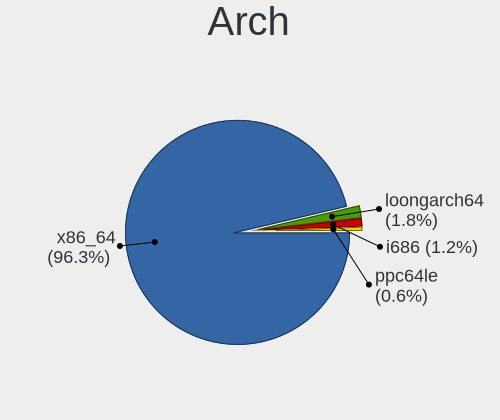
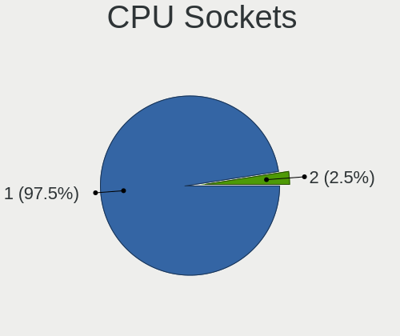

Debian Hardware Trends (Desktops)
---------------------------------

A project to identify most popular hardware characteristics and track their change
over time based on data collected by Debian users at https://Linux-Hardware.org.

Anyone can contribute to this report by the [hw-probe](https://github.com/linuxhw/hw-probe) tool:

    sudo -E hw-probe -all -upload

Full-feature report is available here: https://linux-hardware.org/?view=trends&formfactor=desktop

Period: Oct, 2021.

Contents
--------

* [ System ](#system)
  - [ OS                       ](#os)
  - [ OS Family                ](#os-family)
  - [ Kernel                   ](#kernel)
  - [ Kernel Family            ](#kernel-family)
  - [ Kernel Major Ver.        ](#kernel-major-ver)
  - [ Arch                     ](#arch)
  - [ DE                       ](#de)
  - [ Display Server           ](#display-server)
  - [ Display Manager          ](#display-manager)
  - [ OS Lang                  ](#os-lang)
  - [ Boot Mode                ](#boot-mode)
  - [ Filesystem               ](#filesystem)
  - [ Part. scheme             ](#part-scheme)
  - [ Dual Boot with Linux/BSD ](#dual-boot-with-linuxbsd)
  - [ Dual Boot (Win)          ](#dual-boot-win)

* [ Board ](#board)
  - [ Vendor                   ](#vendor)
  - [ Model                    ](#model)
  - [ Model Family             ](#model-family)
  - [ MFG Year                 ](#mfg-year)
  - [ Form Factor              ](#form-factor)
  - [ Secure Boot              ](#secure-boot)
  - [ Coreboot                 ](#coreboot)
  - [ RAM Size                 ](#ram-size)
  - [ RAM Used                 ](#ram-used)
  - [ Total Drives             ](#total-drives)
  - [ Has CD-ROM               ](#has-cd-rom)
  - [ Has Ethernet             ](#has-ethernet)
  - [ Has WiFi                 ](#has-wifi)
  - [ Has Bluetooth            ](#has-bluetooth)

* [ Location ](#location)
  - [ Country                  ](#country)
  - [ City                     ](#city)

* [ Drives ](#drives)
  - [ Drive Vendor             ](#drive-vendor)
  - [ Drive Model              ](#drive-model)
  - [ HDD Vendor               ](#hdd-vendor)
  - [ SSD Vendor               ](#ssd-vendor)
  - [ Drive Kind               ](#drive-kind)
  - [ Drive Connector          ](#drive-connector)
  - [ Drive Size               ](#drive-size)
  - [ Space Total              ](#space-total)
  - [ Space Used               ](#space-used)
  - [ Malfunc. Drives          ](#malfunc-drives)
  - [ Malfunc. Drive Vendor    ](#malfunc-drive-vendor)
  - [ Malfunc. HDD Vendor      ](#malfunc-hdd-vendor)
  - [ Malfunc. Drive Kind      ](#malfunc-drive-kind)
  - [ Failed Drives            ](#failed-drives)
  - [ Failed Drive Vendor      ](#failed-drive-vendor)
  - [ Drive Status             ](#drive-status)

* [ Storage controller ](#storage-controller)
  - [ Storage Vendor           ](#storage-vendor)
  - [ Storage Model            ](#storage-model)
  - [ Storage Kind             ](#storage-kind)

* [ Processor ](#processor)
  - [ CPU Vendor               ](#cpu-vendor)
  - [ CPU Model                ](#cpu-model)
  - [ CPU Model Family         ](#cpu-model-family)
  - [ CPU Cores                ](#cpu-cores)
  - [ CPU Sockets              ](#cpu-sockets)
  - [ CPU Threads              ](#cpu-threads)
  - [ CPU Op-Modes             ](#cpu-op-modes)
  - [ CPU Microcode            ](#cpu-microcode)
  - [ CPU Microarch            ](#cpu-microarch)

* [ Graphics ](#graphics)
  - [ GPU Vendor               ](#gpu-vendor)
  - [ GPU Model                ](#gpu-model)
  - [ GPU Combo                ](#gpu-combo)
  - [ GPU Driver               ](#gpu-driver)
  - [ GPU Memory               ](#gpu-memory)

* [ Monitor ](#monitor)
  - [ Monitor Vendor           ](#monitor-vendor)
  - [ Monitor Model            ](#monitor-model)
  - [ Monitor Resolution       ](#monitor-resolution)
  - [ Monitor Diagonal         ](#monitor-diagonal)
  - [ Monitor Width            ](#monitor-width)
  - [ Aspect Ratio             ](#aspect-ratio)
  - [ Monitor Area             ](#monitor-area)
  - [ Pixel Density            ](#pixel-density)
  - [ Multiple Monitors        ](#multiple-monitors)

* [ Network ](#network)
  - [ Net Controller Vendor    ](#net-controller-vendor)
  - [ Net Controller Model     ](#net-controller-model)
  - [ Wireless Vendor          ](#wireless-vendor)
  - [ Wireless Model           ](#wireless-model)
  - [ Ethernet Vendor          ](#ethernet-vendor)
  - [ Ethernet Model           ](#ethernet-model)
  - [ Net Controller Kind      ](#net-controller-kind)
  - [ Used Controller          ](#used-controller)
  - [ NICs                     ](#nics)
  - [ IPv6                     ](#ipv6)

* [ Bluetooth ](#bluetooth)
  - [ Bluetooth Vendor         ](#bluetooth-vendor)
  - [ Bluetooth Model          ](#bluetooth-model)

* [ Sound ](#sound)
  - [ Sound Vendor             ](#sound-vendor)
  - [ Sound Model              ](#sound-model)

* [ Memory ](#memory)
  - [ Memory Vendor            ](#memory-vendor)
  - [ Memory Model             ](#memory-model)
  - [ Memory Kind              ](#memory-kind)
  - [ Memory Form Factor       ](#memory-form-factor)
  - [ Memory Size              ](#memory-size)
  - [ Memory Speed             ](#memory-speed)

* [ Printers & scanners ](#printers--scanners)
  - [ Printer Vendor           ](#printer-vendor)
  - [ Printer Model            ](#printer-model)
  - [ Scanner Vendor           ](#scanner-vendor)
  - [ Scanner Model            ](#scanner-model)

* [ Camera ](#camera)
  - [ Camera Vendor            ](#camera-vendor)
  - [ Camera Model             ](#camera-model)

* [ Security ](#security)
  - [ Fingerprint Vendor       ](#fingerprint-vendor)
  - [ Fingerprint Model        ](#fingerprint-model)
  - [ Chipcard Vendor          ](#chipcard-vendor)
  - [ Chipcard Model           ](#chipcard-model)

* [ Unsupported ](#unsupported)
  - [ Unsupported Devices      ](#unsupported-devices)
  - [ Unsupported Device Types ](#unsupported-device-types)

System
------

OS
--

Installed operating systems

| Name              | Desktops | Percent |
|-------------------|----------|---------|
| Debian 11         | 80       | 80%     |
| Debian 10         | 8        | 8%      |
| Debian Testing    | 6        | 6%      |
| Debian Unstable   | 2        | 2%      |
| Debian 9          | 2        | 2%      |
| Debian 11-updates | 2        | 2%      |

OS Family
---------

OS without a version

| Name   | Desktops | Percent |
|--------|----------|---------|
| Debian | 100      | 100%    |

Kernel
------

Version of the Linux kernel

| Version                     | Desktops | Percent |
|-----------------------------|----------|---------|
| 5.10.0-9-amd64              | 28       | 28%     |
| 5.10.0-8-amd64              | 28       | 28%     |
| 5.10.0-7-amd64              | 16       | 16%     |
| 5.14.0-2-amd64              | 4        | 4%      |
| 5.11.22-4-pve               | 3        | 3%      |
| 5.14.0-3-amd64              | 2        | 2%      |
| 5.11.22-5-pve               | 2        | 2%      |
| 5.10.0-9-686                | 2        | 2%      |
| 4.19.0-18-amd64             | 2        | 2%      |
| 4.19.0-17-amd64             | 2        | 2%      |
| 5.15.0-rc5-recomp           | 1        | 1%      |
| 5.14.0-13.1-liquorix-amd64  | 1        | 1%      |
| 5.14.0-12.1-liquorix-amd64  | 1        | 1%      |
| 5.14.0-1-amd64              | 1        | 1%      |
| 5.10.65-gnu1                | 1        | 1%      |
| 5.10.0-2-amd64              | 1        | 1%      |
| 4.9.0-264-antix.1-amd64-smp | 1        | 1%      |
| 4.19.0-9-amd64              | 1        | 1%      |
| 4.19.0-8-amd64              | 1        | 1%      |
| 4.19.0-0.bpo.5-amd64        | 1        | 1%      |
| 4.14.93-g538e75632e3b-dirty | 1        | 1%      |

Kernel Family
-------------

Linux kernel without a distro release

| Version | Desktops | Percent |
|---------|----------|---------|
| 5.10.0  | 75       | 75%     |
| 5.14.0  | 9        | 9%      |
| 4.19.0  | 7        | 7%      |
| 5.11.22 | 5        | 5%      |
| 5.15.0  | 1        | 1%      |
| 5.10.65 | 1        | 1%      |
| 4.9.0   | 1        | 1%      |
| 4.14.93 | 1        | 1%      |

Kernel Major Ver.
-----------------

Linux kernel major version

| Version | Desktops | Percent |
|---------|----------|---------|
| 5.10    | 76       | 76%     |
| 5.14    | 9        | 9%      |
| 4.19    | 7        | 7%      |
| 5.11    | 5        | 5%      |
| 5.15    | 1        | 1%      |
| 4.9     | 1        | 1%      |
| 4.14    | 1        | 1%      |

Arch
----

OS architecture (x86_64, i586, etc.)

| Name   | Desktops | Percent |
|--------|----------|---------|
| x86_64 | 98       | 98%     |
| i686   | 2        | 2%      |

DE
--

Desktop Environment

| Name          | Desktops | Percent |
|---------------|----------|---------|
| Unknown       | 33       | 33%     |
| GNOME         | 20       | 20%     |
| XFCE          | 15       | 15%     |
| KDE5          | 13       | 13%     |
| LXDE          | 7        | 7%      |
| X-Cinnamon    | 3        | 3%      |
| MATE          | 2        | 2%      |
| Cinnamon      | 2        | 2%      |
| Trinity       | 1        | 1%      |
| Openbox       | 1        | 1%      |
| i3            | 1        | 1%      |
| GNOME Classic | 1        | 1%      |
| awesome       | 1        | 1%      |

Display Server
--------------

X11 or Wayland

| Name    | Desktops | Percent |
|---------|----------|---------|
| X11     | 57       | 57%     |
| Unknown | 20       | 20%     |
| Wayland | 14       | 14%     |
| Tty     | 9        | 9%      |

Display Manager
---------------

SDDM, LightDM, etc.

| Name    | Desktops | Percent |
|---------|----------|---------|
| Unknown | 46       | 46%     |
| LightDM | 24       | 24%     |
| GDM     | 14       | 14%     |
| SDDM    | 12       | 12%     |
| GDM3    | 3        | 3%      |
| NODM    | 1        | 1%      |

OS Lang
-------

Language

| Lang    | Desktops | Percent |
|---------|----------|---------|
| en_US   | 28       | 28%     |
| ru_RU   | 26       | 26%     |
| es_ES   | 10       | 10%     |
| pt_BR   | 6        | 6%      |
| fr_FR   | 4        | 4%      |
| Unknown | 4        | 4%      |
| en_GB   | 3        | 3%      |
| en_CA   | 3        | 3%      |
| it_IT   | 2        | 2%      |
| es_CL   | 2        | 2%      |
| uk_UA   | 1        | 1%      |
| sv_SE   | 1        | 1%      |
| ja_JP   | 1        | 1%      |
| fr_CH   | 1        | 1%      |
| es_MX   | 1        | 1%      |
| es_AR   | 1        | 1%      |
| en_AU   | 1        | 1%      |
| de_DE   | 1        | 1%      |
| de_CH   | 1        | 1%      |
| de_AT   | 1        | 1%      |
| ca_ES   | 1        | 1%      |
| C       | 1        | 1%      |

Boot Mode
---------

EFI or BIOS

| Mode | Desktops | Percent |
|------|----------|---------|
| BIOS | 64       | 64%     |
| EFI  | 36       | 36%     |

Filesystem
----------

Type of filesystem

| Type       | Desktops | Percent |
|------------|----------|---------|
| Ext4       | 73       | 73%     |
| Overlay    | 18       | 18%     |
| Btrfs      | 4        | 4%      |
| Zfs        | 3        | 3%      |
| Tmpfs      | 1        | 1%      |
| Fuse.sshfs | 1        | 1%      |

Part. scheme
------------

Scheme of partitioning

| Type    | Desktops | Percent |
|---------|----------|---------|
| GPT     | 44       | 44%     |
| MBR     | 35       | 35%     |
| Unknown | 21       | 21%     |

Dual Boot with Linux/BSD
------------------------

Hosting more than one Linux/BSD

| Dual boot | Desktops | Percent |
|-----------|----------|---------|
| No        | 85       | 85%     |
| Yes       | 15       | 15%     |

Dual Boot (Win)
---------------

Hosting Linux and Windows

| Dual boot | Desktops | Percent |
|-----------|----------|---------|
| No        | 61       | 61%     |
| Yes       | 39       | 39%     |

Board
-----

Vendor
------

Motherboard manufacturer

| Name                | Desktops | Percent |
|---------------------|----------|---------|
| ASUSTek Computer    | 26       | 26%     |
| Gigabyte Technology | 14       | 14%     |
| ASRock              | 14       | 14%     |
| Hewlett-Packard     | 10       | 10%     |
| MSI                 | 9        | 9%      |
| Dell                | 7        | 7%      |
| Pegatron            | 3        | 3%      |
| Lenovo              | 3        | 3%      |
| Intel               | 3        | 3%      |
| Unknown             | 3        | 3%      |
| Acer                | 2        | 2%      |
| Sun Microsystems    | 1        | 1%      |
| Nvidia              | 1        | 1%      |
| Foxconn             | 1        | 1%      |
| Digiboard           | 1        | 1%      |
| AOpen               | 1        | 1%      |
| American Megatrends | 1        | 1%      |

Model
-----

Motherboard model

| Name                                | Desktops | Percent |
|-------------------------------------|----------|---------|
| ASUS All Series                     | 6        | 6%      |
| Unknown                             | 3        | 3%      |
| HP EliteDesk 800 G1 SFF             | 2        | 2%      |
| HP EliteDesk 700 G1 SFF             | 2        | 2%      |
| Gigabyte H61M-S2PV                  | 2        | 2%      |
| Dell OptiPlex 7010                  | 2        | 2%      |
| ASRock G31M-VS2                     | 2        | 2%      |
| Sun Microsystems Ultra 27           | 1        | 1%      |
| Pegatron p7-1030                    | 1        | 1%      |
| Pegatron IPXCR_VN1                  | 1        | 1%      |
| Pegatron 505B Microtower PC         | 1        | 1%      |
| Nvidia NF-MCP61                     | 1        | 1%      |
| MSI MS-7C75                         | 1        | 1%      |
| MSI MS-7C56                         | 1        | 1%      |
| MSI MS-7C35                         | 1        | 1%      |
| MSI MS-7C02                         | 1        | 1%      |
| MSI MS-7979                         | 1        | 1%      |
| MSI MS-7817                         | 1        | 1%      |
| MSI MS-7721                         | 1        | 1%      |
| MSI MS-7597                         | 1        | 1%      |
| MSI MS-7519                         | 1        | 1%      |
| Lenovo ThinkCentre M920t 10SFCTO1WW | 1        | 1%      |
| Lenovo ThinkCentre M83 10AHS1PH00   | 1        | 1%      |
| Lenovo ThinkCentre M800 10FW0005US  | 1        | 1%      |
| Intel H55                           | 1        | 1%      |
| Intel DP43BF AAE78171-301           | 1        | 1%      |
| Intel D945GCCR AAD78647-300         | 1        | 1%      |
| HP Z800 Workstation                 | 1        | 1%      |
| HP Z420 Workstation                 | 1        | 1%      |
| HP ProLiant MicroServer             | 1        | 1%      |
| HP OMEN by Pylon Desktop 875-0xxx   | 1        | 1%      |
| HP Compaq dc7900 Small Form Factor  | 1        | 1%      |
| HP Compaq 6005 Pro SFF PC           | 1        | 1%      |
| Gigabyte Z590 UD AC                 | 1        | 1%      |
| Gigabyte Q270M-D3H                  | 1        | 1%      |
| Gigabyte P55M-UD2                   | 1        | 1%      |
| Gigabyte H310M S2H 2.0              | 1        | 1%      |
| Gigabyte H110M-S2H                  | 1        | 1%      |
| Gigabyte GB-BXBT-1900               | 1        | 1%      |
| Gigabyte G31M-ES2L                  | 1        | 1%      |
| Gigabyte B75M-D2V                   | 1        | 1%      |
| Gigabyte B460MDS3HV2                | 1        | 1%      |
| Gigabyte B450 AORUS M               | 1        | 1%      |
| Gigabyte AX370-Gaming K7            | 1        | 1%      |
| Gigabyte AB350M-DS3H V2             | 1        | 1%      |
| Foxconn H61MXL/H61MXL-K             | 1        | 1%      |
| Digiboard MPxx                      | 1        | 1%      |
| Dell Precision WorkStation T7500    | 1        | 1%      |
| Dell Precision WorkStation T7400    | 1        | 1%      |
| Dell OptiPlex 990                   | 1        | 1%      |
| Dell Inspiron 580                   | 1        | 1%      |
| Dell Inspiron 3647                  | 1        | 1%      |
| ASUS TUF GAMING X570-PRO            | 1        | 1%      |
| ASUS TUF GAMING B550M-PLUS          | 1        | 1%      |
| ASUS TUF B450-PLUS GAMING           | 1        | 1%      |
| ASUS Rampage IV EXTREME             | 1        | 1%      |
| ASUS Pro WS X570-ACE                | 1        | 1%      |
| ASUS PRIME H310M-K                  | 1        | 1%      |
| ASUS PRIME B460M-A                  | 1        | 1%      |
| ASUS PRIME B450M-K                  | 1        | 1%      |

Model Family
------------

Motherboard model prefix

| Name                   | Desktops | Percent |
|------------------------|----------|---------|
| ASUS All               | 6        | 6%      |
| HP EliteDesk           | 4        | 4%      |
| ASUS PRIME             | 4        | 4%      |
| Lenovo ThinkCentre     | 3        | 3%      |
| Dell OptiPlex          | 3        | 3%      |
| ASUS TUF               | 3        | 3%      |
| Unknown                | 3        | 3%      |
| HP Compaq              | 2        | 2%      |
| Gigabyte H61M-S2PV     | 2        | 2%      |
| Dell Precision         | 2        | 2%      |
| Dell Inspiron          | 2        | 2%      |
| ASRock G31M-VS2        | 2        | 2%      |
| Sun Microsystems Ultra | 1        | 1%      |
| Pegatron p7-1030       | 1        | 1%      |
| Pegatron IPXCR         | 1        | 1%      |
| Pegatron 505B          | 1        | 1%      |
| Nvidia NF-MCP61        | 1        | 1%      |
| MSI MS-7C75            | 1        | 1%      |
| MSI MS-7C56            | 1        | 1%      |
| MSI MS-7C35            | 1        | 1%      |
| MSI MS-7C02            | 1        | 1%      |
| MSI MS-7979            | 1        | 1%      |
| MSI MS-7817            | 1        | 1%      |
| MSI MS-7721            | 1        | 1%      |
| MSI MS-7597            | 1        | 1%      |
| MSI MS-7519            | 1        | 1%      |
| Intel H55              | 1        | 1%      |
| Intel DP43BF           | 1        | 1%      |
| Intel D945GCCR         | 1        | 1%      |
| HP Z800                | 1        | 1%      |
| HP Z420                | 1        | 1%      |
| HP ProLiant            | 1        | 1%      |
| HP OMEN                | 1        | 1%      |
| Gigabyte Z590          | 1        | 1%      |
| Gigabyte Q270M-D3H     | 1        | 1%      |
| Gigabyte P55M-UD2      | 1        | 1%      |
| Gigabyte H310M         | 1        | 1%      |
| Gigabyte H110M-S2H     | 1        | 1%      |
| Gigabyte GB-BXBT-1900  | 1        | 1%      |
| Gigabyte G31M-ES2L     | 1        | 1%      |
| Gigabyte B75M-D2V      | 1        | 1%      |
| Gigabyte B460MDS3HV2   | 1        | 1%      |
| Gigabyte B450          | 1        | 1%      |
| Gigabyte AX370-Gaming  | 1        | 1%      |
| Gigabyte AB350M-DS3H   | 1        | 1%      |
| Foxconn H61MXL         | 1        | 1%      |
| Digiboard MPxx         | 1        | 1%      |
| ASUS Rampage           | 1        | 1%      |
| ASUS Pro               | 1        | 1%      |
| ASUS P8P67             | 1        | 1%      |
| ASUS P8H61-M           | 1        | 1%      |
| ASUS P8B75-V           | 1        | 1%      |
| ASUS P7P55D            | 1        | 1%      |
| ASUS P5Q-EM            | 1        | 1%      |
| ASUS P5G41T-M          | 1        | 1%      |
| ASUS M5A97             | 1        | 1%      |
| ASUS M5A78L-M          | 1        | 1%      |
| ASUS M4A77T            | 1        | 1%      |
| ASUS H110M-R           | 1        | 1%      |
| ASUS CROSSHAIR         | 1        | 1%      |

MFG Year
--------

Motherboard manufacture year

| Year | Desktops | Percent |
|------|----------|---------|
| 2014 | 13       | 13%     |
| 2018 | 10       | 10%     |
| 2021 | 9        | 9%      |
| 2012 | 9        | 9%      |
| 2010 | 9        | 9%      |
| 2020 | 8        | 8%      |
| 2019 | 8        | 8%      |
| 2013 | 8        | 8%      |
| 2011 | 8        | 8%      |
| 2015 | 6        | 6%      |
| 2009 | 6        | 6%      |
| 2017 | 2        | 2%      |
| 2016 | 2        | 2%      |
| 2008 | 1        | 1%      |
| 2006 | 1        | 1%      |

Form Factor
-----------

Physical design of the computer

| Name    | Desktops | Percent |
|---------|----------|---------|
| Desktop | 100      | 100%    |

Secure Boot
-----------

Enabled or disabled

| State    | Desktops | Percent |
|----------|----------|---------|
| Disabled | 99       | 99%     |
| Enabled  | 1        | 1%      |

Coreboot
--------

Have coreboot on board

| Used | Desktops | Percent |
|------|----------|---------|
| No   | 100      | 100%    |

RAM Size
--------

Total RAM memory

| Size in GB  | Desktops | Percent |
|-------------|----------|---------|
| 16.01-24.0  | 24       | 24%     |
| 8.01-16.0   | 21       | 21%     |
| 3.01-4.0    | 15       | 15%     |
| 4.01-8.0    | 14       | 14%     |
| 32.01-64.0  | 11       | 11%     |
| 64.01-256.0 | 6        | 6%      |
| 1.01-2.0    | 6        | 6%      |
| 24.01-32.0  | 2        | 2%      |
| 2.01-3.0    | 1        | 1%      |

RAM Used
--------

Used RAM memory

| Used GB    | Desktops | Percent |
|------------|----------|---------|
| 1.01-2.0   | 24       | 24%     |
| 0.51-1.0   | 21       | 21%     |
| 2.01-3.0   | 18       | 18%     |
| 4.01-8.0   | 11       | 11%     |
| 3.01-4.0   | 10       | 10%     |
| 0.01-0.5   | 5        | 5%      |
| 8.01-16.0  | 4        | 4%      |
| 24.01-32.0 | 3        | 3%      |
| 16.01-24.0 | 3        | 3%      |
| 32.01-64.0 | 1        | 1%      |

Total Drives
------------

Number of drives on board

| Drives | Desktops | Percent |
|--------|----------|---------|
| 1      | 46       | 46%     |
| 2      | 19       | 19%     |
| 4      | 11       | 11%     |
| 3      | 11       | 11%     |
| 7      | 4        | 4%      |
| 8      | 2        | 2%      |
| 5      | 2        | 2%      |
| 0      | 2        | 2%      |
| 13     | 1        | 1%      |
| 11     | 1        | 1%      |
| 6      | 1        | 1%      |

Has CD-ROM
----------

Has CD-ROM on board

| Presented | Desktops | Percent |
|-----------|----------|---------|
| No        | 63       | 63%     |
| Yes       | 37       | 37%     |

Has Ethernet
------------

Has Ethernet on board

| Presented | Desktops | Percent |
|-----------|----------|---------|
| Yes       | 97       | 97%     |
| No        | 3        | 3%      |

Has WiFi
--------

Has WiFi module

| Presented | Desktops | Percent |
|-----------|----------|---------|
| No        | 72       | 72%     |
| Yes       | 28       | 28%     |

Has Bluetooth
-------------

Has Bluetooth module

| Presented | Desktops | Percent |
|-----------|----------|---------|
| No        | 73       | 73%     |
| Yes       | 27       | 27%     |

Location
--------

Country
-------

Geographic location (country)

| Country     | Desktops | Percent |
|-------------|----------|---------|
| Russia      | 26       | 26%     |
| USA         | 13       | 13%     |
| Spain       | 12       | 12%     |
| Brazil      | 6        | 6%      |
| France      | 5        | 5%      |
| UK          | 4        | 4%      |
| Hungary     | 3        | 3%      |
| Canada      | 3        | 3%      |
| Ukraine     | 2        | 2%      |
| Switzerland | 2        | 2%      |
| Sweden      | 2        | 2%      |
| Morocco     | 2        | 2%      |
| Italy       | 2        | 2%      |
| Germany     | 2        | 2%      |
| Chile       | 2        | 2%      |
| Turkey      | 1        | 1%      |
| Taiwan      | 1        | 1%      |
| Pakistan    | 1        | 1%      |
| Mexico      | 1        | 1%      |
| Kazakhstan  | 1        | 1%      |
| Japan       | 1        | 1%      |
| Jamaica     | 1        | 1%      |
| Czechia     | 1        | 1%      |
| Costa Rica  | 1        | 1%      |
| China       | 1        | 1%      |
| Belgium     | 1        | 1%      |
| Austria     | 1        | 1%      |
| Australia   | 1        | 1%      |
| Argentina   | 1        | 1%      |

City
----

Geographic location (city)

| City              | Desktops | Percent |
|-------------------|----------|---------|
| Voronezh          | 17       | 17%     |
| M??laga           | 6        | 6%      |
| Warminster        | 2        | 2%      |
| St Petersburg     | 2        | 2%      |
| Seville           | 2        | 2%      |
| Santiago          | 2        | 2%      |
| Zaporizhzhya      | 1        | 1%      |
| York              | 1        | 1%      |
| Yekaterinburg     | 1        | 1%      |
| Williston         | 1        | 1%      |
| Volgograd         | 1        | 1%      |
| Villemomble       | 1        | 1%      |
| Veliky Novgorod   | 1        | 1%      |
| Valencia          | 1        | 1%      |
| Upplands Vasby    | 1        | 1%      |
| Tredion           | 1        | 1%      |
| Torrent           | 1        | 1%      |
| Toronto           | 1        | 1%      |
| Stonehouse        | 1        | 1%      |
| Stockerau         | 1        | 1%      |
| Stains            | 1        | 1%      |
| Shanghai          | 1        | 1%      |
| S??o Paulo        | 1        | 1%      |
| San Jos?©         | 1        | 1%      |
| Salvador          | 1        | 1%      |
| Salt Lake City    | 1        | 1%      |
| Salekhard         | 1        | 1%      |
| Sabadell          | 1        | 1%      |
| Pilisvorosvar     | 1        | 1%      |
| Pato Branco       | 1        | 1%      |
| Paris             | 1        | 1%      |
| Novosibirsk       | 1        | 1%      |
| New Taipei        | 1        | 1%      |
| Neuchatel         | 1        | 1%      |
| Naro-Fominsk      | 1        | 1%      |
| Naples            | 1        | 1%      |
| Moscow            | 1        | 1%      |
| Moosomin          | 1        | 1%      |
| Monte Urano       | 1        | 1%      |
| Montauban         | 1        | 1%      |
| Melbourne         | 1        | 1%      |
| London            | 1        | 1%      |
| Leipzig           | 1        | 1%      |
| Las Vegas         | 1        | 1%      |
| La Porte          | 1        | 1%      |
| Kladno            | 1        | 1%      |
| Khmelnytskyy      | 1        | 1%      |
| K?±rklareli       | 1        | 1%      |
| Kamoke            | 1        | 1%      |
| Jacinto           | 1        | 1%      |
| Hammersmith       | 1        | 1%      |
| Fuquay-Varina     | 1        | 1%      |
| Frankfurt am Main | 1        | 1%      |
| Fort St. John     | 1        | 1%      |
| Florida           | 1        | 1%      |
| Fes               | 1        | 1%      |
| Everett           | 1        | 1%      |
| Eureka            | 1        | 1%      |
| Dallas            | 1        | 1%      |
| Constant Spring   | 1        | 1%      |

Drives
------

Drive Vendor
------------

Hard drive vendors

| Vendor              | Desktops | Drives | Percent |
|---------------------|----------|--------|---------|
| Seagate             | 42       | 55     | 23.46%  |
| WDC                 | 30       | 56     | 16.76%  |
| Samsung Electronics | 25       | 30     | 13.97%  |
| Kingston            | 17       | 18     | 9.5%    |
| Toshiba             | 12       | 22     | 6.7%    |
| Crucial             | 6        | 6      | 3.35%   |
| SanDisk             | 5        | 5      | 2.79%   |
| OCZ                 | 4        | 4      | 2.23%   |
| Hitachi             | 3        | 4      | 1.68%   |
| XPG                 | 2        | 2      | 1.12%   |
| PNY                 | 2        | 2      | 1.12%   |
| Phison              | 2        | 2      | 1.12%   |
| Intel               | 2        | 2      | 1.12%   |
| HGST                | 2        | 4      | 1.12%   |
| Hewlett-Packard     | 2        | 4      | 1.12%   |
| China               | 2        | 2      | 1.12%   |
| A-DATA Technology   | 2        | 2      | 1.12%   |
| Unknown             | 1        | 2      | 0.56%   |
| Transcend           | 1        | 1      | 0.56%   |
| Team                | 1        | 1      | 0.56%   |
| SPCC                | 1        | 1      | 0.56%   |
| Smartbuy            | 1        | 1      | 0.56%   |
| Silicon Motion      | 1        | 1      | 0.56%   |
| QGeeM               | 1        | 1      | 0.56%   |
| Patriot             | 1        | 1      | 0.56%   |
| MAXTOR              | 1        | 1      | 0.56%   |
| MARSHAL             | 1        | 1      | 0.56%   |
| LITEON              | 1        | 1      | 0.56%   |
| Lenovo              | 1        | 1      | 0.56%   |
| LaCie               | 1        | 1      | 0.56%   |
| KLEVV               | 1        | 1      | 0.56%   |
| JMicron             | 1        | 1      | 0.56%   |
| JAMESDONKEY         | 1        | 1      | 0.56%   |
| Hajaan              | 1        | 1      | 0.56%   |
| DREVO               | 1        | 1      | 0.56%   |
| Unknown             | 1        | 1      | 0.56%   |

Drive Model
-----------

Hard drive models

| Model                              | Desktops | Percent |
|------------------------------------|----------|---------|
| Seagate ST500DM002-1BD142 500GB    | 8        | 3.96%   |
| Kingston SA400S37240G 240GB SSD    | 7        | 3.47%   |
| WDC WD5000AAKX-60U6AA0 500GB       | 4        | 1.98%   |
| Kingston SA400S37480G 480GB SSD    | 4        | 1.98%   |
| Seagate ST3500418AS 500GB          | 3        | 1.49%   |
| Seagate ST2000DM008-2FR102 2TB     | 3        | 1.49%   |
| Seagate ST1000DM010-2EP102 1TB     | 3        | 1.49%   |
| Seagate ST1000DM003-1CH162 1TB     | 3        | 1.49%   |
| Samsung SSD 850 EVO 500GB          | 3        | 1.49%   |
| Crucial CT500MX500SSD1 500GB       | 3        | 1.49%   |
| WDC WUH721818ALE6L4 18TB           | 2        | 0.99%   |
| WDC WD40EZRX-00SPEB0 4TB           | 2        | 0.99%   |
| WDC WD10EZEX-08WN4A0 1TB           | 2        | 0.99%   |
| Toshiba DT01ACA200 2TB             | 2        | 0.99%   |
| Toshiba DT01ACA100 1TB             | 2        | 0.99%   |
| Toshiba DT01ACA050 500GB           | 2        | 0.99%   |
| Seagate ST8000DM004-2CX188 8TB     | 2        | 0.99%   |
| Seagate ST3320613AS 320GB          | 2        | 0.99%   |
| Samsung SSD 860 EVO 250GB          | 2        | 0.99%   |
| Samsung SSD 860 EVO 1TB            | 2        | 0.99%   |
| PNY CS900 250GB SSD                | 2        | 0.99%   |
| Hitachi HDS721010CLA332 1TB        | 2        | 0.99%   |
| XPG SPECTRIX S40G 512GB            | 1        | 0.5%    |
| XPG GAMMIX S5 256GB                | 1        | 0.5%    |
| WDC WDS240G2G0A-00JH30 240GB SSD   | 1        | 0.5%    |
| WDC WDS100T2G0A-00JH30 1TB SSD     | 1        | 0.5%    |
| WDC WDS100T2B0B-00YS70 1TB SSD     | 1        | 0.5%    |
| WDC WDS100T2B0A-00SM50 1TB SSD     | 1        | 0.5%    |
| WDC WD5000AZRZ-00HTKB0 500GB       | 1        | 0.5%    |
| WDC WD5000AZLX-08K2TA0 500GB       | 1        | 0.5%    |
| WDC WD5000AAKX-00ERMA0 500GB       | 1        | 0.5%    |
| WDC WD5000AADS-00S9B0 500GB        | 1        | 0.5%    |
| WDC WD3200BEKT-75PVMT1 320GB       | 1        | 0.5%    |
| WDC WD3200AAKS-75L9A0 320GB        | 1        | 0.5%    |
| WDC WD3200AAJS-65M0A0 320GB        | 1        | 0.5%    |
| WDC WD3200AAJS-22B4A0 320GB        | 1        | 0.5%    |
| WDC WD3000JD-55KLB0 304GB          | 1        | 0.5%    |
| WDC WD20EZRZ-00Z5HB0 2TB           | 1        | 0.5%    |
| WDC WD20EZRX-00D8PB0 2TB           | 1        | 0.5%    |
| WDC WD20EURS-63S48Y0 2TB           | 1        | 0.5%    |
| WDC WD20EARX-00PASB0 2TB           | 1        | 0.5%    |
| WDC WD161KFGX-68AFPN0 16TB         | 1        | 0.5%    |
| WDC WD1600HLFS-75G6U1 160GB        | 1        | 0.5%    |
| WDC WD1600AAJS-07M0A0 160GB        | 1        | 0.5%    |
| WDC WD1600AABS-62PRA0 160GB        | 1        | 0.5%    |
| WDC WD140EFFX-68VBXN0 14TB         | 1        | 0.5%    |
| WDC WD140EDGZ-11B1PA0 14TB         | 1        | 0.5%    |
| WDC WD140EDFZ-11A0VA0 14TB         | 1        | 0.5%    |
| WDC WD10EZEX-00BN5A0 1TB           | 1        | 0.5%    |
| WDC WD10EALX-009BA0 1TB            | 1        | 0.5%    |
| WDC WD10EADS-00M2B0 1TB            | 1        | 0.5%    |
| WDC WD100EMAZ-00WJTA0 10TB         | 1        | 0.5%    |
| WDC PC SN720 SDAPNTW-1T00-1006 1TB | 1        | 0.5%    |
| Unknown MMC Card  7GB              | 1        | 0.5%    |
| Unknown MMC Card  32GB             | 1        | 0.5%    |
| Transcend TS256GSSD230S 256GB      | 1        | 0.5%    |
| Toshiba THNSNJ128GCSU 128GB SSD    | 1        | 0.5%    |
| Toshiba MQ01ABD032 320GB           | 1        | 0.5%    |
| Toshiba HDWD240 4TB                | 1        | 0.5%    |
| Toshiba HDWD120 2TB                | 1        | 0.5%    |

HDD Vendor
----------

Hard disk drive vendors

| Vendor              | Desktops | Drives | Percent |
|---------------------|----------|--------|---------|
| Seagate             | 41       | 53     | 45.56%  |
| WDC                 | 25       | 51     | 27.78%  |
| Toshiba             | 11       | 21     | 12.22%  |
| Samsung Electronics | 5        | 5      | 5.56%   |
| Hitachi             | 3        | 4      | 3.33%   |
| HGST                | 2        | 4      | 2.22%   |
| MAXTOR              | 1        | 1      | 1.11%   |
| MARSHAL             | 1        | 1      | 1.11%   |
| Hewlett-Packard     | 1        | 2      | 1.11%   |

SSD Vendor
----------

Solid state drive vendors

| Vendor              | Desktops | Drives | Percent |
|---------------------|----------|--------|---------|
| Samsung Electronics | 19       | 21     | 25.68%  |
| Kingston            | 17       | 18     | 22.97%  |
| Crucial             | 6        | 6      | 8.11%   |
| SanDisk             | 5        | 5      | 6.76%   |
| WDC                 | 4        | 4      | 5.41%   |
| OCZ                 | 4        | 4      | 5.41%   |
| PNY                 | 2        | 2      | 2.7%    |
| China               | 2        | 2      | 2.7%    |
| A-DATA Technology   | 2        | 2      | 2.7%    |
| Transcend           | 1        | 1      | 1.35%   |
| Toshiba             | 1        | 1      | 1.35%   |
| Team                | 1        | 1      | 1.35%   |
| SPCC                | 1        | 1      | 1.35%   |
| Smartbuy            | 1        | 1      | 1.35%   |
| Patriot             | 1        | 1      | 1.35%   |
| LITEON              | 1        | 1      | 1.35%   |
| Lenovo              | 1        | 1      | 1.35%   |
| JAMESDONKEY         | 1        | 1      | 1.35%   |
| Intel               | 1        | 1      | 1.35%   |
| Hajaan              | 1        | 1      | 1.35%   |
| DREVO               | 1        | 1      | 1.35%   |
| Unknown             | 1        | 1      | 1.35%   |

Drive Kind
----------

HDD or SSD

| Kind    | Desktops | Drives | Percent |
|---------|----------|--------|---------|
| HDD     | 71       | 142    | 48.97%  |
| SSD     | 57       | 77     | 39.31%  |
| NVMe    | 12       | 15     | 8.28%   |
| Unknown | 4        | 4      | 2.76%   |
| MMC     | 1        | 2      | 0.69%   |

Drive Connector
---------------

SATA, SAS, NVMe, etc.

| Type | Desktops | Drives | Percent |
|------|----------|--------|---------|
| SATA | 92       | 217    | 82.88%  |
| NVMe | 12       | 15     | 10.81%  |
| SAS  | 6        | 6      | 5.41%   |
| MMC  | 1        | 2      | 0.9%    |

Drive Size
----------

Size of hard drive

| Size in TB | Desktops | Drives | Percent |
|------------|----------|--------|---------|
| 0.01-0.5   | 74       | 109    | 54.01%  |
| 0.51-1.0   | 29       | 37     | 21.17%  |
| 1.01-2.0   | 19       | 31     | 13.87%  |
| 3.01-4.0   | 6        | 8      | 4.38%   |
| 10.01-20.0 | 4        | 16     | 2.92%   |
| 4.01-10.0  | 4        | 16     | 2.92%   |
| 2.01-3.0   | 1        | 2      | 0.73%   |

Space Total
-----------

Amount of disk space available on the file system

| Size in GB     | Desktops | Percent |
|----------------|----------|---------|
| Unknown        | 22       | 22%     |
| 101-250        | 18       | 18%     |
| 251-500        | 17       | 17%     |
| More than 3000 | 11       | 11%     |
| 1001-2000      | 9        | 9%      |
| 501-1000       | 9        | 9%      |
| 2001-3000      | 5        | 5%      |
| 21-50          | 3        | 3%      |
| 1-20           | 3        | 3%      |
| 51-100         | 3        | 3%      |

Space Used
----------

Amount of used disk space

| Used GB        | Desktops | Percent |
|----------------|----------|---------|
| Unknown        | 22       | 22%     |
| 1-20           | 19       | 19%     |
| 101-250        | 14       | 14%     |
| 251-500        | 11       | 11%     |
| 21-50          | 10       | 10%     |
| 51-100         | 7        | 7%      |
| More than 3000 | 5        | 5%      |
| 1001-2000      | 5        | 5%      |
| 2001-3000      | 3        | 3%      |
| 501-1000       | 3        | 3%      |
| 0              | 1        | 1%      |

Malfunc. Drives
---------------

Drive models with a malfunction

| Model                                        | Desktops | Drives | Percent |
|----------------------------------------------|----------|--------|---------|
| WDC WD5000AAKX-60U6AA0 500GB                 | 2        | 2      | 10%     |
| Seagate ST500DM002-1BD142 500GB              | 2        | 2      | 10%     |
| WDC WD40EZRX-00SPEB0 4TB                     | 1        | 1      | 5%      |
| WDC WD3200BEKT-75PVMT1 320GB                 | 1        | 1      | 5%      |
| WDC WD3200AAJS-22B4A0 320GB                  | 1        | 1      | 5%      |
| WDC WD3000JD-55KLB0 304GB                    | 1        | 1      | 5%      |
| WDC WD10EZEX-08WN4A0 1TB                     | 1        | 1      | 5%      |
| Seagate ST3750330AS 752GB                    | 1        | 1      | 5%      |
| Seagate ST3500418AS 500GB                    | 1        | 1      | 5%      |
| Seagate ST340016A 40GB                       | 1        | 1      | 5%      |
| Seagate ST3320613AS 320GB                    | 1        | 1      | 5%      |
| Seagate ST3120022A 120GB                     | 1        | 1      | 5%      |
| Seagate ST1000DM003-1CH162 1TB               | 1        | 1      | 5%      |
| SanDisk SSD PLUS 240GB                       | 1        | 1      | 5%      |
| Samsung Electronics SSD 840 PRO Series 512GB | 1        | 1      | 5%      |
| OCZ VERTEX4 128GB SSD                        | 1        | 1      | 5%      |
| Kingston SV300S37A120G 120GB SSD             | 1        | 1      | 5%      |
| Intel SSDSC2KW120H6 120GB                    | 1        | 1      | 5%      |

Malfunc. Drive Vendor
---------------------

Vendors of faulty drives

| Vendor              | Desktops | Drives | Percent |
|---------------------|----------|--------|---------|
| Seagate             | 8        | 8      | 40%     |
| WDC                 | 7        | 7      | 35%     |
| SanDisk             | 1        | 1      | 5%      |
| Samsung Electronics | 1        | 1      | 5%      |
| OCZ                 | 1        | 1      | 5%      |
| Kingston            | 1        | 1      | 5%      |
| Intel               | 1        | 1      | 5%      |

Malfunc. HDD Vendor
-------------------

Vendors of faulty HDD drives

| Vendor  | Desktops | Drives | Percent |
|---------|----------|--------|---------|
| Seagate | 8        | 8      | 53.33%  |
| WDC     | 7        | 7      | 46.67%  |

Malfunc. Drive Kind
-------------------

Kinds of faulty drives

| Kind | Desktops | Drives | Percent |
|------|----------|--------|---------|
| HDD  | 13       | 15     | 72.22%  |
| SSD  | 5        | 5      | 27.78%  |

Failed Drives
-------------

Failed drive models

| Model                           | Desktops | Drives | Percent |
|---------------------------------|----------|--------|---------|
| Seagate ST500DM002-1BD142 500GB | 1        | 1      | 50%     |
| HGST HDN724040ALE640 4TB        | 1        | 1      | 50%     |

Failed Drive Vendor
-------------------

Failed drive vendors

| Vendor  | Desktops | Drives | Percent |
|---------|----------|--------|---------|
| Seagate | 1        | 1      | 50%     |
| HGST    | 1        | 1      | 50%     |

Drive Status
------------

Number of failed and malfunc. drives

| Status   | Desktops | Drives | Percent |
|----------|----------|--------|---------|
| Works    | 70       | 153    | 61.95%  |
| Detected | 24       | 65     | 21.24%  |
| Malfunc  | 17       | 20     | 15.04%  |
| Failed   | 2        | 2      | 1.77%   |

Storage controller
------------------

Storage Vendor
--------------

Storage controller vendors

| Vendor                           | Desktops | Percent |
|----------------------------------|----------|---------|
| Intel                            | 67       | 53.17%  |
| AMD                              | 27       | 21.43%  |
| Samsung Electronics              | 5        | 3.97%   |
| Marvell Technology Group         | 5        | 3.97%   |
| LSI Logic / Symbios Logic        | 4        | 3.17%   |
| ASMedia Technology               | 4        | 3.17%   |
| Nvidia                           | 3        | 2.38%   |
| Realtek Semiconductor            | 2        | 1.59%   |
| JMicron Technology               | 2        | 1.59%   |
| VIA Technologies                 | 1        | 0.79%   |
| Silicon Motion                   | 1        | 0.79%   |
| Silicon Integrated Systems [SiS] | 1        | 0.79%   |
| Seagate Technology               | 1        | 0.79%   |
| Sandisk                          | 1        | 0.79%   |
| Phison Electronics               | 1        | 0.79%   |
| Biwin Storage Technology         | 1        | 0.79%   |

Storage Model
-------------

Storage controller models

| Model                                                                          | Desktops | Percent |
|--------------------------------------------------------------------------------|----------|---------|
| AMD FCH SATA Controller [AHCI mode]                                            | 16       | 10.32%  |
| Intel 8 Series/C220 Series Chipset Family 6-port SATA Controller 1 [AHCI mode] | 12       | 7.74%   |
| Intel SATA Controller [RAID mode]                                              | 6        | 3.87%   |
| Intel NM10/ICH7 Family SATA Controller [IDE mode]                              | 6        | 3.87%   |
| Intel 6 Series/C200 Series Chipset Family 6 port Desktop SATA AHCI Controller  | 6        | 3.87%   |
| Intel Q170/Q150/B150/H170/H110/Z170/CM236 Chipset SATA Controller [AHCI Mode]  | 5        | 3.23%   |
| AMD 400 Series Chipset SATA Controller                                         | 5        | 3.23%   |
| Intel 82801JI (ICH10 Family) SATA AHCI Controller                              | 4        | 2.58%   |
| Intel 82801G (ICH7 Family) IDE Controller                                      | 4        | 2.58%   |
| ASMedia ASM1062 Serial ATA Controller                                          | 4        | 2.58%   |
| AMD SB7x0/SB8x0/SB9x0 SATA Controller [AHCI mode]                              | 4        | 2.58%   |
| Nvidia MCP61 SATA Controller                                                   | 3        | 1.94%   |
| Intel 7 Series/C210 Series Chipset Family 6-port SATA Controller [AHCI mode]   | 3        | 1.94%   |
| Intel 5 Series/3400 Series Chipset 6 port SATA AHCI Controller                 | 3        | 1.94%   |
| AMD Starship/Matisse Chipset SATA Controller [AHCI mode]                       | 3        | 1.94%   |
| Samsung NVMe SSD Controller PM9A1/PM9A3/980PRO                                 | 2        | 1.29%   |
| Nvidia MCP61 IDE                                                               | 2        | 1.29%   |
| LSI Logic / Symbios Logic SAS1068E PCI-Express Fusion-MPT SAS                  | 2        | 1.29%   |
| Intel Cannon Lake PCH SATA AHCI Controller                                     | 2        | 1.29%   |
| Intel C600/X79 series chipset 6-Port SATA AHCI Controller                      | 2        | 1.29%   |
| Intel Atom Processor E3800 Series SATA AHCI Controller                         | 2        | 1.29%   |
| Intel 7 Series/C210 Series Chipset Family 4-port SATA Controller [IDE mode]    | 2        | 1.29%   |
| Intel 7 Series/C210 Series Chipset Family 2-port SATA Controller [IDE mode]    | 2        | 1.29%   |
| Intel 5 Series/3400 Series Chipset 4 port SATA IDE Controller                  | 2        | 1.29%   |
| Intel 200 Series PCH SATA controller [AHCI mode]                               | 2        | 1.29%   |
| AMD SB7x0/SB8x0/SB9x0 SATA Controller [IDE mode]                               | 2        | 1.29%   |
| AMD SB7x0/SB8x0/SB9x0 IDE Controller                                           | 2        | 1.29%   |
| VIA VT6421 IDE/SATA Controller                                                 | 1        | 0.65%   |
| Silicon Motion SM2263EN/SM2263XT SSD Controller                                | 1        | 0.65%   |
| Silicon Integrated Systems [SiS] 5513 IDE Controller                           | 1        | 0.65%   |
| Seagate FireCuda 520 SSD                                                       | 1        | 0.65%   |
| Sandisk WD Black 2018/SN750 / PC SN720 NVMe SSD                                | 1        | 0.65%   |
| Samsung NVMe SSD Controller SM981/PM981/PM983                                  | 1        | 0.65%   |
| Samsung NVMe SSD Controller SM951/PM951                                        | 1        | 0.65%   |
| Samsung Electronics SATA controller                                            | 1        | 0.65%   |
| Realtek RTS5763DL NVMe SSD Controller                                          | 1        | 0.65%   |
| Realtek Realtek Non-Volatile memory controller                                 | 1        | 0.65%   |
| Phison E18 PCIe4 NVMe Controller                                               | 1        | 0.65%   |
| Marvell Group 88SE9235 PCIe 2.0 x2 4-port SATA 6 Gb/s Controller               | 1        | 0.65%   |
| Marvell Group 88SE9215 PCIe 2.0 x1 4-port SATA 6 Gb/s Controller               | 1        | 0.65%   |
| Marvell Group 88SE9172 SATA 6Gb/s Controller                                   | 1        | 0.65%   |
| Marvell Group 88SE912x IDE Controller                                          | 1        | 0.65%   |
| Marvell Group 88SE9120 SATA 6Gb/s Controller                                   | 1        | 0.65%   |
| Marvell Group 88SE6101/6102 single-port PATA133 interface                      | 1        | 0.65%   |
| LSI Logic / Symbios Logic SAS2308 PCI-Express Fusion-MPT SAS-2                 | 1        | 0.65%   |
| LSI Logic / Symbios Logic SAS2008 PCI-Express Fusion-MPT SAS-2 [Falcon]        | 1        | 0.65%   |
| LSI Logic / Symbios Logic SAS1064ET PCI-Express Fusion-MPT SAS                 | 1        | 0.65%   |
| LSI Logic / Symbios Logic MegaRAID SAS-3 3108 [Invader]                        | 1        | 0.65%   |
| JMicron JMB368 IDE controller                                                  | 1        | 0.65%   |
| JMicron JMB362 SATA Controller                                                 | 1        | 0.65%   |
| Intel SSD Pro 7600p/760p/E 6100p Series                                        | 1        | 0.65%   |
| Intel Comet Lake SATA AHCI Controller                                          | 1        | 0.65%   |
| Intel C602 chipset 4-Port SATA Storage Control Unit                            | 1        | 0.65%   |
| Intel C600/X79 series chipset IDE-r Controller                                 | 1        | 0.65%   |
| Intel 82801JI (ICH10 Family) 4 port SATA IDE Controller #1                     | 1        | 0.65%   |
| Intel 82801JI (ICH10 Family) 2 port SATA IDE Controller #2                     | 1        | 0.65%   |
| Intel 82801JD/DO (ICH10 Family) SATA AHCI Controller                           | 1        | 0.65%   |
| Intel 8 Series/C220 Series Chipset Family 4-port SATA Controller 1 [IDE mode]  | 1        | 0.65%   |
| Intel 7 Series Chipset Family 6-port SATA Controller [AHCI mode]               | 1        | 0.65%   |
| Intel 631xESB/632xESB SATA AHCI Controller                                     | 1        | 0.65%   |

Storage Kind
------------

Kind of storage controller (IDE, SATA, NVMe, SAS, ...)

| Kind | Desktops | Percent |
|------|----------|---------|
| SATA | 76       | 60.32%  |
| IDE  | 25       | 19.84%  |
| NVMe | 12       | 9.52%   |
| RAID | 8        | 6.35%   |
| SAS  | 3        | 2.38%   |
| SCSI | 2        | 1.59%   |

Processor
---------

CPU Vendor
----------

Processor vendors

| Vendor | Desktops | Percent |
|--------|----------|---------|
| Intel  | 68       | 68%     |
| AMD    | 32       | 32%     |

CPU Model
---------

Processor models

| Model                                          | Desktops | Percent |
|------------------------------------------------|----------|---------|
| Intel Pentium CPU G3420 @ 3.20GHz              | 4        | 4%      |
| Intel Xeon CPU X5650 @ 2.67GHz                 | 2        | 2%      |
| Intel Xeon CPU E3-1240 V2 @ 3.40GHz            | 2        | 2%      |
| Intel Pentium Dual-Core CPU E6500 @ 2.93GHz    | 2        | 2%      |
| Intel Core i7-8700 CPU @ 3.20GHz               | 2        | 2%      |
| Intel Core i5-4590 CPU @ 3.30GHz               | 2        | 2%      |
| Intel Core i5-4570 CPU @ 3.20GHz               | 2        | 2%      |
| Intel Core i5-3470 CPU @ 3.20GHz               | 2        | 2%      |
| Intel Core i3-2100 CPU @ 3.10GHz               | 2        | 2%      |
| AMD Ryzen 7 5800X 8-Core Processor             | 2        | 2%      |
| AMD Ryzen 5 3600 6-Core Processor              | 2        | 2%      |
| Intel Xeon CPU W3540 @ 2.93GHz                 | 1        | 1%      |
| Intel Xeon CPU E5405 @ 2.00GHz                 | 1        | 1%      |
| Intel Xeon CPU E5-1620 0 @ 3.60GHz             | 1        | 1%      |
| Intel Pentium Dual CPU E2180 @ 2.00GHz         | 1        | 1%      |
| Intel Pentium CPU N3700 @ 1.60GHz              | 1        | 1%      |
| Intel Pentium CPU G3430 @ 3.30GHz              | 1        | 1%      |
| Intel Pentium CPU G3220 @ 3.00GHz              | 1        | 1%      |
| Intel Core i7-9700F CPU @ 3.00GHz              | 1        | 1%      |
| Intel Core i7-7700 CPU @ 3.60GHz               | 1        | 1%      |
| Intel Core i7-6700K CPU @ 4.00GHz              | 1        | 1%      |
| Intel Core i7-6700 CPU @ 3.40GHz               | 1        | 1%      |
| Intel Core i7-4790 CPU @ 3.60GHz               | 1        | 1%      |
| Intel Core i7-3820 CPU @ 3.60GHz               | 1        | 1%      |
| Intel Core i7-2600 CPU @ 3.40GHz               | 1        | 1%      |
| Intel Core i7 CPU 870 @ 2.93GHz                | 1        | 1%      |
| Intel Core i5-9400F CPU @ 2.90GHz              | 1        | 1%      |
| Intel Core i5-8400 CPU @ 2.80GHz               | 1        | 1%      |
| Intel Core i5-7400 CPU @ 3.00GHz               | 1        | 1%      |
| Intel Core i5-6500 CPU @ 3.20GHz               | 1        | 1%      |
| Intel Core i5-6400 CPU @ 2.70GHz               | 1        | 1%      |
| Intel Core i5-4460 CPU @ 3.20GHz               | 1        | 1%      |
| Intel Core i5-4440 CPU @ 3.10GHz               | 1        | 1%      |
| Intel Core i5-2520M CPU @ 2.50GHz              | 1        | 1%      |
| Intel Core i5-2500 CPU @ 3.30GHz               | 1        | 1%      |
| Intel Core i5-2310 CPU @ 2.90GHz               | 1        | 1%      |
| Intel Core i5-10400F CPU @ 2.90GHz             | 1        | 1%      |
| Intel Core i5-10400 CPU @ 2.90GHz              | 1        | 1%      |
| Intel Core i5 CPU 750 @ 2.67GHz                | 1        | 1%      |
| Intel Core i5 CPU 650 @ 3.20GHz                | 1        | 1%      |
| Intel Core i3-3240 CPU @ 3.40GHz               | 1        | 1%      |
| Intel Core i3-3225 CPU @ 3.30GHz               | 1        | 1%      |
| Intel Core i3-3210 CPU @ 3.20GHz               | 1        | 1%      |
| Intel Core i3-10100 CPU @ 3.60GHz              | 1        | 1%      |
| Intel Core i3 CPU 550 @ 3.20GHz                | 1        | 1%      |
| Intel Core i3 CPU 540 @ 3.07GHz                | 1        | 1%      |
| Intel Core 2 Quad CPU @ 2.40GHz                | 1        | 1%      |
| Intel Core 2 Duo CPU E8500 @ 3.16GHz           | 1        | 1%      |
| Intel Core 2 Duo CPU E8400 @ 3.00GHz           | 1        | 1%      |
| Intel Core 2 Duo CPU E7500 @ 2.93GHz           | 1        | 1%      |
| Intel Core 2 CPU 4300 @ 1.80GHz                | 1        | 1%      |
| Intel Celeron CPU J1900 @ 1.99GHz              | 1        | 1%      |
| Intel Celeron CPU J1800 @ 2.41GHz              | 1        | 1%      |
| Intel Celeron CPU G530 @ 2.40GHz               | 1        | 1%      |
| Intel Celeron CPU E3300 @ 2.50GHz              | 1        | 1%      |
| Intel Celeron CPU 1037U @ 1.80GHz              | 1        | 1%      |
| Intel Atom CPU 330 @ 1.60GHz                   | 1        | 1%      |
| Intel 11th Gen Core i7-11700K @ 3.60GHz        | 1        | 1%      |
| Intel 11th Gen Core i5-11400 @ 2.60GHz         | 1        | 1%      |
| AMD Ryzen Threadripper 1950X 16-Core Processor | 1        | 1%      |

CPU Model Family
----------------

Processor model prefix

| Model                   | Desktops | Percent |
|-------------------------|----------|---------|
| Intel Core i5           | 20       | 20%     |
| Intel Core i7           | 10       | 10%     |
| Intel Core i3           | 8        | 8%      |
| Intel Xeon              | 7        | 7%      |
| Intel Pentium           | 7        | 7%      |
| AMD Ryzen 7             | 6        | 6%      |
| Intel Celeron           | 5        | 5%      |
| AMD Ryzen 5             | 4        | 4%      |
| Other                   | 3        | 3%      |
| Intel Core 2 Duo        | 3        | 3%      |
| AMD Ryzen 9             | 3        | 3%      |
| AMD FX                  | 3        | 3%      |
| Intel Pentium Dual-Core | 2        | 2%      |
| AMD Athlon II X4        | 2        | 2%      |
| AMD Athlon II X2        | 2        | 2%      |
| AMD Athlon              | 2        | 2%      |
| AMD A10                 | 2        | 2%      |
| Intel Pentium Dual      | 1        | 1%      |
| Intel Core 2 Quad       | 1        | 1%      |
| Intel Core 2            | 1        | 1%      |
| Intel Atom              | 1        | 1%      |
| AMD Ryzen Threadripper  | 1        | 1%      |
| AMD Ryzen 7 PRO         | 1        | 1%      |
| AMD Phenom II X4        | 1        | 1%      |
| AMD Athlon XP           | 1        | 1%      |
| AMD Athlon X4           | 1        | 1%      |
| AMD Athlon II Neo       | 1        | 1%      |
| AMD A4                  | 1        | 1%      |

CPU Cores
---------

Number of processor cores

| Number | Desktops | Percent |
|--------|----------|---------|
| 2      | 35       | 35%     |
| 4      | 34       | 34%     |
| 6      | 12       | 12%     |
| 8      | 11       | 11%     |
| 16     | 3        | 3%      |
| 12     | 2        | 2%      |
| 1      | 2        | 2%      |
| 3      | 1        | 1%      |

CPU Sockets
-----------

Number of sockets

| Number | Desktops | Percent |
|--------|----------|---------|
| 1      | 98       | 98%     |
| 2      | 2        | 2%      |

CPU Threads
-----------

Threads per core (Hyper-Threading)

| Number | Desktops | Percent |
|--------|----------|---------|
| 2      | 53       | 53%     |
| 1      | 47       | 47%     |

CPU Op-Modes
------------

CPU Operation Modes (32-bit, 64-bit)

| Op mode        | Desktops | Percent |
|----------------|----------|---------|
| 32-bit, 64-bit | 99       | 99%     |
| 32-bit         | 1        | 1%      |

CPU Microcode
-------------

Microcode number

| Number     | Desktops | Percent |
|------------|----------|---------|
| Unknown    | 20       | 20%     |
| 0x306c3    | 12       | 12%     |
| 0x206a7    | 7        | 7%      |
| 0x306a9    | 6        | 6%      |
| 0x1067a    | 5        | 5%      |
| 0x08701021 | 5        | 5%      |
| 0x506e3    | 4        | 4%      |
| 0x0800820d | 3        | 3%      |
| 0xa0671    | 2        | 2%      |
| 0xa0653    | 2        | 2%      |
| 0x906ed    | 2        | 2%      |
| 0x906ea    | 2        | 2%      |
| 0x906e9    | 2        | 2%      |
| 0x206c2    | 2        | 2%      |
| 0x20655    | 2        | 2%      |
| 0x106e5    | 2        | 2%      |
| 0x08001137 | 2        | 2%      |
| 0x06003106 | 2        | 2%      |
| 0x06001119 | 2        | 2%      |
| 0x010000c8 | 2        | 2%      |
| 0x6fd      | 1        | 1%      |
| 0x6f7      | 1        | 1%      |
| 0x6f2      | 1        | 1%      |
| 0x406c3    | 1        | 1%      |
| 0x30678    | 1        | 1%      |
| 0x206d7    | 1        | 1%      |
| 0x106c2    | 1        | 1%      |
| 0x10676    | 1        | 1%      |
| 0x0a201016 | 1        | 1%      |
| 0x08101016 | 1        | 1%      |
| 0x07043001 | 1        | 1%      |
| 0x06000822 | 1        | 1%      |
| 0x0600063e | 1        | 1%      |
| 0x010000b6 | 1        | 1%      |

CPU Microarch
-------------

Microarchitecture

| Name        | Desktops | Percent |
|-------------|----------|---------|
| Haswell     | 13       | 13%     |
| SandyBridge | 9        | 9%      |
| IvyBridge   | 8        | 8%      |
| Penryn      | 7        | 7%      |
| KabyLake    | 7        | 7%      |
| Zen 2       | 6        | 6%      |
| K10         | 6        | 6%      |
| Westmere    | 5        | 5%      |
| Zen         | 4        | 4%      |
| Skylake     | 4        | 4%      |
| Zen+        | 3        | 3%      |
| Zen 3       | 3        | 3%      |
| Silvermont  | 3        | 3%      |
| Piledriver  | 3        | 3%      |
| Nehalem     | 3        | 3%      |
| Core        | 3        | 3%      |
| CometLake   | 3        | 3%      |
| Unknown     | 3        | 3%      |
| Steamroller | 2        | 2%      |
| Bulldozer   | 2        | 2%      |
| K6          | 1        | 1%      |
| Jaguar      | 1        | 1%      |
| Bonnell     | 1        | 1%      |

Graphics
--------

GPU Vendor
----------

Vendors of graphics cards

| Vendor                           | Desktops | Percent |
|----------------------------------|----------|---------|
| Nvidia                           | 42       | 41.58%  |
| Intel                            | 35       | 34.65%  |
| AMD                              | 23       | 22.77%  |
| Silicon Integrated Systems [SiS] | 1        | 0.99%   |

GPU Model
---------

Graphics card models

| Model                                                                                      | Desktops | Percent |
|--------------------------------------------------------------------------------------------|----------|---------|
| Intel Xeon E3-1200 v3/4th Gen Core Processor Integrated Graphics Controller                | 10       | 9.71%   |
| Nvidia GP107 [GeForce GTX 1050 Ti]                                                         | 5        | 4.85%   |
| AMD Ellesmere [Radeon RX 470/480/570/570X/580/580X/590]                                    | 5        | 4.85%   |
| Nvidia GK208B [GeForce GT 710]                                                             | 4        | 3.88%   |
| Nvidia GT218 [GeForce 210]                                                                 | 3        | 2.91%   |
| Nvidia GP106 [GeForce GTX 1060 3GB]                                                        | 3        | 2.91%   |
| Intel Core Processor Integrated Graphics Controller                                        | 3        | 2.91%   |
| Intel CometLake-S GT2 [UHD Graphics 630]                                                   | 3        | 2.91%   |
| Intel 82G33/G31 Express Integrated Graphics Controller                                     | 3        | 2.91%   |
| Intel 2nd Generation Core Processor Family Integrated Graphics Controller                  | 3        | 2.91%   |
| Nvidia GP108 [GeForce GT 1030]                                                             | 2        | 1.94%   |
| Nvidia GF108 [GeForce GT 730]                                                              | 2        | 1.94%   |
| Intel Xeon E3-1200 v2/3rd Gen Core processor Graphics Controller                           | 2        | 1.94%   |
| Intel HD Graphics 530                                                                      | 2        | 1.94%   |
| Intel Atom Processor Z36xxx/Z37xxx Series Graphics & Display                               | 2        | 1.94%   |
| Silicon Integrated Systems [SiS] 661/741/760 PCI/AGP or 662/761Gx PCIE VGA Display Adapter | 1        | 0.97%   |
| Nvidia TU116 [GeForce GTX 1660]                                                            | 1        | 0.97%   |
| Nvidia TU116 [GeForce GTX 1660 SUPER]                                                      | 1        | 0.97%   |
| Nvidia TU116 [GeForce GTX 1650 SUPER]                                                      | 1        | 0.97%   |
| Nvidia GT218 [GeForce 310]                                                                 | 1        | 0.97%   |
| Nvidia GT215 [GeForce GT 220]                                                              | 1        | 0.97%   |
| Nvidia GP107 [GeForce GTX 1050]                                                            | 1        | 0.97%   |
| Nvidia GP106GL [Quadro P2000]                                                              | 1        | 0.97%   |
| Nvidia GP106 [GeForce GTX 1060 6GB]                                                        | 1        | 0.97%   |
| Nvidia GM204 [GeForce GTX 980]                                                             | 1        | 0.97%   |
| Nvidia GM204 [GeForce GTX 970]                                                             | 1        | 0.97%   |
| Nvidia GM107 [GeForce GTX 750 Ti]                                                          | 1        | 0.97%   |
| Nvidia GK208B [GeForce GT 730]                                                             | 1        | 0.97%   |
| Nvidia GK110 [GeForce GTX 780]                                                             | 1        | 0.97%   |
| Nvidia GK106 [GeForce GTX 660]                                                             | 1        | 0.97%   |
| Nvidia GK106 [GeForce GTX 650 Ti]                                                          | 1        | 0.97%   |
| Nvidia GK104 [GeForce GTX 770]                                                             | 1        | 0.97%   |
| Nvidia GF119 [GeForce GT 610]                                                              | 1        | 0.97%   |
| Nvidia GF119 [GeForce GT 520]                                                              | 1        | 0.97%   |
| Nvidia GF108 [GeForce GT 520]                                                              | 1        | 0.97%   |
| Nvidia GF108 [GeForce GT 430]                                                              | 1        | 0.97%   |
| Nvidia GF100GL [Quadro 6000]                                                               | 1        | 0.97%   |
| Nvidia G94GL [Quadro FX 1800]                                                              | 1        | 0.97%   |
| Nvidia G92 [GeForce 9800 GT]                                                               | 1        | 0.97%   |
| Nvidia G86 [GeForce 8500 GT]                                                               | 1        | 0.97%   |
| Nvidia C61 [GeForce 6150SE nForce 430]                                                     | 1        | 0.97%   |
| Intel RocketLake-S GT1 [UHD Graphics 750]                                                  | 1        | 0.97%   |
| Intel RocketLake-S GT1 [UHD Graphics 730]                                                  | 1        | 0.97%   |
| Intel HD Graphics 630                                                                      | 1        | 0.97%   |
| Intel Atom/Celeron/Pentium Processor x5-E8000/J3xxx/N3xxx Integrated Graphics Controller   | 1        | 0.97%   |
| Intel 82945G/GZ Integrated Graphics Controller                                             | 1        | 0.97%   |
| Intel 4 Series Chipset Integrated Graphics Controller                                      | 1        | 0.97%   |
| Intel 3rd Gen Core processor Graphics Controller                                           | 1        | 0.97%   |
| AMD Vega 20 [Radeon VII]                                                                   | 1        | 0.97%   |
| AMD Trinity [Radeon HD 7660D]                                                              | 1        | 0.97%   |
| AMD Tahiti PRO [Radeon HD 7950/8950 OEM / R9 280]                                          | 1        | 0.97%   |
| AMD RV620 LE [Radeon HD 3450]                                                              | 1        | 0.97%   |
| AMD RV610 [Radeon HD 2400 PRO]                                                             | 1        | 0.97%   |
| AMD RS880M [Mobility Radeon HD 4225/4250]                                                  | 1        | 0.97%   |
| AMD RS880 [Radeon HD 4200]                                                                 | 1        | 0.97%   |
| AMD RS780L [Radeon 3000]                                                                   | 1        | 0.97%   |
| AMD Raven Ridge [Radeon Vega Series / Radeon Vega Mobile Series]                           | 1        | 0.97%   |
| AMD Pitcairn XT GL [FirePro W7000]                                                         | 1        | 0.97%   |
| AMD Oland [Radeon HD 8570 / R5 430 OEM / R7 240/340 / Radeon 520 OEM]                      | 1        | 0.97%   |
| AMD Navi 21 [Radeon RX 6800/6800 XT / 6900 XT]                                             | 1        | 0.97%   |

GPU Combo
---------

Combinations of graphics cards

| Name         | Desktops | Percent |
|--------------|----------|---------|
| 1 x Nvidia   | 39       | 39%     |
| 1 x Intel    | 35       | 35%     |
| 1 x AMD      | 22       | 22%     |
| Other        | 1        | 1%      |
| 2 x Nvidia   | 1        | 1%      |
| 1 x SiS      | 1        | 1%      |
| AMD + Nvidia | 1        | 1%      |

GPU Driver
----------

Free vs proprietary

| Driver      | Desktops | Percent |
|-------------|----------|---------|
| Free        | 56       | 56%     |
| Proprietary | 24       | 24%     |
| Unknown     | 20       | 20%     |

GPU Memory
----------

Total video memory

| Size in GB | Desktops | Percent |
|------------|----------|---------|
| Unknown    | 53       | 53%     |
| 1.01-2.0   | 14       | 14%     |
| 3.01-4.0   | 8        | 8%      |
| 0.51-1.0   | 8        | 8%      |
| 0.01-0.5   | 6        | 6%      |
| 5.01-6.0   | 4        | 4%      |
| 7.01-8.0   | 3        | 3%      |
| 2.01-3.0   | 3        | 3%      |
| 8.01-16.0  | 1        | 1%      |

Monitor
-------

Monitor Vendor
--------------

Monitor vendors

| Vendor               | Desktops | Percent |
|----------------------|----------|---------|
| Samsung Electronics  | 13       | 16.05%  |
| Dell                 | 8        | 9.88%   |
| AOC                  | 8        | 9.88%   |
| BenQ                 | 7        | 8.64%   |
| Acer                 | 5        | 6.17%   |
| Unknown              | 4        | 4.94%   |
| Hewlett-Packard      | 4        | 4.94%   |
| Goldstar             | 4        | 4.94%   |
| Ancor Communications | 4        | 4.94%   |
| Philips              | 3        | 3.7%    |
| ASUSTek Computer     | 2        | 2.47%   |
| Unknown              | 2        | 2.47%   |
| ViewSonic            | 1        | 1.23%   |
| Vestel Elektronik    | 1        | 1.23%   |
| TXD                  | 1        | 1.23%   |
| TPU                  | 1        | 1.23%   |
| Sceptre Tech         | 1        | 1.23%   |
| ONN                  | 1        | 1.23%   |
| Onkyo                | 1        | 1.23%   |
| OLI                  | 1        | 1.23%   |
| MStar                | 1        | 1.23%   |
| MiTAC                | 1        | 1.23%   |
| LG Electronics       | 1        | 1.23%   |
| Lenovo               | 1        | 1.23%   |
| Hitachi              | 1        | 1.23%   |
| HannStar             | 1        | 1.23%   |
| Eizo                 | 1        | 1.23%   |
| Compal               | 1        | 1.23%   |
| AUS                  | 1        | 1.23%   |

Monitor Model
-------------

Monitor models

| Model                                                                  | Desktops | Percent |
|------------------------------------------------------------------------|----------|---------|
| Unknown LCD Monitor FFFF 2288x1287 2550x2550mm 142.0-inch              | 2        | 2.38%   |
| Goldstar LG ULTRAWIDE GSM59F1 1920x1080 580x240mm 24.7-inch            | 2        | 2.38%   |
| Unknown                                                                | 2        | 2.38%   |
| ViewSonic XG2401 SERIES VSCBB31 1920x1080 531x299mm 24.0-inch          | 1        | 1.19%   |
| Vestel Elektronik 50UHD_LCD_TV VES3700 3840x2160 1872x1053mm 84.6-inch | 1        | 1.19%   |
| Unknown LCD Monitor SAMSUNG 3840x2160                                  | 1        | 1.19%   |
| Unknown LCD Monitor SAMSUNG 3840x1080                                  | 1        | 1.19%   |
| TXD HDMI TXD7825 1600x900 410x260mm 19.1-inch                          | 1        | 1.19%   |
| TPU HDMI TPU2150 1920x1080 376x301mm 19.0-inch                         | 1        | 1.19%   |
| Sceptre Tech X240BV-FHD SPT2411 1920x1080 531x299mm 24.0-inch          | 1        | 1.19%   |
| Samsung Electronics SyncMaster SAM027F 1680x1050 474x296mm 22.0-inch   | 1        | 1.19%   |
| Samsung Electronics SyncMaster SAM01E1 1280x1024 376x301mm 19.0-inch   | 1        | 1.19%   |
| Samsung Electronics SyncMaster SAM01DF 1280x1024 376x301mm 19.0-inch   | 1        | 1.19%   |
| Samsung Electronics SyncMaster SAM01B7 1280x1024 338x270mm 17.0-inch   | 1        | 1.19%   |
| Samsung Electronics SyncMaster SAM00C8 1280x1024 338x270mm 17.0-inch   | 1        | 1.19%   |
| Samsung Electronics SMS27A350H SAM07CE 1920x1080 598x336mm 27.0-inch   | 1        | 1.19%   |
| Samsung Electronics SMB2240W SAM0699 1680x1050 459x296mm 21.5-inch     | 1        | 1.19%   |
| Samsung Electronics SA300/SA350 SAM0790 1920x1080 510x287mm 23.0-inch  | 1        | 1.19%   |
| Samsung Electronics S19B150 SAM08A2 1366x768 410x230mm 18.5-inch       | 1        | 1.19%   |
| Samsung Electronics LCD Monitor U32J59x 3840x2160                      | 1        | 1.19%   |
| Samsung Electronics LCD Monitor SyncMaster 1680x1050                   | 1        | 1.19%   |
| Samsung Electronics LCD Monitor C27F390 1920x1080                      | 1        | 1.19%   |
| Samsung Electronics C27R504 SAM0F9D 1920x1080 598x336mm 27.0-inch      | 1        | 1.19%   |
| Philips PHL 243V5 PHLC0D1 1920x1080 521x293mm 23.5-inch                | 1        | 1.19%   |
| Philips LCD Monitor 19B4 1280x1024                                     | 1        | 1.19%   |
| Philips 220BW PHL0870 1680x1050 474x296mm 22.0-inch                    | 1        | 1.19%   |
| ONN ONA18HO015 ONN0101 1920x1080 698x393mm 31.5-inch                   | 1        | 1.19%   |
| Onkyo HT-R393 ONK0E33 1360x768 708x398mm 32.0-inch                     | 1        | 1.19%   |
| OLI MR15F1S OLI5852 1024x768 304x228mm 15.0-inch                       | 1        | 1.19%   |
| MStar TV_MONITOR MST0030 1440x900 1150x650mm 52.0-inch                 | 1        | 1.19%   |
| MiTAC Mystery TV MTC9527 1920x1080 1150x650mm 52.0-inch                | 1        | 1.19%   |
| LG Electronics LCD Monitor M228WA 3360x1050                            | 1        | 1.19%   |
| Lenovo LCD Monitor LEN65A7 1920x1080 510x290mm 23.1-inch               | 1        | 1.19%   |
| Hitachi HDIT22D HIT8D02 1680x1050 474x296mm 22.0-inch                  | 1        | 1.19%   |
| Hewlett-Packard L185x HWP298C 1366x768 410x230mm 18.5-inch             | 1        | 1.19%   |
| Hewlett-Packard 27es HWP3325 1920x1080 600x340mm 27.2-inch             | 1        | 1.19%   |
| Hewlett-Packard 24ea HPN3393 1920x1080 527x296mm 23.8-inch             | 1        | 1.19%   |
| Hewlett-Packard 2210 HWP288A 1920x1080 476x268mm 21.5-inch             | 1        | 1.19%   |
| HannStar JC198D HSD0CC6 1280x1024 376x301mm 19.0-inch                  | 1        | 1.19%   |
| Goldstar E2050 GSM4EAD 1600x900 443x249mm 20.0-inch                    | 1        | 1.19%   |
| Goldstar 23MP55 GSM5A23 1920x1080 510x290mm 23.1-inch                  | 1        | 1.19%   |
| Eizo L351 ENC1616 1024x768 304x228mm 15.0-inch                         | 1        | 1.19%   |
| Dell U2719D DEL415A 2560x1440 597x336mm 27.0-inch                      | 1        | 1.19%   |
| Dell U2713HM DEL407E 2560x1440 597x336mm 27.0-inch                     | 1        | 1.19%   |
| Dell U2412M DELA07A 1920x1200 518x324mm 24.1-inch                      | 1        | 1.19%   |
| Dell U2311H DELA05F 1920x1080 509x286mm 23.0-inch                      | 1        | 1.19%   |
| Dell P2415Q DELA0BE 2048x1280 530x300mm 24.0-inch                      | 1        | 1.19%   |
| Dell LCD Monitor U2711 2560x1440                                       | 1        | 1.19%   |
| Dell LCD Monitor S2721D                                                | 1        | 1.19%   |
| Dell 1907FP DEL4014 1280x1024 376x301mm 19.0-inch                      | 1        | 1.19%   |
| Dell 1708FP DEL4024 1280x1024 338x270mm 17.0-inch                      | 1        | 1.19%   |
| Compal TERRA 2451W WOR2451 1920x1080 341x256mm 16.8-inch               | 1        | 1.19%   |
| Compal TERRA 2450W WOR2450 1920x1080 341x256mm 16.8-inch               | 1        | 1.19%   |
| BenQ LCD Monitor M2200HD                                               | 1        | 1.19%   |
| BenQ LCD Monitor GW2470 4480x1440                                      | 1        | 1.19%   |
| BenQ LCD Monitor FP222W                                                | 1        | 1.19%   |
| BenQ GW2750H BNQ78C3 1920x1080 598x336mm 27.0-inch                     | 1        | 1.19%   |
| BenQ GL2480 BNQ78ED 1920x1080 531x298mm 24.0-inch                      | 1        | 1.19%   |
| BenQ GL2450H BNQ78A7 1920x1080 530x300mm 24.0-inch                     | 1        | 1.19%   |
| BenQ FP71V+ BNQ76A2 1280x1024 376x301mm 19.0-inch                      | 1        | 1.19%   |

Monitor Resolution
------------------

Monitor screen resolution

| Resolution         | Desktops | Percent |
|--------------------|----------|---------|
| 1920x1080 (FHD)    | 31       | 39.24%  |
| 1280x1024 (SXGA)   | 9        | 11.39%  |
| 3840x2160 (4K)     | 5        | 6.33%   |
| 2560x1440 (QHD)    | 5        | 6.33%   |
| 1680x1050 (WSXGA+) | 5        | 6.33%   |
| 1366x768 (WXGA)    | 4        | 5.06%   |
| Unknown            | 4        | 5.06%   |
| 3440x1440          | 2        | 2.53%   |
| 2560x1080          | 2        | 2.53%   |
| 2288x1287          | 2        | 2.53%   |
| 1920x1200 (WUXGA)  | 2        | 2.53%   |
| 1600x900 (HD+)     | 2        | 2.53%   |
| 1024x768 (XGA)     | 2        | 2.53%   |
| 4480x1440          | 1        | 1.27%   |
| 3840x1080          | 1        | 1.27%   |
| 3360x1050          | 1        | 1.27%   |
| 2560x1024          | 1        | 1.27%   |

Monitor Diagonal
----------------

Diagonal size in inches

| Inches  | Desktops | Percent |
|---------|----------|---------|
| Unknown | 12       | 15.58%  |
| 27      | 10       | 12.99%  |
| 23      | 9        | 11.69%  |
| 24      | 8        | 10.39%  |
| 19      | 7        | 9.09%   |
| 22      | 4        | 5.19%   |
| 21      | 4        | 5.19%   |
| 18      | 4        | 5.19%   |
| 34      | 3        | 3.9%    |
| 17      | 3        | 3.9%    |
| 142     | 2        | 2.6%    |
| 52      | 2        | 2.6%    |
| 15      | 2        | 2.6%    |
| 84      | 1        | 1.3%    |
| 35      | 1        | 1.3%    |
| 32      | 1        | 1.3%    |
| 31      | 1        | 1.3%    |
| 25      | 1        | 1.3%    |
| 20      | 1        | 1.3%    |
| 16      | 1        | 1.3%    |

Monitor Width
-------------

Physical width

| Width in mm    | Desktops | Percent |
|----------------|----------|---------|
| 501-600        | 27       | 35.53%  |
| 401-500        | 14       | 18.42%  |
| Unknown        | 12       | 15.79%  |
| 351-400        | 6        | 7.89%   |
| 301-350        | 6        | 7.89%   |
| 701-800        | 4        | 5.26%   |
| More than 2000 | 2        | 2.63%   |
| 1001-1500      | 2        | 2.63%   |
| 801-900        | 1        | 1.32%   |
| 601-700        | 1        | 1.32%   |
| 1501-2000      | 1        | 1.32%   |

Aspect Ratio
------------

Proportional relationship between the width and the height

| Ratio   | Desktops | Percent |
|---------|----------|---------|
| 16/9    | 38       | 50.67%  |
| Unknown | 12       | 16%     |
| 5/4     | 9        | 12%     |
| 16/10   | 7        | 9.33%   |
| 21/9    | 4        | 5.33%   |
| 4/3     | 3        | 4%      |
| 1.00    | 2        | 2.67%   |

Monitor Area
------------

Area in inch²

| Area in inch² | Desktops | Percent |
|----------------|----------|---------|
| 201-250        | 24       | 30.77%  |
| Unknown        | 12       | 15.38%  |
| 301-350        | 10       | 12.82%  |
| 151-200        | 9        | 11.54%  |
| 141-150        | 7        | 8.97%   |
| 351-500        | 6        | 7.69%   |
| More than 1000 | 5        | 6.41%   |
| 251-300        | 2        | 2.56%   |
| 101-110        | 2        | 2.56%   |
| 131-140        | 1        | 1.28%   |

Pixel Density
-------------

Pixels per inch

| Density | Desktops | Percent |
|---------|----------|---------|
| 51-100  | 48       | 64%     |
| Unknown | 12       | 16%     |
| 101-120 | 8        | 10.67%  |
| 1-50    | 5        | 6.67%   |
| 161-240 | 1        | 1.33%   |
| 121-160 | 1        | 1.33%   |

Multiple Monitors
-----------------

Total monitors connected

| Total | Desktops | Percent |
|-------|----------|---------|
| 1     | 59       | 59%     |
| 0     | 27       | 27%     |
| 2     | 13       | 13%     |
| 4     | 1        | 1%      |

Network
-------

Net Controller Vendor
---------------------

Controller vendors

| Vendor                            | Desktops | Percent |
|-----------------------------------|----------|---------|
| Realtek Semiconductor             | 60       | 44.44%  |
| Intel                             | 38       | 28.15%  |
| Qualcomm Atheros                  | 9        | 6.67%   |
| Broadcom                          | 6        | 4.44%   |
| D-Link                            | 3        | 2.22%   |
| VIA Technologies                  | 2        | 1.48%   |
| Nvidia                            | 2        | 1.48%   |
| NetGear                           | 2        | 1.48%   |
| Microsoft                         | 2        | 1.48%   |
| Xilinx                            | 1        | 0.74%   |
| Sundance Technology Inc / IC Plus | 1        | 0.74%   |
| STMicroelectronics                | 1        | 0.74%   |
| Silicon Integrated Systems [SiS]  | 1        | 0.74%   |
| Ralink Technology                 | 1        | 0.74%   |
| QLogic                            | 1        | 0.74%   |
| Mellanox Technologies             | 1        | 0.74%   |
| Google                            | 1        | 0.74%   |
| DisplayLink                       | 1        | 0.74%   |
| Broadcom Limited                  | 1        | 0.74%   |
| Belkin Components                 | 1        | 0.74%   |

Net Controller Model
--------------------

Controller models

| Model                                                                   | Desktops | Percent |
|-------------------------------------------------------------------------|----------|---------|
| Realtek RTL8111/8168/8411 PCI Express Gigabit Ethernet Controller       | 44       | 30.14%  |
| Realtek RTL8192EE PCIe Wireless Network Adapter                         | 5        | 3.42%   |
| Intel Ethernet Connection I217-LM                                       | 5        | 3.42%   |
| Intel 82579LM Gigabit Network Connection (Lewisville)                   | 5        | 3.42%   |
| Realtek RTL810xE PCI Express Fast Ethernet controller                   | 4        | 2.74%   |
| Realtek RTL8125 2.5GbE Controller                                       | 3        | 2.05%   |
| Intel Wi-Fi 6 AX200                                                     | 3        | 2.05%   |
| Intel I211 Gigabit Network Connection                                   | 3        | 2.05%   |
| Intel Ethernet Connection (2) I219-V                                    | 3        | 2.05%   |
| Intel 82579V Gigabit Network Connection                                 | 3        | 2.05%   |
| VIA VT6105/VT6106S [Rhine-III]                                          | 2        | 1.37%   |
| Realtek RTL8188EUS 802.11n Wireless Network Adapter                     | 2        | 1.37%   |
| Realtek RTL8153 Gigabit Ethernet Adapter                                | 2        | 1.37%   |
| Qualcomm Atheros AR8151 v2.0 Gigabit Ethernet                           | 2        | 1.37%   |
| Qualcomm Atheros AR8131 Gigabit Ethernet                                | 2        | 1.37%   |
| Nvidia MCP61 Ethernet                                                   | 2        | 1.37%   |
| NetGear A6210                                                           | 2        | 1.37%   |
| Intel Ethernet Connection (2) I219-LM                                   | 2        | 1.37%   |
| Intel 82574L Gigabit Network Connection                                 | 2        | 1.37%   |
| Broadcom NetXtreme BCM5761 Gigabit Ethernet PCIe                        | 2        | 1.37%   |
| Xilinx Network controller                                               | 1        | 0.68%   |
| Sundance Inc / IC Plus IP1000 Family Gigabit Ethernet                   | 1        | 0.68%   |
| STMicroelectronics USB Watchdog                                         | 1        | 0.68%   |
| Silicon Integrated Systems [SiS] SiS900 PCI Fast Ethernet               | 1        | 0.68%   |
| Realtek RTL8822BE 802.11a/b/g/n/ac WiFi adapter                         | 1        | 0.68%   |
| Realtek RTL8723BE PCIe Wireless Network Adapter                         | 1        | 0.68%   |
| Realtek RTL8188FTV 802.11b/g/n 1T1R 2.4G WLAN Adapter                   | 1        | 0.68%   |
| Realtek RTL-8100/8101L/8139 PCI Fast Ethernet Adapter                   | 1        | 0.68%   |
| Realtek Killer E3000 2.5GbE Controller                                  | 1        | 0.68%   |
| Ralink MT7601U Wireless Adapter                                         | 1        | 0.68%   |
| Qualcomm Atheros QCA9565 / AR9565 Wireless Network Adapter              | 1        | 0.68%   |
| Qualcomm Atheros QCA8171 Gigabit Ethernet                               | 1        | 0.68%   |
| Qualcomm Atheros Killer E2500 Gigabit Ethernet Controller               | 1        | 0.68%   |
| Qualcomm Atheros Killer E220x Gigabit Ethernet Controller               | 1        | 0.68%   |
| Qualcomm Atheros AR9462 Wireless Network Adapter                        | 1        | 0.68%   |
| Qualcomm Atheros AR242x / AR542x Wireless Network Adapter (PCI-Express) | 1        | 0.68%   |
| QLogic cLOM8214 1/10GbE Controller                                      | 1        | 0.68%   |
| Microsoft Xbox 360 Wireless Adapter                                     | 1        | 0.68%   |
| Microsoft RTL8153B GigE [Surface Ethernet Adapter]                      | 1        | 0.68%   |
| Mellanox MT27700 Family [ConnectX-4]                                    | 1        | 0.68%   |
| Intel Wireless 8260                                                     | 1        | 0.68%   |
| Intel Wireless 3165                                                     | 1        | 0.68%   |
| Intel Wireless 3160                                                     | 1        | 0.68%   |
| Intel Wi-Fi 6 AX210/AX211/AX411 160MHz                                  | 1        | 0.68%   |
| Intel Tiger Lake PCH CNVi WiFi                                          | 1        | 0.68%   |
| Intel PRO/100 VE Network Connection                                     | 1        | 0.68%   |
| Intel Ethernet Controller I225-V                                        | 1        | 0.68%   |
| Intel Ethernet Connection (7) I219-LM                                   | 1        | 0.68%   |
| Intel Ethernet Connection (14) I219-V                                   | 1        | 0.68%   |
| Intel Ethernet Connection (11) I219-V                                   | 1        | 0.68%   |
| Intel Dual Band Wireless-AC 3168NGW [Stone Peak]                        | 1        | 0.68%   |
| Intel Cannon Lake PCH CNVi WiFi                                         | 1        | 0.68%   |
| Intel 82599 10 Gigabit Dual Port Network Connection                     | 1        | 0.68%   |
| Intel 82583V Gigabit Network Connection                                 | 1        | 0.68%   |
| Intel 82567LM-3 Gigabit Network Connection                              | 1        | 0.68%   |
| Intel 82567LM-2 Gigabit Network Connection                              | 1        | 0.68%   |
| Intel 82541PI Gigabit Ethernet Controller                               | 1        | 0.68%   |
| Google Nexus/Pixel Device (tether+ debug)                               | 1        | 0.68%   |
| DisplayLink Dell Universal Dock D6000                                   | 1        | 0.68%   |
| D-Link DWA-171 AC600 DB Wireless Adapter(rev.A1) [Realtek RTL8811AU]    | 1        | 0.68%   |

Wireless Vendor
---------------

Wireless vendors

| Vendor                | Desktops | Percent |
|-----------------------|----------|---------|
| Realtek Semiconductor | 10       | 32.26%  |
| Intel                 | 10       | 32.26%  |
| Qualcomm Atheros      | 3        | 9.68%   |
| D-Link                | 3        | 9.68%   |
| NetGear               | 2        | 6.45%   |
| Ralink Technology     | 1        | 3.23%   |
| Microsoft             | 1        | 3.23%   |
| Belkin Components     | 1        | 3.23%   |

Wireless Model
--------------

Wireless models

| Model                                                                        | Desktops | Percent |
|------------------------------------------------------------------------------|----------|---------|
| Realtek RTL8192EE PCIe Wireless Network Adapter                              | 5        | 16.13%  |
| Intel Wi-Fi 6 AX200                                                          | 3        | 9.68%   |
| Realtek RTL8188EUS 802.11n Wireless Network Adapter                          | 2        | 6.45%   |
| NetGear A6210                                                                | 2        | 6.45%   |
| Realtek RTL8822BE 802.11a/b/g/n/ac WiFi adapter                              | 1        | 3.23%   |
| Realtek RTL8723BE PCIe Wireless Network Adapter                              | 1        | 3.23%   |
| Realtek RTL8188FTV 802.11b/g/n 1T1R 2.4G WLAN Adapter                        | 1        | 3.23%   |
| Ralink MT7601U Wireless Adapter                                              | 1        | 3.23%   |
| Qualcomm Atheros QCA9565 / AR9565 Wireless Network Adapter                   | 1        | 3.23%   |
| Qualcomm Atheros AR9462 Wireless Network Adapter                             | 1        | 3.23%   |
| Qualcomm Atheros AR242x / AR542x Wireless Network Adapter (PCI-Express)      | 1        | 3.23%   |
| Microsoft Xbox 360 Wireless Adapter                                          | 1        | 3.23%   |
| Intel Wireless 8260                                                          | 1        | 3.23%   |
| Intel Wireless 3165                                                          | 1        | 3.23%   |
| Intel Wireless 3160                                                          | 1        | 3.23%   |
| Intel Wi-Fi 6 AX210/AX211/AX411 160MHz                                       | 1        | 3.23%   |
| Intel Tiger Lake PCH CNVi WiFi                                               | 1        | 3.23%   |
| Intel Dual Band Wireless-AC 3168NGW [Stone Peak]                             | 1        | 3.23%   |
| Intel Cannon Lake PCH CNVi WiFi                                              | 1        | 3.23%   |
| D-Link DWA-171 AC600 DB Wireless Adapter(rev.A1) [Realtek RTL8811AU]         | 1        | 3.23%   |
| D-Link DWA-160 802.11abgn Xtreme N Dual Band Adapter(rev.B2) [Ralink RT5572] | 1        | 3.23%   |
| D-Link 11ac adapter                                                          | 1        | 3.23%   |
| Belkin Components F5D7050 Wireless G Adapter v3000 [Ralink RT2571W]          | 1        | 3.23%   |

Ethernet Vendor
---------------

Ethernet vendors

| Vendor                            | Desktops | Percent |
|-----------------------------------|----------|---------|
| Realtek Semiconductor             | 53       | 48.18%  |
| Intel                             | 33       | 30%     |
| Qualcomm Atheros                  | 7        | 6.36%   |
| Broadcom                          | 6        | 5.45%   |
| VIA Technologies                  | 2        | 1.82%   |
| Nvidia                            | 2        | 1.82%   |
| Sundance Technology Inc / IC Plus | 1        | 0.91%   |
| Silicon Integrated Systems [SiS]  | 1        | 0.91%   |
| QLogic                            | 1        | 0.91%   |
| Microsoft                         | 1        | 0.91%   |
| Mellanox Technologies             | 1        | 0.91%   |
| DisplayLink                       | 1        | 0.91%   |
| Broadcom Limited                  | 1        | 0.91%   |

Ethernet Model
--------------

Ethernet models

| Model                                                             | Desktops | Percent |
|-------------------------------------------------------------------|----------|---------|
| Realtek RTL8111/8168/8411 PCI Express Gigabit Ethernet Controller | 44       | 39.29%  |
| Intel Ethernet Connection I217-LM                                 | 5        | 4.46%   |
| Intel 82579LM Gigabit Network Connection (Lewisville)             | 5        | 4.46%   |
| Realtek RTL810xE PCI Express Fast Ethernet controller             | 4        | 3.57%   |
| Realtek RTL8125 2.5GbE Controller                                 | 3        | 2.68%   |
| Intel I211 Gigabit Network Connection                             | 3        | 2.68%   |
| Intel Ethernet Connection (2) I219-V                              | 3        | 2.68%   |
| Intel 82579V Gigabit Network Connection                           | 3        | 2.68%   |
| VIA VT6105/VT6106S [Rhine-III]                                    | 2        | 1.79%   |
| Realtek RTL8153 Gigabit Ethernet Adapter                          | 2        | 1.79%   |
| Qualcomm Atheros AR8151 v2.0 Gigabit Ethernet                     | 2        | 1.79%   |
| Qualcomm Atheros AR8131 Gigabit Ethernet                          | 2        | 1.79%   |
| Nvidia MCP61 Ethernet                                             | 2        | 1.79%   |
| Intel Ethernet Connection (2) I219-LM                             | 2        | 1.79%   |
| Intel 82574L Gigabit Network Connection                           | 2        | 1.79%   |
| Broadcom NetXtreme BCM5761 Gigabit Ethernet PCIe                  | 2        | 1.79%   |
| Sundance Inc / IC Plus IP1000 Family Gigabit Ethernet             | 1        | 0.89%   |
| Silicon Integrated Systems [SiS] SiS900 PCI Fast Ethernet         | 1        | 0.89%   |
| Realtek RTL-8100/8101L/8139 PCI Fast Ethernet Adapter             | 1        | 0.89%   |
| Realtek Killer E3000 2.5GbE Controller                            | 1        | 0.89%   |
| Qualcomm Atheros QCA8171 Gigabit Ethernet                         | 1        | 0.89%   |
| Qualcomm Atheros Killer E2500 Gigabit Ethernet Controller         | 1        | 0.89%   |
| Qualcomm Atheros Killer E220x Gigabit Ethernet Controller         | 1        | 0.89%   |
| QLogic cLOM8214 1/10GbE Controller                                | 1        | 0.89%   |
| Microsoft RTL8153B GigE [Surface Ethernet Adapter]                | 1        | 0.89%   |
| Mellanox MT27700 Family [ConnectX-4]                              | 1        | 0.89%   |
| Intel PRO/100 VE Network Connection                               | 1        | 0.89%   |
| Intel Ethernet Controller I225-V                                  | 1        | 0.89%   |
| Intel Ethernet Connection (7) I219-LM                             | 1        | 0.89%   |
| Intel Ethernet Connection (14) I219-V                             | 1        | 0.89%   |
| Intel Ethernet Connection (11) I219-V                             | 1        | 0.89%   |
| Intel 82599 10 Gigabit Dual Port Network Connection               | 1        | 0.89%   |
| Intel 82583V Gigabit Network Connection                           | 1        | 0.89%   |
| Intel 82567LM-3 Gigabit Network Connection                        | 1        | 0.89%   |
| Intel 82567LM-2 Gigabit Network Connection                        | 1        | 0.89%   |
| Intel 82541PI Gigabit Ethernet Controller                         | 1        | 0.89%   |
| DisplayLink Dell Universal Dock D6000                             | 1        | 0.89%   |
| Broadcom NetXtreme BCM5764M Gigabit Ethernet PCIe                 | 1        | 0.89%   |
| Broadcom NetXtreme BCM5754 Gigabit Ethernet PCI Express           | 1        | 0.89%   |
| Broadcom NetXtreme BCM5723 Gigabit Ethernet PCIe                  | 1        | 0.89%   |
| Broadcom NetLink BCM57788 Gigabit Ethernet PCIe                   | 1        | 0.89%   |
| Broadcom Limited NetLink BCM57788 Gigabit Ethernet PCIe           | 1        | 0.89%   |

Net Controller Kind
-------------------

Ethernet, WiFi or modem

| Kind     | Desktops | Percent |
|----------|----------|---------|
| Ethernet | 97       | 75.78%  |
| WiFi     | 28       | 21.88%  |
| Unknown  | 2        | 1.56%   |
| Modem    | 1        | 0.78%   |

Used Controller
---------------

Currently used network controller

| Kind     | Desktops | Percent |
|----------|----------|---------|
| Ethernet | 92       | 82.14%  |
| WiFi     | 19       | 16.96%  |
| Unknown  | 1        | 0.89%   |

NICs
----

Total network controllers on board

| Total | Desktops | Percent |
|-------|----------|---------|
| 1     | 70       | 70%     |
| 2     | 24       | 24%     |
| 3     | 3        | 3%      |
| 5     | 1        | 1%      |
| 4     | 1        | 1%      |
| 0     | 1        | 1%      |

IPv6
----

IPv6 vs IPv4

| Used | Desktops | Percent |
|------|----------|---------|
| No   | 81       | 81%     |
| Yes  | 19       | 19%     |

Bluetooth
---------

Bluetooth Vendor
----------------

Controller vendors

| Vendor                          | Desktops | Percent |
|---------------------------------|----------|---------|
| Intel                           | 11       | 37.93%  |
| Cambridge Silicon Radio         | 8        | 27.59%  |
| ASUSTek Computer                | 4        | 13.79%  |
| IMC Networks                    | 2        | 6.9%    |
| Realtek Semiconductor           | 1        | 3.45%   |
| Qualcomm Atheros Communications | 1        | 3.45%   |
| Edimax Technology               | 1        | 3.45%   |
| Broadcom                        | 1        | 3.45%   |

Bluetooth Model
---------------

Controller models

| Model                                                   | Desktops | Percent |
|---------------------------------------------------------|----------|---------|
| Cambridge Silicon Radio Bluetooth Dongle (HCI mode)     | 8        | 27.59%  |
| Intel AX200 Bluetooth                                   | 4        | 13.79%  |
| Intel Bluetooth wireless interface                      | 2        | 6.9%    |
| Intel Bluetooth 9460/9560 Jefferson Peak (JfP)          | 2        | 6.9%    |
| ASUS Broadcom BCM20702A0 Bluetooth                      | 2        | 6.9%    |
| ASUS Bluetooth Device                                   | 2        | 6.9%    |
| Realtek  Bluetooth 4.2 Adapter                          | 1        | 3.45%   |
| Qualcomm Atheros AR9462 Bluetooth                       | 1        | 3.45%   |
| Intel Wireless-AC 3168 Bluetooth                        | 1        | 3.45%   |
| Intel Bluetooth Device                                  | 1        | 3.45%   |
| Intel AX210 Bluetooth                                   | 1        | 3.45%   |
| IMC Networks Bluetooth Radio                            | 1        | 3.45%   |
| IMC Networks Bluetooth Device                           | 1        | 3.45%   |
| Edimax EW-7611ULB 802.11b/g/n and Bluetooth 4.0 Adapter | 1        | 3.45%   |
| Broadcom BCM20702A0 Bluetooth 4.0                       | 1        | 3.45%   |

Sound
-----

Sound Vendor
------------

Sound card vendors

| Vendor                           | Desktops | Percent |
|----------------------------------|----------|---------|
| Intel                            | 66       | 42.58%  |
| Nvidia                           | 39       | 25.16%  |
| AMD                              | 36       | 23.23%  |
| Creative Labs                    | 2        | 1.29%   |
| C-Media Electronics              | 2        | 1.29%   |
| Texas Instruments                | 1        | 0.65%   |
| SteelSeries ApS                  | 1        | 0.65%   |
| Sony                             | 1        | 0.65%   |
| Silicon Integrated Systems [SiS] | 1        | 0.65%   |
| Plantronics                      | 1        | 0.65%   |
| Logitech                         | 1        | 0.65%   |
| GN Netcom                        | 1        | 0.65%   |
| Generalplus Technology           | 1        | 0.65%   |
| DisplayLink                      | 1        | 0.65%   |
| Audio-Technica                   | 1        | 0.65%   |

Sound Model
-----------

Sound card models

| Model                                                                                             | Desktops | Percent |
|---------------------------------------------------------------------------------------------------|----------|---------|
| Intel 8 Series/C220 Series Chipset High Definition Audio Controller                               | 13       | 7.22%   |
| Intel Xeon E3-1200 v3/4th Gen Core Processor HD Audio Controller                                  | 9        | 5%      |
| Intel 6 Series/C200 Series Chipset Family High Definition Audio Controller                        | 9        | 5%      |
| AMD Starship/Matisse HD Audio Controller                                                          | 9        | 5%      |
| Nvidia GP107GL High Definition Audio Controller                                                   | 6        | 3.33%   |
| Intel NM10/ICH7 Family High Definition Audio Controller                                           | 6        | 3.33%   |
| Intel 7 Series/C216 Chipset Family High Definition Audio Controller                               | 6        | 3.33%   |
| AMD Family 17h (Models 00h-0fh) HD Audio Controller                                               | 6        | 3.33%   |
| Nvidia High Definition Audio Controller                                                           | 5        | 2.78%   |
| Nvidia GP106 High Definition Audio Controller                                                     | 5        | 2.78%   |
| Nvidia GK208 HDMI/DP Audio Controller                                                             | 5        | 2.78%   |
| Intel 82801JI (ICH10 Family) HD Audio Controller                                                  | 5        | 2.78%   |
| Intel 5 Series/3400 Series Chipset High Definition Audio                                          | 5        | 2.78%   |
| Intel 100 Series/C230 Series Chipset Family HD Audio Controller                                   | 5        | 2.78%   |
| AMD SBx00 Azalia (Intel HDA)                                                                      | 5        | 2.78%   |
| AMD FCH Azalia Controller                                                                         | 5        | 2.78%   |
| AMD Ellesmere HDMI Audio [Radeon RX 470/480 / 570/580/590]                                        | 5        | 2.78%   |
| Nvidia GF108 High Definition Audio Controller                                                     | 4        | 2.22%   |
| Nvidia TU116 High Definition Audio Controller                                                     | 3        | 1.67%   |
| Nvidia MCP61 High Definition Audio                                                                | 3        | 1.67%   |
| Intel Cannon Lake PCH cAVS                                                                        | 3        | 1.67%   |
| Intel 200 Series PCH HD Audio                                                                     | 3        | 1.67%   |
| Nvidia GP108 High Definition Audio Controller                                                     | 2        | 1.11%   |
| Nvidia GM204 High Definition Audio Controller                                                     | 2        | 1.11%   |
| Nvidia GK106 HDMI Audio Controller                                                                | 2        | 1.11%   |
| Nvidia GF119 HDMI Audio Controller                                                                | 2        | 1.11%   |
| Intel Tiger Lake-H HD Audio Controller                                                            | 2        | 1.11%   |
| Intel Comet Lake PCH cAVS                                                                         | 2        | 1.11%   |
| Intel C600/X79 series chipset High Definition Audio Controller                                    | 2        | 1.11%   |
| Intel Atom Processor Z36xxx/Z37xxx Series High Definition Audio Controller                        | 2        | 1.11%   |
| C-Media Electronics CMI8788 [Oxygen HD Audio]                                                     | 2        | 1.11%   |
| AMD Oland/Hainan/Cape Verde/Pitcairn HDMI Audio [Radeon HD 7000 Series]                           | 2        | 1.11%   |
| AMD Baffin HDMI/DP Audio [Radeon RX 550 640SP / RX 560/560X]                                      | 2        | 1.11%   |
| Texas Instruments PCM2900C Audio CODEC                                                            | 1        | 0.56%   |
| SteelSeries ApS SteelSeries Arctis 9                                                              | 1        | 0.56%   |
| Sony DualShock 4 [CUH-ZCT2x]                                                                      | 1        | 0.56%   |
| Silicon Integrated Systems [SiS] SiS7012 AC'97 Sound Controller                                   | 1        | 0.56%   |
| Plantronics Savi 7xx                                                                              | 1        | 0.56%   |
| Nvidia GM107 High Definition Audio Controller [GeForce 940MX]                                     | 1        | 0.56%   |
| Nvidia GK110 High Definition Audio Controller                                                     | 1        | 0.56%   |
| Nvidia GK104 HDMI Audio Controller                                                                | 1        | 0.56%   |
| Nvidia GF100 High Definition Audio Controller                                                     | 1        | 0.56%   |
| Logitech BCC950 ConferenceCam                                                                     | 1        | 0.56%   |
| Intel Comet Lake PCH-V Smart Sound Technology Audio Controller                                    | 1        | 0.56%   |
| Intel Atom/Celeron/Pentium Processor x5-E8000/J3xxx/N3xxx Series High Definition Audio Controller | 1        | 0.56%   |
| Intel 82801JD/DO (ICH10 Family) HD Audio Controller                                               | 1        | 0.56%   |
| GN Netcom Jabra Engage 75                                                                         | 1        | 0.56%   |
| Generalplus Technology Usb Audio Device                                                           | 1        | 0.56%   |
| DisplayLink HDMI Adapter                                                                          | 1        | 0.56%   |
| Creative Labs Sound Core3D [Sound Blaster Recon3D / Z-Series]                                     | 1        | 0.56%   |
| Creative Labs EMU20k1 [Sound Blaster X-Fi Series]                                                 | 1        | 0.56%   |
| Creative Labs CA0110 [Sound Blaster X-Fi Xtreme Audio]                                            | 1        | 0.56%   |
| Audio-Technica ATR USB microphone                                                                 | 1        | 0.56%   |
| AMD Vega 20 HDMI Audio [Radeon VII]                                                               | 1        | 0.56%   |
| AMD Trinity HDMI Audio Controller                                                                 | 1        | 0.56%   |
| AMD Tahiti HDMI Audio [Radeon HD 7870 XT / 7950/7970]                                             | 1        | 0.56%   |
| AMD RV620 HDMI Audio [Radeon HD 3450/3470/3550/3570]                                              | 1        | 0.56%   |
| AMD RV610 HDMI Audio [Radeon HD 2350 PRO / 2400 PRO/XT / HD 3410]                                 | 1        | 0.56%   |
| AMD RS780 HDMI Audio [Radeon 3000/3100 / HD 3200/3300]                                            | 1        | 0.56%   |
| AMD Raven/Raven2/Fenghuang HDMI/DP Audio Controller                                               | 1        | 0.56%   |

Memory
------

Memory Vendor
-------------

Memory module vendors

| Vendor              | Desktops | Percent |
|---------------------|----------|---------|
| Unknown             | 22       | 22%     |
| Kingston            | 14       | 14%     |
| Crucial             | 12       | 12%     |
| SK Hynix            | 10       | 10%     |
| Samsung Electronics | 8        | 8%      |
| Corsair             | 6        | 6%      |
| Micron Technology   | 5        | 5%      |
| G.Skill             | 5        | 5%      |
| Team                | 3        | 3%      |
| A-DATA Technology   | 3        | 3%      |
| Smart               | 2        | 2%      |
| Ramaxel Technology  | 2        | 2%      |
| Patriot             | 2        | 2%      |
| TIMETEC             | 1        | 1%      |
| Qimonda             | 1        | 1%      |
| Nanya Technology    | 1        | 1%      |
| Kingmax             | 1        | 1%      |
| Elpida              | 1        | 1%      |
| AMD                 | 1        | 1%      |

Memory Model
------------

Memory module models

| Model                                                    | Desktops | Percent |
|----------------------------------------------------------|----------|---------|
| Kingston RAM 99U5584-010.A00LF 4GB DIMM DDR3 1600MT/s    | 4        | 3.51%   |
| Unknown RAM Module 2GB DIMM SDRAM                        | 3        | 2.63%   |
| Unknown RAM Module 4GB DIMM DDR3 1600MT/s                | 2        | 1.75%   |
| Unknown RAM Module 4GB DIMM 1333MT/s                     | 2        | 1.75%   |
| Unknown RAM Module 2GB DIMM 1333MT/s                     | 2        | 1.75%   |
| Unknown RAM Module 1GB DIMM SDRAM                        | 2        | 1.75%   |
| SK Hynix RAM HMT451U6BFR8A-PB 4GB DIMM DDR3 1600MT/s     | 2        | 1.75%   |
| Crucial RAM CT25664BA160BJ.M4F 2GB DIMM DDR3 1600MT/s    | 2        | 1.75%   |
| A-DATA RAM DDR4 3200 8GB DIMM DDR4 3200MT/s              | 2        | 1.75%   |
| Unknown RAM V1RT-4AFT00 8GB DIMM DDR4 2667MT/s           | 1        | 0.88%   |
| Unknown RAM Module 8GB DIMM DDR3 1600MT/s                | 1        | 0.88%   |
| Unknown RAM Module 8192MB                                | 1        | 0.88%   |
| Unknown RAM Module 4GB DIMM DDR3 1333MT/s                | 1        | 0.88%   |
| Unknown RAM Module 4GB DIMM 1600MT/s                     | 1        | 0.88%   |
| Unknown RAM Module 4096MB DIMM SDRAM 1333MT/s            | 1        | 0.88%   |
| Unknown RAM Module 4096MB DIMM DDR 1333MT/s              | 1        | 0.88%   |
| Unknown RAM Module 2GB DIMM DDR3 1333MT/s                | 1        | 0.88%   |
| Unknown RAM Module 2GB DIMM DDR2 800MT/s                 | 1        | 0.88%   |
| Unknown RAM Module 2GB DIMM DDR2                         | 1        | 0.88%   |
| Unknown RAM Module 2GB DIMM 800MT/s                      | 1        | 0.88%   |
| Unknown RAM Module 2GB DIMM                              | 1        | 0.88%   |
| Unknown RAM Module 1GB DIMM 800MT/s                      | 1        | 0.88%   |
| Unknown RAM Module 1GB DIMM                              | 1        | 0.88%   |
| TIMETEC RAM UD4-2666 8GB DIMM DDR4 2667MT/s              | 1        | 0.88%   |
| Team RAM TEAMGROUP-UD4-3000 8192MB DIMM DDR4 3000MT/s    | 1        | 0.88%   |
| Team RAM TEAMGROUP-UD3-1600 4GB DIMM DDR3 1600MT/s       | 1        | 0.88%   |
| Team RAM Dark-1600 4GB DIMM DDR3 1600MT/s                | 1        | 0.88%   |
| Smart RAM SH564128FH8N6TNSQG 4GB DIMM DDR3 1600MT/s      | 1        | 0.88%   |
| Smart RAM SH564128FH8N6TNFQG 4GB DIMM DDR3 1600MT/s      | 1        | 0.88%   |
| Smart RAM SH564128FH8N0QHSC 4GB DIMM DDR3 1333MT/s       | 1        | 0.88%   |
| SK Hynix RAM Module 8GB DIMM DDR4 2400MT/s               | 1        | 0.88%   |
| SK Hynix RAM HMT451U6AFR8C-PB 4096MB DIMM DDR3 1600MT/s  | 1        | 0.88%   |
| SK Hynix RAM HMT451U6AFR8A-PB 4GB DIMM DDR3 1600MT/s     | 1        | 0.88%   |
| SK Hynix RAM HMT451S6BFR8A-PB 4GB SODIMM DDR3 1600MT/s   | 1        | 0.88%   |
| SK Hynix RAM HMT41GR7BFR4A-PB 8192MB DIMM DDR3 1600MT/s  | 1        | 0.88%   |
| SK Hynix RAM HMT351U6CFR8C-H9 4GB DIMM DDR3 1333MT/s     | 1        | 0.88%   |
| SK Hynix RAM HMT325U6CFR8C-H9 2GB DIMM DDR3 1333MT/s     | 1        | 0.88%   |
| SK Hynix RAM HMT125U7TFR8C-H9 2048MB DIMM DDR3 1333MT/s  | 1        | 0.88%   |
| SK Hynix RAM HMT125U7BFR8C-H9 2GB DIMM DDR3 1333MT/s     | 1        | 0.88%   |
| Samsung RAM M471B5773CHS-CH9 2048MB SODIMM DDR3 4199MT/s | 1        | 0.88%   |
| Samsung RAM M471B5674QH0-YK0 2GB SODIMM DDR3 1600MT/s    | 1        | 0.88%   |
| Samsung RAM M471B5673FH0-CF8 2GB SODIMM DDR3 1067MT/s    | 1        | 0.88%   |
| Samsung RAM M471B5273CM0-CH9 4GB SODIMM DDR3 1334MT/s    | 1        | 0.88%   |
| Samsung RAM M395T6553EZ4-CE65 512MB FB-DIMM DDR2 667MT/s | 1        | 0.88%   |
| Samsung RAM M393B2G70BH0-YH9 16GB DIMM DDR3 1333MT/s     | 1        | 0.88%   |
| Samsung RAM M393B2G70BH0-CK0 16GB DIMM DDR3 1600MT/s     | 1        | 0.88%   |
| Samsung RAM M391B5673FH0-CH9 2GB DIMM DDR3 1333MT/s      | 1        | 0.88%   |
| Samsung RAM M391B5673EH1-CH9 2GB DIMM DDR3 1333MT/s      | 1        | 0.88%   |
| Samsung RAM M378B5773DH0-CH9 2048MB DIMM DDR3 1333MT/s   | 1        | 0.88%   |
| Samsung RAM M378A2G43MX3-CTD 16384MB DIMM DDR4 2666MT/s  | 1        | 0.88%   |
| Samsung RAM M378A1K43DB2-CTD 8GB DIMM DDR4 4333MT/s      | 1        | 0.88%   |
| Ramaxel RAM RMR5040ED58E9W1600 4GB DIMM DDR3 1600MT/s    | 1        | 0.88%   |
| Ramaxel RAM RMR5030MJ68F9F1600 4GB DIMM DDR3 1600MT/s    | 1        | 0.88%   |
| Ramaxel RAM Module 8GB DIMM DDR4 2400MT/s                | 1        | 0.88%   |
| Qimonda RAM 72T256420HFD3SB 2GB FB-DIMM DDR2 667MT/s     | 1        | 0.88%   |
| Patriot RAM PSD32G133381 2GB DIMM DDR3 1333MT/s          | 1        | 0.88%   |
| Patriot RAM 3200 C16 Series 8GB DIMM DDR4 3200MT/s       | 1        | 0.88%   |
| Nanya RAM NT2GC64B88G0NF-DI 2GB DIMM DDR3 1600MT/s       | 1        | 0.88%   |
| Micron RAM TEAMGROUP-UD4-3000 16GB DIMM DDR4 3000MT/s    | 1        | 0.88%   |
| Micron RAM AFLD48FH1P 8GB DIMM DDR4 2666MT/s             | 1        | 0.88%   |

Memory Kind
-----------

Memory module kinds

| Kind    | Desktops | Percent |
|---------|----------|---------|
| DDR3    | 36       | 43.37%  |
| DDR4    | 27       | 32.53%  |
| Unknown | 8        | 9.64%   |
| SDRAM   | 7        | 8.43%   |
| DDR2    | 4        | 4.82%   |
| DDR     | 1        | 1.2%    |

Memory Form Factor
------------------

Physical design of the memory module

| Name    | Desktops | Percent |
|---------|----------|---------|
| DIMM    | 76       | 93.83%  |
| SODIMM  | 3        | 3.7%    |
| FB-DIMM | 1        | 1.23%   |
| Unknown | 1        | 1.23%   |

Memory Size
-----------

Memory module size

| Size  | Desktops | Percent |
|-------|----------|---------|
| 8192  | 27       | 29.03%  |
| 4096  | 25       | 26.88%  |
| 2048  | 18       | 19.35%  |
| 16384 | 13       | 13.98%  |
| 1024  | 5        | 5.38%   |
| 32768 | 4        | 4.3%    |
| 512   | 1        | 1.08%   |

Memory Speed
------------

Memory module speed

| Speed   | Desktops | Percent |
|---------|----------|---------|
| 1600    | 24       | 26.67%  |
| 1333    | 12       | 13.33%  |
| Unknown | 8        | 8.89%   |
| 3200    | 7        | 7.78%   |
| 2400    | 6        | 6.67%   |
| 2667    | 4        | 4.44%   |
| 2133    | 4        | 4.44%   |
| 3000    | 3        | 3.33%   |
| 2666    | 3        | 3.33%   |
| 3733    | 2        | 2.22%   |
| 3400    | 2        | 2.22%   |
| 800     | 2        | 2.22%   |
| 4333    | 1        | 1.11%   |
| 4199    | 1        | 1.11%   |
| 3800    | 1        | 1.11%   |
| 3066    | 1        | 1.11%   |
| 2134    | 1        | 1.11%   |
| 1867    | 1        | 1.11%   |
| 1866    | 1        | 1.11%   |
| 1800    | 1        | 1.11%   |
| 1334    | 1        | 1.11%   |
| 1067    | 1        | 1.11%   |
| 1066    | 1        | 1.11%   |
| 667     | 1        | 1.11%   |
| 533     | 1        | 1.11%   |

Printers & scanners
-------------------

Printer Vendor
--------------

Printer device vendors

| Vendor          | Desktops | Percent |
|-----------------|----------|---------|
| Hewlett-Packard | 3        | 75%     |
| Dymo-CoStar     | 1        | 25%     |

Printer Model
-------------

Printer device models

| Model                       | Desktops | Percent |
|-----------------------------|----------|---------|
| HP Officejet J4500 series   | 1        | 25%     |
| HP LaserJet M101-M106       | 1        | 25%     |
| HP LaserJet 1020            | 1        | 25%     |
| Dymo-CoStar LabelWriter 450 | 1        | 25%     |

Scanner Vendor
--------------

Scanner device vendors

| Vendor          | Desktops | Percent |
|-----------------|----------|---------|
| Seiko Epson     | 1        | 50%     |
| Hewlett-Packard | 1        | 50%     |

Scanner Model
-------------

Scanner device models

| Model                                             | Desktops | Percent |
|---------------------------------------------------|----------|---------|
| Seiko Epson GT-F650 [GT-S600/Perfection V10/V100] | 1        | 50%     |
| HP ScanJet 3970c                                  | 1        | 50%     |

Camera
------

Camera Vendor
-------------

Camera device vendors

| Vendor                  | Desktops | Percent |
|-------------------------|----------|---------|
| Logitech                | 11       | 64.71%  |
| Z-Star Microelectronics | 1        | 5.88%   |
| Samsung Electronics     | 1        | 5.88%   |
| Nintendo                | 1        | 5.88%   |
| Microsoft               | 1        | 5.88%   |
| Microdia                | 1        | 5.88%   |
| Apple                   | 1        | 5.88%   |

Camera Model
------------

Camera device models

| Model                           | Desktops | Percent |
|---------------------------------|----------|---------|
| Logitech C922 Pro Stream Webcam | 5        | 29.41%  |
| Logitech Webcam C270            | 3        | 17.65%  |
| Z-Star Venus USB2.0 Camera      | 1        | 5.88%   |
| Samsung Galaxy A5 (MTP)         | 1        | 5.88%   |
| Nintendo USB Camera             | 1        | 5.88%   |
| Microsoft LifeCam NX-6000       | 1        | 5.88%   |
| Microdia USB 2.0 Camera         | 1        | 5.88%   |
| Logitech Webcam C600            | 1        | 5.88%   |
| Logitech Webcam C170            | 1        | 5.88%   |
| Logitech BCC950 ConferenceCam   | 1        | 5.88%   |
| Apple iPhone 5/5C/5S/6/SE       | 1        | 5.88%   |

Security
--------

Fingerprint Vendor
------------------

Fingerprint sensor vendors

Zero info for selected period =(

Fingerprint Model
-----------------

Fingerprint sensor models

Zero info for selected period =(

Chipcard Vendor
---------------

Chipcard module vendors

| Vendor                     | Desktops | Percent |
|----------------------------|----------|---------|
| Gemalto (was Gemplus)      | 1        | 50%     |
| Athena Smartcard Solutions | 1        | 50%     |

Chipcard Model
--------------

Chipcard module models

| Model                                             | Desktops | Percent |
|---------------------------------------------------|----------|---------|
| Gemalto (was Gemplus) GemPC Twin SmartCard Reader | 1        | 50%     |
| Athena Smartcard Solutions ASEDrive CCID          | 1        | 50%     |

Unsupported
-----------

Unsupported Devices
-------------------

Total unsupported devices on board

| Total | Desktops | Percent |
|-------|----------|---------|
| 0     | 71       | 71%     |
| 1     | 26       | 26%     |
| 3     | 2        | 2%      |
| 2     | 1        | 1%      |

Unsupported Device Types
------------------------

Types of unsupported devices

| Type                     | Desktops | Percent |
|--------------------------|----------|---------|
| Graphics card            | 19       | 59.38%  |
| Net/wireless             | 3        | 9.38%   |
| Sound                    | 2        | 6.25%   |
| Communication controller | 2        | 6.25%   |
| Unassigned class         | 1        | 3.13%   |
| Network                  | 1        | 3.13%   |
| Net/ethernet             | 1        | 3.13%   |
| Card reader              | 1        | 3.13%   |
| Camera                   | 1        | 3.13%   |
| Bluetooth                | 1        | 3.13%   |

