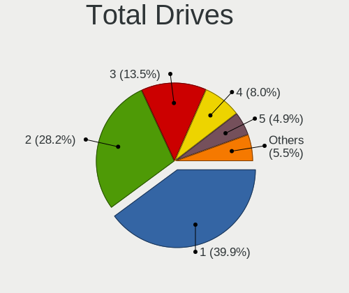
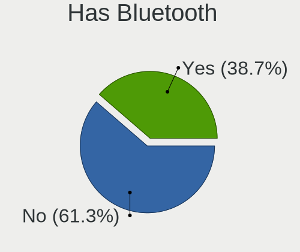
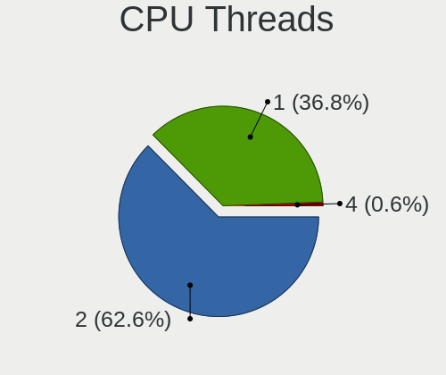
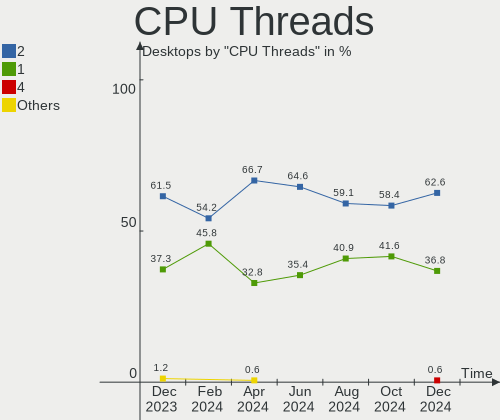

Debian Hardware Trends (Desktops)
---------------------------------

A project to identify most popular hardware characteristics and track their change
over time based on data collected by Debian users at https://Linux-Hardware.org.

Anyone can contribute to this report by the [hw-probe](https://github.com/linuxhw/hw-probe) tool:

    sudo -E hw-probe -all -upload

Full-feature report is available here: https://linux-hardware.org/?view=trends

Period: Nov, 2021.

Contents
--------

* [ System ](#system)
  - [ OS                       ](#os)
  - [ OS Family                ](#os-family)
  - [ Kernel                   ](#kernel)
  - [ Kernel Family            ](#kernel-family)
  - [ Kernel Major Ver.        ](#kernel-major-ver)
  - [ Arch                     ](#arch)
  - [ DE                       ](#de)
  - [ Display Server           ](#display-server)
  - [ Display Manager          ](#display-manager)
  - [ OS Lang                  ](#os-lang)
  - [ Boot Mode                ](#boot-mode)
  - [ Filesystem               ](#filesystem)
  - [ Part. scheme             ](#part-scheme)
  - [ Dual Boot with Linux/BSD ](#dual-boot-with-linuxbsd)
  - [ Dual Boot (Win)          ](#dual-boot-win)

* [ Board ](#board)
  - [ Vendor                   ](#vendor)
  - [ Model                    ](#model)
  - [ Model Family             ](#model-family)
  - [ MFG Year                 ](#mfg-year)
  - [ Form Factor              ](#form-factor)
  - [ Secure Boot              ](#secure-boot)
  - [ Coreboot                 ](#coreboot)
  - [ RAM Size                 ](#ram-size)
  - [ RAM Used                 ](#ram-used)
  - [ Total Drives             ](#total-drives)
  - [ Has CD-ROM               ](#has-cd-rom)
  - [ Has Ethernet             ](#has-ethernet)
  - [ Has WiFi                 ](#has-wifi)
  - [ Has Bluetooth            ](#has-bluetooth)

* [ Location ](#location)
  - [ Country                  ](#country)
  - [ City                     ](#city)

* [ Drives ](#drives)
  - [ Drive Vendor             ](#drive-vendor)
  - [ Drive Model              ](#drive-model)
  - [ HDD Vendor               ](#hdd-vendor)
  - [ SSD Vendor               ](#ssd-vendor)
  - [ Drive Kind               ](#drive-kind)
  - [ Drive Connector          ](#drive-connector)
  - [ Drive Size               ](#drive-size)
  - [ Space Total              ](#space-total)
  - [ Space Used               ](#space-used)
  - [ Malfunc. Drives          ](#malfunc-drives)
  - [ Malfunc. Drive Vendor    ](#malfunc-drive-vendor)
  - [ Malfunc. HDD Vendor      ](#malfunc-hdd-vendor)
  - [ Malfunc. Drive Kind      ](#malfunc-drive-kind)
  - [ Failed Drives            ](#failed-drives)
  - [ Failed Drive Vendor      ](#failed-drive-vendor)
  - [ Drive Status             ](#drive-status)

* [ Storage controller ](#storage-controller)
  - [ Storage Vendor           ](#storage-vendor)
  - [ Storage Model            ](#storage-model)
  - [ Storage Kind             ](#storage-kind)

* [ Processor ](#processor)
  - [ CPU Vendor               ](#cpu-vendor)
  - [ CPU Model                ](#cpu-model)
  - [ CPU Model Family         ](#cpu-model-family)
  - [ CPU Cores                ](#cpu-cores)
  - [ CPU Sockets              ](#cpu-sockets)
  - [ CPU Threads              ](#cpu-threads)
  - [ CPU Op-Modes             ](#cpu-op-modes)
  - [ CPU Microcode            ](#cpu-microcode)
  - [ CPU Microarch            ](#cpu-microarch)

* [ Graphics ](#graphics)
  - [ GPU Vendor               ](#gpu-vendor)
  - [ GPU Model                ](#gpu-model)
  - [ GPU Combo                ](#gpu-combo)
  - [ GPU Driver               ](#gpu-driver)
  - [ GPU Memory               ](#gpu-memory)

* [ Monitor ](#monitor)
  - [ Monitor Vendor           ](#monitor-vendor)
  - [ Monitor Model            ](#monitor-model)
  - [ Monitor Resolution       ](#monitor-resolution)
  - [ Monitor Diagonal         ](#monitor-diagonal)
  - [ Monitor Width            ](#monitor-width)
  - [ Aspect Ratio             ](#aspect-ratio)
  - [ Monitor Area             ](#monitor-area)
  - [ Pixel Density            ](#pixel-density)
  - [ Multiple Monitors        ](#multiple-monitors)

* [ Network ](#network)
  - [ Net Controller Vendor    ](#net-controller-vendor)
  - [ Net Controller Model     ](#net-controller-model)
  - [ Wireless Vendor          ](#wireless-vendor)
  - [ Wireless Model           ](#wireless-model)
  - [ Ethernet Vendor          ](#ethernet-vendor)
  - [ Ethernet Model           ](#ethernet-model)
  - [ Net Controller Kind      ](#net-controller-kind)
  - [ Used Controller          ](#used-controller)
  - [ NICs                     ](#nics)
  - [ IPv6                     ](#ipv6)

* [ Bluetooth ](#bluetooth)
  - [ Bluetooth Vendor         ](#bluetooth-vendor)
  - [ Bluetooth Model          ](#bluetooth-model)

* [ Sound ](#sound)
  - [ Sound Vendor             ](#sound-vendor)
  - [ Sound Model              ](#sound-model)

* [ Memory ](#memory)
  - [ Memory Vendor            ](#memory-vendor)
  - [ Memory Model             ](#memory-model)
  - [ Memory Kind              ](#memory-kind)
  - [ Memory Form Factor       ](#memory-form-factor)
  - [ Memory Size              ](#memory-size)
  - [ Memory Speed             ](#memory-speed)

* [ Printers & scanners ](#printers--scanners)
  - [ Printer Vendor           ](#printer-vendor)
  - [ Printer Model            ](#printer-model)
  - [ Scanner Vendor           ](#scanner-vendor)
  - [ Scanner Model            ](#scanner-model)

* [ Camera ](#camera)
  - [ Camera Vendor            ](#camera-vendor)
  - [ Camera Model             ](#camera-model)

* [ Security ](#security)
  - [ Fingerprint Vendor       ](#fingerprint-vendor)
  - [ Fingerprint Model        ](#fingerprint-model)
  - [ Chipcard Vendor          ](#chipcard-vendor)
  - [ Chipcard Model           ](#chipcard-model)

* [ Unsupported ](#unsupported)
  - [ Unsupported Devices      ](#unsupported-devices)
  - [ Unsupported Device Types ](#unsupported-device-types)

System
------

OS
--

Installed operating systems

| Name            | Desktops | Percent |
|-----------------|----------|---------|
| Debian 11       | 127      | 87.59%  |
| Debian Testing  | 7        | 4.83%   |
| Debian Unstable | 6        | 4.14%   |
| Debian 10       | 5        | 3.45%   |

OS Family
---------

OS without a version

| Name   | Desktops | Percent |
|--------|----------|---------|
| Debian | 145      | 100%    |

Kernel
------

Version of the Linux kernel

| Version                    | Desktops | Percent |
|----------------------------|----------|---------|
| 5.10.0-9-amd64             | 56       | 38.62%  |
| 5.10.0-7-amd64             | 53       | 36.55%  |
| 5.15.0-1-amd64             | 3        | 2.07%   |
| 5.14.0-4-amd64             | 3        | 2.07%   |
| 5.14.0-2-amd64             | 3        | 2.07%   |
| 5.14.0-0.bpo.2-amd64       | 3        | 2.07%   |
| 5.10.0-8-amd64             | 3        | 2.07%   |
| 4.19.0-18-amd64            | 3        | 2.07%   |
| 5.13.19-1-pve              | 2        | 1.38%   |
| 5.11.22-7-pve              | 2        | 1.38%   |
| 5.9.0-3-amd64              | 1        | 0.69%   |
| 5.15.0-3.2-liquorix-amd64  | 1        | 0.69%   |
| 5.14.6-sndpatch1           | 1        | 0.69%   |
| 5.14.16-wrkd               | 1        | 0.69%   |
| 5.14.0-3mx-amd64           | 1        | 0.69%   |
| 5.14.0-18.1-liquorix-amd64 | 1        | 0.69%   |
| 5.13.18-21.09.16.amdgpu    | 1        | 0.69%   |
| 5.11.22-6-pve              | 1        | 0.69%   |
| 5.11.22-4-pve              | 1        | 0.69%   |
| 5.10.70+truenas            | 1        | 0.69%   |
| 5.10.70                    | 1        | 0.69%   |
| 5.10.0-9-686-pae           | 1        | 0.69%   |
| 5.10.0-0.bpo.9-amd64       | 1        | 0.69%   |
| 4.19.0-16-amd64            | 1        | 0.69%   |

Kernel Family
-------------

Linux kernel without a distro release

| Version | Desktops | Percent |
|---------|----------|---------|
| 5.10.0  | 114      | 78.62%  |
| 5.14.0  | 11       | 7.59%   |
| 5.15.0  | 4        | 2.76%   |
| 5.11.22 | 4        | 2.76%   |
| 4.19.0  | 4        | 2.76%   |
| 5.13.19 | 2        | 1.38%   |
| 5.10.70 | 2        | 1.38%   |
| 5.9.0   | 1        | 0.69%   |
| 5.14.6  | 1        | 0.69%   |
| 5.14.16 | 1        | 0.69%   |
| 5.13.18 | 1        | 0.69%   |

Kernel Major Ver.
-----------------

Linux kernel major version

| Version | Desktops | Percent |
|---------|----------|---------|
| 5.10    | 116      | 80%     |
| 5.14    | 13       | 8.97%   |
| 5.15    | 4        | 2.76%   |
| 5.11    | 4        | 2.76%   |
| 4.19    | 4        | 2.76%   |
| 5.13    | 3        | 2.07%   |
| 5.9     | 1        | 0.69%   |

Arch
----

OS architecture (x86_64, i586, etc.)

| Name   | Desktops | Percent |
|--------|----------|---------|
| x86_64 | 144      | 99.31%  |
| i686   | 1        | 0.69%   |

DE
--

Desktop Environment

| Name             | Desktops | Percent |
|------------------|----------|---------|
| Unknown          | 69       | 47.59%  |
| GNOME            | 22       | 15.17%  |
| KDE5             | 16       | 11.03%  |
| XFCE             | 11       | 7.59%   |
| X-Cinnamon       | 6        | 4.14%   |
| LXDE             | 6        | 4.14%   |
| MATE             | 4        | 2.76%   |
| lightdm-xsession | 4        | 2.76%   |
| Cinnamon         | 3        | 2.07%   |
| xmonad           | 1        | 0.69%   |
| LXQt             | 1        | 0.69%   |
| GNOME Classic    | 1        | 0.69%   |
| Budgie           | 1        | 0.69%   |

Display Server
--------------

X11 or Wayland

| Name    | Desktops | Percent |
|---------|----------|---------|
| X11     | 60       | 41.38%  |
| Unknown | 55       | 37.93%  |
| Tty     | 20       | 13.79%  |
| Wayland | 10       | 6.9%    |

Display Manager
---------------

SDDM, LightDM, etc.

| Name    | Desktops | Percent |
|---------|----------|---------|
| Unknown | 91       | 62.76%  |
| LightDM | 25       | 17.24%  |
| GDM     | 15       | 10.34%  |
| SDDM    | 11       | 7.59%   |
| GDM3    | 2        | 1.38%   |
| XDM     | 1        | 0.69%   |

OS Lang
-------

Language

| Lang    | Desktops | Percent |
|---------|----------|---------|
| ru_RU   | 58       | 40%     |
| en_US   | 38       | 26.21%  |
| en_GB   | 8        | 5.52%   |
| de_DE   | 8        | 5.52%   |
| fr_FR   | 5        | 3.45%   |
| pt_BR   | 4        | 2.76%   |
| es_ES   | 3        | 2.07%   |
| Unknown | 3        | 2.07%   |
| pt_PT   | 2        | 1.38%   |
| en_CA   | 2        | 1.38%   |
| sv_SE   | 1        | 0.69%   |
| ru_UA   | 1        | 0.69%   |
| pl_PL   | 1        | 0.69%   |
| nl_NL   | 1        | 0.69%   |
| nb_NO   | 1        | 0.69%   |
| ja_JP   | 1        | 0.69%   |
| it_IT   | 1        | 0.69%   |
| fr_CH   | 1        | 0.69%   |
| fr_CA   | 1        | 0.69%   |
| es_EC   | 1        | 0.69%   |
| es_CL   | 1        | 0.69%   |
| en_IL   | 1        | 0.69%   |
| en_AU   | 1        | 0.69%   |
| C       | 1        | 0.69%   |

Boot Mode
---------

EFI or BIOS

| Mode | Desktops | Percent |
|------|----------|---------|
| BIOS | 107      | 73.79%  |
| EFI  | 38       | 26.21%  |

Filesystem
----------

Type of filesystem

| Type    | Desktops | Percent |
|---------|----------|---------|
| Ext4    | 80       | 55.17%  |
| Overlay | 56       | 38.62%  |
| Zfs     | 5        | 3.45%   |
| Btrfs   | 3        | 2.07%   |
| Xfs     | 1        | 0.69%   |

Part. scheme
------------

Scheme of partitioning

| Type    | Desktops | Percent |
|---------|----------|---------|
| MBR     | 73       | 50.34%  |
| GPT     | 50       | 34.48%  |
| Unknown | 22       | 15.17%  |

Dual Boot with Linux/BSD
------------------------

Hosting more than one Linux/BSD

| Dual boot | Desktops | Percent |
|-----------|----------|---------|
| No        | 124      | 85.52%  |
| Yes       | 21       | 14.48%  |

Dual Boot (Win)
---------------

Hosting Linux and Windows

| Dual boot | Desktops | Percent |
|-----------|----------|---------|
| Yes       | 76       | 52.41%  |
| No        | 69       | 47.59%  |

Board
-----

Vendor
------

Motherboard manufacturer

| Name                | Desktops | Percent |
|---------------------|----------|---------|
| ASUSTek Computer    | 41       | 28.28%  |
| ASRock              | 27       | 18.62%  |
| Gigabyte Technology | 17       | 11.72%  |
| MSI                 | 13       | 8.97%   |
| Hewlett-Packard     | 7        | 4.83%   |
| Lenovo              | 6        | 4.14%   |
| Dell                | 5        | 3.45%   |
| Intel               | 4        | 2.76%   |
| Shuttle             | 3        | 2.07%   |
| ECS                 | 3        | 2.07%   |
| HPE                 | 2        | 1.38%   |
| Foxconn             | 2        | 1.38%   |
| Unknown             | 2        | 1.38%   |
| ZOTAC               | 1        | 0.69%   |
| SixForOne           | 1        | 0.69%   |
| PCWare              | 1        | 0.69%   |
| Packard Bell        | 1        | 0.69%   |
| Minix               | 1        | 0.69%   |
| Huanan              | 1        | 0.69%   |
| Gateway             | 1        | 0.69%   |
| Fujitsu             | 1        | 0.69%   |
| Datto               | 1        | 0.69%   |
| ASRockRack          | 1        | 0.69%   |
| Apple               | 1        | 0.69%   |
| Acer                | 1        | 0.69%   |
| A10 Networks        | 1        | 0.69%   |

Model
-----

Motherboard model

| Name                                   | Desktops | Percent |
|----------------------------------------|----------|---------|
| ASRock H470M-HVS                       | 20       | 13.79%  |
| ASUS All Series                        | 9        | 6.21%   |
| ASUS P8H61-M LX3 R2.0                  | 7        | 4.83%   |
| ASUS S20 K29                           | 4        | 2.76%   |
| Unknown                                | 3        | 2.07%   |
| Shuttle DS81D                          | 2        | 1.38%   |
| Gigabyte B550M DS3H                    | 2        | 1.38%   |
| SixForOne 64Megaspeed                  | 1        | 0.69%   |
| Shuttle XS35V4                         | 1        | 0.69%   |
| PCWare IPMH61R3                        | 1        | 0.69%   |
| Packard Bell IXTREME M5740             | 1        | 0.69%   |
| MSI MS-7D15                            | 1        | 0.69%   |
| MSI MS-7C77                            | 1        | 0.69%   |
| MSI MS-7C75                            | 1        | 0.69%   |
| MSI MS-7C52                            | 1        | 0.69%   |
| MSI MS-7C02                            | 1        | 0.69%   |
| MSI MS-7B79                            | 1        | 0.69%   |
| MSI MS-7A37                            | 1        | 0.69%   |
| MSI MS-7996                            | 1        | 0.69%   |
| MSI MS-7817                            | 1        | 0.69%   |
| MSI MS-7640                            | 1        | 0.69%   |
| MSI MS-7592                            | 1        | 0.69%   |
| MSI MS-7369                            | 1        | 0.69%   |
| MSI MS-7030                            | 1        | 0.69%   |
| Minix Z83-4                            | 1        | 0.69%   |
| Lenovo V520-15IKL 10NK006JSP           | 1        | 0.69%   |
| Lenovo ThinkStation D30 4223CC9        | 1        | 0.69%   |
| Lenovo ThinkCentre M70s 11EXS04R00     | 1        | 0.69%   |
| Lenovo ThinkCentre M58p 6137BG5        | 1        | 0.69%   |
| Lenovo ThinkCentre A58e 0841A2U        | 1        | 0.69%   |
| Lenovo IdeaCentre 720-18ICB 90HT0001US | 1        | 0.69%   |
| Intel X79                              | 1        | 0.69%   |
| Intel H55                              | 1        | 0.69%   |
| Intel DG41RQ AAE54511-205              | 1        | 0.69%   |
| Intel ChiefRiver                       | 1        | 0.69%   |
| Huanan X99-F8                          | 1        | 0.69%   |
| HPE ProLiant MicroServer Gen10 Plus    | 1        | 0.69%   |
| HPE ProLiant MicroServer Gen10         | 1        | 0.69%   |
| HP Z420 Workstation                    | 1        | 0.69%   |
| HP ProLiant MicroServer                | 1        | 0.69%   |
| HP Pavilion Gaming Desktop 690-00xx    | 1        | 0.69%   |
| HP EliteDesk 800 G2 SFF                | 1        | 0.69%   |
| HP Desktop 460-a2xx                    | 1        | 0.69%   |
| HP Compaq Elite 8300 SFF               | 1        | 0.69%   |
| HP Compaq dc7900 Small Form Factor     | 1        | 0.69%   |
| Gigabyte Z170M-D3H DDR3                | 1        | 0.69%   |
| Gigabyte Q270M-D3H                     | 1        | 0.69%   |
| Gigabyte Q170TN-T20                    | 1        | 0.69%   |
| Gigabyte P55-UD3                       | 1        | 0.69%   |
| Gigabyte H87N-WIFI                     | 1        | 0.69%   |
| Gigabyte H81M-S2V                      | 1        | 0.69%   |
| Gigabyte H110M-S2H-CF                  | 1        | 0.69%   |
| Gigabyte GA-880GM-UD2H                 | 1        | 0.69%   |
| Gigabyte GA-78LMT-USB3                 | 1        | 0.69%   |
| Gigabyte B85M-D3H                      | 1        | 0.69%   |
| Gigabyte B550M S2H                     | 1        | 0.69%   |
| Gigabyte B450M S2H V2                  | 1        | 0.69%   |
| Gigabyte B450M S2H                     | 1        | 0.69%   |
| Gigabyte B450M DS3H V2                 | 1        | 0.69%   |
| Gigabyte B360 HD3P-LM                  | 1        | 0.69%   |

Model Family
------------

Motherboard model prefix

| Name                   | Desktops | Percent |
|------------------------|----------|---------|
| ASRock H470M-HVS       | 20       | 13.79%  |
| ASUS P8H61-M           | 9        | 6.21%   |
| ASUS All               | 9        | 6.21%   |
| ASUS S20               | 4        | 2.76%   |
| ASUS PRIME             | 4        | 2.76%   |
| Lenovo ThinkCentre     | 3        | 2.07%   |
| Gigabyte B550M         | 3        | 2.07%   |
| Gigabyte B450M         | 3        | 2.07%   |
| Dell OptiPlex          | 3        | 2.07%   |
| ASUS TUF               | 3        | 2.07%   |
| Unknown                | 3        | 2.07%   |
| Shuttle DS81D          | 2        | 1.38%   |
| HPE ProLiant           | 2        | 1.38%   |
| HP Compaq              | 2        | 1.38%   |
| Dell Precision         | 2        | 1.38%   |
| ASUS ROG               | 2        | 1.38%   |
| ASUS P8H67-M           | 2        | 1.38%   |
| ASUS M5A97             | 2        | 1.38%   |
| SixForOne 64Megaspeed  | 1        | 0.69%   |
| Shuttle XS35V4         | 1        | 0.69%   |
| PCWare IPMH61R3        | 1        | 0.69%   |
| Packard Bell IXTREME   | 1        | 0.69%   |
| MSI MS-7D15            | 1        | 0.69%   |
| MSI MS-7C77            | 1        | 0.69%   |
| MSI MS-7C75            | 1        | 0.69%   |
| MSI MS-7C52            | 1        | 0.69%   |
| MSI MS-7C02            | 1        | 0.69%   |
| MSI MS-7B79            | 1        | 0.69%   |
| MSI MS-7A37            | 1        | 0.69%   |
| MSI MS-7996            | 1        | 0.69%   |
| MSI MS-7817            | 1        | 0.69%   |
| MSI MS-7640            | 1        | 0.69%   |
| MSI MS-7592            | 1        | 0.69%   |
| MSI MS-7369            | 1        | 0.69%   |
| MSI MS-7030            | 1        | 0.69%   |
| Minix Z83-4            | 1        | 0.69%   |
| Lenovo V520-15IKL      | 1        | 0.69%   |
| Lenovo ThinkStation    | 1        | 0.69%   |
| Lenovo IdeaCentre      | 1        | 0.69%   |
| Intel X79              | 1        | 0.69%   |
| Intel H55              | 1        | 0.69%   |
| Intel DG41RQ           | 1        | 0.69%   |
| Intel ChiefRiver       | 1        | 0.69%   |
| Huanan X99-F8          | 1        | 0.69%   |
| HP Z420                | 1        | 0.69%   |
| HP ProLiant            | 1        | 0.69%   |
| HP Pavilion            | 1        | 0.69%   |
| HP EliteDesk           | 1        | 0.69%   |
| HP Desktop             | 1        | 0.69%   |
| Gigabyte Z170M-D3H     | 1        | 0.69%   |
| Gigabyte Q270M-D3H     | 1        | 0.69%   |
| Gigabyte Q170TN-T20    | 1        | 0.69%   |
| Gigabyte P55-UD3       | 1        | 0.69%   |
| Gigabyte H87N-WIFI     | 1        | 0.69%   |
| Gigabyte H81M-S2V      | 1        | 0.69%   |
| Gigabyte H110M-S2H-CF  | 1        | 0.69%   |
| Gigabyte GA-880GM-UD2H | 1        | 0.69%   |
| Gigabyte GA-78LMT-USB3 | 1        | 0.69%   |
| Gigabyte B85M-D3H      | 1        | 0.69%   |
| Gigabyte B360          | 1        | 0.69%   |

MFG Year
--------

Motherboard manufacture year

| Year | Desktops | Percent |
|------|----------|---------|
| 2021 | 37       | 25.52%  |
| 2012 | 18       | 12.41%  |
| 2020 | 17       | 11.72%  |
| 2014 | 12       | 8.28%   |
| 2013 | 12       | 8.28%   |
| 2018 | 11       | 7.59%   |
| 2015 | 7        | 4.83%   |
| 2011 | 7        | 4.83%   |
| 2016 | 6        | 4.14%   |
| 2009 | 5        | 3.45%   |
| 2019 | 4        | 2.76%   |
| 2017 | 3        | 2.07%   |
| 2010 | 2        | 1.38%   |
| 2007 | 2        | 1.38%   |
| 2008 | 1        | 0.69%   |
| 2005 | 1        | 0.69%   |

Form Factor
-----------

Physical design of the computer

| Name    | Desktops | Percent |
|---------|----------|---------|
| Desktop | 145      | 100%    |

Secure Boot
-----------

Enabled or disabled

| State    | Desktops | Percent |
|----------|----------|---------|
| Disabled | 145      | 100%    |

Coreboot
--------

Have coreboot on board

| Used | Desktops | Percent |
|------|----------|---------|
| No   | 145      | 100%    |

RAM Size
--------

Total RAM memory

| Size in GB      | Desktops | Percent |
|-----------------|----------|---------|
| 32.01-64.0      | 34       | 23.45%  |
| 16.01-24.0      | 26       | 17.93%  |
| 4.01-8.0        | 25       | 17.24%  |
| 3.01-4.0        | 25       | 17.24%  |
| 8.01-16.0       | 23       | 15.86%  |
| 64.01-256.0     | 7        | 4.83%   |
| 24.01-32.0      | 2        | 1.38%   |
| 1.01-2.0        | 2        | 1.38%   |
| More than 256.0 | 1        | 0.69%   |

RAM Used
--------

Used RAM memory

| Used GB    | Desktops | Percent |
|------------|----------|---------|
| 0.51-1.0   | 52       | 35.86%  |
| 1.01-2.0   | 38       | 26.21%  |
| 2.01-3.0   | 17       | 11.72%  |
| 4.01-8.0   | 16       | 11.03%  |
| 3.01-4.0   | 12       | 8.28%   |
| 0.01-0.5   | 5        | 3.45%   |
| 16.01-24.0 | 2        | 1.38%   |
| 8.01-16.0  | 2        | 1.38%   |
| 32.01-64.0 | 1        | 0.69%   |

Total Drives
------------

Number of drives on board

| Drives | Desktops | Percent |
|--------|----------|---------|
| 1      | 69       | 47.59%  |
| 2      | 40       | 27.59%  |
| 3      | 14       | 9.66%   |
| 4      | 9        | 6.21%   |
| 5      | 5        | 3.45%   |
| 8      | 2        | 1.38%   |
| 7      | 2        | 1.38%   |
| 6      | 2        | 1.38%   |
| 11     | 1        | 0.69%   |
| 10     | 1        | 0.69%   |

Has CD-ROM
----------

Has CD-ROM on board

| Presented | Desktops | Percent |
|-----------|----------|---------|
| No        | 113      | 77.93%  |
| Yes       | 32       | 22.07%  |

Has Ethernet
------------

Has Ethernet on board

| Presented | Desktops | Percent |
|-----------|----------|---------|
| Yes       | 145      | 100%    |

Has WiFi
--------

Has WiFi module

| Presented | Desktops | Percent |
|-----------|----------|---------|
| No        | 112      | 77.24%  |
| Yes       | 33       | 22.76%  |

Has Bluetooth
-------------

Has Bluetooth module

| Presented | Desktops | Percent |
|-----------|----------|---------|
| No        | 124      | 85.52%  |
| Yes       | 21       | 14.48%  |

Location
--------

Country
-------

Geographic location (country)

| Country     | Desktops | Percent |
|-------------|----------|---------|
| Russia      | 62       | 42.76%  |
| USA         | 16       | 11.03%  |
| Germany     | 13       | 8.97%   |
| France      | 8        | 5.52%   |
| Switzerland | 4        | 2.76%   |
| Pakistan    | 4        | 2.76%   |
| Brazil      | 4        | 2.76%   |
| UK          | 3        | 2.07%   |
| Spain       | 3        | 2.07%   |
| Poland      | 3        | 2.07%   |
| Canada      | 3        | 2.07%   |
| Ukraine     | 2        | 1.38%   |
| Portugal    | 2        | 1.38%   |
| Italy       | 2        | 1.38%   |
| Argentina   | 2        | 1.38%   |
| Turkey      | 1        | 0.69%   |
| Sweden      | 1        | 0.69%   |
| Serbia      | 1        | 0.69%   |
| Norway      | 1        | 0.69%   |
| Netherlands | 1        | 0.69%   |
| Morocco     | 1        | 0.69%   |
| Japan       | 1        | 0.69%   |
| Israel      | 1        | 0.69%   |
| Indonesia   | 1        | 0.69%   |
| Finland     | 1        | 0.69%   |
| Ecuador     | 1        | 0.69%   |
| Czechia     | 1        | 0.69%   |
| Chile       | 1        | 0.69%   |
| Australia   | 1        | 0.69%   |

City
----

Geographic location (city)

| City                | Desktops | Percent |
|---------------------|----------|---------|
| Voronezh            | 53       | 36.55%  |
| Lahore              | 4        | 2.76%   |
| Barcelona           | 3        | 2.07%   |
| Warminster          | 2        | 1.38%   |
| St Petersburg       | 2        | 1.38%   |
| New York            | 2        | 1.38%   |
| Moscow              | 2        | 1.38%   |
| Curitiba            | 2        | 1.38%   |
| Ciudadela           | 2        | 1.38%   |
| Zurich              | 1        | 0.69%   |
| Yehud               | 1        | 0.69%   |
| Weilheim            | 1        | 0.69%   |
| Warsaw              | 1        | 0.69%   |
| Warrenton           | 1        | 0.69%   |
| Tyler               | 1        | 0.69%   |
| Tver                | 1        | 0.69%   |
| Troy                | 1        | 0.69%   |
| Toyokawa            | 1        | 0.69%   |
| Toulouse            | 1        | 0.69%   |
| Torgau              | 1        | 0.69%   |
| The Hague           | 1        | 0.69%   |
| Surrey              | 1        | 0.69%   |
| Stains              | 1        | 0.69%   |
| Springfield         | 1        | 0.69%   |
| Sorgues             | 1        | 0.69%   |
| Rodez               | 1        | 0.69%   |
| Ritzville           | 1        | 0.69%   |
| Reseda              | 1        | 0.69%   |
| Raahe               | 1        | 0.69%   |
| Prague              | 1        | 0.69%   |
| Perth               | 1        | 0.69%   |
| Paderno Dugnano     | 1        | 0.69%   |
| Oslo                | 1        | 0.69%   |
| Novosibirsk         | 1        | 0.69%   |
| New Haven           | 1        | 0.69%   |
| Neuchatel           | 1        | 0.69%   |
| Munster             | 1        | 0.69%   |
| Munich              | 1        | 0.69%   |
| Montreal            | 1        | 0.69%   |
| Mississauga         | 1        | 0.69%   |
| Memmingen           | 1        | 0.69%   |
| Mannheim            | 1        | 0.69%   |
| Manchester          | 1        | 0.69%   |
| Maipu               | 1        | 0.69%   |
| Macei??             | 1        | 0.69%   |
| Lublin              | 1        | 0.69%   |
| Lisbon              | 1        | 0.69%   |
| Leiria              | 1        | 0.69%   |
| Leimen              | 1        | 0.69%   |
| Lannion             | 1        | 0.69%   |
| Kyiv                | 1        | 0.69%   |
| Kuznechikha         | 1        | 0.69%   |
| Krasnokamensk       | 1        | 0.69%   |
| Krakow              | 1        | 0.69%   |
| Khot'kovo           | 1        | 0.69%   |
| Karlsruhe           | 1        | 0.69%   |
| Kamen?ˆ™-Kashirskiy | 1        | 0.69%   |
| Jamestown           | 1        | 0.69%   |
| Istanbul            | 1        | 0.69%   |
| Hohen Neuendorf     | 1        | 0.69%   |

Drives
------

Drive Vendor
------------

Hard drive vendors

| Vendor              | Desktops | Drives | Percent |
|---------------------|----------|--------|---------|
| Seagate             | 45       | 69     | 18.29%  |
| WDC                 | 35       | 70     | 14.23%  |
| Toshiba             | 32       | 34     | 13.01%  |
| Samsung Electronics | 29       | 35     | 11.79%  |
| Netac               | 20       | 20     | 8.13%   |
| Crucial             | 14       | 15     | 5.69%   |
| Kingston            | 10       | 10     | 4.07%   |
| Hitachi             | 6        | 8      | 2.44%   |
| Unknown             | 5        | 6      | 2.03%   |
| Sandisk             | 5        | 6      | 2.03%   |
| OCZ                 | 4        | 4      | 1.63%   |
| LITEONIT            | 3        | 3      | 1.22%   |
| Intel               | 3        | 3      | 1.22%   |
| Hewlett-Packard     | 3        | 5      | 1.22%   |
| A-DATA Technology   | 3        | 4      | 1.22%   |
| XPG                 | 2        | 2      | 0.81%   |
| JMicron             | 2        | 2      | 0.81%   |
| HGST                | 2        | 3      | 0.81%   |
| Hajaan              | 2        | 2      | 0.81%   |
| China               | 2        | 2      | 0.81%   |
| Unknown             | 2        | 2      | 0.81%   |
| WDC WUH             | 1        | 1      | 0.41%   |
| Transcend           | 1        | 1      | 0.41%   |
| StoreJet            | 1        | 1      | 0.41%   |
| SPCC                | 1        | 1      | 0.41%   |
| Smartbuy            | 1        | 1      | 0.41%   |
| PNY                 | 1        | 1      | 0.41%   |
| Phison              | 1        | 1      | 0.41%   |
| Patriot             | 1        | 1      | 0.41%   |
| LITEON              | 1        | 2      | 0.41%   |
| Lexar               | 1        | 1      | 0.41%   |
| KingSpec            | 1        | 1      | 0.41%   |
| Intenso             | 1        | 1      | 0.41%   |
| IBM-ESXS            | 1        | 1      | 0.41%   |
| Gigabyte Technology | 1        | 1      | 0.41%   |
| Fujitsu             | 1        | 1      | 0.41%   |
| Corsair             | 1        | 1      | 0.41%   |
| BP4                 | 1        | 1      | 0.41%   |

Drive Model
-----------

Hard drive models

| Model                            | Desktops | Percent |
|----------------------------------|----------|---------|
| Toshiba HDWD110 1TB              | 20       | 6.97%   |
| Netac SSD 240GB                  | 20       | 6.97%   |
| Seagate ST250DM000-1BD141 250GB  | 8        | 2.79%   |
| WDC WD5000AAKX-60U6AA0 500GB     | 4        | 1.39%   |
| Crucial CT480BX500SSD1 480GB     | 4        | 1.39%   |
| Seagate ST31000528AS 1TB         | 3        | 1.05%   |
| Seagate ST3000NXCLAR3000 3TB     | 3        | 1.05%   |
| Seagate ST1000DM010-2EP102 1TB   | 3        | 1.05%   |
| Samsung SSD 970 EVO Plus 500GB   | 3        | 1.05%   |
| Samsung SSD 860 EVO 250GB        | 3        | 1.05%   |
| HP MB2000EBZQC 2TB               | 3        | 1.05%   |
| WDC WD5000AAKX-00ERMA0 500GB     | 2        | 0.7%    |
| WDC WD40EZRZ-00GXCB0 4TB         | 2        | 0.7%    |
| WDC WD10EZEX-08WN4A0 1TB         | 2        | 0.7%    |
| Toshiba DT01ACA100 1TB           | 2        | 0.7%    |
| Toshiba DT01ACA050 500GB         | 2        | 0.7%    |
| Seagate ST8000DM004-2CX188 8TB   | 2        | 0.7%    |
| Seagate ST4000VN008-2DR166 4TB   | 2        | 0.7%    |
| Seagate ST3500418AS 500GB        | 2        | 0.7%    |
| Seagate ST31500341AS 1TB         | 2        | 0.7%    |
| Seagate ST1000DM003-1ER162 1TB   | 2        | 0.7%    |
| Seagate ST1000DM003-1CH162 1TB   | 2        | 0.7%    |
| Samsung SSD 980 PRO 500GB        | 2        | 0.7%    |
| Samsung SSD 980 1TB              | 2        | 0.7%    |
| Samsung SSD 850 EVO 250GB        | 2        | 0.7%    |
| Samsung SSD 840 PRO Series 256GB | 2        | 0.7%    |
| Kingston SUV400S37120G 120GB SSD | 2        | 0.7%    |
| Kingston SA400S37240G 240GB SSD  | 2        | 0.7%    |
| Kingston SA400S37120G 120GB SSD  | 2        | 0.7%    |
| Hajaan SSD 256G                  | 2        | 0.7%    |
| Crucial CT240BX500SSD1 240GB     | 2        | 0.7%    |
| Crucial CT2000MX500SSD1 2TB      | 2        | 0.7%    |
| Crucial CT120BX500SSD1 120GB     | 2        | 0.7%    |
| Unknown                          | 2        | 0.7%    |
| XPG SPECTRIX S40G 512GB          | 1        | 0.35%   |
| XPG GAMMIX S11 Pro 1TB           | 1        | 0.35%   |
| WDC WUH 721818ALE6L4 18TB        | 1        | 0.35%   |
| WDC WDS500G2B0A-00SM50 500GB SSD | 1        | 0.35%   |
| WDC WDS240G2G0A-00JH30 240GB SSD | 1        | 0.35%   |
| WDC WDS100T3X0C-00SJG0 1TB       | 1        | 0.35%   |
| WDC WD80EFAX-68KNBN0 8TB         | 1        | 0.35%   |
| WDC WD800JD-75MSA3 80GB          | 1        | 0.35%   |
| WDC WD5003ABYX-18WERA0 500GB     | 1        | 0.35%   |
| WDC WD5002ABYS-01B1B0 500GB      | 1        | 0.35%   |
| WDC WD5000LPCX-21VHAT0 500GB     | 1        | 0.35%   |
| WDC WD5000AZLX-08K2TA0 500GB     | 1        | 0.35%   |
| WDC WD5000AAKX-22ERMA0 500GB     | 1        | 0.35%   |
| WDC WD5000AADS-00S9B0 500GB      | 1        | 0.35%   |
| WDC WD40EFRX-68N32N0 4TB         | 1        | 0.35%   |
| WDC WD40EFAX-68JH4N1 4TB         | 1        | 0.35%   |
| WDC WD3200BEKT-00PVMT0 320GB     | 1        | 0.35%   |
| WDC WD30EZRX-22D8PB0 3TB         | 1        | 0.35%   |
| WDC WD30EZRX-00MMMB0 3TB         | 1        | 0.35%   |
| WDC WD30EZRX-00D8PB0 3TB         | 1        | 0.35%   |
| WDC WD2500AAKX-75U6AA0 250GB     | 1        | 0.35%   |
| WDC WD20EFRX-68AX9N0 2TB         | 1        | 0.35%   |
| WDC WD20EARX-00ZUDB0 2TB         | 1        | 0.35%   |
| WDC WD20EARX-00PASB0 2TB         | 1        | 0.35%   |
| WDC WD20EARS-00J2GB0 2TB         | 1        | 0.35%   |
| WDC WD1600AAJS-00PSA0 160GB      | 1        | 0.35%   |

HDD Vendor
----------

Hard disk drive vendors

| Vendor              | Desktops | Drives | Percent |
|---------------------|----------|--------|---------|
| Seagate             | 44       | 68     | 34.92%  |
| WDC                 | 34       | 67     | 26.98%  |
| Toshiba             | 30       | 31     | 23.81%  |
| Hitachi             | 6        | 8      | 4.76%   |
| Samsung Electronics | 4        | 4      | 3.17%   |
| Hewlett-Packard     | 3        | 5      | 2.38%   |
| HGST                | 2        | 3      | 1.59%   |
| Unknown             | 1        | 2      | 0.79%   |
| StoreJet            | 1        | 1      | 0.79%   |
| Fujitsu             | 1        | 1      | 0.79%   |

SSD Vendor
----------

Solid state drive vendors

| Vendor              | Desktops | Drives | Percent |
|---------------------|----------|--------|---------|
| Netac               | 20       | 20     | 21.05%  |
| Samsung Electronics | 16       | 19     | 16.84%  |
| Crucial             | 14       | 15     | 14.74%  |
| Kingston            | 7        | 7      | 7.37%   |
| SanDisk             | 4        | 5      | 4.21%   |
| OCZ                 | 4        | 4      | 4.21%   |
| LITEONIT            | 3        | 3      | 3.16%   |
| WDC                 | 2        | 2      | 2.11%   |
| Unknown             | 2        | 2      | 2.11%   |
| Intel               | 2        | 2      | 2.11%   |
| Hajaan              | 2        | 2      | 2.11%   |
| China               | 2        | 2      | 2.11%   |
| A-DATA Technology   | 2        | 2      | 2.11%   |
| Unknown             | 2        | 2      | 2.11%   |
| Transcend           | 1        | 1      | 1.05%   |
| Toshiba             | 1        | 1      | 1.05%   |
| SPCC                | 1        | 1      | 1.05%   |
| Smartbuy            | 1        | 1      | 1.05%   |
| PNY                 | 1        | 1      | 1.05%   |
| Patriot             | 1        | 1      | 1.05%   |
| LITEON              | 1        | 2      | 1.05%   |
| Lexar               | 1        | 1      | 1.05%   |
| KingSpec            | 1        | 1      | 1.05%   |
| JMicron             | 1        | 1      | 1.05%   |
| Gigabyte Technology | 1        | 1      | 1.05%   |
| Corsair             | 1        | 1      | 1.05%   |
| BP4                 | 1        | 1      | 1.05%   |

Drive Kind
----------

HDD or SSD

| Kind    | Desktops | Drives | Percent |
|---------|----------|--------|---------|
| HDD     | 104      | 190    | 48.83%  |
| SSD     | 81       | 101    | 38.03%  |
| NVMe    | 22       | 25     | 10.33%  |
| Unknown | 5        | 6      | 2.35%   |
| MMC     | 1        | 1      | 0.47%   |

Drive Connector
---------------

SATA, SAS, NVMe, etc.

| Type | Desktops | Drives | Percent |
|------|----------|--------|---------|
| SATA | 133      | 281    | 80.12%  |
| NVMe | 22       | 25     | 13.25%  |
| SAS  | 10       | 16     | 6.02%   |
| MMC  | 1        | 1      | 0.6%    |

Drive Size
----------

Size of hard drive

| Size in TB | Desktops | Drives | Percent |
|------------|----------|--------|---------|
| 0.01-0.5   | 108      | 143    | 53.47%  |
| 0.51-1.0   | 60       | 74     | 29.7%   |
| 1.01-2.0   | 13       | 20     | 6.44%   |
| 2.01-3.0   | 7        | 11     | 3.47%   |
| 3.01-4.0   | 6        | 16     | 2.97%   |
| 4.01-10.0  | 5        | 15     | 2.48%   |
| 10.01-20.0 | 3        | 12     | 1.49%   |

Space Total
-----------

Amount of disk space available on the file system

| Size in GB     | Desktops | Percent |
|----------------|----------|---------|
| Unknown        | 60       | 41.38%  |
| 101-250        | 26       | 17.93%  |
| 251-500        | 14       | 9.66%   |
| 501-1000       | 13       | 8.97%   |
| 51-100         | 9        | 6.21%   |
| More than 3000 | 7        | 4.83%   |
| 21-50          | 6        | 4.14%   |
| 1001-2000      | 6        | 4.14%   |
| 2001-3000      | 2        | 1.38%   |
| 1-20           | 2        | 1.38%   |

Space Used
----------

Amount of used disk space

| Used GB        | Desktops | Percent |
|----------------|----------|---------|
| Unknown        | 60       | 41.38%  |
| 1-20           | 35       | 24.14%  |
| 51-100         | 11       | 7.59%   |
| 21-50          | 10       | 6.9%    |
| 101-250        | 9        | 6.21%   |
| 251-500        | 8        | 5.52%   |
| More than 3000 | 6        | 4.14%   |
| 501-1000       | 3        | 2.07%   |
| 2001-3000      | 2        | 1.38%   |
| 0              | 1        | 0.69%   |

Malfunc. Drives
---------------

Drive models with a malfunction

| Model                           | Desktops | Drives | Percent |
|---------------------------------|----------|--------|---------|
| Seagate ST250DM000-1BD141 250GB | 3        | 3      | 9.09%   |
| WDC WD5000AAKX-60U6AA0 500GB    | 2        | 2      | 6.06%   |
| Seagate ST31500341AS 1TB        | 2        | 2      | 6.06%   |
| WDC WD5003ABYX-18WERA0 500GB    | 1        | 2      | 3.03%   |
| WDC WD5000AAKX-00ERMA0 500GB    | 1        | 1      | 3.03%   |
| WDC WD40EFRX-68N32N0 4TB        | 1        | 1      | 3.03%   |
| WDC WD40EFAX-68JH4N1 4TB        | 1        | 2      | 3.03%   |
| WDC WD20EFRX-68AX9N0 2TB        | 1        | 1      | 3.03%   |
| WDC WD20EARX-00ZUDB0 2TB        | 1        | 1      | 3.03%   |
| WDC WD10EADS-65M2B1 1TB         | 1        | 1      | 3.03%   |
| WDC WD1003FBYZ-010FB0 1TB       | 1        | 1      | 3.03%   |
| Toshiba MK3265GSX 320GB         | 1        | 1      | 3.03%   |
| Toshiba DT01ACA300 3TB          | 1        | 1      | 3.03%   |
| Seagate ST500DM002-1BD142 500GB | 1        | 1      | 3.03%   |
| Seagate ST380815AS 80GB         | 1        | 1      | 3.03%   |
| Seagate ST3250312AS 250GB       | 1        | 1      | 3.03%   |
| Seagate ST3200827AS 200GB       | 1        | 1      | 3.03%   |
| Seagate ST32000644NS 2TB        | 1        | 1      | 3.03%   |
| Seagate ST3120827AS 120GB       | 1        | 1      | 3.03%   |
| Seagate ST31000528AS 1TB        | 1        | 1      | 3.03%   |
| Seagate ST2000VM003-1ET164 2TB  | 1        | 1      | 3.03%   |
| Seagate ST2000DM008-2FR102 2TB  | 1        | 1      | 3.03%   |
| Hitachi HUA723020ALA640 2TB     | 1        | 1      | 3.03%   |
| Hitachi HDS721010CLA332 1TB     | 1        | 2      | 3.03%   |
| Hitachi HDP725050GLA360 500GB   | 1        | 1      | 3.03%   |
| Hitachi HDP725025GLA380 250GB   | 1        | 1      | 3.03%   |
| Hewlett-Packard MB2000EBZQC 2TB | 1        | 1      | 3.03%   |
| Fujitsu MHZ2160BH G2 160GB      | 1        | 1      | 3.03%   |
| Crucial CT525MX300SSD1 528GB    | 1        | 1      | 3.03%   |

Malfunc. Drive Vendor
---------------------

Vendors of faulty drives

| Vendor          | Desktops | Drives | Percent |
|-----------------|----------|--------|---------|
| Seagate         | 11       | 14     | 37.93%  |
| WDC             | 10       | 12     | 34.48%  |
| Hitachi         | 3        | 5      | 10.34%  |
| Toshiba         | 2        | 2      | 6.9%    |
| Hewlett-Packard | 1        | 1      | 3.45%   |
| Fujitsu         | 1        | 1      | 3.45%   |
| Crucial         | 1        | 1      | 3.45%   |

Malfunc. HDD Vendor
-------------------

Vendors of faulty HDD drives

| Vendor          | Desktops | Drives | Percent |
|-----------------|----------|--------|---------|
| Seagate         | 11       | 14     | 39.29%  |
| WDC             | 10       | 12     | 35.71%  |
| Hitachi         | 3        | 5      | 10.71%  |
| Toshiba         | 2        | 2      | 7.14%   |
| Hewlett-Packard | 1        | 1      | 3.57%   |
| Fujitsu         | 1        | 1      | 3.57%   |

Malfunc. Drive Kind
-------------------

Kinds of faulty drives

| Kind | Desktops | Drives | Percent |
|------|----------|--------|---------|
| HDD  | 24       | 35     | 96%     |
| SSD  | 1        | 1      | 4%      |

Failed Drives
-------------

Failed drive models

Zero info for selected period =(

Failed Drive Vendor
-------------------

Failed drive vendors

Zero info for selected period =(

Drive Status
------------

Number of failed and malfunc. drives

| Status   | Desktops | Drives | Percent |
|----------|----------|--------|---------|
| Works    | 110      | 214    | 67.48%  |
| Detected | 28       | 73     | 17.18%  |
| Malfunc  | 25       | 36     | 15.34%  |

Storage controller
------------------

Storage Vendor
--------------

Storage controller vendors

| Vendor                       | Desktops | Percent |
|------------------------------|----------|---------|
| Intel                        | 110      | 61.11%  |
| AMD                          | 32       | 17.78%  |
| Samsung Electronics          | 10       | 5.56%   |
| Marvell Technology Group     | 5        | 2.78%   |
| Nvidia                       | 3        | 1.67%   |
| LSI Logic / Symbios Logic    | 3        | 1.67%   |
| Kingston Technology Company  | 3        | 1.67%   |
| JMicron Technology           | 3        | 1.67%   |
| Sandisk                      | 2        | 1.11%   |
| ASMedia Technology           | 2        | 1.11%   |
| ADATA Technology             | 2        | 1.11%   |
| Toshiba America Info Systems | 1        | 0.56%   |
| Silicon Motion               | 1        | 0.56%   |
| Realtek Semiconductor        | 1        | 0.56%   |
| Phison Electronics           | 1        | 0.56%   |
| Broadcom / LSI               | 1        | 0.56%   |

Storage Model
-------------

Storage controller models

| Model                                                                                   | Desktops | Percent |
|-----------------------------------------------------------------------------------------|----------|---------|
| Intel Comet Lake SATA AHCI Controller                                                   | 24       | 10.39%  |
| AMD FCH SATA Controller [AHCI mode]                                                     | 19       | 8.23%   |
| Intel 8 Series/C220 Series Chipset Family 6-port SATA Controller 1 [AHCI mode]          | 13       | 5.63%   |
| Intel 6 Series/C200 Series Chipset Family Desktop SATA Controller (IDE mode, ports 4-5) | 10       | 4.33%   |
| Intel 6 Series/C200 Series Chipset Family Desktop SATA Controller (IDE mode, ports 0-3) | 10       | 4.33%   |
| AMD 400 Series Chipset SATA Controller                                                  | 8        | 3.46%   |
| Intel 200 Series PCH SATA controller [AHCI mode]                                        | 7        | 3.03%   |
| Samsung NVMe SSD Controller SM981/PM981/PM983                                           | 6        | 2.6%    |
| Intel NM10/ICH7 Family SATA Controller [IDE mode]                                       | 6        | 2.6%    |
| Intel 82801G (ICH7 Family) IDE Controller                                               | 6        | 2.6%    |
| AMD SB7x0/SB8x0/SB9x0 SATA Controller [AHCI mode]                                       | 6        | 2.6%    |
| Intel Q170/Q150/B150/H170/H110/Z170/CM236 Chipset SATA Controller [AHCI Mode]           | 5        | 2.16%   |
| Intel C600/X79 series chipset 6-Port SATA AHCI Controller                               | 5        | 2.16%   |
| Intel 6 Series/C200 Series Chipset Family 6 port Desktop SATA AHCI Controller           | 5        | 2.16%   |
| Intel Cannon Lake PCH SATA AHCI Controller                                              | 4        | 1.73%   |
| Intel 9 Series Chipset Family SATA Controller [AHCI Mode]                               | 4        | 1.73%   |
| Intel 7 Series/C210 Series Chipset Family 6-port SATA Controller [AHCI mode]            | 4        | 1.73%   |
| AMD Starship/Matisse Chipset SATA Controller [AHCI mode]                                | 4        | 1.73%   |
| AMD SB7x0/SB8x0/SB9x0 IDE Controller                                                    | 4        | 1.73%   |
| Samsung NVMe SSD Controller PM9A1/PM9A3/980PRO                                          | 3        | 1.3%    |
| LSI Logic / Symbios Logic SAS2008 PCI-Express Fusion-MPT SAS-2 [Falcon]                 | 3        | 1.3%    |
| Intel 8 Series/C220 Series Chipset Family 4-port SATA Controller 1 [IDE mode]           | 3        | 1.3%    |
| Intel 5 Series/3400 Series Chipset 6 port SATA AHCI Controller                          | 3        | 1.3%    |
| Samsung NVMe SSD Controller 980                                                         | 2        | 0.87%   |
| Marvell Group 88SE9230 PCIe 2.0 x2 4-port SATA 6 Gb/s RAID Controller                   | 2        | 0.87%   |
| LSI Logic / Symbios Logic SAS1068E PCI-Express Fusion-MPT SAS                           | 2        | 0.87%   |
| LSI Logic / Symbios Logic MegaRAID SAS 2008 [Falcon]                                    | 2        | 0.87%   |
| JMicron JMB363 SATA/IDE Controller                                                      | 2        | 0.87%   |
| Intel Atom/Celeron/Pentium Processor x5-E8000/J3xxx/N3xxx Series SATA Controller        | 2        | 0.87%   |
| Intel 500 Series Chipset Family SATA AHCI Controller                                    | 2        | 0.87%   |
| ASMedia ASM1062 Serial ATA Controller                                                   | 2        | 0.87%   |
| AMD 300 Series Chipset SATA Controller                                                  | 2        | 0.87%   |
| ADATA XPG SX8200 Pro PCIe Gen3x4 M.2 2280 Solid State Drive                             | 2        | 0.87%   |
| Toshiba America Info Systems XG6 NVMe SSD Controller                                    | 1        | 0.43%   |
| Silicon Motion SM2262/SM2262EN SSD Controller                                           | 1        | 0.43%   |
| Sandisk WD Blue SN500 / PC SN520 NVMe SSD                                               | 1        | 0.43%   |
| Sandisk WD Black SN750 / PC SN730 NVMe SSD                                              | 1        | 0.43%   |
| Realtek RTS5763DL NVMe SSD Controller                                                   | 1        | 0.43%   |
| Phison PS5013 E13 NVMe Controller                                                       | 1        | 0.43%   |
| Nvidia nForce3 Serial ATA Controller                                                    | 1        | 0.43%   |
| Nvidia MCP65 SATA Controller                                                            | 1        | 0.43%   |
| Nvidia MCP65 IDE                                                                        | 1        | 0.43%   |
| Nvidia MCP61 SATA Controller                                                            | 1        | 0.43%   |
| Nvidia MCP61 IDE                                                                        | 1        | 0.43%   |
| Nvidia CK8S Parallel ATA Controller (v2.5)                                              | 1        | 0.43%   |
| Marvell Group 88SE9235 PCIe 2.0 x2 4-port SATA 6 Gb/s Controller                        | 1        | 0.43%   |
| Marvell Group 88SE9215 PCIe 2.0 x1 4-port SATA 6 Gb/s Controller                        | 1        | 0.43%   |
| Marvell Group 88SE6101/6102 single-port PATA133 interface                               | 1        | 0.43%   |
| Kingston Company Company Non-Volatile memory controller                                 | 1        | 0.43%   |
| Kingston Company KC2000 NVMe SSD                                                        | 1        | 0.43%   |
| Kingston Company A2000 NVMe SSD                                                         | 1        | 0.43%   |
| JMicron JMB366 AHCI/IDE                                                                 | 1        | 0.43%   |
| Intel Wildcat Point-LP SATA Controller [AHCI Mode]                                      | 1        | 0.43%   |
| Intel SSD 660P Series                                                                   | 1        | 0.43%   |
| Intel SATA Controller [RAID mode]                                                       | 1        | 0.43%   |
| Intel C610/X99 series chipset sSATA Controller [AHCI mode]                              | 1        | 0.43%   |
| Intel C610/X99 series chipset 6-Port SATA Controller [AHCI mode]                        | 1        | 0.43%   |
| Intel C604/X79 series chipset 4-Port SATA/SAS Storage Control Unit                      | 1        | 0.43%   |
| Intel C602 chipset 4-Port SATA Storage Control Unit                                     | 1        | 0.43%   |
| Intel C600/X79 series chipset IDE-r Controller                                          | 1        | 0.43%   |

Storage Kind
------------

Kind of storage controller (IDE, SATA, NVMe, SAS, ...)

| Kind | Desktops | Percent |
|------|----------|---------|
| SATA | 117      | 62.9%   |
| IDE  | 36       | 19.35%  |
| NVMe | 22       | 11.83%  |
| SAS  | 6        | 3.23%   |
| RAID | 3        | 1.61%   |
| SCSI | 2        | 1.08%   |

Processor
---------

CPU Vendor
----------

Processor vendors

| Vendor | Desktops | Percent |
|--------|----------|---------|
| Intel  | 110      | 75.86%  |
| AMD    | 35       | 24.14%  |

CPU Model
---------

Processor models

| Model                                       | Desktops | Percent |
|---------------------------------------------|----------|---------|
| Intel Core i7-10700 CPU @ 2.90GHz           | 20       | 13.79%  |
| Intel Core i3-2120 CPU @ 3.30GHz            | 7        | 4.83%   |
| Intel Pentium CPU G3420 @ 3.20GHz           | 6        | 4.14%   |
| Intel Core i5-9400 CPU @ 2.90GHz            | 4        | 2.76%   |
| Intel Core i3-3220 CPU @ 3.30GHz            | 3        | 2.07%   |
| Intel Pentium CPU G4400 @ 3.30GHz           | 2        | 1.38%   |
| Intel Core i7-4790 CPU @ 3.60GHz            | 2        | 1.38%   |
| Intel Core i7-4770 CPU @ 3.40GHz            | 2        | 1.38%   |
| Intel Core i5-6500 CPU @ 3.20GHz            | 2        | 1.38%   |
| Intel Core i5-4590S CPU @ 3.00GHz           | 2        | 1.38%   |
| Intel Core i3-4130 CPU @ 3.40GHz            | 2        | 1.38%   |
| Intel Core 2 Duo CPU E8400 @ 3.00GHz        | 2        | 1.38%   |
| AMD Ryzen 5 5600G with Radeon Graphics      | 2        | 1.38%   |
| AMD Ryzen 5 3600 6-Core Processor           | 2        | 1.38%   |
| AMD Ryzen 5 2600 Six-Core Processor         | 2        | 1.38%   |
| Intel Xeon E-2224 CPU @ 3.40GHz             | 1        | 0.69%   |
| Intel Xeon CPU X5650 @ 2.67GHz              | 1        | 0.69%   |
| Intel Xeon CPU E5-2680 v2 @ 2.80GHz         | 1        | 0.69%   |
| Intel Xeon CPU E5-2678 v3 @ 2.50GHz         | 1        | 0.69%   |
| Intel Xeon CPU E5-2650 0 @ 2.00GHz          | 1        | 0.69%   |
| Intel Xeon CPU E5-2620 0 @ 2.00GHz          | 1        | 0.69%   |
| Intel Xeon CPU E5-2609 0 @ 2.40GHz          | 1        | 0.69%   |
| Intel Xeon CPU E5-1620 0 @ 3.60GHz          | 1        | 0.69%   |
| Intel Xeon CPU E3-1245 V2 @ 3.40GHz         | 1        | 0.69%   |
| Intel Xeon CPU 5160 @ 3.00GHz               | 1        | 0.69%   |
| Intel Pentium Dual-Core CPU E6500 @ 2.93GHz | 1        | 0.69%   |
| Intel Pentium Dual-Core CPU E5300 @ 2.60GHz | 1        | 0.69%   |
| Intel Pentium CPU J3710 @ 1.60GHz           | 1        | 0.69%   |
| Intel Pentium CPU G850 @ 2.90GHz            | 1        | 0.69%   |
| Intel Pentium CPU G3450 @ 3.40GHz           | 1        | 0.69%   |
| Intel Pentium CPU B950 @ 2.10GHz            | 1        | 0.69%   |
| Intel Core i9-9900K CPU @ 3.60GHz           | 1        | 0.69%   |
| Intel Core i9-10900KF CPU @ 3.70GHz         | 1        | 0.69%   |
| Intel Core i7-8700 CPU @ 3.20GHz            | 1        | 0.69%   |
| Intel Core i7-6700K CPU @ 4.00GHz           | 1        | 0.69%   |
| Intel Core i7-6700 CPU @ 3.40GHz            | 1        | 0.69%   |
| Intel Core i7-4770S CPU @ 3.10GHz           | 1        | 0.69%   |
| Intel Core i7-2600 CPU @ 3.40GHz            | 1        | 0.69%   |
| Intel Core i7-10700K CPU @ 3.80GHz          | 1        | 0.69%   |
| Intel Core i7 CPU 870 @ 2.93GHz             | 1        | 0.69%   |
| Intel Core i7 CPU 860 @ 2.80GHz             | 1        | 0.69%   |
| Intel Core i5-8400 CPU @ 2.80GHz            | 1        | 0.69%   |
| Intel Core i5-7400 CPU @ 3.00GHz            | 1        | 0.69%   |
| Intel Core i5-6600K CPU @ 3.50GHz           | 1        | 0.69%   |
| Intel Core i5-4570 CPU @ 3.20GHz            | 1        | 0.69%   |
| Intel Core i5-4440 CPU @ 3.10GHz            | 1        | 0.69%   |
| Intel Core i5-3570K CPU @ 3.40GHz           | 1        | 0.69%   |
| Intel Core i5-3570 CPU @ 3.40GHz            | 1        | 0.69%   |
| Intel Core i5-3470 CPU @ 3.20GHz            | 1        | 0.69%   |
| Intel Core i5-3450 CPU @ 3.10GHz            | 1        | 0.69%   |
| Intel Core i5-2400 CPU @ 3.10GHz            | 1        | 0.69%   |
| Intel Core i5-2310 CPU @ 2.90GHz            | 1        | 0.69%   |
| Intel Core i5-10600 CPU @ 3.30GHz           | 1        | 0.69%   |
| Intel Core i5-10400F CPU @ 2.90GHz          | 1        | 0.69%   |
| Intel Core i5 CPU 750 @ 2.67GHz             | 1        | 0.69%   |
| Intel Core i5 CPU 650 @ 3.20GHz             | 1        | 0.69%   |
| Intel Core i3-5010U CPU @ 2.10GHz           | 1        | 0.69%   |
| Intel Core i3-4160 CPU @ 3.60GHz            | 1        | 0.69%   |
| Intel Core i3-10100 CPU @ 3.60GHz           | 1        | 0.69%   |
| Intel Core 2 Quad CPU Q9450 @ 2.66GHz       | 1        | 0.69%   |

CPU Model Family
----------------

Processor model prefix

| Model                   | Desktops | Percent |
|-------------------------|----------|---------|
| Intel Core i7           | 32       | 22.07%  |
| Intel Core i5           | 23       | 15.86%  |
| Intel Core i3           | 15       | 10.34%  |
| Intel Pentium           | 12       | 8.28%   |
| Intel Xeon              | 10       | 6.9%    |
| AMD Ryzen 5             | 7        | 4.83%   |
| Intel Celeron           | 5        | 3.45%   |
| Intel Core 2 Duo        | 4        | 2.76%   |
| AMD Ryzen 7             | 4        | 2.76%   |
| AMD FX                  | 4        | 2.76%   |
| Intel Core 2 Quad       | 3        | 2.07%   |
| AMD Ryzen 9             | 3        | 2.07%   |
| AMD Athlon              | 3        | 2.07%   |
| Other                   | 2        | 1.38%   |
| Intel Pentium Dual-Core | 2        | 1.38%   |
| Intel Core i9           | 2        | 1.38%   |
| AMD Ryzen Threadripper  | 2        | 1.38%   |
| AMD Athlon II X2        | 2        | 1.38%   |
| Intel Atom              | 1        | 0.69%   |
| AMD Turion II Neo       | 1        | 0.69%   |
| AMD Sempron             | 1        | 0.69%   |
| AMD Ryzen 3             | 1        | 0.69%   |
| AMD Phenom II X4        | 1        | 0.69%   |
| AMD Opteron             | 1        | 0.69%   |
| AMD E1                  | 1        | 0.69%   |
| AMD E                   | 1        | 0.69%   |
| AMD Athlon 64 X2        | 1        | 0.69%   |
| AMD A6                  | 1        | 0.69%   |

CPU Cores
---------

Number of processor cores

| Number | Desktops | Percent |
|--------|----------|---------|
| 2      | 47       | 32.41%  |
| 4      | 39       | 26.9%   |
| 8      | 28       | 19.31%  |
| 6      | 17       | 11.72%  |
| 16     | 3        | 2.07%   |
| 12     | 3        | 2.07%   |
| 10     | 2        | 1.38%   |
| 3      | 2        | 1.38%   |
| 1      | 2        | 1.38%   |
| 32     | 1        | 0.69%   |
| 24     | 1        | 0.69%   |

CPU Sockets
-----------

Number of sockets

| Number | Desktops | Percent |
|--------|----------|---------|
| 1      | 142      | 97.93%  |
| 2      | 3        | 2.07%   |

CPU Threads
-----------

Threads per core (Hyper-Threading)

| Number | Desktops | Percent |
|--------|----------|---------|
| 2      | 87       | 60%     |
| 1      | 58       | 40%     |

CPU Op-Modes
------------

CPU Operation Modes (32-bit, 64-bit)

| Op mode        | Desktops | Percent |
|----------------|----------|---------|
| 32-bit, 64-bit | 145      | 100%    |

CPU Microcode
-------------

Microcode number

| Number     | Desktops | Percent |
|------------|----------|---------|
| 0xa0655    | 22       | 15.17%  |
| Unknown    | 22       | 15.17%  |
| 0x306c3    | 15       | 10.34%  |
| 0x206a7    | 11       | 7.59%   |
| 0x506e3    | 8        | 5.52%   |
| 0x906ea    | 6        | 4.14%   |
| 0x306a9    | 6        | 4.14%   |
| 0x1067a    | 5        | 3.45%   |
| 0x206d7    | 4        | 2.76%   |
| 0xa0653    | 3        | 2.07%   |
| 0x08701021 | 3        | 2.07%   |
| 0x0600063e | 3        | 2.07%   |
| 0x406c4    | 2        | 1.38%   |
| 0x106e5    | 2        | 1.38%   |
| 0x0a50000c | 2        | 1.38%   |
| 0x08101016 | 2        | 1.38%   |
| 0x0800820d | 2        | 1.38%   |
| 0x010000c8 | 2        | 1.38%   |
| 0xa0671    | 1        | 0.69%   |
| 0x906ed    | 1        | 0.69%   |
| 0x906e9    | 1        | 0.69%   |
| 0x6fd      | 1        | 0.69%   |
| 0x6f6      | 1        | 0.69%   |
| 0x406c3    | 1        | 0.69%   |
| 0x306f2    | 1        | 0.69%   |
| 0x306e4    | 1        | 0.69%   |
| 0x306d4    | 1        | 0.69%   |
| 0x30678    | 1        | 0.69%   |
| 0x206c2    | 1        | 0.69%   |
| 0x20655    | 1        | 0.69%   |
| 0x10677    | 1        | 0.69%   |
| 0x10676    | 1        | 0.69%   |
| 0x0a201016 | 1        | 0.69%   |
| 0x08600106 | 1        | 0.69%   |
| 0x08407007 | 1        | 0.69%   |
| 0x08301039 | 1        | 0.69%   |
| 0x08108109 | 1        | 0.69%   |
| 0x0800820b | 1        | 0.69%   |
| 0x08008206 | 1        | 0.69%   |
| 0x08001138 | 1        | 0.69%   |
| 0x08001129 | 1        | 0.69%   |
| 0x07000106 | 1        | 0.69%   |
| 0x010000c7 | 1        | 0.69%   |

CPU Microarch
-------------

Microarchitecture

| Name        | Desktops | Percent |
|-------------|----------|---------|
| CometLake   | 25       | 17.24%  |
| Haswell     | 21       | 14.48%  |
| SandyBridge | 16       | 11.03%  |
| Penryn      | 9        | 6.21%   |
| KabyLake    | 9        | 6.21%   |
| IvyBridge   | 9        | 6.21%   |
| Skylake     | 8        | 5.52%   |
| Zen+        | 7        | 4.83%   |
| Zen 2       | 6        | 4.14%   |
| Zen 3       | 4        | 2.76%   |
| Zen         | 4        | 2.76%   |
| Silvermont  | 4        | 2.76%   |
| K10         | 4        | 2.76%   |
| Nehalem     | 3        | 2.07%   |
| Bulldozer   | 3        | 2.07%   |
| Westmere    | 2        | 1.38%   |
| K8 Hammer   | 2        | 1.38%   |
| Core        | 2        | 1.38%   |
| Unknown     | 2        | 1.38%   |
| Steamroller | 1        | 0.69%   |
| Piledriver  | 1        | 0.69%   |
| Jaguar      | 1        | 0.69%   |
| Excavator   | 1        | 0.69%   |
| Broadwell   | 1        | 0.69%   |

Graphics
--------

GPU Vendor
----------

Vendors of graphics cards

| Vendor                     | Desktops | Percent |
|----------------------------|----------|---------|
| Nvidia                     | 62       | 41.06%  |
| Intel                      | 55       | 36.42%  |
| AMD                        | 31       | 20.53%  |
| ASPEED Technology          | 2        | 1.32%   |
| Matrox Electronics Systems | 1        | 0.66%   |

GPU Model
---------

Graphics card models

| Model                                                                                    | Desktops | Percent |
|------------------------------------------------------------------------------------------|----------|---------|
| Nvidia TU106 [GeForce RTX 2060 Rev. A]                                                   | 20       | 12.99%  |
| Intel Xeon E3-1200 v3/4th Gen Core Processor Integrated Graphics Controller              | 10       | 6.49%   |
| Intel 2nd Generation Core Processor Family Integrated Graphics Controller                | 9        | 5.84%   |
| Nvidia GP107 [GeForce GTX 1050 Ti]                                                       | 6        | 3.9%    |
| Intel CoffeeLake-S GT2 [UHD Graphics 630]                                                | 6        | 3.9%    |
| Intel Xeon E3-1200 v2/3rd Gen Core processor Graphics Controller                         | 5        | 3.25%   |
| Nvidia GT218 [GeForce 210]                                                               | 4        | 2.6%    |
| Intel HD Graphics 530                                                                    | 4        | 2.6%    |
| Intel 4 Series Chipset Integrated Graphics Controller                                    | 4        | 2.6%    |
| AMD Ellesmere [Radeon RX 470/480/570/570X/580/580X/590]                                  | 4        | 2.6%    |
| Nvidia TU116 [GeForce GTX 1660]                                                          | 3        | 1.95%   |
| Nvidia GK208B [GeForce GT 710]                                                           | 3        | 1.95%   |
| Intel HD Graphics 510                                                                    | 3        | 1.95%   |
| Intel Atom/Celeron/Pentium Processor x5-E8000/J3xxx/N3xxx Integrated Graphics Controller | 3        | 1.95%   |
| Intel 82G33/G31 Express Integrated Graphics Controller                                   | 3        | 1.95%   |
| Nvidia GP108 [GeForce GT 1030]                                                           | 2        | 1.3%    |
| Nvidia GF119 [GeForce GT 610]                                                            | 2        | 1.3%    |
| Nvidia GF108 [GeForce GT 730]                                                            | 2        | 1.3%    |
| Intel CometLake-S GT2 [UHD Graphics 630]                                                 | 2        | 1.3%    |
| Intel 4th Generation Core Processor Family Integrated Graphics Controller                | 2        | 1.3%    |
| ASPEED Technology ASPEED Graphics Family                                                 | 2        | 1.3%    |
| AMD Raven Ridge [Radeon Vega Series / Radeon Vega Mobile Series]                         | 2        | 1.3%    |
| AMD Picasso/Raven 2 [Radeon Vega Series / Radeon Vega Mobile Series]                     | 2        | 1.3%    |
| AMD Lexa PRO [Radeon 540/540X/550/550X / RX 540X/550/550X]                               | 2        | 1.3%    |
| AMD Cezanne                                                                              | 2        | 1.3%    |
| AMD Caicos XT [Radeon HD 7470/8470 / R5 235/310 OEM]                                     | 2        | 1.3%    |
| Nvidia TU106 [GeForce RTX 2070]                                                          | 1        | 0.65%   |
| Nvidia TU102 [GeForce RTX 2080 Ti Rev. A]                                                | 1        | 0.65%   |
| Nvidia NV44 [GeForce 7100 GS]                                                            | 1        | 0.65%   |
| Nvidia GT216 [GeForce GT 220]                                                            | 1        | 0.65%   |
| Nvidia GP107GL [Quadro P400]                                                             | 1        | 0.65%   |
| Nvidia GP106 [GeForce GTX 1060 6GB Rev. 2]                                               | 1        | 0.65%   |
| Nvidia GP106 [GeForce GTX 1060 3GB]                                                      | 1        | 0.65%   |
| Nvidia GP104GL [Quadro P4000]                                                            | 1        | 0.65%   |
| Nvidia GP104 [GeForce GTX 1080]                                                          | 1        | 0.65%   |
| Nvidia GP104 [GeForce GTX 1060 6GB]                                                      | 1        | 0.65%   |
| Nvidia GP102 [GeForce GTX 1080 Ti]                                                       | 1        | 0.65%   |
| Nvidia GM107GL [Quadro K2200]                                                            | 1        | 0.65%   |
| Nvidia GM107 [GeForce GTX 750 Ti]                                                        | 1        | 0.65%   |
| Nvidia GK110 [GeForce GTX 780]                                                           | 1        | 0.65%   |
| Nvidia GK107 [GeForce GT 740]                                                            | 1        | 0.65%   |
| Nvidia GK106 [GeForce GTX 660]                                                           | 1        | 0.65%   |
| Nvidia GK106 [GeForce GTX 650 Ti]                                                        | 1        | 0.65%   |
| Nvidia GK104 [GeForce GTX 760]                                                           | 1        | 0.65%   |
| Nvidia GF119 [GeForce 605]                                                               | 1        | 0.65%   |
| Nvidia GF110 [GeForce GTX 570]                                                           | 1        | 0.65%   |
| Nvidia G96C [GeForce GT 120]                                                             | 1        | 0.65%   |
| Nvidia C61 [GeForce 7025 / nForce 630a]                                                  | 1        | 0.65%   |
| Matrox Electronics Systems MGA G200eH3                                                   | 1        | 0.65%   |
| Intel HD Graphics 630                                                                    | 1        | 0.65%   |
| Intel HD Graphics 5500                                                                   | 1        | 0.65%   |
| Intel Core Processor Integrated Graphics Controller                                      | 1        | 0.65%   |
| Intel Atom Processor Z36xxx/Z37xxx Series Graphics & Display                             | 1        | 0.65%   |
| AMD Wani [Radeon R5/R6/R7 Graphics]                                                      | 1        | 0.65%   |
| AMD Tahiti XT [Radeon HD 7970/8970 OEM / R9 280X]                                        | 1        | 0.65%   |
| AMD RV770 [Radeon HD 4870]                                                               | 1        | 0.65%   |
| AMD RV670 [Radeon HD 3690/3850]                                                          | 1        | 0.65%   |
| AMD RV610 [Radeon HD 2400 PRO]                                                           | 1        | 0.65%   |
| AMD RV280 [Radeon 9200 PRO] (Secondary)                                                  | 1        | 0.65%   |
| AMD RV280 [Radeon 9200 PRO / 9250]                                                       | 1        | 0.65%   |

GPU Combo
---------

Combinations of graphics cards

| Name                              | Desktops | Percent |
|-----------------------------------|----------|---------|
| 1 x Nvidia                        | 57       | 39.31%  |
| 1 x Intel                         | 50       | 34.48%  |
| 1 x AMD                           | 29       | 20%     |
| 2 x Nvidia                        | 2        | 1.38%   |
| Intel + Nvidia                    | 2        | 1.38%   |
| Other                             | 1        | 0.69%   |
| 2 x AMD + 1 x Nvidia + 1 x ASPEED | 1        | 0.69%   |
| 2 x AMD                           | 1        | 0.69%   |
| 1 x Matrox                        | 1        | 0.69%   |
| 1 x ASPEED                        | 1        | 0.69%   |

GPU Driver
----------

Free vs proprietary

| Driver      | Desktops | Percent |
|-------------|----------|---------|
| Free        | 67       | 46.21%  |
| Unknown     | 61       | 42.07%  |
| Proprietary | 17       | 11.72%  |

GPU Memory
----------

Total video memory

| Size in GB | Desktops | Percent |
|------------|----------|---------|
| Unknown    | 105      | 72.41%  |
| 1.01-2.0   | 9        | 6.21%   |
| 0.51-1.0   | 9        | 6.21%   |
| 0.01-0.5   | 7        | 4.83%   |
| 7.01-8.0   | 4        | 2.76%   |
| 3.01-4.0   | 4        | 2.76%   |
| 5.01-6.0   | 3        | 2.07%   |
| 2.01-3.0   | 2        | 1.38%   |
| 8.01-16.0  | 2        | 1.38%   |

Monitor
-------

Monitor Vendor
--------------

Monitor vendors

| Vendor               | Desktops | Percent |
|----------------------|----------|---------|
| Samsung Electronics  | 13       | 16.67%  |
| Dell                 | 11       | 14.1%   |
| Philips              | 7        | 8.97%   |
| Goldstar             | 7        | 8.97%   |
| Ancor Communications | 5        | 6.41%   |
| Acer                 | 5        | 6.41%   |
| Unknown              | 4        | 5.13%   |
| BenQ                 | 4        | 5.13%   |
| ASUSTek Computer     | 3        | 3.85%   |
| AOC                  | 3        | 3.85%   |
| NEC Computers        | 2        | 2.56%   |
| ___                  | 1        | 1.28%   |
| Vizio                | 1        | 1.28%   |
| ViewSonic            | 1        | 1.28%   |
| UGD                  | 1        | 1.28%   |
| Packard Bell         | 1        | 1.28%   |
| LG Electronics       | 1        | 1.28%   |
| IOD                  | 1        | 1.28%   |
| Iiyama               | 1        | 1.28%   |
| Hewlett-Packard      | 1        | 1.28%   |
| Grundig              | 1        | 1.28%   |
| DENON                | 1        | 1.28%   |
| Compaq Computer      | 1        | 1.28%   |
| Belinea              | 1        | 1.28%   |
| Alba                 | 1        | 1.28%   |

Monitor Model
-------------

Monitor models

| Model                                                                 | Desktops | Percent |
|-----------------------------------------------------------------------|----------|---------|
| Goldstar LG ULTRAWIDE GSM59F1 1920x1080 580x240mm 24.7-inch           | 2        | 2.44%   |
| ___ LCDTV16 ___0101 1600x1200 1600x900mm 72.3-inch                    | 1        | 1.22%   |
| Vizio VA19L HDTV10T VIZ0019 1360x768 410x230mm 18.5-inch              | 1        | 1.22%   |
| ViewSonic VX2457 VSCB931 1920x1080 520x290mm 23.4-inch                | 1        | 1.22%   |
| Unknown LCDTV16 0101 1920x1080 1600x900mm 72.3-inch                   | 1        | 1.22%   |
| Unknown LCD Monitor SAMSUNG 3840x2160                                 | 1        | 1.22%   |
| Unknown LCD Monitor SAMSUNG 3840x1080                                 | 1        | 1.22%   |
| Unknown LCD Monitor FFFF 2288x1287 2550x2550mm 142.0-inch             | 1        | 1.22%   |
| UGD Artist13.3pro UGD1302 1920x1080 293x165mm 13.2-inch               | 1        | 1.22%   |
| Samsung Electronics U28E590 SAM0C4D 3840x2160 607x345mm 27.5-inch     | 1        | 1.22%   |
| Samsung Electronics SyncMaster SAM0582 1680x1050 480x270mm 21.7-inch  | 1        | 1.22%   |
| Samsung Electronics SyncMaster SAM011E 1280x1024 338x270mm 17.0-inch  | 1        | 1.22%   |
| Samsung Electronics SyncMaster SAM00BB 1280x1024 376x301mm 19.0-inch  | 1        | 1.22%   |
| Samsung Electronics SyncMaster SAM0059 1280x1024 312x234mm 15.4-inch  | 1        | 1.22%   |
| Samsung Electronics SMB1940 SAM06BA 1280x1024 376x301mm 19.0-inch     | 1        | 1.22%   |
| Samsung Electronics SMB1630N SAM0630 1366x768 344x194mm 15.5-inch     | 1        | 1.22%   |
| Samsung Electronics S24R65x SAM1027 1920x1080 527x296mm 23.8-inch     | 1        | 1.22%   |
| Samsung Electronics S24R65x SAM1025 1920x1080 527x296mm 23.8-inch     | 1        | 1.22%   |
| Samsung Electronics S24F350 SAM0D20 1920x1080 521x293mm 23.5-inch     | 1        | 1.22%   |
| Samsung Electronics S22E391 SAM0C0E 1920x1080 477x268mm 21.5-inch     | 1        | 1.22%   |
| Samsung Electronics LCD Monitor SAM7106 1920x1080 600x340mm 27.2-inch | 1        | 1.22%   |
| Samsung Electronics LCD Monitor SAM0470 1920x1080                     | 1        | 1.22%   |
| Samsung Electronics C27F390 SAM0D32 1920x1080 600x340mm 27.2-inch     | 1        | 1.22%   |
| Philips PHL 246E9Q PHLC17C 1920x1080 527x296mm 23.8-inch              | 1        | 1.22%   |
| Philips PHL 246E7 PHLC107 1920x1080 521x293mm 23.5-inch               | 1        | 1.22%   |
| Philips PHL 243V5 PHLC0D1 1920x1080 521x293mm 23.5-inch               | 1        | 1.22%   |
| Philips PHL 241E1 PHLC207 1920x1080 530x300mm 24.0-inch               | 1        | 1.22%   |
| Philips PHL 234E5 PHLC0C7 1920x1080 509x286mm 23.0-inch               | 1        | 1.22%   |
| Philips 241PLY PHL08A7 1920x1080 531x299mm 24.0-inch                  | 1        | 1.22%   |
| Philips 220SW PHL086F 1680x1050 474x296mm 22.0-inch                   | 1        | 1.22%   |
| Philips 192E PHLC032 1366x768 413x234mm 18.7-inch                     | 1        | 1.22%   |
| Packard Bell Maestro243DL PKB01D4 1920x1080 530x300mm 24.0-inch       | 1        | 1.22%   |
| NEC Computers EA244WMi NEC68D7 1920x1200 519x324mm 24.1-inch          | 1        | 1.22%   |
| NEC Computers EA244WMi NEC68D4 1920x1200 519x324mm 24.1-inch          | 1        | 1.22%   |
| LG Electronics LCD Monitor 23EA53 1920x1080                           | 1        | 1.22%   |
| IOD KH275V IOD1B12 1920x1080 598x336mm 27.0-inch                      | 1        | 1.22%   |
| Iiyama PL2481H IVM610E 1920x1080 520x290mm 23.4-inch                  | 1        | 1.22%   |
| Hewlett-Packard V27i HPN36B1 1920x1080 600x340mm 27.2-inch            | 1        | 1.22%   |
| Grundig G2 1080p dig GRU4448 1920x1080 1600x900mm 72.3-inch           | 1        | 1.22%   |
| Goldstar W3000H GSM75EA 2560x1600 641x401mm 29.8-inch                 | 1        | 1.22%   |
| Goldstar Ultra HD GSM5B09 3840x2160 600x340mm 27.2-inch               | 1        | 1.22%   |
| Goldstar L1742 GSM449B 1280x1024 338x270mm 17.0-inch                  | 1        | 1.22%   |
| Goldstar FULL HD GSM5B55 1920x1080 480x270mm 21.7-inch                | 1        | 1.22%   |
| Goldstar E2441 GSM581E 1920x1080 531x299mm 24.0-inch                  | 1        | 1.22%   |
| DENON AVAMP DON0044 1920x1080 1120x630mm 50.6-inch                    | 1        | 1.22%   |
| Dell U2719D DEL415A 2560x1440 597x336mm 27.0-inch                     | 1        | 1.22%   |
| Dell U2518D DEL413A 2560x1440 553x311mm 25.0-inch                     | 1        | 1.22%   |
| Dell ST2321L DELF033 1920x1080 509x286mm 23.0-inch                    | 1        | 1.22%   |
| Dell S2721D DELA199 2560x1440 590x330mm 26.6-inch                     | 1        | 1.22%   |
| Dell LCD Monitor S2721D                                               | 1        | 1.22%   |
| Dell E2417H DELA0E2 1920x1080 527x296mm 23.8-inch                     | 1        | 1.22%   |
| Dell E2210 DELD036 1680x1050 473x296mm 22.0-inch                      | 1        | 1.22%   |
| Dell E1909W DELF00D 1440x900 408x255mm 18.9-inch                      | 1        | 1.22%   |
| Dell 2009W DEL4042 1680x1050 433x270mm 20.1-inch                      | 1        | 1.22%   |
| Dell 1908WFP DELF007 1440x900 408x255mm 18.9-inch                     | 1        | 1.22%   |
| Dell 1907FP DEL4014 1280x1024 376x301mm 19.0-inch                     | 1        | 1.22%   |
| Dell 1708FP DEL4024 1280x1024 338x270mm 17.0-inch                     | 1        | 1.22%   |
| Compaq Computer 1501 CPQ144D 1024x768 304x228mm 15.0-inch             | 1        | 1.22%   |
| BenQ LCD Monitor M2200HD                                              | 1        | 1.22%   |
| BenQ LCD Monitor GW2470 4480x1440                                     | 1        | 1.22%   |

Monitor Resolution
------------------

Monitor screen resolution

| Resolution         | Desktops | Percent |
|--------------------|----------|---------|
| 1920x1080 (FHD)    | 38       | 48.72%  |
| 1280x1024 (SXGA)   | 7        | 8.97%   |
| 3840x2160 (4K)     | 6        | 7.69%   |
| 1680x1050 (WSXGA+) | 5        | 6.41%   |
| 2560x1440 (QHD)    | 4        | 5.13%   |
| 1366x768 (WXGA)    | 3        | 3.85%   |
| 2560x1080          | 2        | 2.56%   |
| 1920x1200 (WUXGA)  | 2        | 2.56%   |
| 1440x900 (WXGA+)   | 2        | 2.56%   |
| Unknown            | 2        | 2.56%   |
| 4480x1440          | 1        | 1.28%   |
| 3840x1080          | 1        | 1.28%   |
| 2560x1600          | 1        | 1.28%   |
| 2288x1287          | 1        | 1.28%   |
| 2048x1536          | 1        | 1.28%   |
| 1920x540           | 1        | 1.28%   |
| 1024x768 (XGA)     | 1        | 1.28%   |

Monitor Diagonal
----------------

Diagonal size in inches

| Inches  | Desktops | Percent |
|---------|----------|---------|
| 24      | 14       | 17.95%  |
| 23      | 11       | 14.1%   |
| 27      | 9        | 11.54%  |
| Unknown | 7        | 8.97%   |
| 21      | 6        | 7.69%   |
| 19      | 4        | 5.13%   |
| 18      | 4        | 5.13%   |
| 17      | 4        | 5.13%   |
| 22      | 3        | 3.85%   |
| 15      | 3        | 3.85%   |
| 72      | 2        | 2.56%   |
| 34      | 2        | 2.56%   |
| 142     | 1        | 1.28%   |
| 54      | 1        | 1.28%   |
| 50      | 1        | 1.28%   |
| 33      | 1        | 1.28%   |
| 29      | 1        | 1.28%   |
| 28      | 1        | 1.28%   |
| 25      | 1        | 1.28%   |
| 20      | 1        | 1.28%   |
| 13      | 1        | 1.28%   |

Monitor Width
-------------

Physical width

| Width in mm    | Desktops | Percent |
|----------------|----------|---------|
| 501-600        | 32       | 42.67%  |
| 401-500        | 14       | 18.67%  |
| 301-350        | 7        | 9.33%   |
| Unknown        | 7        | 9.33%   |
| 701-800        | 3        | 4%      |
| 601-700        | 3        | 4%      |
| 351-400        | 3        | 4%      |
| 1501-2000      | 2        | 2.67%   |
| 1001-1500      | 2        | 2.67%   |
| More than 2000 | 1        | 1.33%   |
| 201-300        | 1        | 1.33%   |

Aspect Ratio
------------

Proportional relationship between the width and the height

| Ratio   | Desktops | Percent |
|---------|----------|---------|
| 16/9    | 46       | 62.16%  |
| 16/10   | 9        | 12.16%  |
| 5/4     | 7        | 9.46%   |
| Unknown | 6        | 8.11%   |
| 4/3     | 2        | 2.7%    |
| 21/9    | 2        | 2.7%    |
| 3/2     | 1        | 1.35%   |
| 1.00    | 1        | 1.35%   |

Monitor Area
------------

Area in inch²

| Area in inch² | Desktops | Percent |
|----------------|----------|---------|
| 201-250        | 29       | 38.16%  |
| 301-350        | 9        | 11.84%  |
| 151-200        | 7        | 9.21%   |
| Unknown        | 7        | 9.21%   |
| 141-150        | 6        | 7.89%   |
| More than 1000 | 5        | 6.58%   |
| 351-500        | 5        | 6.58%   |
| 251-300        | 4        | 5.26%   |
| 101-110        | 2        | 2.63%   |
| 71-80          | 1        | 1.32%   |
| 111-120        | 1        | 1.32%   |

Pixel Density
-------------

Pixels per inch

| Density | Desktops | Percent |
|---------|----------|---------|
| 51-100  | 47       | 62.67%  |
| 101-120 | 12       | 16%     |
| Unknown | 7        | 9.33%   |
| 1-50    | 5        | 6.67%   |
| 161-240 | 3        | 4%      |
| 121-160 | 1        | 1.33%   |

Multiple Monitors
-----------------

Total monitors connected

| Total | Desktops | Percent |
|-------|----------|---------|
| 0     | 72       | 49.66%  |
| 1     | 60       | 41.38%  |
| 2     | 13       | 8.97%   |

Network
-------

Net Controller Vendor
---------------------

Controller vendors

| Vendor                   | Desktops | Percent |
|--------------------------|----------|---------|
| Realtek Semiconductor    | 106      | 58.89%  |
| Intel                    | 41       | 22.78%  |
| Qualcomm Atheros         | 7        | 3.89%   |
| Broadcom                 | 5        | 2.78%   |
| Ralink Technology        | 3        | 1.67%   |
| 3Com                     | 3        | 1.67%   |
| TP-Link                  | 2        | 1.11%   |
| Microsoft                | 2        | 1.11%   |
| Marvell Technology Group | 2        | 1.11%   |
| D-Link                   | 2        | 1.11%   |
| VIA Technologies         | 1        | 0.56%   |
| Nvidia                   | 1        | 0.56%   |
| Huawei Technologies      | 1        | 0.56%   |
| D-Link System            | 1        | 0.56%   |
| Broadcom Limited         | 1        | 0.56%   |
| ASIX Electronics         | 1        | 0.56%   |
| Aquantia                 | 1        | 0.56%   |

Net Controller Model
--------------------

Controller models

| Model                                                                | Desktops | Percent |
|----------------------------------------------------------------------|----------|---------|
| Realtek RTL8111/8168/8411 PCI Express Gigabit Ethernet Controller    | 89       | 44.5%   |
| Intel I211 Gigabit Network Connection                                | 7        | 3.5%    |
| Intel 82579LM Gigabit Network Connection (Lewisville)                | 5        | 2.5%    |
| Realtek RTL8125 2.5GbE Controller                                    | 4        | 2%      |
| Realtek RTL810xE PCI Express Fast Ethernet controller                | 4        | 2%      |
| Intel Wi-Fi 6 AX200                                                  | 4        | 2%      |
| Realtek 802.11ac NIC                                                 | 3        | 1.5%    |
| Intel Ethernet Connection (2) I219-LM                                | 3        | 1.5%    |
| Intel Ethernet Connection (2) I218-V                                 | 3        | 1.5%    |
| Intel 82599ES 10-Gigabit SFI/SFP+ Network Connection                 | 3        | 1.5%    |
| Intel 82574L Gigabit Network Connection                              | 3        | 1.5%    |
| Realtek RTL88x2bu [AC1200 Techkey]                                   | 2        | 1%      |
| Realtek RTL8822BE 802.11a/b/g/n/ac WiFi adapter                      | 2        | 1%      |
| Realtek RTL8169 PCI Gigabit Ethernet Controller                      | 2        | 1%      |
| Realtek RTL-8100/8101L/8139 PCI Fast Ethernet Adapter                | 2        | 1%      |
| Ralink MT7601U Wireless Adapter                                      | 2        | 1%      |
| Qualcomm Atheros AR9485 Wireless Network Adapter                     | 2        | 1%      |
| Qualcomm Atheros AR8151 v2.0 Gigabit Ethernet                        | 2        | 1%      |
| Intel Wi-Fi 6 AX210/AX211/AX411 160MHz                               | 2        | 1%      |
| Intel I350 Gigabit Network Connection                                | 2        | 1%      |
| Intel Ethernet Connection I217-LM                                    | 2        | 1%      |
| D-Link DWA-131 Wireless N Nano Adapter (Rev. E1) [Realtek RTL8192EU] | 2        | 1%      |
| 3Com 3c905C-TX/TX-M [Tornado]                                        | 2        | 1%      |
| VIA VT6105/VT6106S [Rhine-III]                                       | 1        | 0.5%    |
| TP-Link Archer T9UH v1 [Realtek RTL8814AU]                           | 1        | 0.5%    |
| TP-Link Archer T4U ver.3                                             | 1        | 0.5%    |
| Realtek RTL8821CE 802.11ac PCIe Wireless Network Adapter             | 1        | 0.5%    |
| Realtek RTL8812AU 802.11a/b/g/n/ac 2T2R DB WLAN Adapter              | 1        | 0.5%    |
| Realtek RTL8188EUS 802.11n Wireless Network Adapter                  | 1        | 0.5%    |
| Realtek RTL8188ETV Wireless LAN 802.11n Network Adapter              | 1        | 0.5%    |
| Realtek RTL8188EE Wireless Network Adapter                           | 1        | 0.5%    |
| Realtek RTL-8185 IEEE 802.11a/b/g Wireless LAN Controller            | 1        | 0.5%    |
| Realtek Killer E3000 2.5GbE Controller                               | 1        | 0.5%    |
| Ralink RT5372 Wireless Adapter                                       | 1        | 0.5%    |
| Qualcomm Atheros QCA6174 802.11ac Wireless Network Adapter           | 1        | 0.5%    |
| Qualcomm Atheros AR8161 Gigabit Ethernet                             | 1        | 0.5%    |
| Qualcomm Atheros AR8131 Gigabit Ethernet                             | 1        | 0.5%    |
| Nvidia MCP61 Ethernet                                                | 1        | 0.5%    |
| Microsoft Xbox 360 Wireless Adapter                                  | 1        | 0.5%    |
| Microsoft RTL8153B GigE [Surface Ethernet Adapter]                   | 1        | 0.5%    |
| Marvell Group 88E8057 PCI-E Gigabit Ethernet Controller              | 1        | 0.5%    |
| Marvell Group 88E8056 PCI-E Gigabit Ethernet Controller              | 1        | 0.5%    |
| Intel Wireless-AC 9260                                               | 1        | 0.5%    |
| Intel Wireless 3160                                                  | 1        | 0.5%    |
| Intel Ethernet Controller I225-V                                     | 1        | 0.5%    |
| Intel Ethernet Controller 10G X550T                                  | 1        | 0.5%    |
| Intel Ethernet Connection (7) I219-V                                 | 1        | 0.5%    |
| Intel Ethernet Connection (7) I219-LM                                | 1        | 0.5%    |
| Intel Ethernet Connection (5) I219-V                                 | 1        | 0.5%    |
| Intel Ethernet Connection (2) I219-V                                 | 1        | 0.5%    |
| Intel Ethernet Connection (14) I219-V                                | 1        | 0.5%    |
| Intel Ethernet Connection (11) I219-V                                | 1        | 0.5%    |
| Intel Dual Band Wireless-AC 3168NGW [Stone Peak]                     | 1        | 0.5%    |
| Intel Comet Lake PCH CNVi WiFi                                       | 1        | 0.5%    |
| Intel Centrino Wireless-N 2230                                       | 1        | 0.5%    |
| Intel 82579V Gigabit Network Connection                              | 1        | 0.5%    |
| Intel 82578DC Gigabit Network Connection                             | 1        | 0.5%    |
| Intel 82567V-2 Gigabit Network Connection                            | 1        | 0.5%    |
| Intel 82567LM-3 Gigabit Network Connection                           | 1        | 0.5%    |
| Intel 80003ES2LAN Gigabit Ethernet Controller (Copper)               | 1        | 0.5%    |

Wireless Vendor
---------------

Wireless vendors

| Vendor                | Desktops | Percent |
|-----------------------|----------|---------|
| Realtek Semiconductor | 12       | 34.29%  |
| Intel                 | 11       | 31.43%  |
| Ralink Technology     | 3        | 8.57%   |
| Qualcomm Atheros      | 3        | 8.57%   |
| TP-Link               | 2        | 5.71%   |
| D-Link                | 2        | 5.71%   |
| Microsoft             | 1        | 2.86%   |
| Broadcom              | 1        | 2.86%   |

Wireless Model
--------------

Wireless models

| Model                                                                | Desktops | Percent |
|----------------------------------------------------------------------|----------|---------|
| Intel Wi-Fi 6 AX200                                                  | 4        | 11.11%  |
| Realtek 802.11ac NIC                                                 | 3        | 8.33%   |
| Realtek RTL88x2bu [AC1200 Techkey]                                   | 2        | 5.56%   |
| Realtek RTL8822BE 802.11a/b/g/n/ac WiFi adapter                      | 2        | 5.56%   |
| Ralink MT7601U Wireless Adapter                                      | 2        | 5.56%   |
| Qualcomm Atheros AR9485 Wireless Network Adapter                     | 2        | 5.56%   |
| Intel Wi-Fi 6 AX210/AX211/AX411 160MHz                               | 2        | 5.56%   |
| D-Link DWA-131 Wireless N Nano Adapter (Rev. E1) [Realtek RTL8192EU] | 2        | 5.56%   |
| TP-Link Archer T9UH v1 [Realtek RTL8814AU]                           | 1        | 2.78%   |
| TP-Link Archer T4U ver.3                                             | 1        | 2.78%   |
| Realtek RTL8821CE 802.11ac PCIe Wireless Network Adapter             | 1        | 2.78%   |
| Realtek RTL8812AU 802.11a/b/g/n/ac 2T2R DB WLAN Adapter              | 1        | 2.78%   |
| Realtek RTL8188EUS 802.11n Wireless Network Adapter                  | 1        | 2.78%   |
| Realtek RTL8188ETV Wireless LAN 802.11n Network Adapter              | 1        | 2.78%   |
| Realtek RTL8188EE Wireless Network Adapter                           | 1        | 2.78%   |
| Realtek RTL-8185 IEEE 802.11a/b/g Wireless LAN Controller            | 1        | 2.78%   |
| Ralink RT5372 Wireless Adapter                                       | 1        | 2.78%   |
| Qualcomm Atheros QCA6174 802.11ac Wireless Network Adapter           | 1        | 2.78%   |
| Microsoft Xbox 360 Wireless Adapter                                  | 1        | 2.78%   |
| Intel Wireless-AC 9260                                               | 1        | 2.78%   |
| Intel Wireless 3160                                                  | 1        | 2.78%   |
| Intel Dual Band Wireless-AC 3168NGW [Stone Peak]                     | 1        | 2.78%   |
| Intel Comet Lake PCH CNVi WiFi                                       | 1        | 2.78%   |
| Intel Centrino Wireless-N 2230                                       | 1        | 2.78%   |
| Broadcom BCM4360 802.11ac Wireless Network Adapter                   | 1        | 2.78%   |

Ethernet Vendor
---------------

Ethernet vendors

| Vendor                   | Desktops | Percent |
|--------------------------|----------|---------|
| Realtek Semiconductor    | 100      | 64.94%  |
| Intel                    | 34       | 22.08%  |
| Qualcomm Atheros         | 4        | 2.6%    |
| Broadcom                 | 4        | 2.6%    |
| 3Com                     | 3        | 1.95%   |
| Marvell Technology Group | 2        | 1.3%    |
| VIA Technologies         | 1        | 0.65%   |
| Nvidia                   | 1        | 0.65%   |
| Microsoft                | 1        | 0.65%   |
| D-Link System            | 1        | 0.65%   |
| Broadcom Limited         | 1        | 0.65%   |
| ASIX Electronics         | 1        | 0.65%   |
| Aquantia                 | 1        | 0.65%   |

Ethernet Model
--------------

Ethernet models

| Model                                                             | Desktops | Percent |
|-------------------------------------------------------------------|----------|---------|
| Realtek RTL8111/8168/8411 PCI Express Gigabit Ethernet Controller | 89       | 54.6%   |
| Intel I211 Gigabit Network Connection                             | 7        | 4.29%   |
| Intel 82579LM Gigabit Network Connection (Lewisville)             | 5        | 3.07%   |
| Realtek RTL8125 2.5GbE Controller                                 | 4        | 2.45%   |
| Realtek RTL810xE PCI Express Fast Ethernet controller             | 4        | 2.45%   |
| Intel Ethernet Connection (2) I219-LM                             | 3        | 1.84%   |
| Intel Ethernet Connection (2) I218-V                              | 3        | 1.84%   |
| Intel 82599ES 10-Gigabit SFI/SFP+ Network Connection              | 3        | 1.84%   |
| Intel 82574L Gigabit Network Connection                           | 3        | 1.84%   |
| Realtek RTL8169 PCI Gigabit Ethernet Controller                   | 2        | 1.23%   |
| Realtek RTL-8100/8101L/8139 PCI Fast Ethernet Adapter             | 2        | 1.23%   |
| Qualcomm Atheros AR8151 v2.0 Gigabit Ethernet                     | 2        | 1.23%   |
| Intel I350 Gigabit Network Connection                             | 2        | 1.23%   |
| Intel Ethernet Connection I217-LM                                 | 2        | 1.23%   |
| 3Com 3c905C-TX/TX-M [Tornado]                                     | 2        | 1.23%   |
| VIA VT6105/VT6106S [Rhine-III]                                    | 1        | 0.61%   |
| Realtek Killer E3000 2.5GbE Controller                            | 1        | 0.61%   |
| Qualcomm Atheros AR8161 Gigabit Ethernet                          | 1        | 0.61%   |
| Qualcomm Atheros AR8131 Gigabit Ethernet                          | 1        | 0.61%   |
| Nvidia MCP61 Ethernet                                             | 1        | 0.61%   |
| Microsoft RTL8153B GigE [Surface Ethernet Adapter]                | 1        | 0.61%   |
| Marvell Group 88E8057 PCI-E Gigabit Ethernet Controller           | 1        | 0.61%   |
| Marvell Group 88E8056 PCI-E Gigabit Ethernet Controller           | 1        | 0.61%   |
| Intel Ethernet Controller I225-V                                  | 1        | 0.61%   |
| Intel Ethernet Controller 10G X550T                               | 1        | 0.61%   |
| Intel Ethernet Connection (7) I219-V                              | 1        | 0.61%   |
| Intel Ethernet Connection (7) I219-LM                             | 1        | 0.61%   |
| Intel Ethernet Connection (5) I219-V                              | 1        | 0.61%   |
| Intel Ethernet Connection (2) I219-V                              | 1        | 0.61%   |
| Intel Ethernet Connection (14) I219-V                             | 1        | 0.61%   |
| Intel Ethernet Connection (11) I219-V                             | 1        | 0.61%   |
| Intel 82579V Gigabit Network Connection                           | 1        | 0.61%   |
| Intel 82578DC Gigabit Network Connection                          | 1        | 0.61%   |
| Intel 82567V-2 Gigabit Network Connection                         | 1        | 0.61%   |
| Intel 82567LM-3 Gigabit Network Connection                        | 1        | 0.61%   |
| Intel 80003ES2LAN Gigabit Ethernet Controller (Copper)            | 1        | 0.61%   |
| D-Link System RTL8139 Ethernet                                    | 1        | 0.61%   |
| Broadcom NetXtreme BCM5761 Gigabit Ethernet PCIe                  | 1        | 0.61%   |
| Broadcom NetXtreme BCM5723 Gigabit Ethernet PCIe                  | 1        | 0.61%   |
| Broadcom NetXtreme BCM5720 Gigabit Ethernet PCIe                  | 1        | 0.61%   |
| Broadcom Limited NetXtreme BCM5722 Gigabit Ethernet PCI Express   | 1        | 0.61%   |
| Broadcom Ethernet controller                                      | 1        | 0.61%   |
| ASIX AX88179 Gigabit Ethernet                                     | 1        | 0.61%   |
| Aquantia AQC107 NBase-T/IEEE 802.3bz Ethernet Controller [AQtion] | 1        | 0.61%   |
| 3Com 3c905 100BaseTX [Boomerang]                                  | 1        | 0.61%   |

Net Controller Kind
-------------------

Ethernet, WiFi or modem

| Kind     | Desktops | Percent |
|----------|----------|---------|
| Ethernet | 145      | 81.01%  |
| WiFi     | 33       | 18.44%  |
| Modem    | 1        | 0.56%   |

Used Controller
---------------

Currently used network controller

| Kind     | Desktops | Percent |
|----------|----------|---------|
| Ethernet | 134      | 85.9%   |
| WiFi     | 22       | 14.1%   |

NICs
----

Total network controllers on board

| Total | Desktops | Percent |
|-------|----------|---------|
| 1     | 106      | 73.1%   |
| 2     | 28       | 19.31%  |
| 4     | 5        | 3.45%   |
| 3     | 5        | 3.45%   |
| 0     | 1        | 0.69%   |

IPv6
----

IPv6 vs IPv4

| Used | Desktops | Percent |
|------|----------|---------|
| No   | 127      | 87.59%  |
| Yes  | 18       | 12.41%  |

Bluetooth
---------

Bluetooth Vendor
----------------

Controller vendors

| Vendor                          | Desktops | Percent |
|---------------------------------|----------|---------|
| Intel                           | 10       | 45.45%  |
| Cambridge Silicon Radio         | 5        | 22.73%  |
| Realtek Semiconductor           | 4        | 18.18%  |
| Qualcomm Atheros Communications | 1        | 4.55%   |
| Edimax Technology               | 1        | 4.55%   |
| Belkin Components               | 1        | 4.55%   |

Bluetooth Model
---------------

Controller models

| Model                                                   | Desktops | Percent |
|---------------------------------------------------------|----------|---------|
| Cambridge Silicon Radio Bluetooth Dongle (HCI mode)     | 5        | 22.73%  |
| Intel AX200 Bluetooth                                   | 4        | 18.18%  |
| Realtek Bluetooth Radio                                 | 2        | 9.09%   |
| Intel Bluetooth Device                                  | 2        | 9.09%   |
| Realtek RTL8822BE Bluetooth 4.2 Adapter                 | 1        | 4.55%   |
| Realtek  Bluetooth 4.2 Adapter                          | 1        | 4.55%   |
| Qualcomm Atheros QCA61x4 Bluetooth 4.0                  | 1        | 4.55%   |
| Intel Wireless-AC 9260 Bluetooth Adapter                | 1        | 4.55%   |
| Intel Wireless-AC 3168 Bluetooth                        | 1        | 4.55%   |
| Intel Bluetooth wireless interface                      | 1        | 4.55%   |
| Intel AX210 Bluetooth                                   | 1        | 4.55%   |
| Edimax EW-7611ULB 802.11b/g/n and Bluetooth 4.0 Adapter | 1        | 4.55%   |
| Belkin Components F8T065BF Mini Bluetooth 4.0 Adapter   | 1        | 4.55%   |

Sound
-----

Sound Vendor
------------

Sound card vendors

| Vendor                 | Desktops | Percent |
|------------------------|----------|---------|
| Intel                  | 104      | 48.15%  |
| Nvidia                 | 62       | 28.7%   |
| AMD                    | 38       | 17.59%  |
| SteelSeries ApS        | 2        | 0.93%   |
| Generalplus Technology | 2        | 0.93%   |
| ASUSTek Computer       | 2        | 0.93%   |
| Plantronics            | 1        | 0.46%   |
| Meizu                  | 1        | 0.46%   |
| Mackie Designs         | 1        | 0.46%   |
| Focusrite-Novation     | 1        | 0.46%   |
| DisplayLink            | 1        | 0.46%   |
| Creative Labs          | 1        | 0.46%   |

Sound Model
-----------

Sound card models

| Model                                                                                             | Desktops | Percent |
|---------------------------------------------------------------------------------------------------|----------|---------|
| Intel Comet Lake PCH cAVS                                                                         | 24       | 9.76%   |
| Nvidia TU106 High Definition Audio Controller                                                     | 21       | 8.54%   |
| Intel 8 Series/C220 Series Chipset High Definition Audio Controller                               | 15       | 6.1%    |
| Intel 6 Series/C200 Series Chipset Family High Definition Audio Controller                        | 15       | 6.1%    |
| Intel Xeon E3-1200 v3/4th Gen Core Processor HD Audio Controller                                  | 11       | 4.47%   |
| Nvidia GP107GL High Definition Audio Controller                                                   | 7        | 2.85%   |
| Intel 200 Series PCH HD Audio                                                                     | 7        | 2.85%   |
| AMD Starship/Matisse HD Audio Controller                                                          | 7        | 2.85%   |
| AMD Family 17h (Models 10h-1fh) HD Audio Controller                                               | 7        | 2.85%   |
| Intel NM10/ICH7 Family High Definition Audio Controller                                           | 6        | 2.44%   |
| Intel 100 Series/C230 Series Chipset Family HD Audio Controller                                   | 6        | 2.44%   |
| AMD SBx00 Azalia (Intel HDA)                                                                      | 6        | 2.44%   |
| AMD Family 17h (Models 00h-0fh) HD Audio Controller                                               | 5        | 2.03%   |
| AMD Ellesmere HDMI Audio [Radeon RX 470/480 / 570/580/590]                                        | 5        | 2.03%   |
| Nvidia High Definition Audio Controller                                                           | 4        | 1.63%   |
| Intel C600/X79 series chipset High Definition Audio Controller                                    | 4        | 1.63%   |
| Intel 9 Series Chipset Family HD Audio Controller                                                 | 4        | 1.63%   |
| Intel 5 Series/3400 Series Chipset High Definition Audio                                          | 4        | 1.63%   |
| AMD Raven/Raven2/Fenghuang HDMI/DP Audio Controller                                               | 4        | 1.63%   |
| Nvidia TU116 High Definition Audio Controller                                                     | 3        | 1.22%   |
| Nvidia GP104 High Definition Audio Controller                                                     | 3        | 1.22%   |
| Nvidia GK208 HDMI/DP Audio Controller                                                             | 3        | 1.22%   |
| Nvidia GF119 HDMI Audio Controller                                                                | 3        | 1.22%   |
| Intel 7 Series/C216 Chipset Family High Definition Audio Controller                               | 3        | 1.22%   |
| AMD Renoir Radeon High Definition Audio Controller                                                | 3        | 1.22%   |
| AMD FCH Azalia Controller                                                                         | 3        | 1.22%   |
| AMD Baffin HDMI/DP Audio [Radeon RX 550 640SP / RX 560/560X]                                      | 3        | 1.22%   |
| Nvidia GP108 High Definition Audio Controller                                                     | 2        | 0.81%   |
| Nvidia GP106 High Definition Audio Controller                                                     | 2        | 0.81%   |
| Nvidia GM107 High Definition Audio Controller [GeForce 940MX]                                     | 2        | 0.81%   |
| Nvidia GK106 HDMI Audio Controller                                                                | 2        | 0.81%   |
| Nvidia GF108 High Definition Audio Controller                                                     | 2        | 0.81%   |
| Intel Cannon Lake PCH cAVS                                                                        | 2        | 0.81%   |
| Intel Atom/Celeron/Pentium Processor x5-E8000/J3xxx/N3xxx Series High Definition Audio Controller | 2        | 0.81%   |
| Intel 82801JI (ICH10 Family) HD Audio Controller                                                  | 2        | 0.81%   |
| Intel 82801JD/DO (ICH10 Family) HD Audio Controller                                               | 2        | 0.81%   |
| Generalplus Technology USB Audio Device                                                           | 2        | 0.81%   |
| AMD Oland/Hainan/Cape Verde/Pitcairn HDMI Audio [Radeon HD 7000 Series]                           | 2        | 0.81%   |
| AMD Caicos HDMI Audio [Radeon HD 6450 / 7450/8450/8490 OEM / R5 230/235/235X OEM]                 | 2        | 0.81%   |
| SteelSeries ApS SteelSeries Arctis 9                                                              | 1        | 0.41%   |
| SteelSeries ApS SteelSeries Arctis 7                                                              | 1        | 0.41%   |
| Plantronics D100                                                                                  | 1        | 0.41%   |
| Nvidia TU102 High Definition Audio Controller                                                     | 1        | 0.41%   |
| Nvidia nForce3 250Gb AC'97 Audio Controller                                                       | 1        | 0.41%   |
| Nvidia MCP65 High Definition Audio                                                                | 1        | 0.41%   |
| Nvidia MCP61 High Definition Audio                                                                | 1        | 0.41%   |
| Nvidia GT216 HDMI Audio Controller                                                                | 1        | 0.41%   |
| Nvidia GP102 HDMI Audio Controller                                                                | 1        | 0.41%   |
| Nvidia GK110 High Definition Audio Controller                                                     | 1        | 0.41%   |
| Nvidia GK107 HDMI Audio Controller                                                                | 1        | 0.41%   |
| Nvidia GK104 HDMI Audio Controller                                                                | 1        | 0.41%   |
| Nvidia GF110 High Definition Audio Controller                                                     | 1        | 0.41%   |
| Meizu HiFi DAC Headphone Amplifier                                                                | 1        | 0.41%   |
| Mackie Designs Onyx Producer 2-2                                                                  | 1        | 0.41%   |
| Intel Tiger Lake-H HD Audio Controller                                                            | 1        | 0.41%   |
| Intel C610/X99 series chipset HD Audio Controller                                                 | 1        | 0.41%   |
| Intel Broadwell-U Audio Controller                                                                | 1        | 0.41%   |
| Intel Audio device                                                                                | 1        | 0.41%   |
| Intel Atom Processor Z36xxx/Z37xxx Series High Definition Audio Controller                        | 1        | 0.41%   |
| Intel 82801I (ICH9 Family) HD Audio Controller                                                    | 1        | 0.41%   |

Memory
------

Memory Vendor
-------------

Memory module vendors

| Vendor              | Desktops | Percent |
|---------------------|----------|---------|
| Kingston            | 31       | 22.79%  |
| Hikvision           | 20       | 14.71%  |
| Unknown             | 17       | 12.5%   |
| Samsung Electronics | 14       | 10.29%  |
| Crucial             | 12       | 8.82%   |
| Patriot             | 9        | 6.62%   |
| SK Hynix            | 7        | 5.15%   |
| G.Skill             | 7        | 5.15%   |
| Corsair             | 6        | 4.41%   |
| Elpida              | 2        | 1.47%   |
| Unknown             | 2        | 1.47%   |
| Unknown (836D)      | 1        | 0.74%   |
| Unifosa             | 1        | 0.74%   |
| Transcend           | 1        | 0.74%   |
| Silicon Power       | 1        | 0.74%   |
| Neo Forza           | 1        | 0.74%   |
| Micron Technology   | 1        | 0.74%   |
| HPE                 | 1        | 0.74%   |
| GOODRAM             | 1        | 0.74%   |
| Exceleram           | 1        | 0.74%   |

Memory Model
------------

Memory module models

| Model                                                        | Desktops | Percent |
|--------------------------------------------------------------|----------|---------|
| Hikvision RAM HKED4161DAA1D0MA1 16GB DIMM DDR4 2667MT/s      | 20       | 13.99%  |
| Kingston RAM 99U5474-013.A00LF 2GB DIMM DDR3 1600MT/s        | 7        | 4.9%    |
| Patriot RAM PSD34G160081 4GB DIMM DDR3 1600MT/s              | 6        | 4.2%    |
| Kingston RAM 99U5584-010.A00LF 4GB DIMM DDR3 1600MT/s        | 5        | 3.5%    |
| Crucial RAM CT8G4DFRA266.M16FG 8GB DIMM DDR4 2666MT/s        | 3        | 2.1%    |
| Unknown RAM Module 2GB DIMM 1333MT/s                         | 2        | 1.4%    |
| Kingston RAM KF3200C16D4/8GX 8GB DIMM DDR4 3200MT/s          | 2        | 1.4%    |
| G.Skill RAM F4-3200C16-16GVK 16GB DIMM DDR4 3600MT/s         | 2        | 1.4%    |
| Corsair RAM CMK16GX4M2B3200C16 8GB DIMM DDR4 3600MT/s        | 2        | 1.4%    |
| Unknown                                                      | 2        | 1.4%    |
| Unknown RAM Module 8GB DIMM 400MT/s                          | 1        | 0.7%    |
| Unknown RAM Module 4GB DIMM SDRAM 1066MT/s                   | 1        | 0.7%    |
| Unknown RAM Module 4GB DIMM SDRAM                            | 1        | 0.7%    |
| Unknown RAM Module 4GB DIMM DDR3 667MT/s                     | 1        | 0.7%    |
| Unknown RAM Module 4GB DIMM DDR3 1333MT/s                    | 1        | 0.7%    |
| Unknown RAM Module 4GB DIMM                                  | 1        | 0.7%    |
| Unknown RAM Module 4096MB DIMM                               | 1        | 0.7%    |
| Unknown RAM Module 2GB DIMM SDRAM                            | 1        | 0.7%    |
| Unknown RAM Module 2GB DIMM DDR2 800MT/s                     | 1        | 0.7%    |
| Unknown RAM Module 2GB DIMM DDR2 667MT/s                     | 1        | 0.7%    |
| Unknown RAM Module 2GB DIMM DDR2 333MT/s                     | 1        | 0.7%    |
| Unknown RAM Module 2048MB DIMM 1066MT/s                      | 1        | 0.7%    |
| Unknown RAM Module 1GB DIMM SDRAM                            | 1        | 0.7%    |
| Unknown RAM Module 1GB DIMM DDR2 333MT/s                     | 1        | 0.7%    |
| Unknown RAM Module 1GB DIMM                                  | 1        | 0.7%    |
| Unknown RAM Module 16GB DIMM DDR4 2400MT/s                   | 1        | 0.7%    |
| Unknown (836D) RAM MS4S8G240B2-SBRC 8GB SODIMM DDR4 2133MT/s | 1        | 0.7%    |
| Unifosa RAM GU342G0ALEPR692C6F 2GB DIMM DDR2 800MT/s         | 1        | 0.7%    |
| Transcend RAM TS2GKR72V6Z 16GB DIMM DDR3 1333MT/s            | 1        | 0.7%    |
| SK Hynix RAM Module 4GB DIMM DDR3 1600MT/s                   | 1        | 0.7%    |
| SK Hynix RAM HMT42GR7AFR4A-PB 16GB DIMM DDR3 1067MT/s        | 1        | 0.7%    |
| SK Hynix RAM HMT42GR7AFR4A 16GB DIMM DDR3 1600MT/s           | 1        | 0.7%    |
| SK Hynix RAM HMT41GR7BFR4A-PB 8192MB DIMM DDR3 1600MT/s      | 1        | 0.7%    |
| SK Hynix RAM HMT351U6EFR8C-PB 4096MB DIMM DDR3 1800MT/s      | 1        | 0.7%    |
| SK Hynix RAM HMT351U6CFR8C-PB 4GB DIMM DDR3 1800MT/s         | 1        | 0.7%    |
| SK Hynix RAM HMA851U6DJR6N-WM 4GB DIMM DDR4 2933MT/s         | 1        | 0.7%    |
| Silicon Power RAM SP004GBLTU160N02 4GB DIMM DDR3 1600MT/s    | 1        | 0.7%    |
| Samsung RAM M471B5773DH0-CH9 2GB SODIMM DDR3 1600MT/s        | 1        | 0.7%    |
| Samsung RAM M471B5773CHS-CH9 2048MB SODIMM DDR3 4199MT/s     | 1        | 0.7%    |
| Samsung RAM M471B5673EH1-CF8 2GB DIMM DDR3 1067MT/s          | 1        | 0.7%    |
| Samsung RAM M393B5170EH1 4GB DIMM DDR3 1333MT/s              | 1        | 0.7%    |
| Samsung RAM M393B2K70DMB 16GB DIMM DDR3 1333MT/s             | 1        | 0.7%    |
| Samsung RAM M393B2G70BH0-YH9 16GB DIMM DDR3 1333MT/s         | 1        | 0.7%    |
| Samsung RAM M393B2G70BH0-CK0 16GB DIMM DDR3 1600MT/s         | 1        | 0.7%    |
| Samsung RAM M393B2G70BH0-CK0 16GB DIMM DDR3 1067MT/s         | 1        | 0.7%    |
| Samsung RAM M378B5673EH1-CH9 2048MB DIMM DDR3 1333MT/s       | 1        | 0.7%    |
| Samsung RAM M378B5173QH0-CK0 4GB DIMM DDR3 1866MT/s          | 1        | 0.7%    |
| Samsung RAM M378B5173DB0-CK0 4GB DIMM DDR3 1600MT/s          | 1        | 0.7%    |
| Samsung RAM M378B2873EH1-CH9 1GB DIMM 1334MT/s               | 1        | 0.7%    |
| Samsung RAM M378A5143EB1-CPB 4GB DIMM DDR4 2400MT/s          | 1        | 0.7%    |
| Samsung RAM M378A4G43AB2-CWE 32GB DIMM DDR4 3200MT/s         | 1        | 0.7%    |
| Samsung RAM M378A1K43CB2-CTD 8GB DIMM DDR4 3200MT/s          | 1        | 0.7%    |
| Samsung RAM M378A1K43CB2-CRC 8192MB DIMM DDR4 3500MT/s       | 1        | 0.7%    |
| Samsung RAM M378A1G43DB0-CPB 8GB DIMM DDR4 2133MT/s          | 1        | 0.7%    |
| Patriot RAM PSD38G13332 8GB DIMM DDR3 1333MT/s               | 1        | 0.7%    |
| Patriot RAM 3200 C16 Series 8GB DIMM DDR4 3200MT/s           | 1        | 0.7%    |
| Patriot RAM 1600 CL10 Series 8GB DIMM DDR3 1600MT/s          | 1        | 0.7%    |
| Neo Forza RAM NMUD380D81-1600D 8GB DIMM DDR3 1333MT/s        | 1        | 0.7%    |
| Micron RAM 8KTF51264AZ-1G6E1 4GB DIMM DDR3 1600MT/s          | 1        | 0.7%    |
| Kingston RAM KHX3200C16D4/16GX 16GB DIMM DDR4 3600MT/s       | 1        | 0.7%    |

Memory Kind
-----------

Memory module kinds

| Kind    | Desktops | Percent |
|---------|----------|---------|
| DDR4    | 59       | 47.2%   |
| DDR3    | 48       | 38.4%   |
| Unknown | 8        | 6.4%    |
| SDRAM   | 5        | 4%      |
| DDR2    | 5        | 4%      |

Memory Form Factor
------------------

Physical design of the memory module

| Name   | Desktops | Percent |
|--------|----------|---------|
| DIMM   | 118      | 95.16%  |
| SODIMM | 5        | 4.03%   |
| Chip   | 1        | 0.81%   |

Memory Size
-----------

Memory module size

| Size  | Desktops | Percent |
|-------|----------|---------|
| 16384 | 39       | 30.71%  |
| 4096  | 37       | 29.13%  |
| 8192  | 31       | 24.41%  |
| 2048  | 12       | 9.45%   |
| 1024  | 5        | 3.94%   |
| 32768 | 3        | 2.36%   |

Memory Speed
------------

Memory module speed

| Speed   | Desktops | Percent |
|---------|----------|---------|
| 1600    | 32       | 24.43%  |
| 2667    | 21       | 16.03%  |
| 1333    | 12       | 9.16%   |
| 3600    | 9        | 6.87%   |
| 3200    | 9        | 6.87%   |
| Unknown | 7        | 5.34%   |
| 2666    | 6        | 4.58%   |
| 2133    | 4        | 3.05%   |
| 2400    | 3        | 2.29%   |
| 1800    | 3        | 2.29%   |
| 1067    | 3        | 2.29%   |
| 2933    | 2        | 1.53%   |
| 1866    | 2        | 1.53%   |
| 1334    | 2        | 1.53%   |
| 1066    | 2        | 1.53%   |
| 800     | 2        | 1.53%   |
| 667     | 2        | 1.53%   |
| 4199    | 1        | 0.76%   |
| 3800    | 1        | 0.76%   |
| 3733    | 1        | 0.76%   |
| 3500    | 1        | 0.76%   |
| 3400    | 1        | 0.76%   |
| 3334    | 1        | 0.76%   |
| 3000    | 1        | 0.76%   |
| 1867    | 1        | 0.76%   |
| 400     | 1        | 0.76%   |
| 333     | 1        | 0.76%   |

Printers & scanners
-------------------

Printer Vendor
--------------

Printer device vendors

| Vendor             | Desktops | Percent |
|--------------------|----------|---------|
| Hewlett-Packard    | 4        | 66.67%  |
| Seiko Epson        | 1        | 16.67%  |
| Brother Industries | 1        | 16.67%  |

Printer Model
-------------

Printer device models

| Model                              | Desktops | Percent |
|------------------------------------|----------|---------|
| Seiko Epson L4150 Series           | 1        | 16.67%  |
| HP Officejet 7110 series           | 1        | 16.67%  |
| HP LaserJet M101-M106              | 1        | 16.67%  |
| HP ENVY Photo 6200 series          | 1        | 16.67%  |
| HP DeskJet 2620 All-in-One Printer | 1        | 16.67%  |
| Brother Printer                    | 1        | 16.67%  |

Scanner Vendor
--------------

Scanner device vendors

Zero info for selected period =(

Scanner Model
-------------

Scanner device models

Zero info for selected period =(

Camera
------

Camera Vendor
-------------

Camera device vendors

| Vendor                        | Desktops | Percent |
|-------------------------------|----------|---------|
| Logitech                      | 5        | 41.67%  |
| Sunplus Innovation Technology | 1        | 8.33%   |
| Microsoft                     | 1        | 8.33%   |
| Microdia                      | 1        | 8.33%   |
| KYE Systems (Mouse Systems)   | 1        | 8.33%   |
| Jieli Technology              | 1        | 8.33%   |
| Genesys Logic                 | 1        | 8.33%   |
| Apple                         | 1        | 8.33%   |

Camera Model
------------

Camera device models

| Model                                     | Desktops | Percent |
|-------------------------------------------|----------|---------|
| Logitech Webcam C270                      | 3        | 25%     |
| Sunplus FULL HD webcam                    | 1        | 8.33%   |
| Microsoft Microsoft?‚ LifeCam Cinema      | 1        | 8.33%   |
| Microdia USB 2.0 Camera                   | 1        | 8.33%   |
| Logitech Webcam C170                      | 1        | 8.33%   |
| Logitech HD Webcam C615                   | 1        | 8.33%   |
| KYE Systems (Mouse Systems) Genius Webcam | 1        | 8.33%   |
| Jieli USB PHY 2.0                         | 1        | 8.33%   |
| Genesys Logic USB2.0 UVC PC Camera        | 1        | 8.33%   |
| Apple iPhone 5/5C/5S/6/SE                 | 1        | 8.33%   |

Security
--------

Fingerprint Vendor
------------------

Fingerprint sensor vendors

| Vendor           | Desktops | Percent |
|------------------|----------|---------|
| Validity Sensors | 1        | 100%    |

Fingerprint Model
-----------------

Fingerprint sensor models

| Model                                        | Desktops | Percent |
|----------------------------------------------|----------|---------|
| Validity Sensors VFS 5011 fingerprint sensor | 1        | 100%    |

Chipcard Vendor
---------------

Chipcard module vendors

| Vendor                | Desktops | Percent |
|-----------------------|----------|---------|
| Gemalto (was Gemplus) | 1        | 100%    |

Chipcard Model
--------------

Chipcard module models

| Model                                             | Desktops | Percent |
|---------------------------------------------------|----------|---------|
| Gemalto (was Gemplus) GemPC Twin SmartCard Reader | 1        | 100%    |

Unsupported
-----------

Unsupported Devices
-------------------

Total unsupported devices on board

| Total | Desktops | Percent |
|-------|----------|---------|
| 0     | 72       | 49.66%  |
| 1     | 64       | 44.14%  |
| 2     | 6        | 4.14%   |
| 3     | 2        | 1.38%   |
| 4     | 1        | 0.69%   |

Unsupported Device Types
------------------------

Types of unsupported devices

| Type                     | Desktops | Percent |
|--------------------------|----------|---------|
| Graphics card            | 64       | 79.01%  |
| Net/wireless             | 5        | 6.17%   |
| Sound                    | 4        | 4.94%   |
| Communication controller | 3        | 3.7%    |
| Unassigned class         | 2        | 2.47%   |
| Net/ethernet             | 1        | 1.23%   |
| Fingerprint reader       | 1        | 1.23%   |
| Card reader              | 1        | 1.23%   |

