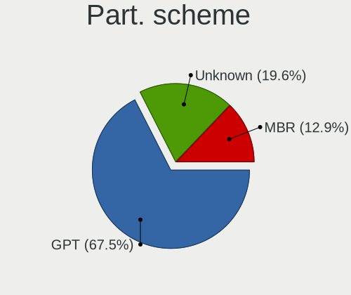
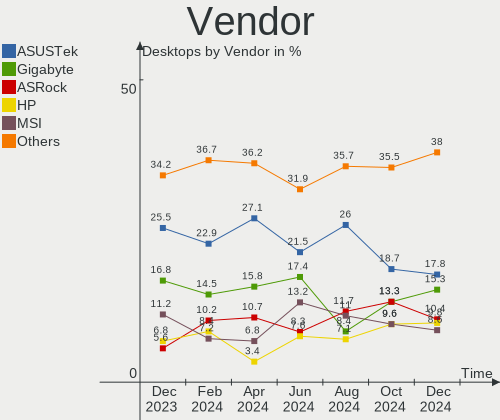
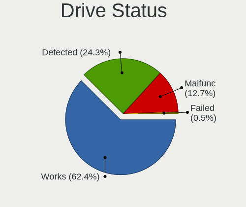
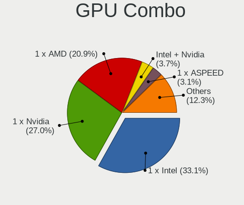
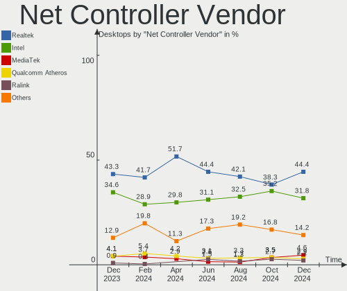

Debian Hardware Trends (Desktop)
--------------------------------

A project to identify most popular hardware characteristics and track their change
over time based on data collected by Debian users at https://Linux-Hardware.org.

Anyone can contribute to the study by uploading probes of their computers by
the [hw-probe](https://github.com/linuxhw/hw-probe) tool:

    sudo -E hw-probe -all -upload

Full-feature report is available here: https://linux-hardware.org/?view=trends&formfactor=desktop

Period: Nov, 2020.

Contents
--------

- [ OS                       ](#os)
- [ OS Family                ](#os-family)
- [ Kernel                   ](#kernel)
- [ Kernel Family            ](#kernel-family)
- [ Kernel Major Ver.        ](#kernel-major-ver)
- [ Arch                     ](#arch)
- [ DE                       ](#de)
- [ Display Server           ](#display-server)
- [ Display Manager          ](#display-manager)
- [ OS Lang                  ](#os-lang)
- [ Boot Mode                ](#boot-mode)
- [ Filesystem               ](#filesystem)
- [ Part. scheme             ](#part-scheme)
- [ Dual Boot with Linux/BSD ](#dual-boot-with-linux/bsd)
- [ Dual Boot (Win)          ](#dual-boot-win)
- [ Country                  ](#country)
- [ City                     ](#city)
- [ Vendor                   ](#vendor)
- [ Model                    ](#model)
- [ Model Family             ](#model-family)
- [ MFG Year                 ](#mfg-year)
- [ Form Factor              ](#form-factor)
- [ Secure Boot              ](#secure-boot)
- [ Coreboot                 ](#coreboot)
- [ RAM Size                 ](#ram-size)
- [ RAM Used                 ](#ram-used)
- [ Has CD-ROM               ](#has-cd-rom)
- [ Total Drives             ](#total-drives)
- [ Has Ethernet             ](#has-ethernet)
- [ Drive Vendor             ](#drive-vendor)
- [ Drive Model              ](#drive-model)
- [ HDD Vendor               ](#hdd-vendor)
- [ SSD Vendor               ](#ssd-vendor)
- [ Drive Kind               ](#drive-kind)
- [ Drive Connector          ](#drive-connector)
- [ Drive Size               ](#drive-size)
- [ Space Total              ](#space-total)
- [ Space Used               ](#space-used)
- [ Malfunc. Drives          ](#malfunc-drives)
- [ Malfunc. Drive Vendor    ](#malfunc-drive-vendor)
- [ Malfunc. HDD Vendor      ](#malfunc-hdd-vendor)
- [ Malfunc. Drive Kind      ](#malfunc-drive-kind)
- [ Failed Drives            ](#failed-drives)
- [ Failed Drive Vendor      ](#failed-drive-vendor)
- [ Drive Status             ](#drive-status)
- [ Storage Vendor           ](#storage-vendor)
- [ Storage Model            ](#storage-model)
- [ Storage Kind             ](#storage-kind)
- [ CPU Vendor               ](#cpu-vendor)
- [ CPU Model                ](#cpu-model)
- [ CPU Model Family         ](#cpu-model-family)
- [ CPU Cores                ](#cpu-cores)
- [ CPU Sockets              ](#cpu-sockets)
- [ CPU Threads              ](#cpu-threads)
- [ CPU Op-Modes             ](#cpu-op-modes)
- [ CPU Microcode            ](#cpu-microcode)
- [ CPU Microarch            ](#cpu-microarch)
- [ GPU Vendor               ](#gpu-vendor)
- [ GPU Model                ](#gpu-model)
- [ GPU Combo                ](#gpu-combo)
- [ GPU Driver               ](#gpu-driver)
- [ GPU Memory               ](#gpu-memory)
- [ Monitor Vendor           ](#monitor-vendor)
- [ Monitor Model            ](#monitor-model)
- [ Monitor Resolution       ](#monitor-resolution)
- [ Monitor Diagonal         ](#monitor-diagonal)
- [ Monitor Width            ](#monitor-width)
- [ Aspect Ratio             ](#aspect-ratio)
- [ Monitor Area             ](#monitor-area)
- [ Pixel Density            ](#pixel-density)
- [ Multiple Monitors        ](#multiple-monitors)
- [ Net Controller Vendor    ](#net-controller-vendor)
- [ Net Controller Model     ](#net-controller-model)
- [ Wireless Vendor          ](#wireless-vendor)
- [ Wireless Model           ](#wireless-model)
- [ Ethernet Vendor          ](#ethernet-vendor)
- [ Ethernet Model           ](#ethernet-model)
- [ Net Controller Kind      ](#net-controller-kind)
- [ Used Controller          ](#used-controller)
- [ NICs                     ](#nics)
- [ Memory Vendor            ](#memory-vendor)
- [ Memory Model             ](#memory-model)
- [ Memory Kind              ](#memory-kind)
- [ Memory Form Factor       ](#memory-form-factor)
- [ Memory Size              ](#memory-size)
- [ Memory Speed             ](#memory-speed)
- [ Sound Vendor             ](#sound-vendor)
- [ Sound Model              ](#sound-model)
- [ Camera Vendor            ](#camera-vendor)
- [ Camera Model             ](#camera-model)
- [ Fingerprint Vendor       ](#fingerprint-vendor)
- [ Fingerprint Model        ](#fingerprint-model)
- [ Chipcard Vendor          ](#chipcard-vendor)
- [ Chipcard Model           ](#chipcard-model)
- [ Printer Vendor           ](#printer-vendor)
- [ Printer Model            ](#printer-model)
- [ Scanner Vendor           ](#scanner-vendor)
- [ Scanner Model            ](#scanner-model)
- [ Bluetooth Vendor         ](#bluetooth-vendor)
- [ Bluetooth Model          ](#bluetooth-model)
- [ Unsupported Devices      ](#unsupported-devices)
- [ Unsupported Device Types ](#unsupported-device-types)

OS
--

Installed operating systems

| Name            | Desktops | Percent |
|-----------------|----------|---------|
| Debian 10       | 39       | 56.52%  |
| Debian Testing  | 18       | 26.09%  |
| Debian          | 9        | 13.04%  |
| Debian Unstable | 2        | 2.9%    |
| Debian 9        | 1        | 1.45%   |

OS Family
---------

OS without a version

| Name   | Desktops | Percent |
|--------|----------|---------|
| Debian | 69       | 100%    |

Kernel
------

Version of the Linux kernel

| Version                  | Desktops | Percent |
|--------------------------|----------|---------|
| 4.19.0-12-amd64          | 21       | 30.43%  |
| 5.9.0-1-amd64            | 12       | 17.39%  |
| 5.6.0-2-amd64            | 4        | 5.8%    |
| 5.9.0-3-amd64            | 3        | 4.35%   |
| 5.9.0-2-amd64            | 3        | 4.35%   |
| 5.8.0-3-amd64            | 3        | 4.35%   |
| 5.8.0-0.bpo.2-amd64      | 3        | 4.35%   |
| 5.4.65-1-pve             | 2        | 2.9%    |
| 4.19.0-6-amd64           | 2        | 2.9%    |
| 4.19.0-10-amd64          | 2        | 2.9%    |
| 5.9.8-xanmod1            | 1        | 1.45%   |
| 5.9.7-lqx                | 1        | 1.45%   |
| 5.9.3-wrkd               | 1        | 1.45%   |
| 5.9.0-8.2-liquorix-amd64 | 1        | 1.45%   |
| 5.9.0-4-amd64            | 1        | 1.45%   |
| 5.9.0-2-686-pae          | 1        | 1.45%   |
| 5.8.10-bootes0-p-1000    | 1        | 1.45%   |
| 5.7.9-nv                 | 1        | 1.45%   |
| 5.4.73-1-pve             | 1        | 1.45%   |
| 5.0.15-1-pve             | 1        | 1.45%   |
| 4.9.0-8-amd64            | 1        | 1.45%   |
| 4.19.0-8-amd64           | 1        | 1.45%   |
| 4.19.0-12-686            | 1        | 1.45%   |
| 4.19.0-11-amd64          | 1        | 1.45%   |

Kernel Family
-------------

Linux kernel without a distro release

| Version | Desktops | Percent |
|---------|----------|---------|
| 4.19.0  | 28       | 40.58%  |
| 5.9.0   | 21       | 30.43%  |
| 5.8.0   | 6        | 8.7%    |
| 5.6.0   | 4        | 5.8%    |
| 5.4.65  | 2        | 2.9%    |
| 5.9.8   | 1        | 1.45%   |
| 5.9.7   | 1        | 1.45%   |
| 5.9.3   | 1        | 1.45%   |
| 5.8.10  | 1        | 1.45%   |
| 5.7.9   | 1        | 1.45%   |
| 5.4.73  | 1        | 1.45%   |
| 5.0.15  | 1        | 1.45%   |
| 4.9.0   | 1        | 1.45%   |

Kernel Major Ver.
-----------------

Linux kernel major version

| Version | Desktops | Percent |
|---------|----------|---------|
| 4.19    | 28       | 40.58%  |
| 5.9     | 24       | 34.78%  |
| 5.8     | 7        | 10.14%  |
| 5.6     | 4        | 5.8%    |
| 5.4     | 3        | 4.35%   |
| 5.7     | 1        | 1.45%   |
| 5.0     | 1        | 1.45%   |
| 4.9     | 1        | 1.45%   |

Arch
----

OS architecture (x86_64, i586, etc.)

| Name   | Desktops | Percent |
|--------|----------|---------|
| x86_64 | 67       | 97.1%   |
| i686   | 2        | 2.9%    |

DE
--

Desktop Environment

| Name             | Desktops | Percent |
|------------------|----------|---------|
| GNOME            | 17       | 24.64%  |
| XFCE             | 10       | 14.49%  |
| KDE5             | 10       | 14.49%  |
| Unknown          | 8        | 11.59%  |
| KDE              | 4        | 5.8%    |
| Cinnamon         | 4        | 5.8%    |
| LXQt             | 3        | 4.35%   |
| X-Cinnamon       | 2        | 2.9%    |
| MATE             | 2        | 2.9%    |
| LXDE             | 2        | 2.9%    |
| i3               | 2        | 2.9%    |
| GNOME Classic    | 2        | 2.9%    |
| lightdm-xsession | 1        | 1.45%   |
| GNOME Flashback  | 1        | 1.45%   |
| Budgie           | 1        | 1.45%   |

Display Server
--------------

X11 or Wayland

| Name    | Desktops | Percent |
|---------|----------|---------|
| X11     | 52       | 75.36%  |
| Tty     | 7        | 10.14%  |
| Wayland | 6        | 8.7%    |
| Unknown | 4        | 5.8%    |

Display Manager
---------------

SDDM, LightDM, etc.

| Name    | Desktops | Percent |
|---------|----------|---------|
| Unknown | 30       | 43.48%  |
| SDDM    | 13       | 18.84%  |
| TDM     | 9        | 13.04%  |
| GDM     | 9        | 13.04%  |
| XDM     | 2        | 2.9%    |
| SLiM    | 1        | 1.45%   |
| NODM    | 1        | 1.45%   |
| Ly      | 1        | 1.45%   |
| LightDM | 1        | 1.45%   |
| KDM     | 1        | 1.45%   |
| GDM3    | 1        | 1.45%   |

OS Lang
-------

Language

| Lang       | Desktops | Percent |
|------------|----------|---------|
| en_US      | 21       | 30.43%  |
| fr_FR      | 6        | 8.7%    |
| de_DE      | 5        | 7.25%   |
| pt_BR      | 3        | 4.35%   |
| es_ES      | 3        | 4.35%   |
| ru_RU      | 2        | 2.9%    |
| en_US.utf8 | 2        | 2.9%    |
| en_GB      | 2        | 2.9%    |
| en_CA      | 2        | 2.9%    |
| de_DE.utf8 | 2        | 2.9%    |
| de_AT      | 2        | 2.9%    |
| C          | 2        | 2.9%    |
| tt_RU      | 1        | 1.45%   |
| sv_SE      | 1        | 1.45%   |
| ru_UA      | 1        | 1.45%   |
| lt_LT      | 1        | 1.45%   |
| ja_JP      | 1        | 1.45%   |
| it_IT      | 1        | 1.45%   |
| hu_HU      | 1        | 1.45%   |
| fr_BE      | 1        | 1.45%   |
| es_VE      | 1        | 1.45%   |
| es_NI      | 1        | 1.45%   |
| es_AR      | 1        | 1.45%   |
| en_NZ      | 1        | 1.45%   |
| en_IN      | 1        | 1.45%   |
| en_DK      | 1        | 1.45%   |
| el_GR      | 1        | 1.45%   |
| cs_CZ      | 1        | 1.45%   |
| Unknown    | 1        | 1.45%   |

Boot Mode
---------

EFI or BIOS

| Mode | Desktops | Percent |
|------|----------|---------|
| BIOS | 49       | 71.01%  |
| EFI  | 20       | 28.99%  |

Filesystem
----------

Type of filesystem

| Type    | Desktops | Percent |
|---------|----------|---------|
| Ext4    | 52       | 75.36%  |
| Xfs     | 4        | 5.8%    |
| Btrfs   | 4        | 5.8%    |
| Ext3    | 3        | 4.35%   |
| Zfs     | 2        | 2.9%    |
| Overlay | 2        | 2.9%    |
| Jfs     | 1        | 1.45%   |
| F2fs    | 1        | 1.45%   |

Part. scheme
------------

Scheme of partitioning

| Type    | Desktops | Percent |
|---------|----------|---------|
| GPT     | 31       | 44.93%  |
| Unknown | 27       | 39.13%  |
| MBR     | 11       | 15.94%  |

Dual Boot with Linux/BSD
------------------------

Hosting more than one Linux/BSD

| Dual boot | Desktops | Percent |
|-----------|----------|---------|
| No        | 59       | 85.51%  |
| Yes       | 10       | 14.49%  |

Dual Boot (Win)
---------------

Hosting Linux and Windows

| Dual boot | Desktops | Percent |
|-----------|----------|---------|
| No        | 52       | 75.36%  |
| Yes       | 17       | 24.64%  |

Country
-------

Geographic location (country)

| Country        | Desktops | Percent |
|----------------|----------|---------|
| USA            | 10       | 14.49%  |
| Germany        | 10       | 14.49%  |
| France         | 6        | 8.7%    |
| Brazil         | 6        | 8.7%    |
| Russia         | 5        | 7.25%   |
| Spain          | 4        | 5.8%    |
| Ukraine        | 2        | 2.9%    |
| Finland        | 2        | 2.9%    |
| Canada         | 2        | 2.9%    |
| Belgium        | 2        | 2.9%    |
| Austria        | 2        | 2.9%    |
| Venezuela      | 1        | 1.45%   |
| UK             | 1        | 1.45%   |
| Switzerland    | 1        | 1.45%   |
| Sweden         | 1        | 1.45%   |
| Serbia         | 1        | 1.45%   |
| Romania        | 1        | 1.45%   |
| Poland         | 1        | 1.45%   |
| Nicaragua      | 1        | 1.45%   |
| New Zealand    | 1        | 1.45%   |
| Lithuania      | 1        | 1.45%   |
| Japan          | 1        | 1.45%   |
| Italy          | 1        | 1.45%   |
| India          | 1        | 1.45%   |
| Greece         | 1        | 1.45%   |
| Czech Republic | 1        | 1.45%   |
| Bulgaria       | 1        | 1.45%   |
| Belarus        | 1        | 1.45%   |
| Argentina      | 1        | 1.45%   |

City
----

Geographic location (city)

| City                       | Desktops | Percent |
|----------------------------|----------|---------|
| São Paulo                 | 2        | 2.9%    |
| Rio de Janeiro             | 2        | 2.9%    |
| Falkenstein                | 2        | 2.9%    |
| Ekaterinburg               | 2        | 2.9%    |
| Barcelona                  | 2        | 2.9%    |
| Zurich                     | 1        | 1.45%   |
| Yssingeaux                 | 1        | 1.45%   |
| Wienerherberg              | 1        | 1.45%   |
| Wellington                 | 1        | 1.45%   |
| Vienna                     | 1        | 1.45%   |
| Veinticinco de Mayo        | 1        | 1.45%   |
| Varese                     | 1        | 1.45%   |
| Valencia                   | 1        | 1.45%   |
| Thessaloniki               | 1        | 1.45%   |
| Steinau an der Strasse     | 1        | 1.45%   |
| St Petersburg              | 1        | 1.45%   |
| Sorocaba                   | 1        | 1.45%   |
| Sofia                      | 1        | 1.45%   |
| Sirig                      | 1        | 1.45%   |
| Schoenberg                 | 1        | 1.45%   |
| Saratoga Springs           | 1        | 1.45%   |
| Safonovo                   | 1        | 1.45%   |
| Raahe                      | 1        | 1.45%   |
| Pliezhausen                | 1        | 1.45%   |
| Pleneuf-Val-Andre          | 1        | 1.45%   |
| Park City                  | 1        | 1.45%   |
| Olomouc                    | 1        | 1.45%   |
| Novosibirsk                | 1        | 1.45%   |
| North Bay                  | 1        | 1.45%   |
| New York                   | 1        | 1.45%   |
| Nagano                     | 1        | 1.45%   |
| Mostoles                   | 1        | 1.45%   |
| Miusinsk                   | 1        | 1.45%   |
| Minsk                      | 1        | 1.45%   |
| Manitowoc                  | 1        | 1.45%   |
| Managua                    | 1        | 1.45%   |
| Lüneburg                  | 1        | 1.45%   |
| Lubbock                    | 1        | 1.45%   |
| Llandarcy                  | 1        | 1.45%   |
| Leval-Trahegnies           | 1        | 1.45%   |
| Las Palmas de Gran Canaria | 1        | 1.45%   |
| Kyiv                       | 1        | 1.45%   |
| Kaunas                     | 1        | 1.45%   |
| Kaarst                     | 1        | 1.45%   |
| Joinville                  | 1        | 1.45%   |
| Irmo                       | 1        | 1.45%   |
| Iowa City                  | 1        | 1.45%   |
| Illkirch-Graffenstaden     | 1        | 1.45%   |
| Hoekerum                   | 1        | 1.45%   |
| Hennigsdorf                | 1        | 1.45%   |
| Ghent                      | 1        | 1.45%   |
| Fontenay-sous-Bois         | 1        | 1.45%   |
| Eugene                     | 1        | 1.45%   |
| Espoo                      | 1        | 1.45%   |
| East Orange                | 1        | 1.45%   |
| Crestview                  | 1        | 1.45%   |
| Cracăul Negru             | 1        | 1.45%   |
| Chennai                    | 1        | 1.45%   |
| Calgary                    | 1        | 1.45%   |
| Bielsk Podlaski            | 1        | 1.45%   |

Vendor
------

Motherboard manufacturer

| Name                | Desktops | Percent |
|---------------------|----------|---------|
| ASUSTek Computer    | 23       | 33.33%  |
| ASRock              | 10       | 14.49%  |
| MSI                 | 8        | 11.59%  |
| Gigabyte Technology | 8        | 11.59%  |
| Dell                | 6        | 8.7%    |
| Lenovo              | 3        | 4.35%   |
| Hewlett-Packard     | 3        | 4.35%   |
| Pegatron            | 2        | 2.9%    |
| Wistron             | 1        | 1.45%   |
| Megaware            | 1        | 1.45%   |
| Intel               | 1        | 1.45%   |
| Foxconn             | 1        | 1.45%   |
| Apple               | 1        | 1.45%   |
| Unknown             | 1        | 1.45%   |

Model
-----

Motherboard model

| Name                            | Desktops | Percent |
|---------------------------------|----------|---------|
| MSI MS-7A34                     | 2        | 2.9%    |
| Wistron ProLiant ML110 G6       | 1        | 1.45%   |
| Pegatron KP250AA-ABZ m9280.it   | 1        | 1.45%   |
| Pegatron FQ587AA-ABA a6767c     | 1        | 1.45%   |
| MSI MS-7C79                     | 1        | 1.45%   |
| MSI MS-7C51                     | 1        | 1.45%   |
| MSI MS-7C31                     | 1        | 1.45%   |
| MSI MS-7A71                     | 1        | 1.45%   |
| MSI MS-7751                     | 1        | 1.45%   |
| MSI MS-7368                     | 1        | 1.45%   |
| Megaware MW-H61H2-M2            | 1        | 1.45%   |
| Lenovo ThinkCentre M92p 3209EK4 | 1        | 1.45%   |
| Lenovo ThinkCentre M91p 4480B2G | 1        | 1.45%   |
| Lenovo H505S 3230               | 1        | 1.45%   |
| Intel Q3XXG4-P V1.0             | 1        | 1.45%   |
| HP EliteDesk 800 G3 TWR         | 1        | 1.45%   |
| HP EliteDesk 705 G5 SFF         | 1        | 1.45%   |
| HP Compaq 6000 Pro MT PC        | 1        | 1.45%   |
| Gigabyte Z97N-WIFI              | 1        | 1.45%   |
| Gigabyte Z87X-UD5H              | 1        | 1.45%   |
| Gigabyte GB-BACE-3000-SBE       | 1        | 1.45%   |
| Gigabyte GA-990FXA-D3           | 1        | 1.45%   |
| Gigabyte B550 AORUS ELITE       | 1        | 1.45%   |
| Gigabyte B450M DS3H             | 1        | 1.45%   |
| Gigabyte B250M-D3H              | 1        | 1.45%   |
| Gigabyte AB350-Gaming 3         | 1        | 1.45%   |
| Foxconn p6754y                  | 1        | 1.45%   |
| Dell PowerEdge M620             | 1        | 1.45%   |
| Dell OptiPlex 380               | 1        | 1.45%   |
| Dell OptiPlex 3020M             | 1        | 1.45%   |
| Dell OptiPlex 3010              | 1        | 1.45%   |
| Dell DXP061                     | 1        | 1.45%   |
| Dell Dimension 4700c            | 1        | 1.45%   |
| ASUS TUF GAMING X570-PLUS       | 1        | 1.45%   |
| ASUS STRIX Z270F GAMING         | 1        | 1.45%   |
| ASUS ROG ZENITH EXTREME         | 1        | 1.45%   |
| ASUS ROG CROSSHAIR VII HERO     | 1        | 1.45%   |
| ASUS PRIME X370-PRO             | 1        | 1.45%   |
| ASUS PRIME B450-PLUS            | 1        | 1.45%   |
| ASUS PRIME B350M-A              | 1        | 1.45%   |
| ASUS PRIME A320M-K              | 1        | 1.45%   |
| ASUS P8P67                      | 1        | 1.45%   |
| ASUS P8H77-V LE                 | 1        | 1.45%   |
| ASUS P5KPL-CM                   | 1        | 1.45%   |
| ASUS P5B-V                      | 1        | 1.45%   |
| ASUS M5A97 R2.0                 | 1        | 1.45%   |
| ASUS M5A97 LE R2.0              | 1        | 1.45%   |
| ASUS M5A78L-M/USB3              | 1        | 1.45%   |
| ASUS M5A78L                     | 1        | 1.45%   |
| ASUS M4N98TD EVO                | 1        | 1.45%   |
| ASUS M3A32-MVP DELUXE           | 1        | 1.45%   |
| ASUS F2A85-M                    | 1        | 1.45%   |
| ASUS B150M-C                    | 1        | 1.45%   |
| ASUS All Series                 | 1        | 1.45%   |
| ASUS A8NE-FM                    | 1        | 1.45%   |
| ASUS A7N8X-X                    | 1        | 1.45%   |
| ASRock Z370M Pro4               | 1        | 1.45%   |
| ASRock X570M Pro4               | 1        | 1.45%   |
| ASRock X370 Gaming X            | 1        | 1.45%   |
| ASRock X370 Gaming K4           | 1        | 1.45%   |

Model Family
------------

Motherboard model prefix

| Name                      | Desktops | Percent |
|---------------------------|----------|---------|
| ASUS PRIME                | 4        | 5.8%    |
| Dell OptiPlex             | 3        | 4.35%   |
| MSI MS-7A34               | 2        | 2.9%    |
| Lenovo ThinkCentre        | 2        | 2.9%    |
| HP EliteDesk              | 2        | 2.9%    |
| ASUS ROG                  | 2        | 2.9%    |
| ASUS M5A97                | 2        | 2.9%    |
| ASRock X370               | 2        | 2.9%    |
| Wistron ProLiant          | 1        | 1.45%   |
| Pegatron KP250AA-ABZ      | 1        | 1.45%   |
| Pegatron FQ587AA-ABA      | 1        | 1.45%   |
| MSI MS-7C79               | 1        | 1.45%   |
| MSI MS-7C51               | 1        | 1.45%   |
| MSI MS-7C31               | 1        | 1.45%   |
| MSI MS-7A71               | 1        | 1.45%   |
| MSI MS-7751               | 1        | 1.45%   |
| MSI MS-7368               | 1        | 1.45%   |
| Megaware MW-H61H2-M2      | 1        | 1.45%   |
| Lenovo H505S              | 1        | 1.45%   |
| Intel Q3XXG4-P            | 1        | 1.45%   |
| HP Compaq                 | 1        | 1.45%   |
| Gigabyte Z97N-WIFI        | 1        | 1.45%   |
| Gigabyte Z87X-UD5H        | 1        | 1.45%   |
| Gigabyte GB-BACE-3000-SBE | 1        | 1.45%   |
| Gigabyte GA-990FXA-D3     | 1        | 1.45%   |
| Gigabyte B550             | 1        | 1.45%   |
| Gigabyte B450M            | 1        | 1.45%   |
| Gigabyte B250M-D3H        | 1        | 1.45%   |
| Gigabyte AB350-Gaming     | 1        | 1.45%   |
| Foxconn p6754y            | 1        | 1.45%   |
| Dell PowerEdge            | 1        | 1.45%   |
| Dell DXP061               | 1        | 1.45%   |
| Dell Dimension            | 1        | 1.45%   |
| ASUS TUF                  | 1        | 1.45%   |
| ASUS STRIX                | 1        | 1.45%   |
| ASUS P8P67                | 1        | 1.45%   |
| ASUS P8H77-V              | 1        | 1.45%   |
| ASUS P5KPL-CM             | 1        | 1.45%   |
| ASUS P5B-V                | 1        | 1.45%   |
| ASUS M5A78L-M             | 1        | 1.45%   |
| ASUS M5A78L               | 1        | 1.45%   |
| ASUS M4N98TD              | 1        | 1.45%   |
| ASUS M3A32-MVP            | 1        | 1.45%   |
| ASUS F2A85-M              | 1        | 1.45%   |
| ASUS B150M-C              | 1        | 1.45%   |
| ASUS All                  | 1        | 1.45%   |
| ASUS A8NE-FM              | 1        | 1.45%   |
| ASUS A7N8X-X              | 1        | 1.45%   |
| ASRock Z370M              | 1        | 1.45%   |
| ASRock X570M              | 1        | 1.45%   |
| ASRock J3455-ITX          | 1        | 1.45%   |
| ASRock H97M               | 1        | 1.45%   |
| ASRock AM2NF6G-VSTA       | 1        | 1.45%   |
| ASRock A55M-HVS           | 1        | 1.45%   |
| ASRock 980DE3             | 1        | 1.45%   |
| ASRock 870                | 1        | 1.45%   |
| Apple MacPro4             | 1        | 1.45%   |
| Unknown                   | 1        | 1.45%   |

MFG Year
--------

Motherboard manufacture year

| Year | Desktops | Percent |
|------|----------|---------|
| 2019 | 13       | 18.84%  |
| 2020 | 9        | 13.04%  |
| 2012 | 7        | 10.14%  |
| 2011 | 6        | 8.7%    |
| 2018 | 5        | 7.25%   |
| 2015 | 5        | 7.25%   |
| 2009 | 5        | 7.25%   |
| 2017 | 4        | 5.8%    |
| 2014 | 4        | 5.8%    |
| 2013 | 3        | 4.35%   |
| 2007 | 2        | 2.9%    |
| 2006 | 2        | 2.9%    |
| 2016 | 1        | 1.45%   |
| 2008 | 1        | 1.45%   |
| 2005 | 1        | 1.45%   |
| 2004 | 1        | 1.45%   |

Form Factor
-----------

Physical design of the computer

| Name    | Desktops | Percent |
|---------|----------|---------|
| Desktop | 69       | 100%    |

Secure Boot
-----------

Enabled or disabled

| State    | Desktops | Percent |
|----------|----------|---------|
| Disabled | 68       | 98.55%  |
| Enabled  | 1        | 1.45%   |

Coreboot
--------

Have coreboot on board

| Used | Desktops | Percent |
|------|----------|---------|
| No   | 69       | 100%    |

RAM Size
--------

Total RAM memory

| Size in GB  | Desktops | Percent |
|-------------|----------|---------|
| 16.01-24.0  | 17       | 24.64%  |
| 8.01-16.0   | 13       | 18.84%  |
| 32.01-64.0  | 10       | 14.49%  |
| 4.01-8.0    | 8        | 11.59%  |
| 3.01-4.0    | 8        | 11.59%  |
| 64.01-256.0 | 7        | 10.14%  |
| 1.01-2.0    | 3        | 4.35%   |
| 2.01-3.0    | 2        | 2.9%    |
| 24.01-32.0  | 1        | 1.45%   |

RAM Used
--------

Used RAM memory

| Used GB    | Desktops | Percent |
|------------|----------|---------|
| 4.01-8.0   | 17       | 24.64%  |
| 1.01-2.0   | 13       | 18.84%  |
| 2.01-3.0   | 11       | 15.94%  |
| 8.01-16.0  | 9        | 13.04%  |
| 0.01-1.0   | 8        | 11.59%  |
| 3.01-4.0   | 7        | 10.14%  |
| 32.01-64.0 | 2        | 2.9%    |
| 16.01-24.0 | 2        | 2.9%    |

Has CD-ROM
----------

Has CD-ROM on board

| Presented | Desktops | Percent |
|-----------|----------|---------|
| No        | 35       | 50.72%  |
| Yes       | 34       | 49.28%  |

Total Drives
------------

Number of drives on board

| Drives | Desktops | Percent |
|--------|----------|---------|
| 2      | 24       | 34.78%  |
| 1      | 19       | 27.54%  |
| 3      | 10       | 14.49%  |
| 4      | 9        | 13.04%  |
| 6      | 4        | 5.8%    |
| 16     | 1        | 1.45%   |
| 8      | 1        | 1.45%   |
| 5      | 1        | 1.45%   |

Has Ethernet
------------

Has Ethernet on board

| Presented | Desktops | Percent |
|-----------|----------|---------|
| Yes       | 69       | 100%    |

Drive Vendor
------------

Hard drive vendors

| Vendor                    | Desktops | Drives | Percent |
|---------------------------|----------|--------|---------|
| WDC                       | 35       | 47     | 23.97%  |
| Seagate                   | 28       | 33     | 19.18%  |
| Samsung Electronics       | 20       | 29     | 13.7%   |
| Kingston                  | 11       | 11     | 7.53%   |
| Toshiba                   | 9        | 11     | 6.16%   |
| Hitachi                   | 7        | 22     | 4.79%   |
| Crucial                   | 6        | 6      | 4.11%   |
| Sandisk                   | 3        | 3      | 2.05%   |
| Phison                    | 3        | 4      | 2.05%   |
| Maxtor                    | 3        | 3      | 2.05%   |
| Intel                     | 3        | 3      | 2.05%   |
| A-DATA Technology         | 3        | 3      | 2.05%   |
| Transcend                 | 2        | 3      | 1.37%   |
| OCZ                       | 2        | 2      | 1.37%   |
| Unknown                   | 1        | 1      | 0.68%   |
| OCZ-VERTEX                | 1        | 1      | 0.68%   |
| Micron/Crucial Technology | 1        | 1      | 0.68%   |
| Micron Technology         | 1        | 1      | 0.68%   |
| Lite-On                   | 1        | 1      | 0.68%   |
| KingSpec                  | 1        | 1      | 0.68%   |
| HGST HDS                  | 1        | 1      | 0.68%   |
| HGST                      | 1        | 2      | 0.68%   |
| Hewlett-Packard           | 1        | 1      | 0.68%   |
| Corsair                   | 1        | 1      | 0.68%   |
| Apple                     | 1        | 1      | 0.68%   |

Drive Model
-----------

Hard drive models

| Model                           | Desktops | Percent |
|---------------------------------|----------|---------|
| Seagate ST1000DM010-2EP102 1TB  | 4        | 2.31%   |
| Kingston SA400S37240G 240GB SSD | 4        | 2.31%   |
| WDC WD10EZEX-08WN4A0 1TB        | 3        | 1.73%   |
| Seagate ST3500418AS 500GB       | 3        | 1.73%   |
| Kingston SA400S37120G 120GB SSD | 3        | 1.73%   |
| WDC WD80EFZX-68UW8N0 8TB        | 2        | 1.16%   |
| WDC WD5000AADS-00S9B0 500GB     | 2        | 1.16%   |
| WDC WD30EFRX-68EUZN0 3TB        | 2        | 1.16%   |
| WDC WD20EARX-00PASB0 2TB        | 2        | 1.16%   |
| Toshiba HDWD130 3TB             | 2        | 1.16%   |
| Toshiba HDWD110 1TB             | 2        | 1.16%   |
| Toshiba DT01ACA050 500GB        | 2        | 1.16%   |
| Seagate ST31000528AS 1TB        | 2        | 1.16%   |
| Sandisk NVMe SSD Drive 500GB    | 2        | 1.16%   |
| Samsung SSD 860 EVO 500GB       | 2        | 1.16%   |
| Samsung SSD 850 EVO 250GB       | 2        | 1.16%   |
| WDC WDS500G3X0C-00SJG0 500GB    | 1        | 0.58%   |
| WDC WDS500G1B0C-00S6U0 500GB    | 1        | 0.58%   |
| WDC WDBNCE5000PNC 500GB SSD     | 1        | 0.58%   |
| WDC WD800JD-75MSA3 80GB         | 1        | 0.58%   |
| WDC WD800BB-22JHC0 80GB         | 1        | 0.58%   |
| WDC WD7500AACS-00D6B0 752GB     | 1        | 0.58%   |
| WDC WD6400AAKS-65A7B0 640GB     | 1        | 0.58%   |
| WDC WD6400AAKS-00A7B0 640GB     | 1        | 0.58%   |
| WDC WD5000LPCX-75VHAT1 500GB    | 1        | 0.58%   |
| WDC WD5000AZLX-60K2TA0 500GB    | 1        | 0.58%   |
| WDC WD5000AAKX-00U6AA0 500GB    | 1        | 0.58%   |
| WDC WD5000AAKX-00ERMA0 500GB    | 1        | 0.58%   |
| WDC WD5000AAKX-003CA0 500GB     | 1        | 0.58%   |
| WDC WD5000AAKX-001CA0 500GB     | 1        | 0.58%   |
| WDC WD5000AAKS-75YGA0 500GB     | 1        | 0.58%   |
| WDC WD5000AAKS-00A7B2 500GB     | 1        | 0.58%   |
| WDC WD5000AAKB-00H8A0 500GB     | 1        | 0.58%   |
| WDC WD40EFRX-68N32N0 4TB        | 1        | 0.58%   |
| WDC WD3200AAJB-00WGA0 320GB     | 1        | 0.58%   |
| WDC WD32 00BEKT-60PVMT0 320GB   | 1        | 0.58%   |
| WDC WD2500AVJB-63J5A0 250GB     | 1        | 0.58%   |
| WDC WD2500AAKS-00UU3A0 250GB    | 1        | 0.58%   |
| WDC WD20EFRX-68EUZN0 2TB        | 1        | 0.58%   |
| WDC WD1600AAJS-08PSA0 160GB     | 1        | 0.58%   |
| WDC WD10TMVW-11ZSMS5 1TB        | 1        | 0.58%   |
| WDC WD10EZEX-75ZF5A0 1TB        | 1        | 0.58%   |
| WDC WD10EZEX-60WN4A0 1TB        | 1        | 0.58%   |
| WDC WD10EZEX-22MFCA0 1TB        | 1        | 0.58%   |
| WDC WD10EZEX-08M2NA0 1TB        | 1        | 0.58%   |
| WDC WD10EZEX-00KUWA0 1TB        | 1        | 0.58%   |
| WDC WD10EARX-00N0YB0 1TB        | 1        | 0.58%   |
| WDC WD10EALX-009BA0 1TB         | 1        | 0.58%   |
| WDC WD10EACS-22D6B0 1TB         | 1        | 0.58%   |
| WDC WD1002FAEX-00Y9A0 1TB       | 1        | 0.58%   |
| WDC WD1001FALS-00J7B0 1TB       | 1        | 0.58%   |
| Unknown MM0500EANCR 500GB       | 1        | 0.58%   |
| Transcend TS256GSSD230S 256GB   | 1        | 0.58%   |
| Transcend TS128GSSD370S 128GB   | 1        | 0.58%   |
| Transcend TS128GMTE110S 128GB   | 1        | 0.58%   |
| Toshiba TR200 960GB SSD         | 1        | 0.58%   |
| Toshiba Q300 Pro. 256GB SSD     | 1        | 0.58%   |
| Toshiba HDWE150 5TB             | 1        | 0.58%   |
| Toshiba HDWD120 2TB             | 1        | 0.58%   |
| Toshiba DT01ACA300 3TB          | 1        | 0.58%   |

HDD Vendor
----------

Hard disk drive vendors

| Vendor              | Desktops | Drives | Percent |
|---------------------|----------|--------|---------|
| WDC                 | 33       | 44     | 37.93%  |
| Seagate             | 26       | 31     | 29.89%  |
| Toshiba             | 8        | 9      | 9.2%    |
| Samsung Electronics | 8        | 11     | 9.2%    |
| Hitachi             | 7        | 22     | 8.05%   |
| Maxtor              | 3        | 3      | 3.45%   |
| Unknown             | 1        | 1      | 1.15%   |
| HGST                | 1        | 2      | 1.15%   |

SSD Vendor
----------

Solid state drive vendors

| Vendor              | Desktops | Drives | Percent |
|---------------------|----------|--------|---------|
| Samsung Electronics | 10       | 12     | 25%     |
| Kingston            | 10       | 10     | 25%     |
| Crucial             | 6        | 6      | 15%     |
| Toshiba             | 2        | 2      | 5%      |
| OCZ                 | 2        | 2      | 5%      |
| WDC                 | 1        | 1      | 2.5%    |
| Transcend           | 1        | 2      | 2.5%    |
| SanDisk             | 1        | 1      | 2.5%    |
| OCZ-VERTEX          | 1        | 1      | 2.5%    |
| Micron Technology   | 1        | 1      | 2.5%    |
| KingSpec            | 1        | 1      | 2.5%    |
| Intel               | 1        | 1      | 2.5%    |
| Corsair             | 1        | 1      | 2.5%    |
| Apple               | 1        | 1      | 2.5%    |
| A-DATA Technology   | 1        | 1      | 2.5%    |

Drive Kind
----------

HDD or SSD

| Kind    | Desktops | Drives | Percent |
|---------|----------|--------|---------|
| HDD     | 59       | 123    | 51.75%  |
| SSD     | 35       | 43     | 30.7%   |
| NVMe    | 18       | 24     | 15.79%  |
| Unknown | 2        | 2      | 1.75%   |

Drive Connector
---------------

SATA, SAS, NVMe, etc.

| Type | Desktops | Drives | Percent |
|------|----------|--------|---------|
| SATA | 68       | 148    | 73.91%  |
| NVMe | 18       | 24     | 19.57%  |
| SAS  | 6        | 20     | 6.52%   |

Drive Size
----------

Size of hard drive

| Size in TB | Desktops | Drives | Percent |
|------------|----------|--------|---------|
| 0.01-0.5   | 55       | 81     | 52.38%  |
| 0.51-1.0   | 28       | 44     | 26.67%  |
| 1.01-2.0   | 10       | 12     | 9.52%   |
| 2.01-3.0   | 6        | 21     | 5.71%   |
| 3.01-4.0   | 3        | 3      | 2.86%   |
| 4.01-10.0  | 3        | 5      | 2.86%   |

Space Total
-----------

Amount of disk space available on the file system

| Size in GB     | Desktops | Percent |
|----------------|----------|---------|
| 501-1000       | 18       | 26.09%  |
| More than 3000 | 11       | 15.94%  |
| 251-500        | 11       | 15.94%  |
| 101-250        | 10       | 14.49%  |
| 1001-2000      | 8        | 11.59%  |
| 2001-3000      | 3        | 4.35%   |
| 51-100         | 3        | 4.35%   |
| 1-20           | 2        | 2.9%    |
| Unknown        | 2        | 2.9%    |
| 21-50          | 1        | 1.45%   |

Space Used
----------

Amount of used disk space

| Used GB        | Desktops | Percent |
|----------------|----------|---------|
| 501-1000       | 14       | 20.29%  |
| 1-20           | 13       | 18.84%  |
| 251-500        | 10       | 14.49%  |
| 101-250        | 8        | 11.59%  |
| 1001-2000      | 6        | 8.7%    |
| 51-100         | 6        | 8.7%    |
| More than 3000 | 4        | 5.8%    |
| 21-50          | 4        | 5.8%    |
| 2001-3000      | 2        | 2.9%    |
| Unknown        | 2        | 2.9%    |

Malfunc. Drives
---------------

Drive models with a malfunction

| Model                               | Desktops | Drives | Percent |
|-------------------------------------|----------|--------|---------|
| WDC WD5000AAKX-00U6AA0 500GB        | 1        | 1      | 6.25%   |
| WDC WD5000AAKX-003CA0 500GB         | 1        | 1      | 6.25%   |
| WDC WD1600AAJS-08PSA0 160GB         | 1        | 1      | 6.25%   |
| WDC WD10EACS-22D6B0 1TB             | 1        | 1      | 6.25%   |
| Seagate ST3500418AS 500GB           | 1        | 1      | 6.25%   |
| Seagate ST3250620AS 250GB           | 1        | 1      | 6.25%   |
| Seagate ST3250310AS 250GB           | 1        | 1      | 6.25%   |
| Seagate ST2000DM001-1CH164 2TB      | 1        | 1      | 6.25%   |
| Samsung Electronics SSD 960 PRO 1TB | 1        | 1      | 6.25%   |
| Samsung Electronics SP1604N 160GB   | 1        | 1      | 6.25%   |
| Samsung Electronics HD753LJ 752GB   | 1        | 1      | 6.25%   |
| Samsung Electronics HD502HI 500GB   | 1        | 1      | 6.25%   |
| Maxtor 6L200S0 208GB                | 1        | 1      | 6.25%   |
| Kingston SV300S37A120G 120GB SSD    | 1        | 1      | 6.25%   |
| Hitachi HTS545016B9A300 160GB       | 1        | 1      | 6.25%   |
| Hitachi HTS543225L9A300 250GB       | 1        | 1      | 6.25%   |

Malfunc. Drive Vendor
---------------------

Vendors of faulty drives

| Vendor              | Desktops | Drives | Percent |
|---------------------|----------|--------|---------|
| WDC                 | 4        | 4      | 25%     |
| Seagate             | 4        | 4      | 25%     |
| Samsung Electronics | 4        | 4      | 25%     |
| Hitachi             | 2        | 2      | 12.5%   |
| Maxtor              | 1        | 1      | 6.25%   |
| Kingston            | 1        | 1      | 6.25%   |

Malfunc. HDD Vendor
-------------------

Vendors of faulty HDD drives

| Vendor              | Desktops | Drives | Percent |
|---------------------|----------|--------|---------|
| WDC                 | 4        | 4      | 28.57%  |
| Seagate             | 4        | 4      | 28.57%  |
| Samsung Electronics | 3        | 3      | 21.43%  |
| Hitachi             | 2        | 2      | 14.29%  |
| Maxtor              | 1        | 1      | 7.14%   |

Malfunc. Drive Kind
-------------------

Kinds of faulty drives

| Kind | Desktops | Drives | Percent |
|------|----------|--------|---------|
| HDD  | 12       | 14     | 85.71%  |
| NVMe | 1        | 1      | 7.14%   |
| SSD  | 1        | 1      | 7.14%   |

Failed Drives
-------------

Failed drive models

Zero info for selected period =(

Failed Drive Vendor
-------------------

Failed drive vendors

Zero info for selected period =(

Drive Status
------------

Number of failed and malfunc. drives

| Status   | Desktops | Drives | Percent |
|----------|----------|--------|---------|
| Works    | 37       | 71     | 44.58%  |
| Detected | 32       | 105    | 38.55%  |
| Malfunc  | 14       | 16     | 16.87%  |

Storage Vendor
--------------

Storage controller vendors

| Vendor                      | Desktops | Percent |
|-----------------------------|----------|---------|
| Intel                       | 34       | 33.66%  |
| AMD                         | 31       | 30.69%  |
| Samsung Electronics         | 4        | 3.96%   |
| Nvidia                      | 4        | 3.96%   |
| Marvell Technology Group    | 4        | 3.96%   |
| ASMedia Technology          | 4        | 3.96%   |
| Sandisk                     | 3        | 2.97%   |
| Phison Electronics          | 3        | 2.97%   |
| Broadcom / LSI              | 3        | 2.97%   |
| Silicon Motion              | 2        | 1.98%   |
| ADATA Technology            | 2        | 1.98%   |
| VIA Technologies            | 1        | 0.99%   |
| Silicon Image               | 1        | 0.99%   |
| Seagate Technology          | 1        | 0.99%   |
| Micron/Crucial Technology   | 1        | 0.99%   |
| Lite-On Technology          | 1        | 0.99%   |
| Kingston Technology Company | 1        | 0.99%   |
| JMicron Technology          | 1        | 0.99%   |

Storage Model
-------------

Storage controller models

| Model                                                                            | Desktops | Percent |
|----------------------------------------------------------------------------------|----------|---------|
| AMD FCH SATA Controller [AHCI mode]                                              | 17       | 12.69%  |
| Intel 200 Series PCH SATA controller [AHCI mode]                                 | 5        | 3.73%   |
| AMD SB7x0/SB8x0/SB9x0 SATA Controller [AHCI mode]                                | 5        | 3.73%   |
| Intel 6 Series/C200 Series Chipset Family 6 port Desktop SATA AHCI Controller    | 4        | 2.99%   |
| AMD SB7x0/SB8x0/SB9x0 IDE Controller                                             | 4        | 2.99%   |
| AMD 400 Series Chipset SATA Controller                                           | 4        | 2.99%   |
| AMD 300 Series Chipset SATA Controller                                           | 4        | 2.99%   |
| Samsung Electronics NVMe SSD Controller SM961/PM961                              | 3        | 2.24%   |
| Phison Electronics E12 NVMe Controller                                           | 3        | 2.24%   |
| Intel SATA Controller [RAID mode]                                                | 3        | 2.24%   |
| Intel 7 Series/C210 Series Chipset Family 6-port SATA Controller [AHCI mode]     | 3        | 2.24%   |
| ASMedia Technology ASM1062 Serial ATA Controller                                 | 3        | 2.24%   |
| AMD X370 Series Chipset SATA Controller                                          | 3        | 2.24%   |
| AMD SB7x0/SB8x0/SB9x0 SATA Controller [IDE mode]                                 | 3        | 2.24%   |
| AMD FCH SATA Controller D                                                        | 3        | 2.24%   |
| Marvell Technology Group 88SE912x IDE Controller                                 | 2        | 1.49%   |
| Intel NM10/ICH7 Family SATA Controller [IDE mode]                                | 2        | 1.49%   |
| Intel 82801G (ICH7 Family) IDE Controller                                        | 2        | 1.49%   |
| Intel 8 Series/C220 Series Chipset Family 6-port SATA Controller 1 [AHCI mode]   | 2        | 1.49%   |
| AMD SB600 Non-Raid-5 SATA                                                        | 2        | 1.49%   |
| AMD SB600 IDE                                                                    | 2        | 1.49%   |
| AMD FCH SATA Controller [IDE mode]                                               | 2        | 1.49%   |
| AMD FCH IDE Controller                                                           | 2        | 1.49%   |
| ADATA Technology XPG SX8200 Pro PCIe Gen3x4 M.2 2280 Solid State Drive           | 2        | 1.49%   |
| VIA Technologies VT6421 IDE/SATA Controller                                      | 1        | 0.75%   |
| Silicon Motion SM2262/SM2262EN SSD Controller                                    | 1        | 0.75%   |
| Silicon Motion Non-Volatile memory controller                                    | 1        | 0.75%   |
| Silicon Image SiI 3114 [SATALink/SATARaid] Serial ATA Controller                 | 1        | 0.75%   |
| Seagate Technology Non-Volatile memory controller                                | 1        | 0.75%   |
| Sandisk WD Black 2019/PC SN750 NVMe SSD                                          | 1        | 0.75%   |
| Sandisk WD Black 2018 / PC SN720 NVMe SSD                                        | 1        | 0.75%   |
| Sandisk WD Black 2018 / PC SN520 NVMe SSD                                        | 1        | 0.75%   |
| Samsung Electronics NVMe SSD Controller SM981/PM981/PM983                        | 1        | 0.75%   |
| Nvidia nForce2 IDE                                                               | 1        | 0.75%   |
| Nvidia MCP78S [GeForce 8200] AHCI Controller                                     | 1        | 0.75%   |
| Nvidia MCP61 SATA Controller                                                     | 1        | 0.75%   |
| Nvidia MCP61 IDE                                                                 | 1        | 0.75%   |
| Nvidia CK804 Serial ATA Controller                                               | 1        | 0.75%   |
| Nvidia CK804 IDE                                                                 | 1        | 0.75%   |
| Micron/Crucial Technology Non-Volatile memory controller                         | 1        | 0.75%   |
| Marvell Technology Group 88SE9172 SATA 6Gb/s Controller                          | 1        | 0.75%   |
| Marvell Technology Group 88SE9123 PCIe SATA 6.0 Gb/s controller                  | 1        | 0.75%   |
| Marvell Technology Group 88SE9120 SATA 6Gb/s Controller                          | 1        | 0.75%   |
| Marvell Technology Group 88SE6111/6121 SATA II / PATA Controller                 | 1        | 0.75%   |
| Lite-On Technology Non-Volatile memory controller                                | 1        | 0.75%   |
| Kingston Technology Company A2000 NVMe SSD                                       | 1        | 0.75%   |
| JMicron Technology JMB363 SATA/IDE Controller                                    | 1        | 0.75%   |
| Intel SSD 660P Series                                                            | 1        | 0.75%   |
| Intel SSD 600P Series                                                            | 1        | 0.75%   |
| Intel Q170/Q150/B150/H170/H110/Z170/CM236 Chipset SATA Controller [AHCI Mode]    | 1        | 0.75%   |
| Intel Celeron N3350/Pentium N4200/Atom E3900 Series SATA AHCI Controller         | 1        | 0.75%   |
| Intel C610/X99 series chipset sSATA Controller [AHCI mode]                       | 1        | 0.75%   |
| Intel C610/X99 series chipset 6-Port SATA Controller [AHCI mode]                 | 1        | 0.75%   |
| Intel C600/X79 series chipset 6-Port SATA AHCI Controller                        | 1        | 0.75%   |
| Intel Atom/Celeron/Pentium Processor x5-E8000/J3xxx/N3xxx Series SATA Controller | 1        | 0.75%   |
| Intel 9 Series Chipset Family SATA Controller [AHCI Mode]                        | 1        | 0.75%   |
| Intel 82801JI (ICH10 Family) SATA AHCI Controller                                | 1        | 0.75%   |
| Intel 82801JD/DO (ICH10 Family) SATA AHCI Controller                             | 1        | 0.75%   |
| Intel 82801IR/IO/IH (ICH9R/DO/DH) 6 port SATA Controller [AHCI mode]             | 1        | 0.75%   |
| Intel 82801IR/IO/IH (ICH9R/DO/DH) 4 port SATA Controller [IDE mode]              | 1        | 0.75%   |

Storage Kind
------------

Kind of storage controller (IDE, SATA, NVMe, SAS, ...)

| Kind | Desktops | Percent |
|------|----------|---------|
| SATA | 59       | 56.73%  |
| IDE  | 19       | 18.27%  |
| NVMe | 18       | 17.31%  |
| RAID | 6        | 5.77%   |
| SAS  | 1        | 0.96%   |
| SCSI | 1        | 0.96%   |

CPU Vendor
----------

Processor vendors

| Vendor | Desktops | Percent |
|--------|----------|---------|
| AMD    | 35       | 50.72%  |
| Intel  | 34       | 49.28%  |

CPU Model
---------

Processor models

| Model                                           | Desktops | Percent |
|-------------------------------------------------|----------|---------|
| AMD Ryzen 9 3900X 12-Core Processor             | 3        | 4.35%   |
| AMD Ryzen 7 1700 Eight-Core Processor           | 3        | 4.35%   |
| Intel Core i5-3470 CPU @ 3.20GHz                | 2        | 2.9%    |
| Intel Core 2 Quad CPU Q6600 @ 2.40GHz           | 2        | 2.9%    |
| AMD Ryzen 5 1600 Six-Core Processor             | 2        | 2.9%    |
| Intel Xeon CPU X3430 @ 2.40GHz                  | 1        | 1.45%   |
| Intel Xeon CPU W3565 @ 3.20GHz                  | 1        | 1.45%   |
| Intel Xeon CPU E5-2670 0 @ 2.60GHz              | 1        | 1.45%   |
| Intel Xeon CPU E3-1231 v3 @ 3.40GHz             | 1        | 1.45%   |
| Intel Pentium 4 CPU 2.80GHz                     | 1        | 1.45%   |
| Intel Core i7-7700K CPU @ 4.20GHz               | 1        | 1.45%   |
| Intel Core i7-6700K CPU @ 4.00GHz               | 1        | 1.45%   |
| Intel Core i7-6700 CPU @ 3.40GHz                | 1        | 1.45%   |
| Intel Core i7-5820K CPU @ 3.30GHz               | 1        | 1.45%   |
| Intel Core i7-4770 CPU @ 3.40GHz                | 1        | 1.45%   |
| Intel Core i5-9600K CPU @ 3.70GHz               | 1        | 1.45%   |
| Intel Core i5-7500 CPU @ 3.40GHz                | 1        | 1.45%   |
| Intel Core i5-4690K CPU @ 3.50GHz               | 1        | 1.45%   |
| Intel Core i5-3570K CPU @ 3.40GHz               | 1        | 1.45%   |
| Intel Core i5-3450 CPU @ 3.10GHz                | 1        | 1.45%   |
| Intel Core i5-2400 CPU @ 3.10GHz                | 1        | 1.45%   |
| Intel Core i5-2320 CPU @ 3.00GHz                | 1        | 1.45%   |
| Intel Core i5-10400 CPU @ 2.90GHz               | 1        | 1.45%   |
| Intel Core i3-9100F CPU @ 3.60GHz               | 1        | 1.45%   |
| Intel Core i3-7100 CPU @ 3.90GHz                | 1        | 1.45%   |
| Intel Core i3-4160T CPU @ 3.10GHz               | 1        | 1.45%   |
| Intel Core i3-4030U CPU @ 1.90GHz               | 1        | 1.45%   |
| Intel Core i3-2100 CPU @ 3.10GHz                | 1        | 1.45%   |
| Intel Core 2 Quad CPU Q8400 @ 2.66GHz           | 1        | 1.45%   |
| Intel Core 2 Quad CPU Q8200 @ 2.33GHz           | 1        | 1.45%   |
| Intel Core 2 Duo CPU E8400 @ 3.00GHz            | 1        | 1.45%   |
| Intel Core 2 Duo CPU E7500 @ 2.93GHz            | 1        | 1.45%   |
| Intel Core 2 Duo CPU E4500 @ 2.20GHz            | 1        | 1.45%   |
| Intel Celeron CPU N3000 @ 1.04GHz               | 1        | 1.45%   |
| Intel Celeron CPU J3455 @ 1.50GHz               | 1        | 1.45%   |
| AMD Sempron Processor 3000+                     | 1        | 1.45%   |
| AMD Ryzen Threadripper 1950X 16-Core Processor  | 1        | 1.45%   |
| AMD Ryzen 7 3700X 8-Core Processor              | 1        | 1.45%   |
| AMD Ryzen 7 2700X Eight-Core Processor          | 1        | 1.45%   |
| AMD Ryzen 5 PRO 3600 6-Core Processor           | 1        | 1.45%   |
| AMD Ryzen 5 3600 6-Core Processor               | 1        | 1.45%   |
| AMD Ryzen 5 3400G with Radeon Vega Graphics     | 1        | 1.45%   |
| AMD Ryzen 5 2400G with Radeon Vega Graphics     | 1        | 1.45%   |
| AMD Ryzen 3 PRO 3200G with Radeon Vega Graphics | 1        | 1.45%   |
| AMD Ryzen 3 2200G with Radeon Vega Graphics     | 1        | 1.45%   |
| AMD Ryzen 3 1300X Quad-Core Processor           | 1        | 1.45%   |
| AMD Phenom II X6 1055T Processor                | 1        | 1.45%   |
| AMD Phenom II X4 965 Processor                  | 1        | 1.45%   |
| AMD Phenom II X4 945 Processor                  | 1        | 1.45%   |
| AMD Phenom 9950 Quad-Core Processor             | 1        | 1.45%   |
| AMD FX-8350 Eight-Core Processor                | 1        | 1.45%   |
| AMD FX-8320E Eight-Core Processor               | 1        | 1.45%   |
| AMD FX-8320 Eight-Core Processor                | 1        | 1.45%   |
| AMD FX-8300 Eight-Core Processor                | 1        | 1.45%   |
| AMD FX-4130 Quad-Core Processor                 | 1        | 1.45%   |
| AMD E1-1200 APU with Radeon HD Graphics         | 1        | 1.45%   |
| AMD Athlon II X4 640 Processor                  | 1        | 1.45%   |
| AMD Athlon 64 X2 Dual Core Processor 6000+      | 1        | 1.45%   |
| AMD Athlon 64 Processor 3700+                   | 1        | 1.45%   |
| AMD Athlon                                      | 1        | 1.45%   |

CPU Model Family
----------------

Processor model prefix

| Model                  | Desktops | Percent |
|------------------------|----------|---------|
| Intel Core i5          | 10       | 14.49%  |
| Intel Core i7          | 5        | 7.25%   |
| Intel Core i3          | 5        | 7.25%   |
| AMD Ryzen 7            | 5        | 7.25%   |
| AMD Ryzen 5            | 5        | 7.25%   |
| AMD FX                 | 5        | 7.25%   |
| Intel Xeon             | 4        | 5.8%    |
| Intel Core 2 Quad      | 4        | 5.8%    |
| Intel Core 2 Duo       | 3        | 4.35%   |
| AMD Ryzen 9            | 3        | 4.35%   |
| Intel Celeron          | 2        | 2.9%    |
| AMD Ryzen 3            | 2        | 2.9%    |
| AMD Phenom II X4       | 2        | 2.9%    |
| Intel Pentium 4        | 1        | 1.45%   |
| AMD Sempron            | 1        | 1.45%   |
| AMD Ryzen Threadripper | 1        | 1.45%   |
| AMD Ryzen 5 PRO        | 1        | 1.45%   |
| AMD Ryzen 3 PRO        | 1        | 1.45%   |
| AMD Phenom II X6       | 1        | 1.45%   |
| AMD Phenom             | 1        | 1.45%   |
| AMD E1                 | 1        | 1.45%   |
| AMD Athlon II X4       | 1        | 1.45%   |
| AMD Athlon 64 X2       | 1        | 1.45%   |
| AMD Athlon 64          | 1        | 1.45%   |
| AMD Athlon             | 1        | 1.45%   |
| AMD A6                 | 1        | 1.45%   |
| AMD A10                | 1        | 1.45%   |

CPU Cores
---------

Number of processor cores

| Number | Desktops | Percent |
|--------|----------|---------|
| 4      | 35       | 50.72%  |
| 2      | 12       | 17.39%  |
| 6      | 8        | 11.59%  |
| 8      | 5        | 7.25%   |
| 1      | 4        | 5.8%    |
| 12     | 3        | 4.35%   |
| 16     | 2        | 2.9%    |

CPU Sockets
-----------

Number of sockets

| Number | Desktops | Percent |
|--------|----------|---------|
| 1      | 68       | 98.55%  |
| 2      | 1        | 1.45%   |

CPU Threads
-----------

Threads per core (Hyper-Threading)

| Number | Desktops | Percent |
|--------|----------|---------|
| 1      | 35       | 50.72%  |
| 2      | 34       | 49.28%  |

CPU Op-Modes
------------

CPU Operation Modes (32-bit, 64-bit)

| Op mode        | Desktops | Percent |
|----------------|----------|---------|
| 32-bit, 64-bit | 67       | 97.1%   |
| 32-bit         | 2        | 2.9%    |

CPU Microcode
-------------

Microcode number

| Number     | Desktops | Percent |
|------------|----------|---------|
| Unknown    | 26       | 37.68%  |
| 0x1067a    | 4        | 5.8%    |
| 0x906e9    | 3        | 4.35%   |
| 0x206a7    | 3        | 4.35%   |
| 0x08701021 | 3        | 4.35%   |
| 0x08001137 | 3        | 4.35%   |
| 0x506e3    | 2        | 2.9%    |
| 0x306c3    | 2        | 2.9%    |
| 0x08701013 | 2        | 2.9%    |
| 0x08101016 | 2        | 2.9%    |
| 0x010000c8 | 2        | 2.9%    |
| 0xf41      | 1        | 1.45%   |
| 0xa0655    | 1        | 1.45%   |
| 0x906eb    | 1        | 1.45%   |
| 0x406c3    | 1        | 1.45%   |
| 0x40651    | 1        | 1.45%   |
| 0x306a9    | 1        | 1.45%   |
| 0x206d7    | 1        | 1.45%   |
| 0x106e5    | 1        | 1.45%   |
| 0x106a5    | 1        | 1.45%   |
| 0x08108109 | 1        | 1.45%   |
| 0x06001119 | 1        | 1.45%   |
| 0x06000852 | 1        | 1.45%   |
| 0x06000626 | 1        | 1.45%   |
| 0x0500010d | 1        | 1.45%   |
| 0x03000027 | 1        | 1.45%   |
| 0x010000dc | 1        | 1.45%   |
| 0x01000095 | 1        | 1.45%   |

CPU Microarch
-------------

Microarchitecture

| Name        | Desktops | Percent |
|-------------|----------|---------|
| Zen         | 9        | 13.04%  |
| Zen 2       | 6        | 8.7%    |
| Haswell     | 6        | 8.7%    |
| Piledriver  | 5        | 7.25%   |
| KabyLake    | 5        | 7.25%   |
| K10         | 5        | 7.25%   |
| SandyBridge | 4        | 5.8%    |
| Penryn      | 4        | 5.8%    |
| IvyBridge   | 4        | 5.8%    |
| Zen+        | 3        | 4.35%   |
| K8 Hammer   | 3        | 4.35%   |
| Core        | 3        | 4.35%   |
| Skylake     | 2        | 2.9%    |
| Nehalem     | 2        | 2.9%    |
| Silvermont  | 1        | 1.45%   |
| NetBurst    | 1        | 1.45%   |
| K6          | 1        | 1.45%   |
| K10 Llano   | 1        | 1.45%   |
| Goldmont    | 1        | 1.45%   |
| CometLake   | 1        | 1.45%   |
| Bulldozer   | 1        | 1.45%   |
| Bobcat      | 1        | 1.45%   |

GPU Vendor
----------

Vendors of graphics cards

| Vendor                     | Desktops | Percent |
|----------------------------|----------|---------|
| Nvidia                     | 34       | 46.58%  |
| Intel                      | 19       | 26.03%  |
| AMD                        | 18       | 24.66%  |
| Matrox Electronics Systems | 2        | 2.74%   |

GPU Model
---------

Graphics card models

| Model                                                                                    | Desktops | Percent |
|------------------------------------------------------------------------------------------|----------|---------|
| Nvidia GP107 [GeForce GTX 1050 Ti]                                                       | 6        | 8%      |
| Nvidia GP104 [GeForce GTX 1080]                                                          | 4        | 5.33%   |
| AMD Ellesmere [Radeon RX 470/480/570/570X/580/580X/590]                                  | 4        | 5.33%   |
| Intel Xeon E3-1200 v2/3rd Gen Core processor Graphics Controller                         | 3        | 4%      |
| Nvidia TU106 [GeForce RTX 2060 Rev. A]                                                   | 2        | 2.67%   |
| Nvidia GM107 [GeForce GTX 750 Ti]                                                        | 2        | 2.67%   |
| Intel HD Graphics 630                                                                    | 2        | 2.67%   |
| Intel 4 Series Chipset Integrated Graphics Controller                                    | 2        | 2.67%   |
| Intel 2nd Generation Core Processor Family Integrated Graphics Controller                | 2        | 2.67%   |
| AMD Picasso                                                                              | 2        | 2.67%   |
| AMD Cedar [Radeon HD 5000/6000/7350/8350 Series]                                         | 2        | 2.67%   |
| Nvidia TU116 [GeForce GTX 1660 SUPER]                                                    | 1        | 1.33%   |
| Nvidia TU106 [GeForce RTX 2070]                                                          | 1        | 1.33%   |
| Nvidia NV11 [GeForce2 MX/MX 400]                                                         | 1        | 1.33%   |
| Nvidia GT218 [GeForce 8400 GS Rev. 3]                                                    | 1        | 1.33%   |
| Nvidia GT218 [GeForce 210]                                                               | 1        | 1.33%   |
| Nvidia GP108 [GeForce GT 1030]                                                           | 1        | 1.33%   |
| Nvidia GP106 [GeForce GTX 1060 6GB]                                                      | 1        | 1.33%   |
| Nvidia GP104 [GeForce GTX 1070]                                                          | 1        | 1.33%   |
| Nvidia GM206 [GeForce GTX 960]                                                           | 1        | 1.33%   |
| Nvidia GM204 [GeForce GTX 970]                                                           | 1        | 1.33%   |
| Nvidia GK208B [GeForce GT 710]                                                           | 1        | 1.33%   |
| Nvidia GK208 [GeForce GT 630 Rev. 2]                                                     | 1        | 1.33%   |
| Nvidia GK107 [GeForce GTX 650]                                                           | 1        | 1.33%   |
| Nvidia GK107 [GeForce GT 640]                                                            | 1        | 1.33%   |
| Nvidia GK104GL [Quadro K4200]                                                            | 1        | 1.33%   |
| Nvidia GF116 [GeForce GTS 450 Rev. 2]                                                    | 1        | 1.33%   |
| Nvidia GF108 [GeForce GT 730]                                                            | 1        | 1.33%   |
| Nvidia GF108 [GeForce GT 440]                                                            | 1        | 1.33%   |
| Nvidia G86 [GeForce 8300 GS]                                                             | 1        | 1.33%   |
| Nvidia G84 [GeForce 8600 GT]                                                             | 1        | 1.33%   |
| Matrox Electronics Systems MGA G200e [Pilot] ServerEngines (SEP1)                        | 1        | 1.33%   |
| Matrox Electronics Systems G200eR2                                                       | 1        | 1.33%   |
| Intel Xeon E3-1200 v3/4th Gen Core Processor Integrated Graphics Controller              | 1        | 1.33%   |
| Intel UHD Graphics 630 (Desktop 9 Series)                                                | 1        | 1.33%   |
| Intel UHD Graphics                                                                       | 1        | 1.33%   |
| Intel HD Graphics 530                                                                    | 1        | 1.33%   |
| Intel HD Graphics 500                                                                    | 1        | 1.33%   |
| Intel Haswell-ULT Integrated Graphics Controller                                         | 1        | 1.33%   |
| Intel Atom/Celeron/Pentium Processor x5-E8000/J3xxx/N3xxx Integrated Graphics Controller | 1        | 1.33%   |
| Intel 82G33/G31 Express Integrated Graphics Controller                                   | 1        | 1.33%   |
| Intel 82915G/GV/910GL Integrated Graphics Controller                                     | 1        | 1.33%   |
| Intel 82915G Integrated Graphics Controller                                              | 1        | 1.33%   |
| Intel 4th Generation Core Processor Family Integrated Graphics Controller                | 1        | 1.33%   |
| AMD Wrestler [Radeon HD 7310]                                                            | 1        | 1.33%   |
| AMD Turks XT [Radeon HD 6670/7670]                                                       | 1        | 1.33%   |
| AMD Trinity [Radeon HD 7660D]                                                            | 1        | 1.33%   |
| AMD Tahiti PRO [Radeon HD 7950/8950 OEM / R9 280]                                        | 1        | 1.33%   |
| AMD Sumo [Radeon HD 6530D]                                                               | 1        | 1.33%   |
| AMD RS690 [Radeon X1200]                                                                 | 1        | 1.33%   |
| AMD Raven Ridge [Radeon Vega Series / Radeon Vega Mobile Series]                         | 1        | 1.33%   |
| AMD Pitcairn PRO [Radeon HD 7850 / R7 265 / R9 270 1024SP]                               | 1        | 1.33%   |
| AMD Lexa PRO [Radeon 540/540X/550/550X / RX 540X/550/550X]                               | 1        | 1.33%   |
| AMD Caicos [Radeon HD 6450/7450/8450 / R5 230 OEM]                                       | 1        | 1.33%   |
| AMD Baffin [Radeon RX 550 640SP / RX 560/560X]                                           | 1        | 1.33%   |

GPU Combo
---------

Combinations of graphics cards

| Name           | Desktops | Percent |
|----------------|----------|---------|
| 1 x Nvidia     | 33       | 47.83%  |
| 1 x AMD        | 17       | 24.64%  |
| 1 x Intel      | 15       | 21.74%  |
| 1 x Matrox     | 2        | 2.9%    |
| 2 x AMD        | 1        | 1.45%   |
| Intel + Nvidia | 1        | 1.45%   |

GPU Driver
----------

Free vs proprietary

| Driver      | Desktops | Percent |
|-------------|----------|---------|
| Free        | 37       | 53.62%  |
| Proprietary | 26       | 37.68%  |
| Unknown     | 6        | 8.7%    |

GPU Memory
----------

Total video memory

| Size in GB | Desktops | Percent |
|------------|----------|---------|
| Unknown    | 31       | 44.93%  |
| 7.01-8.0   | 9        | 13.04%  |
| 3.01-4.0   | 9        | 13.04%  |
| 1.01-2.0   | 8        | 11.59%  |
| 0.51-1.0   | 6        | 8.7%    |
| 5.01-6.0   | 3        | 4.35%   |
| 0.01-0.5   | 2        | 2.9%    |
| 2.01-3.0   | 1        | 1.45%   |

Monitor Vendor
--------------

Monitor vendors

| Vendor               | Desktops | Percent |
|----------------------|----------|---------|
| Samsung Electronics  | 18       | 23.38%  |
| Dell                 | 10       | 12.99%  |
| Acer                 | 7        | 9.09%   |
| Goldstar             | 6        | 7.79%   |
| Hewlett-Packard      | 5        | 6.49%   |
| LG Electronics       | 4        | 5.19%   |
| BenQ                 | 4        | 5.19%   |
| Ancor Communications | 4        | 5.19%   |
| ViewSonic            | 3        | 3.9%    |
| Eizo                 | 3        | 3.9%    |
| Unknown              | 2        | 2.6%    |
| Iiyama               | 2        | 2.6%    |
| AOC                  | 2        | 2.6%    |
| SHARP                | 1        | 1.3%    |
| Philips              | 1        | 1.3%    |
| INFOTRONIC           | 1        | 1.3%    |
| HIC                  | 1        | 1.3%    |
| HannStar             | 1        | 1.3%    |
| DENON                | 1        | 1.3%    |
| ASUSTek Computer     | 1        | 1.3%    |

Monitor Model
-------------

Monitor models

| Model                                                                   | Desktops | Percent |
|-------------------------------------------------------------------------|----------|---------|
| Samsung Electronics LCD Monitor SyncMaster                              | 2        | 2.47%   |
| Ancor Communications PA249 ACI24B2 1920x1200 518x324mm 24.1-inch        | 2        | 2.47%   |
| Ancor Communications PA248 ACI24B1 1920x1080 550x350mm 25.7-inch        | 2        | 2.47%   |
| ViewSonic VP2250wb VSC5320 1680x1050 465x291mm 21.6-inch                | 1        | 1.23%   |
| ViewSonic VG2719-2K VSC1935 2560x1440 597x336mm 27.0-inch               | 1        | 1.23%   |
| ViewSonic VA2232 Series VSC8224 1680x1050 474x296mm 22.0-inch           | 1        | 1.23%   |
| Unknown LCD Monitor PHILIPS 1920x1080                                   | 1        | 1.23%   |
| Unknown LCD Monitor CVT LCD                                             | 1        | 1.23%   |
| SHARP LCD Monitor HDMI                                                  | 1        | 1.23%   |
| Samsung Electronics U28E590 SAM0C4D 3840x2160 607x345mm 27.5-inch       | 1        | 1.23%   |
| Samsung Electronics U28D590 SAM0B80 3840x2160 607x345mm 27.5-inch       | 1        | 1.23%   |
| Samsung Electronics SyncMaster SAM05B0 1920x1080                        | 1        | 1.23%   |
| Samsung Electronics SyncMaster SAM03E5 1680x1050 470x300mm 22.0-inch    | 1        | 1.23%   |
| Samsung Electronics SyncMaster SAM02B6 1920x1200 518x324mm 24.1-inch    | 1        | 1.23%   |
| Samsung Electronics SyncMaster SAM027F 1680x1050 474x296mm 22.0-inch    | 1        | 1.23%   |
| Samsung Electronics SyncMaster SAM0218 1280x1024 376x301mm 19.0-inch    | 1        | 1.23%   |
| Samsung Electronics SyncMaster SAM01F9 1280x1024 376x301mm 19.0-inch    | 1        | 1.23%   |
| Samsung Electronics SyncMaster SAM01C4 1280x1024 376x301mm 19.0-inch    | 1        | 1.23%   |
| Samsung Electronics SyncMaster SAM0125 1280x1024 338x270mm 17.0-inch    | 1        | 1.23%   |
| Samsung Electronics SMS24A450 SAM083A 1920x1200 518x324mm 24.1-inch     | 1        | 1.23%   |
| Samsung Electronics SA300/SA350 SAM0789 1366x768 410x230mm 18.5-inch    | 1        | 1.23%   |
| Samsung Electronics S27E650 SAM0CC8 1920x1080 600x340mm 27.2-inch       | 1        | 1.23%   |
| Samsung Electronics S24D330 SAM0D92 1920x1080 531x299mm 24.0-inch       | 1        | 1.23%   |
| Samsung Electronics LCD Monitor T24E390 3200x1080                       | 1        | 1.23%   |
| Samsung Electronics LCD Monitor SAM0FEF 3840x2160 1872x1053mm 84.6-inch | 1        | 1.23%   |
| Samsung Electronics LCD Monitor SAM0B54 1366x768 609x347mm 27.6-inch    | 1        | 1.23%   |
| Samsung Electronics LCD Monitor SAM0B32 1920x1080 890x500mm 40.2-inch   | 1        | 1.23%   |
| Samsung Electronics LCD Monitor SAM0659 1920x1080                       | 1        | 1.23%   |
| Philips PHL 272P7V PHL0902 3840x2160 597x336mm 27.0-inch                | 1        | 1.23%   |
| LG Electronics LCD Monitor LG TV 1920x1080                              | 1        | 1.23%   |
| LG Electronics LCD Monitor LG HDR WFHD 2560x1080                        | 1        | 1.23%   |
| LG Electronics LCD Monitor LG FULL HD 1920x1080                         | 1        | 1.23%   |
| LG Electronics LCD Monitor E2442 1920x1080                              | 1        | 1.23%   |
| INFOTRONIC L2130 ITR8852 1600x1200 432x324mm 21.3-inch                  | 1        | 1.23%   |
| Iiyama PLE2207WSV IVM5606 1680x1050 480x300mm 22.3-inch                 | 1        | 1.23%   |
| Iiyama PL2790 IVM6616 1920x1080 598x336mm 27.0-inch                     | 1        | 1.23%   |
| HIC LCD Monitor HIC0001 1920x1080 256x192mm 12.6-inch                   | 1        | 1.23%   |
| Hewlett-Packard E223 HPN345B 1920x1080 476x268mm 21.5-inch              | 1        | 1.23%   |
| Hewlett-Packard 27w HPN3494 1920x1080 598x336mm 27.0-inch               | 1        | 1.23%   |
| Hewlett-Packard 27 Curved HPN3423 1920x1080 600x340mm 27.2-inch         | 1        | 1.23%   |
| Hewlett-Packard 24o HPN337B 1920x1080 531x299mm 24.0-inch               | 1        | 1.23%   |
| Hewlett-Packard 2310 HWP288F 1920x1080 510x287mm 23.0-inch              | 1        | 1.23%   |
| HannStar Hanns.G HX191 HSD0013 1280x1024 376x301mm 19.0-inch            | 1        | 1.23%   |
| Goldstar W2242 GSM5678 1680x1050 474x296mm 22.0-inch                    | 1        | 1.23%   |
| Goldstar ULTRAWIDE GSM76F9 2560x1080 531x298mm 24.0-inch                | 1        | 1.23%   |
| Goldstar LCD Monitor GSM580D 1920x1080 510x290mm 23.1-inch              | 1        | 1.23%   |
| Goldstar HD GSM5ACB 1366x768 410x230mm 18.5-inch                        | 1        | 1.23%   |
| Goldstar FULL HD GSM5B55 1920x1080 480x270mm 21.7-inch                  | 1        | 1.23%   |
| Goldstar E2211 GSM5839 1920x1080 477x268mm 21.5-inch                    | 1        | 1.23%   |
| Eizo S1701 ENC1835 1280x1024 338x270mm 17.0-inch                        | 1        | 1.23%   |
| Eizo LCD Monitor CE240W 1920x1200                                       | 1        | 1.23%   |
| Eizo CS2730 ENC2780 2560x1440 597x336mm 27.0-inch                       | 1        | 1.23%   |
| DENON AVR DON0064 1920x540                                              | 1        | 1.23%   |
| Dell U2419HC DEL417A 1920x1080 527x296mm 23.8-inch                      | 1        | 1.23%   |
| Dell U2414H DELA0A4 1920x1080 530x300mm 24.0-inch                       | 1        | 1.23%   |
| Dell U2410 DELF015 1920x1200 520x320mm 24.0-inch                        | 1        | 1.23%   |
| Dell S2719H DELD0CD 1920x1080 598x336mm 27.0-inch                       | 1        | 1.23%   |
| Dell S2218H DELD0B8 1920x1080 476x268mm 21.5-inch                       | 1        | 1.23%   |
| Dell P2415Q DELA0BE 2048x1280 530x300mm 24.0-inch                       | 1        | 1.23%   |
| Dell LCD Monitor 1708FP 3200x1080                                       | 1        | 1.23%   |

Monitor Resolution
------------------

Monitor screen resolution

| Resolution         | Desktops | Percent |
|--------------------|----------|---------|
| 1920x1080 (FHD)    | 24       | 32%     |
| 1920x1200 (WUXGA)  | 9        | 12%     |
| 1680x1050 (WSXGA+) | 7        | 9.33%   |
| 1366x768 (WXGA)    | 6        | 8%      |
| 1280x1024 (SXGA)   | 6        | 8%      |
| 3840x2160 (4K)     | 5        | 6.67%   |
| Unknown            | 4        | 5.33%   |
| 2560x1440 (QHD)    | 3        | 4%      |
| 3440x1440          | 2        | 2.67%   |
| 3200x1080          | 2        | 2.67%   |
| 2560x1080          | 2        | 2.67%   |
| 4880x1080          | 1        | 1.33%   |
| 1920x540           | 1        | 1.33%   |
| 1600x900 (HD+)     | 1        | 1.33%   |
| 1600x1200          | 1        | 1.33%   |
| 1440x900 (WXGA+)   | 1        | 1.33%   |

Monitor Diagonal
----------------

Diagonal size in inches

| Inches  | Desktops | Percent |
|---------|----------|---------|
| Unknown | 15       | 20.27%  |
| 24      | 13       | 17.57%  |
| 27      | 11       | 14.86%  |
| 21      | 6        | 8.11%   |
| 19      | 5        | 6.76%   |
| 23      | 4        | 5.41%   |
| 22      | 4        | 5.41%   |
| 18      | 4        | 5.41%   |
| 34      | 2        | 2.7%    |
| 25      | 2        | 2.7%    |
| 20      | 2        | 2.7%    |
| 17      | 2        | 2.7%    |
| 84      | 1        | 1.35%   |
| 72      | 1        | 1.35%   |
| 40      | 1        | 1.35%   |
| 12      | 1        | 1.35%   |

Monitor Width
-------------

Physical width

| Width in mm | Desktops | Percent |
|-------------|----------|---------|
| 501-600     | 25       | 34.72%  |
| 401-500     | 17       | 23.61%  |
| Unknown     | 15       | 20.83%  |
| 351-400     | 5        | 6.94%   |
| 701-800     | 2        | 2.78%   |
| 601-700     | 2        | 2.78%   |
| 301-350     | 2        | 2.78%   |
| 1501-2000   | 2        | 2.78%   |
| 801-900     | 1        | 1.39%   |
| 201-300     | 1        | 1.39%   |

Aspect Ratio
------------

Proportional relationship between the width and the height

| Ratio   | Desktops | Percent |
|---------|----------|---------|
| 16/9    | 34       | 47.89%  |
| 16/10   | 13       | 18.31%  |
| Unknown | 12       | 16.9%   |
| 5/4     | 7        | 9.86%   |
| 4/3     | 2        | 2.82%   |
| 21/9    | 2        | 2.82%   |
| 3/2     | 1        | 1.41%   |

Monitor Area
------------

Area in inch²

| Area in inch² | Desktops | Percent |
|----------------|----------|---------|
| 201-250        | 20       | 27.4%   |
| Unknown        | 15       | 20.55%  |
| 301-350        | 11       | 15.07%  |
| 151-200        | 8        | 10.96%  |
| 251-300        | 7        | 9.59%   |
| 141-150        | 6        | 8.22%   |
| More than 1000 | 2        | 2.74%   |
| 351-500        | 2        | 2.74%   |
| 71-80          | 1        | 1.37%   |
| 501-1000       | 1        | 1.37%   |

Pixel Density
-------------

Pixels per inch

| Density | Desktops | Percent |
|---------|----------|---------|
| 51-100  | 41       | 57.75%  |
| Unknown | 15       | 21.13%  |
| 101-120 | 7        | 9.86%   |
| 161-240 | 4        | 5.63%   |
| 1-50    | 2        | 2.82%   |
| 121-160 | 2        | 2.82%   |

Multiple Monitors
-----------------

Total monitors connected

| Total | Desktops | Percent |
|-------|----------|---------|
| 1     | 50       | 72.46%  |
| 2     | 12       | 17.39%  |
| 0     | 5        | 7.25%   |
| 3     | 2        | 2.9%    |

Net Controller Vendor
---------------------

Controller vendors

| Vendor                          | Desktops | Percent |
|---------------------------------|----------|---------|
| Realtek Semiconductor           | 35       | 40.23%  |
| Intel                           | 27       | 31.03%  |
| Qualcomm Atheros                | 7        | 8.05%   |
| Nvidia                          | 4        | 4.6%    |
| Broadcom Inc. and subsidiaries  | 4        | 4.6%    |
| Marvell Technology Group        | 2        | 2.3%    |
| Wilocity                        | 1        | 1.15%   |
| Samsung Electronics             | 1        | 1.15%   |
| Ralink                          | 1        | 1.15%   |
| Qualcomm Atheros Communications | 1        | 1.15%   |
| NetGear                         | 1        | 1.15%   |
| Huawei Technologies             | 1        | 1.15%   |
| Gemtek                          | 1        | 1.15%   |
| 3Com                            | 1        | 1.15%   |

Net Controller Model
--------------------

Controller models

| Model                                                                         | Desktops | Percent |
|-------------------------------------------------------------------------------|----------|---------|
| Realtek RTL8111/8168/8411 PCI Express Gigabit Ethernet Controller             | 30       | 30.93%  |
| Intel I211 Gigabit Network Connection                                         | 7        | 7.22%   |
| Intel Ethernet Connection (2) I219-V                                          | 3        | 3.09%   |
| Intel 82574L Gigabit Network Connection                                       | 3        | 3.09%   |
| Realtek RTL8169 PCI Gigabit Ethernet Controller                               | 2        | 2.06%   |
| Realtek RTL8125 2.5GbE Controller                                             | 2        | 2.06%   |
| Realtek RTL810xE PCI Express Fast Ethernet controller                         | 2        | 2.06%   |
| Qualcomm Atheros AR8151 v2.0 Gigabit Ethernet                                 | 2        | 2.06%   |
| Intel Ethernet Connection I217-V                                              | 2        | 2.06%   |
| Intel Ethernet Connection (2) I218-V                                          | 2        | 2.06%   |
| Intel 82579LM Gigabit Network Connection (Lewisville)                         | 2        | 2.06%   |
| Wilocity Wil6200 802.11ad Wireless Network Adapter                            | 1        | 1.03%   |
| Samsung GT-I9070 (network tethering, USB debugging enabled)                   | 1        | 1.03%   |
| Realtek RTL8812AU 802.11a/b/g/n/ac 2T2R DB WLAN Adapter                       | 1        | 1.03%   |
| Realtek RTL8192EE PCIe Wireless Network Adapter                               | 1        | 1.03%   |
| Realtek RTL8188EUS 802.11n Wireless Network Adapter                           | 1        | 1.03%   |
| Realtek RTL8188EE Wireless Network Adapter                                    | 1        | 1.03%   |
| Realtek RTL-8100/8101L/8139 PCI Fast Ethernet Adapter                         | 1        | 1.03%   |
| Ralink RT5390 Wireless 802.11n 1T/1R PCIe                                     | 1        | 1.03%   |
| Qualcomm Atheros QCA6174 802.11ac Wireless Network Adapter                    | 1        | 1.03%   |
| Qualcomm Atheros TP-Link TL-WN322G v3 / TL-WN422G v2 802.11g [Atheros AR9271] | 1        | 1.03%   |
| Qualcomm Atheros AR9287 Wireless Network Adapter (PCI-Express)                | 1        | 1.03%   |
| Qualcomm Atheros AR9227 Wireless Network Adapter                              | 1        | 1.03%   |
| Qualcomm Atheros AR8161 Gigabit Ethernet                                      | 1        | 1.03%   |
| Qualcomm Atheros AR8121/AR8113/AR8114 Gigabit or Fast Ethernet                | 1        | 1.03%   |
| Nvidia nForce2 Ethernet Controller                                            | 1        | 1.03%   |
| Nvidia MCP77 Ethernet                                                         | 1        | 1.03%   |
| Nvidia MCP61 Ethernet                                                         | 1        | 1.03%   |
| Nvidia CK804 Ethernet Controller                                              | 1        | 1.03%   |
| NetGear WNA1100 Wireless-N 150 [Atheros AR9271]                               | 1        | 1.03%   |
| Marvell Group 88w8335 [Libertas] 802.11b/g Wireless                           | 1        | 1.03%   |
| Marvell Group 88E8001 Gigabit Ethernet Controller                             | 1        | 1.03%   |
| Intel Wireless 8260                                                           | 1        | 1.03%   |
| Intel Wireless 7260                                                           | 1        | 1.03%   |
| Intel I210 Gigabit Network Connection                                         | 1        | 1.03%   |
| Intel Ethernet Connection (5) I219-LM                                         | 1        | 1.03%   |
| Intel Comet Lake PCH CNVi WiFi                                                | 1        | 1.03%   |
| Intel 82801FB/FBM/FR/FW/FRW (ICH6 Family) AC'97 Modem Controller              | 1        | 1.03%   |
| Intel 82599ES 10-Gigabit SFI/SFP+ Network Connection                          | 1        | 1.03%   |
| Intel 82579V Gigabit Network Connection                                       | 1        | 1.03%   |
| Intel 82571EB/82571GB Gigabit Ethernet Controller (Copper)                    | 1        | 1.03%   |
| Intel 82567LM-3 Gigabit Network Connection                                    | 1        | 1.03%   |
| Intel 82566DC Gigabit Network Connection                                      | 1        | 1.03%   |
| Intel 82546GB Gigabit Ethernet Controller                                     | 1        | 1.03%   |
| Huawei LYA-L09                                                                | 1        | 1.03%   |
| Gemtek WUBR-177G [Ralink RT2571W]                                             | 1        | 1.03%   |
| Broadcom Inc. and subsidiaries NetXtreme II BCM57810 10 Gigabit Ethernet      | 1        | 1.03%   |
| Broadcom Inc. and subsidiaries NetXtreme BCM5723 Gigabit Ethernet PCIe        | 1        | 1.03%   |
| Broadcom Inc. and subsidiaries NetLink BCM57780 Gigabit Ethernet PCIe         | 1        | 1.03%   |
| Broadcom Inc. and subsidiaries BCM4401-B0 100Base-TX                          | 1        | 1.03%   |
| 3Com 3c905C-TX/TX-M [Tornado]                                                 | 1        | 1.03%   |

Wireless Vendor
---------------

Wireless vendors

| Vendor                          | Desktops | Percent |
|---------------------------------|----------|---------|
| Realtek Semiconductor           | 4        | 25%     |
| Qualcomm Atheros                | 3        | 18.75%  |
| Intel                           | 3        | 18.75%  |
| Wilocity                        | 1        | 6.25%   |
| Ralink                          | 1        | 6.25%   |
| Qualcomm Atheros Communications | 1        | 6.25%   |
| NetGear                         | 1        | 6.25%   |
| Marvell Technology Group        | 1        | 6.25%   |
| Gemtek                          | 1        | 6.25%   |

Wireless Model
--------------

Wireless models

| Model                                                                         | Desktops | Percent |
|-------------------------------------------------------------------------------|----------|---------|
| Wilocity Wil6200 802.11ad Wireless Network Adapter                            | 1        | 6.25%   |
| Realtek RTL8812AU 802.11a/b/g/n/ac 2T2R DB WLAN Adapter                       | 1        | 6.25%   |
| Realtek RTL8192EE PCIe Wireless Network Adapter                               | 1        | 6.25%   |
| Realtek RTL8188EUS 802.11n Wireless Network Adapter                           | 1        | 6.25%   |
| Realtek RTL8188EE Wireless Network Adapter                                    | 1        | 6.25%   |
| Ralink RT5390 Wireless 802.11n 1T/1R PCIe                                     | 1        | 6.25%   |
| Qualcomm Atheros QCA6174 802.11ac Wireless Network Adapter                    | 1        | 6.25%   |
| Qualcomm Atheros TP-Link TL-WN322G v3 / TL-WN422G v2 802.11g [Atheros AR9271] | 1        | 6.25%   |
| Qualcomm Atheros AR9287 Wireless Network Adapter (PCI-Express)                | 1        | 6.25%   |
| Qualcomm Atheros AR9227 Wireless Network Adapter                              | 1        | 6.25%   |
| NetGear WNA1100 Wireless-N 150 [Atheros AR9271]                               | 1        | 6.25%   |
| Marvell Group 88w8335 [Libertas] 802.11b/g Wireless                           | 1        | 6.25%   |
| Intel Wireless 8260                                                           | 1        | 6.25%   |
| Intel Wireless 7260                                                           | 1        | 6.25%   |
| Intel Comet Lake PCH CNVi WiFi                                                | 1        | 6.25%   |
| Gemtek WUBR-177G [Ralink RT2571W]                                             | 1        | 6.25%   |

Ethernet Vendor
---------------

Ethernet vendors

| Vendor                         | Desktops | Percent |
|--------------------------------|----------|---------|
| Realtek Semiconductor          | 35       | 46.05%  |
| Intel                          | 25       | 32.89%  |
| Qualcomm Atheros               | 4        | 5.26%   |
| Nvidia                         | 4        | 5.26%   |
| Broadcom Inc. and subsidiaries | 4        | 5.26%   |
| Samsung Electronics            | 1        | 1.32%   |
| Marvell Technology Group       | 1        | 1.32%   |
| Huawei Technologies            | 1        | 1.32%   |
| 3Com                           | 1        | 1.32%   |

Ethernet Model
--------------

Ethernet models

| Model                                                                    | Desktops | Percent |
|--------------------------------------------------------------------------|----------|---------|
| Realtek RTL8111/8168/8411 PCI Express Gigabit Ethernet Controller        | 30       | 37.5%   |
| Intel I211 Gigabit Network Connection                                    | 7        | 8.75%   |
| Intel Ethernet Connection (2) I219-V                                     | 3        | 3.75%   |
| Intel 82574L Gigabit Network Connection                                  | 3        | 3.75%   |
| Realtek RTL8169 PCI Gigabit Ethernet Controller                          | 2        | 2.5%    |
| Realtek RTL8125 2.5GbE Controller                                        | 2        | 2.5%    |
| Realtek RTL810xE PCI Express Fast Ethernet controller                    | 2        | 2.5%    |
| Qualcomm Atheros AR8151 v2.0 Gigabit Ethernet                            | 2        | 2.5%    |
| Intel Ethernet Connection I217-V                                         | 2        | 2.5%    |
| Intel Ethernet Connection (2) I218-V                                     | 2        | 2.5%    |
| Intel 82579LM Gigabit Network Connection (Lewisville)                    | 2        | 2.5%    |
| Samsung GT-I9070 (network tethering, USB debugging enabled)              | 1        | 1.25%   |
| Realtek RTL-8100/8101L/8139 PCI Fast Ethernet Adapter                    | 1        | 1.25%   |
| Qualcomm Atheros AR8161 Gigabit Ethernet                                 | 1        | 1.25%   |
| Qualcomm Atheros AR8121/AR8113/AR8114 Gigabit or Fast Ethernet           | 1        | 1.25%   |
| Nvidia nForce2 Ethernet Controller                                       | 1        | 1.25%   |
| Nvidia MCP77 Ethernet                                                    | 1        | 1.25%   |
| Nvidia MCP61 Ethernet                                                    | 1        | 1.25%   |
| Nvidia CK804 Ethernet Controller                                         | 1        | 1.25%   |
| Marvell Group 88E8001 Gigabit Ethernet Controller                        | 1        | 1.25%   |
| Intel I210 Gigabit Network Connection                                    | 1        | 1.25%   |
| Intel Ethernet Connection (5) I219-LM                                    | 1        | 1.25%   |
| Intel 82599ES 10-Gigabit SFI/SFP+ Network Connection                     | 1        | 1.25%   |
| Intel 82579V Gigabit Network Connection                                  | 1        | 1.25%   |
| Intel 82571EB/82571GB Gigabit Ethernet Controller (Copper)               | 1        | 1.25%   |
| Intel 82567LM-3 Gigabit Network Connection                               | 1        | 1.25%   |
| Intel 82566DC Gigabit Network Connection                                 | 1        | 1.25%   |
| Intel 82546GB Gigabit Ethernet Controller                                | 1        | 1.25%   |
| Huawei LYA-L09                                                           | 1        | 1.25%   |
| Broadcom Inc. and subsidiaries NetXtreme II BCM57810 10 Gigabit Ethernet | 1        | 1.25%   |
| Broadcom Inc. and subsidiaries NetXtreme BCM5723 Gigabit Ethernet PCIe   | 1        | 1.25%   |
| Broadcom Inc. and subsidiaries NetLink BCM57780 Gigabit Ethernet PCIe    | 1        | 1.25%   |
| Broadcom Inc. and subsidiaries BCM4401-B0 100Base-TX                     | 1        | 1.25%   |
| 3Com 3c905C-TX/TX-M [Tornado]                                            | 1        | 1.25%   |

Net Controller Kind
-------------------

Ethernet, WiFi or modem

| Kind     | Desktops | Percent |
|----------|----------|---------|
| Ethernet | 69       | 81.18%  |
| WiFi     | 15       | 17.65%  |
| Modem    | 1        | 1.18%   |

Used Controller
---------------

Currently used network controller

| Kind     | Desktops | Percent |
|----------|----------|---------|
| Ethernet | 66       | 85.71%  |
| WiFi     | 11       | 14.29%  |

NICs
----

Total network controllers on board

| Total | Desktops | Percent |
|-------|----------|---------|
| 1     | 49       | 71.01%  |
| 2     | 13       | 18.84%  |
| 3     | 5        | 7.25%   |
| 6     | 1        | 1.45%   |
| 4     | 1        | 1.45%   |

Memory Vendor
-------------

Memory module vendors

| Vendor              | Desktops | Percent |
|---------------------|----------|---------|
| Kingston            | 15       | 29.41%  |
| Unknown             | 12       | 23.53%  |
| Samsung Electronics | 6        | 11.76%  |
| Corsair             | 5        | 9.8%    |
| G.Skill             | 4        | 7.84%   |
| SK Hynix            | 3        | 5.88%   |
| Crucial             | 2        | 3.92%   |
| Team                | 1        | 1.96%   |
| SHARETRONIC         | 1        | 1.96%   |
| Elpida              | 1        | 1.96%   |
| A-DATA Technology   | 1        | 1.96%   |

Memory Model
------------

Memory module models

| Model                                                      | Desktops | Percent |
|------------------------------------------------------------|----------|---------|
| Kingston RAM KHX1866C10D3/8G 8GB DIMM DDR3 1904MT/s        | 3        | 5%      |
| Unknown RAM Module 2048MB DIMM DDR2 800MT/s                | 2        | 3.33%   |
| Kingston RAM KHX3200C16D4/8GX 8GB DIMM DDR4 3533MT/s       | 2        | 3.33%   |
| Unknown RAM Module 8GB DIMM 1600MT/s                       | 1        | 1.67%   |
| Unknown RAM Module 8192MB DIMM 1600MT/s                    | 1        | 1.67%   |
| Unknown RAM Module 512MB DIMM                              | 1        | 1.67%   |
| Unknown RAM Module 4096MB DIMM DDR3 1600MT/s               | 1        | 1.67%   |
| Unknown RAM Module 4096MB DIMM 1600MT/s                    | 1        | 1.67%   |
| Unknown RAM Module 2GB DIMM DDR3 1332MT/s                  | 1        | 1.67%   |
| Unknown RAM Module 2048MB DIMM DDR2 533MT/s                | 1        | 1.67%   |
| Unknown RAM Module 2048MB DIMM DDR2 333MT/s                | 1        | 1.67%   |
| Unknown RAM Module 1GB DIMM SDRAM 533MT/s                  | 1        | 1.67%   |
| Unknown RAM Module 1024MB DIMM DDR2 533MT/s                | 1        | 1.67%   |
| Unknown RAM CL19-19-19 D4-2666 8192MB DIMM DDR4 2400MT/s   | 1        | 1.67%   |
| Unknown RAM 1866 CL10 Series 8192MB DIMM DDR3 933MT/s      | 1        | 1.67%   |
| Team RAM Elite-1333 4GB DIMM DDR3 1333MT/s                 | 1        | 1.67%   |
| SK Hynix RAM HMT42GR7MFR4A-H9 16384MB DIMM DDR3 1333MT/s   | 1        | 1.67%   |
| SK Hynix RAM HMT42GR7BFR4A-PB 16384MB DIMM DDR3 1600MT/s   | 1        | 1.67%   |
| SK Hynix RAM HMT425S6AFR6A-PB 2048MB SODIMM DDR3 1600MT/s  | 1        | 1.67%   |
| SK Hynix RAM HMT125U7BFR8C-H9 2GB DIMM DDR3 1333MT/s       | 1        | 1.67%   |
| SHARETRONIC RAM Module 4096MB DIMM DDR3 800MT/s            | 1        | 1.67%   |
| Samsung RAM Module 8GB DIMM DDR4 2400MT/s                  | 1        | 1.67%   |
| Samsung RAM Module 32GB DIMM DDR4 2667MT/s                 | 1        | 1.67%   |
| Samsung RAM M393B2G70BH0-YK0 16384MB DIMM DDR3 1600MT/s    | 1        | 1.67%   |
| Samsung RAM M393B2G70BH0-YH9 16384MB DIMM DDR3 1333MT/s    | 1        | 1.67%   |
| Samsung RAM M378B2873EH1-CH9 1GB DIMM DDR3 1334MT/s        | 1        | 1.67%   |
| Samsung RAM M378A2K43BB1-CPB 16384MB DIMM DDR4 2400MT/s    | 1        | 1.67%   |
| Samsung RAM M378A1K43BB1-CPB 8GB DIMM DDR4 2133MT/s        | 1        | 1.67%   |
| Kingston RAM KHX3200C16D4/32GX 32GB DIMM DDR4 3200MT/s     | 1        | 1.67%   |
| Kingston RAM KHX3200C16D4/16GX 16384MB DIMM DDR4 3400MT/s  | 1        | 1.67%   |
| Kingston RAM KHX2133C14/16G 16384MB DIMM DDR4 2133MT/s     | 1        | 1.67%   |
| Kingston RAM KHX1600C9D3/4GX 4096MB DIMM DDR3 2400MT/s     | 1        | 1.67%   |
| Kingston RAM KHX1600C10D3/8G 8192MB DIMM DDR3 1867MT/s     | 1        | 1.67%   |
| Kingston RAM 99U5595-005.A00LF 2GB DIMM DDR3 1333MT/s      | 1        | 1.67%   |
| Kingston RAM 99U5471-054.A00LF 8GB DIMM DDR3 1600MT/s      | 1        | 1.67%   |
| Kingston RAM 99U5458-005.A00LF 4GB DIMM DDR3 1333MT/s      | 1        | 1.67%   |
| Kingston RAM 99U5428-082.A00LF 8192MB SODIMM DDR3 1600MT/s | 1        | 1.67%   |
| Kingston RAM 9905603-020.A00G 4096MB SODIMM DDR3 1600MT/s  | 1        | 1.67%   |
| Kingston RAM 9905471-079.A00LF 8192MB DIMM DDR3 1600MT/s   | 1        | 1.67%   |
| Kingston RAM 9905458-010.A00LF 2048MB DIMM DDR3 1333MT/s   | 1        | 1.67%   |
| Kingston RAM 9905458-009.A00LF 2048MB DIMM DDR3 1333MT/s   | 1        | 1.67%   |
| G.Skill RAM F4-3200C16-8GVKB 8192MB DIMM DDR4 3200MT/s     | 1        | 1.67%   |
| G.Skill RAM F4-3000C16-16GTZR 16384MB DIMM DDR4 3000MT/s   | 1        | 1.67%   |
| G.Skill RAM F4-3000C15-8GTZR 8192MB DIMM DDR4 3000MT/s     | 1        | 1.67%   |
| G.Skill RAM F4-2666C15-8GRR 8GB DIMM DDR4 2133MT/s         | 1        | 1.67%   |
| G.Skill RAM F3-14900CL9-4GBXL 4096MB DIMM DDR3 1600MT/s    | 1        | 1.67%   |
| Elpida RAM EBJ10UE8BDF0-DJ-F 1024MB DIMM DDR3 1333MT/s     | 1        | 1.67%   |
| Crucial RAM CT8G4DFS8266.M8FE 8192MB DIMM DDR4 2667MT/s    | 1        | 1.67%   |
| Crucial RAM CT8G4DFS824A.C8FBD1 8192MB DIMM DDR4 2400MT/s  | 1        | 1.67%   |
| Crucial RAM BLS8G4D240FSC.16FBD 8GB DIMM DDR4 2400MT/s     | 1        | 1.67%   |
| Corsair RAM CMX16GX3M2A1333C9 8GB DIMM DDR3 1333MT/s       | 1        | 1.67%   |
| Corsair RAM CMK32GX4M2B3200C16 16GB DIMM DDR4 3400MT/s     | 1        | 1.67%   |
| Corsair RAM CMK32GX4M2B3000C15 16384MB DIMM DDR4 3000MT/s  | 1        | 1.67%   |
| Corsair RAM CMK32GX4M2A2400C16 16384MB DIMM DDR4 2400MT/s  | 1        | 1.67%   |
| Corsair RAM CMK16GX4M1A2400C16 16384MB DIMM DDR4 2133MT/s  | 1        | 1.67%   |
| A-DATA RAM Module 4096MB DIMM DDR3 1600MT/s                | 1        | 1.67%   |

Memory Kind
-----------

Memory module kinds

| Kind    | Desktops | Percent |
|---------|----------|---------|
| DDR3    | 19       | 42.22%  |
| DDR4    | 18       | 40%     |
| DDR2    | 4        | 8.89%   |
| Unknown | 3        | 6.67%   |
| SDRAM   | 1        | 2.22%   |

Memory Form Factor
------------------

Physical design of the memory module

| Name   | Desktops | Percent |
|--------|----------|---------|
| DIMM   | 42       | 93.33%  |
| SODIMM | 3        | 6.67%   |

Memory Size
-----------

Memory module size

| Size  | Desktops | Percent |
|-------|----------|---------|
| 8192  | 19       | 36.54%  |
| 16384 | 9        | 17.31%  |
| 4096  | 9        | 17.31%  |
| 2048  | 9        | 17.31%  |
| 1024  | 3        | 5.77%   |
| 32768 | 2        | 3.85%   |
| 512   | 1        | 1.92%   |

Memory Speed
------------

Memory module speed

| Speed   | Desktops | Percent |
|---------|----------|---------|
| 1600    | 9        | 17.65%  |
| 2133    | 7        | 13.73%  |
| 1333    | 7        | 13.73%  |
| 2400    | 6        | 11.76%  |
| 2667    | 3        | 5.88%   |
| 800     | 3        | 5.88%   |
| 3533    | 2        | 3.92%   |
| 3400    | 2        | 3.92%   |
| 3200    | 2        | 3.92%   |
| 3000    | 2        | 3.92%   |
| 533     | 2        | 3.92%   |
| 1867    | 1        | 1.96%   |
| 1866    | 1        | 1.96%   |
| 1334    | 1        | 1.96%   |
| 1332    | 1        | 1.96%   |
| 333     | 1        | 1.96%   |
| Unknown | 1        | 1.96%   |

Sound Vendor
------------

Sound card vendors

| Vendor              | Desktops | Percent |
|---------------------|----------|---------|
| AMD                 | 34       | 29.57%  |
| Nvidia              | 33       | 28.7%   |
| Intel               | 31       | 26.96%  |
| C-Media Electronics | 7        | 6.09%   |
| Logitech            | 2        | 1.74%   |
| Dell                | 2        | 1.74%   |
| Creative Technology | 2        | 1.74%   |
| Samsung Electronics | 1        | 0.87%   |
| M-Audio             | 1        | 0.87%   |
| Focusrite-Novation  | 1        | 0.87%   |
| Creative Labs       | 1        | 0.87%   |

Sound Model
-----------

Sound card models

| Model                                                                                             | Desktops | Percent |
|---------------------------------------------------------------------------------------------------|----------|---------|
| AMD SBx00 Azalia (Intel HDA)                                                                      | 8        | 5.97%   |
| AMD Family 17h (Models 00h-0fh) HD Audio Controller                                               | 8        | 5.97%   |
| AMD Starship/Matisse HD Audio Controller                                                          | 6        | 4.48%   |
| Nvidia GP107GL High Definition Audio Controller                                                   | 5        | 3.73%   |
| Nvidia GP104 High Definition Audio Controller                                                     | 5        | 3.73%   |
| Intel 200 Series PCH HD Audio                                                                     | 5        | 3.73%   |
| Intel 6 Series/C200 Series Chipset Family High Definition Audio Controller                        | 4        | 2.99%   |
| AMD Family 17h (Models 10h-1fh) HD Audio Controller                                               | 4        | 2.99%   |
| AMD Ellesmere HDMI Audio [Radeon RX 470/480 / 570/580/590]                                        | 4        | 2.99%   |
| Nvidia TU106 High Definition Audio Controller                                                     | 3        | 2.24%   |
| Intel 7 Series/C216 Chipset Family High Definition Audio Controller                               | 3        | 2.24%   |
| AMD Raven/Raven2/Fenghuang HDMI/DP Audio Controller                                               | 3        | 2.24%   |
| AMD FCH Azalia Controller                                                                         | 3        | 2.24%   |
| Nvidia High Definition Audio Controller                                                           | 2        | 1.49%   |
| Nvidia GM107 High Definition Audio Controller [GeForce 940MX]                                     | 2        | 1.49%   |
| Nvidia GK208 HDMI/DP Audio Controller                                                             | 2        | 1.49%   |
| Nvidia GK107 HDMI Audio Controller                                                                | 2        | 1.49%   |
| Nvidia GF116 High Definition Audio Controller                                                     | 2        | 1.49%   |
| Nvidia GF108 High Definition Audio Controller                                                     | 2        | 1.49%   |
| Intel Xeon E3-1200 v3/4th Gen Core Processor HD Audio Controller                                  | 2        | 1.49%   |
| Intel NM10/ICH7 Family High Definition Audio Controller                                           | 2        | 1.49%   |
| Intel 9 Series Chipset Family HD Audio Controller                                                 | 2        | 1.49%   |
| Intel 82801I (ICH9 Family) HD Audio Controller                                                    | 2        | 1.49%   |
| Intel 82801H (ICH8 Family) HD Audio Controller                                                    | 2        | 1.49%   |
| Intel 8 Series/C220 Series Chipset High Definition Audio Controller                               | 2        | 1.49%   |
| Dell AC511 Sound Bar                                                                              | 2        | 1.49%   |
| C-Media Electronics CMI8788 [Oxygen HD Audio]                                                     | 2        | 1.49%   |
| AMD Cedar HDMI Audio [Radeon HD 5400/6300/7300 Series]                                            | 2        | 1.49%   |
| AMD Baffin HDMI/DP Audio [Radeon RX 550 640SP / RX 560/560X]                                      | 2        | 1.49%   |
| Samsung Electronics USB Audio                                                                     | 1        | 0.75%   |
| Nvidia TU116 High Definition Audio Controller                                                     | 1        | 0.75%   |
| Nvidia nForce2 AC97 Audio Controler (MCP)                                                         | 1        | 0.75%   |
| Nvidia MCP72XE/MCP72P/MCP78U/MCP78S High Definition Audio                                         | 1        | 0.75%   |
| Nvidia MCP61 High Definition Audio                                                                | 1        | 0.75%   |
| Nvidia GP108 High Definition Audio Controller                                                     | 1        | 0.75%   |
| Nvidia GP106 High Definition Audio Controller                                                     | 1        | 0.75%   |
| Nvidia GM206 High Definition Audio Controller                                                     | 1        | 0.75%   |
| Nvidia GM204 High Definition Audio Controller                                                     | 1        | 0.75%   |
| Nvidia GK104 HDMI Audio Controller                                                                | 1        | 0.75%   |
| Nvidia CK804 AC'97 Audio Controller                                                               | 1        | 0.75%   |
| M-Audio M-Track 2X2M                                                                              | 1        | 0.75%   |
| Logitech Headset H340                                                                             | 1        | 0.75%   |
| Logitech H360 Headset                                                                             | 1        | 0.75%   |
| Intel USB PnP Sound Device                                                                        | 1        | 0.75%   |
| Intel Haswell-ULT HD Audio Controller                                                             | 1        | 0.75%   |
| Intel Comet Lake PCH cAVS                                                                         | 1        | 0.75%   |
| Intel Celeron N3350/Pentium N4200/Atom E3900 Series Audio Cluster                                 | 1        | 0.75%   |
| Intel C610/X99 series chipset HD Audio Controller                                                 | 1        | 0.75%   |
| Intel Atom/Celeron/Pentium Processor x5-E8000/J3xxx/N3xxx Series High Definition Audio Controller | 1        | 0.75%   |
| Intel 82801JI (ICH10 Family) HD Audio Controller                                                  | 1        | 0.75%   |
| Intel 82801JD/DO (ICH10 Family) HD Audio Controller                                               | 1        | 0.75%   |
| Intel 82801FB/FBM/FR/FW/FRW (ICH6 Family) AC'97 Audio Controller                                  | 1        | 0.75%   |
| Intel 8 Series HD Audio Controller                                                                | 1        | 0.75%   |
| Focusrite-Novation Scarlett Solo USB                                                              | 1        | 0.75%   |
| Creative Technology Sound BlasterX G6                                                             | 1        | 0.75%   |
| Creative Technology SB X-Fi Surround 5.1 Pro                                                      | 1        | 0.75%   |
| Creative Labs CA0110 [Sound Blaster X-Fi Xtreme Audio]                                            | 1        | 0.75%   |
| C-Media Electronics USB Advanced Audio Device                                                     | 1        | 0.75%   |
| C-Media Electronics CM8888 [Oxygen Express]                                                       | 1        | 0.75%   |
| C-Media Electronics Audio Device                                                                  | 1        | 0.75%   |

Camera Vendor
-------------

Camera device vendors

| Vendor                | Desktops | Percent |
|-----------------------|----------|---------|
| Logitech              | 10       | 83.33%  |
| Realtek Semiconductor | 2        | 16.67%  |

Camera Model
------------

Camera device models

| Model                           | Desktops | Percent |
|---------------------------------|----------|---------|
| Logitech Webcam C270            | 2        | 16.67%  |
| Logitech HD Webcam C525         | 2        | 16.67%  |
| Realtek Streaming Webcam        | 1        | 8.33%   |
| Realtek Full HD Webcam          | 1        | 8.33%   |
| Logitech Webcam Pro 9000        | 1        | 8.33%   |
| Logitech Webcam C200            | 1        | 8.33%   |
| Logitech Webcam C170            | 1        | 8.33%   |
| Logitech HD Webcam C910         | 1        | 8.33%   |
| Logitech HD Webcam C615         | 1        | 8.33%   |
| Logitech C922 Pro Stream Webcam | 1        | 8.33%   |

Fingerprint Vendor
------------------

Fingerprint sensor vendors

Zero info for selected period =(

Fingerprint Model
-----------------

Fingerprint sensor models

Zero info for selected period =(

Chipcard Vendor
---------------

Chipcard module vendors

| Vendor                    | Desktops | Percent |
|---------------------------|----------|---------|
| Chicony Electronics       | 1        | 33.33%  |
| Alcor Micro               | 1        | 33.33%  |
| Aladdin Knowledge Systems | 1        | 33.33%  |

Chipcard Model
--------------

Chipcard module models

| Model                                                | Desktops | Percent |
|------------------------------------------------------|----------|---------|
| Chicony Electronics HP Skylab USB Smartcard Keyboard | 1        | 33.33%  |
| Alcor Micro AU9540 Smartcard Reader                  | 1        | 33.33%  |
| Aladdin Knowledge Systems Token JC                   | 1        | 33.33%  |

Printer Vendor
--------------

Printer device vendors

| Vendor             | Desktops | Percent |
|--------------------|----------|---------|
| Hewlett-Packard    | 2        | 33.33%  |
| Zebra              | 1        | 16.67%  |
| Seiko Epson        | 1        | 16.67%  |
| Canon              | 1        | 16.67%  |
| Brother Industries | 1        | 16.67%  |

Printer Model
-------------

Printer device models

| Model                     | Desktops | Percent |
|---------------------------|----------|---------|
| Zebra ZTC S4M-200dpi ZPL  | 1        | 16.67%  |
| Seiko Epson Printer       | 1        | 16.67%  |
| HP PhotoSmart P1000       | 1        | 16.67%  |
| HP ENVY Photo 6200 series | 1        | 16.67%  |
| Canon MB5300 series       | 1        | 16.67%  |
| Brother HL-3040CN series  | 1        | 16.67%  |

Scanner Vendor
--------------

Scanner device vendors

| Vendor | Desktops | Percent |
|--------|----------|---------|
| Canon  | 1        | 100%    |

Scanner Model
-------------

Scanner device models

| Model                   | Desktops | Percent |
|-------------------------|----------|---------|
| Canon CanoScan LiDE 110 | 1        | 100%    |

Bluetooth Vendor
----------------

Controller vendors

| Vendor                          | Desktops | Percent |
|---------------------------------|----------|---------|
| Cambridge Silicon Radio         | 4        | 28.57%  |
| Broadcom                        | 4        | 28.57%  |
| Intel                           | 3        | 21.43%  |
| ASUSTek Computer                | 2        | 14.29%  |
| Qualcomm Atheros Communications | 1        | 7.14%   |

Bluetooth Model
---------------

Controller models

| Model                                               | Desktops | Percent |
|-----------------------------------------------------|----------|---------|
| Cambridge Silicon Radio Bluetooth Dongle (HCI mode) | 4        | 28.57%  |
| Broadcom BCM20702A0 Bluetooth 4.0                   | 4        | 28.57%  |
| Qualcomm Atheros AR3011 Bluetooth (no firmware)     | 1        | 7.14%   |
| Intel Wireless-AC 9260 Bluetooth Adapter            | 1        | 7.14%   |
| Intel Bluetooth wireless interface                  | 1        | 7.14%   |
| Intel Bluetooth Device                              | 1        | 7.14%   |
| ASUS Broadcom BCM20702A0 Bluetooth                  | 1        | 7.14%   |
| ASUS Bluetooth Device                               | 1        | 7.14%   |

Unsupported Devices
-------------------

Total unsupported devices on board

| Total | Desktops | Percent |
|-------|----------|---------|
| 0     | 57       | 82.61%  |
| 1     | 10       | 14.49%  |
| 2     | 2        | 2.9%    |

Unsupported Device Types
------------------------

Types of unsupported devices

| Type                     | Desktops | Percent |
|--------------------------|----------|---------|
| Graphics card            | 6        | 42.86%  |
| Communication controller | 3        | 21.43%  |
| Net/wireless             | 2        | 14.29%  |
| Unassigned class         | 1        | 7.14%   |
| Network                  | 1        | 7.14%   |
| Chipcard                 | 1        | 7.14%   |

