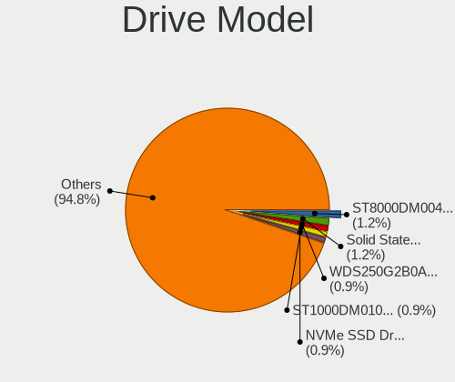
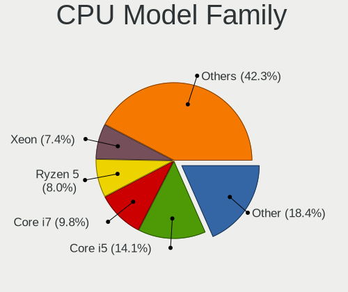
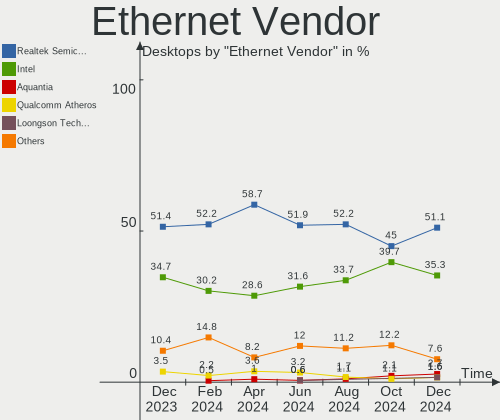

Debian Hardware Trends (Desktops)
---------------------------------

A project to identify most popular hardware characteristics and track their change
over time based on data collected by Debian users at https://Linux-Hardware.org.

Anyone can contribute to this report by the [hw-probe](https://github.com/linuxhw/hw-probe) tool:

    sudo -E hw-probe -all -upload

This report is for one last month. Overall report since the beginning of time: [TestCoverage](https://github.com/linuxhw/TestCoverage)

Period: Apr, 2022.

Contents
--------

* [ System ](#system)
  - [ OS                       ](#os)
  - [ OS Family                ](#os-family)
  - [ Kernel                   ](#kernel)
  - [ Kernel Family            ](#kernel-family)
  - [ Kernel Major Ver.        ](#kernel-major-ver)
  - [ Arch                     ](#arch)
  - [ DE                       ](#de)
  - [ Display Server           ](#display-server)
  - [ Display Manager          ](#display-manager)
  - [ OS Lang                  ](#os-lang)
  - [ Boot Mode                ](#boot-mode)
  - [ Filesystem               ](#filesystem)
  - [ Part. scheme             ](#part-scheme)
  - [ Dual Boot with Linux/BSD ](#dual-boot-with-linuxbsd)
  - [ Dual Boot (Win)          ](#dual-boot-win)

* [ Board ](#board)
  - [ Vendor                   ](#vendor)
  - [ Model                    ](#model)
  - [ Model Family             ](#model-family)
  - [ MFG Year                 ](#mfg-year)
  - [ Form Factor              ](#form-factor)
  - [ Secure Boot              ](#secure-boot)
  - [ Coreboot                 ](#coreboot)
  - [ RAM Size                 ](#ram-size)
  - [ RAM Used                 ](#ram-used)
  - [ Total Drives             ](#total-drives)
  - [ Has CD-ROM               ](#has-cd-rom)
  - [ Has Ethernet             ](#has-ethernet)
  - [ Has WiFi                 ](#has-wifi)
  - [ Has Bluetooth            ](#has-bluetooth)

* [ Location ](#location)
  - [ Country                  ](#country)
  - [ City                     ](#city)

* [ Drives ](#drives)
  - [ Drive Vendor             ](#drive-vendor)
  - [ Drive Model              ](#drive-model)
  - [ HDD Vendor               ](#hdd-vendor)
  - [ SSD Vendor               ](#ssd-vendor)
  - [ Drive Kind               ](#drive-kind)
  - [ Drive Connector          ](#drive-connector)
  - [ Drive Size               ](#drive-size)
  - [ Space Total              ](#space-total)
  - [ Space Used               ](#space-used)
  - [ Malfunc. Drives          ](#malfunc-drives)
  - [ Malfunc. Drive Vendor    ](#malfunc-drive-vendor)
  - [ Malfunc. HDD Vendor      ](#malfunc-hdd-vendor)
  - [ Malfunc. Drive Kind      ](#malfunc-drive-kind)
  - [ Failed Drives            ](#failed-drives)
  - [ Failed Drive Vendor      ](#failed-drive-vendor)
  - [ Drive Status             ](#drive-status)

* [ Storage controller ](#storage-controller)
  - [ Storage Vendor           ](#storage-vendor)
  - [ Storage Model            ](#storage-model)
  - [ Storage Kind             ](#storage-kind)

* [ Processor ](#processor)
  - [ CPU Vendor               ](#cpu-vendor)
  - [ CPU Model                ](#cpu-model)
  - [ CPU Model Family         ](#cpu-model-family)
  - [ CPU Cores                ](#cpu-cores)
  - [ CPU Sockets              ](#cpu-sockets)
  - [ CPU Threads              ](#cpu-threads)
  - [ CPU Op-Modes             ](#cpu-op-modes)
  - [ CPU Microcode            ](#cpu-microcode)
  - [ CPU Microarch            ](#cpu-microarch)

* [ Graphics ](#graphics)
  - [ GPU Vendor               ](#gpu-vendor)
  - [ GPU Model                ](#gpu-model)
  - [ GPU Combo                ](#gpu-combo)
  - [ GPU Driver               ](#gpu-driver)
  - [ GPU Memory               ](#gpu-memory)

* [ Monitor ](#monitor)
  - [ Monitor Vendor           ](#monitor-vendor)
  - [ Monitor Model            ](#monitor-model)
  - [ Monitor Resolution       ](#monitor-resolution)
  - [ Monitor Diagonal         ](#monitor-diagonal)
  - [ Monitor Width            ](#monitor-width)
  - [ Aspect Ratio             ](#aspect-ratio)
  - [ Monitor Area             ](#monitor-area)
  - [ Pixel Density            ](#pixel-density)
  - [ Multiple Monitors        ](#multiple-monitors)

* [ Network ](#network)
  - [ Net Controller Vendor    ](#net-controller-vendor)
  - [ Net Controller Model     ](#net-controller-model)
  - [ Wireless Vendor          ](#wireless-vendor)
  - [ Wireless Model           ](#wireless-model)
  - [ Ethernet Vendor          ](#ethernet-vendor)
  - [ Ethernet Model           ](#ethernet-model)
  - [ Net Controller Kind      ](#net-controller-kind)
  - [ Used Controller          ](#used-controller)
  - [ NICs                     ](#nics)
  - [ IPv6                     ](#ipv6)

* [ Bluetooth ](#bluetooth)
  - [ Bluetooth Vendor         ](#bluetooth-vendor)
  - [ Bluetooth Model          ](#bluetooth-model)

* [ Sound ](#sound)
  - [ Sound Vendor             ](#sound-vendor)
  - [ Sound Model              ](#sound-model)

* [ Memory ](#memory)
  - [ Memory Vendor            ](#memory-vendor)
  - [ Memory Model             ](#memory-model)
  - [ Memory Kind              ](#memory-kind)
  - [ Memory Form Factor       ](#memory-form-factor)
  - [ Memory Size              ](#memory-size)
  - [ Memory Speed             ](#memory-speed)

* [ Printers & scanners ](#printers--scanners)
  - [ Printer Vendor           ](#printer-vendor)
  - [ Printer Model            ](#printer-model)
  - [ Scanner Vendor           ](#scanner-vendor)
  - [ Scanner Model            ](#scanner-model)

* [ Camera ](#camera)
  - [ Camera Vendor            ](#camera-vendor)
  - [ Camera Model             ](#camera-model)

* [ Security ](#security)
  - [ Fingerprint Vendor       ](#fingerprint-vendor)
  - [ Fingerprint Model        ](#fingerprint-model)
  - [ Chipcard Vendor          ](#chipcard-vendor)
  - [ Chipcard Model           ](#chipcard-model)

* [ Unsupported ](#unsupported)
  - [ Unsupported Devices      ](#unsupported-devices)
  - [ Unsupported Device Types ](#unsupported-device-types)

System
------

OS
--

Installed operating systems

| Name              | Desktops | Percent |
|-------------------|----------|---------|
| Debian 11         | 123      | 80.39%  |
| Debian Testing    | 13       | 8.5%    |
| Debian 10         | 9        | 5.88%   |
| Debian Unstable   | 5        | 3.27%   |
| Debian 9          | 1        | 0.65%   |
| Debian 7          | 1        | 0.65%   |
| Debian 11-updates | 1        | 0.65%   |

OS Family
---------

OS without a version

| Name   | Desktops | Percent |
|--------|----------|---------|
| Debian | 153      | 100%    |

Kernel
------

Version of the Linux kernel

| Version                    | Desktops | Percent |
|----------------------------|----------|---------|
| 5.10.0-13-amd64            | 48       | 31.37%  |
| 5.10.0-7-amd64             | 30       | 19.61%  |
| 5.16.0-6-amd64             | 11       | 7.19%   |
| 5.13.19-6-pve              | 8        | 5.23%   |
| 5.10.0-12-amd64            | 7        | 4.58%   |
| 5.16.0-5-amd64             | 6        | 3.92%   |
| 5.16.0-0.bpo.4-amd64       | 6        | 3.92%   |
| 5.10.0-10-amd64            | 5        | 3.27%   |
| 5.15.19-2-pve              | 2        | 1.31%   |
| 5.10.0-13-686-pae          | 2        | 1.31%   |
| 5.4.174-2-pve              | 1        | 0.65%   |
| 5.17.2-xanmod1+amdnative   | 1        | 0.65%   |
| 5.17.0-3.2-liquorix-amd64  | 1        | 0.65%   |
| 5.17.0-2.3-liquorix-amd64  | 1        | 0.65%   |
| 5.16.5                     | 1        | 0.65%   |
| 5.16.0-18.1-liquorix-amd64 | 1        | 0.65%   |
| 5.16.0-1-amd64             | 1        | 0.65%   |
| 5.15.12-1-pve              | 1        | 0.65%   |
| 5.15.12                    | 1        | 0.65%   |
| 5.15.0-3mx-amd64           | 1        | 0.65%   |
| 5.15.0-2-amd64             | 1        | 0.65%   |
| 5.15.0-1mx-amd64           | 1        | 0.65%   |
| 5.15.0-0.bpo.3-amd64       | 1        | 0.65%   |
| 5.14.0-4mx-amd64           | 1        | 0.65%   |
| 5.13.19-2-pve              | 1        | 0.65%   |
| 5.10.109stock              | 1        | 0.65%   |
| 5.10.100-rt62-xanmod1      | 1        | 0.65%   |
| 5.10.0-9-amd64             | 1        | 0.65%   |
| 5.10.0-9-686-pae           | 1        | 0.65%   |
| 5.10.0-5mx-amd64           | 1        | 0.65%   |
| 5.10.0-0.bpo.9-amd64       | 1        | 0.65%   |
| 4.9.35-dyvi                | 1        | 0.65%   |
| 4.19.0-20-rt-amd64         | 1        | 0.65%   |
| 4.19.0-20-686-pae          | 1        | 0.65%   |
| 4.19.0-19-amd64            | 1        | 0.65%   |
| 4.19.0-18-686-pae          | 1        | 0.65%   |
| 4.19.0-10-amd64            | 1        | 0.65%   |
| 4.1.42-rivoreo-powerpc64   | 1        | 0.65%   |

Kernel Family
-------------

Linux kernel without a distro release

| Version  | Desktops | Percent |
|----------|----------|---------|
| 5.10.0   | 96       | 62.75%  |
| 5.16.0   | 25       | 16.34%  |
| 5.13.19  | 9        | 5.88%   |
| 4.19.0   | 5        | 3.27%   |
| 5.15.0   | 4        | 2.61%   |
| 5.17.0   | 2        | 1.31%   |
| 5.15.19  | 2        | 1.31%   |
| 5.15.12  | 2        | 1.31%   |
| 5.4.174  | 1        | 0.65%   |
| 5.17.2   | 1        | 0.65%   |
| 5.16.5   | 1        | 0.65%   |
| 5.14.0   | 1        | 0.65%   |
| 5.10.109 | 1        | 0.65%   |
| 5.10.100 | 1        | 0.65%   |
| 4.9.35   | 1        | 0.65%   |
| 4.1.42   | 1        | 0.65%   |

Kernel Major Ver.
-----------------

Linux kernel major version

| Version | Desktops | Percent |
|---------|----------|---------|
| 5.10    | 98       | 64.05%  |
| 5.16    | 26       | 16.99%  |
| 5.13    | 9        | 5.88%   |
| 5.15    | 8        | 5.23%   |
| 4.19    | 5        | 3.27%   |
| 5.17    | 3        | 1.96%   |
| 5.4     | 1        | 0.65%   |
| 5.14    | 1        | 0.65%   |
| 4.9     | 1        | 0.65%   |
| 4.1     | 1        | 0.65%   |

Arch
----

OS architecture (x86_64, i586, etc.)

| Name   | Desktops | Percent |
|--------|----------|---------|
| x86_64 | 147      | 96.08%  |
| i686   | 5        | 3.27%   |
| ppc64  | 1        | 0.65%   |

DE
--

Desktop Environment

| Name            | Desktops | Percent |
|-----------------|----------|---------|
| Unknown         | 66       | 43.14%  |
| GNOME           | 28       | 18.3%   |
| XFCE            | 20       | 13.07%  |
| KDE5            | 17       | 11.11%  |
| MATE            | 6        | 3.92%   |
| i3              | 3        | 1.96%   |
| Openbox         | 2        | 1.31%   |
| LXDE            | 2        | 1.31%   |
| GNOME Flashback | 2        | 1.31%   |
| Cinnamon        | 2        | 1.31%   |
| X-Cinnamon      | 1        | 0.65%   |
| sway            | 1        | 0.65%   |
| LXQt            | 1        | 0.65%   |
| KDE             | 1        | 0.65%   |
| Budgie          | 1        | 0.65%   |

Display Server
--------------

X11 or Wayland

| Name    | Desktops | Percent |
|---------|----------|---------|
| X11     | 62       | 40.52%  |
| Unknown | 46       | 30.07%  |
| Tty     | 23       | 15.03%  |
| Wayland | 22       | 14.38%  |

Display Manager
---------------

SDDM, LightDM, etc.

| Name    | Desktops | Percent |
|---------|----------|---------|
| Unknown | 90       | 58.82%  |
| LightDM | 23       | 15.03%  |
| GDM     | 16       | 10.46%  |
| SDDM    | 13       | 8.5%    |
| GDM3    | 9        | 5.88%   |
| SLiM    | 1        | 0.65%   |
| NODM    | 1        | 0.65%   |

OS Lang
-------

Language

| Lang       | Desktops | Percent |
|------------|----------|---------|
| en_US      | 55       | 35.95%  |
| ru_RU      | 32       | 20.92%  |
| en_GB      | 9        | 5.88%   |
| de_DE      | 8        | 5.23%   |
| Unknown    | 7        | 4.58%   |
| pt_BR      | 6        | 3.92%   |
| en_AU      | 4        | 2.61%   |
| it_IT      | 3        | 1.96%   |
| fr_FR      | 3        | 1.96%   |
| en_IE      | 3        | 1.96%   |
| zh_CN      | 2        | 1.31%   |
| es_ES      | 2        | 1.31%   |
| en_CA      | 2        | 1.31%   |
| ca_ES      | 2        | 1.31%   |
| C          | 2        | 1.31%   |
| pl_PL      | 1        | 0.65%   |
| nl_NL      | 1        | 0.65%   |
| es_VE      | 1        | 0.65%   |
| es_MX      | 1        | 0.65%   |
| es_CO      | 1        | 0.65%   |
| es_CL      | 1        | 0.65%   |
| es_AR      | 1        | 0.65%   |
| en_IN      | 1        | 0.65%   |
| en_HK      | 1        | 0.65%   |
| en_DE      | 1        | 0.65%   |
| de_AT.UTF8 | 1        | 0.65%   |
| de_AT      | 1        | 0.65%   |
| cs_CZ      | 1        | 0.65%   |

Boot Mode
---------

EFI or BIOS

| Mode | Desktops | Percent |
|------|----------|---------|
| BIOS | 103      | 67.32%  |
| EFI  | 50       | 32.68%  |

Filesystem
----------

Type of filesystem

| Type    | Desktops | Percent |
|---------|----------|---------|
| Ext4    | 107      | 69.93%  |
| Overlay | 38       | 24.84%  |
| Btrfs   | 3        | 1.96%   |
| Zfs     | 2        | 1.31%   |
| Xfs     | 2        | 1.31%   |
| Ext3    | 1        | 0.65%   |

Part. scheme
------------

Scheme of partitioning

| Type    | Desktops | Percent |
|---------|----------|---------|
| GPT     | 68       | 44.44%  |
| MBR     | 55       | 35.95%  |
| Unknown | 30       | 19.61%  |

Dual Boot with Linux/BSD
------------------------

Hosting more than one Linux/BSD

| Dual boot | Desktops | Percent |
|-----------|----------|---------|
| No        | 127      | 83.01%  |
| Yes       | 26       | 16.99%  |

Dual Boot (Win)
---------------

Hosting Linux and Windows

| Dual boot | Desktops | Percent |
|-----------|----------|---------|
| No        | 95       | 62.09%  |
| Yes       | 58       | 37.91%  |

Board
-----

Vendor
------

Motherboard manufacturer

| Name                | Desktops | Percent |
|---------------------|----------|---------|
| Gigabyte Technology | 35       | 22.88%  |
| ASUSTek Computer    | 28       | 18.3%   |
| MSI                 | 22       | 14.38%  |
| ASRock              | 13       | 8.5%    |
| Dell                | 10       | 6.54%   |
| Supermicro          | 7        | 4.58%   |
| Lenovo              | 7        | 4.58%   |
| Intel               | 5        | 3.27%   |
| ASRockRack          | 4        | 2.61%   |
| Hewlett-Packard     | 3        | 1.96%   |
| Acer                | 3        | 1.96%   |
| Unknown             | 3        | 1.96%   |
| Fujitsu             | 2        | 1.31%   |
| Wistron             | 1        | 0.65%   |
| Pegatron            | 1        | 0.65%   |
| PC Engines          | 1        | 0.65%   |
| Packard Bell        | 1        | 0.65%   |
| Medion              | 1        | 0.65%   |
| MACHINIST           | 1        | 0.65%   |
| J&W                 | 1        | 0.65%   |
| HARDKERNEL          | 1        | 0.65%   |
| Foxconn             | 1        | 0.65%   |
| eMachines           | 1        | 0.65%   |
| Biostar             | 1        | 0.65%   |

Model
-----

Motherboard model

| Name                                | Desktops | Percent |
|-------------------------------------|----------|---------|
| Gigabyte H410M S2H                  | 15       | 9.8%    |
| ASUS All Series                     | 3        | 1.96%   |
| Unknown                             | 3        | 1.96%   |
| Supermicro X7DWT                    | 2        | 1.31%   |
| Supermicro X5DP8                    | 2        | 1.31%   |
| MSI MS-7721                         | 2        | 1.31%   |
| Lenovo ThinkCentre M55p 8808D8U     | 2        | 1.31%   |
| Dell OptiPlex 790                   | 2        | 1.31%   |
| Dell OptiPlex 7010                  | 2        | 1.31%   |
| ASUS PRIME H510M-A                  | 2        | 1.31%   |
| ASRockRack B565D4-V1L               | 2        | 1.31%   |
| ASRock G31M-VS2                     | 2        | 1.31%   |
| ASRock A300M-STX                    | 2        | 1.31%   |
| Wistron ProLiant ML110 G5           | 1        | 0.65%   |
| Supermicro X9SRH-7F/7TF             | 1        | 0.65%   |
| Supermicro X7DB8                    | 1        | 0.65%   |
| Supermicro SYS-5019S-MR             | 1        | 0.65%   |
| Pegatron AY030AA-ABA CQ5320F        | 1        | 0.65%   |
| PC Engines apu4                     | 1        | 0.65%   |
| Packard Bell IMEDIA MC 9604         | 1        | 0.65%   |
| MSI p6620ch-m                       | 1        | 0.65%   |
| MSI MS-7D54                         | 1        | 0.65%   |
| MSI MS-7D20                         | 1        | 0.65%   |
| MSI MS-7C95                         | 1        | 0.65%   |
| MSI MS-7C84                         | 1        | 0.65%   |
| MSI MS-7C75                         | 1        | 0.65%   |
| MSI MS-7C37                         | 1        | 0.65%   |
| MSI MS-7C35                         | 1        | 0.65%   |
| MSI MS-7B86                         | 1        | 0.65%   |
| MSI MS-7B46                         | 1        | 0.65%   |
| MSI MS-7A40                         | 1        | 0.65%   |
| MSI MS-7996                         | 1        | 0.65%   |
| MSI MS-7890                         | 1        | 0.65%   |
| MSI MS-7887                         | 1        | 0.65%   |
| MSI MS-7851                         | 1        | 0.65%   |
| MSI MS-7817                         | 1        | 0.65%   |
| MSI MS-7751                         | 1        | 0.65%   |
| MSI MS-7698                         | 1        | 0.65%   |
| MSI MS-7693                         | 1        | 0.65%   |
| MSI MS-7592                         | 1        | 0.65%   |
| Medion MD34189/C731                 | 1        | 0.65%   |
| MACHINIST X99-RS9 V2.0              | 1        | 0.65%   |
| Lenovo ThinkCentre M900 10FLS46G00  | 1        | 0.65%   |
| Lenovo ThinkCentre M82 26972W5      | 1        | 0.65%   |
| Lenovo ThinkCentre M720t 10SQCTO1WW | 1        | 0.65%   |
| Lenovo ThinkCentre M600 10GAS0110B  | 1        | 0.65%   |
| Lenovo QiTianM7150                  | 1        | 0.65%   |
| J&W A24733                          | 1        | 0.65%   |
| Intel X99                           | 1        | 0.65%   |
| Intel X79                           | 1        | 0.65%   |
| Intel DP43TF AAE34878-401           | 1        | 0.65%   |
| Intel DN2820FYK H24582-201          | 1        | 0.65%   |
| Intel DH61BF AAG81311-101           | 1        | 0.65%   |
| HP Z840 Workstation                 | 1        | 0.65%   |
| HP ProLiant ML330 G6                | 1        | 0.65%   |
| HP ProDesk 600 G1 SFF               | 1        | 0.65%   |
| HARDKERNEL ODROID-H2                | 1        | 0.65%   |
| Gigabyte Z170X-Gaming 3             | 1        | 0.65%   |
| Gigabyte X570S I AORUS PRO AX       | 1        | 0.65%   |
| Gigabyte X570 AORUS ULTRA           | 1        | 0.65%   |

Model Family
------------

Motherboard model prefix

| Name                    | Desktops | Percent |
|-------------------------|----------|---------|
| Gigabyte H410M          | 15       | 9.8%    |
| ASUS PRIME              | 10       | 6.54%   |
| Lenovo ThinkCentre      | 6        | 3.92%   |
| Dell OptiPlex           | 6        | 3.92%   |
| Gigabyte B450M          | 3        | 1.96%   |
| ASUS TUF                | 3        | 1.96%   |
| ASUS All                | 3        | 1.96%   |
| Unknown                 | 3        | 1.96%   |
| Supermicro X7DWT        | 2        | 1.31%   |
| Supermicro X5DP8        | 2        | 1.31%   |
| MSI MS-7721             | 2        | 1.31%   |
| Gigabyte X570           | 2        | 1.31%   |
| Dell XPS                | 2        | 1.31%   |
| Dell Precision          | 2        | 1.31%   |
| ASRockRack B565D4-V1L   | 2        | 1.31%   |
| ASRock G31M-VS2         | 2        | 1.31%   |
| ASRock A300M-STX        | 2        | 1.31%   |
| Acer Aspire             | 2        | 1.31%   |
| Wistron ProLiant        | 1        | 0.65%   |
| Supermicro X9SRH-7F     | 1        | 0.65%   |
| Supermicro X7DB8        | 1        | 0.65%   |
| Supermicro SYS-5019S-MR | 1        | 0.65%   |
| Pegatron AY030AA-ABA    | 1        | 0.65%   |
| PC Engines apu4         | 1        | 0.65%   |
| Packard Bell IMEDIA     | 1        | 0.65%   |
| MSI p6620ch-m           | 1        | 0.65%   |
| MSI MS-7D54             | 1        | 0.65%   |
| MSI MS-7D20             | 1        | 0.65%   |
| MSI MS-7C95             | 1        | 0.65%   |
| MSI MS-7C84             | 1        | 0.65%   |
| MSI MS-7C75             | 1        | 0.65%   |
| MSI MS-7C37             | 1        | 0.65%   |
| MSI MS-7C35             | 1        | 0.65%   |
| MSI MS-7B86             | 1        | 0.65%   |
| MSI MS-7B46             | 1        | 0.65%   |
| MSI MS-7A40             | 1        | 0.65%   |
| MSI MS-7996             | 1        | 0.65%   |
| MSI MS-7890             | 1        | 0.65%   |
| MSI MS-7887             | 1        | 0.65%   |
| MSI MS-7851             | 1        | 0.65%   |
| MSI MS-7817             | 1        | 0.65%   |
| MSI MS-7751             | 1        | 0.65%   |
| MSI MS-7698             | 1        | 0.65%   |
| MSI MS-7693             | 1        | 0.65%   |
| MSI MS-7592             | 1        | 0.65%   |
| Medion MD34189          | 1        | 0.65%   |
| MACHINIST X99-RS9       | 1        | 0.65%   |
| Lenovo QiTianM7150      | 1        | 0.65%   |
| J&W A24733              | 1        | 0.65%   |
| Intel X99               | 1        | 0.65%   |
| Intel X79               | 1        | 0.65%   |
| Intel DP43TF            | 1        | 0.65%   |
| Intel DN2820FYK         | 1        | 0.65%   |
| Intel DH61BF            | 1        | 0.65%   |
| HP Z840                 | 1        | 0.65%   |
| HP ProLiant             | 1        | 0.65%   |
| HP ProDesk              | 1        | 0.65%   |
| HARDKERNEL ODROID-H2    | 1        | 0.65%   |
| Gigabyte Z170X-Gaming   | 1        | 0.65%   |
| Gigabyte X570S          | 1        | 0.65%   |

MFG Year
--------

Motherboard manufacture year

| Year    | Desktops | Percent |
|---------|----------|---------|
| 2020    | 28       | 18.3%   |
| 2011    | 14       | 9.15%   |
| 2021    | 12       | 7.84%   |
| 2019    | 12       | 7.84%   |
| 2013    | 12       | 7.84%   |
| 2018    | 11       | 7.19%   |
| 2017    | 10       | 6.54%   |
| 2015    | 9        | 5.88%   |
| 2008    | 9        | 5.88%   |
| 2012    | 7        | 4.58%   |
| 2014    | 6        | 3.92%   |
| 2010    | 5        | 3.27%   |
| 2009    | 5        | 3.27%   |
| 2022    | 4        | 2.61%   |
| 2007    | 3        | 1.96%   |
| 2016    | 2        | 1.31%   |
| 2003    | 2        | 1.31%   |
| 2006    | 1        | 0.65%   |
| Unknown | 1        | 0.65%   |

Form Factor
-----------

Physical design of the computer

| Name    | Desktops | Percent |
|---------|----------|---------|
| Desktop | 153      | 100%    |

Secure Boot
-----------

Enabled or disabled

| State    | Desktops | Percent |
|----------|----------|---------|
| Disabled | 153      | 100%    |

Coreboot
--------

Have coreboot on board

| Used | Desktops | Percent |
|------|----------|---------|
| No   | 152      | 99.35%  |
| Yes  | 1        | 0.65%   |

RAM Size
--------

Total RAM memory

| Size in GB  | Desktops | Percent |
|-------------|----------|---------|
| 16.01-24.0  | 38       | 24.84%  |
| 32.01-64.0  | 24       | 15.69%  |
| 8.01-16.0   | 24       | 15.69%  |
| 3.01-4.0    | 19       | 12.42%  |
| 4.01-8.0    | 17       | 11.11%  |
| 64.01-256.0 | 17       | 11.11%  |
| 2.01-3.0    | 6        | 3.92%   |
| 1.01-2.0    | 4        | 2.61%   |
| 24.01-32.0  | 3        | 1.96%   |
| Unknown     | 1        | 0.65%   |

RAM Used
--------

Used RAM memory

| Used GB    | Desktops | Percent |
|------------|----------|---------|
| 0.51-1.0   | 40       | 26.14%  |
| 1.01-2.0   | 30       | 19.61%  |
| 4.01-8.0   | 23       | 15.03%  |
| 2.01-3.0   | 18       | 11.76%  |
| 3.01-4.0   | 12       | 7.84%   |
| 8.01-16.0  | 11       | 7.19%   |
| 16.01-24.0 | 7        | 4.58%   |
| 24.01-32.0 | 4        | 2.61%   |
| 0.01-0.5   | 4        | 2.61%   |
| 32.01-64.0 | 3        | 1.96%   |
| Unknown    | 1        | 0.65%   |

Total Drives
------------

Number of drives on board

| Drives | Desktops | Percent |
|--------|----------|---------|
| 1      | 68       | 44.44%  |
| 2      | 34       | 22.22%  |
| 3      | 17       | 11.11%  |
| 4      | 15       | 9.8%    |
| 5      | 8        | 5.23%   |
| 6      | 6        | 3.92%   |
| 8      | 2        | 1.31%   |
| 7      | 2        | 1.31%   |
| 0      | 1        | 0.65%   |

Has CD-ROM
----------

Has CD-ROM on board

| Presented | Desktops | Percent |
|-----------|----------|---------|
| No        | 101      | 66.01%  |
| Yes       | 52       | 33.99%  |

Has Ethernet
------------

Has Ethernet on board

| Presented | Desktops | Percent |
|-----------|----------|---------|
| Yes       | 153      | 100%    |

Has WiFi
--------

Has WiFi module

| Presented | Desktops | Percent |
|-----------|----------|---------|
| No        | 116      | 75.82%  |
| Yes       | 37       | 24.18%  |

Has Bluetooth
-------------

Has Bluetooth module

| Presented | Desktops | Percent |
|-----------|----------|---------|
| No        | 116      | 75.82%  |
| Yes       | 37       | 24.18%  |

Location
--------

Country
-------

Geographic location (country)

| Country     | Desktops | Percent |
|-------------|----------|---------|
| USA         | 33       | 21.57%  |
| Russia      | 33       | 21.57%  |
| Germany     | 16       | 10.46%  |
| UK          | 8        | 5.23%   |
| Brazil      | 8        | 5.23%   |
| Spain       | 6        | 3.92%   |
| Australia   | 5        | 3.27%   |
| Italy       | 4        | 2.61%   |
| France      | 4        | 2.61%   |
| China       | 3        | 1.96%   |
| Austria     | 3        | 1.96%   |
| Switzerland | 2        | 1.31%   |
| Slovakia    | 2        | 1.31%   |
| Poland      | 2        | 1.31%   |
| Norway      | 2        | 1.31%   |
| Greece      | 2        | 1.31%   |
| Czechia     | 2        | 1.31%   |
| Chile       | 2        | 1.31%   |
| Canada      | 2        | 1.31%   |
| Venezuela   | 1        | 0.65%   |
| Tunisia     | 1        | 0.65%   |
| Sweden      | 1        | 0.65%   |
| Peru        | 1        | 0.65%   |
| Netherlands | 1        | 0.65%   |
| Mexico      | 1        | 0.65%   |
| Ireland     | 1        | 0.65%   |
| India       | 1        | 0.65%   |
| Hong Kong   | 1        | 0.65%   |
| Cyprus      | 1        | 0.65%   |
| Colombia    | 1        | 0.65%   |
| Bulgaria    | 1        | 0.65%   |
| Argentina   | 1        | 0.65%   |
| Albania     | 1        | 0.65%   |

City
----

Geographic location (city)

| City                 | Desktops | Percent |
|----------------------|----------|---------|
| Voronezh             | 30       | 19.61%  |
| Bangor               | 7        | 4.58%   |
| Chicago              | 3        | 1.96%   |
| Wettringen           | 2        | 1.31%   |
| Sydney               | 2        | 1.31%   |
| Rio de Janeiro       | 2        | 1.31%   |
| Prague               | 2        | 1.31%   |
| Milan                | 2        | 1.31%   |
| London               | 2        | 1.31%   |
| Jundiaí             | 2        | 1.31%   |
| Denton               | 2        | 1.31%   |
| Chemnitz             | 2        | 1.31%   |
| Central              | 2        | 1.31%   |
| Brasília            | 2        | 1.31%   |
| Bonn                 | 2        | 1.31%   |
| Barcelona            | 2        | 1.31%   |
| Zurich               | 1        | 0.65%   |
| Xiamen               | 1        | 0.65%   |
| Worthing             | 1        | 0.65%   |
| Winter Park          | 1        | 0.65%   |
| Vienna               | 1        | 0.65%   |
| Torquay              | 1        | 0.65%   |
| Tivoli               | 1        | 0.65%   |
| Tirana               | 1        | 0.65%   |
| Thorens-Glieres      | 1        | 0.65%   |
| The Hague            | 1        | 0.65%   |
| St Petersburg        | 1        | 0.65%   |
| Sopot                | 1        | 0.65%   |
| Skjetten             | 1        | 0.65%   |
| Simi Valley          | 1        | 0.65%   |
| Sheerness            | 1        | 0.65%   |
| Shahekou             | 1        | 0.65%   |
| Seville              | 1        | 0.65%   |
| Sao Paulo            | 1        | 0.65%   |
| San Juan             | 1        | 0.65%   |
| Salt Lake City       | 1        | 0.65%   |
| Rome                 | 1        | 0.65%   |
| Ripollet             | 1        | 0.65%   |
| Regensdorf           | 1        | 0.65%   |
| Portland             | 1        | 0.65%   |
| Piraeus              | 1        | 0.65%   |
| Peterborough         | 1        | 0.65%   |
| Paris                | 1        | 0.65%   |
| Pabianice            | 1        | 0.65%   |
| Osternienburger Land | 1        | 0.65%   |
| Orlando              | 1        | 0.65%   |
| Oklahoma City        | 1        | 0.65%   |
| Nunoa                | 1        | 0.65%   |
| Nicosia              | 1        | 0.65%   |
| New Orleans          | 1        | 0.65%   |
| New Bedford          | 1        | 0.65%   |
| Nelson               | 1        | 0.65%   |
| Moscow               | 1        | 0.65%   |
| Molde                | 1        | 0.65%   |
| Mereville            | 1        | 0.65%   |
| Melbourne            | 1        | 0.65%   |
| Medford              | 1        | 0.65%   |
| Medellín            | 1        | 0.65%   |
| Malmo                | 1        | 0.65%   |
| Madrid               | 1        | 0.65%   |

Drives
------

Drive Vendor
------------

Hard drive vendors

| Vendor              | Desktops | Drives | Percent |
|---------------------|----------|--------|---------|
| Seagate             | 52       | 81     | 19.55%  |
| WDC                 | 46       | 70     | 17.29%  |
| Samsung Electronics | 34       | 53     | 12.78%  |
| Kingston            | 30       | 31     | 11.28%  |
| Toshiba             | 17       | 19     | 6.39%   |
| Crucial             | 16       | 17     | 6.02%   |
| Sandisk             | 12       | 12     | 4.51%   |
| A-DATA Technology   | 7        | 7      | 2.63%   |
| Hitachi             | 6        | 6      | 2.26%   |
| China               | 5        | 5      | 1.88%   |
| Intel               | 4        | 5      | 1.5%    |
| Corsair             | 4        | 6      | 1.5%    |
| PNY                 | 3        | 4      | 1.13%   |
| HGST                | 3        | 5      | 1.13%   |
| Phison              | 2        | 2      | 0.75%   |
| Patriot             | 2        | 2      | 0.75%   |
| Micron Technology   | 2        | 2      | 0.75%   |
| XPG                 | 1        | 1      | 0.38%   |
| Verbatim            | 1        | 1      | 0.38%   |
| Unknown             | 1        | 2      | 0.38%   |
| TEXTORM             | 1        | 1      | 0.38%   |
| Team                | 1        | 1      | 0.38%   |
| Silicon Motion      | 1        | 1      | 0.38%   |
| Realtek             | 1        | 1      | 0.38%   |
| Phison Electronics  | 1        | 1      | 0.38%   |
| Pear 2TB            | 1        | 1      | 0.38%   |
| MAXTOR              | 1        | 1      | 0.38%   |
| MATSHITA            | 1        | 1      | 0.38%   |
| INDMEM              | 1        | 1      | 0.38%   |
| IBM H0              | 1        | 1      | 0.38%   |
| Hoodisk             | 1        | 1      | 0.38%   |
| Hewlett-Packard     | 1        | 1      | 0.38%   |
| GOODRAM             | 1        | 2      | 0.38%   |
| Gigabyte Technology | 1        | 1      | 0.38%   |
| FORESEE             | 1        | 1      | 0.38%   |
| faspeed             | 1        | 1      | 0.38%   |
| ASMedia             | 1        | 1      | 0.38%   |
| 3ware               | 1        | 4      | 0.38%   |

Drive Model
-----------

Hard drive models

| Model                            | Desktops | Percent |
|----------------------------------|----------|---------|
| Kingston SA400S37240G 240GB SSD  | 20       | 6.21%   |
| Samsung SSD 970 EVO Plus 500GB   | 6        | 1.86%   |
| Seagate ST500DM002-1BD142 500GB  | 5        | 1.55%   |
| Crucial CT240BX500SSD1 240GB     | 5        | 1.55%   |
| Toshiba DT01ACA050 500GB         | 4        | 1.24%   |
| WDC WDS100T2B0A-00SM50 1TB SSD   | 3        | 0.93%   |
| WDC WD5000AAKX-08U6AA0 500GB     | 3        | 0.93%   |
| Toshiba DT01ACA100 1TB           | 3        | 0.93%   |
| Seagate ST4000DM004-2CV104 4TB   | 3        | 0.93%   |
| Seagate ST3500418AS 500GB        | 3        | 0.93%   |
| Seagate ST31500341AS 1TB         | 3        | 0.93%   |
| Seagate ST1000DM010-2EP102 1TB   | 3        | 0.93%   |
| Samsung SSD 860 EVO 500GB        | 3        | 0.93%   |
| Samsung SSD 860 EVO 1TB          | 3        | 0.93%   |
| Samsung NVMe SSD Drive 500GB     | 3        | 0.93%   |
| WDC WDS500G2B0A-00SM50 500GB SSD | 2        | 0.62%   |
| WDC WD10EZEX-00BN5A0 1TB         | 2        | 0.62%   |
| Seagate ST3500413AS 500GB        | 2        | 0.62%   |
| Seagate ST3250410AS 250GB        | 2        | 0.62%   |
| Seagate ST1000DM003-1SB102 1TB   | 2        | 0.62%   |
| Seagate ST1000DM003-1ER162 1TB   | 2        | 0.62%   |
| Seagate ST1000DM003-1CH162 1TB   | 2        | 0.62%   |
| Seagate Expansion Desk 4TB       | 2        | 0.62%   |
| Sandisk NVMe SSD Drive 1TB       | 2        | 0.62%   |
| Samsung SSD 980 PRO 1TB          | 2        | 0.62%   |
| Samsung SSD 970 EVO Plus 1TB     | 2        | 0.62%   |
| Samsung SSD 850 PRO 256GB        | 2        | 0.62%   |
| Samsung SSD 850 EVO 500GB        | 2        | 0.62%   |
| Kingston SV300S37A120G 120GB SSD | 2        | 0.62%   |
| Kingston SA400S37480G 480GB SSD  | 2        | 0.62%   |
| Hitachi HDS721050CLA362 500GB    | 2        | 0.62%   |
| Crucial CT500MX500SSD1 500GB     | 2        | 0.62%   |
| China SATA SSD 32GB              | 2        | 0.62%   |
| A-DATA SU650 120GB SSD           | 2        | 0.62%   |
| XPG SPECTRIX S40G 4TB            | 1        | 0.31%   |
| WDC WDS500G2B0C-00PXH0 500GB     | 1        | 0.31%   |
| WDC WDS500G2B0B-00YS70 500GB SSD | 1        | 0.31%   |
| WDC WDS500G1X0E-00AFY0 500GB     | 1        | 0.31%   |
| WDC WDS240G2G0A-00JH30 240GB SSD | 1        | 0.31%   |
| WDC WDS100T3X0C-00SJG0 1TB       | 1        | 0.31%   |
| WDC WDS100T2B0C-00PXH0 1TB       | 1        | 0.31%   |
| WDC WD80EMAZ-00WJTA0 8TB         | 1        | 0.31%   |
| WDC WD80EFBX-68AZZN0 8TB         | 1        | 0.31%   |
| WDC WD7500BPKT-22PK4T0 752GB     | 1        | 0.31%   |
| WDC WD6402AAEX-00Y9A0 640GB      | 1        | 0.31%   |
| WDC WD6002FFWX-68TZ4N0 6TB       | 1        | 0.31%   |
| WDC WD50EZRX-00MVLB1 5TB         | 1        | 0.31%   |
| WDC WD5003AZEX-00K1GA0 500GB     | 1        | 0.31%   |
| WDC WD5002ABYS-01B1B0 500GB      | 1        | 0.31%   |
| WDC WD5000AZLX-22JKKA0 500GB     | 1        | 0.31%   |
| WDC WD5000AAKX-00U6AA0 500GB     | 1        | 0.31%   |
| WDC WD5000AAKX-0 500GB           | 1        | 0.31%   |
| WDC WD5000AAKS-65V0A0 500GB      | 1        | 0.31%   |
| WDC WD5000AAKS-22A7B0 500GB      | 1        | 0.31%   |
| WDC WD40EZRX-00SPEB0 4TB         | 1        | 0.31%   |
| WDC WD40EFRX-68N32N0 4TB         | 1        | 0.31%   |
| WDC WD3200AAJS-65M0A0 320GB      | 1        | 0.31%   |
| WDC WD30EFRX-68EUZN0 3TB         | 1        | 0.31%   |
| WDC WD2500JD-00HBC0 250GB        | 1        | 0.31%   |
| WDC WD2500AAJS-75M0A0 250GB      | 1        | 0.31%   |

HDD Vendor
----------

Hard disk drive vendors

| Vendor              | Desktops | Drives | Percent |
|---------------------|----------|--------|---------|
| Seagate             | 50       | 78     | 41.67%  |
| WDC                 | 37       | 58     | 30.83%  |
| Toshiba             | 16       | 18     | 13.33%  |
| Hitachi             | 6        | 6      | 5%      |
| Samsung Electronics | 4        | 5      | 3.33%   |
| HGST                | 3        | 5      | 2.5%    |
| Pear 2TB            | 1        | 1      | 0.83%   |
| MAXTOR              | 1        | 1      | 0.83%   |
| IBM H0              | 1        | 1      | 0.83%   |
| 3ware               | 1        | 4      | 0.83%   |

SSD Vendor
----------

Solid state drive vendors

| Vendor              | Desktops | Drives | Percent |
|---------------------|----------|--------|---------|
| Kingston            | 30       | 31     | 26.55%  |
| Samsung Electronics | 20       | 25     | 17.7%   |
| Crucial             | 14       | 15     | 12.39%  |
| SanDisk             | 9        | 9      | 7.96%   |
| WDC                 | 7        | 7      | 6.19%   |
| A-DATA Technology   | 7        | 7      | 6.19%   |
| China               | 5        | 5      | 4.42%   |
| PNY                 | 3        | 4      | 2.65%   |
| Patriot             | 2        | 2      | 1.77%   |
| Intel               | 2        | 3      | 1.77%   |
| Verbatim            | 1        | 1      | 0.88%   |
| Toshiba             | 1        | 1      | 0.88%   |
| TEXTORM             | 1        | 1      | 0.88%   |
| Team                | 1        | 1      | 0.88%   |
| Seagate             | 1        | 1      | 0.88%   |
| Micron Technology   | 1        | 1      | 0.88%   |
| INDMEM              | 1        | 1      | 0.88%   |
| Hoodisk             | 1        | 1      | 0.88%   |
| Hewlett-Packard     | 1        | 1      | 0.88%   |
| GOODRAM             | 1        | 2      | 0.88%   |
| FORESEE             | 1        | 1      | 0.88%   |
| faspeed             | 1        | 1      | 0.88%   |
| CORSAIR             | 1        | 1      | 0.88%   |
| ASMedia             | 1        | 1      | 0.88%   |

Drive Kind
----------

HDD or SSD

| Kind    | Desktops | Drives | Percent |
|---------|----------|--------|---------|
| SSD     | 94       | 123    | 41.41%  |
| HDD     | 91       | 177    | 40.09%  |
| NVMe    | 40       | 50     | 17.62%  |
| Unknown | 2        | 3      | 0.88%   |

Drive Connector
---------------

SATA, SAS, NVMe, etc.

| Type | Desktops | Drives | Percent |
|------|----------|--------|---------|
| SATA | 140      | 277    | 73.68%  |
| NVMe | 39       | 49     | 20.53%  |
| SAS  | 11       | 27     | 5.79%   |

Drive Size
----------

Size of hard drive

| Size in TB | Desktops | Drives | Percent |
|------------|----------|--------|---------|
| 0.01-0.5   | 114      | 163    | 53.77%  |
| 0.51-1.0   | 54       | 73     | 25.47%  |
| 1.01-2.0   | 15       | 21     | 7.08%   |
| 3.01-4.0   | 13       | 17     | 6.13%   |
| 4.01-10.0  | 10       | 15     | 4.72%   |
| 2.01-3.0   | 3        | 5      | 1.42%   |
| 10.01-20.0 | 3        | 6      | 1.42%   |

Space Total
-----------

Amount of disk space available on the file system

| Size in GB     | Desktops | Percent |
|----------------|----------|---------|
| Unknown        | 41       | 26.8%   |
| More than 3000 | 21       | 13.73%  |
| 101-250        | 21       | 13.73%  |
| 251-500        | 17       | 11.11%  |
| 501-1000       | 15       | 9.8%    |
| 1001-2000      | 14       | 9.15%   |
| 2001-3000      | 8        | 5.23%   |
| 51-100         | 8        | 5.23%   |
| 1-20           | 5        | 3.27%   |
| 21-50          | 3        | 1.96%   |

Space Used
----------

Amount of used disk space

| Used GB        | Desktops | Percent |
|----------------|----------|---------|
| Unknown        | 41       | 26.8%   |
| 1-20           | 31       | 20.26%  |
| 251-500        | 15       | 9.8%    |
| 501-1000       | 15       | 9.8%    |
| 101-250        | 14       | 9.15%   |
| More than 3000 | 11       | 7.19%   |
| 1001-2000      | 9        | 5.88%   |
| 51-100         | 9        | 5.88%   |
| 21-50          | 7        | 4.58%   |
| 2001-3000      | 1        | 0.65%   |

Malfunc. Drives
---------------

Drive models with a malfunction

| Model                                          | Desktops | Drives | Percent |
|------------------------------------------------|----------|--------|---------|
| Seagate ST31500341AS 1TB                       | 2        | 2      | 5.88%   |
| WDC WDS100T2B0A-00SM50 1TB SSD                 | 1        | 1      | 2.94%   |
| WDC WD7500BPKT-22PK4T0 752GB                   | 1        | 1      | 2.94%   |
| WDC WD5000AAKX-08U6AA0 500GB                   | 1        | 1      | 2.94%   |
| WDC WD5000AAKS-65V0A0 500GB                    | 1        | 1      | 2.94%   |
| WDC WD2500JD-00HBC0 250GB                      | 1        | 1      | 2.94%   |
| WDC WD2500AAJS-75M0A0 250GB                    | 1        | 1      | 2.94%   |
| WDC WD20EARS-00J2GB0 2TB                       | 1        | 1      | 2.94%   |
| WDC WD2002FAEX-007BA0 2TB                      | 1        | 1      | 2.94%   |
| WDC WD10SPCX-60KHST0 1TB                       | 1        | 1      | 2.94%   |
| WDC WD10EARS-00Y5B1 1TB                        | 1        | 1      | 2.94%   |
| WDC WD1003FZEX-00MK2A0 1TB                     | 1        | 1      | 2.94%   |
| Toshiba DT01ACA050 500GB                       | 1        | 1      | 2.94%   |
| Seagate ST6000VN0033-2EE110 6TB                | 1        | 2      | 2.94%   |
| Seagate ST500LT012-1DG142 500GB                | 1        | 1      | 2.94%   |
| Seagate ST380815AS 80GB                        | 1        | 1      | 2.94%   |
| Seagate ST3808110AS 41N3267 LEN 80GB           | 1        | 1      | 2.94%   |
| Seagate ST3750528AS 752GB                      | 1        | 1      | 2.94%   |
| Seagate ST3500418AS 500GB                      | 1        | 1      | 2.94%   |
| Seagate ST3500413AS 500GB                      | 1        | 1      | 2.94%   |
| Seagate ST3250410AS 250GB                      | 1        | 1      | 2.94%   |
| Seagate ST3250318AS 250GB                      | 1        | 1      | 2.94%   |
| Seagate ST3250312AS 250GB                      | 1        | 1      | 2.94%   |
| Seagate ST3120827AS 120GB                      | 1        | 1      | 2.94%   |
| Seagate ST31000524NS 1TB                       | 1        | 1      | 2.94%   |
| Seagate ST2000DM001-1CH164 2TB                 | 1        | 1      | 2.94%   |
| Seagate ST2000DL003-9VT166 2TB                 | 1        | 1      | 2.94%   |
| Samsung Electronics HD203WI 2TB                | 1        | 1      | 2.94%   |
| Samsung Electronics HD103UJ 1TB                | 1        | 2      | 2.94%   |
| Micron Technology 5100_MTFDDAK240TCC 240GB SSD | 1        | 1      | 2.94%   |
| MAXTOR STM3250310AS 250GB                      | 1        | 1      | 2.94%   |
| Hitachi HDS5C3020ALA632 2TB                    | 1        | 1      | 2.94%   |
| A-DATA Technology SU800NS38 256GB SSD          | 1        | 1      | 2.94%   |

Malfunc. Drive Vendor
---------------------

Vendors of faulty drives

| Vendor              | Desktops | Drives | Percent |
|---------------------|----------|--------|---------|
| Seagate             | 14       | 17     | 45.16%  |
| WDC                 | 10       | 11     | 32.26%  |
| Samsung Electronics | 2        | 3      | 6.45%   |
| Toshiba             | 1        | 1      | 3.23%   |
| Micron Technology   | 1        | 1      | 3.23%   |
| MAXTOR              | 1        | 1      | 3.23%   |
| Hitachi             | 1        | 1      | 3.23%   |
| A-DATA Technology   | 1        | 1      | 3.23%   |

Malfunc. HDD Vendor
-------------------

Vendors of faulty HDD drives

| Vendor              | Desktops | Drives | Percent |
|---------------------|----------|--------|---------|
| Seagate             | 14       | 17     | 50%     |
| WDC                 | 9        | 10     | 32.14%  |
| Samsung Electronics | 2        | 3      | 7.14%   |
| Toshiba             | 1        | 1      | 3.57%   |
| MAXTOR              | 1        | 1      | 3.57%   |
| Hitachi             | 1        | 1      | 3.57%   |

Malfunc. Drive Kind
-------------------

Kinds of faulty drives

| Kind | Desktops | Drives | Percent |
|------|----------|--------|---------|
| HDD  | 23       | 33     | 88.46%  |
| SSD  | 3        | 3      | 11.54%  |

Failed Drives
-------------

Failed drive models

Zero info for selected period =(

Failed Drive Vendor
-------------------

Failed drive vendors

Zero info for selected period =(

Drive Status
------------

Number of failed and malfunc. drives

| Status   | Desktops | Drives | Percent |
|----------|----------|--------|---------|
| Works    | 116      | 223    | 64.8%   |
| Detected | 37       | 94     | 20.67%  |
| Malfunc  | 26       | 36     | 14.53%  |

Storage controller
------------------

Storage Vendor
--------------

Storage controller vendors

| Vendor                    | Desktops | Percent |
|---------------------------|----------|---------|
| Intel                     | 109      | 49.55%  |
| AMD                       | 42       | 19.09%  |
| Samsung Electronics       | 19       | 8.64%   |
| Sandisk                   | 8        | 3.64%   |
| Phison Electronics        | 7        | 3.18%   |
| ASMedia Technology        | 6        | 2.73%   |
| JMicron Technology        | 5        | 2.27%   |
| Marvell Technology Group  | 3        | 1.36%   |
| Broadcom / LSI            | 3        | 1.36%   |
| Silicon Image             | 2        | 0.91%   |
| Nvidia                    | 2        | 0.91%   |
| Micron/Crucial Technology | 2        | 0.91%   |
| 3ware                     | 2        | 0.91%   |
| VIA Technologies          | 1        | 0.45%   |
| Silicon Motion            | 1        | 0.45%   |
| Seagate Technology        | 1        | 0.45%   |
| Realtek Semiconductor     | 1        | 0.45%   |
| Mylex                     | 1        | 0.45%   |
| Micron Technology         | 1        | 0.45%   |
| LSI Logic / Symbios Logic | 1        | 0.45%   |
| Hewlett-Packard           | 1        | 0.45%   |
| Chelsio Communications    | 1        | 0.45%   |
| Adaptec                   | 1        | 0.45%   |

Storage Model
-------------

Storage controller models

| Model                                                                                   | Desktops | Percent |
|-----------------------------------------------------------------------------------------|----------|---------|
| AMD FCH SATA Controller [AHCI mode]                                                     | 27       | 10.27%  |
| Intel 400 Series Chipset Family SATA AHCI Controller                                    | 15       | 5.7%    |
| Samsung NVMe SSD Controller SM981/PM981/PM983                                           | 14       | 5.32%   |
| Intel 8 Series/C220 Series Chipset Family 6-port SATA Controller 1 [AHCI mode]          | 10       | 3.8%    |
| Intel NM10/ICH7 Family SATA Controller [IDE mode]                                       | 9        | 3.42%   |
| Intel 82801G (ICH7 Family) IDE Controller                                               | 8        | 3.04%   |
| Intel 6 Series/C200 Series Chipset Family 6 port Desktop SATA AHCI Controller           | 8        | 3.04%   |
| Intel 500 Series Chipset Family SATA AHCI Controller                                    | 8        | 3.04%   |
| Intel Q170/Q150/B150/H170/H110/Z170/CM236 Chipset SATA Controller [AHCI Mode]           | 7        | 2.66%   |
| AMD 500 Series Chipset SATA Controller                                                  | 7        | 2.66%   |
| AMD 400 Series Chipset SATA Controller                                                  | 7        | 2.66%   |
| Intel 200 Series PCH SATA controller [AHCI mode]                                        | 6        | 2.28%   |
| ASMedia ASM1062 Serial ATA Controller                                                   | 6        | 2.28%   |
| Intel 9 Series Chipset Family SATA Controller [AHCI Mode]                               | 5        | 1.9%    |
| Intel 7 Series/C210 Series Chipset Family 6-port SATA Controller [AHCI mode]            | 5        | 1.9%    |
| AMD SB7x0/SB8x0/SB9x0 IDE Controller                                                    | 5        | 1.9%    |
| Samsung NVMe SSD Controller PM9A1/PM9A3/980PRO                                          | 4        | 1.52%   |
| AMD SB7x0/SB8x0/SB9x0 SATA Controller [IDE mode]                                        | 4        | 1.52%   |
| Sandisk WD Blue SN550 NVMe SSD                                                          | 3        | 1.14%   |
| Phison E12 NVMe Controller                                                              | 3        | 1.14%   |
| Intel Cannon Lake PCH SATA AHCI Controller                                              | 3        | 1.14%   |
| Intel C610/X99 series chipset sSATA Controller [AHCI mode]                              | 3        | 1.14%   |
| Intel C610/X99 series chipset 6-Port SATA Controller [AHCI mode]                        | 3        | 1.14%   |
| Intel C600/X79 series chipset 6-Port SATA AHCI Controller                               | 3        | 1.14%   |
| Intel 631xESB/632xESB/3100 Chipset SATA IDE Controller                                  | 3        | 1.14%   |
| AMD FCH SATA Controller D                                                               | 3        | 1.14%   |
| Sandisk WD Black SN750 / PC SN730 NVMe SSD                                              | 2        | 0.76%   |
| Samsung NVMe SSD Controller 980                                                         | 2        | 0.76%   |
| Phison E16 PCIe4 NVMe Controller                                                        | 2        | 0.76%   |
| Nvidia MCP61 SATA Controller                                                            | 2        | 0.76%   |
| JMicron JMB368 IDE controller                                                           | 2        | 0.76%   |
| Intel SATA Controller [RAID mode]                                                       | 2        | 0.76%   |
| Intel Atom/Celeron/Pentium Processor x5-E8000/J3xxx/N3xxx Series SATA Controller        | 2        | 0.76%   |
| Intel Atom Processor E3800 Series SATA AHCI Controller                                  | 2        | 0.76%   |
| Intel 82Q963/Q965 PT IDER Controller                                                    | 2        | 0.76%   |
| Intel 82801JI (ICH10 Family) SATA AHCI Controller                                       | 2        | 0.76%   |
| Intel 82801JI (ICH10 Family) 4 port SATA IDE Controller #1                              | 2        | 0.76%   |
| Intel 82801JI (ICH10 Family) 2 port SATA IDE Controller #2                              | 2        | 0.76%   |
| Intel 82801HR/HO/HH (ICH8R/DO/DH) 6 port SATA Controller [AHCI mode]                    | 2        | 0.76%   |
| Intel 82801CA Ultra ATA Storage Controller                                              | 2        | 0.76%   |
| Intel 6 Series/C200 Series Chipset Family Desktop SATA Controller (IDE mode, ports 4-5) | 2        | 0.76%   |
| Intel 6 Series/C200 Series Chipset Family Desktop SATA Controller (IDE mode, ports 0-3) | 2        | 0.76%   |
| Broadcom / LSI SAS2308 PCI-Express Fusion-MPT SAS-2                                     | 2        | 0.76%   |
| AMD SB7x0/SB8x0/SB9x0 SATA Controller [AHCI mode]                                       | 2        | 0.76%   |
| 3ware 7xxx/8xxx-series PATA/SATA-RAID                                                   | 2        | 0.76%   |
| VIA VT82C586A/B/VT82C686/A/B/VT823x/A/C PIPC Bus Master IDE                             | 1        | 0.38%   |
| VIA VT8237A SATA 2-Port Controller                                                      | 1        | 0.38%   |
| Silicon Motion SM2263EN/SM2263XT SSD Controller                                         | 1        | 0.38%   |
| Silicon Image SiI 3124 PCI-X Serial ATA Controller                                      | 1        | 0.38%   |
| Silicon Image SiI 3114 [SATALink/SATARaid] Serial ATA Controller                        | 1        | 0.38%   |
| Seagate FireCuda 530 SSD                                                                | 1        | 0.38%   |
| Sandisk WD PC SN810 / Black SN850 NVMe SSD                                              | 1        | 0.38%   |
| Sandisk WD Blue SN570 NVMe SSD                                                          | 1        | 0.38%   |
| Sandisk Non-Volatile memory controller                                                  | 1        | 0.38%   |
| Realtek RTS5763DL NVMe SSD Controller                                                   | 1        | 0.38%   |
| Phison NVMe Storage Controller                                                          | 1        | 0.38%   |
| Phison E18 PCIe4 NVMe Controller                                                        | 1        | 0.38%   |
| Nvidia MCP61 IDE                                                                        | 1        | 0.38%   |
| Mylex AcceleRAID 600/500/400/Sapphire support Device                                    | 1        | 0.38%   |
| Micron/Crucial P2 NVMe PCIe SSD                                                         | 1        | 0.38%   |

Storage Kind
------------

Kind of storage controller (IDE, SATA, NVMe, SAS, ...)

| Kind | Desktops | Percent |
|------|----------|---------|
| SATA | 129      | 60%     |
| NVMe | 39       | 18.14%  |
| IDE  | 35       | 16.28%  |
| RAID | 7        | 3.26%   |
| SAS  | 3        | 1.4%    |
| SCSI | 2        | 0.93%   |

Processor
---------

CPU Vendor
----------

Processor vendors

| Vendor            | Desktops | Percent |
|-------------------|----------|---------|
| Intel             | 108      | 70.59%  |
| AMD               | 44       | 28.76%  |
| CHRP IBM,9131-52A | 1        | 0.65%   |

CPU Model
---------

Processor models

| Model                                       | Desktops | Percent |
|---------------------------------------------|----------|---------|
| Intel Core i3-10100 CPU @ 3.60GHz           | 15       | 9.8%    |
| Intel Pentium Dual-Core CPU E6500 @ 2.93GHz | 3        | 1.96%   |
| Intel Core i7-8700 CPU @ 3.20GHz            | 3        | 1.96%   |
| Intel Core i7-2600 CPU @ 3.40GHz            | 3        | 1.96%   |
| AMD Ryzen 9 5950X 16-Core Processor         | 3        | 1.96%   |
| AMD Ryzen 7 3700X 8-Core Processor          | 3        | 1.96%   |
| Intel Xeon CPU E5-2697 v2 @ 2.70GHz         | 2        | 1.31%   |
| Intel Xeon CPU 3.20GHz                      | 2        | 1.31%   |
| Intel Pentium Dual-Core CPU E5800 @ 3.20GHz | 2        | 1.31%   |
| Intel Core i5-4690K CPU @ 3.50GHz           | 2        | 1.31%   |
| Intel Core i5-4430 CPU @ 3.00GHz            | 2        | 1.31%   |
| Intel Core i5-2500 CPU @ 3.30GHz            | 2        | 1.31%   |
| Intel Core i5-2400 CPU @ 3.10GHz            | 2        | 1.31%   |
| Intel Core i3-3220 CPU @ 3.30GHz            | 2        | 1.31%   |
| Intel Core 2 Duo CPU E7400 @ 2.80GHz        | 2        | 1.31%   |
| Intel Core 2 CPU 6400 @ 2.13GHz             | 2        | 1.31%   |
| Intel 11th Gen Core i7-11700 @ 2.50GHz      | 2        | 1.31%   |
| AMD Ryzen 9 5900X 12-Core Processor         | 2        | 1.31%   |
| AMD Ryzen 9 3950X 16-Core Processor         | 2        | 1.31%   |
| AMD Ryzen 7 5700G with Radeon Graphics      | 2        | 1.31%   |
| AMD Ryzen 5 5600G with Radeon Graphics      | 2        | 1.31%   |
| AMD Ryzen 5 2600 Six-Core Processor         | 2        | 1.31%   |
| AMD Ryzen 3 3200G with Radeon Vega Graphics | 2        | 1.31%   |
| AMD Ryzen 3 2200G with Radeon Vega Graphics | 2        | 1.31%   |
| Intel Xeon CPU X5650 @ 2.67GHz              | 1        | 0.65%   |
| Intel Xeon CPU E5405 @ 2.00GHz              | 1        | 0.65%   |
| Intel Xeon CPU E5-2699 v4 @ 2.20GHz         | 1        | 0.65%   |
| Intel Xeon CPU E5-2699 v3 @ 2.30GHz         | 1        | 0.65%   |
| Intel Xeon CPU E5-2666 v3 @ 2.90GHz         | 1        | 0.65%   |
| Intel Xeon CPU E5-2650 v4 @ 2.20GHz         | 1        | 0.65%   |
| Intel Xeon CPU E3-1270 v3 @ 3.50GHz         | 1        | 0.65%   |
| Intel Xeon CPU E3-1230 v6 @ 3.50GHz         | 1        | 0.65%   |
| Intel Xeon CPU E3-1230 v3 @ 3.30GHz         | 1        | 0.65%   |
| Intel Xeon CPU E3-1226 v3 @ 3.30GHz         | 1        | 0.65%   |
| Intel Xeon CPU 5150 @ 2.66GHz               | 1        | 0.65%   |
| Intel Xeon CPU 5120 @ 1.86GHz               | 1        | 0.65%   |
| Intel Pentium Dual-Core CPU E6600 @ 3.06GHz | 1        | 0.65%   |
| Intel Pentium Dual CPU E2220 @ 2.40GHz      | 1        | 0.65%   |
| Intel Pentium CPU G630 @ 2.70GHz            | 1        | 0.65%   |
| Intel Pentium CPU G4400 @ 3.30GHz           | 1        | 0.65%   |
| Intel Pentium CPU G3430 @ 3.30GHz           | 1        | 0.65%   |
| Intel Pentium CPU G3220 @ 3.00GHz           | 1        | 0.65%   |
| Intel Core i9-10900 CPU @ 2.80GHz           | 1        | 0.65%   |
| Intel Core i7-9700K CPU @ 3.60GHz           | 1        | 0.65%   |
| Intel Core i7-8559U CPU @ 2.70GHz           | 1        | 0.65%   |
| Intel Core i7-7700K CPU @ 4.20GHz           | 1        | 0.65%   |
| Intel Core i7-7700 CPU @ 3.60GHz            | 1        | 0.65%   |
| Intel Core i7-4820K CPU @ 3.70GHz           | 1        | 0.65%   |
| Intel Core i7-4790K CPU @ 4.00GHz           | 1        | 0.65%   |
| Intel Core i7-4790 CPU @ 3.60GHz            | 1        | 0.65%   |
| Intel Core i7-3770K CPU @ 3.50GHz           | 1        | 0.65%   |
| Intel Core i7 CPU 920 @ 2.67GHz             | 1        | 0.65%   |
| Intel Core i5-9600K CPU @ 3.70GHz           | 1        | 0.65%   |
| Intel Core i5-9400 CPU @ 2.90GHz            | 1        | 0.65%   |
| Intel Core i5-7500 CPU @ 3.40GHz            | 1        | 0.65%   |
| Intel Core i5-7400 CPU @ 3.00GHz            | 1        | 0.65%   |
| Intel Core i5-6600K CPU @ 3.50GHz           | 1        | 0.65%   |
| Intel Core i5-6500T CPU @ 2.50GHz           | 1        | 0.65%   |
| Intel Core i5-6400 CPU @ 2.70GHz            | 1        | 0.65%   |
| Intel Core i5-4690 CPU @ 3.50GHz            | 1        | 0.65%   |

CPU Model Family
----------------

Processor model prefix

| Model                   | Desktops | Percent |
|-------------------------|----------|---------|
| Intel Core i3           | 24       | 15.69%  |
| Intel Core i5           | 22       | 14.38%  |
| Intel Xeon              | 16       | 10.46%  |
| Intel Core i7           | 15       | 9.8%    |
| AMD Ryzen 9             | 9        | 5.88%   |
| AMD Ryzen 5             | 9        | 5.88%   |
| AMD Ryzen 7             | 7        | 4.58%   |
| Intel Pentium Dual-Core | 6        | 3.92%   |
| Intel Celeron           | 6        | 3.92%   |
| Other                   | 5        | 3.27%   |
| AMD Ryzen 3             | 5        | 3.27%   |
| Intel Pentium           | 4        | 2.61%   |
| Intel Core 2 Duo        | 4        | 2.61%   |
| Intel Core 2            | 3        | 1.96%   |
| AMD FX                  | 3        | 1.96%   |
| Intel Core 2 Quad       | 2        | 1.31%   |
| AMD A6                  | 2        | 1.31%   |
| Intel Pentium Dual      | 1        | 0.65%   |
| Intel Core i9           | 1        | 0.65%   |
| AMD Ryzen Threadripper  | 1        | 0.65%   |
| AMD Phenom II X6        | 1        | 0.65%   |
| AMD Phenom              | 1        | 0.65%   |
| AMD GX                  | 1        | 0.65%   |
| AMD EPYC                | 1        | 0.65%   |
| AMD E                   | 1        | 0.65%   |
| AMD Athlon II X2        | 1        | 0.65%   |
| AMD Athlon 64 X2        | 1        | 0.65%   |
| AMD A8                  | 1        | 0.65%   |

CPU Cores
---------

Number of processor cores

| Number | Desktops | Percent |
|--------|----------|---------|
| 4      | 67       | 43.79%  |
| 2      | 35       | 22.88%  |
| 6      | 18       | 11.76%  |
| 8      | 11       | 7.19%   |
| 12     | 8        | 5.23%   |
| 16     | 6        | 3.92%   |
| 10     | 2        | 1.31%   |
| 3      | 2        | 1.31%   |
| 44     | 1        | 0.65%   |
| 24     | 1        | 0.65%   |
| 18     | 1        | 0.65%   |
| 1      | 1        | 0.65%   |

CPU Sockets
-----------

Number of sockets

| Number | Desktops | Percent |
|--------|----------|---------|
| 1      | 145      | 94.77%  |
| 2      | 8        | 5.23%   |

CPU Threads
-----------

Threads per core (Hyper-Threading)

| Number | Desktops | Percent |
|--------|----------|---------|
| 2      | 90       | 58.82%  |
| 1      | 63       | 41.18%  |

CPU Op-Modes
------------

CPU Operation Modes (32-bit, 64-bit)

| Op mode        | Desktops | Percent |
|----------------|----------|---------|
| 32-bit, 64-bit | 150      | 98.04%  |
| 32-bit         | 2        | 1.31%   |
| Unknown        | 1        | 0.65%   |

CPU Microcode
-------------

Microcode number

| Number     | Desktops | Percent |
|------------|----------|---------|
| Unknown    | 27       | 17.65%  |
| 0xa0653    | 18       | 11.76%  |
| 0x306c3    | 12       | 7.84%   |
| 0x1067a    | 9        | 5.88%   |
| 0x306a9    | 8        | 5.23%   |
| 0x206a7    | 7        | 4.58%   |
| 0x0a201016 | 5        | 3.27%   |
| 0x906ea    | 4        | 2.61%   |
| 0x6f6      | 4        | 2.61%   |
| 0x0a50000c | 4        | 2.61%   |
| 0x08701021 | 4        | 2.61%   |
| 0x0800820d | 4        | 2.61%   |
| 0xa0671    | 3        | 1.96%   |
| 0x906e9    | 3        | 1.96%   |
| 0x506e3    | 3        | 1.96%   |
| 0xf25      | 2        | 1.31%   |
| 0x406f1    | 2        | 1.31%   |
| 0x306e4    | 2        | 1.31%   |
| 0x08108109 | 2        | 1.31%   |
| 0x08101016 | 2        | 1.31%   |
| 0x906ed    | 1        | 0.65%   |
| 0x906eb    | 1        | 0.65%   |
| 0x806ea    | 1        | 0.65%   |
| 0x706a1    | 1        | 0.65%   |
| 0x6fb      | 1        | 0.65%   |
| 0x6f2      | 1        | 0.65%   |
| 0x406c4    | 1        | 0.65%   |
| 0x406c3    | 1        | 0.65%   |
| 0x306f2    | 1        | 0.65%   |
| 0x30678    | 1        | 0.65%   |
| 0x30673    | 1        | 0.65%   |
| 0x206c2    | 1        | 0.65%   |
| 0x20655    | 1        | 0.65%   |
| 0x10677    | 1        | 0.65%   |
| 0x10676    | 1        | 0.65%   |
| 0x0a201205 | 1        | 0.65%   |
| 0x08701013 | 1        | 0.65%   |
| 0x08600106 | 1        | 0.65%   |
| 0x0830104d | 1        | 0.65%   |
| 0x07030105 | 1        | 0.65%   |
| 0x06003106 | 1        | 0.65%   |
| 0x0600081c | 1        | 0.65%   |
| 0x06000637 | 1        | 0.65%   |
| 0x06000629 | 1        | 0.65%   |
| 0x05000029 | 1        | 0.65%   |
| 0x03000014 | 1        | 0.65%   |
| 0x01000083 | 1        | 0.65%   |
| 0x00000000 | 1        | 0.65%   |

CPU Microarch
-------------

Microarchitecture

| Name          | Desktops | Percent |
|---------------|----------|---------|
| CometLake     | 20       | 13.07%  |
| Haswell       | 17       | 11.11%  |
| KabyLake      | 13       | 8.5%    |
| Penryn        | 12       | 7.84%   |
| Zen 3         | 11       | 7.19%   |
| IvyBridge     | 11       | 7.19%   |
| Zen 2         | 10       | 6.54%   |
| Zen+          | 9        | 5.88%   |
| SandyBridge   | 8        | 5.23%   |
| Core          | 7        | 4.58%   |
| Skylake       | 4        | 2.61%   |
| Silvermont    | 4        | 2.61%   |
| K10           | 3        | 1.96%   |
| Icelake       | 3        | 1.96%   |
| Zen           | 2        | 1.31%   |
| Westmere      | 2        | 1.31%   |
| Steamroller   | 2        | 1.31%   |
| NetBurst      | 2        | 1.31%   |
| Bulldozer     | 2        | 1.31%   |
| Broadwell     | 2        | 1.31%   |
| Unknown       | 2        | 1.31%   |
| Puma          | 1        | 0.65%   |
| Piledriver    | 1        | 0.65%   |
| Nehalem       | 1        | 0.65%   |
| K8 Hammer     | 1        | 0.65%   |
| K10 Llano     | 1        | 0.65%   |
| Goldmont plus | 1        | 0.65%   |
| Bobcat        | 1        | 0.65%   |

Graphics
--------

GPU Vendor
----------

Vendors of graphics cards

| Vendor                     | Desktops | Percent |
|----------------------------|----------|---------|
| Intel                      | 64       | 39.26%  |
| Nvidia                     | 47       | 28.83%  |
| AMD                        | 44       | 26.99%  |
| ASPEED Technology          | 5        | 3.07%   |
| Matrox Electronics Systems | 3        | 1.84%   |

GPU Model
---------

Graphics card models

| Model                                                                                    | Desktops | Percent |
|------------------------------------------------------------------------------------------|----------|---------|
| Intel CometLake-S GT2 [UHD Graphics 630]                                                 | 18       | 10.91%  |
| Intel Xeon E3-1200 v3/4th Gen Core Processor Integrated Graphics Controller              | 8        | 4.85%   |
| Nvidia GP107 [GeForce GTX 1050 Ti]                                                       | 5        | 3.03%   |
| ASPEED Technology ASPEED Graphics Family                                                 | 5        | 3.03%   |
| AMD Ellesmere [Radeon RX 470/480/570/570X/580/580X/590]                                  | 5        | 3.03%   |
| Intel Xeon E3-1200 v2/3rd Gen Core processor Graphics Controller                         | 4        | 2.42%   |
| Intel CoffeeLake-S GT2 [UHD Graphics 630]                                                | 4        | 2.42%   |
| Intel 82G33/G31 Express Integrated Graphics Controller                                   | 4        | 2.42%   |
| AMD Cezanne                                                                              | 4        | 2.42%   |
| Nvidia GP106 [GeForce GTX 1060 6GB]                                                      | 3        | 1.82%   |
| Intel HD Graphics 630                                                                    | 3        | 1.82%   |
| Intel 4 Series Chipset Integrated Graphics Controller                                    | 3        | 1.82%   |
| AMD Picasso/Raven 2 [Radeon Vega Series / Radeon Vega Mobile Series]                     | 3        | 1.82%   |
| AMD ES1000                                                                               | 3        | 1.82%   |
| Nvidia TU117 [GeForce GTX 1650]                                                          | 2        | 1.21%   |
| Nvidia GP104 [GeForce GTX 1070]                                                          | 2        | 1.21%   |
| Nvidia GM204 [GeForce GTX 970]                                                           | 2        | 1.21%   |
| Nvidia GK107 [GeForce GT 640]                                                            | 2        | 1.21%   |
| Nvidia GF119 [GeForce GT 610]                                                            | 2        | 1.21%   |
| Nvidia GF108 [GeForce GT 730]                                                            | 2        | 1.21%   |
| Intel RocketLake-S GT1 [UHD Graphics 750]                                                | 2        | 1.21%   |
| Intel Atom/Celeron/Pentium Processor x5-E8000/J3xxx/N3xxx Integrated Graphics Controller | 2        | 1.21%   |
| Intel Atom Processor Z36xxx/Z37xxx Series Graphics & Display                             | 2        | 1.21%   |
| Intel 82Q963/Q965 Integrated Graphics Controller                                         | 2        | 1.21%   |
| Intel 2nd Generation Core Processor Family Integrated Graphics Controller                | 2        | 1.21%   |
| AMD Turks XT [Radeon HD 6670/7670]                                                       | 2        | 1.21%   |
| AMD Rage 3 [Rage XL PCI]                                                                 | 2        | 1.21%   |
| AMD Cedar [Radeon HD 5000/6000/7350/8350 Series]                                         | 2        | 1.21%   |
| AMD Baffin [Radeon RX 460/560D / Pro 450/455/460/555/555X/560/560X]                      | 2        | 1.21%   |
| Nvidia TU116 [GeForce GTX 1660 SUPER]                                                    | 1        | 0.61%   |
| Nvidia TU116 [GeForce GTX 1650 SUPER]                                                    | 1        | 0.61%   |
| Nvidia TU104 [GeForce RTX 2080 Rev. A]                                                   | 1        | 0.61%   |
| Nvidia TU104 [GeForce RTX 2070 SUPER]                                                    | 1        | 0.61%   |
| Nvidia GT218 [GeForce G210]                                                              | 1        | 0.61%   |
| Nvidia GT218 [GeForce 8400 GS Rev. 3]                                                    | 1        | 0.61%   |
| Nvidia GT218 [GeForce 310]                                                               | 1        | 0.61%   |
| Nvidia GT216 [GeForce 315]                                                               | 1        | 0.61%   |
| Nvidia GP108 [GeForce GT 1030]                                                           | 1        | 0.61%   |
| Nvidia GP107 [GeForce GTX 1050]                                                          | 1        | 0.61%   |
| Nvidia GP106 [GeForce GTX 1060 3GB]                                                      | 1        | 0.61%   |
| Nvidia GP104 [GeForce GTX 1060 6GB]                                                      | 1        | 0.61%   |
| Nvidia GP102GL [Quadro P6000]                                                            | 1        | 0.61%   |
| Nvidia GP102 [GeForce GTX 1080 Ti]                                                       | 1        | 0.61%   |
| Nvidia GM204 [GeForce GTX 980]                                                           | 1        | 0.61%   |
| Nvidia GM107GL [Quadro K2200]                                                            | 1        | 0.61%   |
| Nvidia GM107 [GeForce GTX 750]                                                           | 1        | 0.61%   |
| Nvidia GM107 [GeForce GTX 750 Ti]                                                        | 1        | 0.61%   |
| Nvidia GK208B [GeForce GT 730]                                                           | 1        | 0.61%   |
| Nvidia GK208B [GeForce GT 710]                                                           | 1        | 0.61%   |
| Nvidia GK107 [GeForce GTX 650]                                                           | 1        | 0.61%   |
| Nvidia GK107 [GeForce GT 740]                                                            | 1        | 0.61%   |
| Nvidia GF108 [GeForce GT 440]                                                            | 1        | 0.61%   |
| Nvidia GF104 [GeForce GTX 460]                                                           | 1        | 0.61%   |
| Nvidia GA104 [GeForce RTX 3060 Ti Lite Hash Rate]                                        | 1        | 0.61%   |
| Nvidia GA102 [GeForce RTX 3080 Lite Hash Rate]                                           | 1        | 0.61%   |
| Nvidia G72 [GeForce 7200 GS / 7300 SE]                                                   | 1        | 0.61%   |
| Nvidia C61 [GeForce 6150SE nForce 430]                                                   | 1        | 0.61%   |
| Matrox Electronics Systems MGA G400/G450                                                 | 1        | 0.61%   |
| Matrox Electronics Systems MGA G200eW WPCM450                                            | 1        | 0.61%   |
| Matrox Electronics Systems MGA G200e [Pilot] ServerEngines (SEP1)                        | 1        | 0.61%   |

GPU Combo
---------

Combinations of graphics cards

| Name            | Desktops | Percent |
|-----------------|----------|---------|
| 1 x Intel       | 54       | 35.29%  |
| 1 x Nvidia      | 44       | 28.76%  |
| 1 x AMD         | 40       | 26.14%  |
| 1 x Matrox      | 3        | 1.96%   |
| 1 x ASPEED      | 3        | 1.96%   |
| Other           | 2        | 1.31%   |
| Intel + AMD     | 2        | 1.31%   |
| 2 x Nvidia      | 1        | 0.65%   |
| 2 x AMD         | 1        | 0.65%   |
| Nvidia + ASPEED | 1        | 0.65%   |
| Intel + Nvidia  | 1        | 0.65%   |
| AMD + ASPEED    | 1        | 0.65%   |

GPU Driver
----------

Free vs proprietary

| Driver      | Desktops | Percent |
|-------------|----------|---------|
| Free        | 83       | 54.25%  |
| Unknown     | 46       | 30.07%  |
| Proprietary | 24       | 15.69%  |

GPU Memory
----------

Total video memory

| Size in GB | Desktops | Percent |
|------------|----------|---------|
| Unknown    | 95       | 62.09%  |
| 3.01-4.0   | 11       | 7.19%   |
| 1.01-2.0   | 11       | 7.19%   |
| 0.01-0.5   | 10       | 6.54%   |
| 7.01-8.0   | 9        | 5.88%   |
| 0.51-1.0   | 9        | 5.88%   |
| 5.01-6.0   | 5        | 3.27%   |
| 2.01-3.0   | 2        | 1.31%   |
| 16.01-24.0 | 1        | 0.65%   |

Monitor
-------

Monitor Vendor
--------------

Monitor vendors

| Vendor                  | Desktops | Percent |
|-------------------------|----------|---------|
| Dell                    | 19       | 16.67%  |
| Samsung Electronics     | 18       | 15.79%  |
| Goldstar                | 14       | 12.28%  |
| Hewlett-Packard         | 7        | 6.14%   |
| Acer                    | 7        | 6.14%   |
| Philips                 | 5        | 4.39%   |
| ViewSonic               | 4        | 3.51%   |
| Iiyama                  | 4        | 3.51%   |
| LG Electronics          | 3        | 2.63%   |
| Eizo                    | 3        | 2.63%   |
| Ancor Communications    | 3        | 2.63%   |
| BenQ                    | 2        | 1.75%   |
| ASUSTek Computer        | 2        | 1.75%   |
| Unknown                 | 2        | 1.75%   |
| WEB                     | 1        | 0.88%   |
| VIZ                     | 1        | 0.88%   |
| Videoseven              | 1        | 0.88%   |
| Valve                   | 1        | 0.88%   |
| SLE                     | 1        | 0.88%   |
| Sceptre Tech            | 1        | 0.88%   |
| S2-Tek                  | 1        | 0.88%   |
| PNP                     | 1        | 0.88%   |
| ONN                     | 1        | 0.88%   |
| Microstep               | 1        | 0.88%   |
| Mi                      | 1        | 0.88%   |
| Medion                  | 1        | 0.88%   |
| Lenovo                  | 1        | 0.88%   |
| Kogan                   | 1        | 0.88%   |
| Grundig                 | 1        | 0.88%   |
| GKK                     | 1        | 0.88%   |
| FNI                     | 1        | 0.88%   |
| Chi Mei Optoelectronics | 1        | 0.88%   |
| CHI                     | 1        | 0.88%   |
| AOpen                   | 1        | 0.88%   |
| AOC                     | 1        | 0.88%   |

Monitor Model
-------------

Monitor models

| Model                                                                 | Desktops | Percent |
|-----------------------------------------------------------------------|----------|---------|
| ViewSonic VG730m VSC951E 1280x1024 338x270mm 17.0-inch                | 2        | 1.61%   |
| Samsung Electronics SMB2440MH SAM06DC 1920x1080 531x299mm 24.0-inch   | 2        | 1.61%   |
| Iiyama PL2480H IVM610B 1920x1080 520x290mm 23.4-inch                  | 2        | 1.61%   |
| Dell LCD Monitor DELD0F4 2560x1440 700x400mm 31.7-inch                | 2        | 1.61%   |
| ASUSTek Computer VG275 AUS27AB 1920x1080 597x336mm 27.0-inch          | 2        | 1.61%   |
| Unknown                                                               | 2        | 1.61%   |
| WEB LCD Monitor WEB1701 1280x1024 340x270mm 17.1-inch                 | 1        | 0.81%   |
| VIZ LCD Monitor D24h-C1 3280x1080                                     | 1        | 0.81%   |
| ViewSonic LCD Monitor VX2452 Series 1920x1080                         | 1        | 0.81%   |
| ViewSonic LCD Monitor VSCBB31 1920x1080 530x300mm 24.0-inch           | 1        | 0.81%   |
| Videoseven L236VA IGM2380 1920x1080 521x293mm 23.5-inch               | 1        | 0.81%   |
| Valve Index HMD VLV91A8                                               | 1        | 0.81%   |
| SLE SLEN SLE2360 1920x1080 436x245mm 19.7-inch                        | 1        | 0.81%   |
| Sceptre Tech X195W-Naga SPT1801 1360x768 410x230mm 18.5-inch          | 1        | 0.81%   |
| Samsung Electronics U28E570 SAM0D6F 3840x2160 610x350mm 27.7-inch     | 1        | 0.81%   |
| Samsung Electronics SyncMaster SAM0546 1920x1080 510x287mm 23.0-inch  | 1        | 0.81%   |
| Samsung Electronics SyncMaster SAM04D4 1920x1080 531x298mm 24.0-inch  | 1        | 0.81%   |
| Samsung Electronics SyncMaster SAM03EC 1680x1050 430x270mm 20.0-inch  | 1        | 0.81%   |
| Samsung Electronics SyncMaster SAM030D 1680x1050 474x296mm 22.0-inch  | 1        | 0.81%   |
| Samsung Electronics SyncMaster SAM01B7 1280x1024 338x270mm 17.0-inch  | 1        | 0.81%   |
| Samsung Electronics SyncMaster SAM0115 1280x1024 380x300mm 19.1-inch  | 1        | 0.81%   |
| Samsung Electronics SMEX2220 SAM0686 1920x1080 477x268mm 21.5-inch    | 1        | 0.81%   |
| Samsung Electronics SA300/SA350 SAM078F 1920x1080 477x268mm 21.5-inch | 1        | 0.81%   |
| Samsung Electronics S32F351 SAM0D24 1920x1080 700x390mm 31.5-inch     | 1        | 0.81%   |
| Samsung Electronics S24F350 SAM0D21 1920x1080 521x293mm 23.5-inch     | 1        | 0.81%   |
| Samsung Electronics LCD Monitor SyncMaster 1680x1050                  | 1        | 0.81%   |
| Samsung Electronics LCD Monitor SAM0A7C 1366x768 698x393mm 31.5-inch  | 1        | 0.81%   |
| Samsung Electronics LCD Monitor SAM0832 1920x1080 480x270mm 21.7-inch | 1        | 0.81%   |
| Samsung Electronics LC49G95T SAM7052 3840x1080 1190x340mm 48.7-inch   | 1        | 0.81%   |
| Samsung Electronics C24F390 SAM0D2C 1920x1080 521x293mm 23.5-inch     | 1        | 0.81%   |
| S2-Tek TV STK531A 1920x1080 930x530mm 42.1-inch                       | 1        | 0.81%   |
| PNP LCD Monitor PNP09FF 480x270mm 21.7-inch                           | 1        | 0.81%   |
| Philips PHI26PFL3405H PHLD074 1360x768 640x360mm 28.9-inch            | 1        | 0.81%   |
| Philips 234CL PHLC066 1920x1080 509x286mm 23.0-inch                   | 1        | 0.81%   |
| Philips 200P PHL0844 1600x1200 408x306mm 20.1-inch                    | 1        | 0.81%   |
| Philips 191EL PHLC050 1366x768 410x230mm 18.5-inch                    | 1        | 0.81%   |
| Philips 170S PHL0839 1280x1024 338x270mm 17.0-inch                    | 1        | 0.81%   |
| ONN 100002487 ONN0101 1920x1080 517x323mm 24.0-inch                   | 1        | 0.81%   |
| Microstep LCD Monitor MSI G32CQ4-1 4480x1440                          | 1        | 0.81%   |
| Mi Monitor XMI3444 3440x1440 797x334mm 34.0-inch                      | 1        | 0.81%   |
| Medion MD20432 MED36A8 1920x1080 521x293mm 23.5-inch                  | 1        | 0.81%   |
| LG Electronics LCD Monitor LG ULTRAGEAR                               | 1        | 0.81%   |
| LG Electronics LCD Monitor LG TV                                      | 1        | 0.81%   |
| LG Electronics LCD Monitor LG FULL HD                                 | 1        | 0.81%   |
| LG Electronics LCD Monitor E2711                                      | 1        | 0.81%   |
| LG Electronics LCD Monitor 24EN33 7680x2160                           | 1        | 0.81%   |
| Lenovo L24e-30 LEN66BC 1920x1080 527x296mm 23.8-inch                  | 1        | 0.81%   |
| Kogan KAMN27QFSA KGN0A8C 2560x1440 597x336mm 27.0-inch                | 1        | 0.81%   |
| Iiyama PL2283H IVM562E 1920x1080 496x292mm 22.7-inch                  | 1        | 0.81%   |
| Iiyama PL2083H IVM53A1 1600x900 434x236mm 19.4-inch                   | 1        | 0.81%   |
| Hewlett-Packard w2207 HWP26A9 1680x1050 473x296mm 22.0-inch           | 1        | 0.81%   |
| Hewlett-Packard LCD Monitor vs19 3200x1080                            | 1        | 0.81%   |
| Hewlett-Packard LA2205 HWP2848 1680x1050 473x296mm 22.0-inch          | 1        | 0.81%   |
| Hewlett-Packard 27cw HWP3194 1920x1080 598x336mm 27.0-inch            | 1        | 0.81%   |
| Hewlett-Packard 24mh HPN366E 1920x1080 530x300mm 24.0-inch            | 1        | 0.81%   |
| Hewlett-Packard 24mh HPN366C 1920x1080 530x300mm 24.0-inch            | 1        | 0.81%   |
| Hewlett-Packard 23xi HWP3032 1920x1080 509x286mm 23.0-inch            | 1        | 0.81%   |
| Hewlett-Packard 23cw HWP3187 1920x1080 509x286mm 23.0-inch            | 1        | 0.81%   |
| Grundig UHD GRU4448 3840x2160 1210x680mm 54.6-inch                    | 1        | 0.81%   |
| Goldstar WX942 GSM4B7F 1440x900 408x255mm 18.9-inch                   | 1        | 0.81%   |

Monitor Resolution
------------------

Monitor screen resolution

| Resolution         | Desktops | Percent |
|--------------------|----------|---------|
| 1920x1080 (FHD)    | 53       | 46.9%   |
| 2560x1440 (QHD)    | 8        | 7.08%   |
| 1280x1024 (SXGA)   | 8        | 7.08%   |
| Unknown            | 8        | 7.08%   |
| 3840x2160 (4K)     | 7        | 6.19%   |
| 1680x1050 (WSXGA+) | 7        | 6.19%   |
| 1600x900 (HD+)     | 3        | 2.65%   |
| 1440x900 (WXGA+)   | 3        | 2.65%   |
| 1366x768 (WXGA)    | 3        | 2.65%   |
| 4480x1440          | 2        | 1.77%   |
| 2560x1080          | 2        | 1.77%   |
| 1600x1200          | 2        | 1.77%   |
| 7680x2160          | 1        | 0.88%   |
| 3840x1080          | 1        | 0.88%   |
| 3440x1440          | 1        | 0.88%   |
| 3360x1050          | 1        | 0.88%   |
| 3280x1080          | 1        | 0.88%   |
| 3200x1080          | 1        | 0.88%   |
| 1360x768           | 1        | 0.88%   |

Monitor Diagonal
----------------

Diagonal size in inches

| Inches  | Desktops | Percent |
|---------|----------|---------|
| 23      | 20       | 18.69%  |
| 27      | 14       | 13.08%  |
| 21      | 11       | 10.28%  |
| Unknown | 10       | 9.35%   |
| 24      | 8        | 7.48%   |
| 31      | 7        | 6.54%   |
| 17      | 7        | 6.54%   |
| 20      | 6        | 5.61%   |
| 22      | 5        | 4.67%   |
| 19      | 5        | 4.67%   |
| 18      | 4        | 3.74%   |
| 34      | 3        | 2.8%    |
| 54      | 1        | 0.93%   |
| 48      | 1        | 0.93%   |
| 42      | 1        | 0.93%   |
| 40      | 1        | 0.93%   |
| 39      | 1        | 0.93%   |
| 28      | 1        | 0.93%   |
| 25      | 1        | 0.93%   |

Monitor Width
-------------

Physical width

| Width in mm | Desktops | Percent |
|-------------|----------|---------|
| 501-600     | 41       | 39.42%  |
| 401-500     | 27       | 25.96%  |
| 601-700     | 10       | 9.62%   |
| Unknown     | 10       | 9.62%   |
| 301-350     | 7        | 6.73%   |
| 701-800     | 3        | 2.88%   |
| 801-900     | 2        | 1.92%   |
| 1001-1500   | 2        | 1.92%   |
| 351-400     | 1        | 0.96%   |
| 901-1000    | 1        | 0.96%   |

Aspect Ratio
------------

Proportional relationship between the width and the height

| Ratio   | Desktops | Percent |
|---------|----------|---------|
| 16/9    | 69       | 66.99%  |
| 16/10   | 10       | 9.71%   |
| Unknown | 10       | 9.71%   |
| 5/4     | 8        | 7.77%   |
| 21/9    | 3        | 2.91%   |
| 4/3     | 2        | 1.94%   |
| 32/9    | 1        | 0.97%   |

Monitor Area
------------

Area in inch²

| Area in inch² | Desktops | Percent |
|----------------|----------|---------|
| 201-250        | 43       | 40.57%  |
| 301-350        | 14       | 13.21%  |
| 151-200        | 12       | 11.32%  |
| 351-500        | 11       | 10.38%  |
| Unknown        | 10       | 9.43%   |
| 141-150        | 9        | 8.49%   |
| 501-1000       | 4        | 3.77%   |
| 251-300        | 2        | 1.89%   |
| More than 1000 | 1        | 0.94%   |

Pixel Density
-------------

Pixels per inch

| Density | Desktops | Percent |
|---------|----------|---------|
| 51-100  | 68       | 66.02%  |
| 101-120 | 17       | 16.5%   |
| Unknown | 11       | 10.68%  |
| 161-240 | 3        | 2.91%   |
| 121-160 | 3        | 2.91%   |
| 1-50    | 1        | 0.97%   |

Multiple Monitors
-----------------

Total monitors connected

| Total | Desktops | Percent |
|-------|----------|---------|
| 1     | 75       | 49.02%  |
| 0     | 54       | 35.29%  |
| 2     | 20       | 13.07%  |
| 3     | 3        | 1.96%   |
| 4     | 1        | 0.65%   |

Network
-------

Net Controller Vendor
---------------------

Controller vendors

| Vendor                          | Desktops | Percent |
|---------------------------------|----------|---------|
| Realtek Semiconductor           | 90       | 46.88%  |
| Intel                           | 70       | 36.46%  |
| Qualcomm Atheros                | 8        | 4.17%   |
| Ralink Technology               | 3        | 1.56%   |
| Broadcom                        | 3        | 1.56%   |
| Nvidia                          | 2        | 1.04%   |
| Marvell Technology Group        | 2        | 1.04%   |
| TP-Link                         | 1        | 0.52%   |
| Texas Instruments               | 1        | 0.52%   |
| Samsung Electronics             | 1        | 0.52%   |
| Ralink                          | 1        | 0.52%   |
| Qualcomm Atheros Communications | 1        | 0.52%   |
| Microsoft                       | 1        | 0.52%   |
| MEDIATEK                        | 1        | 0.52%   |
| ICS Advent                      | 1        | 0.52%   |
| DisplayLink                     | 1        | 0.52%   |
| D-Link System                   | 1        | 0.52%   |
| Chelsio Communications          | 1        | 0.52%   |
| Broadcom Limited                | 1        | 0.52%   |
| Atmel                           | 1        | 0.52%   |
| Aquantia                        | 1        | 0.52%   |

Net Controller Model
--------------------

Controller models

| Model                                                             | Desktops | Percent |
|-------------------------------------------------------------------|----------|---------|
| Realtek RTL8111/8168/8411 PCI Express Gigabit Ethernet Controller | 70       | 33.18%  |
| Realtek RTL8125 2.5GbE Controller                                 | 9        | 4.27%   |
| Realtek RTL810xE PCI Express Fast Ethernet controller             | 7        | 3.32%   |
| Intel Wi-Fi 6 AX200                                               | 7        | 3.32%   |
| Intel I210 Gigabit Network Connection                             | 7        | 3.32%   |
| Intel I211 Gigabit Network Connection                             | 5        | 2.37%   |
| Intel Ethernet Connection (2) I218-V                              | 5        | 2.37%   |
| Intel 82579LM Gigabit Network Connection (Lewisville)             | 5        | 2.37%   |
| Intel Ethernet Connection (14) I219-V                             | 4        | 1.9%    |
| Intel 82579V Gigabit Network Connection                           | 4        | 1.9%    |
| Realtek RTL8169 PCI Gigabit Ethernet Controller                   | 3        | 1.42%   |
| Intel Ethernet Connection I217-LM                                 | 3        | 1.42%   |
| Intel Ethernet Connection (7) I219-V                              | 3        | 1.42%   |
| Intel Dual Band Wireless-AC 3168NGW [Stone Peak]                  | 3        | 1.42%   |
| Intel 80003ES2LAN Gigabit Ethernet Controller (Copper)            | 3        | 1.42%   |
| Realtek RTL8192EE PCIe Wireless Network Adapter                   | 2        | 0.95%   |
| Ralink RT5370 Wireless Adapter                                    | 2        | 0.95%   |
| Qualcomm Atheros Killer E220x Gigabit Ethernet Controller         | 2        | 0.95%   |
| Nvidia MCP61 Ethernet                                             | 2        | 0.95%   |
| Intel Wireless 7260                                               | 2        | 0.95%   |
| Intel Wireless 3165                                               | 2        | 0.95%   |
| Intel Ethernet Controller I225-V                                  | 2        | 0.95%   |
| Intel Ethernet Connection (2) I219-V                              | 2        | 0.95%   |
| Intel 82567V-2 Gigabit Network Connection                         | 2        | 0.95%   |
| Intel 82566DM Gigabit Network Connection                          | 2        | 0.95%   |
| Intel 82546EB Gigabit Ethernet Controller (Copper)                | 2        | 0.95%   |
| TP-Link Archer T3U [Realtek RTL8812BU]                            | 1        | 0.47%   |
| Texas Instruments CC1352R1 Launchpad                              | 1        | 0.47%   |
| Samsung Galaxy series, misc. (tethering mode)                     | 1        | 0.47%   |
| Realtek RTL8821CE 802.11ac PCIe Wireless Network Adapter          | 1        | 0.47%   |
| Realtek RTL8192EU 802.11b/g/n WLAN Adapter                        | 1        | 0.47%   |
| Realtek RTL8192CU 802.11n WLAN Adapter                            | 1        | 0.47%   |
| Realtek RTL8188EE Wireless Network Adapter                        | 1        | 0.47%   |
| Realtek RTL8188CUS 802.11n WLAN Adapter                           | 1        | 0.47%   |
| Realtek RTL-8100/8101L/8139 PCI Fast Ethernet Adapter             | 1        | 0.47%   |
| Ralink MT7601U Wireless Adapter                                   | 1        | 0.47%   |
| Ralink RT3090 Wireless 802.11n 1T/1R PCIe                         | 1        | 0.47%   |
| Qualcomm Atheros QCA8171 Gigabit Ethernet                         | 1        | 0.47%   |
| Qualcomm Atheros QCA6174 802.11ac Wireless Network Adapter        | 1        | 0.47%   |
| Qualcomm Atheros AR9271 802.11n                                   | 1        | 0.47%   |
| Qualcomm Atheros AR93xx Wireless Network Adapter                  | 1        | 0.47%   |
| Qualcomm Atheros AR9285 Wireless Network Adapter (PCI-Express)    | 1        | 0.47%   |
| Qualcomm Atheros AR9227 Wireless Network Adapter                  | 1        | 0.47%   |
| Qualcomm Atheros AR8151 v2.0 Gigabit Ethernet                     | 1        | 0.47%   |
| Qualcomm Atheros AR8121/AR8113/AR8114 Gigabit or Fast Ethernet    | 1        | 0.47%   |
| Microsoft XBOX ACC                                                | 1        | 0.47%   |
| MEDIATEK RZ608 Wi-Fi 6E 80MHz                                     | 1        | 0.47%   |
| Marvell Group 88E8057 PCI-E Gigabit Ethernet Controller           | 1        | 0.47%   |
| Marvell Group 88E8056 PCI-E Gigabit Ethernet Controller           | 1        | 0.47%   |
| Intel Wireless 8260                                               | 1        | 0.47%   |
| Intel Wireless 7265                                               | 1        | 0.47%   |
| Intel Wi-Fi 6 AX210/AX211/AX411 160MHz                            | 1        | 0.47%   |
| Intel Tiger Lake PCH CNVi WiFi                                    | 1        | 0.47%   |
| Intel I350 Gigabit Network Connection                             | 1        | 0.47%   |
| Intel Ethernet Controller 10G X550T                               | 1        | 0.47%   |
| Intel Ethernet Connection I217-V                                  | 1        | 0.47%   |
| Intel Ethernet Connection (6) I219-V                              | 1        | 0.47%   |
| Intel Ethernet Connection (2) I219-LM                             | 1        | 0.47%   |
| Intel Ethernet Connection (2) I218-LM                             | 1        | 0.47%   |
| Intel Ethernet Connection (14) I219-LM                            | 1        | 0.47%   |

Wireless Vendor
---------------

Wireless vendors

| Vendor                          | Desktops | Percent |
|---------------------------------|----------|---------|
| Intel                           | 19       | 48.72%  |
| Realtek Semiconductor           | 7        | 17.95%  |
| Qualcomm Atheros                | 4        | 10.26%  |
| Ralink Technology               | 3        | 7.69%   |
| TP-Link                         | 1        | 2.56%   |
| Ralink                          | 1        | 2.56%   |
| Qualcomm Atheros Communications | 1        | 2.56%   |
| Microsoft                       | 1        | 2.56%   |
| MEDIATEK                        | 1        | 2.56%   |
| Broadcom                        | 1        | 2.56%   |

Wireless Model
--------------

Wireless models

| Model                                                          | Desktops | Percent |
|----------------------------------------------------------------|----------|---------|
| Intel Wi-Fi 6 AX200                                            | 7        | 17.95%  |
| Intel Dual Band Wireless-AC 3168NGW [Stone Peak]               | 3        | 7.69%   |
| Realtek RTL8192EE PCIe Wireless Network Adapter                | 2        | 5.13%   |
| Ralink RT5370 Wireless Adapter                                 | 2        | 5.13%   |
| Intel Wireless 7260                                            | 2        | 5.13%   |
| Intel Wireless 3165                                            | 2        | 5.13%   |
| TP-Link Archer T3U [Realtek RTL8812BU]                         | 1        | 2.56%   |
| Realtek RTL8821CE 802.11ac PCIe Wireless Network Adapter       | 1        | 2.56%   |
| Realtek RTL8192EU 802.11b/g/n WLAN Adapter                     | 1        | 2.56%   |
| Realtek RTL8192CU 802.11n WLAN Adapter                         | 1        | 2.56%   |
| Realtek RTL8188EE Wireless Network Adapter                     | 1        | 2.56%   |
| Realtek RTL8188CUS 802.11n WLAN Adapter                        | 1        | 2.56%   |
| Ralink MT7601U Wireless Adapter                                | 1        | 2.56%   |
| Ralink RT3090 Wireless 802.11n 1T/1R PCIe                      | 1        | 2.56%   |
| Qualcomm Atheros QCA6174 802.11ac Wireless Network Adapter     | 1        | 2.56%   |
| Qualcomm Atheros AR9271 802.11n                                | 1        | 2.56%   |
| Qualcomm Atheros AR93xx Wireless Network Adapter               | 1        | 2.56%   |
| Qualcomm Atheros AR9285 Wireless Network Adapter (PCI-Express) | 1        | 2.56%   |
| Qualcomm Atheros AR9227 Wireless Network Adapter               | 1        | 2.56%   |
| Microsoft XBOX ACC                                             | 1        | 2.56%   |
| MEDIATEK RZ608 Wi-Fi 6E 80MHz                                  | 1        | 2.56%   |
| Intel Wireless 8260                                            | 1        | 2.56%   |
| Intel Wireless 7265                                            | 1        | 2.56%   |
| Intel Wi-Fi 6 AX210/AX211/AX411 160MHz                         | 1        | 2.56%   |
| Intel Tiger Lake PCH CNVi WiFi                                 | 1        | 2.56%   |
| Intel Centrino Wireless-N 2230                                 | 1        | 2.56%   |
| Broadcom BCM4313 802.11bgn Wireless Network Adapter            | 1        | 2.56%   |

Ethernet Vendor
---------------

Ethernet vendors

| Vendor                   | Desktops | Percent |
|--------------------------|----------|---------|
| Realtek Semiconductor    | 88       | 53.99%  |
| Intel                    | 56       | 34.36%  |
| Qualcomm Atheros         | 5        | 3.07%   |
| Broadcom                 | 3        | 1.84%   |
| Nvidia                   | 2        | 1.23%   |
| Marvell Technology Group | 2        | 1.23%   |
| Samsung Electronics      | 1        | 0.61%   |
| ICS Advent               | 1        | 0.61%   |
| DisplayLink              | 1        | 0.61%   |
| D-Link System            | 1        | 0.61%   |
| Chelsio Communications   | 1        | 0.61%   |
| Broadcom Limited         | 1        | 0.61%   |
| Aquantia                 | 1        | 0.61%   |

Ethernet Model
--------------

Ethernet models

| Model                                                               | Desktops | Percent |
|---------------------------------------------------------------------|----------|---------|
| Realtek RTL8111/8168/8411 PCI Express Gigabit Ethernet Controller   | 70       | 41.18%  |
| Realtek RTL8125 2.5GbE Controller                                   | 9        | 5.29%   |
| Realtek RTL810xE PCI Express Fast Ethernet controller               | 7        | 4.12%   |
| Intel I210 Gigabit Network Connection                               | 7        | 4.12%   |
| Intel I211 Gigabit Network Connection                               | 5        | 2.94%   |
| Intel Ethernet Connection (2) I218-V                                | 5        | 2.94%   |
| Intel 82579LM Gigabit Network Connection (Lewisville)               | 5        | 2.94%   |
| Intel Ethernet Connection (14) I219-V                               | 4        | 2.35%   |
| Intel 82579V Gigabit Network Connection                             | 4        | 2.35%   |
| Realtek RTL8169 PCI Gigabit Ethernet Controller                     | 3        | 1.76%   |
| Intel Ethernet Connection I217-LM                                   | 3        | 1.76%   |
| Intel Ethernet Connection (7) I219-V                                | 3        | 1.76%   |
| Intel 80003ES2LAN Gigabit Ethernet Controller (Copper)              | 3        | 1.76%   |
| Qualcomm Atheros Killer E220x Gigabit Ethernet Controller           | 2        | 1.18%   |
| Nvidia MCP61 Ethernet                                               | 2        | 1.18%   |
| Intel Ethernet Controller I225-V                                    | 2        | 1.18%   |
| Intel Ethernet Connection (2) I219-V                                | 2        | 1.18%   |
| Intel 82567V-2 Gigabit Network Connection                           | 2        | 1.18%   |
| Intel 82566DM Gigabit Network Connection                            | 2        | 1.18%   |
| Intel 82546EB Gigabit Ethernet Controller (Copper)                  | 2        | 1.18%   |
| Samsung Galaxy series, misc. (tethering mode)                       | 1        | 0.59%   |
| Realtek RTL-8100/8101L/8139 PCI Fast Ethernet Adapter               | 1        | 0.59%   |
| Qualcomm Atheros QCA8171 Gigabit Ethernet                           | 1        | 0.59%   |
| Qualcomm Atheros AR8151 v2.0 Gigabit Ethernet                       | 1        | 0.59%   |
| Qualcomm Atheros AR8121/AR8113/AR8114 Gigabit or Fast Ethernet      | 1        | 0.59%   |
| Marvell Group 88E8057 PCI-E Gigabit Ethernet Controller             | 1        | 0.59%   |
| Marvell Group 88E8056 PCI-E Gigabit Ethernet Controller             | 1        | 0.59%   |
| Intel I350 Gigabit Network Connection                               | 1        | 0.59%   |
| Intel Ethernet Controller 10G X550T                                 | 1        | 0.59%   |
| Intel Ethernet Connection I217-V                                    | 1        | 0.59%   |
| Intel Ethernet Connection (6) I219-V                                | 1        | 0.59%   |
| Intel Ethernet Connection (2) I219-LM                               | 1        | 0.59%   |
| Intel Ethernet Connection (2) I218-LM                               | 1        | 0.59%   |
| Intel Ethernet Connection (14) I219-LM                              | 1        | 0.59%   |
| Intel 82599ES 10-Gigabit SFI/SFP+ Network Connection                | 1        | 0.59%   |
| Intel 82574L Gigabit Network Connection                             | 1        | 0.59%   |
| Intel 82571EB/82571GB Gigabit Ethernet Controller (Copper)          | 1        | 0.59%   |
| Intel 82566DM-2 Gigabit Network Connection                          | 1        | 0.59%   |
| Intel 82546GB Gigabit Ethernet Controller                           | 1        | 0.59%   |
| ICS Advent DM9601 Fast Ethernet Adapter                             | 1        | 0.59%   |
| DisplayLink Dell Universal Dock D6000                               | 1        | 0.59%   |
| D-Link System DGE-528T Gigabit Ethernet Adapter                     | 1        | 0.59%   |
| Chelsio T580-LP-CR Unified Wire Ethernet Controller                 | 1        | 0.59%   |
| Broadcom NetXtreme BCM5715 Gigabit Ethernet                         | 1        | 0.59%   |
| Broadcom NetLink BCM57788 Gigabit Ethernet PCIe                     | 1        | 0.59%   |
| Broadcom NetLink BCM57781 Gigabit Ethernet PCIe                     | 1        | 0.59%   |
| Broadcom Limited NetXtreme BCM5722 Gigabit Ethernet PCI Express     | 1        | 0.59%   |
| Aquantia AQC113CS NBase-T/IEEE 802.3bz Ethernet Controller [AQtion] | 1        | 0.59%   |

Net Controller Kind
-------------------

Ethernet, WiFi or modem

| Kind     | Desktops | Percent |
|----------|----------|---------|
| Ethernet | 153      | 79.69%  |
| WiFi     | 37       | 19.27%  |
| Modem    | 2        | 1.04%   |

Used Controller
---------------

Currently used network controller

| Kind     | Desktops | Percent |
|----------|----------|---------|
| Ethernet | 139      | 92.67%  |
| WiFi     | 11       | 7.33%   |

NICs
----

Total network controllers on board

| Total | Desktops | Percent |
|-------|----------|---------|
| 1     | 97       | 63.4%   |
| 2     | 51       | 33.33%  |
| 3     | 3        | 1.96%   |
| 8     | 1        | 0.65%   |
| 6     | 1        | 0.65%   |

IPv6
----

IPv6 vs IPv4

| Used | Desktops | Percent |
|------|----------|---------|
| No   | 124      | 81.05%  |
| Yes  | 29       | 18.95%  |

Bluetooth
---------

Bluetooth Vendor
----------------

Controller vendors

| Vendor                          | Desktops | Percent |
|---------------------------------|----------|---------|
| Intel                           | 19       | 48.72%  |
| Cambridge Silicon Radio         | 5        | 12.82%  |
| ASUSTek Computer                | 5        | 12.82%  |
| Broadcom                        | 4        | 10.26%  |
| Realtek Semiconductor           | 3        | 7.69%   |
| Qualcomm Atheros Communications | 1        | 2.56%   |
| MediaTek                        | 1        | 2.56%   |
| Edimax Technology               | 1        | 2.56%   |

Bluetooth Model
---------------

Controller models

| Model                                               | Desktops | Percent |
|-----------------------------------------------------|----------|---------|
| Intel AX200 Bluetooth                               | 7        | 17.95%  |
| Intel Bluetooth wireless interface                  | 6        | 15.38%  |
| Cambridge Silicon Radio Bluetooth Dongle (HCI mode) | 5        | 12.82%  |
| Broadcom BCM20702A0 Bluetooth 4.0                   | 4        | 10.26%  |
| Realtek Bluetooth Radio                             | 3        | 7.69%   |
| Intel Wireless-AC 3168 Bluetooth                    | 3        | 7.69%   |
| ASUS Broadcom BCM20702A0 Bluetooth                  | 3        | 7.69%   |
| Qualcomm Atheros  Bluetooth Device                  | 1        | 2.56%   |
| MediaTek Wireless_Device                            | 1        | 2.56%   |
| Intel Centrino Bluetooth Wireless Transceiver       | 1        | 2.56%   |
| Intel Bluetooth Device                              | 1        | 2.56%   |
| Intel AX210 Bluetooth                               | 1        | 2.56%   |
| Edimax Bluetooth Adapter                            | 1        | 2.56%   |
| ASUS Bluetooth Radio                                | 1        | 2.56%   |
| ASUS ASUS USB-BT500                                 | 1        | 2.56%   |

Sound
-----

Sound Vendor
------------

Sound card vendors

| Vendor                                       | Desktops | Percent |
|----------------------------------------------|----------|---------|
| Intel                                        | 89       | 39.91%  |
| AMD                                          | 52       | 23.32%  |
| Nvidia                                       | 47       | 21.08%  |
| C-Media Electronics                          | 5        | 2.24%   |
| Focusrite-Novation                           | 3        | 1.35%   |
| Creative Labs                                | 3        | 1.35%   |
| Texas Instruments                            | 2        | 0.9%    |
| Logitech                                     | 2        | 0.9%    |
| Creative Technology                          | 2        | 0.9%    |
| Blue Microphones                             | 2        | 0.9%    |
| Zoran Co. Personal Media Division (Nogatech) | 1        | 0.45%   |
| VIA Technologies                             | 1        | 0.45%   |
| Valve Software                               | 1        | 0.45%   |
| Studiologic                                  | 1        | 0.45%   |
| SteelSeries ApS                              | 1        | 0.45%   |
| Sennheiser Communications                    | 1        | 0.45%   |
| Plantronics                                  | 1        | 0.45%   |
| Microsoft                                    | 1        | 0.45%   |
| Micro Star International                     | 1        | 0.45%   |
| M-Audio                                      | 1        | 0.45%   |
| Kingston Technology                          | 1        | 0.45%   |
| JMTek                                        | 1        | 0.45%   |
| Corsair                                      | 1        | 0.45%   |
| Cambridge Silicon Radio                      | 1        | 0.45%   |
| ASUSTek Computer                             | 1        | 0.45%   |
| Asahi Kasei Microsystems                     | 1        | 0.45%   |

Sound Model
-----------

Sound card models

| Model                                                                      | Desktops | Percent |
|----------------------------------------------------------------------------|----------|---------|
| Intel Comet Lake PCH-V cAVS                                                | 15       | 5.81%   |
| AMD Starship/Matisse HD Audio Controller                                   | 12       | 4.65%   |
| Intel 8 Series/C220 Series Chipset High Definition Audio Controller        | 10       | 3.88%   |
| AMD Family 17h/19h HD Audio Controller                                     | 10       | 3.88%   |
| Intel Xeon E3-1200 v3/4th Gen Core Processor HD Audio Controller           | 9        | 3.49%   |
| Intel NM10/ICH7 Family High Definition Audio Controller                    | 9        | 3.49%   |
| Intel 6 Series/C200 Series Chipset Family High Definition Audio Controller | 9        | 3.49%   |
| Nvidia GP107GL High Definition Audio Controller                            | 6        | 2.33%   |
| Intel 100 Series/C230 Series Chipset Family HD Audio Controller            | 6        | 2.33%   |
| AMD SBx00 Azalia (Intel HDA)                                               | 6        | 2.33%   |
| AMD Family 17h (Models 00h-0fh) HD Audio Controller                        | 6        | 2.33%   |
| Intel 9 Series Chipset Family HD Audio Controller                          | 5        | 1.94%   |
| Intel 200 Series PCH HD Audio                                              | 5        | 1.94%   |
| AMD Renoir Radeon High Definition Audio Controller                         | 5        | 1.94%   |
| AMD Ellesmere HDMI Audio [Radeon RX 470/480 / 570/580/590]                 | 5        | 1.94%   |
| Nvidia GP106 High Definition Audio Controller                              | 4        | 1.55%   |
| Nvidia GK107 HDMI Audio Controller                                         | 4        | 1.55%   |
| Intel Audio device                                                         | 4        | 1.55%   |
| Intel 7 Series/C216 Chipset Family High Definition Audio Controller        | 4        | 1.55%   |
| AMD Turks HDMI Audio [Radeon HD 6500/6600 / 6700M Series]                  | 4        | 1.55%   |
| AMD Raven/Raven2/Fenghuang HDMI/DP Audio Controller                        | 4        | 1.55%   |
| Nvidia High Definition Audio Controller                                    | 3        | 1.16%   |
| Nvidia GP104 High Definition Audio Controller                              | 3        | 1.16%   |
| Nvidia GM204 High Definition Audio Controller                              | 3        | 1.16%   |
| Nvidia GM107 High Definition Audio Controller [GeForce 940MX]              | 3        | 1.16%   |
| Nvidia GF108 High Definition Audio Controller                              | 3        | 1.16%   |
| Intel Tiger Lake-H HD Audio Controller                                     | 3        | 1.16%   |
| Intel Cannon Lake PCH cAVS                                                 | 3        | 1.16%   |
| Intel 82801JI (ICH10 Family) HD Audio Controller                           | 3        | 1.16%   |
| AMD Navi 21/23 HDMI/DP Audio Controller                                    | 3        | 1.16%   |
| AMD FCH Azalia Controller                                                  | 3        | 1.16%   |
| AMD Cedar HDMI Audio [Radeon HD 5400/6300/7300 Series]                     | 3        | 1.16%   |
| Nvidia TU116 High Definition Audio Controller                              | 2        | 0.78%   |
| Nvidia TU107 GeForce GTX 1650 High Definition Audio Controller             | 2        | 0.78%   |
| Nvidia TU104 HD Audio Controller                                           | 2        | 0.78%   |
| Nvidia MCP61 High Definition Audio                                         | 2        | 0.78%   |
| Nvidia GP102 HDMI Audio Controller                                         | 2        | 0.78%   |
| Nvidia GK208 HDMI/DP Audio Controller                                      | 2        | 0.78%   |
| Nvidia GF119 HDMI Audio Controller                                         | 2        | 0.78%   |
| Intel C610/X99 series chipset HD Audio Controller                          | 2        | 0.78%   |
| Intel C600/X79 series chipset High Definition Audio Controller             | 2        | 0.78%   |
| Intel Atom Processor Z36xxx/Z37xxx Series High Definition Audio Controller | 2        | 0.78%   |
| Intel 82801H (ICH8 Family) HD Audio Controller                             | 2        | 0.78%   |
| Focusrite-Novation Scarlett 2i2 Camera                                     | 2        | 0.78%   |
| C-Media Electronics USB Audio Device                                       | 2        | 0.78%   |
| C-Media Electronics Audio Adapter (Unitek Y-247A)                          | 2        | 0.78%   |
| Blue Microphones Yeti Stereo Microphone                                    | 2        | 0.78%   |
| AMD Oland/Hainan/Cape Verde/Pitcairn HDMI Audio [Radeon HD 7000 Series]    | 2        | 0.78%   |
| AMD Navi 10 HDMI Audio                                                     | 2        | 0.78%   |
| AMD Kaveri HDMI/DP Audio Controller                                        | 2        | 0.78%   |
| AMD Baffin HDMI/DP Audio [Radeon RX 550 640SP / RX 560/560X]               | 2        | 0.78%   |
| Zoran Co. Personal Media Division (Nogatech) USB Audio and HID             | 1        | 0.39%   |
| VIA Technologies VX900/VT8xxx High Definition Audio Controller             | 1        | 0.39%   |
| Valve Software Valve VR Radio & HMD Mic                                    | 1        | 0.39%   |
| Texas Instruments PCM2902C Audio CODEC                                     | 1        | 0.39%   |
| Texas Instruments PCM2902 Audio Codec                                      | 1        | 0.39%   |
| Studiologic USB                                                            | 1        | 0.39%   |
| SteelSeries ApS SteelSeries Siberia 800                                    | 1        | 0.39%   |
| Sennheiser Communications BTD-800                                          | 1        | 0.39%   |
| Plantronics Blackwire 3220 Series                                          | 1        | 0.39%   |

Memory
------

Memory Vendor
-------------

Memory module vendors

| Vendor                       | Desktops | Percent |
|------------------------------|----------|---------|
| SK Hynix                     | 24       | 16.67%  |
| Unknown                      | 21       | 14.58%  |
| Kingston                     | 21       | 14.58%  |
| Crucial                      | 19       | 13.19%  |
| Samsung Electronics          | 13       | 9.03%   |
| Corsair                      | 10       | 6.94%   |
| Micron Technology            | 8        | 5.56%   |
| G.Skill                      | 7        | 4.86%   |
| A-DATA Technology            | 4        | 2.78%   |
| Unknown                      | 3        | 2.08%   |
| Team                         | 2        | 1.39%   |
| Ramaxel Technology           | 2        | 1.39%   |
| AMD                          | 2        | 1.39%   |
| Unknown (8AC8)               | 1        | 0.69%   |
| Smart                        | 1        | 0.69%   |
| Qimonda                      | 1        | 0.69%   |
| PNY                          | 1        | 0.69%   |
| Patriot Memory (PDP Systems) | 1        | 0.69%   |
| Patriot                      | 1        | 0.69%   |
| Nanya Technology             | 1        | 0.69%   |
| Elpida                       | 1        | 0.69%   |

Memory Model
------------

Memory module models

| Model                                                                   | Desktops | Percent |
|-------------------------------------------------------------------------|----------|---------|
| SK Hynix RAM HMA82GU6JJR8N-VK 16GB DIMM DDR4 2667MT/s                   | 15       | 9.49%   |
| Unknown RAM Module 2GB DIMM SDRAM                                       | 3        | 1.9%    |
| Unknown RAM Module 2GB DIMM DDR2 800MT/s                                | 3        | 1.9%    |
| Unknown                                                                 | 3        | 1.9%    |
| Unknown RAM Module 512MB DIMM DDR 266MT/s                               | 2        | 1.27%   |
| Unknown RAM Module 4GB DIMM DDR3 1333MT/s                               | 2        | 1.27%   |
| Unknown RAM Module 1GB DIMM SDRAM                                       | 2        | 1.27%   |
| Samsung RAM M391A4G43BB1-CWE 32GB DIMM DDR4 3200MT/s                    | 2        | 1.27%   |
| Samsung RAM M378B5673FH0-CH9 2GB DIMM DDR3 1600MT/s                     | 2        | 1.27%   |
| Micron RAM 8JTF51264AZ-1G6E1 4GB DIMM DDR3 1600MT/s                     | 2        | 1.27%   |
| Kingston RAM KHX2400C11D3/8GX 8GB DIMM DDR3 2400MT/s                    | 2        | 1.27%   |
| Corsair RAM CMK64GX4M2E3200C16 32GB DIMM DDR4 3200MT/s                  | 2        | 1.27%   |
| Corsair RAM CMK32GX4M2B3200C16 16GB DIMM DDR4 3400MT/s                  | 2        | 1.27%   |
| Unknown RAM Module 8GB DIMM DDR3 1333MT/s                               | 1        | 0.63%   |
| Unknown RAM Module 8192MB DIMM DDR4 2667MT/s                            | 1        | 0.63%   |
| Unknown RAM Module 4GB DIMM DDR3 1600MT/s                               | 1        | 0.63%   |
| Unknown RAM Module 4GB DIMM 1600MT/s                                    | 1        | 0.63%   |
| Unknown RAM Module 4GB DIMM 1066MT/s                                    | 1        | 0.63%   |
| Unknown RAM Module 4096MB DIMM 1333MT/s                                 | 1        | 0.63%   |
| Unknown RAM Module 2GB DIMM SDRAM 667MT/s                               | 1        | 0.63%   |
| Unknown RAM Module 2GB DIMM DDR2 667MT/s                                | 1        | 0.63%   |
| Unknown RAM Module 2GB DIMM 800MT/s                                     | 1        | 0.63%   |
| Unknown RAM Module 2GB DIMM 1066MT/s                                    | 1        | 0.63%   |
| Unknown RAM Module 2048MB DIMM SDRAM 800MT/s                            | 1        | 0.63%   |
| Unknown RAM Module 1GB DIMM SDRAM 667MT/s                               | 1        | 0.63%   |
| Unknown RAM Module 1GB DIMM DDR2 667MT/s                                | 1        | 0.63%   |
| Unknown RAM Module 16GB DIMM DDR4 2667MT/s                              | 1        | 0.63%   |
| Unknown RAM Module 1024MB DIMM DDR2                                     | 1        | 0.63%   |
| Unknown (8AC8) RAM Module 4GB SODIMM DDR3 1600MT/s                      | 1        | 0.63%   |
| Team RAM TEAMGROUP-UD4-3600 16GB DIMM DDR4 3600MT/s                     | 1        | 0.63%   |
| Team RAM TEAMGROUP-UD4-3000 8GB DIMM DDR4 3067MT/s                      | 1        | 0.63%   |
| Smart RAM SF4641G8CK8I6GKSEG 8GB DIMM DDR4 2400MT/s                     | 1        | 0.63%   |
| SK Hynix RAM HYMP151F72CP4N3-Y5 4GB DIMM DDR2 FB-DIMM 667MT/s           | 1        | 0.63%   |
| SK Hynix RAM HMT84GR7AMR4C 32GB DIMM DDR3 1333MT/s                      | 1        | 0.63%   |
| SK Hynix RAM HMT41GU7BFR8A-PB 8GB DIMM DDR3 1600MT/s                    | 1        | 0.63%   |
| SK Hynix RAM HMT351U6EFR8C-PB 4096MB DIMM DDR3 1800MT/s                 | 1        | 0.63%   |
| SK Hynix RAM HMT351U6CFR8C-PB 4GB DIMM DDR3 1800MT/s                    | 1        | 0.63%   |
| SK Hynix RAM HMT325U6BFR8C-H9 2GB DIMM DDR3 1333MT/s                    | 1        | 0.63%   |
| SK Hynix RAM HMA82GS6CJR8N-VK 16GB SODIMM DDR4 2667MT/s                 | 1        | 0.63%   |
| SK Hynix RAM HMA41GR7AFR8N-TF 8192MB DIMM DDR4 2133MT/s                 | 1        | 0.63%   |
| SK Hynix RAM 48594D503531325536344550382D59352020 1GB DIMM DDR2 667MT/s | 1        | 0.63%   |
| Samsung RAM M471B5673FH0-CH9 2GB DIMM DDR3 4199MT/s                     | 1        | 0.63%   |
| Samsung RAM M471B5673FH0-CF8 2GB DIMM DDR3 1067MT/s                     | 1        | 0.63%   |
| Samsung RAM M471A1K43BB0-CPB 8GB SODIMM DDR4 2133MT/s                   | 1        | 0.63%   |
| Samsung RAM M393B2G70QH0-CMA 16GB DIMM DDR3 1866MT/s                    | 1        | 0.63%   |
| Samsung RAM M393A4K40DB3-CWE 32GB DIMM DDR4 3200MT/s                    | 1        | 0.63%   |
| Samsung RAM M393A2G40DB0-CPB 16384MB DIMM DDR4 2133MT/s                 | 1        | 0.63%   |
| Samsung RAM M378B5773DH0-CH9 2GB SODIMM DDR3 1333MT/s                   | 1        | 0.63%   |
| Samsung RAM M378B2873EH1-CH9 1GB DIMM DDR3 1334MT/s                     | 1        | 0.63%   |
| Samsung RAM M378B1G73EB0-CK0 8GB DIMM DDR3 1600MT/s                     | 1        | 0.63%   |
| Samsung RAM M378A2K43CB1-CTD 16GB DIMM DDR4 2667MT/s                    | 1        | 0.63%   |
| Samsung RAM M378A1K43CB2-CRC 8192MB DIMM DDR4 3500MT/s                  | 1        | 0.63%   |
| Ramaxel RAM RMUA5120ME86H9F-2666 4GB DIMM DDR4 2667MT/s                 | 1        | 0.63%   |
| Ramaxel RAM RMR5030ME68F9F1600 4GB DIMM DDR3 1600MT/s                   | 1        | 0.63%   |
| Qimonda RAM 72T256920EFA3SB2 2GB DIMM DDR2 FB-DIMM 667MT/s              | 1        | 0.63%   |
| PNY RAM 8GBF1X08RHJJ40-135-K 8GB DIMM DDR4 3000MT/s                     | 1        | 0.63%   |
| Patriot RAM 2400 C15 Series 8GB DIMM DDR4 2400MT/s                      | 1        | 0.63%   |
| Patriot Memory (PDP Systems) RAM PSD48G266681 8GB DIMM DDR4 2667MT/s    | 1        | 0.63%   |
| Nanya RAM NT4GC64B8HG0NF-CG 4096MB DIMM DDR3 1333MT/s                   | 1        | 0.63%   |
| Micron RAM Module 16GB DIMM DDR4 2400MT/s                               | 1        | 0.63%   |

Memory Kind
-----------

Memory module kinds

| Kind         | Desktops | Percent |
|--------------|----------|---------|
| DDR4         | 66       | 51.56%  |
| DDR3         | 39       | 30.47%  |
| SDRAM        | 8        | 6.25%   |
| DDR2         | 8        | 6.25%   |
| Unknown      | 4        | 3.13%   |
| DDR          | 2        | 1.56%   |
| DDR2 FB-DIMM | 1        | 0.78%   |

Memory Form Factor
------------------

Physical design of the memory module

| Name   | Desktops | Percent |
|--------|----------|---------|
| DIMM   | 121      | 96.03%  |
| SODIMM | 5        | 3.97%   |

Memory Size
-----------

Memory module size

| Size  | Desktops | Percent |
|-------|----------|---------|
| 16384 | 39       | 27.86%  |
| 8192  | 32       | 22.86%  |
| 4096  | 26       | 18.57%  |
| 2048  | 19       | 13.57%  |
| 32768 | 12       | 8.57%   |
| 1024  | 10       | 7.14%   |
| 512   | 2        | 1.43%   |

Memory Speed
------------

Memory module speed

| Speed   | Desktops | Percent |
|---------|----------|---------|
| 2667    | 22       | 15.94%  |
| 1600    | 22       | 15.94%  |
| 3200    | 16       | 11.59%  |
| 1333    | 15       | 10.87%  |
| 2400    | 9        | 6.52%   |
| 800     | 9        | 6.52%   |
| 3600    | 6        | 4.35%   |
| 2133    | 6        | 4.35%   |
| 667     | 5        | 3.62%   |
| Unknown | 4        | 2.9%    |
| 2666    | 3        | 2.17%   |
| 3800    | 2        | 1.45%   |
| 3400    | 2        | 1.45%   |
| 3000    | 2        | 1.45%   |
| 2933    | 2        | 1.45%   |
| 1800    | 2        | 1.45%   |
| 266     | 2        | 1.45%   |
| 4199    | 1        | 0.72%   |
| 3733    | 1        | 0.72%   |
| 3500    | 1        | 0.72%   |
| 3466    | 1        | 0.72%   |
| 3067    | 1        | 0.72%   |
| 1866    | 1        | 0.72%   |
| 1334    | 1        | 0.72%   |
| 1067    | 1        | 0.72%   |
| 1066    | 1        | 0.72%   |

Printers & scanners
-------------------

Printer Vendor
--------------

Printer device vendors

| Vendor             | Desktops | Percent |
|--------------------|----------|---------|
| Brother Industries | 3        | 60%     |
| Hewlett-Packard    | 2        | 40%     |

Printer Model
-------------

Printer device models

| Model                           | Desktops | Percent |
|---------------------------------|----------|---------|
| HP LaserJet Pro M148f-M149f     | 1        | 20%     |
| HP LaserJet 1020                | 1        | 20%     |
| Brother HL-2270DW Laser Printer | 1        | 20%     |
| Brother FAX-2940                | 1        | 20%     |
| Brother DCP-L3550CDW series     | 1        | 20%     |

Scanner Vendor
--------------

Scanner device vendors

| Vendor | Desktops | Percent |
|--------|----------|---------|
| Canon  | 1        | 100%    |

Scanner Model
-------------

Scanner device models

| Model                   | Desktops | Percent |
|-------------------------|----------|---------|
| Canon CanoScan LiDE 110 | 1        | 100%    |

Camera
------

Camera Vendor
-------------

Camera device vendors

| Vendor                        | Desktops | Percent |
|-------------------------------|----------|---------|
| Logitech                      | 13       | 43.33%  |
| Microsoft                     | 3        | 10%     |
| Sunplus Innovation Technology | 2        | 6.67%   |
| Microdia                      | 2        | 6.67%   |
| GEMBIRD                       | 2        | 6.67%   |
| Z-Star Microelectronics       | 1        | 3.33%   |
| Valve Software                | 1        | 3.33%   |
| Samsung Electronics           | 1        | 3.33%   |
| Google                        | 1        | 3.33%   |
| Generalplus Technology        | 1        | 3.33%   |
| Creative Technology           | 1        | 3.33%   |
| ARC International             | 1        | 3.33%   |
| Alcor Micro                   | 1        | 3.33%   |

Camera Model
------------

Camera device models

| Model                                | Desktops | Percent |
|--------------------------------------|----------|---------|
| Logitech Webcam C270                 | 5        | 16.67%  |
| Microsoft LifeCam HD-3000            | 2        | 6.67%   |
| GEMBIRD USB2.0 PC CAMERA             | 2        | 6.67%   |
| Z-Star Venus USB2.0 Camera           | 1        | 3.33%   |
| Valve Software 3D Camera             | 1        | 3.33%   |
| Sunplus Live Camera                  | 1        | 3.33%   |
| Sunplus Integrated_Webcam_HD         | 1        | 3.33%   |
| Samsung Galaxy A5 (MTP)              | 1        | 3.33%   |
| Microsoft Microsoft LifeCam Studio | 1        | 3.33%   |
| Microdia Webcam Vitade AF            | 1        | 3.33%   |
| Microdia Sonix USB 2.0 Camera        | 1        | 3.33%   |
| Logitech Webcam C170                 | 1        | 3.33%   |
| Logitech QuickCam Pro 5000           | 1        | 3.33%   |
| Logitech HD Webcam C910              | 1        | 3.33%   |
| Logitech HD Webcam C615              | 1        | 3.33%   |
| Logitech HD Webcam C510              | 1        | 3.33%   |
| Logitech HD Pro Webcam C920          | 1        | 3.33%   |
| Logitech C922 Pro Stream Webcam      | 1        | 3.33%   |
| Logitech BRIO Ultra HD Webcam        | 1        | 3.33%   |
| Google HD USB Camera                 | 1        | 3.33%   |
| Generalplus USB WEBCAM               | 1        | 3.33%   |
| Creative Live! Cam Sync 1080p        | 1        | 3.33%   |
| ARC International Camera             | 1        | 3.33%   |
| Alcor Micro 1080P-Webcam             | 1        | 3.33%   |

Security
--------

Fingerprint Vendor
------------------

Fingerprint sensor vendors

Zero info for selected period =(

Fingerprint Model
-----------------

Fingerprint sensor models

Zero info for selected period =(

Chipcard Vendor
---------------

Chipcard module vendors

| Vendor                | Desktops | Percent |
|-----------------------|----------|---------|
| Gemalto (was Gemplus) | 1        | 50%     |
| Alcor Micro           | 1        | 50%     |

Chipcard Model
--------------

Chipcard module models

| Model                                            | Desktops | Percent |
|--------------------------------------------------|----------|---------|
| Gemalto (was Gemplus) GemPC Key SmartCard Reader | 1        | 50%     |
| Alcor Micro Watchdata W 1981                     | 1        | 50%     |

Unsupported
-----------

Unsupported Devices
-------------------

Total unsupported devices on board

| Total | Desktops | Percent |
|-------|----------|---------|
| 0     | 96       | 62.75%  |
| 1     | 47       | 30.72%  |
| 2     | 8        | 5.23%   |
| 6     | 1        | 0.65%   |
| 5     | 1        | 0.65%   |

Unsupported Device Types
------------------------

Types of unsupported devices

| Type                     | Desktops | Percent |
|--------------------------|----------|---------|
| Graphics card            | 48       | 73.85%  |
| Unassigned class         | 4        | 6.15%   |
| Net/wireless             | 4        | 6.15%   |
| Sound                    | 3        | 4.62%   |
| Communication controller | 3        | 4.62%   |
| Storage                  | 1        | 1.54%   |
| Network                  | 1        | 1.54%   |
| Chipcard                 | 1        | 1.54%   |

