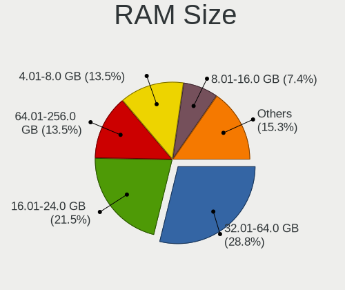
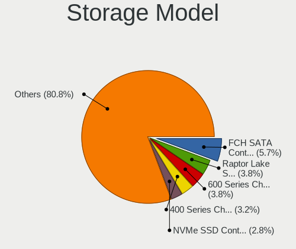
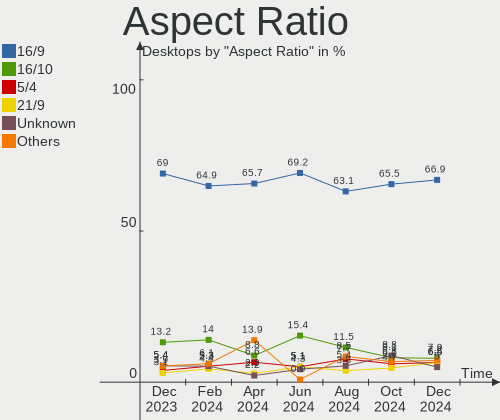

Debian Hardware Trends (Desktops)
---------------------------------

A project to identify most popular hardware characteristics and track their change
over time based on data collected by Debian users at https://Linux-Hardware.org.

Anyone can contribute to this report by the [hw-probe](https://github.com/linuxhw/hw-probe) tool:

    sudo -E hw-probe -all -upload

Full-feature report is available here: https://linux-hardware.org/?view=trends

Period: Feb, 2022.

Contents
--------

* [ System ](#system)
  - [ OS                       ](#os)
  - [ OS Family                ](#os-family)
  - [ Kernel                   ](#kernel)
  - [ Kernel Family            ](#kernel-family)
  - [ Kernel Major Ver.        ](#kernel-major-ver)
  - [ Arch                     ](#arch)
  - [ DE                       ](#de)
  - [ Display Server           ](#display-server)
  - [ Display Manager          ](#display-manager)
  - [ OS Lang                  ](#os-lang)
  - [ Boot Mode                ](#boot-mode)
  - [ Filesystem               ](#filesystem)
  - [ Part. scheme             ](#part-scheme)
  - [ Dual Boot with Linux/BSD ](#dual-boot-with-linuxbsd)
  - [ Dual Boot (Win)          ](#dual-boot-win)

* [ Board ](#board)
  - [ Vendor                   ](#vendor)
  - [ Model                    ](#model)
  - [ Model Family             ](#model-family)
  - [ MFG Year                 ](#mfg-year)
  - [ Form Factor              ](#form-factor)
  - [ Secure Boot              ](#secure-boot)
  - [ Coreboot                 ](#coreboot)
  - [ RAM Size                 ](#ram-size)
  - [ RAM Used                 ](#ram-used)
  - [ Total Drives             ](#total-drives)
  - [ Has CD-ROM               ](#has-cd-rom)
  - [ Has Ethernet             ](#has-ethernet)
  - [ Has WiFi                 ](#has-wifi)
  - [ Has Bluetooth            ](#has-bluetooth)

* [ Location ](#location)
  - [ Country                  ](#country)
  - [ City                     ](#city)

* [ Drives ](#drives)
  - [ Drive Vendor             ](#drive-vendor)
  - [ Drive Model              ](#drive-model)
  - [ HDD Vendor               ](#hdd-vendor)
  - [ SSD Vendor               ](#ssd-vendor)
  - [ Drive Kind               ](#drive-kind)
  - [ Drive Connector          ](#drive-connector)
  - [ Drive Size               ](#drive-size)
  - [ Space Total              ](#space-total)
  - [ Space Used               ](#space-used)
  - [ Malfunc. Drives          ](#malfunc-drives)
  - [ Malfunc. Drive Vendor    ](#malfunc-drive-vendor)
  - [ Malfunc. HDD Vendor      ](#malfunc-hdd-vendor)
  - [ Malfunc. Drive Kind      ](#malfunc-drive-kind)
  - [ Failed Drives            ](#failed-drives)
  - [ Failed Drive Vendor      ](#failed-drive-vendor)
  - [ Drive Status             ](#drive-status)

* [ Storage controller ](#storage-controller)
  - [ Storage Vendor           ](#storage-vendor)
  - [ Storage Model            ](#storage-model)
  - [ Storage Kind             ](#storage-kind)

* [ Processor ](#processor)
  - [ CPU Vendor               ](#cpu-vendor)
  - [ CPU Model                ](#cpu-model)
  - [ CPU Model Family         ](#cpu-model-family)
  - [ CPU Cores                ](#cpu-cores)
  - [ CPU Sockets              ](#cpu-sockets)
  - [ CPU Threads              ](#cpu-threads)
  - [ CPU Op-Modes             ](#cpu-op-modes)
  - [ CPU Microcode            ](#cpu-microcode)
  - [ CPU Microarch            ](#cpu-microarch)

* [ Graphics ](#graphics)
  - [ GPU Vendor               ](#gpu-vendor)
  - [ GPU Model                ](#gpu-model)
  - [ GPU Combo                ](#gpu-combo)
  - [ GPU Driver               ](#gpu-driver)
  - [ GPU Memory               ](#gpu-memory)

* [ Monitor ](#monitor)
  - [ Monitor Vendor           ](#monitor-vendor)
  - [ Monitor Model            ](#monitor-model)
  - [ Monitor Resolution       ](#monitor-resolution)
  - [ Monitor Diagonal         ](#monitor-diagonal)
  - [ Monitor Width            ](#monitor-width)
  - [ Aspect Ratio             ](#aspect-ratio)
  - [ Monitor Area             ](#monitor-area)
  - [ Pixel Density            ](#pixel-density)
  - [ Multiple Monitors        ](#multiple-monitors)

* [ Network ](#network)
  - [ Net Controller Vendor    ](#net-controller-vendor)
  - [ Net Controller Model     ](#net-controller-model)
  - [ Wireless Vendor          ](#wireless-vendor)
  - [ Wireless Model           ](#wireless-model)
  - [ Ethernet Vendor          ](#ethernet-vendor)
  - [ Ethernet Model           ](#ethernet-model)
  - [ Net Controller Kind      ](#net-controller-kind)
  - [ Used Controller          ](#used-controller)
  - [ NICs                     ](#nics)
  - [ IPv6                     ](#ipv6)

* [ Bluetooth ](#bluetooth)
  - [ Bluetooth Vendor         ](#bluetooth-vendor)
  - [ Bluetooth Model          ](#bluetooth-model)

* [ Sound ](#sound)
  - [ Sound Vendor             ](#sound-vendor)
  - [ Sound Model              ](#sound-model)

* [ Memory ](#memory)
  - [ Memory Vendor            ](#memory-vendor)
  - [ Memory Model             ](#memory-model)
  - [ Memory Kind              ](#memory-kind)
  - [ Memory Form Factor       ](#memory-form-factor)
  - [ Memory Size              ](#memory-size)
  - [ Memory Speed             ](#memory-speed)

* [ Printers & scanners ](#printers--scanners)
  - [ Printer Vendor           ](#printer-vendor)
  - [ Printer Model            ](#printer-model)
  - [ Scanner Vendor           ](#scanner-vendor)
  - [ Scanner Model            ](#scanner-model)

* [ Camera ](#camera)
  - [ Camera Vendor            ](#camera-vendor)
  - [ Camera Model             ](#camera-model)

* [ Security ](#security)
  - [ Fingerprint Vendor       ](#fingerprint-vendor)
  - [ Fingerprint Model        ](#fingerprint-model)
  - [ Chipcard Vendor          ](#chipcard-vendor)
  - [ Chipcard Model           ](#chipcard-model)

* [ Unsupported ](#unsupported)
  - [ Unsupported Devices      ](#unsupported-devices)
  - [ Unsupported Device Types ](#unsupported-device-types)

System
------

OS
--

Installed operating systems

| Name              | Desktops | Percent |
|-------------------|----------|---------|
| Debian 11         | 104      | 87.39%  |
| Debian 10         | 7        | 5.88%   |
| Debian Testing    | 5        | 4.2%    |
| Debian 11-updates | 2        | 1.68%   |
| Debian 16         | 1        | 0.84%   |

OS Family
---------

OS without a version

| Name   | Desktops | Percent |
|--------|----------|---------|
| Debian | 119      | 100%    |

Kernel
------

Version of the Linux kernel

| Version                   | Desktops | Percent |
|---------------------------|----------|---------|
| 5.10.0-11-amd64           | 46       | 38.66%  |
| 5.15.0-2-amd64            | 17       | 14.29%  |
| 5.10.0-7-amd64            | 16       | 13.45%  |
| 5.15.0-3-amd64            | 7        | 5.88%   |
| 5.10.0-10-amd64           | 7        | 5.88%   |
| 4.19.0-18-amd64           | 4        | 3.36%   |
| 5.16.0-1-amd64            | 2        | 1.68%   |
| 5.13.19-4-pve             | 2        | 1.68%   |
| 5.13.19-3-pve             | 2        | 1.68%   |
| 5.16.0-8.2-liquorix-amd64 | 1        | 0.84%   |
| 5.15.21-wrkd              | 1        | 0.84%   |
| 5.15.20-qcmm              | 1        | 0.84%   |
| 5.15.0-0.bpo.3-amd64      | 1        | 0.84%   |
| 5.15.0-0.bpo.2-amd64      | 1        | 0.84%   |
| 5.14.21-xanmod1           | 1        | 0.84%   |
| 5.14.0-4mx-amd64          | 1        | 0.84%   |
| 5.14.0-0.bpo.2-amd64      | 1        | 0.84%   |
| 5.13.0-28-generic         | 1        | 0.84%   |
| 5.10.0-9-amd64            | 1        | 0.84%   |
| 5.10.0-9-686              | 1        | 0.84%   |
| 5.10.0-5mx-amd64          | 1        | 0.84%   |
| 5.10.0-10-686-pae         | 1        | 0.84%   |
| 5.10.0-10-686             | 1        | 0.84%   |
| 5.10.0-0.bpo.9-amd64      | 1        | 0.84%   |
| 4.19.0-17-amd64           | 1        | 0.84%   |

Kernel Family
-------------

Linux kernel without a distro release

| Version | Desktops | Percent |
|---------|----------|---------|
| 5.10.0  | 75       | 63.03%  |
| 5.15.0  | 26       | 21.85%  |
| 4.19.0  | 5        | 4.2%    |
| 5.13.19 | 4        | 3.36%   |
| 5.16.0  | 3        | 2.52%   |
| 5.14.0  | 2        | 1.68%   |
| 5.15.21 | 1        | 0.84%   |
| 5.15.20 | 1        | 0.84%   |
| 5.14.21 | 1        | 0.84%   |
| 5.13.0  | 1        | 0.84%   |

Kernel Major Ver.
-----------------

Linux kernel major version

| Version | Desktops | Percent |
|---------|----------|---------|
| 5.10    | 75       | 63.03%  |
| 5.15    | 28       | 23.53%  |
| 5.13    | 5        | 4.2%    |
| 4.19    | 5        | 4.2%    |
| 5.16    | 3        | 2.52%   |
| 5.14    | 3        | 2.52%   |

Arch
----

OS architecture (x86_64, i586, etc.)

| Name   | Desktops | Percent |
|--------|----------|---------|
| x86_64 | 116      | 97.48%  |
| i686   | 3        | 2.52%   |

DE
--

Desktop Environment

| Name             | Desktops | Percent |
|------------------|----------|---------|
| Unknown          | 39       | 32.77%  |
| GNOME            | 30       | 25.21%  |
| XFCE             | 15       | 12.61%  |
| X-Cinnamon       | 11       | 9.24%   |
| KDE5             | 9        | 7.56%   |
| MATE             | 6        | 5.04%   |
| Cinnamon         | 3        | 2.52%   |
| lightdm-xsession | 2        | 1.68%   |
| LXQt             | 1        | 0.84%   |
| LXDE             | 1        | 0.84%   |
| i3               | 1        | 0.84%   |
| GNOME Classic    | 1        | 0.84%   |

Display Server
--------------

X11 or Wayland

| Name    | Desktops | Percent |
|---------|----------|---------|
| X11     | 60       | 50.42%  |
| Unknown | 36       | 30.25%  |
| Wayland | 12       | 10.08%  |
| Tty     | 11       | 9.24%   |

Display Manager
---------------

SDDM, LightDM, etc.

| Name    | Desktops | Percent |
|---------|----------|---------|
| Unknown | 57       | 47.9%   |
| LightDM | 24       | 20.17%  |
| GDM     | 24       | 20.17%  |
| SDDM    | 9        | 7.56%   |
| GDM3    | 4        | 3.36%   |
| SLiM    | 1        | 0.84%   |

OS Lang
-------

Language

| Lang    | Desktops | Percent |
|---------|----------|---------|
| ru_RU   | 40       | 33.61%  |
| en_US   | 30       | 25.21%  |
| de_DE   | 11       | 9.24%   |
| en_GB   | 8        | 6.72%   |
| it_IT   | 6        | 5.04%   |
| pt_BR   | 5        | 4.2%    |
| pl_PL   | 2        | 1.68%   |
| es_ES   | 2        | 1.68%   |
| de_AT   | 2        | 1.68%   |
| pt_PT   | 1        | 0.84%   |
| nl_BE   | 1        | 0.84%   |
| fr_FR   | 1        | 0.84%   |
| fr_BE   | 1        | 0.84%   |
| es_VE   | 1        | 0.84%   |
| es_EC   | 1        | 0.84%   |
| es_CO   | 1        | 0.84%   |
| es_CL   | 1        | 0.84%   |
| en_CA   | 1        | 0.84%   |
| en_AU   | 1        | 0.84%   |
| ca_ES   | 1        | 0.84%   |
| bg_BG   | 1        | 0.84%   |
| Unknown | 1        | 0.84%   |

Boot Mode
---------

EFI or BIOS

| Mode | Desktops | Percent |
|------|----------|---------|
| BIOS | 81       | 68.07%  |
| EFI  | 38       | 31.93%  |

Filesystem
----------

Type of filesystem

| Type    | Desktops | Percent |
|---------|----------|---------|
| Ext4    | 81       | 68.07%  |
| Overlay | 34       | 28.57%  |
| Btrfs   | 2        | 1.68%   |
| Zfs     | 1        | 0.84%   |
| Tmpfs   | 1        | 0.84%   |

Part. scheme
------------

Scheme of partitioning

| Type    | Desktops | Percent |
|---------|----------|---------|
| MBR     | 53       | 44.54%  |
| GPT     | 48       | 40.34%  |
| Unknown | 18       | 15.13%  |

Dual Boot with Linux/BSD
------------------------

Hosting more than one Linux/BSD

| Dual boot | Desktops | Percent |
|-----------|----------|---------|
| No        | 101      | 84.87%  |
| Yes       | 18       | 15.13%  |

Dual Boot (Win)
---------------

Hosting Linux and Windows

| Dual boot | Desktops | Percent |
|-----------|----------|---------|
| No        | 69       | 57.98%  |
| Yes       | 50       | 42.02%  |

Board
-----

Vendor
------

Motherboard manufacturer

| Name                | Desktops | Percent |
|---------------------|----------|---------|
| Gigabyte Technology | 26       | 21.85%  |
| ASUSTek Computer    | 26       | 21.85%  |
| ASRock              | 17       | 14.29%  |
| MSI                 | 13       | 10.92%  |
| Hewlett-Packard     | 9        | 7.56%   |
| Dell                | 9        | 7.56%   |
| ECS                 | 3        | 2.52%   |
| Lenovo              | 2        | 1.68%   |
| Intel               | 2        | 1.68%   |
| Foxconn             | 2        | 1.68%   |
| Positivo            | 1        | 0.84%   |
| Medion              | 1        | 0.84%   |
| Google              | 1        | 0.84%   |
| Gateway             | 1        | 0.84%   |
| Digiboard           | 1        | 0.84%   |
| Clientron Crop.     | 1        | 0.84%   |
| Biostar             | 1        | 0.84%   |
| ASRockRack          | 1        | 0.84%   |
| ABIT                | 1        | 0.84%   |
| Unknown             | 1        | 0.84%   |

Model
-----

Motherboard model

| Name                                    | Desktops | Percent |
|-----------------------------------------|----------|---------|
| ASUS PRIME H510M-A                      | 5        | 4.2%    |
| ASUS All Series                         | 5        | 4.2%    |
| MSI MS-7817                             | 3        | 2.52%   |
| ECS G31T-M9                             | 3        | 2.52%   |
| HP Z620 Workstation                     | 2        | 1.68%   |
| Gigabyte H61M-DS2 REV 1.2               | 2        | 1.68%   |
| Positivo POS-EAA75DE                    | 1        | 0.84%   |
| MSI MS-7D52                             | 1        | 0.84%   |
| MSI MS-7B79                             | 1        | 0.84%   |
| MSI MS-7A40                             | 1        | 0.84%   |
| MSI MS-7A34                             | 1        | 0.84%   |
| MSI MS-7996                             | 1        | 0.84%   |
| MSI MS-7917                             | 1        | 0.84%   |
| MSI MS-7721                             | 1        | 0.84%   |
| MSI MS-7592                             | 1        | 0.84%   |
| MSI MS-7309                             | 1        | 0.84%   |
| MSI MS-7053                             | 1        | 0.84%   |
| Medion MD34189/C731                     | 1        | 0.84%   |
| Lenovo ThinkCentre M920t 10SFCTO1WW     | 1        | 0.84%   |
| Lenovo ThinkCentre M72e 3264AN3         | 1        | 0.84%   |
| Intel H81                               | 1        | 0.84%   |
| Intel DZ68DB AAG27985-104               | 1        | 0.84%   |
| HP Z210 Workstation                     | 1        | 0.84%   |
| HP ProLiant MicroServer Gen8            | 1        | 0.84%   |
| HP EliteDesk 800 G4 TWR                 | 1        | 0.84%   |
| HP Compaq dc7800p Convertible Minitower | 1        | 0.84%   |
| HP Compaq dc7600 Small Form Factor      | 1        | 0.84%   |
| HP 280 G1 MT                            | 1        | 0.84%   |
| HP 260-a159ng                           | 1        | 0.84%   |
| Google Guado                            | 1        | 0.84%   |
| Gigabyte Z390 GAMING X                  | 1        | 0.84%   |
| Gigabyte X570 AORUS PRO                 | 1        | 0.84%   |
| Gigabyte X570 AORUS ELITE               | 1        | 0.84%   |
| Gigabyte P55-UD3L                       | 1        | 0.84%   |
| Gigabyte M61PME-S2                      | 1        | 0.84%   |
| Gigabyte M52L-S3P                       | 1        | 0.84%   |
| Gigabyte H97M-HD3                       | 1        | 0.84%   |
| Gigabyte H81M-DS2V                      | 1        | 0.84%   |
| Gigabyte H81M-D2V                       | 1        | 0.84%   |
| Gigabyte H410M S2H                      | 1        | 0.84%   |
| Gigabyte H110M-S2V-CF                   | 1        | 0.84%   |
| Gigabyte GA-78LMT-USB3 6.0              | 1        | 0.84%   |
| Gigabyte GA-78LMT-S2P                   | 1        | 0.84%   |
| Gigabyte GA-78LMT-S2                    | 1        | 0.84%   |
| Gigabyte G31M-S2L                       | 1        | 0.84%   |
| Gigabyte B660M GAMING DDR4              | 1        | 0.84%   |
| Gigabyte B550M AORUS PRO-P              | 1        | 0.84%   |
| Gigabyte B550M AORUS PRO                | 1        | 0.84%   |
| Gigabyte B550 GAMING X V2               | 1        | 0.84%   |
| Gigabyte B365M DS3H                     | 1        | 0.84%   |
| Gigabyte B360M H                        | 1        | 0.84%   |
| Gigabyte B250M-DS3H                     | 1        | 0.84%   |
| Gigabyte B250M-D2V                      | 1        | 0.84%   |
| Gigabyte 8I945GZME-RH                   | 1        | 0.84%   |
| Gateway CN-IMDS2870                     | 1        | 0.84%   |
| Foxconn nT-iBT18/nT-iBT19/nT-iBT29 FAB  | 1        | 0.84%   |
| Foxconn H61MXL-K                        | 1        | 0.84%   |
| Digiboard MPxx                          | 1        | 0.84%   |
| Dell XPS720                             | 1        | 0.84%   |
| Dell Vostro 3681                        | 1        | 0.84%   |

Model Family
------------

Motherboard model prefix

| Name                   | Desktops | Percent |
|------------------------|----------|---------|
| ASUS PRIME             | 7        | 5.88%   |
| ASUS All               | 5        | 4.2%    |
| Dell OptiPlex          | 4        | 3.36%   |
| MSI MS-7817            | 3        | 2.52%   |
| ECS G31T-M9            | 3        | 2.52%   |
| Lenovo ThinkCentre     | 2        | 1.68%   |
| HP Z620                | 2        | 1.68%   |
| HP Compaq              | 2        | 1.68%   |
| Gigabyte X570          | 2        | 1.68%   |
| Gigabyte H61M-DS2      | 2        | 1.68%   |
| Gigabyte B550M         | 2        | 1.68%   |
| Dell Precision         | 2        | 1.68%   |
| ASUS ROG               | 2        | 1.68%   |
| ASRock FM2A68M-HD+     | 2        | 1.68%   |
| ASRock B450            | 2        | 1.68%   |
| Positivo POS-EAA75DE   | 1        | 0.84%   |
| MSI MS-7D52            | 1        | 0.84%   |
| MSI MS-7B79            | 1        | 0.84%   |
| MSI MS-7A40            | 1        | 0.84%   |
| MSI MS-7A34            | 1        | 0.84%   |
| MSI MS-7996            | 1        | 0.84%   |
| MSI MS-7917            | 1        | 0.84%   |
| MSI MS-7721            | 1        | 0.84%   |
| MSI MS-7592            | 1        | 0.84%   |
| MSI MS-7309            | 1        | 0.84%   |
| MSI MS-7053            | 1        | 0.84%   |
| Medion MD34189         | 1        | 0.84%   |
| Intel H81              | 1        | 0.84%   |
| Intel DZ68DB           | 1        | 0.84%   |
| HP Z210                | 1        | 0.84%   |
| HP ProLiant            | 1        | 0.84%   |
| HP EliteDesk           | 1        | 0.84%   |
| HP 280                 | 1        | 0.84%   |
| HP 260-a159ng          | 1        | 0.84%   |
| Google Guado           | 1        | 0.84%   |
| Gigabyte Z390          | 1        | 0.84%   |
| Gigabyte P55-UD3L      | 1        | 0.84%   |
| Gigabyte M61PME-S2     | 1        | 0.84%   |
| Gigabyte M52L-S3P      | 1        | 0.84%   |
| Gigabyte H97M-HD3      | 1        | 0.84%   |
| Gigabyte H81M-DS2V     | 1        | 0.84%   |
| Gigabyte H81M-D2V      | 1        | 0.84%   |
| Gigabyte H410M         | 1        | 0.84%   |
| Gigabyte H110M-S2V-CF  | 1        | 0.84%   |
| Gigabyte GA-78LMT-USB3 | 1        | 0.84%   |
| Gigabyte GA-78LMT-S2P  | 1        | 0.84%   |
| Gigabyte GA-78LMT-S2   | 1        | 0.84%   |
| Gigabyte G31M-S2L      | 1        | 0.84%   |
| Gigabyte B660M         | 1        | 0.84%   |
| Gigabyte B550          | 1        | 0.84%   |
| Gigabyte B365M         | 1        | 0.84%   |
| Gigabyte B360M         | 1        | 0.84%   |
| Gigabyte B250M-DS3H    | 1        | 0.84%   |
| Gigabyte B250M-D2V     | 1        | 0.84%   |
| Gigabyte 8I945GZME-RH  | 1        | 0.84%   |
| Gateway CN-IMDS2870    | 1        | 0.84%   |
| Foxconn nT-iBT18       | 1        | 0.84%   |
| Foxconn H61MXL-K       | 1        | 0.84%   |
| Digiboard MPxx         | 1        | 0.84%   |
| Dell XPS720            | 1        | 0.84%   |

MFG Year
--------

Motherboard manufacture year

| Year | Desktops | Percent |
|------|----------|---------|
| 2021 | 12       | 10.08%  |
| 2014 | 12       | 10.08%  |
| 2012 | 12       | 10.08%  |
| 2011 | 12       | 10.08%  |
| 2019 | 8        | 6.72%   |
| 2018 | 8        | 6.72%   |
| 2020 | 7        | 5.88%   |
| 2013 | 7        | 5.88%   |
| 2009 | 7        | 5.88%   |
| 2017 | 6        | 5.04%   |
| 2016 | 5        | 4.2%    |
| 2008 | 5        | 4.2%    |
| 2007 | 5        | 4.2%    |
| 2015 | 4        | 3.36%   |
| 2010 | 4        | 3.36%   |
| 2005 | 2        | 1.68%   |
| 2022 | 1        | 0.84%   |
| 2006 | 1        | 0.84%   |
| 2003 | 1        | 0.84%   |

Form Factor
-----------

Physical design of the computer

| Name    | Desktops | Percent |
|---------|----------|---------|
| Desktop | 119      | 100%    |

Secure Boot
-----------

Enabled or disabled

| State    | Desktops | Percent |
|----------|----------|---------|
| Disabled | 117      | 98.32%  |
| Enabled  | 2        | 1.68%   |

Coreboot
--------

Have coreboot on board

| Used | Desktops | Percent |
|------|----------|---------|
| No   | 118      | 99.16%  |
| Yes  | 1        | 0.84%   |

RAM Size
--------

Total RAM memory

| Size in GB      | Desktops | Percent |
|-----------------|----------|---------|
| 4.01-8.0        | 25       | 21.01%  |
| 3.01-4.0        | 23       | 19.33%  |
| 16.01-24.0      | 23       | 19.33%  |
| 32.01-64.0      | 14       | 11.76%  |
| 8.01-16.0       | 12       | 10.08%  |
| 1.01-2.0        | 11       | 9.24%   |
| 64.01-256.0     | 5        | 4.2%    |
| 2.01-3.0        | 4        | 3.36%   |
| More than 256.0 | 1        | 0.84%   |
| 24.01-32.0      | 1        | 0.84%   |

RAM Used
--------

Used RAM memory

| Used GB     | Desktops | Percent |
|-------------|----------|---------|
| 0.51-1.0    | 41       | 34.45%  |
| 2.01-3.0    | 24       | 20.17%  |
| 1.01-2.0    | 24       | 20.17%  |
| 4.01-8.0    | 12       | 10.08%  |
| 3.01-4.0    | 8        | 6.72%   |
| 8.01-16.0   | 3        | 2.52%   |
| 0.01-0.5    | 3        | 2.52%   |
| 64.01-256.0 | 2        | 1.68%   |
| 16.01-24.0  | 2        | 1.68%   |

Total Drives
------------

Number of drives on board

| Drives | Desktops | Percent |
|--------|----------|---------|
| 1      | 63       | 52.94%  |
| 2      | 23       | 19.33%  |
| 3      | 15       | 12.61%  |
| 4      | 8        | 6.72%   |
| 5      | 6        | 5.04%   |
| 8      | 2        | 1.68%   |
| 28     | 1        | 0.84%   |
| 12     | 1        | 0.84%   |

Has CD-ROM
----------

Has CD-ROM on board

| Presented | Desktops | Percent |
|-----------|----------|---------|
| No        | 69       | 57.98%  |
| Yes       | 50       | 42.02%  |

Has Ethernet
------------

Has Ethernet on board

| Presented | Desktops | Percent |
|-----------|----------|---------|
| Yes       | 119      | 100%    |

Has WiFi
--------

Has WiFi module

| Presented | Desktops | Percent |
|-----------|----------|---------|
| No        | 92       | 77.31%  |
| Yes       | 27       | 22.69%  |

Has Bluetooth
-------------

Has Bluetooth module

| Presented | Desktops | Percent |
|-----------|----------|---------|
| No        | 99       | 83.19%  |
| Yes       | 20       | 16.81%  |

Location
--------

Country
-------

Geographic location (country)

| Country     | Desktops | Percent |
|-------------|----------|---------|
| Russia      | 40       | 33.61%  |
| Germany     | 15       | 12.61%  |
| USA         | 9        | 7.56%   |
| Italy       | 9        | 7.56%   |
| Brazil      | 6        | 5.04%   |
| UK          | 3        | 2.52%   |
| Spain       | 3        | 2.52%   |
| Finland     | 3        | 2.52%   |
| Belgium     | 3        | 2.52%   |
| Poland      | 2        | 1.68%   |
| Netherlands | 2        | 1.68%   |
| France      | 2        | 1.68%   |
| Austria     | 2        | 1.68%   |
| Venezuela   | 1        | 0.84%   |
| Ukraine     | 1        | 0.84%   |
| UAE         | 1        | 0.84%   |
| Turkey      | 1        | 0.84%   |
| Switzerland | 1        | 0.84%   |
| Singapore   | 1        | 0.84%   |
| Portugal    | 1        | 0.84%   |
| Latvia      | 1        | 0.84%   |
| Israel      | 1        | 0.84%   |
| Indonesia   | 1        | 0.84%   |
| Hungary     | 1        | 0.84%   |
| Ecuador     | 1        | 0.84%   |
| Cyprus      | 1        | 0.84%   |
| Colombia    | 1        | 0.84%   |
| Chile       | 1        | 0.84%   |
| Canada      | 1        | 0.84%   |
| Bulgaria    | 1        | 0.84%   |
| Belarus     | 1        | 0.84%   |
| Bangladesh  | 1        | 0.84%   |
| Australia   | 1        | 0.84%   |

City
----

Geographic location (city)

| City                | Desktops | Percent |
|---------------------|----------|---------|
| Voronezh            | 33       | 27.73%  |
| São Paulo        | 3        | 2.52%   |
| St Petersburg       | 2        | 1.68%   |
| Raahe               | 2        | 1.68%   |
| Perm                | 2        | 1.68%   |
| Milan               | 2        | 1.68%   |
| Los Ángeles        | 2        | 1.68%   |
| Berlin              | 2        | 1.68%   |
| Barcelona           | 2        | 1.68%   |
| Bad Hall            | 2        | 1.68%   |
| Zlatoust            | 1        | 0.84%   |
| Zaporizhzhya        | 1        | 0.84%   |
| Yogyakarta          | 1        | 0.84%   |
| Wolfsburg           | 1        | 0.84%   |
| Wołomin         | 1        | 0.84%   |
| Waregem             | 1        | 0.84%   |
| Venice              | 1        | 0.84%   |
| Valencia            | 1        | 0.84%   |
| Ulyanovsk           | 1        | 0.84%   |
| Thousand Oaks       | 1        | 0.84%   |
| Tel Aviv            | 1        | 0.84%   |
| Strasbourg          | 1        | 0.84%   |
| Singapore           | 1        | 0.84%   |
| Severna Park        | 1        | 0.84%   |
| Santana de Parnaiba | 1        | 0.84%   |
| Rousse              | 1        | 0.84%   |
| Rosmalen            | 1        | 0.84%   |
| Rome                | 1        | 0.84%   |
| Riga                | 1        | 0.84%   |
| Reggio Emilia       | 1        | 0.84%   |
| Quito               | 1        | 0.84%   |
| Popayán          | 1        | 0.84%   |
| Palmela             | 1        | 0.84%   |
| Padova              | 1        | 0.84%   |
| Pabianice           | 1        | 0.84%   |
| Onalaska            | 1        | 0.84%   |
| New Bedford         | 1        | 0.84%   |
| Montezuma           | 1        | 0.84%   |
| Minsk               | 1        | 0.84%   |
| Melbourne           | 1        | 0.84%   |
| Ludwigsburg         | 1        | 0.84%   |
| Longmont            | 1        | 0.84%   |
| Limassol            | 1        | 0.84%   |
| Leipzig             | 1        | 0.84%   |
| Las Vegas           | 1        | 0.84%   |
| Kofering            | 1        | 0.84%   |
| Kaltenkirchen       | 1        | 0.84%   |
| Jemgum              | 1        | 0.84%   |
| Jaguaruna           | 1        | 0.84%   |
| Istanbul            | 1        | 0.84%   |
| Isernhagen          | 1        | 0.84%   |
| Horgen              | 1        | 0.84%   |
| Helsinki            | 1        | 0.84%   |
| Győr            | 1        | 0.84%   |
| Guidonia            | 1        | 0.84%   |
| Ghent               | 1        | 0.84%   |
| Göttingen        | 1        | 0.84%   |
| Gavray              | 1        | 0.84%   |
| Francavilla Fontana | 1        | 0.84%   |
| Florence            | 1        | 0.84%   |

Drives
------

Drive Vendor
------------

Hard drive vendors

| Vendor              | Desktops | Drives | Percent |
|---------------------|----------|--------|---------|
| Seagate             | 41       | 67     | 20.3%   |
| WDC                 | 40       | 55     | 19.8%   |
| Samsung Electronics | 24       | 37     | 11.88%  |
| Toshiba             | 20       | 29     | 9.9%    |
| Kingston            | 14       | 17     | 6.93%   |
| Crucial             | 11       | 13     | 5.45%   |
| Hitachi             | 9        | 9      | 4.46%   |
| Sandisk             | 8        | 9      | 3.96%   |
| Intenso             | 3        | 3      | 1.49%   |
| A-DATA Technology   | 3        | 3      | 1.49%   |
| Transcend           | 2        | 2      | 0.99%   |
| SPCC                | 2        | 2      | 0.99%   |
| SK Hynix            | 2        | 2      | 0.99%   |
| Intel               | 2        | 3      | 0.99%   |
| China               | 2        | 3      | 0.99%   |
| XPG                 | 1        | 1      | 0.5%    |
| V-GeN               | 1        | 1      | 0.5%    |
| Unknown             | 1        | 1      | 0.5%    |
| Team                | 1        | 1      | 0.5%    |
| T-FORCE             | 1        | 1      | 0.5%    |
| Phison              | 1        | 1      | 0.5%    |
| Patriot             | 1        | 1      | 0.5%    |
| OCZ-VERTEX3         | 1        | 1      | 0.5%    |
| Netac               | 1        | 1      | 0.5%    |
| Micron Technology   | 1        | 2      | 0.5%    |
| MAXTOR              | 1        | 1      | 0.5%    |
| LITEONIT            | 1        | 1      | 0.5%    |
| KIOXIA-EXCERIA      | 1        | 1      | 0.5%    |
| JASTER              | 1        | 1      | 0.5%    |
| HGST                | 1        | 1      | 0.5%    |
| GOODRAM             | 1        | 1      | 0.5%    |
| Gigabyte Technology | 1        | 1      | 0.5%    |
| Foxline             | 1        | 1      | 0.5%    |
| Corsair             | 1        | 1      | 0.5%    |

Drive Model
-----------

Hard drive models

| Model                            | Desktops | Percent |
|----------------------------------|----------|---------|
| Seagate ST500DM002-1BD142 500GB  | 9        | 3.8%    |
| Toshiba DT01ACA050 500GB         | 5        | 2.11%   |
| Samsung SSD 970 EVO Plus 500GB   | 4        | 1.69%   |
| WDC WD5000AAKX-00ERMA0 500GB     | 3        | 1.27%   |
| Toshiba DT01ACA100 1TB           | 3        | 1.27%   |
| Seagate ST3250318AS 250GB        | 3        | 1.27%   |
| Kingston SA400S37480G 480GB SSD  | 3        | 1.27%   |
| Hitachi HDS721050CLA362 500GB    | 3        | 1.27%   |
| WDC WDS120G2G0A-00JH30 120GB SSD | 2        | 0.84%   |
| WDC WD30EFRX-68EUZN0 3TB         | 2        | 0.84%   |
| WDC WD2500AAJS-00B4A0 250GB      | 2        | 0.84%   |
| WDC WD1003FZEX-00MK2A0 1TB       | 2        | 0.84%   |
| Toshiba HDWG180 8TB              | 2        | 0.84%   |
| Toshiba HDWE150 5TB              | 2        | 0.84%   |
| Seagate ST6000DM003-2CY186 6TB   | 2        | 0.84%   |
| Seagate ST2000LM015-2E8174 2TB   | 2        | 0.84%   |
| Seagate ST2000DM008-2UB102 2TB   | 2        | 0.84%   |
| Seagate ST1000DM010-2EP102 1TB   | 2        | 0.84%   |
| SanDisk SDSSDH3 2T00 2TB         | 2        | 0.84%   |
| Samsung SSD 970 EVO Plus 2TB     | 2        | 0.84%   |
| Samsung SSD 970 EVO Plus 1TB     | 2        | 0.84%   |
| Samsung SSD 860 EVO 500GB        | 2        | 0.84%   |
| Samsung SSD 860 EVO 250GB        | 2        | 0.84%   |
| Kingston SA400S37120G 120GB SSD  | 2        | 0.84%   |
| Crucial CT500MX500SSD1 500GB     | 2        | 0.84%   |
| Crucial CT1000MX500SSD1 1TB      | 2        | 0.84%   |
| XPG GAMMIX S11 Pro 1TB           | 1        | 0.42%   |
| WDC WDS256G1X0C-00ENX0 256GB     | 1        | 0.42%   |
| WDC WDS250G2B0A 250GB SSD        | 1        | 0.42%   |
| WDC WDS240G2G0A-00JH30 240GB SSD | 1        | 0.42%   |
| WDC WDS120G1G0A-00SS50 120GB SSD | 1        | 0.42%   |
| WDC WDS100T2B0A-00SM50 1TB SSD   | 1        | 0.42%   |
| WDC WD80EFAX-68KNBN0 8TB         | 1        | 0.42%   |
| WDC WD6003FRYZ-01F0DB0 6TB       | 1        | 0.42%   |
| WDC WD5000AZLX-22JKKA0 500GB     | 1        | 0.42%   |
| WDC WD5000AAKX-753CA0 500GB      | 1        | 0.42%   |
| WDC WD5000AAKX-08U6AA0 500GB     | 1        | 0.42%   |
| WDC WD5000AAKX-08ERMA0 500GB     | 1        | 0.42%   |
| WDC WD5000AAKX-001CA0 500GB      | 1        | 0.42%   |
| WDC WD5000AAKS-08V0A0 500GB      | 1        | 0.42%   |
| WDC WD5000AAKS-00UU3A0 500GB     | 1        | 0.42%   |
| WDC WD5000AAKS-00A7B2 500GB      | 1        | 0.42%   |
| WDC WD5000AADS-00S9B0 500GB      | 1        | 0.42%   |
| WDC WD40EFRX-68WT0N0 4TB         | 1        | 0.42%   |
| WDC WD40EFAX-68JH4N1 4TB         | 1        | 0.42%   |
| WDC WD4005FZBX-00K5WB0 4TB       | 1        | 0.42%   |
| WDC WD20SPZX-75UA7T0 2TB         | 1        | 0.42%   |
| WDC WD20SPZX-00UA7T0 2TB         | 1        | 0.42%   |
| WDC WD20EZAZ-00GGJB0 2TB         | 1        | 0.42%   |
| WDC WD20EFAX-68B2RN1 2TB         | 1        | 0.42%   |
| WDC WD20EARX-00PASB0 2TB         | 1        | 0.42%   |
| WDC WD161KRYZ-01AGBB0 16TB       | 1        | 0.42%   |
| WDC WD1600AAJS-75M0A0 160GB      | 1        | 0.42%   |
| WDC WD10SPZX-60Z10T0 1TB         | 1        | 0.42%   |
| WDC WD10SPZX-24Z10 1TB           | 1        | 0.42%   |
| WDC WD10EZRZ-00HTKB0 1TB         | 1        | 0.42%   |
| WDC WD10EZEX-75ZF5A0 1TB         | 1        | 0.42%   |
| WDC WD10EZEX-22MFCA0 1TB         | 1        | 0.42%   |
| WDC WD10EZEX-08WN4A0 1TB         | 1        | 0.42%   |
| WDC WD10EZEX-00WN4A0 1TB         | 1        | 0.42%   |

HDD Vendor
----------

Hard disk drive vendors

| Vendor  | Desktops | Drives | Percent |
|---------|----------|--------|---------|
| Seagate | 41       | 67     | 39.05%  |
| WDC     | 33       | 47     | 31.43%  |
| Toshiba | 19       | 28     | 18.1%   |
| Hitachi | 9        | 9      | 8.57%   |
| Unknown | 1        | 1      | 0.95%   |
| MAXTOR  | 1        | 1      | 0.95%   |
| HGST    | 1        | 1      | 0.95%   |

SSD Vendor
----------

Solid state drive vendors

| Vendor              | Desktops | Drives | Percent |
|---------------------|----------|--------|---------|
| Samsung Electronics | 13       | 23     | 18.31%  |
| Kingston            | 12       | 13     | 16.9%   |
| Crucial             | 10       | 12     | 14.08%  |
| SanDisk             | 7        | 8      | 9.86%   |
| WDC                 | 6        | 6      | 8.45%   |
| A-DATA Technology   | 3        | 3      | 4.23%   |
| Transcend           | 2        | 2      | 2.82%   |
| Intenso             | 2        | 2      | 2.82%   |
| China               | 2        | 3      | 2.82%   |
| Toshiba             | 1        | 1      | 1.41%   |
| Team                | 1        | 1      | 1.41%   |
| SPCC                | 1        | 1      | 1.41%   |
| SK Hynix            | 1        | 1      | 1.41%   |
| Patriot             | 1        | 1      | 1.41%   |
| OCZ-VERTEX3         | 1        | 1      | 1.41%   |
| Netac               | 1        | 1      | 1.41%   |
| Micron Technology   | 1        | 2      | 1.41%   |
| LITEONIT            | 1        | 1      | 1.41%   |
| KIOXIA-EXCERIA      | 1        | 1      | 1.41%   |
| Intel               | 1        | 2      | 1.41%   |
| GOODRAM             | 1        | 1      | 1.41%   |
| Gigabyte Technology | 1        | 1      | 1.41%   |
| Foxline             | 1        | 1      | 1.41%   |

Drive Kind
----------

HDD or SSD

| Kind    | Desktops | Drives | Percent |
|---------|----------|--------|---------|
| HDD     | 86       | 154    | 49.71%  |
| SSD     | 60       | 88     | 34.68%  |
| NVMe    | 24       | 29     | 13.87%  |
| Unknown | 3        | 3      | 1.73%   |

Drive Connector
---------------

SATA, SAS, NVMe, etc.

| Type | Desktops | Drives | Percent |
|------|----------|--------|---------|
| SATA | 110      | 221    | 78.57%  |
| NVMe | 24       | 29     | 17.14%  |
| SAS  | 6        | 24     | 4.29%   |

Drive Size
----------

Size of hard drive

| Size in TB | Desktops | Drives | Percent |
|------------|----------|--------|---------|
| 0.01-0.5   | 89       | 116    | 56.33%  |
| 0.51-1.0   | 31       | 50     | 19.62%  |
| 1.01-2.0   | 18       | 26     | 11.39%  |
| 4.01-10.0  | 9        | 31     | 5.7%    |
| 3.01-4.0   | 6        | 7      | 3.8%    |
| 2.01-3.0   | 3        | 3      | 1.9%    |
| 10.01-20.0 | 2        | 9      | 1.27%   |

Space Total
-----------

Amount of disk space available on the file system

| Size in GB     | Desktops | Percent |
|----------------|----------|---------|
| Unknown        | 35       | 29.41%  |
| 101-250        | 19       | 15.97%  |
| 501-1000       | 16       | 13.45%  |
| More than 3000 | 12       | 10.08%  |
| 251-500        | 12       | 10.08%  |
| 1001-2000      | 10       | 8.4%    |
| 2001-3000      | 6        | 5.04%   |
| 21-50          | 5        | 4.2%    |
| 51-100         | 3        | 2.52%   |
| 1-20           | 1        | 0.84%   |

Space Used
----------

Amount of used disk space

| Used GB        | Desktops | Percent |
|----------------|----------|---------|
| Unknown        | 35       | 29.41%  |
| 1-20           | 28       | 23.53%  |
| 101-250        | 13       | 10.92%  |
| 251-500        | 8        | 6.72%   |
| 21-50          | 8        | 6.72%   |
| 1001-2000      | 7        | 5.88%   |
| 501-1000       | 6        | 5.04%   |
| 2001-3000      | 5        | 4.2%    |
| More than 3000 | 4        | 3.36%   |
| 51-100         | 4        | 3.36%   |
| 0              | 1        | 0.84%   |

Malfunc. Drives
---------------

Drive models with a malfunction

| Model                                        | Desktops | Drives | Percent |
|----------------------------------------------|----------|--------|---------|
| WDC WDS120G2G0A-00JH30 120GB SSD             | 2        | 2      | 6.06%   |
| WDC WD2500AAJS-00B4A0 250GB                  | 2        | 2      | 6.06%   |
| Seagate ST500DM002-1BD142 500GB              | 2        | 2      | 6.06%   |
| Seagate ST3250318AS 250GB                    | 2        | 2      | 6.06%   |
| WDC WD5000AAKX-08U6AA0 500GB                 | 1        | 1      | 3.03%   |
| WDC WD5000AAKX-00ERMA0 500GB                 | 1        | 1      | 3.03%   |
| WDC WD5000AADS-00S9B0 500GB                  | 1        | 1      | 3.03%   |
| WDC WD30EFRX-68EUZN0 3TB                     | 1        | 1      | 3.03%   |
| WDC WD10EZEX-22MFCA0 1TB                     | 1        | 1      | 3.03%   |
| Seagate ST750LM022 HN-M750MBB 752GB          | 1        | 1      | 3.03%   |
| Seagate ST6000DM003-2CY186 6TB               | 1        | 1      | 3.03%   |
| Seagate ST500LT012-9WS142 500GB              | 1        | 1      | 3.03%   |
| Seagate ST500LM012 HN-M500MBB 500GB          | 1        | 1      | 3.03%   |
| Seagate ST3320311CS 320GB                    | 1        | 1      | 3.03%   |
| Seagate ST3250410AS 250GB                    | 1        | 1      | 3.03%   |
| Seagate ST32000542AS 2TB                     | 1        | 1      | 3.03%   |
| Seagate ST2000DM001-1CH164 2TB               | 1        | 1      | 3.03%   |
| Seagate ST1500DL003-9VT16L 1TB               | 1        | 1      | 3.03%   |
| Seagate ST1000DM003-9YN162 1TB               | 1        | 2      | 3.03%   |
| Samsung Electronics SSD 840 PRO Series 128GB | 1        | 1      | 3.03%   |
| LITEONIT LCT-128M3S 128GB SSD                | 1        | 1      | 3.03%   |
| Kingston SHFS37A120G 120GB SSD               | 1        | 1      | 3.03%   |
| Kingston SH103S3240G 240GB SSD               | 1        | 1      | 3.03%   |
| Kingston SH103S3120G 120GB SSD               | 1        | 1      | 3.03%   |
| Hitachi HDS722020ALA330 2TB                  | 1        | 1      | 3.03%   |
| Hitachi HDS721050CLA362 500GB                | 1        | 1      | 3.03%   |
| Hitachi HDP725025GLA380 250GB                | 1        | 1      | 3.03%   |
| Crucial M4-CT512M4SSD1 512GB                 | 1        | 1      | 3.03%   |
| Crucial M4-CT256M4SSD1 256GB                 | 1        | 1      | 3.03%   |

Malfunc. Drive Vendor
---------------------

Vendors of faulty drives

| Vendor              | Desktops | Drives | Percent |
|---------------------|----------|--------|---------|
| Seagate             | 13       | 15     | 40.63%  |
| WDC                 | 9        | 9      | 28.13%  |
| Kingston            | 3        | 3      | 9.38%   |
| Hitachi             | 3        | 3      | 9.38%   |
| Crucial             | 2        | 2      | 6.25%   |
| Samsung Electronics | 1        | 1      | 3.13%   |
| LITEONIT            | 1        | 1      | 3.13%   |

Malfunc. HDD Vendor
-------------------

Vendors of faulty HDD drives

| Vendor  | Desktops | Drives | Percent |
|---------|----------|--------|---------|
| Seagate | 13       | 15     | 56.52%  |
| WDC     | 7        | 7      | 30.43%  |
| Hitachi | 3        | 3      | 13.04%  |

Malfunc. Drive Kind
-------------------

Kinds of faulty drives

| Kind | Desktops | Drives | Percent |
|------|----------|--------|---------|
| HDD  | 22       | 25     | 70.97%  |
| SSD  | 9        | 9      | 29.03%  |

Failed Drives
-------------

Failed drive models

Zero info for selected period =(

Failed Drive Vendor
-------------------

Failed drive vendors

Zero info for selected period =(

Drive Status
------------

Number of failed and malfunc. drives

| Status   | Desktops | Drives | Percent |
|----------|----------|--------|---------|
| Works    | 86       | 178    | 62.32%  |
| Malfunc  | 30       | 34     | 21.74%  |
| Detected | 22       | 62     | 15.94%  |

Storage controller
------------------

Storage Vendor
--------------

Storage controller vendors

| Vendor                      | Desktops | Percent |
|-----------------------------|----------|---------|
| Intel                       | 81       | 50%     |
| AMD                         | 31       | 19.14%  |
| Samsung Electronics         | 10       | 6.17%   |
| ASMedia Technology          | 7        | 4.32%   |
| Nvidia                      | 6        | 3.7%    |
| Phison Electronics          | 4        | 2.47%   |
| Marvell Technology Group    | 4        | 2.47%   |
| Kingston Technology Company | 4        | 2.47%   |
| Sandisk                     | 3        | 1.85%   |
| JMicron Technology          | 3        | 1.85%   |
| VIA Technologies            | 2        | 1.23%   |
| Broadcom / LSI              | 2        | 1.23%   |
| SK Hynix                    | 1        | 0.62%   |
| Micron/Crucial Technology   | 1        | 0.62%   |
| LSI Logic / Symbios Logic   | 1        | 0.62%   |
| Broadcom                    | 1        | 0.62%   |
| ADATA Technology            | 1        | 0.62%   |

Storage Model
-------------

Storage controller models

| Model                                                                                   | Desktops | Percent |
|-----------------------------------------------------------------------------------------|----------|---------|
| AMD FCH SATA Controller [AHCI mode]                                                     | 20       | 9.76%   |
| Intel NM10/ICH7 Family SATA Controller [IDE mode]                                       | 11       | 5.37%   |
| Intel 6 Series/C200 Series Chipset Family 6 port Desktop SATA AHCI Controller           | 10       | 4.88%   |
| Samsung NVMe SSD Controller SM981/PM981/PM983                                           | 8        | 3.9%    |
| Intel 82801G (ICH7 Family) IDE Controller                                               | 8        | 3.9%    |
| Intel 8 Series/C220 Series Chipset Family 6-port SATA Controller 1 [AHCI mode]          | 8        | 3.9%    |
| Intel 500 Series Chipset Family SATA AHCI Controller                                    | 7        | 3.41%   |
| ASMedia ASM1062 Serial ATA Controller                                                   | 6        | 2.93%   |
| Intel 9 Series Chipset Family SATA Controller [AHCI Mode]                               | 5        | 2.44%   |
| Intel 200 Series PCH SATA controller [AHCI mode]                                        | 5        | 2.44%   |
| AMD SB7x0/SB8x0/SB9x0 IDE Controller                                                    | 5        | 2.44%   |
| AMD 400 Series Chipset SATA Controller                                                  | 5        | 2.44%   |
| Nvidia MCP61 SATA Controller                                                            | 4        | 1.95%   |
| Nvidia MCP61 IDE                                                                        | 4        | 1.95%   |
| Intel Cannon Lake PCH SATA AHCI Controller                                              | 4        | 1.95%   |
| AMD Starship/Matisse Chipset SATA Controller [AHCI mode]                                | 4        | 1.95%   |
| AMD SB7x0/SB8x0/SB9x0 SATA Controller [AHCI mode]                                       | 4        | 1.95%   |
| Kingston Company A2000 NVMe SSD                                                         | 3        | 1.46%   |
| Intel C602 chipset 4-Port SATA Storage Control Unit                                     | 3        | 1.46%   |
| Intel 82801JI (ICH10 Family) SATA AHCI Controller                                       | 3        | 1.46%   |
| Intel 6 Series/C200 Series Chipset Family Desktop SATA Controller (IDE mode, ports 4-5) | 3        | 1.46%   |
| Intel 6 Series/C200 Series Chipset Family Desktop SATA Controller (IDE mode, ports 0-3) | 3        | 1.46%   |
| Intel 400 Series Chipset Family SATA AHCI Controller                                    | 3        | 1.46%   |
| AMD FCH SATA Controller D                                                               | 3        | 1.46%   |
| Phison E12 NVMe Controller                                                              | 2        | 0.98%   |
| JMicron JMB363 SATA/IDE Controller                                                      | 2        | 0.98%   |
| Intel Q170/Q150/B150/H170/H110/Z170/CM236 Chipset SATA Controller [AHCI Mode]           | 2        | 0.98%   |
| Intel C600/X79 series chipset SATA RAID Controller                                      | 2        | 0.98%   |
| Intel C600/X79 series chipset 6-Port SATA AHCI Controller                               | 2        | 0.98%   |
| Intel Atom Processor E3800 Series SATA AHCI Controller                                  | 2        | 0.98%   |
| Intel 82Q35 Express PT IDER Controller                                                  | 2        | 0.98%   |
| Intel 82801IR/IO/IH (ICH9R/DO/DH) 4 port SATA Controller [IDE mode]                     | 2        | 0.98%   |
| Intel 82801I (ICH9 Family) 2 port SATA Controller [IDE mode]                            | 2        | 0.98%   |
| AMD SB7x0/SB8x0/SB9x0 SATA Controller [IDE mode]                                        | 2        | 0.98%   |
| VIA VX900 Series Serial-ATA Controller                                                  | 1        | 0.49%   |
| VIA VT6410 ATA133 RAID controller                                                       | 1        | 0.49%   |
| SK Hynix PC401 NVMe Solid State Drive 256GB                                             | 1        | 0.49%   |
| Sandisk WD Blue SN550 NVMe SSD                                                          | 1        | 0.49%   |
| Sandisk WD Black NVMe SSD                                                               | 1        | 0.49%   |
| Sandisk WD Black 2018/SN750 / PC SN720 NVMe SSD                                         | 1        | 0.49%   |
| Samsung NVMe SSD Controller PM9A1/PM9A3/980PRO                                          | 1        | 0.49%   |
| Samsung NVMe SSD Controller 980                                                         | 1        | 0.49%   |
| Phison E7 NVMe Controller                                                               | 1        | 0.49%   |
| Phison E16 PCIe4 NVMe Controller                                                        | 1        | 0.49%   |
| Nvidia MCP79 SATA Controller                                                            | 1        | 0.49%   |
| Nvidia MCP55 SATA Controller                                                            | 1        | 0.49%   |
| Nvidia MCP55 IDE                                                                        | 1        | 0.49%   |
| Micron/Crucial P2 NVMe PCIe SSD                                                         | 1        | 0.49%   |
| Marvell Group 88SE9215 PCIe 2.0 x1 4-port SATA 6 Gb/s Controller                        | 1        | 0.49%   |
| Marvell Group 88SE9128 PCIe SATA 6 Gb/s RAID controller with HyperDuo                   | 1        | 0.49%   |
| Marvell Group 88SE9125 PCIe SATA 6.0 Gb/s controller                                    | 1        | 0.49%   |
| Marvell Group 88SE9120 SATA 6Gb/s Controller                                            | 1        | 0.49%   |
| LSI Logic / Symbios Logic SAS2008 PCI-Express Fusion-MPT SAS-2 [Falcon]                 | 1        | 0.49%   |
| Kingston Company KC2000 NVMe SSD                                                        | 1        | 0.49%   |
| JMicron JMB362 SATA Controller                                                          | 1        | 0.49%   |
| Intel Wildcat Point-LP SATA Controller [AHCI Mode]                                      | 1        | 0.49%   |
| Intel SSD 660P Series                                                                   | 1        | 0.49%   |
| Intel Celeron/Pentium Silver Processor SATA Controller                                  | 1        | 0.49%   |
| Intel Celeron N3350/Pentium N4200/Atom E3900 Series SATA AHCI Controller                | 1        | 0.49%   |
| Intel C600/X79 series chipset IDE-r Controller                                          | 1        | 0.49%   |

Storage Kind
------------

Kind of storage controller (IDE, SATA, NVMe, SAS, ...)

| Kind | Desktops | Percent |
|------|----------|---------|
| SATA | 92       | 57.14%  |
| IDE  | 36       | 22.36%  |
| NVMe | 23       | 14.29%  |
| SAS  | 5        | 3.11%   |
| RAID | 4        | 2.48%   |
| SCSI | 1        | 0.62%   |

Processor
---------

CPU Vendor
----------

Processor vendors

| Vendor       | Desktops | Percent |
|--------------|----------|---------|
| Intel        | 83       | 69.75%  |
| AMD          | 35       | 29.41%  |
| CentaurHauls | 1        | 0.84%   |

CPU Model
---------

Processor models

| Model                                       | Desktops | Percent |
|---------------------------------------------|----------|---------|
| Intel Pentium Dual-Core CPU E6500 @ 2.93GHz | 6        | 5.04%   |
| Intel Core i7-8700 CPU @ 3.20GHz            | 4        | 3.36%   |
| Intel Core i7-4770 CPU @ 3.40GHz            | 3        | 2.52%   |
| Intel Core i5-10400 CPU @ 2.90GHz           | 3        | 2.52%   |
| Intel Xeon CPU E5-2690 0 @ 2.90GHz          | 2        | 1.68%   |
| Intel Pentium CPU G620 @ 2.60GHz            | 2        | 1.68%   |
| Intel Pentium CPU G4600 @ 3.60GHz           | 2        | 1.68%   |
| Intel Pentium CPU G3420 @ 3.20GHz           | 2        | 1.68%   |
| Intel Pentium CPU G3220 @ 3.00GHz           | 2        | 1.68%   |
| Intel Core i5-2400 CPU @ 3.10GHz            | 2        | 1.68%   |
| Intel Core i3-4160 CPU @ 3.60GHz            | 2        | 1.68%   |
| Intel Core i3-10105 CPU @ 3.70GHz           | 2        | 1.68%   |
| Intel Celeron CPU J1800 @ 2.41GHz           | 2        | 1.68%   |
| AMD Ryzen 9 5950X 16-Core Processor         | 2        | 1.68%   |
| AMD Ryzen 7 3700X 8-Core Processor          | 2        | 1.68%   |
| AMD Ryzen 5 5600X 6-Core Processor          | 2        | 1.68%   |
| AMD Ryzen 5 1600 Six-Core Processor         | 2        | 1.68%   |
| AMD FX-4300 Quad-Core Processor             | 2        | 1.68%   |
| Intel Xeon CPU E5620 @ 2.40GHz              | 1        | 0.84%   |
| Intel Xeon CPU E5-1607 0 @ 3.00GHz          | 1        | 0.84%   |
| Intel Xeon CPU E3-1270 V2 @ 3.50GHz         | 1        | 0.84%   |
| Intel Xeon CPU 2.80GHz                      | 1        | 0.84%   |
| Intel Pentium Gold G5400 CPU @ 3.70GHz      | 1        | 0.84%   |
| Intel Pentium Dual-Core CPU E5700 @ 3.00GHz | 1        | 0.84%   |
| Intel Pentium Dual-Core CPU E5400 @ 2.70GHz | 1        | 0.84%   |
| Intel Pentium CPU J4205 @ 1.50GHz           | 1        | 0.84%   |
| Intel Pentium CPU G645 @ 2.90GHz            | 1        | 0.84%   |
| Intel Pentium CPU G4400 @ 3.30GHz           | 1        | 0.84%   |
| Intel Pentium 4 CPU 3.60GHz                 | 1        | 0.84%   |
| Intel Pentium 4 CPU 3.20GHz                 | 1        | 0.84%   |
| Intel Core i7-9700 CPU @ 3.00GHz            | 1        | 0.84%   |
| Intel Core i7-8086K CPU @ 4.00GHz           | 1        | 0.84%   |
| Intel Core i7-5500U CPU @ 2.40GHz           | 1        | 0.84%   |
| Intel Core i7-4820K CPU @ 3.70GHz           | 1        | 0.84%   |
| Intel Core i7-4790K CPU @ 4.00GHz           | 1        | 0.84%   |
| Intel Core i7-3770K CPU @ 3.50GHz           | 1        | 0.84%   |
| Intel Core i7-2600K CPU @ 3.40GHz           | 1        | 0.84%   |
| Intel Core i7-2600 CPU @ 3.40GHz            | 1        | 0.84%   |
| Intel Core i7-10700 CPU @ 2.90GHz           | 1        | 0.84%   |
| Intel Core i7 CPU 950 @ 3.07GHz             | 1        | 0.84%   |
| Intel Core i5-4670K CPU @ 3.40GHz           | 1        | 0.84%   |
| Intel Core i5-4670 CPU @ 3.40GHz            | 1        | 0.84%   |
| Intel Core i5-4440 CPU @ 3.10GHz            | 1        | 0.84%   |
| Intel Core i5-3470T CPU @ 2.90GHz           | 1        | 0.84%   |
| Intel Core i5-3470 CPU @ 3.20GHz            | 1        | 0.84%   |
| Intel Core i3-6100 CPU @ 3.70GHz            | 1        | 0.84%   |
| Intel Core i3-4150 CPU @ 3.50GHz            | 1        | 0.84%   |
| Intel Core i3-3220 CPU @ 3.30GHz            | 1        | 0.84%   |
| Intel Core i3-2130 CPU @ 3.40GHz            | 1        | 0.84%   |
| Intel Core i3-10100F CPU @ 3.60GHz          | 1        | 0.84%   |
| Intel Core i3-10100 CPU @ 3.60GHz           | 1        | 0.84%   |
| Intel Core i3 CPU 530 @ 2.93GHz             | 1        | 0.84%   |
| Intel Core 2 Quad CPU Q9450 @ 2.66GHz       | 1        | 0.84%   |
| Intel Core 2 Quad CPU Q6600 @ 2.40GHz       | 1        | 0.84%   |
| Intel Core 2 Extreme CPU Q6850 @ 3.00GHz    | 1        | 0.84%   |
| Intel Core 2 Duo CPU E8400 @ 3.00GHz        | 1        | 0.84%   |
| Intel Core 2 Duo CPU E8200 @ 2.66GHz        | 1        | 0.84%   |
| Intel Core 2 Duo CPU E7400 @ 2.80GHz        | 1        | 0.84%   |
| Intel Core 2 Duo CPU E6850 @ 3.00GHz        | 1        | 0.84%   |
| Intel Core 2 Duo CPU E6550 @ 2.33GHz        | 1        | 0.84%   |

CPU Model Family
----------------

Processor model prefix

| Model                   | Desktops | Percent |
|-------------------------|----------|---------|
| Intel Core i7           | 17       | 14.29%  |
| Intel Pentium           | 11       | 9.24%   |
| Intel Core i3           | 11       | 9.24%   |
| Intel Core i5           | 10       | 8.4%    |
| Intel Pentium Dual-Core | 8        | 6.72%   |
| Intel Xeon              | 6        | 5.04%   |
| Intel Core 2 Duo        | 6        | 5.04%   |
| AMD Ryzen 7             | 5        | 4.2%    |
| AMD Ryzen 5             | 5        | 4.2%    |
| Intel Celeron           | 4        | 3.36%   |
| Other                   | 3        | 2.52%   |
| AMD Ryzen 9             | 3        | 2.52%   |
| AMD FX                  | 3        | 2.52%   |
| AMD Athlon II X2        | 3        | 2.52%   |
| AMD A8                  | 3        | 2.52%   |
| Intel Pentium 4         | 2        | 1.68%   |
| Intel Core 2 Quad       | 2        | 1.68%   |
| AMD A6                  | 2        | 1.68%   |
| AMD A10                 | 2        | 1.68%   |
| Intel Pentium Gold      | 1        | 0.84%   |
| Intel Core 2 Extreme    | 1        | 0.84%   |
| Intel Atom              | 1        | 0.84%   |
| CentaurHauls VIA Eden   | 1        | 0.84%   |
| AMD Ryzen Threadripper  | 1        | 0.84%   |
| AMD Ryzen 3 PRO         | 1        | 0.84%   |
| AMD Ryzen 3             | 1        | 0.84%   |
| AMD PRO A8              | 1        | 0.84%   |
| AMD Phenom              | 1        | 0.84%   |
| AMD Athlon II X3        | 1        | 0.84%   |
| AMD Athlon 64 X2        | 1        | 0.84%   |
| AMD Athlon 64           | 1        | 0.84%   |
| AMD A4                  | 1        | 0.84%   |

CPU Cores
---------

Number of processor cores

| Number | Desktops | Percent |
|--------|----------|---------|
| 2      | 50       | 42.02%  |
| 4      | 32       | 26.89%  |
| 6      | 14       | 11.76%  |
| 8      | 9        | 7.56%   |
| 1      | 7        | 5.88%   |
| 16     | 4        | 3.36%   |
| 64     | 1        | 0.84%   |
| 12     | 1        | 0.84%   |
| 3      | 1        | 0.84%   |

CPU Sockets
-----------

Number of sockets

| Number | Desktops | Percent |
|--------|----------|---------|
| 1      | 116      | 97.48%  |
| 2      | 3        | 2.52%   |

CPU Threads
-----------

Threads per core (Hyper-Threading)

| Number | Desktops | Percent |
|--------|----------|---------|
| 2      | 70       | 58.82%  |
| 1      | 49       | 41.18%  |

CPU Op-Modes
------------

CPU Operation Modes (32-bit, 64-bit)

| Op mode        | Desktops | Percent |
|----------------|----------|---------|
| 32-bit, 64-bit | 118      | 99.16%  |
| 32-bit         | 1        | 0.84%   |

CPU Microcode
-------------

Microcode number

| Number     | Desktops | Percent |
|------------|----------|---------|
| Unknown    | 20       | 16.81%  |
| 0x306c3    | 12       | 10.08%  |
| 0x1067a    | 9        | 7.56%   |
| 0xa0653    | 7        | 5.88%   |
| 0x306a9    | 6        | 5.04%   |
| 0x206a7    | 6        | 5.04%   |
| 0x906ea    | 5        | 4.2%    |
| 0x6fb      | 4        | 3.36%   |
| 0x0a201016 | 4        | 3.36%   |
| 0x0800820d | 3        | 2.52%   |
| 0x06003106 | 3        | 2.52%   |
| 0xa0671    | 2        | 1.68%   |
| 0x906e9    | 2        | 1.68%   |
| 0x506e3    | 2        | 1.68%   |
| 0x08701021 | 2        | 1.68%   |
| 0x0600611a | 2        | 1.68%   |
| 0x06000822 | 2        | 1.68%   |
| 0x010000c8 | 2        | 1.68%   |
| 0xf4a      | 1        | 0.84%   |
| 0xf29      | 1        | 0.84%   |
| 0xa0655    | 1        | 0.84%   |
| 0x90675    | 1        | 0.84%   |
| 0x706a8    | 1        | 0.84%   |
| 0x6fd      | 1        | 0.84%   |
| 0x506c9    | 1        | 0.84%   |
| 0x306e4    | 1        | 0.84%   |
| 0x306d4    | 1        | 0.84%   |
| 0x30678    | 1        | 0.84%   |
| 0x206d7    | 1        | 0.84%   |
| 0x206c2    | 1        | 0.84%   |
| 0x20652    | 1        | 0.84%   |
| 0x106c2    | 1        | 0.84%   |
| 0x106a5    | 1        | 0.84%   |
| 0x10677    | 1        | 0.84%   |
| 0x10676    | 1        | 0.84%   |
| 0x0a50000b | 1        | 0.84%   |
| 0x08301039 | 1        | 0.84%   |
| 0x08108109 | 1        | 0.84%   |
| 0x0810100b | 1        | 0.84%   |
| 0x08001137 | 1        | 0.84%   |
| 0x08001126 | 1        | 0.84%   |
| 0x07030105 | 1        | 0.84%   |
| 0x06006118 | 1        | 0.84%   |
| 0x01000086 | 1        | 0.84%   |

CPU Microarch
-------------

Microarchitecture

| Name          | Desktops | Percent |
|---------------|----------|---------|
| Haswell       | 14       | 11.76%  |
| Penryn        | 12       | 10.08%  |
| SandyBridge   | 11       | 9.24%   |
| KabyLake      | 9        | 7.56%   |
| CometLake     | 8        | 6.72%   |
| IvyBridge     | 7        | 5.88%   |
| Zen 3         | 6        | 5.04%   |
| K10           | 5        | 4.2%    |
| Core          | 5        | 4.2%    |
| Zen+          | 4        | 3.36%   |
| Steamroller   | 4        | 3.36%   |
| Piledriver    | 4        | 3.36%   |
| Zen 2         | 3        | 2.52%   |
| Zen           | 3        | 2.52%   |
| NetBurst      | 3        | 2.52%   |
| Excavator     | 3        | 2.52%   |
| Unknown       | 3        | 2.52%   |
| Westmere      | 2        | 1.68%   |
| Skylake       | 2        | 1.68%   |
| Silvermont    | 2        | 1.68%   |
| K8 Hammer     | 2        | 1.68%   |
| Puma          | 1        | 0.84%   |
| Nehalem       | 1        | 0.84%   |
| Icelake       | 1        | 0.84%   |
| Goldmont plus | 1        | 0.84%   |
| Goldmont      | 1        | 0.84%   |
| Broadwell     | 1        | 0.84%   |
| Bonnell       | 1        | 0.84%   |

Graphics
--------

GPU Vendor
----------

Vendors of graphics cards

| Vendor                     | Desktops | Percent |
|----------------------------|----------|---------|
| Intel                      | 53       | 42.74%  |
| AMD                        | 34       | 27.42%  |
| Nvidia                     | 33       | 26.61%  |
| Matrox Electronics Systems | 2        | 1.61%   |
| VIA Technologies           | 1        | 0.81%   |
| ASPEED Technology          | 1        | 0.81%   |

GPU Model
---------

Graphics card models

| Model                                                                              | Desktops | Percent |
|------------------------------------------------------------------------------------|----------|---------|
| Intel Xeon E3-1200 v3/4th Gen Core Processor Integrated Graphics Controller        | 7        | 5.65%   |
| Intel CometLake-S GT2 [UHD Graphics 630]                                           | 7        | 5.65%   |
| Intel 2nd Generation Core Processor Family Integrated Graphics Controller          | 5        | 4.03%   |
| Intel Xeon E3-1200 v2/3rd Gen Core processor Graphics Controller                   | 4        | 3.23%   |
| Intel 82G33/G31 Express Integrated Graphics Controller                             | 4        | 3.23%   |
| Intel 4 Series Chipset Integrated Graphics Controller                              | 4        | 3.23%   |
| Nvidia GT218 [GeForce 210]                                                         | 3        | 2.42%   |
| Nvidia GP107 [GeForce GTX 1050 Ti]                                                 | 3        | 2.42%   |
| Nvidia GF108 [GeForce GT 730]                                                      | 3        | 2.42%   |
| Intel HD Graphics 630                                                              | 3        | 2.42%   |
| Intel CoffeeLake-S GT2 [UHD Graphics 630]                                          | 3        | 2.42%   |
| Intel 4th Generation Core Processor Family Integrated Graphics Controller          | 3        | 2.42%   |
| AMD Wani [Radeon R5/R6/R7 Graphics]                                                | 3        | 2.42%   |
| AMD Ellesmere [Radeon RX 470/480/570/570X/580/580X/590]                            | 3        | 2.42%   |
| Nvidia GP108 [GeForce GT 1030]                                                     | 2        | 1.61%   |
| Nvidia GK106 [GeForce GTX 650 Ti]                                                  | 2        | 1.61%   |
| Nvidia G86 [GeForce 8500 GT]                                                       | 2        | 1.61%   |
| Intel Atom Processor Z36xxx/Z37xxx Series Graphics & Display                       | 2        | 1.61%   |
| AMD RS780L [Radeon 3000]                                                           | 2        | 1.61%   |
| AMD Redwood PRO [Radeon HD 5550/5570/5630/6510/6610/7570]                          | 2        | 1.61%   |
| AMD Oland XT [Radeon HD 8670 / R5 340X OEM / R7 250/350/350X OEM]                  | 2        | 1.61%   |
| AMD Navi 23 [Radeon RX 6600/6600 XT/6600M]                                         | 2        | 1.61%   |
| AMD Kaveri [Radeon R7 Graphics]                                                    | 2        | 1.61%   |
| VIA Technologies VX900 Graphics [Chrome9 HD]                                       | 1        | 0.81%   |
| Nvidia TU117 [GeForce GTX 1650]                                                    | 1        | 0.81%   |
| Nvidia GP107 [GeForce GTX 1050]                                                    | 1        | 0.81%   |
| Nvidia GP106 [GeForce GTX 1060 6GB]                                                | 1        | 0.81%   |
| Nvidia GP106 [GeForce GTX 1060 3GB]                                                | 1        | 0.81%   |
| Nvidia GP104 [GeForce GTX 1080]                                                    | 1        | 0.81%   |
| Nvidia GM204GL [Quadro M5000]                                                      | 1        | 0.81%   |
| Nvidia GM204 [GeForce GTX 980]                                                     | 1        | 0.81%   |
| Nvidia GK208B [GeForce GT 730]                                                     | 1        | 0.81%   |
| Nvidia GK208B [GeForce GT 710]                                                     | 1        | 0.81%   |
| Nvidia GK110 [GeForce GTX 780]                                                     | 1        | 0.81%   |
| Nvidia GK107 [GeForce GT 640]                                                      | 1        | 0.81%   |
| Nvidia GK106 [GeForce GTX 660]                                                     | 1        | 0.81%   |
| Nvidia GF110 [GeForce GTX 570]                                                     | 1        | 0.81%   |
| Nvidia GF108 [GeForce GT 630]                                                      | 1        | 0.81%   |
| Nvidia GF106GL [Quadro 2000]                                                       | 1        | 0.81%   |
| Nvidia G96C [GeForce 9500 GT]                                                      | 1        | 0.81%   |
| Nvidia C79 [ION]                                                                   | 1        | 0.81%   |
| Nvidia C61 [GeForce 7025 / nForce 630a]                                            | 1        | 0.81%   |
| Matrox Electronics Systems MGA G200EH                                              | 1        | 0.81%   |
| Matrox Electronics Systems M91XX                                                   | 1        | 0.81%   |
| Intel VGA compatible controller                                                    | 1        | 0.81%   |
| Intel RocketLake-S GT1 [UHD Graphics 730]                                          | 1        | 0.81%   |
| Intel IvyBridge GT2 [HD Graphics 4000]                                             | 1        | 0.81%   |
| Intel HD Graphics 5500                                                             | 1        | 0.81%   |
| Intel HD Graphics 530                                                              | 1        | 0.81%   |
| Intel HD Graphics 510                                                              | 1        | 0.81%   |
| Intel GeminiLake [UHD Graphics 600]                                                | 1        | 0.81%   |
| Intel CoffeeLake-S GT1 [UHD Graphics 610]                                          | 1        | 0.81%   |
| Intel Celeron N3350/Pentium N4200/Atom E3900 Series Integrated Graphics Controller | 1        | 0.81%   |
| Intel 82Q35 Express Integrated Graphics Controller                                 | 1        | 0.81%   |
| Intel 82945G/GZ Integrated Graphics Controller                                     | 1        | 0.81%   |
| ASPEED Technology ASPEED Graphics Family                                           | 1        | 0.81%   |
| AMD Tobago PRO [Radeon R7 360 / R9 360 OEM]                                        | 1        | 0.81%   |
| AMD RV710 [Radeon HD 4350/4550]                                                    | 1        | 0.81%   |
| AMD Redwood XT [Radeon HD 5670/5690/5730]                                          | 1        | 0.81%   |
| AMD Raven Ridge [Radeon Vega Series / Radeon Vega Mobile Series]                   | 1        | 0.81%   |

GPU Combo
---------

Combinations of graphics cards

| Name           | Desktops | Percent |
|----------------|----------|---------|
| 1 x Intel      | 48       | 40.34%  |
| 1 x AMD        | 33       | 27.73%  |
| 1 x Nvidia     | 31       | 26.05%  |
| 1 x Matrox     | 2        | 1.68%   |
| Intel + Nvidia | 2        | 1.68%   |
| Other          | 1        | 0.84%   |
| 1 x VIA        | 1        | 0.84%   |
| AMD + ASPEED   | 1        | 0.84%   |

GPU Driver
----------

Free vs proprietary

| Driver      | Desktops | Percent |
|-------------|----------|---------|
| Free        | 62       | 52.1%   |
| Unknown     | 45       | 37.82%  |
| Proprietary | 12       | 10.08%  |

GPU Memory
----------

Total video memory

| Size in GB | Desktops | Percent |
|------------|----------|---------|
| Unknown    | 81       | 68.07%  |
| 1.01-2.0   | 10       | 8.4%    |
| 3.01-4.0   | 9        | 7.56%   |
| 0.51-1.0   | 9        | 7.56%   |
| 7.01-8.0   | 4        | 3.36%   |
| 0.01-0.5   | 3        | 2.52%   |
| 2.01-3.0   | 2        | 1.68%   |
| 5.01-6.0   | 1        | 0.84%   |

Monitor
-------

Monitor Vendor
--------------

Monitor vendors

| Vendor                  | Desktops | Percent |
|-------------------------|----------|---------|
| Dell                    | 14       | 15.73%  |
| Samsung Electronics     | 13       | 14.61%  |
| BenQ                    | 7        | 7.87%   |
| Goldstar                | 6        | 6.74%   |
| Ancor Communications    | 5        | 5.62%   |
| ViewSonic               | 4        | 4.49%   |
| Philips                 | 4        | 4.49%   |
| Acer                    | 4        | 4.49%   |
| Unknown                 | 3        | 3.37%   |
| Medion                  | 3        | 3.37%   |
| Hewlett-Packard         | 3        | 3.37%   |
| Eizo                    | 3        | 3.37%   |
| Sony                    | 2        | 2.25%   |
| Belinea                 | 2        | 2.25%   |
| AOC                     | 2        | 2.25%   |
| VIE                     | 1        | 1.12%   |
| Vestel Elektronik       | 1        | 1.12%   |
| Sanyo                   | 1        | 1.12%   |
| SAC                     | 1        | 1.12%   |
| NEC Computers           | 1        | 1.12%   |
| MStar                   | 1        | 1.12%   |
| Lenovo                  | 1        | 1.12%   |
| Idek Iiyama             | 1        | 1.12%   |
| Gigabyte Technology     | 1        | 1.12%   |
| Fujitsu Siemens         | 1        | 1.12%   |
| DTV                     | 1        | 1.12%   |
| DMT                     | 1        | 1.12%   |
| Chi Mei Optoelectronics | 1        | 1.12%   |
| AU Optronics            | 1        | 1.12%   |

Monitor Model
-------------

Monitor models

| Model                                                                  | Desktops | Percent |
|------------------------------------------------------------------------|----------|---------|
| Unknown LCD Monitor FFFF 2288x1287 2550x2550mm 142.0-inch              | 3        | 3.16%   |
| ViewSonic VX2452 Series VSCDE2E 1920x1080 521x293mm 23.5-inch          | 2        | 2.11%   |
| Medion MD20432 MED36A8 1920x1080 521x293mm 23.5-inch                   | 2        | 2.11%   |
| BenQ GW2480 BNQ78E7 1920x1080 527x296mm 23.8-inch                      | 2        | 2.11%   |
| ViewSonic VX3276-QHD VSCE635 2560x1440 698x393mm 31.5-inch             | 1        | 1.05%   |
| ViewSonic VA916 Series VSC7C20 1280x1024 376x301mm 19.0-inch           | 1        | 1.05%   |
| VIE M2487HVB VIE1919 1920x1080 520x310mm 23.8-inch                     | 1        | 1.05%   |
| Vestel Elektronik 50UHD_LCD_TV VES3700 3840x2160 1100x620mm 49.7-inch  | 1        | 1.05%   |
| Sony TV SNY2801 1920x1080                                              | 1        | 1.05%   |
| Sony CPD-G400 SNY0290 1800x1440 352x264mm 17.3-inch                    | 1        | 1.05%   |
| Sanyo LED MONITOR SAN309A 1920x1080 443x249mm 20.0-inch                | 1        | 1.05%   |
| Samsung Electronics SyncMaster SAM04D5 1920x540                        | 1        | 1.05%   |
| Samsung Electronics SyncMaster SAM03E5 1680x1050 474x296mm 22.0-inch   | 1        | 1.05%   |
| Samsung Electronics SyncMaster SAM011E 1280x1024 338x270mm 17.0-inch   | 1        | 1.05%   |
| Samsung Electronics SME1920NR SAM06A4 1280x1024 376x301mm 19.0-inch    | 1        | 1.05%   |
| Samsung Electronics SMB1940 SAM06BA 1280x1024 376x301mm 19.0-inch      | 1        | 1.05%   |
| Samsung Electronics SE790C SAM0BFD 3440x1440 797x333mm 34.0-inch       | 1        | 1.05%   |
| Samsung Electronics S27F350 SAM0D22 1920x1080 598x336mm 27.0-inch      | 1        | 1.05%   |
| Samsung Electronics S20B350 SAM0917 1600x900 443x249mm 20.0-inch       | 1        | 1.05%   |
| Samsung Electronics LCD Monitor SyncMaster 1680x1050                   | 1        | 1.05%   |
| Samsung Electronics LCD Monitor SAM7017 3840x2160 950x540mm 43.0-inch  | 1        | 1.05%   |
| Samsung Electronics LCD Monitor SAM0D3B 3840x2160 1020x570mm 46.0-inch | 1        | 1.05%   |
| Samsung Electronics LCD Monitor SAM0677 1360x768 410x256mm 19.0-inch   | 1        | 1.05%   |
| Samsung Electronics LC32G5xT SAM7088 2560x1440 700x400mm 31.7-inch     | 1        | 1.05%   |
| SAC HDMI SAC2700 2560x1440 597x336mm 27.0-inch                         | 1        | 1.05%   |
| Philips PHL 271E1 PHLC208 1920x1080 598x336mm 27.0-inch                | 1        | 1.05%   |
| Philips PHL 242V8 PHLC219 1920x1080 530x300mm 24.0-inch                | 1        | 1.05%   |
| Philips PHL 221V8 PHLC211 1920x1080 480x270mm 21.7-inch                | 1        | 1.05%   |
| Philips 190C PHL0849 1280x1024 380x300mm 19.1-inch                     | 1        | 1.05%   |
| Philips 170S PHL082B 1280x1024 338x270mm 17.0-inch                     | 1        | 1.05%   |
| NEC Computers 70GX2 NEC6691 1280x1024 338x270mm 17.0-inch              | 1        | 1.05%   |
| MStar Demo MST0030 1920x540 1150x650mm 52.0-inch                       | 1        | 1.05%   |
| Medion MD41077EA MED078B 1280x1024 330x270mm 16.8-inch                 | 1        | 1.05%   |
| Lenovo LEN LS1922wA LEN0A14 1366x768 410x230mm 18.5-inch               | 1        | 1.05%   |
| Idek Iiyama LCD Monitor PL2792Q                                        | 1        | 1.05%   |
| Hewlett-Packard LA2205 HWP2849 1680x1050 473x296mm 22.0-inch           | 1        | 1.05%   |
| Hewlett-Packard 32 Display HPN351B 1920x1080 698x393mm 31.5-inch       | 1        | 1.05%   |
| Hewlett-Packard 22er HWP331B 1920x1080 476x268mm 21.5-inch             | 1        | 1.05%   |
| Goldstar M1994D-PZ GSM4B8B 1920x1080 408x229mm 18.4-inch               | 1        | 1.05%   |
| Goldstar IPS231 GSM5817 1920x1080 510x290mm 23.1-inch                  | 1        | 1.05%   |
| Goldstar HDR WQHD GSM772B 3440x1440 800x335mm 34.1-inch                | 1        | 1.05%   |
| Goldstar FULL HD GSM5B54 1920x1080 480x270mm 21.7-inch                 | 1        | 1.05%   |
| Goldstar E2041 GSM4ECA 1600x900 450x250mm 20.3-inch                    | 1        | 1.05%   |
| Goldstar 2D FHD TV GSM59C6 1920x1080 509x286mm 23.0-inch               | 1        | 1.05%   |
| Goldstar 24MB35 GSM5A4A 1920x1080 600x340mm 27.2-inch                  | 1        | 1.05%   |
| Gigabyte Technology M27Q GBT270D 2560x1440 596x335mm 26.9-inch         | 1        | 1.05%   |
| Fujitsu Siemens B24W-7 LED FUS0853 1920x1200 518x324mm 24.1-inch       | 1        | 1.05%   |
| Eizo EV3285 ENC2983 3840x2160 698x393mm 31.5-inch                      | 1        | 1.05%   |
| Eizo EV2451 ENC2785 1920x1080 528x297mm 23.9-inch                      | 1        | 1.05%   |
| Eizo EV2450 ENC2531 1920x1080 528x297mm 23.9-inch                      | 1        | 1.05%   |
| DTV Philco DTV0B01 1600x1200 700x390mm 31.5-inch                       | 1        | 1.05%   |
| DMT CHHWJT* DMT0030 1440x900 708x398mm 32.0-inch                       | 1        | 1.05%   |
| Dell UP2516D DEL40E1 2560x1440 553x311mm 25.0-inch                     | 1        | 1.05%   |
| Dell U2713HM DEL4080 2560x1440 600x340mm 27.2-inch                     | 1        | 1.05%   |
| Dell U2713HM DEL407E 2560x1440 597x336mm 27.0-inch                     | 1        | 1.05%   |
| Dell U2410 DELF015 1920x1200 518x324mm 24.1-inch                       | 1        | 1.05%   |
| Dell S2722DZ DEL4263 2560x1440 597x336mm 27.0-inch                     | 1        | 1.05%   |
| Dell S2721HS DEL41FA 1920x1080 600x340mm 27.2-inch                     | 1        | 1.05%   |
| Dell P2714H DELD05E 1920x1080 600x340mm 27.2-inch                      | 1        | 1.05%   |
| Dell P2314H DEL409A 1920x1080 509x286mm 23.0-inch                      | 1        | 1.05%   |

Monitor Resolution
------------------

Monitor screen resolution

| Resolution         | Desktops | Percent |
|--------------------|----------|---------|
| 1920x1080 (FHD)    | 28       | 32.18%  |
| 1280x1024 (SXGA)   | 12       | 13.79%  |
| 2560x1440 (QHD)    | 10       | 11.49%  |
| 3840x2160 (4K)     | 6        | 6.9%    |
| 1680x1050 (WSXGA+) | 5        | 5.75%   |
| 1920x1200 (WUXGA)  | 4        | 4.6%    |
| 1366x768 (WXGA)    | 4        | 4.6%    |
| 2288x1287          | 3        | 3.45%   |
| 1600x1200          | 3        | 3.45%   |
| 3440x1440          | 2        | 2.3%    |
| 1600x900 (HD+)     | 2        | 2.3%    |
| 1440x900 (WXGA+)   | 2        | 2.3%    |
| 1360x768           | 2        | 2.3%    |
| 5120x1440          | 1        | 1.15%   |
| 1920x540           | 1        | 1.15%   |
| 1800x1440          | 1        | 1.15%   |
| Unknown            | 1        | 1.15%   |

Monitor Diagonal
----------------

Diagonal size in inches

| Inches  | Desktops | Percent |
|---------|----------|---------|
| 23      | 12       | 13.33%  |
| 27      | 11       | 12.22%  |
| 24      | 10       | 11.11%  |
| 19      | 9        | 10%     |
| 31      | 6        | 6.67%   |
| 17      | 6        | 6.67%   |
| 21      | 5        | 5.56%   |
| 20      | 5        | 5.56%   |
| 22      | 4        | 4.44%   |
| 18      | 4        | 4.44%   |
| 142     | 3        | 3.33%   |
| 84      | 3        | 3.33%   |
| Unknown | 3        | 3.33%   |
| 34      | 2        | 2.22%   |
| 15      | 2        | 2.22%   |
| 72      | 1        | 1.11%   |
| 52      | 1        | 1.11%   |
| 32      | 1        | 1.11%   |
| 25      | 1        | 1.11%   |
| 16      | 1        | 1.11%   |

Monitor Width
-------------

Physical width

| Width in mm    | Desktops | Percent |
|----------------|----------|---------|
| 501-600        | 32       | 35.96%  |
| 401-500        | 20       | 22.47%  |
| 351-400        | 8        | 8.99%   |
| 301-350        | 8        | 8.99%   |
| 601-700        | 7        | 7.87%   |
| 1501-2000      | 4        | 4.49%   |
| More than 2000 | 3        | 3.37%   |
| 701-800        | 3        | 3.37%   |
| Unknown        | 3        | 3.37%   |
| 1001-1500      | 1        | 1.12%   |

Aspect Ratio
------------

Proportional relationship between the width and the height

| Ratio   | Desktops | Percent |
|---------|----------|---------|
| 16/9    | 45       | 56.96%  |
| 5/4     | 11       | 13.92%  |
| 16/10   | 11       | 13.92%  |
| 4/3     | 3        | 3.8%    |
| 1.00    | 3        | 3.8%    |
| 21/9    | 2        | 2.53%   |
| Unknown | 2        | 2.53%   |
| 6/5     | 1        | 1.27%   |
| 32/9    | 1        | 1.27%   |

Monitor Area
------------

Area in inch²

| Area in inch² | Desktops | Percent |
|----------------|----------|---------|
| 201-250        | 24       | 27.91%  |
| 151-200        | 14       | 16.28%  |
| 301-350        | 11       | 12.79%  |
| 351-500        | 9        | 10.47%  |
| 141-150        | 9        | 10.47%  |
| More than 1000 | 8        | 9.3%    |
| 251-300        | 5        | 5.81%   |
| Unknown        | 3        | 3.49%   |
| 101-110        | 2        | 2.33%   |
| 131-140        | 1        | 1.16%   |

Pixel Density
-------------

Pixels per inch

| Density | Desktops | Percent |
|---------|----------|---------|
| 51-100  | 55       | 64.71%  |
| 101-120 | 17       | 20%     |
| 1-50    | 6        | 7.06%   |
| 121-160 | 4        | 4.71%   |
| Unknown | 3        | 3.53%   |

Multiple Monitors
-----------------

Total monitors connected

| Total | Desktops | Percent |
|-------|----------|---------|
| 1     | 49       | 41.18%  |
| 0     | 46       | 38.66%  |
| 2     | 22       | 18.49%  |
| 3     | 2        | 1.68%   |

Network
-------

Net Controller Vendor
---------------------

Controller vendors

| Vendor                           | Desktops | Percent |
|----------------------------------|----------|---------|
| Realtek Semiconductor            | 78       | 49.68%  |
| Intel                            | 41       | 26.11%  |
| Qualcomm Atheros                 | 10       | 6.37%   |
| Nvidia                           | 4        | 2.55%   |
| Broadcom                         | 4        | 2.55%   |
| Ralink Technology                | 3        | 1.91%   |
| TP-Link                          | 2        | 1.27%   |
| Marvell Technology Group         | 2        | 1.27%   |
| 3Com                             | 2        | 1.27%   |
| Texas Instruments                | 1        | 0.64%   |
| Silicon Integrated Systems [SiS] | 1        | 0.64%   |
| Samsung Electronics              | 1        | 0.64%   |
| NetGear                          | 1        | 0.64%   |
| Linksys                          | 1        | 0.64%   |
| Gemalto M2M                      | 1        | 0.64%   |
| Edimax Technology                | 1        | 0.64%   |
| D-Link System                    | 1        | 0.64%   |
| Broadcom Limited                 | 1        | 0.64%   |
| ASUSTek Computer                 | 1        | 0.64%   |
| American Megatrends              | 1        | 0.64%   |

Net Controller Model
--------------------

Controller models

| Model                                                             | Desktops | Percent |
|-------------------------------------------------------------------|----------|---------|
| Realtek RTL8111/8168/8411 PCI Express Gigabit Ethernet Controller | 59       | 34.71%  |
| Realtek RTL8125 2.5GbE Controller                                 | 6        | 3.53%   |
| Realtek RTL810xE PCI Express Fast Ethernet controller             | 6        | 3.53%   |
| Intel Ethernet Connection (14) I219-V                             | 6        | 3.53%   |
| Intel 82579LM Gigabit Network Connection (Lewisville)             | 6        | 3.53%   |
| Intel 82579V Gigabit Network Connection                           | 4        | 2.35%   |
| Qualcomm Atheros AR8151 v2.0 Gigabit Ethernet                     | 3        | 1.76%   |
| Nvidia MCP61 Ethernet                                             | 3        | 1.76%   |
| Intel I211 Gigabit Network Connection                             | 3        | 1.76%   |
| Intel Ethernet Connection (2) I218-V                              | 3        | 1.76%   |
| Intel 82574L Gigabit Network Connection                           | 3        | 1.76%   |
| Realtek RTL8169 PCI Gigabit Ethernet Controller                   | 2        | 1.18%   |
| Qualcomm Atheros Killer E220x Gigabit Ethernet Controller         | 2        | 1.18%   |
| Qualcomm Atheros AR8131 Gigabit Ethernet                          | 2        | 1.18%   |
| Intel Wireless 3165                                               | 2        | 1.18%   |
| Intel Wi-Fi 6 AX200                                               | 2        | 1.18%   |
| Intel Ethernet Connection (7) I219-LM                             | 2        | 1.18%   |
| Intel Dual Band Wireless-AC 3168NGW [Stone Peak]                  | 2        | 1.18%   |
| Intel 82566DM-2 Gigabit Network Connection                        | 2        | 1.18%   |
| TP-Link TL-WN722N v2/v3 [Realtek RTL8188EUS]                      | 1        | 0.59%   |
| TP-Link TL WN823N RTL8192EU                                       | 1        | 0.59%   |
| Texas Instruments CC2531 ZigBee                                   | 1        | 0.59%   |
| Silicon Integrated Systems [SiS] SiS900 PCI Fast Ethernet         | 1        | 0.59%   |
| Samsung Galaxy series, misc. (tethering mode)                     | 1        | 0.59%   |
| Realtek RTL88x2bu [AC1200 Techkey]                                | 1        | 0.59%   |
| Realtek RTL8822BE 802.11a/b/g/n/ac WiFi adapter                   | 1        | 0.59%   |
| Realtek RTL8812AE 802.11ac PCIe Wireless Network Adapter          | 1        | 0.59%   |
| Realtek RTL8723BE PCIe Wireless Network Adapter                   | 1        | 0.59%   |
| Realtek RTL8192EU 802.11b/g/n WLAN Adapter                        | 1        | 0.59%   |
| Realtek RTL8188FTV 802.11b/g/n 1T1R 2.4G WLAN Adapter             | 1        | 0.59%   |
| Realtek RTL8153 Gigabit Ethernet Adapter                          | 1        | 0.59%   |
| Realtek RTL-8110SC/8169SC Gigabit Ethernet                        | 1        | 0.59%   |
| Realtek RTL-8100/8101L/8139 PCI Fast Ethernet Adapter             | 1        | 0.59%   |
| Realtek 802.11ac NIC                                              | 1        | 0.59%   |
| Ralink RT5370 Wireless Adapter                                    | 1        | 0.59%   |
| Ralink RT2870/RT3070 Wireless Adapter                             | 1        | 0.59%   |
| Ralink MT7610U ("Archer T2U" 2.4G+5G WLAN Adapter                 | 1        | 0.59%   |
| Qualcomm Atheros Attansic L1 Gigabit Ethernet                     | 1        | 0.59%   |
| Qualcomm Atheros AR928X Wireless Network Adapter (PCI-Express)    | 1        | 0.59%   |
| Qualcomm Atheros AR5212/5213/2414 Wireless Network Adapter        | 1        | 0.59%   |
| Nvidia MCP79 Ethernet                                             | 1        | 0.59%   |
| NetGear A6100 AC600 DB Wireless Adapter [Realtek RTL8811AU]       | 1        | 0.59%   |
| Marvell Group 88E8056 PCI-E Gigabit Ethernet Controller           | 1        | 0.59%   |
| Marvell Group 88E8001 Gigabit Ethernet Controller                 | 1        | 0.59%   |
| Linksys WUSB6100M 802.11a/b/g/n/ac Wireless Adapter               | 1        | 0.59%   |
| Intel Wireless-AC 9260                                            | 1        | 0.59%   |
| Intel Wireless 8260                                               | 1        | 0.59%   |
| Intel Wireless 7260                                               | 1        | 0.59%   |
| Intel Wi-Fi 6 AX210/AX211/AX411 160MHz                            | 1        | 0.59%   |
| Intel Ethernet Controller I225-V                                  | 1        | 0.59%   |
| Intel Ethernet Controller 10G X550T                               | 1        | 0.59%   |
| Intel Ethernet Connection (7) I219-V                              | 1        | 0.59%   |
| Intel Ethernet Connection (2) I219-V                              | 1        | 0.59%   |
| Intel Cannon Lake PCH CNVi WiFi                                   | 1        | 0.59%   |
| Intel 82567LM-3 Gigabit Network Connection                        | 1        | 0.59%   |
| Intel 82562ET/EZ/GT/GZ - PRO/100 VE (LOM) Ethernet Controller     | 1        | 0.59%   |
| Intel 82557/8/9/0/1 Ethernet Pro 100                              | 1        | 0.59%   |
| Intel 82546EB Gigabit Ethernet Controller (Copper)                | 1        | 0.59%   |
| Intel 82540EM Gigabit Ethernet Controller                         | 1        | 0.59%   |
| Gemalto M2M Wireless Module [Cinterion BGx]                       | 1        | 0.59%   |

Wireless Vendor
---------------

Wireless vendors

| Vendor                | Desktops | Percent |
|-----------------------|----------|---------|
| Intel                 | 11       | 37.93%  |
| Realtek Semiconductor | 7        | 24.14%  |
| Ralink Technology     | 3        | 10.34%  |
| TP-Link               | 2        | 6.9%    |
| Qualcomm Atheros      | 2        | 6.9%    |
| NetGear               | 1        | 3.45%   |
| Linksys               | 1        | 3.45%   |
| Edimax Technology     | 1        | 3.45%   |
| ASUSTek Computer      | 1        | 3.45%   |

Wireless Model
--------------

Wireless models

| Model                                                          | Desktops | Percent |
|----------------------------------------------------------------|----------|---------|
| Intel Wireless 3165                                            | 2        | 6.9%    |
| Intel Wi-Fi 6 AX200                                            | 2        | 6.9%    |
| Intel Dual Band Wireless-AC 3168NGW [Stone Peak]               | 2        | 6.9%    |
| TP-Link TL-WN722N v2/v3 [Realtek RTL8188EUS]                   | 1        | 3.45%   |
| TP-Link TL WN823N RTL8192EU                                    | 1        | 3.45%   |
| Realtek RTL88x2bu [AC1200 Techkey]                             | 1        | 3.45%   |
| Realtek RTL8822BE 802.11a/b/g/n/ac WiFi adapter                | 1        | 3.45%   |
| Realtek RTL8812AE 802.11ac PCIe Wireless Network Adapter       | 1        | 3.45%   |
| Realtek RTL8723BE PCIe Wireless Network Adapter                | 1        | 3.45%   |
| Realtek RTL8192EU 802.11b/g/n WLAN Adapter                     | 1        | 3.45%   |
| Realtek RTL8188FTV 802.11b/g/n 1T1R 2.4G WLAN Adapter          | 1        | 3.45%   |
| Realtek 802.11ac NIC                                           | 1        | 3.45%   |
| Ralink RT5370 Wireless Adapter                                 | 1        | 3.45%   |
| Ralink RT2870/RT3070 Wireless Adapter                          | 1        | 3.45%   |
| Ralink MT7610U ("Archer T2U" 2.4G+5G WLAN Adapter              | 1        | 3.45%   |
| Qualcomm Atheros AR928X Wireless Network Adapter (PCI-Express) | 1        | 3.45%   |
| Qualcomm Atheros AR5212/5213/2414 Wireless Network Adapter     | 1        | 3.45%   |
| NetGear A6100 AC600 DB Wireless Adapter [Realtek RTL8811AU]    | 1        | 3.45%   |
| Linksys WUSB6100M 802.11a/b/g/n/ac Wireless Adapter            | 1        | 3.45%   |
| Intel Wireless-AC 9260                                         | 1        | 3.45%   |
| Intel Wireless 8260                                            | 1        | 3.45%   |
| Intel Wireless 7260                                            | 1        | 3.45%   |
| Intel Wi-Fi 6 AX210/AX211/AX411 160MHz                         | 1        | 3.45%   |
| Intel Cannon Lake PCH CNVi WiFi                                | 1        | 3.45%   |
| Edimax AC600 USB                                               | 1        | 3.45%   |
| ASUS Realtek 8188EUS [USB-N10 Nano]                            | 1        | 3.45%   |

Ethernet Vendor
---------------

Ethernet vendors

| Vendor                           | Desktops | Percent |
|----------------------------------|----------|---------|
| Realtek Semiconductor            | 74       | 56.06%  |
| Intel                            | 33       | 25%     |
| Qualcomm Atheros                 | 8        | 6.06%   |
| Nvidia                           | 4        | 3.03%   |
| Broadcom                         | 4        | 3.03%   |
| Marvell Technology Group         | 2        | 1.52%   |
| 3Com                             | 2        | 1.52%   |
| Silicon Integrated Systems [SiS] | 1        | 0.76%   |
| Samsung Electronics              | 1        | 0.76%   |
| D-Link System                    | 1        | 0.76%   |
| Broadcom Limited                 | 1        | 0.76%   |
| American Megatrends              | 1        | 0.76%   |

Ethernet Model
--------------

Ethernet models

| Model                                                             | Desktops | Percent |
|-------------------------------------------------------------------|----------|---------|
| Realtek RTL8111/8168/8411 PCI Express Gigabit Ethernet Controller | 59       | 42.45%  |
| Realtek RTL8125 2.5GbE Controller                                 | 6        | 4.32%   |
| Realtek RTL810xE PCI Express Fast Ethernet controller             | 6        | 4.32%   |
| Intel Ethernet Connection (14) I219-V                             | 6        | 4.32%   |
| Intel 82579LM Gigabit Network Connection (Lewisville)             | 6        | 4.32%   |
| Intel 82579V Gigabit Network Connection                           | 4        | 2.88%   |
| Qualcomm Atheros AR8151 v2.0 Gigabit Ethernet                     | 3        | 2.16%   |
| Nvidia MCP61 Ethernet                                             | 3        | 2.16%   |
| Intel I211 Gigabit Network Connection                             | 3        | 2.16%   |
| Intel Ethernet Connection (2) I218-V                              | 3        | 2.16%   |
| Intel 82574L Gigabit Network Connection                           | 3        | 2.16%   |
| Realtek RTL8169 PCI Gigabit Ethernet Controller                   | 2        | 1.44%   |
| Qualcomm Atheros Killer E220x Gigabit Ethernet Controller         | 2        | 1.44%   |
| Qualcomm Atheros AR8131 Gigabit Ethernet                          | 2        | 1.44%   |
| Intel Ethernet Connection (7) I219-LM                             | 2        | 1.44%   |
| Intel 82566DM-2 Gigabit Network Connection                        | 2        | 1.44%   |
| Silicon Integrated Systems [SiS] SiS900 PCI Fast Ethernet         | 1        | 0.72%   |
| Samsung Galaxy series, misc. (tethering mode)                     | 1        | 0.72%   |
| Realtek RTL8153 Gigabit Ethernet Adapter                          | 1        | 0.72%   |
| Realtek RTL-8110SC/8169SC Gigabit Ethernet                        | 1        | 0.72%   |
| Realtek RTL-8100/8101L/8139 PCI Fast Ethernet Adapter             | 1        | 0.72%   |
| Qualcomm Atheros Attansic L1 Gigabit Ethernet                     | 1        | 0.72%   |
| Nvidia MCP79 Ethernet                                             | 1        | 0.72%   |
| Marvell Group 88E8056 PCI-E Gigabit Ethernet Controller           | 1        | 0.72%   |
| Marvell Group 88E8001 Gigabit Ethernet Controller                 | 1        | 0.72%   |
| Intel Ethernet Controller I225-V                                  | 1        | 0.72%   |
| Intel Ethernet Controller 10G X550T                               | 1        | 0.72%   |
| Intel Ethernet Connection (7) I219-V                              | 1        | 0.72%   |
| Intel Ethernet Connection (2) I219-V                              | 1        | 0.72%   |
| Intel 82567LM-3 Gigabit Network Connection                        | 1        | 0.72%   |
| Intel 82562ET/EZ/GT/GZ - PRO/100 VE (LOM) Ethernet Controller     | 1        | 0.72%   |
| Intel 82557/8/9/0/1 Ethernet Pro 100                              | 1        | 0.72%   |
| Intel 82546EB Gigabit Ethernet Controller (Copper)                | 1        | 0.72%   |
| Intel 82540EM Gigabit Ethernet Controller                         | 1        | 0.72%   |
| D-Link System DGE-528T Gigabit Ethernet Adapter                   | 1        | 0.72%   |
| Broadcom NetXtreme BCM5761 Gigabit Ethernet PCIe                  | 1        | 0.72%   |
| Broadcom NetXtreme BCM5754 Gigabit Ethernet PCI Express           | 1        | 0.72%   |
| Broadcom NetXtreme BCM5751 Gigabit Ethernet PCI Express           | 1        | 0.72%   |
| Broadcom NetXtreme BCM5720 Gigabit Ethernet PCIe                  | 1        | 0.72%   |
| Broadcom Limited NetXtreme BCM5752 Gigabit Ethernet PCI Express   | 1        | 0.72%   |
| American Megatrends Virtual Ethernet                              | 1        | 0.72%   |
| 3Com 3c905C-TX/TX-M [Tornado]                                     | 1        | 0.72%   |
| 3Com 3c905B 100BaseTX [Cyclone]                                   | 1        | 0.72%   |

Net Controller Kind
-------------------

Ethernet, WiFi or modem

| Kind     | Desktops | Percent |
|----------|----------|---------|
| Ethernet | 119      | 80.41%  |
| WiFi     | 27       | 18.24%  |
| Modem    | 2        | 1.35%   |

Used Controller
---------------

Currently used network controller

| Kind     | Desktops | Percent |
|----------|----------|---------|
| Ethernet | 117      | 83.57%  |
| WiFi     | 23       | 16.43%  |

NICs
----

Total network controllers on board

| Total | Desktops | Percent |
|-------|----------|---------|
| 1     | 88       | 73.95%  |
| 2     | 23       | 19.33%  |
| 3     | 6        | 5.04%   |
| 5     | 1        | 0.84%   |
| 4     | 1        | 0.84%   |

IPv6
----

IPv6 vs IPv4

| Used | Desktops | Percent |
|------|----------|---------|
| No   | 95       | 79.83%  |
| Yes  | 24       | 20.17%  |

Bluetooth
---------

Bluetooth Vendor
----------------

Controller vendors

| Vendor                          | Desktops | Percent |
|---------------------------------|----------|---------|
| Intel                           | 11       | 55%     |
| Cambridge Silicon Radio         | 7        | 35%     |
| Realtek Semiconductor           | 1        | 5%      |
| Qualcomm Atheros Communications | 1        | 5%      |

Bluetooth Model
---------------

Controller models

| Model                                               | Desktops | Percent |
|-----------------------------------------------------|----------|---------|
| Cambridge Silicon Radio Bluetooth Dongle (HCI mode) | 7        | 35%     |
| Intel Bluetooth wireless interface                  | 3        | 15%     |
| Intel Bluetooth Device                              | 3        | 15%     |
| Intel Wireless-AC 3168 Bluetooth                    | 2        | 10%     |
| Intel AX200 Bluetooth                               | 2        | 10%     |
| Realtek Bluetooth Radio                             | 1        | 5%      |
| Qualcomm Atheros AR3011 Bluetooth (no firmware)     | 1        | 5%      |
| Intel Wireless-AC 9260 Bluetooth Adapter            | 1        | 5%      |

Sound
-----

Sound Vendor
------------

Sound card vendors

| Vendor                    | Desktops | Percent |
|---------------------------|----------|---------|
| Intel                     | 75       | 47.77%  |
| AMD                       | 38       | 24.2%   |
| Nvidia                    | 32       | 20.38%  |
| ASUSTek Computer          | 3        | 1.91%   |
| Creative Technology       | 2        | 1.27%   |
| Creative Labs             | 2        | 1.27%   |
| VIA Technologies          | 1        | 0.64%   |
| Sennheiser Communications | 1        | 0.64%   |
| Micro Star International  | 1        | 0.64%   |
| Logitech                  | 1        | 0.64%   |
| Generalplus Technology    | 1        | 0.64%   |

Sound Model
-----------

Sound card models

| Model                                                                      | Desktops | Percent |
|----------------------------------------------------------------------------|----------|---------|
| Intel 6 Series/C200 Series Chipset Family High Definition Audio Controller | 12       | 6.25%   |
| Intel NM10/ICH7 Family High Definition Audio Controller                    | 11       | 5.73%   |
| Intel 8 Series/C220 Series Chipset High Definition Audio Controller        | 9        | 4.69%   |
| AMD Starship/Matisse HD Audio Controller                                   | 8        | 4.17%   |
| AMD FCH Azalia Controller                                                  | 8        | 4.17%   |
| Intel Xeon E3-1200 v3/4th Gen Core Processor HD Audio Controller           | 6        | 3.13%   |
| AMD SBx00 Azalia (Intel HDA)                                               | 6        | 3.13%   |
| AMD Oland/Hainan/Cape Verde/Pitcairn HDMI Audio [Radeon HD 7000 Series]    | 6        | 3.13%   |
| Intel Audio device                                                         | 5        | 2.6%    |
| Intel 9 Series Chipset Family HD Audio Controller                          | 5        | 2.6%    |
| Intel 200 Series PCH HD Audio                                              | 5        | 2.6%    |
| Nvidia MCP61 High Definition Audio                                         | 4        | 2.08%   |
| Nvidia GP107GL High Definition Audio Controller                            | 4        | 2.08%   |
| Nvidia GF108 High Definition Audio Controller                              | 4        | 2.08%   |
| Intel Cannon Lake PCH cAVS                                                 | 4        | 2.08%   |
| Intel C600/X79 series chipset High Definition Audio Controller             | 4        | 2.08%   |
| AMD Kabini HDMI/DP Audio                                                   | 4        | 2.08%   |
| AMD Family 17h (Models 00h-0fh) HD Audio Controller                        | 4        | 2.08%   |
| Nvidia High Definition Audio Controller                                    | 3        | 1.56%   |
| Nvidia GK106 HDMI Audio Controller                                         | 3        | 1.56%   |
| Intel Comet Lake PCH-V cAVS                                                | 3        | 1.56%   |
| AMD Redwood HDMI Audio [Radeon HD 5000 Series]                             | 3        | 1.56%   |
| AMD Kaveri HDMI/DP Audio Controller                                        | 3        | 1.56%   |
| AMD Family 17h/19h HD Audio Controller                                     | 3        | 1.56%   |
| AMD Ellesmere HDMI Audio [Radeon RX 470/480 / 570/580/590]                 | 3        | 1.56%   |
| Nvidia GP108 High Definition Audio Controller                              | 2        | 1.04%   |
| Nvidia GP106 High Definition Audio Controller                              | 2        | 1.04%   |
| Nvidia GM204 High Definition Audio Controller                              | 2        | 1.04%   |
| Nvidia GK208 HDMI/DP Audio Controller                                      | 2        | 1.04%   |
| Intel Tiger Lake-H HD Audio Controller                                     | 2        | 1.04%   |
| Intel 82801JI (ICH10 Family) HD Audio Controller                           | 2        | 1.04%   |
| Intel 82801I (ICH9 Family) HD Audio Controller                             | 2        | 1.04%   |
| Intel 100 Series/C230 Series Chipset Family HD Audio Controller            | 2        | 1.04%   |
| ASUSTek Computer USB Audio                                                 | 2        | 1.04%   |
| AMD Raven/Raven2/Fenghuang HDMI/DP Audio Controller                        | 2        | 1.04%   |
| AMD Navi 21 HDMI Audio [Radeon RX 6800/6800 XT / 6900 XT]                  | 2        | 1.04%   |
| AMD Hawaii HDMI Audio [Radeon R9 290/290X / 390/390X]                      | 2        | 1.04%   |
| VIA Technologies VX900/VT8xxx High Definition Audio Controller             | 1        | 0.52%   |
| VIA Technologies High Definition Audio Controller                          | 1        | 0.52%   |
| Sennheiser Communications Sennheiser GSA 70                                | 1        | 0.52%   |
| Nvidia TU107 GeForce GTX 1650 High Definition Audio Controller             | 1        | 0.52%   |
| Nvidia MCP79 High Definition Audio                                         | 1        | 0.52%   |
| Nvidia GP104 High Definition Audio Controller                              | 1        | 0.52%   |
| Nvidia GK110 High Definition Audio Controller                              | 1        | 0.52%   |
| Nvidia GK107 HDMI Audio Controller                                         | 1        | 0.52%   |
| Nvidia GF110 High Definition Audio Controller                              | 1        | 0.52%   |
| Nvidia GF106 High Definition Audio Controller                              | 1        | 0.52%   |
| Micro Star International USB Audio                                         | 1        | 0.52%   |
| Logitech 960 Headset                                                       | 1        | 0.52%   |
| Intel Wildcat Point-LP High Definition Audio Controller                    | 1        | 0.52%   |
| Intel USB PnP Sound Device                                                 | 1        | 0.52%   |
| Intel Celeron/Pentium Silver Processor High Definition Audio               | 1        | 0.52%   |
| Intel Broadwell-U Audio Controller                                         | 1        | 0.52%   |
| Intel Atom Processor Z36xxx/Z37xxx Series High Definition Audio Controller | 1        | 0.52%   |
| Intel Alder Lake-S HD Audio Controller                                     | 1        | 0.52%   |
| Intel 82801JD/DO (ICH10 Family) HD Audio Controller                        | 1        | 0.52%   |
| Intel 82801H (ICH8 Family) HD Audio Controller                             | 1        | 0.52%   |
| Intel 82801FB/FBM/FR/FW/FRW (ICH6 Family) High Definition Audio Controller | 1        | 0.52%   |
| Intel 7 Series/C216 Chipset Family High Definition Audio Controller        | 1        | 0.52%   |
| Intel 5 Series/3400 Series Chipset High Definition Audio                   | 1        | 0.52%   |

Memory
------

Memory Vendor
-------------

Memory module vendors

| Vendor              | Desktops | Percent |
|---------------------|----------|---------|
| Unknown             | 29       | 26.36%  |
| Kingston            | 24       | 21.82%  |
| Crucial             | 11       | 10%     |
| Samsung Electronics | 10       | 9.09%   |
| G.Skill             | 6        | 5.45%   |
| Corsair             | 6        | 5.45%   |
| SK Hynix            | 5        | 4.55%   |
| Micron Technology   | 5        | 4.55%   |
| Unknown             | 4        | 3.64%   |
| Wilk Elektronik     | 1        | 0.91%   |
| Teikon              | 1        | 0.91%   |
| Team                | 1        | 0.91%   |
| Silicon Power       | 1        | 0.91%   |
| Patriot             | 1        | 0.91%   |
| Nanya Technology    | 1        | 0.91%   |
| Foxline             | 1        | 0.91%   |
| Avant               | 1        | 0.91%   |
| AMD                 | 1        | 0.91%   |
| A-DATA Technology   | 1        | 0.91%   |

Memory Model
------------

Memory module models

| Model                                                           | Desktops | Percent |
|-----------------------------------------------------------------|----------|---------|
| Unknown RAM Module 2GB DIMM SDRAM                               | 6        | 4.96%   |
| Unknown RAM Module 2GB DIMM 800MT/s                             | 4        | 3.31%   |
| Unknown                                                         | 4        | 3.31%   |
| Unknown RAM Module 1GB DIMM SDRAM                               | 3        | 2.48%   |
| Kingston RAM KHX1600C10D3/8G 8GB DIMM DDR3 1867MT/s             | 3        | 2.48%   |
| Kingston RAM 99U5584-010.A00LF 4GB DIMM DDR3 1866MT/s           | 3        | 2.48%   |
| Unknown RAM Module 8GB DIMM DDR3 1600MT/s                       | 2        | 1.65%   |
| Unknown RAM Module 4GB DIMM 1333MT/s                            | 2        | 1.65%   |
| Unknown RAM Module 4GB DIMM 1066MT/s                            | 2        | 1.65%   |
| Unknown RAM Module 2GB DIMM 1066MT/s                            | 2        | 1.65%   |
| Crucial RAM CT8G4DFRA32A.M4FE 8GB DIMM DDR4 3200MT/s            | 2        | 1.65%   |
| Crucial RAM CT51264BA160B.C16F 4096MB DIMM DDR3 1600MT/s        | 2        | 1.65%   |
| Wilk Elektronik RAM IRP3600D4V64L17/16G 16GB DIMM DDR4 3600MT/s | 1        | 0.83%   |
| Unknown RAM V02D4LF8GB5285282400 8192MB DIMM DDR4 2400MT/s      | 1        | 0.83%   |
| Unknown RAM Module 8GB DIMM 1333MT/s                            | 1        | 0.83%   |
| Unknown RAM Module 512MB DIMM DDR 266MT/s                       | 1        | 0.83%   |
| Unknown RAM Module 4GB DIMM 400MT/s                             | 1        | 0.83%   |
| Unknown RAM Module 4GB DIMM 1600MT/s                            | 1        | 0.83%   |
| Unknown RAM Module 2GB DIMM SDRAM 1066MT/s                      | 1        | 0.83%   |
| Unknown RAM Module 2GB DIMM DDR2 667MT/s                        | 1        | 0.83%   |
| Unknown RAM Module 2GB DIMM 667MT/s                             | 1        | 0.83%   |
| Unknown RAM Module 1GB DIMM SDRAM 667MT/s                       | 1        | 0.83%   |
| Unknown RAM Module 1GB DIMM DDR2 800MT/s                        | 1        | 0.83%   |
| Unknown RAM Module 1GB DIMM 800MT/s                             | 1        | 0.83%   |
| Unknown RAM Module 1GB DIMM 66MT/s                              | 1        | 0.83%   |
| Unknown RAM Module 1GB DIMM 667MT/s                             | 1        | 0.83%   |
| Unknown RAM 8GBPC1600 PB N0 8192MB DIMM DDR3 1600MT/s           | 1        | 0.83%   |
| Teikon RAM TMT451U6BFR8C-PBHJ 4GB DIMM DDR3 1600MT/s            | 1        | 0.83%   |
| Teikon RAM TMT451S6BFR8A-PBHJ 4GB SODIMM DDR3 1600MT/s          | 1        | 0.83%   |
| Team RAM TEAMGROUP-UD4-3200 16GB DIMM DDR4 3200MT/s             | 1        | 0.83%   |
| SK Hynix RAM S949A4UUH-ITR 16GB DIMM DDR4 2400MT/s              | 1        | 0.83%   |
| SK Hynix RAM Module 4GB DIMM DDR3 1333MT/s                      | 1        | 0.83%   |
| SK Hynix RAM HMT42GR7MFR4A-H9 16GB DIMM DDR3 1333MT/s           | 1        | 0.83%   |
| SK Hynix RAM HMT41GU6MFR8C-PB 8GB DIMM DDR3 1600MT/s            | 1        | 0.83%   |
| SK Hynix RAM HMT351U6CFR8C-PB 4GB DIMM DDR3 1067MT/s            | 1        | 0.83%   |
| Silicon Power RAM SP008GBLFU240B02 8GB DIMM DDR4 2400MT/s       | 1        | 0.83%   |
| Samsung RAM Module 4096MB DIMM DDR3 1333MT/s                    | 1        | 0.83%   |
| Samsung RAM Module 16GB DIMM DDR4 2667MT/s                      | 1        | 0.83%   |
| Samsung RAM M393B1K70DH0-YH9 8192MB DIMM DDR3 1333MT/s          | 1        | 0.83%   |
| Samsung RAM M391A4G43MB1-CTD 32GB DIMM DDR4 2667MT/s            | 1        | 0.83%   |
| Samsung RAM M378B5773DH0-CH9 2GB DIMM DDR3 1333MT/s             | 1        | 0.83%   |
| Samsung RAM M378B5173EB0-YK0 4GB DIMM DDR3 1600MT/s             | 1        | 0.83%   |
| Samsung RAM M378B5173DB0-CK0 4GB DIMM DDR3 1600MT/s             | 1        | 0.83%   |
| Samsung RAM M378B1G73EB0-YK0 8GB DIMM DDR3 1600MT/s             | 1        | 0.83%   |
| Samsung RAM M378A5244CB0-CRC 4GB DIMM DDR4 2400MT/s             | 1        | 0.83%   |
| Samsung RAM M378A1K43DB2-CTD 8GB DIMM DDR4 4333MT/s             | 1        | 0.83%   |
| Patriot RAM PSD38G13332 8GB DIMM DDR3 1333MT/s                  | 1        | 0.83%   |
| Nanya RAM NT2GT64U8HD0BY-AD 2GB DIMM DDR2 2048MT/s              | 1        | 0.83%   |
| Micron RAM 8JTF51264AZ-1G6E1 4GB DIMM DDR3 1067MT/s             | 1        | 0.83%   |
| Micron RAM 8ATF1G64AZ-3G2J1 8GB DIMM DDR4 3200MT/s              | 1        | 0.83%   |
| Micron RAM 36KSF2G72PZ-1G6E1 16GB DIMM DDR3 1600MT/s            | 1        | 0.83%   |
| Micron RAM 36JSZF51272PZ1G4F1 4096MB DIMM DDR3 1333MT/s         | 1        | 0.83%   |
| Micron RAM 36JSF2G72PZ-1G6E1 16GB DIMM DDR3 1600MT/s            | 1        | 0.83%   |
| Micron RAM 16HTF25664AY-800E1 2GB DIMM DDR2 800MT/s             | 1        | 0.83%   |
| Kingston RAM KHX3200C16D4/32GX 32GB DIMM DDR4 3200MT/s          | 1        | 0.83%   |
| Kingston RAM KHX3200C16D4/16GX 16GB DIMM DDR4 3600MT/s          | 1        | 0.83%   |
| Kingston RAM KHX2400C11D3/8GX 8GB DIMM DDR3 2400MT/s            | 1        | 0.83%   |
| Kingston RAM KHX1866C10D3/8G 8GB DIMM DDR3 1867MT/s             | 1        | 0.83%   |
| Kingston RAM KHX1600C9S3L/8G 8192MB SODIMM DDR3 1600MT/s        | 1        | 0.83%   |
| Kingston RAM KHX1600C9D3/8GX 8GB DIMM DDR3 1600MT/s             | 1        | 0.83%   |

Memory Kind
-----------

Memory module kinds

| Kind    | Desktops | Percent |
|---------|----------|---------|
| DDR3    | 38       | 36.89%  |
| DDR4    | 36       | 34.95%  |
| Unknown | 14       | 13.59%  |
| SDRAM   | 10       | 9.71%   |
| DDR2    | 4        | 3.88%   |
| DDR     | 1        | 0.97%   |

Memory Form Factor
------------------

Physical design of the memory module

| Name    | Desktops | Percent |
|---------|----------|---------|
| DIMM    | 100      | 96.15%  |
| SODIMM  | 3        | 2.88%   |
| Unknown | 1        | 0.96%   |

Memory Size
-----------

Memory module size

| Size  | Desktops | Percent |
|-------|----------|---------|
| 8192  | 38       | 33.93%  |
| 4096  | 26       | 23.21%  |
| 2048  | 21       | 18.75%  |
| 16384 | 12       | 10.71%  |
| 1024  | 9        | 8.04%   |
| 32768 | 5        | 4.46%   |
| 512   | 1        | 0.89%   |

Memory Speed
------------

Memory module speed

| Speed   | Desktops | Percent |
|---------|----------|---------|
| 1600    | 22       | 20.56%  |
| 3200    | 14       | 13.08%  |
| 1333    | 11       | 10.28%  |
| 2400    | 8        | 7.48%   |
| 800     | 7        | 6.54%   |
| Unknown | 7        | 6.54%   |
| 2667    | 5        | 4.67%   |
| 1066    | 5        | 4.67%   |
| 3600    | 4        | 3.74%   |
| 1866    | 4        | 3.74%   |
| 1867    | 3        | 2.8%    |
| 667     | 3        | 2.8%    |
| 3400    | 2        | 1.87%   |
| 2133    | 2        | 1.87%   |
| 2048    | 2        | 1.87%   |
| 4333    | 1        | 0.93%   |
| 3733    | 1        | 0.93%   |
| 3466    | 1        | 0.93%   |
| 2800    | 1        | 0.93%   |
| 1067    | 1        | 0.93%   |
| 400     | 1        | 0.93%   |
| 266     | 1        | 0.93%   |
| 66      | 1        | 0.93%   |

Printers & scanners
-------------------

Printer Vendor
--------------

Printer device vendors

| Vendor          | Desktops | Percent |
|-----------------|----------|---------|
| Hewlett-Packard | 5        | 83.33%  |
| Zebra           | 1        | 16.67%  |

Printer Model
-------------

Printer device models

| Model                      | Desktops | Percent |
|----------------------------|----------|---------|
| Zebra ZTC ZD420-203dpi ZPL | 1        | 16.67%  |
| HP LaserJet Pro M404-M405  | 1        | 16.67%  |
| HP LaserJet P2055 series   | 1        | 16.67%  |
| HP LaserJet 1300           | 1        | 16.67%  |
| HP LaserJet 1015           | 1        | 16.67%  |
| HP Deskjet 4640 series     | 1        | 16.67%  |

Scanner Vendor
--------------

Scanner device vendors

| Vendor          | Desktops | Percent |
|-----------------|----------|---------|
| Hewlett-Packard | 1        | 100%    |

Scanner Model
-------------

Scanner device models

| Model                  | Desktops | Percent |
|------------------------|----------|---------|
| HP ScanJet Pro 2500 f1 | 1        | 100%    |

Camera
------

Camera Vendor
-------------

Camera device vendors

| Vendor                      | Desktops | Percent |
|-----------------------------|----------|---------|
| Logitech                    | 3        | 20%     |
| Generalplus Technology      | 3        | 20%     |
| Microdia                    | 2        | 13.33%  |
| Mimaki Engineering          | 1        | 6.67%   |
| Microsoft                   | 1        | 6.67%   |
| MacroSilicon                | 1        | 6.67%   |
| KYE Systems (Mouse Systems) | 1        | 6.67%   |
| Jieli Technology            | 1        | 6.67%   |
| Google                      | 1        | 6.67%   |
| Arkmicro Technologies       | 1        | 6.67%   |

Camera Model
------------

Camera device models

| Model                                         | Desktops | Percent |
|-----------------------------------------------|----------|---------|
| Generalplus GENERAL WEBCAM                    | 2        | 13.33%  |
| Mimaki Engineering HD WEB CAMERA              | 1        | 6.67%   |
| Microsoft LifeCam HD-5000                     | 1        | 6.67%   |
| Microdia USB 2.0 Camera                       | 1        | 6.67%   |
| Microdia Sonix USB 2.0 Camera                 | 1        | 6.67%   |
| MacroSilicon MS210x Video Grabber [EasierCAP] | 1        | 6.67%   |
| Logitech Webcam C270                          | 1        | 6.67%   |
| Logitech HD Webcam C510                       | 1        | 6.67%   |
| Logitech BRIO Ultra HD Webcam                 | 1        | 6.67%   |
| KYE Systems (Mouse Systems) Genius Webcam     | 1        | 6.67%   |
| Jieli USB PHY 2.0                             | 1        | 6.67%   |
| Google HD USB Camera                          | 1        | 6.67%   |
| Generalplus 808 Camera #9 (web-cam mode)      | 1        | 6.67%   |
| Arkmicro USB2.0 PC CAMERA                     | 1        | 6.67%   |

Security
--------

Fingerprint Vendor
------------------

Fingerprint sensor vendors

Zero info for selected period =(

Fingerprint Model
-----------------

Fingerprint sensor models

Zero info for selected period =(

Chipcard Vendor
---------------

Chipcard module vendors

Zero info for selected period =(

Chipcard Model
--------------

Chipcard module models

Zero info for selected period =(

Unsupported
-----------

Unsupported Devices
-------------------

Total unsupported devices on board

| Total | Desktops | Percent |
|-------|----------|---------|
| 0     | 65       | 54.62%  |
| 1     | 52       | 43.7%   |
| 2     | 2        | 1.68%   |

Unsupported Device Types
------------------------

Types of unsupported devices

| Type                     | Desktops | Percent |
|--------------------------|----------|---------|
| Graphics card            | 47       | 83.93%  |
| Net/wireless             | 3        | 5.36%   |
| Card reader              | 3        | 5.36%   |
| Communication controller | 2        | 3.57%   |
| Tv card                  | 1        | 1.79%   |

