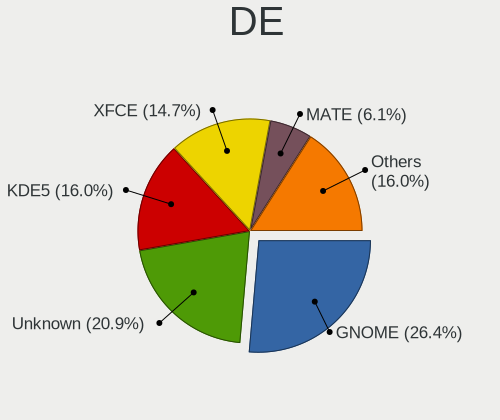
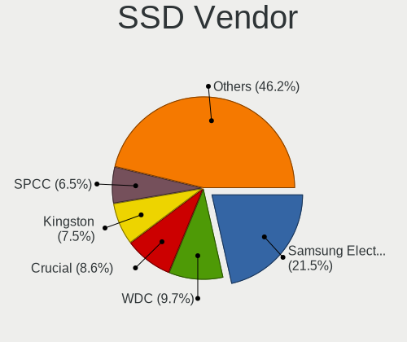
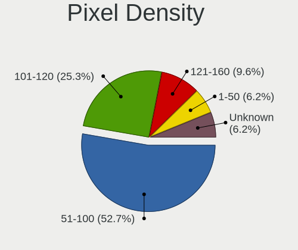

Debian - Hardware Trends (Desktops)
-----------------------------------

A project to identify most popular hardware characteristics and track their change
over time based on data collected by Linux users at https://Linux-Hardware.org.

Anyone can contribute to this report by the [hw-probe](https://github.com/linuxhw/hw-probe) tool:

    sudo -E hw-probe -all -upload

This report is for one last month. Overall report since the beginning of time: [TestDays](https://github.com/linuxhw/TestDays)

Period: Apr, 2024.

Contents
--------

* [ System ](#system)
  - [ OS                       ](#os)
  - [ OS Family                ](#os-family)
  - [ Kernel                   ](#kernel)
  - [ Kernel Family            ](#kernel-family)
  - [ Kernel Major Ver.        ](#kernel-major-ver)
  - [ Arch                     ](#arch)
  - [ DE                       ](#de)
  - [ Display Server           ](#display-server)
  - [ Display Manager          ](#display-manager)
  - [ OS Lang                  ](#os-lang)
  - [ Boot Mode                ](#boot-mode)
  - [ Filesystem               ](#filesystem)
  - [ Part. scheme             ](#part-scheme)
  - [ Dual Boot with Linux/BSD ](#dual-boot-with-linuxbsd)
  - [ Dual Boot (Win)          ](#dual-boot-win)

* [ Board ](#board)
  - [ Vendor                   ](#vendor)
  - [ Model                    ](#model)
  - [ Model Family             ](#model-family)
  - [ MFG Year                 ](#mfg-year)
  - [ Form Factor              ](#form-factor)
  - [ Secure Boot              ](#secure-boot)
  - [ Coreboot                 ](#coreboot)
  - [ RAM Size                 ](#ram-size)
  - [ RAM Used                 ](#ram-used)
  - [ Total Drives             ](#total-drives)
  - [ Has CD-ROM               ](#has-cd-rom)
  - [ Has Ethernet             ](#has-ethernet)
  - [ Has WiFi                 ](#has-wifi)
  - [ Has Bluetooth            ](#has-bluetooth)

* [ Location ](#location)
  - [ Country                  ](#country)
  - [ City                     ](#city)

* [ Drives ](#drives)
  - [ Drive Vendor             ](#drive-vendor)
  - [ Drive Model              ](#drive-model)
  - [ HDD Vendor               ](#hdd-vendor)
  - [ SSD Vendor               ](#ssd-vendor)
  - [ Drive Kind               ](#drive-kind)
  - [ Drive Connector          ](#drive-connector)
  - [ Drive Size               ](#drive-size)
  - [ Space Total              ](#space-total)
  - [ Space Used               ](#space-used)
  - [ Malfunc. Drives          ](#malfunc-drives)
  - [ Malfunc. Drive Vendor    ](#malfunc-drive-vendor)
  - [ Malfunc. HDD Vendor      ](#malfunc-hdd-vendor)
  - [ Malfunc. Drive Kind      ](#malfunc-drive-kind)
  - [ Failed Drives            ](#failed-drives)
  - [ Failed Drive Vendor      ](#failed-drive-vendor)
  - [ Drive Status             ](#drive-status)

* [ Storage controller ](#storage-controller)
  - [ Storage Vendor           ](#storage-vendor)
  - [ Storage Model            ](#storage-model)
  - [ Storage Kind             ](#storage-kind)

* [ Processor ](#processor)
  - [ CPU Vendor               ](#cpu-vendor)
  - [ CPU Model                ](#cpu-model)
  - [ CPU Model Family         ](#cpu-model-family)
  - [ CPU Cores                ](#cpu-cores)
  - [ CPU Sockets              ](#cpu-sockets)
  - [ CPU Threads              ](#cpu-threads)
  - [ CPU Op-Modes             ](#cpu-op-modes)
  - [ CPU Microcode            ](#cpu-microcode)
  - [ CPU Microarch            ](#cpu-microarch)

* [ Graphics ](#graphics)
  - [ GPU Vendor               ](#gpu-vendor)
  - [ GPU Model                ](#gpu-model)
  - [ GPU Combo                ](#gpu-combo)
  - [ GPU Driver               ](#gpu-driver)
  - [ GPU Memory               ](#gpu-memory)

* [ Monitor ](#monitor)
  - [ Monitor Vendor           ](#monitor-vendor)
  - [ Monitor Model            ](#monitor-model)
  - [ Monitor Resolution       ](#monitor-resolution)
  - [ Monitor Diagonal         ](#monitor-diagonal)
  - [ Monitor Width            ](#monitor-width)
  - [ Aspect Ratio             ](#aspect-ratio)
  - [ Monitor Area             ](#monitor-area)
  - [ Pixel Density            ](#pixel-density)
  - [ Multiple Monitors        ](#multiple-monitors)

* [ Network ](#network)
  - [ Net Controller Vendor    ](#net-controller-vendor)
  - [ Net Controller Model     ](#net-controller-model)
  - [ Wireless Vendor          ](#wireless-vendor)
  - [ Wireless Model           ](#wireless-model)
  - [ Ethernet Vendor          ](#ethernet-vendor)
  - [ Ethernet Model           ](#ethernet-model)
  - [ Net Controller Kind      ](#net-controller-kind)
  - [ Used Controller          ](#used-controller)
  - [ NICs                     ](#nics)
  - [ IPv6                     ](#ipv6)

* [ Bluetooth ](#bluetooth)
  - [ Bluetooth Vendor         ](#bluetooth-vendor)
  - [ Bluetooth Model          ](#bluetooth-model)

* [ Sound ](#sound)
  - [ Sound Vendor             ](#sound-vendor)
  - [ Sound Model              ](#sound-model)

* [ Memory ](#memory)
  - [ Memory Vendor            ](#memory-vendor)
  - [ Memory Model             ](#memory-model)
  - [ Memory Kind              ](#memory-kind)
  - [ Memory Form Factor       ](#memory-form-factor)
  - [ Memory Size              ](#memory-size)
  - [ Memory Speed             ](#memory-speed)

* [ Printers & scanners ](#printers--scanners)
  - [ Printer Vendor           ](#printer-vendor)
  - [ Printer Model            ](#printer-model)
  - [ Scanner Vendor           ](#scanner-vendor)
  - [ Scanner Model            ](#scanner-model)

* [ Camera ](#camera)
  - [ Camera Vendor            ](#camera-vendor)
  - [ Camera Model             ](#camera-model)

* [ Security ](#security)
  - [ Fingerprint Vendor       ](#fingerprint-vendor)
  - [ Fingerprint Model        ](#fingerprint-model)
  - [ Chipcard Vendor          ](#chipcard-vendor)
  - [ Chipcard Model           ](#chipcard-model)

* [ Unsupported ](#unsupported)
  - [ Unsupported Devices      ](#unsupported-devices)
  - [ Unsupported Device Types ](#unsupported-device-types)

System
------

OS
--

Installed operating systems

| Name      | Desktops | Percent |
|-----------|----------|---------|
| Debian 12 | 150      | 84.27%  |
| Debian 11 | 17       | 9.55%   |
| Debian    | 8        | 4.49%   |
| Debian 10 | 2        | 1.12%   |
| Debian 7  | 1        | 0.56%   |

OS Family
---------

OS without a version

| Name   | Desktops | Percent |
|--------|----------|---------|
| Debian | 178      | 100%    |

Kernel
------

Version of the Linux kernel

| Version                           | Desktops | Percent |
|-----------------------------------|----------|---------|
| 6.1.0-20-amd64                    | 44       | 24.72%  |
| 6.1.0-18-amd64                    | 36       | 20.22%  |
| 6.1.0-4-amd64                     | 28       | 15.73%  |
| 6.1.0-17-amd64                    | 8        | 4.49%   |
| 6.5.13-3-pve                      | 6        | 3.37%   |
| 5.10.0-28-amd64                   | 6        | 3.37%   |
| 6.6.15-amd64                      | 3        | 1.69%   |
| 6.5.13-5-pve                      | 3        | 1.69%   |
| 6.1.0-19-amd64                    | 3        | 1.69%   |
| 6.7.9-amd64                       | 2        | 1.12%   |
| 6.6.13+bpo-amd64                  | 2        | 1.12%   |
| 6.5.11-8-pve                      | 2        | 1.12%   |
| 6.1.0-13-amd64                    | 2        | 1.12%   |
| 6.1.0-0.deb11.17-amd64            | 2        | 1.12%   |
| 5.15.143-1-pve                    | 2        | 1.12%   |
| 4.19.147-rivoreo-amd64            | 2        | 1.12%   |
| 6.8.7-x64v3-xanmod2               | 1        | 0.56%   |
| 6.8.7-wrkd                        | 1        | 0.56%   |
| 6.8.3-playground-nohyperv-client+ | 1        | 0.56%   |
| 6.8.2-zabbly+                     | 1        | 0.56%   |
| 6.7.12-amd64                      | 1        | 0.56%   |
| 6.6.13+bpo-rt-amd64               | 1        | 0.56%   |
| 6.5.13-1-pve                      | 1        | 0.56%   |
| 6.5.11-7-pve                      | 1        | 0.56%   |
| 6.5.11-6-pve                      | 1        | 0.56%   |
| 6.5.0-0.deb12.4-amd64             | 1        | 0.56%   |
| 6.2.16-3-pve                      | 1        | 0.56%   |
| 6.1.67-mos-amd64                  | 1        | 0.56%   |
| 6.1.0-9-amd64                     | 1        | 0.56%   |
| 6.1.0-20-686-pae                  | 1        | 0.56%   |
| 6.1.0-20-686                      | 1        | 0.56%   |
| 6.1.0-18-arm64                    | 1        | 0.56%   |
| 6.1.0-18-686-pae                  | 1        | 0.56%   |
| 6.1.0-15-amd64                    | 1        | 0.56%   |
| 6.1.0-0.deb11.13-amd64            | 1        | 0.56%   |
| 5.15.149-1-pve                    | 1        | 0.56%   |
| 5.15.131-2-pve                    | 1        | 0.56%   |
| 5.10.199-antix.1-amd64-smp        | 1        | 0.56%   |
| 5.10.0-28-686-pae                 | 1        | 0.56%   |
| 5.10.0-27-amd64                   | 1        | 0.56%   |

Kernel Family
-------------

Linux kernel without a distro release

| Version  | Desktops | Percent |
|----------|----------|---------|
| 6.1.0    | 130      | 73.03%  |
| 6.5.13   | 10       | 5.62%   |
| 5.10.0   | 10       | 5.62%   |
| 6.5.11   | 4        | 2.25%   |
| 6.6.15   | 3        | 1.69%   |
| 6.6.13   | 3        | 1.69%   |
| 6.8.7    | 2        | 1.12%   |
| 6.7.9    | 2        | 1.12%   |
| 5.15.143 | 2        | 1.12%   |
| 4.19.147 | 2        | 1.12%   |
| 6.8.3    | 1        | 0.56%   |
| 6.8.2    | 1        | 0.56%   |
| 6.7.12   | 1        | 0.56%   |
| 6.5.0    | 1        | 0.56%   |
| 6.2.16   | 1        | 0.56%   |
| 6.1.67   | 1        | 0.56%   |
| 5.15.149 | 1        | 0.56%   |
| 5.15.131 | 1        | 0.56%   |
| 5.10.199 | 1        | 0.56%   |
| 3.2.0    | 1        | 0.56%   |

Kernel Major Ver.
-----------------

Linux kernel major version

| Version | Desktops | Percent |
|---------|----------|---------|
| 6.1     | 131      | 73.6%   |
| 6.5     | 15       | 8.43%   |
| 5.10    | 11       | 6.18%   |
| 6.6     | 6        | 3.37%   |
| 6.8     | 4        | 2.25%   |
| 5.15    | 4        | 2.25%   |
| 6.7     | 3        | 1.69%   |
| 4.19    | 2        | 1.12%   |
| 6.2     | 1        | 0.56%   |
| 3.2     | 1        | 0.56%   |

Arch
----

OS architecture (x86_64, i586, etc.)

| Name    | Desktops | Percent |
|---------|----------|---------|
| x86_64  | 172      | 96.63%  |
| i686    | 5        | 2.81%   |
| aarch64 | 1        | 0.56%   |

DE
--

Desktop Environment

| Name             | Desktops | Percent |
|------------------|----------|---------|
| Unknown          | 64       | 35.96%  |
| GNOME            | 35       | 19.66%  |
| KDE5             | 33       | 18.54%  |
| XFCE             | 20       | 11.24%  |
| MATE             | 8        | 4.49%   |
| GNOME Flashback  | 5        | 2.81%   |
| X-Cinnamon       | 4        | 2.25%   |
| LXQt             | 2        | 1.12%   |
| LXDE             | 2        | 1.12%   |
| lightdm-xsession | 1        | 0.56%   |
| KDE              | 1        | 0.56%   |
| icewm            | 1        | 0.56%   |
| GNOME Classic    | 1        | 0.56%   |
| Cinnamon         | 1        | 0.56%   |

Display Server
--------------

X11 or Wayland

| Name    | Desktops | Percent |
|---------|----------|---------|
| X11     | 69       | 38.76%  |
| Unknown | 41       | 23.03%  |
| Wayland | 39       | 21.91%  |
| Tty     | 29       | 16.29%  |

Display Manager
---------------

SDDM, LightDM, etc.

| Name    | Desktops | Percent |
|---------|----------|---------|
| Unknown | 89       | 50%     |
| LightDM | 36       | 20.22%  |
| GDM3    | 28       | 15.73%  |
| SDDM    | 22       | 12.36%  |
| GDM     | 2        | 1.12%   |
| SLiM    | 1        | 0.56%   |

OS Lang
-------

Language

| Lang    | Desktops | Percent |
|---------|----------|---------|
| en_US   | 66       | 37.08%  |
| ru_RU   | 35       | 19.66%  |
| de_DE   | 11       | 6.18%   |
| pl_PL   | 9        | 5.06%   |
| es_ES   | 6        | 3.37%   |
| fr_FR   | 5        | 2.81%   |
| en_GB   | 5        | 2.81%   |
| nl_NL   | 4        | 2.25%   |
| it_IT   | 4        | 2.25%   |
| pt_BR   | 3        | 1.69%   |
| en_CA   | 3        | 1.69%   |
| en_AU   | 3        | 1.69%   |
| zh_TW   | 2        | 1.12%   |
| hu_HU   | 2        | 1.12%   |
| fr_CA   | 2        | 1.12%   |
| es_CO   | 2        | 1.12%   |
| Unknown | 2        | 1.12%   |
| sv_SE   | 1        | 0.56%   |
| nl_BE   | 1        | 0.56%   |
| lt_LT   | 1        | 0.56%   |
| es_SV   | 1        | 0.56%   |
| es_MX   | 1        | 0.56%   |
| es_CL   | 1        | 0.56%   |
| es_AR   | 1        | 0.56%   |
| en_ZA   | 1        | 0.56%   |
| en_IE   | 1        | 0.56%   |
| de_CH   | 1        | 0.56%   |
| de_AT   | 1        | 0.56%   |
| cs_CZ   | 1        | 0.56%   |
| ca_ES   | 1        | 0.56%   |
| C       | 1        | 0.56%   |

Boot Mode
---------

EFI or BIOS

| Mode | Desktops | Percent |
|------|----------|---------|
| BIOS | 98       | 55.06%  |
| EFI  | 80       | 44.94%  |

Filesystem
----------

Type of filesystem

| Type    | Desktops | Percent |
|---------|----------|---------|
| Ext4    | 116      | 65.17%  |
| Overlay | 29       | 16.29%  |
| Btrfs   | 11       | 6.18%   |
| Tmpfs   | 9        | 5.06%   |
| Zfs     | 6        | 3.37%   |
| Xfs     | 5        | 2.81%   |
| Rootfs  | 1        | 0.56%   |
| Ext3    | 1        | 0.56%   |

Part. scheme
------------

Scheme of partitioning

| Type    | Desktops | Percent |
|---------|----------|---------|
| GPT     | 102      | 57.3%   |
| MBR     | 51       | 28.65%  |
| Unknown | 25       | 14.04%  |

Dual Boot with Linux/BSD
------------------------

Hosting more than one Linux/BSD

| Dual boot | Desktops | Percent |
|-----------|----------|---------|
| No        | 147      | 82.58%  |
| Yes       | 31       | 17.42%  |

Dual Boot (Win)
---------------

Hosting Linux and Windows

| Dual boot | Desktops | Percent |
|-----------|----------|---------|
| No        | 104      | 58.43%  |
| Yes       | 74       | 41.57%  |

Board
-----

Vendor
------

Motherboard manufacturer

| Name                                 | Desktops | Percent |
|--------------------------------------|----------|---------|
| ASUSTek Computer                     | 48       | 26.97%  |
| Gigabyte Technology                  | 28       | 15.73%  |
| ASRock                               | 19       | 10.67%  |
| Lenovo                               | 18       | 10.11%  |
| MSI                                  | 12       | 6.74%   |
| Dell                                 | 9        | 5.06%   |
| Hewlett-Packard                      | 7        | 3.93%   |
| Intel                                | 6        | 3.37%   |
| Fujitsu                              | 3        | 1.69%   |
| Shenzhen Meigao Electronic Equipment | 2        | 1.12%   |
| Pegatron                             | 2        | 1.12%   |
| AZW                                  | 2        | 1.12%   |
| AMI                                  | 2        | 1.12%   |
| Unknown                              | 2        | 1.12%   |
| SZMZ                                 | 1        | 0.56%   |
| Supermicro                           | 1        | 0.56%   |
| SolidRun                             | 1        | 0.56%   |
| Sapphire                             | 1        | 0.56%   |
| PCWare                               | 1        | 0.56%   |
| Minix                                | 1        | 0.56%   |
| Inventec                             | 1        | 0.56%   |
| Huanan                               | 1        | 0.56%   |
| HPE                                  | 1        | 0.56%   |
| Google                               | 1        | 0.56%   |
| GenMachine                           | 1        | 0.56%   |
| ECS                                  | 1        | 0.56%   |
| Dinson                               | 1        | 0.56%   |
| Colorful Technology                  | 1        | 0.56%   |
| Biostar                              | 1        | 0.56%   |
| BESSTAR Tech                         | 1        | 0.56%   |
| BCM Advanced Research                | 1        | 0.56%   |
| ADLINK Technology                    | 1        | 0.56%   |

Model
-----

Motherboard model

| Name                                              | Desktops | Percent |
|---------------------------------------------------|----------|---------|
| Lenovo ThinkCentre M79 10JAS05300                 | 9        | 5.06%   |
| ASUS S20 K29                                      | 5        | 2.81%   |
| ASUS All Series                                   | 3        | 1.69%   |
| Unknown                                           | 3        | 1.69%   |
| Gigabyte Z790 AORUS ELITE AX                      | 2        | 1.12%   |
| Gigabyte X570 GAMING X                            | 2        | 1.12%   |
| Gigabyte GA-78LMT-S2                              | 2        | 1.12%   |
| AZW U59                                           | 2        | 1.12%   |
| ASUS P5QL-CM                                      | 2        | 1.12%   |
| ASUS P5KPL-CM                                     | 2        | 1.12%   |
| SZMZ X99-S3                                       | 1        | 0.56%   |
| Supermicro X8ST3                                  | 1        | 0.56%   |
| SolidRun CEX7 Platform                            | 1        | 0.56%   |
| Shenzhen Meigao Electronic Equipment Venus Series | 1        | 0.56%   |
| Shenzhen Meigao Electronic Equipment NAB6         | 1        | 0.56%   |
| Sapphire PI-AM3RS760G2                            | 1        | 0.56%   |
| Pegatron Pavilion Slimline S5000 Series           | 1        | 0.56%   |
| Pegatron p7-1238                                  | 1        | 0.56%   |
| PCWare IPMH310G PRO                               | 1        | 0.56%   |
| MSI PRO B300 DP20ZA (MS-B0A2)                     | 1        | 0.56%   |
| MSI MS-7D73                                       | 1        | 0.56%   |
| MSI MS-7C95                                       | 1        | 0.56%   |
| MSI MS-7C94                                       | 1        | 0.56%   |
| MSI MS-7C91                                       | 1        | 0.56%   |
| MSI MS-7C56                                       | 1        | 0.56%   |
| MSI MS-7C02                                       | 1        | 0.56%   |
| MSI MS-7B86                                       | 1        | 0.56%   |
| MSI MS-7B09                                       | 1        | 0.56%   |
| MSI MS-7996                                       | 1        | 0.56%   |
| MSI MS-7788                                       | 1        | 0.56%   |
| MSI MS-7235                                       | 1        | 0.56%   |
| Minix Z83-4                                       | 1        | 0.56%   |
| Lenovo V520-15IKL 10NK002MGE                      | 1        | 0.56%   |
| Lenovo ThinkStation P500 30A6S2YK00               | 1        | 0.56%   |
| Lenovo ThinkCentre neo 50t Gen 3 11SE00QFFM       | 1        | 0.56%   |
| Lenovo ThinkCentre neo 50s Gen 3 11T0008DFM       | 1        | 0.56%   |
| Lenovo ThinkCentre M900 10FLS4AR00                | 1        | 0.56%   |
| Lenovo ThinkCentre M79 10JAS00B00                 | 1        | 0.56%   |
| Lenovo ThinkCentre M72e 4004H1U                   | 1        | 0.56%   |
| Lenovo ThinkCentre M715s 10MCS00Q00               | 1        | 0.56%   |

Model Family
------------

Motherboard model prefix

| Name                                       | Desktops | Percent |
|--------------------------------------------|----------|---------|
| Lenovo ThinkCentre                         | 15       | 8.43%   |
| Gigabyte X570                              | 6        | 3.37%   |
| Dell OptiPlex                              | 6        | 3.37%   |
| ASUS PRIME                                 | 6        | 3.37%   |
| ASUS TUF                                   | 5        | 2.81%   |
| ASUS S20                                   | 5        | 2.81%   |
| ASUS ROG                                   | 5        | 2.81%   |
| HP EliteDesk                               | 3        | 1.69%   |
| Gigabyte Z790                              | 3        | 1.69%   |
| ASUS All                                   | 3        | 1.69%   |
| Unknown                                    | 3        | 1.69%   |
| HP ProDesk                                 | 2        | 1.12%   |
| Gigabyte GA-78LMT-S2                       | 2        | 1.12%   |
| Gigabyte B450M                             | 2        | 1.12%   |
| AZW U59                                    | 2        | 1.12%   |
| ASUS STRIX                                 | 2        | 1.12%   |
| ASUS Pro                                   | 2        | 1.12%   |
| ASUS P5QL-CM                               | 2        | 1.12%   |
| ASUS P5KPL-CM                              | 2        | 1.12%   |
| ASUS M5A97                                 | 2        | 1.12%   |
| ASUS F2A85-M                               | 2        | 1.12%   |
| ASRock B450M                               | 2        | 1.12%   |
| SZMZ X99-S3                                | 1        | 0.56%   |
| Supermicro X8ST3                           | 1        | 0.56%   |
| SolidRun CEX7                              | 1        | 0.56%   |
| Shenzhen Meigao Electronic Equipment Venus | 1        | 0.56%   |
| Shenzhen Meigao Electronic Equipment NAB6  | 1        | 0.56%   |
| Sapphire PI-AM3RS760G2                     | 1        | 0.56%   |
| Pegatron Pavilion                          | 1        | 0.56%   |
| Pegatron p7-1238                           | 1        | 0.56%   |
| PCWare IPMH310G                            | 1        | 0.56%   |
| MSI PRO                                    | 1        | 0.56%   |
| MSI MS-7D73                                | 1        | 0.56%   |
| MSI MS-7C95                                | 1        | 0.56%   |
| MSI MS-7C94                                | 1        | 0.56%   |
| MSI MS-7C91                                | 1        | 0.56%   |
| MSI MS-7C56                                | 1        | 0.56%   |
| MSI MS-7C02                                | 1        | 0.56%   |
| MSI MS-7B86                                | 1        | 0.56%   |
| MSI MS-7B09                                | 1        | 0.56%   |

MFG Year
--------

Motherboard manufacture year

| Year | Desktops | Percent |
|------|----------|---------|
| 2022 | 19       | 10.67%  |
| 2020 | 19       | 10.67%  |
| 2016 | 18       | 10.11%  |
| 2021 | 15       | 8.43%   |
| 2019 | 15       | 8.43%   |
| 2012 | 15       | 8.43%   |
| 2023 | 13       | 7.3%    |
| 2011 | 8        | 4.49%   |
| 2017 | 7        | 3.93%   |
| 2015 | 7        | 3.93%   |
| 2018 | 6        | 3.37%   |
| 2014 | 6        | 3.37%   |
| 2013 | 6        | 3.37%   |
| 2008 | 6        | 3.37%   |
| 2010 | 4        | 2.25%   |
| 2009 | 4        | 2.25%   |
| 2024 | 3        | 1.69%   |
| 2007 | 3        | 1.69%   |
| 2006 | 1        | 0.56%   |
| 2005 | 1        | 0.56%   |
| 2002 | 1        | 0.56%   |
| 2000 | 1        | 0.56%   |

Form Factor
-----------

Physical design of the computer

| Name    | Desktops | Percent |
|---------|----------|---------|
| Desktop | 178      | 100%    |

Secure Boot
-----------

Enabled or disabled

| State    | Desktops | Percent |
|----------|----------|---------|
| Disabled | 170      | 95.51%  |
| Enabled  | 8        | 4.49%   |

Coreboot
--------

Have coreboot on board

| Used | Desktops | Percent |
|------|----------|---------|
| No   | 176      | 98.88%  |
| Yes  | 2        | 1.12%   |

RAM Size
--------

Total RAM memory

| Size in GB  | Desktops | Percent |
|-------------|----------|---------|
| 32.01-64.0  | 38       | 21.35%  |
| 4.01-8.0    | 31       | 17.42%  |
| 16.01-24.0  | 30       | 16.85%  |
| 3.01-4.0    | 23       | 12.92%  |
| 64.01-256.0 | 22       | 12.36%  |
| 8.01-16.0   | 11       | 6.18%   |
| 1.01-2.0    | 10       | 5.62%   |
| 24.01-32.0  | 7        | 3.93%   |
| 0.51-1.0    | 2        | 1.12%   |
| Unknown     | 2        | 1.12%   |
| 2.01-3.0    | 1        | 0.56%   |
| 0.01-0.5    | 1        | 0.56%   |

RAM Used
--------

Used RAM memory

| Used GB     | Desktops | Percent |
|-------------|----------|---------|
| 0.51-1.0    | 38       | 21.35%  |
| 4.01-8.0    | 31       | 17.42%  |
| 2.01-3.0    | 28       | 15.73%  |
| 1.01-2.0    | 24       | 13.48%  |
| 3.01-4.0    | 23       | 12.92%  |
| 8.01-16.0   | 16       | 8.99%   |
| 32.01-64.0  | 5        | 2.81%   |
| 0.01-0.5    | 4        | 2.25%   |
| 24.01-32.0  | 3        | 1.69%   |
| Unknown     | 3        | 1.69%   |
| 16.01-24.0  | 2        | 1.12%   |
| 64.01-256.0 | 1        | 0.56%   |

Total Drives
------------

Number of drives on board

| Drives | Desktops | Percent |
|--------|----------|---------|
| 1      | 76       | 42.7%   |
| 2      | 41       | 23.03%  |
| 3      | 27       | 15.17%  |
| 4      | 20       | 11.24%  |
| 13     | 2        | 1.12%   |
| 10     | 2        | 1.12%   |
| 5      | 2        | 1.12%   |
| 0      | 2        | 1.12%   |
| 14     | 1        | 0.56%   |
| 12     | 1        | 0.56%   |
| 9      | 1        | 0.56%   |
| 8      | 1        | 0.56%   |
| 7      | 1        | 0.56%   |
| 6      | 1        | 0.56%   |

Has CD-ROM
----------

Has CD-ROM on board

| Presented | Desktops | Percent |
|-----------|----------|---------|
| No        | 120      | 67.42%  |
| Yes       | 58       | 32.58%  |

Has Ethernet
------------

Has Ethernet on board

| Presented | Desktops | Percent |
|-----------|----------|---------|
| Yes       | 176      | 98.88%  |
| No        | 2        | 1.12%   |

Has WiFi
--------

Has WiFi module

| Presented | Desktops | Percent |
|-----------|----------|---------|
| No        | 120      | 67.42%  |
| Yes       | 58       | 32.58%  |

Has Bluetooth
-------------

Has Bluetooth module

| Presented | Desktops | Percent |
|-----------|----------|---------|
| No        | 127      | 71.35%  |
| Yes       | 51       | 28.65%  |

Location
--------

Country
-------

Geographic location (country)

| Country      | Desktops | Percent |
|--------------|----------|---------|
| Russia       | 42       | 23.6%   |
| USA          | 25       | 14.04%  |
| Germany      | 16       | 8.99%   |
| Poland       | 11       | 6.18%   |
| Spain        | 7        | 3.93%   |
| Canada       | 7        | 3.93%   |
| Netherlands  | 6        | 3.37%   |
| UK           | 5        | 2.81%   |
| Italy        | 5        | 2.81%   |
| Brazil       | 5        | 2.81%   |
| China        | 4        | 2.25%   |
| Switzerland  | 3        | 1.69%   |
| France       | 3        | 1.69%   |
| Belgium      | 3        | 1.69%   |
| Australia    | 3        | 1.69%   |
| Uzbekistan   | 2        | 1.12%   |
| Romania      | 2        | 1.12%   |
| Morocco      | 2        | 1.12%   |
| Mexico       | 2        | 1.12%   |
| Malaysia     | 2        | 1.12%   |
| Kazakhstan   | 2        | 1.12%   |
| Hungary      | 2        | 1.12%   |
| Greece       | 2        | 1.12%   |
| Colombia     | 2        | 1.12%   |
| Taiwan       | 1        | 0.56%   |
| Sweden       | 1        | 0.56%   |
| South Africa | 1        | 0.56%   |
| Serbia       | 1        | 0.56%   |
| Portugal     | 1        | 0.56%   |
| Lithuania    | 1        | 0.56%   |
| Ireland      | 1        | 0.56%   |
| Hong Kong    | 1        | 0.56%   |
| Finland      | 1        | 0.56%   |
| El Salvador  | 1        | 0.56%   |
| Czechia      | 1        | 0.56%   |
| Chile        | 1        | 0.56%   |
| Belarus      | 1        | 0.56%   |
| Austria      | 1        | 0.56%   |
| Argentina    | 1        | 0.56%   |

City
----

Geographic location (city)

| City                    | Desktops | Percent |
|-------------------------|----------|---------|
| Voronezh                | 28       | 15.73%  |
| Moscow                  | 5        | 2.81%   |
| Amsterdam               | 4        | 2.25%   |
| St Petersburg           | 3        | 1.69%   |
| Ruda Śląska           | 3        | 1.69%   |
| Warsaw                  | 2        | 1.12%   |
| Toronto                 | 2        | 1.12%   |
| Tashkent                | 2        | 1.12%   |
| Semey                   | 2        | 1.12%   |
| Madrid                  | 2        | 1.12%   |
| Kuala Lumpur            | 2        | 1.12%   |
| Frankfurt am Main       | 2        | 1.12%   |
| Bonn                    | 2        | 1.12%   |
| Bieligutai              | 2        | 1.12%   |
| Athens                  | 2        | 1.12%   |
| Zwolle                  | 1        | 0.56%   |
| Zabrze                  | 1        | 0.56%   |
| Yekaterinburg           | 1        | 0.56%   |
| Wuhan                   | 1        | 0.56%   |
| Wittenberge             | 1        | 0.56%   |
| Winter Springs          | 1        | 0.56%   |
| West Liberty            | 1        | 0.56%   |
| Wauwatosa               | 1        | 0.56%   |
| Wattwil                 | 1        | 0.56%   |
| Washington              | 1        | 0.56%   |
| Wanchai                 | 1        | 0.56%   |
| Vivonne                 | 1        | 0.56%   |
| Villanueva de la Canada | 1        | 0.56%   |
| Vila Velha              | 1        | 0.56%   |
| Valencia                | 1        | 0.56%   |
| Uetze                   | 1        | 0.56%   |
| Trinidad                | 1        | 0.56%   |
| Trento                  | 1        | 0.56%   |
| Tapachula               | 1        | 0.56%   |
| Tampico                 | 1        | 0.56%   |
| Taichung                | 1        | 0.56%   |
| Syktyvkar               | 1        | 0.56%   |
| Sydney                  | 1        | 0.56%   |
| Stuttgart               | 1        | 0.56%   |
| Sherbrooke              | 1        | 0.56%   |

Drives
------

Drive Vendor
------------

Hard drive vendors

| Vendor                      | Desktops | Drives | Percent |
|-----------------------------|----------|--------|---------|
| WDC                         | 55       | 87     | 17.63%  |
| Samsung Electronics         | 46       | 67     | 14.74%  |
| Seagate                     | 42       | 59     | 13.46%  |
| Toshiba                     | 20       | 25     | 6.41%   |
| Kingston                    | 18       | 36     | 5.77%   |
| Crucial                     | 17       | 17     | 5.45%   |
| Sandisk                     | 16       | 18     | 5.13%   |
| Hitachi                     | 9        | 12     | 2.88%   |
| A-DATA Technology           | 6        | 7      | 1.92%   |
| SK hynix                    | 5        | 5      | 1.6%    |
| GOODRAM                     | 5        | 12     | 1.6%    |
| China                       | 5        | 5      | 1.6%    |
| Corsair                     | 4        | 5      | 1.28%   |
| Unknown                     | 3        | 3      | 0.96%   |
| SPCC                        | 3        | 3      | 0.96%   |
| PNY                         | 3        | 5      | 0.96%   |
| OCZ                         | 3        | 4      | 0.96%   |
| Kingston Technology Company | 3        | 4      | 0.96%   |
| HGST                        | 3        | 3      | 0.96%   |
| Transcend                   | 2        | 2      | 0.64%   |
| Team                        | 2        | 2      | 0.64%   |
| Patriot                     | 2        | 2      | 0.64%   |
| Netac                       | 2        | 2      | 0.64%   |
| Micron/Crucial Technology   | 2        | 3      | 0.64%   |
| Micron Technology           | 2        | 2      | 0.64%   |
| Lexar                       | 2        | 3      | 0.64%   |
| KIOXIA                      | 2        | 2      | 0.64%   |
| Intel                       | 2        | 4      | 0.64%   |
| Gigabyte Technology         | 2        | 2      | 0.64%   |
| Apacer                      | 2        | 2      | 0.64%   |
| Acer                        | 2        | 2      | 0.64%   |
| Unknown                     | 2        | 2      | 0.64%   |
| TSA                         | 1        | 1      | 0.32%   |
| Timetec                     | 1        | 2      | 0.32%   |
| Silicon Motion              | 1        | 1      | 0.32%   |
| Realtek Semiconductor       | 1        | 1      | 0.32%   |
| QUANTUM                     | 1        | 1      | 0.32%   |
| Plextor                     | 1        | 1      | 0.32%   |
| Mushkin                     | 1        | 1      | 0.32%   |
| Mercury                     | 1        | 1      | 0.32%   |

Drive Model
-----------

Hard drive models

| Model                                             | Desktops | Percent |
|---------------------------------------------------|----------|---------|
| Samsung NVMe SSD Controller SM981/PM981/PM983 1TB | 7        | 1.92%   |
| WDC WD5000AAKX-22ERMA0 500GB                      | 5        | 1.37%   |
| Seagate ST1000DM010-2EP102 1TB                    | 5        | 1.37%   |
| Crucial CT480BX500SSD1 480GB                      | 5        | 1.37%   |
| Toshiba DT01ACA200 2TB                            | 4        | 1.1%    |
| Kingston SA400S37480G 480GB SSD                   | 4        | 1.1%    |
| Seagate ST500DM002-1BD142 500GB                   | 3        | 0.82%   |
| Seagate ST3320620AS 320GB                         | 3        | 0.82%   |
| Seagate ST2000DM008-2FR102 2TB                    | 3        | 0.82%   |
| SanDisk NVMe SSD Drive 1TB                        | 3        | 0.82%   |
| Samsung SSD 970 EVO Plus 500GB                    | 3        | 0.82%   |
| Kingston SA400S37240G 240GB SSD                   | 3        | 0.82%   |
| WDC WDS100T3X0C-00SJG0 1TB                        | 2        | 0.55%   |
| WDC WD42PURZ-85B4YY0 4TB                          | 2        | 0.55%   |
| WDC WD40EFAX-68JH4N1 4TB                          | 2        | 0.55%   |
| WDC WD30EFRX-68EUZN0 3TB                          | 2        | 0.55%   |
| WDC WD20EZBX-00AYRA0 2TB                          | 2        | 0.55%   |
| WDC WD20EZAZ-00GGJB0 2TB                          | 2        | 0.55%   |
| WDC WD20EFRX-68EUZN0 2TB                          | 2        | 0.55%   |
| WDC WD20EARX-00PASB0 2TB                          | 2        | 0.55%   |
| WDC WD2002FAEX-007BA0 2TB                         | 2        | 0.55%   |
| Toshiba HDWD120 2TB                               | 2        | 0.55%   |
| Toshiba DT01ACA100 1TB                            | 2        | 0.55%   |
| Seagate ST8000DM004-2CX188 8TB                    | 2        | 0.55%   |
| Seagate ST4000DM004-2CV104 4TB                    | 2        | 0.55%   |
| Seagate ST3250410AS 250GB                         | 2        | 0.55%   |
| Seagate ST2000DM001-1ER164 2TB                    | 2        | 0.55%   |
| Seagate ST1000DM003-9YN162 1TB                    | 2        | 0.55%   |
| Seagate ST1000DM003-1CH162 1TB                    | 2        | 0.55%   |
| SanDisk NVMe SSD Drive 2TB                        | 2        | 0.55%   |
| Samsung SSD 980 PRO 1TB                           | 2        | 0.55%   |
| Samsung SSD 870 QVO 8TB                           | 2        | 0.55%   |
| Samsung SSD 870 QVO 1TB                           | 2        | 0.55%   |
| Samsung SSD 870 EVO 500GB                         | 2        | 0.55%   |
| Samsung SSD 840 EVO 250GB                         | 2        | 0.55%   |
| Samsung NVMe SSD Controller SM961/PM961/SM963 1TB | 2        | 0.55%   |
| PNY 1TB SATA SSD                                  | 2        | 0.55%   |
| Kingston SEDC500R1920G 2TB SSD                    | 2        | 0.55%   |
| Kingston SEDC1000BM8960G 960GB                    | 2        | 0.55%   |
| Kingston SA400S37960G 960GB SSD                   | 2        | 0.55%   |

HDD Vendor
----------

Hard disk drive vendors

| Vendor              | Desktops | Drives | Percent |
|---------------------|----------|--------|---------|
| WDC                 | 48       | 79     | 38.4%   |
| Seagate             | 42       | 59     | 33.6%   |
| Toshiba             | 18       | 23     | 14.4%   |
| Hitachi             | 9        | 12     | 7.2%    |
| Samsung Electronics | 2        | 2      | 1.6%    |
| HGST                | 2        | 2      | 1.6%    |
| QUANTUM             | 1        | 1      | 0.8%    |
| MARVELL             | 1        | 2      | 0.8%    |
| HGST HTS            | 1        | 1      | 0.8%    |
| Hewlett-Packard     | 1        | 1      | 0.8%    |

SSD Vendor
----------

Solid state drive vendors

| Vendor              | Desktops | Drives | Percent |
|---------------------|----------|--------|---------|
| Samsung Electronics | 19       | 27     | 18.63%  |
| Crucial             | 13       | 13     | 12.75%  |
| Kingston            | 12       | 20     | 11.76%  |
| SanDisk             | 6        | 7      | 5.88%   |
| WDC                 | 5        | 5      | 4.9%    |
| China               | 5        | 5      | 4.9%    |
| A-DATA Technology   | 5        | 5      | 4.9%    |
| SPCC                | 3        | 3      | 2.94%   |
| PNY                 | 3        | 5      | 2.94%   |
| OCZ                 | 3        | 4      | 2.94%   |
| GOODRAM             | 3        | 3      | 2.94%   |
| Transcend           | 2        | 2      | 1.96%   |
| Toshiba             | 2        | 2      | 1.96%   |
| Patriot             | 2        | 2      | 1.96%   |
| Netac               | 2        | 2      | 1.96%   |
| Apacer              | 2        | 2      | 1.96%   |
| TSA                 | 1        | 1      | 0.98%   |
| Timetec             | 1        | 2      | 0.98%   |
| Team                | 1        | 1      | 0.98%   |
| Plextor             | 1        | 1      | 0.98%   |
| Micron Technology   | 1        | 1      | 0.98%   |
| Mercury             | 1        | 1      | 0.98%   |
| KLEVV               | 1        | 2      | 0.98%   |
| KIOXIA-EXCERIA      | 1        | 1      | 0.98%   |
| KingFast            | 1        | 1      | 0.98%   |
| Intel               | 1        | 3      | 0.98%   |
| Fujitsu             | 1        | 1      | 0.98%   |
| External            | 1        | 1      | 0.98%   |
| Corsair             | 1        | 1      | 0.98%   |
| ASMedia             | 1        | 1      | 0.98%   |
| Acer                | 1        | 1      | 0.98%   |

Drive Kind
----------

HDD or SSD

| Kind    | Desktops | Drives | Percent |
|---------|----------|--------|---------|
| HDD     | 100      | 182    | 37.88%  |
| SSD     | 85       | 126    | 32.2%   |
| NVMe    | 73       | 115    | 27.65%  |
| MMC     | 4        | 4      | 1.52%   |
| Unknown | 2        | 4      | 0.76%   |

Drive Connector
---------------

SATA, SAS, NVMe, etc.

| Type | Desktops | Drives | Percent |
|------|----------|--------|---------|
| SATA | 149      | 296    | 63.68%  |
| NVMe | 73       | 114    | 31.2%   |
| SAS  | 8        | 17     | 3.42%   |
| MMC  | 4        | 4      | 1.71%   |

Drive Size
----------

Size of hard drive

| Size in TB | Desktops | Drives | Percent |
|------------|----------|--------|---------|
| 0.01-0.5   | 101      | 130    | 47.42%  |
| 0.51-1.0   | 50       | 64     | 23.47%  |
| 1.01-2.0   | 28       | 51     | 13.15%  |
| 3.01-4.0   | 12       | 24     | 5.63%   |
| 2.01-3.0   | 11       | 24     | 5.16%   |
| 4.01-10.0  | 9        | 12     | 4.23%   |
| 10.01-20.0 | 2        | 3      | 0.94%   |

Space Total
-----------

Amount of disk space available on the file system

| Size in GB     | Desktops | Percent |
|----------------|----------|---------|
| Unknown        | 34       | 19.1%   |
| 501-1000       | 31       | 17.42%  |
| 101-250        | 26       | 14.61%  |
| 251-500        | 23       | 12.92%  |
| More than 3000 | 22       | 12.36%  |
| 2001-3000      | 11       | 6.18%   |
| 1001-2000      | 11       | 6.18%   |
| 51-100         | 9        | 5.06%   |
| 1-20           | 8        | 4.49%   |
| 21-50          | 3        | 1.69%   |

Space Used
----------

Amount of used disk space

| Used GB        | Desktops | Percent |
|----------------|----------|---------|
| 1-20           | 51       | 28.65%  |
| Unknown        | 34       | 19.1%   |
| 101-250        | 19       | 10.67%  |
| 251-500        | 17       | 9.55%   |
| 21-50          | 13       | 7.3%    |
| 501-1000       | 13       | 7.3%    |
| 51-100         | 12       | 6.74%   |
| More than 3000 | 10       | 5.62%   |
| 1001-2000      | 7        | 3.93%   |
| 2001-3000      | 2        | 1.12%   |

Malfunc. Drives
---------------

Drive models with a malfunction

| Model                                               | Desktops | Drives | Percent |
|-----------------------------------------------------|----------|--------|---------|
| WDC WD5000AAKX-22ERMA0 500GB                        | 2        | 2      | 8%      |
| WDC WD5000AAKX-07U6AA0 500GB                        | 1        | 1      | 4%      |
| WDC WD2500AAKS-00VSA0 250GB                         | 1        | 1      | 4%      |
| WDC WD2500AAJS-08L7A0 250GB                         | 1        | 1      | 4%      |
| WDC WD2500AAJS-00L7A0 250GB                         | 1        | 1      | 4%      |
| WDC WD20EARX-22PASB0 2TB                            | 1        | 2      | 4%      |
| WDC WD2002FAEX-007BA0 2TB                           | 1        | 1      | 4%      |
| WDC WD1503FYYS-02W0B0 1TB                           | 1        | 1      | 4%      |
| WDC WD Green M.2 2280 480GB SSD                     | 1        | 1      | 4%      |
| WDC WD Blue SA510 2.5 250GB SSD                     | 1        | 1      | 4%      |
| Transcend TS32GPSD330 32GB SSD                      | 1        | 1      | 4%      |
| Toshiba DT01ACA200 2TB                              | 1        | 1      | 4%      |
| Seagate ST8000DM004-2CX188 8TB                      | 1        | 1      | 4%      |
| Seagate ST500LM012 HN-M500MBB 500GB                 | 1        | 1      | 4%      |
| Seagate ST500DM002-1BD142 500GB                     | 1        | 1      | 4%      |
| Seagate ST2000DL003-9VT166 2TB                      | 1        | 1      | 4%      |
| Seagate ST1000DM010-2EP102 1TB                      | 1        | 1      | 4%      |
| Seagate ST1000DM003-9YN162 1TB                      | 1        | 1      | 4%      |
| Samsung Electronics SSD 980 PRO 2TB S69ENF0RA43997V | 1        | 1      | 4%      |
| Samsung Electronics SSD 840 EVO 250GB               | 1        | 1      | 4%      |
| Hitachi HDT721010SLA360 1TB                         | 1        | 1      | 4%      |
| Hitachi HDP725050GLA360 500GB                       | 1        | 1      | 4%      |
| Fujitsu F500S-480GB SSD                             | 1        | 1      | 4%      |
| A-DATA Technology SP900 256GB SSD                   | 1        | 1      | 4%      |

Malfunc. Drive Vendor
---------------------

Vendors of faulty drives

| Vendor              | Desktops | Drives | Percent |
|---------------------|----------|--------|---------|
| WDC                 | 10       | 12     | 41.67%  |
| Seagate             | 6        | 6      | 25%     |
| Samsung Electronics | 2        | 2      | 8.33%   |
| Hitachi             | 2        | 2      | 8.33%   |
| Transcend           | 1        | 1      | 4.17%   |
| Toshiba             | 1        | 1      | 4.17%   |
| Fujitsu             | 1        | 1      | 4.17%   |
| A-DATA Technology   | 1        | 1      | 4.17%   |

Malfunc. HDD Vendor
-------------------

Vendors of faulty HDD drives

| Vendor  | Desktops | Drives | Percent |
|---------|----------|--------|---------|
| WDC     | 8        | 10     | 47.06%  |
| Seagate | 6        | 6      | 35.29%  |
| Hitachi | 2        | 2      | 11.76%  |
| Toshiba | 1        | 1      | 5.88%   |

Malfunc. Drive Kind
-------------------

Kinds of faulty drives

| Kind | Desktops | Drives | Percent |
|------|----------|--------|---------|
| HDD  | 14       | 19     | 66.67%  |
| SSD  | 6        | 6      | 28.57%  |
| NVMe | 1        | 1      | 4.76%   |

Failed Drives
-------------

Failed drive models

Zero info for selected period =(

Failed Drive Vendor
-------------------

Failed drive vendors

Zero info for selected period =(

Drive Status
------------

Number of failed and malfunc. drives

| Status   | Desktops | Drives | Percent |
|----------|----------|--------|---------|
| Works    | 135      | 313    | 66.83%  |
| Detected | 47       | 92     | 23.27%  |
| Malfunc  | 20       | 26     | 9.9%    |

Storage controller
------------------

Storage Vendor
--------------

Storage controller vendors

| Vendor                           | Desktops | Percent |
|----------------------------------|----------|---------|
| Intel                            | 101      | 35.44%  |
| AMD                              | 66       | 23.16%  |
| Samsung Electronics              | 29       | 10.18%  |
| Sandisk                          | 12       | 4.21%   |
| Kingston Technology Company      | 10       | 3.51%   |
| Phison Electronics               | 9        | 3.16%   |
| JMicron Technology               | 7        | 2.46%   |
| ASMedia Technology               | 7        | 2.46%   |
| Micron/Crucial Technology        | 6        | 2.11%   |
| SK hynix                         | 5        | 1.75%   |
| Marvell Technology Group         | 5        | 1.75%   |
| Silicon Motion                   | 3        | 1.05%   |
| Nvidia                           | 3        | 1.05%   |
| Adaptec                          | 3        | 1.05%   |
| Silicon Image                    | 2        | 0.7%    |
| Shenzhen Longsys Electronics     | 2        | 0.7%    |
| Realtek Semiconductor            | 2        | 0.7%    |
| MAXIO Technology (Hangzhou)      | 2        | 0.7%    |
| KIOXIA                           | 2        | 0.7%    |
| VIA Technologies                 | 1        | 0.35%   |
| Silicon Integrated Systems [SiS] | 1        | 0.35%   |
| Nextorage                        | 1        | 0.35%   |
| Micron Technology                | 1        | 0.35%   |
| LSI Logic / Symbios Logic        | 1        | 0.35%   |
| INNOGRIT                         | 1        | 0.35%   |
| Broadcom / LSI                   | 1        | 0.35%   |
| Biwin Storage Technology         | 1        | 0.35%   |
| ADATA Technology                 | 1        | 0.35%   |

Storage Model
-------------

Storage controller models

| Model                                                                          | Desktops | Percent |
|--------------------------------------------------------------------------------|----------|---------|
| AMD FCH SATA Controller [AHCI mode]                                            | 38       | 11.41%  |
| Intel 200 Series PCH SATA controller [AHCI mode]                               | 15       | 4.5%    |
| Samsung NVMe SSD Controller SM981/PM981/PM983                                  | 13       | 3.9%    |
| AMD 500 Series Chipset SATA Controller                                         | 9        | 2.7%    |
| AMD 400 Series Chipset SATA Controller                                         | 9        | 2.7%    |
| Intel Q170/Q150/B150/H170/H110/Z170/CM236 Chipset SATA Controller [AHCI Mode]  | 8        | 2.4%    |
| Samsung NVMe SSD Controller PM9A1/PM9A3/980PRO                                 | 7        | 2.1%    |
| Intel Raptor Lake SATA AHCI Controller                                         | 7        | 2.1%    |
| Intel Alder Lake-S PCH SATA Controller [AHCI Mode]                             | 7        | 2.1%    |
| Intel 8 Series/C220 Series Chipset Family 6-port SATA Controller 1 [AHCI mode] | 6        | 1.8%    |
| ASMedia ASM1061/ASM1062 Serial ATA Controller                                  | 6        | 1.8%    |
| AMD SB7x0/SB8x0/SB9x0 SATA Controller [AHCI mode]                              | 6        | 1.8%    |
| AMD 600 Series Chipset SATA Controller                                         | 6        | 1.8%    |
| Intel 7 Series/C210 Series Chipset Family 6-port SATA Controller [AHCI mode]   | 5        | 1.5%    |
| AMD SB7x0/SB8x0/SB9x0 IDE Controller                                           | 5        | 1.5%    |
| Micron/Crucial P5 Plus NVMe PCIe SSD                                           | 4        | 1.2%    |
| Intel NM10/ICH7 Family SATA Controller [IDE mode]                              | 4        | 1.2%    |
| Intel 82801G (ICH7 Family) IDE Controller                                      | 4        | 1.2%    |
| Intel 6 Series/C200 Series Chipset Family 6 port Desktop SATA AHCI Controller  | 4        | 1.2%    |
| SanDisk Extreme Pro / WD Black SN750 / PC SN730 / Red SN700 NVMe SSD           | 3        | 0.9%    |
| Samsung NVMe SSD Controller SM961/PM961/SM963                                  | 3        | 0.9%    |
| Phison E18 PCIe4 NVMe Controller                                               | 3        | 0.9%    |
| Kingston Company A2000 NVMe SSD SM2263EN                                       | 3        | 0.9%    |
| JMicron JMB368 IDE controller                                                  | 3        | 0.9%    |
| Intel Volume Management Device NVMe RAID Controller                            | 3        | 0.9%    |
| Intel SATA Controller [RAID mode]                                              | 3        | 0.9%    |
| Intel Cannon Lake PCH SATA AHCI Controller                                     | 3        | 0.9%    |
| Intel C610/X99 series chipset sSATA Controller [AHCI mode]                     | 3        | 0.9%    |
| Intel 9 Series Chipset Family SATA Controller [AHCI Mode]                      | 3        | 0.9%    |
| Intel 82801JI (ICH10 Family) 4 port SATA IDE Controller #1                     | 3        | 0.9%    |
| Intel 82801JI (ICH10 Family) 2 port SATA IDE Controller #2                     | 3        | 0.9%    |
| Intel 500 Series Chipset Family SATA AHCI Controller                           | 3        | 0.9%    |
| Intel 5 Series/3400 Series Chipset 6 port SATA AHCI Controller                 | 3        | 0.9%    |
| Intel 400 Series Chipset Family SATA AHCI Controller                           | 3        | 0.9%    |
| AMD SB7x0/SB8x0/SB9x0 SATA Controller [IDE mode]                               | 3        | 0.9%    |
| SK hynix Gold P31/BC711/PC711 NVMe Solid State Drive                           | 2        | 0.6%    |
| SK hynix BC901 NVMe Solid State Drive (DRAM-less)                              | 2        | 0.6%    |
| Silicon Motion SM2263EN/SM2263XT (DRAM-less) NVMe SSD Controllers              | 2        | 0.6%    |
| Shenzhen Longsys Lexar NM790 NVME SSD (DRAM-less)                              | 2        | 0.6%    |
| SanDisk WD Black SN770 / PC SN740 256GB / PC SN560 (DRAM-less) NVMe SSD        | 2        | 0.6%    |

Storage Kind
------------

Kind of storage controller (IDE, SATA, NVMe, SAS, ...)

| Kind | Desktops | Percent |
|------|----------|---------|
| SATA | 148      | 55.22%  |
| NVMe | 74       | 27.61%  |
| IDE  | 30       | 11.19%  |
| RAID | 14       | 5.22%   |
| SAS  | 2        | 0.75%   |

Processor
---------

CPU Vendor
----------

Processor vendors

| Vendor | Desktops | Percent |
|--------|----------|---------|
| Intel  | 108      | 60.67%  |
| AMD    | 69       | 38.76%  |
| ARM    | 1        | 0.56%   |

CPU Model
---------

Processor models

| Model                                       | Desktops | Percent |
|---------------------------------------------|----------|---------|
| AMD PRO A8-8650B R7, 10 Compute Cores 4C+6G | 9        | 5.06%   |
| Intel Core i7-7700K CPU @ 4.20GHz           | 5        | 2.81%   |
| Intel Core i5-9400 CPU @ 2.90GHz            | 5        | 2.81%   |
| AMD Ryzen 7 5800X 8-Core Processor          | 4        | 2.25%   |
| AMD Ryzen 7 5700G with Radeon Graphics      | 4        | 2.25%   |
| AMD Ryzen 5 3600 6-Core Processor           | 4        | 2.25%   |
| Intel Core i7-6700 CPU @ 3.40GHz            | 3        | 1.69%   |
| Intel Core i3 CPU 540 @ 3.07GHz             | 3        | 1.69%   |
| Intel Celeron CPU E1400 @ 2.00GHz           | 3        | 1.69%   |
| AMD Ryzen 9 5950X 16-Core Processor         | 3        | 1.69%   |
| AMD Ryzen 5 7600 6-Core Processor           | 3        | 1.69%   |
| Intel Pentium CPU G3220 @ 3.00GHz           | 2        | 1.12%   |
| Intel Core i7-4790 CPU @ 3.60GHz            | 2        | 1.12%   |
| Intel Core i7-4770 CPU @ 3.40GHz            | 2        | 1.12%   |
| Intel Core i7-3770 CPU @ 3.40GHz            | 2        | 1.12%   |
| Intel Core i3-7100 CPU @ 3.90GHz            | 2        | 1.12%   |
| Intel Celeron N5105 @ 2.00GHz               | 2        | 1.12%   |
| Intel Atom x5-Z8350 CPU @ 1.44GHz           | 2        | 1.12%   |
| Intel 12th Gen Core i7-12700K               | 2        | 1.12%   |
| Intel 12th Gen Core i3-12100                | 2        | 1.12%   |
| AMD Ryzen 9 7900X 12-Core Processor         | 2        | 1.12%   |
| AMD Ryzen 9 3900X 12-Core Processor         | 2        | 1.12%   |
| AMD Ryzen 5 5600G with Radeon Graphics      | 2        | 1.12%   |
| AMD Ryzen 5 5500                            | 2        | 1.12%   |
| AMD Ryzen 5 3600X 6-Core Processor          | 2        | 1.12%   |
| AMD FX-6300 Six-Core Processor              | 2        | 1.12%   |
| Intel Xeon E-2224G CPU @ 3.50GHz            | 1        | 0.56%   |
| Intel Xeon CPU E5520 @ 2.27GHz              | 1        | 0.56%   |
| Intel Xeon CPU E5-2699 v4 @ 2.20GHz         | 1        | 0.56%   |
| Intel Xeon CPU E5-2680 v4 @ 2.40GHz         | 1        | 0.56%   |
| Intel Xeon CPU E5-1603 v3 @ 2.80GHz         | 1        | 0.56%   |
| Intel Xeon CPU E3-1275 v5 @ 3.60GHz         | 1        | 0.56%   |
| Intel Xeon CPU E3-1245 v3 @ 3.40GHz         | 1        | 0.56%   |
| Intel Xeon CPU E3-1230 V2 @ 3.30GHz         | 1        | 0.56%   |
| Intel Xeon CPU E3-1220 V2 @ 3.10GHz         | 1        | 0.56%   |
| Intel Pentium III (Coppermine)              | 1        | 0.56%   |
| Intel Pentium Gold G5400 CPU @ 3.70GHz      | 1        | 0.56%   |
| Intel Pentium Dual-Core CPU E5700 @ 3.00GHz | 1        | 0.56%   |
| Intel Pentium CPU G630 @ 2.70GHz            | 1        | 0.56%   |
| Intel Pentium CPU G4400 @ 3.30GHz           | 1        | 0.56%   |

CPU Model Family
----------------

Processor model prefix

| Model                   | Desktops | Percent |
|-------------------------|----------|---------|
| Other                   | 23       | 12.92%  |
| Intel Core i7           | 21       | 11.8%   |
| Intel Core i5           | 21       | 11.8%   |
| AMD Ryzen 5             | 16       | 8.99%   |
| AMD Ryzen 7             | 13       | 7.3%    |
| Intel Core i3           | 10       | 5.62%   |
| Intel Xeon              | 9        | 5.06%   |
| AMD PRO A8              | 9        | 5.06%   |
| AMD Ryzen 9             | 8        | 4.49%   |
| Intel Celeron           | 7        | 3.93%   |
| AMD FX                  | 5        | 2.81%   |
| Intel Pentium           | 4        | 2.25%   |
| Intel Core 2 Duo        | 4        | 2.25%   |
| Intel Core i9           | 3        | 1.69%   |
| Intel Atom              | 3        | 1.69%   |
| AMD A10                 | 3        | 1.69%   |
| AMD Athlon II X2        | 2        | 1.12%   |
| AMD A8                  | 2        | 1.12%   |
| Intel Pentium III       | 1        | 0.56%   |
| Intel Pentium Gold      | 1        | 0.56%   |
| Intel Pentium Dual-Core | 1        | 0.56%   |
| Intel Pentium 4         | 1        | 0.56%   |
| Intel Core 2            | 1        | 0.56%   |
| Intel Celeron M         | 1        | 0.56%   |
| AMD Sempron             | 1        | 0.56%   |
| AMD Ryzen Threadripper  | 1        | 0.56%   |
| AMD Ryzen 5 PRO         | 1        | 0.56%   |
| AMD Phenom II X6        | 1        | 0.56%   |
| AMD Phenom II X4        | 1        | 0.56%   |
| AMD Opteron             | 1        | 0.56%   |
| AMD GX                  | 1        | 0.56%   |
| AMD Athlon II X4        | 1        | 0.56%   |
| AMD A6                  | 1        | 0.56%   |

CPU Cores
---------

Number of processor cores

| Number  | Desktops | Percent |
|---------|----------|---------|
| 4       | 55       | 30.9%   |
| 2       | 42       | 23.6%   |
| 6       | 30       | 16.85%  |
| 8       | 17       | 9.55%   |
| 12      | 8        | 4.49%   |
| 16      | 7        | 3.93%   |
| 1       | 7        | 3.93%   |
| 14      | 3        | 1.69%   |
| 24      | 2        | 1.12%   |
| 10      | 2        | 1.12%   |
| 3       | 2        | 1.12%   |
| 22      | 1        | 0.56%   |
| 20      | 1        | 0.56%   |
| Unknown | 1        | 0.56%   |

CPU Sockets
-----------

Number of sockets

| Number | Desktops | Percent |
|--------|----------|---------|
| 1      | 178      | 100%    |

CPU Threads
-----------

Threads per core (Hyper-Threading)

| Number  | Desktops | Percent |
|---------|----------|---------|
| 2       | 119      | 66.85%  |
| 1       | 58       | 32.58%  |
| Unknown | 1        | 0.56%   |

CPU Op-Modes
------------

CPU Operation Modes (32-bit, 64-bit)

| Op mode        | Desktops | Percent |
|----------------|----------|---------|
| 32-bit, 64-bit | 174      | 97.75%  |
| 32-bit         | 3        | 1.69%   |
| Unknown        | 1        | 0.56%   |

CPU Microcode
-------------

Microcode number

| Number     | Desktops | Percent |
|------------|----------|---------|
| Unknown    | 62       | 34.83%  |
| 0x06003106 | 11       | 6.18%   |
| 0x906ea    | 6        | 3.37%   |
| 0x906e9    | 6        | 3.37%   |
| 0x306c3    | 6        | 3.37%   |
| 0x1067a    | 5        | 2.81%   |
| 0x6fd      | 4        | 2.25%   |
| 0x0a601206 | 4        | 2.25%   |
| 0x08701021 | 4        | 2.25%   |
| 0xa0653    | 3        | 1.69%   |
| 0x90672    | 3        | 1.69%   |
| 0x506e3    | 3        | 1.69%   |
| 0x306a9    | 3        | 1.69%   |
| 0x0a50000f | 3        | 1.69%   |
| 0x0a50000c | 3        | 1.69%   |
| 0x0a20120e | 3        | 1.69%   |
| 0x0a20102b | 3        | 1.69%   |
| 0x010000c8 | 3        | 1.69%   |
| 0xb06e0    | 2        | 1.12%   |
| 0xb0671    | 2        | 1.12%   |
| 0xa0671    | 2        | 1.12%   |
| 0x90675    | 2        | 1.12%   |
| 0x206a7    | 2        | 1.12%   |
| 0x20655    | 2        | 1.12%   |
| 0x08701013 | 2        | 1.12%   |
| 0x0600611a | 2        | 1.12%   |
| 0xf24      | 1        | 0.56%   |
| 0xb06f5    | 1        | 0.56%   |
| 0xb06f2    | 1        | 0.56%   |
| 0xb06a2    | 1        | 0.56%   |
| 0x906c0    | 1        | 0.56%   |
| 0x906a4    | 1        | 0.56%   |
| 0x90661    | 1        | 0.56%   |
| 0x6e8      | 1        | 0.56%   |
| 0x6d8      | 1        | 0.56%   |
| 0x506c9    | 1        | 0.56%   |
| 0x406f1    | 1        | 0.56%   |
| 0x406c4    | 1        | 0.56%   |
| 0x0a601203 | 1        | 0.56%   |
| 0x0a50000d | 1        | 0.56%   |

CPU Microarch
-------------

Microarchitecture

| Name             | Desktops | Percent |
|------------------|----------|---------|
| KabyLake         | 22       | 12.36%  |
| Zen 3            | 18       | 10.11%  |
| Unknown          | 17       | 9.55%   |
| Steamroller      | 11       | 6.18%   |
| Haswell          | 11       | 6.18%   |
| Zen 2            | 10       | 5.62%   |
| Alderlake Hybrid | 8        | 4.49%   |
| Skylake          | 7        | 3.93%   |
| IvyBridge        | 7        | 3.93%   |
| SandyBridge      | 6        | 3.37%   |
| Piledriver       | 6        | 3.37%   |
| K10              | 6        | 3.37%   |
| Penryn           | 5        | 2.81%   |
| Core             | 5        | 2.81%   |
| CometLake        | 5        | 2.81%   |
| Westmere         | 4        | 2.25%   |
| Excavator        | 4        | 2.25%   |
| Zen+             | 3        | 1.69%   |
| P6               | 3        | 1.69%   |
| Icelake          | 3        | 1.69%   |
| Zen              | 2        | 1.12%   |
| Tremont          | 2        | 1.12%   |
| Silvermont       | 2        | 1.12%   |
| Nehalem          | 2        | 1.12%   |
| Gracemont        | 2        | 1.12%   |
| Broadwell        | 2        | 1.12%   |
| NetBurst         | 1        | 0.56%   |
| K10 Llano        | 1        | 0.56%   |
| Jaguar           | 1        | 0.56%   |
| Goldmont         | 1        | 0.56%   |
| Bulldozer        | 1        | 0.56%   |

Graphics
--------

GPU Vendor
----------

Vendors of graphics cards

| Vendor                           | Desktops | Percent |
|----------------------------------|----------|---------|
| Intel                            | 66       | 34.92%  |
| AMD                              | 65       | 34.39%  |
| Nvidia                           | 55       | 29.1%   |
| Matrox Electronics Systems       | 2        | 1.06%   |
| Silicon Integrated Systems [SiS] | 1        | 0.53%   |

GPU Model
---------

Graphics card models

| Model                                                                                    | Desktops | Percent |
|------------------------------------------------------------------------------------------|----------|---------|
| AMD Kaveri [Radeon R7 Graphics]                                                          | 11       | 5.64%   |
| Intel Xeon E3-1200 v3/4th Gen Core Processor Integrated Graphics Controller              | 8        | 4.1%    |
| Intel CoffeeLake-S GT2 [UHD Graphics 630]                                                | 7        | 3.59%   |
| AMD Raphael                                                                              | 6        | 3.08%   |
| AMD Cezanne [Radeon Vega Series / Radeon Vega Mobile Series]                             | 6        | 3.08%   |
| Nvidia GA106 [GeForce RTX 3060 Lite Hash Rate]                                           | 4        | 2.05%   |
| Intel CometLake-S GT2 [UHD Graphics 630]                                                 | 4        | 2.05%   |
| Intel Alder Lake-S GT1 [UHD Graphics 730]                                                | 4        | 2.05%   |
| Intel 2nd Generation Core Processor Family Integrated Graphics Controller                | 4        | 2.05%   |
| AMD Wani [Radeon R5/R6/R7 Graphics]                                                      | 4        | 2.05%   |
| AMD Ellesmere [Radeon RX 470/480/570/570X/580/580X/590]                                  | 4        | 2.05%   |
| Nvidia GT218 [GeForce 210]                                                               | 3        | 1.54%   |
| Nvidia GT216 [GeForce GT 220]                                                            | 3        | 1.54%   |
| Nvidia GP108 [GeForce GT 1030]                                                           | 3        | 1.54%   |
| Nvidia GP107 [GeForce GTX 1050 Ti]                                                       | 3        | 1.54%   |
| Intel HD Graphics 630                                                                    | 3        | 1.54%   |
| Intel HD Graphics 530                                                                    | 3        | 1.54%   |
| Intel Core Processor Integrated Graphics Controller                                      | 3        | 1.54%   |
| Intel AlderLake-S GT1                                                                    | 3        | 1.54%   |
| Intel 4 Series Chipset Integrated Graphics Controller                                    | 3        | 1.54%   |
| AMD Navi 24 [Radeon RX 6400/6500 XT/6500M]                                               | 3        | 1.54%   |
| AMD Navi 23 [Radeon RX 6600/6600 XT/6600M]                                               | 3        | 1.54%   |
| AMD Navi 10 [Radeon RX 5600 OEM/5600 XT / 5700/5700 XT]                                  | 3        | 1.54%   |
| Nvidia TU117 [GeForce GTX 1650]                                                          | 2        | 1.03%   |
| Nvidia GP106 [GeForce GTX 1060 6GB]                                                      | 2        | 1.03%   |
| Nvidia GM204 [GeForce GTX 970]                                                           | 2        | 1.03%   |
| Nvidia GK208B [GeForce GT 730]                                                           | 2        | 1.03%   |
| Nvidia GF119 [GeForce GT 610]                                                            | 2        | 1.03%   |
| Nvidia GA106 [Geforce RTX 3050]                                                          | 2        | 1.03%   |
| Nvidia AD104 [GeForce RTX 4070]                                                          | 2        | 1.03%   |
| Intel Raptor Lake-S GT1 [UHD Graphics 770]                                               | 2        | 1.03%   |
| Intel JasperLake [UHD Graphics]                                                          | 2        | 1.03%   |
| Intel Atom/Celeron/Pentium Processor x5-E8000/J3xxx/N3xxx Integrated Graphics Controller | 2        | 1.03%   |
| Intel Alder Lake-N [UHD Graphics]                                                        | 2        | 1.03%   |
| AMD Polaris 20 XL [Radeon RX 580 2048SP]                                                 | 2        | 1.03%   |
| AMD Picasso/Raven 2 [Radeon Vega Series / Radeon Vega Mobile Series]                     | 2        | 1.03%   |
| AMD Navi 31 [Radeon RX 7900 XT/7900 XTX/7900M]                                           | 2        | 1.03%   |
| AMD Navi 22 [Radeon RX 6700/6700 XT/6750 XT / 6800M/6850M XT]                            | 2        | 1.03%   |
| AMD Lexa PRO [Radeon 540/540X/550/550X / RX 540X/550/550X]                               | 2        | 1.03%   |
| AMD Cedar [Radeon HD 5000/6000/7350/8350 Series]                                         | 2        | 1.03%   |

GPU Combo
---------

Combinations of graphics cards

| Name           | Desktops | Percent |
|----------------|----------|---------|
| 1 x AMD        | 58       | 32.58%  |
| 1 x Intel      | 56       | 31.46%  |
| 1 x Nvidia     | 45       | 25.28%  |
| Intel + Nvidia | 7        | 3.93%   |
| 2 x AMD        | 3        | 1.69%   |
| AMD + Nvidia   | 3        | 1.69%   |
| Other          | 2        | 1.12%   |
| 3 x AMD        | 1        | 0.56%   |
| 1 x SiS        | 1        | 0.56%   |
| 1 x Matrox     | 1        | 0.56%   |
| Intel + Matrox | 1        | 0.56%   |

GPU Driver
----------

Free vs proprietary

| Driver      | Desktops | Percent |
|-------------|----------|---------|
| Free        | 105      | 58.99%  |
| Unknown     | 53       | 29.78%  |
| Proprietary | 20       | 11.24%  |

GPU Memory
----------

Total video memory

| Size in GB | Desktops | Percent |
|------------|----------|---------|
| Unknown    | 110      | 61.8%   |
| 3.01-4.0   | 15       | 8.43%   |
| 7.01-8.0   | 13       | 7.3%    |
| 0.01-0.5   | 13       | 7.3%    |
| 1.01-2.0   | 10       | 5.62%   |
| 0.51-1.0   | 7        | 3.93%   |
| 8.01-16.0  | 5        | 2.81%   |
| 16.01-24.0 | 3        | 1.69%   |
| 5.01-6.0   | 2        | 1.12%   |

Monitor
-------

Monitor Vendor
--------------

Monitor vendors

| Vendor               | Desktops | Percent |
|----------------------|----------|---------|
| Samsung Electronics  | 21       | 14.48%  |
| Dell                 | 14       | 9.66%   |
| Unknown              | 13       | 8.97%   |
| Hewlett-Packard      | 11       | 7.59%   |
| Goldstar             | 10       | 6.9%    |
| Ancor Communications | 9        | 6.21%   |
| Acer                 | 8        | 5.52%   |
| AOC                  | 7        | 4.83%   |
| ASUSTek Computer     | 6        | 4.14%   |
| ViewSonic            | 5        | 3.45%   |
| Toshiba              | 3        | 2.07%   |
| TCT                  | 3        | 2.07%   |
| Sceptre Tech         | 3        | 2.07%   |
| NEC Computers        | 3        | 2.07%   |
| Lenovo               | 3        | 2.07%   |
| BenQ                 | 3        | 2.07%   |
| Sony                 | 2        | 1.38%   |
| RTK                  | 2        | 1.38%   |
| Philips              | 2        | 1.38%   |
| Vestel Elektronik    | 1        | 0.69%   |
| SKG                  | 1        | 0.69%   |
| Planar               | 1        | 0.69%   |
| Plain Tree Systems   | 1        | 0.69%   |
| Onkyo                | 1        | 0.69%   |
| Mi                   | 1        | 0.69%   |
| JRY                  | 1        | 0.69%   |
| Impression           | 1        | 0.69%   |
| Iiyama               | 1        | 0.69%   |
| HUAWEI               | 1        | 0.69%   |
| HSI                  | 1        | 0.69%   |
| Hitachi              | 1        | 0.69%   |
| HannStar             | 1        | 0.69%   |
| Haier                | 1        | 0.69%   |
| CTV                  | 1        | 0.69%   |
| AGO                  | 1        | 0.69%   |
| Unknown              | 1        | 0.69%   |

Monitor Model
-------------

Monitor models

| Model                                                                   | Desktops | Percent |
|-------------------------------------------------------------------------|----------|---------|
| Unknown LCD Monitor FFFF 2288x1287 2550x2550mm 142.0-inch               | 13       | 8.61%   |
| Sceptre Tech Sceptre F24 SPT09AB 1920x1080 530x290mm 23.8-inch          | 3        | 1.99%   |
| Ancor Communications ASUS VS247 ACI249A 1920x1080 521x293mm 23.5-inch   | 3        | 1.99%   |
| TCT DP1080P60 TCT0270 2560x1600 480x270mm 21.7-inch                     | 2        | 1.32%   |
| Dell U2414H DELA0A4 1920x1080 527x296mm 23.8-inch                       | 2        | 1.32%   |
| Acer XF240Q S ACR0752 1920x1080 521x293mm 23.5-inch                     | 2        | 1.32%   |
| ViewSonic VX2418C SER VSC1A3D 1920x1080 521x293mm 23.5-inch             | 1        | 0.66%   |
| ViewSonic VX2000 VSC4208 1600x1200 408x306mm 20.1-inch                  | 1        | 0.66%   |
| ViewSonic VA916 Series VSC7C20 1280x1024 376x301mm 19.0-inch            | 1        | 0.66%   |
| ViewSonic VA2715-2K VSC2740 2560x1440 597x336mm 27.0-inch               | 1        | 0.66%   |
| ViewSonic VA2231 Series VSCBB25 1920x1080 477x268mm 21.5-inch           | 1        | 0.66%   |
| Vestel Elektronik 22W_LCD_TV VES3700 1920x540                           | 1        | 0.66%   |
| Toshiba TV TSB0104 720x576 1960x1420mm 95.3-inch                        | 1        | 0.66%   |
| Toshiba TV TSB0030 3840x2160                                            | 1        | 0.66%   |
| Toshiba 49UHD_LCD_TV TSB3700 3840x2160 1872x1053mm 84.6-inch            | 1        | 0.66%   |
| TCT IF1080D TCT0236 2560x1600 480x270mm 21.7-inch                       | 1        | 0.66%   |
| Sony TV SNYE903 1920x1080                                               | 1        | 0.66%   |
| Sony LCD Monitor TV  *30 3840x2160                                      | 1        | 0.66%   |
| SKG H24T09P SKG2402 1920x1080 600x330mm 27.0-inch                       | 1        | 0.66%   |
| Samsung Electronics U28E590 SAM0C4D 3840x2160 607x345mm 27.5-inch       | 1        | 0.66%   |
| Samsung Electronics U28E570 SAM0D71 1920x1080 607x345mm 27.5-inch       | 1        | 0.66%   |
| Samsung Electronics U28D590 SAM0B80 3840x2160 607x345mm 27.5-inch       | 1        | 0.66%   |
| Samsung Electronics SyncMaster SAM0248 1280x1024 376x301mm 19.0-inch    | 1        | 0.66%   |
| Samsung Electronics SyncMaster SAM0115 1280x1024 376x301mm 19.0-inch    | 1        | 0.66%   |
| Samsung Electronics SMB1630N SAM0630 1360x768 344x194mm 15.5-inch       | 1        | 0.66%   |
| Samsung Electronics S24F350 SAM0D20 1920x1080 521x293mm 23.5-inch       | 1        | 0.66%   |
| Samsung Electronics S24B240 SAM08E9 1920x1080 521x293mm 23.5-inch       | 1        | 0.66%   |
| Samsung Electronics S22B350 SAM08D4 1920x1080 477x268mm 21.5-inch       | 1        | 0.66%   |
| Samsung Electronics LS27A600U SAM7173 2560x1440 597x337mm 27.0-inch     | 1        | 0.66%   |
| Samsung Electronics LF27T35 SAM707F 1920x1080 598x337mm 27.0-inch       | 1        | 0.66%   |
| Samsung Electronics LF22T35 SAM707B 1920x1080 477x268mm 21.5-inch       | 1        | 0.66%   |
| Samsung Electronics LCD Monitor T27D590 1920x1080                       | 1        | 0.66%   |
| Samsung Electronics LCD Monitor SAM723F 3840x2160 700x390mm 31.5-inch   | 1        | 0.66%   |
| Samsung Electronics LCD Monitor SAM71FF 3840x2160 1872x1053mm 84.6-inch | 1        | 0.66%   |
| Samsung Electronics LCD Monitor SAM0DE2 3840x2160 1872x1053mm 84.6-inch | 1        | 0.66%   |
| Samsung Electronics LCD Monitor SAM0D3B 3840x2160 1872x1053mm 84.6-inch | 1        | 0.66%   |
| Samsung Electronics LCD Monitor SAM0AC6 1920x1080 886x498mm 40.0-inch   | 1        | 0.66%   |
| Samsung Electronics LCD Monitor SAM07D0 1360x768 700x390mm 31.5-inch    | 1        | 0.66%   |
| Samsung Electronics LC49G95T SAM7053 3840x1080 1193x336mm 48.8-inch     | 1        | 0.66%   |
| Samsung Electronics LC32G5xT SAM7089 2560x1440 698x393mm 31.5-inch      | 1        | 0.66%   |

Monitor Resolution
------------------

Monitor screen resolution

| Resolution         | Desktops | Percent |
|--------------------|----------|---------|
| 1920x1080 (FHD)    | 61       | 44.2%   |
| 3840x2160 (4K)     | 22       | 15.94%  |
| 2288x1287          | 13       | 9.42%   |
| 2560x1440 (QHD)    | 12       | 8.7%    |
| 1280x1024 (SXGA)   | 8        | 5.8%    |
| 1920x1200 (WUXGA)  | 3        | 2.17%   |
| 1680x1050 (WSXGA+) | 3        | 2.17%   |
| 1366x768 (WXGA)    | 3        | 2.17%   |
| 3840x1080          | 2        | 1.45%   |
| 2560x1080          | 2        | 1.45%   |
| 1440x900 (WXGA+)   | 2        | 1.45%   |
| 3440x1440          | 1        | 0.72%   |
| 1920x540           | 1        | 0.72%   |
| 1600x900 (HD+)     | 1        | 0.72%   |
| 1600x1200          | 1        | 0.72%   |
| 1360x768           | 1        | 0.72%   |
| 1280x960           | 1        | 0.72%   |
| 1280x768           | 1        | 0.72%   |

Monitor Diagonal
----------------

Diagonal size in inches

| Inches  | Desktops | Percent |
|---------|----------|---------|
| 27      | 26       | 17.81%  |
| 23      | 18       | 12.33%  |
| 24      | 17       | 11.64%  |
| 142     | 13       | 8.9%    |
| 21      | 12       | 8.22%   |
| 19      | 7        | 4.79%   |
| 84      | 6        | 4.11%   |
| 31      | 6        | 4.11%   |
| 34      | 5        | 3.42%   |
| 32      | 5        | 3.42%   |
| 17      | 4        | 2.74%   |
| 22      | 3        | 2.05%   |
| 20      | 3        | 2.05%   |
| Unknown | 3        | 2.05%   |
| 72      | 2        | 1.37%   |
| 52      | 2        | 1.37%   |
| 48      | 2        | 1.37%   |
| 40      | 2        | 1.37%   |
| 18      | 2        | 1.37%   |
| 15      | 2        | 1.37%   |
| 95      | 1        | 0.68%   |
| 46      | 1        | 0.68%   |
| 43      | 1        | 0.68%   |
| 28      | 1        | 0.68%   |
| 25      | 1        | 0.68%   |
| 12      | 1        | 0.68%   |

Monitor Width
-------------

Physical width

| Width in mm    | Desktops | Percent |
|----------------|----------|---------|
| 501-600        | 55       | 39.01%  |
| 401-500        | 22       | 15.6%   |
| More than 2000 | 13       | 9.22%   |
| 701-800        | 10       | 7.09%   |
| 601-700        | 9        | 6.38%   |
| 1501-2000      | 9        | 6.38%   |
| 301-350        | 6        | 4.26%   |
| 351-400        | 5        | 3.55%   |
| 1001-1500      | 5        | 3.55%   |
| Unknown        | 3        | 2.13%   |
| 801-900        | 2        | 1.42%   |
| 201-300        | 1        | 0.71%   |
| 901-1000       | 1        | 0.71%   |

Aspect Ratio
------------

Proportional relationship between the width and the height

| Ratio   | Desktops | Percent |
|---------|----------|---------|
| 16/9    | 92       | 67.15%  |
| 1.00    | 13       | 9.49%   |
| 16/10   | 10       | 7.3%    |
| 5/4     | 9        | 6.57%   |
| 21/9    | 4        | 2.92%   |
| 4/3     | 3        | 2.19%   |
| Unknown | 3        | 2.19%   |
| 32/9    | 2        | 1.46%   |
| 3/2     | 1        | 0.73%   |

Monitor Area
------------

Area in inch²

| Area in inch² | Desktops | Percent |
|----------------|----------|---------|
| 201-250        | 39       | 27.66%  |
| 301-350        | 27       | 19.15%  |
| More than 1000 | 24       | 17.02%  |
| 351-500        | 15       | 10.64%  |
| 151-200        | 13       | 9.22%   |
| 501-1000       | 7        | 4.96%   |
| 141-150        | 6        | 4.26%   |
| 251-300        | 4        | 2.84%   |
| Unknown        | 3        | 2.13%   |
| 101-110        | 2        | 1.42%   |
| 71-80          | 1        | 0.71%   |

Pixel Density
-------------

Pixels per inch

| Density | Desktops | Percent |
|---------|----------|---------|
| 51-100  | 87       | 62.59%  |
| 1-50    | 20       | 14.39%  |
| 101-120 | 19       | 13.67%  |
| 121-160 | 7        | 5.04%   |
| 161-240 | 3        | 2.16%   |
| Unknown | 3        | 2.16%   |

Multiple Monitors
-----------------

Total monitors connected

| Total | Desktops | Percent |
|-------|----------|---------|
| 1     | 108      | 60.67%  |
| 0     | 48       | 26.97%  |
| 2     | 20       | 11.24%  |
| 3     | 2        | 1.12%   |

Network
-------

Net Controller Vendor
---------------------

Controller vendors

| Vendor                           | Desktops | Percent |
|----------------------------------|----------|---------|
| Realtek Semiconductor            | 123      | 51.46%  |
| Intel                            | 72       | 30.13%  |
| Qualcomm Atheros                 | 10       | 4.18%   |
| MediaTek                         | 7        | 2.93%   |
| Broadcom                         | 6        | 2.51%   |
| Nvidia                           | 3        | 1.26%   |
| Broadcom Limited                 | 3        | 1.26%   |
| Aquantia                         | 2        | 0.84%   |
| VIA Technologies                 | 1        | 0.42%   |
| TP-Link                          | 1        | 0.42%   |
| Texas Instruments                | 1        | 0.42%   |
| Silicon Integrated Systems [SiS] | 1        | 0.42%   |
| Samsung Electronics              | 1        | 0.42%   |
| Ralink                           | 1        | 0.42%   |
| Qualcomm Atheros Communications  | 1        | 0.42%   |
| QinHeng Electronics              | 1        | 0.42%   |
| Mellanox Technologies            | 1        | 0.42%   |
| Marvell Technology Group         | 1        | 0.42%   |
| ASIX Electronics                 | 1        | 0.42%   |
| Arduino SA                       | 1        | 0.42%   |
| 3Com                             | 1        | 0.42%   |

Net Controller Model
--------------------

Controller models

| Model                                                                             | Desktops | Percent |
|-----------------------------------------------------------------------------------|----------|---------|
| Realtek RTL8111/8168/8211/8411 PCI Express Gigabit Ethernet Controller            | 92       | 34.72%  |
| Realtek RTL8125 2.5GbE Controller                                                 | 14       | 5.28%   |
| Intel Ethernet Controller I225-V                                                  | 10       | 3.77%   |
| Intel I211 Gigabit Network Connection                                             | 6        | 2.26%   |
| Intel Ethernet Connection (2) I219-V                                              | 6        | 2.26%   |
| Intel Dual Band Wireless-AC 3168NGW [Stone Peak]                                  | 5        | 1.89%   |
| Realtek RTL8821CE 802.11ac PCIe Wireless Network Adapter                          | 4        | 1.51%   |
| Realtek RTL810xE PCI Express Fast Ethernet controller                             | 4        | 1.51%   |
| MediaTek MT7921K (RZ608) Wi-Fi 6E 80MHz                                           | 4        | 1.51%   |
| Intel Wi-Fi 6 AX200                                                               | 4        | 1.51%   |
| Intel Ethernet Connection I217-LM                                                 | 4        | 1.51%   |
| Intel Ethernet Connection (2) I219-LM                                             | 4        | 1.51%   |
| MediaTek MT7922 802.11ax PCI Express Wireless Network Adapter                     | 3        | 1.13%   |
| Intel Raptor Lake-S PCH CNVi WiFi                                                 | 3        | 1.13%   |
| Intel Alder Lake-S PCH CNVi WiFi                                                  | 3        | 1.13%   |
| Intel 82579LM Gigabit Network Connection (Lewisville)                             | 3        | 1.13%   |
| Realtek RTL8821AE 802.11ac PCIe Wireless Network Adapter                          | 2        | 0.75%   |
| Realtek RTL8169 PCI Gigabit Ethernet Controller                                   | 2        | 0.75%   |
| Realtek RTL8153 Gigabit Ethernet Adapter                                          | 2        | 0.75%   |
| Realtek Killer E3000 2.5GbE Controller                                            | 2        | 0.75%   |
| Realtek 802.11ac NIC                                                              | 2        | 0.75%   |
| Qualcomm Atheros AR8121/AR8113/AR8114 Gigabit or Fast Ethernet                    | 2        | 0.75%   |
| Nvidia MCP61 Ethernet                                                             | 2        | 0.75%   |
| Intel Wi-Fi 5(802.11ac) Wireless-AC 9x6x [Thunder Peak]                           | 2        | 0.75%   |
| Intel Ethernet Connection (7) I219-LM                                             | 2        | 0.75%   |
| Intel Ethernet Connection (2) I218-V                                              | 2        | 0.75%   |
| Intel Ethernet Connection (12) I219-V                                             | 2        | 0.75%   |
| Intel 82579V Gigabit Network Connection                                           | 2        | 0.75%   |
| Intel 82574L Gigabit Network Connection                                           | 2        | 0.75%   |
| Broadcom Limited NetXtreme BCM5751 Gigabit Ethernet PCI Express                   | 2        | 0.75%   |
| Broadcom BCM4360 802.11ac Dual Band Wireless Network Adapter                      | 2        | 0.75%   |
| Aquantia AQC113C NBase-T/IEEE 802.3an Ethernet Controller [Marvell Scalable mGig] | 2        | 0.75%   |
| VIA VT6105/VT6106S [Rhine-III]                                                    | 1        | 0.38%   |
| TP-Link Archer T2U PLUS [RTL8821AU]                                               | 1        | 0.38%   |
| Texas Instruments CC2531 ZigBee                                                   | 1        | 0.38%   |
| Silicon Integrated Systems [SiS] SiS900 PCI Fast Ethernet                         | 1        | 0.38%   |
| Samsung Galaxy series, misc. (tethering mode)                                     | 1        | 0.38%   |
| Realtek RTL8852CE PCIe 802.11ax Wireless Network Controller                       | 1        | 0.38%   |
| Realtek RTL8852BE PCIe 802.11ax Wireless Network Controller                       | 1        | 0.38%   |
| Realtek RTL8822BE 802.11a/b/g/n/ac WiFi adapter                                   | 1        | 0.38%   |

Wireless Vendor
---------------

Wireless vendors

| Vendor                          | Desktops | Percent |
|---------------------------------|----------|---------|
| Intel                           | 24       | 41.38%  |
| Realtek Semiconductor           | 17       | 29.31%  |
| MediaTek                        | 7        | 12.07%  |
| Qualcomm Atheros                | 3        | 5.17%   |
| Broadcom                        | 2        | 3.45%   |
| TP-Link                         | 1        | 1.72%   |
| Ralink                          | 1        | 1.72%   |
| Qualcomm Atheros Communications | 1        | 1.72%   |
| Marvell Technology Group        | 1        | 1.72%   |
| Broadcom Limited                | 1        | 1.72%   |

Wireless Model
--------------

Wireless models

| Model                                                         | Desktops | Percent |
|---------------------------------------------------------------|----------|---------|
| Intel Dual Band Wireless-AC 3168NGW [Stone Peak]              | 5        | 8.47%   |
| Realtek RTL8821CE 802.11ac PCIe Wireless Network Adapter      | 4        | 6.78%   |
| MediaTek MT7921K (RZ608) Wi-Fi 6E 80MHz                       | 4        | 6.78%   |
| Intel Wi-Fi 6 AX200                                           | 4        | 6.78%   |
| MediaTek MT7922 802.11ax PCI Express Wireless Network Adapter | 3        | 5.08%   |
| Intel Raptor Lake-S PCH CNVi WiFi                             | 3        | 5.08%   |
| Intel Alder Lake-S PCH CNVi WiFi                              | 3        | 5.08%   |
| Realtek RTL8821AE 802.11ac PCIe Wireless Network Adapter      | 2        | 3.39%   |
| Realtek 802.11ac NIC                                          | 2        | 3.39%   |
| Intel Wi-Fi 5(802.11ac) Wireless-AC 9x6x [Thunder Peak]       | 2        | 3.39%   |
| Broadcom BCM4360 802.11ac Dual Band Wireless Network Adapter  | 2        | 3.39%   |
| TP-Link Archer T2U PLUS [RTL8821AU]                           | 1        | 1.69%   |
| Realtek RTL8852CE PCIe 802.11ax Wireless Network Controller   | 1        | 1.69%   |
| Realtek RTL8852BE PCIe 802.11ax Wireless Network Controller   | 1        | 1.69%   |
| Realtek RTL8822BE 802.11a/b/g/n/ac WiFi adapter               | 1        | 1.69%   |
| Realtek RTL8812AE 802.11ac PCIe Wireless Network Adapter      | 1        | 1.69%   |
| Realtek RTL8192EU 802.11b/g/n WLAN Adapter                    | 1        | 1.69%   |
| Realtek RTL8192CE PCIe Wireless Network Adapter               | 1        | 1.69%   |
| Realtek RTL8188FTV 802.11b/g/n 1T1R 2.4G WLAN Adapter         | 1        | 1.69%   |
| Realtek RTL8188EUS 802.11n Wireless Network Adapter           | 1        | 1.69%   |
| Realtek RTL-8185 IEEE 802.11a/b/g Wireless LAN Controller     | 1        | 1.69%   |
| Ralink RT5390 Wireless 802.11n 1T/1R PCIe                     | 1        | 1.69%   |
| Qualcomm Atheros QCA6174 802.11ac Wireless Network Adapter    | 1        | 1.69%   |
| Qualcomm Atheros AR9271 802.11n                               | 1        | 1.69%   |
| Qualcomm Atheros AR9485 Wireless Network Adapter              | 1        | 1.69%   |
| Qualcomm Atheros AR9227 Wireless Network Adapter              | 1        | 1.69%   |
| Marvell Group NXP 88W9098 Wi-Fi 6 (ax) MAC #2                 | 1        | 1.69%   |
| Marvell Group NXP 88W9098 Wi-Fi 6 (ax) MAC #1                 | 1        | 1.69%   |
| Intel Wireless 7265                                           | 1        | 1.69%   |
| Intel Wireless 7260                                           | 1        | 1.69%   |
| Intel Wi-Fi 6E(802.11ax) AX210/AX1675* 2x2 [Typhoon Peak]     | 1        | 1.69%   |
| Intel Wi-Fi 6 AX201 160MHz                                    | 1        | 1.69%   |
| Intel Tiger Lake PCH CNVi WiFi                                | 1        | 1.69%   |
| Intel CNVi: Wi-Fi                                             | 1        | 1.69%   |
| Intel Centrino Wireless-N 105                                 | 1        | 1.69%   |
| Broadcom Limited BCM4306 802.11b/g Wireless LAN Controller    | 1        | 1.69%   |

Ethernet Vendor
---------------

Ethernet vendors

| Vendor                           | Desktops | Percent |
|----------------------------------|----------|---------|
| Realtek Semiconductor            | 115      | 58.67%  |
| Intel                            | 57       | 29.08%  |
| Qualcomm Atheros                 | 7        | 3.57%   |
| Broadcom                         | 4        | 2.04%   |
| Nvidia                           | 3        | 1.53%   |
| Broadcom Limited                 | 2        | 1.02%   |
| Aquantia                         | 2        | 1.02%   |
| VIA Technologies                 | 1        | 0.51%   |
| Silicon Integrated Systems [SiS] | 1        | 0.51%   |
| Samsung Electronics              | 1        | 0.51%   |
| Mellanox Technologies            | 1        | 0.51%   |
| ASIX Electronics                 | 1        | 0.51%   |
| 3Com                             | 1        | 0.51%   |

Ethernet Model
--------------

Ethernet models

| Model                                                                             | Desktops | Percent |
|-----------------------------------------------------------------------------------|----------|---------|
| Realtek RTL8111/8168/8211/8411 PCI Express Gigabit Ethernet Controller            | 92       | 45.32%  |
| Realtek RTL8125 2.5GbE Controller                                                 | 14       | 6.9%    |
| Intel Ethernet Controller I225-V                                                  | 10       | 4.93%   |
| Intel I211 Gigabit Network Connection                                             | 6        | 2.96%   |
| Intel Ethernet Connection (2) I219-V                                              | 6        | 2.96%   |
| Realtek RTL810xE PCI Express Fast Ethernet controller                             | 4        | 1.97%   |
| Intel Ethernet Connection I217-LM                                                 | 4        | 1.97%   |
| Intel Ethernet Connection (2) I219-LM                                             | 4        | 1.97%   |
| Intel 82579LM Gigabit Network Connection (Lewisville)                             | 3        | 1.48%   |
| Realtek RTL8169 PCI Gigabit Ethernet Controller                                   | 2        | 0.99%   |
| Realtek RTL8153 Gigabit Ethernet Adapter                                          | 2        | 0.99%   |
| Realtek Killer E3000 2.5GbE Controller                                            | 2        | 0.99%   |
| Qualcomm Atheros AR8121/AR8113/AR8114 Gigabit or Fast Ethernet                    | 2        | 0.99%   |
| Nvidia MCP61 Ethernet                                                             | 2        | 0.99%   |
| Intel Ethernet Connection (7) I219-LM                                             | 2        | 0.99%   |
| Intel Ethernet Connection (2) I218-V                                              | 2        | 0.99%   |
| Intel Ethernet Connection (12) I219-V                                             | 2        | 0.99%   |
| Intel 82579V Gigabit Network Connection                                           | 2        | 0.99%   |
| Intel 82574L Gigabit Network Connection                                           | 2        | 0.99%   |
| Broadcom Limited NetXtreme BCM5751 Gigabit Ethernet PCI Express                   | 2        | 0.99%   |
| Aquantia AQC113C NBase-T/IEEE 802.3an Ethernet Controller [Marvell Scalable mGig] | 2        | 0.99%   |
| VIA VT6105/VT6106S [Rhine-III]                                                    | 1        | 0.49%   |
| Silicon Integrated Systems [SiS] SiS900 PCI Fast Ethernet                         | 1        | 0.49%   |
| Samsung Galaxy series, misc. (tethering mode)                                     | 1        | 0.49%   |
| Realtek RTL8111/8168/8411 PCI Express Gigabit Ethernet Controller                 | 1        | 0.49%   |
| Realtek RTL-8110SC/8169SC Gigabit Ethernet                                        | 1        | 0.49%   |
| Realtek RTL-8100/8101L/8139 PCI Fast Ethernet Adapter                             | 1        | 0.49%   |
| Qualcomm Atheros QCA8171 Gigabit Ethernet                                         | 1        | 0.49%   |
| Qualcomm Atheros Killer E2500 Gigabit Ethernet Controller                         | 1        | 0.49%   |
| Qualcomm Atheros Killer E220x Gigabit Ethernet Controller                         | 1        | 0.49%   |
| Qualcomm Atheros AR8161 Gigabit Ethernet                                          | 1        | 0.49%   |
| Qualcomm Atheros AR8151 v2.0 Gigabit Ethernet                                     | 1        | 0.49%   |
| Nvidia MCP73 Ethernet                                                             | 1        | 0.49%   |
| Mellanox MT27500 Family [ConnectX-3]                                              | 1        | 0.49%   |
| Intel I210 Gigabit Network Connection                                             | 1        | 0.49%   |
| Intel Ethernet Controller X710 for 10GBASE-T                                      | 1        | 0.49%   |
| Intel Ethernet Controller I226-V                                                  | 1        | 0.49%   |
| Intel Ethernet controller                                                         | 1        | 0.49%   |
| Intel Ethernet Connection (5) I219-V                                              | 1        | 0.49%   |
| Intel Ethernet Connection (2) I218-LM                                             | 1        | 0.49%   |

Net Controller Kind
-------------------

Ethernet, WiFi or modem

| Kind     | Desktops | Percent |
|----------|----------|---------|
| Ethernet | 176      | 74.58%  |
| WiFi     | 57       | 24.15%  |
| Modem    | 3        | 1.27%   |

Used Controller
---------------

Currently used network controller

| Kind     | Desktops | Percent |
|----------|----------|---------|
| Ethernet | 163      | 90.06%  |
| WiFi     | 18       | 9.94%   |

NICs
----

Total network controllers on board

| Total | Desktops | Percent |
|-------|----------|---------|
| 1     | 100      | 56.18%  |
| 2     | 59       | 33.15%  |
| 3     | 10       | 5.62%   |
| 5     | 4        | 2.25%   |
| 0     | 3        | 1.69%   |
| 6     | 1        | 0.56%   |
| 4     | 1        | 0.56%   |

IPv6
----

IPv6 vs IPv4

| Used | Desktops | Percent |
|------|----------|---------|
| No   | 141      | 79.21%  |
| Yes  | 37       | 20.79%  |

Bluetooth
---------

Bluetooth Vendor
----------------

Controller vendors

| Vendor                          | Desktops | Percent |
|---------------------------------|----------|---------|
| Intel                           | 21       | 38.89%  |
| Realtek Semiconductor           | 12       | 22.22%  |
| MediaTek                        | 6        | 11.11%  |
| Cambridge Silicon Radio         | 3        | 5.56%   |
| TP-Link                         | 2        | 3.7%    |
| Edimax Technology               | 2        | 3.7%    |
| ASUSTek Computer                | 2        | 3.7%    |
| Qualcomm Atheros Communications | 1        | 1.85%   |
| IMC Networks                    | 1        | 1.85%   |
| Foxconn / Hon Hai               | 1        | 1.85%   |
| Broadcom                        | 1        | 1.85%   |
| Apple                           | 1        | 1.85%   |
| Unknown                         | 1        | 1.85%   |

Bluetooth Model
---------------

Controller models

| Model                                                   | Desktops | Percent |
|---------------------------------------------------------|----------|---------|
| Realtek Bluetooth Radio                                 | 8        | 14.81%  |
| MediaTek Wireless_Device                                | 6        | 11.11%  |
| Intel Wireless-AC 3168 Bluetooth                        | 5        | 9.26%   |
| Intel AX211 Bluetooth                                   | 5        | 9.26%   |
| Intel AX201 Bluetooth                                   | 3        | 5.56%   |
| Intel AX200 Bluetooth                                   | 3        | 5.56%   |
| Cambridge Silicon Radio Bluetooth Dongle (HCI mode)     | 3        | 5.56%   |
| TP-Link UB500 Adapter                                   | 2        | 3.7%    |
| Realtek Bluetooth 5.3 Radio                             | 2        | 3.7%    |
| Intel Wireless-AC 9260 Bluetooth Adapter                | 2        | 3.7%    |
| Intel Bluetooth wireless interface                      | 2        | 3.7%    |
| Realtek RTL8822BE Bluetooth 4.2 Adapter                 | 1        | 1.85%   |
| Realtek RTL8821A Bluetooth                              | 1        | 1.85%   |
| Qualcomm Atheros AR3011 Bluetooth                       | 1        | 1.85%   |
| Intel AX210 Bluetooth                                   | 1        | 1.85%   |
| IMC Networks Bluetooth Radio                            | 1        | 1.85%   |
| Foxconn / Hon Hai Wireless_Device                       | 1        | 1.85%   |
| Edimax EW-7611ULB 802.11b/g/n and Bluetooth 4.0 Adapter | 1        | 1.85%   |
| Edimax Edimax Bluetooth Adapter                         | 1        | 1.85%   |
| Broadcom BCM20702A0 Bluetooth 4.0                       | 1        | 1.85%   |
| ASUS Qualcomm Bluetooth 4.1                             | 1        | 1.85%   |
| ASUS Broadcom BCM20702A0 Bluetooth                      | 1        | 1.85%   |
| Apple Bluetooth Host Controller                         | 1        | 1.85%   |
| Unknown                                                 | 1        | 1.85%   |

Sound
-----

Sound Vendor
------------

Sound card vendors

| Vendor                                       | Desktops | Percent |
|----------------------------------------------|----------|---------|
| Intel                                        | 95       | 36.26%  |
| AMD                                          | 78       | 29.77%  |
| Nvidia                                       | 52       | 19.85%  |
| C-Media Electronics                          | 5        | 1.91%   |
| SAVITECH                                     | 3        | 1.15%   |
| Texas Instruments                            | 2        | 0.76%   |
| Logitech                                     | 2        | 0.76%   |
| KTMicro                                      | 2        | 0.76%   |
| GN Netcom                                    | 2        | 0.76%   |
| Dell                                         | 2        | 0.76%   |
| ASUSTek Computer                             | 2        | 0.76%   |
| Zoran Co. Personal Media Division (Nogatech) | 1        | 0.38%   |
| Silicon Integrated Systems [SiS]             | 1        | 0.38%   |
| Razer USA                                    | 1        | 0.38%   |
| Micro Star International                     | 1        | 0.38%   |
| Kingston Technology                          | 1        | 0.38%   |
| Jieli Technology                             | 1        | 0.38%   |
| Giga-Byte Technology                         | 1        | 0.38%   |
| Generalplus Technology                       | 1        | 0.38%   |
| Focusrite-Novation                           | 1        | 0.38%   |
| ESS Technology                               | 1        | 0.38%   |
| Elgato Systems                               | 1        | 0.38%   |
| DigiTech                                     | 1        | 0.38%   |
| Blue Microphones                             | 1        | 0.38%   |
| BEHRINGER International                      | 1        | 0.38%   |
| Audio-Technica                               | 1        | 0.38%   |
| AKAI                                         | 1        | 0.38%   |
| Unknown                                      | 1        | 0.38%   |

Sound Model
-----------

Sound card models

| Model                                                                             | Desktops | Percent |
|-----------------------------------------------------------------------------------|----------|---------|
| AMD Family 17h/19h HD Audio Controller                                            | 18       | 5.52%   |
| AMD Starship/Matisse HD Audio Controller                                          | 17       | 5.21%   |
| AMD FCH Azalia Controller                                                         | 16       | 4.91%   |
| Intel 200 Series PCH HD Audio                                                     | 15       | 4.6%    |
| AMD Kaveri HDMI/DP Audio Controller                                               | 11       | 3.37%   |
| AMD SBx00 Azalia (Intel HDA)                                                      | 9        | 2.76%   |
| AMD Renoir Radeon High Definition Audio Controller                                | 9        | 2.76%   |
| Intel Xeon E3-1200 v3/4th Gen Core Processor HD Audio Controller                  | 8        | 2.45%   |
| Intel Alder Lake-S HD Audio Controller                                            | 7        | 2.15%   |
| AMD Navi 21/23 HDMI/DP Audio Controller                                           | 7        | 2.15%   |
| Nvidia GA106 High Definition Audio Controller                                     | 6        | 1.84%   |
| Intel Raptor Lake High Definition Audio Controller                                | 6        | 1.84%   |
| Intel 8 Series/C220 Series Chipset High Definition Audio Controller               | 6        | 1.84%   |
| Intel 7 Series/C216 Chipset Family High Definition Audio Controller               | 6        | 1.84%   |
| Intel 6 Series/C200 Series Chipset Family High Definition Audio Controller        | 6        | 1.84%   |
| Intel 100 Series/C230 Series Chipset Family HD Audio Controller                   | 6        | 1.84%   |
| AMD Rembrandt Radeon High Definition Audio Controller                             | 6        | 1.84%   |
| AMD Ellesmere HDMI Audio [Radeon RX 470/480 / 570/580/590]                        | 6        | 1.84%   |
| Nvidia GP107GL High Definition Audio Controller                                   | 4        | 1.23%   |
| Intel NM10/ICH7 Family High Definition Audio Controller                           | 4        | 1.23%   |
| Intel Comet Lake PCH-V cAVS                                                       | 4        | 1.23%   |
| Intel 5 Series/3400 Series Chipset High Definition Audio                          | 4        | 1.23%   |
| AMD Oland/Hainan/Cape Verde/Pitcairn HDMI Audio [Radeon HD 7000 Series]           | 4        | 1.23%   |
| AMD Kabini HDMI/DP Audio                                                          | 4        | 1.23%   |
| AMD Caicos HDMI Audio [Radeon HD 6450 / 7450/8450/8490 OEM / R5 230/235/235X OEM] | 4        | 1.23%   |
| SAVITECH SA9023 audio controller                                                  | 3        | 0.92%   |
| Nvidia High Definition Audio Controller                                           | 3        | 0.92%   |
| Nvidia GT216 HDMI Audio Controller                                                | 3        | 0.92%   |
| Nvidia GP108 High Definition Audio Controller                                     | 3        | 0.92%   |
| Nvidia GM204 High Definition Audio Controller                                     | 3        | 0.92%   |
| Intel Tiger Lake-H HD Audio Controller                                            | 3        | 0.92%   |
| Intel Cannon Lake PCH cAVS                                                        | 3        | 0.92%   |
| Intel 9 Series Chipset Family HD Audio Controller                                 | 3        | 0.92%   |
| AMD Raven/Raven2/Fenghuang HDMI/DP Audio Controller                               | 3        | 0.92%   |
| AMD Navi 31 HDMI/DP Audio                                                         | 3        | 0.92%   |
| AMD Navi 10 HDMI Audio                                                            | 3        | 0.92%   |
| Nvidia TU107 GeForce GTX 1650 High Definition Audio Controller                    | 2        | 0.61%   |
| Nvidia TU106 High Definition Audio Controller                                     | 2        | 0.61%   |
| Nvidia TU104 HD Audio Controller                                                  | 2        | 0.61%   |
| Nvidia MCP61 High Definition Audio                                                | 2        | 0.61%   |

Memory
------

Memory Vendor
-------------

Memory module vendors

| Vendor                                  | Desktops | Percent |
|-----------------------------------------|----------|---------|
| Kingston                                | 34       | 20.99%  |
| Unknown                                 | 22       | 13.58%  |
| Samsung Electronics                     | 18       | 11.11%  |
| SK hynix                                | 17       | 10.49%  |
| Corsair                                 | 16       | 9.88%   |
| Crucial                                 | 15       | 9.26%   |
| G.Skill                                 | 12       | 7.41%   |
| A-DATA Technology                       | 5        | 3.09%   |
| Unknown                                 | 5        | 3.09%   |
| Micron Technology                       | 3        | 1.85%   |
| Wilk Elektronik                         | 2        | 1.23%   |
| Unknown (ABCD)                          | 1        | 0.62%   |
| Unknown (0x0DD5)                        | 1        | 0.62%   |
| Unifosa                                 | 1        | 0.62%   |
| Thermaltake                             | 1        | 0.62%   |
| Team                                    | 1        | 0.62%   |
| Silicon Power Computer & Communications | 1        | 0.62%   |
| Ramaxel Technology                      | 1        | 0.62%   |
| Patriot Memory                          | 1        | 0.62%   |
| Nanya Technology                        | 1        | 0.62%   |
| Hoodisk                                 | 1        | 0.62%   |
| GOODRAM                                 | 1        | 0.62%   |
| Gigabyte Technology                     | 1        | 0.62%   |
| GeIL                                    | 1        | 0.62%   |

Memory Model
------------

Memory module models

| Model                                                          | Desktops | Percent |
|----------------------------------------------------------------|----------|---------|
| SK hynix RAM HMT425U6AFR6C-PB 2GB DIMM DDR3 1600MT/s           | 6        | 3.43%   |
| Kingston RAM ACR256X64D3U16C11G 2GB DIMM DDR3 1600MT/s         | 6        | 3.43%   |
| Unknown                                                        | 5        | 2.86%   |
| Crucial RAM CT8G4DFRA266.M16FG 8GB DIMM DDR4 2666MT/s          | 4        | 2.29%   |
| Kingston RAM KF3200C16D4/32GX 32GB DIMM DDR4 3933MT/s          | 3        | 1.71%   |
| G.Skill RAM F5-6000J3636F16G 16GB DIMM DDR5 6400MT/s           | 3        | 1.71%   |
| Corsair RAM CMK16GX4M2B3000C15 8GB DIMM DDR4 3600MT/s          | 3        | 1.71%   |
| Wilk Elektronik RAM IRP3600D4V64L18S/8G 8GB DIMM DDR4 3600MT/s | 2        | 1.14%   |
| Unknown RAM Module 4GB DIMM SDRAM                              | 2        | 1.14%   |
| Unknown RAM Module 2GB DIMM SDRAM                              | 2        | 1.14%   |
| Unknown RAM Module 2GB DIMM DDR3 1333MT/s                      | 2        | 1.14%   |
| Unknown RAM Module 2GB DIMM DDR2 800MT/s                       | 2        | 1.14%   |
| Unknown RAM Module 1GB DIMM DDR2 667MT/s                       | 2        | 1.14%   |
| SK hynix RAM HMT325U6CFR8C-H9 2GB DIMM DDR3 1600MT/s           | 2        | 1.14%   |
| SK hynix RAM HMA81GS7DJR8N-VK 8192MB SODIMM DDR4 2667MT/s      | 2        | 1.14%   |
| Samsung RAM M378B5173BH0-CK0 4GB DIMM DDR3 1600MT/s            | 2        | 1.14%   |
| Samsung RAM M378B1G73EB0-CK0 8GB DIMM DDR3 1600MT/s            | 2        | 1.14%   |
| Samsung RAM M378A1K43CB2-CRC 8GB DIMM DDR4 3500MT/s            | 2        | 1.14%   |
| Kingston RAM KHX2666C16/8G 8GB DIMM DDR4 3466MT/s              | 2        | 1.14%   |
| G.Skill RAM F4-3600C18-32GVK 32GB DIMM DDR4 3600MT/s           | 2        | 1.14%   |
| Corsair RAM CMK64GX4M2E3200C16 32GB DIMM DDR4 3600MT/s         | 2        | 1.14%   |
| Corsair RAM CMK16GX4M2E3200C16 8GB DIMM DDR4 3200MT/s          | 2        | 1.14%   |
| Unknown RAM Module 512MB DIMM SDRAM                            | 1        | 0.57%   |
| Unknown RAM Module 4GB DIMM DDR3 1333MT/s                      | 1        | 0.57%   |
| Unknown RAM Module 4GB DIMM 1333MT/s                           | 1        | 0.57%   |
| Unknown RAM Module 2GB DIMM DDR2 667MT/s                       | 1        | 0.57%   |
| Unknown RAM Module 2GB DIMM DDR2 533MT/s                       | 1        | 0.57%   |
| Unknown RAM Module 2GB DIMM DDR 1333MT/s                       | 1        | 0.57%   |
| Unknown RAM Module 2GB DIMM 1333MT/s                           | 1        | 0.57%   |
| Unknown RAM Module 2GB DIMM 1066MT/s                           | 1        | 0.57%   |
| Unknown RAM Module 256MB DIMM DRAM                             | 1        | 0.57%   |
| Unknown RAM Module 1GB DIMM SDRAM                              | 1        | 0.57%   |
| Unknown RAM Module 16MB DIMM 667MT/s                           | 1        | 0.57%   |
| Unknown RAM Module 16GB DIMM DDR4 2400MT/s                     | 1        | 0.57%   |
| Unknown RAM 1866 CL10 Series 8192MB DIMM DDR3 933MT/s          | 1        | 0.57%   |
| Unknown (ABCD) RAM 123456789012345678 4GB DIMM DDR4 2400MT/s   | 1        | 0.57%   |
| Unknown (0x0DD5) RAM AZ8G4SW266-8G 8GB SODIMM DDR4 2667MT/s    | 1        | 0.57%   |
| Unifosa RAM GU512303EP0202 2GB DIMM DDR3 1333MT/s              | 1        | 0.57%   |
| Thermaltake RAM R009R432GX2-3600C18A 32GB DIMM DDR4 3600MT/s   | 1        | 0.57%   |
| Team RAM TEAMGROUP-UD4-2400 4GB DIMM DDR4 3007MT/s             | 1        | 0.57%   |

Memory Kind
-----------

Memory module kinds

| Kind    | Desktops | Percent |
|---------|----------|---------|
| DDR4    | 71       | 48.97%  |
| DDR3    | 37       | 25.52%  |
| DDR5    | 13       | 8.97%   |
| SDRAM   | 7        | 4.83%   |
| DDR2    | 7        | 4.83%   |
| Unknown | 4        | 2.76%   |
| LPDDR4  | 2        | 1.38%   |
| DRAM    | 2        | 1.38%   |
| DDR     | 2        | 1.38%   |

Memory Form Factor
------------------

Physical design of the memory module

| Name         | Desktops | Percent |
|--------------|----------|---------|
| DIMM         | 127      | 88.81%  |
| SODIMM       | 14       | 9.79%   |
| Row Of Chips | 1        | 0.7%    |
| Unknown      | 1        | 0.7%    |

Memory Size
-----------

Memory module size

| Size  | Desktops | Percent |
|-------|----------|---------|
| 8192  | 41       | 26.8%   |
| 16384 | 34       | 22.22%  |
| 2048  | 25       | 16.34%  |
| 4096  | 24       | 15.69%  |
| 32768 | 19       | 12.42%  |
| 1024  | 5        | 3.27%   |
| 49152 | 1        | 0.65%   |
| 24576 | 1        | 0.65%   |
| 512   | 1        | 0.65%   |
| 256   | 1        | 0.65%   |
| 16    | 1        | 0.65%   |

Memory Speed
------------

Memory module speed

| Speed   | Desktops | Percent |
|---------|----------|---------|
| 1600    | 23       | 14.65%  |
| 3200    | 16       | 10.19%  |
| 3600    | 15       | 9.55%   |
| 2400    | 12       | 7.64%   |
| 1333    | 11       | 7.01%   |
| 2667    | 9        | 5.73%   |
| 2666    | 6        | 3.82%   |
| Unknown | 6        | 3.82%   |
| 2133    | 5        | 3.18%   |
| 4800    | 4        | 2.55%   |
| 667     | 4        | 2.55%   |
| 6400    | 3        | 1.91%   |
| 5200    | 3        | 1.91%   |
| 3933    | 3        | 1.91%   |
| 1867    | 3        | 1.91%   |
| 1866    | 3        | 1.91%   |
| 5600    | 2        | 1.27%   |
| 3800    | 2        | 1.27%   |
| 3500    | 2        | 1.27%   |
| 3466    | 2        | 1.27%   |
| 3007    | 2        | 1.27%   |
| 800     | 2        | 1.27%   |
| 533     | 2        | 1.27%   |
| 5800    | 1        | 0.64%   |
| 4267    | 1        | 0.64%   |
| 4000    | 1        | 0.64%   |
| 3866    | 1        | 0.64%   |
| 3733    | 1        | 0.64%   |
| 3534    | 1        | 0.64%   |
| 3400    | 1        | 0.64%   |
| 3151    | 1        | 0.64%   |
| 3000    | 1        | 0.64%   |
| 2866    | 1        | 0.64%   |
| 2800    | 1        | 0.64%   |
| 2465    | 1        | 0.64%   |
| 1800    | 1        | 0.64%   |
| 1639    | 1        | 0.64%   |
| 1334    | 1        | 0.64%   |
| 1066    | 1        | 0.64%   |
| 266     | 1        | 0.64%   |

Printers & scanners
-------------------

Printer Vendor
--------------

Printer device vendors

| Vendor                | Desktops | Percent |
|-----------------------|----------|---------|
| Brother Industries    | 2        | 50%     |
| Lexmark International | 1        | 25%     |
| Hewlett-Packard       | 1        | 25%     |

Printer Model
-------------

Printer device models

| Model                      | Desktops | Percent |
|----------------------------|----------|---------|
| Lexmark International E120 | 1        | 25%     |
| HP Smart Tank 510 series   | 1        | 25%     |
| Brother HL-L2315D series   | 1        | 25%     |
| Brother HL-L2300D series   | 1        | 25%     |

Scanner Vendor
--------------

Scanner device vendors

Zero info for selected period =(

Scanner Model
-------------

Scanner device models

Zero info for selected period =(

Camera
------

Camera Vendor
-------------

Camera device vendors

| Vendor                        | Desktops | Percent |
|-------------------------------|----------|---------|
| Logitech                      | 7        | 31.82%  |
| Sunplus Innovation Technology | 2        | 9.09%   |
| Realtek Semiconductor         | 2        | 9.09%   |
| Trust                         | 1        | 4.55%   |
| Microsoft                     | 1        | 4.55%   |
| Microdia                      | 1        | 4.55%   |
| MacroSilicon                  | 1        | 4.55%   |
| KYE Systems (Mouse Systems)   | 1        | 4.55%   |
| Jieli Technology              | 1        | 4.55%   |
| Generalplus Technology        | 1        | 4.55%   |
| AVerMedia Technologies        | 1        | 4.55%   |
| Anker PowerConf C200          | 1        | 4.55%   |
| Actions Microelectronics      | 1        | 4.55%   |
| 2M UVC CAMERA                 | 1        | 4.55%   |

Camera Model
------------

Camera device models

| Model                                     | Desktops | Percent |
|-------------------------------------------|----------|---------|
| Logitech Webcam C270                      | 2        | 8.7%    |
| Trust USB Camera                          | 1        | 4.35%   |
| Sunplus PC Camera                         | 1        | 4.35%   |
| Sunplus Full HD webcam                    | 1        | 4.35%   |
| Realtek USB Camera                        | 1        | 4.35%   |
| Realtek Realtek USB MIC                   | 1        | 4.35%   |
| Realtek Integrated Webcam                 | 1        | 4.35%   |
| Microsoft LifeCam HD-3000                 | 1        | 4.35%   |
| Microdia Webcam Vitade AF                 | 1        | 4.35%   |
| MacroSilicon USB3 Video                   | 1        | 4.35%   |
| Logitech StreamCam                        | 1        | 4.35%   |
| Logitech QuickCam E 3500                  | 1        | 4.35%   |
| Logitech HD Webcam C525                   | 1        | 4.35%   |
| Logitech C920 PRO HD Webcam               | 1        | 4.35%   |
| Logitech C505 HD Webcam                   | 1        | 4.35%   |
| KYE Systems (Mouse Systems) iSlim 1320    | 1        | 4.35%   |
| Jieli USB PHY 2.0                         | 1        | 4.35%   |
| Generalplus CAMERA - UVC                  | 1        | 4.35%   |
| AVerMedia PW310O Webcam                   | 1        | 4.35%   |
| Anker PowerConf C200 Anker PowerConf C200 | 1        | 4.35%   |
| Actions Display capture-UVC05             | 1        | 4.35%   |
| 2M UVC CAMERA NexiGo N60 FHD Webcam       | 1        | 4.35%   |

Security
--------

Fingerprint Vendor
------------------

Fingerprint sensor vendors

Zero info for selected period =(

Fingerprint Model
-----------------

Fingerprint sensor models

Zero info for selected period =(

Chipcard Vendor
---------------

Chipcard module vendors

| Vendor                   | Desktops | Percent |
|--------------------------|----------|---------|
| Reiner SCT Kartensysteme | 1        | 25%     |
| Gemalto (was Gemplus)    | 1        | 25%     |
| CHERRY                   | 1        | 25%     |
| Alcor Micro              | 1        | 25%     |

Chipcard Model
--------------

Chipcard module models

| Model                                                                      | Desktops | Percent |
|----------------------------------------------------------------------------|----------|---------|
| Reiner SCT Kartensysteme cyberJack RFID basis contactless smartcard reader | 1        | 25%     |
| Gemalto (was Gemplus) GemPC Twin SmartCard Reader                          | 1        | 25%     |
| CHERRY SmartCard Reader Keyboard KC 1000 SC                                | 1        | 25%     |
| Alcor Micro AU9540 Smartcard Reader                                        | 1        | 25%     |

Unsupported
-----------

Unsupported Devices
-------------------

Total unsupported devices on board

| Total | Desktops | Percent |
|-------|----------|---------|
| 0     | 108      | 60.67%  |
| 1     | 58       | 32.58%  |
| 2     | 10       | 5.62%   |
| 5     | 1        | 0.56%   |
| 3     | 1        | 0.56%   |

Unsupported Device Types
------------------------

Types of unsupported devices

| Type                     | Desktops | Percent |
|--------------------------|----------|---------|
| Graphics card            | 57       | 72.15%  |
| Net/wireless             | 9        | 11.39%  |
| Communication controller | 5        | 6.33%   |
| Unassigned class         | 4        | 5.06%   |
| Multimedia controller    | 2        | 2.53%   |
| Chipcard                 | 2        | 2.53%   |

