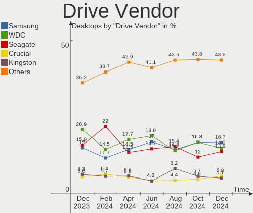
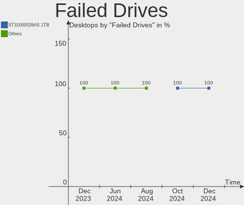
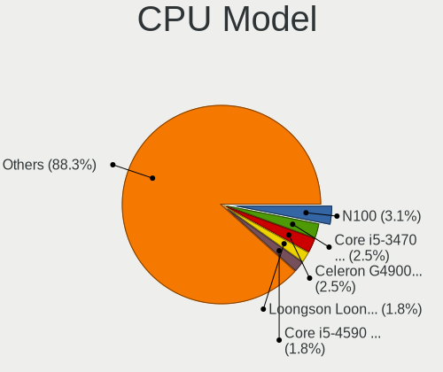
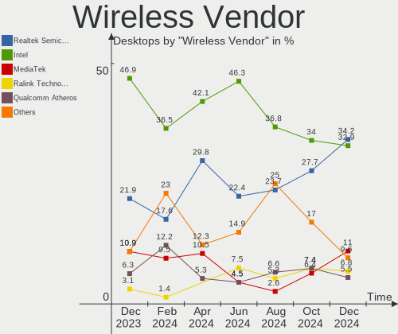
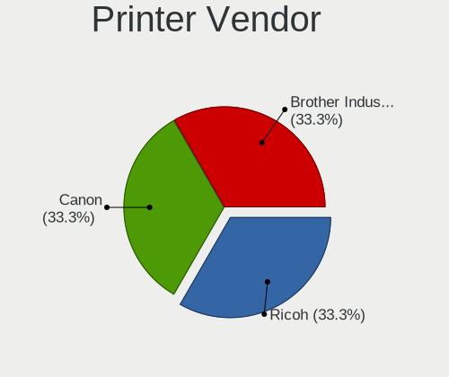
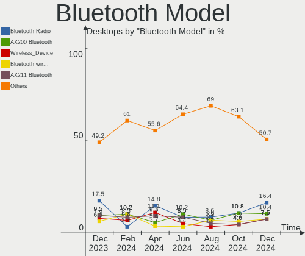

Debian Hardware Trends (Desktop)
--------------------------------

A project to identify most popular hardware characteristics and track their change
over time based on data collected by Debian users at https://Linux-Hardware.org.

Anyone can contribute to the study by uploading probes of their computers by
the [hw-probe](https://github.com/linuxhw/hw-probe) tool:

    sudo -E hw-probe -all -upload

Full-feature report is available here: https://linux-hardware.org/?view=trends&formfactor=desktop

Period: Jun, 2021.

Contents
--------

- [ OS                       ](#os)
- [ OS Family                ](#os-family)
- [ Kernel                   ](#kernel)
- [ Kernel Family            ](#kernel-family)
- [ Kernel Major Ver.        ](#kernel-major-ver)
- [ Arch                     ](#arch)
- [ DE                       ](#de)
- [ Display Server           ](#display-server)
- [ Display Manager          ](#display-manager)
- [ OS Lang                  ](#os-lang)
- [ Boot Mode                ](#boot-mode)
- [ Filesystem               ](#filesystem)
- [ Part. scheme             ](#part-scheme)
- [ Dual Boot with Linux/BSD ](#dual-boot-with-linux/bsd)
- [ Dual Boot (Win)          ](#dual-boot-win)
- [ Country                  ](#country)
- [ City                     ](#city)
- [ Vendor                   ](#vendor)
- [ Model                    ](#model)
- [ Model Family             ](#model-family)
- [ MFG Year                 ](#mfg-year)
- [ Form Factor              ](#form-factor)
- [ Secure Boot              ](#secure-boot)
- [ Coreboot                 ](#coreboot)
- [ RAM Size                 ](#ram-size)
- [ RAM Used                 ](#ram-used)
- [ Has CD-ROM               ](#has-cd-rom)
- [ Total Drives             ](#total-drives)
- [ Has Ethernet             ](#has-ethernet)
- [ Has WiFi                 ](#has-wifi)
- [ Has Bluetooth            ](#has-bluetooth)
- [ Drive Vendor             ](#drive-vendor)
- [ Drive Model              ](#drive-model)
- [ HDD Vendor               ](#hdd-vendor)
- [ SSD Vendor               ](#ssd-vendor)
- [ Drive Kind               ](#drive-kind)
- [ Drive Connector          ](#drive-connector)
- [ Drive Size               ](#drive-size)
- [ Space Total              ](#space-total)
- [ Space Used               ](#space-used)
- [ Malfunc. Drives          ](#malfunc-drives)
- [ Malfunc. Drive Vendor    ](#malfunc-drive-vendor)
- [ Malfunc. HDD Vendor      ](#malfunc-hdd-vendor)
- [ Malfunc. Drive Kind      ](#malfunc-drive-kind)
- [ Failed Drives            ](#failed-drives)
- [ Failed Drive Vendor      ](#failed-drive-vendor)
- [ Drive Status             ](#drive-status)
- [ Storage Vendor           ](#storage-vendor)
- [ Storage Model            ](#storage-model)
- [ Storage Kind             ](#storage-kind)
- [ CPU Vendor               ](#cpu-vendor)
- [ CPU Model                ](#cpu-model)
- [ CPU Model Family         ](#cpu-model-family)
- [ CPU Cores                ](#cpu-cores)
- [ CPU Sockets              ](#cpu-sockets)
- [ CPU Threads              ](#cpu-threads)
- [ CPU Op-Modes             ](#cpu-op-modes)
- [ CPU Microcode            ](#cpu-microcode)
- [ CPU Microarch            ](#cpu-microarch)
- [ GPU Vendor               ](#gpu-vendor)
- [ GPU Model                ](#gpu-model)
- [ GPU Combo                ](#gpu-combo)
- [ GPU Driver               ](#gpu-driver)
- [ GPU Memory               ](#gpu-memory)
- [ Monitor Vendor           ](#monitor-vendor)
- [ Monitor Model            ](#monitor-model)
- [ Monitor Resolution       ](#monitor-resolution)
- [ Monitor Diagonal         ](#monitor-diagonal)
- [ Monitor Width            ](#monitor-width)
- [ Aspect Ratio             ](#aspect-ratio)
- [ Monitor Area             ](#monitor-area)
- [ Pixel Density            ](#pixel-density)
- [ Multiple Monitors        ](#multiple-monitors)
- [ Net Controller Vendor    ](#net-controller-vendor)
- [ Net Controller Model     ](#net-controller-model)
- [ Wireless Vendor          ](#wireless-vendor)
- [ Wireless Model           ](#wireless-model)
- [ Ethernet Vendor          ](#ethernet-vendor)
- [ Ethernet Model           ](#ethernet-model)
- [ Net Controller Kind      ](#net-controller-kind)
- [ Used Controller          ](#used-controller)
- [ NICs                     ](#nics)
- [ IPv6                     ](#ipv6)
- [ Memory Vendor            ](#memory-vendor)
- [ Memory Model             ](#memory-model)
- [ Memory Kind              ](#memory-kind)
- [ Memory Form Factor       ](#memory-form-factor)
- [ Memory Size              ](#memory-size)
- [ Memory Speed             ](#memory-speed)
- [ Sound Vendor             ](#sound-vendor)
- [ Sound Model              ](#sound-model)
- [ Camera Vendor            ](#camera-vendor)
- [ Camera Model             ](#camera-model)
- [ Fingerprint Vendor       ](#fingerprint-vendor)
- [ Fingerprint Model        ](#fingerprint-model)
- [ Chipcard Vendor          ](#chipcard-vendor)
- [ Chipcard Model           ](#chipcard-model)
- [ Printer Vendor           ](#printer-vendor)
- [ Printer Model            ](#printer-model)
- [ Scanner Vendor           ](#scanner-vendor)
- [ Scanner Model            ](#scanner-model)
- [ Bluetooth Vendor         ](#bluetooth-vendor)
- [ Bluetooth Model          ](#bluetooth-model)
- [ Unsupported Devices      ](#unsupported-devices)
- [ Unsupported Device Types ](#unsupported-device-types)

OS
--

Installed operating systems

| Name           | Desktops | Percent |
|----------------|----------|---------|
| Debian 10      | 41       | 44.57%  |
| Debian 11      | 23       | 25%     |
| Debian         | 21       | 22.83%  |
| Debian 9.9     | 2        | 2.17%   |
| Debian 9       | 2        | 2.17%   |
| Debian Testing | 1        | 1.09%   |
| Debian 9.3     | 1        | 1.09%   |
| Debian 9.13    | 1        | 1.09%   |

OS Family
---------

OS without a version

| Name   | Desktops | Percent |
|--------|----------|---------|
| Debian | 92       | 100%    |

Kernel
------

Version of the Linux kernel

| Version                        | Desktops | Percent |
|--------------------------------|----------|---------|
| 5.10.0-2-amd64                 | 21       | 22.83%  |
| 5.10.0-7-amd64                 | 15       | 16.3%   |
| 4.19.0-16-amd64                | 9        | 9.78%   |
| 5.4.65-1-pve                   | 4        | 4.35%   |
| 5.4.119-1-pve                  | 4        | 4.35%   |
| 5.10.0-0.bpo.5-amd64           | 4        | 4.35%   |
| 5.4.114-1-pve                  | 3        | 3.26%   |
| 5.10.0-6-amd64                 | 3        | 3.26%   |
| 4.19.0-17-amd64                | 3        | 3.26%   |
| 5.6.0-2-amd64                  | 2        | 2.17%   |
| 4.19.0-6-amd64                 | 2        | 2.17%   |
| 4.15.18-16-pve                 | 2        | 2.17%   |
| 5.8.0-3-amd64                  | 1        | 1.09%   |
| 5.4.78-1-pve                   | 1        | 1.09%   |
| 5.4.44-2-pve                   | 1        | 1.09%   |
| 5.4.41-1-pve                   | 1        | 1.09%   |
| 5.4.106-1-pve                  | 1        | 1.09%   |
| 5.4.103-1-pve                  | 1        | 1.09%   |
| 5.4.0-73-generic               | 1        | 1.09%   |
| 5.3.13-1-pve                   | 1        | 1.09%   |
| 5.13.0-rc7-00024-g0418ae8de752 | 1        | 1.09%   |
| 5.11.21-1-pve                  | 1        | 1.09%   |
| 5.11.17-1-pve                  | 1        | 1.09%   |
| 5.11.0-21.1-liquorix-amd64     | 1        | 1.09%   |
| 5.10.0-5mx-amd64               | 1        | 1.09%   |
| 5.10.0-3-amd64                 | 1        | 1.09%   |
| 5.0.21-4-pve                   | 1        | 1.09%   |
| 5.0.21-2-pve                   | 1        | 1.09%   |
| 4.19.0-17-rt-amd64             | 1        | 1.09%   |
| 4.19.0-14-amd64                | 1        | 1.09%   |
| 4.15.18-30-pve                 | 1        | 1.09%   |
| 4.13.13-2-pve                  | 1        | 1.09%   |

Kernel Family
-------------

Linux kernel without a distro release

| Version | Desktops | Percent |
|---------|----------|---------|
| 5.10.0  | 45       | 48.91%  |
| 4.19.0  | 16       | 17.39%  |
| 5.4.65  | 4        | 4.35%   |
| 5.4.119 | 4        | 4.35%   |
| 5.4.114 | 3        | 3.26%   |
| 4.15.18 | 3        | 3.26%   |
| 5.6.0   | 2        | 2.17%   |
| 5.0.21  | 2        | 2.17%   |
| 5.8.0   | 1        | 1.09%   |
| 5.4.78  | 1        | 1.09%   |
| 5.4.44  | 1        | 1.09%   |
| 5.4.41  | 1        | 1.09%   |
| 5.4.106 | 1        | 1.09%   |
| 5.4.103 | 1        | 1.09%   |
| 5.4.0   | 1        | 1.09%   |
| 5.3.13  | 1        | 1.09%   |
| 5.13.0  | 1        | 1.09%   |
| 5.11.21 | 1        | 1.09%   |
| 5.11.17 | 1        | 1.09%   |
| 5.11.0  | 1        | 1.09%   |
| 4.13.13 | 1        | 1.09%   |

Kernel Major Ver.
-----------------

Linux kernel major version

| Version | Desktops | Percent |
|---------|----------|---------|
| 5.10    | 45       | 48.91%  |
| 5.4     | 17       | 18.48%  |
| 4.19    | 16       | 17.39%  |
| 5.11    | 3        | 3.26%   |
| 4.15    | 3        | 3.26%   |
| 5.6     | 2        | 2.17%   |
| 5.0     | 2        | 2.17%   |
| 5.8     | 1        | 1.09%   |
| 5.3     | 1        | 1.09%   |
| 5.13    | 1        | 1.09%   |
| 4.13    | 1        | 1.09%   |

Arch
----

OS architecture (x86_64, i586, etc.)

| Name   | Desktops | Percent |
|--------|----------|---------|
| x86_64 | 92       | 100%    |

DE
--

Desktop Environment

| Name       | Desktops | Percent |
|------------|----------|---------|
| Unknown    | 52       | 56.52%  |
| XFCE       | 14       | 15.22%  |
| GNOME      | 7        | 7.61%   |
| MATE       | 4        | 4.35%   |
| KDE        | 4        | 4.35%   |
| X-Cinnamon | 3        | 3.26%   |
| KDE5       | 3        | 3.26%   |
| Cinnamon   | 2        | 2.17%   |
| trinity    | 1        | 1.09%   |
| LXDE       | 1        | 1.09%   |
| i3         | 1        | 1.09%   |

Display Server
--------------

X11 or Wayland

| Name    | Desktops | Percent |
|---------|----------|---------|
| X11     | 37       | 40.22%  |
| Unknown | 29       | 31.52%  |
| Tty     | 23       | 25%     |
| Wayland | 3        | 3.26%   |

Display Manager
---------------

SDDM, LightDM, etc.

| Name    | Desktops | Percent |
|---------|----------|---------|
| Unknown | 68       | 73.91%  |
| TDM     | 11       | 11.96%  |
| LightDM | 6        | 6.52%   |
| GDM     | 4        | 4.35%   |
| SDDM    | 3        | 3.26%   |

OS Lang
-------

Language

| Lang    | Desktops | Percent |
|---------|----------|---------|
| en_US   | 42       | 45.65%  |
| ru_RU   | 23       | 25%     |
| fr_FR   | 4        | 4.35%   |
| Unknown | 4        | 4.35%   |
| pt_BR   | 3        | 3.26%   |
| C       | 3        | 3.26%   |
| en_GB   | 2        | 2.17%   |
| de_DE   | 2        | 2.17%   |
| zh_CN   | 1        | 1.09%   |
| sv_SE   | 1        | 1.09%   |
| sr_RS   | 1        | 1.09%   |
| pl_PL   | 1        | 1.09%   |
| hu_HU   | 1        | 1.09%   |
| fr_CH   | 1        | 1.09%   |
| es_ES   | 1        | 1.09%   |
| en_IN   | 1        | 1.09%   |
| en_CA   | 1        | 1.09%   |

Boot Mode
---------

EFI or BIOS

| Mode | Desktops | Percent |
|------|----------|---------|
| BIOS | 62       | 67.39%  |
| EFI  | 30       | 32.61%  |

Filesystem
----------

Type of filesystem

| Type    | Desktops | Percent |
|---------|----------|---------|
| Ext4    | 47       | 51.09%  |
| Overlay | 23       | 25%     |
| Zfs     | 15       | 16.3%   |
| Btrfs   | 3        | 3.26%   |
| Ext3    | 2        | 2.17%   |
| Xfs     | 1        | 1.09%   |
| Tmpfs   | 1        | 1.09%   |

Part. scheme
------------

Scheme of partitioning

| Type    | Desktops | Percent |
|---------|----------|---------|
| GPT     | 41       | 44.57%  |
| MBR     | 29       | 31.52%  |
| Unknown | 22       | 23.91%  |

Dual Boot with Linux/BSD
------------------------

Hosting more than one Linux/BSD

| Dual boot | Desktops | Percent |
|-----------|----------|---------|
| No        | 72       | 78.26%  |
| Yes       | 20       | 21.74%  |

Dual Boot (Win)
---------------

Hosting Linux and Windows

| Dual boot | Desktops | Percent |
|-----------|----------|---------|
| No        | 50       | 54.35%  |
| Yes       | 42       | 45.65%  |

Country
-------

Geographic location (country)

| Country       | Desktops | Percent |
|---------------|----------|---------|
| Russia        | 40       | 43.48%  |
| USA           | 15       | 16.3%   |
| Netherlands   | 5        | 5.43%   |
| Germany       | 5        | 5.43%   |
| Brazil        | 5        | 5.43%   |
| France        | 4        | 4.35%   |
| Poland        | 3        | 3.26%   |
| Venezuela     | 1        | 1.09%   |
| UK            | 1        | 1.09%   |
| Switzerland   | 1        | 1.09%   |
| Sweden        | 1        | 1.09%   |
| Spain         | 1        | 1.09%   |
| Serbia        | 1        | 1.09%   |
| Norway        | 1        | 1.09%   |
| New Caledonia | 1        | 1.09%   |
| Italy         | 1        | 1.09%   |
| India         | 1        | 1.09%   |
| Hungary       | 1        | 1.09%   |
| Finland       | 1        | 1.09%   |
| China         | 1        | 1.09%   |
| Canada        | 1        | 1.09%   |
| Belgium       | 1        | 1.09%   |

City
----

Geographic location (city)

| City                        | Desktops | Percent |
|-----------------------------|----------|---------|
| Voronezh                    | 21       | 22.83%  |
| St Petersburg               | 14       | 15.22%  |
| Warsaw                      | 2        | 2.17%   |
| New York                    | 2        | 2.17%   |
| Las Vegas                   | 2        | 2.17%   |
| Danville                    | 2        | 2.17%   |
| Amsterdam                   | 2        | 2.17%   |
| Almere Stad                 | 2        | 2.17%   |
| Winnipeg                    | 1        | 1.09%   |
| Vologda                     | 1        | 1.09%   |
| Vigra                       | 1        | 1.09%   |
| Toulouse                    | 1        | 1.09%   |
| Tel'mana                    | 1        | 1.09%   |
| São Paulo                  | 1        | 1.09%   |
| Santa Barbara               | 1        | 1.09%   |
| San Francisco               | 1        | 1.09%   |
| San Cristóbal de La Laguna | 1        | 1.09%   |
| Saint Neots                 | 1        | 1.09%   |
| Ribeirao Pires              | 1        | 1.09%   |
| Reims                       | 1        | 1.09%   |
| Prairie du Sac              | 1        | 1.09%   |
| Noumea                      | 1        | 1.09%   |
| New Lenox                   | 1        | 1.09%   |
| Mumbai                      | 1        | 1.09%   |
| Miami                       | 1        | 1.09%   |
| Mesa                        | 1        | 1.09%   |
| Lyon                        | 1        | 1.09%   |
| Komárom                    | 1        | 1.09%   |
| Khabarovsk                  | 1        | 1.09%   |
| Kazan’                    | 1        | 1.09%   |
| Jinan                       | 1        | 1.09%   |
| Houston                     | 1        | 1.09%   |
| Hisings Backa               | 1        | 1.09%   |
| Helsinki                    | 1        | 1.09%   |
| Glienicke                   | 1        | 1.09%   |
| Geneva                      | 1        | 1.09%   |
| Gdansk                      | 1        | 1.09%   |
| Gatchina                    | 1        | 1.09%   |
| Garching bei Munchen        | 1        | 1.09%   |
| Ettlingen                   | 1        | 1.09%   |
| Dourados                    | 1        | 1.09%   |
| Delft                       | 1        | 1.09%   |
| Dallas                      | 1        | 1.09%   |
| Compiègne                  | 1        | 1.09%   |
| Chemnitz                    | 1        | 1.09%   |
| Brasília                   | 1        | 1.09%   |
| Boom                        | 1        | 1.09%   |
| Bologna                     | 1        | 1.09%   |
| Belgrade                    | 1        | 1.09%   |
| Barueri                     | 1        | 1.09%   |
| Atwater                     | 1        | 1.09%   |
| Atlanta                     | 1        | 1.09%   |
| Aalen                       | 1        | 1.09%   |

Vendor
------

Motherboard manufacturer

| Name                | Desktops | Percent |
|---------------------|----------|---------|
| ASUSTek Computer    | 34       | 36.96%  |
| Gigabyte Technology | 17       | 18.48%  |
| ASRock              | 17       | 18.48%  |
| Dell                | 6        | 6.52%   |
| Intel               | 4        | 4.35%   |
| Hewlett-Packard     | 4        | 4.35%   |
| MSI                 | 2        | 2.17%   |
| Acer                | 2        | 2.17%   |
| QIYIDA              | 1        | 1.09%   |
| IBM                 | 1        | 1.09%   |
| Huanan              | 1        | 1.09%   |
| HARDKERNEL          | 1        | 1.09%   |
| Biostar             | 1        | 1.09%   |
| ASRockRack          | 1        | 1.09%   |

Model
-----

Motherboard model

| Name                             | Desktops | Percent |
|----------------------------------|----------|---------|
| ASRock B450M Pro4                | 6        | 6.52%   |
| ASUS All Series                  | 4        | 4.35%   |
| Gigabyte Z370 AORUS Gaming 5     | 2        | 2.17%   |
| Gigabyte H61M-DS2 REV 1.2        | 2        | 2.17%   |
| Gigabyte B360M H                 | 2        | 2.17%   |
| Dell OptiPlex 7010               | 2        | 2.17%   |
| ASUS PRIME B365M-A               | 2        | 2.17%   |
| ASUS P8H61-M LX3 R2.0            | 2        | 2.17%   |
| ASUS P5QL-CM                     | 2        | 2.17%   |
| ASRock B450 Pro4                 | 2        | 2.17%   |
| QIYIDA X99-H9 V2.0               | 1        | 1.09%   |
| MSI MS-7B89                      | 1        | 1.09%   |
| MSI MS-7823                      | 1        | 1.09%   |
| Intel DP965LT AAD41694-209       | 1        | 1.09%   |
| Intel DG965RY AAD41691-206       | 1        | 1.09%   |
| Intel DG41RQ AAE54511-205        | 1        | 1.09%   |
| Intel DG33FB AAD81072-306        | 1        | 1.09%   |
| IBM 8215D1U                      | 1        | 1.09%   |
| Huanan X99-8M-F V1.1             | 1        | 1.09%   |
| HP xw6400 Workstation            | 1        | 1.09%   |
| HP Pippin2                       | 1        | 1.09%   |
| HP EliteDesk 800 G1 SFF          | 1        | 1.09%   |
| HP 260 G2 DM                     | 1        | 1.09%   |
| HARDKERNEL ODROID-H2             | 1        | 1.09%   |
| Gigabyte X470 AORUS ULTRA GAMING | 1        | 1.09%   |
| Gigabyte P43-ES3G                | 1        | 1.09%   |
| Gigabyte H81M-DS2V               | 1        | 1.09%   |
| Gigabyte H61M-S2PV               | 1        | 1.09%   |
| Gigabyte GA-970A-D3              | 1        | 1.09%   |
| Gigabyte BRi7(H)-10710           | 1        | 1.09%   |
| Gigabyte B85M-D2V                | 1        | 1.09%   |
| Gigabyte B150M-D3H-CF            | 1        | 1.09%   |
| Gigabyte AX370-Gaming K7         | 1        | 1.09%   |
| Gigabyte AB350N-Gaming WIFI      | 1        | 1.09%   |
| Gigabyte AB350M-Gaming 3         | 1        | 1.09%   |
| Dell OptiPlex 9020M              | 1        | 1.09%   |
| Dell OptiPlex 760                | 1        | 1.09%   |
| Dell OptiPlex 7040               | 1        | 1.09%   |
| Dell DM061                       | 1        | 1.09%   |
| Biostar P4M900-M7 FE             | 1        | 1.09%   |
| ASUS TUF B450-PLUS GAMING        | 1        | 1.09%   |
| ASUS ROG STRIX B450-F GAMING II  | 1        | 1.09%   |
| ASUS PRO602617                   | 1        | 1.09%   |
| ASUS PRIME B550-PLUS             | 1        | 1.09%   |
| ASUS PRIME B450M-A               | 1        | 1.09%   |
| ASUS PRIME B360-PLUS             | 1        | 1.09%   |
| ASUS PRIME A320M-K               | 1        | 1.09%   |
| ASUS P9X79                       | 1        | 1.09%   |
| ASUS P8Z68-V                     | 1        | 1.09%   |
| ASUS P8H77-V LE                  | 1        | 1.09%   |
| ASUS P8B75-M LX                  | 1        | 1.09%   |
| ASUS P7H55                       | 1        | 1.09%   |
| ASUS P5Q SE                      | 1        | 1.09%   |
| ASUS P5KPL-AM IN/ROEM/SI         | 1        | 1.09%   |
| ASUS P5E                         | 1        | 1.09%   |
| ASUS Maximus VIII GENE           | 1        | 1.09%   |
| ASUS M5A97 R2.0                  | 1        | 1.09%   |
| ASUS M4A88T-M/USB3               | 1        | 1.09%   |
| ASUS H170M-PLUS                  | 1        | 1.09%   |
| ASUS H110M-R                     | 1        | 1.09%   |

Model Family
------------

Motherboard model prefix

| Name                   | Desktops | Percent |
|------------------------|----------|---------|
| ASRock B450M           | 8        | 8.7%    |
| ASUS PRIME             | 6        | 6.52%   |
| Dell OptiPlex          | 5        | 5.43%   |
| ASUS All               | 4        | 4.35%   |
| ASRock B450            | 4        | 4.35%   |
| Gigabyte Z370          | 2        | 2.17%   |
| Gigabyte H61M-DS2      | 2        | 2.17%   |
| Gigabyte B360M         | 2        | 2.17%   |
| ASUS P8H61-M           | 2        | 2.17%   |
| ASUS P5QL-CM           | 2        | 2.17%   |
| QIYIDA X99-H9          | 1        | 1.09%   |
| MSI MS-7B89            | 1        | 1.09%   |
| MSI MS-7823            | 1        | 1.09%   |
| Intel DP965LT          | 1        | 1.09%   |
| Intel DG965RY          | 1        | 1.09%   |
| Intel DG41RQ           | 1        | 1.09%   |
| Intel DG33FB           | 1        | 1.09%   |
| IBM 8215D1U            | 1        | 1.09%   |
| Huanan X99-8M-F        | 1        | 1.09%   |
| HP xw6400              | 1        | 1.09%   |
| HP Pippin2             | 1        | 1.09%   |
| HP EliteDesk           | 1        | 1.09%   |
| HP 260                 | 1        | 1.09%   |
| HARDKERNEL ODROID-H2   | 1        | 1.09%   |
| Gigabyte X470          | 1        | 1.09%   |
| Gigabyte P43-ES3G      | 1        | 1.09%   |
| Gigabyte H81M-DS2V     | 1        | 1.09%   |
| Gigabyte H61M-S2PV     | 1        | 1.09%   |
| Gigabyte GA-970A-D3    | 1        | 1.09%   |
| Gigabyte BRi7(H)-10710 | 1        | 1.09%   |
| Gigabyte B85M-D2V      | 1        | 1.09%   |
| Gigabyte B150M-D3H-CF  | 1        | 1.09%   |
| Gigabyte AX370-Gaming  | 1        | 1.09%   |
| Gigabyte AB350N-Gaming | 1        | 1.09%   |
| Gigabyte AB350M-Gaming | 1        | 1.09%   |
| Dell DM061             | 1        | 1.09%   |
| Biostar P4M900-M7      | 1        | 1.09%   |
| ASUS TUF               | 1        | 1.09%   |
| ASUS ROG               | 1        | 1.09%   |
| ASUS PRO602617         | 1        | 1.09%   |
| ASUS P9X79             | 1        | 1.09%   |
| ASUS P8Z68-V           | 1        | 1.09%   |
| ASUS P8H77-V           | 1        | 1.09%   |
| ASUS P8B75-M           | 1        | 1.09%   |
| ASUS P7H55             | 1        | 1.09%   |
| ASUS P5Q               | 1        | 1.09%   |
| ASUS P5KPL-AM          | 1        | 1.09%   |
| ASUS P5E               | 1        | 1.09%   |
| ASUS Maximus           | 1        | 1.09%   |
| ASUS M5A97             | 1        | 1.09%   |
| ASUS M4A88T-M          | 1        | 1.09%   |
| ASUS H170M-PLUS        | 1        | 1.09%   |
| ASUS H110M-R           | 1        | 1.09%   |
| ASUS F2A85-M           | 1        | 1.09%   |
| ASUS F2A55-M           | 1        | 1.09%   |
| ASUS E35M1-M           | 1        | 1.09%   |
| ASUS B150-PRO          | 1        | 1.09%   |
| ASRockRack B450D4U-V1L | 1        | 1.09%   |
| ASRock X570            | 1        | 1.09%   |
| ASRock X399            | 1        | 1.09%   |

MFG Year
--------

Motherboard manufacture year

| Year | Desktops | Percent |
|------|----------|---------|
| 2019 | 17       | 18.48%  |
| 2020 | 16       | 17.39%  |
| 2014 | 7        | 7.61%   |
| 2012 | 7        | 7.61%   |
| 2016 | 6        | 6.52%   |
| 2021 | 5        | 5.43%   |
| 2015 | 5        | 5.43%   |
| 2018 | 4        | 4.35%   |
| 2013 | 4        | 4.35%   |
| 2011 | 4        | 4.35%   |
| 2010 | 4        | 4.35%   |
| 2009 | 4        | 4.35%   |
| 2007 | 4        | 4.35%   |
| 2017 | 2        | 2.17%   |
| 2008 | 2        | 2.17%   |
| 2006 | 1        | 1.09%   |

Form Factor
-----------

Physical design of the computer

| Name    | Desktops | Percent |
|---------|----------|---------|
| Desktop | 92       | 100%    |

Secure Boot
-----------

Enabled or disabled

| State    | Desktops | Percent |
|----------|----------|---------|
| Disabled | 92       | 100%    |

Coreboot
--------

Have coreboot on board

| Used | Desktops | Percent |
|------|----------|---------|
| No   | 92       | 100%    |

RAM Size
--------

Total RAM memory

| Size in GB  | Desktops | Percent |
|-------------|----------|---------|
| 16.01-24.0  | 22       | 23.91%  |
| 8.01-16.0   | 16       | 17.39%  |
| 3.01-4.0    | 15       | 16.3%   |
| 4.01-8.0    | 11       | 11.96%  |
| 32.01-64.0  | 9        | 9.78%   |
| 64.01-256.0 | 9        | 9.78%   |
| 24.01-32.0  | 5        | 5.43%   |
| 1.01-2.0    | 3        | 3.26%   |
| 0.51-1.0    | 2        | 2.17%   |

RAM Used
--------

Used RAM memory

| Used GB    | Desktops | Percent |
|------------|----------|---------|
| 0.51-1.0   | 22       | 23.91%  |
| 8.01-16.0  | 14       | 15.22%  |
| 4.01-8.0   | 11       | 11.96%  |
| 1.01-2.0   | 11       | 11.96%  |
| 3.01-4.0   | 10       | 10.87%  |
| 2.01-3.0   | 8        | 8.7%    |
| 16.01-24.0 | 6        | 6.52%   |
| 32.01-64.0 | 4        | 4.35%   |
| 24.01-32.0 | 3        | 3.26%   |
| 0.01-0.5   | 3        | 3.26%   |

Has CD-ROM
----------

Has CD-ROM on board

| Presented | Desktops | Percent |
|-----------|----------|---------|
| No        | 62       | 67.39%  |
| Yes       | 30       | 32.61%  |

Total Drives
------------

Number of drives on board

| Drives | Desktops | Percent |
|--------|----------|---------|
| 1      | 38       | 41.3%   |
| 2      | 21       | 22.83%  |
| 3      | 14       | 15.22%  |
| 4      | 9        | 9.78%   |
| 5      | 5        | 5.43%   |
| 6      | 2        | 2.17%   |
| 17     | 1        | 1.09%   |
| 8      | 1        | 1.09%   |
| 0      | 1        | 1.09%   |

Has Ethernet
------------

Has Ethernet on board

| Presented | Desktops | Percent |
|-----------|----------|---------|
| Yes       | 92       | 100%    |

Has WiFi
--------

Has WiFi module

| Presented | Desktops | Percent |
|-----------|----------|---------|
| No        | 76       | 82.61%  |
| Yes       | 16       | 17.39%  |

Has Bluetooth
-------------

Has Bluetooth module

| Presented | Desktops | Percent |
|-----------|----------|---------|
| No        | 77       | 83.7%   |
| Yes       | 15       | 16.3%   |

Drive Vendor
------------

Hard drive vendors

| Vendor              | Desktops | Drives | Percent |
|---------------------|----------|--------|---------|
| Seagate             | 33       | 41     | 20.37%  |
| WDC                 | 32       | 54     | 19.75%  |
| Samsung Electronics | 21       | 28     | 12.96%  |
| Toshiba             | 17       | 24     | 10.49%  |
| Crucial             | 15       | 16     | 9.26%   |
| Sandisk             | 6        | 7      | 3.7%    |
| Intel               | 6        | 13     | 3.7%    |
| Kingston            | 5        | 6      | 3.09%   |
| Hitachi             | 5        | 6      | 3.09%   |
| A-DATA Technology   | 4        | 5      | 2.47%   |
| Patriot             | 3        | 3      | 1.85%   |
| Unknown             | 2        | 2      | 1.23%   |
| PNY                 | 2        | 2      | 1.23%   |
| HGST                | 2        | 3      | 1.23%   |
| Transcend           | 1        | 1      | 0.62%   |
| SPCC                | 1        | 1      | 0.62%   |
| Phison Electronics  | 1        | 1      | 0.62%   |
| Phison              | 1        | 1      | 0.62%   |
| Micron Technology   | 1        | 1      | 0.62%   |
| Maxtor              | 1        | 1      | 0.62%   |
| Intenso             | 1        | 1      | 0.62%   |
| Hewlett-Packard     | 1        | 1      | 0.62%   |
| Gigabyte Technology | 1        | 1      | 0.62%   |

Drive Model
-----------

Hard drive models

| Model                                | Desktops | Percent |
|--------------------------------------|----------|---------|
| Toshiba HDWL120 2TB                  | 4        | 2.21%   |
| Toshiba HDWD120 2TB                  | 4        | 2.21%   |
| Samsung SSD 860 EVO 250GB            | 4        | 2.21%   |
| Seagate ST500DM002-1BD142 500GB      | 3        | 1.66%   |
| Seagate ST4000VN008-2DR166 4TB       | 3        | 1.66%   |
| Samsung SSD 970 EVO 1TB              | 3        | 1.66%   |
| Kingston SV300S37A120G 120GB SSD     | 3        | 1.66%   |
| WDC WDS500G3X0C-00SJG0 500GB         | 2        | 1.1%    |
| WDC WDS250G2B0A-00SM50 250GB SSD     | 2        | 1.1%    |
| WDC WD5000AAKX-60U6AA0 500GB         | 2        | 1.1%    |
| WDC WD3200AAJS-00L7A0 320GB          | 2        | 1.1%    |
| WDC WD20EZRZ-00Z5HB0 2TB             | 2        | 1.1%    |
| Toshiba HDWD110 1TB                  | 2        | 1.1%    |
| Seagate ST1000DM003-1CH162 1TB       | 2        | 1.1%    |
| Seagate BUP Slim BL 2TB              | 2        | 1.1%    |
| Samsung SSD 850 EVO 250GB            | 2        | 1.1%    |
| Intel NVMe SSD Drive 1024GB          | 2        | 1.1%    |
| Intel MEMPEK1J016GAL 16GB            | 2        | 1.1%    |
| Crucial CT500P2SSD8 500GB            | 2        | 1.1%    |
| Crucial CT500MX500SSD4N 500GB        | 2        | 1.1%    |
| Crucial CT250MX500SSD4N 250GB        | 2        | 1.1%    |
| Crucial CT250MX500SSD1 250GB         | 2        | 1.1%    |
| Crucial CT240BX500SSD1 240GB         | 2        | 1.1%    |
| Crucial CT1000P1SSD8 1TB             | 2        | 1.1%    |
| WDC WDS500G1R0A-68A4W0 500GB SSD     | 1        | 0.55%   |
| WDC WDS100T2B0C-00PXH0 1TB           | 1        | 0.55%   |
| WDC WDS100T2B0A-00SM50 1TB SSD       | 1        | 0.55%   |
| WDC WD80EZAZ-11TDBA0 8TB             | 1        | 0.55%   |
| WDC WD800BD-22MRA1 80GB              | 1        | 0.55%   |
| WDC WD800AAJS-00PSA0 80GB            | 1        | 0.55%   |
| WDC WD7500AACS-00ZJB0 752GB          | 1        | 0.55%   |
| WDC WD5000AVCS-632DY1 500GB          | 1        | 0.55%   |
| WDC WD5000AAKX-22ERMA0 500GB         | 1        | 0.55%   |
| WDC WD5000AAKX-00ERMA0 500GB         | 1        | 0.55%   |
| WDC WD5000A 500GB                    | 1        | 0.55%   |
| WDC WD40EZRZ-22GXCB0 4TB             | 1        | 0.55%   |
| WDC WD40EZRZ-00GXCB0 4TB             | 1        | 0.55%   |
| WDC WD40EFRX-68WT0N0 4TB             | 1        | 0.55%   |
| WDC WD3200BEKT-75PVMT1 320GB         | 1        | 0.55%   |
| WDC WD3200AAKS-75L9A0 320GB          | 1        | 0.55%   |
| WDC WD3200AAJS-08L7A0 320GB          | 1        | 0.55%   |
| WDC WD30EZRX-00D8PB0 3TB             | 1        | 0.55%   |
| WDC WD20EZRX-00DC0B0 2TB             | 1        | 0.55%   |
| WDC WD20EFRX-68EUZN0 2TB             | 1        | 0.55%   |
| WDC WD10PURZ-85U8XY0 1TB             | 1        | 0.55%   |
| WDC WD10EZEX-75WN4A1 1TB             | 1        | 0.55%   |
| WDC WD10EZEX-60ZF5A0 1TB             | 1        | 0.55%   |
| WDC WD10EZEX-60WN4A1 1TB             | 1        | 0.55%   |
| WDC WD10EZEX-22MFCA0 1TB             | 1        | 0.55%   |
| WDC WD10EZEX-08WN4A0 1TB             | 1        | 0.55%   |
| WDC WD10EZEX-08M2NA0 1TB             | 1        | 0.55%   |
| WDC WD10EZEX-00RKKA0 1TB             | 1        | 0.55%   |
| WDC WD10EZEX-00KUWA0 1TB             | 1        | 0.55%   |
| WDC WD10EADX-22TDHB0 1TB             | 1        | 0.55%   |
| WDC PC SN730 SDBPNTY-256G-1006 256GB | 1        | 0.55%   |
| Unknown ExternalRAID 4TB             | 1        | 0.55%   |
| Unknown BJTD4R  32GB                 | 1        | 0.55%   |
| Transcend TS128GSSD230S 128GB        | 1        | 0.55%   |
| Toshiba TR150 960GB SSD              | 1        | 0.55%   |
| Toshiba MQ01ABD100 1TB               | 1        | 0.55%   |

HDD Vendor
----------

Hard disk drive vendors

| Vendor              | Desktops | Drives | Percent |
|---------------------|----------|--------|---------|
| Seagate             | 33       | 41     | 38.82%  |
| WDC                 | 27       | 46     | 31.76%  |
| Toshiba             | 15       | 21     | 17.65%  |
| Hitachi             | 5        | 6      | 5.88%   |
| Samsung Electronics | 2        | 3      | 2.35%   |
| HGST                | 2        | 3      | 2.35%   |
| Maxtor              | 1        | 1      | 1.18%   |

SSD Vendor
----------

Solid state drive vendors

| Vendor              | Desktops | Drives | Percent |
|---------------------|----------|--------|---------|
| Samsung Electronics | 13       | 14     | 26%     |
| Crucial             | 11       | 11     | 22%     |
| Kingston            | 5        | 5      | 10%     |
| WDC                 | 4        | 4      | 8%      |
| SanDisk             | 4        | 5      | 8%      |
| A-DATA Technology   | 4        | 5      | 8%      |
| Patriot             | 3        | 3      | 6%      |
| PNY                 | 2        | 2      | 4%      |
| Transcend           | 1        | 1      | 2%      |
| Toshiba             | 1        | 1      | 2%      |
| SPCC                | 1        | 1      | 2%      |
| Intel               | 1        | 1      | 2%      |

Drive Kind
----------

HDD or SSD

| Kind    | Desktops | Drives | Percent |
|---------|----------|--------|---------|
| HDD     | 66       | 121    | 46.81%  |
| SSD     | 42       | 53     | 29.79%  |
| NVMe    | 30       | 42     | 21.28%  |
| Unknown | 2        | 2      | 1.42%   |
| MMC     | 1        | 1      | 0.71%   |

Drive Connector
---------------

SATA, SAS, NVMe, etc.

| Type | Desktops | Drives | Percent |
|------|----------|--------|---------|
| SATA | 81       | 173    | 70.43%  |
| NVMe | 30       | 42     | 26.09%  |
| SAS  | 3        | 3      | 2.61%   |
| MMC  | 1        | 1      | 0.87%   |

Drive Size
----------

Size of hard drive

| Size in TB | Desktops | Drives | Percent |
|------------|----------|--------|---------|
| 0.01-0.5   | 56       | 77     | 48.7%   |
| 0.51-1.0   | 28       | 40     | 24.35%  |
| 1.01-2.0   | 18       | 26     | 15.65%  |
| 3.01-4.0   | 8        | 18     | 6.96%   |
| 2.01-3.0   | 3        | 3      | 2.61%   |
| 4.01-10.0  | 2        | 10     | 1.74%   |

Space Total
-----------

Amount of disk space available on the file system

| Size in GB     | Desktops | Percent |
|----------------|----------|---------|
| Unknown        | 40       | 43.48%  |
| 1001-2000      | 11       | 11.96%  |
| 251-500        | 8        | 8.7%    |
| 101-250        | 8        | 8.7%    |
| More than 3000 | 7        | 7.61%   |
| 501-1000       | 6        | 6.52%   |
| 51-100         | 6        | 6.52%   |
| 21-50          | 3        | 3.26%   |
| 1-20           | 2        | 2.17%   |
| 2001-3000      | 1        | 1.09%   |

Space Used
----------

Amount of used disk space

| Used GB        | Desktops | Percent |
|----------------|----------|---------|
| Unknown        | 40       | 43.48%  |
| 1-20           | 15       | 16.3%   |
| 101-250        | 10       | 10.87%  |
| 1001-2000      | 6        | 6.52%   |
| 21-50          | 5        | 5.43%   |
| 51-100         | 5        | 5.43%   |
| More than 3000 | 4        | 4.35%   |
| 501-1000       | 4        | 4.35%   |
| 251-500        | 3        | 3.26%   |

Malfunc. Drives
---------------

Drive models with a malfunction

| Model                                 | Desktops | Drives | Percent |
|---------------------------------------|----------|--------|---------|
| WDC WD7500AACS-00ZJB0 752GB           | 1        | 1      | 5.26%   |
| WDC WD3200BEKT-75PVMT1 320GB          | 1        | 1      | 5.26%   |
| WDC WD3200AAJS-08L7A0 320GB           | 1        | 1      | 5.26%   |
| WDC WD3200AAJS-00L7A0 320GB           | 1        | 1      | 5.26%   |
| Toshiba MQ01ABD100 1TB                | 1        | 1      | 5.26%   |
| Toshiba MK1059GSM 1TB                 | 1        | 1      | 5.26%   |
| Toshiba HDWL120 2TB                   | 1        | 2      | 5.26%   |
| Toshiba DT01ACA050 500GB              | 1        | 1      | 5.26%   |
| Seagate ST9500420AS 500GB             | 1        | 1      | 5.26%   |
| Seagate ST3500418AS 500GB             | 1        | 1      | 5.26%   |
| Seagate ST2000DM001-9YN164 2TB        | 1        | 1      | 5.26%   |
| Seagate ST1000DM003-1CH162 1TB        | 1        | 1      | 5.26%   |
| Intel SSDSC2CW120A3 120GB             | 1        | 1      | 5.26%   |
| Intel SSDPEKKW010T7 1TB               | 1        | 2      | 5.26%   |
| Hitachi HDS722525VLAT80 250GB         | 1        | 1      | 5.26%   |
| Hitachi HDS721010CLA632 1TB           | 1        | 1      | 5.26%   |
| Crucial CT240BX500SSD1 240GB          | 1        | 1      | 5.26%   |
| A-DATA Technology SU800 256GB SSD     | 1        | 1      | 5.26%   |
| A-DATA Technology SSD DP900 128GB-DL3 | 1        | 1      | 5.26%   |

Malfunc. Drive Vendor
---------------------

Vendors of faulty drives

| Vendor            | Desktops | Drives | Percent |
|-------------------|----------|--------|---------|
| WDC               | 4        | 4      | 21.05%  |
| Toshiba           | 4        | 5      | 21.05%  |
| Seagate           | 4        | 4      | 21.05%  |
| Intel             | 2        | 3      | 10.53%  |
| Hitachi           | 2        | 2      | 10.53%  |
| A-DATA Technology | 2        | 2      | 10.53%  |
| Crucial           | 1        | 1      | 5.26%   |

Malfunc. HDD Vendor
-------------------

Vendors of faulty HDD drives

| Vendor  | Desktops | Drives | Percent |
|---------|----------|--------|---------|
| WDC     | 4        | 4      | 28.57%  |
| Toshiba | 4        | 5      | 28.57%  |
| Seagate | 4        | 4      | 28.57%  |
| Hitachi | 2        | 2      | 14.29%  |

Malfunc. Drive Kind
-------------------

Kinds of faulty drives

| Kind | Desktops | Drives | Percent |
|------|----------|--------|---------|
| HDD  | 13       | 15     | 72.22%  |
| SSD  | 4        | 4      | 22.22%  |
| NVMe | 1        | 2      | 5.56%   |

Failed Drives
-------------

Failed drive models

| Model                    | Desktops | Drives | Percent |
|--------------------------|----------|--------|---------|
| Crucial CT1000P1SSD8 1TB | 1        | 1      | 100%    |

Failed Drive Vendor
-------------------

Failed drive vendors

| Vendor  | Desktops | Drives | Percent |
|---------|----------|--------|---------|
| Crucial | 1        | 1      | 100%    |

Drive Status
------------

Number of failed and malfunc. drives

| Status   | Desktops | Drives | Percent |
|----------|----------|--------|---------|
| Works    | 66       | 151    | 62.26%  |
| Detected | 22       | 46     | 20.75%  |
| Malfunc  | 17       | 21     | 16.04%  |
| Failed   | 1        | 1      | 0.94%   |

Storage Vendor
--------------

Storage controller vendors

| Vendor                       | Desktops | Percent |
|------------------------------|----------|---------|
| Intel                        | 57       | 42.22%  |
| AMD                          | 34       | 25.19%  |
| Samsung Electronics          | 9        | 6.67%   |
| Sandisk                      | 5        | 3.7%    |
| Micron/Crucial Technology    | 5        | 3.7%    |
| JMicron Technology           | 5        | 3.7%    |
| ASMedia Technology           | 5        | 3.7%    |
| Marvell Technology Group     | 4        | 2.96%   |
| Phison Electronics           | 3        | 2.22%   |
| VIA Technologies             | 2        | 1.48%   |
| Toshiba America Info Systems | 1        | 0.74%   |
| Silicon Motion               | 1        | 0.74%   |
| Nvidia                       | 1        | 0.74%   |
| Micron Technology            | 1        | 0.74%   |
| Kingston Technology Company  | 1        | 0.74%   |
| Broadcom / LSI               | 1        | 0.74%   |

Storage Model
-------------

Storage controller models

| Model                                                                                   | Desktops | Percent |
|-----------------------------------------------------------------------------------------|----------|---------|
| AMD FCH SATA Controller [AHCI mode]                                                     | 27       | 15.61%  |
| AMD 400 Series Chipset SATA Controller                                                  | 18       | 10.4%   |
| Intel 8 Series/C220 Series Chipset Family 6-port SATA Controller 1 [AHCI mode]          | 10       | 5.78%   |
| Samsung NVMe SSD Controller SM981/PM981/PM983                                           | 8        | 4.62%   |
| Intel Q170/Q150/B150/H170/H110/Z170/CM236 Chipset SATA Controller [AHCI Mode]           | 7        | 4.05%   |
| Intel 6 Series/C200 Series Chipset Family 6 port Desktop SATA AHCI Controller           | 5        | 2.89%   |
| ASMedia ASM1062 Serial ATA Controller                                                   | 5        | 2.89%   |
| JMicron JMB368 IDE controller                                                           | 4        | 2.31%   |
| Intel 200 Series PCH SATA controller [AHCI mode]                                        | 4        | 2.31%   |
| AMD SB7x0/SB8x0/SB9x0 SATA Controller [AHCI mode]                                       | 4        | 2.31%   |
| Micron/Crucial P1 NVMe PCIe SSD                                                         | 3        | 1.73%   |
| Marvell Group 88SE6101/6102 single-port PATA133 interface                               | 3        | 1.73%   |
| Intel NM10/ICH7 Family SATA Controller [IDE mode]                                       | 3        | 1.73%   |
| Intel Cannon Lake PCH SATA AHCI Controller                                              | 3        | 1.73%   |
| Sandisk WD Blue SN550 NVMe SSD                                                          | 2        | 1.16%   |
| Sandisk WD Black SN750 / PC SN730 NVMe SSD                                              | 2        | 1.16%   |
| Phison E12 NVMe Controller                                                              | 2        | 1.16%   |
| Micron/Crucial P2 NVMe PCIe SSD                                                         | 2        | 1.16%   |
| Intel Sunrise Point-LP SATA Controller [AHCI mode]                                      | 2        | 1.16%   |
| Intel SSD 600P Series                                                                   | 2        | 1.16%   |
| Intel SATA Controller [RAID mode]                                                       | 2        | 1.16%   |
| Intel NVMe Optane Memory Series                                                         | 2        | 1.16%   |
| Intel 82801JI (ICH10 Family) SATA AHCI Controller                                       | 2        | 1.16%   |
| Intel 82801JI (ICH10 Family) 4 port SATA IDE Controller #1                              | 2        | 1.16%   |
| Intel 82801JI (ICH10 Family) 2 port SATA IDE Controller #2                              | 2        | 1.16%   |
| Intel 82801G (ICH7 Family) IDE Controller                                               | 2        | 1.16%   |
| Intel 7 Series/C210 Series Chipset Family 6-port SATA Controller [AHCI mode]            | 2        | 1.16%   |
| AMD Starship/Matisse Chipset SATA Controller [AHCI mode]                                | 2        | 1.16%   |
| AMD 300 Series Chipset SATA Controller                                                  | 2        | 1.16%   |
| VIA VT82C586A/B/VT82C686/A/B/VT823x/A/C PIPC Bus Master IDE                             | 1        | 0.58%   |
| VIA VT6415 PATA IDE Host Controller                                                     | 1        | 0.58%   |
| VIA Serial ATA Controller                                                               | 1        | 0.58%   |
| Toshiba America Info Systems XG6 NVMe SSD Controller                                    | 1        | 0.58%   |
| Silicon Motion SM2263EN/SM2263XT SSD Controller                                         | 1        | 0.58%   |
| Sandisk WD Black 2018/SN750 / PC SN720 NVMe SSD                                         | 1        | 0.58%   |
| Samsung NVMe Controller                                                                 | 1        | 0.58%   |
| Phison PS5013 E13 NVMe Controller                                                       | 1        | 0.58%   |
| Nvidia MCP78S [GeForce 8200] AHCI Controller                                            | 1        | 0.58%   |
| Micron Non-Volatile memory controller                                                   | 1        | 0.58%   |
| Marvell Group 88NR2241 Non-Volatile memory controller                                   | 1        | 0.58%   |
| Kingston Company A2000 NVMe SSD                                                         | 1        | 0.58%   |
| JMicron JMB362 SATA Controller                                                          | 1        | 0.58%   |
| Intel SSD 660P Series                                                                   | 1        | 0.58%   |
| Intel Comet Lake SATA AHCI Controller                                                   | 1        | 0.58%   |
| Intel Celeron/Pentium Silver Processor SATA Controller                                  | 1        | 0.58%   |
| Intel C600/X79 series chipset 6-Port SATA AHCI Controller                               | 1        | 0.58%   |
| Intel 9 Series Chipset Family SATA Controller [AHCI Mode]                               | 1        | 0.58%   |
| Intel 82801JD/DO (ICH10 Family) SATA AHCI Controller                                    | 1        | 0.58%   |
| Intel 82801IR/IO/IH (ICH9R/DO/DH) 6 port SATA Controller [AHCI mode]                    | 1        | 0.58%   |
| Intel 82801IR/IO/IH (ICH9R/DO/DH) 4 port SATA Controller [IDE mode]                     | 1        | 0.58%   |
| Intel 82801I (ICH9 Family) 2 port SATA Controller [IDE mode]                            | 1        | 0.58%   |
| Intel 82801HR/HO/HH (ICH8R/DO/DH) 2 port SATA Controller [IDE mode]                     | 1        | 0.58%   |
| Intel 82801HB (ICH8) 4 port SATA Controller [AHCI mode]                                 | 1        | 0.58%   |
| Intel 82801H (ICH8 Family) 4 port SATA Controller [IDE mode]                            | 1        | 0.58%   |
| Intel 7 Series/C210 Series Chipset Family 4-port SATA Controller [IDE mode]             | 1        | 0.58%   |
| Intel 7 Series/C210 Series Chipset Family 2-port SATA Controller [IDE mode]             | 1        | 0.58%   |
| Intel 631xESB/632xESB SATA RAID Controller                                              | 1        | 0.58%   |
| Intel 631xESB/632xESB IDE Controller                                                    | 1        | 0.58%   |
| Intel 6 Series/C200 Series Chipset Family Desktop SATA Controller (IDE mode, ports 4-5) | 1        | 0.58%   |
| Intel 6 Series/C200 Series Chipset Family Desktop SATA Controller (IDE mode, ports 0-3) | 1        | 0.58%   |

Storage Kind
------------

Kind of storage controller (IDE, SATA, NVMe, SAS, ...)

| Kind | Desktops | Percent |
|------|----------|---------|
| SATA | 78       | 60.47%  |
| NVMe | 30       | 23.26%  |
| IDE  | 17       | 13.18%  |
| RAID | 3        | 2.33%   |
| SAS  | 1        | 0.78%   |

CPU Vendor
----------

Processor vendors

| Vendor | Desktops | Percent |
|--------|----------|---------|
| Intel  | 57       | 61.96%  |
| AMD    | 35       | 38.04%  |

CPU Model
---------

Processor models

| Model                                           | Desktops | Percent |
|-------------------------------------------------|----------|---------|
| AMD Ryzen 5 3400G with Radeon Vega Graphics     | 6        | 6.52%   |
| AMD Ryzen 7 2700X Eight-Core Processor          | 5        | 5.43%   |
| AMD Ryzen 5 3600 6-Core Processor               | 4        | 4.35%   |
| Intel Core 2 Duo CPU E7400 @ 2.80GHz            | 3        | 3.26%   |
| AMD Ryzen 7 3700X 8-Core Processor              | 3        | 3.26%   |
| AMD Ryzen 5 1600 Six-Core Processor             | 3        | 3.26%   |
| Intel Pentium Gold G5400 CPU @ 3.70GHz          | 2        | 2.17%   |
| Intel Core i7-8700K CPU @ 3.70GHz               | 2        | 2.17%   |
| Intel Core i5-9600K CPU @ 3.70GHz               | 2        | 2.17%   |
| Intel Core i5-6600 CPU @ 3.30GHz                | 2        | 2.17%   |
| Intel Core i5-3570 CPU @ 3.40GHz                | 2        | 2.17%   |
| Intel Core i3-3220 CPU @ 3.30GHz                | 2        | 2.17%   |
| Intel Core 2 Duo CPU E4500 @ 2.20GHz            | 2        | 2.17%   |
| AMD A8-5600K APU with Radeon HD Graphics        | 2        | 2.17%   |
| Intel Xeon CPU E5345 @ 2.33GHz                  | 1        | 1.09%   |
| Intel Xeon CPU E5-2640 v3 @ 2.60GHz             | 1        | 1.09%   |
| Intel Xeon CPU E5-2620 v3 @ 2.40GHz             | 1        | 1.09%   |
| Intel Pentium Dual-Core CPU E6500 @ 2.93GHz     | 1        | 1.09%   |
| Intel Pentium CPU G620 @ 2.60GHz                | 1        | 1.09%   |
| Intel Pentium CPU G4560 @ 3.50GHz               | 1        | 1.09%   |
| Intel Pentium CPU G4400 @ 3.30GHz               | 1        | 1.09%   |
| Intel Pentium CPU G3420 @ 3.20GHz               | 1        | 1.09%   |
| Intel Pentium CPU 4405U @ 2.10GHz               | 1        | 1.09%   |
| Intel Pentium 4 CPU 3.00GHz                     | 1        | 1.09%   |
| Intel Core i7-4790 CPU @ 3.60GHz                | 1        | 1.09%   |
| Intel Core i7-4785T CPU @ 2.20GHz               | 1        | 1.09%   |
| Intel Core i7-4770 CPU @ 3.40GHz                | 1        | 1.09%   |
| Intel Core i7-3820 CPU @ 3.60GHz                | 1        | 1.09%   |
| Intel Core i7-10710U CPU @ 1.10GHz              | 1        | 1.09%   |
| Intel Core i5-8400 CPU @ 2.80GHz                | 1        | 1.09%   |
| Intel Core i5-7400 CPU @ 3.00GHz                | 1        | 1.09%   |
| Intel Core i5-6400 CPU @ 2.70GHz                | 1        | 1.09%   |
| Intel Core i5-4590 CPU @ 3.30GHz                | 1        | 1.09%   |
| Intel Core i5-4570S CPU @ 2.90GHz               | 1        | 1.09%   |
| Intel Core i5-4460S CPU @ 2.90GHz               | 1        | 1.09%   |
| Intel Core i5-4460 CPU @ 3.20GHz                | 1        | 1.09%   |
| Intel Core i5-3470 CPU @ 3.20GHz                | 1        | 1.09%   |
| Intel Core i5-3450 CPU @ 3.10GHz                | 1        | 1.09%   |
| Intel Core i5-2500 CPU @ 3.30GHz                | 1        | 1.09%   |
| Intel Core i5-2320 CPU @ 3.00GHz                | 1        | 1.09%   |
| Intel Core i5 CPU 661 @ 3.33GHz                 | 1        | 1.09%   |
| Intel Core i3-7100 CPU @ 3.90GHz                | 1        | 1.09%   |
| Intel Core i3-6100U CPU @ 2.30GHz               | 1        | 1.09%   |
| Intel Core i3-4170 CPU @ 3.70GHz                | 1        | 1.09%   |
| Intel Core i3-4130 CPU @ 3.40GHz                | 1        | 1.09%   |
| Intel Core i3-2120 CPU @ 3.30GHz                | 1        | 1.09%   |
| Intel Core 2 Quad CPU Q9650 @ 3.00GHz           | 1        | 1.09%   |
| Intel Core 2 Quad CPU Q8300 @ 2.50GHz           | 1        | 1.09%   |
| Intel Core 2 Duo CPU E8400 @ 3.00GHz            | 1        | 1.09%   |
| Intel Core 2 Duo CPU E7500 @ 2.93GHz            | 1        | 1.09%   |
| Intel Core 2 CPU 6320 @ 1.86GHz                 | 1        | 1.09%   |
| Intel Core 2 CPU 4300 @ 1.80GHz                 | 1        | 1.09%   |
| Intel Celeron J4115 CPU @ 1.80GHz               | 1        | 1.09%   |
| Intel Celeron CPU 430 @ 1.80GHz                 | 1        | 1.09%   |
| AMD Ryzen Threadripper 2990WX 32-Core Processor | 1        | 1.09%   |
| AMD Ryzen 9 3900X 12-Core Processor             | 1        | 1.09%   |
| AMD Ryzen 7 1700 Eight-Core Processor           | 1        | 1.09%   |
| AMD Ryzen 5 3500X 6-Core Processor              | 1        | 1.09%   |
| AMD Ryzen 5 2600X Six-Core Processor            | 1        | 1.09%   |
| AMD Ryzen 3 1300X Quad-Core Processor           | 1        | 1.09%   |

CPU Model Family
----------------

Processor model prefix

| Model                   | Desktops | Percent |
|-------------------------|----------|---------|
| Intel Core i5           | 18       | 19.57%  |
| AMD Ryzen 5             | 15       | 16.3%   |
| AMD Ryzen 7             | 9        | 9.78%   |
| Intel Core i7           | 7        | 7.61%   |
| Intel Core i3           | 7        | 7.61%   |
| Intel Core 2 Duo        | 7        | 7.61%   |
| Intel Pentium           | 5        | 5.43%   |
| Intel Xeon              | 3        | 3.26%   |
| Intel Pentium Gold      | 2        | 2.17%   |
| Intel Core 2 Quad       | 2        | 2.17%   |
| Intel Core 2            | 2        | 2.17%   |
| Intel Celeron           | 2        | 2.17%   |
| AMD FX                  | 2        | 2.17%   |
| AMD A8                  | 2        | 2.17%   |
| Intel Pentium Dual-Core | 1        | 1.09%   |
| Intel Pentium 4         | 1        | 1.09%   |
| AMD Ryzen Threadripper  | 1        | 1.09%   |
| AMD Ryzen 9             | 1        | 1.09%   |
| AMD Ryzen 3             | 1        | 1.09%   |
| AMD Phenom II X4        | 1        | 1.09%   |
| AMD E                   | 1        | 1.09%   |
| AMD Athlon II X2        | 1        | 1.09%   |
| AMD A6                  | 1        | 1.09%   |

CPU Cores
---------

Number of processor cores

| Number | Desktops | Percent |
|--------|----------|---------|
| 4      | 32       | 34.78%  |
| 2      | 29       | 31.52%  |
| 6      | 15       | 16.3%   |
| 8      | 11       | 11.96%  |
| 1      | 3        | 3.26%   |
| 32     | 1        | 1.09%   |
| 12     | 1        | 1.09%   |

CPU Sockets
-----------

Number of sockets

| Number | Desktops | Percent |
|--------|----------|---------|
| 1      | 91       | 98.91%  |
| 2      | 1        | 1.09%   |

CPU Threads
-----------

Threads per core (Hyper-Threading)

| Number | Desktops | Percent |
|--------|----------|---------|
| 2      | 52       | 56.52%  |
| 1      | 40       | 43.48%  |

CPU Op-Modes
------------

CPU Operation Modes (32-bit, 64-bit)

| Op mode        | Desktops | Percent |
|----------------|----------|---------|
| 32-bit, 64-bit | 92       | 100%    |

CPU Microcode
-------------

Microcode number

| Number     | Desktops | Percent |
|------------|----------|---------|
| Unknown    | 18       | 19.57%  |
| 0x306c3    | 8        | 8.7%    |
| 0x1067a    | 8        | 8.7%    |
| 0x08701021 | 5        | 5.43%   |
| 0x08108109 | 5        | 5.43%   |
| 0x0800820d | 5        | 5.43%   |
| 0x306a9    | 4        | 4.35%   |
| 0x206a7    | 4        | 4.35%   |
| 0x906ea    | 3        | 3.26%   |
| 0x906e9    | 3        | 3.26%   |
| 0x906ed    | 2        | 2.17%   |
| 0x6fd      | 2        | 2.17%   |
| 0x506e3    | 2        | 2.17%   |
| 0x406e3    | 2        | 2.17%   |
| 0x306f2    | 2        | 2.17%   |
| 0x06001119 | 2        | 2.17%   |
| 0xf43      | 1        | 1.09%   |
| 0xa0660    | 1        | 1.09%   |
| 0x706a1    | 1        | 1.09%   |
| 0x6fb      | 1        | 1.09%   |
| 0x6f6      | 1        | 1.09%   |
| 0x6f2      | 1        | 1.09%   |
| 0x206d7    | 1        | 1.09%   |
| 0x20655    | 1        | 1.09%   |
| 0x10661    | 1        | 1.09%   |
| 0x08108102 | 1        | 1.09%   |
| 0x0800820c | 1        | 1.09%   |
| 0x0800820b | 1        | 1.09%   |
| 0x08001138 | 1        | 1.09%   |
| 0x08001122 | 1        | 1.09%   |
| 0x0600063e | 1        | 1.09%   |
| 0x05000029 | 1        | 1.09%   |
| 0x010000c8 | 1        | 1.09%   |

CPU Microarch
-------------

Microarchitecture

| Name          | Desktops | Percent |
|---------------|----------|---------|
| Zen+          | 16       | 17.39%  |
| Haswell       | 12       | 13.04%  |
| KabyLake      | 10       | 10.87%  |
| Zen 2         | 9        | 9.78%   |
| Penryn        | 8        | 8.7%    |
| Skylake       | 6        | 6.52%   |
| IvyBridge     | 6        | 6.52%   |
| Core          | 6        | 6.52%   |
| SandyBridge   | 5        | 5.43%   |
| Piledriver    | 3        | 3.26%   |
| Zen           | 2        | 2.17%   |
| K10           | 2        | 2.17%   |
| Westmere      | 1        | 1.09%   |
| Steamroller   | 1        | 1.09%   |
| NetBurst      | 1        | 1.09%   |
| Goldmont plus | 1        | 1.09%   |
| CometLake     | 1        | 1.09%   |
| Bulldozer     | 1        | 1.09%   |
| Bobcat        | 1        | 1.09%   |

GPU Vendor
----------

Vendors of graphics cards

| Vendor            | Desktops | Percent |
|-------------------|----------|---------|
| Intel             | 38       | 40.43%  |
| AMD               | 30       | 31.91%  |
| Nvidia            | 24       | 25.53%  |
| VIA Technologies  | 1        | 1.06%   |
| ASPEED Technology | 1        | 1.06%   |

GPU Model
---------

Graphics card models

| Model                                                                       | Desktops | Percent |
|-----------------------------------------------------------------------------|----------|---------|
| Intel Xeon E3-1200 v3/4th Gen Core Processor Integrated Graphics Controller | 6        | 6.25%   |
| AMD Picasso                                                                 | 5        | 5.21%   |
| AMD Ellesmere [Radeon RX 470/480/570/570X/580/580X/590]                     | 5        | 5.21%   |
| Intel Xeon E3-1200 v2/3rd Gen Core processor Graphics Controller            | 4        | 4.17%   |
| Intel HD Graphics 530                                                       | 3        | 3.13%   |
| Intel CometLake-S GT2 [UHD Graphics 630]                                    | 3        | 3.13%   |
| Intel 2nd Generation Core Processor Family Integrated Graphics Controller   | 3        | 3.13%   |
| AMD Caicos [Radeon HD 6450/7450/8450 / R5 230 OEM]                          | 3        | 3.13%   |
| Nvidia GK208B [GeForce GT 710]                                              | 2        | 2.08%   |
| Nvidia GF116 [GeForce GTX 550 Ti]                                           | 2        | 2.08%   |
| Intel HD Graphics 630                                                       | 2        | 2.08%   |
| Intel HD Graphics 510                                                       | 2        | 2.08%   |
| Intel CoffeeLake-S GT2 [UHD Graphics 630]                                   | 2        | 2.08%   |
| Intel CoffeeLake-S GT1 [UHD Graphics 610]                                   | 2        | 2.08%   |
| Intel 4th Generation Core Processor Family Integrated Graphics Controller   | 2        | 2.08%   |
| Intel 4 Series Chipset Integrated Graphics Controller                       | 2        | 2.08%   |
| AMD RV730 XT [Radeon HD 4670]                                               | 2        | 2.08%   |
| VIA Technologies CN896/VN896/P4M900 [Chrome 9 HC]                           | 1        | 1.04%   |
| Nvidia TU117 [GeForce GTX 1650]                                             | 1        | 1.04%   |
| Nvidia TU116 [GeForce GTX 1660 SUPER]                                       | 1        | 1.04%   |
| Nvidia TU116 [GeForce GTX 1650 SUPER]                                       | 1        | 1.04%   |
| Nvidia TU104 [GeForce RTX 2060]                                             | 1        | 1.04%   |
| Nvidia GT218 [GeForce 8400 GS Rev. 3]                                       | 1        | 1.04%   |
| Nvidia GT218 [GeForce 210]                                                  | 1        | 1.04%   |
| Nvidia GT216 [GeForce GT 220]                                               | 1        | 1.04%   |
| Nvidia GP106 [GeForce GTX 1060 3GB]                                         | 1        | 1.04%   |
| Nvidia GM204 [GeForce GTX 980]                                              | 1        | 1.04%   |
| Nvidia GM204 [GeForce GTX 970]                                              | 1        | 1.04%   |
| Nvidia GM200 [GeForce GTX 980 Ti]                                           | 1        | 1.04%   |
| Nvidia GM107 [GeForce GTX 750 Ti]                                           | 1        | 1.04%   |
| Nvidia GK107 [GeForce GTX 650]                                              | 1        | 1.04%   |
| Nvidia GK107 [GeForce GT 640]                                               | 1        | 1.04%   |
| Nvidia GK104 [GeForce GTX 670]                                              | 1        | 1.04%   |
| Nvidia GF110 [GeForce GTX 570 Rev. 2]                                       | 1        | 1.04%   |
| Nvidia GF108 [GeForce GT 630]                                               | 1        | 1.04%   |
| Nvidia G96C [GeForce 9400 GT]                                               | 1        | 1.04%   |
| Nvidia G92 [GeForce 9800 GT]                                                | 1        | 1.04%   |
| Nvidia C77 [GeForce 8200]                                                   | 1        | 1.04%   |
| Intel Skylake GT2 [HD Graphics 520]                                         | 1        | 1.04%   |
| Intel HD Graphics 610                                                       | 1        | 1.04%   |
| Intel GeminiLake [UHD Graphics 600]                                         | 1        | 1.04%   |
| Intel Comet Lake UHD Graphics                                               | 1        | 1.04%   |
| Intel 82G965 Integrated Graphics Controller                                 | 1        | 1.04%   |
| Intel 82G33/G31 Express Integrated Graphics Controller                      | 1        | 1.04%   |
| Intel 82945G/GZ Integrated Graphics Controller                              | 1        | 1.04%   |
| ASPEED Technology ASPEED Graphics Family                                    | 1        | 1.04%   |
| AMD Wrestler [Radeon HD 6310]                                               | 1        | 1.04%   |
| AMD Vega 10 XL/XT [Radeon RX Vega 56/64]                                    | 1        | 1.04%   |
| AMD Trinity [Radeon HD 7560D]                                               | 1        | 1.04%   |
| AMD Tahiti XT [Radeon HD 7970/8970 OEM / R9 280X]                           | 1        | 1.04%   |
| AMD RV770 [Radeon HD 4870]                                                  | 1        | 1.04%   |
| AMD RV670 [Radeon HD 3690/3850]                                             | 1        | 1.04%   |
| AMD RV610 [Radeon HD 2400 PRO]                                              | 1        | 1.04%   |
| AMD RV516 [Radeon X1300/X1550 Series] (Secondary)                           | 1        | 1.04%   |
| AMD RV516 [Radeon X1300/X1550 Series]                                       | 1        | 1.04%   |
| AMD RV515 GL [FireGL V3350] (Secondary)                                     | 1        | 1.04%   |
| AMD RV515 GL [FireGL V3350]                                                 | 1        | 1.04%   |
| AMD RS880 [Radeon HD 4250]                                                  | 1        | 1.04%   |
| AMD Oland [Radeon HD 8570 / R5 430 OEM / R7 240/340 / Radeon 520 OEM]       | 1        | 1.04%   |
| AMD Navi 10 [Radeon RX 5600 OEM/5600 XT / 5700/5700 XT]                     | 1        | 1.04%   |

GPU Combo
---------

Combinations of graphics cards

| Name       | Desktops | Percent |
|------------|----------|---------|
| 1 x Intel  | 36       | 39.13%  |
| 1 x AMD    | 27       | 29.35%  |
| 1 x Nvidia | 24       | 26.09%  |
| 2 x AMD    | 2        | 2.17%   |
| Other      | 1        | 1.09%   |
| 1 x VIA    | 1        | 1.09%   |
| 1 x ASPEED | 1        | 1.09%   |

GPU Driver
----------

Free vs proprietary

| Driver      | Desktops | Percent |
|-------------|----------|---------|
| Free        | 52       | 56.52%  |
| Unknown     | 31       | 33.7%   |
| Proprietary | 9        | 9.78%   |

GPU Memory
----------

Total video memory

| Size in GB | Desktops | Percent |
|------------|----------|---------|
| Unknown    | 58       | 63.04%  |
| 1.01-2.0   | 11       | 11.96%  |
| 0.51-1.0   | 6        | 6.52%   |
| 0.01-0.5   | 6        | 6.52%   |
| 3.01-4.0   | 4        | 4.35%   |
| 7.01-8.0   | 3        | 3.26%   |
| 5.01-6.0   | 3        | 3.26%   |
| 2.01-3.0   | 1        | 1.09%   |

Monitor Vendor
--------------

Monitor vendors

| Vendor               | Desktops | Percent |
|----------------------|----------|---------|
| Samsung Electronics  | 12       | 16.9%   |
| Acer                 | 9        | 12.68%  |
| Hewlett-Packard      | 8        | 11.27%  |
| Goldstar             | 8        | 11.27%  |
| Dell                 | 8        | 11.27%  |
| Ancor Communications | 4        | 5.63%   |
| BenQ                 | 3        | 4.23%   |
| AOC                  | 3        | 4.23%   |
| Philips              | 2        | 2.82%   |
| NEC Computers        | 2        | 2.82%   |
| Unknown              | 1        | 1.41%   |
| TEO                  | 1        | 1.41%   |
| Sharp                | 1        | 1.41%   |
| Panasonic            | 1        | 1.41%   |
| LG Electronics       | 1        | 1.41%   |
| INFOTRONIC           | 1        | 1.41%   |
| Iiyama               | 1        | 1.41%   |
| Idek Iiyama          | 1        | 1.41%   |
| IBM                  | 1        | 1.41%   |
| HannStar             | 1        | 1.41%   |
| Eizo                 | 1        | 1.41%   |
| Belinea              | 1        | 1.41%   |

Monitor Model
-------------

Monitor models

| Model                                                                  | Desktops | Percent |
|------------------------------------------------------------------------|----------|---------|
| Hewlett-Packard ZR30w HWP286C 2560x1600 641x400mm 29.7-inch            | 2        | 2.63%   |
| Goldstar L1750SQ GSM43E8 1280x1024 338x270mm 17.0-inch                 | 2        | 2.63%   |
| Ancor Communications ASUS VH236H ACI23F2 1920x1080 520x290mm 23.4-inch | 2        | 2.63%   |
| Acer G246HL ACR02FF 1920x1080 531x299mm 24.0-inch                      | 2        | 2.63%   |
| Unknown LCD Monitor FFFF 2288x1287 2550x2550mm 142.0-inch              | 1        | 1.32%   |
| TEO TL565 TEO5550 1024x768 304x228mm 15.0-inch                         | 1        | 1.32%   |
| Sharp LL-T15A4-B SHP20A6 1024x768 304x228mm 15.0-inch                  | 1        | 1.32%   |
| Samsung Electronics SyncMaster SAM047D 1920x1080 410x230mm 18.5-inch   | 1        | 1.32%   |
| Samsung Electronics SyncMaster SAM021E 1680x1050 433x271mm 20.1-inch   | 1        | 1.32%   |
| Samsung Electronics SyncMaster SAM01AE 1600x1200 408x306mm 20.1-inch   | 1        | 1.32%   |
| Samsung Electronics SyncMaster SAM011E 1280x1024 338x270mm 17.0-inch   | 1        | 1.32%   |
| Samsung Electronics SyncMaster SAM0115 1280x1024 376x301mm 19.0-inch   | 1        | 1.32%   |
| Samsung Electronics SyncMaster SAM00D3 1280x1024 338x270mm 17.0-inch   | 1        | 1.32%   |
| Samsung Electronics SMB2430H SAM064D 1920x1080 531x299mm 24.0-inch     | 1        | 1.32%   |
| Samsung Electronics S27D390 SAM0B67 1920x1080 600x340mm 27.2-inch      | 1        | 1.32%   |
| Samsung Electronics S24D330 SAM0D92 1920x1080 531x299mm 24.0-inch      | 1        | 1.32%   |
| Samsung Electronics LCD Monitor SyncMaster 5760x1080                   | 1        | 1.32%   |
| Samsung Electronics LCD Monitor SMB2430L                               | 1        | 1.32%   |
| Samsung Electronics LCD Monitor SAM0200 1280x720                       | 1        | 1.32%   |
| Samsung Electronics LCD Monitor C24F390 3360x1080                      | 1        | 1.32%   |
| Philips PHL 276E8V PHLC18F 3840x2160 597x336mm 27.0-inch               | 1        | 1.32%   |
| Philips 231E PHLC039 1920x1080 510x287mm 23.0-inch                     | 1        | 1.32%   |
| Panasonic TV MEIA296 1920x1080 1280x720mm 57.8-inch                    | 1        | 1.32%   |
| NEC Computers EA244WMi NEC68D6 1920x1200 519x324mm 24.1-inch           | 1        | 1.32%   |
| NEC Computers EA244WMi NEC68D5 1920x1200 519x324mm 24.1-inch           | 1        | 1.32%   |
| NEC Computers EA244WMi NEC68D4 1920x1200 519x324mm 24.1-inch           | 1        | 1.32%   |
| LG Electronics LCD Monitor 27GL850 2560x1440                           | 1        | 1.32%   |
| INFOTRONIC L2130 ITR8852 1600x1200 432x324mm 21.3-inch                 | 1        | 1.32%   |
| Iiyama PL2480H IVM610B 1920x1080 520x290mm 23.4-inch                   | 1        | 1.32%   |
| Idek Iiyama LCD Monitor PL2492H                                        | 1        | 1.32%   |
| IBM L190 IBM2471 1280x1024 378x301mm 19.0-inch                         | 1        | 1.32%   |
| Hewlett-Packard Z23i HWP308F 1920x1080 509x286mm 23.0-inch             | 1        | 1.32%   |
| Hewlett-Packard LP2275w HWP2807 1680x1050 470x300mm 22.0-inch          | 1        | 1.32%   |
| Hewlett-Packard ENVY 27s HPN3416 3840x2160 597x336mm 27.0-inch         | 1        | 1.32%   |
| Hewlett-Packard 2710 HWP2894 1920x1080 600x340mm 27.2-inch             | 1        | 1.32%   |
| Hewlett-Packard 24o HPN337C 1920x1080 531x299mm 24.0-inch              | 1        | 1.32%   |
| Hewlett-Packard 24f HPN3545 1920x1080 527x296mm 23.8-inch              | 1        | 1.32%   |
| HannStar HG221A HSD1C8F 1680x1050 480x270mm 21.7-inch                  | 1        | 1.32%   |
| Goldstar WX942 GSM4B80 1440x900 408x255mm 18.9-inch                    | 1        | 1.32%   |
| Goldstar W2242 GSM5678 1680x1050 474x296mm 22.0-inch                   | 1        | 1.32%   |
| Goldstar ULTRAGEAR GSM775C 1920x1080 698x393mm 31.5-inch               | 1        | 1.32%   |
| Goldstar Ultra HD GSM5B09 3840x2160 600x340mm 27.2-inch                | 1        | 1.32%   |
| Goldstar IPS FULLHD GSM5AB7 1920x1080 480x270mm 21.7-inch              | 1        | 1.32%   |
| Goldstar IPS FULLHD GSM5AB6 1920x1080 480x270mm 21.7-inch              | 1        | 1.32%   |
| Goldstar HDR 4K GSM7706 3840x2160 600x340mm 27.2-inch                  | 1        | 1.32%   |
| Goldstar 23MB35 GSM5A96 1920x1080 510x290mm 23.1-inch                  | 1        | 1.32%   |
| Eizo S2100 ENC1803 1600x1200 432x324mm 21.3-inch                       | 1        | 1.32%   |
| Dell U2518D DEL413A 2560x1440 553x311mm 25.0-inch                      | 1        | 1.32%   |
| Dell U2311H DELA05F 1920x1080 509x286mm 23.0-inch                      | 1        | 1.32%   |
| Dell U2311H DELA05E 1920x1080 509x286mm 23.0-inch                      | 1        | 1.32%   |
| Dell S2817Q DEL40EE 3840x2160 621x341mm 27.9-inch                      | 1        | 1.32%   |
| Dell P2414H DELA09A 1920x1080 527x297mm 23.8-inch                      | 1        | 1.32%   |
| Dell LCD Monitor E1911                                                 | 1        | 1.32%   |
| Dell E2016HV DELF06E 1600x900 434x236mm 19.4-inch                      | 1        | 1.32%   |
| Dell 2408WFP DELA02C 1920x1200 519x324mm 24.1-inch                     | 1        | 1.32%   |
| BenQ GW2470 BNQ78D9 1920x1080 530x300mm 24.0-inch                      | 1        | 1.32%   |
| BenQ GW2270 BNQ78DB 1920x1080 476x268mm 21.5-inch                      | 1        | 1.32%   |
| BenQ G610HDAL BNQ785B 1366x768 344x194mm 15.5-inch                     | 1        | 1.32%   |
| Belinea 101725 MAX06BF 1280x1024 337x270mm 17.0-inch                   | 1        | 1.32%   |
| AOC LCD Monitor 2230 1680x1050                                         | 1        | 1.32%   |

Monitor Resolution
------------------

Monitor screen resolution

| Resolution         | Desktops | Percent |
|--------------------|----------|---------|
| 1920x1080 (FHD)    | 24       | 36.92%  |
| 1280x1024 (SXGA)   | 9        | 13.85%  |
| 3840x2160 (4K)     | 5        | 7.69%   |
| 1680x1050 (WSXGA+) | 5        | 7.69%   |
| 2560x1440 (QHD)    | 3        | 4.62%   |
| 1920x1200 (WUXGA)  | 3        | 4.62%   |
| 2560x1600          | 2        | 3.08%   |
| 1600x1200          | 2        | 3.08%   |
| 1024x768 (XGA)     | 2        | 3.08%   |
| Unknown            | 2        | 3.08%   |
| 5760x1080          | 1        | 1.54%   |
| 3360x1080          | 1        | 1.54%   |
| 2288x1287          | 1        | 1.54%   |
| 1600x900 (HD+)     | 1        | 1.54%   |
| 1440x900 (WXGA+)   | 1        | 1.54%   |
| 1366x768 (WXGA)    | 1        | 1.54%   |
| 1360x768           | 1        | 1.54%   |
| 1280x720 (HD)      | 1        | 1.54%   |

Monitor Diagonal
----------------

Diagonal size in inches

| Inches  | Desktops | Percent |
|---------|----------|---------|
| 23      | 15       | 22.39%  |
| 24      | 10       | 14.93%  |
| 21      | 7        | 10.45%  |
| 17      | 6        | 8.96%   |
| Unknown | 6        | 8.96%   |
| 27      | 5        | 7.46%   |
| 19      | 4        | 5.97%   |
| 15      | 3        | 4.48%   |
| 29      | 2        | 2.99%   |
| 20      | 2        | 2.99%   |
| 18      | 2        | 2.99%   |
| 142     | 1        | 1.49%   |
| 84      | 1        | 1.49%   |
| 31      | 1        | 1.49%   |
| 25      | 1        | 1.49%   |
| 22      | 1        | 1.49%   |

Monitor Width
-------------

Physical width

| Width in mm    | Desktops | Percent |
|----------------|----------|---------|
| 501-600        | 26       | 41.27%  |
| 401-500        | 13       | 20.63%  |
| 301-350        | 9        | 14.29%  |
| Unknown        | 6        | 9.52%   |
| 601-700        | 4        | 6.35%   |
| 351-400        | 3        | 4.76%   |
| More than 2000 | 1        | 1.59%   |
| 1501-2000      | 1        | 1.59%   |

Aspect Ratio
------------

Proportional relationship between the width and the height

| Ratio   | Desktops | Percent |
|---------|----------|---------|
| 16/9    | 34       | 53.97%  |
| 5/4     | 9        | 14.29%  |
| 16/10   | 9        | 14.29%  |
| Unknown | 5        | 7.94%   |
| 4/3     | 4        | 6.35%   |
| 3/2     | 1        | 1.59%   |
| 1.00    | 1        | 1.59%   |

Monitor Area
------------

Area in inch²

| Area in inch² | Desktops | Percent |
|----------------|----------|---------|
| 201-250        | 24       | 38.1%   |
| 151-200        | 8        | 12.7%   |
| 141-150        | 7        | 11.11%  |
| Unknown        | 6        | 9.52%   |
| 301-350        | 5        | 7.94%   |
| 251-300        | 5        | 7.94%   |
| 351-500        | 3        | 4.76%   |
| 101-110        | 3        | 4.76%   |
| More than 1000 | 2        | 3.17%   |

Pixel Density
-------------

Pixels per inch

| Density | Desktops | Percent |
|---------|----------|---------|
| 51-100  | 39       | 67.24%  |
| 101-120 | 8        | 13.79%  |
| Unknown | 6        | 10.34%  |
| 161-240 | 3        | 5.17%   |
| 1-50    | 1        | 1.72%   |
| 121-160 | 1        | 1.72%   |

Multiple Monitors
-----------------

Total monitors connected

| Total | Desktops | Percent |
|-------|----------|---------|
| 0     | 39       | 42.39%  |
| 1     | 36       | 39.13%  |
| 2     | 14       | 15.22%  |
| 3     | 2        | 2.17%   |
| 4     | 1        | 1.09%   |

Net Controller Vendor
---------------------

Controller vendors

| Vendor                            | Desktops | Percent |
|-----------------------------------|----------|---------|
| Realtek Semiconductor             | 64       | 58.18%  |
| Intel                             | 34       | 30.91%  |
| Qualcomm Atheros                  | 3        | 2.73%   |
| VIA Technologies                  | 1        | 0.91%   |
| Sundance Technology Inc / IC Plus | 1        | 0.91%   |
| Ralink                            | 1        | 0.91%   |
| QLogic                            | 1        | 0.91%   |
| Nvidia                            | 1        | 0.91%   |
| Marvell Technology Group          | 1        | 0.91%   |
| D-Link System                     | 1        | 0.91%   |
| D-Link                            | 1        | 0.91%   |
| Broadcom                          | 1        | 0.91%   |

Net Controller Model
--------------------

Controller models

| Model                                                                         | Desktops | Percent |
|-------------------------------------------------------------------------------|----------|---------|
| Realtek RTL8111/8168/8411 PCI Express Gigabit Ethernet Controller             | 58       | 49.15%  |
| Intel I211 Gigabit Network Connection                                         | 5        | 4.24%   |
| Intel Ethernet Connection (2) I219-V                                          | 5        | 4.24%   |
| Intel Dual Band Wireless-AC 3168NGW [Stone Peak]                              | 3        | 2.54%   |
| Realtek RTL-8100/8101L/8139 PCI Fast Ethernet Adapter                         | 2        | 1.69%   |
| Intel Wireless-AC 9260                                                        | 2        | 1.69%   |
| Intel Wireless 3165                                                           | 2        | 1.69%   |
| Intel I210 Gigabit Network Connection                                         | 2        | 1.69%   |
| Intel Ethernet Connection I217-LM                                             | 2        | 1.69%   |
| Intel Ethernet Connection (2) I218-V                                          | 2        | 1.69%   |
| Intel 82579V Gigabit Network Connection                                       | 2        | 1.69%   |
| Intel 82579LM Gigabit Network Connection (Lewisville)                         | 2        | 1.69%   |
| Intel 82566DC Gigabit Network Connection                                      | 2        | 1.69%   |
| VIA VT6102/VT6103 [Rhine-II]                                                  | 1        | 0.85%   |
| Sundance Inc / IC Plus IP1000 Family Gigabit Ethernet                         | 1        | 0.85%   |
| Realtek RTL8822BE 802.11a/b/g/n/ac WiFi adapter                               | 1        | 0.85%   |
| Realtek RTL8192CU 802.11n WLAN Adapter                                        | 1        | 0.85%   |
| Realtek RTL8187 Wireless Adapter                                              | 1        | 0.85%   |
| Realtek RTL8125 2.5GbE Controller                                             | 1        | 0.85%   |
| Realtek RTL810xE PCI Express Fast Ethernet controller                         | 1        | 0.85%   |
| Realtek 802.11n WLAN Adapter                                                  | 1        | 0.85%   |
| Ralink RT2500 Wireless 802.11bg                                               | 1        | 0.85%   |
| Qualcomm Atheros Killer E2500 Gigabit Ethernet Controller                     | 1        | 0.85%   |
| Qualcomm Atheros AR9285 Wireless Network Adapter (PCI-Express)                | 1        | 0.85%   |
| Qualcomm Atheros AR8121/AR8113/AR8114 Gigabit or Fast Ethernet                | 1        | 0.85%   |
| QLogic cLOM8214 1/10GbE Controller                                            | 1        | 0.85%   |
| Nvidia MCP77 Ethernet                                                         | 1        | 0.85%   |
| Marvell Group 88E8056 PCI-E Gigabit Ethernet Controller                       | 1        | 0.85%   |
| Intel Wireless 7260                                                           | 1        | 0.85%   |
| Intel Ethernet Connection (6) I219-V                                          | 1        | 0.85%   |
| Intel Ethernet Connection (2) I219-LM                                         | 1        | 0.85%   |
| Intel 82574L Gigabit Network Connection                                       | 1        | 0.85%   |
| Intel 82573E Gigabit Ethernet Controller (Copper)                             | 1        | 0.85%   |
| Intel 82571EB/82571GB Gigabit Ethernet Controller D0/D1 (copper applications) | 1        | 0.85%   |
| Intel 82571EB/82571GB Gigabit Ethernet Controller (Copper)                    | 1        | 0.85%   |
| Intel 82567LM-3 Gigabit Network Connection                                    | 1        | 0.85%   |
| Intel 82566DC-2 Gigabit Network Connection                                    | 1        | 0.85%   |
| Intel 82562V 10/100 Network Connection                                        | 1        | 0.85%   |
| Intel 82557/8/9/0/1 Ethernet Pro 100                                          | 1        | 0.85%   |
| D-Link System DWA-140 RangeBooster N Adapter(rev.B2) [Ralink RT3072]          | 1        | 0.85%   |
| D-Link DWA-131 802.11n Wireless N Nano Adapter (rev.B1) [Realtek RTL8192CU]   | 1        | 0.85%   |
| Broadcom NetXtreme BCM5752 Gigabit Ethernet PCI Express                       | 1        | 0.85%   |

Wireless Vendor
---------------

Wireless vendors

| Vendor                | Desktops | Percent |
|-----------------------|----------|---------|
| Intel                 | 8        | 50%     |
| Realtek Semiconductor | 4        | 25%     |
| Ralink                | 1        | 6.25%   |
| Qualcomm Atheros      | 1        | 6.25%   |
| D-Link System         | 1        | 6.25%   |
| D-Link                | 1        | 6.25%   |

Wireless Model
--------------

Wireless models

| Model                                                                       | Desktops | Percent |
|-----------------------------------------------------------------------------|----------|---------|
| Intel Dual Band Wireless-AC 3168NGW [Stone Peak]                            | 3        | 18.75%  |
| Intel Wireless-AC 9260                                                      | 2        | 12.5%   |
| Intel Wireless 3165                                                         | 2        | 12.5%   |
| Realtek RTL8822BE 802.11a/b/g/n/ac WiFi adapter                             | 1        | 6.25%   |
| Realtek RTL8192CU 802.11n WLAN Adapter                                      | 1        | 6.25%   |
| Realtek RTL8187 Wireless Adapter                                            | 1        | 6.25%   |
| Realtek 802.11n WLAN Adapter                                                | 1        | 6.25%   |
| Ralink RT2500 Wireless 802.11bg                                             | 1        | 6.25%   |
| Qualcomm Atheros AR9285 Wireless Network Adapter (PCI-Express)              | 1        | 6.25%   |
| Intel Wireless 7260                                                         | 1        | 6.25%   |
| D-Link System DWA-140 RangeBooster N Adapter(rev.B2) [Ralink RT3072]        | 1        | 6.25%   |
| D-Link DWA-131 802.11n Wireless N Nano Adapter (rev.B1) [Realtek RTL8192CU] | 1        | 6.25%   |

Ethernet Vendor
---------------

Ethernet vendors

| Vendor                            | Desktops | Percent |
|-----------------------------------|----------|---------|
| Realtek Semiconductor             | 61       | 61%     |
| Intel                             | 31       | 31%     |
| Qualcomm Atheros                  | 2        | 2%      |
| VIA Technologies                  | 1        | 1%      |
| Sundance Technology Inc / IC Plus | 1        | 1%      |
| QLogic                            | 1        | 1%      |
| Nvidia                            | 1        | 1%      |
| Marvell Technology Group          | 1        | 1%      |
| Broadcom                          | 1        | 1%      |

Ethernet Model
--------------

Ethernet models

| Model                                                                         | Desktops | Percent |
|-------------------------------------------------------------------------------|----------|---------|
| Realtek RTL8111/8168/8411 PCI Express Gigabit Ethernet Controller             | 58       | 56.86%  |
| Intel I211 Gigabit Network Connection                                         | 5        | 4.9%    |
| Intel Ethernet Connection (2) I219-V                                          | 5        | 4.9%    |
| Realtek RTL-8100/8101L/8139 PCI Fast Ethernet Adapter                         | 2        | 1.96%   |
| Intel I210 Gigabit Network Connection                                         | 2        | 1.96%   |
| Intel Ethernet Connection I217-LM                                             | 2        | 1.96%   |
| Intel Ethernet Connection (2) I218-V                                          | 2        | 1.96%   |
| Intel 82579V Gigabit Network Connection                                       | 2        | 1.96%   |
| Intel 82579LM Gigabit Network Connection (Lewisville)                         | 2        | 1.96%   |
| Intel 82566DC Gigabit Network Connection                                      | 2        | 1.96%   |
| VIA VT6102/VT6103 [Rhine-II]                                                  | 1        | 0.98%   |
| Sundance Inc / IC Plus IP1000 Family Gigabit Ethernet                         | 1        | 0.98%   |
| Realtek RTL8125 2.5GbE Controller                                             | 1        | 0.98%   |
| Realtek RTL810xE PCI Express Fast Ethernet controller                         | 1        | 0.98%   |
| Qualcomm Atheros Killer E2500 Gigabit Ethernet Controller                     | 1        | 0.98%   |
| Qualcomm Atheros AR8121/AR8113/AR8114 Gigabit or Fast Ethernet                | 1        | 0.98%   |
| QLogic cLOM8214 1/10GbE Controller                                            | 1        | 0.98%   |
| Nvidia MCP77 Ethernet                                                         | 1        | 0.98%   |
| Marvell Group 88E8056 PCI-E Gigabit Ethernet Controller                       | 1        | 0.98%   |
| Intel Ethernet Connection (6) I219-V                                          | 1        | 0.98%   |
| Intel Ethernet Connection (2) I219-LM                                         | 1        | 0.98%   |
| Intel 82574L Gigabit Network Connection                                       | 1        | 0.98%   |
| Intel 82573E Gigabit Ethernet Controller (Copper)                             | 1        | 0.98%   |
| Intel 82571EB/82571GB Gigabit Ethernet Controller D0/D1 (copper applications) | 1        | 0.98%   |
| Intel 82571EB/82571GB Gigabit Ethernet Controller (Copper)                    | 1        | 0.98%   |
| Intel 82567LM-3 Gigabit Network Connection                                    | 1        | 0.98%   |
| Intel 82566DC-2 Gigabit Network Connection                                    | 1        | 0.98%   |
| Intel 82562V 10/100 Network Connection                                        | 1        | 0.98%   |
| Intel 82557/8/9/0/1 Ethernet Pro 100                                          | 1        | 0.98%   |
| Broadcom NetXtreme BCM5752 Gigabit Ethernet PCI Express                       | 1        | 0.98%   |

Net Controller Kind
-------------------

Ethernet, WiFi or modem

| Kind     | Desktops | Percent |
|----------|----------|---------|
| Ethernet | 92       | 85.19%  |
| WiFi     | 16       | 14.81%  |

Used Controller
---------------

Currently used network controller

| Kind     | Desktops | Percent |
|----------|----------|---------|
| Ethernet | 86       | 90.53%  |
| WiFi     | 9        | 9.47%   |

NICs
----

Total network controllers on board

| Total | Desktops | Percent |
|-------|----------|---------|
| 1     | 71       | 77.17%  |
| 2     | 16       | 17.39%  |
| 3     | 4        | 4.35%   |
| 5     | 1        | 1.09%   |

IPv6
----

IPv6 vs IPv4

| Used | Desktops | Percent |
|------|----------|---------|
| No   | 77       | 83.7%   |
| Yes  | 15       | 16.3%   |

Memory Vendor
-------------

Memory module vendors

| Vendor              | Desktops | Percent |
|---------------------|----------|---------|
| Unknown             | 17       | 21.79%  |
| Kingston            | 16       | 20.51%  |
| Crucial             | 11       | 14.1%   |
| Corsair             | 7        | 8.97%   |
| Samsung Electronics | 6        | 7.69%   |
| G.Skill             | 6        | 7.69%   |
| SK Hynix            | 4        | 5.13%   |
| GeIL                | 2        | 2.56%   |
| AMD                 | 2        | 2.56%   |
| Unknown (ABCD)      | 1        | 1.28%   |
| Transcend           | 1        | 1.28%   |
| Qumo                | 1        | 1.28%   |
| Patriot             | 1        | 1.28%   |
| Nanya Technology    | 1        | 1.28%   |
| Micron Technology   | 1        | 1.28%   |
| Apacer              | 1        | 1.28%   |

Memory Model
------------

Memory module models

| Model                                                        | Desktops | Percent |
|--------------------------------------------------------------|----------|---------|
| Unknown RAM Module 2048MB DIMM DDR2 800MT/s                  | 5        | 5.81%   |
| GeIL RAM CL11-11-11 D3-1600 8GB DIMM DDR3 1600MT/s           | 2        | 2.33%   |
| Crucial RAM CT16G4DFD8266.M16FE 16384MB DIMM DDR4 2667MT/s   | 2        | 2.33%   |
| Unknown RAM Module 8192MB DIMM 1333MT/s                      | 1        | 1.16%   |
| Unknown RAM Module 4GB DIMM 1333MT/s                         | 1        | 1.16%   |
| Unknown RAM Module 4096MB DIMM 1333MT/s                      | 1        | 1.16%   |
| Unknown RAM Module 32GB DIMM DDR4 3200MT/s                   | 1        | 1.16%   |
| Unknown RAM Module 2GB DIMM 1333MT/s                         | 1        | 1.16%   |
| Unknown RAM Module 2048MB DIMM DDR3 667MT/s                  | 1        | 1.16%   |
| Unknown RAM Module 2048MB DIMM DDR2 667MT/s                  | 1        | 1.16%   |
| Unknown RAM Module 2048MB DIMM DDR 800MT/s                   | 1        | 1.16%   |
| Unknown RAM Module 2048MB DIMM DDR 1333MT/s                  | 1        | 1.16%   |
| Unknown RAM Module 2048MB DIMM 800MT/s                       | 1        | 1.16%   |
| Unknown RAM Module 2048MB DIMM 1066MT/s                      | 1        | 1.16%   |
| Unknown RAM Module 16GB DIMM DDR4 2667MT/s                   | 1        | 1.16%   |
| Unknown RAM Module 1024MB DIMM DDR2                          | 1        | 1.16%   |
| Unknown RAM Module 1024MB DIMM 800MT/s                       | 1        | 1.16%   |
| Unknown (ABCD) RAM 123456789012345678 4GB DIMM DDR4 2400MT/s | 1        | 1.16%   |
| Transcend RAM Module 2GB DIMM DDR2 667MT/s                   | 1        | 1.16%   |
| SK Hynix RAM Module 1024MB DIMM DDR2 800MT/s                 | 1        | 1.16%   |
| SK Hynix RAM HMT451U6MFR8C-PB 4096MB DIMM DDR3 1800MT/s      | 1        | 1.16%   |
| SK Hynix RAM HMA41GU6AFR8N-TF 8192MB DIMM DDR4 2465MT/s      | 1        | 1.16%   |
| SK Hynix RAM HMA41GR7MFR4N-TF 8192MB DIMM DDR4 2667MT/s      | 1        | 1.16%   |
| Samsung RAM Module 1024MB DIMM DDR2 800MT/s                  | 1        | 1.16%   |
| Samsung RAM M471A5244BB0-CRC 4GB SODIMM DDR4 2400MT/s        | 1        | 1.16%   |
| Samsung RAM M471A5143EB0-CPB 4096MB SODIMM DDR4 2133MT/s     | 1        | 1.16%   |
| Samsung RAM M395T5750EZ4-CE65 2048MB FB-DIMM DDR2 667MT/s    | 1        | 1.16%   |
| Samsung RAM M391A4G43MB1-CTD 32GB DIMM DDR4 2667MT/s         | 1        | 1.16%   |
| Samsung RAM M378B5273DH0-CH9 4GB DIMM DDR3 2133MT/s          | 1        | 1.16%   |
| Samsung RAM M3 78T2863EHS-CF7 1024MB DIMM DDR2 800MT/s       | 1        | 1.16%   |
| Qumo RAM QUM4U-8G2133P15 8192MB DIMM DDR4 2133MT/s           | 1        | 1.16%   |
| Qumo RAM QUM4U-8G2133M15 8192MB DIMM DDR4 2133MT/s           | 1        | 1.16%   |
| Patriot RAM PSD416G26662 16384MB DIMM DDR4 2667MT/s          | 1        | 1.16%   |
| Nanya RAM NT1GT64U88D0BY-AD 1024MB DIMM DDR2 49926MT/s       | 1        | 1.16%   |
| Micron RAM 16ATF2G64AZ-2G6J1 16384MB DIMM DDR4 2667MT/s      | 1        | 1.16%   |
| Kingston RAM Module 2GB DIMM DDR2 667MT/s                    | 1        | 1.16%   |
| Kingston RAM Module 2048MB DIMM DDR3 1066MT/s                | 1        | 1.16%   |
| Kingston RAM KHX3333C16D4/16GX 16GB DIMM DDR4 2933MT/s       | 1        | 1.16%   |
| Kingston RAM KHX2400C15D4/4G 4096MB DIMM DDR4 3151MT/s       | 1        | 1.16%   |
| Kingston RAM KHX2400C15/16G 16384MB DIMM DDR4 3334MT/s       | 1        | 1.16%   |
| Kingston RAM KHX2133C14D4/4G 4096MB DIMM DDR4 2933MT/s       | 1        | 1.16%   |
| Kingston RAM KHX1600C10D3/8G 8GB DIMM DDR3 1867MT/s          | 1        | 1.16%   |
| Kingston RAM CL16-18-18 D4-3000 8192MB DIMM DDR4 3000MT/s    | 1        | 1.16%   |
| Kingston RAM 99U5584-010.A00LF 4096MB DIMM DDR3 1600MT/s     | 1        | 1.16%   |
| Kingston RAM 99U5474-025.A00LF 2048MB DIMM DDR3 1333MT/s     | 1        | 1.16%   |
| Kingston RAM 99U5471-054.A00LF 8GB DIMM DDR3 1600MT/s        | 1        | 1.16%   |
| Kingston RAM 9965684-013.A00G 8GB DIMM DDR4 2667MT/s         | 1        | 1.16%   |
| Kingston RAM 9905744-067.A00G 32GB SODIMM DDR4 2667MT/s      | 1        | 1.16%   |
| Kingston RAM 9905702-120.A00G 8192MB DIMM DDR4 2667MT/s      | 1        | 1.16%   |
| Kingston RAM 9905678-041.A00G 4096MB DIMM DDR4 2133MT/s      | 1        | 1.16%   |
| Kingston RAM 9905678-026.A00G 8192MB DIMM DDR4 2400MT/s      | 1        | 1.16%   |
| Kingston RAM 9905624-007.A00G 8192MB SODIMM DDR4 2400MT/s    | 1        | 1.16%   |
| Kingston RAM 9905471-084.A00LF 8192MB DIMM DDR3 1600MT/s     | 1        | 1.16%   |
| G.Skill RAM F4-3600C18-16GVK 16384MB DIMM DDR4 3733MT/s      | 1        | 1.16%   |
| G.Skill RAM F4-3200C16-8GVKB 8GB DIMM DDR4 3200MT/s          | 1        | 1.16%   |
| G.Skill RAM F4-3200C16-16GTZSK 16GB DIMM DDR4 2133MT/s       | 1        | 1.16%   |
| G.Skill RAM F3-2133C10-8GXM 8192MB DIMM DDR3 2132MT/s        | 1        | 1.16%   |
| G.Skill RAM F3-12800CL9-4GBXL 4096MB DIMM DDR3 1600MT/s      | 1        | 1.16%   |
| G.Skill RAM F3-10666CL9-4GBNT 4096MB DIMM DDR3 1400MT/s      | 1        | 1.16%   |
| Crucial RAM CT8G4DFS8266.M8FE 8GB DIMM DDR4 2667MT/s         | 1        | 1.16%   |

Memory Kind
-----------

Memory module kinds

| Kind    | Desktops | Percent |
|---------|----------|---------|
| DDR4    | 37       | 50.68%  |
| DDR3    | 17       | 23.29%  |
| DDR2    | 11       | 15.07%  |
| Unknown | 5        | 6.85%   |
| DDR     | 2        | 2.74%   |
| LPDDR4  | 1        | 1.37%   |

Memory Form Factor
------------------

Physical design of the memory module

| Name    | Desktops | Percent |
|---------|----------|---------|
| DIMM    | 69       | 94.52%  |
| SODIMM  | 3        | 4.11%   |
| FB-DIMM | 1        | 1.37%   |

Memory Size
-----------

Memory module size

| Size  | Desktops | Percent |
|-------|----------|---------|
| 8192  | 22       | 28.21%  |
| 16384 | 18       | 23.08%  |
| 2048  | 16       | 20.51%  |
| 4096  | 13       | 16.67%  |
| 1024  | 5        | 6.41%   |
| 32768 | 4        | 5.13%   |

Memory Speed
------------

Memory module speed

| Speed   | Desktops | Percent |
|---------|----------|---------|
| 2667    | 14       | 18.18%  |
| 1600    | 9        | 11.69%  |
| 800     | 9        | 11.69%  |
| 2133    | 8        | 10.39%  |
| 2400    | 6        | 7.79%   |
| 1333    | 5        | 6.49%   |
| 667     | 4        | 5.19%   |
| 3200    | 2        | 2.6%    |
| 2933    | 2        | 2.6%    |
| 2666    | 2        | 2.6%    |
| 1066    | 2        | 2.6%    |
| 49926   | 1        | 1.3%    |
| 3733    | 1        | 1.3%    |
| 3600    | 1        | 1.3%    |
| 3400    | 1        | 1.3%    |
| 3334    | 1        | 1.3%    |
| 3151    | 1        | 1.3%    |
| 3066    | 1        | 1.3%    |
| 3000    | 1        | 1.3%    |
| 2465    | 1        | 1.3%    |
| 2132    | 1        | 1.3%    |
| 1867    | 1        | 1.3%    |
| 1800    | 1        | 1.3%    |
| 1400    | 1        | 1.3%    |
| Unknown | 1        | 1.3%    |

Sound Vendor
------------

Sound card vendors

| Vendor                 | Desktops | Percent |
|------------------------|----------|---------|
| Intel                  | 53       | 43.09%  |
| AMD                    | 39       | 31.71%  |
| Nvidia                 | 22       | 17.89%  |
| C-Media Electronics    | 4        | 3.25%   |
| VIA Technologies       | 1        | 0.81%   |
| Unknown                | 1        | 0.81%   |
| Logitech               | 1        | 0.81%   |
| GN Netcom              | 1        | 0.81%   |
| Generalplus Technology | 1        | 0.81%   |

Sound Model
-----------

Sound card models

| Model                                                                             | Desktops | Percent |
|-----------------------------------------------------------------------------------|----------|---------|
| Intel 8 Series/C220 Series Chipset High Definition Audio Controller               | 9        | 6.08%   |
| AMD Starship/Matisse HD Audio Controller                                          | 9        | 6.08%   |
| AMD Family 17h (Models 00h-0fh) HD Audio Controller                               | 9        | 6.08%   |
| Intel Xeon E3-1200 v3/4th Gen Core Processor HD Audio Controller                  | 7        | 4.73%   |
| Intel 6 Series/C200 Series Chipset Family High Definition Audio Controller        | 6        | 4.05%   |
| Intel 100 Series/C230 Series Chipset Family HD Audio Controller                   | 6        | 4.05%   |
| AMD Raven/Raven2/Fenghuang HDMI/DP Audio Controller                               | 5        | 3.38%   |
| AMD Family 17h (Models 10h-1fh) HD Audio Controller                               | 5        | 3.38%   |
| AMD Ellesmere HDMI Audio [Radeon RX 470/480 / 570/580/590]                        | 5        | 3.38%   |
| Intel 7 Series/C216 Chipset Family High Definition Audio Controller               | 4        | 2.7%    |
| Intel 200 Series PCH HD Audio                                                     | 4        | 2.7%    |
| AMD SBx00 Azalia (Intel HDA)                                                      | 4        | 2.7%    |
| Intel NM10/ICH7 Family High Definition Audio Controller                           | 3        | 2.03%   |
| Intel Cannon Lake PCH cAVS                                                        | 3        | 2.03%   |
| Intel 82801JI (ICH10 Family) HD Audio Controller                                  | 3        | 2.03%   |
| Intel 82801H (ICH8 Family) HD Audio Controller                                    | 3        | 2.03%   |
| AMD FCH Azalia Controller                                                         | 3        | 2.03%   |
| AMD Caicos HDMI Audio [Radeon HD 6450 / 7450/8450/8490 OEM / R5 230/235/235X OEM] | 3        | 2.03%   |
| Nvidia TU116 High Definition Audio Controller                                     | 2        | 1.35%   |
| Nvidia High Definition Audio Controller                                           | 2        | 1.35%   |
| Nvidia GM204 High Definition Audio Controller                                     | 2        | 1.35%   |
| Nvidia GK208 HDMI/DP Audio Controller                                             | 2        | 1.35%   |
| Nvidia GK107 HDMI Audio Controller                                                | 2        | 1.35%   |
| Nvidia GF116 High Definition Audio Controller                                     | 2        | 1.35%   |
| Intel Sunrise Point-LP HD Audio                                                   | 2        | 1.35%   |
| Intel 9 Series Chipset Family HD Audio Controller                                 | 2        | 1.35%   |
| Intel 82801I (ICH9 Family) HD Audio Controller                                    | 2        | 1.35%   |
| AMD RV710/730 HDMI Audio [Radeon HD 4000 series]                                  | 2        | 1.35%   |
| VIA Technologies VX900/VT8xxx High Definition Audio Controller                    | 1        | 0.68%   |
| Unknown Avaya B109                                                                | 1        | 0.68%   |
| Nvidia TU107 GeForce GTX 1650 High Definition Audio Controller                    | 1        | 0.68%   |
| Nvidia TU104 HD Audio Controller                                                  | 1        | 0.68%   |
| Nvidia MCP72XE/MCP72P/MCP78U/MCP78S High Definition Audio                         | 1        | 0.68%   |
| Nvidia GT216 HDMI Audio Controller                                                | 1        | 0.68%   |
| Nvidia GP106 High Definition Audio Controller                                     | 1        | 0.68%   |
| Nvidia GM200 High Definition Audio                                                | 1        | 0.68%   |
| Nvidia GM107 High Definition Audio Controller [GeForce 940MX]                     | 1        | 0.68%   |
| Nvidia GK104 HDMI Audio Controller                                                | 1        | 0.68%   |
| Nvidia GF110 High Definition Audio Controller                                     | 1        | 0.68%   |
| Nvidia GF108 High Definition Audio Controller                                     | 1        | 0.68%   |
| Logitech ClearChat Pro USB                                                        | 1        | 0.68%   |
| Intel Comet Lake PCH-LP cAVS                                                      | 1        | 0.68%   |
| Intel Celeron/Pentium Silver Processor High Definition Audio                      | 1        | 0.68%   |
| Intel C600/X79 series chipset High Definition Audio Controller                    | 1        | 0.68%   |
| Intel 82801JD/DO (ICH10 Family) HD Audio Controller                               | 1        | 0.68%   |
| Intel 631xESB/632xESB High Definition Audio Controller                            | 1        | 0.68%   |
| Intel 5 Series/3400 Series Chipset High Definition Audio                          | 1        | 0.68%   |
| GN Netcom Jabra EVOLVE 65                                                         | 1        | 0.68%   |
| Generalplus Technology USB Audio Device                                           | 1        | 0.68%   |
| C-Media Electronics USB Audio Device                                              | 1        | 0.68%   |
| C-Media Electronics Multimedia Headset [Gigaware by Ignition L.P.]                | 1        | 0.68%   |
| C-Media Electronics CMI8788 [Oxygen HD Audio]                                     | 1        | 0.68%   |
| C-Media Electronics CM106 Like Sound Device                                       | 1        | 0.68%   |
| AMD Wrestler HDMI Audio                                                           | 1        | 0.68%   |
| AMD Vega 10 HDMI Audio [Radeon Vega 56/64]                                        | 1        | 0.68%   |
| AMD Trinity HDMI Audio Controller                                                 | 1        | 0.68%   |
| AMD Tahiti HDMI Audio [Radeon HD 7870 XT / 7950/7970]                             | 1        | 0.68%   |
| AMD RV770 HDMI Audio [Radeon HD 4850/4870]                                        | 1        | 0.68%   |
| AMD RV670/680 HDMI Audio [Radeon HD 3690/3800 Series]                             | 1        | 0.68%   |
| AMD RV610 HDMI Audio [Radeon HD 2350 PRO / 2400 PRO/XT / HD 3410]                 | 1        | 0.68%   |

Camera Vendor
-------------

Camera device vendors

| Vendor                 | Desktops | Percent |
|------------------------|----------|---------|
| Logitech               | 6        | 28.57%  |
| Microdia               | 4        | 19.05%  |
| Generalplus Technology | 3        | 14.29%  |
| Samsung Electronics    | 2        | 9.52%   |
| Xiongmai               | 1        | 4.76%   |
| Razer USA              | 1        | 4.76%   |
| Huawei Technologies    | 1        | 4.76%   |
| Hewlett-Packard        | 1        | 4.76%   |
| AVerMedia Technologies | 1        | 4.76%   |
| ARC International      | 1        | 4.76%   |

Camera Model
------------

Camera device models

| Model                                    | Desktops | Percent |
|------------------------------------------|----------|---------|
| Samsung Galaxy A5 (MTP)                  | 2        | 9.52%   |
| Microdia Webcam Vitade AF                | 2        | 9.52%   |
| Microdia USB 2.0 Camera                  | 2        | 9.52%   |
| Logitech Webcam C270                     | 2        | 9.52%   |
| Generalplus GENERAL WEBCAM               | 2        | 9.52%   |
| Xiongmai web camera                      | 1        | 4.76%   |
| Razer USA Gaming Webcam [Kiyo]           | 1        | 4.76%   |
| Logitech Webcam C925e                    | 1        | 4.76%   |
| Logitech Webcam C170                     | 1        | 4.76%   |
| Logitech HD Webcam B910                  | 1        | 4.76%   |
| Logitech HD Pro Webcam C920              | 1        | 4.76%   |
| Huawei HiCamera                          | 1        | 4.76%   |
| HP Webcam 3110                           | 1        | 4.76%   |
| Generalplus 808 Camera #9 (web-cam mode) | 1        | 4.76%   |
| AVerMedia Live Gamer Ultra-Video         | 1        | 4.76%   |
| ARC International Camera                 | 1        | 4.76%   |

Fingerprint Vendor
------------------

Fingerprint sensor vendors

Zero info for selected period =(

Fingerprint Model
-----------------

Fingerprint sensor models

Zero info for selected period =(

Chipcard Vendor
---------------

Chipcard module vendors

Zero info for selected period =(

Chipcard Model
--------------

Chipcard module models

Zero info for selected period =(

Printer Vendor
--------------

Printer device vendors

| Vendor              | Desktops | Percent |
|---------------------|----------|---------|
| Hewlett-Packard     | 3        | 60%     |
| Samsung Electronics | 1        | 20%     |
| Datamax-O'Neil      | 1        | 20%     |

Printer Model
-------------

Printer device models

| Model                         | Desktops | Percent |
|-------------------------------|----------|---------|
| Samsung SCX-4650 4x21S Series | 1        | 20%     |
| HP LaserJet Pro M404-M405     | 1        | 20%     |
| HP LaserJet 400 M401a         | 1        | 20%     |
| HP LaserJet 1200              | 1        | 20%     |
| Datamax-O'Neil Datamax E-4304 | 1        | 20%     |

Scanner Vendor
--------------

Scanner device vendors

| Vendor | Desktops | Percent |
|--------|----------|---------|
| Canon  | 1        | 100%    |

Scanner Model
-------------

Scanner device models

| Model                   | Desktops | Percent |
|-------------------------|----------|---------|
| Canon CanoScan LiDE 210 | 1        | 100%    |

Bluetooth Vendor
----------------

Controller vendors

| Vendor                  | Desktops | Percent |
|-------------------------|----------|---------|
| Intel                   | 8        | 53.33%  |
| Realtek Semiconductor   | 2        | 13.33%  |
| Cambridge Silicon Radio | 2        | 13.33%  |
| ASUSTek Computer        | 2        | 13.33%  |
| Broadcom                | 1        | 6.67%   |

Bluetooth Model
---------------

Controller models

| Model                                               | Desktops | Percent |
|-----------------------------------------------------|----------|---------|
| Intel Wireless-AC 3168 Bluetooth                    | 3        | 20%     |
| Intel Bluetooth wireless interface                  | 3        | 20%     |
| Realtek Bluetooth Radio                             | 2        | 13.33%  |
| Intel Wireless-AC 9260 Bluetooth Adapter            | 2        | 13.33%  |
| Cambridge Silicon Radio Bluetooth Dongle (HCI mode) | 2        | 13.33%  |
| Broadcom Bluetooth 2.0+eDR dongle                   | 1        | 6.67%   |
| ASUS Broadcom BCM20702A0 Bluetooth                  | 1        | 6.67%   |
| ASUS Bluetooth Adapter                              | 1        | 6.67%   |

Unsupported Devices
-------------------

Total unsupported devices on board

| Total | Desktops | Percent |
|-------|----------|---------|
| 0     | 61       | 66.3%   |
| 1     | 30       | 32.61%  |
| 2     | 1        | 1.09%   |

Unsupported Device Types
------------------------

Types of unsupported devices

| Type          | Desktops | Percent |
|---------------|----------|---------|
| Graphics card | 30       | 96.77%  |
| Camera        | 1        | 3.23%   |

