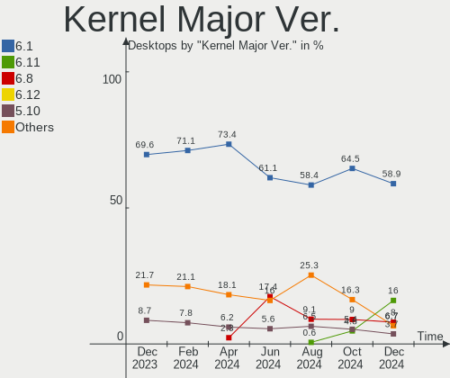
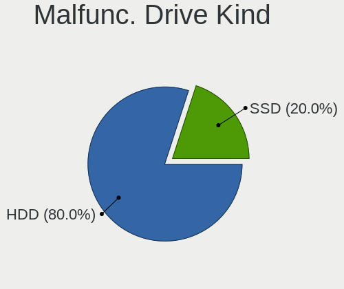
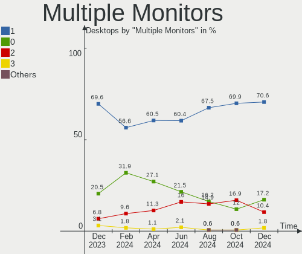
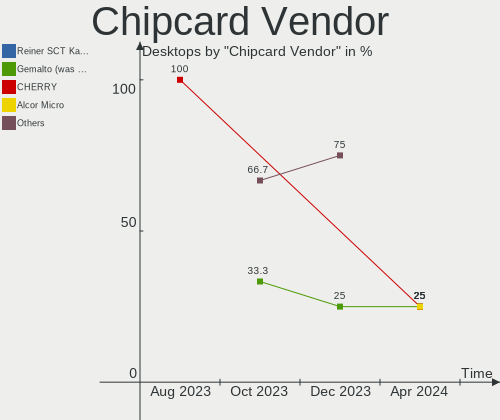

Debian - Hardware Trends (Desktops)
-----------------------------------

A project to identify most popular hardware characteristics and track their change
over time based on data collected by Linux users at https://Linux-Hardware.org.

Anyone can contribute to this report by the [hw-probe](https://github.com/linuxhw/hw-probe) tool:

    sudo -E hw-probe -all -upload

This report is for one last month. Overall report since the beginning of time: [TestDays](https://github.com/linuxhw/TestDays)

Period: May, 2023.

Contents
--------

* [ System ](#system)
  - [ OS                       ](#os)
  - [ OS Family                ](#os-family)
  - [ Kernel                   ](#kernel)
  - [ Kernel Family            ](#kernel-family)
  - [ Kernel Major Ver.        ](#kernel-major-ver)
  - [ Arch                     ](#arch)
  - [ DE                       ](#de)
  - [ Display Server           ](#display-server)
  - [ Display Manager          ](#display-manager)
  - [ OS Lang                  ](#os-lang)
  - [ Boot Mode                ](#boot-mode)
  - [ Filesystem               ](#filesystem)
  - [ Part. scheme             ](#part-scheme)
  - [ Dual Boot with Linux/BSD ](#dual-boot-with-linuxbsd)
  - [ Dual Boot (Win)          ](#dual-boot-win)

* [ Board ](#board)
  - [ Vendor                   ](#vendor)
  - [ Model                    ](#model)
  - [ Model Family             ](#model-family)
  - [ MFG Year                 ](#mfg-year)
  - [ Form Factor              ](#form-factor)
  - [ Secure Boot              ](#secure-boot)
  - [ Coreboot                 ](#coreboot)
  - [ RAM Size                 ](#ram-size)
  - [ RAM Used                 ](#ram-used)
  - [ Total Drives             ](#total-drives)
  - [ Has CD-ROM               ](#has-cd-rom)
  - [ Has Ethernet             ](#has-ethernet)
  - [ Has WiFi                 ](#has-wifi)
  - [ Has Bluetooth            ](#has-bluetooth)

* [ Location ](#location)
  - [ Country                  ](#country)
  - [ City                     ](#city)

* [ Drives ](#drives)
  - [ Drive Vendor             ](#drive-vendor)
  - [ Drive Model              ](#drive-model)
  - [ HDD Vendor               ](#hdd-vendor)
  - [ SSD Vendor               ](#ssd-vendor)
  - [ Drive Kind               ](#drive-kind)
  - [ Drive Connector          ](#drive-connector)
  - [ Drive Size               ](#drive-size)
  - [ Space Total              ](#space-total)
  - [ Space Used               ](#space-used)
  - [ Malfunc. Drives          ](#malfunc-drives)
  - [ Malfunc. Drive Vendor    ](#malfunc-drive-vendor)
  - [ Malfunc. HDD Vendor      ](#malfunc-hdd-vendor)
  - [ Malfunc. Drive Kind      ](#malfunc-drive-kind)
  - [ Failed Drives            ](#failed-drives)
  - [ Failed Drive Vendor      ](#failed-drive-vendor)
  - [ Drive Status             ](#drive-status)

* [ Storage controller ](#storage-controller)
  - [ Storage Vendor           ](#storage-vendor)
  - [ Storage Model            ](#storage-model)
  - [ Storage Kind             ](#storage-kind)

* [ Processor ](#processor)
  - [ CPU Vendor               ](#cpu-vendor)
  - [ CPU Model                ](#cpu-model)
  - [ CPU Model Family         ](#cpu-model-family)
  - [ CPU Cores                ](#cpu-cores)
  - [ CPU Sockets              ](#cpu-sockets)
  - [ CPU Threads              ](#cpu-threads)
  - [ CPU Op-Modes             ](#cpu-op-modes)
  - [ CPU Microcode            ](#cpu-microcode)
  - [ CPU Microarch            ](#cpu-microarch)

* [ Graphics ](#graphics)
  - [ GPU Vendor               ](#gpu-vendor)
  - [ GPU Model                ](#gpu-model)
  - [ GPU Combo                ](#gpu-combo)
  - [ GPU Driver               ](#gpu-driver)
  - [ GPU Memory               ](#gpu-memory)

* [ Monitor ](#monitor)
  - [ Monitor Vendor           ](#monitor-vendor)
  - [ Monitor Model            ](#monitor-model)
  - [ Monitor Resolution       ](#monitor-resolution)
  - [ Monitor Diagonal         ](#monitor-diagonal)
  - [ Monitor Width            ](#monitor-width)
  - [ Aspect Ratio             ](#aspect-ratio)
  - [ Monitor Area             ](#monitor-area)
  - [ Pixel Density            ](#pixel-density)
  - [ Multiple Monitors        ](#multiple-monitors)

* [ Network ](#network)
  - [ Net Controller Vendor    ](#net-controller-vendor)
  - [ Net Controller Model     ](#net-controller-model)
  - [ Wireless Vendor          ](#wireless-vendor)
  - [ Wireless Model           ](#wireless-model)
  - [ Ethernet Vendor          ](#ethernet-vendor)
  - [ Ethernet Model           ](#ethernet-model)
  - [ Net Controller Kind      ](#net-controller-kind)
  - [ Used Controller          ](#used-controller)
  - [ NICs                     ](#nics)
  - [ IPv6                     ](#ipv6)

* [ Bluetooth ](#bluetooth)
  - [ Bluetooth Vendor         ](#bluetooth-vendor)
  - [ Bluetooth Model          ](#bluetooth-model)

* [ Sound ](#sound)
  - [ Sound Vendor             ](#sound-vendor)
  - [ Sound Model              ](#sound-model)

* [ Memory ](#memory)
  - [ Memory Vendor            ](#memory-vendor)
  - [ Memory Model             ](#memory-model)
  - [ Memory Kind              ](#memory-kind)
  - [ Memory Form Factor       ](#memory-form-factor)
  - [ Memory Size              ](#memory-size)
  - [ Memory Speed             ](#memory-speed)

* [ Printers & scanners ](#printers--scanners)
  - [ Printer Vendor           ](#printer-vendor)
  - [ Printer Model            ](#printer-model)
  - [ Scanner Vendor           ](#scanner-vendor)
  - [ Scanner Model            ](#scanner-model)

* [ Camera ](#camera)
  - [ Camera Vendor            ](#camera-vendor)
  - [ Camera Model             ](#camera-model)

* [ Security ](#security)
  - [ Fingerprint Vendor       ](#fingerprint-vendor)
  - [ Fingerprint Model        ](#fingerprint-model)
  - [ Chipcard Vendor          ](#chipcard-vendor)
  - [ Chipcard Model           ](#chipcard-model)

* [ Unsupported ](#unsupported)
  - [ Unsupported Devices      ](#unsupported-devices)
  - [ Unsupported Device Types ](#unsupported-device-types)

System
------

OS
--

Installed operating systems

| Name      | Desktops | Percent |
|-----------|----------|---------|
| Debian 11 | 109      | 57.98%  |
| Debian 12 | 76       | 40.43%  |
| Debian 10 | 2        | 1.06%   |
| Debian 9  | 1        | 0.53%   |

OS Family
---------

OS without a version

| Name   | Desktops | Percent |
|--------|----------|---------|
| Debian | 188      | 100%    |

Kernel
------

Version of the Linux kernel

| Version                   | Desktops | Percent |
|---------------------------|----------|---------|
| 6.1.0-4-amd64             | 47       | 25%     |
| 5.10.0-23-amd64           | 33       | 17.55%  |
| 5.10.0-22-amd64           | 32       | 17.02%  |
| 6.1.0-9-amd64             | 13       | 6.91%   |
| 5.10.0-20-amd64           | 7        | 3.72%   |
| 6.1.0-8-amd64             | 5        | 2.66%   |
| 6.1.0-7-amd64             | 5        | 2.66%   |
| 5.15.107-2-pve            | 5        | 2.66%   |
| 5.15.107-1-pve            | 4        | 2.13%   |
| 5.15.102-1-pve            | 4        | 2.13%   |
| 5.10.0-21-amd64           | 3        | 1.6%    |
| 6.2.11-1-pve              | 2        | 1.06%   |
| 6.1.0-0.deb11.7-amd64     | 2        | 1.06%   |
| 6.1.0-0.deb11.6-amd64     | 2        | 1.06%   |
| 5.10.0-18-amd64           | 2        | 1.06%   |
| 6.3.3-tkg-cfs             | 1        | 0.53%   |
| 6.3.0-0-amd64             | 1        | 0.53%   |
| 6.1.20-bootes0-p-1000     | 1        | 0.53%   |
| 6.1.15-1-pve              | 1        | 0.53%   |
| 6.1.0-7-rt-amd64          | 1        | 0.53%   |
| 6.1.0-6-amd64             | 1        | 0.53%   |
| 6.0.0-6-amd64             | 1        | 0.53%   |
| 6.0.0-10.1-liquorix-amd64 | 1        | 0.53%   |
| 6.0.0-0.deb11.2-amd64     | 1        | 0.53%   |
| 5.18.0-0.deb11.4-amd64    | 1        | 0.53%   |
| 5.15.94-x86               | 1        | 0.53%   |
| 5.15.85-1-pve             | 1        | 0.53%   |
| 5.15.104-1-pve            | 1        | 0.53%   |
| 5.15.0-2-amd64            | 1        | 0.53%   |
| 5.10.164.2                | 1        | 0.53%   |
| 5.10.0-8-amd64            | 1        | 0.53%   |
| 5.10.0-23-686-pae         | 1        | 0.53%   |
| 5.10.0-19-686             | 1        | 0.53%   |
| 5.10.0-15-amd64           | 1        | 0.53%   |
| 4.19.0-6-amd64            | 1        | 0.53%   |
| 4.19.0-5-amd64            | 1        | 0.53%   |
| 4.19.0-24-amd64           | 1        | 0.53%   |

Kernel Family
-------------

Linux kernel without a distro release

| Version    | Desktops | Percent |
|------------|----------|---------|
| 5.10.0     | 81       | 43.09%  |
| 6.1.0      | 76       | 40.43%  |
| 5.15.107   | 9        | 4.79%   |
| 5.15.102   | 4        | 2.13%   |
| 6.0.0      | 3        | 1.6%    |
| 4.19.0     | 3        | 1.6%    |
| 6.2.11     | 2        | 1.06%   |
| 6.3.3      | 1        | 0.53%   |
| 6.3.0      | 1        | 0.53%   |
| 6.1.20     | 1        | 0.53%   |
| 6.1.15     | 1        | 0.53%   |
| 5.18.0     | 1        | 0.53%   |
| 5.15.94    | 1        | 0.53%   |
| 5.15.85    | 1        | 0.53%   |
| 5.15.104   | 1        | 0.53%   |
| 5.15.0     | 1        | 0.53%   |
| 5.10.164.2 | 1        | 0.53%   |

Kernel Major Ver.
-----------------

Linux kernel major version

| Version  | Desktops | Percent |
|----------|----------|---------|
| 5.10     | 81       | 43.09%  |
| 6.1      | 78       | 41.49%  |
| 5.15     | 17       | 9.04%   |
| 6.0      | 3        | 1.6%    |
| 4.19     | 3        | 1.6%    |
| 6.3      | 2        | 1.06%   |
| 6.2      | 2        | 1.06%   |
| 5.18     | 1        | 0.53%   |
| 5.10.164 | 1        | 0.53%   |

Arch
----

OS architecture (x86_64, i586, etc.)

| Name   | Desktops | Percent |
|--------|----------|---------|
| x86_64 | 186      | 98.94%  |
| i686   | 2        | 1.06%   |

DE
--

Desktop Environment

| Name          | Desktops | Percent |
|---------------|----------|---------|
| Unknown       | 88       | 46.81%  |
| GNOME         | 33       | 17.55%  |
| KDE5          | 20       | 10.64%  |
| XFCE          | 19       | 10.11%  |
| X-Cinnamon    | 9        | 4.79%   |
| MATE          | 6        | 3.19%   |
| LXDE          | 4        | 2.13%   |
| openbox       | 2        | 1.06%   |
| LXQt          | 2        | 1.06%   |
| Trinity       | 1        | 0.53%   |
| i3            | 1        | 0.53%   |
| GNOME Classic | 1        | 0.53%   |
| Cinnamon      | 1        | 0.53%   |
| Budgie        | 1        | 0.53%   |

Display Server
--------------

X11 or Wayland

| Name    | Desktops | Percent |
|---------|----------|---------|
| X11     | 79       | 42.02%  |
| Unknown | 60       | 31.91%  |
| Tty     | 31       | 16.49%  |
| Wayland | 18       | 9.57%   |

Display Manager
---------------

SDDM, LightDM, etc.

| Name    | Desktops | Percent |
|---------|----------|---------|
| Unknown | 111      | 59.04%  |
| LightDM | 37       | 19.68%  |
| SDDM    | 14       | 7.45%   |
| GDM     | 14       | 7.45%   |
| GDM3    | 10       | 5.32%   |
| SLiM    | 1        | 0.53%   |
| Ly      | 1        | 0.53%   |

OS Lang
-------

Language

| Lang    | Desktops | Percent |
|---------|----------|---------|
| en_US   | 63       | 33.51%  |
| ru_RU   | 52       | 27.66%  |
| de_DE   | 20       | 10.64%  |
| fr_FR   | 14       | 7.45%   |
| en_GB   | 6        | 3.19%   |
| pt_BR   | 4        | 2.13%   |
| es_ES   | 4        | 2.13%   |
| C       | 3        | 1.6%    |
| Unknown | 3        | 1.6%    |
| es_AR   | 2        | 1.06%   |
| en_IN   | 2        | 1.06%   |
| sv_SE   | 1        | 0.53%   |
| sk_SK   | 1        | 0.53%   |
| pl_PL   | 1        | 0.53%   |
| nl_BE   | 1        | 0.53%   |
| ko_KR   | 1        | 0.53%   |
| it_IT   | 1        | 0.53%   |
| fi_FI   | 1        | 0.53%   |
| es_VE   | 1        | 0.53%   |
| es_MX   | 1        | 0.53%   |
| en_NZ   | 1        | 0.53%   |
| en_IE   | 1        | 0.53%   |
| en_HK   | 1        | 0.53%   |
| en_DK   | 1        | 0.53%   |
| en_CA   | 1        | 0.53%   |
| el_GR   | 1        | 0.53%   |

Boot Mode
---------

EFI or BIOS

| Mode | Desktops | Percent |
|------|----------|---------|
| BIOS | 114      | 60.64%  |
| EFI  | 74       | 39.36%  |

Filesystem
----------

Type of filesystem

| Type    | Desktops | Percent |
|---------|----------|---------|
| Ext4    | 115      | 61.17%  |
| Overlay | 57       | 30.32%  |
| Btrfs   | 7        | 3.72%   |
| Zfs     | 4        | 2.13%   |
| Xfs     | 2        | 1.06%   |
| Tmpfs   | 1        | 0.53%   |
| Ext3    | 1        | 0.53%   |
| Ext2    | 1        | 0.53%   |

Part. scheme
------------

Scheme of partitioning

| Type    | Desktops | Percent |
|---------|----------|---------|
| GPT     | 92       | 48.94%  |
| MBR     | 70       | 37.23%  |
| Unknown | 26       | 13.83%  |

Dual Boot with Linux/BSD
------------------------

Hosting more than one Linux/BSD

| Dual boot | Desktops | Percent |
|-----------|----------|---------|
| No        | 164      | 87.23%  |
| Yes       | 24       | 12.77%  |

Dual Boot (Win)
---------------

Hosting Linux and Windows

| Dual boot | Desktops | Percent |
|-----------|----------|---------|
| No        | 108      | 57.45%  |
| Yes       | 80       | 42.55%  |

Board
-----

Vendor
------

Motherboard manufacturer

| Name                | Desktops | Percent |
|---------------------|----------|---------|
| ASUSTek Computer    | 60       | 31.91%  |
| Gigabyte Technology | 31       | 16.49%  |
| MSI                 | 20       | 10.64%  |
| Dell                | 15       | 7.98%   |
| ASRock              | 15       | 7.98%   |
| Hewlett-Packard     | 12       | 6.38%   |
| Lenovo              | 6        | 3.19%   |
| Unknown             | 6        | 3.19%   |
| Intel               | 5        | 2.66%   |
| Fujitsu             | 3        | 1.6%    |
| AZW                 | 3        | 1.6%    |
| Pegatron            | 2        | 1.06%   |
| ECS                 | 2        | 1.06%   |
| BESSTAR Tech        | 2        | 1.06%   |
| Supermicro          | 1        | 0.53%   |
| Inventec            | 1        | 0.53%   |
| Biostar             | 1        | 0.53%   |
| ASRockRack          | 1        | 0.53%   |
| AMI                 | 1        | 0.53%   |
| Acer                | 1        | 0.53%   |

Model
-----

Motherboard model

| Name                                    | Desktops | Percent |
|-----------------------------------------|----------|---------|
| ASUS All Series                         | 18       | 9.57%   |
| Gigabyte H81M-S2V                       | 8        | 4.26%   |
| Unknown                                 | 6        | 3.19%   |
| Dell Precision Tower 5810               | 3        | 1.6%    |
| MSI MS-7816                             | 2        | 1.06%   |
| Intel X99                               | 2        | 1.06%   |
| Gigabyte M68MT-S2                       | 2        | 1.06%   |
| Gigabyte M56S-S3                        | 2        | 1.06%   |
| Gigabyte B550I AORUS PRO AX             | 2        | 1.06%   |
| ECS G31T-M9                             | 2        | 1.06%   |
| ASUS PRIME B760M-A D4                   | 2        | 1.06%   |
| ASUS P8H67-M                            | 2        | 1.06%   |
| ASRock B450 Gaming-ITX/ac               | 2        | 1.06%   |
| Supermicro PIO-617R-TLN4F+-ST031        | 1        | 0.53%   |
| Pegatron NP267AA-A2L e9180f             | 1        | 0.53%   |
| Pegatron BK383AA-AC4 CQ1-1010br         | 1        | 0.53%   |
| MSI p6-2480eom                          | 1        | 0.53%   |
| MSI MS-7D41                             | 1        | 0.53%   |
| MSI MS-7D32                             | 1        | 0.53%   |
| MSI MS-7D25                             | 1        | 0.53%   |
| MSI MS-7D22                             | 1        | 0.53%   |
| MSI MS-7C91                             | 1        | 0.53%   |
| MSI MS-7C82                             | 1        | 0.53%   |
| MSI MS-7C37                             | 1        | 0.53%   |
| MSI MS-7C02                             | 1        | 0.53%   |
| MSI MS-7B98                             | 1        | 0.53%   |
| MSI MS-7A36                             | 1        | 0.53%   |
| MSI MS-7998                             | 1        | 0.53%   |
| MSI MS-7996                             | 1        | 0.53%   |
| MSI MS-7885                             | 1        | 0.53%   |
| MSI MS-7817                             | 1        | 0.53%   |
| MSI MS-7680                             | 1        | 0.53%   |
| MSI MS-7641                             | 1        | 0.53%   |
| MSI MS-7635                             | 1        | 0.53%   |
| Lenovo ThinkStation P330 30CY0075GE     | 1        | 0.53%   |
| Lenovo ThinkCentre M93 10A4A03NUK       | 1        | 0.53%   |
| Lenovo ThinkCentre M92p 2988B1G         | 1        | 0.53%   |
| Lenovo ThinkCentre M920s 10SKS1QJ00     | 1        | 0.53%   |
| Lenovo ThinkCentre E73 10DS000TUK       | 1        | 0.53%   |
| Lenovo IdeaCentre 510S-08ISH 90FN0059MB | 1        | 0.53%   |

Model Family
------------

Motherboard model prefix

| Name                             | Desktops | Percent |
|----------------------------------|----------|---------|
| ASUS All                         | 18       | 9.57%   |
| ASUS PRIME                       | 16       | 8.51%   |
| Gigabyte H81M-S2V                | 8        | 4.26%   |
| Dell Precision                   | 6        | 3.19%   |
| Dell OptiPlex                    | 6        | 3.19%   |
| ASUS ROG                         | 6        | 3.19%   |
| Unknown                          | 6        | 3.19%   |
| Lenovo ThinkCentre               | 4        | 2.13%   |
| HP Compaq                        | 4        | 2.13%   |
| MSI MS-7816                      | 2        | 1.06%   |
| Intel X99                        | 2        | 1.06%   |
| HP EliteDesk                     | 2        | 1.06%   |
| Gigabyte M68MT-S2                | 2        | 1.06%   |
| Gigabyte M56S-S3                 | 2        | 1.06%   |
| Gigabyte B550I                   | 2        | 1.06%   |
| Fujitsu ESPRIMO                  | 2        | 1.06%   |
| ECS G31T-M9                      | 2        | 1.06%   |
| Dell Vostro                      | 2        | 1.06%   |
| ASUS P8H67-M                     | 2        | 1.06%   |
| ASUS P5G41T-M                    | 2        | 1.06%   |
| ASRock B450                      | 2        | 1.06%   |
| Supermicro PIO-617R-TLN4F+-ST031 | 1        | 0.53%   |
| Pegatron NP267AA-A2L             | 1        | 0.53%   |
| Pegatron BK383AA-AC4             | 1        | 0.53%   |
| MSI p6-2480eom                   | 1        | 0.53%   |
| MSI MS-7D41                      | 1        | 0.53%   |
| MSI MS-7D32                      | 1        | 0.53%   |
| MSI MS-7D25                      | 1        | 0.53%   |
| MSI MS-7D22                      | 1        | 0.53%   |
| MSI MS-7C91                      | 1        | 0.53%   |
| MSI MS-7C82                      | 1        | 0.53%   |
| MSI MS-7C37                      | 1        | 0.53%   |
| MSI MS-7C02                      | 1        | 0.53%   |
| MSI MS-7B98                      | 1        | 0.53%   |
| MSI MS-7A36                      | 1        | 0.53%   |
| MSI MS-7998                      | 1        | 0.53%   |
| MSI MS-7996                      | 1        | 0.53%   |
| MSI MS-7885                      | 1        | 0.53%   |
| MSI MS-7817                      | 1        | 0.53%   |
| MSI MS-7680                      | 1        | 0.53%   |

MFG Year
--------

Motherboard manufacture year

| Year | Desktops | Percent |
|------|----------|---------|
| 2012 | 22       | 11.7%   |
| 2018 | 16       | 8.51%   |
| 2021 | 15       | 7.98%   |
| 2014 | 15       | 7.98%   |
| 2020 | 14       | 7.45%   |
| 2013 | 14       | 7.45%   |
| 2022 | 13       | 6.91%   |
| 2011 | 12       | 6.38%   |
| 2010 | 12       | 6.38%   |
| 2019 | 11       | 5.85%   |
| 2015 | 10       | 5.32%   |
| 2016 | 9        | 4.79%   |
| 2007 | 7        | 3.72%   |
| 2017 | 6        | 3.19%   |
| 2009 | 6        | 3.19%   |
| 2008 | 3        | 1.6%    |
| 2023 | 2        | 1.06%   |
| 2003 | 1        | 0.53%   |

Form Factor
-----------

Physical design of the computer

| Name    | Desktops | Percent |
|---------|----------|---------|
| Desktop | 188      | 100%    |

Secure Boot
-----------

Enabled or disabled

| State    | Desktops | Percent |
|----------|----------|---------|
| Disabled | 184      | 97.87%  |
| Enabled  | 4        | 2.13%   |

Coreboot
--------

Have coreboot on board

| Used | Desktops | Percent |
|------|----------|---------|
| No   | 188      | 100%    |

RAM Size
--------

Total RAM memory

| Size in GB  | Desktops | Percent |
|-------------|----------|---------|
| 32.01-64.0  | 46       | 24.47%  |
| 3.01-4.0    | 39       | 20.74%  |
| 16.01-24.0  | 28       | 14.89%  |
| 4.01-8.0    | 24       | 12.77%  |
| 8.01-16.0   | 22       | 11.7%   |
| 64.01-256.0 | 13       | 6.91%   |
| 1.01-2.0    | 6        | 3.19%   |
| 24.01-32.0  | 5        | 2.66%   |
| 2.01-3.0    | 3        | 1.6%    |
| 0.51-1.0    | 2        | 1.06%   |

RAM Used
--------

Used RAM memory

| Used GB    | Desktops | Percent |
|------------|----------|---------|
| 0.51-1.0   | 56       | 29.79%  |
| 1.01-2.0   | 43       | 22.87%  |
| 4.01-8.0   | 25       | 13.3%   |
| 2.01-3.0   | 23       | 12.23%  |
| 3.01-4.0   | 16       | 8.51%   |
| 8.01-16.0  | 11       | 5.85%   |
| 0.01-0.5   | 7        | 3.72%   |
| 16.01-24.0 | 3        | 1.6%    |
| 32.01-64.0 | 2        | 1.06%   |
| 24.01-32.0 | 2        | 1.06%   |

Total Drives
------------

Number of drives on board

| Drives | Desktops | Percent |
|--------|----------|---------|
| 1      | 92       | 48.94%  |
| 2      | 46       | 24.47%  |
| 3      | 21       | 11.17%  |
| 6      | 10       | 5.32%   |
| 4      | 8        | 4.26%   |
| 7      | 3        | 1.6%    |
| 0      | 3        | 1.6%    |
| 9      | 2        | 1.06%   |
| 5      | 2        | 1.06%   |
| 8      | 1        | 0.53%   |

Has CD-ROM
----------

Has CD-ROM on board

| Presented | Desktops | Percent |
|-----------|----------|---------|
| No        | 127      | 67.55%  |
| Yes       | 61       | 32.45%  |

Has Ethernet
------------

Has Ethernet on board

| Presented | Desktops | Percent |
|-----------|----------|---------|
| Yes       | 187      | 99.47%  |
| No        | 1        | 0.53%   |

Has WiFi
--------

Has WiFi module

| Presented | Desktops | Percent |
|-----------|----------|---------|
| No        | 126      | 67.02%  |
| Yes       | 62       | 32.98%  |

Has Bluetooth
-------------

Has Bluetooth module

| Presented | Desktops | Percent |
|-----------|----------|---------|
| No        | 134      | 71.28%  |
| Yes       | 54       | 28.72%  |

Location
--------

Country
-------

Geographic location (country)

| Country     | Desktops | Percent |
|-------------|----------|---------|
| Russia      | 54       | 28.72%  |
| USA         | 28       | 14.89%  |
| Germany     | 24       | 12.77%  |
| France      | 14       | 7.45%   |
| Brazil      | 8        | 4.26%   |
| Argentina   | 7        | 3.72%   |
| Sweden      | 5        | 2.66%   |
| Spain       | 5        | 2.66%   |
| UK          | 4        | 2.13%   |
| Poland      | 3        | 1.6%    |
| Norway      | 3        | 1.6%    |
| Finland     | 3        | 1.6%    |
| Canada      | 3        | 1.6%    |
| Mexico      | 2        | 1.06%   |
| Italy       | 2        | 1.06%   |
| India       | 2        | 1.06%   |
| Vietnam     | 1        | 0.53%   |
| Venezuela   | 1        | 0.53%   |
| Ukraine     | 1        | 0.53%   |
| Taiwan      | 1        | 0.53%   |
| South Korea | 1        | 0.53%   |
| Slovakia    | 1        | 0.53%   |
| Philippines | 1        | 0.53%   |
| New Zealand | 1        | 0.53%   |
| Netherlands | 1        | 0.53%   |
| Morocco     | 1        | 0.53%   |
| Japan       | 1        | 0.53%   |
| Israel      | 1        | 0.53%   |
| Ireland     | 1        | 0.53%   |
| Hungary     | 1        | 0.53%   |
| Greece      | 1        | 0.53%   |
| Czechia     | 1        | 0.53%   |
| China       | 1        | 0.53%   |
| Belgium     | 1        | 0.53%   |
| Belarus     | 1        | 0.53%   |
| Austria     | 1        | 0.53%   |
| Australia   | 1        | 0.53%   |

City
----

Geographic location (city)

| City              | Desktops | Percent |
|-------------------|----------|---------|
| Voronezh          | 47       | 25%     |
| Lherm             | 4        | 2.13%   |
| Saltsjoe-Boo      | 3        | 1.6%    |
| Gladbeck          | 3        | 1.6%    |
| Buenos Aires      | 3        | 1.6%    |
| Siegsdorf         | 2        | 1.06%   |
| Santos            | 2        | 1.06%   |
| Nuremberg         | 2        | 1.06%   |
| Manchester        | 2        | 1.06%   |
| Helsinki          | 2        | 1.06%   |
| Hamburg           | 2        | 1.06%   |
| Dortmund          | 2        | 1.06%   |
| Berlin            | 2        | 1.06%   |
| Bangor            | 2        | 1.06%   |
| Asker             | 2        | 1.06%   |
| Yekaterinburg     | 1        | 0.53%   |
| Wroclaw           | 1        | 0.53%   |
| Weimar            | 1        | 0.53%   |
| Warner Robins     | 1        | 0.53%   |
| Vila Velha        | 1        | 0.53%   |
| Valencia          | 1        | 0.53%   |
| Tiranges          | 1        | 0.53%   |
| Texas City        | 1        | 0.53%   |
| Tarnów           | 1        | 0.53%   |
| Taichung          | 1        | 0.53%   |
| Szolnok           | 1        | 0.53%   |
| Sutton            | 1        | 0.53%   |
| Stuttgart         | 1        | 0.53%   |
| Stockholm         | 1        | 0.53%   |
| Springfield       | 1        | 0.53%   |
| Severodvinsk      | 1        | 0.53%   |
| Seocho-gu         | 1        | 0.53%   |
| Seattle           | 1        | 0.53%   |
| Santa Ana         | 1        | 0.53%   |
| San Rafael        | 1        | 0.53%   |
| San Marcos        | 1        | 0.53%   |
| San Luis          | 1        | 0.53%   |
| Rickmansworth     | 1        | 0.53%   |
| Rancho Cucamonga  | 1        | 0.53%   |
| Priego de Cordoba | 1        | 0.53%   |

Drives
------

Drive Vendor
------------

Hard drive vendors

| Vendor                      | Desktops | Drives | Percent |
|-----------------------------|----------|--------|---------|
| WDC                         | 78       | 106    | 25.41%  |
| Seagate                     | 55       | 72     | 17.92%  |
| Samsung Electronics         | 40       | 57     | 13.03%  |
| Toshiba                     | 17       | 22     | 5.54%   |
| Crucial                     | 13       | 17     | 4.23%   |
| Kingston                    | 10       | 10     | 3.26%   |
| HGST                        | 9        | 12     | 2.93%   |
| Transcend                   | 7        | 7      | 2.28%   |
| China                       | 6        | 6      | 1.95%   |
| SanDisk                     | 5        | 6      | 1.63%   |
| Hitachi                     | 5        | 5      | 1.63%   |
| SPCC                        | 4        | 4      | 1.3%    |
| PNY                         | 4        | 4      | 1.3%    |
| Unknown                     | 3        | 5      | 0.98%   |
| Patriot                     | 3        | 4      | 0.98%   |
| Micron Technology           | 3        | 3      | 0.98%   |
| Intenso                     | 3        | 3      | 0.98%   |
| Intel                       | 3        | 4      | 0.98%   |
| GOODRAM                     | 3        | 3      | 0.98%   |
| Gigabyte Technology         | 3        | 3      | 0.98%   |
| Team                        | 2        | 4      | 0.65%   |
| SK hynix                    | 2        | 2      | 0.65%   |
| Phison Electronics          | 2        | 3      | 0.65%   |
| Netac                       | 2        | 2      | 0.65%   |
| XPG                         | 1        | 1      | 0.33%   |
| WD MediaMax                 | 1        | 6      | 0.33%   |
| USB                         | 1        | 1      | 0.33%   |
| TrekStor                    | 1        | 1      | 0.33%   |
| TO Exter                    | 1        | 1      | 0.33%   |
| Ramsta                      | 1        | 1      | 0.33%   |
| Plextor                     | 1        | 1      | 0.33%   |
| OCZ                         | 1        | 1      | 0.33%   |
| Mushkin                     | 1        | 1      | 0.33%   |
| Micron/Crucial Technology   | 1        | 1      | 0.33%   |
| Londisk                     | 1        | 1      | 0.33%   |
| LDLC                        | 1        | 1      | 0.33%   |
| KIOXIA                      | 1        | 1      | 0.33%   |
| Kingston Technology Company | 1        | 1      | 0.33%   |
| Innodisk                    | 1        | 1      | 0.33%   |
| Inateck                     | 1        | 1      | 0.33%   |

Drive Model
-----------

Hard drive models

| Model                                              | Desktops | Percent |
|----------------------------------------------------|----------|---------|
| WDC WD5000AAKX-60U6AA0 500GB                       | 16       | 4.42%   |
| Seagate ST1000DM003-1ER162 1TB                     | 11       | 3.04%   |
| Seagate ST1000DM010-2EP102 1TB                     | 5        | 1.38%   |
| WDC WD40EFRX-68WT0N0 4TB                           | 3        | 0.83%   |
| Toshiba HDWQ140 4TB                                | 3        | 0.83%   |
| Toshiba DT01ACA050 500GB                           | 3        | 0.83%   |
| SPCC Solid State Disk 128GB                        | 3        | 0.83%   |
| Seagate ST4000DM004-2CV104 4TB                     | 3        | 0.83%   |
| Seagate ST2000DM008-2FR102 2TB                     | 3        | 0.83%   |
| Samsung SSD 870 EVO 500GB                          | 3        | 0.83%   |
| Samsung SSD 850 EVO 500GB                          | 3        | 0.83%   |
| Samsung SSD 850 EVO 250GB                          | 3        | 0.83%   |
| Samsung NVMe SSD Controller PM9A1/PM9A3/980PRO 1TB | 3        | 0.83%   |
| Kingston SA400S37240G 240GB SSD                    | 3        | 0.83%   |
| HGST HUS726T4TALA6L4 4TB                           | 3        | 0.83%   |
| Crucial CT500MX500SSD1 500GB                       | 3        | 0.83%   |
| WDC WDS250G2B0A-00SM50 250GB SSD                   | 2        | 0.55%   |
| WDC WDS240G2G0A-00JH30 240GB SSD                   | 2        | 0.55%   |
| WDC WDS100T2B0A-00SM50 1TB SSD                     | 2        | 0.55%   |
| WDC WD5000AAKX-08ANVA0 500GB                       | 2        | 0.55%   |
| WDC WD40EFRX-68N32N0 4TB                           | 2        | 0.55%   |
| WDC WD4003FRYZ-01F0DB0 4TB                         | 2        | 0.55%   |
| WDC WD30EFRX-68EUZN0 3TB                           | 2        | 0.55%   |
| WDC WD2500AAKS-00VSA0 250GB                        | 2        | 0.55%   |
| WDC WD20EZRZ-00Z5HB0 2TB                           | 2        | 0.55%   |
| WDC WD20EZRX-00D8PB0 2TB                           | 2        | 0.55%   |
| WDC WD10EZEX-08WN4A0 1TB                           | 2        | 0.55%   |
| WDC WD1003FZEX-00MK2A0 1TB                         | 2        | 0.55%   |
| WDC PC SN730 SDBQNTY-512G-1001 512GB               | 2        | 0.55%   |
| Transcend TS1TMTE220S 1TB                          | 2        | 0.55%   |
| Transcend TS128GSSD340K 128GB                      | 2        | 0.55%   |
| Toshiba DT01ACA300 3TB                             | 2        | 0.55%   |
| Team TM8FP6001T 1TB                                | 2        | 0.55%   |
| Seagate ST4000NM000A-2HZ100 4TB                    | 2        | 0.55%   |
| Seagate ST4000DM005-2DP166 4TB                     | 2        | 0.55%   |
| Seagate ST3500312CS 500GB                          | 2        | 0.55%   |
| Seagate ST3320418AS 320GB                          | 2        | 0.55%   |
| Seagate ST3250410AS 250GB                          | 2        | 0.55%   |
| Seagate ST1000DM003-9YN162 1TB                     | 2        | 0.55%   |
| Seagate ST1000DM003-1SB102 1TB                     | 2        | 0.55%   |

HDD Vendor
----------

Hard disk drive vendors

| Vendor              | Desktops | Drives | Percent |
|---------------------|----------|--------|---------|
| WDC                 | 65       | 84     | 41.67%  |
| Seagate             | 54       | 71     | 34.62%  |
| Toshiba             | 16       | 21     | 10.26%  |
| HGST                | 9        | 12     | 5.77%   |
| Hitachi             | 5        | 5      | 3.21%   |
| Samsung Electronics | 4        | 4      | 2.56%   |
| WD MediaMax         | 1        | 6      | 0.64%   |
| USB                 | 1        | 1      | 0.64%   |
| Unknown             | 1        | 1      | 0.64%   |

SSD Vendor
----------

Solid state drive vendors

| Vendor              | Desktops | Drives | Percent |
|---------------------|----------|--------|---------|
| Samsung Electronics | 19       | 24     | 17.43%  |
| WDC                 | 14       | 15     | 12.84%  |
| Crucial             | 11       | 13     | 10.09%  |
| Kingston            | 10       | 10     | 9.17%   |
| China               | 6        | 6      | 5.5%    |
| Transcend           | 5        | 5      | 4.59%   |
| SPCC                | 4        | 4      | 3.67%   |
| SanDisk             | 4        | 5      | 3.67%   |
| PNY                 | 3        | 3      | 2.75%   |
| Intenso             | 3        | 3      | 2.75%   |
| GOODRAM             | 3        | 3      | 2.75%   |
| Gigabyte Technology | 3        | 3      | 2.75%   |
| Team                | 2        | 2      | 1.83%   |
| Intel               | 2        | 3      | 1.83%   |
| TrekStor            | 1        | 1      | 0.92%   |
| TO Exter            | 1        | 1      | 0.92%   |
| SK hynix            | 1        | 1      | 0.92%   |
| Ramsta              | 1        | 1      | 0.92%   |
| Plextor             | 1        | 1      | 0.92%   |
| Patriot             | 1        | 2      | 0.92%   |
| OCZ                 | 1        | 1      | 0.92%   |
| Netac               | 1        | 1      | 0.92%   |
| Mushkin             | 1        | 1      | 0.92%   |
| Micron Technology   | 1        | 1      | 0.92%   |
| Londisk             | 1        | 1      | 0.92%   |
| LDLC                | 1        | 1      | 0.92%   |
| Innodisk            | 1        | 1      | 0.92%   |
| Hoodisk             | 1        | 1      | 0.92%   |
| Hewlett-Packard     | 1        | 1      | 0.92%   |
| FCS                 | 1        | 1      | 0.92%   |
| Fanxiang            | 1        | 1      | 0.92%   |
| ASMT                | 1        | 1      | 0.92%   |
| A-DATA Technology   | 1        | 1      | 0.92%   |
| Unknown             | 1        | 1      | 0.92%   |

Drive Kind
----------

HDD or SSD

| Kind    | Desktops | Drives | Percent |
|---------|----------|--------|---------|
| HDD     | 131      | 205    | 47.81%  |
| SSD     | 88       | 120    | 32.12%  |
| NVMe    | 52       | 64     | 18.98%  |
| Unknown | 2        | 4      | 0.73%   |
| MMC     | 1        | 1      | 0.36%   |

Drive Connector
---------------

SATA, SAS, NVMe, etc.

| Type | Desktops | Drives | Percent |
|------|----------|--------|---------|
| SATA | 168      | 316    | 73.04%  |
| NVMe | 52       | 63     | 22.61%  |
| SAS  | 9        | 14     | 3.91%   |
| MMC  | 1        | 1      | 0.43%   |

Drive Size
----------

Size of hard drive

| Size in TB | Desktops | Drives | Percent |
|------------|----------|--------|---------|
| 0.01-0.5   | 120      | 152    | 49.38%  |
| 0.51-1.0   | 63       | 80     | 25.93%  |
| 1.01-2.0   | 21       | 25     | 8.64%   |
| 3.01-4.0   | 18       | 34     | 7.41%   |
| 2.01-3.0   | 10       | 16     | 4.12%   |
| 4.01-10.0  | 8        | 15     | 3.29%   |
| 10.01-20.0 | 3        | 3      | 1.23%   |

Space Total
-----------

Amount of disk space available on the file system

| Size in GB     | Desktops | Percent |
|----------------|----------|---------|
| Unknown        | 58       | 30.85%  |
| 251-500        | 25       | 13.3%   |
| 501-1000       | 25       | 13.3%   |
| 101-250        | 23       | 12.23%  |
| More than 3000 | 22       | 11.7%   |
| 51-100         | 10       | 5.32%   |
| 2001-3000      | 9        | 4.79%   |
| 1001-2000      | 8        | 4.26%   |
| 1-20           | 7        | 3.72%   |
| 21-50          | 1        | 0.53%   |

Space Used
----------

Amount of used disk space

| Used GB        | Desktops | Percent |
|----------------|----------|---------|
| Unknown        | 58       | 30.85%  |
| 1-20           | 44       | 23.4%   |
| 21-50          | 16       | 8.51%   |
| 501-1000       | 15       | 7.98%   |
| 1001-2000      | 14       | 7.45%   |
| 251-500        | 11       | 5.85%   |
| 101-250        | 10       | 5.32%   |
| 51-100         | 10       | 5.32%   |
| More than 3000 | 5        | 2.66%   |
| 2001-3000      | 5        | 2.66%   |

Malfunc. Drives
---------------

Drive models with a malfunction

| Model                                        | Desktops | Drives | Percent |
|----------------------------------------------|----------|--------|---------|
| WDC WD5000AAKX-60U6AA0 500GB                 | 12       | 12     | 24.49%  |
| WDC WD40EFRX-68WT0N0 4TB                     | 2        | 4      | 4.08%   |
| Seagate ST3250410AS 250GB                    | 2        | 2      | 4.08%   |
| WDC WDS480G2G0A-00JH30 480GB SSD             | 1        | 2      | 2.04%   |
| WDC WDS240G2G0A-00JH30 240GB SSD             | 1        | 1      | 2.04%   |
| WDC WD800AAJS-60WAA0 80GB                    | 1        | 1      | 2.04%   |
| WDC WD3200AAJS-00L7A0 320GB                  | 1        | 1      | 2.04%   |
| WDC WD30EFRX-68EUZN0 3TB                     | 1        | 1      | 2.04%   |
| WDC WD30EFRX-68AX9N0 3TB                     | 1        | 1      | 2.04%   |
| WDC WD2500BEKT-00A25T0 250GB                 | 1        | 1      | 2.04%   |
| WDC WD2500AAKS-00VSA0 250GB                  | 1        | 1      | 2.04%   |
| WDC WD20PURX-64P6ZY0 2TB                     | 1        | 1      | 2.04%   |
| WDC WD20EFRX-68AX9N0 2TB                     | 1        | 1      | 2.04%   |
| WDC WD20EARS-00MVWB0 2TB                     | 1        | 1      | 2.04%   |
| Toshiba XG4 NVMe SSD Controller 256GB        | 1        | 1      | 2.04%   |
| Seagate ST8000VX0022-2EJ112 8TB              | 1        | 2      | 2.04%   |
| Seagate ST4000DM005-2DP166 4TB               | 1        | 2      | 2.04%   |
| Seagate ST3500312CS 500GB                    | 1        | 1      | 2.04%   |
| Seagate ST3320418AS 320GB                    | 1        | 1      | 2.04%   |
| Seagate ST3250310AS 250GB                    | 1        | 1      | 2.04%   |
| Seagate ST320LT007-9ZV142 320GB              | 1        | 1      | 2.04%   |
| Seagate ST3160815AS 160GB                    | 1        | 1      | 2.04%   |
| Seagate ST31000528AS 1TB                     | 1        | 1      | 2.04%   |
| Seagate ST2000DM001-9YN164 2TB               | 1        | 1      | 2.04%   |
| Seagate ST10000NE0004-1ZF101 10TB            | 1        | 1      | 2.04%   |
| Samsung Electronics SSD 980 1TB              | 1        | 1      | 2.04%   |
| Samsung Electronics SSD 970 EVO 1TB          | 1        | 1      | 2.04%   |
| Samsung Electronics SSD 840 PRO Series 128GB | 1        | 1      | 2.04%   |
| Samsung Electronics HD501LJ 500GB            | 1        | 1      | 2.04%   |
| Kingston SV300S37A120G 120GB SSD             | 1        | 1      | 2.04%   |
| Kingston SUV400S37240G 240GB SSD             | 1        | 1      | 2.04%   |
| Intenso JAJM600M128C 128GB SSD               | 1        | 1      | 2.04%   |
| Intel SSDMAEMC040G2 40GB                     | 1        | 1      | 2.04%   |
| Hitachi HDS721050CLA362 500GB                | 1        | 1      | 2.04%   |
| Crucial CT240M500SSD1 240GB                  | 1        | 1      | 2.04%   |
| A-DATA Technology SU635 240GB SSD            | 1        | 1      | 2.04%   |

Malfunc. Drive Vendor
---------------------

Vendors of faulty drives

| Vendor              | Desktops | Drives | Percent |
|---------------------|----------|--------|---------|
| WDC                 | 24       | 28     | 51.06%  |
| Seagate             | 12       | 14     | 25.53%  |
| Samsung Electronics | 3        | 4      | 6.38%   |
| Kingston            | 2        | 2      | 4.26%   |
| Toshiba             | 1        | 1      | 2.13%   |
| Intenso             | 1        | 1      | 2.13%   |
| Intel               | 1        | 1      | 2.13%   |
| Hitachi             | 1        | 1      | 2.13%   |
| Crucial             | 1        | 1      | 2.13%   |
| A-DATA Technology   | 1        | 1      | 2.13%   |

Malfunc. HDD Vendor
-------------------

Vendors of faulty HDD drives

| Vendor              | Desktops | Drives | Percent |
|---------------------|----------|--------|---------|
| WDC                 | 22       | 25     | 61.11%  |
| Seagate             | 12       | 14     | 33.33%  |
| Samsung Electronics | 1        | 1      | 2.78%   |
| Hitachi             | 1        | 1      | 2.78%   |

Malfunc. Drive Kind
-------------------

Kinds of faulty drives

| Kind | Desktops | Drives | Percent |
|------|----------|--------|---------|
| HDD  | 36       | 41     | 76.6%   |
| SSD  | 9        | 10     | 19.15%  |
| NVMe | 2        | 3      | 4.26%   |

Failed Drives
-------------

Failed drive models

| Model                                       | Desktops | Drives | Percent |
|---------------------------------------------|----------|--------|---------|
| Samsung Electronics SSD PM871 2.5 7mm 128GB | 1        | 1      | 33.33%  |
| Samsung Electronics HD103SJ 1TB             | 1        | 1      | 33.33%  |
| Intel SSDSC2KW256G8 256GB                   | 1        | 1      | 33.33%  |

Failed Drive Vendor
-------------------

Failed drive vendors

| Vendor              | Desktops | Drives | Percent |
|---------------------|----------|--------|---------|
| Samsung Electronics | 2        | 2      | 66.67%  |
| Intel               | 1        | 1      | 33.33%  |

Drive Status
------------

Number of failed and malfunc. drives

| Status   | Desktops | Drives | Percent |
|----------|----------|--------|---------|
| Works    | 131      | 268    | 61.5%   |
| Malfunc  | 47       | 54     | 22.07%  |
| Detected | 32       | 69     | 15.02%  |
| Failed   | 3        | 3      | 1.41%   |

Storage controller
------------------

Storage Vendor
--------------

Storage controller vendors

| Vendor                           | Desktops | Percent |
|----------------------------------|----------|---------|
| Intel                            | 140      | 52.43%  |
| AMD                              | 40       | 14.98%  |
| Samsung Electronics              | 22       | 8.24%   |
| ASMedia Technology               | 12       | 4.49%   |
| SanDisk                          | 8        | 3%      |
| JMicron Technology               | 7        | 2.62%   |
| Phison Electronics               | 6        | 2.25%   |
| Nvidia                           | 6        | 2.25%   |
| Micron/Crucial Technology        | 5        | 1.87%   |
| Marvell Technology Group         | 3        | 1.12%   |
| VIA Technologies                 | 2        | 0.75%   |
| Transcend                        | 2        | 0.75%   |
| Toshiba America Info Systems     | 2        | 0.75%   |
| Micron Technology                | 2        | 0.75%   |
| Kingston Technology Company      | 2        | 0.75%   |
| SK hynix                         | 1        | 0.37%   |
| Silicon Motion                   | 1        | 0.37%   |
| Silicon Integrated Systems [SiS] | 1        | 0.37%   |
| Seagate Technology               | 1        | 0.37%   |
| Realtek Semiconductor            | 1        | 0.37%   |
| Netac Technology                 | 1        | 0.37%   |
| ADATA Technology                 | 1        | 0.37%   |
| Adaptec                          | 1        | 0.37%   |

Storage Model
-------------

Storage controller models

| Model                                                                                   | Desktops | Percent |
|-----------------------------------------------------------------------------------------|----------|---------|
| Intel 8 Series/C220 Series Chipset Family 6-port SATA Controller 1 [AHCI mode]          | 35       | 11.25%  |
| AMD FCH SATA Controller [AHCI mode]                                                     | 19       | 6.11%   |
| Intel 200 Series PCH SATA controller [AHCI mode]                                        | 11       | 3.54%   |
| ASMedia ASM1062 Serial ATA Controller                                                   | 10       | 3.22%   |
| Samsung NVMe SSD Controller SM981/PM981/PM983                                           | 9        | 2.89%   |
| Intel Q170/Q150/B150/H170/H110/Z170/CM236 Chipset SATA Controller [AHCI Mode]           | 9        | 2.89%   |
| AMD 500 Series Chipset SATA Controller                                                  | 9        | 2.89%   |
| AMD 400 Series Chipset SATA Controller                                                  | 9        | 2.89%   |
| Intel NM10/ICH7 Family SATA Controller [IDE mode]                                       | 8        | 2.57%   |
| Intel Alder Lake-S PCH SATA Controller [AHCI Mode]                                      | 8        | 2.57%   |
| Intel 6 Series/C200 Series Chipset Family 6 port Desktop SATA AHCI Controller           | 8        | 2.57%   |
| Samsung NVMe SSD Controller PM9A1/PM9A3/980PRO                                          | 7        | 2.25%   |
| Intel SATA Controller [RAID mode]                                                       | 7        | 2.25%   |
| Intel 82801G (ICH7 Family) IDE Controller                                               | 7        | 2.25%   |
| Intel Cannon Lake PCH SATA AHCI Controller                                              | 6        | 1.93%   |
| Intel Volume Management Device NVMe RAID Controller                                     | 5        | 1.61%   |
| Intel C610/X99 series chipset 6-Port SATA Controller [AHCI mode]                        | 5        | 1.61%   |
| Intel 700 Series Chipset Family SATA AHCI Controller                                    | 5        | 1.61%   |
| SanDisk WD Black SN750 / PC SN730 NVMe SSD                                              | 4        | 1.29%   |
| Samsung NVMe SSD Controller SM961/PM961/SM963                                           | 4        | 1.29%   |
| Nvidia MCP61 SATA Controller                                                            | 4        | 1.29%   |
| Intel Jasper Lake SATA AHCI Controller                                                  | 4        | 1.29%   |
| Phison E12 NVMe Controller                                                              | 3        | 0.96%   |
| Micron/Crucial P2 NVMe PCIe SSD                                                         | 3        | 0.96%   |
| Intel C610/X99 series chipset sSATA Controller [AHCI mode]                              | 3        | 0.96%   |
| Intel C600/X79 series chipset SATA RAID Controller                                      | 3        | 0.96%   |
| Intel C600/X79 series chipset 6-Port SATA AHCI Controller                               | 3        | 0.96%   |
| Intel 8 Series/C220 Series Chipset Family 4-port SATA Controller 1 [IDE mode]           | 3        | 0.96%   |
| Intel 7 Series/C210 Series Chipset Family 6-port SATA Controller [AHCI mode]            | 3        | 0.96%   |
| Intel 6 Series/C200 Series Chipset Family Desktop SATA Controller (IDE mode, ports 4-5) | 3        | 0.96%   |
| Intel 6 Series/C200 Series Chipset Family Desktop SATA Controller (IDE mode, ports 0-3) | 3        | 0.96%   |
| Intel 500 Series Chipset Family SATA AHCI Controller                                    | 3        | 0.96%   |
| Intel 400 Series Chipset Family SATA AHCI Controller                                    | 3        | 0.96%   |
| AMD SB7x0/SB8x0/SB9x0 SATA Controller [AHCI mode]                                       | 3        | 0.96%   |
| VIA VT6415 PATA IDE Host Controller                                                     | 2        | 0.64%   |
| Transcend Non-Volatile memory controller                                                | 2        | 0.64%   |
| SanDisk Non-Volatile memory controller                                                  | 2        | 0.64%   |
| Samsung NVMe SSD Controller SM951/PM951                                                 | 2        | 0.64%   |
| Samsung NVMe SSD Controller 980                                                         | 2        | 0.64%   |
| Nvidia MCP65 SATA Controller                                                            | 2        | 0.64%   |

Storage Kind
------------

Kind of storage controller (IDE, SATA, NVMe, SAS, ...)

| Kind | Desktops | Percent |
|------|----------|---------|
| SATA | 150      | 59.06%  |
| NVMe | 52       | 20.47%  |
| IDE  | 32       | 12.6%   |
| RAID | 17       | 6.69%   |
| SAS  | 2        | 0.79%   |
| SCSI | 1        | 0.39%   |

Processor
---------

CPU Vendor
----------

Processor vendors

| Vendor | Desktops | Percent |
|--------|----------|---------|
| Intel  | 142      | 75.53%  |
| AMD    | 46       | 24.47%  |

CPU Model
---------

Processor models

| Model                                       | Desktops | Percent |
|---------------------------------------------|----------|---------|
| Intel Pentium CPU G3420 @ 3.20GHz           | 15       | 7.98%   |
| Intel Core i3-4130 CPU @ 3.40GHz            | 8        | 4.26%   |
| Intel Core i7-8700 CPU @ 3.20GHz            | 3        | 1.6%    |
| Intel Core i5-4590 CPU @ 3.30GHz            | 3        | 1.6%    |
| Intel 12th Gen Core i5-12600K               | 3        | 1.6%    |
| AMD Ryzen 7 5800X 8-Core Processor          | 3        | 1.6%    |
| AMD Ryzen 5 5600X 6-Core Processor          | 3        | 1.6%    |
| Intel Xeon CPU E5-1650 v3 @ 3.50GHz         | 2        | 1.06%   |
| Intel Pentium Dual-Core CPU E5300 @ 2.60GHz | 2        | 1.06%   |
| Intel Core i7-4770 CPU @ 3.40GHz            | 2        | 1.06%   |
| Intel Core i5-9600K CPU @ 3.70GHz           | 2        | 1.06%   |
| Intel Core i5-9400 CPU @ 2.90GHz            | 2        | 1.06%   |
| Intel Core i5-3470 CPU @ 3.20GHz            | 2        | 1.06%   |
| Intel Core i5-2300 CPU @ 2.80GHz            | 2        | 1.06%   |
| Intel Core i5-10400 CPU @ 2.90GHz           | 2        | 1.06%   |
| Intel Core i3-4330 CPU @ 3.50GHz            | 2        | 1.06%   |
| Intel Core i3-2120 CPU @ 3.30GHz            | 2        | 1.06%   |
| Intel Celeron N5105 @ 2.00GHz               | 2        | 1.06%   |
| Intel 12th Gen Core i9-12900K               | 2        | 1.06%   |
| AMD Ryzen 9 5900X 12-Core Processor         | 2        | 1.06%   |
| AMD Ryzen 9 3900X 12-Core Processor         | 2        | 1.06%   |
| AMD Ryzen 7 5700G with Radeon Graphics      | 2        | 1.06%   |
| AMD Ryzen 7 3800X 8-Core Processor          | 2        | 1.06%   |
| AMD Ryzen 7 3700X 8-Core Processor          | 2        | 1.06%   |
| AMD Ryzen 5 3600 6-Core Processor           | 2        | 1.06%   |
| AMD Ryzen 5 2400G with Radeon Vega Graphics | 2        | 1.06%   |
| AMD FX-6300 Six-Core Processor              | 2        | 1.06%   |
| AMD Athlon II X3 425 Processor              | 2        | 1.06%   |
| AMD Athlon 64 X2 Dual Core Processor 5000+  | 2        | 1.06%   |
| Intel Xeon CPU X5680 @ 3.33GHz              | 1        | 0.53%   |
| Intel Xeon CPU X5675 @ 3.07GHz              | 1        | 0.53%   |
| Intel Xeon CPU E5-2680 v3 @ 2.50GHz         | 1        | 0.53%   |
| Intel Xeon CPU E5-2678 v3 @ 2.50GHz         | 1        | 0.53%   |
| Intel Xeon CPU E5-2658 v2 @ 2.40GHz         | 1        | 0.53%   |
| Intel Xeon CPU E5-1650 v4 @ 3.60GHz         | 1        | 0.53%   |
| Intel Xeon CPU E5-1620 v2 @ 3.70GHz         | 1        | 0.53%   |
| Intel Xeon CPU E5-1620 0 @ 3.60GHz          | 1        | 0.53%   |
| Intel Xeon CPU E3-1230 v5 @ 3.40GHz         | 1        | 0.53%   |
| Intel Pentium Dual-Core CPU E6500 @ 2.93GHz | 1        | 0.53%   |
| Intel Pentium Dual-Core CPU E5800 @ 3.20GHz | 1        | 0.53%   |

CPU Model Family
----------------

Processor model prefix

| Model                   | Desktops | Percent |
|-------------------------|----------|---------|
| Intel Core i5           | 29       | 15.43%  |
| Intel Pentium           | 21       | 11.17%  |
| Intel Core i7           | 21       | 11.17%  |
| Intel Core i3           | 18       | 9.57%   |
| Other                   | 14       | 7.45%   |
| AMD Ryzen 7             | 13       | 6.91%   |
| Intel Xeon              | 11       | 5.85%   |
| Intel Celeron           | 11       | 5.85%   |
| AMD Ryzen 5             | 11       | 5.85%   |
| Intel Pentium Dual-Core | 5        | 2.66%   |
| Intel Core 2 Duo        | 5        | 2.66%   |
| AMD Ryzen 9             | 5        | 2.66%   |
| Intel Atom              | 4        | 2.13%   |
| AMD FX                  | 4        | 2.13%   |
| AMD Athlon 64 X2        | 3        | 1.6%    |
| AMD Athlon II X3        | 2        | 1.06%   |
| Intel Genuine           | 1        | 0.53%   |
| Intel Core i9           | 1        | 0.53%   |
| Intel Core 2 Quad       | 1        | 0.53%   |
| AMD Ryzen 3             | 1        | 0.53%   |
| AMD GX                  | 1        | 0.53%   |
| AMD G                   | 1        | 0.53%   |
| AMD E                   | 1        | 0.53%   |
| AMD Athlon II X4        | 1        | 0.53%   |
| AMD A6                  | 1        | 0.53%   |
| AMD A4                  | 1        | 0.53%   |
| AMD A10                 | 1        | 0.53%   |

CPU Cores
---------

Number of processor cores

| Number | Desktops | Percent |
|--------|----------|---------|
| 2      | 60       | 31.91%  |
| 4      | 54       | 28.72%  |
| 6      | 27       | 14.36%  |
| 8      | 19       | 10.11%  |
| 12     | 7        | 3.72%   |
| 1      | 6        | 3.19%   |
| 24     | 4        | 2.13%   |
| 3      | 4        | 2.13%   |
| 16     | 3        | 1.6%    |
| 10     | 3        | 1.6%    |
| 14     | 1        | 0.53%   |

CPU Sockets
-----------

Number of sockets

| Number | Desktops | Percent |
|--------|----------|---------|
| 1      | 183      | 97.34%  |
| 2      | 4        | 2.13%   |
| 0      | 1        | 0.53%   |

CPU Threads
-----------

Threads per core (Hyper-Threading)

| Number | Desktops | Percent |
|--------|----------|---------|
| 2      | 102      | 54.26%  |
| 1      | 86       | 45.74%  |

CPU Op-Modes
------------

CPU Operation Modes (32-bit, 64-bit)

| Op mode        | Desktops | Percent |
|----------------|----------|---------|
| 32-bit, 64-bit | 187      | 99.47%  |
| 32-bit         | 1        | 0.53%   |

CPU Microcode
-------------

Microcode number

| Number     | Desktops | Percent |
|------------|----------|---------|
| 0x306c3    | 37       | 19.68%  |
| Unknown    | 28       | 14.89%  |
| 0x206a7    | 10       | 5.32%   |
| 0x90672    | 8        | 4.26%   |
| 0x506e3    | 7        | 3.72%   |
| 0x1067a    | 7        | 3.72%   |
| 0x0a20120a | 6        | 3.19%   |
| 0xa0653    | 5        | 2.66%   |
| 0x906ea    | 5        | 2.66%   |
| 0x906e9    | 5        | 2.66%   |
| 0x906ed    | 4        | 2.13%   |
| 0x906c0    | 4        | 2.13%   |
| 0x306f2    | 4        | 2.13%   |
| 0x08701021 | 4        | 2.13%   |
| 0x6fb      | 3        | 1.6%    |
| 0x0a50000d | 3        | 1.6%    |
| 0x90675    | 2        | 1.06%   |
| 0x306a9    | 2        | 1.06%   |
| 0x206d7    | 2        | 1.06%   |
| 0x206c2    | 2        | 1.06%   |
| 0x106ca    | 2        | 1.06%   |
| 0x0a201016 | 2        | 1.06%   |
| 0x010000c6 | 2        | 1.06%   |
| 0xf13      | 1        | 0.53%   |
| 0xb06f2    | 1        | 0.53%   |
| 0xb0671    | 1        | 0.53%   |
| 0xa0671    | 1        | 0.53%   |
| 0xa0655    | 1        | 0.53%   |
| 0x90661    | 1        | 0.53%   |
| 0x706a1    | 1        | 0.53%   |
| 0x6fd      | 1        | 0.53%   |
| 0x50654    | 1        | 0.53%   |
| 0x406f1    | 1        | 0.53%   |
| 0x406e3    | 1        | 0.53%   |
| 0x406c4    | 1        | 0.53%   |
| 0x306f1    | 1        | 0.53%   |
| 0x306e4    | 1        | 0.53%   |
| 0x30673    | 1        | 0.53%   |
| 0x106a4    | 1        | 0.53%   |
| 0x10676    | 1        | 0.53%   |

CPU Microarch
-------------

Microarchitecture

| Name             | Desktops | Percent |
|------------------|----------|---------|
| Haswell          | 46       | 24.47%  |
| KabyLake         | 19       | 10.11%  |
| SandyBridge      | 14       | 7.45%   |
| Zen 3            | 13       | 6.91%   |
| Zen 2            | 10       | 5.32%   |
| Skylake          | 10       | 5.32%   |
| Penryn           | 8        | 4.26%   |
| Alderlake Hybrid | 8        | 4.26%   |
| Unknown          | 7        | 3.72%   |
| CometLake        | 6        | 3.19%   |
| Tremont          | 5        | 2.66%   |
| Piledriver       | 5        | 2.66%   |
| Core             | 5        | 2.66%   |
| Zen              | 4        | 2.13%   |
| IvyBridge        | 4        | 2.13%   |
| Westmere         | 3        | 1.6%    |
| K8 Hammer        | 3        | 1.6%    |
| K10              | 3        | 1.6%    |
| Zen+             | 2        | 1.06%   |
| Silvermont       | 2        | 1.06%   |
| Bonnell          | 2        | 1.06%   |
| Bobcat           | 2        | 1.06%   |
| NetBurst         | 1        | 0.53%   |
| Nehalem          | 1        | 0.53%   |
| Jaguar           | 1        | 0.53%   |
| Goldmont plus    | 1        | 0.53%   |
| Excavator        | 1        | 0.53%   |
| Bulldozer        | 1        | 0.53%   |
| Broadwell        | 1        | 0.53%   |

Graphics
--------

GPU Vendor
----------

Vendors of graphics cards

| Vendor                           | Desktops | Percent |
|----------------------------------|----------|---------|
| Intel                            | 88       | 44.22%  |
| Nvidia                           | 64       | 32.16%  |
| AMD                              | 43       | 21.61%  |
| ASPEED Technology                | 2        | 1.01%   |
| Silicon Integrated Systems [SiS] | 1        | 0.5%    |
| Matrox Electronics Systems       | 1        | 0.5%    |

GPU Model
---------

Graphics card models

| Model                                                                       | Desktops | Percent |
|-----------------------------------------------------------------------------|----------|---------|
| Intel Xeon E3-1200 v3/4th Gen Core Processor Integrated Graphics Controller | 20       | 10%     |
| Nvidia GF108 [GeForce GT 730]                                               | 14       | 7%      |
| Intel CoffeeLake-S GT2 [UHD Graphics 630]                                   | 9        | 4.5%    |
| Intel 4th Generation Core Processor Family Integrated Graphics Controller   | 9        | 4.5%    |
| Intel HD Graphics 630                                                       | 6        | 3%      |
| Intel 2nd Generation Core Processor Family Integrated Graphics Controller   | 6        | 3%      |
| AMD Ellesmere [Radeon RX 470/480/570/570X/580/580X/590]                     | 6        | 3%      |
| Intel HD Graphics 530                                                       | 5        | 2.5%    |
| Intel AlderLake-S GT1                                                       | 5        | 2.5%    |
| Nvidia GK208B [GeForce GT 730]                                              | 4        | 2%      |
| Nvidia GK208B [GeForce GT 710]                                              | 4        | 2%      |
| Intel JasperLake [UHD Graphics]                                             | 4        | 2%      |
| AMD Lexa PRO [Radeon 540/540X/550/550X / RX 540X/550/550X]                  | 4        | 2%      |
| Nvidia GM204 [GeForce GTX 970]                                              | 3        | 1.5%    |
| Intel CometLake-S GT2 [UHD Graphics 630]                                    | 3        | 1.5%    |
| Intel 4 Series Chipset Integrated Graphics Controller                       | 3        | 1.5%    |
| AMD Navi 10 [Radeon RX 5600 OEM/5600 XT / 5700/5700 XT]                     | 3        | 1.5%    |
| AMD Cezanne [Radeon Vega Series / Radeon Vega Mobile Series]                | 3        | 1.5%    |
| AMD Cedar [Radeon HD 5000/6000/7350/8350 Series]                            | 3        | 1.5%    |
| Nvidia TU106 [GeForce RTX 2060 Rev. A]                                      | 2        | 1%      |
| Nvidia GT218 [GeForce 8400 GS Rev. 3]                                       | 2        | 1%      |
| Nvidia GT216 [GeForce GT 220]                                               | 2        | 1%      |
| Nvidia GP108 [GeForce GT 1030]                                              | 2        | 1%      |
| Nvidia GP106 [GeForce GTX 1060 3GB]                                         | 2        | 1%      |
| Nvidia GM107 [GeForce GTX 750 Ti]                                           | 2        | 1%      |
| Intel Xeon E3-1200 v2/3rd Gen Core processor Graphics Controller            | 2        | 1%      |
| Intel Atom Processor D4xx/D5xx/N4xx/N5xx Integrated Graphics Controller     | 2        | 1%      |
| Intel 82G33/G31 Express Integrated Graphics Controller                      | 2        | 1%      |
| ASPEED Technology ASPEED Graphics Family                                    | 2        | 1%      |
| AMD RV710 [Radeon HD 4350/4550]                                             | 2        | 1%      |
| AMD Raven Ridge [Radeon Vega Series / Radeon Vega Mobile Series]            | 2        | 1%      |
| AMD Navi 23 [Radeon RX 6600/6600 XT/6600M]                                  | 2        | 1%      |
| AMD Navi 21 [Radeon RX 6800/6800 XT / 6900 XT]                              | 2        | 1%      |
| Silicon Integrated Systems [SiS] 65x/M650/740 PCI/AGP VGA Display Adapter   | 1        | 0.5%    |
| Nvidia TU117GL [T1000 8GB]                                                  | 1        | 0.5%    |
| Nvidia TU117 [GeForce GTX 1650]                                             | 1        | 0.5%    |
| Nvidia TU117 [GeForce GTX 1630]                                             | 1        | 0.5%    |
| Nvidia TU106 [GeForce RTX 2070 Rev. A]                                      | 1        | 0.5%    |
| Nvidia TU104 [GeForce RTX 2060]                                             | 1        | 0.5%    |
| Nvidia NV43 [GeForce 6600]                                                  | 1        | 0.5%    |

GPU Combo
---------

Combinations of graphics cards

| Name            | Desktops | Percent |
|-----------------|----------|---------|
| 1 x Intel       | 77       | 40.96%  |
| 1 x Nvidia      | 53       | 28.19%  |
| 1 x AMD         | 41       | 21.81%  |
| Intel + Nvidia  | 9        | 4.79%   |
| Other           | 2        | 1.06%   |
| 2 x AMD         | 1        | 0.53%   |
| 1 x SiS         | 1        | 0.53%   |
| Nvidia + ASPEED | 1        | 0.53%   |
| 1 x Matrox      | 1        | 0.53%   |
| 1 x ASPEED      | 1        | 0.53%   |
| AMD + Nvidia    | 1        | 0.53%   |

GPU Driver
----------

Free vs proprietary

| Driver      | Desktops | Percent |
|-------------|----------|---------|
| Free        | 98       | 52.13%  |
| Unknown     | 72       | 38.3%   |
| Proprietary | 18       | 9.57%   |

GPU Memory
----------

Total video memory

| Size in GB | Desktops | Percent |
|------------|----------|---------|
| Unknown    | 131      | 69.68%  |
| 7.01-8.0   | 15       | 7.98%   |
| 1.01-2.0   | 12       | 6.38%   |
| 3.01-4.0   | 8        | 4.26%   |
| 0.01-0.5   | 7        | 3.72%   |
| 0.51-1.0   | 6        | 3.19%   |
| 8.01-16.0  | 5        | 2.66%   |
| 5.01-6.0   | 2        | 1.06%   |
| 2.01-3.0   | 2        | 1.06%   |

Monitor
-------

Monitor Vendor
--------------

Monitor vendors

| Vendor               | Desktops | Percent |
|----------------------|----------|---------|
| Goldstar             | 16       | 13.01%  |
| Samsung Electronics  | 15       | 12.2%   |
| Dell                 | 15       | 12.2%   |
| Hewlett-Packard      | 11       | 8.94%   |
| BenQ                 | 11       | 8.94%   |
| ViewSonic            | 5        | 4.07%   |
| AOC                  | 5        | 4.07%   |
| Ancor Communications | 4        | 3.25%   |
| Acer                 | 4        | 3.25%   |
| Philips              | 3        | 2.44%   |
| NEC Computers        | 3        | 2.44%   |
| Plain Tree Systems   | 2        | 1.63%   |
| Medion               | 2        | 1.63%   |
| Lenovo               | 2        | 1.63%   |
| Unknown              | 2        | 1.63%   |
| ___                  | 1        | 0.81%   |
| YSD                  | 1        | 0.81%   |
| Vizio                | 1        | 0.81%   |
| Sony                 | 1        | 0.81%   |
| SKY                  | 1        | 0.81%   |
| Sharp                | 1        | 0.81%   |
| Sceptre Tech         | 1        | 0.81%   |
| PCT                  | 1        | 0.81%   |
| Panasonic            | 1        | 0.81%   |
| Packard Bell         | 1        | 0.81%   |
| MSI                  | 1        | 0.81%   |
| LG Electronics       | 1        | 0.81%   |
| Iiyama               | 1        | 0.81%   |
| HUAWEI               | 1        | 0.81%   |
| HKC                  | 1        | 0.81%   |
| HannStar             | 1        | 0.81%   |
| Eizo                 | 1        | 0.81%   |
| EDI                  | 1        | 0.81%   |
| Compal               | 1        | 0.81%   |
| Chimei Innolux       | 1        | 0.81%   |
| AU Optronics         | 1        | 0.81%   |
| ASUSTek Computer     | 1        | 0.81%   |
| AGO                  | 1        | 0.81%   |

Monitor Model
-------------

Monitor models

| Model                                                                 | Desktops | Percent |
|-----------------------------------------------------------------------|----------|---------|
| BenQ PD2700U BNQ802E 3840x2160 597x336mm 27.0-inch                    | 3        | 2.36%   |
| ViewSonic VG730m VSC951E 1280x1024 338x270mm 17.0-inch                | 2        | 1.57%   |
| Samsung Electronics S20B350 SAM0916 1600x900 443x249mm 20.0-inch      | 2        | 1.57%   |
| Plain Tree Systems Monitor PTS06A5 1280x1024 337x270mm 17.0-inch      | 2        | 1.57%   |
| NEC Computers LCD1770NX NEC6664 1280x1024 338x270mm 17.0-inch         | 2        | 1.57%   |
| Goldstar ULTRAWIDE GSM59F1 2560x1080 673x284mm 28.8-inch              | 2        | 1.57%   |
| BenQ BenQG2222HDL BNQ785A 1920x1080 478x269mm 21.6-inch               | 2        | 1.57%   |
| AOC 2460G5 AOC2460 1920x1080 531x299mm 24.0-inch                      | 2        | 1.57%   |
| Unknown                                                               | 2        | 1.57%   |
| ___ VG500b ___B40A 1024x768 300x230mm 14.9-inch                       | 1        | 0.79%   |
| YSD HDMI YSD0190 1440x900 368x207mm 16.6-inch                         | 1        | 0.79%   |
| Vizio E231-B1 VIZ0095 1360x768 534x311mm 24.3-inch                    | 1        | 0.79%   |
| ViewSonic VX2457 VSCB931 1920x1080 521x293mm 23.5-inch                | 1        | 0.79%   |
| ViewSonic VX2250 SERIES VSCCB25 1920x1080 477x268mm 21.5-inch         | 1        | 0.79%   |
| ViewSonic VA2719 Series VSCC132 1920x1080 598x336mm 27.0-inch         | 1        | 0.79%   |
| Sony TV SNY4803 1920x1080 930x520mm 41.9-inch                         | 1        | 0.79%   |
| SKY TV-monitor SKY1801 3840x2160 708x398mm 32.0-inch                  | 1        | 0.79%   |
| Sharp LCD Monitor SHP14CB 1920x1200 290x180mm 13.4-inch               | 1        | 0.79%   |
| Sceptre Tech Sceptre F27 SPT0AD7 1920x1080 600x330mm 27.0-inch        | 1        | 0.79%   |
| Samsung Electronics U28E590 SAM0C4E 3840x2160 608x345mm 27.5-inch     | 1        | 0.79%   |
| Samsung Electronics U28E590 SAM0C4D 1680x1050 610x350mm 27.7-inch     | 1        | 0.79%   |
| Samsung Electronics SyncMaster SAM04AF 1680x1050 470x300mm 22.0-inch  | 1        | 0.79%   |
| Samsung Electronics SyncMaster SAM037C 1680x1050 474x296mm 22.0-inch  | 1        | 0.79%   |
| Samsung Electronics SMS27A850 SAM083C 2560x1440 518x324mm 24.1-inch   | 1        | 0.79%   |
| Samsung Electronics S27F350 SAM0D22 1920x1080 598x336mm 27.0-inch     | 1        | 0.79%   |
| Samsung Electronics S27B350 SAM08DB 1920x1080 598x336mm 27.0-inch     | 1        | 0.79%   |
| Samsung Electronics S19C301 SAM0B07 1366x768 410x230mm 18.5-inch      | 1        | 0.79%   |
| Samsung Electronics LF24T35 SAM707D 1920x1080 528x297mm 23.9-inch     | 1        | 0.79%   |
| Samsung Electronics LCD Monitor U28E590                               | 1        | 0.79%   |
| Samsung Electronics LCD Monitor SEC4252 1366x768 344x194mm 15.5-inch  | 1        | 0.79%   |
| Samsung Electronics LCD Monitor SAM0902 1920x1080 890x500mm 40.2-inch | 1        | 0.79%   |
| Samsung Electronics LCD Monitor SAM0509 1920x1080                     | 1        | 0.79%   |
| Samsung Electronics LCD Monitor SA300/SA350 1920x1080                 | 1        | 0.79%   |
| Philips PHL 271V8 PHLC213 1920x1080 598x336mm 27.0-inch               | 1        | 0.79%   |
| Philips PHL 242V8 PHLC219 1920x1080 527x296mm 23.8-inch               | 1        | 0.79%   |
| Philips LCD Monitor PHL 278E8Q 1920x1080                              | 1        | 0.79%   |
| PCT PTFBYF-22W PCT2151 1920x1080 477x268mm 21.5-inch                  | 1        | 0.79%   |
| Panasonic TV MEIC311 1920x1080 698x392mm 31.5-inch                    | 1        | 0.79%   |
| Packard Bell Viseo 190W PKB00DF 1366x768 409x230mm 18.5-inch          | 1        | 0.79%   |
| NEC Computers EA244WMi NEC68D6 1920x1200 519x324mm 24.1-inch          | 1        | 0.79%   |

Monitor Resolution
------------------

Monitor screen resolution

| Resolution         | Desktops | Percent |
|--------------------|----------|---------|
| 1920x1080 (FHD)    | 58       | 50%     |
| 1280x1024 (SXGA)   | 12       | 10.34%  |
| 3840x2160 (4K)     | 8        | 6.9%    |
| 2560x1440 (QHD)    | 6        | 5.17%   |
| 1920x1200 (WUXGA)  | 6        | 5.17%   |
| 1366x768 (WXGA)    | 6        | 5.17%   |
| 1680x1050 (WSXGA+) | 4        | 3.45%   |
| 1600x900 (HD+)     | 4        | 3.45%   |
| 2560x1080          | 3        | 2.59%   |
| 1024x768 (XGA)     | 3        | 2.59%   |
| 3440x1440          | 2        | 1.72%   |
| 7280x2160          | 1        | 0.86%   |
| 3840x1600          | 1        | 0.86%   |
| 1440x900 (WXGA+)   | 1        | 0.86%   |
| Unknown            | 1        | 0.86%   |

Monitor Diagonal
----------------

Diagonal size in inches

| Inches  | Desktops | Percent |
|---------|----------|---------|
| 24      | 25       | 20.49%  |
| 27      | 23       | 18.85%  |
| 23      | 12       | 9.84%   |
| 21      | 12       | 9.84%   |
| 17      | 9        | 7.38%   |
| Unknown | 6        | 4.92%   |
| 15      | 5        | 4.1%    |
| 34      | 4        | 3.28%   |
| 31      | 4        | 3.28%   |
| 20      | 4        | 3.28%   |
| 22      | 3        | 2.46%   |
| 19      | 3        | 2.46%   |
| 18      | 3        | 2.46%   |
| 13      | 2        | 1.64%   |
| 60      | 1        | 0.82%   |
| 54      | 1        | 0.82%   |
| 37      | 1        | 0.82%   |
| 32      | 1        | 0.82%   |
| 16      | 1        | 0.82%   |
| 14      | 1        | 0.82%   |
| 12      | 1        | 0.82%   |

Monitor Width
-------------

Physical width

| Width in mm | Desktops | Percent |
|-------------|----------|---------|
| 501-600     | 52       | 44.44%  |
| 401-500     | 22       | 18.8%   |
| 301-350     | 14       | 11.97%  |
| 601-700     | 8        | 6.84%   |
| Unknown     | 6        | 5.13%   |
| 701-800     | 5        | 4.27%   |
| 351-400     | 4        | 3.42%   |
| 201-300     | 3        | 2.56%   |
| 1001-1500   | 2        | 1.71%   |
| 801-900     | 1        | 0.85%   |

Aspect Ratio
------------

Proportional relationship between the width and the height

| Ratio   | Desktops | Percent |
|---------|----------|---------|
| 16/9    | 70       | 64.22%  |
| 5/4     | 12       | 11.01%  |
| 16/10   | 12       | 11.01%  |
| 21/9    | 5        | 4.59%   |
| Unknown | 5        | 4.59%   |
| 4/3     | 4        | 3.67%   |
| 3/2     | 1        | 0.92%   |

Monitor Area
------------

Area in inch²

| Area in inch² | Desktops | Percent |
|----------------|----------|---------|
| 201-250        | 37       | 31.62%  |
| 301-350        | 23       | 19.66%  |
| 141-150        | 12       | 10.26%  |
| 251-300        | 10       | 8.55%   |
| 351-500        | 9        | 7.69%   |
| 151-200        | 8        | 6.84%   |
| Unknown        | 6        | 5.13%   |
| 101-110        | 5        | 4.27%   |
| More than 1000 | 2        | 1.71%   |
| 71-80          | 2        | 1.71%   |
| 81-90          | 1        | 0.85%   |
| 111-120        | 1        | 0.85%   |
| 501-1000       | 1        | 0.85%   |

Pixel Density
-------------

Pixels per inch

| Density | Desktops | Percent |
|---------|----------|---------|
| 51-100  | 72       | 63.16%  |
| 101-120 | 20       | 17.54%  |
| 121-160 | 8        | 7.02%   |
| Unknown | 6        | 5.26%   |
| 161-240 | 5        | 4.39%   |
| 1-50    | 3        | 2.63%   |

Multiple Monitors
-----------------

Total monitors connected

| Total | Desktops | Percent |
|-------|----------|---------|
| 1     | 85       | 45.21%  |
| 0     | 80       | 42.55%  |
| 2     | 18       | 9.57%   |
| 3     | 5        | 2.66%   |

Network
-------

Net Controller Vendor
---------------------

Controller vendors

| Vendor                        | Desktops | Percent |
|-------------------------------|----------|---------|
| Realtek Semiconductor         | 116      | 45.85%  |
| Intel                         | 87       | 34.39%  |
| Qualcomm Atheros              | 14       | 5.53%   |
| Nvidia                        | 6        | 2.37%   |
| MediaTek                      | 4        | 1.58%   |
| Broadcom                      | 4        | 1.58%   |
| TP-Link                       | 2        | 0.79%   |
| Edimax Technology             | 2        | 0.79%   |
| Xiaomi                        | 1        | 0.4%    |
| Sigma Designs                 | 1        | 0.4%    |
| Samsung Electronics           | 1        | 0.4%    |
| Ralink Technology             | 1        | 0.4%    |
| Ralink                        | 1        | 0.4%    |
| PCTel                         | 1        | 0.4%    |
| OnePlus Technology (Shenzhen) | 1        | 0.4%    |
| Microsoft                     | 1        | 0.4%    |
| Huawei Technologies           | 1        | 0.4%    |
| Gemtek                        | 1        | 0.4%    |
| Encore Electronics            | 1        | 0.4%    |
| Emulex                        | 1        | 0.4%    |
| Broadcom Limited              | 1        | 0.4%    |
| ASUSTek Computer              | 1        | 0.4%    |
| ASIX Electronics              | 1        | 0.4%    |
| Aquantia                      | 1        | 0.4%    |
| 3Com                          | 1        | 0.4%    |
| Unknown                       | 1        | 0.4%    |

Net Controller Model
--------------------

Controller models

| Model                                                                         | Desktops | Percent |
|-------------------------------------------------------------------------------|----------|---------|
| Realtek RTL8111/8168/8411 PCI Express Gigabit Ethernet Controller             | 88       | 30.34%  |
| Realtek RTL8125 2.5GbE Controller                                             | 16       | 5.52%   |
| Intel I211 Gigabit Network Connection                                         | 12       | 4.14%   |
| Intel Ethernet Connection I217-LM                                             | 10       | 3.45%   |
| Intel Wi-Fi 6 AX200                                                           | 9        | 3.1%    |
| Intel Ethernet Controller I225-V                                              | 7        | 2.41%   |
| Intel Ethernet Connection (2) I219-V                                          | 7        | 2.41%   |
| Intel Alder Lake-S PCH CNVi WiFi                                              | 7        | 2.41%   |
| Intel 82579LM Gigabit Network Connection (Lewisville)                         | 5        | 1.72%   |
| Realtek RTL88x2bu [AC1200 Techkey]                                            | 4        | 1.38%   |
| Nvidia MCP61 Ethernet                                                         | 4        | 1.38%   |
| Intel Ethernet Connection (7) I219-LM                                         | 4        | 1.38%   |
| Intel 82579V Gigabit Network Connection                                       | 4        | 1.38%   |
| Realtek RTL8153 Gigabit Ethernet Adapter                                      | 3        | 1.03%   |
| Realtek RTL810xE PCI Express Fast Ethernet controller                         | 3        | 1.03%   |
| MediaTek MT7921K (RZ608) Wi-Fi 6E 80MHz                                       | 3        | 1.03%   |
| Intel Wireless 7260                                                           | 3        | 1.03%   |
| Intel Wireless 3165                                                           | 3        | 1.03%   |
| Intel I350 Gigabit Network Connection                                         | 3        | 1.03%   |
| Intel Dual Band Wireless-AC 3168NGW [Stone Peak]                              | 3        | 1.03%   |
| Intel 82571EB/82571GB Gigabit Ethernet Controller D0/D1 (copper applications) | 3        | 1.03%   |
| Realtek RTL8812AU 802.11a/b/g/n/ac 2T2R DB WLAN Adapter                       | 2        | 0.69%   |
| Realtek RTL8812AE 802.11ac PCIe Wireless Network Adapter                      | 2        | 0.69%   |
| Realtek RTL8192CU 802.11n WLAN Adapter                                        | 2        | 0.69%   |
| Realtek RTL8188EUS 802.11n Wireless Network Adapter                           | 2        | 0.69%   |
| Realtek 802.11ac NIC                                                          | 2        | 0.69%   |
| Qualcomm Atheros AR8131 Gigabit Ethernet                                      | 2        | 0.69%   |
| Nvidia MCP65 Ethernet                                                         | 2        | 0.69%   |
| Intel Ethernet Connection (17) I219-LM                                        | 2        | 0.69%   |
| Intel 700 Series Chipset Family Wi-Fi                                         | 2        | 0.69%   |
| Broadcom NetXtreme BCM5761 Gigabit Ethernet PCIe                              | 2        | 0.69%   |
| Xiaomi Mi/Redmi series (RNDIS)                                                | 1        | 0.34%   |
| TP-Link AC600 wireless Realtek RTL8811AU [Archer T2U Nano]                    | 1        | 0.34%   |
| TP-Link 802.11ac NIC                                                          | 1        | 0.34%   |
| Sigma Designs Aeotec Z-Stick Gen5 (ZW090) - UZB                               | 1        | 0.34%   |
| Samsung Galaxy series, misc. (tethering mode)                                 | 1        | 0.34%   |
| Realtek USB 10/100/1G/2.5G LAN                                                | 1        | 0.34%   |
| Realtek RTL8188SU 802.11n WLAN Adapter                                        | 1        | 0.34%   |
| Realtek RTL8188FTV 802.11b/g/n 1T1R 2.4G WLAN Adapter                         | 1        | 0.34%   |
| Realtek RTL8188EE Wireless Network Adapter                                    | 1        | 0.34%   |

Wireless Vendor
---------------

Wireless vendors

| Vendor                | Desktops | Percent |
|-----------------------|----------|---------|
| Intel                 | 30       | 43.48%  |
| Realtek Semiconductor | 18       | 26.09%  |
| Qualcomm Atheros      | 6        | 8.7%    |
| MediaTek              | 4        | 5.8%    |
| TP-Link               | 2        | 2.9%    |
| Edimax Technology     | 2        | 2.9%    |
| Ralink Technology     | 1        | 1.45%   |
| Ralink                | 1        | 1.45%   |
| Microsoft             | 1        | 1.45%   |
| Gemtek                | 1        | 1.45%   |
| Encore Electronics    | 1        | 1.45%   |
| Broadcom              | 1        | 1.45%   |
| ASUSTek Computer      | 1        | 1.45%   |

Wireless Model
--------------

Wireless models

| Model                                                                                         | Desktops | Percent |
|-----------------------------------------------------------------------------------------------|----------|---------|
| Intel Wi-Fi 6 AX200                                                                           | 9        | 12.86%  |
| Intel Alder Lake-S PCH CNVi WiFi                                                              | 7        | 10%     |
| Realtek RTL88x2bu [AC1200 Techkey]                                                            | 4        | 5.71%   |
| MediaTek MT7921K (RZ608) Wi-Fi 6E 80MHz                                                       | 3        | 4.29%   |
| Intel Wireless 7260                                                                           | 3        | 4.29%   |
| Intel Wireless 3165                                                                           | 3        | 4.29%   |
| Intel Dual Band Wireless-AC 3168NGW [Stone Peak]                                              | 3        | 4.29%   |
| Realtek RTL8812AU 802.11a/b/g/n/ac 2T2R DB WLAN Adapter                                       | 2        | 2.86%   |
| Realtek RTL8812AE 802.11ac PCIe Wireless Network Adapter                                      | 2        | 2.86%   |
| Realtek RTL8192CU 802.11n WLAN Adapter                                                        | 2        | 2.86%   |
| Realtek RTL8188EUS 802.11n Wireless Network Adapter                                           | 2        | 2.86%   |
| Realtek 802.11ac NIC                                                                          | 2        | 2.86%   |
| Intel 700 Series Chipset Family Wi-Fi                                                         | 2        | 2.86%   |
| TP-Link AC600 wireless Realtek RTL8811AU [Archer T2U Nano]                                    | 1        | 1.43%   |
| TP-Link 802.11ac NIC                                                                          | 1        | 1.43%   |
| Realtek RTL8188SU 802.11n WLAN Adapter                                                        | 1        | 1.43%   |
| Realtek RTL8188FTV 802.11b/g/n 1T1R 2.4G WLAN Adapter                                         | 1        | 1.43%   |
| Realtek RTL8188EE Wireless Network Adapter                                                    | 1        | 1.43%   |
| Realtek Realtek 8812AU/8821AU 802.11ac WLAN Adapter [USB Wireless Dual-Band Adapter 2.4/5Ghz] | 1        | 1.43%   |
| Ralink RT5370 Wireless Adapter                                                                | 1        | 1.43%   |
| Ralink RT5390R 802.11bgn PCIe Wireless Network Adapter                                        | 1        | 1.43%   |
| Qualcomm Atheros QCA9565 / AR9565 Wireless Network Adapter                                    | 1        | 1.43%   |
| Qualcomm Atheros AR9485 Wireless Network Adapter                                              | 1        | 1.43%   |
| Qualcomm Atheros AR9462 Wireless Network Adapter                                              | 1        | 1.43%   |
| Qualcomm Atheros AR928X Wireless Network Adapter (PCI-Express)                                | 1        | 1.43%   |
| Qualcomm Atheros AR9287 Wireless Network Adapter (PCI-Express)                                | 1        | 1.43%   |
| Qualcomm Atheros AR9285 Wireless Network Adapter (PCI-Express)                                | 1        | 1.43%   |
| Qualcomm Atheros AR2413/AR2414 Wireless Network Adapter [AR5005G(S) 802.11bg]                 | 1        | 1.43%   |
| Microsoft Wireless XBox Controller Dongle                                                     | 1        | 1.43%   |
| MediaTek MT7922 802.11ax PCI Express Wireless Network Adapter                                 | 1        | 1.43%   |
| Intel Wireless-AC 9260                                                                        | 1        | 1.43%   |
| Intel Wireless 8260                                                                           | 1        | 1.43%   |
| Intel Dual Band Wireless-AC 3165 Plus Bluetooth                                               | 1        | 1.43%   |
| Gemtek WUBR-177G [Ralink RT2571W]                                                             | 1        | 1.43%   |
| Encore ENUWI-N3 [802.11n Wireless N150 Adapter]                                               | 1        | 1.43%   |
| Edimax AC1200 MU-MIMO USB3.0 Adapter                                                          | 1        | 1.43%   |
| Edimax 802.11n WLAN Adapter                                                                   | 1        | 1.43%   |
| Broadcom BCM43142 802.11b/g/n                                                                 | 1        | 1.43%   |
| ASUS USB-N10 802.11n Network Adapter [Realtek RTL8188SU]                                      | 1        | 1.43%   |

Ethernet Vendor
---------------

Ethernet vendors

| Vendor                | Desktops | Percent |
|-----------------------|----------|---------|
| Realtek Semiconductor | 110      | 53.14%  |
| Intel                 | 72       | 34.78%  |
| Qualcomm Atheros      | 9        | 4.35%   |
| Nvidia                | 6        | 2.9%    |
| Broadcom              | 3        | 1.45%   |
| Xiaomi                | 1        | 0.48%   |
| Samsung Electronics   | 1        | 0.48%   |
| Emulex                | 1        | 0.48%   |
| Broadcom Limited      | 1        | 0.48%   |
| ASIX Electronics      | 1        | 0.48%   |
| Aquantia              | 1        | 0.48%   |
| 3Com                  | 1        | 0.48%   |

Ethernet Model
--------------

Ethernet models

| Model                                                                         | Desktops | Percent |
|-------------------------------------------------------------------------------|----------|---------|
| Realtek RTL8111/8168/8411 PCI Express Gigabit Ethernet Controller             | 88       | 40.93%  |
| Realtek RTL8125 2.5GbE Controller                                             | 16       | 7.44%   |
| Intel I211 Gigabit Network Connection                                         | 12       | 5.58%   |
| Intel Ethernet Connection I217-LM                                             | 10       | 4.65%   |
| Intel Ethernet Controller I225-V                                              | 7        | 3.26%   |
| Intel Ethernet Connection (2) I219-V                                          | 7        | 3.26%   |
| Intel 82579LM Gigabit Network Connection (Lewisville)                         | 5        | 2.33%   |
| Nvidia MCP61 Ethernet                                                         | 4        | 1.86%   |
| Intel Ethernet Connection (7) I219-LM                                         | 4        | 1.86%   |
| Intel 82579V Gigabit Network Connection                                       | 4        | 1.86%   |
| Realtek RTL8153 Gigabit Ethernet Adapter                                      | 3        | 1.4%    |
| Realtek RTL810xE PCI Express Fast Ethernet controller                         | 3        | 1.4%    |
| Intel I350 Gigabit Network Connection                                         | 3        | 1.4%    |
| Intel 82571EB/82571GB Gigabit Ethernet Controller D0/D1 (copper applications) | 3        | 1.4%    |
| Qualcomm Atheros AR8131 Gigabit Ethernet                                      | 2        | 0.93%   |
| Nvidia MCP65 Ethernet                                                         | 2        | 0.93%   |
| Intel Ethernet Connection (17) I219-LM                                        | 2        | 0.93%   |
| Broadcom NetXtreme BCM5761 Gigabit Ethernet PCIe                              | 2        | 0.93%   |
| Xiaomi Mi/Redmi series (RNDIS)                                                | 1        | 0.47%   |
| Samsung Galaxy series, misc. (tethering mode)                                 | 1        | 0.47%   |
| Realtek USB 10/100/1G/2.5G LAN                                                | 1        | 0.47%   |
| Qualcomm Atheros Killer E2500 Gigabit Ethernet Controller                     | 1        | 0.47%   |
| Qualcomm Atheros Killer E220x Gigabit Ethernet Controller                     | 1        | 0.47%   |
| Qualcomm Atheros Attansic L1 Gigabit Ethernet                                 | 1        | 0.47%   |
| Qualcomm Atheros AR8161 Gigabit Ethernet                                      | 1        | 0.47%   |
| Qualcomm Atheros AR8152 v2.0 Fast Ethernet                                    | 1        | 0.47%   |
| Qualcomm Atheros AR8151 v2.0 Gigabit Ethernet                                 | 1        | 0.47%   |
| Qualcomm Atheros AR8132 Fast Ethernet                                         | 1        | 0.47%   |
| Intel I210 Gigabit Network Connection                                         | 1        | 0.47%   |
| Intel I210 Gigabit Fiber Network Connection                                   | 1        | 0.47%   |
| Intel Ethernet Controller X550                                                | 1        | 0.47%   |
| Intel Ethernet Controller I226-V                                              | 1        | 0.47%   |
| Intel Ethernet Controller (2) I225-IT                                         | 1        | 0.47%   |
| Intel Ethernet controller                                                     | 1        | 0.47%   |
| Intel Ethernet Connection I217-V                                              | 1        | 0.47%   |
| Intel Ethernet Connection (7) I219-V                                          | 1        | 0.47%   |
| Intel Ethernet Connection (5) I219-V                                          | 1        | 0.47%   |
| Intel Ethernet Connection (5) I219-LM                                         | 1        | 0.47%   |
| Intel Ethernet Connection (2) I219-LM                                         | 1        | 0.47%   |
| Intel Ethernet Connection (2) I218-V                                          | 1        | 0.47%   |

Net Controller Kind
-------------------

Ethernet, WiFi or modem

| Kind     | Desktops | Percent |
|----------|----------|---------|
| Ethernet | 187      | 73.62%  |
| WiFi     | 62       | 24.41%  |
| Modem    | 3        | 1.18%   |
| Unknown  | 2        | 0.79%   |

Used Controller
---------------

Currently used network controller

| Kind     | Desktops | Percent |
|----------|----------|---------|
| Ethernet | 164      | 88.17%  |
| WiFi     | 22       | 11.83%  |

NICs
----

Total network controllers on board

| Total | Desktops | Percent |
|-------|----------|---------|
| 1     | 127      | 67.55%  |
| 2     | 44       | 23.4%   |
| 3     | 7        | 3.72%   |
| 7     | 5        | 2.66%   |
| 6     | 3        | 1.6%    |
| 9     | 1        | 0.53%   |
| 4     | 1        | 0.53%   |

IPv6
----

IPv6 vs IPv4

| Used | Desktops | Percent |
|------|----------|---------|
| No   | 152      | 80.85%  |
| Yes  | 36       | 19.15%  |

Bluetooth
---------

Bluetooth Vendor
----------------

Controller vendors

| Vendor                          | Desktops | Percent |
|---------------------------------|----------|---------|
| Intel                           | 27       | 47.37%  |
| Cambridge Silicon Radio         | 11       | 19.3%   |
| Realtek Semiconductor           | 5        | 8.77%   |
| ASUSTek Computer                | 4        | 7.02%   |
| MediaTek                        | 3        | 5.26%   |
| Qualcomm Atheros Communications | 2        | 3.51%   |
| Broadcom                        | 2        | 3.51%   |
| Integrated System Solution      | 1        | 1.75%   |
| IMC Networks                    | 1        | 1.75%   |
| Foxconn / Hon Hai               | 1        | 1.75%   |

Bluetooth Model
---------------

Controller models

| Model                                               | Desktops | Percent |
|-----------------------------------------------------|----------|---------|
| Cambridge Silicon Radio Bluetooth Dongle (HCI mode) | 11       | 19.3%   |
| Intel AX200 Bluetooth                               | 9        | 15.79%  |
| Intel Bluetooth wireless interface                  | 7        | 12.28%  |
| Intel Bluetooth Device                              | 7        | 12.28%  |
| Realtek Bluetooth Radio                             | 5        | 8.77%   |
| MediaTek Wireless_Device                            | 3        | 5.26%   |
| ASUS ASUS USB-BT500                                 | 3        | 5.26%   |
| Intel AX201 Bluetooth                               | 2        | 3.51%   |
| Qualcomm Atheros  Bluetooth Device                  | 1        | 1.75%   |
| Qualcomm Atheros AR3011 Bluetooth (no firmware)     | 1        | 1.75%   |
| Intel Wireless-AC 9260 Bluetooth Adapter            | 1        | 1.75%   |
| Intel Wireless-AC 3168 Bluetooth                    | 1        | 1.75%   |
| Integrated System Solution Bluetooth Device         | 1        | 1.75%   |
| IMC Networks Bluetooth Radio                        | 1        | 1.75%   |
| Foxconn / Hon Hai Wireless_Device                   | 1        | 1.75%   |
| Broadcom BCM43142A0 Bluetooth 4.0                   | 1        | 1.75%   |
| Broadcom BCM2045 Bluetooth                          | 1        | 1.75%   |
| ASUS Broadcom BCM20702A0 Bluetooth                  | 1        | 1.75%   |

Sound
-----

Sound Vendor
------------

Sound card vendors

| Vendor                           | Desktops | Percent |
|----------------------------------|----------|---------|
| Intel                            | 133      | 46.02%  |
| Nvidia                           | 65       | 22.49%  |
| AMD                              | 54       | 18.69%  |
| Logitech                         | 7        | 2.42%   |
| Creative Labs                    | 4        | 1.38%   |
| C-Media Electronics              | 4        | 1.38%   |
| Realtek Semiconductor            | 3        | 1.04%   |
| KTMicro                          | 3        | 1.04%   |
| ASUSTek Computer                 | 3        | 1.04%   |
| Giga-Byte Technology             | 2        | 0.69%   |
| Tenx Technology                  | 1        | 0.35%   |
| SteelSeries ApS                  | 1        | 0.35%   |
| Silicon Integrated Systems [SiS] | 1        | 0.35%   |
| Nordic Semiconductor ASA         | 1        | 0.35%   |
| Micro Star International         | 1        | 0.35%   |
| Kingston Technology              | 1        | 0.35%   |
| Generalplus Technology           | 1        | 0.35%   |
| Focusrite-Novation               | 1        | 0.35%   |
| Dell                             | 1        | 0.35%   |
| Cirrus Logic                     | 1        | 0.35%   |
| Audient                          | 1        | 0.35%   |

Sound Model
-----------

Sound card models

| Model                                                                      | Desktops | Percent |
|----------------------------------------------------------------------------|----------|---------|
| Intel 8 Series/C220 Series Chipset High Definition Audio Controller        | 38       | 11.05%  |
| Intel Xeon E3-1200 v3/4th Gen Core Processor HD Audio Controller           | 28       | 8.14%   |
| AMD Starship/Matisse HD Audio Controller                                   | 18       | 5.23%   |
| Nvidia GF108 High Definition Audio Controller                              | 15       | 4.36%   |
| Intel 200 Series PCH HD Audio                                              | 12       | 3.49%   |
| Intel 6 Series/C200 Series Chipset Family High Definition Audio Controller | 11       | 3.2%    |
| Intel NM10/ICH7 Family High Definition Audio Controller                    | 9        | 2.62%   |
| Intel 100 Series/C230 Series Chipset Family HD Audio Controller            | 9        | 2.62%   |
| Nvidia GK208 HDMI/DP Audio Controller                                      | 8        | 2.33%   |
| Intel Alder Lake-S HD Audio Controller                                     | 8        | 2.33%   |
| AMD Family 17h/19h HD Audio Controller                                     | 7        | 2.03%   |
| Intel C610/X99 series chipset HD Audio Controller                          | 6        | 1.74%   |
| AMD Ellesmere HDMI Audio [Radeon RX 470/480 / 570/580/590]                 | 6        | 1.74%   |
| Intel Cannon Lake PCH cAVS                                                 | 5        | 1.45%   |
| Intel 700 Series Chipset Family Precise Touch and Stylus Port #1           | 5        | 1.45%   |
| Nvidia MCP61 High Definition Audio                                         | 4        | 1.16%   |
| Intel Jasper Lake HD Audio                                                 | 4        | 1.16%   |
| AMD SBx00 Azalia (Intel HDA)                                               | 4        | 1.16%   |
| AMD Renoir Radeon High Definition Audio Controller                         | 4        | 1.16%   |
| AMD Navi 21/23 HDMI/DP Audio Controller                                    | 4        | 1.16%   |
| AMD FCH Azalia Controller                                                  | 4        | 1.16%   |
| AMD Baffin HDMI/DP Audio [Radeon RX 550 640SP / RX 560/560X]               | 4        | 1.16%   |
| Nvidia TU107 GeForce GTX 1650 High Definition Audio Controller             | 3        | 0.87%   |
| Nvidia TU106 High Definition Audio Controller                              | 3        | 0.87%   |
| Nvidia GP106 High Definition Audio Controller                              | 3        | 0.87%   |
| Nvidia GP104 High Definition Audio Controller                              | 3        | 0.87%   |
| Nvidia GM204 High Definition Audio Controller                              | 3        | 0.87%   |
| Nvidia GM107 High Definition Audio Controller [GeForce 940MX]              | 3        | 0.87%   |
| KTMicro KT USB Audio                                                       | 3        | 0.87%   |
| Intel Comet Lake PCH-V cAVS                                                | 3        | 0.87%   |
| Intel C600/X79 series chipset High Definition Audio Controller             | 3        | 0.87%   |
| Intel 82801JI (ICH10 Family) HD Audio Controller                           | 3        | 0.87%   |
| Intel 82801I (ICH9 Family) HD Audio Controller                             | 3        | 0.87%   |
| AMD Raven/Raven2/Fenghuang HDMI/DP Audio Controller                        | 3        | 0.87%   |
| AMD Navi 10 HDMI Audio                                                     | 3        | 0.87%   |
| AMD Family 17h (Models 00h-0fh) HD Audio Controller                        | 3        | 0.87%   |
| AMD Cedar HDMI Audio [Radeon HD 5400/6300/7300 Series]                     | 3        | 0.87%   |
| Realtek Semiconductor USB Audio                                            | 2        | 0.58%   |
| Nvidia MCP65 High Definition Audio                                         | 2        | 0.58%   |
| Nvidia High Definition Audio Controller                                    | 2        | 0.58%   |

Memory
------

Memory Vendor
-------------

Memory module vendors

| Vendor              | Desktops | Percent |
|---------------------|----------|---------|
| Kingston            | 50       | 28.41%  |
| Unknown             | 22       | 12.5%   |
| Crucial             | 19       | 10.8%   |
| SK hynix            | 15       | 8.52%   |
| Corsair             | 14       | 7.95%   |
| Samsung Electronics | 13       | 7.39%   |
| G.Skill             | 11       | 6.25%   |
| Patriot             | 8        | 4.55%   |
| Micron Technology   | 8        | 4.55%   |
| A-DATA Technology   | 5        | 2.84%   |
| OCZ                 | 2        | 1.14%   |
| Unknown (89BA)      | 1        | 0.57%   |
| Unknown (0x0B45)    | 1        | 0.57%   |
| Toshiba             | 1        | 0.57%   |
| Team                | 1        | 0.57%   |
| Smart               | 1        | 0.57%   |
| PNY                 | 1        | 0.57%   |
| OM Nanotech         | 1        | 0.57%   |
| Hikvision           | 1        | 0.57%   |
| Elpida              | 1        | 0.57%   |

Memory Model
------------

Memory module models

| Model                                                            | Desktops | Percent |
|------------------------------------------------------------------|----------|---------|
| Kingston RAM 99U5584-010.A00LF 4GB DIMM DDR3 1866MT/s            | 15       | 7.98%   |
| Patriot RAM PSD38G13332 8GB DIMM DDR3 1333MT/s                   | 6        | 3.19%   |
| Unknown RAM Module 2GB DIMM SDRAM                                | 3        | 1.6%    |
| Corsair RAM CMK16GX4M2B3200C16 8GB DIMM DDR4 3600MT/s            | 3        | 1.6%    |
| Unknown RAM Module 4GB DIMM 1066MT/s                             | 2        | 1.06%   |
| Unknown RAM Module 2GB DIMM 800MT/s                              | 2        | 1.06%   |
| Unknown RAM Module 2GB DIMM 1333MT/s                             | 2        | 1.06%   |
| Unknown RAM Module 1GB DIMM 800MT/s                              | 2        | 1.06%   |
| Unknown RAM DDR4 NB 8G 2666 8GB SODIMM DDR4 2667MT/s             | 2        | 1.06%   |
| SK hynix RAM HMT41GU6AFR8A-PB 8GB DIMM DDR3 1600MT/s             | 2        | 1.06%   |
| Samsung RAM M378B5273DH0-CH9 4GB DIMM DDR3 2133MT/s              | 2        | 1.06%   |
| Kingston RAM KHX3200C16D4/16GX 16GB DIMM DDR4 3600MT/s           | 2        | 1.06%   |
| Kingston RAM KF3200C16D4/16GX 16GB DIMM DDR4 3200MT/s            | 2        | 1.06%   |
| Kingston RAM 9965745-039.A00G 32GB DIMM DDR4 3200MT/s            | 2        | 1.06%   |
| Kingston RAM 9905474-012.A00LF 2GB DIMM DDR3 1333MT/s            | 2        | 1.06%   |
| Kingston RAM 2G-UDIMM 2GB DIMM DDR2 800MT/s                      | 2        | 1.06%   |
| G.Skill RAM F4-3200C16-16GVK 16384MB DIMM DDR4 3600MT/s          | 2        | 1.06%   |
| Crucial RAM CT51264BA160BJ.C8F 4GB DIMM DDR3 1600MT/s            | 2        | 1.06%   |
| Crucial RAM CT102464BA160B.C16 8GB DIMM DDR3 1600MT/s            | 2        | 1.06%   |
| Crucial RAM BL8G32C16U4BL.M8FE 8GB DIMM DDR4 3600MT/s            | 2        | 1.06%   |
| Corsair RAM CMK32GX4M2E3200C16 16GB DIMM DDR4 3534MT/s           | 2        | 1.06%   |
| Unknown RAM Module 8GB DIMM DDR4 2133MT/s                        | 1        | 0.53%   |
| Unknown RAM Module 8GB DIMM 1333MT/s                             | 1        | 0.53%   |
| Unknown RAM Module 512MB DIMM DRAM                               | 1        | 0.53%   |
| Unknown RAM Module 512MB DIMM DDR2 667MT/s                       | 1        | 0.53%   |
| Unknown RAM Module 4GB DIMM SDRAM                                | 1        | 0.53%   |
| Unknown RAM Module 4GB DIMM DDR3 1600MT/s                        | 1        | 0.53%   |
| Unknown RAM Module 4GB DIMM DDR3 1333MT/s                        | 1        | 0.53%   |
| Unknown RAM Module 1GB DIMM DDR2 800MT/s                         | 1        | 0.53%   |
| Unknown RAM Module 1GB DIMM DDR2 667MT/s                         | 1        | 0.53%   |
| Unknown RAM Module 1GB DIMM 667MT/s                              | 1        | 0.53%   |
| Unknown RAM Module 1GB DIMM                                      | 1        | 0.53%   |
| Unknown (89BA) RAM MMV16GD426C19S 16GB SODIMM DDR4 2667MT/s      | 1        | 0.53%   |
| Unknown (0x0B45) RAM WPBH26D416SXA-16G 16GB SODIMM DDR4 2667MT/s | 1        | 0.53%   |
| Toshiba RAM KHX2400C14S4/4G 4GB SODIMM DDR4 2400MT/s             | 1        | 0.53%   |
| Team RAM Elite-1333 4GB DIMM DDR3 1333MT/s                       | 1        | 0.53%   |
| Smart RAM SG564568FG8NWKF-Z1 2GB SODIMM DDR2 800MT/s             | 1        | 0.53%   |
| SK hynix RAM Module 4GB SODIMM DDR3 1333MT/s                     | 1        | 0.53%   |
| SK hynix RAM Module 4GB DIMM DDR3 1600MT/s                       | 1        | 0.53%   |
| SK hynix RAM Module 16GB DIMM 4800MT/s                           | 1        | 0.53%   |

Memory Kind
-----------

Memory module kinds

| Kind    | Desktops | Percent |
|---------|----------|---------|
| DDR4    | 71       | 44.1%   |
| DDR3    | 60       | 37.27%  |
| Unknown | 13       | 8.07%   |
| SDRAM   | 7        | 4.35%   |
| DDR2    | 5        | 3.11%   |
| DDR5    | 4        | 2.48%   |
| DRAM    | 1        | 0.62%   |

Memory Form Factor
------------------

Physical design of the memory module

| Name   | Desktops | Percent |
|--------|----------|---------|
| DIMM   | 139      | 86.34%  |
| SODIMM | 19       | 11.8%   |
| RIMM   | 3        | 1.86%   |

Memory Size
-----------

Memory module size

| Size  | Desktops | Percent |
|-------|----------|---------|
| 8192  | 47       | 27.33%  |
| 4096  | 43       | 25%     |
| 16384 | 38       | 22.09%  |
| 2048  | 21       | 12.21%  |
| 32768 | 11       | 6.4%    |
| 1024  | 10       | 5.81%   |
| 512   | 2        | 1.16%   |

Memory Speed
------------

Memory module speed

| Speed   | Desktops | Percent |
|---------|----------|---------|
| 1600    | 22       | 12.5%   |
| 1333    | 21       | 11.93%  |
| 1866    | 17       | 9.66%   |
| 3600    | 16       | 9.09%   |
| 3200    | 16       | 9.09%   |
| 2667    | 11       | 6.25%   |
| 2133    | 11       | 6.25%   |
| 2400    | 9        | 5.11%   |
| 800     | 9        | 5.11%   |
| Unknown | 6        | 3.41%   |
| 4800    | 4        | 2.27%   |
| 1867    | 4        | 2.27%   |
| 1066    | 4        | 2.27%   |
| 3800    | 3        | 1.7%    |
| 667     | 3        | 1.7%    |
| 3534    | 2        | 1.14%   |
| 1800    | 2        | 1.14%   |
| 8400    | 1        | 0.57%   |
| 6000    | 1        | 0.57%   |
| 4133    | 1        | 0.57%   |
| 3933    | 1        | 0.57%   |
| 3466    | 1        | 0.57%   |
| 3400    | 1        | 0.57%   |
| 3334    | 1        | 0.57%   |
| 3266    | 1        | 0.57%   |
| 3100    | 1        | 0.57%   |
| 3000    | 1        | 0.57%   |
| 2733    | 1        | 0.57%   |
| 2666    | 1        | 0.57%   |
| 2176    | 1        | 0.57%   |
| 1639    | 1        | 0.57%   |
| 1331    | 1        | 0.57%   |
| 1067    | 1        | 0.57%   |

Printers & scanners
-------------------

Printer Vendor
--------------

Printer device vendors

| Vendor                | Desktops | Percent |
|-----------------------|----------|---------|
| Hewlett-Packard       | 5        | 45.45%  |
| Canon                 | 2        | 18.18%  |
| Brother Industries    | 2        | 18.18%  |
| Seiko Epson           | 1        | 9.09%   |
| Lexmark International | 1        | 9.09%   |

Printer Model
-------------

Printer device models

| Model                         | Desktops | Percent |
|-------------------------------|----------|---------|
| HP LaserJet 1200              | 2        | 18.18%  |
| Seiko Epson L6290 Series      | 1        | 9.09%   |
| Lexmark International B2338dw | 1        | 9.09%   |
| HP LaserJet P2035             | 1        | 9.09%   |
| HP DeskJet 840c               | 1        | 9.09%   |
| HP DeskJet 2700 series        | 1        | 9.09%   |
| Canon MF4010 series           | 1        | 9.09%   |
| Canon MF3010                  | 1        | 9.09%   |
| Brother QL-570 Label Printer  | 1        | 9.09%   |
| Brother DCP-7030              | 1        | 9.09%   |

Scanner Vendor
--------------

Scanner device vendors

| Vendor | Desktops | Percent |
|--------|----------|---------|
| Canon  | 2        | 100%    |

Scanner Model
-------------

Scanner device models

| Model                   | Desktops | Percent |
|-------------------------|----------|---------|
| Canon CanoScan LiDE 210 | 1        | 50%     |
| Canon CanoScan 4400F    | 1        | 50%     |

Camera
------

Camera Vendor
-------------

Camera device vendors

| Vendor                                 | Desktops | Percent |
|----------------------------------------|----------|---------|
| Logitech                               | 5        | 27.78%  |
| Jieli Technology                       | 2        | 11.11%  |
| Generalplus Technology                 | 2        | 11.11%  |
| USB3.0 HD Audio Capture                | 1        | 5.56%   |
| Sunplus Innovation Technology          | 1        | 5.56%   |
| Microsoft                              | 1        | 5.56%   |
| KYE Systems (Mouse Systems)            | 1        | 5.56%   |
| Chicony Electronics                    | 1        | 5.56%   |
| Cheng Uei Precision Industry (Foxlink) | 1        | 5.56%   |
| AVerMedia Technologies                 | 1        | 5.56%   |
| ARC International                      | 1        | 5.56%   |
| Apple                                  | 1        | 5.56%   |

Camera Model
------------

Camera device models

| Model                                                 | Desktops | Percent |
|-------------------------------------------------------|----------|---------|
| Logitech HD Pro Webcam C920                           | 2        | 11.11%  |
| Jieli USB PHY 2.0                                     | 2        | 11.11%  |
| Generalplus GENERAL WEBCAM                            | 2        | 11.11%  |
| USB3.0 HD Audio Capture USB3.0 HD Video Capture       | 1        | 5.56%   |
| Sunplus FHD Camera Microphone                         | 1        | 5.56%   |
| Microsoft Microsoft LifeCam Studio                  | 1        | 5.56%   |
| Logitech Webcam C310                                  | 1        | 5.56%   |
| Logitech Webcam C170                                  | 1        | 5.56%   |
| Logitech B525 HD Webcam                               | 1        | 5.56%   |
| KYE Systems (Mouse Systems) PC-W3 Camera              | 1        | 5.56%   |
| Chicony CNF8021                                       | 1        | 5.56%   |
| Cheng Uei Precision Industry (Foxlink) HD User Facing | 1        | 5.56%   |
| AVerMedia PW310O Webcam                               | 1        | 5.56%   |
| ARC International Camera                              | 1        | 5.56%   |
| Apple iPhone 5/5C/5S/6/SE/7/8/X                       | 1        | 5.56%   |

Security
--------

Fingerprint Vendor
------------------

Fingerprint sensor vendors

Zero info for selected period =(

Fingerprint Model
-----------------

Fingerprint sensor models

Zero info for selected period =(

Chipcard Vendor
---------------

Chipcard module vendors

| Vendor                   | Desktops | Percent |
|--------------------------|----------|---------|
| SCM Microsystems         | 1        | 33.33%  |
| Reiner SCT Kartensysteme | 1        | 33.33%  |
| Realtek Semiconductor    | 1        | 33.33%  |

Chipcard Model
--------------

Chipcard module models

| Model                                                                      | Desktops | Percent |
|----------------------------------------------------------------------------|----------|---------|
| SCM Microsystems SCR331 SmartCard Reader                                   | 1        | 33.33%  |
| Reiner SCT Kartensysteme cyberJack RFID basis contactless smartcard reader | 1        | 33.33%  |
| Realtek Semiconductor Smart Card Reader Interface                          | 1        | 33.33%  |

Unsupported
-----------

Unsupported Devices
-------------------

Total unsupported devices on board

| Total | Desktops | Percent |
|-------|----------|---------|
| 0     | 88       | 46.81%  |
| 1     | 79       | 42.02%  |
| 2     | 17       | 9.04%   |
| 3     | 3        | 1.6%    |
| 4     | 1        | 0.53%   |

Unsupported Device Types
------------------------

Types of unsupported devices

| Type                     | Desktops | Percent |
|--------------------------|----------|---------|
| Graphics card            | 75       | 66.37%  |
| Net/wireless             | 17       | 15.04%  |
| Unassigned class         | 7        | 6.19%   |
| Communication controller | 3        | 2.65%   |
| Chipcard                 | 3        | 2.65%   |
| Bluetooth                | 2        | 1.77%   |
| Wireless                 | 1        | 0.88%   |
| Storage/raid             | 1        | 0.88%   |
| Storage/nvme             | 1        | 0.88%   |
| Sound                    | 1        | 0.88%   |
| Multimedia controller    | 1        | 0.88%   |
| Dvb card                 | 1        | 0.88%   |

