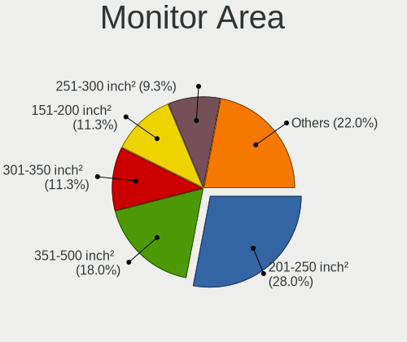
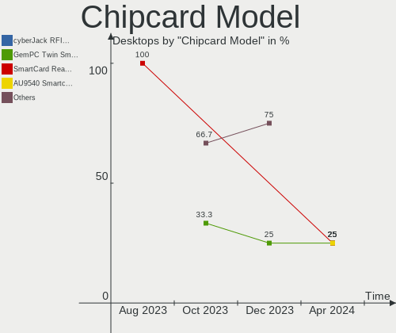

Debian - Hardware Trends (Desktops)
-----------------------------------

A project to identify most popular hardware characteristics and track their change
over time based on data collected by Linux users at https://Linux-Hardware.org.

Anyone can contribute to this report by the [hw-probe](https://github.com/linuxhw/hw-probe) tool:

    sudo -E hw-probe -all -upload

This report is for one last month. Overall report since the beginning of time: [TestDays](https://github.com/linuxhw/TestDays)

Period: Aug, 2023.

Contents
--------

* [ System ](#system)
  - [ OS                       ](#os)
  - [ OS Family                ](#os-family)
  - [ Kernel                   ](#kernel)
  - [ Kernel Family            ](#kernel-family)
  - [ Kernel Major Ver.        ](#kernel-major-ver)
  - [ Arch                     ](#arch)
  - [ DE                       ](#de)
  - [ Display Server           ](#display-server)
  - [ Display Manager          ](#display-manager)
  - [ OS Lang                  ](#os-lang)
  - [ Boot Mode                ](#boot-mode)
  - [ Filesystem               ](#filesystem)
  - [ Part. scheme             ](#part-scheme)
  - [ Dual Boot with Linux/BSD ](#dual-boot-with-linuxbsd)
  - [ Dual Boot (Win)          ](#dual-boot-win)

* [ Board ](#board)
  - [ Vendor                   ](#vendor)
  - [ Model                    ](#model)
  - [ Model Family             ](#model-family)
  - [ MFG Year                 ](#mfg-year)
  - [ Form Factor              ](#form-factor)
  - [ Secure Boot              ](#secure-boot)
  - [ Coreboot                 ](#coreboot)
  - [ RAM Size                 ](#ram-size)
  - [ RAM Used                 ](#ram-used)
  - [ Total Drives             ](#total-drives)
  - [ Has CD-ROM               ](#has-cd-rom)
  - [ Has Ethernet             ](#has-ethernet)
  - [ Has WiFi                 ](#has-wifi)
  - [ Has Bluetooth            ](#has-bluetooth)

* [ Location ](#location)
  - [ Country                  ](#country)
  - [ City                     ](#city)

* [ Drives ](#drives)
  - [ Drive Vendor             ](#drive-vendor)
  - [ Drive Model              ](#drive-model)
  - [ HDD Vendor               ](#hdd-vendor)
  - [ SSD Vendor               ](#ssd-vendor)
  - [ Drive Kind               ](#drive-kind)
  - [ Drive Connector          ](#drive-connector)
  - [ Drive Size               ](#drive-size)
  - [ Space Total              ](#space-total)
  - [ Space Used               ](#space-used)
  - [ Malfunc. Drives          ](#malfunc-drives)
  - [ Malfunc. Drive Vendor    ](#malfunc-drive-vendor)
  - [ Malfunc. HDD Vendor      ](#malfunc-hdd-vendor)
  - [ Malfunc. Drive Kind      ](#malfunc-drive-kind)
  - [ Failed Drives            ](#failed-drives)
  - [ Failed Drive Vendor      ](#failed-drive-vendor)
  - [ Drive Status             ](#drive-status)

* [ Storage controller ](#storage-controller)
  - [ Storage Vendor           ](#storage-vendor)
  - [ Storage Model            ](#storage-model)
  - [ Storage Kind             ](#storage-kind)

* [ Processor ](#processor)
  - [ CPU Vendor               ](#cpu-vendor)
  - [ CPU Model                ](#cpu-model)
  - [ CPU Model Family         ](#cpu-model-family)
  - [ CPU Cores                ](#cpu-cores)
  - [ CPU Sockets              ](#cpu-sockets)
  - [ CPU Threads              ](#cpu-threads)
  - [ CPU Op-Modes             ](#cpu-op-modes)
  - [ CPU Microcode            ](#cpu-microcode)
  - [ CPU Microarch            ](#cpu-microarch)

* [ Graphics ](#graphics)
  - [ GPU Vendor               ](#gpu-vendor)
  - [ GPU Model                ](#gpu-model)
  - [ GPU Combo                ](#gpu-combo)
  - [ GPU Driver               ](#gpu-driver)
  - [ GPU Memory               ](#gpu-memory)

* [ Monitor ](#monitor)
  - [ Monitor Vendor           ](#monitor-vendor)
  - [ Monitor Model            ](#monitor-model)
  - [ Monitor Resolution       ](#monitor-resolution)
  - [ Monitor Diagonal         ](#monitor-diagonal)
  - [ Monitor Width            ](#monitor-width)
  - [ Aspect Ratio             ](#aspect-ratio)
  - [ Monitor Area             ](#monitor-area)
  - [ Pixel Density            ](#pixel-density)
  - [ Multiple Monitors        ](#multiple-monitors)

* [ Network ](#network)
  - [ Net Controller Vendor    ](#net-controller-vendor)
  - [ Net Controller Model     ](#net-controller-model)
  - [ Wireless Vendor          ](#wireless-vendor)
  - [ Wireless Model           ](#wireless-model)
  - [ Ethernet Vendor          ](#ethernet-vendor)
  - [ Ethernet Model           ](#ethernet-model)
  - [ Net Controller Kind      ](#net-controller-kind)
  - [ Used Controller          ](#used-controller)
  - [ NICs                     ](#nics)
  - [ IPv6                     ](#ipv6)

* [ Bluetooth ](#bluetooth)
  - [ Bluetooth Vendor         ](#bluetooth-vendor)
  - [ Bluetooth Model          ](#bluetooth-model)

* [ Sound ](#sound)
  - [ Sound Vendor             ](#sound-vendor)
  - [ Sound Model              ](#sound-model)

* [ Memory ](#memory)
  - [ Memory Vendor            ](#memory-vendor)
  - [ Memory Model             ](#memory-model)
  - [ Memory Kind              ](#memory-kind)
  - [ Memory Form Factor       ](#memory-form-factor)
  - [ Memory Size              ](#memory-size)
  - [ Memory Speed             ](#memory-speed)

* [ Printers & scanners ](#printers--scanners)
  - [ Printer Vendor           ](#printer-vendor)
  - [ Printer Model            ](#printer-model)
  - [ Scanner Vendor           ](#scanner-vendor)
  - [ Scanner Model            ](#scanner-model)

* [ Camera ](#camera)
  - [ Camera Vendor            ](#camera-vendor)
  - [ Camera Model             ](#camera-model)

* [ Security ](#security)
  - [ Fingerprint Vendor       ](#fingerprint-vendor)
  - [ Fingerprint Model        ](#fingerprint-model)
  - [ Chipcard Vendor          ](#chipcard-vendor)
  - [ Chipcard Model           ](#chipcard-model)

* [ Unsupported ](#unsupported)
  - [ Unsupported Devices      ](#unsupported-devices)
  - [ Unsupported Device Types ](#unsupported-device-types)

System
------

OS
--

Installed operating systems

| Name      | Desktops | Percent |
|-----------|----------|---------|
| Debian 12 | 88       | 70.97%  |
| Debian 11 | 23       | 18.55%  |
| Debian    | 12       | 9.68%   |
| Debian 23 | 1        | 0.81%   |

OS Family
---------

OS without a version

| Name   | Desktops | Percent |
|--------|----------|---------|
| Debian | 124      | 100%    |

Kernel
------

Version of the Linux kernel

| Version                 | Desktops | Percent |
|-------------------------|----------|---------|
| 6.1.0-11-amd64          | 34       | 27.42%  |
| 6.1.0-10-amd64          | 28       | 22.58%  |
| 6.1.0-4-amd64           | 10       | 8.06%   |
| 6.4.0-2-amd64           | 5        | 4.03%   |
| 5.10.0-23-amd64         | 5        | 4.03%   |
| 6.4.0-1-amd64           | 4        | 3.23%   |
| 5.10.0-25-amd64         | 4        | 3.23%   |
| 6.1.0-9-amd64           | 3        | 2.42%   |
| 6.1.0-0.deb11.7-amd64   | 3        | 2.42%   |
| 6.4.0-0.deb12.2-amd64   | 2        | 1.61%   |
| 6.2.16-8-pve            | 2        | 1.61%   |
| 6.2.16-6-pve            | 2        | 1.61%   |
| 6.2.16-3-pve            | 2        | 1.61%   |
| 5.10.0-24-amd64         | 2        | 1.61%   |
| 5.10.0-20-amd64         | 2        | 1.61%   |
| 6.4.6-1-liquorix-amd64  | 1        | 0.81%   |
| 6.4.11-1-liquorix-amd64 | 1        | 0.81%   |
| 6.4.10-3-liquorix-amd64 | 1        | 0.81%   |
| 6.4.0-3-amd64           | 1        | 0.81%   |
| 6.3.0-1-amd64           | 1        | 0.81%   |
| 6.2.16-5-pve            | 1        | 0.81%   |
| 6.2.16-10-pve           | 1        | 0.81%   |
| 6.1.0-9-rt-amd64        | 1        | 0.81%   |
| 6.0.19-edge             | 1        | 0.81%   |
| 5.17.0-rc5              | 1        | 0.81%   |
| 5.16.0-0.bpo.4-amd64    | 1        | 0.81%   |
| 5.15.108-1-pve          | 1        | 0.81%   |
| 5.10.191-loc-os         | 1        | 0.81%   |
| 5.10.0-24-686-pae       | 1        | 0.81%   |
| 5.10.0-22-amd64         | 1        | 0.81%   |
| 5.10.0-16-amd64         | 1        | 0.81%   |

Kernel Family
-------------

Linux kernel without a distro release

| Version  | Desktops | Percent |
|----------|----------|---------|
| 6.1.0    | 79       | 63.71%  |
| 5.10.0   | 16       | 12.9%   |
| 6.4.0    | 12       | 9.68%   |
| 6.2.16   | 8        | 6.45%   |
| 6.4.6    | 1        | 0.81%   |
| 6.4.11   | 1        | 0.81%   |
| 6.4.10   | 1        | 0.81%   |
| 6.3.0    | 1        | 0.81%   |
| 6.0.19   | 1        | 0.81%   |
| 5.17.0   | 1        | 0.81%   |
| 5.16.0   | 1        | 0.81%   |
| 5.15.108 | 1        | 0.81%   |
| 5.10.191 | 1        | 0.81%   |

Kernel Major Ver.
-----------------

Linux kernel major version

| Version | Desktops | Percent |
|---------|----------|---------|
| 6.1     | 79       | 63.71%  |
| 5.10    | 17       | 13.71%  |
| 6.4     | 15       | 12.1%   |
| 6.2     | 8        | 6.45%   |
| 6.3     | 1        | 0.81%   |
| 6.0     | 1        | 0.81%   |
| 5.17    | 1        | 0.81%   |
| 5.16    | 1        | 0.81%   |
| 5.15    | 1        | 0.81%   |

Arch
----

OS architecture (x86_64, i586, etc.)

| Name   | Desktops | Percent |
|--------|----------|---------|
| x86_64 | 123      | 99.19%  |
| i686   | 1        | 0.81%   |

DE
--

Desktop Environment

| Name       | Desktops | Percent |
|------------|----------|---------|
| GNOME      | 38       | 30.65%  |
| KDE5       | 28       | 22.58%  |
| Unknown    | 27       | 21.77%  |
| XFCE       | 12       | 9.68%   |
| MATE       | 6        | 4.84%   |
| X-Cinnamon | 5        | 4.03%   |
| LXDE       | 5        | 4.03%   |
| LXQt       | 1        | 0.81%   |
| dwm        | 1        | 0.81%   |
| Cinnamon   | 1        | 0.81%   |

Display Server
--------------

X11 or Wayland

| Name    | Desktops | Percent |
|---------|----------|---------|
| X11     | 65       | 52.42%  |
| Wayland | 31       | 25%     |
| Unknown | 19       | 15.32%  |
| Tty     | 9        | 7.26%   |

Display Manager
---------------

SDDM, LightDM, etc.

| Name    | Desktops | Percent |
|---------|----------|---------|
| Unknown | 61       | 49.19%  |
| LightDM | 22       | 17.74%  |
| GDM3    | 20       | 16.13%  |
| SDDM    | 15       | 12.1%   |
| GDM     | 5        | 4.03%   |
| WDM     | 1        | 0.81%   |

OS Lang
-------

Language

| Lang    | Desktops | Percent |
|---------|----------|---------|
| en_US   | 46       | 37.1%   |
| ru_RU   | 14       | 11.29%  |
| en_GB   | 10       | 8.06%   |
| de_DE   | 9        | 7.26%   |
| es_ES   | 6        | 4.84%   |
| fr_FR   | 5        | 4.03%   |
| pt_BR   | 4        | 3.23%   |
| en_CA   | 4        | 3.23%   |
| zh_CN   | 3        | 2.42%   |
| es_VE   | 3        | 2.42%   |
| C       | 3        | 2.42%   |
| Unknown | 3        | 2.42%   |
| it_IT   | 2        | 1.61%   |
| pl_PL   | 1        | 0.81%   |
| ja_JP   | 1        | 0.81%   |
| es_PE   | 1        | 0.81%   |
| es_MX   | 1        | 0.81%   |
| es_GT   | 1        | 0.81%   |
| es_AR   | 1        | 0.81%   |
| en_ZA   | 1        | 0.81%   |
| en_IN   | 1        | 0.81%   |
| en_IE   | 1        | 0.81%   |
| en_AU   | 1        | 0.81%   |
| de_CH   | 1        | 0.81%   |
| ca_ES   | 1        | 0.81%   |

Boot Mode
---------

EFI or BIOS

| Mode | Desktops | Percent |
|------|----------|---------|
| BIOS | 64       | 51.61%  |
| EFI  | 60       | 48.39%  |

Filesystem
----------

Type of filesystem

| Type    | Desktops | Percent |
|---------|----------|---------|
| Ext4    | 86       | 69.35%  |
| Overlay | 15       | 12.1%   |
| Btrfs   | 12       | 9.68%   |
| Zfs     | 5        | 4.03%   |
| Tmpfs   | 3        | 2.42%   |
| Xfs     | 2        | 1.61%   |
| Ext3    | 1        | 0.81%   |

Part. scheme
------------

Scheme of partitioning

| Type    | Desktops | Percent |
|---------|----------|---------|
| GPT     | 71       | 57.26%  |
| Unknown | 34       | 27.42%  |
| MBR     | 19       | 15.32%  |

Dual Boot with Linux/BSD
------------------------

Hosting more than one Linux/BSD

| Dual boot | Desktops | Percent |
|-----------|----------|---------|
| No        | 107      | 86.29%  |
| Yes       | 17       | 13.71%  |

Dual Boot (Win)
---------------

Hosting Linux and Windows

| Dual boot | Desktops | Percent |
|-----------|----------|---------|
| No        | 90       | 72.58%  |
| Yes       | 34       | 27.42%  |

Board
-----

Vendor
------

Motherboard manufacturer

| Name                                 | Desktops | Percent |
|--------------------------------------|----------|---------|
| ASUSTek Computer                     | 34       | 27.42%  |
| Gigabyte Technology                  | 14       | 11.29%  |
| MSI                                  | 13       | 10.48%  |
| Hewlett-Packard                      | 10       | 8.06%   |
| Dell                                 | 10       | 8.06%   |
| ASRock                               | 8        | 6.45%   |
| Unknown                              | 5        | 4.03%   |
| Lenovo                               | 4        | 3.23%   |
| Intel                                | 4        | 3.23%   |
| Acer                                 | 3        | 2.42%   |
| Supermicro                           | 2        | 1.61%   |
| Shenzhen Meigao Electronic Equipment | 2        | 1.61%   |
| ASRockRack                           | 2        | 1.61%   |
| PCWare                               | 1        | 0.81%   |
| Medion                               | 1        | 0.81%   |
| langchao                             | 1        | 0.81%   |
| Inspur                               | 1        | 0.81%   |
| HC Technology.                       | 1        | 0.81%   |
| Fujitsu                              | 1        | 0.81%   |
| Foxconn                              | 1        | 0.81%   |
| Essentiel B                          | 1        | 0.81%   |
| ECS                                  | 1        | 0.81%   |
| CWWK                                 | 1        | 0.81%   |
| Biostar                              | 1        | 0.81%   |
| BESSTAR Tech                         | 1        | 0.81%   |
| Apple                                | 1        | 0.81%   |

Model
-----

Motherboard model

| Name                                       | Desktops | Percent |
|--------------------------------------------|----------|---------|
| Unknown                                    | 5        | 4.03%   |
| MSI MS-7A34                                | 2        | 1.61%   |
| Lenovo ThinkStation P520 30BFS44D00        | 2        | 1.61%   |
| HP Compaq 6005 Pro MT PC                   | 2        | 1.61%   |
| Dell OptiPlex 755                          | 2        | 1.61%   |
| ASUS Z170-A                                | 2        | 1.61%   |
| ASUS STRIX H270F GAMING                    | 2        | 1.61%   |
| ASUS S20 K29                               | 2        | 1.61%   |
| ASUS ProArt X670E-CREATOR WIFI             | 2        | 1.61%   |
| ASUS All Series                            | 2        | 1.61%   |
| Supermicro X8ST3                           | 1        | 0.81%   |
| Supermicro AS -2014S-TR                    | 1        | 0.81%   |
| Shenzhen Meigao Electronic Equipment HX99G | 1        | 0.81%   |
| Shenzhen Meigao Electronic Equipment HX90G | 1        | 0.81%   |
| PCWare IPMH110G                            | 1        | 0.81%   |
| MSI MS-7D99                                | 1        | 0.81%   |
| MSI MS-7D76                                | 1        | 0.81%   |
| MSI MS-7D70                                | 1        | 0.81%   |
| MSI MS-7D15                                | 1        | 0.81%   |
| MSI MS-7C02                                | 1        | 0.81%   |
| MSI MS-7B89                                | 1        | 0.81%   |
| MSI MS-7B79                                | 1        | 0.81%   |
| MSI MS-7A63                                | 1        | 0.81%   |
| MSI MS-7A38                                | 1        | 0.81%   |
| MSI MS-7551                                | 1        | 0.81%   |
| MSI MS-7357                                | 1        | 0.81%   |
| Medion MS-7728                             | 1        | 0.81%   |
| Lenovo ThinkStation P510 30B4S0SF0X        | 1        | 0.81%   |
| Lenovo ThinkCentre M58p 7220AR1            | 1        | 0.81%   |
| langchao 12345                             | 1        | 0.81%   |
| Intel X99                                  | 1        | 0.81%   |
| Intel H61                                  | 1        | 0.81%   |
| Intel DN2820FYK H24582-201                 | 1        | 0.81%   |
| Intel DG41TY AAE47335-301                  | 1        | 0.81%   |
| Inspur VIT E2250                           | 1        | 0.81%   |
| HP Z620 Workstation                        | 1        | 0.81%   |
| HP ProDesk 405 G6 Small Form Factor PC     | 1        | 0.81%   |
| HP ProDesk 400 G4 SFF                      | 1        | 0.81%   |
| HP Pavilion Desktop 590-p0xxx              | 1        | 0.81%   |
| HP EliteDesk 800 G1 TWR                    | 1        | 0.81%   |

Model Family
------------

Motherboard model prefix

| Name                                       | Desktops | Percent |
|--------------------------------------------|----------|---------|
| Dell OptiPlex                              | 7        | 5.65%   |
| ASUS ROG                                   | 7        | 5.65%   |
| ASUS PRIME                                 | 5        | 4.03%   |
| Unknown                                    | 5        | 4.03%   |
| HP Compaq                                  | 4        | 3.23%   |
| Lenovo ThinkStation                        | 3        | 2.42%   |
| ASUS TUF                                   | 3        | 2.42%   |
| MSI MS-7A34                                | 2        | 1.61%   |
| HP ProDesk                                 | 2        | 1.61%   |
| HP EliteDesk                               | 2        | 1.61%   |
| Gigabyte B450M                             | 2        | 1.61%   |
| ASUS Z170-A                                | 2        | 1.61%   |
| ASUS STRIX                                 | 2        | 1.61%   |
| ASUS S20                                   | 2        | 1.61%   |
| ASUS ProArt                                | 2        | 1.61%   |
| ASUS Pro                                   | 2        | 1.61%   |
| ASUS All                                   | 2        | 1.61%   |
| Acer Aspire                                | 2        | 1.61%   |
| Supermicro X8ST3                           | 1        | 0.81%   |
| Supermicro AS                              | 1        | 0.81%   |
| Shenzhen Meigao Electronic Equipment HX99G | 1        | 0.81%   |
| Shenzhen Meigao Electronic Equipment HX90G | 1        | 0.81%   |
| PCWare IPMH110G                            | 1        | 0.81%   |
| MSI MS-7D99                                | 1        | 0.81%   |
| MSI MS-7D76                                | 1        | 0.81%   |
| MSI MS-7D70                                | 1        | 0.81%   |
| MSI MS-7D15                                | 1        | 0.81%   |
| MSI MS-7C02                                | 1        | 0.81%   |
| MSI MS-7B89                                | 1        | 0.81%   |
| MSI MS-7B79                                | 1        | 0.81%   |
| MSI MS-7A63                                | 1        | 0.81%   |
| MSI MS-7A38                                | 1        | 0.81%   |
| MSI MS-7551                                | 1        | 0.81%   |
| MSI MS-7357                                | 1        | 0.81%   |
| Medion MS-7728                             | 1        | 0.81%   |
| Lenovo ThinkCentre                         | 1        | 0.81%   |
| langchao 12345                             | 1        | 0.81%   |
| Intel X99                                  | 1        | 0.81%   |
| Intel H61                                  | 1        | 0.81%   |
| Intel DN2820FYK                            | 1        | 0.81%   |

MFG Year
--------

Motherboard manufacture year

| Year | Desktops | Percent |
|------|----------|---------|
| 2020 | 14       | 11.29%  |
| 2022 | 13       | 10.48%  |
| 2018 | 10       | 8.06%   |
| 2021 | 9        | 7.26%   |
| 2010 | 8        | 6.45%   |
| 2019 | 7        | 5.65%   |
| 2017 | 7        | 5.65%   |
| 2016 | 7        | 5.65%   |
| 2013 | 7        | 5.65%   |
| 2011 | 7        | 5.65%   |
| 2023 | 6        | 4.84%   |
| 2009 | 6        | 4.84%   |
| 2014 | 5        | 4.03%   |
| 2012 | 5        | 4.03%   |
| 2008 | 5        | 4.03%   |
| 2015 | 4        | 3.23%   |
| 2007 | 3        | 2.42%   |
| 2006 | 1        | 0.81%   |

Form Factor
-----------

Physical design of the computer

| Name    | Desktops | Percent |
|---------|----------|---------|
| Desktop | 124      | 100%    |

Secure Boot
-----------

Enabled or disabled

| State    | Desktops | Percent |
|----------|----------|---------|
| Disabled | 118      | 95.16%  |
| Enabled  | 6        | 4.84%   |

Coreboot
--------

Have coreboot on board

| Used | Desktops | Percent |
|------|----------|---------|
| No   | 124      | 100%    |

RAM Size
--------

Total RAM memory

| Size in GB      | Desktops | Percent |
|-----------------|----------|---------|
| 16.01-24.0      | 27       | 21.77%  |
| 4.01-8.0        | 22       | 17.74%  |
| 32.01-64.0      | 21       | 16.94%  |
| 64.01-256.0     | 18       | 14.52%  |
| 8.01-16.0       | 16       | 12.9%   |
| 3.01-4.0        | 12       | 9.68%   |
| 24.01-32.0      | 4        | 3.23%   |
| More than 256.0 | 2        | 1.61%   |
| 1.01-2.0        | 1        | 0.81%   |
| 0.51-1.0        | 1        | 0.81%   |

RAM Used
--------

Used RAM memory

| Used GB    | Desktops | Percent |
|------------|----------|---------|
| 4.01-8.0   | 31       | 25%     |
| 2.01-3.0   | 28       | 22.58%  |
| 1.01-2.0   | 24       | 19.35%  |
| 3.01-4.0   | 19       | 15.32%  |
| 0.51-1.0   | 11       | 8.87%   |
| 8.01-16.0  | 7        | 5.65%   |
| 0.01-0.5   | 2        | 1.61%   |
| 24.01-32.0 | 1        | 0.81%   |
| 16.01-24.0 | 1        | 0.81%   |

Total Drives
------------

Number of drives on board

| Drives | Desktops | Percent |
|--------|----------|---------|
| 1      | 43       | 34.68%  |
| 2      | 32       | 25.81%  |
| 3      | 21       | 16.94%  |
| 4      | 13       | 10.48%  |
| 5      | 8        | 6.45%   |
| 6      | 3        | 2.42%   |
| 32     | 1        | 0.81%   |
| 19     | 1        | 0.81%   |
| 10     | 1        | 0.81%   |
| 8      | 1        | 0.81%   |

Has CD-ROM
----------

Has CD-ROM on board

| Presented | Desktops | Percent |
|-----------|----------|---------|
| No        | 87       | 70.16%  |
| Yes       | 37       | 29.84%  |

Has Ethernet
------------

Has Ethernet on board

| Presented | Desktops | Percent |
|-----------|----------|---------|
| Yes       | 123      | 99.19%  |
| No        | 1        | 0.81%   |

Has WiFi
--------

Has WiFi module

| Presented | Desktops | Percent |
|-----------|----------|---------|
| No        | 69       | 55.65%  |
| Yes       | 55       | 44.35%  |

Has Bluetooth
-------------

Has Bluetooth module

| Presented | Desktops | Percent |
|-----------|----------|---------|
| No        | 77       | 62.1%   |
| Yes       | 47       | 37.9%   |

Location
--------

Country
-------

Geographic location (country)

| Country      | Desktops | Percent |
|--------------|----------|---------|
| USA          | 23       | 18.55%  |
| Germany      | 17       | 13.71%  |
| Russia       | 14       | 11.29%  |
| UK           | 7        | 5.65%   |
| Spain        | 6        | 4.84%   |
| France       | 5        | 4.03%   |
| Venezuela    | 4        | 3.23%   |
| Italy        | 4        | 3.23%   |
| Canada       | 4        | 3.23%   |
| Brazil       | 4        | 3.23%   |
| Slovakia     | 3        | 2.42%   |
| China        | 3        | 2.42%   |
| Australia    | 3        | 2.42%   |
| Sweden       | 2        | 1.61%   |
| Poland       | 2        | 1.61%   |
| Peru         | 2        | 1.61%   |
| Norway       | 2        | 1.61%   |
| India        | 2        | 1.61%   |
| Argentina    | 2        | 1.61%   |
| Switzerland  | 1        | 0.81%   |
| South Africa | 1        | 0.81%   |
| Singapore    | 1        | 0.81%   |
| Portugal     | 1        | 0.81%   |
| Netherlands  | 1        | 0.81%   |
| Mexico       | 1        | 0.81%   |
| Malaysia     | 1        | 0.81%   |
| Lithuania    | 1        | 0.81%   |
| Kazakhstan   | 1        | 0.81%   |
| Japan        | 1        | 0.81%   |
| Iceland      | 1        | 0.81%   |
| Guatemala    | 1        | 0.81%   |
| Guadeloupe   | 1        | 0.81%   |
| Bulgaria     | 1        | 0.81%   |
| Austria      | 1        | 0.81%   |

City
----

Geographic location (city)

| City                     | Desktops | Percent |
|--------------------------|----------|---------|
| Voronezh                 | 10       | 8.06%   |
| Bangor                   | 3        | 2.42%   |
| Zhangzhou                | 2        | 1.61%   |
| St Petersburg            | 2        | 1.61%   |
| Rozhanovce               | 2        | 1.61%   |
| Lima                     | 2        | 1.61%   |
| Hanover                  | 2        | 1.61%   |
| Frankfurt am Main        | 2        | 1.61%   |
| Falkenstein              | 2        | 1.61%   |
| Delhi                    | 2        | 1.61%   |
| Cincinnati               | 2        | 1.61%   |
| Zaraysk                  | 1        | 0.81%   |
| Wittenbach               | 1        | 0.81%   |
| Warminster               | 1        | 0.81%   |
| Vilnius                  | 1        | 0.81%   |
| Vigia                    | 1        | 0.81%   |
| Vienna                   | 1        | 0.81%   |
| Västerås               | 1        | 0.81%   |
| Tsukuba                  | 1        | 0.81%   |
| Toronto                  | 1        | 0.81%   |
| Sydney                   | 1        | 0.81%   |
| Sterling                 | 1        | 0.81%   |
| Stade                    | 1        | 0.81%   |
| St Austell               | 1        | 0.81%   |
| Singapore                | 1        | 0.81%   |
| Simpsonville             | 1        | 0.81%   |
| Seremban                 | 1        | 0.81%   |
| Santa Coloma de Gramenet | 1        | 0.81%   |
| Sankt Augustin           | 1        | 0.81%   |
| San Vicent del Raspeig   | 1        | 0.81%   |
| San Francisco            | 1        | 0.81%   |
| Saint-Marcellin          | 1        | 0.81%   |
| Saint-Francois           | 1        | 0.81%   |
| Rio de Janeiro           | 1        | 0.81%   |
| Reykjavik                | 1        | 0.81%   |
| Radzionkow               | 1        | 0.81%   |
| Portsmouth               | 1        | 0.81%   |
| Porto                    | 1        | 0.81%   |
| Perth                    | 1        | 0.81%   |
| Pavlikeni                | 1        | 0.81%   |

Drives
------

Drive Vendor
------------

Hard drive vendors

| Vendor                      | Desktops | Drives | Percent |
|-----------------------------|----------|--------|---------|
| WDC                         | 46       | 68     | 19.09%  |
| Seagate                     | 30       | 43     | 12.45%  |
| Samsung Electronics         | 29       | 47     | 12.03%  |
| Kingston                    | 16       | 18     | 6.64%   |
| Crucial                     | 15       | 23     | 6.22%   |
| Toshiba                     | 11       | 15     | 4.56%   |
| SanDisk                     | 11       | 15     | 4.56%   |
| Hitachi                     | 8        | 9      | 3.32%   |
| HGST                        | 8        | 43     | 3.32%   |
| Kingston Technology Company | 6        | 7      | 2.49%   |
| Unknown                     | 4        | 4      | 1.66%   |
| Micron/Crucial Technology   | 4        | 5      | 1.66%   |
| A-DATA Technology           | 4        | 4      | 1.66%   |
| Phison Electronics          | 3        | 4      | 1.24%   |
| Patriot                     | 3        | 3      | 1.24%   |
| Maxtor                      | 3        | 3      | 1.24%   |
| Intel                       | 3        | 5      | 1.24%   |
| Hewlett-Packard             | 3        | 3      | 1.24%   |
| PNY                         | 2        | 2      | 0.83%   |
| Phison                      | 2        | 2      | 0.83%   |
| Micron Technology           | 2        | 2      | 0.83%   |
| MAXIO Technology (Hangzhou) | 2        | 2      | 0.83%   |
| China                       | 2        | 2      | 0.83%   |
| Transcend                   | 1        | 1      | 0.41%   |
| Timetec                     | 1        | 2      | 0.41%   |
| T-FORCE                     | 1        | 1      | 0.41%   |
| SSSTC                       | 1        | 1      | 0.41%   |
| SK hynix                    | 1        | 1      | 0.41%   |
| Silicon Motion              | 1        | 1      | 0.41%   |
| SHGP31-1                    | 1        | 1      | 0.41%   |
| SD                          | 1        | 2      | 0.41%   |
| SABRENT                     | 1        | 1      | 0.41%   |
| Plextor                     | 1        | 1      | 0.41%   |
| Netac                       | 1        | 1      | 0.41%   |
| KIOXIA-EXCERIA              | 1        | 1      | 0.41%   |
| KIOXIA                      | 1        | 1      | 0.41%   |
| Intenso                     | 1        | 1      | 0.41%   |
| Inland                      | 1        | 1      | 0.41%   |
| GOODRAM                     | 1        | 2      | 0.41%   |
| Fanxiang                    | 1        | 1      | 0.41%   |

Drive Model
-----------

Hard drive models

| Model                                                 | Desktops | Percent |
|-------------------------------------------------------|----------|---------|
| Samsung SSD 980 500GB                                 | 6        | 2.1%    |
| Kingston SA400S37240G 240GB SSD                       | 5        | 1.75%   |
| Seagate ST2000DM008-2FR102 2TB                        | 4        | 1.4%    |
| Seagate ST2000DM006-2DM164 2TB                        | 4        | 1.4%    |
| Micron/Crucial P2 NVMe PCIe SSD 1TB                   | 4        | 1.4%    |
| Crucial CT1000MX500SSD1 1TB                           | 4        | 1.4%    |
| SanDisk NVMe SSD Drive 2TB                            | 3        | 1.05%   |
| Samsung SSD 870 EVO 500GB                             | 3        | 1.05%   |
| WDC WDS240G2G0A-00JH30 240GB SSD                      | 2        | 0.7%    |
| WDC WDS100T3X0C-00SJG0 1TB                            | 2        | 0.7%    |
| WDC WD3000HLFS-01G6U0 304GB                           | 2        | 0.7%    |
| Unknown SD/MMC/MS PRO 1GB                             | 2        | 0.7%    |
| Toshiba HDWD120 2TB                                   | 2        | 0.7%    |
| SanDisk SD8SBAT128G1122 128GB SSD                     | 2        | 0.7%    |
| Samsung SSD 980 PRO 1TB                               | 2        | 0.7%    |
| Samsung SSD 980 1TB                                   | 2        | 0.7%    |
| Samsung SSD 850 EVO 500GB                             | 2        | 0.7%    |
| Samsung NVMe SSD Controller SM961/PM961/SM963 1024GB  | 2        | 0.7%    |
| Samsung NVMe SSD Controller PM9A1/PM9A3/980PRO 1024GB | 2        | 0.7%    |
| PNY CS900 240GB SSD                                   | 2        | 0.7%    |
| Phison E12 NVMe Controller 256GB                      | 2        | 0.7%    |
| Kingston Company SNV2S1000G 1TB                       | 2        | 0.7%    |
| Kingston SV300S37A120G 120GB SSD                      | 2        | 0.7%    |
| Kingston SA400S37120G 120GB SSD                       | 2        | 0.7%    |
| HGST HUS724040ALA640 4TB                              | 2        | 0.7%    |
| Crucial CT480BX500SSD1 480GB                          | 2        | 0.7%    |
| A-DATA SU635 240GB SSD                                | 2        | 0.7%    |
| WDC WUH721816ALE6L4 16TB                              | 1        | 0.35%   |
| WDC WDS500G3B0A-00AXR0 500GB SSD                      | 1        | 0.35%   |
| WDC WDS500G2B0C-00PXH0 500GB                          | 1        | 0.35%   |
| WDC WDS500G2B0B-00YS70 500GB SSD                      | 1        | 0.35%   |
| WDC WDS500G1X0E-00AFY0 500GB                          | 1        | 0.35%   |
| WDC WDS250G1B0A-00H9H0 250GB SSD                      | 1        | 0.35%   |
| WDC WDS240G2G0B-00EPW0 240GB SSD                      | 1        | 0.35%   |
| WDC WDS200T1X0E-00AFY0 2TB                            | 1        | 0.35%   |
| WDC WD7500BPVX-00FA7T0 752GB                          | 1        | 0.35%   |
| WDC WD7500AAKS-00RBA0 752GB                           | 1        | 0.35%   |
| WDC WD5003AZEX-00MK2A0 500GB                          | 1        | 0.35%   |
| WDC WD5003ABYX-01WERA0 500GB                          | 1        | 0.35%   |
| WDC WD5000BPKT-22PK4T0 500GB                          | 1        | 0.35%   |

HDD Vendor
----------

Hard disk drive vendors

| Vendor              | Desktops | Drives | Percent |
|---------------------|----------|--------|---------|
| WDC                 | 37       | 55     | 34.91%  |
| Seagate             | 30       | 43     | 28.3%   |
| Toshiba             | 11       | 15     | 10.38%  |
| Hitachi             | 8        | 9      | 7.55%   |
| HGST                | 8        | 43     | 7.55%   |
| Samsung Electronics | 4        | 5      | 3.77%   |
| Maxtor              | 3        | 3      | 2.83%   |
| Unknown             | 2        | 2      | 1.89%   |
| SABRENT             | 1        | 1      | 0.94%   |
| Hewlett-Packard     | 1        | 1      | 0.94%   |
| Unknown             | 1        | 1      | 0.94%   |

SSD Vendor
----------

Solid state drive vendors

| Vendor              | Desktops | Drives | Percent |
|---------------------|----------|--------|---------|
| Samsung Electronics | 13       | 20     | 17.11%  |
| Kingston            | 12       | 13     | 15.79%  |
| Crucial             | 12       | 14     | 15.79%  |
| WDC                 | 7        | 7      | 9.21%   |
| SanDisk             | 3        | 3      | 3.95%   |
| Patriot             | 3        | 3      | 3.95%   |
| PNY                 | 2        | 2      | 2.63%   |
| Micron Technology   | 2        | 2      | 2.63%   |
| Intel               | 2        | 3      | 2.63%   |
| Hewlett-Packard     | 2        | 2      | 2.63%   |
| China               | 2        | 2      | 2.63%   |
| A-DATA Technology   | 2        | 2      | 2.63%   |
| Transcend           | 1        | 1      | 1.32%   |
| Timetec             | 1        | 2      | 1.32%   |
| T-FORCE             | 1        | 1      | 1.32%   |
| SSSTC               | 1        | 1      | 1.32%   |
| SD                  | 1        | 2      | 1.32%   |
| Netac               | 1        | 1      | 1.32%   |
| Inland              | 1        | 1      | 1.32%   |
| GOODRAM             | 1        | 2      | 1.32%   |
| Fanxiang            | 1        | 1      | 1.32%   |
| Emtec               | 1        | 1      | 1.32%   |
| DUEX                | 1        | 1      | 1.32%   |
| Dogfish             | 1        | 1      | 1.32%   |
| Dahua               | 1        | 1      | 1.32%   |
| addlink             | 1        | 1      | 1.32%   |

Drive Kind
----------

HDD or SSD

| Kind    | Desktops | Drives | Percent |
|---------|----------|--------|---------|
| HDD     | 82       | 178    | 41.62%  |
| SSD     | 63       | 90     | 31.98%  |
| NVMe    | 49       | 85     | 24.87%  |
| Unknown | 2        | 2      | 1.02%   |
| MMC     | 1        | 1      | 0.51%   |

Drive Connector
---------------

SATA, SAS, NVMe, etc.

| Type | Desktops | Drives | Percent |
|------|----------|--------|---------|
| SATA | 106      | 229    | 64.24%  |
| NVMe | 49       | 85     | 29.7%   |
| SAS  | 9        | 41     | 5.45%   |
| MMC  | 1        | 1      | 0.61%   |

Drive Size
----------

Size of hard drive

| Size in TB | Desktops | Drives | Percent |
|------------|----------|--------|---------|
| 0.01-0.5   | 72       | 102    | 44.44%  |
| 0.51-1.0   | 40       | 57     | 24.69%  |
| 1.01-2.0   | 22       | 30     | 13.58%  |
| 3.01-4.0   | 10       | 17     | 6.17%   |
| 4.01-10.0  | 8        | 45     | 4.94%   |
| 2.01-3.0   | 6        | 7      | 3.7%    |
| 10.01-20.0 | 4        | 10     | 2.47%   |

Space Total
-----------

Amount of disk space available on the file system

| Size in GB     | Desktops | Percent |
|----------------|----------|---------|
| More than 3000 | 23       | 18.55%  |
| 501-1000       | 19       | 15.32%  |
| 101-250        | 18       | 14.52%  |
| 251-500        | 17       | 13.71%  |
| Unknown        | 13       | 10.48%  |
| 2001-3000      | 9        | 7.26%   |
| 1001-2000      | 8        | 6.45%   |
| 21-50          | 6        | 4.84%   |
| 51-100         | 6        | 4.84%   |
| 1-20           | 5        | 4.03%   |

Space Used
----------

Amount of used disk space

| Used GB        | Desktops | Percent |
|----------------|----------|---------|
| 1-20           | 37       | 29.84%  |
| 101-250        | 14       | 11.29%  |
| Unknown        | 13       | 10.48%  |
| More than 3000 | 12       | 9.68%   |
| 251-500        | 11       | 8.87%   |
| 21-50          | 10       | 8.06%   |
| 51-100         | 9        | 7.26%   |
| 501-1000       | 8        | 6.45%   |
| 1001-2000      | 7        | 5.65%   |
| 2001-3000      | 3        | 2.42%   |

Malfunc. Drives
---------------

Drive models with a malfunction

| Model                                 | Desktops | Drives | Percent |
|---------------------------------------|----------|--------|---------|
| A-DATA Technology SU635 240GB SSD     | 2        | 2      | 9.09%   |
| WDC WDS240G2G0A-00JH30 240GB SSD      | 1        | 1      | 4.55%   |
| WDC WD5003ABYX-01WERA0 500GB          | 1        | 1      | 4.55%   |
| WDC WD5000AAKS-00A7B0 500GB           | 1        | 1      | 4.55%   |
| WDC WD3200AAJS-00L7A0 320GB           | 1        | 1      | 4.55%   |
| WDC WD30EFRX-68EUZN0 3TB              | 1        | 1      | 4.55%   |
| WDC WD2500AAJS-00YZCA0 250GB          | 1        | 1      | 4.55%   |
| SSSTC CVB-8D128-HP 128GB              | 1        | 1      | 4.55%   |
| Seagate ST3500418AS 500GB             | 1        | 1      | 4.55%   |
| Seagate ST3250318AS 250GB             | 1        | 1      | 4.55%   |
| Seagate ST31000528AS 1TB              | 1        | 1      | 4.55%   |
| Seagate ST2000DX001-1CM164 2TB        | 1        | 1      | 4.55%   |
| Seagate ST2000DM006-2DM164 2TB        | 1        | 1      | 4.55%   |
| Seagate ST1000DM003-9YN162 1TB        | 1        | 1      | 4.55%   |
| Samsung Electronics SSD 860 EVO 500GB | 1        | 1      | 4.55%   |
| Samsung Electronics SP1644N 160GB     | 1        | 1      | 4.55%   |
| Samsung Electronics MP0804H 80GB      | 1        | 1      | 4.55%   |
| Maxtor 6Y120P0 128GB                  | 1        | 1      | 4.55%   |
| Kingston SV300S37A120G 120GB SSD      | 1        | 1      | 4.55%   |
| Hitachi HDS721010CLA332 1TB           | 1        | 1      | 4.55%   |
| Crucial M4-CT128M4SSD2 128GB          | 1        | 1      | 4.55%   |

Malfunc. Drive Vendor
---------------------

Vendors of faulty drives

| Vendor              | Desktops | Drives | Percent |
|---------------------|----------|--------|---------|
| WDC                 | 6        | 6      | 28.57%  |
| Seagate             | 5        | 6      | 23.81%  |
| Samsung Electronics | 3        | 3      | 14.29%  |
| A-DATA Technology   | 2        | 2      | 9.52%   |
| SSSTC               | 1        | 1      | 4.76%   |
| Maxtor              | 1        | 1      | 4.76%   |
| Kingston            | 1        | 1      | 4.76%   |
| Hitachi             | 1        | 1      | 4.76%   |
| Crucial             | 1        | 1      | 4.76%   |

Malfunc. HDD Vendor
-------------------

Vendors of faulty HDD drives

| Vendor              | Desktops | Drives | Percent |
|---------------------|----------|--------|---------|
| WDC                 | 5        | 5      | 35.71%  |
| Seagate             | 5        | 6      | 35.71%  |
| Samsung Electronics | 2        | 2      | 14.29%  |
| Maxtor              | 1        | 1      | 7.14%   |
| Hitachi             | 1        | 1      | 7.14%   |

Malfunc. Drive Kind
-------------------

Kinds of faulty drives

| Kind | Desktops | Drives | Percent |
|------|----------|--------|---------|
| HDD  | 11       | 15     | 61.11%  |
| SSD  | 7        | 7      | 38.89%  |

Failed Drives
-------------

Failed drive models

Zero info for selected period =(

Failed Drive Vendor
-------------------

Failed drive vendors

Zero info for selected period =(

Drive Status
------------

Number of failed and malfunc. drives

| Status   | Desktops | Drives | Percent |
|----------|----------|--------|---------|
| Works    | 76       | 195    | 53.52%  |
| Detected | 48       | 139    | 33.8%   |
| Malfunc  | 18       | 22     | 12.68%  |

Storage controller
------------------

Storage Vendor
--------------

Storage controller vendors

| Vendor                         | Desktops | Percent |
|--------------------------------|----------|---------|
| Intel                          | 77       | 38.31%  |
| AMD                            | 44       | 21.89%  |
| Samsung Electronics            | 17       | 8.46%   |
| SanDisk                        | 12       | 5.97%   |
| Kingston Technology Company    | 11       | 5.47%   |
| Micron/Crucial Technology      | 9        | 4.48%   |
| Phison Electronics             | 6        | 2.99%   |
| ASMedia Technology             | 6        | 2.99%   |
| Broadcom / LSI                 | 3        | 1.49%   |
| MAXIO Technology (Hangzhou)    | 2        | 1%      |
| Marvell Technology Group       | 2        | 1%      |
| KIOXIA                         | 2        | 1%      |
| JMicron Technology             | 2        | 1%      |
| ADATA Technology               | 2        | 1%      |
| VIA Technologies               | 1        | 0.5%    |
| Solid State Storage Technology | 1        | 0.5%    |
| SK hynix                       | 1        | 0.5%    |
| Silicon Motion                 | 1        | 0.5%    |
| INNOGRIT                       | 1        | 0.5%    |
| Adaptec                        | 1        | 0.5%    |

Storage Model
-------------

Storage controller models

| Model                                                                          | Desktops | Percent |
|--------------------------------------------------------------------------------|----------|---------|
| AMD FCH SATA Controller [AHCI mode]                                            | 28       | 11.2%   |
| Intel 200 Series PCH SATA controller [AHCI mode]                               | 13       | 5.2%    |
| AMD 400 Series Chipset SATA Controller                                         | 11       | 4.4%    |
| Intel 8 Series/C220 Series Chipset Family 6-port SATA Controller 1 [AHCI mode] | 9        | 3.6%    |
| Samsung NVMe SSD Controller 980                                                | 8        | 3.2%    |
| Micron/Crucial P2 [Nick P2] / P3 / P3 Plus NVMe PCIe SSD (DRAM-less)           | 8        | 3.2%    |
| Intel 6 Series/C200 Series Chipset Family 6 port Desktop SATA AHCI Controller  | 7        | 2.8%    |
| Samsung NVMe SSD Controller PM9A1/PM9A3/980PRO                                 | 6        | 2.4%    |
| ASMedia ASM1062 Serial ATA Controller                                          | 6        | 2.4%    |
| Intel Q170/Q150/B150/H170/H110/Z170/CM236 Chipset SATA Controller [AHCI Mode]  | 5        | 2%      |
| AMD SB7x0/SB8x0/SB9x0 IDE Controller                                           | 5        | 2%      |
| AMD 500 Series Chipset SATA Controller                                         | 5        | 2%      |
| Kingston Company Company Non-Volatile memory controller                        | 4        | 1.6%    |
| AMD SB7x0/SB8x0/SB9x0 SATA Controller [IDE mode]                               | 4        | 1.6%    |
| AMD SB7x0/SB8x0/SB9x0 SATA Controller [AHCI mode]                              | 4        | 1.6%    |
| SanDisk WD Blue SN570 NVMe SSD 1TB                                             | 3        | 1.2%    |
| Samsung NVMe SSD Controller SM961/PM961/SM963                                  | 3        | 1.2%    |
| Phison E12 NVMe Controller                                                     | 3        | 1.2%    |
| Intel Volume Management Device NVMe RAID Controller                            | 3        | 1.2%    |
| Intel NM10/ICH7 Family SATA Controller [IDE mode]                              | 3        | 1.2%    |
| Intel Alder Lake-S PCH SATA Controller [AHCI Mode]                             | 3        | 1.2%    |
| Intel 700 Series Chipset Family SATA AHCI Controller                           | 3        | 1.2%    |
| Intel 500 Series Chipset Family SATA AHCI Controller                           | 3        | 1.2%    |
| AMD 300 Series Chipset SATA Controller                                         | 3        | 1.2%    |
| Sandisk Western Digital WD Black SN850X NVMe SSD                               | 2        | 0.8%    |
| SanDisk WD PC SN810 / Black SN850 NVMe SSD                                     | 2        | 0.8%    |
| SanDisk WD Black SN750 / PC SN730 NVMe SSD                                     | 2        | 0.8%    |
| Samsung NVMe SSD Controller SM981/PM981/PM983                                  | 2        | 0.8%    |
| Phison PS5013 E13 NVMe Controller                                              | 2        | 0.8%    |
| MAXIO (Hangzhou) NVMe SSD Controller MAP1202                                   | 2        | 0.8%    |
| Marvell Group 88SE6111/6121 SATA II / PATA Controller                          | 2        | 0.8%    |
| JMicron JMB58x AHCI SATA controller                                            | 2        | 0.8%    |
| Intel SATA Controller [RAID mode]                                              | 2        | 0.8%    |
| Intel Celeron/Pentium Silver Processor SATA Controller                         | 2        | 0.8%    |
| Intel Cannon Lake PCH SATA AHCI Controller                                     | 2        | 0.8%    |
| Intel C610/X99 series chipset sSATA Controller [AHCI mode]                     | 2        | 0.8%    |
| Intel C610/X99 series chipset 6-Port SATA Controller [AHCI mode]               | 2        | 0.8%    |
| Intel Atom Processor E3800 Series SATA AHCI Controller                         | 2        | 0.8%    |
| Intel 82801JI (ICH10 Family) 4 port SATA IDE Controller #1                     | 2        | 0.8%    |
| Intel 82801JI (ICH10 Family) 2 port SATA IDE Controller #2                     | 2        | 0.8%    |

Storage Kind
------------

Kind of storage controller (IDE, SATA, NVMe, SAS, ...)

| Kind | Desktops | Percent |
|------|----------|---------|
| SATA | 106      | 55.5%   |
| NVMe | 49       | 25.65%  |
| IDE  | 24       | 12.57%  |
| RAID | 8        | 4.19%   |
| SAS  | 4        | 2.09%   |

Processor
---------

CPU Vendor
----------

Processor vendors

| Vendor       | Desktops | Percent |
|--------------|----------|---------|
| Intel        | 76       | 61.29%  |
| AMD          | 47       | 37.9%   |
| CentaurHauls | 1        | 0.81%   |

CPU Model
---------

Processor models

| Model                                       | Desktops | Percent |
|---------------------------------------------|----------|---------|
| Intel Core i7-2600 CPU @ 3.40GHz            | 4        | 3.23%   |
| Intel Pentium Dual-Core CPU E6500 @ 2.93GHz | 3        | 2.42%   |
| Intel Core i7-4790 CPU @ 3.60GHz            | 3        | 2.42%   |
| AMD Ryzen 5 3600 6-Core Processor           | 3        | 2.42%   |
| Intel Xeon W-2135 CPU @ 3.70GHz             | 2        | 1.61%   |
| Intel Xeon CPU E5520 @ 2.27GHz              | 2        | 1.61%   |
| Intel Core i7-6700K CPU @ 4.00GHz           | 2        | 1.61%   |
| Intel Core i5-9400 CPU @ 2.90GHz            | 2        | 1.61%   |
| Intel Core i5-7400 CPU @ 3.00GHz            | 2        | 1.61%   |
| Intel Core i5-6500 CPU @ 3.20GHz            | 2        | 1.61%   |
| Intel Core i5-4590 CPU @ 3.30GHz            | 2        | 1.61%   |
| Intel Core i5-10400 CPU @ 2.90GHz           | 2        | 1.61%   |
| Intel 13th Gen Core i7-13700K               | 2        | 1.61%   |
| AMD Ryzen 9 7950X 16-Core Processor         | 2        | 1.61%   |
| AMD Ryzen 9 5900X 12-Core Processor         | 2        | 1.61%   |
| AMD Ryzen 7 7730U with Radeon Graphics      | 2        | 1.61%   |
| AMD Ryzen 7 5800X 8-Core Processor          | 2        | 1.61%   |
| AMD Ryzen 7 2700 Eight-Core Processor       | 2        | 1.61%   |
| AMD Phenom II X3 B75 Processor              | 2        | 1.61%   |
| Intel Xeon CPU E5530 @ 2.40GHz              | 1        | 0.81%   |
| Intel Xeon CPU E5-2670 v3 @ 2.30GHz         | 1        | 0.81%   |
| Intel Xeon CPU E5-2640 v4 @ 2.40GHz         | 1        | 0.81%   |
| Intel Xeon CPU E5-1660 v4 @ 3.20GHz         | 1        | 0.81%   |
| Intel Xeon CPU E5-1620 v2 @ 3.70GHz         | 1        | 0.81%   |
| Intel Xeon CPU E31230 @ 3.20GHz             | 1        | 0.81%   |
| Intel Xeon CPU E3-1245 v3 @ 3.40GHz         | 1        | 0.81%   |
| Intel Pentium Silver J5005 CPU @ 1.50GHz    | 1        | 0.81%   |
| Intel Pentium CPU G4600 @ 3.60GHz           | 1        | 0.81%   |
| Intel Pentium CPU G3440 @ 3.30GHz           | 1        | 0.81%   |
| Intel Pentium CPU G3240 @ 3.10GHz           | 1        | 0.81%   |
| Intel Pentium CPU G2010 @ 2.80GHz           | 1        | 0.81%   |
| Intel Core i9-7900X CPU @ 3.30GHz           | 1        | 0.81%   |
| Intel Core i9-10900K CPU @ 3.70GHz          | 1        | 0.81%   |
| Intel Core i7-8700K CPU @ 3.70GHz           | 1        | 0.81%   |
| Intel Core i7-8700 CPU @ 3.20GHz            | 1        | 0.81%   |
| Intel Core i7-7700K CPU @ 4.20GHz           | 1        | 0.81%   |
| Intel Core i7-6700 CPU @ 3.40GHz            | 1        | 0.81%   |
| Intel Core i7-3770 CPU @ 3.40GHz            | 1        | 0.81%   |
| Intel Core i7-10700 CPU @ 2.90GHz           | 1        | 0.81%   |
| Intel Core i5-9400F CPU @ 2.90GHz           | 1        | 0.81%   |

CPU Model Family
----------------

Processor model prefix

| Model                   | Desktops | Percent |
|-------------------------|----------|---------|
| Intel Core i5           | 17       | 13.71%  |
| Intel Core i7           | 15       | 12.1%   |
| Intel Xeon              | 11       | 8.87%   |
| AMD Ryzen 7             | 11       | 8.87%   |
| AMD Ryzen 9             | 10       | 8.06%   |
| AMD Ryzen 5             | 9        | 7.26%   |
| Other                   | 8        | 6.45%   |
| Intel Celeron           | 5        | 4.03%   |
| Intel Pentium           | 4        | 3.23%   |
| Intel Core 2 Duo        | 4        | 3.23%   |
| Intel Pentium Dual-Core | 3        | 2.42%   |
| Intel Core i3           | 3        | 2.42%   |
| Intel Core 2 Quad       | 3        | 2.42%   |
| Intel Core i9           | 2        | 1.61%   |
| AMD Ryzen 5 PRO         | 2        | 1.61%   |
| AMD Phenom II X3        | 2        | 1.61%   |
| AMD Athlon              | 2        | 1.61%   |
| Intel Pentium Silver    | 1        | 0.81%   |
| CentaurHauls VIA Eden   | 1        | 0.81%   |
| AMD Ryzen Threadripper  | 1        | 0.81%   |
| AMD PRO A10             | 1        | 0.81%   |
| AMD Phenom II X4        | 1        | 0.81%   |
| AMD FX                  | 1        | 0.81%   |
| AMD EPYC                | 1        | 0.81%   |
| AMD E                   | 1        | 0.81%   |
| AMD Athlon II X3        | 1        | 0.81%   |
| AMD Athlon II X2        | 1        | 0.81%   |
| AMD A6                  | 1        | 0.81%   |
| AMD A4                  | 1        | 0.81%   |
| AMD A10                 | 1        | 0.81%   |

CPU Cores
---------

Number of processor cores

| Number | Desktops | Percent |
|--------|----------|---------|
| 4      | 41       | 33.06%  |
| 2      | 21       | 16.94%  |
| 6      | 20       | 16.13%  |
| 8      | 16       | 12.9%   |
| 16     | 7        | 5.65%   |
| 12     | 6        | 4.84%   |
| 10     | 5        | 4.03%   |
| 3      | 3        | 2.42%   |
| 1      | 3        | 2.42%   |
| 24     | 2        | 1.61%   |

CPU Sockets
-----------

Number of sockets

| Number | Desktops | Percent |
|--------|----------|---------|
| 1      | 122      | 98.39%  |
| 2      | 2        | 1.61%   |

CPU Threads
-----------

Threads per core (Hyper-Threading)

| Number | Desktops | Percent |
|--------|----------|---------|
| 2      | 81       | 65.32%  |
| 1      | 43       | 34.68%  |

CPU Op-Modes
------------

CPU Operation Modes (32-bit, 64-bit)

| Op mode        | Desktops | Percent |
|----------------|----------|---------|
| 32-bit, 64-bit | 123      | 99.19%  |
| 32-bit         | 1        | 0.81%   |

CPU Microcode
-------------

Microcode number

| Number     | Desktops | Percent |
|------------|----------|---------|
| Unknown    | 52       | 41.94%  |
| 0x306c3    | 7        | 5.65%   |
| 0x1067a    | 4        | 3.23%   |
| 0x0a601203 | 4        | 3.23%   |
| 0x906ea    | 3        | 2.42%   |
| 0x906e9    | 3        | 2.42%   |
| 0x506e3    | 3        | 2.42%   |
| 0x306a9    | 3        | 2.42%   |
| 0x206a7    | 3        | 2.42%   |
| 0x0a50000d | 3        | 2.42%   |
| 0x90672    | 2        | 1.61%   |
| 0x50654    | 2        | 1.61%   |
| 0x406f1    | 2        | 1.61%   |
| 0x106a5    | 2        | 1.61%   |
| 0x0a201025 | 2        | 1.61%   |
| 0x08108109 | 2        | 1.61%   |
| 0x0800820d | 2        | 1.61%   |
| 0x010000b6 | 2        | 1.61%   |
| 0xb0671    | 1        | 0.81%   |
| 0xa0655    | 1        | 0.81%   |
| 0xa0653    | 1        | 0.81%   |
| 0x806c2    | 1        | 0.81%   |
| 0x706a8    | 1        | 0.81%   |
| 0x6fd      | 1        | 0.81%   |
| 0x6fb      | 1        | 0.81%   |
| 0x506c9    | 1        | 0.81%   |
| 0x30678    | 1        | 0.81%   |
| 0x30673    | 1        | 0.81%   |
| 0x0a404102 | 1        | 0.81%   |
| 0x0a201205 | 1        | 0.81%   |
| 0x0a0011d1 | 1        | 0.81%   |
| 0x08701030 | 1        | 0.81%   |
| 0x08701012 | 1        | 0.81%   |
| 0x08600106 | 1        | 0.81%   |
| 0x0810100b | 1        | 0.81%   |
| 0x08001137 | 1        | 0.81%   |
| 0x0600611a | 1        | 0.81%   |
| 0x06000852 | 1        | 0.81%   |
| 0x05000026 | 1        | 0.81%   |
| 0x010000db | 1        | 0.81%   |

CPU Microarch
-------------

Microarchitecture

| Name             | Desktops | Percent |
|------------------|----------|---------|
| Zen 3            | 12       | 9.68%   |
| KabyLake         | 11       | 8.87%   |
| Haswell          | 11       | 8.87%   |
| Unknown          | 10       | 8.06%   |
| Skylake          | 9        | 7.26%   |
| Zen 2            | 7        | 5.65%   |
| Zen+             | 6        | 4.84%   |
| SandyBridge      | 6        | 4.84%   |
| Penryn           | 6        | 4.84%   |
| K10              | 6        | 4.84%   |
| IvyBridge        | 5        | 4.03%   |
| CometLake        | 5        | 4.03%   |
| Zen              | 4        | 3.23%   |
| Core             | 4        | 3.23%   |
| Alderlake Hybrid | 4        | 3.23%   |
| Nehalem          | 3        | 2.42%   |
| Silvermont       | 2        | 1.61%   |
| Piledriver       | 2        | 1.61%   |
| Goldmont plus    | 2        | 1.61%   |
| Excavator        | 2        | 1.61%   |
| Broadwell        | 2        | 1.61%   |
| Tremont          | 1        | 0.81%   |
| TigerLake        | 1        | 0.81%   |
| Steamroller      | 1        | 0.81%   |
| Goldmont         | 1        | 0.81%   |
| Bobcat           | 1        | 0.81%   |

Graphics
--------

GPU Vendor
----------

Vendors of graphics cards

| Vendor                     | Desktops | Percent |
|----------------------------|----------|---------|
| AMD                        | 51       | 39.53%  |
| Nvidia                     | 38       | 29.46%  |
| Intel                      | 34       | 26.36%  |
| ASPEED Technology          | 4        | 3.1%    |
| VIA Technologies           | 1        | 0.78%   |
| Matrox Electronics Systems | 1        | 0.78%   |

GPU Model
---------

Graphics card models

| Model                                                                         | Desktops | Percent |
|-------------------------------------------------------------------------------|----------|---------|
| AMD Navi 23 [Radeon RX 6600/6600 XT/6600M]                                    | 9        | 6.62%   |
| Nvidia GK208B [GeForce GT 710]                                                | 4        | 2.94%   |
| Intel Xeon E3-1200 v3/4th Gen Core Processor Integrated Graphics Controller   | 4        | 2.94%   |
| Intel CoffeeLake-S GT2 [UHD Graphics 630]                                     | 4        | 2.94%   |
| ASPEED Technology ASPEED Graphics Family                                      | 4        | 2.94%   |
| AMD Raphael                                                                   | 4        | 2.94%   |
| AMD Navi 22 [Radeon RX 6700/6700 XT/6750 XT / 6800M/6850M XT]                 | 4        | 2.94%   |
| AMD Ellesmere [Radeon RX 470/480/570/570X/580/580X/590]                       | 4        | 2.94%   |
| Intel HD Graphics 630                                                         | 3        | 2.21%   |
| Intel CometLake-S GT2 [UHD Graphics 630]                                      | 3        | 2.21%   |
| Nvidia TU117 [GeForce GTX 1650]                                               | 2        | 1.47%   |
| Nvidia GP107 [GeForce GTX 1050 Ti]                                            | 2        | 1.47%   |
| Nvidia GP104 [GeForce GTX 1070]                                               | 2        | 1.47%   |
| Nvidia GK208B [GeForce GT 730]                                                | 2        | 1.47%   |
| Nvidia GA106 [Geforce RTX 3050]                                               | 2        | 1.47%   |
| Intel HD Graphics 530                                                         | 2        | 1.47%   |
| Intel Atom Processor Z36xxx/Z37xxx Series Graphics & Display                  | 2        | 1.47%   |
| Intel AlderLake-S GT1                                                         | 2        | 1.47%   |
| Intel 4 Series Chipset Integrated Graphics Controller                         | 2        | 1.47%   |
| AMD Wani [Radeon R5/R6/R7 Graphics]                                           | 2        | 1.47%   |
| AMD RS880 [Radeon HD 4200]                                                    | 2        | 1.47%   |
| AMD Renoir                                                                    | 2        | 1.47%   |
| AMD Picasso/Raven 2 [Radeon Vega Series / Radeon Vega Mobile Series]          | 2        | 1.47%   |
| AMD Navi 21 [Radeon RX 6800/6800 XT / 6900 XT]                                | 2        | 1.47%   |
| AMD Navi 10 [Radeon RX 5600 OEM/5600 XT / 5700/5700 XT]                       | 2        | 1.47%   |
| AMD Cezanne [Radeon Vega Series / Radeon Vega Mobile Series]                  | 2        | 1.47%   |
| AMD Caicos [Radeon HD 6450/7450/8450 / R5 230 OEM]                            | 2        | 1.47%   |
| AMD Barcelo                                                                   | 2        | 1.47%   |
| VIA Technologies CN700/P4M800 Pro/P4M800 CE/VN800 Graphics [S3 UniChrome Pro] | 1        | 0.74%   |
| Nvidia TU116 [GeForce GTX 1660]                                               | 1        | 0.74%   |
| Nvidia TU116 [GeForce GTX 1660 SUPER]                                         | 1        | 0.74%   |
| Nvidia TU106 [GeForce GTX 1650]                                               | 1        | 0.74%   |
| Nvidia TU104 [GeForce RTX 2070 SUPER]                                         | 1        | 0.74%   |
| Nvidia GT218 [GeForce 310]                                                    | 1        | 0.74%   |
| Nvidia GT218 [GeForce 210]                                                    | 1        | 0.74%   |
| Nvidia GP108 [GeForce GT 1030]                                                | 1        | 0.74%   |
| Nvidia GP107GL [Quadro P620]                                                  | 1        | 0.74%   |
| Nvidia GP106 [P106-100]                                                       | 1        | 0.74%   |
| Nvidia GP106 [GeForce GTX 1060 3GB]                                           | 1        | 0.74%   |
| Nvidia GP104 [GeForce GTX 1080]                                               | 1        | 0.74%   |

GPU Combo
---------

Combinations of graphics cards

| Name           | Desktops | Percent |
|----------------|----------|---------|
| 1 x AMD        | 41       | 33.06%  |
| 1 x Nvidia     | 34       | 27.42%  |
| 1 x Intel      | 31       | 25%     |
| 2 x AMD        | 7        | 5.65%   |
| 1 x ASPEED     | 3        | 2.42%   |
| 2 x Nvidia     | 1        | 0.81%   |
| 2 x Intel      | 1        | 0.81%   |
| 1 x VIA        | 1        | 0.81%   |
| 1 x Matrox     | 1        | 0.81%   |
| Intel + Nvidia | 1        | 0.81%   |
| Intel + AMD    | 1        | 0.81%   |
| AMD + Nvidia   | 1        | 0.81%   |
| AMD + ASPEED   | 1        | 0.81%   |

GPU Driver
----------

Free vs proprietary

| Driver      | Desktops | Percent |
|-------------|----------|---------|
| Free        | 91       | 73.39%  |
| Unknown     | 17       | 13.71%  |
| Proprietary | 16       | 12.9%   |

GPU Memory
----------

Total video memory

| Size in GB | Desktops | Percent |
|------------|----------|---------|
| Unknown    | 66       | 53.23%  |
| 7.01-8.0   | 12       | 9.68%   |
| 0.01-0.5   | 12       | 9.68%   |
| 1.01-2.0   | 11       | 8.87%   |
| 0.51-1.0   | 8        | 6.45%   |
| 8.01-16.0  | 7        | 5.65%   |
| 3.01-4.0   | 4        | 3.23%   |
| 5.01-6.0   | 2        | 1.61%   |
| 2.01-3.0   | 1        | 0.81%   |
| 16.01-24.0 | 1        | 0.81%   |

Monitor
-------

Monitor Vendor
--------------

Monitor vendors

| Vendor               | Desktops | Percent |
|----------------------|----------|---------|
| Samsung Electronics  | 20       | 17.24%  |
| Goldstar             | 12       | 10.34%  |
| Dell                 | 10       | 8.62%   |
| Hewlett-Packard      | 9        | 7.76%   |
| AOC                  | 7        | 6.03%   |
| Ancor Communications | 7        | 6.03%   |
| Lenovo               | 5        | 4.31%   |
| BenQ                 | 5        | 4.31%   |
| Unknown              | 4        | 3.45%   |
| Philips              | 4        | 3.45%   |
| Acer                 | 4        | 3.45%   |
| LG Electronics       | 3        | 2.59%   |
| Fujitsu Siemens      | 3        | 2.59%   |
| ASUSTek Computer     | 3        | 2.59%   |
| Eizo                 | 2        | 1.72%   |
| Aosiman              | 2        | 1.72%   |
| Vizio                | 1        | 0.86%   |
| Vita                 | 1        | 0.86%   |
| ViewSonic            | 1        | 0.86%   |
| Sceptre Tech         | 1        | 0.86%   |
| Packard Bell         | 1        | 0.86%   |
| MSD                  | 1        | 0.86%   |
| MiTAC                | 1        | 0.86%   |
| LaCie                | 1        | 0.86%   |
| INNOCN               | 1        | 0.86%   |
| Iiyama               | 1        | 0.86%   |
| HKC                  | 1        | 0.86%   |
| Hitachi              | 1        | 0.86%   |
| BOE                  | 1        | 0.86%   |
| Belinea              | 1        | 0.86%   |
| BBY                  | 1        | 0.86%   |
| Unknown              | 1        | 0.86%   |

Monitor Model
-------------

Monitor models

| Model                                                                   | Desktops | Percent |
|-------------------------------------------------------------------------|----------|---------|
| Samsung Electronics U32J59x SAM0F34 3840x2160 697x392mm 31.5-inch       | 2        | 1.61%   |
| Lenovo T27hv-20 LEN62A9 2560x1440 597x336mm 27.0-inch                   | 2        | 1.61%   |
| BenQ GW2270 BNQ78DB 1920x1080 476x268mm 21.5-inch                       | 2        | 1.61%   |
| Aosiman ASM-156UC ASM1560 3840x2160 600x330mm 27.0-inch                 | 2        | 1.61%   |
| Ancor Communications VS278 ACI27A1 1920x1080 598x336mm 27.0-inch        | 2        | 1.61%   |
| Ancor Communications ASUS VS229 ACI22D3 1920x1080 475x267mm 21.5-inch   | 2        | 1.61%   |
| Vizio E421VA VIZ0072 1920x1080 930x523mm 42.0-inch                      | 1        | 0.81%   |
| Vita V195EW-W VIT1950 1600x900 430x240mm 19.4-inch                      | 1        | 0.81%   |
| ViewSonic VP2458 VSC5337 1920x1080 527x296mm 23.8-inch                  | 1        | 0.81%   |
| Unknown LCD Monitor STD HDMI TV 1920x1080                               | 1        | 0.81%   |
| Unknown LCD Monitor SAMSUNG 3840x2160                                   | 1        | 0.81%   |
| Unknown LCD Monitor SAMSUNG                                             | 1        | 0.81%   |
| Unknown LCD Monitor FFFF 2288x1287 2550x2550mm 142.0-inch               | 1        | 0.81%   |
| Sceptre Tech Sceptre Y32 SPT0CAD 2560x1440 697x392mm 31.5-inch          | 1        | 0.81%   |
| Samsung Electronics T24C300 SAM0A9B 1920x1080 531x299mm 24.0-inch       | 1        | 0.81%   |
| Samsung Electronics T22B350 SAM0936 1920x1080 477x268mm 21.5-inch       | 1        | 0.81%   |
| Samsung Electronics T22B350 SAM0934 1920x1080 477x268mm 21.5-inch       | 1        | 0.81%   |
| Samsung Electronics SyncMaster SAM036C 1920x1200 550x340mm 25.5-inch    | 1        | 0.81%   |
| Samsung Electronics SyncMaster SAM0302 1680x1050 460x300mm 21.6-inch    | 1        | 0.81%   |
| Samsung Electronics SyncMaster SAM0004 1024x768 304x228mm 15.0-inch     | 1        | 0.81%   |
| Samsung Electronics SMT27A550 SAM07B8 1920x1080 598x336mm 27.0-inch     | 1        | 0.81%   |
| Samsung Electronics S24F350 SAM0D20 1920x1080 521x293mm 23.5-inch       | 1        | 0.81%   |
| Samsung Electronics S23B350 SAM08D6 1920x1080 510x287mm 23.0-inch       | 1        | 0.81%   |
| Samsung Electronics S22F350 SAM0D1A 1920x1080 477x268mm 21.5-inch       | 1        | 0.81%   |
| Samsung Electronics S22D300 SAM0B3E 1920x1080 477x268mm 21.5-inch       | 1        | 0.81%   |
| Samsung Electronics S20B300 SAM08A7 1600x900 443x249mm 20.0-inch        | 1        | 0.81%   |
| Samsung Electronics LF24T35 SAM707D 1920x1080 528x297mm 23.9-inch       | 1        | 0.81%   |
| Samsung Electronics LCD Monitor SAM735A 3840x2160 1872x1053mm 84.6-inch | 1        | 0.81%   |
| Samsung Electronics LCD Monitor SAM7293 1920x1080 1210x680mm 54.6-inch  | 1        | 0.81%   |
| Samsung Electronics LCD Monitor SAM0F18 3840x2160 1872x1053mm 84.6-inch | 1        | 0.81%   |
| Samsung Electronics LCD Monitor SAM0A7A 1920x1080 1060x626mm 48.5-inch  | 1        | 0.81%   |
| Samsung Electronics LCD Monitor SAM069B 1920x1080 890x500mm 40.2-inch   | 1        | 0.81%   |
| Samsung Electronics LCD Monitor C27F390 1920x1080                       | 1        | 0.81%   |
| Samsung Electronics C24F390 SAM0D2C 1920x1080 521x293mm 23.5-inch       | 1        | 0.81%   |
| Philips PHL 275E2F PHLC23A 2560x1440 600x340mm 27.2-inch                | 1        | 0.81%   |
| Philips PHL 243V7 PHLC155 1920x1080 527x296mm 23.8-inch                 | 1        | 0.81%   |
| Philips PHL 241P6Q PHL08DB 1920x1080 527x296mm 23.8-inch                | 1        | 0.81%   |
| Philips 273PLPH PHL08A8 1920x1080 598x336mm 27.0-inch                   | 1        | 0.81%   |
| Packard Bell PKB VIS191WS PKB5067 1440x900 410x257mm 19.1-inch          | 1        | 0.81%   |
| MSD TE-3198N MSD3150 2560x1440 597x336mm 27.0-inch                      | 1        | 0.81%   |

Monitor Resolution
------------------

Monitor screen resolution

| Resolution         | Desktops | Percent |
|--------------------|----------|---------|
| 1920x1080 (FHD)    | 47       | 41.96%  |
| 3840x2160 (4K)     | 15       | 13.39%  |
| 2560x1440 (QHD)    | 15       | 13.39%  |
| 1440x900 (WXGA+)   | 6        | 5.36%   |
| 1680x1050 (WSXGA+) | 5        | 4.46%   |
| Unknown            | 4        | 3.57%   |
| 1920x1200 (WUXGA)  | 3        | 2.68%   |
| 1280x1024 (SXGA)   | 3        | 2.68%   |
| 2560x1080          | 2        | 1.79%   |
| 1600x900 (HD+)     | 2        | 1.79%   |
| 1366x768 (WXGA)    | 2        | 1.79%   |
| 1360x768           | 2        | 1.79%   |
| 7680x2160          | 1        | 0.89%   |
| 4480x1440          | 1        | 0.89%   |
| 3600x1080          | 1        | 0.89%   |
| 3440x1440          | 1        | 0.89%   |
| 2288x1287          | 1        | 0.89%   |
| 1024x768 (XGA)     | 1        | 0.89%   |

Monitor Diagonal
----------------

Diagonal size in inches

| Inches  | Desktops | Percent |
|---------|----------|---------|
| 27      | 16       | 14.04%  |
| 21      | 14       | 12.28%  |
| 24      | 13       | 11.4%   |
| 23      | 12       | 10.53%  |
| Unknown | 11       | 9.65%   |
| 31      | 9        | 7.89%   |
| 19      | 7        | 6.14%   |
| 18      | 4        | 3.51%   |
| 17      | 4        | 3.51%   |
| 84      | 3        | 2.63%   |
| 20      | 3        | 2.63%   |
| 54      | 2        | 1.75%   |
| 34      | 2        | 1.75%   |
| 28      | 2        | 1.75%   |
| 22      | 2        | 1.75%   |
| 142     | 1        | 0.88%   |
| 72      | 1        | 0.88%   |
| 48      | 1        | 0.88%   |
| 46      | 1        | 0.88%   |
| 42      | 1        | 0.88%   |
| 38      | 1        | 0.88%   |
| 33      | 1        | 0.88%   |
| 32      | 1        | 0.88%   |
| 25      | 1        | 0.88%   |
| 15      | 1        | 0.88%   |

Monitor Width
-------------

Physical width

| Width in mm    | Desktops | Percent |
|----------------|----------|---------|
| 501-600        | 37       | 33.94%  |
| 401-500        | 28       | 25.69%  |
| 601-700        | 12       | 11.01%  |
| Unknown        | 11       | 10.09%  |
| 701-800        | 4        | 3.67%   |
| 301-350        | 4        | 3.67%   |
| 1501-2000      | 4        | 3.67%   |
| 1001-1500      | 4        | 3.67%   |
| 351-400        | 2        | 1.83%   |
| More than 2000 | 1        | 0.92%   |
| 801-900        | 1        | 0.92%   |
| 901-1000       | 1        | 0.92%   |

Aspect Ratio
------------

Proportional relationship between the width and the height

| Ratio   | Desktops | Percent |
|---------|----------|---------|
| 16/9    | 71       | 69.61%  |
| Unknown | 11       | 10.78%  |
| 16/10   | 10       | 9.8%    |
| 5/4     | 4        | 3.92%   |
| 21/9    | 3        | 2.94%   |
| 4/3     | 1        | 0.98%   |
| 3/2     | 1        | 0.98%   |
| 1.00    | 1        | 0.98%   |

Monitor Area
------------

Area in inch²

| Area in inch² | Desktops | Percent |
|----------------|----------|---------|
| 201-250        | 33       | 29.2%   |
| 301-350        | 16       | 14.16%  |
| 351-500        | 15       | 13.27%  |
| 151-200        | 14       | 12.39%  |
| Unknown        | 11       | 9.73%   |
| More than 1000 | 8        | 7.08%   |
| 141-150        | 7        | 6.19%   |
| 251-300        | 4        | 3.54%   |
| 501-1000       | 3        | 2.65%   |
| 121-130        | 1        | 0.88%   |
| 101-110        | 1        | 0.88%   |

Pixel Density
-------------

Pixels per inch

| Density | Desktops | Percent |
|---------|----------|---------|
| 51-100  | 64       | 60.38%  |
| 101-120 | 20       | 18.87%  |
| Unknown | 11       | 10.38%  |
| 121-160 | 6        | 5.66%   |
| 1-50    | 4        | 3.77%   |
| 161-240 | 1        | 0.94%   |

Multiple Monitors
-----------------

Total monitors connected

| Total | Desktops | Percent |
|-------|----------|---------|
| 1     | 83       | 66.94%  |
| 0     | 20       | 16.13%  |
| 2     | 19       | 15.32%  |
| 4     | 1        | 0.81%   |
| 3     | 1        | 0.81%   |

Network
-------

Net Controller Vendor
---------------------

Controller vendors

| Vendor                          | Desktops | Percent |
|---------------------------------|----------|---------|
| Realtek Semiconductor           | 78       | 41.49%  |
| Intel                           | 55       | 29.26%  |
| MediaTek                        | 8        | 4.26%   |
| Qualcomm Atheros                | 7        | 3.72%   |
| Broadcom                        | 7        | 3.72%   |
| TP-Link                         | 3        | 1.6%    |
| Ralink Technology               | 3        | 1.6%    |
| Aquantia                        | 3        | 1.6%    |
| Wilocity                        | 2        | 1.06%   |
| Samsung Electronics             | 2        | 1.06%   |
| Marvell Technology Group        | 2        | 1.06%   |
| D-Link                          | 2        | 1.06%   |
| ZTE WCDMA Technologies MSM      | 1        | 0.53%   |
| Xiaomi                          | 1        | 0.53%   |
| VIA Technologies                | 1        | 0.53%   |
| Ralink                          | 1        | 0.53%   |
| Qualcomm Atheros Communications | 1        | 0.53%   |
| Qualcomm                        | 1        | 0.53%   |
| QinHeng Electronics             | 1        | 0.53%   |
| Motorola PCS                    | 1        | 0.53%   |
| Microsoft                       | 1        | 0.53%   |
| Mellanox Technologies           | 1        | 0.53%   |
| Insyde Software                 | 1        | 0.53%   |
| Google                          | 1        | 0.53%   |
| Belkin Components               | 1        | 0.53%   |
| ASUSTek Computer                | 1        | 0.53%   |
| American Megatrends             | 1        | 0.53%   |
| Accton Technology               | 1        | 0.53%   |

Net Controller Model
--------------------

Controller models

| Model                                                               | Desktops | Percent |
|---------------------------------------------------------------------|----------|---------|
| Realtek RTL8111/8168/8411 PCI Express Gigabit Ethernet Controller   | 62       | 29.11%  |
| Intel Ethernet Controller I225-V                                    | 11       | 5.16%   |
| Realtek RTL8125 2.5GbE Controller                                   | 8        | 3.76%   |
| Intel Ethernet Connection (2) I219-V                                | 7        | 3.29%   |
| Intel I211 Gigabit Network Connection                               | 6        | 2.82%   |
| Intel Wi-Fi 6 AX200                                                 | 5        | 2.35%   |
| Realtek 802.11ac NIC                                                | 4        | 1.88%   |
| MediaTek MT7922 802.11ax PCI Express Wireless Network Adapter       | 4        | 1.88%   |
| Intel I210 Gigabit Network Connection                               | 4        | 1.88%   |
| Intel 82579LM Gigabit Network Connection (Lewisville)               | 4        | 1.88%   |
| MediaTek MT7921K (RZ608) Wi-Fi 6E 80MHz                             | 3        | 1.41%   |
| Intel Ethernet Controller I226-V                                    | 3        | 1.41%   |
| Intel 82574L Gigabit Network Connection                             | 3        | 1.41%   |
| Broadcom NetXtreme BCM5761 Gigabit Ethernet PCIe                    | 3        | 1.41%   |
| Wilocity Wil6200 802.11ad Wireless Network Adapter                  | 2        | 0.94%   |
| Realtek RTL8852BE PCIe 802.11ax Wireless Network Controller         | 2        | 0.94%   |
| Realtek RTL8188EE Wireless Network Adapter                          | 2        | 0.94%   |
| Realtek RTL8153 Gigabit Ethernet Adapter                            | 2        | 0.94%   |
| Ralink MT7601U Wireless Adapter                                     | 2        | 0.94%   |
| Qualcomm Atheros AR9227 Wireless Network Adapter                    | 2        | 0.94%   |
| Intel Wi-Fi 6 AX210/AX211/AX411 160MHz                              | 2        | 0.94%   |
| Intel Ethernet Connection I217-LM                                   | 2        | 0.94%   |
| Intel Dual Band Wireless-AC 3168NGW [Stone Peak]                    | 2        | 0.94%   |
| Intel 82567LM-3 Gigabit Network Connection                          | 2        | 0.94%   |
| Intel 82566DM-2 Gigabit Network Connection                          | 2        | 0.94%   |
| Intel 700 Series Chipset Family Wi-Fi                               | 2        | 0.94%   |
| Aquantia AQC113CS NBase-T/IEEE 802.3bz Ethernet Controller [AQtion] | 2        | 0.94%   |
| ZTE WCDMA MSM SDM845-MTP _SN:373D972E                               | 1        | 0.47%   |
| Xiaomi MediaTek MT7601U [MI WiFi]                                   | 1        | 0.47%   |
| VIA VT6102/VT6103 [Rhine-II]                                        | 1        | 0.47%   |
| TP-Link TL-WN722N v2/v3 [Realtek RTL8188EUS]                        | 1        | 0.47%   |
| TP-Link AC600 wireless Realtek RTL8811AU [Archer T2U Nano]          | 1        | 0.47%   |
| TP-Link 802.11ac WLAN Adapter                                       | 1        | 0.47%   |
| Samsung GT-I9070 (network tethering, USB debugging enabled)         | 1        | 0.47%   |
| Samsung Galaxy series, misc. (tethering mode)                       | 1        | 0.47%   |
| Realtek USB 10/100/1G/2.5G LAN                                      | 1        | 0.47%   |
| Realtek RTL88x2bu [AC1200 Techkey]                                  | 1        | 0.47%   |
| Realtek RTL8822BE 802.11a/b/g/n/ac WiFi adapter                     | 1        | 0.47%   |
| Realtek RTL8821CE 802.11ac PCIe Wireless Network Adapter            | 1        | 0.47%   |
| Realtek RTL8192EE PCIe Wireless Network Adapter                     | 1        | 0.47%   |

Wireless Vendor
---------------

Wireless vendors

| Vendor                          | Desktops | Percent |
|---------------------------------|----------|---------|
| Intel                           | 16       | 26.23%  |
| Realtek Semiconductor           | 12       | 19.67%  |
| MediaTek                        | 8        | 13.11%  |
| Qualcomm Atheros                | 6        | 9.84%   |
| TP-Link                         | 3        | 4.92%   |
| Ralink Technology               | 3        | 4.92%   |
| Wilocity                        | 2        | 3.28%   |
| D-Link                          | 2        | 3.28%   |
| Broadcom                        | 2        | 3.28%   |
| Xiaomi                          | 1        | 1.64%   |
| Ralink                          | 1        | 1.64%   |
| Qualcomm Atheros Communications | 1        | 1.64%   |
| Microsoft                       | 1        | 1.64%   |
| Marvell Technology Group        | 1        | 1.64%   |
| Belkin Components               | 1        | 1.64%   |
| ASUSTek Computer                | 1        | 1.64%   |

Wireless Model
--------------

Wireless models

| Model                                                                                     | Desktops | Percent |
|-------------------------------------------------------------------------------------------|----------|---------|
| Intel Wi-Fi 6 AX200                                                                       | 5        | 8.2%    |
| Realtek 802.11ac NIC                                                                      | 4        | 6.56%   |
| MediaTek MT7922 802.11ax PCI Express Wireless Network Adapter                             | 4        | 6.56%   |
| MediaTek MT7921K (RZ608) Wi-Fi 6E 80MHz                                                   | 3        | 4.92%   |
| Wilocity Wil6200 802.11ad Wireless Network Adapter                                        | 2        | 3.28%   |
| Realtek RTL8852BE PCIe 802.11ax Wireless Network Controller                               | 2        | 3.28%   |
| Realtek RTL8188EE Wireless Network Adapter                                                | 2        | 3.28%   |
| Ralink MT7601U Wireless Adapter                                                           | 2        | 3.28%   |
| Qualcomm Atheros AR9227 Wireless Network Adapter                                          | 2        | 3.28%   |
| Intel Wi-Fi 6 AX210/AX211/AX411 160MHz                                                    | 2        | 3.28%   |
| Intel Dual Band Wireless-AC 3168NGW [Stone Peak]                                          | 2        | 3.28%   |
| Intel 700 Series Chipset Family Wi-Fi                                                     | 2        | 3.28%   |
| Xiaomi MediaTek MT7601U [MI WiFi]                                                         | 1        | 1.64%   |
| TP-Link TL-WN722N v2/v3 [Realtek RTL8188EUS]                                              | 1        | 1.64%   |
| TP-Link AC600 wireless Realtek RTL8811AU [Archer T2U Nano]                                | 1        | 1.64%   |
| TP-Link 802.11ac WLAN Adapter                                                             | 1        | 1.64%   |
| Realtek RTL88x2bu [AC1200 Techkey]                                                        | 1        | 1.64%   |
| Realtek RTL8822BE 802.11a/b/g/n/ac WiFi adapter                                           | 1        | 1.64%   |
| Realtek RTL8821CE 802.11ac PCIe Wireless Network Adapter                                  | 1        | 1.64%   |
| Realtek RTL8192EE PCIe Wireless Network Adapter                                           | 1        | 1.64%   |
| Ralink RT5572 Wireless Adapter                                                            | 1        | 1.64%   |
| Ralink RT2800 802.11n PCI                                                                 | 1        | 1.64%   |
| Qualcomm Atheros QCA6174 802.11ac Wireless Network Adapter                                | 1        | 1.64%   |
| Qualcomm Atheros AR9271 802.11n                                                           | 1        | 1.64%   |
| Qualcomm Atheros AR9462 Wireless Network Adapter                                          | 1        | 1.64%   |
| Qualcomm Atheros AR9285 Wireless Network Adapter (PCI-Express)                            | 1        | 1.64%   |
| Qualcomm Atheros AR5212/5213/2414 Wireless Network Adapter                                | 1        | 1.64%   |
| Microsoft Xbox Wireless Adapter for Windows                                               | 1        | 1.64%   |
| MediaTek MT7612U 802.11a/b/g/n/ac Wireless Adapter                                        | 1        | 1.64%   |
| Marvell Group 88W8897 [AVASTAR] 802.11ac Wireless                                         | 1        | 1.64%   |
| Intel Wireless 8260                                                                       | 1        | 1.64%   |
| Intel Wireless 7265                                                                       | 1        | 1.64%   |
| Intel Wireless 7260                                                                       | 1        | 1.64%   |
| Intel Comet Lake PCH CNVi WiFi                                                            | 1        | 1.64%   |
| Intel Alder Lake-S PCH CNVi WiFi                                                          | 1        | 1.64%   |
| D-Link DWA-131 Wireless N Nano Adapter (Rev. E1) [Realtek RTL8192EU]                      | 1        | 1.64%   |
| D-Link 11ac Adapter                                                                       | 1        | 1.64%   |
| Broadcom BCM4360 802.11ac Wireless Network Adapter                                        | 1        | 1.64%   |
| Broadcom BCM4322 802.11a/b/g/n Wireless LAN Controller                                    | 1        | 1.64%   |
| Belkin Components F7D2101 802.11n Surf & Share Wireless Adapter v1000 [Realtek RTL8192SU] | 1        | 1.64%   |

Ethernet Vendor
---------------

Ethernet vendors

| Vendor                   | Desktops | Percent |
|--------------------------|----------|---------|
| Realtek Semiconductor    | 74       | 52.11%  |
| Intel                    | 48       | 33.8%   |
| Broadcom                 | 5        | 3.52%   |
| Aquantia                 | 3        | 2.11%   |
| Samsung Electronics      | 2        | 1.41%   |
| VIA Technologies         | 1        | 0.7%    |
| Qualcomm Atheros         | 1        | 0.7%    |
| Qualcomm                 | 1        | 0.7%    |
| Motorola PCS             | 1        | 0.7%    |
| Mellanox Technologies    | 1        | 0.7%    |
| Marvell Technology Group | 1        | 0.7%    |
| Insyde Software          | 1        | 0.7%    |
| Google                   | 1        | 0.7%    |
| American Megatrends      | 1        | 0.7%    |
| Accton Technology        | 1        | 0.7%    |

Ethernet Model
--------------

Ethernet models

| Model                                                               | Desktops | Percent |
|---------------------------------------------------------------------|----------|---------|
| Realtek RTL8111/8168/8411 PCI Express Gigabit Ethernet Controller   | 62       | 41.33%  |
| Intel Ethernet Controller I225-V                                    | 11       | 7.33%   |
| Realtek RTL8125 2.5GbE Controller                                   | 8        | 5.33%   |
| Intel Ethernet Connection (2) I219-V                                | 7        | 4.67%   |
| Intel I211 Gigabit Network Connection                               | 6        | 4%      |
| Intel I210 Gigabit Network Connection                               | 4        | 2.67%   |
| Intel 82579LM Gigabit Network Connection (Lewisville)               | 4        | 2.67%   |
| Intel Ethernet Controller I226-V                                    | 3        | 2%      |
| Intel 82574L Gigabit Network Connection                             | 3        | 2%      |
| Broadcom NetXtreme BCM5761 Gigabit Ethernet PCIe                    | 3        | 2%      |
| Realtek RTL8153 Gigabit Ethernet Adapter                            | 2        | 1.33%   |
| Intel Ethernet Connection I217-LM                                   | 2        | 1.33%   |
| Intel 82567LM-3 Gigabit Network Connection                          | 2        | 1.33%   |
| Intel 82566DM-2 Gigabit Network Connection                          | 2        | 1.33%   |
| Aquantia AQC113CS NBase-T/IEEE 802.3bz Ethernet Controller [AQtion] | 2        | 1.33%   |
| VIA VT6102/VT6103 [Rhine-II]                                        | 1        | 0.67%   |
| Samsung GT-I9070 (network tethering, USB debugging enabled)         | 1        | 0.67%   |
| Samsung Galaxy series, misc. (tethering mode)                       | 1        | 0.67%   |
| Realtek USB 10/100/1G/2.5G LAN                                      | 1        | 0.67%   |
| Realtek RTL8169 PCI Gigabit Ethernet Controller                     | 1        | 0.67%   |
| Realtek RTL8152 Fast Ethernet Adapter                               | 1        | 0.67%   |
| Realtek RTL810xE PCI Express Fast Ethernet controller               | 1        | 0.67%   |
| Realtek RTL-8110SC/8169SC Gigabit Ethernet                          | 1        | 0.67%   |
| Realtek RTL-8100/8101L/8139 PCI Fast Ethernet Adapter               | 1        | 0.67%   |
| Qualcomm Coolpad                                                    | 1        | 0.67%   |
| Qualcomm Atheros Attansic L1 Gigabit Ethernet                       | 1        | 0.67%   |
| Motorola PCS motorola edge 20 lite                                  | 1        | 0.67%   |
| Mellanox MT27800 Family [ConnectX-5]                                | 1        | 0.67%   |
| Marvell Group 88E8056 PCI-E Gigabit Ethernet Controller             | 1        | 0.67%   |
| Intel Ethernet Controller X550                                      | 1        | 0.67%   |
| Intel Ethernet Connection I217-V                                    | 1        | 0.67%   |
| Intel Ethernet Connection (7) I219-LM                               | 1        | 0.67%   |
| Intel Ethernet Connection (2) I219-LM                               | 1        | 0.67%   |
| Intel Ethernet Connection (2) I218-LM                               | 1        | 0.67%   |
| Intel Ethernet Connection (12) I219-V                               | 1        | 0.67%   |
| Intel Ethernet Connection (10) I219-V                               | 1        | 0.67%   |
| Intel 82566DC Gigabit Network Connection                            | 1        | 0.67%   |
| Insyde Software RNDIS/Ethernet Gadget                               | 1        | 0.67%   |
| Google Nexus/Pixel Device (tether)                                  | 1        | 0.67%   |
| Broadcom NetXtreme BCM5762 Gigabit Ethernet PCIe                    | 1        | 0.67%   |

Net Controller Kind
-------------------

Ethernet, WiFi or modem

| Kind     | Desktops | Percent |
|----------|----------|---------|
| Ethernet | 123      | 68.33%  |
| WiFi     | 55       | 30.56%  |
| Modem    | 1        | 0.56%   |
| Unknown  | 1        | 0.56%   |

Used Controller
---------------

Currently used network controller

| Kind     | Desktops | Percent |
|----------|----------|---------|
| Ethernet | 101      | 78.91%  |
| WiFi     | 27       | 21.09%  |

NICs
----

Total network controllers on board

| Total | Desktops | Percent |
|-------|----------|---------|
| 1     | 72       | 58.06%  |
| 2     | 37       | 29.84%  |
| 3     | 9        | 7.26%   |
| 4     | 3        | 2.42%   |
| 6     | 2        | 1.61%   |
| 33    | 1        | 0.81%   |

IPv6
----

IPv6 vs IPv4

| Used | Desktops | Percent |
|------|----------|---------|
| No   | 95       | 76.61%  |
| Yes  | 29       | 23.39%  |

Bluetooth
---------

Bluetooth Vendor
----------------

Controller vendors

| Vendor                          | Desktops | Percent |
|---------------------------------|----------|---------|
| Intel                           | 16       | 34.04%  |
| Cambridge Silicon Radio         | 8        | 17.02%  |
| Realtek Semiconductor           | 6        | 12.77%  |
| MediaTek                        | 5        | 10.64%  |
| Broadcom                        | 3        | 6.38%   |
| ASUSTek Computer                | 3        | 6.38%   |
| Foxconn / Hon Hai               | 2        | 4.26%   |
| TP-Link                         | 1        | 2.13%   |
| Qualcomm Atheros Communications | 1        | 2.13%   |
| Lite-On Technology              | 1        | 2.13%   |
| Apple                           | 1        | 2.13%   |

Bluetooth Model
---------------

Controller models

| Model                                               | Desktops | Percent |
|-----------------------------------------------------|----------|---------|
| Cambridge Silicon Radio Bluetooth Dongle (HCI mode) | 8        | 17.02%  |
| Realtek Bluetooth Radio                             | 5        | 10.64%  |
| MediaTek Wireless_Device                            | 5        | 10.64%  |
| Intel AX200 Bluetooth                               | 5        | 10.64%  |
| Intel Bluetooth Device                              | 4        | 8.51%   |
| Intel Bluetooth wireless interface                  | 3        | 6.38%   |
| Broadcom BCM20702A0 Bluetooth 4.0                   | 3        | 6.38%   |
| Intel AX210 Bluetooth                               | 2        | 4.26%   |
| Intel AX201 Bluetooth                               | 2        | 4.26%   |
| Foxconn / Hon Hai Wireless_Device                   | 2        | 4.26%   |
| ASUS Broadcom BCM20702A0 Bluetooth                  | 2        | 4.26%   |
| TP-Link UB5A Adapter                                | 1        | 2.13%   |
| Realtek  Bluetooth 4.2 Adapter                      | 1        | 2.13%   |
| Qualcomm Atheros  Bluetooth Device                  | 1        | 2.13%   |
| Lite-On Bluetooth Device                            | 1        | 2.13%   |
| ASUS Bluetooth Device                               | 1        | 2.13%   |
| Apple Built-in Bluetooth 2.0+EDR HCI                | 1        | 2.13%   |

Sound
-----

Sound Vendor
------------

Sound card vendors

| Vendor                                       | Desktops | Percent |
|----------------------------------------------|----------|---------|
| Intel                                        | 70       | 33.49%  |
| AMD                                          | 58       | 27.75%  |
| Nvidia                                       | 36       | 17.22%  |
| C-Media Electronics                          | 6        | 2.87%   |
| Creative Labs                                | 4        | 1.91%   |
| Texas Instruments                            | 3        | 1.44%   |
| Logitech                                     | 3        | 1.44%   |
| JMTek                                        | 3        | 1.44%   |
| Generalplus Technology                       | 3        | 1.44%   |
| Zoran Co. Personal Media Division (Nogatech) | 2        | 0.96%   |
| Realtek Semiconductor                        | 2        | 0.96%   |
| Micro Star International                     | 2        | 0.96%   |
| Corsair                                      | 2        | 0.96%   |
| Yamaha                                       | 1        | 0.48%   |
| VIA Technologies                             | 1        | 0.48%   |
| Thesycon Systemsoftware & Consulting         | 1        | 0.48%   |
| Tdlasunnic                                   | 1        | 0.48%   |
| Samson Technologies                          | 1        | 0.48%   |
| M-Audio                                      | 1        | 0.48%   |
| Jieli Technology                             | 1        | 0.48%   |
| Creative Technology                          | 1        | 0.48%   |
| Cayin                                        | 1        | 0.48%   |
| Bose                                         | 1        | 0.48%   |
| Blue Microphones                             | 1        | 0.48%   |
| BlackWeb                                     | 1        | 0.48%   |
| BEHRINGER International                      | 1        | 0.48%   |
| Bang Olufsen                                 | 1        | 0.48%   |
| ASUSTek Computer                             | 1        | 0.48%   |

Sound Model
-----------

Sound card models

| Model                                                                                           | Desktops | Percent |
|-------------------------------------------------------------------------------------------------|----------|---------|
| AMD Navi 21/23 HDMI/DP Audio Controller                                                         | 15       | 5.95%   |
| AMD Family 17h/19h HD Audio Controller                                                          | 14       | 5.56%   |
| Intel 200 Series PCH HD Audio                                                                   | 13       | 5.16%   |
| AMD Starship/Matisse HD Audio Controller                                                        | 10       | 3.97%   |
| Intel 8 Series/C220 Series Chipset High Definition Audio Controller                             | 9        | 3.57%   |
| Intel 6 Series/C200 Series Chipset Family High Definition Audio Controller                      | 9        | 3.57%   |
| Nvidia GK208 HDMI/DP Audio Controller                                                           | 7        | 2.78%   |
| AMD SBx00 Azalia (Intel HDA)                                                                    | 7        | 2.78%   |
| AMD Family 17h (Models 00h-0fh) HD Audio Controller                                             | 7        | 2.78%   |
| Intel Xeon E3-1200 v3/4th Gen Core Processor HD Audio Controller                                | 6        | 2.38%   |
| AMD Renoir Radeon High Definition Audio Controller                                              | 6        | 2.38%   |
| AMD Rembrandt Radeon High Definition Audio Controller                                           | 5        | 1.98%   |
| Intel 82801I (ICH9 Family) HD Audio Controller                                                  | 4        | 1.59%   |
| Intel 100 Series/C230 Series Chipset Family HD Audio Controller                                 | 4        | 1.59%   |
| C-Media Electronics Audio Adapter (Unitek Y-247A)                                               | 4        | 1.59%   |
| AMD Ellesmere HDMI Audio [Radeon RX 470/480 / 570/580/590]                                      | 4        | 1.59%   |
| Nvidia GP107GL High Definition Audio Controller                                                 | 3        | 1.19%   |
| Nvidia GP104 High Definition Audio Controller                                                   | 3        | 1.19%   |
| Nvidia GA106 High Definition Audio Controller                                                   | 3        | 1.19%   |
| Intel Smart Sound Technology (SST) Audio Controller                                             | 3        | 1.19%   |
| Intel NM10/ICH7 Family High Definition Audio Controller                                         | 3        | 1.19%   |
| Intel 700 Series Chipset Family Precise Touch and Stylus Port #1                                | 3        | 1.19%   |
| AMD RS780 HDMI Audio [Radeon 3000/3100 / HD 3200/3300]                                          | 3        | 1.19%   |
| AMD Raven/Raven2/Fenghuang HDMI/DP Audio Controller                                             | 3        | 1.19%   |
| AMD Oland/Hainan/Cape Verde/Pitcairn HDMI Audio [Radeon HD 7000 Series]                         | 3        | 1.19%   |
| AMD Navi 10 HDMI Audio                                                                          | 3        | 1.19%   |
| AMD Caicos HDMI Audio [Radeon HD 6450 / 7450/8450/8490 OEM / R5 230/235/235X OEM]               | 3        | 1.19%   |
| Zoran Co. Personal Media Division (Nogatech) USB Audio and HID                                  | 2        | 0.79%   |
| Realtek Semiconductor USB Audio                                                                 | 2        | 0.79%   |
| Nvidia TU116 High Definition Audio Controller                                                   | 2        | 0.79%   |
| Nvidia TU107 GeForce GTX 1650 High Definition Audio Controller                                  | 2        | 0.79%   |
| Nvidia High Definition Audio Controller                                                         | 2        | 0.79%   |
| Nvidia GF119 HDMI Audio Controller                                                              | 2        | 0.79%   |
| Micro Star International USB Audio                                                              | 2        | 0.79%   |
| Intel Atom Processor Z36xxx/Z37xxx Series High Definition Audio Controller                      | 2        | 0.79%   |
| Intel Alder Lake-S HD Audio Controller                                                          | 2        | 0.79%   |
| Intel 82801JI (ICH10 Family) HD Audio Controller                                                | 2        | 0.79%   |
| Intel 82801JD/DO (ICH10 Family) HD Audio Controller                                             | 2        | 0.79%   |
| Generalplus Technology USB Audio Device                                                         | 2        | 0.79%   |
| Creative Labs CA0132 Sound Core3D [Sound Blaster Recon3D / Z-Series / Sound BlasterX AE-5 Plus] | 2        | 0.79%   |

Memory
------

Memory Vendor
-------------

Memory module vendors

| Vendor              | Desktops | Percent |
|---------------------|----------|---------|
| Kingston            | 15       | 15.63%  |
| Unknown             | 14       | 14.58%  |
| SK hynix            | 11       | 11.46%  |
| Samsung Electronics | 11       | 11.46%  |
| Crucial             | 10       | 10.42%  |
| Corsair             | 8        | 8.33%   |
| A-DATA Technology   | 7        | 7.29%   |
| G.Skill             | 4        | 4.17%   |
| Unknown             | 4        | 4.17%   |
| Nanya Technology    | 2        | 2.08%   |
| Micron Technology   | 2        | 2.08%   |
| Unknown (ABCD)      | 1        | 1.04%   |
| Toshiba             | 1        | 1.04%   |
| Team                | 1        | 1.04%   |
| PCCOOLER            | 1        | 1.04%   |
| Patriot             | 1        | 1.04%   |
| GeIL                | 1        | 1.04%   |
| Elpida              | 1        | 1.04%   |
| Avant               | 1        | 1.04%   |

Memory Model
------------

Memory module models

| Model                                                          | Desktops | Percent |
|----------------------------------------------------------------|----------|---------|
| Unknown                                                        | 4        | 3.88%   |
| Unknown RAM Module 4GB DIMM DDR3 1333MT/s                      | 2        | 1.94%   |
| Unknown RAM Module 4GB DIMM 1333MT/s                           | 2        | 1.94%   |
| Unknown RAM Module 2GB DIMM DDR2 667MT/s                       | 2        | 1.94%   |
| SK hynix RAM Module 8GB DIMM DDR3 1600MT/s                     | 2        | 1.94%   |
| Samsung RAM M393A1G40DB0-CPB 8GB DIMM DDR4 2133MT/s            | 2        | 1.94%   |
| Samsung RAM M378B5773DH0-CH9 2GB DIMM DDR3 1333MT/s            | 2        | 1.94%   |
| Kingston RAM KF3200C16D4/16GX 16GB DIMM DDR4 3200MT/s          | 2        | 1.94%   |
| Unknown RAM Module 8GB DIMM DDR3 1600MT/s                      | 1        | 0.97%   |
| Unknown RAM Module 8GB DIMM DDR3                               | 1        | 0.97%   |
| Unknown RAM Module 2GB DIMM SDRAM                              | 1        | 0.97%   |
| Unknown RAM Module 2GB DIMM DDR2 1067MT/s                      | 1        | 0.97%   |
| Unknown RAM Module 2GB DIMM 667MT/s                            | 1        | 0.97%   |
| Unknown RAM Module 2GB DIMM 1333MT/s                           | 1        | 0.97%   |
| Unknown RAM Module 1GB DIMM 667MT/s                            | 1        | 0.97%   |
| Unknown RAM Module 1GB DIMM                                    | 1        | 0.97%   |
| Unknown RAM CL19-19-19 D4-2666 8192MB DIMM DDR4 2400MT/s       | 1        | 0.97%   |
| Unknown RAM 1600 CL9 Seri 4GB DIMM DDR3 800MT/s                | 1        | 0.97%   |
| Unknown (ABCD) RAM 123456789012345678 2GB DIMM LPDDR4 2400MT/s | 1        | 0.97%   |
| Toshiba RAM KMKYF9-MID 8GB SODIMM DDR4 2400MT/s                | 1        | 0.97%   |
| Team RAM TEAMGROUP-SD4-3200 8GB SODIMM DDR4 3200MT/s           | 1        | 0.97%   |
| SK hynix RAM Module 8GB SODIMM DDR4 2400MT/s                   | 1        | 0.97%   |
| SK hynix RAM Module 8GB DIMM DDR4 2133MT/s                     | 1        | 0.97%   |
| SK hynix RAM Module 8GB DIMM DDR4                              | 1        | 0.97%   |
| SK hynix RAM Module 2GB DIMM DDR3 1066MT/s                     | 1        | 0.97%   |
| SK hynix RAM HYMP112U64CP8-S6 1GB DIMM DDR2 800MT/s            | 1        | 0.97%   |
| SK hynix RAM HMT451U6BFR8A-PB 4GB DIMM DDR3 1648MT/s           | 1        | 0.97%   |
| SK hynix RAM HMT351U6EFR8C-PB 4GB DIMM DDR3 1600MT/s           | 1        | 0.97%   |
| SK hynix RAM HMT351U6CFR8C-PB 4GB DIMM DDR3 1800MT/s           | 1        | 0.97%   |
| SK hynix RAM HMAA8GR7CJR4N-XN 64GB DIMM DDR4 3200MT/s          | 1        | 0.97%   |
| SK hynix RAM HKNNNFBMAVAR-NEH 2GB Row Of Chips LPDDR4 3200MT/s | 1        | 0.97%   |
| Samsung RAM Module 8GB DIMM DDR4 3200MT/s                      | 1        | 0.97%   |
| Samsung RAM Module 2GB DIMM DDR3 1333MT/s                      | 1        | 0.97%   |
| Samsung RAM M391A4G43AB1-CWE 32GB DIMM DDR4 3200MT/s           | 1        | 0.97%   |
| Samsung RAM M378B5673FH0-CH9 2GB DIMM DDR3 1600MT/s            | 1        | 0.97%   |
| Samsung RAM M378B5273DH0-CH9 4GB DIMM DDR3 2133MT/s            | 1        | 0.97%   |
| Samsung RAM M378B1G73QH0-CK0 8GB DIMM DDR3 1600MT/s            | 1        | 0.97%   |
| Samsung RAM M378B1G73EB0-CK0 8GB DIMM DDR3 1600MT/s            | 1        | 0.97%   |
| Samsung RAM M378A4G43MB1-CTD 32GB DIMM DDR4 3466MT/s           | 1        | 0.97%   |
| Samsung RAM M3 78T5663QZ3-CF7 2GB DIMM DDR2 800MT/s            | 1        | 0.97%   |

Memory Kind
-----------

Memory module kinds

| Kind    | Desktops | Percent |
|---------|----------|---------|
| DDR4    | 46       | 51.69%  |
| DDR3    | 22       | 24.72%  |
| DDR5    | 7        | 7.87%   |
| SDRAM   | 4        | 4.49%   |
| DDR2    | 4        | 4.49%   |
| Unknown | 4        | 4.49%   |
| LPDDR4  | 2        | 2.25%   |

Memory Form Factor
------------------

Physical design of the memory module

| Name         | Desktops | Percent |
|--------------|----------|---------|
| DIMM         | 78       | 87.64%  |
| SODIMM       | 9        | 10.11%  |
| Row Of Chips | 1        | 1.12%   |
| RIMM         | 1        | 1.12%   |

Memory Size
-----------

Memory module size

| Size  | Desktops | Percent |
|-------|----------|---------|
| 8192  | 35       | 36.46%  |
| 16384 | 19       | 19.79%  |
| 4096  | 14       | 14.58%  |
| 2048  | 14       | 14.58%  |
| 32768 | 10       | 10.42%  |
| 1024  | 3        | 3.13%   |
| 65536 | 1        | 1.04%   |

Memory Speed
------------

Memory module speed

| Speed   | Desktops | Percent |
|---------|----------|---------|
| 3200    | 14       | 14.43%  |
| 1600    | 12       | 12.37%  |
| 1333    | 8        | 8.25%   |
| 3600    | 6        | 6.19%   |
| 2400    | 6        | 6.19%   |
| 2133    | 6        | 6.19%   |
| 2667    | 4        | 4.12%   |
| Unknown | 4        | 4.12%   |
| 4800    | 3        | 3.09%   |
| 2666    | 3        | 3.09%   |
| 1800    | 3        | 3.09%   |
| 1067    | 3        | 3.09%   |
| 667     | 3        | 3.09%   |
| 6000    | 2        | 2.06%   |
| 3466    | 2        | 2.06%   |
| 3000    | 2        | 2.06%   |
| 6800    | 1        | 1.03%   |
| 5800    | 1        | 1.03%   |
| 3666    | 1        | 1.03%   |
| 3533    | 1        | 1.03%   |
| 3334    | 1        | 1.03%   |
| 3100    | 1        | 1.03%   |
| 3066    | 1        | 1.03%   |
| 2933    | 1        | 1.03%   |
| 2866    | 1        | 1.03%   |
| 2800    | 1        | 1.03%   |
| 2197    | 1        | 1.03%   |
| 1866    | 1        | 1.03%   |
| 1648    | 1        | 1.03%   |
| 1639    | 1        | 1.03%   |
| 1066    | 1        | 1.03%   |
| 800     | 1        | 1.03%   |

Printers & scanners
-------------------

Printer Vendor
--------------

Printer device vendors

| Vendor             | Desktops | Percent |
|--------------------|----------|---------|
| Seiko Epson        | 1        | 25%     |
| Dymo-CoStar        | 1        | 25%     |
| Canon              | 1        | 25%     |
| Brother Industries | 1        | 25%     |

Printer Model
-------------

Printer device models

| Model                                  | Desktops | Percent |
|----------------------------------------|----------|---------|
| Seiko Epson M105 Series                | 1        | 25%     |
| Dymo-CoStar DYMO LabelWriter 450 Turbo | 1        | 25%     |
| Canon LiDE 400                         | 1        | 25%     |
| Brother DCP-L8450CDW                   | 1        | 25%     |

Scanner Vendor
--------------

Scanner device vendors

| Vendor      | Desktops | Percent |
|-------------|----------|---------|
| Seiko Epson | 1        | 50%     |
| Plustek     | 1        | 50%     |

Scanner Model
-------------

Scanner device models

| Model                                             | Desktops | Percent |
|---------------------------------------------------|----------|---------|
| Seiko Epson GT-F650 [GT-S600/Perfection V10/V100] | 1        | 50%     |
| Plustek 1200dpi USB Scanner                       | 1        | 50%     |

Camera
------

Camera Vendor
-------------

Camera device vendors

| Vendor                        | Desktops | Percent |
|-------------------------------|----------|---------|
| Logitech                      | 8        | 42.11%  |
| Z-Star Microelectronics       | 1        | 5.26%   |
| Sunplus Innovation Technology | 1        | 5.26%   |
| SHENZHEN EMEET TECHNOLOGY     | 1        | 5.26%   |
| Samsung Electronics           | 1        | 5.26%   |
| Ruision                       | 1        | 5.26%   |
| Quanta                        | 1        | 5.26%   |
| Microsoft                     | 1        | 5.26%   |
| Microdia                      | 1        | 5.26%   |
| KYE Systems (Mouse Systems)   | 1        | 5.26%   |
| Generalplus Technology        | 1        | 5.26%   |
| Creative Technology           | 1        | 5.26%   |

Camera Model
------------

Camera device models

| Model                                          | Desktops | Percent |
|------------------------------------------------|----------|---------|
| Logitech Webcam C270                           | 3        | 15.79%  |
| Logitech C922 Pro Stream Webcam                | 2        | 10.53%  |
| Z-Star Venus USB2.0 Camera                     | 1        | 5.26%   |
| Sunplus FHD Camera Microphone                  | 1        | 5.26%   |
| SHENZHEN EMEET TECHNOLOGY HD Webcam eMeet C960 | 1        | 5.26%   |
| Samsung Galaxy series, misc. (MTP mode)        | 1        | 5.26%   |
| Ruision UVC Camera                             | 1        | 5.26%   |
| Quanta RGB-IR Camera                           | 1        | 5.26%   |
| Microsoft LifeCam HD-3000                      | 1        | 5.26%   |
| Microdia Sonix USB 2.0 Camera                  | 1        | 5.26%   |
| Logitech Webcam C170                           | 1        | 5.26%   |
| Logitech HD Pro Webcam C920                    | 1        | 5.26%   |
| Logitech B525 HD Webcam                        | 1        | 5.26%   |
| KYE Systems (Mouse Systems) Genius Webcam      | 1        | 5.26%   |
| Generalplus CAMERA - UVC                       | 1        | 5.26%   |
| Creative Live! Cam Chat HD [VF0700]            | 1        | 5.26%   |

Security
--------

Fingerprint Vendor
------------------

Fingerprint sensor vendors

Zero info for selected period =(

Fingerprint Model
-----------------

Fingerprint sensor models

Zero info for selected period =(

Chipcard Vendor
---------------

Chipcard module vendors

| Vendor | Desktops | Percent |
|--------|----------|---------|
| Cherry | 1        | 100%    |

Chipcard Model
--------------

Chipcard module models

| Model                                       | Desktops | Percent |
|---------------------------------------------|----------|---------|
| Cherry SmartCard Reader Keyboard KC 1000 SC | 1        | 100%    |

Unsupported
-----------

Unsupported Devices
-------------------

Total unsupported devices on board

| Total | Desktops | Percent |
|-------|----------|---------|
| 0     | 92       | 74.19%  |
| 1     | 29       | 23.39%  |
| 2     | 3        | 2.42%   |

Unsupported Device Types
------------------------

Types of unsupported devices

| Type                     | Desktops | Percent |
|--------------------------|----------|---------|
| Graphics card            | 19       | 52.78%  |
| Communication controller | 4        | 11.11%  |
| Unassigned class         | 3        | 8.33%   |
| Net/wireless             | 3        | 8.33%   |
| Multimedia controller    | 2        | 5.56%   |
| Storage/raid             | 1        | 2.78%   |
| Sound                    | 1        | 2.78%   |
| Network                  | 1        | 2.78%   |
| Camera                   | 1        | 2.78%   |
| Bluetooth                | 1        | 2.78%   |

