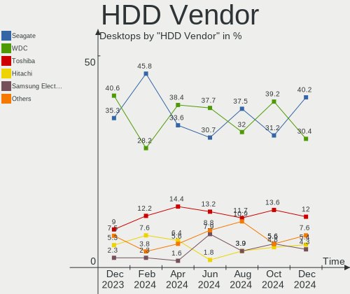
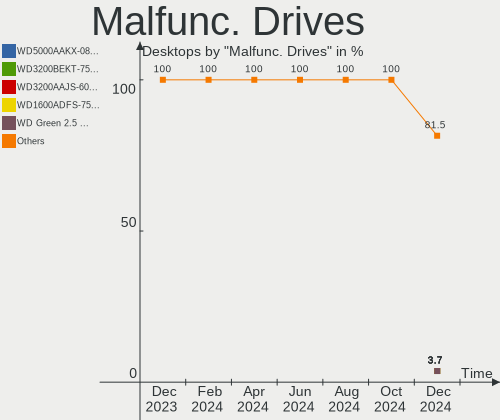
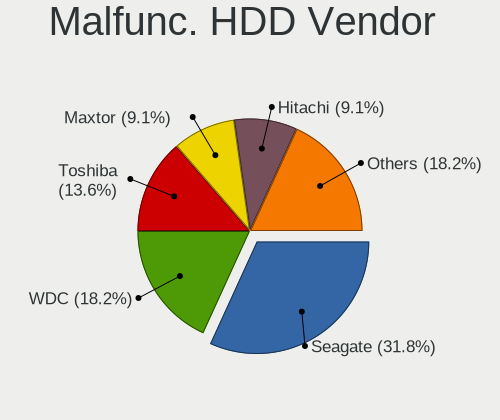
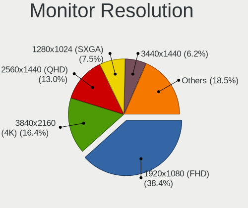
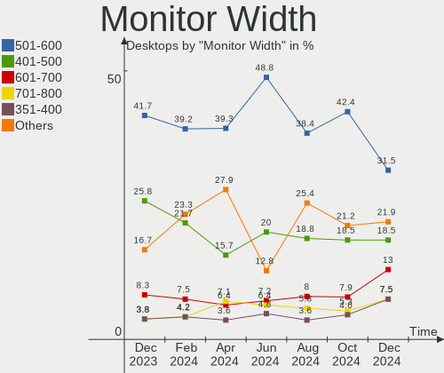
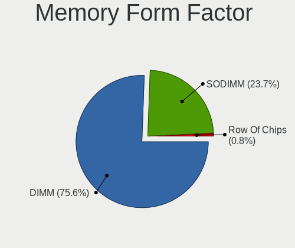

Debian - Hardware Trends (Desktops)
-----------------------------------

A project to identify most popular hardware characteristics and track their change
over time based on data collected by Linux users at https://Linux-Hardware.org.

Anyone can contribute to this report by the [hw-probe](https://github.com/linuxhw/hw-probe) tool:

    sudo -E hw-probe -all -upload

This report is for one last month. Overall report since the beginning of time: [TestCoverage](https://github.com/linuxhw/TestCoverage)

Period: Jan, 2023.

Contents
--------

* [ System ](#system)
  - [ OS                       ](#os)
  - [ OS Family                ](#os-family)
  - [ Kernel                   ](#kernel)
  - [ Kernel Family            ](#kernel-family)
  - [ Kernel Major Ver.        ](#kernel-major-ver)
  - [ Arch                     ](#arch)
  - [ DE                       ](#de)
  - [ Display Server           ](#display-server)
  - [ Display Manager          ](#display-manager)
  - [ OS Lang                  ](#os-lang)
  - [ Boot Mode                ](#boot-mode)
  - [ Filesystem               ](#filesystem)
  - [ Part. scheme             ](#part-scheme)
  - [ Dual Boot with Linux/BSD ](#dual-boot-with-linuxbsd)
  - [ Dual Boot (Win)          ](#dual-boot-win)

* [ Board ](#board)
  - [ Vendor                   ](#vendor)
  - [ Model                    ](#model)
  - [ Model Family             ](#model-family)
  - [ MFG Year                 ](#mfg-year)
  - [ Form Factor              ](#form-factor)
  - [ Secure Boot              ](#secure-boot)
  - [ Coreboot                 ](#coreboot)
  - [ RAM Size                 ](#ram-size)
  - [ RAM Used                 ](#ram-used)
  - [ Total Drives             ](#total-drives)
  - [ Has CD-ROM               ](#has-cd-rom)
  - [ Has Ethernet             ](#has-ethernet)
  - [ Has WiFi                 ](#has-wifi)
  - [ Has Bluetooth            ](#has-bluetooth)

* [ Location ](#location)
  - [ Country                  ](#country)
  - [ City                     ](#city)

* [ Drives ](#drives)
  - [ Drive Vendor             ](#drive-vendor)
  - [ Drive Model              ](#drive-model)
  - [ HDD Vendor               ](#hdd-vendor)
  - [ SSD Vendor               ](#ssd-vendor)
  - [ Drive Kind               ](#drive-kind)
  - [ Drive Connector          ](#drive-connector)
  - [ Drive Size               ](#drive-size)
  - [ Space Total              ](#space-total)
  - [ Space Used               ](#space-used)
  - [ Malfunc. Drives          ](#malfunc-drives)
  - [ Malfunc. Drive Vendor    ](#malfunc-drive-vendor)
  - [ Malfunc. HDD Vendor      ](#malfunc-hdd-vendor)
  - [ Malfunc. Drive Kind      ](#malfunc-drive-kind)
  - [ Failed Drives            ](#failed-drives)
  - [ Failed Drive Vendor      ](#failed-drive-vendor)
  - [ Drive Status             ](#drive-status)

* [ Storage controller ](#storage-controller)
  - [ Storage Vendor           ](#storage-vendor)
  - [ Storage Model            ](#storage-model)
  - [ Storage Kind             ](#storage-kind)

* [ Processor ](#processor)
  - [ CPU Vendor               ](#cpu-vendor)
  - [ CPU Model                ](#cpu-model)
  - [ CPU Model Family         ](#cpu-model-family)
  - [ CPU Cores                ](#cpu-cores)
  - [ CPU Sockets              ](#cpu-sockets)
  - [ CPU Threads              ](#cpu-threads)
  - [ CPU Op-Modes             ](#cpu-op-modes)
  - [ CPU Microcode            ](#cpu-microcode)
  - [ CPU Microarch            ](#cpu-microarch)

* [ Graphics ](#graphics)
  - [ GPU Vendor               ](#gpu-vendor)
  - [ GPU Model                ](#gpu-model)
  - [ GPU Combo                ](#gpu-combo)
  - [ GPU Driver               ](#gpu-driver)
  - [ GPU Memory               ](#gpu-memory)

* [ Monitor ](#monitor)
  - [ Monitor Vendor           ](#monitor-vendor)
  - [ Monitor Model            ](#monitor-model)
  - [ Monitor Resolution       ](#monitor-resolution)
  - [ Monitor Diagonal         ](#monitor-diagonal)
  - [ Monitor Width            ](#monitor-width)
  - [ Aspect Ratio             ](#aspect-ratio)
  - [ Monitor Area             ](#monitor-area)
  - [ Pixel Density            ](#pixel-density)
  - [ Multiple Monitors        ](#multiple-monitors)

* [ Network ](#network)
  - [ Net Controller Vendor    ](#net-controller-vendor)
  - [ Net Controller Model     ](#net-controller-model)
  - [ Wireless Vendor          ](#wireless-vendor)
  - [ Wireless Model           ](#wireless-model)
  - [ Ethernet Vendor          ](#ethernet-vendor)
  - [ Ethernet Model           ](#ethernet-model)
  - [ Net Controller Kind      ](#net-controller-kind)
  - [ Used Controller          ](#used-controller)
  - [ NICs                     ](#nics)
  - [ IPv6                     ](#ipv6)

* [ Bluetooth ](#bluetooth)
  - [ Bluetooth Vendor         ](#bluetooth-vendor)
  - [ Bluetooth Model          ](#bluetooth-model)

* [ Sound ](#sound)
  - [ Sound Vendor             ](#sound-vendor)
  - [ Sound Model              ](#sound-model)

* [ Memory ](#memory)
  - [ Memory Vendor            ](#memory-vendor)
  - [ Memory Model             ](#memory-model)
  - [ Memory Kind              ](#memory-kind)
  - [ Memory Form Factor       ](#memory-form-factor)
  - [ Memory Size              ](#memory-size)
  - [ Memory Speed             ](#memory-speed)

* [ Printers & scanners ](#printers--scanners)
  - [ Printer Vendor           ](#printer-vendor)
  - [ Printer Model            ](#printer-model)
  - [ Scanner Vendor           ](#scanner-vendor)
  - [ Scanner Model            ](#scanner-model)

* [ Camera ](#camera)
  - [ Camera Vendor            ](#camera-vendor)
  - [ Camera Model             ](#camera-model)

* [ Security ](#security)
  - [ Fingerprint Vendor       ](#fingerprint-vendor)
  - [ Fingerprint Model        ](#fingerprint-model)
  - [ Chipcard Vendor          ](#chipcard-vendor)
  - [ Chipcard Model           ](#chipcard-model)

* [ Unsupported ](#unsupported)
  - [ Unsupported Devices      ](#unsupported-devices)
  - [ Unsupported Device Types ](#unsupported-device-types)

System
------

OS
--

Installed operating systems

| Name      | Desktops | Percent |
|-----------|----------|---------|
| Debian 11 | 116      | 82.27%  |
| Debian    | 20       | 14.18%  |
| Debian 10 | 3        | 2.13%   |
| Debian 9  | 2        | 1.42%   |

OS Family
---------

OS without a version

| Name   | Desktops | Percent |
|--------|----------|---------|
| Debian | 141      | 100%    |

Kernel
------

Version of the Linux kernel

| Version                   | Desktops | Percent |
|---------------------------|----------|---------|
| 5.10.0-20-amd64           | 55       | 39.01%  |
| 5.10.0-2-amd64            | 22       | 15.6%   |
| 5.10.0-21-amd64           | 10       | 7.09%   |
| 6.0.0-6-amd64             | 9        | 6.38%   |
| 6.0.0-0.deb11.6-amd64     | 5        | 3.55%   |
| 6.1.0-1-amd64             | 4        | 2.84%   |
| 6.1.0-1-pve               | 3        | 2.13%   |
| 5.15.83-1-pve             | 3        | 2.13%   |
| 6.1.0-2-amd64             | 2        | 1.42%   |
| 6.0.0-2-amd64             | 2        | 1.42%   |
| 6.0.0-0.deb11.2-amd64     | 2        | 1.42%   |
| 5.19.17-1-pve             | 2        | 1.42%   |
| 5.10.0-19-amd64           | 2        | 1.42%   |
| 5.10.0-15-amd64           | 2        | 1.42%   |
| 5.10.0-14-amd64           | 2        | 1.42%   |
| 6.1.5-x64v3-xanmod1       | 1        | 0.71%   |
| 6.0.0-4-amd64             | 1        | 0.71%   |
| 6.0.0-3.1mx-amd64         | 1        | 0.71%   |
| 6.0.0-10.1-liquorix-amd64 | 1        | 0.71%   |
| 5.19.15-dude3             | 1        | 0.71%   |
| 5.19.0-2mx-amd64          | 1        | 0.71%   |
| 5.15.79+truenas           | 1        | 0.71%   |
| 5.15.74-1-pve             | 1        | 0.71%   |
| 5.14.0-1-amd64            | 1        | 0.71%   |
| 5.10.0-9-amd64            | 1        | 0.71%   |
| 5.10.0-8-686              | 1        | 0.71%   |
| 4.9.0-19-rt-amd64         | 1        | 0.71%   |
| 4.19.0-6-amd64            | 1        | 0.71%   |
| 4.19.0-23-amd64           | 1        | 0.71%   |
| 4.19.0-21-amd64           | 1        | 0.71%   |
| 4.19.0-13-amd64           | 1        | 0.71%   |

Kernel Family
-------------

Linux kernel without a distro release

| Version | Desktops | Percent |
|---------|----------|---------|
| 5.10.0  | 95       | 67.38%  |
| 6.0.0   | 21       | 14.89%  |
| 6.1.0   | 9        | 6.38%   |
| 4.19.0  | 4        | 2.84%   |
| 5.15.83 | 3        | 2.13%   |
| 5.19.17 | 2        | 1.42%   |
| 6.1.5   | 1        | 0.71%   |
| 5.19.15 | 1        | 0.71%   |
| 5.19.0  | 1        | 0.71%   |
| 5.15.79 | 1        | 0.71%   |
| 5.15.74 | 1        | 0.71%   |
| 5.14.0  | 1        | 0.71%   |
| 4.9.0   | 1        | 0.71%   |

Kernel Major Ver.
-----------------

Linux kernel major version

| Version | Desktops | Percent |
|---------|----------|---------|
| 5.10    | 95       | 67.38%  |
| 6.0     | 21       | 14.89%  |
| 6.1     | 10       | 7.09%   |
| 5.15    | 5        | 3.55%   |
| 5.19    | 4        | 2.84%   |
| 4.19    | 4        | 2.84%   |
| 5.14    | 1        | 0.71%   |
| 4.9     | 1        | 0.71%   |

Arch
----

OS architecture (x86_64, i586, etc.)

| Name   | Desktops | Percent |
|--------|----------|---------|
| x86_64 | 140      | 99.29%  |
| i686   | 1        | 0.71%   |

DE
--

Desktop Environment

| Name              | Desktops | Percent |
|-------------------|----------|---------|
| Unknown           | 48       | 34.04%  |
| GNOME             | 30       | 21.28%  |
| KDE5              | 24       | 17.02%  |
| XFCE              | 13       | 9.22%   |
| X-Cinnamon        | 6        | 4.26%   |
| LXDE              | 6        | 4.26%   |
| Cinnamon          | 6        | 4.26%   |
| MATE              | 4        | 2.84%   |
| LXQt              | 2        | 1.42%   |
| KDE               | 1        | 0.71%   |
| /etc/X11/Xsession | 1        | 0.71%   |

Display Server
--------------

X11 or Wayland

| Name    | Desktops | Percent |
|---------|----------|---------|
| X11     | 72       | 51.06%  |
| Unknown | 28       | 19.86%  |
| Tty     | 26       | 18.44%  |
| Wayland | 15       | 10.64%  |

Display Manager
---------------

SDDM, LightDM, etc.

| Name    | Desktops | Percent |
|---------|----------|---------|
| Unknown | 63       | 44.68%  |
| LightDM | 33       | 23.4%   |
| GDM     | 20       | 14.18%  |
| SDDM    | 16       | 11.35%  |
| GDM3    | 7        | 4.96%   |
| XDM     | 1        | 0.71%   |
| LXDM    | 1        | 0.71%   |

OS Lang
-------

Language

| Lang    | Desktops | Percent |
|---------|----------|---------|
| en_US   | 50       | 35.46%  |
| ru_RU   | 31       | 21.99%  |
| en_GB   | 9        | 6.38%   |
| es_ES   | 8        | 5.67%   |
| fr_FR   | 7        | 4.96%   |
| pl_PL   | 6        | 4.26%   |
| en_CA   | 6        | 4.26%   |
| pt_BR   | 5        | 3.55%   |
| de_DE   | 5        | 3.55%   |
| it_IT   | 3        | 2.13%   |
| Unknown | 3        | 2.13%   |
| zh_CN   | 1        | 0.71%   |
| es_VE   | 1        | 0.71%   |
| es_CO   | 1        | 0.71%   |
| en_NZ   | 1        | 0.71%   |
| en_HK   | 1        | 0.71%   |
| en_DK   | 1        | 0.71%   |
| de_AT   | 1        | 0.71%   |
| bg_BG   | 1        | 0.71%   |

Boot Mode
---------

EFI or BIOS

| Mode | Desktops | Percent |
|------|----------|---------|
| BIOS | 79       | 56.03%  |
| EFI  | 62       | 43.97%  |

Filesystem
----------

Type of filesystem

| Type    | Desktops | Percent |
|---------|----------|---------|
| Ext4    | 108      | 76.6%   |
| Overlay | 27       | 19.15%  |
| Btrfs   | 3        | 2.13%   |
| Zfs     | 2        | 1.42%   |
| Xfs     | 1        | 0.71%   |

Part. scheme
------------

Scheme of partitioning

| Type    | Desktops | Percent |
|---------|----------|---------|
| GPT     | 78       | 55.32%  |
| MBR     | 48       | 34.04%  |
| Unknown | 15       | 10.64%  |

Dual Boot with Linux/BSD
------------------------

Hosting more than one Linux/BSD

| Dual boot | Desktops | Percent |
|-----------|----------|---------|
| No        | 121      | 85.82%  |
| Yes       | 20       | 14.18%  |

Dual Boot (Win)
---------------

Hosting Linux and Windows

| Dual boot | Desktops | Percent |
|-----------|----------|---------|
| No        | 87       | 61.7%   |
| Yes       | 54       | 38.3%   |

Board
-----

Vendor
------

Motherboard manufacturer

| Name                | Desktops | Percent |
|---------------------|----------|---------|
| ASUSTek Computer    | 39       | 27.66%  |
| Gigabyte Technology | 26       | 18.44%  |
| MSI                 | 16       | 11.35%  |
| ASRock              | 11       | 7.8%    |
| Hewlett-Packard     | 9        | 6.38%   |
| Lenovo              | 8        | 5.67%   |
| Dell                | 8        | 5.67%   |
| Intel               | 4        | 2.84%   |
| AZW                 | 3        | 2.13%   |
| ASRockRack          | 3        | 2.13%   |
| Vestel              | 1        | 0.71%   |
| Techvision          | 1        | 0.71%   |
| Pegatron            | 1        | 0.71%   |
| NetGear             | 1        | 0.71%   |
| Medion              | 1        | 0.71%   |
| Inventec            | 1        | 0.71%   |
| Huanan              | 1        | 0.71%   |
| HC                  | 1        | 0.71%   |
| Foxconn             | 1        | 0.71%   |
| ELSKY               | 1        | 0.71%   |
| ECS                 | 1        | 0.71%   |
| DFI                 | 1        | 0.71%   |
| Biostar             | 1        | 0.71%   |
| Acer                | 1        | 0.71%   |

Model
-----

Motherboard model

| Name                                      | Desktops | Percent |
|-------------------------------------------|----------|---------|
| Gigabyte P85-D3                           | 6        | 4.26%   |
| MSI MS-7A34                               | 2        | 1.42%   |
| Intel Jasper Lake Client Platform         | 2        | 1.42%   |
| ASUS ROG CROSSHAIR VIII HERO              | 2        | 1.42%   |
| ASRockRack X470D4U                        | 2        | 1.42%   |
| Vestel 14MB24A                            | 1        | 0.71%   |
| Techvision TVI7309X                       | 1        | 0.71%   |
| Pegatron NC701AA-ABA IQ524                | 1        | 0.71%   |
| NetGear ReadyDATA 5200                    | 1        | 0.71%   |
| MSI MS-7D67                               | 1        | 0.71%   |
| MSI MS-7C94                               | 1        | 0.71%   |
| MSI MS-7C52                               | 1        | 0.71%   |
| MSI MS-7C39                               | 1        | 0.71%   |
| MSI MS-7C37                               | 1        | 0.71%   |
| MSI MS-7C02                               | 1        | 0.71%   |
| MSI MS-7B79                               | 1        | 0.71%   |
| MSI MS-7996                               | 1        | 0.71%   |
| MSI MS-7917                               | 1        | 0.71%   |
| MSI MS-7850                               | 1        | 0.71%   |
| MSI MS-7817                               | 1        | 0.71%   |
| MSI MS-7599                               | 1        | 0.71%   |
| MSI MS-7519                               | 1        | 0.71%   |
| MSI Cubi N 8GL (MS-B171)                  | 1        | 0.71%   |
| Medion S23003                             | 1        | 0.71%   |
| Lenovo ThinkStation P360 Ultra 30G10046MT | 1        | 0.71%   |
| Lenovo ThinkCentre M93 10A5A00CFR         | 1        | 0.71%   |
| Lenovo ThinkCentre M910q 10MUS6HL00       | 1        | 0.71%   |
| Lenovo ThinkCentre M73 10AXS5C102         | 1        | 0.71%   |
| Lenovo ThinkCentre M58p 6234A1U           | 1        | 0.71%   |
| Lenovo ThinkCentre M57e 7066W57           | 1        | 0.71%   |
| Lenovo IdeaCentre 5 14IMB05 90NA007DUS    | 1        | 0.71%   |
| Lenovo 7033EW4                            | 1        | 0.71%   |
| Inventec D CLASS                          | 1        | 0.71%   |
| Intel Pro, Std, Elt Series                | 1        | 0.71%   |
| Intel DH77EB AAG39073-304                 | 1        | 0.71%   |
| Huanan B75 V10.1 376                      | 1        | 0.71%   |
| HP t520 Flexible Series TC                | 1        | 0.71%   |
| HP ProLiant MicroServer Gen8              | 1        | 0.71%   |
| HP ProDesk 600 G3 SFF                     | 1        | 0.71%   |
| HP ProDesk 600 G2 MT                      | 1        | 0.71%   |

Model Family
------------

Motherboard model prefix

| Name                 | Desktops | Percent |
|----------------------|----------|---------|
| ASUS PRIME           | 7        | 4.96%   |
| Gigabyte P85-D3      | 6        | 4.26%   |
| ASUS TUF             | 6        | 4.26%   |
| ASUS ROG             | 6        | 4.26%   |
| Lenovo ThinkCentre   | 5        | 3.55%   |
| Dell OptiPlex        | 4        | 2.84%   |
| MSI MS-7A34          | 2        | 1.42%   |
| Intel Jasper         | 2        | 1.42%   |
| HP ProDesk           | 2        | 1.42%   |
| HP EliteDesk         | 2        | 1.42%   |
| HP Compaq            | 2        | 1.42%   |
| Gigabyte B450M       | 2        | 1.42%   |
| ASUS P8H61-MX        | 2        | 1.42%   |
| ASUS P8H61-M         | 2        | 1.42%   |
| ASUS P5G41T-M        | 2        | 1.42%   |
| ASRockRack X470D4U   | 2        | 1.42%   |
| Vestel 14MB24A       | 1        | 0.71%   |
| Techvision TVI7309X  | 1        | 0.71%   |
| Pegatron NC701AA-ABA | 1        | 0.71%   |
| NetGear ReadyDATA    | 1        | 0.71%   |
| MSI MS-7D67          | 1        | 0.71%   |
| MSI MS-7C94          | 1        | 0.71%   |
| MSI MS-7C52          | 1        | 0.71%   |
| MSI MS-7C39          | 1        | 0.71%   |
| MSI MS-7C37          | 1        | 0.71%   |
| MSI MS-7C02          | 1        | 0.71%   |
| MSI MS-7B79          | 1        | 0.71%   |
| MSI MS-7996          | 1        | 0.71%   |
| MSI MS-7917          | 1        | 0.71%   |
| MSI MS-7850          | 1        | 0.71%   |
| MSI MS-7817          | 1        | 0.71%   |
| MSI MS-7599          | 1        | 0.71%   |
| MSI MS-7519          | 1        | 0.71%   |
| MSI Cubi             | 1        | 0.71%   |
| Medion S23003        | 1        | 0.71%   |
| Lenovo ThinkStation  | 1        | 0.71%   |
| Lenovo IdeaCentre    | 1        | 0.71%   |
| Lenovo 7033EW4       | 1        | 0.71%   |
| Inventec D           | 1        | 0.71%   |
| Intel Pro            | 1        | 0.71%   |

MFG Year
--------

Motherboard manufacture year

| Year | Desktops | Percent |
|------|----------|---------|
| 2022 | 17       | 12.06%  |
| 2020 | 17       | 12.06%  |
| 2013 | 14       | 9.93%   |
| 2019 | 12       | 8.51%   |
| 2021 | 10       | 7.09%   |
| 2014 | 9        | 6.38%   |
| 2012 | 8        | 5.67%   |
| 2011 | 8        | 5.67%   |
| 2018 | 7        | 4.96%   |
| 2017 | 7        | 4.96%   |
| 2008 | 7        | 4.96%   |
| 2016 | 6        | 4.26%   |
| 2015 | 6        | 4.26%   |
| 2010 | 4        | 2.84%   |
| 2009 | 3        | 2.13%   |
| 2006 | 3        | 2.13%   |
| 2005 | 3        | 2.13%   |

Form Factor
-----------

Physical design of the computer

| Name    | Desktops | Percent |
|---------|----------|---------|
| Desktop | 141      | 100%    |

Secure Boot
-----------

Enabled or disabled

| State    | Desktops | Percent |
|----------|----------|---------|
| Disabled | 133      | 94.33%  |
| Enabled  | 8        | 5.67%   |

Coreboot
--------

Have coreboot on board

| Used | Desktops | Percent |
|------|----------|---------|
| No   | 141      | 100%    |

RAM Size
--------

Total RAM memory

| Size in GB  | Desktops | Percent |
|-------------|----------|---------|
| 3.01-4.0    | 29       | 20.57%  |
| 4.01-8.0    | 25       | 17.73%  |
| 32.01-64.0  | 25       | 17.73%  |
| 16.01-24.0  | 24       | 17.02%  |
| 64.01-256.0 | 14       | 9.93%   |
| 8.01-16.0   | 13       | 9.22%   |
| 1.01-2.0    | 6        | 4.26%   |
| 24.01-32.0  | 5        | 3.55%   |

RAM Used
--------

Used RAM memory

| Used GB     | Desktops | Percent |
|-------------|----------|---------|
| 0.51-1.0    | 40       | 28.37%  |
| 2.01-3.0    | 25       | 17.73%  |
| 4.01-8.0    | 24       | 17.02%  |
| 1.01-2.0    | 19       | 13.48%  |
| 3.01-4.0    | 11       | 7.8%    |
| 8.01-16.0   | 10       | 7.09%   |
| 16.01-24.0  | 5        | 3.55%   |
| 0.01-0.5    | 4        | 2.84%   |
| 32.01-64.0  | 1        | 0.71%   |
| 24.01-32.0  | 1        | 0.71%   |
| 64.01-256.0 | 1        | 0.71%   |

Total Drives
------------

Number of drives on board

| Drives | Desktops | Percent |
|--------|----------|---------|
| 1      | 69       | 48.94%  |
| 2      | 33       | 23.4%   |
| 3      | 16       | 11.35%  |
| 4      | 9        | 6.38%   |
| 5      | 6        | 4.26%   |
| 8      | 2        | 1.42%   |
| 7      | 2        | 1.42%   |
| 18     | 1        | 0.71%   |
| 13     | 1        | 0.71%   |
| 6      | 1        | 0.71%   |
| 0      | 1        | 0.71%   |

Has CD-ROM
----------

Has CD-ROM on board

| Presented | Desktops | Percent |
|-----------|----------|---------|
| No        | 97       | 68.79%  |
| Yes       | 44       | 31.21%  |

Has Ethernet
------------

Has Ethernet on board

| Presented | Desktops | Percent |
|-----------|----------|---------|
| Yes       | 141      | 100%    |

Has WiFi
--------

Has WiFi module

| Presented | Desktops | Percent |
|-----------|----------|---------|
| No        | 93       | 65.96%  |
| Yes       | 48       | 34.04%  |

Has Bluetooth
-------------

Has Bluetooth module

| Presented | Desktops | Percent |
|-----------|----------|---------|
| No        | 96       | 68.09%  |
| Yes       | 45       | 31.91%  |

Location
--------

Country
-------

Geographic location (country)

| Country     | Desktops | Percent |
|-------------|----------|---------|
| Russia      | 32       | 22.7%   |
| USA         | 19       | 13.48%  |
| France      | 11       | 7.8%    |
| Canada      | 11       | 7.8%    |
| Poland      | 9        | 6.38%   |
| Germany     | 9        | 6.38%   |
| Spain       | 8        | 5.67%   |
| Brazil      | 7        | 4.96%   |
| UK          | 6        | 4.26%   |
| Italy       | 4        | 2.84%   |
| Switzerland | 2        | 1.42%   |
| India       | 2        | 1.42%   |
| Denmark     | 2        | 1.42%   |
| Colombia    | 2        | 1.42%   |
| Australia   | 2        | 1.42%   |
| Venezuela   | 1        | 0.71%   |
| Turkey      | 1        | 0.71%   |
| Sweden      | 1        | 0.71%   |
| South Korea | 1        | 0.71%   |
| Singapore   | 1        | 0.71%   |
| Romania     | 1        | 0.71%   |
| Norway      | 1        | 0.71%   |
| New Zealand | 1        | 0.71%   |
| Netherlands | 1        | 0.71%   |
| Czechia     | 1        | 0.71%   |
| China       | 1        | 0.71%   |
| Bulgaria    | 1        | 0.71%   |
| Belgium     | 1        | 0.71%   |
| Belarus     | 1        | 0.71%   |
| Austria     | 1        | 0.71%   |

City
----

Geographic location (city)

| City                  | Desktops | Percent |
|-----------------------|----------|---------|
| Voronezh              | 24       | 17.02%  |
| Toronto               | 3        | 2.13%   |
| Moscow                | 3        | 2.13%   |
| Etobicoke             | 3        | 2.13%   |
| Windsor               | 2        | 1.42%   |
| Paris                 | 2        | 1.42%   |
| Bonn                  | 2        | 1.42%   |
| Berlin                | 2        | 1.42%   |
| Zurich                | 1        | 0.71%   |
| Wołomin              | 1        | 0.71%   |
| Whites Creek          | 1        | 0.71%   |
| Voluntari             | 1        | 0.71%   |
| Vila Velha            | 1        | 0.71%   |
| Vienna                | 1        | 0.71%   |
| Ufa                   | 1        | 0.71%   |
| Tauranga              | 1        | 0.71%   |
| Tacoma                | 1        | 0.71%   |
| Sydney                | 1        | 0.71%   |
| Surubim               | 1        | 0.71%   |
| Stuttgart             | 1        | 0.71%   |
| Springfield           | 1        | 0.71%   |
| Spinea                | 1        | 0.71%   |
| Solihull              | 1        | 0.71%   |
| Soedra Sandby         | 1        | 0.71%   |
| Singapore             | 1        | 0.71%   |
| Shanghai              | 1        | 0.71%   |
| Saruy                 | 1        | 0.71%   |
| Sartrouville          | 1        | 0.71%   |
| Sao Paulo             | 1        | 0.71%   |
| Santa Maria do Herval | 1        | 0.71%   |
| Sandefjord            | 1        | 0.71%   |
| San Leandro           | 1        | 0.71%   |
| San Jose              | 1        | 0.71%   |
| San Francisco         | 1        | 0.71%   |
| Sale                  | 1        | 0.71%   |
| Rezé                 | 1        | 0.71%   |
| Requena               | 1        | 0.71%   |
| Raleigh               | 1        | 0.71%   |
| Racibórz             | 1        | 0.71%   |
| Princeton             | 1        | 0.71%   |

Drives
------

Drive Vendor
------------

Hard drive vendors

| Vendor                      | Desktops | Drives | Percent |
|-----------------------------|----------|--------|---------|
| WDC                         | 45       | 63     | 18.22%  |
| Seagate                     | 40       | 62     | 16.19%  |
| Samsung Electronics         | 32       | 46     | 12.96%  |
| Kingston                    | 27       | 30     | 10.93%  |
| Toshiba                     | 16       | 21     | 6.48%   |
| SanDisk                     | 10       | 11     | 4.05%   |
| Hitachi                     | 8        | 9      | 3.24%   |
| Intel                       | 7        | 8      | 2.83%   |
| China                       | 7        | 7      | 2.83%   |
| Crucial                     | 6        | 6      | 2.43%   |
| SK hynix                    | 5        | 5      | 2.02%   |
| HGST                        | 4        | 8      | 1.62%   |
| Unknown                     | 3        | 3      | 1.21%   |
| Transcend                   | 3        | 3      | 1.21%   |
| Phison                      | 3        | 3      | 1.21%   |
| Corsair                     | 3        | 3      | 1.21%   |
| Apacer                      | 3        | 3      | 1.21%   |
| SPCC                        | 2        | 2      | 0.81%   |
| Phison Electronics          | 2        | 2      | 0.81%   |
| KIOXIA-EXCERIA              | 2        | 3      | 0.81%   |
| KIOXIA                      | 2        | 2      | 0.81%   |
| KingDian                    | 2        | 2      | 0.81%   |
| XPG                         | 1        | 1      | 0.4%    |
| Teclast                     | 1        | 1      | 0.4%    |
| T-FORCE                     | 1        | 1      | 0.4%    |
| StoreJet                    | 1        | 1      | 0.4%    |
| Qumo                        | 1        | 1      | 0.4%    |
| PNY                         | 1        | 1      | 0.4%    |
| Netac                       | 1        | 1      | 0.4%    |
| Mushkin                     | 1        | 1      | 0.4%    |
| Micron/Crucial Technology   | 1        | 1      | 0.4%    |
| Micron Technology           | 1        | 1      | 0.4%    |
| Kingston Technology Company | 1        | 1      | 0.4%    |
| JMicron Technology          | 1        | 1      | 0.4%    |
| GOODRAM                     | 1        | 3      | 0.4%    |
| AMD                         | 1        | 1      | 0.4%    |
| A-DATA Technology           | 1        | 1      | 0.4%    |

Drive Model
-----------

Hard drive models

| Model                                                | Desktops | Percent |
|------------------------------------------------------|----------|---------|
| Toshiba DT01ACA050 500GB                             | 8        | 2.75%   |
| Kingston SA400S37240G 240GB SSD                      | 6        | 2.06%   |
| Seagate ST1000DM010-2EP102 1TB                       | 4        | 1.37%   |
| Kingston SA400S37480G 480GB SSD                      | 4        | 1.37%   |
| Kingston SA400S37120G 120GB SSD                      | 4        | 1.37%   |
| Seagate ST2000DM008-2FR102 2TB                       | 3        | 1.03%   |
| SanDisk NVMe SSD Drive 500GB                         | 3        | 1.03%   |
| Samsung SSD 970 EVO Plus 250GB                       | 3        | 1.03%   |
| Samsung SSD 850 EVO 500GB                            | 3        | 1.03%   |
| Samsung NVMe SSD Controller SM981/PM981/PM983 500GB  | 3        | 1.03%   |
| Kingston SV300S37A120G 120GB SSD                     | 3        | 1.03%   |
| WDC WD5003ABYX-18WERA0 500GB                         | 2        | 0.69%   |
| WDC WD40EFRX-68WT0N0 4TB                             | 2        | 0.69%   |
| WDC WD10PURZ-85U8XY0 1TB                             | 2        | 0.69%   |
| WDC WD10EZEX-08WN4A0 1TB                             | 2        | 0.69%   |
| Seagate ST500DM002-1BD142 500GB                      | 2        | 0.69%   |
| Seagate ST18000NM000J-2TV103 18TB                    | 2        | 0.69%   |
| Seagate ST1000DM003-1SB102 1TB                       | 2        | 0.69%   |
| Seagate ST1000DM003-1ER162 1TB                       | 2        | 0.69%   |
| Samsung SSD 970 EVO Plus 500GB                       | 2        | 0.69%   |
| Samsung SSD 860 EVO 1TB                              | 2        | 0.69%   |
| Samsung NVMe SSD Controller PM9A1/PM9A3/980PRO 512GB | 2        | 0.69%   |
| Kingston SV300S37A240G 240GB SSD                     | 2        | 0.69%   |
| Kingston SUV400S37120G 120GB SSD                     | 2        | 0.69%   |
| Kingston SNV2S500G 500GB                             | 2        | 0.69%   |
| Hitachi HDS721050CLA362 500GB                        | 2        | 0.69%   |
| XPG GAMMIX S11 Pro 1TB                               | 1        | 0.34%   |
| WDC WDS500G2B0C-00PXH0 500GB                         | 1        | 0.34%   |
| WDC WDS500G2B0A-00SM50 500GB SSD                     | 1        | 0.34%   |
| WDC WDS480G2G0B-00EPW0 480GB SSD                     | 1        | 0.34%   |
| WDC WDS250G2B0A-00SM50 250GB SSD                     | 1        | 0.34%   |
| WDC WDS240G2G0B-00EPW0 240GB SSD                     | 1        | 0.34%   |
| WDC WDS200T2B0A-00SM50 2TB SSD                       | 1        | 0.34%   |
| WDC WDS100T3X0C-00SJG0 1TB                           | 1        | 0.34%   |
| WDC WDS100T2B0C-00PXH0 1TB                           | 1        | 0.34%   |
| WDC WDBNCE5000PNC 500GB SSD                          | 1        | 0.34%   |
| WDC WD80PURZ-85YNPY0 8TB                             | 1        | 0.34%   |
| WDC WD80EMAZ-00WJTA0 8TB                             | 1        | 0.34%   |
| WDC WD800AAJS-00PSA0 80GB                            | 1        | 0.34%   |
| WDC WD7500AAKS-00RBA0 752GB                          | 1        | 0.34%   |

HDD Vendor
----------

Hard disk drive vendors

| Vendor              | Desktops | Drives | Percent |
|---------------------|----------|--------|---------|
| Seagate             | 40       | 58     | 36.04%  |
| WDC                 | 37       | 52     | 33.33%  |
| Toshiba             | 16       | 20     | 14.41%  |
| Hitachi             | 8        | 9      | 7.21%   |
| Samsung Electronics | 4        | 4      | 3.6%    |
| HGST                | 4        | 8      | 3.6%    |
| Unknown             | 1        | 1      | 0.9%    |
| StoreJet            | 1        | 1      | 0.9%    |

SSD Vendor
----------

Solid state drive vendors

| Vendor              | Desktops | Drives | Percent |
|---------------------|----------|--------|---------|
| Kingston            | 23       | 26     | 24.73%  |
| Samsung Electronics | 16       | 18     | 17.2%   |
| WDC                 | 7        | 7      | 7.53%   |
| China               | 7        | 7      | 7.53%   |
| SanDisk             | 5        | 5      | 5.38%   |
| Crucial             | 5        | 5      | 5.38%   |
| Intel               | 4        | 4      | 4.3%    |
| Transcend           | 3        | 3      | 3.23%   |
| Apacer              | 3        | 3      | 3.23%   |
| SPCC                | 2        | 2      | 2.15%   |
| SK hynix            | 2        | 2      | 2.15%   |
| KingDian            | 2        | 2      | 2.15%   |
| Unknown             | 1        | 1      | 1.08%   |
| Toshiba             | 1        | 1      | 1.08%   |
| Teclast             | 1        | 1      | 1.08%   |
| T-FORCE             | 1        | 1      | 1.08%   |
| Qumo                | 1        | 1      | 1.08%   |
| PNY                 | 1        | 1      | 1.08%   |
| Phison              | 1        | 1      | 1.08%   |
| Netac               | 1        | 1      | 1.08%   |
| Mushkin             | 1        | 1      | 1.08%   |
| KIOXIA-EXCERIA      | 1        | 1      | 1.08%   |
| JMicron Technology  | 1        | 1      | 1.08%   |
| GOODRAM             | 1        | 1      | 1.08%   |
| AMD                 | 1        | 1      | 1.08%   |
| A-DATA Technology   | 1        | 1      | 1.08%   |

Drive Kind
----------

HDD or SSD

| Kind    | Desktops | Drives | Percent |
|---------|----------|--------|---------|
| HDD     | 86       | 153    | 40%     |
| SSD     | 79       | 98     | 36.74%  |
| NVMe    | 49       | 64     | 22.79%  |
| Unknown | 1        | 4      | 0.47%   |

Drive Connector
---------------

SATA, SAS, NVMe, etc.

| Type | Desktops | Drives | Percent |
|------|----------|--------|---------|
| SATA | 125      | 236    | 69.06%  |
| NVMe | 49       | 64     | 27.07%  |
| SAS  | 7        | 19     | 3.87%   |

Drive Size
----------

Size of hard drive

| Size in TB | Desktops | Drives | Percent |
|------------|----------|--------|---------|
| 0.01-0.5   | 101      | 125    | 54.3%   |
| 0.51-1.0   | 39       | 55     | 20.97%  |
| 1.01-2.0   | 16       | 22     | 8.6%    |
| 3.01-4.0   | 10       | 12     | 5.38%   |
| 4.01-10.0  | 9        | 13     | 4.84%   |
| 2.01-3.0   | 6        | 10     | 3.23%   |
| 10.01-20.0 | 5        | 14     | 2.69%   |

Space Total
-----------

Amount of disk space available on the file system

| Size in GB     | Desktops | Percent |
|----------------|----------|---------|
| 101-250        | 27       | 19.15%  |
| Unknown        | 27       | 19.15%  |
| 251-500        | 24       | 17.02%  |
| 501-1000       | 16       | 11.35%  |
| More than 3000 | 15       | 10.64%  |
| 1001-2000      | 14       | 9.93%   |
| 1-20           | 7        | 4.96%   |
| 51-100         | 5        | 3.55%   |
| 21-50          | 3        | 2.13%   |
| 2001-3000      | 3        | 2.13%   |

Space Used
----------

Amount of used disk space

| Used GB        | Desktops | Percent |
|----------------|----------|---------|
| 1-20           | 48       | 34.04%  |
| Unknown        | 27       | 19.15%  |
| 101-250        | 12       | 8.51%   |
| 51-100         | 12       | 8.51%   |
| 251-500        | 11       | 7.8%    |
| 21-50          | 8        | 5.67%   |
| 1001-2000      | 8        | 5.67%   |
| 501-1000       | 6        | 4.26%   |
| More than 3000 | 4        | 2.84%   |
| 2001-3000      | 4        | 2.84%   |
| 0              | 1        | 0.71%   |

Malfunc. Drives
---------------

Drive models with a malfunction

| Model                                 | Desktops | Drives | Percent |
|---------------------------------------|----------|--------|---------|
| WDC WD800AAJS-00PSA0 80GB             | 1        | 1      | 2.38%   |
| WDC WD6400AAKS-75A7B0 640GB           | 1        | 1      | 2.38%   |
| WDC WD5000AAKX-08U6AA0 500GB          | 1        | 1      | 2.38%   |
| WDC WD40EFRX-68N32N0 4TB              | 1        | 1      | 2.38%   |
| WDC WD30EZRX-00SPEB0 3TB              | 1        | 1      | 2.38%   |
| WDC WD2500AAKX-001CA0 250GB           | 1        | 1      | 2.38%   |
| WDC WD10EZEX-21WN4A0 1TB              | 1        | 1      | 2.38%   |
| WDC WD10EARS-00Y5B1 1TB               | 1        | 1      | 2.38%   |
| WDC WD1002FAEX-00Y9A0 1TB             | 1        | 1      | 2.38%   |
| Toshiba MD04ACA400 4TB                | 1        | 1      | 2.38%   |
| Teclast 480GB A800 SSD                | 1        | 1      | 2.38%   |
| SK hynix HFS256G39TND-N210A 256GB SSD | 1        | 1      | 2.38%   |
| Seagate STM3250318AS 250GB            | 1        | 1      | 2.38%   |
| Seagate ST500LM030-2E717D 500GB       | 1        | 1      | 2.38%   |
| Seagate ST500DM002-1BD142 500GB       | 1        | 1      | 2.38%   |
| Seagate ST380817AS 80GB               | 1        | 1      | 2.38%   |
| Seagate ST3640323AS 640GB             | 1        | 1      | 2.38%   |
| Seagate ST3320620AS 320GB             | 1        | 1      | 2.38%   |
| Seagate ST3300631AS 304GB             | 1        | 1      | 2.38%   |
| Seagate ST31500341AS 1TB              | 1        | 1      | 2.38%   |
| Seagate ST3000DM001-9YN166 3TB        | 1        | 1      | 2.38%   |
| Seagate ST2000DM008-2FR102 2TB        | 1        | 1      | 2.38%   |
| Seagate ST2000DM006-2DM164 2TB        | 1        | 1      | 2.38%   |
| Seagate ST2000DM001-1CH164 2TB        | 1        | 1      | 2.38%   |
| Seagate ST2000DL003-9VT166 2TB        | 1        | 1      | 2.38%   |
| Seagate ST16000NM001G-2KK103 16TB     | 1        | 1      | 2.38%   |
| Seagate ST1000DM003-9YN162 1TB        | 1        | 1      | 2.38%   |
| Samsung Electronics SSD 980 PRO 1TB   | 1        | 1      | 2.38%   |
| Samsung Electronics HD103SJ 1TB       | 1        | 1      | 2.38%   |
| Kingston SV300S37A120G 120GB SSD      | 1        | 1      | 2.38%   |
| Kingston SUV400S37240G 240GB SSD      | 1        | 1      | 2.38%   |
| Kingston SA400S37240G 240GB SSD       | 1        | 1      | 2.38%   |
| Kingston SA400S37120G 120GB SSD       | 1        | 1      | 2.38%   |
| Intel SSDSC2CT120A3 120GB             | 1        | 1      | 2.38%   |
| Hitachi HUA722020ALA331 2TB           | 1        | 2      | 2.38%   |
| Hitachi HTS725032A9A364 320GB         | 1        | 1      | 2.38%   |
| Hitachi HTS547550A9E384 500GB         | 1        | 1      | 2.38%   |
| Hitachi HDS721050DLE630 500GB         | 1        | 1      | 2.38%   |
| HGST HTS725032A7E630 320GB            | 1        | 1      | 2.38%   |
| China SSD 240GB                       | 1        | 1      | 2.38%   |

Malfunc. Drive Vendor
---------------------

Vendors of faulty drives

| Vendor              | Desktops | Drives | Percent |
|---------------------|----------|--------|---------|
| Seagate             | 14       | 15     | 34.15%  |
| WDC                 | 9        | 9      | 21.95%  |
| Kingston            | 4        | 4      | 9.76%   |
| Hitachi             | 4        | 5      | 9.76%   |
| Samsung Electronics | 2        | 2      | 4.88%   |
| Apacer              | 2        | 2      | 4.88%   |
| Toshiba             | 1        | 1      | 2.44%   |
| Teclast             | 1        | 1      | 2.44%   |
| SK hynix            | 1        | 1      | 2.44%   |
| Intel               | 1        | 1      | 2.44%   |
| HGST                | 1        | 1      | 2.44%   |
| China               | 1        | 1      | 2.44%   |

Malfunc. HDD Vendor
-------------------

Vendors of faulty HDD drives

| Vendor              | Desktops | Drives | Percent |
|---------------------|----------|--------|---------|
| Seagate             | 14       | 15     | 46.67%  |
| WDC                 | 9        | 9      | 30%     |
| Hitachi             | 4        | 5      | 13.33%  |
| Toshiba             | 1        | 1      | 3.33%   |
| Samsung Electronics | 1        | 1      | 3.33%   |
| HGST                | 1        | 1      | 3.33%   |

Malfunc. Drive Kind
-------------------

Kinds of faulty drives

| Kind | Desktops | Drives | Percent |
|------|----------|--------|---------|
| HDD  | 25       | 32     | 69.44%  |
| SSD  | 10       | 10     | 27.78%  |
| NVMe | 1        | 1      | 2.78%   |

Failed Drives
-------------

Failed drive models

Zero info for selected period =(

Failed Drive Vendor
-------------------

Failed drive vendors

Zero info for selected period =(

Drive Status
------------

Number of failed and malfunc. drives

| Status   | Desktops | Drives | Percent |
|----------|----------|--------|---------|
| Works    | 109      | 194    | 63.01%  |
| Malfunc  | 34       | 43     | 19.65%  |
| Detected | 30       | 82     | 17.34%  |

Storage controller
------------------

Storage Vendor
--------------

Storage controller vendors

| Vendor                        | Desktops | Percent |
|-------------------------------|----------|---------|
| Intel                         | 93       | 42.47%  |
| AMD                           | 47       | 21.46%  |
| Samsung Electronics           | 17       | 7.76%   |
| SanDisk                       | 10       | 4.57%   |
| ASMedia Technology            | 10       | 4.57%   |
| Phison Electronics            | 8        | 3.65%   |
| Kingston Technology Company   | 5        | 2.28%   |
| JMicron Technology            | 5        | 2.28%   |
| SK hynix                      | 3        | 1.37%   |
| Nvidia                        | 3        | 1.37%   |
| KIOXIA                        | 3        | 1.37%   |
| Micron/Crucial Technology     | 2        | 0.91%   |
| Marvell Technology Group      | 2        | 0.91%   |
| Broadcom / LSI                | 2        | 0.91%   |
| VIA Technologies              | 1        | 0.46%   |
| Toshiba America Info Systems  | 1        | 0.46%   |
| Silicon Image                 | 1        | 0.46%   |
| Realtek Semiconductor         | 1        | 0.46%   |
| Micron Technology             | 1        | 0.46%   |
| MAXIO Technology (Hangzhou)   | 1        | 0.46%   |
| LSI Logic / Symbios Logic     | 1        | 0.46%   |
| Integrated Technology Express | 1        | 0.46%   |
| ADATA Technology              | 1        | 0.46%   |

Storage Model
-------------

Storage controller models

| Model                                                                                   | Desktops | Percent |
|-----------------------------------------------------------------------------------------|----------|---------|
| AMD FCH SATA Controller [AHCI mode]                                                     | 27       | 10.23%  |
| Intel 8 Series/C220 Series Chipset Family 6-port SATA Controller 1 [AHCI mode]          | 14       | 5.3%    |
| AMD 400 Series Chipset SATA Controller                                                  | 12       | 4.55%   |
| Samsung NVMe SSD Controller SM981/PM981/PM983                                           | 11       | 4.17%   |
| ASMedia ASM1062 Serial ATA Controller                                                   | 8        | 3.03%   |
| Intel Q170/Q150/B150/H170/H110/Z170/CM236 Chipset SATA Controller [AHCI Mode]           | 7        | 2.65%   |
| Intel NM10/ICH7 Family SATA Controller [IDE mode]                                       | 7        | 2.65%   |
| Intel 6 Series/C200 Series Chipset Family 6 port Desktop SATA AHCI Controller           | 7        | 2.65%   |
| Intel 200 Series PCH SATA controller [AHCI mode]                                        | 7        | 2.65%   |
| Intel 82801G (ICH7 Family) IDE Controller                                               | 6        | 2.27%   |
| Samsung NVMe SSD Controller PM9A1/PM9A3/980PRO                                          | 5        | 1.89%   |
| Intel Jasper Lake SATA AHCI Controller                                                  | 5        | 1.89%   |
| Intel Alder Lake-S PCH SATA Controller [AHCI Mode]                                      | 5        | 1.89%   |
| AMD SB7x0/SB8x0/SB9x0 SATA Controller [AHCI mode]                                       | 5        | 1.89%   |
| AMD SB7x0/SB8x0/SB9x0 IDE Controller                                                    | 5        | 1.89%   |
| Phison E12 NVMe Controller                                                              | 4        | 1.52%   |
| Kingston Company Company Non-Volatile memory controller                                 | 4        | 1.52%   |
| Intel 7 Series/C210 Series Chipset Family 6-port SATA Controller [AHCI mode]            | 4        | 1.52%   |
| Intel 6 Series/C200 Series Chipset Family Desktop SATA Controller (IDE mode, ports 4-5) | 4        | 1.52%   |
| Intel 6 Series/C200 Series Chipset Family Desktop SATA Controller (IDE mode, ports 0-3) | 4        | 1.52%   |
| AMD SATA controller                                                                     | 4        | 1.52%   |
| AMD 500 Series Chipset SATA Controller                                                  | 4        | 1.52%   |
| SanDisk WD Blue SN570 NVMe SSD                                                          | 3        | 1.14%   |
| Sandisk Non-Volatile memory controller                                                  | 3        | 1.14%   |
| Samsung NVMe SSD Controller SM961/PM961/SM963                                           | 3        | 1.14%   |
| Intel 9 Series Chipset Family SATA Controller [AHCI Mode]                               | 3        | 1.14%   |
| Intel 400 Series Chipset Family SATA AHCI Controller                                    | 3        | 1.14%   |
| AMD 300 Series Chipset SATA Controller                                                  | 3        | 1.14%   |
| SK hynix BC511                                                                          | 2        | 0.76%   |
| SanDisk WD Blue SN550 NVMe SSD                                                          | 2        | 0.76%   |
| SanDisk WD Black 2018/SN750 / PC SN720 NVMe SSD                                         | 2        | 0.76%   |
| Phison E16 PCIe4 NVMe Controller                                                        | 2        | 0.76%   |
| Nvidia MCP55 SATA Controller                                                            | 2        | 0.76%   |
| Nvidia MCP55 IDE                                                                        | 2        | 0.76%   |
| KIOXIA NVMe SSD                                                                         | 2        | 0.76%   |
| JMicron JMB368 IDE controller                                                           | 2        | 0.76%   |
| JMicron JMB363 SATA/IDE Controller                                                      | 2        | 0.76%   |
| Intel Volume Management Device NVMe RAID Controller                                     | 2        | 0.76%   |
| Intel SATA Controller [RAID mode]                                                       | 2        | 0.76%   |
| Intel Comet Lake SATA AHCI Controller                                                   | 2        | 0.76%   |

Storage Kind
------------

Kind of storage controller (IDE, SATA, NVMe, SAS, ...)

| Kind | Desktops | Percent |
|------|----------|---------|
| SATA | 122      | 58.65%  |
| NVMe | 48       | 23.08%  |
| IDE  | 30       | 14.42%  |
| RAID | 7        | 3.37%   |
| SAS  | 1        | 0.48%   |

Processor
---------

CPU Vendor
----------

Processor vendors

| Vendor | Desktops | Percent |
|--------|----------|---------|
| Intel  | 91       | 64.54%  |
| AMD    | 50       | 35.46%  |

CPU Model
---------

Processor models

| Model                                    | Desktops | Percent |
|------------------------------------------|----------|---------|
| Intel Core i5-4440 CPU @ 3.10GHz         | 5        | 3.55%   |
| AMD Ryzen 9 5900X 12-Core Processor      | 4        | 2.84%   |
| Intel Core i5-6500 CPU @ 3.20GHz         | 3        | 2.13%   |
| Intel Core i5-10400 CPU @ 2.90GHz        | 3        | 2.13%   |
| Intel Celeron N5105 @ 2.00GHz            | 3        | 2.13%   |
| AMD Ryzen 9 3900X 12-Core Processor      | 3        | 2.13%   |
| AMD Ryzen 7 5800X 8-Core Processor       | 3        | 2.13%   |
| Intel Pentium CPU G3220 @ 3.00GHz        | 2        | 1.42%   |
| Intel Core i7-7700K CPU @ 4.20GHz        | 2        | 1.42%   |
| Intel Core i5-4460 CPU @ 3.20GHz         | 2        | 1.42%   |
| Intel Core i5-2300 CPU @ 2.80GHz         | 2        | 1.42%   |
| Intel Core i3-4130 CPU @ 3.40GHz         | 2        | 1.42%   |
| AMD Ryzen 7 7700X 8-Core Processor       | 2        | 1.42%   |
| AMD Ryzen 7 1700 Eight-Core Processor    | 2        | 1.42%   |
| AMD Ryzen 5 5600X 6-Core Processor       | 2        | 1.42%   |
| AMD Ryzen 5 5600G with Radeon Graphics   | 2        | 1.42%   |
| AMD Ryzen 5 3600 6-Core Processor        | 2        | 1.42%   |
| AMD Phenom II X4 945 Processor           | 2        | 1.42%   |
| Intel Xeon CPU X3450 @ 2.67GHz           | 1        | 0.71%   |
| Intel Xeon CPU E5-2670 v2 @ 2.50GHz      | 1        | 0.71%   |
| Intel Xeon CPU E3-1270 V2 @ 3.50GHz      | 1        | 0.71%   |
| Intel Xeon CPU E3-1265L V2 @ 2.50GHz     | 1        | 0.71%   |
| Intel Pentium Silver N5000 CPU @ 1.10GHz | 1        | 0.71%   |
| Intel Pentium Gold G6405 CPU @ 4.10GHz   | 1        | 0.71%   |
| Intel Pentium Dual CPU E2160 @ 1.80GHz   | 1        | 0.71%   |
| Intel Pentium D CPU 3.00GHz              | 1        | 0.71%   |
| Intel Pentium CPU J2900 @ 2.41GHz        | 1        | 0.71%   |
| Intel Pentium CPU G620 @ 2.60GHz         | 1        | 0.71%   |
| Intel Pentium CPU G4600 @ 3.60GHz        | 1        | 0.71%   |
| Intel Pentium CPU G4560 @ 3.50GHz        | 1        | 0.71%   |
| Intel Pentium CPU G4400T @ 2.90GHz       | 1        | 0.71%   |
| Intel Pentium CPU G4400 @ 3.30GHz        | 1        | 0.71%   |
| Intel Pentium CPU G3420 @ 3.20GHz        | 1        | 0.71%   |
| Intel Pentium CPU G3250T @ 2.80GHz       | 1        | 0.71%   |
| Intel Pentium 4 CPU 3.20GHz              | 1        | 0.71%   |
| Intel Pentium 4 CPU 2.66GHz              | 1        | 0.71%   |
| Intel Core i9-9900 CPU @ 3.10GHz         | 1        | 0.71%   |
| Intel Core i7-9700 CPU @ 3.00GHz         | 1        | 0.71%   |
| Intel Core i7-7700T CPU @ 2.90GHz        | 1        | 0.71%   |
| Intel Core i7-7700 CPU @ 3.60GHz         | 1        | 0.71%   |

CPU Model Family
----------------

Processor model prefix

| Model                  | Desktops | Percent |
|------------------------|----------|---------|
| Intel Core i5          | 22       | 15.6%   |
| AMD Ryzen 5            | 12       | 8.51%   |
| Intel Celeron          | 11       | 7.8%    |
| AMD Ryzen 7            | 11       | 7.8%    |
| Intel Pentium          | 10       | 7.09%   |
| Intel Core i7          | 10       | 7.09%   |
| Intel Core i3          | 10       | 7.09%   |
| AMD Ryzen 9            | 10       | 7.09%   |
| Other                  | 8        | 5.67%   |
| Intel Core 2 Duo       | 8        | 5.67%   |
| Intel Xeon             | 4        | 2.84%   |
| AMD FX                 | 3        | 2.13%   |
| Intel Pentium 4        | 2        | 1.42%   |
| AMD Phenom II X6       | 2        | 1.42%   |
| AMD Phenom II X4       | 2        | 1.42%   |
| Intel Pentium Silver   | 1        | 0.71%   |
| Intel Pentium Gold     | 1        | 0.71%   |
| Intel Pentium Dual     | 1        | 0.71%   |
| Intel Pentium D        | 1        | 0.71%   |
| Intel Core i9          | 1        | 0.71%   |
| Intel Core 2 Quad      | 1        | 0.71%   |
| AMD Ryzen Threadripper | 1        | 0.71%   |
| AMD Ryzen 7 PRO        | 1        | 0.71%   |
| AMD Ryzen 5 PRO        | 1        | 0.71%   |
| AMD Ryzen 3            | 1        | 0.71%   |
| AMD GX                 | 1        | 0.71%   |
| AMD G                  | 1        | 0.71%   |
| AMD E                  | 1        | 0.71%   |
| AMD Athlon X2          | 1        | 0.71%   |
| AMD Athlon 64 X2       | 1        | 0.71%   |
| AMD A10                | 1        | 0.71%   |

CPU Cores
---------

Number of processor cores

| Number | Desktops | Percent |
|--------|----------|---------|
| 4      | 47       | 33.33%  |
| 2      | 39       | 27.66%  |
| 6      | 19       | 13.48%  |
| 8      | 16       | 11.35%  |
| 12     | 10       | 7.09%   |
| 16     | 4        | 2.84%   |
| 10     | 3        | 2.13%   |
| 1      | 2        | 1.42%   |
| 3      | 1        | 0.71%   |

CPU Sockets
-----------

Number of sockets

| Number | Desktops | Percent |
|--------|----------|---------|
| 1      | 141      | 100%    |

CPU Threads
-----------

Threads per core (Hyper-Threading)

| Number | Desktops | Percent |
|--------|----------|---------|
| 2      | 74       | 52.48%  |
| 1      | 67       | 47.52%  |

CPU Op-Modes
------------

CPU Operation Modes (32-bit, 64-bit)

| Op mode        | Desktops | Percent |
|----------------|----------|---------|
| 32-bit, 64-bit | 140      | 99.29%  |
| 32-bit         | 1        | 0.71%   |

CPU Microcode
-------------

Microcode number

| Number     | Desktops | Percent |
|------------|----------|---------|
| Unknown    | 19       | 13.48%  |
| 0x306c3    | 15       | 10.64%  |
| 0x206a7    | 8        | 5.67%   |
| 0x306a9    | 7        | 4.96%   |
| 0x906e9    | 6        | 4.26%   |
| 0x506e3    | 6        | 4.26%   |
| 0x1067a    | 6        | 4.26%   |
| 0x0a201016 | 6        | 4.26%   |
| 0xa0653    | 5        | 3.55%   |
| 0x906c0    | 5        | 3.55%   |
| 0x08701021 | 5        | 3.55%   |
| 0x90672    | 3        | 2.13%   |
| 0x0a601203 | 3        | 2.13%   |
| 0x906ea    | 2        | 1.42%   |
| 0x30678    | 2        | 1.42%   |
| 0x0a50000c | 2        | 1.42%   |
| 0x08701013 | 2        | 1.42%   |
| 0x08108109 | 2        | 1.42%   |
| 0x08001137 | 2        | 1.42%   |
| 0x06000852 | 2        | 1.42%   |
| 0xf44      | 1        | 0.71%   |
| 0xf43      | 1        | 0.71%   |
| 0xf29      | 1        | 0.71%   |
| 0xb0671    | 1        | 0.71%   |
| 0xa0671    | 1        | 0.71%   |
| 0x906ed    | 1        | 0.71%   |
| 0x906a4    | 1        | 0.71%   |
| 0x90675    | 1        | 0.71%   |
| 0x706a8    | 1        | 0.71%   |
| 0x706a1    | 1        | 0.71%   |
| 0x6fd      | 1        | 0.71%   |
| 0x506c9    | 1        | 0.71%   |
| 0x306e4    | 1        | 0.71%   |
| 0x106a5    | 1        | 0.71%   |
| 0x10676    | 1        | 0.71%   |
| 0x0a601201 | 1        | 0.71%   |
| 0x0a50000d | 1        | 0.71%   |
| 0x0a20120a | 1        | 0.71%   |
| 0x0a201009 | 1        | 0.71%   |
| 0x08701030 | 1        | 0.71%   |

CPU Microarch
-------------

Microarchitecture

| Name             | Desktops | Percent |
|------------------|----------|---------|
| Haswell          | 17       | 12.06%  |
| Zen 3            | 14       | 9.93%   |
| Zen 2            | 11       | 7.8%    |
| KabyLake         | 10       | 7.09%   |
| IvyBridge        | 10       | 7.09%   |
| Unknown          | 10       | 7.09%   |
| SandyBridge      | 8        | 5.67%   |
| Skylake          | 7        | 4.96%   |
| Penryn           | 7        | 4.96%   |
| CometLake        | 6        | 4.26%   |
| Tremont          | 5        | 3.55%   |
| Zen+             | 4        | 2.84%   |
| Zen              | 4        | 2.84%   |
| K10              | 4        | 2.84%   |
| NetBurst         | 3        | 2.13%   |
| Core             | 3        | 2.13%   |
| Silvermont       | 2        | 1.42%   |
| Piledriver       | 2        | 1.42%   |
| Nehalem          | 2        | 1.42%   |
| K8 Hammer        | 2        | 1.42%   |
| Goldmont plus    | 2        | 1.42%   |
| Bobcat           | 2        | 1.42%   |
| Puma             | 1        | 0.71%   |
| Icelake          | 1        | 0.71%   |
| Goldmont         | 1        | 0.71%   |
| Excavator        | 1        | 0.71%   |
| Bulldozer        | 1        | 0.71%   |
| Alderlake Hybrid | 1        | 0.71%   |

Graphics
--------

GPU Vendor
----------

Vendors of graphics cards

| Vendor                     | Desktops | Percent |
|----------------------------|----------|---------|
| Intel                      | 69       | 43.67%  |
| Nvidia                     | 47       | 29.75%  |
| AMD                        | 37       | 23.42%  |
| ASPEED Technology          | 3        | 1.9%    |
| Matrox Electronics Systems | 2        | 1.27%   |

GPU Model
---------

Graphics card models

| Model                                                                       | Desktops | Percent |
|-----------------------------------------------------------------------------|----------|---------|
| Intel Xeon E3-1200 v3/4th Gen Core Processor Integrated Graphics Controller | 13       | 8.02%   |
| Intel JasperLake [UHD Graphics]                                             | 5        | 3.09%   |
| Intel HD Graphics 530                                                       | 5        | 3.09%   |
| Intel 2nd Generation Core Processor Family Integrated Graphics Controller   | 5        | 3.09%   |
| Nvidia GP104 [GeForce GTX 1080]                                             | 4        | 2.47%   |
| Intel Xeon E3-1200 v2/3rd Gen Core processor Graphics Controller            | 4        | 2.47%   |
| Intel 82G33/G31 Express Integrated Graphics Controller                      | 4        | 2.47%   |
| AMD Raphael                                                                 | 4        | 2.47%   |
| AMD Navi 10 [Radeon RX 5600 OEM/5600 XT / 5700/5700 XT]                     | 4        | 2.47%   |
| Nvidia GP108 [GeForce GT 1030]                                              | 3        | 1.85%   |
| Nvidia GK208B [GeForce GT 710]                                              | 3        | 1.85%   |
| Nvidia GF108 [GeForce GT 730]                                               | 3        | 1.85%   |
| Nvidia GF108 [GeForce GT 630]                                               | 3        | 1.85%   |
| Intel HD Graphics 630                                                       | 3        | 1.85%   |
| Intel CometLake-S GT2 [UHD Graphics 630]                                    | 3        | 1.85%   |
| Intel AlderLake-S GT1                                                       | 3        | 1.85%   |
| Intel 4 Series Chipset Integrated Graphics Controller                       | 3        | 1.85%   |
| ASPEED Technology ASPEED Graphics Family                                    | 3        | 1.85%   |
| AMD Turks PRO [Radeon HD 6570/7570/8550 / R5 230]                           | 3        | 1.85%   |
| Nvidia TU116 [GeForce GTX 1650 SUPER]                                       | 2        | 1.23%   |
| Nvidia GP107GL [Quadro P400]                                                | 2        | 1.23%   |
| Nvidia GP107 [GeForce GTX 1050 Ti]                                          | 2        | 1.23%   |
| Nvidia GP102 [GeForce GTX 1080 Ti]                                          | 2        | 1.23%   |
| Nvidia GM206 [GeForce GTX 960]                                              | 2        | 1.23%   |
| Nvidia GM107 [GeForce GTX 750 Ti]                                           | 2        | 1.23%   |
| Intel HD Graphics 510                                                       | 2        | 1.23%   |
| Intel CoffeeLake-S GT2 [UHD Graphics 630]                                   | 2        | 1.23%   |
| Intel Atom Processor Z36xxx/Z37xxx Series Graphics & Display                | 2        | 1.23%   |
| Intel 4th Generation Core Processor Family Integrated Graphics Controller   | 2        | 1.23%   |
| AMD Picasso/Raven 2 [Radeon Vega Series / Radeon Vega Mobile Series]        | 2        | 1.23%   |
| AMD Navi 23 [Radeon RX 6600/6600 XT/6600M]                                  | 2        | 1.23%   |
| AMD Navi 22 [Radeon RX 6700/6700 XT/6750 XT / 6800M]                        | 2        | 1.23%   |
| AMD Ellesmere [Radeon RX 470/480/570/570X/580/580X/590]                     | 2        | 1.23%   |
| AMD Cezanne [Radeon Vega Series / Radeon Vega Mobile Series]                | 2        | 1.23%   |
| Nvidia TU117GL [T600]                                                       | 1        | 0.62%   |
| Nvidia TU116 [GeForce GTX 1660 Ti]                                          | 1        | 0.62%   |
| Nvidia TU106 [GeForce RTX 2060 Rev. A]                                      | 1        | 0.62%   |
| Nvidia TU104 [GeForce RTX 2070 SUPER]                                       | 1        | 0.62%   |
| Nvidia TU104 [GeForce RTX 2060]                                             | 1        | 0.62%   |
| Nvidia GT218 [GeForce 210]                                                  | 1        | 0.62%   |

GPU Combo
---------

Combinations of graphics cards

| Name            | Desktops | Percent |
|-----------------|----------|---------|
| 1 x Intel       | 57       | 40.43%  |
| 1 x Nvidia      | 38       | 26.95%  |
| 1 x AMD         | 25       | 17.73%  |
| Intel + AMD     | 5        | 3.55%   |
| AMD + Nvidia    | 4        | 2.84%   |
| 2 x AMD         | 3        | 2.13%   |
| Intel + Nvidia  | 3        | 2.13%   |
| 1 x Matrox      | 2        | 1.42%   |
| 1 x ASPEED      | 2        | 1.42%   |
| 2 x Nvidia      | 1        | 0.71%   |
| Nvidia + ASPEED | 1        | 0.71%   |

GPU Driver
----------

Free vs proprietary

| Driver      | Desktops | Percent |
|-------------|----------|---------|
| Free        | 81       | 57.45%  |
| Unknown     | 39       | 27.66%  |
| Proprietary | 21       | 14.89%  |

GPU Memory
----------

Total video memory

| Size in GB | Desktops | Percent |
|------------|----------|---------|
| Unknown    | 87       | 61.7%   |
| 7.01-8.0   | 11       | 7.8%    |
| 0.01-0.5   | 11       | 7.8%    |
| 1.01-2.0   | 8        | 5.67%   |
| 0.51-1.0   | 8        | 5.67%   |
| 3.01-4.0   | 7        | 4.96%   |
| 8.01-16.0  | 4        | 2.84%   |
| 5.01-6.0   | 3        | 2.13%   |
| 2.01-3.0   | 1        | 0.71%   |
| 16.01-24.0 | 1        | 0.71%   |

Monitor
-------

Monitor Vendor
--------------

Monitor vendors

| Vendor               | Desktops | Percent |
|----------------------|----------|---------|
| Samsung Electronics  | 15       | 13.89%  |
| Goldstar             | 12       | 11.11%  |
| Acer                 | 12       | 11.11%  |
| Dell                 | 10       | 9.26%   |
| Philips              | 7        | 6.48%   |
| BenQ                 | 6        | 5.56%   |
| Ancor Communications | 5        | 4.63%   |
| Hewlett-Packard      | 4        | 3.7%    |
| Vestel Elektronik    | 3        | 2.78%   |
| Unknown              | 3        | 2.78%   |
| NEC Computers        | 3        | 2.78%   |
| MSI                  | 3        | 2.78%   |
| Eizo                 | 2        | 1.85%   |
| AOC                  | 2        | 1.85%   |
| ___                  | 1        | 0.93%   |
| Xiaomi               | 1        | 0.93%   |
| Unknown (XXX)        | 1        | 0.93%   |
| Thomson              | 1        | 0.93%   |
| Sony                 | 1        | 0.93%   |
| RTK                  | 1        | 0.93%   |
| Panasonic            | 1        | 0.93%   |
| Mi                   | 1        | 0.93%   |
| LG Electronics       | 1        | 0.93%   |
| KUP                  | 1        | 0.93%   |
| Iiyama               | 1        | 0.93%   |
| HUAWEI               | 1        | 0.93%   |
| HPN                  | 1        | 0.93%   |
| CEI                  | 1        | 0.93%   |
| Belinea              | 1        | 0.93%   |
| BBY                  | 1        | 0.93%   |
| AUS                  | 1        | 0.93%   |
| ASUSTek Computer     | 1        | 0.93%   |
| ADR                  | 1        | 0.93%   |
| ADI                  | 1        | 0.93%   |
| Unknown              | 1        | 0.93%   |

Monitor Model
-------------

Monitor models

| Model                                                                  | Desktops | Percent |
|------------------------------------------------------------------------|----------|---------|
| Vestel Elektronik 50FHD_LCD_TV VES3700 1920x1080 1280x720mm 57.8-inch  | 2        | 1.79%   |
| Unknown LCD Monitor FFFF 2288x1287 2550x2550mm 142.0-inch              | 2        | 1.79%   |
| Samsung Electronics S24F350 SAM0D20 1920x1080 521x293mm 23.5-inch      | 2        | 1.79%   |
| Philips PHL 221V8 PHLC211 1920x1080 477x268mm 21.5-inch                | 2        | 1.79%   |
| Goldstar HDR 4K GSM7707 3840x2160 600x340mm 27.2-inch                  | 2        | 1.79%   |
| Ancor Communications VE228 ACI22FA 1920x1080 477x268mm 21.5-inch       | 2        | 1.79%   |
| ___ LCDTV16 ___0101 1360x768                                           | 1        | 0.89%   |
| Xiaomi Woieyeks-4K XMD009A 2880x1800 480x270mm 21.7-inch               | 1        | 0.89%   |
| Vestel Elektronik VES 65OPS01 VES03D7 1920x1080 1430x800mm 64.5-inch   | 1        | 0.89%   |
| Unknown LCDTV16 0101 1920x1080 1600x900mm 72.3-inch                    | 1        | 0.89%   |
| Unknown (XXX) Union TV XXX2841 1920x1080 1209x680mm 54.6-inch          | 1        | 0.89%   |
| Thomson TCL SMART TV TMN5655 1920x1080 1210x680mm 54.6-inch            | 1        | 0.89%   |
| Sony SDM-E96D SNYB400 1280x1024 376x301mm 19.0-inch                    | 1        | 0.89%   |
| Samsung Electronics U28E590 SAM0C4D 3840x2160 607x345mm 27.5-inch      | 1        | 0.89%   |
| Samsung Electronics SyncMaster SAM03D2 1680x1050 474x296mm 22.0-inch   | 1        | 0.89%   |
| Samsung Electronics SyncMaster SAM02B6 1920x1200 518x324mm 24.1-inch   | 1        | 0.89%   |
| Samsung Electronics SyncMaster SAM01E1 1280x1024 376x301mm 19.0-inch   | 1        | 0.89%   |
| Samsung Electronics SyncMaster SAM01B7 1280x1024 338x270mm 17.0-inch   | 1        | 0.89%   |
| Samsung Electronics SyncMaster SAM016B 1280x1024 376x301mm 19.0-inch   | 1        | 0.89%   |
| Samsung Electronics SMT24A350 SAM07AD 1920x1080 531x299mm 24.0-inch    | 1        | 0.89%   |
| Samsung Electronics SMS23A350H SAM07D4 1920x1080 509x286mm 23.0-inch   | 1        | 0.89%   |
| Samsung Electronics SME1920NR SAM06A4 1280x1024 376x301mm 19.0-inch    | 1        | 0.89%   |
| Samsung Electronics S34J55x SAM0F72 3440x1440 797x333mm 34.0-inch      | 1        | 0.89%   |
| Samsung Electronics LCD Monitor SAM07C5 1920x1080 1020x570mm 46.0-inch | 1        | 0.89%   |
| Samsung Electronics LCD Monitor SAM0679 1360x768 410x256mm 19.0-inch   | 1        | 0.89%   |
| Samsung Electronics LCD Monitor C32JG5x 2560x1440                      | 1        | 0.89%   |
| RTK FHD RTK01BF 2160x1440 254x169mm 12.0-inch                          | 1        | 0.89%   |
| Philips PHL 342E2 PHLC233 2560x1080 800x335mm 34.1-inch                | 1        | 0.89%   |
| Philips PHL 256P1 PHL0953 2560x1440 553x311mm 25.0-inch                | 1        | 0.89%   |
| Philips PHL 243V5 PHLC0D1 1920x1080 521x293mm 23.5-inch                | 1        | 0.89%   |
| Philips PHL 242V8 PHLC219 1920x1080 527x296mm 23.8-inch                | 1        | 0.89%   |
| Philips 200W PHL0832 1680x1050 433x271mm 20.1-inch                     | 1        | 0.89%   |
| Panasonic TV MEIA296 1920x1080 1280x720mm 57.8-inch                    | 1        | 0.89%   |
| NEC Computers LCD1770NX NEC6665 1280x1024 338x270mm 17.0-inch          | 1        | 0.89%   |
| NEC Computers EA244WMi NEC68D6 1920x1200 519x324mm 24.1-inch           | 1        | 0.89%   |
| NEC Computers 70GX2 NEC6691 1280x1024 338x270mm 17.0-inch              | 1        | 0.89%   |
| MSI Optix G27C2 MSI1462 1920x1080 600x330mm 27.0-inch                  | 1        | 0.89%   |
| MSI MAG321CURV MSI3DA2 3840x2160 700x390mm 31.5-inch                   | 1        | 0.89%   |
| MSI G273 MSI3CA7 1920x1080 597x336mm 27.0-inch                         | 1        | 0.89%   |
| Mi Monitor XMI23C3 1920x1080 527x293mm 23.7-inch                       | 1        | 0.89%   |

Monitor Resolution
------------------

Monitor screen resolution

| Resolution         | Desktops | Percent |
|--------------------|----------|---------|
| 1920x1080 (FHD)    | 37       | 36.27%  |
| 3840x2160 (4K)     | 16       | 15.69%  |
| 1280x1024 (SXGA)   | 14       | 13.73%  |
| 2560x1440 (QHD)    | 8        | 7.84%   |
| 1680x1050 (WSXGA+) | 5        | 4.9%    |
| 3440x1440          | 4        | 3.92%   |
| 2560x1080          | 4        | 3.92%   |
| 1920x1200 (WUXGA)  | 3        | 2.94%   |
| 2288x1287          | 2        | 1.96%   |
| 1600x900 (HD+)     | 2        | 1.96%   |
| 5760x1080          | 1        | 0.98%   |
| 2560x1600          | 1        | 0.98%   |
| 1400x1050          | 1        | 0.98%   |
| 1360x768           | 1        | 0.98%   |
| 1280x800 (WXGA)    | 1        | 0.98%   |
| 1024x768 (XGA)     | 1        | 0.98%   |
| Unknown            | 1        | 0.98%   |

Monitor Diagonal
----------------

Diagonal size in inches

| Inches  | Desktops | Percent |
|---------|----------|---------|
| 27      | 17       | 16.04%  |
| 24      | 17       | 16.04%  |
| 21      | 11       | 10.38%  |
| 23      | 9        | 8.49%   |
| 19      | 8        | 7.55%   |
| 34      | 7        | 6.6%    |
| Unknown | 7        | 6.6%    |
| 17      | 6        | 5.66%   |
| 20      | 4        | 3.77%   |
| 84      | 3        | 2.83%   |
| 54      | 3        | 2.83%   |
| 22      | 3        | 2.83%   |
| 142     | 2        | 1.89%   |
| 72      | 2        | 1.89%   |
| 25      | 2        | 1.89%   |
| 64      | 1        | 0.94%   |
| 36      | 1        | 0.94%   |
| 31      | 1        | 0.94%   |
| 26      | 1        | 0.94%   |
| 15      | 1        | 0.94%   |

Monitor Width
-------------

Physical width

| Width in mm    | Desktops | Percent |
|----------------|----------|---------|
| 501-600        | 38       | 37.25%  |
| 401-500        | 19       | 18.63%  |
| 701-800        | 8        | 7.84%   |
| 351-400        | 7        | 6.86%   |
| 301-350        | 7        | 6.86%   |
| Unknown        | 7        | 6.86%   |
| 601-700        | 5        | 4.9%    |
| 1501-2000      | 5        | 4.9%    |
| 1001-1500      | 4        | 3.92%   |
| More than 2000 | 2        | 1.96%   |

Aspect Ratio
------------

Proportional relationship between the width and the height

| Ratio   | Desktops | Percent |
|---------|----------|---------|
| 16/9    | 60       | 60.61%  |
| 5/4     | 13       | 13.13%  |
| 16/10   | 9        | 9.09%   |
| 21/9    | 7        | 7.07%   |
| Unknown | 5        | 5.05%   |
| 4/3     | 2        | 2.02%   |
| 1.00    | 2        | 2.02%   |
| 6/5     | 1        | 1.01%   |

Monitor Area
------------

Area in inch²

| Area in inch² | Desktops | Percent |
|----------------|----------|---------|
| 201-250        | 32       | 30.77%  |
| 301-350        | 18       | 17.31%  |
| 151-200        | 14       | 13.46%  |
| More than 1000 | 11       | 10.58%  |
| 351-500        | 8        | 7.69%   |
| Unknown        | 7        | 6.73%   |
| 251-300        | 6        | 5.77%   |
| 141-150        | 6        | 5.77%   |
| 101-110        | 1        | 0.96%   |
| 501-1000       | 1        | 0.96%   |

Pixel Density
-------------

Pixels per inch

| Density | Desktops | Percent |
|---------|----------|---------|
| 51-100  | 52       | 53.06%  |
| 101-120 | 20       | 20.41%  |
| 1-50    | 8        | 8.16%   |
| 121-160 | 7        | 7.14%   |
| Unknown | 7        | 7.14%   |
| 161-240 | 4        | 4.08%   |

Multiple Monitors
-----------------

Total monitors connected

| Total | Desktops | Percent |
|-------|----------|---------|
| 1     | 75       | 53.19%  |
| 0     | 49       | 34.75%  |
| 2     | 14       | 9.93%   |
| 3     | 3        | 2.13%   |

Network
-------

Net Controller Vendor
---------------------

Controller vendors

| Vendor                     | Desktops | Percent |
|----------------------------|----------|---------|
| Realtek Semiconductor      | 94       | 50%     |
| Intel                      | 56       | 29.79%  |
| Qualcomm Atheros           | 8        | 4.26%   |
| Broadcom                   | 4        | 2.13%   |
| Nvidia                     | 3        | 1.6%    |
| MediaTek                   | 3        | 1.6%    |
| Broadcom Limited           | 3        | 1.6%    |
| Marvell Technology Group   | 2        | 1.06%   |
| DisplayLink                | 2        | 1.06%   |
| American Megatrends        | 2        | 1.06%   |
| ZTE WCDMA Technologies MSM | 1        | 0.53%   |
| Xiaomi                     | 1        | 0.53%   |
| Ralink Technology          | 1        | 0.53%   |
| Ralink                     | 1        | 0.53%   |
| QinHeng Electronics        | 1        | 0.53%   |
| Huawei Technologies        | 1        | 0.53%   |
| Gemtek                     | 1        | 0.53%   |
| Edimax Technology          | 1        | 0.53%   |
| Belkin Components          | 1        | 0.53%   |
| ASIX Electronics           | 1        | 0.53%   |
| 3Com                       | 1        | 0.53%   |

Net Controller Model
--------------------

Controller models

| Model                                                             | Desktops | Percent |
|-------------------------------------------------------------------|----------|---------|
| Realtek RTL8111/8168/8411 PCI Express Gigabit Ethernet Controller | 77       | 36.32%  |
| Realtek RTL8125 2.5GbE Controller                                 | 10       | 4.72%   |
| Intel I211 Gigabit Network Connection                             | 9        | 4.25%   |
| Intel Ethernet Controller I225-V                                  | 6        | 2.83%   |
| Intel Wi-Fi 6 AX200                                               | 5        | 2.36%   |
| Intel I210 Gigabit Network Connection                             | 4        | 1.89%   |
| Intel Ethernet Connection (2) I219-LM                             | 4        | 1.89%   |
| Intel 82579LM Gigabit Network Connection (Lewisville)             | 4        | 1.89%   |
| Intel Wireless 3165                                               | 3        | 1.42%   |
| Intel Ethernet Connection (2) I219-V                              | 3        | 1.42%   |
| Realtek RTL88x2bu [AC1200 Techkey]                                | 2        | 0.94%   |
| Realtek RTL8822CE 802.11ac PCIe Wireless Network Adapter          | 2        | 0.94%   |
| Realtek RTL8821CE 802.11ac PCIe Wireless Network Adapter          | 2        | 0.94%   |
| Realtek RTL810xE PCI Express Fast Ethernet controller             | 2        | 0.94%   |
| Qualcomm Atheros Killer E220x Gigabit Ethernet Controller         | 2        | 0.94%   |
| Qualcomm Atheros AR8121/AR8113/AR8114 Gigabit or Fast Ethernet    | 2        | 0.94%   |
| Nvidia MCP55 Ethernet                                             | 2        | 0.94%   |
| Intel Wireless-AC 9260                                            | 2        | 0.94%   |
| Intel Wireless 7265                                               | 2        | 0.94%   |
| Intel Wireless 7260                                               | 2        | 0.94%   |
| Intel Wi-Fi 6 AX210/AX211/AX411 160MHz                            | 2        | 0.94%   |
| Intel Ethernet Connection I217-LM                                 | 2        | 0.94%   |
| Intel Dual Band Wireless-AC 3168NGW [Stone Peak]                  | 2        | 0.94%   |
| Intel Alder Lake-S PCH CNVi WiFi                                  | 2        | 0.94%   |
| Intel 82579V Gigabit Network Connection                           | 2        | 0.94%   |
| Broadcom BCM4360 802.11ac Wireless Network Adapter                | 2        | 0.94%   |
| American Megatrends Virtual Ethernet.                             | 2        | 0.94%   |
| ZTE WCDMA MSM Spreadtrum Phone                                    | 1        | 0.47%   |
| Xiaomi Mi/Redmi series (RNDIS)                                    | 1        | 0.47%   |
| Realtek USB 10/100/1G/2.5G LAN                                    | 1        | 0.47%   |
| Realtek RTL8723BU 802.11b/g/n WLAN Adapter                        | 1        | 0.47%   |
| Realtek RTL8188CUS 802.11n WLAN Adapter                           | 1        | 0.47%   |
| Realtek RTL8169 PCI Gigabit Ethernet Controller                   | 1        | 0.47%   |
| Realtek Realtek Network controller                                | 1        | 0.47%   |
| Realtek Killer E2600 Gigabit Ethernet Controller                  | 1        | 0.47%   |
| Realtek 802.11ac NIC                                              | 1        | 0.47%   |
| Ralink RT2501/RT2573 Wireless Adapter                             | 1        | 0.47%   |
| Ralink RT2790 Wireless 802.11n 1T/2R PCIe                         | 1        | 0.47%   |
| Qualcomm Atheros QCA9565 / AR9565 Wireless Network Adapter        | 1        | 0.47%   |
| Qualcomm Atheros QCA6174 802.11ac Wireless Network Adapter        | 1        | 0.47%   |

Wireless Vendor
---------------

Wireless vendors

| Vendor                   | Desktops | Percent |
|--------------------------|----------|---------|
| Intel                    | 25       | 50%     |
| Realtek Semiconductor    | 10       | 20%     |
| Qualcomm Atheros         | 3        | 6%      |
| MediaTek                 | 3        | 6%      |
| Broadcom                 | 2        | 4%      |
| Ralink Technology        | 1        | 2%      |
| Ralink                   | 1        | 2%      |
| Marvell Technology Group | 1        | 2%      |
| Gemtek                   | 1        | 2%      |
| Edimax Technology        | 1        | 2%      |
| Broadcom Limited         | 1        | 2%      |
| Belkin Components        | 1        | 2%      |

Wireless Model
--------------

Wireless models

| Model                                                                            | Desktops | Percent |
|----------------------------------------------------------------------------------|----------|---------|
| Intel Wi-Fi 6 AX200                                                              | 5        | 10%     |
| Intel Wireless 3165                                                              | 3        | 6%      |
| Realtek RTL88x2bu [AC1200 Techkey]                                               | 2        | 4%      |
| Realtek RTL8822CE 802.11ac PCIe Wireless Network Adapter                         | 2        | 4%      |
| Realtek RTL8821CE 802.11ac PCIe Wireless Network Adapter                         | 2        | 4%      |
| Intel Wireless-AC 9260                                                           | 2        | 4%      |
| Intel Wireless 7265                                                              | 2        | 4%      |
| Intel Wireless 7260                                                              | 2        | 4%      |
| Intel Wi-Fi 6 AX210/AX211/AX411 160MHz                                           | 2        | 4%      |
| Intel Dual Band Wireless-AC 3168NGW [Stone Peak]                                 | 2        | 4%      |
| Intel Alder Lake-S PCH CNVi WiFi                                                 | 2        | 4%      |
| Broadcom BCM4360 802.11ac Wireless Network Adapter                               | 2        | 4%      |
| Realtek RTL8723BU 802.11b/g/n WLAN Adapter                                       | 1        | 2%      |
| Realtek RTL8188CUS 802.11n WLAN Adapter                                          | 1        | 2%      |
| Realtek Realtek Network controller                                               | 1        | 2%      |
| Realtek 802.11ac NIC                                                             | 1        | 2%      |
| Ralink RT2501/RT2573 Wireless Adapter                                            | 1        | 2%      |
| Ralink RT2790 Wireless 802.11n 1T/2R PCIe                                        | 1        | 2%      |
| Qualcomm Atheros QCA9565 / AR9565 Wireless Network Adapter                       | 1        | 2%      |
| Qualcomm Atheros QCA6174 802.11ac Wireless Network Adapter                       | 1        | 2%      |
| Qualcomm Atheros AR9287 Wireless Network Adapter (PCI-Express)                   | 1        | 2%      |
| MediaTek MT7922 802.11ax PCI Express Wireless Network Adapter                    | 1        | 2%      |
| MediaTek MT7921K (RZ608) Wi-Fi 6E 80MHz                                          | 1        | 2%      |
| MediaTek MT7921 802.11ax PCI Express Wireless Network Adapter                    | 1        | 2%      |
| Marvell Group 88W8310 and 88W8000G [Libertas] 802.11g client chipset             | 1        | 2%      |
| Intel Wireless 8265 / 8275                                                       | 1        | 2%      |
| Intel Comet Lake PCH CNVi WiFi                                                   | 1        | 2%      |
| Intel Centrino Wireless-N 1000 [Condor Peak]                                     | 1        | 2%      |
| Intel Cannon Lake PCH CNVi WiFi                                                  | 1        | 2%      |
| Intel Alder Lake-P PCH CNVi WiFi                                                 | 1        | 2%      |
| Gemtek WUBR-177G [Ralink RT2571W]                                                | 1        | 2%      |
| Edimax N150 Adapter                                                              | 1        | 2%      |
| Broadcom Limited BCM4318 [AirForce One 54g] 802.11g Wireless LAN Controller      | 1        | 2%      |
| Belkin Components F5D9050 Wireless G+ MIMO Network Adapter v4000 [Ralink RT2573] | 1        | 2%      |

Ethernet Vendor
---------------

Ethernet vendors

| Vendor                     | Desktops | Percent |
|----------------------------|----------|---------|
| Realtek Semiconductor      | 91       | 58.33%  |
| Intel                      | 42       | 26.92%  |
| Qualcomm Atheros           | 5        | 3.21%   |
| Nvidia                     | 3        | 1.92%   |
| Marvell Technology Group   | 2        | 1.28%   |
| DisplayLink                | 2        | 1.28%   |
| Broadcom Limited           | 2        | 1.28%   |
| Broadcom                   | 2        | 1.28%   |
| American Megatrends        | 2        | 1.28%   |
| ZTE WCDMA Technologies MSM | 1        | 0.64%   |
| Xiaomi                     | 1        | 0.64%   |
| Huawei Technologies        | 1        | 0.64%   |
| ASIX Electronics           | 1        | 0.64%   |
| 3Com                       | 1        | 0.64%   |

Ethernet Model
--------------

Ethernet models

| Model                                                             | Desktops | Percent |
|-------------------------------------------------------------------|----------|---------|
| Realtek RTL8111/8168/8411 PCI Express Gigabit Ethernet Controller | 77       | 47.83%  |
| Realtek RTL8125 2.5GbE Controller                                 | 10       | 6.21%   |
| Intel I211 Gigabit Network Connection                             | 9        | 5.59%   |
| Intel Ethernet Controller I225-V                                  | 6        | 3.73%   |
| Intel I210 Gigabit Network Connection                             | 4        | 2.48%   |
| Intel Ethernet Connection (2) I219-LM                             | 4        | 2.48%   |
| Intel 82579LM Gigabit Network Connection (Lewisville)             | 4        | 2.48%   |
| Intel Ethernet Connection (2) I219-V                              | 3        | 1.86%   |
| Realtek RTL810xE PCI Express Fast Ethernet controller             | 2        | 1.24%   |
| Qualcomm Atheros Killer E220x Gigabit Ethernet Controller         | 2        | 1.24%   |
| Qualcomm Atheros AR8121/AR8113/AR8114 Gigabit or Fast Ethernet    | 2        | 1.24%   |
| Nvidia MCP55 Ethernet                                             | 2        | 1.24%   |
| Intel Ethernet Connection I217-LM                                 | 2        | 1.24%   |
| Intel 82579V Gigabit Network Connection                           | 2        | 1.24%   |
| American Megatrends Virtual Ethernet.                             | 2        | 1.24%   |
| ZTE WCDMA MSM Spreadtrum Phone                                    | 1        | 0.62%   |
| Xiaomi Mi/Redmi series (RNDIS)                                    | 1        | 0.62%   |
| Realtek USB 10/100/1G/2.5G LAN                                    | 1        | 0.62%   |
| Realtek RTL8169 PCI Gigabit Ethernet Controller                   | 1        | 0.62%   |
| Realtek Killer E2600 Gigabit Ethernet Controller                  | 1        | 0.62%   |
| Qualcomm Atheros AR8131 Gigabit Ethernet                          | 1        | 0.62%   |
| Nvidia MCP61 Ethernet                                             | 1        | 0.62%   |
| Marvell Group 88E8056 PCI-E Gigabit Ethernet Controller           | 1        | 0.62%   |
| Marvell Group 88E8053 PCI-E Gigabit Ethernet Controller           | 1        | 0.62%   |
| Intel X540 Ethernet Controller Virtual Function                   | 1        | 0.62%   |
| Intel Ethernet Controller I225-LM                                 | 1        | 0.62%   |
| Intel Ethernet Controller 10-Gigabit X540-AT2                     | 1        | 0.62%   |
| Intel Ethernet Connection I217-V                                  | 1        | 0.62%   |
| Intel Ethernet Connection (7) I219-V                              | 1        | 0.62%   |
| Intel Ethernet Connection (5) I219-LM                             | 1        | 0.62%   |
| Intel Ethernet Connection (17) I219-V                             | 1        | 0.62%   |
| Intel Ethernet Connection (17) I219-LM                            | 1        | 0.62%   |
| Intel Ethernet Connection (14) I219-V                             | 1        | 0.62%   |
| Intel Ethernet Connection (12) I219-V                             | 1        | 0.62%   |
| Intel 82574L Gigabit Network Connection                           | 1        | 0.62%   |
| Intel 82567LM-3 Gigabit Network Connection                        | 1        | 0.62%   |
| Huawei ELS-NX9                                                    | 1        | 0.62%   |
| DisplayLink ThinkPad USB 3.0 Pro Dock                             | 1        | 0.62%   |
| DisplayLink ThinkPad USB 3.0 Dock                                 | 1        | 0.62%   |
| Broadcom NetXtreme BCM5751 Gigabit Ethernet PCI Express           | 1        | 0.62%   |

Net Controller Kind
-------------------

Ethernet, WiFi or modem

| Kind     | Desktops | Percent |
|----------|----------|---------|
| Ethernet | 141      | 74.21%  |
| WiFi     | 48       | 25.26%  |
| Modem    | 1        | 0.53%   |

Used Controller
---------------

Currently used network controller

| Kind     | Desktops | Percent |
|----------|----------|---------|
| Ethernet | 128      | 89.51%  |
| WiFi     | 15       | 10.49%  |

NICs
----

Total network controllers on board

| Total | Desktops | Percent |
|-------|----------|---------|
| 1     | 86       | 60.99%  |
| 2     | 47       | 33.33%  |
| 3     | 5        | 3.55%   |
| 4     | 2        | 1.42%   |
| 8     | 1        | 0.71%   |

IPv6
----

IPv6 vs IPv4

| Used | Desktops | Percent |
|------|----------|---------|
| No   | 119      | 84.4%   |
| Yes  | 22       | 15.6%   |

Bluetooth
---------

Bluetooth Vendor
----------------

Controller vendors

| Vendor                          | Desktops | Percent |
|---------------------------------|----------|---------|
| Intel                           | 21       | 43.75%  |
| Realtek Semiconductor           | 7        | 14.58%  |
| Cambridge Silicon Radio         | 7        | 14.58%  |
| ASUSTek Computer                | 3        | 6.25%   |
| TP-Link                         | 2        | 4.17%   |
| MediaTek                        | 2        | 4.17%   |
| IMC Networks                    | 2        | 4.17%   |
| Qualcomm Atheros Communications | 1        | 2.08%   |
| Hewlett-Packard                 | 1        | 2.08%   |
| Foxconn / Hon Hai               | 1        | 2.08%   |
| Broadcom                        | 1        | 2.08%   |

Bluetooth Model
---------------

Controller models

| Model                                                 | Desktops | Percent |
|-------------------------------------------------------|----------|---------|
| Intel Bluetooth wireless interface                    | 8        | 16.67%  |
| Realtek Bluetooth Radio                               | 7        | 14.58%  |
| Cambridge Silicon Radio Bluetooth Dongle (HCI mode)   | 7        | 14.58%  |
| Intel AX200 Bluetooth                                 | 4        | 8.33%   |
| Intel Bluetooth Device                                | 3        | 6.25%   |
| TP-Link TPuLink UB500 Adapter                         | 2        | 4.17%   |
| MediaTek Wireless_Device                              | 2        | 4.17%   |
| Intel Wireless-AC 9260 Bluetooth Adapter              | 2        | 4.17%   |
| Intel Wireless-AC 3168 Bluetooth                      | 2        | 4.17%   |
| Qualcomm Atheros AR9462 Bluetooth                     | 1        | 2.08%   |
| Intel Bluetooth 9460/9560 Jefferson Peak (JfP)        | 1        | 2.08%   |
| Intel AX210 Bluetooth                                 | 1        | 2.08%   |
| IMC Networks Wireless_Device                          | 1        | 2.08%   |
| IMC Networks Bluetooth Radio                          | 1        | 2.08%   |
| HP Bluetooth 2.0 Interface [Broadcom BCM2045]         | 1        | 2.08%   |
| Foxconn / Hon Hai Wireless_Device                     | 1        | 2.08%   |
| Broadcom BCM20702A0 Bluetooth 4.0                     | 1        | 2.08%   |
| ASUS Broadcom BCM20702A0 Bluetooth                    | 1        | 2.08%   |
| ASUS Broadcom BCM20702 Single-Chip Bluetooth 4.0 + LE | 1        | 2.08%   |
| ASUS ASUS USB-BT500                                   | 1        | 2.08%   |

Sound
-----

Sound Vendor
------------

Sound card vendors

| Vendor                   | Desktops | Percent |
|--------------------------|----------|---------|
| Intel                    | 88       | 40.55%  |
| AMD                      | 56       | 25.81%  |
| Nvidia                   | 45       | 20.74%  |
| C-Media Electronics      | 6        | 2.76%   |
| Focusrite-Novation       | 3        | 1.38%   |
| Dell                     | 3        | 1.38%   |
| KTMicro                  | 2        | 0.92%   |
| GN Netcom                | 2        | 0.92%   |
| Yamaha                   | 1        | 0.46%   |
| Texas Instruments        | 1        | 0.46%   |
| TerraTec Electronic      | 1        | 0.46%   |
| SteelSeries ApS          | 1        | 0.46%   |
| Microsoft                | 1        | 0.46%   |
| Micro Star International | 1        | 0.46%   |
| Logitech                 | 1        | 0.46%   |
| Hewlett-Packard          | 1        | 0.46%   |
| Giga-Byte Technology     | 1        | 0.46%   |
| Generalplus Technology   | 1        | 0.46%   |
| Creative Labs            | 1        | 0.46%   |
| ASUSTek Computer         | 1        | 0.46%   |

Sound Model
-----------

Sound card models

| Model                                                                      | Desktops | Percent |
|----------------------------------------------------------------------------|----------|---------|
| AMD Starship/Matisse HD Audio Controller                                   | 21       | 8.05%   |
| Intel Xeon E3-1200 v3/4th Gen Core Processor HD Audio Controller           | 15       | 5.75%   |
| Intel 8 Series/C220 Series Chipset High Definition Audio Controller        | 14       | 5.36%   |
| Intel 6 Series/C200 Series Chipset Family High Definition Audio Controller | 11       | 4.21%   |
| AMD Family 17h/19h HD Audio Controller                                     | 10       | 3.83%   |
| Intel 100 Series/C230 Series Chipset Family HD Audio Controller            | 8        | 3.07%   |
| AMD SBx00 Azalia (Intel HDA)                                               | 8        | 3.07%   |
| Intel 200 Series PCH HD Audio                                              | 7        | 2.68%   |
| Intel NM10/ICH7 Family High Definition Audio Controller                    | 6        | 2.3%    |
| Intel Jasper Lake HD Audio                                                 | 5        | 1.92%   |
| Intel Alder Lake-S HD Audio Controller                                     | 5        | 1.92%   |
| Intel 7 Series/C216 Chipset Family High Definition Audio Controller        | 5        | 1.92%   |
| AMD Navi 21/23 HDMI/DP Audio Controller                                    | 5        | 1.92%   |
| AMD Navi 10 HDMI Audio                                                     | 5        | 1.92%   |
| Nvidia GP107GL High Definition Audio Controller                            | 4        | 1.53%   |
| Nvidia GP104 High Definition Audio Controller                              | 4        | 1.53%   |
| Nvidia GK208 HDMI/DP Audio Controller                                      | 4        | 1.53%   |
| Nvidia GF108 High Definition Audio Controller                              | 4        | 1.53%   |
| Intel Audio device                                                         | 4        | 1.53%   |
| AMD Turks HDMI Audio [Radeon HD 6500/6600 / 6700M Series]                  | 4        | 1.53%   |
| AMD Renoir Radeon High Definition Audio Controller                         | 4        | 1.53%   |
| AMD Rembrandt Radeon High Definition Audio Controller                      | 4        | 1.53%   |
| AMD Family 17h (Models 00h-0fh) HD Audio Controller                        | 4        | 1.53%   |
| Nvidia TU116 High Definition Audio Controller                              | 3        | 1.15%   |
| Nvidia GP108 High Definition Audio Controller                              | 3        | 1.15%   |
| Nvidia GM206 High Definition Audio Controller                              | 3        | 1.15%   |
| Intel Comet Lake PCH-V cAVS                                                | 3        | 1.15%   |
| Intel 9 Series Chipset Family HD Audio Controller                          | 3        | 1.15%   |
| Intel 82801JI (ICH10 Family) HD Audio Controller                           | 3        | 1.15%   |
| C-Media Electronics Audio Adapter (Unitek Y-247A)                          | 3        | 1.15%   |
| AMD Ellesmere HDMI Audio [Radeon RX 470/480 / 570/580/590]                 | 3        | 1.15%   |
| Nvidia TU104 HD Audio Controller                                           | 2        | 0.77%   |
| Nvidia MCP55 High Definition Audio                                         | 2        | 0.77%   |
| Nvidia High Definition Audio Controller                                    | 2        | 0.77%   |
| Nvidia GT216 HDMI Audio Controller                                         | 2        | 0.77%   |
| Nvidia GP106 High Definition Audio Controller                              | 2        | 0.77%   |
| Nvidia GP102 HDMI Audio Controller                                         | 2        | 0.77%   |
| Nvidia GM107 High Definition Audio Controller [GeForce 940MX]              | 2        | 0.77%   |
| KTMicro KT USB Audio                                                       | 2        | 0.77%   |
| Intel Celeron/Pentium Silver Processor High Definition Audio               | 2        | 0.77%   |

Memory
------

Memory Vendor
-------------

Memory module vendors

| Vendor                       | Desktops | Percent |
|------------------------------|----------|---------|
| Kingston                     | 23       | 16.08%  |
| Unknown                      | 21       | 14.69%  |
| Samsung Electronics          | 16       | 11.19%  |
| Corsair                      | 14       | 9.79%   |
| SK hynix                     | 11       | 7.69%   |
| G.Skill                      | 11       | 7.69%   |
| Crucial                      | 8        | 5.59%   |
| Micron Technology            | 7        | 4.9%    |
| A-DATA Technology            | 6        | 4.2%    |
| Patriot                      | 4        | 2.8%    |
| Unknown                      | 4        | 2.8%    |
| Team                         | 3        | 2.1%    |
| GOODRAM                      | 2        | 1.4%    |
| Apacer                       | 2        | 1.4%    |
| Wilk Elektronik              | 1        | 0.7%    |
| Unknown (ABCD)               | 1        | 0.7%    |
| Unknown (0x5846)             | 1        | 0.7%    |
| Transcend                    | 1        | 0.7%    |
| Ramaxel Technology           | 1        | 0.7%    |
| PUSKILL                      | 1        | 0.7%    |
| Patriot Memory (PDP Systems) | 1        | 0.7%    |
| Patriot Memory               | 1        | 0.7%    |
| Goldkey                      | 1        | 0.7%    |
| Gold Key                     | 1        | 0.7%    |
| AMD                          | 1        | 0.7%    |

Memory Model
------------

Memory module models

| Model                                                           | Desktops | Percent |
|-----------------------------------------------------------------|----------|---------|
| Unknown RAM Module 2GB DIMM SDRAM                               | 4        | 2.61%   |
| Kingston RAM 99U5584-010.A00LF 4GB DIMM DDR3 1866MT/s           | 4        | 2.61%   |
| Unknown                                                         | 4        | 2.61%   |
| Corsair RAM CMK16GX4M2B3200C16 8GB DIMM DDR4 3600MT/s           | 3        | 1.96%   |
| Unknown RAM Module 4GB DIMM DDR3 1333MT/s                       | 2        | 1.31%   |
| Team RAM TEAMGROUP-UD4-3200 8GB DIMM DDR4 3733MT/s              | 2        | 1.31%   |
| Kingston RAM 99U5401-011.A00LF 2GB DIMM DDR3 1600MT/s           | 2        | 1.31%   |
| G.Skill RAM F4-3200C16-8GIS 8GB DIMM DDR4 3200MT/s              | 2        | 1.31%   |
| Corsair RAM CMK32GX4M2E3200C16 16GB DIMM DDR4 3200MT/s          | 2        | 1.31%   |
| Wilk Elektronik RAM IRP3600D4V64L17/16G 16GB DIMM DDR4 3600MT/s | 1        | 0.65%   |
| Unknown RAM Module 8GB DIMM DDR3 1600MT/s                       | 1        | 0.65%   |
| Unknown RAM Module 512MB DIMM 266MT/s                           | 1        | 0.65%   |
| Unknown RAM Module 4GB DIMM 1333MT/s                            | 1        | 0.65%   |
| Unknown RAM Module 4GB DIMM 1066MT/s                            | 1        | 0.65%   |
| Unknown RAM Module 2GB DIMM DDR3 1333MT/s                       | 1        | 0.65%   |
| Unknown RAM Module 2GB DIMM DDR3 1067MT/s                       | 1        | 0.65%   |
| Unknown RAM Module 2GB DIMM DDR2 800MT/s                        | 1        | 0.65%   |
| Unknown RAM Module 2GB DIMM DDR2 1067MT/s                       | 1        | 0.65%   |
| Unknown RAM Module 2GB DIMM DDR 667MT/s                         | 1        | 0.65%   |
| Unknown RAM Module 2GB DIMM 1333MT/s                            | 1        | 0.65%   |
| Unknown RAM Module 2GB DIMM                                     | 1        | 0.65%   |
| Unknown RAM Module 2048MB DIMM DDR 800MT/s                      | 1        | 0.65%   |
| Unknown RAM Module 1GB DIMM SDRAM                               | 1        | 0.65%   |
| Unknown RAM Module 1GB DIMM DDR 667MT/s                         | 1        | 0.65%   |
| Unknown RAM Module 1GB DIMM 800MT/s                             | 1        | 0.65%   |
| Unknown RAM DDR4 NB 8G 2666 8GB SODIMM DDR4 2667MT/s            | 1        | 0.65%   |
| Unknown RAM DDR4 16GB 2666MHz 16GB SODIMM DDR4 2667MT/s         | 1        | 0.65%   |
| Unknown (ABCD) RAM 123456789012345678 4GB DIMM DDR4 2400MT/s    | 1        | 0.65%   |
| Unknown (0x5846) RAM DDR4 NB 8G 2666 8GB SODIMM DDR4 2667MT/s   | 1        | 0.65%   |
| Transcend RAM TS512MSK64V3N 4GB SODIMM DDR3 1333MT/s            | 1        | 0.65%   |
| Team RAM TEAMGROUP-UD4-3200 16GB DIMM DDR4 3800MT/s             | 1        | 0.65%   |
| SK hynix RAM HYMP564U64BP8-C4 512MB DIMM DDR 533MT/s            | 1        | 0.65%   |
| SK hynix RAM HMT41GU6DFR8A-PB 8GB DIMM DDR3 1333MT/s            | 1        | 0.65%   |
| SK hynix RAM HMT351U6CFR8C-PB 4GB DIMM DDR3 1333MT/s            | 1        | 0.65%   |
| SK hynix RAM HMT351R7CFR8A-H9 4GB DIMM DDR3 1333MT/s            | 1        | 0.65%   |
| SK hynix RAM HMT325U7BFR8C-H9 2GB DIMM DDR3 1333MT/s            | 1        | 0.65%   |
| SK hynix RAM HMT325U6CFR8C-H9 2GB DIMM DDR3 1600MT/s            | 1        | 0.65%   |
| SK hynix RAM HMT325U6CFR8C-H9 2GB DIMM DDR3 1333MT/s            | 1        | 0.65%   |
| SK hynix RAM HMT325U6BFR8C-H9 2GB DIMM DDR3 1333MT/s            | 1        | 0.65%   |
| SK hynix RAM HMCG66MEBSA092N 8GB SODIMM DDR5 4800MT/s           | 1        | 0.65%   |

Memory Kind
-----------

Memory module kinds

| Kind    | Desktops | Percent |
|---------|----------|---------|
| DDR4    | 58       | 45.31%  |
| DDR3    | 43       | 33.59%  |
| SDRAM   | 7        | 5.47%   |
| DDR5    | 7        | 5.47%   |
| Unknown | 6        | 4.69%   |
| DDR2    | 3        | 2.34%   |
| LPDDR4  | 2        | 1.56%   |
| DDR     | 2        | 1.56%   |

Memory Form Factor
------------------

Physical design of the memory module

| Name         | Desktops | Percent |
|--------------|----------|---------|
| DIMM         | 107      | 84.92%  |
| SODIMM       | 18       | 14.29%  |
| Row Of Chips | 1        | 0.79%   |

Memory Size
-----------

Memory module size

| Size  | Desktops | Percent |
|-------|----------|---------|
| 8192  | 37       | 27.21%  |
| 4096  | 37       | 27.21%  |
| 16384 | 25       | 18.38%  |
| 2048  | 19       | 13.97%  |
| 32768 | 12       | 8.82%   |
| 1024  | 4        | 2.94%   |
| 512   | 2        | 1.47%   |

Memory Speed
------------

Memory module speed

| Speed   | Desktops | Percent |
|---------|----------|---------|
| 1600    | 20       | 14.49%  |
| 1333    | 18       | 13.04%  |
| 3200    | 15       | 10.87%  |
| 2133    | 9        | 6.52%   |
| 3600    | 8        | 5.8%    |
| 2667    | 8        | 5.8%    |
| 800     | 6        | 4.35%   |
| 3733    | 5        | 3.62%   |
| 2400    | 5        | 3.62%   |
| Unknown | 5        | 3.62%   |
| 2666    | 4        | 2.9%    |
| 1866    | 4        | 2.9%    |
| 4800    | 3        | 2.17%   |
| 3400    | 3        | 2.17%   |
| 3000    | 3        | 2.17%   |
| 2933    | 3        | 2.17%   |
| 1067    | 2        | 1.45%   |
| 1066    | 2        | 1.45%   |
| 6400    | 1        | 0.72%   |
| 6000    | 1        | 0.72%   |
| 5200    | 1        | 0.72%   |
| 4000    | 1        | 0.72%   |
| 3800    | 1        | 0.72%   |
| 3266    | 1        | 0.72%   |
| 2866    | 1        | 0.72%   |
| 2800    | 1        | 0.72%   |
| 2132    | 1        | 0.72%   |
| 2048    | 1        | 0.72%   |
| 1867    | 1        | 0.72%   |
| 1334    | 1        | 0.72%   |
| 667     | 1        | 0.72%   |
| 533     | 1        | 0.72%   |
| 266     | 1        | 0.72%   |

Printers & scanners
-------------------

Printer Vendor
--------------

Printer device vendors

| Vendor             | Desktops | Percent |
|--------------------|----------|---------|
| Brother Industries | 2        | 100%    |

Printer Model
-------------

Printer device models

| Model                     | Desktops | Percent |
|---------------------------|----------|---------|
| Brother HL-L2395DW series | 1        | 50%     |
| Brother HL-5350DN series  | 1        | 50%     |

Scanner Vendor
--------------

Scanner device vendors

| Vendor | Desktops | Percent |
|--------|----------|---------|
| Canon  | 2        | 100%    |

Scanner Model
-------------

Scanner device models

| Model                                  | Desktops | Percent |
|----------------------------------------|----------|---------|
| Canon CanoScan LiDE 50/LiDE 35/LiDE 40 | 1        | 50%     |
| Canon CanoScan LiDE 210                | 1        | 50%     |

Camera
------

Camera Vendor
-------------

Camera device vendors

| Vendor                        | Desktops | Percent |
|-------------------------------|----------|---------|
| Logitech                      | 8        | 34.78%  |
| Microsoft                     | 2        | 8.7%    |
| Microdia                      | 2        | 8.7%    |
| Sunplus IT                    | 1        | 4.35%   |
| Sunplus Innovation Technology | 1        | 4.35%   |
| Silicon Motion                | 1        | 4.35%   |
| Lite-On Technology            | 1        | 4.35%   |
| KYE Systems (Mouse Systems)   | 1        | 4.35%   |
| Creative Technology           | 1        | 4.35%   |
| Chicony Electronics           | 1        | 4.35%   |
| Arkmicro Technologies         | 1        | 4.35%   |
| Apple                         | 1        | 4.35%   |
| Anchor Chips                  | 1        | 4.35%   |
| 2M UVC CAMERA                 | 1        | 4.35%   |

Camera Model
------------

Camera device models

| Model                                      | Desktops | Percent |
|--------------------------------------------|----------|---------|
| Microsoft LifeCam HD-3000                  | 2        | 8.7%    |
| Logitech Webcam C170                       | 2        | 8.7%    |
| Logitech HD Pro Webcam C920                | 2        | 8.7%    |
| Sunplus IT AUKEY PC-LM1 USB Camera         | 1        | 4.35%   |
| Sunplus SPCA2281 Web Camera                | 1        | 4.35%   |
| Silicon Motion 300k Pixel Camera           | 1        | 4.35%   |
| Microdia Webcam Vitade AF                  | 1        | 4.35%   |
| Microdia USB 2.0 Camera                    | 1        | 4.35%   |
| Logitech Webcam C270                       | 1        | 4.35%   |
| Logitech QuickCam Pro 9000                 | 1        | 4.35%   |
| Logitech QuickCam Pro 4000                 | 1        | 4.35%   |
| Logitech HD Webcam C525                    | 1        | 4.35%   |
| Lite-On HP Wide Vision FHD Camera          | 1        | 4.35%   |
| KYE Systems (Mouse Systems) PC-LM1E Camera | 1        | 4.35%   |
| Creative Live! Cam Chat HD [VF0700]        | 1        | 4.35%   |
| Chicony CNF7042                            | 1        | 4.35%   |
| Arkmicro USB2.0 PC CAMERA                  | 1        | 4.35%   |
| Apple iPhone 5/5C/5S/6/SE                  | 1        | 4.35%   |
| Anchor Chips USB3.0 Camera                 | 1        | 4.35%   |
| 2M UVC CAMERA NexiGo N660 FHD Webcam       | 1        | 4.35%   |

Security
--------

Fingerprint Vendor
------------------

Fingerprint sensor vendors

Zero info for selected period =(

Fingerprint Model
-----------------

Fingerprint sensor models

Zero info for selected period =(

Chipcard Vendor
---------------

Chipcard module vendors

| Vendor                | Desktops | Percent |
|-----------------------|----------|---------|
| Advanced Card Systems | 1        | 100%    |

Chipcard Model
--------------

Chipcard module models

| Model                        | Desktops | Percent |
|------------------------------|----------|---------|
| Advanced Card Systems ACR39U | 1        | 100%    |

Unsupported
-----------

Unsupported Devices
-------------------

Total unsupported devices on board

| Total | Desktops | Percent |
|-------|----------|---------|
| 0     | 88       | 62.41%  |
| 1     | 39       | 27.66%  |
| 2     | 14       | 9.93%   |

Unsupported Device Types
------------------------

Types of unsupported devices

| Type                  | Desktops | Percent |
|-----------------------|----------|---------|
| Graphics card         | 43       | 76.79%  |
| Net/wireless          | 8        | 14.29%  |
| Camera                | 2        | 3.57%   |
| Unassigned class      | 1        | 1.79%   |
| Sound                 | 1        | 1.79%   |
| Multimedia controller | 1        | 1.79%   |

