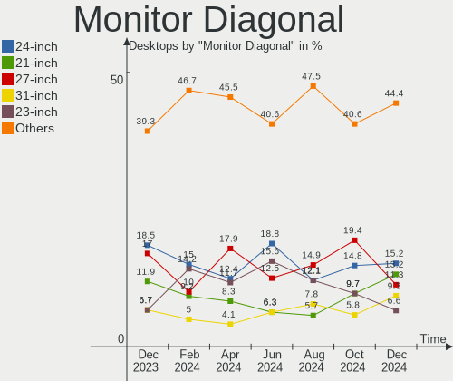
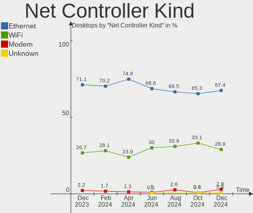
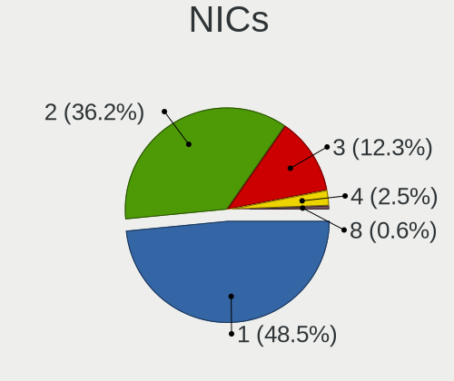

Debian Hardware Trends (Desktops)
---------------------------------

A project to identify most popular hardware characteristics and track their change
over time based on data collected by Debian users at https://Linux-Hardware.org.

Anyone can contribute to this report by the [hw-probe](https://github.com/linuxhw/hw-probe) tool:

    sudo -E hw-probe -all -upload

Full-feature report is available here: https://linux-hardware.org/?view=trends&formfactor=desktop

Period: Jul, 2021.

Contents
--------

* [ System ](#system)
  - [ OS                       ](#os)
  - [ OS Family                ](#os-family)
  - [ Kernel                   ](#kernel)
  - [ Kernel Family            ](#kernel-family)
  - [ Kernel Major Ver.        ](#kernel-major-ver)
  - [ Arch                     ](#arch)
  - [ DE                       ](#de)
  - [ Display Server           ](#display-server)
  - [ Display Manager          ](#display-manager)
  - [ OS Lang                  ](#os-lang)
  - [ Boot Mode                ](#boot-mode)
  - [ Filesystem               ](#filesystem)
  - [ Part. scheme             ](#part-scheme)
  - [ Dual Boot with Linux/BSD ](#dual-boot-with-linuxbsd)
  - [ Dual Boot (Win)          ](#dual-boot-win)

* [ Board ](#board)
  - [ Vendor                   ](#vendor)
  - [ Model                    ](#model)
  - [ Model Family             ](#model-family)
  - [ MFG Year                 ](#mfg-year)
  - [ Form Factor              ](#form-factor)
  - [ Secure Boot              ](#secure-boot)
  - [ Coreboot                 ](#coreboot)
  - [ RAM Size                 ](#ram-size)
  - [ RAM Used                 ](#ram-used)
  - [ Total Drives             ](#total-drives)
  - [ Has CD-ROM               ](#has-cd-rom)
  - [ Has Ethernet             ](#has-ethernet)
  - [ Has WiFi                 ](#has-wifi)
  - [ Has Bluetooth            ](#has-bluetooth)

* [ Location ](#location)
  - [ Country                  ](#country)
  - [ City                     ](#city)

* [ Drives ](#drives)
  - [ Drive Vendor             ](#drive-vendor)
  - [ Drive Model              ](#drive-model)
  - [ HDD Vendor               ](#hdd-vendor)
  - [ SSD Vendor               ](#ssd-vendor)
  - [ Drive Kind               ](#drive-kind)
  - [ Drive Connector          ](#drive-connector)
  - [ Drive Size               ](#drive-size)
  - [ Space Total              ](#space-total)
  - [ Space Used               ](#space-used)
  - [ Malfunc. Drives          ](#malfunc-drives)
  - [ Malfunc. Drive Vendor    ](#malfunc-drive-vendor)
  - [ Malfunc. HDD Vendor      ](#malfunc-hdd-vendor)
  - [ Malfunc. Drive Kind      ](#malfunc-drive-kind)
  - [ Failed Drives            ](#failed-drives)
  - [ Failed Drive Vendor      ](#failed-drive-vendor)
  - [ Drive Status             ](#drive-status)

* [ Storage controller ](#storage-controller)
  - [ Storage Vendor           ](#storage-vendor)
  - [ Storage Model            ](#storage-model)
  - [ Storage Kind             ](#storage-kind)

* [ Processor ](#processor)
  - [ CPU Vendor               ](#cpu-vendor)
  - [ CPU Model                ](#cpu-model)
  - [ CPU Model Family         ](#cpu-model-family)
  - [ CPU Cores                ](#cpu-cores)
  - [ CPU Sockets              ](#cpu-sockets)
  - [ CPU Threads              ](#cpu-threads)
  - [ CPU Op-Modes             ](#cpu-op-modes)
  - [ CPU Microcode            ](#cpu-microcode)
  - [ CPU Microarch            ](#cpu-microarch)

* [ Graphics ](#graphics)
  - [ GPU Vendor               ](#gpu-vendor)
  - [ GPU Model                ](#gpu-model)
  - [ GPU Combo                ](#gpu-combo)
  - [ GPU Driver               ](#gpu-driver)
  - [ GPU Memory               ](#gpu-memory)

* [ Monitor ](#monitor)
  - [ Monitor Vendor           ](#monitor-vendor)
  - [ Monitor Model            ](#monitor-model)
  - [ Monitor Resolution       ](#monitor-resolution)
  - [ Monitor Diagonal         ](#monitor-diagonal)
  - [ Monitor Width            ](#monitor-width)
  - [ Aspect Ratio             ](#aspect-ratio)
  - [ Monitor Area             ](#monitor-area)
  - [ Pixel Density            ](#pixel-density)
  - [ Multiple Monitors        ](#multiple-monitors)

* [ Network ](#network)
  - [ Net Controller Vendor    ](#net-controller-vendor)
  - [ Net Controller Model     ](#net-controller-model)
  - [ Wireless Vendor          ](#wireless-vendor)
  - [ Wireless Model           ](#wireless-model)
  - [ Ethernet Vendor          ](#ethernet-vendor)
  - [ Ethernet Model           ](#ethernet-model)
  - [ Net Controller Kind      ](#net-controller-kind)
  - [ Used Controller          ](#used-controller)
  - [ NICs                     ](#nics)
  - [ IPv6                     ](#ipv6)

* [ Bluetooth ](#bluetooth)
  - [ Bluetooth Vendor         ](#bluetooth-vendor)
  - [ Bluetooth Model          ](#bluetooth-model)

* [ Sound ](#sound)
  - [ Sound Vendor             ](#sound-vendor)
  - [ Sound Model              ](#sound-model)

* [ Memory ](#memory)
  - [ Memory Vendor            ](#memory-vendor)
  - [ Memory Model             ](#memory-model)
  - [ Memory Kind              ](#memory-kind)
  - [ Memory Form Factor       ](#memory-form-factor)
  - [ Memory Size              ](#memory-size)
  - [ Memory Speed             ](#memory-speed)

* [ Printers & scanners ](#printers--scanners)
  - [ Printer Vendor           ](#printer-vendor)
  - [ Printer Model            ](#printer-model)
  - [ Scanner Vendor           ](#scanner-vendor)
  - [ Scanner Model            ](#scanner-model)

* [ Camera ](#camera)
  - [ Camera Vendor            ](#camera-vendor)
  - [ Camera Model             ](#camera-model)

* [ Security ](#security)
  - [ Fingerprint Vendor       ](#fingerprint-vendor)
  - [ Fingerprint Model        ](#fingerprint-model)
  - [ Chipcard Vendor          ](#chipcard-vendor)
  - [ Chipcard Model           ](#chipcard-model)

* [ Unsupported ](#unsupported)
  - [ Unsupported Devices      ](#unsupported-devices)
  - [ Unsupported Device Types ](#unsupported-device-types)

System
------

OS
--

Installed operating systems

| Name           | Desktops | Percent |
|----------------|----------|---------|
| Debian 11      | 107      | 65.24%  |
| Debian 10      | 42       | 25.61%  |
| Debian         | 12       | 7.32%   |
| Debian Testing | 1        | 0.61%   |
| Debian 9.13    | 1        | 0.61%   |
| Debian 9       | 1        | 0.61%   |

OS Family
---------

OS without a version

| Name   | Desktops | Percent |
|--------|----------|---------|
| Debian | 164      | 100%    |

Kernel
------

Version of the Linux kernel

| Version                  | Desktops | Percent |
|--------------------------|----------|---------|
| 5.10.0-8-amd64           | 70       | 42.68%  |
| 5.10.0-7-amd64           | 24       | 14.63%  |
| 4.19.0-17-amd64          | 23       | 14.02%  |
| 5.10.0-2-amd64           | 13       | 7.93%   |
| 5.10.0-0.bpo.7-amd64     | 7        | 4.27%   |
| 5.11.22-1-pve            | 2        | 1.22%   |
| 5.10.0-8-rt-amd64        | 2        | 1.22%   |
| 5.10.0-5mx-amd64         | 2        | 1.22%   |
| 4.19.0-17-686-pae        | 2        | 1.22%   |
| 5.8.16-antix.1-amd64-smp | 1        | 0.61%   |
| 5.6.0-2-amd64            | 1        | 0.61%   |
| 5.4.106-1-pve            | 1        | 0.61%   |
| 5.13.4                   | 1        | 0.61%   |
| 5.13.1a                  | 1        | 0.61%   |
| 5.11.22-2-pve            | 1        | 0.61%   |
| 5.10.47                  | 1        | 0.61%   |
| 5.10.46custom            | 1        | 0.61%   |
| 5.10.38-falcot           | 1        | 0.61%   |
| 5.10.0-8-686-pae         | 1        | 0.61%   |
| 5.10.0-8-686             | 1        | 0.61%   |
| 5.10.0-7-686-pae         | 1        | 0.61%   |
| 5.10.0-3-686-pae         | 1        | 0.61%   |
| 5.10.0-0.bpo.3-amd64     | 1        | 0.61%   |
| 4.19.0-8-amd64           | 1        | 0.61%   |
| 4.19.0-6-amd64           | 1        | 0.61%   |
| 4.19.0-16-amd64          | 1        | 0.61%   |
| 4.19.0-14-amd64          | 1        | 0.61%   |
| 4.15.18-30-pve           | 1        | 0.61%   |

Kernel Family
-------------

Linux kernel without a distro release

| Version | Desktops | Percent |
|---------|----------|---------|
| 5.10.0  | 123      | 75%     |
| 4.19.0  | 29       | 17.68%  |
| 5.11.22 | 3        | 1.83%   |
| 5.8.16  | 1        | 0.61%   |
| 5.6.0   | 1        | 0.61%   |
| 5.4.106 | 1        | 0.61%   |
| 5.13.4  | 1        | 0.61%   |
| 5.13.1  | 1        | 0.61%   |
| 5.10.47 | 1        | 0.61%   |
| 5.10.46 | 1        | 0.61%   |
| 5.10.38 | 1        | 0.61%   |
| 4.15.18 | 1        | 0.61%   |

Kernel Major Ver.
-----------------

Linux kernel major version

| Version | Desktops | Percent |
|---------|----------|---------|
| 5.10    | 126      | 76.83%  |
| 4.19    | 29       | 17.68%  |
| 5.11    | 3        | 1.83%   |
| 5.13    | 2        | 1.22%   |
| 5.8     | 1        | 0.61%   |
| 5.6     | 1        | 0.61%   |
| 5.4     | 1        | 0.61%   |
| 4.15    | 1        | 0.61%   |

Arch
----

OS architecture (x86_64, i586, etc.)

| Name   | Desktops | Percent |
|--------|----------|---------|
| x86_64 | 158      | 96.34%  |
| i686   | 6        | 3.66%   |

DE
--

Desktop Environment

| Name             | Desktops | Percent |
|------------------|----------|---------|
| Unknown          | 43       | 26.22%  |
| GNOME            | 31       | 18.9%   |
| KDE5             | 23       | 14.02%  |
| XFCE             | 18       | 10.98%  |
| MATE             | 14       | 8.54%   |
| LXDE             | 6        | 3.66%   |
| Cinnamon         | 6        | 3.66%   |
| LXQt             | 5        | 3.05%   |
| Trinity          | 4        | 2.44%   |
| i3               | 4        | 2.44%   |
| KDE              | 3        | 1.83%   |
| Openbox          | 2        | 1.22%   |
| lightdm-xsession | 2        | 1.22%   |
| GNOME Flashback  | 2        | 1.22%   |
| sway             | 1        | 0.61%   |

Display Server
--------------

X11 or Wayland

| Name    | Desktops | Percent |
|---------|----------|---------|
| X11     | 99       | 60.37%  |
| Tty     | 26       | 15.85%  |
| Unknown | 21       | 12.8%   |
| Wayland | 18       | 10.98%  |

Display Manager
---------------

SDDM, LightDM, etc.

| Name    | Desktops | Percent |
|---------|----------|---------|
| Unknown | 56       | 34.15%  |
| TDM     | 48       | 29.27%  |
| GDM     | 29       | 17.68%  |
| SDDM    | 22       | 13.41%  |
| LightDM | 5        | 3.05%   |
| SLiM    | 2        | 1.22%   |
| XDM     | 1        | 0.61%   |
| GDM3    | 1        | 0.61%   |

OS Lang
-------

Language

| Lang    | Desktops | Percent |
|---------|----------|---------|
| en_US   | 72       | 43.9%   |
| ru_RU   | 27       | 16.46%  |
| fr_FR   | 10       | 6.1%    |
| en_GB   | 9        | 5.49%   |
| de_DE   | 9        | 5.49%   |
| en_AU   | 5        | 3.05%   |
| Unknown | 4        | 2.44%   |
| pt_BR   | 3        | 1.83%   |
| es_ES   | 3        | 1.83%   |
| en_CA   | 3        | 1.83%   |
| pl_PL   | 2        | 1.22%   |
| nl_BE   | 2        | 1.22%   |
| en_IN   | 2        | 1.22%   |
| uk_UA   | 1        | 0.61%   |
| sv_SE   | 1        | 0.61%   |
| ru_UA   | 1        | 0.61%   |
| pt_PT   | 1        | 0.61%   |
| it_IT   | 1        | 0.61%   |
| hu_HU   | 1        | 0.61%   |
| es_US   | 1        | 0.61%   |
| es_AR   | 1        | 0.61%   |
| en_ZA   | 1        | 0.61%   |
| en_PH   | 1        | 0.61%   |
| en_IE   | 1        | 0.61%   |
| en_HK   | 1        | 0.61%   |
| C       | 1        | 0.61%   |

Boot Mode
---------

EFI or BIOS

| Mode | Desktops | Percent |
|------|----------|---------|
| BIOS | 88       | 53.66%  |
| EFI  | 76       | 46.34%  |

Filesystem
----------

Type of filesystem

| Type    | Desktops | Percent |
|---------|----------|---------|
| Ext4    | 121      | 73.78%  |
| Overlay | 20       | 12.2%   |
| Btrfs   | 12       | 7.32%   |
| Zfs     | 4        | 2.44%   |
| Xfs     | 3        | 1.83%   |
| Ext3    | 3        | 1.83%   |
| Unknown | 1        | 0.61%   |

Part. scheme
------------

Scheme of partitioning

| Type    | Desktops | Percent |
|---------|----------|---------|
| GPT     | 87       | 53.05%  |
| MBR     | 59       | 35.98%  |
| Unknown | 18       | 10.98%  |

Dual Boot with Linux/BSD
------------------------

Hosting more than one Linux/BSD

| Dual boot | Desktops | Percent |
|-----------|----------|---------|
| No        | 124      | 75.61%  |
| Yes       | 40       | 24.39%  |

Dual Boot (Win)
---------------

Hosting Linux and Windows

| Dual boot | Desktops | Percent |
|-----------|----------|---------|
| No        | 111      | 67.68%  |
| Yes       | 53       | 32.32%  |

Board
-----

Vendor
------

Motherboard manufacturer

| Name                | Desktops | Percent |
|---------------------|----------|---------|
| ASUSTek Computer    | 40       | 24.39%  |
| Gigabyte Technology | 29       | 17.68%  |
| ASRock              | 27       | 16.46%  |
| MSI                 | 16       | 9.76%   |
| Hewlett-Packard     | 14       | 8.54%   |
| Dell                | 14       | 8.54%   |
| Intel               | 5        | 3.05%   |
| Lenovo              | 4        | 2.44%   |
| Supermicro          | 3        | 1.83%   |
| Fujitsu             | 3        | 1.83%   |
| Foxconn             | 2        | 1.22%   |
| YANYU               | 1        | 0.61%   |
| Shuttle             | 1        | 0.61%   |
| Protectli           | 1        | 0.61%   |
| Huanan              | 1        | 0.61%   |
| ECS                 | 1        | 0.61%   |
| ASRockRack          | 1        | 0.61%   |
| Acer                | 1        | 0.61%   |

Model
-----

Motherboard model

| Name                                    | Desktops | Percent |
|-----------------------------------------|----------|---------|
| ASUS All Series                         | 5        | 3.05%   |
| Gigabyte B550I AORUS PRO AX             | 3        | 1.83%   |
| Fujitsu ESPRIMO P720                    | 3        | 1.83%   |
| HP Z620 Workstation                     | 2        | 1.22%   |
| Gigabyte H61M-DS2 REV 1.2               | 2        | 1.22%   |
| Gigabyte AB350M-DS3H V2                 | 2        | 1.22%   |
| Dell OptiPlex 760                       | 2        | 1.22%   |
| ASUS PRIME Z370-A                       | 2        | 1.22%   |
| ASUS PRIME B350-PLUS                    | 2        | 1.22%   |
| ASUS PRIME A320M-K                      | 2        | 1.22%   |
| ASRock H470M-HVS                        | 2        | 1.22%   |
| ASRock B450M Pro4                       | 2        | 1.22%   |
| YANYU ITX-M51_D2L baytrail              | 1        | 0.61%   |
| Supermicro X8STi                        | 1        | 0.61%   |
| Supermicro SYS-5038MA-H24TRF            | 1        | 0.61%   |
| Supermicro SYS-5018R-WR                 | 1        | 0.61%   |
| Shuttle SX79R                           | 1        | 0.61%   |
| Protectli FW6                           | 1        | 0.61%   |
| MSI MS-7C94                             | 1        | 0.61%   |
| MSI MS-7C84                             | 1        | 0.61%   |
| MSI MS-7C80                             | 1        | 0.61%   |
| MSI MS-7C75                             | 1        | 0.61%   |
| MSI MS-7C56                             | 1        | 0.61%   |
| MSI MS-7C37                             | 1        | 0.61%   |
| MSI MS-7C35                             | 1        | 0.61%   |
| MSI MS-7B46                             | 1        | 0.61%   |
| MSI MS-7B09                             | 1        | 0.61%   |
| MSI MS-7A38                             | 1        | 0.61%   |
| MSI MS-7995                             | 1        | 0.61%   |
| MSI MS-7924                             | 1        | 0.61%   |
| MSI MS-7759                             | 1        | 0.61%   |
| MSI MS-7721                             | 1        | 0.61%   |
| MSI MS-7562                             | 1        | 0.61%   |
| MSI MS-6712                             | 1        | 0.61%   |
| Lenovo ThinkStation P520 30BFS4H902     | 1        | 0.61%   |
| Lenovo ThinkStation P520 30BFS1BH00     | 1        | 0.61%   |
| Lenovo ThinkCentre M73 10B00005US       | 1        | 0.61%   |
| Lenovo IdeaCentre 510S-08IKL 90GB00E3IN | 1        | 0.61%   |
| Intel DP55WG AAE57269-407               | 1        | 0.61%   |
| Intel DP55WB AAE64798-206               | 1        | 0.61%   |
| Intel DN2800MT AAG23738-600             | 1        | 0.61%   |
| Intel DH77EB AAG39073-304               | 1        | 0.61%   |
| Intel DH55HC AAE70933-504               | 1        | 0.61%   |
| Huanan X99-F8                           | 1        | 0.61%   |
| HP Z840 Workstation                     | 1        | 0.61%   |
| HP ProLiant MicroServer Gen8            | 1        | 0.61%   |
| HP ProLiant MicroServer                 | 1        | 0.61%   |
| HP Pavilion 590-p0069 Desktop Rfrbd PC  | 1        | 0.61%   |
| HP EliteDesk 800 G1 SFF                 | 1        | 0.61%   |
| HP EliteDesk 705 G1 SFF                 | 1        | 0.61%   |
| HP Compaq Elite 8300 CMT                | 1        | 0.61%   |
| HP Compaq dc7700 Convertible Minitower  | 1        | 0.61%   |
| HP Compaq dc7100 SFF(PK859PA)           | 1        | 0.61%   |
| HP Compaq 8200 Elite SFF PC             | 1        | 0.61%   |
| HP 23-q018a                             | 1        | 0.61%   |
| HP 200-010hk                            | 1        | 0.61%   |
| Gigabyte Z97X-UD3H                      | 1        | 0.61%   |
| Gigabyte Z77-D3H                        | 1        | 0.61%   |
| Gigabyte Z390 AORUS ELITE               | 1        | 0.61%   |
| Gigabyte Z170X-GamingG1                 | 1        | 0.61%   |

Model Family
------------

Motherboard model prefix

| Name                         | Desktops | Percent |
|------------------------------|----------|---------|
| ASUS PRIME                   | 18       | 10.98%  |
| Dell OptiPlex                | 9        | 5.49%   |
| ASUS All                     | 5        | 3.05%   |
| HP Compaq                    | 4        | 2.44%   |
| Dell Precision               | 4        | 2.44%   |
| ASUS ROG                     | 4        | 2.44%   |
| Gigabyte B550I               | 3        | 1.83%   |
| Fujitsu ESPRIMO              | 3        | 1.83%   |
| Lenovo ThinkStation          | 2        | 1.22%   |
| HP Z620                      | 2        | 1.22%   |
| HP ProLiant                  | 2        | 1.22%   |
| HP EliteDesk                 | 2        | 1.22%   |
| Gigabyte H61M-DS2            | 2        | 1.22%   |
| Gigabyte B450M               | 2        | 1.22%   |
| Gigabyte AB350M-DS3H         | 2        | 1.22%   |
| ASUS M5A78L-M                | 2        | 1.22%   |
| ASRock Z97                   | 2        | 1.22%   |
| ASRock H470M-HVS             | 2        | 1.22%   |
| ASRock B450M                 | 2        | 1.22%   |
| YANYU ITX-M51                | 1        | 0.61%   |
| Supermicro X8STi             | 1        | 0.61%   |
| Supermicro SYS-5038MA-H24TRF | 1        | 0.61%   |
| Supermicro SYS-5018R-WR      | 1        | 0.61%   |
| Shuttle SX79R                | 1        | 0.61%   |
| Protectli FW6                | 1        | 0.61%   |
| MSI MS-7C94                  | 1        | 0.61%   |
| MSI MS-7C84                  | 1        | 0.61%   |
| MSI MS-7C80                  | 1        | 0.61%   |
| MSI MS-7C75                  | 1        | 0.61%   |
| MSI MS-7C56                  | 1        | 0.61%   |
| MSI MS-7C37                  | 1        | 0.61%   |
| MSI MS-7C35                  | 1        | 0.61%   |
| MSI MS-7B46                  | 1        | 0.61%   |
| MSI MS-7B09                  | 1        | 0.61%   |
| MSI MS-7A38                  | 1        | 0.61%   |
| MSI MS-7995                  | 1        | 0.61%   |
| MSI MS-7924                  | 1        | 0.61%   |
| MSI MS-7759                  | 1        | 0.61%   |
| MSI MS-7721                  | 1        | 0.61%   |
| MSI MS-7562                  | 1        | 0.61%   |
| MSI MS-6712                  | 1        | 0.61%   |
| Lenovo ThinkCentre           | 1        | 0.61%   |
| Lenovo IdeaCentre            | 1        | 0.61%   |
| Intel DP55WG                 | 1        | 0.61%   |
| Intel DP55WB                 | 1        | 0.61%   |
| Intel DN2800MT               | 1        | 0.61%   |
| Intel DH77EB                 | 1        | 0.61%   |
| Intel DH55HC                 | 1        | 0.61%   |
| Huanan X99-F8                | 1        | 0.61%   |
| HP Z840                      | 1        | 0.61%   |
| HP Pavilion                  | 1        | 0.61%   |
| HP 23-q018a                  | 1        | 0.61%   |
| HP 200-010hk                 | 1        | 0.61%   |
| Gigabyte Z97X-UD3H           | 1        | 0.61%   |
| Gigabyte Z77-D3H             | 1        | 0.61%   |
| Gigabyte Z390                | 1        | 0.61%   |
| Gigabyte Z170X-GamingG1      | 1        | 0.61%   |
| Gigabyte Z170M-D3H           | 1        | 0.61%   |
| Gigabyte X570                | 1        | 0.61%   |
| Gigabyte P35C-DS3R           | 1        | 0.61%   |

MFG Year
--------

Motherboard manufacture year

| Year | Desktops | Percent |
|------|----------|---------|
| 2020 | 32       | 19.51%  |
| 2018 | 24       | 14.63%  |
| 2019 | 16       | 9.76%   |
| 2021 | 15       | 9.15%   |
| 2015 | 13       | 7.93%   |
| 2012 | 13       | 7.93%   |
| 2016 | 10       | 6.1%    |
| 2014 | 9        | 5.49%   |
| 2011 | 7        | 4.27%   |
| 2013 | 6        | 3.66%   |
| 2010 | 6        | 3.66%   |
| 2009 | 4        | 2.44%   |
| 2017 | 3        | 1.83%   |
| 2007 | 2        | 1.22%   |
| 2006 | 2        | 1.22%   |
| 2004 | 1        | 0.61%   |
| 2001 | 1        | 0.61%   |

Form Factor
-----------

Physical design of the computer

| Name    | Desktops | Percent |
|---------|----------|---------|
| Desktop | 164      | 100%    |

Secure Boot
-----------

Enabled or disabled

| State    | Desktops | Percent |
|----------|----------|---------|
| Disabled | 161      | 98.17%  |
| Enabled  | 3        | 1.83%   |

Coreboot
--------

Have coreboot on board

| Used | Desktops | Percent |
|------|----------|---------|
| No   | 163      | 99.39%  |
| Yes  | 1        | 0.61%   |

RAM Size
--------

Total RAM memory

| Size in GB      | Desktops | Percent |
|-----------------|----------|---------|
| 16.01-24.0      | 45       | 27.44%  |
| 32.01-64.0      | 29       | 17.68%  |
| 3.01-4.0        | 22       | 13.41%  |
| 8.01-16.0       | 21       | 12.8%   |
| 64.01-256.0     | 18       | 10.98%  |
| 4.01-8.0        | 16       | 9.76%   |
| 24.01-32.0      | 5        | 3.05%   |
| 1.01-2.0        | 4        | 2.44%   |
| 2.01-3.0        | 3        | 1.83%   |
| More than 256.0 | 1        | 0.61%   |

RAM Used
--------

Used RAM memory

| Used GB    | Desktops | Percent |
|------------|----------|---------|
| 0.51-1.0   | 31       | 18.9%   |
| 1.01-2.0   | 27       | 16.46%  |
| 2.01-3.0   | 26       | 15.85%  |
| 3.01-4.0   | 24       | 14.63%  |
| 4.01-8.0   | 23       | 14.02%  |
| 8.01-16.0  | 17       | 10.37%  |
| 0.01-0.5   | 10       | 6.1%    |
| 24.01-32.0 | 3        | 1.83%   |
| 32.01-64.0 | 2        | 1.22%   |
| 16.01-24.0 | 1        | 0.61%   |

Total Drives
------------

Number of drives on board

| Drives | Desktops | Percent |
|--------|----------|---------|
| 1      | 59       | 35.98%  |
| 2      | 44       | 26.83%  |
| 3      | 22       | 13.41%  |
| 4      | 18       | 10.98%  |
| 5      | 11       | 6.71%   |
| 6      | 4        | 2.44%   |
| 9      | 3        | 1.83%   |
| 8      | 2        | 1.22%   |
| 10     | 1        | 0.61%   |

Has CD-ROM
----------

Has CD-ROM on board

| Presented | Desktops | Percent |
|-----------|----------|---------|
| No        | 98       | 59.76%  |
| Yes       | 66       | 40.24%  |

Has Ethernet
------------

Has Ethernet on board

| Presented | Desktops | Percent |
|-----------|----------|---------|
| Yes       | 163      | 99.39%  |
| No        | 1        | 0.61%   |

Has WiFi
--------

Has WiFi module

| Presented | Desktops | Percent |
|-----------|----------|---------|
| No        | 124      | 75.61%  |
| Yes       | 40       | 24.39%  |

Has Bluetooth
-------------

Has Bluetooth module

| Presented | Desktops | Percent |
|-----------|----------|---------|
| No        | 135      | 82.32%  |
| Yes       | 29       | 17.68%  |

Location
--------

Country
-------

Geographic location (country)

| Country                | Desktops | Percent |
|------------------------|----------|---------|
| USA                    | 33       | 20.12%  |
| Russia                 | 31       | 18.9%   |
| Germany                | 14       | 8.54%   |
| France                 | 13       | 7.93%   |
| Ukraine                | 8        | 4.88%   |
| UK                     | 8        | 4.88%   |
| Spain                  | 5        | 3.05%   |
| Brazil                 | 5        | 3.05%   |
| Australia              | 5        | 3.05%   |
| Canada                 | 4        | 2.44%   |
| Mexico                 | 3        | 1.83%   |
| Bulgaria               | 3        | 1.83%   |
| Sweden                 | 2        | 1.22%   |
| Poland                 | 2        | 1.22%   |
| Norway                 | 2        | 1.22%   |
| India                  | 2        | 1.22%   |
| Hungary                | 2        | 1.22%   |
| Finland                | 2        | 1.22%   |
| Belgium                | 2        | 1.22%   |
| Venezuela              | 1        | 0.61%   |
| Syria                  | 1        | 0.61%   |
| South Africa           | 1        | 0.61%   |
| Singapore              | 1        | 0.61%   |
| Serbia                 | 1        | 0.61%   |
| Romania                | 1        | 0.61%   |
| Portugal               | 1        | 0.61%   |
| Netherlands            | 1        | 0.61%   |
| Morocco                | 1        | 0.61%   |
| Madagascar             | 1        | 0.61%   |
| Italy                  | 1        | 0.61%   |
| Hong Kong              | 1        | 0.61%   |
| Greece                 | 1        | 0.61%   |
| Ecuador                | 1        | 0.61%   |
| Czechia                | 1        | 0.61%   |
| Bosnia and Herzegovina | 1        | 0.61%   |
| Austria                | 1        | 0.61%   |
| Argentina              | 1        | 0.61%   |

City
----

Geographic location (city)

| City            | Desktops | Percent |
|-----------------|----------|---------|
| Voronezh        | 12       | 7.32%   |
| Ocala           | 4        | 2.44%   |
| Lyon            | 4        | 2.44%   |
| Sofia           | 3        | 1.83%   |
| Kalamazoo       | 3        | 1.83%   |
| Ensenada        | 3        | 1.83%   |
| Westborough     | 2        | 1.22%   |
| Vancouver       | 2        | 1.22%   |
| St Petersburg   | 2        | 1.22%   |
| Saint-Denis     | 2        | 1.22%   |
| Perm            | 2        | 1.22%   |
| Osnabr??ck      | 2        | 1.22%   |
| Moscow          | 2        | 1.22%   |
| London          | 2        | 1.22%   |
| Kyiv            | 2        | 1.22%   |
| Kharkiv         | 2        | 1.22%   |
| Bristol         | 2        | 1.22%   |
| Athens          | 2        | 1.22%   |
| Érd            | 1        | 0.61%   |
| Yekaterinburg   | 1        | 0.61%   |
| Woolloongabba   | 1        | 0.61%   |
| Woodstock       | 1        | 0.61%   |
| Wenatchee       | 1        | 0.61%   |
| Waregem         | 1        | 0.61%   |
| Voerde          | 1        | 0.61%   |
| Vladimir        | 1        | 0.61%   |
| Vienna          | 1        | 0.61%   |
| Vaasa           | 1        | 0.61%   |
| Ulyanovsk       | 1        | 0.61%   |
| Ufa             | 1        | 0.61%   |
| Tétouan        | 1        | 0.61%   |
| Turku           | 1        | 0.61%   |
| Tai Kok Tsui    | 1        | 0.61%   |
| Sydney          | 1        | 0.61%   |
| Sun City Center | 1        | 0.61%   |
| Stroud          | 1        | 0.61%   |
| Strasbourg      | 1        | 0.61%   |
| Stockholm       | 1        | 0.61%   |
| Stockelsdorf    | 1        | 0.61%   |
| Stavanger       | 1        | 0.61%   |
| Sosnowiec       | 1        | 0.61%   |
| Singapore       | 1        | 0.61%   |
| Saratov         | 1        | 0.61%   |
| Sarajevo        | 1        | 0.61%   |
| Roubaix         | 1        | 0.61%   |
| Rooty Hill      | 1        | 0.61%   |
| Pskov           | 1        | 0.61%   |
| Prague          | 1        | 0.61%   |
| Phoenix         | 1        | 0.61%   |
| Pforzheim       | 1        | 0.61%   |
| Perpignan       | 1        | 0.61%   |
| Paris           | 1        | 0.61%   |
| Overland Park   | 1        | 0.61%   |
| Orlando         | 1        | 0.61%   |
| Omsk            | 1        | 0.61%   |
| Oleksandrivka   | 1        | 0.61%   |
| Oldham          | 1        | 0.61%   |
| Novi Sad        | 1        | 0.61%   |
| Noblesville     | 1        | 0.61%   |
| New Orleans     | 1        | 0.61%   |

Drives
------

Drive Vendor
------------

Hard drive vendors

| Vendor              | Desktops | Drives | Percent |
|---------------------|----------|--------|---------|
| WDC                 | 62       | 102    | 21.53%  |
| Seagate             | 45       | 79     | 15.63%  |
| Samsung Electronics | 42       | 62     | 14.58%  |
| Crucial             | 24       | 27     | 8.33%   |
| Toshiba             | 20       | 35     | 6.94%   |
| Kingston            | 17       | 19     | 5.9%    |
| SanDisk             | 11       | 16     | 3.82%   |
| HGST                | 9        | 13     | 3.13%   |
| Hitachi             | 8        | 10     | 2.78%   |
| Intel               | 7        | 8      | 2.43%   |
| SPCC                | 4        | 4      | 1.39%   |
| PNY                 | 4        | 4      | 1.39%   |
| Phison              | 3        | 3      | 1.04%   |
| China               | 3        | 3      | 1.04%   |
| A-DATA Technology   | 3        | 5      | 1.04%   |
| Unknown             | 2        | 2      | 0.69%   |
| Netac               | 2        | 2      | 0.69%   |
| MAXTOR              | 2        | 2      | 0.69%   |
| Gigabyte Technology | 2        | 2      | 0.69%   |
| Corsair             | 2        | 2      | 0.69%   |
| Xinhaike            | 1        | 1      | 0.35%   |
| Transcend           | 1        | 2      | 0.35%   |
| Team                | 1        | 1      | 0.35%   |
| SK Hynix            | 1        | 2      | 0.35%   |
| PLEXTOR             | 1        | 1      | 0.35%   |
| Patriot             | 1        | 1      | 0.35%   |
| OCZ                 | 1        | 1      | 0.35%   |
| MaxDigital          | 1        | 2      | 0.35%   |
| Lexar               | 1        | 1      | 0.35%   |
| KingDian            | 1        | 1      | 0.35%   |
| Intenso             | 1        | 1      | 0.35%   |
| InnoDisk            | 1        | 1      | 0.35%   |
| GLOWAY              | 1        | 1      | 0.35%   |
| DOGFISH             | 1        | 1      | 0.35%   |
| Apple               | 1        | 1      | 0.35%   |
| 2-Power             | 1        | 1      | 0.35%   |

Drive Model
-----------

Hard drive models

| Model                             | Desktops | Percent |
|-----------------------------------|----------|---------|
| Samsung SSD 860 EVO 1TB           | 8        | 2.26%   |
| Toshiba HDWD110 1TB               | 5        | 1.41%   |
| Seagate ST500DM002-1BD142 500GB   | 5        | 1.41%   |
| Samsung SSD 970 EVO Plus 500GB    | 5        | 1.41%   |
| Toshiba DT01ACA200 2TB            | 4        | 1.13%   |
| Seagate ST4000DM004-2CV104 4TB    | 4        | 1.13%   |
| Seagate ST1000DM010-2EP102 1TB    | 4        | 1.13%   |
| Samsung SSD 850 EVO 500GB         | 4        | 1.13%   |
| Crucial CT500MX500SSD1 500GB      | 4        | 1.13%   |
| Crucial CT240BX500SSD1 240GB      | 4        | 1.13%   |
| WDC WDS120G2G0A-00JH30 120GB SSD  | 3        | 0.85%   |
| WDC WD20EFRX-68EUZN0 2TB          | 3        | 0.85%   |
| WDC WD10EZEX-08WN4A0 1TB          | 3        | 0.85%   |
| Seagate ST2000DM008-2FR102 2TB    | 3        | 0.85%   |
| Seagate ST2000DM006-2DM164 2TB    | 3        | 0.85%   |
| Seagate ST2000DM001-1ER164 2TB    | 3        | 0.85%   |
| Samsung SSD 970 EVO Plus 1TB      | 3        | 0.85%   |
| Samsung SSD 860 EVO 500GB         | 3        | 0.85%   |
| Samsung SSD 850 EVO 250GB         | 3        | 0.85%   |
| Kingston SA400S37120G 120GB SSD   | 3        | 0.85%   |
| Hitachi HUS724040ALE641 4TB       | 3        | 0.85%   |
| Crucial CT250MX500SSD1 250GB      | 3        | 0.85%   |
| WDC WDS500G2B0C-00PXH0 500GB      | 2        | 0.56%   |
| WDC WDS500G2B0A-00SM50 500GB SSD  | 2        | 0.56%   |
| WDC WDS250G2B0A-00SM50 250GB SSD  | 2        | 0.56%   |
| WDC WD40EFZX-68AWUN0 4TB          | 2        | 0.56%   |
| WDC WD20EZAZ-00GGJB0 2TB          | 2        | 0.56%   |
| WDC WD2002FAEX-007BA0 2TB         | 2        | 0.56%   |
| WDC WD10EFRX-68FYTN0 1TB          | 2        | 0.56%   |
| WDC WD1003FZEX-00MK2A0 1TB        | 2        | 0.56%   |
| WDC WD1002FAEX-00Z3A0 1TB         | 2        | 0.56%   |
| Toshiba DT01ACA300 3TB            | 2        | 0.56%   |
| Toshiba DT01ACA050 500GB          | 2        | 0.56%   |
| SPCC M.2 PCIe SSD 1TB             | 2        | 0.56%   |
| Seagate ST3160815AS 160GB         | 2        | 0.56%   |
| Seagate ST31000524AS 1TB          | 2        | 0.56%   |
| Seagate ST3000DM001-1CH166 3TB    | 2        | 0.56%   |
| Seagate Backup+ Hub BK 4TB        | 2        | 0.56%   |
| SanDisk SDSSDH3 500G              | 2        | 0.56%   |
| SanDisk SD9TB8W512G1001 512GB SSD | 2        | 0.56%   |
| SanDisk SD9TB8W1T001001 1TB SSD   | 2        | 0.56%   |
| Sandisk NVMe SSD Drive 1TB        | 2        | 0.56%   |
| Samsung SSD 870 EVO 500GB         | 2        | 0.56%   |
| Samsung SSD 860 EVO 2TB           | 2        | 0.56%   |
| Samsung SSD 860 EVO 250GB         | 2        | 0.56%   |
| Netac SSD 240GB                   | 2        | 0.56%   |
| Kingston SV300S37A240G 240GB SSD  | 2        | 0.56%   |
| Kingston SV300S37A120G 120GB SSD  | 2        | 0.56%   |
| Kingston SUV500240G 240GB SSD     | 2        | 0.56%   |
| Kingston SA400S37480G 480GB SSD   | 2        | 0.56%   |
| Intel SSDPEKNW010T9 1TB           | 2        | 0.56%   |
| China SSD 120GB                   | 2        | 0.56%   |
| Xinhaike SSD 120GB                | 1        | 0.28%   |
| WDC WUH721414ALE6L4 14TB          | 1        | 0.28%   |
| WDC WDS500G3X0C-00SJG0 500GB      | 1        | 0.28%   |
| WDC WDS500G2B0B-00YS70 500GB SSD  | 1        | 0.28%   |
| WDC WDS500G1R0A-68A4W0 500GB SSD  | 1        | 0.28%   |
| WDC WDS500G1B0C-00S6U0 500GB      | 1        | 0.28%   |
| WDC WDS480G2G0B-00EPW0 480GB SSD  | 1        | 0.28%   |
| WDC WDS250G1B0A-00H9H0 250GB SSD  | 1        | 0.28%   |

HDD Vendor
----------

Hard disk drive vendors

| Vendor              | Desktops | Drives | Percent |
|---------------------|----------|--------|---------|
| WDC                 | 49       | 80     | 35%     |
| Seagate             | 43       | 67     | 30.71%  |
| Toshiba             | 19       | 34     | 13.57%  |
| HGST                | 9        | 13     | 6.43%   |
| Samsung Electronics | 8        | 9      | 5.71%   |
| Hitachi             | 8        | 10     | 5.71%   |
| MAXTOR              | 2        | 2      | 1.43%   |
| MaxDigital          | 1        | 2      | 0.71%   |
| InnoDisk            | 1        | 1      | 0.71%   |

SSD Vendor
----------

Solid state drive vendors

| Vendor              | Desktops | Drives | Percent |
|---------------------|----------|--------|---------|
| Samsung Electronics | 26       | 35     | 22.22%  |
| Crucial             | 21       | 24     | 17.95%  |
| Kingston            | 15       | 17     | 12.82%  |
| WDC                 | 14       | 15     | 11.97%  |
| SanDisk             | 8        | 13     | 6.84%   |
| PNY                 | 3        | 3      | 2.56%   |
| Intel               | 3        | 4      | 2.56%   |
| China               | 3        | 3      | 2.56%   |
| A-DATA Technology   | 3        | 4      | 2.56%   |
| SPCC                | 2        | 2      | 1.71%   |
| Netac               | 2        | 2      | 1.71%   |
| Xinhaike            | 1        | 1      | 0.85%   |
| Unknown             | 1        | 1      | 0.85%   |
| Transcend           | 1        | 2      | 0.85%   |
| Toshiba             | 1        | 1      | 0.85%   |
| Team                | 1        | 1      | 0.85%   |
| Seagate             | 1        | 1      | 0.85%   |
| PLEXTOR             | 1        | 1      | 0.85%   |
| Patriot             | 1        | 1      | 0.85%   |
| OCZ                 | 1        | 1      | 0.85%   |
| Lexar               | 1        | 1      | 0.85%   |
| KingDian            | 1        | 1      | 0.85%   |
| Intenso             | 1        | 1      | 0.85%   |
| GLOWAY              | 1        | 1      | 0.85%   |
| Gigabyte Technology | 1        | 1      | 0.85%   |
| DOGFISH             | 1        | 1      | 0.85%   |
| Apple               | 1        | 1      | 0.85%   |
| 2-Power             | 1        | 1      | 0.85%   |

Drive Kind
----------

HDD or SSD

| Kind    | Desktops | Drives | Percent |
|---------|----------|--------|---------|
| HDD     | 117      | 218    | 43.82%  |
| SSD     | 104      | 140    | 38.95%  |
| NVMe    | 41       | 49     | 15.36%  |
| Unknown | 5        | 12     | 1.87%   |

Drive Connector
---------------

SATA, SAS, NVMe, etc.

| Type | Desktops | Drives | Percent |
|------|----------|--------|---------|
| SATA | 156      | 355    | 76.1%   |
| NVMe | 41       | 49     | 20%     |
| SAS  | 8        | 15     | 3.9%    |

Drive Size
----------

Size of hard drive

| Size in TB | Desktops | Drives | Percent |
|------------|----------|--------|---------|
| 0.01-0.5   | 112      | 156    | 47.46%  |
| 0.51-1.0   | 59       | 81     | 25%     |
| 1.01-2.0   | 34       | 52     | 14.41%  |
| 3.01-4.0   | 13       | 32     | 5.51%   |
| 2.01-3.0   | 9        | 16     | 3.81%   |
| 4.01-10.0  | 7        | 18     | 2.97%   |
| 10.01-20.0 | 2        | 3      | 0.85%   |

Space Total
-----------

Amount of disk space available on the file system

| Size in GB     | Desktops | Percent |
|----------------|----------|---------|
| More than 3000 | 33       | 20.12%  |
| 251-500        | 22       | 13.41%  |
| 1001-2000      | 21       | 12.8%   |
| Unknown        | 19       | 11.59%  |
| 501-1000       | 17       | 10.37%  |
| 101-250        | 15       | 9.15%   |
| 1-20           | 14       | 8.54%   |
| 2001-3000      | 10       | 6.1%    |
| 51-100         | 8        | 4.88%   |
| 21-50          | 5        | 3.05%   |

Space Used
----------

Amount of used disk space

| Used GB        | Desktops | Percent |
|----------------|----------|---------|
| 1-20           | 43       | 26.22%  |
| Unknown        | 19       | 11.59%  |
| 101-250        | 17       | 10.37%  |
| 1001-2000      | 16       | 9.76%   |
| 251-500        | 13       | 7.93%   |
| 501-1000       | 13       | 7.93%   |
| 51-100         | 13       | 7.93%   |
| More than 3000 | 12       | 7.32%   |
| 21-50          | 10       | 6.1%    |
| 2001-3000      | 7        | 4.27%   |
| 0              | 1        | 0.61%   |

Malfunc. Drives
---------------

Drive models with a malfunction

| Model                                 | Desktops | Drives | Percent |
|---------------------------------------|----------|--------|---------|
| Seagate ST500DM002-1BD142 500GB       | 4        | 4      | 9.76%   |
| WDC WD20EFRX-68EUZN0 2TB              | 2        | 4      | 4.88%   |
| WDC WD5003ABYX-18WERA0 500GB          | 1        | 2      | 2.44%   |
| WDC WD5000HHTZ-04N21V0 500GB          | 1        | 1      | 2.44%   |
| WDC WD5000AAKX-08U6AA0 500GB          | 1        | 1      | 2.44%   |
| WDC WD5000AAKS-22V1A0 500GB           | 1        | 1      | 2.44%   |
| WDC WD5000AAJS-22A8B0 500GB           | 1        | 1      | 2.44%   |
| WDC WD40EFZX-68AWUN0 4TB              | 1        | 6      | 2.44%   |
| WDC WD400BB-00DEA0 40GB               | 1        | 1      | 2.44%   |
| WDC WD20EARS-00MVWB0 2TB              | 1        | 1      | 2.44%   |
| WDC WD2002FAEX-007BA0 2TB             | 1        | 1      | 2.44%   |
| WDC WD1600AAJS-00L7A0 160GB           | 1        | 1      | 2.44%   |
| WDC WD10JPVX-60JC3T0 1TB              | 1        | 1      | 2.44%   |
| WDC WD10EZEX-08WN4A0 1TB              | 1        | 1      | 2.44%   |
| WDC WD10EALX-009BA0 1TB               | 1        | 1      | 2.44%   |
| WDC WD1002FAEX-00Z3A0 1TB             | 1        | 1      | 2.44%   |
| Toshiba MK2565GSX 250GB               | 1        | 1      | 2.44%   |
| Toshiba DT01ACA050 500GB              | 1        | 1      | 2.44%   |
| SK Hynix PC401 NVMe 512GB             | 1        | 2      | 2.44%   |
| Seagate ST3200827AS 200GB             | 1        | 1      | 2.44%   |
| Seagate ST32000542AS 2TB              | 1        | 1      | 2.44%   |
| Seagate ST3120827AS 120GB             | 1        | 1      | 2.44%   |
| Seagate ST31000333AS 1TB              | 1        | 1      | 2.44%   |
| Seagate ST3000DM001-9YN166 3TB        | 1        | 1      | 2.44%   |
| Seagate ST250DM000-1BD141 250GB       | 1        | 1      | 2.44%   |
| SanDisk SSD PLUS 120 GB               | 1        | 1      | 2.44%   |
| SanDisk SDSSDX480GG25 480GB           | 1        | 1      | 2.44%   |
| Samsung Electronics SSD 970 EVO 250GB | 1        | 1      | 2.44%   |
| Samsung Electronics SP2014N 200GB     | 1        | 1      | 2.44%   |
| Samsung Electronics HD161GJ 160GB     | 1        | 1      | 2.44%   |
| Samsung Electronics HD103SI 1TB       | 1        | 1      | 2.44%   |
| PNY SSD2SC240G3LC709B121-460P 240GB   | 1        | 1      | 2.44%   |
| PLEXTOR PX-128M2S 128GB SSD           | 1        | 1      | 2.44%   |
| Kingston SV300S37A120G 120GB SSD      | 1        | 1      | 2.44%   |
| KingDian S280 240GB                   | 1        | 1      | 2.44%   |
| HGST TOURO S 1TB                      | 1        | 1      | 2.44%   |
| A-DATA Technology SU800 256GB SSD     | 1        | 2      | 2.44%   |

Malfunc. Drive Vendor
---------------------

Vendors of faulty drives

| Vendor              | Desktops | Drives | Percent |
|---------------------|----------|--------|---------|
| WDC                 | 15       | 24     | 38.46%  |
| Seagate             | 9        | 10     | 23.08%  |
| Samsung Electronics | 4        | 4      | 10.26%  |
| Toshiba             | 2        | 2      | 5.13%   |
| SanDisk             | 2        | 2      | 5.13%   |
| SK Hynix            | 1        | 2      | 2.56%   |
| PNY                 | 1        | 1      | 2.56%   |
| PLEXTOR             | 1        | 1      | 2.56%   |
| Kingston            | 1        | 1      | 2.56%   |
| KingDian            | 1        | 1      | 2.56%   |
| HGST                | 1        | 1      | 2.56%   |
| A-DATA Technology   | 1        | 2      | 2.56%   |

Malfunc. HDD Vendor
-------------------

Vendors of faulty HDD drives

| Vendor              | Desktops | Drives | Percent |
|---------------------|----------|--------|---------|
| WDC                 | 15       | 24     | 50%     |
| Seagate             | 9        | 10     | 30%     |
| Samsung Electronics | 3        | 3      | 10%     |
| Toshiba             | 2        | 2      | 6.67%   |
| HGST                | 1        | 1      | 3.33%   |

Malfunc. Drive Kind
-------------------

Kinds of faulty drives

| Kind | Desktops | Drives | Percent |
|------|----------|--------|---------|
| HDD  | 29       | 40     | 76.32%  |
| SSD  | 7        | 8      | 18.42%  |
| NVMe | 2        | 3      | 5.26%   |

Failed Drives
-------------

Failed drive models

Zero info for selected period =(

Failed Drive Vendor
-------------------

Failed drive vendors

Zero info for selected period =(

Drive Status
------------

Number of failed and malfunc. drives

| Status   | Desktops | Drives | Percent |
|----------|----------|--------|---------|
| Works    | 136      | 314    | 70.1%   |
| Malfunc  | 36       | 51     | 18.56%  |
| Detected | 22       | 54     | 11.34%  |

Storage controller
------------------

Storage Vendor
--------------

Storage controller vendors

| Vendor                      | Desktops | Percent |
|-----------------------------|----------|---------|
| Intel                       | 107      | 47.35%  |
| AMD                         | 55       | 24.34%  |
| Samsung Electronics         | 17       | 7.52%   |
| ASMedia Technology          | 10       | 4.42%   |
| Sandisk                     | 8        | 3.54%   |
| Phison Electronics          | 8        | 3.54%   |
| Marvell Technology Group    | 4        | 1.77%   |
| Micron/Crucial Technology   | 3        | 1.33%   |
| Nvidia                      | 2        | 0.88%   |
| Kingston Technology Company | 2        | 0.88%   |
| JMicron Technology          | 2        | 0.88%   |
| Broadcom / LSI              | 2        | 0.88%   |
| VIA Technologies            | 1        | 0.44%   |
| SK Hynix                    | 1        | 0.44%   |
| Silicon Image               | 1        | 0.44%   |
| Seagate Technology          | 1        | 0.44%   |
| ADATA Technology            | 1        | 0.44%   |
| Adaptec                     | 1        | 0.44%   |

Storage Model
-------------

Storage controller models

| Model                                                                                   | Desktops | Percent |
|-----------------------------------------------------------------------------------------|----------|---------|
| AMD FCH SATA Controller [AHCI mode]                                                     | 36       | 12.5%   |
| Intel 8 Series/C220 Series Chipset Family 6-port SATA Controller 1 [AHCI mode]          | 14       | 4.86%   |
| Samsung NVMe SSD Controller SM981/PM981/PM983                                           | 13       | 4.51%   |
| Intel 200 Series PCH SATA controller [AHCI mode]                                        | 11       | 3.82%   |
| AMD 400 Series Chipset SATA Controller                                                  | 11       | 3.82%   |
| Intel Q170/Q150/B150/H170/H110/Z170/CM236 Chipset SATA Controller [AHCI Mode]           | 9        | 3.13%   |
| ASMedia ASM1062 Serial ATA Controller                                                   | 9        | 3.13%   |
| AMD Starship/Matisse Chipset SATA Controller [AHCI mode]                                | 7        | 2.43%   |
| Phison E12 NVMe Controller                                                              | 6        | 2.08%   |
| Intel Comet Lake SATA AHCI Controller                                                   | 6        | 2.08%   |
| Intel 6 Series/C200 Series Chipset Family Desktop SATA Controller (IDE mode, ports 4-5) | 6        | 2.08%   |
| Intel 6 Series/C200 Series Chipset Family Desktop SATA Controller (IDE mode, ports 0-3) | 6        | 2.08%   |
| Intel 6 Series/C200 Series Chipset Family 6 port Desktop SATA AHCI Controller           | 6        | 2.08%   |
| AMD SB7x0/SB8x0/SB9x0 SATA Controller [AHCI mode]                                       | 6        | 2.08%   |
| AMD 300 Series Chipset SATA Controller                                                  | 6        | 2.08%   |
| Sandisk WD Blue SN550 NVMe SSD                                                          | 5        | 1.74%   |
| Intel 9 Series Chipset Family SATA Controller [AHCI Mode]                               | 5        | 1.74%   |
| AMD SB7x0/SB8x0/SB9x0 IDE Controller                                                    | 5        | 1.74%   |
| Intel SATA Controller [RAID mode]                                                       | 4        | 1.39%   |
| Intel C600/X79 series chipset SATA RAID Controller                                      | 4        | 1.39%   |
| Intel 7 Series/C210 Series Chipset Family 6-port SATA Controller [AHCI mode]            | 4        | 1.39%   |
| AMD FCH SATA Controller D                                                               | 4        | 1.39%   |
| Samsung NVMe SSD Controller SM961/PM961/SM963                                           | 3        | 1.04%   |
| Marvell Group 88SE9215 PCIe 2.0 x1 4-port SATA 6 Gb/s Controller                        | 3        | 1.04%   |
| Intel C610/X99 series chipset 6-Port SATA Controller [AHCI mode]                        | 3        | 1.04%   |
| Intel 82801JD/DO (ICH10 Family) SATA AHCI Controller                                    | 3        | 1.04%   |
| Intel 8 Series/C220 Series Chipset Family 4-port SATA Controller 1 [IDE mode]           | 3        | 1.04%   |
| Intel 4 Series Chipset PT IDER Controller                                               | 3        | 1.04%   |
| Nvidia MCP61 SATA Controller                                                            | 2        | 0.69%   |
| Nvidia MCP61 IDE                                                                        | 2        | 0.69%   |
| Micron/Crucial P1 NVMe PCIe SSD                                                         | 2        | 0.69%   |
| Kingston Company A2000 NVMe SSD                                                         | 2        | 0.69%   |
| Intel Non-Volatile memory controller                                                    | 2        | 0.69%   |
| Intel NM10/ICH7 Family SATA Controller [AHCI mode]                                      | 2        | 0.69%   |
| Intel Celeron/Pentium Silver Processor SATA Controller                                  | 2        | 0.69%   |
| Intel Cannon Lake PCH SATA AHCI Controller                                              | 2        | 0.69%   |
| Intel C610/X99 series chipset sSATA Controller [AHCI mode]                              | 2        | 0.69%   |
| Intel C602 chipset 4-Port SATA Storage Control Unit                                     | 2        | 0.69%   |
| Intel C600/X79 series chipset IDE-r Controller                                          | 2        | 0.69%   |
| Intel C600/X79 series chipset 6-Port SATA AHCI Controller                               | 2        | 0.69%   |
| Intel 82801G (ICH7 Family) IDE Controller                                               | 2        | 0.69%   |
| Intel 82801FB/FW (ICH6/ICH6W) SATA Controller                                           | 2        | 0.69%   |
| Intel 82801FB/FBM/FR/FW/FRW (ICH6 Family) IDE Controller                                | 2        | 0.69%   |
| Intel 5 Series/3400 Series Chipset PT IDER Controller                                   | 2        | 0.69%   |
| Intel 5 Series/3400 Series Chipset 4 port SATA IDE Controller                           | 2        | 0.69%   |
| Intel 5 Series/3400 Series Chipset 2 port SATA IDE Controller                           | 2        | 0.69%   |
| Intel 400 Series Chipset Family SATA AHCI Controller                                    | 2        | 0.69%   |
| AMD SB7x0/SB8x0/SB9x0 SATA Controller [IDE mode]                                        | 2        | 0.69%   |
| VIA VT82C586A/B/VT82C686/A/B/VT823x/A/C PIPC Bus Master IDE                             | 1        | 0.35%   |
| SK Hynix PC401 NVMe Solid State Drive 256GB                                             | 1        | 0.35%   |
| Silicon Image SiI 3512 [SATALink/SATARaid] Serial ATA Controller                        | 1        | 0.35%   |
| Seagate FireCuda 510 SSD                                                                | 1        | 0.35%   |
| Sandisk WD Blue SN500 / PC SN520 NVMe SSD                                               | 1        | 0.35%   |
| Sandisk WD Black SN850                                                                  | 1        | 0.35%   |
| Sandisk WD Black SN750 / PC SN730 NVMe SSD                                              | 1        | 0.35%   |
| Samsung NVMe SSD Controller PM9A1/PM9A3/980PRO                                          | 1        | 0.35%   |
| Samsung NVMe Controller                                                                 | 1        | 0.35%   |
| Phison E7 NVMe Controller                                                               | 1        | 0.35%   |
| Phison E16 PCIe4 NVMe Controller                                                        | 1        | 0.35%   |
| Micron/Crucial P2 NVMe PCIe SSD                                                         | 1        | 0.35%   |

Storage Kind
------------

Kind of storage controller (IDE, SATA, NVMe, SAS, ...)

| Kind | Desktops | Percent |
|------|----------|---------|
| SATA | 136      | 59.39%  |
| NVMe | 41       | 17.9%   |
| IDE  | 36       | 15.72%  |
| RAID | 11       | 4.8%    |
| SAS  | 5        | 2.18%   |

Processor
---------

CPU Vendor
----------

Processor vendors

| Vendor | Desktops | Percent |
|--------|----------|---------|
| Intel  | 107      | 65.24%  |
| AMD    | 57       | 34.76%  |

CPU Model
---------

Processor models

| Model                                       | Desktops | Percent |
|---------------------------------------------|----------|---------|
| AMD Ryzen 5 3600 6-Core Processor           | 5        | 3.05%   |
| AMD Ryzen 5 5600X 6-Core Processor          | 4        | 2.44%   |
| Intel Core i7-6700K CPU @ 4.00GHz           | 3        | 1.83%   |
| Intel Core i7-10700 CPU @ 2.90GHz           | 3        | 1.83%   |
| Intel Core i5-4570 CPU @ 3.20GHz            | 3        | 1.83%   |
| Intel Core i3-4130 CPU @ 3.40GHz            | 3        | 1.83%   |
| AMD Ryzen 9 3900X 12-Core Processor         | 3        | 1.83%   |
| AMD Ryzen 7 5800X 8-Core Processor          | 3        | 1.83%   |
| AMD Ryzen 7 3700X 8-Core Processor          | 3        | 1.83%   |
| Intel Xeon W-2133 CPU @ 3.60GHz             | 2        | 1.22%   |
| Intel Xeon CPU E5-2699 v4 @ 2.20GHz         | 2        | 1.22%   |
| Intel Pentium Gold G5420 CPU @ 3.80GHz      | 2        | 1.22%   |
| Intel Pentium CPU G620 @ 2.60GHz            | 2        | 1.22%   |
| Intel Pentium 4 CPU 2.80GHz                 | 2        | 1.22%   |
| Intel Core i7-7700 CPU @ 3.60GHz            | 2        | 1.22%   |
| Intel Core i7-3770 CPU @ 3.40GHz            | 2        | 1.22%   |
| Intel Core i7-10700K CPU @ 3.80GHz          | 2        | 1.22%   |
| Intel Core i5-2500K CPU @ 3.30GHz           | 2        | 1.22%   |
| Intel Core i5 CPU 650 @ 3.20GHz             | 2        | 1.22%   |
| Intel Core i3-7100 CPU @ 3.90GHz            | 2        | 1.22%   |
| Intel Core i3-2120 CPU @ 3.30GHz            | 2        | 1.22%   |
| Intel Core i3-10100 CPU @ 3.60GHz           | 2        | 1.22%   |
| Intel Core 2 Duo CPU E8400 @ 3.00GHz        | 2        | 1.22%   |
| AMD Ryzen 7 3800X 8-Core Processor          | 2        | 1.22%   |
| AMD Ryzen 7 1700 Eight-Core Processor       | 2        | 1.22%   |
| AMD Ryzen 5 3600X 6-Core Processor          | 2        | 1.22%   |
| AMD Ryzen 5 3350G with Radeon Vega Graphics | 2        | 1.22%   |
| AMD Ryzen 5 2400G with Radeon Vega Graphics | 2        | 1.22%   |
| Intel Xeon W-2145 CPU @ 3.70GHz             | 1        | 0.61%   |
| Intel Xeon CPU W3530 @ 2.80GHz              | 1        | 0.61%   |
| Intel Xeon CPU W3503 @ 2.40GHz              | 1        | 0.61%   |
| Intel Xeon CPU E5-2697 v3 @ 2.60GHz         | 1        | 0.61%   |
| Intel Xeon CPU E5-2678 v3 @ 2.50GHz         | 1        | 0.61%   |
| Intel Xeon CPU E5-2660 0 @ 2.20GHz          | 1        | 0.61%   |
| Intel Xeon CPU E5-2630 0 @ 2.30GHz          | 1        | 0.61%   |
| Intel Xeon CPU E5-1650 0 @ 3.20GHz          | 1        | 0.61%   |
| Intel Pentium CPU N3700 @ 1.60GHz           | 1        | 0.61%   |
| Intel Pentium CPU G3420 @ 3.20GHz           | 1        | 0.61%   |
| Intel Pentium CPU G3250 @ 3.20GHz           | 1        | 0.61%   |
| Intel Pentium CPU G2030 @ 3.00GHz           | 1        | 0.61%   |
| Intel Core i9-9900K CPU @ 3.60GHz           | 1        | 0.61%   |
| Intel Core i7-9700K CPU @ 3.60GHz           | 1        | 0.61%   |
| Intel Core i7-8700 CPU @ 3.20GHz            | 1        | 0.61%   |
| Intel Core i7-8086K CPU @ 4.00GHz           | 1        | 0.61%   |
| Intel Core i7-4820K CPU @ 3.70GHz           | 1        | 0.61%   |
| Intel Core i7-4790S CPU @ 3.20GHz           | 1        | 0.61%   |
| Intel Core i7-4790K CPU @ 4.00GHz           | 1        | 0.61%   |
| Intel Core i7-4790 CPU @ 3.60GHz            | 1        | 0.61%   |
| Intel Core i7-4770 CPU @ 3.40GHz            | 1        | 0.61%   |
| Intel Core i7-2700K CPU @ 3.50GHz           | 1        | 0.61%   |
| Intel Core i7 CPU 860 @ 2.80GHz             | 1        | 0.61%   |
| Intel Core i5-9600K CPU @ 3.70GHz           | 1        | 0.61%   |
| Intel Core i5-9400F CPU @ 2.90GHz           | 1        | 0.61%   |
| Intel Core i5-7500 CPU @ 3.40GHz            | 1        | 0.61%   |
| Intel Core i5-7200U CPU @ 2.50GHz           | 1        | 0.61%   |
| Intel Core i5-6600 CPU @ 3.30GHz            | 1        | 0.61%   |
| Intel Core i5-6500 CPU @ 3.20GHz            | 1        | 0.61%   |
| Intel Core i5-6400 CPU @ 2.70GHz            | 1        | 0.61%   |
| Intel Core i5-4690 CPU @ 3.50GHz            | 1        | 0.61%   |
| Intel Core i5-4590S CPU @ 3.00GHz           | 1        | 0.61%   |

CPU Model Family
----------------

Processor model prefix

| Model                  | Desktops | Percent |
|------------------------|----------|---------|
| Intel Core i5          | 28       | 17.07%  |
| Intel Core i7          | 22       | 13.41%  |
| AMD Ryzen 5            | 17       | 10.37%  |
| Intel Core i3          | 16       | 9.76%   |
| Intel Xeon             | 12       | 7.32%   |
| AMD Ryzen 7            | 12       | 7.32%   |
| Intel Pentium          | 6        | 3.66%   |
| Intel Celeron          | 6        | 3.66%   |
| Intel Core 2 Duo       | 4        | 2.44%   |
| AMD Ryzen 9            | 4        | 2.44%   |
| AMD FX                 | 4        | 2.44%   |
| Intel Atom             | 3        | 1.83%   |
| Intel Pentium Gold     | 2        | 1.22%   |
| Intel Pentium 4        | 2        | 1.22%   |
| Intel Core 2 Quad      | 2        | 1.22%   |
| Intel Core 2           | 2        | 1.22%   |
| AMD Ryzen Threadripper | 2        | 1.22%   |
| AMD Ryzen 3            | 2        | 1.22%   |
| AMD Phenom II X4       | 2        | 1.22%   |
| AMD Athlon X4          | 2        | 1.22%   |
| AMD Athlon II X2       | 2        | 1.22%   |
| AMD Athlon             | 2        | 1.22%   |
| AMD A10                | 2        | 1.22%   |
| Other                  | 1        | 0.61%   |
| Intel Core i9          | 1        | 0.61%   |
| AMD PRO A8             | 1        | 0.61%   |
| AMD Athlon XP          | 1        | 0.61%   |
| AMD Athlon II Neo      | 1        | 0.61%   |
| AMD Athlon Dual Core   | 1        | 0.61%   |
| AMD A8                 | 1        | 0.61%   |
| AMD A6                 | 1        | 0.61%   |

CPU Cores
---------

Number of processor cores

| Number | Desktops | Percent |
|--------|----------|---------|
| 4      | 57       | 34.76%  |
| 2      | 47       | 28.66%  |
| 6      | 22       | 13.41%  |
| 8      | 21       | 12.8%   |
| 12     | 5        | 3.05%   |
| 1      | 5        | 3.05%   |
| 16     | 3        | 1.83%   |
| 44     | 1        | 0.61%   |
| 28     | 1        | 0.61%   |
| 22     | 1        | 0.61%   |
| 3      | 1        | 0.61%   |

CPU Sockets
-----------

Number of sockets

| Number | Desktops | Percent |
|--------|----------|---------|
| 1      | 161      | 98.17%  |
| 2      | 3        | 1.83%   |

CPU Threads
-----------

Threads per core (Hyper-Threading)

| Number | Desktops | Percent |
|--------|----------|---------|
| 2      | 106      | 64.63%  |
| 1      | 58       | 35.37%  |

CPU Op-Modes
------------

CPU Operation Modes (32-bit, 64-bit)

| Op mode        | Desktops | Percent |
|----------------|----------|---------|
| 32-bit, 64-bit | 160      | 97.56%  |
| 32-bit         | 4        | 2.44%   |

CPU Microcode
-------------

Microcode number

| Number     | Desktops | Percent |
|------------|----------|---------|
| Unknown    | 20       | 12.2%   |
| 0x306c3    | 19       | 11.59%  |
| 0x08701021 | 12       | 7.32%   |
| 0x206a7    | 9        | 5.49%   |
| 0x306a9    | 8        | 4.88%   |
| 0xa0655    | 5        | 3.05%   |
| 0x506e3    | 5        | 3.05%   |
| 0x0a201009 | 5        | 3.05%   |
| 0x06003106 | 5        | 3.05%   |
| 0x906ea    | 4        | 2.44%   |
| 0x08701013 | 4        | 2.44%   |
| 0xa0653    | 3        | 1.83%   |
| 0x906e9    | 3        | 1.83%   |
| 0x50654    | 3        | 1.83%   |
| 0x206d7    | 3        | 1.83%   |
| 0x08108109 | 3        | 1.83%   |
| 0x010000c8 | 3        | 1.83%   |
| 0xf41      | 2        | 1.22%   |
| 0x906ed    | 2        | 1.22%   |
| 0x706a1    | 2        | 1.22%   |
| 0x406f1    | 2        | 1.22%   |
| 0x306f2    | 2        | 1.22%   |
| 0x106a5    | 2        | 1.22%   |
| 0x1067a    | 2        | 1.22%   |
| 0x0a201016 | 2        | 1.22%   |
| 0x08001138 | 2        | 1.22%   |
| 0x010000b6 | 2        | 1.22%   |
| 0xf29      | 1        | 0.61%   |
| 0xa0671    | 1        | 0.61%   |
| 0x906ec    | 1        | 0.61%   |
| 0x906eb    | 1        | 0.61%   |
| 0x806e9    | 1        | 0.61%   |
| 0x6fd      | 1        | 0.61%   |
| 0x6fb      | 1        | 0.61%   |
| 0x6f6      | 1        | 0.61%   |
| 0x6f2      | 1        | 0.61%   |
| 0x406d8    | 1        | 0.61%   |
| 0x406c3    | 1        | 0.61%   |
| 0x40651    | 1        | 0.61%   |
| 0x306e4    | 1        | 0.61%   |
| 0x30679    | 1        | 0.61%   |
| 0x20655    | 1        | 0.61%   |
| 0x20652    | 1        | 0.61%   |
| 0x106e5    | 1        | 0.61%   |
| 0x106c2    | 1        | 0.61%   |
| 0x08600106 | 1        | 0.61%   |
| 0x0830104d | 1        | 0.61%   |
| 0x08108102 | 1        | 0.61%   |
| 0x08101016 | 1        | 0.61%   |
| 0x0810100b | 1        | 0.61%   |
| 0x0800820d | 1        | 0.61%   |
| 0x08001137 | 1        | 0.61%   |
| 0x0600611a | 1        | 0.61%   |
| 0x06000852 | 1        | 0.61%   |
| 0x0600063e | 1        | 0.61%   |
| 0x0600063d | 1        | 0.61%   |
| 0x03000027 | 1        | 0.61%   |

CPU Microarch
-------------

Microarchitecture

| Name          | Desktops | Percent |
|---------------|----------|---------|
| Haswell       | 25       | 15.24%  |
| Zen 2         | 19       | 11.59%  |
| KabyLake      | 15       | 9.15%   |
| SandyBridge   | 13       | 7.93%   |
| Skylake       | 10       | 6.1%    |
| IvyBridge     | 9        | 5.49%   |
| Zen 3         | 8        | 4.88%   |
| CometLake     | 8        | 4.88%   |
| Zen+          | 6        | 3.66%   |
| Zen           | 6        | 3.66%   |
| Steamroller   | 5        | 3.05%   |
| K10           | 5        | 3.05%   |
| Penryn        | 4        | 2.44%   |
| Core          | 4        | 2.44%   |
| Westmere      | 3        | 1.83%   |
| Silvermont    | 3        | 1.83%   |
| NetBurst      | 3        | 1.83%   |
| Nehalem       | 3        | 1.83%   |
| Piledriver    | 2        | 1.22%   |
| Goldmont plus | 2        | 1.22%   |
| Bulldozer     | 2        | 1.22%   |
| Broadwell     | 2        | 1.22%   |
| Bonnell       | 2        | 1.22%   |
| K8 Hammer     | 1        | 0.61%   |
| K6            | 1        | 0.61%   |
| K10 Llano     | 1        | 0.61%   |
| Excavator     | 1        | 0.61%   |
| Unknown       | 1        | 0.61%   |

Graphics
--------

GPU Vendor
----------

Vendors of graphics cards

| Vendor                     | Desktops | Percent |
|----------------------------|----------|---------|
| Nvidia                     | 63       | 36.84%  |
| Intel                      | 56       | 32.75%  |
| AMD                        | 46       | 26.9%   |
| ASPEED Technology          | 4        | 2.34%   |
| Matrox Electronics Systems | 2        | 1.17%   |

GPU Model
---------

Graphics card models

| Model                                                                       | Desktops | Percent |
|-----------------------------------------------------------------------------|----------|---------|
| Intel Xeon E3-1200 v3/4th Gen Core Processor Integrated Graphics Controller | 10       | 5.71%   |
| AMD Ellesmere [Radeon RX 470/480/570/570X/580/580X/590]                     | 8        | 4.57%   |
| Intel 2nd Generation Core Processor Family Integrated Graphics Controller   | 7        | 4%      |
| Nvidia GP107 [GeForce GTX 1050 Ti]                                          | 6        | 3.43%   |
| Nvidia GK208B [GeForce GT 710]                                              | 6        | 3.43%   |
| Intel 4th Generation Core Processor Family Integrated Graphics Controller   | 6        | 3.43%   |
| Intel CometLake-S GT2 [UHD Graphics 630]                                    | 5        | 2.86%   |
| Nvidia GP104 [GeForce GTX 1080]                                             | 4        | 2.29%   |
| ASPEED Technology ASPEED Graphics Family                                    | 4        | 2.29%   |
| AMD Picasso                                                                 | 4        | 2.29%   |
| AMD Navi 10 [Radeon RX 5600 OEM/5600 XT / 5700/5700 XT]                     | 4        | 2.29%   |
| Nvidia TU106 [GeForce RTX 2060 SUPER]                                       | 3        | 1.71%   |
| Intel Xeon E3-1200 v2/3rd Gen Core processor Graphics Controller            | 3        | 1.71%   |
| Intel HD Graphics 530                                                       | 3        | 1.71%   |
| AMD Lexa PRO [Radeon 540/540X/550/550X / RX 540X/550/550X]                  | 3        | 1.71%   |
| AMD Kaveri [Radeon R7 Graphics]                                             | 3        | 1.71%   |
| AMD Cedar [Radeon HD 5000/6000/7350/8350 Series]                            | 3        | 1.71%   |
| Nvidia TU104 [GeForce RTX 2070 SUPER]                                       | 2        | 1.14%   |
| Nvidia GT218 [GeForce 210]                                                  | 2        | 1.14%   |
| Nvidia GP108 [GeForce GT 1030]                                              | 2        | 1.14%   |
| Nvidia GK104 [GeForce GTX 770]                                              | 2        | 1.14%   |
| Nvidia GF116 [GeForce GTS 450 Rev. 2]                                       | 2        | 1.14%   |
| Nvidia GF108 [GeForce GT 440]                                               | 2        | 1.14%   |
| Nvidia GF104 [GeForce GTX 460]                                              | 2        | 1.14%   |
| Nvidia G98 [Quadro NVS 295]                                                 | 2        | 1.14%   |
| Intel HD Graphics 630                                                       | 2        | 1.14%   |
| Intel GeminiLake [UHD Graphics 600]                                         | 2        | 1.14%   |
| Intel Core Processor Integrated Graphics Controller                         | 2        | 1.14%   |
| Intel CoffeeLake-S GT1 [UHD Graphics 610]                                   | 2        | 1.14%   |
| Intel 82915G/GV/910GL Integrated Graphics Controller                        | 2        | 1.14%   |
| Intel 4 Series Chipset Integrated Graphics Controller                       | 2        | 1.14%   |
| AMD Raven Ridge [Radeon Vega Series / Radeon Vega Mobile Series]            | 2        | 1.14%   |
| AMD Navi 14 [Radeon RX 5500/5500M / Pro 5500M]                              | 2        | 1.14%   |
| Nvidia TU116 [GeForce GTX 1650 SUPER]                                       | 1        | 0.57%   |
| Nvidia TU106 [GeForce RTX 2060 Rev. A]                                      | 1        | 0.57%   |
| Nvidia TU104 [GeForce RTX 2080 SUPER]                                       | 1        | 0.57%   |
| Nvidia TU104 [GeForce RTX 2080 Rev. A]                                      | 1        | 0.57%   |
| Nvidia GV100GL [Quadro GV100]                                               | 1        | 0.57%   |
| Nvidia GP107GL [Quadro P620]                                                | 1        | 0.57%   |
| Nvidia GP107 [GeForce GTX 1050]                                             | 1        | 0.57%   |
| Nvidia GP106 [GeForce GTX 1060 6GB]                                         | 1        | 0.57%   |
| Nvidia GP104 [GeForce GTX 1070]                                             | 1        | 0.57%   |
| Nvidia GP104 [GeForce GTX 1070 Ti]                                          | 1        | 0.57%   |
| Nvidia GM206 [GeForce GTX 960]                                              | 1        | 0.57%   |
| Nvidia GM204 [GeForce GTX 970]                                              | 1        | 0.57%   |
| Nvidia GM107GL [Quadro K620]                                                | 1        | 0.57%   |
| Nvidia GM107 [GeForce GTX 750 Ti]                                           | 1        | 0.57%   |
| Nvidia GK208 [GeForce GT 710]                                               | 1        | 0.57%   |
| Nvidia GK110 [GeForce GTX 780]                                              | 1        | 0.57%   |
| Nvidia GK107GL [Quadro K2000]                                               | 1        | 0.57%   |
| Nvidia GK106GL [Quadro K4000]                                               | 1        | 0.57%   |
| Nvidia GK106 [GeForce GTX 650 Ti]                                           | 1        | 0.57%   |
| Nvidia GK104 [GeForce GTX 670]                                              | 1        | 0.57%   |
| Nvidia GF119 [GeForce GT 610]                                               | 1        | 0.57%   |
| Nvidia GF119 [GeForce 605]                                                  | 1        | 0.57%   |
| Nvidia GF110 [GeForce GTX 560 Ti 448 Cores]                                 | 1        | 0.57%   |
| Nvidia GF108 [GeForce GT 730]                                               | 1        | 0.57%   |
| Nvidia GF106GL [Quadro 2000]                                                | 1        | 0.57%   |
| Nvidia GA102 [GeForce RTX 3090]                                             | 1        | 0.57%   |
| Nvidia G86 [GeForce 8500 GT]                                                | 1        | 0.57%   |

GPU Combo
---------

Combinations of graphics cards

| Name           | Desktops | Percent |
|----------------|----------|---------|
| 1 x Nvidia     | 59       | 35.98%  |
| 1 x Intel      | 51       | 31.1%   |
| 1 x AMD        | 41       | 25%     |
| Intel + Nvidia | 3        | 1.83%   |
| 1 x ASPEED     | 3        | 1.83%   |
| 2 x AMD        | 2        | 1.22%   |
| 1 x Matrox     | 2        | 1.22%   |
| Intel + AMD    | 1        | 0.61%   |
| AMD + Nvidia   | 1        | 0.61%   |
| AMD + ASPEED   | 1        | 0.61%   |

GPU Driver
----------

Free vs proprietary

| Driver      | Desktops | Percent |
|-------------|----------|---------|
| Free        | 109      | 66.46%  |
| Proprietary | 37       | 22.56%  |
| Unknown     | 18       | 10.98%  |

GPU Memory
----------

Total video memory

| Size in GB | Desktops | Percent |
|------------|----------|---------|
| Unknown    | 76       | 46.34%  |
| 1.01-2.0   | 22       | 13.41%  |
| 7.01-8.0   | 20       | 12.2%   |
| 3.01-4.0   | 13       | 7.93%   |
| 0.51-1.0   | 12       | 7.32%   |
| 0.01-0.5   | 12       | 7.32%   |
| 5.01-6.0   | 3        | 1.83%   |
| 2.01-3.0   | 2        | 1.22%   |
| 8.01-16.0  | 2        | 1.22%   |
| 24.01-32.0 | 1        | 0.61%   |
| 16.01-24.0 | 1        | 0.61%   |

Monitor
-------

Monitor Vendor
--------------

Monitor vendors

| Vendor               | Desktops | Percent |
|----------------------|----------|---------|
| Goldstar             | 24       | 16.44%  |
| Dell                 | 22       | 15.07%  |
| Samsung Electronics  | 20       | 13.7%   |
| Acer                 | 13       | 8.9%    |
| BenQ                 | 10       | 6.85%   |
| Ancor Communications | 9        | 6.16%   |
| Philips              | 8        | 5.48%   |
| Lenovo               | 4        | 2.74%   |
| Hewlett-Packard      | 4        | 2.74%   |
| ASUSTek Computer     | 4        | 2.74%   |
| AOC                  | 4        | 2.74%   |
| ViewSonic            | 2        | 1.37%   |
| Unknown              | 2        | 1.37%   |
| Sony                 | 2        | 1.37%   |
| NEC Computers        | 2        | 1.37%   |
| LG Electronics       | 2        | 1.37%   |
| Iiyama               | 2        | 1.37%   |
| Vestel Elektronik    | 1        | 0.68%   |
| Prestigio            | 1        | 0.68%   |
| ODH                  | 1        | 0.68%   |
| MIT                  | 1        | 0.68%   |
| Mi                   | 1        | 0.68%   |
| Medion               | 1        | 0.68%   |
| Lenovo Group Limited | 1        | 0.68%   |
| HXF                  | 1        | 0.68%   |
| Eizo                 | 1        | 0.68%   |
| COBY                 | 1        | 0.68%   |
| CHR                  | 1        | 0.68%   |
| CHD                  | 1        | 0.68%   |

Monitor Model
-------------

Monitor models

| Model                                                                  | Desktops | Percent |
|------------------------------------------------------------------------|----------|---------|
| Goldstar LG ULTRAWIDE GSM59F1 1920x1080 580x240mm 24.7-inch            | 3        | 1.94%   |
| Dell E176FP DELA014 1280x1024 340x270mm 17.1-inch                      | 3        | 1.94%   |
| ASUSTek Computer MZ279 AUS27CA 1920x1080 598x336mm 27.0-inch           | 3        | 1.94%   |
| Unknown LCD Monitor FFFF 2288x1287 2550x2550mm 142.0-inch              | 2        | 1.29%   |
| Lenovo L2251x Wide LEN0A12 1680x1050 474x296mm 22.0-inch               | 2        | 1.29%   |
| Goldstar FULL HD GSM5B55 1920x1080 480x270mm 21.7-inch                 | 2        | 1.29%   |
| Dell U2412M DELA07A 1920x1200 518x324mm 24.1-inch                      | 2        | 1.29%   |
| Dell LCD Monitor U2312HM 1920x1080                                     | 2        | 1.29%   |
| BenQ EW3270U BNQ7950 3840x2160 698x393mm 31.5-inch                     | 2        | 1.29%   |
| ViewSonic VP2768-4k VSC9636 3840x2160 597x336mm 27.0-inch              | 1        | 0.65%   |
| ViewSonic VA926 Series VSC7D20 1280x1024 376x301mm 19.0-inch           | 1        | 0.65%   |
| Vestel Elektronik 50UHD_LCD_TV VES3700 3840x2160 1872x1053mm 84.6-inch | 1        | 0.65%   |
| Sony TV SNY4D04 1920x1080 1600x900mm 72.3-inch                         | 1        | 0.65%   |
| Sony TV *00 SNY3F05 3840x2160 952x535mm 43.0-inch                      | 1        | 0.65%   |
| Samsung Electronics U28E590 SAM0C4D 3840x2160 607x345mm 27.5-inch      | 1        | 0.65%   |
| Samsung Electronics U28E570 SAM0D6F 3840x2160 607x345mm 27.5-inch      | 1        | 0.65%   |
| Samsung Electronics T24B350 SAM093E 1920x1080 531x299mm 24.0-inch      | 1        | 0.65%   |
| Samsung Electronics SyncMaster SAM0656 1920x1080 510x287mm 23.0-inch   | 1        | 0.65%   |
| Samsung Electronics SyncMaster SAM0564 1024x768 410x230mm 18.5-inch    | 1        | 0.65%   |
| Samsung Electronics SyncMaster SAM0521 1600x900 443x249mm 20.0-inch    | 1        | 0.65%   |
| Samsung Electronics SyncMaster SAM04D4 1920x1080 531x298mm 24.0-inch   | 1        | 0.65%   |
| Samsung Electronics SyncMaster SAM0088 1024x768 304x228mm 15.0-inch    | 1        | 0.65%   |
| Samsung Electronics SME1920NR SAM06A4 1280x1024 376x301mm 19.0-inch    | 1        | 0.65%   |
| Samsung Electronics SMB2430H SAM064D 1920x1080 531x299mm 24.0-inch     | 1        | 0.65%   |
| Samsung Electronics SA300/SA350 SAM0789 1366x768 410x230mm 18.5-inch   | 1        | 0.65%   |
| Samsung Electronics S27F350 SAM0D22 1920x1080 598x336mm 27.0-inch      | 1        | 0.65%   |
| Samsung Electronics S27D390 SAM0B67 1920x1080 600x340mm 27.2-inch      | 1        | 0.65%   |
| Samsung Electronics S27C350 SAM0A3E 1920x1080 598x336mm 27.0-inch      | 1        | 0.65%   |
| Samsung Electronics S24E390 SAM0C1A 1920x1080 520x290mm 23.4-inch      | 1        | 0.65%   |
| Samsung Electronics LF27T850 SAM704F 2560x1440 597x336mm 27.0-inch     | 1        | 0.65%   |
| Samsung Electronics LCD Monitor SAM0BC9 1920x1080 600x340mm 27.2-inch  | 1        | 0.65%   |
| Samsung Electronics LCD Monitor SAM0B7C 1920x1080 886x498mm 40.0-inch  | 1        | 0.65%   |
| Samsung Electronics LCD Monitor SAM0659 1920x1080                      | 1        | 0.65%   |
| Samsung Electronics LCD Monitor SAM04FB 1920x1080                      | 1        | 0.65%   |
| Samsung Electronics C27F591 SAM0D37 1920x1080 598x336mm 27.0-inch      | 1        | 0.65%   |
| Prestigio P151 ASB0503 1024x768 304x228mm 15.0-inch                    | 1        | 0.65%   |
| Philips PHL 243V7 PHLC155 1920x1080 530x300mm 24.0-inch                | 1        | 0.65%   |
| Philips PHL 243V5 PHLC0D1 1920x1080 521x293mm 23.5-inch                | 1        | 0.65%   |
| Philips PHL 242E1GZ PHLC24C 1920x1080 527x296mm 23.8-inch              | 1        | 0.65%   |
| Philips PHL 241E1 PHLC207 1920x1080 530x300mm 24.0-inch                | 1        | 0.65%   |
| Philips LCD Monitor PHLC0B8 1920x1080 600x340mm 27.2-inch              | 1        | 0.65%   |
| Philips LCD Monitor PHL0850 1680x1050 470x300mm 22.0-inch              | 1        | 0.65%   |
| Philips LCD Monitor PHL 227E6                                          | 1        | 0.65%   |
| Philips 240S PHL087D 1920x1200 519x324mm 24.1-inch                     | 1        | 0.65%   |
| ODH LM24 ODH2492 1920x1080 345x259mm 17.0-inch                         | 1        | 0.65%   |
| NEC Computers EA244WMi NEC68D6 1920x1200 519x324mm 24.1-inch           | 1        | 0.65%   |
| NEC Computers EA243WM NEC6864 1920x1200 519x324mm 24.1-inch            | 1        | 0.65%   |
| MIT LCD Monitor MIT2015 3840x2160 520x330mm 24.2-inch                  | 1        | 0.65%   |
| Mi Monitor XMI3444 3440x1440 797x334mm 34.0-inch                       | 1        | 0.65%   |
| Medion MD41077EA MED078B 1280x1024 330x270mm 16.8-inch                 | 1        | 0.65%   |
| LG Electronics LCD Monitor LG Ultra HD 3840x2160                       | 1        | 0.65%   |
| LG Electronics LCD Monitor LG IPS FULLHD                               | 1        | 0.65%   |
| LG Electronics LCD Monitor LG HDR QHD 4480x1440                        | 1        | 0.65%   |
| Lenovo LI2215sD LEN65CC 1920x1080 476x267mm 21.5-inch                  | 1        | 0.65%   |
| Lenovo LEN LT2452pwC LEN1144 1920x1200 518x324mm 24.1-inch             | 1        | 0.65%   |
| Lenovo Group Limited LCD Monitor LEN P27u-10 7680x2160                 | 1        | 0.65%   |
| Lenovo Group Limited LCD Monitor LEN P27u-10                           | 1        | 0.65%   |
| Iiyama PL2790 IVM6616 1920x1080 598x336mm 27.0-inch                    | 1        | 0.65%   |
| Iiyama PL2730H IVM663A 1920x1080 598x336mm 27.0-inch                   | 1        | 0.65%   |
| HXF PTI-22-01 HXF3150 1920x1080 476x267mm 21.5-inch                    | 1        | 0.65%   |

Monitor Resolution
------------------

Monitor screen resolution

| Resolution         | Desktops | Percent |
|--------------------|----------|---------|
| 1920x1080 (FHD)    | 63       | 42.57%  |
| 3840x2160 (4K)     | 17       | 11.49%  |
| 2560x1440 (QHD)    | 16       | 10.81%  |
| 1280x1024 (SXGA)   | 9        | 6.08%   |
| 2560x1080          | 6        | 4.05%   |
| 1920x1200 (WUXGA)  | 6        | 4.05%   |
| 1680x1050 (WSXGA+) | 6        | 4.05%   |
| 1366x768 (WXGA)    | 5        | 3.38%   |
| 1600x900 (HD+)     | 4        | 2.7%    |
| Unknown            | 4        | 2.7%    |
| 2288x1287          | 2        | 1.35%   |
| 1024x768 (XGA)     | 2        | 1.35%   |
| 7680x4320          | 1        | 0.68%   |
| 7680x2160          | 1        | 0.68%   |
| 4480x1440          | 1        | 0.68%   |
| 3840x1080          | 1        | 0.68%   |
| 3440x1440          | 1        | 0.68%   |
| 2048x1152          | 1        | 0.68%   |
| 1440x900 (WXGA+)   | 1        | 0.68%   |
| 1360x768           | 1        | 0.68%   |

Monitor Diagonal
----------------

Diagonal size in inches

| Inches  | Desktops | Percent |
|---------|----------|---------|
| 24      | 32       | 22.07%  |
| 27      | 27       | 18.62%  |
| 23      | 17       | 11.72%  |
| 21      | 10       | 6.9%    |
| Unknown | 10       | 6.9%    |
| 31      | 7        | 4.83%   |
| 34      | 6        | 4.14%   |
| 19      | 6        | 4.14%   |
| 18      | 6        | 4.14%   |
| 22      | 5        | 3.45%   |
| 17      | 5        | 3.45%   |
| 20      | 3        | 2.07%   |
| 142     | 2        | 1.38%   |
| 15      | 2        | 1.38%   |
| 84      | 1        | 0.69%   |
| 72      | 1        | 0.69%   |
| 55      | 1        | 0.69%   |
| 40      | 1        | 0.69%   |
| 28      | 1        | 0.69%   |
| 25      | 1        | 0.69%   |
| 16      | 1        | 0.69%   |

Monitor Width
-------------

Physical width

| Width in mm    | Desktops | Percent |
|----------------|----------|---------|
| 501-600        | 69       | 48.59%  |
| 401-500        | 26       | 18.31%  |
| 601-700        | 13       | 9.15%   |
| Unknown        | 10       | 7.04%   |
| 301-350        | 8        | 5.63%   |
| 701-800        | 6        | 4.23%   |
| 351-400        | 4        | 2.82%   |
| More than 2000 | 2        | 1.41%   |
| 1501-2000      | 2        | 1.41%   |
| 801-900        | 1        | 0.7%    |
| 1001-1500      | 1        | 0.7%    |

Aspect Ratio
------------

Proportional relationship between the width and the height

| Ratio   | Desktops | Percent |
|---------|----------|---------|
| 16/9    | 93       | 66.91%  |
| 16/10   | 16       | 11.51%  |
| 5/4     | 8        | 5.76%   |
| Unknown | 8        | 5.76%   |
| 21/9    | 7        | 5.04%   |
| 4/3     | 3        | 2.16%   |
| 1.00    | 2        | 1.44%   |
| 6/5     | 1        | 0.72%   |
| 3/2     | 1        | 0.72%   |

Monitor Area
------------

Area in inch²

| Area in inch² | Desktops | Percent |
|----------------|----------|---------|
| 201-250        | 48       | 33.57%  |
| 301-350        | 27       | 18.88%  |
| 351-500        | 13       | 9.09%   |
| 251-300        | 13       | 9.09%   |
| 151-200        | 12       | 8.39%   |
| 141-150        | 10       | 6.99%   |
| Unknown        | 10       | 6.99%   |
| More than 1000 | 5        | 3.5%    |
| 131-140        | 2        | 1.4%    |
| 101-110        | 2        | 1.4%    |
| 501-1000       | 1        | 0.7%    |

Pixel Density
-------------

Pixels per inch

| Density | Desktops | Percent |
|---------|----------|---------|
| 51-100  | 91       | 65%     |
| 101-120 | 20       | 14.29%  |
| 121-160 | 10       | 7.14%   |
| Unknown | 10       | 7.14%   |
| 161-240 | 6        | 4.29%   |
| 1-50    | 3        | 2.14%   |

Multiple Monitors
-----------------

Total monitors connected

| Total | Desktops | Percent |
|-------|----------|---------|
| 1     | 107      | 65.24%  |
| 0     | 30       | 18.29%  |
| 2     | 25       | 15.24%  |
| 3     | 2        | 1.22%   |

Network
-------

Net Controller Vendor
---------------------

Controller vendors

| Vendor                     | Desktops | Percent |
|----------------------------|----------|---------|
| Realtek Semiconductor      | 92       | 44.88%  |
| Intel                      | 75       | 36.59%  |
| Qualcomm Atheros           | 10       | 4.88%   |
| Broadcom                   | 7        | 3.41%   |
| Ralink Technology          | 4        | 1.95%   |
| Broadcom Limited           | 3        | 1.46%   |
| TP-Link                    | 2        | 0.98%   |
| Nvidia                     | 2        | 0.98%   |
| Microsoft                  | 2        | 0.98%   |
| ZTE WCDMA Technologies MSM | 1        | 0.49%   |
| Ralink                     | 1        | 0.49%   |
| Qualcomm                   | 1        | 0.49%   |
| Mellanox Technologies      | 1        | 0.49%   |
| Linksys                    | 1        | 0.49%   |
| Edimax Technology          | 1        | 0.49%   |
| D-Link                     | 1        | 0.49%   |
| American Megatrends        | 1        | 0.49%   |

Net Controller Model
--------------------

Controller models

| Model                                                             | Desktops | Percent |
|-------------------------------------------------------------------|----------|---------|
| Realtek RTL8111/8168/8411 PCI Express Gigabit Ethernet Controller | 75       | 33.48%  |
| Realtek RTL8125 2.5GbE Controller                                 | 10       | 4.46%   |
| Intel Ethernet Connection (2) I219-V                              | 10       | 4.46%   |
| Intel I211 Gigabit Network Connection                             | 9        | 4.02%   |
| Intel Wi-Fi 6 AX200                                               | 7        | 3.13%   |
| Intel Ethernet Connection I217-V                                  | 6        | 2.68%   |
| Intel 82579LM Gigabit Network Connection (Lewisville)             | 6        | 2.68%   |
| Intel 82574L Gigabit Network Connection                           | 6        | 2.68%   |
| Intel Ethernet Connection (7) I219-V                              | 3        | 1.34%   |
| Intel 82567LM-3 Gigabit Network Connection                        | 3        | 1.34%   |
| Realtek RTL8812AU 802.11a/b/g/n/ac 2T2R DB WLAN Adapter           | 2        | 0.89%   |
| Realtek RTL810xE PCI Express Fast Ethernet controller             | 2        | 0.89%   |
| Realtek RTL-8100/8101L/8139 PCI Fast Ethernet Adapter             | 2        | 0.89%   |
| Ralink MT7601U Wireless Adapter                                   | 2        | 0.89%   |
| Qualcomm Atheros QCA8171 Gigabit Ethernet                         | 2        | 0.89%   |
| Qualcomm Atheros Killer E2400 Gigabit Ethernet Controller         | 2        | 0.89%   |
| Qualcomm Atheros AR9485 Wireless Network Adapter                  | 2        | 0.89%   |
| Nvidia MCP61 Ethernet                                             | 2        | 0.89%   |
| Microsoft Xbox 360 Wireless Adapter                               | 2        | 0.89%   |
| Intel I350 Gigabit Network Connection                             | 2        | 0.89%   |
| Intel I210 Gigabit Network Connection                             | 2        | 0.89%   |
| Intel Ethernet Controller 10G X550T                               | 2        | 0.89%   |
| Intel Ethernet Connection (2) I219-LM                             | 2        | 0.89%   |
| Intel Ethernet Connection (2) I218-V                              | 2        | 0.89%   |
| Intel Dual Band Wireless-AC 3168NGW [Stone Peak]                  | 2        | 0.89%   |
| Intel 82579V Gigabit Network Connection                           | 2        | 0.89%   |
| Intel 82578DC Gigabit Network Connection                          | 2        | 0.89%   |
| Broadcom Limited NetXtreme BCM5722 Gigabit Ethernet PCI Express   | 2        | 0.89%   |
| Broadcom BCM43142 802.11b/g/n                                     | 2        | 0.89%   |
| ZTE WCDMA MSM USB SCSI CD-ROM                                     | 1        | 0.45%   |
| TP-Link TL-WN821N Version 5 RTL8192EU                             | 1        | 0.45%   |
| TP-Link Archer T4U ver.3                                          | 1        | 0.45%   |
| Realtek RTL88x2bu [AC1200 Techkey]                                | 1        | 0.45%   |
| Realtek RTL8822BE 802.11a/b/g/n/ac WiFi adapter                   | 1        | 0.45%   |
| Realtek RTL8821CE 802.11ac PCIe Wireless Network Adapter          | 1        | 0.45%   |
| Realtek RTL8153 Gigabit Ethernet Adapter                          | 1        | 0.45%   |
| Realtek 802.11ac NIC                                              | 1        | 0.45%   |
| Ralink RT5372 Wireless Adapter                                    | 1        | 0.45%   |
| Ralink RT5370 Wireless Adapter                                    | 1        | 0.45%   |
| Ralink RT5392 PCIe Wireless Network Adapter                       | 1        | 0.45%   |
| Qualcomm Atheros QCA6174 802.11ac Wireless Network Adapter        | 1        | 0.45%   |
| Qualcomm Atheros AR9287 Wireless Network Adapter (PCI-Express)    | 1        | 0.45%   |
| Qualcomm Atheros AR8161 Gigabit Ethernet                          | 1        | 0.45%   |
| Qualcomm Atheros AR8151 v2.0 Gigabit Ethernet                     | 1        | 0.45%   |
| Qualcomm Atheros AR5212/5213/2414 Wireless Network Adapter        | 1        | 0.45%   |
| Qualcomm Android                                                  | 1        | 0.45%   |
| Mellanox MT27500 Family [ConnectX-3]                              | 1        | 0.45%   |
| Linksys AE1200 802.11bgn Wireless Adapter [Broadcom BCM43235]     | 1        | 0.45%   |
| Intel Wireless-AC 9260                                            | 1        | 0.45%   |
| Intel Wireless 8265 / 8275                                        | 1        | 0.45%   |
| Intel Wireless 8260                                               | 1        | 0.45%   |
| Intel Wireless 7265                                               | 1        | 0.45%   |
| Intel Wireless 7260                                               | 1        | 0.45%   |
| Intel Wi-Fi 6 AX210/AX211/AX411 160MHz                            | 1        | 0.45%   |
| Intel NM10/ICH7 Family LAN Controller                             | 1        | 0.45%   |
| Intel Ethernet Virtual Function 700 Series                        | 1        | 0.45%   |
| Intel Ethernet Controller XXV710 for 25GbE SFP28                  | 1        | 0.45%   |
| Intel Ethernet Controller 10-Gigabit X540-AT2                     | 1        | 0.45%   |
| Intel Ethernet Connection I354                                    | 1        | 0.45%   |
| Intel Ethernet Connection I217-LM                                 | 1        | 0.45%   |

Wireless Vendor
---------------

Wireless vendors

| Vendor                | Desktops | Percent |
|-----------------------|----------|---------|
| Intel                 | 15       | 36.59%  |
| Realtek Semiconductor | 6        | 14.63%  |
| Qualcomm Atheros      | 5        | 12.2%   |
| Ralink Technology     | 4        | 9.76%   |
| Broadcom              | 3        | 7.32%   |
| TP-Link               | 2        | 4.88%   |
| Microsoft             | 2        | 4.88%   |
| Ralink                | 1        | 2.44%   |
| Linksys               | 1        | 2.44%   |
| Edimax Technology     | 1        | 2.44%   |
| D-Link                | 1        | 2.44%   |

Wireless Model
--------------

Wireless models

| Model                                                                   | Desktops | Percent |
|-------------------------------------------------------------------------|----------|---------|
| Intel Wi-Fi 6 AX200                                                     | 7        | 17.07%  |
| Realtek RTL8812AU 802.11a/b/g/n/ac 2T2R DB WLAN Adapter                 | 2        | 4.88%   |
| Ralink MT7601U Wireless Adapter                                         | 2        | 4.88%   |
| Qualcomm Atheros AR9485 Wireless Network Adapter                        | 2        | 4.88%   |
| Microsoft Xbox 360 Wireless Adapter                                     | 2        | 4.88%   |
| Intel Dual Band Wireless-AC 3168NGW [Stone Peak]                        | 2        | 4.88%   |
| Broadcom BCM43142 802.11b/g/n                                           | 2        | 4.88%   |
| TP-Link TL-WN821N Version 5 RTL8192EU                                   | 1        | 2.44%   |
| TP-Link Archer T4U ver.3                                                | 1        | 2.44%   |
| Realtek RTL88x2bu [AC1200 Techkey]                                      | 1        | 2.44%   |
| Realtek RTL8822BE 802.11a/b/g/n/ac WiFi adapter                         | 1        | 2.44%   |
| Realtek RTL8821CE 802.11ac PCIe Wireless Network Adapter                | 1        | 2.44%   |
| Realtek 802.11ac NIC                                                    | 1        | 2.44%   |
| Ralink RT5372 Wireless Adapter                                          | 1        | 2.44%   |
| Ralink RT5370 Wireless Adapter                                          | 1        | 2.44%   |
| Ralink RT5392 PCIe Wireless Network Adapter                             | 1        | 2.44%   |
| Qualcomm Atheros QCA6174 802.11ac Wireless Network Adapter              | 1        | 2.44%   |
| Qualcomm Atheros AR9287 Wireless Network Adapter (PCI-Express)          | 1        | 2.44%   |
| Qualcomm Atheros AR5212/5213/2414 Wireless Network Adapter              | 1        | 2.44%   |
| Linksys AE1200 802.11bgn Wireless Adapter [Broadcom BCM43235]           | 1        | 2.44%   |
| Intel Wireless-AC 9260                                                  | 1        | 2.44%   |
| Intel Wireless 8265 / 8275                                              | 1        | 2.44%   |
| Intel Wireless 8260                                                     | 1        | 2.44%   |
| Intel Wireless 7265                                                     | 1        | 2.44%   |
| Intel Wireless 7260                                                     | 1        | 2.44%   |
| Intel Wi-Fi 6 AX210/AX211/AX411 160MHz                                  | 1        | 2.44%   |
| Edimax EW-7811Un 802.11n Wireless Adapter [Realtek RTL8188CUS]          | 1        | 2.44%   |
| D-Link DWA-121 802.11n Wireless N 150 Pico Adapter [Realtek RTL8188CUS] | 1        | 2.44%   |
| Broadcom BCM4306 802.11b/g Wireless LAN Controller                      | 1        | 2.44%   |

Ethernet Vendor
---------------

Ethernet vendors

| Vendor                | Desktops | Percent |
|-----------------------|----------|---------|
| Realtek Semiconductor | 90       | 52.02%  |
| Intel                 | 65       | 37.57%  |
| Qualcomm Atheros      | 6        | 3.47%   |
| Broadcom              | 4        | 2.31%   |
| Broadcom Limited      | 3        | 1.73%   |
| Nvidia                | 2        | 1.16%   |
| Qualcomm              | 1        | 0.58%   |
| Mellanox Technologies | 1        | 0.58%   |
| American Megatrends   | 1        | 0.58%   |

Ethernet Model
--------------

Ethernet models

| Model                                                             | Desktops | Percent |
|-------------------------------------------------------------------|----------|---------|
| Realtek RTL8111/8168/8411 PCI Express Gigabit Ethernet Controller | 75       | 41.21%  |
| Realtek RTL8125 2.5GbE Controller                                 | 10       | 5.49%   |
| Intel Ethernet Connection (2) I219-V                              | 10       | 5.49%   |
| Intel I211 Gigabit Network Connection                             | 9        | 4.95%   |
| Intel Ethernet Connection I217-V                                  | 6        | 3.3%    |
| Intel 82579LM Gigabit Network Connection (Lewisville)             | 6        | 3.3%    |
| Intel 82574L Gigabit Network Connection                           | 6        | 3.3%    |
| Intel Ethernet Connection (7) I219-V                              | 3        | 1.65%   |
| Intel 82567LM-3 Gigabit Network Connection                        | 3        | 1.65%   |
| Realtek RTL810xE PCI Express Fast Ethernet controller             | 2        | 1.1%    |
| Realtek RTL-8100/8101L/8139 PCI Fast Ethernet Adapter             | 2        | 1.1%    |
| Qualcomm Atheros QCA8171 Gigabit Ethernet                         | 2        | 1.1%    |
| Qualcomm Atheros Killer E2400 Gigabit Ethernet Controller         | 2        | 1.1%    |
| Nvidia MCP61 Ethernet                                             | 2        | 1.1%    |
| Intel I350 Gigabit Network Connection                             | 2        | 1.1%    |
| Intel I210 Gigabit Network Connection                             | 2        | 1.1%    |
| Intel Ethernet Controller 10G X550T                               | 2        | 1.1%    |
| Intel Ethernet Connection (2) I219-LM                             | 2        | 1.1%    |
| Intel Ethernet Connection (2) I218-V                              | 2        | 1.1%    |
| Intel 82579V Gigabit Network Connection                           | 2        | 1.1%    |
| Intel 82578DC Gigabit Network Connection                          | 2        | 1.1%    |
| Broadcom Limited NetXtreme BCM5722 Gigabit Ethernet PCI Express   | 2        | 1.1%    |
| Realtek RTL8153 Gigabit Ethernet Adapter                          | 1        | 0.55%   |
| Qualcomm Atheros AR8161 Gigabit Ethernet                          | 1        | 0.55%   |
| Qualcomm Atheros AR8151 v2.0 Gigabit Ethernet                     | 1        | 0.55%   |
| Qualcomm Android                                                  | 1        | 0.55%   |
| Mellanox MT27500 Family [ConnectX-3]                              | 1        | 0.55%   |
| Intel NM10/ICH7 Family LAN Controller                             | 1        | 0.55%   |
| Intel Ethernet Virtual Function 700 Series                        | 1        | 0.55%   |
| Intel Ethernet Controller XXV710 for 25GbE SFP28                  | 1        | 0.55%   |
| Intel Ethernet Controller 10-Gigabit X540-AT2                     | 1        | 0.55%   |
| Intel Ethernet Connection I354                                    | 1        | 0.55%   |
| Intel Ethernet Connection I217-LM                                 | 1        | 0.55%   |
| Intel Ethernet Connection (5) I219-LM                             | 1        | 0.55%   |
| Intel Ethernet Connection (2) I218-LM                             | 1        | 0.55%   |
| Intel Ethernet Connection (14) I219-V                             | 1        | 0.55%   |
| Intel Ethernet Connection (12) I219-V                             | 1        | 0.55%   |
| Intel Ethernet Connection (11) I219-V                             | 1        | 0.55%   |
| Intel 82583V Gigabit Network Connection                           | 1        | 0.55%   |
| Intel 82578DM Gigabit Network Connection                          | 1        | 0.55%   |
| Intel 82576 Gigabit Network Connection                            | 1        | 0.55%   |
| Intel 82571EB/82571GB Gigabit Ethernet Controller (Copper)        | 1        | 0.55%   |
| Intel 82566DM Gigabit Network Connection                          | 1        | 0.55%   |
| Intel 82540EM Gigabit Ethernet Controller                         | 1        | 0.55%   |
| Broadcom NetXtreme BCM5762 Gigabit Ethernet PCIe                  | 1        | 0.55%   |
| Broadcom NetXtreme BCM5761 Gigabit Ethernet PCIe                  | 1        | 0.55%   |
| Broadcom NetXtreme BCM5723 Gigabit Ethernet PCIe                  | 1        | 0.55%   |
| Broadcom NetXtreme BCM5720 Gigabit Ethernet PCIe                  | 1        | 0.55%   |
| Broadcom Limited NetXtreme BCM5751 Gigabit Ethernet PCI Express   | 1        | 0.55%   |
| American Megatrends Virtual Ethernet                              | 1        | 0.55%   |

Net Controller Kind
-------------------

Ethernet, WiFi or modem

| Kind     | Desktops | Percent |
|----------|----------|---------|
| Ethernet | 163      | 79.9%   |
| WiFi     | 40       | 19.61%  |
| Modem    | 1        | 0.49%   |

Used Controller
---------------

Currently used network controller

| Kind     | Desktops | Percent |
|----------|----------|---------|
| Ethernet | 155      | 86.11%  |
| WiFi     | 25       | 13.89%  |

NICs
----

Total network controllers on board

| Total | Desktops | Percent |
|-------|----------|---------|
| 1     | 114      | 69.51%  |
| 2     | 40       | 24.39%  |
| 3     | 5        | 3.05%   |
| 13    | 1        | 0.61%   |
| 6     | 1        | 0.61%   |
| 5     | 1        | 0.61%   |
| 4     | 1        | 0.61%   |
| 0     | 1        | 0.61%   |

IPv6
----

IPv6 vs IPv4

| Used | Desktops | Percent |
|------|----------|---------|
| No   | 135      | 82.32%  |
| Yes  | 29       | 17.68%  |

Bluetooth
---------

Bluetooth Vendor
----------------

Controller vendors

| Vendor                          | Desktops | Percent |
|---------------------------------|----------|---------|
| Intel                           | 11       | 37.93%  |
| Cambridge Silicon Radio         | 7        | 24.14%  |
| ASUSTek Computer                | 4        | 13.79%  |
| Broadcom                        | 3        | 10.34%  |
| Realtek Semiconductor           | 1        | 3.45%   |
| Qualcomm Atheros Communications | 1        | 3.45%   |
| Kensington                      | 1        | 3.45%   |
| Integrated System Solution      | 1        | 3.45%   |

Bluetooth Model
---------------

Controller models

| Model                                               | Desktops | Percent |
|-----------------------------------------------------|----------|---------|
| Intel AX200 Bluetooth                               | 7        | 24.14%  |
| Cambridge Silicon Radio Bluetooth Dongle (HCI mode) | 7        | 24.14%  |
| Broadcom BCM43142A0 Bluetooth 4.0                   | 2        | 6.9%    |
| Realtek  Bluetooth 4.2 Adapter                      | 1        | 3.45%   |
| Qualcomm Atheros QCA61x4 Bluetooth 4.0              | 1        | 3.45%   |
| Kensington Bluetooth EDR Dongle                     | 1        | 3.45%   |
| Intel Wireless-AC 9260 Bluetooth Adapter            | 1        | 3.45%   |
| Intel Wireless-AC 3168 Bluetooth                    | 1        | 3.45%   |
| Intel Bluetooth wireless interface                  | 1        | 3.45%   |
| Intel Bluetooth Device                              | 1        | 3.45%   |
| Integrated System Solution Bluetooth Device         | 1        | 3.45%   |
| Broadcom Bluetooth 3.0 Device                       | 1        | 3.45%   |
| ASUS Broadcom BCM20702A0 Bluetooth                  | 1        | 3.45%   |
| ASUS Bluetooth Radio                                | 1        | 3.45%   |
| ASUS Bluetooth Adapter                              | 1        | 3.45%   |
| ASUS ASUS USB-BT500                                 | 1        | 3.45%   |

Sound
-----

Sound Vendor
------------

Sound card vendors

| Vendor                     | Desktops | Percent |
|----------------------------|----------|---------|
| Intel                      | 97       | 36.6%   |
| AMD                        | 62       | 23.4%   |
| Nvidia                     | 61       | 23.02%  |
| C-Media Electronics        | 7        | 2.64%   |
| Logitech                   | 4        | 1.51%   |
| GYROCOM C&C                | 4        | 1.51%   |
| Creative Labs              | 3        | 1.13%   |
| Samson Technologies        | 2        | 0.75%   |
| RODE Microphones           | 2        | 0.75%   |
| GN Netcom                  | 2        | 0.75%   |
| Generalplus Technology     | 2        | 0.75%   |
| BEHRINGER International    | 2        | 0.75%   |
| XMOS                       | 1        | 0.38%   |
| VIA Technologies           | 1        | 0.38%   |
| USB MICROPHONE             | 1        | 0.38%   |
| Texas Instruments          | 1        | 0.38%   |
| TEAC                       | 1        | 0.38%   |
| SteelSeries ApS            | 1        | 0.38%   |
| ROCCAT                     | 1        | 0.38%   |
| PreSonus Audio Electronics | 1        | 0.38%   |
| Kingston Technology        | 1        | 0.38%   |
| Hangzhou Worlde            | 1        | 0.38%   |
| Dell                       | 1        | 0.38%   |
| Blue Microphones           | 1        | 0.38%   |
| AXELVOX                    | 1        | 0.38%   |
| AVID Technology            | 1        | 0.38%   |
| Audioengine                | 1        | 0.38%   |
| ASUSTek Computer           | 1        | 0.38%   |
| Alesis                     | 1        | 0.38%   |

Sound Model
-----------

Sound card models

| Model                                                                      | Desktops | Percent |
|----------------------------------------------------------------------------|----------|---------|
| AMD Starship/Matisse HD Audio Controller                                   | 24       | 7.82%   |
| Intel Xeon E3-1200 v3/4th Gen Core Processor HD Audio Controller           | 16       | 5.21%   |
| Intel 8 Series/C220 Series Chipset High Definition Audio Controller        | 16       | 5.21%   |
| Intel 6 Series/C200 Series Chipset Family High Definition Audio Controller | 12       | 3.91%   |
| Intel 200 Series PCH HD Audio                                              | 12       | 3.91%   |
| Intel 100 Series/C230 Series Chipset Family HD Audio Controller            | 9        | 2.93%   |
| Nvidia GP107GL High Definition Audio Controller                            | 8        | 2.61%   |
| AMD Ellesmere HDMI Audio [Radeon RX 470/480 / 570/580/590]                 | 8        | 2.61%   |
| Nvidia GK208 HDMI/DP Audio Controller                                      | 7        | 2.28%   |
| AMD SBx00 Azalia (Intel HDA)                                               | 7        | 2.28%   |
| AMD Family 17h (Models 10h-1fh) HD Audio Controller                        | 7        | 2.28%   |
| Nvidia GP104 High Definition Audio Controller                              | 6        | 1.95%   |
| Intel Comet Lake PCH cAVS                                                  | 6        | 1.95%   |
| AMD Navi 10 HDMI Audio                                                     | 6        | 1.95%   |
| AMD FCH Azalia Controller                                                  | 6        | 1.95%   |
| Intel 9 Series Chipset Family HD Audio Controller                          | 5        | 1.63%   |
| Intel 7 Series/C216 Chipset Family High Definition Audio Controller        | 5        | 1.63%   |
| AMD Raven/Raven2/Fenghuang HDMI/DP Audio Controller                        | 5        | 1.63%   |
| Nvidia TU106 High Definition Audio Controller                              | 4        | 1.3%    |
| Nvidia TU104 HD Audio Controller                                           | 4        | 1.3%    |
| Intel C600/X79 series chipset High Definition Audio Controller             | 4        | 1.3%    |
| Intel 5 Series/3400 Series Chipset High Definition Audio                   | 4        | 1.3%    |
| AMD Family 17h (Models 00h-0fh) HD Audio Controller                        | 4        | 1.3%    |
| Nvidia GK104 HDMI Audio Controller                                         | 3        | 0.98%   |
| Nvidia GF108 High Definition Audio Controller                              | 3        | 0.98%   |
| Intel C610/X99 series chipset HD Audio Controller                          | 3        | 0.98%   |
| Intel 82801JD/DO (ICH10 Family) HD Audio Controller                        | 3        | 0.98%   |
| GYROCOM C&C Fiio E10                                                       | 3        | 0.98%   |
| AMD Kaveri HDMI/DP Audio Controller                                        | 3        | 0.98%   |
| AMD Baffin HDMI/DP Audio [Radeon RX 550 640SP / RX 560/560X]               | 3        | 0.98%   |
| Nvidia MCP61 High Definition Audio                                         | 2        | 0.65%   |
| Nvidia High Definition Audio Controller                                    | 2        | 0.65%   |
| Nvidia GP108 High Definition Audio Controller                              | 2        | 0.65%   |
| Nvidia GM107 High Definition Audio Controller [GeForce 940MX]              | 2        | 0.65%   |
| Nvidia GK106 HDMI Audio Controller                                         | 2        | 0.65%   |
| Nvidia GF119 HDMI Audio Controller                                         | 2        | 0.65%   |
| Nvidia GF116 High Definition Audio Controller                              | 2        | 0.65%   |
| Nvidia GF104 High Definition Audio Controller                              | 2        | 0.65%   |
| Intel NM10/ICH7 Family High Definition Audio Controller                    | 2        | 0.65%   |
| Intel Comet Lake PCH-V Smart Sound Technology Audio Controller             | 2        | 0.65%   |
| Intel Celeron/Pentium Silver Processor High Definition Audio               | 2        | 0.65%   |
| Intel Cannon Lake PCH cAVS                                                 | 2        | 0.65%   |
| Intel 82801FB/FBM/FR/FW/FRW (ICH6 Family) AC'97 Audio Controller           | 2        | 0.65%   |
| Generalplus Technology USB Audio Device                                    | 2        | 0.65%   |
| Creative Labs EMU10k1 [Sound Blaster Live! Series]                         | 2        | 0.65%   |
| C-Media Electronics CMI8788 [Oxygen HD Audio]                              | 2        | 0.65%   |
| C-Media Electronics CM108 Audio Controller                                 | 2        | 0.65%   |
| AMD Oland/Hainan/Cape Verde/Pitcairn HDMI Audio [Radeon HD 7000 Series]    | 2        | 0.65%   |
| AMD Navi 21 HDMI Audio [Radeon RX 6800/6800 XT / 6900 XT]                  | 2        | 0.65%   |
| AMD Cedar HDMI Audio [Radeon HD 5400/6300/7300 Series]                     | 2        | 0.65%   |
| XMOS HIFI DSD                                                              | 1        | 0.33%   |
| VIA Technologies VT8233/A/8235/8237 AC97 Audio Controller                  | 1        | 0.33%   |
| USB MICROPHONE USB MICROPHONE                                              | 1        | 0.33%   |
| Texas Instruments PCM2902 Audio Codec                                      | 1        | 0.33%   |
| TEAC US-2x2                                                                | 1        | 0.33%   |
| SteelSeries ApS SteelSeries Arctis 9                                       | 1        | 0.33%   |
| Samson Technologies Q1U dynamic microphone                                 | 1        | 0.33%   |
| Samson Technologies Meteorite condenser microphone                         | 1        | 0.33%   |
| RODE Microphones RODE NT-USB Mini                                          | 1        | 0.33%   |
| RODE Microphones RODE NT-USB                                               | 1        | 0.33%   |

Memory
------

Memory Vendor
-------------

Memory module vendors

| Vendor              | Desktops | Percent |
|---------------------|----------|---------|
| Kingston            | 38       | 22.75%  |
| Unknown             | 23       | 13.77%  |
| Corsair             | 21       | 12.57%  |
| Samsung Electronics | 19       | 11.38%  |
| G.Skill             | 16       | 9.58%   |
| Crucial             | 14       | 8.38%   |
| SK Hynix            | 13       | 7.78%   |
| Micron Technology   | 5        | 2.99%   |
| Patriot             | 3        | 1.8%    |
| A-DATA Technology   | 3        | 1.8%    |
| Team                | 2        | 1.2%    |
| Kllisre             | 2        | 1.2%    |
| Hikvision           | 2        | 1.2%    |
| Elpida              | 2        | 1.2%    |
| Nanya Technology    | 1        | 0.6%    |
| Kingmax             | 1        | 0.6%    |
| GOODRAM             | 1        | 0.6%    |
| Apacer              | 1        | 0.6%    |

Memory Model
------------

Memory module models

| Model                                                      | Desktops | Percent |
|------------------------------------------------------------|----------|---------|
| Kingston RAM KHX3200C16D4/32GX 32GB DIMM DDR4 3200MT/s     | 4        | 2.17%   |
| Kingston RAM KHX2666C16/8G 8GB DIMM DDR4 3200MT/s          | 3        | 1.63%   |
| Corsair RAM CMZ16GX3M2A1600C10 8GB DIMM DDR3 1600MT/s      | 3        | 1.63%   |
| Unknown RAM Module 4GB DIMM 1333MT/s                       | 2        | 1.09%   |
| Samsung RAM M378B5773QB0-CK0 2048MB DIMM DDR3 1600MT/s     | 2        | 1.09%   |
| Samsung RAM M378B5173QH0-CK0 4096MB DIMM DDR3 1866MT/s     | 2        | 1.09%   |
| Kllisre RAM KRE-D3U1600M/8G 8GB DIMM DDR3 1600MT/s         | 2        | 1.09%   |
| Kingston RAM KHX2400C15/8G 8GB DIMM DDR4 2933MT/s          | 2        | 1.09%   |
| Kingston RAM KHX2133C14D4/8G 8GB DIMM DDR4 2667MT/s        | 2        | 1.09%   |
| Kingston RAM KHX1600C10D3/8G 8GB DIMM DDR3 1867MT/s        | 2        | 1.09%   |
| Kingston RAM 9965745-002.A00G 16384MB DIMM DDR4 3600MT/s   | 2        | 1.09%   |
| Hikvision RAM HKED4161DAA1D0MA1 16384MB DIMM DDR4 2667MT/s | 2        | 1.09%   |
| G.Skill RAM F4-3600C16-16GTZNC 16GB DIMM DDR4 3600MT/s     | 2        | 1.09%   |
| G.Skill RAM F4-3000C16-8GISB 8GB DIMM DDR4 3200MT/s        | 2        | 1.09%   |
| Crucial RAM CT102464BD160B.C16 8GB DIMM DDR3 1600MT/s      | 2        | 1.09%   |
| Corsair RAM CMK32GX4M2A2666C16 16384MB DIMM DDR4 3100MT/s  | 2        | 1.09%   |
| Corsair RAM CMK16GX4M2B3000C15 8GB DIMM DDR4 3466MT/s      | 2        | 1.09%   |
| Unknown RAM Module 8GB DIMM DDR3 1600MT/s                  | 1        | 0.54%   |
| Unknown RAM Module 8GB DIMM DDR3 1333MT/s                  | 1        | 0.54%   |
| Unknown RAM Module 8192MB DIMM 667MT/s                     | 1        | 0.54%   |
| Unknown RAM Module 8192MB DIMM 1333MT/s                    | 1        | 0.54%   |
| Unknown RAM Module 512MB DIMM SDRAM 400MT/s                | 1        | 0.54%   |
| Unknown RAM Module 512MB DIMM DDR2 667MT/s                 | 1        | 0.54%   |
| Unknown RAM Module 4GB DIMM DDR3 1600MT/s                  | 1        | 0.54%   |
| Unknown RAM Module 4096MB DIMM DDR3 1333MT/s               | 1        | 0.54%   |
| Unknown RAM Module 4096MB DIMM 1066MT/s                    | 1        | 0.54%   |
| Unknown RAM Module 2GB DIMM SDRAM                          | 1        | 0.54%   |
| Unknown RAM Module 2GB DIMM 800MT/s                        | 1        | 0.54%   |
| Unknown RAM Module 256MB DIMM SDRAM 400MT/s                | 1        | 0.54%   |
| Unknown RAM Module 2048MB DIMM DDR3 1066MT/s               | 1        | 0.54%   |
| Unknown RAM Module 2048MB DIMM DDR2                        | 1        | 0.54%   |
| Unknown RAM Module 2048MB DIMM 1066MT/s                    | 1        | 0.54%   |
| Unknown RAM Module 1GB DIMM SDRAM                          | 1        | 0.54%   |
| Unknown RAM Module 1GB DIMM DDR2 800MT/s                   | 1        | 0.54%   |
| Unknown RAM Module 1GB DIMM DDR2 667MT/s                   | 1        | 0.54%   |
| Unknown RAM Module 16GB DIMM DDR4 2400MT/s                 | 1        | 0.54%   |
| Unknown RAM Module 16384MB DIMM DDR4 2667MT/s              | 1        | 0.54%   |
| Unknown RAM 99[2/7/4]164(F/R) 4GB DIMM DDR3 1600MT/s       | 1        | 0.54%   |
| Unknown RAM 8GBPC1600 PB N0 8192MB DIMM DDR3 1600MT/s      | 1        | 0.54%   |
| Unknown RAM 2133 C14 Series 8192MB DIMM DDR4 2133MT/s      | 1        | 0.54%   |
| Unknown RAM 1866 CL10 Series 8192MB DIMM DDR3 933MT/s      | 1        | 0.54%   |
| Team RAM TEAMGROUP-UD3-1333 8GB DIMM DDR3 1333MT/s         | 1        | 0.54%   |
| Team RAM Elite-1600 8GB DIMM DDR3 1600MT/s                 | 1        | 0.54%   |
| SK Hynix RAM Module 16GB DIMM DDR4 2666MT/s                | 1        | 0.54%   |
| SK Hynix RAM HYMP512U64CP8-S5 1GB DIMM DDR2 400MT/s        | 1        | 0.54%   |
| SK Hynix RAM HYMP112U64CP8-S6 1GB DIMM DDR2 400MT/s        | 1        | 0.54%   |
| SK Hynix RAM HMT451U6BFR8A-PB 4GB DIMM DDR3 1600MT/s       | 1        | 0.54%   |
| SK Hynix RAM HMT451U6AFR8A-PB 4GB DIMM DDR3 1600MT/s       | 1        | 0.54%   |
| SK Hynix RAM HMT425U6AFR6C-PB 2048MB DIMM DDR3 1600MT/s    | 1        | 0.54%   |
| SK Hynix RAM HMT41GE7BFR8A-PB 8GB DIMM DDR3 1600MT/s       | 1        | 0.54%   |
| SK Hynix RAM HMT351U6CFR8C 4GB DIMM DDR3 1333MT/s          | 1        | 0.54%   |
| SK Hynix RAM HMT325U7CFR8A-H9 2GB DIMM DDR3 1333MT/s       | 1        | 0.54%   |
| SK Hynix RAM HMT31GR7BFR4A-H9 8GB DIMM DDR3 1333MT/s       | 1        | 0.54%   |
| SK Hynix RAM HMT125U6TFR8C-H9 2GB DIMM DDR3 1333MT/s       | 1        | 0.54%   |
| SK Hynix RAM HMT125U6TFR8C-G7 2GB DIMM DDR3 1067MT/s       | 1        | 0.54%   |
| SK Hynix RAM HMA81GR7AFR8N-VK 8GB DIMM DDR4 2666MT/s       | 1        | 0.54%   |
| SK Hynix RAM HMA41GR7AFR4N-TF 8GB DIMM DDR4 2133MT/s       | 1        | 0.54%   |
| Samsung RAM Module 16384MB DIMM DDR4 2666MT/s              | 1        | 0.54%   |
| Samsung RAM M471B5673DH0-YK0 2048MB DIMM DDR3 1600MT/s     | 1        | 0.54%   |
| Samsung RAM M471B1G73EB0-YK0 8GB DIMM DDR3 1600MT/s        | 1        | 0.54%   |

Memory Kind
-----------

Memory module kinds

| Kind    | Desktops | Percent |
|---------|----------|---------|
| DDR4    | 72       | 47.68%  |
| DDR3    | 60       | 39.74%  |
| Unknown | 7        | 4.64%   |
| SDRAM   | 6        | 3.97%   |
| DDR2    | 5        | 3.31%   |
| DDR     | 1        | 0.66%   |

Memory Form Factor
------------------

Physical design of the memory module

| Name   | Desktops | Percent |
|--------|----------|---------|
| DIMM   | 146      | 97.99%  |
| SODIMM | 2        | 1.34%   |
| RIMM   | 1        | 0.67%   |

Memory Size
-----------

Memory module size

| Size  | Desktops | Percent |
|-------|----------|---------|
| 8192  | 61       | 38.36%  |
| 4096  | 34       | 21.38%  |
| 16384 | 27       | 16.98%  |
| 2048  | 17       | 10.69%  |
| 32768 | 8        | 5.03%   |
| 1024  | 7        | 4.4%    |
| 512   | 3        | 1.89%   |
| 65536 | 1        | 0.63%   |
| 256   | 1        | 0.63%   |

Memory Speed
------------

Memory module speed

| Speed   | Desktops | Percent |
|---------|----------|---------|
| 1600    | 38       | 22.62%  |
| 1333    | 21       | 12.5%   |
| 3200    | 19       | 11.31%  |
| 3600    | 11       | 6.55%   |
| 2667    | 11       | 6.55%   |
| 2400    | 10       | 5.95%   |
| 2133    | 7        | 4.17%   |
| 2666    | 5        | 2.98%   |
| 1866    | 5        | 2.98%   |
| 2933    | 4        | 2.38%   |
| 1867    | 4        | 2.38%   |
| 800     | 4        | 2.38%   |
| 667     | 4        | 2.38%   |
| 3400    | 3        | 1.79%   |
| 1066    | 3        | 1.79%   |
| 400     | 3        | 1.79%   |
| Unknown | 3        | 1.79%   |
| 3466    | 2        | 1.19%   |
| 3100    | 2        | 1.19%   |
| 1067    | 2        | 1.19%   |
| 4333    | 1        | 0.6%    |
| 3533    | 1        | 0.6%    |
| 3000    | 1        | 0.6%    |
| 2800    | 1        | 0.6%    |
| 2747    | 1        | 0.6%    |
| 2000    | 1        | 0.6%    |
| 1800    | 1        | 0.6%    |

Printers & scanners
-------------------

Printer Vendor
--------------

Printer device vendors

| Vendor              | Desktops | Percent |
|---------------------|----------|---------|
| Hewlett-Packard     | 3        | 50%     |
| Seiko Epson         | 1        | 16.67%  |
| Samsung Electronics | 1        | 16.67%  |
| Canon               | 1        | 16.67%  |

Printer Model
-------------

Printer device models

| Model                   | Desktops | Percent |
|-------------------------|----------|---------|
| Seiko Epson Printer     | 1        | 16.67%  |
| Samsung SCX-4600 Series | 1        | 16.67%  |
| HP LaserJet P1006       | 1        | 16.67%  |
| HP LaserJet M101-M106   | 1        | 16.67%  |
| HP ENVY 4520 series     | 1        | 16.67%  |
| Canon iP2700 series     | 1        | 16.67%  |

Scanner Vendor
--------------

Scanner device vendors

| Vendor | Desktops | Percent |
|--------|----------|---------|
| Canon  | 2        | 100%    |

Scanner Model
-------------

Scanner device models

| Model                              | Desktops | Percent |
|------------------------------------|----------|---------|
| Canon CanoScan N670U/N676U/LiDE 20 | 1        | 50%     |
| Canon CanoScan LiDE 210            | 1        | 50%     |

Camera
------

Camera Vendor
-------------

Camera device vendors

| Vendor                                 | Desktops | Percent |
|----------------------------------------|----------|---------|
| Logitech                               | 19       | 59.38%  |
| Microdia                               | 3        | 9.38%   |
| Samsung Electronics                    | 2        | 6.25%   |
| Z-Star Microelectronics                | 1        | 3.13%   |
| Sunplus Innovation Technology          | 1        | 3.13%   |
| SiGma Micro                            | 1        | 3.13%   |
| Microsoft                              | 1        | 3.13%   |
| Hewlett-Packard                        | 1        | 3.13%   |
| Genesys Logic                          | 1        | 3.13%   |
| Generalplus Technology                 | 1        | 3.13%   |
| Cheng Uei Precision Industry (Foxlink) | 1        | 3.13%   |

Camera Model
------------

Camera device models

| Model                                                                | Desktops | Percent |
|----------------------------------------------------------------------|----------|---------|
| Logitech HD Pro Webcam C920                                          | 6        | 18.75%  |
| Logitech Webcam C270                                                 | 5        | 15.63%  |
| Samsung Galaxy A5 (MTP)                                              | 2        | 6.25%   |
| Microdia Integrated Camera                                           | 2        | 6.25%   |
| Logitech HD Webcam C910                                              | 2        | 6.25%   |
| Z-Star Venus USB2.0 Camera                                           | 1        | 3.13%   |
| Sunplus HD USB Camaer 4K                                             | 1        | 3.13%   |
| SiGma Micro WebCam SiGma Micro                                       | 1        | 3.13%   |
| Microsoft LifeCam HD-3000                                            | 1        | 3.13%   |
| Microdia Webcam Vitade AF                                            | 1        | 3.13%   |
| Logitech Webcam C260                                                 | 1        | 3.13%   |
| Logitech Webcam C170                                                 | 1        | 3.13%   |
| Logitech Quickcam 3000 For Business                                  | 1        | 3.13%   |
| Logitech HD Webcam C615                                              | 1        | 3.13%   |
| Logitech HD Webcam C525                                              | 1        | 3.13%   |
| Logitech BRIO                                                        | 1        | 3.13%   |
| HP Webcam 3110                                                       | 1        | 3.13%   |
| Genesys Logic Camera                                                 | 1        | 3.13%   |
| Generalplus GENERAL WEBCAM                                           | 1        | 3.13%   |
| Cheng Uei Precision Industry (Foxlink) HP High Definition 1MP Webcam | 1        | 3.13%   |

Security
--------

Fingerprint Vendor
------------------

Fingerprint sensor vendors

Zero info for selected period =(

Fingerprint Model
-----------------

Fingerprint sensor models

Zero info for selected period =(

Chipcard Vendor
---------------

Chipcard module vendors

| Vendor                | Desktops | Percent |
|-----------------------|----------|---------|
| Yubico.com            | 1        | 50%     |
| Gemalto (was Gemplus) | 1        | 50%     |

Chipcard Model
--------------

Chipcard module models

| Model                                             | Desktops | Percent |
|---------------------------------------------------|----------|---------|
| Yubico.com Yubikey 4 CCID                         | 1        | 50%     |
| Gemalto (was Gemplus) GemPC Twin SmartCard Reader | 1        | 50%     |

Unsupported
-----------

Unsupported Devices
-------------------

Total unsupported devices on board

| Total | Desktops | Percent |
|-------|----------|---------|
| 0     | 131      | 79.88%  |
| 1     | 29       | 17.68%  |
| 2     | 2        | 1.22%   |
| 6     | 1        | 0.61%   |
| 5     | 1        | 0.61%   |

Unsupported Device Types
------------------------

Types of unsupported devices

| Type                     | Desktops | Percent |
|--------------------------|----------|---------|
| Graphics card            | 19       | 55.88%  |
| Unassigned class         | 4        | 11.76%  |
| Net/wireless             | 4        | 11.76%  |
| Communication controller | 3        | 8.82%   |
| Sound                    | 1        | 2.94%   |
| Network                  | 1        | 2.94%   |
| Multimedia controller    | 1        | 2.94%   |
| Bluetooth                | 1        | 2.94%   |

