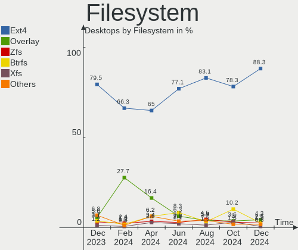
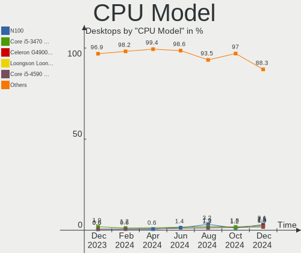
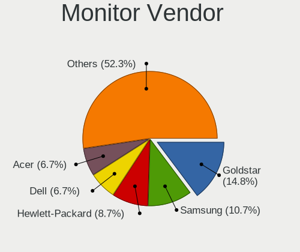
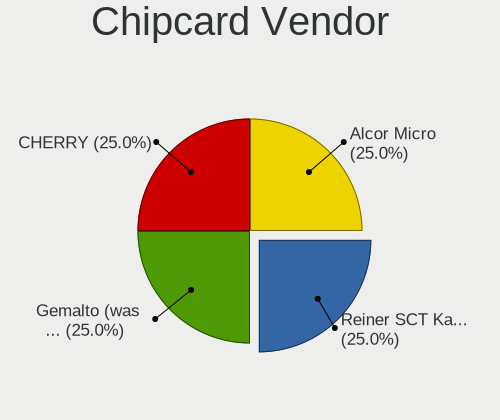
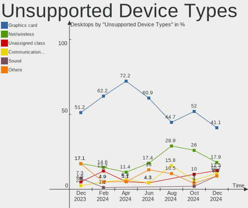

Debian Hardware Trends (Desktops)
---------------------------------

A project to identify most popular hardware characteristics and track their change
over time based on data collected by Debian users at https://Linux-Hardware.org.

Anyone can contribute to this report by the [hw-probe](https://github.com/linuxhw/hw-probe) tool:

    sudo -E hw-probe -all -upload

Full-feature report is available here: https://linux-hardware.org/?view=trends

Period: Jan, 2022.

Contents
--------

* [ System ](#system)
  - [ OS                       ](#os)
  - [ OS Family                ](#os-family)
  - [ Kernel                   ](#kernel)
  - [ Kernel Family            ](#kernel-family)
  - [ Kernel Major Ver.        ](#kernel-major-ver)
  - [ Arch                     ](#arch)
  - [ DE                       ](#de)
  - [ Display Server           ](#display-server)
  - [ Display Manager          ](#display-manager)
  - [ OS Lang                  ](#os-lang)
  - [ Boot Mode                ](#boot-mode)
  - [ Filesystem               ](#filesystem)
  - [ Part. scheme             ](#part-scheme)
  - [ Dual Boot with Linux/BSD ](#dual-boot-with-linuxbsd)
  - [ Dual Boot (Win)          ](#dual-boot-win)

* [ Board ](#board)
  - [ Vendor                   ](#vendor)
  - [ Model                    ](#model)
  - [ Model Family             ](#model-family)
  - [ MFG Year                 ](#mfg-year)
  - [ Form Factor              ](#form-factor)
  - [ Secure Boot              ](#secure-boot)
  - [ Coreboot                 ](#coreboot)
  - [ RAM Size                 ](#ram-size)
  - [ RAM Used                 ](#ram-used)
  - [ Total Drives             ](#total-drives)
  - [ Has CD-ROM               ](#has-cd-rom)
  - [ Has Ethernet             ](#has-ethernet)
  - [ Has WiFi                 ](#has-wifi)
  - [ Has Bluetooth            ](#has-bluetooth)

* [ Location ](#location)
  - [ Country                  ](#country)
  - [ City                     ](#city)

* [ Drives ](#drives)
  - [ Drive Vendor             ](#drive-vendor)
  - [ Drive Model              ](#drive-model)
  - [ HDD Vendor               ](#hdd-vendor)
  - [ SSD Vendor               ](#ssd-vendor)
  - [ Drive Kind               ](#drive-kind)
  - [ Drive Connector          ](#drive-connector)
  - [ Drive Size               ](#drive-size)
  - [ Space Total              ](#space-total)
  - [ Space Used               ](#space-used)
  - [ Malfunc. Drives          ](#malfunc-drives)
  - [ Malfunc. Drive Vendor    ](#malfunc-drive-vendor)
  - [ Malfunc. HDD Vendor      ](#malfunc-hdd-vendor)
  - [ Malfunc. Drive Kind      ](#malfunc-drive-kind)
  - [ Failed Drives            ](#failed-drives)
  - [ Failed Drive Vendor      ](#failed-drive-vendor)
  - [ Drive Status             ](#drive-status)

* [ Storage controller ](#storage-controller)
  - [ Storage Vendor           ](#storage-vendor)
  - [ Storage Model            ](#storage-model)
  - [ Storage Kind             ](#storage-kind)

* [ Processor ](#processor)
  - [ CPU Vendor               ](#cpu-vendor)
  - [ CPU Model                ](#cpu-model)
  - [ CPU Model Family         ](#cpu-model-family)
  - [ CPU Cores                ](#cpu-cores)
  - [ CPU Sockets              ](#cpu-sockets)
  - [ CPU Threads              ](#cpu-threads)
  - [ CPU Op-Modes             ](#cpu-op-modes)
  - [ CPU Microcode            ](#cpu-microcode)
  - [ CPU Microarch            ](#cpu-microarch)

* [ Graphics ](#graphics)
  - [ GPU Vendor               ](#gpu-vendor)
  - [ GPU Model                ](#gpu-model)
  - [ GPU Combo                ](#gpu-combo)
  - [ GPU Driver               ](#gpu-driver)
  - [ GPU Memory               ](#gpu-memory)

* [ Monitor ](#monitor)
  - [ Monitor Vendor           ](#monitor-vendor)
  - [ Monitor Model            ](#monitor-model)
  - [ Monitor Resolution       ](#monitor-resolution)
  - [ Monitor Diagonal         ](#monitor-diagonal)
  - [ Monitor Width            ](#monitor-width)
  - [ Aspect Ratio             ](#aspect-ratio)
  - [ Monitor Area             ](#monitor-area)
  - [ Pixel Density            ](#pixel-density)
  - [ Multiple Monitors        ](#multiple-monitors)

* [ Network ](#network)
  - [ Net Controller Vendor    ](#net-controller-vendor)
  - [ Net Controller Model     ](#net-controller-model)
  - [ Wireless Vendor          ](#wireless-vendor)
  - [ Wireless Model           ](#wireless-model)
  - [ Ethernet Vendor          ](#ethernet-vendor)
  - [ Ethernet Model           ](#ethernet-model)
  - [ Net Controller Kind      ](#net-controller-kind)
  - [ Used Controller          ](#used-controller)
  - [ NICs                     ](#nics)
  - [ IPv6                     ](#ipv6)

* [ Bluetooth ](#bluetooth)
  - [ Bluetooth Vendor         ](#bluetooth-vendor)
  - [ Bluetooth Model          ](#bluetooth-model)

* [ Sound ](#sound)
  - [ Sound Vendor             ](#sound-vendor)
  - [ Sound Model              ](#sound-model)

* [ Memory ](#memory)
  - [ Memory Vendor            ](#memory-vendor)
  - [ Memory Model             ](#memory-model)
  - [ Memory Kind              ](#memory-kind)
  - [ Memory Form Factor       ](#memory-form-factor)
  - [ Memory Size              ](#memory-size)
  - [ Memory Speed             ](#memory-speed)

* [ Printers & scanners ](#printers--scanners)
  - [ Printer Vendor           ](#printer-vendor)
  - [ Printer Model            ](#printer-model)
  - [ Scanner Vendor           ](#scanner-vendor)
  - [ Scanner Model            ](#scanner-model)

* [ Camera ](#camera)
  - [ Camera Vendor            ](#camera-vendor)
  - [ Camera Model             ](#camera-model)

* [ Security ](#security)
  - [ Fingerprint Vendor       ](#fingerprint-vendor)
  - [ Fingerprint Model        ](#fingerprint-model)
  - [ Chipcard Vendor          ](#chipcard-vendor)
  - [ Chipcard Model           ](#chipcard-model)

* [ Unsupported ](#unsupported)
  - [ Unsupported Devices      ](#unsupported-devices)
  - [ Unsupported Device Types ](#unsupported-device-types)

System
------

OS
--

Installed operating systems

| Name              | Desktops | Percent |
|-------------------|----------|---------|
| Debian 11         | 78       | 80.41%  |
| Debian 10         | 7        | 7.22%   |
| Debian Unstable   | 4        | 4.12%   |
| Debian Testing    | 3        | 3.09%   |
| Debian 8          | 2        | 2.06%   |
| Debian 9          | 1        | 1.03%   |
| Debian 5          | 1        | 1.03%   |
| Debian 11-updates | 1        | 1.03%   |

OS Family
---------

OS without a version

| Name   | Desktops | Percent |
|--------|----------|---------|
| Debian | 97       | 100%    |

Kernel
------

Version of the Linux kernel

| Version                   | Desktops | Percent |
|---------------------------|----------|---------|
| 5.10.0-10-amd64           | 28       | 28.87%  |
| 5.10.0-7-amd64            | 12       | 12.37%  |
| 5.10.0-11-amd64           | 12       | 12.37%  |
| 5.15.0-2-amd64            | 7        | 7.22%   |
| 5.13.19-2-pve             | 7        | 7.22%   |
| 5.10.0-9-amd64            | 4        | 4.12%   |
| 5.10.0-10-686-pae         | 3        | 3.09%   |
| 4.19.0-18-amd64           | 3        | 3.09%   |
| 5.13.19-3-pve             | 2        | 2.06%   |
| 5.10.0-8-amd64            | 2        | 2.06%   |
| 5.16.0-amd64              | 1        | 1.03%   |
| 5.15.15-qcmm              | 1        | 1.03%   |
| 5.15.11-xanmod1           | 1        | 1.03%   |
| 5.15.0-0.bpo.2-amd64      | 1        | 1.03%   |
| 5.14.0-9parrot1-amd64     | 1        | 1.03%   |
| 5.13.19-1-pve             | 1        | 1.03%   |
| 5.13.13                   | 1        | 1.03%   |
| 5.10.81+truenas           | 1        | 1.03%   |
| 5.10.57-antix.1-amd64-smp | 1        | 1.03%   |
| 5.10.0-11-686-pae         | 1        | 1.03%   |
| 4.9.0-0.bpo.11-amd64      | 1        | 1.03%   |
| 4.9.0-0.bpo.11-686-pae    | 1        | 1.03%   |
| 4.19.0-6-amd64            | 1        | 1.03%   |
| 4.19.0-17-amd64           | 1        | 1.03%   |
| 4.19.0-16-amd64           | 1        | 1.03%   |
| 4.19.0-0.bpo.9-amd64      | 1        | 1.03%   |
| 3.16.0-11-amd64           | 1        | 1.03%   |

Kernel Family
-------------

Linux kernel without a distro release

| Version | Desktops | Percent |
|---------|----------|---------|
| 5.10.0  | 62       | 63.92%  |
| 5.13.19 | 10       | 10.31%  |
| 5.15.0  | 8        | 8.25%   |
| 4.19.0  | 7        | 7.22%   |
| 4.9.0   | 2        | 2.06%   |
| 5.16.0  | 1        | 1.03%   |
| 5.15.15 | 1        | 1.03%   |
| 5.15.11 | 1        | 1.03%   |
| 5.14.0  | 1        | 1.03%   |
| 5.13.13 | 1        | 1.03%   |
| 5.10.81 | 1        | 1.03%   |
| 5.10.57 | 1        | 1.03%   |
| 3.16.0  | 1        | 1.03%   |

Kernel Major Ver.
-----------------

Linux kernel major version

| Version | Desktops | Percent |
|---------|----------|---------|
| 5.10    | 64       | 65.98%  |
| 5.13    | 11       | 11.34%  |
| 5.15    | 10       | 10.31%  |
| 4.19    | 7        | 7.22%   |
| 4.9     | 2        | 2.06%   |
| 5.16    | 1        | 1.03%   |
| 5.14    | 1        | 1.03%   |
| 3.16    | 1        | 1.03%   |

Arch
----

OS architecture (x86_64, i586, etc.)

| Name   | Desktops | Percent |
|--------|----------|---------|
| x86_64 | 92       | 94.85%  |
| i686   | 5        | 5.15%   |

DE
--

Desktop Environment

| Name             | Desktops | Percent |
|------------------|----------|---------|
| Unknown          | 34       | 35.05%  |
| GNOME            | 21       | 21.65%  |
| KDE5             | 14       | 14.43%  |
| XFCE             | 12       | 12.37%  |
| LXDE             | 5        | 5.15%   |
| MATE             | 4        | 4.12%   |
| Cinnamon         | 3        | 3.09%   |
| lightdm-xsession | 2        | 2.06%   |
| X-Cinnamon       | 1        | 1.03%   |
| LXQt             | 1        | 1.03%   |

Display Server
--------------

X11 or Wayland

| Name    | Desktops | Percent |
|---------|----------|---------|
| X11     | 49       | 50.52%  |
| Tty     | 20       | 20.62%  |
| Unknown | 16       | 16.49%  |
| Wayland | 12       | 12.37%  |

Display Manager
---------------

SDDM, LightDM, etc.

| Name    | Desktops | Percent |
|---------|----------|---------|
| Unknown | 50       | 51.55%  |
| LightDM | 17       | 17.53%  |
| SDDM    | 11       | 11.34%  |
| GDM     | 11       | 11.34%  |
| GDM3    | 5        | 5.15%   |
| XDM     | 1        | 1.03%   |
| SLiM    | 1        | 1.03%   |
| NODM    | 1        | 1.03%   |

OS Lang
-------

Language

| Lang        | Desktops | Percent |
|-------------|----------|---------|
| en_US       | 35       | 36.08%  |
| ru_RU       | 14       | 14.43%  |
| de_DE       | 7        | 7.22%   |
| en_GB       | 6        | 6.19%   |
| fr_FR       | 5        | 5.15%   |
| hu_HU       | 3        | 3.09%   |
| es_ES       | 3        | 3.09%   |
| es_AR       | 3        | 3.09%   |
| Unknown     | 3        | 3.09%   |
| pt_BR       | 2        | 2.06%   |
| en_AU       | 2        | 2.06%   |
| nl_NL       | 1        | 1.03%   |
| ja_JP.utf-8 | 1        | 1.03%   |
| ja_JP       | 1        | 1.03%   |
| it_IT       | 1        | 1.03%   |
| hr_HR       | 1        | 1.03%   |
| es_VE       | 1        | 1.03%   |
| es_MX       | 1        | 1.03%   |
| en_ZA       | 1        | 1.03%   |
| en_IN       | 1        | 1.03%   |
| en_IE       | 1        | 1.03%   |
| en_CA       | 1        | 1.03%   |
| de_CH       | 1        | 1.03%   |
| ca_ES       | 1        | 1.03%   |
| C           | 1        | 1.03%   |

Boot Mode
---------

EFI or BIOS

| Mode | Desktops | Percent |
|------|----------|---------|
| BIOS | 59       | 60.82%  |
| EFI  | 38       | 39.18%  |

Filesystem
----------

Type of filesystem

| Type    | Desktops | Percent |
|---------|----------|---------|
| Ext4    | 75       | 77.32%  |
| Overlay | 15       | 15.46%  |
| Btrfs   | 4        | 4.12%   |
| Zfs     | 3        | 3.09%   |

Part. scheme
------------

Scheme of partitioning

| Type    | Desktops | Percent |
|---------|----------|---------|
| GPT     | 43       | 44.33%  |
| MBR     | 33       | 34.02%  |
| Unknown | 21       | 21.65%  |

Dual Boot with Linux/BSD
------------------------

Hosting more than one Linux/BSD

| Dual boot | Desktops | Percent |
|-----------|----------|---------|
| No        | 74       | 76.29%  |
| Yes       | 23       | 23.71%  |

Dual Boot (Win)
---------------

Hosting Linux and Windows

| Dual boot | Desktops | Percent |
|-----------|----------|---------|
| No        | 63       | 64.95%  |
| Yes       | 34       | 35.05%  |

Board
-----

Vendor
------

Motherboard manufacturer

| Name                | Desktops | Percent |
|---------------------|----------|---------|
| ASUSTek Computer    | 24       | 24.74%  |
| MSI                 | 15       | 15.46%  |
| Gigabyte Technology | 15       | 15.46%  |
| ASRock              | 13       | 13.4%   |
| Hewlett-Packard     | 11       | 11.34%  |
| Lenovo              | 5        | 5.15%   |
| Medion              | 2        | 2.06%   |
| Intel               | 2        | 2.06%   |
| Supermicro          | 1        | 1.03%   |
| Inventec            | 1        | 1.03%   |
| Fujitsu             | 1        | 1.03%   |
| Foxconn             | 1        | 1.03%   |
| EPoX Computer       | 1        | 1.03%   |
| ECS                 | 1        | 1.03%   |
| Dell                | 1        | 1.03%   |
| Biostar             | 1        | 1.03%   |
| AZW                 | 1        | 1.03%   |
| Unknown             | 1        | 1.03%   |

Model
-----

Motherboard model

| Name                                    | Desktops | Percent |
|-----------------------------------------|----------|---------|
| ASUS All Series                         | 4        | 4.12%   |
| ASUS PRIME B450M-A                      | 3        | 3.09%   |
| HP Z420 Workstation                     | 2        | 2.06%   |
| Gigabyte Z77X-D3H                       | 2        | 2.06%   |
| ASUS TUF GAMING X570-PLUS               | 2        | 2.06%   |
| ASUS PRIME H510M-A                      | 2        | 2.06%   |
| ASRock H470M-HVS                        | 2        | 2.06%   |
| Supermicro C7SIM-Q                      | 1        | 1.03%   |
| MSI p6620ch-m                           | 1        | 1.03%   |
| MSI MS-7C80                             | 1        | 1.03%   |
| MSI MS-7C75                             | 1        | 1.03%   |
| MSI MS-7C56                             | 1        | 1.03%   |
| MSI MS-7C37                             | 1        | 1.03%   |
| MSI MS-7C31                             | 1        | 1.03%   |
| MSI MS-7B79                             | 1        | 1.03%   |
| MSI MS-7B24                             | 1        | 1.03%   |
| MSI MS-7A34                             | 1        | 1.03%   |
| MSI MS-7A15                             | 1        | 1.03%   |
| MSI MS-7817                             | 1        | 1.03%   |
| MSI MS-7721                             | 1        | 1.03%   |
| MSI MS-7309                             | 1        | 1.03%   |
| MSI MS-7255                             | 1        | 1.03%   |
| MSI Cubi N JSL (MS-B0A1)                | 1        | 1.03%   |
| Medion MS-7708                          | 1        | 1.03%   |
| Medion MD34189/C731                     | 1        | 1.03%   |
| Lenovo ThinkStation S20 4105L1U         | 1        | 1.03%   |
| Lenovo ThinkStation P620 30E0CTO1WW     | 1        | 1.03%   |
| Lenovo Legion T7 34IMZ5 90Q800AJMH      | 1        | 1.03%   |
| Lenovo IdeaCentre 510S-07ICK 90LX0091IN | 1        | 1.03%   |
| Lenovo 70AQ000JGE ThinkServer TS440     | 1        | 1.03%   |
| Inventec DQ Class                       | 1        | 1.03%   |
| Intel MAHOBAY                           | 1        | 1.03%   |
| Intel DP55WB AAE64798-205               | 1        | 1.03%   |
| HP Z620 Workstation                     | 1        | 1.03%   |
| HP ProDesk 600 G3 SFF                   | 1        | 1.03%   |
| HP ProDesk 600 G1 SFF                   | 1        | 1.03%   |
| HP EliteDesk 800 G4 DM 35W              | 1        | 1.03%   |
| HP EliteDesk 800 G1 SFF                 | 1        | 1.03%   |
| HP Compaq Elite 8300 CMT                | 1        | 1.03%   |
| HP Compaq dc7900 Small Form Factor      | 1        | 1.03%   |
| HP Compaq dc7800p Convertible Minitower | 1        | 1.03%   |
| HP Compaq 8000 Elite CMT PC             | 1        | 1.03%   |
| Gigabyte Z170X-Gaming 3                 | 1        | 1.03%   |
| Gigabyte W480M VISION W                 | 1        | 1.03%   |
| Gigabyte H81M-S2V                       | 1        | 1.03%   |
| Gigabyte H81M-S                         | 1        | 1.03%   |
| Gigabyte h8-1559                        | 1        | 1.03%   |
| Gigabyte H61M-DS2 REV 1.2               | 1        | 1.03%   |
| Gigabyte H110M-S2H                      | 1        | 1.03%   |
| Gigabyte GA-970A-D3                     | 1        | 1.03%   |
| Gigabyte GA-890FXA-UD5                  | 1        | 1.03%   |
| Gigabyte G31M-ES2C                      | 1        | 1.03%   |
| Gigabyte B560M DS3H V2                  | 1        | 1.03%   |
| Gigabyte B550 GAMING X V2               | 1        | 1.03%   |
| Gigabyte B450M DS3H                     | 1        | 1.03%   |
| Fujitsu D3446-S1                        | 1        | 1.03%   |
| Foxconn Compaq 500B Microtower          | 1        | 1.03%   |
| EPoX nForce3 DDR: 8KDA3I Series         | 1        | 1.03%   |
| ECS H61H2-M13                           | 1        | 1.03%   |
| Dell Vostro 260                         | 1        | 1.03%   |

Model Family
------------

Motherboard model prefix

| Name                   | Desktops | Percent |
|------------------------|----------|---------|
| ASUS PRIME             | 5        | 5.15%   |
| HP Compaq              | 4        | 4.12%   |
| ASUS ROG               | 4        | 4.12%   |
| ASUS All               | 4        | 4.12%   |
| ASUS TUF               | 3        | 3.09%   |
| Lenovo ThinkStation    | 2        | 2.06%   |
| HP Z420                | 2        | 2.06%   |
| HP ProDesk             | 2        | 2.06%   |
| HP EliteDesk           | 2        | 2.06%   |
| Gigabyte Z77X-D3H      | 2        | 2.06%   |
| ASRock H470M-HVS       | 2        | 2.06%   |
| Supermicro C7SIM-Q     | 1        | 1.03%   |
| MSI p6620ch-m          | 1        | 1.03%   |
| MSI MS-7C80            | 1        | 1.03%   |
| MSI MS-7C75            | 1        | 1.03%   |
| MSI MS-7C56            | 1        | 1.03%   |
| MSI MS-7C37            | 1        | 1.03%   |
| MSI MS-7C31            | 1        | 1.03%   |
| MSI MS-7B79            | 1        | 1.03%   |
| MSI MS-7B24            | 1        | 1.03%   |
| MSI MS-7A34            | 1        | 1.03%   |
| MSI MS-7A15            | 1        | 1.03%   |
| MSI MS-7817            | 1        | 1.03%   |
| MSI MS-7721            | 1        | 1.03%   |
| MSI MS-7309            | 1        | 1.03%   |
| MSI MS-7255            | 1        | 1.03%   |
| MSI Cubi               | 1        | 1.03%   |
| Medion MS-7708         | 1        | 1.03%   |
| Medion MD34189         | 1        | 1.03%   |
| Lenovo Legion          | 1        | 1.03%   |
| Lenovo IdeaCentre      | 1        | 1.03%   |
| Lenovo 70AQ000JGE      | 1        | 1.03%   |
| Inventec DQ            | 1        | 1.03%   |
| Intel MAHOBAY          | 1        | 1.03%   |
| Intel DP55WB           | 1        | 1.03%   |
| HP Z620                | 1        | 1.03%   |
| Gigabyte Z170X-Gaming  | 1        | 1.03%   |
| Gigabyte W480M         | 1        | 1.03%   |
| Gigabyte H81M-S2V      | 1        | 1.03%   |
| Gigabyte H81M-S        | 1        | 1.03%   |
| Gigabyte h8-1559       | 1        | 1.03%   |
| Gigabyte H61M-DS2      | 1        | 1.03%   |
| Gigabyte H110M-S2H     | 1        | 1.03%   |
| Gigabyte GA-970A-D3    | 1        | 1.03%   |
| Gigabyte GA-890FXA-UD5 | 1        | 1.03%   |
| Gigabyte G31M-ES2C     | 1        | 1.03%   |
| Gigabyte B560M         | 1        | 1.03%   |
| Gigabyte B550          | 1        | 1.03%   |
| Gigabyte B450M         | 1        | 1.03%   |
| Fujitsu D3446-S1       | 1        | 1.03%   |
| Foxconn Compaq         | 1        | 1.03%   |
| EPoX nForce3           | 1        | 1.03%   |
| ECS H61H2-M13          | 1        | 1.03%   |
| Dell Vostro            | 1        | 1.03%   |
| Biostar TA970          | 1        | 1.03%   |
| AZW GK55               | 1        | 1.03%   |
| ASUS P8H77-V           | 1        | 1.03%   |
| ASUS P8H77-M           | 1        | 1.03%   |
| ASUS P8H61-M           | 1        | 1.03%   |
| ASUS P8H61-I           | 1        | 1.03%   |

MFG Year
--------

Motherboard manufacture year

| Year | Desktops | Percent |
|------|----------|---------|
| 2021 | 13       | 13.4%   |
| 2012 | 12       | 12.37%  |
| 2020 | 10       | 10.31%  |
| 2018 | 9        | 9.28%   |
| 2013 | 9        | 9.28%   |
| 2009 | 6        | 6.19%   |
| 2019 | 5        | 5.15%   |
| 2017 | 5        | 5.15%   |
| 2014 | 5        | 5.15%   |
| 2011 | 5        | 5.15%   |
| 2010 | 5        | 5.15%   |
| 2008 | 4        | 4.12%   |
| 2015 | 3        | 3.09%   |
| 2016 | 2        | 2.06%   |
| 2007 | 2        | 2.06%   |
| 2006 | 1        | 1.03%   |
| 2005 | 1        | 1.03%   |

Form Factor
-----------

Physical design of the computer

| Name    | Desktops | Percent |
|---------|----------|---------|
| Desktop | 97       | 100%    |

Secure Boot
-----------

Enabled or disabled

| State    | Desktops | Percent |
|----------|----------|---------|
| Disabled | 95       | 97.94%  |
| Enabled  | 2        | 2.06%   |

Coreboot
--------

Have coreboot on board

| Used | Desktops | Percent |
|------|----------|---------|
| No   | 97       | 100%    |

RAM Size
--------

Total RAM memory

| Size in GB  | Desktops | Percent |
|-------------|----------|---------|
| 4.01-8.0    | 21       | 21.65%  |
| 32.01-64.0  | 20       | 20.62%  |
| 8.01-16.0   | 17       | 17.53%  |
| 16.01-24.0  | 16       | 16.49%  |
| 3.01-4.0    | 12       | 12.37%  |
| 64.01-256.0 | 7        | 7.22%   |
| 2.01-3.0    | 2        | 2.06%   |
| 24.01-32.0  | 1        | 1.03%   |
| 0.51-1.0    | 1        | 1.03%   |

RAM Used
--------

Used RAM memory

| Used GB     | Desktops | Percent |
|-------------|----------|---------|
| 1.01-2.0    | 21       | 21.65%  |
| 0.51-1.0    | 20       | 20.62%  |
| 4.01-8.0    | 17       | 17.53%  |
| 2.01-3.0    | 13       | 13.4%   |
| 8.01-16.0   | 9        | 9.28%   |
| 3.01-4.0    | 8        | 8.25%   |
| 0.01-0.5    | 4        | 4.12%   |
| 16.01-24.0  | 2        | 2.06%   |
| 32.01-64.0  | 1        | 1.03%   |
| 24.01-32.0  | 1        | 1.03%   |
| 64.01-256.0 | 1        | 1.03%   |

Total Drives
------------

Number of drives on board

| Drives | Desktops | Percent |
|--------|----------|---------|
| 1      | 34       | 35.05%  |
| 2      | 21       | 21.65%  |
| 3      | 15       | 15.46%  |
| 4      | 10       | 10.31%  |
| 5      | 7        | 7.22%   |
| 6      | 4        | 4.12%   |
| 7      | 3        | 3.09%   |
| 28     | 1        | 1.03%   |
| 11     | 1        | 1.03%   |
| 10     | 1        | 1.03%   |

Has CD-ROM
----------

Has CD-ROM on board

| Presented | Desktops | Percent |
|-----------|----------|---------|
| No        | 68       | 70.1%   |
| Yes       | 29       | 29.9%   |

Has Ethernet
------------

Has Ethernet on board

| Presented | Desktops | Percent |
|-----------|----------|---------|
| Yes       | 97       | 100%    |

Has WiFi
--------

Has WiFi module

| Presented | Desktops | Percent |
|-----------|----------|---------|
| No        | 69       | 71.13%  |
| Yes       | 28       | 28.87%  |

Has Bluetooth
-------------

Has Bluetooth module

| Presented | Desktops | Percent |
|-----------|----------|---------|
| No        | 80       | 82.47%  |
| Yes       | 17       | 17.53%  |

Location
--------

Country
-------

Geographic location (country)

| Country      | Desktops | Percent |
|--------------|----------|---------|
| USA          | 18       | 18.56%  |
| Russia       | 14       | 14.43%  |
| Germany      | 9        | 9.28%   |
| France       | 7        | 7.22%   |
| Spain        | 5        | 5.15%   |
| UK           | 4        | 4.12%   |
| Netherlands  | 4        | 4.12%   |
| Italy        | 3        | 3.09%   |
| Hungary      | 3        | 3.09%   |
| Canada       | 3        | 3.09%   |
| Argentina    | 3        | 3.09%   |
| Switzerland  | 2        | 2.06%   |
| Romania      | 2        | 2.06%   |
| Japan        | 2        | 2.06%   |
| Brazil       | 2        | 2.06%   |
| Australia    | 2        | 2.06%   |
| Venezuela    | 1        | 1.03%   |
| Sweden       | 1        | 1.03%   |
| South Africa | 1        | 1.03%   |
| Slovenia     | 1        | 1.03%   |
| Poland       | 1        | 1.03%   |
| Morocco      | 1        | 1.03%   |
| Mexico       | 1        | 1.03%   |
| Kazakhstan   | 1        | 1.03%   |
| India        | 1        | 1.03%   |
| Finland      | 1        | 1.03%   |
| Croatia      | 1        | 1.03%   |
| Belgium      | 1        | 1.03%   |
| Bangladesh   | 1        | 1.03%   |
| Austria      | 1        | 1.03%   |

City
----

Geographic location (city)

| City                     | Desktops | Percent |
|--------------------------|----------|---------|
| Voronezh                 | 13       | 13.4%   |
| Wheaton                  | 2        | 2.06%   |
| Barcelona                | 2        | 2.06%   |
| Zurich                   | 1        | 1.03%   |
| Zaragoza                 | 1        | 1.03%   |
| Warrnambool              | 1        | 1.03%   |
| Vignola                  | 1        | 1.03%   |
| Toyokawa                 | 1        | 1.03%   |
| Tostado                  | 1        | 1.03%   |
| Toledo                   | 1        | 1.03%   |
| Toeroekbalint            | 1        | 1.03%   |
| Texarkana                | 1        | 1.03%   |
| Szombathely              | 1        | 1.03%   |
| Sydney                   | 1        | 1.03%   |
| Split                    | 1        | 1.03%   |
| Shibuya                  | 1        | 1.03%   |
| Severna Park             | 1        | 1.03%   |
| Schalkhaar               | 1        | 1.03%   |
| S??o Paulo               | 1        | 1.03%   |
| Santa Cruz de Tenerife   | 1        | 1.03%   |
| Sant Carles de la Rapita | 1        | 1.03%   |
| San Miguel de Tucum??n   | 1        | 1.03%   |
| San Jose                 | 1        | 1.03%   |
| Raucoules                | 1        | 1.03%   |
| Raahe                    | 1        | 1.03%   |
| Quer?©taro City          | 1        | 1.03%   |
| Pretoria                 | 1        | 1.03%   |
| Pompano Beach            | 1        | 1.03%   |
| Paris                    | 1        | 1.03%   |
| Otopeni                  | 1        | 1.03%   |
| Omaha                    | 1        | 1.03%   |
| Nur-Sultan               | 1        | 1.03%   |
| Norderstedt              | 1        | 1.03%   |
| New Orleans              | 1        | 1.03%   |
| Munich                   | 1        | 1.03%   |
| Moscow                   | 1        | 1.03%   |
| Montreal                 | 1        | 1.03%   |
| Middletown               | 1        | 1.03%   |
| Mennecy                  | 1        | 1.03%   |
| Manchester               | 1        | 1.03%   |
| Maizieres-les-Metz       | 1        | 1.03%   |
| Lublin                   | 1        | 1.03%   |
| Los Angeles              | 1        | 1.03%   |
| Ljubljana                | 1        | 1.03%   |
| Le Kremlin-Bicetre       | 1        | 1.03%   |
| Kolkata                  | 1        | 1.03%   |
| Kansas City              | 1        | 1.03%   |
| Jardin America           | 1        | 1.03%   |
| Huddersfield             | 1        | 1.03%   |
| Greenville               | 1        | 1.03%   |
| Graz                     | 1        | 1.03%   |
| Frankfurt am Main        | 1        | 1.03%   |
| Fort St. John            | 1        | 1.03%   |
| Fontenay-sous-Bois       | 1        | 1.03%   |
| Foncine-le-Haut          | 1        | 1.03%   |
| Fernelmont               | 1        | 1.03%   |
| Feni                     | 1        | 1.03%   |
| Falkenstein              | 1        | 1.03%   |
| Erlangen                 | 1        | 1.03%   |
| Dietikon                 | 1        | 1.03%   |

Drives
------

Drive Vendor
------------

Hard drive vendors

| Vendor              | Desktops | Drives | Percent |
|---------------------|----------|--------|---------|
| WDC                 | 37       | 57     | 18.5%   |
| Seagate             | 36       | 68     | 18%     |
| Samsung Electronics | 35       | 48     | 17.5%   |
| Toshiba             | 18       | 31     | 9%      |
| Kingston            | 15       | 17     | 7.5%    |
| Crucial             | 10       | 13     | 5%      |
| SanDisk             | 7        | 9      | 3.5%    |
| Hitachi             | 5        | 5      | 2.5%    |
| HGST                | 5        | 7      | 2.5%    |
| A-DATA Technology   | 4        | 6      | 2%      |
| XPG                 | 3        | 3      | 1.5%    |
| Intel               | 3        | 4      | 1.5%    |
| China               | 3        | 3      | 1.5%    |
| Phison              | 2        | 2      | 1%      |
| Netac               | 2        | 2      | 1%      |
| Intenso             | 2        | 2      | 1%      |
| Fujitsu             | 2        | 2      | 1%      |
| Unknown             | 1        | 1      | 0.5%    |
| Transcend           | 1        | 1      | 0.5%    |
| Patriot             | 1        | 1      | 0.5%    |
| OCZ                 | 1        | 1      | 0.5%    |
| NAS                 | 1        | 5      | 0.5%    |
| Micron Technology   | 1        | 1      | 0.5%    |
| LDLC                | 1        | 1      | 0.5%    |
| Inateck             | 1        | 1      | 0.5%    |
| Hikvision           | 1        | 1      | 0.5%    |
| Gigabyte Technology | 1        | 1      | 0.5%    |
| Apacer              | 1        | 1      | 0.5%    |

Drive Model
-----------

Hard drive models

| Model                            | Desktops | Percent |
|----------------------------------|----------|---------|
| Seagate ST2000DM008-2FR102 2TB   | 6        | 2.43%   |
| Samsung SSD 970 EVO Plus 500GB   | 4        | 1.62%   |
| Kingston SA400S37240G 240GB SSD  | 4        | 1.62%   |
| WDC WD5000AAKX-60U6AA0 500GB     | 3        | 1.21%   |
| Toshiba DT01ACA200 2TB           | 3        | 1.21%   |
| Toshiba DT01ACA100 1TB           | 3        | 1.21%   |
| Seagate ST500DM002-1BD142 500GB  | 3        | 1.21%   |
| Samsung SSD 970 EVO Plus 2TB     | 3        | 1.21%   |
| Samsung SSD 860 EVO 250GB        | 3        | 1.21%   |
| Kingston SA400S37480G 480GB SSD  | 3        | 1.21%   |
| WDC WDS120G2G0A-00JH30 120GB SSD | 2        | 0.81%   |
| WDC WD40EZAZ-00SF3B0 4TB         | 2        | 0.81%   |
| WDC WD30EFRX-68EUZN0 3TB         | 2        | 0.81%   |
| WDC WD20EFRX-68AX9N0 2TB         | 2        | 0.81%   |
| WDC WD15EARS-00MVWB0 1TB         | 2        | 0.81%   |
| WDC WD10EZEX-08WN4A0 1TB         | 2        | 0.81%   |
| WDC WD10EZEX-00RKKA0 1TB         | 2        | 0.81%   |
| WDC WD10EZEX-00BN5A0 1TB         | 2        | 0.81%   |
| Toshiba HDWD110 1TB              | 2        | 0.81%   |
| Seagate ST9500325AS 500GB        | 2        | 0.81%   |
| Seagate ST6000DM003-2CY186 6TB   | 2        | 0.81%   |
| Seagate ST31500341AS 1TB         | 2        | 0.81%   |
| Seagate ST2000DM001-1CH164 2TB   | 2        | 0.81%   |
| Seagate ST1000DM010-2EP102 1TB   | 2        | 0.81%   |
| Seagate ST1000DM003-1ER162 1TB   | 2        | 0.81%   |
| Seagate ST1000DM003-1CH162 1TB   | 2        | 0.81%   |
| Seagate Expansion Desk 8TB       | 2        | 0.81%   |
| Samsung SSD 970 EVO Plus 1TB     | 2        | 0.81%   |
| Samsung SSD 870 QVO 2TB          | 2        | 0.81%   |
| Samsung SSD 860 EVO 500GB        | 2        | 0.81%   |
| Samsung SSD 840 EVO 250GB        | 2        | 0.81%   |
| Netac SSD 240GB                  | 2        | 0.81%   |
| Kingston SA400S37120G 120GB SSD  | 2        | 0.81%   |
| Hitachi HDS721010CLA332 1TB      | 2        | 0.81%   |
| Crucial CT500MX500SSD1 500GB     | 2        | 0.81%   |
| Crucial CT1000MX500SSD1 1TB      | 2        | 0.81%   |
| A-DATA SX900 64GB SSD            | 2        | 0.81%   |
| A-DATA SP600 32GB SSD            | 2        | 0.81%   |
| XPG NVMe SSD Drive 256GB         | 1        | 0.4%    |
| XPG GAMMIX S70 BLADE 2TB         | 1        | 0.4%    |
| XPG GAMMIX S11 Pro 2TB           | 1        | 0.4%    |
| WDC WDS500G2B0A-00SM50 500GB SSD | 1        | 0.4%    |
| WDC WDS250G2B0A-00SM50 250GB SSD | 1        | 0.4%    |
| WDC WDS250G2B0A 250GB SSD        | 1        | 0.4%    |
| WDC WDS240G2G0B-00EPW0 240GB SSD | 1        | 0.4%    |
| WDC WDS100T2B0C-00PXH0 1TB       | 1        | 0.4%    |
| WDC WDS100T2B0C 1TB              | 1        | 0.4%    |
| WDC WDS100T2B0A-00SM50 1TB SSD   | 1        | 0.4%    |
| WDC WD7500AAVS-00D7B1 752GB      | 1        | 0.4%    |
| WDC WD60EFRX-68MYMN1 6TB         | 1        | 0.4%    |
| WDC WD6003FRYZ-01F0DB0 6TB       | 1        | 0.4%    |
| WDC WD5000AAKX-08ERMA0 500GB     | 1        | 0.4%    |
| WDC WD40EZRZ-00GXCB0 4TB         | 1        | 0.4%    |
| WDC WD40EDAZ-11SLVB0 4TB         | 1        | 0.4%    |
| WDC WD4005FZBX-00K5WB0 4TB       | 1        | 0.4%    |
| WDC WD4003FFBX-68MU3N0 4TB       | 1        | 0.4%    |
| WDC WD30EZRX-00SPEB0 3TB         | 1        | 0.4%    |
| WDC WD30EZRX-00D8PB0 3TB         | 1        | 0.4%    |
| WDC WD20EZRZ-00Z5HB0 2TB         | 1        | 0.4%    |
| WDC WD20EZRX-00DC0B0 2TB         | 1        | 0.4%    |

HDD Vendor
----------

Hard disk drive vendors

| Vendor              | Desktops | Drives | Percent |
|---------------------|----------|--------|---------|
| Seagate             | 36       | 68     | 34.62%  |
| WDC                 | 30       | 46     | 28.85%  |
| Toshiba             | 18       | 31     | 17.31%  |
| Samsung Electronics | 5        | 6      | 4.81%   |
| Hitachi             | 5        | 5      | 4.81%   |
| HGST                | 5        | 7      | 4.81%   |
| Fujitsu             | 2        | 2      | 1.92%   |
| NAS                 | 1        | 5      | 0.96%   |
| Intenso             | 1        | 1      | 0.96%   |
| Inateck             | 1        | 1      | 0.96%   |

SSD Vendor
----------

Solid state drive vendors

| Vendor              | Desktops | Drives | Percent |
|---------------------|----------|--------|---------|
| Samsung Electronics | 20       | 23     | 26.67%  |
| Kingston            | 12       | 14     | 16%     |
| Crucial             | 9        | 12     | 12%     |
| WDC                 | 7        | 7      | 9.33%   |
| SanDisk             | 6        | 8      | 8%      |
| A-DATA Technology   | 4        | 6      | 5.33%   |
| Intel               | 3        | 4      | 4%      |
| China               | 3        | 3      | 4%      |
| Netac               | 2        | 2      | 2.67%   |
| Unknown             | 1        | 1      | 1.33%   |
| Transcend           | 1        | 1      | 1.33%   |
| Patriot             | 1        | 1      | 1.33%   |
| OCZ                 | 1        | 1      | 1.33%   |
| Micron Technology   | 1        | 1      | 1.33%   |
| LDLC                | 1        | 1      | 1.33%   |
| Intenso             | 1        | 1      | 1.33%   |
| Gigabyte Technology | 1        | 1      | 1.33%   |
| Apacer              | 1        | 1      | 1.33%   |

Drive Kind
----------

HDD or SSD

| Kind | Desktops | Drives | Percent |
|------|----------|--------|---------|
| HDD  | 72       | 172    | 45.57%  |
| SSD  | 62       | 88     | 39.24%  |
| NVMe | 24       | 34     | 15.19%  |

Drive Connector
---------------

SATA, SAS, NVMe, etc.

| Type | Desktops | Drives | Percent |
|------|----------|--------|---------|
| SATA | 93       | 235    | 75%     |
| NVMe | 24       | 34     | 19.35%  |
| SAS  | 7        | 25     | 5.65%   |

Drive Size
----------

Size of hard drive

| Size in TB | Desktops | Drives | Percent |
|------------|----------|--------|---------|
| 0.01-0.5   | 73       | 98     | 46.5%   |
| 0.51-1.0   | 37       | 56     | 23.57%  |
| 1.01-2.0   | 23       | 42     | 14.65%  |
| 4.01-10.0  | 11       | 40     | 7.01%   |
| 3.01-4.0   | 8        | 12     | 5.1%    |
| 2.01-3.0   | 4        | 6      | 2.55%   |
| 10.01-20.0 | 1        | 6      | 0.64%   |

Space Total
-----------

Amount of disk space available on the file system

| Size in GB     | Desktops | Percent |
|----------------|----------|---------|
| 101-250        | 24       | 24.74%  |
| Unknown        | 16       | 16.49%  |
| More than 3000 | 14       | 14.43%  |
| 501-1000       | 12       | 12.37%  |
| 251-500        | 7        | 7.22%   |
| 1001-2000      | 7        | 7.22%   |
| 1-20           | 5        | 5.15%   |
| 51-100         | 5        | 5.15%   |
| 21-50          | 4        | 4.12%   |
| 2001-3000      | 3        | 3.09%   |

Space Used
----------

Amount of used disk space

| Used GB        | Desktops | Percent |
|----------------|----------|---------|
| 1-20           | 31       | 31.96%  |
| Unknown        | 16       | 16.49%  |
| 251-500        | 8        | 8.25%   |
| 51-100         | 8        | 8.25%   |
| More than 3000 | 7        | 7.22%   |
| 21-50          | 7        | 7.22%   |
| 1001-2000      | 6        | 6.19%   |
| 101-250        | 5        | 5.15%   |
| 501-1000       | 5        | 5.15%   |
| 2001-3000      | 4        | 4.12%   |

Malfunc. Drives
---------------

Drive models with a malfunction

| Model                                        | Desktops | Drives | Percent |
|----------------------------------------------|----------|--------|---------|
| WDC WD5000AAKX-60U6AA0 500GB                 | 2        | 2      | 7.14%   |
| Seagate ST31500341AS 1TB                     | 2        | 2      | 7.14%   |
| WDC WD5000AAKX-08ERMA0 500GB                 | 1        | 1      | 3.57%   |
| WDC WD20EZRX-00DC0B0 2TB                     | 1        | 1      | 3.57%   |
| WDC WD20EFRX-68AX9N0 2TB                     | 1        | 1      | 3.57%   |
| WDC WD10EZEX-08WN4A0 1TB                     | 1        | 1      | 3.57%   |
| WDC WD10EURS-630AB1 1TB                      | 1        | 1      | 3.57%   |
| Toshiba MK1655GSXF 160GB                     | 1        | 1      | 3.57%   |
| Toshiba MK1002TSKB 1TB                       | 1        | 1      | 3.57%   |
| Seagate ST9500420AS 500GB                    | 1        | 1      | 3.57%   |
| Seagate ST9500325AS 500GB                    | 1        | 2      | 3.57%   |
| Seagate ST500DM002-1BD142 500GB              | 1        | 1      | 3.57%   |
| Seagate ST5000NM0024-1HT170 5TB              | 1        | 2      | 3.57%   |
| Seagate ST4000DM004-2CV104 4TB               | 1        | 1      | 3.57%   |
| Seagate ST3500820AS 500GB                    | 1        | 1      | 3.57%   |
| Seagate ST3120827AS 120GB                    | 1        | 1      | 3.57%   |
| Seagate ST2000DL001-9VT156 2TB               | 1        | 1      | 3.57%   |
| Seagate ST1000DM003-1CH162 1TB               | 1        | 1      | 3.57%   |
| Samsung Electronics SSD 970 EVO 250GB        | 1        | 1      | 3.57%   |
| Samsung Electronics SSD 840 PRO Series 128GB | 1        | 1      | 3.57%   |
| Samsung Electronics HD120IJ 120GB            | 1        | 1      | 3.57%   |
| Intel SSDSC2BX200G4R 200GB                   | 1        | 2      | 3.57%   |
| Fujitsu MHZ2160BH G2 160GB                   | 1        | 1      | 3.57%   |
| Crucial M4-CT256M4SSD1 256GB                 | 1        | 1      | 3.57%   |
| Crucial M4-CT128M4SSD2 128GB                 | 1        | 1      | 3.57%   |
| A-DATA Technology SU650 240GB SSD            | 1        | 1      | 3.57%   |

Malfunc. Drive Vendor
---------------------

Vendors of faulty drives

| Vendor              | Desktops | Drives | Percent |
|---------------------|----------|--------|---------|
| Seagate             | 10       | 13     | 37.04%  |
| WDC                 | 7        | 7      | 25.93%  |
| Samsung Electronics | 3        | 3      | 11.11%  |
| Toshiba             | 2        | 2      | 7.41%   |
| Crucial             | 2        | 2      | 7.41%   |
| Intel               | 1        | 2      | 3.7%    |
| Fujitsu             | 1        | 1      | 3.7%    |
| A-DATA Technology   | 1        | 1      | 3.7%    |

Malfunc. HDD Vendor
-------------------

Vendors of faulty HDD drives

| Vendor              | Desktops | Drives | Percent |
|---------------------|----------|--------|---------|
| Seagate             | 10       | 13     | 47.62%  |
| WDC                 | 7        | 7      | 33.33%  |
| Toshiba             | 2        | 2      | 9.52%   |
| Samsung Electronics | 1        | 1      | 4.76%   |
| Fujitsu             | 1        | 1      | 4.76%   |

Malfunc. Drive Kind
-------------------

Kinds of faulty drives

| Kind | Desktops | Drives | Percent |
|------|----------|--------|---------|
| HDD  | 19       | 24     | 76%     |
| SSD  | 5        | 6      | 20%     |
| NVMe | 1        | 1      | 4%      |

Failed Drives
-------------

Failed drive models

Zero info for selected period =(

Failed Drive Vendor
-------------------

Failed drive vendors

Zero info for selected period =(

Drive Status
------------

Number of failed and malfunc. drives

| Status   | Desktops | Drives | Percent |
|----------|----------|--------|---------|
| Works    | 70       | 191    | 58.33%  |
| Detected | 25       | 72     | 20.83%  |
| Malfunc  | 25       | 31     | 20.83%  |

Storage controller
------------------

Storage Vendor
--------------

Storage controller vendors

| Vendor                      | Desktops | Percent |
|-----------------------------|----------|---------|
| Intel                       | 68       | 48.23%  |
| AMD                         | 25       | 17.73%  |
| Samsung Electronics         | 13       | 9.22%   |
| ASMedia Technology          | 8        | 5.67%   |
| Marvell Technology Group    | 6        | 4.26%   |
| Sandisk                     | 4        | 2.84%   |
| Nvidia                      | 3        | 2.13%   |
| Kingston Technology Company | 3        | 2.13%   |
| Phison Electronics          | 2        | 1.42%   |
| JMicron Technology          | 2        | 1.42%   |
| ADATA Technology            | 2        | 1.42%   |
| VIA Technologies            | 1        | 0.71%   |
| Unknown                     | 1        | 0.71%   |
| Silicon Motion              | 1        | 0.71%   |
| Micron/Crucial Technology   | 1        | 0.71%   |
| LSI Logic / Symbios Logic   | 1        | 0.71%   |

Storage Model
-------------

Storage controller models

| Model                                                                                   | Desktops | Percent |
|-----------------------------------------------------------------------------------------|----------|---------|
| AMD FCH SATA Controller [AHCI mode]                                                     | 15       | 8.29%   |
| Samsung NVMe SSD Controller SM981/PM981/PM983                                           | 12       | 6.63%   |
| Intel 8 Series/C220 Series Chipset Family 6-port SATA Controller 1 [AHCI mode]          | 10       | 5.52%   |
| AMD 400 Series Chipset SATA Controller                                                  | 7        | 3.87%   |
| ASMedia ASM1062 Serial ATA Controller                                                   | 6        | 3.31%   |
| Intel Comet Lake SATA AHCI Controller                                                   | 5        | 2.76%   |
| Intel 500 Series Chipset Family SATA AHCI Controller                                    | 5        | 2.76%   |
| Intel 200 Series PCH SATA controller [AHCI mode]                                        | 5        | 2.76%   |
| Intel Q170/Q150/B150/H170/H110/Z170/CM236 Chipset SATA Controller [AHCI Mode]           | 4        | 2.21%   |
| Intel 7 Series/C210 Series Chipset Family 6-port SATA Controller [AHCI mode]            | 4        | 2.21%   |
| Intel 6 Series/C200 Series Chipset Family Desktop SATA Controller (IDE mode, ports 4-5) | 4        | 2.21%   |
| Intel 6 Series/C200 Series Chipset Family Desktop SATA Controller (IDE mode, ports 0-3) | 4        | 2.21%   |
| AMD Starship/Matisse Chipset SATA Controller [AHCI mode]                                | 4        | 2.21%   |
| Sandisk WD Blue SN550 NVMe SSD                                                          | 3        | 1.66%   |
| Intel NM10/ICH7 Family SATA Controller [IDE mode]                                       | 3        | 1.66%   |
| Intel Cannon Lake PCH SATA AHCI Controller                                              | 3        | 1.66%   |
| Intel C602 chipset 4-Port SATA Storage Control Unit                                     | 3        | 1.66%   |
| AMD SB7x0/SB8x0/SB9x0 SATA Controller [IDE mode]                                        | 3        | 1.66%   |
| AMD SB7x0/SB8x0/SB9x0 SATA Controller [AHCI mode]                                       | 3        | 1.66%   |
| AMD SB7x0/SB8x0/SB9x0 IDE Controller                                                    | 3        | 1.66%   |
| Samsung NVMe SSD Controller PM9A1/PM9A3/980PRO                                          | 2        | 1.1%    |
| Nvidia MCP61 SATA Controller                                                            | 2        | 1.1%    |
| Nvidia MCP61 IDE                                                                        | 2        | 1.1%    |
| Marvell Group 88SE9215 PCIe 2.0 x1 4-port SATA 6 Gb/s Controller                        | 2        | 1.1%    |
| Marvell Group 88SE9172 SATA 6Gb/s Controller                                            | 2        | 1.1%    |
| Kingston Company A2000 NVMe SSD                                                         | 2        | 1.1%    |
| JMicron JMB363 SATA/IDE Controller                                                      | 2        | 1.1%    |
| Intel SATA Controller [RAID mode]                                                       | 2        | 1.1%    |
| Intel C600/X79 series chipset SATA RAID Controller                                      | 2        | 1.1%    |
| Intel 9 Series Chipset Family SATA Controller [AHCI Mode]                               | 2        | 1.1%    |
| Intel 82801JD/DO (ICH10 Family) SATA AHCI Controller                                    | 2        | 1.1%    |
| Intel 82801G (ICH7 Family) IDE Controller                                               | 2        | 1.1%    |
| Intel 7 Series/C210 Series Chipset Family 4-port SATA Controller [IDE mode]             | 2        | 1.1%    |
| Intel 7 Series/C210 Series Chipset Family 2-port SATA Controller [IDE mode]             | 2        | 1.1%    |
| Intel 6 Series/C200 Series Chipset Family 6 port Desktop SATA AHCI Controller           | 2        | 1.1%    |
| Intel 5 Series/3400 Series Chipset 6 port SATA AHCI Controller                          | 2        | 1.1%    |
| Intel 4 Series Chipset PT IDER Controller                                               | 2        | 1.1%    |
| ADATA XPG SX8200 Pro PCIe Gen3x4 M.2 2280 Solid State Drive                             | 2        | 1.1%    |
| VIA VT82C586A/B/VT82C686/A/B/VT823x/A/C PIPC Bus Master IDE                             | 1        | 0.55%   |
| VIA VT8237A SATA 2-Port Controller                                                      | 1        | 0.55%   |
| Unknown Non-Volatile memory controller                                                  | 1        | 0.55%   |
| Silicon Motion SM2262/SM2262EN SSD Controller                                           | 1        | 0.55%   |
| Sandisk WD Black SN750 / PC SN730 NVMe SSD                                              | 1        | 0.55%   |
| Phison NVMe Storage Controller                                                          | 1        | 0.55%   |
| Phison E12 NVMe Controller                                                              | 1        | 0.55%   |
| Nvidia nForce3 Serial ATA Controller                                                    | 1        | 0.55%   |
| Nvidia CK8S Parallel ATA Controller (v2.5)                                              | 1        | 0.55%   |
| Micron/Crucial P1 NVMe PCIe SSD                                                         | 1        | 0.55%   |
| Marvell Group 88SE9123 PCIe SATA 6.0 Gb/s controller                                    | 1        | 0.55%   |
| Marvell Group 88SE6101/6102 single-port PATA133 interface                               | 1        | 0.55%   |
| LSI Logic / Symbios Logic SAS2008 PCI-Express Fusion-MPT SAS-2 [Falcon]                 | 1        | 0.55%   |
| Kingston Company KC2000 NVMe SSD                                                        | 1        | 0.55%   |
| Intel Volume Management Device NVMe RAID Controller                                     | 1        | 0.55%   |
| Intel Jasper Lake SATA AHCI Controller                                                  | 1        | 0.55%   |
| Intel Celeron/Pentium Silver Processor SATA Controller                                  | 1        | 0.55%   |
| Intel Cannon Point-LP SATA Controller [AHCI Mode]                                       | 1        | 0.55%   |
| Intel C600/X79 series chipset IDE-r Controller                                          | 1        | 0.55%   |
| Intel C600/X79 series chipset 6-Port SATA AHCI Controller                               | 1        | 0.55%   |
| Intel Alder Lake-S PCH SATA Controller [AHCI Mode]                                      | 1        | 0.55%   |
| Intel 82Q35 Express PT IDER Controller                                                  | 1        | 0.55%   |

Storage Kind
------------

Kind of storage controller (IDE, SATA, NVMe, SAS, ...)

| Kind | Desktops | Percent |
|------|----------|---------|
| SATA | 76       | 56.3%   |
| IDE  | 26       | 19.26%  |
| NVMe | 24       | 17.78%  |
| RAID | 5        | 3.7%    |
| SAS  | 4        | 2.96%   |

Processor
---------

CPU Vendor
----------

Processor vendors

| Vendor | Desktops | Percent |
|--------|----------|---------|
| Intel  | 69       | 71.13%  |
| AMD    | 28       | 28.87%  |

CPU Model
---------

Processor models

| Model                                       | Desktops | Percent |
|---------------------------------------------|----------|---------|
| Intel Core i3 CPU 550 @ 3.20GHz             | 3        | 3.09%   |
| AMD Ryzen 3 3200G with Radeon Vega Graphics | 3        | 3.09%   |
| Intel Core i7-3770 CPU @ 3.40GHz            | 2        | 2.06%   |
| Intel Core i7-10700 CPU @ 2.90GHz           | 2        | 2.06%   |
| Intel Core i5-4590 CPU @ 3.30GHz            | 2        | 2.06%   |
| Intel Core i3-6100 CPU @ 3.70GHz            | 2        | 2.06%   |
| Intel Core i3-4130 CPU @ 3.40GHz            | 2        | 2.06%   |
| Intel Core i3-10100 CPU @ 3.60GHz           | 2        | 2.06%   |
| AMD Ryzen 5 5600X 6-Core Processor          | 2        | 2.06%   |
| AMD Ryzen 5 2600 Six-Core Processor         | 2        | 2.06%   |
| Intel Xeon W-1270 CPU @ 3.40GHz             | 1        | 1.03%   |
| Intel Xeon CPU W3530 @ 2.80GHz              | 1        | 1.03%   |
| Intel Xeon CPU E5-2690 0 @ 2.90GHz          | 1        | 1.03%   |
| Intel Xeon CPU E5-1620 v2 @ 3.70GHz         | 1        | 1.03%   |
| Intel Xeon CPU E5-1620 0 @ 3.60GHz          | 1        | 1.03%   |
| Intel Xeon CPU E3-1245 v3 @ 3.40GHz         | 1        | 1.03%   |
| Intel Xeon CPU E3-1225 v5 @ 3.30GHz         | 1        | 1.03%   |
| Intel Pentium Silver N6000 @ 1.10GHz        | 1        | 1.03%   |
| Intel Pentium Dual-Core CPU E5700 @ 3.00GHz | 1        | 1.03%   |
| Intel Pentium Dual-Core CPU E5400 @ 2.70GHz | 1        | 1.03%   |
| Intel Pentium Dual CPU E2180 @ 2.00GHz      | 1        | 1.03%   |
| Intel Pentium CPU G630 @ 2.70GHz            | 1        | 1.03%   |
| Intel Pentium CPU G620 @ 2.60GHz            | 1        | 1.03%   |
| Intel Pentium CPU G4500 @ 3.50GHz           | 1        | 1.03%   |
| Intel Pentium CPU G3420 @ 3.20GHz           | 1        | 1.03%   |
| Intel Pentium CPU G3220 @ 3.00GHz           | 1        | 1.03%   |
| Intel Core i9-9900K CPU @ 3.60GHz           | 1        | 1.03%   |
| Intel Core i7-8700 CPU @ 3.20GHz            | 1        | 1.03%   |
| Intel Core i7-8565U CPU @ 1.80GHz           | 1        | 1.03%   |
| Intel Core i7-8086K CPU @ 4.00GHz           | 1        | 1.03%   |
| Intel Core i7-4790K CPU @ 4.00GHz           | 1        | 1.03%   |
| Intel Core i7-4790 CPU @ 3.60GHz            | 1        | 1.03%   |
| Intel Core i7-4770 CPU @ 3.40GHz            | 1        | 1.03%   |
| Intel Core i7-3770K CPU @ 3.50GHz           | 1        | 1.03%   |
| Intel Core i7-10700K CPU @ 3.80GHz          | 1        | 1.03%   |
| Intel Core i5-8500T CPU @ 2.10GHz           | 1        | 1.03%   |
| Intel Core i5-7400 CPU @ 3.00GHz            | 1        | 1.03%   |
| Intel Core i5-3550S CPU @ 3.00GHz           | 1        | 1.03%   |
| Intel Core i5-3470 CPU @ 3.20GHz            | 1        | 1.03%   |
| Intel Core i5-2500 CPU @ 3.30GHz            | 1        | 1.03%   |
| Intel Core i5-2400 CPU @ 3.10GHz            | 1        | 1.03%   |
| Intel Core i5-2320 CPU @ 3.00GHz            | 1        | 1.03%   |
| Intel Core i5-10400 CPU @ 2.90GHz           | 1        | 1.03%   |
| Intel Core i3-9100F CPU @ 3.60GHz           | 1        | 1.03%   |
| Intel Core i3-9100 CPU @ 3.60GHz            | 1        | 1.03%   |
| Intel Core i3-8100 CPU @ 3.60GHz            | 1        | 1.03%   |
| Intel Core i3-4330 CPU @ 3.50GHz            | 1        | 1.03%   |
| Intel Core i3-4160 CPU @ 3.60GHz            | 1        | 1.03%   |
| Intel Core i3-3240 CPU @ 3.40GHz            | 1        | 1.03%   |
| Intel Core i3-2120 CPU @ 3.30GHz            | 1        | 1.03%   |
| Intel Core i3-10100F CPU @ 3.60GHz          | 1        | 1.03%   |
| Intel Core i3 CPU 530 @ 2.93GHz             | 1        | 1.03%   |
| Intel Core 2 Quad CPU Q9550 @ 2.83GHz       | 1        | 1.03%   |
| Intel Core 2 Quad CPU Q8400 @ 2.66GHz       | 1        | 1.03%   |
| Intel Core 2 Duo CPU E7500 @ 2.93GHz        | 1        | 1.03%   |
| Intel Core 2 Duo CPU E6550 @ 2.33GHz        | 1        | 1.03%   |
| Intel Core 2 Duo CPU E4500 @ 2.20GHz        | 1        | 1.03%   |
| Intel Core 2 CPU 4300 @ 1.80GHz             | 1        | 1.03%   |
| Intel Celeron J4125 CPU @ 2.00GHz           | 1        | 1.03%   |
| Intel Atom CPU D525 @ 1.80GHz               | 1        | 1.03%   |

CPU Model Family
----------------

Processor model prefix

| Model                   | Desktops | Percent |
|-------------------------|----------|---------|
| Intel Core i3           | 18       | 18.56%  |
| Intel Core i7           | 12       | 12.37%  |
| Intel Core i5           | 10       | 10.31%  |
| Intel Xeon              | 7        | 7.22%   |
| AMD Ryzen 5             | 6        | 6.19%   |
| Intel Pentium           | 5        | 5.15%   |
| AMD Ryzen 3             | 5        | 5.15%   |
| Other                   | 4        | 4.12%   |
| Intel Core 2 Duo        | 3        | 3.09%   |
| AMD Sempron             | 3        | 3.09%   |
| AMD Ryzen 9             | 3        | 3.09%   |
| AMD Phenom II X6        | 3        | 3.09%   |
| Intel Pentium Dual-Core | 2        | 2.06%   |
| Intel Core 2 Quad       | 2        | 2.06%   |
| AMD FX                  | 2        | 2.06%   |
| Intel Pentium Silver    | 1        | 1.03%   |
| Intel Pentium Dual      | 1        | 1.03%   |
| Intel Core i9           | 1        | 1.03%   |
| Intel Core 2            | 1        | 1.03%   |
| Intel Celeron           | 1        | 1.03%   |
| Intel Atom              | 1        | 1.03%   |
| AMD Ryzen Threadripper  | 1        | 1.03%   |
| AMD Ryzen 7             | 1        | 1.03%   |
| AMD GX                  | 1        | 1.03%   |
| AMD Athlon X4           | 1        | 1.03%   |
| AMD Athlon II X3        | 1        | 1.03%   |
| AMD A4                  | 1        | 1.03%   |

CPU Cores
---------

Number of processor cores

| Number | Desktops | Percent |
|--------|----------|---------|
| 4      | 39       | 40.21%  |
| 2      | 26       | 26.8%   |
| 6      | 13       | 13.4%   |
| 8      | 8        | 8.25%   |
| 16     | 4        | 4.12%   |
| 1      | 4        | 4.12%   |
| 12     | 2        | 2.06%   |
| 3      | 1        | 1.03%   |

CPU Sockets
-----------

Number of sockets

| Number | Desktops | Percent |
|--------|----------|---------|
| 1      | 96       | 98.97%  |
| 2      | 1        | 1.03%   |

CPU Threads
-----------

Threads per core (Hyper-Threading)

| Number | Desktops | Percent |
|--------|----------|---------|
| 2      | 56       | 57.73%  |
| 1      | 41       | 42.27%  |

CPU Op-Modes
------------

CPU Operation Modes (32-bit, 64-bit)

| Op mode        | Desktops | Percent |
|----------------|----------|---------|
| 32-bit, 64-bit | 97       | 100%    |

CPU Microcode
-------------

Microcode number

| Number     | Desktops | Percent |
|------------|----------|---------|
| Unknown    | 24       | 24.74%  |
| 0x306c3    | 10       | 10.31%  |
| 0x306a9    | 5        | 5.15%   |
| 0x206a7    | 5        | 5.15%   |
| 0xa0653    | 4        | 4.12%   |
| 0x1067a    | 4        | 4.12%   |
| 0x08108109 | 4        | 4.12%   |
| 0xa0671    | 3        | 3.09%   |
| 0x906eb    | 3        | 3.09%   |
| 0xa0655    | 2        | 2.06%   |
| 0x906ea    | 2        | 2.06%   |
| 0x6fd      | 2        | 2.06%   |
| 0x506e3    | 2        | 2.06%   |
| 0x0a201016 | 2        | 2.06%   |
| 0x010000bf | 2        | 2.06%   |
| 0x906ec    | 1        | 1.03%   |
| 0x906e9    | 1        | 1.03%   |
| 0x906c0    | 1        | 1.03%   |
| 0x90672    | 1        | 1.03%   |
| 0x706a8    | 1        | 1.03%   |
| 0x6fb      | 1        | 1.03%   |
| 0x6f2      | 1        | 1.03%   |
| 0x306e4    | 1        | 1.03%   |
| 0x206d7    | 1        | 1.03%   |
| 0x20655    | 1        | 1.03%   |
| 0x20652    | 1        | 1.03%   |
| 0x106ca    | 1        | 1.03%   |
| 0x0a201009 | 1        | 1.03%   |
| 0x08701021 | 1        | 1.03%   |
| 0x08600106 | 1        | 1.03%   |
| 0x0830104d | 1        | 1.03%   |
| 0x0800820d | 1        | 1.03%   |
| 0x08008206 | 1        | 1.03%   |
| 0x08001137 | 1        | 1.03%   |
| 0x08001126 | 1        | 1.03%   |
| 0x0700010f | 1        | 1.03%   |
| 0x06000852 | 1        | 1.03%   |
| 0x010000b6 | 1        | 1.03%   |

CPU Microarch
-------------

Microarchitecture

| Name             | Desktops | Percent |
|------------------|----------|---------|
| Haswell          | 12       | 12.37%  |
| KabyLake         | 9        | 9.28%   |
| SandyBridge      | 8        | 8.25%   |
| CometLake        | 8        | 8.25%   |
| IvyBridge        | 7        | 7.22%   |
| Zen+             | 6        | 6.19%   |
| Penryn           | 5        | 5.15%   |
| K10              | 5        | 5.15%   |
| Zen 3            | 4        | 4.12%   |
| Zen 2            | 4        | 4.12%   |
| Westmere         | 4        | 4.12%   |
| Skylake          | 4        | 4.12%   |
| Core             | 4        | 4.12%   |
| Piledriver       | 3        | 3.09%   |
| Zen              | 2        | 2.06%   |
| K8 Hammer        | 2        | 2.06%   |
| Icelake          | 2        | 2.06%   |
| Tremont          | 1        | 1.03%   |
| Steamroller      | 1        | 1.03%   |
| Nehalem          | 1        | 1.03%   |
| Jaguar           | 1        | 1.03%   |
| Goldmont plus    | 1        | 1.03%   |
| Bonnell          | 1        | 1.03%   |
| Alderlake Hybrid | 1        | 1.03%   |
| Unknown          | 1        | 1.03%   |

Graphics
--------

GPU Vendor
----------

Vendors of graphics cards

| Vendor                     | Desktops | Percent |
|----------------------------|----------|---------|
| Nvidia                     | 39       | 39%     |
| Intel                      | 38       | 38%     |
| AMD                        | 22       | 22%     |
| Matrox Electronics Systems | 1        | 1%      |

GPU Model
---------

Graphics card models

| Model                                                                       | Desktops | Percent |
|-----------------------------------------------------------------------------|----------|---------|
| Intel Xeon E3-1200 v3/4th Gen Core Processor Integrated Graphics Controller | 8        | 7.92%   |
| Intel CoffeeLake-S GT2 [UHD Graphics 630]                                   | 5        | 4.95%   |
| Nvidia GP106 [GeForce GTX 1060 6GB]                                         | 4        | 3.96%   |
| Intel 2nd Generation Core Processor Family Integrated Graphics Controller   | 4        | 3.96%   |
| AMD Picasso/Raven 2 [Radeon Vega Series / Radeon Vega Mobile Series]        | 4        | 3.96%   |
| Nvidia TU106 [GeForce RTX 2060 Rev. A]                                      | 3        | 2.97%   |
| Nvidia GT218 [GeForce 210]                                                  | 3        | 2.97%   |
| Nvidia GF108 [GeForce GT 730]                                               | 3        | 2.97%   |
| Intel Xeon E3-1200 v2/3rd Gen Core processor Graphics Controller            | 3        | 2.97%   |
| Intel 4th Generation Core Processor Family Integrated Graphics Controller   | 3        | 2.97%   |
| AMD Ellesmere [Radeon RX 470/480/570/570X/580/580X/590]                     | 3        | 2.97%   |
| Nvidia GP107 [GeForce GTX 1050 Ti]                                          | 2        | 1.98%   |
| Nvidia GP102 [GeForce GTX 1080 Ti]                                          | 2        | 1.98%   |
| Intel HD Graphics 530                                                       | 2        | 1.98%   |
| Intel CometLake-S GT2 [UHD Graphics 630]                                    | 2        | 1.98%   |
| Intel 4 Series Chipset Integrated Graphics Controller                       | 2        | 1.98%   |
| Nvidia TU117 [GeForce GTX 1650]                                             | 1        | 0.99%   |
| Nvidia TU116 [GeForce GTX 1660 SUPER]                                       | 1        | 0.99%   |
| Nvidia TU116 [GeForce GTX 1650]                                             | 1        | 0.99%   |
| Nvidia TU106 [GeForce RTX 2060 SUPER]                                       | 1        | 0.99%   |
| Nvidia TU102 [GeForce RTX 2080 Ti Rev. A]                                   | 1        | 0.99%   |
| Nvidia NV44A [GeForce 6200]                                                 | 1        | 0.99%   |
| Nvidia GT218 [ION]                                                          | 1        | 0.99%   |
| Nvidia GT218 [GeForce G210]                                                 | 1        | 0.99%   |
| Nvidia GP108 [GeForce GT 1030]                                              | 1        | 0.99%   |
| Nvidia GP106 [GeForce GTX 1060 3GB]                                         | 1        | 0.99%   |
| Nvidia GM107GL [Quadro K1200]                                               | 1        | 0.99%   |
| Nvidia GM107 [GeForce GTX 750 Ti]                                           | 1        | 0.99%   |
| Nvidia GK208B [GeForce GT 710]                                              | 1        | 0.99%   |
| Nvidia GK106 [GeForce GTX 650 Ti]                                           | 1        | 0.99%   |
| Nvidia GF119 [GeForce GT 610]                                               | 1        | 0.99%   |
| Nvidia GF116 [GeForce GTX 550 Ti]                                           | 1        | 0.99%   |
| Nvidia GF116 [GeForce GTS 450 Rev. 2]                                       | 1        | 0.99%   |
| Nvidia GF108 [GeForce GT 430]                                               | 1        | 0.99%   |
| Nvidia GF106 [GeForce GT 440]                                               | 1        | 0.99%   |
| Nvidia GA102 [GeForce RTX 3080]                                             | 1        | 0.99%   |
| Nvidia G94 [GeForce 9600 GT]                                                | 1        | 0.99%   |
| Nvidia C61 [GeForce 7025 / nForce 630a]                                     | 1        | 0.99%   |
| Matrox Electronics Systems M91XX                                            | 1        | 0.99%   |
| Intel Xeon E3-1200 v3 Processor Integrated Graphics Controller              | 1        | 0.99%   |
| Intel WhiskeyLake-U GT2 [UHD Graphics 620]                                  | 1        | 0.99%   |
| Intel RocketLake-S GT1 [UHD Graphics 750]                                   | 1        | 0.99%   |
| Intel RocketLake-S GT1 [UHD Graphics 730]                                   | 1        | 0.99%   |
| Intel JasperLake [UHD Graphics]                                             | 1        | 0.99%   |
| Intel IvyBridge GT2 [HD Graphics 4000]                                      | 1        | 0.99%   |
| Intel GeminiLake [UHD Graphics 600]                                         | 1        | 0.99%   |
| Intel Core Processor Integrated Graphics Controller                         | 1        | 0.99%   |
| Intel 82G33/G31 Express Integrated Graphics Controller                      | 1        | 0.99%   |
| AMD RV710 [Radeon HD 4550]                                                  | 1        | 0.99%   |
| AMD RV610 [Radeon HD 2400 PRO]                                              | 1        | 0.99%   |
| AMD Renoir                                                                  | 1        | 0.99%   |
| AMD Redwood XT [Radeon HD 5670/5690/5730]                                   | 1        | 0.99%   |
| AMD Redwood PRO GL [FirePro V3800]                                          | 1        | 0.99%   |
| AMD Pitcairn XT GL [FirePro W7000]                                          | 1        | 0.99%   |
| AMD Oland [Radeon HD 8570 / R5 430 OEM / R7 240/340 / Radeon 520 OEM]       | 1        | 0.99%   |
| AMD Navi 23 [Radeon RX 6600/6600 XT/6600M]                                  | 1        | 0.99%   |
| AMD Navi 21 [Radeon RX 6800/6800 XT / 6900 XT]                              | 1        | 0.99%   |
| AMD Navi 14 [Radeon Pro W5500]                                              | 1        | 0.99%   |
| AMD Navi 10 [Radeon RX 5600 OEM/5600 XT / 5700/5700 XT]                     | 1        | 0.99%   |
| AMD Kabini [Radeon HD 8330E]                                                | 1        | 0.99%   |

GPU Combo
---------

Combinations of graphics cards

| Name           | Desktops | Percent |
|----------------|----------|---------|
| 1 x Nvidia     | 37       | 38.14%  |
| 1 x Intel      | 35       | 36.08%  |
| 1 x AMD        | 21       | 21.65%  |
| Intel + Nvidia | 2        | 2.06%   |
| 3 x AMD        | 1        | 1.03%   |
| 1 x Matrox     | 1        | 1.03%   |

GPU Driver
----------

Free vs proprietary

| Driver      | Desktops | Percent |
|-------------|----------|---------|
| Free        | 54       | 55.67%  |
| Unknown     | 26       | 26.8%   |
| Proprietary | 17       | 17.53%  |

GPU Memory
----------

Total video memory

| Size in GB | Desktops | Percent |
|------------|----------|---------|
| Unknown    | 60       | 61.86%  |
| 1.01-2.0   | 8        | 8.25%   |
| 0.01-0.5   | 7        | 7.22%   |
| 5.01-6.0   | 6        | 6.19%   |
| 3.01-4.0   | 5        | 5.15%   |
| 8.01-16.0  | 4        | 4.12%   |
| 0.51-1.0   | 4        | 4.12%   |
| 7.01-8.0   | 2        | 2.06%   |
| 2.01-3.0   | 1        | 1.03%   |

Monitor
-------

Monitor Vendor
--------------

Monitor vendors

| Vendor                  | Desktops | Percent |
|-------------------------|----------|---------|
| Samsung Electronics     | 14       | 18.42%  |
| Dell                    | 11       | 14.47%  |
| Goldstar                | 8        | 10.53%  |
| BenQ                    | 6        | 7.89%   |
| Acer                    | 6        | 7.89%   |
| Philips                 | 5        | 6.58%   |
| Hewlett-Packard         | 3        | 3.95%   |
| AOC                     | 3        | 3.95%   |
| Ancor Communications    | 3        | 3.95%   |
| Vestel Elektronik       | 2        | 2.63%   |
| IOD                     | 2        | 2.63%   |
| ASUSTek Computer        | 2        | 2.63%   |
| ViewSonic               | 1        | 1.32%   |
| Unknown                 | 1        | 1.32%   |
| Sony                    | 1        | 1.32%   |
| Planar                  | 1        | 1.32%   |
| NEC Computers           | 1        | 1.32%   |
| LG Electronics          | 1        | 1.32%   |
| Hitachi                 | 1        | 1.32%   |
| HannStar                | 1        | 1.32%   |
| Compal                  | 1        | 1.32%   |
| CHR                     | 1        | 1.32%   |
| Chi Mei Optoelectronics | 1        | 1.32%   |

Monitor Model
-------------

Monitor models

| Model                                                                   | Desktops | Percent |
|-------------------------------------------------------------------------|----------|---------|
| Vestel Elektronik LCD Monitor VES3700 1920x540                          | 2        | 2.53%   |
| Samsung Electronics S24F350 SAM0D20 1920x1080 521x293mm 23.5-inch       | 2        | 2.53%   |
| Goldstar LG FULL HD GSM5B55 1920x1080 480x270mm 21.7-inch               | 2        | 2.53%   |
| ViewSonic VX2452 Series VSCDE2E 1920x1080 521x293mm 23.5-inch           | 1        | 1.27%   |
| Unknown LCD Monitor FFFF 2288x1287 2550x2550mm 142.0-inch               | 1        | 1.27%   |
| Sony TV SNYE903 1920x1080                                               | 1        | 1.27%   |
| Samsung Electronics SyncMaster SAM0554 1920x1080 700x390mm 31.5-inch    | 1        | 1.27%   |
| Samsung Electronics SyncMaster SAM01B7 1280x1024 338x270mm 17.0-inch    | 1        | 1.27%   |
| Samsung Electronics SyncMaster SAM01AE 1600x1200 408x306mm 20.1-inch    | 1        | 1.27%   |
| Samsung Electronics SyncMaster SAM01AD 1600x1200 408x306mm 20.1-inch    | 1        | 1.27%   |
| Samsung Electronics SyncMaster SAM0116 1024x768 267x200mm 13.1-inch     | 1        | 1.27%   |
| Samsung Electronics S19C200 SAM09AC 1366x768 410x230mm 18.5-inch        | 1        | 1.27%   |
| Samsung Electronics LU28R55 SAM1018 3840x2160 632x360mm 28.6-inch       | 1        | 1.27%   |
| Samsung Electronics LCD Monitor SMB2430H 1920x1080                      | 1        | 1.27%   |
| Samsung Electronics LCD Monitor SAM0FEE 3840x2160 950x540mm 43.0-inch   | 1        | 1.27%   |
| Samsung Electronics LCD Monitor SAM0F0E 3840x2160 1872x1053mm 84.6-inch | 1        | 1.27%   |
| Samsung Electronics LCD Monitor S24D330 1920x1080                       | 1        | 1.27%   |
| Samsung Electronics C49HG9x SAM0E5E 3840x1080 1200x340mm 49.1-inch      | 1        | 1.27%   |
| Samsung Electronics C27F591 SAM0D37 1920x1080 598x336mm 27.0-inch       | 1        | 1.27%   |
| Planar PXL2780MW PLN2780 2880x1620 597x336mm 27.0-inch                  | 1        | 1.27%   |
| Philips PHL 328P6V PHL090B 3840x2160 698x398mm 31.6-inch                | 1        | 1.27%   |
| Philips PHL 276E8V PHLC18F 3840x2160 600x340mm 27.2-inch                | 1        | 1.27%   |
| Philips PHL 273V7 PHLC156 1920x1080 598x336mm 27.0-inch                 | 1        | 1.27%   |
| Philips LCD Monitor PHL 227E6                                           | 1        | 1.27%   |
| Philips 170S PHL0839 1280x1024 338x270mm 17.0-inch                      | 1        | 1.27%   |
| NEC Computers EA244WMi NEC68D6 1920x1200 519x324mm 24.1-inch            | 1        | 1.27%   |
| LG Electronics LCD Monitor LG Ultra HD 5760x2160                        | 1        | 1.27%   |
| IOD KH275V IOD1B12 1920x1080 598x336mm 27.0-inch                        | 1        | 1.27%   |
| IOD EX-LD4K271D IOD1B23 3840x2160 600x340mm 27.2-inch                   | 1        | 1.27%   |
| IOD EX-LD4K271D IOD1B21 3840x2160 600x340mm 27.2-inch                   | 1        | 1.27%   |
| Hitachi VGA     HEC0029 1920x1080 930x520mm 41.9-inch                   | 1        | 1.27%   |
| Hewlett-Packard P204 HPN3632 1600x900 432x240mm 19.5-inch               | 1        | 1.27%   |
| Hewlett-Packard E241i HWP3124 1920x1200 518x324mm 24.1-inch             | 1        | 1.27%   |
| Hewlett-Packard 23cw HWP3187 1920x1080 509x286mm 23.0-inch              | 1        | 1.27%   |
| HannStar Hanns.G HH191 HSD213F 1280x1024 376x301mm 19.0-inch            | 1        | 1.27%   |
| Goldstar ULTRAWIDE GSM59F1 2560x1080 677x290mm 29.0-inch                | 1        | 1.27%   |
| Goldstar Ultra HD GSM5B09 3840x2160 600x340mm 27.2-inch                 | 1        | 1.27%   |
| Goldstar T1710 GSM44AB 1280x1024 338x270mm 17.0-inch                    | 1        | 1.27%   |
| Goldstar M1950A GSM4BFB 1360x768 410x230mm 18.5-inch                    | 1        | 1.27%   |
| Goldstar HDR 4K GSM7750 3840x2160 697x392mm 31.5-inch                   | 1        | 1.27%   |
| Goldstar E2341 GSM581C 1920x1080 510x290mm 23.1-inch                    | 1        | 1.27%   |
| Goldstar 24MB35 GSM5A48 1920x1080 510x290mm 23.1-inch                   | 1        | 1.27%   |
| Dell UP2516D DEL40E1 2560x1440 553x311mm 25.0-inch                      | 1        | 1.27%   |
| Dell U2520D DELA14E 2560x1440 550x310mm 24.9-inch                       | 1        | 1.27%   |
| Dell U2413 DELF047 1920x1200 518x324mm 24.1-inch                        | 1        | 1.27%   |
| Dell U2410 DELF017 1920x1200 518x324mm 24.1-inch                        | 1        | 1.27%   |
| Dell S2417DG DELA0E7 2560x1440 527x296mm 23.8-inch                      | 1        | 1.27%   |
| Dell E193FP DEL700E 1280x1024 380x300mm 19.1-inch                       | 1        | 1.27%   |
| Dell E1916HV DELF06C 1366x768 409x230mm 18.5-inch                       | 1        | 1.27%   |
| Dell E176FP DELA014 1280x1024 340x270mm 17.1-inch                       | 1        | 1.27%   |
| Dell C5519Q DELD0E8 3840x2160 1210x680mm 54.6-inch                      | 1        | 1.27%   |
| Dell 2001FP DELA007 1600x1200 367x275mm 18.1-inch                       | 1        | 1.27%   |
| Dell 1708FP DEL4024 1280x1024 338x270mm 17.0-inch                       | 1        | 1.27%   |
| Compal TERRA 2445W WOR2445 1920x1080 520x290mm 23.4-inch                | 1        | 1.27%   |
| CHR 1 CHR7511 1024x768 518x333mm 24.2-inch                              | 1        | 1.27%   |
| Chi Mei Optoelectronics CMC 19AW CMO2198 1440x900 408x255mm 18.9-inch   | 1        | 1.27%   |
| BenQ LCD Monitor ZOWIE XL LCD 3840x1080                                 | 1        | 1.27%   |
| BenQ LCD Monitor GW2280                                                 | 1        | 1.27%   |
| BenQ GW2470 BNQ78D9 1920x1080 527x296mm 23.8-inch                       | 1        | 1.27%   |
| BenQ G2220HD BNQ7820 1920x1080 478x269mm 21.6-inch                      | 1        | 1.27%   |

Monitor Resolution
------------------

Monitor screen resolution

| Resolution         | Desktops | Percent |
|--------------------|----------|---------|
| 1920x1080 (FHD)    | 28       | 36.36%  |
| 3840x2160 (4K)     | 14       | 18.18%  |
| 1280x1024 (SXGA)   | 7        | 9.09%   |
| 1920x1200 (WUXGA)  | 5        | 6.49%   |
| 2560x1440 (QHD)    | 4        | 5.19%   |
| 1600x1200          | 3        | 3.9%    |
| 3840x1080          | 2        | 2.6%    |
| 1680x1050 (WSXGA+) | 2        | 2.6%    |
| 1366x768 (WXGA)    | 2        | 2.6%    |
| Unknown            | 2        | 2.6%    |
| 5760x2160          | 1        | 1.3%    |
| 2880x1620          | 1        | 1.3%    |
| 2560x1080          | 1        | 1.3%    |
| 2288x1287          | 1        | 1.3%    |
| 1600x900 (HD+)     | 1        | 1.3%    |
| 1440x900 (WXGA+)   | 1        | 1.3%    |
| 1360x768           | 1        | 1.3%    |
| 1024x768 (XGA)     | 1        | 1.3%    |

Monitor Diagonal
----------------

Diagonal size in inches

| Inches  | Desktops | Percent |
|---------|----------|---------|
| 27      | 12       | 16.22%  |
| 24      | 10       | 13.51%  |
| 23      | 7        | 9.46%   |
| 21      | 6        | 8.11%   |
| 17      | 5        | 6.76%   |
| 84      | 4        | 5.41%   |
| 19      | 4        | 5.41%   |
| Unknown | 4        | 5.41%   |
| 31      | 3        | 4.05%   |
| 25      | 3        | 4.05%   |
| 18      | 3        | 4.05%   |
| 20      | 2        | 2.7%    |
| 142     | 1        | 1.35%   |
| 72      | 1        | 1.35%   |
| 54      | 1        | 1.35%   |
| 52      | 1        | 1.35%   |
| 49      | 1        | 1.35%   |
| 34      | 1        | 1.35%   |
| 32      | 1        | 1.35%   |
| 28      | 1        | 1.35%   |
| 26      | 1        | 1.35%   |
| 22      | 1        | 1.35%   |
| 13      | 1        | 1.35%   |

Monitor Width
-------------

Physical width

| Width in mm    | Desktops | Percent |
|----------------|----------|---------|
| 501-600        | 29       | 41.43%  |
| 401-500        | 13       | 18.57%  |
| 601-700        | 5        | 7.14%   |
| 301-350        | 5        | 7.14%   |
| 1501-2000      | 5        | 7.14%   |
| Unknown        | 4        | 5.71%   |
| 1001-1500      | 3        | 4.29%   |
| 701-800        | 2        | 2.86%   |
| 351-400        | 2        | 2.86%   |
| More than 2000 | 1        | 1.43%   |
| 201-300        | 1        | 1.43%   |

Aspect Ratio
------------

Proportional relationship between the width and the height

| Ratio   | Desktops | Percent |
|---------|----------|---------|
| 16/9    | 44       | 62.86%  |
| 16/10   | 9        | 12.86%  |
| 5/4     | 7        | 10%     |
| Unknown | 4        | 5.71%   |
| 4/3     | 3        | 4.29%   |
| 32/9    | 1        | 1.43%   |
| 21/9    | 1        | 1.43%   |
| 1.00    | 1        | 1.43%   |

Monitor Area
------------

Area in inch²

| Area in inch² | Desktops | Percent |
|----------------|----------|---------|
| 201-250        | 19       | 26.39%  |
| 301-350        | 13       | 18.06%  |
| More than 1000 | 8        | 11.11%  |
| 141-150        | 8        | 11.11%  |
| 251-300        | 7        | 9.72%   |
| 151-200        | 6        | 8.33%   |
| 351-500        | 5        | 6.94%   |
| Unknown        | 4        | 5.56%   |
| 81-90          | 1        | 1.39%   |
| 501-1000       | 1        | 1.39%   |

Pixel Density
-------------

Pixels per inch

| Density | Desktops | Percent |
|---------|----------|---------|
| 51-100  | 47       | 66.2%   |
| 101-120 | 8        | 11.27%  |
| 121-160 | 5        | 7.04%   |
| 1-50    | 4        | 5.63%   |
| Unknown | 4        | 5.63%   |
| 161-240 | 3        | 4.23%   |

Multiple Monitors
-----------------

Total monitors connected

| Total | Desktops | Percent |
|-------|----------|---------|
| 1     | 53       | 54.64%  |
| 0     | 30       | 30.93%  |
| 2     | 14       | 14.43%  |

Network
-------

Net Controller Vendor
---------------------

Controller vendors

| Vendor                | Desktops | Percent |
|-----------------------|----------|---------|
| Realtek Semiconductor | 61       | 44.85%  |
| Intel                 | 38       | 27.94%  |
| Qualcomm Atheros      | 10       | 7.35%   |
| Broadcom              | 4        | 2.94%   |
| Nvidia                | 3        | 2.21%   |
| VIA Technologies      | 2        | 1.47%   |
| Ralink                | 2        | 1.47%   |
| Mellanox Technologies | 2        | 1.47%   |
| Broadcom Limited      | 2        | 1.47%   |
| Aquantia              | 2        | 1.47%   |
| TP-Link               | 1        | 0.74%   |
| Samsung Electronics   | 1        | 0.74%   |
| Ralink Technology     | 1        | 0.74%   |
| Lenovo                | 1        | 0.74%   |
| IMC Networks          | 1        | 0.74%   |
| HMD Global            | 1        | 0.74%   |
| Exar                  | 1        | 0.74%   |
| Dresden Elektronik    | 1        | 0.74%   |
| D-Link System         | 1        | 0.74%   |
| D-Link                | 1        | 0.74%   |

Net Controller Model
--------------------

Controller models

| Model                                                                                 | Desktops | Percent |
|---------------------------------------------------------------------------------------|----------|---------|
| Realtek RTL8111/8168/8411 PCI Express Gigabit Ethernet Controller                     | 53       | 34.87%  |
| Intel 82579LM Gigabit Network Connection (Lewisville)                                 | 5        | 3.29%   |
| Realtek RTL810xE PCI Express Fast Ethernet controller                                 | 4        | 2.63%   |
| Intel 82574L Gigabit Network Connection                                               | 4        | 2.63%   |
| Realtek RTL8125 2.5GbE Controller                                                     | 3        | 1.97%   |
| Intel Ethernet Controller I225-V                                                      | 3        | 1.97%   |
| Intel Ethernet Connection I217-LM                                                     | 3        | 1.97%   |
| Intel Ethernet Connection (14) I219-V                                                 | 3        | 1.97%   |
| Realtek RTL8812AE 802.11ac PCIe Wireless Network Adapter                              | 2        | 1.32%   |
| Qualcomm Atheros Killer E220x Gigabit Ethernet Controller                             | 2        | 1.32%   |
| Nvidia MCP61 Ethernet                                                                 | 2        | 1.32%   |
| Mellanox MT27500 Family [ConnectX-3]                                                  | 2        | 1.32%   |
| Intel Wireless 3165                                                                   | 2        | 1.32%   |
| Intel Ethernet Connection (7) I219-V                                                  | 2        | 1.32%   |
| Intel Ethernet Connection (2) I218-V                                                  | 2        | 1.32%   |
| Intel Comet Lake PCH CNVi WiFi                                                        | 2        | 1.32%   |
| Intel 82567LM-3 Gigabit Network Connection                                            | 2        | 1.32%   |
| Broadcom BCM4360 802.11ac Wireless Network Adapter                                    | 2        | 1.32%   |
| Aquantia AQC107 NBase-T/IEEE 802.3bz Ethernet Controller [AQtion]                     | 2        | 1.32%   |
| VIA VT6120/VT6121/VT6122 Gigabit Ethernet Adapter                                     | 1        | 0.66%   |
| VIA VT6102/VT6103 [Rhine-II]                                                          | 1        | 0.66%   |
| TP-Link TL-WN722N v2/v3 [Realtek RTL8188EUS]                                          | 1        | 0.66%   |
| Samsung GT-I9070 (network tethering, USB debugging enabled)                           | 1        | 0.66%   |
| Realtek RTL8812AU 802.11a/b/g/n/ac 2T2R DB WLAN Adapter                               | 1        | 0.66%   |
| Realtek RTL8192CE PCIe Wireless Network Adapter                                       | 1        | 0.66%   |
| Realtek RTL8191SU 802.11n WLAN Adapter                                                | 1        | 0.66%   |
| Realtek RTL8188EUS 802.11n Wireless Network Adapter                                   | 1        | 0.66%   |
| Realtek RTL8188CUS 802.11n WLAN Adapter                                               | 1        | 0.66%   |
| Realtek RTL-8100/8101L/8139 PCI Fast Ethernet Adapter                                 | 1        | 0.66%   |
| Ralink RT5372 Wireless Adapter                                                        | 1        | 0.66%   |
| Ralink RT5362 PCI 802.11n Wireless Network Adapter                                    | 1        | 0.66%   |
| Ralink RT3090 Wireless 802.11n 1T/1R PCIe                                             | 1        | 0.66%   |
| Qualcomm Atheros AR9462 Wireless Network Adapter                                      | 1        | 0.66%   |
| Qualcomm Atheros AR93xx Wireless Network Adapter                                      | 1        | 0.66%   |
| Qualcomm Atheros AR9287 Wireless Network Adapter (PCI-Express)                        | 1        | 0.66%   |
| Qualcomm Atheros AR8161 Gigabit Ethernet                                              | 1        | 0.66%   |
| Qualcomm Atheros AR8151 v2.0 Gigabit Ethernet                                         | 1        | 0.66%   |
| Qualcomm Atheros AR8121/AR8113/AR8114 Gigabit or Fast Ethernet                        | 1        | 0.66%   |
| Qualcomm Atheros AR5418 Wireless Network Adapter [AR5008E 802.11(a)bgn] (PCI-Express) | 1        | 0.66%   |
| Qualcomm Atheros AR5212/5213/2414 Wireless Network Adapter                            | 1        | 0.66%   |
| Nvidia CK8S Ethernet Controller                                                       | 1        | 0.66%   |
| Lenovo Thinkpad USB LAN                                                               | 1        | 0.66%   |
| Intel Wi-Fi 6 AX200                                                                   | 1        | 0.66%   |
| Intel Tiger Lake PCH CNVi WiFi                                                        | 1        | 0.66%   |
| Intel I210 Gigabit Network Connection                                                 | 1        | 0.66%   |
| Intel Ethernet Controller I225-LM                                                     | 1        | 0.66%   |
| Intel Ethernet Connection (7) I219-LM                                                 | 1        | 0.66%   |
| Intel Ethernet Connection (5) I219-LM                                                 | 1        | 0.66%   |
| Intel Ethernet Connection (2) I219-V                                                  | 1        | 0.66%   |
| Intel Ethernet Connection (2) I219-LM                                                 | 1        | 0.66%   |
| Intel Ethernet Connection (11) I219-LM                                                | 1        | 0.66%   |
| Intel Dual Band Wireless-AC 3168NGW [Stone Peak]                                      | 1        | 0.66%   |
| Intel Dual Band Wireless-AC 3165 Plus Bluetooth                                       | 1        | 0.66%   |
| Intel Cannon Lake PCH CNVi WiFi                                                       | 1        | 0.66%   |
| Intel Alder Lake-S PCH CNVi WiFi                                                      | 1        | 0.66%   |
| Intel 82583V Gigabit Network Connection                                               | 1        | 0.66%   |
| Intel 82578DM Gigabit Network Connection                                              | 1        | 0.66%   |
| Intel 82578DC Gigabit Network Connection                                              | 1        | 0.66%   |
| Intel 82576 Gigabit Network Connection                                                | 1        | 0.66%   |
| Intel 82567LF-3 Gigabit Network Connection                                            | 1        | 0.66%   |

Wireless Vendor
---------------

Wireless vendors

| Vendor                | Desktops | Percent |
|-----------------------|----------|---------|
| Intel                 | 10       | 33.33%  |
| Realtek Semiconductor | 7        | 23.33%  |
| Qualcomm Atheros      | 5        | 16.67%  |
| Ralink                | 2        | 6.67%   |
| Broadcom              | 2        | 6.67%   |
| TP-Link               | 1        | 3.33%   |
| Ralink Technology     | 1        | 3.33%   |
| IMC Networks          | 1        | 3.33%   |
| D-Link                | 1        | 3.33%   |

Wireless Model
--------------

Wireless models

| Model                                                                                 | Desktops | Percent |
|---------------------------------------------------------------------------------------|----------|---------|
| Realtek RTL8812AE 802.11ac PCIe Wireless Network Adapter                              | 2        | 6.67%   |
| Intel Wireless 3165                                                                   | 2        | 6.67%   |
| Intel Comet Lake PCH CNVi WiFi                                                        | 2        | 6.67%   |
| Broadcom BCM4360 802.11ac Wireless Network Adapter                                    | 2        | 6.67%   |
| TP-Link TL-WN722N v2/v3 [Realtek RTL8188EUS]                                          | 1        | 3.33%   |
| Realtek RTL8812AU 802.11a/b/g/n/ac 2T2R DB WLAN Adapter                               | 1        | 3.33%   |
| Realtek RTL8192CE PCIe Wireless Network Adapter                                       | 1        | 3.33%   |
| Realtek RTL8191SU 802.11n WLAN Adapter                                                | 1        | 3.33%   |
| Realtek RTL8188EUS 802.11n Wireless Network Adapter                                   | 1        | 3.33%   |
| Realtek RTL8188CUS 802.11n WLAN Adapter                                               | 1        | 3.33%   |
| Ralink RT5372 Wireless Adapter                                                        | 1        | 3.33%   |
| Ralink RT5362 PCI 802.11n Wireless Network Adapter                                    | 1        | 3.33%   |
| Ralink RT3090 Wireless 802.11n 1T/1R PCIe                                             | 1        | 3.33%   |
| Qualcomm Atheros AR9462 Wireless Network Adapter                                      | 1        | 3.33%   |
| Qualcomm Atheros AR93xx Wireless Network Adapter                                      | 1        | 3.33%   |
| Qualcomm Atheros AR9287 Wireless Network Adapter (PCI-Express)                        | 1        | 3.33%   |
| Qualcomm Atheros AR5418 Wireless Network Adapter [AR5008E 802.11(a)bgn] (PCI-Express) | 1        | 3.33%   |
| Qualcomm Atheros AR5212/5213/2414 Wireless Network Adapter                            | 1        | 3.33%   |
| Intel Wi-Fi 6 AX200                                                                   | 1        | 3.33%   |
| Intel Tiger Lake PCH CNVi WiFi                                                        | 1        | 3.33%   |
| Intel Dual Band Wireless-AC 3168NGW [Stone Peak]                                      | 1        | 3.33%   |
| Intel Dual Band Wireless-AC 3165 Plus Bluetooth                                       | 1        | 3.33%   |
| Intel Cannon Lake PCH CNVi WiFi                                                       | 1        | 3.33%   |
| Intel Alder Lake-S PCH CNVi WiFi                                                      | 1        | 3.33%   |
| IMC Networks Mediao 802.11n WLAN [Realtek RTL8191SU]                                  | 1        | 3.33%   |
| D-Link DWA-160 802.11abgn Xtreme N Dual Band Adapter(rev.B2) [Ralink RT5572]          | 1        | 3.33%   |

Ethernet Vendor
---------------

Ethernet vendors

| Vendor                | Desktops | Percent |
|-----------------------|----------|---------|
| Realtek Semiconductor | 60       | 53.1%   |
| Intel                 | 32       | 28.32%  |
| Qualcomm Atheros      | 5        | 4.42%   |
| Nvidia                | 3        | 2.65%   |
| VIA Technologies      | 2        | 1.77%   |
| Broadcom Limited      | 2        | 1.77%   |
| Broadcom              | 2        | 1.77%   |
| Aquantia              | 2        | 1.77%   |
| Samsung Electronics   | 1        | 0.88%   |
| Mellanox Technologies | 1        | 0.88%   |
| Lenovo                | 1        | 0.88%   |
| HMD Global            | 1        | 0.88%   |
| D-Link System         | 1        | 0.88%   |

Ethernet Model
--------------

Ethernet models

| Model                                                             | Desktops | Percent |
|-------------------------------------------------------------------|----------|---------|
| Realtek RTL8111/8168/8411 PCI Express Gigabit Ethernet Controller | 53       | 44.54%  |
| Intel 82579LM Gigabit Network Connection (Lewisville)             | 5        | 4.2%    |
| Realtek RTL810xE PCI Express Fast Ethernet controller             | 4        | 3.36%   |
| Intel 82574L Gigabit Network Connection                           | 4        | 3.36%   |
| Realtek RTL8125 2.5GbE Controller                                 | 3        | 2.52%   |
| Intel Ethernet Controller I225-V                                  | 3        | 2.52%   |
| Intel Ethernet Connection I217-LM                                 | 3        | 2.52%   |
| Intel Ethernet Connection (14) I219-V                             | 3        | 2.52%   |
| Qualcomm Atheros Killer E220x Gigabit Ethernet Controller         | 2        | 1.68%   |
| Nvidia MCP61 Ethernet                                             | 2        | 1.68%   |
| Intel Ethernet Connection (7) I219-V                              | 2        | 1.68%   |
| Intel Ethernet Connection (2) I218-V                              | 2        | 1.68%   |
| Intel 82567LM-3 Gigabit Network Connection                        | 2        | 1.68%   |
| Aquantia AQC107 NBase-T/IEEE 802.3bz Ethernet Controller [AQtion] | 2        | 1.68%   |
| VIA VT6120/VT6121/VT6122 Gigabit Ethernet Adapter                 | 1        | 0.84%   |
| VIA VT6102/VT6103 [Rhine-II]                                      | 1        | 0.84%   |
| Samsung GT-I9070 (network tethering, USB debugging enabled)       | 1        | 0.84%   |
| Realtek RTL-8100/8101L/8139 PCI Fast Ethernet Adapter             | 1        | 0.84%   |
| Qualcomm Atheros AR8161 Gigabit Ethernet                          | 1        | 0.84%   |
| Qualcomm Atheros AR8151 v2.0 Gigabit Ethernet                     | 1        | 0.84%   |
| Qualcomm Atheros AR8121/AR8113/AR8114 Gigabit or Fast Ethernet    | 1        | 0.84%   |
| Nvidia CK8S Ethernet Controller                                   | 1        | 0.84%   |
| Mellanox MT27500 Family [ConnectX-3]                              | 1        | 0.84%   |
| Lenovo Thinkpad USB LAN                                           | 1        | 0.84%   |
| Intel I210 Gigabit Network Connection                             | 1        | 0.84%   |
| Intel Ethernet Controller I225-LM                                 | 1        | 0.84%   |
| Intel Ethernet Connection (7) I219-LM                             | 1        | 0.84%   |
| Intel Ethernet Connection (5) I219-LM                             | 1        | 0.84%   |
| Intel Ethernet Connection (2) I219-V                              | 1        | 0.84%   |
| Intel Ethernet Connection (2) I219-LM                             | 1        | 0.84%   |
| Intel Ethernet Connection (11) I219-LM                            | 1        | 0.84%   |
| Intel 82583V Gigabit Network Connection                           | 1        | 0.84%   |
| Intel 82578DM Gigabit Network Connection                          | 1        | 0.84%   |
| Intel 82578DC Gigabit Network Connection                          | 1        | 0.84%   |
| Intel 82576 Gigabit Network Connection                            | 1        | 0.84%   |
| Intel 82567LF-3 Gigabit Network Connection                        | 1        | 0.84%   |
| Intel 82566DM-2 Gigabit Network Connection                        | 1        | 0.84%   |
| HMD Global Nokia 2.4                                              | 1        | 0.84%   |
| D-Link System DGE-528T Gigabit Ethernet Adapter                   | 1        | 0.84%   |
| Broadcom NetXtreme II BCM5706 Gigabit Ethernet                    | 1        | 0.84%   |
| Broadcom NetXtreme BCM5755 Gigabit Ethernet PCI Express           | 1        | 0.84%   |
| Broadcom Limited NetXtreme BCM5751 Gigabit Ethernet PCI Express   | 1        | 0.84%   |
| Broadcom Limited NetXtreme BCM5722 Gigabit Ethernet PCI Express   | 1        | 0.84%   |

Net Controller Kind
-------------------

Ethernet, WiFi or modem

| Kind     | Desktops | Percent |
|----------|----------|---------|
| Ethernet | 97       | 75.78%  |
| WiFi     | 28       | 21.88%  |
| Modem    | 2        | 1.56%   |
| Unknown  | 1        | 0.78%   |

Used Controller
---------------

Currently used network controller

| Kind     | Desktops | Percent |
|----------|----------|---------|
| Ethernet | 93       | 83.78%  |
| WiFi     | 18       | 16.22%  |

NICs
----

Total network controllers on board

| Total | Desktops | Percent |
|-------|----------|---------|
| 1     | 58       | 59.79%  |
| 2     | 33       | 34.02%  |
| 3     | 3        | 3.09%   |
| 4     | 2        | 2.06%   |
| 5     | 1        | 1.03%   |

IPv6
----

IPv6 vs IPv4

| Used | Desktops | Percent |
|------|----------|---------|
| No   | 78       | 80.41%  |
| Yes  | 19       | 19.59%  |

Bluetooth
---------

Bluetooth Vendor
----------------

Controller vendors

| Vendor                          | Desktops | Percent |
|---------------------------------|----------|---------|
| Intel                           | 9        | 52.94%  |
| Cambridge Silicon Radio         | 5        | 29.41%  |
| Realtek Semiconductor           | 1        | 5.88%   |
| Qualcomm Atheros Communications | 1        | 5.88%   |
| ASUSTek Computer                | 1        | 5.88%   |

Bluetooth Model
---------------

Controller models

| Model                                               | Desktops | Percent |
|-----------------------------------------------------|----------|---------|
| Intel Bluetooth Device                              | 6        | 35.29%  |
| Cambridge Silicon Radio Bluetooth Dongle (HCI mode) | 5        | 29.41%  |
| Intel Bluetooth 9460/9560 Jefferson Peak (JfP)      | 2        | 11.76%  |
| Realtek Bluetooth Radio                             | 1        | 5.88%   |
| Qualcomm Atheros  Bluetooth Device                  | 1        | 5.88%   |
| Intel Wireless-AC 3168 Bluetooth                    | 1        | 5.88%   |
| ASUS Broadcom BCM20702A0 Bluetooth                  | 1        | 5.88%   |

Sound
-----

Sound Vendor
------------

Sound card vendors

| Vendor                 | Desktops | Percent |
|------------------------|----------|---------|
| Intel                  | 63       | 41.45%  |
| Nvidia                 | 38       | 25%     |
| AMD                    | 31       | 20.39%  |
| C-Media Electronics    | 7        | 4.61%   |
| Texas Instruments      | 3        | 1.97%   |
| Logitech               | 3        | 1.97%   |
| Yamaha                 | 1        | 0.66%   |
| Unknown                | 1        | 0.66%   |
| GYROCOM C&C            | 1        | 0.66%   |
| Generalplus Technology | 1        | 0.66%   |
| Creative Technology    | 1        | 0.66%   |
| Creative Labs          | 1        | 0.66%   |
| ASUSTek Computer       | 1        | 0.66%   |

Sound Model
-----------

Sound card models

| Model                                                                      | Desktops | Percent |
|----------------------------------------------------------------------------|----------|---------|
| Intel Xeon E3-1200 v3/4th Gen Core Processor HD Audio Controller           | 8        | 4.6%    |
| Intel 8 Series/C220 Series Chipset High Definition Audio Controller        | 8        | 4.6%    |
| Intel 7 Series/C216 Chipset Family High Definition Audio Controller        | 6        | 3.45%   |
| Intel 6 Series/C200 Series Chipset Family High Definition Audio Controller | 6        | 3.45%   |
| Nvidia High Definition Audio Controller                                    | 5        | 2.87%   |
| Nvidia GP106 High Definition Audio Controller                              | 5        | 2.87%   |
| Intel Comet Lake PCH cAVS                                                  | 5        | 2.87%   |
| Intel 200 Series PCH HD Audio                                              | 5        | 2.87%   |
| AMD SBx00 Azalia (Intel HDA)                                               | 5        | 2.87%   |
| AMD Family 17h (Models 10h-1fh) HD Audio Controller                        | 5        | 2.87%   |
| Nvidia TU106 High Definition Audio Controller                              | 4        | 2.3%    |
| Nvidia GF108 High Definition Audio Controller                              | 4        | 2.3%    |
| Intel Audio device                                                         | 4        | 2.3%    |
| Intel 5 Series/3400 Series Chipset High Definition Audio                   | 4        | 2.3%    |
| Intel 100 Series/C230 Series Chipset Family HD Audio Controller            | 4        | 2.3%    |
| AMD Starship/Matisse HD Audio Controller                                   | 4        | 2.3%    |
| AMD Raven/Raven2/Fenghuang HDMI/DP Audio Controller                        | 4        | 2.3%    |
| AMD Oland/Hainan/Cape Verde/Pitcairn HDMI Audio [Radeon HD 7000 Series]    | 4        | 2.3%    |
| Intel Cannon Lake PCH cAVS                                                 | 3        | 1.72%   |
| Intel C600/X79 series chipset High Definition Audio Controller             | 3        | 1.72%   |
| Intel 82801JD/DO (ICH10 Family) HD Audio Controller                        | 3        | 1.72%   |
| AMD FCH Azalia Controller                                                  | 3        | 1.72%   |
| AMD Family 17h (Models 00h-0fh) HD Audio Controller                        | 3        | 1.72%   |
| AMD Ellesmere HDMI Audio [Radeon RX 470/480 / 570/580/590]                 | 3        | 1.72%   |
| Texas Instruments PCM2902 Audio Codec                                      | 2        | 1.15%   |
| Nvidia TU116 High Definition Audio Controller                              | 2        | 1.15%   |
| Nvidia MCP61 High Definition Audio                                         | 2        | 1.15%   |
| Nvidia GP107GL High Definition Audio Controller                            | 2        | 1.15%   |
| Nvidia GP102 HDMI Audio Controller                                         | 2        | 1.15%   |
| Nvidia GM107 High Definition Audio Controller [GeForce 940MX]              | 2        | 1.15%   |
| Nvidia GF116 High Definition Audio Controller                              | 2        | 1.15%   |
| Intel Tiger Lake-H HD Audio Controller                                     | 2        | 1.15%   |
| Intel NM10/ICH7 Family High Definition Audio Controller                    | 2        | 1.15%   |
| Intel 9 Series Chipset Family HD Audio Controller                          | 2        | 1.15%   |
| Intel 82801JI (ICH10 Family) HD Audio Controller                           | 2        | 1.15%   |
| C-Media Electronics CMI8738/CMI8768 PCI Audio                              | 2        | 1.15%   |
| AMD Redwood HDMI Audio [Radeon HD 5000 Series]                             | 2        | 1.15%   |
| AMD Navi 21 HDMI Audio [Radeon RX 6800/6800 XT / 6900 XT]                  | 2        | 1.15%   |
| AMD Navi 10 HDMI Audio                                                     | 2        | 1.15%   |
| Yamaha AG06/AG03                                                           | 1        | 0.57%   |
| Unknown Realtek USB Audio Rear                                             | 1        | 0.57%   |
| Unknown Realtek USB Audio Front                                            | 1        | 0.57%   |
| Texas Instruments PCM2900C Audio CODEC                                     | 1        | 0.57%   |
| Nvidia TU107 GeForce GTX 1650 High Definition Audio Controller             | 1        | 0.57%   |
| Nvidia TU102 High Definition Audio Controller                              | 1        | 0.57%   |
| Nvidia nForce3 250Gb AC'97 Audio Controller                                | 1        | 0.57%   |
| Nvidia GP108 High Definition Audio Controller                              | 1        | 0.57%   |
| Nvidia GK208 HDMI/DP Audio Controller                                      | 1        | 0.57%   |
| Nvidia GK106 HDMI Audio Controller                                         | 1        | 0.57%   |
| Nvidia GF119 HDMI Audio Controller                                         | 1        | 0.57%   |
| Nvidia GF106 High Definition Audio Controller                              | 1        | 0.57%   |
| Nvidia GA102 High Definition Audio Controller                              | 1        | 0.57%   |
| Logitech Logitech G PRO X Gaming Headset                                   | 1        | 0.57%   |
| Logitech G935 Gaming Headset                                               | 1        | 0.57%   |
| Logitech G430 Surround Sound Gaming Headset                                | 1        | 0.57%   |
| Intel Celeron/Pentium Silver Processor High Definition Audio               | 1        | 0.57%   |
| Intel Cannon Point-LP High Definition Audio Controller                     | 1        | 0.57%   |
| Intel Alder Lake-S HD Audio Controller                                     | 1        | 0.57%   |
| Intel 82801H (ICH8 Family) HD Audio Controller                             | 1        | 0.57%   |
| GYROCOM C&C Fiio E10                                                       | 1        | 0.57%   |

Memory
------

Memory Vendor
-------------

Memory module vendors

| Vendor              | Desktops | Percent |
|---------------------|----------|---------|
| Kingston            | 14       | 15.22%  |
| Unknown             | 13       | 14.13%  |
| Crucial             | 12       | 13.04%  |
| Samsung Electronics | 11       | 11.96%  |
| G.Skill             | 11       | 11.96%  |
| Corsair             | 9        | 9.78%   |
| SK Hynix            | 5        | 5.43%   |
| Micron Technology   | 3        | 3.26%   |
| Transcend           | 2        | 2.17%   |
| Ramaxel Technology  | 2        | 2.17%   |
| Hikvision           | 2        | 2.17%   |
| Unknown (ABCD)      | 1        | 1.09%   |
| Unknown (08C8)      | 1        | 1.09%   |
| SemsoTai            | 1        | 1.09%   |
| Patriot             | 1        | 1.09%   |
| Klevv               | 1        | 1.09%   |
| Elpida              | 1        | 1.09%   |
| ATP                 | 1        | 1.09%   |
| A-DATA Technology   | 1        | 1.09%   |

Memory Model
------------

Memory module models

| Model                                                          | Desktops | Percent |
|----------------------------------------------------------------|----------|---------|
| Samsung RAM M378A1K43DB2-CTD 8GB DIMM DDR4 4333MT/s            | 3        | 3%      |
| Unknown RAM Module 2GB DIMM SDRAM                              | 2        | 2%      |
| Unknown RAM Module 2GB DIMM 1333MT/s                           | 2        | 2%      |
| Samsung RAM M378B5673FH0-CH9 2GB DIMM DDR3 1600MT/s            | 2        | 2%      |
| Hikvision RAM HKED4161DAA1D0MA1 16GB DIMM DDR4 2667MT/s        | 2        | 2%      |
| G.Skill RAM F4-3200C16-8GVKB 8192MB DIMM DDR4 3200MT/s         | 2        | 2%      |
| Unknown RAM Module 4GB DIMM DDR3 667MT/s                       | 1        | 1%      |
| Unknown RAM Module 4GB DIMM 1333MT/s                           | 1        | 1%      |
| Unknown RAM Module 4GB DIMM 1066MT/s                           | 1        | 1%      |
| Unknown RAM Module 4096MB DIMM 1333MT/s                        | 1        | 1%      |
| Unknown RAM Module 2GB DIMM DDR3 1333MT/s                      | 1        | 1%      |
| Unknown RAM Module 2GB DIMM DDR2 800MT/s                       | 1        | 1%      |
| Unknown RAM Module 2GB DIMM DDR 667MT/s                        | 1        | 1%      |
| Unknown RAM Module 2GB DIMM                                    | 1        | 1%      |
| Unknown RAM Module 2048MB SODIMM DDR2 800MT/s                  | 1        | 1%      |
| Unknown RAM Module 1GB DIMM DDR 667MT/s                        | 1        | 1%      |
| Unknown RAM Module 1GB DIMM                                    | 1        | 1%      |
| Unknown (ABCD) RAM 123456789012345678 4GB DIMM LPDDR4 2400MT/s | 1        | 1%      |
| Unknown (08C8) RAM LMKUFG68AHFHD-32A 16GB DIMM DDR4 3200MT/s   | 1        | 1%      |
| Transcend RAM TS1GLH64V1H 8GB DIMM DDR4 2133MT/s               | 1        | 1%      |
| Transcend RAM JM1600KLN-2G 2GB DIMM DDR3 1333MT/s              | 1        | 1%      |
| SK Hynix RAM HMT451U7AFR8A-PB 4GB DIMM DDR3 1600MT/s           | 1        | 1%      |
| SK Hynix RAM HMT451U6AFR8A-PB 4GB DIMM DDR3 1600MT/s           | 1        | 1%      |
| SK Hynix RAM HMT42GR7MFR4A-H9 16GB DIMM DDR3 1333MT/s          | 1        | 1%      |
| SK Hynix RAM HMT41GR7BFR4A-PB 8192MB DIMM DDR3 1600MT/s        | 1        | 1%      |
| SK Hynix RAM HMT325U6BFR8C-H9 2GB DIMM DDR3 1333MT/s           | 1        | 1%      |
| SemsoTai RAM Module 4GB DIMM DDR3 1600MT/s                     | 1        | 1%      |
| Samsung RAM Module 4096MB DIMM DDR3 1600MT/s                   | 1        | 1%      |
| Samsung RAM Module 2GB DIMM DDR3 1333MT/s                      | 1        | 1%      |
| Samsung RAM Module 2048MB DIMM DDR3 1333MT/s                   | 1        | 1%      |
| Samsung RAM Module 1GB DIMM DDR3 1333MT/s                      | 1        | 1%      |
| Samsung RAM M393A4K40DB3-CWE 32GB DIMM DDR4 3200MT/s           | 1        | 1%      |
| Samsung RAM M378B5673EH1-CH9 2GB DIMM DDR3 1333MT/s            | 1        | 1%      |
| Samsung RAM M378B5273DH0-CK0 4GB DIMM DDR3 2200MT/s            | 1        | 1%      |
| Samsung RAM M3 78T6553CZ3-CE6 512MB DIMM DDR2 667MT/s          | 1        | 1%      |
| Samsung RAM M3 78T5663EH3-CF7 2GB DIMM DDR2 2048MT/s           | 1        | 1%      |
| Samsung RAM M3 78T2863DZS-CE6 1GB DIMM DDR2 667MT/s            | 1        | 1%      |
| Ramaxel RAM RMUA5120ME86H9F-2666 4GB DIMM DDR4 2667MT/s        | 1        | 1%      |
| Ramaxel RAM RMR5030MN68F9F1600 4GB DIMM DDR3 1600MT/s          | 1        | 1%      |
| Patriot RAM PSD38G13332 8192MB DIMM DDR3 1333MT/s              | 1        | 1%      |
| Micron RAM 8HTF12864AY-800J1 1GB DIMM DDR2 800MT/s             | 1        | 1%      |
| Micron RAM 36KSF2G72PZ-1G6E1 16GB DIMM DDR3 1600MT/s           | 1        | 1%      |
| Micron RAM 36JSZF1G72PZ-1G4D 8GB DIMM DDR3 1333MT/s            | 1        | 1%      |
| Micron RAM 36JSF2G72PZ-1G6E1 16GB DIMM DDR3 1600MT/s           | 1        | 1%      |
| Klevv RAM KD4AGUA8A-26N1900 16GB DIMM DDR4 2667MT/s            | 1        | 1%      |
| Kingston RAM Module 2GB DIMM DDR3 1333MT/s                     | 1        | 1%      |
| Kingston RAM KN2M64-ETB 8GB SODIMM DDR3 1600MT/s               | 1        | 1%      |
| Kingston RAM KHX2133C14/8G 8192MB DIMM DDR4 2400MT/s           | 1        | 1%      |
| Kingston RAM KHX1600C10D3/8G 8192MB DIMM DDR3 1867MT/s         | 1        | 1%      |
| Kingston RAM 99U5584-010.A00LF 4GB DIMM DDR3 1600MT/s          | 1        | 1%      |
| Kingston RAM 99U5474-016.A00LF 4GB DIMM DDR3 1333MT/s          | 1        | 1%      |
| Kingston RAM 99U5471-054.A00LF 8GB DIMM DDR3 1600MT/s          | 1        | 1%      |
| Kingston RAM 99U5471-020.A00LF 4GB DIMM DDR3 1600MT/s          | 1        | 1%      |
| Kingston RAM 99U5402-052.A00LF 4GB DIMM DDR3 1600MT/s          | 1        | 1%      |
| Kingston RAM 9965432-089.A00LF 4GB DIMM DDR3 1600MT/s          | 1        | 1%      |
| Kingston RAM 9905702-082.B00G 8GB DIMM DDR4 2667MT/s           | 1        | 1%      |
| Kingston RAM 9905474-051.A00LF 2GB DIMM DDR3 1333MT/s          | 1        | 1%      |
| Kingston RAM 9905471-069.A00LF 8GB DIMM DDR3 1866MT/s          | 1        | 1%      |
| Kingston RAM 9905458-031.A00LF 8GB DIMM DDR3 1333MT/s          | 1        | 1%      |
| G.Skill RAM F5-6000U3636E16G 16GB DIMM 6000MT/s                | 1        | 1%      |

Memory Kind
-----------

Memory module kinds

| Kind    | Desktops | Percent |
|---------|----------|---------|
| DDR4    | 35       | 42.68%  |
| DDR3    | 29       | 35.37%  |
| Unknown | 7        | 8.54%   |
| SDRAM   | 5        | 6.1%    |
| DDR2    | 4        | 4.88%   |
| LPDDR4  | 1        | 1.22%   |
| DDR     | 1        | 1.22%   |

Memory Form Factor
------------------

Physical design of the memory module

| Name   | Desktops | Percent |
|--------|----------|---------|
| DIMM   | 74       | 92.5%   |
| SODIMM | 6        | 7.5%    |

Memory Size
-----------

Memory module size

| Size  | Desktops | Percent |
|-------|----------|---------|
| 8192  | 27       | 31.03%  |
| 4096  | 19       | 21.84%  |
| 16384 | 17       | 19.54%  |
| 2048  | 16       | 18.39%  |
| 1024  | 4        | 4.6%    |
| 32768 | 3        | 3.45%   |
| 512   | 1        | 1.15%   |

Memory Speed
------------

Memory module speed

| Speed   | Desktops | Percent |
|---------|----------|---------|
| 1600    | 18       | 20.45%  |
| 1333    | 15       | 17.05%  |
| 3200    | 12       | 13.64%  |
| 2667    | 10       | 11.36%  |
| 3600    | 5        | 5.68%   |
| 2400    | 4        | 4.55%   |
| 667     | 4        | 4.55%   |
| Unknown | 4        | 4.55%   |
| 4333    | 3        | 3.41%   |
| 800     | 3        | 3.41%   |
| 3000    | 2        | 2.27%   |
| 1866    | 2        | 2.27%   |
| 6000    | 1        | 1.14%   |
| 2200    | 1        | 1.14%   |
| 2133    | 1        | 1.14%   |
| 2048    | 1        | 1.14%   |
| 1867    | 1        | 1.14%   |
| 1066    | 1        | 1.14%   |

Printers & scanners
-------------------

Printer Vendor
--------------

Printer device vendors

| Vendor              | Desktops | Percent |
|---------------------|----------|---------|
| Brother Industries  | 2        | 33.33%  |
| Prolific Technology | 1        | 16.67%  |
| Hewlett-Packard     | 1        | 16.67%  |
| GODEX INTERNATIONAL | 1        | 16.67%  |
| Canon               | 1        | 16.67%  |

Printer Model
-------------

Printer device models

| Model                         | Desktops | Percent |
|-------------------------------|----------|---------|
| Prolific PL2305 Parallel Port | 1        | 16.67%  |
| HP LaserJet M14-M17           | 1        | 16.67%  |
| GODEX INTERNATIONAL DT2       | 1        | 16.67%  |
| Canon MF4100 series           | 1        | 16.67%  |
| Brother HL-5370DW series      | 1        | 16.67%  |
| Brother DCP-L2500D            | 1        | 16.67%  |

Scanner Vendor
--------------

Scanner device vendors

| Vendor          | Desktops | Percent |
|-----------------|----------|---------|
| Canon           | 2        | 66.67%  |
| Hewlett-Packard | 1        | 33.33%  |

Scanner Model
-------------

Scanner device models

| Model                   | Desktops | Percent |
|-------------------------|----------|---------|
| HP Scanjet 300          | 1        | 33.33%  |
| Canon CanoScan LiDE 220 | 1        | 33.33%  |
| Canon CanoScan LiDE 210 | 1        | 33.33%  |

Camera
------

Camera Vendor
-------------

Camera device vendors

| Vendor                      | Desktops | Percent |
|-----------------------------|----------|---------|
| Logitech                    | 4        | 28.57%  |
| Microdia                    | 3        | 21.43%  |
| Ruision                     | 1        | 7.14%   |
| Microsoft                   | 1        | 7.14%   |
| MacroSilicon                | 1        | 7.14%   |
| KYE Systems (Mouse Systems) | 1        | 7.14%   |
| Google                      | 1        | 7.14%   |
| Creative Technology         | 1        | 7.14%   |
| Apple                       | 1        | 7.14%   |

Camera Model
------------

Camera device models

| Model                                     | Desktops | Percent |
|-------------------------------------------|----------|---------|
| Ruision UVC Camera                        | 1        | 7.14%   |
| Microsoft LifeCam HD-3000                 | 1        | 7.14%   |
| Microdia Webcam Vitade AF                 | 1        | 7.14%   |
| Microdia USB Live camera                  | 1        | 7.14%   |
| Microdia HUE HD Pro camera                | 1        | 7.14%   |
| MacroSilicon MiraBox Capture              | 1        | 7.14%   |
| Logitech Webcam C270                      | 1        | 7.14%   |
| Logitech Webcam C170                      | 1        | 7.14%   |
| Logitech HD Webcam C525                   | 1        | 7.14%   |
| Logitech C922 Pro Stream Webcam           | 1        | 7.14%   |
| KYE Systems (Mouse Systems) Genius Webcam | 1        | 7.14%   |
| Google HD USB Camera                      | 1        | 7.14%   |
| Creative Live! Cam Chat HD [VF0700]       | 1        | 7.14%   |
| Apple iPhone 5/5C/5S/6/SE                 | 1        | 7.14%   |

Security
--------

Fingerprint Vendor
------------------

Fingerprint sensor vendors

Zero info for selected period =(

Fingerprint Model
-----------------

Fingerprint sensor models

Zero info for selected period =(

Chipcard Vendor
---------------

Chipcard module vendors

| Vendor                | Desktops | Percent |
|-----------------------|----------|---------|
| Advanced Card Systems | 1        | 100%    |

Chipcard Model
--------------

Chipcard module models

| Model                                        | Desktops | Percent |
|----------------------------------------------|----------|---------|
| Advanced Card Systems ACR38 SmartCard Reader | 1        | 100%    |

Unsupported
-----------

Unsupported Devices
-------------------

Total unsupported devices on board

| Total | Desktops | Percent |
|-------|----------|---------|
| 0     | 66       | 68.04%  |
| 1     | 25       | 25.77%  |
| 2     | 4        | 4.12%   |
| 3     | 2        | 2.06%   |

Unsupported Device Types
------------------------

Types of unsupported devices

| Type                     | Desktops | Percent |
|--------------------------|----------|---------|
| Graphics card            | 27       | 72.97%  |
| Communication controller | 4        | 10.81%  |
| Multimedia controller    | 2        | 5.41%   |
| Storage                  | 1        | 2.7%    |
| Sound                    | 1        | 2.7%    |
| Net/ethernet             | 1        | 2.7%    |
| Chipcard                 | 1        | 2.7%    |

